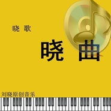

晓歌晓曲
============================

|  |  |
| :--: | :-- |
| [ 晓歌晓曲](https://emumo.xiami.com/album/2100253826) | **艺人**: [刘晓](../index.md) **语种**: 国语 **唱片公司**: 独立发行 **发行时间**: 2016年01月01日 **专辑类别**: 录音室专辑 **专辑风格**: 标准歌曲 Standards, 国语流行 Mandarin Pop, 华语唱作人 Chinese Singer-Songwriter **播放数**: 553944 **收藏数**: 138 **评论数**: 4  |

## 简介

 《晓歌晓曲》系歌手刘晓转型音乐人后的系列原创作品希望大家多多支持

## 曲目

## 评论

|  |  |  |  |
| :-- | :-- | :-- | :-- |
|  [虾米用户](https://emumo.xiami.com/u/48803583) 明天、未来、你自己 2017-11-27 20:02 赞(2) 踩(0) | 
好想听
 |
|  [虾米用户](https://emumo.xiami.com/u/94527344)  2016-01-07 02:49 赞(2) 踩(0) | 
很好 绝对实力
 |
|  [虾米用户](https://emumo.xiami.com/u/17224784)  2016-01-03 00:10 赞(2) 踩(0) | 
非常棒
 |
