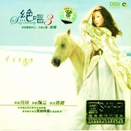

绝唱3
============================

|  |  |
| :--: | :-- |
| [ 绝唱3](https://emumo.xiami.com/album/326233) | **艺人**: [刘晓](../index.md) **语种**: 国语 **唱片公司**: 中国音乐家音像出版社 **发行时间**: 2008年04月10日 **专辑类别**: 录音室专辑 **专辑风格**:  **播放数**: 173709 **收藏数**: 157 **评论数**: 8  |

## 简介

刘晓《绝唱3 》来自雪地精灵的美妙歌声  
  
原音飞翔，余韵飘溢，驻足难离  
  
一张卓越品质的影视金曲典藏，亲耳聆听来自雪地精灵的美妙歌声……

## 曲目

## 评论

|  |  |  |
| :-- | :-- | :-- |
|  [虾米用户](https://emumo.xiami.com/u/27276851) 醉人间美景赏尘世佳音 2014-07-21 15:34 赞(1) 踩(0) | 
喜欢刘晓的歌曲，声音甜美，接地气，又充满乡土气息！！！
 |
|  [虾米用户](https://emumo.xiami.com/u/9926785)  2014-03-19 15:46 赞(0) 踩(0) | 
喜欢
 |
|  [虾米用户](https://emumo.xiami.com/u/1623909) 我还没想好要写什么... 2013-11-02 18:41 赞(0) 踩(0) | 
绝唱-3
 |
|  [虾米用户](https://emumo.xiami.com/u/16065360) 音乐是我的灵魂深处。 2013-06-18 20:24 赞(0) 踩(0) | 
极具典范的女声风格。
 |
|  [虾米用户](https://emumo.xiami.com/u/10345030) 音乐，生活的灵气 2012-11-09 12:44 赞(0) 踩(0) | 
刘晓的音乐，清澈见底啊
 |
|  [虾米用户](https://emumo.xiami.com/u/6227208) 我心中有萌猫，细嗅蔷薇。 2012-10-11 11:22 赞(0) 踩(0) | 
绝唱
 |
|  [虾米用户](https://emumo.xiami.com/u/6229958) 音乐天下最美的东西 2012-05-16 21:12 赞(0) 踩(0) | 
绝唱3
 |
|  [虾米用户](https://emumo.xiami.com/u/1447218)  2011-11-26 20:58 赞(0) 踩(0) | 
确实有味道
 |
