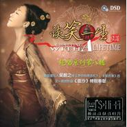

谈笑一生绝唱系列第八辑
============================

|  |  |
| :--: | :-- |
| [ 谈笑一生绝唱系列第八辑](https://emumo.xiami.com/album/349336) | **艺人**: [刘晓](../index.md) **语种**: 国语 **唱片公司**: 兰楚森文化 **发行时间**: 2009年09月24日 **专辑类别**: 录音室专辑 **专辑风格**: 国语流行 Mandarin Pop **播放数**: 2179688 **收藏数**: 505 **评论数**: 30  |

## 简介

兰楚森的绝唱系列，歌者唱尽东南西北风，唱绝古往今来情，令听者感怀世事百态，领悟人生真谛。刘晓一把金嗓九腔十八调，神韵百千，风情万种，又令多少乐者不禁迷恋其中？此番带来古韵新曲，更是撩拨你我心弦。专辑11首老歌泛着浓浓的古曲意蕴，配以古筝、琵琶、笛子等民乐伴奏，似是一道清茶闻着清香品着清甜，外加一首原创新曲《面沙》亦是意味深远，此曲是新锐音乐人吴翰之继《梦中唐古拉》、《誓言》后又一原创作品。整张专辑透着古朴的气息，歌曲亦唱得曼妙动听，恰似与一知己一边品着清茶一边谈笑人生。

## 曲目

## 评论

|  |  |  |
| :-- | :-- | :-- |
|  [虾米用户](https://emumo.xiami.com/u/441642322)  2020-04-04 20:15 赞(1) 踩(0) | 
超喜欢，刘晓，刘紫玲，张玮伽，龚玥，曼丽！等等！发烧级歌手！
 |
|  [虾米用户](https://emumo.xiami.com/u/258485077) 我还没想好要写什么... 2020-03-22 14:56 赞(1) 踩(0) | 
11年前出的?这水准已经达到一流，难得。
 |
|  [虾米用户](https://emumo.xiami.com/u/17258419) 健鸣 2019-04-18 13:39 赞(1) 踩(0) | 
绝对六星，多好听的一张专辑
 |
|  [虾米用户](https://emumo.xiami.com/u/17258419) 健鸣 2019-04-18 13:38 赞(1) 踩(0) | 
寻找刘晓
 |
|  [虾米用户](https://emumo.xiami.com/u/9160696) 将爱进行到底 2019-03-27 15:45 赞(1) 踩(0) | 
歌曲亦唱得曼妙动听，恰似与一知己一边品着清茶一边谈笑人生。
 |
|  [虾米用户](https://emumo.xiami.com/u/9160696) 将爱进行到底 2019-03-27 02:31 赞(1) 踩(0) | 
太喜欢谈笑一生这张很有质量的发烧专辑
 |
|  [虾米用户](https://emumo.xiami.com/u/406299529) 时间是衡量一切的标准 2019-02-17 13:28 赞(1) 踩(0) | 
美美哒
 |
|  [虾米用户](https://emumo.xiami.com/u/29291757)  2018-04-17 18:37 赞(0) 踩(0) | 
刘晓唱的很多歌很好听。
 |
| ⇒ |  [虾米用户](https://emumo.xiami.com/u/201469646)  2019-02-16 05:22 赞(0) 踩(0) | 
可惜她不出歌了…第一次聽她的歌就愛上了 
 |
|  [虾米用户](https://emumo.xiami.com/u/354117826)  2018-03-12 08:33 赞(2) 踩(0) | 
虾米做音乐的态度真是草率至极！不知道是歌手的文化所限还是编辑的无知，无端篡改歌词，实在匪夷所思！&amp;ldquo;多少心酸话因果&amp;rdquo;唱成:多少心碎化因果；&amp;ldquo;莫负古圣贤，效历朝（朝，朝代的朝）英雄&amp;rdquo;错唱成：莫负辜圣贤，效历朝（朝，朝暮的朝）英雄。这样的白痴音乐还拿出来吹捧&amp;ldquo;神韵百千，风情万种，又令多少乐者不禁迷恋其中？&amp;rdquo;让人大跌眼镜！
 |
|  [虾米用户](https://emumo.xiami.com/u/243387188) 春风十里，不如你 2017-03-17 20:03 赞(0) 踩(0) | 
虾米，发布一下呗
 |
|  [虾米用户](https://emumo.xiami.com/u/15395760)  2016-03-06 18:40 赞(1) 踩(0) | 
喜欢刘晓的歌声
 |
|  [虾米用户](https://emumo.xiami.com/u/52181312)  2016-01-08 12:23 赞(1) 踩(0) | 
非常喜欢刘晓的歌！
 |
|  [虾米用户](https://emumo.xiami.com/u/54180869)  2015-09-10 11:35 赞(0) 踩(0) | 
惊喜
 |
|  [虾米用户](https://emumo.xiami.com/u/1857312) 我还没想好要写什么... 2015-02-08 13:12 赞(0) 踩(0) | 
不错
 |
|  [虾米用户](https://emumo.xiami.com/u/33176326)  2014-10-27 08:41 赞(0) 踩(0) | 
支持国风
 |
|  [虾米用户](https://emumo.xiami.com/u/39764087) 每个人的生活都是一首协奏... 2014-08-21 23:37 赞(1) 踩(0) | 
配器很不错，很有古韵.
 |
|  [虾米用户](https://emumo.xiami.com/u/27276851) 醉人间美景赏尘世佳音 2014-07-21 15:35 赞(1) 踩(0) | 
喜欢刘晓的歌曲，声音甜美，接地气，又充满乡土气息！！！
 |
|  [虾米用户](https://emumo.xiami.com/u/9926785)  2014-05-29 10:59 赞(0) 踩(0) | 
喜欢
 |
|  [虾米用户](https://emumo.xiami.com/u/13928318)  2013-05-01 19:26 赞(0) 踩(0) | 
好
 |
|  [虾米用户](https://emumo.xiami.com/u/11706224)  2013-03-15 14:02 赞(0) 踩(0) | 
很有一番古典的味道
 |
|  [虾米用户](https://emumo.xiami.com/u/11706224)  2013-03-15 13:51 赞(0) 踩(0) | 
every gu dian
 |
|  [虾米用户](https://emumo.xiami.com/u/1609946) 一即一切 2012-09-22 17:48 赞(0) 踩(0) | 
于2012年9月22日造访——明达陶瓷致： 谈笑风生
 |
|  [虾米用户](https://emumo.xiami.com/u/7563683)  2012-08-22 19:24 赞(0) 踩(0) | 
好听的歌曲
 |
|  [虾米用户](https://emumo.xiami.com/u/3600523)  2012-07-06 13:25 赞(0) 踩(0) | 
刘晓·谈笑一生
 |
|  [虾米用户](https://emumo.xiami.com/u/1886539)  2011-10-24 18:16 赞(0) 踩(0) | 
经典绝唱
 |
|  [虾米用户](https://emumo.xiami.com/u/375938) 不再做公主，要做保护公主 2011-08-11 10:39 赞(0) 踩(0) | 
谈笑一生~~~还不错  和江淑娜明显2个风格~~~很俏皮的感觉捏
 |
|  [虾米用户](https://emumo.xiami.com/u/375938) 不再做公主，要做保护公主 2011-08-11 10:37 赞(0) 踩(0) | 
。。。话说这美人吟唱的和李玲玉比 差远了  真不是一个级别的 - -
 |
| ⇒ |  [虾米用户](https://emumo.xiami.com/u/52181312)  2016-01-08 12:24 赞(0) 踩(0) | 
应该反过来吧！什么水准！
 |
| ⇒ |  [虾米用户](https://emumo.xiami.com/u/250810989) 凌三澄 2017-09-25 02:32 赞(0) 踩(0) | 
不相伯仲，伴奏编乐风格不相同，感觉不一样而已
 |
