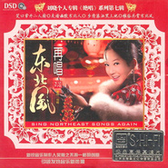

再唱东北风
============================

|  |  |
| :--: | :-- |
| [ 再唱东北风](https://emumo.xiami.com/album/349941) | **艺人**: [刘晓](../index.md) **语种**: 国语 **唱片公司**: 北京兰楚森文化传播有限公司 **发行时间**: 2009年04月03日 **专辑类别**: 录音室专辑 **专辑风格**:  **播放数**: 2683471 **收藏数**: 522 **评论数**: 25  |

## 简介

刘晓个人专辑《绝唱》系列第七辑 新锐音乐制作人吴潮之不拘一格的创意，引领发烧音乐新热潮 九腔十八调 从古今唱到今，唢呐吹起火蚀的情，胡情拉出坦荡的音…… 笑口常开二人转，灰谐幽默东北人，乡情浓洒黑土地，雅俗黄赏东北风！

## 曲目

## 评论

|  |  |  |
| :-- | :-- | :-- |
|  [虾米用户](https://emumo.xiami.com/u/8337431) 以乐会友 2021-01-23 01:54 赞(0) 踩(0) | 
东北风20210123
 |
|  [虾米用户](https://emumo.xiami.com/u/412069400)  2019-02-27 10:47 赞(1) 踩(0) | 
歌后。声音自带3D丽音
 |
|  [虾米用户](https://emumo.xiami.com/u/378583562)  2018-08-15 18:29 赞(2) 踩(0) | 
声音实在是太美了
 |
|  [虾米用户](https://emumo.xiami.com/u/202412820) 我还没想好要写什么... 2017-11-19 21:26 赞(1) 踩(0) | 
声音非常棒，歌唱的好听，最喜欢 再唱东北风，好听极了！！！
 |
|  [虾米用户](https://emumo.xiami.com/u/2204451) 迎来春色换人间 2017-07-22 13:21 赞(1) 踩(0) | 
虾米，发布啊
 |
|  [虾米用户](https://emumo.xiami.com/u/246372153)   2016-12-16 06:03 赞(0) 踩(0) | 
歌曲唱出了轻音乐的感觉
 |
|  [虾米用户](https://emumo.xiami.com/u/246372153)   2016-12-16 06:02 赞(1) 踩(0) | 
可惜了！只能欣赏两首
 |
|  [虾米用户](https://emumo.xiami.com/u/8333608)  2016-03-03 21:19 赞(0) 踩(0) | 
民风  哈哈
 |
|  [虾米用户](https://emumo.xiami.com/u/29179289) 暂无签名~ 2016-02-06 01:22 赞(0) 踩(0) | 

 |
|  [虾米用户](https://emumo.xiami.com/u/33820590) 现实为虚拟 虚拟化为现实... 2015-11-29 07:09 赞(0) 踩(0) | 
很有特色。
 |
|  [虾米用户](https://emumo.xiami.com/u/36081194) 酷狗音乐，一个有老歌的地... 2015-11-11 20:06 赞(2) 踩(0) | 
喜欢
 |
|  [虾米用户](https://emumo.xiami.com/u/4874803)  2015-04-05 11:00 赞(0) 踩(0) | 
发烧
 |
|  [虾米用户](https://emumo.xiami.com/u/27276851) 醉人间美景赏尘世佳音 2014-07-21 15:35 赞(1) 踩(0) | 
喜欢刘晓的歌曲，声音甜美，接地气，又充满乡土气息！！！
 |
|  [虾米用户](https://emumo.xiami.com/u/27276851) 醉人间美景赏尘世佳音 2014-07-21 15:33 赞(0) 踩(0) | 
喜欢刘晓的歌曲，声音甜美，接地气，又充满乡土气息！！！
 |
|  [虾米用户](https://emumo.xiami.com/u/28127760)  2014-05-19 20:26 赞(0) 踩(0) | 
(♥◠‿◠)ﾉ感谢您收听或收藏我整理的精选集！如果可以的话咱们可以互相关注一下，常联系，希望您收听关转我的电台美妙未来, 极致发烧女声试音天碟电台！
 |
|  [虾米用户](https://emumo.xiami.com/u/4906195) Open-minded 2014-04-07 20:00 赞(0) 踩(0) | 
不错，淡化了很多搞笑的成分，反倒灵巧了~
 |
|  [虾米用户](https://emumo.xiami.com/u/9926785)  2014-03-19 16:30 赞(0) 踩(0) | 
喜欢
 |
|  [虾米用户](https://emumo.xiami.com/u/13823974)  2013-04-05 11:17 赞(0) 踩(0) | 
我喜欢歌曲
 |
|  [虾米用户](https://emumo.xiami.com/u/1848672)  2013-01-19 19:28 赞(0) 踩(0) | 
ok
 |
|  [虾米用户](https://emumo.xiami.com/u/6082631)  2012-06-21 21:41 赞(1) 踩(0) | 
壮哉我大东北
 |
|  [虾米用户](https://emumo.xiami.com/u/6229958) 音乐天下最美的东西 2012-05-16 20:03 赞(0) 踩(0) | 
东北风
 |
|  [虾米用户](https://emumo.xiami.com/u/8493119)  2012-03-19 18:20 赞(0) 踩(0) | 
够味。
 |
|  [虾米用户](https://emumo.xiami.com/u/4930938)  2012-03-07 10:49 赞(1) 踩(0) | 
东北风
 |
|  [虾米用户](https://emumo.xiami.com/u/2436742) 音乐，是可以依靠的朋友！ 2011-01-09 12:47 赞(1) 踩(0) | 
因为喜欢东北：）
 |
|  [虾米用户](https://emumo.xiami.com/u/2235649) 善若水而致远，临绝顶而瞻... 2010-12-29 22:24 赞(3) 踩(0) | 
刘晓的嗓音干净透彻，听起来直冲脑门，让人神清气爽。
 |
