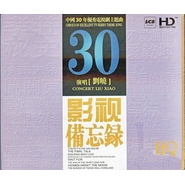

刘晓
============================

|  |  |
| :--: | :-- |
| [ 刘晓](https://i.xiami.com/liuxiaov5) | **播放数**: 15926163 **粉丝数**: 2768 **评论数**: 179 **地区**: China 中国大陆 **风格**: 传统流行 Traditional Pop, 国语流行 Mandarin Pop  |

## 档案

姓名：刘晓 性别：女 ; 国籍：中国 语言：国语; 星座：狮子座 身高：162cm 体重：46kg 刘晓简介：北京歌舞团青年演员。流行唱法 2007——2010年发行专辑《绝唱》系列2013年发行原创专辑《晓心有电》2015年成立刘晓音乐工作室从事作曲、空词填曲、编曲、混音等创作工作 代表作《下辈子我要做你的手机》《很奇怪》《莲愿》《孤单的女人》《爱成流沙》《爱在天河》等作品新浪微博：刘晓V5工作联系电话：17601019257 王先生

## 专辑

| 名称 | 语种 | 唱片公司 | 发行时间 | 专辑类别 | 专辑风格 |
| :--: | :-- | :-- | :-- | :-- | :-- |
| [ 山那边](./albums/5021399436.md) | 国语 | 墨枫文化 | 2020年09月04日 | EP, 单曲 | 国语流行 Mandarin Pop |
| [ 山那边](./albums/5020994964.md) | 国语 | 墨枫文化 | 2020年06月30日 | EP, 单曲 | 国语流行 Mandarin Pop |
| [ 山那边的姑娘（合唱版）](./albums/5020750389.md) | 国语 | 墨枫文化 | 2020年05月29日 | EP, 单曲 | 流行 Pop |
| [ 山那边的姑娘（哥哥）](./albums/5020615495.md) | 国语 | 墨枫文化 | 2020年05月22日 | EP, 单曲 | 流行 Pop |
| [ 红尘遇见](./albums/5021412993.md) | 国语 | 禾信科技 | 2018年07月20日 | EP, 单曲 | 国语流行 Mandarin Pop |
| [ 红尘遇见](./albums/5021413977.md) | 国语 | 禾信科技 | 2018年04月01日 | EP, 单曲 | 国语流行 Mandarin Pop |
| [ 晓歌晓曲](./albums/2100253826.md) | 国语 | 独立发行 | 2016年01月01日 | 录音室专辑 | 标准歌曲 Standards, 国语流行 Mandarin Pop, 华语唱作人 Chinese Singer-Songwriter |
| [ 影视备忘录中国30年优秀电视剧主题曲](./albums/524139.md) | 国语 | 武汉音像 | 2010年07月10日 | 录音室专辑 |  |
| [ 谈笑一生绝唱系列第八辑](./albums/349336.md) | 国语 | 兰楚森文化 | 2009年09月24日 | 录音室专辑 | 国语流行 Mandarin Pop |
| [ 再唱东北风](./albums/349941.md) | 国语 | 北京兰楚森文化传播有限公司 | 2009年04月03日 | 录音室专辑 |  |
| [ 唱绝紫禁城](./albums/330714.md) | 国语 | 北京兰楚森文化传播有限公司 | 2009年04月03日 | 合集, 杂锦 |  |
| [ 唱响西北风](./albums/321954.md) | 国语 | 中国科学文化音像 | 2008年11月23日 | 录音室专辑 |  |
| [ 绝唱4](./albums/338595.md) | 国语 | 兰楚森唱片 | 2008年08月01日 | 录音室专辑 |  |
| [ 绝唱3](./albums/326233.md) | 国语 | 中国音乐家音像出版社 | 2008年04月10日 | 录音室专辑 |  |
| [ 绝唱](./albums/492318.md) | 国语 | 兰楚森文化 | 2008年03月15日 | 录音室专辑 |  |
| [ 绝唱2](./albums/338596.md) | 国语 | 北京兰楚森文化传播有限公司 | 2008年01月08日 | 合集, 杂锦 |  |
| [ 绝唱1](./albums/338597.md) | 国语 | 北京兰楚森文化传播有限公司 | 2007年07月01日 | 合集, 杂锦 |  |

## 评论

|  |  |  |  |
| :-- | :-- | :-- | :-- |
|  [虾米用户](https://emumo.xiami.com/u/8337431) 以乐会友 2021-01-23 01:47 赞(0) 踩(0) | 
东北魅力女声20210123
 |
|  [虾米用户](https://emumo.xiami.com/u/9274446) 我还没想好要写什么... 2020-12-03 16:03 赞(0) 踩(0) | 

 |
|  [虾米用户](https://emumo.xiami.com/u/440767851)  2020-08-29 19:55 赞(2) 踩(0) | 
小时候听过的版本 是那部剧的片尾曲吗？
 |
|  [虾米用户](https://emumo.xiami.com/u/45675367)  2020-07-28 12:03 赞(2) 踩(0) | 
好听 
 |
|  [虾米用户](https://emumo.xiami.com/u/406924933) 我还没想好要写什么... 2020-07-26 10:35 赞(1) 踩(0) | 
你这首（最后的倾诉）唱得太过温柔太过缠绵！我都感觉像是跌进了温柔乡，彻底沦陷！这是我听过的最感人的歌！从昨晚到现在听了n遍！
 |
|  [虾米用户](https://emumo.xiami.com/u/443884004)  2020-06-28 14:11 赞(2) 踩(0) | 
好！   。听这声音是享受！
 |
|  [虾米用户](https://emumo.xiami.com/u/61400962)   2020-06-27 13:02 赞(1) 踩(0) | 
666
 |
|  [虾米用户](https://emumo.xiami.com/u/424598249)  2020-06-06 20:10 赞(1) 踩(0) | 
很不错
 |
|  [虾米用户](https://emumo.xiami.com/u/379256494) 我还没想好要写什么... 2020-06-05 00:57 赞(1) 踩(0) | 
清清丽丽音色，一听成痴
 |
|  [虾米用户](https://emumo.xiami.com/u/379256494) 我还没想好要写什么... 2020-06-05 00:53 赞(1) 踩(0) | 
不错哦！
 |
|  [虾米用户](https://emumo.xiami.com/u/16082347)  2020-05-10 14:09 赞(1) 踩(0) | 
好的美女
 |
|  [虾米用户](https://emumo.xiami.com/u/410292025) 我不高，但我能比山高18... 2020-04-13 00:31 赞(1) 踩(0) | 
加油
 |
|  [虾米用户](https://emumo.xiami.com/u/436364408)  2020-03-28 20:02 赞(2) 踩(0) | 
多放些照片吧
 |
|  [虾米用户](https://emumo.xiami.com/u/421631043)  2020-03-25 10:36 赞(1) 踩(0) | 
在人间
 |
|  [虾米用户](https://emumo.xiami.com/u/258485077) 我还没想好要写什么... 2020-03-22 14:30 赞(1) 踩(0) | 
你最后一张第9张照片保留下，再的删除。山不在高，图不在多。
 |
|  [虾米用户](https://emumo.xiami.com/u/428413984)  2020-03-12 18:49 赞(2) 踩(0) | 
类似这样的歌，好歌听不腻，不论新歌旧歌，我听歌不追求新，只在乎听入人心。
 |
|  [虾米用户](https://emumo.xiami.com/u/431895755)  2020-01-22 21:50 赞(1) 踩(0) | 
很喜欢你唱的这首歌 
 |
|  [虾米用户](https://emumo.xiami.com/u/432269584)  2019-12-17 09:03 赞(2) 踩(0) | 
X de.ni p l zcxu z. Ñnnbjfs  [带墨镜笑]                    [中国旗帜] 
 |
|  [虾米用户](https://emumo.xiami.com/u/432269584)  2019-12-17 08:56 赞(1) 踩(0) | 
Č.          Pn si te d
 |
|  [虾米用户](https://emumo.xiami.com/u/432269584)  2019-12-17 08:49 赞(1) 踩(0) | 
Mc
 |
|  [虾米用户](https://emumo.xiami.com/u/346498643)  2019-12-15 18:26 赞(1) 踩(0) | 
及格就好ヾ(Ő∀Ő๑)ﾉ太好惹
 |
|  [虾米用户](https://emumo.xiami.com/u/355032804)  2019-12-14 23:51 赞(2) 踩(0) | 
天天都在想你唱的歌曲，太好听了一遍一遍一遍一遍，
 |
|  [虾米用户](https://emumo.xiami.com/u/355032804)  2019-12-14 23:01 赞(2) 踩(0) | 
好听级了
 |
|  [虾米用户](https://emumo.xiami.com/u/352902812)  2019-12-13 23:36 赞(2) 踩(0) | 
太好了
 |
|  [虾米用户](https://emumo.xiami.com/u/338479786) 沧海明月 2019-11-30 22:08 赞(1) 踩(0) | 
想找《乡村爱情1》中的原声带。
 |
| ⇒ |  [虾米用户](https://emumo.xiami.com/u/338479786) 沧海明月 2019-11-30 22:14 赞(0) 踩(0) | 
最后一集中，玉田、永强、大脚结婚时原声插曲，这才有味，希望提供一下，这是回忆。
 |
|  [虾米用户](https://emumo.xiami.com/u/404988145) 向往远方和诗 2019-11-30 00:43 赞(3) 踩(0) | 
你的声音能抓住我的心，感谢你！     
 |
|  [虾米用户](https://emumo.xiami.com/u/24039425)  2019-09-19 20:42 赞(1) 踩(0) | 
喜欢的声音，喜欢的节奏，喜欢的越调。好听。
 |
|  [虾米用户](https://emumo.xiami.com/u/419872051)  2019-09-15 09:29 赞(1) 踩(0) | 
你的声音太美了，百听不厌！
 |
|  [虾米用户](https://emumo.xiami.com/u/346432242) 放在心底深处 2019-08-26 00:21 赞(3) 踩(0) | 
美女你的歌和张玮伽白晓 孙露 不分上下。音质甜美，清澈沁人心脾。
 |
|  [虾米用户](https://emumo.xiami.com/u/282849091)  2019-08-23 18:47 赞(1) 踩(0) | 
我最喜欢你唱的映山红
 |
|  [虾米用户](https://emumo.xiami.com/u/376923626)  2019-08-17 21:28 赞(1) 踩(0) | 
喜欢你的歌
 |
|  [虾米用户](https://emumo.xiami.com/u/362330481) 云想衣裳花想容 2019-08-04 15:52 赞(1) 踩(0) | 
我喜欢刘晓刘晓的唱的歌非常好听
 |
|  [虾米用户](https://emumo.xiami.com/u/357752578) 燕:  片叶寄思迎风飘，... 2019-08-02 08:05 赞(3) 踩(0) | 
特别喜欢刘晓的歌！声音清脆甜美，歌喉爽朗，超好听，点赞    已成为您的粉丝 
 |
|  [虾米用户](https://emumo.xiami.com/u/333761672)  2019-07-08 17:27 赞(1) 踩(0) | 
喜欢这种风格歌曲
 |
|  [虾米用户](https://emumo.xiami.com/u/44873882)  2019-07-07 21:15 赞(3) 踩(0) | 
特别喜欢你的歌！   
 |
|  [虾米用户](https://emumo.xiami.com/u/8192902)   2019-05-09 00:53 赞(3) 踩(0) | 
唯一不足，演唱欠缺艺术处理。可能是从小练声不正确所造成（练声总想飙高音）。嗓音还是非常不错的！每个歌手都有自己的音色声线特点，不适合自己的绝对不能练！
 |
| ⇒ |  [虾米用户](https://emumo.xiami.com/u/419571582)  2019-07-07 19:45 赞(0) 踩(0) | 
你说的这些我不是我的问题，老板让这么唱谁也没办法，有空听听我的新歌红尘遇见、天在下雨我在恨你、人生哪有下辈子、我在他乡也挺好！
 |
| ⇒ |  [虾米用户](https://emumo.xiami.com/u/301160327)  2019-07-22 05:23 赞(0) 踩(0) | 
你这个名字有点色！一茎，
 |
| ⇒ |  [虾米用户](https://emumo.xiami.com/u/258485077) 我还没想好要写什么... 2020-03-22 14:28 赞(0) 踩(0) | 
<q><b>北歌刘晓说：</b></q>
 |
|  [虾米用户](https://emumo.xiami.com/u/8192902)   2019-05-09 00:32 赞(4) 踩(0) | 
纯朴的嗓音，音域较宽，音色偏中性，有股东北口音，音效环境用混环回音较多，和声部不错，制作人很高明，弥补其不足。
 |
|  [虾米用户](https://emumo.xiami.com/u/378618436) 我还没想好要写什么... 2019-05-03 17:22 赞(2) 踩(0) | 
我早就买了两张你的碟了
 |
|  [虾米用户](https://emumo.xiami.com/u/412497245)  2019-03-26 16:47 赞(2) 踩(0) | 
真的希望你唱一版  月满西楼 就用 望月 的唱法和编曲方式 目前最好的版本是 孙露和童丽的 都不完美。你的望月版本个人觉得是最好的。推荐给家人朋友都得到认同 有机会希望听到 月满西楼 刘晓版
 |
|  [虾米用户](https://emumo.xiami.com/u/411783386)  2019-03-14 22:48 赞(1) 踩(0) | 
实力派歌手 
 |
|  [虾米用户](https://emumo.xiami.com/u/401776151) 人无所求品自高 2019-03-08 10:46 赞(2) 踩(0) | 
特喜欢您的所有歌曲
 |
|  [虾米用户](https://emumo.xiami.com/u/334500381)  2019-02-20 22:12 赞(2) 踩(0) | 
刘晓的歌不错，爱听
 |
|  [虾米用户](https://emumo.xiami.com/u/375761013) 聆听经典，品味生活！ 2019-02-08 17:08 赞(4) 踩(0) | 
为歌星刘晓点赞！刘晓的歌声优美，宛如天籁之音，余音绕梁，出类拔萃，卓尔不群！太喜欢刘晓的歌声了！
 |
|  [虾米用户](https://emumo.xiami.com/u/305082322) 音乐，洗涤灵魂 2019-02-01 13:42 赞(1) 踩(0) | 
说唱脸谱歌词多处有误，请修正 
 |
|  [虾米用户](https://emumo.xiami.com/u/366583031)  2019-01-29 15:50 赞(4) 踩(0) | 
新星！
 |
|  [虾米用户](https://emumo.xiami.com/u/411231032)  2019-01-27 19:21 赞(2) 踩(0) | 
好喜欢的一个歌星，道字清晰，唱腔优美。
 |
|  [虾米用户](https://emumo.xiami.com/u/342387756)  2019-01-22 09:46 赞(3) 踩(0) | 
好听    
 |
|  [虾米用户](https://emumo.xiami.com/u/213575298)   2019-01-16 17:24 赞(1) 踩(0) | 
没有你叫刘晓晓时唱的好听了 
 |
|  [虾米用户](https://emumo.xiami.com/u/410788995)  2019-01-15 20:29 赞(2) 踩(0) | 
你是我喜爱的歌星，没有之一！！唱的太美，声音干净，纯美，如闻天籁，谢谢你！！
 |
|  [虾米用户](https://emumo.xiami.com/u/363331088)  2019-01-13 20:23 赞(2) 踩(0) | 
你的每一首都让我陶醉
 |
|  [虾米用户](https://emumo.xiami.com/u/299150304)  2019-01-06 11:43 赞(2) 踩(0) | 
你的歌声清亮、甜美，很吸人。听你的歌就是一种优美地亨受，感谢有你!
 |
|  [虾米用户](https://emumo.xiami.com/u/411746007)  2019-01-04 13:28 赞(2) 踩(0) | 
我这几年过春节前几天就播放《刘晓》的作品，又过年了。我还播放刘晓的歌曲。我非常喜欢。
 |
|  [虾米用户](https://emumo.xiami.com/u/349535461)  2019-01-02 19:00 赞(3) 踩(0) | 
你是我收藏夹内最喜欢听的歌手 
 |
|  [虾米用户](https://emumo.xiami.com/u/408191879)  2018-12-31 23:35 赞(3) 踩(0) | 
您的音色太好听了，我是你的钢丝。  
 |
|  [虾米用户](https://emumo.xiami.com/u/40075823) 我的音乐，音乐我的人生 2018-10-27 18:14 赞(1) 踩(0) | 
陈彼得老师这首歌，我个人更喜欢您的演绎 
 |
|  [虾米用户](https://emumo.xiami.com/u/11970002)  2018-10-24 10:57 赞(1) 踩(0) | 
最近怎么没新作品了啊？
 |
|  [虾米用户](https://emumo.xiami.com/u/354490212)  2018-10-13 22:22 赞(1) 踩(0) | 
 
 |
|  [虾米用户](https://emumo.xiami.com/u/354953031)  2018-10-10 22:44 赞(1) 踩(0) | 
声音很有优势
 |
|  [虾米用户](https://emumo.xiami.com/u/38805639)  2018-10-08 21:36 赞(2) 踩(0) | 
声音纯净，唱功了得，首首悅耳，爱你哦！
 |
|  [虾米用户](https://emumo.xiami.com/u/369783050)  2018-06-27 19:55 赞(1) 踩(0) | 
支持家门，唱的不错！  
 |
|  [虾米用户](https://emumo.xiami.com/u/375570517)  2018-06-17 13:52 赞(1) 踩(0) | 
好的音乐值得收藏  感谢你
 |
|  [虾米用户](https://emumo.xiami.com/u/341424751)  2018-06-09 21:37 赞(3) 踩(0) | 
百听不厌
 |
|  [虾米用户](https://emumo.xiami.com/u/374118118)  2018-05-30 18:05 赞(1) 踩(0) | 
我最喜欢的歌手！
 |
|  [虾米用户](https://emumo.xiami.com/u/296395004)  2018-05-19 20:18 赞(2) 踩(0) | 
希望大家支持刘晓歌曲
 |
|  [虾米用户](https://emumo.xiami.com/u/355449989)  2018-05-14 08:22 赞(3) 踩(0) | 
天籁之音，好听！
 |
|  [虾米用户](https://emumo.xiami.com/u/31980556) 瑞尔 2018-05-13 22:53 赞(1) 踩(0) | 
享受啊 
 |
|  [虾米用户](https://emumo.xiami.com/u/256436406) 时间无始无终 ，空间无边... 2018-04-27 23:07 赞(1) 踩(0) | 
最爱刘晓和周杰伦的歌曲
 |
|  [虾米用户](https://emumo.xiami.com/u/53001937)  2018-04-07 22:50 赞(1) 踩(0) | 
很好，喜欢这种声音
 |
|  [虾米用户](https://emumo.xiami.com/u/346114831)  2018-04-03 16:32 赞(1) 踩(0) | 
喜欢你的歌曲，希望能有你的前门情思大碗茶伴奏。
 |
|  [虾米用户](https://emumo.xiami.com/u/355935317)  2018-03-28 07:15 赞(1) 踩(0) | 
you are my favorite.
 |
|  [虾米用户](https://emumo.xiami.com/u/289313589)  2018-03-28 00:49 赞(1) 踩(0) | 
支持你刘晓喜欢你的声音。
 |
|  [虾米用户](https://emumo.xiami.com/u/36879543)  2018-02-27 16:31 赞(1) 踩(0) | 
声音好听
 |
|  [虾米用户](https://emumo.xiami.com/u/48803583) 明天、未来、你自己 2018-02-13 17:28 赞(1) 踩(0) | 
听听歌，
 |
|  [虾米用户](https://emumo.xiami.com/u/110603554) 听吧!听吧!都是有故事的... 2018-01-23 12:06 赞(2) 踩(0) | 
又一个有个性的女声! 
 |
|  [虾米用户](https://emumo.xiami.com/u/271169707) 找个爱人的啊 2018-01-14 08:58 赞(2) 踩(0) | 
好听你好棒哒
 |
|  [虾米用户](https://emumo.xiami.com/u/328337575)  2017-12-28 22:35 赞(2) 踩(0) | 
喜欢
 |
|  [虾米用户](https://emumo.xiami.com/u/276892885) mjllzf 2017-12-25 15:50 赞(2) 踩(0) | 
制作精良。质高,量丰&amp;middot;声音美。
 |
|  [虾米用户](https://emumo.xiami.com/u/88257636)  2017-11-22 09:39 赞(2) 踩(0) | 
你好！我一直以此歌【活出个样来给自己看】此歌为动力作为早起的闹铃，给额陕汉妹一种动感力，.宣染力，早年前，早起听刘晓你的歌，跑步，上班，现在两样都很好很棒！    
 |
|  [虾米用户](https://emumo.xiami.com/u/202412820) 我还没想好要写什么... 2017-11-19 21:24 赞(2) 踩(0) | 
声音非常棒，歌唱的好听，最喜欢 再唱东北风，好听极了！！！
 |
|  [虾米用户](https://emumo.xiami.com/u/11314176)  2017-11-16 02:10 赞(2) 踩(0) | 
加油
 |
|  [虾米用户](https://emumo.xiami.com/u/335511662)  2017-11-15 19:38 赞(2) 踩(0) | 
老铁粉了   
 |
|  [虾米用户](https://emumo.xiami.com/u/246455464)  2017-10-02 01:01 赞(3) 踩(0) | 
之前版权问题，好多歌无法听，现在终于可以了 
 |
|  [虾米用户](https://emumo.xiami.com/u/317433345)  秋风落叶 2017-08-15 20:20 赞(3) 踩(0) | 
以后在岀一首新歌
 |
|  [虾米用户](https://emumo.xiami.com/u/317433345)  秋风落叶 2017-08-15 20:17 赞(3) 踩(0) | 
我觉得唱的真好听
 |
|  [虾米用户](https://emumo.xiami.com/u/307690007)  2017-06-26 20:13 赞(4) 踩(0) | 
期待刘晓新专辑
 |
|  [虾米用户](https://emumo.xiami.com/u/307690007)  2017-06-26 20:11 赞(2) 踩(0) | 
好听！一生最喜欢的两位女歌手:刘晓和降央卓玛
 |
|  [虾米用户](https://emumo.xiami.com/u/307319518)  2017-06-25 12:46 赞(2) 踩(0) | 

 |
|  [虾米用户](https://emumo.xiami.com/u/36139976)  2017-06-08 15:12 赞(2) 踩(0) | 
声音特别清纯好听
 |
|  [虾米用户](https://emumo.xiami.com/u/289448748)  2017-05-07 23:20 赞(2) 踩(0) | 

 |
|  [虾米用户](https://emumo.xiami.com/u/279325486)  2017-04-19 23:04 赞(2) 踩(0) | 
  
 |
|  [虾米用户](https://emumo.xiami.com/u/37314641) 妖妖0！ 2017-04-18 15:15 赞(2) 踩(0) | 
超好听！
 |
|  [虾米用户](https://emumo.xiami.com/u/11322097) 思科系统公司网络安全专家 2017-04-03 15:51 赞(2) 踩(0) | 
唱歌真是个技术活
 |
|  [虾米用户](https://emumo.xiami.com/u/280795925)  2017-03-16 19:28 赞(2) 踩(0) | 
听着你的妙音心神阔宁   
 |
|  [虾米用户](https://emumo.xiami.com/u/120834516)  2017-01-10 00:07 赞(1) 踩(0) | 
听着声音特别的干净         
 |
|  [虾米用户](https://emumo.xiami.com/u/199265797) 音乐可以陶冶情操 2016-08-22 17:32 赞(1) 踩(0) | 
好听
 |
|  [虾米用户](https://emumo.xiami.com/u/106009896)  2016-07-20 14:43 赞(1) 踩(0) | 

 |
|  [虾米用户](https://emumo.xiami.com/u/75724266) LGH 2016-06-22 17:11 赞(2) 踩(0) | 
真！实！力！
 |
|  [虾米用户](https://emumo.xiami.com/u/75724266) LGH 2016-06-22 16:55 赞(1) 踩(0) | 
超好听，超喜欢！
 |
| ⇒ |  [虾米用户](https://emumo.xiami.com/u/75724266) LGH 2016-06-23 07:38 赞(0) 踩(0) | 
<q><b>说：</b></q>
 |
|  [虾米用户](https://emumo.xiami.com/u/97747450) 我还没想好要写什么... 2016-06-06 00:12 赞(2) 踩(0) | 
941
 |
|  [虾米用户](https://emumo.xiami.com/u/162982164)  2016-05-06 20:47 赞(1) 踩(0) | 

 |
|  [虾米用户](https://emumo.xiami.com/u/43534357) 我还没想好要写什么... 2016-04-23 16:38 赞(1) 踩(0) | 

 |
|  [虾米用户](https://emumo.xiami.com/u/8421590)  2016-04-02 18:05 赞(1) 踩(0) | 
独立
 |
|  [虾米用户](https://emumo.xiami.com/u/8421590)  2016-04-02 17:57 赞(1) 踩(0) | 
我喜欢你歌里的气势，有独立的女性感。只是，歌词里的文化有一种违和感，总有一种爱情的怜求，有一种卑微。不知你的心里是怎么觉得的，霸气的歌喉结合独立的女性精神，可以更振奋精神，这也是一个文化产业。
 |
|  [虾米用户](https://emumo.xiami.com/u/94594448) 音乐是最靠近灵魂的语言 2015-12-29 23:14 赞(80) 踩(0) | 
我刚入驻了虾米音乐人，欢迎大家来我的个人主页，收听我的最新音乐
 |
| ⇒ |  [虾米用户](https://emumo.xiami.com/u/1137473) 我还没想好要写什么... 2016-01-02 22:41 赞(0) 踩(0) | 
加油啊~
 |
| ⇒ |  [虾米用户](https://emumo.xiami.com/u/87661816) 认真只听歌好 2016-01-04 10:00 赞(0) 踩(0) | 
喜欢
 |
| ⇒ |  [虾米用户](https://emumo.xiami.com/u/246455464)  2017-10-01 23:51 赞(0) 踩(0) | 
支持支持，我非常喜欢
 |
| ⇒ |  [虾米用户](https://emumo.xiami.com/u/98791340) *受* 2017-10-13 20:38 赞(0) 踩(0) | 
非常喜欢你的歌声。.五星支持 
 |
| ⇒ |  [虾米用户](https://emumo.xiami.com/u/82198494)  2017-11-03 01:31 赞(0) 踩(0) | 
支持你。听了几个专辑。走绝唱1、绝唱2专辑的配器为好。其他专辑作为非舞台现场听时显得音乱。
 |
| ⇒ |  [虾米用户](https://emumo.xiami.com/u/304533764) 忘了吧…… 2018-01-03 04:40 赞(0) 踩(0) | 
支持你！
 |
| ⇒ |  [虾米用户](https://emumo.xiami.com/u/295824254)  2018-01-11 23:26 赞(0) 踩(0) | 
加油!吔!
 |
| ⇒ |  [虾米用户](https://emumo.xiami.com/u/251378178)  2018-01-27 13:44 赞(0) 踩(0) | 
声音太美了，有特色，加油！
 |
| ⇒ |  [虾米用户](https://emumo.xiami.com/u/4160323) 饭可以不吃.音乐不能不听... 2018-02-04 06:40 赞(0) 踩(0) | 
好听，
 |
| ⇒ |  [虾米用户](https://emumo.xiami.com/u/337684364)  2018-04-18 21:10 赞(0) 踩(0) | 
歌曲好听
 |
| ⇒ |  [虾米用户](https://emumo.xiami.com/u/346432242) 放在心底深处 2018-09-15 00:22 赞(0) 踩(0) | 
我很喜欢听你的歌，清脆悦耳 还不失穿透力。
 |
| ⇒ |  [虾米用户](https://emumo.xiami.com/u/291712303)  2018-10-07 13:24 赞(0) 踩(0) | 
好听极了
 |
| ⇒ |  [虾米用户](https://emumo.xiami.com/u/356416447)  2019-02-07 22:04 赞(0) 踩(0) | 
好的，我平时最喜欢音乐
 |
| ⇒ |  [虾米用户](https://emumo.xiami.com/u/408062297)  2019-03-05 07:38 赞(0) 踩(0) | 
你的歌好美，好淑情。好动听
 |
| ⇒ |  [虾米用户](https://emumo.xiami.com/u/301160327)  2019-07-22 05:21 赞(0) 踩(0) | 
我非常喜欢你的歌声
 |
| ⇒ |  [虾米用户](https://emumo.xiami.com/u/297814264) 美丽的皮囊千篇一律， 有... 2019-10-31 20:37 赞(0) 踩(0) | 
喜欢你的歌声！ 
 |
| ⇒ |  [虾米用户](https://emumo.xiami.com/u/379256494) 我还没想好要写什么... 2020-06-05 00:57 赞(0) 踩(0) | 
好音色
 |
|  [虾米用户](https://emumo.xiami.com/u/33849058)  2015-12-24 17:53 赞(2) 踩(0) | 
好歌，字正腔圆，穿透力强，非常好听。正经的歌手。
 |
|  [虾米用户](https://emumo.xiami.com/u/33849058)  2015-12-24 17:47 赞(1) 踩(0) | 
好歌，字正腔圆，穿透力强，非常好听。正经的歌手，选曲不庸俗。柔似水，坚似钢。翻唱超过原作。
 |
| ⇒ |  [虾米用户](https://emumo.xiami.com/u/94594448) 音乐是最靠近灵魂的语言 2015-12-29 23:26 赞(0) 踩(0) | 
谢谢您的支持刘晓最新将有更多作品发布，到时候见。
 |
|  [虾米用户](https://emumo.xiami.com/u/2282124) 西风吹雨长路遥，葬花落魄... 2015-08-15 20:29 赞(1) 踩(0) | 
声线不错，但是风格太柔了，感觉像是九十年代的歌曲。
 |
| ⇒ |  [虾米用户](https://emumo.xiami.com/u/94594448) 音乐是最靠近灵魂的语言 2015-12-29 23:27 赞(0) 踩(0) | 
说得对，刘晓将有更多新风格的作品展示，希望继续关注，不会让你失望的哦!
 |
|  [虾米用户](https://emumo.xiami.com/u/7020504)  2015-07-03 19:11 赞(1) 踩(0) | 
刘晓
 |
|  [虾米用户](https://emumo.xiami.com/u/4874803)  2015-04-05 11:02 赞(1) 踩(0) | 
发烧
 |
|  [虾米用户](https://emumo.xiami.com/u/47969323) 音乐是我的生命线~~~ 2015-03-12 21:59 赞(1) 踩(0) | 
很好听···
 |
|  [虾米用户](https://emumo.xiami.com/u/41078521) 叶 2014-09-10 18:50 赞(1) 踩(0) | 
回夏了好听
 |
|  [虾米用户](https://emumo.xiami.com/u/12098450) 曲的情 2014-09-03 16:46 赞(1) 踩(0) | 
东北大娘们光着屁沟进纱帐 来来来 嗯啊！！！！！！！！！！！！！！！！惨叫了吧
 |
|  [虾米用户](https://emumo.xiami.com/u/27276851) 醉人间美景赏尘世佳音 2014-07-21 16:03 赞(2) 踩(0) | 
醉人间美景赏尘世佳音
 |
|  [虾米用户](https://emumo.xiami.com/u/6162533) 尼玛虾米别蹦广告了！！ 2014-06-30 03:55 赞(1) 踩(0) | 
确实不错 希望多唱些大家喜欢的歌曲
 |
|  [虾米用户](https://emumo.xiami.com/u/9926785)  2014-03-19 15:44 赞(1) 踩(0) | 
喜欢
 |
|  [虾米用户](https://emumo.xiami.com/u/1610144) 疾风劲舞 2014-02-09 21:12 赞(1) 踩(0) | 
歌喉很有质感
 |
|  [虾米用户](https://emumo.xiami.com/u/3136325)  2014-01-04 22:22 赞(2) 踩(0) | 
声音让人惊喜
 |
|  [虾米用户](https://emumo.xiami.com/u/10534749)  2013-09-19 00:17 赞(1) 踩(0) | 
真好
 |
|  [虾米用户](https://emumo.xiami.com/u/5790217)  2013-08-27 22:52 赞(1) 踩(0) | 
音乐圆满,清新,丰满
 |
|  [虾米用户](https://emumo.xiami.com/u/5790217)  2013-08-27 22:50 赞(1) 踩(0) | 
清新
 |
|  [虾米用户](https://emumo.xiami.com/u/2088637)  2013-08-02 11:03 赞(2) 踩(0) | 
唱词清晰，娓娓道来，不容易发现这样的好歌手了！
 |
|  [虾米用户](https://emumo.xiami.com/u/14912536) 断了线的风筝 2013-07-08 20:30 赞(1) 踩(0) | 
刘晓
 |
|  [虾米用户](https://emumo.xiami.com/u/1137473) 我还没想好要写什么... 2013-04-26 11:29 赞(2) 踩(0) | 
各种影视主题歌儿专辑。 太享受了~
 |
|  [虾米用户](https://emumo.xiami.com/u/6770643) 谨言慎行，戒急用忍 2013-03-22 13:53 赞(1) 踩(0) | 
哈哈哈，这声音感觉好喜感。。。唱戏绝对好
 |
|  [虾米用户](https://emumo.xiami.com/u/13140483)  2013-02-20 14:07 赞(1) 踩(0) | 
青花瓷唱的很好！
 |
|  [虾米用户](https://emumo.xiami.com/u/12166791) 静听 2013-01-11 21:25 赞(1) 踩(0) | 
非常好的乐感，对音乐的诠释别有韵味。
 |
|  [虾米用户](https://emumo.xiami.com/u/11251094) 梅竹 2012-12-07 17:55 赞(1) 踩(0) | 
赏心悦目
 |
|  [虾米用户](https://emumo.xiami.com/u/3043982)  2012-11-30 18:21 赞(1) 踩(0) | 
123
 |
|  [虾米用户](https://emumo.xiami.com/u/1080627) 我还没想好要写什么... 2012-11-30 05:06 赞(1) 踩(0) | 
❤
 |
|  [虾米用户](https://emumo.xiami.com/u/11260738)  2012-11-20 13:04 赞(4) 踩(0) | 
意外的听到····意外的好听···真舒服的嗓音
 |
|  [虾米用户](https://emumo.xiami.com/u/11466744)  2012-11-12 23:00 赞(1) 踩(0) | 
好听
 |
|  [虾米用户](https://emumo.xiami.com/u/9212041)  2012-09-12 10:56 赞(1) 踩(0) | 
好声音
 |
|  [虾米用户](https://emumo.xiami.com/u/9706675)  2012-07-06 23:35 赞(1) 踩(0) | 
好听都在这
 |
|  [虾米用户](https://emumo.xiami.com/u/9616319) 小小 2012-06-28 12:07 赞(1) 踩(0) | 
柔情
 |
|  [虾米用户](https://emumo.xiami.com/u/9042118) 神奇音符排列组合 2012-06-06 23:18 赞(2) 踩(0) | 
最具艺术感染力的歌手!声腔忒美!
 |
|  [虾米用户](https://emumo.xiami.com/u/9042118) 神奇音符排列组合 2012-06-06 23:16 赞(2) 踩(0) | 
唱工甚是了得!气韵声腔自成一格!艺术感染力忒强!喜欢啊!
 |
|  [虾米用户](https://emumo.xiami.com/u/9373832)  2012-06-03 20:47 赞(1) 踩(0) | 
很好听
 |
|  [虾米用户](https://emumo.xiami.com/u/6229958) 音乐天下最美的东西 2012-05-16 20:02 赞(1) 踩(0) | 
爱
 |
|  [虾米用户](https://emumo.xiami.com/u/7752951)  2012-02-27 20:30 赞(1) 踩(0) | 
很好听的声音。更难能可贵的是，她对声音的控制能力，轻松驾驭，一点儿不勉强。这是一个有原则的歌手。
 |
|  [虾米用户](https://emumo.xiami.com/u/7893657)  2012-02-03 00:44 赞(1) 踩(0) | 
绝唱的名字不是白叫的，确实好。
 |
|  [虾米用户](https://emumo.xiami.com/u/4930938)  2011-12-23 13:13 赞(1) 踩(0) | 
艺人
 |
|  [虾米用户](https://emumo.xiami.com/u/6174197) 暂无签名~ 2011-12-12 22:44 赞(1) 踩(0) | 
北京一夜
 |
|  [虾米用户](https://emumo.xiami.com/u/7149739)  2011-12-12 15:08 赞(1) 踩(0) | 
好听
 |
|  [虾米用户](https://emumo.xiami.com/u/6411307)  2011-12-04 20:48 赞(1) 踩(0) | 
声音甜美，不做作
 |
|  [虾米用户](https://emumo.xiami.com/u/1623611)  2011-11-25 00:05 赞(1) 踩(0) | 
说唱部分不太好
 |
|  [虾米用户](https://emumo.xiami.com/u/6643430)  2011-11-16 12:52 赞(1) 踩(0) | 
热辣辣 爽利利
 |
|  [虾米用户](https://emumo.xiami.com/u/6779559)  2011-11-14 21:28 赞(1) 踩(0) | 
清纯，好听。
 |
|  [虾米用户](https://emumo.xiami.com/u/5802799) 张大可 2011-11-07 23:11 赞(1) 踩(0) | 
蛮好听
 |
|  [虾米用户](https://emumo.xiami.com/u/2198272)  2011-09-22 14:43 赞(1) 踩(0) | 
说唱。好脸谱
 |
|  [虾米用户](https://emumo.xiami.com/u/4873836)  2011-08-08 21:34 赞(1) 踩(0) | 
刘晓
 |
|  [虾米用户](https://emumo.xiami.com/u/4710227)  2011-07-15 20:54 赞(1) 踩(0) | 
名至实归《绝唱》刘晓
 |
|  [虾米用户](https://emumo.xiami.com/u/3395113)   2011-04-28 20:36 赞(1) 踩(0) | 
支持
 |
|  [虾米用户](https://emumo.xiami.com/u/1437665)  2011-04-12 17:43 赞(1) 踩(0) | 
好听呢
 |
|  [虾米用户](https://emumo.xiami.com/u/840126)  2011-04-10 19:22 赞(1) 踩(0) | 
尽美
 |
|  [虾米用户](https://emumo.xiami.com/u/2198031)  2010-12-16 10:55 赞(1) 踩(0) | 
明星不错
 |
