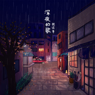

张过年
============================

|  |  |
| :--: | :-- |
| [ 张过年](https://i.xiami.com/guonian) | **播放数**: 16486869 **粉丝数**: 9378 **评论数**: 333 **地区**: China 中国大陆 **风格**: 当代民谣 Contemporary Folk  |

## 档案

张过年，歌手、词曲作者，曾发行作品集《滴落的时光》，单曲《深夜的歌》、《酩酊河》等作品。 
新浪微博： @张过年 
微信公号：张过年 
微信机器人：guonianscat 
联系邮箱:   galaxyavenue@163.com 
欢迎交流。

## 专辑

| 名称 | 语种 | 唱片公司 | 发行时间 | 专辑类别 | 专辑风格 |
| :--: | :-- | :-- | :-- | :-- | :-- |
| [ 我是真的爱你](./albums/2104596128.md) | 国语 | 亭东影业 | 2019年02月14日 | EP, 单曲 | 国语流行 Mandarin Pop |
| [ 酩酊河 (明媚版)](./albums/2103649002.md) | 国语 | 独立发行 | 2018年03月22日 | EP, 单曲 | 当代民谣 Contemporary Folk |
| [ 深夜的歌](./albums/2102705593.md) | 国语 | 独立发行 | 2017年02月28日 | EP, 单曲 | 当代民谣 Contemporary Folk |
| [ Demo集](./albums/2102978453.md) | 国语 | 独立发行 | 2012年12月20日 | 合集, 杂锦 | 当代民谣 Contemporary Folk |
| [ 滴落的时光](./albums/322996.md) | 国语 | 独立发行 | 2009年03月24日 | 录音室专辑 | 当代民谣 Contemporary Folk |

## 评论

|  |  |  |  |
| :-- | :-- | :-- | :-- |
|  [虾米用户](https://emumo.xiami.com/u/358104299) 悲观的唯心存在现实解构虚... 2020-12-19 18:04 赞(1) 踩(0) | 
43321
 |
|  [虾米用户](https://emumo.xiami.com/u/29727180)  2020-09-01 19:34 赞(0) 踩(0) | 
看过大年叔的演出，几年前在西安的泥窝窝小酒吧。一开口，就让我有与谢野晶子《乱发》样的情怀。
 |
|  [虾米用户](https://emumo.xiami.com/u/265724543)  2019-11-22 14:15 赞(0) 踩(0) | 
我真的太爱他的声音了，光听着都起鸡皮疙瘩那种，有人拿他的声音跟老狼比，但我是真的不觉得有相似之处，过年的声音是独特的，，于我更是独一无二  
 |
|  [虾米用户](https://emumo.xiami.com/u/42553425)  2019-04-02 19:29 赞(0) 踩(0) | 
很高兴能遇见你…
 |
|  [虾米用户](https://emumo.xiami.com/u/81818)  2019-02-12 16:06 赞(1) 踩(0) | 
没有《我是真的爱你》。虾米这个网站真的不行。是真的不行。
 |
| ⇒ |  [虾米用户](https://emumo.xiami.com/u/42553425)  2019-04-02 19:28 赞(0) 踩(0) | 
有啊，我收藏他的第二首就是这歌
 |
| ⇒ |  [虾米用户](https://emumo.xiami.com/u/81818)  2019-04-10 01:20 赞(0) 踩(0) | 
<q><b>未知生物说：</b></q>
 |
| ⇒ |  [虾米用户](https://emumo.xiami.com/u/42553425)  2019-04-10 06:10 赞(0) 踩(0) | 
<q><b>裸奔仲夏夜说：</b></q>
 |
| ⇒ |  [虾米用户](https://emumo.xiami.com/u/81818)  2019-04-17 22:21 赞(0) 踩(0) | 
<q><b>未知生物说：</b></q>
 |
|  [虾米用户](https://emumo.xiami.com/u/299908087) 。 2019-02-09 08:38 赞(0) 踩(0) | 
我喜欢你呀 你的歌好温柔
 |
|  [虾米用户](https://emumo.xiami.com/u/44891096)  2019-02-06 12:17 赞(0) 踩(0) | 
有没有我是真的爱你音源啊
 |
|  [虾米用户](https://emumo.xiami.com/u/6632752)   2019-02-06 01:02 赞(0) 踩(0) | 
今天看了飞驰人生，听见了你的声音
 |
|  [虾米用户](https://emumo.xiami.com/u/201391232) 最快的方法是先抱抱 2019-01-14 15:42 赞(0) 踩(0) | 
彡
 |
|  [虾米用户](https://emumo.xiami.com/u/49495013)  2018-11-07 09:17 赞(0) 踩(0) | 
我爱张过年
 |
|  [虾米用户](https://emumo.xiami.com/u/99038090) my future   ... 2018-07-11 12:42 赞(1) 踩(0) | 
昆明――一个不会让你失望的城市
 |
| ⇒ |  [虾米用户](https://emumo.xiami.com/u/377698108)  2018-08-08 23:22 赞(0) 踩(0) | 
年哥估计在昆明有故事....不敢轻易去
 |
|  [虾米用户](https://emumo.xiami.com/u/99038090) my future   ... 2018-07-11 12:41 赞(0) 踩(0) | 
一直等你来昆明开演唱会啊，可你的行程一直没有昆明
 |
|  [虾米用户](https://emumo.xiami.com/u/14747594) 大音希声 2018-06-26 05:58 赞(0) 踩(0) | 
声音很好听
 |
|  [虾米用户](https://emumo.xiami.com/u/7840019) 哎呦诶 2018-06-05 18:18 赞(3) 踩(0) | 
再见，心酸超人，只有我在这个世界唱深夜的歌
 |
|  [虾米用户](https://emumo.xiami.com/u/247613601)  2018-05-20 15:14 赞(0) 踩(0) | 
张老师，北京的演唱会什么时候开始
 |
|  [虾米用户](https://emumo.xiami.com/u/250383655)  2018-05-01 04:19 赞(0) 踩(0) | 
加油！
 |
|  [虾米用户](https://emumo.xiami.com/u/4811886) 夕阳爱好者。 2018-04-22 23:31 赞(0) 踩(0) | 
现场可真温柔啊。
 |
|  [虾米用户](https://emumo.xiami.com/u/38883647) ㅤ 2018-04-20 23:15 赞(0) 踩(0) | 
晚安 大叔
 |
|  [虾米用户](https://emumo.xiami.com/u/38883647) ㅤ 2018-04-19 17:09 赞(0) 踩(0) | 
明晚见
 |
|  [虾米用户](https://emumo.xiami.com/u/33612219)   2018-04-15 08:38 赞(0) 踩(0) | 
索拉里斯，今晚见 
 |
|  [虾米用户](https://emumo.xiami.com/u/2797965) 山川并肩坐着，河流只是经... 2018-04-07 18:24 赞(0) 踩(0) | 
成都见
 |
|  [虾米用户](https://emumo.xiami.com/u/48483816)  2018-03-16 19:45 赞(4) 踩(0) | 
在这个复杂的年龄，我真正爱上了民谣。嗯，原来那个她一直都在。接纳和欢喜在血液里缓缓流淌爱自己吧，我知道我已亏待你太久太久
 |
|  [虾米用户](https://emumo.xiami.com/u/4811886) 夕阳爱好者。 2018-03-12 23:26 赞(1) 踩(0) | 
4.22 杭州见～
 |
|  [虾米用户](https://emumo.xiami.com/u/295408661)  2018-02-22 10:10 赞(0) 踩(0) | 
喜欢你的世界，
 |
|  [虾米用户](https://emumo.xiami.com/u/15340582) 暂无签名~ 2017-12-24 23:47 赞(4) 踩(0) | 
喜欢你的嗓音，喜欢你的歌，讨厌楼上的热评！！！
 |
|  [虾米用户](https://emumo.xiami.com/u/266168856) ᴏɴʟɪɴᴇ 2017-12-23 21:55 赞(0) 踩(0) | 
快过年了 真好 你也很好 刚入民谣圈 觉得真安静
 |
|  [虾米用户](https://emumo.xiami.com/u/17326367) 爱就是极快速的能量振动 2017-12-20 19:41 赞(0) 踩(0) | 
！！！！！！！！！！！！！！！！
 |
|  [虾米用户](https://emumo.xiami.com/u/338038180)  2017-12-04 22:58 赞(0) 踩(0) | 
少小离家老大回，乡音无改鬓毛衰。儿童相见不相识，笑问客从何处来
 |
|  [虾米用户](https://emumo.xiami.com/u/300500073)  月耳！乐耳！悦耳！ 2017-12-04 11:24 赞(0) 踩(0) | 
如今却找不到能献给的人，因为放不下，因为忘不了！
 |
|  [虾米用户](https://emumo.xiami.com/u/45777834)  2017-11-16 14:20 赞(1) 踩(0) | 
我和他最爱你的世界，大学四年异地，虽因距离徒生了许多无奈，可我始终都明白他一如既往是那个会把所有美好都给我的人。
 |
|  [虾米用户](https://emumo.xiami.com/u/77079258) 我还没想好要写什么... 2017-09-15 21:54 赞(1) 踩(0) | 
声音延展性极好，有美声功底？
 |
|  [虾米用户](https://emumo.xiami.com/u/3857402)  2017-08-04 11:28 赞(0) 踩(0) | 
谁有这首歌的伴奏？
 |
|  [虾米用户](https://emumo.xiami.com/u/83893196) 我还没想好要写什么... 2017-07-31 15:08 赞(0) 踩(0) | 

 |
|  [虾米用户](https://emumo.xiami.com/u/35062303) 一个喜欢唱歌的小女孩 2017-07-17 18:10 赞(1) 踩(0) | 
好听！喜欢！
 |
|  [虾米用户](https://emumo.xiami.com/u/85853134) 凡事相信，凡事忍耐。愛是... 2017-06-23 18:09 赞(3) 踩(0) | 
我以为还可以回到好时光  最近喜欢上了喝酒 还有听你的歌
 |
|  [虾米用户](https://emumo.xiami.com/u/60990648)  2017-05-21 20:51 赞(0) 踩(0) | 
深夜食堂，喜欢
 |
|  [虾米用户](https://emumo.xiami.com/u/45140086) 终与草木同朽 2017-05-12 00:08 赞(2) 踩(0) | 
来上海一场吧
 |
| ⇒ |  [虾米用户](https://emumo.xiami.com/u/650561) 所有的喜剧即将收场 所有... 2018-03-27 20:44 赞(0) 踩(0) | 
走起
 |
|  [虾米用户](https://emumo.xiami.com/u/52792809) 到处流浪的野马姑娘。 2017-03-07 11:11 赞(1) 踩(0) | 
终于发歌了 我还以为你养猫不回来了呢
 |
|  [虾米用户](https://emumo.xiami.com/u/31246259) 人间冲浪 2017-03-05 19:22 赞(0) 踩(0) | 
没瞅着你新歌
 |
|  [虾米用户](https://emumo.xiami.com/u/214428341)  2017-02-27 18:31 赞(0) 踩(0) | 
最喜欢世界
 |
|  [虾米用户](https://emumo.xiami.com/u/9466055)  2017-02-06 15:12 赞(0) 踩(0) | 
期待，好久没买实体碟，这回可以买几张送人了
 |
|  [虾米用户](https://emumo.xiami.com/u/1216780) Don't Panic! 2017-02-05 18:31 赞(1) 踩(0) | 
等專輯中（敲碗
 |
|  [虾米用户](https://emumo.xiami.com/u/48748810) ‌一眼望去，精致的面容很... 2017-02-05 13:11 赞(0) 踩(0) | 
一直很喜欢张老师的声音和歌。
 |
|  [虾米用户](https://emumo.xiami.com/u/37199932)  2017-02-04 23:56 赞(0) 踩(0) | 
带着猫去录音了？
 |
|  [虾米用户](https://emumo.xiami.com/u/7961935)  2017-02-01 22:42 赞(0) 踩(0) | 
怎么这么久不出新歌
 |
|  [虾米用户](https://emumo.xiami.com/u/22716832)   2017-01-21 16:05 赞(0) 踩(0) | 
赞
 |
|  [虾米用户](https://emumo.xiami.com/u/422522)  2017-01-18 12:15 赞(0) 踩(0) | 
又要快过年了，又想起过年的歌
 |
|  [虾米用户](https://emumo.xiami.com/u/3019759)  2017-01-05 00:00 赞(0) 踩(0) | 
以前听列车的时候以为是那个大叔唱的我靠 。
 |
|  [虾米用户](https://emumo.xiami.com/u/47040459)  2016-11-28 20:43 赞(1) 踩(0) | 
最有诗人气质的歌手
 |
|  [虾米用户](https://emumo.xiami.com/u/5259784)  2016-10-20 23:39 赞(3) 踩(0) | 
应该唱深夜食堂的OST啊
 |
|  [虾米用户](https://emumo.xiami.com/u/95500084) 或许你从来没有听说过我。 2016-10-16 18:47 赞(0) 踩(0) | 
here
 |
|  [虾米用户](https://emumo.xiami.com/u/39203648) 暂无签名~ 2016-09-29 08:43 赞(1) 踩(0) | 
老张牛逼……一个用灵魂歌唱的诗人
 |
|  [虾米用户](https://emumo.xiami.com/u/8504115)  2016-09-27 11:29 赞(1) 踩(0) | 
有时候听着有点像彭坦，有没有人也是这么觉得的
 |
| ⇒ |  [虾米用户](https://emumo.xiami.com/u/39203648) 暂无签名~ 2016-09-29 08:45 赞(0) 踩(0) | 
比彭坦辨识度高多了  
 |
| ⇒ |  [虾米用户](https://emumo.xiami.com/u/81818)  2019-04-10 01:22 赞(0) 踩(0) | 
还是没想明白怎么联系到彭坦去的233
 |
|  [虾米用户](https://emumo.xiami.com/u/72707752)  2016-08-22 13:37 赞(0) 踩(0) | 
想听深夜食堂那首 
 |
|  [虾米用户](https://emumo.xiami.com/u/27857090) 有朝一日 2016-07-27 16:23 赞(1) 踩(0) | 
可以
 |
|  [虾米用户](https://emumo.xiami.com/u/31342189) 飞去南方。 2016-07-15 16:37 赞(1) 踩(0) | 
中午看演出预告说养猫去了，下午再看就有啦！
 |
|  [虾米用户](https://emumo.xiami.com/u/31935327)  2016-07-07 17:16 赞(1) 踩(0) | 
一把老嗓
 |
|  [虾米用户](https://emumo.xiami.com/u/43985063) 我还没想好要写什么... 2016-06-03 23:36 赞(0) 踩(0) | 
哥你什么时候出歌
 |
|  [虾米用户](https://emumo.xiami.com/u/3478664)  2016-06-01 17:53 赞(0) 踩(0) | 
唱得很好！！！很喜欢这个声音
 |
|  [虾米用户](https://emumo.xiami.com/u/10749095)  2016-05-07 07:01 赞(9) 踩(0) | 
看封面，年歌原来长这样，惊了！
 |
| ⇒ |  [虾米用户](https://emumo.xiami.com/u/721351)  2020-05-20 19:50 赞(0) 踩(0) | 
陈鸿宇、谢天笑也有这样的反差
 |
|  [虾米用户](https://emumo.xiami.com/u/3440904)  2016-03-17 17:21 赞(0) 踩(0) | 
头像换了？
 |
|  [虾米用户](https://emumo.xiami.com/u/8424657) 海岸线 2016-02-29 14:31 赞(0) 踩(0) | 

 |
|  [虾米用户](https://emumo.xiami.com/u/12181015) 朝闻佳音，夕可死矣。 2016-01-18 23:07 赞(0) 踩(0) | 
只有我
 |
|  [虾米用户](https://emumo.xiami.com/u/50750559)   2016-01-18 19:24 赞(1) 踩(0) | 
过年开火车的吧
 |
|  [虾米用户](https://emumo.xiami.com/u/45202980)  2015-11-28 12:33 赞(0) 踩(0) | 
终归 还是错过了
 |
|  [虾米用户](https://emumo.xiami.com/u/47194969) 只要凝眸相视 命运便会水... 2015-11-07 12:59 赞(12) 踩(0) | 
你说你的歌都不怎么开心 但是我们希望你能开心呀
 |
|  [虾米用户](https://emumo.xiami.com/u/32699153)  2015-10-24 00:29 赞(1) 踩(0) | 
想。去。成。都。
 |
|  [虾米用户](https://emumo.xiami.com/u/3131897)  2015-10-12 09:05 赞(0) 踩(0) | 
广州见
 |
|  [虾米用户](https://emumo.xiami.com/u/81818)  2015-10-07 18:02 赞(0) 踩(0) | 
太棒了太棒了  太棒了！！终于有酩酊河了！！
 |
|  [虾米用户](https://emumo.xiami.com/u/3178441)  2015-10-06 23:35 赞(0) 踩(0) | 
要去廈門了
 |
|  [虾米用户](https://emumo.xiami.com/u/49001240)   2015-10-01 22:04 赞(0) 踩(0) | 
过年哥 又见面了 
 |
|  [虾米用户](https://emumo.xiami.com/u/42951171) can't keep i... 2015-10-01 19:54 赞(0) 踩(0) | 
再见好听
 |
|  [虾米用户](https://emumo.xiami.com/u/3300536) 喜欢睡觉因为梦里什么都有 2015-09-29 10:29 赞(3) 踩(0) | 
这个名字很喜气啊
 |
|  [虾米用户](https://emumo.xiami.com/u/25429847) 墨尔本假文青一个 2015-09-21 15:35 赞(0) 踩(0) | 
期待专辑
 |
|  [虾米用户](https://emumo.xiami.com/u/15489958) 无 2015-09-20 12:38 赞(0) 踩(0) | 
上午又想听 只有我 过来一看 有新动态了
 |
|  [虾米用户](https://emumo.xiami.com/u/1005904) 呔！！！！！！ 2015-09-19 00:56 赞(0) 踩(0) | 
年年
 |
|  [虾米用户](https://emumo.xiami.com/u/5968552) 虾小米，我爱你所以讲不出... 2015-09-17 19:10 赞(1) 踩(0) | 
好几年了，终于把你盼来了，也终于盼来了劫后余生，终于不用去豆瓣了！
 |
|  [虾米用户](https://emumo.xiami.com/u/39942795) 流光容易把人抛 2015-09-17 18:29 赞(0) 踩(0) | 
终于有动态了啊
 |
|  [虾米用户](https://emumo.xiami.com/u/1618810) 毙 2015-09-17 13:13 赞(0) 踩(0) | 
张老师终于来了 欢迎！
 |
|  [虾米用户](https://emumo.xiami.com/u/1108711) 新的一轮听歌热情终于生长... 2015-09-17 12:11 赞(0) 踩(0) | 
终于出新歌了，一直支持过年~ 
 |
|  [虾米用户](https://emumo.xiami.com/u/12985270) 被杨老师放弃的同学 2015-09-17 11:01 赞(0) 踩(0) | 
!
 |
|  [虾米用户](https://emumo.xiami.com/u/9154037) 到水星散心去了。 2015-09-15 17:03 赞(0) 踩(0) | 
: )
 |
|  [虾米用户](https://emumo.xiami.com/u/600717) LOOOOOOOOOL 2015-09-01 18:44 赞(0) 踩(0) | 
很好听 很喜欢
 |
|  [虾米用户](https://emumo.xiami.com/u/16010395)  2015-08-18 14:22 赞(0) 踩(0) | 
情怀什么的东西
 |
|  [虾米用户](https://emumo.xiami.com/u/661199)   2015-08-10 00:28 赞(2) 踩(0) | 
去年过年的时候在列车上听着这首歌真应景
 |
|  [虾米用户](https://emumo.xiami.com/u/40638121)  2015-08-07 07:26 赞(1) 踩(0) | 
漂亮聲音
 |
|  [虾米用户](https://emumo.xiami.com/u/39542003)  2015-07-19 21:23 赞(0) 踩(0) | 
伤心咖啡馆之歌？在哪里在哪里？ 
 |
|  [虾米用户](https://emumo.xiami.com/u/334904) 音乐 2015-07-18 23:00 赞(0) 踩(0) | 
听了这么久 终于看一次现场 年哥 加油
 |
|  [虾米用户](https://emumo.xiami.com/u/1985058) 及时行乐 2015-07-09 01:46 赞(0) 踩(0) | 
我就是来缓解加班压力的。
 |
|  [虾米用户](https://emumo.xiami.com/u/6375146) 我还没想好要写什么... 2015-07-04 15:16 赞(0) 踩(0) | 
这个名字真特别，戳进来看看
 |
|  [虾米用户](https://emumo.xiami.com/u/37098145) 这个家伙太蠢了不会留下什... 2015-06-21 15:56 赞(0) 踩(0) | 
wk
 |
|  [虾米用户](https://emumo.xiami.com/u/5375128) CC 2015-06-16 12:29 赞(0) 踩(0) | 
劫后余生
 |
|  [虾米用户](https://emumo.xiami.com/u/1108711) 新的一轮听歌热情终于生长... 2015-06-06 03:47 赞(3) 踩(0) | 
喜欢他很久，喜欢他那种孤独，带有淡淡忧伤的，内心丰富的世界。喜欢他的词和声音。
 |
|  [虾米用户](https://emumo.xiami.com/u/40564661) 你丫才是美工 2015-06-05 17:40 赞(0) 踩(0) | 
求更多曲目
 |
|  [虾米用户](https://emumo.xiami.com/u/81818)  2015-05-24 01:46 赞(0) 踩(0) | 
希望很快会有最好听的酩酊河和咖啡馆之歌这两首可以放上来。。。。。
 |
|  [虾米用户](https://emumo.xiami.com/u/9123947)  2015-05-16 17:57 赞(0) 踩(0) | 
ll
 |
|  [虾米用户](https://emumo.xiami.com/u/49663616)  2015-05-11 14:00 赞(0) 踩(0) | 
暂时性喜欢
 |
|  [虾米用户](https://emumo.xiami.com/u/43417904) Please KISS ... 2015-05-06 22:48 赞(1) 踩(0) | 
。
 |
|  [虾米用户](https://emumo.xiami.com/u/2974827)   2015-04-29 15:02 赞(0) 踩(0) | 
lalal
 |
| ⇒ |  [虾米用户](https://emumo.xiami.com/u/6644969) 我还没想好要写什么... 2015-05-06 15:27 赞(0) 踩(0) | 
留下情话
 |
|  [虾米用户](https://emumo.xiami.com/u/1211086) 浪里格朗 2015-04-22 22:35 赞(0) 踩(0) | 
我听过年已有多年，对于我和世界依旧是那么美好，至今我还能心潮澎湃
 |
|  [虾米用户](https://emumo.xiami.com/u/5657731) 在音乐面前语言很苍白 2015-04-19 10:34 赞(3) 踩(0) | 
在民谣中杀出一种辨识度不容易
 |
|  [虾米用户](https://emumo.xiami.com/u/38641125)  2015-04-05 16:04 赞(0) 踩(0) | 
像晚风一样吹过你心里
 |
|  [虾米用户](https://emumo.xiami.com/u/1618810) 毙 2015-04-01 12:40 赞(0) 踩(0) | 
1
 |
|  [虾米用户](https://emumo.xiami.com/u/46322233)   2015-03-23 22:45 赞(0) 踩(0) | 
怎么没有 酩酊河？
 |
|  [虾米用户](https://emumo.xiami.com/u/1070165) 天凉好个秋 2015-03-23 21:28 赞(0) 踩(0) | 
henyouweidao
 |
|  [虾米用户](https://emumo.xiami.com/u/48248555)  2015-03-20 18:49 赞(0) 踩(0) | 
张过年 独立民谣,
 |
|  [虾米用户](https://emumo.xiami.com/u/3871745) 一个人就一个人 2015-03-05 07:57 赞(0) 踩(0) | 
mm
 |
| ⇒ |  [虾米用户](https://emumo.xiami.com/u/48570273)  2015-04-21 09:52 赞(0) 踩(0) | 

 |
|  [虾米用户](https://emumo.xiami.com/u/15789327)   2015-03-05 00:17 赞(0) 踩(0) | 
每次都到你小站听歌，求出专辑求多加点歌不够听啊！
 |
|  [虾米用户](https://emumo.xiami.com/u/3246365) ：） 2015-02-17 17:42 赞(0) 踩(0) | 
有眼不识泰山
 |
|  [虾米用户](https://emumo.xiami.com/u/15139025) 我还没想好要写什么... 2015-02-13 12:41 赞(0) 踩(0) | 
是郝蕾的氧气先出的还是张过年的只有我先出的。歌词基本一样啊。
 |
| ⇒ |  [虾米用户](https://emumo.xiami.com/u/46906138)   2015-03-14 18:51 赞(0) 踩(0) | 
氧气 那个是在话剧里唱的
 |
|  [虾米用户](https://emumo.xiami.com/u/842288) 冒傻气 2015-02-05 14:24 赞(148) 踩(0) | 
爹妈只有一个愿望——所以家中哥儿四个就这样来了张有钱张没钱张回家张过年
 |
| ⇒ |  [虾米用户](https://emumo.xiami.com/u/10076598) 自然简单  理想自由 2015-02-06 01:22 赞(0) 踩(0) | 
哈哈～
 |
| ⇒ |  [虾米用户](https://emumo.xiami.com/u/787588)  2015-02-10 15:01 赞(0) 踩(0) | 
哈哈  笑尿
 |
| ⇒ |  [虾米用户](https://emumo.xiami.com/u/11024311)  2015-02-15 22:49 赞(0) 踩(0) | 
好逗
 |
| ⇒ |  [虾米用户](https://emumo.xiami.com/u/35783) 身体给雨，灵魂给风。 2015-03-02 01:49 赞(0) 踩(0) | 
二哥表示不满~！
 |
| ⇒ |  [虾米用户](https://emumo.xiami.com/u/1388196) 为何在雨伞外独行 2015-03-10 12:37 赞(0) 踩(0) | 
哈哈哈哈哈
 |
| ⇒ |  [虾米用户](https://emumo.xiami.com/u/9485486) 犹记多情，曾为系归舟。 2015-03-11 14:22 赞(0) 踩(0) | 
哈哈哈哈
 |
| ⇒ |  [虾米用户](https://emumo.xiami.com/u/1864133) 2112 2015-03-12 02:06 赞(0) 踩(0) | 
地球是他的家
 |
| ⇒ |  [虾米用户](https://emumo.xiami.com/u/3793853) 唯有音乐与美食不可辜负。 2015-04-05 00:31 赞(0) 踩(0) | 
<q><b>酒神赞歌说：</b></q>
 |
|  [虾米用户](https://emumo.xiami.com/u/4335954)   2015-02-03 21:37 赞(0) 踩(0) | 
你真的是那个张过年吗？
 |
|  [虾米用户](https://emumo.xiami.com/u/34414802)  2015-01-31 17:05 赞(0) 踩(0) | 
只有我 的歌词 ……
 |
|  [虾米用户](https://emumo.xiami.com/u/6435753)  2015-01-31 13:35 赞(0) 踩(0) | 
1
 |
|  [虾米用户](https://emumo.xiami.com/u/18169133) 停用个人功能.仅上传音乐... 2015-01-26 23:17 赞(0) 踩(0) | 
世界太好听了 可我最喜欢再见。
 |
|  [虾米用户](https://emumo.xiami.com/u/5968552) 虾小米，我爱你所以讲不出... 2015-01-23 22:52 赞(0) 踩(0) | 
太想太想听劫后余生，又特别特别不想去豆瓣……纠结好几年也没解决。
 |
|  [虾米用户](https://emumo.xiami.com/u/32101704) Lost in musi... 2015-01-11 16:10 赞(0) 踩(0) | 
赐我一个女朋友吧(&gt;﹏&lt;)
 |
| ⇒ |  [虾米用户](https://emumo.xiami.com/u/866525) 最好的时光才刚刚开始！≥... 2015-02-05 22:18 赞(0) 踩(0) | 
加油
 |
| ⇒ |  [虾米用户](https://emumo.xiami.com/u/32101704) Lost in musi... 2015-02-06 17:33 赞(0) 踩(0) | 
<q><b>老子不服睡不着说：</b></q>
 |
|  [虾米用户](https://emumo.xiami.com/u/5618806)  2015-01-04 10:01 赞(0) 踩(0) | 
好久好久 都不出新歌了
 |
|  [虾米用户](https://emumo.xiami.com/u/2733055)  2014-12-12 12:24 赞(0) 踩(0) | 
为什么只有一张专辑，你为什么不唱歌了
 |
|  [虾米用户](https://emumo.xiami.com/u/35904030)  2014-12-11 23:07 赞(1) 踩(0) | 
把我唱哭过的声音
 |
|  [虾米用户](https://emumo.xiami.com/u/1168057) 听住 2014-11-29 00:13 赞(1) 踩(0) | 
再见呢！
 |
|  [虾米用户](https://emumo.xiami.com/u/7716031)  2014-10-20 21:48 赞(0) 踩(0) | 
酩酊河呢？
 |
|  [虾米用户](https://emumo.xiami.com/u/29727180)  2014-10-20 00:44 赞(1) 踩(0) | 
酩酊河在哪里啊哪里
 |
|  [虾米用户](https://emumo.xiami.com/u/5143703) 有一个公举号：sisyp... 2014-10-18 21:33 赞(0) 踩(0) | 
每天推荐个蛋都有他。。。每次都要叉掉
 |
|  [虾米用户](https://emumo.xiami.com/u/22411464)   2014-10-06 09:35 赞(1) 踩(0) | 
对不起，我只能给这张专辑打3星，一点没有新意，吃老本。
 |
|  [虾米用户](https://emumo.xiami.com/u/6276944)  噗 2014-09-24 08:11 赞(30) 踩(0) | 
肯定是过年那几天出生的吧。。。
 |
| ⇒ |  [虾米用户](https://emumo.xiami.com/u/6435753)  2015-01-31 13:35 赞(0) 踩(0) | 
good
 |
|  [虾米用户](https://emumo.xiami.com/u/40753840)  2014-09-16 15:28 赞(0) 踩(0) | 
我已醉倒在阳光里
 |
|  [虾米用户](https://emumo.xiami.com/u/13552)  2014-09-16 10:23 赞(0) 踩(0) | 
世界
 |
|  [虾米用户](https://emumo.xiami.com/u/374450) GAME MAKER！！ 2014-09-16 08:19 赞(0) 踩(0) | 
世界
 |
|  [虾米用户](https://emumo.xiami.com/u/4448023) 音乐在，故我在 2014-09-10 11:08 赞(0) 踩(0) | 
挺好听啊，就喜欢民谣
 |
|  [虾米用户](https://emumo.xiami.com/u/5158054) 大不同 2014-08-16 14:44 赞(0) 踩(0) | 
非常喜欢
 |
|  [虾米用户](https://emumo.xiami.com/u/94663)  2014-08-13 19:06 赞(1) 踩(0) | 
该出新专了 等好久~
 |
|  [虾米用户](https://emumo.xiami.com/u/3749751) 白天是夜晚的仆从 2014-08-07 01:15 赞(0) 踩(0) | 
更本不敢想象Live~··这么醉人~·
 |
|  [虾米用户](https://emumo.xiami.com/u/1869182)  2014-08-06 14:24 赞(0) 踩(0) | 
你像年轻版老狼
 |
|  [虾米用户](https://emumo.xiami.com/u/1869182)  2014-08-06 14:15 赞(0) 踩(0) | 
好音乐 好声音
 |
|  [虾米用户](https://emumo.xiami.com/u/3329599) 我还没想好要写什么... 2014-07-14 19:53 赞(0) 踩(0) | 
没有 《再见》
 |
| ⇒ |  [虾米用户](https://emumo.xiami.com/u/42951171) can't keep i... 2015-01-31 23:04 赞(0) 踩(0) | 
赞同，唱吧有，他本人的帐号
 |
|  [虾米用户](https://emumo.xiami.com/u/857526) 我们度尽的岁月好像讲完了... 2014-06-17 22:26 赞(1) 踩(0) | 
<a href="http://site.douban.com/guonian/" target="_blank" rel="nofollow noreferrer noopener">http://site.douban.com/guonian/</a>
 |
|  [虾米用户](https://emumo.xiami.com/u/3487489) 多想想 2014-06-02 17:35 赞(0) 踩(0) | 
我只想知道MicroMu怎么就没消息了？应该被支持的
 |
|  [虾米用户](https://emumo.xiami.com/u/618871) 行在长安城  时常背包客 2014-05-31 22:22 赞(0) 踩(0) | 
很喜欢这种民谣风格，做了一个贴子，发在了左岸论坛里。
 |
|  [虾米用户](https://emumo.xiami.com/u/7294230)  2014-05-11 22:30 赞(0) 踩(0) | 
歌略少啊
 |
|  [虾米用户](https://emumo.xiami.com/u/13368288) Rootless 2014-05-10 23:16 赞(0) 踩(0) | 
好多歌没啊
 |
|  [虾米用户](https://emumo.xiami.com/u/13368288) Rootless 2014-05-10 23:15 赞(0) 踩(0) | 
虾米没有心中的舞蹈，只有老狼版的
 |
|  [虾米用户](https://emumo.xiami.com/u/1383972) 世事如歌，而我偏爱这一首 2014-04-29 22:01 赞(0) 踩(0) | 
）））
 |
|  [虾米用户](https://emumo.xiami.com/u/16089508)  2014-04-29 00:53 赞(0) 踩(0) | 
最近迷上这种旋律和嗓子
 |
|  [虾米用户](https://emumo.xiami.com/u/6388409) 暂无签名~ 2014-04-28 22:12 赞(0) 踩(0) | 
颤得真好
 |
|  [虾米用户](https://emumo.xiami.com/u/8836474)  2014-03-19 19:52 赞(0) 踩(0) | 
浪漫的心
 |
|  [虾米用户](https://emumo.xiami.com/u/6717156) 我还没想好要写什么... 2014-03-09 22:57 赞(0) 踩(0) | 
以前听过一首过年的歌，突然想不起来是什么歌了。很好听的，不在这里面。
 |
|  [虾米用户](https://emumo.xiami.com/u/33069465) 君子思想 2014-02-21 21:25 赞(0) 踩(0) | 
因为爱
 |
|  [虾米用户](https://emumo.xiami.com/u/11259253) 听靓歌 2014-02-20 15:25 赞(0) 踩(0) | 
喜欢。
 |
|  [虾米用户](https://emumo.xiami.com/u/3440904)  2014-02-05 22:43 赞(0) 踩(0) | 
小颤音相当的霸刀啊
 |
|  [虾米用户](https://emumo.xiami.com/u/192628) 如斯 2014-01-26 20:03 赞(0) 踩(0) | 
是不是有个网站叫不插电？
 |
| ⇒ |  [虾米用户](https://emumo.xiami.com/u/6674166)  2014-02-15 13:32 赞(0) 踩(0) | 
可惜倒闭了
 |
|  [虾米用户](https://emumo.xiami.com/u/155947) 一期一会 2014-01-21 23:31 赞(1) 踩(0) | 
过年了，求发财
 |
|  [虾米用户](https://emumo.xiami.com/u/2732298)  2014-01-15 09:38 赞(0) 踩(0) | 
这位才是中国好声音 中国好歌曲。
 |
|  [虾米用户](https://emumo.xiami.com/u/6037106)   2013-12-26 21:30 赞(1) 踩(0) | 
一个点是热门评论……？
 |
| ⇒ |  [虾米用户](https://emumo.xiami.com/u/6037106)   2014-05-07 16:13 赞(0) 踩(0) | 
<q><b>说：</b></q>
 |
| ⇒ |  [虾米用户](https://emumo.xiami.com/u/1192632)   2014-05-07 19:09 赞(0) 踩(0) | 
<q><b>Slithereen说：</b></q>
 |
|  [虾米用户](https://emumo.xiami.com/u/13087328)  2013-12-23 13:56 赞(0) 踩(0) | 
筹拍一部电影，可否联系合作电影音乐？联系：q164579979
 |
|  [虾米用户](https://emumo.xiami.com/u/4574563) 我还没想好要写什么... 2013-12-16 14:23 赞(0) 踩(0) | 
folk
 |
|  [虾米用户](https://emumo.xiami.com/u/441688) YANG 2013-12-16 13:53 赞(0) 踩(0) | 
瞬间安静了～
 |
|  [虾米用户](https://emumo.xiami.com/u/4036319)  2013-12-10 16:53 赞(0) 踩(0) | 
怀念的味道
 |
|  [虾米用户](https://emumo.xiami.com/u/6507607) 请把我的尸体埋在音乐里。 2013-12-10 02:13 赞(0) 踩(0) | 
收
 |
|  [虾米用户](https://emumo.xiami.com/u/746706)  2013-12-04 11:03 赞(0) 踩(0) | 
深入灵魂
 |
|  [虾米用户](https://emumo.xiami.com/u/26246185)  2013-11-30 10:46 赞(0) 踩(0) | 
唱的心抖，真心好听·很灵魂的感觉·
 |
|  [虾米用户](https://emumo.xiami.com/u/2048411) 自由骑士 2013-11-28 17:03 赞(0) 踩(0) | 
时光流逝的所有意义，在于让我一个人老去。
 |
|  [虾米用户](https://emumo.xiami.com/u/1226865) 爱音乐的人原本就该活简单 2013-11-19 05:41 赞(0) 踩(0) | 
好音乐
 |
|  [虾米用户](https://emumo.xiami.com/u/15955003) 我爱音乐 2013-11-16 09:24 赞(0) 踩(0) | 
喜欢
 |
|  [虾米用户](https://emumo.xiami.com/u/1080627) 我还没想好要写什么... 2013-11-08 01:50 赞(0) 踩(0) | 
❤
 |
|  [虾米用户](https://emumo.xiami.com/u/10339917) 职业流氓 2013-10-27 17:48 赞(1) 踩(0) | 
只有我的歌词和氧气什么关系
 |
|  [虾米用户](https://emumo.xiami.com/u/1192632)   2013-10-12 16:31 赞(0) 踩(0) | 
曾在ape看到过有他的专场，当时还不知道他，没有去听，希望以后还有机会
 |
|  [虾米用户](https://emumo.xiami.com/u/15871718) 已婚大兒童 2013-10-12 10:07 赞(0) 踩(0) | 
很棒
 |
|  [虾米用户](https://emumo.xiami.com/u/9946063) 空谈误国。实干兴邦 2013-10-11 05:44 赞(26) 踩(0) | 
、
 |
| ⇒ |  [虾米用户](https://emumo.xiami.com/u/8562503) 嗯呵 2013-11-14 16:04 赞(0) 踩(0) | 
哈哈哈哈哈哈哈哈哈哈哈哈
 |
| ⇒ |  [虾米用户](https://emumo.xiami.com/u/22219308) 笑一个吧！~ 2014-08-20 12:50 赞(0) 踩(0) | 
那么多人点赞是几个意思，是我太愚钝 悟不透这个 顿号 的禅意吗？
 |
| ⇒ |  [虾米用户](https://emumo.xiami.com/u/2732298)  2014-08-27 20:58 赞(0) 踩(0) | 
名字 吓死了。
 |
|  [虾米用户](https://emumo.xiami.com/u/17856) 卡哩卡哩，咕叽咕叽，嘎吱... 2013-09-26 01:59 赞(0) 踩(0) | 
奔跑在阳光里的少年。
 |
|  [虾米用户](https://emumo.xiami.com/u/3052778) (｡í _ ì｡) 2013-09-22 15:21 赞(0) 踩(0) | 
今年的演出很棒
 |
|  [虾米用户](https://emumo.xiami.com/u/1525501) 不形于相 2013-09-20 14:57 赞(0) 踩(0) | 
这种事，弄个按例，每年固定时候来几场，或者是提前几个月打个招呼。。。让大家都有个准备好吗？感觉很遗憾，嗯
 |
|  [虾米用户](https://emumo.xiami.com/u/1525501) 不形于相 2013-09-20 14:52 赞(0) 踩(0) | 
为什么我现在才知道有9月14号在上海有演唱会= =
 |
| ⇒ |  [虾米用户](https://emumo.xiami.com/u/752597)  2013-10-10 15:02 赞(0) 踩(0) | 
不叫“演唱会” 叫“专场”
 |
|  [虾米用户](https://emumo.xiami.com/u/2327690)  2013-08-31 01:11 赞(0) 踩(0) | 
☆☆☆☆☆☆☆☆☆☆☆
 |
|  [虾米用户](https://emumo.xiami.com/u/2327690)  2013-08-31 01:09 赞(0) 踩(0) | 
简直！
 |
|  [虾米用户](https://emumo.xiami.com/u/1801358)  2013-08-20 17:05 赞(0) 踩(0) | 
好似老狼...
 |
| ⇒ |  [虾米用户](https://emumo.xiami.com/u/752597)  2013-10-10 15:02 赞(0) 踩(0) | 
老狼有首《心中的舞蹈》是张过年写的
 |
|  [虾米用户](https://emumo.xiami.com/u/645218) 任性逍遥于有欲无欲之间 2013-08-12 22:56 赞(0) 踩(0) | 
喜欢这个调调
 |
|  [虾米用户](https://emumo.xiami.com/u/645218) 任性逍遥于有欲无欲之间 2013-08-12 22:56 赞(0) 踩(0) | 
喜欢这个调调
 |
|  [虾米用户](https://emumo.xiami.com/u/5788926)   2013-08-10 17:40 赞(0) 踩(0) | 
感……
 |
|  [虾米用户](https://emumo.xiami.com/u/1157848) 我还没想好要写什么... 2013-07-30 08:31 赞(0) 踩(0) | 
《酩酊河》
 |
|  [虾米用户](https://emumo.xiami.com/u/7252584) 新的梦想 2013-07-24 13:00 赞(1) 踩(0) | 
为什么到现在才发现大陆有这么多才人，真心蛮动人的。
 |
|  [虾米用户](https://emumo.xiami.com/u/1650115) 痛快 2013-06-25 12:59 赞(0) 踩(0) | 
好喜欢 心酸超人
 |
|  [虾米用户](https://emumo.xiami.com/u/7160069) O 2013-06-25 01:28 赞(1) 踩(0) | 
好嗓子
 |
|  [虾米用户](https://emumo.xiami.com/u/318313)  2013-06-16 15:51 赞(0) 踩(0) | 
他的声音太动人
 |
|  [虾米用户](https://emumo.xiami.com/u/391752)  2013-06-08 22:50 赞(0) 踩(0) | 
《滴落的时光》水准之高，令人发指！另外，想听的《酩酊河》在哪里？
 |
| ⇒ |  [虾米用户](https://emumo.xiami.com/u/11829053) 棒极了高乐高~ 2013-06-13 22:49 赞(0) 踩(0) | 
真的很想线下听听酩酊河啊
 |
| ⇒ |  [虾米用户](https://emumo.xiami.com/u/425532)  2013-08-08 18:29 赞(0) 踩(0) | 
<a href="http://music.weibo.com/snake/snk_search.php?type=song&amp;amp;key=%25E5%25BC%25A0%25E8%25BF%2587%25E5%25B9%25B4" target="_blank" rel="nofollow noreferrer noopener">http://music.weibo.com/snake/snk_search.php?type=song&amp;amp;key=%25E5%25BC%25A0%25E8%25BF%2587%25E5%25B9%25B4</a>
 |
| ⇒ |  [虾米用户](https://emumo.xiami.com/u/17856) 卡哩卡哩，咕叽咕叽，嘎吱... 2013-09-28 16:26 赞(0) 踩(0) | 
<a href="http://site.douban.com/guonian/" target="_blank" rel="nofollow noreferrer noopener">http://site.douban.com/guonian/</a>豆瓣小站可以试听。
 |
| ⇒ |  [虾米用户](https://emumo.xiami.com/u/391752)  2013-10-18 20:35 赞(0) 踩(0) | 
<q><b>肚子饿了说：</b></q>
 |
|  [虾米用户](https://emumo.xiami.com/u/6139765) 杂食党 2013-06-05 19:21 赞(0) 踩(0) | 
听了几个没听过的 叉掉好几个播放列表了之后听到了之个
 |
|  [虾米用户](https://emumo.xiami.com/u/8150574)  2013-06-03 22:48 赞(0) 踩(0) | 
又一个钟立风。。。
 |
|  [虾米用户](https://emumo.xiami.com/u/3057399) 朝闻道，夕死可矣。 2013-05-10 01:21 赞(0) 踩(0) | 
个人认为大陆最棒的民谣！
 |
| ⇒ |  [虾米用户](https://emumo.xiami.com/u/17856) 卡哩卡哩，咕叽咕叽，嘎吱... 2013-09-28 16:28 赞(0) 踩(0) | 
无节操的赞和同意。
 |
|  [虾米用户](https://emumo.xiami.com/u/3143019)  2013-04-14 21:53 赞(0) 踩(0) | 
太好了，只有这四首吗
 |
|  [虾米用户](https://emumo.xiami.com/u/10032712)  2013-04-11 14:23 赞(0) 踩(0) | 
+1
 |
|  [虾米用户](https://emumo.xiami.com/u/3285240) 好讨厌夏天 2013-03-15 19:50 赞(0) 踩(0) | 
喜欢这样的声音,差点就错过了.
 |
|  [虾米用户](https://emumo.xiami.com/u/3426692)  2013-02-13 23:00 赞(0) 踩(0) | 
真特么好啊  老民谣！
 |
|  [虾米用户](https://emumo.xiami.com/u/422522)  2013-02-09 18:03 赞(0) 踩(0) | 
因为过年了，就听张过年
 |
|  [虾米用户](https://emumo.xiami.com/u/11468198) 听的不是音乐是情绪 2013-01-24 14:34 赞(0) 踩(0) | 
一开口让我想到了老狼 有些声音属于过去 却历久祢新
 |
|  [虾米用户](https://emumo.xiami.com/u/6705260) ... 2013-01-11 12:46 赞(0) 踩(0) | 
又上架了！~ 因为要过年了嘛 = =
 |
|  [虾米用户](https://emumo.xiami.com/u/1225483)  2013-01-09 19:06 赞(0) 踩(0) | 
校园民谣,
 |
|  [虾米用户](https://emumo.xiami.com/u/9873826) 妈呀嘿 2013-01-08 10:30 赞(0) 踩(0) | 
很赞！！喜欢他的声音
 |
|  [虾米用户](https://emumo.xiami.com/u/9330994)  2013-01-04 22:39 赞(0) 踩(0) | 
这才是民谣么。
 |
|  [虾米用户](https://emumo.xiami.com/u/74536)  2013-01-04 17:43 赞(0) 踩(0) | 
还是不错的这声音！
 |
|  [虾米用户](https://emumo.xiami.com/u/9093486)  2012-12-28 16:04 赞(0) 踩(0) | 
就是喜欢他一往情深的样子
 |
|  [虾米用户](https://emumo.xiami.com/u/12138143)  2012-12-28 12:20 赞(0) 踩(0) | 
下雪了
 |
|  [虾米用户](https://emumo.xiami.com/u/9532466) 跟着音乐  收起你的肮脏 2012-12-20 13:12 赞(0) 踩(0) | 
乘着“列车”过去的。这样的声音 安抚了我凌乱的舞步
 |
|  [虾米用户](https://emumo.xiami.com/u/8309571)  2012-12-05 13:58 赞(0) 踩(0) | 
好听的民谣与大家分享 #张过年
 |
|  [虾米用户](https://emumo.xiami.com/u/3335483) 你想拿却未拿起的东西，会... 2012-12-04 17:52 赞(0) 踩(0) | 
抱紧我吧，在天气这么冷的夜晚；想起我吧，在你感到变老的那一年。
 |
|  [虾米用户](https://emumo.xiami.com/u/11784979)  2012-12-04 15:31 赞(0) 踩(0) | 
不是每一首歌都叫民谣 不是每一个歌手都叫过年
 |
|  [虾米用户](https://emumo.xiami.com/u/11784979)  2012-12-04 15:30 赞(0) 踩(0) | 
过年 国内唯一一个靠谱的民谣音乐人
 |
| ⇒ |  [虾米用户](https://emumo.xiami.com/u/17856) 卡哩卡哩，咕叽咕叽，嘎吱... 2013-09-28 16:29 赞(0) 踩(0) | 
+1
 |
|  [虾米用户](https://emumo.xiami.com/u/653044)  2012-11-20 14:01 赞(0) 踩(0) | 
太赞了！
 |
| ⇒ |  [虾米用户](https://emumo.xiami.com/u/17856) 卡哩卡哩，咕叽咕叽，嘎吱... 2013-09-28 16:29 赞(0) 踩(0) | 
+1
 |
|  [虾米用户](https://emumo.xiami.com/u/9543691)  2012-11-17 11:19 赞(0) 踩(0) | 
未知……
 |
|  [虾米用户](https://emumo.xiami.com/u/11496817) 看书也听歌 偶尔会出门 2012-11-15 09:53 赞(1) 踩(0) | 
应该叫他 现代诗人 他的歌唱 就是行吟  他的旋律 是长发布衣 却  带个我 黄种大驴 般的 深邃和幸福的感伤。喜欢！
 |
|  [虾米用户](https://emumo.xiami.com/u/2238854) 过如春草芟难尽、学似秋云... 2012-10-11 17:27 赞(0) 踩(0) | 
冲这名字 我就该加你！
 |
|  [虾米用户](https://emumo.xiami.com/u/5991565)  2012-09-12 11:51 赞(0) 踩(0) | 
为什么虾米把这么多中国民谣都下架了？为什么？为什么？为什么？
 |
| ⇒ |  [虾米用户](https://emumo.xiami.com/u/771920)  2012-09-23 10:02 赞(0) 踩(0) | 
******
 |
| ⇒ |  [虾米用户](https://emumo.xiami.com/u/3229922) 企鹅2864268775... 2012-09-29 06:12 赞(0) 踩(0) | 
<q><b>未知生物说：</b></q>
 |
|  [虾米用户](https://emumo.xiami.com/u/3142208)   2012-09-11 13:44 赞(0) 踩(0) | 
为什么下架了
 |
|  [虾米用户](https://emumo.xiami.com/u/6821098) 盛放頹廢中那媚態 2012-08-31 23:20 赞(1) 踩(0) | 
一个爷们的柔情
 |
|  [虾米用户](https://emumo.xiami.com/u/10235573)  2012-08-16 11:24 赞(0) 踩(0) | 
清新
 |
|  [虾米用户](https://emumo.xiami.com/u/1588455)  2012-08-09 11:18 赞(1) 踩(0) | 
喜欢世界这首歌，舒服，心情像熨过一样妥帖
 |
|  [虾米用户](https://emumo.xiami.com/u/8146264) 生活与音乐 2012-07-31 12:56 赞(0) 踩(0) | 
喜欢这样感觉
 |
|  [虾米用户](https://emumo.xiami.com/u/7944228)  2012-07-28 11:20 赞(0) 踩(0) | 
喜欢的嗓子
 |
|  [虾米用户](https://emumo.xiami.com/u/557271)  2012-07-27 19:13 赞(0) 踩(0) | 
在798的微薄之盐听过他的歌 喜欢他唱歌的感觉
 |
|  [虾米用户](https://emumo.xiami.com/u/6032895) 怒放 2012-07-26 21:52 赞(0) 踩(0) | 
美，好声音
 |
|  [虾米用户](https://emumo.xiami.com/u/1412453) 少壮不努力老大玩虾米 2012-07-23 20:06 赞(0) 踩(0) | 
.........NICE
 |
|  [虾米用户](https://emumo.xiami.com/u/906517) 我还没想好要写什么... 2012-07-23 17:05 赞(0) 踩(0) | 
陶醉了
 |
|  [虾米用户](https://emumo.xiami.com/u/9923925)  2012-07-23 11:36 赞(0) 踩(0) | 
喜欢的声音
 |
|  [虾米用户](https://emumo.xiami.com/u/7005345)  2012-07-15 21:10 赞(0) 踩(0) | 
听听听听
 |
|  [虾米用户](https://emumo.xiami.com/u/6399307)  2012-07-09 23:12 赞(0) 踩(0) | 
还不错
 |
|  [虾米用户](https://emumo.xiami.com/u/391752)  2012-07-08 11:35 赞(0) 踩(0) | 
《酩酊河》呢？
 |
|  [虾米用户](https://emumo.xiami.com/u/1729651) 借你一场午睡 2012-07-06 17:25 赞(0) 踩(0) | 
把云朵献给你 把河流献给你
 |
|  [虾米用户](https://emumo.xiami.com/u/8046895)  2012-07-03 02:50 赞(0) 踩(0) | 
我们一样
 |
|  [虾米用户](https://emumo.xiami.com/u/9633426)   2012-06-29 20:54 赞(0) 踩(0) | 
真诚的声音
 |
|  [虾米用户](https://emumo.xiami.com/u/3521939)  2012-06-22 19:30 赞(0) 踩(0) | 
好嗓音，沉醉的民谣。
 |
|  [虾米用户](https://emumo.xiami.com/u/4186747)   2012-06-20 09:32 赞(0) 踩(0) | 
Nice
 |
|  [虾米用户](https://emumo.xiami.com/u/7670829)  2012-06-12 22:37 赞(0) 踩(0) | 
昨天加班听到的~ 嗓音很独特~ 喜欢~
 |
|  [虾米用户](https://emumo.xiami.com/u/3149830)  2012-06-11 14:51 赞(0) 踩(0) | 
喜欢
 |
|  [虾米用户](https://emumo.xiami.com/u/2029515) 渤年 2012-05-26 18:21 赞(0) 踩(0) | 
好听的民谣，单纯，纯粹
 |
|  [虾米用户](https://emumo.xiami.com/u/2029515) 渤年 2012-05-26 18:21 赞(0) 踩(0) | 
好听的民谣，单纯，纯粹
 |
|  [虾米用户](https://emumo.xiami.com/u/5061895) 其实，每个人都是一座孤岛... 2012-05-23 20:05 赞(0) 踩(0) | 
哎哟喂，这迷人的小颤音
 |
|  [虾米用户](https://emumo.xiami.com/u/1315688) 怀念这个地方显示着的家乡 2012-05-13 19:26 赞(0) 踩(0) | 
这声音……
 |
|  [虾米用户](https://emumo.xiami.com/u/8424889)  2012-05-03 20:44 赞(0) 踩(0) | 
低沉，安静的声音
 |
|  [虾米用户](https://emumo.xiami.com/u/8424889)  2012-05-03 20:44 赞(0) 踩(0) | 
为之沉沦
 |
|  [虾米用户](https://emumo.xiami.com/u/6634899)  2012-04-30 17:49 赞(0) 踩(0) | 
嗓音很不错
 |
|  [虾米用户](https://emumo.xiami.com/u/2398485)  2012-04-30 10:56 赞(0) 踩(0) | 
抵触人心
 |
|  [虾米用户](https://emumo.xiami.com/u/6257496)  2012-04-18 18:31 赞(0) 踩(0) | 
张过年
 |
|  [虾米用户](https://emumo.xiami.com/u/8805832)  2012-04-09 19:53 赞(0) 踩(0) | 
很干净
 |
|  [虾米用户](https://emumo.xiami.com/u/6705260) ... 2012-03-31 23:53 赞(0) 踩(0) | 
中毒不浅。。。
 |
|  [虾米用户](https://emumo.xiami.com/u/7226074)  2012-03-30 18:54 赞(0) 踩(0) | 
低沉，怀念
 |
|  [虾米用户](https://emumo.xiami.com/u/3425353)  2012-03-27 00:30 赞(0) 踩(0) | 
安静得 让我的心 为之震撼
 |
|  [虾米用户](https://emumo.xiami.com/u/3425353)  2012-03-27 00:28 赞(0) 踩(0) | 
安静得 让你的心 为之一振！ 好歌！
 |
|  [虾米用户](https://emumo.xiami.com/u/1365298) 我能呆在河边一整天钓鱼 2012-03-15 16:00 赞(0) 踩(0) | 
现在可以试听了、、
 |
|  [虾米用户](https://emumo.xiami.com/u/8394036)  2012-03-14 18:24 赞(0) 踩(0) | 
6
 |
|  [虾米用户](https://emumo.xiami.com/u/1799677) entertain me... 2012-02-23 03:38 赞(0) 踩(0) | 
超人～
 |
|  [虾米用户](https://emumo.xiami.com/u/7254217)  2012-02-16 15:40 赞(0) 踩(0) | 
30岁过年的感觉
 |
|  [虾米用户](https://emumo.xiami.com/u/6215754)  2012-02-12 17:49 赞(0) 踩(0) | 
怎么会有个这么静的声音。。
 |
|  [虾米用户](https://emumo.xiami.com/u/2791722)  2011-12-27 01:18 赞(0) 踩(0) | 
静
 |
|  [虾米用户](https://emumo.xiami.com/u/6561)  2011-12-09 00:51 赞(0) 踩(0) | 
欢迎订阅张过年官网的邮件列表www.zhangguonian.com
 |
|  [虾米用户](https://emumo.xiami.com/u/3643355)  2011-11-30 23:52 赞(0) 踩(0) | 
喜欢他的《世界》
 |
|  [虾米用户](https://emumo.xiami.com/u/3643355)  2011-11-30 23:52 赞(0) 踩(0) | 
很棒的嗓音
 |
|  [虾米用户](https://emumo.xiami.com/u/1653190) 难得 2011-11-29 13:59 赞(0) 踩(0) | 
世界
 |
|  [虾米用户](https://emumo.xiami.com/u/7013483)  2011-11-29 10:46 赞(0) 踩(0) | 
.
 |
|  [虾米用户](https://emumo.xiami.com/u/7010547)  2011-11-28 23:34 赞(0) 踩(0) | 
毛毛推荐给我
 |
|  [虾米用户](https://emumo.xiami.com/u/1835457)  2011-11-22 16:21 赞(0) 踩(0) | 
他知道 他醉倒在阳光里
 |
|  [虾米用户](https://emumo.xiami.com/u/1365771)  2011-11-22 11:22 赞(0) 踩(0) | 
原来是你的声音，真的很棒
 |
|  [虾米用户](https://emumo.xiami.com/u/2953827)  2011-11-22 04:03 赞(0) 踩(0) | 
有感觉
 |
|  [虾米用户](https://emumo.xiami.com/u/4998734)  2011-11-21 19:41 赞(0) 踩(0) | 
曲风很适合老狼，嗓音佷老狼，只是瑜亮不争。
 |
|  [虾米用户](https://emumo.xiami.com/u/6714642)   2011-11-10 15:34 赞(0) 踩(0) | 
独一无二的嗓音
 |
|  [虾米用户](https://emumo.xiami.com/u/193398)  2011-11-09 12:26 赞(0) 踩(0) | 
怎么听不了啊
 |
|  [虾米用户](https://emumo.xiami.com/u/6536434)  2011-11-06 14:39 赞(0) 踩(0) | 
张过年的嗓子无人可比啊！
 |
|  [虾米用户](https://emumo.xiami.com/u/2393378)  2011-11-04 22:25 赞(0) 踩(0) | 
每首都好听
 |
|  [虾米用户](https://emumo.xiami.com/u/1864010)   2011-10-24 14:27 赞(0) 踩(0) | 
像老狼在唱
 |
|  [虾米用户](https://emumo.xiami.com/u/991042)  2011-10-20 12:12 赞(0) 踩(0) | 
如今很难听到的散发着毫不做作的忧郁气质的声音，刀劈斧砍般的木吉他弹拨，野性十足的口琴演奏，漂浮在上面，仿佛可以触摸得到的低沉吟唱，都是对 每一个曾经在青春岁月中呐喊过的成熟个体的注目。十几年的创作，游历，演唱经历让这位不苟言笑的歌手唱出的每一个音符，都蕴含着无穷的能量。
 |
|  [虾米用户](https://emumo.xiami.com/u/6222828) 凡乐队主唱，词曲创作人！ 2011-10-17 00:27 赞(0) 踩(0) | 
民谣中的精灵，我大爱呀！！
 |
|  [虾米用户](https://emumo.xiami.com/u/757170)  2011-10-11 19:11 赞(0) 踩(0) | 
喜欢吉他简单的音色
 |
|  [虾米用户](https://emumo.xiami.com/u/1618134)  2011-10-01 21:59 赞(0) 踩(0) | 
最后只有我，还在你身边。
 |
|  [虾米用户](https://emumo.xiami.com/u/5729037)  2011-09-06 19:52 赞(0) 踩(0) | 
xihuanna
 |
|  [虾米用户](https://emumo.xiami.com/u/928576) 　　　　　　　　　 2011-08-13 21:52 赞(0) 踩(0) | 
每一段时间都得重新听听存着的歌。
 |
|  [虾米用户](https://emumo.xiami.com/u/2326120)  2011-05-18 11:10 赞(0) 踩(0) | 
******
 |
|  [虾米用户](https://emumo.xiami.com/u/1088739)  2011-05-16 20:51 赞(0) 踩(0) | 
灵魂歌唱者
 |
|  [虾米用户](https://emumo.xiami.com/u/3827748)  2011-05-04 13:40 赞(0) 踩(0) | 
惆怅的歌 适合现在的心情  听的第一首歌是世界
 |
|  [虾米用户](https://emumo.xiami.com/u/197546)  2011-04-11 13:27 赞(0) 踩(0) | 
每一首歌都让我沉醉，虽然只有四首
 |
|  [虾米用户](https://emumo.xiami.com/u/1052461) @blinK4sy- 2011-03-20 12:57 赞(0) 踩(0) | 
你说它是民谣也好，我却觉得很震撼。
 |
|  [虾米用户](https://emumo.xiami.com/u/409027) 暂无签名~ 2011-02-01 09:33 赞(0) 踩(0) | 
爱死了 虽然只有四首歌。。
 |
|  [虾米用户](https://emumo.xiami.com/u/927899) 耳际。 2011-01-07 17:17 赞(0) 踩(0) | 
当我唱起往日的歌,我知道,我已醉倒在阳光里.
 |
|  [虾米用户](https://emumo.xiami.com/u/752597)  2010-10-26 16:30 赞(0) 踩(0) | 
酩酊河 太棒了
 |
|  [虾米用户](https://emumo.xiami.com/u/1440861)  2010-10-16 09:20 赞(0) 踩(0) | 
很好听，谢谢
 |
|  [虾米用户](https://emumo.xiami.com/u/533197)  2010-08-21 17:57 赞(0) 踩(0) | 
张过年的歌曲很不错，非常有感觉啊~
 |
|  [虾米用户](https://emumo.xiami.com/u/1113760)  2010-07-01 20:14 赞(0) 踩(0) | 
好
 |
|  [虾米用户](https://emumo.xiami.com/u/752597)  2010-06-24 11:29 赞(0) 踩(0) | 
太喜欢了
 |
|  [虾米用户](https://emumo.xiami.com/u/864819)  2010-06-15 15:10 赞(0) 踩(0) | 
喜欢世界
 |
|  [虾米用户](https://emumo.xiami.com/u/743337)  2010-03-19 13:26 赞(0) 踩(0) | 
过年的豆瓣里有歌词
 |
|  [虾米用户](https://emumo.xiami.com/u/159149)  2009-12-13 16:06 赞(0) 踩(0) | 
没人上传歌词的啊，，，没人上传歌词的啊，，，没人上传歌词的啊
 |
|  [虾米用户](https://emumo.xiami.com/u/6561)  2009-10-24 03:43 赞(0) 踩(0) | 
<a href="http://www.douban.com/event/11139343/" target="_blank" rel="nofollow noreferrer noopener">http://www.douban.com/event/11139343/</a> 张过年将参加11月7日的Song for Fenni公益演出。欢迎进入上链的同城页面关注或讨论
 |
|  [虾米用户](https://emumo.xiami.com/u/121952)  2009-04-16 21:05 赞(0) 踩(0) | 
最喜欢的还是 只有我
 |
| ⇒ |  [虾米用户](https://emumo.xiami.com/u/7721)  2009-07-30 09:39 赞(0) 踩(0) | 
过年的歌是醒心率歌曲，和你的心脏跳动的频率一样。你听了还激动啊。
 |
| ⇒ |  [虾米用户](https://emumo.xiami.com/u/121952)  2009-08-28 12:36 赞(0) 踩(0) | 
<q><b>刘小牛说：</b></q>
 |
