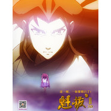

镜心之歌
============================

|  |  |
| :--: | :-- |
| [ 镜心之歌](https://emumo.xiami.com/album/1268758821) | **艺人**: [邵夷贝](../index.md) **语种**: 国语 **唱片公司**: 青春树动漫科技 **发行时间**: 2013年05月12日 **专辑类别**: EP, 单曲 **专辑风格**: 电影原声 Film Score **播放数**: 342475 **收藏数**: 384 **评论数**: 72  |

## 简介

新歌《镜心之歌》，5月31日上映的电影《魁拔2》片尾曲。  
  
“我是天上一颗冰冷的星，默默注视着你。”也献给汶川和雅安,每一个逝去的人都化作了天上一颗星星。5月12日，定期敲打着我们从忙碌中抬起头来，记得自己是个人，记得周围生活着的都是人，大家都有生命，需要互相关怀。加油。

## 曲目

## 评论

|  |  |  |  |
| :-- | :-- | :-- | :-- |
|  [虾米用户](https://emumo.xiami.com/u/355752453)  2019-08-09 23:24 赞(3) 踩(0) | 
魁拔粉丝……
 |
|  [虾米用户](https://emumo.xiami.com/u/427815633)  2019-08-08 16:13 赞(2) 踩(0) | 
蛮吉，希望2020年咱们能在电影院相见，一定要来！ 
 |
|  [虾米用户](https://emumo.xiami.com/u/288461535)  2017-05-30 03:08 赞(1) 踩(0) | 
可惜4部被绝杀了
 |
| ⇒ |  [虾米用户](https://emumo.xiami.com/u/253592407) 再见 2017-07-04 17:39 赞(0) 踩(0) | 
2018，
 |
| ⇒ |  [虾米用户](https://emumo.xiami.com/u/330567053)  2017-11-09 19:41 赞(0) 踩(0) | 
<q><b>天方耶谭说：</b></q>
 |
| ⇒ |  [虾米用户](https://emumo.xiami.com/u/356442046) . 2018-04-05 17:20 赞(0) 踩(0) | 
现在会回来的
 |
|  [虾米用户](https://emumo.xiami.com/u/43964517) 静、雅、谣 2016-12-26 21:56 赞(0) 踩(0) | 
我心中有一面透明的镜子，默默的流转回忆！   
 |
|  [虾米用户](https://emumo.xiami.com/u/122926920)  2016-05-07 15:03 赞(2) 踩(0) | 
这种空灵的感觉我很喜欢！  
 |
|  [虾米用户](https://emumo.xiami.com/u/81839518)  2016-03-28 21:11 赞(0) 踩(0) | 
魁拔   我只看了一部
 |
|  [虾米用户](https://emumo.xiami.com/u/63615666) 因为毛毛，笑了 2016-03-19 13:56 赞(0) 踩(0) | 
真棒
 |
|  [虾米用户](https://emumo.xiami.com/u/52699768)  2016-02-17 15:12 赞(2) 踩(0) | 
(ಥ_ಥ)
 |
|  [虾米用户](https://emumo.xiami.com/u/78327786)  2015-11-01 11:35 赞(0) 踩(0) | 
1
 |
|  [虾米用户](https://emumo.xiami.com/u/4038733)  2015-09-14 10:18 赞(0) 踩(0) | 
【【【【
 |
|  [虾米用户](https://emumo.xiami.com/u/48866603) 天与我相违。 2015-06-11 23:42 赞(1) 踩(0) | 
最喜欢这首
 |
| ⇒ |  [虾米用户](https://emumo.xiami.com/u/43252865)   2016-05-06 18:37 赞(0) 踩(0) | 
一
 |
|  [虾米用户](https://emumo.xiami.com/u/45564186) 余生没那么长，请你忠于自... 2015-05-09 11:56 赞(0) 踩(0) | 
喜欢 这的声音
 |
|  [虾米用户](https://emumo.xiami.com/u/8928025) 只摇不滚。 2015-04-12 21:36 赞(1) 踩(0) | 
魁拔呢 好听
 |
|  [虾米用户](https://emumo.xiami.com/u/1354288) 都好 都爱 不买 2015-02-12 12:25 赞(5) 踩(0) | 
棒，同时也等待香香姐的那首歌
 |
|  [虾米用户](https://emumo.xiami.com/u/2759354) Dreammaker 2014-12-18 17:37 赞(1) 踩(0) | 
宁静的感觉不需要解释
 |
|  [虾米用户](https://emumo.xiami.com/u/8877359) 我还没想好要写什么... 2014-10-08 21:55 赞(0) 踩(0) | 
纯音乐版的也很赞啊……
 |
|  [虾米用户](https://emumo.xiami.com/u/25806338) 杂食党。 2014-09-13 17:57 赞(22) 踩(0) | 
其实这歌词是镜心对母亲的心声抒发，并不是对蛮吉少年的爱慕流露。换句话说，真正以他们之间的感情为主题的歌曲还没有出现。电影的某些情节使许多人认为镜心想法改变和拥有一颗“心”是完全受蛮吉感染的，但是别忘了她的母亲放弃使用神力与人类一同战斗并牺牲其中的事迹，也在一直感染着镜心。而蛮吉出现，是他与天神全然不同的价值观，以及靠一股蛮力拼到死的精神品质，与镜心的母亲，普心女神当年，在众天神看来傻瓜的举动相仿，因而勾起了镜心对母亲的怀念，并渐渐开始接受人类的价值观。
 |
| ⇒ |  [虾米用户](https://emumo.xiami.com/u/25806338) 杂食党。 2014-09-13 18:05 赞(0) 踩(0) | 
无论是这张专辑的COVER，还是动画MV中数遍重复普心女神战斗倒下的画面，都能证明，使镜心懂得人类的心，是普心女神所为。而蛮吉的戏份却很少。
 |
| ⇒ |  [虾米用户](https://emumo.xiami.com/u/253592407) 再见 2017-07-04 17:38 赞(0) 踩(0) | 
<q><b>乖孩子永铃铃说：</b></q>
 |
| ⇒ |  [虾米用户](https://emumo.xiami.com/u/253592407) 再见 2017-07-04 17:38 赞(0) 踩(0) | 
<q><b>乖孩子永铃铃说：</b></q>
 |
| ⇒ |  [虾米用户](https://emumo.xiami.com/u/327616487)  2018-07-02 08:32 赞(0) 踩(0) | 
朴心女神
 |
| ⇒ |  [虾米用户](https://emumo.xiami.com/u/327616487)  2018-07-02 08:32 赞(0) 踩(0) | 
其实都有吧。
 |
| ⇒ |  [虾米用户](https://emumo.xiami.com/u/336940774)  2019-06-05 19:26 赞(0) 踩(0) | 
晚霞中那一位灿烂少年温暖我孤独少年
 |
| ⇒ |  [虾米用户](https://emumo.xiami.com/u/336940774)  2019-06-05 19:26 赞(0) 踩(0) | 
<q><b>张乃宗说：</b></q>
 |
|  [虾米用户](https://emumo.xiami.com/u/32173672)  2014-08-26 20:37 赞(1) 踩(0) | 
怎么就一个其它配乐呢
 |
|  [虾米用户](https://emumo.xiami.com/u/7314012) 成功属于我 2014-04-01 18:52 赞(0) 踩(0) | 
Good music
 |
|  [虾米用户](https://emumo.xiami.com/u/154641) 然后青天在上，星日朗朗 2013-12-04 13:00 赞(2) 踩(0) | 
跟动画片真的很搭配啊有木有，静心跟蛮吉即将上演虐心大戏了有木有！！
 |
|  [虾米用户](https://emumo.xiami.com/u/154641) 然后青天在上，星日朗朗 2013-12-04 12:59 赞(0) 踩(0) | 
啊魁拔。
 |
|  [虾米用户](https://emumo.xiami.com/u/8644380) 好き        嫌い 2013-12-02 00:56 赞(0) 踩(0) | 
魁拔让我深感欣慰可以放心给孩子看了w
 |
|  [虾米用户](https://emumo.xiami.com/u/10491621) 我还没想好要写什么... 2013-11-12 12:00 赞(0) 踩(0) | 
我去，原来魁拔的歌是她做的？！
 |
| ⇒ |  [虾米用户](https://emumo.xiami.com/u/1200817) Saecula Saec... 2014-01-27 15:46 赞(0) 踩(0) | 
同感！
 |
| ⇒ |  [虾米用户](https://emumo.xiami.com/u/253592407) 再见 2017-07-04 17:40 赞(0) 踩(0) | 
？
 |
|  [虾米用户](https://emumo.xiami.com/u/3091823)  2013-11-03 06:20 赞(0) 踩(0) | 
冰凉的星 也会燃烧
 |
|  [虾米用户](https://emumo.xiami.com/u/19787529)  2013-08-21 14:01 赞(0) 踩(0) | 
...
 |
|  [虾米用户](https://emumo.xiami.com/u/13733354)  2013-07-25 15:02 赞(0) 踩(0) | 
好温柔
 |
|  [虾米用户](https://emumo.xiami.com/u/17979988)  2013-07-25 13:57 赞(0) 踩(0) | 
好好听
 |
|  [虾米用户](https://emumo.xiami.com/u/4471101)  2013-07-23 16:18 赞(0) 踩(0) | 
不错，喜欢
 |
|  [虾米用户](https://emumo.xiami.com/u/2379966) 芭蕉鲸不会停 2013-07-04 19:17 赞(1) 踩(0) | 
是青青树啊喂...
 |
|  [虾米用户](https://emumo.xiami.com/u/8558752)  2013-06-21 20:43 赞(0) 踩(0) | 
说实话，不喜欢这个作词，根本没办法跟毛姐比，好像最近还要给一个叫开心英雄还是什么的唱首歌，希望毛姐可以包办词曲
 |
| ⇒ |  [虾米用户](https://emumo.xiami.com/u/5487965)  2013-06-26 16:51 赞(0) 踩(0) | 
那是小毛原来专辑里就有的歌，不知道词曲是不是本人包办
 |
|  [虾米用户](https://emumo.xiami.com/u/7622063) shirleyy 2013-06-20 17:33 赞(0) 踩(0) | 
好好听~
 |
|  [虾米用户](https://emumo.xiami.com/u/337895) 全平台同名 2013-06-19 14:31 赞(0) 踩(0) | 
唱片公司：青春树动漫科技？？？不是青青树么？？、
 |
| ⇒ |  [虾米用户](https://emumo.xiami.com/u/253592407) 再见 2017-07-04 17:40 赞(0) 踩(0) | 
这是全称
 |
|  [虾米用户](https://emumo.xiami.com/u/1481235)  2013-06-14 03:15 赞(1) 踩(0) | 
真不知道小毛还有这般空灵的声音。
 |
|  [虾米用户](https://emumo.xiami.com/u/1365339) 一切上昇或者墜落或者旋轉... 2013-06-08 14:21 赞(0) 踩(0) | 
我想看哎。。。
 |
|  [虾米用户](https://emumo.xiami.com/u/272697) 我还没想好要写什么... 2013-06-05 21:51 赞(0) 踩(0) | 
很不错，超级好听、
 |
|  [虾米用户](https://emumo.xiami.com/u/272697) 我还没想好要写什么... 2013-06-05 21:48 赞(0) 踩(0) | 
真的很好听、很不错、
 |
|  [虾米用户](https://emumo.xiami.com/u/1858640) 末路.狂花. 2013-06-02 10:18 赞(1) 踩(0) | 
邵小毛，私底下王菲的《因为爱情》唱多了吧...哈哈
 |
|  [虾米用户](https://emumo.xiami.com/u/13077347) 一万年太久，只争朝夕。 2013-05-29 15:54 赞(1) 踩(0) | 
很好听，又是我喜欢的动漫《魁拔》的片尾曲，没什么理由不推荐。
 |
|  [虾米用户](https://emumo.xiami.com/u/14378971)  2013-05-25 00:32 赞(0) 踩(0) | 
爱魁拔，爱小毛！
 |
|  [虾米用户](https://emumo.xiami.com/u/5487965)  2013-05-23 17:21 赞(0) 踩(0) | 
小毛好深沉
 |
|  [虾米用户](https://emumo.xiami.com/u/690808) dddddddddddd 2013-05-22 10:23 赞(0) 踩(0) | 
好听！！！
 |
|  [虾米用户](https://emumo.xiami.com/u/4318853) 欲辨已忘言 2013-05-19 19:48 赞(0) 踩(0) | 
国产一定要支持的
 |
|  [虾米用户](https://emumo.xiami.com/u/4315263) 呆萌又不是罪过~ 2013-05-18 15:55 赞(0) 踩(0) | 
还是喜欢大龄女青年时候的声音
 |
|  [虾米用户](https://emumo.xiami.com/u/4372461)  2013-05-18 15:09 赞(0) 踩(0) | 
为什么这么好听呢。。。为什么要学王菲的声音，还是本来就是这种声音？啊
 |
| ⇒ |  [虾米用户](https://emumo.xiami.com/u/253592407) 再见 2017-07-04 17:41 赞(0) 踩(0) | 
有了对动漫的感受就能唱出这种效果吧
 |
|  [虾米用户](https://emumo.xiami.com/u/2119512)  2013-05-18 13:34 赞(0) 踩(0) | 
小毛@邵夷贝 加油！
 |
|  [虾米用户](https://emumo.xiami.com/u/6976207)  2013-05-18 10:34 赞(0) 踩(0) | 
的确风格有点变啊
 |
|  [虾米用户](https://emumo.xiami.com/u/6009873)  2013-05-18 06:48 赞(0) 踩(0) | 
魁拔 一直期待 第2部 加油 国产动画！邵夷贝演绎片尾曲 又是惊喜对逝人的缅怀 感动
 |
|  [虾米用户](https://emumo.xiami.com/u/812392) q音网易搜央央小月，酷g... 2013-05-18 00:43 赞(0) 踩(0) | 
额。。。。。。。。。。。
 |
|  [虾米用户](https://emumo.xiami.com/u/9028163)  2013-05-17 18:31 赞(0) 踩(0) | 
我感觉这首歌不错啊.大家为什么一定要对国产如此苛刻呢?
 |
|  [虾米用户](https://emumo.xiami.com/u/3606998)   2013-05-17 17:34 赞(0) 踩(0) | 
好听~
 |
|  [虾米用户](https://emumo.xiami.com/u/3606998)   2013-05-17 17:34 赞(1) 踩(0) | 
好听~~~~
 |
|  [虾米用户](https://emumo.xiami.com/u/1170903) 我妖气重我自豪 2013-05-17 16:33 赞(0) 踩(0) | 
噗...邵小毛...魁拔...怎么感觉这么伪合..- -
 |
|  [虾米用户](https://emumo.xiami.com/u/341811)   2013-05-17 16:25 赞(0) 踩(0) | 
呵呵。
 |
|  [虾米用户](https://emumo.xiami.com/u/8452018)  2013-05-17 15:08 赞(0) 踩(0) | 
这是要转型的前奏？！
 |
|  [虾米用户](https://emumo.xiami.com/u/4237498) 弹性，力度，流动，神秘感 2013-05-17 13:32 赞(0) 踩(0) | 
怎么感觉又变成了商业化的媚俗声音，，，，，
 |
| ⇒ |  [虾米用户](https://emumo.xiami.com/u/253592407) 再见 2017-07-04 17:43 赞(0) 踩(0) | 
，，，，，没看过动漫，且不能理解音乐
 |
