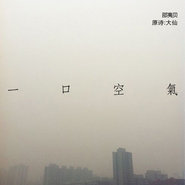

一口空气
============================

|  |  |
| :--: | :-- |
| [ 一口空气](https://emumo.xiami.com/album/477584) | **艺人**: [邵夷贝](../index.md) **语种**: 国语 **唱片公司**: 壹样文艺 **发行时间**: 2011年11月15日 **专辑类别**: EP, 单曲 **专辑风格**: 华语唱作人 Chinese Singer-Songwriter, 独立流行 Indie Pop, 独立民谣 Indie Folk **播放数**: 138615 **收藏数**: 332 **评论数**: 39  |

## 简介

《一口空气》demo——  
这首歌的歌词是诗人大仙写于1989年的一首诗，那个时候的空气，还可以蕴含出这样美好而悠远的意境。就让我们一起听着歌，回味着那些曾经拥有的美妙吧。

## 曲目

## 评论

|  |  |  |
| :-- | :-- | :-- |
|  [虾米用户](https://emumo.xiami.com/u/155947) 一期一会 2017-10-12 16:16 赞(0) 踩(0) | 
1989年秋冬之交的一口空气
 |
|  [虾米用户](https://emumo.xiami.com/u/3821480)  2016-07-20 09:30 赞(2) 踩(0) | 
声音驾驭不了这歌词
 |
|  [虾米用户](https://emumo.xiami.com/u/81839518)  2016-03-28 21:10 赞(0) 踩(0) | 
霾吗？雾霾南方有没
 |
|  [虾米用户](https://emumo.xiami.com/u/43026061) 暂无签名~ 2015-05-05 00:26 赞(0) 踩(0) | 
声音确实太嫩
 |
|  [虾米用户](https://emumo.xiami.com/u/13617745)  2014-03-31 02:47 赞(0) 踩(0) | 
甜美的出世！
 |
|  [虾米用户](https://emumo.xiami.com/u/1609946) 一即一切 2014-03-07 16:12 赞(0) 踩(0) | 
心 境不二
 |
|  [虾米用户](https://emumo.xiami.com/u/20535814)  2014-02-19 21:03 赞(0) 踩(0) | 
声音实在出乎我意料。。太嫩了。。
 |
|  [虾米用户](https://emumo.xiami.com/u/10491621) 我还没想好要写什么... 2013-11-12 12:36 赞(0) 踩(0) | 
大赞啊
 |
|  [虾米用户](https://emumo.xiami.com/u/23369908) 我还没想好要写什么... 2013-11-05 16:24 赞(0) 踩(0) | 
歌词很赞
 |
|  [虾米用户](https://emumo.xiami.com/u/963987) 逃离吧。 2012-07-04 10:22 赞(0) 踩(0) | 
封面一看就想起了The Killers的hot fuss……
 |
|  [虾米用户](https://emumo.xiami.com/u/5547268)  2012-04-01 21:13 赞(0) 踩(0) | 
好意境，用诗歌谱曲不易
 |
|  [虾米用户](https://emumo.xiami.com/u/7804954) 雪莉爱雪梨 2012-03-07 22:37 赞(0) 踩(0) | 
她的声音演绎这首歌还稍稚嫩了些...
 |
|  [虾米用户](https://emumo.xiami.com/u/7048513) 神马都是浮云 2011-12-09 21:19 赞(0) 踩(0) | 
先听听看
 |
|  [虾米用户](https://emumo.xiami.com/u/6258270)  2011-12-07 03:08 赞(0) 踩(0) | 
《灰色的孩子》-小邵的摇滚很好听。
 |
|  [虾米用户](https://emumo.xiami.com/u/3275469) 无底线热爱音乐 2011-12-05 13:29 赞(1) 踩(0) | 
果然是文艺女青年
 |
|  [虾米用户](https://emumo.xiami.com/u/3275469) 无底线热爱音乐 2011-12-05 13:29 赞(0) 踩(0) | 
果然是文艺女青年
 |
|  [虾米用户](https://emumo.xiami.com/u/216500)  2011-11-26 21:38 赞(0) 踩(0) | 
可惜唱得一般
 |
|  [虾米用户](https://emumo.xiami.com/u/6934442)  2011-11-24 12:03 赞(0) 踩(0) | 
个性真实的内心倾诉
 |
|  [虾米用户](https://emumo.xiami.com/u/1246149)  2011-11-23 15:27 赞(0) 踩(0) | 
一口清新的空气
 |
|  [虾米用户](https://emumo.xiami.com/u/939924)  2011-11-17 22:53 赞(0) 踩(0) | 
澄清空气，一缕异香。
 |
|  [虾米用户](https://emumo.xiami.com/u/424655) 暂无签名~ 2011-11-17 17:10 赞(0) 踩(0) | 
诗真的不错。
 |
|  [虾米用户](https://emumo.xiami.com/u/1403046)  2011-11-17 09:52 赞(0) 踩(0) | 
淡淡滴~一贯的风格
 |
|  [虾米用户](https://emumo.xiami.com/u/1620364)  2011-11-16 18:28 赞(0) 踩(0) | 
很平庸
 |
|  [虾米用户](https://emumo.xiami.com/u/172902)   2011-11-16 18:11 赞(0) 踩(0) | 
毛毛你是个好姑娘
 |
|  [虾米用户](https://emumo.xiami.com/u/164061) 一转眼虾米就要走了，感谢... 2011-11-16 16:34 赞(0) 踩(0) | 
说实话，不出彩。
 |
|  [虾米用户](https://emumo.xiami.com/u/6805887)  2011-11-16 16:07 赞(0) 踩(0) | 
喜欢
 |
|  [虾米用户](https://emumo.xiami.com/u/4726097)  2011-11-16 08:37 赞(0) 踩(0) | 
可以感觉是个温柔的人呢。
 |
|  [虾米用户](https://emumo.xiami.com/u/194780)  2011-11-16 07:14 赞(0) 踩(0) | 
小毛又出新歌啦，怎么虾米没通知我？
 |
|  [虾米用户](https://emumo.xiami.com/u/42347) 寻找无双 2011-11-16 01:38 赞(0) 踩(0) | 
歌词依然精彩，歌声依旧苍白。
 |
|  [虾米用户](https://emumo.xiami.com/u/1278757)  2011-11-15 22:46 赞(0) 踩(0) | 
一口空气，全是可吸入颗粒。没有阳光的早晨，全是尾气。
 |
|  [虾米用户](https://emumo.xiami.com/u/6316859)  2011-11-15 22:34 赞(0) 踩(0) | 
没感觉
 |
|  [虾米用户](https://emumo.xiami.com/u/2890966)  2011-11-15 21:49 赞(0) 踩(0) | 
很弥迷
 |
|  [虾米用户](https://emumo.xiami.com/u/4226135)  2011-11-15 19:24 赞(0) 踩(0) | 
一口空气
 |
|  [虾米用户](https://emumo.xiami.com/u/1234001)  2011-11-15 18:37 赞(0) 踩(0) | 
微弱的气息，无力的呻吟- -，像林黛玉奄奄一息前叹出的一口二氧化碳？  声音听着有点自我封闭，歌手像被独自卷入在了一个巨大的沙漠漩涡里，而且已经放弃了挣扎静静得接受、等待自己会被沙漠吞噬的现实。              歌手思绪很飘，带着迷惘，应该是浑浊不清的感觉，专辑封面也是的， 灰色意境，   太颓了。  这样的空气不算新鲜，情绪也和细菌一样，是不好随便吸入的，尤其是对还未真正经历过人生的年轻人来讲。    最多只能算作是非主流之宣泄系吧             哈哈~   歌名挺有意思，是诗名吗？ 内容听不清，想看下这首诗讲的什么 - -百度不到 ..
 |
|  [虾米用户](https://emumo.xiami.com/u/5915603)  2011-11-15 18:23 赞(0) 踩(0) | 
小文艺？感觉学陈绮贞。有些音还不准。声音又像许哲佩。。
 |
|  [虾米用户](https://emumo.xiami.com/u/2330300)  2011-11-15 18:19 赞(0) 踩(0) | 
左米的幸福
 |
|  [虾米用户](https://emumo.xiami.com/u/1052461) @blinK4sy- 2011-11-15 18:11 赞(0) 踩(0) | 
睡着了有木有?
 |
| ⇒ |  [虾米用户](https://emumo.xiami.com/u/6689411)  2011-11-15 22:21 赞(0) 踩(0) | 
有！！！
 |
|  [虾米用户](https://emumo.xiami.com/u/2111792)  2011-11-15 17:52 赞(0) 踩(0) | 
好诗好湿
 |
