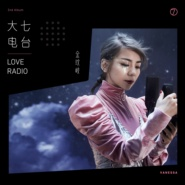

金玟岐
============================

|  |  |
| :--: | :-- |
| [ 金玟岐](https://i.xiami.com/vanessa) | **地区**: China 中国大陆 **风格**: 电影原声 Film Score, 电视原声 Television Music, 国语流行 Mandarin Pop, 华语唱作人 Chinese Singer-Songwriter **播放数**: 503591781 **粉丝数**: 493685 **评论数**: 3133  |

## 档案

小档案 
中 文 名：金玟岐 
外 文 名：Vanessa 
国   籍：中国 
民   族：汉族 
星   座：狮子座 
血   型：O型 
身   高：160cm 
体   重：45kg 
出 生 地：江西 
出生日期：7月23日 
毕业院校：西安音乐学院 
代表作品：爱呀、岁月神偷 
艺人简介 
金玟岐，  7  月  23  日出生于江西，毕业于西安音乐学院，歌手、音乐制作人、作曲人，作词人。大学毕业后，她一直进行幕后创作。  2014  年，她因为电影《北京爱情故事》演唱《岁月神偷》一曲而受到大众关注。  2015  年，她发布首张专辑《完美世界》，从幕后走向台前。 
演艺经历 
2010  年，为姚贝娜创作单曲《如果没有你》，收录于  2015  年  9  月  28  日发行的姚贝娜纪念专辑《天生骄傲》中；  9  月，为快乐家族创作歌曲《为你歌唱》，收录于快乐家族首张专辑《快乐你懂的》中。  2011  年  1  月，为电视剧《怪侠一枝梅》创作主题曲《天地梅花开》；  8  月为电视剧《金枝玉叶》创作同名主题曲《金枝玉叶》；  9  月创作歌曲《烟火》，由陈翔演唱，收录于《  2010  快乐男声合辑》中。  2012  年  3  月  14  日，为武艺创作歌曲《许愿》，收录于专辑《见习爱》中；同年为电影《暴躁天使》创作主题曲《我是我》。 
2014  年，为电影《北京爱情故事》所创作并演唱的《岁月神偷》在各大音乐网站上有着超过  1000  万人次的试听量，并以最受欢迎音乐人的身份占据豆瓣音乐排行榜冠军位置半年，开始转向幕前工作；  2014  年  1  月，参加中国好歌曲，成为周华健的队员，原创歌曲《爱呀》收录到周华健的原创大碟《江湖新能量》中，但在播出时却遭到删除；  5  月  1  日发行个人创作单曲《才华有限公司》，收录于国内第一张互联网唱片《寻光集》中，  2016  年该歌曲被改编为电影。 
2015  年，金玟岐推出了首张个人专辑《完美世界》，宣告正式从幕后走向台前，金玟岐从十年间创作的  demo  中挑选了十首，词曲创作均由金玟岐自己一手包揽；  2  月  17  日，为电视剧《转身说爱你》创作的三首歌曲发布，作曲作品《如果遇见》，由王珞丹演唱，填词作品《一百分幸福》、《转身以后》由宣言演唱，均收录于电视剧《转身说爱你》电视原声带中；  6  月为电视剧《旋风少女》创作两首歌曲，片尾曲《那个远方》，由陈楚生演唱，插曲《痛快》由金玟岐本人演唱；  7  月  21  日发布个人创作单曲《新郎阿花》；  8  月  10  日，为电影《别有动机》创作的单曲《挚爱》正式发布，由俞灏明演唱；  8  月、  9  月在北京、上海、成都、广州、深圳举办“完美世界”巡回音乐会；  9  月  24  日，由金玟岐作词作曲的音乐单曲《日月同辉》发布，郁可唯、陈楚生演唱；  12  月  9  日发行单曲《惊天动地》，这是她第一次书写和歌唱自己的经历，标志着一个新的起点。 
2016  年  2  月  1  日，金玟岐发布个人创作并演唱的单曲《直到遇见你》，也是电视剧《五鼠闹东京》的插曲；  4  月  16  日，金玟岐获第八届“华语金曲奖”年度最佳国语女新人奖提名；  7  月，受邀为  Sam  赖伟锋音乐专辑《最差不过是孤独》的第三波主打歌《后人》填词。

## 专辑

| 名称 | 语种 | 唱片公司 | 发行时间 | 专辑类别 | 专辑风格 |
| :--: | :-- | :-- | :-- | :-- | :-- |
| [ 心如刀割](./albums/5020748105.md) | 国语 | 制作家 | 2020年05月25日 | EP, 单曲 |  |
| [ 一辈子的孤单A Lifetime of Loneliness](./albums/5020601864.md) | 国语 | 网易云音乐, 智慧大狗 | 2020年05月16日 | EP, 单曲 |  |
| [ 北灵少年志之大主宰 电视剧影视原声带·心境篇](./albums/2106060136.md) | 国语 | 听见时代 | 2020年02月18日 | 原声带, 影视音乐 | 国语流行 Mandarin Pop, 电视原声 Television Music |
| [ 不完美的完美](./albums/2106072714.md) | 国语 | 翊辰文化 | 2020年02月17日 | EP, 单曲 |  |
| [ 因为宠爱](./albums/2106059494.md) | 国语 | 大七文化 | 2019年12月31日 | EP, 单曲 |  |
| [ 荣光](./albums/2104989795.md) | 国语 | 腾讯游戏 | 2019年07月11日 | EP, 单曲 |  |
| [ 憾Regret](./albums/5020621591.md) | 国语 | 网易云音乐 | 2019年06月22日 | EP, 单曲 | 流行 Pop |
| [ 别再说你不在状态](./albums/2104850967.md) | 国语 | 大七文化 | 2019年05月15日 | EP, 单曲 | 国语流行 Mandarin Pop |
| [ 有关于你影视剧《为了你我愿意热爱整个世界》插曲](./albums/2104028327.md) | 国语 | 燃音乐 | 2018年07月02日 | 原声带, 影视音乐 |  |
| [ 梦](./albums/2103704418.md) | 国语 | 湖南卫视 | 2018年05月09日 | EP, 单曲 | 国语流行 Mandarin Pop |
| [ 这样的你](./albums/2103646303.md) | 国语 | 金狐文化 | 2018年03月27日 | EP, 单曲 |  |
| [ 不思议人生](./albums/2102973519.md) | 国语 | 雷霆信息 | 2017年12月15日 | EP, 单曲 | 国语流行 Mandarin Pop |
| [ 爱即正义ll](./albums/2102969565.md) | 国语 | 网易游戏 | 2017年12月07日 | EP, 单曲 | 国语流行 Mandarin Pop |
| [ 大七电台Love Radio](./albums/2102862749.md) | 国语 | 霍尔果斯泰洋川禾 | 2017年11月23日 | 录音室专辑 | 国语流行 Mandarin Pop, 华语唱作人 Chinese Singer-Songwriter |
| [ 娱乐Entertainment](./albums/2102873780.md) | 国语 | 霍尔果斯泰洋川禾 | 2017年10月17日 | EP, 单曲 |  |
| [ 思美人兮](./albums/2102735541.md) | 国语 | 独立发行 | 2017年04月21日 | EP, 单曲 | 国语流行 Mandarin Pop, 中国风 China-Wave |
| [ 回合](./albums/2102649033.md) | 国语 | 网易游戏 | 2016年11月08日 | EP, 单曲 | 国语流行 Mandarin Pop |
| [ 孩子电影《海洋之歌》官方推广曲](./albums/2100377421.md) | 国语 | 独立发行 | 2016年08月09日 | EP, 单曲 | 国语流行 Mandarin Pop |
| [ 惊天动地](./albums/2100245238.md) | 国语 | 大福唱片 | 2015年12月09日 | EP, 单曲 | 国语流行 Mandarin Pop |
| [ 新娘阿花](./albums/2037619831.md) | 国语 | 独立发行 | 2015年07月21日 | EP, 单曲 | 国语流行 Mandarin Pop |
| [ 完美世界A Perfect World](./albums/523792755.md) | 国语 | 虾米音乐人 | 2015年03月19日 | 录音室专辑 | 国语流行 Mandarin Pop, 华语唱作人 Chinese Singer-Songwriter |
| [ 岁月神偷 (Demo)](./albums/2106072702.md) | 国语 | 独立发行 | 2014年02月18日 | EP, 单曲 | 流行 Pop |

## 评论

|  |  |  |
| :-- | :-- | :-- |
|  [虾米用户](https://emumo.xiami.com/u/33304290) 这个人很懒 2021-01-10 16:06 赞(0) 踩(0) | 
想你
 |
|  [虾米用户](https://emumo.xiami.com/u/340379518)  2021-01-06 17:38 赞(2) 踩(0) | 
因为虾米而认识的大七，现在虾米也要说拜拜了
 |
|  [虾米用户](https://emumo.xiami.com/u/358995000) 散场本是常态 尽兴而归就... 2020-11-18 01:31 赞(1) 踩(0) | 
▸
 |
|  [虾米用户](https://emumo.xiami.com/u/302199645) 胜利的交响乐 2020-10-19 22:16 赞(0) 踩(0) | 
感觉唱得还是挺好的，并没有感觉特别好，但是一看简介，词曲都是自己写的，不禁肃然起敬，像这样的才女太少了。 
 |
|  [虾米用户](https://emumo.xiami.com/u/402621501)  2020-10-13 20:35 赞(0) 踩(0) | 
居然没有球迷。
 |
| ⇒ |  [虾米用户](https://emumo.xiami.com/u/43897870) no pain,no g... 2021-01-26 14:59 赞(0) 踩(0) | 
哈哈哈
 |
|  [虾米用户](https://emumo.xiami.com/u/276944698) 不要自我设限..... 2020-09-03 13:22 赞(0) 踩(0) | 
✔️✔️✔️
 |
|  [虾米用户](https://emumo.xiami.com/u/343240170)  2020-08-30 20:47 赞(3) 踩(0) | 
很像孙燕姿，我以为新加坡的呢，原来是位江西妹纸，真棒创作型歌手，前途
 |
|  [虾米用户](https://emumo.xiami.com/u/443305275)  2020-07-23 23:54 赞(0) 踩(0) | 
听你的岁月神偷，我有种想哭的感觉！
 |
|  [虾米用户](https://emumo.xiami.com/u/11235021) 纵贯线王菲熊光KOKIA... 2020-07-23 20:33 赞(0) 踩(0) | 
我记得那年生日 也记得那一首歌 金玟岐也唱过&amp;ldquo;我怀念的&amp;rdquo;！
 |
|  [虾米用户](https://emumo.xiami.com/u/443840616)  2020-06-26 01:54 赞(1) 踩(0) | 
我终于在虾米找到了比较全的歌单，哭唧唧深夜听歌太上头了，我一定要去一次现场！！！！我爱大七
 |
|  [虾米用户](https://emumo.xiami.com/u/422810783) 帆布鞋行千里fbxxql 2020-05-31 22:18 赞(0) 踩(0) | 
好久没评论，歌曲依然好听 
 |
|  [虾米用户](https://emumo.xiami.com/u/413732628)  2020-05-27 23:25 赞(0) 踩(0) | 
大事发声live版专辑哪里有的卖
 |
|  [虾米用户](https://emumo.xiami.com/u/104170090)  2020-05-18 13:36 赞(0) 踩(0) | 
想你。
 |
|  [虾米用户](https://emumo.xiami.com/u/189458231)  2020-05-18 03:47 赞(1) 踩(0) | 
多简单，多复杂
 |
|  [虾米用户](https://emumo.xiami.com/u/256924309) 我还没想好要写什么... 2020-05-17 11:25 赞(0) 踩(0) | 

 |
|  [虾米用户](https://emumo.xiami.com/u/442182113)  2020-04-13 14:36 赞(1) 踩(0) | 
听着听着想到了很多过往，看好你哦。
 |
|  [虾米用户](https://emumo.xiami.com/u/163693864) 休休闲，听听歌，混混点 2020-04-05 04:58 赞(1) 踩(0) | 
声音和唱功很吸引人
 |
|  [虾米用户](https://emumo.xiami.com/u/222929609)  2020-03-31 07:58 赞(1) 踩(0) | 
很喜欢你的歌
 |
|  [虾米用户](https://emumo.xiami.com/u/587666) If You Dream 2020-03-30 16:56 赞(0) 踩(0) | 
分隔符
 |
|  [虾米用户](https://emumo.xiami.com/u/206772436) 打麻将是为了炸胡 2020-03-26 00:49 赞(1) 踩(0) | 
真棒
 |
|  [虾米用户](https://emumo.xiami.com/u/33828214) 逗比—么么(~_~;)十... 2020-03-25 13:58 赞(0) 踩(0) | 

 |
|  [虾米用户](https://emumo.xiami.com/u/432660444) 我还没想好要写什么... 2020-03-11 10:44 赞(0) 踩(0) | 
我终于到自己喜欢的歌手啦！支持妳的歌曲！
 |
|  [虾米用户](https://emumo.xiami.com/u/440462737) 我还没想好要写什么... 2020-03-04 15:51 赞(0) 踩(0) | 

 |
|  [虾米用户](https://emumo.xiami.com/u/440573481)  2020-02-20 11:18 赞(1) 踩(0) | 
喜欢你的声音
 |
|  [虾米用户](https://emumo.xiami.com/u/74639208) Music is per... 2020-02-13 12:23 赞(1) 踩(0) | 
太好听啦
 |
|  [虾米用户](https://emumo.xiami.com/u/39366329)  2020-01-16 21:22 赞(1) 踩(0) | 
真的很好听，词也很美！
 |
|  [虾米用户](https://emumo.xiami.com/u/435418602)  2020-01-12 15:59 赞(2) 踩(0) | 
感谢你的歌给我的力量
 |
|  [虾米用户](https://emumo.xiami.com/u/228757246) 变幻的世界总有些不变的信... 2019-12-25 22:23 赞(1) 踩(0) | 
有个封面穿毛衣的  很大  你们还记得吗？
 |
|  [虾米用户](https://emumo.xiami.com/u/12523662) 暂无签名~ 2019-11-30 15:51 赞(3) 踩(0) | 
她的歌仿佛戳中这代人无奈的G点。
 |
|  [虾米用户](https://emumo.xiami.com/u/64848506)  2019-11-16 16:03 赞(0) 踩(0) | 
为小姐姐打call
 |
|  [虾米用户](https://emumo.xiami.com/u/96434262)  2019-09-20 23:04 赞(0) 踩(0) | 
第一次听你的声音就爱上了！！不能自拔！
 |
|  [虾米用户](https://emumo.xiami.com/u/341491654)  2019-09-19 23:37 赞(0) 踩(0) | 
玟岐妹子加油。过成自己想要的一世，祝福。
 |
|  [虾米用户](https://emumo.xiami.com/u/358178080) 我还没想好要写什么... 2019-09-16 21:57 赞(0) 踩(0) | 
金蚊子的声音感觉是初恋，慢慢的诉说着时间的流逝，思维始终在她的声音中。一曲终了感觉她就是岁月神偷
 |
|  [虾米用户](https://emumo.xiami.com/u/6704280) 一起仰望星空 ( 非常讨... 2019-09-11 23:21 赞(2) 踩(0) | 
好像孙燕姿
 |
|  [虾米用户](https://emumo.xiami.com/u/2796166) 最爱莫文蔚..... 2019-09-09 00:51 赞(1) 踩(0) | 
加油！！！！！！
 |
|  [虾米用户](https://emumo.xiami.com/u/428925030)  2019-08-21 18:17 赞(1) 踩(0) | 
女神加油丫♡
 |
|  [虾米用户](https://emumo.xiami.com/u/428789595) 我本来是个敲可爱的女孩子... 2019-08-17 20:18 赞(1) 踩(0) | 
超级稀饭介个小姐姐唱的岁月神偷  
 |
|  [虾米用户](https://emumo.xiami.com/u/427609766) 唱，唱吧，唱红阿里郎…听... 2019-08-11 01:50 赞(1) 踩(0) | 
刚下载的虾米，只是为了下载喜欢的铃声。可是，可是，直到今天才发觉我错过了许多许多……
 |
|  [虾米用户](https://emumo.xiami.com/u/335330496)  2019-08-06 14:32 赞(0) 踩(0) | 
你的岁月神偷和13是我第一次单曲循环这么多年的，爱了
 |
|  [虾米用户](https://emumo.xiami.com/u/306924686)  2019-08-06 10:51 赞(0) 踩(0) | 
姐姐也是一只可爱的五迷啊 
 |
|  [虾米用户](https://emumo.xiami.com/u/304642175)  2019-07-31 19:28 赞(0) 踩(0) | 
真的很喜欢
 |
|  [虾米用户](https://emumo.xiami.com/u/332842050)  人。那么得邪恶。 2019-07-23 15:53 赞(0) 踩(0) | 
哈咯哈咯大家下午好，祝你们有个愉快地一天。
 |
|  [虾米用户](https://emumo.xiami.com/u/361839699) 淋漓尽致见怪不怪美不胜收... 2019-07-16 01:19 赞(1) 踩(0) | 
二月十四，不要回复我等于转发
 |
|  [虾米用户](https://emumo.xiami.com/u/2796166) 最爱莫文蔚..... 2019-07-14 19:01 赞(1) 踩(0) | 
加油~~~~
 |
|  [虾米用户](https://emumo.xiami.com/u/78124118) 不可以荒废自己 2019-07-10 22:06 赞(1) 踩(0) | 
用 地 会比较对吧
 |
|  [虾米用户](https://emumo.xiami.com/u/42963872) 我还没想好要写什么... 2019-07-10 15:13 赞(1) 踩(0) | 
.
 |
|  [虾米用户](https://emumo.xiami.com/u/356243105)  2019-07-09 20:44 赞(1) 踩(0) | 
谢谢你，我要开始写作业了
 |
|  [虾米用户](https://emumo.xiami.com/u/356243105)  2019-07-09 20:30 赞(1) 踩(0) | 
纯粹的自己到底在哪里
 |
|  [虾米用户](https://emumo.xiami.com/u/426908012)  2019-07-04 22:41 赞(0) 踩(0) | 

 |
|  [虾米用户](https://emumo.xiami.com/u/48931489)  2019-07-03 12:55 赞(0) 踩(0) | 
已经不再是耳朵的欢愉，更是直击灵魂！听一下就会中毒再也离不开！金玟岐的歌无限循环中！ 另外请问下哪家有他比较全的作品啊？虾米好多都听不了了
 |
|  [虾米用户](https://emumo.xiami.com/u/374728019)  2019-07-03 00:35 赞(0) 踩(0) | 
了不起，希望你可以坚持下去
 |
|  [虾米用户](https://emumo.xiami.com/u/175665178)  2019-07-02 20:23 赞(0) 踩(0) | 
到了今天，我才发现原来这么多喜欢的歌是金唱的～
 |
|  [虾米用户](https://emumo.xiami.com/u/423698140) 我还没想好要写什么... 2019-06-13 12:34 赞(0) 踩(0) | 
偶然间听到你的岁月神偷，一下子就被你的歌声吸引。唱的很有感觉，非常喜欢
 |
|  [虾米用户](https://emumo.xiami.com/u/416208459) 我还没想好要写什么... 2019-06-02 22:37 赞(1) 踩(0) | 
怎么说呢。爱你。但也希望你能一直保持着这种写作风格。
 |
|  [虾米用户](https://emumo.xiami.com/u/13227417) 不负如来不负卿 2019-05-31 20:38 赞(1) 踩(0) | 
郭静和燕姿的合体 
 |
|  [虾米用户](https://emumo.xiami.com/u/332087218) 天灵灵地灵灵，你别抬杠行... 2019-05-25 17:51 赞(1) 踩(0) | 
呀。西安音乐学院的，应该同年在西安上过学
 |
|  [虾米用户](https://emumo.xiami.com/u/320288876) 沉... 2019-05-25 08:42 赞(1) 踩(0) | 
你好正
 |
|  [虾米用户](https://emumo.xiami.com/u/420726806)  2019-05-24 18:29 赞(1) 踩(0) | 
小姐姐超级棒呐
 |
|  [虾米用户](https://emumo.xiami.com/u/420726806)  2019-05-24 18:29 赞(1) 踩(0) | 
江西人鸭！
 |
|  [虾米用户](https://emumo.xiami.com/u/47479564)  2019-05-16 15:27 赞(1) 踩(0) | 
金玟岐，不知道你还记不记得《城市依赖重症患者的创作笔记》？<a href="http://emumo.xiami.com/u/20551989" target="_blank" rel="nofollow" name_card="20551989">@金玟岐 </a>
 |
|  [虾米用户](https://emumo.xiami.com/u/424375092)  2019-05-10 17:36 赞(2) 踩(0) | 
很喜欢你的声音 清澈但也有厚度
 |
|  [虾米用户](https://emumo.xiami.com/u/47953646) 心灵休憩的港湾！ 2019-05-07 19:28 赞(1) 踩(0) | 
不错 
 |
|  [虾米用户](https://emumo.xiami.com/u/349297462) 来自深渊的双鱼座 2019-05-04 22:35 赞(1) 踩(0) | 
才女啊，果断关注了 
 |
|  [虾米用户](https://emumo.xiami.com/u/328283206)  2019-05-02 20:50 赞(0) 踩(0) | 
超级爱你
 |
|  [虾米用户](https://emumo.xiami.com/u/279653057)  2019-04-25 09:53 赞(0) 踩(0) | 
喜欢你！❤️
 |
|  [虾米用户](https://emumo.xiami.com/u/226833808) 梦里见 2019-04-24 03:39 赞(1) 踩(0) | 
爱你鸭❤
 |
|  [虾米用户](https://emumo.xiami.com/u/412503131)  2019-04-16 11:54 赞(1) 踩(0) | 
我想跟你交朋友
 |
|  [虾米用户](https://emumo.xiami.com/u/203187688) 路很长，遇到你的值得！ 2019-04-15 18:30 赞(0) 踩(0) | 
领家女孩的呢喃细语.
 |
|  [虾米用户](https://emumo.xiami.com/u/15800942) 我还没想好要写什么... 2019-04-14 01:14 赞(0) 踩(0) | 
很喜欢你的岁月神偷
 |
|  [虾米用户](https://emumo.xiami.com/u/415694720)  2019-04-11 19:53 赞(1) 踩(0) | 
个词真的好
 |
|  [虾米用户](https://emumo.xiami.com/u/293692544) 你敢给我说话吗？我咬你 2019-04-07 09:59 赞(1) 踩(0) | 
好听
 |
|  [虾米用户](https://emumo.xiami.com/u/413670606)  2019-04-07 04:13 赞(1) 踩(0) | 
很特别的唱歌方式，很好听。
 |
|  [虾米用户](https://emumo.xiami.com/u/279009367)  2019-03-30 08:10 赞(1) 踩(0) | 
你也喜欢宋冬野吧
 |
|  [虾米用户](https://emumo.xiami.com/u/347767289)  2019-03-15 12:35 赞(2) 踩(0) | 
当她还没火之前就关注了，七八年前，没想到，一晃，她火了，我也长大了。
 |
|  [虾米用户](https://emumo.xiami.com/u/293692544) 你敢给我说话吗？我咬你 2019-03-09 17:11 赞(1) 踩(0) | 
好听
 |
|  [虾米用户](https://emumo.xiami.com/u/2796166) 最爱莫文蔚..... 2019-03-06 05:01 赞(1) 踩(0) | 
加油
 |
|  [虾米用户](https://emumo.xiami.com/u/420411101) 且行且珍惜 2019-03-04 14:26 赞(2) 踩(0) | 
听小幸运来的
 |
|  [虾米用户](https://emumo.xiami.com/u/154514746)  2019-03-01 21:50 赞(2) 踩(0) | 
才女，少见
 |
|  [虾米用户](https://emumo.xiami.com/u/335755551) 我还没想好要写什么... 2019-02-24 17:59 赞(2) 踩(0) | 
最早喜欢你的是你的董小姐
 |
|  [虾米用户](https://emumo.xiami.com/u/334876282)  2019-02-22 18:05 赞(1) 踩(0) | 
真的好听
 |
|  [虾米用户](https://emumo.xiami.com/u/5974696) 个性潜力智慧 @毛娟_8... 2019-02-18 05:49 赞(1) 踩(0) | 

 |
|  [虾米用户](https://emumo.xiami.com/u/270553254)  2019-02-17 04:04 赞(1) 踩(0) | 
有点五月天的味道。
 |
|  [虾米用户](https://emumo.xiami.com/u/186297595) 回首往昔，更近一步 2019-02-16 21:25 赞(1) 踩(0) | 
每次《13》总会想起自己以为忘掉的那个人
 |
|  [虾米用户](https://emumo.xiami.com/u/408980335)  2019-02-16 20:51 赞(2) 踩(0) | 
歌曲也是文字的另一个灵魂，透过文字感受一个纯粹的灵魂！喜欢你
 |
|  [虾米用户](https://emumo.xiami.com/u/417434063)  2019-02-14 12:19 赞(1) 踩(0) | 
很好听
 |
|  [虾米用户](https://emumo.xiami.com/u/213357431) 我是一个沉默不语的靠着墙... 2019-02-14 02:04 赞(1) 踩(0) | 
喜欢我金大哥
 |
|  [虾米用户](https://emumo.xiami.com/u/419058019) 六块钱 2019-02-13 13:48 赞(1) 踩(0) | 
2.13 我来了
 |
|  [虾米用户](https://emumo.xiami.com/u/419022971)  2019-02-13 12:24 赞(1) 踩(0) | 
2.13我来虾米找金玟岐啦!!!
 |
|  [虾米用户](https://emumo.xiami.com/u/407216340)  2019-02-13 07:26 赞(1) 踩(0) | 
说实话，要不是需要VIP我就直接下载了 
 |
|  [虾米用户](https://emumo.xiami.com/u/8905665) 我还没想好要写什么... 2019-02-11 15:17 赞(1) 踩(0) | 
我老公问我谁偷走了金丝雀 
 |
|  [虾米用户](https://emumo.xiami.com/u/214329624)  2019-02-11 09:45 赞(1) 踩(0) | 
因为你我才下载的虾米
 |
|  [虾米用户](https://emumo.xiami.com/u/418510813)  2019-02-07 10:52 赞(1) 踩(0) | 
才知道原来听的好多歌都是金玟岐的，非常喜欢。无论是风格还是歌曲，真的很棒。 
 |
|  [虾米用户](https://emumo.xiami.com/u/261320804)  2019-02-05 21:44 赞(1) 踩(0) | 
抱歉，去年错过了你的演唱会
 |
|  [虾米用户](https://emumo.xiami.com/u/415789428)  2019-02-03 12:07 赞(1) 踩(0) | 
隔了很久再听她的歌仍觉惊艳。
 |
|  [虾米用户](https://emumo.xiami.com/u/408783280)  2019-01-31 16:49 赞(1) 踩(0) | 
你唱的歌真好听。
 |
|  [虾米用户](https://emumo.xiami.com/u/220869320) I am so happ... 2019-01-30 13:39 赞(1) 踩(0) | 
听了就爱上了
 |
|  [虾米用户](https://emumo.xiami.com/u/201367344)  2019-01-20 03:50 赞(3) 踩(0) | 
能写出岁月神偷这首歌，不简单。
 |
|  [虾米用户](https://emumo.xiami.com/u/400269962)  2019-01-17 16:31 赞(2) 踩(0) | 
歌声中的孙燕姿
 |
|  [虾米用户](https://emumo.xiami.com/u/213798313)  2019-01-07 20:42 赞(3) 踩(0) | 
其实我不认识你的名字，但我认识你的声音
 |
|  [虾米用户](https://emumo.xiami.com/u/411399056)  2018-12-28 15:21 赞(2) 踩(0) | 
喜欢你
 |
|  [虾米用户](https://emumo.xiami.com/u/410532422)  2018-12-16 18:01 赞(1) 踩(0) | 
尺寸
 |
|  [虾米用户](https://emumo.xiami.com/u/310068209) 戳爷霉霉〔碧丽〕(新晋女... 2018-12-12 23:00 赞(2) 踩(0) | 
喜欢了3年，
 |
|  [虾米用户](https://emumo.xiami.com/u/404498353)   2018-12-08 14:45 赞(1) 踩(0) | 
Love you and your voice 
 |
|  [虾米用户](https://emumo.xiami.com/u/409747775)  2018-12-07 21:52 赞(2) 踩(0) | 
看不见看不见，走位走位，鬼刀一开，回首掏。 别点赞
 |
|  [虾米用户](https://emumo.xiami.com/u/365165896)  2018-12-02 11:41 赞(1) 踩(0) | 
没有听过这么好听的女声  
 |
|  [虾米用户](https://emumo.xiami.com/u/224901463) 简单生活。 2018-11-26 10:22 赞(1) 踩(0) | 
喜欢你的歌 
 |
|  [虾米用户](https://emumo.xiami.com/u/290884264)  2018-11-24 22:18 赞(1) 踩(0) | 
对啊，加油
 |
|  [虾米用户](https://emumo.xiami.com/u/199740618) Charlie Puth 2018-11-22 23:30 赞(1) 踩(0) | 
从幕后到台前  能让大众熟悉喜欢上的金玟岐 
 |
|  [虾米用户](https://emumo.xiami.com/u/293692544) 你敢给我说话吗？我咬你 2018-11-22 05:02 赞(1) 踩(0) | 
好听
 |
|  [虾米用户](https://emumo.xiami.com/u/38412576) 无个性，不上名 2018-11-20 17:42 赞(1) 踩(0) | 
like you
 |
|  [虾米用户](https://emumo.xiami.com/u/350324993)  2018-11-17 11:31 赞(1) 踩(0) | 
暖阳阳的声音
 |
|  [虾米用户](https://emumo.xiami.com/u/300923166)   2018-11-14 05:22 赞(1) 踩(0) | 
你很酷
 |
|  [虾米用户](https://emumo.xiami.com/u/5388880)  2018-11-11 23:39 赞(1) 踩(0) | 
才女
 |
|  [虾米用户](https://emumo.xiami.com/u/408271062)  2018-11-10 15:33 赞(1) 踩(0) | 
Very good
 |
|  [虾米用户](https://emumo.xiami.com/u/408271062)  2018-11-10 15:33 赞(1) 踩(0) | 
我很喜欢听你唱歌
 |
|  [虾米用户](https://emumo.xiami.com/u/288014547) 我还没想好要写什么... 2018-11-09 12:42 赞(2) 踩(0) | 
不错哦
 |
|  [虾米用户](https://emumo.xiami.com/u/299062053)  2018-11-02 12:56 赞(2) 踩(0) | 
可怜的宝宝。希望我们都越来越好  
 |
|  [虾米用户](https://emumo.xiami.com/u/346306123)  2018-10-25 19:04 赞(2) 踩(0) | 
你的风格很贴近现实就像逆风的凡人，有实力没有机遇，也要向前努力，唱歌的有很多，能红的没有几个，希望你坚持带给我们更多的能在工作后第一时间，放你的歌来按扶疲惫的灵魂。可能你也会累，但是你不能退，希望你能原谅喜欢你的歌迷的自私！
 |
|  [虾米用户](https://emumo.xiami.com/u/378827121)  2018-10-24 13:38 赞(1) 踩(0) | 
喜欢你的声音 
 |
|  [虾米用户](https://emumo.xiami.com/u/328663775) ..... 2018-10-22 14:04 赞(1) 踩(0) | 
你主页上的话，写得真好。比心❤。
 |
|  [虾米用户](https://emumo.xiami.com/u/329134705)  2018-10-14 00:56 赞(0) 踩(0) | 
好有才啊  
 |
|  [虾米用户](https://emumo.xiami.com/u/332091530) 我还没想好要写什么... 2018-10-12 23:06 赞(0) 踩(0) | 
七大电台的版权在网易云，烦，换来换去
 |
|  [虾米用户](https://emumo.xiami.com/u/363068209)  2018-10-03 15:24 赞(0) 踩(0) | 
都江堰音乐节
 |
|  [虾米用户](https://emumo.xiami.com/u/404647270)  2018-09-23 08:01 赞(0) 踩(0) | 
大哥唱歌真的好听
 |
|  [虾米用户](https://emumo.xiami.com/u/52536132) 摄影 绘画 音乐 随性 2018-09-20 19:54 赞(0) 踩(0) | 
为什么以前的deom不见了 卧槽！！
 |
|  [虾米用户](https://emumo.xiami.com/u/32957162)  2018-09-20 12:50 赞(0) 踩(0) | 
我爱
 |
|  [虾米用户](https://emumo.xiami.com/u/329312622)  2018-09-19 22:30 赞(0) 踩(0) | 
看完向往的生活，感觉你真是太可爱 
 |
|  [虾米用户](https://emumo.xiami.com/u/175664304) 这就是你亲爱的霸兴葛格 2018-09-16 20:26 赞(81) 踩(0) | 
真心讨厌各家音乐app相互抢版权，把一个歌手的专辑撕的七零八落。大家共同拥有版权靠拼服务拉客户不好吗&amp;hellip;&amp;hellip;为了听金大哥的歌手机上已经把酷狗网易云虾米QQ都用上了，还要熟记每个app上单独有版权的几首，每次听歌的时候都要同时打开好几个～不高兴
 |
| ⇒ |  [虾米用户](https://emumo.xiami.com/u/403883103)  2018-10-31 23:40 赞(0) 踩(0) | 
我也觉得啊，真的好讨厌
 |
| ⇒ |  [虾米用户](https://emumo.xiami.com/u/266447100)  2018-11-15 14:43 赞(0) 踩(0) | 
你给版权费么？
 |
| ⇒ |  [虾米用户](https://emumo.xiami.com/u/175664304) 这就是你亲爱的霸兴葛格 2018-12-03 00:26 赞(0) 踩(0) | 
<q><b>赵云Gin说：</b></q>
 |
| ⇒ |  [虾米用户](https://emumo.xiami.com/u/425722110)  2019-06-11 14:09 赞(0) 踩(0) | 
我都自己下载了来听 
 |
| ⇒ |  [虾米用户](https://emumo.xiami.com/u/325427682) 好人一枚么么哒 2019-08-24 08:32 赞(0) 踩(0) | 
我也是我也是唉
 |
| ⇒ |  [虾米用户](https://emumo.xiami.com/u/430570122) 樱花烂熳的时节 望去确也... 2019-11-02 08:41 赞(0) 踩(0) | 
那酷狗，网易云，虾米，QQ这几个音乐软件你更喜欢哪个？
 |
|  [虾米用户](https://emumo.xiami.com/u/304027510)  2018-09-16 18:56 赞(0) 踩(0) | 
超级喜欢
 |
|  [虾米用户](https://emumo.xiami.com/u/328810577)      像风一样把它吹... 2018-09-16 08:21 赞(0) 踩(0) | 
喜欢
 |
|  [虾米用户](https://emumo.xiami.com/u/358408486)  2018-09-15 15:45 赞(3) 踩(0) | 
声音好像孙燕姿
 |
|  [虾米用户](https://emumo.xiami.com/u/7774385) Sapphire Blu... 2018-09-10 08:35 赞(0) 踩(0) | 

 |
|  [虾米用户](https://emumo.xiami.com/u/357484115) 外冷内热，慢热型哈士奇。 2018-09-08 23:33 赞(0) 踩(0) | 
才女，加油！不畏黑暗
 |
|  [虾米用户](https://emumo.xiami.com/u/261403103)  我爱你哈 2018-09-08 22:08 赞(0) 踩(0) | 
很喜欢
 |
|  [虾米用户](https://emumo.xiami.com/u/303762890) Music withou... 2018-09-06 15:39 赞(0) 踩(0) | 
可爱的小女生
 |
|  [虾米用户](https://emumo.xiami.com/u/333772934)  2018-08-29 00:18 赞(16) 踩(0) | 
处女座，高学历，对自己对生活对感情，要求很高，生理和心理上都有洁癖。正因如此，前面25年从未有人走进过心里。可偏偏只爱上一个有故事的女孩，长相一般，大专学历，工作一般，遇见她的时候她已经经历过几段失败的感情，追了她几年，也照顾了她几年，工作生活，这几年里她又经历了几段感情。就在准备死心的时候故事变了。爱真是个神奇的东西，说过不回头，说过只喜欢像白纸一样简单，说过&amp;hellip;&amp;hellip;可是面对她，以前所有的原则，所有的底线，早已荡然无存。现在准备结婚了，过得很幸福。现在的她很好，好到无可挑剔，可还是称她为80分女孩，她的过去和过去的她扣掉了剩下的20分。现在心总会偶尔莫名的痛一下。满足中略带些许遗憾，似梦半醒着。
 |
|  [虾米用户](https://emumo.xiami.com/u/378579061)  2018-08-26 00:37 赞(0) 踩(0) | 
一个江西人活生生的唱出来香港人的咬字音
 |
|  [虾米用户](https://emumo.xiami.com/u/334715515) 思念太猖狂 2018-08-25 23:27 赞(1) 踩(0) | 
真的很有才华，又有心的人。歌，很入心，谢谢
 |
|  [虾米用户](https://emumo.xiami.com/u/199218712) 断舍离 2018-08-21 17:24 赞(1) 踩(0) | 
三年前的岐岐和现在大不一样了
 |
|  [虾米用户](https://emumo.xiami.com/u/279308567) 生活不易，且行且珍惜 2018-08-19 23:21 赞(0) 踩(0) | 
特别喜欢你的声音，好有力量❤
 |
|  [虾米用户](https://emumo.xiami.com/u/347660670) 4yue 2018-08-16 03:22 赞(0) 踩(0) | 
你给我回复了吗刚才？
 |
|  [虾米用户](https://emumo.xiami.com/u/200442136)  2018-08-14 08:21 赞(1) 踩(0) | 
金大哥，加油
 |
|  [虾米用户](https://emumo.xiami.com/u/278312314) 当每个梦惊醒时，我好想像... 2018-08-13 13:21 赞(0) 踩(0) | 
支持你代表现在，不要为种种而改变音乐应有的躯壳，我等将来的你！
 |
|  [虾米用户](https://emumo.xiami.com/u/324881547)  2018-08-11 23:30 赞(0) 踩(0) | 
上海场现场聆听，很不错，才华加实力，加油，将来的舞台会更大的   
 |
|  [虾米用户](https://emumo.xiami.com/u/248852245) ……… 2018-08-02 00:06 赞(0) 踩(0) | 
听到你的歌，很好，谢谢你了
 |
|  [虾米用户](https://emumo.xiami.com/u/43875708)  遣词造句 穿山过水 他... 2018-07-24 09:53 赞(1) 踩(0) | 
如果愿意 娶你也愿意
 |
|  [虾米用户](https://emumo.xiami.com/u/92109466) 我还没想好要写什么... 2018-07-23 21:49 赞(0) 踩(0) | 
生日快乐金大哥
 |
|  [虾米用户](https://emumo.xiami.com/u/5536000) 脑子里的东西最宝贵，当它... 2018-07-21 17:32 赞(1) 踩(0) | 
大美女，又有才！超喜歡！
 |
|  [虾米用户](https://emumo.xiami.com/u/269197127)  2018-07-19 19:48 赞(2) 踩(0) | 
您好，我在UFM听到岁月神偷这首歌，很喜欢，深深被吸引了。我想也会愛上你其他歌曲。加油  
 |
|  [虾米用户](https://emumo.xiami.com/u/378978386)  2018-07-18 17:09 赞(0) 踩(0) | 
好好听
 |
|  [虾米用户](https://emumo.xiami.com/u/336516835) 来是偶然，走是必然。你我... 2018-07-18 01:04 赞(3) 踩(0) | 
......Look back on your life, making us the pain, not failure, but no experience everything I want to experience.~回首人生，最使得我们痛的，不是失败，而是没有经历我所想要经历的一切。 来是偶然，走是必然～出生✪死亡。你我都在路上&amp;hellip;&amp;hellip;欢乐只是记忆，痛苦也只是记忆，一切都只是记忆，让我们慢慢地回忆&amp;hellip;&amp;hellip;愿那些灵魂的深处依然&amp;hellip;&amp;hellip; 不保留的， 才叫青春。 不解释的， 才叫从容。 不放手的， 才叫真爱。 不完美的， 才叫人生.
 |
|  [虾米用户](https://emumo.xiami.com/u/312651065)   2018-07-16 20:13 赞(0) 踩(0) | 
歌好听，可是总感觉有些发音不舒服 很怪
 |
|  [虾米用户](https://emumo.xiami.com/u/301124586) near to the ... 2018-07-09 20:41 赞(1) 踩(0) | 
好听
 |
|  [虾米用户](https://emumo.xiami.com/u/376775407)  2018-06-25 20:35 赞(2) 踩(0) | 
请问,13和岁月神偷是无损么?如果是的话打算办个会员下儎.
 |
| ⇒ |  [虾米用户](https://emumo.xiami.com/u/169469684) 你好 2018-07-03 18:04 赞(0) 踩(0) | 
是无损
 |
| ⇒ |  [虾米用户](https://emumo.xiami.com/u/267228675) 唯有音乐与爱不可辜负。 2018-07-03 21:52 赞(0) 踩(0) | 
是啊
 |
|  [虾米用户](https://emumo.xiami.com/u/32232665)  2018-06-23 01:33 赞(4) 踩(0) | 
第一次听还以为孙燕姿唱的。。。
 |
| ⇒ |  [虾米用户](https://emumo.xiami.com/u/6010205) SVIP2024-4-8... 2018-07-03 10:40 赞(0) 踩(0) | 
我听起来也是感觉有些像，听多一会就感觉还是不一样的&amp;middot;&amp;middot;&amp;middot;&amp;middot;&amp;middot;&amp;middot;
 |
| ⇒ |  [虾米用户](https://emumo.xiami.com/u/3319668)  2018-07-23 22:08 赞(0) 踩(0) | 
还在想燕姿出新歌了哎
 |
|  [虾米用户](https://emumo.xiami.com/u/8239545)  2018-06-22 22:54 赞(0) 踩(0) | 
看向往的生活之后开始听玟岐的歌儿 基本首首惊艳 绝对的才女 唱功还好 喜欢喜欢  要加油哟
 |
|  [虾米用户](https://emumo.xiami.com/u/316641861) 洞洞洞 2018-06-17 22:33 赞(1) 踩(0) | 
加油  很喜欢你的《城市背后》    
 |
|  [虾米用户](https://emumo.xiami.com/u/325460708)  2018-06-16 02:24 赞(1) 踩(0) | 
为什么cd京东没有卖？刚好这几天半价。
 |
|  [虾米用户](https://emumo.xiami.com/u/253276912)  2018-06-15 21:20 赞(1) 踩(0) | 
有志青年，很符合当下的我
 |
|  [虾米用户](https://emumo.xiami.com/u/326896467)   2018-06-06 11:35 赞(2) 踩(0) | 
虾米终于能再听了，感动哭～
 |
|  [虾米用户](https://emumo.xiami.com/u/368125531)  2018-05-30 15:47 赞(1) 踩(0) | 
我喜欢听你唱痛快
 |
|  [虾米用户](https://emumo.xiami.com/u/796355)  2018-05-30 03:52 赞(3) 踩(0) | 
还以为燕姿出新歌了。。。
 |
|  [虾米用户](https://emumo.xiami.com/u/302513186) 四季听涛 2018-05-25 07:28 赞(1) 踩(0) | 
年轻的蔡大妈 
 |
|  [虾米用户](https://emumo.xiami.com/u/371324337)  2018-05-24 13:45 赞(1) 踩(0) | 
很喜欢这歌曲的味道，舒服
 |
|  [虾米用户](https://emumo.xiami.com/u/6545705) ooooo……在于不不不 2018-05-23 15:52 赞(1) 踩(0) | 
66
 |
|  [虾米用户](https://emumo.xiami.com/u/340972670)  2018-05-22 22:39 赞(2) 踩(0) | 
第一次听你的歌，愣了一下，天哪，怎么才发现你？太好听了！！！从没有一个歌手让我这么喜欢。
 |
|  [虾米用户](https://emumo.xiami.com/u/358341541)  2018-05-22 21:39 赞(2) 踩(0) | 
希望你能成为一个很有名的歌手，加油！ 
 |
|  [虾米用户](https://emumo.xiami.com/u/36940842)   2018-05-22 00:11 赞(1) 踩(0) | 
是金子就会发光，加油
 |
|  [虾米用户](https://emumo.xiami.com/u/330366780) (•̀ω•́)✨ 2018-05-21 23:53 赞(2) 踩(0) | 
嗯，好听。
 |
|  [虾米用户](https://emumo.xiami.com/u/369831944) 谈情说爱不是我的styl... 2018-05-20 23:49 赞(1) 踩(0) | 
一直在找这首歌，没想到是你唱的哈，很喜欢，打call
 |
|  [虾米用户](https://emumo.xiami.com/u/210300374)  2018-05-18 23:52 赞(1) 踩(0) | 
支持下我粉的北京演唱会
 |
|  [虾米用户](https://emumo.xiami.com/u/365919104)  2018-05-18 19:22 赞(1) 踩(0) | 
2018继续前行！
 |
|  [虾米用户](https://emumo.xiami.com/u/34362211)  2018-05-18 10:17 赞(1) 踩(0) | 
厦门站那个叫你女神的我，近距离看到你，被你的美惊艳到了！
 |
|  [虾米用户](https://emumo.xiami.com/u/308006061)  2018-05-17 21:36 赞(1) 踩(0) | 
门神大人 好稀饭你哦 
 |
|  [虾米用户](https://emumo.xiami.com/u/297447610)  2018-05-17 10:05 赞(1) 踩(0) | 
拆门 
 |
|  [虾米用户](https://emumo.xiami.com/u/106146028) 我走过山时，山不说话，我... 2018-05-15 23:05 赞(1) 踩(0) | 
喜欢你不知何时而起，喜欢你没有理由
 |
|  [虾米用户](https://emumo.xiami.com/u/332597607)  2018-05-15 15:53 赞(1) 踩(0) | 
喜欢就是喜欢啊，还要什么理由(๑&amp;oline; ꇴ &amp;oline;๑)
 |
|  [虾米用户](https://emumo.xiami.com/u/296494432) 大家好我是牛逼哄哄星人 2018-05-13 11:15 赞(1) 踩(0) | 
我好像和你同岁...可是我却没有你那么坚强，金小姐
 |
|  [虾米用户](https://emumo.xiami.com/u/366482706)  2018-05-13 01:29 赞(1) 踩(0) | 
插秧皇后你好呀 
 |
|  [虾米用户](https://emumo.xiami.com/u/311545443)  2018-05-13 00:50 赞(1) 踩(0) | 
也想听你唱你的版本的《给女儿的一封信》 喜欢你的声音 
 |
|  [虾米用户](https://emumo.xiami.com/u/281561370)  2018-05-12 18:09 赞(14) 踩(0) | 
记得《向往的生活》吗？金玟岐你劈柴是真的六  那个门。。。。 
 |
| ⇒ |  [虾米用户](https://emumo.xiami.com/u/329134705)  2018-10-14 00:57 赞(0) 踩(0) | 
哈哈哈哈哈哈哈哈哈厉害得很
 |
|  [虾米用户](https://emumo.xiami.com/u/43875708)  遣词造句 穿山过水 他... 2018-05-12 13:01 赞(3) 踩(0) | 
虾米发掘的音乐 版权都给了别家
 |
|  [虾米用户](https://emumo.xiami.com/u/253466252) 你还记得我的名字吗？ 2018-05-10 08:46 赞(1) 踩(0) | 
大眼睛，脸也有点嘟嘟的。加油↖(^&amp;omega;^)↗
 |
|  [虾米用户](https://emumo.xiami.com/u/227301786)  2018-05-08 22:56 赞(2) 踩(0) | 
你为什么还不睡
 |
|  [虾米用户](https://emumo.xiami.com/u/363445204)  2018-05-05 19:40 赞(1) 踩(0) | 
喜欢金玟岐的歌，有水平
 |
|  [虾米用户](https://emumo.xiami.com/u/350865413) 我是最帅的 2018-05-04 22:13 赞(1) 踩(0) | 
感谢小姐姐～(￣▽￣～)~继续出更多好听的歌，也感谢评论区的人才，我要继续去追我三年没追到的小姐姐了，感谢小姐姐的歌
 |
|  [虾米用户](https://emumo.xiami.com/u/341033556)  2018-05-04 11:00 赞(1) 踩(0) | 
歌中的你，故事中的我
 |
|  [虾米用户](https://emumo.xiami.com/u/346564454) 风在淅淅沥沥的雨中 2018-05-02 13:26 赞(1) 踩(0) | 
向往的生活里，你唱的那首歌很感动
 |
|  [虾米用户](https://emumo.xiami.com/u/16240830)  2018-05-01 19:17 赞(1) 踩(0) | 
原来不是我一个人觉得像孙燕姿的声音
 |
|  [虾米用户](https://emumo.xiami.com/u/357529963)  2018-04-30 19:58 赞(1) 踩(0) | 
真的好听，沦陷在她的才华里
 |
|  [虾米用户](https://emumo.xiami.com/u/773393) GALAXY 2018-04-29 01:38 赞(3) 踩(0) | 
今晚去看了你的现场哈哈，原来你live里这么安静~台风自嘲是打太极hhhh
 |
|  [虾米用户](https://emumo.xiami.com/u/349050522) 如若人生一直平平淡淡，是... 2018-04-26 09:45 赞(2) 踩(0) | 
支持玟岐，棒棒哒！ 
 |
|  [虾米用户](https://emumo.xiami.com/u/360328368)  2018-04-25 21:42 赞(2) 踩(0) | 
太好听了
 |
|  [虾米用户](https://emumo.xiami.com/u/293692544) 你敢给我说话吗？我咬你 2018-04-21 17:48 赞(2) 踩(0) | 
好听
 |
|  [虾米用户](https://emumo.xiami.com/u/11235021) 纵贯线王菲熊光KOKIA... 2018-04-20 23:42 赞(2) 踩(0) | 
金玟岐演唱会可以考虑资源回收利用下写给别人的歌
 |
|  [虾米用户](https://emumo.xiami.com/u/355981074)  2018-04-19 09:21 赞(2) 踩(0) | 
走好自己的路，我相信，你可以，默默前行吧，少女
 |
|  [虾米用户](https://emumo.xiami.com/u/43005024) 向理想看齐 2018-04-16 18:18 赞(3) 踩(0) | 
唉，啥时候能回来啊，还记得几年前虾米启动寻光音乐人计划的时候听过你的专栏，那个时候我还刚读大一，现在连新专辑都没得听了 难受
 |
| ⇒ |  [虾米用户](https://emumo.xiami.com/u/43005024) 向理想看齐 2018-04-16 18:20 赞(0) 踩(0) | 
突然不知不觉中年度歌单已经从2014年到2017年了
 |
|  [虾米用户](https://emumo.xiami.com/u/248615)  2018-04-15 12:01 赞(2) 踩(0) | 
声音很有辨识度
 |
|  [虾米用户](https://emumo.xiami.com/u/1470805) 没完没了... 2018-04-14 16:58 赞(1) 踩(0) | 
r x xAkJbn
 |
|  [虾米用户](https://emumo.xiami.com/u/20243945)  2018-04-14 12:22 赞(1) 踩(0) | 
支持你
 |
|  [虾米用户](https://emumo.xiami.com/u/356444357) 爱歌 2018-04-12 22:32 赞(1) 踩(0) | 
喜欢古风的   
 |
|  [虾米用户](https://emumo.xiami.com/u/357752490)  2018-04-11 22:44 赞(1) 踩(0) | 
加油！
 |
|  [虾米用户](https://emumo.xiami.com/u/20243945)  2018-04-11 19:06 赞(1) 踩(0) | 
好听 支持你
 |
|  [虾米用户](https://emumo.xiami.com/u/354524152) That's just ... 2018-04-10 12:21 赞(1) 踩(0) | 
从送一百个女孩回家过来的
 |
|  [虾米用户](https://emumo.xiami.com/u/317501099) 千山万水，别来无恙 2018-04-08 14:24 赞(2) 踩(0) | 
始于颜值，陷于才华.
 |
|  [虾米用户](https://emumo.xiami.com/u/356298310) 千纸鹤的小可爱 2018-04-05 18:40 赞(1) 踩(0) | 
喜欢你永远
 |
|  [虾米用户](https://emumo.xiami.com/u/221404919)  2018-04-02 15:54 赞(1) 踩(0) | 
七大电台北京站一定要唱《病人》啊  歌词写的太好了   重复听了一遍又一遍。虽然是写给刘思涵的歌～
 |
|  [虾米用户](https://emumo.xiami.com/u/322086764)  2018-04-02 10:40 赞(1) 踩(0) | 
金大哥我好爱你
 |
| ⇒ |  [虾米用户](https://emumo.xiami.com/u/20243945)  2018-04-11 19:05 赞(0) 踩(0) | 
为什么管她叫金大哥 
 |
| ⇒ |  [虾米用户](https://emumo.xiami.com/u/317501099) 千山万水，别来无恙 2018-04-17 17:30 赞(0) 踩(0) | 
<q><b>keaisixu说：</b></q>
 |
| ⇒ |  [虾米用户](https://emumo.xiami.com/u/322086764)  2018-07-26 21:46 赞(0) 踩(0) | 
<q><b>keaisixu说：</b></q>
 |
|  [虾米用户](https://emumo.xiami.com/u/3021290) 次歌迷 2018-03-31 23:06 赞(2) 踩(0) | 
当今歌坛需要这样的歌手。加油！
 |
|  [虾米用户](https://emumo.xiami.com/u/90364608) 愿时光能缓，故人不散！ 2018-03-31 21:55 赞(1) 踩(0) | 
真的很好听，每天开车上下班一遍遍的听！
 |
|  [虾米用户](https://emumo.xiami.com/u/350233343)  2018-03-31 11:16 赞(1) 踩(0) | 
南京等大哥！！！！！！！！！！！！！！！！！！！！！！！！！！
 |
|  [虾米用户](https://emumo.xiami.com/u/307452928)  2018-03-30 17:06 赞(1) 踩(0) | 
加油  你一定要加油  你唱歌真的很好听  爱你的歌 &amp;mdash;&amp;mdash;爱你的路人
 |
|  [虾米用户](https://emumo.xiami.com/u/5517046) 我还没想好要写什么... 2018-03-28 15:38 赞(1) 踩(0) | 
声音和孙燕姿有点儿像
 |
|  [虾米用户](https://emumo.xiami.com/u/247840834) 我还没想好要写什么... 2018-03-26 23:35 赞(3) 踩(0) | 
比较典型的歌红人不红，，，但是金玟岐是个专业的歌手，不是为了红而唱歌，每首歌都有自己的故事和情感，不是口水歌就足够了。作为个00后第一个粉的中国歌手，第二个歌手（第一个是霉霉），还好游戏没让我错过你，三年了，期待下一个三年。
 |
|  [虾米用户](https://emumo.xiami.com/u/265221446)  2018-03-25 10:18 赞(2) 踩(0) | 
能够握紧的就别放了可以想握紧他也会松啊 
 |
|  [虾米用户](https://emumo.xiami.com/u/182195602) 既然来了就留下吧 2018-03-25 08:12 赞(2) 踩(0) | 
看了下艺人信息她的生日只和我差了一天 
 |
|  [虾米用户](https://emumo.xiami.com/u/355396273)  2018-03-24 15:29 赞(1) 踩(0) | 
好听
 |
|  [虾米用户](https://emumo.xiami.com/u/215734839) 奉天爱你 2018-03-23 18:33 赞(1) 踩(0) | 
啊哈 我很喜欢你哦 不用谢
 |
|  [虾米用户](https://emumo.xiami.com/u/355260512)  2018-03-23 10:03 赞(1) 踩(0) | 
时间是让人猝不及防的东西
 |
|  [虾米用户](https://emumo.xiami.com/u/311479018)   2018-03-20 17:06 赞(1) 踩(0) | 
666
 |
|  [虾米用户](https://emumo.xiami.com/u/332409794)  2018-03-20 11:30 赞(1) 踩(0) | 
飞飞飞
 |
|  [虾米用户](https://emumo.xiami.com/u/341542761) 神经病体质，独爱嗨曲。 2018-03-20 00:47 赞(2) 踩(0) | 
喜欢岁月神偷，好歌应该让更多人听到，迫不及待分享朋友圈，今晚单曲循环伴我入眠。
 |
|  [虾米用户](https://emumo.xiami.com/u/279049123)  2018-03-18 01:09 赞(2) 踩(0) | 
无意间听到金玟岐的《岁月神偷》，突然被她的声音折服！搜索了她的歌，每听一首，就更加陷入。喜欢&amp;hellip;&amp;hellip;
 |
|  [虾米用户](https://emumo.xiami.com/u/227407705) Make an extr... 2018-03-15 19:35 赞(3) 踩(0) | 
第一次听，觉得这发音一股怪怪的拿腔拿调，后来晚上开车又偶然听到一次，整个人一下就安静下来了，喜欢，加油
 |
|  [虾米用户](https://emumo.xiami.com/u/53651147) sneakerhead⚠... 2018-03-15 09:20 赞(1) 踩(0) | 
文明观球？ 
 |
|  [虾米用户](https://emumo.xiami.com/u/322489822) 唯九 2018-03-14 19:29 赞(2) 踩(0) | 
很喜欢她的那首《13》
 |
|  [虾米用户](https://emumo.xiami.com/u/348627227)  2018-03-14 00:26 赞(2) 踩(0) | 
突然就爱上了你，没有来由，感觉那么持久
 |
|  [虾米用户](https://emumo.xiami.com/u/113374998) 虾米带给我的不仅仅是歌曲 2018-03-11 23:48 赞(2) 踩(0) | 
不知道什么时候能听到新歌 
 |
|  [虾米用户](https://emumo.xiami.com/u/353757534)  2018-03-10 02:31 赞(2) 踩(0) | 
谢谢你的那么多的歌，那么多的故事，我只有那么多的泪水，不能说出来，只能听你的歌感怀一下。
 |
|  [虾米用户](https://emumo.xiami.com/u/35838585)  2018-03-08 08:28 赞(3) 踩(0) | 
有好多次，听到一首歌，心里想，这歌声音好舒服，这个旋律似曾相识，无论如何要红心，顾不上把手拿出口袋的寒冷，解锁手机，十有八九的时候，屏幕上显示：歌手：金玟岐❤️
 |
|  [虾米用户](https://emumo.xiami.com/u/94041976)  2018-03-05 16:58 赞(2) 踩(0) | 
从声音里感觉是个有故事的人。温柔着呢。
 |
|  [虾米用户](https://emumo.xiami.com/u/346619198)  2018-03-03 19:56 赞(2) 踩(0) | 
第一次听到岁月神偷就疯狂的喜欢上金玟岐，不管她的名气有多怎样，活着，最重要的是追求自己喜欢的就行，没有必要去强求其他
 |
|  [虾米用户](https://emumo.xiami.com/u/27909822)  2018-03-03 18:12 赞(2) 踩(0) | 
听了一首歌瞬间路转粉 
 |
|  [虾米用户](https://emumo.xiami.com/u/311479018)   2018-03-03 16:30 赞(1) 踩(0) | 
666
 |
|  [虾米用户](https://emumo.xiami.com/u/311479018)   2018-03-03 11:25 赞(1) 踩(0) | 
虾米
 |
|  [虾米用户](https://emumo.xiami.com/u/2425785)  2018-03-03 08:29 赞(3) 踩(0) | 
声音很像孙燕姿
 |
| ⇒ |  [虾米用户](https://emumo.xiami.com/u/17338626)  2018-03-13 14:44 赞(0) 踩(0) | 
有同感，特别岁月神偷，一开始以为是孙燕姿
 |
|  [虾米用户](https://emumo.xiami.com/u/332408762) 666888 2018-03-02 14:30 赞(0) 踩(0) | 
666
 |
|  [虾米用户](https://emumo.xiami.com/u/285025465)  2018-02-24 09:33 赞(0) 踩(0) | 
喜欢你
 |
|  [虾米用户](https://emumo.xiami.com/u/351611558) 面对大海，春暖花开 2018-02-21 17:40 赞(0) 踩(0) | 
赞
 |
|  [虾米用户](https://emumo.xiami.com/u/346619198)  2018-02-20 22:13 赞(0) 踩(0) | 
真的很喜欢她的歌，或许是喜欢她的声音和她独特的歌曲
 |
|  [虾米用户](https://emumo.xiami.com/u/348971582)  2018-02-20 18:28 赞(0) 踩(0) | 
没有后悔喜欢你
 |
|  [虾米用户](https://emumo.xiami.com/u/1431969)   2018-02-16 09:44 赞(1) 踩(0) | 
姐姐编曲真的很神奇，总给我一种意想不到的感觉
 |
|  [虾米用户](https://emumo.xiami.com/u/350806336)  2018-02-16 01:02 赞(0) 踩(0) | 
你就是中国好声音   
 |
|  [虾米用户](https://emumo.xiami.com/u/347862455) 三十年河东，三十年河西，... 2018-02-10 17:26 赞(1) 踩(0) | 
歌手名家，我最喜欢了
 |
|  [虾米用户](https://emumo.xiami.com/u/308713960)  2018-02-08 12:25 赞(0) 踩(0) | 
才女呀期待更好听的作品问世 
 |
|  [虾米用户](https://emumo.xiami.com/u/348507019) 神的孩子都在跳舞 2018-02-08 08:45 赞(0) 踩(0) | 
能够拥抱的就别拉扯
 |
|  [虾米用户](https://emumo.xiami.com/u/250990)   2018-02-07 17:43 赞(0) 踩(0) | 
什么时候上新专辑！！！！！！！！！！！！！！！！！！
 |
|  [虾米用户](https://emumo.xiami.com/u/247307084)  2018-02-07 11:25 赞(2) 踩(0) | 
声音好听，最重要的是她的身材也不错 
 |
|  [虾米用户](https://emumo.xiami.com/u/335086450)  2018-02-02 16:07 赞(1) 踩(0) | 
非常赞，第一次就迷上了
 |
|  [虾米用户](https://emumo.xiami.com/u/50032440)  2018-02-02 13:16 赞(1) 踩(0) | 
为啥没有大七专辑的姗姗 
 |
|  [虾米用户](https://emumo.xiami.com/u/332771129)  2018-01-31 22:49 赞(1) 踩(0) | 
路转粉&amp;middot;&amp;middot;第一次听到你的声音就保存了全部歌&amp;middot;&amp;middot;加油
 |
|  [虾米用户](https://emumo.xiami.com/u/344510973) 岁月静好 2018-01-26 11:00 赞(0) 踩(0) | 
听歌冥想，品一味茶，起一本古书
 |
|  [虾米用户](https://emumo.xiami.com/u/343591517) 用十倍苦心做突出一个 2018-01-25 13:38 赞(2) 踩(0) | 
喜欢13  女神要继续努力
 |
|  [虾米用户](https://emumo.xiami.com/u/2939494)  2018-01-24 15:39 赞(0) 踩(0) | 
前排组队4月28号广州站，我佛山过去，有小伙伴吗？
 |
|  [虾米用户](https://emumo.xiami.com/u/312793965)  2018-01-23 10:21 赞(0) 踩(0) | 
声音好棒好棒好棒            
 |
|  [虾米用户](https://emumo.xiami.com/u/345609367)  李元芳 2018-01-22 17:43 赞(0) 踩(0) | 
&amp;mdash;听就入迷
 |
|  [虾米用户](https://emumo.xiami.com/u/345609367)  李元芳 2018-01-22 17:42 赞(0) 踩(0) | 

 |
|  [虾米用户](https://emumo.xiami.com/u/319608277)  2018-01-22 03:13 赞(0) 踩(0) | 
岁月神偷还有哎呀超级好听，真的，很崇拜你
 |
|  [虾米用户](https://emumo.xiami.com/u/342336715)  2018-01-21 11:54 赞(0) 踩(0) | 
喜欢你的音乐，加油！
 |
|  [虾米用户](https://emumo.xiami.com/u/13025637)  2018-01-18 00:44 赞(0) 踩(0) | 
只想说，喜欢你的歌，什么时候带带我
 |
|  [虾米用户](https://emumo.xiami.com/u/331920217) 2019高考胜利！！ 2018-01-17 09:38 赞(1) 踩(0) | 
看这里，江西老表  
 |
|  [虾米用户](https://emumo.xiami.com/u/338850278) 1314520 2018-01-16 18:54 赞(0) 踩(0) | 
自古英雄爱美人 
 |
|  [虾米用户](https://emumo.xiami.com/u/329425098)  2018-01-16 13:24 赞(0) 踩(0) | 
路转粉，声音很好喜欢
 |
|  [虾米用户](https://emumo.xiami.com/u/26540841)  2018-01-15 05:23 赞(2) 踩(0) | 
 声线太像燕姿了，听了两句时，还在想怎么燕姿出了新歌不知道&amp;hellip;&amp;hellip;
 |
|  [虾米用户](https://emumo.xiami.com/u/332491909)  2018-01-14 09:49 赞(0) 踩(0) | 
永远支持你 加油
 |
|  [虾米用户](https://emumo.xiami.com/u/277658560)  2018-01-13 20:29 赞(0) 踩(0) | 
厉害
 |
|  [虾米用户](https://emumo.xiami.com/u/344364263)  2018-01-12 07:31 赞(1) 踩(0) | 
从岁月神偷中认识你，喜欢你，一成不变，我的女神！
 |
|  [虾米用户](https://emumo.xiami.com/u/341256224)  2018-01-11 13:16 赞(0) 踩(0) | 
你的歌真的能打动我，加油！以后会更棒！
 |
|  [虾米用户](https://emumo.xiami.com/u/340617496) 越努力，越幸运的吃货 2018-01-07 13:59 赞(0) 踩(0) | 
加油
 |
|  [虾米用户](https://emumo.xiami.com/u/291291656) 重塑自己 2018-01-07 11:36 赞(4) 踩(0) | 
为什么声音那么像孙燕姿的~！！！
 |
|  [虾米用户](https://emumo.xiami.com/u/335921763)  2018-01-07 08:47 赞(2) 踩(0) | 
刚才腾讯体育nba放你的歌了，再见你好，
 |
|  [虾米用户](https://emumo.xiami.com/u/248892472)  2018-01-05 23:39 赞(0) 踩(0) | 
已经喜欢了整整一年，过来打个卡
 |
|  [虾米用户](https://emumo.xiami.com/u/334365853)  2018-01-05 16:56 赞(0) 踩(0) | 
小金加油
 |
|  [虾米用户](https://emumo.xiami.com/u/343235077)  2018-01-05 12:27 赞(0) 踩(0) | 
好
 |
|  [虾米用户](https://emumo.xiami.com/u/178176102) 找一首歌… 2018-01-05 10:23 赞(0) 踩(0) | 
金玟岐什么都不缺，就缺个好名字，应该改个艺名
 |
|  [虾米用户](https://emumo.xiami.com/u/109538238) 事顺利 2018-01-03 10:45 赞(0) 踩(0) | 
第一次听金玟岐的岁月神偷，就喜欢上了这个女孩子
 |
|  [虾米用户](https://emumo.xiami.com/u/332480343)  2018-01-02 17:00 赞(0) 踩(0) | 
就喜欢这清晰的声音
 |
|  [虾米用户](https://emumo.xiami.com/u/804578)  2018-01-01 22:00 赞(2) 踩(0) | 
晚上在家，打开电脑开始处理工作的材料，虾米里随机播放着歌曲，突然这么一种调调让我猝不及防的着迷，我以为是燕姿的声音，我点开然后才知道不是燕姿，这是一种特别的声音，让我在黑夜里沉沦着迷！
 |
|  [虾米用户](https://emumo.xiami.com/u/301842024) 音乐是人生永不停止的伴奏... 2017-12-31 12:17 赞(1) 踩(0) | 
最爱。
 |
|  [虾米用户](https://emumo.xiami.com/u/339801727) 与虾米分离在即，纵有千般... 2017-12-31 00:48 赞(1) 踩(0) | 
岁月神偷  不错，祝愿你写出更有美的歌曲！
 |
|  [虾米用户](https://emumo.xiami.com/u/6770479) 我还没想好要写什么... 2017-12-30 20:32 赞(1) 踩(0) | 
这首歌挺应景今天18刷屏的各位 
 |
|  [虾米用户](https://emumo.xiami.com/u/132009612)   2017-12-26 17:20 赞(1) 踩(0) | 
女神，加油
 |
|  [虾米用户](https://emumo.xiami.com/u/263852107)  2017-12-24 10:35 赞(3) 踩(0) | 
才女
 |
|  [虾米用户](https://emumo.xiami.com/u/327254077)  2017-12-22 20:19 赞(1) 踩(0) | 
很喜欢的一个歌手
 |
|  [虾米用户](https://emumo.xiami.com/u/336437767) 你是哪个村的猪，这么膨胀... 2017-12-20 23:07 赞(1) 踩(0) | 
加油 哥哥帮你疯狂打call
 |
|  [虾米用户](https://emumo.xiami.com/u/324438060)  2017-12-20 21:25 赞(1) 踩(0) | 
你什么时候来长沙开演唱会？
 |
|  [虾米用户](https://emumo.xiami.com/u/92066214) 我还没想好要写什么... 2017-12-18 22:25 赞(3) 踩(0) | 
我大西安音乐学院毕业的，跟我家一墙之隔。妹子唱的真心好，三年后希望你能达到内地女声的代表高度。新的孙燕姿  
 |
|  [虾米用户](https://emumo.xiami.com/u/302108395)  2017-12-18 11:31 赞(1) 踩(0) | 
金哥好
 |
|  [虾米用户](https://emumo.xiami.com/u/259764047)  2017-12-17 23:49 赞(1) 踩(0) | 
终于要火了
 |
|  [虾米用户](https://emumo.xiami.com/u/199692087)  2017-12-15 13:40 赞(1) 踩(0) | 
你终于要火了
 |
|  [虾米用户](https://emumo.xiami.com/u/255545996)   2017-12-15 12:49 赞(1) 踩(0) | 
因为你来到虾米的，现在你的有些歌在虾米听不到，有点失落。
 |
|  [虾米用户](https://emumo.xiami.com/u/252192629)  2017-12-15 10:12 赞(0) 踩(0) | 
我从不追星什么的，可是听了你的歌却让我着迷
 |
|  [虾米用户](https://emumo.xiami.com/u/328663085)  2017-12-07 13:22 赞(0) 踩(0) | 
打电话～
 |
|  [虾米用户](https://emumo.xiami.com/u/331334203)  2017-12-06 12:50 赞(0) 踩(0) | 
很喜欢你的歌，加油↖(^&amp;omega;^)↗
 |
|  [虾米用户](https://emumo.xiami.com/u/671739) 登录中。。。 2017-12-06 10:56 赞(0) 踩(0) | 
又不能听了，我最爱的娱乐 
 |
|  [虾米用户](https://emumo.xiami.com/u/1022803)  2017-12-03 22:06 赞(1) 踩(0) | 
喜欢金玟岐的声音，声音很特别！
 |
|  [虾米用户](https://emumo.xiami.com/u/298828894) 生活需要一个逗号，可以想... 2017-11-30 23:45 赞(123) 踩(0) | 
刚看了金玟岐的演艺经历，真是创作型的才女，为好多艺人写过歌，陈翔的烟火竟然也是她写的 岁月神偷和13很好听
 |
| ⇒ |  [虾米用户](https://emumo.xiami.com/u/348043390) 我还没想好要写什么... 2018-02-07 10:03 赞(0) 踩(0) | 
离骚也是她写的还有很多，腻味也好听
 |
| ⇒ |  [虾米用户](https://emumo.xiami.com/u/341542761) 神经病体质，独爱嗨曲。 2018-03-20 00:48 赞(0) 踩(0) | 
哇！烟火也是她写的？当年陈翔的烟火听了很多年。这让我有点意外。果然是一枚才女
 |
| ⇒ |  [虾米用户](https://emumo.xiami.com/u/331800818) 挥挥手就当万语千言，可这... 2018-09-17 21:09 赞(0) 踩(0) | 
<q><b>汤圆妈咪说：</b></q>
 |
| ⇒ |  [虾米用户](https://emumo.xiami.com/u/331800818) 挥挥手就当万语千言，可这... 2018-09-17 21:10 赞(0) 踩(0) | 
陈翔的烟火不是她写的好吗
 |
| ⇒ |  [虾米用户](https://emumo.xiami.com/u/408448972)  2018-11-19 19:16 赞(0) 踩(0) | 
离骚，是她写的呢
 |
|  [虾米用户](https://emumo.xiami.com/u/8635478) 换个地方思考 2017-11-29 19:43 赞(0) 踩(0) | 
声音还是很有潜力的
 |
|  [虾米用户](https://emumo.xiami.com/u/337817691)  2017-11-29 16:31 赞(1) 踩(0) | 
xm,wy听你的歌
 |
|  [虾米用户](https://emumo.xiami.com/u/294075017)  2017-11-27 15:34 赞(2) 踩(0) | 
声音好好听 刚刚听了山丘 有些失望 期望可以低一点 高潮部分可以实一点 山丘的声音很好听但是不适合这首歌 可以用小幸运的声音唱
 |
|  [虾米用户](https://emumo.xiami.com/u/330382281)  2017-11-26 16:55 赞(0) 踩(0) | 
很好听，声音也非常独特，比  周唱的好听 
 |
|  [虾米用户](https://emumo.xiami.com/u/45723514)  2017-11-26 00:39 赞(1) 踩(0) | 
被思美人吸引，如今爱上了岁月神偷，温暖的声音，加油！ 
 |
|  [虾米用户](https://emumo.xiami.com/u/34679165)  2017-11-24 17:54 赞(1) 踩(0) | 
偶像单曲呢，只有mv？
 |
|  [虾米用户](https://emumo.xiami.com/u/322344759)  2017-11-23 13:50 赞(0) 踩(0) | 
金玟岐我喜欢你！！！！！
 |
|  [虾米用户](https://emumo.xiami.com/u/115799024) 你一直说的那个公园已经拆... 2017-11-20 20:36 赞(1) 踩(0) | 
等你回来。
 |
|  [虾米用户](https://emumo.xiami.com/u/258438072)  2017-11-20 13:29 赞(1) 踩(0) | 
宁静如海
 |
|  [虾米用户](https://emumo.xiami.com/u/246278208)   2017-11-19 23:31 赞(0) 踩(0) | 
我一直以为是好声音歌手 
 |
|  [虾米用户](https://emumo.xiami.com/u/252537598)  2017-11-19 12:31 赞(0) 踩(0) | 
谢谢你，伴我走过这段时间。
 |
|  [虾米用户](https://emumo.xiami.com/u/272985772)   2017-11-19 01:17 赞(0) 踩(0) | 
今天不小心在节目里放了你两首歌 我想这根本不够
 |
|  [虾米用户](https://emumo.xiami.com/u/124515996)  2017-11-17 07:43 赞(0) 踩(0) | 
等你回虾米了我再把你的歌听完
 |
|  [虾米用户](https://emumo.xiami.com/u/322563778)  2017-11-16 22:42 赞(0) 踩(0) | 
求寂寞的季节，好喜欢你的版本
 |
|  [虾米用户](https://emumo.xiami.com/u/4358972)  2017-11-15 20:00 赞(0) 踩(0) | 
7
 |
|  [虾米用户](https://emumo.xiami.com/u/334089567)  2017-11-15 17:16 赞(2) 踩(0) | 
第一首歌&amp;mdash;&amp;mdash;新娘阿花，当时的自己心情不是那么畅快，经过咖啡馆的我，穿着白球鞋却不知道往哪走... 就是这样de刹那，突然与意外此时共现，恰巧放你此首歌的前奏，旋律与歌词甚是简单，但当你细细琢磨，却发现其中好似有莫大的哲理，我就这样止步一直听，直到最后的尾音结束，心中的不快也烟消云散  人生也许就是需要这样的期待与努力，终将会遇到对的那个人，也许这就是简单的生活，却处处透着不平凡，心中有爱，每天都是美好的。 金玟岐这三个字，自此再无法忘记。此时的我，虽已然在大洋彼岸，但有歌曲的wo也没有那么孤单了，留言只为了表示感谢...  希望你也越来越好
 |
|  [虾米用户](https://emumo.xiami.com/u/316753759) 贪得 2017-11-15 16:14 赞(1) 踩(0) | 
也值得去拥有幸福啊
 |
|  [虾米用户](https://emumo.xiami.com/u/326347087)  2017-11-13 22:01 赞(0) 踩(0) | 
你好 
 |
|  [虾米用户](https://emumo.xiami.com/u/335034692) U are what y... 2017-11-13 15:28 赞(0) 踩(0) | 
闲来听你唱一曲
 |
|  [虾米用户](https://emumo.xiami.com/u/334923443)  2017-11-12 23:35 赞(0) 踩(0) | 
三年前，你现在还在吗，岁月神偷，我晚来的问候
 |
|  [虾米用户](https://emumo.xiami.com/u/334691001)   2017-11-12 19:12 赞(1) 踩(0) | 
被岁月神偷吸引来的，很不错
 |
|  [虾米用户](https://emumo.xiami.com/u/279176402) 生而为人，我很抱歉。 2017-11-12 12:25 赞(0) 踩(0) | 
谢谢你的声音驱走我的不安
 |
|  [虾米用户](https://emumo.xiami.com/u/328682346)  2017-11-11 10:48 赞(0) 踩(0) | 
不管怎么样，一定支持你
 |
|  [虾米用户](https://emumo.xiami.com/u/331468106) 我还没想好要写什么... 2017-11-11 09:27 赞(0) 踩(0) | 

 |
|  [虾米用户](https://emumo.xiami.com/u/327332932) 用燃的方式，度过丧的心情... 2017-11-09 17:03 赞(2) 踩(0) | 
因为这首歌，喜欢上了金玟岐...
 |
|  [虾米用户](https://emumo.xiami.com/u/87308754) 我还没想好要写什么... 2017-11-05 00:31 赞(2) 踩(0) | 
有谁知道她以前翻唱的寂寞的季节的去哪了，虾米没有，网易云和QQ都灰了
 |
| ⇒ |  [虾米用户](https://emumo.xiami.com/u/322563778)  2017-11-16 22:43 赞(0) 踩(0) | 
我也想找。。
 |
|  [虾米用户](https://emumo.xiami.com/u/333190900)  2017-11-04 17:10 赞(0) 踩(0) | 
爱你999999999999999999999999999999999٩۹(๑&amp;bull;̀&amp;omega;&amp;bull;́ ๑)۶酱酱酱:
 |
|  [虾米用户](https://emumo.xiami.com/u/234054188) 愿意相信每一个温柔童话♡ 2017-11-04 00:38 赞(0) 踩(0) | 
超级喜欢
 |
|  [虾米用户](https://emumo.xiami.com/u/210590)  2017-10-30 10:18 赞(0) 踩(0) | 
才华有限公司 很喜欢哈哈
 |
|  [虾米用户](https://emumo.xiami.com/u/7756336)   2017-10-30 10:13 赞(1) 踩(0) | 
偶然一次机会在荔枝听到了金玟岐的才华有限公司，感觉很不错就搜索了一些别的作品。声音是我喜欢的那种，作品都很棒。继续努力才是啊。
 |
|  [虾米用户](https://emumo.xiami.com/u/9648099) 我还没想好要写什么... 2017-10-30 10:03 赞(0) 踩(0) | 
最近多喜欢她。《城市背后》为最。
 |
|  [虾米用户](https://emumo.xiami.com/u/26353565)  2017-10-30 10:03 赞(0) 踩(0) | 
这么好听为毛还不红~~KTV都唱不了，好桑心
 |
|  [虾米用户](https://emumo.xiami.com/u/13453817)  2017-10-30 09:55 赞(0) 踩(0) | 
昨晚开始一直单曲循环腻味，很多人都说声线像燕姿，我算是燕姿的半脑残粉 一开始倒没觉得 哈哈
 |
|  [虾米用户](https://emumo.xiami.com/u/10462337) 时光不居 岁月如流 2017-10-30 09:55 赞(1) 踩(0) | 
最近过得好吗？今天给家里打电话，不知道怎么了眼泪自己就流下来了，声音也没有梗咽，电话那头也幸好没听出来。或许，我们这就是这样慢慢学会不动声色的坚强了。
 |
| ⇒ |  [虾米用户](https://emumo.xiami.com/u/245680769)  2017-10-30 15:13 赞(0) 踩(0) | 
加油
 |
|  [虾米用户](https://emumo.xiami.com/u/98519574)  2017-10-30 09:52 赞(1) 踩(0) | 
酷狗好多你的歌都听不了，我就追着你到了这里 喜欢你的歌已经到了无药可救的地步 才女  
 |
|  [虾米用户](https://emumo.xiami.com/u/125675894)  2017-10-28 23:15 赞(0) 踩(0) | 
唉，阿里音乐没版权了，这是跳槽了还是怎么？
 |
|  [虾米用户](https://emumo.xiami.com/u/263400381)  2017-10-28 00:42 赞(1) 踩(0) | 
最近老喜欢金玟岐的歌了
 |
| ⇒ |  [虾米用户](https://emumo.xiami.com/u/326130608)  2017-11-05 13:15 赞(0) 踩(0) | 
和我一样
 |
|  [虾米用户](https://emumo.xiami.com/u/45456229)  2017-10-28 00:40 赞(0) 踩(0) | 
近几年来第一个把耳朵留住的女声。有风格，有内容，有特点，最重要的是能感觉到认真。认真的歌手太多，但能带到歌声里的不很多了......妖孽级歌手......继续努力！  
 |
|  [虾米用户](https://emumo.xiami.com/u/185854683) 走在人行横道 2017-10-28 00:16 赞(1) 踩(0) | 
看到这种为了主子招黑，丢了良知想红的，还是挺心疼。还不如花钱去微博，帮主子刷热度。有里有面，比在这丢人强
 |
|  [虾米用户](https://emumo.xiami.com/u/73289400)  2017-10-28 00:16 赞(0) 踩(0) | 
还有人家著名国际大牌歌星赵柔柔还会唱很多种地方戏曲，海南戏，湖南花鼓戏，荆州花鼓戏，黄梅戏你会吗？你会哪一个呢？哈哈哈，就是要让你这个不自量力的丑B知道我们家主子赵柔柔实力是很强大的，不是你这个级别的小歌手能比的，知道了吗？
 |
| ⇒ |  [虾米用户](https://emumo.xiami.com/u/328682346)  2017-11-11 10:51 赞(0) 踩(0) | 
呵呵哒感觉你好没素质，就算再爱自己的爱豆，也不能人云亦云，恶语伤人
 |
| ⇒ |  [虾米用户](https://emumo.xiami.com/u/55445427)  2017-11-15 08:20 赞(0) 踩(0) | 
<q><b>巴黎左岸i说：</b></q>
 |
|  [虾米用户](https://emumo.xiami.com/u/73289400)  2017-10-28 00:16 赞(0) 踩(0) | 
对了，还有人家赵柔柔做为国际大牌明星，还会魔术表演，你会吗？不用说魔术，就是现场边唱边跳，你都比不过，你说说你自己算老几呢？做为歌手，竟然先跑去骂赵柔柔，还以为赵柔柔不知道吗？我家主子在湖北呆时间长了， 你个死B用小号去骂她，她会不知道吗？这个世界是公平的，像你这个货色红不了是必然的，因为一看就知道是一个没什么教养的喜欢嫉妒别人的普通歌手，要不然也不会主动去别人的歌曲下面问怎么在歌手圈混！
 |
|  [虾米用户](https://emumo.xiami.com/u/35231407)  2017-10-27 23:59 赞(0) 踩(0) | 
你好，我们是一个视频团队，很喜欢你的那首《环游世界来找你》，希望能在我们制作的视频中运用，希望能发给我们一份，<a href="mailto:123957245@qq.com">123957245@qq.com</a>。谢谢
 |
|  [虾米用户](https://emumo.xiami.com/u/3725559)   2017-10-27 23:46 赞(0) 踩(0) | 
最近喜欢的一位女歌手，声音好听，歌写的也好
 |
|  [虾米用户](https://emumo.xiami.com/u/44693753) 有了故事，却丢了心。 2017-10-27 23:45 赞(0) 踩(0) | 
唯一一个专辑里每首歌都让我喜欢的  不着急，好好创作。
 |
|  [虾米用户](https://emumo.xiami.com/u/8709242)  2017-10-27 23:33 赞(1) 踩(0) | 
这首歌还不错，但是一听很像孙燕姿我有点反感，，，， 倒不是说不能像，但是这咬字实在是模仿啊
 |
|  [虾米用户](https://emumo.xiami.com/u/8341211) 堕落方能自由 2017-10-27 23:19 赞(1) 踩(0) | 
最近很喜欢的女歌手
 |
|  [虾米用户](https://emumo.xiami.com/u/38640618)  2017-10-27 23:09 赞(0) 踩(0) | 
加油哦'''声音不错'才华有限公司太棒啦'超级喜欢'
 |
|  [虾米用户](https://emumo.xiami.com/u/43135317) 别做空想家！ 2017-10-27 22:58 赞(0) 踩(0) | 
期待更好的你 觉得你是虾米音乐人以及新生代歌手中发展前景最高的。超喜欢你的歌   
 |
|  [虾米用户](https://emumo.xiami.com/u/284541512)  2017-10-27 00:17 赞(0) 踩(0) | 
唱的每首逗喜欢，声音比那些说啥燕姿的好听好吧
 |
|  [虾米用户](https://emumo.xiami.com/u/331778285)  2017-10-26 11:52 赞(0) 踩(0) | 
真实
 |
|  [虾米用户](https://emumo.xiami.com/u/309956733)  2017-10-23 08:11 赞(0) 踩(0) | 
从岁月神偷到多听了两首歌，便被⭕了！歌词写的都很现实的、很生活、很都市的事，看似、听似淡淡的、平静的叙事中，夹着现代人心里那份矛盾的情。淡淡的，便是生活……
 |
|  [虾米用户](https://emumo.xiami.com/u/330254981)  2017-10-22 23:45 赞(0) 踩(0) | 
好喜欢你的声音
 |
|  [虾米用户](https://emumo.xiami.com/u/331260220)  2017-10-22 11:55 赞(0) 踩(0) | 
好听，独立，纯美
 |
|  [虾米用户](https://emumo.xiami.com/u/275324237)  2017-10-22 11:19 赞(1) 踩(0) | 
她的歌让16G用户不能存活
 |
|  [虾米用户](https://emumo.xiami.com/u/270078408) 闽南语↔国语十级翻译 2017-10-21 13:18 赞(2) 踩(0) | 
模仿孙燕姿的，然后加营销，sorry，已经有一个孙燕姿了
 |
| ⇒ |  [虾米用户](https://emumo.xiami.com/u/5138860)  2017-10-23 11:59 赞(0) 踩(0) | 
这样说太mean了吧
 |
| ⇒ |  [虾米用户](https://emumo.xiami.com/u/270078408) 闽南语↔国语十级翻译 2017-10-23 14:47 赞(0) 踩(0) | 
<q><b>Alex说：</b></q>
 |
|  [虾米用户](https://emumo.xiami.com/u/14433029)  2017-10-21 10:52 赞(0) 踩(0) | 
太喜欢你的13这首歌
 |
|  [虾米用户](https://emumo.xiami.com/u/253127832)  2017-10-20 15:24 赞(0) 踩(0) | 
我觉得最好的嗓音是让人觉得舒服，最好的歌是让人有领悟，你的歌这两点都有！
 |
|  [虾米用户](https://emumo.xiami.com/u/88347094)  2017-10-19 11:53 赞(0) 踩(0) | 
我就是爱你！没有原因！
 |
|  [虾米用户](https://emumo.xiami.com/u/330108134)  2017-10-18 11:48 赞(0) 踩(0) | 
金岐玟的歌让人很放松，歌词也都很好！
 |
|  [虾米用户](https://emumo.xiami.com/u/329796375)  2017-10-18 06:58 赞(0) 踩(0) | 
董事长，董事会，
 |
|  [虾米用户](https://emumo.xiami.com/u/380589)  2017-10-17 22:39 赞(0) 踩(0) | 
喜欢
 |
|  [虾米用户](https://emumo.xiami.com/u/39546928) 暂无签名~ 2017-10-16 23:36 赞(0) 踩(0) | 
最近好喜欢她的歌。。。。。推荐。
 |
|  [虾米用户](https://emumo.xiami.com/u/39546928) 暂无签名~ 2017-10-16 23:36 赞(0) 踩(0) | 
最近好喜欢她的歌。。。。。 推荐。
 |
|  [虾米用户](https://emumo.xiami.com/u/39546928) 暂无签名~ 2017-10-16 23:36 赞(0) 踩(0) | 
最近好喜欢她的歌。。。。。推荐。
 |
|  [虾米用户](https://emumo.xiami.com/u/2608421)  2017-10-12 12:57 赞(4) 踩(0) | 
很惊艳的声音，有燕姿的神韵。
 |
|  [虾米用户](https://emumo.xiami.com/u/13466371) 为学日益 为道日损 2017-10-12 12:57 赞(0) 踩(0) | 
很有神韵的演绎
 |
|  [虾米用户](https://emumo.xiami.com/u/147572200) 船到桥头自然直 2017-10-11 09:20 赞(0) 踩(0) | 
岁月神偷
 |
|  [虾米用户](https://emumo.xiami.com/u/258694614)  2017-10-10 19:31 赞(0) 踩(0) | 
我爱你
 |
|  [虾米用户](https://emumo.xiami.com/u/297653995)  2017-10-10 04:30 赞(0) 踩(0) | 
新歌发布了，好像买一张专辑，也许每一个歌手最初的愿望莫过于一张属于自己的专辑。而每一个粉丝的愿望莫过于拥有一张他的cd。
 |
|  [虾米用户](https://emumo.xiami.com/u/236014869)   2017-10-08 19:46 赞(0) 踩(0) | 
声音真的特别好听 编曲 歌词也很唯美  加油
 |
|  [虾米用户](https://emumo.xiami.com/u/33770601) 希望咸鱼能翻身(-ι_-... 2017-10-08 13:57 赞(0) 踩(0) | 
原创太好听了
 |
|  [虾米用户](https://emumo.xiami.com/u/71388856) 时光倒流二十年。 2017-10-07 23:01 赞(0) 踩(0) | 
为什么她的歌下不了
 |
|  [虾米用户](https://emumo.xiami.com/u/205735) 芒果的体型能变成黄瓜的么 2017-10-07 12:58 赞(0) 踩(0) | 
声音真好，但是，X做声母的字儿，好不好不从舌尖做作的发出来，对于一个老年人，还是更喜欢一字一句的大陆腔。
 |
|  [虾米用户](https://emumo.xiami.com/u/9368417) 听最酷的歌，摸最柔的波 2017-10-06 16:17 赞(0) 踩(0) | 
偶像的mv 19秒到27秒。。。姐姐不要自黑
 |
|  [虾米用户](https://emumo.xiami.com/u/252721903)  2017-10-03 23:14 赞(1) 踩(0) | 
声音好听，歌曲好听
 |
|  [虾米用户](https://emumo.xiami.com/u/255203072)  2017-10-03 16:34 赞(0) 踩(0) | 
长得像我一个同学行吗？hh
 |
|  [虾米用户](https://emumo.xiami.com/u/247615351)  2017-10-02 13:18 赞(0) 踩(0) | 
时间是让人猝不及防的东西
 |
|  [虾米用户](https://emumo.xiami.com/u/327799445)  2017-10-01 19:20 赞(0) 踩(0) | 
真的很喜欢！感受到了我喜欢的生活
 |
|  [虾米用户](https://emumo.xiami.com/u/205516505)  2017-09-30 19:36 赞(57) 踩(0) | 
内容已删除
 |
| ⇒ |  [虾米用户](https://emumo.xiami.com/u/43405600)  2018-06-13 08:13 赞(0) 踩(0) | 
吖吖阿还锕
 |
| ⇒ |  [虾米用户](https://emumo.xiami.com/u/205516505)  2018-06-23 15:42 赞(0) 踩(0) | 
每个人都有选择逐梦的方式，既然去了就去了吧，这件事我也想开了。 你，继续加油
 |
|  [虾米用户](https://emumo.xiami.com/u/327374819)  2017-09-29 16:41 赞(0) 踩(0) | 
爱她
 |
|  [虾米用户](https://emumo.xiami.com/u/24698038)  2017-09-28 11:53 赞(0) 踩(0) | 
新歌虾米不能听呀 
 |
|  [虾米用户](https://emumo.xiami.com/u/33557053)   2017-09-28 09:43 赞(0) 踩(0) | 
多出点歌呗，喜欢你的歌
 |
|  [虾米用户](https://emumo.xiami.com/u/311887760)  2017-09-28 09:15 赞(0) 踩(0) | 
波澜不惊的词语却总能勾起心中最深的记忆，让内心产生无无声的共鸣&amp;hellip;&amp;hellip;
 |
|  [虾米用户](https://emumo.xiami.com/u/123907844)  2017-09-28 01:51 赞(0) 踩(0) | 
是我最新的女神了你！
 |
|  [虾米用户](https://emumo.xiami.com/u/317298791) 我还没想好要写什么... 2017-09-27 21:24 赞(0) 踩(0) | 
超喜欢你声音的
 |
|  [虾米用户](https://emumo.xiami.com/u/197632272)  2017-09-27 16:01 赞(0) 踩(0) | 
17927
 |
|  [虾米用户](https://emumo.xiami.com/u/100193196) 当华美的叶片落尽，生命的... 2017-09-23 22:36 赞(1) 踩(0) | 
@金玟岐 啥时候巡演？
 |
|  [虾米用户](https://emumo.xiami.com/u/326421006)   2017-09-23 16:20 赞(2) 踩(0) | 
很喜欢这个版本的小幸运，唱出了错过，遗憾
 |
|  [虾米用户](https://emumo.xiami.com/u/326395596)  2017-09-23 13:48 赞(0) 踩(0) | 
她的歌声很好听，还是自己创作的
 |
|  [虾米用户](https://emumo.xiami.com/u/20656187)  2017-09-22 23:57 赞(0) 踩(0) | 
有才且可爱！ 
 |
|  [虾米用户](https://emumo.xiami.com/u/42134424)  2017-09-19 21:06 赞(1) 踩(0) | 
很喜欢姐的歌！很好听！
 |
|  [虾米用户](https://emumo.xiami.com/u/285582536)  2017-09-16 09:43 赞(0) 踩(0) | 
你的歌还不错
 |
|  [虾米用户](https://emumo.xiami.com/u/319581910) Things that ... 2017-09-15 01:03 赞(0) 踩(0) | 
Thought its Stephanie Sun, you reckon?  
 |
| ⇒ |  [虾米用户](https://emumo.xiami.com/u/290185425)  2017-10-12 08:03 赞(0) 踩(0) | 
.
 |
|  [虾米用户](https://emumo.xiami.com/u/207192463)  2017-09-14 12:09 赞(0) 踩(0) | 
想揉
 |
|  [虾米用户](https://emumo.xiami.com/u/281387239)  2017-09-11 20:24 赞(0) 踩(0) | 
期待十月份的新专辑哈哈哈哈！！！
 |
| ⇒ |  [虾米用户](https://emumo.xiami.com/u/290185425)  2017-10-12 08:03 赞(0) 踩(0) | 

 |
|  [虾米用户](https://emumo.xiami.com/u/85982520) 荣华或清苦都像第一遍茶切... 2017-09-10 22:23 赞(2) 踩(0) | 
帅帅的声线！骄傲，温柔，还有一点挣扎&amp;hellip;&amp;hellip;
 |
|  [虾米用户](https://emumo.xiami.com/u/33957781)   2017-09-08 16:15 赞(0) 踩(0) | 
我们住在2月13&amp;hellip;&amp;hellip;
 |
|  [虾米用户](https://emumo.xiami.com/u/86054516) 我很帅 2017-09-07 02:05 赞(0) 踩(0) | 
930泉州
 |
|  [虾米用户](https://emumo.xiami.com/u/275787997)  2017-09-06 15:13 赞(0) 踩(0) | 
很喜欢的女歌手！歌声很美！
 |
|  [虾米用户](https://emumo.xiami.com/u/316006776)  2017-09-05 23:25 赞(0) 踩(0) | 
小解解，你好漂亮，窝稀罕你
 |
|  [虾米用户](https://emumo.xiami.com/u/323477738)  2017-09-05 17:18 赞(1) 踩(0) | 
姐姐您早该到台前了！ 
 |
|  [虾米用户](https://emumo.xiami.com/u/322802991) 我不回头 你不挽留 2017-09-04 21:04 赞(1) 踩(0) | 
玟岐姐声音独一无二的，怎么也找不到相似的诶 
 |
|  [虾米用户](https://emumo.xiami.com/u/302781794)   2017-09-03 13:16 赞(0) 踩(0) | 
最喜欢你的   岁月神偷  了。  
 |
|  [虾米用户](https://emumo.xiami.com/u/51844454) 穷极一生做不完一场梦 2017-09-02 00:13 赞(1) 踩(0) | 
喜欢你，加油
 |
|  [虾米用户](https://emumo.xiami.com/u/55501756)  2017-08-28 21:01 赞(2) 踩(0) | 
这山丘，真的不要再唱了，你唱毁了
 |
|  [虾米用户](https://emumo.xiami.com/u/81034776) 对 这家伙很聪明什么都没... 2017-08-28 16:11 赞(0) 踩(0) | 
  
 |
|  [虾米用户](https://emumo.xiami.com/u/74576732) 咩 一起听歌吧  2017-08-26 13:49 赞(0) 踩(0) | 
喜欢离骚
 |
|  [虾米用户](https://emumo.xiami.com/u/209451303) 只是…… 2017-08-25 16:52 赞(0) 踩(0) | 
大哥 唱歌很好听~
 |
|  [虾米用户](https://emumo.xiami.com/u/321357774) 随风，入梦 2017-08-24 22:56 赞(0) 踩(0) | 
特别喜欢你的13,谢谢你的歌在我难受的时候陪我
 |
|  [虾米用户](https://emumo.xiami.com/u/233576983) 虾米有同类，听歌不孤单。 2017-08-21 18:23 赞(0) 踩(0) | 
虾米版本4分多钟的《岁月神偷》和云音乐2分多钟的有一点点的不同，当然不是时间上的区别，就是感觉稍不同。。。。。共同点就是都好听。。。。。哈哈哈哈。。。。。好想知道玟岐是如何找到自己的风格。。。。。
 |
|  [虾米用户](https://emumo.xiami.com/u/36222258) listen~ 2017-08-21 11:16 赞(60) 踩(0) | 
声音好像孙燕姿啊
 |
| ⇒ |  [虾米用户](https://emumo.xiami.com/u/527349) 热闹生活 2017-10-14 08:20 赞(0) 踩(0) | 
对超级像 第一嗓 我愣了一下 燕姿？
 |
| ⇒ |  [虾米用户](https://emumo.xiami.com/u/336121713)  2017-11-18 21:52 赞(0) 踩(0) | 
嗯嗯
 |
| ⇒ |  [虾米用户](https://emumo.xiami.com/u/26540841)  2018-01-15 05:21 赞(0) 踩(0) | 
 我也当成孙燕姿了  声线很有点像&amp;hellip;&amp;hellip;
 |
| ⇒ |  [虾米用户](https://emumo.xiami.com/u/11235021) 纵贯线王菲熊光KOKIA... 2018-05-21 10:37 赞(0) 踩(0) | 
现场还翻唱过几首孙燕姿的歌
 |
| ⇒ |  [虾米用户](https://emumo.xiami.com/u/306012839)  2018-05-22 11:14 赞(0) 踩(0) | 
确实有点
 |
| ⇒ |  [虾米用户](https://emumo.xiami.com/u/11235021) 纵贯线王菲熊光KOKIA... 2018-10-27 15:24 赞(0) 踩(0) | 
还和孙燕姿都是7.23生日呢
 |
| ⇒ |  [虾米用户](https://emumo.xiami.com/u/50646604) v❤️83424866 2019-06-27 07:01 赞(0) 踩(0) | 
同感
 |
|  [虾米用户](https://emumo.xiami.com/u/90692324)  2017-08-19 13:36 赞(0) 踩(0) | 
加油
 |
|  [虾米用户](https://emumo.xiami.com/u/40106668) 嗒嗒嗒 2017-08-18 23:04 赞(2) 踩(0) | 
喜欢金玟岐的歌，接受现实中不能改变的，再不能改变残酷中发现些许美好，初听，淡淡的悲中夹杂些许美好，再听，悲伤似小溪慢慢浮现，却又在滚滚红尘中淹没于无声。生活要继续，且悲且喜，且歌且行&amp;hellip;&amp;hellip;饮一口好酒，道一声珍重&amp;hellip;&amp;hellip;。        加油，金玟岐，阳光会为你带来温暖，明月会为你带来美梦！
 |
|  [虾米用户](https://emumo.xiami.com/u/308067000)   2017-08-18 15:54 赞(0) 踩(0) | 
哈哈
 |
|  [虾米用户](https://emumo.xiami.com/u/141292498)  2017-08-18 14:42 赞(0) 踩(0) | 
我就是喜欢人家啊，你不服
 |
|  [虾米用户](https://emumo.xiami.com/u/163385150) 一个人的快活 2017-08-17 22:07 赞(0) 踩(0) | 
有沒有內部人士透露一下什麼時候出新專輯啊？
 |
|  [虾米用户](https://emumo.xiami.com/u/254274107)  2017-08-17 11:50 赞(1) 踩(0) | 
无意听到你的歌，突然就沦陷了。我好像喜欢上你了
 |
|  [虾米用户](https://emumo.xiami.com/u/315614031) 你是人间烟火不自知   ... 2017-08-16 10:19 赞(2) 踩(0) | 
每一首歌都非常用心，很好听
 |
|  [虾米用户](https://emumo.xiami.com/u/197298717)  2017-08-15 10:52 赞(0) 踩(0) | 
大写的美
 |
|  [虾米用户](https://emumo.xiami.com/u/40741989)  2017-08-15 10:40 赞(0) 踩(0) | 
告诉我 不是我一个人觉得这个封面很像啊娇。。。
 |
|  [虾米用户](https://emumo.xiami.com/u/38231171) 爱玩游戏的文艺青年 2017-08-15 07:54 赞(0) 踩(0) | 
你不火 天理难容
 |
|  [虾米用户](https://emumo.xiami.com/u/187647030)  2017-08-14 17:00 赞(0) 踩(0) | 
她的声音超好听呢
 |
|  [虾米用户](https://emumo.xiami.com/u/264751165)  2017-08-13 23:19 赞(0) 踩(0) | 
听了你的董小姐。喜欢上你的声音
 |
|  [虾米用户](https://emumo.xiami.com/u/319197165) 就任性 2017-08-13 21:50 赞(0) 踩(0) | 
爱
 |
|  [虾米用户](https://emumo.xiami.com/u/155001774)  2017-08-13 05:54 赞(0) 踩(0) | 
你好，丑女无敌金玟岐，你竟然又派人去骂著名国际大牌明星，赵柔柔是全亚洲最厉害的明星哦，你要虚心学习她知道吗？最好是去做手术后可以发出男人的声音后你就可以跟大牌歌星赵柔柔一样厉害了，知道了吗？还有呀，你怎么头像看起来怎么老呀，是阿妈吗？卷发大妈就是你吗？本人你人就老了，还搞个那么老的发型，应该学习著名国际大牌歌星赵柔柔的齐刘海黄发可爱的很，一看，就知道你比明星赵柔柔老20岁，你都可以做她妈妈了，还嫉妒她比你漂亮，明星赵柔柔一发新专辑我是真的很爱你，你就去嫉妒她，找人去骂她，你太坏了，不要再过去她新专辑下面骂她了哦
 |
| ⇒ |  [虾米用户](https://emumo.xiami.com/u/316409043) 有故事的歌最动听。 2017-08-13 21:22 赞(0) 踩(0) | 
赵柔柔是那里的臭鱼烂虾？
 |
| ⇒ |  [虾米用户](https://emumo.xiami.com/u/180189520) 这家伙很帅什么也没留下.... 2017-08-15 12:52 赞(0) 踩(0) | 
<q><b>好歌说：</b></q>
 |
|  [虾米用户](https://emumo.xiami.com/u/143103464)  2017-08-13 05:43 赞(0) 踩(0) | 
在吗？你是不是到著名国际大牌歌星赵柔柔空间新歌我是真的很爱你下面留言骂了他呢？是不是？
 |
|  [虾米用户](https://emumo.xiami.com/u/280859313)   2017-08-12 23:37 赞(0) 踩(0) | 
喜欢金玟岐 ，你是一颗明星，是眼阳光里的悠扬
 |
|  [虾米用户](https://emumo.xiami.com/u/318028859)   2017-08-12 20:53 赞(0) 踩(0) | 
很喜欢你的声音。第一次听觉得你和全民k歌二逗的声音很像，但后来多听了几遍，觉得你的声音更显成熟稳重点，（但并不代表我逗的歌幼稚，虽然我也是逗粉）感觉你好像经历了很多了
 |
|  [虾米用户](https://emumo.xiami.com/u/318844000)  2017-08-12 10:27 赞(1) 踩(0) | 
希望你以后你能过的好 抑郁症慢慢也好起来 有新的起点和正能量的一生
 |
|  [虾米用户](https://emumo.xiami.com/u/318381520)  2017-08-11 21:49 赞(0) 踩(0) | 
喜欢你的《无耻之徒》希望在多出一些歌曲，非常喜欢你的音色
 |
|  [虾米用户](https://emumo.xiami.com/u/316927870) 旋律中找寻另一个自己 2017-08-09 14:07 赞(0) 踩(0) | 
太喜欢《13》了，谢谢你的歌
 |
|  [虾米用户](https://emumo.xiami.com/u/317502769)  2017-08-06 16:38 赞(1) 踩(0) | 
虾米好用
 |
|  [虾米用户](https://emumo.xiami.com/u/272689549)  2017-08-06 15:48 赞(0) 踩(0) | 
《腻味》
 |
|  [虾米用户](https://emumo.xiami.com/u/100710766)  2017-08-06 13:58 赞(0) 踩(0) | 
听着舒服
 |
|  [虾米用户](https://emumo.xiami.com/u/42855957) 有些歌，经历过后，再听太... 2017-08-06 13:53 赞(2) 踩(0) | 
很喜欢你的声音，很干净，很有感情，第一次听就被勾住了。唯一遗憾就是歌有点少，什么时候出新歌啊、、、很期待
 |
|  [虾米用户](https://emumo.xiami.com/u/53538417)   2017-08-06 08:43 赞(4) 踩(0) | 
为什么你的歌都不用买，想为你买买买都不行啊 
 |
|  [虾米用户](https://emumo.xiami.com/u/152768234)  2017-08-03 20:14 赞(0) 踩(0) | 
对自己说，要加油 要努力 最终守得云开见月明
 |
|  [虾米用户](https://emumo.xiami.com/u/304896641) 我以为…很好 2017-07-31 14:11 赞(1) 踩(0) | 
等待之后，天开云散。喜欢金玟岐的声音，喜欢她那默默做音乐的坚持。加油↖(^&amp;omega;^)↗
 |
|  [虾米用户](https://emumo.xiami.com/u/283703443)  2017-07-31 00:53 赞(1) 踩(0) | 
为什么虾米的歌这么全 
 |
|  [虾米用户](https://emumo.xiami.com/u/315355274) 我的心有你的音 2017-07-29 18:35 赞(0) 踩(0) | 
美女一起加油。
 |
|  [虾米用户](https://emumo.xiami.com/u/248724308) 人生溜溜长 2017-07-29 10:54 赞(2) 踩(0) | 
只想说句：努力奋斗！送给自己和努力的人
 |
|  [虾米用户](https://emumo.xiami.com/u/315765269)  2017-07-29 01:19 赞(0) 踩(0) | 
只为那首歌
 |
|  [虾米用户](https://emumo.xiami.com/u/314880860) 晴 2017-07-27 15:42 赞(0) 踩(0) | 
I love all of your music! You are an extremely talented composer, song writer and singer!
 |
|  [虾米用户](https://emumo.xiami.com/u/314880860) 晴 2017-07-27 15:42 赞(0) 踩(0) | 
I love all of your music! You are an extremely talented composer, song writer and singer!
 |
|  [虾米用户](https://emumo.xiami.com/u/2298517) 我爱小清新~ 2017-07-25 22:18 赞(1) 踩(0) | 
每次看成金志文，唉
 |
|  [虾米用户](https://emumo.xiami.com/u/54538799) T 2017-07-25 11:49 赞(0) 踩(0) | 
还以为是个韩国歌手
 |
|  [虾米用户](https://emumo.xiami.com/u/241214389)  2017-07-23 20:38 赞(3) 踩(0) | 
嗓音真好，特别喜欢你这样的嗓音
 |
|  [虾米用户](https://emumo.xiami.com/u/310068209) 戳爷霉霉〔碧丽〕(新晋女... 2017-07-23 10:42 赞(0) 踩(0) | 
金大哥，生日快乐，23232323
 |
|  [虾米用户](https://emumo.xiami.com/u/163385150) 一个人的快活 2017-07-20 16:16 赞(2) 踩(0) | 
再不出新专辑这些歌我都要听烂了啊～～我的姐～
 |
|  [虾米用户](https://emumo.xiami.com/u/307378268)  2017-07-18 16:20 赞(0) 踩(0) | 
怎么可以这么好听
 |
|  [虾米用户](https://emumo.xiami.com/u/87308754) 我还没想好要写什么... 2017-07-18 03:26 赞(2) 踩(0) | 
影坛大哥叫成龙，乐坛大哥李宗盛，金玟岐是华语乐坛下一任大哥！
 |
|  [虾米用户](https://emumo.xiami.com/u/313010828) 快乐是最重要的东西 2017-07-18 01:25 赞(1) 踩(0) | 
歌词不错
 |
|  [虾米用户](https://emumo.xiami.com/u/198944)  2017-07-17 23:18 赞(1) 踩(0) | 
亲爱的，不知道什么时候开始，你的歌儿们，我开始无休止的循环♻️&amp;hellip;&amp;hellip;哈哈，爱你！好，就这样！ 
 |
|  [虾米用户](https://emumo.xiami.com/u/31482679) 心相签，当归在 2017-07-17 09:00 赞(1) 踩(0) | 
昨晚看到岁月神偷这个歌名，就点进去听了，声音真的好听，歌词写得也好，有点相逢恨晚
 |
|  [虾米用户](https://emumo.xiami.com/u/6545705) ooooo……在于不不不 2017-07-13 10:51 赞(1) 踩(0) | 
喜欢
 |
|  [虾米用户](https://emumo.xiami.com/u/282840377)  2017-07-12 20:18 赞(1) 踩(0) | 
我和我暗恋的人是在2月13号认识的，听这首歌一下子就哭了
 |
|  [虾米用户](https://emumo.xiami.com/u/258905742)  2017-07-12 00:24 赞(1) 踩(0) | 
******
 |
|  [虾米用户](https://emumo.xiami.com/u/304136590)  2017-07-11 23:18 赞(0) 踩(0) | 
听了岁月神偷之后寻名而来，我是个很念旧的人，而且对过去的事情记得特别清楚。 争不过朝夕 又念着往昔....其实不怕失去 最怕一直念念不忘。加油！
 |
|  [虾米用户](https://emumo.xiami.com/u/8949953)  2017-07-09 20:05 赞(1) 踩(0) | 
岁月神偷
 |
|  [虾米用户](https://emumo.xiami.com/u/84844080)  2017-07-09 15:41 赞(0) 踩(0) | 
好听 
 |
|  [虾米用户](https://emumo.xiami.com/u/307447663)  2017-07-08 14:23 赞(0) 踩(0) | 
喜欢
 |
|  [虾米用户](https://emumo.xiami.com/u/258263740) 我还没想好要写什么... 2017-07-07 21:50 赞(0) 踩(0) | 
才女！佩服！
 |
|  [虾米用户](https://emumo.xiami.com/u/93071448) 一曲忘忧，一曲忘情，一曲... 2017-07-06 13:43 赞(0) 踩(0) | 
好听
 |
|  [虾米用户](https://emumo.xiami.com/u/214419491) 我不习惯 2017-07-03 12:56 赞(3) 踩(0) | 
最喜欢你的13 ♡
 |
|  [虾米用户](https://emumo.xiami.com/u/214419491) 我不习惯 2017-07-03 12:54 赞(0) 踩(0) | 
才女♡
 |
|  [虾米用户](https://emumo.xiami.com/u/308408778)  2017-07-01 18:46 赞(0) 踩(0) | 
好听
 |
|  [虾米用户](https://emumo.xiami.com/u/256903747)  2017-07-01 02:49 赞(1) 踩(0) | 
阿花和岁月神偷也经常听了，从来没记得名字，才发现是寻光出来的？
 |
|  [虾米用户](https://emumo.xiami.com/u/25416624)  2017-06-30 19:14 赞(0) 踩(0) | 
喜欢你的歌，好听
 |
|  [虾米用户](https://emumo.xiami.com/u/308632256) 要学会倾听自己的内心 2017-06-30 18:23 赞(0) 踩(0) | 
好听,
 |
|  [虾米用户](https://emumo.xiami.com/u/280901618) 为一人，一心痴，一身伤…... 2017-06-30 16:35 赞(1) 踩(0) | 
真好听！！喜欢！
 |
|  [虾米用户](https://emumo.xiami.com/u/10767397)  可能善妒的人还是拥有的... 2017-06-28 15:47 赞(1) 踩(0) | 
从发现岁月神偷到现在  大概也就循环了三天几百遍吧 
 |
|  [虾米用户](https://emumo.xiami.com/u/263262322)  2017-06-28 13:19 赞(0) 踩(0) | 
好听
 |
|  [虾米用户](https://emumo.xiami.com/u/266543804)  2017-06-27 23:03 赞(1) 踩(0) | 
偶然间发现了怕是一生的挚爱。
 |
|  [虾米用户](https://emumo.xiami.com/u/304541638)  2017-06-27 13:18 赞(0) 踩(0) | 
金大哥我来了
 |
|  [虾米用户](https://emumo.xiami.com/u/264459051)  2017-06-26 22:29 赞(0) 踩(0) | 
喜欢你的 13 ❤声音真好听呐～
 |
|  [虾米用户](https://emumo.xiami.com/u/290158700)  2017-06-26 14:15 赞(0) 踩(0) | 
很干净的歌。
 |
|  [虾米用户](https://emumo.xiami.com/u/49355239) 声音是大自然最美妙的心声 2017-06-26 13:19 赞(3) 踩(0) | 
看到周笔畅唱了金玟岐的岁月神偷，心里挺不舒服的，反正我还是喜欢原唱。没有原因
 |
|  [虾米用户](https://emumo.xiami.com/u/293758754)  2017-06-25 12:03 赞(0) 踩(0) | 
喜欢喜欢喜欢
 |
|  [虾米用户](https://emumo.xiami.com/u/26277719) 落花人独立,微雨燕双飞 2017-06-25 11:48 赞(0) 踩(0) | 
喜欢 
 |
|  [虾米用户](https://emumo.xiami.com/u/2791311)  2017-06-23 13:17 赞(2) 踩(0) | 
虽然也很喜欢周笔畅，但岁月神偷还是你唱的更深入我心
 |
|  [虾米用户](https://emumo.xiami.com/u/170686966)  2017-06-23 09:05 赞(0) 踩(0) | 
歌挺好听的
 |
|  [虾米用户](https://emumo.xiami.com/u/52326054) 我还没想好要写什么... 2017-06-22 20:50 赞(0) 踩(0) | 
好听
 |
|  [虾米用户](https://emumo.xiami.com/u/129919426) 从前有座山,山里有座庙。 2017-06-22 14:15 赞(0) 踩(0) | 
就是喜欢
 |
|  [虾米用户](https://emumo.xiami.com/u/58676198)   2017-06-22 12:26 赞(1) 踩(0) | 
一直在等你的新歌
 |
|  [虾米用户](https://emumo.xiami.com/u/292176162) 生命的具象，原来只是幻象... 2017-06-21 21:14 赞(0) 踩(0) | 
江西人啊，我还以为是台湾或香港的，咬字有点刻意，但是歌曲很好听，唱歌的风格我也很喜欢，支持哦
 |
|  [虾米用户](https://emumo.xiami.com/u/241474549)  2017-06-20 15:03 赞(0) 踩(0) | 
加油，支持你
 |
|  [虾米用户](https://emumo.xiami.com/u/184433324)  2017-06-20 06:26 赞(3) 踩(0) | 
高考期间才开始接触她的歌，结果各种循环，被她的歌深深的吸引，考场上差点单曲循环她的歌，感觉歌词也非常有深意，旋律又是如此的深情，她便成为我最喜欢的女歌手之一，前几天我和我女友毕业分手了，每每听她的岁月神偷和新娘阿花总会泪流满面，谢谢她给的美好回忆，同样谢谢玟岐给我的那些感动，我会一直关注
 |
|  [虾米用户](https://emumo.xiami.com/u/257490687)  2017-06-19 11:47 赞(0) 踩(0) | 
近来喜欢你和郁可唯合作的歌&amp;ldquo;楼梯&amp;rdquo;
 |
|  [虾米用户](https://emumo.xiami.com/u/277914084) 青松碎云蹁跹，饮风共醉月... 2017-06-19 04:33 赞(0) 踩(0) | 
玟岐的歌唯美～动人心弦！
 |
|  [虾米用户](https://emumo.xiami.com/u/16217772) 听听老歌,念念过去. 2017-06-18 20:09 赞(2) 踩(0) | 
有点燕姿的味道
 |
|  [虾米用户](https://emumo.xiami.com/u/14378459) 我很闷骚我很高 2017-06-17 17:42 赞(91) 踩(0) | 
对于金玟岐&amp;hellip;很矛盾。 希望你的努力跟才华得到更多关注跟喜欢， 但舍不得将你分享，像个护着玩具的小孩。
 |
| ⇒ |  [虾米用户](https://emumo.xiami.com/u/319901571)  2017-08-19 19:59 赞(0) 踩(0) | 
我也是 希望她的才华能被更多人了解到  关注  喜欢，可是我又舍不得分享。
 |
|  [虾米用户](https://emumo.xiami.com/u/163385150) 一个人的快活 2017-06-17 15:58 赞(1) 踩(0) | 
什么时候出新专辑啊...
 |
|  [虾米用户](https://emumo.xiami.com/u/262237613) ll 2017-06-17 13:44 赞(0) 踩(0) | 
很有才
 |
|  [虾米用户](https://emumo.xiami.com/u/255095782) 走自己的路。让别人无路可... 2017-06-14 19:43 赞(0) 踩(0) | 
分享艺人 虾米音乐人 艺人主页：<a href="https://www.xiami.com/artist/1004997397?_uxid=0CC2B95CD8E364D590F40E4ECAB22FD7" target="_blank" rel="nofollow noreferrer noopener">https://www.xiami.com/artist/1004997397?_uxid=0CC2B95CD8E364D590F40E4ECAB22FD7</a> (分享自@虾米音乐)
 |
|  [虾米用户](https://emumo.xiami.com/u/281166720) 我还没想好要写什么... 2017-06-14 10:09 赞(0) 踩(0) | 
因为你是才女啊
 |
|  [虾米用户](https://emumo.xiami.com/u/39172074) 暂无签名~ 2017-06-13 21:38 赞(0) 踩(0) | 
你的声音好好听，好特别
 |
|  [虾米用户](https://emumo.xiami.com/u/10355916)  2017-06-12 14:44 赞(2) 踩(0) | 
希望能上架 直到遇见你
 |
|  [虾米用户](https://emumo.xiami.com/u/252404934)  2017-06-12 09:01 赞(0) 踩(0) | 
特别喜欢岁月神偷！！！
 |
|  [虾米用户](https://emumo.xiami.com/u/94032154) 我还没想好要写什么... 2017-06-10 09:26 赞(0) 踩(0) | 
声音很棒
 |
|  [虾米用户](https://emumo.xiami.com/u/263228283)  2017-06-10 08:38 赞(0) 踩(0) | 
好喜欢你
 |
|  [虾米用户](https://emumo.xiami.com/u/296552896)  2017-06-09 21:43 赞(0) 踩(0) | 
1.江西老乡 2.跟我娘一天生日 3.思美人兮
 |
|  [虾米用户](https://emumo.xiami.com/u/52557289) 愿永远少年 2017-06-09 19:35 赞(1) 踩(0) | 
长得好看
 |
|  [虾米用户](https://emumo.xiami.com/u/284557769)  2017-06-09 18:57 赞(1) 踩(0) | 
思美人兮   很好听
 |
|  [虾米用户](https://emumo.xiami.com/u/45097892) 用了虾米以后，再也不孤单... 2017-06-08 22:56 赞(1) 踩(0) | 
挺好的
 |
|  [虾米用户](https://emumo.xiami.com/u/95611574)   2017-06-08 22:07 赞(3) 踩(0) | 
第一次听以为是孙燕姿
 |
|  [虾米用户](https://emumo.xiami.com/u/244216837)  2017-06-08 18:35 赞(0) 踩(0) | 
好听啊
 |
|  [虾米用户](https://emumo.xiami.com/u/7853336) To be a bett... 2017-06-07 13:52 赞(0) 踩(0) | 
原来《离骚》是你写的啊？ 不错不错。
 |
|  [虾米用户](https://emumo.xiami.com/u/36710462)  2017-06-04 17:25 赞(1) 踩(0) | 
声音非常特别  文艺  清新
 |
|  [虾米用户](https://emumo.xiami.com/u/260884420)  2017-06-04 13:39 赞(0) 踩(0) | 
为了你我又下载了虾米。听你的声音特别放松
 |
|  [虾米用户](https://emumo.xiami.com/u/187824907) 最不知事故而事故 2017-06-04 10:52 赞(1) 踩(0) | 
时间是让人猝不及防的东西
 |
|  [虾米用户](https://emumo.xiami.com/u/11045429) MDK3 2017-06-02 16:21 赞(0) 踩(0) | 
声音很特别,很好听,应该会火吧~~
 |
|  [虾米用户](https://emumo.xiami.com/u/300321845)  2017-06-02 11:15 赞(0) 踩(0) | 
不错
 |
|  [虾米用户](https://emumo.xiami.com/u/260959259)  2017-05-29 20:35 赞(2) 踩(0) | 
你就是你，有自己味道的金小姐 
 |
|  [虾米用户](https://emumo.xiami.com/u/292140610)  2017-05-27 21:25 赞(0) 踩(0) | 
喜欢你嘛
 |
|  [虾米用户](https://emumo.xiami.com/u/125488788) 当感受内心  话语便显苍... 2017-05-27 20:09 赞(0) 踩(0) | 

 |
|  [虾米用户](https://emumo.xiami.com/u/299199629)  2017-05-26 00:22 赞(0) 踩(0) | 
加油！
 |
|  [虾米用户](https://emumo.xiami.com/u/110807594) 最为难过的是遇见又错过 2017-05-25 16:35 赞(0) 踩(0) | 
加油！看好你
 |
|  [虾米用户](https://emumo.xiami.com/u/124462342)  2017-05-25 12:22 赞(1) 踩(0) | 
北京的地铁，听着腻味和再见你好，哭了。
 |
|  [虾米用户](https://emumo.xiami.com/u/28084368)  2017-05-25 10:37 赞(2) 踩(0) | 
从岁月神偷开始，一发不可收拾地喜欢上了你的歌！你的歌词总能让人感同身受！ 
 |
|  [虾米用户](https://emumo.xiami.com/u/61880124) 阿军 2017-05-24 12:43 赞(1) 踩(0) | 
看完了简介才知道是牛人。
 |
|  [虾米用户](https://emumo.xiami.com/u/51926705)  2017-05-22 22:34 赞(0) 踩(0) | 
支持，好声音，好歌。路转粉。
 |
|  [虾米用户](https://emumo.xiami.com/u/288384414) 我还没想好要写什么... 2017-05-22 16:22 赞(0) 踩(0) | 
不错噢，继续加油
 |
|  [虾米用户](https://emumo.xiami.com/u/6382056)  2017-05-22 09:14 赞(1) 踩(0) | 
你是在模仿孙燕姿么？
 |
| ⇒ |  [虾米用户](https://emumo.xiami.com/u/246300017)  2017-05-22 10:42 赞(0) 踩(0) | 
你是在说傻话吗？
 |
| ⇒ |  [虾米用户](https://emumo.xiami.com/u/40511986) 酉时7点寂寞,卯时强求变... 2017-05-23 06:24 赞(0) 踩(0) | 
孙燕姿唱歌口里要含块萝卜，但她没含/
 |
| ⇒ |  [虾米用户](https://emumo.xiami.com/u/259835642) 斟酌字词/痛饮旋律 2017-05-28 13:44 赞(0) 踩(0) | 
<q><b>说：</b></q>
 |
| ⇒ |  [虾米用户](https://emumo.xiami.com/u/284957649)  2017-05-28 13:59 赞(0) 踩(0) | 
<q><b>迢迢万乡说：</b></q>
 |
| ⇒ |  [虾米用户](https://emumo.xiami.com/u/272689549)  2017-08-06 15:46 赞(0) 踩(0) | 
完全不像啊。。。
 |
|  [虾米用户](https://emumo.xiami.com/u/258044708)  2017-05-22 07:20 赞(0) 踩(0) | 
(ฅ&amp;acute;&amp;omega;`ฅ)已阅留爪
 |
|  [虾米用户](https://emumo.xiami.com/u/214151989) 茶蛋茶蛋大茶蛋 2017-05-21 14:39 赞(3) 踩(0) | 
想听你唱离骚
 |
|  [虾米用户](https://emumo.xiami.com/u/293900418)  2017-05-21 11:37 赞(1) 踩(0) | 
声音好特别，简直惊艳
 |
|  [虾米用户](https://emumo.xiami.com/u/72078540)   2017-05-21 00:17 赞(0) 踩(0) | 
唱歌刚中带柔的金小姐  
 |
|  [虾米用户](https://emumo.xiami.com/u/72078540)   2017-05-21 00:16 赞(1) 踩(0) | 
&amp;ldquo;笑非笑&amp;rdquo;老是听成&amp;ldquo;小飞侠&amp;rdquo;  
 |
|  [虾米用户](https://emumo.xiami.com/u/281132748)  2017-05-20 20:48 赞(0) 踩(0) | 
喜欢你的音乐
 |
|  [虾米用户](https://emumo.xiami.com/u/5058643)  2017-05-20 10:11 赞(0) 踩(0) | 
像孙燕姿
 |
|  [虾米用户](https://emumo.xiami.com/u/297634316) 燕燕于飞，差池其羽 2017-05-20 00:01 赞(1) 踩(0) | 
听你的歌，感觉你会很有前途
 |
|  [虾米用户](https://emumo.xiami.com/u/251957453)  2017-05-19 22:44 赞(0) 踩(0) | 
加油(ง &amp;bull;̀_&amp;bull;́)ง
 |
|  [虾米用户](https://emumo.xiami.com/u/285801711)  2017-05-18 21:19 赞(0) 踩(0) | 
喜欢你
 |
|  [虾米用户](https://emumo.xiami.com/u/24889974)   2017-05-18 17:05 赞(0) 踩(0) | 
最受欢迎的两首歌全是孙燕姿的影子。加油吧，先传承再突破
 |
| ⇒ |  [虾米用户](https://emumo.xiami.com/u/272689549)  2017-08-06 15:47 赞(0) 踩(0) | 
不像，她就是她.
 |
|  [虾米用户](https://emumo.xiami.com/u/158753624)  2017-05-18 16:25 赞(0) 踩(0) | 
喜欢你的声音
 |
|  [虾米用户](https://emumo.xiami.com/u/48654851)  2017-05-18 15:03 赞(0) 踩(0) | 
声音真好听！
 |
|  [虾米用户](https://emumo.xiami.com/u/296584125)  2017-05-15 19:01 赞(0) 踩(0) | 
个性
 |
|  [虾米用户](https://emumo.xiami.com/u/88999236)  2017-05-14 20:57 赞(0) 踩(0) | 
加油！！！
 |
|  [虾米用户](https://emumo.xiami.com/u/296151742)  2017-05-14 00:23 赞(0) 踩(0) | 
喜欢你
 |
|  [虾米用户](https://emumo.xiami.com/u/257200847)   2017-05-13 23:04 赞(1) 踩(0) | 
最喜欢的一位女歌手 不过每次听她歌的时候都会想起一个人
 |
|  [虾米用户](https://emumo.xiami.com/u/41156346) 听音乐，好心情。 2017-05-13 22:51 赞(0) 踩(0) | 
你一定会会红的
 |
|  [虾米用户](https://emumo.xiami.com/u/281764463)  2017-05-13 15:29 赞(0) 踩(0) | 
喜欢你！ 
 |
|  [虾米用户](https://emumo.xiami.com/u/54505947) 在机场等一艘船 2017-05-12 10:54 赞(0) 踩(0) | 
声音 风格
 |
|  [虾米用户](https://emumo.xiami.com/u/279542506) 穷尽一生为一场梦 2017-05-11 23:10 赞(0) 踩(0) | 
表白金大哥❤
 |
|  [虾米用户](https://emumo.xiami.com/u/295531593)  2017-05-11 20:10 赞(1) 踩(0) | 
I am a korean, I knew the song 岁月神偷 by my chinese girlfriend. After listening the song, I became her fan
 |
|  [虾米用户](https://emumo.xiami.com/u/11275778) 不会忘了你 2017-05-10 22:31 赞(4) 踩(0) | 
就我觉得声音像孙燕姿？
 |
|  [虾米用户](https://emumo.xiami.com/u/274050927)  2017-05-09 11:44 赞(2) 踩(0) | 
超级喜欢你的声音~~
 |
|  [虾米用户](https://emumo.xiami.com/u/73042442) 喜爱新颖设计，向往日本 2017-05-08 10:38 赞(1) 踩(0) | 
金玟岐什么的最好听了
 |
| ⇒ |  [虾米用户](https://emumo.xiami.com/u/294853380)  2017-05-08 18:39 赞(0) 踩(0) | 
凶
 |
|  [虾米用户](https://emumo.xiami.com/u/43126764) 或许明日太阳西下，倦鸟已... 2017-05-07 20:32 赞(0) 踩(0) | 
很棒哦
 |
|  [虾米用户](https://emumo.xiami.com/u/294545168) 听听经典 2017-05-07 13:31 赞(0) 踩(0) | 
声音好美 
 |
|  [虾米用户](https://emumo.xiami.com/u/241603498) 为你，千千万万遍！ 2017-05-07 12:06 赞(1) 踩(0) | 
声音很好听，很特别！
 |
|  [虾米用户](https://emumo.xiami.com/u/257731352)   2017-05-07 11:30 赞(1) 踩(0) | 
创作型歌手最赞
 |
|  [虾米用户](https://emumo.xiami.com/u/254980285)  2017-05-07 09:54 赞(0) 踩(0) | 
，
 |
|  [虾米用户](https://emumo.xiami.com/u/29140734)  2017-05-07 09:38 赞(1) 踩(0) | 
浑厚独立
 |
|  [虾米用户](https://emumo.xiami.com/u/293505814) 如水  2017-05-06 22:08 赞(0) 踩(0) | 
惊艳到我
 |
|  [虾米用户](https://emumo.xiami.com/u/283413095)  2017-05-05 02:03 赞(0) 踩(0) | 
唱的非常好
 |
|  [虾米用户](https://emumo.xiami.com/u/288080629) 叹一声知己难留_寄一纸年... 2017-05-03 22:17 赞(0) 踩(0) | 
让死而复生的心，还可以惊天动地
 |
|  [虾米用户](https://emumo.xiami.com/u/270517878) 我还没想好要写什么... 2017-05-03 09:41 赞(0) 踩(0) | 
好听
 |
|  [虾米用户](https://emumo.xiami.com/u/290091529) laughing lik... 2017-05-02 03:22 赞(2) 踩(0) | 
喜欢金玟岐的歌，尤其是13和小人物，大部分相遇戛然于点头而已。。。
 |
|  [虾米用户](https://emumo.xiami.com/u/89849758)   2017-05-01 21:41 赞(0) 踩(0) | 
哎，爱上了金玟岐的声音，该怎么办
 |
|  [虾米用户](https://emumo.xiami.com/u/292499766)  2017-05-01 19:28 赞(0) 踩(0) | 
喜欢喜欢喜欢，从&amp;ldquo;13&amp;rdquo;开始爱上这个声音
 |
|  [虾米用户](https://emumo.xiami.com/u/284384133)   2017-05-01 19:06 赞(1) 踩(0) | 
支持你
 |
|  [虾米用户](https://emumo.xiami.com/u/291188139)  2017-05-01 17:02 赞(0) 踩(0) | 
很好听 喜欢你哦
 |
|  [虾米用户](https://emumo.xiami.com/u/47300723) I See You 2017-05-01 13:16 赞(0) 踩(0) | 
支持你支持，好听的声音 ，加油  
 |
|  [虾米用户](https://emumo.xiami.com/u/241237254)  2017-05-01 09:53 赞(2) 踩(0) | 
爱上她了
 |
| ⇒ |  [虾米用户](https://emumo.xiami.com/u/291188139)  2017-05-01 17:02 赞(0) 踩(0) | 
我也是
 |
|  [虾米用户](https://emumo.xiami.com/u/292729658) 梦想起航 2017-05-01 07:58 赞(0) 踩(0) | 
唱得好
 |
|  [虾米用户](https://emumo.xiami.com/u/289387406) 一别两宽 各生欢喜 2017-04-30 18:02 赞(0) 踩(0) | 
别问我好不好听，看我的累积播放
 |
|  [虾米用户](https://emumo.xiami.com/u/285176129)  2017-04-30 12:54 赞(1) 踩(0) | 
从无意间听到《13》就爱上了你的声音，每首都是大爱，永远支持你！加油！期待你再带给我们这么治愈的声音❤
 |
|  [虾米用户](https://emumo.xiami.com/u/246654819)   2017-04-30 00:09 赞(0) 踩(0) | 
好听
 |
|  [虾米用户](https://emumo.xiami.com/u/292386965)  2017-04-29 19:16 赞(1) 踩(0) | 
城市背后
 |
|  [虾米用户](https://emumo.xiami.com/u/292386965)  2017-04-29 19:16 赞(0) 踩(0) | 
城市背后
 |
|  [虾米用户](https://emumo.xiami.com/u/290715892)   2017-04-29 08:23 赞(0) 踩(0) | 
好听的
 |
|  [虾米用户](https://emumo.xiami.com/u/69272968) （aaui te ame... 2017-04-29 06:37 赞(0) 踩(0) | 
越来越可喜欢你
 |
|  [虾米用户](https://emumo.xiami.com/u/292175098) - 2017-04-29 00:15 赞(0) 踩(0) | 
mua 
 |
|  [虾米用户](https://emumo.xiami.com/u/33606794)  2017-04-28 02:12 赞(2) 踩(0) | 
玟岐加油！最近开始听你的歌，从那首《13》开始的，真的很喜欢你的歌！谢谢你创作出这么好听的歌治愈大家！谢谢你！
 |
|  [虾米用户](https://emumo.xiami.com/u/214416255)  2017-04-27 20:33 赞(0) 踩(0) | 
喜欢 
 |
|  [虾米用户](https://emumo.xiami.com/u/288712297)  2017-04-27 19:45 赞(0) 踩(0) | 
有感觉的声音，做自己，别动摇。
 |
|  [虾米用户](https://emumo.xiami.com/u/288603785)  2017-04-27 16:05 赞(0) 踩(0) | 
好好听
 |
|  [虾米用户](https://emumo.xiami.com/u/47493892) 创作好听的音乐与您共分享 2017-04-27 14:43 赞(0) 踩(0) | 
有感觉
 |
|  [虾米用户](https://emumo.xiami.com/u/287851842)  2017-04-27 07:56 赞(0) 踩(0) | 
一下子就被你的声音打动
 |
|  [虾米用户](https://emumo.xiami.com/u/69252178)   2017-04-25 20:07 赞(1) 踩(0) | 
声音一出来，惊觉像极燕姿在那青春岁月里的声音，你的声音缓缓甜美，很舒服，加油！燕姿当年心中第一偶像，陪伴成长，你加油！成为现在一代陪伴成长的心中NO.1！ 
 |
|  [虾米用户](https://emumo.xiami.com/u/291390632)  2017-04-25 19:19 赞(0) 踩(0) | 
.
 |
|  [虾米用户](https://emumo.xiami.com/u/79933916)  2017-04-25 15:37 赞(0) 踩(0) | 
好听
 |
|  [虾米用户](https://emumo.xiami.com/u/290593182)  2017-04-25 14:27 赞(0) 踩(0) | 
喜欢你
 |
|  [虾米用户](https://emumo.xiami.com/u/6485455) 电子乐狂欢中~ 2017-04-25 12:30 赞(0) 踩(0) | 
13听了很久了
 |
|  [虾米用户](https://emumo.xiami.com/u/284211015)   2017-04-25 12:24 赞(0) 踩(0) | 
很喜欢你，加油
 |
|  [虾米用户](https://emumo.xiami.com/u/287602762)  2017-04-25 07:38 赞(0) 踩(0) | 
不好听
 |
|  [虾米用户](https://emumo.xiami.com/u/277298834)  2017-04-25 07:30 赞(3) 踩(0) | 
从岁月神偷听到13，再从小人物听到才华有限公司，你的作品真是让我爱不释手，我能感受到一个创作人的执着和工匠精神，你的每一首歌都非常有画面感，让人感到兴奋的超凡脱俗，很支持你，希望你一直坚持下去，我一会一直关注你的。 
 |
|  [虾米用户](https://emumo.xiami.com/u/256150289)  2017-04-25 02:55 赞(1) 踩(0) | 
听你唱歌觉得很舒服的感觉，喜欢你写的词，继续加油，你会被更多人聆听到的
 |
|  [虾米用户](https://emumo.xiami.com/u/2220502) so far so go... 2017-04-25 02:36 赞(0) 踩(0) | 
好喜欢《离骚》的demo版本。节奏婉约，配乐恰到好处，有小哥哥酥软的咬字和小颤音，还有小姐姐温柔的和声。 正式版的编曲可惜了
 |
|  [虾米用户](https://emumo.xiami.com/u/283106423)  2017-04-24 23:12 赞(0) 踩(0) | 
喜欢你的岁月神偷。然后就喜欢上你的歌。有感觉有味道。加油
 |
|  [虾米用户](https://emumo.xiami.com/u/4822974)  2017-04-24 20:57 赞(0) 踩(0) | 
＠演唱者金玟岐小姐：不客氣[带墨镜笑][带墨镜笑]  
 |
|  [虾米用户](https://emumo.xiami.com/u/92413732) 世界纷纷扰扰喧喧闹闹什么... 2017-04-24 19:43 赞(0) 踩(0) | 
好有才啊
 |
|  [虾米用户](https://emumo.xiami.com/u/290145459)  2017-04-24 16:44 赞(0) 踩(0) | 
真美
 |
|  [虾米用户](https://emumo.xiami.com/u/283063623)  2017-04-24 15:11 赞(2) 踩(0) | 
不知不觉已经会唱你所有的歌了  加油哦，爱你，笔芯
 |
|  [虾米用户](https://emumo.xiami.com/u/290798485)   2017-04-24 14:43 赞(0) 踩(0) | 
爱你
 |
|  [虾米用户](https://emumo.xiami.com/u/263751253)  2017-04-24 09:30 赞(0) 踩(0) | 
愿你永远保有一颗赤子之心
 |
|  [虾米用户](https://emumo.xiami.com/u/30899055) 你看见的是哪个我？！！武 2017-04-24 09:10 赞(0) 踩(0) | 
最爱
 |
|  [虾米用户](https://emumo.xiami.com/u/30899055) 你看见的是哪个我？！！武 2017-04-24 09:10 赞(0) 踩(0) | 
最爱
 |
|  [虾米用户](https://emumo.xiami.com/u/43139645)  2017-04-23 15:32 赞(0) 踩(0) | 
清晰的声音，回味无穷，有滋有味。
 |
|  [虾米用户](https://emumo.xiami.com/u/263583465) smile 2017-04-23 00:02 赞(0) 踩(0) | 
  
 |
|  [虾米用户](https://emumo.xiami.com/u/283488978)  2017-04-22 16:43 赞(0) 踩(0) | 
我只能说声音真的好       听
 |
|  [虾米用户](https://emumo.xiami.com/u/205516505)  2017-04-22 15:24 赞(1) 踩(0) | 
玟岐姐，谢谢你每次带给我们感同身受的作品，所以加油吧，等你大火大红的那天 此生追随
 |
|  [虾米用户](https://emumo.xiami.com/u/14601926)  2017-04-22 09:32 赞(1) 踩(0) | 
大哥发新专辑啊
 |
|  [虾米用户](https://emumo.xiami.com/u/14601926)  2017-04-22 09:32 赞(0) 踩(0) | 
太好听了！坐等新歌啊
 |
|  [虾米用户](https://emumo.xiami.com/u/262048612) 我还没想好要写什么... 2017-04-21 18:50 赞(0) 踩(0) | 
好体
 |
|  [虾米用户](https://emumo.xiami.com/u/276042159)   2017-04-21 17:04 赞(0) 踩(0) | 
h&amp;#39;hh
 |
|  [虾米用户](https://emumo.xiami.com/u/281393416)  2017-04-21 14:09 赞(0) 踩(0) | 
今天有新歌啦美妞
 |
|  [虾米用户](https://emumo.xiami.com/u/96937478)   2017-04-21 13:43 赞(1) 踩(0) | 
想听你唱的《离骚》
 |
|  [虾米用户](https://emumo.xiami.com/u/273625545) 五月天我的信仰 2017-04-21 10:45 赞(1) 踩(0) | 
完美的聲線 我很喜歡 。
 |
|  [虾米用户](https://emumo.xiami.com/u/290193749)  2017-04-20 22:36 赞(0) 踩(0) | 
很好听
 |
|  [虾米用户](https://emumo.xiami.com/u/52277368)  2017-04-19 18:48 赞(1) 踩(0) | 
加油奥
 |
|  [虾米用户](https://emumo.xiami.com/u/284312938)  2017-04-19 17:37 赞(0) 踩(0) | 
好听
 |
|  [虾米用户](https://emumo.xiami.com/u/281507300)  2017-04-19 15:54 赞(0) 踩(0) | 
  
 |
|  [虾米用户](https://emumo.xiami.com/u/271817403)  2017-04-18 15:00 赞(0) 踩(0) | 
时间是让人猝不及防的东西。
 |
|  [虾米用户](https://emumo.xiami.com/u/287787910)  2017-04-18 06:31 赞(0) 踩(0) | 
很喜欢你
 |
|  [虾米用户](https://emumo.xiami.com/u/79816976) 五月天 金玟岐 2017-04-17 00:03 赞(0) 踩(0) | 
今日份晚安❤️
 |
|  [虾米用户](https://emumo.xiami.com/u/289124634)  2017-04-16 15:12 赞(0) 踩(0) | 
大爱
 |
|  [虾米用户](https://emumo.xiami.com/u/270893622)  2017-04-16 13:30 赞(1) 踩(0) | 
棒
 |
|  [虾米用户](https://emumo.xiami.com/u/285577671)  2017-04-16 08:41 赞(0) 踩(0) | 
很喜欢，多出新歌
 |
|  [虾米用户](https://emumo.xiami.com/u/243574482)  2017-04-15 23:51 赞(0) 踩(0) | 
金大哥坐等新专
 |
|  [虾米用户](https://emumo.xiami.com/u/288550391)   2017-04-15 23:13 赞(2) 踩(0) | 
当年的孙燕姿
 |
|  [虾米用户](https://emumo.xiami.com/u/288921557)  2017-04-15 18:06 赞(2) 踩(0) | 
不是喜欢，是恋爱了
 |
|  [虾米用户](https://emumo.xiami.com/u/288875837)  2017-04-15 14:59 赞(0) 踩(0) | 
喜欢她的声音
 |
|  [虾米用户](https://emumo.xiami.com/u/275081462) 致敬所有古典音乐大师 2017-04-15 08:05 赞(1) 踩(0) | 
这个人是谁呀？给一个介绍
 |
|  [虾米用户](https://emumo.xiami.com/u/288745729)  2017-04-15 00:04 赞(0) 踩(0) | 
加油
 |
|  [虾米用户](https://emumo.xiami.com/u/206255518)  2017-04-13 07:38 赞(2) 踩(0) | 
多出点新歌，难得的好歌手
 |
|  [虾米用户](https://emumo.xiami.com/u/54078957)  2017-04-12 11:34 赞(0) 踩(0) | 
每首歌都有很多感情
 |
|  [虾米用户](https://emumo.xiami.com/u/281671522)  2017-04-11 10:52 赞(0) 踩(0) | 
棒！棒！棒！大爱
 |
|  [虾米用户](https://emumo.xiami.com/u/283420666)  You are my ... 2017-04-10 17:23 赞(1) 踩(0) | 
基本算当代华语流行乐最能听的一批了
 |
|  [虾米用户](https://emumo.xiami.com/u/264996462)  2017-04-10 13:14 赞(0) 踩(0) | 
厉害
 |
|  [虾米用户](https://emumo.xiami.com/u/1842946) 我还没想好要写什么... 2017-04-10 07:48 赞(0) 踩(0) | 
好喜欢这把声音
 |
|  [虾米用户](https://emumo.xiami.com/u/5464859)  2017-04-10 05:24 赞(0) 踩(0) | 
听到的第一时间开始循环
 |
|  [虾米用户](https://emumo.xiami.com/u/264633043) 哈哈 2017-04-10 00:18 赞(0) 踩(0) | 
阿花和阿发~
 |
|  [虾米用户](https://emumo.xiami.com/u/278797501)  2017-04-09 23:46 赞(1) 踩(0) | 
岁月神偷，惊天动地，13,装修都很好听 很多人，我们爱而不得，却又固执地不愿放弃。
 |
|  [虾米用户](https://emumo.xiami.com/u/287382677)  2017-04-09 23:30 赞(0) 踩(0) | 

 |
|  [虾米用户](https://emumo.xiami.com/u/280304127)  2017-04-09 19:35 赞(0) 踩(0) | 
今天有个姑娘说拿你的歌做单曲循环，不过我也感觉你的声音很好听。
 |
|  [虾米用户](https://emumo.xiami.com/u/258489340)  2017-04-09 00:35 赞(1) 踩(0) | 
我好久没有听到过这种声音，干净、清新、又心痛的声音&amp;hellip;&amp;hellip;&amp;hellip;&amp;hellip;
 |
|  [虾米用户](https://emumo.xiami.com/u/287140512)  2017-04-08 16:34 赞(0) 踩(0) | 
超爱你 
 |
|  [虾米用户](https://emumo.xiami.com/u/96501262) for me。 2017-04-08 13:43 赞(0) 踩(0) | 
金玟岐唱的歌真的很好听
 |
|  [虾米用户](https://emumo.xiami.com/u/282673511)  2017-04-08 10:30 赞(0) 踩(0) | 
  好听
 |
|  [虾米用户](https://emumo.xiami.com/u/287055254)  2017-04-08 09:34 赞(0) 踩(0) | 
爱你
 |
|  [虾米用户](https://emumo.xiami.com/u/287047584) 张杰 2017-04-08 08:36 赞(0) 踩(0) | 
 
 |
|  [虾米用户](https://emumo.xiami.com/u/43334301) 为共产主义奋斗终身 2017-04-06 14:58 赞(1) 踩(0) | 
金玟岐 是江西哪里的，喜欢听有志青年、
 |
| ⇒ |  [虾米用户](https://emumo.xiami.com/u/272689549)  2017-07-09 10:34 赞(0) 踩(0) | 
南宁
 |
| ⇒ |  [虾米用户](https://emumo.xiami.com/u/43334301) 为共产主义奋斗终身 2017-10-17 10:09 赞(0) 踩(0) | 
<q><b>小丑说：</b></q>
 |
|  [虾米用户](https://emumo.xiami.com/u/101680032)   2017-04-05 01:56 赞(0) 踩(0) | 
我爱你 别再哭了
 |
|  [虾米用户](https://emumo.xiami.com/u/261032912)  2017-04-04 18:44 赞(1) 踩(0) | 
从岁月神偷开始喜欢你的歌，你的所有歌我大致都听过，最爱的还是这首岁月神偷和再见，你好。很有感触，希望小姐姐出更多好听的歌曲~爱你❤
 |
|  [虾米用户](https://emumo.xiami.com/u/279517684)  2017-04-04 13:43 赞(0) 踩(0) | 
好喜欢
 |
|  [虾米用户](https://emumo.xiami.com/u/282148085) 哒哒 2017-04-04 09:20 赞(0) 踩(0) | 
爱爱爱
 |
|  [虾米用户](https://emumo.xiami.com/u/282148085) 哒哒 2017-04-04 09:20 赞(0) 踩(0) | 
好厉害啊
 |
|  [虾米用户](https://emumo.xiami.com/u/285517793)  2017-04-02 23:33 赞(0) 踩(0) | 

 |
|  [虾米用户](https://emumo.xiami.com/u/245029485)  2017-04-02 23:33 赞(0) 踩(0) | 
好听
 |
|  [虾米用户](https://emumo.xiami.com/u/232318845)  2017-04-02 20:31 赞(0) 踩(0) | 
好听
 |
|  [虾米用户](https://emumo.xiami.com/u/13517113)   2017-04-02 17:42 赞(0) 踩(0) | 
好听！
 |
|  [虾米用户](https://emumo.xiami.com/u/52367625) 缺口. 2017-04-02 10:20 赞(0) 踩(0) | 
666
 |
|  [虾米用户](https://emumo.xiami.com/u/279980666) 这家伙很聪明什么也没留下... 2017-04-01 09:47 赞(0) 踩(0) | 
听一首就入坑
 |
| ⇒ |  [虾米用户](https://emumo.xiami.com/u/285297884)  2017-04-02 11:18 赞(0) 踩(0) | 
99
 |
|  [虾米用户](https://emumo.xiami.com/u/284286136)  2017-03-30 22:40 赞(0) 踩(0) | 
❤️
 |
|  [虾米用户](https://emumo.xiami.com/u/284527044)  2017-03-30 22:04 赞(1) 踩(0) | 
你的声线好好哦[爱你],点击[
 |
|  [虾米用户](https://emumo.xiami.com/u/284527044)  2017-03-30 22:02 赞(1) 踩(0) | 
我的女神
 |
|  [虾米用户](https://emumo.xiami.com/u/50897388)   2017-03-30 08:51 赞(2) 踩(0) | 
公告说得妙！
 |
| ⇒ |  [虾米用户](https://emumo.xiami.com/u/272689549)  2017-08-06 15:56 赞(0) 踩(0) | 
看不了啊。。。怎么看？
 |
|  [虾米用户](https://emumo.xiami.com/u/284186259)   2017-03-29 22:29 赞(1) 踩(0) | 
  
 |
|  [虾米用户](https://emumo.xiami.com/u/278564353)  2017-03-29 21:49 赞(1) 踩(0) | 
好好听www
 |
|  [虾米用户](https://emumo.xiami.com/u/283925944)  2017-03-29 18:26 赞(0) 踩(0) | 
好
 |
|  [虾米用户](https://emumo.xiami.com/u/217991753)  2017-03-29 15:41 赞(0) 踩(0) | 
好听
 |
|  [虾米用户](https://emumo.xiami.com/u/96047026) 是谁说过'生命是一处纯白... 2017-03-28 21:55 赞(0) 踩(0) | 
这张照片有一丢丢像黄奕哎 
 |
|  [虾米用户](https://emumo.xiami.com/u/280435957)  2017-03-28 20:24 赞(0) 踩(0) | 
最好的你 
 |
|  [虾米用户](https://emumo.xiami.com/u/124112316)  2017-03-28 18:37 赞(0) 踩(0) | 
大赞。 很好听，继续加油哦！
 |
|  [虾米用户](https://emumo.xiami.com/u/92417120) Remenber…… 2017-03-28 14:04 赞(0) 踩(0) | 
好喜欢你的歌声   
 |
|  [虾米用户](https://emumo.xiami.com/u/33384322)  2017-03-28 07:39 赞(0) 踩(0) | 
好听
 |
|  [虾米用户](https://emumo.xiami.com/u/283901161)  2017-03-27 21:39 赞(0) 踩(0) | 
好听的声音
 |
|  [虾米用户](https://emumo.xiami.com/u/263362386)  2017-03-27 19:08 赞(0) 踩(0) | 
喜欢这样的声音，打动人心
 |
|  [虾米用户](https://emumo.xiami.com/u/283804686)  2017-03-27 15:20 赞(0) 踩(0) | 
好听
 |
|  [虾米用户](https://emumo.xiami.com/u/166486176)  2017-03-26 23:48 赞(0) 踩(0) | 
喜欢你唱的歌
 |
|  [虾米用户](https://emumo.xiami.com/u/42052789)  2017-03-26 13:39 赞(0) 踩(0) | 
爱你所有的歌
 |
|  [虾米用户](https://emumo.xiami.com/u/283321599)   2017-03-25 20:39 赞(0) 踩(0) | 
很喜欢岁月神偷那首
 |
|  [虾米用户](https://emumo.xiami.com/u/283296725)  2017-03-25 18:58 赞(0) 踩(0) | 
呵呵呵呵
 |
|  [虾米用户](https://emumo.xiami.com/u/282151281)  2017-03-25 07:48 赞(1) 踩(0) | 
13是我最爱没有之一。还有那个她。
 |
|  [虾米用户](https://emumo.xiami.com/u/283047696)  2017-03-24 21:36 赞(3) 踩(0) | 
很喜欢你翻唱的山丘
 |
|  [虾米用户](https://emumo.xiami.com/u/282640498) 感性牵着理性去挣扎 2017-03-24 15:06 赞(0) 踩(0) | 
好听
 |
|  [虾米用户](https://emumo.xiami.com/u/251426329)   2017-03-24 15:03 赞(3) 踩(0) | 
岁月是场有去无回的旅行，好的坏的都是风景。
 |
|  [虾米用户](https://emumo.xiami.com/u/48938039) 单纯美好的小幸福 2017-03-22 21:34 赞(0) 踩(0) | 
设为手机铃声后一直没换过
 |
|  [虾米用户](https://emumo.xiami.com/u/278677711)  2017-03-22 07:23 赞(0) 踩(0) | 

 |
|  [虾米用户](https://emumo.xiami.com/u/262336043)  2017-03-21 12:26 赞(0) 踩(0) | 
好听！！！   声音也很喜欢    最喜欢的是岁月神偷和13
 |
|  [虾米用户](https://emumo.xiami.com/u/88266612)  晚风吹过.. 2017-03-21 00:07 赞(1) 踩(0) | 
姗姗，最近还好吗
 |
|  [虾米用户](https://emumo.xiami.com/u/279817060)  2017-03-20 20:45 赞(0) 踩(0) | 
好听
 |
|  [虾米用户](https://emumo.xiami.com/u/178465916) 宁愿相信未来都是错的。过... 2017-03-20 20:16 赞(1) 踩(0) | 
你的声音很让我着迷，谢谢你的歌  
 |
|  [虾米用户](https://emumo.xiami.com/u/266259096)  2017-03-20 01:47 赞(0) 踩(0) | 
话说新专还没出吗 
 |
|  [虾米用户](https://emumo.xiami.com/u/280927376)  2017-03-20 00:54 赞(0) 踩(0) | 
喜歡的聲音  
 |
|  [虾米用户](https://emumo.xiami.com/u/263414898)  2017-03-19 23:42 赞(1) 踩(0) | 

 |
|  [虾米用户](https://emumo.xiami.com/u/221691032)  2017-03-19 20:19 赞(0) 踩(0) | 
太好听啦
 |
|  [虾米用户](https://emumo.xiami.com/u/180189520) 这家伙很帅什么也没留下.... 2017-03-19 17:35 赞(0) 踩(0) | 
日常索要新专
 |
|  [虾米用户](https://emumo.xiami.com/u/281476976) 因为遇见你 2017-03-19 15:16 赞(0) 踩(0) | 
好听
 |
|  [虾米用户](https://emumo.xiami.com/u/280657709) 我还没想好要写什么... 2017-03-19 08:39 赞(0) 踩(0) | 
喜欢这个声音
 |
|  [虾米用户](https://emumo.xiami.com/u/272577380) 少年 2017-03-18 20:29 赞(0) 踩(0) | 
呃呃呃 超级喜欢
 |
|  [虾米用户](https://emumo.xiami.com/u/271481106) 对于虾米音乐，很多歌原唱... 2017-03-18 06:18 赞(0) 踩(0) | 
6666666
 |
|  [虾米用户](https://emumo.xiami.com/u/271481106) 对于虾米音乐，很多歌原唱... 2017-03-18 06:18 赞(0) 踩(0) | 
我很喜欢这个嗓音
 |
|  [虾米用户](https://emumo.xiami.com/u/202875592)  2017-03-18 03:56 赞(0) 踩(0) | 
喜欢你的声音 
 |
|  [虾米用户](https://emumo.xiami.com/u/265456905)  2017-03-17 23:23 赞(0) 踩(0) | 
声音好
 |
|  [虾米用户](https://emumo.xiami.com/u/49303880) 我还没想好要写什么... 2017-03-17 21:37 赞(0) 踩(0) | 
岁月谁偷 &amp;lsquo;？ 神
 |
|  [虾米用户](https://emumo.xiami.com/u/192927725)  2017-03-17 14:47 赞(0) 踩(0) | 
哇咔咔，大哥最近在听我甄的歌
 |
|  [虾米用户](https://emumo.xiami.com/u/280093531)  2017-03-16 20:59 赞(0) 踩(0) | 
爱你，喜欢你的歌
 |
|  [虾米用户](https://emumo.xiami.com/u/277932264)  2017-03-16 18:40 赞(0) 踩(0) | 

 |
|  [虾米用户](https://emumo.xiami.com/u/249074700)  2017-03-16 09:24 赞(2) 踩(0) | 
第一次听到&amp;amp;lt;岁月神偷&amp;amp;gt;，还以为是一个港台歌手唱的，印象深刻，一下就喜欢了
 |
|  [虾米用户](https://emumo.xiami.com/u/278346209)  2017-03-16 07:36 赞(1) 踩(0) | 
最喜欢你这种温柔的叙事风格，用力不重，却能勾起人回忆和共鸣，曾经因为新娘阿花这首歌坚定了和现在老婆结婚的想法
 |
|  [虾米用户](https://emumo.xiami.com/u/280510719)  2017-03-15 23:06 赞(1) 踩(0) | 
  
 |
|  [虾米用户](https://emumo.xiami.com/u/180189520) 这家伙很帅什么也没留下.... 2017-03-15 21:30 赞(0) 踩(0) | 
求新专qwq 姗姗循环了好久了 贼好听
 |
|  [虾米用户](https://emumo.xiami.com/u/280583949)  2017-03-15 19:38 赞(0) 踩(0) | 
好好听
 |
|  [虾米用户](https://emumo.xiami.com/u/279473526)  2017-03-15 19:18 赞(0) 踩(0) | 
声音不错
 |
|  [虾米用户](https://emumo.xiami.com/u/267300280)  2017-03-14 23:31 赞(0) 踩(0) | 
缘分 同姓呢，我会一直在你的身边，岐姐姐。
 |
| ⇒ |  [虾米用户](https://emumo.xiami.com/u/280968977)  2017-03-17 20:20 赞(0) 踩(0) | 
金弟弟
 |
|  [虾米用户](https://emumo.xiami.com/u/278822569)  2017-03-14 23:14 赞(0) 踩(0) | 
3333333333333333
 |
|  [虾米用户](https://emumo.xiami.com/u/270274352)  2017-03-14 17:37 赞(0) 踩(0) | 
第一次听你的音乐，真的好听
 |
|  [虾米用户](https://emumo.xiami.com/u/278794909)  2017-03-13 23:31 赞(0) 踩(0) | 
听着你的歌，心情顿时就好了
 |
|  [虾米用户](https://emumo.xiami.com/u/57374706)  2017-03-13 22:34 赞(0) 踩(0) | 
五年之内必火 信不信由你
 |
| ⇒ |  [虾米用户](https://emumo.xiami.com/u/19839609)  2017-03-23 00:13 赞(0) 踩(0) | 
已经火了，在我心里
 |
|  [虾米用户](https://emumo.xiami.com/u/265466514)  2017-03-13 20:40 赞(0) 踩(0) | 
&amp;lsquo;&amp;rsquo;&amp;lsquo;！&amp;lsquo; &amp;int;&amp;rsquo;&amp;lsquo;&amp;rsquo;&amp;lsquo;2&amp;rsquo;
 |
|  [虾米用户](https://emumo.xiami.com/u/277945064)  2017-03-13 16:49 赞(0) 踩(0) | 
歌声清澈，好听~
 |
|  [虾米用户](https://emumo.xiami.com/u/55041981)  2017-03-12 22:32 赞(0) 踩(0) | 
金姐姐，我早就关注了你哦！
 |
|  [虾米用户](https://emumo.xiami.com/u/103729400)  2017-03-12 18:45 赞(0) 踩(0) | 
声音温厚，有种很踏实的感觉。
 |
|  [虾米用户](https://emumo.xiami.com/u/270112119)  2017-03-11 23:26 赞(0) 踩(0) | 
你的声音  真的  很吸引人
 |
|  [虾米用户](https://emumo.xiami.com/u/46554414)  2017-03-11 21:22 赞(0) 踩(0) | 
这个声音 好喜欢。
 |
|  [虾米用户](https://emumo.xiami.com/u/213059398)  2017-03-11 18:15 赞(0) 踩(0) | 
岁月神偷，好好听 
 |
|  [虾米用户](https://emumo.xiami.com/u/278926181)  2017-03-11 07:40 赞(0) 踩(0) | 
我是为金玟岐的歌才下载虾米音乐的
 |
|  [虾米用户](https://emumo.xiami.com/u/41688005)  2017-03-11 00:31 赞(0) 踩(0) | 
节奏舒缓的气声是你的优势所在，建议保持和发扬。
 |
|  [虾米用户](https://emumo.xiami.com/u/216515177)   2017-03-10 13:11 赞(2) 踩(0) | 
我不是搞音乐的。我只是个喜欢听音乐的。我感觉(就只代表我个人的观点)，我每次听你的歌曲就能从你的歌声里听出来阳光暖暖照在被子上的安全感。你的歌声有种魔力，可以把城市里坚硬的钢筋水泥里揉进阳光，射进温度。让心灵的盔甲崩解，脸上流露出最本真的笑容。让城市感觉不会再，这么陌生。我会一直支持你的。加油！我们一起加油！期待你的歌曲！-来自一名忠实的粉丝
 |
|  [虾米用户](https://emumo.xiami.com/u/231377113) For you 2017-03-10 11:41 赞(0) 踩(0) | 
好喜欢好喜欢好喜欢
 |
|  [虾米用户](https://emumo.xiami.com/u/91150070) No music, no... 2017-03-09 19:24 赞(0) 踩(0) | 
真好听。
 |
|  [虾米用户](https://emumo.xiami.com/u/37087692) 我还没想好要写什么... 2017-03-08 09:25 赞(2) 踩(0) | 
好像好像孙燕姿！
 |
| ⇒ |  [虾米用户](https://emumo.xiami.com/u/339417)  2017-04-03 21:54 赞(0) 踩(0) | 
她谁都不像，她就是金玟岐，她有她独特的嗓音
 |
| ⇒ |  [虾米用户](https://emumo.xiami.com/u/69252178)   2017-04-25 20:02 赞(0) 踩(0) | 
看来我们都是老人家，听燕姿歌成长，确实很像很像，多听几首还是和燕姿声音唱法有些不同。不过也蛮喜欢，当年燕姿是心中第一偶像， 
 |
|  [虾米用户](https://emumo.xiami.com/u/228286176) 你的北北最迷人了 2017-03-08 02:18 赞(0) 踩(0) | 
歌好听
 |
|  [虾米用户](https://emumo.xiami.com/u/277857498) 在下坂本，有何贵干 2017-03-05 08:53 赞(0) 踩(0) | 
治愈系巅峰
 |
| ⇒ |  [虾米用户](https://emumo.xiami.com/u/272717678) 赵可可小学生喷子，消灭它... 2017-03-06 23:08 赞(0) 踩(0) | 
嗯
 |
|  [虾米用户](https://emumo.xiami.com/u/203277106) 如果爱不只是期待。 2017-03-04 22:49 赞(0) 踩(0) | 
并不是那种特别漂亮的女孩子，第一次听到你的歌也是在同学放的时候听到的，真好，给人一种有灵魂的感觉，加油。
 |
|  [虾米用户](https://emumo.xiami.com/u/38181164)   2017-03-04 18:13 赞(0) 踩(0) | 
居然找不到她唱的我们到最后终于变成朋友
 |
| ⇒ |  [虾米用户](https://emumo.xiami.com/u/272717678) 赵可可小学生喷子，消灭它... 2017-03-04 20:59 赞(0) 踩(0) | 
什么?_?
 |
|  [虾米用户](https://emumo.xiami.com/u/84489974) 我还没想好要写什么... 2017-03-01 22:03 赞(0) 踩(0) | 
每月1号要开心
 |
|  [虾米用户](https://emumo.xiami.com/u/275814422)  2017-03-01 21:02 赞(0) 踩(0) | 
深夜下班，在车里，抽着烟，来灌啤酒，静静的听。舒服！
 |
|  [虾米用户](https://emumo.xiami.com/u/251227298) 生无可恋 2017-03-01 15:49 赞(0) 踩(0) | 
晴时有风阴有时雨 好喜欢这句      
 |
|  [虾米用户](https://emumo.xiami.com/u/75735774) 祝你孤独，且长命百岁 2017-03-01 11:49 赞(0) 踩(0) | 
好喜欢
 |
|  [虾米用户](https://emumo.xiami.com/u/42408294)  2017-03-01 10:11 赞(0) 踩(0) | 
我怎么早没听到这么好听的声音！太棒了，歌儿写的也好
 |
|  [虾米用户](https://emumo.xiami.com/u/221944158) 你是我最好的武士 2017-02-28 20:08 赞(0) 踩(0) | 
声音好听
 |
|  [虾米用户](https://emumo.xiami.com/u/276770414)  2017-02-28 14:44 赞(0) 踩(0) | 
我最喜欢的类型
 |
|  [虾米用户](https://emumo.xiami.com/u/272600572)  2017-02-28 10:34 赞(0) 踩(0) | 
声音好听
 |
|  [虾米用户](https://emumo.xiami.com/u/195538501) 我还没想好要写什么... 2017-02-28 00:02 赞(0) 踩(0) | 
大爱，听了很久了。
 |
|  [虾米用户](https://emumo.xiami.com/u/243606414)  2017-02-27 13:33 赞(0) 踩(0) | 
第2222条 
 |
|  [虾米用户](https://emumo.xiami.com/u/266553717)  2017-02-27 02:08 赞(1) 踩(0) | 

 |
|  [虾米用户](https://emumo.xiami.com/u/6119464)  2017-02-25 22:06 赞(1) 踩(0) | 
喜欢你的音乐
 |
|  [虾米用户](https://emumo.xiami.com/u/17424506)  2017-02-25 07:06 赞(1) 踩(0) | 
唱得很好，是我这几年难得觉得不错的歌手，加油
 |
|  [虾米用户](https://emumo.xiami.com/u/74854172) 放空 2017-02-24 07:27 赞(0) 踩(0) | 
朴实的歌词 却感动内心最深的呼吸
 |
|  [虾米用户](https://emumo.xiami.com/u/188128960)  2017-02-24 06:00 赞(0) 踩(0) | 
很干净的声音
 |
|  [虾米用户](https://emumo.xiami.com/u/154001072)  2017-02-24 03:42 赞(0) 踩(0) | 
好难听呀，难听哭了
 |
| ⇒ |  [虾米用户](https://emumo.xiami.com/u/272717678) 赵可可小学生喷子，消灭它... 2017-02-24 10:21 赞(0) 踩(0) | 
我知道你个渣渣唱歌难听五音不全，说出来干嘛
 |
|  [虾米用户](https://emumo.xiami.com/u/245022601) 我们用多一点点辛苦 来交... 2017-02-22 22:40 赞(0) 踩(0) | 
第一次听是虾米猜推荐的 真好听啊好希望这种感觉
 |
|  [虾米用户](https://emumo.xiami.com/u/180189520) 这家伙很帅什么也没留下.... 2017-02-22 17:02 赞(1) 踩(0) | 
QwQ 新歌什么时候出啊
 |
|  [虾米用户](https://emumo.xiami.com/u/81283660)  2017-02-21 00:18 赞(1) 踩(0) | 
好听
 |
|  [虾米用户](https://emumo.xiami.com/u/154001072)  2017-02-20 21:12 赞(0) 踩(0) | 
晕死，这么垃圾的丑女也出来作怪，跟著名国际大牌明星赵柔柔不是一个档次的，让你发个男人声音你都发不出来，真是太没实力了
 |
| ⇒ |  [虾米用户](https://emumo.xiami.com/u/81283660)  2017-02-21 00:18 赞(0) 踩(0) | 
我艹，人妖
 |
| ⇒ |  [虾米用户](https://emumo.xiami.com/u/272717678) 赵可可小学生喷子，消灭它... 2017-02-21 17:17 赞(0) 踩(0) | 
番黎个屋企冲个凉训啦
 |
| ⇒ |  [虾米用户](https://emumo.xiami.com/u/272717678) 赵可可小学生喷子，消灭它... 2017-02-21 17:20 赞(0) 踩(0) | 
去你个大西瓜，又是你个赵大便
 |
| ⇒ |  [虾米用户](https://emumo.xiami.com/u/272717678) 赵可可小学生喷子，消灭它... 2017-02-21 17:22 赞(0) 踩(0) | 
要晕死你自己晕死，又不见你个叼毛上台装B,在这BB有嘛用
 |
| ⇒ |  [虾米用户](https://emumo.xiami.com/u/272717678) 赵可可小学生喷子，消灭它... 2017-02-21 17:25 赞(0) 踩(0) | 
渣渣出来单挑，别发小黑文，发这个只能证明你是渣渣
 |
| ⇒ |  [虾米用户](https://emumo.xiami.com/u/105334722)   2017-02-23 23:45 赞(0) 踩(0) | 
可怜的水军 多读点书吧孩子 多吃点饭 别再吃屎了
 |
| ⇒ |  [虾米用户](https://emumo.xiami.com/u/272717678) 赵可可小学生喷子，消灭它... 2017-02-24 10:22 赞(0) 踩(0) | 
<q><b>说：</b></q>
 |
| ⇒ |  [虾米用户](https://emumo.xiami.com/u/274103231)  2017-02-26 19:17 赞(0) 踩(0) | 
丑？且不说每个人审美不同，这不是选美的地方，你这纯粹人身攻击啊键盘侠
 |
| ⇒ |  [虾米用户](https://emumo.xiami.com/u/195538501) 我还没想好要写什么... 2017-02-28 00:00 赞(0) 踩(0) | 
赵柔柔是谁？百度不到。不喜欢不要作声。
 |
|  [虾米用户](https://emumo.xiami.com/u/274647886)  2017-02-19 19:10 赞(0) 踩(0) | 
音质辨识度
 |
|  [虾米用户](https://emumo.xiami.com/u/267580162)  2017-02-19 14:25 赞(1) 踩(0) | 
女神
 |
|  [虾米用户](https://emumo.xiami.com/u/123256408) 虾米音乐，江湖再见。 2017-02-18 22:30 赞(2) 踩(0) | 
希望多出类似岁月神偷的歌，声音本来就好听了，要多多优美的词.想听你唱，化身孤岛的鲸...
 |
|  [虾米用户](https://emumo.xiami.com/u/59643050)  2017-02-18 12:56 赞(1) 踩(0) | 
好喜欢你
 |
|  [虾米用户](https://emumo.xiami.com/u/248728586)  2017-02-18 09:47 赞(0) 踩(0) | 

 |
|  [虾米用户](https://emumo.xiami.com/u/208914342)  2017-02-17 23:51 赞(0) 踩(0) | 
新娘阿花
 |
|  [虾米用户](https://emumo.xiami.com/u/153967264)  2017-02-16 04:30 赞(0) 踩(0) | 
怎么在歌手圈混呢
 |
| ⇒ |  [虾米用户](https://emumo.xiami.com/u/272717678) 赵可可小学生喷子，消灭它... 2017-02-17 08:51 赞(0) 踩(0) | 
混你个魂球
 |
| ⇒ |  [虾米用户](https://emumo.xiami.com/u/272717678) 赵可可小学生喷子，消灭它... 2017-02-17 08:59 赞(0) 踩(0) | 
斗死一个又来一个
 |
| ⇒ |  [虾米用户](https://emumo.xiami.com/u/272717678) 赵可可小学生喷子，消灭它... 2017-02-17 09:01 赞(0) 踩(0) | 
你个叼毛看看下面的，别被教重新做人才后悔
 |
|  [虾米用户](https://emumo.xiami.com/u/153967264)  2017-02-16 04:30 赞(0) 踩(0) | 
你迈基晓，哈哈哈哈哈哈
 |
| ⇒ |  [虾米用户](https://emumo.xiami.com/u/272717678) 赵可可小学生喷子，消灭它... 2017-02-17 08:50 赞(0) 踩(0) | 
你卖肯德基
 |
| ⇒ |  [虾米用户](https://emumo.xiami.com/u/272717678) 赵可可小学生喷子，消灭它... 2017-02-17 08:58 赞(0) 踩(0) | 
这刁毛是开肯德基的
 |
|  [虾米用户](https://emumo.xiami.com/u/153967264)  2017-02-16 04:30 赞(0) 踩(0) | 
撒你莫基，哈哈哈哈哈哈
 |
|  [虾米用户](https://emumo.xiami.com/u/153967264)  2017-02-16 04:29 赞(0) 踩(0) | 
你麦莫基康，基晓，哈哈哈哈哈哈哈
 |
| ⇒ |  [虾米用户](https://emumo.xiami.com/u/272717678) 赵可可小学生喷子，消灭它... 2017-02-17 08:55 赞(0) 踩(0) | 
我知道你卖妇炎洁，但你老说这干嘛，我又不买
 |
|  [虾米用户](https://emumo.xiami.com/u/153967264)  2017-02-16 04:25 赞(0) 踩(0) | 
怎么在歌手圈混呢？
 |
| ⇒ |  [虾米用户](https://emumo.xiami.com/u/272717678) 赵可可小学生喷子，消灭它... 2017-02-17 08:53 赞(0) 踩(0) | 
还是你个魂球
 |
|  [虾米用户](https://emumo.xiami.com/u/153967264)  2017-02-16 04:24 赞(0) 踩(0) | 
超级难听哭了，好难听
 |
| ⇒ |  [虾米用户](https://emumo.xiami.com/u/272717678) 赵可可小学生喷子，消灭它... 2017-02-17 08:53 赞(0) 踩(0) | 
叼毛难题是你的渣品味差
 |
| ⇒ |  [虾米用户](https://emumo.xiami.com/u/2187457)  2017-02-17 13:45 赞(0) 踩(0) | 
  
 |
|  [虾米用户](https://emumo.xiami.com/u/153967264)  2017-02-16 04:23 赞(0) 踩(0) | 
丑哭了，难听哭了，怎么在歌手圈混呢
 |
| ⇒ |  [虾米用户](https://emumo.xiami.com/u/16852456) 理想是御用配乐师(/ω＼... 2017-02-16 12:04 赞(0) 踩(0) | 
一条多少钱？
 |
| ⇒ |  [虾米用户](https://emumo.xiami.com/u/2103728)   2017-02-16 16:16 赞(0) 踩(0) | 
<q><b>过说：</b></q>
 |
| ⇒ |  [虾米用户](https://emumo.xiami.com/u/2187457)  2017-02-17 13:44 赞(0) 踩(0) | 
<q><b>过说：</b></q>
 |
|  [虾米用户](https://emumo.xiami.com/u/170665282)   2017-02-15 20:36 赞(0) 踩(0) | 
支持你 加油 
 |
|  [虾米用户](https://emumo.xiami.com/u/4095076)  2017-02-15 05:01 赞(0) 踩(0) | 
大家都是球迷，但歌还是好听
 |
|  [虾米用户](https://emumo.xiami.com/u/4429377)  2017-02-14 18:02 赞(2) 踩(0) | 
前几天偶然听了推荐里你的歌，总让我有所感触。现在越听越喜欢，继续创作吧。
 |
|  [虾米用户](https://emumo.xiami.com/u/50414067) Isn't it tim... 2017-02-14 11:31 赞(4) 踩(0) | 
情人节了，听首13吧  
 |
|  [虾米用户](https://emumo.xiami.com/u/248246748)  2017-02-13 20:15 赞(0) 踩(0) | 
听了很有感触！！！！
 |
|  [虾米用户](https://emumo.xiami.com/u/248246748)  2017-02-13 20:15 赞(0) 踩(0) | 
好听！！！！
 |
|  [虾米用户](https://emumo.xiami.com/u/210394922) 斯文的敗類 穿著衣冠的禽... 2017-02-13 09:00 赞(0) 踩(0) | 
dh   
 |
|  [虾米用户](https://emumo.xiami.com/u/210394922) 斯文的敗類 穿著衣冠的禽... 2017-02-13 09:00 赞(0) 踩(0) | 
净化眼球哦
 |
|  [虾米用户](https://emumo.xiami.com/u/73289400)  2017-02-13 05:35 赞(0) 踩(0) | 
会的东西多就是你这个普通歌手比不了的，更何况别人赵柔柔光跟你比唱功，就很明显比你声音有辨识度，很明显比你强，因为人家男女都可以唱，而你就会一种声音，一种音色， 你说你拿什么跟人家比呢？光比这个就可以把你比下去，要是再比跳舞唱戏创作还有乐器表演魔术表演婚庆主持这么多东西的话，你一个都不会，你说说现场比试，你是有多吃亏呢？早点道歉，我家主子念在你比较可怜的份还会教你些东西
 |
| ⇒ |  [虾米用户](https://emumo.xiami.com/u/272717678) 赵可可小学生喷子，消灭它... 2017-02-13 10:38 赞(0) 踩(0) | 
人家努力唱你个渣渣BB什么
 |
| ⇒ |  [虾米用户](https://emumo.xiami.com/u/272717678) 赵可可小学生喷子，消灭它... 2017-02-13 10:47 赞(0) 踩(0) | 
渣渣打字不累吗
 |
| ⇒ |  [虾米用户](https://emumo.xiami.com/u/73289400)  2017-02-14 02:06 赞(0) 踩(0) | 
<q><b>y说：</b></q>
 |
| ⇒ |  [虾米用户](https://emumo.xiami.com/u/272717678) 赵可可小学生喷子，消灭它... 2017-02-14 09:55 赞(0) 踩(0) | 
<q><b>赵可可说：</b></q>
 |
| ⇒ |  [虾米用户](https://emumo.xiami.com/u/272717678) 赵可可小学生喷子，消灭它... 2017-02-14 09:56 赞(0) 踩(0) | 
<q><b>赵可可说：</b></q>
 |
| ⇒ |  [虾米用户](https://emumo.xiami.com/u/272717678) 赵可可小学生喷子，消灭它... 2017-02-14 09:58 赞(0) 踩(0) | 
<q><b>赵可可说：</b></q>
 |
| ⇒ |  [虾米用户](https://emumo.xiami.com/u/272717678) 赵可可小学生喷子，消灭它... 2017-02-14 10:06 赞(0) 踩(0) | 
<q><b>赵可可说：</b></q>
 |
| ⇒ |  [虾米用户](https://emumo.xiami.com/u/272717678) 赵可可小学生喷子，消灭它... 2017-02-14 10:08 赞(0) 踩(0) | 
<q><b>赵可可说：</b></q>
 |
| ⇒ |  [虾米用户](https://emumo.xiami.com/u/272717678) 赵可可小学生喷子，消灭它... 2017-02-14 10:11 赞(0) 踩(0) | 
<q><b>赵可可说：</b></q>
 |
| ⇒ |  [虾米用户](https://emumo.xiami.com/u/272717678) 赵可可小学生喷子，消灭它... 2017-02-14 10:53 赞(0) 踩(0) | 
回你家主子那BB，被骂成儿子就别再出现了，省得你家主子还要冒着被丢皮的险，领你回去，要是现场你早就被丢成垃圾桶了，莫BB，BB遭人B何苦来BB既知BB有险就做好准备BB没准备只好被B B被人BB又不开心何若苦欲BB练BB一山还有一山高，人外有人，天外有天，BB前看看自己的技术，不够BB就甭BB，BB会伤身
 |
| ⇒ |  [虾米用户](https://emumo.xiami.com/u/272717678) 赵可可小学生喷子，消灭它... 2017-02-14 10:59 赞(0) 踩(0) | 
<q><b>赵可可说：</b></q>
 |
| ⇒ |  [虾米用户](https://emumo.xiami.com/u/272717678) 赵可可小学生喷子，消灭它... 2017-02-14 11:08 赞(0) 踩(0) | 
让人家道歉，你什么渣渣，你算哪片蒜，拿什么比，拿道理比，比成儿子别出来，省得我还要帮你三刀暴击，主持婚礼，搞笑，我还帮你主持道理，什么跳舞唱戏创造，你个渣渣别瞎扯蛋，吃亏，你才吃灰，吃你的烟灰去，别说试试，你试试都不用，出来就缩回去，喊你单挑，你不敢，喊你说话你不行，你赶紧的道歉，不是本人就叫上本人。
 |
| ⇒ |  [虾米用户](https://emumo.xiami.com/u/272717678) 赵可可小学生喷子，消灭它... 2017-02-14 11:48 赞(0) 踩(0) | 
<q><b>说：</b></q>
 |
| ⇒ |  [虾米用户](https://emumo.xiami.com/u/272717678) 赵可可小学生喷子，消灭它... 2017-10-28 00:13 赞(0) 踩(0) | 
<q><b>赵可可说：</b></q>
 |
|  [虾米用户](https://emumo.xiami.com/u/73289400)  2017-02-13 05:26 赞(0) 踩(0) | 
著名国际大牌歌星现场表演15件乐器就会把你风头抢了，性感火辣的舞蹈更会把你这个丑女村姑吓的体无完肤，现场即兴创作弹唱海南话骂你也许你都不知道人家骂你呢哈哈哈，你麦莫基，哈哈哈哈，说你人丑人傻你还不知道是什么呢，下次想去说别的歌手，看哪个歌手不顺眼，你就找她比试，再找专家跟你们评定，别跟个疯狗一样到处嫉妒别的歌手到处用小号骂别的歌手，知道了吗
 |
| ⇒ |  [虾米用户](https://emumo.xiami.com/u/272717678) 赵可可小学生喷子，消灭它... 2017-02-13 11:23 赞(0) 踩(0) | 
最看不惯你这种小学生，到哪都是坑，这些字是找人代打的吧
 |
|  [虾米用户](https://emumo.xiami.com/u/73289400)  2017-02-13 05:18 赞(0) 踩(0) | 
不服气，你就找地方跟她比试比试呀，唱歌跳舞乐器创作，还有魔术表演，婚庆主持，提醒你个不自量力的丑女，要比之前先找专业老师学学，别到时出丑了，让你个丑女输的体无完肤可不好看，让你粉丝不好下场，而且赵柔柔表演的地方经常有很多跟她一样会很多东西的，所以说高手在民间，你呀，估计是村里演出会被大叔大妈说吵人难听，没唱到一首就会被喊停下了，还有呀，跑酒吧估计没唱，人家总监就说不缺歌手了，因为你长得太丑太土了，形象太差劲了，还有不会英文快慢歌和跳舞，村妇一样的老女人就喜欢呢，会不客气的跟你说不缺歌手，哼，你不过是比很多民间高手多个好歌曲的参赛机会，要是高手们都来参赛，你还会有机会参加？真是太笑话了
 |
|  [虾米用户](https://emumo.xiami.com/u/73289400)  2017-02-13 05:04 赞(0) 踩(0) | 
还有比完唱歌和创作还有乐器之后，还有比试舞蹈，人家赵柔柔做为国际明星，爵士舞，waackin，彩带舞，水袖舞，你会什么舞呢？还有婚庆主持，你会吗？你吗，只是一个唱歌没什么特点，然后会写一点歌的大街上一抓一大把的普通女生，根本就不配跟我家主子赵柔柔比，真是太不自量力了
 |
|  [虾米用户](https://emumo.xiami.com/u/73289400)  2017-02-13 05:01 赞(0) 踩(0) | 
真是太卑鄙无耻了，同样跟你参加一个节目的苏苏苏运莹都比你红的多了，这就是差距，跑去说别人之前先去照照镜子，长得难看不说，连苏运莹都比不上，还敢跟我家著名国际大牌歌星赵柔柔比，真是笑死人了，自己粉丝和试听量很明显找人刷，还跑别人那里说别人评分高，真不要脸，世界上只有那种不如别人的人才会去背后评价别人，记住你对赵柔柔说的怎么在歌手圈混，人家赵柔柔很明显唱功比你好太多了，比你有辨识度多了，你敢跟她同时参加一个节目吗？比试比试，看看别人喜欢你还是喜欢她，你敢吗？哼，现场比试会把你吓死，首先15件乐器现场表演就比你强，再来男女声两种声音对唱就比你特别，再来现场即兴弹唱比试，敢来比吗？
 |
|  [虾米用户](https://emumo.xiami.com/u/244911433)  2017-02-12 23:11 赞(0) 踩(0) | 
期待大红大紫的一天
 |
|  [虾米用户](https://emumo.xiami.com/u/3326320) 我要幸福。 2017-02-12 22:28 赞(1) 踩(0) | 
孙燕姿2号，有点意思，还是要支持的
 |
|  [虾米用户](https://emumo.xiami.com/u/73289400)  2017-02-12 00:05 赞(0) 踩(0) | 
又是你这个卑鄙无耻的小人，唱功差，长得丑还出来吓人，真不要脸
 |
| ⇒ |  [虾米用户](https://emumo.xiami.com/u/272717678) 赵可可小学生喷子，消灭它... 2017-02-12 18:09 赞(0) 踩(0) | 
你个叼毛又不唱 
 |
|  [虾米用户](https://emumo.xiami.com/u/73289400)  2017-02-11 18:56 赞(0) 踩(0) | 
难听，真的好难听，怎么办
 |
|  [虾米用户](https://emumo.xiami.com/u/73289400)  2017-02-11 18:56 赞(0) 踩(0) | 
难听哭了，哈哈哈哈
 |
|  [虾米用户](https://emumo.xiami.com/u/100750690)  2017-02-11 12:35 赞(0) 踩(0) | 
❤
 |
|  [虾米用户](https://emumo.xiami.com/u/268293039)  2017-02-11 10:13 赞(0) 踩(0) | 
13好听
 |
|  [虾米用户](https://emumo.xiami.com/u/215018527) 我的优点，我很帅。我的缺... 2017-02-10 19:29 赞(0) 踩(0) | 
加油，你的创作很好，希望你登上更大的舞台，让更多人喜欢你。
 |
|  [虾米用户](https://emumo.xiami.com/u/272152353)  2017-02-09 18:05 赞(0) 踩(0) | 
金大哥
 |
|  [虾米用户](https://emumo.xiami.com/u/26617924)  2017-02-08 21:35 赞(0) 踩(0) | 
好像燕姿的声音
 |
|  [虾米用户](https://emumo.xiami.com/u/190604050) 再见昨天。 2017-02-07 17:22 赞(0) 踩(0) | 
我说怎么有点像陈绮珍。
 |
|  [虾米用户](https://emumo.xiami.com/u/49059609) 一生中可以喜欢很多人，但... 2017-02-06 22:57 赞(2) 踩(0) | 
致亲爱的陌生人：晚上要少熬夜，躺在床上也不要来回刷手机。胃不好就少吃辣少喝冷饮，受了委屈就哭出来，学会珍惜身边的人，如果还没有人牵你的手，自己要照顾好自己。晚安
 |
|  [虾米用户](https://emumo.xiami.com/u/271118940)  2017-02-06 17:22 赞(0) 踩(0) | 
我已经被你的歌声迷住了 
 |
|  [虾米用户](https://emumo.xiami.com/u/270979427)  2017-02-05 15:25 赞(0) 踩(0) | 
温暖的声音来自你 -金玟岐
 |
|  [虾米用户](https://emumo.xiami.com/u/26393717) 时间无言  如此这般 2017-02-03 19:25 赞(0) 踩(0) | 
好听
 |
|  [虾米用户](https://emumo.xiami.com/u/262367143)  2017-02-02 01:25 赞(3) 踩(0) | 
岁月神偷听第一遍的时候，我以为是孙燕姿的新歌！
 |
| ⇒ |  [虾米用户](https://emumo.xiami.com/u/245571334)  2017-02-04 10:02 赞(0) 踩(0) | 
哈哈，我听的时候看了名字就没去联想，朋友听到说像孙燕姿我才发现真的像 
 |
| ⇒ |  [虾米用户](https://emumo.xiami.com/u/26617924)  2017-02-08 21:36 赞(0) 踩(0) | 
我也以为
 |
|  [虾米用户](https://emumo.xiami.com/u/106297730)  2017-02-01 19:54 赞(0) 踩(0) | 

 |
|  [虾米用户](https://emumo.xiami.com/u/202858666) 如履平地，坦坦荡荡 2017-01-31 08:27 赞(0) 踩(0) | 
巨星巨星！！
 |
|  [虾米用户](https://emumo.xiami.com/u/263526723)  2017-01-26 20:17 赞(0) 踩(0) | 
怎么听不见  爱呀 ？
 |
|  [虾米用户](https://emumo.xiami.com/u/267733077)  2017-01-25 23:22 赞(0) 踩(0) | 
好
 |
|  [虾米用户](https://emumo.xiami.com/u/19695587) 为赋新词强说愁 2017-01-24 23:38 赞(2) 踩(0) | 
    
 |
|  [虾米用户](https://emumo.xiami.com/u/185732369)  2017-01-24 05:31 赞(1) 踩(0) | 
声音很美，加油↖(^ω^)↗
 |
|  [虾米用户](https://emumo.xiami.com/u/203375071) 世多歧路唯快乐迎风 2017-01-23 09:45 赞(0) 踩(0) | 
  
 |
|  [虾米用户](https://emumo.xiami.com/u/245666728)  2017-01-21 14:32 赞(2) 踩(0) | 
今早听了一遍岁月神偷彻底喜欢上了
 |
|  [虾米用户](https://emumo.xiami.com/u/78558638)  2017-01-20 00:19 赞(0) 踩(0) | 
你的声音很独特很好听，我要被你圈粉了啊啊啊
 |
|  [虾米用户](https://emumo.xiami.com/u/98877756)   2017-01-19 22:50 赞(1) 踩(0) | 
《岁月神偷》我听您的第一首歌，旋律一起就喜欢上了，单曲循环中！支持您！
 |
|  [虾米用户](https://emumo.xiami.com/u/263508488)  2017-01-18 20:53 赞(0) 踩(0) | 
加油  小七 
 |
|  [虾米用户](https://emumo.xiami.com/u/255505988) 人生的路要寄几走 2017-01-18 16:03 赞(0) 踩(0) | 

 |
|  [虾米用户](https://emumo.xiami.com/u/6309641) 虾米质量保障 杭杭 2017-01-18 15:41 赞(0) 踩(0) | 

 |
|  [虾米用户](https://emumo.xiami.com/u/262936700)  2017-01-18 13:22 赞(0) 踩(0) | 
为了金大哥来到了虾米 
 |
|  [虾米用户](https://emumo.xiami.com/u/262783752)  2017-01-18 08:19 赞(0) 踩(0) | 
内容已删除
 |
| ⇒ |  [虾米用户](https://emumo.xiami.com/u/272689549)  2017-02-11 17:29 赞(0) 踩(0) | 
我也是
 |
|  [虾米用户](https://emumo.xiami.com/u/50414067) Isn't it tim... 2017-01-17 13:36 赞(0) 踩(0) | 
求大哥快出新歌 
 |
|  [虾米用户](https://emumo.xiami.com/u/25417904)  2017-01-16 22:55 赞(1) 踩(0) | 
从岁月神偷开始喜欢你，加油。
 |
|  [虾米用户](https://emumo.xiami.com/u/61803428)   2017-01-16 18:21 赞(0) 踩(0) | 
很迷你 
 |
|  [虾米用户](https://emumo.xiami.com/u/711830)  2017-01-16 14:00 赞(0) 踩(0) | 
太舒服的声音。
 |
|  [虾米用户](https://emumo.xiami.com/u/252181093)  2017-01-15 22:51 赞(0) 踩(0) | 
   
 |
|  [虾米用户](https://emumo.xiami.com/u/67857502) 是梦吗 是你吧 2017-01-14 13:07 赞(0) 踩(0) | 
喜欢
 |
|  [虾米用户](https://emumo.xiami.com/u/255378822)  2017-01-14 12:31 赞(1) 踩(0) | 
真好  有种在平行线上和你音乐情绪一直延伸的感觉……
 |
|  [虾米用户](https://emumo.xiami.com/u/116600992) 你好！再见～ 2017-01-13 16:33 赞(0) 踩(0) | 
每一句歌词，每一段旋律，都是那么的深入人心，听着听着，心会揪痛，听着听着，露出会心笑容。大概写歌的人和听歌的人心里都有那么一段故事吧
 |
|  [虾米用户](https://emumo.xiami.com/u/52706957)   2017-01-13 12:13 赞(0) 踩(0) | 
感觉像回到90年代考究的词曲 经典的旋律 我愿意给这样的妹子口一宿
 |
|  [虾米用户](https://emumo.xiami.com/u/255216053)  2017-01-13 02:39 赞(0) 踩(0) | 
我和我姐姐都很喜欢哦
 |
|  [虾米用户](https://emumo.xiami.com/u/463691)  2017-01-12 20:27 赞(0) 踩(0) | 
查无此人。谢谢
 |
|  [虾米用户](https://emumo.xiami.com/u/42813225)   2017-01-12 15:43 赞(1) 踩(0) | 
最近超爱你的歌～希望你继续有好的歌出来！
 |
|  [虾米用户](https://emumo.xiami.com/u/122153526) Pure and  si... 2017-01-11 23:47 赞(1) 踩(0) | 
我赌她以后绝对会是一个巨星的
 |
|  [虾米用户](https://emumo.xiami.com/u/185560445) I believe 2017-01-11 22:57 赞(1) 踩(0) | 
从岁月神偷开始，随便点开一首都能唱到我的心里 
 |
|  [虾米用户](https://emumo.xiami.com/u/251166995)  2017-01-10 18:29 赞(0) 踩(0) | 
一听入心❤期待新原创
 |
|  [虾米用户](https://emumo.xiami.com/u/6309641) 虾米质量保障 杭杭 2017-01-10 11:35 赞(0) 踩(0) | 
猝不及防  租不起房 。好像 
 |
|  [虾米用户](https://emumo.xiami.com/u/104680910)   2017-01-10 10:14 赞(0) 踩(0) | 
想听你唱《旅行的意义》
 |
|  [虾米用户](https://emumo.xiami.com/u/50414067) Isn't it tim... 2017-01-10 03:27 赞(0) 踩(0) | 
超喜欢你的歌～～
 |
|  [虾米用户](https://emumo.xiami.com/u/260261445)   2017-01-07 23:16 赞(0) 踩(0) | 
喜欢歌里洋溢的小确幸！！
 |
|  [虾米用户](https://emumo.xiami.com/u/117945968)  2017-01-07 17:25 赞(0) 踩(0) | 
大家别理下面那两B骂人的，就是为了求点存在感 这年头网络评论不用负责所以什么人都有，脑残没药医。把信息刷下去就是了
 |
|  [虾米用户](https://emumo.xiami.com/u/49732921) 我还没想好要写什么... 2017-01-07 15:48 赞(0) 踩(0) | 
喜欢你
 |
|  [虾米用户](https://emumo.xiami.com/u/43674246)  2017-01-07 09:11 赞(0) 踩(0) | 
好
 |
|  [虾米用户](https://emumo.xiami.com/u/259639161)  2017-01-05 15:29 赞(0) 踩(0) | 
非常喜欢你的歌，支持！另外发现和你一天生日呀
 |
|  [虾米用户](https://emumo.xiami.com/u/91726702)   2017-01-04 13:48 赞(1) 踩(0) | 
会
 |
|  [虾米用户](https://emumo.xiami.com/u/245891289) 你好啊， 2017-01-04 08:58 赞(0) 踩(0) | 
声音好好听，
 |
|  [虾米用户](https://emumo.xiami.com/u/177862030) 叫我阿德就好丶 2017-01-03 00:20 赞(0) 踩(0) | 
喜欢
 |
|  [虾米用户](https://emumo.xiami.com/u/26368150)  2017-01-02 16:55 赞(0) 踩(0) | 
1
 |
|  [虾米用户](https://emumo.xiami.com/u/53966835)   2017-01-02 00:13 赞(1) 踩(0) | 
赶快刷上去吧
 |
|  [虾米用户](https://emumo.xiami.com/u/53966835)   2017-01-02 00:13 赞(0) 踩(0) | 
大家不要理她了
 |
|  [虾米用户](https://emumo.xiami.com/u/258765192)  2017-01-01 22:37 赞(1) 踩(0) | 
虾米上面还可以对骂。。。
 |
|  [虾米用户](https://emumo.xiami.com/u/70325634) 此项付费可看 2016-12-31 10:44 赞(2) 踩(0) | 
下面有几个小丑 跳的太高了 发评论压下去[带墨镜笑]
 |
|  [虾米用户](https://emumo.xiami.com/u/47478575)   2016-12-30 12:20 赞(0) 踩(0) | 
期待新原创 
 |
|  [虾米用户](https://emumo.xiami.com/u/8566739) 今晚打边炉啊 2016-12-29 02:56 赞(3) 踩(0) | 
楼下的真幼稚，只是音乐罢了，好听便可。
 |
|  [虾米用户](https://emumo.xiami.com/u/73289400)  2016-12-29 01:55 赞(0) 踩(0) | 
哈哈哈，难听哭了，怎么混歌手圈，  我帮赵柔柔把这句话还给你，让你知道当你骂别人的时候是什么感觉
 |
|  [虾米用户](https://emumo.xiami.com/u/73289400)  2016-12-29 01:54 赞(0) 踩(0) | 
哈哈哈，难听哭了，怎么混歌手圈
 |
| ⇒ |  [虾米用户](https://emumo.xiami.com/u/258387795)  2016-12-31 19:21 赞(0) 踩(0) | 
幼稚
 |
|  [虾米用户](https://emumo.xiami.com/u/73289400)  2016-12-28 20:19 赞(0) 踩(0) | 
真不要脸，你看看你自己刷了多少粉丝吧， 我就是要来骂你，让你知道你骂别人的时候别人的感受是怎么样的，我只不过是以其人之道还治其人之身
 |
| ⇒ |  [虾米用户](https://emumo.xiami.com/u/243529184) 无个性，无签名 2016-12-28 22:04 赞(0) 踩(0) | 
炒作的最高境界，哈哈，你是够狠了，人家都不理你，还叨叨呢哈哈
 |
|  [虾米用户](https://emumo.xiami.com/u/69985980) 听说虾米要关停了，好难过... 2016-12-28 18:39 赞(1) 踩(0) | 
姐姐我男女两种声音都可以唱，我 长得比你小太多了，还有姐姐比你美太多了，所以让你羡慕嫉妒恨去吧
 |
| ⇒ |  [虾米用户](https://emumo.xiami.com/u/258387795)  2016-12-31 19:22 赞(0) 踩(0) | 
渣滓
 |
|  [虾米用户](https://emumo.xiami.com/u/69985980) 听说虾米要关停了，好难过... 2016-12-28 18:38 赞(1) 踩(0) | 
我也是醉了，你叫人过来黑我，你什么意思呢？你个死不要脸的女人，长得这么丑，这么老，还来羡慕嫉妒我，问我怎么混，我怎么混下去这是我自己的自由，你主动过去黑我就是你的不对，我有我的粉丝，你有你的粉丝，怎么骂我都没关系，我当做没听见，没看到，只是你这个小人不小心被我发现了是你
 |
| ⇒ |  [虾米用户](https://emumo.xiami.com/u/73289400)  2016-12-29 01:45 赞(0) 踩(0) | 
<q><b>说：</b></q>
 |
| ⇒ |  [虾米用户](https://emumo.xiami.com/u/73289400)  2016-12-29 01:46 赞(0) 踩(0) | 
<q><b>说：</b></q>
 |
| ⇒ |  [虾米用户](https://emumo.xiami.com/u/243529184) 无个性，无签名 2016-12-29 07:54 赞(0) 踩(0) | 
<q><b>赵可可说：</b></q>
 |
| ⇒ |  [虾米用户](https://emumo.xiami.com/u/258387795)  2016-12-31 19:23 赞(0) 踩(0) | 
您哪来的资本。。      
 |
| ⇒ |  [虾米用户](https://emumo.xiami.com/u/214413578) Love  Myself... 2017-01-02 08:47 赞(0) 踩(0) | 
                   您哪儿来的资本骂人？小学生
 |
|  [虾米用户](https://emumo.xiami.com/u/24968228)  2016-12-26 21:52 赞(1) 踩(0) | 
好久都没有新歌啦！最期待新专辑了
 |
|  [虾米用户](https://emumo.xiami.com/u/255906991)  2016-12-26 10:59 赞(1) 踩(0) | 
金玟岐
 |
|  [虾米用户](https://emumo.xiami.com/u/206484859) 风把风吹走，灯把灯照亮 2016-12-23 08:05 赞(4) 踩(0) | 
喜欢岁月神偷，有志青年，小人物，13
 |
|  [虾米用户](https://emumo.xiami.com/u/206484859) 风把风吹走，灯把灯照亮 2016-12-23 08:04 赞(0) 踩(0) | 
喜欢
 |
|  [虾米用户](https://emumo.xiami.com/u/242374028)   2016-12-22 23:40 赞(0) 踩(0) | 
厉害了，我的姐 
 |
|  [虾米用户](https://emumo.xiami.com/u/42553984)  2016-12-22 13:08 赞(0) 踩(0) | 

 |
|  [虾米用户](https://emumo.xiami.com/u/92902480) 再平凡的人生写成书都是一... 2016-12-21 18:26 赞(0) 踩(0) | 
想要买专辑想要签名
 |
|  [虾米用户](https://emumo.xiami.com/u/94070256) 这家伙很忙…… 2016-12-21 00:40 赞(1) 踩(0) | 
太好听了
 |
|  [虾米用户](https://emumo.xiami.com/u/10621988)  2016-12-20 23:27 赞(0) 踩(0) | 
小声儿听着肉头儿的，别有一番风味。
 |
|  [虾米用户](https://emumo.xiami.com/u/255650029)  2016-12-20 09:47 赞(0) 踩(0) | 
一听就中毒
 |
|  [虾米用户](https://emumo.xiami.com/u/180189520) 这家伙很帅什么也没留下.... 2016-12-18 11:27 赞(1) 踩(0) | 
金大哥有毒！听过金大哥以后别的歌手都不能听了ಠ╭╮ಠ
 |
| ⇒ |  [虾米用户](https://emumo.xiami.com/u/12254169) V：Dear_Sir_D... 2016-12-20 15:06 赞(0) 踩(0) | 
。。。
 |
|  [虾米用户](https://emumo.xiami.com/u/92006718)  2016-12-17 23:20 赞(1) 踩(0) | 
特意下的虾米
 |
|  [虾米用户](https://emumo.xiami.com/u/82425226) 江海寄余生 2016-12-13 11:16 赞(0) 踩(0) | 
是个很好的，很好的
 |
|  [虾米用户](https://emumo.xiami.com/u/91726702)   2016-12-11 00:07 赞(1) 踩(0) | 
12.11想林ys
 |
| ⇒ |  [虾米用户](https://emumo.xiami.com/u/84489974) 我还没想好要写什么... 2016-12-11 00:21 赞(0) 踩(0) | 
再十几个小时就可以见面了
 |
| ⇒ |  [虾米用户](https://emumo.xiami.com/u/91726702)   2016-12-11 00:23 赞(0) 踩(0) | 
<q><b>hoshino说：</b></q>
 |
|  [虾米用户](https://emumo.xiami.com/u/22241804) 努力奋斗 2016-12-10 21:55 赞(0) 踩(0) | 
听着好难受。。。
 |
|  [虾米用户](https://emumo.xiami.com/u/22241804) 努力奋斗 2016-12-10 21:55 赞(0) 踩(0) | 
嘴里含着糖？
 |
|  [虾米用户](https://emumo.xiami.com/u/253277469) 青衫白马少年郎，人心不古... 2016-12-10 04:19 赞(0) 踩(0) | 
岁月神偷很好听 但是山丘跟小幸运真心不敢恭维 山丘并不适合金大哥 小幸运完全没驾驭住
 |
|  [虾米用户](https://emumo.xiami.com/u/159734290)  2016-12-08 15:16 赞(1) 踩(0) | 
很走心的歌手
 |
|  [虾米用户](https://emumo.xiami.com/u/251559340)  2016-12-07 14:47 赞(1) 踩(0) | 
音乐写实而动人！
 |
|  [虾米用户](https://emumo.xiami.com/u/84164372)  2016-12-05 22:30 赞(1) 踩(0) | 
只是因为岁月神偷这首歌的歌词，就爱上了你，有共鸣，有类似的故事，也有着一段难忘的过去
 |
|  [虾米用户](https://emumo.xiami.com/u/85871182)  2016-12-05 21:06 赞(1) 踩(0) | 
希望你的声音，你的歌，和你的翻唱。加油！比心
 |
|  [虾米用户](https://emumo.xiami.com/u/252166309)  2016-12-04 22:38 赞(0) 踩(0) | 
很久没见到这么好听的歌曲了，还是难得的唱作歌手。
 |
|  [虾米用户](https://emumo.xiami.com/u/220570468) 生命中有个人会踏着风雪，... 2016-12-03 22:03 赞(0) 踩(0) | 
2017
 |
|  [虾米用户](https://emumo.xiami.com/u/3589612)  2016-12-03 12:03 赞(0) 踩(0) | 
你的《董小姐》唱得真不好，你不适合
 |
|  [虾米用户](https://emumo.xiami.com/u/86539824) 可没有梦想，何必远方 2016-12-03 07:46 赞(1) 踩(0) | 
您好，金玟岐
 |
|  [虾米用户](https://emumo.xiami.com/u/199669612) 这个家伙很聪明什么也没有 2016-11-27 23:23 赞(0) 踩(0) | 
哥，什么时候虾米能听《爱呀》 
 |
|  [虾米用户](https://emumo.xiami.com/u/18209935) 我还没想好要写什么... 2016-11-26 22:40 赞(0) 踩(0) | 
很好听
 |
|  [虾米用户](https://emumo.xiami.com/u/128417504)   2016-11-25 23:00 赞(0) 踩(0) | 
声音很好 
 |
|  [虾米用户](https://emumo.xiami.com/u/112864028)  2016-11-24 23:34 赞(0) 踩(0) | 
爱你❤
 |
|  [虾米用户](https://emumo.xiami.com/u/6205241)  2016-11-23 07:21 赞(2) 踩(0) | 
金玟岐我爱你。
 |
|  [虾米用户](https://emumo.xiami.com/u/248490531)   2016-11-22 23:27 赞(0) 踩(0) | 
1
 |
|  [虾米用户](https://emumo.xiami.com/u/13936170)   2016-11-22 13:32 赞(2) 踩(0) | 
孙燕姿高仿啊
 |
| ⇒ |  [虾米用户](https://emumo.xiami.com/u/47550112)  2016-11-22 21:08 赞(0) 踩(0) | 
我听这种言论听的耳朵长老茧 说多了没意思也没意义
 |
| ⇒ |  [虾米用户](https://emumo.xiami.com/u/13936170)   2016-11-23 09:50 赞(0) 踩(0) | 
<q><b>fallen说：</b></q>
 |
| ⇒ |  [虾米用户](https://emumo.xiami.com/u/2523233) 太热 2016-11-27 17:20 赞(0) 踩(0) | 
<q><b>我是一朵花说：</b></q>
 |
|  [虾米用户](https://emumo.xiami.com/u/43135317) 别做空想家！ 2016-11-22 06:17 赞(1) 踩(0) | 
做梦梦到了金玟岐~和照片上一模一样 还请我吃了饭欧耶
 |
| ⇒ |  [虾米用户](https://emumo.xiami.com/u/14971249) 听一首简单的歌 2016-11-26 09:01 赞(0) 踩(0) | 
那么好，我也要啦啦
 |
| ⇒ |  [虾米用户](https://emumo.xiami.com/u/43135317) 别做空想家！ 2016-11-26 23:56 赞(0) 踩(0) | 
<q><b>沉默非金矣说：</b></q>
 |
|  [虾米用户](https://emumo.xiami.com/u/21786990)  2016-11-21 22:44 赞(0) 踩(0) | 
好听
 |
|  [虾米用户](https://emumo.xiami.com/u/144514582)  2016-11-20 20:56 赞(1) 踩(0) | 
声音好有质感  希望能早日出新歌啊
 |
|  [虾米用户](https://emumo.xiami.com/u/98923542)        不被原谅的... 2016-11-19 23:32 赞(0) 踩(0) | 
新歌啊在哪呢
 |
|  [虾米用户](https://emumo.xiami.com/u/124909270)     2016-11-18 19:30 赞(0) 踩(0) | 
今天来我们学校唱歌 
 |
|  [虾米用户](https://emumo.xiami.com/u/110793532)  2016-11-18 19:25 赞(1) 踩(0) | 
耳朵怀孕了
 |
|  [虾米用户](https://emumo.xiami.com/u/45466478) BadYori 2016-11-18 18:42 赞(0) 踩(0) | 
好喜欢她的词
 |
|  [虾米用户](https://emumo.xiami.com/u/44801109)  2016-11-16 01:15 赞(0) 踩(0) | 
金大哥  来看看你
 |
|  [虾米用户](https://emumo.xiami.com/u/246028340)  2016-11-15 00:02 赞(1) 踩(0) | 
好有才华
 |
|  [虾米用户](https://emumo.xiami.com/u/187475161)  2016-11-14 17:24 赞(1) 踩(0) | 
好喜欢这个声音~声音好听就算了，还这么有才~
 |
|  [虾米用户](https://emumo.xiami.com/u/51792549) 五月天 2016-11-13 12:40 赞(0) 踩(0) | 
喜欢你的歌 声音
 |
|  [虾米用户](https://emumo.xiami.com/u/245068240)   2016-11-12 17:55 赞(0) 踩(0) | 
好喜欢听她的歌，因为她都换了好多个音乐app了
 |
|  [虾米用户](https://emumo.xiami.com/u/178176102) 找一首歌… 2016-11-11 05:42 赞(0) 踩(0) | 
听声音就让人无尽的遐想，性感的唇，既视感好强
 |
|  [虾米用户](https://emumo.xiami.com/u/66807384) 我不要笑。 2016-11-10 16:32 赞(0) 踩(0) | 
她好牛
 |
|  [虾米用户](https://emumo.xiami.com/u/244073551)  2016-11-09 00:03 赞(0) 踩(0) | 
爱你
 |
|  [虾米用户](https://emumo.xiami.com/u/95737478)  2016-11-07 11:10 赞(0) 踩(0) | 
好听
 |
|  [虾米用户](https://emumo.xiami.com/u/43135317) 别做空想家！ 2016-11-06 10:44 赞(0) 踩(0) | 
首图换了呢。更美啦
 |
|  [虾米用户](https://emumo.xiami.com/u/237205368)  2016-11-05 21:43 赞(0) 踩(0) | 
加油
 |
|  [虾米用户](https://emumo.xiami.com/u/241147183)   2016-11-05 02:18 赞(1) 踩(0) | 
慵懒的声音，听起来放松，原谅我用你的声音催眠。
 |
|  [虾米用户](https://emumo.xiami.com/u/38099125)  2016-11-04 22:06 赞(0) 踩(0) | 
声音，原创
 |
|  [虾米用户](https://emumo.xiami.com/u/226833808) 梦里见 2016-11-04 12:47 赞(0) 踩(0) | 
  
 |
|  [虾米用户](https://emumo.xiami.com/u/226833808) 梦里见 2016-11-04 12:47 赞(0) 踩(0) | 
喜欢你吖
 |
|  [虾米用户](https://emumo.xiami.com/u/89770016) 努力过好每一天 2016-10-31 16:22 赞(0) 踩(0) | 
封面给赞
 |
|  [虾米用户](https://emumo.xiami.com/u/238482475) 岁月神偷 2016-10-31 11:47 赞(0) 踩(0) | 
我爱你
 |
|  [虾米用户](https://emumo.xiami.com/u/94832376) 明天就是希望。 2016-10-30 22:19 赞(0) 踩(0) | 
专辑出的好有感，一人承包了我的歌单。
 |
|  [虾米用户](https://emumo.xiami.com/u/84489974) 我还没想好要写什么... 2016-10-30 22:13 赞(0) 踩(0) | 
xhx我也很喜欢你啊。
 |
|  [虾米用户](https://emumo.xiami.com/u/181092452)  2016-10-26 12:32 赞(0) 踩(0) | 
新娘阿花是我最向往的爱情，平平淡淡，却又刻骨铭心
 |
|  [虾米用户](https://emumo.xiami.com/u/237476897)  2016-10-26 11:34 赞(0) 踩(0) | 
听说失恋了不该听金玟岐？
 |
|  [虾米用户](https://emumo.xiami.com/u/47265862)   2016-10-24 13:03 赞(0) 踩(0) | 
伴你左右
 |
|  [虾米用户](https://emumo.xiami.com/u/180697530)  2016-10-23 19:35 赞(3) 踩(0) | 
怎么感觉有点燕姿的感觉？？
 |
|  [虾米用户](https://emumo.xiami.com/u/239450171)  2016-10-23 10:04 赞(0) 踩(0) | 
粉粉粉在这！''！
 |
|  [虾米用户](https://emumo.xiami.com/u/217050277) 微博世界！ 有你我的不平... 2016-10-22 19:52 赞(0) 踩(0) | 
喜欢你
 |
|  [虾米用户](https://emumo.xiami.com/u/862561)  2016-10-19 13:34 赞(2) 踩(0) | 
非常喜欢的两个女歌手之一，另一个是孙燕姿。
 |
|  [虾米用户](https://emumo.xiami.com/u/91154490)  2016-10-19 03:41 赞(0) 踩(0) | 
大七喜欢你的人越来越多了呀怎么办那么多情敌我肯定打不过啊
 |
|  [虾米用户](https://emumo.xiami.com/u/79746096)  2016-10-18 22:12 赞(0) 踩(0) | 
传说一首对胡建人和福南人不友好的歌
 |
|  [虾米用户](https://emumo.xiami.com/u/231344819)   2016-10-18 07:01 赞(0) 踩(0) | 
赞
 |
|  [虾米用户](https://emumo.xiami.com/u/62041674)   2016-10-16 19:14 赞(0) 踩(0) | 
帅
 |
|  [虾米用户](https://emumo.xiami.com/u/126887468)  2016-10-16 11:28 赞(1) 踩(0) | 
好喜欢你的声音
 |
|  [虾米用户](https://emumo.xiami.com/u/4866751) 暂无签名~ 2016-10-15 03:13 赞(0) 踩(0) | 
轻松，自然，可爱
 |
|  [虾米用户](https://emumo.xiami.com/u/205077864)  2016-10-14 19:01 赞(0) 踩(0) | 
棒棒哒
 |
|  [虾米用户](https://emumo.xiami.com/u/236374331)  2016-10-14 04:15 赞(0) 踩(0) | 
第一次听，立马着迷
 |
|  [虾米用户](https://emumo.xiami.com/u/230695769) 我已经想好写什么了，你们... 2016-10-13 12:44 赞(0) 踩(0) | 
西安音乐学院的学姐  
 |
|  [虾米用户](https://emumo.xiami.com/u/55067637) 我还没想好要写什么... 2016-10-12 13:08 赞(0) 踩(0) | 
1943 门槛
 |
|  [虾米用户](https://emumo.xiami.com/u/235775336)  2016-10-11 23:29 赞(0) 踩(0) | 
偷了什么。 我不知道。
 |
|  [虾米用户](https://emumo.xiami.com/u/200414532)  2016-10-10 21:25 赞(1) 踩(0) | 
真的很喜欢你的歌声和词 总能戳进心里
 |
|  [虾米用户](https://emumo.xiami.com/u/106260542)  2016-10-10 01:07 赞(0) 踩(0) | 
喜欢《装修》《13》《岁月神偷》
 |
|  [虾米用户](https://emumo.xiami.com/u/106260542)  2016-10-10 01:07 赞(0) 踩(0) | 
今天入耳立刻路转粉。
 |
|  [虾米用户](https://emumo.xiami.com/u/197930762) 尊重现在，不恐惧或梦想明... 2016-10-08 21:03 赞(0) 踩(0) | 
好听，像
 |
|  [虾米用户](https://emumo.xiami.com/u/233829292)  2016-10-07 10:53 赞(0) 踩(0) | 
好听
 |
|  [虾米用户](https://emumo.xiami.com/u/180270746) 这辈子就爱两个歌手，田喜... 2016-10-06 02:20 赞(0) 踩(0) | 
很好
 |
|  [虾米用户](https://emumo.xiami.com/u/233381566)  2016-10-04 22:41 赞(0) 踩(0) | 
名字带min的很少吧
 |
|  [虾米用户](https://emumo.xiami.com/u/61609190)  2016-10-02 23:51 赞(0) 踩(0) | 
为什么下载了三首歌 三次被虾米删除了 第四次下载了 
 |
|  [虾米用户](https://emumo.xiami.com/u/61609190)  2016-10-02 06:07 赞(0) 踩(0) | 
真的好像我沙 
 |
|  [虾米用户](https://emumo.xiami.com/u/105230792)  2016-10-01 13:20 赞(0) 踩(0) | 
爱你，加油↖(^ω^)↗
 |
|  [虾米用户](https://emumo.xiami.com/u/186139595) 我还没想好要写什么... 2016-09-30 22:25 赞(1) 踩(0) | 
好喜欢你的声音，干净，纯粹
 |
|  [虾米用户](https://emumo.xiami.com/u/355865) Let it go, l... 2016-09-29 21:26 赞(1) 踩(0) | 
仔细对比听金玟岐和孙燕姿, 其实两者声线并不像, 听多了一下子能判断出来一首歌是她俩中谁唱的.
 |
|  [虾米用户](https://emumo.xiami.com/u/97747450) 我还没想好要写什么... 2016-09-29 20:42 赞(0) 踩(0) | 
4303
 |
|  [虾米用户](https://emumo.xiami.com/u/948787)  2016-09-29 09:55 赞(0) 踩(0) | 
突然听到还不错。希望越来越好，加油
 |
|  [虾米用户](https://emumo.xiami.com/u/230809906) 愿你于时光中 淬炼出隐忍... 2016-09-28 13:48 赞(0) 踩(0) | 
我第一听到你的歌是开车的时候听到电台在播岁月神偷 一开始以为是孙燕姿 查了好久才发现是你 你好棒啊啊啊啊啊 秒变迷妹！
 |
|  [虾米用户](https://emumo.xiami.com/u/43316928) 十月初五 2016-09-28 08:13 赞(1) 踩(0) | 
非常喜欢，第一次我以为是孙燕姿呢 。
 |
|  [虾米用户](https://emumo.xiami.com/u/206955174)  2016-09-27 22:22 赞(0) 踩(0) | 
很喜欢她的歌 非常耐听
 |
|  [虾米用户](https://emumo.xiami.com/u/167368152)  2016-09-26 12:42 赞(0) 踩(0) | 
喜欢城市背后
 |
|  [虾米用户](https://emumo.xiami.com/u/167368152)  2016-09-26 12:42 赞(0) 踩(0) | 
很写实，我喜欢  
 |
|  [虾米用户](https://emumo.xiami.com/u/339854)  2016-09-25 21:34 赞(2) 踩(0) | 
谢谢你，你的歌总会让我领悟，给我力量！
 |
|  [虾米用户](https://emumo.xiami.com/u/228796790)  2016-09-22 08:55 赞(0) 踩(0) | 
爱音乐
 |
|  [虾米用户](https://emumo.xiami.com/u/227514151)   2016-09-18 23:16 赞(2) 踩(0) | 
虽然说有点孙燕姿。但是还是很有金玟岐的味道…
 |
|  [虾米用户](https://emumo.xiami.com/u/71119368)   2016-09-18 01:44 赞(0) 踩(0) | 
想听你唱 《九月》 一个叫木头一个叫马尾
 |
|  [虾米用户](https://emumo.xiami.com/u/96897698)  2016-09-14 16:56 赞(0) 踩(0) | 
加油
 |
|  [虾米用户](https://emumo.xiami.com/u/13414547)  2016-09-13 13:03 赞(0) 踩(0) | 
好喜欢听你唱
 |
|  [虾米用户](https://emumo.xiami.com/u/55132044) 天天过野人生活 2016-09-12 23:38 赞(0) 踩(0) | 
很喜欢岁月神偷，加油！
 |
|  [虾米用户](https://emumo.xiami.com/u/219646958)   2016-09-12 13:23 赞(1) 踩(0) | 
喜欢！！居然让我主动发了个朋友圈推荐！！
 |
|  [虾米用户](https://emumo.xiami.com/u/55365508)  2016-09-11 21:23 赞(0) 踩(0) | 
喜欢安静的音乐
 |
|  [虾米用户](https://emumo.xiami.com/u/207755039)   2016-09-07 22:35 赞(0) 踩(0) | 
有才的人不管时间怎么过，终会叫人看到？！你的才比邓丽君
 |
|  [虾米用户](https://emumo.xiami.com/u/18682944)   2016-08-30 23:35 赞(0) 踩(0) | 
真好听 喜欢你风格 每次听都让人很舒服
 |
|  [虾米用户](https://emumo.xiami.com/u/50199291)  2016-08-30 22:18 赞(0) 踩(0) | 
排个队
 |
|  [虾米用户](https://emumo.xiami.com/u/86694724) Make    it  ... 2016-08-29 22:33 赞(1) 踩(0) | 
喜欢金大哥 
 |
|  [虾米用户](https://emumo.xiami.com/u/45591887) 我还没想好要写什么... 2016-08-26 18:02 赞(0) 踩(0) | 
才女
 |
|  [虾米用户](https://emumo.xiami.com/u/201834449)  2016-08-26 13:43 赞(0) 踩(0) | 
直到遇见你～你的好听
 |
|  [虾米用户](https://emumo.xiami.com/u/218312419)  2016-08-26 10:48 赞(0) 踩(0) | 
大七，我爱你～～～
 |
|  [虾米用户](https://emumo.xiami.com/u/218318812)  2016-08-26 10:45 赞(0) 踩(0) | 
不想打破这个2333
 |
|  [虾米用户](https://emumo.xiami.com/u/41376486) 我很酷 不关注 2016-08-25 22:02 赞(0) 踩(0) | 
喜欢你很久很久
 |
|  [虾米用户](https://emumo.xiami.com/u/39753845)   2016-08-24 01:46 赞(0) 踩(0) | 
前排文明观球 
 |
|  [虾米用户](https://emumo.xiami.com/u/215193504)  2016-08-19 21:56 赞(0) 踩(0) | 
大爱大哥。希望快快出歌
 |
|  [虾米用户](https://emumo.xiami.com/u/215193504)  2016-08-19 21:55 赞(0) 踩(0) | 
大爱大哥
 |
|  [虾米用户](https://emumo.xiami.com/u/214315517)  2016-08-18 00:00 赞(0) 踩(0) | 
Adele的试试应该特别好听
 |
| ⇒ |  [虾米用户](https://emumo.xiami.com/u/202886606)  2016-08-18 23:59 赞(0) 踩(0) | 
没听金大哥之前播放器里阿黛儿歌单一遍遍  实在觉得华语新歌不咋滴了  坐等金大哥称霸华语乐坛
 |
|  [虾米用户](https://emumo.xiami.com/u/32167444)  2016-08-17 12:58 赞(0) 踩(0) | 
喜欢你
 |
|  [虾米用户](https://emumo.xiami.com/u/39226365) X XX X XX XX... 2016-08-17 10:58 赞(0) 踩(0) | 
爱上了
 |
|  [虾米用户](https://emumo.xiami.com/u/209071814)  2016-08-16 00:07 赞(0) 踩(0) | 
今天才知道她是汉族，之前一直以为是棒子，，， 
 |
|  [虾米用户](https://emumo.xiami.com/u/96482158) 一切看心情，自由不荒唐 2016-08-15 15:21 赞(2) 踩(0) | 
继Hebe后喜欢的第二位女歌手 
 |
|  [虾米用户](https://emumo.xiami.com/u/21182456) 谁打捞我的尸体 谁看我的... 2016-08-15 13:38 赞(0) 踩(0) | 
金氏风格
 |
|  [虾米用户](https://emumo.xiami.com/u/210674779) 猫爪必须在上 2016-08-15 12:57 赞(0) 踩(0) | 
真的hin好听  
 |
|  [虾米用户](https://emumo.xiami.com/u/212874651)  2016-08-14 15:52 赞(1) 踩(0) | 
金玟岐我喜欢你
 |
|  [虾米用户](https://emumo.xiami.com/u/127219444) 被雨侵略 2016-08-14 12:30 赞(0) 踩(0) | 
她才是大胸姐，她才是！！→_→
 |
|  [虾米用户](https://emumo.xiami.com/u/210386373) 不是建筑设计师 2016-08-14 00:22 赞(1) 踩(0) | 
我聽過她的採訪，她聲音的本質原本就和孫燕姿相似。更何況她的創作真的很好。我覺得並不比孫燕姿差。如果早於孫燕姿出道，很難說現在誰會比較紅。
 |
|  [虾米用户](https://emumo.xiami.com/u/48763986)  2016-08-12 21:19 赞(2) 踩(0) | 
第一次听你的岁月神偷就爱上你的声音了，曾经最爱燕姿，不知道有没有人说过你的唱腔有点像她 ，加油
 |
|  [虾米用户](https://emumo.xiami.com/u/1686991)  2016-08-11 19:16 赞(2) 踩(0) | 
我一个玩摇滚的咋就这么喜欢你唱歌 
 |
| ⇒ |  [虾米用户](https://emumo.xiami.com/u/86694724) Make    it  ... 2016-08-29 22:34 赞(0) 踩(0) | 
哈哈，金大哥的歌声迷人
 |
|  [虾米用户](https://emumo.xiami.com/u/102846724)  2016-08-11 17:20 赞(0) 踩(0) | 
翻唱  停格    嘛    
 |
|  [虾米用户](https://emumo.xiami.com/u/31696713) 轻音乐群88876205 2016-08-10 13:41 赞(0) 踩(0) | 
多努力，声音不错，唱功还可以提升
 |
|  [虾米用户](https://emumo.xiami.com/u/211126805)  2016-08-10 09:00 赞(0) 踩(0) | 
喜欢喜欢
 |
|  [虾米用户](https://emumo.xiami.com/u/52080159) 歌单删了 你们随意 2016-08-07 12:53 赞(0) 踩(0) | 
加油哦看好你
 |
|  [虾米用户](https://emumo.xiami.com/u/43135317) 别做空想家！ 2016-08-06 20:46 赞(0) 踩(0) | 
头像换了呢
 |
|  [虾米用户](https://emumo.xiami.com/u/55255569) 民谣，吉他，独立音乐 2016-08-05 23:13 赞(0) 踩(0) | 
喜欢这个声音
 |
|  [虾米用户](https://emumo.xiami.com/u/55255569) 民谣，吉他，独立音乐 2016-08-05 23:13 赞(0) 踩(0) | 
喜欢这个声音
 |
|  [虾米用户](https://emumo.xiami.com/u/206981441) 我要活的恣意妄为～ 2016-08-04 23:41 赞(0) 踩(0) | 
金玟岐，你是最棒的，支持你
 |
|  [虾米用户](https://emumo.xiami.com/u/207229814)  2016-08-04 20:44 赞(0) 踩(0) | 
好好听
 |
|  [虾米用户](https://emumo.xiami.com/u/949798) 我还没想好要写什么... 2016-08-04 18:14 赞(0) 踩(0) | 
别学孙燕姿，恶心
 |
|  [虾米用户](https://emumo.xiami.com/u/44693753) 有了故事，却丢了心。 2016-08-02 22:03 赞(0) 踩(0) | 
好期待新专辑呀，亲爱的岐大大  
 |
| ⇒ |  [虾米用户](https://emumo.xiami.com/u/177661062)   2016-08-03 19:46 赞(0) 踩(0) | 
嘿嘿
 |
|  [虾米用户](https://emumo.xiami.com/u/208001427)  2016-08-02 10:46 赞(1) 踩(0) | 
垃圾，没原版好，舌音太重，搞不懂，现在的年轻人唱歌，都喜欢托着舌头唱歌，说实在的，挺恶心的
 |
| ⇒ |  [虾米用户](https://emumo.xiami.com/u/43097850) 我如果有梦 2016-08-03 00:23 赞(0) 踩(0) | 
人各有所好，你这样就没意思了。
 |
| ⇒ |  [虾米用户](https://emumo.xiami.com/u/202886606)  2016-08-19 00:03 赞(0) 踩(0) | 
装什么老成 看你装我也恶心
 |
| ⇒ |  [虾米用户](https://emumo.xiami.com/u/95021520) 你要爱荒野上的风声，胜过... 2016-09-24 23:59 赞(0) 踩(0) | 
你不喜欢的都是垃圾？我不喜欢你。你也是垃圾！
 |
| ⇒ |  [虾米用户](https://emumo.xiami.com/u/210300374)  2016-10-10 23:40 赞(0) 踩(0) | 
每个人处理声音的方法都不一样啊，这个版本更有味道的呢，其实窃以为你来指不定唱成什么鬼…
 |
|  [虾米用户](https://emumo.xiami.com/u/85359730) 知我者谓我心忧，不知我者... 2016-08-02 00:06 赞(0) 踩(0) | 
最佳翻唱歌手 
 |
|  [虾米用户](https://emumo.xiami.com/u/52300624)   2016-07-31 12:03 赞(0) 踩(0) | 
喜欢喜欢
 |
|  [虾米用户](https://emumo.xiami.com/u/773393) GALAXY 2016-07-30 02:39 赞(1) 踩(0) | 
又听了一天。。感谢这些能让我听一天的歌手和音乐~
 |
|  [虾米用户](https://emumo.xiami.com/u/206395780)  2016-07-29 21:06 赞(0) 踩(0) | 
以前在豆瓣上看见的你 爱你❤
 |
|  [虾米用户](https://emumo.xiami.com/u/205816578)  2016-07-27 18:16 赞(0) 踩(0) | 
爱你
 |
|  [虾米用户](https://emumo.xiami.com/u/41409904) 没有遗憾的诗句，诗句里充... 2016-07-27 11:33 赞(0) 踩(0) | 
说好的6月下出新专！！！！
 |
|  [虾米用户](https://emumo.xiami.com/u/9538391) 爱你啊虾米 2016-07-27 01:22 赞(0) 踩(0) | 
声音干净，纯粹，喜欢
 |
|  [虾米用户](https://emumo.xiami.com/u/22265017)  2016-07-26 20:33 赞(0) 踩(0) | 
v
 |
|  [虾米用户](https://emumo.xiami.com/u/40165121)  2016-07-25 08:47 赞(0) 踩(0) | 
按时
 |
|  [虾米用户](https://emumo.xiami.com/u/203518323) 爱安静的疯女子 2016-07-24 19:58 赞(0) 踩(0) | 
声音好好听 很干净 超喜欢~
 |
|  [虾米用户](https://emumo.xiami.com/u/192512938) 成功？你才刚上路…… 2016-07-24 11:38 赞(0) 踩(0) | 
好听，喜欢，清新
 |
|  [虾米用户](https://emumo.xiami.com/u/50719277)  2016-07-23 19:32 赞(0) 踩(0) | 
金大哥生日快乐啊
 |
|  [虾米用户](https://emumo.xiami.com/u/41858276)   2016-07-22 05:58 赞(1) 踩(0) | 
我对你的声音上瘾了，怎么戒？ 
 |
|  [虾米用户](https://emumo.xiami.com/u/45742085) 这家伙很 2016-07-21 09:10 赞(0) 踩(0) | 
最上的2222个赞，强迫症患者表示看着好舒服，不忍再赞 
 |
|  [虾米用户](https://emumo.xiami.com/u/202914979)  2016-07-20 03:16 赞(0) 踩(0) | 
偶然听了神偷好听然后听了她的其它歌真的好有感觉加油！
 |
|  [虾米用户](https://emumo.xiami.com/u/127313722) 无愧于心开开心心天天 2016-07-19 23:37 赞(0) 踩(0) | 
在嗎
 |
|  [虾米用户](https://emumo.xiami.com/u/49775585)  2016-07-19 21:48 赞(0) 踩(0) | 
新专辑是不是等到周六（你生日才推出呀？？）好期待呢！ 提前祝你生日快乐，很喜欢听你的歌。
 |
|  [虾米用户](https://emumo.xiami.com/u/36460077) 我还没想好要写什么... 2016-07-19 13:59 赞(1) 踩(0) | 
喜欢的嗓音
 |
|  [虾米用户](https://emumo.xiami.com/u/175316912)  2016-07-17 14:03 赞(0) 踩(0) | 
爱你！
 |
|  [虾米用户](https://emumo.xiami.com/u/182914964)  2016-07-14 22:32 赞(0) 踩(0) | 
声音超好听支持你
 |
|  [虾米用户](https://emumo.xiami.com/u/44632197)  2016-07-14 14:19 赞(3) 踩(0) | 
声音很好听，咬字很特别…我女神是孙燕姿，大家都说你唱歌像她，我保留意见，你有你的特点很独特好听
 |
| ⇒ |  [虾米用户](https://emumo.xiami.com/u/81382134)  2016-07-15 08:50 赞(0) 踩(0) | 
嗯第一次听岁月神偷以为是孙燕姿 但她与孙燕姿有着太多不同的感觉 很棒
 |
|  [虾米用户](https://emumo.xiami.com/u/50442307)  2016-07-13 18:18 赞(1) 踩(0) | 
孙燕姿
 |
|  [虾米用户](https://emumo.xiami.com/u/22342458) @徐小法_ 2016-07-13 12:57 赞(0) 踩(0) | 
打卡
 |
|  [虾米用户](https://emumo.xiami.com/u/200291301)  2016-07-12 22:11 赞(0) 踩(0) | 
翻唱很好听 
 |
|  [虾米用户](https://emumo.xiami.com/u/27519307) 要好好吸收糖分 2016-07-12 14:32 赞(0) 踩(0) | 
好声音
 |
| ⇒ |  [虾米用户](https://emumo.xiami.com/u/14048826) 我还没想好要写什么... 2016-07-12 16:05 赞(0) 踩(0) | 
哎哟不错哦
 |
|  [虾米用户](https://emumo.xiami.com/u/768919)  2016-07-12 10:15 赞(0) 踩(0) | 
期待新专辑
 |
|  [虾米用户](https://emumo.xiami.com/u/140537632)  2016-07-07 20:42 赞(0) 踩(0) | 
超级喜欢你写的歌，没首歌都有一个故事。很励志很激励人
 |
|  [虾米用户](https://emumo.xiami.com/u/1238957)  2016-07-05 15:56 赞(0) 踩(0) | 
感性的女生
 |
|  [虾米用户](https://emumo.xiami.com/u/40877766)  2016-07-05 01:18 赞(2) 踩(0) | 
大陆孙燕姿
 |
|  [虾米用户](https://emumo.xiami.com/u/40877766)  2016-07-05 01:10 赞(3) 踩(0) | 
才女啊~每首歌都好好听，大陆孙燕姿啊
 |
|  [虾米用户](https://emumo.xiami.com/u/83617148) 做个开心的人，开心到别人... 2016-07-03 18:03 赞(4) 踩(0) | 
从岁月神偷知道你，在才华有限公司喜欢你，于有志青年成为你的脑残粉。
 |
|  [虾米用户](https://emumo.xiami.com/u/196834463)  2016-07-03 11:52 赞(0) 踩(0) | 
声音好听
 |
|  [虾米用户](https://emumo.xiami.com/u/91153880) nothing 2016-07-02 22:45 赞(1) 踩(0) | 
原来你也喜欢林宥嘉啊 
 |
|  [虾米用户](https://emumo.xiami.com/u/195692541) Where  are  ... 2016-07-02 18:04 赞(0) 踩(0) | 
很棒的嗓音
 |
|  [虾米用户](https://emumo.xiami.com/u/8277847) 蠢 2016-07-01 23:39 赞(1) 踩(0) | 
我一度以为是金岐玟....................
 |
| ⇒ |  [虾米用户](https://emumo.xiami.com/u/2617345)   2016-07-07 10:41 赞(0) 踩(0) | 
我也是 哈哈
 |
|  [虾米用户](https://emumo.xiami.com/u/195985933)  2016-07-01 15:59 赞(0) 踩(0) | 
好听
 |
|  [虾米用户](https://emumo.xiami.com/u/7158451) Nothing was ... 2016-07-01 06:51 赞(0) 踩(0) | 
老婆，加油哦，我是你的射手老公呀
 |
| ⇒ |  [虾米用户](https://emumo.xiami.com/u/47387979) LIFE REALLY ... 2016-07-12 09:12 赞(0) 踩(0) | 
哈哈你也是射手座
 |
|  [虾米用户](https://emumo.xiami.com/u/158931356)  2016-06-30 15:34 赞(0) 踩(0) | 
你不像任何人   你是独一无二金玟岐
 |
|  [虾米用户](https://emumo.xiami.com/u/52629369)  2016-06-29 14:49 赞(0) 踩(0) | 
超喜欢你的歌，引导我走出阴影
 |
|  [虾米用户](https://emumo.xiami.com/u/190385385)   2016-06-29 11:07 赞(0) 踩(0) | 
声音暖心，歌词治愈，耐人寻味 
 |
|  [虾米用户](https://emumo.xiami.com/u/16318756) 暂无签名~ 2016-06-28 00:07 赞(0) 踩(0) | 
加油哦@金大哥
 |
|  [虾米用户](https://emumo.xiami.com/u/95668260) see the futu... 2016-06-27 21:42 赞(0) 踩(0) | 
加油
 |
|  [虾米用户](https://emumo.xiami.com/u/3288618)  2016-06-27 20:53 赞(0) 踩(0) | 
很像才出道时的孙燕姿
 |
|  [虾米用户](https://emumo.xiami.com/u/190240846)  2016-06-27 14:25 赞(3) 踩(0) | 
品味高，安静，治愈系，舒缓，太像孙燕姿
 |
|  [虾米用户](https://emumo.xiami.com/u/194531135)  2016-06-27 05:48 赞(0) 踩(0) | 
喜欢这种从生活提炼出来的风格，每首歌都能感受到作者的用心。期待新作品，慢慢来，希望每一首都是那么 风格鲜明，有态度。 加油加油
 |
|  [虾米用户](https://emumo.xiami.com/u/194531135)  2016-06-27 05:43 赞(0) 踩(0) | 
支持，加油！
 |
|  [虾米用户](https://emumo.xiami.com/u/19902962) 我还没想好要写什么... 2016-06-26 09:38 赞(0) 踩(0) | 
声音好听，支持你，加油↖(^ω^)↗
 |
|  [虾米用户](https://emumo.xiami.com/u/45306000)   2016-06-26 01:19 赞(3) 踩(0) | 
太像孙燕姿
 |
|  [虾米用户](https://emumo.xiami.com/u/191685843)   2016-06-25 20:18 赞(0) 踩(0) | 
同学说我声音有点像你 觉得很荣幸哈哈哈哈哈哈
 |
|  [虾米用户](https://emumo.xiami.com/u/191685843)   2016-06-25 20:17 赞(0) 踩(0) | 
加油哟
 |
|  [虾米用户](https://emumo.xiami.com/u/191685843)   2016-06-25 20:17 赞(0) 踩(0) | 
喜欢你
 |
|  [虾米用户](https://emumo.xiami.com/u/8476075)  2016-06-24 22:03 赞(0) 踩(0) | 
风格安静，有品位
 |
|  [虾米用户](https://emumo.xiami.com/u/193655955)  2016-06-24 21:08 赞(0) 踩(0) | 
好听，轻松中透着自在。
 |
|  [虾米用户](https://emumo.xiami.com/u/111408594)  2016-06-24 20:31 赞(0) 踩(0) | 
每首歌我都喜欢…
 |
|  [虾米用户](https://emumo.xiami.com/u/58228894)  2016-06-23 16:01 赞(0) 踩(0) | 
喜欢~
 |
|  [虾米用户](https://emumo.xiami.com/u/5787391) 没有梦想，何必远方。 2016-06-22 19:18 赞(0) 踩(0) | 
我喜欢，歌词写的也不错，声音很耐听
 |
|  [虾米用户](https://emumo.xiami.com/u/105298880) 丧心病狂。。。 2016-06-22 19:10 赞(0) 踩(0) | 
喜欢你的声音，非常好听
 |
|  [虾米用户](https://emumo.xiami.com/u/31791350)  2016-06-22 18:44 赞(0) 踩(0) | 
声音识别度高
 |
|  [虾米用户](https://emumo.xiami.com/u/36722)  2016-06-22 14:39 赞(0) 踩(0) | 
腻味
 |
|  [虾米用户](https://emumo.xiami.com/u/161654634) 玻璃晴朗，橘子辉煌。 2016-06-22 14:12 赞(0) 踩(0) | 
咬字和尾音很迷人，有几首的歌词很有画面感，很有意思
 |
|  [虾米用户](https://emumo.xiami.com/u/16073246) 随意听 2016-06-22 13:08 赞(0) 踩(0) | 
声音很特别，难得在现在能听到这么好听的歌手
 |
|  [虾米用户](https://emumo.xiami.com/u/42172015)  2016-06-22 09:22 赞(0) 踩(0) | 
优美
 |
|  [虾米用户](https://emumo.xiami.com/u/79490886)  2016-06-21 19:38 赞(0) 踩(0) | 
喜欢你的每一首歌 
 |
|  [虾米用户](https://emumo.xiami.com/u/40994885) 暂无签名~ 2016-06-20 18:51 赞(1) 踩(0) | 
金大哥的英文歌还是需要再打磨打磨
 |
|  [虾米用户](https://emumo.xiami.com/u/71187262)  2016-06-19 09:50 赞(0) 踩(0) | 
好听！
 |
|  [虾米用户](https://emumo.xiami.com/u/191470222)   2016-06-18 21:20 赞(2) 踩(0) | 
13
 |
|  [虾米用户](https://emumo.xiami.com/u/27395142)   2016-06-18 20:20 赞(2) 踩(0) | 
新娘阿花好好听 加油江西老表
 |
|  [虾米用户](https://emumo.xiami.com/u/113338860)  2016-06-18 07:59 赞(0) 踩(0) | 
好喜欢你的声音
 |
|  [虾米用户](https://emumo.xiami.com/u/43692883)   2016-06-17 10:39 赞(2) 踩(0) | 
你是我的新宠   
 |
|  [虾米用户](https://emumo.xiami.com/u/49790754)  2016-06-16 07:27 赞(1) 踩(0) | 
我喜欢你的声音。很舒服。
 |
|  [虾米用户](https://emumo.xiami.com/u/190426548)  2016-06-16 00:14 赞(0) 踩(0) | 
喜欢就是喜欢咯
 |
|  [虾米用户](https://emumo.xiami.com/u/37236897)  2016-06-15 23:19 赞(0) 踩(0) | 
好喜欢你的《才华有限公司》
 |
|  [虾米用户](https://emumo.xiami.com/u/13919954) 情不知所起，一往而深！ 2016-06-14 22:25 赞(1) 踩(0) | 
能够握紧的就别放了，能够拥抱的就别拉扯。狠狠地抓住了我心里某些隐隐的痛。喜欢你写的歌，也喜欢你的嗓音。
 |
|  [虾米用户](https://emumo.xiami.com/u/158566) 忙也要常上来看看呀！我在... 2016-06-12 23:42 赞(0) 踩(0) | 
没有为什么，喜欢就是喜欢！
 |
|  [虾米用户](https://emumo.xiami.com/u/4928998)  2016-06-12 21:34 赞(4) 踩(0) | 
喜欢她特别的声音，咬字非常特别，一开始觉得有点奇怪，听久了别有味道，岁月神偷开始完全喜欢上她了。
 |
|  [虾米用户](https://emumo.xiami.com/u/42455471) 世界那么大 2016-06-10 14:03 赞(1) 踩(0) | 
能够抱紧的就别放了
 |
|  [虾米用户](https://emumo.xiami.com/u/2877217)  2016-06-09 13:44 赞(0) 踩(0) | 
声音不错！！
 |
|  [虾米用户](https://emumo.xiami.com/u/38154960)   2016-06-08 13:42 赞(0) 踩(0) | 
加油
 |
|  [虾米用户](https://emumo.xiami.com/u/70439548) 我还没想好要写什么... 2016-06-05 00:45 赞(0) 踩(0) | 
加油！很喜翻你的声音
 |
|  [虾米用户](https://emumo.xiami.com/u/82708158) 意淫可以丰富，生活要简单 2016-06-04 13:25 赞(0) 踩(0) | 
13
 |
|  [虾米用户](https://emumo.xiami.com/u/47476981) 我还没想好要写什么... 2016-06-03 11:04 赞(2) 踩(0) | 
金大哥我是你的球迷啊
 |
|  [虾米用户](https://emumo.xiami.com/u/175347684)   2016-06-02 18:48 赞(0) 踩(0) | 
因为平静看似最安全
 |
|  [虾米用户](https://emumo.xiami.com/u/175347684)   2016-06-02 18:48 赞(0) 踩(0) | 
因为平静看似最安全
 |
|  [虾米用户](https://emumo.xiami.com/u/7722882)  2016-06-02 10:45 赞(0) 踩(0) | 
某人天天放。
 |
|  [虾米用户](https://emumo.xiami.com/u/125873446)   2016-06-02 10:03 赞(0) 踩(0) | 
特别喜欢
 |
|  [虾米用户](https://emumo.xiami.com/u/50094428)  2016-06-01 23:35 赞(0) 踩(0) | 
好美的声音
 |
|  [虾米用户](https://emumo.xiami.com/u/184265716)  2016-05-31 23:51 赞(0) 踩(0) | 
岁月神偷偷人心。
 |
|  [虾米用户](https://emumo.xiami.com/u/87236992)  2016-05-31 13:07 赞(0) 踩(0) | 
=.=
 |
|  [虾米用户](https://emumo.xiami.com/u/817036) Love my life 2016-05-31 10:27 赞(0) 踩(0) | 
拜见金大哥！
 |
|  [虾米用户](https://emumo.xiami.com/u/94919264)  2016-05-29 22:07 赞(0) 踩(0) | 
爱你
 |
|  [虾米用户](https://emumo.xiami.com/u/40576)  2016-05-29 21:59 赞(0) 踩(0) | 
漂亮
 |
|  [虾米用户](https://emumo.xiami.com/u/32684994) 宁静致远！ 2016-05-28 23:45 赞(0) 踩(0) | 
爱 用心 共鸣 
 |
|  [虾米用户](https://emumo.xiami.com/u/5195988)  2016-05-28 13:05 赞(0) 踩(0) | 
听歌
 |
|  [虾米用户](https://emumo.xiami.com/u/42029086)  2016-05-27 09:47 赞(1) 踩(0) | 
好听
 |
|  [虾米用户](https://emumo.xiami.com/u/11850175)  2016-05-27 08:37 赞(1) 踩(0) | 
总是听成偷走了金丝雀留住一个你
 |
|  [虾米用户](https://emumo.xiami.com/u/109019164) 徒然求索，不如思止。 2016-05-26 21:15 赞(0) 踩(0) | 
上过好歌曲，唱过爱呀，然而这里并没有。
 |
|  [虾米用户](https://emumo.xiami.com/u/163789158)   2016-05-26 21:00 赞(0) 踩(0) | 
好好听，一直爱
 |
|  [虾米用户](https://emumo.xiami.com/u/53217780) 朝が弱い、美人に弱い 2016-05-26 12:49 赞(0) 踩(0) | 
支持 爱你
 |
|  [虾米用户](https://emumo.xiami.com/u/14349238) 有趣 2016-05-26 00:40 赞(0) 踩(0) | 

 |
|  [虾米用户](https://emumo.xiami.com/u/31804658) 你很重要 2016-05-25 23:49 赞(0) 踩(0) | 
好好听
 |
|  [虾米用户](https://emumo.xiami.com/u/120607490)  2016-05-25 22:42 赞(0) 踩(0) | 
喜欢你的声音，岁月神偷，无限循环
 |
|  [虾米用户](https://emumo.xiami.com/u/16865598) 我还没想好要写什么... 2016-05-25 22:02 赞(1) 踩(0) | 
好喜欢你唱歌的调调，你也会收尾音，但是每次都很自然，听起来特别舒畅~期待可以去听你的演唱会~
 |
|  [虾米用户](https://emumo.xiami.com/u/176020458) 无言独坐放眼尘世间，天边... 2016-05-25 20:36 赞(0) 踩(0) | 
美丽的声音
 |
|  [虾米用户](https://emumo.xiami.com/u/178743210)  2016-05-25 00:11 赞(0) 踩(0) | 
惊天动地
 |
|  [虾米用户](https://emumo.xiami.com/u/12781676)  2016-05-24 20:29 赞(0) 踩(0) | 
山丘真的好听哭了
 |
|  [虾米用户](https://emumo.xiami.com/u/126770098) 我还没想好要写什么... 2016-05-24 19:02 赞(0) 踩(0) | 
呃
 |
|  [虾米用户](https://emumo.xiami.com/u/170929312)  2016-05-24 04:52 赞(0) 踩(0) | 
                      [叹号问好]                   
 |
|  [虾米用户](https://emumo.xiami.com/u/112015796)  2016-05-23 07:49 赞(0) 踩(0) | 
因为那首过来人版的小幸运入坑
 |
|  [虾米用户](https://emumo.xiami.com/u/34084192)  2016-05-22 22:40 赞(0) 踩(0) | 
什么时候有演唱会
 |
|  [虾米用户](https://emumo.xiami.com/u/164084826)  2016-05-22 22:27 赞(0) 踩(0) | 
喜欢你的每一首歌 温暖的声音
 |
|  [虾米用户](https://emumo.xiami.com/u/87848480)  2016-05-21 14:07 赞(1) 踩(0) | 
第一次 就爱上了
 |
|  [虾米用户](https://emumo.xiami.com/u/30325866)   2016-05-20 08:55 赞(0) 踩(0) | 
听过现场，不错的
 |
|  [虾米用户](https://emumo.xiami.com/u/22905592)   2016-05-19 11:03 赞(0) 踩(0) | 
金玟岐签名CD，有意者联系。
 |
|  [虾米用户](https://emumo.xiami.com/u/3496718) idle space 2016-05-18 19:04 赞(0) 踩(0) | 
听你的歌会突然安静下来，很舒服~~~
 |
|  [虾米用户](https://emumo.xiami.com/u/72666568)  2016-05-18 13:36 赞(0) 踩(0) | 
是你路过的花。
 |
|  [虾米用户](https://emumo.xiami.com/u/53781736)  2016-05-17 20:40 赞(1) 踩(0) | 
就是挺喜欢的0-0
 |
|  [虾米用户](https://emumo.xiami.com/u/153807434) hi 2016-05-17 01:47 赞(0) 踩(0) | 

 |
|  [虾米用户](https://emumo.xiami.com/u/36773417)  2016-05-16 11:30 赞(0) 踩(0) | 
说实话，听完她的北京演唱会，感觉她就是一个录音棚歌手，现场感受真的一般，不过她的歌还是很不错的。
 |
| ⇒ |  [虾米用户](https://emumo.xiami.com/u/153807434) hi 2016-05-17 01:48 赞(0) 踩(0) | 
有几个歌手现场跟录音棚似的
 |
| ⇒ |  [虾米用户](https://emumo.xiami.com/u/36773417)  2016-05-18 15:19 赞(0) 踩(0) | 
<q><b>简伯永说：</b></q>
 |
| ⇒ |  [虾米用户](https://emumo.xiami.com/u/53256122)   2016-05-20 22:19 赞(0) 踩(0) | 
 现场这种东西很难说的
 |
|  [虾米用户](https://emumo.xiami.com/u/153807434) hi 2016-05-16 06:51 赞(0) 踩(0) | 
云音乐完事来此一游 
 |
|  [虾米用户](https://emumo.xiami.com/u/30653360) 肉搏 2016-05-15 15:02 赞(0) 踩(0) | 
唱阻止你流泪。试一试。。。
 |
|  [虾米用户](https://emumo.xiami.com/u/123670386) 宁愿你是完美的遗憾！ 2016-05-15 12:39 赞(1) 踩(0) | 
从《岁月神偷》开始喜欢
 |
| ⇒ |  [虾米用户](https://emumo.xiami.com/u/6892385) 暂无签名~ 2016-05-20 10:14 赞(0) 踩(0) | 
米兔
 |
|  [虾米用户](https://emumo.xiami.com/u/50025311)  2016-05-15 10:02 赞(0) 踩(0) | 
歌词很好，有感触 
 |
|  [虾米用户](https://emumo.xiami.com/u/35561305) 我所坚持的，都值得坚持。 2016-05-14 23:59 赞(0) 踩(0) | 
要是能够慢慢的拓宽曲风唱法就更好了。。。加油！看好你。
 |
|  [虾米用户](https://emumo.xiami.com/u/115151640)  2016-05-14 21:00 赞(0) 踩(0) | 
从第一声开始就喜欢上了你
 |
|  [虾米用户](https://emumo.xiami.com/u/115419642)   2016-05-14 19:09 赞(0) 踩(0) | 
偷走了青丝却留住一个你
 |
|  [虾米用户](https://emumo.xiami.com/u/7996295) 没有做完的梦最痛。 2016-05-14 13:53 赞(0) 踩(0) | 
真好
 |
|  [虾米用户](https://emumo.xiami.com/u/90921534)  2016-05-13 22:51 赞(0) 踩(0) | 
超级喜欢《岁月神偷》
 |
|  [虾米用户](https://emumo.xiami.com/u/78158310)   2016-05-13 21:07 赞(0) 踩(0) | 
大七换头像了啊～忽然发现她也在循环那首想自由…
 |
|  [虾米用户](https://emumo.xiami.com/u/7973237) 思想总转向希望 2016-05-12 18:21 赞(1) 踩(0) | 
安静的菇凉有福了，独立思考的人有福了，喜欢音乐的人有福了，愿你有福了！你好，金玟岐！
 |
|  [虾米用户](https://emumo.xiami.com/u/87720560) 再回来陪我喝一杯烈酒走走... 2016-05-12 15:32 赞(1) 踩(0) | 
为了大哥，特意下载了虾米音乐，只有大哥在里面
 |
|  [虾米用户](https://emumo.xiami.com/u/1964911)  2016-05-11 10:59 赞(1) 踩(0) | 
婉转的嗓音，倔强的倾诉。很喜欢你，希望能多一些这样有态度有坚持的音乐人。
 |
|  [虾米用户](https://emumo.xiami.com/u/3619853)   2016-05-11 10:15 赞(4) 踩(0) | 
现在年轻人的吐字都流行大舌头范儿
 |
|  [虾米用户](https://emumo.xiami.com/u/1271371) Life's too s... 2016-05-09 23:11 赞(0) 踩(0) | 
欢迎你来重庆开演唱会。。
 |
|  [虾米用户](https://emumo.xiami.com/u/165069296)  2016-05-09 00:15 赞(0) 踩(0) | 
好喜欢你的声音。希望你继续创作出更多的好作品
 |
|  [虾米用户](https://emumo.xiami.com/u/164681082)   2016-05-08 17:06 赞(0) 踩(0) | 
加油啊，金大哥
 |
|  [虾米用户](https://emumo.xiami.com/u/25715210) ♻️ 2016-05-07 22:28 赞(0) 踩(0) | 
听了声音整个人都飘起来了…
 |
|  [虾米用户](https://emumo.xiami.com/u/23566980)  2016-05-07 12:41 赞(0) 踩(0) | 
很舒服的声音，不自觉沉醉
 |
|  [虾米用户](https://emumo.xiami.com/u/54668797)   2016-05-06 13:24 赞(2) 踩(0) | 
离我是歌手不远了
 |
|  [虾米用户](https://emumo.xiami.com/u/4217889) 北海无名小卒 2016-05-06 10:40 赞(0) 踩(0) | 
听起来非常舒服
 |
|  [虾米用户](https://emumo.xiami.com/u/13840147) Way to love. 2016-05-06 00:12 赞(1) 踩(0) | 
每次不经意播到的时候都会被问，这是孙燕姿吗。。。
 |
| ⇒ |  [虾米用户](https://emumo.xiami.com/u/452694) 我想好了我不知道要写什么... 2016-05-08 21:57 赞(0) 踩(0) | 
哈哈，每次都同问
 |
|  [虾米用户](https://emumo.xiami.com/u/1437193)  2016-05-05 13:19 赞(0) 踩(0) | 
无法自拔的声音
 |
|  [虾米用户](https://emumo.xiami.com/u/154801002)  2016-05-03 23:44 赞(0) 踩(0) | 
爱  从第一声
 |
|  [虾米用户](https://emumo.xiami.com/u/154801002)  2016-05-03 23:41 赞(0) 踩(0) | 
爱  从第一声开始
 |
|  [虾米用户](https://emumo.xiami.com/u/89296896) 喜欢恬静的歌 喜欢安静的... 2016-05-02 13:49 赞(95) 踩(0) | 
常有朋友问我  这个女歌手唱的好好听   然后她们便会问这是什么歌这个女歌手是谁  有时候会有私心不想告诉她们就想把你偷偷保存着  当成秘密  但是想想你能被更多人的喜欢却又十分的开心  我便会很开心的笑着和她们说  这是金玟岐的   我超喜欢  后来有个男生也算是和他有点什么的吧  因为我常唱你的歌给他听  不过后来我们算是分手了吧也可以这么说  然后我们之间有个你  好在他听见你的声音听见你的歌会想到我  嗯挺喜欢他的还是   所以能够遇见你我觉得真的是超幸福的事情   虽然不是从一开始就陪着你  但我希望以后以后很久以后都陪着你   始于高中  愿我一直陪着你   愿你也一直陪着我
 |
| ⇒ |  [虾米用户](https://emumo.xiami.com/u/121089300) 惊天动地 2016-05-02 21:47 赞(0) 踩(0) | 
丸子:
 |
| ⇒ |  [虾米用户](https://emumo.xiami.com/u/338504422)  2018-06-04 20:43 赞(0) 踩(0) | 
一样一样，这么好听的歌就想自己私藏哈哈哈
 |
| ⇒ |  [虾米用户](https://emumo.xiami.com/u/43405600)  2018-06-13 08:18 赞(0) 踩(0) | 
<q><b>♣椰子姑娘说：</b></q>
 |
|  [虾米用户](https://emumo.xiami.com/u/132517562)   2016-05-02 08:29 赞(0) 踩(0) | 
fighting 
 |
|  [虾米用户](https://emumo.xiami.com/u/114279630)  2016-05-01 21:46 赞(0) 踩(0) | 
才女加美女
 |
|  [虾米用户](https://emumo.xiami.com/u/148421098)  2016-04-30 23:11 赞(0) 踩(0) | 
本来只是想听听，可是今晚不知道为什么随机播放到，闭着眼听感觉很特别你的声音
 |
|  [虾米用户](https://emumo.xiami.com/u/10914849)  2016-04-30 20:42 赞(0) 踩(0) | 
吼吼吼
 |
|  [虾米用户](https://emumo.xiami.com/u/154920142) 你的坚持会开花 2016-04-30 07:16 赞(0) 踩(0) | 
咋听金玟歧的电台啊  
 |
|  [虾米用户](https://emumo.xiami.com/u/155163774)  2016-04-29 15:08 赞(0) 踩(0) | 
歌声，轻轻一唱，音乐伴随着起舞，心也慢慢开始开花了。这场景，美！
 |
|  [虾米用户](https://emumo.xiami.com/u/155163774)  2016-04-29 15:08 赞(0) 踩(0) | 
歌声，轻轻一唱，音乐伴随着起舞，心也慢慢开始开花了。这场景，美！
 |
|  [虾米用户](https://emumo.xiami.com/u/153285514)  2016-04-29 13:08 赞(0) 踩(0) | 
喜欢~~~
 |
|  [虾米用户](https://emumo.xiami.com/u/26260334)   2016-04-28 17:53 赞(0) 踩(0) | 
就是喜欢她
 |
|  [虾米用户](https://emumo.xiami.com/u/153923808)  2016-04-27 23:17 赞(1) 踩(0) | 
歌曲风格真安静，听着很舒畅！支持你 加油哦 
 |
|  [虾米用户](https://emumo.xiami.com/u/1695488) 音乐记录故事 2016-04-27 15:28 赞(0) 踩(0) | 
城市依赖重症患者  期待啊.
 |
|  [虾米用户](https://emumo.xiami.com/u/91485334)  2016-04-27 10:47 赞(0) 踩(0) | 
喜欢
 |
|  [虾米用户](https://emumo.xiami.com/u/48372929) 金玟岐的迷弟 2016-04-26 16:19 赞(0) 踩(0) | 
啊啊啊老婆唱歌超好听啊（痴汉脸
 |
|  [虾米用户](https://emumo.xiami.com/u/29621445)  2016-04-25 16:36 赞(1) 踩(0) | 
棒，有点孙燕姿的味道，也有些不同，加油~！
 |
|  [虾米用户](https://emumo.xiami.com/u/13347592) 不婚主义 2016-04-24 21:01 赞(0) 踩(0) | 
舒心民谣
 |
|  [虾米用户](https://emumo.xiami.com/u/24954467) 听我想听 2016-04-23 23:01 赞(0) 踩(0) | 
棒棒的，很好听偶
 |
|  [虾米用户](https://emumo.xiami.com/u/148598682)  2016-04-23 19:22 赞(0) 踩(0) | 
 
 |
|  [虾米用户](https://emumo.xiami.com/u/49256056) 水因受阻而出声，人因挫折... 2016-04-23 10:24 赞(3) 踩(0) | 
好像孙燕姿。
 |
|  [虾米用户](https://emumo.xiami.com/u/146743586)  2016-04-21 19:39 赞(0) 踩(0) | 
姐姐 为什么是二月十三
 |
|  [虾米用户](https://emumo.xiami.com/u/49801362) 96后歌手 2016-04-21 17:04 赞(0) 踩(0) | 
姐姐好棒    这里小星    爱姐姐的歌
 |
|  [虾米用户](https://emumo.xiami.com/u/146331680) 我还没想好要写什么... 2016-04-20 23:36 赞(1) 踩(0) | 
喜欢这个声音。
 |
|  [虾米用户](https://emumo.xiami.com/u/145145298) 身在何处为哪般 2016-04-20 12:09 赞(0) 踩(0) | 
恭喜
 |
|  [虾米用户](https://emumo.xiami.com/u/39077299) 啦啦啦啦！ 2016-04-19 23:37 赞(0) 踩(0) | 
我喜欢这个声音
 |
|  [虾米用户](https://emumo.xiami.com/u/1741563)  2016-04-17 12:44 赞(3) 踩(0) | 
孙燕姿
 |
|  [虾米用户](https://emumo.xiami.com/u/73193062)  2016-04-17 11:05 赞(0) 踩(0) | 
留名，路过～(￣▽￣～)~
 |
|  [虾米用户](https://emumo.xiami.com/u/125718610)   2016-04-17 08:25 赞(0) 踩(0) | 
声音好听，岁月神偷听了好几年
 |
|  [虾米用户](https://emumo.xiami.com/u/69582152) 我还没想好要写什么... 2016-04-17 01:24 赞(0) 踩(0) | 
封面图好像神盾局的skye
 |
|  [虾米用户](https://emumo.xiami.com/u/2078699) 我还没想好要写什么... 2016-04-16 15:18 赞(0) 踩(0) | 
声音很清透，却又有些伤感
 |
|  [虾米用户](https://emumo.xiami.com/u/142748186)  2016-04-16 11:40 赞(0) 踩(0) | 
声音和歌词
 |
|  [虾米用户](https://emumo.xiami.com/u/84203674)   2016-04-15 19:51 赞(0) 踩(0) | 
特别喜欢
 |
|  [虾米用户](https://emumo.xiami.com/u/83961256)   2016-04-14 23:23 赞(0) 踩(0) | 
不错
 |
|  [虾米用户](https://emumo.xiami.com/u/26246185)  2016-04-14 09:04 赞(1) 踩(0) | 
太喜欢你的声音了~~~爱你哟~~~
 |
|  [虾米用户](https://emumo.xiami.com/u/102897814)  2016-04-13 16:03 赞(1) 踩(0) | 
旋风少女ost
 |
|  [虾米用户](https://emumo.xiami.com/u/79704500) 这家伙很傻，什么也没留下... 2016-04-13 14:34 赞(0) 踩(0) | 
评论留名 
 |
|  [虾米用户](https://emumo.xiami.com/u/6249700)   2016-04-13 13:04 赞(0) 踩(0) | 
好喜欢你的歌
 |
|  [虾米用户](https://emumo.xiami.com/u/9076216) 四海无人对夕阳 2016-04-12 11:13 赞(1) 踩(0) | 
别红。。
 |
|  [虾米用户](https://emumo.xiami.com/u/116966212)  2016-04-12 04:19 赞(0) 踩(0) | 
严重喜欢你
 |
|  [虾米用户](https://emumo.xiami.com/u/91960030)  2016-04-11 18:14 赞(3) 踩(0) | 
是和孙燕姿像，又有点蔡健雅感觉
 |
|  [虾米用户](https://emumo.xiami.com/u/13093951)  2016-04-11 15:47 赞(3) 踩(0) | 
声音和孙燕姿很像
 |
|  [虾米用户](https://emumo.xiami.com/u/16109854) 爱旅行 爱美食 爱音乐 2016-04-10 16:43 赞(0) 踩(0) | 
好爱你的歌
 |
|  [虾米用户](https://emumo.xiami.com/u/126268310)  2016-04-10 10:40 赞(0) 踩(0) | 
有才，好听，喜欢
 |
|  [虾米用户](https://emumo.xiami.com/u/9127665)  2016-04-10 02:44 赞(0) 踩(0) | 
人需要有灵魂
 |
|  [虾米用户](https://emumo.xiami.com/u/5952276)  2016-04-09 15:18 赞(2) 踩(0) | 
没有人觉得一开始听的时候有孙燕姿的感觉吗？
 |
|  [虾米用户](https://emumo.xiami.com/u/81137932)  2016-04-06 00:42 赞(1) 踩(0) | 
莫名其妙  就是感觉听过岁月神偷 然而并没有 
 |
|  [虾米用户](https://emumo.xiami.com/u/29496335)  2016-04-05 17:18 赞(3) 踩(0) | 
为什么这么喜欢你的声音呢，好像是田馥甄和孙燕姿的结合体，继续加油努力，永远支持你~
 |
|  [虾米用户](https://emumo.xiami.com/u/1971011) 愿后会有期微信XXL-S... 2016-04-04 21:20 赞(0) 踩(0) | 
独树一帜的声音，很喜欢
 |
|  [虾米用户](https://emumo.xiami.com/u/50890075) WE NEVER KNO... 2016-04-04 10:26 赞(0) 踩(0) | 
超爱你
 |
|  [虾米用户](https://emumo.xiami.com/u/113690502)  2016-04-03 00:03 赞(0) 踩(0) | 
喜欢你
 |
|  [虾米用户](https://emumo.xiami.com/u/41187752) Love! 2016-04-02 17:07 赞(1) 踩(0) | 
听金玟岐的声音，好像听灵魂在歌唱。
 |
|  [虾米用户](https://emumo.xiami.com/u/130376412)  2016-04-01 02:22 赞(1) 踩(0) | 
很有味道啊
 |
|  [虾米用户](https://emumo.xiami.com/u/124591704) 我还没想好要写什么... 2016-03-31 18:52 赞(0) 踩(0) | 
这姑娘歌很不错，大家听听。很文艺。
 |
|  [虾米用户](https://emumo.xiami.com/u/47025759)  2016-03-30 22:16 赞(0) 踩(0) | 
加油!手机桌面都是你了
 |
|  [虾米用户](https://emumo.xiami.com/u/101488638)  2016-03-30 21:33 赞(0) 踩(0) | 
听你的歌曲满满的感动
 |
|  [虾米用户](https://emumo.xiami.com/u/127996160)  2016-03-30 18:22 赞(0) 踩(0) | 
嗓音不错哦~
 |
|  [虾米用户](https://emumo.xiami.com/u/128536428)  2016-03-30 00:02 赞(2) 踩(0) | 
让人年轻的声音，总能想起大学时候
 |
|  [虾米用户](https://emumo.xiami.com/u/7711343) 我还没想好要写什么... 2016-03-29 15:53 赞(0) 踩(0) | 
最近很喜欢的一位歌手
 |
|  [虾米用户](https://emumo.xiami.com/u/69322146)  2016-03-29 14:53 赞(0) 踩(0) | 
特别喜欢金玟岐的歌和她的声音
 |
|  [虾米用户](https://emumo.xiami.com/u/65088670)  2016-03-28 16:20 赞(0) 踩(0) | 
喜欢就是喜欢不想随便说些什么！
 |
|  [虾米用户](https://emumo.xiami.com/u/65152648)  2016-03-27 22:31 赞(0) 踩(0) | 
就是喜欢你的声音，词曲也都很棒！已向闺蜜推荐，她们也很喜欢你！请加油~
 |
|  [虾米用户](https://emumo.xiami.com/u/123962898)  2016-03-27 20:47 赞(0) 踩(0) | 
你的歌曲我很喜欢，特别是惊天动地，让我感觉到伤痛
 |
|  [虾米用户](https://emumo.xiami.com/u/38129792) 人生如逆旅，我亦是行人。 2016-03-27 12:30 赞(0) 踩(0) | 
失恋的日子有你的歌陪着，很暖心
 |
|  [虾米用户](https://emumo.xiami.com/u/1437193)  2016-03-26 22:39 赞(0) 踩(0) | 
挺好
 |
|  [虾米用户](https://emumo.xiami.com/u/92111854)  2016-03-26 13:22 赞(0) 踩(0) | 
好喜欢你的声音呀，， 
 |
|  [虾米用户](https://emumo.xiami.com/u/12395053)  2016-03-24 21:53 赞(0) 踩(0) | 
永远支持金大哥
 |
|  [虾米用户](https://emumo.xiami.com/u/126674736)  2016-03-24 21:26 赞(2) 踩(0) | 
新娘阿花真好听，相信你会红的，加油^o^，加油
 |
|  [虾米用户](https://emumo.xiami.com/u/126576570)  2016-03-24 17:20 赞(0) 踩(0) | 
好听 你会红的 
 |
|  [虾米用户](https://emumo.xiami.com/u/123987172)   2016-03-24 00:07 赞(0) 踩(0) | 
听的歌有点像一场小电影 现实却又感人
 |
|  [虾米用户](https://emumo.xiami.com/u/126010590) 岁月静好，现世安稳 2016-03-22 23:48 赞(0) 踩(0) | 
昨天专辑到了，好开心！
 |
|  [虾米用户](https://emumo.xiami.com/u/122978912)  2016-03-21 22:44 赞(0) 踩(0) | 
《惊天动地》没有抵抗力哦！
 |
|  [虾米用户](https://emumo.xiami.com/u/48117340)  2016-03-21 10:56 赞(2) 踩(0) | 
听了三天《装修》  
 |
|  [虾米用户](https://emumo.xiami.com/u/4835556)  2016-03-19 22:26 赞(0) 踩(0) | 
加油！！！
 |
|  [虾米用户](https://emumo.xiami.com/u/52808785)  2016-03-19 13:47 赞(3) 踩(0) | 
真棒，好像燕姿，完全没有抵抗力的声音 
 |
|  [虾米用户](https://emumo.xiami.com/u/97851348) 赏花落，笑谈浮生流年。 2016-03-19 08:31 赞(1) 踩(0) | 
第一次听美女的《岁月神偷》就喜欢上这声音了，然后来搜其它的歌来听~
 |
|  [虾米用户](https://emumo.xiami.com/u/97851348) 赏花落，笑谈浮生流年。 2016-03-19 08:28 赞(0) 踩(0) | 
喜欢这种声线~
 |
|  [虾米用户](https://emumo.xiami.com/u/101787182)  2016-03-18 11:53 赞(0) 踩(0) | 
我的心是旷野的鸟，在你的歌声里找到了天空，你的声音总能给我恰好的安慰，陪我度过内心压抑和孤独拼搏的旅程，喜欢你的不浮不躁，独自努力的小坚持，一颗有别于他人的强大心脏，我也会戒掉对于他人的依赖，建立起自己发光的小世界。
 |
|  [虾米用户](https://emumo.xiami.com/u/6362636)   2016-03-18 11:41 赞(1) 踩(0) | 
球迷
 |
|  [虾米用户](https://emumo.xiami.com/u/122751440)  2016-03-18 09:03 赞(0) 踩(0) | 
超喜欢这声音
 |
| ⇒ |  [虾米用户](https://emumo.xiami.com/u/97851348) 赏花落，笑谈浮生流年。 2016-03-19 08:30 赞(0) 踩(0) | 
我也喜欢（握爪）
 |
|  [虾米用户](https://emumo.xiami.com/u/18509780) 南蛮子 2016-03-17 22:11 赞(1) 踩(0) | 
盲听以为是孙燕姿
 |
|  [虾米用户](https://emumo.xiami.com/u/115299512)  2016-03-17 21:30 赞(0) 踩(0) | 
好棒好好听
 |
|  [虾米用户](https://emumo.xiami.com/u/10686071) crazy diamon... 2016-03-17 01:18 赞(1) 踩(0) | 
咬字都很像孙燕姿。
 |
|  [虾米用户](https://emumo.xiami.com/u/89930346)   2016-03-16 14:19 赞(0) 踩(0) | 
声音特别好听
 |
|  [虾米用户](https://emumo.xiami.com/u/85675092) 总之岁月漫长 2016-03-16 00:21 赞(0) 踩(0) | 
希望，后来故事也不差~
 |
|  [虾米用户](https://emumo.xiami.com/u/45894378)  2016-03-16 00:11 赞(0) 踩(0) | 
第一次听就喜欢你的音乐～   
 |
|  [虾米用户](https://emumo.xiami.com/u/121333870)   2016-03-15 22:48 赞(0) 踩(0) | 
我今天是第一次听你的歌，随机播放的！突然发现你的歌好好听  
 |
|  [虾米用户](https://emumo.xiami.com/u/49216940) (ฅω 2016-03-14 10:51 赞(0) 踩(0) | 
每首歌都好听
 |
|  [虾米用户](https://emumo.xiami.com/u/49216940) (ฅω 2016-03-14 10:48 赞(0) 踩(0) | 
好喜欢金玟岐~
 |
|  [虾米用户](https://emumo.xiami.com/u/101915162)  2016-03-14 08:58 赞(0) 踩(0) | 
金的歌，细腻，真实，抓心。画面感极强。娓娓道来，不煽情，就像纪录片，给你个真实的人的情感。
 |
|  [虾米用户](https://emumo.xiami.com/u/27537952) 哥们不淡定 2016-03-13 19:26 赞(0) 踩(0) | 
细腻
 |
|  [虾米用户](https://emumo.xiami.com/u/27537952) 哥们不淡定 2016-03-13 19:26 赞(0) 踩(0) | 
细腻
 |
|  [虾米用户](https://emumo.xiami.com/u/100730532)   2016-03-13 13:36 赞(0) 踩(0) | 
喜欢
 |
|  [虾米用户](https://emumo.xiami.com/u/119117756) 听听歌，看看书 2016-03-12 23:23 赞(1) 踩(0) | 
优质女声
 |
|  [虾米用户](https://emumo.xiami.com/u/10136097) 师太~ 2016-03-11 16:12 赞(1) 踩(0) | 
岁月神偷，声音听起像孙燕姿。。。
 |
| ⇒ |  [虾米用户](https://emumo.xiami.com/u/4754885)  2016-03-14 10:11 赞(0) 踩(0) | 
像赵薇。。。。
 |
|  [虾米用户](https://emumo.xiami.com/u/122208140)  2016-03-11 15:23 赞(0) 踩(0) | 
歌声很好听
 |
|  [虾米用户](https://emumo.xiami.com/u/50836497) 音乐 故事 慢生活…… 2016-03-11 14:02 赞(1) 踩(0) | 
太失落了，可还得听？
 |
|  [虾米用户](https://emumo.xiami.com/u/819395) 光着我的脚丫子随音乐起舞 2016-03-11 13:00 赞(0) 踩(0) | 
喜欢这种风格，平淡中的惊艳
 |
|  [虾米用户](https://emumo.xiami.com/u/32352126) 暂无签名~ 2016-03-10 23:50 赞(1) 踩(0) | 
每次在追逐梦想的途中感到难过彷徨的时候听下你的《有志青年》，心里就会慢慢地又汇聚起力量☺️
 |
|  [虾米用户](https://emumo.xiami.com/u/121468712)  2016-03-09 17:51 赞(0) 踩(0) | 
听完感动了一小会
 |
|  [虾米用户](https://emumo.xiami.com/u/1126314) 热爱音乐的人都热爱生活 2016-03-09 09:29 赞(0) 踩(0) | 
小清新
 |
|  [虾米用户](https://emumo.xiami.com/u/22419285)  2016-03-08 16:31 赞(0) 踩(0) | 
喜欢呗
 |
|  [虾米用户](https://emumo.xiami.com/u/12997024) welcome to t... 2016-03-08 14:08 赞(0) 踩(0) | 
声音好好听。
 |
|  [虾米用户](https://emumo.xiami.com/u/21832728) 代表作：《暖色系》 2016-03-08 11:05 赞(0) 踩(0) | 
:<a href="http://i.xiami.com/chayel/demo?spm=a1z1s.6632057.350708669.3.H8SCXo" target="_blank" rel="nofollow noreferrer noopener">http://i.xiami.com/chayel/demo?spm=a1z1s.6632057.350708669.3.H8SCXo</a>听听这首《我到底该不该等》
 |
|  [虾米用户](https://emumo.xiami.com/u/121089300) 惊天动地 2016-03-08 03:06 赞(0) 踩(0) | 
玟歧姑娘，自去年听到你的歌之后。你已经是我最喜欢的歌手了。「惊天动地」发行之后。我的感触更深了。我去年也失去了五年的爱情。虽然没你的恋情那么长。你写的「惊天动地」的故事我也去豆瓣看了。能够体会。期待你的新作和专辑。
 |
|  [虾米用户](https://emumo.xiami.com/u/120937078)   2016-03-07 16:09 赞(1) 踩(0) | 
写的词很有画面感，很不错！
 |
|  [虾米用户](https://emumo.xiami.com/u/11707270) 时光或会宽恕你我～ 2016-03-06 21:42 赞(2) 踩(0) | 
好喜欢你的歌~期待什么时候能来广东演出~
 |
|  [虾米用户](https://emumo.xiami.com/u/119631970) 遗歌伊始 2016-03-06 20:36 赞(0) 踩(0) | 
喜欢
 |
|  [虾米用户](https://emumo.xiami.com/u/116660696) 承蒙时光不弃，我们终年不... 2016-03-06 09:20 赞(0) 踩(0) | 
大爱13
 |
|  [虾米用户](https://emumo.xiami.com/u/39905175) 这世界爱你的人还很多 2016-03-06 06:36 赞(0) 踩(0) | 
喜欢你的歌，每首都有故事
 |
|  [虾米用户](https://emumo.xiami.com/u/96604626)  2016-03-05 10:01 赞(0) 踩(0) | 
超喜欢你 高三枯燥乏味 谢谢你的歌一直陪着我 爱你❤
 |
|  [虾米用户](https://emumo.xiami.com/u/90718044) 我还没想好要写什么... 2016-03-05 06:52 赞(0) 踩(0) | 
13太好听啦
 |
| ⇒ |  [虾米用户](https://emumo.xiami.com/u/37745161)   2016-03-13 22:26 赞(0) 踩(0) | 
我也超级喜欢
 |
|  [虾米用户](https://emumo.xiami.com/u/9691235)  2016-03-04 11:37 赞(0) 踩(0) | 
唱作人总是让人更加喜欢！期待更多的好音乐！坚持自己！！
 |
|  [虾米用户](https://emumo.xiami.com/u/118560056)   2016-03-02 19:02 赞(1) 踩(0) | 
姑娘唱歌真好听
 |
|  [虾米用户](https://emumo.xiami.com/u/118560056)   2016-03-02 19:01 赞(0) 踩(0) | 
姑娘唱歌真好听
 |
|  [虾米用户](https://emumo.xiami.com/u/78158310)   2016-03-02 00:04 赞(2) 踩(0) | 
高三狗…每天在路上听就算跌进深邃的黑暗里听到热血又感动，感谢你大哥，最黑暗的日子有你陪。
 |
|  [虾米用户](https://emumo.xiami.com/u/12968427)   2016-03-01 20:04 赞(0) 踩(0) | 
   
 |
|  [虾米用户](https://emumo.xiami.com/u/119001240) music替我say，y... 2016-03-01 13:41 赞(0) 踩(0) | 
最近每天都听着你的歌入睡
 |
|  [虾米用户](https://emumo.xiami.com/u/113734026) 霸气外露的小内裤。 2016-02-28 10:32 赞(1) 踩(0) | 
喜欢你，支持你！加油！
 |
|  [虾米用户](https://emumo.xiami.com/u/69657774)   2016-02-27 18:04 赞(0) 踩(0) | 
胸器
 |
|  [虾米用户](https://emumo.xiami.com/u/90925054) 既然你诚心诚意的看了，那... 2016-02-27 15:04 赞(0) 踩(0) | 
超级喜欢你
 |
|  [虾米用户](https://emumo.xiami.com/u/112309174) 用光记录时间。 2016-02-27 07:27 赞(0) 踩(0) | 
唱的好棒\^O^/
 |
|  [虾米用户](https://emumo.xiami.com/u/96117878)   2016-02-26 14:16 赞(0) 踩(0) | 
不错
 |
|  [虾米用户](https://emumo.xiami.com/u/16610199) 旅途之后是旅途，一生几十... 2016-02-26 01:21 赞(0) 踩(0) | 
期待你
 |
|  [虾米用户](https://emumo.xiami.com/u/8058717) 芝 2016-02-25 21:45 赞(0) 踩(0) | 
好听好听喜欢
 |
|  [虾米用户](https://emumo.xiami.com/u/103681422)   2016-02-25 17:19 赞(0) 踩(0) | 
期待新歌！
 |
|  [虾米用户](https://emumo.xiami.com/u/5415937)  2016-02-25 11:52 赞(0) 踩(0) | 
彭佳慧的味道，能把歌唱好是件不容易的事，特别是在物欲横流的年代里。
 |
|  [虾米用户](https://emumo.xiami.com/u/7576326)  2016-02-24 12:04 赞(0) 踩(0) | 
听了好歌曲里的爱呀真的怀疑是不是她写的歌，水平跟岁月神偷啊、13啊、新娘阿花等等不是差了一点半点，live水平也有限，没有录音棚的声音精致，不过还是喜欢她的大部分音乐啦。
 |
|  [虾米用户](https://emumo.xiami.com/u/21485923)  2016-02-23 17:22 赞(0) 踩(0) | 
好温暖
 |
|  [虾米用户](https://emumo.xiami.com/u/40247101) 这个人很懒，没有留下消息... 2016-02-23 15:50 赞(0) 踩(0) | 
很特别的声音，听了她翻唱的小幸运进来的，最喜欢13，会唱歌的女孩都很吸引人，加油
 |
|  [虾米用户](https://emumo.xiami.com/u/98545006) 我没有翅膀 2016-02-22 23:20 赞(3) 踩(0) | 
声线和孙燕姿好像
 |
| ⇒ |  [虾米用户](https://emumo.xiami.com/u/116022864)   2016-02-29 22:59 赞(0) 踩(0) | 
我也觉得，我是在电台听到她的，我以为是孙燕姿的歌，心想怎么没听过呢，一看是她，就搜来听，直接粉了
 |
|  [虾米用户](https://emumo.xiami.com/u/13571562)  2016-02-22 22:10 赞(0) 踩(0) | 
甜美
 |
|  [虾米用户](https://emumo.xiami.com/u/5928250)  2016-02-22 15:08 赞(0) 踩(0) | 
❤️
 |
|  [虾米用户](https://emumo.xiami.com/u/2061076)  2016-02-21 19:53 赞(0) 踩(0) | 
声音好听，唱的认真，加油加油
 |
|  [虾米用户](https://emumo.xiami.com/u/115976684) 自尊常常将人拖着  把爱... 2016-02-20 23:31 赞(0) 踩(0) | 

 |
|  [虾米用户](https://emumo.xiami.com/u/43907139) 我们都在以自己的方式丧着 2016-02-19 23:31 赞(0) 踩(0) | 
我昨天开始听你的歌，好喜欢！才知道那首岁月神偷是你唱的！会一直支持你的！加油哦 
 |
|  [虾米用户](https://emumo.xiami.com/u/25402994)   2016-02-19 00:16 赞(0) 踩(0) | 
唱的真好听，很带感情
 |
|  [虾米用户](https://emumo.xiami.com/u/10435808) 仔细品一品.生活有点甜. 2016-02-16 23:04 赞(0) 踩(0) | 
声音很好听，我是在寻光集里听到的，祝发展顺利！
 |
|  [虾米用户](https://emumo.xiami.com/u/12817707) 暂无签名~ 2016-02-16 22:21 赞(0) 踩(0) | 
咬字很有特色~
 |
|  [虾米用户](https://emumo.xiami.com/u/113240720)  2016-02-16 16:58 赞(0) 踩(0) | 
我们都超喜欢你                                    
 |
|  [虾米用户](https://emumo.xiami.com/u/9167166)  2016-02-15 23:19 赞(0) 踩(0) | 
超级喜欢你
 |
|  [虾米用户](https://emumo.xiami.com/u/114269092) 信人无私，信己有爱。 2016-02-15 19:03 赞(0) 踩(0) | 
好听！
 |
|  [虾米用户](https://emumo.xiami.com/u/5696676) 月老难寻寂寞人。 2016-02-15 11:35 赞(2) 踩(0) | 
声音像孙燕姿
 |
|  [虾米用户](https://emumo.xiami.com/u/48840892) 我还没想好要写什么... 2016-02-14 12:24 赞(0) 踩(0) | 
支持！
 |
|  [虾米用户](https://emumo.xiami.com/u/55306481) 山有木兮木有枝 心悅君兮... 2016-02-14 10:14 赞(0) 踩(0) | 
好听！
 |
|  [虾米用户](https://emumo.xiami.com/u/1642184)   2016-02-14 01:42 赞(1) 踩(0) | 
新封面好评！！
 |
|  [虾米用户](https://emumo.xiami.com/u/54654344)  2016-02-12 01:08 赞(1) 踩(0) | 
你的声音真的好好听啊，听着好安静
 |
|  [虾米用户](https://emumo.xiami.com/u/4380072) 书到用时方恨少，事非经过... 2016-02-10 23:17 赞(0) 踩(0) | 
阿金，自从听了你的《新娘阿花》就开始喜欢你的歌了，现在正在听《岁月神偷》，太棒了。新春快乐！
 |
|  [虾米用户](https://emumo.xiami.com/u/38743035)  2016-02-10 20:58 赞(0) 踩(0) | 
越听越上瘾~
 |
|  [虾米用户](https://emumo.xiami.com/u/55510004)  2016-02-10 14:51 赞(0) 踩(0) | 
很喜欢你的风格，加油！
 |
|  [虾米用户](https://emumo.xiami.com/u/70274014) 我还没想好要写什么... 2016-02-10 11:09 赞(0) 踩(0) | 
支持
 |
|  [虾米用户](https://emumo.xiami.com/u/8070377) 爱雾瑞性维欧腐漏 2016-02-09 10:31 赞(0) 踩(0) | 
春节快乐
 |
|  [虾米用户](https://emumo.xiami.com/u/43777907) 空空如也，聚了，散了…… 2016-02-08 22:44 赞(0) 踩(0) | 
1好喜欢你的声音与歌词 
 |
|  [虾米用户](https://emumo.xiami.com/u/15923786) ♥︎ 2016-02-07 14:10 赞(0) 踩(0) | 
吃掉我
 |
|  [虾米用户](https://emumo.xiami.com/u/44194406) 音乐伴我成长 2016-02-07 03:08 赞(0) 踩(0) | 
 爱你
 |
|  [虾米用户](https://emumo.xiami.com/u/95367766)  2016-02-06 21:01 赞(0) 踩(0) | 
会一直支持的 喜欢你的每一首歌  
 |
|  [虾米用户](https://emumo.xiami.com/u/11850019) 好孩子 2016-02-06 13:27 赞(0) 踩(0) | 
喜欢你的每一首歌呢
 |
|  [虾米用户](https://emumo.xiami.com/u/101281564) 漫步地球 2016-02-06 10:36 赞(0) 踩(0) | 
创作歌手
 |
|  [虾米用户](https://emumo.xiami.com/u/76445752)  2016-02-06 10:34 赞(0) 踩(0) | 
爱你 
 |
|  [虾米用户](https://emumo.xiami.com/u/76445752)  2016-02-06 10:34 赞(0) 踩(0) | 
爱你 
 |
|  [虾米用户](https://emumo.xiami.com/u/54042453) 原谅我红尘颠倒！ 2016-02-05 11:10 赞(1) 踩(0) | 
很好的发挥      
 |
|  [虾米用户](https://emumo.xiami.com/u/21439930) 海纳百川 2016-02-05 10:51 赞(1) 踩(0) | 
我们住在二月十三 谈论着与风月无关 故事没说完 还能笑着寒暄
 |
|  [虾米用户](https://emumo.xiami.com/u/50369044) 越努力，越幸运 2016-02-05 09:44 赞(0) 踩(0) | 
Be yourself and try your best. 
 |
|  [虾米用户](https://emumo.xiami.com/u/18174672)   2016-02-05 08:13 赞(0) 踩(0) | 
不要太红
 |
|  [虾米用户](https://emumo.xiami.com/u/105512980)  2016-02-05 00:19 赞(0) 踩(0) | 
每一首都好听
 |
|  [虾米用户](https://emumo.xiami.com/u/41325795)  2016-02-03 23:09 赞(0) 踩(0) | 
喜欢你！
 |
|  [虾米用户](https://emumo.xiami.com/u/41183005) 迷茫与坚定 2016-02-02 23:00 赞(0) 踩(0) | 
作为铁杆姿迷，因为老大喜欢的，但是你的声音真好听，赞
 |
|  [虾米用户](https://emumo.xiami.com/u/48949981) 爸妈专用账号 2016-02-02 19:13 赞(0) 踩(0) | 
安静的歌总是听不腻
 |
|  [虾米用户](https://emumo.xiami.com/u/47504761)  2016-02-01 18:35 赞(0) 踩(0) | 
等你的新歌就跟等一个惊喜是一个感觉的
 |
|  [虾米用户](https://emumo.xiami.com/u/47504761)  2016-02-01 13:28 赞(0) 踩(0) | 
封面美
 |
|  [虾米用户](https://emumo.xiami.com/u/52250229) by 2016-02-01 12:42 赞(0) 踩(0) | 
喜欢你已经一年了 
 |
|  [虾米用户](https://emumo.xiami.com/u/102696656) Mc浪哥 2016-02-01 12:35 赞(0) 踩(0) | 
我是赵皇子 欢迎大家来我的个人主页，收听我的最新音乐。
 |
|  [虾米用户](https://emumo.xiami.com/u/28725635)  2016-02-01 11:41 赞(0) 踩(0) | 
支持，喜欢你的歌！
 |
|  [虾米用户](https://emumo.xiami.com/u/103019990) 我还没想好要写什么... 2016-02-01 11:22 赞(3) 踩(0) | 
应该叫你小孙燕姿
 |
|  [虾米用户](https://emumo.xiami.com/u/92424504)  2016-02-01 08:34 赞(0) 踩(0) | 
惊艳
 |
|  [虾米用户](https://emumo.xiami.com/u/101520014)  2016-01-31 21:10 赞(0) 踩(0) | 
深圳欢迎你@-@ ,在这里等你的演唱会！ 
 |
|  [虾米用户](https://emumo.xiami.com/u/12852028) 国家级爱情退堂鼓专业鼓手... 2016-01-31 14:07 赞(0) 踩(0) | 
快来广州开live！！！
 |
|  [虾米用户](https://emumo.xiami.com/u/38605634) 暂无签名~ 2016-01-31 12:01 赞(1) 踩(0) | 
特别喜欢你的歌。
 |
|  [虾米用户](https://emumo.xiami.com/u/14753663) 暂无签名~ 2016-01-31 01:47 赞(1) 踩(0) | 
想听你唱，不如怀念。
 |
|  [虾米用户](https://emumo.xiami.com/u/105325102)  2016-01-30 23:44 赞(0) 踩(0) | 
我听你的歌两年多了吧，最早的豆瓣，刚关注你的贴吧，才知道有个虾米独家！醉了！
 |
|  [虾米用户](https://emumo.xiami.com/u/50868575) 喜欢风一样的声音，温柔的... 2016-01-30 22:13 赞(1) 踩(0) | 
棒，可惜我只会静静的听着
 |
|  [虾米用户](https://emumo.xiami.com/u/103681422)   2016-01-30 21:10 赞(0) 踩(0) | 
加油
 |
|  [虾米用户](https://emumo.xiami.com/u/86754778)   2016-01-30 14:53 赞(0) 踩(0) | 
最近听她的歌着了迷
 |
|  [虾米用户](https://emumo.xiami.com/u/9513422) 虾米歌单迁徙到网易☁️:... 2016-01-30 12:21 赞(1) 踩(0) | 
有多少人喜欢她是因为岁月神偷
 |
| ⇒ |  [虾米用户](https://emumo.xiami.com/u/390938) 唯有音乐与爱不可辜负 2016-01-30 20:32 赞(0) 踩(0) | 
我 
 |
| ⇒ |  [虾米用户](https://emumo.xiami.com/u/110055594)   2016-02-05 08:39 赞(0) 踩(0) | 
<q><b>Dorena说：</b></q>
 |
|  [虾米用户](https://emumo.xiami.com/u/7800081) 我还没想好要写什么... 2016-01-30 02:03 赞(1) 踩(0) | 
更爱demo啊
 |
|  [虾米用户](https://emumo.xiami.com/u/6041229) 女神，经病。 2016-01-30 01:12 赞(2) 踩(0) | 
还是虾米比较正经。网易那边全是大胸大胸大胸。哈哈哈。
 |
|  [虾米用户](https://emumo.xiami.com/u/51772058) Give me libe... 2016-01-30 00:22 赞(0) 踩(0) | 
这几年让我比较惊艳的歌手
 |
|  [虾米用户](https://emumo.xiami.com/u/74755418) I FOUND YOU！... 2016-01-29 21:49 赞(0) 踩(0) | 
为什么没有哎呀，蠢货
 |
|  [虾米用户](https://emumo.xiami.com/u/6867742) INFJ摩羯A 声控声优... 2016-01-29 20:43 赞(0) 踩(0) | 
微笑
 |
|  [虾米用户](https://emumo.xiami.com/u/103681422)   2016-01-29 19:41 赞(0) 踩(0) | 
66666666
 |
|  [虾米用户](https://emumo.xiami.com/u/101759548) 与真理为友 2016-01-29 16:36 赞(0) 踩(0) | 
只想知道这三个字怎么读 她写过很多歌 
 |
|  [虾米用户](https://emumo.xiami.com/u/62502490)  2016-01-29 14:06 赞(0) 踩(0) | 
加油啊
 |
|  [虾米用户](https://emumo.xiami.com/u/5659721)  2016-01-29 13:42 赞(0) 踩(0) | 
清新
 |
|  [虾米用户](https://emumo.xiami.com/u/42089539)  2016-01-29 13:36 赞(0) 踩(0) | 
独立也好，喜欢你的新歌，喜欢歌词，路转粉。
 |
|  [虾米用户](https://emumo.xiami.com/u/50440334)  2016-01-29 12:23 赞(0) 踩(0) | 

 |
|  [虾米用户](https://emumo.xiami.com/u/45621221) 卸载状态。 2016-01-29 01:10 赞(0) 踩(0) | 
=
 |
|  [虾米用户](https://emumo.xiami.com/u/12031448)   2016-01-28 08:12 赞(0) 踩(0) | 
声音真的好好听
 |
|  [虾米用户](https://emumo.xiami.com/u/103511220)   2016-01-27 09:53 赞(0) 踩(0) | 
喜欢大哥的声音 另外 我是大哥的球迷
 |
|  [虾米用户](https://emumo.xiami.com/u/38254647)  2016-01-25 15:57 赞(0) 踩(0) | 
喜欢，好听！加油加油哟！
 |
| ⇒ |  [虾米用户](https://emumo.xiami.com/u/103349348)  2016-01-26 19:01 赞(0) 踩(0) | 
好听好听，大爱，真心不错，最爱民谣，下午还无意间听到一首非常不错的歌曲，鹏泊《永远》，nice
 |
|  [虾米用户](https://emumo.xiami.com/u/19918971) 事情原本有可能更糟糕呢 2016-01-25 03:22 赞(0) 踩(0) | 
声音好听 也有感情
 |
|  [虾米用户](https://emumo.xiami.com/u/88656970)  2016-01-24 15:40 赞(0) 踩(0) | 
支持，不错
 |
|  [虾米用户](https://emumo.xiami.com/u/102764332)  2016-01-24 12:52 赞(0) 踩(0) | 
 谁让
 |
|  [虾米用户](https://emumo.xiami.com/u/37171366)  2016-01-24 02:51 赞(0) 踩(0) | 
喜欢你
 |
|  [虾米用户](https://emumo.xiami.com/u/16991267) 情绪稳定 2016-01-23 20:36 赞(0) 踩(0) | 
好听~~
 |
|  [虾米用户](https://emumo.xiami.com/u/355865) Let it go, l... 2016-01-22 17:22 赞(0) 踩(0) | 
突然看到风格里有一项电影原声？请问金小姐曾经做过哪部影视作品的配乐啊？还是即将要做？求发布一些我很有兴趣听～thanks
 |
|  [虾米用户](https://emumo.xiami.com/u/28727612)   2016-01-22 10:02 赞(0) 踩(0) | 
新封面不错哦
 |
|  [虾米用户](https://emumo.xiami.com/u/91366146) - 好姑娘总会光芒万丈 2016-01-21 23:37 赞(1) 踩(0) | 
喜欢
 |
|  [虾米用户](https://emumo.xiami.com/u/16745497) 我还没想好要写什么... 2016-01-21 22:16 赞(1) 踩(0) | 
不错。值得收藏的歌手
 |
|  [虾米用户](https://emumo.xiami.com/u/95591578) 还不够疯狂 对自己喜欢的... 2016-01-21 09:59 赞(1) 踩(0) | 
喜欢你
 |
|  [虾米用户](https://emumo.xiami.com/u/14407266) 我是一個沒有故事的男同學... 2016-01-20 21:46 赞(0) 踩(0) | 
我可以签你为我的艺人吗 想认真聊聊 可以吗
 |
| ⇒ |  [虾米用户](https://emumo.xiami.com/u/9943562) 多数盗版碟在02年发行 2016-01-22 11:41 赞(0) 踩(0) | 
人家很早就有好多唱片公司要签约了，但都拒绝了，要保持一个独立音乐人的姿态~
 |
|  [虾米用户](https://emumo.xiami.com/u/7947699)  2016-01-20 21:12 赞(0) 踩(0) | 
犹如A -LIN般，发声即抓住耳朵。
 |
|  [虾米用户](https://emumo.xiami.com/u/96165534)  2016-01-20 19:27 赞(2) 踩(0) | 
声音很好听，和孙燕姿声音很像
 |
|  [虾米用户](https://emumo.xiami.com/u/101685556)  2016-01-20 17:37 赞(0) 踩(0) | 
个
 |
|  [虾米用户](https://emumo.xiami.com/u/101685556)  2016-01-20 17:37 赞(0) 踩(0) | 
正在 
 |
|  [虾米用户](https://emumo.xiami.com/u/93143968)  2016-01-20 09:47 赞(0) 踩(0) | 
今天才知道你，我喜欢你
 |
|  [虾米用户](https://emumo.xiami.com/u/89515046)  2016-01-20 00:00 赞(0) 踩(0) | 
暖暖的桑颖
 |
|  [虾米用户](https://emumo.xiami.com/u/37370553)   2016-01-19 15:17 赞(2) 踩(0) | 
推荐上无意点开 没看歌手还以为是燕姿 好好听
 |
|  [虾米用户](https://emumo.xiami.com/u/43267772)  2016-01-18 23:53 赞(1) 踩(0) | 
声音让人惊艳
 |
|  [虾米用户](https://emumo.xiami.com/u/43267772)  2016-01-18 23:44 赞(1) 踩(0) | 
第一次听的时候惊艳了，，，和优秀的音乐相遇是一种因缘汇聚，，谢谢你带给我快乐
 |
|  [虾米用户](https://emumo.xiami.com/u/81004016) 你是佛祖，看到的都是慈悲... 2016-01-18 22:50 赞(2) 踩(0) | 
我是最近才知道你，但是已经喜欢的不行了~
 |
|  [虾米用户](https://emumo.xiami.com/u/98371750) 我，走到哪里，也走不出你... 2016-01-18 09:33 赞(26) 踩(0) | 
声音好像孙燕姿
 |
| ⇒ |  [虾米用户](https://emumo.xiami.com/u/9354662)  2016-01-18 15:57 赞(0) 踩(0) | 
确实，姿迷你好
 |
| ⇒ |  [虾米用户](https://emumo.xiami.com/u/272689549)  2017-08-06 15:41 赞(0) 踩(0) | 
不像啊。。。
 |
|  [虾米用户](https://emumo.xiami.com/u/37364380)   2016-01-18 00:09 赞(0) 踩(0) | 
喜欢你的视角
 |
|  [虾米用户](https://emumo.xiami.com/u/7068006)  2016-01-17 15:02 赞(1) 踩(0) | 
喜欢这个声音，……似曾相识……
 |
|  [虾米用户](https://emumo.xiami.com/u/7621040)  2016-01-15 22:52 赞(1) 踩(0) | 
我已经爱上她的声音
 |
|  [虾米用户](https://emumo.xiami.com/u/97207712) 你想要有共鸣 以心倾听 2016-01-14 19:48 赞(1) 踩(0) | 
太棒
 |
|  [虾米用户](https://emumo.xiami.com/u/75520502)   2016-01-14 17:43 赞(0) 踩(0) | 
每次听你的歌，心里都被触动，很真实
 |
|  [虾米用户](https://emumo.xiami.com/u/100029624)  2016-01-14 14:23 赞(0) 踩(0) | 
才女
 |
|  [虾米用户](https://emumo.xiami.com/u/9677161)  2016-01-12 18:07 赞(0) 踩(0) | 
声音喜欢
 |
|  [虾米用户](https://emumo.xiami.com/u/52513306) 啦啦啦 2016-01-12 08:55 赞(0) 踩(0) | 
岁月神通好听啊
 |
|  [虾米用户](https://emumo.xiami.com/u/15411355)  2016-01-11 19:26 赞(0) 踩(0) | 
很喜欢你 好有才
 |
|  [虾米用户](https://emumo.xiami.com/u/64859020) 我就是爱音乐别叫我停下来... 2016-01-11 13:30 赞(0) 踩(0) | 
《13》怎么听不了啊。
 |
|  [虾米用户](https://emumo.xiami.com/u/38053873)  2016-01-10 18:19 赞(0) 踩(0) | 
美美的优雅 淡淡的纯静
 |
|  [虾米用户](https://emumo.xiami.com/u/61427492)  2016-01-10 02:26 赞(0) 踩(0) | 
我为大七投了满满的20票哦  
 |
|  [虾米用户](https://emumo.xiami.com/u/97755694) 在音乐里流浪 2016-01-10 00:33 赞(0) 踩(0) | 
才华有限公司，听了一遍加入收藏，听了两遍就想再听一次，听了三次后就单曲循环。然后就找到这了。
 |
|  [虾米用户](https://emumo.xiami.com/u/4322181) 我还没想好要写什么... 2016-01-09 17:57 赞(0) 踩(0) | 
太好听了！看好你
 |
|  [虾米用户](https://emumo.xiami.com/u/93862726)  2016-01-09 17:30 赞(0) 踩(0) | 
喜欢～～喜欢～～写出了我的心情
 |
|  [虾米用户](https://emumo.xiami.com/u/4376162)  2016-01-08 23:57 赞(0) 踩(0) | 
声音很好听
 |
|  [虾米用户](https://emumo.xiami.com/u/12986136) 开心时入耳，伤心时入心 2016-01-08 22:56 赞(0) 踩(0) | 
岁月神偷(๑≧∀≦๑)
 |
|  [虾米用户](https://emumo.xiami.com/u/12986136) 开心时入耳，伤心时入心 2016-01-08 22:55 赞(0) 踩(0) | 
喜欢你的声音 
 |
|  [虾米用户](https://emumo.xiami.com/u/77735830)   2016-01-08 22:28 赞(1) 踩(0) | 
只有虾米有版权 
 |
|  [虾米用户](https://emumo.xiami.com/u/88756462)  2016-01-08 18:00 赞(0) 踩(0) | 
.
 |
|  [虾米用户](https://emumo.xiami.com/u/95662332) 阿里的小世界^O^ 2016-01-08 17:07 赞(0) 踩(0) | 
 
 |
|  [虾米用户](https://emumo.xiami.com/u/70325634) 此项付费可看 2016-01-08 08:49 赞(0) 踩(0) | 
大家可以用虾米APP 在阿里音乐人年度活动为大哥投票<a href="http://www.xiami.com/market/music/act/alimusic2015-hot.php" target="_blank" rel="nofollow noreferrer noopener">http://www.xiami.com/market/music/act/alimusic2015-hot.php</a>
 |
|  [虾米用户](https://emumo.xiami.com/u/98122232)  2016-01-07 10:52 赞(0) 踩(0) | 

 |
|  [虾米用户](https://emumo.xiami.com/u/40208733)   2016-01-07 00:28 赞(4) 踩(0) | 
听着有点孙燕姿的feel
 |
| ⇒ |  [虾米用户](https://emumo.xiami.com/u/69342150)  2016-01-15 19:39 赞(0) 踩(0) | 
对！！
 |
|  [虾米用户](https://emumo.xiami.com/u/86660746)   2016-01-06 18:27 赞(0) 踩(0) | 
超喜欢你的歌
 |
|  [虾米用户](https://emumo.xiami.com/u/97949648)   2016-01-06 17:23 赞(1) 踩(0) | 
加油，喜欢你写的音乐，旋律和歌词都非常有味道
 |
|  [虾米用户](https://emumo.xiami.com/u/50225752) 你要去哪里 我都跟着你 2016-01-06 00:11 赞(3) 踩(0) | 
超喜欢你写的歌 戳中我了 
 |
|  [虾米用户](https://emumo.xiami.com/u/1161126)  2016-01-05 18:50 赞(0) 踩(0) | 
为什么吐字会有大舌头的感觉
 |
|  [虾米用户](https://emumo.xiami.com/u/5011964)  2016-01-05 15:05 赞(1) 踩(0) | 
岁月神偷很好听啊
 |
|  [虾米用户](https://emumo.xiami.com/u/97595824) 初见之欢，不如久处不厌。 2016-01-05 13:36 赞(0) 踩(0) | 
纯属喜欢。
 |
|  [虾米用户](https://emumo.xiami.com/u/97397330)   2016-01-04 18:14 赞(0) 踩(0) | 
用心在唱歌   
 |
|  [虾米用户](https://emumo.xiami.com/u/80000284)   2016-01-03 14:39 赞(0) 踩(0) | 
好喜欢✨
 |
|  [虾米用户](https://emumo.xiami.com/u/80000284)   2016-01-03 14:37 赞(0) 踩(0) | 
好喜欢你的声音
 |
|  [虾米用户](https://emumo.xiami.com/u/62017)  2016-01-03 12:19 赞(0) 踩(0) | 
巨蟹狮子座 O(∩_∩)O
 |
|  [虾米用户](https://emumo.xiami.com/u/62017)  2016-01-03 12:18 赞(0) 踩(0) | 
狮子座 `(*∩_∩*)′
 |
|  [虾米用户](https://emumo.xiami.com/u/13220915)  2016-01-02 19:59 赞(0) 踩(0) | 
这是谁
 |
|  [虾米用户](https://emumo.xiami.com/u/96317014)  2016-01-01 01:30 赞(0) 踩(0) | 
听歌很有感觉
 |
|  [虾米用户](https://emumo.xiami.com/u/49141439) 时间，是良药 2015-12-30 21:25 赞(0) 踩(0) | 
爱清澈的声音
 |
|  [虾米用户](https://emumo.xiami.com/u/11973006)  2015-12-29 16:36 赞(2) 踩(0) | 
感觉非常像孙燕姿
 |
|  [虾米用户](https://emumo.xiami.com/u/49423478) 无音乐，不生活 2015-12-28 23:55 赞(0) 踩(0) | 
加油加油！！
 |
|  [虾米用户](https://emumo.xiami.com/u/95287110)  2015-12-28 23:04 赞(0) 踩(0) | 
挖到宝的冰 也不算运气太差(  ˃᷄˶˶̫˶˂᷅  )
 |
|  [虾米用户](https://emumo.xiami.com/u/95254518) +我q免费给你看B 2015-12-28 20:43 赞(0) 踩(0) | 
喜欢你的声音，加油！
 |
|  [虾米用户](https://emumo.xiami.com/u/48721594) 离愁 2015-12-27 20:53 赞(0) 踩(0) | 
喜欢你的声音，加油！
 |
|  [虾米用户](https://emumo.xiami.com/u/57277320)   2015-12-27 16:39 赞(0) 踩(0) | 
真的好棒，你可以尝试一些城市的东西，感觉会不错
 |
|  [虾米用户](https://emumo.xiami.com/u/7243435) 我还没想好要写什么... 2015-12-27 03:46 赞(0) 踩(0) | 
她的声音有一种奇妙的治愈力量， 不同于很多小清新的柔弱无力， 她声音里充满了无限的生命力， 因悲伤而哭泣的晚上无意播到《城市背后》这首歌就停下了， 哭着哭着就笑出来了，又被温暖了一整个胸口。
 |
|  [虾米用户](https://emumo.xiami.com/u/57131188)   2015-12-25 12:27 赞(2) 踩(0) | 
真的很像孙燕姿，很好听
 |
|  [虾米用户](https://emumo.xiami.com/u/15490035) Sunshine 2015-12-25 03:25 赞(0) 踩(0) | 
喜欢这干净的嗓音
 |
|  [虾米用户](https://emumo.xiami.com/u/43765999)  2015-12-24 19:28 赞(0) 踩(0) | 
好听呀。
 |
|  [虾米用户](https://emumo.xiami.com/u/829565)  2015-12-23 22:33 赞(4) 踩(0) | 
声线很像孙燕姿
 |
|  [虾米用户](https://emumo.xiami.com/u/46401387)  2015-12-23 14:57 赞(1) 踩(0) | 
还是喜欢 才华有限公司    
 |
|  [虾米用户](https://emumo.xiami.com/u/60702170) 这世间，唯有梦想和好姑娘... 2015-12-22 16:08 赞(0) 踩(0) | 
喜欢！
 |
|  [虾米用户](https://emumo.xiami.com/u/27459411) 不忘初心 2015-12-22 15:18 赞(0) 踩(0) | 
喜欢她金玟岐的原创才华。
 |
|  [虾米用户](https://emumo.xiami.com/u/11217074) 因為音樂接近上帝，所以我... 2015-12-22 11:11 赞(0) 踩(0) | 
好听。
 |
|  [虾米用户](https://emumo.xiami.com/u/47499999) 愿有人陪你颠沛流离，若是... 2015-12-21 22:38 赞(0) 踩(0) | 
总有些话能暖进心里
 |
|  [虾米用户](https://emumo.xiami.com/u/93111732)  2015-12-21 20:44 赞(0) 踩(0) | 
装修很好听
 |
|  [虾米用户](https://emumo.xiami.com/u/93346660) 一个有情怀的女神经病。。... 2015-12-21 12:17 赞(0) 踩(0) | 
你会火的  只是希望记忆里的你一直都好 
 |
|  [虾米用户](https://emumo.xiami.com/u/34958892) 暂无签名~ 2015-12-21 10:17 赞(0) 踩(0) | 
我觉得不像我姿啊
 |
| ⇒ |  [虾米用户](https://emumo.xiami.com/u/70834738) 如果我变成一首歌 2015-12-27 14:12 赞(0) 踩(0) | 
我也觉得不像啊，为啥那么多人说像
 |
|  [虾米用户](https://emumo.xiami.com/u/15927202)   2015-12-20 22:38 赞(0) 踩(0) | 
声音真好听，歌也好听，唱到了我心里！
 |
|  [虾米用户](https://emumo.xiami.com/u/92653368)  2015-12-19 14:58 赞(0) 踩(0) | 
时间是让人猝不及防的东西
 |
|  [虾米用户](https://emumo.xiami.com/u/75041556) 有趣的灵魂 2015-12-19 14:20 赞(0) 踩(0) | 
加油
 |
|  [虾米用户](https://emumo.xiami.com/u/1049751) 我自风情万种，与世无争。 2015-12-18 22:41 赞(0) 踩(0) | 
后起之秀
 |
|  [虾米用户](https://emumo.xiami.com/u/92360738) ~~~(*^__^*) 2015-12-17 19:33 赞(0) 踩(0) | 
么么哒
 |
|  [虾米用户](https://emumo.xiami.com/u/47504761)  2015-12-16 17:21 赞(0) 踩(0) | 
惊天动地快上架
 |
|  [虾米用户](https://emumo.xiami.com/u/47504761)  2015-12-16 12:35 赞(0) 踩(0) | 
没版权+1
 |
|  [虾米用户](https://emumo.xiami.com/u/91812578)  2015-12-15 22:58 赞(0) 踩(0) | 
太好听了！！！
 |
|  [虾米用户](https://emumo.xiami.com/u/91812578)  2015-12-15 22:57 赞(0) 踩(0) | 
太爱了，
 |
|  [虾米用户](https://emumo.xiami.com/u/52241785)  2015-12-15 22:21 赞(0) 踩(0) | 
不小心喜欢了
 |
|  [虾米用户](https://emumo.xiami.com/u/91656028)  2015-12-15 13:15 赞(0) 踩(0) | 
喜欢金玟岐，喜欢金玟岐，就是喜欢金玟岐，为了金玟岐果断删了QQ音乐！ 
 |
| ⇒ |  [虾米用户](https://emumo.xiami.com/u/69342150)  2016-01-15 19:41 赞(0) 踩(0) | 
有太多歌手的歌只能在虾米听 为了田馥甄也删了QQ音乐
 |
|  [虾米用户](https://emumo.xiami.com/u/43227145)  2015-12-14 21:10 赞(0) 踩(0) | 
为什么看不见公告，点开只显示几行简介？
 |
|  [虾米用户](https://emumo.xiami.com/u/12844119)  2015-12-14 18:43 赞(0) 踩(0) | 
好喜欢
 |
|  [虾米用户](https://emumo.xiami.com/u/70325634) 此项付费可看 2015-12-14 09:06 赞(0) 踩(0) | 
听多了就不像孙燕姿了
 |
|  [虾米用户](https://emumo.xiami.com/u/8384826) 再见，虾米，谢谢！ 2015-12-13 23:06 赞(2) 踩(0) | 
音色太像孙燕姿了吧，不过很好听。
 |
|  [虾米用户](https://emumo.xiami.com/u/8384826) 再见，虾米，谢谢！ 2015-12-13 23:05 赞(2) 踩(0) | 
孙燕姿
 |
|  [虾米用户](https://emumo.xiami.com/u/191114) 我还没想好要写什么... 2015-12-13 13:12 赞(3) 踩(0) | 
孙燕姿哦～
 |
|  [虾米用户](https://emumo.xiami.com/u/5498610)  2015-12-13 12:29 赞(2) 踩(0) | 
很像年轻时候的孙燕姿
 |
|  [虾米用户](https://emumo.xiami.com/u/47504761)  2015-12-12 17:40 赞(1) 踩(0) | 
虾米没买版权真是惊天动地
 |
|  [虾米用户](https://emumo.xiami.com/u/10527650)  2015-12-12 00:36 赞(0) 踩(0) | 
好听， 我隐约听到了赵薇的那种独特的嗓子，不管你更好，哈哈
 |
|  [虾米用户](https://emumo.xiami.com/u/41334827)  2015-12-11 16:08 赞(0) 踩(0) | 
好听
 |
|  [虾米用户](https://emumo.xiami.com/u/32415547) 这里是签名。 2015-12-11 10:24 赞(0) 踩(0) | 
公告看不全耶
 |
|  [虾米用户](https://emumo.xiami.com/u/13034195)  2015-12-10 23:23 赞(0) 踩(0) | 
第一次听惊天动地是在你的巡演，当时你说有得到就会有失去，你说想念那个他，然后你哭了，唱起了这首歌
 |
|  [虾米用户](https://emumo.xiami.com/u/1229938)  2015-12-10 09:21 赞(1) 踩(0) | 
对于创作者来说，感情上的创伤从另一个角度来说可能并不是坏事，总会带来一些灵感的迸发，虽然会比较痛苦。。——听《惊天动地》
 |
|  [虾米用户](https://emumo.xiami.com/u/18559492) 就是什么都不会的画图青年 2015-12-10 09:02 赞(0) 踩(0) | 
反正早上看到动态提醒，以为虾米这边新歌也上了呢，结果真的想多了，简直桑心~===
 |
|  [虾米用户](https://emumo.xiami.com/u/3511413) 风淡云轻，随遇而安 2015-12-10 08:48 赞(3) 踩(0) | 
不明白马总不给晓松钱吗？怎么这么多歌都是网易云音乐能听到，但是网易听众的level，看看评论，只能呵呵呵了。
 |
|  [虾米用户](https://emumo.xiami.com/u/8833102) 伟❤️375882267 2015-12-10 07:05 赞(0) 踩(0) | 
；         2015.12.10
 |
|  [虾米用户](https://emumo.xiami.com/u/46000452)  2015-12-09 22:49 赞(1) 踩(0) | 
不错
 |
|  [虾米用户](https://emumo.xiami.com/u/48874735) 这家伙很笨什么也没留下… 2015-12-09 22:09 赞(1) 踩(0) | 
我也希望变成那个纯粹的自己啊。
 |
|  [虾米用户](https://emumo.xiami.com/u/72513608)  2015-12-09 21:49 赞(0) 踩(0) | 
怎么下架了呢
 |
|  [虾米用户](https://emumo.xiami.com/u/37158600) dreamer 2015-12-09 21:14 赞(0) 踩(0) | 
才华有限公司等歌什么时候能在专辑里呀~~~
 |
|  [虾米用户](https://emumo.xiami.com/u/54716207) 恋人以悲伤为食 2015-12-09 19:44 赞(0) 踩(0) | 
特别爱你
 |
|  [虾米用户](https://emumo.xiami.com/u/2523233) 太热 2015-12-09 19:28 赞(3) 踩(0) | 
网易的评论已经不忍直视了……
 |
|  [虾米用户](https://emumo.xiami.com/u/46908865)  2015-12-09 17:40 赞(0) 踩(0) | 
新歌虾米没有。。 
 |
|  [虾米用户](https://emumo.xiami.com/u/10863300) 暮雨清寒 2015-12-09 14:03 赞(1) 踩(0) | 
八分像孙燕姿
 |
|  [虾米用户](https://emumo.xiami.com/u/20182568) 我还没想好要写什么... 2015-12-09 13:00 赞(0) 踩(0) | 
内容已删除
 |
| ⇒ |  [虾米用户](https://emumo.xiami.com/u/4911883) 如果你也爱Eason 2015-12-09 14:25 赞(0) 踩(0) | 
我也看到了  为何
 |
|  [虾米用户](https://emumo.xiami.com/u/89695104)  2015-12-08 12:59 赞(0) 踩(0) | 
每首歌都听到心里去了。赞！
 |
|  [虾米用户](https://emumo.xiami.com/u/89288374)   2015-12-06 22:28 赞(0) 踩(0) | 
么么么
 |
|  [虾米用户](https://emumo.xiami.com/u/54651257) 倚楼听风雨，淡看江湖路！ 2015-12-06 17:11 赞(0) 踩(0) | 
好听，支持
 |
|  [虾米用户](https://emumo.xiami.com/u/83823378)   2015-12-06 14:42 赞(0) 踩(0) | 
超喜欢，加油
 |
|  [虾米用户](https://emumo.xiami.com/u/38838198)   2015-12-06 11:31 赞(0) 踩(0) | 
好听，支持！
 |
|  [虾米用户](https://emumo.xiami.com/u/85219786) 不要理那个人因为她不在你... 2015-12-06 11:10 赞(0) 踩(0) | 
金哥，你要是不来沈阳开演唱会我会不开心的（我开不开心没卵用）来吧，东北人热情  
 |
|  [虾米用户](https://emumo.xiami.com/u/47083493)  2015-12-05 16:30 赞(0) 踩(0) | 
喜欢13
 |
|  [虾米用户](https://emumo.xiami.com/u/49473258)  2015-12-04 20:16 赞(0) 踩(0) | 
超爱13
 |
|  [虾米用户](https://emumo.xiami.com/u/5815954)   2015-12-03 17:17 赞(0) 踩(0) | 
13
 |
|  [虾米用户](https://emumo.xiami.com/u/54170747)  2015-12-03 10:37 赞(0) 踩(0) | 
用心在歌颂生活的点滴
 |
|  [虾米用户](https://emumo.xiami.com/u/86850472)   2015-12-02 17:04 赞(0) 踩(0) | 
超喜欢你的歌
 |
|  [虾米用户](https://emumo.xiami.com/u/5810199)  2015-12-02 14:43 赞(0) 踩(0) | 
好听捏！！！
 |
|  [虾米用户](https://emumo.xiami.com/u/22270334)  2015-12-01 22:24 赞(0) 踩(0) | 
我在这里！
 |
|  [虾米用户](https://emumo.xiami.com/u/47952579)  2015-11-29 14:02 赞(0) 踩(0) | 
很喜欢你的风格
 |
|  [虾米用户](https://emumo.xiami.com/u/59255594)  2015-11-29 13:02 赞(9) 踩(0) | 
从小听孙燕姿到大，她的歌不论是嗓音还是曲子都很像，这并不是缺点，不错
 |
| ⇒ |  [虾米用户](https://emumo.xiami.com/u/88840546)  2015-12-05 10:57 赞(0) 踩(0) | 
第一次听以为是孙燕姿呢
 |
|  [虾米用户](https://emumo.xiami.com/u/2886440)  2015-11-29 11:53 赞(1) 踩(0) | 
一把好嗓，听着舒服
 |
|  [虾米用户](https://emumo.xiami.com/u/87251066) 时间 2015-11-29 01:27 赞(0) 踩(0) | 
声音会让人沉醉
 |
|  [虾米用户](https://emumo.xiami.com/u/49294694) 只要想起一生中后悔的事，... 2015-11-28 14:43 赞(0) 踩(0) | 
声音很赞，旋律很好听
 |
|  [虾米用户](https://emumo.xiami.com/u/79663046) 做完该做的 再做想做的 2015-11-28 08:32 赞(0) 踩(0) | 
太喜欢听你唱歌了
 |
|  [虾米用户](https://emumo.xiami.com/u/78164588) 音乐达人 2015-11-27 22:36 赞(0) 踩(0) | 
哈哈！好听
 |
|  [虾米用户](https://emumo.xiami.com/u/39877210) stone科西嘉岛觉得大... 2015-11-27 18:58 赞(0) 踩(0) | 
111
 |
|  [虾米用户](https://emumo.xiami.com/u/9236222)  2015-11-27 18:47 赞(0) 踩(0) | 
前期声音像明星很有优势 希望后面能有自己的风格  大爱她的作品
 |
|  [虾米用户](https://emumo.xiami.com/u/86800744)  2015-11-27 16:19 赞(0) 踩(0) | 

 |
|  [虾米用户](https://emumo.xiami.com/u/102182) 最近我常常陷入回忆，每个... 2015-11-27 15:43 赞(0) 踩(0) | 
嗓子很是味、、、
 |
|  [虾米用户](https://emumo.xiami.com/u/52861899)   2015-11-27 10:35 赞(1) 踩(0) | 
好听
 |
|  [虾米用户](https://emumo.xiami.com/u/48767667)  2015-11-27 00:04 赞(0) 踩(0) | 
声音很棒 
 |
|  [虾米用户](https://emumo.xiami.com/u/10108302)  2015-11-26 15:35 赞(3) 踩(0) | 
像孙燕姿
 |
|  [虾米用户](https://emumo.xiami.com/u/5921763)  2015-11-26 15:26 赞(0) 踩(0) | 
歌曲真的很有你自己的风格，很特别，耐人。加油！
 |
|  [虾米用户](https://emumo.xiami.com/u/84849904)  2015-11-26 15:05 赞(0) 踩(0) | 
真的好好听，不会像有的歌曲听个两三次就很疲倦。
 |
|  [虾米用户](https://emumo.xiami.com/u/85095134)  2015-11-25 12:55 赞(0) 踩(0) | 
加油↖(^ω^)↗
 |
|  [虾米用户](https://emumo.xiami.com/u/36544020)  2015-11-25 11:36 赞(0) 踩(0) | 
好
 |
|  [虾米用户](https://emumo.xiami.com/u/4247514) 用我的双手 承载你的梦想 2015-11-24 22:26 赞(0) 踩(0) | 
音乐真的很棒
 |
|  [虾米用户](https://emumo.xiami.com/u/83833150)   2015-11-24 22:24 赞(0) 踩(0) | 
能让我瞬间安静下来的声音
 |
|  [虾米用户](https://emumo.xiami.com/u/11687351) 凭栏眺、云端醉 2015-11-24 20:58 赞(0) 踩(0) | 
喜欢那些一直认真安心的做着音乐的人，就像是在浮华中始终秉持真我，谢谢你们带给我们音乐与感动
 |
|  [虾米用户](https://emumo.xiami.com/u/10542346) rty 2015-11-24 20:11 赞(0) 踩(0) | 
金玟岐真美
 |
|  [虾米用户](https://emumo.xiami.com/u/9475003) 暂无签名~ 2015-11-23 11:45 赞(2) 踩(0) | 
第一次离音乐人这么近
 |
|  [虾米用户](https://emumo.xiami.com/u/16462984) 没什么对与错，只有适合与... 2015-11-21 23:20 赞(0) 踩(0) | 
支持你，继续加油
 |
|  [虾米用户](https://emumo.xiami.com/u/10089084) 音乐，心理，写作，动漫，... 2015-11-21 21:12 赞(0) 踩(0) | 
被迷住了。
 |
|  [虾米用户](https://emumo.xiami.com/u/10089084) 音乐，心理，写作，动漫，... 2015-11-21 21:09 赞(0) 踩(0) | 
能走进心里的声音和带有诚意的创作。喜欢你。
 |
|  [虾米用户](https://emumo.xiami.com/u/85051336) 一只凛冽的杨思维，知足于... 2015-11-21 09:15 赞(0) 踩(0) | 
时间是让人措不及防的东西
 |
|  [虾米用户](https://emumo.xiami.com/u/81016536)  2015-11-20 15:23 赞(0) 踩(0) | 
很喜欢
 |
|  [虾米用户](https://emumo.xiami.com/u/50585565)  2015-11-20 13:34 赞(1) 踩(0) | 
城市背后的故事故事，每首歌都是内心深处的回想，很喜欢你的歌，声音有自己的感觉，并不觉得像谁，你的声音是自己的发声 
 |
|  [虾米用户](https://emumo.xiami.com/u/1565712)  2015-11-20 10:28 赞(0) 踩(0) | 
没有理由
 |
|  [虾米用户](https://emumo.xiami.com/u/1565712)  2015-11-20 10:28 赞(0) 踩(0) | 
没有理由
 |
|  [虾米用户](https://emumo.xiami.com/u/59676512)  2015-11-19 08:48 赞(0) 踩(0) | 
求玟岐姐《富士山下》的音频版  
 |
|  [虾米用户](https://emumo.xiami.com/u/11146063) 我还没想好要写什么... 2015-11-19 00:20 赞(0) 踩(0) | 
岁月神偷 你不仅偷了我的时间 还偷了我的心。
 |
|  [虾米用户](https://emumo.xiami.com/u/55293079)   2015-11-17 20:03 赞(1) 踩(0) | 
加油女神！
 |
|  [虾米用户](https://emumo.xiami.com/u/83684826) 风筝最好听了 2015-11-17 16:30 赞(0) 踩(0) | 
加油加油
 |
|  [虾米用户](https://emumo.xiami.com/u/37947401) 我还没想好要写什么... 2015-11-17 12:33 赞(0) 踩(0) | 
喜欢她的声音
 |
|  [虾米用户](https://emumo.xiami.com/u/63867848)   2015-11-15 22:56 赞(2) 踩(0) | 
喜欢的姑娘把它分享后，我就超级喜欢，然后就一直在听，尽管她现在已经远在大洋彼岸，从胖墩儿吃成了大胖墩儿  岁月神偷
 |
|  [虾米用户](https://emumo.xiami.com/u/9258090)  2015-11-14 21:57 赞(0) 踩(0) | 
跟着你来继续用虾米了…
 |
|  [虾米用户](https://emumo.xiami.com/u/82712922)  2015-11-14 03:46 赞(0) 踩(0) | 
喜欢。
 |
|  [虾米用户](https://emumo.xiami.com/u/428132)   2015-11-13 23:54 赞(0) 踩(0) | 
Love u!
 |
|  [虾米用户](https://emumo.xiami.com/u/52040140)  2015-11-13 23:35 赞(0) 踩(0) | 
喜欢喜欢
 |
|  [虾米用户](https://emumo.xiami.com/u/7941451)  2015-11-13 23:05 赞(0) 踩(0) | 
很有感觉
 |
|  [虾米用户](https://emumo.xiami.com/u/8070377) 爱雾瑞性维欧腐漏 2015-11-13 21:03 赞(0) 踩(0) | 
炒鸡喜欢才华有限公司 我们狮子座
 |
|  [虾米用户](https://emumo.xiami.com/u/77896596)   2015-11-13 13:25 赞(0) 踩(0) | 
  
 |
|  [虾米用户](https://emumo.xiami.com/u/3540378)  2015-11-13 05:46 赞(0) 踩(0) | 
加油   喜欢你的声音
 |
|  [虾米用户](https://emumo.xiami.com/u/9611994)  2015-11-12 22:01 赞(1) 踩(0) | 
歌写得好，特别是词写得好，押韵的词加上咬字的方法唱出来非常有特色
 |
|  [虾米用户](https://emumo.xiami.com/u/79930962) 上善若水 水善利万物而不... 2015-11-12 11:22 赞(0) 踩(0) | 
小样儿很可爱，歌声很动听，让人沉醉 
 |
|  [虾米用户](https://emumo.xiami.com/u/2608421)  2015-11-11 07:40 赞(0) 踩(0) | 
透过你清澈安静却带着韧性的声音，彷佛看到了燕姿21岁时的样子。非常美好的音色！
 |
|  [虾米用户](https://emumo.xiami.com/u/8405211)  2015-11-10 19:57 赞(0) 踩(0) | 
温暖，好听
 |
|  [虾米用户](https://emumo.xiami.com/u/81748020) 小怪兽哪里跑 2015-11-10 12:51 赞(0) 踩(0) | 
因为爱你，加油
 |
|  [虾米用户](https://emumo.xiami.com/u/81726486)  2015-11-10 11:19 赞(0) 踩(0) | 
音乐十分清澈，给人一种纯洁的感觉。
 |
|  [虾米用户](https://emumo.xiami.com/u/81726486)  2015-11-10 11:19 赞(0) 踩(0) | 
音乐十分清澈，给人一种纯洁的感觉。
 |
|  [虾米用户](https://emumo.xiami.com/u/81700080)  2015-11-10 09:21 赞(0) 踩(0) | 
大胸萝莉！
 |
|  [虾米用户](https://emumo.xiami.com/u/1536647)  2015-11-09 23:37 赞(3) 踩(0) | 
可以和孙燕姿一起去参加隐藏的歌手&amp;gt;_&amp;lt;
 |
|  [虾米用户](https://emumo.xiami.com/u/1536647)  2015-11-09 11:53 赞(3) 踩(0) | 
我仿佛听到了孙燕姿(⊙o⊙)
 |
|  [虾米用户](https://emumo.xiami.com/u/59392292)  2015-11-08 22:41 赞(0) 踩(0) | 
好听！粉！
 |
|  [虾米用户](https://emumo.xiami.com/u/81104446)  2015-11-08 11:30 赞(0) 踩(0) | 
你要加油(⊙o⊙)哦 我们都要努力
 |
|  [虾米用户](https://emumo.xiami.com/u/81104446)  2015-11-08 11:29 赞(0) 踩(0) | 
为听你的歌，下载了虾米音乐
 |
|  [虾米用户](https://emumo.xiami.com/u/3166275) 暂无签名~ 2015-11-08 11:24 赞(0) 踩(0) | 
寂寞的季节和我们最后终于变成朋友   呢
 |
|  [虾米用户](https://emumo.xiami.com/u/50379985)   2015-11-06 20:54 赞(1) 踩(0) | 
最爱玟玟 
 |
|  [虾米用户](https://emumo.xiami.com/u/79763142)  2015-11-06 12:53 赞(1) 踩(0) | 
一听就爱上了你的声音，很温暖很贴心！支持你！也好喜欢你的画！  
 |
|  [虾米用户](https://emumo.xiami.com/u/50130705)  2015-11-05 18:39 赞(0) 踩(0) | 
好干净的声音，喜欢
 |
|  [虾米用户](https://emumo.xiami.com/u/51634295)  2015-11-05 15:01 赞(0) 踩(0) | 
赶紧来成都开演唱会！！！
 |
|  [虾米用户](https://emumo.xiami.com/u/1546901)  2015-11-05 10:09 赞(0) 踩(0) | 
喜欢她咬字发音的方式,很好听
 |
|  [虾米用户](https://emumo.xiami.com/u/18215676) 如若相爱，便携手到老；如... 2015-11-04 07:33 赞(0) 踩(0) | 
歌很好听 人也很美 加油！
 |
|  [虾米用户](https://emumo.xiami.com/u/966846)   2015-11-03 20:53 赞(0) 踩(0) | 
好爱
 |
|  [虾米用户](https://emumo.xiami.com/u/70325634) 此项付费可看 2015-11-02 12:09 赞(0) 踩(0) | 
大七的歌 听的越久 越有她自己的味道
 |
|  [虾米用户](https://emumo.xiami.com/u/78405792)  2015-11-01 18:35 赞(0) 踩(0) | 
偶买噶~我怎么能那么喜欢她的歌
 |
|  [虾米用户](https://emumo.xiami.com/u/3000174)  2015-10-31 15:57 赞(2) 踩(0) | 
声音很像早期的孙燕姿 有没有？？？？？
 |
|  [虾米用户](https://emumo.xiami.com/u/5911002) 我还没想好要写什么... 2015-10-31 15:22 赞(0) 踩(0) | 
真尼玛有点像我姿
 |
|  [虾米用户](https://emumo.xiami.com/u/72842746)  2015-10-31 11:14 赞(0) 踩(0) | 
喜欢你的歌声，音乐，支持你！
 |
|  [虾米用户](https://emumo.xiami.com/u/49979508)  2015-10-31 08:02 赞(0) 踩(0) | 
喜欢你的感觉
 |
|  [虾米用户](https://emumo.xiami.com/u/49979508)  2015-10-31 08:02 赞(0) 踩(0) | 
什么时候演唱会？
 |
|  [虾米用户](https://emumo.xiami.com/u/22644552) 暂无签名~ 2015-10-31 08:00 赞(0) 踩(0) | 
粉
 |
|  [虾米用户](https://emumo.xiami.com/u/47474121)   2015-10-30 21:54 赞(0) 踩(0) | 
以后一定去听你的演唱会
 |
|  [虾米用户](https://emumo.xiami.com/u/53966835)   2015-10-30 19:39 赞(0) 踩(0) | 
深圳广州的可以加入我们的QQ群或广深微信群
 |
|  [虾米用户](https://emumo.xiami.com/u/3185136) I hear u. 2015-10-30 19:06 赞(0) 踩(0) | 
第一首無恥之徒，第二首歲月神偷，現在迷上算不算遲？
 |
|  [虾米用户](https://emumo.xiami.com/u/11073420)  2015-10-28 13:24 赞(0) 踩(0) | 
咬字咬的好有味道
 |
|  [虾米用户](https://emumo.xiami.com/u/74826148) fall with me... 2015-10-27 15:53 赞(0) 踩(0) | 
歌很好听！
 |
|  [虾米用户](https://emumo.xiami.com/u/44498102) 无 2015-10-27 14:59 赞(0) 踩(0) | 
又舒服又简单,会一直陪伴一直听,加油
 |
|  [虾米用户](https://emumo.xiami.com/u/44498102) 无 2015-10-27 14:56 赞(0) 踩(0) | 
很喜欢,歌好听
 |
|  [虾米用户](https://emumo.xiami.com/u/49449216)  2015-10-27 13:54 赞(0) 踩(0) | 
今年最喜欢的女歌手了吧，越听越喜欢
 |
|  [虾米用户](https://emumo.xiami.com/u/46417105) 请你爱我或给我一把枪 2015-10-27 01:17 赞(0) 踩(0) | 
喜欢
 |
|  [虾米用户](https://emumo.xiami.com/u/40893248) 我不说不代表我不会痛 2015-10-25 23:14 赞(0) 踩(0) | 
加油，好喜欢你 
 |
|  [虾米用户](https://emumo.xiami.com/u/70798730)  2015-10-25 12:17 赞(0) 踩(0) | 
从岁月神偷开始喜欢的，发现你到处都是惊喜，加油哦
 |
|  [虾米用户](https://emumo.xiami.com/u/10172927) O(∩_∩)O 2015-10-24 10:35 赞(1) 踩(0) | 
听到声音还以为是孙燕姿的新歌...很好听，赞一个！
 |
|  [虾米用户](https://emumo.xiami.com/u/63072122) 我还没想好要写什么... 2015-10-23 21:19 赞(0) 踩(0) | 
超好听，进入我的心。加油金玟岐   
 |
|  [虾米用户](https://emumo.xiami.com/u/16578130) 音乐触动灵魂 2015-10-23 12:00 赞(1) 踩(0) | 
小孙燕姿的另外一种风格！喜欢！
 |
|  [虾米用户](https://emumo.xiami.com/u/16578130) 音乐触动灵魂 2015-10-23 11:53 赞(0) 踩(0) | 
小孙燕姿的另外一个风格
 |
|  [虾米用户](https://emumo.xiami.com/u/16578130) 音乐触动灵魂 2015-10-23 11:53 赞(1) 踩(0) | 
小孙燕姿的另外一个风格
 |
|  [虾米用户](https://emumo.xiami.com/u/65310890) 风沙星辰，永远相伴! 2015-10-21 18:06 赞(0) 踩(0) | 
好听
 |
|  [虾米用户](https://emumo.xiami.com/u/11711476) ~\\(≧▽≦)/~ 2015-10-20 20:25 赞(1) 踩(0) | 
秋天配你的歌更适合哟！
 |
|  [虾米用户](https://emumo.xiami.com/u/49973240) 瞎逼听的人 2015-10-19 23:00 赞(0) 踩(0) | 
好看
 |
|  [虾米用户](https://emumo.xiami.com/u/599099) 大蒜是个宝，多吃朋友少 2015-10-19 16:48 赞(0) 踩(0) | 
喜欢这种懒懒的女声，非常有吸引力
 |
|  [虾米用户](https://emumo.xiami.com/u/3600951) 生活是一曲悲歌，我们却还... 2015-10-19 12:48 赞(0) 踩(0) | 
大哥，很喜欢你的歌！
 |
|  [虾米用户](https://emumo.xiami.com/u/48870746) 看烟云变化，体多味人生 2015-10-18 22:08 赞(0) 踩(0) | 
一直都喜欢你的歌，最初的喜欢是从《岁月神偷》那首开始的，支持你！愿越来越好！
 |
|  [虾米用户](https://emumo.xiami.com/u/35371668) 换你回赠一吻    度四... 2015-10-18 21:06 赞(0) 踩(0) | 
很久没听歌听得如此动容，谢谢你
 |
|  [虾米用户](https://emumo.xiami.com/u/74464034) 突然好想你 2015-10-17 19:54 赞(0) 踩(0) | 
一开始听岁月神偷就好喜欢，一直循环播放，到现在的歌曲，加油，声音好听～
 |
|  [虾米用户](https://emumo.xiami.com/u/3214709) 既生亮何生逾？ 2015-10-16 22:21 赞(0) 踩(0) | 
挺舒服的
 |
|  [虾米用户](https://emumo.xiami.com/u/47993771)   2015-10-15 23:27 赞(0) 踩(0) | 

 |
|  [虾米用户](https://emumo.xiami.com/u/46524126)  2015-10-15 05:23 赞(0) 踩(0) | 
加油，以前就一直在听
 |
|  [虾米用户](https://emumo.xiami.com/u/46524126)  2015-10-15 05:14 赞(0) 踩(0) | 
虾米初评留给你了
 |
|  [虾米用户](https://emumo.xiami.com/u/634749)  2015-10-15 01:30 赞(0) 踩(0) | 
updated ~~
 |
|  [虾米用户](https://emumo.xiami.com/u/34047674) 我还没想好要写什么... 2015-10-14 20:11 赞(0) 踩(0) | 
新歌歌词看起来好棒！期待～～～
 |
|  [虾米用户](https://emumo.xiami.com/u/49979508)  2015-10-14 14:42 赞(0) 踩(0) | 
(⊙o⊙)哇，怎么还不更新歌曲啊，啊？！！！！
 |
|  [虾米用户](https://emumo.xiami.com/u/72869624)  2015-10-14 13:18 赞(0) 踩(0) | 
支持一下大七 
 |
|  [虾米用户](https://emumo.xiami.com/u/70325634) 此项付费可看 2015-10-14 13:17 赞(0) 踩(0) | 
为新歌 顶一个 
 |
|  [虾米用户](https://emumo.xiami.com/u/52083818) 方寸之间，自有天下。 2015-10-14 13:08 赞(0) 踩(0) | 
超喜欢你！！
 |
|  [虾米用户](https://emumo.xiami.com/u/50056150) 你的一眸一笑 2015-10-14 12:47 赞(0) 踩(0) | 
惊天动地速速来到
 |
|  [虾米用户](https://emumo.xiami.com/u/49865978)   2015-10-14 12:45 赞(0) 踩(0) | 
刚看了公告，好期待你的新歌
 |
|  [虾米用户](https://emumo.xiami.com/u/881755)  2015-10-14 10:44 赞(0) 踩(0) | 
好像老朋友，无关其他
 |
|  [虾米用户](https://emumo.xiami.com/u/881755)  2015-10-14 10:44 赞(0) 踩(0) | 
好像老朋友，无关其他
 |
|  [虾米用户](https://emumo.xiami.com/u/5614971) 期待着 2015-10-14 00:15 赞(0) 踩(0) | 
惹人爱，让人爱，爱上你
 |
|  [虾米用户](https://emumo.xiami.com/u/49741494)  2015-10-12 23:31 赞(0) 踩(0) | 
很棒喜欢没有理由哦
 |
|  [虾米用户](https://emumo.xiami.com/u/3655035)  2015-10-12 23:07 赞(2) 踩(0) | 
很好听，比孙燕姿还好听~~~
 |
|  [虾米用户](https://emumo.xiami.com/u/63027568) 善念. 2015-10-12 21:50 赞(0) 踩(0) | 
我喜欢她的歌 清新
 |
|  [虾米用户](https://emumo.xiami.com/u/68335472) 妆花了我就不开心。 2015-10-12 19:11 赞(0) 踩(0) | 
女人你成功地引起了我的注意 
 |
|  [虾米用户](https://emumo.xiami.com/u/72513608)  2015-10-12 15:33 赞(0) 踩(0) | 
第一次听到这声音时候，就被惊艳到了，真好，这声音让我感到喜乐。然后看着她的头像，时常能想起分手了的那人，有怀念，温暖在心里。不错~
 |
|  [虾米用户](https://emumo.xiami.com/u/72432832)  2015-10-12 14:40 赞(0) 踩(0) | 
太好听了
 |
|  [虾米用户](https://emumo.xiami.com/u/43734801) 诗酒人生，无歌不醉。 2015-10-11 20:16 赞(1) 踩(0) | 
金玟岐的歌词并没有太多修饰，语言雕琢。但也因这朴实无华的词而显得格外真切动人。声线也很独特，创作的歌曲初听的时候，可能不那么吸引人，让你一下子就沉醉其中，无法自拔。却比别的歌多几分耐听。很喜欢你的音乐，加油 
 |
|  [虾米用户](https://emumo.xiami.com/u/6236642)  2015-10-11 15:40 赞(2) 踩(0) | 
声音好听，没想到还是个原创的大美女，今天是个令人惊喜的下午
 |
|  [虾米用户](https://emumo.xiami.com/u/70218632)  2015-10-10 22:13 赞(2) 踩(0) | 
虽然有燕姿的相似点，但是又有区别，独特的嗓音听起来暖暖有温度 
 |
|  [虾米用户](https://emumo.xiami.com/u/3712607)  2015-10-10 01:31 赞(0) 踩(0) | 
文艺
 |
|  [虾米用户](https://emumo.xiami.com/u/35029500)   2015-10-09 16:49 赞(0) 踩(0) | 
好听，独特小清新，歌词很现实，不过看得出来，她是位积极向上，的矛盾体！
 |
|  [虾米用户](https://emumo.xiami.com/u/6215822) 给我一片宁静。 2015-10-09 15:39 赞(0) 踩(0) | 
温暖
 |
|  [虾米用户](https://emumo.xiami.com/u/13501737)  2015-10-07 00:09 赞(0) 踩(0) | 
这里到处充斥着不安，以为有个人可以给你安全，其实是有个人帮你找到安全。晚安。
 |
|  [虾米用户](https://emumo.xiami.com/u/49139313) 爱音乐 我的异想世界 2015-10-05 21:34 赞(0) 踩(0) | 
我觉得声音 还不错
 |
|  [虾米用户](https://emumo.xiami.com/u/49894394)  2015-10-05 17:19 赞(0) 踩(0) | 
加油。加油。喜欢～
 |
|  [虾米用户](https://emumo.xiami.com/u/55969427)  2015-10-05 11:25 赞(1) 踩(0) | 
难得的是不只有天赐嗓音，更有让人感动的才华。
 |
|  [虾米用户](https://emumo.xiami.com/u/11463932) Tolie 2015-10-03 12:12 赞(0) 踩(0) | 
感动啊！努力做自己，远离世俗……
 |
|  [虾米用户](https://emumo.xiami.com/u/53578959)  2015-10-01 19:11 赞(0) 踩(0) | 
大柒姐 好感谢你
 |
|  [虾米用户](https://emumo.xiami.com/u/47578719)   2015-10-01 13:07 赞(0) 踩(0) | 
快要爱死你金玟岐 会继续支持你哒
 |
|  [虾米用户](https://emumo.xiami.com/u/62009022) 讨厌突如其来的变量，总是... 2015-09-29 09:34 赞(0) 踩(0) | 
很有才华，这是我最近很喜欢的歌手，分享了有志青年和小人物给一个状态很低迷的朋友听，挺有感染力的
 |
|  [虾米用户](https://emumo.xiami.com/u/39735351) ʅ(‾◡◝)ʃ 2015-09-27 19:13 赞(0) 踩(0) | 
喜欢你的声音
 |
|  [虾米用户](https://emumo.xiami.com/u/59548284)  2015-09-27 10:40 赞(0) 踩(0) | 
加油啦
 |
|  [虾米用户](https://emumo.xiami.com/u/39466220) Nine Billion... 2015-09-26 20:00 赞(0) 踩(0) | 
关注有些时日，加油啦啦啦
 |
|  [虾米用户](https://emumo.xiami.com/u/24531284)  2015-09-23 19:38 赞(2) 踩(0) | 
来自才华有限公司
 |
|  [虾米用户](https://emumo.xiami.com/u/61304506)  2015-09-23 16:07 赞(1) 踩(0) | 
像孙燕姿
 |
|  [虾米用户](https://emumo.xiami.com/u/57213772)  2015-09-21 18:49 赞(0) 踩(0) | 
喜欢歌词
 |
|  [虾米用户](https://emumo.xiami.com/u/7058426)   2015-09-21 12:28 赞(1) 踩(0) | 
昨天唱的新歌很好听啊！
 |
|  [虾米用户](https://emumo.xiami.com/u/3813158)   2015-09-21 11:46 赞(1) 踩(0) | 
声音好像孙燕姿啊，好听 
 |
|  [虾米用户](https://emumo.xiami.com/u/27528989) 懒癌患者 2015-09-21 00:42 赞(0) 踩(0) | 
喜欢小金～请加油！[文字up][文字up][文字up]
 |
|  [虾米用户](https://emumo.xiami.com/u/3288490) 更行更远还生 2015-09-20 21:15 赞(0) 踩(0) | 
笑话好冷，正坐第一排听你唱快歌。加油吧！
 |
|  [虾米用户](https://emumo.xiami.com/u/8580428) 爱怎会输给了时间… 2015-09-19 00:19 赞(1) 踩(0) | 
今天去听演唱会啦！很开心！希望你越来越好！  
 |
| ⇒ |  [虾米用户](https://emumo.xiami.com/u/9833147) . 2015-09-19 00:32 赞(0) 踩(0) | 
在几排？
 |
| ⇒ |  [虾米用户](https://emumo.xiami.com/u/8580428) 爱怎会输给了时间… 2015-09-19 17:57 赞(0) 踩(0) | 
<q><b>阿祥说：</b></q>
 |
|  [虾米用户](https://emumo.xiami.com/u/9833147) . 2015-09-18 22:01 赞(0) 踩(0) | 
今天现场发挥不错哦，笑话很冷 
 |
|  [虾米用户](https://emumo.xiami.com/u/5154741) Alex 2015-09-18 16:19 赞(0) 踩(0) | 
来武汉了
 |
|  [虾米用户](https://emumo.xiami.com/u/67734406) Sometimes it... 2015-09-18 13:48 赞(0) 踩(0) | 
  
 |
|  [虾米用户](https://emumo.xiami.com/u/67734406) Sometimes it... 2015-09-18 13:48 赞(0) 踩(0) | 
  
 |
|  [虾米用户](https://emumo.xiami.com/u/9833147) . 2015-09-18 12:18 赞(0) 踩(0) | 
今天武汉演唱会，晚上见
 |
|  [虾米用户](https://emumo.xiami.com/u/49126158)  2015-09-16 20:35 赞(0) 踩(0) | 
声音好听！
 |
|  [虾米用户](https://emumo.xiami.com/u/51610696) 我看着一场烟火，等你 2015-09-16 13:36 赞(0) 踩(0) | 
好听，
 |
|  [虾米用户](https://emumo.xiami.com/u/49736190) 泽韵汇美 2015-09-15 21:59 赞(0) 踩(0) | 
金玟岐支持你！你的原创好好听
 |
|  [虾米用户](https://emumo.xiami.com/u/65168970)  2015-09-15 14:05 赞(1) 踩(0) | 
声音像酒一样让人快要醉了
 |
|  [虾米用户](https://emumo.xiami.com/u/34102708) 暂无签名~ 2015-09-15 10:21 赞(0) 踩(0) | 
周末见哦
 |
|  [虾米用户](https://emumo.xiami.com/u/1604482) 沐音 2015-09-14 23:51 赞(0) 踩(0) | 
很独特的声音，推荐才华有限公司
 |
|  [虾米用户](https://emumo.xiami.com/u/4467038) 骑虎南下 2015-09-13 16:42 赞(0) 踩(0) | 
你来成都那天是我的生日，哈哈！
 |
|  [虾米用户](https://emumo.xiami.com/u/1142746)  2015-09-13 00:27 赞(0) 踩(0) | 
好开心，拿着100的票跑到前三排看你！好喜欢你现场唱歌的感觉，如果在昏暗的小酒吧就好了
 |
|  [虾米用户](https://emumo.xiami.com/u/1142746)  2015-09-13 00:27 赞(1) 踩(0) | 
好开心，拿着100的票跑到前三排看你！好喜欢你现场唱歌的感觉，如果在昏暗的小酒吧就好了
 |
|  [虾米用户](https://emumo.xiami.com/u/53966835)   2015-09-13 00:07 赞(0) 踩(0) | 
终于近距离见到本人
 |
|  [虾米用户](https://emumo.xiami.com/u/2426522)  2015-09-12 22:21 赞(0) 踩(0) | 
歌曲很不错 ，我第一首是听到新娘阿花，加油
 |
|  [虾米用户](https://emumo.xiami.com/u/49130465) Why so serio... 2015-09-12 20:43 赞(0) 踩(0) | 
好棒啊
 |
|  [虾米用户](https://emumo.xiami.com/u/53966835)   2015-09-12 19:49 赞(0) 踩(0) | 
现在剧场，一会儿就开始了
 |
|  [虾米用户](https://emumo.xiami.com/u/645557) 我还没想好要写什么... 2015-09-12 14:03 赞(1) 踩(0) | 
起初以为孙燕姿 后来觉得谢安琪 声音挺好听的
 |
|  [虾米用户](https://emumo.xiami.com/u/12319515)  2015-09-12 11:48 赞(0) 踩(0) | 
一首富士山下 完全征服我了。有没有人觉得她唱出了谢安琪的feel……
 |
|  [虾米用户](https://emumo.xiami.com/u/12319515)  2015-09-12 11:44 赞(0) 踩(0) | 
昨晚听了你，真的很喜爱。
 |
|  [虾米用户](https://emumo.xiami.com/u/33222039)   2015-09-12 02:47 赞(0) 踩(0) | 
12号见
 |
|  [虾米用户](https://emumo.xiami.com/u/23857916) ε==(づ′▽`)づ对的... 2015-09-11 16:57 赞(0) 踩(0) | 
声音喜欢喜欢
 |
|  [虾米用户](https://emumo.xiami.com/u/40285609)   2015-09-11 11:16 赞(0) 踩(0) | 
城市背后很棒
 |
|  [虾米用户](https://emumo.xiami.com/u/43144208) 没错我是学生dog呀(´... 2015-09-10 22:39 赞(0) 踩(0) | 
好听呀!
 |
|  [虾米用户](https://emumo.xiami.com/u/53966835)   2015-09-10 21:13 赞(0) 踩(0) | 
很快就到演唱会的日子了
 |
|  [虾米用户](https://emumo.xiami.com/u/3304289) 卖麻豆的小火柴 2015-09-10 20:17 赞(0) 踩(0) | 
你后天就在深圳开唱了，我却没钱去看你T.T ~~  想到就心塞T.T
 |
|  [虾米用户](https://emumo.xiami.com/u/43909489)  2015-09-10 14:19 赞(0) 踩(0) | 
江西的~~城市背后不错
 |
|  [虾米用户](https://emumo.xiami.com/u/5642808) 我还没想好要写什么... 2015-09-10 14:13 赞(0) 踩(0) | 
他是怎么火的？
 |
|  [虾米用户](https://emumo.xiami.com/u/6499400)  2015-09-09 21:19 赞(0) 踩(0) | 
微暖，清晰
 |
|  [虾米用户](https://emumo.xiami.com/u/50069669)  2015-09-09 11:39 赞(0) 踩(0) | 
好好听啊 
 |
|  [虾米用户](https://emumo.xiami.com/u/61914270)   2015-09-08 19:28 赞(0) 踩(0) | 
真好听的声音，上瘾了
 |
|  [虾米用户](https://emumo.xiami.com/u/49023330)  2015-09-07 18:01 赞(0) 踩(0) | 
一直棒棒哒
 |
|  [虾米用户](https://emumo.xiami.com/u/49295141) 脸盲有点呆的男生 2015-09-06 22:08 赞(0) 踩(0) | 
越來越喜歡你的歌了 
 |
|  [虾米用户](https://emumo.xiami.com/u/49295141) 脸盲有点呆的男生 2015-09-06 22:08 赞(0) 踩(0) | 
越來越喜歡你的歌了 
 |
|  [虾米用户](https://emumo.xiami.com/u/49295141) 脸盲有点呆的男生 2015-09-06 22:08 赞(0) 踩(0) | 
越來越喜歡你的歌了 
 |
|  [虾米用户](https://emumo.xiami.com/u/8820036) 暂无签名~ 2015-09-06 16:08 赞(2) 踩(0) | 
声音有点孙燕姿的感觉
 |
|  [虾米用户](https://emumo.xiami.com/u/61432442)  2015-09-06 15:22 赞(0) 踩(0) | 
什么时候出 我对自己开了一枪 的demo啊  演唱会上的歌也赶快出个专辑吧 好期待
 |
|  [虾米用户](https://emumo.xiami.com/u/3496847) 夢醒了，所以心碎了。 2015-09-04 23:24 赞(1) 踩(0) | 
现场功力棒棒哒！！！ 还有整个人都萌萌哒~~ 尤其是后面那套红色的娃娃装~~ 就是。。。这调音师实在是，混响有问题哎，好多时候都是乐队的声音盖掉了大岐的歌声TAT PS：知道喜欢的两个人是好朋友，这种感觉实在太好了~好久不见到阿肆，满是惊喜XD
 |
| ⇒ |  [虾米用户](https://emumo.xiami.com/u/53966835)   2015-09-05 06:37 赞(0) 踩(0) | 
有照片分享吗
 |
| ⇒ |  [虾米用户](https://emumo.xiami.com/u/3496847) 夢醒了，所以心碎了。 2015-09-05 09:19 赞(0) 踩(0) | 
<q><b>xbchjn说：</b></q>
 |
| ⇒ |  [虾米用户](https://emumo.xiami.com/u/53966835)   2015-09-05 09:49 赞(0) 踩(0) | 
<q><b>木頭吉娜说：</b></q>
 |
| ⇒ |  [虾米用户](https://emumo.xiami.com/u/3496847) 夢醒了，所以心碎了。 2015-09-05 10:43 赞(0) 踩(0) | 
<q><b>xbchjn说：</b></q>
 |
| ⇒ |  [虾米用户](https://emumo.xiami.com/u/53966835)   2015-09-05 12:52 赞(0) 踩(0) | 
<q><b>木頭吉娜说：</b></q>
 |
| ⇒ |  [虾米用户](https://emumo.xiami.com/u/3496847) 夢醒了，所以心碎了。 2015-09-05 14:21 赞(0) 踩(0) | 
<q><b>xbchjn说：</b></q>
 |
| ⇒ |  [虾米用户](https://emumo.xiami.com/u/53966835)   2015-09-05 14:23 赞(0) 踩(0) | 
<q><b>木頭吉娜说：</b></q>
 |
| ⇒ |  [虾米用户](https://emumo.xiami.com/u/3496847) 夢醒了，所以心碎了。 2015-09-05 14:35 赞(0) 踩(0) | 
<q><b>xbchjn说：</b></q>
 |
| ⇒ |  [虾米用户](https://emumo.xiami.com/u/3496847) 夢醒了，所以心碎了。 2015-09-05 14:36 赞(0) 踩(0) | 
<q><b>xbchjn说：</b></q>
 |
| ⇒ |  [虾米用户](https://emumo.xiami.com/u/53966835)   2015-09-05 14:43 赞(0) 踩(0) | 
<q><b>木頭吉娜说：</b></q>
 |
| ⇒ |  [虾米用户](https://emumo.xiami.com/u/3496847) 夢醒了，所以心碎了。 2015-09-05 14:48 赞(0) 踩(0) | 
<q><b>xbchjn说：</b></q>
 |
|  [虾米用户](https://emumo.xiami.com/u/15821478)   2015-09-04 17:14 赞(0) 踩(0) | 
发现一把听着很舒服的声音
 |
|  [虾米用户](https://emumo.xiami.com/u/4009542)  2015-09-02 13:00 赞(0) 踩(0) | 
我这有金玟歧的演唱会票，后天晚上7点半的，地址上海，但是计划有变，去不了了，有兴趣的私聊我，低价出
 |
|  [虾米用户](https://emumo.xiami.com/u/51757018)  2015-08-31 20:14 赞(0) 踩(0) | 
挺想去演唱会的啊
 |
|  [虾米用户](https://emumo.xiami.com/u/54054533) 时光知味。 2015-08-29 18:41 赞(0) 踩(0) | 
很棒，加油
 |
|  [虾米用户](https://emumo.xiami.com/u/54054533) 时光知味。 2015-08-29 18:41 赞(0) 踩(0) | 
很棒，加油
 |
|  [虾米用户](https://emumo.xiami.com/u/58788490)  2015-08-28 21:35 赞(0) 踩(0) | 
演唱会是在哪呀，有厦门站吗
 |
| ⇒ |  [虾米用户](https://emumo.xiami.com/u/53966835)   2015-08-28 21:47 赞(0) 踩(0) | 
9月在深圳
 |
| ⇒ |  [虾米用户](https://emumo.xiami.com/u/50784526) 虾米最懂我 2015-08-29 22:15 赞(0) 踩(0) | 
北京，广州，深圳，武汉，成都
 |
|  [虾米用户](https://emumo.xiami.com/u/47355429) 生老病死四季轮回 2015-08-27 19:39 赞(0) 踩(0) | 
一瞬间的事
 |
|  [虾米用户](https://emumo.xiami.com/u/55455573)  2015-08-26 20:20 赞(2) 踩(0) | 
写小人物平淡的生活是最触动人心的，赞一个
 |
|  [虾米用户](https://emumo.xiami.com/u/14653060)  2015-08-26 15:56 赞(0) 踩(0) | 
暖
 |
|  [虾米用户](https://emumo.xiami.com/u/21118615)  2015-08-25 22:34 赞(0) 踩(0) | 
 
 |
|  [虾米用户](https://emumo.xiami.com/u/21118615)  2015-08-25 22:34 赞(0) 踩(0) | 
 
 |
|  [虾米用户](https://emumo.xiami.com/u/37495994) 傻逼康 2015-08-22 18:00 赞(0) 踩(0) | 
她不像谁，她只像她自己，支持你!请加油!
 |
|  [虾米用户](https://emumo.xiami.com/u/13809281) 一首歌 2015-08-22 17:35 赞(0) 踩(0) | 
迷上
 |
|  [虾米用户](https://emumo.xiami.com/u/362109)  2015-08-21 15:26 赞(0) 踩(0) | 
太好听了
 |
|  [虾米用户](https://emumo.xiami.com/u/39846821) 好像世界不能没有音乐 2015-08-20 22:00 赞(0) 踩(0) | 
独特
 |
|  [虾米用户](https://emumo.xiami.com/u/55633531)  2015-08-20 21:30 赞(0) 踩(0) | 
喜欢你的声音
 |
|  [虾米用户](https://emumo.xiami.com/u/55507055)  2015-08-20 18:50 赞(0) 踩(0) | 
年初时听到你唱的才华有限公司，就被你迷住了。。
 |
|  [虾米用户](https://emumo.xiami.com/u/43734801) 诗酒人生，无歌不醉。 2015-08-19 21:08 赞(2) 踩(0) | 
喜欢上就不能不喜欢了～原谅我爱得肤浅又执着
 |
|  [虾米用户](https://emumo.xiami.com/u/5125614) 坚持就是胜利！ 2015-08-19 19:56 赞(0) 踩(0) | 
很喜欢你的《13》《城市背后》两首歌，唱出了生活的味道！
 |
|  [虾米用户](https://emumo.xiami.com/u/43972542)  2015-08-18 13:04 赞(0) 踩(0) | 
穷尽一生只为一个梦
 |
|  [虾米用户](https://emumo.xiami.com/u/11014181)  2015-08-17 21:57 赞(0) 踩(0) | 
有几首歌辞藻华丽，非常棒非常有才，加油
 |
|  [虾米用户](https://emumo.xiami.com/u/48800365) 雨天里的乌云会一直待下去... 2015-08-16 19:28 赞(0) 踩(0) | 
听多了，觉得咬字方式有点不自然。
 |
|  [虾米用户](https://emumo.xiami.com/u/35760129)  2015-08-16 19:11 赞(0) 踩(0) | 
很喜欢爱呀
 |
|  [虾米用户](https://emumo.xiami.com/u/54825052)  2015-08-16 16:12 赞(0) 踩(0) | 
******
 |
|  [虾米用户](https://emumo.xiami.com/u/35279620) 又黑我！ 2015-08-16 00:48 赞(0) 踩(0) | 
声音和魏如萱有点像……
 |
|  [虾米用户](https://emumo.xiami.com/u/53966835)   2015-08-14 20:54 赞(0) 踩(0) | 
深圳演唱会票子到手，有一起的吗？
 |
| ⇒ |  [虾米用户](https://emumo.xiami.com/u/3971475)  2015-08-22 20:20 赞(0) 踩(0) | 
有啊！！
 |
| ⇒ |  [虾米用户](https://emumo.xiami.com/u/53966835)   2015-08-24 22:49 赞(0) 踩(0) | 
<q><b>emiho说：</b></q>
 |
|  [虾米用户](https://emumo.xiami.com/u/43445655)  2015-08-13 18:58 赞(0) 踩(0) | 
词儿棒歌儿好听！
 |
|  [虾米用户](https://emumo.xiami.com/u/13039604) 凡是过往，皆为序章。 2015-08-13 13:58 赞(0) 踩(0) | 
感觉
 |
|  [虾米用户](https://emumo.xiami.com/u/47711240)  2015-08-13 12:07 赞(0) 踩(0) | 
感觉才华有限公司的几句的调子和以前的一首歌很像，不过想不起来是什么歌了
 |
| ⇒ |  [虾米用户](https://emumo.xiami.com/u/49498889) 我唯一可以做嘅　就系继续... 2015-08-28 23:48 赞(0) 踩(0) | 
月半弯是吗
 |
|  [虾米用户](https://emumo.xiami.com/u/47711240)  2015-08-13 12:07 赞(0) 踩(0) | 
感觉才华有限公司的几句的调子和以前的一首歌很像，不过想不起来是什么歌了
 |
|  [虾米用户](https://emumo.xiami.com/u/47711240)  2015-08-13 12:07 赞(0) 踩(0) | 
感觉才华有限公司的几句的调子和以前的一首歌很像，不过想不起来是什么歌了
 |
|  [虾米用户](https://emumo.xiami.com/u/16306277)  2015-08-12 22:00 赞(0) 踩(0) | 
要加油创作噢
 |
|  [虾米用户](https://emumo.xiami.com/u/16306277)  2015-08-12 22:00 赞(0) 踩(0) | 

 |
|  [虾米用户](https://emumo.xiami.com/u/47104979) 仅仅活着是不够的，还需要... 2015-08-12 19:23 赞(0) 踩(0) | 
好棒的
 |
|  [虾米用户](https://emumo.xiami.com/u/47104979) 仅仅活着是不够的，还需要... 2015-08-12 19:23 赞(0) 踩(0) | 
好棒的
 |
|  [虾米用户](https://emumo.xiami.com/u/3105618) 随意一点 2015-08-12 16:40 赞(0) 踩(0) | 
再见，你好
 |
|  [虾米用户](https://emumo.xiami.com/u/3483174) 版权流民 2015-08-12 13:08 赞(0) 踩(0) | 
歌词写得很棒啊
 |
|  [虾米用户](https://emumo.xiami.com/u/48894997)  2015-08-11 09:06 赞(0) 踩(0) | 
怎么这么久没新歌？
 |
|  [虾米用户](https://emumo.xiami.com/u/43261992)   2015-08-11 00:11 赞(1) 踩(0) | 
棒棒哒加油啦
 |
|  [虾米用户](https://emumo.xiami.com/u/46744792)   2015-08-10 20:54 赞(0) 踩(0) | 
喜欢。我是粉丝
 |
|  [虾米用户](https://emumo.xiami.com/u/46712874) 痞极泰会来~ 2015-08-10 06:47 赞(1) 踩(0) | 
很干净的声音，像在听故事~
 |
|  [虾米用户](https://emumo.xiami.com/u/5981195)  2015-08-08 23:57 赞(1) 踩(0) | 
喜欢你的音乐，感觉像是在听故事
 |
|  [虾米用户](https://emumo.xiami.com/u/45662189) 喜欢艾弗森和beyond... 2015-08-08 18:16 赞(0) 踩(0) | 
大爱啊，歌好听
 |
|  [虾米用户](https://emumo.xiami.com/u/45662189) 喜欢艾弗森和beyond... 2015-08-08 18:16 赞(0) 踩(0) | 
大爱啊，歌好听
 |
|  [虾米用户](https://emumo.xiami.com/u/12693877)  2015-08-08 14:34 赞(0) 踩(0) | 
为什么没《给我你的爱》了？
 |
| ⇒ |  [虾米用户](https://emumo.xiami.com/u/53966835)   2015-08-08 21:28 赞(0) 踩(0) | 
有这首吗？
 |
|  [虾米用户](https://emumo.xiami.com/u/5614971) 期待着 2015-08-07 23:21 赞(0) 踩(0) | 
谢谢给我好音乐的你！
 |
|  [虾米用户](https://emumo.xiami.com/u/6623772) 暂无签名~ 2015-08-07 09:13 赞(0) 踩(0) | 
突然感觉对了
 |
|  [虾米用户](https://emumo.xiami.com/u/43739973) 放下你的身段 弟弟 2015-08-07 08:08 赞(0) 踩(0) | 
你是什么啊！！！为什么这么好听？？
 |
|  [虾米用户](https://emumo.xiami.com/u/46981520)   2015-08-06 22:43 赞(0) 踩(0) | 
你的无耻之徒把我吸引过来的 
 |
|  [虾米用户](https://emumo.xiami.com/u/3274285) 个性单调却喜欢不一样的歌 2015-08-06 18:09 赞(0) 踩(0) | 
不多说，力荐！！！
 |
|  [虾米用户](https://emumo.xiami.com/u/9394417)  2015-08-05 14:02 赞(0) 踩(0) | 
江西出俩好女孩
 |
|  [虾米用户](https://emumo.xiami.com/u/903277) 暂无签名~ 2015-08-05 07:00 赞(0) 踩(0) | 
北京～支持！  
 |
|  [虾米用户](https://emumo.xiami.com/u/5923596) 這家夥很懶，什麼都沒留下... 2015-08-05 00:56 赞(0) 踩(0) | 
才華有限公司聽到的妳 感覺棒棒噠
 |
|  [虾米用户](https://emumo.xiami.com/u/8961287)  2015-08-04 16:22 赞(0) 踩(0) | 
有人总说声音像谁！我从不管，我就觉得歌非常不错，写的很好，唱的也很好！声音也很好听！像谁什么的不重要，因为其他人没唱过腻味、岁月神偷、爱呀、13........这些她的歌！
 |
|  [虾米用户](https://emumo.xiami.com/u/18559492) 就是什么都不会的画图青年 2015-08-04 09:58 赞(2) 踩(0) | 
上海巡演已经买好票啦，  期待期待~~==
 |
| ⇒ |  [虾米用户](https://emumo.xiami.com/u/1546167) 钧钧大魔王 2015-08-04 19:54 赞(0) 踩(0) | 
上海约起来
 |
| ⇒ |  [虾米用户](https://emumo.xiami.com/u/18559492) 就是什么都不会的画图青年 2015-08-05 10:25 赞(0) 踩(0) | 
<q><b>Johnny说：</b></q>
 |
|  [虾米用户](https://emumo.xiami.com/u/6409521)  2015-08-04 08:49 赞(0) 踩(0) | 
阿花遇见了阿发
 |
|  [虾米用户](https://emumo.xiami.com/u/52772769)  2015-08-03 22:54 赞(0) 踩(0) | 
纯粹 好听
 |
|  [虾米用户](https://emumo.xiami.com/u/12539545) 嘤嘤嘤 2015-08-03 21:38 赞(0) 踩(0) | 
表示声音和孙燕姿也有些深层次的区别嘛_(:3」∠)_因为开口路转粉而燕姿没有_(:3」∠)_这只是个人观点而已我不是在引战哈！ 这只是个人观点而已我不是在引战哈！ 这只是个人观点而已我不是在引战哈！
 |
|  [虾米用户](https://emumo.xiami.com/u/9833147) . 2015-08-03 21:27 赞(0) 踩(0) | 
武汉演唱会有谁去的，走起
 |
|  [虾米用户](https://emumo.xiami.com/u/51786053) 沉淀时间 2015-08-03 21:15 赞(0) 踩(0) | 
新娘阿花听着好感慨
 |
|  [虾米用户](https://emumo.xiami.com/u/51786053) 沉淀时间 2015-08-03 21:15 赞(0) 踩(0) | 
新娘阿花听着好感慨
 |
|  [虾米用户](https://emumo.xiami.com/u/42165348) 暂无签名~ 2015-08-03 15:02 赞(0) 踩(0) | 
让人觉得有人情味的声音。
 |
|  [虾米用户](https://emumo.xiami.com/u/4363991) for u I blee... 2015-08-02 20:25 赞(0) 踩(0) | 
真有才
 |
|  [虾米用户](https://emumo.xiami.com/u/761631) 永远在一起 2015-08-02 13:26 赞(0) 踩(0) | 
不知道是不是在刻意模仿孙燕姿 如果是刻意模仿，那也太low了，如果不是模仿那也太没特色了 反正声音只要跟任何一个已经出名的歌手相似都没什么好事。
 |
| ⇒ |  [虾米用户](https://emumo.xiami.com/u/48698981) 带不走的丢不掉的让大雨侵... 2015-08-03 09:57 赞(0) 踩(0) | 
为什么要先入为主呢
 |
| ⇒ |  [虾米用户](https://emumo.xiami.com/u/48698981) 带不走的丢不掉的让大雨侵... 2015-08-03 09:57 赞(0) 踩(0) | 
为什么要先入为主呢
 |
| ⇒ |  [虾米用户](https://emumo.xiami.com/u/48698981) 带不走的丢不掉的让大雨侵... 2015-08-03 09:57 赞(0) 踩(0) | 
为什么要先入为主呢
 |
| ⇒ |  [虾米用户](https://emumo.xiami.com/u/53966835)   2015-08-03 21:17 赞(0) 踩(0) | 
你和其他人又有多少相似的地方呢？你有什么特色？你不low吗？
 |
|  [虾米用户](https://emumo.xiami.com/u/52657136)  2015-08-02 00:40 赞(0) 踩(0) | 
歌好听，人好看
 |
|  [虾米用户](https://emumo.xiami.com/u/3111792)  2015-08-01 22:28 赞(0) 踩(0) | 
好听的声音
 |
|  [虾米用户](https://emumo.xiami.com/u/46619988)  2015-08-01 17:01 赞(3) 踩(0) | 
一直很喜欢金玟岐    
 |
|  [虾米用户](https://emumo.xiami.com/u/53966835)   2015-07-31 23:21 赞(1) 踩(0) | 
我是不是这里年纪最大的？
 |
|  [虾米用户](https://emumo.xiami.com/u/52698973)  2015-07-30 23:51 赞(0) 踩(0) | 
第1000个！我在祁东
 |
|  [虾米用户](https://emumo.xiami.com/u/52698973)  2015-07-30 23:51 赞(0) 踩(0) | 
第1000个！我在祁东
 |
|  [虾米用户](https://emumo.xiami.com/u/40659444)  2015-07-30 23:12 赞(0) 踩(0) | 
超棒！
 |
|  [虾米用户](https://emumo.xiami.com/u/45335350)  2015-07-30 19:02 赞(0) 踩(0) | 
声音也挺像孙燕姿
 |
|  [虾米用户](https://emumo.xiami.com/u/39390298) E.S. 2015-07-30 00:42 赞(0) 踩(0) | 
很棒的作品 期待
 |
|  [虾米用户](https://emumo.xiami.com/u/42796332) H e l l o ! ... 2015-07-30 00:31 赞(0) 踩(0) | 
哈哈哈
 |
|  [虾米用户](https://emumo.xiami.com/u/2351903) 你可知我从此居无定所。 2015-07-29 10:35 赞(1) 踩(0) | 
这才是中国的流行乐。
 |
|  [虾米用户](https://emumo.xiami.com/u/51738051)  2015-07-29 10:07 赞(0) 踩(0) | 
我爱听城市背后
 |
|  [虾米用户](https://emumo.xiami.com/u/53727531)  2015-07-29 00:41 赞(0) 踩(0) | 
创作歌手不容易，今晚听到的新惊喜
 |
|  [虾米用户](https://emumo.xiami.com/u/53706220) 木有额 2015-07-28 15:57 赞(0) 踩(0) | 
第一次听就上瘾 ，赞
 |
|  [虾米用户](https://emumo.xiami.com/u/11761676) Let there be... 2015-07-27 22:11 赞(0) 踩(0) | 
咬字有点奇怪 总感觉含了口香糖
 |
|  [虾米用户](https://emumo.xiami.com/u/11761676) Let there be... 2015-07-27 22:10 赞(0) 踩(0) | 
咬字有点奇怪 总感觉含了口香糖
 |
|  [虾米用户](https://emumo.xiami.com/u/52255468)  2015-07-27 14:59 赞(0) 踩(0) | 
好听！！
 |
|  [虾米用户](https://emumo.xiami.com/u/38888104) 我好像穿梭在一个平行世界... 2015-07-27 08:21 赞(3) 踩(0) | 
这孩子跟孙燕姿同一天生日
 |
|  [虾米用户](https://emumo.xiami.com/u/7354765)  2015-07-27 05:25 赞(0) 踩(0) | 
新娘阿花一开始的版本呢？ 
 |
|  [虾米用户](https://emumo.xiami.com/u/5981195)  2015-07-26 21:56 赞(0) 踩(0) | 
声音很干净，喜欢加油
 |
|  [虾米用户](https://emumo.xiami.com/u/50323932)  2015-07-26 17:28 赞(0) 踩(0) | 
超棒
 |
|  [虾米用户](https://emumo.xiami.com/u/45445943) 记忆给他的礼物..... 2015-07-26 16:02 赞(0) 踩(0) | 
咬字发音..............................
 |
|  [虾米用户](https://emumo.xiami.com/u/35802892)  2015-07-26 13:29 赞(0) 踩(0) | 
喜欢你
 |
|  [虾米用户](https://emumo.xiami.com/u/53531965) I must know ... 2015-07-26 12:40 赞(0) 踩(0) | 
听你的歌像在听故事，娓娓动听的歌声唱着一个个善良的人们背后暖暖的故事。加油！
 |
|  [虾米用户](https://emumo.xiami.com/u/52124158)   2015-07-25 22:39 赞(0) 踩(0) | 
声音很好，很喜欢。 你不像谁，你就是你自己 。
 |
|  [虾米用户](https://emumo.xiami.com/u/53250483)  2015-07-25 21:52 赞(0) 踩(0) | 
哈哈，可爱的啊花啊发
 |
|  [虾米用户](https://emumo.xiami.com/u/46061799)  2015-07-25 20:24 赞(0) 踩(0) | 
有味道
 |
|  [虾米用户](https://emumo.xiami.com/u/51658792) 哈哈哈哈哈哈哈！ 2015-07-25 08:38 赞(0) 踩(0) | 
干净，清新，感动，别具一格
 |
|  [虾米用户](https://emumo.xiami.com/u/50434638)  2015-07-24 19:27 赞(0) 踩(0) | 
岁月神偷真的不错
 |
|  [虾米用户](https://emumo.xiami.com/u/46417105) 请你爱我或给我一把枪 2015-07-24 18:56 赞(0) 踩(0) | 
就是喜欢她的咬字
 |
|  [虾米用户](https://emumo.xiami.com/u/2335937)  2015-07-24 17:00 赞(0) 踩(0) | 
我觉得非常好听！加油！持续关注
 |
|  [虾米用户](https://emumo.xiami.com/u/52639063)  2015-07-24 16:21 赞(0) 踩(0) | 
 
 |
|  [虾米用户](https://emumo.xiami.com/u/52639063)  2015-07-24 16:21 赞(0) 踩(0) | 
好听的声音
 |
|  [虾米用户](https://emumo.xiami.com/u/52967059)  2015-07-24 02:26 赞(1) 踩(0) | 
听你的歌，我总有一种场景，我孤身一人背着吉他，走在天桥上，细数着城市的繁华。
 |
|  [虾米用户](https://emumo.xiami.com/u/47910552) 只有你在我的北方 2015-07-24 00:07 赞(0) 踩(0) | 
为什么每个demo更加好听
 |
|  [虾米用户](https://emumo.xiami.com/u/49725908) 要么读书，要么旅行，灵魂... 2015-07-23 21:46 赞(1) 踩(0) | 
最近听来耳目一新的声音，终于还是有个值得期待的歌手了
 |
|  [虾米用户](https://emumo.xiami.com/u/33836101)  2015-07-23 21:25 赞(0) 踩(0) | 
声音好像魏如萱
 |
|  [虾米用户](https://emumo.xiami.com/u/33836101)  2015-07-23 21:25 赞(0) 踩(0) | 
声音好像魏如萱
 |
|  [虾米用户](https://emumo.xiami.com/u/33836101)  2015-07-23 21:25 赞(0) 踩(0) | 
声音好像魏如萱
 |
|  [虾米用户](https://emumo.xiami.com/u/3379529) 略略略 2015-07-23 19:09 赞(0) 踩(0) | 
生快
 |
|  [虾米用户](https://emumo.xiami.com/u/6967536)  2015-07-23 17:13 赞(0) 踩(0) | 
生快
 |
|  [虾米用户](https://emumo.xiami.com/u/55163)  2015-07-23 16:21 赞(0) 踩(0) | 

 |
| ⇒ |  [虾米用户](https://emumo.xiami.com/u/16114260) 閉上眼，聽雨落… 2015-07-23 17:05 赞(0) 踩(0) | 
试听一下下我做的精选集
 |
|  [虾米用户](https://emumo.xiami.com/u/37495994) 傻逼康 2015-07-23 16:17 赞(0) 踩(0) | 
生快
 |
|  [虾米用户](https://emumo.xiami.com/u/37495994) 傻逼康 2015-07-23 16:17 赞(0) 踩(0) | 
生快
 |
|  [虾米用户](https://emumo.xiami.com/u/52883666)   2015-07-23 15:34 赞(0) 踩(0) | 
生快
 |
|  [虾米用户](https://emumo.xiami.com/u/953975) Real 2015-07-23 11:21 赞(0) 踩(0) | 
哎呀~生日快乐 =3=
 |
|  [虾米用户](https://emumo.xiami.com/u/3905277) music is my ... 2015-07-23 10:14 赞(0) 踩(0) | 
生快
 |
|  [虾米用户](https://emumo.xiami.com/u/48502506)   2015-07-22 03:28 赞(0) 踩(0) | 
纵然似梦啊
 |
|  [虾米用户](https://emumo.xiami.com/u/2431551)  2015-07-21 21:57 赞(0) 踩(0) | 
华语乐坛的希望，想起了90年代的巅峰时期
 |
|  [虾米用户](https://emumo.xiami.com/u/8420943) 结束十页的笔记。 2015-07-20 20:39 赞(0) 踩(0) | 
很特别，好听的声音。
 |
|  [虾米用户](https://emumo.xiami.com/u/44763229)  2015-07-19 21:56 赞(2) 踩(0) | 
应该是带有孙燕姿的味道
 |
|  [虾米用户](https://emumo.xiami.com/u/44763229)  2015-07-19 21:56 赞(0) 踩(0) | 
应该是带有孙燕姿的味道
 |
|  [虾米用户](https://emumo.xiami.com/u/44763229)  2015-07-19 21:56 赞(0) 踩(0) | 
应该是带有孙燕姿的味道
 |
|  [虾米用户](https://emumo.xiami.com/u/44763229)  2015-07-19 21:56 赞(0) 踩(0) | 
大家都说感觉带走孙燕姿的味道！
 |
|  [虾米用户](https://emumo.xiami.com/u/44763229)  2015-07-19 21:56 赞(1) 踩(0) | 
大家都说感觉带走孙燕姿的味道！
 |
|  [虾米用户](https://emumo.xiami.com/u/47832388) 明明知道没有结局却还死心... 2015-07-19 15:02 赞(1) 踩(0) | 
完美世界每一首歌都喜欢
 |
|  [虾米用户](https://emumo.xiami.com/u/52560427)  2015-07-18 01:32 赞(0) 踩(0) | 
不错
 |
|  [虾米用户](https://emumo.xiami.com/u/33570603)  2015-07-17 20:33 赞(0) 踩(0) | 
喜欢
 |
|  [虾米用户](https://emumo.xiami.com/u/26193473) 我还没想好要写什么... 2015-07-16 14:17 赞(0) 踩(0) | 
每次在电台听到都会点击下载的声音 于是听了好几次之后就主动搜了这个名字很难打的歌手 于是姑娘快出专辑吧 声音有种让人很舒服的通透感
 |
|  [虾米用户](https://emumo.xiami.com/u/6393312) 后摇是海 2015-07-16 12:58 赞(4) 踩(0) | 
麻痹什么时候出新专辑！！！没钱我们给你凑！！！你丫只管快点写歌！！！等死我了＝＝5555555555555
 |
|  [虾米用户](https://emumo.xiami.com/u/52379657)  2015-07-16 09:55 赞(0) 踩(0) | 
怎么都没有详细点的介绍
 |
|  [虾米用户](https://emumo.xiami.com/u/1616379) 我们无法用相同的自己，得... 2015-07-15 19:22 赞(0) 踩(0) | 
真的很棒！惊艳到我了，加油！
 |
|  [虾米用户](https://emumo.xiami.com/u/4230599)  2015-07-15 18:40 赞(4) 踩(0) | 
这妹子唱的13有点像孙燕姿。
 |
| ⇒ |  [虾米用户](https://emumo.xiami.com/u/47832388) 明明知道没有结局却还死心... 2015-07-19 15:03 赞(0) 踩(0) | 
我唱给同学同学也问我是不是孙燕姿的，不光是因为我喜欢孙燕姿，这首好像是有点像。
 |
|  [虾米用户](https://emumo.xiami.com/u/15275403) you can find... 2015-07-15 00:30 赞(2) 踩(0) | 
唱得很好，真的喜欢，但是包装团队不行，专辑封面什么的都太俗。歌声算有个性也有记忆点，希望包装团队也能突出歌手的特色，别主流化了。
 |
|  [虾米用户](https://emumo.xiami.com/u/15275403) you can find... 2015-07-15 00:30 赞(1) 踩(0) | 
唱得很好，真的喜欢，但是包装团队不行，专辑封面什么的都太俗。歌声算有个性也有记忆点，希望包装团队也能突出歌手的特色，别主流化了。
 |
|  [虾米用户](https://emumo.xiami.com/u/319460)  2015-07-14 20:28 赞(2) 踩(0) | 
几乎从念书毕业以后再也无法这样喜欢一位中文歌手，仿佛回到了读书时代一样疯狂热爱着这个姑娘的声音、唱腔以及极其美丽的歌词。
 |
|  [虾米用户](https://emumo.xiami.com/u/1821217) 影像，时间，香料 2015-07-12 17:57 赞(0) 踩(0) | 
感谢听见你，感谢你纯净的声音，感谢你善良的美丽，
 |
|  [虾米用户](https://emumo.xiami.com/u/14280966)  2015-07-11 21:55 赞(0) 踩(0) | 
用心在唱歌，唱出了人们的心声。
 |
|  [虾米用户](https://emumo.xiami.com/u/27409115)  2015-07-11 11:11 赞(0) 踩(0) | 
好听
 |
|  [虾米用户](https://emumo.xiami.com/u/48345337) 有志青年 2015-07-11 09:37 赞(0) 踩(0) | 
很喜欢你的歌。
 |
|  [虾米用户](https://emumo.xiami.com/u/21218205) 白羊座的忧伤 2015-07-10 18:05 赞(0) 踩(0) | 
歌声很动听，歌词也很好
 |
|  [虾米用户](https://emumo.xiami.com/u/8991677)  2015-07-10 17:32 赞(0) 踩(0) | 
好听的声音 
 |
|  [虾米用户](https://emumo.xiami.com/u/52377236) 已停药的间歇性逗逼患者 2015-07-10 13:56 赞(0) 踩(0) | 
很久没有因为一首歌而喜欢一位歌手了，支持你一下 
 |
|  [虾米用户](https://emumo.xiami.com/u/36462018) 。。 2015-07-10 07:43 赞(0) 踩(0) | 
  
 |
|  [虾米用户](https://emumo.xiami.com/u/52065526)  2015-07-09 23:46 赞(0) 踩(0) | 
非常喜欢听你的歌,会一直为你加油的！
 |
|  [虾米用户](https://emumo.xiami.com/u/47451620) 静悄悄地做人 听音乐 写... 2015-07-09 20:22 赞(0) 踩(0) | 
喜欢你 没道理啊！   
 |
|  [虾米用户](https://emumo.xiami.com/u/47451620) 静悄悄地做人 听音乐 写... 2015-07-09 20:22 赞(0) 踩(0) | 
喜欢你 没道理啊！   
 |
|  [虾米用户](https://emumo.xiami.com/u/36080952)  2015-07-09 15:03 赞(0) 踩(0) | 
就是喜欢
 |
|  [虾米用户](https://emumo.xiami.com/u/12913627) basic。 2015-07-08 05:15 赞(0) 踩(0) | 
半夜突然跳到13。我很多很多年没听华语歌，真的被杀到耳朵。喜欢上了。
 |
|  [虾米用户](https://emumo.xiami.com/u/5421244) 爱音乐的人不会老 2015-07-07 23:23 赞(0) 踩(0) | 
电影》的精选集怎么删了呢，蔡琴的歌超棒的
 |
|  [虾米用户](https://emumo.xiami.com/u/42982082)  2015-07-07 02:55 赞(0) 踩(0) | 
好
 |
|  [虾米用户](https://emumo.xiami.com/u/13034195)  2015-07-06 22:58 赞(0) 踩(0) | 
9.20成都等你
 |
|  [虾米用户](https://emumo.xiami.com/u/48508985) 一只随意的萌妹纸 2015-07-06 17:09 赞(0) 踩(0) | 
岁月是不折不扣的大神偷
 |
|  [虾米用户](https://emumo.xiami.com/u/51764041) 女神郑爽，男神华晨宇 2015-07-06 13:59 赞(0) 踩(0) | 
很文艺，喜欢你的小人物
 |
|  [虾米用户](https://emumo.xiami.com/u/4908294) 路 2015-07-04 23:27 赞(1) 踩(0) | 
超过2007年后的孙燕姿
 |
|  [虾米用户](https://emumo.xiami.com/u/46518985)  2015-07-04 21:38 赞(2) 踩(0) | 
孙燕姿的嗓子。。
 |
|  [虾米用户](https://emumo.xiami.com/u/28704558) 如果你是条船，漂泊就是你... 2015-07-04 21:14 赞(0) 踩(0) | 
浅唱几多情长
 |
|  [虾米用户](https://emumo.xiami.com/u/7769980) horseman, pa... 2015-07-03 16:33 赞(0) 踩(0) | 
中国好歌曲唱的爱呀，没有播放完整版，只放了一个片段，我就被那个旋律吸引了，印象很深。可惜现场表演是不是有点紧张，声音抖得厉害，被杨坤放弃了，有点可惜~
 |
|  [虾米用户](https://emumo.xiami.com/u/8964227)  2015-07-02 10:29 赞(2) 踩(0) | 
让我想起了孙燕姿
 |
|  [虾米用户](https://emumo.xiami.com/u/36536789) 深锁广寒宫殿 2015-07-02 00:27 赞(0) 踩(0) | 
红红火火
 |
|  [虾米用户](https://emumo.xiami.com/u/49744552)  2015-06-30 16:28 赞(0) 踩(0) | 
声音很像孙燕姿，咬字和郭采洁有点像，综合起来就是很好听
 |
|  [虾米用户](https://emumo.xiami.com/u/49926849)  2015-06-30 15:56 赞(0) 踩(0) | 
好听好听好听啊
 |
|  [虾米用户](https://emumo.xiami.com/u/990395)   2015-06-30 15:42 赞(0) 踩(0) | 
唱作才女！Love you~超爱你的《岁月神偷》和《城市背后》，加油加油~期待你的更多作品！
 |
|  [虾米用户](https://emumo.xiami.com/u/7759431)  2015-06-30 13:00 赞(0) 踩(0) | 
听的醉了
 |
|  [虾米用户](https://emumo.xiami.com/u/12540644)  2015-06-29 12:36 赞(0) 踩(0) | 
天，我变成你的粉丝了。。。。
 |
|  [虾米用户](https://emumo.xiami.com/u/3498538) 率性洒脱 2015-06-28 21:33 赞(4) 踩(0) | 
妈蛋 不仅声音像孙燕姿，连生日也是同一天....
 |
|  [虾米用户](https://emumo.xiami.com/u/50056150) 你的一眸一笑 2015-06-26 19:12 赞(0) 踩(0) | 
女神 多久出新歌！
 |
|  [虾米用户](https://emumo.xiami.com/u/51561622) 你知道比悲伤更悲伤的事是... 2015-06-25 11:07 赞(0) 踩(0) | 
喜欢    卷舌音
 |
|  [虾米用户](https://emumo.xiami.com/u/30561166) 丑的让妈放心 2015-06-24 20:56 赞(0) 踩(0) | 
8月22号北京见
 |
|  [虾米用户](https://emumo.xiami.com/u/30034951)   2015-06-23 22:13 赞(0) 踩(0) | 
早安
 |
|  [虾米用户](https://emumo.xiami.com/u/50916286)  2015-06-23 22:07 赞(1) 踩(0) | 
原来真的可以因为一首歌爱上一个人 
 |
|  [虾米用户](https://emumo.xiami.com/u/12833523) 春日宴,绿酒一杯歌一遍 2015-06-23 16:29 赞(1) 踩(0) | 
好好做音乐啊,词曲写得超级出挑,已入专辑
 |
|  [虾米用户](https://emumo.xiami.com/u/51640349)  2015-06-22 16:28 赞(0) 踩(0) | 
被你迷住
 |
|  [虾米用户](https://emumo.xiami.com/u/10461295)  2015-06-21 19:25 赞(0) 踩(0) | 
听到你的声音，就被深深迷住了..
 |
|  [虾米用户](https://emumo.xiami.com/u/533429)  2015-06-18 21:41 赞(4) 踩(0) | 
作为一个80后，早已过了听自己不熟悉的歌手的歌的年纪～，要接受一首新歌变得越来越懒，但是偶然第一次听你的歌，感觉有想要的味道～～ 真的很不错， 希望有更多的作品，以后能听到你的演唱会。
 |
|  [虾米用户](https://emumo.xiami.com/u/50693144)  2015-06-18 18:08 赞(0) 踩(0) | 
多久到重庆开试听会呢
 |
|  [虾米用户](https://emumo.xiami.com/u/49809984)  2015-06-16 23:18 赞(0) 踩(0) | 
一首歌  一个人的想念
 |
|  [虾米用户](https://emumo.xiami.com/u/48502506)   2015-06-16 19:37 赞(0) 踩(0) | 
加油，
 |
|  [虾米用户](https://emumo.xiami.com/u/48468052)  2015-06-16 17:59 赞(0) 踩(0) | 
特别喜欢你写的歌
 |
|  [虾米用户](https://emumo.xiami.com/u/48374595)  2015-06-16 07:36 赞(3) 踩(0) | 
有孙燕姿和阿妹的感觉。。大爱
 |
| ⇒ |  [虾米用户](https://emumo.xiami.com/u/1961974)  2015-06-17 10:02 赞(0) 踩(0) | 
。。。点错了，本来想点赞的！我也有同感啊！！！
 |
| ⇒ |  [虾米用户](https://emumo.xiami.com/u/1362352)   2015-06-18 14:07 赞(0) 踩(0) | 
同觉~
 |
|  [虾米用户](https://emumo.xiami.com/u/43055570) 暂无签名~ 2015-06-15 22:21 赞(0) 踩(0) | 
嗓音很好听、是我喜欢的feel~ 
 |
|  [虾米用户](https://emumo.xiami.com/u/50825406)  2015-06-15 10:22 赞(0) 踩(0) | 
稀饭
 |
|  [虾米用户](https://emumo.xiami.com/u/40045940)  2015-06-14 22:43 赞(0) 踩(0) | 
喜欢你的音乐风格，不知为何听着听着莫名的会安静与放松
 |
|  [虾米用户](https://emumo.xiami.com/u/39927643)  2015-06-14 17:42 赞(1) 踩(0) | 
很文艺，很好听！
 |
|  [虾米用户](https://emumo.xiami.com/u/39849983)  2015-06-14 16:45 赞(1) 踩(0) | 
真好听 
 |
|  [虾米用户](https://emumo.xiami.com/u/6885870) 爱艺术，爱音乐 2015-06-13 22:32 赞(0) 踩(0) | 
金玟岐
 |
|  [虾米用户](https://emumo.xiami.com/u/50131146) 戒奶茶 2015-06-13 00:48 赞(0) 踩(0) | 
好屌！
 |
|  [虾米用户](https://emumo.xiami.com/u/41672954) 我那么乖！ 2015-06-12 22:42 赞(0) 踩(0) | 
一见倾心
 |
|  [虾米用户](https://emumo.xiami.com/u/49486275)  2015-06-11 23:09 赞(0) 踩(0) | 
令人惊艳的歌手！
 |
|  [虾米用户](https://emumo.xiami.com/u/17203528) Lonely but f... 2015-06-11 22:57 赞(0) 踩(0) | 
第一次听就觉得这嗓子好熟悉，原来像孙燕姿……不过歌儿确实好听。
 |
|  [虾米用户](https://emumo.xiami.com/u/48866141)  2015-06-11 21:42 赞(0) 踩(0) | 
一直在等待
 |
|  [虾米用户](https://emumo.xiami.com/u/48866141)  2015-06-11 21:41 赞(0) 踩(0) | 
快出新歌
 |
|  [虾米用户](https://emumo.xiami.com/u/30982349)  2015-06-11 21:03 赞(0) 踩(0) | 
觉得自己挖到宝了ˊ_&amp;gt;ˋ 声音是我喜欢的类型 词也写的棒 加油！！
 |
|  [虾米用户](https://emumo.xiami.com/u/9104135)  2015-06-11 20:44 赞(1) 踩(0) | 
时间是个让人猝不及防的东西，喜欢你的词
 |
|  [虾米用户](https://emumo.xiami.com/u/50538021)  2015-06-11 19:45 赞(0) 踩(0) | 
愚公山外有 天堂
 |
|  [虾米用户](https://emumo.xiami.com/u/34392393)  2015-06-11 16:31 赞(0) 踩(0) | 
好久没听到舒服的歌了，( ^_^)/~~~
 |
|  [虾米用户](https://emumo.xiami.com/u/15180024)  2015-06-10 23:30 赞(0) 踩(0) | 
很赞！希望能坚持下去……很喜欢你的歌，嗓音很有特点，词稍微差一点哦……加油！
 |
|  [虾米用户](https://emumo.xiami.com/u/45720217) 一个脱离了高级趣味的人. 2015-06-10 14:29 赞(0) 踩(0) | 
偶然发现的小艺人 看完生日和星座吓了一跳
 |
|  [虾米用户](https://emumo.xiami.com/u/40036097)   2015-06-09 00:23 赞(0) 踩(0) | 
虽然很像孙燕姿，但是还是有自己的特点，基本上听上几首歌，就能听出来是你的声音
 |
|  [虾米用户](https://emumo.xiami.com/u/40036097)   2015-06-09 00:21 赞(0) 踩(0) | 
声音很有特点，很容易辨认出来
 |
|  [虾米用户](https://emumo.xiami.com/u/50664012) 是个好人，适合做朋友 2015-06-08 19:41 赞(0) 踩(0) | 
加油加油 
 |
|  [虾米用户](https://emumo.xiami.com/u/201209) 乘乐飞翔，但忽然折断了翅... 2015-06-06 08:42 赞(0) 踩(0) | 
周杰伦+孙燕姿
 |
|  [虾米用户](https://emumo.xiami.com/u/33175899)   2015-06-06 02:23 赞(0) 踩(0) | 
快速颤音 
 |
|  [虾米用户](https://emumo.xiami.com/u/33175899)   2015-06-06 02:21 赞(0) 踩(0) | 
挺喜欢咬字的
 |
|  [虾米用户](https://emumo.xiami.com/u/7128670)  2015-06-04 21:59 赞(0) 踩(0) | 
温柔低语
 |
|  [虾米用户](https://emumo.xiami.com/u/403143) 经历是一种成长，而经验是... 2015-06-03 11:16 赞(0) 踩(0) | 
城市背后 这首歌曲写的不错
 |
|  [虾米用户](https://emumo.xiami.com/u/43526046)   2015-06-03 09:02 赞(0) 踩(0) | 
声音很好听
 |
|  [虾米用户](https://emumo.xiami.com/u/40889995)  2015-06-03 08:06 赞(0) 踩(0) | 
很安静！听了以后心就静下来！让心灵慢一点、远一点！谢谢你带来这么好听的歌！ 加油
 |
|  [虾米用户](https://emumo.xiami.com/u/8654305)  2015-06-02 23:27 赞(0) 踩(0) | 
你能吧歌词稍微咬的清楚些么？
 |
| ⇒ |  [虾米用户](https://emumo.xiami.com/u/50000905)   2015-06-04 09:18 赞(0) 踩(0) | 
你像只狗
 |
|  [虾米用户](https://emumo.xiami.com/u/3194493) 心随乐动 2015-06-02 12:43 赞(0) 踩(0) | 
好听
 |
|  [虾米用户](https://emumo.xiami.com/u/3194493) 心随乐动 2015-06-02 12:40 赞(0) 踩(0) | 
难得最近听到的可以静下来听的歌手，赞一个~~
 |
|  [虾米用户](https://emumo.xiami.com/u/49985614) 心里的歌，你怎么会懂。 2015-06-01 14:18 赞(0) 踩(0) | 
唱歌中有洒脱的味道，十三认识你，最喜欢你的无耻之徒。
 |
|  [虾米用户](https://emumo.xiami.com/u/355257)   2015-05-30 13:50 赞(1) 踩(0) | 
声音太像孙燕姿了，不过挺好听的！
 |
|  [虾米用户](https://emumo.xiami.com/u/367581) 蒸馒头的时候，热气腾腾 2015-05-29 14:16 赞(0) 踩(0) | 
你要是不模仿孙燕姿的强调会更好
 |
|  [虾米用户](https://emumo.xiami.com/u/48716520) 生命曾经闪耀思想的荣光 2015-05-29 07:26 赞(0) 踩(0) | 
我喜欢金同学
 |
|  [虾米用户](https://emumo.xiami.com/u/3789447) 穿过旷野的风，你慢些跑… 2015-05-26 00:10 赞(0) 踩(0) | 
我是脑残粉希望能听到你的现场
 |
|  [虾米用户](https://emumo.xiami.com/u/50325084)  2015-05-25 12:41 赞(0) 踩(0) | 
好听
 |
|  [虾米用户](https://emumo.xiami.com/u/6110159) 白昼行僵，暗夜魔王... 2015-05-24 21:57 赞(1) 踩(0) | 
是太像孙燕姿了，不过，好听，这就够了。
 |
|  [虾米用户](https://emumo.xiami.com/u/42264253)  2015-05-24 15:29 赞(1) 踩(0) | 
孙燕姿和白安的合体。。。。。还是温暖的
 |
|  [虾米用户](https://emumo.xiami.com/u/48404863)   2015-05-23 20:11 赞(0) 踩(0) | 
goodlistening
 |
|  [虾米用户](https://emumo.xiami.com/u/17214232)  2015-05-23 12:33 赞(0) 踩(0) | 
good
 |
|  [虾米用户](https://emumo.xiami.com/u/50268755)   2015-05-23 08:25 赞(1) 踩(0) | 
连续一周上班和下班路上都听完美世界，首首好听……耐听……上瘾了，受不了听其他人的歌，还有寂寞的季节……
 |
|  [虾米用户](https://emumo.xiami.com/u/50251317)  2015-05-22 14:28 赞(0) 踩(0) | 
2月13深情的女子
 |
|  [虾米用户](https://emumo.xiami.com/u/15855032) tyuaning 2015-05-21 23:54 赞(1) 踩(0) | 
小燕姿
 |
|  [虾米用户](https://emumo.xiami.com/u/4794385)  2015-05-20 09:52 赞(0) 踩(0) | 
怎么有孙燕姿的味道
 |
|  [虾米用户](https://emumo.xiami.com/u/49904182)   2015-05-19 22:57 赞(0) 踩(0) | 

 |
|  [虾米用户](https://emumo.xiami.com/u/7699197) 六天创造世界 2015-05-18 21:29 赞(1) 踩(0) | 
最喜欢的是13
 |
| ⇒ |  [虾米用户](https://emumo.xiami.com/u/50280971) 梁祝终化蝶双双飞，你我何... 2015-05-24 20:46 赞(0) 踩(0) | 
我也喜欢13
 |
|  [虾米用户](https://emumo.xiami.com/u/50121756)  2015-05-18 18:32 赞(0) 踩(0) | 
歌词让我体会到了你对生活的态度
 |
|  [虾米用户](https://emumo.xiami.com/u/50121756)  2015-05-18 18:32 赞(0) 踩(0) | 
金玟岐我喜欢你
 |
|  [虾米用户](https://emumo.xiami.com/u/50056150) 你的一眸一笑 2015-05-18 13:07 赞(0) 踩(0) | 
岁月神偷 完美世界 
 |
|  [虾米用户](https://emumo.xiami.com/u/7571127)  2015-05-18 12:52 赞(2) 踩(0) | 
说像孙燕姿的，以后您别听歌儿了，您那耳朵。。。。
 |
| ⇒ |  [虾米用户](https://emumo.xiami.com/u/47525015) 未知的都是浪漫的 2015-05-19 17:45 赞(0) 踩(0) | 
哈哈哈哈哈
 |
|  [虾米用户](https://emumo.xiami.com/u/10098805) 绝对不要看眼睛里的郁金香 2015-05-17 12:57 赞(1) 踩(0) | 
我以为听到孙燕姿的新歌了！
 |
|  [虾米用户](https://emumo.xiami.com/u/10874684) No Music No ... 2015-05-16 23:56 赞(0) 踩(0) | 
喜欢你的声音和曲子歌词。最喜欢《装修》，希望早日在卡拉ok能点你的歌。
 |
|  [虾米用户](https://emumo.xiami.com/u/13374554)  所爱隔山海，山海不可平 2015-05-16 22:15 赞(0) 踩(0) | 
认识你 是一首岁月神偷 ，很喜欢。
 |
|  [虾米用户](https://emumo.xiami.com/u/6019370) 哑巴黑 2015-05-16 13:39 赞(2) 踩(0) | 
比自谓“小众”的感人标签李志，有真情实感味多了。这年头装个逼就能成民谣范儿，就能感人至深，进入21世纪后垃圾文化简直泛滥
 |
|  [虾米用户](https://emumo.xiami.com/u/48411385) 我还爱你…… 2015-05-15 01:58 赞(0) 踩(0) | 
爱你
 |
|  [虾米用户](https://emumo.xiami.com/u/45469328) 估计我很累 2015-05-14 03:37 赞(0) 踩(0) | 
好喜欢这声音和配器
 |
|  [虾米用户](https://emumo.xiami.com/u/6140968)  2015-05-13 20:57 赞(0) 踩(0) | 
婴儿肥好爱你
 |
|  [虾米用户](https://emumo.xiami.com/u/6140968)  2015-05-13 20:51 赞(0) 踩(0) | 
婴儿肥好爱你
 |
|  [虾米用户](https://emumo.xiami.com/u/31503997)   2015-05-13 20:44 赞(0) 踩(0) | 

 |
|  [虾米用户](https://emumo.xiami.com/u/42540396) 我还没想好要写什么... 2015-05-13 18:38 赞(0) 踩(0) | 
耶耶耶好久以前听过岁月神偷 喜欢
 |
|  [虾米用户](https://emumo.xiami.com/u/6921559)  2015-05-13 18:26 赞(0) 踩(0) | 
好听
 |
|  [虾米用户](https://emumo.xiami.com/u/7361294) 24/7 2015-05-13 07:08 赞(0) 踩(0) | 

 |
|  [虾米用户](https://emumo.xiami.com/u/8484587) 替我关掉世俗的喧嚣 2015-05-11 21:49 赞(1) 踩(0) | 
别怪我贪心~只是不愿醒~最近听过最棒的中文歌
 |
|  [虾米用户](https://emumo.xiami.com/u/48826137)   2015-05-11 17:51 赞(0) 踩(0) | 
喜欢，多出
 |
|  [虾米用户](https://emumo.xiami.com/u/6134969)  2015-05-11 14:39 赞(0) 踩(0) | 
江西人唱歌能吐字既不像台湾人也不像香港人的这种奇怪的腔调也是挺不容易的。
 |
| ⇒ |  [虾米用户](https://emumo.xiami.com/u/50228017) 原来每段朋友关系，再见是... 2015-05-21 15:36 赞(0) 踩(0) | 
金玟哈哈，江西方言太多了，能说好普通话很不容易的
 |
|  [虾米用户](https://emumo.xiami.com/u/8261248)  2015-05-11 13:29 赞(0) 踩(0) | 
在网上看了你的演唱，唱自己的歌很好，翻唱别人的唱的不太好，希望能多听到你自己创作的才华横溢的作品
 |
|  [虾米用户](https://emumo.xiami.com/u/34477476)  2015-05-10 20:13 赞(0) 踩(0) | 
喜欢
 |
|  [虾米用户](https://emumo.xiami.com/u/590219) 再见了虾米的各位，Q音乐... 2015-05-10 16:28 赞(0) 踩(0) | 
好可爱的妹子 好可爱的嗓子
 |
|  [虾米用户](https://emumo.xiami.com/u/49949105) 男人不可以穷 2015-05-09 23:33 赞(0) 踩(0) | 
你会火！我喜欢你。
 |
|  [虾米用户](https://emumo.xiami.com/u/8261248)  2015-05-08 22:16 赞(0) 踩(0) | 
声音很特别，喜欢
 |
|  [虾米用户](https://emumo.xiami.com/u/8261248)  2015-05-08 22:04 赞(0) 踩(0) | 
声音很特别，喜欢听装修
 |
|  [虾米用户](https://emumo.xiami.com/u/46488692) shark 2015-05-08 18:42 赞(0) 踩(0) | 
好听
 |
|  [虾米用户](https://emumo.xiami.com/u/38746540)   2015-05-08 11:12 赞(0) 踩(0) | 
有魔力的声音
 |
|  [虾米用户](https://emumo.xiami.com/u/1303533) 随心所欲不逾矩~ 2015-05-07 21:20 赞(0) 踩(0) | 
赞赞！
 |
|  [虾米用户](https://emumo.xiami.com/u/3147824)   2015-05-07 14:04 赞(0) 踩(0) | 
无意中发现的好声好词好旋律
 |
|  [虾米用户](https://emumo.xiami.com/u/49833779)  2015-05-07 12:20 赞(0) 踩(0) | 
好听， ，加油
 |
|  [虾米用户](https://emumo.xiami.com/u/49872174) 我们住在二月二十三   ... 2015-05-06 23:00 赞(0) 踩(0) | 
我们住在二月二十三  止步于二十三~喜欢13 
 |
|  [虾米用户](https://emumo.xiami.com/u/49870994)  2015-05-06 22:12 赞(0) 踩(0) | 
大岐！！！你还记得我么～～   
 |
|  [虾米用户](https://emumo.xiami.com/u/35183867) 音乐不是命题作文~ 2015-05-06 22:12 赞(0) 踩(0) | 
特别难过特别失落的时候，听听你的歌，竟然感到渐渐的安慰和治愈，谢谢你
 |
|  [虾米用户](https://emumo.xiami.com/u/1331173)  2015-05-06 20:30 赞(1) 踩(0) | 
去年最喜欢李荣浩，今年最喜欢金玟岐，给我当年听孙燕姿的感觉，最喜欢岁月神偷。
 |
|  [虾米用户](https://emumo.xiami.com/u/49273035)  2015-05-06 19:57 赞(0) 踩(0) | 
喜欢你的音乐，不要在意别人怎么说，无做什么音乐都有人会不喜欢，做你自己就好，知道我们在支持你就好。么么哒～
 |
|  [虾米用户](https://emumo.xiami.com/u/48831743) 神明宁静，明心见性。 2015-05-06 00:44 赞(0) 踩(0) | 
最喜欢，岁月神偷。
 |
|  [虾米用户](https://emumo.xiami.com/u/2726276) 我要霸占你的美！ 2015-05-05 23:14 赞(1) 踩(0) | 
好久没有听到这么有灵性的声音了！
 |
|  [虾米用户](https://emumo.xiami.com/u/4106015) 3.1415926535 2015-05-05 20:47 赞(4) 踩(0) | 
为什么一开口我以为是燕姿。。。
 |
|  [虾米用户](https://emumo.xiami.com/u/17461778)  2015-05-05 14:39 赞(0) 踩(0) | 
同月同日~同星座~同短发~
 |
|  [虾米用户](https://emumo.xiami.com/u/17300144)   2015-05-04 22:10 赞(0) 踩(0) | 
喜欢
 |
|  [虾米用户](https://emumo.xiami.com/u/49719929) *******，****... 2015-05-04 16:02 赞(0) 踩(0) | 
么么哒，
 |
|  [虾米用户](https://emumo.xiami.com/u/9303473) 独角兽乘着银河  拇指姑... 2015-05-04 02:36 赞(0) 踩(0) | 
已入手第一张唱片了~挺好的 歌就不用说了
 |
|  [虾米用户](https://emumo.xiami.com/u/49399857)  2015-05-03 18:03 赞(0) 踩(0) | 
其实我最爱的还是豆瓣的独家《给我你的爱》，俏皮清新*^o^*。这里都没有这首歌。让我惊喜的是居然在首页看到了你。
 |
|  [虾米用户](https://emumo.xiami.com/u/6875500)   2015-05-03 16:38 赞(0) 踩(0) | 
很特别的女声，辨析度高好听！
 |
|  [虾米用户](https://emumo.xiami.com/u/10619017)  2015-05-02 22:01 赞(4) 踩(0) | 
歌曲显得节奏过慢，编曲和演唱也显得有些幼稚，不免落入俗套，不认识这个歌手，看到有朋友推荐今天初次听，这是第一印象。中国独立民谣独立流行多的是，今天的独立界需要的不是千篇一律的旋律，需要的是不落入俗套与众不同的东西。
 |
| ⇒ |  [虾米用户](https://emumo.xiami.com/u/15277936)   2015-05-07 20:48 赞(0) 踩(0) | 
you can you up
 |
| ⇒ |  [虾米用户](https://emumo.xiami.com/u/10619017)  2015-05-09 00:11 赞(0) 踩(0) | 
<q><b>喵↓啾↑说：</b></q>
 |
|  [虾米用户](https://emumo.xiami.com/u/416830)  2015-05-02 19:58 赞(0) 踩(0) | 
大尺佑香小姐,你好
 |
| ⇒ |  [虾米用户](https://emumo.xiami.com/u/10797663)   2015-05-05 00:18 赞(0) 踩(0) | 
哥，那个念大泽
 |
|  [虾米用户](https://emumo.xiami.com/u/12248281) 赢 . 2015-05-02 16:59 赞(0) 踩(0) | 
爱你么么哒 
 |
|  [虾米用户](https://emumo.xiami.com/u/1150751)  2015-05-02 14:43 赞(0) 踩(0) | 
第一次听到金玟岐的歌是她的《岁月神偷》，瞬间被惊艳到了，推荐
 |
|  [虾米用户](https://emumo.xiami.com/u/49451340)  2015-05-01 19:37 赞(0) 踩(0) | 
女神！！！ 
 |
|  [虾米用户](https://emumo.xiami.com/u/4298197) 小霸王学习机 2015-05-01 10:38 赞(2) 踩(0) | 
声音像燕姿但是更柔~
 |
|  [虾米用户](https://emumo.xiami.com/u/13906614) 呦吼吼吼~ 2015-05-01 06:07 赞(0) 踩(0) | 
一直以为你叫金岐支
 |
|  [虾米用户](https://emumo.xiami.com/u/47382556)   2015-04-30 22:46 赞(0) 踩(0) | 
好多人都说你的声音像孙燕姿但是吧我觉得你就是独一无二的
 |
|  [虾米用户](https://emumo.xiami.com/u/49675616)  2015-04-30 22:28 赞(0) 踩(0) | 

 |
|  [虾米用户](https://emumo.xiami.com/u/49707758)  2015-04-30 16:59 赞(0) 踩(0) | 
哑哑
 |
|  [虾米用户](https://emumo.xiami.com/u/1155751) fly 2015-04-30 13:25 赞(0) 踩(0) | 
加油↖(^ω^)↗
 |
|  [虾米用户](https://emumo.xiami.com/u/48995845)  2015-04-30 12:49 赞(0) 踩(0) | 
好听 听你的声音是种享受
 |
|  [虾米用户](https://emumo.xiami.com/u/49683277)  2015-04-30 10:26 赞(0) 踩(0) | 
喜欢 
 |
|  [虾米用户](https://emumo.xiami.com/u/17358556) 文明能压碎 情怀不衰  2015-04-30 09:51 赞(0) 踩(0) | 

 |
|  [虾米用户](https://emumo.xiami.com/u/11952828) BaLaBaLa.. 2015-04-29 15:50 赞(1) 踩(0) | 
偶然发现的歌手。 《13》一听吓一跳！以为孙燕姿呢 -0- 加油哦，唱得好听
 |
|  [虾米用户](https://emumo.xiami.com/u/8966246)   2015-04-29 15:04 赞(0) 踩(0) | 
惊艳了，好听 
 |
|  [虾米用户](https://emumo.xiami.com/u/3619853)   2015-04-29 11:05 赞(0) 踩(0) | 
有些姑娘，让人不舍得动歪脑筋，不舍得腹诽，这在华语音乐圈子，已经算高级了。
 |
|  [虾米用户](https://emumo.xiami.com/u/2198269) 是大厨- 2015-04-29 10:31 赞(1) 踩(0) | 
这就是传说中的颜值爆表吗~不觉得啊~23333
 |
|  [虾米用户](https://emumo.xiami.com/u/49524349)  2015-04-28 17:31 赞(0) 踩(0) | 
真的非常非常非常好听~很纯粹的音乐，
 |
|  [虾米用户](https://emumo.xiami.com/u/3125682)   2015-04-26 19:15 赞(0) 踩(0) | 
听到你的歌让我找到好多过去的感觉... ...
 |
|  [虾米用户](https://emumo.xiami.com/u/9921342)  2015-04-25 22:09 赞(1) 踩(0) | 
好喜欢你的声音和音乐！我已经有很多年没有听过中文歌了，偶然听到13骤然被打动开始关注你！的确一开始觉得跟孙燕姿有点相似、但越听越觉得你比孙燕姿处理的更加有磁性柔绵！加油啊！from shanghai
 |
|  [虾米用户](https://emumo.xiami.com/u/11617815)  2015-04-23 22:28 赞(0) 踩(0) | 
也是听到13粉啦！！！！
 |
|  [虾米用户](https://emumo.xiami.com/u/2669509) 尽管我们的手中空无一物 2015-04-23 17:13 赞(0) 踩(0) | 
再次强烈安利下这位妹纸~简直拯救了我的华语乐！Ps.网易云和豆瓣上歌更全一些~强推才华有限公司 风筝 腻味 13 岁月神偷 小人物…好吧 其实她的歌都不错 个人认为有点徐佳莹的感觉？总之值得一听哈
 |
|  [虾米用户](https://emumo.xiami.com/u/49474469)  2015-04-22 18:08 赞(2) 踩(0) | 
真有点像孙燕姿的声音呢，不过挺好听的
 |
|  [虾米用户](https://emumo.xiami.com/u/47875006)  2015-04-21 13:12 赞(0) 踩(0) | 
喜欢 
 |
|  [虾米用户](https://emumo.xiami.com/u/10873984) 嗨喽 2015-04-21 09:59 赞(0) 踩(0) | 
听到13，就粉了
 |
|  [虾米用户](https://emumo.xiami.com/u/32201892)  2015-04-21 02:09 赞(0) 踩(0) | 
加油加油
 |
|  [虾米用户](https://emumo.xiami.com/u/6920393)  2015-04-20 01:43 赞(0) 踩(0) | 
你好，怎样可以拿到装修的伴奏
 |
|  [虾米用户](https://emumo.xiami.com/u/20085289)  2015-04-19 22:56 赞(0) 踩(0) | 
好好听呀
 |
|  [虾米用户](https://emumo.xiami.com/u/7595651) 暂无签名~ 2015-04-19 22:24 赞(0) 踩(0) | 
感动
 |
|  [虾米用户](https://emumo.xiami.com/u/25797229)  2015-04-19 18:41 赞(0) 踩(0) | 
哇，第一次听还以为是孙燕姿在唱
 |
|  [虾米用户](https://emumo.xiami.com/u/8333239) 虾米我永远爱你！ 2015-04-19 17:53 赞(0) 踩(0) | 
转音挺好
 |
|  [虾米用户](https://emumo.xiami.com/u/46283298) 我还没想好要写什么... 2015-04-19 11:41 赞(0) 踩(0) | 
你住四楼 我住三楼
 |
|  [虾米用户](https://emumo.xiami.com/u/24858306)   2015-04-18 21:19 赞(0) 踩(0) | 
初听像孙燕姿，再听像陈洁仪
 |
|  [虾米用户](https://emumo.xiami.com/u/1064092)  2015-04-18 18:09 赞(0) 踩(0) | 
好好听，有特色，有质感的声音，很喜欢，加油哦！
 |
|  [虾米用户](https://emumo.xiami.com/u/11651345) 流行的才是最好的 2015-04-18 16:39 赞(0) 踩(0) | 
哈哈，燕姿的味道，好喜欢，继续保持啊
 |
|  [虾米用户](https://emumo.xiami.com/u/10129138) 怀念校园生活 2015-04-17 22:09 赞(1) 踩(0) | 
《才华有限公司》真是光芒万丈
 |
|  [虾米用户](https://emumo.xiami.com/u/49045405)  2015-04-17 14:02 赞(0) 踩(0) | 
好喜欢
 |
|  [虾米用户](https://emumo.xiami.com/u/42455789) 暂无签名~ 2015-04-17 01:17 赞(0) 踩(0) | 
喜欢
 |
|  [虾米用户](https://emumo.xiami.com/u/49282648)   2015-04-16 23:25 赞(0) 踩(0) | 
加油
 |
|  [虾米用户](https://emumo.xiami.com/u/4136728) 说了你也不懂 2015-04-16 11:13 赞(0) 踩(0) | 
腻味，不腻味
 |
|  [虾米用户](https://emumo.xiami.com/u/35399157)   2015-04-16 10:55 赞(0) 踩(0) | 
希望一直不变，一直安安静静做我们喜欢的音乐
 |
|  [虾米用户](https://emumo.xiami.com/u/47445978)  2015-04-15 13:30 赞(0) 踩(0) | 
好听，很喜欢你，加油！
 |
|  [虾米用户](https://emumo.xiami.com/u/421459) 董小姐，你熄灭了烟，谈起... 2015-04-15 08:01 赞(0) 踩(0) | 
好爱
 |
|  [虾米用户](https://emumo.xiami.com/u/1806417)   2015-04-14 16:27 赞(0) 踩(0) | 
声音有点像燕姿啊
 |
|  [虾米用户](https://emumo.xiami.com/u/750112)  2015-04-13 21:22 赞(0) 踩(0) | 
“才华有限公司”一直单曲中。第一次听我都笑出来了，后面反复地听，感觉还是蛮耐听。神曲啊！
 |
|  [虾米用户](https://emumo.xiami.com/u/903277) 暂无签名~ 2015-04-12 20:18 赞(1) 踩(0) | 
首先，《才华有限公司》真的有惊艳到我！感动感慨感伤到哭。其次，好爱你这段文字的表述口吻。“我们正常又不见得寻常，我们行为守序又时而精神脱序，我们大部分时间不只有对错黑白。”最后，祝新专辑创作顺利，祝同样在北京的城市依赖症患者们，早日康复，拨霾见天。
 |
|  [虾米用户](https://emumo.xiami.com/u/2187052)  2015-04-12 19:06 赞(0) 踩(0) | 
装修很好听
 |
|  [虾米用户](https://emumo.xiami.com/u/634749)  2015-04-12 10:30 赞(0) 踩(0) | 
!
 |
|  [虾米用户](https://emumo.xiami.com/u/12375576) davinovo 2015-04-12 10:16 赞(0) 踩(0) | 
特别喜欢你的小人物 一首用灵魂写出来唱出来的歌  喜欢你温暖的文字动听的旋律  也喜欢你在电台里的爽朗和坚持  希望能听到你更多节目哦  期待你更多暖心的歌曲，加油加油加油！
 |
|  [虾米用户](https://emumo.xiami.com/u/47628500)  2015-04-12 09:48 赞(0) 踩(0) | 
我喜欢听你的歌，我会一直关注你的
 |
|  [虾米用户](https://emumo.xiami.com/u/38741881)  2015-04-12 00:14 赞(0) 踩(0) | 
好喜欢13.妹子声音有些像燕姿～ 加油
 |
|  [虾米用户](https://emumo.xiami.com/u/35681166) 暂无签名~ 2015-04-11 22:53 赞(1) 踩(0) | 
偶然听到岁月神偷超级爱！！！
 |
|  [虾米用户](https://emumo.xiami.com/u/4412460)  2015-04-11 00:21 赞(0) 踩(0) | 
先听小人物然后又爱上岁月神偷，词写的好，曲调也好听~~
 |
|  [虾米用户](https://emumo.xiami.com/u/37971755) 悲伤是奢侈品消受不起 2015-04-10 18:57 赞(0) 踩(0) | 
喜欢她的声线
 |
|  [虾米用户](https://emumo.xiami.com/u/46860655) 早也会错过晚也会错过不想... 2015-04-09 23:20 赞(0) 踩(0) | 
词曲大爱
 |
|  [虾米用户](https://emumo.xiami.com/u/48502506)   2015-04-09 13:21 赞(0) 踩(0) | 
好喜欢
 |
|  [虾米用户](https://emumo.xiami.com/u/7427726) 暂无签名~ 2015-04-09 11:55 赞(0) 踩(0) | 
唱歌的那种调调很不错！
 |
|  [虾米用户](https://emumo.xiami.com/u/21270411)  2015-04-09 10:37 赞(0) 踩(0) | 
少有的歌手能在stax009下依然动听
 |
|  [虾米用户](https://emumo.xiami.com/u/634749)  2015-04-08 23:59 赞(0) 踩(0) | 
环游世界来找你  太赞
 |
|  [虾米用户](https://emumo.xiami.com/u/634749)  2015-04-08 23:58 赞(0) 踩(0) | 
隻有这里能聽到
 |
|  [虾米用户](https://emumo.xiami.com/u/13326846) 嬉笑怒骂皆成文章 2015-04-08 18:59 赞(2) 踩(0) | 
她的词像一双翅膀，她的歌带着灵魂飞翔！
 |
|  [虾米用户](https://emumo.xiami.com/u/48239705)  2015-04-08 17:14 赞(0) 踩(0) | 
我喜欢
 |
|  [虾米用户](https://emumo.xiami.com/u/30730699) 暂无签名~ 2015-04-08 00:19 赞(2) 踩(0) | 
从小人物，到13到岁月神偷，到再见，你好再到无耻之徒每段时间都有一首好爱好爱的歌陪着我，喜欢她的词曲！ 
 |
|  [虾米用户](https://emumo.xiami.com/u/30730699) 暂无签名~ 2015-04-08 00:19 赞(0) 踩(0) | 
从小人物，到13到岁月神偷，到再见，你好再到无耻之徒每段时间都有一首好爱好爱的歌陪着我，喜欢她的词曲！
 |
|  [虾米用户](https://emumo.xiami.com/u/48970150)   2015-04-07 04:28 赞(1) 踩(0) | 
忽然之间，喜欢短发女生了，完美世界封面
 |
|  [虾米用户](https://emumo.xiami.com/u/48899158) 人终要学着自己长大， 2015-04-06 16:45 赞(0) 踩(0) | 
戴上耳机 很棒。
 |
|  [虾米用户](https://emumo.xiami.com/u/48024923)   2015-04-06 07:26 赞(0) 踩(0) | 
喜欢到不行～
 |
|  [虾米用户](https://emumo.xiami.com/u/48614795) 我还没想好要写什么... 2015-04-05 16:49 赞(0) 踩(0) | 
声音超好听，衷心祝愿你能在音乐的路上走的更远 
 |
|  [虾米用户](https://emumo.xiami.com/u/30987147)  2015-04-05 01:21 赞(0) 踩(0) | 
加油
 |
|  [虾米用户](https://emumo.xiami.com/u/42488748) 只要心还透明，就能折射希 2015-04-04 19:42 赞(0) 踩(0) | 
喜欢！
 |
|  [虾米用户](https://emumo.xiami.com/u/41267399) 我听这么屌的音乐，为什么... 2015-04-04 14:26 赞(0) 踩(0) | 
声音很好听〜赞
 |
|  [虾米用户](https://emumo.xiami.com/u/46238711)  2015-04-03 17:43 赞(0) 踩(0) | 
真美 
 |
|  [虾米用户](https://emumo.xiami.com/u/11859528) 总有一些事情值得奋斗 2015-04-03 11:51 赞(0) 踩(0) | 
棒棒哒
 |
|  [虾米用户](https://emumo.xiami.com/u/302258) Todi 2015-04-03 07:46 赞(0) 踩(0) | 
矮油，不错噢！
 |
|  [虾米用户](https://emumo.xiami.com/u/1337083)   2015-04-02 23:02 赞(0) 踩(0) | 
  
 |
|  [虾米用户](https://emumo.xiami.com/u/33779931) 因为懂得，所以慈悲。 2015-04-02 23:02 赞(0) 踩(0) | 
完美世界里的每个人都完美，歌里的形形色色皆是世态，我不是专业的音乐人，但是能打动我挑剔的耳朵的也是寥寥无几，谢谢金玟崎[文字cool]继续支持你
 |
|  [虾米用户](https://emumo.xiami.com/u/12947529) 人生无悔/白走一回 2015-04-02 22:54 赞(0) 踩(0) | 
岁月神偷棒！
 |
|  [虾米用户](https://emumo.xiami.com/u/48776619)  2015-04-02 20:07 赞(0) 踩(0) | 
从虾米再到虾米，失去了很多，也得到了很多……… 
 |
|  [虾米用户](https://emumo.xiami.com/u/13224499)  2015-04-02 19:44 赞(0) 踩(0) | 
我们住二月十三 谈论着与风月无关   ~  13  记住了！
 |
|  [虾米用户](https://emumo.xiami.com/u/6626224)  2015-04-01 22:36 赞(0) 踩(0) | 
13这首创作的不能更赞，个人认为这首曲子旋律可以和某些日本创作歌姬的实力媲美了 期待更多，金玟岐
 |
| ⇒ |  [虾米用户](https://emumo.xiami.com/u/45040275)   2015-04-04 01:32 赞(0) 踩(0) | 
我也是这首歌关注到她
 |
| ⇒ |  [虾米用户](https://emumo.xiami.com/u/6626224)  2015-04-07 21:52 赞(0) 踩(0) | 
<q><b>xcx2201说：</b></q>
 |
|  [虾米用户](https://emumo.xiami.com/u/5979321) 我所理解的生活就是努力和... 2015-04-01 22:22 赞(0) 踩(0) | 
单曲循环中
 |
|  [虾米用户](https://emumo.xiami.com/u/3139015)  2015-04-01 17:26 赞(0) 踩(0) | 
愚人节快乐，jin 不要太累了，
 |
|  [虾米用户](https://emumo.xiami.com/u/3139015)  2015-04-01 17:23 赞(0) 踩(0) | 
我不能保护其他人抨击金，但我就是爱上了这个声音
 |
|  [虾米用户](https://emumo.xiami.com/u/48749271)  2015-04-01 15:17 赞(0) 踩(0) | 
声音很有内涵 希望再唱一些意象深刻一点的歌 反正我是不太喜欢偏口水的歌
 |
|  [虾米用户](https://emumo.xiami.com/u/12319515)  2015-04-01 14:10 赞(1) 踩(0) | 
喜欢。那些连音乐人就发了入驻的都要点个弱的人我也是醉了
 |
|  [虾米用户](https://emumo.xiami.com/u/2522868)  2015-04-01 11:15 赞(0) 踩(0) | 
我还以为是孙燕姿
 |
| ⇒ |  [虾米用户](https://emumo.xiami.com/u/5698384)  2015-04-02 19:41 赞(0) 踩(0) | 
是啊 像………………
 |
|  [虾米用户](https://emumo.xiami.com/u/14002021)  2015-04-01 10:35 赞(0) 踩(0) | 
最近在爱你的声音~~
 |
|  [虾米用户](https://emumo.xiami.com/u/39811935)  2015-03-30 12:45 赞(0) 踩(0) | 
喜欢喜欢
 |
|  [虾米用户](https://emumo.xiami.com/u/22736271)  2015-03-30 01:50 赞(2) 踩(0) | 
你们都够了..开始说她唱歌像含着东西唱的，现在又说像孙燕姿...玩坏了你们要赔我........
 |
|  [虾米用户](https://emumo.xiami.com/u/42716994)  2015-03-29 23:54 赞(0) 踩(0) | 
从喜马拉雅到虾米，好庆幸听到了你的声音!要更多更多的歌给我们听哦!O_o
 |
|  [虾米用户](https://emumo.xiami.com/u/42938675) 碎了 2015-03-29 20:30 赞(0) 踩(0) | 
声音真好听 歌词也很好
 |
|  [虾米用户](https://emumo.xiami.com/u/990373)  2015-03-29 16:36 赞(0) 踩(0) | 
声音像是白安和孙燕姿的混合体，很有特点，喜欢
 |
|  [虾米用户](https://emumo.xiami.com/u/44238473)  2015-03-29 08:42 赞(0) 踩(0) | 
听着你的声音不禁喜欢上你了，摸摸大 
 |
|  [虾米用户](https://emumo.xiami.com/u/48199846) 哈哈，神经啊 2015-03-28 22:31 赞(0) 踩(0) | 
小小的样子，甜甜的气质，看到照片就有种很喜欢的感觉~歌如其人。安安静静，恩，纯美清新。
 |
|  [虾米用户](https://emumo.xiami.com/u/36046854)  2015-03-28 18:32 赞(0) 踩(0) | 
从豆瓣开始听的，一直跟来的
 |
|  [虾米用户](https://emumo.xiami.com/u/3928662) 忘记了一首曾经最爱的歌。 2015-03-28 09:39 赞(0) 踩(0) | 
因为感情很相似，因为态度很接近，因为都是狮子座。
 |
|  [虾米用户](https://emumo.xiami.com/u/8454137) 去学习…… 2015-03-27 23:43 赞(0) 踩(0) | 
岁月神偷把我的回忆从那天偷回来了呢
 |
|  [虾米用户](https://emumo.xiami.com/u/33550894)  2015-03-27 20:49 赞(0) 踩(0) | 
喜欢她的声音
 |
|  [虾米用户](https://emumo.xiami.com/u/7081460) 暂无签名~ 2015-03-27 04:58 赞(0) 踩(0) | 
好喜欢你啊，买张专辑支持你！！~~~
 |
|  [虾米用户](https://emumo.xiami.com/u/5113166) need POWER!! 2015-03-26 22:48 赞(1) 踩(0) | 
有才华是真的··· 咬字神一般的作也是真的···  楼下那个说王菲之后歌坛xx的···r u kidding me??
 |
|  [虾米用户](https://emumo.xiami.com/u/9881453)  2015-03-26 21:48 赞(0) 踩(0) | 
为什么我觉得像阿肆 还是很爱
 |
|  [虾米用户](https://emumo.xiami.com/u/11510629)  2015-03-26 13:40 赞(0) 踩(0) | 
无耻之徒的歌词太累赘，砍砍砍
 |
