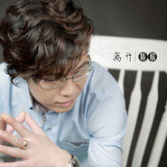
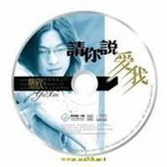

易欣
============================

|  |  |
| :--: | :-- |
| [ 易欣](https://i.xiami.com/yixin) | **地区**: China 中国大陆 **风格**: 伤感 **播放数**: 32554773 **粉丝数**: 5080 **评论数**: 92  |

## 档案

姓名：易欣 
原名：张琪 
出生日期：12.10 
籍贯：浙江宁波 
星座：射手 
性格： 开朗 
身高：177cm 
体重：太瘦不提供了 
血型：A 
兴趣：唱歌，电脑 
家庭状况：一男一女中的老么 
最难忘的事：失恋 
最喜欢的地方：夏威夷 
最喜欢的颜色：黑色，白色，蓝色 
最喜欢的食物：海鲜 
最喜欢的电影：[变人][星球大战] 
最喜欢的歌手：华健，学友 
最讨厌做的事：写字 
最喜欢做的事：做音乐 
最想实现的理想：做个音乐人 
最希望说的一句话：我成功了 
最想感谢的人：父母 
对你影响最大的人：朋友 
主要音乐作品：[下辈子不做男人][两只乌龟][心火燃烧][不顾一切爱你][没事陪你走走] 
专辑：《下辈子不做男人》《别说你还爱着我》 
易欣 著名原创歌手 传唱大江南北的歌曲《下辈子不做男人》《你的选择》《两只乌龟》的原唱者娱乐基地·中国签约歌手，2000年开始职业歌手生涯。2005年6月签约于娱乐基地·中国。2004年8月开始创作第一首原创歌曲[心火燃烧]。2004年9月创作[完美结束]，2005年1月创作[两只乌龟]。2005年2月写下心声诉说[下辈子不做男人]。到现在广为流传、为大众所熟悉的作品有《下辈子不做男人》《你的选择》《两只乌龟》《穿越时空的爱情》《不顾一切爱你》《坐在马桶抽烟喝茶》等。 
首张个人大碟已经制作完成，并在海外首发。2006年6月在广州拍摄完成其专辑主打歌曲《下辈子不做男人》《穿越时空的爱情》的MV。

## 专辑

| 名称 | 语种 | 唱片公司 | 发行时间 | 专辑类别 | 专辑风格 |
| :--: | :-- | :-- | :-- | :-- | :-- |
| [ 离开后你也会难过](./albums/2108231387.md) | 国语 | 三咖文化 | 2020年03月23日 | EP, 单曲 | 国语流行 Mandarin Pop |
| [ 梦想千年](./albums/2105322135.md) | 国语 | 美力星空 | 2019年10月10日 | EP, 单曲 |  |
| [ 下定决心离开你](./albums/2105150438.md) | 国语 | 启韵传媒 | 2019年08月12日 | EP, 单曲 |  |
| [ 停摆 (男版)](./albums/5020602554.md) | 国语 | 禾信科技 | 2019年06月06日 | EP, 单曲 | 国语流行 Mandarin Pop |
| [ 男人该去远方](./albums/2102406095.md) | 国语 | 美力星空 | 2016年10月12日 | EP, 单曲 |  |
| [ 逗逗比](./albums/2100260136.md) | 国语 | 音尚律动 | 2016年01月13日 | EP, 单曲 |  |
| [ 爱做开始痛做结尾](./albums/831672612.md) | 国语 | 华音世纪 | 2015年05月12日 | EP, 单曲 |  |
| [ 我要涨停板](./albums/30986103.md) | 国语 | 华音世纪 | 2015年05月07日 | EP, 单曲 |  |
| [ 我们都是寂寞的人](./albums/2021299379.md) | 国语 | 华音世纪 | 2015年01月14日 | EP, 单曲 |  |
| [ 北京的雪](./albums/2103689114.md) | 国语 | 音尚律动 | 2015年01月06日 | 合集, 杂锦 |  |
| [ 记得你的温柔](./albums/419405848.md) | 国语 | 华音世纪 | 2014年12月23日 | EP, 单曲 |  |
| [ 离开](./albums/821387496.md) | 国语 | 华音世纪 | 2014年06月26日 | EP, 单曲 |  |
| [ 马上有钱](./albums/1390552306.md) | 国语 | 华音世纪 | 2014年01月24日 | EP, 单曲 |  |
| [ 春花儿开](./albums/789769184.md) | 国语 | 华音世纪 | 2014年01月15日 | EP, 单曲 |  |
| [ 拽美眉](./albums/1580163261.md) | 国语 | 华音世纪 | 2013年09月26日 | EP, 单曲 |  |
| [ 这样爱你不是我的错](./albums/1676883085.md) | 国语 | 华音世纪 | 2013年08月15日 | EP, 单曲 |  |
| [ 爱不会停](./albums/370404196.md) | 国语 | 华音世纪 | 2013年06月05日 | EP, 单曲 |  |
| [ 假如我们还能再相见](./albums/763310985.md) | 国语 | 华音世纪 | 2013年03月14日 | EP, 单曲 |  |
| [ 爱情神马价](./albums/569130.md) | 国语 | 华音世纪 | 2013年01月06日 | EP, 单曲 |  |
| [ 全是你](./albums/553803.md) | 国语 | 华音世纪 | 2012年11月06日 | EP, 单曲 |  |
| [ 匹配的爱](./albums/552068.md) | 国语 | 华音世纪 | 2012年10月30日 | EP, 单曲 |  |
| [ 给我最爱的女子](./albums/541656.md) | 国语 | 音尚律动 | 2012年09月11日 | 录音室专辑 |  |
| [ 九等天使](./albums/2103689078.md) | 国语 | 美力星空 | 2012年01月01日 | 合集, 杂锦 |  |
| [ 分爱(DJ版)](./albums/456676.md) | 国语 | 上点音乐 | 2011年08月02日 | EP, 单曲 |  |
| [ 今生无缘](./albums/394562.md) | 国语 | 美力星空 | 2010年07月15日 | 录音室专辑 |  |
| [ 别让我为你心碎](./albums/355487.md) | 国语 | 音尚律动 | 2009年05月30日 | 精选集 | 国语流行 Mandarin Pop |
| [ 分爱](./albums/323815.md) | 国语 | 音尚律动 | 2009年04月03日 | 录音室专辑 | 国语流行 Mandarin Pop |
| [ 请说你爱我](./albums/509111.md) | 国语 | 南海潮 | 2007年11月23日 | 录音室专辑 |  |
| [ 下辈子不做男人](./albums/398432.md) | 国语 | 音尚律动 | 2007年01月03日 | 录音室专辑 | 国语流行 Mandarin Pop |

## 评论

|  |  |  |
| :-- | :-- | :-- |
|  [虾米用户](https://emumo.xiami.com/u/358104299) 悲观的唯心存在现实解构虚... 2019-12-22 05:08 赞(1) 踩(0) | 
14419
 |
|  [虾米用户](https://emumo.xiami.com/u/402267033)  2019-11-19 22:10 赞(0) 踩(0) | 
不顾一切爱你的另一个音比较高的版本在哪里哟，，已经找不到了，这里这个版本好难听。
 |
|  [虾米用户](https://emumo.xiami.com/u/403482333)  2019-10-29 18:21 赞(0) 踩(0) | 
好动态可以
 |
|  [虾米用户](https://emumo.xiami.com/u/365437701) 我还没想好要写什么... 2019-09-10 07:28 赞(1) 踩(0) | 
很喜欢听你的歌曲 希望你能继续唱给我们听更多更好听的歌
 |
|  [虾米用户](https://emumo.xiami.com/u/332525775) 我还没想好要写什么... 2019-06-05 21:27 赞(1) 踩(0) | 
很喜欢你的嗓音
 |
|  [虾米用户](https://emumo.xiami.com/u/9729830)  2019-04-23 00:50 赞(0) 踩(0) | 
想起当年在KTV包厢里对一个女孩子唱这首不顾一切爱你，后来我们在一起了，谢谢你的歌歌词和旋律让人陶醉
 |
|  [虾米用户](https://emumo.xiami.com/u/421542908)  2019-03-26 22:51 赞(0) 踩(0) | 
我特别喜欢虾米音乐。因为他的低音炮的炮声相当好。这是我最喜欢的一点。我每天，都要听。好像别的不感兴趣了。没有低音炮的朋友。可能你感觉不到。歌里面，那低音炮的炮声。比歌声好听，多了。那炮声，我得喝醉了，
 |
|  [虾米用户](https://emumo.xiami.com/u/421542908)  2019-03-26 22:41 赞(1) 踩(0) | 
我家里面有一套组合影响。配带了一枚，12寸的低音炮。在听音乐的时候。低音炮的炮声，特别牛感觉整个地球都在跳。低音炮的炮声特别的纯粹,真是大师之作。
 |
|  [虾米用户](https://emumo.xiami.com/u/374373655)  2018-12-26 15:01 赞(0) 踩(0) | 
******
 |
|  [虾米用户](https://emumo.xiami.com/u/168146162)  2018-12-16 07:33 赞(1) 踩(0) | 
非常好听
 |
|  [虾米用户](https://emumo.xiami.com/u/406635617)  2018-11-18 07:18 赞(0) 踩(0) | 
我挺喜欢你的歌的，听了好几年
 |
|  [虾米用户](https://emumo.xiami.com/u/49056561) 我踏出的每一步都是归途 2018-11-17 18:05 赞(1) 踩(0) | 
歌曲不错
 |
|  [虾米用户](https://emumo.xiami.com/u/270624077)  2018-09-12 23:20 赞(1) 踩(0) | 
喜欢你有太多了！
 |
|  [虾米用户](https://emumo.xiami.com/u/319688150) 愿经典不被遗忘 2018-09-05 15:27 赞(0) 踩(0) | 
小时候去电玩城里 就是一直放的易欣的歌
 |
|  [虾米用户](https://emumo.xiami.com/u/336516835) 来是偶然，走是必然。你我... 2018-07-11 15:11 赞(0) 踩(0) | 
......Look back on your life, making us the pain, not failure, but no experience everything I want to experience.~回首人生，最使得我们痛的，不是失败，而是没有经历我所想要经历的一切。来是偶然，走是必然～出生✪死亡。你我都在路上&amp;hellip;&amp;hellip;欢乐只是记忆，痛苦也只是记忆，一切都只是记忆，让我们慢慢地回忆&amp;hellip;&amp;hellip;愿那些灵魂的深处依然&amp;hellip;&amp;hellip;不保留的， 才叫青春。 不解释的， 才叫从容。 不放手的， 才叫真爱。 不完美的， 才叫人生.
 |
|  [虾米用户](https://emumo.xiami.com/u/376851113)  2018-07-04 08:12 赞(0) 踩(0) | 
唱的很好聽
 |
|  [虾米用户](https://emumo.xiami.com/u/352536312)  2018-05-30 13:12 赞(0) 踩(0) | 
07听了您的成名曲(你的选择)就成了您的粉丝了！
 |
|  [虾米用户](https://emumo.xiami.com/u/364466814)  2018-05-26 21:11 赞(0) 踩(0) | 
你本人还在吗？
 |
|  [虾米用户](https://emumo.xiami.com/u/351973990) 我还没想好要写什么... 2018-03-27 16:24 赞(0) 踩(0) | 
爱你
 |
|  [虾米用户](https://emumo.xiami.com/u/258882467)  2018-03-03 15:25 赞(0) 踩(0) | 
粤语不是唱得挺好么？加油！
 |
|  [虾米用户](https://emumo.xiami.com/u/23495797)   2018-02-28 21:32 赞(0) 踩(0) | 
就是个非主流子
 |
| ⇒ |  [虾米用户](https://emumo.xiami.com/u/50037877) 我还没想好要写什么... 2018-12-07 10:59 赞(0) 踩(0) | 
那也是一个不可磨灭的时代。
 |
|  [虾米用户](https://emumo.xiami.com/u/7781146)  2018-01-18 15:53 赞(0) 踩(0) | 
看了歌词 真的心碎 原来北方的粤语是这样的
 |
|  [虾米用户](https://emumo.xiami.com/u/21551674)  2017-12-25 23:47 赞(0) 踩(0) | 
喜欢他的 心碎 粤语
 |
|  [虾米用户](https://emumo.xiami.com/u/222060700) 不乱于心，不困于情；不畏... 2017-11-12 14:17 赞(0) 踩(0) | 
真心喜欢听你的歌
 |
|  [虾米用户](https://emumo.xiami.com/u/323518998) 梦想是一定要有的，万一实... 2017-10-24 22:08 赞(0) 踩(0) | 
易欣的歌很有清脆的磁性
 |
|  [虾米用户](https://emumo.xiami.com/u/313083266)  2017-08-16 11:35 赞(0) 踩(0) | 
喜欢易欣
 |
|  [虾米用户](https://emumo.xiami.com/u/274344435)  2017-07-05 12:13 赞(0) 踩(0) | 
231312
 |
|  [虾米用户](https://emumo.xiami.com/u/304301384)  2017-06-13 23:18 赞(0) 踩(0) | 
伤感
 |
|  [虾米用户](https://emumo.xiami.com/u/171978752)  2017-06-10 19:14 赞(0) 踩(0) | 
纯青春的飘过~~顶起
 |
|  [虾米用户](https://emumo.xiami.com/u/280843132)  2017-05-03 09:26 赞(0) 踩(0) | 
。。
 |
|  [虾米用户](https://emumo.xiami.com/u/291310968)  2017-04-26 21:31 赞(0) 踩(0) | 
爱情神马价还不错
 |
|  [虾米用户](https://emumo.xiami.com/u/7758286) 朕知道了！ 2017-04-23 15:54 赞(0) 踩(0) | 
不顾一切爱你，这首歌怎么变味了?最早那曲找不到了吗？想听原来那个。
 |
|  [虾米用户](https://emumo.xiami.com/u/17459904)  2017-04-12 23:36 赞(2) 踩(0) | 
我发现各大网站介绍明星的档案从不写这个明星性别。
 |
|  [虾米用户](https://emumo.xiami.com/u/142079226) 音乐无星界 2017-04-05 23:26 赞(0) 踩(0) | 
歌很好听
 |
|  [虾米用户](https://emumo.xiami.com/u/263638888)  2017-03-23 21:40 赞(0) 踩(0) | 
出局挺好听的
 |
|  [虾米用户](https://emumo.xiami.com/u/274546387)  2017-03-09 13:54 赞(1) 踩(0) | 

 |
|  [虾米用户](https://emumo.xiami.com/u/243239147)  2016-12-20 13:02 赞(0) 踩(0) | 
加油
 |
|  [虾米用户](https://emumo.xiami.com/u/223295487)  2016-12-14 21:51 赞(1) 踩(0) | 
易欣的歌！首首都感动，   
 |
|  [虾米用户](https://emumo.xiami.com/u/19928334) 正视不完美，是对过去的一... 2016-12-14 15:06 赞(1) 踩(0) | 
支持！敬请关注！
 |
|  [虾米用户](https://emumo.xiami.com/u/212506494) 你是我生命中的唯一我会好... 2016-08-16 13:45 赞(1) 踩(0) | 
好听
 |
|  [虾米用户](https://emumo.xiami.com/u/81410840) 你的选择没有错，我欠你的... 2015-12-23 08:00 赞(0) 踩(0) | 
 
 |
|  [虾米用户](https://emumo.xiami.com/u/77874942)  2015-11-13 22:58 赞(2) 踩(0) | 
易欣的歌。真心好听啊。
 |
|  [虾米用户](https://emumo.xiami.com/u/40921539) 每个人心中都有一首歌。 2015-10-01 00:48 赞(0) 踩(0) | 
大爱
 |
|  [虾米用户](https://emumo.xiami.com/u/8326332) 后来，即便是音乐，也无法... 2015-06-01 08:38 赞(21) 踩(0) | 
大家别吐槽粤语发音问题了，至少易欣有不少好听的歌就是了。愿他快乐。 另外，不是所有不适合你的的网络歌曲就叫非主流ok。
 |
|  [虾米用户](https://emumo.xiami.com/u/2972280) 让生活平静的流 2015-01-19 21:14 赞(0) 踩(0) | 
邓宝，你还在听吗？
 |
|  [虾米用户](https://emumo.xiami.com/u/43565360) 曾经有一份真诚的爱情放在... 2014-11-11 13:30 赞(0) 踩(0) | 
喜欢
 |
|  [虾米用户](https://emumo.xiami.com/u/428765)  2014-10-06 02:36 赞(2) 踩(0) | 
不知不觉，生冷空虚。匆匆转身去，我妈已允许！
 |
| ⇒ |  [虾米用户](https://emumo.xiami.com/u/2967267) 生而为人我很抱歉 2016-10-08 22:56 赞(0) 踩(0) | 
车祸现场~
 |
|  [虾米用户](https://emumo.xiami.com/u/34112409)  2014-03-18 06:48 赞(0) 踩(0) | 
喜欢
 |
|  [虾米用户](https://emumo.xiami.com/u/1224119) 我还没想好要写什么... 2014-02-15 15:43 赞(0) 踩(0) | 
擦...竟然给我推荐这等非主流...
 |
| ⇒ |  [虾米用户](https://emumo.xiami.com/u/29773143) 生死去来，蓬头傀儡。一线... 2014-11-21 22:46 赞(0) 踩(0) | 
这不是非主流……
 |
|  [虾米用户](https://emumo.xiami.com/u/25871445) 我还没想好要写什么... 2014-02-08 17:07 赞(0) 踩(0) | 
虾米你又无聊了是吧......
 |
|  [虾米用户](https://emumo.xiami.com/u/25614146)  2013-12-27 16:13 赞(0) 踩(0) | 
ok
 |
|  [虾米用户](https://emumo.xiami.com/u/323993) 浪漫是我的本性 2013-12-17 23:21 赞(0) 踩(0) | 
为什么我有种被黑了的感觉。
 |
|  [虾米用户](https://emumo.xiami.com/u/2834029) 哟哟哟哟！ 2013-12-02 10:00 赞(0) 踩(0) | 
那个《心碎》不看歌词到还行，看了歌词再对比唱出来的东东…………无解了
 |
|  [虾米用户](https://emumo.xiami.com/u/8120946)   2013-11-29 08:11 赞(1) 踩(0) | 
只允许自己偶尔地听易欣，他的歌太容易让人触及心底的哀伤。世道如此艰难，也许更需要那些如同打了鸡血的音乐，但那又是谁或谁的歌？（嗓音很好听的大男生，但是氛围太过悲凉。）
 |
|  [虾米用户](https://emumo.xiami.com/u/5765292) 我还没想好要写什么... 2013-11-24 10:32 赞(3) 踩(0) | 
虾米你逗我呢，求别推荐了
 |
|  [虾米用户](https://emumo.xiami.com/u/23823110)  2013-10-26 11:17 赞(0) 踩(0) | 
好听
 |
|  [虾米用户](https://emumo.xiami.com/u/1324626)  2013-10-15 20:48 赞(0) 踩(0) | 
哇 我也是宁波的啊 好听 必须顶你
 |
|  [虾米用户](https://emumo.xiami.com/u/3337179)  2013-09-23 21:28 赞(0) 踩(0) | 
听着《心碎》，却是蛋碎了一地.....粤语这一块你就别搀和了吧。
 |
|  [虾米用户](https://emumo.xiami.com/u/18824679)  2013-09-22 13:27 赞(82) 踩(0) | 
我刚入驻了虾米音乐人，欢迎大家来我的个人主页，收听我的最新音乐
 |
| ⇒ |  [虾米用户](https://emumo.xiami.com/u/370294017)  2018-05-25 00:46 赞(0) 踩(0) | 
加油
 |
| ⇒ |  [虾米用户](https://emumo.xiami.com/u/344932349)  听歌。。 2018-06-08 23:11 赞(0) 踩(0) | 
喜欢你唱的&amp;lt;心碎&amp;gt;粤语版
 |
| ⇒ |  [虾米用户](https://emumo.xiami.com/u/261161358) 三分天注定，七分靠打拼 2019-07-19 19:25 赞(0) 踩(0) | 
很喜欢听你的歌曲
 |
|  [虾米用户](https://emumo.xiami.com/u/675774)  2013-08-15 10:50 赞(0) 踩(0) | 
好聽!
 |
|  [虾米用户](https://emumo.xiami.com/u/11739804)  2013-06-19 14:01 赞(0) 踩(0) | 
易欣
 |
|  [虾米用户](https://emumo.xiami.com/u/5855146) 我还没想好要写什么... 2013-06-06 14:55 赞(1) 踩(0) | 
拜托您唱歌别总抽儿抽儿好吗，听您一曲歌，三魂六魄立马被哽去一半
 |
|  [虾米用户](https://emumo.xiami.com/u/106890) 我还没想好要写什么... 2013-06-04 19:38 赞(19) 踩(0) | 
内容已删除
 |
| ⇒ |  [虾米用户](https://emumo.xiami.com/u/128413126)  2017-08-02 11:19 赞(0) 踩(0) | 
你懂什么，他说湖北的，粤语这样已经不错了，看你也就喜欢口水歌
 |
| ⇒ |  [虾米用户](https://emumo.xiami.com/u/270624077)  2018-09-12 23:21 赞(0) 踩(0) | 
你白痴！这才有特色！都不知道多好听！
 |
| ⇒ |  [虾米用户](https://emumo.xiami.com/u/157706248)  2018-10-04 18:02 赞(0) 踩(0) | 
什么叫你们的语言。这是我们中华民族的语言
 |
| ⇒ |  [虾米用户](https://emumo.xiami.com/u/283115963)  2018-10-21 10:57 赞(0) 踩(0) | 
<q><b>Star时光说：</b></q>
 |
|  [虾米用户](https://emumo.xiami.com/u/4893639)  2013-02-12 18:51 赞(0) 踩(0) | 
好听
 |
|  [虾米用户](https://emumo.xiami.com/u/2714595)  2012-07-20 14:59 赞(0) 踩(0) | 
粤语实在不准啊。。。
 |
|  [虾米用户](https://emumo.xiami.com/u/3636882) 做个好人 2012-04-12 11:56 赞(0) 踩(0) | 
都没有国语
 |
|  [虾米用户](https://emumo.xiami.com/u/7646613)  2012-01-25 03:07 赞(0) 踩(0) | 
I LIKE
 |
| ⇒ |  [虾米用户](https://emumo.xiami.com/u/6266662) Good friends... 2012-04-01 11:19 赞(0) 踩(0) | 
me too
 |
|  [虾米用户](https://emumo.xiami.com/u/6095681)  2011-12-16 22:41 赞(1) 踩(0) | 
怎么没有&amp;lt;&amp;lt;无法证明&amp;gt;&amp;gt;啊?
 |
|  [虾米用户](https://emumo.xiami.com/u/2935333)  2011-11-19 17:33 赞(0) 踩(0) | 
伤心情歌。。。
 |
|  [虾米用户](https://emumo.xiami.com/u/62451) 梦里花落知多少 2011-10-09 14:44 赞(0) 踩(0) | 
泪在投降。。。
 |
|  [虾米用户](https://emumo.xiami.com/u/5954151)  2011-09-24 13:32 赞(0) 踩(0) | 
伤感
 |
|  [虾米用户](https://emumo.xiami.com/u/5650418)  2011-08-31 17:29 赞(0) 踩(0) | 
心碎   传情
 |
|  [虾米用户](https://emumo.xiami.com/u/5470318)  2011-08-18 18:30 赞(0) 踩(0) | 
喜欢
 |
|  [虾米用户](https://emumo.xiami.com/u/2787687)  2011-08-07 21:44 赞(0) 踩(0) | 
你的选择
 |
|  [虾米用户](https://emumo.xiami.com/u/2600411)  2011-06-30 16:26 赞(0) 踩(0) | 
可愛
 |
|  [虾米用户](https://emumo.xiami.com/u/3591043) 我回来啦 2011-06-09 14:14 赞(1) 踩(0) | 
别让我为你心碎
 |
|  [虾米用户](https://emumo.xiami.com/u/3769203)  2011-04-28 21:26 赞(0) 踩(0) | 
就是喜欢听“请你说爱我”
 |
|  [虾米用户](https://emumo.xiami.com/u/3599340)  2011-04-19 14:00 赞(0) 踩(0) | 
感觉他的歌很有感染力！
 |
|  [虾米用户](https://emumo.xiami.com/u/1873559)  2011-03-17 12:38 赞(0) 踩(0) | 
这伙计有点撕心裂肺
 |
|  [虾米用户](https://emumo.xiami.com/u/2358386) 八字命理咨詢 2011-01-06 20:33 赞(0) 踩(0) | 
好聽！
 |
|  [虾米用户](https://emumo.xiami.com/u/522205) 一切很美，音為有你﹏ 2010-10-05 23:51 赞(0) 踩(0) | 
他的一些作品确实不错~
 |
|  [虾米用户](https://emumo.xiami.com/u/1224725) 最近很忙啷里个啷，奖励自... 2010-08-02 13:45 赞(0) 踩(0) | 
歌名都好直接派···比较适合失情场失意的人自伤自怜
 |
