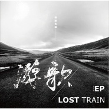

游歌
============================

|  |  |
| :--: | :-- |
| [ 游歌](https://emumo.xiami.com/album/1814432126) | **艺人**: [丢火车乐队](../index.md) **语种**: 国语 **唱片公司**: 独立发行 **发行时间**: 2014年10月21日 **专辑类别**: EP, 单曲 **专辑风格**: 流行摇滚 Pop Rock, 独立摇滚 Indie Rock **播放数**: 7712766 **收藏数**: 2197 **评论数**: 118  |

## 简介

丢火车乐队2014年全新EP《游歌》

## 曲目

## 评论

|  |  |  |
| :-- | :-- | :-- |
|  [虾米用户](https://emumo.xiami.com/u/12778800) Bell ringing 2019-09-05 17:07 赞(0) 踩(0) | 
版权去哪了？！
 |
|  [虾米用户](https://emumo.xiami.com/u/9756829) 我还没想好要写什么... 2019-02-22 07:52 赞(0) 踩(0) | 
没了吗
 |
|  [虾米用户](https://emumo.xiami.com/u/333846054)  2018-03-03 16:51 赞(2) 踩(0) | 
独家&amp;hellip;版权还丢了&amp;hellip;讽刺
 |
|  [虾米用户](https://emumo.xiami.com/u/47888673) 摇滚*ACG 2018-02-23 23:55 赞(0) 踩(0) | 
我想买！虾米你把版权买了好么！求你！
 |
|  [虾米用户](https://emumo.xiami.com/u/98858308) 忠艾一生 2017-11-24 23:43 赞(0) 踩(0) | 
版权   
 |
|  [虾米用户](https://emumo.xiami.com/u/11105318) 我是个很懒很懒的人，懒到... 2017-11-23 17:21 赞(0) 踩(0) | 
版权去哪里了！！怎么以前收藏的现在不能听了！
 |
|  [虾米用户](https://emumo.xiami.com/u/141421954)  2017-11-16 15:54 赞(1) 踩(0) | 
卡尔加里路还有以前的一点影子
 |
|  [虾米用户](https://emumo.xiami.com/u/55519475)  2017-10-27 23:45 赞(0) 踩(0) | 
昨晚去看了他们在重庆的巡演
 |
|  [虾米用户](https://emumo.xiami.com/u/46081379)  2017-04-01 23:39 赞(0) 踩(0) | 
卡尔加里路
 |
|  [虾米用户](https://emumo.xiami.com/u/124750210) 相逢自是有缘 2016-10-02 09:13 赞(0) 踩(0) | 
like:)
 |
|  [虾米用户](https://emumo.xiami.com/u/218984359)  2016-08-27 14:20 赞(0) 踩(0) | 
好听
 |
|  [虾米用户](https://emumo.xiami.com/u/39271577)  2016-07-10 10:08 赞(0) 踩(0) | 
好听~
 |
|  [虾米用户](https://emumo.xiami.com/u/12175196)  2016-06-27 19:42 赞(0) 踩(0) | 
说实话，还是同名专辑和火车日记好听。前两张专辑的每一首歌我都听了无数遍。
 |
|  [虾米用户](https://emumo.xiami.com/u/70509660)  2016-06-16 14:32 赞(0) 踩(0) | 
就是喜欢。
 |
|  [虾米用户](https://emumo.xiami.com/u/45298985) Wechat:dqx19... 2016-05-08 17:34 赞(0) 踩(0) | 
+
 |
|  [虾米用户](https://emumo.xiami.com/u/45621221) 卸载状态。 2016-01-16 19:45 赞(0) 踩(0) | 

 |
|  [虾米用户](https://emumo.xiami.com/u/35398542) 公众号：湾辟斯 2016-01-06 16:33 赞(0) 踩(0) | 
白兰鸽 卡尔加里路
 |
|  [虾米用户](https://emumo.xiami.com/u/48029281) Punk rock 2015-10-26 13:17 赞(1) 踩(0) | 
白蘭鴿怎麼好像許巍的我們，
 |
|  [虾米用户](https://emumo.xiami.com/u/5500167) 我还没想好要写什么... 2015-10-25 16:49 赞(0) 踩(0) | 
好久没听丢火车了，歌声还是好治愈
 |
|  [虾米用户](https://emumo.xiami.com/u/1357920) 暂无签名~ 2015-10-10 17:55 赞(1) 踩(0) | 
好听，突然就喜欢。卡尔加里路里的号真好听 
 |
|  [虾米用户](https://emumo.xiami.com/u/4009395)   2015-08-23 14:52 赞(0) 踩(0) | 
  101
 |
|  [虾米用户](https://emumo.xiami.com/u/50833849) 譬如昨日死 2015-08-16 16:06 赞(0) 踩(0) | 
看到99条评论就忍不住进来了
 |
|  [虾米用户](https://emumo.xiami.com/u/10217759)  2015-07-06 14:58 赞(0) 踩(0) | 
听到改变。
 |
|  [虾米用户](https://emumo.xiami.com/u/44724100)   2015-06-27 09:03 赞(0) 踩(0) | 
1
 |
|  [虾米用户](https://emumo.xiami.com/u/31275170) 爱生活 爱音乐 2015-06-26 03:20 赞(0) 踩(0) | 
球子这张专辑蛮不错的
 |
|  [虾米用户](https://emumo.xiami.com/u/46134206) 无 2015-06-24 02:19 赞(1) 踩(0) | 
心境不二
 |
|  [虾米用户](https://emumo.xiami.com/u/37968610) “To me，you a... 2015-06-14 23:46 赞(0) 踩(0) | 
这张专辑咋就8.6分啊
 |
|  [虾米用户](https://emumo.xiami.com/u/48485091) 祝 你 开 ★ 2015-06-08 08:46 赞(3) 踩(0) | 
这张才喜欢丢火车的 何必老旧的比来比去 音乐还是那些音乐 只是你有隔阂而已
 |
|  [虾米用户](https://emumo.xiami.com/u/10435106) 听靓歌 2015-05-23 00:29 赞(0) 踩(0) | 
不错。
 |
|  [虾米用户](https://emumo.xiami.com/u/12175196)  2015-05-21 19:16 赞(0) 踩(0) | 
觉得新专辑比起前两张差很多，不是很喜欢，前两张听了无数遍了。
 |
|  [虾米用户](https://emumo.xiami.com/u/31945655) 中国当代音乐文化推广营销 2015-03-20 14:10 赞(0) 踩(0) | 
好听!好听!好听!好听!好听!好听!好听!好听!好听!好听!好听!好听!好听!好听!好听!好听!好听!好听!好听!好听!好听!好听!好听!好听!好听!好听!好听!好听!好听!好听!好听!好听!好听!好听!好听!好听!好听!好听!好听!好听!好听!好听!好听!好听!:)。。
 |
|  [虾米用户](https://emumo.xiami.com/u/43717328)  2015-03-05 16:26 赞(1) 踩(0) | 
曾经丢火车可能也是我们大庆大学生的一个青春的标志，只是现在重组后可能都不太了解吧，现在的音乐也是好音乐，只是已经听不惯了，对于我们这一批人已经没什么共鸣了。但还是祝愿他们越走越好。
 |
|  [虾米用户](https://emumo.xiami.com/u/1331316) lostinVan 2015-02-02 08:38 赞(0) 踩(0) | 
白兰鸽长什么样啊！
 |
|  [虾米用户](https://emumo.xiami.com/u/44625311) 南方的南方，我不爱你了。 2015-01-24 21:54 赞(0) 踩(0) | 
吟游文氓，此生不枉。
 |
|  [虾米用户](https://emumo.xiami.com/u/9624342) 死亡和她的朋友们。 2015-01-20 09:53 赞(0) 踩(0) | 
想去哈尔滨=w=……
 |
|  [虾米用户](https://emumo.xiami.com/u/37756003)   2015-01-09 10:45 赞(0) 踩(0) | 
真的太好听了，每一首写的都十分棒，强力推荐
 |
|  [虾米用户](https://emumo.xiami.com/u/12175196)  2015-01-06 22:49 赞(0) 踩(0) | 
终于出新专辑了~~~
 |
|  [虾米用户](https://emumo.xiami.com/u/43328536)  2014-12-23 18:09 赞(0) 踩(0) | 
这个专辑的每一首歌都做的很好，无论是词和曲都好，温暖而舒服
 |
|  [虾米用户](https://emumo.xiami.com/u/45204558)  2014-12-23 13:15 赞(0) 踩(0) | 
曲风，音乐做得很好，为什么没人来
 |
|  [虾米用户](https://emumo.xiami.com/u/5746403)  2014-12-18 12:28 赞(0) 踩(0) | 
你会听到么，琳琳？
 |
|  [虾米用户](https://emumo.xiami.com/u/39958865)   2014-12-18 09:15 赞(0) 踩(0) | 
20 日 周六 上海 ON STAGE 不见不散
 |
|  [虾米用户](https://emumo.xiami.com/u/2066873)  2014-12-06 12:22 赞(0) 踩(0) | 
冬日暖阳，舒适自然
 |
|  [虾米用户](https://emumo.xiami.com/u/2066873)  2014-12-06 12:21 赞(0) 踩(0) | 
寒冷的日子听着这样一张专辑，阵阵温暖
 |
|  [虾米用户](https://emumo.xiami.com/u/41526069)  2014-12-02 21:20 赞(0) 踩(0) | 
白兰鸽没让我失望，好听。茶底世界改版很多次，但是还没有能唱出感觉，加油
 |
|  [虾米用户](https://emumo.xiami.com/u/576000) 我还没想好要写什么... 2014-12-02 12:56 赞(1) 踩(0) | 
歌词稍微逊色了点. 旋律还是很动人的.
 |
|  [虾米用户](https://emumo.xiami.com/u/6631790) 宁为地狱之主，不为天堂之... 2014-12-01 17:25 赞(1) 踩(0) | 
还是喜欢茶底世界的原版，可能是先入为主，新版也很nice温和了些
 |
|  [虾米用户](https://emumo.xiami.com/u/3562634)  2014-12-01 03:20 赞(0) 踩(0) | 
今年才开始接触国内的乐队，喜欢帽儿山和白兰鸽。。因为有颗想要飞的心。
 |
|  [虾米用户](https://emumo.xiami.com/u/35398542) 公众号：湾辟斯 2014-12-01 02:13 赞(0) 踩(0) | 
白兰鸽，白兰鸽，穿不过的卡尔加里路
 |
|  [虾米用户](https://emumo.xiami.com/u/752396) 我还没想好要写什么... 2014-11-28 17:18 赞(0) 踩(0) | 
还是那么喜欢
 |
|  [虾米用户](https://emumo.xiami.com/u/9286704) A lo lejos..... 2014-11-26 12:13 赞(0) 踩(0) | 
还是不错的
 |
|  [虾米用户](https://emumo.xiami.com/u/39958865)   2014-11-17 14:39 赞(0) 踩(0) | 
循环一天都不为过 值！
 |
|  [虾米用户](https://emumo.xiami.com/u/214022)  2014-11-14 23:55 赞(0) 踩(0) | 
今晚的天津现场 白兰鸽真打动我了
 |
|  [虾米用户](https://emumo.xiami.com/u/5650281) 哈哈哈 2014-11-13 15:30 赞(0) 踩(0) | 
很温暖，很舒心的一张专辑、
 |
|  [虾米用户](https://emumo.xiami.com/u/7148384)  2014-11-05 06:44 赞(2) 踩(0) | 
真要形容的话，这张专辑让人觉得很舒服。曲调顺畅，歌词简单，不知不觉一张专辑就这么听完了……也算是个惊喜吧
 |
|  [虾米用户](https://emumo.xiami.com/u/2733113) 暂无签名~ 2014-11-04 13:38 赞(2) 踩(0) | 
這狗屁不通的詞...和這簡簡單單的曲...卻讓我開開心心地一直聽一直聽。
 |
|  [虾米用户](https://emumo.xiami.com/u/22949844) 春光明媚 2014-11-03 16:51 赞(0) 踩(0) | 
茶底世界（新版）的吉他变得更好听了
 |
|  [虾米用户](https://emumo.xiami.com/u/3219921)  2014-11-03 10:38 赞(0) 踩(0) | 
喜欢卡尔加里路
 |
|  [虾米用户](https://emumo.xiami.com/u/6140288) 如何想你想到六点。 2014-11-02 22:26 赞(0) 踩(0) | 
丟火車丟火車 你最牛逼。。
 |
|  [虾米用户](https://emumo.xiami.com/u/4234256)  2014-11-01 11:30 赞(15) 踩(0) | 
感觉现在的风格从独立摇滚变成了流行摇滚，所谓的民谣也变成了流行，还是怀念两个老贝斯手没回黑龙江时的丢火车，新加的一个贝斯手吊儿郎当的，怎么看怎么不顺眼，就听听以前的歌算了。
 |
| ⇒ |  [虾米用户](https://emumo.xiami.com/u/18400408) 嗯 梦幻的乐队 2014-11-04 11:34 赞(0) 踩(0) | 
期待听一下温莎森林的音乐
 |
| ⇒ |  [虾米用户](https://emumo.xiami.com/u/43717328)  2015-03-05 16:00 赞(0) 踩(0) | 
同感，重组后只剩下认识一个球子了，新人都不喜欢，还是喜欢沉稳的十三哥，低调的一哥，还有很帅的斌子。现在那个贝斯技术与对音乐的理解和那种沉稳度跟十三没法比。
 |
|  [虾米用户](https://emumo.xiami.com/u/36495683)   2014-10-30 20:14 赞(0) 踩(0) | 
适合做OST
 |
| ⇒ |  [虾米用户](https://emumo.xiami.com/u/18400408) 嗯 梦幻的乐队 2014-11-04 11:32 赞(0) 踩(0) | 
期待听一下温莎森林的歌
 |
|  [虾米用户](https://emumo.xiami.com/u/1636126) 我还没想好要写什么... 2014-10-30 17:54 赞(0) 踩(0) | 
游啊游…
 |
|  [虾米用户](https://emumo.xiami.com/u/13907362) 做人嘛，要自强 2014-10-30 11:30 赞(0) 踩(0) | 
多少年了，我从高中，大学到工作，你们才出
 |
| ⇒ |  [虾米用户](https://emumo.xiami.com/u/18400408) 嗯 梦幻的乐队 2014-11-04 11:34 赞(0) 踩(0) | 
期待听一下温莎森林的音乐
 |
|  [虾米用户](https://emumo.xiami.com/u/39958865)   2014-10-30 10:05 赞(0) 踩(0) | 
天呢 终于等到游歌了 丢火车真的太棒 十二月等我 会跟你们一起合唱茶底世界和火车日记的 不是南通就是上海  亲爱的 等我
 |
|  [虾米用户](https://emumo.xiami.com/u/3485819) 以爱修行 2014-10-29 22:54 赞(0) 踩(0) | 
11月9日大连见！！！！！！！
 |
|  [虾米用户](https://emumo.xiami.com/u/1020233) 网易云➡️summer叶... 2014-10-29 19:56 赞(0) 踩(0) | 
温暖到我了，果然喜欢他们没错~
 |
|  [虾米用户](https://emumo.xiami.com/u/1020233) 网易云➡️summer叶... 2014-10-29 19:47 赞(0) 踩(0) | 
温暖到我了，果然喜欢他们没错~
 |
|  [虾米用户](https://emumo.xiami.com/u/30623184) 事发的十九分钟 2014-10-29 19:09 赞(0) 踩(0) | 
如果又是金羊毛计划的产物 我会感到...
 |
|  [虾米用户](https://emumo.xiami.com/u/3206353)  2014-10-29 15:11 赞(0) 踩(0) | 
痛仰加马什么的那个哥们的 结合体   是现在这种风格开始流行起来了么  到处都是这种风格的东西
 |
|  [虾米用户](https://emumo.xiami.com/u/77231)  2014-10-29 13:25 赞(53) 踩(0) | 
第一次充钱给艺人买歌下载！！给我加油好吗！！！
 |
| ⇒ |  [虾米用户](https://emumo.xiami.com/u/11218747) 被坦克轧破脊髓的诗人沐浴... 2014-11-14 09:30 赞(0) 踩(0) | 
加油
 |
|  [虾米用户](https://emumo.xiami.com/u/30825628) 我还没想好要写什么... 2014-10-29 13:13 赞(1) 踩(0) | 
质量很高第一张专辑 听着好舒服。最喜欢白兰鸽啦
 |
|  [虾米用户](https://emumo.xiami.com/u/20502145)  2014-10-29 12:26 赞(0) 踩(0) | 
果味VC既视感
 |
| ⇒ |  [虾米用户](https://emumo.xiami.com/u/6680916)  君为袖手旁观客，我亦逢... 2014-10-31 08:15 赞(0) 踩(0) | 
我也觉得
 |
|  [虾米用户](https://emumo.xiami.com/u/42136446) 稀薄，虚幻却又无可置疑的... 2014-10-29 10:56 赞(4) 踩(0) | 
今年十一草莓第一次见到他们，没想到组乐队那么久了还是那么年轻的样子。经典永远是经典，没必要老是拿新东西和“茶底世界”对比来对比去，好听就行了。
 |
|  [虾米用户](https://emumo.xiami.com/u/18559492) 就是什么都不会的画图青年 2014-10-29 09:19 赞(0) 踩(0) | 
一直很喜欢你们的风格 赞藏藏
 |
|  [虾米用户](https://emumo.xiami.com/u/2700662)  2014-10-29 08:24 赞(0) 踩(0) | 
喜欢卡尔加里路
 |
|  [虾米用户](https://emumo.xiami.com/u/7248937)  2014-10-28 23:38 赞(0) 踩(0) | 
真没想到是几个东北汉子，很喜欢的风格。
 |
|  [虾米用户](https://emumo.xiami.com/u/31063445)  2014-10-28 20:10 赞(0) 踩(0) | 
终于上惹，丢丢丢丢
 |
|  [虾米用户](https://emumo.xiami.com/u/3697267) 廿七 2014-10-28 19:10 赞(0) 踩(0) | 
虾米终于上新专了，坐等1号现场~~~
 |
|  [虾米用户](https://emumo.xiami.com/u/3650119) Farewell 2014-10-28 18:03 赞(0) 踩(0) | 
和从前一样的感觉，非常好听！
 |
|  [虾米用户](https://emumo.xiami.com/u/27793105)  2014-10-28 17:21 赞(0) 踩(0) | 
21号出，都没什么评论，听后感也没有，评分也没啥，同志仍需努力啊，这个能看得出人气（但不代表乐曲水准） 说句个人感受，没什么感觉，一般般，没有主流味也没有地下味，独立味只在之前的那首 茶底世界 里听到过 有人说，乐队名不好，我觉得开始注意这只乐队的就是名字，我觉得乐队名很不错，年轻人的气息，独立的韵味
 |
| ⇒ |  [虾米用户](https://emumo.xiami.com/u/428410)  2014-10-28 17:51 赞(0) 踩(0) | 
虾米不是首发，豆瓣音乐人是首发，虾米今天刚上所以没什么人吧
 |
| ⇒ |  [虾米用户](https://emumo.xiami.com/u/27793105)  2014-10-28 18:11 赞(0) 踩(0) | 
<q><b>coxon说：</b></q>
 |
| ⇒ |  [虾米用户](https://emumo.xiami.com/u/428410)  2014-10-28 18:18 赞(0) 踩(0) | 
<q><b>谁是我的无双说：</b></q>
 |
| ⇒ |  [虾米用户](https://emumo.xiami.com/u/27793105)  2014-10-28 18:21 赞(0) 踩(0) | 
<q><b>coxon说：</b></q>
 |
| ⇒ |  [虾米用户](https://emumo.xiami.com/u/428410)  2014-10-28 18:21 赞(0) 踩(0) | 
<q><b>谁是我的无双说：</b></q>
 |
| ⇒ |  [虾米用户](https://emumo.xiami.com/u/27793105)  2014-10-28 18:23 赞(0) 踩(0) | 
<q><b>coxon说：</b></q>
 |
| ⇒ |  [虾米用户](https://emumo.xiami.com/u/428410)  2014-10-28 18:27 赞(0) 踩(0) | 
<q><b>谁是我的无双说：</b></q>
 |
| ⇒ |  [虾米用户](https://emumo.xiami.com/u/27793105)  2014-10-28 18:29 赞(0) 踩(0) | 
<q><b>coxon说：</b></q>
 |
| ⇒ |  [虾米用户](https://emumo.xiami.com/u/428410)  2014-10-28 18:30 赞(0) 踩(0) | 
<q><b>说：</b></q>
 |
| ⇒ |  [虾米用户](https://emumo.xiami.com/u/428410)  2017-10-27 23:24 赞(0) 踩(0) | 
<q><b>谁是我的无双说：</b></q>
 |
| ⇒ |  [虾米用户](https://emumo.xiami.com/u/27793105)  2017-10-27 23:24 赞(0) 踩(0) | 
<q><b>coxon说：</b></q>
 |
|  [虾米用户](https://emumo.xiami.com/u/42477579)  2014-10-28 17:15 赞(1) 踩(0) | 
很不容易有个女人喜欢我，她大我六岁，她听丢火车的歌。
 |
| ⇒ |  [虾米用户](https://emumo.xiami.com/u/3412551)  2014-10-31 21:53 赞(0) 踩(0) | 
好姐姐
 |
|  [虾米用户](https://emumo.xiami.com/u/9264414) 跟野人也没什么区别。 2014-10-28 16:34 赞(0) 踩(0) | 
家乡出人才！听到底！
 |
|  [虾米用户](https://emumo.xiami.com/u/8432255) 老马一生粉，法号大表哥 2014-10-28 15:42 赞(0) 踩(0) | 
m
 |
|  [虾米用户](https://emumo.xiami.com/u/1625705) 不用加班的土肥圆 2014-10-28 15:23 赞(0) 踩(0) | 
温度不迷茫，方向不倔强
 |
|  [虾米用户](https://emumo.xiami.com/u/2360903)  2014-10-28 14:47 赞(0) 踩(0) | 
在沈阳的演出看了，总时长50分钟左右，痛仰120分钟。票价却一样。哎。
 |
|  [虾米用户](https://emumo.xiami.com/u/446413)  2014-10-28 14:39 赞(0) 踩(0) | 
舒服
 |
|  [虾米用户](https://emumo.xiami.com/u/6565017) 如果全世界都对你恶语相加... 2014-10-28 14:16 赞(0) 踩(0) | 
坐等临沂
 |
|  [虾米用户](https://emumo.xiami.com/u/275850)  2014-10-28 14:02 赞(1) 踩(0) | 
这只乐队的素质是我见过最高的。midi时秒粉了。那时候我又被失恋了。谢谢火车。一生推
 |
|  [虾米用户](https://emumo.xiami.com/u/428410)  2014-10-28 13:08 赞(0) 踩(0) | 
帅！唯盼无疆！不顾一切一路在歌唱！
 |
|  [虾米用户](https://emumo.xiami.com/u/1017492)  2014-10-28 13:02 赞(1) 踩(0) | 
只等丢火车迅速崛起 冲入一线乐队
 |
| ⇒ |  [虾米用户](https://emumo.xiami.com/u/275850)  2014-10-28 14:03 赞(0) 踩(0) | 
大气晚成。论气质，创作完全是一线的料。
 |
| ⇒ |  [虾米用户](https://emumo.xiami.com/u/1017492)  2014-10-28 15:12 赞(0) 踩(0) | 
<q><b>哈里妈的波特说：</b></q>
 |
|  [虾米用户](https://emumo.xiami.com/u/9222560)   2014-10-28 12:52 赞(0) 踩(0) | 
喜欢
 |
|  [虾米用户](https://emumo.xiami.com/u/34302877) 何以解忧，唯有音乐 2014-10-28 12:49 赞(0) 踩(0) | 
好棒，期待期待
 |
|  [虾米用户](https://emumo.xiami.com/u/6851209) 因为生命存在失望 所以我... 2014-10-28 12:41 赞(0) 踩(0) | 
坐等临沂……
 |
| ⇒ |  [虾米用户](https://emumo.xiami.com/u/1017492)  2014-10-28 12:56 赞(0) 踩(0) | 
我也临沂的呢
 |
|  [虾米用户](https://emumo.xiami.com/u/8244559)  2014-10-28 12:26 赞(0) 踩(0) | 
******
 |
|  [虾米用户](https://emumo.xiami.com/u/33113721) 你是世上的奇女子呀 我就... 2014-10-28 12:22 赞(0) 踩(0) | 
终于出了！
 |
|  [虾米用户](https://emumo.xiami.com/u/76736) 暂无签名~ 2014-10-28 12:00 赞(0) 踩(0) | 
家乡的团，支持
 |
|  [虾米用户](https://emumo.xiami.com/u/1674456)  2014-10-28 11:52 赞(0) 踩(0) | 
听听看
 |
|  [虾米用户](https://emumo.xiami.com/u/13528706) 得到的时候 2014-10-28 08:38 赞(0) 踩(0) | 
新版？ 登登登
 |
