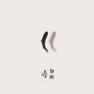

如斯
============================

|  |  |
| :--: | :-- |
| [ 如斯](https://emumo.xiami.com/album/2102403593) | **艺人**: [丢火车乐队](../index.md) **语种**: 国语 **唱片公司**: 独立发行 **发行时间**: 2016年09月30日 **专辑类别**: EP, 单曲 **专辑风格**: 民谣流行 Folk Pop **播放数**: 3615753 **收藏数**: 599 **评论数**: 39  |

## 简介

岁月如斯  
美人如斯  
赤诚如斯  
终究抵不过时间像水一般流逝  
  
那么成长是什么？  
是得到与失去；是面对现实，终日奔波；是人来人往，物是人非。离开的人儿，再也没有归来的一天。经历过华丽与绚烂，更明白寂静与得失， 丢火车平静的坐在某个午后三点半的阳光里，那些沉寂在心中厚重的印记，慢慢流淌出来。  
  
“琴瑟果腹／不知疾苦／逝如斯夫／问君何度”。浮生若梦，为欢几何？情愫在清澈自然的发生着，转眼如隔世，已是很多年，前路遥无可期，后路渐远，看破物是人非，时过境迁，任它世界改变，无法熄灭。  
  
在那么多清醒的午夜时分，杂糅进主唱轻盈自然的唱腔，丢火车的歌如同安慰剂般为浮华的世界带来片刻简单、真诚与诗意。2016丢火车全新单曲《如斯》，时光点滴反复推敲，耐人寻味。  
  

## 曲目

## 评论

|  |  |  |
| :-- | :-- | :-- |
|  [虾米用户](https://emumo.xiami.com/u/344018512) 我还没想好要写什么... 2019-07-03 20:01 赞(0) 踩(0) | 
D
 |
|  [虾米用户](https://emumo.xiami.com/u/13313040) 再好的相机也只能记录最美... 2019-01-07 07:56 赞(0) 踩(0) | 
我愿意付费啊
 |
|  [虾米用户](https://emumo.xiami.com/u/30800139) 我在低俗与高雅间活的很尴... 2018-06-18 01:48 赞(0) 踩(0) | 
。
 |
|  [虾米用户](https://emumo.xiami.com/u/8244559)  2018-01-30 04:12 赞(0) 踩(0) | 
******
 |
|  [虾米用户](https://emumo.xiami.com/u/44843106) 小时候梦见自己打死小怪兽 2017-09-10 09:13 赞(0) 踩(0) | 
听到这首歌是在雨天周末的早上，突然发现当时的心情已平静，喜欢你的事好像发生在上个世纪一样，时间比我想象的还要快，三四年的形同陌路已能定下我们这一生也只能这样了。&amp;ldquo;转眼如隔世，已是很多年，前路遥无可及，后路渐远。&amp;rdquo;时间是个好东西，忍一忍，再忍一忍，就能过去了 
 |
|  [虾米用户](https://emumo.xiami.com/u/24711605) 于是转身向大海走去！ 2017-07-16 08:49 赞(1) 踩(0) | 
怎么下载！！！虾米你可长点心吧
 |
|  [虾米用户](https://emumo.xiami.com/u/41551595)  2017-06-03 00:31 赞(1) 踩(0) | 
词，曲，声音都很舒服。
 |
|  [虾米用户](https://emumo.xiami.com/u/56909848)  2017-04-20 22:16 赞(1) 踩(0) | 
倒是给个付费连接啊 
 |
|  [虾米用户](https://emumo.xiami.com/u/45625829) 各有各去向，却有笑意共记... 2017-04-17 16:12 赞(0) 踩(0) | 
不能下载不开心
 |
| ⇒ |  [虾米用户](https://emumo.xiami.com/u/354939777) 再会 2019-11-18 12:10 赞(0) 踩(0) | 
可否告知德额额
 |
| ⇒ |  [虾米用户](https://emumo.xiami.com/u/354939777) 再会 2019-11-18 12:10 赞(0) 踩(0) | 
<q><b>啦啦啦说：</b></q>
 |
|  [虾米用户](https://emumo.xiami.com/u/93092514) 不求闻达于诸侯 2017-04-03 16:21 赞(0) 踩(0) | 
怎么付费。。
 |
|  [虾米用户](https://emumo.xiami.com/u/93092514) 不求闻达于诸侯 2017-04-03 16:21 赞(0) 踩(0) | 
。。。怎么下载
 |
|  [虾米用户](https://emumo.xiami.com/u/254489816)   2017-03-21 23:34 赞(0) 踩(0) | 
不让下载什么情况？付费链接都没有
 |
|  [虾米用户](https://emumo.xiami.com/u/261084795)   2017-03-02 07:21 赞(0) 踩(0) | 
每次兴冲冲来下载 然后就说&amp;ldquo;不提供服务...&amp;rdquo;
 |
|  [虾米用户](https://emumo.xiami.com/u/137672360)  2017-02-01 17:13 赞(1) 踩(0) | 
为了下载充了vip,结果vip还不能下载
 |
|  [虾米用户](https://emumo.xiami.com/u/16294585)  2016-12-24 07:59 赞(0) 踩(0) | 
给个付费链接啊…
 |
|  [虾米用户](https://emumo.xiami.com/u/6660038) 暂无签名~ 2016-12-11 11:03 赞(0) 踩(0) | 
一站一站从眼前极速略过…半醒半岁睡已到3点，吃碗泡面。 
 |
|  [虾米用户](https://emumo.xiami.com/u/8048774) 未尝动 2016-12-10 12:29 赞(0) 踩(0) | 
黑龙江这么丰富的文化，居然跪舔波兰，真特么蠢。
 |
|  [虾米用户](https://emumo.xiami.com/u/230631051) 饮水词人 2016-11-30 16:32 赞(0) 踩(0) | 
想说的话没有说完，还是有些遗憾
 |
|  [虾米用户](https://emumo.xiami.com/u/616001) 幸福像在天上磨磨叽叽不下... 2016-11-28 22:56 赞(0) 踩(0) | 
如斯。
 |
|  [虾米用户](https://emumo.xiami.com/u/35267597) (♧◑ω◑)☞♡☜(◐ω... 2016-11-09 18:32 赞(0) 踩(0) | 
好听
 |
|  [虾米用户](https://emumo.xiami.com/u/242383373)  2016-11-02 16:15 赞(0) 踩(0) | 
丢火车要来杭州啦 11月12日 绿科秀歌瓦拉音乐节
 |
|  [虾米用户](https://emumo.xiami.com/u/3857402)  2016-10-04 22:56 赞(0) 踩(0) | 
没有理由，就是好听！一首古风味道的民谣作品！
 |
|  [虾米用户](https://emumo.xiami.com/u/6748969)  2016-10-03 15:38 赞(20) 踩(0) | 
单独付费后才能下载……您倒是给个付费链接啊2333
 |
| ⇒ |  [虾米用户](https://emumo.xiami.com/u/9660061) GGMU 2016-10-18 23:11 赞(0) 踩(0) | 
网易买周边可以下载
 |
|  [虾米用户](https://emumo.xiami.com/u/3256844) 恩斯波肯 多姆 2016-10-03 01:19 赞(0) 踩(0) | 
词倍儿棒
 |
|  [虾米用户](https://emumo.xiami.com/u/231858654)  2016-10-01 13:29 赞(0) 踩(0) | 
嘿嘿
 |
|  [虾米用户](https://emumo.xiami.com/u/44711357) 我还没想好要写什么... 2016-10-01 04:49 赞(0) 踩(0) | 
miss you so much
 |
|  [虾米用户](https://emumo.xiami.com/u/44043405) 謹言慎行 2016-10-01 00:45 赞(0) 踩(0) | 
❤️
 |
|  [虾米用户](https://emumo.xiami.com/u/101160956) 喜欢摄影 美甲 吃东西 2016-10-01 00:11 赞(0) 踩(0) | 
好喜欢  
 |
|  [虾米用户](https://emumo.xiami.com/u/41845620) 我们乘坐的飞船都无法返回 2016-09-30 23:58 赞(0) 踩(0) | 
想家了
 |
|  [虾米用户](https://emumo.xiami.com/u/169282498) 楚风 2016-09-30 22:56 赞(0) 踩(0) | 
温，默
 |
|  [虾米用户](https://emumo.xiami.com/u/12217035) 从不接地气 但食人间烟火 2016-09-30 17:27 赞(0) 踩(0) | 
声音愈发成熟了……
 |
|  [虾米用户](https://emumo.xiami.com/u/59000814)   2016-09-30 15:45 赞(2) 踩(0) | 
不能下载⋯⋯
 |
|  [虾米用户](https://emumo.xiami.com/u/43845205)   2016-09-30 15:38 赞(0) 踩(0) | 
我终于踏上了告别你的列车。
 |
|  [虾米用户](https://emumo.xiami.com/u/39632732) 让所有的理想成灰，让所有... 2016-09-30 15:37 赞(1) 踩(0) | 
先下载再听...
 |
|  [虾米用户](https://emumo.xiami.com/u/49287761) 热爱音乐电影文字 2016-09-30 15:32 赞(0) 踩(0) | 
三点半，很准时，火车没晚点。
 |
|  [虾米用户](https://emumo.xiami.com/u/41190273) 你！到底，怎么肥四啊？！ 2016-09-29 17:27 赞(0) 踩(0) | 
封面好评。
 |
