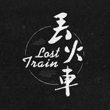
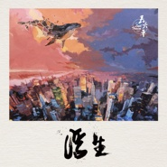
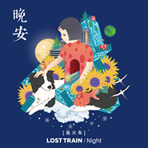
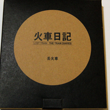
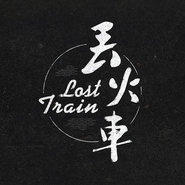

丢火车乐队
============================

|  |  |
| :--: | :-- |
| [ 丢火车乐队](https://i.xiami.com/diuhuoche) | **地区**: China 中国大陆 **风格**: 摇滚 Rock & Roll, 民谣 Folk **播放数**: 28176847 **粉丝数**: 31886 **评论数**: 632  |

## 档案

丢火车乐队成立于2004年。丢火车，源于丢火车主唱球子儿时写的一个小剧本而来－－带有强烈的个人励志色彩。《Lost Train》。这是一支将个人信仰与时代性完美融合的乐队：悲伤，希望；迷茫，执着；疯狂，冷静。丢火车用生命中最纯净的灵魂力量加入优美而琅琅入口的旋律勾勒出一个独特而深邃的音乐轨迹。

## 专辑

| 名称 | 语种 | 唱片公司 | 发行时间 | 专辑类别 | 专辑风格 |
| :--: | :-- | :-- | :-- | :-- | :-- |
| [ 有人用沉默把理想窃取](./albums/2105364173.md) | 国语 | 奔跑怪物 | 2019年10月22日 | EP, 单曲 |  |
| [ 浮生](./albums/2102880349.md) | 国语 | 独立发行 | 2017年10月26日 | EP, 单曲 | 流行 Pop |
| [ 陪你听全世界](./albums/2102813284.md) | 国语 | 腾讯音乐 | 2017年08月05日 | EP, 单曲 | 国语流行 Mandarin Pop |
| [ 我的生命只有过一次意义](./albums/2102798328.md) | 国语 | 完美青春OST | 2017年07月18日 | EP, 单曲 | 流行摇滚 Pop Rock |
| [ 春天过后](./albums/2102780895.md) | 国语 | 独立发行 | 2017年07月10日 | EP, 单曲 | 流行摇滚 Pop Rock |
| [ 秋城](./albums/2102736791.md) | 国语 | 独立发行 | 2017年04月24日 | EP, 单曲 | 民谣流行 Folk Pop |
| [ 如斯](./albums/2102403593.md) | 国语 | 独立发行 | 2016年09月30日 | EP, 单曲 | 民谣流行 Folk Pop |
| [ 晚安](./albums/2100207488.md) | 国语 | 海狗修养地 | 2015年09月25日 | EP, 单曲 | 国语流行 Mandarin Pop |
| [ 游歌](./albums/1814432126.md) | 国语 | 独立发行 | 2014年10月21日 | EP, 单曲 | 流行摇滚 Pop Rock, 独立摇滚 Indie Rock |
| [ 火车日记](./albums/504283.md) | 国语 | 独立发行 | 2011年12月20日 | 录音室专辑 | 流行摇滚 Pop Rock |
| [ 丢火车](./albums/324048.md) | 国语 | 海狗修养地 | 2008年06月23日 | EP, 单曲 | 摇滚 Rock & Roll |

## 评论

|  |  |  |
| :-- | :-- | :-- |
|  [虾米用户](https://emumo.xiami.com/u/151521902) 别在树下徘徊，别在雨中沉... 2020-06-17 19:01 赞(0) 踩(0) | 
好多都黑了，可恶啊 
 |
|  [虾米用户](https://emumo.xiami.com/u/721351)  2020-01-22 20:13 赞(1) 踩(0) | 
为了相似的声音。
 |
|  [虾米用户](https://emumo.xiami.com/u/2796166) 最爱莫文蔚..... 2020-01-06 00:12 赞(1) 踩(0) | 
加油~~~~
 |
|  [虾米用户](https://emumo.xiami.com/u/414013472) 用音乐与世界连接 2019-12-18 14:14 赞(2) 踩(0) | 
明晚广州Mao见 
 |
|  [虾米用户](https://emumo.xiami.com/u/358104299) 悲观的唯心存在现实解构虚... 2019-12-05 14:56 赞(2) 踩(0) | 
14115
 |
|  [虾米用户](https://emumo.xiami.com/u/478527) 好想跟衣服在洗衣机里滚 2019-10-29 21:15 赞(0) 踩(0) | 
我们在北京，你们快来
 |
|  [虾米用户](https://emumo.xiami.com/u/114895042) ты любил её ... 2019-07-30 00:23 赞(0) 踩(0) | 
号码都有  太骚了
 |
|  [虾米用户](https://emumo.xiami.com/u/18541117) 我还需要多久才能懂得遗忘... 2019-06-03 13:10 赞(1) 踩(0) | 
很喜欢的一个乐队
 |
|  [虾米用户](https://emumo.xiami.com/u/10834754) 宅心・人厚 2019-03-24 02:37 赞(0) 踩(0) | 
我就想问问虾米的年费会员给退么
 |
|  [虾米用户](https://emumo.xiami.com/u/1088907) Whoosah 2019-03-05 13:18 赞(0) 踩(0) | 
版权太少了，虾米真是丢人，再见
 |
|  [虾米用户](https://emumo.xiami.com/u/31018656) 持续性混吃等死还间歇性踌... 2019-02-19 13:05 赞(0) 踩(0) | 
谢谢你 丢火车乐队 是你们的一首秋城让我找到了方向 正能量的歌就是可以带动人的心情！
 |
|  [虾米用户](https://emumo.xiami.com/u/228089459) ( ･᷄ὢ･᷅ ) 2019-02-06 00:44 赞(0) 踩(0) | 
为《风景》打call
 |
|  [虾米用户](https://emumo.xiami.com/u/411605004)  2019-01-01 10:32 赞(1) 踩(0) | 
茶底世界，真的太好了 越听越有感觉，
 |
|  [虾米用户](https://emumo.xiami.com/u/8583730) 我还没想好要写什么... 2018-12-31 17:43 赞(0) 踩(0) | 
这名字。。想到了那部英国电影
 |
|  [虾米用户](https://emumo.xiami.com/u/328032241)  2018-12-23 11:41 赞(1) 踩(0) | 
家乡乐队。支持一下
 |
|  [虾米用户](https://emumo.xiami.com/u/39988409) 一方面怨自己孤独，一方面... 2018-12-07 00:51 赞(0) 踩(0) | 
转一张深圳的演出票，要的找我
 |
|  [虾米用户](https://emumo.xiami.com/u/2628338) 人生是场旅行 2018-11-29 16:08 赞(0) 踩(0) | 
周日见吧。
 |
|  [虾米用户](https://emumo.xiami.com/u/247902213) 我只要零或绝对，不要一些... 2018-10-25 13:03 赞(0) 踩(0) | 
写得好，唱得好，干净，纯粹。
 |
|  [虾米用户](https://emumo.xiami.com/u/50877398) 我还没想好要写什么... 2018-09-19 12:03 赞(1) 踩(0) | 
我原来一直以为丢火车是摇滚乐队现在才听原来是民谣啊不过很好听
 |
|  [虾米用户](https://emumo.xiami.com/u/36588472) 再见明天. 2018-08-05 07:41 赞(0) 踩(0) | 
有好多好听的歌不能听啊啊啊啊 
 |
|  [虾米用户](https://emumo.xiami.com/u/297999609) 去克洛里吧 2018-07-30 22:41 赞(0) 踩(0) | 
、
 |
|  [虾米用户](https://emumo.xiami.com/u/375283005) 天南地北四方客  万水千... 2018-07-22 16:27 赞(0) 踩(0) | 
《火车日记》，超有态度的作品。
 |
|  [虾米用户](https://emumo.xiami.com/u/370447780)  2018-06-11 15:07 赞(2) 踩(0) | 
最爱的乐队！没有之一！
 |
|  [虾米用户](https://emumo.xiami.com/u/257062362) 我还没想好要写什么... 2018-05-31 19:25 赞(0) 踩(0) | 
非常喜欢他们的歌，感觉非常的温暖，最近爱上了《如斯》，嗯，希望可以得到关于《如斯》详细内涵
 |
|  [虾米用户](https://emumo.xiami.com/u/956662) 祭…毕竟什么都逃不过时间 2018-05-29 20:47 赞(0) 踩(0) | 
版权呢，马云爸爸
 |
|  [虾米用户](https://emumo.xiami.com/u/349568165) 听歌这么私人的事情，怎么... 2018-05-25 08:32 赞(1) 踩(0) | 
什么时候来广州！！！！！！！
 |
|  [虾米用户](https://emumo.xiami.com/u/20177386) 感谢一切美好的遇见❤️ 2018-04-24 01:27 赞(0) 踩(0) | 

 |
|  [虾米用户](https://emumo.xiami.com/u/49532858) 今日 2018-03-31 18:22 赞(0) 踩(0) | 
版权去哪儿了？
 |
|  [虾米用户](https://emumo.xiami.com/u/341807910) 我还没想好要写什么... 2018-03-27 09:37 赞(0) 踩(0) | 
白兰鸽快飞回来
 |
|  [虾米用户](https://emumo.xiami.com/u/268935002)  2018-03-22 04:03 赞(0) 踩(0) | 
无论爱人还是朋友，愿： 所有的真心，都值得被善待； 所有的深情，都应该去回馈！
 |
|  [虾米用户](https://emumo.xiami.com/u/307134956)  2018-03-08 09:51 赞(4) 踩(0) | 
啊！！版权啊！！！
 |
|  [虾米用户](https://emumo.xiami.com/u/6545705) ooooo……在于不不不 2018-02-13 10:40 赞(1) 踩(0) | 
 
 |
|  [虾米用户](https://emumo.xiami.com/u/9315833) （ˉ﹃ˉ） 2018-02-01 00:21 赞(0) 踩(0) | 
最喜欢的游歌这张砖，什么时候会来长沙，好想听现场
 |
|  [虾米用户](https://emumo.xiami.com/u/290917675)  2018-01-30 18:35 赞(1) 踩(0) | 
每张专辑的封面都好漂亮
 |
|  [虾米用户](https://emumo.xiami.com/u/4188551) 暂无签名~ 2017-12-29 08:30 赞(3) 踩(0) | 
。。听不了白兰鸽了 我要这虾米有何用
 |
|  [虾米用户](https://emumo.xiami.com/u/300907451)  2017-12-25 23:41 赞(2) 踩(0) | 
版权?!
 |
|  [虾米用户](https://emumo.xiami.com/u/218423941) 永远年轻，永远热泪盈眶 2017-12-20 01:42 赞(3) 踩(0) | 
版权怎么被买走了。。。
 |
|  [虾米用户](https://emumo.xiami.com/u/44070422) 我还没想好要写什么... 2017-12-13 23:27 赞(1) 踩(0) | 
为什么木有版权了
 |
|  [虾米用户](https://emumo.xiami.com/u/301048488) 听歌是想象战胜了理智，看... 2017-12-10 22:01 赞(0) 踩(0) | 
大家跟我一样 都是听他的茶底世界，听出自己挣扎的内心
 |
| ⇒ |  [虾米用户](https://emumo.xiami.com/u/301048488) 听歌是想象战胜了理智，看... 2017-12-10 22:06 赞(0) 踩(0) | 
这个乐队，听了很久 9年了没能再出经典 可惜了 愿这个乐队越来越好
 |
| ⇒ |  [虾米用户](https://emumo.xiami.com/u/40268799)  2018-01-22 09:55 赞(0) 踩(0) | 
<q><b>用户不存在说：</b></q>
 |
|  [虾米用户](https://emumo.xiami.com/u/81756352) 无名小卒 2017-12-03 18:17 赞(0) 踩(0) | 
什么情况 不能听了
 |
|  [虾米用户](https://emumo.xiami.com/u/25296605) 我搭车去睡你 2017-11-26 19:51 赞(0) 踩(0) | 
版权呢。。
 |
|  [虾米用户](https://emumo.xiami.com/u/89734248)  2017-11-25 15:05 赞(0) 踩(0) | 
这才两天   就都不能听了？
 |
|  [虾米用户](https://emumo.xiami.com/u/141421954)  2017-11-16 15:51 赞(0) 踩(0) | 
游歌和前两张专辑比起来不太独立了，风格也更加的民谣起来，相对来说更喜欢以前的丢火车
 |
|  [虾米用户](https://emumo.xiami.com/u/259856126) Hola！ 2017-11-04 16:43 赞(0) 踩(0) | 
非常喜欢你们，昨天刚刚加入了虾米音乐人，上传了个人原创demo，希望能有机会学习交流。
 |
|  [虾米用户](https://emumo.xiami.com/u/259856126) Hola！ 2017-11-04 10:52 赞(0) 踩(0) | 
前些日子开车特意走了下大庆的卡尔加里路，车里放着秋城&amp;middot;&amp;middot;&amp;middot;
 |
|  [虾米用户](https://emumo.xiami.com/u/12191652) 还未丧失的固执和纯粹 2017-10-30 10:11 赞(0) 踩(0) | 
昨天在MAO看到这支乐队，听他们的歌，一群东北汉子，敞亮〜
 |
|  [虾米用户](https://emumo.xiami.com/u/838521)  2017-10-28 00:17 赞(0) 踩(0) | 
火车日记很快已经在开始卖了，大家可以上新浪微博，去关注@丢火车乐队，然后他们有一个官方的淘宝购买店铺，很不错，35块一张。
 |
|  [虾米用户](https://emumo.xiami.com/u/32786434) 爱音乐，爱自己。 2017-10-27 23:46 赞(0) 踩(0) | 
木有西安，离我好远，！！！  
 |
|  [虾米用户](https://emumo.xiami.com/u/14616187) 在隆冬，我终于知道，我身... 2017-10-27 23:45 赞(0) 踩(0) | 
刚从重庆坚果high完…真是一支氛围极好的乐队啊，祝你们永远年轻热情和温暖。晚安。
 |
|  [虾米用户](https://emumo.xiami.com/u/42064896) 累了么 如果你觉得漫长 2017-10-27 22:59 赞(0) 踩(0) | 
寻找已久的古老火车，带我们一起在慢慢的人生旅途中寻找光明，自由和希望。
 |
|  [虾米用户](https://emumo.xiami.com/u/10023931) 假的 2017-10-23 22:17 赞(0) 踩(0) | 
我在798猜火车餐厅听丢火车 
 |
|  [虾米用户](https://emumo.xiami.com/u/207180745)  2017-10-21 15:23 赞(0) 踩(0) | 
1：新歌更好，没有像民谣那样所有歌曲都一个感情一个调子，写的不知 所谓，空洞的调子用叙事弥补。其实好的歌曲很简单，就是曲子的感情要和歌词的感情完美一致。
 |
|  [虾米用户](https://emumo.xiami.com/u/47004271) 松散生命 2017-10-17 11:38 赞(0) 踩(0) | 
♛
 |
|  [虾米用户](https://emumo.xiami.com/u/9334040) 记住我！把我写在你们的基... 2017-10-14 17:48 赞(0) 踩(0) | 
稳！声音牵引着过往 令我平静。
 |
|  [虾米用户](https://emumo.xiami.com/u/52549367) 学生 2017-10-07 20:17 赞(0) 踩(0) | 
炒鸡喜欢！！！！！
 |
|  [虾米用户](https://emumo.xiami.com/u/10028400) 我还没想好要写什么... 2017-10-01 14:05 赞(0) 踩(0) | 

 |
|  [虾米用户](https://emumo.xiami.com/u/279974629)  2017-09-26 19:43 赞(0) 踩(0) | 
《晚安》在虾米听不了了，(╥╯^╰╥)
 |
|  [虾米用户](https://emumo.xiami.com/u/47151023) 爱而不得很正常，哭都没必... 2017-09-04 19:02 赞(0) 踩(0) | 
低沉又厚实的嗓音，好听
 |
|  [虾米用户](https://emumo.xiami.com/u/50534630)   2017-08-24 20:05 赞(1) 踩(0) | 
该发新专辑啦！
 |
|  [虾米用户](https://emumo.xiami.com/u/283072501)  2017-07-31 09:42 赞(0) 踩(0) | 
声音中有一种慵懒中的韧力，音乐制作得很棒，节奏和歌词都很不错
 |
|  [虾米用户](https://emumo.xiami.com/u/83893196) 我还没想好要写什么... 2017-07-27 19:03 赞(0) 踩(0) | 
久别重逢
 |
|  [虾米用户](https://emumo.xiami.com/u/125089920) 找到北方啦 2017-07-18 22:19 赞(1) 踩(0) | 
防止每次收藏你们的歌都要给我发消息，我决定关注你们啦 
 |
|  [虾米用户](https://emumo.xiami.com/u/103494594) 当车声隆隆，梦开始阵痛 2017-07-16 08:16 赞(0) 踩(0) | 
来昆明办场演唱会呗[带墨镜笑]
 |
|  [虾米用户](https://emumo.xiami.com/u/59000814)   2017-07-14 12:25 赞(4) 踩(0) | 
大多数人喜欢周骏的颜&amp;hellip;&amp;hellip;我喜欢球子的声音，从2015年的《晚安》开始到今天，抑郁症快四年，这个声音给我安慰，让我释然，有时候音乐的力量真的很强大，表白球子，太太太喜欢他了 
 |
|  [虾米用户](https://emumo.xiami.com/u/303908594)  2017-06-23 12:16 赞(0) 踩(0) | 
白嵐ge
 |
|  [虾米用户](https://emumo.xiami.com/u/294833516) 自律和不自律得人生  真... 2017-06-11 09:52 赞(0) 踩(0) | 
不知道为什么 茶底世界听得我一身鸡皮疙瘩   
 |
|  [虾米用户](https://emumo.xiami.com/u/294833516) 自律和不自律得人生  真... 2017-06-11 09:50 赞(0) 踩(0) | 
今早第一次听过得乐队得名字，好逗，和动力火车咋有点相似呐。 然后听过了所有的歌 关注了 发自肺腑喜欢得一只乐队。
 |
|  [虾米用户](https://emumo.xiami.com/u/295802708)  2017-06-07 17:46 赞(0) 踩(0) | 
真机吧差的名字，取别的不好吗，取这么个杀马特名字
 |
| ⇒ |  [虾米用户](https://emumo.xiami.com/u/59000814)   2017-09-08 13:37 赞(0) 踩(0) | 
觉得差可以不看或不听
 |
|  [虾米用户](https://emumo.xiami.com/u/134848328) 一起高呼Rock'n r... 2017-05-26 23:56 赞(0) 踩(0) | 
这风格变得有点快啊
 |
|  [虾米用户](https://emumo.xiami.com/u/282706025)  2017-05-25 23:41 赞(0) 踩(0) | 
白兰鸽巡游记，让你想起至少五年前的自己。大爱
 |
|  [虾米用户](https://emumo.xiami.com/u/288373907)  2017-05-18 20:31 赞(0) 踩(0) | 
就一个字 酷！
 |
|  [虾米用户](https://emumo.xiami.com/u/92655250) 我就一听歌的。 2017-05-14 00:06 赞(1) 踩(0) | 
有喜欢的简单与干脆，声音有点磁性有点温暖。仿佛你慢慢聆听，我缓缓诉说。
 |
|  [虾米用户](https://emumo.xiami.com/u/217718308) 我还没想好要写什么... 2017-05-07 23:41 赞(0) 踩(0) | 
楼下，难听别听
 |
|  [虾米用户](https://emumo.xiami.com/u/86229844) 你还不来，我怎肯老去？-... 2017-05-07 08:58 赞(0) 踩(0) | 
真特么难听。。。
 |
| ⇒ |  [虾米用户](https://emumo.xiami.com/u/32032050) Running to s... 2017-06-02 13:13 赞(0) 踩(0) | 
觉得难听还要进来评论打出来，你的心胸有多狭窄？
 |
| ⇒ |  [虾米用户](https://emumo.xiami.com/u/86229844) 你还不来，我怎肯老去？-... 2017-06-10 19:17 赞(0) 踩(0) | 
<q><b>*这里还有鱼说：</b></q>
 |
| ⇒ |  [虾米用户](https://emumo.xiami.com/u/32032050) Running to s... 2017-06-11 08:27 赞(0) 踩(0) | 
<q><b>Gentleman-Mr说：</b></q>
 |
| ⇒ |  [虾米用户](https://emumo.xiami.com/u/86229844) 你还不来，我怎肯老去？-... 2017-06-15 11:05 赞(0) 踩(0) | 
<q><b>*这里还有鱼说：</b></q>
 |
| ⇒ |  [虾米用户](https://emumo.xiami.com/u/86229844) 你还不来，我怎肯老去？-... 2017-06-15 11:05 赞(0) 踩(0) | 
<q><b>*这里还有鱼说：</b></q>
 |
|  [虾米用户](https://emumo.xiami.com/u/890246)  2017-05-03 14:19 赞(0) 踩(0) | 
好听
 |
|  [虾米用户](https://emumo.xiami.com/u/237798671) 我爱你，与你无关 2017-05-01 20:21 赞(2) 踩(0) | 
今天第一次听他们的歌，我只能说相遇恨晚，好久没有发自肺腑的喜欢某一支乐队了
 |
|  [虾米用户](https://emumo.xiami.com/u/9572216)   2017-05-01 14:15 赞(0) 踩(0) | 
平原大地，沉稳，温暖
 |
|  [虾米用户](https://emumo.xiami.com/u/50541743) 历尽天华成此景  2017-04-30 23:15 赞(0) 踩(0) | 
  
 |
|  [虾米用户](https://emumo.xiami.com/u/48252970) 你我都在，山和大海。 2017-04-30 13:49 赞(0) 踩(0) | 
等候日落，在秋城里，孤独的人原来不只我一个 
 |
|  [虾米用户](https://emumo.xiami.com/u/288451224) 我很任性！ 2017-04-13 22:19 赞(0) 踩(0) | 
久久好听
 |
|  [虾米用户](https://emumo.xiami.com/u/277346356)  2017-04-03 09:42 赞(0) 踩(0) | 
喜欢   没理由   就是喜欢
 |
|  [虾米用户](https://emumo.xiami.com/u/13025112)  2017-04-01 22:10 赞(0) 踩(0) | 
超喜欢, 宁静致远
 |
|  [虾米用户](https://emumo.xiami.com/u/113049318)  2017-04-01 14:22 赞(0) 踩(0) | 
喜欢 对脾气的歌
 |
|  [虾米用户](https://emumo.xiami.com/u/55109400)  2017-03-25 00:12 赞(0) 踩(0) | 
良心编曲 好乐队
 |
|  [虾米用户](https://emumo.xiami.com/u/210289161)   2017-03-21 16:53 赞(0) 踩(0) | 

 |
|  [虾米用户](https://emumo.xiami.com/u/253252001)  2017-03-16 18:30 赞(0) 踩(0) | 
支持的人越来越多了，希望我喜欢的丢火车乐队越来越好 
 |
|  [虾米用户](https://emumo.xiami.com/u/271044601) 姐就是来听歌的。 2017-03-13 23:16 赞(0) 踩(0) | 
偶然听见《晚安》，本想作为入睡前的序幕，结果没想到还有更多的好音乐在后面，未完待续，支持你们用心做的音乐。
 |
|  [虾米用户](https://emumo.xiami.com/u/10459721) 敏感易碎的男子 2017-03-09 17:54 赞(0) 踩(0) | 
超喜欢镜子中，加油！
 |
|  [虾米用户](https://emumo.xiami.com/u/85268772)  2017-02-21 22:46 赞(0) 踩(0) | 
国内最爱的乐队，没有之一
 |
|  [虾米用户](https://emumo.xiami.com/u/34313941) 面朝大海，春暖花开。 2017-02-21 09:29 赞(0) 踩(0) | 
丢手绢 
 |
|  [虾米用户](https://emumo.xiami.com/u/21029456)  2017-02-18 08:24 赞(0) 踩(0) | 
******
 |
|  [虾米用户](https://emumo.xiami.com/u/81337954) 不必再问记着谁 2017-02-11 23:17 赞(0) 踩(0) | 
曲子很美，听来真的很享受，实在民谣届编曲做得很有诚心的了
 |
|  [虾米用户](https://emumo.xiami.com/u/33495901) 什么音乐都听，只要能感动... 2017-01-23 13:16 赞(0) 踩(0) | 
某些發聲跟陳奕迅有點像，所以進來了
 |
|  [虾米用户](https://emumo.xiami.com/u/260014486)  2017-01-10 01:17 赞(1) 踩(0) | 
晚安，愿长夜无梦
 |
|  [虾米用户](https://emumo.xiami.com/u/252216580) 我总是一个人习惯一个人 2016-12-11 23:09 赞(0) 踩(0) | 
加油，
 |
|  [虾米用户](https://emumo.xiami.com/u/92683192)  2016-12-11 15:27 赞(0) 踩(0) | 
期待你们来广州深圳佛山，我一定到
 |
|  [虾米用户](https://emumo.xiami.com/u/1290029)  2016-12-11 12:26 赞(0) 踩(0) | 
小波体力好(o゜▽゜)o☆
 |
|  [虾米用户](https://emumo.xiami.com/u/41258960) 《音乐节气》《音乐新青年... 2016-12-10 21:40 赞(2) 踩(0) | 
做你们第521个评论，永远前进，永远加油！
 |
|  [虾米用户](https://emumo.xiami.com/u/28113352)   2016-12-10 18:09 赞(1) 踩(0) | 
麻油叶唯一有前途的艺人
 |
|  [虾米用户](https://emumo.xiami.com/u/73663320) 我还没想好要写什么... 2016-12-10 15:39 赞(0) 踩(0) | 
总觉得新专和以前出的歌味道不一样了，可别丢了自己啊。要是和其他民谣听起来都一个味儿，那我真是心情复杂 
 |
|  [虾米用户](https://emumo.xiami.com/u/8226693) Musik des Ei... 2016-12-10 12:22 赞(0) 踩(0) | 
不错不错，摇滚民谣就该这样丢，丢火车乐队，支持你们，希望今后可以丢得更远！
 |
|  [虾米用户](https://emumo.xiami.com/u/49748006) Fly me to th... 2016-11-20 17:17 赞(0) 踩(0) | 
周骏！
 |
|  [虾米用户](https://emumo.xiami.com/u/242383373)  2016-11-02 16:14 赞(0) 踩(0) | 
丢火车要来杭州啦 11月12日 绿科秀歌瓦拉音乐节
 |
|  [虾米用户](https://emumo.xiami.com/u/98192500) 让往事远 2016-10-07 10:40 赞(0) 踩(0) | 
记忆里总有人坐在身旁 抚摸着我枯萎的肩膀
 |
|  [虾米用户](https://emumo.xiami.com/u/38854215)   2016-10-06 09:42 赞(0) 踩(0) | 
我真的很喜欢很喜欢这样安静的歌
 |
|  [虾米用户](https://emumo.xiami.com/u/151233488) 仍然相信美好的事情会发生 2016-10-03 21:21 赞(0) 踩(0) | 
刚听完现场，现场都炸了，太嗨
 |
|  [虾米用户](https://emumo.xiami.com/u/52014405)  2016-10-02 11:18 赞(0) 踩(0) | 
仍然很爱  可单曲循环
 |
|  [虾米用户](https://emumo.xiami.com/u/7612644) 那年未完成的爱情 2016-10-02 09:53 赞(0) 踩(0) | 
期待你们的巡演
 |
|  [虾米用户](https://emumo.xiami.com/u/7612644) 那年未完成的爱情 2016-10-02 09:53 赞(0) 踩(0) | 
   
 |
|  [虾米用户](https://emumo.xiami.com/u/33514232) 喜欢来这里找我喜欢的 2016-09-27 11:09 赞(93) 踩(0) | 
这个乐队的队员力气好大啊，别人都丢手绢，他们丢火车
 |
| ⇒ |  [虾米用户](https://emumo.xiami.com/u/21979192)  2017-06-17 17:15 赞(0) 踩(0) | 
哈哈哈哈哈哈
 |
| ⇒ |  [虾米用户](https://emumo.xiami.com/u/33514232) 喜欢来这里找我喜欢的 2017-06-17 21:20 赞(0) 踩(0) | 
<q><b>         安然ω说：</b></q>
 |
| ⇒ |  [虾米用户](https://emumo.xiami.com/u/4899095) 我还没想好要写什么... 2017-06-26 20:36 赞(0) 踩(0) | 
楼主66666
 |
| ⇒ |  [虾米用户](https://emumo.xiami.com/u/33514232) 喜欢来这里找我喜欢的 2017-06-28 13:27 赞(0) 踩(0) | 
<q><b>今夜星光灿烂说：</b></q>
 |
| ⇒ |  [虾米用户](https://emumo.xiami.com/u/283814142) 认识我你很高兴!! 2017-09-22 20:52 赞(0) 踩(0) | 
哈哈哈顽皮小胖胖 
 |
| ⇒ |  [虾米用户](https://emumo.xiami.com/u/33514232) 喜欢来这里找我喜欢的 2017-10-09 13:45 赞(0) 踩(0) | 
<q><b>饼大虾说：</b></q>
 |
| ⇒ |  [虾米用户](https://emumo.xiami.com/u/259856126) Hola！ 2017-11-04 16:43 赞(0) 踩(0) | 
哈哈 真有联想力
 |
| ⇒ |  [虾米用户](https://emumo.xiami.com/u/321944875)  2017-11-04 20:48 赞(0) 踩(0) | 
666
 |
| ⇒ |  [虾米用户](https://emumo.xiami.com/u/33514232) 喜欢来这里找我喜欢的 2017-11-05 22:41 赞(0) 踩(0) | 
<q><b>无奈说：</b></q>
 |
| ⇒ |  [虾米用户](https://emumo.xiami.com/u/33514232) 喜欢来这里找我喜欢的 2017-12-12 07:55 赞(0) 踩(0) | 
上热门很高兴   
 |
| ⇒ |  [虾米用户](https://emumo.xiami.com/u/335812646) 帐号已注销 2018-04-10 19:05 赞(0) 踩(0) | 
差点以为是丢动力火车 
 |
| ⇒ |  [虾米用户](https://emumo.xiami.com/u/4811886) 夕阳爱好者。 2018-06-22 01:43 赞(0) 踩(0) | 
大晚上的笑出声
 |
| ⇒ |  [虾米用户](https://emumo.xiami.com/u/33514232) 喜欢来这里找我喜欢的 2018-06-22 20:56 赞(0) 踩(0) | 
<q><b>千妄说：</b></q>
 |
|  [虾米用户](https://emumo.xiami.com/u/60320454)  2016-09-17 17:51 赞(0) 踩(0) | 
每次经过 卡尔加里路 都会想起你们的歌 永远支持你们 加油啊 老乡
 |
|  [虾米用户](https://emumo.xiami.com/u/3518232) 唯有音乐相伴，不再孤独启... 2016-09-14 11:53 赞(0) 踩(0) | 
丢火车何时来安徽周边巡演呀，期待你们的演出。
 |
|  [虾米用户](https://emumo.xiami.com/u/109019164) 徒然求索，不如思止。 2016-08-31 21:41 赞(0) 踩(0) | 
90%的歌都可以循环一整天
 |
|  [虾米用户](https://emumo.xiami.com/u/4014569)   2016-08-03 16:46 赞(1) 踩(0) | 
丢火车终于不丢不迷失了 好事坏事？只不过我还是喜欢第一张 不 是怀念
 |
|  [虾米用户](https://emumo.xiami.com/u/52703314)  2016-07-20 22:38 赞(24) 踩(0) | 
大二时在学校报亭看到一本我爱摇滚，买下。当时好像要十五元，对于一个穷学生那可是两顿饭钱。里面有张CD，第一次听到丢火车，是茶底世界。十一年了，依然热泪盈眶依然热爱丢火车依然热爱生活
 |
|  [虾米用户](https://emumo.xiami.com/u/4484500)   2016-06-21 03:44 赞(0) 踩(0) | 
喜欢这个乐队
 |
|  [虾米用户](https://emumo.xiami.com/u/2063126)  2016-06-16 16:11 赞(0) 踩(0) | 
青春记忆。。。永远永远。。。。
 |
|  [虾米用户](https://emumo.xiami.com/u/16135450)  2016-06-11 21:36 赞(0) 踩(0) | 
1135
 |
|  [虾米用户](https://emumo.xiami.com/u/121910506)  无言. 2016-05-22 13:55 赞(0) 踩(0) | 
独一无二。
 |
|  [虾米用户](https://emumo.xiami.com/u/121910506)  无言. 2016-05-22 13:44 赞(0) 踩(0) | 
力量。
 |
|  [虾米用户](https://emumo.xiami.com/u/83530626) 危险常备吸引力 2016-05-12 23:41 赞(0) 踩(0) | 
没错 还是这么夏天
 |
|  [虾米用户](https://emumo.xiami.com/u/1048450)  2016-05-12 23:25 赞(1) 踩(0) | 
我希望等到下一个春天
 |
|  [虾米用户](https://emumo.xiami.com/u/45298985) Wechat:dqx19... 2016-05-08 17:34 赞(0) 踩(0) | 
+
 |
|  [虾米用户](https://emumo.xiami.com/u/3707807)  2016-04-23 22:20 赞(0) 踩(0) | 
666666666
 |
|  [虾米用户](https://emumo.xiami.com/u/7621040)  2016-04-14 20:50 赞(2) 踩(0) | 
永远热泪盈眶
 |
|  [虾米用户](https://emumo.xiami.com/u/58657068) 爱自由☀无所畏 2016-04-05 22:59 赞(1) 踩(0) | 
前些天刚在乐队淘宝网店买了两张专辑，哈哈
 |
|  [虾米用户](https://emumo.xiami.com/u/77735830)   2016-03-19 19:58 赞(0) 踩(0) | 
专心的听歌就好了
 |
|  [虾米用户](https://emumo.xiami.com/u/120859346) 保持那片独有的蔚蓝 2016-03-12 16:33 赞(0) 踩(0) | 
好听
 |
|  [虾米用户](https://emumo.xiami.com/u/658953) 世界核平 2016-02-13 21:34 赞(0) 踩(0) | 
.
 |
|  [虾米用户](https://emumo.xiami.com/u/49341970) 既然没人认识我，那就——... 2016-02-13 18:53 赞(0) 踩(0) | 
棒。
 |
|  [虾米用户](https://emumo.xiami.com/u/55048906) 你文渊妹妹 2016-02-13 17:24 赞(0) 踩(0) | 
乐队颜值够可以的啊
 |
| ⇒ |  [虾米用户](https://emumo.xiami.com/u/55048906) 你文渊妹妹 2016-04-01 21:35 赞(0) 踩(0) | 
<q><b>daipeilan502说：</b></q>
 |
| ⇒ |  [虾米用户](https://emumo.xiami.com/u/49532406) 游戏+听歌 2017-12-18 22:49 赞(0) 踩(0) | 
过去的乐队，除了主唱颜值都丑的掉渣。主唱是招牌，还必须找来个性感美女当主唱才够吸引人。主唱活儿必须亮眼。但是咱丢火车呢？除了主唱丑得掉渣，其它人的颜值都还过得去，呵呵
 |
|  [虾米用户](https://emumo.xiami.com/u/61284900) 快乐生活 2016-02-11 21:08 赞(0) 踩(0) | 
久别重逢
 |
|  [虾米用户](https://emumo.xiami.com/u/112338908) Tender 2016-02-11 17:47 赞(1) 踩(0) | 
好想周骏呀！
 |
|  [虾米用户](https://emumo.xiami.com/u/6475202)  2016-02-05 11:23 赞(2) 踩(0) | 
继痛仰后又一支适合开车听的乐队
 |
|  [虾米用户](https://emumo.xiami.com/u/48569510) 百花盛开，我只想要你。 2016-02-04 16:58 赞(0) 踩(0) | 
永远记得你们的巡演 爱你们 
 |
|  [虾米用户](https://emumo.xiami.com/u/9140061) 90后，加油 2016-02-03 18:00 赞(1) 踩(0) | 
个人认为最好听的几首: 香水之旅、帽儿山、游歌、迷乱、染色体、茶底世界、沙子
 |
|  [虾米用户](https://emumo.xiami.com/u/91485334)  2016-01-28 11:24 赞(0) 踩(0) | 
16年啥时来沈阳啊
 |
|  [虾米用户](https://emumo.xiami.com/u/24356354)  2016-01-27 14:27 赞(0) 踩(0) | 
lalala
 |
|  [虾米用户](https://emumo.xiami.com/u/11967549) ~ 2016-01-13 11:06 赞(0) 踩(0) | 
永远 永远··· ···
 |
|  [虾米用户](https://emumo.xiami.com/u/50280107) U r pretty w... 2015-12-27 00:04 赞(0) 踩(0) | 
很喜欢
 |
|  [虾米用户](https://emumo.xiami.com/u/43280155) 虾米，感谢陪伴。 2015-12-26 17:33 赞(0) 踩(0) | 
嚯嚯嚯，果断关注了
 |
|  [虾米用户](https://emumo.xiami.com/u/4056348) 一半理想 一半生活 2015-12-22 11:40 赞(0) 踩(0) | 
晚安 会把人听哭了
 |
| ⇒ |  [虾米用户](https://emumo.xiami.com/u/11967549) ~ 2016-01-13 11:08 赞(0) 踩(0) | 
你会不会突然的忘记了我
 |
|  [虾米用户](https://emumo.xiami.com/u/4056348) 一半理想 一半生活 2015-12-22 11:37 赞(1) 踩(0) | 
深圳现场也是很棒哒！！！周骏也太帅了吧 流一脸口水~~~~~~
 |
|  [虾米用户](https://emumo.xiami.com/u/51543219) 焚心以火. 2015-12-21 11:35 赞(0) 踩(0) | 
太爱丢火车 
 |
|  [虾米用户](https://emumo.xiami.com/u/8472699)  2015-12-20 21:18 赞(0) 踩(0) | 
嗯福州棒。
 |
|  [虾米用户](https://emumo.xiami.com/u/46511424)  2015-12-20 17:52 赞(0) 踩(0) | 
不错
 |
|  [虾米用户](https://emumo.xiami.com/u/5548223)  2015-12-13 23:12 赞(0) 踩(0) | 
杭州牛逼
 |
| ⇒ |  [虾米用户](https://emumo.xiami.com/u/4112631) 。 2015-12-14 02:39 赞(0) 踩(0) | 
晚安，“真心疼你们这些不知道该发给谁的人” 
 |
|  [虾米用户](https://emumo.xiami.com/u/9005269) 我还没想好要写什么... 2015-12-12 22:48 赞(1) 踩(0) | 
19号 amoy走起
 |
|  [虾米用户](https://emumo.xiami.com/u/46423426)   2015-12-06 09:42 赞(2) 踩(0) | 
来厦门了
 |
| ⇒ |  [虾米用户](https://emumo.xiami.com/u/3449737) ww 2015-12-18 16:25 赞(0) 踩(0) | 
约约约QAQ
 |
|  [虾米用户](https://emumo.xiami.com/u/57854698)  2015-12-06 00:10 赞(0) 踩(0) | 
永远永远
 |
|  [虾米用户](https://emumo.xiami.com/u/2279444) 爱在左，同情在右。 2015-12-03 12:47 赞(0) 踩(0) | 
这翘舌音一点都不像东北的啊
 |
| ⇒ |  [虾米用户](https://emumo.xiami.com/u/36264200)   2015-12-18 22:57 赞(0) 踩(0) | 
要听东北话找二手
 |
| ⇒ |  [虾米用户](https://emumo.xiami.com/u/4056348) 一半理想 一半生活 2015-12-22 11:35 赞(0) 踩(0) | 
他们说话还是很东北腔的
 |
|  [虾米用户](https://emumo.xiami.com/u/55202273)  2015-12-02 15:27 赞(0) 踩(0) | 
徐州，终于等到你
 |
|  [虾米用户](https://emumo.xiami.com/u/589764) The 1st cut ... 2015-11-29 00:09 赞(0) 踩(0) | 
鼓手和贝斯真是赏心悦目
 |
|  [虾米用户](https://emumo.xiami.com/u/10468601) 行者无疆 2015-11-28 09:11 赞(0) 踩(0) | 
爱，没有对错，南京见
 |
|  [虾米用户](https://emumo.xiami.com/u/46844042)  2015-11-27 12:12 赞(0) 踩(0) | 
哈哈，明天兰州葵，有人吗
 |
|  [虾米用户](https://emumo.xiami.com/u/36344395) 浪迹天涯 2015-11-23 21:41 赞(1) 踩(0) | 
角落比茶底世界好听一百倍好吗。。。收听量怎么那么少！！！！！！！！
 |
|  [虾米用户](https://emumo.xiami.com/u/85768188)   2015-11-23 17:00 赞(0) 踩(0) | 
我这周和两个尚志姐妹在兰州等你 
 |
| ⇒ |  [虾米用户](https://emumo.xiami.com/u/46844042)  2015-11-27 13:49 赞(0) 踩(0) | 
一起吗
 |
|  [虾米用户](https://emumo.xiami.com/u/72014060) 我还没想好要写什么... 2015-11-22 16:50 赞(0) 踩(0) | 
济南站有一起的吗
 |
|  [虾米用户](https://emumo.xiami.com/u/49287761) 热爱音乐电影文字 2015-11-21 13:02 赞(0) 踩(0) | 
现场很棒！！！昨天的昆明场嗨爆了！！！！
 |
|  [虾米用户](https://emumo.xiami.com/u/36344395) 浪迹天涯 2015-11-18 18:32 赞(0) 踩(0) | 
现场很棒。
 |
|  [虾米用户](https://emumo.xiami.com/u/833450) 仁义礼智信 2015-11-17 09:36 赞(1) 踩(0) | 
18号，葫芦见！
 |
| ⇒ |  [虾米用户](https://emumo.xiami.com/u/48569510) 百花盛开，我只想要你。 2015-11-17 23:02 赞(0) 踩(0) | 
我也是！
 |
| ⇒ |  [虾米用户](https://emumo.xiami.com/u/833450) 仁义礼智信 2015-11-18 09:47 赞(0) 踩(0) | 
<q><b>Zri3说：</b></q>
 |
|  [虾米用户](https://emumo.xiami.com/u/871412) 最多12个字符。 2015-11-17 00:08 赞(0) 踩(0) | 
现场比专辑好很多呀
 |
|  [虾米用户](https://emumo.xiami.com/u/49748006) Fly me to th... 2015-11-16 18:46 赞(0) 踩(0) | 
晚安 愿长夜无梦
 |
|  [虾米用户](https://emumo.xiami.com/u/1612907) 且行且珍惜 2015-11-16 11:44 赞(0) 踩(0) | 
喜欢的乐队，如果能再狠一点就太棒了！
 |
|  [虾米用户](https://emumo.xiami.com/u/275850)  2015-11-15 00:45 赞(0) 踩(0) | 
故事里有你，还有那个永远见不到的人，你万分思念却不能见
 |
|  [虾米用户](https://emumo.xiami.com/u/39436088) Still singin... 2015-11-14 03:16 赞(1) 踩(0) | 
没有后悔 今晚去看了你们现场 晚安。
 |
|  [虾米用户](https://emumo.xiami.com/u/2928117) 你好 2015-11-13 23:16 赞(0) 踩(0) | 
编曲没什么特别的，但有些歌还不错
 |
|  [虾米用户](https://emumo.xiami.com/u/310559) 别动。 2015-11-12 18:52 赞(0) 踩(0) | 
深圳的电子票居然卖光了。。。。现场能买吗。。。或者有买了不去转吗。。。
 |
|  [虾米用户](https://emumo.xiami.com/u/2485387) 当闭上眼 2015-11-11 14:42 赞(0) 踩(0) | 
一场“严肃”的演出愣是差点搞成了东北多人转，11.10 武汉 LIVE HOUSE。
 |
|  [虾米用户](https://emumo.xiami.com/u/40307218)  2015-11-10 11:21 赞(0) 踩(0) | 
深圳等你们 
 |
|  [虾米用户](https://emumo.xiami.com/u/3449737) ww 2015-11-08 00:34 赞(0) 踩(0) | 
1219 厦门 reallive
 |
|  [虾米用户](https://emumo.xiami.com/u/43331756) Shoot the po... 2015-11-07 04:41 赞(0) 踩(0) | 
今晚见
 |
|  [虾米用户](https://emumo.xiami.com/u/75960848) 微博：杀死星野 2015-11-07 01:22 赞(1) 踩(0) | 
11.12长沙
 |
|  [虾米用户](https://emumo.xiami.com/u/15825200) 我还没想好要写什么... 2015-11-05 17:32 赞(0) 踩(0) | 
广州等你们~~
 |
|  [虾米用户](https://emumo.xiami.com/u/41756149) 抛不下的垃圾虾米 2015-11-01 23:04 赞(0) 踩(0) | 
大连的朋友 让我看到你们的双手
 |
|  [虾米用户](https://emumo.xiami.com/u/1056669) 我还没想好要写什么... 2015-11-01 17:26 赞(0) 踩(0) | 
前天来大庆了～～～～
 |
|  [虾米用户](https://emumo.xiami.com/u/48399447)   2015-11-01 01:40 赞(4) 踩(0) | 
主唱一双aj6改变了我所有看法
 |
|  [虾米用户](https://emumo.xiami.com/u/6522420) 我还没想好要写什么... 2015-11-01 00:04 赞(0) 踩(0) | 
很入麦的声音
 |
|  [虾米用户](https://emumo.xiami.com/u/16296262) Everybody ne... 2015-10-31 12:34 赞(0) 踩(0) | 
睡了一觉起来仍觉得昨儿贼嗨，1030哈勒滨。小帅他们昨天回去到底打没打你哈哈哈
 |
|  [虾米用户](https://emumo.xiami.com/u/3851935) Why so serio... 2015-10-31 10:57 赞(0) 踩(0) | 
哈尔滨10.30唱嗨了！yooooooooo
 |
|  [虾米用户](https://emumo.xiami.com/u/42064896) 累了么 如果你觉得漫长 2015-10-30 23:02 赞(0) 踩(0) | 
现场太嗨了
 |
|  [虾米用户](https://emumo.xiami.com/u/42064896) 累了么 如果你觉得漫长 2015-10-30 23:02 赞(0) 踩(0) | 
哈尔滨 太棒了
 |
|  [虾米用户](https://emumo.xiami.com/u/45060404) secrets=huma... 2015-10-29 16:23 赞(0) 踩(0) | 
丢火车什么时候可以在北京办一场啊，很多死忠在盼望…
 |
|  [虾米用户](https://emumo.xiami.com/u/13534960) 江湖再见了 2015-10-28 17:50 赞(0) 踩(0) | 
大连见啦~
 |
|  [虾米用户](https://emumo.xiami.com/u/3562722) ~ 2015-10-28 08:22 赞(0) 踩(0) | 
什么时候来昆明？
 |
| ⇒ |  [虾米用户](https://emumo.xiami.com/u/9835402) BE NICE BE K... 2015-11-13 14:23 赞(0) 踩(0) | 
20号
 |
|  [虾米用户](https://emumo.xiami.com/u/42064896) 累了么 如果你觉得漫长 2015-10-26 18:11 赞(1) 踩(0) | 
中国为数不多的 民谣 英伦摇滚 相结合的乐队 这么好的乐队 在中国这种商业化音乐市场下 坚持不易 加油
 |
|  [虾米用户](https://emumo.xiami.com/u/42064896) 累了么 如果你觉得漫长 2015-10-26 18:01 赞(0) 踩(0) | 
乐队的主创人员均来自黑龙江，因此乐队的音乐也如同东北广阔无垠的黑土地一样沉稳。而他们在各地巡游，演出的经历使他们变成了更加细腻的思考者。歌曲对生活，情感的细致描写也常常让人无法相信这是几个东北大汉创作出的音乐。
 |
|  [虾米用户](https://emumo.xiami.com/u/14265718) wx:osakarock... 2015-10-26 13:15 赞(0) 踩(0) | 
草莓现场简直棒
 |
|  [虾米用户](https://emumo.xiami.com/u/14265718) wx:osakarock... 2015-10-25 10:19 赞(0) 踩(0) | 
评论少不科学 昨天
 |
|  [虾米用户](https://emumo.xiami.com/u/37140962) 孤独热闹共享 2015-10-24 22:33 赞(0) 踩(0) | 
绵阳草莓音乐节太嗨了
 |
|  [虾米用户](https://emumo.xiami.com/u/49777068) 你愿意和我比比武吗？ 2015-10-24 22:05 赞(2) 踩(0) | 
快来杭州开演唱会！！
 |
|  [虾米用户](https://emumo.xiami.com/u/123854) 我还没想好要写什么... 2015-10-24 07:37 赞(0) 踩(0) | 
没有颤音，但好听.
 |
|  [虾米用户](https://emumo.xiami.com/u/176099)  2015-10-20 22:22 赞(1) 踩(0) | 
来成都啊啊啊啊啊啊啊啊啊！
 |
|  [虾米用户](https://emumo.xiami.com/u/3432776) 我还没想好要写什么... 2015-10-20 10:59 赞(0) 踩(0) | 
哇！这么帅！！！我要做果儿！我要做果儿！
 |
|  [虾米用户](https://emumo.xiami.com/u/15963682)   2015-10-18 21:58 赞(0) 踩(0) | 
武漢見
 |
|  [虾米用户](https://emumo.xiami.com/u/9835402) BE NICE BE K... 2015-10-17 11:33 赞(0) 踩(0) | 
南宁见 
 |
|  [虾米用户](https://emumo.xiami.com/u/29119620) 夜幕海岸線/藍色大門後/... 2015-10-13 21:14 赞(0) 踩(0) | 
巡演没北京是怎么意思？
 |
|  [虾米用户](https://emumo.xiami.com/u/290175)  2015-10-12 15:04 赞(0) 踩(0) | 
十三去哪了？
 |
|  [虾米用户](https://emumo.xiami.com/u/583786)  2015-10-05 23:16 赞(1) 踩(0) | 
第一次看现场觉得主唱声音怎么和录音差这么远，第二次看现场卡尔加里路几近失声。。歌手保护好嗓子是对自己负责，也是对观众的尊重吧。。。 对歌还是要很喜欢的，词都不长，但是和旋律一样，都有比较抓人的记忆点。鼓手也很赞啊！ 看评论有人嫌新歌风格变流行了，风格真的重要么。。？一首歌的价值是靠风格来评判的？
 |
| ⇒ |  [虾米用户](https://emumo.xiami.com/u/1502) 小左和小右 2015-10-12 15:01 赞(0) 踩(0) | 
这就好像你一直喜欢的软妹，突然变成女汉子了。当然接受不了
 |
| ⇒ |  [虾米用户](https://emumo.xiami.com/u/8192862) 诗人和先知。vchat:... 2015-10-27 11:27 赞(0) 踩(0) | 
一个乐队如果变得没有自己的风格，那存在的意义是什么。
 |
|  [虾米用户](https://emumo.xiami.com/u/50673250) 向阳处的她 2015-10-04 14:06 赞(0) 踩(0) | 
晚安真好听。一声晚安，好过再见。
 |
|  [虾米用户](https://emumo.xiami.com/u/7223061)  2015-09-28 20:44 赞(0) 踩(0) | 
去年很喜欢丢火车的沙子，现在在学术峭壁上又听到了白兰鸽。他们带我飞。Bloomfield最看重语音和形态的语言学训练，恰巧这两个是我最不擅长的，因为太专业。好失败。[sad face]
 |
|  [虾米用户](https://emumo.xiami.com/u/12690979)  2015-09-25 20:53 赞(0) 踩(0) | 
丢！火车。
 |
|  [虾米用户](https://emumo.xiami.com/u/44977173)   2015-09-23 12:17 赞(0) 踩(0) | 
在成都等啊等 在离开前这一年 一定要等来啊
 |
|  [虾米用户](https://emumo.xiami.com/u/10089143)   2015-09-23 11:56 赞(1) 踩(0) | 
来吧来武汉
 |
|  [虾米用户](https://emumo.xiami.com/u/9914833) partial 2015-09-23 10:41 赞(0) 踩(0) | 
很喜欢你们
 |
|  [虾米用户](https://emumo.xiami.com/u/3121306) 暂无签名~ 2015-09-16 00:54 赞(0) 踩(0) | 
觉得主唱好有才
 |
|  [虾米用户](https://emumo.xiami.com/u/44068898)  2015-09-09 12:12 赞(0) 踩(0) | 
一直很喜欢的乐队
 |
|  [虾米用户](https://emumo.xiami.com/u/9526546) 没有自救会的世界 2015-09-05 17:14 赞(0) 踩(0) | 
昆明见 昆明见 昆明见！！！
 |
|  [虾米用户](https://emumo.xiami.com/u/42862757) 暗黑、高冷、深沉、街头p... 2015-09-03 10:25 赞(1) 踩(0) | 
沉浸在安逸的日子里太久了。早就忘记了热血时候的温度 忘记了曾经的方向 忘记了走自己的路。就这样成为生活奴隶 这么活着这么死去。
 |
|  [虾米用户](https://emumo.xiami.com/u/34363924) 我还没想好要写什么... 2015-08-31 16:17 赞(0) 踩(0) | 
lol
 |
|  [虾米用户](https://emumo.xiami.com/u/43292205) 暂无签名~ 2015-08-28 01:17 赞(0) 踩(0) | 
待见星空太原见
 |
|  [虾米用户](https://emumo.xiami.com/u/47899662) 如果天黑之前来的及，我要... 2015-08-24 23:12 赞(0) 踩(0) | 
不知道为什么第一次听到无限可能就有一种热泪盈眶的感觉
 |
|  [虾米用户](https://emumo.xiami.com/u/47899662) 如果天黑之前来的及，我要... 2015-08-24 23:12 赞(0) 踩(0) | 
上海见
 |
|  [虾米用户](https://emumo.xiami.com/u/2297284) 还可以叫我peko 2015-08-21 20:49 赞(0) 踩(0) | 
高中
 |
|  [虾米用户](https://emumo.xiami.com/u/47365062) windy 2015-08-03 13:14 赞(1) 踩(0) | 
听久了会厌倦
 |
| ⇒ |  [虾米用户](https://emumo.xiami.com/u/9914833) partial 2015-09-23 10:42 赞(0) 踩(0) | 
玩久了还厌倦 
 |
|  [虾米用户](https://emumo.xiami.com/u/51631029)   2015-07-26 04:29 赞(0) 踩(0) | 
……
 |
|  [虾米用户](https://emumo.xiami.com/u/51631029)   2015-07-26 04:29 赞(0) 踩(0) | 
……
 |
|  [虾米用户](https://emumo.xiami.com/u/48554048) 以“有意思”为出发点，以... 2015-07-24 19:29 赞(0) 踩(0) | 
话说回来郑州吗？
 |
|  [虾米用户](https://emumo.xiami.com/u/48554048) 以“有意思”为出发点，以... 2015-07-24 19:29 赞(0) 踩(0) | 
作品好棒！！！
 |
|  [虾米用户](https://emumo.xiami.com/u/4324909)   2015-07-22 22:48 赞(1) 踩(0) | 
武汉见！
 |
|  [虾米用户](https://emumo.xiami.com/u/34325328)   2015-07-19 23:13 赞(1) 踩(0) | 
你们最喜欢哪一首啊
 |
|  [虾米用户](https://emumo.xiami.com/u/8192862) 诗人和先知。vchat:... 2015-07-19 17:42 赞(2) 踩(0) | 
今年巡演来广州吗 今年巡演来广州吗 今年巡演来广州吗 今年巡演来广州吗 今年巡演来广州吗
 |
|  [虾米用户](https://emumo.xiami.com/u/44677588) 我还没想好要写什么... 2015-07-19 02:33 赞(2) 踩(0) | 
今年巡演来广州吗
 |
|  [虾米用户](https://emumo.xiami.com/u/37892423) 我还没想好要写什么... 2015-07-17 19:06 赞(1) 踩(0) | 
如果说有一个总让我热泪盈眶的乐队，那就是丢火车了
 |
|  [虾米用户](https://emumo.xiami.com/u/36926949) 日记 2015-07-16 02:28 赞(2) 踩(0) | 
路人转粉标记
 |
|  [虾米用户](https://emumo.xiami.com/u/35249125)  2015-07-15 16:23 赞(1) 踩(0) | 
比起茶底世界我更喜欢凋谢之前还有丢火车别的歌
 |
|  [虾米用户](https://emumo.xiami.com/u/45385073) 爱虾米期待再相遇为新：t... 2015-07-07 19:41 赞(1) 踩(0) | 
哇
 |
|  [虾米用户](https://emumo.xiami.com/u/45385073) 爱虾米期待再相遇为新：t... 2015-07-07 19:41 赞(0) 踩(0) | 
哇
 |
|  [虾米用户](https://emumo.xiami.com/u/927509) 不听歌会死!! 2015-07-03 22:37 赞(0) 踩(0) | 
好好听
 |
|  [虾米用户](https://emumo.xiami.com/u/51665340)   2015-06-23 23:00 赞(2) 踩(0) | 
声音温暖的像贴近土地。
 |
|  [虾米用户](https://emumo.xiami.com/u/26260768) 十号楼最帅 2015-06-21 00:31 赞(1) 踩(0) | 
something in the way？
 |
|  [虾米用户](https://emumo.xiami.com/u/35225282)   2015-06-15 15:24 赞(0) 踩(0) | 
Everyone even doesn&amp;#039;t know itself is lost~
 |
|  [虾米用户](https://emumo.xiami.com/u/42035873) ✨ 2015-06-13 09:45 赞(0) 踩(0) | 
好帅
 |
|  [虾米用户](https://emumo.xiami.com/u/42035873) ✨ 2015-06-13 09:44 赞(1) 踩(0) | 
很棒的乐队呀！！！！
 |
|  [虾米用户](https://emumo.xiami.com/u/42462876) 诗酒趁年华 2015-06-10 10:13 赞(0) 踩(0) | 
为什么不出CD
 |
|  [虾米用户](https://emumo.xiami.com/u/13012891) Musicneverce... 2015-06-08 17:57 赞(0) 踩(0) | 
还行
 |
|  [虾米用户](https://emumo.xiami.com/u/49029075)   2015-06-01 01:35 赞(0) 踩(0) | 
音乐华丽又不失轻快
 |
|  [虾米用户](https://emumo.xiami.com/u/7914382) 下垂眼死胖子 2015-05-27 10:41 赞(2) 踩(0) | 
每次到成都就开始往回走，还有个云南喂！敢不敢来一下云南！等死我了
 |
| ⇒ |  [虾米用户](https://emumo.xiami.com/u/9526546) 没有自救会的世界 2015-09-05 17:15 赞(0) 踩(0) | 
哈哈  今年十一月就来啦~
 |
| ⇒ |  [虾米用户](https://emumo.xiami.com/u/9526546) 没有自救会的世界 2015-09-05 17:15 赞(0) 踩(0) | 
哈哈  今年十一月就来啦~
 |
|  [虾米用户](https://emumo.xiami.com/u/8592779) MUSIC HOUR 2015-05-22 19:48 赞(3) 踩(0) | 
我已经决定要听着《茶底世界》完成我的语文作业了——根据歌词改写出属于我的诗词，初命名为《心底世界》……
 |
|  [虾米用户](https://emumo.xiami.com/u/12175196)  2015-05-21 19:10 赞(0) 踩(0) | 
唉，觉得新专辑不好听啊。以前的两张真是听了无数遍，还花钱在虾米上下载了来着。
 |
|  [虾米用户](https://emumo.xiami.com/u/11264197) 暂无签名~ 2015-05-20 18:02 赞(2) 踩(0) | 
求解丢火车这个话剧到底有没有 讲的是什么 我真的想理解乐队的名字
 |
|  [虾米用户](https://emumo.xiami.com/u/40042488)   2015-05-17 03:06 赞(0) 踩(0) | 
球子 我买过你们店好几条仔裤 --十多年了 好快
 |
|  [虾米用户](https://emumo.xiami.com/u/5800966) Comedy biaaa... 2015-05-14 21:51 赞(0) 踩(0) | 
现代感
 |
|  [虾米用户](https://emumo.xiami.com/u/9569992) X 2015-05-07 19:18 赞(3) 踩(0) | 
主唱的音色很暖
 |
|  [虾米用户](https://emumo.xiami.com/u/4722724) 我还没想好要写什么... 2015-05-06 15:16 赞(0) 踩(0) | 
贝斯手……
 |
|  [虾米用户](https://emumo.xiami.com/u/12319515)  2015-04-24 23:34 赞(3) 踩(0) | 
无意中接触到这个乐队。开始听茶底世界，听到副歌部分，坐在我隔壁的同事就忍不住吐槽。我和她说，可是我很喜欢啊。觉得挺不错的。然后一首首仔细听，我不知道听歌可以有什么感慨，可是就像心底有一股瘙痒，一次听不够。列表循环一晚上也不够。
 |
| ⇒ |  [虾米用户](https://emumo.xiami.com/u/8322043) victim 2015-05-20 23:03 赞(0) 踩(0) | 
你外放了嘛..
 |
| ⇒ |  [虾米用户](https://emumo.xiami.com/u/1407639) 我要攒钱去南极！ 2015-05-26 10:00 赞(0) 踩(0) | 
<q><b>qmno4说：</b></q>
 |
|  [虾米用户](https://emumo.xiami.com/u/14298264)  2015-04-23 17:09 赞(0) 踩(0) | 
听现场的时候，觉得主唱是个成熟又有趣的人。再来重温一遍火车日记，才听出应该是换主唱了。
 |
|  [虾米用户](https://emumo.xiami.com/u/36057872) 网易/BC: Breat... 2015-04-18 10:59 赞(0) 踩(0) | 
交大oasis
 |
| ⇒ |  [虾米用户](https://emumo.xiami.com/u/40097233)  2015-04-21 08:57 赞(0) 踩(0) | 
孩子的脸
 |
| ⇒ |  [虾米用户](https://emumo.xiami.com/u/14298264)  2015-04-23 17:16 赞(0) 踩(0) | 
我赛，同学你数据刷的快啊，一年就4万首了。我以为我也算不慢的了
 |
| ⇒ |  [虾米用户](https://emumo.xiami.com/u/36057872) 网易/BC: Breat... 2015-04-23 17:17 赞(0) 踩(0) | 
<q><b>Ravenclaw说：</b></q>
 |
| ⇒ |  [虾米用户](https://emumo.xiami.com/u/14298264)  2015-04-23 17:24 赞(0) 踩(0) | 
<q><b>扎扎~说：</b></q>
 |
| ⇒ |  [虾米用户](https://emumo.xiami.com/u/36057872) 网易/BC: Breat... 2015-04-23 22:14 赞(0) 踩(0) | 
<q><b>Ravenclaw说：</b></q>
 |
| ⇒ |  [虾米用户](https://emumo.xiami.com/u/36057872) 网易/BC: Breat... 2015-04-23 22:15 赞(0) 踩(0) | 
<q><b>Ravenclaw说：</b></q>
 |
| ⇒ |  [虾米用户](https://emumo.xiami.com/u/14298264)  2015-04-24 00:05 赞(0) 踩(0) | 
<q><b>扎扎~说：</b></q>
 |
| ⇒ |  [虾米用户](https://emumo.xiami.com/u/36057872) 网易/BC: Breat... 2015-04-24 00:06 赞(0) 踩(0) | 
<q><b>Ravenclaw说：</b></q>
 |
| ⇒ |  [虾米用户](https://emumo.xiami.com/u/36057872) 网易/BC: Breat... 2015-04-24 00:06 赞(0) 踩(0) | 
<q><b>Ravenclaw说：</b></q>
 |
| ⇒ |  [虾米用户](https://emumo.xiami.com/u/36057872) 网易/BC: Breat... 2015-04-24 00:06 赞(0) 踩(0) | 
<q><b>Ravenclaw说：</b></q>
 |
| ⇒ |  [虾米用户](https://emumo.xiami.com/u/36057872) 网易/BC: Breat... 2015-04-24 00:06 赞(0) 踩(0) | 
<q><b>Ravenclaw说：</b></q>
 |
| ⇒ |  [虾米用户](https://emumo.xiami.com/u/36057872) 网易/BC: Breat... 2015-04-24 00:06 赞(0) 踩(0) | 
<q><b>Ravenclaw说：</b></q>
 |
| ⇒ |  [虾米用户](https://emumo.xiami.com/u/36057872) 网易/BC: Breat... 2015-04-24 00:06 赞(0) 踩(0) | 
<q><b>Ravenclaw说：</b></q>
 |
| ⇒ |  [虾米用户](https://emumo.xiami.com/u/36057872) 网易/BC: Breat... 2015-04-24 00:06 赞(0) 踩(0) | 
<q><b>Ravenclaw说：</b></q>
 |
| ⇒ |  [虾米用户](https://emumo.xiami.com/u/36057872) 网易/BC: Breat... 2015-04-24 00:06 赞(0) 踩(0) | 
<q><b>Ravenclaw说：</b></q>
 |
| ⇒ |  [虾米用户](https://emumo.xiami.com/u/36057872) 网易/BC: Breat... 2015-04-24 00:07 赞(0) 踩(0) | 
<q><b>Ravenclaw说：</b></q>
 |
| ⇒ |  [虾米用户](https://emumo.xiami.com/u/36057872) 网易/BC: Breat... 2015-04-24 00:07 赞(0) 踩(0) | 
<q><b>Ravenclaw说：</b></q>
 |
| ⇒ |  [虾米用户](https://emumo.xiami.com/u/36057872) 网易/BC: Breat... 2015-04-24 00:07 赞(0) 踩(0) | 
<q><b>Ravenclaw说：</b></q>
 |
| ⇒ |  [虾米用户](https://emumo.xiami.com/u/36057872) 网易/BC: Breat... 2015-04-24 00:07 赞(0) 踩(0) | 
<q><b>Ravenclaw说：</b></q>
 |
| ⇒ |  [虾米用户](https://emumo.xiami.com/u/36057872) 网易/BC: Breat... 2015-04-24 00:07 赞(0) 踩(0) | 
<q><b>Ravenclaw说：</b></q>
 |
| ⇒ |  [虾米用户](https://emumo.xiami.com/u/36057872) 网易/BC: Breat... 2015-04-24 00:07 赞(0) 踩(0) | 
<q><b>Ravenclaw说：</b></q>
 |
| ⇒ |  [虾米用户](https://emumo.xiami.com/u/36057872) 网易/BC: Breat... 2015-04-24 00:07 赞(0) 踩(0) | 
<q><b>Ravenclaw说：</b></q>
 |
| ⇒ |  [虾米用户](https://emumo.xiami.com/u/36057872) 网易/BC: Breat... 2015-04-24 00:07 赞(0) 踩(0) | 
<q><b>Ravenclaw说：</b></q>
 |
| ⇒ |  [虾米用户](https://emumo.xiami.com/u/36057872) 网易/BC: Breat... 2015-04-24 00:07 赞(0) 踩(0) | 
<q><b>Ravenclaw说：</b></q>
 |
| ⇒ |  [虾米用户](https://emumo.xiami.com/u/36057872) 网易/BC: Breat... 2015-04-24 00:07 赞(0) 踩(0) | 
<q><b>Ravenclaw说：</b></q>
 |
| ⇒ |  [虾米用户](https://emumo.xiami.com/u/36057872) 网易/BC: Breat... 2015-04-24 00:27 赞(0) 踩(0) | 
<q><b>Ravenclaw说：</b></q>
 |
| ⇒ |  [虾米用户](https://emumo.xiami.com/u/36057872) 网易/BC: Breat... 2015-04-24 00:27 赞(0) 踩(0) | 
<q><b>Ravenclaw说：</b></q>
 |
|  [虾米用户](https://emumo.xiami.com/u/12319515)  2015-04-17 21:51 赞(1) 踩(0) | 
好想去听live。
 |
|  [虾米用户](https://emumo.xiami.com/u/2688129) 我还没想好要写什么... 2015-04-17 17:13 赞(2) 踩(0) | 
看完绿洲的现场决定去买你们今年的巡演了。
 |
| ⇒ |  [虾米用户](https://emumo.xiami.com/u/36057872) 网易/BC: Breat... 2015-04-18 10:58 赞(0) 踩(0) | 
求问那晚丢火车都唱了哪几首…我只记得茶底世界和火车日记啦~
 |
|  [虾米用户](https://emumo.xiami.com/u/5868750)  2015-04-16 19:26 赞(0) 踩(0) | 
昨天看完现场~交大来顶~
 |
| ⇒ |  [虾米用户](https://emumo.xiami.com/u/36057872) 网易/BC: Breat... 2015-04-18 10:58 赞(0) 踩(0) | 
求问那晚丢火车都唱了哪几首…我只记得茶底世界和火车日记~
 |
| ⇒ |  [虾米用户](https://emumo.xiami.com/u/5868750)  2015-04-18 11:03 赞(0) 踩(0) | 
<q><b>扎扎~说：</b></q>
 |
| ⇒ |  [虾米用户](https://emumo.xiami.com/u/36057872) 网易/BC: Breat... 2015-04-21 09:06 赞(0) 踩(0) | 
<q><b>tianyusasori说：</b></q>
 |
|  [虾米用户](https://emumo.xiami.com/u/44968015)   2015-04-16 12:26 赞(1) 踩(0) | 
昨天听了现场，真好！没白去。不过一小时变半小时是怎么回事。期待你们的专场！！！
 |
|  [虾米用户](https://emumo.xiami.com/u/1979153) thefirstsigh 2015-04-15 23:47 赞(0) 踩(0) | 
交大来顶。
 |
|  [虾米用户](https://emumo.xiami.com/u/4357298) i'd rather h... 2015-04-15 23:30 赞(0) 踩(0) | 
喜欢你们的现场！交大oasis！
 |
|  [虾米用户](https://emumo.xiami.com/u/36057872) 网易/BC: Breat... 2015-04-15 21:19 赞(0) 踩(0) | 
刚看现场，好high
 |
|  [虾米用户](https://emumo.xiami.com/u/38836091) …but…why ? 2015-04-14 19:59 赞(0) 踩(0) | 
觉得主叫声音萌萌哒( •̀∀•́ )
 |
|  [虾米用户](https://emumo.xiami.com/u/15963682)   2015-04-12 01:06 赞(0) 踩(0) | 
好想再去一次現場
 |
|  [虾米用户](https://emumo.xiami.com/u/2211497) ✘貪✔痛 生就孤独 2015-04-04 09:47 赞(1) 踩(0) | 
“许巍 许巍  快来围观下呗？”
 |
|  [虾米用户](https://emumo.xiami.com/u/3086417)  2015-04-03 11:12 赞(0) 踩(0) | 
第一次听。很美。很温柔
 |
|  [虾米用户](https://emumo.xiami.com/u/6064450)   2015-04-03 06:16 赞(0) 踩(0) | 
好像好多人都感慨这居然是东北大汉的歌因为细腻暖，想说这么多东北大汉还没改变你们东北汉子娘们糙的集体印象么，非得让你们看到东北大哥带个大金链子光着脑壳绣十字绣的场面才成么
 |
|  [虾米用户](https://emumo.xiami.com/u/10547530) 生于白昼，隐与黑夜。 2015-04-02 20:33 赞(1) 踩(0) | 
似曾相识，温暖依旧——相见恨晚。
 |
|  [虾米用户](https://emumo.xiami.com/u/38662280) 不懂装懂中度患者 2015-03-25 22:50 赞(0) 踩(0) | 
和其它一票简单的感动乐队那么相似，只不过总是于迷茫中不为人发现的瞬间，戳开了个自定义的阳光孔洞
 |
|  [虾米用户](https://emumo.xiami.com/u/36493536) 她是为了赶来放牧。 2015-03-24 22:09 赞(1) 踩(0) | 
今天电子科大的现场特别赞！
 |
| ⇒ |  [虾米用户](https://emumo.xiami.com/u/10094114) 哦 2015-03-26 07:15 赞(0) 踩(0) | 
是哒
 |
|  [虾米用户](https://emumo.xiami.com/u/33341526)  2015-03-21 22:08 赞(1) 踩(0) | 
声一出，就只知道要收藏的东西.
 |
|  [虾米用户](https://emumo.xiami.com/u/45628692) 无 2015-03-14 23:57 赞(0) 踩(0) | 
是我听到到你的悲伤，还是你唱出来我的故事？。。。
 |
|  [虾米用户](https://emumo.xiami.com/u/13291947) 终是爱那哭不出来的浪漫。 2015-03-09 16:57 赞(1) 踩(0) | 
没人觉得新改版的茶底世界 娘炮了很多。。。。
 |
|  [虾米用户](https://emumo.xiami.com/u/43103994)   2015-03-08 10:17 赞(0) 踩(0) | 
下一次来成都，不见不散。
 |
|  [虾米用户](https://emumo.xiami.com/u/16949067) 我不愿多说话，我想放纵一... 2015-02-27 12:52 赞(1) 踩(0) | 
要不是看到周骏的微博。。。
 |
|  [虾米用户](https://emumo.xiami.com/u/15628180) 我还没想好要写什么... 2015-02-22 15:25 赞(1) 踩(0) | 
太喜欢!!
 |
|  [虾米用户](https://emumo.xiami.com/u/39788841)  . 2015-02-21 18:18 赞(0) 踩(0) | 
留名
 |
|  [虾米用户](https://emumo.xiami.com/u/10957814) 博洛尼亚 艺术管理 We... 2015-02-19 14:18 赞(0) 踩(0) | 
⊙▽⊙live猴赛雷
 |
|  [虾米用户](https://emumo.xiami.com/u/26489812) 乱糟糟 2015-02-15 15:49 赞(0) 踩(0) | 
为什么喜欢呀 。多长时间我没做过梦了
 |
|  [虾米用户](https://emumo.xiami.com/u/9914833) partial 2015-02-08 12:28 赞(0) 踩(0) | 
我的世界因你而改变，如此简单
 |
|  [虾米用户](https://emumo.xiami.com/u/44968015)   2015-02-04 12:43 赞(0) 踩(0) | 
喜欢喜欢，有机会一定去现场
 |
|  [虾米用户](https://emumo.xiami.com/u/46584792) 被微风吹拂，与猛虎谈情 2015-01-28 17:47 赞(1) 踩(0) | 
刚认识他们才发现几天前来过我的城市重庆，真是后悔怎么不早点知道
 |
|  [虾米用户](https://emumo.xiami.com/u/2829623) 野蛮生长，不忘初心 2015-01-23 17:21 赞(0) 踩(0) | 
跟跑火车电台神马关系
 |
|  [虾米用户](https://emumo.xiami.com/u/40743870)  2015-01-22 15:28 赞(0) 踩(0) | 
真好听，球子加油！
 |
|  [虾米用户](https://emumo.xiami.com/u/2382935)   2015-01-21 19:17 赞(0) 踩(0) | 
好棒！
 |
|  [虾米用户](https://emumo.xiami.com/u/2216413) 角落里捧着心爱的水墨画的... 2015-01-15 19:28 赞(0) 踩(0) | 
我喜欢的民谣
 |
|  [虾米用户](https://emumo.xiami.com/u/39788841)  . 2015-01-14 13:20 赞(0) 踩(0) | 
留名
 |
|  [虾米用户](https://emumo.xiami.com/u/44132236) 比起好好告别 人们更擅长... 2015-01-07 14:46 赞(0) 踩(0) | 
14年的演出在7 他妹的我咋就没去呢
 |
|  [虾米用户](https://emumo.xiami.com/u/12175196)  2015-01-06 22:46 赞(0) 踩(0) | 
尼玛，去年11月底来成都的演出被我错过了，郁闷！！！
 |
|  [虾米用户](https://emumo.xiami.com/u/44240293) 细致于腻 2015-01-03 16:04 赞(0) 踩(0) | 
让人踏实的声音
 |
|  [虾米用户](https://emumo.xiami.com/u/42885688) 嗨 陈年旧事了。 2014-12-27 23:51 赞(0) 踩(0) | 

 |
|  [虾米用户](https://emumo.xiami.com/u/43500675) 至少影子映出窗 2014-12-25 22:55 赞(0) 踩(0) | 
圣诞快乐。未来加油。
 |
|  [虾米用户](https://emumo.xiami.com/u/8833102) 伟❤️375882267 2014-12-25 01:16 赞(0) 踩(0) | 
这里的歌真好听                       圣诞快乐  ！！！
 |
|  [虾米用户](https://emumo.xiami.com/u/2375136) 暂无签名~ 2014-12-24 21:00 赞(0) 踩(0) | 
海洋冻的整个缩在外套里，鼓手从头到尾没说话，另外俩人各种耍帅。不过能不能写点新歌呢。
 |
|  [虾米用户](https://emumo.xiami.com/u/36420300) 我还没想好要写什么... 2014-12-15 02:12 赞(0) 踩(0) | 
1214现场赞！
 |
|  [虾米用户](https://emumo.xiami.com/u/37511457) 理想生活：旅行路上听听歌 2014-12-14 23:20 赞(0) 踩(0) | 
火车日记，喜欢。
 |
|  [虾米用户](https://emumo.xiami.com/u/44711357) 我还没想好要写什么... 2014-12-13 15:36 赞(0) 踩(0) | 
辛老师最帅(￣^￣)ゞ
 |
|  [虾米用户](https://emumo.xiami.com/u/11276693) 我还没想好要写什么... 2014-12-12 17:01 赞(0) 踩(0) | 
这个调调很棒~~
 |
|  [虾米用户](https://emumo.xiami.com/u/10468601) 行者无疆 2014-12-09 11:58 赞(0) 踩(0) | 
西北，民风
 |
|  [虾米用户](https://emumo.xiami.com/u/44489982) cage the ele... 2014-12-06 16:03 赞(0) 踩(0) | 
我觉得海洋最帅，周骏最可爱，小波最随和，球哥是真爱！！
 |
| ⇒ |  [虾米用户](https://emumo.xiami.com/u/11479723) 暂无签名~ 2014-12-07 00:40 赞(0) 踩(0) | 
真理
 |
|  [虾米用户](https://emumo.xiami.com/u/31749205)  2014-12-06 02:04 赞(0) 踩(0) | 
******
 |
|  [虾米用户](https://emumo.xiami.com/u/43120701)   2014-12-05 20:15 赞(0) 踩(0) | 
12/20 on stage 等你们
 |
|  [虾米用户](https://emumo.xiami.com/u/2628338) 人生是场旅行 2014-12-05 02:12 赞(0) 踩(0) | 
比一线明星什么神曲什么的好多了，旋律赞，好听
 |
|  [虾米用户](https://emumo.xiami.com/u/42462876) 诗酒趁年华 2014-12-04 17:13 赞(0) 踩(0) | 
只独立发行了一张专辑，快点再出吧，值得买。
 |
|  [虾米用户](https://emumo.xiami.com/u/44329973) Hello darkne... 2014-12-03 18:05 赞(0) 踩(0) | 
清爽
 |
|  [虾米用户](https://emumo.xiami.com/u/33450248) 荷马和我在丹吉尔城门分手... 2014-12-01 23:18 赞(0) 踩(0) | 
怎么可能每个人都这么帅！
 |
|  [虾米用户](https://emumo.xiami.com/u/1662786)  2014-11-30 23:29 赞(0) 踩(0) | 
茶底世界，6年而已，主唱声音为什么会变这么多，变得更低沉沧桑。
 |
|  [虾米用户](https://emumo.xiami.com/u/40656997)   2014-11-30 10:06 赞(0) 踩(0) | 
茶底世界，如果不是这个人唱的，这首歌就可以表达的更好了…
 |
|  [虾米用户](https://emumo.xiami.com/u/3911677) 荡漾人儿 2014-11-27 22:31 赞(0) 踩(0) | 
diu
 |
|  [虾米用户](https://emumo.xiami.com/u/860474)   2014-11-24 14:14 赞(2) 踩(0) | 
还是喜欢10年之前的那支丢火车，如今算然签约了新厂牌，却找不到曾经的味道。
 |
|  [虾米用户](https://emumo.xiami.com/u/11336740) 谁用乌云换日星 2014-11-24 12:34 赞(1) 踩(0) | 
歌好听，但是他们的歌词一直不懂
 |
|  [虾米用户](https://emumo.xiami.com/u/2604752) 理论乃灰色，生命之树长青 2014-11-19 15:51 赞(0) 踩(0) | 
MN
 |
|  [虾米用户](https://emumo.xiami.com/u/25920235) 我还没想好要写什么... 2014-11-17 20:56 赞(0) 踩(0) | 
你们是我生命中的光！请一直唱下去！
 |
|  [虾米用户](https://emumo.xiami.com/u/25920235) 我还没想好要写什么... 2014-11-17 20:56 赞(1) 踩(0) | 
加油！你们是我生命中的光！请一直唱下去！
 |
|  [虾米用户](https://emumo.xiami.com/u/25920235) 我还没想好要写什么... 2014-11-17 20:56 赞(0) 踩(0) | 
加油！你们是我生命中的光！请一直唱下去！
 |
|  [虾米用户](https://emumo.xiami.com/u/43760988) 别回头 2014-11-16 15:16 赞(0) 踩(0) | 
11月 可惜我不在哈尔滨。
 |
|  [虾米用户](https://emumo.xiami.com/u/8240843)  2014-11-15 22:25 赞(0) 踩(0) | 
今天男朋友去南宁参加纹身展听现场了。好羡慕还能合照～
 |
|  [虾米用户](https://emumo.xiami.com/u/214022)  2014-11-14 23:52 赞(0) 踩(0) | 
今晚的天津演出 牛逼 新歌不错
 |
|  [虾米用户](https://emumo.xiami.com/u/36231567) Thanks & Bye 2014-11-14 21:01 赞(0) 踩(0) | 
声音！听第一句就决定关注！
 |
|  [虾米用户](https://emumo.xiami.com/u/3485819) 以爱修行 2014-11-12 19:56 赞(0) 踩(0) | 
大连现场，真好！！！
 |
|  [虾米用户](https://emumo.xiami.com/u/43492162) 日落回家  美酒空洒 2014-11-12 18:39 赞(0) 踩(0) | 
醉了醉了！大爱！
 |
|  [虾米用户](https://emumo.xiami.com/u/11945891) 暂无签名~ 2014-11-12 16:40 赞(0) 踩(0) | 
舒服不张扬的声线慢慢收了心
 |
|  [虾米用户](https://emumo.xiami.com/u/1686164)  2014-11-11 11:02 赞(0) 踩(0) | 
有点味道
 |
|  [虾米用户](https://emumo.xiami.com/u/11629739) 增删分裂不明 2014-11-11 00:07 赞(0) 踩(0) | 
沈阳  现场 比这里棒
 |
|  [虾米用户](https://emumo.xiami.com/u/11890403)  2014-11-07 15:35 赞(0) 踩(0) | 
白兰鸽比其他的好听太多
 |
|  [虾米用户](https://emumo.xiami.com/u/40072754) 在意识里走南闯北。 2014-11-06 16:08 赞(0) 踩(0) | 
比起茶底世界不知道为什么喜欢白兰鸽多一点，真是好爱
 |
| ⇒ |  [虾米用户](https://emumo.xiami.com/u/6545705) ooooo……在于不不不 2014-11-07 16:06 赞(0) 踩(0) | 
z
 |
|  [虾米用户](https://emumo.xiami.com/u/35492349) 平凡又没见过世面 2014-11-06 09:32 赞(0) 踩(0) | 
年轻帅哥多
 |
|  [虾米用户](https://emumo.xiami.com/u/5086001) 我这么懒怎么还没死啊 2014-11-06 09:21 赞(0) 踩(0) | 
周骏我要给你生猴子！！！
 |
|  [虾米用户](https://emumo.xiami.com/u/30493) 偏爱重型音乐 2014-11-03 17:12 赞(0) 踩(0) | 
丢火车丢火车丢火车丢火车丢火车丢火车
 |
| ⇒ |  [虾米用户](https://emumo.xiami.com/u/6545705) ooooo……在于不不不 2014-11-07 16:06 赞(0) 踩(0) | 
m的tat其中tlsz。o
 |
|  [虾米用户](https://emumo.xiami.com/u/4838448) 暂无签名~ 2014-11-03 00:43 赞(0) 踩(0) | 
海洋好帅~_~
 |
|  [虾米用户](https://emumo.xiami.com/u/43286564) 我还没想好要写什么... 2014-11-02 22:34 赞(0) 踩(0) | 
bc
 |
|  [虾米用户](https://emumo.xiami.com/u/33485289) 别晃我，我是可乐 2014-10-31 19:38 赞(2) 踩(0) | 
丢火车的主唱总感觉差点意思，其他还好
 |
| ⇒ |  [虾米用户](https://emumo.xiami.com/u/384176)  2014-11-09 22:47 赞(0) 踩(0) | 
同意，听过现场之后尤其有这种感觉
 |
|  [虾米用户](https://emumo.xiami.com/u/1447058) 已迁移至网易云，祝好——... 2014-10-28 23:36 赞(0) 踩(0) | 
其实，照这个页面来看的话，乐队名不就成了丢火车乐队乐队么=_=
 |
|  [虾米用户](https://emumo.xiami.com/u/11065036) 暂无签名~ 2014-10-28 19:50 赞(0) 踩(0) | 
傻摇。
 |
|  [虾米用户](https://emumo.xiami.com/u/275850)  2014-10-28 14:15 赞(0) 踩(0) | 
朴实，质朴，这是他们的所有。现场也是……有很多乐队太做作了，浮躁。中国摇滚能有今天多少代的人去牺牲自己的青春啊。这才是贯彻毛主席思想根正苗红的社会主义好文化。
 |
|  [虾米用户](https://emumo.xiami.com/u/42769567) 暂无签名~ 2014-10-24 15:25 赞(0) 踩(0) | 
对我说
 |
|  [虾米用户](https://emumo.xiami.com/u/3686677) Z-MUSIC王梓 2014-10-23 17:52 赞(0) 踩(0) | 
支持~！歌好~！
 |
|  [虾米用户](https://emumo.xiami.com/u/33113721) 你是世上的奇女子呀 我就... 2014-10-22 08:14 赞(0) 踩(0) | 
新专辑呢？？豆瓣都有了
 |
|  [虾米用户](https://emumo.xiami.com/u/782027) 成长中的后摇新势力 2014-10-21 14:57 赞(0) 踩(0) | 
新国摇
 |
|  [虾米用户](https://emumo.xiami.com/u/42695436)  2014-10-18 14:30 赞(0) 踩(0) | 
什么时候巡演能来银川啊！我是银川摇滚乐迷！我等你们！真的很喜欢你们的作品，听着火车日记的那句还有谁在快乐的坚持信仰，一下血就重燃了起来！就像又回到学校组乐队演出那时的感觉
 |
|  [虾米用户](https://emumo.xiami.com/u/42034306) 不摇就滚。 2014-10-18 14:29 赞(0) 踩(0) | 
火车日记
 |
|  [虾米用户](https://emumo.xiami.com/u/11999269)  2014-10-14 23:14 赞(0) 踩(0) | 
新歌也该来几首了
 |
|  [虾米用户](https://emumo.xiami.com/u/546996) 我还没想好要写什么... 2014-10-11 05:56 赞(0) 踩(0) | 
差点忘了他们……老家能出这么个乐队也挺奇迹了
 |
|  [虾米用户](https://emumo.xiami.com/u/37837881)  2014-10-08 13:26 赞(0) 踩(0) | 
十年丢火车,游着亦歌着
 |
|  [虾米用户](https://emumo.xiami.com/u/8627029) 梦醒时刻才会解脱 2014-10-05 17:39 赞(0) 踩(0) | 
主唱的声音感觉和迷笛现场的不一样，现场听到的声音更具沧桑感，少了份稚嫩
 |
|  [虾米用户](https://emumo.xiami.com/u/3290409)  2014-10-04 16:08 赞(0) 踩(0) | 
不浮躁
 |
|  [虾米用户](https://emumo.xiami.com/u/41813965) J♡U 2014-09-29 00:23 赞(0) 踩(0) | 
丢火车~
 |
|  [虾米用户](https://emumo.xiami.com/u/6359925)  2014-09-22 14:08 赞(0) 踩(0) | 
主唱声音有些像麦子。 感觉EP那张更好些。
 |
|  [虾米用户](https://emumo.xiami.com/u/5084856)  2014-09-19 15:54 赞(2) 踩(0) | 
建议换主唱，不谢
 |
|  [虾米用户](https://emumo.xiami.com/u/1624793) 暴风雨来临前的那份宁静…... 2014-09-17 11:55 赞(0) 踩(0) | 
曲风好幼稚，像儿歌！
 |
|  [虾米用户](https://emumo.xiami.com/u/374450) GAME MAKER！！ 2014-09-16 08:11 赞(0) 踩(0) | 
茶底世界
 |
|  [虾米用户](https://emumo.xiami.com/u/12426735)  2014-09-15 18:31 赞(0) 踩(0) | 
听了茶底世界感觉像镜子中 特别高潮部分
 |
|  [虾米用户](https://emumo.xiami.com/u/13552)  2014-09-15 16:34 赞(0) 踩(0) | 
茶底世界、火车日记、沙子、角落
 |
|  [虾米用户](https://emumo.xiami.com/u/275850)  2014-09-02 01:18 赞(0) 踩(0) | 
好声音快来翻唱啊
 |
|  [虾米用户](https://emumo.xiami.com/u/33840260) 爱音乐，爱生活 2014-08-28 17:23 赞(0) 踩(0) | 
很有感触
 |
|  [虾米用户](https://emumo.xiami.com/u/26437910) breathing 2014-08-14 16:04 赞(0) 踩(0) | 
对我说永远永远
 |
|  [虾米用户](https://emumo.xiami.com/u/39432892)  2014-07-29 00:27 赞(0) 踩(0) | 
今年迷笛的开场曲
 |
|  [虾米用户](https://emumo.xiami.com/u/38741762)  2014-07-26 12:55 赞(3) 踩(0) | 
高潮听不下去
 |
|  [虾米用户](https://emumo.xiami.com/u/4234256)  2014-07-19 09:26 赞(0) 踩(0) | 
去年来天津，听完后觉得乐队越来越不认真了，特别是那个新加进去的玩电吉他的，时间还没到就撤了。然后回来就取消关注了
 |
|  [虾米用户](https://emumo.xiami.com/u/36761080)  2014-07-16 18:48 赞(0) 踩(0) | 
--
 |
|  [虾米用户](https://emumo.xiami.com/u/39034990) 暂无签名~ 2014-07-15 23:59 赞(1) 踩(0) | 
对我说永远永远 ～ 是不一样的生活
 |
| ⇒ |  [虾米用户](https://emumo.xiami.com/u/15275321) 也没什么好听的。 2014-08-04 21:42 赞(0) 踩(0) | 
每一次听都温暖我心
 |
|  [虾米用户](https://emumo.xiami.com/u/8824869) 不同意 不争论 2014-07-14 16:05 赞(0) 踩(0) | 
那首后来也改唱法的现场版昆虫幻想不知什么时候能传上来？
 |
|  [虾米用户](https://emumo.xiami.com/u/20364320)   2014-07-09 02:57 赞(0) 踩(0) | 
好喜欢 特别执着
 |
|  [虾米用户](https://emumo.xiami.com/u/5043343)   2014-07-04 01:12 赞(0) 踩(0) | 
几年以前听得这歌 突然失眠 听起来也还是很温暖
 |
|  [虾米用户](https://emumo.xiami.com/u/9835402) BE NICE BE K... 2014-07-01 12:20 赞(1) 踩(0) | 
真的很喜欢 好温暖的摇滚
 |
|  [虾米用户](https://emumo.xiami.com/u/616001) 幸福像在天上磨磨叽叽不下... 2014-07-01 08:55 赞(0) 踩(0) | 
角落，反反复复听了很多遍
 |
|  [虾米用户](https://emumo.xiami.com/u/11250172) ʕ•̫͡•ʕ*̫͡*ʕ•... 2014-06-30 00:29 赞(0) 踩(0) | 
不错！
 |
|  [虾米用户](https://emumo.xiami.com/u/120482)  2014-06-27 15:58 赞(0) 踩(0) | 
循环了两天   温暖的让人想流泪的乐队 虽然只有1张专辑1张ep   不奢求更多 某种意义上来说 完美也不过如此
 |
|  [虾米用户](https://emumo.xiami.com/u/37787685)  2014-06-19 23:53 赞(0) 踩(0) | 
主唱是硬伤，时间再过快一点吧。
 |
|  [虾米用户](https://emumo.xiami.com/u/9750097) 乐队已解散，自由人中 2014-06-11 22:20 赞(0) 踩(0) | 
孩子的脸 太有感觉了
 |
|  [虾米用户](https://emumo.xiami.com/u/37148905) Bing 2014-06-09 19:46 赞(0) 踩(0) | 
丢火车 怎么没消息了
 |
|  [虾米用户](https://emumo.xiami.com/u/3246914)  2014-05-30 12:46 赞(0) 踩(0) | 
丢火车
 |
|  [虾米用户](https://emumo.xiami.com/u/37096972)  2014-05-28 21:20 赞(0) 踩(0) | 
摇滚民谣
 |
|  [虾米用户](https://emumo.xiami.com/u/31837789)  2014-05-23 23:33 赞(0) 踩(0) | 
有范儿…有特点，好听，听到对音乐的爱
 |
|  [虾米用户](https://emumo.xiami.com/u/33570603)  2014-05-21 15:56 赞(0) 踩(0) | 
好听呢
 |
|  [虾米用户](https://emumo.xiami.com/u/36808078)  2014-05-19 23:56 赞(0) 踩(0) | 
好听，听不错的
 |
|  [虾米用户](https://emumo.xiami.com/u/1573332) 日常出碟，搜索闲鱼：su... 2014-05-18 21:33 赞(0) 踩(0) | 
老家乐队，比COLOUR好，十多年没回家，早知道他们，今天才听
 |
|  [虾米用户](https://emumo.xiami.com/u/13291947) 终是爱那哭不出来的浪漫。 2014-05-16 23:19 赞(0) 踩(0) | 
茶底世界 毫无防御 听哭了
 |
|  [虾米用户](https://emumo.xiami.com/u/8991415) 以为奋力的奔向远方，其实... 2014-05-10 12:21 赞(0) 踩(0) | 
在青春派里初次听到他们的歌，就十分喜欢
 |
|  [虾米用户](https://emumo.xiami.com/u/27723820) 极端真实的自我 2014-05-04 06:43 赞(0) 踩(0) | 
我们大庆的乐队
 |
| ⇒ |  [虾米用户](https://emumo.xiami.com/u/11274527)  2014-05-10 11:03 赞(0) 踩(0) | 
我也是大庆的
 |
| ⇒ |  [虾米用户](https://emumo.xiami.com/u/27723820) 极端真实的自我 2014-08-04 21:49 赞(0) 踩(0) | 
<q><b>henisun说：</b></q>
 |
| ⇒ |  [虾米用户](https://emumo.xiami.com/u/11274527)  2014-08-04 23:29 赞(0) 踩(0) | 
<q><b>Hallelujah.说：</b></q>
 |
| ⇒ |  [虾米用户](https://emumo.xiami.com/u/76736) 暂无签名~ 2014-10-28 12:16 赞(0) 踩(0) | 
又世纪大道又帽儿山。。。我骄傲！
 |
|  [虾米用户](https://emumo.xiami.com/u/27723820) 极端真实的自我 2014-05-04 06:43 赞(0) 踩(0) | 
我们大庆的乐队
 |
| ⇒ |  [虾米用户](https://emumo.xiami.com/u/7871086) 最后一段时光了  感谢 ... 2015-02-20 02:24 赞(0) 踩(0) | 
卡尔加里路
 |
|  [虾米用户](https://emumo.xiami.com/u/3320594) 矛盾综合体 2014-04-26 15:33 赞(0) 踩(0) | 
麻痹一首歌吃几年
 |
| ⇒ |  [虾米用户](https://emumo.xiami.com/u/3425354) 不在放荡中变坏，就在沉默... 2014-05-09 09:22 赞(0) 踩(0) | 
那你也整首歌吃几年呗，现在人都他妈不会说人话。
 |
| ⇒ |  [虾米用户](https://emumo.xiami.com/u/3320594) 矛盾综合体 2014-05-09 21:41 赞(0) 踩(0) | 
<q><b>死于寂静说：</b></q>
 |
|  [虾米用户](https://emumo.xiami.com/u/10674325) 急性失语症 2014-04-25 14:33 赞(0) 踩(0) | 
好声线。
 |
|  [虾米用户](https://emumo.xiami.com/u/10410204) ? 2014-04-22 20:49 赞(0) 踩(0) | 
妈蛋好想去迷笛看
 |
|  [虾米用户](https://emumo.xiami.com/u/35634017)  2014-04-20 20:05 赞(0) 踩(0) | 
积极向上的英伦摇滚
 |
|  [虾米用户](https://emumo.xiami.com/u/2245256)  2014-04-20 09:25 赞(0) 踩(0) | 
主唱的声音挺不错
 |
|  [虾米用户](https://emumo.xiami.com/u/3557045) 让好事发声 2014-04-16 10:36 赞(0) 踩(0) | 
I build myself
 |
|  [虾米用户](https://emumo.xiami.com/u/11090928)  2014-03-29 19:57 赞(0) 踩(0) | 
hoho
 |
|  [虾米用户](https://emumo.xiami.com/u/8901139) 困.. 2014-03-26 22:57 赞(0) 踩(0) | 
明亮。
 |
|  [虾米用户](https://emumo.xiami.com/u/200630)  2014-03-26 21:50 赞(0) 踩(0) | 
红糖罐&amp;amp;深圳&amp;amp;牛哥&amp;amp;张艺&amp;amp;馒头叮……
 |
|  [虾米用户](https://emumo.xiami.com/u/2193835) 马老湿 2014-03-17 17:53 赞(0) 踩(0) | 
最喜欢的一首歌 是 呼吸
 |
|  [虾米用户](https://emumo.xiami.com/u/2565511) 很老很老的2B主页菌 2014-03-13 08:15 赞(1) 踩(0) | 
高中对面服装店大茬子味儿的青年们终于奋发图强。
 |
|  [虾米用户](https://emumo.xiami.com/u/33569491) 随便听听 2014-03-12 16:51 赞(0) 踩(0) | 
gg
 |
|  [虾米用户](https://emumo.xiami.com/u/13269805) mudvayne 2014-03-12 12:22 赞(0) 踩(0) | 
这支乐队将成为经典
 |
|  [虾米用户](https://emumo.xiami.com/u/3901761) 懵懂顽童，游手好闲 2014-03-07 20:19 赞(0) 踩(0) | 
尤其是男性....这从哪儿来的
 |
|  [虾米用户](https://emumo.xiami.com/u/3331565)  2014-01-31 16:49 赞(0) 踩(0) | 
还不错。
 |
|  [虾米用户](https://emumo.xiami.com/u/29948295) 一直往南方开 2014-01-24 22:00 赞(0) 踩(0) | 
上次啊上次啊上次
 |
|  [虾米用户](https://emumo.xiami.com/u/7865599)  2013-12-21 10:06 赞(0) 踩(0) | 
不错的中国乐队
 |
|  [虾米用户](https://emumo.xiami.com/u/581374) 不穿裤衩很多年 2013-12-13 05:56 赞(50) 踩(0) | 
有自己的创作意念 有自己独特的风格 没有爱与恨 只有迷茫和执着 向你们致敬
 |
| ⇒ |  [虾米用户](https://emumo.xiami.com/u/340970) ◕‿◕✿ 2014-03-29 20:47 赞(0) 踩(0) | 
哈哈哈哈 只有一条裤衩你用什么致敬啊
 |
| ⇒ |  [虾米用户](https://emumo.xiami.com/u/1447058) 已迁移至网易云，祝好——... 2014-10-28 23:38 赞(0) 踩(0) | 
<q><b>玩具熊老大的姐姐说：</b></q>
 |
|  [虾米用户](https://emumo.xiami.com/u/7488867) 我还没想好要写什么... 2013-12-12 02:09 赞(0) 踩(0) | 
到此一游
 |
|  [虾米用户](https://emumo.xiami.com/u/154641) 然后青天在上，星日朗朗 2013-12-08 19:43 赞(0) 踩(0) | 
怎么，都是，一个，调儿。。
 |
|  [虾米用户](https://emumo.xiami.com/u/25186982) 不忘初心。 2013-12-08 17:01 赞(0) 踩(0) | 
那种清新眼前一亮的感觉，歌词句句道心
 |
|  [虾米用户](https://emumo.xiami.com/u/11603508)  2013-11-26 13:11 赞(0) 踩(0) | 
偶然在车上听了一次茶底世界，后来一直没找到，找了我2周我终于找到这个乐队了，我太激动了。忍不住的赞
 |
|  [虾米用户](https://emumo.xiami.com/u/25252052)   2013-11-25 17:32 赞(0) 踩(0) | 
确实好听。
 |
|  [虾米用户](https://emumo.xiami.com/u/9749063)  2013-11-17 17:03 赞(0) 踩(0) | 
昨天大连的现场立马把昆虫幻想升华了...
 |
| ⇒ |  [虾米用户](https://emumo.xiami.com/u/2484244)  2013-11-18 10:43 赞(0) 踩(0) | 
对，喜欢这个现场版本的昆虫幻想，我都跳起来了...
 |
|  [虾米用户](https://emumo.xiami.com/u/5141649) 人面 2013-11-13 13:12 赞(0) 踩(0) | 
生命中最善良的时光，就像是水一样明亮
 |
|  [虾米用户](https://emumo.xiami.com/u/23180367)  2013-11-01 17:32 赞(0) 踩(0) | 
民谣，好宁静
 |
|  [虾米用户](https://emumo.xiami.com/u/9102421) 为后摇而来。 2013-10-29 12:22 赞(0) 踩(0) | 
有点吊..文字的魅力
 |
|  [虾米用户](https://emumo.xiami.com/u/3531256) 倾听一切 2013-10-20 00:10 赞(0) 踩(0) | 
今晚，听了很多故事。
 |
|  [虾米用户](https://emumo.xiami.com/u/2821594)  2013-10-18 12:22 赞(67) 踩(0) | 
世间所有的相遇，都是久别重逢
 |
|  [虾米用户](https://emumo.xiami.com/u/16969400)  2013-10-15 01:04 赞(0) 踩(0) | 
生命中最善良的时光   就象是水一样明亮  记忆里总有人坐在身旁 抚摸着我枯萎的肩膀  对我说红色不该遗忘  温度不迷茫方向不倔强
 |
|  [虾米用户](https://emumo.xiami.com/u/11274527)  2013-10-09 20:08 赞(1) 踩(0) | 
什么时候回大庆，一个灰暗没有温度的城市，我第一个听过的乐队就是你们了
 |
| ⇒ |  [虾米用户](https://emumo.xiami.com/u/7871086) 最后一段时光了  感谢 ... 2015-02-20 02:25 赞(0) 踩(0) | 
同求回大庆
 |
|  [虾米用户](https://emumo.xiami.com/u/24043265)  2013-10-09 14:29 赞(0) 踩(0) | 
为什么不来重庆。
 |
|  [虾米用户](https://emumo.xiami.com/u/12493592) 深井冰。 2013-10-06 02:33 赞(186) 踩(0) | 
茶底世界 听的我热泪盈眶。仿佛看到太阳是那么明亮 那些老狗日逆着光站在我眼前 以至于我眯眼看这些人。我终于看清了 那些我认识的 见过的 走了的 留下的 哭过的 我抱过的 打过的 吻过的 我缅怀过的 伤害过的 深爱过的 憎恨过的 我思念过的 我遗忘掉的 一个一个 或哭 或笑 或闹 或深沉 或扮酷地从我眼前走过。
 |
| ⇒ |  [虾米用户](https://emumo.xiami.com/u/29) 耍中偶得 2016-12-13 10:43 赞(0) 踩(0) | 
终于，我也变成一条老狗。
 |
| ⇒ |  [虾米用户](https://emumo.xiami.com/u/301924895)  2017-07-15 17:28 赞(0) 踩(0) | 
有道理
 |
|  [虾米用户](https://emumo.xiami.com/u/14009707) 一切终将回到原点。 2013-10-05 14:54 赞(0) 踩(0) | 
喜欢
 |
|  [虾米用户](https://emumo.xiami.com/u/16942272)  2013-09-30 18:07 赞(0) 踩(0) | 
学习的时候随便听着，就听到你们的歌，眼前一亮，很棒，加油！
 |
|  [虾米用户](https://emumo.xiami.com/u/7103506) 暂无签名~ 2013-09-26 19:59 赞(0) 踩(0) | 
还不错哦
 |
|  [虾米用户](https://emumo.xiami.com/u/7437508)  2013-09-26 17:16 赞(1) 踩(0) | 
为什么不来成都！！！为什么不来成都！！！为什么不来成都！！！为什么不来成都！！！为什么不来成都！！！为什么不来成都！！！为什么不来成都！！！为什么不来成都！！！为什么不来成都！！！为什么不来成都！！！为什么不来成都！！！为什么不来成都！！！为什么不来成都！！！为什么不来成都！！！为什么不来成都！！！为什么不来成都！！！为什么不来成都！！！为什么不来成都！！！为什么不来成都！！！为什么不来成都！！！为什么不来成都！！！为什么不来成都！！！为什么不来成都！！！为什么不来成都！！！为什么不来成都！！！为什么不来成都！！！为什么不来成都！！！为什么不来成都！！！为什么不来成都！！！为什么不来成都！！！
 |
|  [虾米用户](https://emumo.xiami.com/u/7135195)  2013-09-25 17:46 赞(0) 踩(0) | 
快来，广州等着！！！
 |
|  [虾米用户](https://emumo.xiami.com/u/3930986)  2013-09-24 22:58 赞(0) 踩(0) | 
很不错啊！预感会像最近逃跑计划红起来的发展节奏啊
 |
|  [虾米用户](https://emumo.xiami.com/u/12175196)  2013-09-22 21:44 赞(0) 踩(0) | 
巡演为什么不来成都！！！咱西南地区也有很多你们的歌迷啊，泪奔！！
 |
|  [虾米用户](https://emumo.xiami.com/u/3764546) 你拥抱的并不也总是拥抱你 2013-09-22 16:15 赞(0) 踩(0) | 
好听
 |
|  [虾米用户](https://emumo.xiami.com/u/5848254) 网易云音乐（之后可能会开... 2013-09-18 21:27 赞(0) 踩(0) | 
很不错。
 |
|  [虾米用户](https://emumo.xiami.com/u/4240907)  2013-09-15 00:34 赞(0) 踩(0) | 
一直都是大爱。
 |
|  [虾米用户](https://emumo.xiami.com/u/12175196)  2013-08-24 18:13 赞(1) 踩(0) | 
丢火车，真他妈有感觉的名字！！
 |
|  [虾米用户](https://emumo.xiami.com/u/5776787) 背水称雄，不胜则亡！ 2013-08-12 22:18 赞(0) 踩(0) | 
像这样的小众乐队们或许永远不会成为大多数中国人眼中的&amp;quot;天王&amp;quot;,但也许他们也会像性手枪那样无视虚假的名号，空虚的大牌！
 |
|  [虾米用户](https://emumo.xiami.com/u/749175) 如何，何如 2013-08-01 20:25 赞(0) 踩(0) | 
喜欢你们好久啦，厦门好边缘，有机会来厦门玩儿~
 |
|  [虾米用户](https://emumo.xiami.com/u/2446828) 不必惊讶 ，无须欢喜 2013-07-27 18:10 赞(0) 踩(0) | 
丢掉烦恼，就这样吧
 |
|  [虾米用户](https://emumo.xiami.com/u/2732298)  2013-07-19 00:16 赞(0) 踩(0) | 
漆黑的夜晚 温暖的歌
 |
|  [虾米用户](https://emumo.xiami.com/u/114815)  2013-06-29 22:37 赞(0) 踩(0) | 
好骚年的赶脚
 |
|  [虾米用户](https://emumo.xiami.com/u/3455440)   2013-06-23 12:51 赞(1) 踩(0) | 
最喜欢 茶底世界 这首歌我听了能有五年。  从我听到这首歌还是个穿校服短头发娃娃脸的高中生 到我长大 去往另一个城市。 可你们却还在反复唱着同一首歌 对 红色不该遗忘 但也该有首新的歌了 有新的一首歌 再次永远围绕着我。
 |
|  [虾米用户](https://emumo.xiami.com/u/10346212)   2013-06-23 12:42 赞(0) 踩(0) | 
他们原来也去了迷笛
 |
|  [虾米用户](https://emumo.xiami.com/u/857240) ~~重口味的小清新 2013-06-22 11:12 赞(0) 踩(0) | 
~~~又在筹备新专辑了？
 |
|  [虾米用户](https://emumo.xiami.com/u/8388034)  2013-06-21 22:04 赞(0) 踩(0) | 
我买了专辑哦！！非常棒！！
 |
|  [虾米用户](https://emumo.xiami.com/u/16091191)  2013-06-18 18:39 赞(0) 踩(0) | 
青春 丧失
 |
|  [虾米用户](https://emumo.xiami.com/u/3980059)  2013-06-18 11:12 赞(0) 踩(0) | 
我爱你们。
 |
|  [虾米用户](https://emumo.xiami.com/u/3980059)  2013-06-18 11:12 赞(0) 踩(0) | 
虽然在现在很少能在家那边了，不过，很爱很爱你们，加油，在远远的地方给你们加油^^
 |
|  [虾米用户](https://emumo.xiami.com/u/2857420) 昨天晚上我梦见你 2013-06-17 11:36 赞(0) 踩(0) | 
加油！！！
 |
|  [虾米用户](https://emumo.xiami.com/u/2714390) 面朝大海 春暖花开 2013-06-16 19:25 赞(0) 踩(0) | 
丢火车乐队 是另一个灵魂支柱 歌曲很有力量 但是不做作 我先低调的宣传一下
 |
|  [虾米用户](https://emumo.xiami.com/u/4205345) 一切都变得好奇怪 2013-06-16 13:42 赞(0) 踩(0) | 
喜欢《沙子》
 |
|  [虾米用户](https://emumo.xiami.com/u/374310) 偏见比无知离真理更远。 2013-06-15 21:58 赞(0) 踩(0) | 
终于来啦！开心O(∩_∩)O~~
 |
|  [虾米用户](https://emumo.xiami.com/u/3681540)  2013-06-14 16:26 赞(0) 踩(0) | 
都是大庆的 支持
 |
|  [虾米用户](https://emumo.xiami.com/u/4241974) 人人都有精神病，谁都无法... 2013-06-14 10:27 赞(0) 踩(0) | 
第三本什么时候来
 |
|  [虾米用户](https://emumo.xiami.com/u/3525310) 一个人要像一支队伍 2013-06-14 08:35 赞(0) 踩(0) | 
回来了 呵呵呵
 |
|  [虾米用户](https://emumo.xiami.com/u/6536434)  2013-06-13 22:26 赞(0) 踩(0) | 
好开心！最爱茶底世界，没有之一！
 |
|  [虾米用户](https://emumo.xiami.com/u/1799677) entertain me... 2013-06-13 21:02 赞(0) 踩(0) | 
终于可以在虾米上听茶底世界了！ 这首在我人生最低谷帮助我走出来的歌！
 |
|  [虾米用户](https://emumo.xiami.com/u/2104186)  2013-06-13 18:18 赞(0) 踩(0) | 
回来了好多。好开心
 |
|  [虾米用户](https://emumo.xiami.com/u/6623959) 身贵自由 2013-06-13 16:57 赞(0) 踩(0) | 
茶底世界！
 |
|  [虾米用户](https://emumo.xiami.com/u/29) 耍中偶得 2013-06-13 13:32 赞(0) 踩(0) | 
欢迎来虾米
 |
|  [虾米用户](https://emumo.xiami.com/u/13507579) 尊重音乐带给我们的一切 2013-05-30 14:21 赞(0) 踩(0) | 
支持中国摇滚乐！！
 |
|  [虾米用户](https://emumo.xiami.com/u/5151260) 爱在摇滚的岁月 2013-05-08 07:04 赞(0) 踩(0) | 
地方
 |
|  [虾米用户](https://emumo.xiami.com/u/5718028) 我还没想好要写什么... 2013-04-16 21:07 赞(0) 踩(0) | 
虾米又要黄了吧！！
 |
|  [虾米用户](https://emumo.xiami.com/u/374310) 偏见比无知离真理更远。 2013-04-13 23:31 赞(0) 踩(0) | 
求茶底世界！
 |
|  [虾米用户](https://emumo.xiami.com/u/8148749)  2013-01-29 23:25 赞(0) 踩(0) | 
where r the songs???
 |
|  [虾米用户](https://emumo.xiami.com/u/4442952) Hard As D. 2013-01-28 16:40 赞(0) 踩(0) | 
...啥也没有？
 |
|  [虾米用户](https://emumo.xiami.com/u/12564095)  2013-01-22 10:09 赞(0) 踩(0) | 
bucuo
 |
|  [虾米用户](https://emumo.xiami.com/u/1209402)  2013-01-21 22:06 赞(0) 踩(0) | 
搞毛啊，好久没来，歌都没了！。。。。。。
 |
|  [虾米用户](https://emumo.xiami.com/u/6596059)  2013-01-19 11:22 赞(0) 踩(0) | 
虾米不能听！茶底世界还不错
 |
|  [虾米用户](https://emumo.xiami.com/u/3736625) 我还没想好要写什么... 2013-01-17 21:42 赞(0) 踩(0) | 
多米音乐可以
 |
|  [虾米用户](https://emumo.xiami.com/u/3736625) 我还没想好要写什么... 2013-01-17 21:40 赞(0) 踩(0) | 
流行/英伦！
 |
|  [虾米用户](https://emumo.xiami.com/u/12283800)  2013-01-06 14:02 赞(0) 踩(0) | 
为什么不能听啊
 |
|  [虾米用户](https://emumo.xiami.com/u/6460056) 我还没想好要写什么... 2013-01-02 11:08 赞(0) 踩(0) | 
= =。。全部没歌儿 这是闹哪样。。
 |
|  [虾米用户](https://emumo.xiami.com/u/4196002)   2012-12-21 11:31 赞(0) 踩(0) | 
丢火车
 |
|  [虾米用户](https://emumo.xiami.com/u/11181665)  2012-12-20 16:46 赞(0) 踩(0) | 
都是为什么 真失望
 |
|  [虾米用户](https://emumo.xiami.com/u/7680036) 行走世间 皆为怪物 2012-11-27 21:46 赞(0) 踩(0) | 
！！！！最近找什么 什么没~(&amp;gt;_&amp;lt;)~
 |
|  [虾米用户](https://emumo.xiami.com/u/2102989)  2012-11-21 12:00 赞(1) 踩(0) | 
今天听着听着哭了.
 |
|  [虾米用户](https://emumo.xiami.com/u/7806486) 生命不息 音乐不止 2012-11-17 13:11 赞(0) 踩(0) | 
来晚了 。
 |
|  [虾米用户](https://emumo.xiami.com/u/1984197)  2012-11-13 18:53 赞(0) 踩(0) | 
又一个没了 这么下去要换地方听歌了
 |
| ⇒ |  [虾米用户](https://emumo.xiami.com/u/2840871)  2013-01-01 12:46 赞(0) 踩(0) | 
怎么回事啊？我不清楚发生了什么
 |
| ⇒ |  [虾米用户](https://emumo.xiami.com/u/1984197)  2013-01-02 08:12 赞(0) 踩(0) | 
<q><b>fan说：</b></q>
 |
|  [虾米用户](https://emumo.xiami.com/u/1277527) 网易云：糖衣心脏 2012-11-06 00:37 赞(0) 踩(0) | 
必须搬家吗
 |
|  [虾米用户](https://emumo.xiami.com/u/3159932) 我还没想好要写什么... 2012-10-24 11:42 赞(0) 踩(0) | 
主唱声音很对我口～
 |
|  [虾米用户](https://emumo.xiami.com/u/4736783) 倉.央.嘉.錯 2012-10-09 10:29 赞(0) 踩(0) | 
卧槽 怎么没了
 |
|  [虾米用户](https://emumo.xiami.com/u/448912) 当我严肃时，人们确总在笑 2012-09-25 21:16 赞(0) 踩(0) | 
没了没了·····
 |
|  [虾米用户](https://emumo.xiami.com/u/5722877)   2012-09-21 08:53 赞(0) 踩(0) | 
。
 |
|  [虾米用户](https://emumo.xiami.com/u/1475537)  2012-09-18 08:38 赞(1) 踩(0) | 
歌怎么没了。。
 |
|  [虾米用户](https://emumo.xiami.com/u/2208174) 暂无签名~ 2012-09-15 15:02 赞(0) 踩(0) | 
值得推荐
 |
|  [虾米用户](https://emumo.xiami.com/u/2208174) 暂无签名~ 2012-09-15 15:01 赞(0) 踩(0) | 
值得推荐！
 |
|  [虾米用户](https://emumo.xiami.com/u/1514757) 暂无签名~ 2012-09-13 16:50 赞(0) 踩(0) | 
歌！！！
 |
|  [虾米用户](https://emumo.xiami.com/u/3675638) 这是一个漫长的白日梦 2012-09-08 00:46 赞(0) 踩(0) | 
为什么没有歌了？尼玛我之前天天听 这次去旅行的时候也一直听 这会让我想起这次旅行的各种情感！！ 现在听不到了我肿么办啊啊啊啊啊啊啊啊啊！我想听角落！！昆虫幻想！！！！
 |
| ⇒ |  [虾米用户](https://emumo.xiami.com/u/4276552)  2012-09-11 20:54 赞(0) 踩(0) | 
去他们的豆瓣小站听吧
 |
| ⇒ |  [虾米用户](https://emumo.xiami.com/u/3675638) 这是一个漫长的白日梦 2012-09-13 10:50 赞(0) 踩(0) | 
<q><b>12月31说：</b></q>
 |
|  [虾米用户](https://emumo.xiami.com/u/6281258)  2012-09-05 16:44 赞(0) 踩(0) | 
支持独立摇滚
 |
|  [虾米用户](https://emumo.xiami.com/u/6030867) 你的问题主要在于读书不多... 2012-08-10 16:26 赞(0) 踩(0) | 
沙子
 |
|  [虾米用户](https://emumo.xiami.com/u/626311) 我还没想好要写什么... 2012-07-20 21:00 赞(0) 踩(0) | 
能听见希望的好声音
 |
|  [虾米用户](https://emumo.xiami.com/u/2714390) 面朝大海 春暖花开 2012-07-18 22:18 赞(1) 踩(0) | 
继万青后 有一精神乐队
 |
| ⇒ |  [虾米用户](https://emumo.xiami.com/u/1702986)  2012-09-08 09:52 赞(0) 踩(0) | 
丢火车 其实也很老了 这都是第2张了
 |
| ⇒ |  [虾米用户](https://emumo.xiami.com/u/2714390) 面朝大海 春暖花开 2012-09-08 22:13 赞(0) 踩(0) | 
<q><b>陈小四说：</b></q>
 |
|  [虾米用户](https://emumo.xiami.com/u/857240) ~~重口味的小清新 2012-07-18 19:40 赞(0) 踩(0) | 
~~~逃跑计划后发现的又一个好乐队！！！
 |
|  [虾米用户](https://emumo.xiami.com/u/1905503)  2012-07-05 13:02 赞(0) 踩(0) | 
很有感觉~
 |
|  [虾米用户](https://emumo.xiami.com/u/1742780)  2012-06-17 10:52 赞(0) 踩(0) | 
听角落第一句：就在离开身体的时候。。。。我瞬间想到许巍
 |
|  [虾米用户](https://emumo.xiami.com/u/6891623)  2012-05-13 19:59 赞(0) 踩(0) | 
春雷是卖鼓那个吗
 |
| ⇒ |  [虾米用户](https://emumo.xiami.com/u/7610981) 虾米不会走 2012-05-26 18:34 赞(0) 踩(0) | 
什么东西
 |
|  [虾米用户](https://emumo.xiami.com/u/5555688)  2012-05-06 10:46 赞(1) 踩(0) | 
怎么感觉有点像扭曲的机器?
 |
| ⇒ |  [虾米用户](https://emumo.xiami.com/u/2613440)  2012-05-06 23:03 赞(0) 踩(0) | 
还好吧 有所不同的
 |
|  [虾米用户](https://emumo.xiami.com/u/3487489) 多想想 2012-05-01 14:06 赞(0) 踩(0) | 
咋这么像许巍呢？
 |
| ⇒ |  [虾米用户](https://emumo.xiami.com/u/2613440)  2012-05-06 23:04 赞(0) 踩(0) | 
有么？
 |
| ⇒ |  [虾米用户](https://emumo.xiami.com/u/3487489) 多想想 2012-05-07 10:22 赞(0) 踩(0) | 
<q><b>暂住地说：</b></q>
 |
|  [虾米用户](https://emumo.xiami.com/u/5829803) 不悖 2012-04-24 23:29 赞(0) 踩(0) | 
那是你给我的第一份难忘的记忆。它在我的生命中，会驻留很久很久，久得比永远还要久。
 |
| ⇒ |  [虾米用户](https://emumo.xiami.com/u/28249588) 来自1998 2014-07-15 11:45 赞(0) 踩(0) | 
两年过去了。那些过往你还记得吗。你还在听丢火车吗。
 |
| ⇒ |  [虾米用户](https://emumo.xiami.com/u/5829803) 不悖 2014-07-22 23:14 赞(0) 踩(0) | 
<q><b>皮痒卡丘说：</b></q>
 |
| ⇒ |  [虾米用户](https://emumo.xiami.com/u/28249588) 来自1998 2014-07-30 08:54 赞(0) 踩(0) | 
<q><b>FiveMoon说：</b></q>
 |
|  [虾米用户](https://emumo.xiami.com/u/2613440)  2012-04-14 19:59 赞(0) 踩(0) | 
屈指可数
 |
|  [虾米用户](https://emumo.xiami.com/u/1170903) 我妖气重我自豪 2012-04-04 14:54 赞(0) 踩(0) | 
我如何才能快乐地..坚持信仰..
 |
|  [虾米用户](https://emumo.xiami.com/u/2820158)  2012-04-03 21:24 赞(0) 踩(0) | 
恩，不错的乐队~
 |
|  [虾米用户](https://emumo.xiami.com/u/7960145)  2012-04-02 14:48 赞(0) 踩(0) | 
朴实且好听
 |
|  [虾米用户](https://emumo.xiami.com/u/3455440)   2012-04-01 16:31 赞(0) 踩(0) | 
其实我想象里的丢火车 是在光线暗淡的酒吧里 大家围坐在地上 没有欢呼没有声响 静静听你唱  生命中最善良的时光 像水一样 明亮
 |
|  [虾米用户](https://emumo.xiami.com/u/283461) 我还没想好要写什么... 2012-03-19 19:57 赞(0) 踩(0) | 
《火车日记》很赞啊！！！！质量不逊于《茶底世界》。大爱！！！！！！！！！！！！！ 《孩子的脸》也很棒 爱你们！！！！！！！！！！！
 |
|  [虾米用户](https://emumo.xiami.com/u/283461) 我还没想好要写什么... 2012-03-19 19:39 赞(0) 踩(0) | 
新专辑快上传吧。。。。。
 |
|  [虾米用户](https://emumo.xiami.com/u/8179565)  2012-02-25 17:57 赞(0) 踩(0) | 
因为爱
 |
|  [虾米用户](https://emumo.xiami.com/u/100723)  2012-02-24 00:22 赞(0) 踩(0) | 
深夜的安静
 |
|  [虾米用户](https://emumo.xiami.com/u/1076283) 神经偏执的音乐妄想者… 2012-02-19 20:21 赞(0) 踩(0) | 
能静能动~
 |
|  [虾米用户](https://emumo.xiami.com/u/2734579)  2012-02-19 13:43 赞(0) 踩(0) | 
好听
 |
|  [虾米用户](https://emumo.xiami.com/u/6233748)  2012-02-09 14:35 赞(0) 踩(0) | 
还不错的音乐
 |
|  [虾米用户](https://emumo.xiami.com/u/3690774) 苍山负雪，浮生尽歇。 2012-02-08 22:08 赞(0) 踩(0) | 
年轻
 |
|  [虾米用户](https://emumo.xiami.com/u/3255139)  2012-01-10 17:38 赞(0) 踩(0) | 
感觉
 |
|  [虾米用户](https://emumo.xiami.com/u/6536434)  2012-01-08 11:34 赞(0) 踩(0) | 
求火车日记啊~
 |
|  [虾米用户](https://emumo.xiami.com/u/2337758)  2012-01-04 23:24 赞(0) 踩(0) | 
火车日记都出了这么久啦.怎么还不上啊
 |
|  [虾米用户](https://emumo.xiami.com/u/196725)  2011-11-23 00:16 赞(0) 踩(0) | 
等待专辑二~~~
 |
|  [虾米用户](https://emumo.xiami.com/u/6676980)  2011-11-08 05:16 赞(0) 踩(0) | 
第二张专辑快上传阿~
 |
|  [虾米用户](https://emumo.xiami.com/u/594556)   2011-10-23 22:32 赞(0) 踩(0) | 
黑龙江的  哥们必须顶起来
 |
|  [虾米用户](https://emumo.xiami.com/u/2080572)  2011-10-23 12:13 赞(0) 踩(0) | 
茶底世界
 |
|  [虾米用户](https://emumo.xiami.com/u/5805423)  2011-10-16 22:56 赞(0) 踩(0) | 
火车日记
 |
|  [虾米用户](https://emumo.xiami.com/u/3485819) 以爱修行 2011-10-15 15:12 赞(0) 踩(0) | 
什么时间才能上新专辑《火车日记》
 |
|  [虾米用户](https://emumo.xiami.com/u/3047390)  2011-10-15 11:46 赞(0) 踩(0) | 
茶底世界
 |
|  [虾米用户](https://emumo.xiami.com/u/283461) 我还没想好要写什么... 2011-10-06 18:47 赞(0) 踩(0) | 
十一的尾巴了，现在只想听《茶底世界》，坚持我自己
 |
|  [虾米用户](https://emumo.xiami.com/u/62686)  2011-09-28 08:32 赞(0) 踩(0) | 
早安歌曲。今儿天气好，祝大家心情好。月女王生日快乐，我们爱你哒。
 |
|  [虾米用户](https://emumo.xiami.com/u/5091410)  2011-08-01 20:35 赞(0) 踩(0) | 
声音很朴实，歌词很好玩
 |
|  [虾米用户](https://emumo.xiami.com/u/693411)   2011-07-23 22:55 赞(0) 踩(0) | 
好喜欢！！！！
 |
|  [虾米用户](https://emumo.xiami.com/u/4867515)  2011-07-16 23:55 赞(0) 踩(0) | 
低吟浅唱 辗转安详
 |
|  [虾米用户](https://emumo.xiami.com/u/746612)  2011-07-10 15:21 赞(0) 踩(0) | 
好拉风的名字！！
 |
|  [虾米用户](https://emumo.xiami.com/u/746612)  2011-07-10 15:20 赞(0) 踩(0) | 
@浅草公园 几点噶一支band~推荐《沙子》和《茶底世界》
 |
|  [虾米用户](https://emumo.xiami.com/u/1153273)  2011-07-03 08:08 赞(0) 踩(0) | 
我们黑龙江的摇滚乐队，牛B啊！！
 |
|  [虾米用户](https://emumo.xiami.com/u/283461) 我还没想好要写什么... 2011-06-23 03:27 赞(0) 踩(0) | 
“让我醒来吧。。。。”定时清醒！！！！！！！
 |
|  [虾米用户](https://emumo.xiami.com/u/283461) 我还没想好要写什么... 2011-06-23 02:43 赞(0) 踩(0) | 
大庆哦
 |
|  [虾米用户](https://emumo.xiami.com/u/2828306)  2011-05-15 13:38 赞(0) 踩(0) | 
8错8错。。
 |
|  [虾米用户](https://emumo.xiami.com/u/2143106) 我还没想好要写什么... 2011-04-17 12:08 赞(0) 踩(0) | 
<a href="http://yc.5sing.com/670156.html" target="_blank" rel="nofollow noreferrer noopener">http://yc.5sing.com/670156.html</a>丢火车新专辑先行宣传音频
 |
|  [虾米用户](https://emumo.xiami.com/u/3488591) 有感觉的音乐。在下通吃。 2011-04-09 18:49 赞(0) 踩(0) | 
新专辑有没有人发上来啊。
 |
|  [虾米用户](https://emumo.xiami.com/u/1075019) 我还没想好要写什么... 2011-04-01 21:49 赞(0) 踩(0) | 
一首茶底世界足矣～
 |
|  [虾米用户](https://emumo.xiami.com/u/216754) 这是一个不属于我的时代…... 2011-03-09 11:58 赞(0) 踩(0) | 
丢火车
 |
|  [虾米用户](https://emumo.xiami.com/u/2979411)  2011-03-07 01:42 赞(0) 踩(0) | 
................
 |
|  [虾米用户](https://emumo.xiami.com/u/2979411)  2011-03-07 01:14 赞(0) 踩(0) | 
...
 |
|  [虾米用户](https://emumo.xiami.com/u/2320231)  2011-01-20 14:22 赞(0) 踩(0) | 
摇滚 民谣
 |
|  [虾米用户](https://emumo.xiami.com/u/1983200)  2011-01-14 20:06 赞(0) 踩(0) | 
茶底世界，听着听着就让我忍不住跟唱起来，好一首摇滚~
 |
|  [虾米用户](https://emumo.xiami.com/u/193398)  2010-12-02 21:49 赞(0) 踩(0) | 
好的
 |
|  [虾米用户](https://emumo.xiami.com/u/111087)  2010-11-11 22:43 赞(0) 踩(0) | 
为什么关注丢火车的人这么少啊？？？这么好的乐队！
 |
|  [虾米用户](https://emumo.xiami.com/u/446668) 我还没想好要写什么... 2010-08-31 15:35 赞(0) 踩(0) | 
大爱 茶底世界~\(≧▽≦)/~啦啦啦
 |
|  [虾米用户](https://emumo.xiami.com/u/609627)  2010-08-30 17:26 赞(0) 踩(0) | 
哪位朋友有他们的 孩子的脸  这首歌  ~  谢谢了~   QQ   383462260
 |
|  [虾米用户](https://emumo.xiami.com/u/1111547)  2010-07-01 00:13 赞(0) 踩(0) | 
球子玩儿这么野了呢
 |
|  [虾米用户](https://emumo.xiami.com/u/330604)  2009-08-16 10:31 赞(0) 踩(0) | 
麻烦在丢火车介绍里加上我们的官网：www.losttrain.cn，谢谢
 |
