The fin.
============================

|  |  |
| :--: | :-- |
| [ The fin.](https://i.xiami.com/thefin) | **地区**: Japan 日本 **风格**: 独立摇滚 Indie Rock, 独立流行 Indie Pop **播放数**: 6364533 **粉丝数**: 17620 **评论数**: 661  |

## 档案

The fin. 2012年成立于日本神户，现成员由主唱Yuto Uchino、吉他手Ryosuke Odagaki、贝斯手Kaoru Nakazawa组成。他们将八十九十年代的流行电音及自赏音乐与现下的美国独立流行乐和寒潮风格相融合，再加上其声景独具风格，很快在互联网上获得了全球性的关注。   鲜明的电吉他旋律，略带雅痞的外型，标准并充满洋味的嚼字，慵懒的嗓音，迷幻的电气氛围，使他们迅速成为国际独立音乐圈的宠儿，在许多城市创下售罄记录，在亚洲多个城市一票难求，更在欧美渐渐打开知名度。     2014 年底发行首张正式专辑《Days With Uncertainty》，超龄的破格音乐表现，与其他日本乐团截然不同的风格特色，在日本掀起了讨论热潮。随后在2016年推出的EP 专辑《Through The Deep》更让他们风靡全亚洲。      2017年7月，乐队推出了全新EP ，收录了最新创作的两支单曲《Afterglow》和《Pale Blue》。EP 延续了乐队带有英伦风味的迷幻复古曲风，一经推出就获得了无数好评。   目前The fin. 的乐队成员移居伦敦，经过一年扎根英国和过去三年在世界各地的经历的沉淀，2018年3月，他们发行了第二张正式专辑《There》，之后在亚洲进行巡演，吸引了来自中国内地，台湾，泰国，菲律宾的大批歌迷。   The fin.曾受邀参加日本富士音乐节（Fuji Rock），英国大逃亡音乐节(The Great Escape)，美国西南偏南音乐节（SXSW）等顶级音乐盛会，曾为The Last Shadow Puppets，Circa Waves， MEW等一流音乐人助演，并把巡演开往英国，美国，亚洲多地。The fin.正在渐渐成为新一代乐队的主角。  2018年5月，The fin.受邀参加五一北京-上海草莓音乐节，10月将参演2018西安世园音乐节。

## 专辑

| 名称 | 语种 | 唱片公司 | 发行时间 | 专辑类别 | 专辑风格 |
| :--: | :-- | :-- | :-- | :-- | :-- |
| [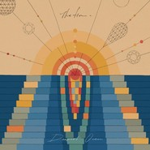 Deepest Ocean](./albums/5022596378.md) | 英语 | HIFIVE | 2021年01月27日 | EP, 单曲 | 独立摇滚 Indie Rock |
| [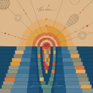 Deepest Ocean](./albums/5022592024.md) | 英语 | HIP LAND MUSIC | 2021年01月22日 | EP, 单曲 | 迷幻流行 Psychedelic Pop, 合成器流行 Synthpop, 另类摇滚 Alternative Rock |
| [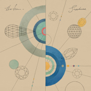 Sapphire](./albums/5022039876.md) | 英语 | HIP LAND MUSIC | 2020年12月02日 | EP, 单曲 | 独立摇滚 Indie Rock, 梦幻流行 Dream Pop |
| [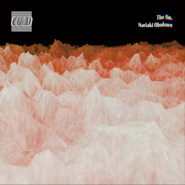 COLD (Quavius Remix)](./albums/5021730374.md) | 英语 | HIP LAND MUSIC | 2020年10月23日 | EP, 单曲 | 独立电子乐 Indietronica, 深浩室舞曲 Deep House |
| [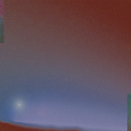 Ground](./albums/5020855290.md) | 英语 | Merlin Records | 2020年06月10日 | EP, 单曲 | 迷幻氛围 Psybient, 独立电子乐 Indietronica |
| [ Online](./albums/2420389063.md) | 英语 | Merlin Records | 2020年03月04日 | EP, 单曲 | 独立电子乐 Indietronica |
| [ Glowing Red On The Shore （Remastered）](./albums/2106081433.md) | 英语 | HIFIVE | 2020年02月21日 | EP, 单曲 | 独立摇滚 Indie Rock, 独立流行 Indie Pop |
| [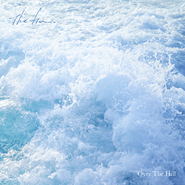 Over The Hill](./albums/2106088466.md) | 英语 | HIP LAND MUSIC | 2020年02月21日 | EP, 单曲 |  |
| [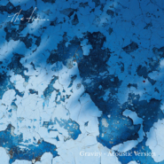 Acoustic Versions and Covers 4](./albums/2105604853.md) | 英语 | HIP LAND MUSIC | 2019年12月20日 | EP, 单曲 |  |
| [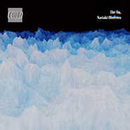 コールド](./albums/2105352448.md) | 英语 | HIP LAND MUSIC | 2019年10月18日 | EP, 单曲 |  |
| [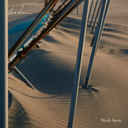 Wash Away](./albums/2105164480.md) | 英语 | HIFIVE | 2019年08月23日 | 录音室专辑 | 独立摇滚 Indie Rock, 自赏 Shoegazing |
| [ ゼアーリミックスイーピー](./albums/2104963348.md) | 英语 | HIP LAND MUSIC | 2019年03月15日 | EP, 单曲 |  |
| [ Acoustics and Covers](./albums/2104062225.md) | 日语 | HIP LAND MUSIC | 2018年09月28日 | EP, 单曲 |  |
| [ There](./albums/2103619875.md) | 日语 | HIP LAND MUSIC | 2018年03月14日 | 录音室专辑 | 独立摇滚 Indie Rock |
| [ Shedding](./albums/2103576336.md) | 英语 | HIPLAND MUSIC | 2018年03月02日 | EP, 单曲 | 电子 Electronic, 独立电子乐 Indietronica |
| [ Snow (again)](./albums/2103511998.md) | 英语 | HIPLAND MUSIC | 2018年02月02日 | EP, 单曲 | 独立电子乐 Indietronica, 电子 Electronic |
| [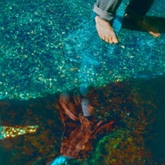 Outskirts](./albums/2103493832.md) | 英语 | HIP LAND MUSIC | 2018年01月19日 | EP, 单曲 | 电音流行 Electropop, 迷幻流行 Psychedelic Pop, 氛围流行 Ambient Pop |
| [ Pale Blue / Afterglow](./albums/2102800575.md) | 英语 | HIP LAND MUSIC | 2017年07月21日 | EP, 单曲 |  |
| [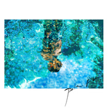 Pale blue](./albums/2102776309.md) | 英语 | HIP LAND MUSIC | 2017年06月23日 | EP, 单曲 |  |
| [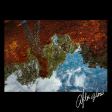 Afterglow](./albums/2102752041.md) | 日语 | Self-Released | 2017年05月12日 | EP, 单曲 | 日本摇滚 J-Rock |
| [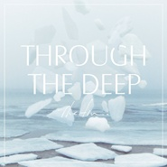 Through The Deep](./albums/2100288132.md) | 日语 | HIP LAND MUSIC | 2016年03月16日 | EP, 单曲 | 独立摇滚 Indie Rock |
| [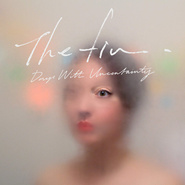 Days With Uncertainty](./albums/1317503823.md) | 日语 | HIP LAND MUSIC | 2014年12月03日 | 录音室专辑 | 梦幻流行 Dream Pop |
| [ Glowing Red On The Shore](./albums/796339474.md) | 英语 | Self-Released | 2013年12月06日 | EP, 单曲 |  |

## 评论

|  |  |  |
| :-- | :-- | :-- |
|  [虾米用户](https://emumo.xiami.com/u/1800831) Hi！ 2020-12-02 16:18 赞(1) 踩(0) | 

 |
|  [虾米用户](https://emumo.xiami.com/u/48138891) 因为我不放心我自己⋯ 2020-10-31 17:16 赞(0) 踩(0) | 

 |
|  [虾米用户](https://emumo.xiami.com/u/407507144)  2020-10-05 04:08 赞(0) 踩(0) | 
Those guys are amazing     
 |
|  [虾米用户](https://emumo.xiami.com/u/318379298) 认真听歌 2020-09-30 19:05 赞(0) 踩(0) | 
19年仙人掌看过现场 
 |
|  [虾米用户](https://emumo.xiami.com/u/67925344) 我是深海请你溺水 2020-09-02 22:38 赞(0) 踩(0) | 
最近好喜欢你们
 |
|  [虾米用户](https://emumo.xiami.com/u/342743704)  2020-08-11 02:21 赞(0) 踩(0) | 
上头
 |
|  [虾米用户](https://emumo.xiami.com/u/53313280) 时间的皮毛 2020-08-05 10:00 赞(0) 踩(0) | 
太太太喜欢了&amp;hellip;&amp;hellip;
 |
|  [虾米用户](https://emumo.xiami.com/u/358104299) 悲观的唯心存在现实解构虚... 2020-05-28 13:06 赞(1) 踩(0) | 
17930
 |
|  [虾米用户](https://emumo.xiami.com/u/36537308) 重的都留在這 2020-05-25 13:48 赞(0) 踩(0) | 
Seek
 |
|  [虾米用户](https://emumo.xiami.com/u/18313250) 我想做一个没有感情的杀手 2020-05-12 15:11 赞(1) 踩(0) | 
什么时候来多伦多
 |
|  [虾米用户](https://emumo.xiami.com/u/273608133)  2020-05-08 08:55 赞(0) 踩(0) | 
大家還有類似的樂隊推薦嗎？
 |
| ⇒ |  [虾米用户](https://emumo.xiami.com/u/44743196) 听虾米记得收藏～ 2020-09-24 09:02 赞(0) 踩(0) | 
可以看看虾米推荐的&amp;ldquo;相似艺人&amp;rdquo;
 |
|  [虾米用户](https://emumo.xiami.com/u/421578063) fox god 2020-04-21 11:33 赞(0) 踩(0) | 
(❁&amp;acute;&amp;omega;`❁)
 |
|  [虾米用户](https://emumo.xiami.com/u/308652751) 嗜乐如命之自由灵魂 2020-03-25 19:04 赞(2) 踩(0) | 
声线&amp;middot;旋律&amp;middot;曲风，果断收 
 |
|  [虾米用户](https://emumo.xiami.com/u/5099665)   2020-03-23 16:23 赞(1) 踩(0) | 
他们唱得真好，长得也好，摇头晃脑的少年，让少女哭晕在舞台下。脑海浮现电视里，那个满脸皱纹的老摇滚歌手，喊着我们永远年轻，但他们才真的是，货真价实的年轻。 想起威廉格纳齐诺在小说里，以宣扬末世论为生老教授，直到半夜尿血才开始打点自己的身后事，这一切都不是幻觉，社会发展信息对接，接下来都是向前的加速度，每一个都世界可能在几分钟之前被重新创造，我是拥有记得虚拟往事的人类。 布拉格之春后，伊凡克里玛一瞥那个经过身边的搭车少年，憧憬于家国明天。但我希望这个时代还是会怀旧的，我已经习惯把烟放在夹克里袋，明天黎明开始，带上左轮手枪，警惕每一个经过身边的少年。 2018年在广州
 |
|  [虾米用户](https://emumo.xiami.com/u/49734359) Never Say Go... 2020-03-15 18:46 赞(0) 踩(0) | 
第一次因为一个乐队想换耳机哈哈哈哈
 |
|  [虾米用户](https://emumo.xiami.com/u/48831781) 我还没想好要写什么... 2020-02-27 00:14 赞(1) 踩(0) | 
今年一定要见你们！
 |
|  [虾米用户](https://emumo.xiami.com/u/12128984) 我讨厌一切不押韵的歌，感... 2020-02-26 17:49 赞(0) 踩(0) | 
声音很性感~赞一个
 |
|  [虾米用户](https://emumo.xiami.com/u/15477519) 爱  是生命的和弦，而不... 2020-01-08 18:18 赞(1) 踩(0) | 
好喜欢…
 |
|  [虾米用户](https://emumo.xiami.com/u/344018512) 我还没想好要写什么... 2020-01-05 20:52 赞(0) 踩(0) | 

 |
|  [虾米用户](https://emumo.xiami.com/u/9523997) 天地为炉 2019-12-20 00:22 赞(0) 踩(0) | 
隔壁又发新砖了(¬_¬)
 |
|  [虾米用户](https://emumo.xiami.com/u/34182751) 再见了朋友们 我们网易云... 2019-11-17 01:20 赞(1) 踩(0) | 
？
 |
|  [虾米用户](https://emumo.xiami.com/u/40823619) 还不够放肆 2019-10-24 22:58 赞(0) 踩(0) | 
难道不是北欧？
 |
|  [虾米用户](https://emumo.xiami.com/u/42963872) 我还没想好要写什么... 2019-10-22 20:49 赞(0) 踩(0) | 
太勤快了 
 |
|  [虾米用户](https://emumo.xiami.com/u/379711209) 神仙收容所 2019-10-15 05:44 赞(0) 踩(0) | 
爱了
 |
|  [虾米用户](https://emumo.xiami.com/u/356763773) 我还没想好要写什么... 2019-10-12 20:10 赞(0) 踩(0) | 
。
 |
|  [虾米用户](https://emumo.xiami.com/u/10643094) 要加组织的朋友发站内信 2019-10-08 20:54 赞(0) 踩(0) | 
棒
 |
|  [虾米用户](https://emumo.xiami.com/u/78522298) 私の啓蒙残死 2019-09-12 06:06 赞(2) 踩(0) | 
 
 |
|  [虾米用户](https://emumo.xiami.com/u/69076102)  2019-09-07 00:47 赞(0) 踩(0) | 
喜欢
 |
|  [虾米用户](https://emumo.xiami.com/u/1317893)   2019-09-06 14:02 赞(2) 踩(0) | 
今晚就去听啦啦 这是刚跟堡堡谈恋爱的时候喜欢的乐队啊 不知不觉三年了了~
 |
|  [虾米用户](https://emumo.xiami.com/u/6586753) 冷起来是个迷 2019-09-06 10:32 赞(2) 踩(0) | 

 |
|  [虾米用户](https://emumo.xiami.com/u/230803304) 三观正又爱国的成都宝藏男... 2019-09-06 10:05 赞(0) 踩(0) | 
还是支持下
 |
|  [虾米用户](https://emumo.xiami.com/u/43838497) 陈奕迅神经研究所 2019-09-04 22:35 赞(1) 踩(0) | 
朋友刚传来他们 在武汉live喝酒吹瓶说 也太可爱了  爱了爱了
 |
|  [虾米用户](https://emumo.xiami.com/u/25960926) 呵呵 2019-08-30 16:51 赞(1) 踩(0) | 
永远的爱
 |
|  [虾米用户](https://emumo.xiami.com/u/25960926) 呵呵 2019-08-30 16:50 赞(1) 踩(0) | 
有人知道他们什么时候去欧洲巡演吗？！
 |
|  [虾米用户](https://emumo.xiami.com/u/44362004) ： 2019-08-29 01:43 赞(2) 踩(0) | 
美妙夜晚（真香
 |
|  [虾米用户](https://emumo.xiami.com/u/273306358) ＃未来336小时音乐聚会... 2019-08-27 19:40 赞(1) 踩(0) | 
还是the fin.的味道，不过相比首张EP和专辑，确实少了很多惊艳，
 |
|  [虾米用户](https://emumo.xiami.com/u/44362004) ： 2019-08-26 16:26 赞(0) 踩(0) | 
出2张西安预售
 |
|  [虾米用户](https://emumo.xiami.com/u/3291786)  2019-08-26 13:23 赞(0) 踩(0) | 
缺乏底气和后劲
 |
|  [虾米用户](https://emumo.xiami.com/u/320371789) 随便听听 2019-08-25 11:15 赞(0) 踩(0) | 
今晚就要去现场了 
 |
|  [虾米用户](https://emumo.xiami.com/u/34593165) 我还没想好要写什么... 2019-08-24 13:10 赞(0) 踩(0) | 
太tm好听了  
 |
|  [虾米用户](https://emumo.xiami.com/u/415730663)  2019-08-23 22:43 赞(0) 踩(0) | 
来了解一下
 |
|  [虾米用户](https://emumo.xiami.com/u/230803304) 三观正又爱国的成都宝藏男... 2019-08-23 17:16 赞(0) 踩(0) | 
支持下the fin
 |
|  [虾米用户](https://emumo.xiami.com/u/346492287) 虾米不要离开我！ 2019-08-23 08:37 赞(0) 踩(0) | 
虾米这次表现不错哦！
 |
|  [虾米用户](https://emumo.xiami.com/u/49994994) . 2019-08-23 01:43 赞(2) 踩(0) | 
虾米你敢不敢把之前的版权买了
 |
|  [虾米用户](https://emumo.xiami.com/u/428867584)  2019-08-20 12:54 赞(1) 踩(0) | 
10月19号《蚂蚁在路上音乐节》现场见
 |
|  [虾米用户](https://emumo.xiami.com/u/49445796) 幻听 2019-08-16 10:45 赞(0) 踩(0) | 
。
 |
|  [虾米用户](https://emumo.xiami.com/u/357895919)  2019-08-09 14:25 赞(2) 踩(0) | 
快快争取版权:(
 |
|  [虾米用户](https://emumo.xiami.com/u/20199548) 此人太懒21了还单身 2019-08-09 12:10 赞(2) 踩(0) | 
还挺好听的，能听得太少
 |
|  [虾米用户](https://emumo.xiami.com/u/215379991) 簽名不重要重要的是你聽什... 2019-08-09 09:48 赞(0) 踩(0) | 
ﻌﻌﻌ❤︎
 |
|  [虾米用户](https://emumo.xiami.com/u/4401950)  2019-07-28 09:48 赞(1) 踩(0) | 
昆明都去了还不来重庆 
 |
|  [虾米用户](https://emumo.xiami.com/u/9523997) 天地为炉 2019-07-24 22:39 赞(1) 踩(0) | 
日常看留言 欧拉有转票的请私信我吧 (￣O￣;)
 |
| ⇒ |  [虾米用户](https://emumo.xiami.com/u/4945382) 不喜欢你的我最酷 2019-08-05 13:13 赞(0) 踩(0) | 
嗨你收到票了吗
 |
| ⇒ |  [虾米用户](https://emumo.xiami.com/u/9523997) 天地为炉 2019-08-05 13:30 赞(0) 踩(0) | 
<q><b>朝秦暮楚魏北齐说：</b></q>
 |
|  [虾米用户](https://emumo.xiami.com/u/288013826) 请大家一起养小虾米帮助听... 2019-07-17 05:31 赞(0) 踩(0) | 
：
 |
|  [虾米用户](https://emumo.xiami.com/u/411058641) 取之不尽 用之不竭 2019-07-15 07:05 赞(2) 踩(0) | 
the fin 日语是 “最后”的意思？
 |
| ⇒ |  [虾米用户](https://emumo.xiami.com/u/7251136)  2019-08-19 13:36 赞(0) 踩(0) | 
是法语
 |
| ⇒ |  [虾米用户](https://emumo.xiami.com/u/411058641) 取之不尽 用之不竭 2019-08-19 17:41 赞(0) 踩(0) | 
<q><b>奈良良空想戰線说：</b></q>
 |
|  [虾米用户](https://emumo.xiami.com/u/18704162) 狗女孩 2019-07-12 09:42 赞(1) 踩(0) | 
仙人掌见
 |
|  [虾米用户](https://emumo.xiami.com/u/261639006)  2019-07-10 21:57 赞(2) 踩(0) | 
我真的没想通为啥不叫the fin要叫the fin.
 |
|  [虾米用户](https://emumo.xiami.com/u/54621711) More than I ... 2019-07-10 19:54 赞(0) 踩(0) | 
上海有无
 |
|  [虾米用户](https://emumo.xiami.com/u/61702002) 城市浪荡者 2019-07-06 14:46 赞(0) 踩(0) | 
8.27 成都 又见
 |
|  [虾米用户](https://emumo.xiami.com/u/2432697)  2019-07-03 13:37 赞(2) 踩(0) | 
9月5日快点来吧！
 |
|  [虾米用户](https://emumo.xiami.com/u/347074501) 都是俗人却妄想灵魂 2019-06-25 22:01 赞(0) 踩(0) | 
8.28  西安1935 livehouse 不见不散哦…
 |
|  [虾米用户](https://emumo.xiami.com/u/71792772) 偏离地平线 2019-06-25 19:54 赞(1) 踩(0) | 
9月武汉见！
 |
|  [虾米用户](https://emumo.xiami.com/u/9972139) -Welcome to ... 2019-06-25 18:36 赞(22) 踩(0) | 
The fin. 2019 新专辑中国巡演 8月25日  昆明  Modernsky Lab 8月27日  成都  正火艺术中心 1号馆 8月28日  西安 1935 Livehouse 8月30日  北京  疆进酒 OMNI SPACE 8月31日  上海  MAO Livehouse 上海 9月2日    杭州  MAO Livehouse 杭州 9月3日    南京  欧拉艺术中心 9月4日    武汉  VOX Livehouse 9月5日    长沙  46 Livehouse 9月6日    广州  MAO Livehouse 广州 9月7日    深圳  B10现场
 |
|  [虾米用户](https://emumo.xiami.com/u/50625743) SO ROSÉ SO C... 2019-06-25 18:03 赞(0) 踩(0) | 
南京有无伙伴
 |
|  [虾米用户](https://emumo.xiami.com/u/1333187) 这家伙很聪明什么也没留下 2019-06-25 14:41 赞(0) 踩(0) | 
今年总算没错过 广州见 
 |
|  [虾米用户](https://emumo.xiami.com/u/42640500) WE CHAT：-UAI... 2019-06-25 13:13 赞(0) 踩(0) | 
0902
 |
|  [虾米用户](https://emumo.xiami.com/u/55042814) my darling s... 2019-06-23 11:09 赞(0) 踩(0) | 
呜呜呜 版权呢
 |
|  [虾米用户](https://emumo.xiami.com/u/257103143) 音乐爱好者~ 2019-06-21 21:15 赞(0) 踩(0) | 
Get.
 |
|  [虾米用户](https://emumo.xiami.com/u/57644638) 黑白键幻化出了空无一人的... 2019-06-14 23:17 赞(1) 踩(0) | 
阿里 你的版权咋都下架啦啊？我不想被逼去网易云啊
 |
|  [虾米用户](https://emumo.xiami.com/u/178747290) 你会像马达那样找我吗？ 2019-05-04 07:56 赞(1) 踩(0) | 
今年一定要见你们  
 |
| ⇒ |  [虾米用户](https://emumo.xiami.com/u/424582773)  2019-05-15 00:14 赞(0) 踩(0) | 
橘洲
 |
| ⇒ |  [虾米用户](https://emumo.xiami.com/u/178747290) 你会像马达那样找我吗？ 2019-05-15 00:41 赞(0) 踩(0) | 
<q><b>竹青说：</b></q>
 |
|  [虾米用户](https://emumo.xiami.com/u/27030481) 我还没想好要写什么... 2019-04-26 17:34 赞(0) 踩(0) | 
都没版权服了
 |
|  [虾米用户](https://emumo.xiami.com/u/10924968) 有的人20岁就死了70岁... 2019-04-24 10:24 赞(0) 踩(0) | 
能不能把他们的版权给我收复回来？？？
 |
|  [虾米用户](https://emumo.xiami.com/u/1447058) 已迁移至网易云，祝好——... 2019-04-24 01:20 赞(1) 踩(0) | 
The fin. is dead
 |
|  [虾米用户](https://emumo.xiami.com/u/99465068) Spotify : Yo... 2019-04-24 00:18 赞(0) 踩(0) | 
厦门见
 |
|  [虾米用户](https://emumo.xiami.com/u/54950259) Fluidflux 2019-04-18 22:20 赞(0) 踩(0) | 
没歌了，摔
 |
|  [虾米用户](https://emumo.xiami.com/u/49445796) 幻听 2019-04-12 18:01 赞(0) 踩(0) | 
出5.2南京星巢预售票两张，260/张～可咸鱼可当面交易～和朋友一起抢预售多买了
 |
|  [虾米用户](https://emumo.xiami.com/u/47680736) ️ 2019-04-06 05:14 赞(0) 踩(0) | 
超级火大
 |
|  [虾米用户](https://emumo.xiami.com/u/46215718) - 2019-03-25 16:41 赞(0) 踩(0) | 
已确定The fin.将参加在6月初的江浙沪某老牌音乐节​
 |
|  [虾米用户](https://emumo.xiami.com/u/13729120) 高光 2019-03-20 16:40 赞(0) 踩(0) | 
呼
 |
|  [虾米用户](https://emumo.xiami.com/u/91854938) 逃離地球 2019-03-05 20:01 赞(0) 踩(0) | 
咋没歌啦嘤嘤嘤
 |
|  [虾米用户](https://emumo.xiami.com/u/45686435) 一壺飛鳧 尋山夢鶴   ... 2019-03-04 15:43 赞(0) 踩(0) | 
〰️
 |
|  [虾米用户](https://emumo.xiami.com/u/220587)  2019-02-24 16:33 赞(0) 踩(0) | 
新歌好好听啊！快来中国
 |
|  [虾米用户](https://emumo.xiami.com/u/13740776)   2019-02-08 13:04 赞(0) 踩(0) | 
今年快来圈钱鸭鸭鸭
 |
|  [虾米用户](https://emumo.xiami.com/u/42457016) 小型歡愉 2019-02-03 23:23 赞(0) 踩(0) | 
新年快乐
 |
|  [虾米用户](https://emumo.xiami.com/u/416079102) 我还没想好要写什么... 2019-02-01 23:04 赞(2) 踩(0) | 
版权权努力争取啊啊啊啊啊 不想回网易云
 |
|  [虾米用户](https://emumo.xiami.com/u/332794260) 祝你好运 2019-01-25 13:46 赞(0) 踩(0) | 
长在我耳朵里的男人
 |
|  [虾米用户](https://emumo.xiami.com/u/80774058) 自 由 散 漫 2019-01-13 13:03 赞(0) 踩(0) | 
!版权回来了
 |
|  [虾米用户](https://emumo.xiami.com/u/290713486)  2019-01-10 12:56 赞(1) 踩(0) | 
版權啊！
 |
|  [虾米用户](https://emumo.xiami.com/u/278616463) 并不是每年的机场都会被淹... 2019-01-03 00:47 赞(0) 踩(0) | 
还好下载了好多 
 |
|  [虾米用户](https://emumo.xiami.com/u/29934574) 我还没想好要写什么... 2018-12-30 15:15 赞(0) 踩(0) | 
2019还会来中国吗？有小伙伴知道吗 
 |
| ⇒ |  [虾米用户](https://emumo.xiami.com/u/11939764)  2019-07-01 13:20 赞(0) 踩(0) | 
会来，已经开始售票了
 |
|  [虾米用户](https://emumo.xiami.com/u/54950259) Fluidflux 2018-12-14 12:53 赞(0) 踩(0) | 
没歌了，辣鸡网站
 |
|  [虾米用户](https://emumo.xiami.com/u/42963872) 我还没想好要写什么... 2018-12-13 23:54 赞(0) 踩(0) | 
-
 |
|  [虾米用户](https://emumo.xiami.com/u/47680736) ️ 2018-11-18 23:27 赞(0) 踩(0) | 
(›´ω`‹ )超棒超喜欢的咿
 |
|  [虾米用户](https://emumo.xiami.com/u/36330882)  2018-11-13 11:22 赞(0) 踩(0) | 
到底在中国哪里巡回啊，永远找不到他们的脚步啊
 |
|  [虾米用户](https://emumo.xiami.com/u/42936819) 网易云搜索恶法lex i... 2018-10-27 22:03 赞(0) 踩(0) | 
？我想听歌！
 |
|  [虾米用户](https://emumo.xiami.com/u/7492447) 「間 2018-10-20 11:10 赞(0) 踩(0) | 
口音真的好腐国啊！
 |
|  [虾米用户](https://emumo.xiami.com/u/118096218) 哈哈哈哈哈哈哈哈 2018-10-11 14:47 赞(1) 踩(0) | 
为什么没版权了哇哇哇哇
 |
|  [虾米用户](https://emumo.xiami.com/u/14150943) 习得性无助 2018-10-06 09:43 赞(0) 踩(0) | 
希望大家对the fin.的爱更多更多，昨晚真的是，现场好安静
 |
|  [虾米用户](https://emumo.xiami.com/u/51702659)   2018-10-06 09:26 赞(0) 踩(0) | 
巡演没机会去 这次在西安听到现场 太开心了   
 |
|  [虾米用户](https://emumo.xiami.com/u/10924968) 有的人20岁就死了70岁... 2018-09-21 23:24 赞(0) 踩(0) | 
版权呢
 |
|  [虾米用户](https://emumo.xiami.com/u/2279444) 爱在左，同情在右。 2018-09-18 21:22 赞(1) 踩(0) | 
演出的频率和模式已经快成中国的乐队了
 |
| ⇒ |  [虾米用户](https://emumo.xiami.com/u/364338673) 无趣且乏味 2018-09-18 22:23 赞(0) 踩(0) | 
明年还会来中国yo
 |
|  [虾米用户](https://emumo.xiami.com/u/43582455) 我还没想好要写什么... 2018-09-13 22:38 赞(0) 踩(0) | 
什么时候能上架啦？
 |
|  [虾米用户](https://emumo.xiami.com/u/357149912) 我们沉默 2018-08-29 12:30 赞(0) 踩(0) | 
怎么回事？又没了
 |
|  [虾米用户](https://emumo.xiami.com/u/52056952) 人生即是到來、相遇、陪伴... 2018-08-27 11:58 赞(0) 踩(0) | 

 |
|  [虾米用户](https://emumo.xiami.com/u/228115282) 我想好要写什么了... 2018-08-23 18:56 赞(1) 踩(0) | 
要在the fin.下次来深圳演出前找到男朋友，相信我男朋友也会喜欢the fin.的歌的，我要带他一起去看现场
 |
| ⇒ |  [虾米用户](https://emumo.xiami.com/u/2169003)  2018-09-19 01:17 赞(0) 踩(0) | 
终于找到你了哈哈哈
 |
| ⇒ |  [虾米用户](https://emumo.xiami.com/u/228115282) 我想好要写什么了... 2018-09-25 14:47 赞(0) 踩(0) | 
<q><b>keyeslee说：</b></q>
 |
|  [虾米用户](https://emumo.xiami.com/u/311176115) 这家伙超级超级超级聪明帅... 2018-08-23 09:55 赞(0) 踩(0) | 
我的妈诶下架这么多??几十首就只有6首能听!!还是人??!!
 |
|  [虾米用户](https://emumo.xiami.com/u/73971) 再也不会有人点赞我的评论... 2018-08-13 12:37 赞(0) 踩(0) | 
为什么这么多专辑全部下架 如果众筹 请通知我一下
 |
|  [虾米用户](https://emumo.xiami.com/u/207463730) 矛盾集合体 2018-08-05 11:16 赞(0) 踩(0) | 
:(
 |
|  [虾米用户](https://emumo.xiami.com/u/290713486)  2018-08-04 19:26 赞(1) 踩(0) | 
下架了大部分，去Apple music了
 |
|  [虾米用户](https://emumo.xiami.com/u/334004726) I shall do w... 2018-08-03 20:15 赞(0) 踩(0) | 
又没版权了么，呜呜呜
 |
|  [虾米用户](https://emumo.xiami.com/u/10256405) 暂无签名~ 2018-08-02 15:42 赞(0) 踩(0) | 
下架？？。。。
 |
|  [虾米用户](https://emumo.xiami.com/u/901190)  SCC 2018-08-01 18:20 赞(0) 踩(0) | 
下架了这么多 
 |
|  [虾米用户](https://emumo.xiami.com/u/379590025) 我爱水手服。 2018-07-27 23:41 赞(0) 踩(0) | 
简直了&amp;hellip;&amp;hellip;
 |
|  [虾米用户](https://emumo.xiami.com/u/290713486)  2018-07-27 21:54 赞(0) 踩(0) | 
又没版权了？？？
 |
|  [虾米用户](https://emumo.xiami.com/u/114458052) 吞下无意义想法 2018-07-27 20:00 赞(0) 踩(0) | 
没版权了???
 |
|  [虾米用户](https://emumo.xiami.com/u/99798254)  2018-07-22 23:10 赞(0) 踩(0) | 
之前虾米没有the fin啊啊 什么时候有的
 |
|  [虾米用户](https://emumo.xiami.com/u/253292222) 来找到我 2018-07-21 00:21 赞(0) 踩(0) | 
决定爱上这个乐队 
 |
|  [虾米用户](https://emumo.xiami.com/u/10811234) Love Mucic 2018-07-05 22:25 赞(0) 踩(0) | 
赞
 |
|  [虾米用户](https://emumo.xiami.com/u/290713486)  2018-07-04 14:36 赞(1) 踩(0) | 
想听现场
 |
|  [虾米用户](https://emumo.xiami.com/u/996277) ‏‏ 2018-06-30 09:35 赞(0) 踩(0) | 
我一直没收藏 嗷
 |
|  [虾米用户](https://emumo.xiami.com/u/55094882) ｉｄ９１ｏｍｏ＞Ｉ  2018-06-26 01:01 赞(0) 踩(0) | 

 |
|  [虾米用户](https://emumo.xiami.com/u/250847378) 虾米的每次改版我都看在眼... 2018-06-19 23:24 赞(7) 踩(0) | 
没有难听的歌的乐队不多见
 |
|  [虾米用户](https://emumo.xiami.com/u/21880854) 救われる 2018-05-26 22:31 赞(0) 踩(0) | 
呀
 |
|  [虾米用户](https://emumo.xiami.com/u/305437725)   2018-05-24 21:46 赞(2) 踩(0) | 
我也希望你们来厦门 
 |
|  [虾米用户](https://emumo.xiami.com/u/122670826) 我还没想好要写什么... 2018-05-17 23:12 赞(0) 踩(0) | 

 |
|  [虾米用户](https://emumo.xiami.com/u/49962710)  Peace 2018-05-16 00:05 赞(0) 踩(0) | 
   超级赞
 |
|  [虾米用户](https://emumo.xiami.com/u/205168097) 你要听话，不是所有的鱼都... 2018-05-06 19:41 赞(0) 踩(0) | 
对对对 草莓音乐节同路转粉
 |
|  [虾米用户](https://emumo.xiami.com/u/334726047)  2018-05-06 19:08 赞(0) 踩(0) | 
草莓音乐节路转粉，空灵，慵懒！现场更赞
 |
|  [虾米用户](https://emumo.xiami.com/u/48896344) 自闭 2018-05-06 11:00 赞(0) 踩(0) | 
来晚了
 |
|  [虾米用户](https://emumo.xiami.com/u/302031845) 我还没想好要写什么... 2018-04-30 13:36 赞(0) 踩(0) | 
那我还是评论一下吧 第521
 |
| ⇒ |  [虾米用户](https://emumo.xiami.com/u/4472847) 真心为你。 2018-05-01 01:43 赞(0) 踩(0) | 
求一下草莓上他们的歌单可以吗？现场路转粉！
 |
|  [虾米用户](https://emumo.xiami.com/u/285338362) 卍 2018-04-26 01:24 赞(0) 踩(0) | 
长沙！！！！
 |
|  [虾米用户](https://emumo.xiami.com/u/201391232) 最快的方法是先抱抱 2018-04-20 18:18 赞(0) 踩(0) | 
彡
 |
|  [虾米用户](https://emumo.xiami.com/u/217761701)   2018-04-18 17:02 赞(0) 踩(0) | 
北京草莓音乐节见~
 |
|  [虾米用户](https://emumo.xiami.com/u/212848793) 热带的悲伤少女 2018-04-18 11:28 赞(0) 踩(0) | 
nnnnnice
 |
|  [虾米用户](https://emumo.xiami.com/u/37866414) Night Rider 2018-04-17 12:38 赞(0) 踩(0) | 
北京草莓见！
 |
|  [虾米用户](https://emumo.xiami.com/u/31424696) 我还没想好要写什么... 2018-04-09 04:41 赞(0) 踩(0) | 
我ball ball you 下次赏脸来厦门吧 呜呜呜呜呜呜
 |
|  [虾米用户](https://emumo.xiami.com/u/14091078) 我还没想好要写什么... 2018-04-08 19:11 赞(0) 踩(0) | 
上海草莓音乐节 水曜日のカンパネラ、the fin. 2018.4.29-5.1 上海
 |
|  [虾米用户](https://emumo.xiami.com/u/256746836)   2018-04-06 13:07 赞(0) 踩(0) | 
真的好
 |
|  [虾米用户](https://emumo.xiami.com/u/5739325) 看学长笑得多开心呀 2018-04-05 23:00 赞(0) 踩(0) | 
啊，错过了！！
 |
|  [虾米用户](https://emumo.xiami.com/u/245920005) . 2018-04-01 09:02 赞(0) 踩(0) | 
下次真的真的不会错过你们了 
 |
|  [虾米用户](https://emumo.xiami.com/u/97414052) 我还没想好要写什么... 2018-03-20 23:30 赞(0) 踩(0) | 
深圳场里面的一个老外观众最激动！！
 |
|  [虾米用户](https://emumo.xiami.com/u/13740776)   2018-03-20 23:22 赞(0) 踩(0) | 
终于换新封面了
 |
|  [虾米用户](https://emumo.xiami.com/u/46704933) H E L L O  T... 2018-03-18 21:37 赞(2) 踩(0) | 
拜托上新专辑好么！！！
 |
|  [虾米用户](https://emumo.xiami.com/u/45381407) I 2018-03-18 20:49 赞(3) 踩(0) | 
請你們來西安好嗎
 |
|  [虾米用户](https://emumo.xiami.com/u/14412997)  2018-03-17 20:58 赞(1) 踩(0) | 
看了深圳场，拿到签名还合照了，好开心❤️
 |
|  [虾米用户](https://emumo.xiami.com/u/41168538) 旁人从不赞同，连情理也不... 2018-03-17 10:42 赞(0) 踩(0) | 
嘻嘻武汉
 |
|  [虾米用户](https://emumo.xiami.com/u/147361618) 再会 2018-03-17 01:56 赞(3) 踩(0) | 
在b10的朋友是真的听爽了
 |
|  [虾米用户](https://emumo.xiami.com/u/9606953) 再见，虾米音乐。 2018-03-16 23:18 赞(1) 踩(0) | 
热评我删了，希望大家关注音乐本身www
 |
|  [虾米用户](https://emumo.xiami.com/u/8192862) 诗人和先知。vchat:... 2018-03-16 00:50 赞(0) 踩(0) | 
广州站听完开心得像200斤的棉花糖，自我膨胀。谢谢原价出票给我的温油小哥哥。全员都是小可爱。但是主唱可能巡演到尾声有点累了，感觉有点辛苦了。
 |
|  [虾米用户](https://emumo.xiami.com/u/9406176) kke 2018-03-15 23:33 赞(0) 踩(0) | 
谢谢让位给我的朋友 虽然还是没看见
 |
|  [虾米用户](https://emumo.xiami.com/u/36967057) 我还没想好要写什么... 2018-03-15 21:31 赞(0) 踩(0) | 
主唱小哥哥的&amp;ldquo;谢谢&amp;rdquo;超可爱呀！！
 |
|  [虾米用户](https://emumo.xiami.com/u/11603315) K-indie | 靓橙... 2018-03-15 02:22 赞(0) 踩(0) | 
今天晚上vox之前我特意没有去弄明白他们哪首歌是哪首 回来发现自己觉得好听的都是大家听得比较多的 非常巧
 |
|  [虾米用户](https://emumo.xiami.com/u/29119620) 夜幕海岸線/藍色大門後/... 2018-03-14 12:37 赞(2) 踩(0) | 
南京站穿的就是这件阔衬衣啊。
 |
|  [虾米用户](https://emumo.xiami.com/u/218337522) 插画师:-D 2018-03-12 21:43 赞(0) 踩(0) | 
明天!
 |
|  [虾米用户](https://emumo.xiami.com/u/268443818) 我还没想好要写什么... 2018-03-12 11:50 赞(0) 踩(0) | 
求两张广州
 |
| ⇒ |  [虾米用户](https://emumo.xiami.com/u/7562948) HOT SUGAR CO... 2018-03-12 20:26 赞(0) 踩(0) | 
有一张要吗
 |
|  [虾米用户](https://emumo.xiami.com/u/47762018) 虾米我永远爱你 2018-03-12 08:23 赞(0) 踩(0) | 
太太太可爱啦～
 |
|  [虾米用户](https://emumo.xiami.com/u/15943190) 三寒四溫 2018-03-12 01:12 赞(2) 踩(0) | 
我每回听The fin.时心情都相当极端，要么是高兴到发狂，要么是伤心到无可救药，今夜是后者了。
 |
| ⇒ |  [虾米用户](https://emumo.xiami.com/u/5039182) 散 2018-03-12 10:22 赞(0) 踩(0) | 
+1
 |
|  [虾米用户](https://emumo.xiami.com/u/49640493) 网易云SAINTDONT... 2018-03-11 22:58 赞(0) 踩(0) | 
盲
 |
|  [虾米用户](https://emumo.xiami.com/u/2718559)  2018-03-11 22:51 赞(1) 踩(0) | 
难得日本人说英文这么标准...
 |
| ⇒ |  [虾米用户](https://emumo.xiami.com/u/4131849) 网易云：非人類兔子Agy... 2018-03-11 22:52 赞(0) 踩(0) | 
因为他们在英国呆过。
 |
|  [虾米用户](https://emumo.xiami.com/u/4131849) 网易云：非人類兔子Agy... 2018-03-11 22:51 赞(1) 踩(0) | 
呼啦啦，杭州演出刚结束，全场爆满（一脸满足）
 |
| ⇒ |  [虾米用户](https://emumo.xiami.com/u/5039182) 散 2018-03-12 10:24 赞(0) 踩(0) | 
昨晚两度还有人跳水hhh
 |
| ⇒ |  [虾米用户](https://emumo.xiami.com/u/4131849) 网易云：非人類兔子Agy... 2018-03-12 14:54 赞(0) 踩(0) | 
<q><b>olnerD说：</b></q>
 |
| ⇒ |  [虾米用户](https://emumo.xiami.com/u/5039182) 散 2018-03-12 18:56 赞(0) 踩(0) | 
<q><b>非人類兔子说：</b></q>
 |
| ⇒ |  [虾米用户](https://emumo.xiami.com/u/4131849) 网易云：非人類兔子Agy... 2018-03-12 20:57 赞(0) 踩(0) | 
<q><b>olnerD说：</b></q>
 |
| ⇒ |  [虾米用户](https://emumo.xiami.com/u/4131849) 网易云：非人類兔子Agy... 2018-04-06 22:59 赞(0) 踩(0) | 
<q><b>olnerD说：</b></q>
 |
| ⇒ |  [虾米用户](https://emumo.xiami.com/u/5039182) 散 2018-04-07 01:48 赞(0) 踩(0) | 
<q><b>非人類兔子说：</b></q>
 |
|  [虾米用户](https://emumo.xiami.com/u/4745926)  2018-03-11 18:52 赞(0) 踩(0) | 
今年的票太难买了
 |
| ⇒ |  [虾米用户](https://emumo.xiami.com/u/4131849) 网易云：非人類兔子Agy... 2018-03-11 22:51 赞(0) 踩(0) | 
现场票都有卖的！
 |
|  [虾米用户](https://emumo.xiami.com/u/9223507) 我还没想好要写什么... 2018-03-11 17:13 赞(1) 踩(0) | 
315广州见 有没有小伙伴:)
 |
|  [虾米用户](https://emumo.xiami.com/u/80774058) 自 由 散 漫 2018-03-11 09:54 赞(0) 踩(0) | 
说&amp;ldquo; 谢谢&amp;rdquo;好可爱哈哈哈哈哈哈
 |
|  [虾米用户](https://emumo.xiami.com/u/80774058) 自 由 散 漫 2018-03-11 09:54 赞(0) 踩(0) | 
昨晚上海场太开心啦！
 |
|  [虾米用户](https://emumo.xiami.com/u/9419408)  2018-03-11 00:21 赞(1) 踩(0) | 
今天上海场好顶赞！
 |
|  [虾米用户](https://emumo.xiami.com/u/238300984) 世界很大 时间太少 2018-03-11 00:16 赞(0) 踩(0) | 
2018.3.10 一罐啤酒 两盒八喜冰淇淋 在路边听 没去成现场 下次一定见
 |
|  [虾米用户](https://emumo.xiami.com/u/33628473)   2018-03-10 22:52 赞(0) 踩(0) | 
有人出票嘛。杭州 武汉的
 |
|  [虾米用户](https://emumo.xiami.com/u/80774058) 自 由 散 漫 2018-03-10 19:52 赞(0) 踩(0) | 
马上
 |
|  [虾米用户](https://emumo.xiami.com/u/13740776)   2018-03-10 14:40 赞(0) 踩(0) | 
晚上见
 |
|  [虾米用户](https://emumo.xiami.com/u/1389034) 同名移至网易云，虾米再见... 2018-03-10 13:15 赞(0) 踩(0) | 
内容已删除
 |
| ⇒ |  [虾米用户](https://emumo.xiami.com/u/33628473)   2018-03-10 22:53 赞(0) 踩(0) | 
还有票嘛
 |
| ⇒ |  [虾米用户](https://emumo.xiami.com/u/1389034) 同名移至网易云，虾米再见... 2018-03-10 22:54 赞(0) 踩(0) | 
<q><b>unclenine说：</b></q>
 |
|  [虾米用户](https://emumo.xiami.com/u/31166894)  2018-03-09 23:36 赞(0) 踩(0) | 
今晚 北京
 |
|  [虾米用户](https://emumo.xiami.com/u/80774058) 自 由 散 漫 2018-03-09 14:28 赞(0) 踩(0) | 
明天上海见
 |
|  [虾米用户](https://emumo.xiami.com/u/13783494) Saltimage 2018-03-09 12:39 赞(1) 踩(0) | 
2018.3.8成都站现场 <a href="http://www.bilibili.com/video/av20537308?share_medium=android&amp;amp;share_source=copy_link&amp;amp;bbid=BEDA26F5-C3E6-43FA-99C6-7DE4D7107979101701infoc&amp;amp;ts=1520570306446" target="_blank" rel="nofollow noreferrer noopener">http://www.bilibili.com/video/av20537308?share_medium=android&amp;amp;share_source=copy_link&amp;amp;bbid=BEDA26F5-C3E6-43FA-99C6-7DE4D7107979101701infoc&amp;amp;ts=1520570306446</a>
 |
|  [虾米用户](https://emumo.xiami.com/u/9597157) ， 2018-03-09 00:32 赞(0) 踩(0) | 

 |
|  [虾米用户](https://emumo.xiami.com/u/1115247) @Nebula_7293 2018-03-09 00:04 赞(1) 踩(0) | 
一个骚 一个可爱 一个安静 一个酷
 |
| ⇒ |  [虾米用户](https://emumo.xiami.com/u/231772775) 野生 2018-03-09 11:05 赞(0) 踩(0) | 
ryosuke口语和国语太可爱了 全场卖萌搞笑hhh
 |
| ⇒ |  [虾米用户](https://emumo.xiami.com/u/1115247) @Nebula_7293 2018-03-09 11:09 赞(0) 踩(0) | 
<q><b>队长传我球说：</b></q>
 |
|  [虾米用户](https://emumo.xiami.com/u/59794520) 还是听歌比较重要   2018-03-08 23:33 赞(1) 踩(0) | 
坐标成都，今晚没听够，有机会还要来现场听，爱敲可爱的你们，笔芯❤
 |
|  [虾米用户](https://emumo.xiami.com/u/1411759) 你为什么一脸严肃 2018-03-08 17:33 赞(0) 踩(0) | 
求两张广州站的 嘤
 |
|  [虾米用户](https://emumo.xiami.com/u/1333187) 这家伙很聪明什么也没留下 2018-03-07 22:06 赞(0) 踩(0) | 
求广州站的票 
 |
|  [虾米用户](https://emumo.xiami.com/u/26116318)   2018-03-07 18:53 赞(0) 踩(0) | 
碰运气问一问，北京的票有人出咩？（2张
 |
|  [虾米用户](https://emumo.xiami.com/u/2831675) 情痴 情呆 行怪 言狂 2018-03-07 16:57 赞(0) 踩(0) | 
#演出推薦#智利迷幻大團F&amp;ouml;llakzoid中國巡演 3/8 深圳 B10现场 3/9 广州 MAO Livehouse 3/10 厦门 Real Live 3/11 长沙 红咖 3/13 武汉 VOX Livehouse 3/14 南京 欧拉艺术空间 3/15 杭州 MAO Livehouse 3/16 北京 疆进酒 3/17 上海 万代南梦宫上海文化中心未来剧场 預售鏈接<a href="https://www.showstart.com/artist/991775" target="_blank" rel="nofollow noreferrer noopener">https://www.showstart.com/artist/991775</a>
 |
|  [虾米用户](https://emumo.xiami.com/u/8128176) 好好活着 2018-03-07 14:29 赞(0) 踩(0) | 
票卖完了，没得买
 |
|  [虾米用户](https://emumo.xiami.com/u/8128176) 好好活着 2018-03-07 14:21 赞(0) 踩(0) | 
哇，演出来了
 |
|  [虾米用户](https://emumo.xiami.com/u/73790620)  2018-03-07 07:38 赞(0) 踩(0) | 
新砖《There》网易独家？ 
 |
|  [虾米用户](https://emumo.xiami.com/u/14764150)  2018-03-06 18:18 赞(0) 踩(0) | 
没新专，难过
 |
|  [虾米用户](https://emumo.xiami.com/u/4208300) 微博/网易云：小田切尼  2018-03-06 15:13 赞(0) 踩(0) | 
等新专
 |
|  [虾米用户](https://emumo.xiami.com/u/44362004) ： 2018-03-05 02:09 赞(4) 踩(0) | 
不来西安 你们怕凉皮冰峰肉夹馍？
 |
|  [虾米用户](https://emumo.xiami.com/u/8961350) 一脱成名 2018-03-04 17:23 赞(18) 踩(0) | 
不来重庆？你们怕辣？？
 |
|  [虾米用户](https://emumo.xiami.com/u/399906)  2018-03-03 19:06 赞(0) 踩(0) | 
求武汉或广州的票一张！！！
 |
|  [虾米用户](https://emumo.xiami.com/u/56910580) As You Were ... 2018-03-03 16:30 赞(1) 踩(0) | 
3.10见
 |
|  [虾米用户](https://emumo.xiami.com/u/4127048) 最是一曲忘不了 2018-03-03 11:48 赞(1) 踩(0) | 
好喜欢他们的歌名，像诗 
 |
|  [虾米用户](https://emumo.xiami.com/u/23862178) keep the fai... 2018-03-03 00:56 赞(0) 踩(0) | 
❤️
 |
|  [虾米用户](https://emumo.xiami.com/u/73790620)  2018-03-02 22:13 赞(0) 踩(0) | 
Mao 嗳 没票 
 |
|  [虾米用户](https://emumo.xiami.com/u/52415194) ♬♩♫♪♡ 2018-03-02 12:22 赞(0) 踩(0) | 
求票的几乎没戏了 现场票也卖完 真是得让你在门口过过瘾
 |
|  [虾米用户](https://emumo.xiami.com/u/293924635) 网易云逃难狗 2018-03-02 11:22 赞(0) 踩(0) | 
同求成都的票哇啊啊啊啊拖延症哭死
 |
|  [虾米用户](https://emumo.xiami.com/u/36430062) 不想被發現了 2018-03-02 10:22 赞(0) 踩(0) | 
社恐.. 到了我在的城市 想去可是場子人太多而不敢去的我(&amp;acute;&amp;deg;̥̥̥̥̥̥̥̥&amp;omega;&amp;deg;̥̥̥̥̥̥̥̥｀)
 |
|  [虾米用户](https://emumo.xiami.com/u/3119539) 大家好，请在网易云音乐搜... 2018-03-02 08:33 赞(0) 踩(0) | 
求两张北京的 
 |
|  [虾米用户](https://emumo.xiami.com/u/3392853)   2018-03-01 11:55 赞(0) 踩(0) | 
求一张深圳的票 
 |
|  [虾米用户](https://emumo.xiami.com/u/40148340) 还偷看 2018-02-28 11:10 赞(0) 踩(0) | 
不错诶，可惜才知道他们有演出
 |
|  [虾米用户](https://emumo.xiami.com/u/35513455) 自由の女 2018-02-28 00:07 赞(0) 踩(0) | 
求一张深圳的票？ 有吗？可以转给我吗
 |
|  [虾米用户](https://emumo.xiami.com/u/18101934) 别问我什么是你爸爸 2018-02-27 23:50 赞(0) 踩(0) | 
求两张杭州的票，好人一生平安必发大财
 |
|  [虾米用户](https://emumo.xiami.com/u/273306358) ＃未来336小时音乐聚会... 2018-02-26 22:34 赞(0) 踩(0) | 
成都站有转票的么，请滴滴我。谢谢
 |
|  [虾米用户](https://emumo.xiami.com/u/52415194) ♬♩♫♪♡ 2018-02-25 13:26 赞(1) 踩(0) | 
3/08不见不散
 |
|  [虾米用户](https://emumo.xiami.com/u/1448808)   2018-02-24 14:30 赞(0) 踩(0) | 
转出两张3.15广州站预售票！原价出！因朋友不能前去，不计划出行去看了！非诚勿扰！最好两张同时出！！！
 |
| ⇒ |  [虾米用户](https://emumo.xiami.com/u/565920) 我还没想好要写什么... 2018-02-27 13:44 赞(0) 踩(0) | 
我要
 |
| ⇒ |  [虾米用户](https://emumo.xiami.com/u/1448808)   2018-03-01 11:05 赞(0) 踩(0) | 
<q><b>jun说：</b></q>
 |
| ⇒ |  [虾米用户](https://emumo.xiami.com/u/1448808)   2018-03-06 19:46 赞(0) 踩(0) | 
<q><b>jun说：</b></q>
 |
|  [虾米用户](https://emumo.xiami.com/u/59141502) 我还没想好要写什么... 2018-02-24 14:10 赞(0) 踩(0) | 
票是已经卖完了？？
 |
|  [虾米用户](https://emumo.xiami.com/u/356086) 中部地区软骨病多发型幼猫 2018-02-24 11:26 赞(0) 踩(0) | 
武汉场那天正好也是生日诶开心～
 |
|  [虾米用户](https://emumo.xiami.com/u/11877399)   2018-02-22 22:36 赞(0) 踩(0) | 
求一张北京场票
 |
|  [虾米用户](https://emumo.xiami.com/u/651086) 一些…还有一些 2018-02-20 23:28 赞(0) 踩(0) | 
谁3月10日去现场，能给我传些视频吗   
 |
|  [虾米用户](https://emumo.xiami.com/u/6451950)   2018-02-19 19:25 赞(3) 踩(0) | 
嘻嘻。广州场那天我生日耶。真素浪漫惹
 |
|  [虾米用户](https://emumo.xiami.com/u/20320543)  2018-02-18 20:35 赞(0) 踩(0) | 
三月的巡演去不了 好遗憾
 |
|  [虾米用户](https://emumo.xiami.com/u/27184712) 人的思念可以跨越世界线 2018-02-14 19:30 赞(0) 踩(0) | 
内容已删除
 |
| ⇒ |  [虾米用户](https://emumo.xiami.com/u/11877399)   2018-02-22 22:37 赞(0) 踩(0) | 
出票么？
 |
| ⇒ |  [虾米用户](https://emumo.xiami.com/u/335469854)  2018-02-27 14:40 赞(0) 踩(0) | 
出了么？
 |
| ⇒ |  [虾米用户](https://emumo.xiami.com/u/280068225)  2018-03-04 22:41 赞(0) 踩(0) | 
嘤嘤嘤，票还在吗～  
 |
| ⇒ |  [虾米用户](https://emumo.xiami.com/u/27184712) 人的思念可以跨越世界线 2018-03-05 08:00 赞(0) 踩(0) | 
<q><b>shuilings说：</b></q>
 |
|  [虾米用户](https://emumo.xiami.com/u/43701622) 别用温水耗我 2018-02-11 05:35 赞(0) 踩(0) | 
南京有出票的吗
 |
|  [虾米用户](https://emumo.xiami.com/u/2947546) 愿做自由之灵魂 2018-02-10 00:44 赞(0) 踩(0) | 
一秒粉！
 |
|  [虾米用户](https://emumo.xiami.com/u/3489640) .RYO KINOSHI... 2018-02-07 10:00 赞(0) 踩(0) | 
The Fin还真是支只听一遍是喜欢不起来的队，多听几遍，再多几遍。
 |
|  [虾米用户](https://emumo.xiami.com/u/187345422) 我还没想好要写什么... 2018-02-06 20:12 赞(1) 踩(0) | 
求杭州一张票，跪谢！！！！！
 |
|  [虾米用户](https://emumo.xiami.com/u/20316094)  2018-02-06 09:56 赞(0) 踩(0) | 
求vox票 
 |
|  [虾米用户](https://emumo.xiami.com/u/302019615)  2018-02-05 11:53 赞(0) 踩(0) | 
去看看&amp;hellip;&amp;hellip;(北京)
 |
|  [虾米用户](https://emumo.xiami.com/u/9561820)   2018-02-04 13:49 赞(0) 踩(0) | 
求深圳的票！
 |
|  [虾米用户](https://emumo.xiami.com/u/8580080) 噪音爱好者。。 2018-02-04 11:21 赞(0) 踩(0) | 
主唱越来越肥了！
 |
|  [虾米用户](https://emumo.xiami.com/u/230640287) 我还没想好要写什么... 2018-02-03 14:30 赞(0) 踩(0) | 
求一张杭州的票～ˊ_&amp;gt;ˋ
 |
|  [虾米用户](https://emumo.xiami.com/u/31399475) 我还没想好要写什么... 2018-01-29 09:50 赞(0) 踩(0) | 
北京学院路这边有约的吗？
 |
|  [虾米用户](https://emumo.xiami.com/u/13018332) 人来潮涌 死于浪漫 2018-01-29 01:55 赞(0) 踩(0) | 
3月杭州见：）
 |
|  [虾米用户](https://emumo.xiami.com/u/54015067)  2018-01-29 00:53 赞(1) 踩(0) | 
看到这么多求票真的庆幸自己手快
 |
| ⇒ |  [虾米用户](https://emumo.xiami.com/u/226081577) 人生总要有点喜欢的事情吧... 2018-03-08 22:45 赞(0) 踩(0) | 
你好幸运～
 |
|  [虾米用户](https://emumo.xiami.com/u/97414052) 我还没想好要写什么... 2018-01-28 23:35 赞(0) 踩(0) | 
深圳见 每天都在期待
 |
|  [虾米用户](https://emumo.xiami.com/u/273608133)  2018-01-27 09:34 赞(0) 踩(0) | 
求两张深圳票约了小哥哥一起看才发现票没了
 |
|  [虾米用户](https://emumo.xiami.com/u/85663894) 下水道派诗人 2018-01-26 16:26 赞(0) 踩(0) | 
求求北京
 |
|  [虾米用户](https://emumo.xiami.com/u/293639188) 我还没想好要写什么... 2018-01-25 20:20 赞(0) 踩(0) | 
求武汉的票啊！
 |
|  [虾米用户](https://emumo.xiami.com/u/284865237) merry christ... 2018-01-24 23:42 赞(0) 踩(0) | 
求杭州的票
 |
|  [虾米用户](https://emumo.xiami.com/u/4402559) ☁️☁️☁️ 2018-01-24 18:36 赞(0) 踩(0) | 
求票 啊～广州的 
 |
| ⇒ |  [虾米用户](https://emumo.xiami.com/u/1448808)   2018-02-24 14:31 赞(0) 踩(0) | 
我有两张哦！
 |
|  [虾米用户](https://emumo.xiami.com/u/1807736) 我还没想好要写什么... 2018-01-24 18:25 赞(0) 踩(0) | 
求北京的票 一张两张都可以
 |
|  [虾米用户](https://emumo.xiami.com/u/307844)  2018-01-22 19:18 赞(0) 踩(0) | 
有武汉的帅气的小弟弟，带带我一起去看的么。。。
 |
|  [虾米用户](https://emumo.xiami.com/u/6062632) ੯ੑ∙ʔ 2018-01-21 06:05 赞(0) 踩(0) | 
Ϛ⁍̴̛ᴗ⁍̴̛꒜
 |
|  [虾米用户](https://emumo.xiami.com/u/9406176) kke 2018-01-20 23:28 赞(0) 踩(0) | 
内容已删除
 |
| ⇒ |  [虾米用户](https://emumo.xiami.com/u/124670042) GREEN# 2018-01-22 12:29 赞(0) 踩(0) | 
网易云上面不能买？
 |
|  [虾米用户](https://emumo.xiami.com/u/8970340) 小石头 2018-01-20 21:08 赞(0) 踩(0) | 
成都票这就没了？求两张票啊 谢谢大家
 |
|  [虾米用户](https://emumo.xiami.com/u/345573713) 苦中作乐 2018-01-20 12:22 赞(0) 踩(0) | 
出一张杭州的。。。那天有事去不了
 |
|  [虾米用户](https://emumo.xiami.com/u/85165792) COMING 2018-01-19 22:52 赞(0) 踩(0) | 
.
 |
|  [虾米用户](https://emumo.xiami.com/u/356086) 中部地区软骨病多发型幼猫 2018-01-19 21:41 赞(1) 踩(0) | 
Yuto Uchino的声音太好听了..看live他狂按键盘超可爱
 |
|  [虾米用户](https://emumo.xiami.com/u/978380)   2018-01-19 15:57 赞(0) 踩(0) | 
成都3.8小酒馆还有谁可以出票的吗 没买到 伤心
 |
|  [虾米用户](https://emumo.xiami.com/u/5913428) 後搖患者//樂是萬能藥 2018-01-19 14:15 赞(0) 踩(0) | 
The Strokes既視感 搖得停不下來 為甚成都站木有票了
 |
|  [虾米用户](https://emumo.xiami.com/u/6530967) 老男人而已。 2018-01-19 13:23 赞(0) 踩(0) | 
深圳见
 |
|  [虾米用户](https://emumo.xiami.com/u/39954947) 我们是保守同一个秘密的两... 2018-01-19 00:47 赞(0) 踩(0) | 

 |
|  [虾米用户](https://emumo.xiami.com/u/238300984) 世界很大 时间太少 2018-01-19 00:22 赞(0) 踩(0) | 
淘宝居然买不到上海的票
 |
|  [虾米用户](https://emumo.xiami.com/u/262861568) 我还没想好要写什么... 2018-01-19 00:14 赞(0) 踩(0) | 

 |
|  [虾米用户](https://emumo.xiami.com/u/43671573) Its my fanta... 2018-01-18 22:13 赞(0) 踩(0) | 
有杭州组团的嘛！！
 |
|  [虾米用户](https://emumo.xiami.com/u/3256844) 恩斯波肯 多姆 2018-01-17 23:47 赞(0) 踩(0) | 
很洋气
 |
|  [虾米用户](https://emumo.xiami.com/u/41665637) 我还没想好要写什么... 2018-01-16 12:44 赞(0) 踩(0) | 
求上海站的票！   
 |
|  [虾米用户](https://emumo.xiami.com/u/4727415) swallowyours... 2018-01-16 03:11 赞(1) 踩(0) | 
White Noise Records 添加了活动 2小时 The Fin.將於3月18日第三次來香港演出，原來今次包括了很多的「新」。 今時的The Fin.，並不是往日的The Fin.。先是「新」陣容，由原來四人變成三缺一，主音歌手兼鍵琴手Yuto Uchino、結他手Ryosuke Odagaki和鼓手Kaoru Nakazawa仍然在陣，低音結他手TakayasuTaguchi卻因個人理由離隊；另一變動是「新」基地，The Fin.由日本神戶移居到英國倫敦發展，離開成長家鄉看似是重大轉變，但倫敦對樂隊來說並不太陌生，早期MV《Faded Light》正正是在當地取景。
 |
| ⇒ |  [虾米用户](https://emumo.xiami.com/u/11110811) 自由散漫的灵魂 2018-02-20 01:23 赞(0) 踩(0) | 
啊啊啊，香港也有吗？
 |
| ⇒ |  [虾米用户](https://emumo.xiami.com/u/4727415) swallowyours... 2018-02-21 11:52 赞(0) 踩(0) | 
<q><b>Summerdew说：</b></q>
 |
|  [虾米用户](https://emumo.xiami.com/u/4727415) swallowyours... 2018-01-16 03:11 赞(0) 踩(0) | 
「新」陣容「新」基地下製作的「新」專集《There》，請來「新」監製Bradley Spence製作，這位英國製作人，曾是大師Trevor Horn助手，又跟Coldplay、Doves、New Order、Radiohead、Belle &amp;amp; Sebasitan等不同英式風格代表合作，在他操刀處理下，The Fin.變得比從前更具城市感，優美調子仍然是他們的拿手好戲，而編曲也顯得細緻精巧，卻不會流於堆砌造作，在英國錄製一張英式味道濃厚的唱片，集夢幻、浪漫、淒美的動人音符，邁向成熟又不失自我的進化，碟內新單曲《Outskirts》是繼《Night Time》和
 |
|  [虾米用户](https://emumo.xiami.com/u/4727415) swallowyours... 2018-01-16 03:11 赞(0) 踩(0) | 
和《Throught The Deep》後，另一首扣人心弦的The Fin.作品。 2015年7月The Fin.首次來港於蒲吧舉行《The Fin. Asia Tour》，意外地全場爆滿；翌年6月樂隊舊地重臨的《The Fin. &amp;quot;Through The Deep&amp;quot; Release Asia Tour》，場內歡呼聲響遍籃球場，今次為「新」專集舉行的亞洲巡迴《The Fin. &amp;quot;There&amp;quot; Album Release Tour》的香港站，不再是蒲吧，移師到「新」演出場地&amp;mdash;&amp;mdash;油麻地逸東酒店的Eaton Workshop。眾多「新」元素下，這一晚定能為樂迷帶來「新」的感受。
 |
|  [虾米用户](https://emumo.xiami.com/u/313272881) 这个家伙很聪明什么也没留... 2018-01-16 01:45 赞(0) 踩(0) | 
成都见啦
 |
|  [虾米用户](https://emumo.xiami.com/u/10223494) 再见了。 2018-01-15 22:04 赞(0) 踩(0) | 
不过演出去不了了对8住！
 |
|  [虾米用户](https://emumo.xiami.com/u/10223494) 再见了。 2018-01-15 22:04 赞(0) 踩(0) | 
微博上看到演出信息才听的，以前只听过一首。发现是真的很好听啊！
 |
|  [虾米用户](https://emumo.xiami.com/u/1418202)  江山共老 2018-01-15 22:03 赞(0) 踩(0) | 
316
 |
|  [虾米用户](https://emumo.xiami.com/u/17146554) weibo：@L1RRO... 2018-01-15 10:56 赞(1) 踩(0) | 
成都
 |
|  [虾米用户](https://emumo.xiami.com/u/35631524)   2018-01-14 18:37 赞(0) 踩(0) | 
南京见
 |
|  [虾米用户](https://emumo.xiami.com/u/28437719) 你的爱就像彩虹 2018-01-13 23:20 赞(0) 踩(0) | 
3.9见
 |
|  [虾米用户](https://emumo.xiami.com/u/4930744)  2018-01-13 13:10 赞(0) 踩(0) | 
杭州
 |
|  [虾米用户](https://emumo.xiami.com/u/15943190) 三寒四溫 2018-01-13 11:16 赞(0) 踩(0) | 
有缘再会
 |
|  [虾米用户](https://emumo.xiami.com/u/41993241) 不玩了。ins：rile... 2018-01-12 22:44 赞(0) 踩(0) | 
杭州见
 |
|  [虾米用户](https://emumo.xiami.com/u/310595459)  2018-01-12 22:30 赞(0) 踩(0) | 
去年没去成，今年愚公见。
 |
|  [虾米用户](https://emumo.xiami.com/u/36891442) 我还没想好要写什么... 2018-01-12 20:30 赞(1) 踩(0) | 
南京见
 |
|  [虾米用户](https://emumo.xiami.com/u/41168538) 旁人从不赞同，连情理也不... 2018-01-12 08:58 赞(0) 踩(0) | 
武汉见。
 |
|  [虾米用户](https://emumo.xiami.com/u/1631900) . 2018-01-11 19:44 赞(0) 踩(0) | 
为什么没有北京的售票页面？！！！！
 |
| ⇒ |  [虾米用户](https://emumo.xiami.com/u/2321736) 漂浮而不沉没 2018-01-15 19:32 赞(0) 踩(0) | 
去淘宝买
 |
|  [虾米用户](https://emumo.xiami.com/u/1115247) @Nebula_7293 2018-01-11 18:55 赞(0) 踩(0) | 
重庆啦啦啦啦
 |
|  [虾米用户](https://emumo.xiami.com/u/54015067)  2018-01-11 18:13 赞(1) 踩(0) | 
巡演啊啊啊啊啊啊啊啊啊啊妈呀我要疯了
 |
|  [虾米用户](https://emumo.xiami.com/u/12098408) 我还没想好要写什么... 2018-01-11 17:17 赞(2) 踩(0) | 
就是不来西安
 |
|  [虾米用户](https://emumo.xiami.com/u/34360767) bucktick 2018-01-11 16:43 赞(0) 踩(0) | 
成都旁边的重庆笑嘻嘻，什么时候来重庆 
 |
| ⇒ |  [虾米用户](https://emumo.xiami.com/u/10028400) 我还没想好要写什么... 2018-01-11 16:44 赞(0) 踩(0) | 
附议(  -᷅_-᷄ )
 |
|  [虾米用户](https://emumo.xiami.com/u/273306358) ＃未来336小时音乐聚会... 2018-01-11 16:21 赞(0) 踩(0) | 
嘻嘻嘻  成都
 |
|  [虾米用户](https://emumo.xiami.com/u/2615992) shoot the co... 2018-01-11 16:20 赞(0) 踩(0) | 
哇哦哇哇哇 北京见吧
 |
|  [虾米用户](https://emumo.xiami.com/u/11906267)  2018-01-11 16:19 赞(0) 踩(0) | 
来福建嘛 
 |
|  [虾米用户](https://emumo.xiami.com/u/45435319) 我还没想好要写什么... 2018-01-10 18:32 赞(1) 踩(0) | 
3月14号 武汉的小伙伴请抱紧我！！！！！
 |
|  [虾米用户](https://emumo.xiami.com/u/308239697) 我还没想好要写什么... 2018-01-10 13:46 赞(0) 踩(0) | 
武汉需要组队滴可以dd我，拉你们进群啦
 |
| ⇒ |  [虾米用户](https://emumo.xiami.com/u/45435319) 我还没想好要写什么... 2018-01-10 19:04 赞(0) 踩(0) | 
滴滴！！！
 |
| ⇒ |  [虾米用户](https://emumo.xiami.com/u/82494) 最后一个月啦，十年虾米老... 2018-01-11 17:06 赞(0) 踩(0) | 
滴~
 |
| ⇒ |  [虾米用户](https://emumo.xiami.com/u/41168538) 旁人从不赞同，连情理也不... 2018-01-12 08:58 赞(0) 踩(0) | 
哇这里！
 |
|  [虾米用户](https://emumo.xiami.com/u/11333671) 摇滚万岁 2018-01-10 11:12 赞(0) 踩(0) | 
成都见啊啊啊啊啊
 |
|  [虾米用户](https://emumo.xiami.com/u/15943190) 三寒四溫 2018-01-06 19:49 赞(0) 踩(0) | 
羡慕现场的朋友
 |
|  [虾米用户](https://emumo.xiami.com/u/4953984) 他们说查无此人 2018-01-06 16:20 赞(0) 踩(0) | 
深圳见！！
 |
|  [虾米用户](https://emumo.xiami.com/u/47762018) 虾米我永远爱你 2018-01-06 14:12 赞(0) 踩(0) | 
嘿
 |
|  [虾米用户](https://emumo.xiami.com/u/36967057) 我还没想好要写什么... 2018-01-05 22:24 赞(0) 踩(0) | 
啊啊啊激动 刚刚买了广州的票 可惜没人陪我去看 唉
 |
| ⇒ |  [虾米用户](https://emumo.xiami.com/u/10657091) 如果说人类有什么自命不凡... 2018-01-09 23:37 赞(0) 踩(0) | 
来深圳啊，一起
 |
| ⇒ |  [虾米用户](https://emumo.xiami.com/u/343848694)  2018-01-12 11:28 赞(0) 踩(0) | 
我也买了广州 约不约啊
 |
| ⇒ |  [虾米用户](https://emumo.xiami.com/u/26953712) 这个人不懒，什么也没留下 2018-01-12 16:26 赞(0) 踩(0) | 
<q><b>oh關静持说：</b></q>
 |
| ⇒ |  [虾米用户](https://emumo.xiami.com/u/36967057) 我还没想好要写什么... 2018-01-13 20:32 赞(0) 踩(0) | 
<q><b>oh關静持说：</b></q>
 |
| ⇒ |  [虾米用户](https://emumo.xiami.com/u/36967057) 我还没想好要写什么... 2018-01-13 20:33 赞(0) 踩(0) | 
<q><b>唔系死魚说：</b></q>
 |
| ⇒ |  [虾米用户](https://emumo.xiami.com/u/10657091) 如果说人类有什么自命不凡... 2018-01-15 13:21 赞(0) 踩(0) | 
<q><b>不文艺的森女说：</b></q>
 |
| ⇒ |  [虾米用户](https://emumo.xiami.com/u/343848694)  2018-01-15 19:43 赞(0) 踩(0) | 
<q><b>不文艺的森女说：</b></q>
 |
| ⇒ |  [虾米用户](https://emumo.xiami.com/u/343848694)  2018-01-15 19:43 赞(0) 踩(0) | 
<q><b>侃大山说：</b></q>
 |
|  [虾米用户](https://emumo.xiami.com/u/33071402) I do not car... 2018-01-04 23:13 赞(0) 踩(0) | 
深圳见!!!!!!!!
 |
|  [虾米用户](https://emumo.xiami.com/u/2797965) 山川并肩坐着，河流只是经... 2018-01-04 17:20 赞(1) 踩(0) | 
成都见
 |
|  [虾米用户](https://emumo.xiami.com/u/59024182) 墜 落 2018-01-04 12:40 赞(3) 踩(0) | 
他们要来成都了
 |
|  [虾米用户](https://emumo.xiami.com/u/3630288) 不想再听难过的歌 2018-01-04 10:46 赞(0) 踩(0) | 
终于 ！  广州见!
 |
|  [虾米用户](https://emumo.xiami.com/u/34936363) 零. 2018-01-04 10:44 赞(1) 踩(0) | 
315广州见 
 |
| ⇒ |  [虾米用户](https://emumo.xiami.com/u/3101385) 妳着幾號鞋 2018-01-04 20:06 赞(0) 踩(0) | 
你买票了么
 |
| ⇒ |  [虾米用户](https://emumo.xiami.com/u/34936363) 零. 2018-01-05 00:25 赞(0) 踩(0) | 
<q><b>cuz I'm cool说：</b></q>
 |
| ⇒ |  [虾米用户](https://emumo.xiami.com/u/3101385) 妳着幾號鞋 2018-01-05 01:07 赞(0) 踩(0) | 
<q><b>lisa.说：</b></q>
 |
|  [虾米用户](https://emumo.xiami.com/u/2739505) Doppelgänger... 2018-01-04 10:08 赞(0) 踩(0) | 
&amp;bull;
 |
|  [虾米用户](https://emumo.xiami.com/u/32487443)   2018-01-04 01:05 赞(0) 踩(0) | 
非常red
 |
|  [虾米用户](https://emumo.xiami.com/u/174677802) 原子へ戻る人。 2018-01-04 00:14 赞(2) 踩(0) | 
凸要被挤爆了
 |
|  [虾米用户](https://emumo.xiami.com/u/5577986)   2018-01-03 18:29 赞(0) 踩(0) | 
深圳见！
 |
|  [虾米用户](https://emumo.xiami.com/u/8442847)   2018-01-03 18:11 赞(1) 踩(0) | 
3.15 广州见！！！！！！！！！！！！！！！！！！！！！！！！！！！！！！ ！！！！！！！！！！
 |
|  [虾米用户](https://emumo.xiami.com/u/50792813) 爱你 虾米 2018-01-03 16:36 赞(0) 踩(0) | 
快来！！！
 |
|  [虾米用户](https://emumo.xiami.com/u/2695140) “她往月亮去” 2018-01-03 15:42 赞(1) 踩(0) | 
我们3.11杭州见！
 |
|  [虾米用户](https://emumo.xiami.com/u/9154037) 到水星散心去了。 2018-01-03 15:20 赞(0) 踩(0) | 
去年来好像也是三月份，这种每年都来走动的好习惯，请继续保持。
 |
|  [虾米用户](https://emumo.xiami.com/u/47340272) 我们无声 并排坐 2018-01-03 15:18 赞(2) 踩(0) | 
我们成都见！！
 |
|  [虾米用户](https://emumo.xiami.com/u/6548494) shhhhhh 2018-01-03 15:07 赞(1) 踩(0) | 
终于等到深圳了！
 |
|  [虾米用户](https://emumo.xiami.com/u/17691156) あなたに出会えて よかっ... 2018-01-03 14:58 赞(0) 踩(0) | 
3.15廣州！
 |
|  [虾米用户](https://emumo.xiami.com/u/502127) 我还没想好要写什么... 2018-01-03 14:14 赞(1) 踩(0) | 
来深圳的日子太好了！
 |
|  [虾米用户](https://emumo.xiami.com/u/9154037) 到水星散心去了。 2018-01-03 14:05 赞(0) 踩(0) | 
哎哟，又要来咯。
 |
|  [虾米用户](https://emumo.xiami.com/u/5604492) ‪‪♬✧訂閱號：Morn... 2018-01-03 13:42 赞(0) 踩(0) | 
上海见！！和Monica一起 上海见！！！
 |
|  [虾米用户](https://emumo.xiami.com/u/25815015) 我还没想好要写什么... 2018-01-03 13:42 赞(0) 踩(0) | 
兴奋！！！！！！
 |
|  [虾米用户](https://emumo.xiami.com/u/25815015) 我还没想好要写什么... 2018-01-03 13:42 赞(0) 踩(0) | 
又要来啦！！！！！
 |
|  [虾米用户](https://emumo.xiami.com/u/13740776)   2018-01-03 13:38 赞(0) 踩(0) | 
厉害啊 去年来犹豫 然后就后悔死了
 |
|  [虾米用户](https://emumo.xiami.com/u/9970143) 虾米爱你 2018-01-03 13:33 赞(0) 踩(0) | 
来了又！！！
 |
|  [虾米用户](https://emumo.xiami.com/u/9972139) -Welcome to ... 2018-01-03 13:16 赞(83) 踩(0) | 
The fin. 2018 新专辑中国巡演 3月8日  成都 小酒馆空间 3月9日  北京 愚公移山 3月10日 上海  MAO Livehouse 上海 3月11日  杭州 MAO Livehouse 杭州 3月13日 南京 欧拉艺术空间 3月14日 武汉 VOX livehouse 3月15日 广州 TU凸空间 3月16日 深圳 B10现场
 |
| ⇒ |  [虾米用户](https://emumo.xiami.com/u/956662) 祭…毕竟什么都逃不过时间 2018-01-06 11:17 赞(0) 踩(0) | 
yoyoyoyo
 |
| ⇒ |  [虾米用户](https://emumo.xiami.com/u/9972139) -Welcome to ... 2018-01-06 12:35 赞(0) 踩(0) | 
<q><b>Post-Rock小虾说：</b></q>
 |
| ⇒ |  [虾米用户](https://emumo.xiami.com/u/47126427)   2018-01-07 03:29 赞(0) 踩(0) | 
搞错时间错过了去年的 看到今年还有感觉要高兴哭了
 |
| ⇒ |  [虾米用户](https://emumo.xiami.com/u/10028400) 我还没想好要写什么... 2018-01-11 16:44 赞(0) 踩(0) | 
没有重庆啊啊啊
 |
| ⇒ |  [虾米用户](https://emumo.xiami.com/u/36859278) Trust no bit... 2018-01-26 12:43 赞(0) 踩(0) | 
求一张上海的，今天才看见
 |
| ⇒ |  [虾米用户](https://emumo.xiami.com/u/345285674)  2018-03-01 15:13 赞(0) 踩(0) | 
求一张深圳的！
 |
| ⇒ |  [虾米用户](https://emumo.xiami.com/u/2169003)  2018-03-09 14:48 赞(0) 踩(0) | 
求深圳票
 |
|  [虾米用户](https://emumo.xiami.com/u/230645092) 我还没！ 2018-01-03 13:13 赞(0) 踩(0) | 
又要见面了！！
 |
|  [虾米用户](https://emumo.xiami.com/u/180847) 只有心知道 岁月不宽宏 2018-01-03 13:10 赞(0) 踩(0) | 
广州见
 |
|  [虾米用户](https://emumo.xiami.com/u/13704947) 豆瓣见：无悲渊。 2018-01-03 13:10 赞(0) 踩(0) | 
18年巡演！！！！！
 |
|  [虾米用户](https://emumo.xiami.com/u/1251830)   2017-12-28 22:51 赞(1) 踩(0) | 
前奏怪奇物语直视感
 |
|  [虾米用户](https://emumo.xiami.com/u/44595074) 我还没想好要写什么... 2017-12-24 19:06 赞(0) 踩(0) | 
等下次喽！
 |
|  [虾米用户](https://emumo.xiami.com/u/9424698) 我还没想好要写什么... 2017-12-16 00:23 赞(0) 踩(0) | 
好想再请过来啊
 |
|  [虾米用户](https://emumo.xiami.com/u/7750515) Cloud  Nine 2017-12-08 16:53 赞(1) 踩(0) | 
谁换的封面 这么有品
 |
|  [虾米用户](https://emumo.xiami.com/u/262861568) 我还没想好要写什么... 2017-12-06 22:23 赞(0) 踩(0) | 

 |
|  [虾米用户](https://emumo.xiami.com/u/17077682) 滚去spotify了。C... 2017-11-24 07:55 赞(1) 踩(0) | 
☑️
 |
|  [虾米用户](https://emumo.xiami.com/u/9028760) 豆瓣见 spotify ... 2017-11-19 14:40 赞(1) 踩(0) | 
补◡̈⃝♡
 |
|  [虾米用户](https://emumo.xiami.com/u/45647671)  2017-11-03 23:34 赞(0) 踩(0) | 
因为他喜欢，所以我喜欢 
 |
|  [虾米用户](https://emumo.xiami.com/u/37721074)  Ins @ejnue 2017-11-03 10:59 赞(0) 踩(0) | 
like
 |
|  [虾米用户](https://emumo.xiami.com/u/6962645) Rubber Stone 2017-10-24 20:31 赞(0) 踩(0) | 
現場好失望嗚嗚嗚
 |
|  [虾米用户](https://emumo.xiami.com/u/10393019) Y 2017-10-06 00:43 赞(0) 踩(0) | 
嘿
 |
|  [虾米用户](https://emumo.xiami.com/u/45329531) 我还没想好要写什么... 2017-10-05 08:21 赞(56) 踩(0) | 
刚晚上在Bristol看完演出跟主唱小哥哥聊天 小哥哥强烈要求更换封面照片！说是好多年前拍的了看着感觉很尬哈哈哈哈哈
 |
| ⇒ |  [虾米用户](https://emumo.xiami.com/u/42334574) 也许还有玫瑰色 2017-10-12 22:34 赞(0) 踩(0) | 
厉害啦  帮你顶上去  我也觉得要换了
 |
| ⇒ |  [虾米用户](https://emumo.xiami.com/u/230645092) 我还没！ 2017-12-06 15:41 赞(0) 踩(0) | 
让小编给换了！
 |
| ⇒ |  [虾米用户](https://emumo.xiami.com/u/5039182) 散 2018-03-12 10:28 赞(0) 踩(0) | 
应该是discogs上面直接搬下来的照片.
 |
| ⇒ |  [虾米用户](https://emumo.xiami.com/u/222802757) 单循控  搬去酷狗  -... 2020-08-20 12:30 赞(0) 踩(0) | 
账号应该是乐队自己打理的吧 哈哈哈哈哈哈他们可能也懒得换～
 |
|  [虾米用户](https://emumo.xiami.com/u/83893196) 我还没想好要写什么... 2017-10-05 01:17 赞(1) 踩(0) | 
诶 好想看现场&amp;hellip;
 |
|  [虾米用户](https://emumo.xiami.com/u/5600976) Diiiisco gir... 2017-10-05 00:42 赞(32) 踩(0) | 
幸福在伦敦可以以每个月一次的频率看他们的演出。。。
 |
| ⇒ |  [虾米用户](https://emumo.xiami.com/u/118552686)  2018-05-09 04:55 赞(0) 踩(0) | 
在hullxqukknolak
 |
|  [虾米用户](https://emumo.xiami.com/u/49867643) 行走江湖 2017-10-02 08:14 赞(0) 踩(0) | 
很棒
 |
|  [虾米用户](https://emumo.xiami.com/u/47762018) 虾米我永远爱你 2017-09-29 23:26 赞(0) 踩(0) | 
~好听~
 |
|  [虾米用户](https://emumo.xiami.com/u/10028400) 我还没想好要写什么... 2017-09-27 17:05 赞(0) 踩(0) | 

 |
|  [虾米用户](https://emumo.xiami.com/u/39954947) 我们是保守同一个秘密的两... 2017-09-20 13:30 赞(0) 踩(0) | 
感谢某位在beach house下安利这么棒的乐队
 |
|  [虾米用户](https://emumo.xiami.com/u/341091) 偶爱我们呢~ 2017-09-15 12:23 赞(1) 踩(0) | 
英语这么好的日本人，声音还有点像suede的主唱，满足了
 |
|  [虾米用户](https://emumo.xiami.com/u/36891442) 我还没想好要写什么... 2017-09-06 12:33 赞(0) 踩(0) | 

 |
|  [虾米用户](https://emumo.xiami.com/u/47126427)   2017-08-31 15:12 赞(0) 踩(0) | 
每次听的时候都能想起来 以前记错了live日期 不仅少听了一个乐队 而且还毕业了童贞 太逗了hhhh
 |
|  [虾米用户](https://emumo.xiami.com/u/3583995) 一個人的戰爭 2017-08-19 12:58 赞(0) 踩(0) | 
.
 |
|  [虾米用户](https://emumo.xiami.com/u/287224005) keep you com... 2017-08-12 23:23 赞(0) 踩(0) | 
真的每一首歌都好听啊啊啊啊啊
 |
|  [虾米用户](https://emumo.xiami.com/u/35865612) Rock 'n' rol... 2017-07-27 02:29 赞(36) 踩(0) | 
我发现了这么棒的乐队 却找不到一个人去安利
 |
| ⇒ |  [虾米用户](https://emumo.xiami.com/u/307054624) 去想想无关紧要的事，去想... 2017-10-05 21:55 赞(0) 踩(0) | 
没关系反正最后人都孤独。
 |
| ⇒ |  [虾米用户](https://emumo.xiami.com/u/423470816) 我还没想好要写什么... 2019-07-21 00:33 赞(0) 踩(0) | 
这里这么多人陪你
 |
|  [虾米用户](https://emumo.xiami.com/u/42457016) 小型歡愉 2017-07-06 08:33 赞(0) 踩(0) | 
行
 |
|  [虾米用户](https://emumo.xiami.com/u/18186815)  2017-07-02 10:19 赞(0) 踩(0) | 
真棒，上次一听前奏，秒入坑
 |
|  [虾米用户](https://emumo.xiami.com/u/42725114) ThistheshitI... 2017-06-30 15:43 赞(0) 踩(0) | 

 |
|  [虾米用户](https://emumo.xiami.com/u/11810950)  2017-06-30 14:21 赞(2) 踩(0) | 
希望pale blue快点上架！
 |
| ⇒ |  [虾米用户](https://emumo.xiami.com/u/43624727) 这家伙一点也不聪明 2017-07-27 21:29 赞(0) 踩(0) | 
上架了
 |
|  [虾米用户](https://emumo.xiami.com/u/264283064) bye  2017-06-19 21:38 赞(0) 踩(0) | 
△
 |
|  [虾米用户](https://emumo.xiami.com/u/17413363) ：（ 2017-06-13 14:27 赞(0) 踩(0) | 
又夏天了
 |
|  [虾米用户](https://emumo.xiami.com/u/118667024) 我會為了一首歌去看九成是... 2017-06-13 11:52 赞(1) 踩(0) | 
真是挖到宝了
 |
|  [虾米用户](https://emumo.xiami.com/u/9902531) 浪漫指南 2017-06-05 16:50 赞(1) 踩(0) | 
很喜欢啊
 |
|  [虾米用户](https://emumo.xiami.com/u/4131849) 网易云：非人類兔子Agy... 2017-05-31 18:32 赞(0) 踩(0) | 
fin
 |
|  [虾米用户](https://emumo.xiami.com/u/4715750) 欲望脑电波，与我一起入海... 2017-05-22 17:45 赞(2) 踩(0) | 
有人退团吗？！
 |
| ⇒ |  [虾米用户](https://emumo.xiami.com/u/17413363) ：（ 2017-05-23 12:03 赞(0) 踩(0) | 
贝斯 身体不适
 |
| ⇒ |  [虾米用户](https://emumo.xiami.com/u/36255358) 杂食动物一枚 2017-05-24 06:44 赞(0) 踩(0) | 
<q><b>打错了说：</b></q>
 |
| ⇒ |  [虾米用户](https://emumo.xiami.com/u/17413363) ：（ 2017-05-25 12:42 赞(0) 踩(0) | 
<q><b>Chokylie巧克力说：</b></q>
 |
|  [虾米用户](https://emumo.xiami.com/u/39674727) 特技是挖掘冷门乐队 2017-05-22 17:17 赞(1) 踩(0) | 
w
 |
|  [虾米用户](https://emumo.xiami.com/u/36255358) 杂食动物一枚 2017-05-21 09:31 赞(11) 踩(0) | 
20170520我在布莱顿，有幸聆听现场 。（主唱的手也太软&amp;hellip;）
 |
|  [虾米用户](https://emumo.xiami.com/u/5575456) 祝你天天开心 2017-05-16 22:24 赞(0) 踩(0) | 
听了想买砖
 |
|  [虾米用户](https://emumo.xiami.com/u/13740776)   2017-04-29 22:01 赞(0) 踩(0) | 
哎呦 很有感觉嘛 虾米推荐的几首觉得好听点进来发现都是他们的
 |
|  [虾米用户](https://emumo.xiami.com/u/6925948) 我还没想好要写什么... 2017-04-28 07:24 赞(0) 踩(0) | 
⚆_⚆
 |
|  [虾米用户](https://emumo.xiami.com/u/23862178) keep the fai... 2017-04-27 01:39 赞(0) 踩(0) | 

 |
|  [虾米用户](https://emumo.xiami.com/u/6586753) 冷起来是个迷 2017-04-23 08:32 赞(0) 踩(0) | 

 |
|  [虾米用户](https://emumo.xiami.com/u/19218281) but I am a C... 2017-04-14 14:02 赞(3) 踩(0) | 
三生有幸在伦敦看了the fin.现场
 |
| ⇒ |  [虾米用户](https://emumo.xiami.com/u/292484097)   2017-05-09 21:26 赞(0) 踩(0) | 
我在上海也看了！超棒！
 |
|  [虾米用户](https://emumo.xiami.com/u/9513422) 虾米歌单迁徙到网易☁️:... 2017-04-10 22:42 赞(0) 踩(0) | 
Back again
 |
|  [虾米用户](https://emumo.xiami.com/u/8070377) 爱雾瑞性维欧腐漏 2017-04-10 20:08 赞(0) 踩(0) | 
反正我听的那几首没感觉是亚洲人
 |
|  [虾米用户](https://emumo.xiami.com/u/8070377) 爱雾瑞性维欧腐漏 2017-04-10 11:14 赞(0) 踩(0) | 
~
 |
|  [虾米用户](https://emumo.xiami.com/u/36255358) 杂食动物一枚 2017-04-03 06:16 赞(0) 踩(0) | 
拖Ryo的福，让我听到了这么对味的霓虹Band
 |
|  [虾米用户](https://emumo.xiami.com/u/82557574) 正负能量双向爆表的水瓶座... 2017-03-31 15:13 赞(0) 踩(0) | 
什么时候来四国live啊
 |
|  [虾米用户](https://emumo.xiami.com/u/15943190) 三寒四溫 2017-03-28 23:06 赞(1) 踩(0) | 
每听一曲就点一颗心的乐队
 |
|  [虾米用户](https://emumo.xiami.com/u/5831379) 过去永远是痛苦和快乐的根... 2017-03-23 19:57 赞(7) 踩(0) | 
下次来中国的时候记得来成都，你们的现场应该是可以飞的。
 |
|  [虾米用户](https://emumo.xiami.com/u/238300984) 世界很大 时间太少 2017-03-14 11:08 赞(0) 踩(0) | 
惊喜的发现 专辑都很喜欢 主唱好棒！
 |
|  [虾米用户](https://emumo.xiami.com/u/156056836) 我还没想好要写什么... 2017-03-10 17:01 赞(0) 踩(0) | 
好
 |
|  [虾米用户](https://emumo.xiami.com/u/46464728) 不浪漫毋宁死 2017-03-10 14:42 赞(0) 踩(0) | 
倒是放几张演出照呢
 |
|  [虾米用户](https://emumo.xiami.com/u/550852)  2017-03-06 17:10 赞(2) 踩(0) | 
主唱浓眉大眼长睫毛好好看  唱歌还好听还会弹琴 要命 
 |
|  [虾米用户](https://emumo.xiami.com/u/10266785)   2017-03-06 08:51 赞(1) 踩(0) | 
合成器流行版的BeeGees
 |
|  [虾米用户](https://emumo.xiami.com/u/7056029) 再 见 2017-03-05 15:15 赞(0) 踩(0) | 
pale blue好好听！
 |
|  [虾米用户](https://emumo.xiami.com/u/8528123) 我还没想好要写什么... 2017-03-05 10:34 赞(1) 踩(0) | 
愚公移山很棒
 |
|  [虾米用户](https://emumo.xiami.com/u/3382582) ？ 2017-03-05 07:33 赞(0) 踩(0) | 
妈哒 刚好3月4号飞走了 错过愚公的握手：）：）：）
 |
|  [虾米用户](https://emumo.xiami.com/u/10797596) Unapologetic... 2017-03-05 00:50 赞(0) 踩(0) | 
所以愚公移山今天有签售？？？还有握手？？？
 |
|  [虾米用户](https://emumo.xiami.com/u/193087553) (*☻-☻*) 2017-03-05 00:02 赞(0) 踩(0) | 
哈哈哈哈哈哈哈哈哈哈哈哈哈哈哈哈哈摸到手了
 |
|  [虾米用户](https://emumo.xiami.com/u/15437492) TRY ME ：） 2017-03-04 23:47 赞(0) 踩(0) | 
太棒了 今天
 |
|  [虾米用户](https://emumo.xiami.com/u/155947) 一期一会 2017-03-04 22:47 赞(0) 踩(0) | 
今晚愚公移山，你们玩的嗨么
 |
| ⇒ |  [虾米用户](https://emumo.xiami.com/u/13591100) 哼 2017-03-04 23:31 赞(0) 踩(0) | 
开心！
 |
|  [虾米用户](https://emumo.xiami.com/u/83893196) 我还没想好要写什么... 2017-03-04 13:38 赞(0) 踩(0) | 
走遍虾米每个角落 
 |
|  [虾米用户](https://emumo.xiami.com/u/8850859)  2017-03-04 01:09 赞(1) 踩(0) | 
上海场结束的来签到吧 哈哈哈哈 嗨炸  本来以为人不多了 一过去吓死了。
 |
| ⇒ |  [虾米用户](https://emumo.xiami.com/u/32363368) 网易云 同名 2017-03-12 01:02 赞(0) 踩(0) | 
哈哈哈六点放票那会儿我去抢的票。队伍堪比超市大降价火爆促销的队伍。
 |
|  [虾米用户](https://emumo.xiami.com/u/13926312) 我还没想好要写什么... 2017-03-04 00:43 赞(0) 踩(0) | 
有转让3月4日北京愚公移山演出票的嘛，求两张_(:з」&amp;ang;)_
 |
|  [虾米用户](https://emumo.xiami.com/u/14605517) earth to me. 2017-03-03 22:00 赞(0) 踩(0) | 
Hella yea! MAO 
 |
|  [虾米用户](https://emumo.xiami.com/u/71311) 我还没想好要写什么... 2017-03-03 20:37 赞(1) 踩(0) | 
mao 见
 |
|  [虾米用户](https://emumo.xiami.com/u/47706944) 蛙蛙什么都不知道 2017-03-03 19:34 赞(1) 踩(0) | 
mao见~已在公交上奔赴前线  
 |
|  [虾米用户](https://emumo.xiami.com/u/306775) Happiness is... 2017-03-03 16:08 赞(0) 踩(0) | 
上海求票啊他妈的
 |
|  [虾米用户](https://emumo.xiami.com/u/119477) 我还没想好要写什么... 2017-03-03 11:17 赞(1) 踩(0) | 
今晚上海见:-D
 |
|  [虾米用户](https://emumo.xiami.com/u/31355651) 我还没想好要写什么... 2017-03-02 17:37 赞(1) 踩(0) | 
真的 你们什么时候红的！那年自赏音乐节的时候yyt那么小的场子也没有人挤人 今年就一票难求！！   求票啊啊啊
 |
|  [虾米用户](https://emumo.xiami.com/u/32138455)  2017-03-02 15:29 赞(0) 踩(0) | 
明儿 上海见  
 |
|  [虾米用户](https://emumo.xiami.com/u/7399498) I remain in ... 2017-03-02 13:56 赞(0) 踩(0) | 
卧槽我以为英国的 （听曲风）
 |
|  [虾米用户](https://emumo.xiami.com/u/30070730) Just lightly... 2017-02-28 21:43 赞(0) 踩(0) | 
周六愚公移山 
 |
|  [虾米用户](https://emumo.xiami.com/u/12288595) 迁移至网易云ONEand... 2017-02-28 07:38 赞(0) 踩(0) | 
我还在想为毛这个欧洲的乐队用亚洲女孩的头作封面
 |
|  [虾米用户](https://emumo.xiami.com/u/41290765) 我要回去冥王星了，一起走... 2017-02-27 14:19 赞(0) 踩(0) | 
求3.3上海票一张
 |
| ⇒ |  [虾米用户](https://emumo.xiami.com/u/4873759) 我还没想好要写什么... 2017-03-01 08:20 赞(0) 踩(0) | 
我有事去不了了，票你要吗？
 |
| ⇒ |  [虾米用户](https://emumo.xiami.com/u/41290765) 我要回去冥王星了，一起走... 2017-03-01 09:02 赞(0) 踩(0) | 
<q><b>老嫗说：</b></q>
 |
| ⇒ |  [虾米用户](https://emumo.xiami.com/u/142169512) 点击编辑 2017-03-04 17:10 赞(0) 踩(0) | 
<q><b>滚滚²说：</b></q>
 |
|  [虾米用户](https://emumo.xiami.com/u/422522)  2017-02-27 11:03 赞(0) 踩(0) | 
还以为英国的乐队
 |
|  [虾米用户](https://emumo.xiami.com/u/49474059) 听的明白么你 2017-02-26 20:06 赞(0) 踩(0) | 
原来
 |
|  [虾米用户](https://emumo.xiami.com/u/33717830) 天生神经质 & 2017-02-26 13:50 赞(0) 踩(0) | 
这周五 兴许去看看 
 |
|  [虾米用户](https://emumo.xiami.com/u/8158252) what can I d... 2017-02-24 10:54 赞(0) 踩(0) | 
下周五 去Mao 现场
 |
|  [虾米用户](https://emumo.xiami.com/u/3719528)  2017-02-21 07:27 赞(2) 踩(0) | 
在英国看了两场，成员英文都很棒，大家都超可爱，主唱演出时眼睛像小鹿。
 |
|  [虾米用户](https://emumo.xiami.com/u/252406760) ジャンクと言われた日々 2017-02-16 23:52 赞(0) 踩(0) | 
☆
 |
|  [虾米用户](https://emumo.xiami.com/u/2279444) 爱在左，同情在右。 2017-02-07 23:07 赞(1) 踩(0) | 
如何听出来这是一支日本乐队，在线等
 |
|  [虾米用户](https://emumo.xiami.com/u/8108665) - 2017-01-29 00:31 赞(0) 踩(0) | 
3/3wait
 |
|  [虾米用户](https://emumo.xiami.com/u/50677231) 听力受损 2017-01-18 00:29 赞(0) 踩(0) | 
有人听出beach house的感觉嘛
 |
|  [虾米用户](https://emumo.xiami.com/u/112463526) 豆瓣: 坤斤拷    我... 2017-01-17 01:21 赞(0) 踩(0) | 
:P
 |
|  [虾米用户](https://emumo.xiami.com/u/1130904)  2017-01-17 00:30 赞(0) 踩(0) | 
电子音色很讨巧，就是整体风格太小清新了一点，个人不太喜欢
 |
|  [虾米用户](https://emumo.xiami.com/u/50677231) 听力受损 2017-01-16 20:27 赞(0) 踩(0) | 
还以为是大欧洲哪个乐队
 |
|  [虾米用户](https://emumo.xiami.com/u/41290765) 我要回去冥王星了，一起走... 2017-01-08 19:06 赞(0) 踩(0) | 
真的就这么突然地爱上了。
 |
|  [虾米用户](https://emumo.xiami.com/u/1006550) 束缚胜无界 2017-01-07 19:03 赞(2) 踩(0) | 
3.3 上海！！！！！
 |
|  [虾米用户](https://emumo.xiami.com/u/7068406) 我还没想好要写什么... 2017-01-05 23:26 赞(0) 踩(0) | 
3/3~
 |
|  [虾米用户](https://emumo.xiami.com/u/2279444) 爱在左，同情在右。 2017-01-05 16:43 赞(0) 踩(0) | 
不告诉我真听不出是日本的乐队
 |
|  [虾米用户](https://emumo.xiami.com/u/34162354) 我还没想好要写什么... 2016-12-31 21:45 赞(0) 踩(0) | 
来不来悉尼啊 
 |
|  [虾米用户](https://emumo.xiami.com/u/9970143) 虾米爱你 2016-12-29 20:35 赞(0) 踩(0) | 
期待
 |
|  [虾米用户](https://emumo.xiami.com/u/5604492) ‪‪♬✧訂閱號：Morn... 2016-12-25 09:42 赞(1) 踩(0) | 
Lllllala圣诞节快乐～
 |
|  [虾米用户](https://emumo.xiami.com/u/975463) - 2016-12-23 18:14 赞(0) 踩(0) | 

 |
|  [虾米用户](https://emumo.xiami.com/u/15535673) 《Oscillate》实... 2016-12-21 12:49 赞(15) 踩(0) | 
内容已删除
 |
| ⇒ |  [虾米用户](https://emumo.xiami.com/u/3806962)   2016-12-23 00:02 赞(0) 踩(0) | 
哪时候来广州 
 |
| ⇒ |  [虾米用户](https://emumo.xiami.com/u/50677231) 听力受损 2017-01-18 00:30 赞(0) 踩(0) | 
深圳也行
 |
| ⇒ |  [虾米用户](https://emumo.xiami.com/u/33071402) I do not car... 2018-01-04 23:21 赞(0) 踩(0) | 
<q><b>业余隐者说：</b></q>
 |
| ⇒ |  [虾米用户](https://emumo.xiami.com/u/50677231) 听力受损 2018-01-04 23:22 赞(0) 踩(0) | 
<q><b>蓝，深蓝说：</b></q>
 |
|  [虾米用户](https://emumo.xiami.com/u/26359663) 怪人 2016-12-20 16:42 赞(0) 踩(0) | 
明年三月北京见
 |
|  [虾米用户](https://emumo.xiami.com/u/71373570) 無意味 2016-12-20 13:55 赞(0) 踩(0) | 
奇带！
 |
|  [虾米用户](https://emumo.xiami.com/u/6872757)   2016-12-20 12:54 赞(2) 踩(0) | 
要来啦！
 |
|  [虾米用户](https://emumo.xiami.com/u/3677661) Enter the vo... 2016-12-20 12:17 赞(1) 踩(0) | 
北京见北京见北京见北京见北京见北京见北京见北京见
 |
|  [虾米用户](https://emumo.xiami.com/u/16255463) @Revolution9... 2016-12-19 19:54 赞(1) 踩(0) | 
内地巡演
 |
|  [虾米用户](https://emumo.xiami.com/u/208856758)   2016-12-09 16:08 赞(0) 踩(0) | 
他们几张照片的街景灯光好美怎么做的
 |
|  [虾米用户](https://emumo.xiami.com/u/30349700) 不要吃太胖哦~会被杀掉的 2016-12-03 23:36 赞(0) 踩(0) | 
0 0
 |
|  [虾米用户](https://emumo.xiami.com/u/298019) douban.com/p... 2016-12-01 15:06 赞(0) 踩(0) | 
The fin.
 |
|  [虾米用户](https://emumo.xiami.com/u/33552517) 偏好、 2016-11-23 13:38 赞(0) 踩(0) | 

 |
|  [虾米用户](https://emumo.xiami.com/u/25815015) 我还没想好要写什么... 2016-11-20 18:03 赞(1) 踩(0) | 
会巡演么大兄弟？？？？？？等不及了啊
 |
| ⇒ |  [虾米用户](https://emumo.xiami.com/u/14065) 人生并不甜~ 2016-12-20 12:19 赞(0) 踩(0) | 
明年三月，北京和上海
 |
| ⇒ |  [虾米用户](https://emumo.xiami.com/u/25815015) 我还没想好要写什么... 2016-12-20 15:39 赞(0) 踩(0) | 
<q><b>Qsan说：</b></q>
 |
|  [虾米用户](https://emumo.xiami.com/u/25815015) 我还没想好要写什么... 2016-11-20 18:00 赞(0) 踩(0) | 
贼喜欢这个乐队啊！
 |
|  [虾米用户](https://emumo.xiami.com/u/17805521)  2016-11-20 15:35 赞(0) 踩(0) | 

 |
|  [虾米用户](https://emumo.xiami.com/u/47459295)  2016-11-15 01:32 赞(0) 踩(0) | 
听起来怪，是因为拥有了考级听力呢呵哈
 |
|  [虾米用户](https://emumo.xiami.com/u/59301256) 我还没想好要写什么... 2016-11-14 23:44 赞(0) 踩(0) | 
-
 |
|  [虾米用户](https://emumo.xiami.com/u/1412404) 因为一个人喜欢一首歌 2016-11-09 11:10 赞(0) 踩(0) | 
刷新
 |
|  [虾米用户](https://emumo.xiami.com/u/89085) 我还没想好要写什么... 2016-11-06 17:52 赞(1) 踩(0) | 
indie
 |
|  [虾米用户](https://emumo.xiami.com/u/8070377) 爱雾瑞性维欧腐漏 2016-11-06 02:16 赞(1) 踩(0) | 
168  哈哈 女生好身高
 |
|  [虾米用户](https://emumo.xiami.com/u/44140680) 旅途愉快 2016-11-03 22:20 赞(1) 踩(0) | 
⚫️
 |
|  [虾米用户](https://emumo.xiami.com/u/10140606) 嘻嘻嘻 2016-10-25 21:34 赞(1) 踩(0) | 
这团颜值好高，，，但不是喜欢的类型
 |
|  [虾米用户](https://emumo.xiami.com/u/470723) 侘寂 2016-10-25 17:57 赞(1) 踩(0) | 
好明快啊，真是让人心情好。
 |
|  [虾米用户](https://emumo.xiami.com/u/85148548)  2016-09-18 11:16 赞(0) 踩(0) | 
wow
 |
|  [虾米用户](https://emumo.xiami.com/u/6717745) 不 要 告 别 2016-09-13 18:59 赞(0) 踩(0) | 
我看到了后摇的标签
 |
|  [虾米用户](https://emumo.xiami.com/u/209607498)  2016-09-05 22:14 赞(0) 踩(0) | 
超愛
 |
|  [虾米用户](https://emumo.xiami.com/u/6873604) 喜则留 2016-08-30 20:19 赞(0) 踩(0) | 
找到今天的解药了
 |
|  [虾米用户](https://emumo.xiami.com/u/46489691) 不是很想和你們一起玩。 2016-08-27 00:27 赞(0) 踩(0) | 
Yuto真的好棒
 |
|  [虾米用户](https://emumo.xiami.com/u/14332395)   2016-08-26 22:29 赞(0) 踩(0) | 
本年最喜爱的
 |
|  [虾米用户](https://emumo.xiami.com/u/3496847) 夢醒了，所以心碎了。 2016-08-08 17:08 赞(0) 踩(0) | 
终于没有因为英文的问题而弃歌~~ 大赞！
 |
|  [虾米用户](https://emumo.xiami.com/u/55250891) 我还没想好要写什么... 2016-08-03 22:02 赞(0) 踩(0) | 
喜欢
 |
|  [虾米用户](https://emumo.xiami.com/u/49748006) Fly me to th... 2016-08-01 22:57 赞(0) 踩(0) | 
ho!
 |
|  [虾米用户](https://emumo.xiami.com/u/2596779) 404 2016-08-01 17:29 赞(1) 踩(0) | 
天哪居然霓虹的张嘴一股英伦味XD
 |
|  [虾米用户](https://emumo.xiami.com/u/18985669) 悲观过界 2016-07-29 11:06 赞(0) 踩(0) | 
嘻嘻
 |
|  [虾米用户](https://emumo.xiami.com/u/14332395)   2016-07-17 13:02 赞(0) 踩(0) | 
哈哈哈哈哈刚刚看mv觉得主唱像泰国人
 |
|  [虾米用户](https://emumo.xiami.com/u/40046181) 黑抒情 白摇滚 2016-07-12 23:52 赞(0) 踩(0) | 

 |
|  [虾米用户](https://emumo.xiami.com/u/35121041) 我还没想好要写什么... 2016-06-18 11:07 赞(0) 踩(0) | 
苏打红 哈哈哈哈哈哈哈哈
 |
|  [虾米用户](https://emumo.xiami.com/u/15960280) 〜(￣▽￣〜)(〜￣▽￣... 2016-06-14 16:01 赞(0) 踩(0) | 
历害啊！| ू•ૅ㉨•́)ᵎᵎᵎ 被我发现了！  
 |
|  [虾米用户](https://emumo.xiami.com/u/2193484) 划船 2016-06-10 12:44 赞(1) 踩(0) | 
今晚台北場見～
 |
|  [虾米用户](https://emumo.xiami.com/u/3089567) instagram、網易... 2016-06-09 14:50 赞(0) 踩(0) | 
今晚香港場見！
 |
|  [虾米用户](https://emumo.xiami.com/u/2985778)   2016-06-07 22:49 赞(0) 踩(0) | 
jie推荐
 |
|  [虾米用户](https://emumo.xiami.com/u/3715322) 1979 2016-05-11 23:02 赞(20) 踩(0) | 
好惊讶，不说口音。曲风也不是很像霓虹
 |
|  [虾米用户](https://emumo.xiami.com/u/1245622) 还是觉得虾米的界面是最好... 2016-05-05 19:27 赞(0) 踩(0) | 
真是夠了，重點又不是英文發音。。。 再說了，有些人說得像自己英文特別好似的，呵呵噠。
 |
|  [虾米用户](https://emumo.xiami.com/u/85301372) 五迷！ 2016-05-01 01:43 赞(0) 踩(0) | 

 |
|  [虾米用户](https://emumo.xiami.com/u/12090386) くるくるって踊る様な こ 2016-04-28 13:43 赞(0) 踩(0) | 
the fin.
 |
|  [虾米用户](https://emumo.xiami.com/u/5717439) 我很聪明什么也没留下..... 2016-04-27 11:04 赞(1) 踩(0) | 
竟然是霓虹团 英味好重
 |
|  [虾米用户](https://emumo.xiami.com/u/4774357)  2016-04-23 18:51 赞(9) 踩(0) | 
不看简介！不看图片 ！还以为实英国的乐队，，音乐英伦味很重。。乐队很不错
 |
|  [虾米用户](https://emumo.xiami.com/u/1115760) 我还没想好要写什么... 2016-04-23 18:31 赞(1) 踩(0) | 
给乐队表白~~！！
 |
|  [虾米用户](https://emumo.xiami.com/u/6876817) 今天三十四度低溫 2016-04-22 14:19 赞(0) 踩(0) | 
沒看簡介之前我還以為是蘇格蘭團。。
 |
|  [虾米用户](https://emumo.xiami.com/u/23544640) Nude 2016-04-18 00:29 赞(0) 踩(0) | 
舒服啊
 |
|  [虾米用户](https://emumo.xiami.com/u/3581084)   2016-04-16 14:32 赞(0) 踩(0) | 
初听真不知道是日本团！
 |
|  [虾米用户](https://emumo.xiami.com/u/2851420)  2016-04-15 17:48 赞(0) 踩(0) | 
求助哪里有歌词下啊？
 |
|  [虾米用户](https://emumo.xiami.com/u/10363618) 歌 书 电影 心情 不易... 2016-04-13 23:04 赞(0) 踩(0) | 
⚪️
 |
|  [虾米用户](https://emumo.xiami.com/u/851674)  2016-04-10 16:11 赞(0) 踩(0) | 
好神奇的日本團
 |
|  [虾米用户](https://emumo.xiami.com/u/45298985) Wechat:dqx19... 2016-04-10 15:29 赞(0) 踩(0) | 
+
 |
|  [虾米用户](https://emumo.xiami.com/u/6548494) shhhhhh 2016-04-05 10:59 赞(0) 踩(0) | 
不敢相信是日团哈哈哈哈哈哈哈哈哈哈哈
 |
|  [虾米用户](https://emumo.xiami.com/u/18140364)  2016-03-28 21:13 赞(3) 踩(0) | 
The fin. &amp;quot;Through The Deep&amp;quot; Release Asia Tour Hong Kong Stop 2016.6.9
 |
|  [虾米用户](https://emumo.xiami.com/u/763707) 我还没想好要写什么... 2016-03-24 17:48 赞(0) 踩(0) | 
WOW!
 |
|  [虾米用户](https://emumo.xiami.com/u/2062485) 深夜的沿海公路配音乐 2016-03-14 21:55 赞(0) 踩(0) | 
留言只为再次回来。
 |
|  [虾米用户](https://emumo.xiami.com/u/48621783) 微信联系 Sacred-... 2016-03-14 16:37 赞(0) 踩(0) | 
√
 |
|  [虾米用户](https://emumo.xiami.com/u/69158)  2016-03-06 18:08 赞(0) 踩(0) | 
霓虹天团 苏打红
 |
|  [虾米用户](https://emumo.xiami.com/u/41732629)  2016-02-27 23:34 赞(0) 踩(0) | 
求nine time MV的女主
 |
|  [虾米用户](https://emumo.xiami.com/u/42907636)  2016-02-21 22:47 赞(0) 踩(0) | 
good 脱俗
 |
|  [虾米用户](https://emumo.xiami.com/u/20382842) 被逼到没有选项的时候，才... 2016-01-29 15:01 赞(0) 踩(0) | 
这摇滚，好赞
 |
|  [虾米用户](https://emumo.xiami.com/u/5197721) ÔvÔ 2016-01-21 23:40 赞(1) 踩(0) | 
卧槽卧槽卧槽！！！！！！！！没点进来死我都不信是日团啊！！！！！！！！！！！好厉害的风格！！
 |
|  [虾米用户](https://emumo.xiami.com/u/10375782) 科学养猪  水稻杂交 2016-01-20 16:48 赞(0) 踩(0) | 
Baga
 |
|  [虾米用户](https://emumo.xiami.com/u/98797538) 爱猫.蝎子.离不开音乐d... 2016-01-12 19:47 赞(0) 踩(0) | 
2015年歌曲收获最佳。
 |
|  [虾米用户](https://emumo.xiami.com/u/42692744)   2016-01-02 19:13 赞(0) 踩(0) | 
嗷嗷嗷
 |
|  [虾米用户](https://emumo.xiami.com/u/15296189) 有趣即真理 2015-12-28 00:16 赞(0) 踩(0) | 
感觉好fashion啊
 |
|  [虾米用户](https://emumo.xiami.com/u/12554850) ///404  Weib... 2015-12-27 10:28 赞(0) 踩(0) | 

 |
|  [虾米用户](https://emumo.xiami.com/u/47743091) 身可危也，而志不可夺也。 2015-12-26 00:42 赞(0) 踩(0) | 
梦幻流行 和 迷幻摇滚 的区别究竟在哪
 |
| ⇒ |  [虾米用户](https://emumo.xiami.com/u/1252409) 音乐是必需品. 2016-03-08 13:08 赞(0) 踩(0) | 
一个甜一个辣
 |
| ⇒ |  [虾米用户](https://emumo.xiami.com/u/24889026) 我还没想好要写什么... 2016-04-22 20:13 赞(0) 踩(0) | 
一个软一硬？
 |
|  [虾米用户](https://emumo.xiami.com/u/47955483) YOUNG 2015-12-23 23:51 赞(0) 踩(0) | 
好久没来，终于破100辣 
 |
|  [虾米用户](https://emumo.xiami.com/u/68954378)  2015-12-22 14:51 赞(1) 踩(0) | 
《night time》的女主是谁？真的很美啊！
 |
| ⇒ |  [虾米用户](https://emumo.xiami.com/u/84715342)  2015-12-25 02:20 赞(0) 踩(0) | 
日本昕薇的模特 Emma
 |
| ⇒ |  [虾米用户](https://emumo.xiami.com/u/41732629)  2016-02-27 23:34 赞(0) 踩(0) | 
我也想问
 |
|  [虾米用户](https://emumo.xiami.com/u/4784090) 绝了。 2015-12-20 10:52 赞(2) 踩(0) | 
第一次听到Night Time 就陷进去了_(:з」∠)_然后听他们的歌…怎么都那么好听！
 |
|  [虾米用户](https://emumo.xiami.com/u/36007006) love  life~ 2015-12-19 00:15 赞(0) 踩(0) | 
良心荐歌！！！
 |
|  [虾米用户](https://emumo.xiami.com/u/76442292) 每日你与宇宙的光 忘了我... 2015-12-16 19:25 赞(0) 踩(0) | 
表白 
 |
|  [虾米用户](https://emumo.xiami.com/u/28175076) 身体 2015-12-14 17:25 赞(0) 踩(0) | 
求the fin.的live日程表
 |
|  [虾米用户](https://emumo.xiami.com/u/57509078)   2015-12-10 20:57 赞(0) 踩(0) | 
炒鸡爱啊！
 |
|  [虾米用户](https://emumo.xiami.com/u/7375384) Ծ ̮ Ծ 好好听歌 听... 2015-11-21 23:31 赞(0) 踩(0) | 
很好
 |
|  [虾米用户](https://emumo.xiami.com/u/29230195) Gubba nub nu... 2015-11-19 19:26 赞(1) 踩(0) | 
<a href="http://emumo.xiami.com/u/6111570" target="_blank" rel="nofollow" name_card="6111570">@tsunamisama</a> 迷
 |
| ⇒ |  [虾米用户](https://emumo.xiami.com/u/6111570) 我想请你吃雪糕 2015-11-19 21:56 赞(0) 踩(0) | 
巧，今天我也正好看到
 |
|  [虾米用户](https://emumo.xiami.com/u/24889026) 我还没想好要写什么... 2015-11-19 19:14 赞(0) 踩(0) | 
100
 |
|  [虾米用户](https://emumo.xiami.com/u/2710484)  2015-11-17 20:04 赞(0) 踩(0) | 

 |
|  [虾米用户](https://emumo.xiami.com/u/24889026) 我还没想好要写什么... 2015-11-16 22:05 赞(0) 踩(0) | 
喜欢！
 |
|  [虾米用户](https://emumo.xiami.com/u/297226)  2015-11-04 08:05 赞(1) 踩(0) | 
干嘛老拿英语说事。再说不会英语怎么了，用自己的语言做好自己的音乐才是屌。
 |
|  [虾米用户](https://emumo.xiami.com/u/23572873) 我还没想好要写什么... 2015-11-01 05:12 赞(2) 踩(0) | 
11月伦敦有没有人
 |
| ⇒ |  [虾米用户](https://emumo.xiami.com/u/11159529)   2015-11-10 07:58 赞(0) 踩(0) | 
呦呦呦 有有有
 |
| ⇒ |  [虾米用户](https://emumo.xiami.com/u/23572873) 我还没想好要写什么... 2015-11-10 09:02 赞(0) 踩(0) | 
<q><b>YQDDD713说：</b></q>
 |
|  [虾米用户](https://emumo.xiami.com/u/9022095) Freestyle 2015-10-23 18:45 赞(0) 踩(0) | 
惊喜乐队：）
 |
|  [虾米用户](https://emumo.xiami.com/u/4098317) 来吧甜蜜的死亡 2015-10-06 03:28 赞(0) 踩(0) | 
真的很惊喜这是日本乐队 太爱主唱唱腔了
 |
|  [虾米用户](https://emumo.xiami.com/u/13617745)  2015-10-01 14:39 赞(0) 踩(0) | 
小骚受们，，，
 |
|  [虾米用户](https://emumo.xiami.com/u/49166659) 诗意地栖居 2015-09-07 21:10 赞(0) 踩(0) | 
各位大神求night time的mv,发至邮箱<a href="mailto:1623824560@qq.com">1623824560@qq.com</a>
 |
|  [虾米用户](https://emumo.xiami.com/u/10624368) the Sweetest... 2015-09-06 14:27 赞(1) 踩(0) | 
又发现一支好乐队
 |
|  [虾米用户](https://emumo.xiami.com/u/16155749) 暂无签名~ 2015-09-04 16:16 赞(0) 踩(0) | 
喜欢贝司
 |
|  [虾米用户](https://emumo.xiami.com/u/8787378)  2015-09-04 15:37 赞(2) 踩(0) | 
night time的模特叫瑛茉茉莉，搜了好久
 |
|  [虾米用户](https://emumo.xiami.com/u/11510996) 吶！！簡單如我！ 2015-09-01 11:31 赞(0) 踩(0) | 
yuto的声音原本就是可男可女吗？还是声音有经过处理？
 |
| ⇒ |  [虾米用户](https://emumo.xiami.com/u/661474) 我还没想好要写什么... 2015-10-30 23:53 赞(0) 踩(0) | 
钉鞋节聊天感觉他就这个调调，唱歌更嗲一点。。
 |
|  [虾米用户](https://emumo.xiami.com/u/31894565) 转移了 2015-08-31 13:02 赞(1) 踩(0) | 
好飞
 |
|  [虾米用户](https://emumo.xiami.com/u/4754611) 这个人很聪明，什么都没有... 2015-08-31 01:04 赞(0) 踩(0) | 
帅气
 |
|  [虾米用户](https://emumo.xiami.com/u/6061329) 我是个库尔特英雄 2015-08-30 16:16 赞(1) 踩(0) | 
昨天跟主唱聊天啦哈哈
 |
|  [虾米用户](https://emumo.xiami.com/u/2301182) 如果我真的和云说话，请不... 2015-08-30 15:25 赞(0) 踩(0) | 
现场氛围很棒很棒~台风很好！中途合成器出来电流声，不过还是顺利的演完了。
 |
|  [虾米用户](https://emumo.xiami.com/u/9799609)   2015-08-30 00:23 赞(0) 踩(0) | 
今晚炸了！
 |
|  [虾米用户](https://emumo.xiami.com/u/9799609)   2015-08-07 08:50 赞(0) 踩(0) | 
都挺帅的喜欢这种干干净净的感觉
 |
|  [虾米用户](https://emumo.xiami.com/u/38640339) 我想好写什么了…… 2015-08-01 16:29 赞(0) 踩(0) | 

 |
|  [虾米用户](https://emumo.xiami.com/u/9799609)   2015-07-27 00:59 赞(0) 踩(0) | 
好喜欢唱腔
 |
|  [虾米用户](https://emumo.xiami.com/u/6614012) bitterhoney  2015-07-20 14:31 赞(0) 踩(0) | 
好
 |
|  [虾米用户](https://emumo.xiami.com/u/169572) SHOEGAZING F... 2015-07-18 14:49 赞(0) 踩(0) | 
发音根本棒呆了
 |
|  [虾米用户](https://emumo.xiami.com/u/36208991)   2015-07-08 18:41 赞(0) 踩(0) | 

 |
|  [虾米用户](https://emumo.xiami.com/u/9606953) 再见，虾米音乐。 2015-07-08 13:11 赞(99) 踩(0) | 
内容已删除
 |
| ⇒ |  [虾米用户](https://emumo.xiami.com/u/2297284) 还可以叫我peko 2015-10-10 20:56 赞(0) 踩(0) | 
日本人学英语没有音标的，所以不是固有眼光，日本人自己也会吐槽他们的发音的
 |
| ⇒ |  [虾米用户](https://emumo.xiami.com/u/2063893) 向死而生，向生而歌 2016-04-18 22:54 赞(0) 踩(0) | 
<q><b>说：</b></q>
 |
| ⇒ |  [虾米用户](https://emumo.xiami.com/u/9606953) 再见，虾米音乐。 2016-04-19 19:18 赞(0) 踩(0) | 
<q><b>叶沖说：</b></q>
 |
| ⇒ |  [虾米用户](https://emumo.xiami.com/u/295566)  2017-01-12 18:25 赞(0) 踩(0) | 
我想应该不单单是梗，这是真实存在的情况。 <a href="https://www.zhihu.com/question/41946336" target="_blank" rel="nofollow noreferrer noopener">https://www.zhihu.com/question/41946336</a>
 |
| ⇒ |  [虾米用户](https://emumo.xiami.com/u/2251993) 没有指纹的人。 2017-02-07 21:44 赞(0) 踩(0) | 
其实那个评论是夸奖主唱英语口语好。。。。你误会了
 |
|  [虾米用户](https://emumo.xiami.com/u/306775) Happiness is... 2015-06-19 17:38 赞(51) 踩(0) | 
日本乐队口音什么时候过四级了，让人难以接受。但是真他妈的好听啊！！！
 |
| ⇒ |  [虾米用户](https://emumo.xiami.com/u/11280120)  2015-07-12 12:58 赞(0) 踩(0) | 
Love Psychedelico可以听听
 |
| ⇒ |  [虾米用户](https://emumo.xiami.com/u/2297284) 还可以叫我peko 2015-10-10 20:50 赞(0) 踩(0) | 
哈哈哈哈哈哈哈
 |
| ⇒ |  [虾米用户](https://emumo.xiami.com/u/2297284) 还可以叫我peko 2015-10-10 20:53 赞(0) 踩(0) | 
是日本朋友推荐给我的band，我说英国的吗？他说日本人哦，一副很得意的赶脚
 |
|  [虾米用户](https://emumo.xiami.com/u/11798035)  我们一起奔跑吧 2015-06-15 10:55 赞(0) 踩(0) | 
怎么买7.3的门票啊
 |
|  [虾米用户](https://emumo.xiami.com/u/554307)   2015-06-07 18:02 赞(1) 踩(0) | 
西安去看7.3香港或者8.26上海场求组！！！
 |
| ⇒ |  [虾米用户](https://emumo.xiami.com/u/11801813)   2015-07-09 23:52 赞(0) 踩(0) | 
8.26上海有吗！
 |
| ⇒ |  [虾米用户](https://emumo.xiami.com/u/8068017) 缺乏经验的世界. 2015-08-19 10:04 赞(0) 踩(0) | 
8.26上海有？
 |
| ⇒ |  [虾米用户](https://emumo.xiami.com/u/554307)   2015-08-19 12:36 赞(0) 踩(0) | 
<q><b>carrielee说：</b></q>
 |
| ⇒ |  [虾米用户](https://emumo.xiami.com/u/554307)   2015-08-19 12:37 赞(0) 踩(0) | 
<q><b>夜化物说：</b></q>
 |
| ⇒ |  [虾米用户](https://emumo.xiami.com/u/8068017) 缺乏经验的世界. 2015-08-19 14:06 赞(0) 踩(0) | 
<q><b>谋杀绿脚趾说：</b></q>
 |
|  [虾米用户](https://emumo.xiami.com/u/1399592) 我还没想好要写什么... 2015-05-30 14:54 赞(0) 踩(0) | 
<a href="http://emumo.xiami.com/u/368924" target="_blank" rel="nofollow" name_card="368924">@王老汉</a>
 |
|  [虾米用户](https://emumo.xiami.com/u/697911)  2015-05-25 23:35 赞(24) 踩(0) | 
8.29 The Second East Asia Shoegaze Festival - If You Love Chillwave+Dreamdance+Synthpop+Shoegaze,The fin. is coming!!! <a href="http://www.douban.com/event/24325399/" target="_blank" rel="nofollow noreferrer noopener">http://www.douban.com/event/24325399/</a>
 |
|  [虾米用户](https://emumo.xiami.com/u/34313523) / 2015-05-20 14:34 赞(1) 踩(0) | 
有点The xx的感觉
 |
|  [虾米用户](https://emumo.xiami.com/u/45258530) 万人如海一身藏  2015-05-15 23:31 赞(1) 踩(0) | 
岛国大发现之 the fin. 着迷于night time 迷之沦陷的音乐 
 |
|  [虾米用户](https://emumo.xiami.com/u/86220) 晚安 梦到我 2015-05-09 03:18 赞(0) 踩(0) | 
最爱的团要来惹
 |
|  [虾米用户](https://emumo.xiami.com/u/18140364)  2015-05-08 21:01 赞(4) 踩(0) | 
亚巡 7月3香港、7月4泰国、7月5台湾  <a href="http://natalie.mu/music/news/146516" target="_blank" rel="nofollow noreferrer noopener">http://natalie.mu/music/news/146516</a>  7月3香港站购票链接：<a href="http://www.whitenoiserecords.org/archives/27647" target="_blank" rel="nofollow noreferrer noopener">http://www.whitenoiserecords.org/archives/27647</a>
 |
| ⇒ |  [虾米用户](https://emumo.xiami.com/u/3242167)   2015-05-12 10:04 赞(0) 踩(0) | 
太棒了 去去去hk ：) 感谢
 |
|  [虾米用户](https://emumo.xiami.com/u/2598400)   2015-05-07 23:33 赞(1) 踩(0) | 
音乐有助人类进步
 |
|  [虾米用户](https://emumo.xiami.com/u/45354738) 我还没想好要写什么... 2015-05-07 23:28 赞(0) 踩(0) | 
棒
 |
|  [虾米用户](https://emumo.xiami.com/u/9471471) 在动物园散步才是正经事 2015-05-07 14:27 赞(1) 踩(0) | 
我在每一个夜晚，隔着那层毛玻璃，看街上闪过的车尾灯，划出剑影般的弧线。
 |
|  [虾米用户](https://emumo.xiami.com/u/32405529) 我还没想好要写什么... 2015-05-06 18:47 赞(0) 踩(0) | 
不错
 |
|  [虾米用户](https://emumo.xiami.com/u/3089567) instagram、網易... 2015-04-19 17:21 赞(0) 踩(0) | 
∇
 |
|  [虾米用户](https://emumo.xiami.com/u/11769946) ‍ 2015-04-12 13:07 赞(1) 踩(0) | 
qifei
 |
|  [虾米用户](https://emumo.xiami.com/u/4784090) 绝了。 2015-04-11 20:32 赞(0) 踩(0) | 
声音好舒服，神经都舒展了~
 |
|  [虾米用户](https://emumo.xiami.com/u/3442087) Dust To Dust 2015-03-20 21:36 赞(0) 踩(0) | 
m
 |
|  [虾米用户](https://emumo.xiami.com/u/28376636) 我还没想好要写什么... 2015-03-18 18:59 赞(0) 踩(0) | 
头像没选好 
 |
|  [虾米用户](https://emumo.xiami.com/u/45503859) 垃圾袋 2015-03-01 13:02 赞(0) 踩(0) | 
⊙▽⊙
 |
|  [虾米用户](https://emumo.xiami.com/u/8231674) 与日俱在 和光同尘 2015-02-28 13:01 赞(0) 踩(0) | 
～～～
 |
|  [虾米用户](https://emumo.xiami.com/u/8579414) bzzc 2015-02-20 18:01 赞(0) 踩(0) | 
curtains听睡着了【褒义
 |
|  [虾米用户](https://emumo.xiami.com/u/38880730) 阿 2015-02-14 16:25 赞(0) 踩(0) | 
美*
 |
|  [虾米用户](https://emumo.xiami.com/u/12213540) :) 2015-02-12 02:23 赞(2) 踩(0) | 
好听到让我感觉到幸福～
 |
|  [虾米用户](https://emumo.xiami.com/u/7056029) 再 见 2015-02-06 23:41 赞(0) 踩(0) | 
幸亏
 |
|  [虾米用户](https://emumo.xiami.com/u/984691)  2015-02-04 13:50 赞(0) 踩(0) | 
呜呜呜
 |
|  [虾米用户](https://emumo.xiami.com/u/3764691) 在时间沙漏里的另一边 2015-02-04 13:49 赞(0) 踩(0) | 
酥酥酥 raveonettes+blonde redhead+vampire weekend霓虹版合体
 |
| ⇒ |  [虾米用户](https://emumo.xiami.com/u/984691)  2015-02-04 13:50 赞(0) 踩(0) | 
对的 听说他们喜欢澈心好像
 |
|  [虾米用户](https://emumo.xiami.com/u/11630468) 这个家伙很蠢 什么都留不... 2015-02-02 17:08 赞(2) 踩(0) | 
好听到想藏着掖着不给别人知道（）
 |
|  [虾米用户](https://emumo.xiami.com/u/44368575)   2015-01-31 20:51 赞(0) 踩(0) | 
。
 |
|  [虾米用户](https://emumo.xiami.com/u/10396561) 睡什么起来嗨 2015-01-31 00:27 赞(0) 踩(0) | 
超赞！
 |
|  [虾米用户](https://emumo.xiami.com/u/4276552)  2015-01-29 22:20 赞(0) 踩(0) | 
太好听了！
 |
|  [虾米用户](https://emumo.xiami.com/u/754790)   2015-01-23 01:48 赞(0) 踩(0) | 
night time里面的女孩子太漂亮啦，导致整个MV都好看了起来。
 |
| ⇒ |  [虾米用户](https://emumo.xiami.com/u/11630468) 这个家伙很蠢 什么都留不... 2015-02-06 21:35 赞(0) 踩(0) | 
是日本的混血模特 emma 超爱她QAQ
 |
|  [虾米用户](https://emumo.xiami.com/u/19636914) 这个傻逼很聪明什么也没留... 2015-01-17 15:12 赞(0) 踩(0) | 
x
 |
|  [虾米用户](https://emumo.xiami.com/u/7961906) 我还没想好要写什么... 2015-01-11 22:49 赞(0) 踩(0) | 
不想停
 |
|  [虾米用户](https://emumo.xiami.com/u/7961906) 我还没想好要写什么... 2015-01-11 22:48 赞(0) 踩(0) | 

 |
|  [虾米用户](https://emumo.xiami.com/u/11801813)   2015-01-08 00:27 赞(0) 踩(0) | 
麻痹太赞了
 |
|  [虾米用户](https://emumo.xiami.com/u/43811609) 残阳入海，病树开花。 2015-01-02 18:58 赞(0) 踩(0) | 
night time 顶棒！
 |
|  [虾米用户](https://emumo.xiami.com/u/11964216) 上街 2014-12-30 22:09 赞(0) 踩(0) | 
haoting
 |
|  [虾米用户](https://emumo.xiami.com/u/9104246) 会的 2014-12-29 18:53 赞(0) 踩(0) | 
好听诶！！
 |
|  [虾米用户](https://emumo.xiami.com/u/5197513)  2014-12-29 12:36 赞(0) 踩(0) | 
！
 |
|  [虾米用户](https://emumo.xiami.com/u/15891551) 悬浮象牙塔 2014-12-28 17:02 赞(0) 踩(0) | 
太喜欢了
 |
|  [虾米用户](https://emumo.xiami.com/u/1280854)   2014-12-26 12:15 赞(0) 踩(0) | 
不火不科學啊
 |
|  [虾米用户](https://emumo.xiami.com/u/225162)  2014-12-25 00:18 赞(0) 踩(0) | 
这发音完全不是霓虹人啊。有点无人问津哎。
 |
|  [虾米用户](https://emumo.xiami.com/u/3119539) 大家好，请在网易云音乐搜... 2014-12-22 15:19 赞(0) 踩(0) | 
好中意
 |
|  [虾米用户](https://emumo.xiami.com/u/2538487) 北美狗 2014-12-22 02:54 赞(0) 踩(0) | 
这个很棒啊
 |
|  [虾米用户](https://emumo.xiami.com/u/28794684) 我还没想好要写什么... 2014-12-20 21:45 赞(0) 踩(0) | 
怎么这么少人？这么棒的乐队应该更多人来欣赏啊！
 |
|  [虾米用户](https://emumo.xiami.com/u/12992878) ((　ﾟдﾟ)) 2014-12-19 19:21 赞(0) 踩(0) | 
超棒啊！光听歌都不会想到居然是日本团！说好的日式英语发音呢！
 |
|  [虾米用户](https://emumo.xiami.com/u/5173199) ??? 2014-12-14 23:53 赞(0) 踩(0) | 
棒极了 ！！！
 |
|  [虾米用户](https://emumo.xiami.com/u/33457836)   2014-12-14 18:45 赞(0) 踩(0) | 
-
 |
|  [虾米用户](https://emumo.xiami.com/u/32149466) 新年快乐 2014-12-11 00:38 赞(0) 踩(0) | 
﹏﹏﹏前排擠擠！ 不管是主唱的聲音還是整個樂隊的調調都好喜歡♡
 |
|  [虾米用户](https://emumo.xiami.com/u/35121041) 我还没想好要写什么... 2014-12-10 18:54 赞(0) 踩(0) | 
喜欢
 |
|  [虾米用户](https://emumo.xiami.com/u/48171) Are u talkin... 2014-12-08 12:24 赞(0) 踩(0) | 
好听！
 |
|  [虾米用户](https://emumo.xiami.com/u/5662640) 失落 2014-12-02 17:37 赞(0) 踩(0) | 
The fin.
 |
|  [虾米用户](https://emumo.xiami.com/u/2506961)  2014-12-01 22:22 赞(1) 踩(0) | 
竟然是个日本团！
 |
|  [虾米用户](https://emumo.xiami.com/u/1216780) Don't Panic! 2014-11-27 21:38 赞(0) 踩(0) | 
有點期待新磚~
 |
|  [虾米用户](https://emumo.xiami.com/u/16745497) 我还没想好要写什么... 2014-07-28 21:00 赞(0) 踩(0) | 
~~~
 |
|  [虾米用户](https://emumo.xiami.com/u/12301481) 在网易云 这里备用 我的... 2014-07-26 01:16 赞(1) 踩(0) | 
萌
 |
|  [虾米用户](https://emumo.xiami.com/u/984691)  2014-05-22 21:48 赞(2) 踩(0) | 
听不出来是个日本团
 |
|  [虾米用户](https://emumo.xiami.com/u/7876241) 我还没想好要写什么... 2014-05-01 16:48 赞(0) 踩(0) | 
wonderful
 |
|  [虾米用户](https://emumo.xiami.com/u/42481)  2014-04-01 21:29 赞(1) 踩(0) | 
√ <a href="http://soundcloud.com/user745587/without-excuse" target="_blank" rel="nofollow noreferrer noopener">http://soundcloud.com/user745587/without-excuse</a>
 |
