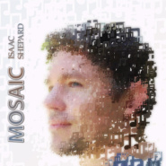
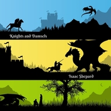
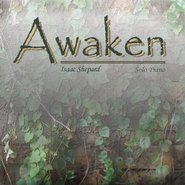
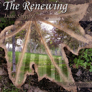
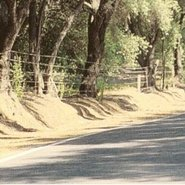

Isaac Shepard
============================

|  |  |
| :--: | :-- |
| [<br>Isaac Shepard](https://i.xiami.com/isaacshepard) | **播放数**: 20157247<br>**粉丝数**: 14392<br>**评论数**: 324<br>**地区**: United States of America 美国<br>**风格**: 器乐独奏 Solo Instrumental, 新世纪音乐 New Age, 新古典新世纪 Neoclassical New Age, 键盘音乐 Keyboard, 古典音乐 Classical<br> |

## 档案

<div>
小档案<br>
中   文   名   艾萨克   谢帕德<br>
外   文   名   Isaac Shepard<br>
国        籍   美籍<br>
出   生   地   加利福利亚州<br>
职        业   谱曲家，钢琴演奏家<br>
信        仰   基督教（与粉丝对话时提及）<br>
代表作品   Gentle, Letting Go, Leaves in the Wind<br>
父        亲   James Shepard<br>
母        亲   Debra Shepard<br>
兄        弟   Elijah Shepard<br>
艺人资料<br>
Isaac Shepard  出生在美国一个音乐世家，  Isaac Shepard 12  岁就能只凭耳朵听来弹钢琴了，可见  Isaac Shepard  的音乐天赋是多么的深厚。之后儿时的  Isaac Shepard  便加入了他父亲  James  的乐队，名为“  Dave and the Reverbs  ”   。年少时的  Isaac Shepard  便随着乐队在南加州的教堂、流浪汉管理所、福利院等地方义务为穷人弹奏音乐。<br>
过了几年后，  Isaac  一家自己组成了一个乐队名为“  Four Shepards and a Lamb  ”   ,  成员是父亲  James,  母亲  Debra  和弟弟  Elijah  。可别小瞧了这一家，他们每一个人都出过自己的专辑。尤其是他的父亲  James  ，是一个深受  Beatles  等  60  年代乐队影响的创作人，已经有  35  年的创作经历。  Isaac  家族真的是一个标标准准的音乐世家！“  Four Shepards and a Lamb  ”在  1996  年出了一张现代基督音乐的  CD  受到当地基督徒的一致好评。  1998  年，  Isaac Shepard  自己也推出了自己的一张  SOLO  专辑《  On Subtle Ground  》  ,  这张专辑是以原钢琴作为主要乐器。多年来，  Isaac Shepard  为很多做礼拜的教堂弹奏音乐，而且他也继续与自己父亲合作创作音乐。   《  Moment By Moment  》便是他与自己父亲推出的一张摇滚式钢琴的音乐  CD  ，这张专辑中的一首《  From Me To You  》（由  the Beatles/Everly Brothers   收录   ）便是他的父亲谱的曲。  2005  年，  Isaac Shepard  推出了自己的首张钢琴专辑《  Swept Away  》，其中我们熟知的《  Before Dawn  》就收录其中。<br>
他的音乐风格很广，涉及古典、流行、摇滚、爵士、电子等音乐形式。不仅在钢琴上突出了他的造诣，而且他还是一个  Reflexive Entertainment  软件工程师。他为很多休闲小游戏担当音乐制作如：  Airport Mania  （疯狂机场），  First Flight  （梦幻飞机场），  Build in Time  （建筑时光），  Jiggle Worms  ，  The Battle  （战斗），  Jump Starand   和  Music Catch  （音乐喷泉）。<br>
1998  年  1  月发行合辑《  On Subtle Ground  》。<br>
2005  年  1  月发行录音室专辑《  Swept Away  》。<br>
2009  年  1  月发行精选集《  Deep Joy  》。  10  月发行合辑《  The Renewing  》。<br>
2010  年  8  月发行录音室专辑《  Awaken  》。<br>
2013  年  1  月发行录音室专辑《  Knights and Damsels  》。  11  月发行单曲《  Love and All  》。<br>
2014  年  9  月发行单曲《  Mosaic: Hope  》，  11  月发行单曲《  Mosaic: Nowhere to Go  》。<br>
2015  年  6  月发行合辑《  Mosaic  》。<br>
近期，他与  Steve Hoganson  合作，为电影，电视，游戏创作配乐，经由他的公司  Shepard  音频音乐制作公司发行。  2016  年  4  月，  Shepard   工作室发行了第一张专辑《  Atmospheric: Music for Film.  》。<br>
Life and career<br>
Isaac Shepard is a pianist and composer who lives in Orange County, California. He has composed and performed for over 25 years, released seven solo piano albums, written music for over a dozen games, and composed hundreds of songs across many genres. He owns Shepard Audio, a music production company for Film, TV, commercials, video games, and media projects. Shepard was chosen by Pandora Internet Radio to represent independent musicians to members of Congress and to perform in the U.S. House of Representatives. His music can be heard in games, TV/Film, online radio, and more. Shepard’s solo piano music has been heard over 70,000,000 times on Pandora.<br>
Growing up in a musical family, Isaac Shepard began playing piano and keyboards by ear at the age of twelve and very soon thereafter joined a band called “Dave and the Reverbs” with his father, James. Shepard played keyboards at various soup kitchens, homeless shelters, social gatherings, church events, and random venues throughout Southern California in the early 1990’s.<br>
Within a few years, Shepard’s family (father James, mother Debra, and brother Elijah) joined together to form a family band they named “Four Shepards and a Lamb,” and in 1996 they produced a self-titled CD of original contemporary Christian music. In 1998, Shepard released his first solo album, ‘On Subtle Ground,’ featuring original keyboard instrumentals. Over the years, Shepard has played piano for numerous church worship teams and has continued to collaborate with James, adding piano to the rock ‘Moment By Moment’ CD and to the Beatles/Everly Brothers love-songs tribute album called ‘From Me To You.’<br>
In 2005, Shepard produced his first live piano album, ‘Swept Away’ a collection of relaxing compositions.  Shepard released his second easy-listening solo piano album, called ‘Deep Joy’ in 2008; it reached #1 on the iTunes New Age charts. In late 2009, he released his third solo piano album, ‘The Renewing’, which made it to the #4 spot on the international radio airplay chart two months in a row. In 2010, Shepard released his fourth neo-classical piano album, ‘Awaken’.<br>
In 2011, Shepard collaborated with ethereal vocalist Amethyste on “Tout Est Si Beau”, a song from her fourth new age album, ‘Deliverance’.<br>
A year later, Shepard published ‘Knights and Damsels’, his fifth solo piano CD, and then later in 2013 published a piano single, “Love and All”.<br>
In mid-2015, Shepard announced his sixth solo piano album, ‘Mosaic’, and then later that year he surprised his fans with his first Christmas album, Christmas Piano. Christmas Piano represents Shepard’s seventh solo piano release.<br>
Through a partnership with Wind Music, a leading independent music company in the Chinese-speaking markets, fans can purchase many of Shepard  ’  s CD’s, including a beautiful 4-CD box set of his first four solo piano CD’s, in Taiwan, China, Singapore, Malaysia, and South Korea.<br>
Shepard’s music is played tens of thousands of times a day across various online internet radio programs, such as Pandora, Spotify, and Whisperings. In fact, in April 2015, Shepard announced that his solo piano music has been played over 50 million times on Pandora Internet Radio. Later that year, Pandora announced in the MorningConsult.com that Shepard’s music passed 70 million streams.<br>
On October 28th, 2015, Shepard was invited by Pandora to speak with members of U.S. Congress on behalf of independent artists everywhere who are in the pursuit of making musical composition their way of life. In addition to meeting with lawmakers and their staff to discuss the state of music streaming and things like transparency in music reporting for musicians, Shepard also had the opportunity to perform a few of his songs in the U.S. House of Representatives during a luncheon.<br>
His music and orchestrations can also be found in over a dozen games, including Sev Zero, Planet Puzzles, Monkey Buddy, Air Patriots, Lucky’s Escape, IMDb Trivia, Matches & Matrimony: A Pride and Prejudice Tale, Simplz: Zoo, Airport Mania: First Flight, Airport Mania 2: Wild Trips, Music Catch, and others. Much of Shepard’s other music for licensing can be heard on the “Other Music” page. In all, Shepard has composed many hundreds of songs across many genres.<br>
Shepard currently resides in Southern California with his wife and two kids. Recently, Shepard has been co-writing with Steve Hoganson for various music projects for Film, TV, games, and media through their Shepard Audio music production company. In April 2016, Shepard Audio released its first album, called ‘Atmospheric: Music for Film.’ In addition to music, Shepard had a successful career in computers as a software engineer. His last role was as a senior developer for Amazon. He holds nine patents and has another six patents pending.
</div>

## 专辑

| 名称 | 语种 | 唱片公司 | 发行时间 | 专辑类别 | 专辑风格 |
| :--: | :-- | :-- | :-- | :-- | :-- |
| [<br>Wandering Home](./albums/2102662394.md) | 英语 | Self-Released | 2016年08月15日 | 录音室专辑 |  |
| [<br>Christmas Piano](./albums/2102662393.md) | 英语 | Self-Released | 2015年10月22日 | 录音室专辑 |  |
| [<br>Mosaic](./albums/2100176927.md) | 英语 | Self-Released | 2015年06月05日 | 录音室专辑 |  |
| [<br>Mosaic: Nowhere to Go](./albums/2100176929.md) | 英语 | Self-Released | 2014年11月10日 | EP, 单曲 | 器乐独奏 Solo Instrumental, 新世纪音乐 New Age, 古典音乐 Classical |
| [<br>Mosaic: Hope](./albums/2100176923.md) | 英语 | Self-Released | 2014年09月08日 | EP, 单曲 | 轻音乐 Easy Listening, 新世纪音乐 New Age, 古典音乐 Classical |
| [<br>Love and All](./albums/2100176928.md) | 英语 | Self-Released | 2013年11月21日 | EP, 单曲 | 轻音乐 Easy Listening, 新世纪音乐 New Age, 古典音乐 Classical |
| [<br>Knights and Damsels](./albums/1477343173.md) | 英语 | Isaac Shepard | 2013年01月15日 | 录音室专辑 | 器乐独奏 Solo Instrumental, 新世纪音乐 New Age, 古典音乐 Classical |
| [<br>Awaken](./albums/434985.md) | 其他 | Isaac Shepard | 2010年08月02日 | 录音室专辑 | 流行 Pop |
| [<br>The Renewing](./albums/382367.md) | 其他 | Isaac Shepard | 2009年10月27日 | 合集, 杂锦 | 新世纪音乐 New Age |
| [<br>Deep Joy](./albums/325181.md) | 英语 | CreateSpace | 2009年01月15日 | 精选集 | 新世纪音乐 New Age |
| [<br>Swept Away](./albums/327497.md) | 英语 |  | 2005年01月01日 | 录音室专辑 | 新世纪音乐 New Age |
| [<br>On Subtle Ground](./albums/351725.md) | 其他 | Eagle Canyon Music | 1998年01月01日 | 合集, 杂锦 |  |

## 评论

|  |  |  |  |
| :-- | :-- | :-- | :-- |
| <br>[虾米用户](https://emumo.xiami.com/u/43743455)<br>我还没想好要写什么...<br>2020-11-30 16:30<br>赞(0) 踩(0) | <div></div> |
| <br>[虾米用户](https://emumo.xiami.com/u/379162683)<br>我想要记住你们，我想要你...<br>2020-06-08 16:10<br>赞(0) 踩(0) | <div></div> |
| <br>[虾米用户](https://emumo.xiami.com/u/13731582)<br>森久保直子ですが…<br>2020-04-12 15:34<br>赞(0) 踩(0) | <div>Isaac的经历让我想到了Kevin Kern，有眼疾的音乐人对声音的表达更细腻更敏感，乍一听很简单很素朴，用心听&amp;mdash;&amp;mdash;即便是休止符和一个延长音都写满了感情和故事。 他们的音乐不华丽，却又过分华美，因为每一个音符都充满能量和情感，让我在他们的音乐中不愿意错过一分一秒，屏息聆听&amp;hellip;</div> |
| <br>[虾米用户](https://emumo.xiami.com/u/40603098)<br>You can’t ho...<br>2020-04-10 08:07<br>赞(0) 踩(0) | <div></div> |
| <br>[虾米用户](https://emumo.xiami.com/u/325205625)<br><br>2019-09-16 10:37<br>赞(0) 踩(0) | <div>很喜欢</div> |
| <br>[虾米用户](https://emumo.xiami.com/u/322235515)<br>在音乐里澎湃，在玩笑里开...<br>2019-08-25 18:59<br>赞(4) 踩(0) | <div>我觉得虾米把音乐人和热爱音乐的粉丝变成了一个圈，很幸福，可以互动。即使语言不通，音乐能告诉你一切。</div> |
| <br>[虾米用户](https://emumo.xiami.com/u/46467302)<br><br>2019-06-17 12:51<br>赞(1) 踩(0) | <div>♞</div> |
| <br>[虾米用户](https://emumo.xiami.com/u/8337431)<br>以乐会友<br>2019-06-07 08:18<br>赞(3) 踩(0) | <div>317</div> |
| <br>[虾米用户](https://emumo.xiami.com/u/726072)<br>此起，彼浮<br>2019-03-31 21:44<br>赞(1) 踩(0) | <div>indeed a "good company" for tonight </div> |
| <br>[虾米用户](https://emumo.xiami.com/u/726072)<br>此起，彼浮<br>2019-03-31 21:42<br>赞(2) 踩(0) | <div>此谓“从容”</div> |
| <br>[虾米用户](https://emumo.xiami.com/u/276944698)<br>不要自我设限.....<br>2019-02-27 19:30<br>赞(4) 踩(0) | <div>。</div> |
| <br>[虾米用户](https://emumo.xiami.com/u/145553416)<br><br>2019-02-12 20:32<br>赞(2) 踩(0) | <div>你的琴声可以一瞬间击溃人坚硬的外壳，直达灵魂...</div> |
| <br>[虾米用户](https://emumo.xiami.com/u/5555764)<br>阿Ken<br>2018-10-25 22:17<br>赞(3) 踩(0) | <div>粉你无商量，太稀缺了</div> |
| <br>[虾米用户](https://emumo.xiami.com/u/18236235)<br>我还没想好要写什么...<br>2018-08-01 01:25<br>赞(0) 踩(0) | <div>∿</div> |
| <br>[虾米用户](https://emumo.xiami.com/u/71178106)<br>塵世や 酒、風呂を抜け ...<br>2018-06-21 15:14<br>赞(2) 踩(0) | <div>♡</div> |
| <br>[虾米用户](https://emumo.xiami.com/u/231342717)<br>北方有佳人,绝世而独立.<br>2018-05-06 19:38<br>赞(3) 踩(0) | <div>听Isaac的钢琴心总能很快地安静下来</div> |
| <br>[虾米用户](https://emumo.xiami.com/u/1923255)<br>  云雷， 屯 ，君子以...<br>2018-04-14 13:13<br>赞(1) 踩(0) | <div>&amp;copy;</div> |
| <br>[虾米用户](https://emumo.xiami.com/u/16695672)<br><br>2018-04-07 17:29<br>赞(2) 踩(0) | <div>适合安抚躁郁狂暴的心灵，琴声如雨点一点打落在愤怒的心灵上！</div> |
| <br>[虾米用户](https://emumo.xiami.com/u/8070377)<br>爱雾瑞性维欧腐漏<br>2018-03-06 13:55<br>赞(1) 踩(0) | <div></div> |
| <br>[虾米用户](https://emumo.xiami.com/u/8140895)<br>口罩帽衫怪人，Gay<br>2017-12-29 17:33<br>赞(0) 踩(0) | <div>爱您</div> |
| <br>[虾米用户](https://emumo.xiami.com/u/1640753)<br><br>2017-12-19 13:12<br>赞(2) 踩(0) | <div>For the Lord your God will bless you in all your harvest and in all the work of your hands, and your joy will be complete. (Deuteronomy 16:15 NIV) To glorify Lord :)</div> |
| <br>[虾米用户](https://emumo.xiami.com/u/573243)<br><br>2017-12-18 13:26<br>赞(14) 踩(0) | <div>对于Isaac Shepard估计了解的人还是比较少的，网络上也很难下载到他的音乐。Isaac Shepard出生在美国一个音乐世家，Isaac Shepard 12岁就能不看谱子弹钢琴了，可见Isaac Shepard的音乐天赋是多么的深厚。之后儿时的Isaac Shepard便加入了他父亲James的乐队，名为“Daveand the Reverbs” 。年少是的Isaac Shepard便随着乐队在南加州的教堂、流浪汉管理所、福利院等地方义务为穷人弹奏音乐。</div> |
| <br>[虾米用户](https://emumo.xiami.com/u/3682795)<br>I’m in love,...<br>2017-11-05 21:24<br>赞(8) 踩(0) | <div>So glad to find you on Xiami Music! The first time that I listened to your music was back in early 2009 when I studied abroad in the U.S. Your music reminds me of the years that I spent in the U.S.Thank you for making such beautiful music that has magical powers to bring peace to my life.</div> |
| <br>[虾米用户](https://emumo.xiami.com/u/10563586)<br><br>2017-10-28 00:35<br>赞(2) 踩(0) | <div>档案里写的太对了！就是从音乐喷泉那个游戏开始，疯狂找那首曲子，然后就结缘了。。</div> |
| <br>[虾米用户](https://emumo.xiami.com/u/6911954)<br><br>2017-10-28 00:19<br>赞(0) 踩(0) | <div>風潮唱片代理發行 Isaac Shepard(伊薩克 夏帕德)陪你 時時刻刻 4CD全集(CB-151/2013.01.25)<a href="http://www.xiami.com/song/showcollect/id/30904955?spm=a1z1s.6626009.0.0.CHcKGb" target="_blank" rel="nofollow noreferrer noopener">http://www.xiami.com/song/showcollect/id/30904955?spm=a1z1s.6626009.0.0.CHcKGb</a>附送其他索引：風潮唱片 林海&amp;范宗沛等 心靈音樂詩 7CD全集、風潮唱片 Herbal Life 香草生活 4CD全集、螢火蟲自然生活 4CD全集、風潮唱片 音樂畫廊系列 山水大觀 4CD全集、風潮唱片 林海 流動的月光 4CD BOX SET。</div> |
| <br>[虾米用户](https://emumo.xiami.com/u/324879742)<br> <br>2017-10-21 02:35<br>赞(1) 踩(0) | <div></div> |
| <br>[虾米用户](https://emumo.xiami.com/u/13603829)<br>喜欢就行<br>2017-09-26 12:15<br>赞(0) 踩(0) | <div>+++</div> |
| <br>[虾米用户](https://emumo.xiami.com/u/2418238)<br>weibo: @尤米口<br>2017-08-16 02:04<br>赞(0) 踩(0) | <div>♡⃛</div> |
| <br>[虾米用户](https://emumo.xiami.com/u/258270690)<br>别问我为什么欧皇是攻［严...<br>2017-08-13 20:07<br>赞(0) 踩(0) | <div>有多少人是在搜索the binding of issac的时候看到了又戳进来的？</div> |
| <br>[虾米用户](https://emumo.xiami.com/u/258270690)<br>别问我为什么欧皇是攻［严...<br>2017-08-13 20:05<br>赞(0) 踩(0) | <div>这里有多少的以撒教，麻烦点个赞，谢谢</div> |
| <br>[虾米用户](https://emumo.xiami.com/u/239524811)<br>照亮你<br>2017-08-07 09:26<br>赞(0) 踩(0) | <div>想欣赏新作&amp;amp;lt;Quiet&amp;amp;gt;.Thanks a lot Isaac Shepard.</div> |
| <br>[虾米用户](https://emumo.xiami.com/u/96374066)<br>这个人很甜<br>2017-06-27 10:10<br>赞(0) 踩(0) | <div>很抓人</div> |
| <br>[虾米用户](https://emumo.xiami.com/u/11968433)<br>长春发展农商银行<br>2017-06-16 20:13<br>赞(0) 踩(0) | <div>I like your music</div> |
| <br>[虾米用户](https://emumo.xiami.com/u/72666568)<br><br>2017-05-11 20:45<br>赞(0) 踩(0) | <div>蛮神奇的</div> |
| <br>[虾米用户](https://emumo.xiami.com/u/93368794)<br><br>2017-05-01 23:23<br>赞(1) 踩(0) | <div>Felicity ! Every time I hear this song , I feel quite warm ,calm  and  enjoyable ~ though my English is not very good  , I  wanna express my thought . It must be a happy thing if you can understand me ! Will you see it  </div> |
| ⇒ | <br>[虾米用户](https://emumo.xiami.com/u/268584676)<br><br>2017-05-02 08:40<br>赞(0) 踩(0) | <div>Yes, I see it! ;-) Thank you very much!</div> |
| <br>[虾米用户](https://emumo.xiami.com/u/201391232)<br>最快的方法是先抱抱<br>2017-05-01 23:18<br>赞(0) 踩(0) | <div>感谢您♫</div> |
| <br>[虾米用户](https://emumo.xiami.com/u/16564916)<br>暂无签名~<br>2017-04-07 12:31<br>赞(0) 踩(0) | <div>graceful，moving，touching</div> |
| <br>[虾米用户](https://emumo.xiami.com/u/47698726)<br>More&more<br>2017-04-05 18:53<br>赞(0) 踩(0) | <div>First i know u in a game music spring</div> |
| <br>[虾米用户](https://emumo.xiami.com/u/30074304)<br>寄蜉蝣于天地，渺沧海之一...<br>2017-03-25 14:36<br>赞(0) 踩(0) | <div>✈</div> |
| <br>[虾米用户](https://emumo.xiami.com/u/1252640)<br><br>2017-03-14 12:22<br>赞(0) 踩(0) | <div>听到一身鸡皮疙瘩.......</div> |
| <br>[虾米用户](https://emumo.xiami.com/u/28381021)<br>所有人都跟我没关系<br>2017-03-09 17:06<br>赞(0) 踩(0) | <div>1</div> |
| <br>[虾米用户](https://emumo.xiami.com/u/53008228)<br>尝试用旋律纪念我成长的一...<br>2017-03-04 20:33<br>赞(0) 踩(0) | <div>唔。。。。</div> |
| <br>[虾米用户](https://emumo.xiami.com/u/241359049)<br>+<br>2017-02-27 17:43<br>赞(1) 踩(0) | <div>Hi, you play the music into my heart</div> |
| ⇒ | <br>[虾米用户](https://emumo.xiami.com/u/268584676)<br><br>2017-02-28 01:11<br>赞(0) 踩(0) | <div>Thank you! :-)</div> |
| <br>[虾米用户](https://emumo.xiami.com/u/73287442)<br><br>2017-02-12 19:58<br>赞(4) 踩(0) | <div>very touching. It reminds me that the times i spent with my grandma...she is in heavn now. </div> |
| <br>[虾米用户](https://emumo.xiami.com/u/33717830)<br>天生神经质 &<br>2017-02-08 19:31<br>赞(1) 踩(0) | <div>音乐很棒哟[带墨镜笑]</div> |
| ⇒ | <br>[虾米用户](https://emumo.xiami.com/u/268584676)<br><br>2017-02-09 05:49<br>赞(0) 踩(0) | <div>Thank you!</div> |
| <br>[虾米用户](https://emumo.xiami.com/u/11859453)<br><br>2017-02-06 14:59<br>赞(0) 踩(0) | <div>竟然入驻了，不错</div> |
| <br>[虾米用户](https://emumo.xiami.com/u/42657637)<br>重要的东西眼睛是看不见的...<br>2017-02-05 23:59<br>赞(1) 踩(0) | <div>高三的时候deep joy这张专辑是我每天必听的，尤其是gentle，谢谢你和你的曲子 给了我很多安慰thank you</div> |
| ⇒ | <br>[虾米用户](https://emumo.xiami.com/u/268584676)<br><br>2017-02-06 06:11<br>赞(0) 踩(0) | <div>Thank you very much! I&amp;#039;m glad you like it.</div> |
| <br>[虾米用户](https://emumo.xiami.com/u/5621382)<br> <br>2017-02-05 16:44<br>赞(0) 踩(0) | <div>Hi I'm your little fans hhh. Wish you all the best！</div> |
| ⇒ | <br>[虾米用户](https://emumo.xiami.com/u/268584676)<br><br>2017-02-05 21:42<br>赞(0) 踩(0) | <div>Thank you for being a fan! I appreciate it.</div> |
| <br>[虾米用户](https://emumo.xiami.com/u/240380591)<br>音乐就是我的肥宅快乐水~<br>2017-02-05 09:32<br>赞(1) 踩(0) | <div>大二的时候经常失眠，before dawn就是我的催眠曲，现在准备考研了，真的压力山大啊，希望我能心平气和的备考 </div> |
| ⇒ | <br>[虾米用户](https://emumo.xiami.com/u/268584676)<br><br>2017-02-05 10:18<br>赞(0) 踩(0) | <div>I wish you all the best studying! :-)</div> |
| ⇒ | <br>[虾米用户](https://emumo.xiami.com/u/240380591)<br>音乐就是我的肥宅快乐水~<br>2017-02-05 13:27<br>赞(0) 踩(0) | <div><q><b>Isaac Shepard说：</b></q></div> |
| ⇒ | <br>[虾米用户](https://emumo.xiami.com/u/268584676)<br><br>2017-02-05 21:40<br>赞(0) 踩(0) | <div><q><b>狗焕是我的说：</b></q></div> |
| <br>[虾米用户](https://emumo.xiami.com/u/17132003)<br>一个开始认真养虾米的人<br>2017-02-05 07:13<br>赞(0) 踩(0) | <div>入驻了虾米音乐人，大概是要来中国巡演了吧。。</div> |
| ⇒ | <br>[虾米用户](https://emumo.xiami.com/u/268584676)<br><br>2017-02-05 07:37<br>赞(0) 踩(0) | <div>Sorry... I don&amp;#039;t have any plans to tour China just yet. :-)</div> |
| ⇒ | <br>[虾米用户](https://emumo.xiami.com/u/17132003)<br>一个开始认真养虾米的人<br>2017-02-05 08:08<br>赞(0) 踩(0) | <div><q><b>Isaac Shepard说：</b></q></div> |
| ⇒ | <br>[虾米用户](https://emumo.xiami.com/u/268584676)<br><br>2017-02-05 08:10<br>赞(0) 踩(0) | <div><q><b>Karma_说：</b></q></div> |
| ⇒ | <br>[虾米用户](https://emumo.xiami.com/u/4329943)<br>口味很杂。  顺耳就行，...<br>2017-02-25 23:39<br>赞(0) 踩(0) | <div><q><b>Isaac Shepard说：</b></q></div> |
| ⇒ | <br>[虾米用户](https://emumo.xiami.com/u/268584676)<br><br>2017-02-28 01:09<br>赞(0) 踩(0) | <div><q><b>NΦ说：</b></q></div> |
| <br>[虾米用户](https://emumo.xiami.com/u/268584676)<br><br>2017-02-05 02:25<br>赞(100) 踩(0) | <div>我刚入驻了虾米音乐人，欢迎大家来我的个人主页，Thank you for your support! <a href="https://www.isaacshepard.com" target="_blank" rel="nofollow noreferrer noopener">https://www.isaacshepard.com</a></div> |
| ⇒ | <br>[虾米用户](https://emumo.xiami.com/u/258316346)<br><br>2017-03-06 22:03<br>赞(0) 踩(0) | <div>Your music makes me intoxicated, let my soul tremble, expect you to make better and more beautiful music.</div> |
| ⇒ | <br>[虾米用户](https://emumo.xiami.com/u/268584676)<br><br>2017-03-07 02:46<br>赞(0) 踩(0) | <div><q><b>lens说：</b></q></div> |
| ⇒ | <br>[虾米用户](https://emumo.xiami.com/u/244786441)<br>Hi <br>2017-05-15 16:42<br>赞(0) 踩(0) | <div>You&amp;#39;re a talent. Gentle is my  favorite  piano music. It makes me depressed and think about my life. I don&amp;#39;t know how to express that feeling. Thanks for your composition. Hope u come to China.</div> |
| ⇒ | <br>[虾米用户](https://emumo.xiami.com/u/268584676)<br><br>2017-05-16 00:26<br>赞(0) 踩(0) | <div><q><b>Poppy 说：</b></q></div> |
| ⇒ | <br>[虾米用户](https://emumo.xiami.com/u/244786441)<br>Hi <br>2017-05-16 12:53<br>赞(0) 踩(0) | <div><q><b>Isaac Shepard说：</b></q></div> |
| ⇒ | <br>[虾米用户](https://emumo.xiami.com/u/3693356)<br><br>2017-11-11 23:53<br>赞(0) 踩(0) | <div>welcome! love your music, very beautiful!</div> |
| ⇒ | <br>[虾米用户](https://emumo.xiami.com/u/212779692)<br>痛苦而温暖，缠绵又孤独。<br>2017-11-26 00:10<br>赞(0) 踩(0) | <div>before dawn    is my favorite piano music,thank you  for your music.</div> |
| ⇒ | <br>[虾米用户](https://emumo.xiami.com/u/41689384)<br> <br>2018-04-11 18:45<br>赞(0) 踩(0) | <div> Gentle is my favorite music.</div> |
| <br>[虾米用户](https://emumo.xiami.com/u/234091277)<br> <br>2017-01-13 08:25<br>赞(0) 踩(0) | <div>都是我喜欢的风格</div> |
| <br>[虾米用户](https://emumo.xiami.com/u/260643513)<br><br>2017-01-09 16:09<br>赞(0) 踩(0) | <div>音乐空灵悠扬赞</div> |
| <br>[虾米用户](https://emumo.xiami.com/u/42725114)<br>ThistheshitI...<br>2017-01-03 21:05<br>赞(0) 踩(0) | <div></div> |
| <br>[虾米用户](https://emumo.xiami.com/u/68963720)<br>有愛就可以飛翔<br>2016-12-17 13:04<br>赞(0) 踩(0) | <div>舒服, 不打擾思緒雲淡風輕</div> |
| <br>[虾米用户](https://emumo.xiami.com/u/10914849)<br><br>2016-11-27 20:14<br>赞(0) 踩(0) | <div>刚刚古古怪怪</div> |
| <br>[虾米用户](https://emumo.xiami.com/u/2781560)<br>想把它一直留存下去<br>2016-11-19 14:30<br>赞(1) 踩(0) | <div>发现你了！✨✨</div> |
| <br>[虾米用户](https://emumo.xiami.com/u/6390643)<br>不在<br>2016-10-27 14:39<br>赞(0) 踩(0) | <div>☁️</div> |
| <br>[虾米用户](https://emumo.xiami.com/u/8839628)<br><br>2016-09-18 15:16<br>赞(1) 踩(0) | <div>中 文 名 艾萨克 谢帕德外 文 名 Isaac Shepard国    籍 美籍出 生 地 加利福利亚州职    业 谱曲家，钢琴演奏家信    仰 基督教（与粉丝对话时提及）</div> |
| <br>[虾米用户](https://emumo.xiami.com/u/44140680)<br>旅途愉快<br>2016-07-29 01:19<br>赞(0) 踩(0) | <div>⚫️</div> |
| <br>[虾米用户](https://emumo.xiami.com/u/44161162)<br>音乐人生<br>2016-06-27 07:14<br>赞(1) 踩(0) | <div>就听了一首，就觉得很飘逸浪漫悠扬</div> |
| <br>[虾米用户](https://emumo.xiami.com/u/1630619)<br><br>2016-05-31 11:36<br>赞(0) 踩(0) | <div>还行吧</div> |
| <br>[虾米用户](https://emumo.xiami.com/u/11506276)<br>暂无签名~<br>2016-05-30 23:17<br>赞(0) 踩(0) | <div>这家人好厉害</div> |
| <br>[虾米用户](https://emumo.xiami.com/u/310963)<br><br>2016-05-04 04:10<br>赞(1) 踩(0) | <div>每一位流行的钢琴手都有自己的一套独特曲风</div> |
| <br>[虾米用户](https://emumo.xiami.com/u/53019740)<br>音符敲打着脑浆 将灵魂带...<br>2016-05-02 23:45<br>赞(0) 踩(0) | <div>钢琴  就应如此</div> |
| <br>[虾米用户](https://emumo.xiami.com/u/8070377)<br>爱雾瑞性维欧腐漏<br>2016-04-30 08:32<br>赞(0) 踩(0) | <div>爱你</div> |
| <br>[虾米用户](https://emumo.xiami.com/u/2024918)<br><br>2016-04-12 21:19<br>赞(0) 踩(0) | <div>安静，恍惚，怀旧</div> |
| <br>[虾米用户](https://emumo.xiami.com/u/37627793)<br><br>2016-03-28 11:23<br>赞(0) 踩(0) | <div>喜欢</div> |
| <br>[虾米用户](https://emumo.xiami.com/u/52506830)<br>再见<br>2016-03-06 00:25<br>赞(0) 踩(0) | <div>（）</div> |
| <br>[虾米用户](https://emumo.xiami.com/u/13088981)<br><br>2016-02-15 10:24<br>赞(0) 踩(0) | <div>室内乐 阅读背景</div> |
| <br>[虾米用户](https://emumo.xiami.com/u/25907473)<br>music fans<br>2016-02-13 20:31<br>赞(0) 踩(0) | <div>great piano music!</div> |
| <br>[虾米用户](https://emumo.xiami.com/u/45621221)<br>卸载状态。<br>2016-01-23 18:07<br>赞(0) 踩(0) | <div>=</div> |
| <br>[虾米用户](https://emumo.xiami.com/u/49116186)<br>(:3_ヽ)_<br>2015-12-24 01:43<br>赞(0) 踩(0) | <div>嫉妒他老婆</div> |
| <br>[虾米用户](https://emumo.xiami.com/u/49116186)<br>(:3_ヽ)_<br>2015-12-20 18:06<br>赞(0) 踩(0) | <div>音乐喷泉。 小时候就只开在那里听音乐</div> |
| <br>[虾米用户](https://emumo.xiami.com/u/14288675)<br><br>2015-12-18 01:16<br>赞(0) 踩(0) | <div>issac你好，我经常用你打妈妈的心和撒旦。</div> |
| <br>[虾米用户](https://emumo.xiami.com/u/7409057)<br>万籁有声，天地无言！<br>2015-11-18 19:29<br>赞(0) 踩(0) | <div>今天真幸运，已经收藏两支曲子了</div> |
| <br>[虾米用户](https://emumo.xiami.com/u/517846)<br>Jazz-Rap<br>2015-11-11 13:33<br>赞(0) 踩(0) | <div>哦 原来是音乐喷泉小游戏的曲子 安静</div> |
| <br>[虾米用户](https://emumo.xiami.com/u/517846)<br>Jazz-Rap<br>2015-11-11 13:33<br>赞(0) 踩(0) | <div>哦 原来是音乐喷泉小游戏的曲子 安静</div> |
| <br>[虾米用户](https://emumo.xiami.com/u/12266533)<br>大音希聲。<br>2015-09-15 13:40<br>赞(0) 踩(0) | <div>他的旋律是可以流淌至心灵深处的</div> |
| <br>[虾米用户](https://emumo.xiami.com/u/8475225)<br><br>2015-09-09 12:40<br>赞(1) 踩(0) | <div>iiiiiiiiiiiiiiiiiiiiiiiiiiiiiiiiiiiiiiiiiiiiiiiii</div> |
| <br>[虾米用户](https://emumo.xiami.com/u/18226663)<br><br>2015-08-22 17:18<br>赞(0) 踩(0) | <div>好听</div> |
| <br>[虾米用户](https://emumo.xiami.com/u/2165528)<br> <br>2015-08-06 00:39<br>赞(0) 踩(0) | <div>么么</div> |
| <br>[虾米用户](https://emumo.xiami.com/u/46572087)<br><br>2015-07-11 11:10<br>赞(0) 踩(0) | <div>偶尔在虾米听到音乐喷泉的曲子真的才知道他。。。那个游戏我很喜欢</div> |
| <br>[虾米用户](https://emumo.xiami.com/u/2840602)<br> <br>2015-07-03 22:03<br>赞(0) 踩(0) | <div>新砖！</div> |
| <br>[虾米用户](https://emumo.xiami.com/u/2521723)<br><br>2015-07-01 11:37<br>赞(1) 踩(0) | <div>是一种释放，一种超然，一份宁静，享受音乐带给我们的美！</div> |
| <br>[虾米用户](https://emumo.xiami.com/u/5105601)<br>= =我XX想杀人<br>2015-06-13 22:37<br>赞(1) 踩(0) | <div>。。。</div> |
| <br>[虾米用户](https://emumo.xiami.com/u/46228911)<br><br>2015-06-03 16:03<br>赞(0) 踩(0) | <div>深入内心</div> |
| <br>[虾米用户](https://emumo.xiami.com/u/6393573)<br>我还没想好要写什么...<br>2015-05-30 19:23<br>赞(1) 踩(0) | <div>有热泪盈眶的感觉</div> |
| <br>[虾米用户](https://emumo.xiami.com/u/48631384)<br>失去才開始在乎<br>2015-05-22 19:20<br>赞(0) 踩(0) | <div>美好的一刻 總是聽緩緩音符的流露那時候</div> |
| <br>[虾米用户](https://emumo.xiami.com/u/4715251)<br>愿屁屁在喵星开开心心还有...<br>2015-05-04 14:42<br>赞(0) 踩(0) | <div>!</div> |
| <br>[虾米用户](https://emumo.xiami.com/u/8902508)<br> <br>2015-04-17 04:44<br>赞(0) 踩(0) | <div>good</div> |
| <br>[虾米用户](https://emumo.xiami.com/u/8773972)<br> <br>2015-03-17 17:08<br>赞(0) 踩(0) | <div>今天的心情简直down......还好在听他的音乐不然真的会炸..............................................</div> |
| <br>[虾米用户](https://emumo.xiami.com/u/18265880)<br><br>2015-03-17 10:11<br>赞(0) 踩(0) | <div>~</div> |
| <br>[虾米用户](https://emumo.xiami.com/u/8231674)<br>与日俱在 和光同尘<br>2015-03-12 17:37<br>赞(0) 踩(0) | <div>^_^</div> |
| <br>[虾米用户](https://emumo.xiami.com/u/11422550)<br>什么音乐都吃的杂食动物<br>2015-03-07 15:18<br>赞(1) 踩(0) | <div>音乐喷泉+1</div> |
| <br>[虾米用户](https://emumo.xiami.com/u/647547)<br><br>2015-03-07 10:18<br>赞(1) 踩(0) | <div>音乐喷泉超棒XDDD</div> |
| <br>[虾米用户](https://emumo.xiami.com/u/4198975)<br><br>2015-02-11 18:02<br>赞(0) 踩(0) | <div>没想到2014年听得最多的居然是他的。</div> |
| <br>[虾米用户](https://emumo.xiami.com/u/29197411)<br>我还没想好要写什么...<br>2015-01-28 13:38<br>赞(0) 踩(0) | <div>头像已换，</div> |
| <br>[虾米用户](https://emumo.xiami.com/u/9556918)<br><br>2015-01-23 10:53<br>赞(0) 踩(0) | <div>上边那四张头像是一人吗…………我脸盲。。</div> |
| <br>[虾米用户](https://emumo.xiami.com/u/11901452)<br><br>2015-01-01 23:27<br>赞(0) 踩(0) | <div>圆蛋哈皮~~~~</div> |
| <br>[虾米用户](https://emumo.xiami.com/u/19224595)<br>听虾米?<br>2014-12-31 17:10<br>赞(0) 踩(0) | <div>钢琴美男</div> |
| <br>[虾米用户](https://emumo.xiami.com/u/2781218)<br>来者何来 去者何去<br>2014-12-08 22:20<br>赞(0) 踩(0) | <div>晚安</div> |
| <br>[虾米用户](https://emumo.xiami.com/u/32461398)<br>曾在云上浮想联翩如今也终...<br>2014-12-04 20:18<br>赞(0) 踩(0) | <div>~</div> |
| <br>[虾米用户](https://emumo.xiami.com/u/14494009)<br><br>2014-11-14 12:34<br>赞(0) 踩(0) | <div>感性钢琴；唯美梦幻</div> |
| <br>[虾米用户](https://emumo.xiami.com/u/13552)<br><br>2014-10-19 20:24<br>赞(0) 踩(0) | <div>Letting Go</div> |
| <br>[虾米用户](https://emumo.xiami.com/u/12766015)<br>新古典是摄人心魄的毒药…...<br>2014-10-12 22:01<br>赞(0) 踩(0) | <div>letting go听得人想哭</div> |
| <br>[虾米用户](https://emumo.xiami.com/u/3291679)<br><br>2014-09-24 10:16<br>赞(1) 踩(0) | <div>就是这样的音乐，抚慰伤痛，促人静思，沐浴心灵，恢复生机</div> |
| <br>[虾米用户](https://emumo.xiami.com/u/3455336)<br><br>2014-09-24 00:28<br>赞(0) 踩(0) | <div>爱上这个声音...</div> |
| <br>[虾米用户](https://emumo.xiami.com/u/11340472)<br>辣鸡强制收藏<br>2014-09-07 18:31<br>赞(0) 踩(0) | <div>~</div> |
| <br>[虾米用户](https://emumo.xiami.com/u/26437910)<br>breathing<br>2014-09-03 08:17<br>赞(0) 踩(0) | <div>像大海一样深沉</div> |
| <br>[虾米用户](https://emumo.xiami.com/u/40599603)<br>IsL<br>2014-09-03 02:21<br>赞(0) 踩(0) | <div>聲音&amp;gt;  &amp;lt;~</div> |
| <br>[虾米用户](https://emumo.xiami.com/u/40501969)<br>在路上，永不停息的脚步<br>2014-08-27 20:13<br>赞(0) 踩(0) | <div>很喜欢他的before dawn</div> |
| <br>[虾米用户](https://emumo.xiami.com/u/6939845)<br><br>2014-08-19 15:46<br>赞(0) 踩(0) | <div>平静</div> |
| <br>[虾米用户](https://emumo.xiami.com/u/4388599)<br>一點孤獨品嘗一點寂寞。<br>2014-08-09 19:15<br>赞(0) 踩(0) | <div>她的眉太淡，面容太模糊，如何敌得过岁月稀释、情爱挥发。</div> |
| <br>[虾米用户](https://emumo.xiami.com/u/24909490)<br><br>2014-07-05 15:06<br>赞(0) 踩(0) | <div>每一首歌都有一种意境，那种我自己表达不出来，Shepard却传达出来了。很美很美！</div> |
| <br>[虾米用户](https://emumo.xiami.com/u/24909490)<br><br>2014-07-05 14:57<br>赞(0) 踩(0) | <div>太美了！</div> |
| <br>[虾米用户](https://emumo.xiami.com/u/20676639)<br>casablanca<br>2014-07-01 21:13<br>赞(0) 踩(0) | <div>`````</div> |
| <br>[虾米用户](https://emumo.xiami.com/u/836702)<br>DIVINEDLB<br>2014-06-30 22:00<br>赞(0) 踩(0) | <div><a href="http://emumo.xiami.com/u/4788255" target="_blank" rel="nofollow" name_card="4788255">@pure</a></div> |
| <br>[虾米用户](https://emumo.xiami.com/u/5901907)<br>虾米拜拜<br>2014-06-22 02:37<br>赞(0) 踩(0) | <div>入坑纯音乐的启蒙</div> |
| <br>[虾米用户](https://emumo.xiami.com/u/7551924)<br><br>2014-06-09 20:00<br>赞(0) 踩(0) | <div>清脆的钢琴，白指黑键。</div> |
| <br>[虾米用户](https://emumo.xiami.com/u/10151380)<br><br>2014-05-17 10:14<br>赞(0) 踩(0) | <div>舒缓，流畅，纯净的钢琴。</div> |
| <br>[虾米用户](https://emumo.xiami.com/u/31438015)<br>一切源于模仿...<br>2014-04-16 01:35<br>赞(0) 踩(0) | <div>before dawn</div> |
| <br>[虾米用户](https://emumo.xiami.com/u/5690474)<br><br>2014-03-27 23:25<br>赞(0) 踩(0) | <div>你妹的虾米压的这些东西在模仿黑胶么！兹啦兹啦个不停！！</div> |
| <br>[虾米用户](https://emumo.xiami.com/u/10150811)<br><br>2014-03-15 21:40<br>赞(0) 踩(0) | <div>不好，我喜欢这些封面</div> |
| <br>[虾米用户](https://emumo.xiami.com/u/18915444)<br>暂无签名~<br>2014-02-15 16:50<br>赞(0) 踩(0) | <div>哟西</div> |
| <br>[虾米用户](https://emumo.xiami.com/u/8368125)<br>少私寡欲，不去争斗<br>2014-02-15 16:16<br>赞(0) 踩(0) | <div>需要音乐喷泉的可以给我留言。</div> |
| <br>[虾米用户](https://emumo.xiami.com/u/13461496)<br>美好时光...只在昨日<br>2014-02-08 20:54<br>赞(0) 踩(0) | <div>淡</div> |
| <br>[虾米用户](https://emumo.xiami.com/u/8089221)<br>ずっと 忘れずに 進むの<br>2014-02-04 12:03<br>赞(0) 踩(0) | <div>好喜欢</div> |
| <br>[虾米用户](https://emumo.xiami.com/u/4926916)<br>青山白云 各自无言<br>2013-12-22 13:15<br>赞(1) 踩(0) | <div>isaac shepard</div> |
| <br>[虾米用户](https://emumo.xiami.com/u/28442205)<br><br>2013-12-07 16:27<br>赞(0) 踩(0) | <div>很安静</div> |
| <br>[虾米用户](https://emumo.xiami.com/u/4376156)<br>暂无签名~<br>2013-12-01 22:46<br>赞(2) 踩(0) | <div>他的钢琴很悠然    让然松弛     可以安睡了</div> |
| <br>[虾米用户](https://emumo.xiami.com/u/23938053)<br>顾小妮喜欢的就是喜欢的<br>2013-11-17 21:36<br>赞(0) 踩(0) | <div>本来只是随便听听，却让我忍不住想要看看是谁在弹琴</div> |
| <br>[虾米用户](https://emumo.xiami.com/u/15934173)<br><br>2013-11-16 20:05<br>赞(0) 踩(0) | <div>就是好听呢。。</div> |
| <br>[虾米用户](https://emumo.xiami.com/u/6170533)<br>独立思考<br>2013-11-14 21:43<br>赞(0) 踩(0) | <div>旋律美</div> |
| <br>[虾米用户](https://emumo.xiami.com/u/12068445)<br>·<br>2013-11-09 01:33<br>赞(1) 踩(0) | <div>¸¸.•*¨*•♫♪¸¸.•*¨*•♫♪¸</div> |
| <br>[虾米用户](https://emumo.xiami.com/u/9152900)<br>暂无签名~<br>2013-11-07 17:38<br>赞(0) 踩(0) | <div>纯静，又富有激情</div> |
| <br>[虾米用户](https://emumo.xiami.com/u/6639072)<br><br>2013-10-26 13:30<br>赞(0) 踩(0) | <div>钢琴</div> |
| <br>[虾米用户](https://emumo.xiami.com/u/6392832)<br> <br>2013-09-30 12:22<br>赞(31) 踩(0) | <div>静下心写作业的好选择！</div> |
| <br>[虾米用户](https://emumo.xiami.com/u/4244439)<br>坚信 富有 精神 物质<br>2013-09-29 22:52<br>赞(1) 踩(0) | <div>听这样的旋律有置身水中的感觉，平静而轻松</div> |
| <br>[虾米用户](https://emumo.xiami.com/u/6892757)<br><br>2013-09-26 20:36<br>赞(55) 踩(0) | <div>认识Isaac要从一个叫“音乐喷泉”的Reflexive小游戏讲起。作为开场曲，&amp;quot;Before Dawn&amp;quot; 从始至终就以他悠扬的音律抓住了我们的听觉。仿佛这些从地平线上迸发而出的五彩音符都是Isaac从琴键上释放的精灵。创造这样美妙音乐的人自然不是等闲之辈。Isaac出自音乐世家，一家4口人各自通晓一门乐器。。。</div> |
| ⇒ | <br>[虾米用户](https://emumo.xiami.com/u/10712299)<br>要拼 也要随心随性 也要...<br>2013-10-04 17:11<br>赞(0) 踩(0) | <div>我也是因为小游戏认识的！</div> |
| ⇒ | <br>[虾米用户](https://emumo.xiami.com/u/3413598)<br>Crazy for U<br>2014-06-25 23:42<br>赞(0) 踩(0) | <div>都是从这个游戏知道他的么？真是有缘。这个音乐真是无敌了。</div> |
| <br>[虾米用户](https://emumo.xiami.com/u/11042809)<br><br>2013-09-04 21:42<br>赞(0) 踩(0) | <div>peaceful</div> |
| <br>[虾米用户](https://emumo.xiami.com/u/1227107)<br><br>2013-08-06 11:01<br>赞(0) 踩(0) | <div>非常喜欢这种旋律！</div> |
| <br>[虾米用户](https://emumo.xiami.com/u/11237763)<br><br>2013-08-04 16:25<br>赞(0) 踩(0) | <div>NA钢琴</div> |
| <br>[虾米用户](https://emumo.xiami.com/u/145271)<br>凡所有相，皆是虛妄。<br>2013-07-29 22:11<br>赞(0) 踩(0) | <div>隨緣</div> |
| <br>[虾米用户](https://emumo.xiami.com/u/9777922)<br>金属米<br>2013-07-29 10:35<br>赞(0) 踩(0) | <div>好  不错</div> |
| <br>[虾米用户](https://emumo.xiami.com/u/13739025)<br> <br>2013-07-16 19:22<br>赞(0) 踩(0) | <div>喜欢</div> |
| <br>[虾米用户](https://emumo.xiami.com/u/6788176)<br><br>2013-07-12 08:34<br>赞(0) 踩(0) | <div>静静的音符流淌在耳畔，</div> |
| <br>[虾米用户](https://emumo.xiami.com/u/6927525)<br><br>2013-07-11 23:00<br>赞(0) 踩(0) | <div>钢琴</div> |
| <br>[虾米用户](https://emumo.xiami.com/u/7269831)<br>(´・ω・`)<br>2013-07-11 22:39<br>赞(0) 踩(0) | <div>pia~~~~~no</div> |
| <br>[虾米用户](https://emumo.xiami.com/u/9379826)<br><br>2013-07-10 20:56<br>赞(0) 踩(0) | <div>非常安静的旋律，喜欢。</div> |
| <br>[虾米用户](https://emumo.xiami.com/u/909187)<br>暂无签名~<br>2013-07-04 00:18<br>赞(0) 踩(0) | <div>第一个给5星。</div> |
| <br>[虾米用户](https://emumo.xiami.com/u/13755863)<br><br>2013-06-21 08:48<br>赞(0) 踩(0) | <div>Isaac Shepard</div> |
| <br>[虾米用户](https://emumo.xiami.com/u/8132355)<br>最大的敌人是你自己<br>2013-06-18 22:20<br>赞(0) 踩(0) | <div>喜欢需要理由么，呵呵</div> |
| <br>[虾米用户](https://emumo.xiami.com/u/14363399)<br><br>2013-06-18 22:08<br>赞(0) 踩(0) | <div>从第一个音符开始就可以让人觉得平静。</div> |
| <br>[虾米用户](https://emumo.xiami.com/u/3186664)<br><br>2013-06-13 09:11<br>赞(0) 踩(0) | <div>惶恐的等高考分，现在静一静</div> |
| <br>[虾米用户](https://emumo.xiami.com/u/3186664)<br><br>2013-06-13 09:11<br>赞(0) 踩(0) | <div>gentle也很好听呀</div> |
| <br>[虾米用户](https://emumo.xiami.com/u/5556735)<br>=。=<br>2013-06-09 18:06<br>赞(0) 踩(0) | <div>话语用来赞美显得太苍白</div> |
| <br>[虾米用户](https://emumo.xiami.com/u/2040860)<br>上帝的安排非常深奥<br>2013-05-27 22:39<br>赞(0) 踩(0) | <div>这也是我非常喜欢的一位音乐家，迄今为止能够让我不断循环和寻味的美好声音！</div> |
| <br>[虾米用户](https://emumo.xiami.com/u/10862308)<br>抄袭者死一户口本<br>2013-05-19 15:51<br>赞(0) 踩(0) | <div>安静，像一条河流流过心尖，有快有慢</div> |
| <br>[虾米用户](https://emumo.xiami.com/u/10922916)<br><br>2013-05-19 14:36<br>赞(0) 踩(0) | <div>清爽  森林一样的力量</div> |
| <br>[虾米用户](https://emumo.xiami.com/u/2982493)<br>我思故我在<br>2013-05-11 00:49<br>赞(0) 踩(0) | <div>晚安曲</div> |
| <br>[虾米用户](https://emumo.xiami.com/u/2624690)<br>live your li...<br>2013-05-07 08:52<br>赞(0) 踩(0) | <div>能听到心跳的声音吗？</div> |
| <br>[虾米用户](https://emumo.xiami.com/u/1299914)<br><br>2013-05-04 21:05<br>赞(1) 踩(0) | <div>不仅仅他的才华，他的音乐有不一样的灵魂；或者在中国，也只能听到一些影视剧的背景纯音乐而已！他带给我不一样的享受！</div> |
| <br>[虾米用户](https://emumo.xiami.com/u/9379826)<br><br>2013-04-27 16:27<br>赞(0) 踩(0) | <div>非常干净的声音，喜欢。</div> |
| <br>[虾米用户](https://emumo.xiami.com/u/7952081)<br><br>2013-04-24 02:38<br>赞(0) 踩(0) | <div>什么！！！音乐喷泉！！！我说那么熟悉！！！那小游戏好可爱~</div> |
| <br>[虾米用户](https://emumo.xiami.com/u/1502160)<br><br>2013-04-16 18:01<br>赞(0) 踩(0) | <div>isaac shepard -Before dawn</div> |
| <br>[虾米用户](https://emumo.xiami.com/u/5105646)<br><br>2013-04-12 18:11<br>赞(0) 踩(0) | <div>美国新古典钢琴  一年以前就开始听 Isaac Shepard 了，当时觉得不符合我的口味，今天算是重新发现他的音乐了。查了一下，他还是个软件工程师，给很多游戏制作音乐……</div> |
| <br>[虾米用户](https://emumo.xiami.com/u/12958144)<br>生命不息，音乐不止。<br>2013-04-08 20:00<br>赞(0) 踩(0) | <div>一听倾心~</div> |
| <br>[虾米用户](https://emumo.xiami.com/u/7135565)<br><br>2013-03-22 16:00<br>赞(0) 踩(0) | <div>最简单安静却有力的钢琴</div> |
| <br>[虾米用户](https://emumo.xiami.com/u/760161)<br>hedonism enj...<br>2013-03-19 12:52<br>赞(0) 踩(0) | <div>free melody</div> |
| <br>[虾米用户](https://emumo.xiami.com/u/13414935)<br>Angel<br>2013-03-15 14:24<br>赞(0) 踩(0) | <div>good</div> |
| <br>[虾米用户](https://emumo.xiami.com/u/3606918)<br><br>2013-03-15 10:13<br>赞(0) 踩(0) | <div>钢琴什么的最棒了~XD</div> |
| <br>[虾米用户](https://emumo.xiami.com/u/13221893)<br><br>2013-02-24 18:59<br>赞(0) 踩(0) | <div>听着舒服，没了。</div> |
| <br>[虾米用户](https://emumo.xiami.com/u/223728)<br><br>2013-02-19 20:30<br>赞(0) 踩(0) | <div>Isaac + Shepard...  DS + ME... T T...</div> |
| <br>[虾米用户](https://emumo.xiami.com/u/6053953)<br><br>2013-02-19 03:14<br>赞(0) 踩(0) | <div>擦，瞬间好听</div> |
| <br>[虾米用户](https://emumo.xiami.com/u/12996325)<br><br>2013-02-15 11:50<br>赞(0) 踩(0) | <div>流水般的音乐`</div> |
| <br>[虾米用户](https://emumo.xiami.com/u/10712299)<br>要拼 也要随心随性 也要...<br>2013-02-13 11:56<br>赞(0) 踩(0) | <div>心醉啊~当年同学玩游戏的时候发现的~</div> |
| <br>[虾米用户](https://emumo.xiami.com/u/5784596)<br><br>2013-01-30 22:18<br>赞(0) 踩(0) | <div>音乐与时间都不够</div> |
| <br>[虾米用户](https://emumo.xiami.com/u/10039619)<br>我相信遗忘是一种美德<br>2013-01-28 11:37<br>赞(0) 踩(0) | <div>我想我们见过</div> |
| <br>[虾米用户](https://emumo.xiami.com/u/12494170)<br><br>2013-01-20 05:14<br>赞(0) 踩(0) | <div>很美的钢琴曲</div> |
| <br>[虾米用户](https://emumo.xiami.com/u/11475689)<br><br>2013-01-18 07:50<br>赞(0) 踩(0) | <div>舒缓</div> |
| <br>[虾米用户](https://emumo.xiami.com/u/4949408)<br><br>2013-01-17 12:09<br>赞(0) 踩(0) | <div>宁静致远</div> |
| <br>[虾米用户](https://emumo.xiami.com/u/7834119)<br> <br>2013-01-17 03:44<br>赞(0) 踩(0) | <div>( ;  ; )</div> |
| <br>[虾米用户](https://emumo.xiami.com/u/6372464)<br><br>2013-01-14 22:46<br>赞(0) 踩(0) | <div>美</div> |
| <br>[虾米用户](https://emumo.xiami.com/u/7061568)<br><br>2013-01-14 13:38<br>赞(0) 踩(0) | <div>純音樂</div> |
| <br>[虾米用户](https://emumo.xiami.com/u/2102896)<br><br>2013-01-12 18:06<br>赞(0) 踩(0) | <div>可以做片子</div> |
| <br>[虾米用户](https://emumo.xiami.com/u/7237900)<br><br>2013-01-07 16:29<br>赞(0) 踩(0) | <div>那首Leaves in the wind 和雅尼大叔那首the rain must fall 有些旋律非常相似，难怪感觉这么耳熟。</div> |
| <br>[虾米用户](https://emumo.xiami.com/u/8169166)<br><br>2013-01-02 08:22<br>赞(1) 踩(0) | <div>他的钢琴曲真的可以带你去一个你熟悉的地方，太神奇了。</div> |
| ⇒ | <br>[虾米用户](https://emumo.xiami.com/u/10611776)<br>关灯听歌。<br>2013-10-12 17:08<br>赞(0) 踩(0) | <div>天堂 他的很多作品有基督教情绪 歌名也是</div> |
| <br>[虾米用户](https://emumo.xiami.com/u/8257881)<br><br>2012-12-19 08:24<br>赞(0) 踩(0) | <div>isaac</div> |
| <br>[虾米用户](https://emumo.xiami.com/u/11177935)<br>我还没想好要写什么...<br>2012-12-02 12:59<br>赞(0) 踩(0) | <div>行云流水般的空灵</div> |
| <br>[虾米用户](https://emumo.xiami.com/u/10265488)<br><br>2012-12-01 02:43<br>赞(0) 踩(0) | <div>好聽</div> |
| <br>[虾米用户](https://emumo.xiami.com/u/6087265)<br>消释的梦境<br>2012-11-29 22:03<br>赞(0) 踩(0) | <div>仿佛从天边传来的琴声……</div> |
| <br>[虾米用户](https://emumo.xiami.com/u/10407940)<br>暂无签名~<br>2012-11-18 12:31<br>赞(0) 踩(0) | <div>宁静</div> |
| <br>[虾米用户](https://emumo.xiami.com/u/9932978)<br><br>2012-11-17 21:29<br>赞(0) 踩(0) | <div>Isaac Shepard.欧美</div> |
| <br>[虾米用户](https://emumo.xiami.com/u/7944228)<br><br>2012-11-08 02:02<br>赞(0) 踩(0) | <div>安静</div> |
| <br>[虾米用户](https://emumo.xiami.com/u/2203850)<br><br>2012-10-29 12:17<br>赞(0) 踩(0) | <div>安静</div> |
| <br>[虾米用户](https://emumo.xiami.com/u/1592080)<br><br>2012-10-23 23:38<br>赞(0) 踩(0) | <div>在某个时候静静的听着</div> |
| <br>[虾米用户](https://emumo.xiami.com/u/487790)<br><br>2012-10-22 21:09<br>赞(0) 踩(0) | <div>浮躁的时候听听他吧</div> |
| <br>[虾米用户](https://emumo.xiami.com/u/5735388)<br><br>2012-10-19 19:10<br>赞(0) 踩(0) | <div>Isaac Shepard 纯音乐，超美</div> |
| <br>[虾米用户](https://emumo.xiami.com/u/3643353)<br>虾米要关闭了，难说再见！...<br>2012-10-19 15:03<br>赞(0) 踩(0) | <div>如果你喜欢纯音乐，如果你还想唤起曾经的记忆那就快加入我们吧，qq群71317060。期待大家的光临。</div> |
| <br>[虾米用户](https://emumo.xiami.com/u/9532466)<br>跟着音乐  收起你的肮脏<br>2012-10-19 00:07<br>赞(0) 踩(0) | <div>太美 想了这么久的弹钢琴 终是没有学 遗憾了。</div> |
| <br>[虾米用户](https://emumo.xiami.com/u/2716323)<br><br>2012-10-17 18:27<br>赞(0) 踩(0) | <div>soft，clear</div> |
| <br>[虾米用户](https://emumo.xiami.com/u/9288315)<br><br>2012-10-15 21:11<br>赞(0) 踩(0) | <div>以后一定要学着弹奏</div> |
| <br>[虾米用户](https://emumo.xiami.com/u/8701932)<br> <br>2012-10-09 04:39<br>赞(0) 踩(0) | <div>love</div> |
| <br>[虾米用户](https://emumo.xiami.com/u/2376315)<br><br>2012-10-03 16:59<br>赞(0) 踩(0) | <div>天才！</div> |
| <br>[虾米用户](https://emumo.xiami.com/u/454356)<br>化作风，自由的旅行……<br>2012-09-30 02:47<br>赞(0) 踩(0) | <div>好听</div> |
| <br>[虾米用户](https://emumo.xiami.com/u/10633648)<br>对你的思念化作歌声，<br>2012-09-22 19:25<br>赞(0) 踩(0) | <div>成熟の钢琴功力</div> |
| <br>[虾米用户](https://emumo.xiami.com/u/3235848)<br><br>2012-09-20 22:18<br>赞(0) 踩(0) | <div>美</div> |
| <br>[虾米用户](https://emumo.xiami.com/u/6216135)<br><br>2012-09-08 17:57<br>赞(0) 踩(0) | <div>钢琴轻音乐</div> |
| <br>[虾米用户](https://emumo.xiami.com/u/10148346)<br><br>2012-09-04 20:19<br>赞(0) 踩(0) | <div>很安静的音乐，在一天疲惫的工作以后，能够听到这么纯美的音乐是一种幸福！</div> |
| <br>[虾米用户](https://emumo.xiami.com/u/3767037)<br><br>2012-09-04 16:15<br>赞(0) 踩(0) | <div>干净，真的太适合她了。</div> |
| ⇒ | <br>[虾米用户](https://emumo.xiami.com/u/136018)<br><br>2012-09-15 10:22<br>赞(0) 踩(0) | <div>他不是大叔么？</div> |
| ⇒ | <br>[虾米用户](https://emumo.xiami.com/u/3767037)<br><br>2012-09-28 20:46<br>赞(0) 踩(0) | <div><q><b>未知生物说：</b></q></div> |
| <br>[虾米用户](https://emumo.xiami.com/u/2286200)<br><br>2012-08-30 15:33<br>赞(0) 踩(0) | <div>太美了。。。</div> |
| <br>[虾米用户](https://emumo.xiami.com/u/6204002)<br><br>2012-08-27 16:00<br>赞(0) 踩(0) | <div>精灵 灵动</div> |
| <br>[虾米用户](https://emumo.xiami.com/u/8927755)<br><br>2012-08-14 12:08<br>赞(0) 踩(0) | <div>宁静，这种音乐可以让我陷入沉思。 感触上和萨蒂有些相似。</div> |
| <br>[虾米用户](https://emumo.xiami.com/u/4908780)<br> <br>2012-07-20 02:34<br>赞(0) 踩(0) | <div>听他的歌就有一种淡淡的忧伤</div> |
| <br>[虾米用户](https://emumo.xiami.com/u/5485461)<br><br>2012-07-13 12:40<br>赞(0) 踩(0) | <div>before dawn</div> |
| <br>[虾米用户](https://emumo.xiami.com/u/5548939)<br><br>2012-07-08 19:14<br>赞(1) 踩(0) | <div>在游戏中知道一两首歌出自于他时，觉得他的音乐很清澈，成了我听纯音乐的开始，当我最终发现游戏里所有的歌都出于他时，我怎么有种被骗的感觉。唉</div> |
| <br>[虾米用户](https://emumo.xiami.com/u/3082790)<br><br>2012-07-04 20:01<br>赞(0) 踩(0) | <div>~</div> |
| <br>[虾米用户](https://emumo.xiami.com/u/2906621)<br>嘻嘻，你找到我了<br>2012-06-28 15:18<br>赞(0) 踩(0) | <div>他的音乐听着很享受</div> |
| <br>[虾米用户](https://emumo.xiami.com/u/9318973)<br><br>2012-05-29 16:43<br>赞(0) 踩(0) | <div>我说怎么耳熟呢</div> |
| <br>[虾米用户](https://emumo.xiami.com/u/615301)<br><br>2012-05-21 16:21<br>赞(0) 踩(0) | <div>會說故事的音樂旋律你...聽過了嗎...</div> |
| <br>[虾米用户](https://emumo.xiami.com/u/5458268)<br><br>2012-05-20 17:59<br>赞(0) 踩(0) | <div>钢琴曲的收集。曲目安详和平,Isaac Shepard的创作,将让你回忆起生命中平凡的快乐充满感情和创造力的作品,这些现代钢琴旋律将带你进入沉思和轻松的...</div> |
| <br>[虾米用户](https://emumo.xiami.com/u/6521243)<br><br>2012-05-04 09:05<br>赞(0) 踩(0) | <div>Isaac Shepard 。</div> |
| <br>[虾米用户](https://emumo.xiami.com/u/827013)<br><br>2012-05-03 22:57<br>赞(0) 踩(0) | <div>棒</div> |
| <br>[虾米用户](https://emumo.xiami.com/u/117681)<br>音乐是一种力量<br>2012-04-30 11:36<br>赞(0) 踩(0) | <div>缘起 Before Dawn</div> |
| <br>[虾米用户](https://emumo.xiami.com/u/1965086)<br>上苍给了我们一具不堪的肉...<br>2012-04-28 04:18<br>赞(0) 踩(0) | <div>静静的，静静的。</div> |
| <br>[虾米用户](https://emumo.xiami.com/u/223280)<br>suck it！<br>2012-04-20 23:28<br>赞(0) 踩(0) | <div>曲子给人的感觉好像是从某个高空往下坠</div> |
| <br>[虾米用户](https://emumo.xiami.com/u/1864133)<br>2112<br>2012-04-16 23:29<br>赞(0) 踩(0) | <div>isaac Shepard,钢琴</div> |
| <br>[虾米用户](https://emumo.xiami.com/u/8874700)<br><br>2012-04-15 15:58<br>赞(0) 踩(0) | <div>天才钢琴师</div> |
| <br>[虾米用户](https://emumo.xiami.com/u/8136047)<br><br>2012-04-02 19:29<br>赞(0) 踩(0) | <div>就是喜欢</div> |
| <br>[虾米用户](https://emumo.xiami.com/u/2113721)<br>We'll never ...<br>2012-03-26 11:19<br>赞(0) 踩(0) | <div>New Age。</div> |
| <br>[虾米用户](https://emumo.xiami.com/u/2688180)<br>喜新不厌旧<br>2012-03-23 17:58<br>赞(0) 踩(0) | <div>Isaac Shepard，Piano</div> |
| <br>[虾米用户](https://emumo.xiami.com/u/2222425)<br><br>2012-03-16 23:30<br>赞(0) 踩(0) | <div>。。。</div> |
| <br>[虾米用户](https://emumo.xiami.com/u/7847449)<br> <br>2012-03-09 16:10<br>赞(0) 踩(0) | <div>安静告诉你什么是安静</div> |
| <br>[虾米用户](https://emumo.xiami.com/u/5497338)<br><br>2012-03-02 01:58<br>赞(0) 踩(0) | <div>音符的舞者</div> |
| <br>[虾米用户](https://emumo.xiami.com/u/6112796)<br> <br>2012-03-02 01:16<br>赞(0) 踩(0) | <div>music catch好游戏~</div> |
| <br>[虾米用户](https://emumo.xiami.com/u/2417260)<br>troublemaker<br>2012-02-11 16:10<br>赞(0) 踩(0) | <div>音乐喷泉 太经典了！</div> |
| <br>[虾米用户](https://emumo.xiami.com/u/1275579)<br>他人即地狱<br>2012-01-23 23:56<br>赞(0) 踩(0) | <div>music-catch</div> |
| <br>[虾米用户](https://emumo.xiami.com/u/2429264)<br>朝闻游子唱离歌,昨夜微霜...<br>2012-01-07 04:09<br>赞(0) 踩(0) | <div>安静的钢琴。。。。。。。。。</div> |
| <br>[虾米用户](https://emumo.xiami.com/u/5414067)<br><br>2011-12-29 23:15<br>赞(0) 踩(0) | <div>治愈良药</div> |
| <br>[虾米用户](https://emumo.xiami.com/u/6010456)<br>我还没想好要写什么...<br>2011-12-27 23:38<br>赞(0) 踩(0) | <div>榜样啊...又会编程，弹琴又好啊...软件工程专业学子的榜样啊.......</div> |
| <br>[虾米用户](https://emumo.xiami.com/u/643438)<br>寄蜉蝣于天地 渺沧海之一...<br>2011-12-26 21:16<br>赞(0) 踩(0) | <div>听了你 两年了 把你找回来了</div> |
| <br>[虾米用户](https://emumo.xiami.com/u/3733753)<br>暂无签名~<br>2011-12-14 10:28<br>赞(0) 踩(0) | <div>他的很多音乐都是在玩音乐喷泉的时候听到的，很赞~听起来很平静~心情会很好~</div> |
| <br>[虾米用户](https://emumo.xiami.com/u/4750460)<br><br>2011-12-11 00:33<br>赞(0) 踩(0) | <div>只轻轻合上双眼，享受那一份静谧，那一份温和。如秋日飘零的叶，化作一片春泥。</div> |
| <br>[虾米用户](https://emumo.xiami.com/u/3664412)<br><br>2011-12-04 16:36<br>赞(0) 踩(0) | <div>心中的音乐</div> |
| <br>[虾米用户](https://emumo.xiami.com/u/1456312)<br>呼吸音乐，行走人生<br>2011-12-02 13:18<br>赞(0) 踩(0) | <div>入耳即入心的钢琴</div> |
| <br>[虾米用户](https://emumo.xiami.com/u/7045083)<br><br>2011-12-01 11:55<br>赞(0) 踩(0) | <div>舒缓、平静、享受</div> |
| <br>[虾米用户](https://emumo.xiami.com/u/5148322)<br><br>2011-11-30 10:58<br>赞(0) 踩(0) | <div>是从一个小游戏里认识到的~那时就被深深吸引住啦</div> |
| <br>[虾米用户](https://emumo.xiami.com/u/211273)<br><br>2011-11-28 07:40<br>赞(0) 踩(0) | <div>我的神</div> |
| <br>[虾米用户](https://emumo.xiami.com/u/155947)<br>一期一会<br>2011-11-19 17:02<br>赞(0) 踩(0) | <div>牧羊人</div> |
| <br>[虾米用户](https://emumo.xiami.com/u/6772214)<br><br>2011-11-14 10:53<br>赞(0) 踩(0) | <div>让我点滴的回想起心中的音符</div> |
| <br>[虾米用户](https://emumo.xiami.com/u/2104186)<br><br>2011-11-07 14:53<br>赞(0) 踩(0) | <div>纯音</div> |
| <br>[虾米用户](https://emumo.xiami.com/u/1993271)<br>Cool夏days<br>2011-10-16 22:42<br>赞(0) 踩(0) | <div>听这样的歌，坚持做个温和的好姑娘。今天找到了打开那扇门的钥匙。谢谢你告诉我。我会努力。为我们努力。</div> |
| <br>[虾米用户](https://emumo.xiami.com/u/1993271)<br>Cool夏days<br>2011-09-27 14:50<br>赞(0) 踩(0) | <div>简单。纯色。</div> |
| <br>[虾米用户](https://emumo.xiami.com/u/4770414)<br>我还没想好要写什么...<br>2011-09-17 04:44<br>赞(0) 踩(0) | <div>非常美妙的钢琴曲</div> |
| <br>[虾米用户](https://emumo.xiami.com/u/5823846)<br><br>2011-09-15 11:55<br>赞(0) 踩(0) | <div>创作的钢琴曲十分优美。</div> |
| <br>[虾米用户](https://emumo.xiami.com/u/4762321)<br>播放器都被禁完了<br>2011-08-24 02:09<br>赞(0) 踩(0) | <div>不是人人皆知的音乐大家，没有对技巧的炫耀。。但几乎他的每一首乐曲，每一个音符都有真挚的情感，引人浮想联翩。。</div> |
| <br>[虾米用户](https://emumo.xiami.com/u/2361915)<br>得菩提时，心似琉璃<br>2011-08-18 17:33<br>赞(0) 踩(0) | <div>疗伤钢琴</div> |
| <br>[虾米用户](https://emumo.xiami.com/u/127245)<br>最后告别的日子，终于还是...<br>2011-08-16 17:18<br>赞(0) 踩(0) | <div>钢琴永远都是这么好听！</div> |
| <br>[虾米用户](https://emumo.xiami.com/u/1690314)<br>生亦何歡<br>2011-08-03 00:27<br>赞(0) 踩(0) | <div>对纯古典的大师不太感冒，却钟情于这类作家，好比不敢瞻仰艺术之光，却又舍不得放弃文艺之思索——这个时代，没落了；这个时代的人，愈发渺小了。</div> |
| <br>[虾米用户](https://emumo.xiami.com/u/2759713)<br><br>2011-07-24 16:13<br>赞(0) 踩(0) | <div>就是喜欢，安静，纯美。</div> |
| <br>[虾米用户](https://emumo.xiami.com/u/4960133)<br><br>2011-07-21 19:53<br>赞(0) 踩(0) | <div>安静。</div> |
| <br>[虾米用户](https://emumo.xiami.com/u/4927702)<br><br>2011-07-20 15:26<br>赞(0) 踩(0) | <div>从没见过这么垃圾的网站，垃圾垃圾垃圾垃圾垃圾垃圾，</div> |
| <br>[虾米用户](https://emumo.xiami.com/u/4927702)<br><br>2011-07-20 15:08<br>赞(0) 踩(0) | <div>的，垃圾虾米网，烂服务器，</div> |
| <br>[虾米用户](https://emumo.xiami.com/u/4927702)<br><br>2011-07-20 15:07<br>赞(0) 踩(0) | <div>t78y</div> |
| <br>[虾米用户](https://emumo.xiami.com/u/3700112)<br><br>2011-06-28 08:16<br>赞(0) 踩(0) | <div>纯。</div> |
| <br>[虾米用户](https://emumo.xiami.com/u/2262769)<br><br>2011-06-13 20:27<br>赞(0) 踩(0) | <div>治愈isaac Shepard舒服钢琴曲</div> |
| <br>[虾米用户](https://emumo.xiami.com/u/2048100)<br>VoIcE~<br>2011-06-12 23:01<br>赞(0) 踩(0) | <div>恬静的琴声 时而忧伤</div> |
| <br>[虾米用户](https://emumo.xiami.com/u/2573414)<br><br>2011-06-08 12:09<br>赞(0) 踩(0) | <div>治愈</div> |
| <br>[虾米用户](https://emumo.xiami.com/u/3413598)<br>Crazy for U<br>2011-05-26 13:42<br>赞(0) 踩(0) | <div>如画，如诗，如梦……</div> |
| <br>[虾米用户](https://emumo.xiami.com/u/642105)<br><br>2011-05-25 13:23<br>赞(0) 踩(0) | <div>温柔钢琴曲</div> |
| <br>[虾米用户](https://emumo.xiami.com/u/642105)<br><br>2011-05-25 13:22<br>赞(0) 踩(0) | <div>很好的钢琴曲</div> |
| <br>[虾米用户](https://emumo.xiami.com/u/2968596)<br>这家伙很聪明什么也没留下...<br>2011-05-16 16:13<br>赞(0) 踩(0) | <div>音乐喷泉，找了好久</div> |
| <br>[虾米用户](https://emumo.xiami.com/u/3942254)<br><br>2011-05-15 10:10<br>赞(0) 踩(0) | <div>认识Isaac要从一个叫“音乐喷泉”的Reflexive小游戏讲起。作为开场曲，\"Before Dawn\" 从始至终就以他悠扬的音律抓住了我们的听觉。创造这样美妙音乐的人自然不是等闲之辈。出自音乐世家，大名鼎鼎的Yesterday就是谱自他父亲James Shepard之手。</div> |
| <br>[虾米用户](https://emumo.xiami.com/u/3942254)<br><br>2011-05-15 10:06<br>赞(0) 踩(0) | <div>“Isaac的钢琴曲，仿佛从地平线上迸发而出的五彩音符都是Isaac从琴键上释放的精灵。”作为开场曲，\"Before Dawn\" 从始至终就以他悠扬的音律抓住了我们的听觉。仿佛这些从地平线上迸发而出的五彩音符都是Isaac从琴键上释放的精灵。</div> |
| <br>[虾米用户](https://emumo.xiami.com/u/3533142)<br><br>2011-05-15 01:49<br>赞(0) 踩(0) | <div>太好听的</div> |
| <br>[虾米用户](https://emumo.xiami.com/u/1414625)<br><br>2011-05-07 10:39<br>赞(0) 踩(0) | <div>Deep Joy</div> |
| <br>[虾米用户](https://emumo.xiami.com/u/557001)<br><br>2011-05-03 19:41<br>赞(0) 踩(0) | <div>我觉得论基调，issca的钢琴曲总是那么贴近心灵。</div> |
| <br>[虾米用户](https://emumo.xiami.com/u/869537)<br><br>2011-04-24 13:05<br>赞(0) 踩(0) | <div>安静的不想说话，只有平静的呼吸</div> |
| <br>[虾米用户](https://emumo.xiami.com/u/232118)<br>布鲁布鲁<br>2011-04-23 22:03<br>赞(0) 踩(0) | <div>小曲子</div> |
| <br>[虾米用户](https://emumo.xiami.com/u/355087)<br><br>2011-04-21 22:22<br>赞(0) 踩(0) | <div>悠扬舒缓，而又富于节奏的钢琴曲</div> |
| <br>[虾米用户](https://emumo.xiami.com/u/1342249)<br>是多久没见<br>2011-04-21 16:38<br>赞(0) 踩(0) | <div>非常喜欢的钢琴曲</div> |
| <br>[虾米用户](https://emumo.xiami.com/u/1166680)<br><br>2011-04-20 23:24<br>赞(0) 踩(0) | <div>安静的钢琴</div> |
| <br>[虾米用户](https://emumo.xiami.com/u/101266)<br><br>2011-03-25 14:15<br>赞(0) 踩(0) | <div>Su的推荐</div> |
| <br>[虾米用户](https://emumo.xiami.com/u/1745630)<br>If I were a ...<br>2011-03-21 00:28<br>赞(0) 踩(0) | <div>我所喜欢的钢琴曲...</div> |
| <br>[虾米用户](https://emumo.xiami.com/u/1486448)<br>(╯3╰)个少年<br>2011-03-09 19:45<br>赞(0) 踩(0) | <div>实在是美的无语</div> |
| <br>[虾米用户](https://emumo.xiami.com/u/1052461)<br>@blinK4sy-<br>2011-02-26 00:43<br>赞(0) 踩(0) | <div>心灵点滴..</div> |
| <br>[虾米用户](https://emumo.xiami.com/u/2217369)<br>不废一物，不轻一人，不着...<br>2011-02-21 01:57<br>赞(0) 踩(0) | <div>喜欢！</div> |
| <br>[虾米用户](https://emumo.xiami.com/u/2443072)<br>music purifi...<br>2011-02-09 21:19<br>赞(0) 踩(0) | <div>natural</div> |
| <br>[虾米用户](https://emumo.xiami.com/u/2695024)<br><br>2011-01-31 21:37<br>赞(0) 踩(0) | <div>hao</div> |
| <br>[虾米用户](https://emumo.xiami.com/u/2636572)<br><br>2011-01-27 04:50<br>赞(0) 踩(0) | <div>like</div> |
| <br>[虾米用户](https://emumo.xiami.com/u/2522336)<br><br>2011-01-17 14:29<br>赞(0) 踩(0) | <div>嗯嗯嗯</div> |
| <br>[虾米用户](https://emumo.xiami.com/u/2425498)<br><br>2011-01-09 04:13<br>赞(0) 踩(0) | <div>beautiful light music  new formerly unknown artist</div> |
| <br>[虾米用户](https://emumo.xiami.com/u/573243)<br><br>2010-10-04 10:42<br>赞(0) 踩(0) | <div>Isaac Shepard的音乐风格很广，涉及古典、流行、摇滚、爵士、电子等音乐形式。Isaac Shepard不仅在钢琴上突出了他的造诣，而且他还是一个Reflexive Entertainment软件工程师。他为很多休闲小游戏担当音乐制作如：Airport Mania（疯狂机场），First Flight（梦幻飞机场），Build in Time（建筑时光），Jiggle Worms，The Battle（战斗），Jump Starand 和Music Catch（音乐喷泉）。</div> |
| <br>[虾米用户](https://emumo.xiami.com/u/838650)<br><br>2010-07-16 20:05<br>赞(1) 踩(0) | <div><a href="http://www.isaacshepard.com/" target="_blank" rel="nofollow noreferrer noopener">http://www.isaacshepard.com/</a><a href="http://www.myspace.com/isaacshepard" target="_blank" rel="nofollow noreferrer noopener">http://www.myspace.com/isaacshepard</a></div> |
| <br>[虾米用户](https://emumo.xiami.com/u/420412)<br><br>2010-06-09 08:23<br>赞(1) 踩(0) | <div>居然有如此美妙的钢琴曲</div> |
| ⇒ | <br>[虾米用户](https://emumo.xiami.com/u/1049606)<br><br>2010-06-19 22:29<br>赞(0) 踩(0) | <div>你下载了吗</div> |
| <br>[虾米用户](https://emumo.xiami.com/u/19564)<br><br>2010-01-18 23:25<br>赞(1) 踩(0) | <div>他还是个软件工程师，他就是我的榜样啊！</div> |
