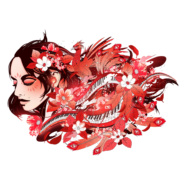
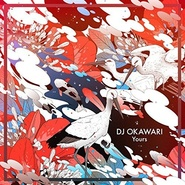
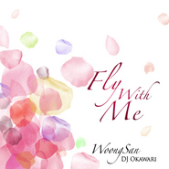
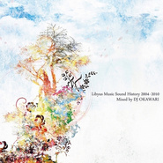

DJ OKAWARI
============================

|  |  |
| :--: | :-- |
| [<br>DJ OKAWARI](https://i.xiami.com/dj_okawari) | **地区**: Japan 日本<br>**风格**: 爵士嘻哈 Jazz Hip Hop, 嘻哈 Hip-Hop, 流行 Pop<br>**播放数**: 109417328<br>**粉丝数**: 200752<br>**评论数**: 4946<br> |

## 档案

<div>
以静冈为主要互动据点的音乐制作人 / DJ<br>
以「音乐与生活共存」为主题，用音乐表达生活中的所感之事<br>
“入睡之前的宁静” “打开一本书时，凛然的心情”<br>
他很重视在这个场景下的心情，以此为基础进行音乐创作。<br>
「DJ OKAWARI」这个名字的意思是，不满足于现状，经常探索新的事物，尝试新的挑战。<br>
至今已经发行了四张历史性的名作≪DIORAMA≫ ≪MIRROR≫≪KALEIDOSCOPE≫≪Compass≫。<br>
牢牢确立了在世界规模上JAZZ HIPHOP界的代表艺人的地位。<br>
2015年8月第一次来到上海举办公演，开票当天，门票全部售罄。<br>
2018年3月发行DJ OKAWARI × Emily Styler合作专辑≪Restore≫后，在上海、北京举办的专场演出门票全部售罄。并出演了在深圳举办的「2018后青年音乐节」，演出取得了圆满的成功。<br>
艺人经纪公司：上海乐梦实业有限公司（Bad News）　微博：@上海乐梦_Bad_News_China<br>
同时我们也乐于与大家进行关于承接Bad News签约艺人演出活动、音乐制作、以及音乐版权使用等相关合作，如有意向，请及时与我们联系
</div>

## 专辑

| 名称 | 语种 | 唱片公司 | 发行时间 | 专辑类别 | 专辑风格 |
| :--: | :-- | :-- | :-- | :-- | :-- |
| [<br>飘韵Piaoyun](./albums/2105603098.md) | 纯音乐 | HIFIVE | 2019年12月20日 | EP, 单曲 | 爵士流行 Jazz Pop, 电子 Electronic, 爵士嘻哈 Jazz Hip Hop |
| [<br>NightfallDJ OKAWARI × Celeina Ann](./albums/2104687044.md) | 英语 | HIFIVE | 2019年03月19日 | EP, 单曲 | 爵士流行 Jazz Pop, 电子 Electronic, 爵士嘻哈 Jazz Hip Hop |
| [<br>Perfect Blue](./albums/2104287979.md) | 纯音乐 | Mono Creation | 2018年10月03日 | EP, 单曲 | 爵士流行 Jazz Pop, 电子 Electronic, 爵士嘻哈 Jazz Hip Hop |
| [<br>RestoreDJ OKAWARI × Emily Styler](./albums/2103612846.md) | 英语 | Mono Creation | 2018年03月14日 | 录音室专辑 | 爵士流行 Jazz Pop, 电子 Electronic, 爵士嘻哈 Jazz Hip Hop |
| [<br>Compass](./albums/2102663359.md) | 英语 | SPACE SHOWER MUSIC | 2017年01月11日 | 录音室专辑 | 爵士流行 Jazz Pop, 爵士嘻哈 Jazz Hip Hop |
| [<br>Yours](./albums/2102658314.md) | 其他 | SPACE SHOWER MUSIC | 2016年11月30日 | EP, 单曲 | 爵士说唱 Jazz Rap |
| [<br>Change the World (Remixes)](./albums/565092.md) | 日语 | Feel Music | 2012年03月15日 | EP, 单曲 | 爵士说唱 Jazz Rap |
| [<br>Kaleidoscope](./albums/443234.md) | 英语 | Libyus Music | 2011年06月29日 | 录音室专辑 | 爵士流行 Jazz Pop, 爵士嘻哈 Jazz Hip Hop |
| [<br>Change The World웅산 with DJ Okawari](./albums/446504.md) | 韩语 | MUSICAROMA | 2011年06月15日 | EP, 单曲 | 爵士流行 Jazz Pop, 人声爵士 Vocal Jazz |
| [<br>Fly With Me웅산 With DJ OKAWARI](./albums/444484.md) | 韩语 | MUSICAROMA | 2011年06月01日 | EP, 单曲 | 爵士流行 Jazz Pop |
| [<br>A Cup Of Coffee](./albums/407982.md) | 纯音乐 | Libyus Music | 2010年09月29日 | EP, 单曲 | 爵士流行 Jazz Pop, 爵士嘻哈 Jazz Hip Hop |
| [<br>Libyus Music Sound History 2004-2010 Mixed by DJ OKAWARI](./albums/405956.md) | 英语 | Libyus Music | 2010年09月29日 | 精选集 | 爵士流行 Jazz Pop, 爵士嘻哈 Jazz Hip Hop |
| [<br>Mirror](./albums/336331.md) | 英语 | Libyus Music | 2009年06月24日 | 录音室专辑 | 爵士流行 Jazz Pop, 爵士嘻哈 Jazz Hip Hop |
| [<br>Diorama](./albums/326232.md) | 日语 | Libyus Music | 2008年05月28日 | 录音室专辑 | 爵士说唱 Jazz Rap |
| [<br>Animal Forest / Bluebird Story](./albums/344029.md) | 日语 | Libyus Music | 2008年04月28日 | 录音室专辑 | 爵士说唱 Jazz Rap |

## 评论

|  |  |  |
| :-- | :-- | :-- |
| <br>[虾米用户](https://emumo.xiami.com/u/4225791)<br>Mua~<br>2021-01-01 15:54<br>赞(0) 踩(0) | <div>什么时候再来上海呢</div> |
| <br>[虾米用户](https://emumo.xiami.com/u/316502674)<br>在最后陪着你吧，我的虾米<br>2020-12-22 18:57<br>赞(0) 踩(0) | <div>从08年专辑的曲子到19年专辑的曲子都听了一遍，发现碗叔曲风转的还是很明显的，08年的专辑音乐很明显更小清新风一些，而且运用了萨克斯，钢琴这一类古典乐器，新专的话很明显运用架子鼓，电吉他这一类现代金属乐器更多一些，而且最难得的是早期专辑运用到了很多自然采音，后期基本上见不到了。不得不说是很惋惜的。个人觉得碗叔最精华的几首曲子应该是早期的几张专里的。不过如果喜欢重鼓点很明显后期的更合适。</div> |
| ⇒ | <br>[虾米用户](https://emumo.xiami.com/u/316502674)<br>在最后陪着你吧，我的虾米<br>2020-12-22 19:11<br>赞(0) 踩(0) | <div>另外，从收藏数可以很明显看出来09和10年绝对是碗叔巅峰，最近三年的几张专只有1000多人的收藏量，很明显碗叔的质量大不如从前。当然，不排除是因为商业化（被公司签约）的原因。</div> |
| <br>[虾米用户](https://emumo.xiami.com/u/444659752)<br>我还没想好要写什么......<br>2020-12-06 16:42<br>赞(1) 踩(0) | <div>是中国人吗？日本怎么会有这种故事，不可能</div> |
| <br>[虾米用户](https://emumo.xiami.com/u/54676006)<br>冷記憶<br>2020-11-28 16:26<br>赞(0) 踩(0) | <div>：</div> |
| <br>[虾米用户](https://emumo.xiami.com/u/284019766)<br>我还没想好要写什么...<br>2020-11-12 00:57<br>赞(0) 踩(0) | <div>先生の音楽、大好きです！いつもありがとうございます。とても癒されます。</div> |
| <br>[虾米用户](https://emumo.xiami.com/u/376633276)<br>虾米  拜拜喽  我永远...<br>2020-10-23 21:33<br>赞(0) 踩(0) | <div>呜呜呜感动哭</div> |
| <br>[虾米用户](https://emumo.xiami.com/u/1394088)<br>世间智障合集<br>2020-08-16 10:52<br>赞(0) 踩(0) | <div>能把speed of light交了吗？（震声）</div> |
| ⇒ | <br>[虾米用户](https://emumo.xiami.com/u/277538886)<br>风雨里做个大人，阳光下做...<br>2020-09-07 10:28<br>赞(0) 踩(0) | <div>我已经传了哦<br>专辑分享 | 塞壬唱片-MSR-《Speed of Light》<a href="https://www.xiami.com/album/5021380296" target="_blank" rel="nofollow noreferrer noopener">https://www.xiami.com/album/5021380296</a> (分享自@虾米音乐)</div> |
| <br>[虾米用户](https://emumo.xiami.com/u/443860092)<br><br>2020-06-26 20:49<br>赞(1) 踩(0) | <div>那个胖大叔哪里去了</div> |
| <br>[虾米用户](https://emumo.xiami.com/u/7297679)<br>欢迎各位客官光临本小店 ...<br>2020-05-12 22:10<br>赞(5) 踩(0) | <div>感觉 Dj Okawari 自从早期三张 Kaleidoscope，Mirror 和 Diorama 后就一蹶不振，除了 Marumiyan 的插画还维持着水准，以前的那种 cool 似乎被丢掉了。All I have，Brighter Side， Pack Light 这类带有 R&amp;amp;B 或 Neo 感的曲子的消失的同时，加入了很多与封面并不匹配的更为俗套的作品，这使得选曲色彩失衡后与封面产生了一种违和感，让人觉得有些尴尬</div> |
| ⇒ | <br>[虾米用户](https://emumo.xiami.com/u/439961402)<br>jazz hip-hop...<br>2020-08-11 23:30<br>赞(0) 踩(0) | <div>真的吗真的吗 衡量音乐质量还要看封面了吗</div> |
| <br>[虾米用户](https://emumo.xiami.com/u/296109602)<br>感谢有你，虾米音乐。<br>2020-04-15 19:49<br>赞(0) 踩(0) | <div>okawari，可谐音奥卡哇力</div> |
| <br>[虾米用户](https://emumo.xiami.com/u/13268337)<br><br>2020-04-04 17:24<br>赞(0) 踩(0) | <div>我觉得原来那张照片还蛮好看的～</div> |
| <br>[虾米用户](https://emumo.xiami.com/u/440271992)<br>凡事皆可陈，新柚可依依？<br>2020-04-02 16:07<br>赞(1) 踩(0) | <div>Amazing ！fantastic！Unbelievable！You are so good.</div> |
| <br>[虾米用户](https://emumo.xiami.com/u/441348674)<br><br>2020-03-14 11:07<br>赞(0) 踩(0) | <div>@DJ OKAWARI    はじめまして、よろしくお願いします。私は中国人です。あなたのflower danceを聞いて、あなたの音楽が好きになりました。その後、あなたのlightning momentを聞いて、とても素晴らしいと思います。新作を楽しみにしています。</div> |
| <br>[虾米用户](https://emumo.xiami.com/u/306291497)<br>后悔带来的苦涩，是对过去...<br>2020-03-08 12:12<br>赞(0) 踩(0) | <div>太喜欢了 </div> |
| <br>[虾米用户](https://emumo.xiami.com/u/117639028)<br>我曾拥有你，想到就心酸。<br>2020-02-06 23:02<br>赞(1) 踩(0) | <div>Dj大师。从多年前的love letter 开始关注，这才是好听的音乐啊！</div> |
| <br>[虾米用户](https://emumo.xiami.com/u/311135003)<br>山有木兮卿有意，昨夜星辰...<br>2019-12-27 18:42<br>赞(0) 踩(0) | <div>超喜欢每个专辑的封面！！！</div> |
| <br>[虾米用户](https://emumo.xiami.com/u/11472475)<br>我还没想好要写什么...<br>2019-11-21 10:08<br>赞(0) 踩(0) | <div>出限量版黑胶！</div> |
| <br>[虾米用户](https://emumo.xiami.com/u/43256840)<br>听歌<br>2019-10-26 17:14<br>赞(0) 踩(0) | <div>https://ghfgfg</div> |
| <br>[虾米用户](https://emumo.xiami.com/u/140110990)<br>你看，这条鱼被上帝抛上了...<br>2019-09-17 19:13<br>赞(0) 踩(0) | <div>错过了三月的巡回好难过啊  什么时候北京有下一次呀</div> |
| <br>[虾米用户](https://emumo.xiami.com/u/43606606)<br> <br>2019-09-08 08:33<br>赞(2) 踩(0) | <div>昨晚南京场ann真是太棒了，返场的glitter好听到爆！</div> |
| <br>[虾米用户](https://emumo.xiami.com/u/251815804)<br>      <br>2019-09-07 12:47<br>赞(0) 踩(0) | <div>一个上午把所有集子刷了一遍ww</div> |
| <br>[虾米用户](https://emumo.xiami.com/u/406327979)<br>喜欢听<br>2019-08-30 22:20<br>赞(0) 踩(0) | <div>DJ OKAWARI<br>真的很棒阿</div> |
| <br>[虾米用户](https://emumo.xiami.com/u/188902054)<br>born in 2002<br>2019-08-20 22:31<br>赞(0) 踩(0) | <div>之前我听过一句话形容周董的<br>“才华就像放屁一样，憋不住的”<br>我相信这句话同样适用于这里！！<br>超级无敌巨无霸不要你以为都听我的喜欢！！！</div> |
| <br>[虾米用户](https://emumo.xiami.com/u/404026779)<br><br>2019-08-05 07:59<br>赞(0) 踩(0) | <div>好</div> |
| <br>[虾米用户](https://emumo.xiami.com/u/427298347)<br><br>2019-07-28 20:35<br>赞(0) 踩(0) | <div>音乐清新而灵动，十分喜欢！</div> |
| <br>[虾米用户](https://emumo.xiami.com/u/354561656)<br>这里是我的喜怒哀乐<br>2019-07-27 06:53<br>赞(0) 踩(0) | <div>九月成都走起</div> |
| <br>[虾米用户](https://emumo.xiami.com/u/42963872)<br>我还没想好要写什么...<br>2019-07-22 23:43<br>赞(0) 踩(0) | <div>-</div> |
| <br>[虾米用户](https://emumo.xiami.com/u/12737148)<br>乐<br>2019-07-01 01:07<br>赞(0) 踩(0) | <div>武汉vox 打卡。现场太赞</div> |
| <br>[虾米用户](https://emumo.xiami.com/u/336781084)<br>(๑´∀`๑)<br>2019-06-23 21:20<br>赞(0) 踩(0) | <div>(*╹▽╹*)</div> |
| <br>[虾米用户](https://emumo.xiami.com/u/340245228)<br>谢谢你的一路陪伴<br>2019-06-23 09:12<br>赞(0) 踩(0) | <div></div> |
| <br>[虾米用户](https://emumo.xiami.com/u/419642563)<br>尘<br>2019-06-10 21:42<br>赞(0) 踩(0) | <div>爱了爱了   我以后就是这姐姐的粉丝啦 </div> |
| ⇒ | <br>[虾米用户](https://emumo.xiami.com/u/425948904)<br>无名之辈，不足挂齿<br>2019-06-13 19:48<br>赞(0) 踩(0) | <div>DJ Okawari（碗叔）是男的 </div> |
| <br>[虾米用户](https://emumo.xiami.com/u/346985731)<br><br>2019-06-10 08:05<br>赞(2) 踩(0) | <div>我真的很想去听你的现场演奏 </div> |
| <br>[虾米用户](https://emumo.xiami.com/u/340245228)<br>谢谢你的一路陪伴<br>2019-06-01 23:06<br>赞(0) 踩(0) | <div></div> |
| <br>[虾米用户](https://emumo.xiami.com/u/404493185)<br>is me<br>2019-05-24 01:32<br>赞(0) 踩(0) | <div>出一张深圳6.27晚上的票，300</div> |
| <br>[虾米用户](https://emumo.xiami.com/u/1489142)<br>我还没想好要写什么...<br>2019-05-23 23:03<br>赞(0) 踩(0) | <div>有约长沙的嘛</div> |
| <br>[虾米用户](https://emumo.xiami.com/u/340245228)<br>谢谢你的一路陪伴<br>2019-05-12 04:38<br>赞(1) 踩(0) | <div></div> |
| <br>[虾米用户](https://emumo.xiami.com/u/356763773)<br>我还没想好要写什么...<br>2019-05-05 23:37<br>赞(0) 踩(0) | <div>♥️</div> |
| <br>[虾米用户](https://emumo.xiami.com/u/325374787)<br><br>2019-04-17 11:14<br>赞(0) 踩(0) | <div>一定</div> |
| <br>[虾米用户](https://emumo.xiami.com/u/85568296)<br>只有阳光而无阴影 只有欢...<br>2019-04-13 22:09<br>赞(1) 踩(0) | <div>  </div> |
| <br>[虾米用户](https://emumo.xiami.com/u/400354197)<br>天生热爱音乐<br>2019-04-07 10:14<br>赞(1) 踩(0) | <div>封面的确美爆了</div> |
| <br>[虾米用户](https://emumo.xiami.com/u/247546129)<br>电音.轻音乐<br>2019-03-31 10:24<br>赞(4) 踩(0) | <div>当国内年轻一代被各种软件也好，夜店也好，那种充斥着刺耳的声音洗脑时，这种轻音乐反而成了一种奢求。</div> |
| <br>[虾米用户](https://emumo.xiami.com/u/25471222)<br>对自由有多大的理解 就有...<br>2019-03-26 12:04<br>赞(2) 踩(0) | <div>高产！！</div> |
| <br>[虾米用户](https://emumo.xiami.com/u/9222287)<br> <br>2019-03-24 10:16<br>赞(3) 踩(0) | <div>昨天3.23我从青岛飞到上海，在第一排级Ayur小姐姐最近的位置，看小姐姐弹琴的感觉太棒了，藤田的sax……用现场大家喊的话形容 牛逼！妹子也比照片上好看，现场气氛嗨的不行。</div> |
| ⇒ | <br>[虾米用户](https://emumo.xiami.com/u/109811188)<br>乱世红尘真难辨，化作白鹤...<br>2019-03-26 22:47<br>赞(0) 踩(0) | <div>喊uncle、uncle。。。还真的返场的时候激动死我了！火锅好吃！牛逼！</div> |
| <br>[虾米用户](https://emumo.xiami.com/u/46480184)<br>我还没想好要写什么...<br>2019-03-23 21:49<br>赞(1) 踩(0) | <div>现场没人觉得妹子唱歌唱太多了么。。。。唱歌途中走了好多人</div> |
| ⇒ | <br>[虾米用户](https://emumo.xiami.com/u/46480184)<br>我还没想好要写什么...<br>2019-03-23 23:47<br>赞(0) 踩(0) | <div>回来回看了一下去年录的一些视频，今年的不如去年。那妹子有点喧宾夺主，乐队的部分被盖的太厉害了，搞得跟听乐队伴奏似的。今年的纯音乐实在是排的太少太少了。</div> |
| ⇒ | <br>[虾米用户](https://emumo.xiami.com/u/9222287)<br> <br>2019-03-24 10:19<br>赞(0) 踩(0) | <div><q><b>紫翎_hom说：</b></q></div> |
| <br>[虾米用户](https://emumo.xiami.com/u/5183356)<br> <br>2019-03-23 09:36<br>赞(1) 踩(0) | <div>昨天的上海场太棒啦</div> |
| <br>[虾米用户](https://emumo.xiami.com/u/7747246)<br><br>2019-03-22 20:12<br>赞(1) 踩(0) | <div>才发现来申城了 来不及订票了</div> |
| <br>[虾米用户](https://emumo.xiami.com/u/346492287)<br>虾米不要离开我！<br>2019-03-19 15:07<br>赞(2) 踩(0) | <div>虾米你输啦！</div> |
| <br>[虾米用户](https://emumo.xiami.com/u/352094528)<br><br>2019-03-17 20:56<br>赞(3) 踩(0) | <div>作者的每一首都可谓是神曲<br><br>能让人置身幻境 陶醉不以</div> |
| <br>[虾米用户](https://emumo.xiami.com/u/11138809)<br>凪洛<br>2019-03-16 23:12<br>赞(1) 踩(0) | <div>广州场有人买了票了吗？</div> |
| <br>[虾米用户](https://emumo.xiami.com/u/328857594)<br><br>2019-03-16 14:58<br>赞(0) 踩(0) | <div>6月<br>长沙</div> |
| <br>[虾米用户](https://emumo.xiami.com/u/9222287)<br> <br>2019-03-15 11:05<br>赞(3) 踩(0) | <div>2019.3.23 我从青岛去上海看碗叔表演，Vip已入手。 </div> |
| <br>[虾米用户](https://emumo.xiami.com/u/671456)<br>我还没想好要写什么...<br>2019-03-11 15:27<br>赞(2) 踩(0) | <div>好开心啊又准备有新专了，去现场我要买《Nightfall》~！！！！</div> |
| <br>[虾米用户](https://emumo.xiami.com/u/340245228)<br>谢谢你的一路陪伴<br>2019-03-09 17:51<br>赞(0) 踩(0) | <div>真的超级喜欢你的歌的</div> |
| <br>[虾米用户](https://emumo.xiami.com/u/361037631)<br><br>2019-03-08 21:04<br>赞(0) 踩(0) | <div>******</div> |
| <br>[虾米用户](https://emumo.xiami.com/u/13731582)<br>森久保直子ですが…<br>2019-03-05 09:03<br>赞(0) 踩(0) | <div>突然发现名字是dj再来一碗？2333</div> |
| <br>[虾米用户](https://emumo.xiami.com/u/24618550)<br>别欺负我年级比你大<br>2019-02-28 10:05<br>赞(0) 踩(0) | <div>新专什么时候才会发布啊，虾米</div> |
| <br>[虾米用户](https://emumo.xiami.com/u/410241116)<br>Try the best...<br>2019-02-20 20:38<br>赞(0) 踩(0) | <div>啊啊啊啊啊啊啊啊啊爱了爱了❤️❤️❤️❤️❤️❤️❤️❤️</div> |
| <br>[虾米用户](https://emumo.xiami.com/u/54546234)<br>Fuckwhatthey...<br>2019-02-19 23:15<br>赞(0) 踩(0) | <div>啦啦啦啦</div> |
| <br>[虾米用户](https://emumo.xiami.com/u/54546234)<br>Fuckwhatthey...<br>2019-02-19 23:14<br>赞(0) 踩(0) | <div>我爱yyy</div> |
| <br>[虾米用户](https://emumo.xiami.com/u/54546234)<br>Fuckwhatthey...<br>2019-02-19 23:13<br>赞(0) 踩(0) | <div>我要带你去看！！</div> |
| <br>[虾米用户](https://emumo.xiami.com/u/54546234)<br>Fuckwhatthey...<br>2019-02-19 23:13<br>赞(0) 踩(0) | <div>上海！！！！</div> |
| <br>[虾米用户](https://emumo.xiami.com/u/75097226)<br>我还没想好要写什么...<br>2019-02-17 08:39<br>赞(0) 踩(0) | <div>有北京的朋友嘛，已经买票了</div> |
| <br>[虾米用户](https://emumo.xiami.com/u/355005845)<br>每次看到曾經評論的人不再...<br>2019-02-13 17:12<br>赞(1) 踩(0) | <div>Wow原來那麼多人喜歡</div> |
| <br>[虾米用户](https://emumo.xiami.com/u/281428)<br>活得自己<br>2019-01-30 18:24<br>赞(0) 踩(0) | <div>广州3月21号的票还没开卖吗 怎么找不到入口</div> |
| <br>[虾米用户](https://emumo.xiami.com/u/9435103)<br><br>2019-01-29 18:45<br>赞(0) 踩(0) | <div>正在犹豫去不去</div> |
| <br>[虾米用户](https://emumo.xiami.com/u/109811188)<br>乱世红尘真难辨，化作白鹤...<br>2019-01-25 22:45<br>赞(1) 踩(0) | <div>买到票了，希望现场不是很吵吧。</div> |
| <br>[虾米用户](https://emumo.xiami.com/u/412618072)<br><br>2019-01-22 16:14<br>赞(0) 踩(0) | <div>好听 </div> |
| <br>[虾米用户](https://emumo.xiami.com/u/51634234)<br>我还没想好要写什么...<br>2019-01-21 04:02<br>赞(0) 踩(0) | <div>这种音乐怎么叫自己DJ了？</div> |
| <br>[虾米用户](https://emumo.xiami.com/u/36761067)<br>无论爱与不爱，都不会再见<br>2019-01-20 11:00<br>赞(0) 踩(0) | <div>哇 有北京场了   </div> |
| <br>[虾米用户](https://emumo.xiami.com/u/45435466)<br>Learn By Hea...<br>2019-01-20 08:19<br>赞(0) 踩(0) | <div>今年新专巡演还是perfect blue么？</div> |
| <br>[虾米用户](https://emumo.xiami.com/u/32412510)<br>有心情看书，有时间旅行，...<br>2019-01-19 17:01<br>赞(0) 踩(0) | <div>おおおおおおお〜来たぞ(((o(*ﾟ▽ﾟ*)o)))♡</div> |
| <br>[虾米用户](https://emumo.xiami.com/u/19153813)<br> <br>2019-01-19 16:07<br>赞(0) 踩(0) | <div>3月份上海站门票已买，有一起去的小伙伴联系我呀~</div> |
| ⇒ | <br>[虾米用户](https://emumo.xiami.com/u/117270244)<br>我己经想好要写什么了.....<br>2019-01-21 12:25<br>赞(0) 踩(0) | <div>我怎么买不了的 </div> |
| ⇒ | <br>[虾米用户](https://emumo.xiami.com/u/19153813)<br> <br>2019-02-05 08:28<br>赞(0) 踩(0) | <div><q><b>阿清说：</b></q></div> |
| <br>[虾米用户](https://emumo.xiami.com/u/33611592)<br>音乐是药<br>2019-01-19 12:52<br>赞(0) 踩(0) | <div>哇！！！今年又要来！</div> |
| <br>[虾米用户](https://emumo.xiami.com/u/13731582)<br>森久保直子ですが…<br>2019-01-19 12:35<br>赞(0) 踩(0) | <div>3月上海站纠结要不要去……</div> |
| <br>[虾米用户](https://emumo.xiami.com/u/8326332)<br>后来，即便是音乐，也无法...<br>2019-01-19 11:52<br>赞(0) 踩(0) | <div>圈</div> |
| <br>[虾米用户](https://emumo.xiami.com/u/117270244)<br>我己经想好要写什么了.....<br>2019-01-19 11:41<br>赞(0) 踩(0) | <div>怎么购19年的票 </div> |
| <br>[虾米用户](https://emumo.xiami.com/u/299447093)<br>我这么爱听歌一定会幸运的...<br>2019-01-07 00:32<br>赞(3) 踩(0) | <div>纯音乐最大的魅力或许在于，没有只言片语但是已经胜过千言万语，没有一个字也能掀起内心的汹涌……</div> |
| ⇒ | <br>[虾米用户](https://emumo.xiami.com/u/419603432)<br>凉夕()天蝎座♏<br>2019-04-01 22:48<br>赞(0) 踩(0) | <div>同感，音乐对我来说是非一般的重要  [文字up]</div> |
| <br>[虾米用户](https://emumo.xiami.com/u/299447093)<br>我这么爱听歌一定会幸运的...<br>2019-01-07 00:31<br>赞(1) 踩(0) | <div>从Flower Dance入坑，真的大开眼界！这是国人创作出来的纯音乐哇！或许还有很多像大叔（没有见过本人）这样优秀的创作人在默默努力，宝藏终有一天会被发现的！等我再有文化些了再来夸 </div> |
| ⇒ | <br>[虾米用户](https://emumo.xiami.com/u/293611068)<br>懒货，不喜欢发任何感言。<br>2019-02-08 11:53<br>赞(0) 踩(0) | <div>这大叔是日本的不是国人</div> |
| <br>[虾米用户](https://emumo.xiami.com/u/21180049)<br>electric con...<br>2019-01-04 16:54<br>赞(0) 踩(0) | <div>这个是大神</div> |
| <br>[虾米用户](https://emumo.xiami.com/u/6476743)<br><br>2018-12-13 15:26<br>赞(1) 踩(0) | <div>8年前就喜欢的碗神，现在一看粉丝翻了十倍多...可惜今年的现场没时间去啊...</div> |
| <br>[虾米用户](https://emumo.xiami.com/u/325564505)<br>长街短梦<br>2018-12-10 11:48<br>赞(1) 踩(0) | <div>竟没能早一点了解到深入灵魂的音乐</div> |
| <br>[虾米用户](https://emumo.xiami.com/u/261919097)<br>高嘉毅<br>2018-12-05 21:29<br>赞(3) 踩(0) | <div>喜欢的点个赞！</div> |
| <br>[虾米用户](https://emumo.xiami.com/u/261919097)<br>高嘉毅<br>2018-12-04 22:08<br>赞(3) 踩(0) | <div>我是真心喜欢，对灵魂美化，打动人的心，世界上独一无二的歌呀！</div> |
| <br>[虾米用户](https://emumo.xiami.com/u/261919097)<br>高嘉毅<br>2018-12-04 22:03<br>赞(3) 踩(0) | <div>我，能从愉快中听出悲伤，可，这些歌都散发着美好、浓浓的香气啊！感谢作者。 </div> |
| <br>[虾米用户](https://emumo.xiami.com/u/261919097)<br>高嘉毅<br>2018-12-04 22:00<br>赞(1) 踩(0) | <div>我个人喜欢钢琴曲，轻音乐，到了这里，我就是天堂中的神啊！希望各位能珍惜，多多收藏哦！   </div> |
| <br>[虾米用户](https://emumo.xiami.com/u/328728188)<br><br>2018-12-01 19:06<br>赞(0) 踩(0) | <div>歌好听，专辑封面也好好看，让人有点开每个专辑集邮的冲动</div> |
| <br>[虾米用户](https://emumo.xiami.com/u/37594142)<br>谁能不爱音乐呢<br>2018-11-25 22:46<br>赞(0) 踩(0) | <div>成都场打个卡，爽翻。</div> |
| <br>[虾米用户](https://emumo.xiami.com/u/8811330)<br>竟然被你找到了<br>2018-11-25 14:30<br>赞(1) 踩(0) | <div>成都成都</div> |
| <br>[虾米用户](https://emumo.xiami.com/u/37181980)<br>6块腹肌。。。想摸<br>2018-11-25 00:47<br>赞(1) 踩(0) | <div>11/24重庆场，有没有哪个在前排的小哥哥小姐姐，发我一些清晰的视频啊！我一个小个子淹没在后排的高个子中不知所措，而且拍的视频基本都是手机和脑壳，把人挡完了(ಥ_ಥ)以及，其实最开始我也觉得有人声的曲子很一般般。但是！听了现场以后！真的觉得这样出专辑是有理由的！是非常正确的！  </div> |
| <br>[虾米用户](https://emumo.xiami.com/u/12476165)<br> <br>2018-11-24 15:00<br>赞(1) 踩(0) | <div>昨晚的杭州现场，和碗叔握手时有很郑重地道谢</div> |
| <br>[虾米用户](https://emumo.xiami.com/u/1485049)<br><br>2018-11-24 09:39<br>赞(1) 踩(0) | <div>南京站打卡，终于见到真人了，签名到手 </div> |
| <br>[虾米用户](https://emumo.xiami.com/u/43108933)<br>再来一碗<br>2018-11-23 20:02<br>赞(0) 踩(0) | <div>碗叔 在杭州，我来了  </div> |
| <br>[虾米用户](https://emumo.xiami.com/u/5497768)<br>大诗人<br>2018-11-18 01:07<br>赞(0) 踩(0) | <div>1122南京的有吗 多了张票</div> |
| <br>[虾米用户](https://emumo.xiami.com/u/8457664)<br> 所感即所有<br>2018-11-16 20:47<br>赞(0) 踩(0) | <div>这个月没法去现场了(╥﹏╥)求同好捎带几张专(╥﹏╥)方便的可以戳我。。。</div> |
| <br>[虾米用户](https://emumo.xiami.com/u/272144626)<br>挚爱伯贤<br>2018-11-12 14:15<br>赞(0) 踩(0) | <div>总有种直击心灵的感觉</div> |
| ⇒ | <br>[虾米用户](https://emumo.xiami.com/u/377666820)<br>不过尔尔<br>2018-11-14 22:54<br>赞(0) 踩(0) | <div>家人好</div> |
| <br>[虾米用户](https://emumo.xiami.com/u/21849108)<br>小神童!!!!最初的梦想...<br>2018-11-08 22:44<br>赞(0) 踩(0) | <div>？ </div> |
| <br>[虾米用户](https://emumo.xiami.com/u/32704477)<br>像熟悉了一个世纪<br>2018-11-07 17:03<br>赞(3) 踩(0) | <div>今天买了你的11.22在南京的音乐会<br>可能是激动傻了 刚刚等公交车明明来了<br>我没上 还和司机确认过眼神 也没上<br>就这样傻傻地看着公交车尾灯才反应过来<br>真的太激动了 马上就能见到你了</div> |
| <br>[虾米用户](https://emumo.xiami.com/u/355730215)<br><br>2018-11-07 15:58<br>赞(0) 踩(0) | <div>什么时候发布perfect blue啊？</div> |
| <br>[虾米用户](https://emumo.xiami.com/u/117270244)<br>我己经想好要写什么了.....<br>2018-11-04 23:52<br>赞(0) 踩(0) | <div>什么时候在来广州这边噢 </div> |
| ⇒ | <br>[虾米用户](https://emumo.xiami.com/u/136719404)<br>看的见是生活，看不见的是...<br>2018-11-10 19:50<br>赞(0) 踩(0) | <div>广州马上开演唱会了</div> |
| ⇒ | <br>[虾米用户](https://emumo.xiami.com/u/1485049)<br><br>2018-11-24 09:38<br>赞(0) 踩(0) | <div><q><b>闪亮的铁轨说：</b></q></div> |
| <br>[虾米用户](https://emumo.xiami.com/u/33234927)<br>……<br>2018-11-04 17:13<br>赞(0) 踩(0) | <div>嗯！(｡･ω･｡)上海只要硬糖不爱花香？(´-ω-`)</div> |
| <br>[虾米用户](https://emumo.xiami.com/u/372734908)<br><br>2018-10-30 21:03<br>赞(0) 踩(0) | <div>艺人介绍居然出现了html代码 </div> |
| <br>[虾米用户](https://emumo.xiami.com/u/407076419)<br>我还没想好要写什么...<br>2018-10-27 09:25<br>赞(1) 踩(0) | <div>每一首歌，都是一个故事。故事的结尾，总是孤独与安静，但自己却喜欢这份穿透灵魂的孤独。starry sky 是最喜欢的一首，布满星辰的天空。一个人，一首歌，一个下午，亦或是一个宁静的夜晚，我什么也不想，什么都想。只想我一个人享受那份安静与心灵的透彻。</div> |
| <br>[虾米用户](https://emumo.xiami.com/u/7571716)<br>因为穷所以宅！<br>2018-10-07 21:16<br>赞(0) 踩(0) | <div>杭州的票卖完了吗！？点开公告栏的链接啥也没有啊。</div> |
| <br>[虾米用户](https://emumo.xiami.com/u/53001049)<br><br>2018-10-05 09:52<br>赞(0) 踩(0) | <div>想知道给您画专辑封面的是哪位插画师～风格不要太赞!</div> |
| ⇒ | <br>[虾米用户](https://emumo.xiami.com/u/277538886)<br>风雨里做个大人，阳光下做...<br>2018-10-05 12:32<br>赞(0) 踩(0) | <div>碗叔的好友插画师叫MARUMIYAN</div> |
| ⇒ | <br>[虾米用户](https://emumo.xiami.com/u/53001049)<br><br>2018-10-05 13:22<br>赞(0) 踩(0) | <div><q><b>Steven_枫说：</b></q></div> |
| <br>[虾米用户](https://emumo.xiami.com/u/10340126)<br>爵士乐好过正义<br>2018-09-29 22:38<br>赞(0) 踩(0) | <div>今年国内第一站昆明打卡完成<br><br>碗叔超牛逼超可爱！</div> |
| <br>[虾米用户](https://emumo.xiami.com/u/365450512)<br><br>2018-09-29 20:25<br>赞(54) 踩(0) | <div>10月3日(水)　最新作「Perfect Blue」 CD発売（数量限定）となります！ よろしくお願いします！！</div> |
| <br>[虾米用户](https://emumo.xiami.com/u/186132014)<br><br>2018-09-28 21:17<br>赞(0) 踩(0) | <div>这个我心中的日式曲风相去万里</div> |
| <br>[虾米用户](https://emumo.xiami.com/u/314222808)<br><br>2018-09-22 18:04<br>赞(2) 踩(0) | <div>属于纯音乐的震撼</div> |
| <br>[虾米用户](https://emumo.xiami.com/u/273985575)<br>花开花谢花满天<br>2018-09-21 10:05<br>赞(0) 踩(0) | <div>想买票！重庆站！很多都不知道哪里买，求告知</div> |
| ⇒ | <br>[虾米用户](https://emumo.xiami.com/u/5050275)<br><br>2018-09-21 22:28<br>赞(0) 踩(0) | <div>下载秀动App，直接在里面买</div> |
| ⇒ | <br>[虾米用户](https://emumo.xiami.com/u/235383620)<br> <br>2018-09-30 10:30<br>赞(0) 踩(0) | <div>买到重庆票没？ 想知道在那买</div> |
| ⇒ | <br>[虾米用户](https://emumo.xiami.com/u/273985575)<br>花开花谢花满天<br>2018-10-02 10:02<br>赞(0) 踩(0) | <div><q><b>单元说：</b></q></div> |
| ⇒ | <br>[虾米用户](https://emumo.xiami.com/u/273985575)<br>花开花谢花满天<br>2018-10-02 10:04<br>赞(0) 踩(0) | <div><q><b>跳来跳去的人说：</b></q></div> |
| ⇒ | <br>[虾米用户](https://emumo.xiami.com/u/235383620)<br> <br>2018-10-03 17:45<br>赞(0) 踩(0) | <div><q><b>叶景说：</b></q></div> |
| <br>[虾米用户](https://emumo.xiami.com/u/273985575)<br>花开花谢花满天<br>2018-09-21 10:05<br>赞(0) 踩(0) | <div>重庆站的票在哪里买呀！</div> |
| <br>[虾米用户](https://emumo.xiami.com/u/33611592)<br>音乐是药<br>2018-09-18 11:35<br>赞(0) 踩(0) | <div>周二，气吐血！！</div> |
| <br>[虾米用户](https://emumo.xiami.com/u/33611592)<br>音乐是药<br>2018-09-18 11:34<br>赞(0) 踩(0) | <div>！！！巡演！！</div> |
| <br>[虾米用户](https://emumo.xiami.com/u/37972570)<br><br>2018-09-18 08:09<br>赞(0) 踩(0) | <div>广州因台风山竹取消了演出</div> |
| <br>[虾米用户](https://emumo.xiami.com/u/270949732)<br>我还没想好要写什么...<br>2018-09-18 06:59<br>赞(0) 踩(0) | <div>啊杭州</div> |
| <br>[虾米用户](https://emumo.xiami.com/u/1418202)<br> 江山共老<br>2018-09-18 01:59<br>赞(0) 踩(0) | <div>今年广州不搞啦，。？</div> |
| <br>[虾米用户](https://emumo.xiami.com/u/365450512)<br><br>2018-09-18 01:42<br>赞(4) 踩(0) | <div>ありがとう中国！またパワーアップして戻ってきます！ ​​​​</div> |
| ⇒ | <br>[虾米用户](https://emumo.xiami.com/u/34161917)<br> <br>2018-09-18 01:53<br>赞(0) 踩(0) | <div>  </div> |
| ⇒ | <br>[虾米用户](https://emumo.xiami.com/u/1418202)<br> 江山共老<br>2018-09-18 02:00<br>赞(0) 踩(0) | <div>希望广州场重开</div> |
| <br>[虾米用户](https://emumo.xiami.com/u/33864541)<br>我头像像不像CD<br>2018-09-16 21:40<br>赞(0) 踩(0) | <div>我就想问 今晚的广州场 还继续在吗(⊙o⊙)！</div> |
| ⇒ | <br>[虾米用户](https://emumo.xiami.com/u/6485455)<br>电子乐狂欢中~<br>2018-09-17 00:13<br>赞(0) 踩(0) | <div>我也想问</div> |
| <br>[虾米用户](https://emumo.xiami.com/u/61824342)<br>The flavor o...<br>2018-09-13 15:40<br>赞(0) 踩(0) | <div>这次中国之行竟然没有上海，好吧，打车去最近的杭州看小胖子 </div> |
| <br>[虾米用户](https://emumo.xiami.com/u/1418202)<br> 江山共老<br>2018-09-11 09:09<br>赞(0) 踩(0) | <div>转张广州票</div> |
| <br>[虾米用户](https://emumo.xiami.com/u/257312315)<br><br>2018-09-10 11:29<br>赞(0) 踩(0) | <div>他专辑封面这种绘画叫什么？</div> |
| <br>[虾米用户](https://emumo.xiami.com/u/4412959)<br>fresh steame...<br>2018-09-08 18:07<br>赞(1) 踩(0) | <div>求深圳伙伴一起去鸭！和我一起组队别丢下我！</div> |
| <br>[虾米用户](https://emumo.xiami.com/u/5604492)<br>‪‪♬✧訂閱號：Morn...<br>2018-09-04 18:30<br>赞(1) 踩(0) | <div>perfect blue</div> |
| <br>[虾米用户](https://emumo.xiami.com/u/154175526)<br>艺术是生活的鸦片<br>2018-09-04 12:49<br>赞(0) 踩(0) | <div>今年赶不上了，明年也来，好吗？</div> |
| <br>[虾米用户](https://emumo.xiami.com/u/13111079)<br>有缘再见<br>2018-09-02 12:55<br>赞(0) 踩(0) | <div>新专呢 (˘̩̩̩&amp;epsilon;˘̩ƪ)</div> |
| <br>[虾米用户](https://emumo.xiami.com/u/84571136)<br>唯有音乐不离不弃<br>2018-09-01 20:57<br>赞(0) 踩(0) | <div>DJ OKAWARI &amp;ndash; Perfect Blue</div> |
| <br>[虾米用户](https://emumo.xiami.com/u/351615393)<br><br>2018-08-28 23:01<br>赞(1) 踩(0) | <div>很喜欢，特别是情书和花之舞</div> |
| <br>[虾米用户](https://emumo.xiami.com/u/362221456)<br>我还没想好要写什么...<br>2018-08-27 23:33<br>赞(0) 踩(0) | <div>有一张昆明9月14日的现场票 有事去不了 低价转让</div> |
| <br>[虾米用户](https://emumo.xiami.com/u/199997419)<br><br>2018-08-12 00:06<br>赞(0) 踩(0) | <div>很喜欢你的音乐，很有魔力，使人遐想很多！什么心情听都会有所变化。谢谢带给我们这个纯净的心灵音乐！</div> |
| <br>[虾米用户](https://emumo.xiami.com/u/11009962)<br>我还没想好要写什么...<br>2018-08-11 22:12<br>赞(1) 踩(0) | <div>深圳的有没有组团？</div> |
| ⇒ | <br>[虾米用户](https://emumo.xiami.com/u/4412959)<br>fresh steame...<br>2018-09-08 18:07<br>赞(0) 踩(0) | <div>有。刚买了VIP票</div> |
| <br>[虾米用户](https://emumo.xiami.com/u/260828419)<br>Tomorrow is ...<br>2018-08-10 10:25<br>赞(3) 踩(0) | <div>单看历年来的专辑封面已是一种享受......</div> |
| <br>[虾米用户](https://emumo.xiami.com/u/356378655)<br><br>2018-08-10 08:19<br>赞(1) 踩(0) | <div>私は本当にあなたの歌が大好きです。とてもあっさりしていて、そんな感じ、外国へのDJはまったく違う</div> |
| <br>[虾米用户](https://emumo.xiami.com/u/365450512)<br><br>2018-08-09 15:17<br>赞(3) 踩(0) | <div>8月31日発売のNEW ALBUM「Perfect Blue」と DJ OKAWARI &amp;amp; Emily Styler「Restore」を携えて、豪華バンドメンバーで。<br><br>9/14 昆明 ModernSkyLab<br>9/15 深圳 A8Live<br>9/16 广州 MAO<br>11/22 南京 欧拉艺术空间<br>11/23 杭州 MAO<br>11/24 重庆 MAO<br>11/25 成都 正火艺术中心<br><a href="https://www.showstart.com/event/list?type=1&amp;amp;tag=20867" target="_blank" rel="nofollow noreferrer noopener">https://www.showstart.com/event/list?type=1&amp;amp;tag=20867</a></div> |
| <br>[虾米用户](https://emumo.xiami.com/u/2586459)<br>我还没想好要写什么...<br>2018-08-05 23:09<br>赞(0) 踩(0) | <div>从以前到现在只要听到你的，我就不会切。</div> |
| <br>[虾米用户](https://emumo.xiami.com/u/336893884)<br>冷たい<br>2018-08-03 16:45<br>赞(0) 踩(0) | <div>武漢に着てください  昔からすっとあなたの作品を注意します、最高です!</div> |
| <br>[虾米用户](https://emumo.xiami.com/u/358600813)<br><br>2018-07-29 14:15<br>赞(0) 踩(0) | <div>这是那时候很喜欢的</div> |
| <br>[虾米用户](https://emumo.xiami.com/u/3254166)<br>遇见与自己有共同音乐品味...<br>2018-07-22 20:20<br>赞(0) 踩(0) | <div>昆明见</div> |
| <br>[虾米用户](https://emumo.xiami.com/u/3254166)<br>遇见与自己有共同音乐品味...<br>2018-07-22 20:20<br>赞(0) 踩(0) | <div>一看到就买了   期待和你握手签名  </div> |
| <br>[虾米用户](https://emumo.xiami.com/u/9163738)<br>我还没想好要写什么...<br>2018-07-06 02:22<br>赞(2) 踩(0) | <div>成都的盆友们！7月西原，10月re：plus，11月DJ OKWARI～哈哈必须都去！</div> |
| ⇒ | <br>[虾米用户](https://emumo.xiami.com/u/671456)<br>我还没想好要写什么...<br>2018-08-01 14:09<br>赞(0) 踩(0) | <div>很羡慕！在广州西原、碗叔的票都买了，但没钱去成都也见RE:PLUS</div> |
| ⇒ | <br>[虾米用户](https://emumo.xiami.com/u/9163738)<br>我还没想好要写什么...<br>2018-08-08 20:15<br>赞(0) 踩(0) | <div><q><b>CK Cheung说：</b></q></div> |
| <br>[虾米用户](https://emumo.xiami.com/u/4401950)<br><br>2018-07-05 23:24<br>赞(0) 踩(0) | <div>9月14号昆明有木有约啊[带墨镜笑][带墨镜笑]</div> |
| ⇒ | <br>[虾米用户](https://emumo.xiami.com/u/3254166)<br>遇见与自己有共同音乐品味...<br>2018-07-22 20:18<br>赞(0) 踩(0) | <div>我我我</div> |
| ⇒ | <br>[虾米用户](https://emumo.xiami.com/u/4401950)<br><br>2018-07-23 01:39<br>赞(0) 踩(0) | <div><q><b>mathias说：</b></q></div> |
| ⇒ | <br>[虾米用户](https://emumo.xiami.com/u/9178099)<br>serious libi...<br>2018-07-24 09:44<br>赞(0) 踩(0) | <div>&amp;zwj;♀️&amp;zwj;♀️哟吼 一起嘛</div> |
| ⇒ | <br>[虾米用户](https://emumo.xiami.com/u/4401950)<br><br>2018-07-24 11:01<br>赞(0) 踩(0) | <div><q><b>椿 ◐说：</b></q></div> |
| <br>[虾米用户](https://emumo.xiami.com/u/4401950)<br><br>2018-07-05 01:23<br>赞(0) 踩(0) | <div>昆明有木有人约啊[带墨镜笑][带墨镜笑]</div> |
| <br>[虾米用户](https://emumo.xiami.com/u/295542159)<br>Ciao<br>2018-07-03 18:04<br>赞(0) 踩(0) | <div>说什么砸锅卖铁也要搞一张门票</div> |
| <br>[虾米用户](https://emumo.xiami.com/u/3570849)<br><br>2018-07-02 09:33<br>赞(0) 踩(0) | <div>以寂静岭为据点对嘛=W=</div> |
| <br>[虾米用户](https://emumo.xiami.com/u/1448874)<br>暂无签名~<br>2018-07-02 09:07<br>赞(0) 踩(0) | <div>为啥重庆的票搜不到啊QAQ</div> |
| ⇒ | <br>[虾米用户](https://emumo.xiami.com/u/1115247)<br>@Nebula_7293<br>2018-07-02 12:34<br>赞(0) 踩(0) | <div>随便选一场点进去 拉到底部</div> |
| ⇒ | <br>[虾米用户](https://emumo.xiami.com/u/1448874)<br>暂无签名~<br>2018-07-03 00:10<br>赞(0) 踩(0) | <div><q><b>Nebula_7293说：</b></q></div> |
| <br>[虾米用户](https://emumo.xiami.com/u/170542216)<br><br>2018-07-01 20:03<br>赞(1) 踩(0) | <div>要来中国！！！可惜日期都定在上学的时候。。</div> |
| <br>[虾米用户](https://emumo.xiami.com/u/8108924)<br>我就是我，不假思索~<br>2018-07-01 17:53<br>赞(4) 踩(0) | <div>再来一碗哥广州场组个群＋WeChat：rocksai，来啊兄弟姐妹hhh</div> |
| <br>[虾米用户](https://emumo.xiami.com/u/8326332)<br>后来，即便是音乐，也无法...<br>2018-07-01 16:28<br>赞(2) 踩(0) | <div>来中国赚钱咯</div> |
| <br>[虾米用户](https://emumo.xiami.com/u/365450512)<br><br>2018-07-01 15:43<br>赞(73) 踩(0) | <div>新曲公開です！DJ OKAWARI「Altair feat. Lee Ayur &amp;amp; JABBERLOOP」<a href="https://www.xiami.com/mv/K6h6Xj?spm=a1z1s.6639561.0.0.nV1iTn" target="_blank" rel="nofollow noreferrer noopener">https://www.xiami.com/mv/K6h6Xj?spm=a1z1s.6639561.0.0.nV1iTn</a></div> |
| <br>[虾米用户](https://emumo.xiami.com/u/2327863)<br>OneForFunk F...<br>2018-06-29 17:56<br>赞(0) 踩(0) | <div>成都见</div> |
| <br>[虾米用户](https://emumo.xiami.com/u/305534949)<br>速食短季浪漫主义懒人后期...<br>2018-06-28 18:14<br>赞(0) 踩(0) | <div>买了9月mao的票，有没有妹子需要提包的</div> |
| <br>[虾米用户](https://emumo.xiami.com/u/12464012)<br>这个世界太疯狂<br>2018-06-28 17:46<br>赞(0) 踩(0) | <div>想不到居然要来啊哇哈哈</div> |
| <br>[虾米用户](https://emumo.xiami.com/u/7872701)<br>多一份远见，就少一分刺激<br>2018-06-28 16:29<br>赞(0) 踩(0) | <div>BAD NEWS终于良心了！成都见！</div> |
| <br>[虾米用户](https://emumo.xiami.com/u/8542277)<br>一<br>2018-06-28 13:40<br>赞(1) 踩(0) | <div>9月14日 昆明@ModernSkyLab<br>9月15日 深圳@A8Live<br>9月16日 广州@MAOLivehouse<br>11月22日 南京@欧拉艺术空间<br>11月23日 杭州@MAOLivehouse<br>11月24日 重庆@MAOLivehouse<br>11月25日 成都@正火艺术中心<br>开心</div> |
| ⇒ | <br>[虾米用户](https://emumo.xiami.com/u/305519973)<br><br>2018-07-31 21:40<br>赞(0) 踩(0) | <div>今年吗？？？</div> |
| ⇒ | <br>[虾米用户](https://emumo.xiami.com/u/8542277)<br>一<br>2018-07-31 21:49<br>赞(0) 踩(0) | <div><q><b>感谢我的救主说：</b></q></div> |
| ⇒ | <br>[虾米用户](https://emumo.xiami.com/u/305519973)<br><br>2018-07-31 21:50<br>赞(0) 踩(0) | <div><q><b>LsToa说：</b></q></div> |
| <br>[虾米用户](https://emumo.xiami.com/u/17236518)<br>若我的光曝在你身上，重逢...<br>2018-06-27 13:08<br>赞(0) 踩(0) | <div>谢谢你</div> |
| <br>[虾米用户](https://emumo.xiami.com/u/376448218)<br>如果前行不回头。<br>2018-06-22 11:32<br>赞(0) 踩(0) | <div>有宁静与梦幻的优美境界，让人感动，心旷神怡。加油↖(^&amp;omega;^)↗，期待更多好听的歌！   </div> |
| <br>[虾米用户](https://emumo.xiami.com/u/21926598)<br>peace ☮<br>2018-06-20 22:40<br>赞(0) 踩(0) | <div>天哪  7月15日   ❤</div> |
| <br>[虾米用户](https://emumo.xiami.com/u/299602733)<br>喵呜~(๑＞ڡ＜)☆ <br>2018-06-13 19:16<br>赞(0) 踩(0) | <div>嗯，封面真的超棒！<br>浓浓的气质！</div> |
| <br>[虾米用户](https://emumo.xiami.com/u/354396796)<br>时间匆匆<br>2018-06-10 20:16<br>赞(1) 踩(0) | <div>大叔最近可好</div> |
| <br>[虾米用户](https://emumo.xiami.com/u/326914454)<br><br>2018-05-21 06:52<br>赞(0) 踩(0) | <div>大爱</div> |
| <br>[虾米用户](https://emumo.xiami.com/u/1145034)<br>pass out<br>2018-05-19 06:03<br>赞(0) 踩(0) | <div>新作一般吧，怪不得没人喜欢了。</div> |
| <br>[虾米用户](https://emumo.xiami.com/u/365450512)<br><br>2018-05-14 11:08<br>赞(372) 踩(0) | <div>新作の制作 佳境に入っています。暑くなった頃にお届けできると思います。それに合わせて海外ツアーも予定されています。お楽しみに！！ ​​​​</div> |
| ⇒ | <br>[虾米用户](https://emumo.xiami.com/u/10204110)<br>纯音乐<br>2018-05-25 21:44<br>赞(0) 踩(0) | <div>    </div> |
| ⇒ | <br>[虾米用户](https://emumo.xiami.com/u/327983256)<br>祈祷<br>2018-06-02 20:12<br>赞(0) 踩(0) | <div></div> |
| ⇒ | <br>[虾米用户](https://emumo.xiami.com/u/342288145)<br><br>2018-06-05 06:32<br>赞(0) 踩(0) | <div>あなたに会いたいですが、どんな優しい人がこんな曲を作ってくれるのでしょうか？来年の桜の花が咲き乱れる時、私に会いに来てください。</div> |
| ⇒ | <br>[虾米用户](https://emumo.xiami.com/u/202672701)<br>该说再见了<br>2018-06-06 10:56<br>赞(0) 踩(0) | <div>  </div> |
| ⇒ | <br>[虾米用户](https://emumo.xiami.com/u/305534949)<br>速食短季浪漫主义懒人后期...<br>2018-06-28 18:13<br>赞(0) 踩(0) | <div>买了9月mao的票，你快来</div> |
| ⇒ | <br>[虾米用户](https://emumo.xiami.com/u/325737718)<br><br>2018-07-03 01:12<br>赞(0) 踩(0) | <div>I'm waiting very long time already</div> |
| ⇒ | <br>[虾米用户](https://emumo.xiami.com/u/375231717)<br>小学生听歌王<br>2018-07-09 21:56<br>赞(0) 踩(0) | <div>(&amp;acute;&amp;epsilon;｀ )♡</div> |
| ⇒ | <br>[虾米用户](https://emumo.xiami.com/u/12280557)<br><br>2018-07-10 23:01<br>赞(0) 踩(0) | <div><q><b>紫苏说：</b></q></div> |
| ⇒ | <br>[虾米用户](https://emumo.xiami.com/u/284192041)<br><br>2018-07-24 01:44<br>赞(0) 踩(0) | <div>音楽は国境を知らないので、もっと美しい音楽を作りたいと思っています。</div> |
| ⇒ | <br>[虾米用户](https://emumo.xiami.com/u/154227638)<br>音樂可治人心人生。得到了...<br>2018-10-08 02:27<br>赞(0) 踩(0) | <div>love you</div> |
| ⇒ | <br>[虾米用户](https://emumo.xiami.com/u/376175592)<br>无<br>2019-07-08 13:36<br>赞(0) 踩(0) | <div>进入了新的制作佳境，我想等天气变热的时候就能送到。我最近还计划到国外旅游。祝你愉快。(翻译有误请指正)（∩▽∩）</div> |
| ⇒ | <br>[虾米用户](https://emumo.xiami.com/u/283907753)<br>努力做好眼前事，健康生活<br>2019-12-20 20:19<br>赞(0) 踩(0) | <div><q><b>～说：</b></q></div> |
| <br>[虾米用户](https://emumo.xiami.com/u/10134325)<br><br>2018-05-09 00:17<br>赞(0) 踩(0) | <div>封面都超级好看！</div> |
| <br>[虾米用户](https://emumo.xiami.com/u/73084978)<br>R2 beat 10年手...<br>2018-05-06 23:32<br>赞(0) 踩(0) | <div>いい音楽いてくれて、本当にありがとう。</div> |
| <br>[虾米用户](https://emumo.xiami.com/u/73854714)<br>我还没想好要写什么...<br>2018-04-30 18:26<br>赞(0) 踩(0) | <div>可以</div> |
| <br>[虾米用户](https://emumo.xiami.com/u/44184421)<br>大雅之爱<br>2018-04-23 19:39<br>赞(0) 踩(0) | <div>有机会一定去</div> |
| <br>[虾米用户](https://emumo.xiami.com/u/44184421)<br>大雅之爱<br>2018-04-23 19:30<br>赞(0) 踩(0) | <div>最爱</div> |
| <br>[虾米用户](https://emumo.xiami.com/u/3500309)<br>暂无签名~<br>2018-04-14 14:47<br>赞(0) 踩(0) | <div>楼下朋友OKawar日本DJ歌手来深圳表演吗，我想这样音乐应该晚上听比较好，感受纯音乐加摇滚新元素节奏。</div> |
| <br>[虾米用户](https://emumo.xiami.com/u/9840090)<br>Thug life.<br>2018-03-24 23:07<br>赞(1) 踩(0) | <div>看完okawari在深圳后青年音乐节的现场，港真个人有点失望。因为老粉了以前的砖都是有很浓的爵士嘻哈元素，而且有东方古典美。现场演奏的都是新专的曲目，而新专感觉更偏向日本流行乐了，失去了原有的特色之处。也没很惊艳的表现。</div> |
| ⇒ | <br>[虾米用户](https://emumo.xiami.com/u/7133174)<br>我还没想好要写什么...<br>2018-03-26 13:44<br>赞(0) 踩(0) | <div>妹子很漂亮haha</div> |
| ⇒ | <br>[虾米用户](https://emumo.xiami.com/u/21926598)<br>peace ☮<br>2018-06-21 09:17<br>赞(0) 踩(0) | <div>請問深圳場大概是多少人? okawari在台灣似乎沒啥人氣......07.15台北場的場地最多容納600人而，<br>而且票19號開賣剛看都還有 有點擔心當天人太少</div> |
| ⇒ | <br>[虾米用户](https://emumo.xiami.com/u/9840090)<br>Thug life.<br>2018-06-21 09:32<br>赞(0) 踩(0) | <div><q><b>momo说：</b></q></div> |
| ⇒ | <br>[虾米用户](https://emumo.xiami.com/u/21926598)<br>peace ☮<br>2018-06-21 12:52<br>赞(0) 踩(0) | <div><q><b>鹈鹕心脏酱说：</b></q></div> |
| <br>[虾米用户](https://emumo.xiami.com/u/5585654)<br>jazz-rap/pos...<br>2018-03-24 19:05<br>赞(0) 踩(0) | <div>就在现场，很快见到本尊了 </div> |
| <br>[虾米用户](https://emumo.xiami.com/u/5092912)<br> <br>2018-03-23 20:36<br>赞(1) 踩(0) | <div>今晚见！</div> |
| <br>[虾米用户](https://emumo.xiami.com/u/1620556)<br>我是真还没想好要写什么....<br>2018-03-23 19:19<br>赞(1) 踩(0) | <div>晚上见</div> |
| <br>[虾米用户](https://emumo.xiami.com/u/4131849)<br>网易云：非人類兔子Agy...<br>2018-03-18 16:02<br>赞(2) 踩(0) | <div>3.23 上海啊啊啊</div> |
| <br>[虾米用户](https://emumo.xiami.com/u/14091078)<br>我还没想好要写什么...<br>2018-03-15 19:55<br>赞(1) 踩(0) | <div>新专<br><br>《Restore》<br>歌手：DJ Okawari / Emily Styler<br>发行时间：2018-03-14<br>发行公司： Mono Creation</div> |
| <br>[虾米用户](https://emumo.xiami.com/u/21163995)<br>心は進化するんだ。<br>2018-03-15 13:29<br>赞(0) 踩(0) | <div>最高ｂ</div> |
| <br>[虾米用户](https://emumo.xiami.com/u/15969687)<br><br>2018-03-08 11:01<br>赞(0) 踩(0) | <div>3.23上海 dj okawari巡演预售票一张，280原价出，有需要的朋友联系我</div> |
| ⇒ | <br>[虾米用户](https://emumo.xiami.com/u/296882965)<br><br>2018-03-18 15:14<br>赞(0) 踩(0) | <div>哥们！还有么</div> |
| ⇒ | <br>[虾米用户](https://emumo.xiami.com/u/15969687)<br><br>2018-03-18 17:06<br>赞(0) 踩(0) | <div><q><b>1669_说：</b></q></div> |
| <br>[虾米用户](https://emumo.xiami.com/u/323842744)<br>我还没想好要写什么...<br>2018-02-27 16:14<br>赞(0) 踩(0) | <div>琴技高超，旋律优美，风格独特，赞</div> |
| <br>[虾米用户](https://emumo.xiami.com/u/219847384)<br>很荣幸遇见你.<br>2018-02-26 01:37<br>赞(2) 踩(0) | <div>有个词怎讲的，酸楚柔情。</div> |
| <br>[虾米用户](https://emumo.xiami.com/u/12542094)<br><br>2018-02-20 15:32<br>赞(0) 踩(0) | <div>哈哈，竟然是个胖仔</div> |
| <br>[虾米用户](https://emumo.xiami.com/u/82458356)<br> <br>2018-02-12 21:17<br>赞(1) 踩(0) | <div>请再来一首</div> |
| <br>[虾米用户](https://emumo.xiami.com/u/45435466)<br>Learn By Hea...<br>2018-02-11 21:40<br>赞(1) 踩(0) | <div>碗叔的现场还是算了吧，全程放歌 </div> |
| <br>[虾米用户](https://emumo.xiami.com/u/330903716)<br> <br>2018-02-11 11:48<br>赞(0) 踩(0) | <div>✍</div> |
| <br>[虾米用户](https://emumo.xiami.com/u/333795873)<br>学生<br>2018-02-09 11:16<br>赞(1) 踩(0) | <div>好听爆了啊啊啊啊啊啊啊啊啊啊啊啊啊啊</div> |
| <br>[虾米用户](https://emumo.xiami.com/u/342478177)<br>我还没想好要写什么...<br>2018-02-08 17:04<br>赞(0) 踩(0) | <div>造就梦想，遨游远方。</div> |
| <br>[虾米用户](https://emumo.xiami.com/u/47004271)<br>松散生命<br>2018-02-08 01:01<br>赞(0) 踩(0) | <div>♛</div> |
| <br>[虾米用户](https://emumo.xiami.com/u/13027642)<br>●ｖ●<br>2018-01-30 08:49<br>赞(3) 踩(0) | <div>嘿嘿 期待3.23号 已买票 </div> |
| ⇒ | <br>[虾米用户](https://emumo.xiami.com/u/181372514)<br>我还没想好要写什么...<br>2018-03-06 18:41<br>赞(0) 踩(0) | <div>期待3.18的启程，就算没准备好也要上</div> |
| <br>[虾米用户](https://emumo.xiami.com/u/51818109)<br> <br>2018-01-27 22:58<br>赞(1) 踩(0) | <div>时隔多年我从那段忧郁中走出来，伴着歌又回忆起那段事，我才猛的发觉那是心病，不能治</div> |
| <br>[虾米用户](https://emumo.xiami.com/u/312451000)<br>人，活着！那，你，会好好...<br>2018-01-12 23:42<br>赞(4) 踩(0) | <div>没有故事的人是写不出来有故事的曲</div> |
| <br>[虾米用户](https://emumo.xiami.com/u/14091078)<br>我还没想好要写什么...<br>2018-01-10 18:21<br>赞(26) 踩(0) | <div>【上海站】<br>时间：2018 年 3 月 23 日（周五）20:30<br>地点：万代南梦宫上海文化中心 - 梦想剧场<br>地址：上海市普陀区宜昌路 179 号<br>豆瓣：<a href="https://site.douban.com/187956" target="_blank" rel="nofollow noreferrer noopener">https://site.douban.com/187956</a><br><br>【北京站】<br>时间：2018 年 3 月 25 日（周日）20:30<br>地点：愚公移山<br>地址：北京市东城区张自忠路 3-2 号<br>豆瓣：<a href="https://site.douban.com/yugongyishan" target="_blank" rel="nofollow noreferrer noopener">https://site.douban.com/yugongyishan</a><br><br><a href="https://www.showstart.com/event/43677" target="_blank" rel="nofollow noreferrer noopener">https://www.showstart.com/event/43677</a></div> |
| ⇒ | <br>[虾米用户](https://emumo.xiami.com/u/13521777)<br>MussEissSien<br>2018-02-02 13:30<br>赞(0) 踩(0) | <div>坐标上海</div> |
| ⇒ | <br>[虾米用户](https://emumo.xiami.com/u/3815293)<br>baby Jesus s...<br>2018-02-26 14:36<br>赞(0) 踩(0) | <div>_(:з」&amp;ang;)_</div> |
| <br>[虾米用户](https://emumo.xiami.com/u/7872701)<br>多一份远见，就少一分刺激<br>2018-01-10 17:47<br>赞(0) 踩(0) | <div>要来了... 3.23 上海  3.24 北京</div> |
| <br>[虾米用户](https://emumo.xiami.com/u/339910)<br><br>2018-01-08 16:12<br>赞(0) 踩(0) | <div>真人啥样？</div> |
| <br>[虾米用户](https://emumo.xiami.com/u/109025202)<br>我<br>2018-01-03 21:10<br>赞(0) 踩(0) | <div>这是我最爱的日本大叔</div> |
| <br>[虾米用户](https://emumo.xiami.com/u/4342871)<br>我还没想好要写什么...<br>2018-01-02 14:24<br>赞(4) 踩(0) | <div>他要来上海啦，带上他的女朋友美眉</div> |
| ⇒ | <br>[虾米用户](https://emumo.xiami.com/u/46480184)<br>我还没想好要写什么...<br>2018-03-24 15:48<br>赞(0) 踩(0) | <div>Emily是他妹子？</div> |
| ⇒ | <br>[虾米用户](https://emumo.xiami.com/u/4342871)<br>我还没想好要写什么...<br>2018-04-22 18:34<br>赞(0) 踩(0) | <div><q><b>紫翎_hom说：</b></q></div> |
| <br>[虾米用户](https://emumo.xiami.com/u/324067583)<br><br>2017-12-29 22:14<br>赞(0) 踩(0) | <div></div> |
| <br>[虾米用户](https://emumo.xiami.com/u/22225916)<br> <br>2017-12-22 17:43<br>赞(0) 踩(0) | <div>很喜欢！</div> |
| <br>[虾米用户](https://emumo.xiami.com/u/339902243)<br>///<br>2017-12-21 21:43<br>赞(0) 踩(0) | <div>➕</div> |
| <br>[虾米用户](https://emumo.xiami.com/u/95599564)<br>你相信并期待的东西便是你...<br>2017-12-18 13:54<br>赞(1) 踩(0) | <div>二次元图片交流群，日语初学交流群，同时包括纯音乐交流和日语音乐交流 ，本群还处于刚建状态请大家支持支持吧qq群号:199783585</div> |
| <br>[虾米用户](https://emumo.xiami.com/u/6752430)<br>井盖被偷了<br>2017-12-14 19:08<br>赞(1) 踩(0) | <div>他的那一首卡农是哪一首，，</div> |
| ⇒ | <br>[虾米用户](https://emumo.xiami.com/u/7059888)<br><br>2017-12-23 19:14<br>赞(0) 踩(0) | <div>カノン</div> |
| <br>[虾米用户](https://emumo.xiami.com/u/50513961)<br><br>2017-11-04 23:26<br>赞(1) 踩(0) | <div>吊</div> |
| <br>[虾米用户](https://emumo.xiami.com/u/272881945)<br>平安是福！<br>2017-10-31 09:52<br>赞(4) 踩(0) | <div>Okawari 是不是念做：哦⊙∀⊙！卡哇伊</div> |
| ⇒ | <br>[虾米用户](https://emumo.xiami.com/u/194859091)<br><br>2017-11-02 23:12<br>赞(0) 踩(0) | <div>哈哈 你好可爱~</div> |
| ⇒ | <br>[虾米用户](https://emumo.xiami.com/u/9552584)<br>人生太短，也太长。<br>2017-11-28 11:44<br>赞(0) 踩(0) | <div>哈哈哈哈哈实际上是&amp;ldquo;再来一碗&amp;rdquo;的意思啦</div> |
| <br>[虾米用户](https://emumo.xiami.com/u/266064786)<br>因为喜欢 所以占有<br>2017-10-28 10:08<br>赞(0) 踩(0) | <div>我很喜欢他音乐的风格</div> |
| <br>[虾米用户](https://emumo.xiami.com/u/545080)<br><br>2017-10-28 00:29<br>赞(1) 踩(0) | <div>能代表日本newage音乐水平的作品，佩服<br>精神抖擞，灵光一现</div> |
| <br>[虾米用户](https://emumo.xiami.com/u/4402089)<br><br>2017-10-28 00:09<br>赞(0) 踩(0) | <div>沁人心脾，太有感觉了，唯美，推荐推荐！~</div> |
| <br>[虾米用户](https://emumo.xiami.com/u/2714624)<br>暂无签名~<br>2017-10-27 23:57<br>赞(0) 踩(0) | <div>草！！！！！！！！！为毛每张专辑封面都要那样蛊惑人心啊混蛋！！！！！！！！！！！！！！！！</div> |
| <br>[虾米用户](https://emumo.xiami.com/u/2377690)<br>我想骑着单车带你回火星<br>2017-10-27 23:56<br>赞(0) 踩(0) | <div>很轻松的音乐，贴近心灵。重点是，这哥们儿英文没有日本口音哦，哈哈</div> |
| ⇒ | <br>[虾米用户](https://emumo.xiami.com/u/229832943)<br><br>2017-11-11 12:41<br>赞(0) 踩(0) | <div>这段英文选自别的电影</div> |
| <br>[虾米用户](https://emumo.xiami.com/u/536583)<br><br>2017-10-27 23:43<br>赞(0) 踩(0) | <div>8月8日上海MAO见ww【求组织收留QAQ</div> |
| <br>[虾米用户](https://emumo.xiami.com/u/2802785)<br><br>2017-10-27 23:20<br>赞(0) 踩(0) | <div>音樂很清新,有種令人平靜下來的效果</div> |
| <br>[虾米用户](https://emumo.xiami.com/u/17426732)<br>很忙<br>2017-10-27 23:16<br>赞(1) 踩(0) | <div>听Flower Dance总是会觉得心里很压抑啊为毛</div> |
| ⇒ | <br>[虾米用户](https://emumo.xiami.com/u/27009635)<br> <br>2017-11-15 08:23<br>赞(0) 踩(0) | <div>试着从不同角度理解，音乐也像文学一样，有光明也有阴影。</div> |
| ⇒ | <br>[虾米用户](https://emumo.xiami.com/u/340180335)<br>掌握好自我 进退有度量<br>2018-04-09 21:52<br>赞(0) 踩(0) | <div>我觉得flower dance非常活泼美好，但是又有一丝丝悲伤，一个爱情故事</div> |
| <br>[虾米用户](https://emumo.xiami.com/u/13507291)<br>Goove<br>2017-10-27 23:06<br>赞(0) 踩(0) | <div>很多曲子都是之前Dancing用到的，希望虾米再多些DJ曲子,Daft Punk, TheAcid,Dogg Master,Roger,Bastno,BigRan,Mulder（不是夜店风那简直是什么东西）,P-funk,G-funk,E-funk都可以.</div> |
| <br>[虾米用户](https://emumo.xiami.com/u/359246)<br><br>2017-10-27 23:02<br>赞(0) 踩(0) | <div>不知道推荐过了没……反正是我最近非常喜欢的一个音乐人的音乐……好绕口，音乐人我不认识，只知道他的所有音乐都好好听……赶稿必听</div> |
| <br>[虾米用户](https://emumo.xiami.com/u/2534965)<br>(´༎ຶ۝༎ຶ)<br>2017-10-22 10:40<br>赞(0) 踩(0) | <div>净化心灵</div> |
| <br>[虾米用户](https://emumo.xiami.com/u/282680460)<br> <br>2017-10-15 01:59<br>赞(0) 踩(0) | <div>再来一碗</div> |
| <br>[虾米用户](https://emumo.xiami.com/u/5425026)<br><br>2017-10-10 23:39<br>赞(0) 踩(0) | <div>dj</div> |
| <br>[虾米用户](https://emumo.xiami.com/u/292697700)<br>我还没想好要写什么...<br>2017-10-02 19:34<br>赞(1) 踩(0) | <div>祂是神</div> |
| <br>[虾米用户](https://emumo.xiami.com/u/113796748)<br> <br>2017-09-30 14:34<br>赞(0) 踩(0) | <div>DJ okawari</div> |
| <br>[虾米用户](https://emumo.xiami.com/u/278670250)<br>SLATTT<br>2017-09-23 22:09<br>赞(0) 踩(0) | <div>疗伤</div> |
| <br>[虾米用户](https://emumo.xiami.com/u/258659144)<br><br>2017-09-22 00:40<br>赞(0) 踩(0) | <div>真的很好听</div> |
| <br>[虾米用户](https://emumo.xiami.com/u/2761419)<br>镜中之花，水影倒月.<br>2017-09-18 19:51<br>赞(0) 踩(0) | <div>花舞</div> |
| <br>[虾米用户](https://emumo.xiami.com/u/165846234)<br>＠(￣-￣)＠额。。<br>2017-09-17 13:39<br>赞(0) 踩(0) | <div>呵呵哒＠(￣-￣)＠</div> |
| <br>[虾米用户](https://emumo.xiami.com/u/317789272)<br><br>2017-09-15 20:13<br>赞(1) 踩(0) | <div>没的说，这首曲听了十多遍了，冲击力太大，为何国内作曲家作不出这种纯净他音乐呢？</div> |
| ⇒ | <br>[虾米用户](https://emumo.xiami.com/u/306344996)<br> <br>2017-09-17 15:04<br>赞(0) 踩(0) | <div>国内像&amp;alpha;&amp;middot;Pav、西皮士、Miss Woman还有很多，都有非常优秀的音乐作品的 </div> |
| ⇒ | <br>[虾米用户](https://emumo.xiami.com/u/9326504)<br><br>2017-09-27 12:57<br>赞(0) 踩(0) | <div><q><b>一辆大货车说：</b></q></div> |
| ⇒ | <br>[虾米用户](https://emumo.xiami.com/u/9552584)<br>人生太短，也太长。<br>2017-11-28 11:46<br>赞(0) 踩(0) | <div><q><b>花栗鼠说：</b></q></div> |
| <br>[虾米用户](https://emumo.xiami.com/u/282540907)<br>往心的方向 是梦<br>2017-09-11 20:40<br>赞(0) 踩(0) | <div>每个封面每首歌 都好喜欢</div> |
| <br>[虾米用户](https://emumo.xiami.com/u/323283075)<br><br>2017-09-04 11:04<br>赞(0) 踩(0) | <div>你是</div> |
| <br>[虾米用户](https://emumo.xiami.com/u/320767354)<br><br>2017-08-31 20:20<br>赞(0) 踩(0) | <div>这些音乐拿来玩麦夸服特可以的</div> |
| <br>[虾米用户](https://emumo.xiami.com/u/18748958)<br><br>2017-08-29 22:37<br>赞(0) 踩(0) | <div>很好</div> |
| <br>[虾米用户](https://emumo.xiami.com/u/39954947)<br>我们是保守同一个秘密的两...<br>2017-08-23 22:55<br>赞(0) 踩(0) | <div>酷</div> |
| <br>[虾米用户](https://emumo.xiami.com/u/74891292)<br><br>2017-08-22 16:36<br>赞(0) 踩(0) | <div>碗叔❤️</div> |
| <br>[虾米用户](https://emumo.xiami.com/u/17411503)<br>霸子<br>2017-08-16 09:40<br>赞(0) 踩(0) | <div>喜歡專輯封面</div> |
| <br>[虾米用户](https://emumo.xiami.com/u/5169131)<br>我还没想好要写什么...<br>2017-08-12 14:27<br>赞(0) 踩(0) | <div>。</div> |
| <br>[虾米用户](https://emumo.xiami.com/u/61824342)<br>The flavor o...<br>2017-08-11 09:40<br>赞(1) 踩(0) | <div>爱无能的人听到小胖子的音乐会小鹿乱撞 </div> |
| <br>[虾米用户](https://emumo.xiami.com/u/247590970)<br>我们并不拥抱<br>2017-08-02 16:59<br>赞(2) 踩(0) | <div>胖师傅每张专辑评分都很高喔！！看来这年代不是所有人都是狂热冲动的</div> |
| <br>[虾米用户](https://emumo.xiami.com/u/122700358)<br><br>2017-07-29 21:04<br>赞(2) 踩(0) | <div>封面，女生的痣，美*</div> |
| <br>[虾米用户](https://emumo.xiami.com/u/312678271)<br>毛弹der暴躁毒唯   ...<br>2017-07-29 19:57<br>赞(1) 踩(0) | <div>就连封面也是有灵魂的~</div> |
| <br>[虾米用户](https://emumo.xiami.com/u/314542078)<br>我想，你应该会幸福的！<br>2017-07-25 11:06<br>赞(0) 踩(0) | <div>特别有灵魂的DJ</div> |
| ⇒ | <br>[虾米用户](https://emumo.xiami.com/u/304266939)<br><br>2017-07-28 12:22<br>赞(0) 踩(0) | <div>你没有灵魂</div> |
| ⇒ | <br>[虾米用户](https://emumo.xiami.com/u/314542078)<br>我想，你应该会幸福的！<br>2017-07-28 19:01<br>赞(0) 踩(0) | <div><q><b>无言6152782623说：</b></q></div> |
| ⇒ | <br>[虾米用户](https://emumo.xiami.com/u/304266939)<br><br>2017-07-31 12:09<br>赞(0) 踩(0) | <div><q><b>凉生说：</b></q></div> |
| <br>[虾米用户](https://emumo.xiami.com/u/9552584)<br>人生太短，也太长。<br>2017-07-20 17:13<br>赞(1) 踩(0) | <div>专辑封面的人嘴角上一定有一颗痣啊。好是在意</div> |
| <br>[虾米用户](https://emumo.xiami.com/u/22401583)<br>我还没想好要写什么...<br>2017-07-19 22:18<br>赞(0) 踩(0) | <div>warm and clear</div> |
| <br>[虾米用户](https://emumo.xiami.com/u/312375602)<br><br>2017-07-19 20:40<br>赞(0) 踩(0) | <div>不知道   就是爱</div> |
| <br>[虾米用户](https://emumo.xiami.com/u/236728125)<br> <br>2017-07-14 11:35<br>赞(0) 踩(0) | <div></div> |
| <br>[虾米用户](https://emumo.xiami.com/u/7303066)<br>只要你平安归来就够浪漫<br>2017-07-11 22:10<br>赞(1) 踩(0) | <div>自成一派，</div> |
| <br>[虾米用户](https://emumo.xiami.com/u/311248924)<br><br>2017-07-10 21:09<br>赞(0) 踩(0) | <div>every song has a story in it .</div> |
| <br>[虾米用户](https://emumo.xiami.com/u/311248924)<br><br>2017-07-10 21:09<br>赞(1) 踩(0) | <div>every song has a story in it .</div> |
| <br>[虾米用户](https://emumo.xiami.com/u/307258421)<br><br>2017-07-08 17:23<br>赞(3) 踩(0) | <div>静冈县出人才啊，单人抑郁黑金大神Kanashimi 也是来自那里。E盘的西野翔、爱内梨花姐姐也都来自那里。</div> |
| <br>[虾米用户](https://emumo.xiami.com/u/181199530)<br>2019.5.3暂退<br>2017-07-05 04:19<br>赞(1) 踩(0) | <div>找到宝了 </div> |
| <br>[虾米用户](https://emumo.xiami.com/u/13911932)<br>暂冇签名~<br>2017-06-26 11:49<br>赞(1) 踩(0) | <div>[带墨镜笑]</div> |
| <br>[虾米用户](https://emumo.xiami.com/u/40024605)<br><br>2017-06-21 09:10<br>赞(1) 踩(0) | <div>我想说   纯音乐里    只有这个团队的作品能让我静心</div> |
| <br>[虾米用户](https://emumo.xiami.com/u/53665746)<br>无<br>2017-06-11 01:07<br>赞(1) 踩(0) | <div>封面很像陈君如哇</div> |
| <br>[虾米用户](https://emumo.xiami.com/u/52686502)<br>花开有季<br>2017-06-10 17:33<br>赞(3) 踩(0) | <div>&amp;ldquo;我们在哪里见过吗？&amp;rdquo;歌曲里，满满的，总这种莫名的感觉</div> |
| <br>[虾米用户](https://emumo.xiami.com/u/294772339)<br><br>2017-06-09 10:20<br>赞(2) 踩(0) | <div>平和却直击内心</div> |
| <br>[虾米用户](https://emumo.xiami.com/u/295525928)<br><br>2017-06-07 12:50<br>赞(1) 踩(0) | <div></div> |
| <br>[虾米用户](https://emumo.xiami.com/u/1950880)<br><br>2017-06-06 02:59<br>赞(4) 踩(0) | <div>好听，百听不厌，自带元气</div> |
| <br>[虾米用户](https://emumo.xiami.com/u/21968332)<br>东方众｜酒姬民｜松下厨<br>2017-06-04 23:06<br>赞(1) 踩(0) | <div>今天听歌两次流泪，都是这个社团的歌，穿透灵魂的纯音乐</div> |
| <br>[虾米用户](https://emumo.xiami.com/u/64794058)<br><br>2017-06-01 10:17<br>赞(1) 踩(0) | <div>爵士纯音乐，总觉得和你有缘</div> |
| <br>[虾米用户](https://emumo.xiami.com/u/300394317)<br><br>2017-05-30 15:08<br>赞(3) 踩(0) | <div>钢琴</div> |
| <br>[虾米用户](https://emumo.xiami.com/u/47445440)<br>不牵手不亲嘴但是亦能陪我...<br>2017-05-30 01:06<br>赞(3) 踩(0) | <div>两年前第一次听flower dance是在b站，一位up做的mad视频，看一次哭一次，Av1731928你们也可以搜搜</div> |
| <br>[虾米用户](https://emumo.xiami.com/u/269553617)<br>人就像寒冬里的刺猬，靠得...<br>2017-05-29 22:27<br>赞(1) 踩(0) | <div>so 6</div> |
| <br>[虾米用户](https://emumo.xiami.com/u/10310498)<br> <br>2017-05-29 17:20<br>赞(0) 踩(0) | <div>～</div> |
| <br>[虾米用户](https://emumo.xiami.com/u/250275342)<br><br>2017-05-22 14:11<br>赞(3) 踩(0) | <div>好好听，我听过非常有节奏的歌曲，也不闹，很好     </div> |
| <br>[虾米用户](https://emumo.xiami.com/u/5174619)<br><br>2017-05-18 15:32<br>赞(0) 踩(0) | <div>心如12 哎</div> |
| <br>[虾米用户](https://emumo.xiami.com/u/283947616)<br>Sunny Gu<br>2017-05-03 07:38<br>赞(0) 踩(0) | <div>放鬆好音樂 </div> |
| <br>[虾米用户](https://emumo.xiami.com/u/293064747)<br>等一场花开 等一个你来<br>2017-05-01 20:10<br>赞(88) 踩(0) | <div>DJ OKAWRI每一首歌都具有不同的情感，但每一个都具有灵魂的穿透，每一首歌都能打动人心。虽然不大了解DJ OKAWRI,但非常喜欢他的每一首歌，来自心灵的诉说，才是最好的音乐。 </div> |
| <br>[虾米用户](https://emumo.xiami.com/u/965453)<br>没什么说的，感受旋律就好<br>2017-05-01 10:27<br>赞(0) 踩(0) | <div>英年早逝</div> |
| <br>[虾米用户](https://emumo.xiami.com/u/196066430)<br>Wilderness R...<br>2017-04-30 20:16<br>赞(2) 踩(0) | <div>我能说我在开始是因封面而来的吗&amp;hellip;&amp;hellip;不过歌的确很好听</div> |
| <br>[虾米用户](https://emumo.xiami.com/u/20683607)<br>白昼之光，岂知夜色之深。<br>2017-04-30 17:25<br>赞(0) 踩(0) | <div>卡哇伊~~</div> |
| <br>[虾米用户](https://emumo.xiami.com/u/44813095)<br><br>2017-04-30 01:55<br>赞(1) 踩(0) | <div>好听</div> |
| <br>[虾米用户](https://emumo.xiami.com/u/10959976)<br>醉与春风舞，飘然在云中<br>2017-04-22 21:13<br>赞(1) 踩(0) | <div>好听的音乐，有旋律，有节奏，美不胜收</div> |
| <br>[虾米用户](https://emumo.xiami.com/u/10418785)<br><br>2017-04-20 23:31<br>赞(0) 踩(0) | <div>如果我是DJ你会爱我吗</div> |
| <br>[虾米用户](https://emumo.xiami.com/u/287904129)<br><br>2017-04-16 14:11<br>赞(0) 踩(0) | <div>喜欢音乐</div> |
| <br>[虾米用户](https://emumo.xiami.com/u/288705503)<br><br>2017-04-14 21:51<br>赞(0) 踩(0) | <div>最爱的胖子 </div> |
| <br>[虾米用户](https://emumo.xiami.com/u/10598816)<br><br>2017-04-11 15:39<br>赞(0) 踩(0) | <div>日式</div> |
| <br>[虾米用户](https://emumo.xiami.com/u/21240974)<br><br>2017-04-11 10:38<br>赞(0) 踩(0) | <div>透明。纯音乐</div> |
| <br>[虾米用户](https://emumo.xiami.com/u/269753430)<br>不可避免做出选择。<br>2017-04-08 20:34<br>赞(3) 踩(0) | <div>这才是dj</div> |
| <br>[虾米用户](https://emumo.xiami.com/u/227784075)<br>我名叫咬咬是只小鳄鱼<br>2017-04-07 17:13<br>赞(0) 踩(0) | <div>nice</div> |
| <br>[虾米用户](https://emumo.xiami.com/u/45719516)<br> <br>2017-03-31 13:12<br>赞(0) 踩(0) | <div>终于出新了</div> |
| ⇒ | <br>[虾米用户](https://emumo.xiami.com/u/278720845)<br><br>2017-04-20 02:24<br>赞(0) 踩(0) | <div>酒吧bJ的感觉？</div> |
| <br>[虾米用户](https://emumo.xiami.com/u/55261096)<br><br>2017-03-31 03:48<br>赞(0) 踩(0) | <div>JAZZ</div> |
| ⇒ | <br>[虾米用户](https://emumo.xiami.com/u/278720845)<br><br>2017-04-20 02:23<br>赞(0) 踩(0) | <div>嗨嗨哦</div> |
| <br>[虾米用户](https://emumo.xiami.com/u/277587195)<br><br>2017-03-30 18:39<br>赞(2) 踩(0) | <div>超级喜欢DJ OKAWARI          每次听他的曲子就不停的循环</div> |
| <br>[虾米用户](https://emumo.xiami.com/u/43702706)<br>爱音乐，爱生活，快乐每一...<br>2017-03-29 20:05<br>赞(0) 踩(0) | <div>好听，好听，赞</div> |
| <br>[虾米用户](https://emumo.xiami.com/u/8266246)<br>音乐是灵魂的声音。<br>2017-03-26 23:00<br>赞(0) 踩(0) | <div>一定要一一听来</div> |
| <br>[虾米用户](https://emumo.xiami.com/u/282210203)<br><br>2017-03-23 00:19<br>赞(2) 踩(0) | <div>谈谈的忧伤    莫名的</div> |
| <br>[虾米用户](https://emumo.xiami.com/u/236521380)<br><br>2017-03-22 23:14<br>赞(0) 踩(0) | <div>忧伤轻音乐</div> |
| <br>[虾米用户](https://emumo.xiami.com/u/214372441)<br><br>2017-03-20 21:53<br>赞(0) 踩(0) | <div>DJ OKAWARI 暌违五年新专&amp;ldquo;罗盘&amp;rdquo;首发巡演with Emi Meyer 北京场乐童音乐3/21 12:30开票！这次还有杭州站 </div> |
| <br>[虾米用户](https://emumo.xiami.com/u/269627815)<br>好好长大<br>2017-03-18 18:24<br>赞(0) 踩(0) | <div>喜欢这种感觉，很宁静，能安抚人心。</div> |
| <br>[虾米用户](https://emumo.xiami.com/u/43523470)<br><br>2017-03-15 21:16<br>赞(0) 踩(0) | <div>什么叫点评？</div> |
| <br>[虾米用户](https://emumo.xiami.com/u/157336)<br>苏蕾伊<br>2017-03-13 23:40<br>赞(2) 踩(0) | <div>大神终于出新专辑了。。。泪眼啊。。。等了5年。。。。</div> |
| <br>[虾米用户](https://emumo.xiami.com/u/8613346)<br>solo<br>2017-03-11 23:57<br>赞(1) 踩(0) | <div>想支持国产，奈何不给机会啊&amp;hellip;</div> |
| <br>[虾米用户](https://emumo.xiami.com/u/219847384)<br>很荣幸遇见你.<br>2017-03-10 01:17<br>赞(0) 踩(0) | <div>是知交推荐给我的。我知道不会让我失望。</div> |
| <br>[虾米用户](https://emumo.xiami.com/u/12301197)<br> <br>2017-03-09 13:39<br>赞(2) 踩(0) | <div>心有猛虎 细嗅蔷薇</div> |
| <br>[虾米用户](https://emumo.xiami.com/u/49691100)<br>是个糟人<br>2017-03-05 19:38<br>赞(1) 踩(0) | <div>胖子 都很棒哦</div> |
| <br>[虾米用户](https://emumo.xiami.com/u/8070377)<br>爱雾瑞性维欧腐漏<br>2017-03-05 10:39<br>赞(0) 踩(0) | <div>好像有阵子没听</div> |
| <br>[虾米用户](https://emumo.xiami.com/u/23782596)<br><br>2017-03-01 23:03<br>赞(0) 踩(0) | <div>好听</div> |
| <br>[虾米用户](https://emumo.xiami.com/u/245807482)<br><br>2017-02-24 09:37<br>赞(0) 踩(0) | <div>清新典雅，解压去乏</div> |
| <br>[虾米用户](https://emumo.xiami.com/u/263763862)<br><br>2017-02-21 22:47<br>赞(0) 踩(0) | <div>我的风格 </div> |
| <br>[虾米用户](https://emumo.xiami.com/u/48626189)<br><br>2017-02-19 16:27<br>赞(0) 踩(0) | <div>xinling</div> |
| <br>[虾米用户](https://emumo.xiami.com/u/264322374)<br>也想小清新<br>2017-02-19 07:54<br>赞(0) 踩(0) | <div>深入人心</div> |
| <br>[虾米用户](https://emumo.xiami.com/u/5152012)<br>那还等什么！快拿起你的手...<br>2017-02-17 21:44<br>赞(0) 踩(0) | <div>这封面我老是觉得像jojo画风！</div> |
| <br>[虾米用户](https://emumo.xiami.com/u/273834966)<br><br>2017-02-16 13:18<br>赞(0) 踩(0) | <div>在现实中不禁想像，又在想像中看到现实，真美妙 </div> |
| <br>[虾米用户](https://emumo.xiami.com/u/225094671)<br>被爱好似有靠山<br>2017-02-08 23:55<br>赞(0) 踩(0) | <div>听觉盛宴</div> |
| <br>[虾米用户](https://emumo.xiami.com/u/255020475)<br><br>2017-02-04 22:52<br>赞(0) 踩(0) | <div>时隔一年又找到了这首，爽爽哒</div> |
| ⇒ | <br>[虾米用户](https://emumo.xiami.com/u/193287879)<br>换个头像不奇怪啊！<br>2017-02-25 18:32<br>赞(0) 踩(0) | <div>哪首？</div> |
| ⇒ | <br>[虾米用户](https://emumo.xiami.com/u/139759656)<br>未来，我一定会抓住你<br>2017-03-22 20:45<br>赞(0) 踩(0) | <div><q><b>换个头像很奇怪吗？说：</b></q></div> |
| <br>[虾米用户](https://emumo.xiami.com/u/193287879)<br>换个头像不奇怪啊！<br>2017-02-04 16:23<br>赞(4) 踩(0) | <div>Flower Dance,Luv letter,Minamo三神曲，个人看法不喜勿喷</div> |
| ⇒ | <br>[虾米用户](https://emumo.xiami.com/u/8201371)<br>高考考砸的失足丧女<br>2017-02-25 14:21<br>赞(0) 踩(0) | <div>完全赞同！还有几首像brown eyes, represent也都很不错</div> |
| <br>[虾米用户](https://emumo.xiami.com/u/22154591)<br><br>2017-02-02 16:09<br>赞(0) 踩(0) | <div>很惊艳的纯音乐</div> |
| <br>[虾米用户](https://emumo.xiami.com/u/10250050)<br><br>2017-02-01 04:34<br>赞(6) 踩(0) | <div>音乐和封面的画风是相通的。醒目、繁复、鲜艳，而又独特、清丽、简单，让人印象深刻。不论是喻繁于简，还是喻简于繁，都不是件容易，相反，是最难得的事。</div> |
| <br>[虾米用户](https://emumo.xiami.com/u/15477519)<br>爱  是生命的和弦，而不...<br>2017-01-31 20:19<br>赞(0) 踩(0) | <div>2013.3.10 喜欢的艺人…</div> |
| ⇒ | <br>[虾米用户](https://emumo.xiami.com/u/15477519)<br>爱  是生命的和弦，而不...<br>2017-02-15 23:34<br>赞(0) 踩(0) | <div><q><b>说：</b></q></div> |
| ⇒ | <br>[虾米用户](https://emumo.xiami.com/u/15477519)<br>爱  是生命的和弦，而不...<br>2017-02-16 22:13<br>赞(0) 踩(0) | <div><q><b>说：</b></q></div> |
| ⇒ | <br>[虾米用户](https://emumo.xiami.com/u/261874600)<br><br>2017-02-18 01:12<br>赞(0) 踩(0) | <div><q><b>❤️萱儿_310说：</b></q></div> |
| <br>[虾米用户](https://emumo.xiami.com/u/264283064)<br>bye <br>2017-01-31 10:22<br>赞(0) 踩(0) | <div>△</div> |
| <br>[虾米用户](https://emumo.xiami.com/u/9875082)<br> <br>2017-01-28 09:50<br>赞(1) 踩(0) | <div>爱</div> |
| <br>[虾米用户](https://emumo.xiami.com/u/260855169)<br> <br>2017-01-25 22:22<br>赞(1) 踩(0) | <div>‍冲着专辑页面来的</div> |
| <br>[虾米用户](https://emumo.xiami.com/u/46978606)<br>傻傻的看不清<br>2017-01-22 21:47<br>赞(202) 踩(0) | <div>说实话，当我第一次看到作者的时候我惊呆了，和我想象中的有天壤之别，明明是个彪形大汉，居然能著作出如此美妙动听的音乐，我想这就是所谓的心有猛虎，细嗅蔷薇吧，最后希望作者能再接再厉。</div> |
| ⇒ | <br>[虾米用户](https://emumo.xiami.com/u/46480184)<br>我还没想好要写什么...<br>2018-03-25 10:10<br>赞(0) 踩(0) | <div>人家明明是萌大叔</div> |
| ⇒ | <br>[虾米用户](https://emumo.xiami.com/u/24348437)<br><br>2019-05-13 10:16<br>赞(0) 踩(0) | <div>我也是想发心猛细嗅，嘻。</div> |
| <br>[虾米用户](https://emumo.xiami.com/u/266376942)<br>不要绝望，在此告辞<br>2017-01-22 21:34<br>赞(1) 踩(0) | <div>像是走到雨的世界里，他很好</div> |
| <br>[虾米用户](https://emumo.xiami.com/u/12221090)<br>逍遥于天地而心意自得<br>2017-01-20 16:14<br>赞(0) 踩(0) | <div>赞</div> |
| <br>[虾米用户](https://emumo.xiami.com/u/44405557)<br>并不是每天出门都带刀的（<br>2017-01-18 16:46<br>赞(0) 踩(0) | <div>DJ OKAWRI御用唱片封面设计师-Miruma，《这可能是我见过色彩最美的唱片了.....》文章就在公众号：AlbumCover，欢迎大家！</div> |
| ⇒ | <br>[虾米用户](https://emumo.xiami.com/u/607967)<br><br>2017-01-28 18:06<br>赞(0) 踩(0) | <div>已关注</div> |
| <br>[虾米用户](https://emumo.xiami.com/u/197007729)<br> <br>2017-01-18 15:18<br>赞(0) 踩(0) | <div>我服</div> |
| <br>[虾米用户](https://emumo.xiami.com/u/5490437)<br>女士优先<br>2017-01-18 14:01<br>赞(0) 踩(0) | <div>-</div> |
| <br>[虾米用户](https://emumo.xiami.com/u/48900619)<br>vector<br>2017-01-18 01:40<br>赞(2) 踩(0) | <div>第一次听在2009年一个偶然打开网页的时候 一瞬间仿佛进入了一片森林里 那种感觉很舒服</div> |
| <br>[虾米用户](https://emumo.xiami.com/u/103181698)<br>我还没想好要写什么...<br>2017-01-17 16:58<br>赞(1) 踩(0) | <div>纯喜欢</div> |
| <br>[虾米用户](https://emumo.xiami.com/u/3687359)<br><br>2017-01-17 11:37<br>赞(0) 踩(0) | <div>为什么mac版的虾米 刷新不出新专辑</div> |
| <br>[虾米用户](https://emumo.xiami.com/u/8566739)<br>今晚打边炉啊<br>2017-01-16 12:52<br>赞(0) 踩(0) | <div>不一样的DJ</div> |
| <br>[虾米用户](https://emumo.xiami.com/u/3587768)<br>个性签名<br>2017-01-12 16:03<br>赞(6) 踩(0) | <div>大师越来越有名了，是时候安利一波专辑封面作者和他的网站了：<br><br><a href="http://marumiyan.com/" target="_blank" rel="nofollow noreferrer noopener">http://marumiyan.com/</a></div> |
| <br>[虾米用户](https://emumo.xiami.com/u/35577075)<br>再见<br>2017-01-12 12:31<br>赞(2) 踩(0) | <div>太厉害了</div> |
| <br>[虾米用户](https://emumo.xiami.com/u/42889328)<br>你真的   自由了<br>2017-01-11 23:07<br>赞(0) 踩(0) | <div>封面换了啊哈哈哈</div> |
| <br>[虾米用户](https://emumo.xiami.com/u/9372715)<br>孤独的人听后摇。<br>2017-01-11 10:25<br>赞(0) 踩(0) | <div>新专封面真好看，歌也好听</div> |
| <br>[虾米用户](https://emumo.xiami.com/u/38461959)<br><br>2017-01-04 21:10<br>赞(0) 踩(0) | <div>一直都喜爱的这个专辑</div> |
| <br>[虾米用户](https://emumo.xiami.com/u/38461959)<br><br>2017-01-04 21:10<br>赞(0) 踩(0) | <div>一直都喜爱的这个专辑</div> |
| <br>[虾米用户](https://emumo.xiami.com/u/53008228)<br>尝试用旋律纪念我成长的一...<br>2016-12-27 13:56<br>赞(0) 踩(0) | <div>。。。。</div> |
| <br>[虾米用户](https://emumo.xiami.com/u/256867896)<br><br>2016-12-25 14:18<br>赞(0) 踩(0) | <div>非常喜欢，就是喜欢</div> |
| <br>[虾米用户](https://emumo.xiami.com/u/5169131)<br>我还没想好要写什么...<br>2016-12-23 23:14<br>赞(0) 踩(0) | <div>我一个月也就5000不到，也就啃啃老， </div> |
| <br>[虾米用户](https://emumo.xiami.com/u/18207163)<br>最奢侈的是自主<br>2016-12-13 13:04<br>赞(0) 踩(0) | <div>4539 灵动，跳跃，很舒服</div> |
| <br>[虾米用户](https://emumo.xiami.com/u/245593374)<br><br>2016-12-12 20:41<br>赞(0) 踩(0) | <div>这个人长得萌萌胖胖哒</div> |
| <br>[虾米用户](https://emumo.xiami.com/u/253052254)<br><br>2016-12-12 10:02<br>赞(0) 踩(0) | <div>好听咯</div> |
| <br>[虾米用户](https://emumo.xiami.com/u/196129359)<br><br>2016-12-07 19:35<br>赞(0) 踩(0) | <div>从微博滚过来听大师的歌</div> |
| <br>[虾米用户](https://emumo.xiami.com/u/231114844)<br><br>2016-12-05 21:35<br>赞(2) 踩(0) | <div>很喜欢这位DJ的歌。<br>歌曲节奏很好，其它pop都在唱草泥马给我钱，而她在唱谢谢你啊，谢谢。<br>钢琴和鼓声会让人沉浸其中。<br>很不错的DJ</div> |
| <br>[虾米用户](https://emumo.xiami.com/u/3875132)<br>突破超越昨天的自己<br>2016-12-03 23:21<br>赞(0) 踩(0) | <div>胖大叔</div> |
| <br>[虾米用户](https://emumo.xiami.com/u/25481791)<br>以行践言，君子如兰。<br>2016-12-03 09:21<br>赞(0) 踩(0) | <div></div> |
| <br>[虾米用户](https://emumo.xiami.com/u/20008905)<br>こいつ許す（笑）<br>2016-12-03 02:01<br>赞(0) 踩(0) | <div>好听好听好听</div> |
| <br>[虾米用户](https://emumo.xiami.com/u/5169131)<br>我还没想好要写什么...<br>2016-12-01 23:46<br>赞(0) 踩(0) | <div></div> |
| <br>[虾米用户](https://emumo.xiami.com/u/17641139)<br>lovely and p...<br>2016-11-30 22:01<br>赞(2) 踩(0) | <div>隔壁网易都发新歌了 虾米加油啊 </div> |
| ⇒ | <br>[虾米用户](https://emumo.xiami.com/u/36057872)<br>网易/BC: Breat...<br>2016-12-01 11:56<br>赞(0) 踩(0) | <div>有了</div> |
| <br>[虾米用户](https://emumo.xiami.com/u/11640829)<br>._.<br>2016-11-30 21:58<br>赞(0) 踩(0) | <div>Yours</div> |
| <br>[虾米用户](https://emumo.xiami.com/u/19329895)<br> <br>2016-11-30 21:27<br>赞(1) 踩(0) | <div>适合一个人静静发呆的音乐</div> |
| <br>[虾米用户](https://emumo.xiami.com/u/1700002)<br>V5_ORZZZZZ<br>2016-11-30 18:49<br>赞(0) 踩(0) | <div>感动，竟然归来鸟，果然不忘初心...</div> |
| <br>[虾米用户](https://emumo.xiami.com/u/251074210)<br><br>2016-11-30 17:35<br>赞(0) 踩(0) | <div>   </div> |
| <br>[虾米用户](https://emumo.xiami.com/u/45096403)<br>琴弦上的宿命人生<br>2016-11-30 14:58<br>赞(1) 踩(0) | <div>音乐美爆，封面炫爆～</div> |
| ⇒ | <br>[虾米用户](https://emumo.xiami.com/u/252969616)<br>一个人不孤单，想一个人才...<br>2016-12-17 16:08<br>赞(0) 踩(0) | <div>同感！</div> |
| <br>[虾米用户](https://emumo.xiami.com/u/597569)<br>何必故作姿态<br>2016-11-30 13:26<br>赞(0) 踩(0) | <div>yours</div> |
| <br>[虾米用户](https://emumo.xiami.com/u/200625038)<br>B站过来的加油我的虾米<br>2016-11-29 09:16<br>赞(0) 踩(0) | <div>听着听着就哭了如梦如幻封面一种迷离万物自由不知如何表达了停止吧</div> |
| <br>[虾米用户](https://emumo.xiami.com/u/249835347)<br><br>2016-11-25 22:13<br>赞(0) 踩(0) | <div>good.</div> |
| <br>[虾米用户](https://emumo.xiami.com/u/36828177)<br><br>2016-11-24 12:38<br>赞(0) 踩(0) | <div>hnmn</div> |
| <br>[虾米用户](https://emumo.xiami.com/u/245529568)<br><br>2016-11-13 16:53<br>赞(0) 踩(0) | <div>重复听</div> |
| <br>[虾米用户](https://emumo.xiami.com/u/245529568)<br><br>2016-11-13 16:32<br>赞(0) 踩(0) | <div>空灵 节奏 满满的思绪</div> |
| <br>[虾米用户](https://emumo.xiami.com/u/44123016)<br>长大是件好事情。平心而论...<br>2016-11-01 00:56<br>赞(0) 踩(0) | <div>喜欢</div> |
| <br>[虾米用户](https://emumo.xiami.com/u/97113682)<br><br>2016-10-30 11:03<br>赞(0) 踩(0) | <div>。蓝瘦香菇</div> |
| <br>[虾米用户](https://emumo.xiami.com/u/33019786)<br>听见<br>2016-10-27 22:13<br>赞(1) 踩(0) | <div>封面就够收藏了，因为一首flower dance 寻香而来</div> |
| <br>[虾米用户](https://emumo.xiami.com/u/45966761)<br>我还没想好要写什么...<br>2016-10-24 00:14<br>赞(0) 踩(0) | <div>牛逼</div> |
| <br>[虾米用户](https://emumo.xiami.com/u/61263150)<br>许多不满不是从现状中产生...<br>2016-10-17 21:45<br>赞(4) 踩(0) | <div>有时简直不相信这是人类所创造出来的</div> |
| <br>[虾米用户](https://emumo.xiami.com/u/175264952)<br>fearless，无所畏...<br>2016-10-15 09:50<br>赞(2) 踩(0) | <div>听luv letter总能想到勋鹿和那些EXO曾经历过的风雨和坎坷的泪水以及幸福的微笑，好怀念以前，好像回到过去，那时的EXO是多么的开心，那时的粉丝是多么的团结，完全不会谩骂自家的偶像和别家的偶像。我是一个四年的饭了，现在想想EXO已经经历了四年的难过和开心，饭圈已经变了，真是物是人非。</div> |
| ⇒ | <br>[虾米用户](https://emumo.xiami.com/u/194035339)<br>一个人 超能力<br>2016-10-17 19:33<br>赞(0) 踩(0) | <div>是的</div> |
| ⇒ | <br>[虾米用户](https://emumo.xiami.com/u/175264952)<br>fearless，无所畏...<br>2016-10-23 08:43<br>赞(0) 踩(0) | <div><q><b>啵啵虎的腿毛君说：</b></q></div> |
| <br>[虾米用户](https://emumo.xiami.com/u/95243572)<br><br>2016-10-14 10:27<br>赞(0) 踩(0) | <div>很适合工作时候静静听，既不吵闹喧哗，但有提神的效果。</div> |
| <br>[虾米用户](https://emumo.xiami.com/u/235383620)<br> <br>2016-10-13 22:44<br>赞(0) 踩(0) | <div>喜欢</div> |
| <br>[虾米用户](https://emumo.xiami.com/u/216445472)<br><br>2016-10-02 13:55<br>赞(0) 踩(0) | <div>音乐好听</div> |
| <br>[虾米用户](https://emumo.xiami.com/u/118046464)<br><br>2016-09-30 19:53<br>赞(0) 踩(0) | <div>DJ胖子</div> |
| ⇒ | <br>[虾米用户](https://emumo.xiami.com/u/50077441)<br>Duang<br>2016-10-02 23:45<br>赞(0) 踩(0) | <div>agree</div> |
| <br>[虾米用户](https://emumo.xiami.com/u/885215)<br>唯有音乐抚慰我心<br>2016-09-21 11:05<br>赞(2) 踩(0) | <div>莫名喜欢</div> |
| <br>[虾米用户](https://emumo.xiami.com/u/74755418)<br>I FOUND YOU！...<br>2016-09-06 10:11<br>赞(0) 踩(0) | <div>哎。</div> |
| <br>[虾米用户](https://emumo.xiami.com/u/217973151)<br><br>2016-08-25 16:56<br>赞(0) 踩(0) | <div>宁静的花香</div> |
| <br>[虾米用户](https://emumo.xiami.com/u/10914849)<br><br>2016-08-22 15:45<br>赞(0) 踩(0) | <div>官方顶顶顶顶顶</div> |
| <br>[虾米用户](https://emumo.xiami.com/u/50171370)<br><br>2016-08-19 22:33<br>赞(1) 踩(0) | <div>专辑封面由画师MARUMIYAN作</div> |
| <br>[虾米用户](https://emumo.xiami.com/u/45298985)<br>Wechat:dqx19...<br>2016-08-08 16:22<br>赞(0) 踩(0) | <div>+</div> |
| <br>[虾米用户](https://emumo.xiami.com/u/175163376)<br> <br>2016-08-08 13:27<br>赞(1) 踩(0) | <div>很少都没有听到这么空灵的歌了</div> |
| <br>[虾米用户](https://emumo.xiami.com/u/175163376)<br> <br>2016-08-08 13:27<br>赞(0) 踩(0) | <div>听完心情好多了</div> |
| <br>[虾米用户](https://emumo.xiami.com/u/6485455)<br>电子乐狂欢中~<br>2016-08-03 15:36<br>赞(0) 踩(0) | <div>怎么改了这个头像？</div> |
| <br>[虾米用户](https://emumo.xiami.com/u/42528827)<br>温暖的馒头~~<br>2016-07-25 23:53<br>赞(0) 踩(0) | <div>喜欢</div> |
| <br>[虾米用户](https://emumo.xiami.com/u/57283694)<br>-<br>2016-07-24 19:10<br>赞(0) 踩(0) | <div>日本土嗨？</div> |
| ⇒ | <br>[虾米用户](https://emumo.xiami.com/u/47067227)<br>步步为营<br>2016-08-17 23:46<br>赞(0) 踩(0) | <div>想多了</div> |
| ⇒ | <br>[虾米用户](https://emumo.xiami.com/u/31753670)<br>yooooo~<br>2016-08-26 07:32<br>赞(0) 踩(0) | <div>土嗨不是你吗？</div> |
| <br>[虾米用户](https://emumo.xiami.com/u/47431808)<br><br>2016-07-20 22:02<br>赞(0) 踩(0) | <div>My favorite, always</div> |
| <br>[虾米用户](https://emumo.xiami.com/u/10914849)<br><br>2016-07-20 21:37<br>赞(0) 踩(0) | <div>更好地调动</div> |
| <br>[虾米用户](https://emumo.xiami.com/u/50427611)<br> Alferdpacke...<br>2016-07-17 12:36<br>赞(2) 踩(0) | <div>好像要来中国了</div> |
| <br>[虾米用户](https://emumo.xiami.com/u/28925074)<br>我是池底的青草<br>2016-07-12 01:37<br>赞(1) 踩(0) | <div>拉屎就需要这种</div> |
| <br>[虾米用户](https://emumo.xiami.com/u/6960522)<br><br>2016-07-08 20:58<br>赞(0) 踩(0) | <div>已经4年没出新专辑了……真的江郎才尽了？</div> |
| <br>[虾米用户](https://emumo.xiami.com/u/75011120)<br><br>2016-07-06 19:52<br>赞(0) 踩(0) | <div>轻快而安静，似犹豫又坚定！</div> |
| <br>[虾米用户](https://emumo.xiami.com/u/21981189)<br>暂无签名~<br>2016-07-02 15:20<br>赞(1) 踩(0) | <div>听音乐为什么总要在意其他，专注于音乐本身吧，理他什么国家民族，自己听的悦耳就好</div> |
| <br>[虾米用户](https://emumo.xiami.com/u/186771886)<br>(ﾉ"◑ڡ◑)ﾉ"(｡•...<br>2016-07-02 13:30<br>赞(0) 踩(0) | <div>小清新</div> |
| <br>[虾米用户](https://emumo.xiami.com/u/24523235)<br><br>2016-07-01 10:58<br>赞(0) 踩(0) | <div>Comfortable</div> |
| <br>[虾米用户](https://emumo.xiami.com/u/36589411)<br>生而不同，我亦痛恨平庸<br>2016-06-29 22:34<br>赞(0) 踩(0) | <div></div> |
| <br>[虾米用户](https://emumo.xiami.com/u/195424494)<br><br>2016-06-29 18:19<br>赞(0) 踩(0) | <div>舒服</div> |
| <br>[虾米用户](https://emumo.xiami.com/u/115940454)<br><br>2016-06-21 15:08<br>赞(0) 踩(0) | <div>好好听</div> |
| <br>[虾米用户](https://emumo.xiami.com/u/95829066)<br><br>2016-06-20 10:30<br>赞(0) 踩(0) | <div>有共鸣</div> |
| <br>[虾米用户](https://emumo.xiami.com/u/16511667)<br>Official：【集物...<br>2016-06-19 21:27<br>赞(0) 踩(0) | <div>鉴藏！</div> |
| <br>[虾米用户](https://emumo.xiami.com/u/190871574)<br><br>2016-06-17 11:49<br>赞(2) 踩(0) | <div>喜欢这种风格的音乐，可以让人放松。</div> |
| <br>[虾米用户](https://emumo.xiami.com/u/72904266)<br>静静等待幸福一定会来敲门<br>2016-06-03 11:53<br>赞(0) 踩(0) | <div>喜欢</div> |
| <br>[虾米用户](https://emumo.xiami.com/u/50694587)<br>！！！<br>2016-05-29 20:52<br>赞(11) 踩(0) | <div>我想说国内的那叫dj吗 真的应该去向国外学习学习</div> |
| ⇒ | <br>[虾米用户](https://emumo.xiami.com/u/56147780)<br>在音乐上一旦有所领悟就会...<br>2016-06-03 01:07<br>赞(0) 踩(0) | <div>说得好 </div> |
| ⇒ | <br>[虾米用户](https://emumo.xiami.com/u/50694587)<br>！！！<br>2016-06-03 01:53<br>赞(0) 踩(0) | <div><q><b>小檗说：</b></q></div> |
| <br>[虾米用户](https://emumo.xiami.com/u/85309912)<br>摇晃的草原，给你的祭奠<br>2016-05-24 09:03<br>赞(0) 踩(0) | <div>爵士嘻哈 jazz hip hop</div> |
| <br>[虾米用户](https://emumo.xiami.com/u/120644484)<br><br>2016-05-23 02:28<br>赞(11) 踩(0) | <div>因为曲风不同你们就说国内的dj是垃圾？音乐常识都没有就瞎说，你们智商呢？</div> |
| ⇒ | <br>[虾米用户](https://emumo.xiami.com/u/97370884)<br><br>2016-07-08 11:09<br>赞(0) 踩(0) | <div>不是什么曲风的问题。是因为国内的电音太粗制滥造，几乎就是量产级的。凤舞我觉得还行，但不知为何国内说它垃圾。。。。</div> |
| <br>[虾米用户](https://emumo.xiami.com/u/44261645)<br>我还没想好要写什么...<br>2016-05-22 20:38<br>赞(0) 踩(0) | <div></div> |
| <br>[虾米用户](https://emumo.xiami.com/u/116505796)<br>无歌不欢，无痴不安。<br>2016-05-19 23:47<br>赞(7) 踩(0) | <div>喜欢这类。国内DJ跟庸俗是划等号的，如果国内也能有这样的人就好了。</div> |
| <br>[虾米用户](https://emumo.xiami.com/u/84779848)<br>Back to life...<br>2016-05-15 00:51<br>赞(1) 踩(0) | <div>碗叔，谢谢你</div> |
| <br>[虾米用户](https://emumo.xiami.com/u/31777842)<br>生活打我，我打生活。<br>2016-05-12 13:22<br>赞(2) 踩(0) | <div>恐怕是目前为止或许永远是最喜欢的真正的DJ了吧。</div> |
| <br>[虾米用户](https://emumo.xiami.com/u/37107125)<br>僕の中に、誰がいるの？<br>2016-05-11 18:33<br>赞(2) 踩(0) | <div>封面美</div> |
| <br>[虾米用户](https://emumo.xiami.com/u/1214692)<br><br>2016-05-11 16:35<br>赞(1) 踩(0) | <div>内容已删除</div> |
| ⇒ | <br>[虾米用户](https://emumo.xiami.com/u/116505796)<br>无歌不欢，无痴不安。<br>2016-06-08 12:25<br>赞(0) 踩(0) | <div>振兴中国音乐就靠你了，加油，把粉都吸回来</div> |
| <br>[虾米用户](https://emumo.xiami.com/u/51707055)<br><br>2016-05-10 17:07<br>赞(0) 踩(0) | <div>心跳时而平稳，时而突突突……听听吧</div> |
| <br>[虾米用户](https://emumo.xiami.com/u/50540849)<br>喜欢猫吗<br>2016-05-09 22:13<br>赞(0) 踩(0) | <div>喜欢</div> |
| <br>[虾米用户](https://emumo.xiami.com/u/16493851)<br><br>2016-05-09 20:18<br>赞(0) 踩(0) | <div>美妙放松轻灵</div> |
| <br>[虾米用户](https://emumo.xiami.com/u/113597828)<br><br>2016-05-05 19:11<br>赞(0) 踩(0) | <div>爱他 很多年了</div> |
| <br>[虾米用户](https://emumo.xiami.com/u/12559042)<br>崇尚自由然而只有梦是最自...<br>2016-05-04 00:42<br>赞(0) 踩(0) | <div>话说碗叔是不出新专辑了吗，还是我孤陋寡闻了</div> |
| <br>[虾米用户](https://emumo.xiami.com/u/138140600)<br>玉人只怨春归去 不道槐云...<br>2016-05-01 21:27<br>赞(1) 踩(0) | <div>虾米这边喜欢他的人好多 网易那边超少的。。。</div> |
| <br>[虾米用户](https://emumo.xiami.com/u/45090835)<br><br>2016-04-30 15:56<br>赞(1) 踩(0) | <div>空灵</div> |
| <br>[虾米用户](https://emumo.xiami.com/u/1700002)<br>V5_ORZZZZZ<br>2016-04-23 23:46<br>赞(0) 踩(0) | <div>是进来听情怀的- -</div> |
| <br>[虾米用户](https://emumo.xiami.com/u/125805248)<br><br>2016-04-22 22:07<br>赞(0) 踩(0) | <div>喜欢！</div> |
| <br>[虾米用户](https://emumo.xiami.com/u/13197626)<br> <br>2016-04-22 14:07<br>赞(0) 踩(0) | <div>大叔难道不打算出了吗</div> |
| <br>[虾米用户](https://emumo.xiami.com/u/119779500)<br><br>2016-04-21 12:29<br>赞(0) 踩(0) | <div>1</div> |
| <br>[虾米用户](https://emumo.xiami.com/u/44261645)<br>我还没想好要写什么...<br>2016-04-21 00:04<br>赞(0) 踩(0) | <div>。</div> |
| <br>[虾米用户](https://emumo.xiami.com/u/5169131)<br>我还没想好要写什么...<br>2016-04-20 21:37<br>赞(0) 踩(0) | <div>4.20</div> |
| <br>[虾米用户](https://emumo.xiami.com/u/1363126)<br> <br>2016-04-19 00:16<br>赞(0) 踩(0) | <div>4445</div> |
| <br>[虾米用户](https://emumo.xiami.com/u/3703407)<br>不奢求、不强求<br>2016-04-17 18:09<br>赞(3) 踩(0) | <div>国内的大数DJ都跑去混音流行歌曲了。。。</div> |
| <br>[虾米用户](https://emumo.xiami.com/u/9028760)<br>豆瓣见 spotify ...<br>2016-04-16 18:35<br>赞(0) 踩(0) | <div>☄</div> |
| <br>[虾米用户](https://emumo.xiami.com/u/126942902)<br><br>2016-04-16 15:58<br>赞(0) 踩(0) | <div>很喜欢 超喜欢</div> |
| <br>[虾米用户](https://emumo.xiami.com/u/119314306)<br><br>2016-04-15 21:53<br>赞(0) 踩(0) | <div>就喜欢这个风格</div> |
| <br>[虾米用户](https://emumo.xiami.com/u/5169131)<br>我还没想好要写什么...<br>2016-04-13 20:29<br>赞(0) 踩(0) | <div>新专辑有吗？</div> |
| <br>[虾米用户](https://emumo.xiami.com/u/76871210)<br>段宇<br>2016-04-06 16:35<br>赞(0) 踩(0) | <div></div> |
| <br>[虾米用户](https://emumo.xiami.com/u/43157601)<br>充满正能量！<br>2016-04-04 23:46<br>赞(0) 踩(0) | <div>☻</div> |
| <br>[虾米用户](https://emumo.xiami.com/u/113209034)<br><br>2016-04-03 18:46<br>赞(0) 踩(0) | <div>专辑图片特别赞 </div> |
| <br>[虾米用户](https://emumo.xiami.com/u/83386600)<br>╮(•́ω•̀)╭ <br>2016-03-31 22:13<br>赞(0) 踩(0) | <div>为什么封面的花人唇上总有痣</div> |
| ⇒ | <br>[虾米用户](https://emumo.xiami.com/u/41724280)<br>人帅何必资料拽…<br>2016-05-02 15:44<br>赞(0) 踩(0) | <div>美人痣</div> |
| <br>[虾米用户](https://emumo.xiami.com/u/92580800)<br> <br>2016-03-31 11:56<br>赞(0) 踩(0) | <div>先是被封面震撼 音乐也超棒</div> |
| <br>[虾米用户](https://emumo.xiami.com/u/92580800)<br> <br>2016-03-31 11:52<br>赞(0) 踩(0) | <div>nanshentuijian</div> |
| <br>[虾米用户](https://emumo.xiami.com/u/50895113)<br>就听听歌<br>2016-03-27 12:05<br>赞(0) 踩(0) | <div>不能放过你的音乐：）</div> |
| <br>[虾米用户](https://emumo.xiami.com/u/127388748)<br>二次元-腐妹子<br>2016-03-26 21:55<br>赞(0) 踩(0) | <div>这些曲子都是百听不厌啊</div> |
| <br>[虾米用户](https://emumo.xiami.com/u/9046536)<br><br>2016-03-25 21:14<br>赞(0) 踩(0) | <div>喜欢</div> |
| <br>[虾米用户](https://emumo.xiami.com/u/126225772)<br><br>2016-03-24 15:34<br>赞(0) 踩(0) | <div>轻音乐</div> |
| <br>[虾米用户](https://emumo.xiami.com/u/46770464)<br><br>2016-03-24 11:31<br>赞(0) 踩(0) | <div>空灵系列 舒心</div> |
| <br>[虾米用户](https://emumo.xiami.com/u/33733889)<br><br>2016-03-23 21:53<br>赞(0) 踩(0) | <div>清新，空灵，小林君喜欢</div> |
| <br>[虾米用户](https://emumo.xiami.com/u/33733889)<br><br>2016-03-23 21:53<br>赞(0) 踩(0) | <div>清新，空灵，小林君喜欢</div> |
| <br>[虾米用户](https://emumo.xiami.com/u/2375136)<br>暂无签名~<br>2016-03-19 19:55<br>赞(0) 踩(0) | <div>封面好美，马克留待细听。</div> |
| <br>[虾米用户](https://emumo.xiami.com/u/1328039)<br>我还没想好要写什么...<br>2016-03-19 04:57<br>赞(2) 踩(0) | <div>再来一碗啊，胖子~</div> |
| <br>[虾米用户](https://emumo.xiami.com/u/124294880)<br><br>2016-03-17 21:59<br>赞(0) 踩(0) | <div>纯音乐好舒服好舒服好舒服</div> |
| <br>[虾米用户](https://emumo.xiami.com/u/5627391)<br>一定是打开的方式不对!!<br>2016-03-16 22:46<br>赞(0) 踩(0) | <div>大爱！！</div> |
| <br>[虾米用户](https://emumo.xiami.com/u/46289265)<br><br>2016-03-15 20:36<br>赞(0) 踩(0) | <div>很快乐</div> |
| <br>[虾米用户](https://emumo.xiami.com/u/4437521)<br>The darkness<br>2016-03-13 01:13<br>赞(1) 踩(0) | <div>封面美如声，音乐美如画</div> |
| <br>[虾米用户](https://emumo.xiami.com/u/39436088)<br>Still singin...<br>2016-03-11 00:49<br>赞(0) 踩(0) | <div></div> |
| <br>[虾米用户](https://emumo.xiami.com/u/114445066)<br>Music共鸣<br>2016-03-09 21:14<br>赞(1) 踩(0) | <div>The music is special</div> |
| <br>[虾米用户](https://emumo.xiami.com/u/5169131)<br>我还没想好要写什么...<br>2016-03-06 20:12<br>赞(0) 踩(0) | <div></div> |
| <br>[虾米用户](https://emumo.xiami.com/u/12814267)<br>yes me<br>2016-03-02 19:39<br>赞(0) 踩(0) | <div>love</div> |
| <br>[虾米用户](https://emumo.xiami.com/u/40952399)<br>人生苦短，何不一试<br>2016-02-29 23:40<br>赞(0) 踩(0) | <div>就是好</div> |
| <br>[虾米用户](https://emumo.xiami.com/u/117895074)<br><br>2016-02-27 22:35<br>赞(0) 踩(0) | <div>有史以来听过最棒的dj</div> |
| <br>[虾米用户](https://emumo.xiami.com/u/7200041)<br> <br>2016-02-27 11:32<br>赞(0) 踩(0) | <div>虽为DJ，却一尘不染，点点涟漪带动思绪</div> |
| <br>[虾米用户](https://emumo.xiami.com/u/9651557)<br> <br>2016-02-24 13:25<br>赞(0) 踩(0) | <div>什么是dj？这才叫dj！</div> |
| <br>[虾米用户](https://emumo.xiami.com/u/103163994)<br>了解自己<br>2016-02-24 05:05<br>赞(0) 踩(0) | <div>赞</div> |
| <br>[虾米用户](https://emumo.xiami.com/u/116522792)<br>QWQ<br>2016-02-23 12:46<br>赞(0) 踩(0) | <div>赞同！音乐和封面一样美！</div> |
| <br>[虾米用户](https://emumo.xiami.com/u/50494750)<br>虾米加油<br>2016-02-19 16:36<br>赞(0) 踩(0) | <div>封面太美了</div> |
| <br>[虾米用户](https://emumo.xiami.com/u/45663635)<br><br>2016-02-18 15:29<br>赞(0) 踩(0) | <div>最爱纯音乐</div> |
| <br>[虾米用户](https://emumo.xiami.com/u/11503021)<br>抖腿也是帕金森综合症一种...<br>2016-02-14 17:19<br>赞(0) 踩(0) | <div>无论是歌曲还是封面都好</div> |
| <br>[虾米用户](https://emumo.xiami.com/u/13060161)<br>Only the end...<br>2016-02-14 04:11<br>赞(9) 踩(0) | <div>我终于明白你为什么会喜欢okawari，毕竟听电子&amp;amp;爵士的妹子远比我这只傻傻的金属妞更加成熟稳重……愿你与她幸福长久…</div> |
| ⇒ | <br>[虾米用户](https://emumo.xiami.com/u/6820570)<br>这是语言的变调，承接醒来...<br>2016-03-03 23:47<br>赞(0) 踩(0) | <div>只要爱音乐总会遇上知音哒！来吃我一捆忘忧草</div> |
| ⇒ | <br>[虾米用户](https://emumo.xiami.com/u/54121955)<br><br>2016-03-17 16:13<br>赞(0) 踩(0) | <div>= = 这不是绝对的，音乐的口味，喜欢的类型，都是说不清的</div> |
| ⇒ | <br>[虾米用户](https://emumo.xiami.com/u/13060161)<br>Only the end...<br>2016-07-01 20:38<br>赞(0) 踩(0) | <div><q><b>说：</b></q></div> |
| <br>[虾米用户](https://emumo.xiami.com/u/17342066)<br><br>2016-02-11 14:21<br>赞(0) 踩(0) | <div>好听的DJ</div> |
| <br>[虾米用户](https://emumo.xiami.com/u/32881205)<br><br>2016-02-09 23:01<br>赞(1) 踩(0) | <div>我 阿曼的关注度居然还不及这胖子</div> |
| <br>[虾米用户](https://emumo.xiami.com/u/49441477)<br>你是一只蚂蚁还是上帝<br>2016-02-01 17:05<br>赞(0) 踩(0) | <div></div> |
| <br>[虾米用户](https://emumo.xiami.com/u/18667248)<br><br>2016-01-31 22:41<br>赞(0) 踩(0) | <div>cwalk</div> |
| <br>[虾米用户](https://emumo.xiami.com/u/7907043)<br>酷 坏 帅<br>2016-01-29 01:21<br>赞(0) 踩(0) | <div>make</div> |
| <br>[虾米用户](https://emumo.xiami.com/u/2251460)<br><br>2016-01-26 17:14<br>赞(0) 踩(0) | <div>觉得钢琴一键一键就好像敲击在心灵上</div> |
| <br>[虾米用户](https://emumo.xiami.com/u/5826453)<br>唯音乐与爱不可辜负<br>2016-01-25 20:04<br>赞(1) 踩(0) | <div>你在我心中排第一，期待你回归时的新曲。 </div> |
| <br>[虾米用户](https://emumo.xiami.com/u/4297110)<br>杨志<br>2016-01-24 19:28<br>赞(0) 踩(0) | <div>钢琴 DJ</div> |
| <br>[虾米用户](https://emumo.xiami.com/u/42725114)<br>ThistheshitI...<br>2016-01-24 18:19<br>赞(0) 踩(0) | <div></div> |
| <br>[虾米用户](https://emumo.xiami.com/u/10135948)<br>⭐️<br>2016-01-24 16:30<br>赞(0) 踩(0) | <div>就是没感觉，真遗憾</div> |
| <br>[虾米用户](https://emumo.xiami.com/u/10135948)<br>⭐️<br>2016-01-24 16:30<br>赞(1) 踩(0) | <div>其实跟流不流行没关系，实在要喜欢N叔得多</div> |
| <br>[虾米用户](https://emumo.xiami.com/u/23794844)<br>喜欢任何音乐梦想是成为 ...<br>2016-01-18 06:58<br>赞(0) 踩(0) | <div>港真，一直以为是女生，</div> |
| <br>[虾米用户](https://emumo.xiami.com/u/54679708)<br><br>2016-01-17 18:28<br>赞(0) 踩(0) | <div>？ </div> |
| <br>[虾米用户](https://emumo.xiami.com/u/54679708)<br><br>2016-01-17 18:28<br>赞(0) 踩(0) | <div>？</div> |
| <br>[虾米用户](https://emumo.xiami.com/u/20432084)<br> <br>2016-01-16 20:35<br>赞(1) 踩(0) | <div>这个日本人厉害。。</div> |
| <br>[虾米用户](https://emumo.xiami.com/u/3276722)<br><br>2016-01-13 02:04<br>赞(0) 踩(0) | <div>自花舞后 江郎才尽 到处敛财的死胖子</div> |
| ⇒ | <br>[虾米用户](https://emumo.xiami.com/u/17641139)<br>lovely and p...<br>2016-01-18 23:14<br>赞(0) 踩(0) | <div>才尽的话 你想多了</div> |
| ⇒ | <br>[虾米用户](https://emumo.xiami.com/u/3276722)<br><br>2016-01-19 22:29<br>赞(0) 踩(0) | <div><q><b>Randdy 0v0说：</b></q></div> |
| ⇒ | <br>[虾米用户](https://emumo.xiami.com/u/3276722)<br><br>2016-01-19 22:31<br>赞(0) 踩(0) | <div><q><b>Randdy 0v0说：</b></q></div> |
| ⇒ | <br>[虾米用户](https://emumo.xiami.com/u/17641139)<br>lovely and p...<br>2016-01-20 12:52<br>赞(0) 踩(0) | <div><q><b>D.T 时光纪说：</b></q></div> |
| ⇒ | <br>[虾米用户](https://emumo.xiami.com/u/3276722)<br><br>2016-01-21 00:07<br>赞(0) 踩(0) | <div><q><b>Randdy 0v0说：</b></q></div> |
| ⇒ | <br>[虾米用户](https://emumo.xiami.com/u/17641139)<br>lovely and p...<br>2016-01-21 18:36<br>赞(0) 踩(0) | <div><q><b>D.T 时光纪说：</b></q></div> |
| ⇒ | <br>[虾米用户](https://emumo.xiami.com/u/44015836)<br><br>2016-01-30 17:05<br>赞(0) 踩(0) | <div><q><b>D.T 时光纪说：</b></q></div> |
| ⇒ | <br>[虾米用户](https://emumo.xiami.com/u/3276722)<br><br>2016-02-02 10:00<br>赞(0) 踩(0) | <div><q><b>番茄说：</b></q></div> |
| ⇒ | <br>[虾米用户](https://emumo.xiami.com/u/9930089)<br><br>2016-02-22 17:34<br>赞(0) 踩(0) | <div><q><b>番茄说：</b></q></div> |
| ⇒ | <br>[虾米用户](https://emumo.xiami.com/u/116522792)<br>QWQ<br>2016-02-23 12:47<br>赞(0) 踩(0) | <div><q><b>Vintagemilk说：</b></q></div> |
| ⇒ | <br>[虾米用户](https://emumo.xiami.com/u/44015836)<br><br>2016-02-27 23:21<br>赞(0) 踩(0) | <div><q><b>Vintagemilk说：</b></q></div> |
| <br>[虾米用户](https://emumo.xiami.com/u/36425079)<br>ᠡᠷᠬᠡ ᠴᠢᠯᠦᠭᠡ<br>2016-01-11 00:32<br>赞(2) 踩(0) | <div>这才是真正的DJ</div> |
| <br>[虾米用户](https://emumo.xiami.com/u/94523636)<br>情随境迁<br>2016-01-10 16:48<br>赞(6) 踩(0) | <div>听后才发现原来DJ还可以是这样的，不禁为国内只听到脏话连篇的DJ的人们感到可惜</div> |
| <br>[虾米用户](https://emumo.xiami.com/u/48900619)<br>vector<br>2016-01-09 22:18<br>赞(0) 踩(0) | <div>插画风的专辑封面 早已忘记是从什么时候开始看到的</div> |
| <br>[虾米用户](https://emumo.xiami.com/u/50339218)<br><br>2016-01-07 19:38<br>赞(4) 踩(0) | <div>简直是对让我对DJ有了新定义</div> |
| <br>[虾米用户](https://emumo.xiami.com/u/54890594)<br>人生不只有眼前的苟且，还...<br>2016-01-06 10:04<br>赞(4) 踩(0) | <div>虾米上很多的评论真是不忍直视，不是互相撕就是来装x，静静的欣赏音乐不行么，还有置顶的那个评论，什么大和民族血液也是醉了</div> |
| <br>[虾米用户](https://emumo.xiami.com/u/18310218)<br>无聊～<br>2016-01-04 21:30<br>赞(1) 踩(0) | <div>听过花之舞来的，不一样的感受。爱。</div> |
| <br>[虾米用户](https://emumo.xiami.com/u/97263976)<br><br>2016-01-04 14:47<br>赞(0) 踩(0) | <div>国内的什么车载低音炮都是垃圾</div> |
| <br>[虾米用户](https://emumo.xiami.com/u/60654896)<br>什么也不想<br>2016-01-04 08:35<br>赞(1) 踩(0) | <div>听着就很舒服</div> |
| <br>[虾米用户](https://emumo.xiami.com/u/42622049)<br>lol<br>2016-01-03 10:19<br>赞(2) 踩(0) | <div>国内的精气神制作可否一战</div> |
| <br>[虾米用户](https://emumo.xiami.com/u/11542076)<br>意志引导力量。<br>2015-12-29 20:04<br>赞(0) 踩(0) | <div>光是唱片封面就要收藏这个人了。</div> |
| <br>[虾米用户](https://emumo.xiami.com/u/42679911)<br><br>2015-12-28 21:00<br>赞(0) 踩(0) | <div>DJ OKAWARI</div> |
| <br>[虾米用户](https://emumo.xiami.com/u/94191828)<br><br>2015-12-24 17:10<br>赞(0) 踩(0) | <div>Dj Okawari</div> |
| <br>[虾米用户](https://emumo.xiami.com/u/14091078)<br>我还没想好要写什么...<br>2015-12-21 21:09<br>赞(0) 踩(0) | <div>大叔，你什么时候才能出新砖</div> |
| <br>[虾米用户](https://emumo.xiami.com/u/7800626)<br>空<br>2015-12-17 14:45<br>赞(0) 踩(0) | <div>还有比轻松愉快更好吗</div> |
| <br>[虾米用户](https://emumo.xiami.com/u/91893068)<br><br>2015-12-15 22:33<br>赞(0) 踩(0) | <div>喜欢</div> |
| <br>[虾米用户](https://emumo.xiami.com/u/54604379)<br><br>2015-12-15 11:11<br>赞(0) 踩(0) | <div>jazz-hiphop    chill-hop</div> |
| <br>[虾米用户](https://emumo.xiami.com/u/6624048)<br><br>2015-12-14 10:10<br>赞(1) 踩(0) | <div>相比Flower Dance 和Luv Letter，个人感觉还是BlueBird Story更好听！</div> |
| <br>[虾米用户](https://emumo.xiami.com/u/5169131)<br>我还没想好要写什么...<br>2015-12-13 21:23<br>赞(2) 踩(0) | <div>听了有6，7年了，因为一直没出新专辑，已经没前几年那么迷了，但偶尔听到还是会很在感觉，我的jazzhiphop导师，带我进入这个我永不会厌倦的世界里。。</div> |
| <br>[虾米用户](https://emumo.xiami.com/u/5169131)<br>我还没想好要写什么...<br>2015-12-13 21:22<br>赞(0) 踩(0) | <div>试听快3000万了！！！！！！！！！！！！！</div> |
| <br>[虾米用户](https://emumo.xiami.com/u/86223364)<br><br>2015-12-13 17:23<br>赞(0) 踩(0) | <div>这种天气千万别听</div> |
| <br>[虾米用户](https://emumo.xiami.com/u/5826453)<br>唯音乐与爱不可辜负<br>2015-12-12 21:26<br>赞(0) 踩(0) | <div></div> |
| <br>[虾米用户](https://emumo.xiami.com/u/90677214)<br>音乐的天堂<br>2015-12-12 18:36<br>赞(0) 踩(0) | <div>嘿嘿，不错</div> |
| <br>[虾米用户](https://emumo.xiami.com/u/34262793)<br><br>2015-12-11 20:45<br>赞(0) 踩(0) | <div>听起来特别舒服</div> |
| <br>[虾米用户](https://emumo.xiami.com/u/72788796)<br><br>2015-12-06 17:20<br>赞(0) 踩(0) | <div>好听，清明</div> |
| <br>[虾米用户](https://emumo.xiami.com/u/89049096)<br>我是最穷的<br>2015-12-06 12:02<br>赞(1) 踩(0) | <div>很美的Hip Hop</div> |
| <br>[虾米用户](https://emumo.xiami.com/u/85482946)<br><br>2015-12-05 15:28<br>赞(0) 踩(0) | <div>就是好听</div> |
| <br>[虾米用户](https://emumo.xiami.com/u/3104711)<br>暂无签名~<br>2015-12-04 16:15<br>赞(1) 踩(0) | <div>全部都适合做流时候用~~嗯 我是这么觉得</div> |
| <br>[虾米用户](https://emumo.xiami.com/u/42516831)<br><br>2015-12-02 00:57<br>赞(2) 踩(0) | <div>这个风格适合我安心刷题，近代史纲要，走你~</div> |
| <br>[虾米用户](https://emumo.xiami.com/u/16368490)<br>凡心所向，素履所往。生如...<br>2015-11-30 17:57<br>赞(0) 踩(0) | <div>Ⅱ</div> |
| <br>[虾米用户](https://emumo.xiami.com/u/54170747)<br><br>2015-11-30 09:19<br>赞(0) 踩(0) | <div>感觉曲风不错，值得推荐</div> |
| <br>[虾米用户](https://emumo.xiami.com/u/18652620)<br>脚踏实地 求真务实<br>2015-11-28 12:18<br>赞(0) 踩(0) | <div>还好你还在..</div> |
| ⇒ | <br>[虾米用户](https://emumo.xiami.com/u/31920220)<br>送你一场大骗局。<br>2015-12-03 20:38<br>赞(0) 踩(0) | <div>怀念Nujabe</div> |
| <br>[虾米用户](https://emumo.xiami.com/u/71478748)<br><br>2015-11-27 20:35<br>赞(0) 踩(0) | <div>纯音乐</div> |
| <br>[虾米用户](https://emumo.xiami.com/u/12194481)<br>敲击的不是音符,是心率;...<br>2015-11-27 14:14<br>赞(2) 踩(0) | <div>日系音乐一路听过来，从ACG到电音到J-POP到ost原声再到Jazz-HipHop，我想说：根本听不完！！</div> |
| <br>[虾米用户](https://emumo.xiami.com/u/55094869)<br>what.   is. ...<br>2015-11-26 02:35<br>赞(3) 踩(0) | <div>高三画画听  大一走路听  大二催眠听</div> |
| <br>[虾米用户](https://emumo.xiami.com/u/27599926)<br><br>2015-11-25 17:22<br>赞(1) 踩(0) | <div>纯音乐</div> |
| <br>[虾米用户](https://emumo.xiami.com/u/50434754)<br><br>2015-11-23 11:36<br>赞(1) 踩(0) | <div>很喜欢</div> |
| <br>[虾米用户](https://emumo.xiami.com/u/85608112)<br>会有人给你一个晴朗的清晨<br>2015-11-22 22:42<br>赞(0) 踩(0) | <div>封面很美 音乐也棒 喜欢</div> |
| <br>[虾米用户](https://emumo.xiami.com/u/43238230)<br> <br>2015-11-19 11:52<br>赞(1) 踩(0) | <div>我不管他是谁，我只知道我喜欢他的音乐</div> |
| <br>[虾米用户](https://emumo.xiami.com/u/41743869)<br>初来乍到请多关照。<br>2015-11-16 20:17<br>赞(0) 踩(0) | <div>绝对可以 </div> |
| <br>[虾米用户](https://emumo.xiami.com/u/49518562)<br><br>2015-11-16 00:51<br>赞(0) 踩(0) | <div>最近的最爱</div> |
| <br>[虾米用户](https://emumo.xiami.com/u/56304674)<br>纱猫猫<br>2015-11-15 23:31<br>赞(0) 踩(0) | <div>唯美钢琴曲！</div> |
| <br>[虾米用户](https://emumo.xiami.com/u/56304674)<br>纱猫猫<br>2015-11-15 23:31<br>赞(0) 踩(0) | <div>唯美钢琴曲！</div> |
| <br>[虾米用户](https://emumo.xiami.com/u/75341296)<br><br>2015-11-15 17:42<br>赞(1) 踩(0) | <div>熟悉的音调，高音的键位让人想起从前</div> |
| <br>[虾米用户](https://emumo.xiami.com/u/11747020)<br><br>2015-11-14 21:36<br>赞(0) 踩(0) | <div>轻柔，舒服</div> |
| <br>[虾米用户](https://emumo.xiami.com/u/82803282)<br><br>2015-11-14 12:50<br>赞(0) 踩(0) | <div>666</div> |
| <br>[虾米用户](https://emumo.xiami.com/u/82109228)<br><br>2015-11-11 21:31<br>赞(0) 踩(0) | <div>..</div> |
| <br>[虾米用户](https://emumo.xiami.com/u/14729556)<br>清凉院<br>2015-11-09 21:12<br>赞(0) 踩(0) | <div>全球</div> |
| <br>[虾米用户](https://emumo.xiami.com/u/49910781)<br> <br>2015-11-07 22:45<br>赞(0) 踩(0) | <div>的确是个传奇</div> |
| <br>[虾米用户](https://emumo.xiami.com/u/69700914)<br> <br>2015-11-07 18:53<br>赞(0) 踩(0) | <div>很喜欢 这种纯音乐。</div> |
| <br>[虾米用户](https://emumo.xiami.com/u/5169131)<br>我还没想好要写什么...<br>2015-11-06 20:59<br>赞(0) 踩(0) | <div>在</div> |
| <br>[虾米用户](https://emumo.xiami.com/u/40209525)<br><br>2015-11-03 14:25<br>赞(0) 踩(0) | <div>旋律  666666  伴奏</div> |
| <br>[虾米用户](https://emumo.xiami.com/u/2718441)<br>不会打鼓的厨子不是一个好<br>2015-11-03 11:05<br>赞(1) 踩(0) | <div>背景音乐</div> |
| <br>[虾米用户](https://emumo.xiami.com/u/37724687)<br><br>2015-10-30 17:03<br>赞(0) 踩(0) | <div>e</div> |
| <br>[虾米用户](https://emumo.xiami.com/u/49116186)<br>(:3_ヽ)_<br>2015-10-28 13:19<br>赞(0) 踩(0) | <div>速写几张封面贴床头，早上起床有空就听听[文字up]</div> |
| <br>[虾米用户](https://emumo.xiami.com/u/2991860)<br><br>2015-10-28 00:03<br>赞(1) 踩(0) | <div>想说喜欢听就赶快下载吧 不知道什么时候就下架了</div> |
| <br>[虾米用户](https://emumo.xiami.com/u/75883096)<br><br>2015-10-26 16:33<br>赞(0) 踩(0) | <div>我1</div> |
| <br>[虾米用户](https://emumo.xiami.com/u/1151163)<br><br>2015-10-21 16:06<br>赞(0) 踩(0) | <div>封面党飘过</div> |
| <br>[虾米用户](https://emumo.xiami.com/u/51507078)<br><br>2015-10-18 23:57<br>赞(1) 踩(0) | <div>平静下了.....</div> |
| <br>[虾米用户](https://emumo.xiami.com/u/55130001)<br>大道至简，幻悲立轩<br>2015-10-18 21:39<br>赞(13) 踩(0) | <div>为什么中国就没这样的作曲家，天天搞什么红歌，什么抗日神曲，却体现不出祖先民族真正的内涵，这是精神上和文化底蕴的缺失（日本否认中国继承了中国古文化，他们认为自己才是中国古文化的继承者，也不是全无道理的。）中国在几个少数民族的改朝换代下丢失的文化已经太多了</div> |
| ⇒ | <br>[虾米用户](https://emumo.xiami.com/u/2346523)<br> <br>2015-11-04 23:51<br>赞(0) 踩(0) | <div>人家是走出去了，我们还在体制内。</div> |
| ⇒ | <br>[虾米用户](https://emumo.xiami.com/u/44015836)<br><br>2015-12-13 11:57<br>赞(0) 踩(0) | <div>的确日本很好的继承了中国的古文化，但谁给你的自信说中国没有这样的作曲家?你听过多少曲子?</div> |
| ⇒ | <br>[虾米用户](https://emumo.xiami.com/u/55130001)<br>大道至简，幻悲立轩<br>2015-12-31 14:39<br>赞(0) 踩(0) | <div><q><b>番茄说：</b></q></div> |
| <br>[虾米用户](https://emumo.xiami.com/u/24814862)<br>-<br>2015-10-18 21:02<br>赞(1) 踩(0) | <div>很想找到同类。<br><br>希望我们在生活中失去的，都能从后摇滚中找回来。<br>在做后摇推荐微博，仅此而已。<br><br>欢迎关注。<br>Weibo ID : 后摇狗VALON_</div> |
| <br>[虾米用户](https://emumo.xiami.com/u/52635733)<br><br>2015-10-18 02:41<br>赞(0) 踩(0) | <div>有魔性嗯</div> |
| <br>[虾米用户](https://emumo.xiami.com/u/33434788)<br><br>2015-10-13 23:14<br>赞(4) 踩(0) | <div>給想知道專輯封面設計師的小夥伴們：其人名曰Marumiyan</div> |
| <br>[虾米用户](https://emumo.xiami.com/u/36792047)<br> <br>2015-10-13 10:02<br>赞(1) 踩(0) | <div></div> |
| <br>[虾米用户](https://emumo.xiami.com/u/36304041)<br>同心而离居，忧伤以终老。<br>2015-10-10 00:32<br>赞(0) 踩(0) | <div>mv是什么鬼.....完全和歌曲没关系好么！</div> |
| ⇒ | <br>[虾米用户](https://emumo.xiami.com/u/44015836)<br><br>2015-12-13 11:58<br>赞(0) 踩(0) | <div>那个不是mv</div> |
| <br>[虾米用户](https://emumo.xiami.com/u/17641139)<br>lovely and p...<br>2015-10-09 22:45<br>赞(0) 踩(0) | <div>我还在等你的新作……</div> |
| <br>[虾米用户](https://emumo.xiami.com/u/12060190)<br><br>2015-10-09 16:58<br>赞(0) 踩(0) | <div>Like</div> |
| <br>[虾米用户](https://emumo.xiami.com/u/5786191)<br>蛋黄顶在头上~<br>2015-10-06 23:42<br>赞(37) 踩(0) | <div>评论区都什么乌烟瘴气的东西，还有评论第一的什么大和血液的曲风。。。。。您真的知道什么是日本的味道吗。。。。还有骂国内dj的，能别一棍子打死吗。。。</div> |
| ⇒ | <br>[虾米用户](https://emumo.xiami.com/u/44015836)<br><br>2015-12-13 11:58<br>赞(0) 踩(0) | <div>正解</div> |
| ⇒ | <br>[虾米用户](https://emumo.xiami.com/u/8069378)<br> <br>2020-02-26 19:35<br>赞(0) 踩(0) | <div>还真的很有日本味道，一听就是日本那边的玩法。</div> |
| ⇒ | <br>[虾米用户](https://emumo.xiami.com/u/296109602)<br>感谢有你，虾米音乐。<br>2020-04-15 19:48<br>赞(0) 踩(0) | <div><q><b>大条社长说：</b></q></div> |
| ⇒ | <br>[虾米用户](https://emumo.xiami.com/u/5920632)<br>大虾<br>2020-08-12 22:00<br>赞(0) 踩(0) | <div>中国这里本来就是差一些</div> |
| <br>[虾米用户](https://emumo.xiami.com/u/72085310)<br><br>2015-10-06 14:27<br>赞(1) 踩(0) | <div>听到心坎里的</div> |
| <br>[虾米用户](https://emumo.xiami.com/u/5169131)<br>我还没想好要写什么...<br>2015-09-27 23:21<br>赞(1) 踩(0) | <div>第一首试听快一千万了，加油啊！！！！！</div> |
| <br>[虾米用户](https://emumo.xiami.com/u/69742108)<br><br>2015-09-27 08:57<br>赞(0) 踩(0) | <div>LIKE</div> |
| <br>[虾米用户](https://emumo.xiami.com/u/68595978)<br><br>2015-09-22 12:21<br>赞(8) 踩(0) | <div>中国的DJ我印象中除了药药切克闹之外就剩广场舞大妈播放的那种,简直就是精神污染.</div> |
| ⇒ | <br>[虾米用户](https://emumo.xiami.com/u/34128625)<br>lost u<br>2015-10-10 23:42<br>赞(0) 踩(0) | <div>請看廣州的djfatkit吧</div> |
| ⇒ | <br>[虾米用户](https://emumo.xiami.com/u/32371817)<br>存在过的证明<br>2015-12-14 12:58<br>赞(0) 踩(0) | <div>你见到的只是夜场里的“dj”。噢不，最多算是个放歌的而已。了解多点国内真正的dj，孤陋寡闻真的会令你的评论看起来很可笑</div> |
| ⇒ | <br>[虾米用户](https://emumo.xiami.com/u/32273326)<br>今、あなたの後ろにいるの<br>2018-06-20 20:41<br>赞(0) 踩(0) | <div>可笑，请不要一听到国外的DJ就这样行吗，喜欢可以我也理解，但凭这个肆意贬低国内的音乐，还认为国内做啥都不好不好不如国外真是断章取义</div> |
| <br>[虾米用户](https://emumo.xiami.com/u/50294251)<br>没什么抱负的肥宅<br>2015-09-22 06:18<br>赞(0) 踩(0) | <div>别人家的DJ </div> |
| <br>[虾米用户](https://emumo.xiami.com/u/48453147)<br>电音小马达<br>2015-09-21 08:11<br>赞(3) 踩(0) | <div>为什么听这么帅的歌 还是只有一个女朋友</div> |
| <br>[虾米用户](https://emumo.xiami.com/u/5169131)<br>我还没想好要写什么...<br>2015-09-20 21:31<br>赞(0) 踩(0) | <div>。</div> |
| <br>[虾米用户](https://emumo.xiami.com/u/62184662)<br> <br>2015-09-17 11:18<br>赞(3) 踩(0) | <div>偶然发现，一直在听</div> |
| <br>[虾米用户](https://emumo.xiami.com/u/66128182)<br><br>2015-09-16 17:04<br>赞(0) 踩(0) | <div>自己爱听</div> |
| <br>[虾米用户](https://emumo.xiami.com/u/37377959)<br>来自2011<br>2015-09-14 22:27<br>赞(0) 踩(0) | <div>最特别的DJ</div> |
| <br>[虾米用户](https://emumo.xiami.com/u/63314540)<br>我陪你走过的路     ...<br>2015-09-12 13:29<br>赞(2) 踩(0) | <div>新酒都用老的配方     正如后来你遇到的新人都如故人模样.</div> |
| <br>[虾米用户](https://emumo.xiami.com/u/12025058)<br>H是个坑<br>2015-09-11 23:54<br>赞(0) 踩(0) | <div>吊的一塌糊涂</div> |
| <br>[虾米用户](https://emumo.xiami.com/u/41359709)<br><br>2015-09-11 21:43<br>赞(0) 踩(0) | <div>太有才了</div> |
| <br>[虾米用户](https://emumo.xiami.com/u/7922424)<br> <br>2015-09-09 22:55<br>赞(0) 踩(0) | <div>听哭了</div> |
| <br>[虾米用户](https://emumo.xiami.com/u/3260451)<br>‖   ‖       ...<br>2015-09-06 16:16<br>赞(1) 踩(0) | <div>换封面了，</div> |
| <br>[虾米用户](https://emumo.xiami.com/u/5141752)<br><br>2015-09-06 10:43<br>赞(0) 踩(0) | <div>日系钢琴曲</div> |
| <br>[虾米用户](https://emumo.xiami.com/u/49336965)<br>6666667<br>2015-09-06 06:39<br>赞(0) 踩(0) | <div>666667</div> |
| <br>[虾米用户](https://emumo.xiami.com/u/43108933)<br>再来一碗<br>2015-09-04 18:48<br>赞(1) 踩(0) | <div>太可怕，有毒！别说我矫情，听哭了╥﹏╥。。期待碗叔新专……</div> |
| <br>[虾米用户](https://emumo.xiami.com/u/60305488)<br>Ü<br>2015-09-04 03:51<br>赞(0) 踩(0) | <div>能够洗涤心灵的dj  </div> |
| <br>[虾米用户](https://emumo.xiami.com/u/60305488)<br>Ü<br>2015-09-04 03:49<br>赞(0) 踩(0) | <div>ok</div> |
| <br>[虾米用户](https://emumo.xiami.com/u/46199694)<br>心有猛虎 细嗅蔷薇<br>2015-09-03 14:06<br>赞(0) 踩(0) | <div>于无形中使人安静下来是一种强大的力量</div> |
| <br>[虾米用户](https://emumo.xiami.com/u/47604900)<br>我爱你  <br>2015-09-03 02:46<br>赞(0) 踩(0) | <div>等新歌啊</div> |
| <br>[虾米用户](https://emumo.xiami.com/u/19091124)<br>只愿做闲鸭蛋~<br>2015-09-02 22:53<br>赞(0) 踩(0) | <div>怎么不出专辑了，</div> |
| <br>[虾米用户](https://emumo.xiami.com/u/16575191)<br>美术生拯救世界<br>2015-09-01 07:15<br>赞(0) 踩(0) | <div>我纯粹被封面吸引</div> |
| <br>[虾米用户](https://emumo.xiami.com/u/15987176)<br>吾心自洁  独步天下<br>2015-09-01 00:08<br>赞(1) 踩(0) | <div>可怕的日本人</div> |
| <br>[虾米用户](https://emumo.xiami.com/u/52795707)<br><br>2015-08-31 09:45<br>赞(0) 踩(0) | <div>好听</div> |
| <br>[虾米用户](https://emumo.xiami.com/u/49824678)<br> <br>2015-08-30 23:00<br>赞(0) 踩(0) | <div>不解释</div> |
| <br>[虾米用户](https://emumo.xiami.com/u/49192587)<br><br>2015-08-30 15:57<br>赞(1) 踩(0) | <div>虽然是特么的小日本  但不能不成人   人家这音乐确实做的不错</div> |
| ⇒ | <br>[虾米用户](https://emumo.xiami.com/u/15031438)<br><br>2015-10-01 02:40<br>赞(0) 踩(0) | <div>日本民族比中华民族高贵，不准说小日本</div> |
| ⇒ | <br>[虾米用户](https://emumo.xiami.com/u/50629478)<br><br>2015-10-02 19:20<br>赞(0) 踩(0) | <div><q><b>清爱女儿说：</b></q></div> |
| ⇒ | <br>[虾米用户](https://emumo.xiami.com/u/9429035)<br>我…想与人拉开距离。<br>2015-10-13 13:01<br>赞(0) 踩(0) | <div><q><b>君子慎独说：</b></q></div> |
| <br>[虾米用户](https://emumo.xiami.com/u/58233910)<br> <br>2015-08-30 13:30<br>赞(0) 踩(0) | <div>唯一关注的歌手 可以让我喧嚣的思绪安静的魔力</div> |
| <br>[虾米用户](https://emumo.xiami.com/u/9566453)<br>爱有没有<br>2015-08-29 22:15<br>赞(0) 踩(0) | <div>Chill-Hop</div> |
| <br>[虾米用户](https://emumo.xiami.com/u/54699067)<br><br>2015-08-29 03:41<br>赞(0) 踩(0) | <div>)</div> |
| <br>[虾米用户](https://emumo.xiami.com/u/7603700)<br>我还没想好要写什么...<br>2015-08-28 13:09<br>赞(1) 踩(0) | <div>最近都没有更新哦 </div> |
| <br>[虾米用户](https://emumo.xiami.com/u/836056)<br>我还没想好要写什么...<br>2015-08-26 13:06<br>赞(0) 踩(0) | <div>心裂的伤</div> |
| <br>[虾米用户](https://emumo.xiami.com/u/47073388)<br>综合音乐网站<br>2015-08-25 23:05<br>赞(0) 踩(0) | <div>【专访】DJ OKAWARI 碗叔<br><a href="http://zongyinmusic.com/2676/" target="_blank" rel="nofollow noreferrer noopener">http://zongyinmusic.com/2676/</a></div> |
| <br>[虾米用户](https://emumo.xiami.com/u/10372547)<br><br>2015-08-25 10:59<br>赞(1) 踩(0) | <div>喜欢钢琴，也喜欢节奏感，当钢琴和电子琴结合的时候，就满足了我的喜欢</div> |
| <br>[虾米用户](https://emumo.xiami.com/u/8128176)<br>好好活着<br>2015-08-21 16:18<br>赞(0) 踩(0) | <div>还不出新专辑，等了几年了</div> |
| <br>[虾米用户](https://emumo.xiami.com/u/49183204)<br>阿里真是投资一个凉一个<br>2015-08-21 07:26<br>赞(0) 踩(0) | <div>求粉！谢谢</div> |
| <br>[虾米用户](https://emumo.xiami.com/u/3293763)<br>Rina的野猫生活<br>2015-08-20 14:47<br>赞(0) 踩(0) | <div>好美的钢琴，节奏也恰到好处的。</div> |
| <br>[虾米用户](https://emumo.xiami.com/u/27831095)<br><br>2015-08-20 09:34<br>赞(0) 踩(0) | <div>我说，这曲子怎么这么熟悉呢， 商城里的优衣库天天放这歌。</div> |
| ⇒ | <br>[虾米用户](https://emumo.xiami.com/u/2724370)<br>王权没有永恒，你将何去何...<br>2015-08-21 23:42<br>赞(0) 踩(0) | <div>因为U衣酷是日本的店子啊=w=</div> |
| <br>[虾米用户](https://emumo.xiami.com/u/2393128)<br><br>2015-08-18 18:35<br>赞(0) 踩(0) | <div>好用</div> |
| <br>[虾米用户](https://emumo.xiami.com/u/10332967)<br>N1 fight！<br>2015-08-17 22:33<br>赞(0) 踩(0) | <div>原来是他啊</div> |
| <br>[虾米用户](https://emumo.xiami.com/u/5169131)<br>我还没想好要写什么...<br>2015-08-16 20:06<br>赞(0) 踩(0) | <div>试听量还是那么的碉堡！</div> |
| <br>[虾米用户](https://emumo.xiami.com/u/47073388)<br>综合音乐网站<br>2015-08-15 15:00<br>赞(1) 踩(0) | <div>【延伸阅读】<br>【Live Report】DJ OKAWARI中国首演 Seven Flower<br><a href="http://zongyinmusic.com/2487/" target="_blank" rel="nofollow noreferrer noopener">http://zongyinmusic.com/2487/</a></div> |
| <br>[虾米用户](https://emumo.xiami.com/u/10895405)<br>……<br>2015-08-13 10:06<br>赞(1) 踩(0) | <div>爵士嘻哈被日本人屠版了哦</div> |
| <br>[虾米用户](https://emumo.xiami.com/u/45599759)<br>百事可乐。<br>2015-08-12 19:25<br>赞(0) 踩(0) | <div>虾小米，这张封面图可以换了喔，比较模糊～</div> |
| <br>[虾米用户](https://emumo.xiami.com/u/46247852)<br><br>2015-08-12 09:27<br>赞(6) 踩(0) | <div>一位音乐人要成功真的不容易，却能因为几句话轻易被击垮。我依旧很喜欢DJ OKAWARI，希望你也是。</div> |
| <br>[虾米用户](https://emumo.xiami.com/u/53830617)<br><br>2015-08-10 17:09<br>赞(0) 踩(0) | <div>其实flower dance美爆了</div> |
| <br>[虾米用户](https://emumo.xiami.com/u/11338616)<br>ilBlake<br>2015-08-10 10:40<br>赞(0) 踩(0) | <div>怎么换了这么难看的头像</div> |
| <br>[虾米用户](https://emumo.xiami.com/u/5169131)<br>我还没想好要写什么...<br>2015-08-09 19:42<br>赞(0) 踩(0) | <div></div> |
| <br>[虾米用户](https://emumo.xiami.com/u/672327)<br>眩晕在魅惑之即<br>2015-08-09 18:20<br>赞(2) 踩(0) | <div>实在对现场很失望  现场播放cd的感觉  搓碟机是摆设 就这么好糊弄么 </div> |
| ⇒ | <br>[虾米用户](https://emumo.xiami.com/u/6352508)<br>溢出的淚水中  光輝的季...<br>2015-08-11 22:16<br>赞(0) 踩(0) | <div>我倒觉得那天效果很好，糊弄就糊弄了呗，在twitter上看到dj okawari说会在上海现场放一首未发布的新歌，就这一点也值了！</div> |
| <br>[虾米用户](https://emumo.xiami.com/u/37197444)<br>we mingle，we...<br>2015-08-09 09:55<br>赞(1) 踩(0) | <div>鉴于主办方现场不能拍摄，看完现场只想说：“谁配的艺人照出来保证不打你”</div> |
| <br>[虾米用户](https://emumo.xiami.com/u/3758923)<br>我还没想好要写什么...<br>2015-08-08 23:26<br>赞(0) 踩(0) | <div>看了今天的现场 果然还是适合用耳机听 现场没有想象中好。</div> |
| <br>[虾米用户](https://emumo.xiami.com/u/8850859)<br><br>2015-08-08 22:42<br>赞(0) 踩(0) | <div>今天现场很棒！！</div> |
| <br>[虾米用户](https://emumo.xiami.com/u/1964000)<br><br>2015-08-08 20:59<br>赞(17) 踩(0) | <div>刚从DJ Okawari上回现场回来，估计也是现场第一个出来的，有点火大。180的票就看一个胖子在上面放CD原曲装模作样拧几个彩色按钮，左右摇晃，监听耳机反戴在脖子上（根本起不到作用的戴法）。一开始以为在调音，欣赏了三首“现场”音乐后，拍拍屁股走人。歌手有假唱，您也会，装模作样也作得不像。中国人的钱太好骗了哈哈。粉转黑，谁跟我再提DJ OKAWARI，我呸！</div> |
| ⇒ | <br>[虾米用户](https://emumo.xiami.com/u/18708457)<br>✈️<br>2015-08-09 18:08<br>赞(0) 踩(0) | <div>说的很好！cdj连线都没接</div> |
| ⇒ | <br>[虾米用户](https://emumo.xiami.com/u/48788587)<br>水瓶女<br>2015-09-21 22:04<br>赞(0) 踩(0) | <div>真是这样吗，罢骗我，我的信仰啊</div> |
| ⇒ | <br>[虾米用户](https://emumo.xiami.com/u/54495663)<br>最爱浅仓大介没有之一。<br>2015-09-22 11:14<br>赞(0) 踩(0) | <div>这个曲子是能够战场演奏的吧。难道，他一个人弄完了       不要太屌。</div> |
| ⇒ | <br>[虾米用户](https://emumo.xiami.com/u/54728613)<br>我还没想好要写什么...<br>2018-03-24 19:25<br>赞(0) 踩(0) | <div>今年的门票280，480，跟你两年前看的一样敷衍，一场差不多10首歌吧，简直太失望</div> |
| ⇒ | <br>[虾米用户](https://emumo.xiami.com/u/327983256)<br>祈祷<br>2018-06-05 18:10<br>赞(0) 踩(0) | <div>天哪</div> |
| <br>[虾米用户](https://emumo.xiami.com/u/1683250)<br> <br>2015-08-08 14:39<br>赞(1) 踩(0) | <div>see you tonight!</div> |
| <br>[虾米用户](https://emumo.xiami.com/u/45599759)<br>百事可乐。<br>2015-08-08 11:55<br>赞(2) 踩(0) | <div>今天晚上要MAO去见他了，激动的一大早恍恍惚惚，我怕我158的身高看不到他的样子，呼吸。</div> |
| ⇒ | <br>[虾米用户](https://emumo.xiami.com/u/2368251)<br><br>2015-08-08 13:27<br>赞(0) 踩(0) | <div>同今晚～</div> |
| <br>[虾米用户](https://emumo.xiami.com/u/48788587)<br>水瓶女<br>2015-08-07 08:16<br>赞(0) 踩(0) | <div>听dj okawari的jazz-hip-hop一年了，他的所有旋律早就烂熟于心，音乐才是一辈子的事，而日本的纯音乐尤为重要！</div> |
| <br>[虾米用户](https://emumo.xiami.com/u/10862308)<br>抄袭者死一户口本<br>2015-08-07 03:16<br>赞(1) 踩(0) | <div>就是他...让我看穿了隔壁邪魅一笑的波兰小哥</div> |
| <br>[虾米用户](https://emumo.xiami.com/u/54561339)<br>哼着歌行走在世界中<br>2015-08-06 20:06<br>赞(0) 踩(0) | <div>最喜欢的DJ</div> |
| <br>[虾米用户](https://emumo.xiami.com/u/10354758)<br><br>2015-08-06 15:14<br>赞(0) 踩(0) | <div>音乐总是让我想起一些东西，</div> |
| <br>[虾米用户](https://emumo.xiami.com/u/10354758)<br><br>2015-08-06 15:14<br>赞(0) 踩(0) | <div>音乐总是让我想起一些东西，</div> |
| <br>[虾米用户](https://emumo.xiami.com/u/763459)<br>(๑•̀ㅁ•́ฅ)嗷呜<br>2015-08-01 23:15<br>赞(0) 踩(0) | <div>SW</div> |
| <br>[虾米用户](https://emumo.xiami.com/u/1603185)<br><br>2015-08-01 09:13<br>赞(0) 踩(0) | <div>清澈 舒服</div> |
| <br>[虾米用户](https://emumo.xiami.com/u/246720)<br>感谢一路陪伴，2Ever...<br>2015-07-31 08:49<br>赞(0) 踩(0) | <div>然而魔都票没有抢到，T.T</div> |
| ⇒ | <br>[虾米用户](https://emumo.xiami.com/u/427362)<br><br>2015-08-05 23:57<br>赞(0) 踩(0) | <div>我也没买到</div> |
| <br>[虾米用户](https://emumo.xiami.com/u/3142048)<br>不想再这么下去了，所以逃...<br>2015-07-30 09:34<br>赞(0) 踩(0) | <div>很久没听他的歌了，有快两个月了吧，昨晚男神在盆友圈分享了Luvletter，嗯，时隔一段再听又有新东西来，开心，好听～男神我爱你</div> |
| <br>[虾米用户](https://emumo.xiami.com/u/5927643)<br><br>2015-07-29 13:33<br>赞(0) 踩(0) | <div>jazz-hip</div> |
| <br>[虾米用户](https://emumo.xiami.com/u/7573161)<br> <br>2015-07-26 15:11<br>赞(0) 踩(0) | <div>上海场有人转票吗 需要一张票  </div> |
| ⇒ | <br>[虾米用户](https://emumo.xiami.com/u/427362)<br><br>2015-08-05 23:58<br>赞(0) 踩(0) | <div>必然没人转</div> |
| <br>[虾米用户](https://emumo.xiami.com/u/5169131)<br>我还没想好要写什么...<br>2015-07-24 01:15<br>赞(0) 踩(0) | <div></div> |
| <br>[虾米用户](https://emumo.xiami.com/u/52757685)<br><br>2015-07-22 18:07<br>赞(0) 踩(0) | <div>赞</div> |
| <br>[虾米用户](https://emumo.xiami.com/u/10364555)<br> <br>2015-07-21 14:24<br>赞(2) 踩(0) | <div>以前非常喜欢的时候感觉他们还不是很火呢，然后后来就没出什么曲了，今年竟然也要来大陆!</div> |
| <br>[虾米用户](https://emumo.xiami.com/u/52789987)<br><br>2015-07-21 10:53<br>赞(0) 踩(0) | <div>279944922更多好音乐尽在虾米音乐大群～～～～～～～～～～～～～～～～～～～～～～～～～～～～～～～～～～～～～～～～～～～～～～～～～～～～～～～～～～～～～～～～～～～～～～～～～～～～～～～～～～～～～～～～～～～～～～～～～～～～～～～～～～～～</div> |
| <br>[虾米用户](https://emumo.xiami.com/u/52636862)<br> <br>2015-07-20 12:36<br>赞(0) 踩(0) | <div>插</div> |
| <br>[虾米用户](https://emumo.xiami.com/u/15286935)<br>XxX<br>2015-07-19 02:36<br>赞(0) 踩(0) | <div>~</div> |
| <br>[虾米用户](https://emumo.xiami.com/u/49748006)<br>Fly me to th...<br>2015-07-15 16:28<br>赞(0) 踩(0) | <div></div> |
| <br>[虾米用户](https://emumo.xiami.com/u/48039180)<br> <br>2015-07-13 02:15<br>赞(1) 踩(0) | <div>赞爆炸</div> |
| <br>[虾米用户](https://emumo.xiami.com/u/50440790)<br> <br>2015-07-13 00:10<br>赞(0) 踩(0) | <div>百度都没有，你怎么知道的(・ω・)ノ</div> |
| ⇒ | <br>[虾米用户](https://emumo.xiami.com/u/50257022)<br>音游狗，BMS死忠，AC...<br>2015-07-13 21:31<br>赞(0) 踩(0) | <div>你可以去百度djokawari吧看，而且百度百科更新慢，消息不是完全可靠。</div> |
| ⇒ | <br>[虾米用户](https://emumo.xiami.com/u/50440790)<br> <br>2015-07-13 21:32<br>赞(0) 踩(0) | <div><q><b>Akashia说：</b></q></div> |
| <br>[虾米用户](https://emumo.xiami.com/u/4126480)<br><br>2015-07-12 17:14<br>赞(0) 踩(0) | <div>jazz hip hop</div> |
| <br>[虾米用户](https://emumo.xiami.com/u/11472475)<br>我还没想好要写什么...<br>2015-07-10 02:43<br>赞(1) 踩(0) | <div>为啥不来广东</div> |
| <br>[虾米用户](https://emumo.xiami.com/u/3706915)<br><br>2015-07-09 10:46<br>赞(0) 踩(0) | <div>没理由</div> |
| <br>[虾米用户](https://emumo.xiami.com/u/38954447)<br><br>2015-07-08 13:29<br>赞(0) 踩(0) | <div>手上目前有8月8日的有多余的票～普通的～220原价转～</div> |
| ⇒ | <br>[虾米用户](https://emumo.xiami.com/u/2090548)<br><br>2015-07-09 22:58<br>赞(0) 踩(0) | <div>你好，想去，怎么拿票呢？</div> |
| ⇒ | <br>[虾米用户](https://emumo.xiami.com/u/38954447)<br><br>2017-10-27 23:42<br>赞(0) 踩(0) | <div><q><b>acu2854说：</b></q></div> |
| ⇒ | <br>[虾米用户](https://emumo.xiami.com/u/38954447)<br><br>2017-10-27 23:42<br>赞(0) 踩(0) | <div><q><b>acu2854说：</b></q></div> |
| <br>[虾米用户](https://emumo.xiami.com/u/5169131)<br>我还没想好要写什么...<br>2015-07-07 20:54<br>赞(1) 踩(0) | <div>八月中旬要来上海了，带着新曲，期待！！！！！！！！！！！！！！</div> |
| <br>[虾米用户](https://emumo.xiami.com/u/3732926)<br><br>2015-07-07 16:10<br>赞(0) 踩(0) | <div>DJ Okawari来华会去HK吗</div> |
| <br>[虾米用户](https://emumo.xiami.com/u/41699504)<br><br>2015-07-07 12:11<br>赞(0) 踩(0) | <div>美</div> |
| <br>[虾米用户](https://emumo.xiami.com/u/34161917)<br> <br>2015-07-06 22:09<br>赞(1) 踩(0) | <div>头像终于换回真碗叔了！！ </div> |
| <br>[虾米用户](https://emumo.xiami.com/u/36005250)<br><br>2015-07-05 08:27<br>赞(0) 踩(0) | <div>头像是谁？</div> |
| <br>[虾米用户](https://emumo.xiami.com/u/38954447)<br><br>2015-07-04 15:32<br>赞(0) 踩(0) | <div>请问票还在吗</div> |
| <br>[虾米用户](https://emumo.xiami.com/u/52025685)<br><br>2015-07-03 16:54<br>赞(0) 踩(0) | <div>01</div> |
| <br>[虾米用户](https://emumo.xiami.com/u/31450874)<br> <br>2015-06-30 16:18<br>赞(1) 踩(0) | <div>8月8号，大师上海的演出有人一起去吗？组团了组团了</div> |
| <br>[虾米用户](https://emumo.xiami.com/u/10245732)<br>人分两类，迷人乏味.<br>2015-06-30 12:38<br>赞(2) 踩(0) | <div>内容已删除</div> |
| ⇒ | <br>[虾米用户](https://emumo.xiami.com/u/38954447)<br><br>2015-07-04 15:34<br>赞(0) 踩(0) | <div>hi，加您微信了。</div> |
| ⇒ | <br>[虾米用户](https://emumo.xiami.com/u/38954447)<br><br>2015-07-04 15:34<br>赞(0) 踩(0) | <div>hi，加您微信了。</div> |
| <br>[虾米用户](https://emumo.xiami.com/u/42481)<br><br>2015-06-30 02:03<br>赞(0) 踩(0) | <div>乐童上面已经售罄...</div> |
| ⇒ | <br>[虾米用户](https://emumo.xiami.com/u/46247852)<br><br>2015-07-04 16:13<br>赞(0) 踩(0) | <div>7/6周一中午12:00～乐童预购现场票 </div> |
| <br>[虾米用户](https://emumo.xiami.com/u/14246292)<br>技术宅   耳机发烧友 ...<br>2015-06-29 15:14<br>赞(0) 踩(0) | <div>四张早鸟票已抢到   </div> |
| <br>[虾米用户](https://emumo.xiami.com/u/18412518)<br>我只想着一件事了，我在想...<br>2015-06-28 02:05<br>赞(4) 踩(0) | <div>«最后的武士»大概57分钟左右的时候汤姆克鲁斯来了一句"okawari"(再来一碗)</div> |
| <br>[虾米用户](https://emumo.xiami.com/u/46838303)<br>无清净之地，多浮躁之人<br>2015-06-27 22:40<br>赞(2) 踩(0) | <div>我想说说这位DJ OKAWARI：<br>一开始以为又是一滋滋啦啦，啪啦啪啦，动次打次的音乐人，咋一看，DJ?! 以为是和sharpnel一样的疯子<br>当我点开他的专辑，正巧遇上他的《flower》<br>几分钟后，我的思绪全变了……<br>感谢他的音乐让我 重拾DJ的真正含义！（也祝愿我大天朝能有棒棒哒的电子音乐，不要吵吵闹闹，足够就好）</div> |
| <br>[虾米用户](https://emumo.xiami.com/u/4915606)<br><br>2015-06-27 22:26<br>赞(1) 踩(0) | <div>只来上海````不来武汉`````</div> |
| <br>[虾米用户](https://emumo.xiami.com/u/26219108)<br>红酒加雪碧<br>2015-06-26 22:16<br>赞(0) 踩(0) | <div>完美！</div> |
| <br>[虾米用户](https://emumo.xiami.com/u/87398)<br>藏不住的是你最珍贵的倔强<br>2015-06-26 17:50<br>赞(0) 踩(0) | <div>8.8上海的噶或</div> |
| <br>[虾米用户](https://emumo.xiami.com/u/21220534)<br><br>2015-06-25 11:10<br>赞(0) 踩(0) | <div>混而不乱   要的就是这节奏！</div> |
| <br>[虾米用户](https://emumo.xiami.com/u/1367115)<br><br>2015-06-25 00:14<br>赞(9) 踩(0) | <div>空灵・唯美－DJ OKAWARI中国首演「Seven Flower/七夕花」<br>时间： 2015/8/8 PM8:00<br>地点： MAO LIVEHOUSE<br>上海黄浦区重庆南路308号3楼（近建国中路）<br>门票：早鸟票：130元（限量50张／含一杯软饮）<br>6月29日（周一）8:00乐童音乐正式售票</div> |
| ⇒ | <br>[虾米用户](https://emumo.xiami.com/u/87398)<br>藏不住的是你最珍贵的倔强<br>2015-06-26 17:51<br>赞(0) 踩(0) | <div>不造什么时候来北京TAT</div> |
| <br>[虾米用户](https://emumo.xiami.com/u/1736735)<br> <br>2015-06-24 23:34<br>赞(1) 踩(0) | <div>8月8号来上海演出</div> |
| ⇒ | <br>[虾米用户](https://emumo.xiami.com/u/4166635)<br>暂无签名~<br>2015-06-25 16:18<br>赞(0) 踩(0) | <div>PSH观光团留爪</div> |
| <br>[虾米用户](https://emumo.xiami.com/u/6005918)<br>网易云账号同名：pans...<br>2015-06-24 23:26<br>赞(2) 踩(0) | <div>啊啊啊要来演出啦，魔都人民喜极而泣(/≧▽≦/)</div> |
| <br>[虾米用户](https://emumo.xiami.com/u/1270973)<br><br>2015-06-24 21:08<br>赞(1) 踩(0) | <div>要来中国了<br><a href="http://www.musikid.com/tour/1183" target="_blank" rel="nofollow noreferrer noopener">http://www.musikid.com/tour/1183</a></div> |
| ⇒ | <br>[虾米用户](https://emumo.xiami.com/u/46247852)<br><br>2015-06-24 21:34<br>赞(0) 踩(0) | <div>终于等到了～～～～～～～～～～～</div> |
| <br>[虾米用户](https://emumo.xiami.com/u/13550579)<br>一个有追求的人<br>2015-06-24 13:01<br>赞(0) 踩(0) | <div>...忘记收藏了</div> |
| <br>[虾米用户](https://emumo.xiami.com/u/10937472)<br>吉他版<br>2015-06-23 14:53<br>赞(0) 踩(0) | <div>这个真不错</div> |
| <br>[虾米用户](https://emumo.xiami.com/u/51605130)<br> <br>2015-06-22 13:38<br>赞(0) 踩(0) | <div>123</div> |
| <br>[虾米用户](https://emumo.xiami.com/u/5169131)<br>我还没想好要写什么...<br>2015-06-21 21:26<br>赞(0) 踩(0) | <div>发新专必须马上入正 </div> |
| <br>[虾米用户](https://emumo.xiami.com/u/5169131)<br>我还没想好要写什么...<br>2015-06-21 21:26<br>赞(0) 踩(0) | <div>每天一顶 </div> |
| <br>[虾米用户](https://emumo.xiami.com/u/5169131)<br>我还没想好要写什么...<br>2015-06-21 21:25<br>赞(0) 踩(0) | <div>永远的大师 </div> |
| <br>[虾米用户](https://emumo.xiami.com/u/18584625)<br>单念dàn ：拜托 ）<br>2015-06-20 21:12<br>赞(0) 踩(0) | <div>喜欢你</div> |
| <br>[虾米用户](https://emumo.xiami.com/u/47537385)<br>╰ิิ( ・ω・)ノ<br>2015-06-19 00:08<br>赞(0) 踩(0) | <div>不错啊</div> |
| <br>[虾米用户](https://emumo.xiami.com/u/7989378)<br>-Inst-<br>2015-06-16 08:54<br>赞(0) 踩(0) | <div>四年没新砖了...</div> |
| <br>[虾米用户](https://emumo.xiami.com/u/9943259)<br>の<br>2015-06-15 23:07<br>赞(0) 踩(0) | <div>看来不光我是被封面吸引来的</div> |
| <br>[虾米用户](https://emumo.xiami.com/u/10680076)<br>大众口味<br>2015-06-15 21:03<br>赞(1) 踩(0) | <div>会写曲儿的胖子真是太帅了</div> |
| <br>[虾米用户](https://emumo.xiami.com/u/12551665)<br>海面星光点点，就像我的眼<br>2015-06-14 12:12<br>赞(0) 踩(0) | <div>舒服到像一个朋友静静的向你诉说心事一样。</div> |
| <br>[虾米用户](https://emumo.xiami.com/u/5169131)<br>我还没想好要写什么...<br>2015-06-12 23:41<br>赞(0) 踩(0) | <div>。</div> |
| <br>[虾米用户](https://emumo.xiami.com/u/41958162)<br>我的音乐会有你爱<br>2015-06-06 13:23<br>赞(1) 踩(0) | <div>听了之后，竟不是嘻哈。。</div> |
| <br>[虾米用户](https://emumo.xiami.com/u/47616835)<br>121岁了。<br>2015-06-06 09:49<br>赞(0) 踩(0) | <div>好听</div> |
| <br>[虾米用户](https://emumo.xiami.com/u/39018140)<br>  <br>2015-06-03 06:25<br>赞(0) 踩(0) | <div>(^_^)</div> |
| <br>[虾米用户](https://emumo.xiami.com/u/50257022)<br>音游狗，BMS死忠，AC...<br>2015-05-31 19:54<br>赞(54) 踩(0) | <div>其实okawari并不是胖大叔，照片上的人是他的合作人兼好朋友，是一个戴头巾的高高瘦瘦的小伙子，二十几岁，穿着打扮像是个玩重金属乐的，但是外表之下却有着一颗在喧嚣闹市中仍平静的美丽心灵，喜欢上他的原因正是如此。</div> |
| ⇒ | <br>[虾米用户](https://emumo.xiami.com/u/50440790)<br> <br>2015-07-13 00:04<br>赞(0) 踩(0) | <div>真的吗</div> |
| ⇒ | <br>[虾米用户](https://emumo.xiami.com/u/50257022)<br>音游狗，BMS死忠，AC...<br>2015-07-13 21:30<br>赞(0) 踩(0) | <div><q><b>Detective说：</b></q></div> |
| <br>[虾米用户](https://emumo.xiami.com/u/31284772)<br>休息吧 ♨️<br>2015-05-31 09:45<br>赞(0) 踩(0) | <div>踏踏实实安安静静</div> |
| <br>[虾米用户](https://emumo.xiami.com/u/7361294)<br>24/7<br>2015-05-31 08:43<br>赞(0) 踩(0) | <div>ccc</div> |
| <br>[虾米用户](https://emumo.xiami.com/u/49747838)<br><br>2015-05-30 20:25<br>赞(0) 踩(0) | <div></div> |
| <br>[虾米用户](https://emumo.xiami.com/u/48104809)<br><br>2015-05-27 23:54<br>赞(1) 踩(0) | <div>好听！</div> |
| <br>[虾米用户](https://emumo.xiami.com/u/46886337)<br><br>2015-05-25 23:31<br>赞(1) 踩(0) | <div>维他与神思者不爱</div> |
| <br>[虾米用户](https://emumo.xiami.com/u/415551)<br><br>2015-05-25 17:48<br>赞(0) 踩(0) | <div>喜欢的DJ！</div> |
| <br>[虾米用户](https://emumo.xiami.com/u/47021976)<br><br>2015-05-24 20:39<br>赞(0) 踩(0) | <div>好听死掉了</div> |
| <br>[虾米用户](https://emumo.xiami.com/u/2388775)<br>al\'right<br>2015-05-23 19:28<br>赞(6) 踩(0) | <div>长得像卖拉面的</div> |
| <br>[虾米用户](https://emumo.xiami.com/u/50179741)<br><br>2015-05-23 12:23<br>赞(0) 踩(0) | <div>胖大叔~</div> |
| <br>[虾米用户](https://emumo.xiami.com/u/49254346)<br><br>2015-05-21 22:01<br>赞(0) 踩(0) | <div>好喜欢，好舒服</div> |
| <br>[虾米用户](https://emumo.xiami.com/u/10646334)<br><br>2015-05-21 12:37<br>赞(0) 踩(0) | <div>4</div> |
| <br>[虾米用户](https://emumo.xiami.com/u/50185172)<br><br>2015-05-19 18:06<br>赞(0) 踩(0) | <div>花之舞！</div> |
| <br>[虾米用户](https://emumo.xiami.com/u/42679900)<br>别人问我为什么不玩网易！...<br>2015-05-19 12:37<br>赞(0) 踩(0) | <div>为什么日本dj都肥肥的啊</div> |
| ⇒ | <br>[虾米用户](https://emumo.xiami.com/u/47878622)<br><br>2015-05-19 17:58<br>赞(0) 踩(0) | <div>因为事业成功，生活开得好！</div> |
| <br>[虾米用户](https://emumo.xiami.com/u/13744710)<br>钢琴伴随一个人成长<br>2015-05-18 21:17<br>赞(0) 踩(0) | <div>什么时候出新专啊？</div> |
| <br>[虾米用户](https://emumo.xiami.com/u/49820128)<br><br>2015-05-17 14:00<br>赞(1) 踩(0) | <div>我喜欢小胖子 有才的小胖子赛高</div> |
| <br>[虾米用户](https://emumo.xiami.com/u/49701807)<br>活在梦里<br>2015-05-16 11:09<br>赞(0) 踩(0) | <div>专辑封面什么风格</div> |
| ⇒ | <br>[虾米用户](https://emumo.xiami.com/u/951418)<br>一切过往，皆为序章。<br>2015-05-20 21:49<br>赞(0) 踩(0) | <div>插画</div> |
| <br>[虾米用户](https://emumo.xiami.com/u/5169131)<br>我还没想好要写什么...<br>2015-05-15 22:01<br>赞(1) 踩(0) | <div>应该快发了吧,</div> |
| <br>[虾米用户](https://emumo.xiami.com/u/11930577)<br>好想要阿脚qwq<br>2015-05-14 19:19<br>赞(0) 踩(0) | <div>luv letter是初恋啊(*/ω＼*)</div> |
| <br>[虾米用户](https://emumo.xiami.com/u/10056905)<br> <br>2015-05-11 19:14<br>赞(0) 踩(0) | <div>The smill of school light</div> |
| <br>[虾米用户](https://emumo.xiami.com/u/49974833)<br><br>2015-05-10 22:28<br>赞(0) 踩(0) | <div>舒服</div> |
| <br>[虾米用户](https://emumo.xiami.com/u/42850907)<br>我还没想好要写什么...<br>2015-05-08 23:35<br>赞(0) 踩(0) | <div>什么时候会更新</div> |
| <br>[虾米用户](https://emumo.xiami.com/u/44809385)<br>我什么都没有留下，喜欢j...<br>2015-05-08 19:16<br>赞(0) 踩(0) | <div>怎么感觉okawari是熊呢......</div> |
| ⇒ | <br>[虾米用户](https://emumo.xiami.com/u/39956029)<br> <br>2015-05-10 23:34<br>赞(0) 踩(0) | <div>基佬你好</div> |
| ⇒ | <br>[虾米用户](https://emumo.xiami.com/u/44809385)<br>我什么都没有留下，喜欢j...<br>2015-05-16 13:36<br>赞(0) 踩(0) | <div><q><b>张翼德说：</b></q></div> |
| <br>[虾米用户](https://emumo.xiami.com/u/7361294)<br>24/7<br>2015-05-07 21:14<br>赞(0) 踩(0) | <div>i</div> |
| <br>[虾米用户](https://emumo.xiami.com/u/7623838)<br><br>2015-05-07 15:32<br>赞(0) 踩(0) | <div>哦</div> |
| <br>[虾米用户](https://emumo.xiami.com/u/49864599)<br><br>2015-05-06 18:54<br>赞(0) 踩(0) | <div>不错！</div> |
| <br>[虾米用户](https://emumo.xiami.com/u/25396489)<br><br>2015-05-05 17:33<br>赞(0) 踩(0) | <div>唯美指引</div> |
| <br>[虾米用户](https://emumo.xiami.com/u/3117819)<br>The crown is...<br>2015-05-03 16:59<br>赞(1) 踩(0) | <div>人不可貌相 </div> |
| <br>[虾米用户](https://emumo.xiami.com/u/31050686)<br><br>2015-05-02 00:15<br>赞(1) 踩(0) | <div>进来看封面</div> |
| <br>[虾米用户](https://emumo.xiami.com/u/49707758)<br><br>2015-04-30 17:08<br>赞(0) 踩(0) | <div>dj</div> |
| <br>[虾米用户](https://emumo.xiami.com/u/45341203)<br>写些什么呢？<br>2015-04-29 18:53<br>赞(0) 踩(0) | <div>爱死啦</div> |
| <br>[虾米用户](https://emumo.xiami.com/u/26364056)<br><br>2015-04-28 22:03<br>赞(6) 踩(0) | <div>粗犷的男人 细腻的内心 灵动的音符 伴随着心跳的节奏……这就是DJ  Okawari 音乐的魅力……</div> |
| ⇒ | <br>[虾米用户](https://emumo.xiami.com/u/48518177)<br> <br>2015-05-02 19:06<br>赞(0) 踩(0) | <div>你怎么知道他粗旷。。</div> |
| ⇒ | <br>[虾米用户](https://emumo.xiami.com/u/3117819)<br>The crown is...<br>2015-05-03 21:27<br>赞(0) 踩(0) | <div><q><b>乙烷说：</b></q></div> |
| ⇒ | <br>[虾米用户](https://emumo.xiami.com/u/42850907)<br>我还没想好要写什么...<br>2015-05-08 23:35<br>赞(0) 踩(0) | <div>嗯</div> |
| <br>[虾米用户](https://emumo.xiami.com/u/26364056)<br><br>2015-04-28 22:01<br>赞(0) 踩(0) | <div>令人愉悦的音乐……</div> |
| <br>[虾米用户](https://emumo.xiami.com/u/39105440)<br>It's always ...<br>2015-04-28 01:42<br>赞(0) 踩(0) | <div>Luv letter</div> |
| <br>[虾米用户](https://emumo.xiami.com/u/16078447)<br><br>2015-04-27 17:28<br>赞(0) 踩(0) | <div>OKAWARI !</div> |
| <br>[虾米用户](https://emumo.xiami.com/u/9281390)<br><br>2015-04-26 23:30<br>赞(0) 踩(0) | <div>dsadasdasdsadsad</div> |
| <br>[虾米用户](https://emumo.xiami.com/u/46507491)<br><br>2015-04-26 13:12<br>赞(0) 踩(0) | <div>和风我喜欢</div> |
| <br>[虾米用户](https://emumo.xiami.com/u/49574664)<br><br>2015-04-25 23:05<br>赞(0) 踩(0) | <div>第一次听 好屌啊 我也爱上他了</div> |
| <br>[虾米用户](https://emumo.xiami.com/u/40498986)<br><br>2015-04-25 11:55<br>赞(0) 踩(0) | <div>棒棒哒</div> |
| <br>[虾米用户](https://emumo.xiami.com/u/10895210)<br><br>2015-04-24 12:33<br>赞(0) 踩(0) | <div>喜欢JAZZ -HIP HOP的请加群 306843736 群主听的很广哦一定能在这找到喜欢的音乐</div> |
| <br>[虾米用户](https://emumo.xiami.com/u/25865698)<br>.<br>2015-04-22 01:00<br>赞(0) 踩(0) | <div>大爱啊 </div> |
| <br>[虾米用户](https://emumo.xiami.com/u/42481456)<br>音乐是对内心最美的独白。<br>2015-04-20 11:09<br>赞(0) 踩(0) | <div>歌的意境与内心产生的共鸣，总会试着用些文字去描述这种感觉，但总显得有些苍白。 Minamo</div> |
| <br>[虾米用户](https://emumo.xiami.com/u/46433130)<br><br>2015-04-18 08:35<br>赞(0) 踩(0) | <div>舒服，华丽</div> |
| <br>[虾米用户](https://emumo.xiami.com/u/41119061)<br> <br>2015-04-18 05:22<br>赞(0) 踩(0) | <div>就是这么屌</div> |
| <br>[虾米用户](https://emumo.xiami.com/u/25367279)<br>我还没想好要写什么...<br>2015-04-16 23:14<br>赞(0) 踩(0) | <div>不错</div> |
| <br>[虾米用户](https://emumo.xiami.com/u/44072991)<br>没有什么能好过一个微笑！<br>2015-04-15 18:53<br>赞(0) 踩(0) | <div>让我们听完这一曲再说其他事儿吧...</div> |
| <br>[虾米用户](https://emumo.xiami.com/u/2318226)<br>暂无签名~<br>2015-04-15 17:40<br>赞(0) 踩(0) | <div>钢琴的清新  hiphop 的律动  犹如一碗清汤面加入三两跟泡辣椒 爽快辛辣都在其中</div> |
| <br>[虾米用户](https://emumo.xiami.com/u/48283974)<br>爱我所爱，音乐亦是如此<br>2015-04-12 12:19<br>赞(0) 踩(0) | <div>爱上他，再来一碗</div> |
| <br>[虾米用户](https://emumo.xiami.com/u/30965265)<br>有完没完！我觉得很反感！...<br>2015-04-12 11:04<br>赞(8) 踩(0) | <div>胖子的身體里存在著另一靈魂。即便油膩的包裹，也束縛不了你純淨的綻放，深入骨髓的洗禮，在如此喧囂的世界，給人逃避的空間，重生</div> |
| ⇒ | <br>[虾米用户](https://emumo.xiami.com/u/44072991)<br>没有什么能好过一个微笑！<br>2015-04-15 19:00<br>赞(0) 踩(0) | <div>感谢造乐主!阿门~~~</div> |
| <br>[虾米用户](https://emumo.xiami.com/u/18516297)<br><br>2015-04-11 20:32<br>赞(0) 踩(0) | <div>爱死他了！！！</div> |
| <br>[虾米用户](https://emumo.xiami.com/u/5169131)<br>我还没想好要写什么...<br>2015-04-07 21:08<br>赞(0) 踩(0) | <div>..</div> |
| <br>[虾米用户](https://emumo.xiami.com/u/11970878)<br><br>2015-04-07 20:35<br>赞(0) 踩(0) | <div>jazz &amp;amp; hiphop</div> |
| <br>[虾米用户](https://emumo.xiami.com/u/13111241)<br>半吊子的大人。<br>2015-04-06 21:48<br>赞(0) 踩(0) | <div>老彭。</div> |
| <br>[虾米用户](https://emumo.xiami.com/u/23433579)<br>私は私になる<br>2015-04-06 14:45<br>赞(0) 踩(0) | <div>是我听jazz-hiphop的启蒙~</div> |
| <br>[虾米用户](https://emumo.xiami.com/u/48831852)<br><br>2015-04-03 19:17<br>赞(0) 踩(0) | <div>钢琴</div> |
| <br>[虾米用户](https://emumo.xiami.com/u/8702599)<br>在音乐的世界里浮游<br>2015-04-03 13:56<br>赞(0) 踩(0) | <div>好听的电子</div> |
| <br>[虾米用户](https://emumo.xiami.com/u/48410669)<br>交响乐 新世纪<br>2015-03-31 10:18<br>赞(0) 踩(0) | <div>号好</div> |
| <br>[虾米用户](https://emumo.xiami.com/u/1876515)<br><br>2015-03-30 00:08<br>赞(0) 踩(0) | <div>音乐</div> |
| <br>[虾米用户](https://emumo.xiami.com/u/8030245)<br>这个世界充满谎言恶意和爱<br>2015-03-29 12:44<br>赞(0) 踩(0) | <div>脸不对心。指尖上站着精灵。</div> |
| ⇒ | <br>[虾米用户](https://emumo.xiami.com/u/667841)<br>长夜漫漫，唯有音乐相伴<br>2015-04-05 16:23<br>赞(0) 踩(0) | <div>胖子们的情感世界都是很细腻的好不 0 0</div> |
| ⇒ | <br>[虾米用户](https://emumo.xiami.com/u/8030245)<br>这个世界充满谎言恶意和爱<br>2015-04-07 15:18<br>赞(0) 踩(0) | <div><q><b>Muses说：</b></q></div> |
| <br>[虾米用户](https://emumo.xiami.com/u/40998248)<br>跟着感觉走<br>2015-03-29 10:51<br>赞(0) 踩(0) | <div>欧卡哇瑞</div> |
| <br>[虾米用户](https://emumo.xiami.com/u/10904821)<br>小郭侦探社美男助理<br>2015-03-27 20:50<br>赞(1) 踩(0) | <div>“我愿当一个其貌不扬的大牛逼”</div> |
| <br>[虾米用户](https://emumo.xiami.com/u/46319433)<br><br>2015-03-24 21:58<br>赞(0) 踩(0) | <div>jazz-hiphop   chill-hop</div> |
| <br>[虾米用户](https://emumo.xiami.com/u/48404760)<br><br>2015-03-22 21:30<br>赞(0) 踩(0) | <div>碗叔</div> |
| <br>[虾米用户](https://emumo.xiami.com/u/44474593)<br>音乐带我飞<br>2015-03-22 13:51<br>赞(0) 踩(0) | <div>音乐风格好像爵士。</div> |
| <br>[虾米用户](https://emumo.xiami.com/u/44048767)<br><br>2015-03-21 14:13<br>赞(0) 踩(0) | <div>好棒</div> |
| <br>[虾米用户](https://emumo.xiami.com/u/2768615)<br> <br>2015-03-20 08:02<br>赞(0) 踩(0) | <div>你看这么凶悍的卖肉壮大叔也能做出这么温柔细腻的曲子</div> |
| ⇒ | <br>[虾米用户](https://emumo.xiami.com/u/48410669)<br>交响乐 新世纪<br>2015-03-31 10:18<br>赞(0) 踩(0) | <div></div> |
| <br>[虾米用户](https://emumo.xiami.com/u/47712046)<br>不如去流浪。<br>2015-03-19 23:19<br>赞(1) 踩(0) | <div>名字居然叫再来一碗。难怪胖成个球。。。</div> |
| <br>[虾米用户](https://emumo.xiami.com/u/41738334)<br><br>2015-03-17 18:48<br>赞(0) 踩(0) | <div>喜欢</div> |
| <br>[虾米用户](https://emumo.xiami.com/u/1533783)<br>Party is Nev...<br>2015-03-16 23:22<br>赞(0) 踩(0) | <div>来膜拜大神了，大神保佑通过！话说国内有不少好的J-H DJ好么…</div> |
| <br>[虾米用户](https://emumo.xiami.com/u/933430)<br><br>2015-03-16 17:11<br>赞(1) 踩(0) | <div>中国风 DANCE  迷幻</div> |
| <br>[虾米用户](https://emumo.xiami.com/u/44594864)<br>你想干嘛<br>2015-03-15 23:40<br>赞(0) 踩(0) | <div>专辑封面都好棒啊</div> |
| <br>[虾米用户](https://emumo.xiami.com/u/9732319)<br><br>2015-03-15 23:21<br>赞(0) 踩(0) | <div>好听</div> |
| <br>[虾米用户](https://emumo.xiami.com/u/1115259)<br>暂无签名~<br>2015-03-15 16:14<br>赞(0) 踩(0) | <div>快樂的胖子風</div> |
| <br>[虾米用户](https://emumo.xiami.com/u/11303750)<br>我还没想好要写什么...<br>2015-03-15 10:57<br>赞(0) 踩(0) | <div>简直你妈爱死你了</div> |
| <br>[虾米用户](https://emumo.xiami.com/u/48133991)<br><br>2015-03-14 21:35<br>赞(0) 踩(0) | <div>声音</div> |
| <br>[虾米用户](https://emumo.xiami.com/u/48133991)<br><br>2015-03-14 20:03<br>赞(0) 踩(0) | <div>声音</div> |
| <br>[虾米用户](https://emumo.xiami.com/u/5169131)<br>我还没想好要写什么...<br>2015-03-14 18:57<br>赞(0) 踩(0) | <div>超级大男神</div> |
| <br>[虾米用户](https://emumo.xiami.com/u/12954970)<br><br>2015-03-13 02:19<br>赞(0) 踩(0) | <div>这几天没日没夜地听，就像第一次听英格玛的音乐一样</div> |
| <br>[虾米用户](https://emumo.xiami.com/u/47427490)<br>不是因为被拯救而相信，是...<br>2015-03-12 20:26<br>赞(0) 踩(0) | <div>初一时候偶然听到，已经三年过去了呢</div> |
| <br>[虾米用户](https://emumo.xiami.com/u/48071315)<br>fearless<br>2015-03-12 19:49<br>赞(0) 踩(0) | <div>好喜欢</div> |
| <br>[虾米用户](https://emumo.xiami.com/u/42451563)<br><br>2015-03-11 23:55<br>赞(0) 踩(0) | <div>钢琴和鼓搭配出的声音非常的悬念。good。。</div> |
| <br>[虾米用户](https://emumo.xiami.com/u/34356147)<br>极度脆弱<br>2015-03-11 21:42<br>赞(0) 踩(0) | <div>好听炸</div> |
| <br>[虾米用户](https://emumo.xiami.com/u/1720629)<br>音乐无偏见。<br>2015-03-10 10:01<br>赞(1) 踩(0) | <div>音乐和形象反差太大、</div> |
| <br>[虾米用户](https://emumo.xiami.com/u/10367201)<br>1R重症患者<br>2015-03-09 23:28<br>赞(0) 踩(0) | <div>很赞啊 记得是高中前桌的妹纸推荐听的 转眼三年多过去了、</div> |
| <br>[虾米用户](https://emumo.xiami.com/u/5026082)<br>暂无签名~<br>2015-03-09 17:50<br>赞(0) 踩(0) | <div>封面长得像拓也哥</div> |
| <br>[虾米用户](https://emumo.xiami.com/u/43189977)<br>I was a fool<br>2015-03-09 13:23<br>赞(0) 踩(0) | <div>国内何时能出现这种有才华的DJ</div> |
| ⇒ | <br>[虾米用户](https://emumo.xiami.com/u/44240670)<br>随缘任性.笑傲浮生～<br>2015-03-17 20:06<br>赞(0) 踩(0) | <div>国内你听听a.pav《花言叶》《雨空》…很大不错的曲子</div> |
| <br>[虾米用户](https://emumo.xiami.com/u/6705705)<br><br>2015-03-07 02:13<br>赞(0) 踩(0) | <div>听他的音乐使大家更能感受到什么是心灵美和一个人心灵的能量吧</div> |
| ⇒ | <br>[虾米用户](https://emumo.xiami.com/u/42850907)<br>我还没想好要写什么...<br>2015-04-10 23:12<br>赞(0) 踩(0) | <div>就是美！</div> |
| <br>[虾米用户](https://emumo.xiami.com/u/7090618)<br><br>2015-03-07 00:49<br>赞(0) 踩(0) | <div>听得老泪纵横</div> |
| <br>[虾米用户](https://emumo.xiami.com/u/46056644)<br>我见诸君多逗比<br>2015-03-05 20:19<br>赞(0) 踩(0) | <div>轻轻淡淡</div> |
| <br>[虾米用户](https://emumo.xiami.com/u/25416912)<br> <br>2015-03-05 13:30<br>赞(0) 踩(0) | <div>根本听不下来</div> |
| <br>[虾米用户](https://emumo.xiami.com/u/39188510)<br>-<br>2015-03-04 22:51<br>赞(0) 踩(0) | <div></div> |
| <br>[虾米用户](https://emumo.xiami.com/u/13352700)<br>超级唏嘘<br>2015-03-04 15:37<br>赞(0) 踩(0) | <div>那个铜琴加囡声的</div> |
| <br>[虾米用户](https://emumo.xiami.com/u/11439763)<br><br>2015-03-02 22:46<br>赞(0) 踩(0) | <div>曲风独特~别有一番韵味</div> |
| <br>[虾米用户](https://emumo.xiami.com/u/3711336)<br><br>2015-03-01 16:58<br>赞(0) 踩(0) | <div>曲风  电子乐</div> |
| <br>[虾米用户](https://emumo.xiami.com/u/45196922)<br> <br>2015-03-01 12:57<br>赞(1) 踩(0) | <div>再来一碗</div> |
| <br>[虾米用户](https://emumo.xiami.com/u/5169131)<br>我还没想好要写什么...<br>2015-02-28 20:10<br>赞(0) 踩(0) | <div>v</div> |
| <br>[虾米用户](https://emumo.xiami.com/u/44793032)<br> <br>2015-02-28 12:58<br>赞(0) 踩(0) | <div>太好听</div> |
| <br>[虾米用户](https://emumo.xiami.com/u/4881922)<br>born to die<br>2015-02-26 15:00<br>赞(0) 踩(0) | <div>这种缓拍听了大多都是日本的 国内有没有</div> |
| ⇒ | <br>[虾米用户](https://emumo.xiami.com/u/12773234)<br>= = ‘<br>2015-02-27 01:25<br>赞(0) 踩(0) | <div>α·Pav  Shirfine  Aosaki   Beatsound</div> |
| ⇒ | <br>[虾米用户](https://emumo.xiami.com/u/4881922)<br>born to die<br>2015-03-04 01:36<br>赞(0) 踩(0) | <div><q><b>harion说：</b></q></div> |
| <br>[虾米用户](https://emumo.xiami.com/u/9867452)<br>Alas！<br>2015-02-25 22:33<br>赞(0) 踩(0) | <div>大叔好久出新歌？</div> |
| <br>[虾米用户](https://emumo.xiami.com/u/47559817)<br>不忘初心、<br>2015-02-25 16:12<br>赞(0) 踩(0) | <div>为什么唱的是女声？</div> |
| <br>[虾米用户](https://emumo.xiami.com/u/5169131)<br>我还没想好要写什么...<br>2015-02-23 00:19<br>赞(0) 踩(0) | <div>   </div> |
| <br>[虾米用户](https://emumo.xiami.com/u/13194141)<br>看到的给我来个联络方式。...<br>2015-02-22 03:54<br>赞(0) 踩(0) | <div>♭<br>♪<br>♬<br>collect again</div> |
| <br>[虾米用户](https://emumo.xiami.com/u/3510738)<br>晚安、<br>2015-02-22 01:32<br>赞(0) 踩(0) | <div>砖封美哭了...  头像萌哭了...   (￣▽￣)&amp;quot;</div> |
| <br>[虾米用户](https://emumo.xiami.com/u/11919568)<br><br>2015-02-19 23:54<br>赞(0) 踩(0) | <div>好听</div> |
| <br>[虾米用户](https://emumo.xiami.com/u/9930128)<br>haha<br>2015-02-19 10:20<br>赞(0) 踩(0) | <div>新年第一天仔细聆听…功力了得…</div> |
| <br>[虾米用户](https://emumo.xiami.com/u/5541430)<br><br>2015-02-18 19:09<br>赞(0) 踩(0) | <div>再来一碗</div> |
| <br>[虾米用户](https://emumo.xiami.com/u/19148691)<br><br>2015-02-18 13:55<br>赞(0) 踩(0) | <div>很好听，推荐</div> |
| <br>[虾米用户](https://emumo.xiami.com/u/8101826)<br><br>2015-02-17 21:37<br>赞(0) 踩(0) | <div>flower dance</div> |
| <br>[虾米用户](https://emumo.xiami.com/u/32268916)<br><br>2015-02-16 10:22<br>赞(0) 踩(0) | <div>每首曲子都听起来差不多哎</div> |
| <br>[虾米用户](https://emumo.xiami.com/u/21981189)<br>暂无签名~<br>2015-02-15 22:38<br>赞(0) 踩(0) | <div>阿叔，过咗三年拉，新专该出未~</div> |
| <br>[虾米用户](https://emumo.xiami.com/u/43894543)<br><br>2015-02-14 11:58<br>赞(0) 踩(0) | <div>！！！！</div> |
| <br>[虾米用户](https://emumo.xiami.com/u/44003760)<br>聪明伶俐快高长大<br>2015-02-14 03:48<br>赞(0) 踩(0) | <div>好</div> |
| <br>[虾米用户](https://emumo.xiami.com/u/6629415)<br>=。=<br>2015-02-13 21:47<br>赞(0) 踩(0) | <div>细腻的碗叔  小清新糙汉子</div> |
| <br>[虾米用户](https://emumo.xiami.com/u/6629415)<br>=。=<br>2015-02-12 16:20<br>赞(0) 踩(0) | <div>被represent吸引了，很独特的一首，超级棒！</div> |
| <br>[虾米用户](https://emumo.xiami.com/u/47180077)<br><br>2015-02-11 13:58<br>赞(0) 踩(0) | <div>小徐推荐</div> |
| <br>[虾米用户](https://emumo.xiami.com/u/13197283)<br>我还没想好要写什么...<br>2015-02-11 12:55<br>赞(0) 踩(0) | <div>再来一碗</div> |
| <br>[虾米用户](https://emumo.xiami.com/u/2579296)<br><br>2015-02-10 17:50<br>赞(0) 踩(0) | <div>悦耳</div> |
| <br>[虾米用户](https://emumo.xiami.com/u/4328265)<br><br>2015-02-09 15:26<br>赞(0) 踩(0) | <div>如同介绍所说，音乐听起来会有画面感，才一入耳就紧紧地抓住了我</div> |
| <br>[虾米用户](https://emumo.xiami.com/u/5169131)<br>我还没想好要写什么...<br>2015-02-05 15:24<br>赞(0) 踩(0) | <div>88888</div> |
| <br>[虾米用户](https://emumo.xiami.com/u/46930180)<br><br>2015-02-04 22:48<br>赞(0) 踩(0) | <div>Jazzy hiphop</div> |
| <br>[虾米用户](https://emumo.xiami.com/u/46242046)<br>暂无签名~<br>2015-02-04 21:44<br>赞(0) 踩(0) | <div>听了好多日本音乐，不得不说，日本在音乐这领域很不错</div> |
| ⇒ | <br>[虾米用户](https://emumo.xiami.com/u/25887897)<br> <br>2015-02-13 10:49<br>赞(0) 踩(0) | <div>同感 日本音乐做的非常棒</div> |
| <br>[虾米用户](https://emumo.xiami.com/u/15447084)<br><br>2015-02-04 11:40<br>赞(0) 踩(0) | <div>记得日本dj做的很有感觉…好听，大致都一类型但是听的感觉不同</div> |
| <br>[虾米用户](https://emumo.xiami.com/u/21348349)<br><br>2015-02-03 21:40<br>赞(0) 踩(0) | <div>一边看书一边听他的音乐最合适不过了不是吗</div> |
| <br>[虾米用户](https://emumo.xiami.com/u/45818524)<br>致我所爱的人好夢~Twi...<br>2015-02-02 17:41<br>赞(1) 踩(0) | <div>碗叔，大赞！</div> |
| <br>[虾米用户](https://emumo.xiami.com/u/39556280)<br>o<br>2015-02-02 17:39<br>赞(0) 踩(0) | <div>如果我是DJ你会爱我吗</div> |
| ⇒ | <br>[虾米用户](https://emumo.xiami.com/u/44835257)<br>用音乐控诉神灵<br>2015-02-07 23:28<br>赞(0) 踩(0) | <div>哈哈哈哈什么鬼</div> |
| ⇒ | <br>[虾米用户](https://emumo.xiami.com/u/48722419)<br><br>2015-04-16 01:47<br>赞(0) 踩(0) | <div><q><b>菊刀人说：</b></q></div> |
| <br>[虾米用户](https://emumo.xiami.com/u/7064113)<br><br>2015-02-01 22:52<br>赞(0) 踩(0) | <div>dj</div> |
| <br>[虾米用户](https://emumo.xiami.com/u/44007662)<br>暂无签名~<br>2015-02-01 03:01<br>赞(0) 踩(0) | <div>专辑封面美极了，每首歌都好好听，是真的只能作为一张专辑从头听到尾，从第一张专辑听到最后一张，然后还想再循环一遍，感觉我又要疯了。</div> |
| ⇒ | <br>[虾米用户](https://emumo.xiami.com/u/8395195)<br>何必呢<br>2015-02-08 01:04<br>赞(0) 踩(0) | <div>插画师好棒。很花哨却很和谐</div> |
| ⇒ | <br>[虾米用户](https://emumo.xiami.com/u/19162692)<br>暂无签名~<br>2015-02-11 13:59<br>赞(0) 踩(0) | <div>呦</div> |
| ⇒ | <br>[虾米用户](https://emumo.xiami.com/u/44007662)<br>暂无签名~<br>2015-02-15 00:58<br>赞(0) 踩(0) | <div><q><b>0°说：</b></q></div> |
| <br>[虾米用户](https://emumo.xiami.com/u/7571716)<br>因为穷所以宅！<br>2015-01-31 22:43<br>赞(0) 踩(0) | <div>反差萌！今天第一次听到！</div> |
| <br>[虾米用户](https://emumo.xiami.com/u/45326755)<br>凉风吹过我的头发<br>2015-01-31 11:48<br>赞(0) 踩(0) | <div>！</div> |
| <br>[虾米用户](https://emumo.xiami.com/u/39788841)<br> .<br>2015-01-29 21:21<br>赞(0) 踩(0) | <div>大爱碗叔</div> |
| <br>[虾米用户](https://emumo.xiami.com/u/46676604)<br>暂无签名~<br>2015-01-29 21:03<br>赞(0) 踩(0) | <div>炒姬赞</div> |
| <br>[虾米用户](https://emumo.xiami.com/u/34841550)<br><br>2015-01-29 04:44<br>赞(0) 踩(0) | <div>炒鸡好听！！！简直感动哭！！！QAQ</div> |
| <br>[虾米用户](https://emumo.xiami.com/u/43835344)<br><br>2015-01-28 18:16<br>赞(0) 踩(0) | <div>灰常好听</div> |
| <br>[虾米用户](https://emumo.xiami.com/u/43513010)<br>暂无签名~<br>2015-01-27 16:21<br>赞(0) 踩(0) | <div>好听^v^</div> |
| <br>[虾米用户](https://emumo.xiami.com/u/46527751)<br><br>2015-01-27 10:00<br>赞(0) 踩(0) | <div>非常喜欢</div> |
| <br>[虾米用户](https://emumo.xiami.com/u/46517976)<br>你在哪儿，来听。<br>2015-01-26 22:31<br>赞(0) 踩(0) | <div>轻音乐超赞</div> |
| <br>[虾米用户](https://emumo.xiami.com/u/46035034)<br><br>2015-01-26 19:42<br>赞(0) 踩(0) | <div>粗狂的外表下拥有一颗纯纯的心</div> |
| <br>[虾米用户](https://emumo.xiami.com/u/11866084)<br>不競风花<br>2015-01-24 15:21<br>赞(0) 踩(0) | <div>可怕的实力</div> |
| <br>[虾米用户](https://emumo.xiami.com/u/39788841)<br> .<br>2015-01-23 22:13<br>赞(0) 踩(0) | <div>再来一碗</div> |
| <br>[虾米用户](https://emumo.xiami.com/u/29831022)<br>回归虾米，狗带吧网易云拉...<br>2015-01-22 21:01<br>赞(0) 踩(0) | <div>这家伙完全不用额外建精选集 因为每一首都好听</div> |
| ⇒ | <br>[虾米用户](https://emumo.xiami.com/u/8395195)<br>何必呢<br>2015-02-08 01:03<br>赞(0) 踩(0) | <div>没错没错</div> |
| <br>[虾米用户](https://emumo.xiami.com/u/46136028)<br>take it easy...<br>2015-01-20 23:02<br>赞(0) 踩(0) | <div>好！</div> |
| <br>[虾米用户](https://emumo.xiami.com/u/28748591)<br>这家伙很触，什么也没留下...<br>2015-01-20 22:22<br>赞(0) 踩(0) | <div>所以说人不可貌相（沉思）</div> |
| <br>[虾米用户](https://emumo.xiami.com/u/2106651)<br> <br>2015-01-20 16:50<br>赞(0) 踩(0) | <div>很有个性的专辑封面</div> |
| <br>[虾米用户](https://emumo.xiami.com/u/784227)<br><br>2015-01-18 21:06<br>赞(0) 踩(0) | <div>婚礼配乐到时就是你</div> |
| <br>[虾米用户](https://emumo.xiami.com/u/46035034)<br><br>2015-01-14 21:35<br>赞(0) 踩(0) | <div>洗涤心灵</div> |
| <br>[虾米用户](https://emumo.xiami.com/u/45946727)<br><br>2015-01-13 16:32<br>赞(0) 踩(0) | <div>空灵自然唯美</div> |
| <br>[虾米用户](https://emumo.xiami.com/u/45618507)<br> <br>2015-01-13 00:12<br>赞(0) 踩(0) | <div>长得十分艺术  曲调十分优美动人</div> |
| <br>[虾米用户](https://emumo.xiami.com/u/597569)<br>何必故作姿态<br>2015-01-11 21:45<br>赞(0) 踩(0) | <div>听说快出专辑了 希望在出一首像flower dance那样的神曲</div> |
| ⇒ | <br>[虾米用户](https://emumo.xiami.com/u/8395195)<br>何必呢<br>2015-02-08 01:05<br>赞(0) 踩(0) | <div>说好去年出的。结果……</div> |
| <br>[虾米用户](https://emumo.xiami.com/u/45605006)<br>暂无签名~<br>2015-01-11 11:35<br>赞(1) 踩(0) | <div>如此唯美的专辑封面和音乐，作者竟然是一个怪蜀黍</div> |
| <br>[虾米用户](https://emumo.xiami.com/u/918001)<br>用音乐融化众人的心<br>2015-01-09 17:36<br>赞(2) 踩(0) | <div>在他面前，语言很苍白~</div> |
| <br>[虾米用户](https://emumo.xiami.com/u/45024548)<br>暂无签名~<br>2015-01-08 12:56<br>赞(0) 踩(0) | <div>非常好听</div> |
| <br>[虾米用户](https://emumo.xiami.com/u/10226339)<br>虾米版权有点不行…_(´...<br>2015-01-08 12:25<br>赞(2) 踩(0) | <div>大叔怎么长的这么像街边卖烧烤的…</div> |
| ⇒ | <br>[虾米用户](https://emumo.xiami.com/u/5169559)<br><br>2015-01-12 22:37<br>赞(0) 踩(0) | <div>当然，人家就叫再来一碗嘛</div> |
| ⇒ | <br>[虾米用户](https://emumo.xiami.com/u/7576499)<br>要什么样的签名？<br>2015-01-14 19:58<br>赞(0) 踩(0) | <div>哈哈哈，笑死我了。</div> |
| <br>[虾米用户](https://emumo.xiami.com/u/41670552)<br>vx:849492647<br>2015-01-07 19:09<br>赞(0) 踩(0) | <div>轻音乐</div> |
| <br>[虾米用户](https://emumo.xiami.com/u/9913173)<br>我不是妍妍啦<br>2015-01-07 17:31<br>赞(0) 踩(0) | <div>天妒英才</div> |
| <br>[虾米用户](https://emumo.xiami.com/u/40470881)<br><br>2015-01-07 07:52<br>赞(0) 踩(0) | <div>太好了，真是有感觉</div> |
| <br>[虾米用户](https://emumo.xiami.com/u/12787805)<br>逆着阳光，看见星光<br>2015-01-06 12:44<br>赞(0) 踩(0) | <div>也要感谢这位大叔带来了这么好的音乐。</div> |
| <br>[虾米用户](https://emumo.xiami.com/u/12787805)<br>逆着阳光，看见星光<br>2015-01-02 18:23<br>赞(0) 踩(0) | <div>还是节奏大师，情书，花之舞，都是打过无数遍欲仙欲死无数遍的，然后来这里找到了这个。</div> |
| <br>[虾米用户](https://emumo.xiami.com/u/17082776)<br><br>2015-01-01 21:43<br>赞(0) 踩(0) | <div>真的超喜欢他</div> |
| <br>[虾米用户](https://emumo.xiami.com/u/37670073)<br>如果可以的话，真想溺死在...<br>2014-12-31 22:31<br>赞(0) 踩(0) | <div>节奏大师的音乐，哈哈。</div> |
| <br>[虾米用户](https://emumo.xiami.com/u/7151084)<br>能不能让我为了自己而活？<br>2014-12-30 11:23<br>赞(0) 踩(0) | <div>旋律太棒！</div> |
| <br>[虾米用户](https://emumo.xiami.com/u/5169131)<br>我还没想好要写什么...<br>2014-12-29 19:17<br>赞(0) 踩(0) | <div>36</div> |
| <br>[虾米用户](https://emumo.xiami.com/u/7068224)<br><br>2014-12-28 14:10<br>赞(0) 踩(0) | <div>很好听的音乐</div> |
| <br>[虾米用户](https://emumo.xiami.com/u/12690979)<br><br>2014-12-26 21:29<br>赞(0) 踩(0) | <div>为什么要叫这个jazz hip hop，我印象中的jazz hip hop应该要像the roots那样儿的啊。不过确实挺好听的。但这真的是黑怕么？好像日本好多所谓的jazz hip hop都是这样的，还是喜欢脏点儿的，这个太仙风道骨了。好听。但好像从头到尾都没说。蛋堡的那些不会就跟他们学的吧？</div> |
| ⇒ | <br>[虾米用户](https://emumo.xiami.com/u/43352856)<br> <br>2014-12-28 02:25<br>赞(0) 踩(0) | <div>jazzhiphop大部分都是日本的，就这种感觉，很好听</div> |
| ⇒ | <br>[虾米用户](https://emumo.xiami.com/u/12690979)<br><br>2014-12-28 13:44<br>赞(0) 踩(0) | <div><q><b>说：</b></q></div> |
| ⇒ | <br>[虾米用户](https://emumo.xiami.com/u/38889407)<br>我还没想好要写什么...<br>2014-12-30 21:15<br>赞(0) 踩(0) | <div><q><b>说：</b></q></div> |
| ⇒ | <br>[虾米用户](https://emumo.xiami.com/u/43358752)<br>大吉当大吉就好了<br>2015-01-01 10:57<br>赞(0) 踩(0) | <div><q><b>说：</b></q></div> |
| ⇒ | <br>[虾米用户](https://emumo.xiami.com/u/43352856)<br> <br>2015-01-23 01:08<br>赞(0) 踩(0) | <div><q><b>说：</b></q></div> |
| ⇒ | <br>[虾米用户](https://emumo.xiami.com/u/8395195)<br>何必呢<br>2015-02-08 01:06<br>赞(0) 踩(0) | <div>这个…不要在意</div> |
| ⇒ | <br>[虾米用户](https://emumo.xiami.com/u/12690979)<br><br>2015-02-08 20:13<br>赞(0) 踩(0) | <div><q><b>Bretagne说：</b></q></div> |
| <br>[虾米用户](https://emumo.xiami.com/u/10956184)<br><br>2014-12-23 01:29<br>赞(0) 踩(0) | <div>好喜欢</div> |
| <br>[虾米用户](https://emumo.xiami.com/u/45175602)<br><br>2014-12-22 15:57<br>赞(0) 踩(0) | <div>音乐</div> |
| <br>[虾米用户](https://emumo.xiami.com/u/710597)<br>真正的美无需隐藏。<br>2014-12-21 14:44<br>赞(0) 踩(0) | <div><a href="http://emumo.xiami.com/u/8193418" target="_blank" rel="nofollow" name_card="8193418">@Emlyn</a> 原来你的头像是他的专辑封面啊</div> |
| <br>[虾米用户](https://emumo.xiami.com/u/29480609)<br>且听风吟<br>2014-12-20 08:53<br>赞(0) 踩(0) | <div>jazzHiphop巨匠都这么萌？我说长相</div> |
| <br>[虾米用户](https://emumo.xiami.com/u/7012981)<br>声音中的故事<br>2014-12-20 00:37<br>赞(0) 踩(0) | <div>关于封面，似曾相识！！</div> |
| <br>[虾米用户](https://emumo.xiami.com/u/45043609)<br>音你精彩、乐无止境、<br>2014-12-19 22:07<br>赞(0) 踩(0) | <div>空灵神曲、很好听喔~</div> |
| <br>[虾米用户](https://emumo.xiami.com/u/45051470)<br><br>2014-12-19 13:46<br>赞(0) 踩(0) | <div>所有轻音乐都这么赞！</div> |
| <br>[虾米用户](https://emumo.xiami.com/u/3738089)<br><br>2014-12-19 11:19<br>赞(0) 踩(0) | <div>luv letter，高桥大辅09-10赛季表演滑选曲。</div> |
| <br>[虾米用户](https://emumo.xiami.com/u/44809385)<br>我什么都没有留下，喜欢j...<br>2014-12-18 21:04<br>赞(0) 踩(0) | <div>大叔好u</div> |
| <br>[虾米用户](https://emumo.xiami.com/u/6315400)<br><br>2014-12-18 15:47<br>赞(0) 踩(0) | <div>空灵系列</div> |
| <br>[虾米用户](https://emumo.xiami.com/u/581533)<br>我爱音乐<br>2014-12-17 22:45<br>赞(0) 踩(0) | <div>抛开民族仇恨，我很喜欢日本的配乐和纯音乐</div> |
| <br>[虾米用户](https://emumo.xiami.com/u/24964857)<br><br>2014-12-17 22:09<br>赞(0) 踩(0) | <div>原来是他，好美的音乐</div> |
| <br>[虾米用户](https://emumo.xiami.com/u/44711357)<br>我还没想好要写什么...<br>2014-12-16 18:22<br>赞(1) 踩(0) | <div>日本的编曲中国确实比不了</div> |
| <br>[虾米用户](https://emumo.xiami.com/u/2646117)<br>密封社<br>2014-12-16 15:41<br>赞(0) 踩(0) | <div>坐等新砖</div> |
| <br>[虾米用户](https://emumo.xiami.com/u/44888125)<br><br>2014-12-15 14:31<br>赞(0) 踩(0) | <div>不错</div> |
| <br>[虾米用户](https://emumo.xiami.com/u/10745912)<br>我还没想好要写什么...<br>2014-12-14 17:43<br>赞(0) 踩(0) | <div>碗叔怎么一下子这么多人听了。。。</div> |
| <br>[虾米用户](https://emumo.xiami.com/u/43305983)<br>「后悔」是选择的产物。<br>2014-12-13 05:00<br>赞(0) 踩(0) | <div>用音乐洗净杂念。</div> |
| <br>[虾米用户](https://emumo.xiami.com/u/355289)<br>我还没想好要听什么...<br>2014-12-12 14:32<br>赞(0) 踩(0) | <div>封面的设计师MARUMI 》》<a href="http://marumiyan.com/" target="_blank" rel="nofollow noreferrer noopener">http://marumiyan.com/</a></div> |
| ⇒ | <br>[虾米用户](https://emumo.xiami.com/u/45043859)<br>Qq707070860<br>2014-12-18 23:43<br>赞(0) 踩(0) | <div>喜欢</div> |
| <br>[虾米用户](https://emumo.xiami.com/u/40685278)<br>暂无签名~<br>2014-12-11 22:30<br>赞(0) 踩(0) | <div>大叔音乐真心不错</div> |
| <br>[虾米用户](https://emumo.xiami.com/u/12801677)<br>我还没想好要写什么...<br>2014-12-11 17:07<br>赞(0) 踩(0) | <div>听着很美</div> |
| <br>[虾米用户](https://emumo.xiami.com/u/44664221)<br><br>2014-12-10 20:22<br>赞(0) 踩(0) | <div>太美。</div> |
| <br>[虾米用户](https://emumo.xiami.com/u/21272470)<br>暂无签名~<br>2014-12-09 16:11<br>赞(0) 踩(0) | <div>太美啦，听着听着就呆住了</div> |
| <br>[虾米用户](https://emumo.xiami.com/u/39872287)<br><br>2014-12-09 13:01<br>赞(0) 踩(0) | <div>因为Flower Dance</div> |
| <br>[虾米用户](https://emumo.xiami.com/u/3260451)<br>‖   ‖       ...<br>2014-12-09 00:41<br>赞(0) 踩(0) | <div>胖子哥我来了</div> |
| <br>[虾米用户](https://emumo.xiami.com/u/17520744)<br>落英不忍拭素手<br>2014-12-06 23:57<br>赞(0) 踩(0) | <div>看到是个胖大叔我惊呆了。_(:з」∠)_<br>开始还以为是个长得像专辑封面一样的女子。</div> |
| <br>[虾米用户](https://emumo.xiami.com/u/14494009)<br><br>2014-12-05 17:51<br>赞(0) 踩(0) | <div>hip-hop结合钢琴；DJ Okawari</div> |
| <br>[虾米用户](https://emumo.xiami.com/u/44019990)<br>不像葡萄，不像鲜花，不像...<br>2014-12-04 23:07<br>赞(0) 踩(0) | <div>我喜欢的小胖子</div> |
| <br>[虾米用户](https://emumo.xiami.com/u/32461398)<br>曾在云上浮想联翩如今也终...<br>2014-12-04 19:57<br>赞(0) 踩(0) | <div>~~</div> |
| <br>[虾米用户](https://emumo.xiami.com/u/33693546)<br>喜欢音乐的摄影师<br>2014-12-04 17:09<br>赞(0) 踩(0) | <div>好音乐</div> |
| <br>[虾米用户](https://emumo.xiami.com/u/6062843)<br><br>2014-11-30 22:00<br>赞(0) 踩(0) | <div>flower dance</div> |
| <br>[虾米用户](https://emumo.xiami.com/u/9489222)<br><br>2014-11-30 18:19<br>赞(0) 踩(0) | <div>原来他是个胖子，果然胖子内心情感更丰富么，luv letter简直催泪</div> |
| <br>[虾米用户](https://emumo.xiami.com/u/44227669)<br>欢喜就好～～<br>2014-11-29 21:31<br>赞(0) 踩(0) | <div>真心赞\(≧▽≦)/\(≧▽≦)/触动心触动爱</div> |
| <br>[虾米用户](https://emumo.xiami.com/u/10619017)<br><br>2014-11-29 01:36<br>赞(1) 踩(0) | <div>至少有三首曲子，很久没有那么美丽的音符触动到我了，每当我听到minamo的时候，我都感觉自己独行在灯火辉煌的夜市里，在梦与现实中徘徊。不知不觉，我相信这个音乐家是孤独的，我宁愿相信他是孤独的，还有那些孤独的，温暖灵魂深处的音符。</div> |
| ⇒ | <br>[虾米用户](https://emumo.xiami.com/u/34560454)<br>暂无签名~<br>2014-12-07 13:28<br>赞(0) 踩(0) | <div>赞！</div> |
| <br>[虾米用户](https://emumo.xiami.com/u/347343)<br><br>2014-11-26 16:27<br>赞(0) 踩(0) | <div>我也喜欢这个胖纸</div> |
| <br>[虾米用户](https://emumo.xiami.com/u/347343)<br><br>2014-11-25 17:19<br>赞(0) 踩(0) | <div>这个胖纸我喜欢</div> |
| <br>[虾米用户](https://emumo.xiami.com/u/27684693)<br><br>2014-11-25 11:55<br>赞(0) 踩(0) | <div>******</div> |
| <br>[虾米用户](https://emumo.xiami.com/u/887834)<br><br>2014-11-24 13:48<br>赞(0) 踩(0) | <div>当年单曲循环的luv letter</div> |
| <br>[虾米用户](https://emumo.xiami.com/u/5169131)<br>我还没想好要写什么...<br>2014-11-21 22:22<br>赞(0) 踩(0) | <div>666 一生推</div> |
| <br>[虾米用户](https://emumo.xiami.com/u/11336395)<br>鱼唇的人类、<br>2014-11-20 23:15<br>赞(0) 踩(0) | <div>专辑封面都好美啊！</div> |
| <br>[虾米用户](https://emumo.xiami.com/u/43769760)<br><br>2014-11-20 18:29<br>赞(1) 踩(0) | <div>******</div> |
| <br>[虾米用户](https://emumo.xiami.com/u/13546949)<br>Sleeping<br>2014-11-20 13:32<br>赞(0) 踩(0) | <div>前奏美翻了。。</div> |
| <br>[虾米用户](https://emumo.xiami.com/u/43451299)<br>路人a<br>2014-11-20 11:36<br>赞(0) 踩(0) | <div>超神！！大爱</div> |
| <br>[虾米用户](https://emumo.xiami.com/u/5169131)<br>我还没想好要写什么...<br>2014-11-19 20:24<br>赞(0) 踩(0) | <div>出新专必入正版</div> |
| <br>[虾米用户](https://emumo.xiami.com/u/9651620)<br><br>2014-11-18 21:15<br>赞(0) 踩(0) | <div>健身</div> |
| <br>[虾米用户](https://emumo.xiami.com/u/5169131)<br>我还没想好要写什么...<br>2014-11-16 20:35<br>赞(0) 踩(0) | <div>等新专</div> |
| <br>[虾米用户](https://emumo.xiami.com/u/35491255)<br><br>2014-11-15 14:22<br>赞(0) 踩(0) | <div>叼啊<br>GG</div> |
| <br>[虾米用户](https://emumo.xiami.com/u/43620988)<br>电影原声大碟爱好者。<br>2014-11-15 04:58<br>赞(0) 踩(0) | <div>人，不可貌相。</div> |
| <br>[虾米用户](https://emumo.xiami.com/u/31336010)<br>我还没想好要写什么...<br>2014-11-15 01:20<br>赞(0) 踩(0) | <div>专辑封面都是谁画的？</div> |
| <br>[虾米用户](https://emumo.xiami.com/u/43688157)<br><br>2014-11-14 20:14<br>赞(0) 踩(0) | <div>点赞</div> |
| <br>[虾米用户](https://emumo.xiami.com/u/43053417)<br><br>2014-11-13 18:57<br>赞(0) 踩(0) | <div>爱死了</div> |
| <br>[虾米用户](https://emumo.xiami.com/u/6377726)<br>低头思故乡……<br>2014-11-13 11:10<br>赞(0) 踩(0) | <div>DJ OKAWARI<br>masaka……<br>DJ！噢！卡！哇！依！<br>这大叔是挺萌的~</div> |
| <br>[虾米用户](https://emumo.xiami.com/u/34510183)<br><br>2014-11-13 10:17<br>赞(1) 踩(0) | <div>歌曲和人物形象强烈的反差啊啊啊！！！</div> |
| <br>[虾米用户](https://emumo.xiami.com/u/43348216)<br><br>2014-11-12 11:10<br>赞(0) 踩(0) | <div>比较好听的</div> |
| <br>[虾米用户](https://emumo.xiami.com/u/41736360)<br>aimer廚/lovel...<br>2014-11-11 22:43<br>赞(0) 踩(0) | <div>旋律和鼓点戳心了</div> |
| <br>[虾米用户](https://emumo.xiami.com/u/42517814)<br><br>2014-11-11 00:33<br>赞(0) 踩(0) | <div>这个小日本不简单</div> |
| <br>[虾米用户](https://emumo.xiami.com/u/3439697)<br>都可以也都不可以<br>2014-11-09 11:52<br>赞(0) 踩(0) | <div>hei yo</div> |
| <br>[虾米用户](https://emumo.xiami.com/u/34113852)<br>我很聪明什么都没留下……<br>2014-11-07 13:57<br>赞(1) 踩(0) | <div>玩琴的，玩节奏的，总得会一两首吧....</div> |
| <br>[虾米用户](https://emumo.xiami.com/u/33417866)<br><br>2014-11-05 16:55<br>赞(0) 踩(0) | <div>第一次听就喜欢上了</div> |
| <br>[虾米用户](https://emumo.xiami.com/u/43207805)<br><br>2014-11-05 14:11<br>赞(0) 踩(0) | <div>恩</div> |
| <br>[虾米用户](https://emumo.xiami.com/u/43299828)<br> <br>2014-11-03 12:42<br>赞(0) 踩(0) | <div>很好听</div> |
| <br>[虾米用户](https://emumo.xiami.com/u/5764907)<br>Mushroom,lot...<br>2014-11-02 19:17<br>赞(0) 踩(0) | <div>好像重复了orz</div> |
| <br>[虾米用户](https://emumo.xiami.com/u/12967468)<br> <br>2014-11-01 11:58<br>赞(0) 踩(0) | <div>一直以为okawari是专辑封面上的妹子 没想到是个萌胖萌胖的大叔 哈哈哈</div> |
| <br>[虾米用户](https://emumo.xiami.com/u/11223653)<br><br>2014-10-31 04:17<br>赞(0) 踩(0) | <div>我爱这种风格，谁能告诉我这是什么风格的？？</div> |
| <br>[虾米用户](https://emumo.xiami.com/u/3316779)<br>单身<br>2014-10-27 16:19<br>赞(0) 踩(0) | <div>等了好几年了，卧槽，啥时候出新砖啊？当初看完《阿凡达》，一直等《阿凡达2》也没觉得这么煎熬啊。</div> |
| <br>[虾米用户](https://emumo.xiami.com/u/8153904)<br><br>2014-10-27 15:39<br>赞(0) 踩(0) | <div>！</div> |
| <br>[虾米用户](https://emumo.xiami.com/u/7209753)<br><br>2014-10-26 21:29<br>赞(0) 踩(0) | <div>这娃挺胖的。内心有点细腻。</div> |
| <br>[虾米用户](https://emumo.xiami.com/u/17334593)<br>生活有进有退，输掉什么也...<br>2014-10-21 16:55<br>赞(0) 踩(0) | <div>清音乐，非常不错的feeling！</div> |
| <br>[虾米用户](https://emumo.xiami.com/u/42820234)<br> <br>2014-10-21 02:07<br>赞(0) 踩(0) | <div>听了有想学琴的冲动</div> |
| <br>[虾米用户](https://emumo.xiami.com/u/8395195)<br>何必呢<br>2014-10-20 01:03<br>赞(0) 踩(0) | <div>好萌的胖纸……大叔</div> |
| <br>[虾米用户](https://emumo.xiami.com/u/3495672)<br>我心匪石<br>2014-10-18 19:16<br>赞(0) 踩(0) | <div>唯美，清新~</div> |
| <br>[虾米用户](https://emumo.xiami.com/u/35072907)<br>ひとり日和<br>2014-10-18 07:15<br>赞(0) 踩(0) | <div>Tickets officially booked! Going back home after one year!<br>#purify #puremusic #weekend<br><br>Oct 17, 2014</div> |
| <br>[虾米用户](https://emumo.xiami.com/u/7205045)<br>慎思，笃行，永诀，不息<br>2014-10-16 16:22<br>赞(0) 踩(0) | <div>纯音乐</div> |
| <br>[虾米用户](https://emumo.xiami.com/u/13552)<br><br>2014-10-15 09:31<br>赞(0) 踩(0) | <div>Luv Letter, Flower Dance, Represent, Peacock</div> |
| <br>[虾米用户](https://emumo.xiami.com/u/34133074)<br><br>2014-10-10 17:31<br>赞(0) 踩(0) | <div>大爱</div> |
| <br>[虾米用户](https://emumo.xiami.com/u/5972071)<br>歌单全部为自用_(:з」...<br>2014-10-08 00:27<br>赞(0) 踩(0) | <div>什么叫做人不可貌相。</div> |
| <br>[虾米用户](https://emumo.xiami.com/u/40179314)<br><br>2014-10-06 13:59<br>赞(0) 踩(0) | <div>DJ OKAWARI</div> |
| <br>[虾米用户](https://emumo.xiami.com/u/13704947)<br>豆瓣见：无悲渊。<br>2014-10-05 16:46<br>赞(0) 踩(0) | <div>阿胖加油哦，我的铃声和午睡全靠你了。</div> |
| <br>[虾米用户](https://emumo.xiami.com/u/28726089)<br> <br>2014-10-04 21:20<br>赞(0) 踩(0) | <div>.0.</div> |
| <br>[虾米用户](https://emumo.xiami.com/u/37584425)<br>其实我很欣赏你！（悄咪咪<br>2014-10-04 18:10<br>赞(0) 踩(0) | <div>看见封面  一句话立马flash into my mind 人不可貌相</div> |
| ⇒ | <br>[虾米用户](https://emumo.xiami.com/u/37541065)<br><br>2014-10-07 10:59<br>赞(0) 踩(0) | <div>太对了</div> |
| <br>[虾米用户](https://emumo.xiami.com/u/994056)<br><br>2014-10-02 22:12<br>赞(0) 踩(0) | <div>节奏 音乐</div> |
| <br>[虾米用户](https://emumo.xiami.com/u/5764907)<br>Mushroom,lot...<br>2014-10-02 19:40<br>赞(0) 踩(0) | <div>顺便怀念下12~</div> |
| ⇒ | <br>[虾米用户](https://emumo.xiami.com/u/33735877)<br>Disappointed...<br>2014-11-01 14:54<br>赞(0) 踩(0) | <div>12？</div> |
| ⇒ | <br>[虾米用户](https://emumo.xiami.com/u/5764907)<br>Mushroom,lot...<br>2014-11-01 16:02<br>赞(0) 踩(0) | <div><q><b>YoungJe说：</b></q></div> |
| ⇒ | <br>[虾米用户](https://emumo.xiami.com/u/33735877)<br>Disappointed...<br>2014-11-02 19:08<br>赞(0) 踩(0) | <div><q><b>Epicmushroom说：</b></q></div> |
| ⇒ | <br>[虾米用户](https://emumo.xiami.com/u/5764907)<br>Mushroom,lot...<br>2014-11-02 19:17<br>赞(0) 踩(0) | <div><q><b>YoungJe说：</b></q></div> |
| <br>[虾米用户](https://emumo.xiami.com/u/10971206)<br><br>2014-10-02 01:28<br>赞(0) 踩(0) | <div>歌那么美……人为啥这样……好忧桑……</div> |
| ⇒ | <br>[虾米用户](https://emumo.xiami.com/u/3564023)<br>嘘<br>2014-11-02 20:39<br>赞(0) 踩(0) | <div>这种极大的反差。我更觉得难得</div> |
| <br>[虾米用户](https://emumo.xiami.com/u/19310903)<br><br>2014-10-01 08:40<br>赞(0) 踩(0) | <div>听着好有画面感</div> |
| <br>[虾米用户](https://emumo.xiami.com/u/30549903)<br>我还没想好要写什么...<br>2014-09-29 17:45<br>赞(0) 踩(0) | <div>太棒了</div> |
| <br>[虾米用户](https://emumo.xiami.com/u/2550913)<br>暂无签名~<br>2014-09-24 22:36<br>赞(0) 踩(0) | <div>音乐优美,讚☆喜欢♡</div> |
| <br>[虾米用户](https://emumo.xiami.com/u/39085975)<br>义和原创钢琴曲<br>2014-09-23 00:06<br>赞(1) 踩(0) | <div>我也分享一下自己的作品吧，《故乡》原创钢琴曲介绍:每个人都热爱自己的家乡。还记得童年时代，在父母及爷爷奶奶、外公外婆等亲戚的关爱下，我们收获了太多的幸福，这些幸福的记忆，一直陪伴着我们慢慢变老，也让我们情不自禁的去回味与故乡有关的人和事，感受家乡的那一份温暖、亲情以及小伙伴带给我们的友情。这张专辑以故乡为主题，记录着与故乡有关的情感和故事。喜欢钢琴曲的朋友有时间也去听听我的原创钢琴曲，目前发布了12首作品，<a href="http://i.xiami.com/yihe" target="_blank" rel="nofollow noreferrer noopener">http://i.xiami.com/yihe</a></div> |
| <br>[虾米用户](https://emumo.xiami.com/u/2640391)<br>日常<br>2014-09-22 21:56<br>赞(0) 踩(0) | <div>出乎意料的清新，居然是出自DJ之手，真是奇妙！</div> |
| ⇒ | <br>[虾米用户](https://emumo.xiami.com/u/8287764)<br><br>2014-10-09 00:53<br>赞(0) 踩(0) | <div>不要拿國外和國內那些所謂DJ相提並論！</div> |
| <br>[虾米用户](https://emumo.xiami.com/u/3703308)<br><br>2014-09-21 22:46<br>赞(0) 踩(0) | <div>安静处，热闹处，它盘旋在天上</div> |
| <br>[虾米用户](https://emumo.xiami.com/u/9025058)<br><br>2014-09-21 21:17<br>赞(1) 踩(0) | <div>爱上的第一首纯音乐就是flower dance</div> |
| <br>[虾米用户](https://emumo.xiami.com/u/41365063)<br>没梦想那和咸鱼有什么区别<br>2014-09-18 15:46<br>赞(0) 踩(0) | <div>旋律首屈一指</div> |
| <br>[虾米用户](https://emumo.xiami.com/u/35266256)<br>音乐才是让灵魂燃烧的东西...<br>2014-09-18 14:15<br>赞(0) 踩(0) | <div>听硬核的同时也在听这家伙的音乐啊=w=</div> |
| <br>[虾米用户](https://emumo.xiami.com/u/3474160)<br><br>2014-09-16 04:59<br>赞(0) 踩(0) | <div>美</div> |
| <br>[虾米用户](https://emumo.xiami.com/u/678878)<br>我已坠入看不见爱的国度…<br>2014-09-11 08:49<br>赞(0) 踩(0) | <div>DJ 也可以这样子 YO</div> |
| <br>[虾米用户](https://emumo.xiami.com/u/4374734)<br>暂无签名~<br>2014-09-08 13:19<br>赞(0) 踩(0) | <div>为什么没有了花火那张专辑？</div> |
| <br>[虾米用户](https://emumo.xiami.com/u/40685278)<br>暂无签名~<br>2014-09-06 19:14<br>赞(0) 踩(0) | <div>大叔也有一颗美丽的心啊</div> |
| <br>[虾米用户](https://emumo.xiami.com/u/88775)<br><br>2014-09-05 10:19<br>赞(0) 踩(0) | <div>大爱Okawari的EVERYTHING</div> |
| <br>[虾米用户](https://emumo.xiami.com/u/11536883)<br><br>2014-09-04 17:46<br>赞(3) 踩(0) | <div>日本DJ跟国内DJ跟俩种职业吗？怎么感觉完全不一样？ 如果我是DJ你会爱我吗？</div> |
| ⇒ | <br>[虾米用户](https://emumo.xiami.com/u/1606264)<br><br>2014-09-18 11:54<br>赞(0) 踩(0) | <div>哈哈哈， 笑死我啦！<br>不过中国有一些电子乐DJ也有很不错哒</div> |
| ⇒ | <br>[虾米用户](https://emumo.xiami.com/u/4233246)<br>这家伙很聪明什么也没留下<br>2014-09-20 21:50<br>赞(0) 踩(0) | <div><q><b>Evan说：</b></q></div> |
| <br>[虾米用户](https://emumo.xiami.com/u/11536883)<br><br>2014-09-04 17:32<br>赞(2) 踩(0) | <div>日本流行音乐一直喜欢不起来，节奏太嘈杂，声音太假，但是这些轻音乐简直不能再棒</div> |
| ⇒ | <br>[虾米用户](https://emumo.xiami.com/u/40509263)<br>这家伙很留下什么也没聪明<br>2014-09-17 23:23<br>赞(0) 踩(0) | <div>赞成得不能再赞！日本有好多极其出色的纯音乐演奏家</div> |
| <br>[虾米用户](https://emumo.xiami.com/u/11360277)<br><br>2014-09-04 06:50<br>赞(0) 踩(0) | <div>日本旋律一直首屈一指</div> |
| <br>[虾米用户](https://emumo.xiami.com/u/1269238)<br><br>2014-09-03 19:50<br>赞(0) 踩(0) | <div>一听就爱上了</div> |
| <br>[虾米用户](https://emumo.xiami.com/u/223227)<br><br>2014-09-02 23:05<br>赞(0) 踩(0) | <div>空灵，轻松又不失电子的味道</div> |
| <br>[虾米用户](https://emumo.xiami.com/u/38536070)<br>卡农，爱情的千古配乐♪(...<br>2014-09-02 21:53<br>赞(0) 踩(0) | <div>(≧∇≦)</div> |
| <br>[虾米用户](https://emumo.xiami.com/u/40685278)<br>暂无签名~<br>2014-09-02 21:43<br>赞(0) 踩(0) | <div>不知道为什么听了总会想起很多事</div> |
| <br>[虾米用户](https://emumo.xiami.com/u/16943039)<br> <br>2014-09-02 15:29<br>赞(2) 踩(0) | <div>人不可貌相。长得像日本鬼子军官或是穷混混。没有侮辱的意思，而是敬佩这种内在美的人类</div> |
| ⇒ | <br>[虾米用户](https://emumo.xiami.com/u/4374734)<br>暂无签名~<br>2014-09-08 13:17<br>赞(0) 踩(0) | <div>我懂你说的意思（笑）</div> |
| ⇒ | <br>[虾米用户](https://emumo.xiami.com/u/5555127)<br>im a realist<br>2014-09-11 12:16<br>赞(0) 踩(0) | <div>嗯嗯，感谢大叔带来的美妙音乐</div> |
| ⇒ | <br>[虾米用户](https://emumo.xiami.com/u/2704892)<br>(≧へ≦)<br>2014-09-21 12:10<br>赞(0) 踩(0) | <div>hhh，确实。还记得小时候的命题作文，关于内在美。在他身上得到了体现</div> |
| <br>[虾米用户](https://emumo.xiami.com/u/24222897)<br><br>2014-09-02 10:48<br>赞(0) 踩(0) | <div>空灵</div> |
| <br>[虾米用户](https://emumo.xiami.com/u/452998)<br><br>2014-09-01 10:53<br>赞(0) 踩(0) | <div>空灵</div> |
| <br>[虾米用户](https://emumo.xiami.com/u/38984211)<br>喜欢古风歌曲<br>2014-08-31 22:25<br>赞(0) 踩(0) | <div>好听</div> |
| <br>[虾米用户](https://emumo.xiami.com/u/114557)<br><br>2014-08-31 15:25<br>赞(0) 踩(0) | <div>很轻快，很清新，很明朗</div> |
| <br>[虾米用户](https://emumo.xiami.com/u/1643981)<br>电子音乐人<br>2014-08-31 12:49<br>赞(0) 踩(0) | <div>音色不错</div> |
| <br>[虾米用户](https://emumo.xiami.com/u/5765043)<br>我还没想好要写什么...<br>2014-08-28 14:22<br>赞(0) 踩(0) | <div>胖胖的所以叫再来一碗吗(≧▽≦)</div> |
| <br>[虾米用户](https://emumo.xiami.com/u/5169131)<br>我还没想好要写什么...<br>2014-08-27 20:35<br>赞(0) 踩(0) | <div>666</div> |
| <br>[虾米用户](https://emumo.xiami.com/u/4488599)<br><br>2014-08-27 08:34<br>赞(0) 踩(0) | <div>关于楼下那个说里面有女声的那个，那是因为叔因为要赚钱生活给那些小歌手写的曲子，没想到最后反而因为叔而红了——</div> |
| <br>[虾米用户](https://emumo.xiami.com/u/20747362)<br><br>2014-08-27 05:00<br>赞(0) 踩(0) | <div>必须亮</div> |
| <br>[虾米用户](https://emumo.xiami.com/u/20747362)<br><br>2014-08-27 05:00<br>赞(0) 踩(0) | <div>flower，我第一首接触的钢琴曲，在四年前初二的音乐课上</div> |
| <br>[虾米用户](https://emumo.xiami.com/u/24678107)<br><br>2014-08-26 12:09<br>赞(0) 踩(0) | <div>chill-hop创始人，钢琴电子鼓为主，加入小提琴管乐等其他乐器。曲风以jazz-hiphop和chill-hop为主，空灵自然</div> |
| ⇒ | <br>[虾米用户](https://emumo.xiami.com/u/37460672)<br><br>2014-12-07 14:02<br>赞(0) 踩(0) | <div><q><b>说：</b></q></div> |
| <br>[虾米用户](https://emumo.xiami.com/u/40188850)<br><br>2014-08-25 17:25<br>赞(0) 踩(0) | <div>原来luv letter播放量比flower dance高啊，我以为最高的会是flower dance，第二才是luv letter</div> |
| <br>[虾米用户](https://emumo.xiami.com/u/40360083)<br><br>2014-08-24 18:11<br>赞(0) 踩(0) | <div>喜欢Ta的旋律</div> |
| <br>[虾米用户](https://emumo.xiami.com/u/19959818)<br>我还没想好要写什么...<br>2014-08-23 19:57<br>赞(0) 踩(0) | <div>昨天在商场里听见了w</div> |
| <br>[虾米用户](https://emumo.xiami.com/u/40302808)<br><br>2014-08-23 15:31<br>赞(0) 踩(0) | <div></div> |
| <br>[虾米用户](https://emumo.xiami.com/u/14516066)<br>最爱的就是欣赏~~<br>2014-08-23 15:31<br>赞(0) 踩(0) | <div>represent、haku、a little more听了无数遍，真不知道大叔到底是用怎样的一种心情去完成这些曲子的……总觉得有些东西想传达，但自己却一直不知究竟是什么</div> |
| ⇒ | <br>[虾米用户](https://emumo.xiami.com/u/30087799)<br><br>2014-12-21 07:22<br>赞(0) 踩(0) | <div>represent</div> |
| ⇒ | <br>[虾米用户](https://emumo.xiami.com/u/30087799)<br><br>2014-12-21 07:22<br>赞(0) 踩(0) | <div><q><b>Ash说：</b></q></div> |
| <br>[虾米用户](https://emumo.xiami.com/u/4861598)<br><br>2014-08-22 21:17<br>赞(0) 踩(0) | <div>DJ OKAWARI</div> |
| <br>[虾米用户](https://emumo.xiami.com/u/17817626)<br>一响贪欢<br>2014-08-21 07:06<br>赞(0) 踩(0) | <div>再来一碗</div> |
| <br>[虾米用户](https://emumo.xiami.com/u/39689798)<br><br>2014-08-20 09:50<br>赞(0) 踩(0) | <div>再来一碗</div> |
| <br>[虾米用户](https://emumo.xiami.com/u/31935788)<br>苯宝宝有毒<br>2014-08-19 19:49<br>赞(0) 踩(0) | <div>我去，第一次知道原来是个大叔</div> |
| <br>[虾米用户](https://emumo.xiami.com/u/25354451)<br> <br>2014-08-18 23:28<br>赞(0) 踩(0) | <div>贊。<br>順便感謝橘子推開ww</div> |
| <br>[虾米用户](https://emumo.xiami.com/u/5169131)<br>我还没想好要写什么...<br>2014-08-16 21:16<br>赞(0) 踩(0) | <div>333</div> |
| <br>[虾米用户](https://emumo.xiami.com/u/38673776)<br>暂无签名~<br>2014-08-14 23:54<br>赞(0) 踩(0) | <div>大叔，曲子够赞，加油</div> |
| <br>[虾米用户](https://emumo.xiami.com/u/3530854)<br><br>2014-08-14 20:48<br>赞(0) 踩(0) | <div>经典！</div> |
| <br>[虾米用户](https://emumo.xiami.com/u/28487433)<br>ROCK ROCK<br>2014-08-14 19:52<br>赞(0) 踩(0) | <div>我也要再来一碗！</div> |
| <br>[虾米用户](https://emumo.xiami.com/u/7444168)<br><br>2014-08-13 18:04<br>赞(1) 踩(0) | <div>妈的  长相重要吗 能当饭吃吗？</div> |
| <br>[虾米用户](https://emumo.xiami.com/u/33952470)<br>蛋蛋的忧伤<br>2014-08-13 15:42<br>赞(0) 踩(0) | <div>what music can touch my soul,yes,these!</div> |
| <br>[虾米用户](https://emumo.xiami.com/u/4340287)<br>こんばんは<br>2014-08-11 12:09<br>赞(0) 踩(0) | <div>本来挺好的曲子们，因为里面的人声（比如女声“DJ OKAWARI ”，男生“Libyus MUSIC”，还有他俩的英文对话）顿时让这些曲子变得LOW爆了,尤其《a little more》本身这么高冷屌爆的空灵曲子，前面弄个闹鬼似的人声，OKAWARI我可以说你基因里其实有屌丝的土村元素吗？难怪HAZZY会再版OKAWARI的曲子，本身曲子没有任何变化，就是把LOW逼的人声给去掉了。</div> |
| ⇒ | <br>[虾米用户](https://emumo.xiami.com/u/6323679)<br>ええええええええええええ<br>2014-08-17 17:05<br>赞(0) 踩(0) | <div>你知道那对话的内容么…… 倒地谁low  …</div> |
| ⇒ | <br>[虾米用户](https://emumo.xiami.com/u/37471508)<br> <br>2014-08-21 15:09<br>赞(0) 踩(0) | <div>不懂就别装，有能耐你比他名气高，你比他厉害，还评价这个评价那个，告诉你我注意你好久了，我真想一口气把我2年来学过所有的脏话都骂出来，为那些出过名的名人出出气，你以为你是大师吗，不见得吧，不见得就闭上你的喷子嘴！</div> |
| ⇒ | <br>[虾米用户](https://emumo.xiami.com/u/4340287)<br>こんばんは<br>2014-08-21 15:58<br>赞(0) 踩(0) | <div><q><b>德莱文小盆宇说：</b></q></div> |
| ⇒ | <br>[虾米用户](https://emumo.xiami.com/u/37471508)<br> <br>2014-08-22 18:27<br>赞(0) 踩(0) | <div><q><b>厌食同学说：</b></q></div> |
| ⇒ | <br>[虾米用户](https://emumo.xiami.com/u/4340287)<br>こんばんは<br>2014-08-27 10:28<br>赞(0) 踩(0) | <div><q><b>Ｆαiτん。说：</b></q></div> |
| ⇒ | <br>[虾米用户](https://emumo.xiami.com/u/7748641)<br> <br>2014-08-27 23:04<br>赞(0) 踩(0) | <div><q><b>厌食同学说：</b></q></div> |
| ⇒ | <br>[虾米用户](https://emumo.xiami.com/u/4340287)<br>こんばんは<br>2014-09-01 11:32<br>赞(0) 踩(0) | <div><q><b>Ｆαiτん。说：</b></q></div> |
| ⇒ | <br>[虾米用户](https://emumo.xiami.com/u/11536883)<br><br>2014-09-04 17:39<br>赞(0) 踩(0) | <div><q><b>Ｆαiτん。说：</b></q></div> |
| ⇒ | <br>[虾米用户](https://emumo.xiami.com/u/7748641)<br> <br>2017-10-30 10:18<br>赞(0) 踩(0) | <div>一首曲子那么长，你会为了那段介绍而删除音乐吗？有那么多亮点，偏偏抓住那个人名不放那？在说，一般他们是在曲末，曲前作为铺垫，而告诉大家这首曲子是我mix的，这都会有人介怀？ Flower Dance里面的前奏对话，出自于Assignment: Outer Space，我记得好像是1961年的电影，年轻时观看的电影也可能那时正是他创作灵感，把他放在曲子中有何不可？为了取悦你而删掉？</div> |
| <br>[虾米用户](https://emumo.xiami.com/u/11877294)<br>求思泳思<br>2014-08-10 23:54<br>赞(0) 踩(0) | <div>终于找到了的节奏啊，感谢感谢</div> |
| <br>[虾米用户](https://emumo.xiami.com/u/39876209)<br>@@@<br>2014-08-10 14:59<br>赞(0) 踩(0) | <div>支持碗叔</div> |
| <br>[虾米用户](https://emumo.xiami.com/u/22578696)<br>上善若水  厚德载物 <br>2014-08-09 11:27<br>赞(0) 踩(0) | <div>有故事。</div> |
| <br>[虾米用户](https://emumo.xiami.com/u/39572727)<br>不知道<br>2014-08-08 20:53<br>赞(0) 踩(0) | <div>好听，但长相和想像中的有区别……</div> |
| <br>[虾米用户](https://emumo.xiami.com/u/14514051)<br><br>2014-08-07 22:17<br>赞(0) 踩(0) | <div>nm如果真把日本灭了人生将变得苍白无趣，和平相处吧</div> |
| <br>[虾米用户](https://emumo.xiami.com/u/5061788)<br>世界需要音乐<br>2014-08-07 18:42<br>赞(2) 踩(0) | <div>胖师傅有颗细腻的心，OKAWARI（再来一碗) ~</div> |
| <br>[虾米用户](https://emumo.xiami.com/u/21725492)<br>.<br>2014-08-06 15:39<br>赞(0) 踩(0) | <div>DJ Okawari</div> |
| <br>[虾米用户](https://emumo.xiami.com/u/4795694)<br>好好听歌<br>2014-08-05 21:56<br>赞(0) 踩(0) | <div>很牛的胖子</div> |
| <br>[虾米用户](https://emumo.xiami.com/u/19190537)<br><br>2014-08-05 15:54<br>赞(0) 踩(0) | <div>哈哈哈我还以为是女生</div> |
| <br>[虾米用户](https://emumo.xiami.com/u/12762227)<br><br>2014-08-03 19:04<br>赞(0) 踩(0) | <div>什么人啊,&amp;quot;长这样啊&amp;quot;是啥意思?</div> |
| <br>[虾米用户](https://emumo.xiami.com/u/39473086)<br>not yet.<br>2014-08-02 10:54<br>赞(0) 踩(0) | <div>长相不是问题</div> |
| <br>[虾米用户](https://emumo.xiami.com/u/8595763)<br>壳子<br>2014-08-02 03:11<br>赞(0) 踩(0) | <div>这长相...</div> |
| <br>[虾米用户](https://emumo.xiami.com/u/31063486)<br>我还没想好要写什么...<br>2014-07-30 19:34<br>赞(0) 踩(0) | <div>flower dance旋律有久石让的感觉（滚</div> |
| <br>[虾米用户](https://emumo.xiami.com/u/9005048)<br><br>2014-07-30 10:54<br>赞(0) 踩(0) | <div>..他在制作专辑封面时，一定很找了很多PPT矢量素材</div> |
| ⇒ | <br>[虾米用户](https://emumo.xiami.com/u/2866110)<br>姐咋成70后了！！！<br>2014-08-04 13:24<br>赞(0) 踩(0) | <div>他这些封面一看就是纯画出来的，没用什么素材~</div> |
| <br>[虾米用户](https://emumo.xiami.com/u/7748641)<br> <br>2014-07-29 23:17<br>赞(0) 踩(0) | <div>哎，烂大街了</div> |
| ⇒ | <br>[虾米用户](https://emumo.xiami.com/u/6111570)<br>我想请你吃雪糕<br>2014-08-23 16:31<br>赞(0) 踩(0) | <div>不谈</div> |
| ⇒ | <br>[虾米用户](https://emumo.xiami.com/u/6111570)<br>我想请你吃雪糕<br>2014-08-24 13:16<br>赞(0) 踩(0) | <div><q><b>Ｆαiτん。说：</b></q></div> |
| ⇒ | <br>[虾米用户](https://emumo.xiami.com/u/7748641)<br> <br>2014-08-24 13:19<br>赞(0) 踩(0) | <div><q><b>oyasumi说：</b></q></div> |
| ⇒ | <br>[虾米用户](https://emumo.xiami.com/u/6111570)<br>我想请你吃雪糕<br>2014-08-24 13:20<br>赞(0) 踩(0) | <div><q><b>Ｆαiτん。说：</b></q></div> |
| ⇒ | <br>[虾米用户](https://emumo.xiami.com/u/7748641)<br> <br>2017-10-30 10:18<br>赞(0) 踩(0) | <div><q><b>oyasumi说：</b></q></div> |
| <br>[虾米用户](https://emumo.xiami.com/u/11427786)<br>orz<br>2014-07-29 22:01<br>赞(0) 踩(0) | <div>卧槽长这样，不科学啊</div> |
| <br>[虾米用户](https://emumo.xiami.com/u/4753560)<br><br>2014-07-27 11:27<br>赞(0) 踩(0) | <div>很好听</div> |
| <br>[虾米用户](https://emumo.xiami.com/u/8753360)<br><br>2014-07-27 08:57<br>赞(0) 踩(0) | <div>人不可貌相</div> |
| <br>[虾米用户](https://emumo.xiami.com/u/32288261)<br>啦啦啦哦种太阳<br>2014-07-26 11:43<br>赞(0) 踩(0) | <div>花舞</div> |
| <br>[虾米用户](https://emumo.xiami.com/u/30743809)<br>愿世人的爱恨为你加冕<br>2014-07-25 19:28<br>赞(0) 踩(0) | <div>宁静致远。</div> |
| <br>[虾米用户](https://emumo.xiami.com/u/6863020)<br><br>2014-07-22 18:10<br>赞(0) 踩(0) | <div><a href="http://www.xiami.com/song/1769852589?spm=a1z1s.6659513.0.0.R0ThSu" target="_blank" rel="nofollow noreferrer noopener">http://www.xiami.com/song/1769852589?spm=a1z1s.6659513.0.0.R0ThSu</a><br>怎么没有这首</div> |
| ⇒ | <br>[虾米用户](https://emumo.xiami.com/u/6111570)<br>我想请你吃雪糕<br>2014-07-24 19:56<br>赞(0) 踩(0) | <div>这里是DJOKAWARI主页  只收录个人专辑作品  卡农是群星合集里面的  当然没有</div> |
| <br>[虾米用户](https://emumo.xiami.com/u/8697915)<br><br>2014-07-21 16:30<br>赞(0) 踩(0) | <div>温暖的胖子</div> |
| <br>[虾米用户](https://emumo.xiami.com/u/4831940)<br>这家伙很懒，签名也没写<br>2014-07-20 13:56<br>赞(0) 踩(0) | <div>okawari,zun,泽野桑是我我最喜欢的三位日本作曲家，他们仨的日系旋律是最合我口味的。</div> |
| ⇒ | <br>[虾米用户](https://emumo.xiami.com/u/12988527)<br>Love myself<br>2014-07-28 10:48<br>赞(0) 踩(0) | <div>zun是谁</div> |
| ⇒ | <br>[虾米用户](https://emumo.xiami.com/u/4831940)<br>这家伙很懒，签名也没写<br>2014-07-28 12:25<br>赞(0) 踩(0) | <div><q><b>Miakawai 说：</b></q></div> |
| <br>[虾米用户](https://emumo.xiami.com/u/6111570)<br>我想请你吃雪糕<br>2014-07-18 13:08<br>赞(0) 踩(0) | <div>不想做 “两首党”</div> |
| <br>[虾米用户](https://emumo.xiami.com/u/9717528)<br>但行好事 莫问前程<br>2014-07-14 18:12<br>赞(0) 踩(0) | <div>风格为什么定义为爵士流行 Jazz Pop, 爵士说唱 Jazz Hip Hop 没觉得阿 觉得更贴new age</div> |
| ⇒ | <br>[虾米用户](https://emumo.xiami.com/u/6111570)<br>我想请你吃雪糕<br>2014-07-18 13:06<br>赞(0) 踩(0) | <div>单纯的钢琴加鼓点是配不上jazz hiphop的  没有空灵美和意境美的东西  前两首也许你觉得是new age  但请听听OKAWARI其他的音乐   例如Peacock</div> |
| ⇒ | <br>[虾米用户](https://emumo.xiami.com/u/9717528)<br>但行好事 莫问前程<br>2014-07-26 23:24<br>赞(0) 踩(0) | <div><q><b>oyasumi说：</b></q></div> |
| <br>[虾米用户](https://emumo.xiami.com/u/38904001)<br>人类接触厌恶症。<br>2014-07-14 11:49<br>赞(0) 踩(0) | <div>flower dance是我百听不厌的一首，感觉自己都要融入到歌里了 どぅしよ？</div> |
| <br>[虾米用户](https://emumo.xiami.com/u/12973410)<br>这么可爱的一定是男孩子<br>2014-07-13 22:06<br>赞(0) 踩(0) | <div>一直很喜欢日本的音乐。OKAWARI的曲子感觉很有故事性，一下就被触动了，不知不觉想起了很多。</div> |
| <br>[虾米用户](https://emumo.xiami.com/u/33754239)<br>黑夜从不在远方等待梦的开...<br>2014-07-13 19:17<br>赞(0) 踩(0) | <div>西洋镜</div> |
| <br>[虾米用户](https://emumo.xiami.com/u/5662640)<br>失落<br>2014-07-12 11:09<br>赞(0) 踩(0) | <div>DJ OKAWARI</div> |
| <br>[虾米用户](https://emumo.xiami.com/u/7957117)<br>注销<br>2014-07-10 16:20<br>赞(0) 踩(0) | <div>专辑封面~~</div> |
| <br>[虾米用户](https://emumo.xiami.com/u/32144063)<br>你是浪子。<br>2014-07-09 01:50<br>赞(0) 踩(0) | <div>喜欢</div> |
| <br>[虾米用户](https://emumo.xiami.com/u/13974748)<br>只叙温暖  不言殇<br>2014-07-08 10:19<br>赞(0) 踩(0) | <div>(❤ ω ❤)</div> |
| <br>[虾米用户](https://emumo.xiami.com/u/38789375)<br> <br>2014-07-08 06:14<br>赞(0) 踩(0) | <div>很喜欢</div> |
| <br>[虾米用户](https://emumo.xiami.com/u/667841)<br>长夜漫漫，唯有音乐相伴<br>2014-07-06 20:16<br>赞(0) 踩(0) | <div>好细腻，</div> |
| <br>[虾米用户](https://emumo.xiami.com/u/3746453)<br>谢谢虾米温暖的你们：）<br>2014-07-04 16:32<br>赞(1) 踩(0) | <div>那两张封面风格不统一，我好难受</div> |
| <br>[虾米用户](https://emumo.xiami.com/u/5154524)<br><br>2014-07-04 07:57<br>赞(0) 踩(0) | <div>唯美</div> |
| <br>[虾米用户](https://emumo.xiami.com/u/38672325)<br>松涛阵阵<br>2014-07-03 16:21<br>赞(0) 踩(0) | <div>画面感十足，打动人心的音乐</div> |
| <br>[虾米用户](https://emumo.xiami.com/u/8859148)<br>水,空气,爱,音乐,<br>2014-07-03 14:47<br>赞(0) 踩(0) | <div>胖纸都是潜力股，胖纸都有一颗温柔细腻的心。喜欢纯音乐，就是喜欢它的纯粹，留给听者无限的遐想。</div> |
| <br>[虾米用户](https://emumo.xiami.com/u/14781914)<br><br>2014-07-01 22:50<br>赞(0) 踩(0) | <div>很好听</div> |
| <br>[虾米用户](https://emumo.xiami.com/u/38437819)<br>用心聆听世界<br>2014-06-30 11:27<br>赞(0) 踩(0) | <div>爱节奏，爱音乐！</div> |
| <br>[虾米用户](https://emumo.xiami.com/u/13106000)<br>相似度为零<br>2014-06-29 15:28<br>赞(0) 踩(0) | <div>DJ OKAWARI</div> |
| <br>[虾米用户](https://emumo.xiami.com/u/24004855)<br> <br>2014-06-29 15:13<br>赞(0) 踩(0) | <div>节奏大师！</div> |
| <br>[虾米用户](https://emumo.xiami.com/u/269414)<br><br>2014-06-29 13:35<br>赞(0) 踩(0) | <div>你要长得帅点我会更开心</div> |
| <br>[虾米用户](https://emumo.xiami.com/u/38458122)<br> <br>2014-06-26 21:42<br>赞(0) 踩(0) | <div>太爱！！！</div> |
| <br>[虾米用户](https://emumo.xiami.com/u/6063180)<br><br>2014-06-26 10:05<br>赞(0) 踩(0) | <div>专辑封面太漂亮啦</div> |
| <br>[虾米用户](https://emumo.xiami.com/u/2931660)<br><br>2014-06-25 10:28<br>赞(0) 踩(0) | <div>11区超top的jazzhipopart</div> |
| <br>[虾米用户](https://emumo.xiami.com/u/4730133)<br>每天都听那么吊的音乐，为...<br>2014-06-25 05:57<br>赞(0) 踩(0) | <div>难以想象的一种飞到空中的感觉</div> |
| <br>[虾米用户](https://emumo.xiami.com/u/2193415)<br><br>2014-06-22 18:40<br>赞(1) 踩(0) | <div>介个胖子不是人，是神。</div> |
| <br>[虾米用户](https://emumo.xiami.com/u/15475629)<br><br>2014-06-21 21:15<br>赞(0) 踩(0) | <div>love</div> |
| <br>[虾米用户](https://emumo.xiami.com/u/36383652)<br> <br>2014-06-17 11:56<br>赞(0) 踩(0) | <div>我喜欢的风格</div> |
| <br>[虾米用户](https://emumo.xiami.com/u/37382342)<br><br>2014-06-09 12:32<br>赞(0) 踩(0) | <div>音乐有特点</div> |
| <br>[虾米用户](https://emumo.xiami.com/u/37308089)<br>我还没想好要写什么...<br>2014-06-07 09:17<br>赞(0) 踩(0) | <div>额，唯美</div> |
| <br>[虾米用户](https://emumo.xiami.com/u/4987629)<br>音乐像毒品，也像阳光。<br>2014-06-06 21:26<br>赞(0) 踩(0) | <div>感觉要烂大街了 o(︶︿︶)o</div> |
| ⇒ | <br>[虾米用户](https://emumo.xiami.com/u/6111570)<br>我想请你吃雪糕<br>2014-06-28 13:44<br>赞(0) 踩(0) | <div>早就烂大街了</div> |
| ⇒ | <br>[虾米用户](https://emumo.xiami.com/u/269414)<br><br>2014-06-29 13:35<br>赞(0) 踩(0) | <div>日本dj已烂 不光他一个</div> |
| <br>[虾米用户](https://emumo.xiami.com/u/4987629)<br>音乐像毒品，也像阳光。<br>2014-06-06 21:10<br>赞(0) 踩(0) | <div>OKAWARI粉丝居然有12万多</div> |
| <br>[虾米用户](https://emumo.xiami.com/u/2627223)<br><br>2014-06-01 08:57<br>赞(0) 踩(0) | <div>relaxed lively</div> |
| <br>[虾米用户](https://emumo.xiami.com/u/964289)<br><br>2014-06-01 08:41<br>赞(0) 踩(0) | <div>著名DJ</div> |
| <br>[虾米用户](https://emumo.xiami.com/u/11655470)<br><br>2014-05-28 22:24<br>赞(0) 踩(0) | <div>短片配乐。</div> |
| <br>[虾米用户](https://emumo.xiami.com/u/21839864)<br><br>2014-05-28 20:43<br>赞(0) 踩(0) | <div>风格</div> |
| <br>[虾米用户](https://emumo.xiami.com/u/30403004)<br>穠芳依翠萼<br>2014-05-27 17:28<br>赞(0) 踩(0) | <div>jazz hiphop</div> |
| <br>[虾米用户](https://emumo.xiami.com/u/230554)<br>■□■□■□■□■□■□<br>2014-05-27 10:42<br>赞(0) 踩(0) | <div>收藏一下，别给我推荐 人声出来哟</div> |
| <br>[虾米用户](https://emumo.xiami.com/u/25237759)<br><br>2014-05-26 18:32<br>赞(0) 踩(0) | <div>不需要理由</div> |
| <br>[虾米用户](https://emumo.xiami.com/u/36795814)<br><br>2014-05-26 12:57<br>赞(0) 踩(0) | <div>曲风清新。我喜欢</div> |
| <br>[虾米用户](https://emumo.xiami.com/u/11631845)<br><br>2014-05-25 20:58<br>赞(0) 踩(0) | <div>没想到会这么好听....我爱上这些曲子了!</div> |
| <br>[虾米用户](https://emumo.xiami.com/u/11894902)<br><br>2014-05-25 10:47<br>赞(0) 踩(0) | <div>很吊</div> |
| <br>[虾米用户](https://emumo.xiami.com/u/36821188)<br><br>2014-05-25 00:30<br>赞(0) 踩(0) | <div>咦～下载完听就没有破音了，真奇怪@.@</div> |
| <br>[虾米用户](https://emumo.xiami.com/u/36821188)<br><br>2014-05-25 00:27<br>赞(0) 踩(0) | <div>luv letter 前面有破音，上传的人的问题。另一个版本的没有。</div> |
| <br>[虾米用户](https://emumo.xiami.com/u/12876004)<br>`<br>2014-05-24 21:03<br>赞(0) 踩(0) | <div>~~</div> |
| <br>[虾米用户](https://emumo.xiami.com/u/34332868)<br><br>2014-05-24 02:33<br>赞(0) 踩(0) | <div>找了很久的歌</div> |
| <br>[虾米用户](https://emumo.xiami.com/u/7154254)<br>他人亦已歌<br>2014-05-23 22:55<br>赞(0) 踩(0) | <div>怎么早都收藏的自己还取消了？？？</div> |
| <br>[虾米用户](https://emumo.xiami.com/u/4760244)<br><br>2014-05-22 23:19<br>赞(0) 踩(0) | <div>能知道这个DJ，有太多的巧合了，最喜欢的就是封面了</div> |
| <br>[虾米用户](https://emumo.xiami.com/u/36920222)<br><br>2014-05-22 22:32<br>赞(0) 踩(0) | <div>一生不过如此</div> |
| <br>[虾米用户](https://emumo.xiami.com/u/8028966)<br>活着就是不断挣扎<br>2014-05-20 10:37<br>赞(1) 踩(0) | <div>只是歌曲太少了</div> |
| <br>[虾米用户](https://emumo.xiami.com/u/18065248)<br>音乐入耳<br>2014-05-19 22:21<br>赞(0) 踩(0) | <div>听到这种音乐，感觉心灵都被升华。</div> |
| <br>[虾米用户](https://emumo.xiami.com/u/16926517)<br>,Ignorance<br>2014-05-18 19:00<br>赞(1) 踩(0) | <div>大叔的脸，少年的乐</div> |
| <br>[虾米用户](https://emumo.xiami.com/u/7298583)<br>57<br>2014-05-17 11:46<br>赞(0) 踩(0) | <div>:)</div> |
| <br>[虾米用户](https://emumo.xiami.com/u/4545880)<br>Distance bre...<br>2014-05-17 11:41<br>赞(0) 踩(0) | <div>DJ</div> |
| <br>[虾米用户](https://emumo.xiami.com/u/5649374)<br><br>2014-05-17 10:27<br>赞(0) 踩(0) | <div>轻DJ</div> |
| <br>[虾米用户](https://emumo.xiami.com/u/36690849)<br>|元気|<br>2014-05-17 02:12<br>赞(0) 踩(0) | <div>一听钟情</div> |
| <br>[虾米用户](https://emumo.xiami.com/u/1215774)<br>曾经拥有<br>2014-05-16 10:09<br>赞(0) 踩(0) | <div>值得拥有</div> |
| <br>[虾米用户](https://emumo.xiami.com/u/2009989)<br><br>2014-05-15 13:40<br>赞(0) 踩(0) | <div>DJ</div> |
| <br>[虾米用户](https://emumo.xiami.com/u/13098676)<br>don\'t stop<br>2014-05-11 02:12<br>赞(0) 踩(0) | <div>jazz-hiphop</div> |
| <br>[虾米用户](https://emumo.xiami.com/u/5169131)<br>我还没想好要写什么...<br>2014-05-05 20:28<br>赞(0) 踩(0) | <div>36526+</div> |
| <br>[虾米用户](https://emumo.xiami.com/u/24342492)<br><br>2014-05-02 21:10<br>赞(0) 踩(0) | <div>bucuo</div> |
| <br>[虾米用户](https://emumo.xiami.com/u/6618907)<br>暂无签名~<br>2014-05-01 12:29<br>赞(0) 踩(0) | <div>闭眼温馨</div> |
| <br>[虾米用户](https://emumo.xiami.com/u/20991513)<br><br>2014-05-01 09:32<br>赞(0) 踩(0) | <div>Longtime</div> |
| <br>[虾米用户](https://emumo.xiami.com/u/26433036)<br>暂无签名~<br>2014-04-30 21:27<br>赞(0) 踩(0) | <div>喜欢自己一个人，一本书，一首歌过一天的朋友听听看，纯音乐。赞。</div> |
| <br>[虾米用户](https://emumo.xiami.com/u/10945673)<br><br>2014-04-30 17:10<br>赞(1) 踩(0) | <div>好棒 represent真有一种不绝如缕的感觉 小提琴很尖 感觉快撕裂了 听到音最高的那段眼睛都忍不住眯起来了</div> |
| <br>[虾米用户](https://emumo.xiami.com/u/35975790)<br><br>2014-04-28 20:14<br>赞(0) 踩(0) | <div>JZHIPHOP 作业BGm</div> |
| <br>[虾米用户](https://emumo.xiami.com/u/1736735)<br> <br>2014-04-27 09:58<br>赞(0) 踩(0) | <div>！！！</div> |
| <br>[虾米用户](https://emumo.xiami.com/u/2145473)<br>别回复我…你们都很专业<br>2014-04-26 23:46<br>赞(7) 踩(0) | <div>专辑封面出自日本著名插画师Marumiyan。<a href="http://marumiyan.com/portfolio/" target="_blank" rel="nofollow noreferrer noopener">http://marumiyan.com/portfolio/</a>试试看吧</div> |
| ⇒ | <br>[虾米用户](https://emumo.xiami.com/u/35733219)<br><br>2014-05-05 23:33<br>赞(0) 踩(0) | <div>这插画太有想象空间了，都盯着看了好几分钟了</div> |
| ⇒ | <br>[虾米用户](https://emumo.xiami.com/u/2145473)<br>别回复我…你们都很专业<br>2014-05-06 09:11<br>赞(0) 踩(0) | <div><q><b>wizard_hhj说：</b></q></div> |
| ⇒ | <br>[虾米用户](https://emumo.xiami.com/u/35733219)<br><br>2014-05-07 20:25<br>赞(0) 踩(0) | <div><q><b>不爱吃西瓜的瓜西西先生说：</b></q></div> |
| ⇒ | <br>[虾米用户](https://emumo.xiami.com/u/2145473)<br>别回复我…你们都很专业<br>2014-05-07 22:03<br>赞(0) 踩(0) | <div><q><b>wizard_hhj说：</b></q></div> |
| ⇒ | <br>[虾米用户](https://emumo.xiami.com/u/3587768)<br>个性签名<br>2014-06-21 01:43<br>赞(0) 踩(0) | <div>哎呀发现好东西了，分享快乐～多谢～</div> |
| ⇒ | <br>[虾米用户](https://emumo.xiami.com/u/2145473)<br>别回复我…你们都很专业<br>2014-06-21 18:45<br>赞(0) 踩(0) | <div><q><b>蓝冰包子说：</b></q></div> |
| <br>[虾米用户](https://emumo.xiami.com/u/3691514)<br><br>2014-04-26 10:29<br>赞(0) 踩(0) | <div>纯音乐</div> |
| <br>[虾米用户](https://emumo.xiami.com/u/5691092)<br>爱生活 爱音乐 爱影视<br>2014-04-25 17:52<br>赞(0) 踩(0) | <div>收藏嘛</div> |
| <br>[虾米用户](https://emumo.xiami.com/u/35823024)<br>瓦片儿家的<br>2014-04-25 01:12<br>赞(0) 踩(0) | <div>DJ Okawari,</div> |
| <br>[虾米用户](https://emumo.xiami.com/u/5169131)<br>我还没想好要写什么...<br>2014-04-22 22:00<br>赞(0) 踩(0) | <div>00000000000..</div> |
| <br>[虾米用户](https://emumo.xiami.com/u/5407450)<br>-_-<br>2014-04-22 18:58<br>赞(0) 踩(0) | <div>有一种美无法用语言形容。</div> |
| <br>[虾米用户](https://emumo.xiami.com/u/7452529)<br>道可道，非常道。<br>2014-04-22 13:23<br>赞(0) 踩(0) | <div>Flower Dance</div> |
| <br>[虾米用户](https://emumo.xiami.com/u/6552900)<br><br>2014-04-21 17:34<br>赞(1) 踩(0) | <div>小日本的小清新</div> |
| <br>[虾米用户](https://emumo.xiami.com/u/2335523)<br><br>2014-04-21 09:10<br>赞(0) 踩(0) | <div>再来一碗</div> |
| <br>[虾米用户](https://emumo.xiami.com/u/35394625)<br>音乐会让人 体会另一个世...<br>2014-04-20 21:23<br>赞(0) 踩(0) | <div>日本 爵士大师</div> |
| <br>[虾米用户](https://emumo.xiami.com/u/11351140)<br><br>2014-04-20 20:22<br>赞(0) 踩(0) | <div>luv letter 情书 还是最爱这首 每次听到就要落泪的曲子</div> |
| <br>[虾米用户](https://emumo.xiami.com/u/435192)<br><br>2014-04-19 12:22<br>赞(0) 踩(0) | <div>日系非主流DJ  - -</div> |
| <br>[虾米用户](https://emumo.xiami.com/u/16242949)<br>Glad u came<br>2014-04-16 22:05<br>赞(0) 踩(0) | <div>cool guy</div> |
| <br>[虾米用户](https://emumo.xiami.com/u/11894902)<br><br>2014-04-16 17:10<br>赞(0) 踩(0) | <div>很屌</div> |
| <br>[虾米用户](https://emumo.xiami.com/u/5389078)<br><br>2014-04-15 19:51<br>赞(0) 踩(0) | <div>第一次听，已经不知道是因为太喜欢封面而去听曲还是因为曲子太美从而喜欢上封面~</div> |
| <br>[虾米用户](https://emumo.xiami.com/u/35117854)<br><br>2014-04-15 15:10<br>赞(0) 踩(0) | <div>太喜欢他的曲子了~</div> |
| <br>[虾米用户](https://emumo.xiami.com/u/4379503)<br><br>2014-04-13 12:26<br>赞(0) 踩(0) | <div>学校课间就是这人的歌</div> |
| <br>[虾米用户](https://emumo.xiami.com/u/3487454)<br><br>2014-04-11 15:24<br>赞(0) 踩(0) | <div>这种梦幻的风格就像美丽的画面一样啊，简直就是他封面的写照啦</div> |
| <br>[虾米用户](https://emumo.xiami.com/u/6021218)<br><br>2014-04-11 13:34<br>赞(0) 踩(0) | <div>dj</div> |
| <br>[虾米用户](https://emumo.xiami.com/u/35122880)<br>我还没想好要写什么...<br>2014-04-09 18:12<br>赞(0) 踩(0) | <div>kinda nujabus</div> |
| <br>[虾米用户](https://emumo.xiami.com/u/32164918)<br><br>2014-04-07 19:43<br>赞(0) 踩(0) | <div>仙乐</div> |
| <br>[虾米用户](https://emumo.xiami.com/u/1293334)<br>暂无签名~<br>2014-04-07 10:38<br>赞(0) 踩(0) | <div>不知，封面是谁画的……画风很有爱…………</div> |
| ⇒ | <br>[虾米用户](https://emumo.xiami.com/u/11643877)<br>姑且听之<br>2014-04-13 12:54<br>赞(0) 踩(0) | <div>日本新秀画师marumiyan</div> |
| ⇒ | <br>[虾米用户](https://emumo.xiami.com/u/1293334)<br>暂无签名~<br>2014-04-13 14:09<br>赞(0) 踩(0) | <div><q><b>嘬腮怪人说：</b></q></div> |
| ⇒ | <br>[虾米用户](https://emumo.xiami.com/u/4833741)<br>一方清屿。<br>2014-05-03 07:26<br>赞(0) 踩(0) | <div>Marumiyan</div> |
| <br>[虾米用户](https://emumo.xiami.com/u/15830004)<br>我还没想好要写什么...<br>2014-04-03 15:46<br>赞(0) 踩(0) | <div>.</div> |
| <br>[虾米用户](https://emumo.xiami.com/u/28065636)<br><br>2014-04-02 22:01<br>赞(0) 踩(0) | <div>喜欢</div> |
| <br>[虾米用户](https://emumo.xiami.com/u/4337641)<br>晨早起床 清新开朗<br>2014-04-01 23:15<br>赞(0) 踩(0) | <div>很有大和风的纯音。</div> |
| <br>[虾米用户](https://emumo.xiami.com/u/5169131)<br>我还没想好要写什么...<br>2014-03-27 12:28<br>赞(0) 踩(0) | <div>新专马上要来了</div> |
| <br>[虾米用户](https://emumo.xiami.com/u/3288734)<br><br>2014-03-26 20:56<br>赞(0) 踩(0) | <div>镜</div> |
| <br>[虾米用户](https://emumo.xiami.com/u/2941755)<br>我期待所有事情都能豁然开...<br>2014-03-23 21:56<br>赞(0) 踩(0) | <div>蛮喜欢的</div> |
| <br>[虾米用户](https://emumo.xiami.com/u/10153287)<br><br>2014-03-23 10:23<br>赞(0) 踩(0) | <div>this is the way i appreciate</div> |
| <br>[虾米用户](https://emumo.xiami.com/u/9730064)<br>纯音党<br>2014-03-23 00:34<br>赞(0) 踩(0) | <div>猫！</div> |
| <br>[虾米用户](https://emumo.xiami.com/u/779540)<br><br>2014-03-22 09:58<br>赞(0) 踩(0) | <div>音乐好，封面插画也好</div> |
| <br>[虾米用户](https://emumo.xiami.com/u/18192488)<br>本人<br>2014-03-21 18:42<br>赞(0) 踩(0) | <div>DJ OKAWARI</div> |
| <br>[虾米用户](https://emumo.xiami.com/u/367837)<br>活该倒霉恶心臭屎混<br>2014-03-20 23:21<br>赞(0) 踩(0) | <div>吗，吗，吗</div> |
| <br>[虾米用户](https://emumo.xiami.com/u/34297778)<br>暂无签名~<br>2014-03-20 21:40<br>赞(0) 踩(0) | <div>干净流畅纯粹的感觉</div> |
| <br>[虾米用户](https://emumo.xiami.com/u/13693967)<br><br>2014-03-20 11:50<br>赞(0) 踩(0) | <div>听起来很舒服</div> |
| <br>[虾米用户](https://emumo.xiami.com/u/2258556)<br><br>2014-03-19 11:00<br>赞(0) 踩(0) | <div>还是深得我心的日系jazz HipHop</div> |
| <br>[虾米用户](https://emumo.xiami.com/u/34239028)<br>巧巧相遇，缓缓失去。<br>2014-03-18 22:18<br>赞(0) 踩(0) | <div>舒服</div> |
| <br>[虾米用户](https://emumo.xiami.com/u/29901576)<br><br>2014-03-18 14:41<br>赞(0) 踩(0) | <div>因为喜欢</div> |
| <br>[虾米用户](https://emumo.xiami.com/u/32222710)<br><br>2014-03-18 11:53<br>赞(0) 踩(0) | <div>日本还有好多厉害的DJ虾米上面没有哦，希望有好心人添加！</div> |
| <br>[虾米用户](https://emumo.xiami.com/u/8577848)<br>听歌这事吧，随缘....<br>2014-03-18 02:22<br>赞(1) 踩(0) | <div>很早就听过他的《luv letter》《flower dance》........还有那无法忘记的专辑封面，我也要努力画出那种风格！</div> |
| <br>[虾米用户](https://emumo.xiami.com/u/34136883)<br><br>2014-03-16 11:14<br>赞(1) 踩(0) | <div>鼓点的跳动配合人声，心情随之跳动~</div> |
| <br>[虾米用户](https://emumo.xiami.com/u/2808187)<br><br>2014-03-14 15:03<br>赞(1) 踩(0) | <div>osu！游戏</div> |
| ⇒ | <br>[虾米用户](https://emumo.xiami.com/u/5804072)<br><br>2014-03-18 19:31<br>赞(0) 踩(0) | <div>多么痛的领悟</div> |
| <br>[虾米用户](https://emumo.xiami.com/u/334966)<br><br>2014-03-14 13:42<br>赞(1) 踩(0) | <div>喜欢这种钢琴音乐感</div> |
| <br>[虾米用户](https://emumo.xiami.com/u/18005081)<br><br>2014-03-14 11:33<br>赞(1) 踩(0) | <div>钢琴，可以演奏得像跳舞的玻璃鞋</div> |
| <br>[虾米用户](https://emumo.xiami.com/u/20552911)<br><br>2014-03-14 03:21<br>赞(0) 踩(0) | <div>yeah! fat boy!</div> |
| <br>[虾米用户](https://emumo.xiami.com/u/5762005)<br>Just Music.<br>2014-03-12 23:55<br>赞(0) 踩(0) | <div>风格美</div> |
| <br>[虾米用户](https://emumo.xiami.com/u/2180409)<br><br>2014-03-12 21:33<br>赞(0) 踩(0) | <div>和nujabes很像啊。</div> |
| <br>[虾米用户](https://emumo.xiami.com/u/3336097)<br> <br>2014-03-12 14:23<br>赞(0) 踩(0) | <div>DJ OKAWARI</div> |
| <br>[虾米用户](https://emumo.xiami.com/u/3135466)<br>我还没想好要写什么...<br>2014-03-11 16:16<br>赞(0) 踩(0) | <div>旋律超赞</div> |
| <br>[虾米用户](https://emumo.xiami.com/u/33864541)<br>我头像像不像CD<br>2014-03-11 14:33<br>赞(0) 踩(0) | <div>封面套图好美 想知道谁设计的</div> |
| ⇒ | <br>[虾米用户](https://emumo.xiami.com/u/13347787)<br><br>2014-03-11 14:57<br>赞(0) 踩(0) | <div>我也很喜欢封面！！封面的绘制是Marumiyan，他的图很美</div> |
| ⇒ | <br>[虾米用户](https://emumo.xiami.com/u/33864541)<br>我头像像不像CD<br>2014-03-11 20:26<br>赞(0) 踩(0) | <div><q><b>御影涯说：</b></q></div> |
| ⇒ | <br>[虾米用户](https://emumo.xiami.com/u/8577848)<br>听歌这事吧，随缘....<br>2014-03-18 02:09<br>赞(0) 踩(0) | <div><q><b>御影涯说：</b></q></div> |
| ⇒ | <br>[虾米用户](https://emumo.xiami.com/u/13347787)<br><br>2014-03-18 09:46<br>赞(0) 踩(0) | <div><q><b>黎明前的冰霜说：</b></q></div> |
| ⇒ | <br>[虾米用户](https://emumo.xiami.com/u/13347787)<br><br>2014-03-18 09:47<br>赞(0) 踩(0) | <div><q><b>月亮说：</b></q></div> |
| <br>[虾米用户](https://emumo.xiami.com/u/7528761)<br><br>2014-03-11 11:36<br>赞(0) 踩(0) | <div>空靈</div> |
| <br>[虾米用户](https://emumo.xiami.com/u/33882670)<br><br>2014-03-11 09:25<br>赞(0) 踩(0) | <div>舒服</div> |
| <br>[虾米用户](https://emumo.xiami.com/u/33875382)<br><br>2014-03-10 23:20<br>赞(0) 踩(0) | <div>静美到窒息</div> |
| <br>[虾米用户](https://emumo.xiami.com/u/16115805)<br>沙鸥三岔口<br>2014-03-10 12:22<br>赞(0) 踩(0) | <div>DJ OKAWARI</div> |
| <br>[虾米用户](https://emumo.xiami.com/u/13354306)<br><br>2014-03-10 03:14<br>赞(0) 踩(0) | <div>钢琴+hip hop 真是不能再喜欢了</div> |
| <br>[虾米用户](https://emumo.xiami.com/u/2560503)<br><br>2014-03-06 11:52<br>赞(1) 踩(0) | <div>轻快钢琴，空灵唯美</div> |
| ⇒ | <br>[虾米用户](https://emumo.xiami.com/u/6469064)<br><br>2014-03-07 00:22<br>赞(0) 踩(0) | <div>？？？？</div> |
| <br>[虾米用户](https://emumo.xiami.com/u/33288266)<br>看不尽黑云笼罩多少花<br>2014-03-04 22:11<br>赞(0) 踩(0) | <div>很有灵性的音乐，很有感觉</div> |
| <br>[虾米用户](https://emumo.xiami.com/u/1555162)<br><br>2014-03-04 19:45<br>赞(0) 踩(0) | <div>大叔，再来一杯</div> |
| <br>[虾米用户](https://emumo.xiami.com/u/33548039)<br><br>2014-03-04 16:39<br>赞(0) 踩(0) | <div>纯音乐</div> |
| <br>[虾米用户](https://emumo.xiami.com/u/13972637)<br>我还没想好要写什么...<br>2014-03-01 09:47<br>赞(0) 踩(0) | <div>节奏感</div> |
| <br>[虾米用户](https://emumo.xiami.com/u/5169131)<br>我还没想好要写什么...<br>2014-02-28 15:39<br>赞(0) 踩(0) | <div>.................</div> |
| <br>[虾米用户](https://emumo.xiami.com/u/12017425)<br>万物留心皆有情<br>2014-02-27 16:34<br>赞(1) 踩(0) | <div>胖师傅和他的音乐完全是两个极端，让人意想不到，但充满欣喜。胖胖的而又粗犷的外表下，是一颗丰富细腻而沉稳的心。让人绝对心旷神怡的好音乐！</div> |
| <br>[虾米用户](https://emumo.xiami.com/u/12017425)<br>万物留心皆有情<br>2014-02-27 16:21<br>赞(0) 踩(0) | <div>胖师傅和他的音乐完全是两个极端，让人意想不到，但充满欣喜。胖胖的而又粗犷的外表下，是一颗丰富细腻而沉稳的心。让人绝对心旷神怡的好音乐！</div> |
| <br>[虾米用户](https://emumo.xiami.com/u/3405912)<br><br>2014-02-26 22:04<br>赞(0) 踩(0) | <div>-  -只有我是从《超级舞者》来的？<br>一听就喜欢上，本来自己喜欢听纯音乐</div> |
| <br>[虾米用户](https://emumo.xiami.com/u/28069093)<br>まつり歌おう！<br>2014-02-25 22:37<br>赞(0) 踩(0) | <div>抓心</div> |
| <br>[虾米用户](https://emumo.xiami.com/u/33215028)<br><br>2014-02-25 00:49<br>赞(0) 踩(0) | <div>很轻很清</div> |
| <br>[虾米用户](https://emumo.xiami.com/u/870953)<br><br>2014-02-24 21:07<br>赞(1) 踩(0) | <div>不是再来一碗么</div> |
| ⇒ | <br>[虾米用户](https://emumo.xiami.com/u/7999629)<br>꒰ ૢ❛ั◡❛ั ॢ✩꒱<br>2014-03-04 10:56<br>赞(0) 踩(0) | <div>oishi!!</div> |
| <br>[虾米用户](https://emumo.xiami.com/u/33119542)<br><br>2014-02-22 22:52<br>赞(0) 踩(0) | <div>可以      还不错、</div> |
| <br>[虾米用户](https://emumo.xiami.com/u/32870492)<br><br>2014-02-22 09:45<br>赞(0) 踩(0) | <div>很棒</div> |
| <br>[虾米用户](https://emumo.xiami.com/u/15204942)<br>暂无签名~<br>2014-02-21 12:18<br>赞(0) 踩(0) | <div>超赞超喜欢~</div> |
| <br>[虾米用户](https://emumo.xiami.com/u/13194141)<br>看到的给我来个联络方式。...<br>2014-02-21 00:14<br>赞(0) 踩(0) | <div>空灵自然的唯美感。</div> |
| <br>[虾米用户](https://emumo.xiami.com/u/3781923)<br>别拒绝上帝。<br>2014-02-20 20:36<br>赞(0) 踩(0) | <div>日本的桃园</div> |
| <br>[虾米用户](https://emumo.xiami.com/u/1403063)<br><br>2014-02-20 09:50<br>赞(0) 踩(0) | <div>纯澈的，活泼的，比一般的萌又多出一些成熟</div> |
| <br>[虾米用户](https://emumo.xiami.com/u/8707018)<br><br>2014-02-19 12:17<br>赞(0) 踩(0) | <div>Feel so relaxing after listen his song! Good song!!</div> |
| <br>[虾米用户](https://emumo.xiami.com/u/6745213)<br><br>2014-02-18 20:44<br>赞(0) 踩(0) | <div>感人</div> |
| <br>[虾米用户](https://emumo.xiami.com/u/24542336)<br><br>2014-02-17 18:27<br>赞(0) 踩(0) | <div>我觉得 October的Time To Love 比luv letter好听~</div> |
| <br>[虾米用户](https://emumo.xiami.com/u/30900788)<br><br>2014-02-16 20:41<br>赞(0) 踩(0) | <div>空灵</div> |
| <br>[虾米用户](https://emumo.xiami.com/u/12277083)<br><br>2014-02-16 15:51<br>赞(0) 踩(0) | <div>~~~~</div> |
| <br>[虾米用户](https://emumo.xiami.com/u/1332653)<br>你可知希望不会来<br>2014-02-14 02:08<br>赞(0) 踩(0) | <div>知道你迟早会被推荐给我的</div> |
| <br>[虾米用户](https://emumo.xiami.com/u/7799317)<br>有空多来LOOP玩玩~<br>2014-02-13 23:05<br>赞(0) 踩(0) | <div>听着听着，虽无词，但又感觉词就在嘴边，蘸着我们每个人不同的人生境遇，说千，道万。</div> |
| <br>[虾米用户](https://emumo.xiami.com/u/10032537)<br><br>2014-02-13 17:08<br>赞(0) 踩(0) | <div>没有歌词，却有画面在眼前。</div> |
| <br>[虾米用户](https://emumo.xiami.com/u/3565284)<br><br>2014-02-13 13:04<br>赞(0) 踩(0) | <div>so good</div> |
| <br>[虾米用户](https://emumo.xiami.com/u/8998345)<br><br>2014-02-13 10:28<br>赞(0) 踩(0) | <div>很少听日本的音乐 但这个还可以</div> |
| ⇒ | <br>[虾米用户](https://emumo.xiami.com/u/3405912)<br><br>2014-02-26 21:58<br>赞(0) 踩(0) | <div>你应该听多点，因为他们的音乐真的很好，很高兴能听到他们所作的歌，可能受动漫影响。</div> |
| <br>[虾米用户](https://emumo.xiami.com/u/718419)<br>笑傲江湖<br>2014-02-12 23:01<br>赞(0) 踩(0) | <div>干净 情感丰富</div> |
| <br>[虾米用户](https://emumo.xiami.com/u/3115313)<br><br>2014-02-12 16:26<br>赞(0) 踩(0) | <div>强力推荐这位日本DJ的作品集。空灵自然的画面感是一种听觉和幻觉上的享受</div> |
| <br>[虾米用户](https://emumo.xiami.com/u/4458787)<br><br>2014-02-11 12:43<br>赞(0) 踩(0) | <div>不能只玩节奏大师却不知道他</div> |
| <br>[虾米用户](https://emumo.xiami.com/u/13197626)<br> <br>2014-02-07 12:34<br>赞(0) 踩(0) | <div>第一次听dj okawari的luv letter后才开始喜欢纯音乐的</div> |
| ⇒ | <br>[虾米用户](https://emumo.xiami.com/u/32551189)<br><br>2014-02-09 16:59<br>赞(0) 踩(0) | <div>超爱这首！！！！luv letter!!!</div> |
| <br>[虾米用户](https://emumo.xiami.com/u/3699848)<br><br>2014-02-05 21:53<br>赞(0) 踩(0) | <div>好听的，无以复加</div> |
| <br>[虾米用户](https://emumo.xiami.com/u/3943395)<br>假如世界悲情，我还愿意苟...<br>2014-02-05 12:56<br>赞(0) 踩(0) | <div>很空灵</div> |
| <br>[虾米用户](https://emumo.xiami.com/u/1344243)<br>习惯了单曲循环<br>2014-02-05 12:34<br>赞(0) 踩(0) | <div>日本DJ的确是有柴，让人放松的音乐~~</div> |
| <br>[虾米用户](https://emumo.xiami.com/u/1344243)<br>习惯了单曲循环<br>2014-02-05 12:32<br>赞(0) 踩(0) | <div>DJ OKAWARI的音乐总是那么让人安静，放松</div> |
| <br>[虾米用户](https://emumo.xiami.com/u/1344243)<br>习惯了单曲循环<br>2014-02-05 12:31<br>赞(0) 踩(0) | <div>DJ OKAWARI的音乐总是那么让人放松，平静</div> |
| <br>[虾米用户](https://emumo.xiami.com/u/32326585)<br><br>2014-02-02 13:48<br>赞(0) 踩(0) | <div>舒适放松</div> |
| <br>[虾米用户](https://emumo.xiami.com/u/9876884)<br><br>2014-02-02 10:55<br>赞(0) 踩(0) | <div>忍不住赞了</div> |
| <br>[虾米用户](https://emumo.xiami.com/u/3582568)<br>哇哈哈哈！！！！<br>2014-01-31 14:22<br>赞(0) 踩(0) | <div>音乐天才的感觉。</div> |
| <br>[虾米用户](https://emumo.xiami.com/u/842719)<br>翼を広げて！<br>2014-01-27 17:56<br>赞(0) 踩(0) | <div>喜欢这种很纯净，又不失J-POP感的音乐。Jazz-hiphop，是我的菜！</div> |
| <br>[虾米用户](https://emumo.xiami.com/u/994141)<br><br>2014-01-27 10:24<br>赞(0) 踩(0) | <div>充满画面的音乐，还能奢求什么</div> |
| <br>[虾米用户](https://emumo.xiami.com/u/32170887)<br>暂无签名~<br>2014-01-26 21:56<br>赞(0) 踩(0) | <div>Okawari-chilout</div> |
| <br>[虾米用户](https://emumo.xiami.com/u/3483394)<br><br>2014-01-26 00:36<br>赞(1) 踩(0) | <div>在DJ Okawari的音乐景观之中，淡色的拼贴和钢琴的回旋占有了构想的主要方向。构成DJ Okawari旋律的是钢琴段落的四小节不断重复。在重复的同时加入不少细节上的变化，这和电子音乐的段落也极为类似。因此这张专辑从分类上更多的是应该从电子音乐之中来定义。</div> |
| ⇒ | <br>[虾米用户](https://emumo.xiami.com/u/6225580)<br><br>2014-01-26 22:59<br>赞(0) 踩(0) | <div>这才是高人 我一般听音乐就是找感觉，你那才是一种境界</div> |
| <br>[虾米用户](https://emumo.xiami.com/u/9987958)<br><br>2014-01-25 22:18<br>赞(0) 踩(0) | <div>好听再来一碗～～</div> |
| <br>[虾米用户](https://emumo.xiami.com/u/15910521)<br>这家伙很帅，什么都没留下...<br>2014-01-23 10:38<br>赞(0) 踩(0) | <div>神作</div> |
| <br>[虾米用户](https://emumo.xiami.com/u/393018)<br><br>2014-01-22 17:58<br>赞(0) 踩(0) | <div>上传艺人照片不需要审核吗?猫,猴子,汽车...啥都有......</div> |
| <br>[虾米用户](https://emumo.xiami.com/u/11811199)<br>多少唏嘘的你在人海　<br>2014-01-22 11:19<br>赞(0) 踩(0) | <div>我竟然一直没收这个大神の？太不科学了</div> |
| <br>[虾米用户](https://emumo.xiami.com/u/12762227)<br><br>2014-01-20 19:21<br>赞(0) 踩(0) | <div>呵呵  一堆人说那人丑 我就呵呵呵呵呵呵</div> |
| <br>[虾米用户](https://emumo.xiami.com/u/1124003)<br><br>2014-01-19 13:39<br>赞(0) 踩(0) | <div>無意聽到一首就迫不及待查找作者了，優美，靈動，濃濃的和風。。</div> |
| <br>[虾米用户](https://emumo.xiami.com/u/19249125)<br>动人的、难以寻觅的、追求<br>2014-01-16 21:53<br>赞(0) 踩(0) | <div>flower dance的作者嘞，嗯嗯~</div> |
| <br>[虾米用户](https://emumo.xiami.com/u/31453528)<br>将灵魂囚禁于牢笼中，剩下...<br>2014-01-16 20:45<br>赞(0) 踩(0) | <div>这种才是DJ好吧</div> |
| <br>[虾米用户](https://emumo.xiami.com/u/5648301)<br>麻瓜世界<br>2014-01-14 20:29<br>赞(0) 踩(0) | <div>我觉得这个人炒鸡吊</div> |
| <br>[虾米用户](https://emumo.xiami.com/u/5169131)<br>我还没想好要写什么...<br>2014-01-12 19:05<br>赞(0) 踩(0) | <div>01</div> |
| <br>[虾米用户](https://emumo.xiami.com/u/31472964)<br>这个家伙很聪明什么都没留...<br>2014-01-11 18:16<br>赞(0) 踩(0) | <div>。。。。</div> |
| <br>[虾米用户](https://emumo.xiami.com/u/10416964)<br><br>2014-01-11 10:54<br>赞(0) 踩(0) | <div>耳目一新</div> |
| <br>[虾米用户](https://emumo.xiami.com/u/29299411)<br><br>2014-01-10 16:34<br>赞(0) 踩(0) | <div>一听就很舒服啊~</div> |
| <br>[虾米用户](https://emumo.xiami.com/u/1167370)<br><br>2014-01-09 23:48<br>赞(0) 踩(0) | <div>jazz</div> |
| <br>[虾米用户](https://emumo.xiami.com/u/21771765)<br><br>2014-01-07 21:30<br>赞(0) 踩(0) | <div>COOL</div> |
| <br>[虾米用户](https://emumo.xiami.com/u/14412246)<br><br>2014-01-06 10:33<br>赞(0) 踩(0) | <div>激荡心灵，如湖水般平静然后泛起涟漪，粼粼的波涛最美~~</div> |
| <br>[虾米用户](https://emumo.xiami.com/u/20184108)<br>不负春光<br>2014-01-05 11:38<br>赞(0) 踩(0) | <div>安静</div> |
| <br>[虾米用户](https://emumo.xiami.com/u/31103779)<br><br>2014-01-04 23:07<br>赞(0) 踩(0) | <div>...</div> |
| <br>[虾米用户](https://emumo.xiami.com/u/13749020)<br>1丽3<br>2014-01-04 19:16<br>赞(0) 踩(0) | <div>有律动的音乐，多层感受，多方位的享受。</div> |
| <br>[虾米用户](https://emumo.xiami.com/u/31060102)<br><br>2014-01-04 11:04<br>赞(0) 踩(0) | <div>flower dance 太他妈好听了~</div> |
| <br>[虾米用户](https://emumo.xiami.com/u/29775051)<br><br>2014-01-03 19:49<br>赞(0) 踩(0) | <div>太好听了。</div> |
| <br>[虾米用户](https://emumo.xiami.com/u/2121693)<br><br>2014-01-02 13:59<br>赞(0) 踩(0) | <div>lower Dance一直很爱～诉述故事</div> |
| <br>[虾米用户](https://emumo.xiami.com/u/15830004)<br>我还没想好要写什么...<br>2014-01-02 11:47<br>赞(0) 踩(0) | <div>DJ OKAWARI</div> |
| <br>[虾米用户](https://emumo.xiami.com/u/15566174)<br><br>2013-12-31 18:19<br>赞(0) 踩(0) | <div>行云流水间</div> |
| <br>[虾米用户](https://emumo.xiami.com/u/4401950)<br><br>2013-12-29 16:28<br>赞(0) 踩(0) | <div>@aka小门牙</div> |
| <br>[虾米用户](https://emumo.xiami.com/u/30655153)<br><br>2013-12-28 10:25<br>赞(0) 踩(0) | <div>x</div> |
| <br>[虾米用户](https://emumo.xiami.com/u/28023589)<br>呐喊是我的发泄方式<br>2013-12-27 11:59<br>赞(0) 踩(0) | <div>DJ OKAWARI</div> |
| <br>[虾米用户](https://emumo.xiami.com/u/28023589)<br>呐喊是我的发泄方式<br>2013-12-27 11:58<br>赞(0) 踩(0) | <div>再来一碗　日本的</div> |
| <br>[虾米用户](https://emumo.xiami.com/u/14359698)<br><br>2013-12-24 18:52<br>赞(0) 踩(0) | <div>超好听的钢琴</div> |
| <br>[虾米用户](https://emumo.xiami.com/u/5192430)<br> <br>2013-12-24 11:03<br>赞(0) 踩(0) | <div>纯净 清新</div> |
| <br>[虾米用户](https://emumo.xiami.com/u/26327030)<br><br>2013-12-22 20:51<br>赞(0) 踩(0) | <div>淡淡的忧伤，好听的旋律，听着心也跟着柔软了~</div> |
| <br>[虾米用户](https://emumo.xiami.com/u/12853394)<br>= =<br>2013-12-22 20:15<br>赞(0) 踩(0) | <div>轻快</div> |
| <br>[虾米用户](https://emumo.xiami.com/u/28448499)<br><br>2013-12-22 16:52<br>赞(0) 踩(0) | <div>就是喜欢喽</div> |
| <br>[虾米用户](https://emumo.xiami.com/u/25608448)<br>暂无签名~<br>2013-12-22 16:38<br>赞(0) 踩(0) | <div>不一样的DJ，似乎能看到日本的美景一般</div> |
| <br>[虾米用户](https://emumo.xiami.com/u/17927516)<br>窝是 ayi /lyr<br>2013-12-21 19:55<br>赞(0) 踩(0) | <div>日本jazz hip hop 作曲家很多？</div> |
| <br>[虾米用户](https://emumo.xiami.com/u/27380197)<br>私わここの女王様【林檎様...<br>2013-12-21 14:31<br>赞(0) 踩(0) | <div>爱死了~~</div> |
| <br>[虾米用户](https://emumo.xiami.com/u/10183109)<br>我一直假装自己是个学霸…<br>2013-12-20 21:36<br>赞(1) 踩(0) | <div>只是旋律，足以让人神迷。</div> |
| <br>[虾米用户](https://emumo.xiami.com/u/7288508)<br>音乐无极限<br>2013-12-20 00:32<br>赞(0) 踩(0) | <div>好听！</div> |
| <br>[虾米用户](https://emumo.xiami.com/u/1235878)<br><br>2013-12-19 12:13<br>赞(0) 踩(0) | <div>很不一样的DJ，旋律与节奏很有日本美学的画面感。</div> |
| <br>[虾米用户](https://emumo.xiami.com/u/23252830)<br><br>2013-12-18 14:12<br>赞(0) 踩(0) | <div>不错也</div> |
| <br>[虾米用户](https://emumo.xiami.com/u/7326069)<br>好大的雪<br>2013-12-18 12:37<br>赞(0) 踩(0) | <div>一直很喜欢.电子控呀.</div> |
| <br>[虾米用户](https://emumo.xiami.com/u/5169131)<br>我还没想好要写什么...<br>2013-12-18 08:44<br>赞(0) 踩(0) | <div>.</div> |
| <br>[虾米用户](https://emumo.xiami.com/u/1326565)<br><br>2013-12-18 08:29<br>赞(0) 踩(0) | <div>真美。</div> |
| <br>[虾米用户](https://emumo.xiami.com/u/8448609)<br>这个基佬很懒~<br>2013-12-15 13:15<br>赞(0) 踩(0) | <div>赞</div> |
| <br>[虾米用户](https://emumo.xiami.com/u/3884989)<br><br>2013-12-13 11:18<br>赞(0) 踩(0) | <div>很好听！~</div> |
| <br>[虾米用户](https://emumo.xiami.com/u/1949929)<br>大的<br>2013-12-12 23:59<br>赞(2) 踩(0) | <div>哪里爵士了？我真不明白. 非得往上贴标签 流行音乐就完了</div> |
| <br>[虾米用户](https://emumo.xiami.com/u/1220312)<br>做我自己的音乐，走自己的<br>2013-12-12 19:55<br>赞(0) 踩(0) | <div>恬静  诡异</div> |
| <br>[虾米用户](https://emumo.xiami.com/u/9928787)<br><br>2013-12-11 23:49<br>赞(0) 踩(0) | <div>赞爆了</div> |
| <br>[虾米用户](https://emumo.xiami.com/u/11965562)<br>暂无签名~<br>2013-12-11 21:20<br>赞(0) 踩(0) | <div>没道理</div> |
| <br>[虾米用户](https://emumo.xiami.com/u/11394340)<br><br>2013-12-10 12:58<br>赞(0) 踩(0) | <div>赞~！\(≧▽≦)/</div> |
| <br>[虾米用户](https://emumo.xiami.com/u/5907257)<br><br>2013-12-10 10:12<br>赞(0) 踩(0) | <div>很喜欢</div> |
| <br>[虾米用户](https://emumo.xiami.com/u/2849697)<br>往事不回头 以后不将就<br>2013-12-08 06:31<br>赞(0) 踩(0) | <div>DJ OKAWARI</div> |
| <br>[虾米用户](https://emumo.xiami.com/u/10930185)<br><br>2013-12-07 23:11<br>赞(0) 踩(0) | <div>轻音乐，钢琴曲</div> |
| <br>[虾米用户](https://emumo.xiami.com/u/12424426)<br>be aware<br>2013-12-07 22:40<br>赞(0) 踩(0) | <div>/</div> |
| <br>[虾米用户](https://emumo.xiami.com/u/5710324)<br>mickey<br>2013-12-07 17:45<br>赞(0) 踩(0) | <div>纯音大师级别</div> |
| <br>[虾米用户](https://emumo.xiami.com/u/29184756)<br><br>2013-12-07 15:10<br>赞(0) 踩(0) | <div>喜欢</div> |
| <br>[虾米用户](https://emumo.xiami.com/u/24173805)<br> <br>2013-12-07 14:31<br>赞(0) 踩(0) | <div>#推荐艺人#大概都是纯音乐。调调都很好。</div> |
| <br>[虾米用户](https://emumo.xiami.com/u/11693775)<br>唯音乐与爱不可辜负<br>2013-12-06 16:23<br>赞(0) 踩(0) | <div>美轮美奂</div> |
| <br>[虾米用户](https://emumo.xiami.com/u/13250579)<br><br>2013-12-06 02:05<br>赞(1) 踩(0) | <div>秒杀其他的那些爵士说唱，爵士说唱不是乱找个摇滚节奏然后按几个高音的音上去就行的，虽然中国的都这样..</div> |
| <br>[虾米用户](https://emumo.xiami.com/u/9311503)<br><br>2013-12-04 17:08<br>赞(0) 踩(0) | <div>纯音乐</div> |
| <br>[虾米用户](https://emumo.xiami.com/u/26357178)<br><br>2013-11-29 22:09<br>赞(0) 踩(0) | <div>！！！</div> |
| <br>[虾米用户](https://emumo.xiami.com/u/7604231)<br><br>2013-11-29 19:09<br>赞(0) 踩(0) | <div>DJ OKAWRI 在虾米的第20000个分享是我的。</div> |
| <br>[虾米用户](https://emumo.xiami.com/u/22280762)<br>我还没想好要写什么...<br>2013-11-29 09:51<br>赞(0) 踩(0) | <div>。</div> |
| <br>[虾米用户](https://emumo.xiami.com/u/5648978)<br>行走在未知的路途，有不一...<br>2013-11-27 17:07<br>赞(1) 踩(0) | <div>呀 我家胖师傅这么多人粉了  节奏大师功劳不小~。~</div> |
| <br>[虾米用户](https://emumo.xiami.com/u/10039893)<br><br>2013-11-27 11:36<br>赞(0) 踩(0) | <div>因為你深深吸引這我.哈!!<br>無言</div> |
| <br>[虾米用户](https://emumo.xiami.com/u/24609217)<br><br>2013-11-26 19:56<br>赞(0) 踩(0) | <div>我喜欢安静的工作，再放个背景音乐，如此就好！</div> |
| <br>[虾米用户](https://emumo.xiami.com/u/26547048)<br><br>2013-11-26 16:17<br>赞(0) 踩(0) | <div>旋律很美</div> |
| <br>[虾米用户](https://emumo.xiami.com/u/57944)<br><br>2013-11-24 15:42<br>赞(0) 踩(0) | <div>今天roop了一下午，炒鸡喜欢！！！用来做作业用BGM正合适啊！！！</div> |
| <br>[虾米用户](https://emumo.xiami.com/u/3001145)<br><br>2013-11-24 00:20<br>赞(0) 踩(0) | <div>从节奏大师来的只有我一个人吗_(:3」∠)_</div> |
| <br>[虾米用户](https://emumo.xiami.com/u/6379100)<br><br>2013-11-23 17:36<br>赞(0) 踩(0) | <div>很不错的钢琴主旋律</div> |
| <br>[虾米用户](https://emumo.xiami.com/u/9046733)<br> <br>2013-11-22 16:17<br>赞(0) 踩(0) | <div>nice</div> |
| <br>[虾米用户](https://emumo.xiami.com/u/28175024)<br><br>2013-11-22 12:12<br>赞(0) 踩(0) | <div>爱</div> |
| <br>[虾米用户](https://emumo.xiami.com/u/28062457)<br><br>2013-11-20 18:37<br>赞(0) 踩(0) | <div>喜歡音樂的弦律。</div> |
| <br>[虾米用户](https://emumo.xiami.com/u/1766974)<br>随心所欲，听无所困<br>2013-11-20 15:05<br>赞(0) 踩(0) | <div>今天分享一位不错的音乐人，DJ Okawari，一位敦实的DJ小哥，想不到做音乐却这么轻~好音乐，一发入魂！话说，Okawari同学的小胡子多看几遍居然会觉得有点萌萌哒~<br>PS：热播排名第一的Luv Letter在QQ节奏大师里有哦，打打~</div> |
| <br>[虾米用户](https://emumo.xiami.com/u/4281559)<br>呱唧呱唧无茶无茶<br>2013-11-20 14:44<br>赞(0) 踩(0) | <div>封面设计师是谁QWQ</div> |
| <br>[虾米用户](https://emumo.xiami.com/u/1370706)<br><br>2013-11-20 13:15<br>赞(0) 踩(0) | <div>纯音dj</div> |
| <br>[虾米用户](https://emumo.xiami.com/u/2576933)<br>各种技术宅<br>2013-11-19 22:27<br>赞(0) 踩(0) | <div>这才是好DJ</div> |
| <br>[虾米用户](https://emumo.xiami.com/u/2576933)<br>各种技术宅<br>2013-11-19 22:26<br>赞(0) 踩(0) | <div>爵士嘻哈的完美结合~~~~</div> |
| <br>[虾米用户](https://emumo.xiami.com/u/3091403)<br><br>2013-11-18 23:12<br>赞(0) 踩(0) | <div>好听</div> |
| <br>[虾米用户](https://emumo.xiami.com/u/27204708)<br><br>2013-11-18 10:20<br>赞(0) 踩(0) | <div>空灵</div> |
| <br>[虾米用户](https://emumo.xiami.com/u/7685124)<br><br>2013-11-16 22:55<br>赞(0) 踩(0) | <div>砖封好华丽啊</div> |
| <br>[虾米用户](https://emumo.xiami.com/u/5126608)<br><br>2013-11-16 12:12<br>赞(0) 踩(0) | <div>玩游戏。。</div> |
| <br>[虾米用户](https://emumo.xiami.com/u/7584869)<br><br>2013-11-15 23:57<br>赞(0) 踩(0) | <div>节奏很轻快，让人放松。</div> |
| <br>[虾米用户](https://emumo.xiami.com/u/3372149)<br><br>2013-11-15 03:18<br>赞(0) 踩(0) | <div>making me stay positive</div> |
| <br>[虾米用户](https://emumo.xiami.com/u/24934080)<br><br>2013-11-14 17:02<br>赞(0) 踩(0) | <div>空灵自然</div> |
| <br>[虾米用户](https://emumo.xiami.com/u/26365461)<br><br>2013-11-13 23:59<br>赞(0) 踩(0) | <div>聽了 Flower Dance 後被吸引了，想聽聽其它的如何。</div> |
| <br>[虾米用户](https://emumo.xiami.com/u/12160598)<br><br>2013-11-13 11:25<br>赞(0) 踩(0) | <div>/<br><br><br>53</div> |
| <br>[虾米用户](https://emumo.xiami.com/u/6045653)<br><br>2013-11-12 23:01<br>赞(0) 踩(0) | <div>dj okawari</div> |
| <br>[虾米用户](https://emumo.xiami.com/u/1125339)<br><br>2013-11-12 21:27<br>赞(0) 踩(0) | <div>就是喜欢</div> |
| <br>[虾米用户](https://emumo.xiami.com/u/8176877)<br>極其樂觀的悲觀主義者。<br>2013-11-12 17:29<br>赞(0) 踩(0) | <div>Luv letter。</div> |
| <br>[虾米用户](https://emumo.xiami.com/u/10606080)<br><br>2013-11-11 18:37<br>赞(0) 踩(0) | <div>喜欢他的纯音乐</div> |
| <br>[虾米用户](https://emumo.xiami.com/u/14056257)<br><br>2013-11-10 11:58<br>赞(0) 踩(0) | <div>太棒了…</div> |
| <br>[虾米用户](https://emumo.xiami.com/u/13451975)<br><br>2013-11-09 17:40<br>赞(0) 踩(0) | <div>不错哦··</div> |
| <br>[虾米用户](https://emumo.xiami.com/u/5662265)<br><br>2013-11-09 14:28<br>赞(0) 踩(0) | <div>12万粉儿，好快</div> |
| <br>[虾米用户](https://emumo.xiami.com/u/8145500)<br>take♪it♪boy<br>2013-11-09 04:58<br>赞(0) 踩(0) | <div>纯音乐の美</div> |
| <br>[虾米用户](https://emumo.xiami.com/u/3352778)<br><br>2013-11-08 23:59<br>赞(0) 踩(0) | <div>这种风格的DJ太棒了！</div> |
| <br>[虾米用户](https://emumo.xiami.com/u/25851565)<br><br>2013-11-07 20:25<br>赞(0) 踩(0) | <div>六六於2013年11月01日推薦</div> |
| <br>[虾米用户](https://emumo.xiami.com/u/203857)<br>No no no. I'...<br>2013-11-06 22:19<br>赞(0) 踩(0) | <div>Beautiful</div> |
| <br>[虾米用户](https://emumo.xiami.com/u/1462762)<br>常常 …失眠<br>2013-11-06 19:49<br>赞(0) 踩(0) | <div>节奏大师的时候就喜欢这曲子，可惜那关一直过不去。每次听到还是沉浸在那种紧张感之中。但是又超美的曲子~~~~~~~~~</div> |
| <br>[虾米用户](https://emumo.xiami.com/u/25698096)<br> <br>2013-11-05 20:48<br>赞(0) 踩(0) | <div>Amor</div> |
| <br>[虾米用户](https://emumo.xiami.com/u/3100980)<br><br>2013-11-05 13:14<br>赞(0) 踩(0) | <div>DJ OKAWARI</div> |
| <br>[虾米用户](https://emumo.xiami.com/u/6912437)<br><br>2013-11-05 09:41<br>赞(0) 踩(0) | <div>灵巧的心</div> |
| <br>[虾米用户](https://emumo.xiami.com/u/21311009)<br><br>2013-11-04 10:22<br>赞(0) 踩(0) | <div>轻快</div> |
| <br>[虾米用户](https://emumo.xiami.com/u/4316554)<br><br>2013-11-03 23:22<br>赞(0) 踩(0) | <div>听过都会收藏分享</div> |
| <br>[虾米用户](https://emumo.xiami.com/u/5169131)<br>我还没想好要写什么...<br>2013-11-03 21:03<br>赞(0) 踩(0) | <div>.</div> |
| <br>[虾米用户](https://emumo.xiami.com/u/13469430)<br><br>2013-11-03 11:35<br>赞(0) 踩(0) | <div>喜欢就是喜欢</div> |
| <br>[虾米用户](https://emumo.xiami.com/u/7345510)<br>我真的喜欢吃虾<br>2013-11-02 09:15<br>赞(2) 踩(0) | <div>可以听很久很久。<br>年轻时听着可以帮助成长，年老时听着可以回忆青葱，中年听着可以两头想。<br>真的是老少咸宜童叟无欺的好音乐</div> |
| <br>[虾米用户](https://emumo.xiami.com/u/6901409)<br><br>2013-11-02 00:49<br>赞(0) 踩(0) | <div>我找了超久啊！！！</div> |
| <br>[虾米用户](https://emumo.xiami.com/u/25758788)<br><br>2013-10-31 08:55<br>赞(0) 踩(0) | <div>开始是干净宁静，之后又让人有种愉快的感觉</div> |
| <br>[虾米用户](https://emumo.xiami.com/u/25608448)<br>暂无签名~<br>2013-10-31 05:17<br>赞(1) 踩(0) | <div>怎么说呢。。。感觉有些歌曲纯粹是以歌词与表面上的旋律打动人心一般。。。这首歌给我一种真正心灵被触动的感觉。。。。也许听歌的目的不是在于享受，而是由音乐来让心灵思考与回忆。。。</div> |
| <br>[虾米用户](https://emumo.xiami.com/u/22485851)<br>my oh my<br>2013-10-29 23:02<br>赞(0) 踩(0) | <div>gd</div> |
| <br>[虾米用户](https://emumo.xiami.com/u/6083599)<br><br>2013-10-28 20:45<br>赞(0) 踩(0) | <div>FEEL so good</div> |
| <br>[虾米用户](https://emumo.xiami.com/u/8260188)<br><br>2013-10-28 20:10<br>赞(0) 踩(0) | <div>好听</div> |
| <br>[虾米用户](https://emumo.xiami.com/u/8629375)<br>音乐世界！<br>2013-10-28 13:47<br>赞(0) 踩(0) | <div>喜欢了爱了，一直存在</div> |
| <br>[虾米用户](https://emumo.xiami.com/u/10489900)<br>I am believe...<br>2013-10-27 22:21<br>赞(0) 踩(0) | <div>love</div> |
| <br>[虾米用户](https://emumo.xiami.com/u/8377363)<br><br>2013-10-27 19:35<br>赞(0) 踩(0) | <div>宁静自然，让我的心为之陶醉。</div> |
| <br>[虾米用户](https://emumo.xiami.com/u/25406558)<br>暂无签名~<br>2013-10-27 12:14<br>赞(0) 踩(0) | <div>好听不解释</div> |
| <br>[虾米用户](https://emumo.xiami.com/u/25412199)<br><br>2013-10-26 15:22<br>赞(0) 踩(0) | <div>flower dance 最喜欢了</div> |
| <br>[虾米用户](https://emumo.xiami.com/u/10497987)<br>喵哩<br>2013-10-25 22:10<br>赞(0) 踩(0) | <div>：p</div> |
| <br>[虾米用户](https://emumo.xiami.com/u/5975184)<br><br>2013-10-25 00:03<br>赞(0) 踩(0) | <div>帅气</div> |
| <br>[虾米用户](https://emumo.xiami.com/u/5169131)<br>我还没想好要写什么...<br>2013-10-24 16:20<br>赞(0) 踩(0) | <div>.</div> |
| <br>[虾米用户](https://emumo.xiami.com/u/24587424)<br><br>2013-10-24 15:35<br>赞(0) 踩(0) | <div>再来一碗</div> |
| <br>[虾米用户](https://emumo.xiami.com/u/4266048)<br><br>2013-10-24 15:15<br>赞(0) 踩(0) | <div>好听</div> |
| <br>[虾米用户](https://emumo.xiami.com/u/6726691)<br><br>2013-10-23 21:59<br>赞(0) 踩(0) | <div>曲子</div> |
| <br>[虾米用户](https://emumo.xiami.com/u/25198025)<br><br>2013-10-23 19:24<br>赞(0) 踩(0) | <div>.......</div> |
| <br>[虾米用户](https://emumo.xiami.com/u/13432659)<br><br>2013-10-23 19:04<br>赞(0) 踩(0) | <div>嗯！很棒！！dj 库拉什！！</div> |
| <br>[虾米用户](https://emumo.xiami.com/u/9794145)<br><br>2013-10-23 09:55<br>赞(0) 踩(0) | <div>0,0  T T</div> |
| <br>[虾米用户](https://emumo.xiami.com/u/25136161)<br><br>2013-10-22 22:34<br>赞(0) 踩(0) | <div>好听</div> |
| <br>[虾米用户](https://emumo.xiami.com/u/10641897)<br>暂无签名~<br>2013-10-22 20:39<br>赞(0) 踩(0) | <div>真心赞！</div> |
| <br>[虾米用户](https://emumo.xiami.com/u/21480194)<br><br>2013-10-22 20:39<br>赞(0) 踩(0) | <div>虽然一如既往的喜欢，但是多听会觉得有些空洞。</div> |
| <br>[虾米用户](https://emumo.xiami.com/u/16020996)<br>我还没想好要写什么...<br>2013-10-22 18:33<br>赞(0) 踩(0) | <div>胖师傅，GOOD GUY~</div> |
| <br>[虾米用户](https://emumo.xiami.com/u/1514101)<br><br>2013-10-22 14:18<br>赞(0) 踩(0) | <div>超棒的~</div> |
| <br>[虾米用户](https://emumo.xiami.com/u/1160262)<br><br>2013-10-22 11:09<br>赞(0) 踩(0) | <div>钢琴与鼓点</div> |
| <br>[虾米用户](https://emumo.xiami.com/u/12166209)<br><br>2013-10-21 20:16<br>赞(0) 踩(0) | <div>因为Luv Letter</div> |
| <br>[虾米用户](https://emumo.xiami.com/u/24973833)<br><br>2013-10-20 21:15<br>赞(0) 踩(0) | <div>空靈與清新的表現</div> |
| <br>[虾米用户](https://emumo.xiami.com/u/11222780)<br>▏ 夜黑流光 ▏ 夜依舊...<br>2013-10-20 15:20<br>赞(0) 踩(0) | <div>专业关注小胖三十年~</div> |
| <br>[虾米用户](https://emumo.xiami.com/u/12275400)<br>脚下的踢踏<br>2013-10-20 13:45<br>赞(0) 踩(0) | <div>心中的ECRO是中呼唤</div> |
| <br>[虾米用户](https://emumo.xiami.com/u/24432841)<br><br>2013-10-17 06:00<br>赞(0) 踩(0) | <div>DJ OKAWARI</div> |
| <br>[虾米用户](https://emumo.xiami.com/u/148636)<br>我一直在等 已经筋疲力尽...<br>2013-10-16 11:59<br>赞(0) 踩(0) | <div>很久前就听过的小胖胖的音乐</div> |
| <br>[虾米用户](https://emumo.xiami.com/u/5280401)<br><br>2013-10-16 07:24<br>赞(0) 踩(0) | <div>DJ jazz pop</div> |
| <br>[虾米用户](https://emumo.xiami.com/u/5169131)<br>我还没想好要写什么...<br>2013-10-15 22:38<br>赞(0) 踩(0) | <div>.</div> |
| <br>[虾米用户](https://emumo.xiami.com/u/11261360)<br><br>2013-10-15 13:25<br>赞(0) 踩(0) | <div>这个DJ的 都超赞的</div> |
| <br>[虾米用户](https://emumo.xiami.com/u/11044377)<br>Jah Jah city<br>2013-10-15 11:56<br>赞(0) 踩(0) | <div>jazz hiphop</div> |
| <br>[虾米用户](https://emumo.xiami.com/u/1224472)<br><br>2013-10-15 10:01<br>赞(0) 踩(0) | <div>很不错哦~~</div> |
| <br>[虾米用户](https://emumo.xiami.com/u/673821)<br><br>2013-10-15 02:50<br>赞(0) 踩(0) | <div>改变了对DJ的糟糕印象~</div> |
| <br>[虾米用户](https://emumo.xiami.com/u/4472905)<br>如果我忘记了 你帮我记得<br>2013-10-14 23:31<br>赞(0) 踩(0) | <div>luv letter是什么的主题曲么！！！！！！！！！！！！！！！！！！！！！！！！！怎么觉得这么熟悉啊啊啊啊啊啊啊啊啊啊啊！</div> |
| ⇒ | <br>[虾米用户](https://emumo.xiami.com/u/11874730)<br>沉舟侧畔 千帆过。<br>2013-10-20 13:10<br>赞(0) 踩(0) | <div>同感啊！但就是想不起来！！！！</div> |
| <br>[虾米用户](https://emumo.xiami.com/u/22773484)<br><br>2013-10-14 21:13<br>赞(0) 踩(0) | <div>love</div> |
| <br>[虾米用户](https://emumo.xiami.com/u/21045410)<br>so be it<br>2013-10-14 14:53<br>赞(0) 踩(0) | <div>nice!</div> |
| <br>[虾米用户](https://emumo.xiami.com/u/12068445)<br>·<br>2013-10-14 06:48<br>赞(0) 踩(0) | <div>你敢长得再帅一点么？</div> |
| <br>[虾米用户](https://emumo.xiami.com/u/12518139)<br><br>2013-10-13 19:15<br>赞(0) 踩(0) | <div>镜</div> |
| <br>[虾米用户](https://emumo.xiami.com/u/6676686)<br> <br>2013-10-13 03:35<br>赞(0) 踩(0) | <div>让心情平静下来的旋律</div> |
| <br>[虾米用户](https://emumo.xiami.com/u/71311)<br>我还没想好要写什么...<br>2013-10-13 00:03<br>赞(0) 踩(0) | <div>赞！</div> |
| <br>[虾米用户](https://emumo.xiami.com/u/4744259)<br>喜欢萌的事物 WeCha...<br>2013-10-12 23:18<br>赞(0) 踩(0) | <div>仗着长得帅就可以用单一的旋律来糊弄人么</div> |
| <br>[虾米用户](https://emumo.xiami.com/u/1585503)<br><br>2013-10-12 19:56<br>赞(0) 踩(0) | <div>哎，天妒英才，崇拜，RIP</div> |
| ⇒ | <br>[虾米用户](https://emumo.xiami.com/u/458808)<br><br>2013-10-20 23:31<br>赞(0) 踩(0) | <div>喂你是不是把OKAWARI和Nujabes搞混了啊，人家可没死</div> |
| ⇒ | <br>[虾米用户](https://emumo.xiami.com/u/3507917)<br><br>2014-01-18 17:54<br>赞(0) 踩(0) | <div><q><b>shaka说：</b></q></div> |
| <br>[虾米用户](https://emumo.xiami.com/u/24123665)<br><br>2013-10-12 15:03<br>赞(0) 踩(0) | <div>好听</div> |
| <br>[虾米用户](https://emumo.xiami.com/u/7569561)<br><br>2013-10-11 10:59<br>赞(0) 踩(0) | <div>空灵自然、画面感~</div> |
| <br>[虾米用户](https://emumo.xiami.com/u/9252105)<br><br>2013-10-11 10:43<br>赞(0) 踩(0) | <div>有点味道.</div> |
| <br>[虾米用户](https://emumo.xiami.com/u/12762227)<br><br>2013-10-10 23:20<br>赞(0) 踩(0) | <div>厉害啊。。。</div> |
| <br>[虾米用户](https://emumo.xiami.com/u/8017924)<br><br>2013-10-10 14:11<br>赞(0) 踩(0) | <div>很空灵</div> |
| <br>[虾米用户](https://emumo.xiami.com/u/23905573)<br>爱你只是我的事，和你无关<br>2013-10-07 16:14<br>赞(0) 踩(0) | <div>因为你的喜爱。</div> |
| <br>[虾米用户](https://emumo.xiami.com/u/22442182)<br><br>2013-10-05 23:20<br>赞(0) 踩(0) | <div>slowly ... calm down .</div> |
| <br>[虾米用户](https://emumo.xiami.com/u/23760896)<br><br>2013-10-05 20:13<br>赞(0) 踩(0) | <div>haoting</div> |
| <br>[虾米用户](https://emumo.xiami.com/u/18915444)<br>暂无签名~<br>2013-10-02 21:09<br>赞(0) 踩(0) | <div>Dj Okawari来自于日本静冈县，曲风以jazz-hiphop和chill-hop为主，有一种十分空灵自然的唯美感。</div> |
| <br>[虾米用户](https://emumo.xiami.com/u/21078885)<br><br>2013-10-01 00:30<br>赞(0) 踩(0) | <div>Great~~~</div> |
| <br>[虾米用户](https://emumo.xiami.com/u/10950437)<br>louver<br>2013-09-30 16:41<br>赞(6) 踩(0) | <div>和国内那些庸俗的dj相比。这位美籍的日本dj 真的好让人感动。让我又重新审视dj这种风格了。从每一个乐符里渗透日本风，自然的味道流露出来。</div> |
| ⇒ | <br>[虾米用户](https://emumo.xiami.com/u/11536883)<br><br>2014-09-04 17:56<br>赞(0) 踩(0) | <div>听到DJ我只想起<br>如果我是DJ你会爱我吗</div> |
| ⇒ | <br>[虾米用户](https://emumo.xiami.com/u/40885969)<br>嘀嗒、嘀嗒、嘀嗒。<br>2014-09-08 07:46<br>赞(0) 踩(0) | <div><q><b>″夏虫不言冰、说：</b></q></div> |
| ⇒ | <br>[虾米用户](https://emumo.xiami.com/u/40885969)<br>嘀嗒、嘀嗒、嘀嗒。<br>2014-09-08 07:46<br>赞(0) 踩(0) | <div><q><b>魔音doll说：</b></q></div> |
| <br>[虾米用户](https://emumo.xiami.com/u/19764323)<br><br>2013-09-29 22:05<br>赞(0) 踩(0) | <div>ganjue</div> |
| <br>[虾米用户](https://emumo.xiami.com/u/11806174)<br>想听什么听什么<br>2013-09-29 19:19<br>赞(0) 踩(0) | <div>诶，所以说我在一个MMD听过的luv letter的vocal版是野生的。。？虾米里找不到。。。QAQ</div> |
| <br>[虾米用户](https://emumo.xiami.com/u/6254014)<br>风吹动长发，梦一般的童话<br>2013-09-26 21:24<br>赞(0) 踩(0) | <div>单纯好听，喜欢</div> |
| <br>[虾米用户](https://emumo.xiami.com/u/22851967)<br><br>2013-09-26 09:37<br>赞(0) 踩(0) | <div>.</div> |
| <br>[虾米用户](https://emumo.xiami.com/u/11237763)<br><br>2013-09-24 21:17<br>赞(0) 踩(0) | <div>Flower Dance</div> |
| <br>[虾米用户](https://emumo.xiami.com/u/652331)<br>我还没想好要写什么...<br>2013-09-24 18:54<br>赞(1) 踩(0) | <div>想上现场揉揉他脸</div> |
| <br>[虾米用户](https://emumo.xiami.com/u/12677786)<br>我还没想好要写什么...<br>2013-09-21 14:22<br>赞(1) 踩(0) | <div>果然人不可貌相吗</div> |
| <br>[虾米用户](https://emumo.xiami.com/u/14409067)<br>(╯‵□′)╯︵┻━┻<br>2013-09-20 18:30<br>赞(413) 踩(0) | <div>卧槽专辑封面美爆了wwwwwwwwwwww</div> |
| ⇒ | <br>[虾米用户](https://emumo.xiami.com/u/154065)<br>也只是个凡人<br>2014-03-20 14:53<br>赞(0) 踩(0) | <div>全部都是MARUMIYAN的。</div> |
| ⇒ | <br>[虾米用户](https://emumo.xiami.com/u/4374734)<br>暂无签名~<br>2014-09-08 13:17<br>赞(0) 踩(0) | <div>因为是个很不错的插画家的作品。我买了四张正版，印色好赞，我都舍不得开封了。</div> |
| ⇒ | <br>[虾米用户](https://emumo.xiami.com/u/7604962)<br><br>2015-05-01 15:04<br>赞(0) 踩(0) | <div>得承认我是被封面吸引进来的</div> |
| ⇒ | <br>[虾米用户](https://emumo.xiami.com/u/44405557)<br>并不是每天出门都带刀的（<br>2017-01-18 16:47<br>赞(0) 踩(0) | <div>Miruma，《这可能是我见过色彩最美的唱片了.....》文章就在公众号：AlbumCover，欢迎大家！</div> |
| ⇒ | <br>[虾米用户](https://emumo.xiami.com/u/288937789)<br><br>2017-06-17 22:30<br>赞(0) 踩(0) | <div>3</div> |
| ⇒ | <br>[虾米用户](https://emumo.xiami.com/u/97865106)<br><br>2018-01-02 12:27<br>赞(0) 踩(0) | <div>超喜欢封面！</div> |
| <br>[虾米用户](https://emumo.xiami.com/u/17417704)<br><br>2013-09-20 16:53<br>赞(0) 踩(0) | <div>Perfrct</div> |
| <br>[虾米用户](https://emumo.xiami.com/u/18915444)<br>暂无签名~<br>2013-09-19 23:07<br>赞(0) 踩(0) | <div>J-POPJazz-Hiphop</div> |
| <br>[虾米用户](https://emumo.xiami.com/u/7615865)<br><br>2013-09-19 21:18<br>赞(0) 踩(0) | <div>@内心是汉子的阿海</div> |
| <br>[虾米用户](https://emumo.xiami.com/u/293635)<br><br>2013-09-19 10:12<br>赞(673) 踩(0) | <div>宁静致远。。<br>唉，在对比看看国内的DJ 都是乱七八糟吵吵闹闹的音乐。</div> |
| ⇒ | <br>[虾米用户](https://emumo.xiami.com/u/1239175)<br><br>2014-03-13 23:34<br>赞(0) 踩(0) | <div>那是你听的少！</div> |
| ⇒ | <br>[虾米用户](https://emumo.xiami.com/u/293635)<br><br>2014-08-06 17:59<br>赞(0) 踩(0) | <div><q><b>Vinkamor说：</b></q></div> |
| ⇒ | <br>[虾米用户](https://emumo.xiami.com/u/12787805)<br>逆着阳光，看见星光<br>2015-05-02 01:01<br>赞(0) 踩(0) | <div>同不喜欢国内的DJ……</div> |
| ⇒ | <br>[虾米用户](https://emumo.xiami.com/u/5744175)<br><br>2015-05-28 10:44<br>赞(0) 踩(0) | <div>国内DJ大多不知所谓</div> |
| ⇒ | <br>[虾米用户](https://emumo.xiami.com/u/47500422)<br> <br>2015-06-15 06:45<br>赞(0) 踩(0) | <div>不吵吵闹闹的就不叫dj了 现在还有人听国内dj的beat吗？</div> |
| ⇒ | <br>[虾米用户](https://emumo.xiami.com/u/52636862)<br> <br>2015-08-07 23:20<br>赞(0) 踩(0) | <div>哟哟，切克闹～跟我一起嗨～～～起来！都不知道嗨点在哪？</div> |
| ⇒ | <br>[虾米用户](https://emumo.xiami.com/u/52636862)<br> <br>2015-08-07 23:20<br>赞(0) 踩(0) | <div>哟哟，切克闹～跟我一起嗨～～～起来！都不知道嗨点在哪？</div> |
| ⇒ | <br>[虾米用户](https://emumo.xiami.com/u/52636862)<br> <br>2015-08-07 23:20<br>赞(0) 踩(0) | <div>哟哟，切克闹～跟我一起嗨～～～起来！都不知道嗨点在哪？</div> |
| ⇒ | <br>[虾米用户](https://emumo.xiami.com/u/45561151)<br>电音控 ✈ <br>2015-08-17 03:28<br>赞(0) 踩(0) | <div>说得好像中国DJ都是土嗨，外国DJ都天天出钢琴曲一样</div> |
| ⇒ | <br>[虾米用户](https://emumo.xiami.com/u/16116919)<br><br>2015-09-23 14:59<br>赞(0) 踩(0) | <div>陌D<br>njmlmppp陌卖”啊~女里经济没开nm1q和  c ju</div> |
| ⇒ | <br>[虾米用户](https://emumo.xiami.com/u/16116919)<br><br>2015-09-23 14:59<br>赞(0) 踩(0) | <div>陌D<br>njmlmppp陌卖”啊~女里经济没开nm1q和  c ju</div> |
| ⇒ | <br>[虾米用户](https://emumo.xiami.com/u/34128625)<br>lost u<br>2015-10-10 23:41<br>赞(0) 踩(0) | <div>請看廣州的djfatkit</div> |
| ⇒ | <br>[虾米用户](https://emumo.xiami.com/u/34128625)<br>lost u<br>2015-10-10 23:41<br>赞(0) 踩(0) | <div>請看廣州的djfatkit</div> |
| ⇒ | <br>[虾米用户](https://emumo.xiami.com/u/196393386)<br> <br>2017-01-19 20:18<br>赞(0) 踩(0) | <div>对</div> |
| ⇒ | <br>[虾米用户](https://emumo.xiami.com/u/116510850)<br>别怀念，去飞翔，找回你自...<br>2017-01-21 11:45<br>赞(0) 踩(0) | <div>国内也有很多类似的音乐人的</div> |
| ⇒ | <br>[虾米用户](https://emumo.xiami.com/u/275532095)<br> <br>2017-04-30 12:59<br>赞(0) 踩(0) | <div>dj?这是dj?我的天呐</div> |
| ⇒ | <br>[虾米用户](https://emumo.xiami.com/u/95685436)<br>独立之人格，自由之精神！<br>2017-05-18 17:50<br>赞(0) 踩(0) | <div><q><b>坚果妈妈说：</b></q></div> |
| ⇒ | <br>[虾米用户](https://emumo.xiami.com/u/255389969)<br><br>2017-05-26 11:18<br>赞(0) 踩(0) | <div><q><b>坚果妈妈说：</b></q></div> |
| ⇒ | <br>[虾米用户](https://emumo.xiami.com/u/275532095)<br> <br>2017-06-14 06:52<br>赞(0) 踩(0) | <div><q><b>斯巴达的面包师说：</b></q></div> |
| ⇒ | <br>[虾米用户](https://emumo.xiami.com/u/229490650)<br>就像他在游戏中所追求的排...<br>2017-06-28 22:15<br>赞(0) 踩(0) | <div><q><b>坚果妈妈说：</b></q></div> |
| ⇒ | <br>[虾米用户](https://emumo.xiami.com/u/275532095)<br> <br>2017-06-28 22:23<br>赞(0) 踩(0) | <div><q><b>西岭雪东吴船说：</b></q></div> |
| ⇒ | <br>[虾米用户](https://emumo.xiami.com/u/37593783)<br><br>2017-07-22 22:48<br>赞(0) 踩(0) | <div>中国没有DJ 只有电工<br>跟没有调酒师只有杂耍演员一样</div> |
| ⇒ | <br>[虾米用户](https://emumo.xiami.com/u/45323236)<br>必有所获<br>2017-07-31 15:11<br>赞(0) 踩(0) | <div><q><b>坚果妈妈说：</b></q></div> |
| ⇒ | <br>[虾米用户](https://emumo.xiami.com/u/250425151)<br><br>2017-11-12 16:35<br>赞(0) 踩(0) | <div>建议搜下 三亩地</div> |
| ⇒ | <br>[虾米用户](https://emumo.xiami.com/u/316502674)<br>在最后陪着你吧，我的虾米<br>2017-11-22 10:09<br>赞(0) 踩(0) | <div><q><b>薄荷安良说：</b></q></div> |
| ⇒ | <br>[虾米用户](https://emumo.xiami.com/u/331887634)<br>不在了<br>2017-12-02 03:25<br>赞(0) 踩(0) | <div>中国太多土嗨，我们受不了了。</div> |
| ⇒ | <br>[虾米用户](https://emumo.xiami.com/u/120644484)<br><br>2017-12-26 00:32<br>赞(0) 踩(0) | <div>你是说soulspeak肆十肆他们的音乐都是乱七八糟？听的少别乱给结论</div> |
| ⇒ | <br>[虾米用户](https://emumo.xiami.com/u/46689492)<br>世间万物唯你是绝色。<br>2018-01-19 17:22<br>赞(0) 踩(0) | <div>中国的徐梦圆    他的电音都挺好听的  尤其是China系列，大家可以去听听   强推 </div> |
| ⇒ | <br>[虾米用户](https://emumo.xiami.com/u/339811646)<br><br>2018-03-16 19:00<br>赞(0) 踩(0) | <div>我不喜欢听国内的电音。</div> |
| ⇒ | <br>[虾米用户](https://emumo.xiami.com/u/32273326)<br>今、あなたの後ろにいるの<br>2018-06-20 20:44<br>赞(0) 踩(0) | <div>断章取义真可怕</div> |
| ⇒ | <br>[虾米用户](https://emumo.xiami.com/u/310526714)<br>趁现在还能下载，赶紧吧！<br>2018-07-04 04:27<br>赞(0) 踩(0) | <div><q><b>メリーさんの電話说：</b></q></div> |
| ⇒ | <br>[虾米用户](https://emumo.xiami.com/u/310526714)<br>趁现在还能下载，赶紧吧！<br>2018-07-04 04:28<br>赞(0) 踩(0) | <div><q><b>tb030869_55说：</b></q></div> |
| ⇒ | <br>[虾米用户](https://emumo.xiami.com/u/310526714)<br>趁现在还能下载，赶紧吧！<br>2018-07-04 04:38<br>赞(0) 踩(0) | <div><a href="https://mk.mbd.baidu.com/wh0q6pv?f=cp" target="_blank" rel="nofollow noreferrer noopener">https://mk.mbd.baidu.com/wh0q6pv?f=cp</a> 建议大家看看</div> |
| ⇒ | <br>[虾米用户](https://emumo.xiami.com/u/5942996)<br>我还没想好要写什么...<br>2018-09-21 14:31<br>赞(0) 踩(0) | <div>国内喜欢尚先生</div> |
| ⇒ | <br>[虾米用户](https://emumo.xiami.com/u/344876436)<br>红豆生南国，春来发几枝。<br>2018-10-08 00:42<br>赞(0) 踩(0) | <div>同是DJ差距不是一点 </div> |
| ⇒ | <br>[虾米用户](https://emumo.xiami.com/u/367218477)<br>规则就是用来打破的！<br>2018-11-19 21:06<br>赞(0) 踩(0) | <div>我大梦圆哥听了很不开心</div> |
| ⇒ | <br>[虾米用户](https://emumo.xiami.com/u/356824303)<br><br>2019-01-06 08:36<br>赞(0) 踩(0) | <div><q><b>未知生物说：</b></q></div> |
| ⇒ | <br>[虾米用户](https://emumo.xiami.com/u/293635)<br><br>2019-01-26 00:27<br>赞(0) 踩(0) | <div>回复我的看一下 我回复的时间 不可否认最近今年国内确实DJ做的很多好曲子 ,只是前几年真的不怎么样.</div> |
| ⇒ | <br>[虾米用户](https://emumo.xiami.com/u/311659712)<br>看，我在你背后<br>2019-02-01 13:59<br>赞(0) 踩(0) | <div>感觉国内好的dj不是没有，而是那些诚意做音乐的人都收入少，不受欢迎。你看现在那些抖音dj，根本不管歌曲内涵，一顿乱加调，使中国乐坛变得肤浅</div> |
| ⇒ | <br>[虾米用户](https://emumo.xiami.com/u/340584800)<br>世界灿烂盛大<br>2019-02-12 22:09<br>赞(0) 踩(0) | <div>各有千秋，不要踩一捧一</div> |
| ⇒ | <br>[虾米用户](https://emumo.xiami.com/u/367218477)<br>规则就是用来打破的！<br>2019-03-03 21:31<br>赞(0) 踩(0) | <div><q><b>战神:杰皇说：</b></q></div> |
| ⇒ | <br>[虾米用户](https://emumo.xiami.com/u/40587864)<br> <br>2019-08-12 07:37<br>赞(0) 踩(0) | <div>国内主要提供不了环境，怎么说呢，你可以理解“中”字这个含义！</div> |
| ⇒ | <br>[虾米用户](https://emumo.xiami.com/u/1394088)<br>世间智障合集<br>2020-08-16 11:03<br>赞(0) 踩(0) | <div><q><b>薄荷说：</b></q></div> |
| <br>[虾米用户](https://emumo.xiami.com/u/22001147)<br><br>2013-09-18 00:12<br>赞(1) 踩(0) | <div>好听，很喜欢</div> |
| <br>[虾米用户](https://emumo.xiami.com/u/570955)<br><br>2013-09-17 07:25<br>赞(1) 踩(0) | <div>新装逼神器</div> |
| <br>[虾米用户](https://emumo.xiami.com/u/9730064)<br>纯音党<br>2013-09-16 21:01<br>赞(0) 踩(0) | <div>我又回来了</div> |
| <br>[虾米用户](https://emumo.xiami.com/u/11384981)<br>人生总是妙不可言<br>2013-09-13 23:49<br>赞(0) 踩(0) | <div>很喜欢</div> |
| <br>[虾米用户](https://emumo.xiami.com/u/5108488)<br><br>2013-09-12 14:43<br>赞(0) 踩(0) | <div>可以的</div> |
| <br>[虾米用户](https://emumo.xiami.com/u/11861059)<br>新しい世界を迎える<br>2013-09-11 19:05<br>赞(0) 踩(0) | <div>纯音乐是不错啊！</div> |
| <br>[虾米用户](https://emumo.xiami.com/u/9692030)<br><br>2013-09-09 20:05<br>赞(0) 踩(0) | <div>00</div> |
| <br>[虾米用户](https://emumo.xiami.com/u/13747048)<br>VIC<br>2013-09-08 15:47<br>赞(0) 踩(0) | <div>thx~</div> |
| <br>[虾米用户](https://emumo.xiami.com/u/8645999)<br>过去的流行 今天的经典！<br>2013-09-06 10:50<br>赞(0) 踩(0) | <div>不一样的新生！！！</div> |
| <br>[虾米用户](https://emumo.xiami.com/u/9490065)<br><br>2013-09-05 23:48<br>赞(0) 踩(0) | <div>安静、舒服、放松、压抑。个人觉得</div> |
| <br>[虾米用户](https://emumo.xiami.com/u/9490065)<br><br>2013-09-05 23:44<br>赞(0) 踩(0) | <div>安静、舒服、放松、压抑。个人觉得</div> |
| <br>[虾米用户](https://emumo.xiami.com/u/5039505)<br><br>2013-09-04 23:32<br>赞(0) 踩(0) | <div>goy</div> |
| <br>[虾米用户](https://emumo.xiami.com/u/5169131)<br>我还没想好要写什么...<br>2013-09-04 12:52<br>赞(0) 踩(0) | <div>ajslkdf</div> |
| <br>[虾米用户](https://emumo.xiami.com/u/5027526)<br><br>2013-09-02 21:05<br>赞(1) 踩(0) | <div>听着这个，怎么有种东方系列的感觉。<br>尤其是Flower Dance这首，很像东方永夜抄的BGM哇。。。</div> |
| <br>[虾米用户](https://emumo.xiami.com/u/8395195)<br>何必呢<br>2013-09-02 14:52<br>赞(0) 踩(0) | <div>轻音乐，感触良多的旋律</div> |
| <br>[虾米用户](https://emumo.xiami.com/u/11684729)<br>崩坏の节操<br>2013-08-31 12:43<br>赞(0) 踩(0) | <div>看着头像和11W粉丝直想问：你为何这么屌？<br>一曲听完，哦，这就是所谓跳跃于黑白间的精灵！</div> |
| <br>[虾米用户](https://emumo.xiami.com/u/20063973)<br><br>2013-08-30 06:43<br>赞(0) 踩(0) | <div>貌似会找到乐趣</div> |
| <br>[虾米用户](https://emumo.xiami.com/u/10526983)<br><br>2013-08-29 21:56<br>赞(0) 踩(0) | <div>这种类型的调子好就是神曲，调子一般而且没变化确实是渣</div> |
| ⇒ | <br>[虾米用户](https://emumo.xiami.com/u/7297679)<br>欢迎各位客官光临本小店 ...<br>2013-09-27 11:59<br>赞(0) 踩(0) | <div>不要随便下结论，一样的旋律，可是每几小结重复都会有变化和暗示，如果只是听曲调的话不建议欣赏，因为除了曲调，还有美丽的混音，买个好耳机再来吧。</div> |
| ⇒ | <br>[虾米用户](https://emumo.xiami.com/u/10526983)<br><br>2013-09-29 16:52<br>赞(0) 踩(0) | <div><q><b>De_kleine_Pr说：</b></q></div> |
| ⇒ | <br>[虾米用户](https://emumo.xiami.com/u/7297679)<br>欢迎各位客官光临本小店 ...<br>2013-09-30 20:23<br>赞(0) 踩(0) | <div><q><b>　　　　　　说：</b></q></div> |
| ⇒ | <br>[虾米用户](https://emumo.xiami.com/u/10526983)<br><br>2013-10-05 18:18<br>赞(0) 踩(0) | <div><q><b>De_kleine_Pr说：</b></q></div> |
| ⇒ | <br>[虾米用户](https://emumo.xiami.com/u/7297679)<br>欢迎各位客官光临本小店 ...<br>2013-10-05 19:29<br>赞(0) 踩(0) | <div><q><b>　　　　　　说：</b></q></div> |
| ⇒ | <br>[虾米用户](https://emumo.xiami.com/u/10526983)<br><br>2013-10-07 20:52<br>赞(0) 踩(0) | <div><q><b>De_kleine_Pr说：</b></q></div> |
| ⇒ | <br>[虾米用户](https://emumo.xiami.com/u/7297679)<br>欢迎各位客官光临本小店 ...<br>2013-10-08 11:00<br>赞(0) 踩(0) | <div><q><b>　　　　　　说：</b></q></div> |
| <br>[虾米用户](https://emumo.xiami.com/u/13728081)<br>lily<br>2013-08-29 16:28<br>赞(2) 踩(0) | <div>虽然单曲都不错，但全盘一个调调一个节奏，不知道会那什么疲劳吗？</div> |
| ⇒ | <br>[虾米用户](https://emumo.xiami.com/u/4744259)<br>喜欢萌的事物 WeCha...<br>2013-08-31 19:54<br>赞(0) 踩(0) | <div>好累，感觉不会再爱了。。</div> |
| <br>[虾米用户](https://emumo.xiami.com/u/2810785)<br><br>2013-08-27 23:37<br>赞(0) 踩(0) | <div>xihuan</div> |
| <br>[虾米用户](https://emumo.xiami.com/u/12070559)<br>爱好日语歌曲及日本歌手英...<br>2013-08-27 21:24<br>赞(0) 踩(0) | <div>长得不错。</div> |
| <br>[虾米用户](https://emumo.xiami.com/u/13868701)<br>Listen<br>2013-08-27 18:07<br>赞(0) 踩(0) | <div>。。。</div> |
| <br>[虾米用户](https://emumo.xiami.com/u/18834934)<br><br>2013-08-27 00:47<br>赞(0) 踩(0) | <div>好聽</div> |
| <br>[虾米用户](https://emumo.xiami.com/u/614026)<br><br>2013-08-26 16:24<br>赞(0) 踩(0) | <div>喜欢他的音乐风格</div> |
| <br>[虾米用户](https://emumo.xiami.com/u/20172462)<br><br>2013-08-25 17:24<br>赞(0) 踩(0) | <div>没有。</div> |
| <br>[虾米用户](https://emumo.xiami.com/u/2354871)<br>别担心，没有哪一首歌能够...<br>2013-08-25 01:38<br>赞(0) 踩(0) | <div>唯美</div> |
| <br>[虾米用户](https://emumo.xiami.com/u/20183841)<br> <br>2013-08-24 23:29<br>赞(0) 踩(0) | <div>DJ本人的形象和曲风简直相差的太意外，歌曲又好好听。。慢慢研究下&amp;gt;&amp;lt;</div> |
| <br>[虾米用户](https://emumo.xiami.com/u/2998404)<br><br>2013-08-24 21:06<br>赞(0) 踩(0) | <div>DJ OKAWARI，再来一碗！！</div> |
| <br>[虾米用户](https://emumo.xiami.com/u/2998404)<br><br>2013-08-24 21:02<br>赞(0) 踩(0) | <div>DJ OKAWARI， お代わりお願いします！！</div> |
| <br>[虾米用户](https://emumo.xiami.com/u/5937686)<br><br>2013-08-24 11:56<br>赞(0) 踩(0) | <div>原来如此</div> |
| <br>[虾米用户](https://emumo.xiami.com/u/11954193)<br>没有人会留意这个城市的秋<br>2013-08-23 23:57<br>赞(0) 踩(0) | <div>啊啊啊啊啊啊啊啊啊啊啊啊啊啊啊啊啊啊啊啊啊啊啊啊啊啊啊啊啊啊啊啊啊啊啊啊啊啊啊啊啊啊啊啊啊啊啊啊啊啊啊啊啊啊啊啊啊啊啊啊啊啊啊啊</div> |
| <br>[虾米用户](https://emumo.xiami.com/u/33484)<br>我劝告妖怪们，不要试图吃...<br>2013-08-23 20:12<br>赞(0) 踩(0) | <div>然后我居然听了一晚上的DJ OKAWARI</div> |
| <br>[虾米用户](https://emumo.xiami.com/u/3276722)<br><br>2013-08-23 08:57<br>赞(0) 踩(0) | <div>- -再来一碗 自己作曲的话果然就少了一份灵气啊</div> |
| <br>[虾米用户](https://emumo.xiami.com/u/473043)<br>暂无签名~<br>2013-08-23 08:48<br>赞(0) 踩(0) | <div>音乐真的能让人有种 啊原来这就是心灵相通 的感觉～</div> |
| <br>[虾米用户](https://emumo.xiami.com/u/18503044)<br>爱打电竞、算么<br>2013-08-23 01:43<br>赞(0) 踩(0) | <div>大师</div> |
| <br>[虾米用户](https://emumo.xiami.com/u/12095999)<br><br>2013-08-22 13:55<br>赞(0) 踩(0) | <div>温柔治愈的钢琴曲大爱</div> |
| <br>[虾米用户](https://emumo.xiami.com/u/8137655)<br><br>2013-08-20 22:16<br>赞(0) 踩(0) | <div>优美系</div> |
| <br>[虾米用户](https://emumo.xiami.com/u/10879568)<br>-你看到了什么-我看到了...<br>2013-08-20 13:06<br>赞(0) 踩(0) | <div>歌曲轻盈，有节奏，与钢琴配合的很完美，值得一听。</div> |
| <br>[虾米用户](https://emumo.xiami.com/u/19726969)<br><br>2013-08-19 21:04<br>赞(0) 踩(0) | <div>好听</div> |
| <br>[虾米用户](https://emumo.xiami.com/u/7980146)<br>什么都听<br>2013-08-19 15:59<br>赞(0) 踩(0) | <div>Luv Letter到處都在放，隨時受不了。</div> |
| <br>[虾米用户](https://emumo.xiami.com/u/8088171)<br><br>2013-08-18 00:41<br>赞(0) 踩(0) | <div>很好听~~~</div> |
| <br>[虾米用户](https://emumo.xiami.com/u/3918023)<br><br>2013-08-17 22:01<br>赞(0) 踩(0) | <div>对这样的曲风真心爱到不行！！！！</div> |
| <br>[虾米用户](https://emumo.xiami.com/u/9202513)<br>暂无签名~<br>2013-08-17 16:50<br>赞(0) 踩(0) | <div>很有感觉</div> |
| <br>[虾米用户](https://emumo.xiami.com/u/19272060)<br><br>2013-08-14 11:08<br>赞(0) 踩(0) | <div>能带给我感动和美好的画面感</div> |
| <br>[虾米用户](https://emumo.xiami.com/u/19272060)<br><br>2013-08-14 11:08<br>赞(0) 踩(0) | <div>能带给我感动和美好的画面感</div> |
| <br>[虾米用户](https://emumo.xiami.com/u/3272412)<br><br>2013-08-12 11:51<br>赞(0) 踩(0) | <div>空灵 安静，再来一碗.....</div> |
| <br>[虾米用户](https://emumo.xiami.com/u/10157471)<br><br>2013-08-11 16:42<br>赞(0) 踩(0) | <div>喜欢这种轻快的曲风，带来越快和轻松地感觉，像风一样自由</div> |
| <br>[虾米用户](https://emumo.xiami.com/u/10157471)<br><br>2013-08-11 16:42<br>赞(0) 踩(0) | <div>喜欢这种轻快的曲风，带来越快和轻松地感觉，像风一样自由</div> |
| <br>[虾米用户](https://emumo.xiami.com/u/6512789)<br><br>2013-08-11 14:55<br>赞(0) 踩(0) | <div>its good</div> |
| <br>[虾米用户](https://emumo.xiami.com/u/6512789)<br><br>2013-08-11 14:55<br>赞(0) 踩(0) | <div>its good</div> |
| <br>[虾米用户](https://emumo.xiami.com/u/18565807)<br>  微风来<br>2013-08-10 23:07<br>赞(0) 踩(0) | <div>the &amp;quot;flower dance&amp;quot;.</div> |
| <br>[虾米用户](https://emumo.xiami.com/u/18565807)<br>  微风来<br>2013-08-10 23:07<br>赞(0) 踩(0) | <div>the &amp;quot;flower dance&amp;quot;.</div> |
| <br>[虾米用户](https://emumo.xiami.com/u/1287294)<br><br>2013-08-10 19:49<br>赞(0) 踩(0) | <div>曲风有些像昙花一现的ayur，韩国有个类似的  叫july   都是这类风格</div> |
| <br>[虾米用户](https://emumo.xiami.com/u/14180491)<br><br>2013-08-10 15:06<br>赞(0) 踩(0) | <div>如此有生命的音乐，攒一个</div> |
| <br>[虾米用户](https://emumo.xiami.com/u/5169131)<br>我还没想好要写什么...<br>2013-08-10 10:22<br>赞(0) 踩(0) | <div>好听</div> |
| <br>[虾米用户](https://emumo.xiami.com/u/5169131)<br>我还没想好要写什么...<br>2013-08-10 10:21<br>赞(0) 踩(0) | <div>0 hjg</div> |
| <br>[虾米用户](https://emumo.xiami.com/u/5556477)<br><br>2013-08-08 21:06<br>赞(0) 踩(0) | <div>很有感觉</div> |
| <br>[虾米用户](https://emumo.xiami.com/u/11413103)<br><br>2013-08-07 14:34<br>赞(0) 踩(0) | <div>听他的音乐明显的感觉到一股轻快、舒服的感觉，跟以往DJ的感觉很不一样，Okawari更像是一股清流，不喧嚣，独立，旋律美妙给人以能量</div> |
| <br>[虾米用户](https://emumo.xiami.com/u/2945044)<br>时光一去不复返<br>2013-08-07 01:53<br>赞(0) 踩(0) | <div>DJ Okawari</div> |
| <br>[虾米用户](https://emumo.xiami.com/u/12796268)<br><br>2013-08-06 18:39<br>赞(0) 踩(0) | <div>DJ OKAWARI大爱</div> |
| <br>[虾米用户](https://emumo.xiami.com/u/14977452)<br>-<br>2013-08-06 16:13<br>赞(0) 踩(0) | <div>三年多了还是太喜欢了（躺</div> |
| <br>[虾米用户](https://emumo.xiami.com/u/16895372)<br><br>2013-08-04 11:51<br>赞(0) 踩(0) | <div>。。。。。</div> |
| <br>[虾米用户](https://emumo.xiami.com/u/89714)<br>慕日葵<br>2013-08-02 21:38<br>赞(0) 踩(0) | <div>老板！再来一碗！</div> |
| <br>[虾米用户](https://emumo.xiami.com/u/18402322)<br><br>2013-08-02 17:26<br>赞(0) 踩(0) | <div>纯音乐。</div> |
| <br>[虾米用户](https://emumo.xiami.com/u/3541089)<br><br>2013-08-02 10:55<br>赞(0) 踩(0) | <div>安静的华丽</div> |
| <br>[虾米用户](https://emumo.xiami.com/u/18347505)<br>zhang<br>2013-08-01 22:20<br>赞(0) 踩(0) | <div>给人很平静的感觉！</div> |
| <br>[虾米用户](https://emumo.xiami.com/u/6415185)<br>反复无常的亲近是最罪.<br>2013-08-01 16:34<br>赞(0) 踩(0) | <div>喜欢这类的音乐.</div> |
| <br>[虾米用户](https://emumo.xiami.com/u/6945552)<br><br>2013-07-31 16:06<br>赞(0) 踩(0) | <div>小日本</div> |
| <br>[虾米用户](https://emumo.xiami.com/u/3229276)<br>古琴与猫<br>2013-07-30 16:52<br>赞(0) 踩(0) | <div>曲子令人浮想联翩，很不错的感觉</div> |
| <br>[虾米用户](https://emumo.xiami.com/u/8276827)<br><br>2013-07-30 16:11<br>赞(0) 踩(0) | <div>安静 优美</div> |
| <br>[虾米用户](https://emumo.xiami.com/u/1136083)<br>语种分类<br>2013-07-28 17:10<br>赞(0) 踩(0) | <div>还以为是欧美的，原来是日本的。</div> |
| <br>[虾米用户](https://emumo.xiami.com/u/3420129)<br>人间值得个屁<br>2013-07-28 00:51<br>赞(0) 踩(0) | <div>Flower Dance我老听出战后的感觉。。。不知道是不是一个人</div> |
| <br>[虾米用户](https://emumo.xiami.com/u/12782535)<br>心是孤独的猎手。<br>2013-07-27 18:27<br>赞(0) 踩(0) | <div>曲风舒服</div> |
| <br>[虾米用户](https://emumo.xiami.com/u/7609250)<br><br>2013-07-26 11:18<br>赞(0) 踩(0) | <div>有一种安静的快乐感觉</div> |
| <br>[虾米用户](https://emumo.xiami.com/u/17947383)<br><br>2013-07-24 19:42<br>赞(0) 踩(0) | <div>大爱</div> |
| <br>[虾米用户](https://emumo.xiami.com/u/7731328)<br>喵了个喵喵<br>2013-07-24 17:06<br>赞(0) 踩(0) | <div>喜欢</div> |
| <br>[虾米用户](https://emumo.xiami.com/u/17849200)<br>……<br>2013-07-23 11:17<br>赞(0) 踩(0) | <div>在耳边轻轻跳跃的节奏，重复却从不单调的旋律。分分秒秒带来音乐的灵感……</div> |
| <br>[虾米用户](https://emumo.xiami.com/u/17849200)<br>……<br>2013-07-23 11:13<br>赞(0) 踩(0) | <div>在耳边轻轻跳跃的节奏，重复却从不单调的旋律。</div> |
| <br>[虾米用户](https://emumo.xiami.com/u/3312919)<br><br>2013-07-22 19:43<br>赞(0) 踩(0) | <div>超神</div> |
| <br>[虾米用户](https://emumo.xiami.com/u/11177811)<br><br>2013-07-22 14:09<br>赞(0) 踩(0) | <div>空灵钢琴曲</div> |
| <br>[虾米用户](https://emumo.xiami.com/u/7846199)<br><br>2013-07-21 21:59<br>赞(0) 踩(0) | <div>喜欢不解释</div> |
| <br>[虾米用户](https://emumo.xiami.com/u/595596)<br><br>2013-07-21 12:07<br>赞(1) 踩(0) | <div>我要在办公室放个音响放他的音乐！！！</div> |
| <br>[虾米用户](https://emumo.xiami.com/u/11059853)<br><br>2013-07-20 17:48<br>赞(0) 踩(0) | <div>空灵派</div> |
| <br>[虾米用户](https://emumo.xiami.com/u/2301040)<br>暂无签名~<br>2013-07-20 08:00<br>赞(0) 踩(0) | <div>flower dance</div> |
| <br>[虾米用户](https://emumo.xiami.com/u/8697915)<br><br>2013-07-17 22:25<br>赞(0) 踩(0) | <div>evening comes</div> |
| <br>[虾米用户](https://emumo.xiami.com/u/15529260)<br>这一辈子最爱听乐<br>2013-07-16 10:48<br>赞(0) 踩(0) | <div>看书，做事，居家旅行必备曲目</div> |
| <br>[虾米用户](https://emumo.xiami.com/u/16961759)<br>永远长不大的少年<br>2013-07-14 16:34<br>赞(0) 踩(0) | <div>就是他让我喜欢上了轻音乐。</div> |
| <br>[虾米用户](https://emumo.xiami.com/u/7919968)<br><br>2013-07-13 21:29<br>赞(0) 踩(0) | <div>好聽</div> |
| <br>[虾米用户](https://emumo.xiami.com/u/16965485)<br><br>2013-07-13 14:10<br>赞(0) 踩(0) | <div>每到夏天的小清新唯美系jazzy hop</div> |
| <br>[虾米用户](https://emumo.xiami.com/u/5169131)<br>我还没想好要写什么...<br>2013-07-11 15:16<br>赞(0) 踩(0) | <div>OKAWARI</div> |
| <br>[虾米用户](https://emumo.xiami.com/u/5169131)<br>我还没想好要写什么...<br>2013-07-11 15:15<br>赞(0) 踩(0) | <div>。</div> |
| <br>[虾米用户](https://emumo.xiami.com/u/14789566)<br><br>2013-07-11 12:12<br>赞(0) 踩(0) | <div>一直就很喜欢他的作品</div> |
| <br>[虾米用户](https://emumo.xiami.com/u/11025168)<br><br>2013-07-09 16:42<br>赞(0) 踩(0) | <div>dj</div> |
| <br>[虾米用户](https://emumo.xiami.com/u/15345343)<br><br>2013-07-08 12:57<br>赞(0) 踩(0) | <div>带给我自然空灵美的感受。</div> |
| <br>[虾米用户](https://emumo.xiami.com/u/16940833)<br><br>2013-07-07 21:01<br>赞(0) 踩(0) | <div>很是喜欢</div> |
| <br>[虾米用户](https://emumo.xiami.com/u/1408865)<br><br>2013-07-07 20:57<br>赞(0) 踩(0) | <div>纯音的DJ</div> |
| <br>[虾米用户](https://emumo.xiami.com/u/16934691)<br>寻找最打动我的旋律<br>2013-07-07 16:32<br>赞(0) 踩(0) | <div>日系大师DJ,清新范儿</div> |
| <br>[虾米用户](https://emumo.xiami.com/u/9445541)<br><br>2013-07-07 16:23<br>赞(0) 踩(0) | <div>每一首歌都有一个故事，每一个曲调都有一段情感，各种喜欢，包括很喜欢专辑里的人物画~</div> |
| <br>[虾米用户](https://emumo.xiami.com/u/8163477)<br><br>2013-07-07 14:35<br>赞(0) 踩(0) | <div>很带感啦、</div> |
| <br>[虾米用户](https://emumo.xiami.com/u/11643877)<br>姑且听之<br>2013-07-06 23:03<br>赞(1) 踩(0) | <div>Luv Letter 试听数高出flower dance好多啊，个人更喜欢后者，Luv Letter 较之旋律略单调，flower dance听上去更灵动一些。</div> |
| <br>[虾米用户](https://emumo.xiami.com/u/7837923)<br>我还没想好要写什么...<br>2013-07-06 21:53<br>赞(0) 踩(0) | <div>x</div> |
| <br>[虾米用户](https://emumo.xiami.com/u/15917581)<br><br>2013-07-06 13:19<br>赞(0) 踩(0) | <div>Flower Dance你就像一场凡人的恋爱</div> |
| <br>[虾米用户](https://emumo.xiami.com/u/12057108)<br>焦躁是一种虚怯的行为。<br>2013-07-05 16:22<br>赞(0) 踩(0) | <div>piano some like 久石让</div> |
| <br>[虾米用户](https://emumo.xiami.com/u/16827799)<br>Sometimes<br>2013-07-05 10:18<br>赞(0) 踩(0) | <div>from flower dance</div> |
| <br>[虾米用户](https://emumo.xiami.com/u/13326612)<br><br>2013-07-04 11:52<br>赞(0) 踩(0) | <div>DJ OKAWARI</div> |
| <br>[虾米用户](https://emumo.xiami.com/u/13250579)<br><br>2013-07-04 11:23<br>赞(0) 踩(0) | <div>天才，同样是亚洲人！</div> |
| <br>[虾米用户](https://emumo.xiami.com/u/603528)<br><br>2013-07-04 10:47<br>赞(0) 踩(0) | <div>DJ</div> |
| <br>[虾米用户](https://emumo.xiami.com/u/4151705)<br>SM art<br>2013-07-04 01:49<br>赞(0) 踩(0) | <div>有事不喜欢人声 Okawari的四小节画面感很强 不同于贾鹏芳二胡的婉转忧伤之极，Okawari的loop舒畅之极</div> |
| <br>[虾米用户](https://emumo.xiami.com/u/15788629)<br><br>2013-07-02 08:31<br>赞(0) 踩(0) | <div>好聽<br>純音樂<br>輕鬆</div> |
| <br>[虾米用户](https://emumo.xiami.com/u/910530)<br><br>2013-07-01 13:37<br>赞(0) 踩(0) | <div>言语无法形容的动人旋律，美感十足。正如他的专辑封面一样<br><br>~生如夏花之绚烂~</div> |
| <br>[虾米用户](https://emumo.xiami.com/u/3168210)<br><br>2013-07-01 12:18<br>赞(0) 踩(0) | <div>喜欢这样的调调</div> |
| <br>[虾米用户](https://emumo.xiami.com/u/177854)<br><br>2013-06-30 16:39<br>赞(0) 踩(0) | <div>오카와리</div> |
| <br>[虾米用户](https://emumo.xiami.com/u/10135668)<br><br>2013-06-30 05:03<br>赞(0) 踩(0) | <div>美丽引发想象力</div> |
| <br>[虾米用户](https://emumo.xiami.com/u/16512605)<br>喜宝。<br>2013-06-28 21:34<br>赞(0) 踩(0) | <div>就是爱他的这种风格的音乐。。</div> |
| <br>[虾米用户](https://emumo.xiami.com/u/626794)<br> <br>2013-06-28 14:47<br>赞(0) 踩(0) | <div>和Nujabes长得一个类型的呢！~</div> |
| <br>[虾米用户](https://emumo.xiami.com/u/1438727)<br><br>2013-06-28 12:31<br>赞(0) 踩(0) | <div>OKAWARIって、所以一直おかわり、おかわり吃到心宽体胖~做出这样好听的音乐~</div> |
| <br>[虾米用户](https://emumo.xiami.com/u/11078548)<br><br>2013-06-27 18:10<br>赞(0) 踩(0) | <div>.................</div> |
| <br>[虾米用户](https://emumo.xiami.com/u/16040044)<br>amIacreep<br>2013-06-26 23:58<br>赞(0) 踩(0) | <div>自然</div> |
| <br>[虾米用户](https://emumo.xiami.com/u/10125716)<br><br>2013-06-26 23:23<br>赞(0) 踩(0) | <div>过去喜欢听的旋律~</div> |
| <br>[虾米用户](https://emumo.xiami.com/u/2964631)<br>一路相随<br>2013-06-26 17:20<br>赞(0) 踩(0) | <div>治愈系。</div> |
| <br>[虾米用户](https://emumo.xiami.com/u/9232372)<br><br>2013-06-25 16:32<br>赞(0) 踩(0) | <div>膜拜</div> |
| <br>[虾米用户](https://emumo.xiami.com/u/8393836)<br> <br>2013-06-25 10:00<br>赞(0) 踩(0) | <div>让人美得流泪</div> |
| <br>[虾米用户](https://emumo.xiami.com/u/2585746)<br><br>2013-06-25 00:06<br>赞(0) 踩(0) | <div>zzang!!!!!!!</div> |
| <br>[虾米用户](https://emumo.xiami.com/u/419880)<br><br>2013-06-24 18:52<br>赞(0) 踩(0) | <div>好棒</div> |
| <br>[虾米用户](https://emumo.xiami.com/u/4096280)<br><br>2013-06-24 18:01<br>赞(0) 踩(0) | <div>keyikeyi</div> |
| <br>[虾米用户](https://emumo.xiami.com/u/16290409)<br><br>2013-06-24 14:42<br>赞(0) 踩(0) | <div>喜欢这种风格的纯音乐</div> |
| <br>[虾米用户](https://emumo.xiami.com/u/329568)<br>I'm mizuki.<br>2013-06-24 10:49<br>赞(0) 踩(0) | <div>最爱。</div> |
| <br>[虾米用户](https://emumo.xiami.com/u/3417480)<br><br>2013-06-22 13:42<br>赞(0) 踩(0) | <div>赞</div> |
| <br>[虾米用户](https://emumo.xiami.com/u/6038515)<br><br>2013-06-21 09:54<br>赞(0) 踩(0) | <div>专辑的封面就爱的要死，就，听去吧</div> |
| <br>[虾米用户](https://emumo.xiami.com/u/6346320)<br>虾米星级筛选功能快回来！<br>2013-06-20 21:31<br>赞(0) 踩(0) | <div>111011 这粉丝数看起来像二进制的</div> |
| <br>[虾米用户](https://emumo.xiami.com/u/16105133)<br><br>2013-06-19 16:43<br>赞(0) 踩(0) | <div>唯美的音乐</div> |
| <br>[虾米用户](https://emumo.xiami.com/u/12948310)<br>音乐是上帝派来慰藉灵魂的...<br>2013-06-19 10:38<br>赞(0) 踩(0) | <div>喜欢Jazz风格</div> |
| <br>[虾米用户](https://emumo.xiami.com/u/14551155)<br>比天空还远的是？<br>2013-06-18 17:56<br>赞(0) 踩(0) | <div>清新，优美</div> |
| <br>[虾米用户](https://emumo.xiami.com/u/941552)<br><br>2013-06-18 11:46<br>赞(0) 踩(0) | <div>有节奏的轻音乐</div> |
| <br>[虾米用户](https://emumo.xiami.com/u/6050278)<br><br>2013-06-17 23:14<br>赞(0) 踩(0) | <div>优美系。正！</div> |
| <br>[虾米用户](https://emumo.xiami.com/u/16049419)<br><br>2013-06-16 22:37<br>赞(0) 踩(0) | <div>日本著名DJ音樂好聽!</div> |
| <br>[虾米用户](https://emumo.xiami.com/u/2182842)<br><br>2013-06-16 16:52<br>赞(0) 踩(0) | <div>安静舒缓</div> |
| <br>[虾米用户](https://emumo.xiami.com/u/16056985)<br><br>2013-06-16 14:53<br>赞(0) 踩(0) | <div>大爱</div> |
| <br>[虾米用户](https://emumo.xiami.com/u/15886807)<br><br>2013-06-15 16:47<br>赞(0) 踩(0) | <div>Dj Okawari你怎可把jazz-hiphop如此旖旎。。。</div> |
| <br>[虾米用户](https://emumo.xiami.com/u/7982477)<br>属于你我的极品音乐<br>2013-06-15 14:34<br>赞(0) 踩(0) | <div>收藏了</div> |
| <br>[虾米用户](https://emumo.xiami.com/u/4412959)<br>fresh steame...<br>2013-06-15 12:40<br>赞(0) 踩(0) | <div>我這是著急，你們弱我幹嘛...</div> |
| <br>[虾米用户](https://emumo.xiami.com/u/1117982)<br><br>2013-06-14 14:46<br>赞(0) 踩(0) | <div>真的可以笑着哭，很温暖</div> |
| <br>[虾米用户](https://emumo.xiami.com/u/4067116)<br><br>2013-06-13 23:16<br>赞(0) 踩(0) | <div>配乐</div> |
| <br>[虾米用户](https://emumo.xiami.com/u/1447788)<br><br>2013-06-13 12:54<br>赞(0) 踩(0) | <div>钢琴+鼓点+节奏</div> |
| <br>[虾米用户](https://emumo.xiami.com/u/7559769)<br><br>2013-06-12 20:59<br>赞(0) 踩(0) | <div>纯音乐</div> |
| <br>[虾米用户](https://emumo.xiami.com/u/7086442)<br>暂无签名~<br>2013-06-12 14:41<br>赞(0) 踩(0) | <div>过去看来是误解DJ了。。。</div> |
| <br>[虾米用户](https://emumo.xiami.com/u/2094724)<br><br>2013-06-11 20:57<br>赞(0) 踩(0) | <div>有种在看一部治愈系的动漫 忽然从沉闷的情节中忽然激醒的感觉</div> |
| <br>[虾米用户](https://emumo.xiami.com/u/15854610)<br><br>2013-06-11 20:27<br>赞(0) 踩(0) | <div>喜欢钢琴和鼓的配搭！</div> |
| <br>[虾米用户](https://emumo.xiami.com/u/4257494)<br><br>2013-06-11 18:46<br>赞(0) 踩(0) | <div>空灵自然  钢琴，鼓点，女声</div> |
| <br>[虾米用户](https://emumo.xiami.com/u/4412959)<br>fresh steame...<br>2013-06-11 16:30<br>赞(0) 踩(0) | <div>OKAWARI是死了嗎？怎麼都沒看到新唱片了？！</div> |
| ⇒ | <br>[虾米用户](https://emumo.xiami.com/u/296282)<br><br>2013-06-17 20:05<br>赞(0) 踩(0) | <div>没死</div> |
| ⇒ | <br>[虾米用户](https://emumo.xiami.com/u/4412959)<br>fresh steame...<br>2013-06-17 22:24<br>赞(0) 踩(0) | <div><q><b>翠华路首富说：</b></q></div> |
| <br>[虾米用户](https://emumo.xiami.com/u/8717351)<br><br>2013-06-09 20:46<br>赞(0) 踩(0) | <div>优美</div> |
| <br>[虾米用户](https://emumo.xiami.com/u/4836269)<br>迷幻电子 lounge&...<br>2013-06-09 14:14<br>赞(0) 踩(0) | <div>日本的好DJ都是胖纸？</div> |
| <br>[虾米用户](https://emumo.xiami.com/u/4164807)<br><br>2013-06-08 15:50<br>赞(0) 踩(0) | <div>钢琴美妙</div> |
| <br>[虾米用户](https://emumo.xiami.com/u/4372551)<br><br>2013-06-08 12:02<br>赞(0) 踩(0) | <div>很好很好的...</div> |
| <br>[虾米用户](https://emumo.xiami.com/u/8976106)<br>萝莉，御姐，ACG。<br>2013-06-08 09:34<br>赞(0) 踩(0) | <div>好听，喜欢</div> |
| <br>[虾米用户](https://emumo.xiami.com/u/10363273)<br> <br>2013-06-07 21:28<br>赞(1) 踩(0) | <div>！！！！！！！！！！！！！！！！！！！！！！！！！！！！！！<br>！！！！！！！！！！！！！！！！！！！！！！！！！！！！！！<br>！！！！！！！！！！！！！！！！！！！！！！！！！！！！！！<br>！！！！！！！！！！！！！！！！！！！！！！！！！！！！！！<br>！！！！！！！！！！！！！！！！！！！！！！！！！！！！！！<br>！！！！！！！！！！！！！！！！！！！！！！！！！！！！！！<br>！！！！！！！！</div> |
| <br>[虾米用户](https://emumo.xiami.com/u/2565827)<br><br>2013-06-07 20:20<br>赞(0) 踩(0) | <div>喜欢不需要理由</div> |
| <br>[虾米用户](https://emumo.xiami.com/u/4430245)<br>Mare…Cullami...<br>2013-06-07 14:09<br>赞(0) 踩(0) | <div>什么时候出新专啊？？？</div> |
| <br>[虾米用户](https://emumo.xiami.com/u/9606446)<br>nothing to a...<br>2013-06-07 12:21<br>赞(0) 踩(0) | <div>热爱！热爱！热爱！</div> |
| <br>[虾米用户](https://emumo.xiami.com/u/7552866)<br>..我的电脑是蓝屏的..<br>2013-06-06 17:05<br>赞(0) 踩(0) | <div>跟着感觉走……</div> |
| <br>[虾米用户](https://emumo.xiami.com/u/9617208)<br><br>2013-06-06 01:50<br>赞(0) 踩(0) | <div>似乎有種魔力 攝入我的靈魂深處</div> |
| <br>[虾米用户](https://emumo.xiami.com/u/15854307)<br><br>2013-06-05 23:06<br>赞(0) 踩(0) | <div>空灵美</div> |
| <br>[虾米用户](https://emumo.xiami.com/u/4486106)<br>泥壕w<br>2013-06-05 20:32<br>赞(0) 踩(0) | <div>不能更喜欢(&amp;quot;▽&amp;quot;*)</div> |
| <br>[虾米用户](https://emumo.xiami.com/u/15512411)<br><br>2013-06-04 21:02<br>赞(0) 踩(0) | <div>HAKU我好中意</div> |
| <br>[虾米用户](https://emumo.xiami.com/u/15430128)<br><br>2013-06-03 22:09<br>赞(0) 踩(0) | <div>很喜欢的音乐 ，</div> |
| <br>[虾米用户](https://emumo.xiami.com/u/9617208)<br><br>2013-06-03 15:55<br>赞(0) 踩(0) | <div>I like !</div> |
| <br>[虾米用户](https://emumo.xiami.com/u/9471055)<br><br>2013-06-03 13:23<br>赞(0) 踩(0) | <div>相信自己的感觉……</div> |
| <br>[虾米用户](https://emumo.xiami.com/u/14659680)<br>疯狂吧<br>2013-06-02 15:55<br>赞(0) 踩(0) | <div>曲风很喜欢，听着很舒服！</div> |
| <br>[虾米用户](https://emumo.xiami.com/u/8120159)<br>音乐让心飞翔<br>2013-06-02 15:04<br>赞(0) 踩(0) | <div>空灵</div> |
| <br>[虾米用户](https://emumo.xiami.com/u/9592731)<br><br>2013-05-31 22:45<br>赞(0) 踩(0) | <div>前奏好舒服。。</div> |
| <br>[虾米用户](https://emumo.xiami.com/u/8729827)<br>最喜欢湖光山色里我是你偏...<br>2013-05-31 20:32<br>赞(0) 踩(0) | <div>DJ OKAWARI</div> |
| <br>[虾米用户](https://emumo.xiami.com/u/11445236)<br>abc<br>2013-05-31 15:36<br>赞(0) 踩(0) | <div>舒服</div> |
| <br>[虾米用户](https://emumo.xiami.com/u/12881798)<br><br>2013-05-31 15:34<br>赞(0) 踩(0) | <div>Luv letter 最棒</div> |
| <br>[虾米用户](https://emumo.xiami.com/u/2084172)<br><br>2013-05-31 15:28<br>赞(0) 踩(0) | <div>清新</div> |
| <br>[虾米用户](https://emumo.xiami.com/u/2084172)<br><br>2013-05-31 15:27<br>赞(0) 踩(0) | <div>我现在在办公室，听完，真有种想跳起来的感觉</div> |
| <br>[虾米用户](https://emumo.xiami.com/u/9256551)<br><br>2013-05-31 13:57<br>赞(0) 踩(0) | <div>小清新.</div> |
| <br>[虾米用户](https://emumo.xiami.com/u/13148487)<br>你的世界，但愿都好<br>2013-05-31 13:06<br>赞(0) 踩(0) | <div>很舒服的感觉</div> |
| <br>[虾米用户](https://emumo.xiami.com/u/471714)<br><br>2013-05-31 11:09<br>赞(0) 踩(0) | <div>轻音乐，不错！</div> |
| <br>[虾米用户](https://emumo.xiami.com/u/1516486)<br> <br>2013-05-31 09:29<br>赞(0) 踩(0) | <div>有节奏的纯音乐。最喜欢了</div> |
| <br>[虾米用户](https://emumo.xiami.com/u/1865937)<br><br>2013-05-30 23:03<br>赞(0) 踩(0) | <div>很美麗的音樂</div> |
| <br>[虾米用户](https://emumo.xiami.com/u/15509220)<br><br>2013-05-30 22:24<br>赞(0) 踩(0) | <div>画面感~</div> |
| <br>[虾米用户](https://emumo.xiami.com/u/9433802)<br><br>2013-05-30 22:16<br>赞(0) 踩(0) | <div>很喜欢他的Flower  Dance</div> |
| <br>[虾米用户](https://emumo.xiami.com/u/11197045)<br><br>2013-05-30 19:46<br>赞(0) 踩(0) | <div>开心</div> |
| <br>[虾米用户](https://emumo.xiami.com/u/11505720)<br><br>2013-05-30 16:58<br>赞(0) 踩(0) | <div>feel</div> |
| <br>[虾米用户](https://emumo.xiami.com/u/13262214)<br><br>2013-05-30 14:42<br>赞(0) 踩(0) | <div>good</div> |
| <br>[虾米用户](https://emumo.xiami.com/u/8905840)<br>So young#<br>2013-05-30 12:28<br>赞(0) 踩(0) | <div>Enjoy1!!</div> |
| <br>[虾米用户](https://emumo.xiami.com/u/7871053)<br>星火相传，奋飞不辍。<br>2013-05-29 23:01<br>赞(1) 踩(0) | <div>胖师傅的曲子很轻盈~</div> |
| <br>[虾米用户](https://emumo.xiami.com/u/10215650)<br>音乐不分国界<br>2013-05-29 22:05<br>赞(0) 踩(0) | <div>突然火起来了·我去年就下载不少他的曲子 这几天就火了呢= =</div> |
| <br>[虾米用户](https://emumo.xiami.com/u/13123523)<br>偶尔<br>2013-05-29 22:02<br>赞(0) 踩(0) | <div>洗脱心灵... 大爱这种风格</div> |
| <br>[虾米用户](https://emumo.xiami.com/u/13611909)<br><br>2013-05-29 18:25<br>赞(0) 踩(0) | <div>画图的时候听最好了</div> |
| <br>[虾米用户](https://emumo.xiami.com/u/7776934)<br>冲啊..旋风冲锋<br>2013-05-29 16:19<br>赞(0) 踩(0) | <div>感觉他的音乐好纯净！！！</div> |
| <br>[虾米用户](https://emumo.xiami.com/u/4771799)<br><br>2013-05-29 11:15<br>赞(0) 踩(0) | <div>超级棒~~</div> |
| <br>[虾米用户](https://emumo.xiami.com/u/5506647)<br><br>2013-05-28 23:01<br>赞(0) 踩(0) | <div>好听</div> |
| <br>[虾米用户](https://emumo.xiami.com/u/8538056)<br>Absolutely<br>2013-05-28 21:23<br>赞(0) 踩(0) | <div>怪不得试听榜第一，果然不同凡响！！！</div> |
| <br>[虾米用户](https://emumo.xiami.com/u/15476375)<br><br>2013-05-28 20:14<br>赞(0) 踩(0) | <div>good music</div> |
| <br>[虾米用户](https://emumo.xiami.com/u/4424193)<br>just love<br>2013-05-28 13:58<br>赞(0) 踩(0) | <div>纯音  电子  钢琴</div> |
| <br>[虾米用户](https://emumo.xiami.com/u/6815040)<br>人生需要蓄淀、<br>2013-05-26 23:12<br>赞(0) 踩(0) | <div>骤雨初歇、我的情书又在何方？</div> |
| <br>[虾米用户](https://emumo.xiami.com/u/14821374)<br> <br>2013-05-26 19:02<br>赞(0) 踩(0) | <div>Dj Okawari来自于日本静冈县，曲风以jazz-hiphop和chill-hop为主，有一种十分空灵自然的唯美感。</div> |
| <br>[虾米用户](https://emumo.xiami.com/u/6523435)<br><br>2013-05-26 12:29<br>赞(0) 踩(0) | <div>可以带我入境，沉溺在音乐中</div> |
| <br>[虾米用户](https://emumo.xiami.com/u/13662577)<br><br>2013-05-24 23:18<br>赞(0) 踩(0) | <div>輕音樂</div> |
| <br>[虾米用户](https://emumo.xiami.com/u/3272159)<br> <br>2013-05-23 07:31<br>赞(0) 踩(0) | <div>开始收藏DJ啦我~~~</div> |
| <br>[虾米用户](https://emumo.xiami.com/u/7623602)<br><br>2013-05-22 16:55<br>赞(0) 踩(0) | <div>好听的钢琴</div> |
| <br>[虾米用户](https://emumo.xiami.com/u/11315764)<br><br>2013-05-21 15:10<br>赞(0) 踩(0) | <div>蛮不错的</div> |
| <br>[虾米用户](https://emumo.xiami.com/u/13788606)<br><br>2013-05-20 23:02<br>赞(0) 踩(0) | <div>li</div> |
| <br>[虾米用户](https://emumo.xiami.com/u/11308388)<br>飞吧少年！！！<br>2013-05-19 22:11<br>赞(0) 踩(0) | <div>好听！</div> |
| <br>[虾米用户](https://emumo.xiami.com/u/4195148)<br>热爱生活的普通人<br>2013-05-19 17:07<br>赞(0) 踩(0) | <div>大叔知道了他的音乐被用去做AV配乐了会怎么想。</div> |
| <br>[虾米用户](https://emumo.xiami.com/u/11917362)<br>SA布<br>2013-05-19 17:05<br>赞(0) 踩(0) | <div>好听，清新，节奏感强</div> |
| <br>[虾米用户](https://emumo.xiami.com/u/8340555)<br><br>2013-05-19 14:30<br>赞(0) 踩(0) | <div>有没有一首曲子让你想想曾经的街舞岁月！</div> |
| <br>[虾米用户](https://emumo.xiami.com/u/2425525)<br><br>2013-05-18 21:18<br>赞(0) 踩(0) | <div>asdasdasdas</div> |
| <br>[虾米用户](https://emumo.xiami.com/u/10588596)<br>竜巻<br>2013-05-17 18:53<br>赞(0) 踩(0) | <div>日本</div> |
| <br>[虾米用户](https://emumo.xiami.com/u/9168093)<br>我还没想好要写什么...<br>2013-05-16 14:22<br>赞(0) 踩(0) | <div>很棒的音乐</div> |
| <br>[虾米用户](https://emumo.xiami.com/u/8349969)<br><br>2013-05-16 10:39<br>赞(0) 踩(0) | <div>之前一卖萌孩子推荐过他的曲子</div> |
| <br>[虾米用户](https://emumo.xiami.com/u/2779560)<br><br>2013-05-15 19:47<br>赞(0) 踩(0) | <div>很唯美的音乐</div> |
| <br>[虾米用户](https://emumo.xiami.com/u/15267416)<br><br>2013-05-14 19:33<br>赞(0) 踩(0) | <div>好好好</div> |
| <br>[虾米用户](https://emumo.xiami.com/u/7071151)<br>我还没想好要写什么...<br>2013-05-13 23:17<br>赞(0) 踩(0) | <div>郁闷的时候听一听，舒缓身心</div> |
| <br>[虾米用户](https://emumo.xiami.com/u/3493424)<br>不畏将来，不念过去<br>2013-05-13 18:12<br>赞(0) 踩(0) | <div>流淌在心底的音乐..</div> |
| <br>[虾米用户](https://emumo.xiami.com/u/13730346)<br>生得悲哀，死得窝囊。。。<br>2013-05-12 12:50<br>赞(0) 踩(0) | <div>很适合跳舞。。。powermove</div> |
| <br>[虾米用户](https://emumo.xiami.com/u/12714844)<br><br>2013-05-12 09:13<br>赞(0) 踩(0) | <div>。。。很好聽，不過看到人，有點讓我沒想到~ 先入為主了，以為是女女做的歌曲呢，還是會繼續支持的，歌曲超贊的~ 之前都沒發現是這個歌曲 ，原來LUV LETTER 和FLOWER DANCE 都是他的歌曲</div> |
| ⇒ | <br>[虾米用户](https://emumo.xiami.com/u/4025368)<br>浓到化不开的悲伤<br>2013-05-12 23:00<br>赞(0) 踩(0) | <div>我是先看到人再听得。。omg。。</div> |
| <br>[虾米用户](https://emumo.xiami.com/u/9359209)<br><br>2013-05-11 23:31<br>赞(0) 踩(0) | <div>近日酷爱Jazz-Pop和Jazz-Rap风格的音乐。</div> |
| <br>[虾米用户](https://emumo.xiami.com/u/14551704)<br>那个夏天的你、惜福<br>2013-05-11 11:36<br>赞(0) 踩(0) | <div>爱</div> |
| <br>[虾米用户](https://emumo.xiami.com/u/6617247)<br>我还没想好要写什么...<br>2013-05-10 17:05<br>赞(0) 踩(0) | <div>这么好的音乐没人留言啊</div> |
| <br>[虾米用户](https://emumo.xiami.com/u/14674851)<br><br>2013-05-07 19:33<br>赞(0) 踩(0) | <div>很棒</div> |
| <br>[虾米用户](https://emumo.xiami.com/u/268035)<br><br>2013-05-06 15:59<br>赞(0) 踩(0) | <div>哎~ 烂大街了~ 大叔~</div> |
| <br>[虾米用户](https://emumo.xiami.com/u/8826151)<br><br>2013-05-05 22:42<br>赞(0) 踩(0) | <div>逆天的粉丝数</div> |
| <br>[虾米用户](https://emumo.xiami.com/u/12658676)<br>F\'(x)=cos_x<br>2013-05-05 20:00<br>赞(0) 踩(0) | <div>优美的钢琴</div> |
| <br>[虾米用户](https://emumo.xiami.com/u/9817640)<br><br>2013-05-05 16:03<br>赞(0) 踩(0) | <div>okawari<br>再来一碗的意思吗- -<br>第一次听，很有感觉，让人印象深刻</div> |
| ⇒ | <br>[虾米用户](https://emumo.xiami.com/u/5023394)<br><br>2013-05-06 14:04<br>赞(0) 踩(0) | <div>哈哈，对应专辑就是再来一张！</div> |
| <br>[虾米用户](https://emumo.xiami.com/u/14473388)<br>暂无签名~<br>2013-05-04 10:25<br>赞(0) 踩(0) | <div>flower dance</div> |
| <br>[虾米用户](https://emumo.xiami.com/u/6271750)<br><br>2013-05-04 00:21<br>赞(0) 踩(0) | <div>nice</div> |
| <br>[虾米用户](https://emumo.xiami.com/u/2496159)<br><br>2013-05-03 18:55<br>赞(0) 踩(0) | <div>戲劇性純音樂</div> |
| <br>[虾米用户](https://emumo.xiami.com/u/11689422)<br><br>2013-05-03 00:15<br>赞(0) 踩(0) | <div>讚 好聽</div> |
| <br>[虾米用户](https://emumo.xiami.com/u/956050)<br><br>2013-05-02 11:30<br>赞(0) 踩(0) | <div>纯音乐</div> |
| <br>[虾米用户](https://emumo.xiami.com/u/14385058)<br><br>2013-05-02 11:29<br>赞(0) 踩(0) | <div>太美了</div> |
| <br>[虾米用户](https://emumo.xiami.com/u/12102640)<br><br>2013-04-30 07:30<br>赞(0) 踩(0) | <div>有一种十分空灵自然的唯美感</div> |
| <br>[虾米用户](https://emumo.xiami.com/u/7269831)<br>(´・ω・`)<br>2013-04-29 18:03<br>赞(0) 踩(0) | <div>钢琴不错啊</div> |
| <br>[虾米用户](https://emumo.xiami.com/u/6750080)<br><br>2013-04-28 20:23<br>赞(0) 踩(0) | <div>有点象肥猫。不错</div> |
| <br>[虾米用户](https://emumo.xiami.com/u/1700002)<br>V5_ORZZZZZ<br>2013-04-27 16:09<br>赞(0) 踩(0) | <div>DJ OKAWARI 路过必顶</div> |
| <br>[虾米用户](https://emumo.xiami.com/u/4776234)<br><br>2013-04-26 21:39<br>赞(0) 踩(0) | <div>跳跃海面</div> |
| <br>[虾米用户](https://emumo.xiami.com/u/2291836)<br><br>2013-04-25 22:20<br>赞(0) 踩(0) | <div>乐声脆 简洁</div> |
| <br>[虾米用户](https://emumo.xiami.com/u/7706523)<br><br>2013-04-25 20:47<br>赞(0) 踩(0) | <div>Luv Letter</div> |
| <br>[虾米用户](https://emumo.xiami.com/u/2273927)<br><br>2013-04-25 18:05<br>赞(0) 踩(0) | <div>这胖子真带感</div> |
| <br>[虾米用户](https://emumo.xiami.com/u/6468215)<br><br>2013-04-25 11:53<br>赞(0) 踩(0) | <div>dj okawari</div> |
| <br>[虾米用户](https://emumo.xiami.com/u/13422688)<br><br>2013-04-25 00:44<br>赞(0) 踩(0) | <div>好聽</div> |
| <br>[虾米用户](https://emumo.xiami.com/u/13422688)<br><br>2013-04-25 00:42<br>赞(0) 踩(0) | <div>好聽</div> |
| <br>[虾米用户](https://emumo.xiami.com/u/53367)<br>珍惜与老情人最后的美好时...<br>2013-04-22 23:07<br>赞(0) 踩(0) | <div>怎么又从我收藏里不见了...</div> |
| <br>[虾米用户](https://emumo.xiami.com/u/11676515)<br>遇见未来<br>2013-04-22 21:28<br>赞(0) 踩(0) | <div>心情调和剂。</div> |
| <br>[虾米用户](https://emumo.xiami.com/u/1078275)<br><br>2013-04-22 18:47<br>赞(0) 踩(0) | <div>内心魅力</div> |
| <br>[虾米用户](https://emumo.xiami.com/u/5834182)<br><br>2013-04-21 23:34<br>赞(0) 踩(0) | <div>。。我说怎么没了  换了个号。。</div> |
| <br>[虾米用户](https://emumo.xiami.com/u/1486520)<br><br>2013-04-21 23:02<br>赞(0) 踩(0) | <div>有被惊艳到！</div> |
| <br>[虾米用户](https://emumo.xiami.com/u/9050890)<br>我还没想好要写什么...<br>2013-04-20 23:58<br>赞(0) 踩(0) | <div>每次听会配上“万泉河水（清又清）.....”这个词</div> |
| <br>[虾米用户](https://emumo.xiami.com/u/14016631)<br><br>2013-04-20 20:27<br>赞(0) 踩(0) | <div>很轻快，感动</div> |
| <br>[虾米用户](https://emumo.xiami.com/u/8337431)<br>以乐会友<br>2013-04-20 03:07<br>赞(0) 踩(0) | <div>日本流行爵士</div> |
| <br>[虾米用户](https://emumo.xiami.com/u/3827047)<br><br>2013-04-18 22:48<br>赞(0) 踩(0) | <div>他的曲子百听不厌。。。</div> |
| <br>[虾米用户](https://emumo.xiami.com/u/13947931)<br>无奈啊~<br>2013-04-17 13:01<br>赞(0) 踩(0) | <div>這風格太美了~好喜歡啊~</div> |
| <br>[虾米用户](https://emumo.xiami.com/u/7166742)<br><br>2013-04-17 00:51<br>赞(0) 踩(0) | <div>空灵的节奏。4-17</div> |
| <br>[虾米用户](https://emumo.xiami.com/u/1078822)<br><br>2013-04-15 23:03<br>赞(0) 踩(0) | <div>唯美</div> |
| <br>[虾米用户](https://emumo.xiami.com/u/3186219)<br><br>2013-04-14 13:35<br>赞(0) 踩(0) | <div>jazz-hiphop 风格</div> |
| <br>[虾米用户](https://emumo.xiami.com/u/13934194)<br>音乐花痴<br>2013-04-14 11:46<br>赞(0) 踩(0) | <div>心灵的旅程</div> |
| <br>[虾米用户](https://emumo.xiami.com/u/781427)<br><br>2013-04-13 12:45<br>赞(0) 踩(0) | <div>DJ界的小清新么...</div> |
| <br>[虾米用户](https://emumo.xiami.com/u/151016)<br><br>2013-04-12 16:46<br>赞(0) 踩(0) | <div>艺术无国界，的确讨人喜欢</div> |
| <br>[虾米用户](https://emumo.xiami.com/u/7873566)<br><br>2013-04-11 10:38<br>赞(0) 踩(0) | <div>自然舒缓的空灵感</div> |
| <br>[虾米用户](https://emumo.xiami.com/u/960660)<br>你好，这里是牙买加<br>2013-04-11 00:20<br>赞(0) 踩(0) | <div>japan DJ 感觉就是不一样</div> |
| <br>[虾米用户](https://emumo.xiami.com/u/13869388)<br><br>2013-04-08 23:03<br>赞(0) 踩(0) | <div>Dj。我喜欢</div> |
| <br>[虾米用户](https://emumo.xiami.com/u/11133145)<br>暂无签名~<br>2013-04-08 15:00<br>赞(0) 踩(0) | <div>感动</div> |
| <br>[虾米用户](https://emumo.xiami.com/u/5169131)<br>我还没想好要写什么...<br>2013-04-07 22:27<br>赞(0) 踩(0) | <div>..</div> |
| <br>[虾米用户](https://emumo.xiami.com/u/11260738)<br><br>2013-04-07 13:59<br>赞(0) 踩(0) | <div>梦幻的····钢琴键</div> |
| <br>[虾米用户](https://emumo.xiami.com/u/13848768)<br><br>2013-04-07 11:44<br>赞(0) 踩(0) | <div>现代钢琴曲</div> |
| <br>[虾米用户](https://emumo.xiami.com/u/13502147)<br><br>2013-04-06 20:13<br>赞(0) 踩(0) | <div>为什么喜欢喔……就是喜欢嘛……</div> |
| <br>[虾米用户](https://emumo.xiami.com/u/9419790)<br> <br>2013-04-06 04:33<br>赞(0) 踩(0) | <div>赞~</div> |
| <br>[虾米用户](https://emumo.xiami.com/u/12958144)<br>生命不息，音乐不止。<br>2013-04-04 21:48<br>赞(0) 踩(0) | <div>起初是在一个视频里听到的，这种节奏真是超耐听。</div> |
| <br>[虾米用户](https://emumo.xiami.com/u/9770698)<br>最近特别喜欢谢安琪<br>2013-04-04 13:36<br>赞(0) 踩(0) | <div>空灵净化的声音</div> |
| <br>[虾米用户](https://emumo.xiami.com/u/13633390)<br><br>2013-04-02 08:13<br>赞(0) 踩(0) | <div>低音很不错，环绕的乐感节奏性很强，作者真是人不可貌相。。。。</div> |
| <br>[虾米用户](https://emumo.xiami.com/u/10234153)<br>暂无签名~<br>2013-04-01 13:40<br>赞(0) 踩(0) | <div>小清新</div> |
| <br>[虾米用户](https://emumo.xiami.com/u/3934425)<br><br>2013-03-31 16:01<br>赞(0) 踩(0) | <div>@小类葛家君</div> |
| <br>[虾米用户](https://emumo.xiami.com/u/1208478)<br> <br>2013-03-31 15:55<br>赞(0) 踩(0) | <div>就是喜欢</div> |
| <br>[虾米用户](https://emumo.xiami.com/u/13748456)<br><br>2013-03-31 00:41<br>赞(0) 踩(0) | <div>大爱。。。</div> |
| <br>[虾米用户](https://emumo.xiami.com/u/9191040)<br><br>2013-03-30 17:12<br>赞(0) 踩(0) | <div>清华 毕业 《敢不敢》插曲</div> |
| <br>[虾米用户](https://emumo.xiami.com/u/9233096)<br><br>2013-03-30 00:53<br>赞(0) 踩(0) | <div>好听</div> |
| <br>[虾米用户](https://emumo.xiami.com/u/12956250)<br><br>2013-03-29 22:57<br>赞(0) 踩(0) | <div>^^</div> |
| <br>[虾米用户](https://emumo.xiami.com/u/3130935)<br><br>2013-03-29 14:59<br>赞(0) 踩(0) | <div>钢琴、电子鼓的搭配如此契合，听了之后，有一种油然而生的力量。</div> |
| <br>[虾米用户](https://emumo.xiami.com/u/1370615)<br><br>2013-03-29 12:13<br>赞(0) 踩(0) | <div>听就行了</div> |
| <br>[虾米用户](https://emumo.xiami.com/u/4304367)<br><br>2013-03-29 05:22<br>赞(0) 踩(0) | <div>to try try</div> |
| <br>[虾米用户](https://emumo.xiami.com/u/6769280)<br>我在听我们的歌，我在等你...<br>2013-03-28 13:27<br>赞(0) 踩(0) | <div>华丽。安静</div> |
| <br>[虾米用户](https://emumo.xiami.com/u/13711021)<br><br>2013-03-28 08:55<br>赞(0) 踩(0) | <div>so good！</div> |
| <br>[虾米用户](https://emumo.xiami.com/u/6584424)<br><br>2013-03-27 21:16<br>赞(0) 踩(0) | <div>乐乐*荐</div> |
| <br>[虾米用户](https://emumo.xiami.com/u/11128270)<br>……<br>2013-03-27 17:53<br>赞(0) 踩(0) | <div>……</div> |
| <br>[虾米用户](https://emumo.xiami.com/u/2291584)<br>philips_tl<br>2013-03-25 22:40<br>赞(0) 踩(0) | <div>必须收</div> |
| <br>[虾米用户](https://emumo.xiami.com/u/8540817)<br><br>2013-03-24 23:40<br>赞(0) 踩(0) | <div>mei</div> |
| <br>[虾米用户](https://emumo.xiami.com/u/12854059)<br><br>2013-03-24 16:30<br>赞(0) 踩(0) | <div>明快的音符在跳躍著</div> |
| <br>[虾米用户](https://emumo.xiami.com/u/13557709)<br><br>2013-03-24 15:08<br>赞(0) 踩(0) | <div>似曾相识感......</div> |
| <br>[虾米用户](https://emumo.xiami.com/u/10286205)<br>我的宇宙全都是你<br>2013-03-24 13:24<br>赞(0) 踩(0) | <div>大爱钢琴曲</div> |
| <br>[虾米用户](https://emumo.xiami.com/u/13614233)<br><br>2013-03-22 11:44<br>赞(0) 踩(0) | <div>flower dance</div> |
| <br>[虾米用户](https://emumo.xiami.com/u/11159124)<br>今生都是第一次。<br>2013-03-21 23:28<br>赞(0) 踩(0) | <div>Dj Okawari来自于日本静冈县，曲风以jazz-hiphop和chill-hop为主，有一种十分空灵自然的唯美感。</div> |
| <br>[虾米用户](https://emumo.xiami.com/u/1338014)<br><br>2013-03-21 20:23<br>赞(0) 踩(0) | <div>DJ</div> |
| <br>[虾米用户](https://emumo.xiami.com/u/597569)<br>何必故作姿态<br>2013-03-21 13:07<br>赞(0) 踩(0) | <div>一年了呢..木有新曲子呀</div> |
| <br>[虾米用户](https://emumo.xiami.com/u/9345930)<br><br>2013-03-21 10:41<br>赞(0) 踩(0) | <div>dope</div> |
| <br>[虾米用户](https://emumo.xiami.com/u/7261022)<br><br>2013-03-21 09:12<br>赞(0) 踩(0) | <div>NB的家伙！</div> |
| <br>[虾米用户](https://emumo.xiami.com/u/11888819)<br>red<br>2013-03-20 14:56<br>赞(0) 踩(0) | <div>给我有一种十分空灵自然的唯美感</div> |
| <br>[虾米用户](https://emumo.xiami.com/u/13560510)<br><br>2013-03-18 18:46<br>赞(0) 踩(0) | <div>LOL</div> |
| <br>[虾米用户](https://emumo.xiami.com/u/13466612)<br><br>2013-03-18 13:38<br>赞(0) 踩(0) | <div>just love it</div> |
| <br>[虾米用户](https://emumo.xiami.com/u/8208812)<br>谁说蓝色等于忧伤 你看看...<br>2013-03-17 22:45<br>赞(0) 踩(0) | <div>音为爱</div> |
| <br>[虾米用户](https://emumo.xiami.com/u/13285669)<br>煲耳机中......<br>2013-03-17 19:59<br>赞(0) 踩(0) | <div>纯音乐，最爱</div> |
| <br>[虾米用户](https://emumo.xiami.com/u/13558753)<br>Windefy<br>2013-03-17 11:33<br>赞(0) 踩(0) | <div>好听</div> |
| <br>[虾米用户](https://emumo.xiami.com/u/9729923)<br>哎哟。。。<br>2013-03-17 01:01<br>赞(0) 踩(0) | <div>好听北</div> |
| <br>[虾米用户](https://emumo.xiami.com/u/12949148)<br>post-rock<br>2013-03-15 23:49<br>赞(0) 踩(0) | <div>nice</div> |
| <br>[虾米用户](https://emumo.xiami.com/u/8558064)<br><br>2013-03-15 12:27<br>赞(0) 踩(0) | <div>so nice!</div> |
| <br>[虾米用户](https://emumo.xiami.com/u/7595982)<br><br>2013-03-15 00:01<br>赞(0) 踩(0) | <div>就是喜欢！爱咋咋地！</div> |
| <br>[虾米用户](https://emumo.xiami.com/u/13505002)<br><br>2013-03-14 15:41<br>赞(0) 踩(0) | <div>好美的音乐</div> |
| <br>[虾米用户](https://emumo.xiami.com/u/6511867)<br>越来越好，越来越爱！<br>2013-03-14 09:41<br>赞(0) 踩(0) | <div>华美纯音乐</div> |
| <br>[虾米用户](https://emumo.xiami.com/u/8197735)<br><br>2013-03-13 23:17<br>赞(0) 踩(0) | <div>好聽,不為什麼</div> |
| <br>[虾米用户](https://emumo.xiami.com/u/1357249)<br><br>2013-03-13 18:19<br>赞(0) 踩(0) | <div>luv letter和flower dance真是感觉超棒</div> |
| <br>[虾米用户](https://emumo.xiami.com/u/13414935)<br>Angel<br>2013-03-13 17:59<br>赞(0) 踩(0) | <div>good</div> |
| <br>[虾米用户](https://emumo.xiami.com/u/5124299)<br><br>2013-03-13 15:05<br>赞(0) 踩(0) | <div>给力的 japan   DJ okawari</div> |
| <br>[虾米用户](https://emumo.xiami.com/u/409970)<br>행복하자<br>2013-03-13 11:22<br>赞(0) 踩(0) | <div>这可不是简单的DJ...</div> |
| <br>[虾米用户](https://emumo.xiami.com/u/12839452)<br>暱稱<br>2013-03-13 09:04<br>赞(0) 踩(0) | <div>日本,DJ,Jazz-hiphop,</div> |
| <br>[虾米用户](https://emumo.xiami.com/u/1555162)<br><br>2013-03-11 02:25<br>赞(0) 踩(0) | <div>唯美</div> |
| <br>[虾米用户](https://emumo.xiami.com/u/689388)<br><br>2013-03-10 21:40<br>赞(0) 踩(0) | <div>清新</div> |
| <br>[虾米用户](https://emumo.xiami.com/u/283046)<br><br>2013-03-10 14:53<br>赞(0) 踩(0) | <div>zan</div> |
| <br>[虾米用户](https://emumo.xiami.com/u/12022010)<br>音樂廣泛喜愛<br>2013-03-10 11:37<br>赞(0) 踩(0) | <div>從「 Flower Dance 花のダンス」認識他的</div> |
| <br>[虾米用户](https://emumo.xiami.com/u/11909768)<br><br>2013-03-09 10:23<br>赞(0) 踩(0) | <div>棒棒棒！！</div> |
| <br>[虾米用户](https://emumo.xiami.com/u/11813575)<br><br>2013-03-09 10:17<br>赞(0) 踩(0) | <div>钢琴的唯美旋律，空灵的心灵旅行</div> |
| <br>[虾米用户](https://emumo.xiami.com/u/9873590)<br>回归真实<br>2013-03-09 08:29<br>赞(0) 踩(0) | <div>喜欢钢琴配上鼓点</div> |
| <br>[虾米用户](https://emumo.xiami.com/u/8959121)<br>其实我不胖(´▽`ʃƪ)<br>2013-03-08 10:35<br>赞(0) 踩(0) | <div>OKAWARI</div> |
| <br>[虾米用户](https://emumo.xiami.com/u/9471389)<br><br>2013-03-07 22:58<br>赞(0) 踩(0) | <div>no why</div> |
| <br>[虾米用户](https://emumo.xiami.com/u/7488039)<br><br>2013-03-07 20:06<br>赞(0) 踩(0) | <div>空灵，通透，让心慢慢静下来，静下来。。。。</div> |
| <br>[虾米用户](https://emumo.xiami.com/u/6495522)<br><br>2013-03-06 16:18<br>赞(0) 踩(0) | <div>喜欢</div> |
| <br>[虾米用户](https://emumo.xiami.com/u/7036154)<br><br>2013-03-06 10:58<br>赞(0) 踩(0) | <div>非常有画面感。</div> |
| <br>[虾米用户](https://emumo.xiami.com/u/497758)<br><br>2013-03-05 20:18<br>赞(0) 踩(0) | <div>空灵</div> |
| <br>[虾米用户](https://emumo.xiami.com/u/3121427)<br>等，我们自己，一起前行…<br>2013-03-05 14:59<br>赞(0) 踩(0) | <div>轻灵悦动，很有种说不出的欢快。难得耳朵惬意与放松</div> |
| <br>[虾米用户](https://emumo.xiami.com/u/706923)<br><br>2013-03-04 10:17<br>赞(0) 踩(0) | <div>节奏，旋律，配乐，一直都很喜欢。</div> |
| <br>[虾米用户](https://emumo.xiami.com/u/9014157)<br><br>2013-03-03 21:56<br>赞(0) 踩(0) | <div>听着舒服</div> |
| <br>[虾米用户](https://emumo.xiami.com/u/1577167)<br><br>2013-03-03 11:24<br>赞(0) 踩(0) | <div>DJ Okawari,西洋镜</div> |
| <br>[虾米用户](https://emumo.xiami.com/u/7649080)<br><br>2013-03-03 08:41<br>赞(0) 踩(0) | <div>为啥我那么厌恶国人的音乐呢 因为他们就是渣  为啥我那么喜欢霓虹人呢 因为他么就是有才</div> |
| <br>[虾米用户](https://emumo.xiami.com/u/13315999)<br><br>2013-03-01 22:49<br>赞(0) 踩(0) | <div>DJ Okawari纯音乐Jazz-hiphop日本DJ好听Okawari</div> |
| <br>[虾米用户](https://emumo.xiami.com/u/10689248)<br><br>2013-03-01 14:13<br>赞(0) 踩(0) | <div>他的作品都很空灵，喜欢~</div> |
| <br>[虾米用户](https://emumo.xiami.com/u/1917831)<br>虾米，不知道该怎么说你<br>2013-02-28 16:02<br>赞(0) 踩(0) | <div>一个字，舒服，两个字，鸣</div> |
| <br>[虾米用户](https://emumo.xiami.com/u/6945243)<br><br>2013-02-28 10:13<br>赞(0) 踩(0) | <div>再来一碗！</div> |
| <br>[虾米用户](https://emumo.xiami.com/u/3756182)<br><br>2013-02-28 09:19<br>赞(1) 踩(0) | <div>这长得跟猪头一样的大胖子鬼子的钢琴简直是天籁之音，这教会我们不能以貌取人</div> |
| <br>[虾米用户](https://emumo.xiami.com/u/7246283)<br><br>2013-02-28 07:08<br>赞(0) 踩(0) | <div>他的钢琴很好听，....</div> |
| <br>[虾米用户](https://emumo.xiami.com/u/5690483)<br><br>2013-02-27 22:01<br>赞(0) 踩(0) | <div>\\(^o^)/~</div> |
| <br>[虾米用户](https://emumo.xiami.com/u/8221466)<br><br>2013-02-26 12:53<br>赞(0) 踩(0) | <div>DJ     OKAWARI<br>弟机 再来一碗</div> |
| ⇒ | <br>[虾米用户](https://emumo.xiami.com/u/12717563)<br>.<br>2013-03-02 13:16<br>赞(0) 踩(0) | <div>哈哈</div> |
| <br>[虾米用户](https://emumo.xiami.com/u/952565)<br><br>2013-02-25 21:55<br>赞(0) 踩(0) | <div>轻松而自然</div> |
| <br>[虾米用户](https://emumo.xiami.com/u/13221739)<br><br>2013-02-24 18:47<br>赞(0) 踩(0) | <div>空灵</div> |
| <br>[虾米用户](https://emumo.xiami.com/u/13189390)<br><br>2013-02-22 22:09<br>赞(0) 踩(0) | <div>luv</div> |
| <br>[虾米用户](https://emumo.xiami.com/u/11694455)<br><br>2013-02-22 17:54<br>赞(0) 踩(0) | <div>舒心</div> |
| <br>[虾米用户](https://emumo.xiami.com/u/3838582)<br><br>2013-02-22 15:44<br>赞(0) 踩(0) | <div>hit on the chord</div> |
| <br>[虾米用户](https://emumo.xiami.com/u/12798393)<br>Love Music<br>2013-02-22 14:36<br>赞(0) 踩(0) | <div>輕音樂</div> |
| <br>[虾米用户](https://emumo.xiami.com/u/4488324)<br><br>2013-02-21 17:03<br>赞(0) 踩(0) | <div>超级耐听，很有气质。</div> |
| <br>[虾米用户](https://emumo.xiami.com/u/13126324)<br><br>2013-02-21 15:18<br>赞(0) 踩(0) | <div>？</div> |
| <br>[虾米用户](https://emumo.xiami.com/u/1249307)<br>做个有趣的人<br>2013-02-21 00:47<br>赞(0) 踩(0) | <div>I like it</div> |
| <br>[虾米用户](https://emumo.xiami.com/u/704694)<br><br>2013-02-18 23:49<br>赞(0) 踩(0) | <div>突然好红..</div> |
| <br>[虾米用户](https://emumo.xiami.com/u/10783081)<br>DF<br>2013-02-18 15:05<br>赞(0) 踩(0) | <div>尼玛~超有爱~</div> |
| <br>[虾米用户](https://emumo.xiami.com/u/7676929)<br>Shanon<br>2013-02-17 17:56<br>赞(1) 踩(0) | <div>百听不厌 ~~</div> |
| <br>[虾米用户](https://emumo.xiami.com/u/5986360)<br><br>2013-02-17 17:06<br>赞(0) 踩(0) | <div>乐感</div> |
| <br>[虾米用户](https://emumo.xiami.com/u/8536272)<br><br>2013-02-17 00:48<br>赞(0) 踩(0) | <div>1</div> |
| <br>[虾米用户](https://emumo.xiami.com/u/3305134)<br>人生不相见 动如参与商<br>2013-02-16 21:29<br>赞(0) 踩(0) | <div>汉庭妹子</div> |
| <br>[虾米用户](https://emumo.xiami.com/u/5450734)<br><br>2013-02-16 09:25<br>赞(0) 踩(0) | <div>乐中有画，画中有诗</div> |
| <br>[虾米用户](https://emumo.xiami.com/u/8077294)<br><br>2013-02-15 19:53<br>赞(0) 踩(0) | <div>TOUCH YOUR SOUL  DANCE WITH THE RYME</div> |
| <br>[虾米用户](https://emumo.xiami.com/u/2009052)<br>我还没想好要写什么...<br>2013-02-14 23:53<br>赞(0) 踩(0) | <div>日本出了好多牛逼DJ, 相当到位。</div> |
| <br>[虾米用户](https://emumo.xiami.com/u/932063)<br><br>2013-02-12 23:53<br>赞(0) 踩(0) | <div>smooth as</div> |
| <br>[虾米用户](https://emumo.xiami.com/u/3339772)<br>毒药<br>2013-02-12 09:35<br>赞(0) 踩(0) | <div>喜欢</div> |
| <br>[虾米用户](https://emumo.xiami.com/u/13007987)<br><br>2013-02-11 23:04<br>赞(0) 踩(0) | <div>平靜</div> |
| <br>[虾米用户](https://emumo.xiami.com/u/11128229)<br><br>2013-02-10 10:27<br>赞(0) 踩(0) | <div>唯美~</div> |
| <br>[虾米用户](https://emumo.xiami.com/u/4376119)<br><br>2013-02-09 08:24<br>赞(0) 踩(0) | <div>推荐〜很动感的钢琴曲〜</div> |
| <br>[虾米用户](https://emumo.xiami.com/u/12947551)<br><br>2013-02-08 11:26<br>赞(0) 踩(0) | <div>- -</div> |
| <br>[虾米用户](https://emumo.xiami.com/u/938647)<br><br>2013-02-08 01:40<br>赞(0) 踩(0) | <div>輕靈很有畫面的音樂</div> |
| <br>[虾米用户](https://emumo.xiami.com/u/12910105)<br><br>2013-02-07 20:30<br>赞(0) 踩(0) | <div>没法不喜欢</div> |
| <br>[虾米用户](https://emumo.xiami.com/u/2425003)<br>爱音乐 ＆ 爱生活<br>2013-02-06 13:38<br>赞(0) 踩(0) | <div>jazz-hiphop和chill-hop曲风很空灵</div> |
| <br>[虾米用户](https://emumo.xiami.com/u/4412959)<br>fresh steame...<br>2013-02-05 18:40<br>赞(0) 踩(0) | <div>大胖是不是覺得曲子沒突破，就不再出磚了？</div> |
| <br>[虾米用户](https://emumo.xiami.com/u/12886905)<br>追从自然的独行者<br>2013-02-05 00:22<br>赞(0) 踩(0) | <div>朋友推荐</div> |
| <br>[虾米用户](https://emumo.xiami.com/u/10756537)<br><br>2013-02-04 16:32<br>赞(0) 踩(0) | <div>GAME 音乐</div> |
| <br>[虾米用户](https://emumo.xiami.com/u/12867545)<br>随波逐流<br>2013-02-04 04:39<br>赞(0) 踩(0) | <div>mystyle</div> |
| <br>[虾米用户](https://emumo.xiami.com/u/1408711)<br><br>2013-02-03 08:58<br>赞(0) 踩(0) | <div>很纯净的音乐</div> |
| <br>[虾米用户](https://emumo.xiami.com/u/9783343)<br>如雄鹰翱翔，穿越<br>2013-02-02 22:38<br>赞(0) 踩(0) | <div>淡淡的就好...</div> |
| <br>[虾米用户](https://emumo.xiami.com/u/9694391)<br><br>2013-02-02 18:01<br>赞(0) 踩(0) | <div>钢琴轻音乐 美妙</div> |
| <br>[虾米用户](https://emumo.xiami.com/u/5629549)<br><br>2013-02-02 00:39<br>赞(0) 踩(0) | <div>脆弱而敏感的唯美~~~</div> |
| <br>[虾米用户](https://emumo.xiami.com/u/1628715)<br>呆B<br>2013-01-31 21:29<br>赞(0) 踩(0) | <div>好喜欢封面！哪个画师啊~~~~</div> |
| <br>[虾米用户](https://emumo.xiami.com/u/293500)<br><br>2013-01-30 23:58<br>赞(0) 踩(0) | <div>很好听</div> |
| <br>[虾米用户](https://emumo.xiami.com/u/9351997)<br><br>2013-01-30 14:27<br>赞(0) 踩(0) | <div>好音乐不分国度</div> |
| <br>[虾米用户](https://emumo.xiami.com/u/11184859)<br><br>2013-01-30 09:40<br>赞(0) 踩(0) | <div>日本的</div> |
| <br>[虾米用户](https://emumo.xiami.com/u/5770861)<br><br>2013-01-29 14:40<br>赞(0) 踩(0) | <div>A special DJ ：）</div> |
| <br>[虾米用户](https://emumo.xiami.com/u/10839933)<br> <br>2013-01-28 22:38<br>赞(0) 踩(0) | <div>乃斯</div> |
| <br>[虾米用户](https://emumo.xiami.com/u/5492697)<br>节奏旋律带感<br>2013-01-28 17:13<br>赞(0) 踩(0) | <div>超赞的，喜欢轻音乐，情知因此所起，一往而情深</div> |
| <br>[虾米用户](https://emumo.xiami.com/u/3956677)<br><br>2013-01-28 13:34<br>赞(0) 踩(0) | <div>动听</div> |
| <br>[虾米用户](https://emumo.xiami.com/u/5121971)<br><br>2013-01-28 10:09<br>赞(0) 踩(0) | <div>确实每一段节奏都能撩动心弦</div> |
| <br>[虾米用户](https://emumo.xiami.com/u/9817994)<br><br>2013-01-27 21:37<br>赞(0) 踩(0) | <div>只听开头就知道好听，第一次听到就各种找。。。很lucky在这里找到</div> |
| <br>[虾米用户](https://emumo.xiami.com/u/12044926)<br>TOEFL是我一生恨<br>2013-01-25 14:35<br>赞(0) 踩(0) | <div>音乐美就足够了。</div> |
| <br>[虾米用户](https://emumo.xiami.com/u/10026252)<br><br>2013-01-25 08:44<br>赞(0) 踩(0) | <div>好棒的感觉</div> |
| <br>[虾米用户](https://emumo.xiami.com/u/7829793)<br>Whisper_chac...<br>2013-01-24 22:35<br>赞(0) 踩(0) | <div>慢慢飞</div> |
| <br>[虾米用户](https://emumo.xiami.com/u/10094746)<br><br>2013-01-24 15:14<br>赞(0) 踩(0) | <div>空灵，唯美飘~~~</div> |
| <br>[虾米用户](https://emumo.xiami.com/u/1855935)<br>瞎说<br>2013-01-24 10:36<br>赞(0) 踩(0) | <div>起初都没多少人关注的~现在越来越多人知道了~不错不错~</div> |
| <br>[虾米用户](https://emumo.xiami.com/u/12509347)<br>Nothing <br>2013-01-23 20:18<br>赞(0) 踩(0) | <div>zhichi 你</div> |
| <br>[虾米用户](https://emumo.xiami.com/u/12581639)<br><br>2013-01-22 23:33<br>赞(0) 踩(0) | <div>现代的钢琴感觉</div> |
| <br>[虾米用户](https://emumo.xiami.com/u/434744)<br>Who？<br>2013-01-22 19:44<br>赞(0) 踩(0) | <div>超棒的轻音乐，很多知名曲子都是出自他之手。专辑封面也好看，华丽丽的</div> |
| <br>[虾米用户](https://emumo.xiami.com/u/7620574)<br> <br>2013-01-21 23:20<br>赞(0) 踩(0) | <div>鼓点 琴键 and 悦动</div> |
| <br>[虾米用户](https://emumo.xiami.com/u/7769297)<br><br>2013-01-21 13:49<br>赞(0) 踩(0) | <div>ff</div> |
| <br>[虾米用户](https://emumo.xiami.com/u/518010)<br>听很多很多jazz－hi...<br>2013-01-20 21:58<br>赞(0) 踩(0) | <div>很棒啊</div> |
| <br>[虾米用户](https://emumo.xiami.com/u/12412631)<br>暂无签名~<br>2013-01-20 18:41<br>赞(0) 踩(0) | <div>大师级别的胖子</div> |
| <br>[虾米用户](https://emumo.xiami.com/u/2240963)<br><br>2013-01-20 14:40<br>赞(0) 踩(0) | <div>2013年1月20日，周日，下午。</div> |
| <br>[虾米用户](https://emumo.xiami.com/u/12526658)<br>音乐即是生命<br>2013-01-20 14:35<br>赞(0) 踩(0) | <div>好听的旋律</div> |
| <br>[虾米用户](https://emumo.xiami.com/u/11473488)<br>放松耳朵，放松心情。<br>2013-01-20 11:56<br>赞(0) 踩(0) | <div>空灵</div> |
| <br>[虾米用户](https://emumo.xiami.com/u/12301887)<br><br>2013-01-20 11:05<br>赞(0) 踩(0) | <div>大师级别的胖子！</div> |
| <br>[虾米用户](https://emumo.xiami.com/u/4281855)<br><br>2013-01-19 11:05<br>赞(0) 踩(0) | <div>今天第一次听，有点被头像吓了一跳</div> |
| <br>[虾米用户](https://emumo.xiami.com/u/11965953)<br><br>2013-01-18 13:17<br>赞(0) 踩(0) | <div>很贴心，好像只有它和他才能懂我</div> |
| <br>[虾米用户](https://emumo.xiami.com/u/8083974)<br><br>2013-01-18 11:34<br>赞(0) 踩(0) | <div>hiphop remix</div> |
| <br>[虾米用户](https://emumo.xiami.com/u/8243401)<br><br>2013-01-18 10:10<br>赞(0) 踩(0) | <div>OKAWARI  再来一碗哈哈哈</div> |
| <br>[虾米用户](https://emumo.xiami.com/u/1169481)<br><br>2013-01-18 00:51<br>赞(0) 踩(0) | <div>轻灵</div> |
| <br>[虾米用户](https://emumo.xiami.com/u/10890264)<br>(⁎⁍̴̛ᴗ⁍̴̛⁎)<br>2013-01-17 18:32<br>赞(0) 踩(0) | <div>Jazz-hiphop 纯音乐。小跳跃的钢琴切分音，存在感很强的节奏。唯美又动感。空灵。充满幻想。</div> |
| <br>[虾米用户](https://emumo.xiami.com/u/2293789)<br><br>2013-01-17 06:37<br>赞(0) 踩(0) | <div>Floating with the melody...</div> |
| <br>[虾米用户](https://emumo.xiami.com/u/1607840)<br><br>2013-01-16 13:08<br>赞(0) 踩(0) | <div>安静唯美</div> |
| <br>[虾米用户](https://emumo.xiami.com/u/43970)<br><br>2013-01-15 16:25<br>赞(0) 踩(0) | <div>灵与静</div> |
| <br>[虾米用户](https://emumo.xiami.com/u/11031127)<br>够多<br>2013-01-15 15:47<br>赞(0) 踩(0) | <div>DJ Okawari,</div> |
| <br>[虾米用户](https://emumo.xiami.com/u/6893175)<br><br>2013-01-15 15:36<br>赞(0) 踩(0) | <div>很好听，芬达一样的</div> |
| <br>[虾米用户](https://emumo.xiami.com/u/12008552)<br>跟着感觉走<br>2013-01-15 04:33<br>赞(0) 踩(0) | <div>空灵</div> |
| <br>[虾米用户](https://emumo.xiami.com/u/4412959)<br>fresh steame...<br>2013-01-14 21:58<br>赞(0) 踩(0) | <div>08年开始听他的曲，就是纳闷，越做越难听。但是一张碟里面还是有几首可以听的~但是12年干嘛不出新砖？10年和11年的砖都很勉强，08年和09年的最耐听。</div> |
| <br>[虾米用户](https://emumo.xiami.com/u/4819714)<br><br>2013-01-14 15:33<br>赞(0) 踩(0) | <div>h</div> |
| <br>[虾米用户](https://emumo.xiami.com/u/7707585)<br>牵牵手，就像旅游<br>2013-01-14 11:32<br>赞(0) 踩(0) | <div>jazz  pop</div> |
| <br>[虾米用户](https://emumo.xiami.com/u/12333271)<br>民主小兵<br>2013-01-13 20:20<br>赞(0) 踩(0) | <div>好听</div> |
| <br>[虾米用户](https://emumo.xiami.com/u/12333271)<br>民主小兵<br>2013-01-13 20:19<br>赞(0) 踩(0) | <div>第一首就被惊艳到了可...地区：日本静冈县；曲风：以jazz-hiphop和chill-hop为主，有一种十分空灵自然的唯美感</div> |
| <br>[虾米用户](https://emumo.xiami.com/u/12404606)<br><br>2013-01-13 16:25<br>赞(0) 踩(0) | <div>讓人感動的音樂</div> |
| <br>[虾米用户](https://emumo.xiami.com/u/3489986)<br>晴空万里，适合飞行<br>2013-01-13 14:00<br>赞(0) 踩(0) | <div>每张专辑的封面都好漂亮的</div> |
| <br>[虾米用户](https://emumo.xiami.com/u/1812295)<br>我还没想好要写什么...<br>2013-01-12 22:23<br>赞(0) 踩(0) | <div>DJ OKAWARI来自于日本静冈县，曲风以jazz-hiphop和chill-hop为主，有一种十分空灵自然的唯美感。  在2008年发行了Debut，专辑里的每一首歌都十分具有画面感，美妙的钢琴配合轻快的鼓点造就了一张唯美的专辑。 2009年推出力作Mirror ，同样是钢琴、电子鼓、女声，三者完美结合打造出令人窒息的华丽。</div> |
| <br>[虾米用户](https://emumo.xiami.com/u/7091568)<br>来钱来钱来钱<br>2013-01-12 22:12<br>赞(0) 踩(0) | <div>已死……</div> |
| <br>[虾米用户](https://emumo.xiami.com/u/7091568)<br>来钱来钱来钱<br>2013-01-12 21:49<br>赞(0) 踩(0) | <div>LOOP得要疯了</div> |
| <br>[虾米用户](https://emumo.xiami.com/u/8200743)<br><br>2013-01-12 19:54<br>赞(0) 踩(0) | <div>这胖师傅搞的介么轻快干么...@汝父多</div> |
| <br>[虾米用户](https://emumo.xiami.com/u/12381278)<br><br>2013-01-12 15:17<br>赞(0) 踩(0) | <div>钢琴曲</div> |
| <br>[虾米用户](https://emumo.xiami.com/u/11693485)<br>丢心<br>2013-01-12 11:21<br>赞(0) 踩(0) | <div>轻快的格调</div> |
| <br>[虾米用户](https://emumo.xiami.com/u/4463333)<br><br>2013-01-12 09:11<br>赞(0) 踩(0) | <div>我爱他</div> |
| <br>[虾米用户](https://emumo.xiami.com/u/10164519)<br>东方既白，吾心何归<br>2013-01-11 20:57<br>赞(0) 踩(0) | <div>飞扬！绽放！</div> |
| <br>[虾米用户](https://emumo.xiami.com/u/10164519)<br>东方既白，吾心何归<br>2013-01-11 20:55<br>赞(0) 踩(0) | <div>飞扬！绽放！</div> |
| <br>[虾米用户](https://emumo.xiami.com/u/6796012)<br>big apple<br>2013-01-11 10:53<br>赞(0) 踩(0) | <div>胖DJ，啧啧啧，反差最美</div> |
| <br>[虾米用户](https://emumo.xiami.com/u/6162106)<br><br>2013-01-11 09:57<br>赞(0) 踩(0) | <div>最近迷恋这位大师级的胖师傅的音乐！空灵的曲风，这样的日本风，唯美之中的天籁！</div> |
| <br>[虾米用户](https://emumo.xiami.com/u/4818847)<br><br>2013-01-10 23:17<br>赞(0) 踩(0) | <div>DJ Okawari</div> |
| <br>[虾米用户](https://emumo.xiami.com/u/9035547)<br><br>2013-01-10 20:02<br>赞(0) 踩(0) | <div>空灵的感觉</div> |
| <br>[虾米用户](https://emumo.xiami.com/u/12345949)<br><br>2013-01-10 17:58<br>赞(0) 踩(0) | <div>小清新</div> |
| <br>[虾米用户](https://emumo.xiami.com/u/12239343)<br><br>2013-01-10 17:00<br>赞(0) 踩(0) | <div>好</div> |
| <br>[虾米用户](https://emumo.xiami.com/u/11856914)<br>天道酬勤<br>2013-01-09 16:54<br>赞(0) 踩(0) | <div>空灵自然的唯美感</div> |
| <br>[虾米用户](https://emumo.xiami.com/u/12326925)<br>暂无签名~<br>2013-01-09 13:26<br>赞(0) 踩(0) | <div>DJ Okawari</div> |
| <br>[虾米用户](https://emumo.xiami.com/u/12296007)<br><br>2013-01-09 12:30<br>赞(0) 踩(0) | <div>好听的纯音乐</div> |
| <br>[虾米用户](https://emumo.xiami.com/u/8380027)<br><br>2013-01-09 11:14<br>赞(0) 踩(0) | <div>钢琴plusDJ什么的  最带感了</div> |
| <br>[虾米用户](https://emumo.xiami.com/u/2084034)<br>需要力气<br>2013-01-08 21:27<br>赞(0) 踩(0) | <div>我怎么了 ？听着怎么想哭...</div> |
| <br>[虾米用户](https://emumo.xiami.com/u/11206846)<br>感动常在<br>2013-01-08 16:47<br>赞(0) 踩(0) | <div>再来一碗！</div> |
| <br>[虾米用户](https://emumo.xiami.com/u/11206846)<br>感动常在<br>2013-01-08 16:46<br>赞(0) 踩(0) | <div>再来一碗！</div> |
| <br>[虾米用户](https://emumo.xiami.com/u/6786297)<br>思念我的父亲<br>2013-01-08 15:17<br>赞(0) 踩(0) | <div>喜欢钢琴</div> |
| <br>[虾米用户](https://emumo.xiami.com/u/2160884)<br><br>2013-01-08 13:23<br>赞(0) 踩(0) | <div>I like</div> |
| <br>[虾米用户](https://emumo.xiami.com/u/7744722)<br>暂无签名~<br>2013-01-08 11:19<br>赞(0) 踩(0) | <div>以前提到dj都是非**爆的，这种听了让人感觉非常静谧的dj还真是难得，灰常稀罕！</div> |
| <br>[虾米用户](https://emumo.xiami.com/u/1446447)<br><br>2013-01-07 18:55<br>赞(0) 踩(0) | <div>DJ OKAWARI</div> |
| <br>[虾米用户](https://emumo.xiami.com/u/429455)<br>我觉得不可以<br>2013-01-05 14:29<br>赞(0) 踩(0) | <div>嗯嗯~肥仔DJ~音乐好听</div> |
| <br>[虾米用户](https://emumo.xiami.com/u/9107417)<br>I love music<br>2013-01-05 13:30<br>赞(0) 踩(0) | <div>赞</div> |
| <br>[虾米用户](https://emumo.xiami.com/u/12125098)<br><br>2013-01-04 14:45<br>赞(0) 踩(0) | <div>好听啊</div> |
| <br>[虾米用户](https://emumo.xiami.com/u/262773)<br><br>2013-01-04 01:52<br>赞(0) 踩(0) | <div>达人</div> |
| <br>[虾米用户](https://emumo.xiami.com/u/600785)<br><br>2013-01-03 21:46<br>赞(0) 踩(0) | <div>Luv Letter  ---很耐听的.</div> |
| <br>[虾米用户](https://emumo.xiami.com/u/5729058)<br><br>2012-12-31 21:43<br>赞(0) 踩(0) | <div>叮咚的音符</div> |
| <br>[虾米用户](https://emumo.xiami.com/u/1414496)<br><br>2012-12-31 11:59<br>赞(0) 踩(0) | <div>beast love！！</div> |
| <br>[虾米用户](https://emumo.xiami.com/u/1232275)<br><br>2012-12-28 12:45<br>赞(0) 踩(0) | <div>电音</div> |
| <br>[虾米用户](https://emumo.xiami.com/u/3626808)<br><br>2012-12-28 11:32<br>赞(0) 踩(0) | <div>Luv Letter不错</div> |
| <br>[虾米用户](https://emumo.xiami.com/u/9518415)<br><br>2012-12-26 22:12<br>赞(0) 踩(0) | <div>diorama</div> |
| <br>[虾米用户](https://emumo.xiami.com/u/11340711)<br><br>2012-12-26 21:03<br>赞(0) 踩(0) | <div>DJ OKAWARI</div> |
| <br>[虾米用户](https://emumo.xiami.com/u/7579991)<br><br>2012-12-24 20:15<br>赞(0) 踩(0) | <div>很空灵，节奏声声踩进心里。</div> |
| <br>[虾米用户](https://emumo.xiami.com/u/9461862)<br><br>2012-12-24 16:58<br>赞(0) 踩(0) | <div>Luv letter</div> |
| <br>[虾米用户](https://emumo.xiami.com/u/1574988)<br>2014.11.07<br>2012-12-24 13:28<br>赞(0) 踩(0) | <div>nice styleishkkk</div> |
| <br>[虾米用户](https://emumo.xiami.com/u/8015969)<br>听好歌<br>2012-12-24 10:46<br>赞(0) 踩(0) | <div>yoxi</div> |
| <br>[虾米用户](https://emumo.xiami.com/u/7761316)<br><br>2012-12-23 22:58<br>赞(0) 踩(0) | <div>天籁啊！</div> |
| <br>[虾米用户](https://emumo.xiami.com/u/9564205)<br><br>2012-12-23 14:59<br>赞(0) 踩(0) | <div>好棒!!!</div> |
| <br>[虾米用户](https://emumo.xiami.com/u/3872487)<br>家穷人丑 1米39<br>2012-12-22 10:47<br>赞(0) 踩(0) | <div>有着花香的味道</div> |
| <br>[虾米用户](https://emumo.xiami.com/u/6798981)<br><br>2012-12-21 22:32<br>赞(0) 踩(0) | <div>相当好听</div> |
| <br>[虾米用户](https://emumo.xiami.com/u/5621283)<br>Zufall<br>2012-12-21 17:33<br>赞(0) 踩(0) | <div>dreaming and flowing in the air.</div> |
| <br>[虾米用户](https://emumo.xiami.com/u/10242930)<br>无音乐不生活<br>2012-12-21 13:20<br>赞(0) 踩(0) | <div>氛围感强</div> |
| <br>[虾米用户](https://emumo.xiami.com/u/478112)<br><br>2012-12-20 23:55<br>赞(0) 踩(0) | <div>第一眼看见这个胖子想笑。。所以进来留言。</div> |
| <br>[虾米用户](https://emumo.xiami.com/u/10815784)<br>摇滚、RIP<br>2012-12-20 15:54<br>赞(0) 踩(0) | <div>很清晰，悦耳。</div> |
| <br>[虾米用户](https://emumo.xiami.com/u/11156933)<br>你吖你，是自在如风的少年<br>2012-12-20 13:33<br>赞(0) 踩(0) | <div>好听有个木顺原因！</div> |
| <br>[虾米用户](https://emumo.xiami.com/u/12007137)<br><br>2012-12-19 23:50<br>赞(0) 踩(0) | <div>听了心情不错</div> |
| <br>[虾米用户](https://emumo.xiami.com/u/12003660)<br><br>2012-12-19 21:02<br>赞(0) 踩(0) | <div>相当牛。。。。</div> |
| <br>[虾米用户](https://emumo.xiami.com/u/10026476)<br><br>2012-12-17 20:22<br>赞(0) 踩(0) | <div>L.</div> |
| <br>[虾米用户](https://emumo.xiami.com/u/9273427)<br>Stayin Alive<br>2012-12-17 18:09<br>赞(0) 踩(0) | <div>空灵</div> |
| <br>[虾米用户](https://emumo.xiami.com/u/6708308)<br><br>2012-12-17 17:02<br>赞(0) 踩(0) | <div>钢琴 劲</div> |
| <br>[虾米用户](https://emumo.xiami.com/u/3754826)<br>啦啦打雷<br>2012-12-16 22:28<br>赞(0) 踩(0) | <div>一场听觉盛宴 一个顶级DJ</div> |
| <br>[虾米用户](https://emumo.xiami.com/u/11952319)<br><br>2012-12-16 10:51<br>赞(0) 踩(0) | <div>很宝贝</div> |
| <br>[虾米用户](https://emumo.xiami.com/u/11514991)<br>想做什么最重要。<br>2012-12-16 10:16<br>赞(0) 踩(0) | <div>空灵，唯美</div> |
| <br>[虾米用户](https://emumo.xiami.com/u/10495358)<br>秋凉天气<br>2012-12-15 16:59<br>赞(0) 踩(0) | <div>喜欢</div> |
| <br>[虾米用户](https://emumo.xiami.com/u/7197748)<br><br>2012-12-14 14:22<br>赞(0) 踩(0) | <div>沁人心脾的乐调</div> |
| <br>[虾米用户](https://emumo.xiami.com/u/9674480)<br><br>2012-12-11 23:21<br>赞(0) 踩(0) | <div>空灵，跳跃，愉快。</div> |
| <br>[虾米用户](https://emumo.xiami.com/u/9559997)<br> <br>2012-12-11 10:31<br>赞(1) 踩(0) | <div>突然发现 邻国真是人才辈出呀...</div> |
| ⇒ | <br>[虾米用户](https://emumo.xiami.com/u/5135933)<br><br>2012-12-16 21:45<br>赞(0) 踩(0) | <div>赞同，以我看日本和芬兰是世界上音乐文化最繁荣的两个国度了。</div> |
| ⇒ | <br>[虾米用户](https://emumo.xiami.com/u/1349988)<br> <br>2012-12-18 17:53<br>赞(0) 踩(0) | <div><q><b>辛可西说：</b></q></div> |
| ⇒ | <br>[虾米用户](https://emumo.xiami.com/u/5135933)<br><br>2012-12-23 20:47<br>赞(0) 踩(0) | <div><q><b>Masamimasami说：</b></q></div> |
| <br>[虾米用户](https://emumo.xiami.com/u/2555708)<br><br>2012-12-10 18:13<br>赞(0) 踩(0) | <div>为什么中国人这么喜欢跟风？我听他曲子时候，播放数只有不过万（而且是长期停留在这个数量级别），现在爆炸式增长！！不仅仅他的曲子是这样，许多作曲家和歌手的作品也是这样的现象！！是国内的音乐资源有限，还是喜欢跟风（思想和意识上）的民族劣根性在作怪？？</div> |
| ⇒ | <br>[虾米用户](https://emumo.xiami.com/u/9448933)<br>尘归尘 、土归土<br>2012-12-10 21:03<br>赞(0) 踩(0) | <div>为什么你还这么跟风的活着…可你死了同样很跟风呢……所以你就半死不活吧 要不然你的劣根性不就出来了么……我听的时候还没几个听的呢  你智商捉急么？</div> |
| ⇒ | <br>[虾米用户](https://emumo.xiami.com/u/918547)<br><br>2012-12-11 20:35<br>赞(0) 踩(0) | <div>好听的迟早都会发现的。。从小众慢慢扩展到主流是必然的（国内现在的风气下当然是不可能啦~~）</div> |
| ⇒ | <br>[虾米用户](https://emumo.xiami.com/u/2555708)<br><br>2012-12-12 17:48<br>赞(0) 踩(0) | <div><q><b>NeoC说：</b></q></div> |
| ⇒ | <br>[虾米用户](https://emumo.xiami.com/u/2814248)<br>帅得不能直视<br>2012-12-13 06:36<br>赞(0) 踩(0) | <div><q><b>宇文雄目说：</b></q></div> |
| ⇒ | <br>[虾米用户](https://emumo.xiami.com/u/2555708)<br><br>2012-12-13 17:45<br>赞(0) 踩(0) | <div><q><b>虹真九郎说：</b></q></div> |
| ⇒ | <br>[虾米用户](https://emumo.xiami.com/u/918547)<br><br>2012-12-15 05:22<br>赞(0) 踩(0) | <div><q><b>宇文雄目说：</b></q></div> |
| ⇒ | <br>[虾米用户](https://emumo.xiami.com/u/2555708)<br><br>2012-12-15 18:06<br>赞(0) 踩(0) | <div><q><b>NeoC说：</b></q></div> |
| ⇒ | <br>[虾米用户](https://emumo.xiami.com/u/918547)<br><br>2012-12-16 01:05<br>赞(0) 踩(0) | <div><q><b>宇文雄目说：</b></q></div> |
| ⇒ | <br>[虾米用户](https://emumo.xiami.com/u/918547)<br><br>2012-12-16 01:14<br>赞(0) 踩(0) | <div><q><b>宇文雄目说：</b></q></div> |
| ⇒ | <br>[虾米用户](https://emumo.xiami.com/u/918547)<br><br>2012-12-16 01:17<br>赞(0) 踩(0) | <div><q><b>宇文雄目说：</b></q></div> |
| ⇒ | <br>[虾米用户](https://emumo.xiami.com/u/2829623)<br>野蛮生长，不忘初心<br>2012-12-16 14:24<br>赞(0) 踩(0) | <div>第一次听就喜欢上了啊，就这么简单。当时还不知道这个人呢，只知道他的音乐，然后上虾米找了下，听了更多他的音乐，越发喜欢上这种风格，开始去听其他的。跟不跟风我不知道，或者是因为这种曲风对于大众有新鲜感，jazz与hiphop的融合，既有韵味又不失灵动，与主流音乐形成鲜明对比。何况大众早就厌烦了国内主流音乐，另外上虾米听歌的人或多或少都有种寻找刺激的倾向，要不然早就安心用QQ音乐之类主流平台了。</div> |
| ⇒ | <br>[虾米用户](https://emumo.xiami.com/u/2555708)<br><br>2012-12-16 17:06<br>赞(0) 踩(0) | <div><q><b>NeoC说：</b></q></div> |
| ⇒ | <br>[虾米用户](https://emumo.xiami.com/u/2555708)<br><br>2012-12-16 17:11<br>赞(0) 踩(0) | <div><q><b>NeoC说：</b></q></div> |
| ⇒ | <br>[虾米用户](https://emumo.xiami.com/u/2555708)<br><br>2012-12-16 17:22<br>赞(0) 踩(0) | <div><q><b>Gustave说：</b></q></div> |
| ⇒ | <br>[虾米用户](https://emumo.xiami.com/u/2555708)<br><br>2012-12-16 17:28<br>赞(0) 踩(0) | <div><q><b>NeoC说：</b></q></div> |
| ⇒ | <br>[虾米用户](https://emumo.xiami.com/u/5135933)<br><br>2012-12-16 21:43<br>赞(0) 踩(0) | <div>的确，去年无意中听到过Flower Dance这首，但是当时并不知道这个人，只对这曲子记忆非常深刻因为实在是不可多得的佳作，然后就有段时间没再听过。可是最近在翻看轻音乐排行榜时候发现了这个Luv Letter的作者另一首曲子我听过。说实话包括Luv Letter他的其他曲子我是一点兴趣都没有，唯独Flower Dance存到MP3里听一遍又一遍。我是向来不在乎什么风的人（什么风最火？最炫民族风-。-），不论大众小众只要觉得好听就收藏，榜首的曲子居然远不如同作者另外一首好听我对虾米很无奈，不知道这样想的人是不是也有很多。他的人气暴涨应该就是因为上了轻音乐榜首，其实可以理解跟风的人不过对于音乐的要求不高而已，不会花太多时间在寻找好的音乐上，而跟风正是填补他们音乐生活空缺的最好方式了，不必过多评论，追求不同罢了。</div> |
| ⇒ | <br>[虾米用户](https://emumo.xiami.com/u/4430245)<br>Mare…Cullami...<br>2012-12-17 11:18<br>赞(0) 踩(0) | <div>其实好的音乐跟风能更好的将其推广，没到劣根性这么严重吧。其实我以前也没听过优美系（jazzhiphop），但是在一个博客的大神推荐nujabes以后，就一直在听。</div> |
| ⇒ | <br>[虾米用户](https://emumo.xiami.com/u/918547)<br><br>2012-12-18 12:07<br>赞(0) 踩(0) | <div><q><b>宇文雄目说：</b></q></div> |
| ⇒ | <br>[虾米用户](https://emumo.xiami.com/u/918547)<br><br>2012-12-18 12:09<br>赞(0) 踩(0) | <div><q><b>宇文雄目说：</b></q></div> |
| ⇒ | <br>[虾米用户](https://emumo.xiami.com/u/918547)<br><br>2012-12-18 12:10<br>赞(0) 踩(0) | <div><q><b>宇文雄目说：</b></q></div> |
| ⇒ | <br>[虾米用户](https://emumo.xiami.com/u/1349988)<br> <br>2012-12-18 17:54<br>赞(0) 踩(0) | <div>照你这么说，只要有人听，就是跟风。干脆你自己哼得了</div> |
| ⇒ | <br>[虾米用户](https://emumo.xiami.com/u/9448933)<br>尘归尘 、土归土<br>2012-12-22 10:47<br>赞(0) 踩(0) | <div><q><b>宇文雄目说：</b></q></div> |
| ⇒ | <br>[虾米用户](https://emumo.xiami.com/u/2555708)<br><br>2012-12-22 19:21<br>赞(0) 踩(0) | <div><q><b>花归葬说：</b></q></div> |
| ⇒ | <br>[虾米用户](https://emumo.xiami.com/u/4966353)<br><br>2012-12-31 16:36<br>赞(0) 踩(0) | <div><q><b>宇文雄目说：</b></q></div> |
| ⇒ | <br>[虾米用户](https://emumo.xiami.com/u/2555708)<br><br>2012-12-31 16:42<br>赞(0) 踩(0) | <div><q><b>捕狗队说：</b></q></div> |
| ⇒ | <br>[虾米用户](https://emumo.xiami.com/u/2555708)<br><br>2017-10-30 10:15<br>赞(0) 踩(0) | <div><q><b>花归葬说：</b></q></div> |
| <br>[虾米用户](https://emumo.xiami.com/u/3405752)<br><br>2012-12-09 15:08<br>赞(0) 踩(0) | <div>喜欢~~</div> |
| <br>[虾米用户](https://emumo.xiami.com/u/8022395)<br><br>2012-12-08 22:56<br>赞(0) 踩(0) | <div>DJ Okawari,Jazz-hiphop</div> |
| <br>[虾米用户](https://emumo.xiami.com/u/11229679)<br><br>2012-12-08 22:20<br>赞(0) 踩(0) | <div>luv letter</div> |
| <br>[虾米用户](https://emumo.xiami.com/u/8486533)<br><br>2012-12-08 09:30<br>赞(0) 踩(0) | <div>相逢恨晚的音乐</div> |
| <br>[虾米用户](https://emumo.xiami.com/u/8655775)<br><br>2012-12-07 08:29<br>赞(0) 踩(0) | <div>好听能让心情放松</div> |
| <br>[虾米用户](https://emumo.xiami.com/u/210239)<br><br>2012-12-07 06:43<br>赞(1) 踩(0) | <div>什么时候中国才能出这样的大师，在旋律中间让我们灿烂的文化畅快地流露出来</div> |
| ⇒ | <br>[虾米用户](https://emumo.xiami.com/u/1433727)<br><br>2012-12-13 14:05<br>赞(0) 踩(0) | <div>向你推荐－西皮士</div> |
| <br>[虾米用户](https://emumo.xiami.com/u/1610240)<br>听歌是一件很开心的事<br>2012-12-07 02:25<br>赞(0) 踩(0) | <div>钢琴</div> |
| <br>[虾米用户](https://emumo.xiami.com/u/1610240)<br>听歌是一件很开心的事<br>2012-12-07 02:22<br>赞(0) 踩(0) | <div>钢琴</div> |
| <br>[虾米用户](https://emumo.xiami.com/u/11810264)<br> <br>2012-12-06 13:04<br>赞(0) 踩(0) | <div>好听</div> |
| <br>[虾米用户](https://emumo.xiami.com/u/6811483)<br><br>2012-12-06 12:51<br>赞(0) 踩(0) | <div>节奏，和淡淡的忧伤，想起牵起手的午后阳光，和爱人的模样~~~</div> |
| <br>[虾米用户](https://emumo.xiami.com/u/11538632)<br>from here to...<br>2012-12-04 21:49<br>赞(0) 踩(0) | <div>清新FAT DJ</div> |
| <br>[虾米用户](https://emumo.xiami.com/u/11686270)<br><br>2012-12-04 20:58<br>赞(0) 踩(0) | <div>很可爱</div> |
| <br>[虾米用户](https://emumo.xiami.com/u/11565508)<br>Hello，Music<br>2012-12-04 17:57<br>赞(0) 踩(0) | <div>很赞</div> |
| <br>[虾米用户](https://emumo.xiami.com/u/139120)<br>一期一會<br>2012-12-04 14:00<br>赞(0) 踩(0) | <div>西洋鏡</div> |
| <br>[虾米用户](https://emumo.xiami.com/u/11775245)<br><br>2012-12-04 12:39<br>赞(0) 踩(0) | <div>dsfsdfsdfsdf</div> |
| <br>[虾米用户](https://emumo.xiami.com/u/9714385)<br>很喜欢音乐和唱歌，希望能...<br>2012-12-04 11:09<br>赞(0) 踩(0) | <div>DJ OKAWARI</div> |
| <br>[虾米用户](https://emumo.xiami.com/u/3009579)<br><br>2012-12-04 07:19<br>赞(0) 踩(0) | <div>清新的胖子</div> |
| <br>[虾米用户](https://emumo.xiami.com/u/2378055)<br><br>2012-12-03 18:20<br>赞(0) 踩(0) | <div>充滿自主的前衛慵懶風格</div> |
| <br>[虾米用户](https://emumo.xiami.com/u/8901312)<br> <br>2012-12-03 11:46<br>赞(0) 踩(0) | <div>我一直以为是北欧的音乐家！！没想到还是11区的！！给跪了！</div> |
| <br>[虾米用户](https://emumo.xiami.com/u/10125577)<br>原来你也在这里<br>2012-12-02 20:42<br>赞(0) 踩(0) | <div>虽然早已知道了你，但现在才...</div> |
| <br>[虾米用户](https://emumo.xiami.com/u/11065153)<br>God bless me<br>2012-12-02 20:00<br>赞(0) 踩(0) | <div>伴随着DJ Okawari的音乐，今天起开始闭关。</div> |
| <br>[虾米用户](https://emumo.xiami.com/u/9997348)<br>宁静致远<br>2012-12-02 00:12<br>赞(0) 踩(0) | <div>很喜欢啊，让人陶醉</div> |
| <br>[虾米用户](https://emumo.xiami.com/u/417810)<br><br>2012-12-01 23:31<br>赞(0) 踩(0) | <div>当我也听起岛国乐</div> |
| <br>[虾米用户](https://emumo.xiami.com/u/11679350)<br><br>2012-12-01 16:57<br>赞(0) 踩(0) | <div>~~~~</div> |
| <br>[虾米用户](https://emumo.xiami.com/u/11221879)<br>time comes a...<br>2012-12-01 13:22<br>赞(0) 踩(0) | <div>森林的精灵</div> |
| <br>[虾米用户](https://emumo.xiami.com/u/775951)<br><br>2012-11-30 19:50<br>赞(0) 踩(0) | <div>You Gotta Be~</div> |
| <br>[虾米用户](https://emumo.xiami.com/u/3803203)<br><br>2012-11-30 18:46<br>赞(0) 踩(0) | <div>有种奢侈的感觉，华丽坏了。。。却欲罢不能！</div> |
| <br>[虾米用户](https://emumo.xiami.com/u/5105601)<br>= =我XX想杀人<br>2012-11-29 18:52<br>赞(0) 踩(0) | <div>虽然你很胖= =不过略好听</div> |
| <br>[虾米用户](https://emumo.xiami.com/u/2191229)<br> <br>2012-11-29 14:49<br>赞(0) 踩(0) | <div>我最喜欢的曲风</div> |
| <br>[虾米用户](https://emumo.xiami.com/u/4751933)<br><br>2012-11-28 23:47<br>赞(0) 踩(0) | <div>又一位日本才子</div> |
| <br>[虾米用户](https://emumo.xiami.com/u/6812388)<br><br>2012-11-28 21:55<br>赞(0) 踩(0) | <div>旋美试韵律</div> |
| <br>[虾米用户](https://emumo.xiami.com/u/11695732)<br>生命を先導してあなたはど...<br>2012-11-28 14:13<br>赞(0) 踩(0) | <div>感觉</div> |
| <br>[虾米用户](https://emumo.xiami.com/u/477227)<br><br>2012-11-27 18:39<br>赞(0) 踩(0) | <div>不错</div> |
| <br>[虾米用户](https://emumo.xiami.com/u/5927030)<br><br>2012-11-27 14:35<br>赞(0) 踩(0) | <div>小清新的newage？</div> |
| <br>[虾米用户](https://emumo.xiami.com/u/11646182)<br>醉生梦死这红尘！！！<br>2012-11-26 20:22<br>赞(0) 踩(0) | <div>比较喜欢！！！</div> |
| <br>[虾米用户](https://emumo.xiami.com/u/4374964)<br><br>2012-11-26 15:25<br>赞(0) 踩(0) | <div>DJ</div> |
| <br>[虾米用户](https://emumo.xiami.com/u/11610547)<br><br>2012-11-25 20:55<br>赞(0) 踩(0) | <div>.</div> |
| <br>[虾米用户](https://emumo.xiami.com/u/5180439)<br>hia~<br>2012-11-25 16:26<br>赞(0) 踩(0) | <div>日本除了青菜还有什么</div> |
| <br>[虾米用户](https://emumo.xiami.com/u/11050716)<br>虾米战豆瓣<br>2012-11-25 15:20<br>赞(0) 踩(0) | <div>flower dance ，luv letter，还要什么理由？</div> |
| <br>[虾米用户](https://emumo.xiami.com/u/11154496)<br>一团毛肉肉<br>2012-11-25 13:06<br>赞(0) 踩(0) | <div>下雨天听钢琴曲最适合了，淅淅沥沥的，密密麻麻的，恨不得去雨中舞蹈</div> |
| <br>[虾米用户](https://emumo.xiami.com/u/7403329)<br> <br>2012-11-23 22:45<br>赞(0) 踩(0) | <div>封面和音乐简直天作之合,唯美又强烈</div> |
| <br>[虾米用户](https://emumo.xiami.com/u/11566667)<br>暂无签名~<br>2012-11-23 19:47<br>赞(0) 踩(0) | <div>空灵</div> |
| <br>[虾米用户](https://emumo.xiami.com/u/1073398)<br>凡事预则立，不预则废<br>2012-11-23 18:55<br>赞(0) 踩(0) | <div>生生不息</div> |
| <br>[虾米用户](https://emumo.xiami.com/u/11551793)<br><br>2012-11-22 21:39<br>赞(0) 踩(0) | <div>好听</div> |
| <br>[虾米用户](https://emumo.xiami.com/u/1440864)<br> <br>2012-11-22 15:00<br>赞(0) 踩(0) | <div>这位胖叔心思怎么可以这么细腻！！！！！！</div> |
| <br>[虾米用户](https://emumo.xiami.com/u/10382636)<br>美德人生<br>2012-11-21 22:24<br>赞(0) 踩(0) | <div>温暖节奏</div> |
| <br>[虾米用户](https://emumo.xiami.com/u/638685)<br> <br>2012-11-21 11:56<br>赞(0) 踩(0) | <div>DJ japan</div> |
| <br>[虾米用户](https://emumo.xiami.com/u/11000526)<br><br>2012-11-21 10:19<br>赞(0) 踩(0) | <div>节奏很好听</div> |
| <br>[虾米用户](https://emumo.xiami.com/u/636114)<br><br>2012-11-20 15:01<br>赞(0) 踩(0) | <div>轻松，舒服</div> |
| <br>[虾米用户](https://emumo.xiami.com/u/6069861)<br>乖乖隆地隆<br>2012-11-20 12:26<br>赞(0) 踩(0) | <div>好听的不得了，我最喜欢了</div> |
| <br>[虾米用户](https://emumo.xiami.com/u/7601845)<br><br>2012-11-20 09:33<br>赞(0) 踩(0) | <div>找了好久的。。。</div> |
| <br>[虾米用户](https://emumo.xiami.com/u/8717438)<br><br>2012-11-20 08:34<br>赞(0) 踩(0) | <div>goodgood~~</div> |
| <br>[虾米用户](https://emumo.xiami.com/u/7311737)<br>变幻的风<br>2012-11-19 12:27<br>赞(0) 踩(0) | <div>找了好久了，就是它了</div> |
| <br>[虾米用户](https://emumo.xiami.com/u/9327494)<br>http://www.x...<br>2012-11-19 09:29<br>赞(0) 踩(0) | <div>love</div> |
| <br>[虾米用户](https://emumo.xiami.com/u/7893495)<br><br>2012-11-17 15:45<br>赞(0) 踩(0) | <div>好听！！！</div> |
| <br>[虾米用户](https://emumo.xiami.com/u/1979546)<br>虾米你的音乐越来越少啦！<br>2012-11-17 11:41<br>赞(0) 踩(0) | <div>收藏又不见了...</div> |
| <br>[虾米用户](https://emumo.xiami.com/u/1681146)<br>不觉中老梅收听一万四！<br>2012-11-16 21:53<br>赞(0) 踩(0) | <div>每张专辑的封面风格很近 (￣ˇ￣)</div> |
| <br>[虾米用户](https://emumo.xiami.com/u/1871982)<br><br>2012-11-16 20:44<br>赞(0) 踩(0) | <div>钢琴旋律很舒服</div> |
| <br>[虾米用户](https://emumo.xiami.com/u/6888940)<br>I\'m amazed<br>2012-11-16 00:19<br>赞(0) 踩(0) | <div>Piano&amp;amp;Jazz!!!</div> |
| <br>[虾米用户](https://emumo.xiami.com/u/2415349)<br><br>2012-11-15 15:27<br>赞(0) 踩(0) | <div>如果窝是咖啡店老板，窝就会在店里放他的碟</div> |
| <br>[虾米用户](https://emumo.xiami.com/u/5042567)<br><br>2012-11-14 09:00<br>赞(0) 踩(0) | <div>音乐是人类的，没有国界的。</div> |
| <br>[虾米用户](https://emumo.xiami.com/u/8716629)<br><br>2012-11-13 22:52<br>赞(0) 踩(0) | <div>空灵</div> |
| <br>[虾米用户](https://emumo.xiami.com/u/8716629)<br><br>2012-11-13 22:22<br>赞(0) 踩(0) | <div>空灵</div> |
| <br>[虾米用户](https://emumo.xiami.com/u/10891660)<br><br>2012-11-13 16:17<br>赞(0) 踩(0) | <div>流暢 帶酷味</div> |
| <br>[虾米用户](https://emumo.xiami.com/u/8263762)<br><br>2012-11-13 08:39<br>赞(0) 踩(0) | <div>赞！很多都很耳熟啊～</div> |
| <br>[虾米用户](https://emumo.xiami.com/u/3178444)<br><br>2012-11-12 09:33<br>赞(0) 踩(0) | <div>haotonhg</div> |
| <br>[虾米用户](https://emumo.xiami.com/u/10038093)<br><br>2012-11-10 17:14<br>赞(0) 踩(0) | <div>适合一个人静静的听，很感动</div> |
| <br>[虾米用户](https://emumo.xiami.com/u/9029576)<br><br>2012-11-10 10:48<br>赞(0) 踩(0) | <div>好吧·很帅</div> |
| <br>[虾米用户](https://emumo.xiami.com/u/7844869)<br>情绪可脆弱面对音乐，骨头...<br>2012-11-09 13:57<br>赞(0) 踩(0) | <div>轻快，灵动，美妙深邃的音乐。</div> |
| <br>[虾米用户](https://emumo.xiami.com/u/6444793)<br><br>2012-11-08 19:26<br>赞(0) 踩(0) | <div>fall in luv with you.</div> |
| <br>[虾米用户](https://emumo.xiami.com/u/3083819)<br><br>2012-11-08 14:23<br>赞(1) 踩(0) | <div>不一样的DJ  不一样的曲子  DJ中的空谷幽兰</div> |
| <br>[虾米用户](https://emumo.xiami.com/u/3083819)<br><br>2012-11-08 14:15<br>赞(1) 踩(0) | <div>好DJ 好清新 空幽</div> |
| <br>[虾米用户](https://emumo.xiami.com/u/7817343)<br>爱音乐 爱生活<br>2012-11-07 23:24<br>赞(0) 踩(0) | <div>好听</div> |
| <br>[虾米用户](https://emumo.xiami.com/u/9632919)<br><br>2012-11-07 19:54<br>赞(0) 踩(0) | <div>捧一本村上春树，耳边放着OKAWARI，突然觉得自己也变得小清新了。。。</div> |
| <br>[虾米用户](https://emumo.xiami.com/u/2231451)<br>从来只是投射<br>2012-11-07 19:11<br>赞(0) 踩(0) | <div>大家都在听。。虽有泛滥的嫌疑，但不收藏又很可惜的样子。。。</div> |
| <br>[虾米用户](https://emumo.xiami.com/u/6248043)<br>hell is<br>2012-11-07 10:43<br>赞(0) 踩(0) | <div>节奏恰到好处</div> |
| <br>[虾米用户](https://emumo.xiami.com/u/5860675)<br>마주치지 말자 Lets...<br>2012-11-06 11:14<br>赞(0) 踩(0) | <div>要不是小正推荐给我，我就错过这么美的曲子和作曲者了</div> |
| <br>[虾米用户](https://emumo.xiami.com/u/1636678)<br>这家伙很低调什么都没留下<br>2012-11-06 09:01<br>赞(0) 踩(0) | <div>喜欢这种感觉</div> |
| <br>[虾米用户](https://emumo.xiami.com/u/11371566)<br>清新 空灵<br>2012-11-06 06:53<br>赞(0) 踩(0) | <div>充满想象力，优雅，并有hiphop的节奏，美....</div> |
| <br>[虾米用户](https://emumo.xiami.com/u/11371566)<br>清新 空灵<br>2012-11-06 05:23<br>赞(0) 踩(0) | <div>空灵 共鸣</div> |
| <br>[虾米用户](https://emumo.xiami.com/u/9970658)<br><br>2012-11-05 22:52<br>赞(0) 踩(0) | <div>还好</div> |
| <br>[虾米用户](https://emumo.xiami.com/u/11129966)<br><br>2012-11-05 15:30<br>赞(0) 踩(0) | <div>好好听！</div> |
| <br>[虾米用户](https://emumo.xiami.com/u/11357316)<br>暂无签名~<br>2012-11-04 23:55<br>赞(0) 踩(0) | <div>喜欢</div> |
| <br>[虾米用户](https://emumo.xiami.com/u/7529673)<br>删。繁。就。简。<br>2012-11-04 21:46<br>赞(0) 踩(0) | <div>钢琴客</div> |
| <br>[虾米用户](https://emumo.xiami.com/u/11303986)<br>你，我<br>2012-11-04 19:41<br>赞(0) 踩(0) | <div>喜欢</div> |
| <br>[虾米用户](https://emumo.xiami.com/u/8833589)<br>音乐是让人开心的<br>2012-11-04 11:04<br>赞(0) 踩(0) | <div>胖子也有柔软的心，听一次感动一次，让人平静，与世无争。</div> |
| <br>[虾米用户](https://emumo.xiami.com/u/7598146)<br><br>2012-11-03 19:02<br>赞(0) 踩(0) | <div>音乐</div> |
| <br>[虾米用户](https://emumo.xiami.com/u/1996000)<br><br>2012-11-03 00:32<br>赞(0) 踩(0) | <div>好喜欢！！！！！！</div> |
| <br>[虾米用户](https://emumo.xiami.com/u/8359610)<br><br>2012-11-02 21:39<br>赞(0) 踩(0) | <div>好听</div> |
| <br>[虾米用户](https://emumo.xiami.com/u/9078373)<br><br>2012-11-02 18:43<br>赞(0) 踩(0) | <div>.</div> |
| <br>[虾米用户](https://emumo.xiami.com/u/966725)<br><br>2012-11-02 10:27<br>赞(0) 踩(0) | <div>清莹的小心情</div> |
| <br>[虾米用户](https://emumo.xiami.com/u/9076669)<br><br>2012-11-01 22:24<br>赞(0) 踩(0) | <div>大神。</div> |
| <br>[虾米用户](https://emumo.xiami.com/u/8950816)<br> <br>2012-11-01 20:26<br>赞(0) 踩(0) | <div>pure</div> |
| <br>[虾米用户](https://emumo.xiami.com/u/1780254)<br><br>2012-11-01 16:38<br>赞(0) 踩(0) | <div>动感的调调，纯音乐，</div> |
| <br>[虾米用户](https://emumo.xiami.com/u/7730177)<br><br>2012-11-01 09:56<br>赞(0) 踩(0) | <div>奇幻华丽的Jazz Hiphop</div> |
| <br>[虾米用户](https://emumo.xiami.com/u/8139423)<br><br>2012-10-31 01:00<br>赞(0) 踩(0) | <div>舒缓BGM</div> |
| <br>[虾米用户](https://emumo.xiami.com/u/659488)<br><br>2012-10-31 00:27<br>赞(0) 踩(0) | <div>棒棒的！</div> |
| <br>[虾米用户](https://emumo.xiami.com/u/4412959)<br>fresh steame...<br>2012-10-30 21:20<br>赞(1) 踩(0) | <div>為什麼2012還沒出新鮮的貨？</div> |
| <br>[虾米用户](https://emumo.xiami.com/u/7391887)<br><br>2012-10-29 22:59<br>赞(0) 踩(0) | <div>我的日常必听</div> |
| <br>[虾米用户](https://emumo.xiami.com/u/11262277)<br><br>2012-10-29 19:24<br>赞(0) 踩(0) | <div>音乐好听</div> |
| <br>[虾米用户](https://emumo.xiami.com/u/6820370)<br><br>2012-10-29 11:18<br>赞(0) 踩(0) | <div>行</div> |
| <br>[虾米用户](https://emumo.xiami.com/u/10495358)<br>秋凉天气<br>2012-10-29 00:09<br>赞(0) 踩(0) | <div>优美系</div> |
| <br>[虾米用户](https://emumo.xiami.com/u/11247779)<br><br>2012-10-28 21:16<br>赞(0) 踩(0) | <div>.</div> |
| <br>[虾米用户](https://emumo.xiami.com/u/354887)<br> <br>2012-10-28 18:49<br>赞(0) 踩(0) | <div>每一首曲子都是流动的故事</div> |
| <br>[虾米用户](https://emumo.xiami.com/u/9206559)<br><br>2012-10-28 10:16<br>赞(0) 踩(0) | <div>大叔，nice job</div> |
| <br>[虾米用户](https://emumo.xiami.com/u/11201713)<br>day and nigh<br>2012-10-27 22:07<br>赞(0) 踩(0) | <div>bucuo</div> |
| <br>[虾米用户](https://emumo.xiami.com/u/2655919)<br><br>2012-10-27 19:39<br>赞(0) 踩(0) | <div>配乐大师</div> |
| <br>[虾米用户](https://emumo.xiami.com/u/1041377)<br><br>2012-10-27 11:17<br>赞(0) 踩(0) | <div>迷幻的是最陶醉的</div> |
| <br>[虾米用户](https://emumo.xiami.com/u/506042)<br><br>2012-10-26 22:27<br>赞(0) 踩(0) | <div>OKA</div> |
| <br>[虾米用户](https://emumo.xiami.com/u/10833394)<br><br>2012-10-25 22:28<br>赞(0) 踩(0) | <div>安静的摇滚</div> |
| <br>[虾米用户](https://emumo.xiami.com/u/11006325)<br><br>2012-10-25 19:15<br>赞(0) 踩(0) | <div>喜欢这种淡淡的感觉，纯洁</div> |
| <br>[虾米用户](https://emumo.xiami.com/u/1715938)<br><br>2012-10-25 17:50<br>赞(0) 踩(0) | <div>很自然，舒畅的感觉。。。我爱上了这位音乐人</div> |
| <br>[虾米用户](https://emumo.xiami.com/u/10038093)<br><br>2012-10-25 17:42<br>赞(0) 踩(0) | <div>安静是一种享受</div> |
| <br>[虾米用户](https://emumo.xiami.com/u/9362015)<br><br>2012-10-25 14:10<br>赞(0) 踩(0) | <div>大爱啊~~</div> |
| <br>[虾米用户](https://emumo.xiami.com/u/11191410)<br><br>2012-10-25 11:38<br>赞(0) 踩(0) | <div>超爱</div> |
| <br>[虾米用户](https://emumo.xiami.com/u/11183056)<br><br>2012-10-24 18:59<br>赞(0) 踩(0) | <div>细腻 乐观</div> |
| <br>[虾米用户](https://emumo.xiami.com/u/3700825)<br><br>2012-10-24 12:56<br>赞(1) 踩(0) | <div>没有人觉得专辑封面那种画风很好看吗？</div> |
| <br>[虾米用户](https://emumo.xiami.com/u/2947301)<br> <br>2012-10-23 17:13<br>赞(0) 踩(0) | <div>自然</div> |
| <br>[虾米用户](https://emumo.xiami.com/u/3396417)<br>暂无签名~<br>2012-10-23 12:41<br>赞(0) 踩(0) | <div>真是很华丽的纯音乐。</div> |
| <br>[虾米用户](https://emumo.xiami.com/u/5551997)<br><br>2012-10-22 22:56<br>赞(0) 踩(0) | <div>下次听</div> |
| <br>[虾米用户](https://emumo.xiami.com/u/8954180)<br>Mastermind<br>2012-10-22 22:42<br>赞(0) 踩(0) | <div>Japan 日本<br>风格： Jazz-Pop, Jazz-Rap<br>日本著名DJ。<br>Dj Okawari来自于日本静冈县，曲风以jazz-hiphop和chill-hop为主，有一种十分空灵自然的唯美感。</div> |
| <br>[虾米用户](https://emumo.xiami.com/u/5977197)<br>虾米，再见！谢谢你陪伴了...<br>2012-10-21 10:53<br>赞(0) 踩(0) | <div>心情音乐</div> |
| <br>[虾米用户](https://emumo.xiami.com/u/4243540)<br><br>2012-10-19 18:26<br>赞(0) 踩(0) | <div>喜欢这个风格 尤其喜欢flower dance</div> |
| <br>[虾米用户](https://emumo.xiami.com/u/3739847)<br>还好有音乐，提醒我活过<br>2012-10-18 21:34<br>赞(0) 踩(0) | <div>首次介入，才发现他的很多作品已经很亲切了。或多或少都有在各种场合听过吧，很好听</div> |
| <br>[虾米用户](https://emumo.xiami.com/u/3739847)<br>还好有音乐，提醒我活过<br>2012-10-18 21:27<br>赞(0) 踩(0) | <div>很好听，这种唯美的感觉</div> |
| <br>[虾米用户](https://emumo.xiami.com/u/11082575)<br>爱音乐，爱生活<br>2012-10-16 18:36<br>赞(0) 踩(0) | <div>love</div> |
| <br>[虾米用户](https://emumo.xiami.com/u/2301040)<br>暂无签名~<br>2012-10-16 18:30<br>赞(0) 踩(0) | <div>非常喜歡</div> |
| <br>[虾米用户](https://emumo.xiami.com/u/10154392)<br>Vbit32<br>2012-10-16 15:12<br>赞(0) 踩(0) | <div>第一首极品</div> |
| <br>[虾米用户](https://emumo.xiami.com/u/10139327)<br><br>2012-10-16 13:05<br>赞(0) 踩(0) | <div>DJ</div> |
| <br>[虾米用户](https://emumo.xiami.com/u/9354836)<br><br>2012-10-15 22:19<br>赞(0) 踩(0) | <div>Okawari</div> |
| <br>[虾米用户](https://emumo.xiami.com/u/7971067)<br><br>2012-10-15 15:32<br>赞(0) 踩(0) | <div>感觉很好，让人安静！</div> |
| <br>[虾米用户](https://emumo.xiami.com/u/11066909)<br><br>2012-10-15 12:53<br>赞(0) 踩(0) | <div>好听</div> |
| <br>[虾米用户](https://emumo.xiami.com/u/8501835)<br><br>2012-10-15 12:27<br>赞(0) 踩(0) | <div>喜欢</div> |
| <br>[虾米用户](https://emumo.xiami.com/u/1708112)<br><br>2012-10-15 00:34<br>赞(0) 踩(0) | <div>好听！很轻松</div> |
| <br>[虾米用户](https://emumo.xiami.com/u/117139)<br><br>2012-10-14 13:45<br>赞(0) 踩(0) | <div>喜欢！</div> |
| <br>[虾米用户](https://emumo.xiami.com/u/3977851)<br><br>2012-10-12 16:06<br>赞(0) 踩(0) | <div>百听不厌</div> |
| <br>[虾米用户](https://emumo.xiami.com/u/11025527)<br><br>2012-10-12 13:47<br>赞(0) 踩(0) | <div>好听</div> |
| <br>[虾米用户](https://emumo.xiami.com/u/11022989)<br>海朝南，我面向北边。<br>2012-10-12 09:33<br>赞(0) 踩(0) | <div>很舒服的 Jazz-Pop，Jazz-rap</div> |
| <br>[虾米用户](https://emumo.xiami.com/u/6845177)<br> <br>2012-10-11 20:31<br>赞(0) 踩(0) | <div>音乐风格</div> |
| <br>[虾米用户](https://emumo.xiami.com/u/10154392)<br>Vbit32<br>2012-10-11 09:28<br>赞(0) 踩(0) | <div>就爱这种音乐~</div> |
| <br>[虾米用户](https://emumo.xiami.com/u/2761026)<br><br>2012-10-10 20:13<br>赞(0) 踩(0) | <div>介個DJ很對我的味～</div> |
| <br>[虾米用户](https://emumo.xiami.com/u/10994927)<br>风格有点怪<br>2012-10-10 15:18<br>赞(0) 踩(0) | <div>生命无需太多喧哗……</div> |
| <br>[虾米用户](https://emumo.xiami.com/u/2835108)<br>♪( ´▽｀)<br>2012-10-09 21:01<br>赞(1) 踩(0) | <div>作业向。歌很美。</div> |
| <br>[虾米用户](https://emumo.xiami.com/u/10549625)<br><br>2012-10-07 22:33<br>赞(0) 踩(0) | <div>节奏感 让人精神上的放松</div> |
| <br>[虾米用户](https://emumo.xiami.com/u/9389663)<br><br>2012-10-07 22:12<br>赞(0) 踩(0) | <div>好听</div> |
| <br>[虾米用户](https://emumo.xiami.com/u/10459452)<br><br>2012-10-07 21:51<br>赞(0) 踩(0) | <div>不错，好音乐好享受</div> |
| <br>[虾米用户](https://emumo.xiami.com/u/9115015)<br>我还没想好要写什么...<br>2012-10-07 17:12<br>赞(0) 踩(0) | <div>赛高！</div> |
| <br>[虾米用户](https://emumo.xiami.com/u/9115015)<br>我还没想好要写什么...<br>2012-10-07 17:12<br>赞(0) 踩(0) | <div>不小心就中毒了~~</div> |
| <br>[虾米用户](https://emumo.xiami.com/u/199114)<br><br>2012-10-07 15:33<br>赞(0) 踩(0) | <div>闲来没事推荐下音乐人，寻找志同道合之士！</div> |
| <br>[虾米用户](https://emumo.xiami.com/u/9673244)<br>是玫瑰总会开花<br>2012-10-06 00:00<br>赞(0) 踩(0) | <div>喜欢音乐的自然流畅，动灵源于和生命中的泉声相应</div> |
| <br>[虾米用户](https://emumo.xiami.com/u/1562810)<br><br>2012-10-05 08:50<br>赞(0) 踩(0) | <div>本人虽然是这样，专辑封面真是风格同一且唯美</div> |
| <br>[虾米用户](https://emumo.xiami.com/u/6705699)<br><br>2012-10-03 00:28<br>赞(0) 踩(0) | <div>flower dance.</div> |
| <br>[虾米用户](https://emumo.xiami.com/u/7475141)<br><br>2012-10-02 16:50<br>赞(0) 踩(0) | <div>优美的音乐！人人都会喜欢 ！</div> |
| <br>[虾米用户](https://emumo.xiami.com/u/9226250)<br><br>2012-10-01 15:09<br>赞(0) 踩(0) | <div>这种自然的感觉，没有过多修饰，找了很久了</div> |
| <br>[虾米用户](https://emumo.xiami.com/u/4374734)<br>暂无签名~<br>2012-10-01 11:38<br>赞(0) 踩(0) | <div>他改变了我对DJ的印象呢……</div> |
| <br>[虾米用户](https://emumo.xiami.com/u/1855935)<br>瞎说<br>2012-09-30 22:25<br>赞(0) 踩(0) | <div>すごい</div> |
| <br>[虾米用户](https://emumo.xiami.com/u/1855935)<br>瞎说<br>2012-09-30 22:25<br>赞(0) 踩(0) | <div>すごい</div> |
| <br>[虾米用户](https://emumo.xiami.com/u/1019759)<br><br>2012-09-30 19:20<br>赞(0) 踩(0) | <div>纯音</div> |
| <br>[虾米用户](https://emumo.xiami.com/u/10864032)<br><br>2012-09-30 12:19<br>赞(0) 踩(0) | <div>大爱Jazz-hiphop</div> |
| <br>[虾米用户](https://emumo.xiami.com/u/3073911)<br>哇哈哈<br>2012-09-29 16:54<br>赞(0) 踩(0) | <div>拉面大叔。</div> |
| <br>[虾米用户](https://emumo.xiami.com/u/424568)<br>作为一名音乐宅而活下去<br>2012-09-29 12:47<br>赞(0) 踩(0) | <div>给人一种舒心感觉</div> |
| <br>[虾米用户](https://emumo.xiami.com/u/3626377)<br>我自我行！<br>2012-09-28 07:43<br>赞(0) 踩(0) | <div>DJ Okawari</div> |
| <br>[虾米用户](https://emumo.xiami.com/u/10828471)<br><br>2012-09-28 00:30<br>赞(0) 踩(0) | <div>什么叫空灵  听了就知道</div> |
| <br>[虾米用户](https://emumo.xiami.com/u/4076132)<br><br>2012-09-27 22:11<br>赞(0) 踩(0) | <div>让人平静.与世无争.</div> |
| <br>[虾米用户](https://emumo.xiami.com/u/9196779)<br><br>2012-09-27 13:14<br>赞(0) 踩(0) | <div>23552</div> |
| <br>[虾米用户](https://emumo.xiami.com/u/5840045)<br><br>2012-09-27 09:36<br>赞(0) 踩(0) | <div>Jazz-hiphop</div> |
| <br>[虾米用户](https://emumo.xiami.com/u/8272776)<br> <br>2012-09-26 18:57<br>赞(0) 踩(0) | <div>一直爱</div> |
| <br>[虾米用户](https://emumo.xiami.com/u/5863407)<br>和音乐是一辈子的好友<br>2012-09-26 16:27<br>赞(0) 踩(0) | <div>原来是这么喜感的大叔。更爱</div> |
| <br>[虾米用户](https://emumo.xiami.com/u/8263372)<br><br>2012-09-26 14:12<br>赞(0) 踩(0) | <div>喜欢~~</div> |
| <br>[虾米用户](https://emumo.xiami.com/u/9191121)<br><br>2012-09-26 12:58<br>赞(0) 踩(0) | <div>DJ Okawari,</div> |
| <br>[虾米用户](https://emumo.xiami.com/u/6375499)<br>指日可待 <br>2012-09-26 11:14<br>赞(0) 踩(0) | <div>最爱！！！没有之一！</div> |
| <br>[虾米用户](https://emumo.xiami.com/u/10798977)<br>ordinary me<br>2012-09-26 04:35<br>赞(0) 踩(0) | <div>只因为喜欢</div> |
| <br>[虾米用户](https://emumo.xiami.com/u/1871664)<br><br>2012-09-25 23:09<br>赞(0) 踩(0) | <div>空灵自然，美好的感觉</div> |
| <br>[虾米用户](https://emumo.xiami.com/u/2869451)<br><br>2012-09-25 21:46<br>赞(0) 踩(0) | <div>这么粗狂的爷们，却能写出这么细腻的歌</div> |
| <br>[虾米用户](https://emumo.xiami.com/u/7116892)<br>一个匆忙的旅人。<br>2012-09-25 21:08<br>赞(0) 踩(0) | <div>恨死发歌不用原名的人，好在现在终于找到了。</div> |
| <br>[虾米用户](https://emumo.xiami.com/u/10171319)<br><br>2012-09-25 17:10<br>赞(0) 踩(0) | <div>很好听 真的</div> |
| <br>[虾米用户](https://emumo.xiami.com/u/5675891)<br>奋斗，拼搏，绝不认输<br>2012-09-24 22:20<br>赞(0) 踩(0) | <div>不错，虽然是日本人呢，但艺术无国界</div> |
| <br>[虾米用户](https://emumo.xiami.com/u/10738074)<br><br>2012-09-24 19:01<br>赞(0) 踩(0) | <div>让人很舒服的音乐</div> |
| <br>[虾米用户](https://emumo.xiami.com/u/10752439)<br><br>2012-09-24 16:17<br>赞(0) 踩(0) | <div>5</div> |
| <br>[虾米用户](https://emumo.xiami.com/u/1264438)<br><br>2012-09-24 12:38<br>赞(0) 踩(0) | <div>有感哦~~~</div> |
| <br>[虾米用户](https://emumo.xiami.com/u/3368118)<br><br>2012-09-23 21:50<br>赞(0) 踩(0) | <div>因为因为喜欢所以所以喜欢</div> |
| <br>[虾米用户](https://emumo.xiami.com/u/8353684)<br><br>2012-09-23 02:17<br>赞(0) 踩(0) | <div>好听！</div> |
| <br>[虾米用户](https://emumo.xiami.com/u/5691521)<br>孤独是最大的敌人<br>2012-09-22 16:09<br>赞(0) 踩(0) | <div>再来一碗！</div> |
| <br>[虾米用户](https://emumo.xiami.com/u/4827312)<br><br>2012-09-21 16:39<br>赞(0) 踩(0) | <div>好喜欢这张碟啊，大爱</div> |
| <br>[虾米用户](https://emumo.xiami.com/u/1481645)<br>。。。<br>2012-09-20 18:56<br>赞(0) 踩(0) | <div>现在收藏日本艺人会不会有问题。。。好吧，音乐无国界</div> |
| <br>[虾米用户](https://emumo.xiami.com/u/1515158)<br>free<br>2012-09-20 09:26<br>赞(0) 踩(0) | <div>pure music , it\'s so beautiful</div> |
| <br>[虾米用户](https://emumo.xiami.com/u/2600336)<br><br>2012-09-20 08:32<br>赞(0) 踩(0) | <div>音乐</div> |
| <br>[虾米用户](https://emumo.xiami.com/u/8772596)<br> <br>2012-09-19 16:20<br>赞(0) 踩(0) | <div>...</div> |
| <br>[虾米用户](https://emumo.xiami.com/u/8772596)<br> <br>2012-09-19 16:19<br>赞(0) 踩(0) | <div>....</div> |
| <br>[虾米用户](https://emumo.xiami.com/u/4391707)<br><br>2012-09-19 09:33<br>赞(0) 踩(0) | <div>吃中饭铃声真美妙</div> |
| <br>[虾米用户](https://emumo.xiami.com/u/2739577)<br><br>2012-09-18 08:10<br>赞(0) 踩(0) | <div>专辑封面太赞了</div> |
| <br>[虾米用户](https://emumo.xiami.com/u/10653330)<br><br>2012-09-17 22:17<br>赞(0) 踩(0) | <div>真心好听。</div> |
| <br>[虾米用户](https://emumo.xiami.com/u/10633648)<br>对你的思念化作歌声，<br>2012-09-17 19:38<br>赞(0) 踩(0) | <div>嗯，很欣赏他の审美观</div> |
| <br>[虾米用户](https://emumo.xiami.com/u/1158896)<br><br>2012-09-16 11:42<br>赞(1) 踩(0) | <div>码字必备的LOOP曲，作业时会让效率变得极高！真的超级喜欢他的歌</div> |
| ⇒ | <br>[虾米用户](https://emumo.xiami.com/u/4773573)<br>读书明志<br>2012-09-16 15:02<br>赞(0) 踩(0) | <div>小童鞋，写作业时要认真。。。呵呵</div> |
| <br>[虾米用户](https://emumo.xiami.com/u/10596815)<br><br>2012-09-12 23:51<br>赞(0) 踩(0) | <div>我喜欢</div> |
| <br>[虾米用户](https://emumo.xiami.com/u/10148733)<br><br>2012-09-12 12:38<br>赞(0) 踩(0) | <div>空灵感，纯 ，钢琴声</div> |
| <br>[虾米用户](https://emumo.xiami.com/u/2164607)<br>！<br>2012-09-11 18:48<br>赞(0) 踩(0) | <div>这样的DJ我喜欢</div> |
| <br>[虾米用户](https://emumo.xiami.com/u/10570375)<br><br>2012-09-11 18:39<br>赞(0) 踩(0) | <div>很舒服 很美好</div> |
| <br>[虾米用户](https://emumo.xiami.com/u/5978195)<br>暂无签名~<br>2012-09-11 18:08<br>赞(0) 踩(0) | <div>陪读的好选择</div> |
| <br>[虾米用户](https://emumo.xiami.com/u/1161126)<br><br>2012-09-11 08:59<br>赞(1) 踩(0) | <div>死胖子的音乐确实赞</div> |
| <br>[虾米用户](https://emumo.xiami.com/u/5898794)<br><br>2012-09-10 20:56<br>赞(0) 踩(0) | <div>吊！！！！</div> |
| <br>[虾米用户](https://emumo.xiami.com/u/10567775)<br>Q:179898033<br>2012-09-10 14:06<br>赞(0) 踩(0) | <div>风格另类</div> |
| <br>[虾米用户](https://emumo.xiami.com/u/665382)<br><br>2012-09-09 18:39<br>赞(0) 踩(0) | <div>很有气氛的音乐人</div> |
| <br>[虾米用户](https://emumo.xiami.com/u/910551)<br>音乐伴我行！不能没有你<br>2012-09-09 12:42<br>赞(0) 踩(0) | <div>既古典 又现代的的音乐表现大师</div> |
| <br>[虾米用户](https://emumo.xiami.com/u/3911518)<br><br>2012-09-09 09:59<br>赞(0) 踩(0) | <div>okawari</div> |
| <br>[虾米用户](https://emumo.xiami.com/u/918289)<br>这家伙很聪明什么也没留下...<br>2012-09-09 00:30<br>赞(0) 踩(0) | <div>很美的纯音乐</div> |
| <br>[虾米用户](https://emumo.xiami.com/u/6744435)<br>歌词都是给你的情书<br>2012-09-08 18:13<br>赞(0) 踩(0) | <div>！</div> |
| <br>[虾米用户](https://emumo.xiami.com/u/2381689)<br><br>2012-09-08 16:39<br>赞(0) 踩(0) | <div>听到好多以前听广播节目的背景音乐。。。。。。</div> |
| <br>[虾米用户](https://emumo.xiami.com/u/1496537)<br>什么都听，什么都不听。<br>2012-09-07 17:36<br>赞(0) 踩(0) | <div>钢琴与古典交织出美妙的旋律</div> |
| <br>[虾米用户](https://emumo.xiami.com/u/7940156)<br>Nothing.<br>2012-09-07 14:13<br>赞(0) 踩(0) | <div>舒服的音乐！~</div> |
| <br>[虾米用户](https://emumo.xiami.com/u/9677400)<br>我还没想好要写什么...<br>2012-09-07 11:34<br>赞(0) 踩(0) | <div>触动心灵的音乐</div> |
| <br>[虾米用户](https://emumo.xiami.com/u/6363)<br>脑残儿童<br>2012-09-06 22:30<br>赞(0) 踩(0) | <div>美极了！</div> |
| <br>[虾米用户](https://emumo.xiami.com/u/7612989)<br><br>2012-09-06 15:49<br>赞(0) 踩(0) | <div>不自然的自然</div> |
| <br>[虾米用户](https://emumo.xiami.com/u/6999473)<br><br>2012-09-06 13:55<br>赞(0) 踩(0) | <div>空灵感很纯粹</div> |
| <br>[虾米用户](https://emumo.xiami.com/u/10507668)<br><br>2012-09-06 10:49<br>赞(0) 踩(0) | <div>虽然是日本的，但是音乐无国度</div> |
| <br>[虾米用户](https://emumo.xiami.com/u/10104842)<br>想起就恶心 ，念起就心伤...<br>2012-09-05 22:09<br>赞(0) 踩(0) | <div>电音</div> |
| <br>[虾米用户](https://emumo.xiami.com/u/8613346)<br>solo<br>2012-09-05 19:34<br>赞(0) 踩(0) | <div>还不错</div> |
| <br>[虾米用户](https://emumo.xiami.com/u/10443977)<br>我累了，我想自己呆着<br>2012-09-05 14:10<br>赞(0) 踩(0) | <div>就是喜欢这个类型的音乐</div> |
