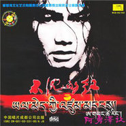

不沉的红
============================

|  |  |
| :--: | :-- |
| [ 不沉的红](https://emumo.xiami.com/album/456294) | **艺人**: [阿勇泽让](../index.md) **语种**: 国语 **唱片公司**: 爱琴海文化 **发行时间**: 2007年03月17日 **专辑类别**: 录音室专辑 **专辑风格**:  **播放数**: 681 **收藏数**: 4 **评论数**: 2  |

## 简介

《不沉的红》，该辑在风格上有了一定的变化，注入了更多的流行音乐元素，可以说，阿勇泽让的音乐更趋城市化了。

## 曲目

- [一样](./456294/JAQqoJ2344f.md)

## 评论

|  |  |  |  |
| :-- | :-- | :-- | :-- |
|  [虾米用户](https://emumo.xiami.com/u/9943562) 多数盗版碟在02年发行 2017-10-05 15:45 赞(0) 踩(0) | 
发行时间应该是2003年。
 |
|  [虾米用户](https://emumo.xiami.com/u/9943562) 多数盗版碟在02年发行 2017-10-05 15:43 赞(0) 踩(0) | 
iTunes 发行版：<a href="https://itunes.apple.com/bz/album/id160214947" target="_blank" rel="nofollow noreferrer noopener">https://itunes.apple.com/bz/album/id160214947</a>
 |
