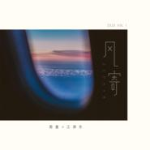
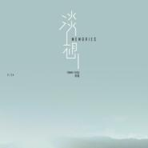
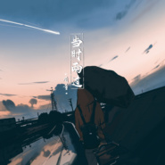
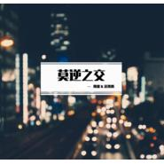
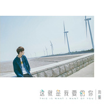
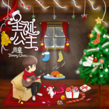
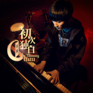
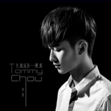

周童
============================

|  |  |
| :--: | :-- |
| [ 周童](https://i.xiami.com/tommyziv) | **地区**: China 中国大陆 **风格**: 爵士放克 Jazz Funk, 国语流行 Mandarin Pop, 电音流行 Electropop **播放数**: 4468058 **粉丝数**: 254 **评论数**: 45  |

## 档案

周童（Tommy Chou），1992年11月24日出生于江苏省常州市，内地华语男歌手、词曲创作人。 从小热爱音乐，擅长keyboard，Saxophone等乐器。受偶像周杰伦影响激发了自己音乐上的创作才能写下了许多唯美的歌曲。 
2016.11.24发行自己第一张原创专辑《初次独白》

## 专辑

| 名称 | 语种 | 唱片公司 | 发行时间 | 专辑类别 | 专辑风格 |
| :--: | :-- | :-- | :-- | :-- | :-- |
| [ 麻将（Mahjong）](./albums/5022380348.md) | 国语 |  | 2020年06月28日 | EP, 单曲 |  |
| [ 风寄（Zephyr）](./albums/5022538185.md) | 国语 |  | 2020年01月01日 | EP, 单曲 |  |
| [ 淡想（Memories）](./albums/5022539778.md) | 国语 |  | 2019年11月24日 | EP, 单曲 |  |
| [ 有想法（Unique）](./albums/5022395652.md) | 其他 |  | 2019年08月13日 | EP, 单曲 |  |
| [ Outstanding Change](./albums/5022432529.md) | 国语 |  | 2019年05月12日 | EP, 单曲 |  |
| [ 宁愿](./albums/2104854387.md) | 国语 | 咚吧嗒文化 | 2019年05月09日 | EP, 单曲 |  |
| [ 当时雨过](./albums/2104881377.md) | 国语 | 咚吧嗒文化 | 2019年05月09日 | EP, 单曲 |  |
| [ 以猫之名](./albums/2104454438.md) | 国语 |  | 2018年12月31日 | EP, 单曲 | 国语流行 Mandarin Pop |
| [ 莫逆之交](./albums/5022382811.md) | 国语 |  | 2018年06月10日 | EP, 单曲 |  |
| [ 谁曾经陪你接近童话](./albums/2103499036.md) | 国语 | 独立发行 | 2018年01月18日 | EP, 单曲 | 流行 Pop |
| [ 11.24](./albums/2102943610.md) | 国语 | 独立发行 | 2017年11月24日 | EP, 单曲 | 流行摇滚 Pop Rock, 未来贝斯 Future Bass, 陷阱舞曲 Trap |
| [ 这就是我要的你](./albums/2102862494.md) | 国语 | 独立发行 | 2017年09月24日 | EP, 单曲 | 流行 Pop |
| [ FM93.5音乐电台一些节目的片头曲](./albums/5022417744.md) | 国语 |  | 2017年08月25日 | EP, 单曲 |  |
| [ 一颗梦想](./albums/2102816831.md) | 国语 | 独立发行 | 2017年08月20日 | EP, 单曲 | 流行 Pop, 流行说唱 Pop Rap |
| [ 十点一刻](./albums/2102693136.md) | 国语 | 独立发行 | 2017年02月14日 | EP, 单曲 | 国语流行 Mandarin Pop |
| [ 圣诞公主](./albums/2102672011.md) | 国语 | 独立发行 | 2016年12月24日 | EP, 单曲 | 浩室舞曲 House, 流行说唱 Pop Rap |
| [ 初次独白](./albums/2102655203.md) | 国语 | 独立发行 | 2016年11月24日 | 录音室专辑 | 嘻哈 Hip-Hop, 流行摇滚 Pop Rock |
| [ 最强王者](./albums/2102403163.md) | 国语 |  | 2016年09月27日 | EP, 单曲 |  |
| [ 《在机场等一艘船》](./albums/2100368884.md) | 国语 | 独立发行 | 2016年07月18日 | EP, 单曲 | 流行 Pop |

## 评论

|  |  |  |
| :-- | :-- | :-- |
|  [虾米用户](https://emumo.xiami.com/u/353317554)  2020-07-10 15:07 赞(1) 踩(0) | 
。。猛一看，看成&amp;ldquo;周董&amp;rdquo;了~~~
 |
|  [虾米用户](https://emumo.xiami.com/u/418507280)  2020-03-27 18:37 赞(0) 踩(0) | 
真的很不錯！好久沒發現好的歌手！
 |
|  [虾米用户](https://emumo.xiami.com/u/93081992) so what 2019-08-28 23:34 赞(0) 踩(0) | 
我弟弟也叫周童哈哈
 |
|  [虾米用户](https://emumo.xiami.com/u/293692544) 你敢给我说话吗？我咬你 2019-04-09 05:19 赞(1) 踩(0) | 
好听
 |
|  [虾米用户](https://emumo.xiami.com/u/9103905) 五月天 周杰伦 Nell... 2019-04-08 15:17 赞(2) 踩(0) | 
好听 宝藏
 |
|  [虾米用户](https://emumo.xiami.com/u/364006259)             ... 2018-07-31 23:19 赞(1) 踩(0) | 
晚安
 |
|  [虾米用户](https://emumo.xiami.com/u/361756892)  2018-04-29 17:34 赞(1) 踩(0) | 
加油，周童！喜欢你
 |
|  [虾米用户](https://emumo.xiami.com/u/322490192)   2018-02-11 21:50 赞(1) 踩(0) | 
好夢
 |
|  [虾米用户](https://emumo.xiami.com/u/310104397)  2017-07-06 12:02 赞(1) 踩(0) | 
加油Y
 |
|  [虾米用户](https://emumo.xiami.com/u/310104397)  2017-07-06 12:02 赞(1) 踩(0) | 
加油
 |
|  [虾米用户](https://emumo.xiami.com/u/286049358)  2017-04-08 20:05 赞(1) 踩(0) | 
可是，见到本人你才能唱
 |
|  [虾米用户](https://emumo.xiami.com/u/223802526) 就是喜欢音乐，不需要理由 2017-04-04 09:51 赞(2) 踩(0) | 
从直播上看到你，很喜欢你的歌声，加油
 |
|  [虾米用户](https://emumo.xiami.com/u/245732954)  2017-03-10 22:28 赞(1) 踩(0) | 
爱周童
 |
|  [虾米用户](https://emumo.xiami.com/u/97964790) 一步难，一步佳。 2017-02-18 13:51 赞(1) 踩(0) | 
猴子加油
 |
|  [虾米用户](https://emumo.xiami.com/u/97964790) 一步难，一步佳。 2017-02-18 13:51 赞(1) 踩(0) | 
很棒！
 |
|  [虾米用户](https://emumo.xiami.com/u/210736378) 只为你的笑 2017-01-01 07:15 赞(1) 踩(0) | 
和你一起跨年真的很棒，新的一年里我会更加支持你
 |
|  [虾米用户](https://emumo.xiami.com/u/250424693)  2016-12-05 11:41 赞(1) 踩(0) | 
加油，默默的支持 
 |
|  [虾米用户](https://emumo.xiami.com/u/33172119) 我永远喜欢京都橘 2016-12-04 03:39 赞(1) 踩(0) | 
加油(ง •̀_•́)ง
 |
|  [虾米用户](https://emumo.xiami.com/u/33172119) 我永远喜欢京都橘 2016-12-04 03:39 赞(1) 踩(0) | 
彡D丶调丿xTs 
 |
|  [虾米用户](https://emumo.xiami.com/u/250123480)  2016-11-27 17:29 赞(2) 踩(0) | 
好听。加油
 |
|  [虾米用户](https://emumo.xiami.com/u/236771046) 余生请多多指教 2016-11-25 14:06 赞(1) 踩(0) | 
加油！＼（＞０＜）／
 |
|  [虾米用户](https://emumo.xiami.com/u/248924090)  2016-11-24 21:35 赞(1) 踩(0) | 
我第一次玩映客就发现了小猴子，已经陪伴他3个月了！专属小猴子的第一张专辑发行了，我真的很开心，在我青春的里认识了一个为了梦想坚持不懈的人，小猴子加油，永远支持你
 |
|  [虾米用户](https://emumo.xiami.com/u/248736341)  2016-11-24 21:12 赞(1) 踩(0) | 
猴子。希望你这音乐的路上越来越好。不忘初心。我们听你的歌。只为你的笑。
 |
|  [虾米用户](https://emumo.xiami.com/u/84917952)  2016-11-24 18:59 赞(0) 踩(0) | 
支持！
 |
|  [虾米用户](https://emumo.xiami.com/u/248851900)  2016-11-24 16:36 赞(0) 踩(0) | 
猴子
 |
|  [虾米用户](https://emumo.xiami.com/u/248743948) 你说找不到能爱的人 2016-11-24 01:16 赞(0) 踩(0) | 
我爱的样子你都有。
 |
|  [虾米用户](https://emumo.xiami.com/u/50060251)  2016-11-24 00:36 赞(0) 踩(0) | 
看好你！！加油！！
 |
|  [虾米用户](https://emumo.xiami.com/u/248249786)  2016-11-23 23:46 赞(0) 踩(0) | 
据说评论有点可能拿到猴子的专辑
 |
|  [虾米用户](https://emumo.xiami.com/u/248249786)  2016-11-23 23:43 赞(0) 踩(0) | 
这个好看的男孩子歌声也很好听，大家关注关注他呀，新浪微博，周童Tommy，
 |
|  [虾米用户](https://emumo.xiami.com/u/248733231)  2016-11-23 23:36 赞(0) 踩(0) | 
猴子
 |
|  [虾米用户](https://emumo.xiami.com/u/248341470)   2016-11-23 16:32 赞(0) 踩(0) | 
加油！大卖
 |
|  [虾米用户](https://emumo.xiami.com/u/248525415)  2016-11-23 14:06 赞(0) 踩(0) | 
    
 |
|  [虾米用户](https://emumo.xiami.com/u/248571489)   2016-11-23 12:35 赞(0) 踩(0) | 
   总有一天你会火的！加油！
 |
|  [虾米用户](https://emumo.xiami.com/u/248532829)  2016-11-23 08:46 赞(0) 踩(0) | 
猴子加油，我们永远都在你身后，
 |
|  [虾米用户](https://emumo.xiami.com/u/248509154)   2016-11-23 02:25 赞(0) 踩(0) | 
猴子，我会永远在你背后支持你的
 |
|  [虾米用户](https://emumo.xiami.com/u/248486935)  2016-11-22 23:29 赞(0) 踩(0) | 
猴子加油！我会永远支持你！陪伴着你！ 
 |
|  [虾米用户](https://emumo.xiami.com/u/248341470)   2016-11-22 14:19 赞(0) 踩(0) | 
一路走过我都在 加油
 |
|  [虾米用户](https://emumo.xiami.com/u/231357636) 粉张杰，陈伟霆 2016-09-30 07:57 赞(0) 踩(0) | 
以后的路我都陪你
 |
|  [虾米用户](https://emumo.xiami.com/u/230630721) 学生 2016-09-27 21:16 赞(0) 踩(0) | 
太好听了
 |
|  [虾米用户](https://emumo.xiami.com/u/230515961)  2016-09-27 15:34 赞(0) 踩(0) | 
加油，太棒了，永远支持你
 |
|  [虾米用户](https://emumo.xiami.com/u/230485327) 不要在意别人说什么，你只... 2016-09-27 13:24 赞(0) 踩(0) | 
猴子是最棒的   
 |
|  [虾米用户](https://emumo.xiami.com/u/197004703) 视而不见 2016-08-06 15:45 赞(0) 踩(0) | 
大家关注下周童微博，周童Tommy。我们更喜欢叫他猴纸,猴纸真的太可爱了，好萌好萌，   
 |
|  [虾米用户](https://emumo.xiami.com/u/197004703) 视而不见 2016-08-06 15:42 赞(1) 踩(0) | 
周童的声音很好听，很喜欢，大家多多关注哦  
 |
|  [虾米用户](https://emumo.xiami.com/u/203863592)  2016-07-22 17:03 赞(1) 踩(0) | 
加油。↖(^ω^)↗
 |
|  [虾米用户](https://emumo.xiami.com/u/200287744) 梦想一定要有，万一实现了... 2016-07-12 21:43 赞(2) 踩(0) | 
加油！好听。
 |
