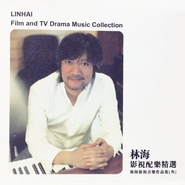

林海影视配乐精选林海影视音乐作品集 叁
============================

|  |  |
| :--: | :-- |
| [ 林海影视配乐精选林海影视音乐作品集 叁](https://emumo.xiami.com/album/72014) | **艺人**: [林海](../index.md) **语种**: 其他 **唱片公司**: 听觉新音乐工作室 **发行时间**: 2013年11月20日 **专辑类别**: 原声带, 影视音乐 **专辑风格**: 电影原声 Film Score, 电视原声 Television Music **播放数**: 4016129 **收藏数**: 7396 **评论数**: 343  |

## 简介

支持林海老师的作品，欢迎大家购买这张实体专辑，<a href="http://dongmusic.taobao.com/p/rd586487.htm?spm=a1z1s.6659513.0.0.zpV8NR&amp;v=1" target="_blank">购买地址点我点我！  
</a>  
林海老师在年底“世界末日”前出版他的新专辑《林海影视配乐精选》，这张是林海十几年影视配乐生涯中精选的精选。   
27段不同风格的音乐，时长74分钟。   
  
林海自述:  
我也许犯了个错误  
我把音乐具体化了  
我给这27段音乐起了名字并附上了文字  
也就是说  
我可能扼杀了你们的想象空间  
音乐是抽象的  
没有歌词的纯音乐每个人听后的感受是不一样的  
不同的意境 不同的画面 不同的想象空间  
......  
所以  
即将听到这27段音乐的朋友 们  
当你翻开下一页时  
当你看到这27首作品的音乐语言时  
记住  
这只是我林某人主观的感受  
只是这些音乐中的其中一种感觉  
是姓林的  
......  
也许  
你该忘掉这些文字  
进入你自己的想象空间  
......  
关暗灯  
独自的  
静静的  
进入我的音乐世界吧  

## 曲目

- [史事](./72014/eiDtC2f072.md)
- [勿忘随行](./72014/KQcb67e78.md)
- [大明宫](./72014/b0N4w1661a.md)
- [琵琶语](./72014/cgKWHfba9e.md)
- [梅雨](./72014/b0N4y969c5.md)
- [夜袭](./72014/KQcf53c2d.md)
- [清浅谷](./72014/KQcg79ae4.md)
- [煞](./72014/b0N41e013d.md)
- [弦月](./72014/KQcibe588.md)
- [寂](./72014/KQcj54ac3.md)
- [维罗纳](./72014/KQck8fd3a.md)
- [擂](./72014/cgKWP1bb5b.md)
- [奔](./72014/cgKWQfb0c4.md)
- [灼](./72014/b0N47cfb67.md)
- [日·初](./72014/bf00n3d340c6.md)
- [风筝](./72014/mQDtyk790c2.md)
- [欢沁](./72014/xLysmG14fab.md)
- [我的青春](./72014/mQDtyh6c3d1.md)
- [暗途](./72014/bf00n2X2e092.md)
- [夜潜](./72014/bqvlmr837e28.md)
- [四季](./72014/JAUpPL234de.md)
- [日暮](./72014/xLysmC159e8.md)
- [孩子](./72014/b1pWlgj3e06f.md)
- [剪影](./72014/8Gjrbse1bc1.md)
- [独角戏](./72014/mQDtyl6b796.md)
- [布匿之剑](./72014/xLysmMb1347.md)
- [天长地久](./72014/mQDtyn53274.md)

## 评论

|  |  |  |  |
| :-- | :-- | :-- | :-- |
|  [虾米用户](https://emumo.xiami.com/u/38401953)   2020-03-16 03:03 赞(0) 踩(0) | 
最喜欢大神的BGM❤
 |
|  [虾米用户](https://emumo.xiami.com/u/21288531) ❤️Jan 2019-09-04 09:03 赞(0) 踩(0) | 
很喜欢琵琶
 |
|  [虾米用户](https://emumo.xiami.com/u/345844913)  2019-08-30 15:48 赞(0) 踩(0) | 
毎次听林海的音乐，心灵都会有触动的感觉。
 |
|  [虾米用户](https://emumo.xiami.com/u/268084084)  2019-06-29 06:15 赞(0) 踩(0) | 
五星都觉得太少
 |
|  [虾米用户](https://emumo.xiami.com/u/32736467)  2019-02-19 22:26 赞(0) 踩(0) | 
很喜欢这张专辑
 |
|  [虾米用户](https://emumo.xiami.com/u/366668898) 萤火遍野，皓月盈天 2019-01-17 22:12 赞(0) 踩(0) | 
郁郁涧底松
 |
|  [虾米用户](https://emumo.xiami.com/u/10952924) 是谁把光阴剪成了烟花，一... 2018-05-14 14:58 赞(1) 踩(0) | 
支持虾米，支持林海
 |
|  [虾米用户](https://emumo.xiami.com/u/299567037)  2018-03-23 18:48 赞(0) 踩(0) | 
我已经没有光驱了，怎么办怎么办
 |
|  [虾米用户](https://emumo.xiami.com/u/253326963)  2018-02-22 14:53 赞(0) 踩(0) | 
无人能超越。
 |
|  [虾米用户](https://emumo.xiami.com/u/37764400)  2018-01-07 10:08 赞(0) 踩(0) | 
我搜了淘宝，没地方买
 |
|  [虾米用户](https://emumo.xiami.com/u/867083) 我还没想好要写什么... 2017-12-27 10:48 赞(0) 踩(0) | 
林海+荒野之息怎么样？我脑子里全是塞尔达的大草原
 |
|  [虾米用户](https://emumo.xiami.com/u/600693)  2017-10-28 00:32 赞(0) 踩(0) | 
一张值得购买的专辑！！！推荐
 |
|  [虾米用户](https://emumo.xiami.com/u/9521475)  2017-10-28 00:32 赞(1) 踩(0) | 
一直是林海音乐的支持者,喜欢它在音乐中十分恰当的将各种乐器组合,尤其是咱们的民族乐器
 |
|  [虾米用户](https://emumo.xiami.com/u/782960)  2017-10-27 23:00 赞(2) 踩(0) | 
好听！！这就去实体店买，支持林老师！希望大家也都去实体店买来收藏，你收藏会是一份心情、一份情调，在淘宝，随便一件烂大街的衬衫也要100块钱，或许还不喜欢而压了箱底。把这钱花来买张唱片吧！！！！
 |
| ⇒ |  [虾米用户](https://emumo.xiami.com/u/334579930)  2018-04-16 09:33 赞(0) 踩(0) | 
支持！
 |
|  [虾米用户](https://emumo.xiami.com/u/40522813)  2017-10-17 13:34 赞(0) 踩(0) | 
没有现由，就是好听。
 |
|  [虾米用户](https://emumo.xiami.com/u/25804424)  2017-08-30 09:28 赞(0) 踩(0) | 
轻缓、悦耳，让人可以无限遐想，有传统和时代的韵味。赞。
 |
|  [虾米用户](https://emumo.xiami.com/u/117527232)  2017-06-29 17:39 赞(0) 踩(0) | 
影视配乐，对自己电视制作会有许多灵感和选择
 |
|  [虾米用户](https://emumo.xiami.com/u/1740881)  2017-06-27 14:31 赞(0) 踩(0) | 
林海专辑
 |
|  [虾米用户](https://emumo.xiami.com/u/72466678)  2017-05-25 09:23 赞(0) 踩(0) | 
专辑的点击链接有问题，不停的下载淘宝app
 |
|  [虾米用户](https://emumo.xiami.com/u/12221090) 逍遥于天地而心意自得 2017-04-05 21:47 赞(0) 踩(0) | 
赞
 |
|  [虾米用户](https://emumo.xiami.com/u/278101137)  2017-03-05 19:13 赞(0) 踩(0) | 
喜欢听哦
 |
|  [虾米用户](https://emumo.xiami.com/u/238802374) Hello,World! 2017-01-29 11:44 赞(0) 踩(0) | 
海大叔的音乐，不解释
 |
|  [虾米用户](https://emumo.xiami.com/u/42028489)  2016-11-26 09:08 赞(0) 踩(0) | 
才华横溢，大隐隐于世
 |
|  [虾米用户](https://emumo.xiami.com/u/8790493)   2016-11-08 16:29 赞(0) 踩(0) | 
各种情绪
 |
|  [虾米用户](https://emumo.xiami.com/u/163118690) 越美丽越安全，越努力越幸... 2016-10-21 08:10 赞(1) 踩(0) | 
我会去淘宝支持，我认为好音乐不应该消失。
 |
|  [虾米用户](https://emumo.xiami.com/u/16787775)  The plants ... 2016-09-29 15:40 赞(11) 踩(0) | 
林海要是出了需要付费的电子专辑，我也是很乐意掏钱的，一直都很喜欢虾米，虽然最近一直有很多乐队下架，但林海一直没走，这是我最欣慰的
 |
|  [虾米用户](https://emumo.xiami.com/u/49520952) 我还没想好要写什么... 2016-09-09 06:30 赞(1) 踩(0) | 
林海影视配乐精选
 |
|  [虾米用户](https://emumo.xiami.com/u/13558572)  2016-08-29 18:10 赞(1) 踩(0) | 
有意境，
 |
|  [虾米用户](https://emumo.xiami.com/u/11441512)  2016-08-19 22:31 赞(0) 踩(0) | 
ai
 |
|  [虾米用户](https://emumo.xiami.com/u/8905021)  2016-06-27 08:47 赞(0) 踩(0) | 
林海影视配乐精选
 |
|  [虾米用户](https://emumo.xiami.com/u/1509678)  2016-06-08 13:55 赞(0) 踩(0) | 
悠扬纯净
 |
|  [虾米用户](https://emumo.xiami.com/u/18013116)  2016-05-27 15:18 赞(0) 踩(0) | 
好听
 |
|  [虾米用户](https://emumo.xiami.com/u/170257866)  2016-05-18 14:58 赞(0) 踩(0) | 
林海！
 |
|  [虾米用户](https://emumo.xiami.com/u/150072760)  2016-05-16 15:56 赞(0) 踩(0) | 
just love it!
 |
|  [虾米用户](https://emumo.xiami.com/u/73389796) 快乐人 2016-04-28 12:22 赞(0) 踩(0) | 
非常有才华，好听！
 |
|  [虾米用户](https://emumo.xiami.com/u/125795710)  2016-03-22 16:24 赞(1) 踩(0) | 
好听的要命 
 |
| ⇒ |  [虾米用户](https://emumo.xiami.com/u/43614042) 不喧哗 自有声 2016-04-04 23:14 赞(0) 踩(0) | 
KMMk开门K看K看客M么K看
 |
|  [虾米用户](https://emumo.xiami.com/u/6397185)  2016-01-25 21:04 赞(1) 踩(0) | 
林海的
 |
|  [虾米用户](https://emumo.xiami.com/u/1442219)  2015-12-08 13:10 赞(0) 踩(0) | 
大师
 |
|  [虾米用户](https://emumo.xiami.com/u/45784201)  2015-11-14 15:48 赞(1) 踩(0) | 
喜欢林海的作品
 |
|  [虾米用户](https://emumo.xiami.com/u/11704432)  2015-11-03 12:13 赞(0) 踩(0) | 
请问，罗维纳是哪部电影电视的配乐？怎么跟电影《风声》配乐相像
 |
|  [虾米用户](https://emumo.xiami.com/u/34712470)  2015-10-30 17:24 赞(1) 踩(0) | 
尝试性乐曲
 |
|  [虾米用户](https://emumo.xiami.com/u/52796355)  2015-10-02 12:22 赞(1) 踩(0) | 
曲风丰富
 |
|  [虾米用户](https://emumo.xiami.com/u/56600608)  2015-08-22 16:28 赞(0) 踩(0) | 
好听
 |
|  [虾米用户](https://emumo.xiami.com/u/56600608)  2015-08-22 16:28 赞(0) 踩(0) | 
好听
 |
|  [虾米用户](https://emumo.xiami.com/u/56600608)  2015-08-22 16:27 赞(1) 踩(0) | 
一直在找这首曲，原来是老乡作品，大赞
 |
|  [虾米用户](https://emumo.xiami.com/u/7322777) ∮ 2015-08-20 03:36 赞(0) 踩(0) | 
...A...
 |
|  [虾米用户](https://emumo.xiami.com/u/2294247)  2015-08-02 11:59 赞(0) 踩(0) | 
认真做音乐的人。
 |
|  [虾米用户](https://emumo.xiami.com/u/50349687)  2015-07-27 10:57 赞(0) 踩(0) | 
林海
 |
|  [虾米用户](https://emumo.xiami.com/u/24582371)  2015-07-21 17:00 赞(0) 踩(0) | 
古韵
 |
|  [虾米用户](https://emumo.xiami.com/u/51988862)  2015-07-02 19:20 赞(0) 踩(0) | 
好
 |
|  [虾米用户](https://emumo.xiami.com/u/7640138)  2015-06-30 21:50 赞(0) 踩(0) | 
心底柔波
 |
|  [虾米用户](https://emumo.xiami.com/u/11736700)   2015-06-22 23:49 赞(0) 踩(0) | 
一直都是喜欢林海的风格
 |
|  [虾米用户](https://emumo.xiami.com/u/44969921)  2015-06-11 08:07 赞(0) 踩(0) | 
希望多些林海这样的音乐家
 |
|  [虾米用户](https://emumo.xiami.com/u/44969921)  2015-06-11 08:06 赞(0) 踩(0) | 
大师出品
 |
|  [虾米用户](https://emumo.xiami.com/u/41431909)  2015-04-21 14:11 赞(0) 踩(0) | 
电影配乐
 |
|  [虾米用户](https://emumo.xiami.com/u/10184329)  2015-04-08 20:12 赞(0) 踩(0) | 
很好听哦 good
 |
|  [虾米用户](https://emumo.xiami.com/u/5166455) 我还没想好要写什么... 2015-03-17 17:00 赞(0) 踩(0) | 
好厉害的配乐
 |
|  [虾米用户](https://emumo.xiami.com/u/45759342) 唯音乐与爱情不可辜负！ 2015-02-09 09:42 赞(0) 踩(0) | 
林海,配乐,
 |
|  [虾米用户](https://emumo.xiami.com/u/1732429)  2015-02-04 16:14 赞(2) 踩(0) | 
人生每一段的主旋律都不一样，琴瑟和鸣，互相成全，保持欣赏，需要多深的羁绊。爱会不断给人灵感和行动力，但最深层的愉悦还是说不清道不明的默契。（也是不知道这张砖是怎么会让我想到这些的.....= =
 |
|  [虾米用户](https://emumo.xiami.com/u/36434731) 暂无签名~ 2014-12-30 23:17 赞(1) 踩(0) | 
国际有宫崎骏，中国有林海！
 |
|  [虾米用户](https://emumo.xiami.com/u/14011468)  2014-12-30 14:28 赞(0) 踩(0) | 
good
 |
|  [虾米用户](https://emumo.xiami.com/u/17938695)  2014-12-19 19:23 赞(0) 踩(0) | 
尤为喜爱《琵琶语》！
 |
| ⇒ |  [虾米用户](https://emumo.xiami.com/u/43614042) 不喧哗 自有声 2016-04-04 23:14 赞(0) 踩(0) | 
…么KMKkkkkkomkkkk
 |
|  [虾米用户](https://emumo.xiami.com/u/37231598) yolo 2014-12-13 09:40 赞(0) 踩(0) | 
愿在杭州的春夏半年，修养心神，茁壮成长
 |
|  [虾米用户](https://emumo.xiami.com/u/30591960)  2014-12-08 19:37 赞(0) 踩(0) | 
好想知道这些配乐的影视作品都是哪些？
 |
| ⇒ |  [虾米用户](https://emumo.xiami.com/u/11886545) 暂无签名~ 2015-01-17 11:02 赞(0) 踩(0) | 
我知道的有黛玉传，灵珠，大明宫词，反正这几年片看了不少，
 |
| ⇒ |  [虾米用户](https://emumo.xiami.com/u/30591960)  2015-01-23 14:31 赞(0) 踩(0) | 
<q><b>饮用的水说：</b></q>
 |
| ⇒ |  [虾米用户](https://emumo.xiami.com/u/11886545) 暂无签名~ 2015-01-28 21:58 赞(0) 踩(0) | 
<q><b>木蘭花说：</b></q>
 |
| ⇒ |  [虾米用户](https://emumo.xiami.com/u/43614042) 不喧哗 自有声 2016-04-04 23:14 赞(0) 踩(0) | 
困困困客卖M看看K
 |
|  [虾米用户](https://emumo.xiami.com/u/2767056)  2014-10-28 14:16 赞(0) 踩(0) | 
一直喜欢的纯净的音乐
 |
|  [虾米用户](https://emumo.xiami.com/u/10547530) 生于白昼，隐与黑夜。 2014-10-21 00:37 赞(0) 踩(0) | 
大师之作。无论波澜壮阔抑或宁静恬然。都用音乐的笔触勾勒出一幅生动的画面，在耳朵里，在脑海中。
 |
|  [虾米用户](https://emumo.xiami.com/u/1091908) 一切随缘 2014-09-29 10:33 赞(0) 踩(0) | 
Very Nice
 |
|  [虾米用户](https://emumo.xiami.com/u/11355640)  2014-09-16 23:11 赞(0) 踩(0) | 
其实我不懂音乐 只是感觉好听
 |
|  [虾米用户](https://emumo.xiami.com/u/17433421)  2014-08-30 11:08 赞(0) 踩(0) | 
1002
 |
|  [虾米用户](https://emumo.xiami.com/u/39951590) 淘淘的姐 2014-08-28 23:36 赞(0) 踩(0) | 
因为林海
 |
|  [虾米用户](https://emumo.xiami.com/u/9532505) 朝鲜卫星窜天猴 2014-08-27 18:42 赞(0) 踩(0) | 
很不错的曲子，真正的音乐，可以让人找到共鸣和寄托
 |
|  [虾米用户](https://emumo.xiami.com/u/37213897) 后摇！没有什么比这更好听... 2014-08-21 22:20 赞(0) 踩(0) | 
气势磅礴！！
 |
|  [虾米用户](https://emumo.xiami.com/u/11583384)  2014-08-16 18:32 赞(0) 踩(0) | 
有点闹，还是喜欢钢琴~~~
 |
|  [虾米用户](https://emumo.xiami.com/u/6279194)  2014-08-02 21:35 赞(0) 踩(0) | 
中国的X-Ray Dog
 |
|  [虾米用户](https://emumo.xiami.com/u/11436663) 那个夏天宁静的海 2014-06-25 06:59 赞(0) 踩(0) | 
linhai
 |
|  [虾米用户](https://emumo.xiami.com/u/6786297) 思念我的父亲 2014-06-24 16:50 赞(0) 踩(0) | 
《风筝》，生活气息好浓厚哦
 |
|  [虾米用户](https://emumo.xiami.com/u/10795656) 暂无签名~ 2014-06-14 22:04 赞(0) 踩(0) | 
林海老师的作品。
 |
|  [虾米用户](https://emumo.xiami.com/u/6327985) 喜欢音乐 2014-06-12 10:15 赞(1) 踩(0) | 
喜欢林海的音乐
 |
|  [虾米用户](https://emumo.xiami.com/u/9161103) 下雨的夜晚很寂静 2014-06-09 19:53 赞(0) 踩(0) | 
第九首不错
 |
|  [虾米用户](https://emumo.xiami.com/u/10376988) 浮生一醉 2014-06-02 12:59 赞(0) 踩(0) | 
林间寂海
 |
|  [虾米用户](https://emumo.xiami.com/u/701373)  2014-05-31 17:39 赞(0) 踩(0) | 
xihuan
 |
|  [虾米用户](https://emumo.xiami.com/u/6533244) 心动是帆，心止即岸。 2014-05-31 16:13 赞(0) 踩(0) | 
喜欢
 |
|  [虾米用户](https://emumo.xiami.com/u/1671923)  2014-05-28 11:10 赞(0) 踩(0) | 
很棒的演奏家
 |
|  [虾米用户](https://emumo.xiami.com/u/13226185)  2014-05-15 21:59 赞(0) 踩(0) | 
林海的音乐蛮不错的赶脚，外行不懂道，好听喜欢听就成。
 |
|  [虾米用户](https://emumo.xiami.com/u/36616720)  2014-05-15 08:19 赞(0) 踩(0) | 
感觉而已。
 |
|  [虾米用户](https://emumo.xiami.com/u/2754685)  2014-05-14 11:03 赞(0) 踩(0) | 
做得很好，我也喜欢林海很久了
 |
|  [虾米用户](https://emumo.xiami.com/u/11538372)  2014-05-12 15:22 赞(0) 踩(0) | 
非常有才华的作者，抚平心灵的褶子
 |
|  [虾米用户](https://emumo.xiami.com/u/4218640) 暂无签名~ 2014-05-11 15:43 赞(0) 踩(0) | 
林海影视配乐精选
 |
|  [虾米用户](https://emumo.xiami.com/u/10891984)  2014-05-11 09:15 赞(0) 踩(0) | 
林海,中国风,
 |
|  [虾米用户](https://emumo.xiami.com/u/8633509) 音乐就是我读书的背景音乐 2014-05-10 11:05 赞(0) 踩(0) | 
看书时，心随音乐走。放下书，静静的听.....
 |
|  [虾米用户](https://emumo.xiami.com/u/11157355) 榕树长青 2014-05-08 12:49 赞(0) 踩(0) | 
喜欢
 |
|  [虾米用户](https://emumo.xiami.com/u/12387032)  2014-05-08 12:00 赞(0) 踩(0) | 
linhai
 |
|  [虾米用户](https://emumo.xiami.com/u/35904244)  2014-04-26 22:56 赞(0) 踩(0) | 
女友喜欢
 |
|  [虾米用户](https://emumo.xiami.com/u/5518707)  2014-04-12 00:30 赞(1) 踩(0) | 
没能介绍每首曲子的出处。大气，雅致，平和。喜欢。
 |
|  [虾米用户](https://emumo.xiami.com/u/35022806)  2014-04-11 17:51 赞(0) 踩(0) | 
Classic !!!!
 |
|  [虾米用户](https://emumo.xiami.com/u/5983325)  2014-04-02 09:06 赞(0) 踩(0) | 
这个专辑有恢宏大气，有波澜壮阔，有缠绵悱恻，有深沉蕴藉。听着让人五味俱全。
 |
|  [虾米用户](https://emumo.xiami.com/u/11475821) 听曲不睡觉 2014-04-02 08:26 赞(0) 踩(0) | 
配乐,纯音乐,
 |
|  [虾米用户](https://emumo.xiami.com/u/4826346) 何其幸运，曾有你声音 2014-03-30 10:10 赞(0) 踩(0) | 
希望可以标明出自哪个电影
 |
|  [虾米用户](https://emumo.xiami.com/u/21836082) 我还没想好要写什么... 2014-03-28 16:04 赞(0) 踩(0) | 
除了说太美了，我没有其他可以表达的语言了。
 |
|  [虾米用户](https://emumo.xiami.com/u/2113241)  2014-03-22 12:33 赞(0) 踩(0) | 
大气磅礴，好听
 |
|  [虾米用户](https://emumo.xiami.com/u/13217594) 唱出自己的故事 2014-03-19 22:48 赞(0) 踩(0) | 
喜欢！弱弱的问一下琵琶语，乐器都是实录的吗？
 |
|  [虾米用户](https://emumo.xiami.com/u/411995) 给我双筷子我可以吃下地球 2014-03-19 20:22 赞(1) 踩(0) | 
听着这些不知不觉就过去了半生。
 |
|  [虾米用户](https://emumo.xiami.com/u/6911954)  2014-03-04 18:29 赞(1) 踩(0) | 
看了林海先生的自述，確有同感。以前在晚上聽純音樂的時候喜歡把腦中的畫面用七言或是散文整理下來，至今都是我的精神財富。可是曲目已經被命名過了，這確實限制了聽眾的想像力。不過我亦不糾結，乾脆就以曲名做題發揮。感謝林海先生創作出大量的優秀的音樂作品！
 |
|  [虾米用户](https://emumo.xiami.com/u/6911954)  2014-03-04 18:25 赞(0) 踩(0) | 
擇日買定一張台版入手。
 |
|  [虾米用户](https://emumo.xiami.com/u/7921887)  2014-03-02 21:56 赞(0) 踩(0) | 
才子~
 |
|  [虾米用户](https://emumo.xiami.com/u/33274887)  2014-02-26 14:08 赞(0) 踩(0) | 
很经典的曲目，确实是精选集合。
 |
|  [虾米用户](https://emumo.xiami.com/u/15459965)  2014-02-12 14:41 赞(0) 踩(0) | 
配乐
 |
|  [虾米用户](https://emumo.xiami.com/u/3458661) 能感动人的音乐就是好音乐 2014-02-04 06:30 赞(0) 踩(0) | 
一千个赞啊！大明宫词的配乐就是林海老师的作品之一。
 |
|  [虾米用户](https://emumo.xiami.com/u/6477215)  2014-01-28 10:45 赞(0) 踩(0) | 
就是喜欢
 |
|  [虾米用户](https://emumo.xiami.com/u/31103735)  2014-01-26 10:28 赞(0) 踩(0) | 
好音乐
 |
|  [虾米用户](https://emumo.xiami.com/u/1416849)  2014-01-09 10:27 赞(0) 踩(0) | 
好多听着很熟悉，能把出处标出来就好了！
 |
|  [虾米用户](https://emumo.xiami.com/u/1600430)  2014-01-06 16:40 赞(0) 踩(0) | 
据说很好，那就收喽~
 |
|  [虾米用户](https://emumo.xiami.com/u/18773012) 卫道东升 2013-12-28 11:06 赞(0) 踩(0) | 
非常非常喜欢！！
 |
|  [虾米用户](https://emumo.xiami.com/u/13307534)  2013-12-22 14:18 赞(0) 踩(0) | 
classic music
 |
|  [虾米用户](https://emumo.xiami.com/u/12259927)  2013-12-22 13:38 赞(0) 踩(0) | 
天呐
 |
|  [虾米用户](https://emumo.xiami.com/u/1876022)  2013-12-22 13:27 赞(0) 踩(0) | 
其实我还是觉得，这张碟不应该发布……我私心里希望，所有喜欢林海老师的人都去买一张，因为这张碟真的很棒_(:з」∠)_
 |
|  [虾米用户](https://emumo.xiami.com/u/10758130)  2013-12-20 20:29 赞(0) 踩(0) | 
虽然是影视配乐，但绝不是影视作品的陪衬，有的时候可以因为配乐而喜欢上一部影视作品，林海老师的作品有这种魔力。我觉得应该把《踏古》也收进来，我很喜欢。
 |
|  [虾米用户](https://emumo.xiami.com/u/30174410)  2013-12-20 19:53 赞(0) 踩(0) | 
好听
 |
|  [虾米用户](https://emumo.xiami.com/u/10758130)  2013-12-20 19:53 赞(0) 踩(0) | 
支持楼主，我相信喜欢的人怎么都会去支持正版的。楼主好人。
 |
|  [虾米用户](https://emumo.xiami.com/u/30076289)  2013-12-19 11:51 赞(0) 踩(0) | 
这样的好音乐太少了！！！快被年轻人忘记了！中国的音乐没有人做宣传！和保留！
 |
|  [虾米用户](https://emumo.xiami.com/u/29863984)  2013-12-19 09:17 赞(0) 踩(0) | 
好
 |
|  [虾米用户](https://emumo.xiami.com/u/15494405)  2013-12-19 01:58 赞(0) 踩(0) | 
屏住呼吸聆听
 |
|  [虾米用户](https://emumo.xiami.com/u/11006642) little buddy 2013-12-18 19:01 赞(0) 踩(0) | 
好听
 |
|  [虾米用户](https://emumo.xiami.com/u/29485004)  2013-12-18 16:06 赞(0) 踩(0) | 
good
 |
|  [虾米用户](https://emumo.xiami.com/u/24317533) 生活有希望* 2013-12-17 12:29 赞(0) 踩(0) | 
不明觉厉！！
 |
|  [虾米用户](https://emumo.xiami.com/u/8629338)  2013-12-16 08:38 赞(0) 踩(0) | 
好听
 |
|  [虾米用户](https://emumo.xiami.com/u/22217554)  2013-12-15 08:16 赞(0) 踩(0) | 
林海
 |
|  [虾米用户](https://emumo.xiami.com/u/29741950)  2013-12-14 18:38 赞(0) 踩(0) | 
很爱，大明宫词的时候就开始关注~
 |
|  [虾米用户](https://emumo.xiami.com/u/13584727)  2013-12-13 10:58 赞(0) 踩(0) | 
影视配乐
 |
|  [虾米用户](https://emumo.xiami.com/u/29622930)  2013-12-13 10:26 赞(0) 踩(0) | 
电影经典配乐，喜欢轻盈，舒适的感觉~~~
 |
|  [虾米用户](https://emumo.xiami.com/u/2439570) 女王大人～ 2013-12-13 08:13 赞(0) 踩(0) | 
我就是来点赞的
 |
|  [虾米用户](https://emumo.xiami.com/u/18654141)  2013-12-13 04:15 赞(0) 踩(0) | 
喜欢
 |
|  [虾米用户](https://emumo.xiami.com/u/6256810)  2013-12-12 23:50 赞(0) 踩(0) | 
最爱独角戏
 |
|  [虾米用户](https://emumo.xiami.com/u/4803157)  2013-12-12 23:13 赞(0) 踩(0) | 
难得的还在好好做音乐的人。这个浮华的世界需要多一点能够让人安静下来的声音。
 |
| ⇒ |  [虾米用户](https://emumo.xiami.com/u/38495558) 暂无签名~ 2014-06-29 15:22 赞(0) 踩(0) | 
说的不错！
 |
|  [虾米用户](https://emumo.xiami.com/u/2436119) 因为这个世界，原本就带有... 2013-12-12 22:35 赞(0) 踩(0) | 
想到那天有人在浴室公放琵琶语。。。顿时觉得林海老师什么时候low到他的歌会在浴室公放了呢？？！！！
 |
|  [虾米用户](https://emumo.xiami.com/u/9125088)  2013-12-12 21:57 赞(0) 踩(0) | 
就是喜欢~
 |
|  [虾米用户](https://emumo.xiami.com/u/15446909)  2013-12-12 21:21 赞(0) 踩(0) | 
好音乐 听故事
 |
|  [虾米用户](https://emumo.xiami.com/u/3653874)   2013-12-12 20:49 赞(0) 踩(0) | 
喜欢林海老师的音乐。
 |
|  [虾米用户](https://emumo.xiami.com/u/758347)  2013-12-12 20:11 赞(0) 踩(0) | 
林海的音乐， 一直都让人那样的动心。或激昂，或悲伤。画面感一一呈现，仿佛身临其境。今天晚上听着第二首音乐，想着远方的爱人啊。满眼的泪水。有多少话不能讲。
 |
|  [虾米用户](https://emumo.xiami.com/u/3653874)   2013-12-12 19:59 赞(0) 踩(0) | 
好。
 |
|  [虾米用户](https://emumo.xiami.com/u/707855)   2013-12-12 19:16 赞(0) 踩(0) | 
林海的新作品！
 |
|  [虾米用户](https://emumo.xiami.com/u/4170904)  2013-12-12 18:51 赞(0) 踩(0) | 
听每一首都像在听一个的故事
 |
|  [虾米用户](https://emumo.xiami.com/u/6888011) 商业摄影师| 制片人 2013-12-12 17:28 赞(0) 踩(0) | 
一定会支持正版的！
 |
|  [虾米用户](https://emumo.xiami.com/u/11835523) 下雨中 2013-12-12 16:35 赞(0) 踩(0) | 
當背景音樂
 |
|  [虾米用户](https://emumo.xiami.com/u/10825360) fantacy 2013-12-12 16:31 赞(2) 踩(0) | 
非同于日本矫情瑰丽奢靡的物哀，陈勋奇放浪形骸的江湖，范宗沛南国调调的压抑和迷情，林海的曲里有真正中国式的东西，区别于坊间那些并不入流的所谓中国古典，大气，正统，沧桑中透着一股子狠劲儿。曲风多变，可刚可柔。真想把大师配音的影视都看一遍，寒假攒钱入手“南城旧事”的LP...
 |
|  [虾米用户](https://emumo.xiami.com/u/7058690)  2013-12-12 15:23 赞(0) 踩(0) | 
林海
 |
|  [虾米用户](https://emumo.xiami.com/u/3719355)  2013-12-12 14:46 赞(0) 踩(0) | 
以为林海峰………………
 |
|  [虾米用户](https://emumo.xiami.com/u/11956750)  2013-12-12 14:26 赞(0) 踩(0) | 
喜欢
 |
|  [虾米用户](https://emumo.xiami.com/u/18577845) 我离不开音乐，嗯 2013-12-12 13:45 赞(0) 踩(0) | 
希望附上影视名称。赞！
 |
|  [虾米用户](https://emumo.xiami.com/u/24114334)  2013-12-12 13:05 赞(0) 踩(0) | 
从大明宫祠还是，就持续关注林海老师的影视配乐，甚是喜欢，总是能带给人个样的情绪，或欢喜，或愁苦，抑或意味深长的思绪，听音乐本应该这样~
 |
|  [虾米用户](https://emumo.xiami.com/u/24114334)  2013-12-12 13:03 赞(0) 踩(0) | 
从大明宫祠开始，就持续关注林海老师的影视配乐，真心喜欢，总能给人有开心，或愁苦，抑或意味深长的思绪，听音乐，不就应是这样的吗
 |
|  [虾米用户](https://emumo.xiami.com/u/1701734)  2013-12-12 11:07 赞(0) 踩(0) | 
林海
 |
|  [虾米用户](https://emumo.xiami.com/u/11380025) 聆听灵魂的旋律~ 2013-12-12 10:46 赞(0) 踩(0) | 
林海大师的都是经典
 |
|  [虾米用户](https://emumo.xiami.com/u/10404172)  2013-12-12 09:32 赞(0) 踩(0) | 
可作为配乐素材
 |
|  [虾米用户](https://emumo.xiami.com/u/11380025) 聆听灵魂的旋律~ 2013-12-12 08:39 赞(0) 踩(0) | 
经典！！
 |
|  [虾米用户](https://emumo.xiami.com/u/4205561)  2013-12-12 08:29 赞(0) 踩(0) | 
必须支持！
 |
|  [虾米用户](https://emumo.xiami.com/u/7713129) 向死而生 2013-12-12 06:08 赞(0) 踩(0) | 
林海影视配乐
 |
|  [虾米用户](https://emumo.xiami.com/u/26076220)  2013-12-12 03:32 赞(0) 踩(0) | 
只用电脑听歌的，赞一个
 |
|  [虾米用户](https://emumo.xiami.com/u/22533521)  2013-12-12 00:54 赞(0) 踩(0) | 
piano+movie+touching
 |
|  [虾米用户](https://emumo.xiami.com/u/5661852)  2013-12-11 17:40 赞(0) 踩(0) | 
仿佛回到盛世
 |
|  [虾米用户](https://emumo.xiami.com/u/4085425)  2013-12-11 17:25 赞(0) 踩(0) | 
林海
 |
|  [虾米用户](https://emumo.xiami.com/u/11257284)  2013-12-11 17:07 赞(0) 踩(0) | 
好听
 |
|  [虾米用户](https://emumo.xiami.com/u/11239421)  2013-12-11 16:47 赞(0) 踩(0) | 
喜欢琵琶语
 |
|  [虾米用户](https://emumo.xiami.com/u/29371351)  2013-12-11 15:44 赞(0) 踩(0) | 
临海
 |
|  [虾米用户](https://emumo.xiami.com/u/1608478)  2013-12-11 15:37 赞(0) 踩(0) | 
我在听很棒的精选集
 |
|  [虾米用户](https://emumo.xiami.com/u/1992246)  2013-12-11 14:53 赞(0) 踩(0) | 
琵琶语，心醉...
 |
|  [虾米用户](https://emumo.xiami.com/u/5806141)  2013-12-11 14:48 赞(0) 踩(0) | 
哎  出精选的意义 就是 没戏了.....
 |
|  [虾米用户](https://emumo.xiami.com/u/29430739) 签啥名啊，麻烦 2013-12-11 14:18 赞(0) 踩(0) | 
就是喜欢，难得的好音乐！
 |
|  [虾米用户](https://emumo.xiami.com/u/8400932)  2013-12-11 13:17 赞(0) 踩(0) | 
一直喜欢他的音乐！
 |
|  [虾米用户](https://emumo.xiami.com/u/4306729) 不敢收新歌，往往是怕丢掉... 2013-12-11 12:42 赞(0) 踩(0) | 
虽然还不是曲曲都正中红心，不过超喜欢林海老师的创作，果断收藏永远怀恋一下~
 |
|  [虾米用户](https://emumo.xiami.com/u/8289477)  2013-12-11 12:35 赞(0) 踩(0) | 
林海
 |
|  [虾米用户](https://emumo.xiami.com/u/6755152)  2013-12-11 12:30 赞(0) 踩(0) | 
hao
 |
|  [虾米用户](https://emumo.xiami.com/u/18619781) 勇气 2013-12-11 11:15 赞(0) 踩(0) | 
纯粹
 |
|  [虾米用户](https://emumo.xiami.com/u/2461440)  2013-12-11 10:15 赞(0) 踩(0) | 
今天靠這個活了
 |
|  [虾米用户](https://emumo.xiami.com/u/8184447)  2013-12-11 10:06 赞(0) 踩(0) | 
赞！
 |
|  [虾米用户](https://emumo.xiami.com/u/15376869)  2013-12-11 09:53 赞(0) 踩(0) | 
喜欢
 |
|  [虾米用户](https://emumo.xiami.com/u/72502) 音乐可以改变人的心情！ 2013-12-11 09:49 赞(0) 踩(0) | 
非常喜欢林海老师的音乐！支持整理的同学！辛苦啦！
 |
|  [虾米用户](https://emumo.xiami.com/u/2494123) 求一个善终 2013-12-11 09:13 赞(0) 踩(0) | 
太喜欢林海老师了
 |
|  [虾米用户](https://emumo.xiami.com/u/17686401)  2013-12-11 09:01 赞(0) 踩(0) | 
《大明宫词》和《琵琶语》，中国的音乐人，也可以很棒
 |
|  [虾米用户](https://emumo.xiami.com/u/7959981) 能够收听到很多很多好听的 2013-12-11 08:54 赞(0) 踩(0) | 
精选的精选
 |
|  [虾米用户](https://emumo.xiami.com/u/22194578)  2013-12-11 08:33 赞(0) 踩(0) | 
喜欢的配乐，喜欢这样的整理风
 |
|  [虾米用户](https://emumo.xiami.com/u/9906914) Let it be 2013-12-11 02:03 赞(0) 踩(0) | 
太震撼······
 |
|  [虾米用户](https://emumo.xiami.com/u/9906914) Let it be 2013-12-11 02:02 赞(0) 踩(0) | 
之前一直听他钢琴配乐，那种感觉不比久石让差。这张主打电影、电视配乐，很震撼·····
 |
|  [虾米用户](https://emumo.xiami.com/u/13814807) quit loving. 2013-12-11 00:46 赞(0) 踩(0) | 
待
 |
|  [虾米用户](https://emumo.xiami.com/u/7291681) 我的老梦想。 2013-12-11 00:36 赞(0) 踩(0) | 
听着好容易投入学习哦！
 |
|  [虾米用户](https://emumo.xiami.com/u/1257324) 我还没想好要写什么... 2013-12-10 23:16 赞(0) 踩(0) | 
风筝太美了！
 |
|  [虾米用户](https://emumo.xiami.com/u/1257324) 我还没想好要写什么... 2013-12-10 22:59 赞(0) 踩(0) | 
中国的大师不输于日本的
 |
|  [虾米用户](https://emumo.xiami.com/u/7444870)  2013-12-10 22:32 赞(0) 踩(0) | 
求问夜袭和布匿之剑的出处
 |
|  [虾米用户](https://emumo.xiami.com/u/14637406)  2013-12-10 21:57 赞(3) 踩(0) | 
我有两个问题，第一个在虾米网购买下载这张专辑算不算支持林海老师？如果不算为什么，这不是有版权的正版数字音乐吗！第二个就是如果不算支持的话，就不应该提供下载，只提供试听，我花了0.8米却买到一首只有192K音质的所谓正版的数字音乐吗？这显然不符合虾米现在的节拍吧！什么都有一个规矩，既然产生了销售就应该提供高质量的商品，如果不打算在这销售而是一种宣传就不应该放在货架上去卖它！
 |
|  [虾米用户](https://emumo.xiami.com/u/2734582) 行到水穷处 坐看云起时 2013-12-10 21:38 赞(1) 踩(0) | 
千万不要在雨潇风骤的竹林境听这样的曲子啊，心醉又心碎啊，哈哈！
 |
|  [虾米用户](https://emumo.xiami.com/u/29352130) 静静的陪着你走 2013-12-10 20:54 赞(0) 踩(0) | 
琵琶语
 |
| ⇒ |  [虾米用户](https://emumo.xiami.com/u/29344121)   2013-12-10 21:27 赞(0) 踩(0) | 
好好听
 |
|  [虾米用户](https://emumo.xiami.com/u/11522610)   2013-12-10 20:18 赞(0) 踩(0) | 
经典.回忆.
 |
|  [虾米用户](https://emumo.xiami.com/u/2145473) 别回复我…你们都很专业 2013-12-10 20:18 赞(0) 踩(0) | 
中国最伟大的New Age大师。（我这么说应该没问题吧？）
 |
|  [虾米用户](https://emumo.xiami.com/u/3391828)  2013-12-10 20:16 赞(0) 踩(0) | 
林还影视配乐精选
 |
|  [虾米用户](https://emumo.xiami.com/u/24173805)   2013-12-10 19:36 赞(0) 踩(0) | 
#推专辑#
 |
|  [虾米用户](https://emumo.xiami.com/u/8776830)  2013-12-10 18:59 赞(0) 踩(0) | 
80快钱   我买了   为了稍微弥补下 这么多年下载了300G的盗版  嘿嘿
 |
|  [虾米用户](https://emumo.xiami.com/u/1358202)  2013-12-10 18:57 赞(0) 踩(0) | 
=。=
 |
|  [虾米用户](https://emumo.xiami.com/u/8116149)  2013-12-10 18:41 赞(0) 踩(0) | 
大爱林海
 |
|  [虾米用户](https://emumo.xiami.com/u/1421552)  2013-12-10 18:23 赞(0) 踩(0) | 
林海
 |
|  [虾米用户](https://emumo.xiami.com/u/7268074) 月光光 照大床^_−☆ 2013-12-10 18:02 赞(0) 踩(0) | 
支持啊 必须支持
 |
|  [虾米用户](https://emumo.xiami.com/u/12925231)  2013-12-10 16:43 赞(0) 踩(0) | 
一直都喜欢
 |
|  [虾米用户](https://emumo.xiami.com/u/2375512)  2013-12-10 15:38 赞(0) 踩(0) | 
大爱琵琶相
 |
|  [虾米用户](https://emumo.xiami.com/u/21216195) 我还没想好要写什么... 2013-12-10 14:45 赞(0) 踩(0) | 
很多我竟然都没听过！！！！！还好还好。
 |
|  [虾米用户](https://emumo.xiami.com/u/10838383)  2013-12-10 14:24 赞(0) 踩(0) | 
大愛古風配樂~
 |
|  [虾米用户](https://emumo.xiami.com/u/7415023)  2013-12-10 14:09 赞(0) 踩(0) | 
超级喜欢《琵琶语》和《欢沁》
 |
|  [虾米用户](https://emumo.xiami.com/u/5398926)  2013-12-10 14:08 赞(0) 踩(0) | 
超级喜欢《琵琶语》和《欢沁》
 |
|  [虾米用户](https://emumo.xiami.com/u/6358932)  2013-12-10 13:59 赞(0) 踩(0) | 
林海的配乐，好听
 |
|  [虾米用户](https://emumo.xiami.com/u/18271525) 莫名的心绪.. 2013-12-10 13:44 赞(0) 踩(0) | 
林海影视配乐精选
 |
|  [虾米用户](https://emumo.xiami.com/u/8761502)  2013-12-10 13:18 赞(0) 踩(0) | 
林大叔的配乐，很是喜欢，分享给大家
 |
|  [虾米用户](https://emumo.xiami.com/u/586220) 爱和音乐 2013-12-10 13:10 赞(0) 踩(0) | 
#跳电台# WOW～～
 |
|  [虾米用户](https://emumo.xiami.com/u/908450)  2013-12-10 13:03 赞(0) 踩(0) | 
不需赘言。
 |
|  [虾米用户](https://emumo.xiami.com/u/14244801) 找寻 2013-12-10 12:55 赞(0) 踩(0) | 
就是喜欢
 |
|  [虾米用户](https://emumo.xiami.com/u/7878614)  2013-12-10 12:50 赞(0) 踩(0) | 
琵琶语里那个女声吟唱 是龚琳娜
 |
| ⇒ |  [虾米用户](https://emumo.xiami.com/u/908450)  2013-12-10 13:02 赞(0) 踩(0) | 
噢 原来如此
 |
|  [虾米用户](https://emumo.xiami.com/u/25691511) 远去的风景 2013-12-10 12:18 赞(0) 踩(0) | 
每首音乐每个故事，好听
 |
|  [虾米用户](https://emumo.xiami.com/u/10289744) 口水 2013-12-10 12:16 赞(0) 踩(0) | 
林海老师的音乐，好
 |
|  [虾米用户](https://emumo.xiami.com/u/8583218)  2013-12-10 12:14 赞(0) 踩(0) | 
怎么能知道 来自于什么电视？
 |
|  [虾米用户](https://emumo.xiami.com/u/800863)  2013-12-10 12:01 赞(0) 踩(0) | 
林海
 |
|  [虾米用户](https://emumo.xiami.com/u/20821996)  2013-12-10 11:42 赞(0) 踩(0) | 
林海不错
 |
|  [虾米用户](https://emumo.xiami.com/u/6163936) 想明白了点事儿 2013-12-10 11:29 赞(0) 踩(0) | 
收藏的第一张原声砖奏是曾经的大明宫。有林海必收藏，直到现在依然对味，喜欢！！
 |
|  [虾米用户](https://emumo.xiami.com/u/16025088) 夏目 2013-12-10 11:17 赞(0) 踩(0) | 
不为什么，喜欢就是喜欢，没有理由
 |
|  [虾米用户](https://emumo.xiami.com/u/8155620)  2013-12-10 11:05 赞(0) 踩(0) | 
当年买了林老师的大明宫词的签名砖！都不忍心打开！摆在书柜里每天膜拜！
 |
|  [虾米用户](https://emumo.xiami.com/u/24415332) 爱音乐 2013-12-10 10:59 赞(0) 踩(0) | 
名字好听
 |
|  [虾米用户](https://emumo.xiami.com/u/26189059)  2013-12-10 10:56 赞(0) 踩(0) | 
配乐
 |
|  [虾米用户](https://emumo.xiami.com/u/5628710)  2013-12-10 10:49 赞(0) 踩(0) | 
值得细品
 |
|  [虾米用户](https://emumo.xiami.com/u/23844697)  2013-12-10 10:14 赞(0) 踩(0) | 
《弦月》是黛玉传里的调子诶~好美
 |
|  [虾米用户](https://emumo.xiami.com/u/5920185) 失业在家貌似也只能画画. 2013-12-10 09:19 赞(0) 踩(0) | 
老师的砖.真赞.独角戏的提琴很对味.
 |
|  [虾米用户](https://emumo.xiami.com/u/5817389)  2013-12-10 08:57 赞(0) 踩(0) | 
很喜欢，很有才
 |
|  [虾米用户](https://emumo.xiami.com/u/24221799)  2013-12-10 07:39 赞(0) 踩(0) | 
tingting
 |
|  [虾米用户](https://emumo.xiami.com/u/2135166) 上善若水. 无为而无不为 2013-12-10 04:30 赞(1) 踩(0) | 
林海的歌是一篇篇彈撥心弦的樂章
 |
|  [虾米用户](https://emumo.xiami.com/u/99516)  2013-12-10 02:29 赞(0) 踩(0) | 
林海的音乐，绝对在中国当代最好的原创音乐中占有一席之地。
 |
|  [虾米用户](https://emumo.xiami.com/u/412893)   2013-12-10 01:55 赞(0) 踩(0) | 
独角戏，听地心都要碎了，支持林海老师
 |
|  [虾米用户](https://emumo.xiami.com/u/3263447) 我还没想好要写什么... 2013-12-10 00:14 赞(0) 踩(0) | 
@lakichan ！
 |
|  [虾米用户](https://emumo.xiami.com/u/1455767)  2013-12-09 23:50 赞(0) 踩(0) | 
打算买个正版支持一下林海老师=v=
 |
|  [虾米用户](https://emumo.xiami.com/u/15361249)  2013-12-09 23:27 赞(0) 踩(0) | 
深深的爱着
 |
|  [虾米用户](https://emumo.xiami.com/u/4242496) fcuk off 2013-12-09 22:46 赞(0) 踩(0) | 
该收实体碟
 |
|  [虾米用户](https://emumo.xiami.com/u/10200698) NOW OR NEVER 2013-12-09 22:42 赞(0) 踩(0) | 
终于发布了，音质也挺好~林海虽然在做OST，却没有局限在一种东西里，他不张扬，但也不放松。这张专辑集合了他多年心力，值得收藏~~
 |
|  [虾米用户](https://emumo.xiami.com/u/391559)  2013-12-09 22:40 赞(0) 踩(0) | 
最后一首天长地久就是电影80后里的配曲
 |
|  [虾米用户](https://emumo.xiami.com/u/7871523) 歪星扔 2013-12-09 22:14 赞(0) 踩(0) | 
期待了快2年。。。說實話，很失望！別瞎扯淡說這是什麼中國風。 中國元素還差不多 離中國風還差得遠
 |
| ⇒ |  [虾米用户](https://emumo.xiami.com/u/2011865)  2013-12-10 00:51 赞(0) 踩(0) | 
这张碟只是BGM集合而已，并非中国风专辑……
 |
| ⇒ |  [虾米用户](https://emumo.xiami.com/u/7871523) 歪星扔 2013-12-10 14:27 赞(0) 踩(0) | 
<q><b>青涯说：</b></q>
 |
| ⇒ |  [虾米用户](https://emumo.xiami.com/u/7871523) 歪星扔 2013-12-12 16:16 赞(0) 踩(0) | 
<q><b>说：</b></q>
 |
| ⇒ |  [虾米用户](https://emumo.xiami.com/u/570876) 不够写 2014-04-06 10:25 赞(0) 踩(0) | 
<q><b>墨斗尺说：</b></q>
 |
|  [虾米用户](https://emumo.xiami.com/u/6660853)  2013-12-09 22:08 赞(0) 踩(0) | 
我是你的脑残粉你知道么？
 |
|  [虾米用户](https://emumo.xiami.com/u/29284343)  2013-12-09 22:01 赞(0) 踩(0) | 
大唐盛世 令人神往！
 |
|  [虾米用户](https://emumo.xiami.com/u/814389) 音乐给我一个自由空间 2013-12-09 21:57 赞(0) 踩(0) | 
缓缓流动，满心舒畅
 |
|  [虾米用户](https://emumo.xiami.com/u/24819635) 爱音乐，爱安静 2013-12-09 21:37 赞(0) 踩(0) | 
用心去感受音乐的世界
 |
|  [虾米用户](https://emumo.xiami.com/u/29341582)  2013-12-09 21:26 赞(0) 踩(0) | 
一直喜欢林海的作品，没啥好说的，好音乐大家听吧
 |
|  [虾米用户](https://emumo.xiami.com/u/17272259)  2013-12-09 20:43 赞(0) 踩(0) | 
喜欢林海的作品，天高云清，扣人心弦……
 |
|  [虾米用户](https://emumo.xiami.com/u/9024214)  2013-12-09 20:36 赞(0) 踩(0) | 
林海，末日音乐
 |
|  [虾米用户](https://emumo.xiami.com/u/25262571)  2013-12-09 20:14 赞(0) 踩(0) | 
喜欢经典
 |
|  [虾米用户](https://emumo.xiami.com/u/3095983) 雪中智代雨中杏 2013-12-09 20:04 赞(0) 踩(0) | 
不愧是在“世界末日&amp;quot;前出版的专辑，果然气势恢宏！
 |
|  [虾米用户](https://emumo.xiami.com/u/7708757) 有忍乃有济，无欲即无忧 2013-12-09 20:00 赞(0) 踩(0) | 
心无所亟，自由飞翔！
 |
|  [虾米用户](https://emumo.xiami.com/u/10547530) 生于白昼，隐与黑夜。 2013-12-09 19:51 赞(0) 踩(0) | 
何谓国乐风华，此即是。
 |
|  [虾米用户](https://emumo.xiami.com/u/395662)  2013-12-09 19:36 赞(0) 踩(0) | 
都很经典，耐听。
 |
|  [虾米用户](https://emumo.xiami.com/u/1099280)  2013-12-09 19:31 赞(0) 踩(0) | 
林海的音乐好喜欢！
 |
|  [虾米用户](https://emumo.xiami.com/u/10381026)  2013-12-09 19:23 赞(43) 踩(0) | 
有好多不知道出自哪里，要是能表明电影电视名字就好了
 |
| ⇒ |  [虾米用户](https://emumo.xiami.com/u/8946950) 灌不饱的耳朵 2013-12-10 13:55 赞(0) 踩(0) | 
正解
 |
|  [虾米用户](https://emumo.xiami.com/u/10130506) 我还没想好要写什么... 2013-12-09 19:13 赞(0) 踩(0) | 
爽
 |
|  [虾米用户](https://emumo.xiami.com/u/7366317)  2013-12-09 19:09 赞(0) 踩(0) | 
为了林海
 |
|  [虾米用户](https://emumo.xiami.com/u/26219447) 柔软而坚硬 2013-12-09 18:16 赞(0) 踩(0) | 
衷心道一声谢谢分享
 |
|  [虾米用户](https://emumo.xiami.com/u/3654750)  2013-12-09 18:09 赞(0) 踩(0) | 
各种电视剧在眼前闪过！！
 |
|  [虾米用户](https://emumo.xiami.com/u/9909251) 简单粗暴 2013-12-09 18:03 赞(0) 踩(0) | 
.
 |
|  [虾米用户](https://emumo.xiami.com/u/15288102)  2013-12-09 18:00 赞(0) 踩(0) | 
好听配乐
 |
|  [虾米用户](https://emumo.xiami.com/u/12282120) 铣质无改，筠心不变。 2013-12-09 17:42 赞(0) 踩(0) | 
喜欢中国风
 |
|  [虾米用户](https://emumo.xiami.com/u/29326108)  2013-12-09 17:36 赞(0) 踩(0) | 
喜欢没有理由 有联想有画面有情感
 |
|  [虾米用户](https://emumo.xiami.com/u/5968552) 虾小米，我爱你所以讲不出... 2013-12-09 17:06 赞(2) 踩(0) | 
原来他长这么帅！
 |
|  [虾米用户](https://emumo.xiami.com/u/7731328) 喵了个喵喵 2013-12-09 16:48 赞(0) 踩(0) | 
后来才发现这风格蛮多的。   中国风的，还有青春风的。
 |
|  [虾米用户](https://emumo.xiami.com/u/8479114) 真正的悲剧可以无限续杯 2013-12-09 16:46 赞(0) 踩(0) | 
先收再说~
 |
|  [虾米用户](https://emumo.xiami.com/u/2793798) 天天向上 2013-12-09 16:27 赞(0) 踩(0) | 
很棒！无法言喻，去收张正版回来。
 |
|  [虾米用户](https://emumo.xiami.com/u/2793798) 天天向上 2013-12-09 16:26 赞(0) 踩(0) | 
好棒！！！！！！！
 |
|  [虾米用户](https://emumo.xiami.com/u/12144026) 卓尔不群，洁身自好。 2013-12-09 15:59 赞(0) 踩(0) | 
力荐！支持正版！
 |
|  [虾米用户](https://emumo.xiami.com/u/326040)  2013-12-09 15:55 赞(0) 踩(0) | 
不错，支持
 |
|  [虾米用户](https://emumo.xiami.com/u/29320046)  2013-12-09 15:47 赞(0) 踩(0) | 
VERY GOOD
 |
|  [虾米用户](https://emumo.xiami.com/u/552884)  2013-12-09 15:31 赞(0) 踩(0) | 
这张专辑很喜欢
 |
|  [虾米用户](https://emumo.xiami.com/u/5774103)  2013-12-09 15:29 赞(0) 踩(0) | 
虾米上我一般就是听听而已，不下载的，希望虾米尽快完善机制，在下载这一块付版权人应该有的报酬吧，做有良心的音乐平台。有能力的就应该去购买唱片来支持回馈大师做出的努力啊
 |
| ⇒ |  [虾米用户](https://emumo.xiami.com/u/17330125) 想象音乐的另一种可能 2013-12-10 10:32 赞(0) 踩(0) | 
会有报酬的呢，虾米音乐人平台两年内的版权收益全归版权者所有哦 :)
 |
| ⇒ |  [虾米用户](https://emumo.xiami.com/u/5774103)  2013-12-10 10:46 赞(0) 踩(0) | 
<q><b>虾米音乐人说：</b></q>
 |
|  [虾米用户](https://emumo.xiami.com/u/7980605) 咩咩咩~ 2013-12-09 15:25 赞(1) 踩(0) | 
林海算是近些年来比较成功和出名的，将民乐与现代音乐融合得很好的音乐了。这张专辑真心值得收藏。
 |
|  [虾米用户](https://emumo.xiami.com/u/20506)  2013-12-09 15:22 赞(0) 踩(0) | 
由琵琶相认识到林海，非常喜欢的配乐啊。
 |
|  [虾米用户](https://emumo.xiami.com/u/18593276) 捨妄存真，捨虛取實。 2013-12-09 15:07 赞(0) 踩(0) | 
十多年的心力，不容易。Nice Music !
 |
|  [虾米用户](https://emumo.xiami.com/u/2812135)  2013-12-09 14:57 赞(0) 踩(0) | 
好像记忆最深的就是琵琶语所在的那张专辑了，首首美妙的名族乐器伴奏，要是楼主能注明每首曲子的影视出处那就更方便回味啦~
 |
|  [虾米用户](https://emumo.xiami.com/u/1054245) Music , just... 2013-12-09 14:27 赞(0) 踩(0) | 
很好的音乐！
 |
|  [虾米用户](https://emumo.xiami.com/u/1671235) 暂无签名~ 2013-12-09 14:18 赞(0) 踩(0) | 
音乐不需要语言。
 |
|  [虾米用户](https://emumo.xiami.com/u/359133)  2013-12-09 14:01 赞(0) 踩(0) | 
喜欢！
 |
|  [虾米用户](https://emumo.xiami.com/u/28561801)   2013-12-09 13:45 赞(56) 踩(0) | 
比起假中国风，更喜欢不那么张扬的中式音乐
 |
|  [虾米用户](https://emumo.xiami.com/u/16025088) 夏目 2013-12-09 13:26 赞(0) 踩(0) | 
daisigei
 |
|  [虾米用户](https://emumo.xiami.com/u/378027)  2013-12-09 13:05 赞(0) 踩(0) | 
林海！
 |
|  [虾米用户](https://emumo.xiami.com/u/20455959)  2013-12-09 12:58 赞(0) 踩(0) | 
喜欢的林海
 |
|  [虾米用户](https://emumo.xiami.com/u/5966762)  2013-12-08 20:08 赞(0) 踩(0) | 
很棒的音乐
 |
|  [虾米用户](https://emumo.xiami.com/u/10108296) 不能没有音乐 2013-12-07 02:58 赞(0) 踩(0) | 
good
 |
|  [虾米用户](https://emumo.xiami.com/u/5389078)  2013-12-05 09:38 赞(0) 踩(0) | 
先收藏~基本上他的每张专辑都是精品，从琵琶语之后就喜欢上他的配乐了。
 |
|  [虾米用户](https://emumo.xiami.com/u/14206629) 1就是1，不是一片云 2013-12-02 20:41 赞(0) 踩(0) | 
我的心情异常悲伤，自己的路只有自己走，自己的苦痛别人也不能明白，虽然好朋友多也想帮我，但是我的路只能由我自己走，听歌吧，放松下自己
 |
| ⇒ |  [虾米用户](https://emumo.xiami.com/u/5089410) 林海经纪人 2013-12-03 16:00 赞(0) 踩(0) | 
专辑中的“天长地久”很适合你
 |
| ⇒ |  [虾米用户](https://emumo.xiami.com/u/14206629) 1就是1，不是一片云 2013-12-03 21:12 赞(0) 踩(0) | 
<q><b>音乐老姜说：</b></q>
 |
|  [虾米用户](https://emumo.xiami.com/u/1548279)  2013-12-01 16:41 赞(0) 踩(0) | 
好美
 |
|  [虾米用户](https://emumo.xiami.com/u/5089410) 林海经纪人 2013-11-30 23:58 赞(112) 踩(0) | 
内容已删除
 |
| ⇒ |  [虾米用户](https://emumo.xiami.com/u/719995) 事出有音 2013-12-08 10:25 赞(0) 踩(0) | 
老姜打点辛苦了
 |
| ⇒ |  [虾米用户](https://emumo.xiami.com/u/30705) 我还没想好要写什么... 2013-12-09 13:06 赞(0) 踩(0) | 
你可以直接把这条评论加上淘宝链接嘛~最直观呢
 |
| ⇒ |  [虾米用户](https://emumo.xiami.com/u/7708757) 有忍乃有济，无欲即无忧 2013-12-09 20:01 赞(0) 踩(0) | 
一定支持！
 |
| ⇒ |  [虾米用户](https://emumo.xiami.com/u/2558787) 因为88权益送一年会员，... 2014-02-09 21:45 赞(0) 踩(0) | 
好的，速去购买，支持林海老师，希望以后能有更好的音乐
 |
| ⇒ |  [虾米用户](https://emumo.xiami.com/u/5089410) 林海经纪人 2014-03-04 18:38 赞(0) 踩(0) | 
<q><b>古尤尤说：</b></q>
 |
| ⇒ |  [虾米用户](https://emumo.xiami.com/u/3056261)  2015-03-24 00:12 赞(0) 踩(0) | 
已买8CD的套装
 |
| ⇒ |  [虾米用户](https://emumo.xiami.com/u/4363360) 我还没想好要写什么... 2015-10-07 10:23 赞(0) 踩(0) | 
这家淘宝店已经找不到林海大叔的碟了 ？
 |
| ⇒ |  [虾米用户](https://emumo.xiami.com/u/43614042) 不喧哗 自有声 2016-04-04 23:14 赞(0) 踩(0) | 
K看
 |
| ⇒ |  [虾米用户](https://emumo.xiami.com/u/37764400)  2018-01-07 10:08 赞(0) 踩(0) | 
已经没了
 |
| ⇒ |  [虾米用户](https://emumo.xiami.com/u/95556046) 心上人，一世长安啊 2018-03-20 17:07 赞(0) 踩(0) | 
<q><b>等不到的时光说：</b></q>
 |
| ⇒ |  [虾米用户](https://emumo.xiami.com/u/20110837)  2019-04-05 23:03 赞(0) 踩(0) | 
家里没有cd播放器了
 |
|  [虾米用户](https://emumo.xiami.com/u/315742) 说时似悟，对境生迷。 2013-11-29 21:32 赞(0) 踩(0) | 
大家还是要支持下原版~~
 |
|  [虾米用户](https://emumo.xiami.com/u/11846477) mingying 2013-11-29 17:39 赞(0) 踩(0) | 
需要理由吗？这是林海 啊 ~~~
 |
|  [虾米用户](https://emumo.xiami.com/u/2145587)  2013-11-26 21:14 赞(0) 踩(0) | 
林海精选的精选
 |
|  [虾米用户](https://emumo.xiami.com/u/9630010)  2013-11-24 19:55 赞(0) 踩(0) | 
林海的每张专辑都是精品，值得珍藏。
 |
|  [虾米用户](https://emumo.xiami.com/u/12482641)  2013-11-24 16:39 赞(0) 踩(0) | 
很丰富好听，有情境感，林海wb上也推荐了这张，签名版很喜欢~赞~
 |
|  [虾米用户](https://emumo.xiami.com/u/8337431) 以乐会友 2013-11-24 05:20 赞(0) 踩(0) | 
林海经典精选559,85,22
 |
|  [虾米用户](https://emumo.xiami.com/u/1007655)  2013-11-22 22:55 赞(0) 踩(0) | 
不得不说，做影视原声什么的，很容易就变得局限，但是林海的音乐很丰富，单凭这一点，他就是个很优秀的音乐人。
 |
|  [虾米用户](https://emumo.xiami.com/u/7871053) 星火相传，奋飞不辍。 2013-11-22 20:31 赞(0) 踩(0) | 
先收了再说~~【太开心XDDDD
 |
|  [虾米用户](https://emumo.xiami.com/u/7871053) 星火相传，奋飞不辍。 2013-11-22 20:30 赞(0) 踩(0) | 
QAQ次奥！！劳资正好最近做国产BGM精选！！太及时了！！！
 |
|  [虾米用户](https://emumo.xiami.com/u/630760) 感谢11年来的陪伴，我爱... 2013-11-22 20:02 赞(0) 踩(0) | 
收藏！
 |
|  [虾米用户](https://emumo.xiami.com/u/279826) 有音乐，一个人，整个世界 2013-11-22 17:44 赞(0) 踩(0) | 
哈哈哈，这是我等到的最快的专辑了，下午早些时候说想听，傍晚就看到说发布了，先收起来，慢慢听
 |
|  [虾米用户](https://emumo.xiami.com/u/12235628) 虾米，你要早点回家 2013-11-22 16:22 赞(0) 踩(0) | 
终于发布了
 |
|  [虾米用户](https://emumo.xiami.com/u/2701140)  2013-11-17 13:41 赞(0) 踩(0) | 
这个专辑跳票快一年了。。。
 |
|  [虾米用户](https://emumo.xiami.com/u/1712086)  2013-09-08 15:11 赞(0) 踩(0) | 
求发布～
 |
|  [虾米用户](https://emumo.xiami.com/u/2674184) jwteam.cn 2013-08-18 14:03 赞(0) 踩(0) | 
期待中
 |
|  [虾米用户](https://emumo.xiami.com/u/1315500)  2013-07-01 19:53 赞(0) 踩(0) | 
******
 |
|  [虾米用户](https://emumo.xiami.com/u/15884990) 私密时空，知己分享 2013-06-07 12:02 赞(0) 踩(0) | 
多年的音乐知，谢谢！
 |
|  [虾米用户](https://emumo.xiami.com/u/2473638)  2013-04-10 16:11 赞(0) 踩(0) | 
期待林海的音乐~~
 |
|  [虾米用户](https://emumo.xiami.com/u/7935171)  2013-02-27 14:12 赞(0) 踩(0) | 
不需要理由，耳朵喜欢
 |
|  [虾米用户](https://emumo.xiami.com/u/2734582) 行到水穷处 坐看云起时 2013-02-18 21:02 赞(0) 踩(0) | 
等到月出山高……
 |
|  [虾米用户](https://emumo.xiami.com/u/8278464) 乐与怒 2013-01-11 02:01 赞(0) 踩(0) | 
求发布！！！！！！！！！！！！！！！！！！！
 |
|  [虾米用户](https://emumo.xiami.com/u/12235898)  2013-01-03 10:36 赞(0) 踩(0) | 
幽美纯净
 |
|  [虾米用户](https://emumo.xiami.com/u/6479850)  2012-12-24 14:06 赞(0) 踩(0) | 
我顶
 |
|  [虾米用户](https://emumo.xiami.com/u/11796482)  2012-12-05 12:35 赞(0) 踩(0) | 
求发布啊！
 |
|  [虾米用户](https://emumo.xiami.com/u/1828997)  2012-11-26 23:45 赞(0) 踩(0) | 
快发布！！！！
 |
|  [虾米用户](https://emumo.xiami.com/u/7514742)  2012-11-05 19:44 赞(0) 踩(0) | 
喜欢
 |
|  [虾米用户](https://emumo.xiami.com/u/1346863) 感谢虾米，感谢大家！ 2012-11-05 12:40 赞(0) 踩(0) | 
高度关注！
 |
