林海
============================

|  |  |
| :--: | :-- |
| [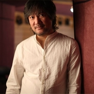 林海](https://i.xiami.com/linhai) | **播放数**: 200549457 **粉丝数**: 284980 **评论数**: 3964 **地区**: China 中国大陆 **风格**: 器乐独奏 Solo Instrumental, 轻音乐 Easy Listening, 新世纪音乐 New Age, 中国风 China-Wave  |

## 档案

小档案 
中   文   名：林海 
国        籍：中国 
出   生   地：福建晋江 
职        业：作曲家 
毕业院校：中央音乐学院 
代表作品：《琵琶语》《大明宫词》《远方的寂静》《空城》《城南旧事》《日月西东》 
艺人简介 
林海，  1969  年  1  月出生于晋江安海，中国新世纪音乐作曲家，中国传媒大学艺术学部教授、硕士生导师。 
他有着过人而全能的音乐素质，他的音乐包含古典、  New Age  、现代、爵士等多种风格，并将其巧妙的结合起来，给人一种清新、淡雅、悠扬的感觉。业内人士曾评价“有着萧邦的气质，以及德布西的慵懒与优雅”   ，“具有  George Winston  亲和而强烈的旋律性，及  Keith Jarrett  丰富而充满想像的思考性。” 
经历 
林海  4  岁时开始学习钢琴，  6  岁时候即开始创作自己的曲目，一年后登台演出，并受关注。  9  岁时就读于中央音乐学院与上海音乐学院附属小学。在  1988  年在中央音乐学院就读，  1989  年参加美国范·克莱本（  VAN CLIBURN  ）国际钢琴大赛，并进入前十名。  1992  年获得中央音乐学院本科学士学位，与台湾音乐人范宗沛成立  MUSIC GATE   音乐工作室，之后在台湾风潮音乐唱片公司发展。林海先后出了十数张个人专辑，并给大量的电视剧、电影做原声音乐，如《大明宫词》、《一个陌生女人的来信》等，获得乐迷的喜爱以及专业人士的赞扬。 
音乐风格 
因林海过人而全能的音乐素质，所以他的音乐包含古典、  New Age  、现代、爵士等多种风格，并将其巧妙的结合起来，给人一种清新、淡雅、悠扬的感觉。业内人士曾说过他“有着萧邦的气质，以及德布西的慵懒与优雅”   ，“具有  George Winston  亲和而强烈的旋律性，及  Keith Jarrett  丰富而充满想像的思考性。” 
主要专辑 
林海专辑《远方的寂静》 
钢琴专辑《城南旧事》  1995 
钢琴专辑《日月西东》   1996 
音乐专辑《笑弯了一根扁担》   1996 
音乐专辑《女窥》  1997 
钢琴专辑《猫》   2000 
钢琴专辑《月光边境》   2001 
扬琴专辑《蝶舞》  2001 
音乐专辑（林海范宗沛作品集）《故事》   2001 
钢琴专辑《流动的城市》  2002 
琵琶专辑《琵琶相》  2003 
钢琴专辑《远方的寂静》  2004 
钢琴专辑《爱情风华》  2004 
影视配乐 
电视剧《大明宫词》 
电视剧《冬至》 
电视剧《就那么回事儿》 
电视剧《买办之家》 
电视剧《人人都说我爱你》 
电视电影《双重现场》 
电视剧《蟋蟀大师》 
电视电影《禧娃》 
电视剧《隐姓埋名》 
电视电影《战情》 
电影《高天厚土》 
电影《来了》 
电影《生死速递》（与台湾合作） 
电视剧《我的特务生涯》 
电影《西施眼》 
大型纪录片《中国博物馆》（合作） 
电视剧《书剑情侠柳三变》（合作） 
电影《自娱自乐》 
电影《一个陌生女人的来信》（与日本合作） 
系列电视电影《绝对隐私》之《兄弟》《陈越的婚纱》《赵军的秘密》《忏悔》 
电影《向日葵》 
电视剧《生存之民工》 
电影《乒乓小子》（与台湾合作） 
电影短片《玩偶》 
2008  奥运会吉祥物动画片配乐 
电影《十全九美》 
合作专辑 
风潮唱片心灵音乐诗系列音乐专辑：《清香落》《含笑》《去做人间雨》《素颜鸽》《花舞》《樱花雨》《七星海》 
与范宗沛合作的音乐专辑：《水色》 
参与制作的音乐专辑：《夜的节目单》《恋恋温泉》《海洋之歌》《陶笛奇遇记》《夕阳山外山》《最近的天堂》《青蛙四季唱游》《蔡志忠与庄子的音乐随想》《爱情  38  °  C  》《海洋嬉游记》《星光》

## 专辑

| 名称 | 语种 | 唱片公司 | 发行时间 | 专辑类别 | 专辑风格 |
| :--: | :-- | :-- | :-- | :-- | :-- |
| [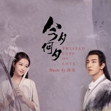 今夕何夕 电视原声专辑](./albums/5022019214.md) | 纯音乐 | 壹澄音乐工作室 | 2020年11月24日 | 原声带, 影视音乐 |  |
| [ Healing~やすらぎのピアノ](./albums/2102855812.md) | 纯音乐 | Della Inc. | 2017年06月30日 | 录音室专辑 | 轻音乐 Easy Listening, 疗愈音乐 Healing |
| [ Healing - Soothing Sound of Piano](./albums/5022079153.md) | 其他 | Della Inc. | 2017年06月30日 | 录音室专辑 |  |
| [ 鹿鼎记(华策版) 电视原声](./albums/1419918318.md) | 国语 | 听觉新音乐工作室 | 2014年12月31日 | 原声带, 影视音乐 | 电视原声 Television Music, 国语流行 Mandarin Pop, 中国风 China-Wave |
| [ 新天龙八部](./albums/1188891095.md) | 国语 | 听觉新音乐工作室 | 2014年01月05日 | 原声带, 影视音乐 | 电视原声 Television Music, 国语流行 Mandarin Pop |
| [ 林海影视配乐精选林海影视音乐作品集 叁](./albums/72014.md) | 其他 | 听觉新音乐工作室 | 2013年11月20日 | 原声带, 影视音乐 | 电影原声 Film Score, 电视原声 Television Music |
| [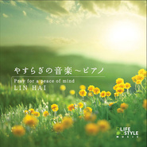 やすらぎの音楽～ピアノPray for a peace of mind](./albums/515271.md) | 日语 | Della | 2012年04月27日 | 录音室专辑 |  |
| [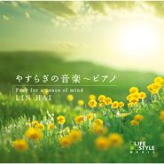 ヤスラギノオンガクピアノ](./albums/5022073794.md) | 其他 | Della Inc. | 2012年04月27日 | 录音室专辑 |  |
| [ 大明宫词 影视音乐原声大碟林海影视音乐作品集-壹](./albums/437362.md) | 国语 | 林海听觉音乐工作室 | 2011年04月18日 | 原声带, 影视音乐 | 原声 Soundtrack, 电视原声 Television Music, 轻音乐 Easy Listening |
| [ 我的青春谁做主 影视音乐原声大碟林海影视音乐作品集-贰](./albums/428342.md) | 其他 | 林海听觉音乐工作室 | 2011年04月17日 | 原声带, 影视音乐 | 轻音乐 Easy Listening |
| [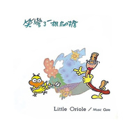 笑弯了一根扁担当代音乐馆-音乐风系列](./albums/321742.md) | 其他 | 风潮音乐 | 2005年02月02日 | 录音室专辑 | 轻音乐 Easy Listening |
| [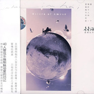 爱情风华](./albums/2647.md) | 国语 | 风潮音乐 | 2005年01月01日 | 录音室专辑 | 轻音乐 Easy Listening |
| [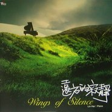 远方的寂静](./albums/2648.md) | 国语 | 风潮音乐 | 2003年12月01日 | 录音室专辑 | 轻音乐 Easy Listening |
| [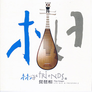 琵琶相](./albums/2649.md) | 其他 | 风潮音乐 | 2003年06月01日 | 录音室专辑 | 轻音乐 Easy Listening, 新世纪音乐 New Age, 中国民乐 Chinese Folk Music |
| [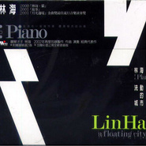 流动的城市](./albums/2650.md) | 国语 | 风潮音乐 | 2003年02月01日 | 录音室专辑 | 轻音乐 Easy Listening |
| [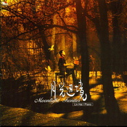 月光边境](./albums/2651.md) | 国语 | 风潮音乐 | 2001年12月01日 | 录音室专辑 | 轻音乐 Easy Listening |
| [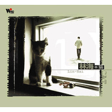 猫林海钢琴音乐盒3](./albums/2652.md) | 国语 | 风潮音乐 | 2000年10月25日 | 录音室专辑 | 轻音乐 Easy Listening |
| [ 太平公主 电视剧原声带大明宫词 / 武则天后传](./albums/168178.md) | 国语 | Emotion Music | 1999年03月01日 | 原声带, 影视音乐 | 原声 Soundtrack, 电视原声 Television Music, 中国风 China-Wave |
| [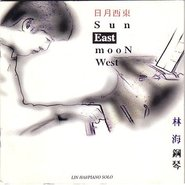 日月西东](./albums/2653.md) | 其他 | BMG | 1996年01月01日 | 录音室专辑 | 轻音乐 Easy Listening |
| [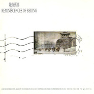 城南旧事](./albums/2654.md) | 国语 | BMG | 1995年01月01日 | 录音室专辑 | 轻音乐 Easy Listening |

## 评论

|  |  |  |  |
| :-- | :-- | :-- | :-- |
|  [虾米用户](https://emumo.xiami.com/u/402001484) 前尘终为尘 2021-01-05 23:47 赞(0) 踩(0) | 
生日快乐
 |
|  [虾米用户](https://emumo.xiami.com/u/46397754)  2021-01-05 13:01 赞(0) 踩(0) | 
可惜了，虾米发通告说要关了
 |
|  [虾米用户](https://emumo.xiami.com/u/245203652)  2021-01-05 12:14 赞(1) 踩(0) | 
老林！生！日！快！乐！  
 |
|  [虾米用户](https://emumo.xiami.com/u/7451667)  2021-01-05 12:12 赞(0) 踩(0) | 
祝你生日快乐！林海大师，愿继续带领我们畅游音乐的世界，早出新作！
 |
|  [虾米用户](https://emumo.xiami.com/u/283876238) 路见不平一声吼，吼完我就... 2021-01-05 11:44 赞(0) 踩(0) | 
林老师生日快乐，大爱你的音乐。
 |
|  [虾米用户](https://emumo.xiami.com/u/378383336)  2021-01-05 11:38 赞(0) 踩(0) | 

 |
|  [虾米用户](https://emumo.xiami.com/u/219117009)  2021-01-05 11:18 赞(0) 踩(0) | 
一直以为林海老师是个老头子 
 |
|  [虾米用户](https://emumo.xiami.com/u/9640951)  2021-01-05 11:16 赞(0) 踩(0) | 
林海老师，生日快乐
 |
|  [虾米用户](https://emumo.xiami.com/u/209430699) 浮生若梦，一切皆空。 2021-01-05 11:11 赞(0) 踩(0) | 
林海的旋律最治愈，在安静独处时，在焦虑难耐时，在快乐欢愉时。。。总有一首林海的背景音乐适合任何时候的心情和状态。大师加油～
 |
|  [虾米用户](https://emumo.xiami.com/u/323291024) 听音寻音。。。 2021-01-05 10:39 赞(0) 踩(0) | 
林海老师，生日快乐
 |
|  [虾米用户](https://emumo.xiami.com/u/13235922)  2021-01-05 10:35 赞(0) 踩(0) | 
林海老师生日快乐！
 |
|  [虾米用户](https://emumo.xiami.com/u/256483284) 春天里飞散着蝴蝶，秋季在... 2021-01-05 10:25 赞(0) 踩(0) | 
一家人都很喜欢先生的曲子，对于我来说是伴随了整个童年的旋律，感谢陪伴！新年快乐，生日快乐！
 |
|  [虾米用户](https://emumo.xiami.com/u/857083)  2021-01-05 10:20 赞(0) 踩(0) | 
生日快乐 
 |
|  [虾米用户](https://emumo.xiami.com/u/282062226)  2021-01-05 10:16 赞(0) 踩(0) | 
生日快乐林海老师  
 |
|  [虾米用户](https://emumo.xiami.com/u/429636114)  2021-01-05 10:15 赞(0) 踩(0) | 
生日快乐！
 |
|  [虾米用户](https://emumo.xiami.com/u/376828556) n 2021-01-05 10:14 赞(0) 踩(0) | 
生日快乐!(^O^)y
 |
|  [虾米用户](https://emumo.xiami.com/u/442881482)  2020-05-11 20:55 赞(0) 踩(0) | 
林老师的曲子有种让人安静的魔力
 |
|  [虾米用户](https://emumo.xiami.com/u/6336735) We are one i... 2020-03-05 23:30 赞(1) 踩(0) | 
很棒的艺术家 加油
 |
|  [虾米用户](https://emumo.xiami.com/u/78579838)  2020-03-02 22:15 赞(1) 踩(0) | 
想听爱的私语！
 |
|  [虾米用户](https://emumo.xiami.com/u/42225175) 精分成功不是梦 2020-02-16 10:48 赞(1) 踩(0) | 
哎，没有无羁只好到别的app了，你说虾米不香吗？
 |
|  [虾米用户](https://emumo.xiami.com/u/434152246) 聪明少一些大智慧多一些，... 2020-02-08 16:03 赞(1) 踩(0) | 
 
 |
|  [虾米用户](https://emumo.xiami.com/u/433181518) 音乐是记忆的载体... 2020-01-19 12:27 赞(1) 踩(0) | 
《我的青春谁做主》配乐为什么没有？？？
 |
|  [虾米用户](https://emumo.xiami.com/u/125243160)  2020-01-06 06:58 赞(0) 踩(0) | 
优秀的音乐家，生日快乐
 |
|  [虾米用户](https://emumo.xiami.com/u/68641304) 开心就好！ 2020-01-05 18:17 赞(0) 踩(0) | 
林海老师，祝你生日快乐！ 
 |
|  [虾米用户](https://emumo.xiami.com/u/245203652)  2020-01-05 12:35 赞(0) 踩(0) | 
生日快乐！
 |
|  [虾米用户](https://emumo.xiami.com/u/304347129)  2020-01-05 11:09 赞(0) 踩(0) | 
林海老师生日快乐
 |
|  [虾米用户](https://emumo.xiami.com/u/275692521) 喜欢全是腿的夏天 2020-01-05 10:45 赞(0) 踩(0) | 
林老师生日快乐，很庆幸能遇见你的音乐，从2016年开始，你的琵琶语每天晚上都伴我入眠。当时我已经失眠了3个多月了。感谢
 |
|  [虾米用户](https://emumo.xiami.com/u/178928008) 我不是水瓶座 我是双鱼 2020-01-05 10:40 赞(0) 踩(0) | 
大师祝你生日快乐，虾米叫我来的
 |
|  [虾米用户](https://emumo.xiami.com/u/4218777) 博学之,审问之,慎思之,... 2020-01-05 10:28 赞(0) 踩(0) | 
咦？生日啦？林海生日快乐！！~~☀
 |
|  [虾米用户](https://emumo.xiami.com/u/288904200) 爱我大美河山 2020-01-05 10:21 赞(0) 踩(0) | 
林海生日快乐  
 |
|  [虾米用户](https://emumo.xiami.com/u/348750095)  2020-01-05 10:17 赞(0) 踩(0) | 
生日你快樂！我們不快樂！因你好長時間沒有新作品，讓喜歡你的粉絲開心！ 
 |
|  [虾米用户](https://emumo.xiami.com/u/84768054) 我在網易雲音樂的名字豆豆... 2020-01-05 10:15 赞(0) 踩(0) | 
琵琶语非常喜欢
 |
|  [虾米用户](https://emumo.xiami.com/u/84768054) 我在網易雲音樂的名字豆豆... 2020-01-05 10:15 赞(0) 踩(0) | 
生日快乐，最喜欢的音乐人之一
 |
|  [虾米用户](https://emumo.xiami.com/u/288507906) 不癫狂，不虚妄。 2020-01-05 10:09 赞(0) 踩(0) | 
生日快乐
 |
|  [虾米用户](https://emumo.xiami.com/u/316492278) 以乐养心以心敬善 2020-01-05 10:07 赞(0) 踩(0) | 
生日快乐，平安健康
 |
|  [虾米用户](https://emumo.xiami.com/u/259311724) 我还没想好要写什么... 2020-01-05 10:07 赞(0) 踩(0) | 
祝林海大师生日快乐万事顺遂
 |
|  [虾米用户](https://emumo.xiami.com/u/409359541) 自我意識過剩，請諒解！ 2020-01-05 10:07 赞(1) 踩(0) | 
生日快乐
 |
|  [虾米用户](https://emumo.xiami.com/u/405714849)  2020-01-05 10:07 赞(0) 踩(0) | 
最喜欢的音乐人，林海。从他的音乐中仿佛看到各种美好的画面、闻到万物美好的气息。感谢这么美好的音乐。祝林海生日快乐。
 |
|  [虾米用户](https://emumo.xiami.com/u/99210090)  2020-01-05 10:06 赞(1) 踩(0) | 
生日快乐 
 |
|  [虾米用户](https://emumo.xiami.com/u/204035901) 如果有一天我跟你差事了，... 2020-01-05 10:04 赞(1) 踩(0) | 
生日快乐，林大师 
 |
|  [虾米用户](https://emumo.xiami.com/u/343365031) 倾听别人的声音 2020-01-05 10:04 赞(0) 踩(0) | 
生日快乐
 |
|  [虾米用户](https://emumo.xiami.com/u/431106627)  2019-12-14 19:49 赞(0) 踩(0) | 
好多年前直到现在，多谢你的音乐。
 |
|  [虾米用户](https://emumo.xiami.com/u/285486177) 音乐无国界！意境通古今！ 2019-12-08 13:23 赞(1) 踩(0) | 
日本有个石久让，中国有个林海！音乐无国界，致敬两位大师！
 |
|  [虾米用户](https://emumo.xiami.com/u/276944698) 不要自我设限..... 2019-11-21 12:31 赞(1) 踩(0) | 

 |
|  [虾米用户](https://emumo.xiami.com/u/52826753) 我还没想好要写什么... 2019-11-08 14:16 赞(0) 踩(0) | 
从大明宫词开始，就超级喜欢林海老师的音乐风格，最近的陈情令又让人燃了！民乐的感觉太棒了，琵琶，笛等等元素，总让人忍不住流泪
 |
|  [虾米用户](https://emumo.xiami.com/u/323548942)  2019-10-24 12:50 赞(1) 踩(0) | 
求陈情令所有啊啊啊啊！！！
 |
|  [虾米用户](https://emumo.xiami.com/u/35201727) 再见 2019-10-09 09:34 赞(0) 踩(0) | 
日本的感觉
 |
|  [虾米用户](https://emumo.xiami.com/u/222605680)  2019-09-16 22:42 赞(1) 踩(0) | 
偶然间听了你的曲子 之后便一发不可收拾 每每无法入睡的时候 只有你的曲子才能让我安静下来 沉入梦乡
 |
|  [虾米用户](https://emumo.xiami.com/u/428235557)  2019-09-15 14:34 赞(0) 踩(0) | 
，
 |
|  [虾米用户](https://emumo.xiami.com/u/428235557)  2019-09-15 14:34 赞(0) 踩(0) | 
。
 |
|  [虾米用户](https://emumo.xiami.com/u/363526318)  2019-09-09 13:12 赞(1) 踩(0) | 
陈情令!!!!!!!!!!!!!
 |
|  [虾米用户](https://emumo.xiami.com/u/16867500)  2019-08-27 21:16 赞(1) 踩(0) | 
୧୨ડડヾ☎︎㍽‍♀️☏‍♀️‍♀️‍♀️‍♀️‍♀️‍♀️‍♀️‍♀️‍♀️‍♀️‍♀️‍♀️‍♀️‍♀️‍♀️‍♀️‍♀️‍♀️‍♀️‍♀️‍♀️‍♀️‍♀️‍♀️‍♀️‍♀️‍♀️‍♀️‍♀️‍♀️‍♀️‍♀️‍♀️‍♀️‍♀️‍♀️‍♀️‍♀️‍♀️‍♀️‍♀️‍♀️‍♀️‍♀️‍♀️‍♀️‍♀️‍♀️‍♀️‍♀️‍♀️‍♀️‍♀️‍♀️
 |
|  [虾米用户](https://emumo.xiami.com/u/50004294) 每一首音乐，都是一个回忆... 2019-08-22 23:35 赞(1) 踩(0) | 
问君琵琶有多燃，大珠小珠落玉盘
 |
|  [虾米用户](https://emumo.xiami.com/u/364303790)  2019-08-19 21:59 赞(2) 踩(0) | 
遗憾的是为啥我这不能下载 
 |
|  [虾米用户](https://emumo.xiami.com/u/423059434)  2019-08-15 22:45 赞(1) 踩(0) | 
丝丝扣入心弦
 |
|  [虾米用户](https://emumo.xiami.com/u/340986269)   2019-08-09 22:39 赞(2) 踩(0) | 
他的作品富有灵性，每一个音符在你心上跳跃，构成一幅幅画面。治疗你心中的伤，给你一个无人打扰的世界。
 |
|  [虾米用户](https://emumo.xiami.com/u/346506957)  2019-08-07 21:24 赞(1) 踩(0) | 
第一次，不，不能说是第一次，应该说是很多次了，听到这首曲子。但说第一次是因为，我第一次完整并认真地去听了。这还是手机自动播放出的乐曲，前奏一出来，我的心顿时被琴音碰触了，感到又美丽又悲伤，说不出的，就像悸动的感觉一样。今天的我很幸运，听到了很美的音乐。
 |
|  [虾米用户](https://emumo.xiami.com/u/353938153)  2019-08-05 15:33 赞(1) 踩(0) | 
泉州人，感动!
 |
|  [虾米用户](https://emumo.xiami.com/u/313254681) 你那么好，我得更努力的爱... 2019-08-05 10:35 赞(2) 踩(0) | 
哈哈哈哈哈，虾米爸爸，把陈情令纯音乐安排一下
 |
|  [虾米用户](https://emumo.xiami.com/u/427671958)    黑夜照亮昼的白 2019-07-24 20:59 赞(2) 踩(0) | 
为这首歌而下的虾米
 |
|  [虾米用户](https://emumo.xiami.com/u/356043426) 山不厌高，海不厌深。 2019-07-24 06:44 赞(0) 踩(0) | 
迷人的曲调
 |
|  [虾米用户](https://emumo.xiami.com/u/337388945)  2019-07-23 22:17 赞(0) 踩(0) | 
琵琶语，百听不厌
 |
|  [虾米用户](https://emumo.xiami.com/u/410175639)  2019-07-21 01:46 赞(2) 踩(0) | 
昨天发现我大爱的广播剧出了电视剧版，还请了林先生作曲、编曲，简直不敢相信自己的眼睛(≧∇≦)/，剧中的配乐透露着林氏风格，太喜欢了，太适合表达主角的情感了   
 |
|  [虾米用户](https://emumo.xiami.com/u/427402904) 清润宁静养心灵 2019-07-18 16:48 赞(0) 踩(0) | 
自然喜欢收藏佳作不言谢
 |
|  [虾米用户](https://emumo.xiami.com/u/426044523)  2019-07-17 18:21 赞(0) 踩(0) | 
林海啊
 |
|  [虾米用户](https://emumo.xiami.com/u/357752578) 燕:  片叶寄思迎风飘，... 2019-07-15 17:01 赞(0) 踩(0) | 
秀美中华，林海奇葩，千里弹震，万里传达！  
 |
|  [虾米用户](https://emumo.xiami.com/u/427298347)  2019-07-14 23:52 赞(0) 踩(0) | 
林海老师的音乐在舒缓的节奏中又给予人力量，充满现代感而又不失古典韵味，每当音乐响起放毒都是和自然的一次对话，希望您能有更好的作品带给我们，谢谢。
 |
|  [虾米用户](https://emumo.xiami.com/u/259886968) 别靠近我 2019-07-13 01:56 赞(0) 踩(0) | 
两个字，伟大。
 |
|  [虾米用户](https://emumo.xiami.com/u/9552584) 人生太短，也太长。 2019-07-03 14:28 赞(3) 踩(0) | 
蹲陈情令的OST
 |
|  [虾米用户](https://emumo.xiami.com/u/330900828) 高舉一面五星紅旗在蝦米！ 2019-06-26 01:28 赞(0) 踩(0) | 
久遠
 |
|  [虾米用户](https://emumo.xiami.com/u/410175639)  2019-06-15 23:51 赞(1) 踩(0) | 
随机听着轻音乐看书，突然觉得这个曲子虽然陌生但是触动心弦，打开播放器想收藏曲子，发现是林海的作品，不由道：果然还是林海啊&amp;hellip;&amp;hellip;当年就是中了琵琶语的毒
 |
|  [虾米用户](https://emumo.xiami.com/u/403435206)  2019-06-01 11:18 赞(0) 踩(0) | 
求月光边境琴谱……
 |
|  [虾米用户](https://emumo.xiami.com/u/418911493) 与孤独和音乐为伴 2019-05-30 23:16 赞(0) 踩(0) | 
中国古典音乐的希望
 |
|  [虾米用户](https://emumo.xiami.com/u/356035642) 怎奈那林海石径深幽处，夕... 2019-05-28 00:48 赞(0) 踩(0) | 
林海大大位列中国四大新世纪音乐家，名不虚传
 |
|  [虾米用户](https://emumo.xiami.com/u/85568296) 只有阳光而无阴影 只有欢... 2019-05-10 23:57 赞(0) 踩(0) | 
琵琶语～
 |
|  [虾米用户](https://emumo.xiami.com/u/4401911)  2019-04-27 14:21 赞(1) 踩(0) | 
林海老师你喝普洱茶吗？我这有位茶友的名字也是&amp;ldquo;林海&amp;rdquo;真的好希望是您呢
 |
|  [虾米用户](https://emumo.xiami.com/u/48686027)  2019-04-22 22:52 赞(0) 踩(0) | 
喜欢你的每首曲子，希望今后能听到你更多佳作，流芳百世。
 |
|  [虾米用户](https://emumo.xiami.com/u/309527030) 喜欢就会放肆，但爱是克制 2019-04-20 16:54 赞(0) 踩(0) | 
听你的音乐特别让人能心静！太平天下的感觉，好舒畅，谢谢你
 |
|  [虾米用户](https://emumo.xiami.com/u/51705692)  2019-04-19 19:49 赞(0) 踩(0) | 
中国之声的深夜节目，《千里共良宵》姚科老师的声音和第一首太搭配了吧！！！堪称完美！！！️️️️
 |
|  [虾米用户](https://emumo.xiami.com/u/420744714)  2019-03-23 10:44 赞(0) 踩(0) | 
千言万语就化一声祝福找另一半就找有德有修养不太自我的养该子要有牺牲精神
 |
|  [虾米用户](https://emumo.xiami.com/u/420744714)  2019-03-23 10:16 赞(1) 踩(0) | 
<a href="http://emumo.xiami.com/u/2006377" target="_blank" rel="nofollow" name_card="2006377">@林海 </a>你要多生孩子本国缺你这天才祝健康多吃西红柿菠萝少吃猪
 |
|  [虾米用户](https://emumo.xiami.com/u/251714557) maintain the... 2019-03-04 07:57 赞(4) 踩(0) | 
一耳沉沦，听见了就知道这就是自己想要的。
 |
|  [虾米用户](https://emumo.xiami.com/u/219479094) 長夜安乐，自为诸洲。 2019-02-28 08:23 赞(4) 踩(0) | 
林海老师的音乐有中国式山水的诗情画意，每曲音乐都是在雕刻一幅山水画，冷静深邃悠远，细品和弦入木几分哲思，一曲诉罢让人回味无穷，凭足于留白许久。
 |
|  [虾米用户](https://emumo.xiami.com/u/31843088)  2019-02-17 19:53 赞(3) 踩(0) | 
比日本的同类作品婉转悠扬，比较耐听。
 |
|  [虾米用户](https://emumo.xiami.com/u/354205849) 一辈子只爱一个人真的很难... 2019-02-16 03:02 赞(6) 踩(0) | 
计划经济时代，没有明星文化，也没有娱乐圈，那时演员都是拿国家工资。而且以前演员歌手都是艺校出身的，不像现在。只是我们走了港台的老路。黄家驹说过，香港没有乐坛，只有娱乐圈。其实不无道理。。。
 |
| ⇒ |  [虾米用户](https://emumo.xiami.com/u/282447015)  2019-08-04 20:06 赞(0) 踩(0) | 
你的头像，平平无奇 
 |
|  [虾米用户](https://emumo.xiami.com/u/354205849) 一辈子只爱一个人真的很难... 2019-02-16 02:52 赞(0) 踩(0) | 
计划经济时代，没有明星文化，也没有娱乐圈，那时演员都是拿国家工资。而且以前演员歌手都是艺校出身的，不像现在。只是我们走了港台的老路。黄家驹说过，香港没有乐坛，只有娱乐圈。其实不无道理
 |
|  [虾米用户](https://emumo.xiami.com/u/361116674)  2019-02-15 22:05 赞(1) 踩(0) | 
林海的作品是我喜欢的类型，清新，不吵不闷，带着淡淡的忧伤和凄美，但又不使人沉沦萎靡，很适合一个人开车时听。
 |
|  [虾米用户](https://emumo.xiami.com/u/361116674)  2019-02-15 21:59 赞(1) 踩(0) | 
丢失一首好乐曲，手机掉了，乐曲也掉了，再也找不回来了，心疼好几年
 |
|  [虾米用户](https://emumo.xiami.com/u/402573694) 畅游在音乐的海洋里 2019-02-05 21:31 赞(2) 踩(0) | 
你让我看到希望中国音乐的希望
 |
|  [虾米用户](https://emumo.xiami.com/u/334956937)  2019-02-03 11:13 赞(3) 踩(0) | 
又找到了属于自己的那一份心灵的宁静
 |
|  [虾米用户](https://emumo.xiami.com/u/412329873) 枯藤老树昏鸦，小桥流水人... 2019-01-27 02:06 赞(1) 踩(0) | 
惊鸿一瞥 惊艳今喜
 |
|  [虾米用户](https://emumo.xiami.com/u/400371901)  2019-01-26 00:44 赞(0) 踩(0) | 
林海真是非常了不起的人！
 |
|  [虾米用户](https://emumo.xiami.com/u/362729825)  2019-01-24 15:05 赞(1) 踩(0) | 
说心里话，我是一个只喜欢听歌而从来不去看作者的人，但是我真的很喜欢你的作品，好的歌曲不一定常有，但是却一定会永远流传。
 |
|  [虾米用户](https://emumo.xiami.com/u/347550992) ¿ 2019-01-12 23:51 赞(0) 踩(0) | 
惊了，才发现林老师也关注了好多日本作曲家  
 |
|  [虾米用户](https://emumo.xiami.com/u/314293240)  2019-01-10 00:08 赞(0) 踩(0) | 
最爱琵琶语
 |
|  [虾米用户](https://emumo.xiami.com/u/283184110)  2019-01-06 01:30 赞(0) 踩(0) | 
祝林海先生生日快乐，喜欢您的曲子。每一曲都有不同的感觉，空灵安静
 |
|  [虾米用户](https://emumo.xiami.com/u/256423394) 我乃刘世子孙 2019-01-05 21:59 赞(1) 踩(0) | 
林海先生，最喜欢你监制的＜悬浮＞，甚至还赋过词，勾起内心深处的很美好的回忆。谢谢你！我很少会为别人过生日，刚看到平台的提醒，看到您的名字，就一定要祝你生日快乐！
 |
|  [虾米用户](https://emumo.xiami.com/u/268178465) hello world 2019-01-05 20:44 赞(2) 踩(0) | 
生日快乐哦 
 |
|  [虾米用户](https://emumo.xiami.com/u/11239375) 喜欢就坚持吧。 2019-01-05 20:02 赞(0) 踩(0) | 
先生生日快乐!(^O^)y
 |
|  [虾米用户](https://emumo.xiami.com/u/299621760) 我还没想好要写什么... 2019-01-05 19:16 赞(0) 踩(0) | 
生日快乐，希望能听到更多的有特色的音乐
 |
|  [虾米用户](https://emumo.xiami.com/u/49690878)  2019-01-05 18:57 赞(0) 踩(0) | 
祝生日快乐！
 |
|  [虾米用户](https://emumo.xiami.com/u/345613251) BTS and Shaw... 2019-01-05 18:20 赞(0) 踩(0) | 
谢谢您的音乐，生日快乐，祝您会有更好的作品给大家，谢谢。
 |
|  [虾米用户](https://emumo.xiami.com/u/59890766) 我是你的甲乙丙丁 2019-01-05 18:13 赞(0) 踩(0) | 
生日快乐。老师
 |
|  [虾米用户](https://emumo.xiami.com/u/189227325)  2019-01-05 16:59 赞(0) 踩(0) | 
生日快乐！
 |
|  [虾米用户](https://emumo.xiami.com/u/256671064)  2019-01-05 15:38 赞(0) 踩(0) | 
生日快乐
 |
|  [虾米用户](https://emumo.xiami.com/u/54770345)  2019-01-05 15:16 赞(0) 踩(0) | 
生日快乐！
 |
|  [虾米用户](https://emumo.xiami.com/u/261808153)  2019-01-05 15:05 赞(1) 踩(0) | 
之前关注了林海 今天虾米提醒我说今天是林海的生日 祝你生日快乐 永远快乐 感谢你的音乐 记得第一次听林海的钢琴曲轻音乐就被感动了
 |
|  [虾米用户](https://emumo.xiami.com/u/43125399)  2019-01-05 14:37 赞(0) 踩(0) | 
赶上祝福，生快啊！  
 |
|  [虾米用户](https://emumo.xiami.com/u/11060745) 我还没想好要写什么... 2019-01-05 13:32 赞(0) 踩(0) | 
生日快乐，音乐老师
 |
|  [虾米用户](https://emumo.xiami.com/u/294112819) 除你以外 别无拯救 ✞ ... 2019-01-05 13:22 赞(0) 踩(0) | 
生日快乐！
 |
|  [虾米用户](https://emumo.xiami.com/u/264352197)  2019-01-05 12:48 赞(0) 踩(0) | 
生日快乐 
 |
|  [虾米用户](https://emumo.xiami.com/u/341748993) 爱音乐，爱电影，爱狗子的... 2019-01-05 12:34 赞(0) 踩(0) | 
祝您生日快乐，愿您身体健康，心情愉悦。
 |
|  [虾米用户](https://emumo.xiami.com/u/267455325)  2019-01-05 12:09 赞(0) 踩(0) | 
为国人争光  林海当之无愧 他的曲子内涵丰富荡气回肠
 |
|  [虾米用户](https://emumo.xiami.com/u/48392255)  2019-01-05 11:42 赞(0) 踩(0) | 
生日快乐
 |
|  [虾米用户](https://emumo.xiami.com/u/314233892)  2019-01-05 11:13 赞(0) 踩(0) | 
hApPY biRthday   
 |
|  [虾米用户](https://emumo.xiami.com/u/294941126)  2019-01-05 11:12 赞(0) 踩(0) | 
诸事顺意
 |
|  [虾米用户](https://emumo.xiami.com/u/328088651) 不求上进，十分下流 2019-01-05 10:52 赞(0) 踩(0) | 
生日快乐~
 |
|  [虾米用户](https://emumo.xiami.com/u/12342105) translander 2019-01-05 10:50 赞(0) 踩(0) | 
生日快乐～
 |
|  [虾米用户](https://emumo.xiami.com/u/7569165) 。 2019-01-05 10:49 赞(0) 踩(0) | 
生日快乐
 |
|  [虾米用户](https://emumo.xiami.com/u/407862851)  2019-01-05 10:43 赞(0) 踩(0) | 
生日快乐
 |
|  [虾米用户](https://emumo.xiami.com/u/332272318) 时间和心情最贵 2019-01-05 10:38 赞(0) 踩(0) | 
生日快乐，很喜欢林海的音乐
 |
|  [虾米用户](https://emumo.xiami.com/u/45174778)  2019-01-05 10:28 赞(0) 踩(0) | 
生日快乐，宫崎骏也是今天生日，哈哈
 |
|  [虾米用户](https://emumo.xiami.com/u/787309)  2019-01-05 10:26 赞(0) 踩(0) | 
赞赞赞
 |
|  [虾米用户](https://emumo.xiami.com/u/288057407)  2019-01-05 10:22 赞(0) 踩(0) | 
生日快乐 
 |
|  [虾米用户](https://emumo.xiami.com/u/54624555) 神奇do re mi，一... 2019-01-05 10:12 赞(0) 踩(0) | 
轻乐巨匠  灵魂音乐人  生日快乐
 |
|  [虾米用户](https://emumo.xiami.com/u/378402146)  2019-01-05 10:07 赞(0) 踩(0) | 
生日快乐，林海大师   
 |
|  [虾米用户](https://emumo.xiami.com/u/411017645)  2019-01-05 10:06 赞(0) 踩(0) | 
生日快乐
 |
|  [虾米用户](https://emumo.xiami.com/u/352167620)  2019-01-05 10:04 赞(0) 踩(0) | 
生日快乐2019年期待更多更好的作品❤
 |
|  [虾米用户](https://emumo.xiami.com/u/324080371)  2019-01-05 10:04 赞(0) 踩(0) | 
生日快乐 今天还有个朋友过生日诶  
 |
|  [虾米用户](https://emumo.xiami.com/u/48652633) 是我刚才看到的第一个词 2019-01-05 10:03 赞(0) 踩(0) | 
神仙配乐，希望能有更多作品
 |
|  [虾米用户](https://emumo.xiami.com/u/285386759) 我买咗两本几米漫画，另一... 2019-01-05 10:03 赞(0) 踩(0) | 
生日快乐，林大师 
 |
|  [虾米用户](https://emumo.xiami.com/u/208327557) 我还没想好要写什么... 2019-01-05 10:02 赞(0) 踩(0) | 
赞超美的音乐
 |
|  [虾米用户](https://emumo.xiami.com/u/17717702) 生命有限 音乐无限 2018-12-22 10:06 赞(1) 踩(0) | 
音乐不分国界、语言、性别、年龄，这就是它的迷人和伟大之处！
 |
|  [虾米用户](https://emumo.xiami.com/u/319543003)  2018-12-16 09:52 赞(1) 踩(0) | 
通过电视剧《大明宫词》知晓林海，电视剧里最喜爱长相守古琴曲。
 |
|  [虾米用户](https://emumo.xiami.com/u/410535113)  2018-12-14 17:19 赞(3) 踩(0) | 
听林海的音乐，仿佛自己在大自然中呼吸
 |
|  [虾米用户](https://emumo.xiami.com/u/98832320)  2018-12-05 00:22 赞(1) 踩(0) | 
支持林海开音乐会，一定买票去看！
 |
|  [虾米用户](https://emumo.xiami.com/u/408825042)  2018-11-28 23:35 赞(1) 踩(0) | 
琵琶语真的很好听
 |
|  [虾米用户](https://emumo.xiami.com/u/52415194) ♬♩♫♪♡ 2018-11-27 14:52 赞(1) 踩(0) | 
希望能在現場聽到您的音樂
 |
|  [虾米用户](https://emumo.xiami.com/u/44475429) 我还没想好要写什么... 2018-11-24 10:40 赞(2) 踩(0) | 
林海先生请问什么时候开音乐会？等待好久了
 |
|  [虾米用户](https://emumo.xiami.com/u/408650730)  2018-11-14 20:41 赞(0) 踩(0) | 
我又回到了这里
 |
|  [虾米用户](https://emumo.xiami.com/u/408650730)  2018-11-14 20:40 赞(1) 踩(0) | 
百听不厌
 |
|  [虾米用户](https://emumo.xiami.com/u/355305858)  2018-11-12 23:00 赞(0) 踩(0) | 
寻寻觅觅……寻寻觅觅…………
 |
|  [虾米用户](https://emumo.xiami.com/u/300027818) 我还没想好要写什么... 2018-11-06 11:28 赞(0) 踩(0) | 
一直以来很喜欢您的音乐，觉得很独特又有魅力，喜欢《欢沁》和《声声思》，可惜不能免费下载啊
 |
| ⇒ |  [虾米用户](https://emumo.xiami.com/u/262621065)  2018-11-11 21:51 赞(0) 踩(0) | 
什么叫可惜不能免费下载，八块钱一个月的会员要你命吗？只知道白嫖的屌丝
 |
|  [虾米用户](https://emumo.xiami.com/u/11446884) New York MoM... 2018-11-02 19:47 赞(0) 踩(0) | 
一直很享受……翻着古书……听着古乐……乃是一大快事……   
 |
|  [虾米用户](https://emumo.xiami.com/u/285236485)  2018-11-02 08:33 赞(1) 踩(0) | 
原来我还挺喜欢林海的歌，结果我手贱看了林海的微博和新闻，我真的是现在看到林海都不忍直视了，连音乐都不能听了...原来以为是个德艺双馨的老艺术家，结果是个风流老牛吃嫩草的离婚重灾区的文艺中老年...
 |
| ⇒ |  [虾米用户](https://emumo.xiami.com/u/332957997)  2018-12-20 17:46 赞(0) 踩(0) | 
我也去关注了他微博，确实是看到了&amp;ldquo;跟自己想象不一样的林老师&amp;rdquo;！不过我反而更加喜欢这个活生生的人，以前是想象中飞在天上的仙～年纪也比我想象的小，他现在的状态很好，尤其喜欢他毫不避讳地表达对老婆的爱意，还有好不怯场地强行插入年轻人话题。是不是离婚二婚三婚都没问题，跟真正爱的人结婚就是对的。
 |
| ⇒ |  [虾米用户](https://emumo.xiami.com/u/285236485)  2019-02-15 03:54 赞(0) 踩(0) | 
<q><b>小亚0327说：</b></q>
 |
|  [虾米用户](https://emumo.xiami.com/u/323951891) Chasing  lov... 2018-10-31 18:12 赞(0) 踩(0) | 
艺术家
 |
|  [虾米用户](https://emumo.xiami.com/u/351290416)  2018-10-27 09:11 赞(1) 踩(0) | 
林海老师早年间应该是很孤独的，才会有这么多丰沛的情感和内心世界。这是大师都会有的曾经。只是现在商业了，人也长得丰满了哈哈。很有才的一个人，希望内心还有情怀和梦想。
 |
|  [虾米用户](https://emumo.xiami.com/u/349086295)  2018-10-22 16:48 赞(0) 踩(0) | 
这首曲子付费了就是下载不到本地，谁能说怎么回事
 |
| ⇒ |  [虾米用户](https://emumo.xiami.com/u/262621065)  2018-11-11 21:54 赞(0) 踩(0) | 
版权保护，格式加密了的。很快这几个音乐软件都会这样了
 |
|  [虾米用户](https://emumo.xiami.com/u/9170717) 云海之外听虾米 2018-10-16 00:55 赞(0) 踩(0) | 
喜欢
 |
|  [虾米用户](https://emumo.xiami.com/u/6613263) 但我还没想好要写什么..... 2018-10-12 13:44 赞(0) 踩(0) | 
0000
 |
|  [虾米用户](https://emumo.xiami.com/u/351102905)  2018-10-02 18:51 赞(1) 踩(0) | 
我听琵琶语算起来有10年了，一直百听不厌！让我欣慰、让我宁静、让我无暇、让我空韵&amp;hellip;&amp;hellip;&amp;hellip;&amp;hellip;
 |
|  [虾米用户](https://emumo.xiami.com/u/403844807)  2018-09-27 17:10 赞(1) 踩(0) | 
一曲琵琶语，林海二字可名留青史。
 |
|  [虾米用户](https://emumo.xiami.com/u/404113349)  2018-09-24 19:04 赞(1) 踩(0) | 
感谢林海老师带给我们这么美妙的音乐，也希望林海老师以后有更多的好音乐带给我们。
 |
|  [虾米用户](https://emumo.xiami.com/u/282387825) 我爱的是你爱我 2018-09-20 10:18 赞(0) 踩(0) | 
☺
 |
|  [虾米用户](https://emumo.xiami.com/u/6820570) 这是语言的变调，承接醒来... 2018-09-10 08:50 赞(2) 踩(0) | 
林海在微博上颠覆了我之前的看法。。。一个安静的美男子作曲家，居然也皮得可以，还狂撒狗粮。林老师节日快乐 
 |
|  [虾米用户](https://emumo.xiami.com/u/402953028)  2018-09-09 12:20 赞(0) 踩(0) | 
一个陌生女人的来信
 |
|  [虾米用户](https://emumo.xiami.com/u/361190777) 我还没想好要写什么... 2018-09-05 21:38 赞(1) 踩(0) | 
我是厦门的
 |
|  [虾米用户](https://emumo.xiami.com/u/361190777) 我还没想好要写什么... 2018-09-05 21:36 赞(1) 踩(0) | 
没想到我们这里也有这样的音乐人才哈哈
 |
|  [虾米用户](https://emumo.xiami.com/u/52796218) 这家伙很聪明什么也没留下... 2018-09-01 13:19 赞(0) 踩(0) | 
福建晋江青阳人，4岁开始学钢琴，作曲家父亲发现，他天生一对拥有绝对音准的耳朵，从此，钢琴成为一生的事。6岁创作钢琴曲，7岁登台演出，9岁同时考入中央音乐学院与上海音乐学院附小。并童年离开老家，自己一个在北京念书；1988年进入中央音乐学院就读 师从著名钢琴教育家周广仁；1992年从中央音乐学院本科毕业 获学士学位；
 |
|  [虾米用户](https://emumo.xiami.com/u/378691829)  2018-09-01 08:01 赞(0) 踩(0) | 
静听
 |
|  [虾米用户](https://emumo.xiami.com/u/855550)  2018-08-31 17:18 赞(0) 踩(0) | 
音乐很棒~而且还是我大泉州的，太棒了~
 |
|  [虾米用户](https://emumo.xiami.com/u/376136543)  2018-08-30 15:49 赞(0) 踩(0) | 
琵琶语让我惊艳让我哭泣&amp;hellip;让我痴迷。琵琶相又如此欢快有趣，如此美妙的音乐，感慨今生没有白活过&amp;hellip;谢谢有你带给世人的惊世骇俗的美
 |
|  [虾米用户](https://emumo.xiami.com/u/245597545)   2018-08-28 19:12 赞(1) 踩(0) | 
请问林海老师什么时候可以为您的粉丝举办一场演奏会？真是期待呀&amp;hellip;&amp;hellip;
 |
|  [虾米用户](https://emumo.xiami.com/u/247229852)  2018-08-24 17:38 赞(2) 踩(0) | 
什么时候出新专呀 
 |
|  [虾米用户](https://emumo.xiami.com/u/379549530) 音符上寻找快乐 2018-08-19 19:41 赞(2) 踩(0) | 
一曲《琵琶语》，宛若天籁。
 |
|  [虾米用户](https://emumo.xiami.com/u/253418423) 连 2018-08-17 18:14 赞(2) 踩(0) | 
&lt;我特别喜欢《冬阳》这首曲，还有《远方的寂静》《麻雀与小孩》我是琵琶老师连青[url=/u/2006377]@林海[/url] [url=/u/52868849]@风潮音乐[/url] &gt;&lt;2006377,52868849&gt;
 |
|  [虾米用户](https://emumo.xiami.com/u/400251809)  2018-08-15 20:26 赞(1) 踩(0) | 
<a href="http://t.cn/RDCbIcF" target="_blank" rel="nofollow noreferrer noopener">http://t.cn/RDCbIcF</a> 故宫博物院古画会唱歌征集活动，欢迎收听我的音乐《踏歌》来自大唐的声音 在作品区第二页 右边箭头搜索。中央音乐学院作曲大师班潘晓 谢谢！
 |
| ⇒ |  [虾米用户](https://emumo.xiami.com/u/198036178)  2018-09-22 22:10 赞(0) 踩(0) | 
得到林海老师的授权了吗?
 |
|  [虾米用户](https://emumo.xiami.com/u/49959840) 无聊人 2018-08-13 21:06 赞(1) 踩(0) | 
☁️
 |
|  [虾米用户](https://emumo.xiami.com/u/374701204)  2018-08-12 16:34 赞(1) 踩(0) | 
感谢有您的音乐   
 |
| ⇒ |  [虾米用户](https://emumo.xiami.com/u/400251809)  2018-08-15 20:27 赞(0) 踩(0) | 
<a href="http://t.cn/RDCbIcF" target="_blank" rel="nofollow noreferrer noopener">http://t.cn/RDCbIcF</a> 故宫博物院古画会唱歌征集活动，欢迎收听我的音乐《踏歌》来自大唐的声音 在作品区第二页 右边箭头搜索。谢谢！
 |
|  [虾米用户](https://emumo.xiami.com/u/400719271) 鹰击长空，一览众山小 2018-08-09 09:36 赞(1) 踩(0) | 
点赞！！真你！艺术人生！没的说&amp;hellip;&amp;hellip;！
 |
| ⇒ |  [虾米用户](https://emumo.xiami.com/u/400251809)  2018-08-15 20:28 赞(0) 踩(0) | 
<a href="http://t.cn/RDCbIcF" target="_blank" rel="nofollow noreferrer noopener">http://t.cn/RDCbIcF</a> 故宫博物院古画会唱歌征集活动，欢迎收听我的音乐《踏歌》盛世唐音，來自大唐的音樂。在作品区第二页 右边箭头搜索。谢谢！
 |
|  [虾米用户](https://emumo.xiami.com/u/275174719)  2018-08-06 14:12 赞(1) 踩(0) | 
我的猫咪lucky走了一年～
 |
|  [虾米用户](https://emumo.xiami.com/u/378643129)  2018-07-27 09:09 赞(1) 踩(0) | 
林老师，我喜欢你所有的音乐！！！！
 |
| ⇒ |  [虾米用户](https://emumo.xiami.com/u/400251809)  2018-08-15 20:29 赞(0) 踩(0) | 
<a href="http://t.cn/RDCbIcF" target="_blank" rel="nofollow noreferrer noopener">http://t.cn/RDCbIcF</a> 故宫博物院古画会唱歌征集活动，推薦收聽《踏歌》盛世唐音，來自大唐的音樂。在作品区第二页 右边箭头搜索。谢谢！
 |
| ⇒ |  [虾米用户](https://emumo.xiami.com/u/400251809)  2018-08-15 20:30 赞(0) 踩(0) | 
<a href="http://t.cn/RDCbIcF" target="_blank" rel="nofollow noreferrer noopener">http://t.cn/RDCbIcF</a> 故宫博物院古画会唱歌征集活动，推荐《踏歌》，根据唐朝的编制而作，传递唐音。在作品区第二页 右边箭头搜索。谢谢！
 |
| ⇒ |  [虾米用户](https://emumo.xiami.com/u/400251809)  2018-08-15 20:32 赞(0) 踩(0) | 
<a href="http://t.cn/RDCbIcF" target="_blank" rel="nofollow noreferrer noopener">http://t.cn/RDCbIcF</a> 故宫博物院古乐活动，《踏歌》盛世唐音，由夜宴图而作。在作品区第二页 右边箭头搜索。谢谢！谢谢支持古乐！
 |
|  [虾米用户](https://emumo.xiami.com/u/379390451)  2018-07-26 00:23 赞(2) 踩(0) | 
爱古典！赞林海等古典古风原创纯作家！
 |
| ⇒ |  [虾米用户](https://emumo.xiami.com/u/400251809)  2018-08-15 20:33 赞(0) 踩(0) | 
欢迎收听我的音乐，传递大唐盛世的声音。
 |
|  [虾米用户](https://emumo.xiami.com/u/62833240)  2018-07-22 17:29 赞(2) 踩(0) | 
中国古典乐，最喜欢林海
 |
|  [虾米用户](https://emumo.xiami.com/u/357752578) 燕:  片叶寄思迎风飘，... 2018-07-18 12:40 赞(3) 踩(0) | 
《瑟琶相》之《踏古》天籁之声!!净化灵魂！！超凡脱俗！！！
 |
|  [虾米用户](https://emumo.xiami.com/u/357752578) 燕:  片叶寄思迎风飘，... 2018-07-18 12:37 赞(1) 踩(0) | 
《踏古》在央视10频道经常播放，特别有韵味！超级捧!
 |
|  [虾米用户](https://emumo.xiami.com/u/282387825) 我爱的是你爱我 2018-07-16 08:27 赞(2) 踩(0) | 
服
 |
|  [虾米用户](https://emumo.xiami.com/u/44161162) 音乐人生 2018-07-09 09:41 赞(1) 踩(0) | 
请问林海先生您用的钢琴和john  Herberman 是一模一样的，是什么牌子的钢琴？您能告诉我吗？您的曲风是不是也受到他的影响？
 |
| ⇒ |  [虾米用户](https://emumo.xiami.com/u/95556046) 心上人，一世长安啊 2018-08-02 14:59 赞(0) 踩(0) | 
雅马哈
 |
|  [虾米用户](https://emumo.xiami.com/u/183615486) 我还没想好要写什么... 2018-07-05 23:43 赞(2) 踩(0) | 
很喜欢你的音乐，点赞   
 |
|  [虾米用户](https://emumo.xiami.com/u/33207295)  2018-07-04 23:33 赞(2) 踩(0) | 
国风音乐中我觉得你和刘星都是翘楚。虽两人风格不同，但就国乐而言既是传承又有创新！   
 |
| ⇒ |  [虾米用户](https://emumo.xiami.com/u/13879186)  2018-07-12 13:34 赞(0) 踩(0) | 
同感。我也非常喜欢这二位。林海先生的音乐很悦耳，更入世，刘星先生的音乐更像是表达感情，更出世。
 |
|  [虾米用户](https://emumo.xiami.com/u/28499293) Avignon 2018-07-04 22:12 赞(1) 踩(0) | 
场面感，有气势，好听。
 |
|  [虾米用户](https://emumo.xiami.com/u/329923876)  2018-07-04 21:55 赞(1) 踩(0) | 
好听，喜欢。借此地推荐一首琵琶独奏龙船，音响有点糙，但绝对震撼！
 |
|  [虾米用户](https://emumo.xiami.com/u/13043233) 覕月 2018-07-03 21:00 赞(1) 踩(0) | 
发现自家人
 |
|  [虾米用户](https://emumo.xiami.com/u/55354501)  2018-07-02 20:26 赞(2) 踩(0) | 
林海的纯音乐作品普遍带有忧郁的特质，非常适合在结束了一天的忙碌工作，回家洗澡之后，打开卧室里的台灯，在昏暗的淡黄色光芒下，抱腿静坐在床上，靠着床头，闭眼细细咀嚼 ​​​​
 |
|  [虾米用户](https://emumo.xiami.com/u/282387825) 我爱的是你爱我 2018-07-01 09:48 赞(1) 踩(0) | 
大师，猴赛雷
 |
|  [虾米用户](https://emumo.xiami.com/u/343789844)  2018-06-29 11:54 赞(1) 踩(0) | 
林海，多有诗意的名字啊
 |
|  [虾米用户](https://emumo.xiami.com/u/47899329) 躲在静好的时光里 2018-06-26 01:05 赞(1) 踩(0) | 
有些喜欢会藏在心底。
 |
|  [虾米用户](https://emumo.xiami.com/u/80470516)  2018-06-22 02:37 赞(1) 踩(0) | 
闭上眼睛听林海，就能感觉到，微风吹过林，月光洒落海
 |
|  [虾米用户](https://emumo.xiami.com/u/366427222)  2018-06-15 08:18 赞(1) 踩(0) | 
@林海   碰瓷的技术不错哦
 |
|  [虾米用户](https://emumo.xiami.com/u/150644716) 我和我的赘肉，一刻也不能... 2018-06-14 17:09 赞(1) 踩(0) | 
续约就续约嘛！林老师可真是越来越会做公众人物了~
 |
|  [虾米用户](https://emumo.xiami.com/u/267963599) 夏日的木叶不会凋零 2018-06-13 21:48 赞(1) 踩(0) | 

 |
|  [虾米用户](https://emumo.xiami.com/u/235050) 我就说我是穷逼嘛~ 2018-06-11 23:32 赞(2) 踩(0) | 
支持维权！
 |
|  [虾米用户](https://emumo.xiami.com/u/333697273) 我还没想好要写什么... 2018-06-10 18:20 赞(1) 踩(0) | 
一直以为林海是一个女的
 |
|  [虾米用户](https://emumo.xiami.com/u/296467688) 塞上耳机便是一个人的世界... 2018-06-09 07:26 赞(1) 踩(0) | 
林老师好，喜欢你的音乐 
 |
|  [虾米用户](https://emumo.xiami.com/u/374807644)  2018-06-06 14:26 赞(1) 踩(0) | 
一直在欣赏，林老师好
 |
|  [虾米用户](https://emumo.xiami.com/u/374000625)  2018-05-29 16:04 赞(1) 踩(0) | 
好听
 |
|  [虾米用户](https://emumo.xiami.com/u/320820076)  2018-05-22 13:11 赞(2) 踩(0) | 
踏古，让我想起了小时候的敲锣打鼓。这才是中国音乐
 |
|  [虾米用户](https://emumo.xiami.com/u/302613947)  2018-05-21 18:43 赞(1) 踩(0) | 
喜欢！ 
 |
|  [虾米用户](https://emumo.xiami.com/u/259651)   2018-05-18 01:12 赞(4) 踩(0) | 
你这素质有点差啊，公开的这么不尊重女性掉粉啰
 |
|  [虾米用户](https://emumo.xiami.com/u/332768025)  2018-05-17 22:19 赞(2) 踩(0) | 
听林海的音乐能穿越到从前，能想起很多很多快忘的事了，也净化灵魂，真的能放下很多事儿
 |
|  [虾米用户](https://emumo.xiami.com/u/3798043)  2018-05-15 09:25 赞(3) 踩(0) | 
征婚人之常情,不过这么公开热闹地...毁三观啊.
 |
|  [虾米用户](https://emumo.xiami.com/u/330696435) 愿一切美好的同你分享 2018-05-14 09:33 赞(1) 踩(0) | 
大器，欣赏你!
 |
|  [虾米用户](https://emumo.xiami.com/u/104331758)   2018-05-13 23:09 赞(4) 踩(0) | 
老大妈报道
 |
|  [虾米用户](https://emumo.xiami.com/u/358508961) 雅俗共度，朝九晚五，浪迹... 2018-05-12 13:25 赞(1) 踩(0) | 
林叔，我真的好喜欢你的音乐啊
 |
|  [虾米用户](https://emumo.xiami.com/u/73685912) Lᵒᵛᵉᵧₒᵤ❤在这薄情... 2018-05-11 23:25 赞(2) 踩(0) | 
真正的音乐达人
 |
|  [虾米用户](https://emumo.xiami.com/u/177970278) 是脆弱同时也是力量 2018-05-10 04:09 赞(4) 踩(0) | 
真诚地面对自己的年龄不好吗？张口闭口&amp;ldquo;那些老大妈&amp;rdquo;，敢情您不是&amp;ldquo;老大爷&amp;rdquo;啊？
 |
| ⇒ |  [虾米用户](https://emumo.xiami.com/u/95556046) 心上人，一世长安啊 2018-05-11 13:35 赞(0) 踩(0) | 
他只是说话不过脑子，情商很低像个小孩。但他是个非常非常善良的人。他这几十年经历了太多的苦痛，依然没人理解。无论在音乐造诣上还是在为人上，他都不该被人这样对待。相信我，试着去了解他，理解他，他值得世界上美好的东西。
 |
| ⇒ |  [虾米用户](https://emumo.xiami.com/u/93247684) 茕茕白兔，东走西顾。衣不... 2018-05-16 19:34 赞(0) 踩(0) | 
林海老师道歉了，就不要因为他一时措辞不当就苛责他了
 |
|  [虾米用户](https://emumo.xiami.com/u/118677364)  2018-05-09 15:27 赞(2) 踩(0) | 
听说征婚征到一个95后，我要脱粉了哦（并不
 |
| ⇒ |  [虾米用户](https://emumo.xiami.com/u/32357734)  2018-05-12 19:24 赞(0) 踩(0) | 
真的假的？
 |
|  [虾米用户](https://emumo.xiami.com/u/361499466)  2018-05-03 22:30 赞(1) 踩(0) | 
何时会有演奏会啊？
 |
| ⇒ |  [虾米用户](https://emumo.xiami.com/u/95556046) 心上人，一世长安啊 2018-05-11 13:36 赞(0) 踩(0) | 
明年哦 
 |
| ⇒ |  [虾米用户](https://emumo.xiami.com/u/361499466)  2018-05-20 04:52 赞(0) 踩(0) | 
真的吗     ?
 |
| ⇒ |  [虾米用户](https://emumo.xiami.com/u/95556046) 心上人，一世长安啊 2018-05-20 20:17 赞(0) 踩(0) | 
假的哦
 |
| ⇒ |  [虾米用户](https://emumo.xiami.com/u/361499466)  2018-05-22 03:29 赞(0) 踩(0) | 
<q><b>慕思麟说：</b></q>
 |
| ⇒ |  [虾米用户](https://emumo.xiami.com/u/95556046) 心上人，一世长安啊 2018-05-23 10:03 赞(0) 踩(0) | 
<q><b>刘婷说：</b></q>
 |
| ⇒ |  [虾米用户](https://emumo.xiami.com/u/361499466)  2018-05-23 15:00 赞(0) 踩(0) | 
<q><b>慕思麟说：</b></q>
 |
| ⇒ |  [虾米用户](https://emumo.xiami.com/u/95556046) 心上人，一世长安啊 2018-05-25 10:03 赞(0) 踩(0) | 
<q><b>刘婷说：</b></q>
 |
|  [虾米用户](https://emumo.xiami.com/u/361499466)  2018-05-03 22:29 赞(1) 踩(0) | 
好爱好爱
 |
|  [虾米用户](https://emumo.xiami.com/u/298552739)  2018-04-28 21:27 赞(1) 踩(0) | 
好听，记得几年前完全靠这个音乐度日
 |
|  [虾米用户](https://emumo.xiami.com/u/312721012)  2018-04-21 17:56 赞(2) 踩(0) | 
来啦
 |
|  [虾米用户](https://emumo.xiami.com/u/340287905)  2018-04-20 20:30 赞(2) 踩(0) | 
泌人心脾
 |
|  [虾米用户](https://emumo.xiami.com/u/35062303) 一个喜欢唱歌的小女孩 2018-04-19 20:48 赞(2) 踩(0) | 
好听！
 |
|  [虾米用户](https://emumo.xiami.com/u/23354738)  2018-04-18 17:42 赞(2) 踩(0) | 
(猫)专辑还是多年前我的音乐老师推荐的，孩子那时也刚刚小学二年级，听到那首(守候)时，眼泪止不住的往下流。。如今他已是音乐学院大二的钢琴生，今天重新找回就音乐，为了那个岁月，也为了前天我刚失去的六个月大的咪咪。。想念。。
 |
|  [虾米用户](https://emumo.xiami.com/u/39471526) Sunny 2018-04-07 22:57 赞(4) 踩(0) | 
喜欢你的音乐，深情、饱满，虽然不是大开大张的激昂，但细腻的情感表达却丝丝入扣&amp;hellip;&amp;hellip;耐人寻味、回味&amp;hellip;&amp;hellip;
 |
|  [虾米用户](https://emumo.xiami.com/u/345236392)  2018-04-06 12:04 赞(3) 踩(0) | 
喜欢林海的作品
 |
|  [虾米用户](https://emumo.xiami.com/u/27326373)  2018-04-02 15:05 赞(3) 踩(0) | 
虾米用的不熟，以前关注过，不小心删了。刚刚找回来，一搜微博，发现一个&amp;lsquo;&amp;rsquo;林海&amp;lsquo;&amp;rsquo;的征婚贴。是您吗？要不要那么搞笑啊  写文案的人很有才。如果那个人是女生，您可以考虑的。 另外，您的音乐很棒！
 |
|  [虾米用户](https://emumo.xiami.com/u/265171449) seeseac 2018-03-29 21:13 赞(8) 踩(0) | 
不知道林大师征婚成功没有
 |
| ⇒ |  [虾米用户](https://emumo.xiami.com/u/8844951)   2018-04-01 11:38 赞(0) 踩(0) | 
我也很想知道后续。。哇哈哈
 |
| ⇒ |  [虾米用户](https://emumo.xiami.com/u/359295678)  2018-05-22 08:07 赞(0) 踩(0) | 
成功了。。。大师找了个95后。。。。
 |
| ⇒ |  [虾米用户](https://emumo.xiami.com/u/281313030) 在这里漂流了很久，后会有... 2018-07-17 09:29 赞(0) 踩(0) | 
<q><b>Missrejojer说：</b></q>
 |
|  [虾米用户](https://emumo.xiami.com/u/324767398)  2018-03-26 22:27 赞(2) 踩(0) | 
l like the 林海's 歌
 |
|  [虾米用户](https://emumo.xiami.com/u/333042454)  2018-03-26 02:11 赞(1) 踩(0) | 

 |
|  [虾米用户](https://emumo.xiami.com/u/355470219)  2018-03-24 09:44 赞(2) 踩(0) | 
走心    
 |
|  [虾米用户](https://emumo.xiami.com/u/135441658)  2018-03-17 20:55 赞(1) 踩(0) | 
我特别喜欢！
 |
|  [虾米用户](https://emumo.xiami.com/u/305955933) 90后小伙子 2018-03-16 22:48 赞(6) 踩(0) | 
听到林海老师的音乐，心里总是平静而愉悦
 |
|  [虾米用户](https://emumo.xiami.com/u/326453780)  2018-03-11 14:49 赞(1) 踩(0) | 
最爱听琵琶语了
 |
|  [虾米用户](https://emumo.xiami.com/u/350045476)  2018-03-10 16:28 赞(1) 踩(0) | 
很多年前就听了
 |
|  [虾米用户](https://emumo.xiami.com/u/268178465) hello world 2018-03-10 09:57 赞(3) 踩(0) | 
欢沁
 |
|  [虾米用户](https://emumo.xiami.com/u/353505854)  2018-03-06 22:44 赞(3) 踩(0) | 
林大叔，最近很喜欢踏古，感觉琵琶语已经不好听了
 |
|  [虾米用户](https://emumo.xiami.com/u/353505854)  2018-03-06 22:43 赞(1) 踩(0) | 
林大叔，喜欢你的音乐，   
 |
|  [虾米用户](https://emumo.xiami.com/u/299307690)  2018-03-03 10:03 赞(1) 踩(0) | 
感谢老师的音乐
 |
|  [虾米用户](https://emumo.xiami.com/u/285523668)  2018-02-28 10:13 赞(1) 踩(0) | 
林老师，你有微信公众号吗？
 |
|  [虾米用户](https://emumo.xiami.com/u/285523668)  2018-02-28 10:05 赞(1) 踩(0) | 
林老师，你是伟大的音乐家。
 |
|  [虾米用户](https://emumo.xiami.com/u/561953) 签毛 2018-02-26 16:19 赞(2) 踩(0) | 
一直视您为心中的钢琴王子 这辈子不敢碰触也许下辈子有缘那种 可是您居然在征婚。。。
 |
|  [虾米用户](https://emumo.xiami.com/u/351983047) 我知道他 2018-02-23 18:53 赞(1) 踩(0) | 
想下载 可是好多要VIP
 |
|  [虾米用户](https://emumo.xiami.com/u/20177386) 感谢一切美好的遇见❤️ 2018-02-23 10:36 赞(1) 踩(0) | 

 |
|  [虾米用户](https://emumo.xiami.com/u/105567712) 让我拥抱着～热爱不要停☀ 2018-02-21 16:24 赞(1) 踩(0) | 
@林海 老师你好man 
 |
|  [虾米用户](https://emumo.xiami.com/u/17310361)  2018-02-20 18:13 赞(1) 踩(0) | 
林大师，虽然我还是最喜欢久石让，但是你的音乐不输日本泽野弘之那批人，当年的大明宫词至今记忆犹新
 |
|  [虾米用户](https://emumo.xiami.com/u/325648246)  2018-02-20 14:35 赞(1) 踩(0) | 
林海，石进，麦振，都是我最爱
 |
|  [虾米用户](https://emumo.xiami.com/u/47262914) 我舍不得。 2018-02-18 17:12 赞(1) 踩(0) | 
❤谢谢您 新年快乐
 |
| ⇒ |  [虾米用户](https://emumo.xiami.com/u/349015838) 我想好要写什么了，就是这... 2018-05-10 15:42 赞(0) 踩(0) | 
(=￣&amp;omega;￣=)
 |
|  [虾米用户](https://emumo.xiami.com/u/326660287)  2018-02-13 21:41 赞(2) 踩(0) | 
又帅又有才！ 
 |
|  [虾米用户](https://emumo.xiami.com/u/18704162) 狗女孩 2018-02-03 00:48 赞(2) 踩(0) | 
听说您在征婚？
 |
|  [虾米用户](https://emumo.xiami.com/u/49605160) 我们不应该流泪，那对内心... 2018-01-28 22:34 赞(3) 踩(0) | 
祝愿林海老师早日找到属于自己的幸福
 |
|  [虾米用户](https://emumo.xiami.com/u/238325276)  2018-01-27 22:01 赞(36) 踩(0) | 
祝有趣又有才的老师早日征婚成功ヽ(○&amp;acute;&amp;forall;`)ﾉ♪老师，棒棒哒！
 |
|  [虾米用户](https://emumo.xiami.com/u/9805765)  2018-01-27 21:54 赞(2) 踩(0) | 
哈哈哈，过来看你长什么样子，毕竟你都开始征婚了
 |
|  [虾米用户](https://emumo.xiami.com/u/52386371)   2018-01-27 21:48 赞(4) 踩(0) | 
谢谢大紧老师的征婚启事，让我认识了您，喜欢您的作曲！
 |
|  [虾米用户](https://emumo.xiami.com/u/338777385) kxmyt 2018-01-26 20:07 赞(1) 踩(0) | 
  
 |
|  [虾米用户](https://emumo.xiami.com/u/10225556) 奏事喜欢曲艺和日本J-P... 2018-01-26 09:56 赞(4) 踩(0) | 
看来大家都知道了.....祝林老师良缘好继～
 |
|  [虾米用户](https://emumo.xiami.com/u/337195718)  2018-01-26 06:24 赞(1) 踩(0) | 
赞赞赞赞
 |
|  [虾米用户](https://emumo.xiami.com/u/6142276) 我还没想好要写什么... 2018-01-26 02:06 赞(4) 踩(0) | 
祝林老师早日觅得良缘～
 |
|  [虾米用户](https://emumo.xiami.com/u/284025418) 天天 2018-01-25 19:40 赞(1) 踩(0) | 
哼
 |
|  [虾米用户](https://emumo.xiami.com/u/72178784) :-D 2018-01-25 16:17 赞(3) 踩(0) | 
祝老師早日覓得所愛~~
 |
|  [虾米用户](https://emumo.xiami.com/u/744730) 我还没想好要写什么... 2018-01-25 16:05 赞(6) 踩(0) | 
听说你征婚了〜〜
 |
|  [虾米用户](https://emumo.xiami.com/u/330043561)  2018-01-23 09:13 赞(1) 踩(0) | 
用了无数次，做PPT 背景音乐 
 |
|  [虾米用户](https://emumo.xiami.com/u/342744150)   2018-01-22 10:27 赞(1) 踩(0) | 
真的赞 ！
 |
|  [虾米用户](https://emumo.xiami.com/u/34273747)  2018-01-12 23:35 赞(2) 踩(0) | 
还不错，就是现代元素有点多。
 |
|  [虾米用户](https://emumo.xiami.com/u/344029534)  2018-01-09 22:37 赞(2) 踩(0) | 
第一次听真好听
 |
|  [虾米用户](https://emumo.xiami.com/u/41941983)   2018-01-09 20:05 赞(1) 踩(0) | 
第一次听
 |
|  [虾米用户](https://emumo.xiami.com/u/16873309)  2018-01-09 17:49 赞(1) 踩(0) | 
第一次知道他是因为大明宫词，我想说中国音乐少了他感觉不完整，不懂欣赏他音乐的人多了份可惜。还好我够幸运能有这个缘分能听闻他的音乐
 |
|  [虾米用户](https://emumo.xiami.com/u/11799881) 太多好歌。。。 2017-12-30 18:41 赞(3) 踩(0) | 
我最近在另一首歌下提林海，结果被喷说他是抄袭的垃圾(눈_눈)哪位能说说这事让我回去跟他撕<a href="http://www.xiami.com/song/1770163489?spm=0.0.0.0.Ak9h8J&amp;amp;cid=98832952#ul_commentlists" target="_blank" rel="nofollow noreferrer noopener">http://www.xiami.com/song/1770163489?spm=0.0.0.0.Ak9h8J&amp;amp;cid=98832952#ul_commentlists</a>
 |
| ⇒ |  [虾米用户](https://emumo.xiami.com/u/44456235) 恻隐之间花意浓 2018-01-24 22:52 赞(0) 踩(0) | 
说日本是中国风的怕是对中国风有什么误解，中国风的正确打开方式应该是赵季平先生、郭文景老师、谭盾老师。
 |
| ⇒ |  [虾米用户](https://emumo.xiami.com/u/11799881) 太多好歌。。。 2018-02-01 12:50 赞(0) 踩(0) | 
<q><b>林泉高致说：</b></q>
 |
| ⇒ |  [虾米用户](https://emumo.xiami.com/u/44456235) 恻隐之间花意浓 2018-02-01 17:19 赞(0) 踩(0) | 
<q><b>Sylvia说：</b></q>
 |
| ⇒ |  [虾米用户](https://emumo.xiami.com/u/95556046) 心上人，一世长安啊 2018-02-01 17:35 赞(0) 踩(0) | 
不要和他们生气，乖乖的
 |
|  [虾米用户](https://emumo.xiami.com/u/341795094) 你是挂在我心房上梦幻的色... 2017-12-30 17:48 赞(1) 踩(0) | 
我是福建人，好高兴。最喜欢大明宫词配乐。太有才华！
 |
|  [虾米用户](https://emumo.xiami.com/u/36871360) 我还没想好要写什么... 2017-12-28 19:51 赞(1) 踩(0) | 
总算可以听了，之前找了好久各大播放器上都找不到了，童年的记忆又回来了。
 |
|  [虾米用户](https://emumo.xiami.com/u/71291860) 善待别人等于爱待自己！ 2017-12-28 16:18 赞(1) 踩(0) | 
好的作品就该被收藏
 |
|  [虾米用户](https://emumo.xiami.com/u/92632700) 索马里 2017-12-25 19:01 赞(1) 踩(0) | 
林海音乐非常棒多元化
 |
|  [虾米用户](https://emumo.xiami.com/u/300652064)  2017-12-22 00:38 赞(1) 踩(0) | 
林海的曲子听着要比国外的曲子要好听。希望中国这样的作曲家越多越好。
 |
|  [虾米用户](https://emumo.xiami.com/u/340763462) 呵呵，我的人生很快乐。 2017-12-21 20:57 赞(1) 踩(0) | 
真好听
 |
|  [虾米用户](https://emumo.xiami.com/u/276944698) 不要自我设限..... 2017-12-20 03:05 赞(1) 踩(0) | 

 |
|  [虾米用户](https://emumo.xiami.com/u/16257625) nihao 2017-12-19 14:54 赞(1) 踩(0) | 
最喜欢的纯音乐之一
 |
|  [虾米用户](https://emumo.xiami.com/u/69056278) 繁繁星辰 2017-12-18 00:11 赞(1) 踩(0) | 
一个陌生女人的来信！
 |
|  [虾米用户](https://emumo.xiami.com/u/12089916)  2017-12-16 13:38 赞(1) 踩(0) | 
喜欢你，支持你。
 |
|  [虾米用户](https://emumo.xiami.com/u/310063799)  2017-12-11 16:44 赞(1) 踩(0) | 
  
 |
|  [虾米用户](https://emumo.xiami.com/u/336642095)  2017-12-07 23:51 赞(1) 踩(0) | 
国乐
 |
|  [虾米用户](https://emumo.xiami.com/u/16972266) 虾米上收听最多的都是慢歌... 2017-12-04 13:46 赞(3) 踩(0) | 
他有些像中国的kevin kern
 |
|  [虾米用户](https://emumo.xiami.com/u/310063799)  2017-11-28 00:18 赞(1) 踩(0) | 
林海先生才华横溢为人们带来了哪么多美妙动听旋律   
 |
|  [虾米用户](https://emumo.xiami.com/u/51631487)   2017-11-26 18:36 赞(1) 踩(0) | 
林海真帅 
 |
|  [虾米用户](https://emumo.xiami.com/u/272401813)  2017-11-26 10:11 赞(1) 踩(0) | 
林海是一个有故事的人
 |
|  [虾米用户](https://emumo.xiami.com/u/3690465)  2017-11-25 00:07 赞(1) 踩(0) | 
原来是泉州人啊！
 |
|  [虾米用户](https://emumo.xiami.com/u/4290155)  2017-11-24 11:34 赞(3) 踩(0) | 
真大师也，希望国家多出这样具有灵魂的艺术家！
 |
|  [虾米用户](https://emumo.xiami.com/u/328121109)   2017-11-23 00:01 赞(1) 踩(0) | 
去看了林老师创建的歌单，真是本人创建的嘛？
 |
|  [虾米用户](https://emumo.xiami.com/u/257028980)   2017-11-20 14:01 赞(1) 踩(0) | 
真大师！
 |
|  [虾米用户](https://emumo.xiami.com/u/45306927) 听！你品味着我没有的修养... 2017-11-14 21:14 赞(1) 踩(0) | 
进入眼帘的是一幅水墨画&amp;mdash;&amp;mdash;几只长相随意的小蚪蝌在随意的为走走而走走，或是为跑跑而跑跑，，，然后，背后传来了我慈祥的声音:&amp;ldquo;我听到你了！&amp;rdquo; 
 |
|  [虾米用户](https://emumo.xiami.com/u/271827062)  2017-11-12 10:55 赞(4) 踩(0) | 
静谧之声，我心沉静，7年以前总有这音乐伴我入梦，7年之后已然投笔从戎，得之坦然，失之淡然，在这静谧的岁月长河中体悟成长，感悟人生，愿岁月依然静好，愿梦想都能落地。
 |
|  [虾米用户](https://emumo.xiami.com/u/334272940)  2017-11-10 19:21 赞(2) 踩(0) | 
把民乐发展到极致
 |
|  [虾米用户](https://emumo.xiami.com/u/20147189) 嘘 2017-11-09 16:04 赞(1) 踩(0) | 
respect
 |
|  [虾米用户](https://emumo.xiami.com/u/278963731)  2017-11-07 17:24 赞(2) 踩(0) | 
纯净，婉约，穿透感
 |
|  [虾米用户](https://emumo.xiami.com/u/267963599) 夏日的木叶不会凋零 2017-11-07 13:33 赞(1) 踩(0) | 
国乐 
 |
|  [虾米用户](https://emumo.xiami.com/u/325001503) hi 2017-11-06 19:39 赞(1) 踩(0) | 
好听
 |
|  [虾米用户](https://emumo.xiami.com/u/117323) QQ/网易/咪咕ID：O... 2017-11-04 00:04 赞(2) 踩(0) | 
我国配乐巅峰 
 |
|  [虾米用户](https://emumo.xiami.com/u/319051592)  2017-10-31 20:19 赞(1) 踩(0) | 
心净舒服
 |
|  [虾米用户](https://emumo.xiami.com/u/319051592)  2017-10-31 20:16 赞(2) 踩(0) | 
我特喜爱琵琶语
 |
|  [虾米用户](https://emumo.xiami.com/u/283586932)  2017-10-30 15:57 赞(1) 踩(0) | 
林海+范宗沛，妙不可言
 |
|  [虾米用户](https://emumo.xiami.com/u/7549769) 网易和咪咕用户名一样，都... 2017-10-30 10:14 赞(3) 踩(0) | 
现在才发现并来欣赏这位大师，请原谅我的后知后觉~
 |
|  [虾米用户](https://emumo.xiami.com/u/2481156)  2017-10-30 10:11 赞(1) 踩(0) | 
复习温书码字必备。心静才有办法做事。。同类型推荐的还有 久石让梁邦彦石进贾鹏芳玉置浩二吉田潔ENYA。。这几个比较大众点 。。
 |
|  [虾米用户](https://emumo.xiami.com/u/9525778)  2017-10-30 10:10 赞(1) 踩(0) | 
林海的音樂聽了讓人心情非常平靜
 |
|  [虾米用户](https://emumo.xiami.com/u/601356)  2017-10-30 10:10 赞(1) 踩(0) | 
唯美，动听，触动心灵
 |
|  [虾米用户](https://emumo.xiami.com/u/236065) 我很懒很懒但我很喜欢你 2017-10-30 10:08 赞(2) 踩(0) | 
我也喜欢，不知从什么时候开始的。总觉得有净化的作用，当大脑满是垃圾的时候，就可以被这些整理得很干净。
 |
|  [虾米用户](https://emumo.xiami.com/u/127822770) The baddest ... 2017-10-30 09:52 赞(1) 踩(0) | 
单位把《琵琶语》设置成了午睡叫醒音乐，工作日时每天13:30都会想起，整个办公楼每一层的吸顶音响都会传出这首音乐，将午睡的同事唤醒，每天听，都快条件反射了。
 |
|  [虾米用户](https://emumo.xiami.com/u/5429772) 寻找Tosca, Par... 2017-10-29 19:01 赞(1) 踩(0) | 
被林海老师圈粉了
 |
|  [虾米用户](https://emumo.xiami.com/u/141580) 喜欢new age,世界... 2017-10-28 00:46 赞(2) 踩(0) | 
林海老师最近有新作品吗？
 |
|  [虾米用户](https://emumo.xiami.com/u/18070875) 寡文乡人，不闻世道 2017-10-28 00:37 赞(1) 踩(0) | 
中国风音乐中的才人~~~原来在这片土地之上还是有这样的音乐人的啊~~~古风与新时代音乐的元素完美融合，优秀的原创能力令人折服，请让我的的耳朵再多受到一些洗礼吧！！
 |
|  [虾米用户](https://emumo.xiami.com/u/33234690)  2017-10-28 00:33 赞(2) 踩(0) | 
现代气息，优美动听，意境悠远，民族乐器与西洋乐器结合完美。。
 |
|  [虾米用户](https://emumo.xiami.com/u/12721706) 寒塘鹤影 2017-10-28 00:32 赞(1) 踩(0) | 
众里寻他千百度，他却在虾米音乐库，太好了。
 |
|  [虾米用户](https://emumo.xiami.com/u/6212105) 没有支付宝，暂时滚蛋 2017-10-28 00:32 赞(2) 踩(0) | 
中国当代最配得上“卓尔不群”的音乐家，这才是真正迷人且有突破性的新民乐。同样感谢当年的雅燃，激活了一帮极具命脉的中国本土音乐家在民间的作品推广，如林海，何训田与贾鹏芳，也向全世界展示了中国新民乐的实验精神与感召力。
 |
|  [虾米用户](https://emumo.xiami.com/u/7322777) ∮ 2017-10-28 00:32 赞(2) 踩(0) | 
你喜欢的歌手林海入驻虾米音乐人啦，从今天开始你可以直接跟TA沟通，并可能有新音乐，新鲜事发布哦，快去看看吧
 |
|  [虾米用户](https://emumo.xiami.com/u/5603243) 琵琶控的薛力 2017-10-28 00:32 赞(1) 踩(0) | 
老调重弹那是旧酒新装，补衣衫不如开新挂；林大师的创作不拘一格，才是音乐真正璨烂的生命~~
 |
|  [虾米用户](https://emumo.xiami.com/u/6736348)  2017-10-28 00:32 赞(2) 踩(0) | 
他的音乐要刻骨铭心就能撕心裂肺..要欢歌艳舞就能手舞足蹈..强大..太强大..从\"死亡\"认识他..非常喜欢..非常喜欢..所有专辑都下载收藏..希望今后可以买到无损的唱片..
 |
|  [虾米用户](https://emumo.xiami.com/u/13170242)  2017-10-28 00:30 赞(1) 踩(0) | 
“昔时明月，大明宫旖旎不断的三千浮华——尽在旋律之中展现。彷如太平摘下薛绍的面具，一刹那，我亦已惊艳。 ”评得好。
 |
|  [虾米用户](https://emumo.xiami.com/u/214607914)  2017-10-28 00:28 赞(2) 踩(0) | 
很早就开始喜欢他了。第一首接触到的就是琵琶语，从大明宫词开始的吧~！真的很爱这曲子和儿时的太平。
 |
|  [虾米用户](https://emumo.xiami.com/u/2661483)  2017-10-28 00:23 赞(1) 踩(0) | 
最喜歡\"貓\"這張專輯，自己有養貓，覺得曲子不造作，很貼近自己愛貓的心靈。
 |
|  [虾米用户](https://emumo.xiami.com/u/22618930) 去发现一个更美的世界 2017-10-28 00:19 赞(2) 踩(0) | 
其实大部分我想说的发现大家都说过了，不过我还是想说一下：希望我国能涌现更多的像林海这样的大师，也希望我国的现在的文化教育环境能促进音乐人发挥才智，让我们可以心安地对世界说，中华文化博大精深，源远流长，不仅是过去，更是现在。
 |
|  [虾米用户](https://emumo.xiami.com/u/5460797)  2017-10-28 00:09 赞(1) 踩(0) | 
因为看了《百家讲坛-李清照》专辑，听到一首非常优美的背景音乐，所以上网查到这首曲子叫《琵琶雨》，由此知道林海这个人。在百度上搜“林海”，想知道这是个怎样的人。一来二去，真觉得他是个很棒的音乐人，为什么不是特别火呢？我想，可能因为他真正潜心在音乐世界吧，更纯粹、更沉淀。
 |
|  [虾米用户](https://emumo.xiami.com/u/7260851)  2017-10-28 00:08 赞(1) 踩(0) | 
平淡中的细微感动
 |
|  [虾米用户](https://emumo.xiami.com/u/5596251) 燕贻堂 2017-10-28 00:07 赞(1) 踩(0) | 
意境，悠远，平实！
 |
|  [虾米用户](https://emumo.xiami.com/u/44161162) 音乐人生 2017-10-27 23:43 赞(1) 踩(0) | 
年轻就是活力，你所创作的旋律就充满了激情。听者感受到你内心强大的磁场活力，听起来就想跳，想飞翔。。。哈哈哈
 |
|  [虾米用户](https://emumo.xiami.com/u/279751087)  2017-10-27 23:42 赞(2) 踩(0) | 
暗香，陪伴了我好多年头，谢谢您!   今日才知 大地的箫声  出自你手，甚喜，扣响心扉。
 |
|  [虾米用户](https://emumo.xiami.com/u/294112607)  2017-10-27 23:31 赞(4) 踩(0) | 
希望中国多几个林凯多几个飘蓬芳这样的音乐加而不是满大街的最炫民族风，谢谢。 
 |
|  [虾米用户](https://emumo.xiami.com/u/8302502)  2017-10-27 23:15 赞(2) 踩(0) | 
这就是林海。不去打扰也不想被打扰，天生一股遗世独立的气质。在自己的屋里做音乐，说是自得其乐，却又孤独得很。不喜欢笑的人，笑起来却有孩子般的稚气。乐评人说他是个右手东方、左手西方的天才音乐家。有著萧邦的气质，以及德布西的慵懒与优雅。
 |
|  [虾米用户](https://emumo.xiami.com/u/4090272) 阳光柔暖 2017-10-27 23:10 赞(1) 踩(0) | 
曾经听他的作品会想起黄沾。现在想来，还是黄沾更好啊
 |
|  [虾米用户](https://emumo.xiami.com/u/32224708)  2017-10-27 23:10 赞(2) 踩(0) | 
从平凡中寻找感动。
 |
|  [虾米用户](https://emumo.xiami.com/u/73136296) 我还没想好要写什么... 2017-10-23 21:35 赞(2) 踩(0) | 
林先生的神作“琵琶语”和“月光边境”是鄙人的大爱。每当疲累聆听时就像先生所说的那样：“把人带到一个清新无污染、并且可以心灵解脱的世界!”独爱音乐给我带来的那一刻超然。
 |
|  [虾米用户](https://emumo.xiami.com/u/95556046) 心上人，一世长安啊 2017-10-18 18:14 赞(1) 踩(0) | 
我心中的音乐之神
 |
|  [虾米用户](https://emumo.xiami.com/u/47131202)  2017-10-17 14:42 赞(1) 踩(0) | 
谢谢林老师
 |
|  [虾米用户](https://emumo.xiami.com/u/47131202)  2017-10-17 14:42 赞(1) 踩(0) | 
琵琶语自从08年听了就一直在手机音乐里必须收藏下载，谢谢林海！！！！
 |
|  [虾米用户](https://emumo.xiami.com/u/300366198)  2017-10-17 14:17 赞(1) 踩(0) | 
整个人都静了下来，沉浸在音乐中 回忆美好
 |
|  [虾米用户](https://emumo.xiami.com/u/330438610)  2017-10-16 22:25 赞(1) 踩(0) | 
这个大叔竟然长得很man，一个粗犷的男人竟然创作出琵琶语这样细腻内敛，引人入胜的作品，以后找老公就找这样的，刚柔并济
 |
|  [虾米用户](https://emumo.xiami.com/u/128718470) 我还没想好要写什么... 2017-10-14 23:07 赞(2) 踩(0) | 
不愧是右手东方，左手西方的音乐大师！
 |
|  [虾米用户](https://emumo.xiami.com/u/3246656)  2017-10-14 14:33 赞(1) 踩(0) | 
林海  
 |
|  [虾米用户](https://emumo.xiami.com/u/5175459)  2017-10-10 22:30 赞(1) 踩(0) | 
国内有这样的音乐创作人也是不容易，或者说是像这样有创作才能的且有作品面向听众的人，&amp;ldquo;&amp;rdquo;生存&amp;ldquo;&amp;rdquo;的并不轻松。
 |
|  [虾米用户](https://emumo.xiami.com/u/317768178)  2017-10-09 22:49 赞(1) 踩(0) | 
厉害
 |
|  [虾米用户](https://emumo.xiami.com/u/328078296) 5201314 2017-10-04 14:29 赞(1) 踩(0) | 
    
 |
|  [虾米用户](https://emumo.xiami.com/u/321655004) 蓝天白云伴我思，千山万水... 2017-10-04 14:26 赞(1) 踩(0) | 
首首精彩，曲曲惊喜!
 |
|  [虾米用户](https://emumo.xiami.com/u/81899102) 发乎情；止于礼。深埋于心... 2017-10-03 15:00 赞(1) 踩(0) | 
大才。。。佩服。。。
 |
|  [虾米用户](https://emumo.xiami.com/u/40603098) You can’t ho... 2017-10-01 06:46 赞(183) 踩(0) | 
在日本看到林海的专辑真的感到很自豪，作为一个成功融合了各国音乐元素，并靠自己的实力走向海外市场的的中国音乐家，林海先生是我中学时代起就一直崇拜的才华横溢的新世纪音乐人，他用琴键为画笔，音符为颜料，以丰富的和弦色彩和自己独特的曲风构建了了一个个远离尘世的绝美音乐空间，希望有一天自己的曲子也能达到和林海大师一样的高度！ 
 |
| ⇒ |  [虾米用户](https://emumo.xiami.com/u/331883783)  2017-11-13 19:09 赞(0) 踩(0) | 
加油
 |
| ⇒ |  [虾米用户](https://emumo.xiami.com/u/95556046) 心上人，一世长安啊 2018-03-12 21:09 赞(0) 踩(0) | 
一定会的
 |
| ⇒ |  [虾米用户](https://emumo.xiami.com/u/353730127) 努力赚钱，去他妈的狗屁爱... 2018-04-08 14:27 赞(0) 踩(0) | 
加油，不试试怎么知道。
 |
| ⇒ |  [虾米用户](https://emumo.xiami.com/u/126723888) 还在自学中的追梦人 2018-10-29 09:02 赞(0) 踩(0) | 
加油，一起努力！
 |
| ⇒ |  [虾米用户](https://emumo.xiami.com/u/4208575)  2020-01-05 10:05 赞(0) 踩(0) | 
bbbbbbbbnllllN
 |
| ⇒ |  [虾米用户](https://emumo.xiami.com/u/4208575)  2020-01-05 10:05 赞(0) 踩(0) | 
<q><b>爱拼安小匠说：</b></q>
 |
|  [虾米用户](https://emumo.xiami.com/u/285412386) 好好学习 2017-09-27 16:03 赞(3) 踩(0) | 
很好听欢迎太喜欢
 |
|  [虾米用户](https://emumo.xiami.com/u/315764063)  2017-09-27 13:13 赞(3) 踩(0) | 
我最喜欢林海的《欢沁》
 |
|  [虾米用户](https://emumo.xiami.com/u/326929008)  2017-09-27 11:17 赞(2) 踩(0) | 
心随音走 踏向远方
 |
|  [虾米用户](https://emumo.xiami.com/u/326979970) 我是个拽女 2017-09-26 21:09 赞(1) 踩(0) | 
呵呵 
 |
|  [虾米用户](https://emumo.xiami.com/u/233496987) Love2016 2017-09-24 12:32 赞(2) 踩(0) | 
关注作品， 也有自己的代入，代入的一部分有关&amp;ldquo;择己之需而汲&amp;rdquo;，你不关注你需要的核心，就是思想和吸收过程打了小差，不可能达到极致的吸收与感受，是对己和对大家的不负责。当然， 平时聊天的众生芸芸也是很和贴生活的， 如果对目标不那么认真。
 |
|  [虾米用户](https://emumo.xiami.com/u/302300059)  2017-09-24 04:07 赞(2) 踩(0) | 
您的名字是艺名吗  跟我最爱的爸爸同名哦  您真亲切
 |
|  [虾米用户](https://emumo.xiami.com/u/128718470) 我还没想好要写什么... 2017-09-22 13:50 赞(2) 踩(0) | 
每个人心中都住着一个林海，而终有一天，他们会找到属于自己内心的那一首林海。
 |
|  [虾米用户](https://emumo.xiami.com/u/129335500) 知音畅平 2017-09-17 07:38 赞(1) 踩(0) | 
我很喜欢林海的音乐，只是这洋文的名字看不懂，心里有点烦！中文啊你怎么了？
 |
| ⇒ |  [虾米用户](https://emumo.xiami.com/u/233496987) Love2016 2017-09-24 12:29 赞(0) 踩(0) | 
你听你的音乐就好
 |
|  [虾米用户](https://emumo.xiami.com/u/35454685)  2017-09-16 14:02 赞(2) 踩(0) | 
好听
 |
|  [虾米用户](https://emumo.xiami.com/u/244876281)  2017-09-14 21:04 赞(1) 踩(0) | 
听了一首 就完全停不下来
 |
|  [虾米用户](https://emumo.xiami.com/u/295632843) 除了工作就是音乐 2017-09-06 21:30 赞(1) 踩(0) | 
听着心里明白了许多
 |
|  [虾米用户](https://emumo.xiami.com/u/260543794) 听~ 2017-09-05 18:43 赞(1) 踩(0) | 
偶然间从虾米里听到你的音乐，真心的喜欢！ 
 |
|  [虾米用户](https://emumo.xiami.com/u/43824278)  2017-09-04 20:36 赞(1) 踩(0) | 
特别动听
 |
|  [虾米用户](https://emumo.xiami.com/u/171029998)  2017-09-03 17:07 赞(1) 踩(0) | 
喜欢
 |
|  [虾米用户](https://emumo.xiami.com/u/322235515) 在音乐里澎湃，在玩笑里开... 2017-08-31 13:18 赞(1) 踩(0) | 
属于国际化的中国古曲，有点毕加索的感觉。
 |
|  [虾米用户](https://emumo.xiami.com/u/237797960) 一个喜欢听纯音乐的人 2017-08-30 20:41 赞(2) 踩(0) | 
非常喜欢你的琵琶语
 |
|  [虾米用户](https://emumo.xiami.com/u/322133866)  2017-08-28 21:44 赞(2) 踩(0) | 
舒缓、静心！
 |
|  [虾米用户](https://emumo.xiami.com/u/322080067)  2017-08-28 17:08 赞(1) 踩(0) | 
性格相近
 |
|  [虾米用户](https://emumo.xiami.com/u/188478724)   2017-08-26 16:26 赞(3) 踩(0) | 
不忘初心，加油，支持你 
 |
|  [虾米用户](https://emumo.xiami.com/u/301441494) 爱音乐  2017-08-26 10:19 赞(0) 踩(0) | 
永远支持你
 |
|  [虾米用户](https://emumo.xiami.com/u/2569443)   2017-08-24 17:29 赞(0) 踩(0) | 
有才
 |
|  [虾米用户](https://emumo.xiami.com/u/315964673)  2017-08-24 09:43 赞(1) 踩(0) | 
哇，听了两首就喜欢上了。
 |
|  [虾米用户](https://emumo.xiami.com/u/17824245)  2017-08-24 05:21 赞(0) 踩(0) | 
我支持林海 
 |
|  [虾米用户](https://emumo.xiami.com/u/30342924)  2017-08-19 22:39 赞(0) 踩(0) | 
******
 |
|  [虾米用户](https://emumo.xiami.com/u/269834345)  2017-08-19 19:15 赞(0) 踩(0) | 
好听
 |
|  [虾米用户](https://emumo.xiami.com/u/33471532) 城南夜晚静悄悄，城南故事... 2017-08-18 18:20 赞(0) 踩(0) | 
~
 |
|  [虾米用户](https://emumo.xiami.com/u/85165792) COMING 2017-08-17 17:10 赞(0) 踩(0) | 
.
 |
|  [虾米用户](https://emumo.xiami.com/u/286989526)  2017-08-17 00:32 赞(0) 踩(0) | 
很喜欢你的音乐
 |
|  [虾米用户](https://emumo.xiami.com/u/304183406)  2017-08-16 16:42 赞(1) 踩(0) | 
林海的音乐空灵的像一阵风吹过让人迷失其间，天材的音乐家。
 |
|  [虾米用户](https://emumo.xiami.com/u/84127440) 努力生活，不是为了改变什... 2017-08-11 10:54 赞(0) 踩(0) | 
中国风的好音乐，那纯净悠扬静谧的曲调中，传达着一丝丝难以言明的情愫，是回忆，是期待，是赞美，是回还......
 |
|  [虾米用户](https://emumo.xiami.com/u/297994027)  2017-08-10 01:30 赞(0) 踩(0) | 
我的青春谁做主，从此迷上你
 |
|  [虾米用户](https://emumo.xiami.com/u/247655481)  2017-08-09 21:43 赞(0) 踩(0) | 
听过以后心变的静了
 |
|  [虾米用户](https://emumo.xiami.com/u/318297604)  2017-08-09 17:34 赞(1) 踩(0) | 
听林海的音乐是人身心陶醉！
 |
|  [虾米用户](https://emumo.xiami.com/u/42600952)  2017-08-09 12:13 赞(0) 踩(0) | 
林海做的曲深入灵魂！   
 |
|  [虾米用户](https://emumo.xiami.com/u/42028489)  2017-08-07 09:15 赞(0) 踩(0) | 
琵琶一曲真性情
 |
|  [虾米用户](https://emumo.xiami.com/u/169802412) 不好看我都要看，谁叫我喜... 2017-08-04 21:21 赞(0) 踩(0) | 
林海先生，是中国不可多得的音乐大师，他在等待着他生命中的宫崎骏
 |
|  [虾米用户](https://emumo.xiami.com/u/317229046)  2017-08-04 16:41 赞(1) 踩(0) | 
三年前林海带我打开纯音乐的大门
 |
|  [虾米用户](https://emumo.xiami.com/u/299265174)  2017-08-03 00:26 赞(1) 踩(0) | 
好听！
 |
|  [虾米用户](https://emumo.xiami.com/u/269293612)  2017-08-02 21:34 赞(1) 踩(0) | 
琵琶相那张专辑还有没有卖的，想毕业之后买一张支持一下林海老师，做音乐太不容易了
 |
|  [虾米用户](https://emumo.xiami.com/u/314995271)  2017-07-27 09:36 赞(0) 踩(0) | 
我觉的，琵琶雨最好，美的亨受，震撼心灵。这曲子将与古典名曲同肩，流芳，百世，全人类都会喜欢，这是心灵的声音，最好的语言也表达的不完美。盼好的再出现。
 |
|  [虾米用户](https://emumo.xiami.com/u/29234731)   2017-07-25 02:30 赞(0) 踩(0) | 
貌似天长地久  是你的灵感极限发挥了 
 |
|  [虾米用户](https://emumo.xiami.com/u/311647824)  2017-07-24 09:17 赞(1) 踩(0) | 
好听，很有韵味。
 |
|  [虾米用户](https://emumo.xiami.com/u/274282850) 不要活成惨烈的大多数，活... 2017-07-24 08:27 赞(2) 踩(0) | 
林海老师的作品真的很优秀那！支持！
 |
|  [虾米用户](https://emumo.xiami.com/u/128718470) 我还没想好要写什么... 2017-07-23 17:51 赞(3) 踩(0) | 
林海老师已经确认要为2017新版白娘子传奇担任音乐总监并为全剧配乐作曲，白娘子还是92年赵雅芝经典，但是我真的很期待，超级期待林海老师的作曲的，会是一种怎样浪漫又古典的音乐，如果出新专辑，无论多贵都要支持！
 |
|  [虾米用户](https://emumo.xiami.com/u/312802400)  2017-07-19 08:38 赞(0) 踩(0) | 
喜欢他的音乐
 |
|  [虾米用户](https://emumo.xiami.com/u/245483853)  2017-07-16 15:39 赞(0) 踩(0) | 
5O年前，自己也喜欢，喜爱吹。
 |
|  [虾米用户](https://emumo.xiami.com/u/160353262) 你有什么了不起的！ 2017-07-16 15:05 赞(4) 踩(0) | 
我是助理，谢谢大家支持 
 |
|  [虾米用户](https://emumo.xiami.com/u/4806886)  2017-07-12 15:57 赞(0) 踩(0) | 
林老师出新专吗
 |
|  [虾米用户](https://emumo.xiami.com/u/310958839) 雨下了…一整晚…… 2017-07-11 23:31 赞(2) 踩(0) | 
最爱耳边琵琶语&amp;hellip;&amp;hellip;
 |
|  [虾米用户](https://emumo.xiami.com/u/278879341) 厑巴厑巴...瞃㐪槑1氺 2017-07-11 18:07 赞(1) 踩(0) | 
一直喜欢听林老师的音乐！很喜欢 
 |
|  [虾米用户](https://emumo.xiami.com/u/307550795) 一酷 2017-07-10 07:40 赞(0) 踩(0) | 
非常喜欢！
 |
|  [虾米用户](https://emumo.xiami.com/u/347389)  2017-07-10 07:35 赞(1) 踩(0) | 
听琵琶语的时候，海哥还是有文艺清新范的，岁月果然是杀猪刀
 |
|  [虾米用户](https://emumo.xiami.com/u/240593538)  2017-07-08 22:15 赞(0) 踩(0) | 
林海
 |
|  [虾米用户](https://emumo.xiami.com/u/309309855) 我还没想好要写什么... 2017-07-08 11:23 赞(0) 踩(0) | 
有一种治愈，其美名曰：&amp;ldquo;林海之乐&amp;rdquo;❤️
 |
|  [虾米用户](https://emumo.xiami.com/u/290968958)  2017-07-07 09:48 赞(1) 踩(0) | 
优雅古风被作者诠释完美谢谢。一直收藏!
 |
|  [虾米用户](https://emumo.xiami.com/u/295563313)  2017-07-06 19:47 赞(0) 踩(0) | 
好听
 |
|  [虾米用户](https://emumo.xiami.com/u/309242818) 藤原哲郎 2017-07-02 23:06 赞(0) 踩(0) | 
    
 |
|  [虾米用户](https://emumo.xiami.com/u/309242818) 藤原哲郎 2017-07-02 23:04 赞(0) 踩(0) | 
老师不管是音乐，还是琵琶， 创作水平都是高人一等。我非常喜欢听老师的音乐。 
 |
|  [虾米用户](https://emumo.xiami.com/u/32624682)  2017-06-29 09:49 赞(1) 踩(0) | 
        [带墨镜笑]                                       [中国旗帜]           [直升机] 
 |
|  [虾米用户](https://emumo.xiami.com/u/297029518)  2017-06-28 22:13 赞(0) 踩(0) | 
无需多言，听得出感情和故事
 |
|  [虾米用户](https://emumo.xiami.com/u/20358254) 来自宇宙深处的大虾 2017-06-25 13:25 赞(1) 踩(0) | 
大的音乐大师只有外国有。不过，中国现在也有了！
 |
| ⇒ |  [虾米用户](https://emumo.xiami.com/u/309242818) 藤原哲郎 2017-07-02 23:07 赞(0) 踩(0) | 
说的真棒！只有林海老师才是高人一等。
 |
|  [虾米用户](https://emumo.xiami.com/u/293456715)  2017-06-25 04:57 赞(0) 踩(0) | 
我以前听过
 |
|  [虾米用户](https://emumo.xiami.com/u/251107931)  2017-06-14 21:29 赞(1) 踩(0) | 
琵琶语！一听就住心里了！ 
 |
|  [虾米用户](https://emumo.xiami.com/u/276259961)   2017-06-14 16:54 赞(0) 踩(0) | 
我的林海
 |
|  [虾米用户](https://emumo.xiami.com/u/281829706) 潇潇暮雨浅浅下，皓皓晓月... 2017-06-13 21:35 赞(1) 踩(0) | 
林海老师带徒弟么？
 |
|  [虾米用户](https://emumo.xiami.com/u/202844304) 古云天涯，旧称海角 2017-06-12 08:46 赞(0) 踩(0) | 
琵琶语的热评
 |
|  [虾米用户](https://emumo.xiami.com/u/24780068)  2017-06-11 19:01 赞(1) 踩(0) | 
偶遇琵琶语，非常好听，福气啊！ 
 |
|  [虾米用户](https://emumo.xiami.com/u/174652108)  2017-06-09 11:55 赞(0) 踩(0) | 
7自行车
 |
|  [虾米用户](https://emumo.xiami.com/u/5890198) 人间正道是土卫二 2017-06-08 23:10 赞(0) 踩(0) | 
经典永流传
 |
|  [虾米用户](https://emumo.xiami.com/u/10225556) 奏事喜欢曲艺和日本J-P... 2017-06-07 22:36 赞(62) 踩(0) | 
哈哈哈哈，林海老师自己的歌单和他的曲子真是格格不入啊哈哈哈哈哈
 |
| ⇒ |  [虾米用户](https://emumo.xiami.com/u/252058934) 用“莫扎特”生活 2019-06-14 20:11 赞(0) 踩(0) | 
这好像是他助理的号 
 |
|  [虾米用户](https://emumo.xiami.com/u/302566136)  2017-06-07 14:31 赞(1) 踩(0) | 
喜欢有深度的音乐
 |
|  [虾米用户](https://emumo.xiami.com/u/4790077) 人生自是有情痴 2017-06-06 14:19 赞(1) 踩(0) | 
帅
 |
|  [虾米用户](https://emumo.xiami.com/u/302244474)  2017-06-06 08:13 赞(1) 踩(0) | 
舒适
 |
|  [虾米用户](https://emumo.xiami.com/u/17712900) 与音乐同行 2017-06-04 18:47 赞(1) 踩(0) | 
一直都很喜欢林海老师的作品。
 |
|  [虾米用户](https://emumo.xiami.com/u/279638380)  2017-06-04 00:34 赞(1) 踩(0) | 
     
 |
|  [虾米用户](https://emumo.xiami.com/u/301517010)  2017-06-03 15:15 赞(0) 踩(0) | 
安静 纯净 含蓄
 |
| ⇒ |  [虾米用户](https://emumo.xiami.com/u/260967391)  2017-06-03 15:40 赞(0) 踩(0) | 
我喜欢自由自在生活
 |
|  [虾米用户](https://emumo.xiami.com/u/10225556) 奏事喜欢曲艺和日本J-P... 2017-06-02 23:14 赞(1) 踩(0) | 
《水色》里江南人士的窃窃私语就像卧船听雨，如此绵长的光影
 |
|  [虾米用户](https://emumo.xiami.com/u/267099532)  2017-06-01 20:28 赞(1) 踩(0) | 
为什么我的歌在林海里
 |
|  [虾米用户](https://emumo.xiami.com/u/280912542) 今生与你终不悔 2017-05-31 18:17 赞(0) 踩(0) | 
偶像，能给俺签个名吗？呵呵！不求作品数量，只求有质量的作品。一直关注你，支持你！
 |
|  [虾米用户](https://emumo.xiami.com/u/283732038) 我还没想好要写什么... 2017-05-26 16:36 赞(1) 踩(0) | 
&amp;zwj;最喜欢&amp;zwj;的&amp;zwj;还是&amp;zwj;踏古&amp;zwj;和&amp;zwj;琵琶语&amp;zwj;。&amp;zwj;。&amp;zwj;怎么&amp;zwj;听&amp;zwj;都不&amp;zwj;厌
 |
|  [虾米用户](https://emumo.xiami.com/u/299023274)  2017-05-25 11:05 赞(0) 踩(0) | 
安静
 |
|  [虾米用户](https://emumo.xiami.com/u/293997547)  2017-05-24 22:10 赞(0) 踩(0) | 
超喜欢 
 |
|  [虾米用户](https://emumo.xiami.com/u/15035468)  2017-05-23 08:46 赞(0) 踩(0) | 
他的音乐我都喜欢！
 |
|  [虾米用户](https://emumo.xiami.com/u/10156592) 带上耳机，世界与我无关… 2017-05-20 12:32 赞(0) 踩(0) | 
超喜欢
 |
|  [虾米用户](https://emumo.xiami.com/u/273233939)   2017-05-19 01:48 赞(0) 踩(0) | 
希望多出好音乐，关注很久了
 |
|  [虾米用户](https://emumo.xiami.com/u/181204620) 90后孤寡老人一枚. 2017-05-18 22:17 赞(0) 踩(0) | 
听的莫名感动莫名红了眼眶
 |
|  [虾米用户](https://emumo.xiami.com/u/194286973) 我爱你，我的祖国 2017-05-15 19:01 赞(2) 踩(0) | 
好多年了啊，说起来林海老师的有些作品比我年龄还要大啊，
 |
|  [虾米用户](https://emumo.xiami.com/u/290459347)  2017-05-15 00:08 赞(0) 踩(0) | 
跟自己说声晚安，晚安。
 |
|  [虾米用户](https://emumo.xiami.com/u/296004161)  2017-05-13 15:37 赞(1) 踩(0) | 
睡觉&amp;amp;加班可以通听的曲子～
 |
|  [虾米用户](https://emumo.xiami.com/u/37947797)  2017-05-10 22:12 赞(1) 踩(0) | 
喜欢林海的曲子，一直收藏，听了特别安静
 |
|  [虾米用户](https://emumo.xiami.com/u/245597545)   2017-05-08 19:36 赞(2) 踩(0) | 
还是林海最有魅力！
 |
|  [虾米用户](https://emumo.xiami.com/u/6150380)  2017-05-07 22:10 赞(1) 踩(0) | 
惊为天人的月光边境
 |
|  [虾米用户](https://emumo.xiami.com/u/37857185)  2017-05-05 17:26 赞(0) 踩(0) | 
喜欢林海老师的音乐很久啦，会一直支持
 |
|  [虾米用户](https://emumo.xiami.com/u/126725902) 永远保持一颗炙热的心 2017-05-03 14:10 赞(0) 踩(0) | 
&amp;#39;
 |
|  [虾米用户](https://emumo.xiami.com/u/36325409)  2017-05-03 09:13 赞(1) 踩(0) | 
10年前因月光边境邂逅了林海，多年后又因再见往事，再见偶然重逢，曲风仍如当年一样清灵、纯净、优美，期盼听到林海先生更多大作。
 |
|  [虾米用户](https://emumo.xiami.com/u/292947626) 面具戴久了人会累 2017-05-01 13:46 赞(0) 踩(0) | 
好听的音乐
 |
|  [虾米用户](https://emumo.xiami.com/u/290819249)  2017-05-01 08:43 赞(0) 踩(0) | 
好喜欢你的音乐
 |
|  [虾米用户](https://emumo.xiami.com/u/212368210) 既往不恋，当下不杂，未来... 2017-04-30 13:09 赞(3) 踩(0) | 
《琵琶语》一曲扣人心扉，不思量，自难忘。
 |
| ⇒ |  [虾米用户](https://emumo.xiami.com/u/244015597) 就想安静的听着音乐，做自... 2017-05-23 09:19 赞(0) 踩(0) | 
说的好，不思量，自难忘
 |
|  [虾米用户](https://emumo.xiami.com/u/259712187)  2017-04-30 11:20 赞(1) 踩(0) | 
真心喜欢流动的城市。
 |
|  [虾米用户](https://emumo.xiami.com/u/8135330) 浓尽必枯  淡者屡深 2017-04-29 20:34 赞(1) 踩(0) | 
千千阕歌处，一段心音里，拾一抹心情！清逸一颗疲惫的心，一丝温润，在心中盛放水样的柔情！
 |
|  [虾米用户](https://emumo.xiami.com/u/8135330) 浓尽必枯  淡者屡深 2017-04-29 20:33 赞(0) 踩(0) | 
好听的琵琶语
 |
|  [虾米用户](https://emumo.xiami.com/u/260933515)  2017-04-28 21:50 赞(0) 踩(0) | 
好听的纯音乐呀
 |
|  [虾米用户](https://emumo.xiami.com/u/292033499)  2017-04-28 16:41 赞(0) 踩(0) | 
走进心灵的音乐
 |
|  [虾米用户](https://emumo.xiami.com/u/133939096)  得不到的永遠在騷動 被... 2017-04-28 13:18 赞(0) 踩(0) | 
最爱 一曲茶炉暖色
 |
|  [虾米用户](https://emumo.xiami.com/u/291328247)   2017-04-25 13:51 赞(0) 踩(0) | 
好听，安静的音乐
 |
|  [虾米用户](https://emumo.xiami.com/u/1267165) 步履不停。 2017-04-25 13:48 赞(2) 踩(0) | 
人类的骄傲，太美妙了。
 |
| ⇒ |  [虾米用户](https://emumo.xiami.com/u/194286973) 我爱你，我的祖国 2017-05-15 19:13 赞(0) 踩(0) | 
是啊～(￣▽￣～)~
 |
|  [虾米用户](https://emumo.xiami.com/u/290553569)  2017-04-24 19:07 赞(0) 踩(0) | 
很感谢，还有这么美的音乐，谢谢徐文兵老师的推荐，让我找到了这里。
 |
|  [虾米用户](https://emumo.xiami.com/u/246497882)  2017-04-24 16:48 赞(0) 踩(0) | 
美，静
 |
|  [虾米用户](https://emumo.xiami.com/u/268401425)  2017-04-23 10:50 赞(0) 踩(0) | 
一浪竹林似海一曲林海
 |
|  [虾米用户](https://emumo.xiami.com/u/269416487)  2017-04-22 22:08 赞(2) 踩(0) | 
向大师致敬
 |
|  [虾米用户](https://emumo.xiami.com/u/279199160) 音乐，灵魂的抚慰者！音乐... 2017-04-21 23:39 赞(2) 踩(0) | 
喜欢听！ 
 |
|  [虾米用户](https://emumo.xiami.com/u/276461088)   2017-04-20 19:32 赞(2) 踩(0) | 
很久以前玩三国志10的时候，琵琶语是里面的背景曲，一直找啊找，一直在学校音乐会上听到了也没去找，后来就一直网上搜啊搜终于搜到了，真的不容易。 
 |
|  [虾米用户](https://emumo.xiami.com/u/288170765) 寂寞在音乐间融化、深邃…... 2017-04-18 18:37 赞(0) 踩(0) | 
有幸来此驻足便爱上了，如此清静雅致，牵动着心绪在音乐美妙的意境里流连忘返，驱走现实里浮躁的繁杂，卸下疲惫还一颗干净纯洁的心。谢谢林海老师  
 |
|  [虾米用户](https://emumo.xiami.com/u/246168821)  2017-04-17 21:13 赞(1) 踩(0) | 
为什么不开场音乐会呢，太低调了，心疼。
 |
|  [虾米用户](https://emumo.xiami.com/u/150571194)   2017-04-17 16:01 赞(1) 踩(0) | 
林海确实是天才
 |
|  [虾米用户](https://emumo.xiami.com/u/288194936)  2017-04-16 23:13 赞(1) 踩(0) | 
谢谢林海老师创作这么好的音乐，我经常听着你的音乐安静下来。尤其琵琶语仿佛那首歌写的是自己。音乐穿透人心灵，如痴如醉。
 |
|  [虾米用户](https://emumo.xiami.com/u/24747813) 虾米叫醒我。。。 2017-04-16 00:36 赞(0) 踩(0) | 
承载着的记忆，怎么会不爱~
 |
|  [虾米用户](https://emumo.xiami.com/u/133687104)  2017-04-15 18:00 赞(0) 踩(0) | 
林海的音乐
 |
|  [虾米用户](https://emumo.xiami.com/u/288114408)  2017-04-12 12:02 赞(2) 踩(0) | 
林老师把琵琶与现代音乐相结合  创作出来的曲子 意境更好
 |
|  [虾米用户](https://emumo.xiami.com/u/287269273)  2017-04-11 23:11 赞(2) 踩(0) | 
迷 
 |
|  [虾米用户](https://emumo.xiami.com/u/287778941)  2017-04-10 21:10 赞(2) 踩(0) | 
喜欢你的音乐！ 
 |
|  [虾米用户](https://emumo.xiami.com/u/287263080)  2017-04-10 11:22 赞(2) 踩(0) | 
精品呀！
 |
|  [虾米用户](https://emumo.xiami.com/u/286707580)  2017-04-10 00:35 赞(2) 踩(0) | 
精典中的精品。
 |
|  [虾米用户](https://emumo.xiami.com/u/286677606)  2017-04-09 00:21 赞(1) 踩(0) | 
迷人音乐
 |
|  [虾米用户](https://emumo.xiami.com/u/247629557)  2017-04-08 20:42 赞(2) 踩(0) | 
颇欣赏老师的作品！
 |
|  [虾米用户](https://emumo.xiami.com/u/287127206)  2017-04-08 14:49 赞(2) 踩(0) | 
老师是创作型音乐人才，作为外行，期待老师的新作。
 |
|  [虾米用户](https://emumo.xiami.com/u/275189244)  2017-04-08 12:57 赞(2) 踩(0) | 
喜欢林海的音乐，空灵
 |
|  [虾米用户](https://emumo.xiami.com/u/287015632)  2017-04-08 01:19 赞(1) 踩(0) | 
12121
 |
|  [虾米用户](https://emumo.xiami.com/u/172593296)  2017-04-07 16:30 赞(0) 踩(0) | 
      
 |
|  [虾米用户](https://emumo.xiami.com/u/283114655)  2017-04-06 21:47 赞(1) 踩(0) | 
我很欣赏你的曲子，委婉流畅，
 |
|  [虾米用户](https://emumo.xiami.com/u/285424043) 一生一梦，一琴一曲，韶华... 2017-04-02 21:21 赞(1) 踩(0) | 
坐等新作品出炉
 |
|  [虾米用户](https://emumo.xiami.com/u/267479601)  2017-03-31 00:51 赞(1) 踩(0) | 
唤醒心灵
 |
|  [虾米用户](https://emumo.xiami.com/u/258790197)  2017-03-30 02:28 赞(1) 踩(0) | 
非凡杰出的音乐
 |
|  [虾米用户](https://emumo.xiami.com/u/232549855) 光而不耀  静水流深 2017-03-27 10:27 赞(2) 踩(0) | 
最喜欢白日梦。陪我走过了无数失眠的夜晚，也唯有在听这首曲子的时候心能沉静下来。腾讯网易酷狗都拿不到版权，幸好有虾米。
 |
|  [虾米用户](https://emumo.xiami.com/u/283727439)  2017-03-27 09:04 赞(1) 踩(0) | 
好听
 |
|  [虾米用户](https://emumo.xiami.com/u/194286973) 我爱你，我的祖国 2017-03-26 21:01 赞(3) 踩(0) | 
希望多一些人关注林海吧，不知为何就是最喜欢林海的作品，大概是有灵魂共鸣罢。
 |
|  [虾米用户](https://emumo.xiami.com/u/248725203)  2017-03-26 18:45 赞(1) 踩(0) | 

 |
|  [虾米用户](https://emumo.xiami.com/u/282424358)  2017-03-26 09:32 赞(18) 踩(0) | 
从琵琶语就开始听，非常喜欢！
 |
|  [虾米用户](https://emumo.xiami.com/u/39395217) 高天孤月 2017-03-26 09:10 赞(2) 踩(0) | 
除了林海老师，强烈推荐许镜清老师（西游记），麦振鸿老师，骆集益老师，周志华老师，小旭团队（经典游戏及影视）
 |
|  [虾米用户](https://emumo.xiami.com/u/271345680)  2017-03-25 22:26 赞(2) 踩(0) | 
不认识林海老师，弹的这么细腻开始以为是女的！
 |
|  [虾米用户](https://emumo.xiami.com/u/283263693)  2017-03-25 18:56 赞(1) 踩(0) | 
真正的音乐人！
 |
|  [虾米用户](https://emumo.xiami.com/u/50027874) 桃花村人氏，担任村长一职... 2017-03-25 11:22 赞(1) 踩(0) | 
我一直很喜欢你的曲子，几年来成了我生活不可缺少的一部分！祝你快乐！给我们更好的作品！
 |
|  [虾米用户](https://emumo.xiami.com/u/185392729)  2017-03-25 10:30 赞(0) 踩(0) | 
芸芸众生相
 |
|  [虾米用户](https://emumo.xiami.com/u/282082782)  2017-03-24 10:07 赞(1) 踩(0) | 
喜欢听
 |
|  [虾米用户](https://emumo.xiami.com/u/278353576)   2017-03-24 10:00 赞(1) 踩(0) | 
不知道为什么就是特别喜欢听
 |
|  [虾米用户](https://emumo.xiami.com/u/278353576)   2017-03-24 09:59 赞(1) 踩(0) | 
挺喜欢听的
 |
|  [虾米用户](https://emumo.xiami.com/u/282402216)  2017-03-22 22:02 赞(1) 踩(0) | 
宁静致远
 |
|  [虾米用户](https://emumo.xiami.com/u/280994121)  2017-03-22 20:03 赞(1) 踩(0) | 
不知为何  越来越喜欢这种轻音乐
 |
|  [虾米用户](https://emumo.xiami.com/u/282383637)   2017-03-22 12:57 赞(1) 踩(0) | 
宣泄、疗伤，温暖心灵！
 |
|  [虾米用户](https://emumo.xiami.com/u/281168476)  2017-03-19 21:31 赞(1) 踩(0) | 
好听
 |
|  [虾米用户](https://emumo.xiami.com/u/278840327)  2017-03-18 23:54 赞(1) 踩(0) | 
远方的寂静
 |
|  [虾米用户](https://emumo.xiami.com/u/280627801)  2017-03-18 15:56 赞(1) 踩(0) | 
支持你 林老师  
 |
|  [虾米用户](https://emumo.xiami.com/u/280627801)  2017-03-18 15:55 赞(3) 踩(0) | 
琵琶语简直绝了 我听几年都听不厌 这样的好音乐就算几百年几千年后也会流传的 是经典 值得我们去回味  
 |
|  [虾米用户](https://emumo.xiami.com/u/264728495)  2017-03-18 10:21 赞(1) 踩(0) | 
谢谢林老师为我们带来如此美的音乐
 |
|  [虾米用户](https://emumo.xiami.com/u/85914312)  2017-03-18 01:08 赞(0) 踩(0) | 
猫乐园到现在也没弹下来 急
 |
|  [虾米用户](https://emumo.xiami.com/u/1655402) Hit by a fee... 2017-03-16 17:24 赞(0) 踩(0) | 
听完只希望国富民强，生活安宁，家人健康。 
 |
|  [虾米用户](https://emumo.xiami.com/u/280011575)  2017-03-16 00:57 赞(0) 踩(0) | 

 |
|  [虾米用户](https://emumo.xiami.com/u/276698550)  2017-03-15 17:20 赞(0) 踩(0) | 
林海
 |
|  [虾米用户](https://emumo.xiami.com/u/272815444)  2017-03-15 00:03 赞(1) 踩(0) | 
声音好好听 
 |
|  [虾米用户](https://emumo.xiami.com/u/95224866) 听音乐，赏心悦目，随心而... 2017-03-14 13:15 赞(0) 踩(0) | 
安静！
 |
|  [虾米用户](https://emumo.xiami.com/u/30804101)  2017-03-13 20:44 赞(0) 踩(0) | 
很好听
 |
|  [虾米用户](https://emumo.xiami.com/u/36314099) rill 2017-03-12 17:35 赞(0) 踩(0) | 
月光边境。
 |
|  [虾米用户](https://emumo.xiami.com/u/8096830)  2017-03-10 23:01 赞(1) 踩(0) | 
这个才是属于我们自己的新世纪
 |
|  [虾米用户](https://emumo.xiami.com/u/275861212)  2017-03-07 20:15 赞(1) 踩(0) | 
我去你这糙汉子能演艺这种成度的柔情万种！！！我粉丝了
 |
|  [虾米用户](https://emumo.xiami.com/u/606760) 魂牵一线 2017-03-05 21:08 赞(0) 踩(0) | 
听
 |
|  [虾米用户](https://emumo.xiami.com/u/48072946)  2017-03-04 10:07 赞(1) 踩(0) | 
最喜欢踏古。
 |
|  [虾米用户](https://emumo.xiami.com/u/48072946)  2017-03-04 10:07 赞(0) 踩(0) | 
最喜欢踏古。
 |
|  [虾米用户](https://emumo.xiami.com/u/275978771)  2017-02-25 12:03 赞(0) 踩(0) | 
红包口令
 |
|  [虾米用户](https://emumo.xiami.com/u/275651831)  2017-02-24 22:27 赞(0) 踩(0) | 
加油
 |
|  [虾米用户](https://emumo.xiami.com/u/38558216) 音乐就像一道我生命里的光... 2017-02-23 23:39 赞(0) 踩(0) | 
厉害！加油
 |
|  [虾米用户](https://emumo.xiami.com/u/93112962) Waiting 2017-02-21 23:10 赞(0) 踩(0) | 

 |
|  [虾米用户](https://emumo.xiami.com/u/8520661)  2017-02-19 21:37 赞(0) 踩(0) | 
(*^__^*)(*^__^*)欣赏~~
 |
| ⇒ |  [虾米用户](https://emumo.xiami.com/u/273675059)  2017-02-20 20:27 赞(0) 踩(0) | 

 |
|  [虾米用户](https://emumo.xiami.com/u/27771753)  2017-02-19 01:33 赞(2) 踩(0) | 
超级喜欢林海
 |
|  [虾米用户](https://emumo.xiami.com/u/31704354)  2017-02-13 16:46 赞(0) 踩(0) | 
真的是你本人吗？有点意外惊喜 
 |
|  [虾米用户](https://emumo.xiami.com/u/858120)   2017-02-12 10:22 赞(0) 踩(0) | 
纯净
 |
|  [虾米用户](https://emumo.xiami.com/u/184627169) 哇我10后 2017-02-09 15:29 赞(0) 踩(0) | 
好听哎
 |
|  [虾米用户](https://emumo.xiami.com/u/271435096)  2017-02-08 19:01 赞(2) 踩(0) | 
一块大陆，一片林海
 |
|  [虾米用户](https://emumo.xiami.com/u/25672994) 半窗疏影 2017-02-08 17:12 赞(1) 踩(0) | 
琵琶语❤❤❤
 |
|  [虾米用户](https://emumo.xiami.com/u/271576809)   2017-02-07 17:16 赞(0) 踩(0) | 
为什么呢？
 |
|  [虾米用户](https://emumo.xiami.com/u/271576809)   2017-02-07 17:15 赞(0) 踩(0) | 
但我更喜欢听你的音乐。
 |
|  [虾米用户](https://emumo.xiami.com/u/271576809)   2017-02-07 17:14 赞(0) 踩(0) | 
我也喜欢听音乐
 |
|  [虾米用户](https://emumo.xiami.com/u/271332784)  2017-02-06 19:12 赞(1) 踩(0) | 
有事没事就会翻出林海的曲子听它50遍
 |
|  [虾米用户](https://emumo.xiami.com/u/269227363) 叫力源岛的其实都是我 2017-02-06 12:09 赞(0) 踩(0) | 
爱爱爱～～
 |
|  [虾米用户](https://emumo.xiami.com/u/49738045) 愿心似明月  愿相清净庄... 2017-02-05 20:44 赞(0) 踩(0) | 
大明宫词 一曲茶炉暖色
 |
|  [虾米用户](https://emumo.xiami.com/u/26068572) 离开喧嚣，持一隅清静之地... 2017-02-05 18:14 赞(2) 踩(0) | 
很喜欢林海的音乐，给心灵飘泊的人们带来了慰籍。
 |
|  [虾米用户](https://emumo.xiami.com/u/199809053) may be  ... ... 2017-02-05 14:29 赞(0) 踩(0) | 
♡
 |
|  [虾米用户](https://emumo.xiami.com/u/52014405)  2017-02-05 12:51 赞(0) 踩(0) | 
喜欢
 |
|  [虾米用户](https://emumo.xiami.com/u/258827302)  2017-02-03 16:05 赞(0) 踩(0) | 
喜欢！
 |
|  [虾米用户](https://emumo.xiami.com/u/26603255)  2017-02-03 13:10 赞(0) 踩(0) | 
已加关注 你的音乐很好听！我很喜欢，谢谢你给这个世界带来的美妙情感    
 |
|  [虾米用户](https://emumo.xiami.com/u/264283064) bye  2017-01-31 00:13 赞(0) 踩(0) | 
△
 |
|  [虾米用户](https://emumo.xiami.com/u/50646227) 舔啊 2017-01-29 23:39 赞(0) 踩(0) | 
敬佩林大师
 |
|  [虾米用户](https://emumo.xiami.com/u/225094671) 被爱好似有靠山 2017-01-29 00:42 赞(0) 踩(0) | 

 |
|  [虾米用户](https://emumo.xiami.com/u/49720316)   2017-01-28 04:57 赞(0) 踩(0) | 
我很崇拜林海先生，打心底里的钦佩。
 |
|  [虾米用户](https://emumo.xiami.com/u/265939858) MT老子爱你 2017-01-22 08:42 赞(0) 踩(0) | 
我喜欢欢沁，超            爱爱爱爱
 |
|  [虾米用户](https://emumo.xiami.com/u/252414866)  2017-01-21 01:46 赞(0) 踩(0) | 
非常喜欢你的音乐，谢谢你的回信。令人意外惊喜
 |
|  [虾米用户](https://emumo.xiami.com/u/217712989) David Schnit... 2017-01-20 00:51 赞(0) 踩(0) | 
我真的很喜歡林海大師，每次聽到他的作品，甚至彈奏他的作品時，都有種幸福但是帶著有點哀愁的美感，真的很喜歡他的作品！
 |
|  [虾米用户](https://emumo.xiami.com/u/261424834)  2017-01-18 23:25 赞(2) 踩(0) | 
好音乐，林海 
 |
|  [虾米用户](https://emumo.xiami.com/u/262505314)  2017-01-17 23:17 赞(1) 踩(0) | 
三五首会用心去听的歌曲之一
 |
|  [虾米用户](https://emumo.xiami.com/u/261963110)  2017-01-15 10:03 赞(0) 踩(0) | 
我喜欢听纯音乐 
 |
|  [虾米用户](https://emumo.xiami.com/u/261294437)  2017-01-12 14:31 赞(0) 踩(0) | 
为什么喜欢，随便说点什么？
 |
|  [虾米用户](https://emumo.xiami.com/u/211343422) 我还问你幸福哦 2017-01-10 18:07 赞(1) 踩(0) | 
这首曲是不是一封陌生女人来信里的背景乐？
 |
|  [虾米用户](https://emumo.xiami.com/u/120405410)   2017-01-08 08:21 赞(0) 踩(0) | 
林叔叔的音乐不错！非常感谢！
 |
|  [虾米用户](https://emumo.xiami.com/u/251054438)  2017-01-07 00:58 赞(0) 踩(0) | 
手机铃声一直是琵琶语。女儿学的古筝，我们这里没有琵琶，很喜欢。
 |
|  [虾米用户](https://emumo.xiami.com/u/47839022)  2017-01-04 15:17 赞(0) 踩(0) | 
你是最棒的
 |
|  [虾米用户](https://emumo.xiami.com/u/259140578)  2017-01-04 10:18 赞(0) 踩(0) | 
只想安安静静聆听···
 |
|  [虾米用户](https://emumo.xiami.com/u/101831064)  2017-01-04 00:36 赞(0) 踩(0) | 
感谢林海先生
 |
|  [虾米用户](https://emumo.xiami.com/u/28967092) 仗剑走天涯，曾经的梦 2017-01-02 17:25 赞(0) 踩(0) | 
真正的好音乐
 |
|  [虾米用户](https://emumo.xiami.com/u/9730072) 垮掉的一代 2016-12-31 13:22 赞(2) 踩(0) | 
坚持啊！林海先生！真的太好听了！国人的骄傲！
 |
|  [虾米用户](https://emumo.xiami.com/u/258233687)  2016-12-31 10:30 赞(2) 踩(0) | 
喜欢林海先生的音乐，听后让人静心！
 |
|  [虾米用户](https://emumo.xiami.com/u/40564661) 你丫才是美工 2016-12-26 11:50 赞(1) 踩(0) | 
第一次听就好喜欢
 |
|  [虾米用户](https://emumo.xiami.com/u/256762925)  2016-12-25 01:56 赞(1) 踩(0) | 
撒
 |
|  [虾米用户](https://emumo.xiami.com/u/256460308)  2016-12-24 21:26 赞(1) 踩(0) | 
大师啊，民族的瑰宝！
 |
|  [虾米用户](https://emumo.xiami.com/u/6850030) 笑而不语的思前想后@@ 2016-12-20 13:09 赞(1) 踩(0) | 
你还会枇杷？(⁎⁍̴̛ᴗ⁍̴̛⁎)
 |
|  [虾米用户](https://emumo.xiami.com/u/142917824) 自在 2016-12-15 04:16 赞(0) 踩(0) | 
民族的
 |
|  [虾米用户](https://emumo.xiami.com/u/142917824) 自在 2016-12-15 04:16 赞(0) 踩(0) | 
民族的
 |
|  [虾米用户](https://emumo.xiami.com/u/249798514)  2016-12-09 18:57 赞(1) 踩(0) | 
轻音乐，美妙，纯净
 |
|  [虾米用户](https://emumo.xiami.com/u/252797434)  2016-12-07 21:30 赞(0) 踩(0) | 
中国古典
 |
|  [虾米用户](https://emumo.xiami.com/u/26605781)  2016-12-07 20:18 赞(0) 踩(0) | 
喜欢还需要理由吗？！
 |
|  [虾米用户](https://emumo.xiami.com/u/26605781)  2016-12-07 20:18 赞(0) 踩(0) | 
喜欢还需要理由吗？！
 |
|  [虾米用户](https://emumo.xiami.com/u/16495782)  2016-12-05 22:04 赞(0) 踩(0) | 
中国古典
 |
|  [虾米用户](https://emumo.xiami.com/u/36407119) 听喜欢听的歌 2016-12-05 20:25 赞(0) 踩(0) | 
简简单单   在闲暇的时光 细细品鉴   是一件美好的事情 默默
 |
|  [虾米用户](https://emumo.xiami.com/u/229767860)  2016-12-03 14:38 赞(1) 踩(0) | 
远方，爱，温暖
 |
|  [虾米用户](https://emumo.xiami.com/u/251745228)  2016-12-03 13:24 赞(4) 踩(0) | 
因为琵琶语而认识林海，就一发不可收拾！
 |
|  [虾米用户](https://emumo.xiami.com/u/247372250)  2016-12-02 15:03 赞(0) 踩(0) | 
美妙
 |
|  [虾米用户](https://emumo.xiami.com/u/250518369)  2016-11-30 09:59 赞(0) 踩(0) | 
好聽
 |
|  [虾米用户](https://emumo.xiami.com/u/244159566)  2016-11-27 11:26 赞(2) 踩(0) | 
好多年前就开始喜欢他的作品了
 |
|  [虾米用户](https://emumo.xiami.com/u/41202876)  2016-11-27 01:05 赞(0) 踩(0) | 
好。
 |
|  [虾米用户](https://emumo.xiami.com/u/248240932)  2016-11-22 00:44 赞(2) 踩(0) | 
喜欢林海先生音乐的女生会是什么样的呢？
 |
| ⇒ |  [虾米用户](https://emumo.xiami.com/u/203409947)  2016-11-25 14:04 赞(0) 踩(0) | 
普通人
 |
|  [虾米用户](https://emumo.xiami.com/u/214701176) yly 2016-11-20 20:29 赞(1) 踩(0) | 
不错，挺喜欢琵琶语中的淡淡忧伤
 |
|  [虾米用户](https://emumo.xiami.com/u/247275768)  2016-11-18 23:38 赞(1) 踩(0) | 
于林海间悟性
 |
|  [虾米用户](https://emumo.xiami.com/u/24442022)  2016-11-18 22:29 赞(1) 踩(0) | 
在繁华喧嚣的都市，这里是一个安静的港湾。
 |
|  [虾米用户](https://emumo.xiami.com/u/24442022)  2016-11-18 22:29 赞(0) 踩(0) | 
在繁华喧嚣的都市，这里是一个安静的港湾。
 |
|  [虾米用户](https://emumo.xiami.com/u/43156519)  2016-11-17 23:35 赞(0) 踩(0) | 
纯音乐
 |
|  [虾米用户](https://emumo.xiami.com/u/27183434)  2016-11-17 22:33 赞(0) 踩(0) | 
给心灵洗澡的沐浴露
 |
|  [虾米用户](https://emumo.xiami.com/u/10121087) 天涼好個秋 2016-11-17 11:49 赞(0) 踩(0) | 
琵琶语
 |
|  [虾米用户](https://emumo.xiami.com/u/240901934)  2016-11-15 21:04 赞(1) 踩(0) | 
林海老师是我目前最喜欢的内地BGM音乐人
 |
|  [虾米用户](https://emumo.xiami.com/u/9494444)  2016-11-15 13:13 赞(0) 踩(0) | 
特别棒的背景音乐
 |
|  [虾米用户](https://emumo.xiami.com/u/4025807) 那份存在 2016-11-11 20:09 赞(0) 踩(0) | 
必须支持  真心好听
 |
|  [虾米用户](https://emumo.xiami.com/u/17696551)  2016-11-05 13:39 赞(1) 踩(0) | 
大气，好赞
 |
|  [虾米用户](https://emumo.xiami.com/u/238935450) 宁静☆致远 2016-10-22 21:47 赞(1) 踩(0) | 
节奏与层次感很赞的
 |
|  [虾米用户](https://emumo.xiami.com/u/191800607)  2016-10-20 23:46 赞(0) 踩(0) | 
我12岁就听
 |
|  [虾米用户](https://emumo.xiami.com/u/227632629) 我不鸣则已，一鸣惊人   2016-10-17 00:05 赞(1) 踩(0) | 
林海的音乐听着太舒服了！必须得赞
 |
|  [虾米用户](https://emumo.xiami.com/u/128668364)   2016-10-14 10:34 赞(0) 踩(0) | 
才
 |
|  [虾米用户](https://emumo.xiami.com/u/122688364) 生在愤坑，长在赤圈；挣脱 2016-10-13 14:15 赞(0) 踩(0) | 
4597
 |
|  [虾米用户](https://emumo.xiami.com/u/43353917)   2016-10-12 16:09 赞(0) 踩(0) | 
hOT
 |
|  [虾米用户](https://emumo.xiami.com/u/51643143) 生为男人若不去拼搏，那回... 2016-10-10 23:30 赞(2) 踩(0) | 
如果有来生，我只想做个音乐人！如果有来生！有来生吗？！
 |
| ⇒ |  [虾米用户](https://emumo.xiami.com/u/3827221)  2016-10-27 19:20 赞(0) 踩(0) | 
有！
 |
| ⇒ |  [虾米用户](https://emumo.xiami.com/u/51643143) 生为男人若不去拼搏，那回... 2017-01-21 20:49 赞(0) 踩(0) | 
<q><b>小红帽说：</b></q>
 |
|  [虾米用户](https://emumo.xiami.com/u/11331353) steven lee 2016-10-09 16:08 赞(0) 踩(0) | 
一股清风般的音乐，让人心灵深处感到一丝丝清澈。
 |
|  [虾米用户](https://emumo.xiami.com/u/227717625)  2016-10-05 19:25 赞(1) 踩(0) | 
很不错的音乐，特有感觉
 |
|  [虾米用户](https://emumo.xiami.com/u/216445472)  2016-10-05 10:34 赞(0) 踩(0) | 
喜欢轻音乐
 |
|  [虾米用户](https://emumo.xiami.com/u/233190740)  2016-10-05 08:14 赞(1) 踩(0) | 
您的音乐真让人感动。我听的忘了自己的存在和自然天地融为一体了。这里也包涵了道家文化。爱您。祝福。永远支持您
 |
|  [虾米用户](https://emumo.xiami.com/u/233190740)  2016-10-05 08:11 赞(0) 踩(0) | 
 
 |
|  [虾米用户](https://emumo.xiami.com/u/181199530) 2019.5.3暂退 2016-10-02 17:30 赞(0) 踩(0) | 
棒棒哒
 |
|  [虾米用户](https://emumo.xiami.com/u/14858334) 哈喽呀。 2016-09-29 15:45 赞(4) 踩(0) | 
听的时候喜欢去翻翻评论，看看别人说想到了干炸小丸子，顽皮的幼童，江南的烟雨，童年的回忆，拂面杨柳风下二两牛肉三碗酒……忍不住就笑起来了，觉得大家都是单纯又可爱的人。
 |
|  [虾米用户](https://emumo.xiami.com/u/50231115)  2016-09-25 15:13 赞(0) 踩(0) | 
琵琶语
 |
|  [虾米用户](https://emumo.xiami.com/u/55130001) 大道至简，幻悲立轩 2016-09-24 23:01 赞(50) 踩(0) | 
林海的音乐是中华文化中 静 的代表， 如今中国很少有音乐人能继承中华的 静 ，而是继承了中华的 闹 ，我们之所以感慨日本音乐那么好听，有静的唯美感，是因为他们很好地继承了中华古文化的静，而这恰是我们遗失的。盛唐之后，再无华夏。
 |
| ⇒ |  [虾米用户](https://emumo.xiami.com/u/269455354)  2017-04-01 07:44 赞(0) 踩(0) | 
言之太过，总有沉淀的一天，衣食住行总是人最基本需求，有闲是需要物质的完满作为支撑的，尤其中国这样实际的，尤其还经历破四旧、大生产等的各种毁传统的运动，但泱泱大国人才应该是不缺的，只是愿不愿意做不做的问题，衣食具足人心安定自然音乐美术文章也归于平静安宁，浮躁的环境人想超脱于外还是很难的，所以林海很不简单
 |
| ⇒ |  [虾米用户](https://emumo.xiami.com/u/213374993) 听的不少，见识不多. 2018-05-20 13:09 赞(0) 踩(0) | 
要我说你把你这评论删了吧，实在是太弱智
 |
| ⇒ |  [虾米用户](https://emumo.xiami.com/u/378073235) 小粉猪跳水 2018-07-25 18:08 赞(0) 踩(0) | 
<q><b>Van说：</b></q>
 |
| ⇒ |  [虾米用户](https://emumo.xiami.com/u/302685774) 萬物可有  萬物可無 2019-08-30 12:05 赞(0) 踩(0) | 
了解一下道家，道教，千年一脉传是假的？论静谁能比他们研究的多，你知道清静经吗？
 |
|  [虾米用户](https://emumo.xiami.com/u/35198955)  2016-09-24 12:01 赞(1) 踩(0) | 
纯净
 |
|  [虾米用户](https://emumo.xiami.com/u/13740776)   2016-09-19 00:48 赞(0) 踩(0) | 
每次听总会想起从前的往事  甚至想哭
 |
|  [虾米用户](https://emumo.xiami.com/u/28409731)  2016-09-11 22:38 赞(0) 踩(0) | 
加油啊
 |
|  [虾米用户](https://emumo.xiami.com/u/17671296)  2016-09-11 21:00 赞(0) 踩(0) | 
安心
 |
|  [虾米用户](https://emumo.xiami.com/u/224721492)  2016-09-10 09:18 赞(1) 踩(0) | 
宁静 悠远
 |
|  [虾米用户](https://emumo.xiami.com/u/15477519) 爱  是生命的和弦，而不... 2016-09-09 09:31 赞(1) 踩(0) | 
喜欢…
 |
|  [虾米用户](https://emumo.xiami.com/u/20555356) 我歌月徘徊，我舞影零乱… 2016-09-04 21:58 赞(4) 踩(0) | 
顶！中国做真正的音乐人太不容易！
 |
|  [虾米用户](https://emumo.xiami.com/u/128718470) 我还没想好要写什么... 2016-09-02 23:07 赞(2) 踩(0) | 
在远方寂静的秋月夜低吟琵琶语，在欢沁的大明宫里回味长安夜市！
 |
| ⇒ |  [虾米用户](https://emumo.xiami.com/u/203416372)  2016-09-11 21:19 赞(0) 踩(0) | 
资深海迷
 |
| ⇒ |  [虾米用户](https://emumo.xiami.com/u/128718470) 我还没想好要写什么... 2016-09-11 21:55 赞(0) 踩(0) | 
<q><b>keep silent说：</b></q>
 |
|  [虾米用户](https://emumo.xiami.com/u/72666786)  2016-09-01 15:08 赞(1) 踩(0) | 

 |
|  [虾米用户](https://emumo.xiami.com/u/49091284)   2016-08-29 00:52 赞(1) 踩(0) | 
长相守
 |
|  [虾米用户](https://emumo.xiami.com/u/217203172)  2016-08-26 22:54 赞(1) 踩(0) | 
安静，美丽，富有想象力
 |
|  [虾米用户](https://emumo.xiami.com/u/211557032) 无 2016-08-25 10:19 赞(2) 踩(0) | 
月光边境，一闻倾心
 |
|  [虾米用户](https://emumo.xiami.com/u/19661854)  2016-08-21 20:53 赞(1) 踩(0) | 
纯音乐
 |
|  [虾米用户](https://emumo.xiami.com/u/1304371) 你是否在时光中的某处 2016-08-18 13:58 赞(1) 踩(0) | 
喜欢暗香，夜深人静的时候一个人听
 |
|  [虾米用户](https://emumo.xiami.com/u/24324621)  2016-08-12 00:56 赞(1) 踩(0) | 
林海的《伤》，听起来是一道小伤口，音乐描述它淡淡的，缓缓的，轻柔的，随后慢慢的，那伤口就触动到心尖上面最敏感的地方，随着一丝丝感动，一丝丝痛，慢慢袭来，心里是在诉说着什么呢？不得而知，听到后面从温馨柔和到波浪翻滚，是在控诉什么？再到思绪回归，然后慢慢思绪总结，总结出来的是还是一丝丝慢慢袭来的痛楚，这种痛就像被蚂蚁咬，先是一只，然后慢慢的越来越多，只是这种痛是整体的痛，不是局部的痛，痛楚总是隐隐发作，一时平静，一时发作，如此的反复，这种细腻，这种难以抑制的痛楚爆发，最后到回复平静，就是伤。
 |
|  [虾米用户](https://emumo.xiami.com/u/11582896)  2016-08-10 16:14 赞(1) 踩(0) | 
好听
 |
|  [虾米用户](https://emumo.xiami.com/u/128213440)  2016-08-04 12:28 赞(1) 踩(0) | 
琵琶语听了让人很舒服，心的洗礼。
 |
|  [虾米用户](https://emumo.xiami.com/u/122700358)  2016-07-31 14:18 赞(1) 踩(0) | 
喜欢《咪咪》
 |
|  [虾米用户](https://emumo.xiami.com/u/35577075) 再见 2016-07-30 18:37 赞(2) 踩(0) | 
最喜欢《天堂》 
 |
|  [虾米用户](https://emumo.xiami.com/u/81396060)  2016-07-30 00:04 赞(11) 踩(0) | 
国内有这样的轻音乐家，总算不用去羡慕日本的音乐家了 
 |
| ⇒ |  [虾米用户](https://emumo.xiami.com/u/18249231)  2018-01-24 12:46 赞(0) 踩(0) | 
太少
 |
|  [虾米用户](https://emumo.xiami.com/u/206202248)  2016-07-29 07:40 赞(3) 踩(0) | 
林海你好。我老公喜欢听一首不知道名字的纯音乐。有一次我播放琵琶语，他惊喜不已，终于知道这首音乐的名字和作者了。
 |
| ⇒ |  [虾米用户](https://emumo.xiami.com/u/195928914)  2016-07-31 02:33 赞(0) 踩(0) | 
我也和lz先生一样喜欢听林海的《琵琶语》这首曲子
 |
|  [虾米用户](https://emumo.xiami.com/u/71415690)   2016-07-25 23:40 赞(2) 踩(0) | 
感谢您与大家通过音乐共鸣愁情，我们为有您而感到骄傲
 |
|  [虾米用户](https://emumo.xiami.com/u/203019819)  2016-07-22 21:09 赞(2) 踩(0) | 
听到这样的音乐 最怕到夜深人静的时侯 那种思绪上心头
 |
|  [虾米用户](https://emumo.xiami.com/u/129125704) 别的东西，是你人生的乐趣... 2016-07-21 13:02 赞(1) 踩(0) | 
林海
 |
|  [虾米用户](https://emumo.xiami.com/u/129125704) 别的东西，是你人生的乐趣... 2016-07-21 13:01 赞(1) 踩(0) | 
林海,
 |
|  [虾米用户](https://emumo.xiami.com/u/201301049)  2016-07-17 09:21 赞(1) 踩(0) | 
最爱这种纯音乐了 赞赞赞 
 |
|  [虾米用户](https://emumo.xiami.com/u/101295520) 天边飞来小鸽子 2016-07-13 13:43 赞(1) 踩(0) | 
歌曲好棒！
 |
|  [虾米用户](https://emumo.xiami.com/u/85914312)  2016-07-10 14:56 赞(1) 踩(0) | 
找不到猫乐园的谱子 特别急
 |
|  [虾米用户](https://emumo.xiami.com/u/11973006)  2016-07-08 12:22 赞(11) 踩(0) | 
我为这音乐 勒紧裤带买了个音响
 |
| ⇒ |  [虾米用户](https://emumo.xiami.com/u/342689620)  2018-02-12 18:16 赞(0) 踩(0) | 
多少钱买的？推荐一下，我也想买
 |
|  [虾米用户](https://emumo.xiami.com/u/198538289)  2016-07-08 00:59 赞(1) 踩(0) | 
配乐
 |
|  [虾米用户](https://emumo.xiami.com/u/9271179)  2016-07-06 01:40 赞(1) 踩(0) | 
还行，感觉离感动还差一点点
 |
|  [虾米用户](https://emumo.xiami.com/u/52073690) 至此，心猿归林，意马有缰 2016-07-05 17:36 赞(3) 踩(0) | 
谁说中国无优秀音乐家
 |
|  [虾米用户](https://emumo.xiami.com/u/102120458)  2016-07-02 19:48 赞(3) 踩(0) | 
失恋了，失业了。听这首曲子会不会好受点
 |
|  [虾米用户](https://emumo.xiami.com/u/164721472)  2016-06-29 18:39 赞(2) 踩(0) | 
痴情冢         
 |
|  [虾米用户](https://emumo.xiami.com/u/20473225)  2016-06-29 08:47 赞(3) 踩(0) | 
大爱林海
 |
|  [虾米用户](https://emumo.xiami.com/u/151160342)   2016-06-27 01:53 赞(2) 踩(0) | 
林海先生，我很喜欢你的月光边境，期待更多这样舒适自然的音乐
 |
|  [虾米用户](https://emumo.xiami.com/u/191773084) 遇见就够幸运，我还能奢求... 2016-06-22 18:25 赞(2) 踩(0) | 
林海的音乐是真正的中国音乐 
 |
|  [虾米用户](https://emumo.xiami.com/u/1407320)  2016-06-21 22:15 赞(3) 踩(0) | 
林海先生  您的鋼琴很美  期待新作品~
 |
|  [虾米用户](https://emumo.xiami.com/u/70725926)  2016-06-19 22:06 赞(2) 踩(0) | 
风雪千年
 |
|  [虾米用户](https://emumo.xiami.com/u/11560974)  2016-06-12 16:48 赞(2) 踩(0) | 
能让人安静下来
 |
|  [虾米用户](https://emumo.xiami.com/u/32255397)  2016-06-11 23:22 赞(2) 踩(0) | 
林海的琴是味药，可以治愈尘世的创伤。
 |
|  [虾米用户](https://emumo.xiami.com/u/58951432)  2016-06-10 14:06 赞(2) 踩(0) | 
收藏了24曲
 |
|  [虾米用户](https://emumo.xiami.com/u/58951432)  2016-06-10 14:05 赞(2) 踩(0) | 
国内最喜欢林海大师，外国的只喜欢雅尼。
 |
| ⇒ |  [虾米用户](https://emumo.xiami.com/u/36462568)   2016-09-10 00:13 赞(0) 踩(0) | 
一样
 |
|  [虾米用户](https://emumo.xiami.com/u/7165946) 作词，作曲，编曲 2016-06-07 19:00 赞(1) 踩(0) | 
琵琶相
 |
|  [虾米用户](https://emumo.xiami.com/u/12181015) 朝闻佳音，夕可死矣。 2016-06-03 17:27 赞(10) 踩(0) | 
我也觉得林海是中国人的骄傲
 |
|  [虾米用户](https://emumo.xiami.com/u/6490149)  2016-05-30 20:45 赞(1) 踩(0) | 
好听
 |
|  [虾米用户](https://emumo.xiami.com/u/34249825)  2016-05-30 15:46 赞(1) 踩(0) | 
林海专辑
 |
|  [虾米用户](https://emumo.xiami.com/u/179975464)  2016-05-26 16:30 赞(0) 踩(0) | 
就是喜欢
 |
|  [虾米用户](https://emumo.xiami.com/u/42783618) Miss u more ... 2016-05-25 14:13 赞(0) 踩(0) | 
后悔当初没好好学钢琴
 |
|  [虾米用户](https://emumo.xiami.com/u/176461012)  2016-05-22 12:05 赞(0) 踩(0) | 
纯音乐
 |
|  [虾米用户](https://emumo.xiami.com/u/1786469)  2016-05-21 15:16 赞(1) 踩(0) | 
非常喜欢林海的音乐，时而让人沉静，时而让人浮想联翩，是民族的也是世界的
 |
|  [虾米用户](https://emumo.xiami.com/u/116505796) 无歌不欢，无痴不安。 2016-05-20 22:47 赞(4) 踩(0) | 
拯救中国音乐的声音
 |
|  [虾米用户](https://emumo.xiami.com/u/172695384)  2016-05-18 15:02 赞(1) 踩(0) | 
莫名喜欢他的音乐
 |
|  [虾米用户](https://emumo.xiami.com/u/170257866)  2016-05-18 14:57 赞(0) 踩(0) | 
纯音乐
 |
|  [虾米用户](https://emumo.xiami.com/u/172104032)  2016-05-17 18:25 赞(0) 踩(0) | 

 |
|  [虾米用户](https://emumo.xiami.com/u/172104032)  2016-05-17 18:25 赞(0) 踩(0) | 
请问有什么阴沉点的曲子？谢谢
 |
|  [虾米用户](https://emumo.xiami.com/u/50812128) _ 2016-05-12 09:57 赞(0) 踩(0) | 
你真棒
 |
|  [虾米用户](https://emumo.xiami.com/u/161740878)  2016-05-12 04:09 赞(0) 踩(0) | 
好听
 |
|  [虾米用户](https://emumo.xiami.com/u/36002298) 遥远的远，不存在的存在。 2016-05-10 15:32 赞(0) 踩(0) | 
从《大明宫词》开始，一直很喜欢。
 |
|  [虾米用户](https://emumo.xiami.com/u/161185204)  2016-05-04 21:40 赞(0) 踩(0) | 
百听不厌
 |
|  [虾米用户](https://emumo.xiami.com/u/115010780)   2016-05-03 14:17 赞(0) 踩(0) | 
好听。  
 |
|  [虾米用户](https://emumo.xiami.com/u/2716081) 人生就是连续不断的妥协 2016-05-03 09:13 赞(0) 踩(0) | 
nice
 |
|  [虾米用户](https://emumo.xiami.com/u/38847228)  2016-05-01 18:01 赞(0) 踩(0) | 
很不错，无法用语言形容
 |
|  [虾米用户](https://emumo.xiami.com/u/10914849)  2016-04-30 20:44 赞(0) 踩(0) | 
吼吼吼
 |
|  [虾米用户](https://emumo.xiami.com/u/155044492)  2016-04-29 07:05 赞(0) 踩(0) | 
有思想的中国音乐
 |
|  [虾米用户](https://emumo.xiami.com/u/11222761)  2016-04-26 22:48 赞(0) 踩(0) | 
远方的寂静，非常好听！
 |
|  [虾米用户](https://emumo.xiami.com/u/59362714)  2016-04-26 09:40 赞(0) 踩(0) | 
优雅 安静
 |
|  [虾米用户](https://emumo.xiami.com/u/6470755)  2016-04-24 18:41 赞(1) 踩(0) | 
下面你们两个好牛逼
 |
|  [虾米用户](https://emumo.xiami.com/u/6470755)  2016-04-24 18:39 赞(0) 踩(0) | 
大赞
 |
|  [虾米用户](https://emumo.xiami.com/u/47198299) 深山居士 2016-04-23 21:10 赞(4) 踩(0) | 
日本有石久让 中国有林海
 |
|  [虾米用户](https://emumo.xiami.com/u/79871254)  2016-04-20 15:41 赞(3) 踩(0) | 
他一个人拯救了中国音乐
 |
|  [虾米用户](https://emumo.xiami.com/u/145890130)  2016-04-20 12:35 赞(1) 踩(0) | 
适合一个人听的音乐
 |
|  [虾米用户](https://emumo.xiami.com/u/128139716) 中华风韵 2016-04-19 11:29 赞(2) 踩(0) | 
古筝一样可以弹HIP—HOP。我就在尝试用古筝和二胡来做西方的HIPHOP音乐。任何一种乐器本身是没有文化符号的，只有性格。古典与现代的区别不是使用的乐器，而是音乐本身的特征。
 |
| ⇒ |  [虾米用户](https://emumo.xiami.com/u/44161162) 音乐人生 2016-04-19 20:54 赞(0) 踩(0) | 
来一首我瞧瞧，如果你把古筝的优雅和仙气儿敷在HP。那真是教我佩服的五体投地。哈哈哈哈哈哈
 |
| ⇒ |  [虾米用户](https://emumo.xiami.com/u/157597682) 弄乐 2016-05-31 17:47 赞(0) 踩(0) | 
你真棒 hiphop是可以采样古典音乐的哟  
 |
|  [虾米用户](https://emumo.xiami.com/u/5169131) 我还没想好要写什么... 2016-04-18 23:46 赞(0) 踩(0) | 

 |
|  [虾米用户](https://emumo.xiami.com/u/44161162) 音乐人生 2016-04-18 20:14 赞(0) 踩(0) | 
虽然不是纯古典的旋律，但他使用了民族乐器，而名族乐器本身就具有古典气息。要不然你随便使用古筝或者古琴演奏一段，感受一下。当然林海先生的旋律是古典与现代钢琴的唯美结合。音乐更美妙。
 |
|  [虾米用户](https://emumo.xiami.com/u/44161162) 音乐人生 2016-04-17 21:42 赞(1) 踩(0) | 
知道吗，林先生是我最喜欢的具有国际气质的音乐家，仰慕，我是他的小粉丝。哈哈哈！
 |
| ⇒ |  [虾米用户](https://emumo.xiami.com/u/128139716) 中华风韵 2016-04-18 19:46 赞(0) 踩(0) | 
还有，林海先生的琵琶语并不是中国古典音乐，而是现代音乐。不是用古典乐器的就是古典音乐。中国古典音乐以五声音阶，单旋律为主，充溢着中华儒道释的思想。想听真正的中华古典，百度东仪秀树《酒胡子幻想》。
 |
| ⇒ |  [虾米用户](https://emumo.xiami.com/u/44161162) 音乐人生 2016-04-18 20:44 赞(0) 踩(0) | 
<q><b>LOYIA NAVO说：</b></q>
 |
| ⇒ |  [虾米用户](https://emumo.xiami.com/u/44161162) 音乐人生 2016-04-19 15:42 赞(0) 踩(0) | 
<q><b>LOYIA NAVO说：</b></q>
 |
| ⇒ |  [虾米用户](https://emumo.xiami.com/u/128139716) 中华风韵 2016-04-19 18:08 赞(0) 踩(0) | 
<q><b>秋水无痕说：</b></q>
 |
| ⇒ |  [虾米用户](https://emumo.xiami.com/u/44161162) 音乐人生 2016-04-19 18:18 赞(0) 踩(0) | 
<q><b>LOYIA NAVO说：</b></q>
 |
|  [虾米用户](https://emumo.xiami.com/u/44161162) 音乐人生 2016-04-17 21:38 赞(0) 踩(0) | 
小丫头不错，天赋好，好好学习天天向上。哈哈哈哈。。
 |
|  [虾米用户](https://emumo.xiami.com/u/44161162) 音乐人生 2016-04-17 21:37 赞(0) 踩(0) | 
艺术没有深浅就是。取决你心灵的认知！
 |
|  [虾米用户](https://emumo.xiami.com/u/44161162) 音乐人生 2016-04-17 21:35 赞(0) 踩(0) | 
嗯，乐，诗词，舞蹈艺术绘画生命哲学都在其中！
 |
|  [虾米用户](https://emumo.xiami.com/u/44161162) 音乐人生 2016-04-17 21:34 赞(0) 踩(0) | 
古琴古筝能和西方的钢琴媲美，各有千秋，他们都有优雅的贵族气质！
 |
|  [虾米用户](https://emumo.xiami.com/u/128139716) 中华风韵 2016-04-17 21:34 赞(0) 踩(0) | 
而且古代的音乐，并非音乐本身。相和歌有引，有乐，还有舞。
 |
|  [虾米用户](https://emumo.xiami.com/u/44161162) 音乐人生 2016-04-17 21:22 赞(0) 踩(0) | 
比如琵琶语，他表达了缠绵悱恻，欲语还休，柔情似水的相思苦。你很自然联想到，李清照一剪梅诸如这样的美词，或者李煜的词。古典的文化一下子就涌入了你的脑海。可别忘了这些词人，他们都是音乐家，非常讲究词的音乐美。追求到极致。
 |
| ⇒ |  [虾米用户](https://emumo.xiami.com/u/128139716) 中华风韵 2017-10-27 23:43 赞(0) 踩(0) | 
古代的词并不是现在的平仄，现代的普通话融进了胡语。古语近似于潮汕话，以前的词，用古语读本身就是音乐。但音乐是不是独立的，在国际上有争论。所有的东西，都是变化发展的。每一个词牌的创造，都是当时的情境所然。陆游的钗头凤不可以再复制，因为你不是陆游，你尝不到那种滋味。一个人，只可以写自己的东西。
 |
|  [虾米用户](https://emumo.xiami.com/u/44161162) 音乐人生 2016-04-17 21:17 赞(0) 踩(0) | 
姚贝娜唱的古典词曲。好吗？答案肯定是好。但是她和古典纯音乐比起来，就是丢了味。淳朴的古典香味给唱没了。闷在你内心的锅里，香！还是香！
 |
|  [虾米用户](https://emumo.xiami.com/u/44161162) 音乐人生 2016-04-17 18:47 赞(0) 踩(0) | 
你们台湾有个何真真，她可是才女呃，中国最好的音乐才女。
 |
|  [虾米用户](https://emumo.xiami.com/u/44161162) 音乐人生 2016-04-17 18:45 赞(0) 踩(0) | 
音乐当然需要天赋和勤奋，想要成为一流的大师，必须具备。音乐天赋和后天的造化。
 |
|  [虾米用户](https://emumo.xiami.com/u/44161162) 音乐人生 2016-04-17 14:56 赞(1) 踩(0) | 
可惜了你的才气，古典的旋律一定是古诗词，才有古典魅力！而且古词很有讲究的，平仄，韵律。格律，意境美感！
 |
| ⇒ |  [虾米用户](https://emumo.xiami.com/u/44161162) 音乐人生 2016-04-17 21:29 赞(0) 踩(0) | 
<q><b>LOYIA NAVO说：</b></q>
 |
| ⇒ |  [虾米用户](https://emumo.xiami.com/u/128139716) 中华风韵 2016-04-17 21:36 赞(0) 踩(0) | 
<q><b>秋水无痕说：</b></q>
 |
| ⇒ |  [虾米用户](https://emumo.xiami.com/u/128139716) 中华风韵 2017-10-27 23:43 赞(0) 踩(0) | 
是有词的。幕落尘烟清酒散，漪儷滟恻，寒月无边。媚如明曦颜如玉，独倚秋风落牡丹。是个音画作品。<a href="http://www.xiami.com/group/video-detail/vid/18346?spm=a1z1s.6632057.1392350153.4.ph7FkV" target="_blank" rel="nofollow noreferrer noopener">http://www.xiami.com/group/video-detail/vid/18346?spm=a1z1s.6632057.1392350153.4.ph7FkV</a>
 |
|  [虾米用户](https://emumo.xiami.com/u/42720958) 痴醉 2016-04-17 12:34 赞(0) 踩(0) | 
喜欢，只因为走心。
 |
|  [虾米用户](https://emumo.xiami.com/u/8064107) 我还没想好要写什么... 2016-04-16 00:36 赞(0) 踩(0) | 
太喜歡了
 |
|  [虾米用户](https://emumo.xiami.com/u/139478690)  2016-04-11 18:02 赞(0) 踩(0) | 
好听
 |
|  [虾米用户](https://emumo.xiami.com/u/128718470) 我还没想好要写什么... 2016-04-10 12:41 赞(0) 踩(0) | 
林海给后宫的配乐质量很高！
 |
|  [虾米用户](https://emumo.xiami.com/u/128718470) 我还没想好要写什么... 2016-04-10 12:40 赞(0) 踩(0) | 
只喜欢林海大叔！
 |
|  [虾米用户](https://emumo.xiami.com/u/137122156)   2016-04-08 16:41 赞(0) 踩(0) | 
大神啊，，太厉害了
 |
|  [虾米用户](https://emumo.xiami.com/u/2648456) 方寸此心微，总虚空并包无... 2016-04-06 19:59 赞(0) 踩(0) | 
致敬先 
 |
|  [虾米用户](https://emumo.xiami.com/u/42970889) 你猜你猜你猜猜猜。 2016-04-04 19:44 赞(0) 踩(0) | 
百转千回，紧紧挠人心神。
 |
|  [虾米用户](https://emumo.xiami.com/u/119004400) 以身外身 做梦中梦 2016-04-01 15:30 赞(0) 踩(0) | 
棒！ 
 |
|  [虾米用户](https://emumo.xiami.com/u/57249726)  2016-04-01 12:33 赞(0) 踩(0) | 
专辑 猫 真好听
 |
|  [虾米用户](https://emumo.xiami.com/u/22788280)  2016-03-27 23:55 赞(0) 踩(0) | 
好听
 |
|  [虾米用户](https://emumo.xiami.com/u/126922968)  2016-03-26 16:54 赞(0) 踩(0) | 
古典
 |
|  [虾米用户](https://emumo.xiami.com/u/7592436) 踮起脚尖，就更靠近阳光。 2016-03-26 13:24 赞(0) 踩(0) | 
喜欢喜欢
 |
|  [虾米用户](https://emumo.xiami.com/u/836741)  2016-03-24 15:08 赞(0) 踩(0) | 
有没有苏州小调
 |
|  [虾米用户](https://emumo.xiami.com/u/14519930)   2016-03-20 16:41 赞(3) 踩(0) | 
赞一个他的音乐
 |
|  [虾米用户](https://emumo.xiami.com/u/38811826)   2016-03-19 01:15 赞(1) 踩(0) | 
从流动的城市开始  爱你的每一首音乐～  每次烦躁的时候 就打开来静下心
 |
|  [虾米用户](https://emumo.xiami.com/u/117316526) 忆梦语 2016-03-18 15:16 赞(0) 踩(0) | 
很喜欢林海的《琵琶相》，从而喜欢他其它的作品。音乐如其名，似乎栖身在一片竹林深处倾听丝竹百相般。
 |
|  [虾米用户](https://emumo.xiami.com/u/11390098)   2016-03-15 19:48 赞(2) 踩(0) | 
我能说的出口的中国new age音乐代表人物之一
 |
|  [虾米用户](https://emumo.xiami.com/u/123210962)  2016-03-14 21:18 赞(0) 踩(0) | 
优美动听
 |
|  [虾米用户](https://emumo.xiami.com/u/38567299)  2016-03-13 17:36 赞(0) 踩(0) | 
                                  
 |
|  [虾米用户](https://emumo.xiami.com/u/98624374) 音乐似梦，沉迷独乐 2016-03-12 22:23 赞(1) 踩(0) | 
好喜欢
 |
|  [虾米用户](https://emumo.xiami.com/u/3348199)  2016-03-11 22:10 赞(0) 踩(0) | 
我是在孩子点读笔配送的书里听到的。一直觉得很好听，就是不知道叫什么。我真是把所有的琵琶音乐听了一个遍 才搜到的。琵琶语。把林海所有的音乐都听了一个遍。 找到了真爱。 
 |
|  [虾米用户](https://emumo.xiami.com/u/17330374)  2016-03-11 12:12 赞(0) 踩(0) | 
才子！
 |
|  [虾米用户](https://emumo.xiami.com/u/119347528)  2016-03-10 10:25 赞(0) 踩(0) | 
就是喜欢
 |
|  [虾米用户](https://emumo.xiami.com/u/34921163)  2016-03-09 21:38 赞(1) 踩(0) | 
听着这些乐曲入睡，连梦境也会绮丽悱恻。
 |
|  [虾米用户](https://emumo.xiami.com/u/118496874)   2016-03-08 17:40 赞(0) 踩(0) | 
虾米音乐人交流群 245563426 就等你来 
 |
|  [虾米用户](https://emumo.xiami.com/u/109073794)  2016-03-08 01:11 赞(0) 踩(0) | 
林海才是我真爱啊
 |
|  [虾米用户](https://emumo.xiami.com/u/2876237) 闹呢 2016-03-07 23:46 赞(0) 踩(0) | 
★
 |
|  [虾米用户](https://emumo.xiami.com/u/121017740)  2016-03-07 20:54 赞(0) 踩(0) | 
真正的艺术家
 |
|  [虾米用户](https://emumo.xiami.com/u/8171747)   2016-03-07 12:33 赞(0) 踩(0) | 
哦，琵琶语
 |
|  [虾米用户](https://emumo.xiami.com/u/120752464)  2016-03-06 21:03 赞(0) 踩(0) | 
你们号码是几
 |
|  [虾米用户](https://emumo.xiami.com/u/48498831)  2016-03-06 19:48 赞(1) 踩(0) | 
由于《大明宫词》里的《盛世大明宫》，年幼的我最喜欢的古风，如果放到2016年的今天说不定我会为它写一系列玛丽苏架空古风文吧，可惜我的童年早已过去了
 |
|  [虾米用户](https://emumo.xiami.com/u/72375698) Alice 2016-03-04 07:29 赞(0) 踩(0) | 
最爱！每当内心需要宁静和思考时，必听
 |
|  [虾米用户](https://emumo.xiami.com/u/118677364)  2016-02-29 11:37 赞(0) 踩(0) | 
爱爱爱一辈子都爱
 |
|  [虾米用户](https://emumo.xiami.com/u/117841646) 听世界 2016-02-28 22:49 赞(0) 踩(0) | 
林海
 |
|  [虾米用户](https://emumo.xiami.com/u/25707017) 纯音乐MUA 2016-02-27 11:14 赞(0) 踩(0) | 
挺好的音乐呢，希望新的一年有新的惊艳之作品哦O(∩_∩)O~
 |
|  [虾米用户](https://emumo.xiami.com/u/52506830) 再见 2016-02-25 01:49 赞(0) 踩(0) | 
dd
 |
|  [虾米用户](https://emumo.xiami.com/u/97630666)  2016-02-23 10:30 赞(0) 踩(0) | 
林海的琵琶相实在是妙，很容易让人有古风的幻觉。
 |
|  [虾米用户](https://emumo.xiami.com/u/31900068) 努力成为那个**的人。 2016-02-18 17:56 赞(0) 踩(0) | 
就是喜欢
 |
|  [虾米用户](https://emumo.xiami.com/u/7635289)  2016-02-18 11:14 赞(0) 踩(0) | 
好听
 |
|  [虾米用户](https://emumo.xiami.com/u/55804537) 到倒盗悼道 2016-02-16 23:21 赞(0) 踩(0) | 
666
 |
|  [虾米用户](https://emumo.xiami.com/u/101003042)   2016-02-14 02:13 赞(0) 踩(0) | 
好听
 |
|  [虾米用户](https://emumo.xiami.com/u/70274014) 我还没想好要写什么... 2016-02-10 11:14 赞(0) 踩(0) | 
支持
 |
|  [虾米用户](https://emumo.xiami.com/u/93226796) 只见雪色映衣袂，抚琴月显... 2016-02-09 09:01 赞(0) 踩(0) | 
终于不用愁找不到背景音乐了
 |
|  [虾米用户](https://emumo.xiami.com/u/110035456)  2016-02-04 23:16 赞(0) 踩(0) | 
真好听！多发点歌曲哦！
 |
|  [虾米用户](https://emumo.xiami.com/u/106957690)   2016-02-04 21:47 赞(2) 踩(0) | 
这首曲子曾今让我心为之颤栗为之动容为之魂牵梦绕，后来做了手机来电铃声，还是百听不厌
 |
|  [虾米用户](https://emumo.xiami.com/u/14117832) 心事说给谁听 2016-01-31 00:51 赞(0) 踩(0) | 
好美的乐声 让人情不自禁
 |
|  [虾米用户](https://emumo.xiami.com/u/105026782)  2016-01-30 15:54 赞(1) 踩(0) | 
琵琶语，我特别特别喜欢。它会带我去一个很美很美的地方，那里没有悲伤，没有痛苦，没有忧愁，让人流连忘返。
 |
|  [虾米用户](https://emumo.xiami.com/u/104123026)  2016-01-30 10:56 赞(0) 踩(0) | 
琵琶语
 |
|  [虾米用户](https://emumo.xiami.com/u/61851410)  2016-01-28 21:47 赞(0) 踩(0) | 
我深深的为你的音乐沉醉。。。。。。。
 |
|  [虾米用户](https://emumo.xiami.com/u/51850342) 行走，品尝，困倦，执着 2016-01-20 21:08 赞(2) 踩(0) | 
不炫技，不煽情，干干净净，清清爽爽地流淌着的音符
 |
|  [虾米用户](https://emumo.xiami.com/u/100495446)  2016-01-20 15:17 赞(1) 踩(0) | 
很厉害，很喜欢。很适合静心写作的我曲子。
 |
|  [虾米用户](https://emumo.xiami.com/u/43980334)   2016-01-20 02:23 赞(1) 踩(0) | 
。。。听了很久的流动的城市，以为林海是个。。结果是个胖大叔。。
 |
| ⇒ |  [虾米用户](https://emumo.xiami.com/u/29328496) 古典和爵士我的最爱 2016-01-20 10:40 赞(0) 踩(0) | 
哈哈哈  我和你想的一样 
 |
|  [虾米用户](https://emumo.xiami.com/u/44161162) 音乐人生 2016-01-18 10:21 赞(0) 踩(0) | 
我是真心希望先生可以试一试！展我华夏威风！
 |
|  [虾米用户](https://emumo.xiami.com/u/44161162) 音乐人生 2016-01-18 10:18 赞(0) 踩(0) | 
就是花上几年时间值得！
 |
|  [虾米用户](https://emumo.xiami.com/u/44161162) 音乐人生 2016-01-18 10:17 赞(1) 踩(0) | 
国内的乐圣，林海！
 |
|  [虾米用户](https://emumo.xiami.com/u/44161162) 音乐人生 2016-01-18 10:16 赞(1) 踩(0) | 
林先生也可流芳百世。因为国人会记得您的
 |
|  [虾米用户](https://emumo.xiami.com/u/44161162) 音乐人生 2016-01-18 10:11 赞(0) 踩(0) | 
国歌是战歌！让国人一听就有毛骨悚然的霸气，战斗之心！
 |
|  [虾米用户](https://emumo.xiami.com/u/44161162) 音乐人生 2016-01-18 10:10 赞(1) 踩(0) | 
林先生修改国歌吧，喜欢要那种气吞山河的王者霸气，把单弦简谱用钢琴五线谱的交响乐形式修改！行么！我要气吞宇宙之心！
 |
|  [虾米用户](https://emumo.xiami.com/u/29334503) 我还没想好要写什么... 2016-01-16 10:56 赞(0) 踩(0) | 
刚柔并济，高扬与低沉的完美融合，大师才能让你感受到中国乐器的魅力！
 |
|  [虾米用户](https://emumo.xiami.com/u/52634215) 这家伙肚子很疼，什么也没... 2016-01-15 22:33 赞(2) 踩(0) | 
谁特么说音乐人才都在霓虹国？
 |
|  [虾米用户](https://emumo.xiami.com/u/100031278)  2016-01-14 14:33 赞(0) 踩(0) | 
喜欢
 |
|  [虾米用户](https://emumo.xiami.com/u/8460971)  2016-01-13 10:02 赞(0) 踩(0) | 
心灵氧气
 |
|  [虾米用户](https://emumo.xiami.com/u/28946659)   2016-01-11 16:15 赞(0) 踩(0) | 
国货林海石进
 |
|  [虾米用户](https://emumo.xiami.com/u/50536344) 总会生猛的！ 2016-01-04 00:52 赞(0) 踩(0) | 
超棒，，，，，，，，
 |
|  [虾米用户](https://emumo.xiami.com/u/9310970) 爱乐 2016-01-03 15:57 赞(2) 踩(0) | 
大爱林海！壮哉我华夏古风！
 |
|  [虾米用户](https://emumo.xiami.com/u/40936135)  2016-01-02 17:29 赞(2) 踩(0) | 
大佬级
 |
|  [虾米用户](https://emumo.xiami.com/u/10338248)  2015-12-30 17:49 赞(0) 踩(0) | 
音乐背后的人
 |
|  [虾米用户](https://emumo.xiami.com/u/9281390)  2015-12-28 13:45 赞(0) 踩(0) | 
das打扫打扫打扫打扫打扫打扫打扫的
 |
|  [虾米用户](https://emumo.xiami.com/u/51483129)  2015-12-27 14:37 赞(0) 踩(0) | 
踏古，琵琶语...诗人般的音乐，13年开始关注聆听....非常棒的音乐。
 |
|  [虾米用户](https://emumo.xiami.com/u/51705890) 用十倍苦心，做最突出一个... 2015-12-25 22:09 赞(0) 踩(0) | 
大神
 |
|  [虾米用户](https://emumo.xiami.com/u/90685318) 唯爱 2015-12-24 13:06 赞(0) 踩(0) | 
一个陌生女人的来信，琵琶语
 |
|  [虾米用户](https://emumo.xiami.com/u/94100342) 北方以北 2015-12-24 09:18 赞(0) 踩(0) | 
喜欢，没理由
 |
|  [虾米用户](https://emumo.xiami.com/u/7878790) 音乐无国界！ 2015-12-23 19:36 赞(0) 踩(0) | 
太好听了，支持林海！
 |
|  [虾米用户](https://emumo.xiami.com/u/5527981)  2015-12-22 19:35 赞(1) 踩(0) | 
很棒
 |
|  [虾米用户](https://emumo.xiami.com/u/5527981)  2015-12-22 19:35 赞(0) 踩(0) | 
很棒！
 |
|  [虾米用户](https://emumo.xiami.com/u/43534357) 我还没想好要写什么... 2015-12-21 14:38 赞(1) 踩(0) | 
我又来跪了
 |
|  [虾米用户](https://emumo.xiami.com/u/6057663) 。。。 2015-12-17 12:06 赞(2) 踩(0) | 
相见恨晚
 |
|  [虾米用户](https://emumo.xiami.com/u/51616887)  2015-12-13 13:56 赞(0) 踩(0) | 
3000+
 |
|  [虾米用户](https://emumo.xiami.com/u/32549553)   2015-12-11 09:15 赞(2) 踩(0) | 
什么叫中国为数不多的艺术家 中国终于出了个还不错的音乐人，你们知道的太少了吧。不过林海还不错
 |
|  [虾米用户](https://emumo.xiami.com/u/32549553)   2015-12-11 09:13 赞(1) 踩(0) | 
，
 |
|  [虾米用户](https://emumo.xiami.com/u/8833102) 伟❤️375882267 2015-12-10 07:06 赞(0) 踩(0) | 
；2015.12.10
 |
|  [虾米用户](https://emumo.xiami.com/u/13740776)   2015-12-06 22:30 赞(0) 踩(0) | 
对啊 为什么没有音乐会呢  很期待呢
 |
|  [虾米用户](https://emumo.xiami.com/u/73054322) 听音乐，画画，阅读，工作... 2015-12-06 22:13 赞(2) 踩(0) | 
哇，终于见到林海的照片了，听他的音乐这么多年了，2002年开始见一张买一张，还赠送给朋友，转眼这么多年过去了～
 |
|  [虾米用户](https://emumo.xiami.com/u/62429158)  2015-12-06 21:59 赞(0) 踩(0) | 
含蓄，婉约，
 |
|  [虾米用户](https://emumo.xiami.com/u/35561535)  2015-12-05 18:46 赞(0) 踩(0) | 
大叔什么时候开音乐会啊 
 |
|  [虾米用户](https://emumo.xiami.com/u/35561535)  2015-12-05 18:46 赞(1) 踩(0) | 
大叔什么时候开音乐会啊
 |
|  [虾米用户](https://emumo.xiami.com/u/88257534)  2015-12-02 21:50 赞(0) 踩(0) | 
深爱
 |
|  [虾米用户](https://emumo.xiami.com/u/38482655)  2015-11-27 17:23 赞(0) 踩(0) | 
支持！大赞原创！也希望国内的原创能够得到保护，给广大的创造者一个生存的环境
 |
|  [虾米用户](https://emumo.xiami.com/u/35274506)   2015-11-26 17:49 赞(0) 踩(0) | 
膜拜大神
 |
|  [虾米用户](https://emumo.xiami.com/u/3557281)  2015-11-24 22:10 赞(4) 踩(0) | 
中国少有的比较纯碎的音乐人，艺术家。
 |
|  [虾米用户](https://emumo.xiami.com/u/3557281)  2015-11-24 22:10 赞(1) 踩(0) | 
中国少有的比较纯碎的音乐人，艺术家。
 |
|  [虾米用户](https://emumo.xiami.com/u/10081351)  2015-11-19 15:11 赞(2) 踩(0) | 
太美了，很多影片都选了片段做插曲，好熟悉，今天得知非古人创作，真是惊喜~会关注您~
 |
|  [虾米用户](https://emumo.xiami.com/u/44559134) 暂无签名~ 2015-11-19 11:49 赞(0) 踩(0) | 
特别宁静，让我想起旧时光。
 |
|  [虾米用户](https://emumo.xiami.com/u/55132560)  2015-11-17 11:37 赞(1) 踩(0) | 
曲子太美了！
 |
|  [虾米用户](https://emumo.xiami.com/u/1277527) 网易云：糖衣心脏 2015-11-15 23:19 赞(0) 踩(0) | 
你真棒
 |
|  [虾米用户](https://emumo.xiami.com/u/82549744)  2015-11-14 12:34 赞(0) 踩(0) | 
国风，林海
 |
|  [虾米用户](https://emumo.xiami.com/u/17559108) 我还没想好要写什么... 2015-11-13 16:04 赞(0) 踩(0) | 
很喜欢
 |
|  [虾米用户](https://emumo.xiami.com/u/34178868)  2015-11-12 18:34 赞(0) 踩(0) | 
很喜欢，能让人心情平静
 |
|  [虾米用户](https://emumo.xiami.com/u/82245800)  2015-11-12 10:51 赞(0) 踩(0) | 
风格 曲调好
 |
|  [虾米用户](https://emumo.xiami.com/u/2828582)  2015-11-01 13:25 赞(1) 踩(0) | 
感觉他的作品包裹着一颗晶莹剔透的心
 |
|  [虾米用户](https://emumo.xiami.com/u/49936287)   2015-10-31 10:15 赞(1) 踩(0) | 
表白从小到大的男神～对，从6岁时于大明宫词中初遇起到我现在大学已快毕业。看过起起落落，有声无声。现在的环境很难出真正纯粹的音乐了，即使男神也如是，我亦如众多矫情的人一般想回到最初与从前，然并卵。祝好！
 |
|  [虾米用户](https://emumo.xiami.com/u/6617203) 我还没想好要写什么... 2015-10-31 10:13 赞(0) 踩(0) | 
古风真得好耐听
 |
|  [虾米用户](https://emumo.xiami.com/u/73647438)  2015-10-28 21:11 赞(0) 踩(0) | 
喜欢
 |
|  [虾米用户](https://emumo.xiami.com/u/74987298)  2015-10-27 16:21 赞(0) 踩(0) | 
古典,
 |
|  [虾米用户](https://emumo.xiami.com/u/52319804)  2015-10-25 11:33 赞(0) 踩(0) | 
林海是搞钢琴和音乐制作的，他制作的乐曲中琵琶演奏者是谁？请高人指点一下！
 |
| ⇒ |  [虾米用户](https://emumo.xiami.com/u/22744271)  2015-12-01 09:10 赞(0) 踩(0) | 
亲亲，蒋彦和林海合作的哈～么么哒
 |
| ⇒ |  [虾米用户](https://emumo.xiami.com/u/22744271)  2015-12-01 09:10 赞(0) 踩(0) | 
亲亲，蒋彦和林海合作的哈～么么哒
 |
|  [虾米用户](https://emumo.xiami.com/u/74850502) 似水流年 2015-10-21 11:43 赞(0) 踩(0) | 
因为他，，，
 |
|  [虾米用户](https://emumo.xiami.com/u/74979930)  2015-10-21 11:17 赞(0) 踩(0) | 
特别好听，喜欢古典音乐。
 |
|  [虾米用户](https://emumo.xiami.com/u/74979930)  2015-10-21 11:16 赞(0) 踩(0) | 
从小就喜欢古装剧，现在想想是喜欢里面的配乐和服装吧，还有里面的侠骨柔情。
 |
|  [虾米用户](https://emumo.xiami.com/u/59444398)  2015-10-21 09:00 赞(0) 踩(0) | 
我也来听听 
 |
|  [虾米用户](https://emumo.xiami.com/u/11975197) -     - 2015-10-19 17:06 赞(0) 踩(0) | 
演奏当得起白居易的《琵琶行》！
 |
|  [虾米用户](https://emumo.xiami.com/u/3112034)  2015-10-16 13:35 赞(0) 踩(0) | 
沧桑后的平静
 |
|  [虾米用户](https://emumo.xiami.com/u/2092309)  2015-10-15 16:54 赞(0) 踩(0) | 
中国风 不错
 |
|  [虾米用户](https://emumo.xiami.com/u/22476098)  2015-10-13 21:01 赞(0) 踩(0) | 
安静而美好
 |
|  [虾米用户](https://emumo.xiami.com/u/73372464)  2015-10-12 13:51 赞(0) 踩(0) | 
真心的喜欢
 |
|  [虾米用户](https://emumo.xiami.com/u/49460417)  2015-10-11 22:03 赞(0) 踩(0) | 
每个人都有属于自己的一段旋律，林海让我着迷
 |
|  [虾米用户](https://emumo.xiami.com/u/43534357) 我还没想好要写什么... 2015-10-10 11:18 赞(0) 踩(0) | 
请收下我的膝盖
 |
|  [虾米用户](https://emumo.xiami.com/u/22852327)  2015-10-07 09:45 赞(0) 踩(0) | 
琵琶语，心续安静很多，
 |
|  [虾米用户](https://emumo.xiami.com/u/70275542)  2015-09-30 00:55 赞(0) 踩(0) | 
古典
 |
|  [虾米用户](https://emumo.xiami.com/u/69608828)   2015-09-26 17:19 赞(0) 踩(0) | 
lium
 |
|  [虾米用户](https://emumo.xiami.com/u/1191885) 用幽默塑造智慧，让笑声感 2015-09-18 21:00 赞(0) 踩(0) | 
安静　纯净
 |
|  [虾米用户](https://emumo.xiami.com/u/66943422)  2015-09-18 18:08 赞(0) 踩(0) | 
喜欢林海，从大明宫词开始，里面的配乐悠远细腻，让我多年难以忘怀。
 |
|  [虾米用户](https://emumo.xiami.com/u/33193646)  2015-09-16 14:24 赞(6) 踩(0) | 
中国总算出了个不错的音乐人，点赞。
 |
|  [虾米用户](https://emumo.xiami.com/u/6215850) 於無聲處聽驚雷 2015-09-15 15:57 赞(195) 踩(0) | 
看到熱評里有一條稱讚林海，賈鵬芳，但是貶低《最炫民族風》的。我個人認為，每個層次的人都有不同的需求，林海和賈鵬芳不需要靠貶低《最炫民族風》來自抬身價，愛聽的音樂不一樣只是需求不同而已。更何況，你覺得林海和賈鵬芳的作品適合像《小蘋果》、《最炫民族風》一樣，適合在大街上播和聽嗎？~各自安好，互不打擾。足矣。
 |
| ⇒ |  [虾米用户](https://emumo.xiami.com/u/39314122) 一切好的音乐都是为了拨动... 2015-09-15 16:20 赞(0) 踩(0) | 
点32个赞
 |
| ⇒ |  [虾米用户](https://emumo.xiami.com/u/6215850) 於無聲處聽驚雷 2015-09-16 10:07 赞(0) 踩(0) | 
<q><b>月儿弯弯说：</b></q>
 |
| ⇒ |  [虾米用户](https://emumo.xiami.com/u/68528188)  2015-09-22 00:13 赞(0) 踩(0) | 
看来还是广场舞符合国情
 |
| ⇒ |  [虾米用户](https://emumo.xiami.com/u/6215850) 於無聲處聽驚雷 2015-11-06 05:58 赞(0) 踩(0) | 
<q><b>隔壁小王1993说：</b></q>
 |
| ⇒ |  [虾米用户](https://emumo.xiami.com/u/326660287)  2018-02-13 21:42 赞(0) 踩(0) | 
我都喜欢过，不同场合不同心境听的音乐
 |
| ⇒ |  [虾米用户](https://emumo.xiami.com/u/41715737) 喜欢简直就是把人变蠢的魔... 2018-04-16 08:14 赞(0) 踩(0) | 
棒！
 |
| ⇒ |  [虾米用户](https://emumo.xiami.com/u/28488783)  2018-10-29 09:22 赞(0) 踩(0) | 
虽然我不听带人声的音乐，但还是为你点赞
 |
| ⇒ |  [虾米用户](https://emumo.xiami.com/u/277249793)  2019-03-29 19:50 赞(0) 踩(0) | 
善！
 |
| ⇒ |  [虾米用户](https://emumo.xiami.com/u/419817189) 数学 2019-07-24 20:14 赞(0) 踩(0) | 
说得真好~
 |
|  [虾米用户](https://emumo.xiami.com/u/43612100) 音乐纯粹，爱v绝对 2015-09-14 18:15 赞(1) 踩(0) | 
《踏古》，《滚红尘》！
 |
|  [虾米用户](https://emumo.xiami.com/u/39788841)  . 2015-09-13 10:21 赞(0) 踩(0) | 
Lium
 |
|  [虾米用户](https://emumo.xiami.com/u/48090365) 救世主的死亡，即为天启！ 2015-09-12 16:25 赞(0) 踩(0) | 
是条汉子！
 |
|  [虾米用户](https://emumo.xiami.com/u/38500782)  2015-09-11 23:29 赞(11) 踩(0) | 
不是中国没有人才 是中国音乐市场不尊重原创不尊重版权！艺术家没饭吃当然就转行啦
 |
| ⇒ |  [虾米用户](https://emumo.xiami.com/u/103349348)  2016-01-26 19:34 赞(0) 踩(0) | 
说的好，支持，现在的有些原创作品真的非常好，就像我下午无意间听到的鹏泊《永远》，真的非常特别
 |
|  [虾米用户](https://emumo.xiami.com/u/50692898)  2015-09-07 22:43 赞(0) 踩(0) | 
赞！
 |
|  [虾米用户](https://emumo.xiami.com/u/6929610) 哈哈哈哈哈哈哈哈哈哈哈 2015-09-06 13:37 赞(0) 踩(0) | 
为什么那么久不出新专辑？
 |
|  [虾米用户](https://emumo.xiami.com/u/31377299)  2015-09-06 02:17 赞(1) 踩(0) | 
超喜欢林海的音乐，听了感触良多啊
 |
|  [虾米用户](https://emumo.xiami.com/u/31377299)  2015-09-06 02:17 赞(0) 踩(0) | 
超喜欢林海的音乐，听了感触良多啊
 |
|  [虾米用户](https://emumo.xiami.com/u/49706327) 一阴一阳谓之道 2015-09-04 22:44 赞(0) 踩(0) | 
宁静 平静 安静 清静
 |
|  [虾米用户](https://emumo.xiami.com/u/32381098) 怦然心动 flipped 2015-09-04 16:27 赞(0) 踩(0) | 
为神马没有金玉良缘的ost……伤心……
 |
|  [虾米用户](https://emumo.xiami.com/u/782960)  2015-09-01 00:53 赞(2) 踩(0) | 
林海，我本命
 |
|  [虾米用户](https://emumo.xiami.com/u/782960)  2015-09-01 00:53 赞(1) 踩(0) | 
林海，我本命
 |
|  [虾米用户](https://emumo.xiami.com/u/17569238) 嘻嘻嘻 2015-08-30 22:33 赞(1) 踩(0) | 
超喜欢他的音乐啊！！！！
 |
|  [虾米用户](https://emumo.xiami.com/u/55794294)  2015-08-23 09:50 赞(0) 踩(0) | 
喜欢这种感觉
 |
|  [虾米用户](https://emumo.xiami.com/u/55311156)  2015-08-15 19:21 赞(0) 踩(0) | 
喜欢
 |
|  [虾米用户](https://emumo.xiami.com/u/52378357)   2015-08-14 16:34 赞(1) 踩(0) | 
以后睡前音乐听了
 |
|  [虾米用户](https://emumo.xiami.com/u/46235090)  2015-08-12 18:43 赞(0) 踩(0) | 
每天必听！！！！
 |
| ⇒ |  [虾米用户](https://emumo.xiami.com/u/46235090)  2016-04-13 09:27 赞(0) 踩(0) | 
<q><b>说：</b></q>
 |
|  [虾米用户](https://emumo.xiami.com/u/43982464) 哒优 2015-08-12 11:24 赞(0) 踩(0) | 
在图书馆常听到～现在可算知道 
 |
|  [虾米用户](https://emumo.xiami.com/u/55033109)  2015-08-11 20:02 赞(0) 踩(0) | 
这不是千里共良宵的音乐吗
 |
|  [虾米用户](https://emumo.xiami.com/u/55033109)  2015-08-11 20:02 赞(1) 踩(0) | 
这不是千里共良宵的音乐吗
 |
|  [虾米用户](https://emumo.xiami.com/u/45773945) 我想和你虚度时光 2015-08-08 16:30 赞(0) 踩(0) | 
安静　纯净,含蓄，婉约，中国古典,原创
 |
|  [虾米用户](https://emumo.xiami.com/u/32448108)  2015-08-07 13:51 赞(0) 踩(0) | 
为什么我想起《一枝红杏出墙来》，还仍不住唱起来。
 |
|  [虾米用户](https://emumo.xiami.com/u/7882758)  2015-07-31 10:34 赞(0) 踩(0) | 
终于……
 |
|  [虾米用户](https://emumo.xiami.com/u/48844454) Be the actor... 2015-07-28 12:28 赞(0) 踩(0) | 
瑜伽轻音乐
 |
|  [虾米用户](https://emumo.xiami.com/u/19047765) 暂无签名~ 2015-07-28 03:52 赞(1) 踩(0) | 
泥濠，最早认识你是在中国之声里的背景音乐，琵琶语，虽然很早就听过这首曲子，但是一直不知道歌名。很喜欢这首曲带来的感觉，正如高中语文课本里学着那篇文章，琵琶声停欲语迟。淡淡的忧伤从中袭来，忍不住一遍又一遍的沉浸在这个感觉里，好像过往的很多事都在此刻沉淀，虽然心是痛的…
 |
|  [虾米用户](https://emumo.xiami.com/u/10493090)  2015-07-24 14:58 赞(0) 踩(0) | 
啧啧啧
 |
|  [虾米用户](https://emumo.xiami.com/u/38889095)  2015-07-23 14:01 赞(0) 踩(0) | 
如果再重来 我要学林海
 |
|  [虾米用户](https://emumo.xiami.com/u/4993948)  2015-07-23 02:05 赞(1) 踩(0) | 
好有武侠小说里的诗人感觉
 |
|  [虾米用户](https://emumo.xiami.com/u/44003760) 聪明伶俐快高长大 2015-07-23 00:11 赞(0) 踩(0) | 
太喜欢
 |
|  [虾米用户](https://emumo.xiami.com/u/7501001)  2015-07-18 15:19 赞(27) 踩(0) | 
今天去中山音乐堂听讲座，老师说林海以前是中央音乐学院毕业的，还获过范克莱本钢琴比赛的奖。后来他自己觉得古典钢琴演奏没有出路，又跑去学作曲。感到牛逼的人不管做什么都会很牛逼
 |
|  [虾米用户](https://emumo.xiami.com/u/11728644)  2015-07-17 23:21 赞(0) 踩(0) | 
so good
 |
|  [虾米用户](https://emumo.xiami.com/u/51892070)  2015-07-16 18:28 赞(1) 踩(0) | 
他的轻音乐含着一种空灵和古典
 |
|  [虾米用户](https://emumo.xiami.com/u/737104) 解尘 2015-07-15 13:49 赞(1) 踩(0) | 
古典现代
 |
|  [虾米用户](https://emumo.xiami.com/u/8108384) 理想主义死硬派 2015-07-13 23:12 赞(0) 踩(0) | 
大学时候就喜欢猫和月光边境，有故事感的音乐。今天才知道，原来大明宫词的OST也是林海的作品。非常喜欢！
 |
|  [虾米用户](https://emumo.xiami.com/u/45789120) 我还没想好要写什么... 2015-07-13 15:59 赞(0) 踩(0) | 
舒服
 |
|  [虾米用户](https://emumo.xiami.com/u/11860986) 愿美梦让你忘却一切烦恼 2015-07-13 13:56 赞(0) 踩(0) | 
林海大大我又来了www
 |
|  [虾米用户](https://emumo.xiami.com/u/44176559)   2015-07-10 09:01 赞(0) 踩(0) | 
我决定了我要把大明宫词再看一遍
 |
|  [虾米用户](https://emumo.xiami.com/u/44176559)   2015-07-10 09:01 赞(0) 踩(0) | 
我决定了我要把大明宫词再看一遍
 |
|  [虾米用户](https://emumo.xiami.com/u/34665416)  2015-07-04 16:45 赞(0) 踩(0) | 
古风
 |
|  [虾米用户](https://emumo.xiami.com/u/36536789) 深锁广寒宫殿 2015-07-02 00:25 赞(0) 踩(0) | 
红红火火
 |
|  [虾米用户](https://emumo.xiami.com/u/13740776)   2015-07-01 16:03 赞(0) 踩(0) | 
一直很喜欢 想要的
 |
|  [虾米用户](https://emumo.xiami.com/u/4062424)   2015-06-29 18:45 赞(0) 踩(0) | 
想起了好多小时候的经典国产游戏，很感动，谢谢。
 |
|  [虾米用户](https://emumo.xiami.com/u/33110147) 暂无签名~ 2015-06-28 09:58 赞(0) 踩(0) | 
谢谢你的好音乐。
 |
|  [虾米用户](https://emumo.xiami.com/u/9725964) 我还没想好要写什么... 2015-06-24 21:03 赞(0) 踩(0) | 
痛心的是新作品太少了
 |
|  [虾米用户](https://emumo.xiami.com/u/43348362)  2015-06-23 16:02 赞(0) 踩(0) | 
因为安静
 |
|  [虾米用户](https://emumo.xiami.com/u/50919757)  2015-06-19 01:39 赞(0) 踩(0) | 
好一副江山社稷图
 |
|  [虾米用户](https://emumo.xiami.com/u/44969921)  2015-06-11 08:04 赞(0) 踩(0) | 
中国古乐音乐大师
 |
|  [虾米用户](https://emumo.xiami.com/u/44969921)  2015-06-11 08:04 赞(0) 踩(0) | 
中国古乐音乐大师
 |
|  [虾米用户](https://emumo.xiami.com/u/11728160)  2015-06-08 10:42 赞(0) 踩(0) | 
超赞！
 |
|  [虾米用户](https://emumo.xiami.com/u/50366768) 喜欢晒太阳看书，喜欢甜品... 2015-06-06 18:18 赞(3) 踩(0) | 
喜欢林海先生的音乐，都是有故事的～
 |
|  [虾米用户](https://emumo.xiami.com/u/5691521) 孤独是最大的敌人 2015-06-05 23:59 赞(1) 踩(0) | 
中国newage第一人
 |
|  [虾米用户](https://emumo.xiami.com/u/11754364) 不听歌会死 2015-06-04 19:41 赞(1) 踩(0) | 
如果有音乐会 一定去听 可是这个时代 有哪个人会一起和我去听你呢
 |
| ⇒ |  [虾米用户](https://emumo.xiami.com/u/13093228) 女人变态点有什么错！ 2015-06-05 12:38 赞(0) 踩(0) | 
还是有的
 |
|  [虾米用户](https://emumo.xiami.com/u/50065305) 皇图 2015-06-03 18:31 赞(3) 踩(0) | 
。他肯定有很多伤心事
 |
| ⇒ |  [虾米用户](https://emumo.xiami.com/u/43007474) 那就一起下地狱吧 2015-06-09 14:23 赞(0) 踩(0) | 
听你这样说，心抽了一下，很赞成
 |
|  [虾米用户](https://emumo.xiami.com/u/867083) 我还没想好要写什么... 2015-06-02 14:32 赞(1) 踩(0) | 
不知道有生之年能不能玩到林海作曲的游戏_(:3」∠)_
 |
|  [虾米用户](https://emumo.xiami.com/u/6810084) 聆听大海的声音 2015-06-02 00:17 赞(0) 踩(0) | 
很喜欢
 |
|  [虾米用户](https://emumo.xiami.com/u/50493603)  2015-06-01 18:46 赞(0) 踩(0) | 
1
 |
|  [虾米用户](https://emumo.xiami.com/u/14383749) 我还没想好要写什么... 2015-05-31 22:48 赞(0) 踩(0) | 
点320个赞~~~
 |
|  [虾米用户](https://emumo.xiami.com/u/751415)  2015-05-31 10:40 赞(0) 踩(0) | 
美
 |
|  [虾米用户](https://emumo.xiami.com/u/44161162) 音乐人生 2015-05-31 05:10 赞(2) 踩(0) | 
不求华众取悦，只求一心植于音乐，一代中华音乐才子，林海先生
 |
| ⇒ |  [虾米用户](https://emumo.xiami.com/u/44161162) 音乐人生 2016-04-17 14:53 赞(0) 踩(0) | 
<q><b>说：</b></q>
 |
| ⇒ |  [虾米用户](https://emumo.xiami.com/u/44161162) 音乐人生 2016-04-17 18:27 赞(0) 踩(0) | 
<q><b>说：</b></q>
 |
| ⇒ |  [虾米用户](https://emumo.xiami.com/u/44161162) 音乐人生 2016-04-17 18:29 赞(0) 踩(0) | 
<q><b>说：</b></q>
 |
| ⇒ |  [虾米用户](https://emumo.xiami.com/u/44161162) 音乐人生 2016-04-17 21:04 赞(0) 踩(0) | 
<q><b>说：</b></q>
 |
| ⇒ |  [虾米用户](https://emumo.xiami.com/u/128139716) 中华风韵 2016-04-17 21:24 赞(0) 踩(0) | 
<q><b>秋水无痕说：</b></q>
 |
| ⇒ |  [虾米用户](https://emumo.xiami.com/u/44161162) 音乐人生 2016-04-17 21:26 赞(0) 踩(0) | 
<q><b>LOYIA NAVO说：</b></q>
 |
|  [虾米用户](https://emumo.xiami.com/u/47393783) … 2015-05-30 09:42 赞(2) 踩(0) | 
/
 |
|  [虾米用户](https://emumo.xiami.com/u/44248049)  2015-05-28 22:42 赞(0) 踩(0) | 
悠然的中国风
 |
|  [虾米用户](https://emumo.xiami.com/u/7845373)  2015-05-28 17:36 赞(0) 踩(0) | 
喜欢他的音乐
 |
|  [虾米用户](https://emumo.xiami.com/u/1326666)  2015-05-27 00:09 赞(0) 踩(0) | 
逛很多乐队乐手专辑都发现林海在“XXX的粉丝”“收藏了这张专辑的人”群体里醒目着。。。这是快成虾米隐藏boss了吧。。。
 |
|  [虾米用户](https://emumo.xiami.com/u/49762372) 道有亦盗 2015-05-26 03:49 赞(0) 踩(0) | 
新世纪音乐必备。
 |
|  [虾米用户](https://emumo.xiami.com/u/44689453)  2015-05-24 23:31 赞(0) 踩(0) | 
中西合璧，仿佛站在轻柔的风中，慢慢的漫步在温柔的梦境
 |
|  [虾米用户](https://emumo.xiami.com/u/42448501)  2015-05-23 15:16 赞(0) 踩(0) | 
中国风
 |
|  [虾米用户](https://emumo.xiami.com/u/1357499) 躺在宇宙里、抱着地球听音... 2015-05-21 22:45 赞(1) 踩(0) | 
你的琵琶语，牵去了多少人心……
 |
|  [虾米用户](https://emumo.xiami.com/u/1357499) 躺在宇宙里、抱着地球听音... 2015-05-21 22:41 赞(0) 踩(0) | 
这是本人开的号？你的音乐，伴随了我很多年……衷心的感谢！
 |
|  [虾米用户](https://emumo.xiami.com/u/1357499) 躺在宇宙里、抱着地球听音... 2015-05-21 22:39 赞(2) 踩(0) | 
林海……一直是我的大爱……
 |
|  [虾米用户](https://emumo.xiami.com/u/2870774) 这地球已经不能待了。 2015-05-17 00:09 赞(3) 踩(0) | 
听林老师的音乐就像在看画展一样。
 |
|  [虾米用户](https://emumo.xiami.com/u/46577803)  2015-05-15 15:22 赞(0) 踩(0) | 
vivi推荐
 |
|  [虾米用户](https://emumo.xiami.com/u/49457930)  2015-05-15 09:04 赞(0) 踩(0) | 
真的很帅
 |
|  [虾米用户](https://emumo.xiami.com/u/29753372)  2015-05-14 17:25 赞(1) 踩(0) | 
清新幽静的风格很独树一帜，也算是影响中国现在古装影视配乐风格的带头人了，可惜后来模仿之辈大多功力平平，画虎不成反类犬，只有极个别略得大师真意……很多东西没有爵士钢琴功底确实是玩不了的
 |
|  [虾米用户](https://emumo.xiami.com/u/42677249) 享受就是快乐! 2015-05-12 20:07 赞(0) 踩(0) | 
林老师完全可以给仙剑奇侠，古剑奇谭等等游戏配乐了 
 |
| ⇒ |  [虾米用户](https://emumo.xiami.com/u/29753372)  2015-05-14 17:21 赞(0) 踩(0) | 
写几首可能还行全部价钱请得起吗→ →
 |
| ⇒ |  [虾米用户](https://emumo.xiami.com/u/42677249) 享受就是快乐! 2015-05-14 17:55 赞(0) 踩(0) | 
<q><b>王蓬絮姐姐说：</b></q>
 |
|  [虾米用户](https://emumo.xiami.com/u/42677249) 享受就是快乐! 2015-05-12 20:07 赞(0) 踩(0) | 
林老师完全可以给仙剑奇侠，古剑奇谭等等游戏配乐了 
 |
|  [虾米用户](https://emumo.xiami.com/u/47862179)  2015-05-12 19:37 赞(0) 踩(0) | 
PERFECT！！！
 |
|  [虾米用户](https://emumo.xiami.com/u/15418237)  2015-05-10 14:26 赞(0) 踩(0) | 
难得听到国人如此优秀的音乐。
 |
|  [虾米用户](https://emumo.xiami.com/u/13741457) 青丝终素发，只道是寻常 2015-05-10 12:07 赞(0) 踩(0) | 
天籁之音
 |
|  [虾米用户](https://emumo.xiami.com/u/6850030) 笑而不语的思前想后@@ 2015-05-08 20:49 赞(0) 踩(0) | 
四月让人平静
 |
|  [虾米用户](https://emumo.xiami.com/u/49914604) 放松心情，愉快的度过每一... 2015-05-08 20:12 赞(0) 踩(0) | 
让人心境平静下来很不错！
 |
|  [虾米用户](https://emumo.xiami.com/u/4380909)  2015-05-06 19:00 赞(0) 踩(0) | 
shishi
 |
|  [虾米用户](https://emumo.xiami.com/u/6247097) 我的耳朵已娶音乐为妻 2015-05-06 15:31 赞(3) 踩(0) | 
记得初中时候听菏泽交通音乐台雨航的《我们的私房歌》，里面的背景音乐就是《琵琶语》，可是当时不知道啊，有人发短信问雨航这是什么曲子，雨航还故作神秘的不告诉听众，我想如果没有这首曲子，雨航的节目效果会大打折扣，虽然她的声音很好听
 |
|  [虾米用户](https://emumo.xiami.com/u/48320141) 我还没想好要写什么... 2015-05-05 13:30 赞(0) 踩(0) | 
安静
 |
|  [虾米用户](https://emumo.xiami.com/u/42981114) 暂无签名~ 2015-05-05 00:19 赞(0) 踩(0) | 
飘渺，悠远，远离尘世喧嚣，轻诉淡淡的忧伤。
 |
|  [虾米用户](https://emumo.xiami.com/u/47067263) 爱我所爱 2015-04-28 21:30 赞(0) 踩(0) | 
意境很美，正合我意，意外发现的好音乐。舒缓人心，流水般娓娓道来，天外来音。
 |
|  [虾米用户](https://emumo.xiami.com/u/33839652) John 3:16 2015-04-26 23:14 赞(0) 踩(0) | 
踏入凡尘心
 |
|  [虾米用户](https://emumo.xiami.com/u/44723472) 我还没想好要写什么... 2015-04-26 18:07 赞(2) 踩(0) | 
月光边境。最深的孤独。
 |
|  [虾米用户](https://emumo.xiami.com/u/49522674)  2015-04-24 14:14 赞(0) 踩(0) | 
挺好听的
 |
|  [虾米用户](https://emumo.xiami.com/u/13429052) 古 2015-04-19 22:10 赞(3) 踩(0) | 
林叔 你的琵琶语火翻了！！！
 |
|  [虾米用户](https://emumo.xiami.com/u/34255072) 冬天是毛毛的季节 2015-04-19 21:50 赞(2) 踩(0) | 
喜欢欢沁！
 |
|  [虾米用户](https://emumo.xiami.com/u/6463750) 清风拂山岗 2015-04-11 15:11 赞(0) 踩(0) | 
很静心，好听！
 |
|  [虾米用户](https://emumo.xiami.com/u/36561372) 这里有不一样的音乐，不一... 2015-04-11 10:45 赞(0) 踩(0) | 
最爱 
 |
|  [虾米用户](https://emumo.xiami.com/u/48424356) 在乐声中沉淀 2015-04-09 16:07 赞(0) 踩(0) | 
时而婉约，时而跳动的快意。
 |
|  [虾米用户](https://emumo.xiami.com/u/29236529) 厨房家族 2015-04-09 11:08 赞(2) 踩(0) | 
在我的第一张精选集“孤独的织梦人”中，选了您的八首曲目，谢谢！
 |
|  [虾米用户](https://emumo.xiami.com/u/28698656) Old Fashione... 2015-04-09 01:20 赞(1) 踩(0) | 
我居然才关注！  对不起！
 |
|  [虾米用户](https://emumo.xiami.com/u/46209114) 喜爱音乐 2015-04-07 23:13 赞(0) 踩(0) | 
喜欢，问好老师！
 |
|  [虾米用户](https://emumo.xiami.com/u/24699807) 暂无签名~ 2015-04-07 13:16 赞(0) 踩(0) | 
古典跨越新世纪音乐的中国作曲家，风格多样，喜欢！
 |
|  [虾米用户](https://emumo.xiami.com/u/13704947) 豆瓣见：无悲渊。 2015-04-07 09:52 赞(0) 踩(0) | 
我居然没有收藏……叔你琵琶语破千万了……
 |
|  [虾米用户](https://emumo.xiami.com/u/13704947) 豆瓣见：无悲渊。 2015-04-07 09:52 赞(0) 踩(0) | 
我居然没有收藏……叔你琵琶语破千万了……
 |
|  [虾米用户](https://emumo.xiami.com/u/48859357)  2015-04-04 10:00 赞(0) 踩(0) | 
。。。。。。。。。。
 |
|  [虾米用户](https://emumo.xiami.com/u/48859357)  2015-04-04 10:00 赞(0) 踩(0) | 
安静
 |
|  [虾米用户](https://emumo.xiami.com/u/43362057)  2015-04-02 02:08 赞(0) 踩(0) | 
《欢沁》笛箫陈悦、琵琶蒋彦等，一直最爱啊。循环多少年！
 |
|  [虾米用户](https://emumo.xiami.com/u/48383172)  2015-04-01 18:04 赞(0) 踩(0) | 
音乐无界
 |
|  [虾米用户](https://emumo.xiami.com/u/3972861)  2015-03-31 23:56 赞(0) 踩(0) | 
Don&amp;#039;t Go to Sleep Without Me——The CreaturesPardonne-moi ———Mylène Farmer暮色——林海。三首曲子好像。
 |
|  [虾米用户](https://emumo.xiami.com/u/4988233) 爱抱抱 爱发呆 讨厌束缚 2015-03-30 21:36 赞(0) 踩(0) | 
听他的每一首曲子，都像在听他说一个故事~
 |
|  [虾米用户](https://emumo.xiami.com/u/2360698) 我知行合一 2015-03-29 17:07 赞(0) 踩(0) | 
几年前第一次听到就一直喜欢到现在 真的超喜欢踏古
 |
|  [虾米用户](https://emumo.xiami.com/u/14453932) no personali... 2015-03-29 01:35 赞(0) 踩(0) | 
yes！
 |
|  [虾米用户](https://emumo.xiami.com/u/9924233) 活着... ... 2015-03-27 16:38 赞(0) 踩(0) | 
安安静静
 |
|  [虾米用户](https://emumo.xiami.com/u/48383172)  2015-03-27 09:12 赞(0) 踩(0) | 
喜欢
 |
|  [虾米用户](https://emumo.xiami.com/u/2305712)  2015-03-19 11:19 赞(0) 踩(0) | 
很喜欢你的音乐，继续努力！支持你！
 |
|  [虾米用户](https://emumo.xiami.com/u/5831379) 过去永远是痛苦和快乐的根... 2015-03-15 22:55 赞(0) 踩(0) | 
！！
 |
|  [虾米用户](https://emumo.xiami.com/u/36615528) 戴上耳机聆听只有我的世界 2015-03-09 19:55 赞(0) 踩(0) | 
林海大神，小时候看的春光灿烂猪八戒的插曲《欢沁》至今难忘，就因此入的坑。
 |
|  [虾米用户](https://emumo.xiami.com/u/39379977)  2015-03-08 14:59 赞(11) 踩(0) | 
我相信文学、音乐、电影、舞蹈、书法、绘画、摄影等所有艺术都属灵，会贯通，有灵魂。她是人类共同的语言，而这种语言可以沟通万物， 并从中认识自然、文化、历史、生命、、及认识我们自己。每一种生命都有它的方向，就像再蜿蜒的河水也最终要流向海洋。 诚实的面对我们自己吧，她会共鸣、感染我们每个人的情感，她会拉近我们彼此的距离，她会滋润我们彼此的爱心，她会强壮我们彼此的精神！彼此的思想！
 |
|  [虾米用户](https://emumo.xiami.com/u/47828258)  2015-03-06 13:02 赞(1) 踩(0) | 
听着琵琶相里面的歌总会想起白居易的琵琶行，太美了，我终于领悟了诗句中描绘的画面。
 |
|  [虾米用户](https://emumo.xiami.com/u/44100434)  2015-03-04 15:24 赞(0) 踩(0) | 
O(∩_∩)O~
 |
|  [虾米用户](https://emumo.xiami.com/u/2220704) 乌托邦。 2015-02-26 23:35 赞(0) 踩(0) | 
。
 |
|  [虾米用户](https://emumo.xiami.com/u/2220704) 乌托邦。 2015-02-26 23:31 赞(0) 踩(0) | 
。
 |
|  [虾米用户](https://emumo.xiami.com/u/3306647)  2015-02-24 23:08 赞(0) 踩(0) | 
很稀饭的《大明宫词》！长相守很赞！
 |
|  [虾米用户](https://emumo.xiami.com/u/11527238) 万念俱灰，唯一念起 2015-02-24 19:04 赞(0) 踩(0) | 
全能  帅
 |
|  [虾米用户](https://emumo.xiami.com/u/6629415) =。= 2015-02-24 17:31 赞(0) 踩(0) | 
最喜欢踏古，武侠风扑面而来
 |
| ⇒ |  [虾米用户](https://emumo.xiami.com/u/2325078)  2015-03-26 23:18 赞(0) 踩(0) | 
最喜欢！
 |
|  [虾米用户](https://emumo.xiami.com/u/6629415) =。= 2015-02-24 17:30 赞(0) 踩(0) | 
从琵琶相开始喜欢林海，中国音乐人的骄傲！
 |
|  [虾米用户](https://emumo.xiami.com/u/21743609) 悦从心来 2015-02-24 02:01 赞(1) 踩(0) | 
我相信文学、音乐、电影、舞蹈、书法、绘画、摄影等所有艺术都属灵，会贯通，有灵魂。她是人类共同的语言，而这种语言可以沟通万物， 并从中认识自然、文化、历史、生命、、及认识我们自己。每一种生命都有它的方向，就像再蜿蜒的河水也最终要流向海洋。 诚实的面对我们自己吧，她会共鸣、感染我们每个人的情感，她会拉近我们彼此的距离，她会滋润我们彼此的爱心，她会强壮我们彼此的精神！彼此的思想！
 |
|  [虾米用户](https://emumo.xiami.com/u/39475789)  2015-02-22 11:24 赞(0) 踩(0) | 
我最喜欢&amp;lt;晚秋&amp;gt;听了舒服。倍儿爽
 |
|  [虾米用户](https://emumo.xiami.com/u/9850446) 心有猛虎，细嗅蔷薇。 2015-02-18 19:43 赞(0) 踩(0) | 
新的同一年快(๑´ㅂ`๑)~不知道您会不会看到，嘿嘿
 |
|  [虾米用户](https://emumo.xiami.com/u/18265880)  2015-02-16 15:14 赞(0) 踩(0) | 
~~~~~
 |
|  [虾米用户](https://emumo.xiami.com/u/10379886)  2015-02-15 23:12 赞(0) 踩(0) | 
纯音乐，很安静，很古典，搞不懂古筝和琵琶的区别
 |
| ⇒ |  [虾米用户](https://emumo.xiami.com/u/39909066) 闲看庭前花开花落，漫随天... 2015-02-28 22:47 赞(0) 踩(0) | 
古筝的声音没有琵琶的清脆、颗粒型强，古筝声音会柔一点点
 |
|  [虾米用户](https://emumo.xiami.com/u/47319531)  2015-02-15 14:10 赞(0) 踩(0) | 
太好听了
 |
|  [虾米用户](https://emumo.xiami.com/u/38998767) 世界太大，梦想太遥远。 2015-02-13 10:56 赞(0) 踩(0) | 
纯粹中国风，满足我对古中国的清新幻想。
 |
|  [虾米用户](https://emumo.xiami.com/u/39930639) 音乐是件疯狂而严谨的事情 2015-02-13 08:13 赞(0) 踩(0) | 
反璞 很棒
 |
|  [虾米用户](https://emumo.xiami.com/u/14507169)  2015-02-12 20:35 赞(0) 踩(0) | 
只要音乐不要唱就好了。
 |
|  [虾米用户](https://emumo.xiami.com/u/46722873)  2015-02-10 13:47 赞(0) 踩(0) | 
非常喜欢林海先生的作品，常常让我的心灵感受到微风拂过，一种抚慰，一种平静。而长相守亦让我感受到一种深情，虽然不懂甚乐理，但我觉得您的作品能带给人们美好的感受，这便是极好的作品
 |
|  [虾米用户](https://emumo.xiami.com/u/5394763)  2015-02-07 15:48 赞(0) 踩(0) | 
喜欢他的《永恒》。
 |
|  [虾米用户](https://emumo.xiami.com/u/42419077) 音乐制作进修中…… 2015-02-06 20:10 赞(0) 踩(0) | 
林海
 |
|  [虾米用户](https://emumo.xiami.com/u/10903315) 偶尔回来 2015-02-04 23:52 赞(0) 踩(0) | 
海神受我一拜
 |
|  [虾米用户](https://emumo.xiami.com/u/31636814)  2015-02-04 19:19 赞(0) 踩(0) | 
静静聆听 不需要一句言辞
 |
|  [虾米用户](https://emumo.xiami.com/u/15953916) 懂得隆冬强 2015-01-31 20:52 赞(0) 踩(0) | 
纯净
 |
|  [虾米用户](https://emumo.xiami.com/u/19256136)  2015-01-30 22:19 赞(0) 踩(0) | 
林海
 |
|  [虾米用户](https://emumo.xiami.com/u/5692170)  2015-01-29 09:27 赞(0) 踩(0) | 
喜欢了很多年的音乐人。
 |
|  [虾米用户](https://emumo.xiami.com/u/5835161)  2015-01-27 11:02 赞(0) 踩(0) | 
舒服的音乐。
 |
|  [虾米用户](https://emumo.xiami.com/u/11866084) 不競风花 2015-01-24 15:23 赞(0) 踩(0) | 
到处都在用的欢沁
 |
|  [虾米用户](https://emumo.xiami.com/u/46290366) funky dogg 2015-01-23 23:07 赞(0) 踩(0) | 
大明宫词！！
 |
|  [虾米用户](https://emumo.xiami.com/u/36499035) 靜默遠足 2015-01-23 20:48 赞(0) 踩(0) | 
收穫
 |
|  [虾米用户](https://emumo.xiami.com/u/42100517) 一首歌曲,一段回忆.. 2015-01-22 23:03 赞(0) 踩(0) | 
New age.
 |
|  [虾米用户](https://emumo.xiami.com/u/6946692) 我多想看到你，那依旧灿烂... 2015-01-22 17:14 赞(0) 踩(0) | 
林海
 |
|  [虾米用户](https://emumo.xiami.com/u/11193222) 虾米真的太棒了。。。 2015-01-22 10:53 赞(0) 踩(0) | 
林海
 |
|  [虾米用户](https://emumo.xiami.com/u/44019990) 不像葡萄，不像鲜花，不像... 2015-01-22 10:18 赞(0) 踩(0) | 
最喜欢的作曲家
 |
|  [虾米用户](https://emumo.xiami.com/u/46314005) 木木的心 2015-01-21 17:59 赞(0) 踩(0) | 
喜欢
 |
|  [虾米用户](https://emumo.xiami.com/u/43244760)  2015-01-18 15:45 赞(0) 踩(0) | 
2015年1月18日，在复习的时候听到，很舒服。
 |
| ⇒ |  [虾米用户](https://emumo.xiami.com/u/11605880) 李bb脑残粉 2015-01-24 14:26 赞(0) 踩(0) | 
我也是，每次期末考试看书听时听
 |
|  [虾米用户](https://emumo.xiami.com/u/46119340)  2015-01-16 22:40 赞(0) 踩(0) | 
琵琶语，吸引我而来~
 |
|  [虾米用户](https://emumo.xiami.com/u/18265880)  2015-01-15 10:35 赞(0) 踩(0) | 
~
 |
|  [虾米用户](https://emumo.xiami.com/u/33403485)  2015-01-12 17:58 赞(0) 踩(0) | 
范克莱本
 |
|  [虾米用户](https://emumo.xiami.com/u/6139895) 一定要幸福~ 2015-01-10 13:08 赞(0) 踩(0) | 
欢沁，从心眼里散发出的欢喜！
 |
|  [虾米用户](https://emumo.xiami.com/u/41096091)  2015-01-09 22:25 赞(0) 踩(0) | 
琵琶行，每次听的我都觉得特别平静！
 |
|  [虾米用户](https://emumo.xiami.com/u/41096091)  2015-01-09 22:24 赞(0) 踩(0) | 
琵琶行是我最喜欢的音乐之一！！
 |
|  [虾米用户](https://emumo.xiami.com/u/38547366)  2015-01-09 10:34 赞(0) 踩(0) | 
陶醉。。。
 |
|  [虾米用户](https://emumo.xiami.com/u/45776208)  2015-01-08 18:33 赞(0) 踩(0) | 
琵琶语，太好听了，打动人的灵魂，感动
 |
|  [虾米用户](https://emumo.xiami.com/u/9285697)  2015-01-08 13:38 赞(0) 踩(0) | 
中国风
 |
|  [虾米用户](https://emumo.xiami.com/u/7798383)  2015-01-07 12:46 赞(0) 踩(0) | 
一直以来听日本的纯音， 今日再听中国的音乐竟泪流满面，民族国家的情怀还是藏在血脉里的。
 |
|  [虾米用户](https://emumo.xiami.com/u/44670528)  2015-01-05 20:52 赞(0) 踩(0) | 
真正的音乐人 真正的艺术家
 |
|  [虾米用户](https://emumo.xiami.com/u/45667676)  2015-01-05 15:26 赞(0) 踩(0) | 
很喜欢。
 |
|  [虾米用户](https://emumo.xiami.com/u/45637121)  2015-01-04 17:22 赞(0) 踩(0) | 
安静
 |
|  [虾米用户](https://emumo.xiami.com/u/35280128) 暂无签名~ 2015-01-02 23:40 赞(0) 踩(0) | 
很不错安静有呀
 |
|  [虾米用户](https://emumo.xiami.com/u/32040202)  2014-12-30 00:29 赞(0) 踩(0) | 
中国风 清音
 |
|  [虾米用户](https://emumo.xiami.com/u/36653639)   2014-12-29 02:03 赞(1) 踩(0) | 
特别喜欢月光边境！
 |
| ⇒ |  [虾米用户](https://emumo.xiami.com/u/5751859) 最爱New Age 2014-12-30 14:31 赞(0) 踩(0) | 
Me too，每次听总能让人非常平静。
 |
|  [虾米用户](https://emumo.xiami.com/u/35181873) 凯尔特和传统民谣的小白~ 2014-12-28 10:03 赞(0) 踩(0) | 
林海先生的心灵音乐确实比当下纯音界流行一些日韩音乐人强得多，林海先生用旋律说话，他们靠纷杂的鼓点，林海先生用巧妙的构思，有些人只会重复地连缀通俗的段落并以其通俗性博取听众的喜爱。希望林海先生坚持下去！
 |
| ⇒ |  [虾米用户](https://emumo.xiami.com/u/54495663) 最爱浅仓大介没有之一。 2015-12-20 15:25 赞(0) 踩(0) | 
别这样比较好不好啊。那啥，人家也有很多好听的音乐。而且，我不觉得鼓点混乱，可能是我比较喜欢德国战车的原因？哈哈哈哈哈哈哈哈哈我奏，突然风格都变了
 |
|  [虾米用户](https://emumo.xiami.com/u/11915464)  2014-12-27 19:52 赞(0) 踩(0) | 
林海
 |
|  [虾米用户](https://emumo.xiami.com/u/27830317)  2014-12-26 20:36 赞(0) 踩(0) | 
风格不错，适合安静的环境听听
 |
|  [虾米用户](https://emumo.xiami.com/u/42461229) Adolf 2014-12-26 13:46 赞(0) 踩(0) | 
好听
 |
|  [虾米用户](https://emumo.xiami.com/u/43617494) 沉迷工作无法自拔…… 2014-12-25 17:15 赞(0) 踩(0) | 
中国的newage大师
 |
|  [虾米用户](https://emumo.xiami.com/u/8833102) 伟❤️375882267 2014-12-25 00:37 赞(0) 踩(0) | 
这里的歌真好听 太爱你了
 |
|  [虾米用户](https://emumo.xiami.com/u/25707193)  2014-12-22 01:26 赞(1) 踩(0) | 
痴情冢和渡红尘！！！！！还有最早听到的的琵琶语QAQ。 继续加油啊，老师！！
 |
|  [虾米用户](https://emumo.xiami.com/u/35569497) 暂无签名~ 2014-12-18 22:05 赞(1) 踩(0) | 
喜欢的(* ￣ー￣)
 |
|  [虾米用户](https://emumo.xiami.com/u/44986541)  2014-12-17 15:54 赞(0) 踩(0) | 
恍若隔世的琉璃之镜
 |
|  [虾米用户](https://emumo.xiami.com/u/42646540)  2014-12-17 12:13 赞(0) 踩(0) | 
这才是真正与国际接轨的音乐人啊！
 |
|  [虾米用户](https://emumo.xiami.com/u/20790983)  2014-12-15 19:49 赞(0) 踩(0) | 
淡淡的曲子
 |
|  [虾米用户](https://emumo.xiami.com/u/22254053)  2014-12-15 18:55 赞(0) 踩(0) | 
从大明宫词认识林海，乐如其名。
 |
|  [虾米用户](https://emumo.xiami.com/u/44695936)  2014-12-12 22:00 赞(0) 踩(0) | 
走心
 |
|  [虾米用户](https://emumo.xiami.com/u/10850905) 音乐是为了更好的活着！ 2014-12-11 13:58 赞(1) 踩(0) | 
中國人的驕傲！
 |
|  [虾米用户](https://emumo.xiami.com/u/2282124) 西风吹雨长路遥，葬花落魄... 2014-12-10 22:22 赞(0) 踩(0) | 
我最喜欢他的《再见往事，再见》。
 |
|  [虾米用户](https://emumo.xiami.com/u/37306616) Musician: pr... 2014-12-10 03:31 赞(0) 踩(0) | 
...乐迷们是否可以淡定一点
 |
|  [虾米用户](https://emumo.xiami.com/u/26597418)  2014-12-08 23:08 赞(0) 踩(0) | 
炒鸡喜欢林大师的纯音！绝对经典！
 |
|  [虾米用户](https://emumo.xiami.com/u/43242388) 杂食的牛虻 2014-12-05 13:56 赞(0) 踩(0) | 
总能在无意中听到他的曲子，然后越来越觉得不错。
 |
|  [虾米用户](https://emumo.xiami.com/u/32461398) 曾在云上浮想联翩如今也终... 2014-12-04 20:17 赞(0) 踩(0) | 
~
 |
|  [虾米用户](https://emumo.xiami.com/u/35907536) 沉寂时 2014-12-04 00:08 赞(0) 踩(0) | 
很棒很棒
 |
|  [虾米用户](https://emumo.xiami.com/u/13093228) 女人变态点有什么错！ 2014-12-03 20:32 赞(0) 踩(0) | 
喜欢他很多年，他被越来越多的人知道觉得好开心希望能做出更好的音乐能生活与艺术兼顾
 |
|  [虾米用户](https://emumo.xiami.com/u/20025417) 暂无签名~ 2014-12-03 14:42 赞(0) 踩(0) | 
喜欢上纯音乐从林海开始！大师请受我一拜。
 |
|  [虾米用户](https://emumo.xiami.com/u/33457836)   2014-11-30 22:09 赞(0) 踩(0) | 
-
 |
|  [虾米用户](https://emumo.xiami.com/u/44169389)  2014-11-28 09:39 赞(0) 踩(0) | 
古风
 |
|  [虾米用户](https://emumo.xiami.com/u/44161854)  2014-11-27 22:37 赞(0) 踩(0) | 
谢谢你，谢谢你创造这么优美的音乐。从此，我的音乐中又多了一个伟大的音乐家“林海”。
 |
|  [虾米用户](https://emumo.xiami.com/u/5196989)  2014-11-25 11:07 赞(0) 踩(0) | 
电影配乐
 |
|  [虾米用户](https://emumo.xiami.com/u/5683043)  2014-11-23 23:55 赞(1) 踩(0) | 
竟然是中国的
 |
|  [虾米用户](https://emumo.xiami.com/u/7882439)  2014-11-21 13:37 赞(0) 踩(0) | 
清新、典雅、纯音乐、轻音乐
 |
|  [虾米用户](https://emumo.xiami.com/u/5106725) 我还没想好要写什么... 2014-11-20 19:51 赞(0) 踩(0) | 
超喜欢！
 |
|  [虾米用户](https://emumo.xiami.com/u/6972095) 音乐是心情 2014-11-19 09:30 赞(0) 踩(0) | 
安静 中听世界！@！
 |
|  [虾米用户](https://emumo.xiami.com/u/19784657) 跟我的心，听心的乐。 2014-11-13 12:11 赞(0) 踩(0) | 
音乐中的林海 林海心中的音乐
 |
|  [虾米用户](https://emumo.xiami.com/u/17659854) 人生到处知何似 2014-11-12 23:07 赞(0) 踩(0) | 
最喜欢的音乐家之一。
 |
|  [虾米用户](https://emumo.xiami.com/u/2794394)  2014-11-12 13:06 赞(0) 踩(0) | 
喜欢的音乐人
 |
|  [虾米用户](https://emumo.xiami.com/u/17616002)  2014-11-11 13:09 赞(0) 踩(0) | 
听着心好静
 |
|  [虾米用户](https://emumo.xiami.com/u/3139741)  2014-11-09 22:36 赞(0) 踩(0) | 
月光边境
 |
|  [虾米用户](https://emumo.xiami.com/u/24970481) 假装忙碌 2014-11-09 21:31 赞(0) 踩(0) | 
越来越喜欢林海的音乐
 |
|  [虾米用户](https://emumo.xiami.com/u/12547061) a slice of 2014-11-09 20:45 赞(0) 踩(0) | 
exceptional
 |
|  [虾米用户](https://emumo.xiami.com/u/11539729) 我还没想好要写什么... 2014-11-07 18:59 赞(0) 踩(0) | 
Peaceful, feel so comfortable.
 |
|  [虾米用户](https://emumo.xiami.com/u/11483263)  2014-11-07 18:24 赞(0) 踩(0) | 
林海
 |
|  [虾米用户](https://emumo.xiami.com/u/673821)  2014-11-06 11:39 赞(0) 踩(0) | 
古风的New Age大好~
 |
|  [虾米用户](https://emumo.xiami.com/u/10576676)  2014-11-06 09:06 赞(0) 踩(0) | 
喜歡
 |
|  [虾米用户](https://emumo.xiami.com/u/4034805) 暂无签名~ 2014-11-04 09:00 赞(0) 踩(0) | 
林海
 |
|  [虾米用户](https://emumo.xiami.com/u/11029764)  2014-11-03 14:43 赞(1) 踩(0) | 
从大一开始听林海，现在有七年多了~暂且不论配乐，日本的很多newage音乐美在旋律上，而林海的音乐会讲故事，没有已知的剧情作背景，孤零零的一首曲子就能听到浑身鸡皮疙瘩。。。所以能够真正和心灵互动的音乐才是好的音乐，正所谓一千个读者就有一千个哈姆雷特。国内真的不乏好的音乐人，只是供他们发展的土壤实在是太贫瘠了。。。顺便最喜欢的曲子都不在排行榜首页是个什么节奏Orz
 |
|  [虾米用户](https://emumo.xiami.com/u/901190)  SCC 2014-11-03 11:53 赞(0) 踩(0) | 
微光角落
 |
|  [虾米用户](https://emumo.xiami.com/u/5899734) On the Road 2014-10-30 10:04 赞(0) 踩(0) | 
中国新世纪音乐的杰出代表了！
 |
|  [虾米用户](https://emumo.xiami.com/u/36597836)  2014-10-29 09:39 赞(0) 踩(0) | 
喜欢他的轻音乐
 |
|  [虾米用户](https://emumo.xiami.com/u/10156966)  2014-10-28 12:34 赞(0) 踩(0) | 
林海
 |
|  [虾米用户](https://emumo.xiami.com/u/40132314) 净 2014-10-27 15:23 赞(0) 踩(0) | 
喜欢这样的乐风
 |
|  [虾米用户](https://emumo.xiami.com/u/43003371) 潤潤 2014-10-26 16:25 赞(0) 踩(0) | 
很喜歡他的音樂
 |
|  [虾米用户](https://emumo.xiami.com/u/43018008)  2014-10-25 20:58 赞(0) 踩(0) | 
喜欢古韵风味的音乐，尤其喜欢 欢心
 |
| ⇒ |  [虾米用户](https://emumo.xiami.com/u/871211)  2014-10-31 13:32 赞(0) 踩(0) | 
欢沁……吧=。=
 |
|  [虾米用户](https://emumo.xiami.com/u/42386655) 心之所愿，无事不成。 2014-10-25 11:59 赞(0) 踩(0) | 
琵琶语
 |
|  [虾米用户](https://emumo.xiami.com/u/561953) 签毛 2014-10-24 15:36 赞(1) 踩(0) | 
林海先生什么时候能举办一场个人音乐会啊，好期待。
 |
|  [虾米用户](https://emumo.xiami.com/u/28665293)  2014-10-23 11:54 赞(0) 踩(0) | 
支持林海
 |
|  [虾米用户](https://emumo.xiami.com/u/10191423) 约，叔叔我们约！ 2014-10-21 21:27 赞(0) 踩(0) | 
龚琳娜真是神来之笔
 |
|  [虾米用户](https://emumo.xiami.com/u/13552)  2014-10-20 17:04 赞(0) 踩(0) | 
月光边境、踏古、琵琶语
 |
|  [虾米用户](https://emumo.xiami.com/u/37603325) 主要活跃在网易云 2014-10-19 23:48 赞(0) 踩(0) | 
这货和初中母校教导主任一模一样名字啊摔 每次看到这名字就想起他拿着秒表在校门口贱贱的站着
 |
| ⇒ |  [虾米用户](https://emumo.xiami.com/u/6806893)  2014-10-24 18:01 赞(0) 踩(0) | 
哈哈哈，这心理阴影整的，还能不能好好听音乐了摔！
 |
|  [虾米用户](https://emumo.xiami.com/u/19517525)  2014-10-19 18:17 赞(0) 踩(0) | 
我能说，喜欢你没道理吗？？
 |
|  [虾米用户](https://emumo.xiami.com/u/40181610)  2014-10-16 21:32 赞(0) 踩(0) | 
好听
 |
|  [虾米用户](https://emumo.xiami.com/u/41731820)  2014-10-15 12:39 赞(0) 踩(0) | 
放松心情
 |
|  [虾米用户](https://emumo.xiami.com/u/37866584)  2014-10-13 23:48 赞(0) 踩(0) | 
ok
 |
|  [虾米用户](https://emumo.xiami.com/u/10002553)  2014-10-11 12:14 赞(0) 踩(0) | 
真的很好听很有古典韵味
 |
|  [虾米用户](https://emumo.xiami.com/u/6810858)   2014-10-10 00:37 赞(0) 踩(0) | 
美得有画面感的音乐！
 |
|  [虾米用户](https://emumo.xiami.com/u/3146104) 暂无签名~ 2014-10-09 21:13 赞(0) 踩(0) | 
美
 |
|  [虾米用户](https://emumo.xiami.com/u/32528896) 暂无签名~ 2014-10-09 16:30 赞(0) 踩(0) | 
觉得是目前最好的古典风民族音乐制作人之一！
 |
|  [虾米用户](https://emumo.xiami.com/u/32528896) 暂无签名~ 2014-10-09 16:01 赞(0) 踩(0) | 
非常喜欢林海老师的作品，真正的民族风古典范。就是换了主业后怎么有些作品找不到了，《后宫》的部分曲目没有了呀，非常喜欢的”泣别“不见了！
 |
|  [虾米用户](https://emumo.xiami.com/u/34214797) 一天不打网球浑♂身♂难♂... 2014-10-08 01:07 赞(0) 踩(0) | 
路人转粉！
 |
|  [虾米用户](https://emumo.xiami.com/u/8290565) 我的口罩忘了戴~ 2014-10-07 18:41 赞(0) 踩(0) | 
一首吹的特征就是试听排行第一首和第二首相去甚远
 |
|  [虾米用户](https://emumo.xiami.com/u/23867482)  2014-10-06 22:02 赞(0) 踩(0) | 
琵琶语
 |
|  [虾米用户](https://emumo.xiami.com/u/16745497) 我还没想好要写什么... 2014-10-05 22:27 赞(1) 踩(0) | 
在不更新出专辑，我要▲报警了!
 |
|  [虾米用户](https://emumo.xiami.com/u/42028701)  2014-10-04 13:11 赞(0) 踩(0) | 
琵琶语好听(´v｀o)♡
 |
|  [虾米用户](https://emumo.xiami.com/u/35863550) 出门转左 2014-10-01 17:27 赞(0) 踩(0) | 
林海
 |
|  [虾米用户](https://emumo.xiami.com/u/41669548)  2014-10-01 16:24 赞(0) 踩(0) | 
林海
 |
|  [虾米用户](https://emumo.xiami.com/u/41633301)  2014-09-28 13:35 赞(0) 踩(0) | 

 |
|  [虾米用户](https://emumo.xiami.com/u/8624141)  2014-09-26 12:11 赞(0) 踩(0) | 
林海
 |
|  [虾米用户](https://emumo.xiami.com/u/18309861) 好音樂 源自分享 2014-09-24 19:19 赞(1) 踩(0) | 
林海先生的钢琴曲 曲曲都那么好听！
 |
|  [虾米用户](https://emumo.xiami.com/u/41600527)  2014-09-23 15:35 赞(0) 踩(0) | 
喜欢《琵琶语》，最早是在《一个陌生女人的来信》里听到的。
 |
|  [虾米用户](https://emumo.xiami.com/u/41538479) 能为你送上氧气飞得起 2014-09-22 10:56 赞(0) 踩(0) | 
琵琶语……
 |
|  [虾米用户](https://emumo.xiami.com/u/12523257)  2014-09-21 21:47 赞(0) 踩(0) | 
大明宫词
 |
|  [虾米用户](https://emumo.xiami.com/u/39085975) 义和原创钢琴曲 2014-09-21 00:46 赞(0) 踩(0) | 
作品很棒。我也分享一下自己的作品吧，《故乡》原创钢琴曲介绍:每个人都热爱自己的家乡。还记得童年时代，在父母及爷爷奶奶、外公外婆等亲戚的关爱下，我们收获了太多的幸福，这些幸福的记忆，一直陪伴着我们慢慢变老，也让我们情不自禁的去回味与故乡有关的人和事，感受家乡的那一份温暖、亲情以及小伙伴带给我们的友情。这张专辑以故乡为主题，记录着与故乡有关的情感和故事。喜欢钢琴曲的朋友有时间也去听听我的原创钢琴曲，目前发布了12首作品，<a href="http://i.xiami.com/yihe" target="_blank" rel="nofollow noreferrer noopener">http://i.xiami.com/yihe</a>
 |
|  [虾米用户](https://emumo.xiami.com/u/6645440) 黑与白的相遇不一定成灰，... 2014-09-14 19:51 赞(0) 踩(0) | 
内地难得的New Age好音乐！
 |
|  [虾米用户](https://emumo.xiami.com/u/26508913)  2014-09-14 18:16 赞(0) 踩(0) | 
喜欢他诠释的那份安静
 |
|  [虾米用户](https://emumo.xiami.com/u/34303010)  2014-09-14 09:24 赞(0) 踩(0) | 
喜欢林海钢琴的清音......
 |
|  [虾米用户](https://emumo.xiami.com/u/34480493) 音悦诗风吟 2014-09-13 19:29 赞(0) 踩(0) | 
清凉！
 |
|  [虾米用户](https://emumo.xiami.com/u/41113946)  2014-09-11 17:30 赞(0) 踩(0) | 
喜欢这种淡淡的感觉
 |
|  [虾米用户](https://emumo.xiami.com/u/6262180) 荒诞天然呆 2014-09-09 18:55 赞(0) 踩(0) | 
原来是他
 |
|  [虾米用户](https://emumo.xiami.com/u/3530854)  2014-09-08 12:50 赞(0) 踩(0) | 
大可以
 |
|  [虾米用户](https://emumo.xiami.com/u/10410527) 秋刀鱼的滋味，猫和你都想... 2014-09-04 20:42 赞(0) 踩(0) | 
很棒，五嫂上听到的好多有名的歌都是用的霓虹国的曲，希望咱家的曲也能越来越漂亮
 |
|  [虾米用户](https://emumo.xiami.com/u/9268275)  2014-09-04 16:45 赞(0) 踩(0) | 
喜欢
 |
|  [虾米用户](https://emumo.xiami.com/u/11353593) 我的梦在飞翔我的心在歌唱 2014-09-02 22:12 赞(0) 踩(0) | 
喜欢他的&amp;lt;A Floating City&amp;gt; 有很长一段时间以这曲子做电话铃声或是闹铃
 |
| ⇒ |  [虾米用户](https://emumo.xiami.com/u/4335954)   2014-09-04 20:21 赞(0) 踩(0) | 
毁掉一首最好听音乐的办法
 |
| ⇒ |  [虾米用户](https://emumo.xiami.com/u/11353593) 我的梦在飞翔我的心在歌唱 2014-09-04 20:28 赞(0) 踩(0) | 
<q><b>塘说：</b></q>
 |
| ⇒ |  [虾米用户](https://emumo.xiami.com/u/4335954)   2014-09-04 20:31 赞(0) 踩(0) | 
<q><b>SummerGuitar说：</b></q>
 |
| ⇒ |  [虾米用户](https://emumo.xiami.com/u/11353593) 我的梦在飞翔我的心在歌唱 2014-09-04 21:26 赞(0) 踩(0) | 
<q><b>塘说：</b></q>
 |
|  [虾米用户](https://emumo.xiami.com/u/31342248)  2014-09-01 19:41 赞(0) 踩(0) | 
哪那么多废话！
 |
|  [虾米用户](https://emumo.xiami.com/u/4112893)  2014-09-01 09:38 赞(0) 踩(0) | 
很意外 很好听
 |
|  [虾米用户](https://emumo.xiami.com/u/36576635) 冰岛游客热带地区唯一指定... 2014-08-31 10:20 赞(0) 踩(0) | 
还挺古典的感觉_(:з」∠)_
 |
|  [虾米用户](https://emumo.xiami.com/u/8608040) 在荒原里永远解不开的心结 2014-08-27 16:23 赞(0) 踩(0) | 
怎么找相似的？
 |
|  [虾米用户](https://emumo.xiami.com/u/17520744) 落英不忍拭素手 2014-08-26 00:19 赞(0) 踩(0) | 
最喜欢欢沁，有一种欢快明朗的感觉。
 |
|  [虾米用户](https://emumo.xiami.com/u/17520744) 落英不忍拭素手 2014-08-26 00:18 赞(1) 踩(0) | 
他与石进是唯一喜欢的两个钢琴家。
 |
| ⇒ |  [虾米用户](https://emumo.xiami.com/u/2117937)  2014-09-18 23:33 赞(0) 踩(0) | 
me too
 |
|  [虾米用户](https://emumo.xiami.com/u/39085975) 义和原创钢琴曲 2014-08-25 14:58 赞(0) 踩(0) | 
欣赏我喜欢的钢琴曲是很享受的，钢琴曲的魅力十足！
 |
| ⇒ |  [虾米用户](https://emumo.xiami.com/u/1300312)  2014-08-28 19:24 赞(0) 踩(0) | 
切  你喜欢又如何  我也喜欢
 |
| ⇒ |  [虾米用户](https://emumo.xiami.com/u/39085975) 义和原创钢琴曲 2014-08-28 19:34 赞(0) 踩(0) | 
<q><b>小熊说：</b></q>
 |
|  [虾米用户](https://emumo.xiami.com/u/7617820) hey ! hey~ 2014-08-25 14:35 赞(0) 踩(0) | 
纯音乐
 |
|  [虾米用户](https://emumo.xiami.com/u/11675489)  2014-08-24 19:55 赞(0) 踩(0) | 
喜欢琵琶语
 |
|  [虾米用户](https://emumo.xiami.com/u/9494433) . 2014-08-23 19:03 赞(1) 踩(0) | 
不喜欢，捧起来的，也就是中国做纯音乐的太少了，日本的音乐才是音乐，你可以说我跪舔日本，随便你吧，反正我就是听不懂中国的，(除了少数)。
 |
| ⇒ |  [虾米用户](https://emumo.xiami.com/u/29840384) 曲终人不散 2014-08-23 22:57 赞(0) 踩(0) | 
顶啊
 |
| ⇒ |  [虾米用户](https://emumo.xiami.com/u/39000057)  2014-08-25 16:21 赞(0) 踩(0) | 
“日本的音乐才是音乐”这句话我真为你搞到拙计
 |
| ⇒ |  [虾米用户](https://emumo.xiami.com/u/1124003)  2014-08-28 11:35 赞(0) 踩(0) | 
<q><b>未知生物说：</b></q>
 |
| ⇒ |  [虾米用户](https://emumo.xiami.com/u/1300312)  2014-08-28 19:25 赞(0) 踩(0) | 
中国的也蛮多呀  ，什么  林海   弹琵琶的箫的 笛子 埙  二胡的  一大堆呀还有唱歌的汪峰 张国荣  太多了
 |
| ⇒ |  [虾米用户](https://emumo.xiami.com/u/3017951)  2014-10-30 22:10 赞(0) 踩(0) | 
求别逗
 |
| ⇒ |  [虾米用户](https://emumo.xiami.com/u/3017951)  2014-10-30 22:13 赞(0) 踩(0) | 
翻了下此人的精选集，能别这么打自己脸么
 |
| ⇒ |  [虾米用户](https://emumo.xiami.com/u/17520744) 落英不忍拭素手 2017-07-13 20:04 赞(0) 踩(0) | 
卖国贼。
 |
| ⇒ |  [虾米用户](https://emumo.xiami.com/u/41016564)  2017-10-27 23:32 赞(0) 踩(0) | 
做比较的时候最忌讳一棒子打死全部了，各有优势干嘛说的那么绝对是吧，既然真的喜欢就别招黑了
 |
|  [虾米用户](https://emumo.xiami.com/u/8854264) Hypocrite. 2014-08-22 02:44 赞(0) 踩(0) | 
范宗沛 林海 绝对的强强联手啊!
 |
|  [虾米用户](https://emumo.xiami.com/u/33672521)  2014-08-21 20:38 赞(0) 踩(0) | 
NICE
 |
|  [虾米用户](https://emumo.xiami.com/u/40183840) 念念不忘，必有回响。 2014-08-20 13:07 赞(0) 踩(0) | 
很喜欢林海的配乐
 |
|  [虾米用户](https://emumo.xiami.com/u/38933714) 乐无止境 2014-08-19 10:33 赞(0) 踩(0) | 
古典与现代的完美结合
 |
|  [虾米用户](https://emumo.xiami.com/u/6294818)  2014-08-19 09:38 赞(0) 踩(0) | 
音乐才子
 |
|  [虾米用户](https://emumo.xiami.com/u/18199171)  2014-08-19 09:32 赞(0) 踩(0) | 
林海
 |
|  [虾米用户](https://emumo.xiami.com/u/7278188)  2014-08-18 23:52 赞(0) 踩(0) | 
记忆的容颜
 |
|  [虾米用户](https://emumo.xiami.com/u/13016246) 宁静以致远。。 2014-08-18 21:39 赞(0) 踩(0) | 
喜欢真正纯正的中国风音乐。
 |
|  [虾米用户](https://emumo.xiami.com/u/40104994) 暂无签名~ 2014-08-17 22:55 赞(0) 踩(0) | 
天哪！！！！欢沁！！原来叫欢沁！！听了心情就炒鸡好有没有！！！
 |
|  [虾米用户](https://emumo.xiami.com/u/11583384)  2014-08-16 18:24 赞(0) 踩(0) | 
安静
 |
|  [虾米用户](https://emumo.xiami.com/u/39950841)  2014-08-12 21:43 赞(0) 踩(0) | 
喜欢
 |
|  [虾米用户](https://emumo.xiami.com/u/270386)  2014-08-11 15:41 赞(0) 踩(0) | 
大师啊~膜拜之~
 |
|  [虾米用户](https://emumo.xiami.com/u/13639017) 我还没想好要写什么... 2014-08-11 07:18 赞(0) 踩(0) | 
崩溃
 |
|  [虾米用户](https://emumo.xiami.com/u/8028855) 80后，任豚，声控！(⚭... 2014-08-10 13:11 赞(0) 踩(0) | 
每次听欢沁都想到q老湿+_+
 |
|  [虾米用户](https://emumo.xiami.com/u/2802109) 暂无签名~ 2014-08-09 20:17 赞(0) 踩(0) | 
支持
 |
|  [虾米用户](https://emumo.xiami.com/u/8173834)  2014-08-05 21:48 赞(0) 踩(0) | 
配乐大师
 |
|  [虾米用户](https://emumo.xiami.com/u/4024590)  2014-08-02 22:38 赞(0) 踩(0) | 
中国天才音乐家，左手西方，右手东方
 |
|  [虾米用户](https://emumo.xiami.com/u/38793784)  2014-08-02 09:17 赞(1) 踩(0) | 
非常喜欢他的音乐，旋律优美，触及心灵
 |
|  [虾米用户](https://emumo.xiami.com/u/10637) 音乐唱作人 2014-07-31 22:12 赞(0) 踩(0) | 
琵琶语！经典中的经典！
 |
|  [虾米用户](https://emumo.xiami.com/u/7305780)  2014-07-30 19:27 赞(0) 踩(0) | 
童年的电视回忆
 |
|  [虾米用户](https://emumo.xiami.com/u/1530339) 把时间浪费在有意义的事上 2014-07-29 17:50 赞(0) 踩(0) | 
从琵琶语开始听林海的
 |
|  [虾米用户](https://emumo.xiami.com/u/10381506) 看T12 2014-07-28 23:19 赞(1) 踩(0) | 
大师要多出新作品啊
 |
|  [虾米用户](https://emumo.xiami.com/u/8030245) 这个世界充满谎言恶意和爱 2014-07-28 17:06 赞(1) 踩(0) | 
音乐的辽阔能承载意识的蔓延。
 |
|  [虾米用户](https://emumo.xiami.com/u/9149152) 致力于成为一个小清新的黄... 2014-07-24 22:02 赞(1) 踩(0) | 
多年后才发现自己小学时代最爱听的专辑之一竟然是林海老师的
 |
|  [虾米用户](https://emumo.xiami.com/u/14417138) 人生幸福 2014-07-24 21:14 赞(2) 踩(0) | 
希望中国多几个林海
 |
|  [虾米用户](https://emumo.xiami.com/u/32041372)   2014-07-24 17:56 赞(1) 踩(0) | 
优秀的现代音乐家 萌萌哒～
 |
|  [虾米用户](https://emumo.xiami.com/u/29249838) Wechat:david... 2014-07-23 11:46 赞(0) 踩(0) | 
我竟然这么迟才认识你
 |
|  [虾米用户](https://emumo.xiami.com/u/5879394)  2014-07-18 23:07 赞(1) 踩(0) | 
旋律好听但有点伤痛
 |
|  [虾米用户](https://emumo.xiami.com/u/39076996)  2014-07-17 13:06 赞(1) 踩(0) | 
音乐元素中含有许多中国古典乐，里面的琵琶元素用得很好。
 |
|  [虾米用户](https://emumo.xiami.com/u/6801494)  2014-07-15 20:06 赞(1) 踩(0) | 
支持
 |
|  [虾米用户](https://emumo.xiami.com/u/890246)  2014-07-12 14:39 赞(0) 踩(0) | 
安静　纯净,含蓄，婉约，中国古典
 |
|  [虾米用户](https://emumo.xiami.com/u/20362792)  2014-07-10 23:15 赞(0) 踩(0) | 
喜欢，清净
 |
|  [虾米用户](https://emumo.xiami.com/u/24707327) 诶嘿～ 2014-07-08 20:16 赞(0) 踩(0) | 
很喜欢他的古典乐的感觉。。
 |
|  [虾米用户](https://emumo.xiami.com/u/30592601)  2014-07-05 17:52 赞(0) 踩(0) | 
因为暗香
 |
|  [虾米用户](https://emumo.xiami.com/u/37308746)  2014-07-05 16:06 赞(1) 踩(0) | 
大师级别，空灵的声音
 |
|  [虾米用户](https://emumo.xiami.com/u/9850446) 心有猛虎，细嗅蔷薇。 2014-07-05 15:34 赞(0) 踩(0) | 
第一首是欢沁！~
 |
|  [虾米用户](https://emumo.xiami.com/u/34179375) 暂无签名~ 2014-06-30 00:39 赞(0) 踩(0) | 
有故事的音乐。不用歌词，而内心所言表达的早已了然。
 |
|  [虾米用户](https://emumo.xiami.com/u/19982154) 啊哈~ 2014-06-28 23:39 赞(0) 踩(0) | 
想知道他几岁了。。
 |
|  [虾米用户](https://emumo.xiami.com/u/4031419)  2014-06-27 21:21 赞(0) 踩(0) | 
...
 |
|  [虾米用户](https://emumo.xiami.com/u/36011556)  2014-06-25 22:00 赞(0) 踩(0) | 
有灵性的音乐
 |
|  [虾米用户](https://emumo.xiami.com/u/1352328)  2014-06-25 03:31 赞(0) 踩(0) | 
发现了新的鬼畜之源
 |
| ⇒ |  [虾米用户](https://emumo.xiami.com/u/4454862)  2014-06-25 21:24 赞(0) 踩(0) | 
元首你够=。-
 |
| ⇒ |  [虾米用户](https://emumo.xiami.com/u/9485486) 犹记多情，曾为系归舟。 2014-07-11 15:49 赞(0) 踩(0) | 
哈哈哈，什么鬼啊
 |
|  [虾米用户](https://emumo.xiami.com/u/10473768) 你在前面慢慢走，我就跟在... 2014-06-24 01:32 赞(0) 踩(0) | 
林海的纯音乐能沁人心脾
 |
| ⇒ |  [虾米用户](https://emumo.xiami.com/u/35781181) 暂无签名~ 2014-06-29 23:58 赞(0) 踩(0) | 
很有同感
 |
|  [虾米用户](https://emumo.xiami.com/u/34327660) 每个人都有自己的喜好 2014-06-23 19:26 赞(0) 踩(0) | 
虾米音乐做的很有深度 不浮躁 在这里可以发现和收藏更多的音乐 还有好多人和我一样喜欢这种安静的音乐 林海和范宗沛的音乐我在高中听过就爱上了
 |
| ⇒ |  [虾米用户](https://emumo.xiami.com/u/35781181) 暂无签名~ 2014-06-29 23:59 赞(0) 踩(0) | 
嗯，我也是，很喜欢，杨柳听过没，很好听
 |
|  [虾米用户](https://emumo.xiami.com/u/16109013)  2014-06-23 14:03 赞(1) 踩(0) | 
忘记时间的流逝，让人平静
 |
|  [虾米用户](https://emumo.xiami.com/u/412540) - 织梦者 - 2014-06-19 11:04 赞(1) 踩(0) | 
左手钢琴 右手琵琶 中西皆同的大师
 |
|  [虾米用户](https://emumo.xiami.com/u/36016437) 遇酒且呵呵，人生能几何。 2014-06-18 16:04 赞(0) 踩(0) | 
静寂寂静内心心内
 |
|  [虾米用户](https://emumo.xiami.com/u/16852456) 理想是御用配乐师(/ω＼... 2014-06-18 14:33 赞(0) 踩(0) | 
再来赞一个
 |
|  [虾米用户](https://emumo.xiami.com/u/2697773) 。 2014-06-17 20:48 赞(0) 踩(0) | 
大师，晋江人...
 |
|  [虾米用户](https://emumo.xiami.com/u/23443258)  2014-06-17 19:10 赞(0) 踩(0) | 
有一种放松的享受
 |
|  [虾米用户](https://emumo.xiami.com/u/37674164) 音乐融入了生命，它便成为 2014-06-17 09:30 赞(0) 踩(0) | 
聆听里，会生出许多的感怀，以及对生命、对音乐的感恩，以及对作曲家的崇敬之情。一直相信，一个音乐人的内心世界，一定比普通人更丰富，他的生活更富有情趣。对一花一草一木，一茎一叶，更有一份敏锐的触觉，和艺术直觉。所以才能不断创作出以灵气养心的心灵音乐诗。
 |
|  [虾米用户](https://emumo.xiami.com/u/37674164) 音乐融入了生命，它便成为 2014-06-17 09:12 赞(0) 踩(0) | 
聆听林海，远离尘世的喧嚣。
 |
| ⇒ |  [虾米用户](https://emumo.xiami.com/u/1974008)  2014-08-14 22:53 赞(0) 踩(0) | 
赞
 |
|  [虾米用户](https://emumo.xiami.com/u/3217004)  2014-06-15 12:19 赞(0) 踩(0) | 
原声
 |
|  [虾米用户](https://emumo.xiami.com/u/36810932)  2014-06-13 13:00 赞(0) 踩(0) | 
很棒
 |
|  [虾米用户](https://emumo.xiami.com/u/37416433)  2014-06-11 18:37 赞(0) 踩(0) | 
一封陌生女人的来信，念念不忘的风格
 |
|  [虾米用户](https://emumo.xiami.com/u/7649362)  2014-06-11 10:09 赞(0) 踩(0) | 
可以安静人的心绪
 |
|  [虾米用户](https://emumo.xiami.com/u/1247784) 签个粑粑~ 2014-06-10 18:05 赞(0) 踩(0) | 
可否搞一个大型演奏会，请上各种音乐大师，我想场面应该很壮观吧！
 |
|  [虾米用户](https://emumo.xiami.com/u/16069557) 用痛苦换来欢乐 2014-06-09 15:37 赞(0) 踩(0) | 
我有《流动的城市》CD，余音绕梁，愈久弥坚，绝对是能让人全身心放松的音乐！我把它比作灭火器，不管内心有多大的愤怒，只要聆听林海的琴声，就一定会泯灭怒火，点燃希望，重拾新生！
 |
|  [虾米用户](https://emumo.xiami.com/u/37151612) 每个人都无可替代。 2014-06-07 11:23 赞(1) 踩(0) | 
国内比较出名的作曲家，演奏家大把大把的，但是比较厉害的作曲家还真是不多~ 凤毛麟角
 |
|  [虾米用户](https://emumo.xiami.com/u/20262717)  2014-06-06 11:57 赞(0) 踩(0) | 
国内的代表人物
 |
|  [虾米用户](https://emumo.xiami.com/u/33318829) RPG-7 2014-06-06 09:05 赞(0) 踩(0) | 
林海
 |
|  [虾米用户](https://emumo.xiami.com/u/1074667) ekawa yats 2014-06-04 12:37 赞(0) 踩(0) | 
曾经听着画图哒~所以 接着听
 |
|  [虾米用户](https://emumo.xiami.com/u/10307918) 扩阔达~懒得做精选集了。 2014-06-01 09:44 赞(0) 踩(0) | 
中国也算是有一个好一点的音乐家，专心致志来做音乐！
 |
|  [虾米用户](https://emumo.xiami.com/u/6533244) 心动是帆，心止即岸。 2014-05-31 16:21 赞(0) 踩(0) | 
喜欢
 |
|  [虾米用户](https://emumo.xiami.com/u/10863652) 随便听听 2014-05-30 23:00 赞(0) 踩(0) | 
纯音乐
 |
|  [虾米用户](https://emumo.xiami.com/u/1603148) 生来即灭 2014-05-30 09:50 赞(0) 踩(0) | 
好欢沁啊
 |
|  [虾米用户](https://emumo.xiami.com/u/33570603)  2014-05-29 23:40 赞(0) 踩(0) | 
又要恶补了
 |
|  [虾米用户](https://emumo.xiami.com/u/9713223) 给我这时代的出口 2014-05-29 14:27 赞(0) 踩(0) | 
喜欢
 |
|  [虾米用户](https://emumo.xiami.com/u/7134466)  2014-05-28 15:43 赞(0) 踩(0) | 
master~
 |
|  [虾米用户](https://emumo.xiami.com/u/1888807) 一只崇洋但决不媚外的东北... 2014-05-28 12:48 赞(0) 踩(0) | 
第一次听到您的作品是琵琶行和林海雪原，当时就很震撼，小时候我就喜欢看大明宫词，但是当时看什么都懵懵懂懂的，里面的人里面的事里面的服装里面的配乐，一切的一切都在现在再次震撼了我，您是大师级别的，早晨就立刻去淘宝买了您的签名cd，我会好好保存起来，每每拿出来一定会带来一次又一次的感动，不管是当时还是回忆。
 |
|  [虾米用户](https://emumo.xiami.com/u/15369060)  2014-05-26 22:39 赞(0) 踩(0) | 
结缘欢沁。
 |
|  [虾米用户](https://emumo.xiami.com/u/37043166)  2014-05-26 08:37 赞(0) 踩(0) | 
音乐大师
 |
|  [虾米用户](https://emumo.xiami.com/u/36846689)  2014-05-26 00:01 赞(0) 踩(0) | 
音乐很赞
 |
|  [虾米用户](https://emumo.xiami.com/u/36838581)  2014-05-20 21:22 赞(0) 踩(0) | 
令人骄傲
 |
|  [虾米用户](https://emumo.xiami.com/u/10009855) 我还没想好要写什么... 2014-05-20 09:10 赞(1) 踩(0) | 
很喜欢你的音乐，在热门评论拦知你2013年底入驻虾米网，试听了22675436首，了不起.........
 |
|  [虾米用户](https://emumo.xiami.com/u/547986)  2014-05-19 22:49 赞(0) 踩(0) | 
通过栾树知道了 原来在此。早就听过他的音乐。终于正式的搜索他的音乐。大师啊绝对大师
 |
|  [虾米用户](https://emumo.xiami.com/u/36775531)  2014-05-19 10:20 赞(0) 踩(0) | 
朋友推荐
 |
|  [虾米用户](https://emumo.xiami.com/u/36465773) 音乐=快乐 2014-05-18 11:47 赞(0) 踩(0) | 
曾经一度着迷
 |
|  [虾米用户](https://emumo.xiami.com/u/8373712) Live for mus... 2014-05-17 20:48 赞(0) 踩(0) | 
非常赞！[good][good][good]
 |
|  [虾米用户](https://emumo.xiami.com/u/8765136)  2014-05-17 16:06 赞(0) 踩(0) | 

 |
|  [虾米用户](https://emumo.xiami.com/u/3865520) 孤独患者 2014-05-16 23:19 赞(0) 踩(0) | 
安静，清新
 |
|  [虾米用户](https://emumo.xiami.com/u/6496972)  2014-05-16 19:13 赞(0) 踩(0) | 
纯音乐
 |
|  [虾米用户](https://emumo.xiami.com/u/35143079)  2014-05-16 08:28 赞(0) 踩(0) | 
好听
 |
|  [虾米用户](https://emumo.xiami.com/u/28966164)  2014-05-16 07:37 赞(0) 踩(0) | 
我爱大明宫词，美得无可救药～O(∩_∩)O～
 |
| ⇒ |  [虾米用户](https://emumo.xiami.com/u/128139716) 中华风韵 2016-04-17 18:02 赞(0) 踩(0) | 
<a href="http://i.xiami.com/loyianavo?spm=a1z1s.7775822.350708669.1.TYObpt" target="_blank" rel="nofollow noreferrer noopener">http://i.xiami.com/loyianavo?spm=a1z1s.7775822.350708669.1.TYObpt</a>
 |
| ⇒ |  [虾米用户](https://emumo.xiami.com/u/44161162) 音乐人生 2016-04-17 18:34 赞(0) 踩(0) | 
<q><b>LOYIA NAVO说：</b></q>
 |
| ⇒ |  [虾米用户](https://emumo.xiami.com/u/128139716) 中华风韵 2016-04-17 18:36 赞(0) 踩(0) | 
<q><b>秋水无痕说：</b></q>
 |
| ⇒ |  [虾米用户](https://emumo.xiami.com/u/44161162) 音乐人生 2016-04-17 18:38 赞(0) 踩(0) | 
<q><b>LOYIA NAVO说：</b></q>
 |
| ⇒ |  [虾米用户](https://emumo.xiami.com/u/128139716) 中华风韵 2016-04-17 18:41 赞(0) 踩(0) | 
<q><b>秋水无痕说：</b></q>
 |
| ⇒ |  [虾米用户](https://emumo.xiami.com/u/44161162) 音乐人生 2016-04-17 18:41 赞(0) 踩(0) | 
<q><b>LOYIA NAVO说：</b></q>
 |
| ⇒ |  [虾米用户](https://emumo.xiami.com/u/128139716) 中华风韵 2016-04-17 18:46 赞(0) 踩(0) | 
<q><b>秋水无痕说：</b></q>
 |
| ⇒ |  [虾米用户](https://emumo.xiami.com/u/44161162) 音乐人生 2016-04-17 18:49 赞(0) 踩(0) | 
<q><b>LOYIA NAVO说：</b></q>
 |
|  [虾米用户](https://emumo.xiami.com/u/1316533) 不折腾不舒服斯基 2014-05-15 20:37 赞(0) 踩(0) | 
好稀饭林海大叔的作品！每一张都稀饭。。
 |
|  [虾米用户](https://emumo.xiami.com/u/13416129)  2014-05-15 15:05 赞(0) 踩(0) | 
林海
 |
|  [虾米用户](https://emumo.xiami.com/u/12115743) 落笔兴衰事，回首已千年。 2014-05-15 13:28 赞(0) 踩(0) | 
顶级中国风
 |
|  [虾米用户](https://emumo.xiami.com/u/11109152) 音乐人生 2014-05-15 02:10 赞(0) 踩(0) | 
听了好多年了
 |
|  [虾米用户](https://emumo.xiami.com/u/911960) 浮生若梦，一晌贪欢... 2014-05-14 21:55 赞(0) 踩(0) | 
民族的、世界的！
 |
|  [虾米用户](https://emumo.xiami.com/u/36582616)  2014-05-14 10:23 赞(0) 踩(0) | 
唯美，永远听不腻～
 |
|  [虾米用户](https://emumo.xiami.com/u/8608040) 在荒原里永远解不开的心结 2014-05-13 18:43 赞(0) 踩(0) | 
好美，太完美了~~
 |
|  [虾米用户](https://emumo.xiami.com/u/64828)   2014-05-12 18:52 赞(1) 踩(0) | 
配乐是一首歌或曲的灵魂，一首好的歌或曲，表面上作曲的知名在大众心里并不如歌手，但其实已经化为乐声和旋律深扎在人们的心里，毕生不会消散。希望能更多的听到  这样的 乐曲。
 |
|  [虾米用户](https://emumo.xiami.com/u/10570525) 没有音乐的世界是黑暗的！ 2014-05-12 09:47 赞(0) 踩(0) | 
我第一次知道，这些音乐是林海的。
 |
|  [虾米用户](https://emumo.xiami.com/u/36468471)  2014-05-11 22:03 赞(0) 踩(0) | 
律动之美，喜欢~~~
 |
|  [虾米用户](https://emumo.xiami.com/u/31061407)  2014-05-11 15:42 赞(0) 踩(0) | 
玩游戏的话都听过的感觉！！！
 |
|  [虾米用户](https://emumo.xiami.com/u/191593) 我就听听 不说话！ 2014-05-10 12:59 赞(0) 踩(0) | 
大多数的人都是听过林海的歌曲，而不知道林海这个人！
 |
|  [虾米用户](https://emumo.xiami.com/u/3579368) lanyuner 2014-05-10 10:25 赞(0) 踩(0) | 
唯美
 |
|  [虾米用户](https://emumo.xiami.com/u/18392755)  2014-05-09 19:09 赞(0) 踩(0) | 
林海,纯音乐,好听,
 |
|  [虾米用户](https://emumo.xiami.com/u/8051529)  2014-05-09 14:41 赞(0) 踩(0) | 
有魅力
 |
|  [虾米用户](https://emumo.xiami.com/u/19392634)  2014-05-09 10:35 赞(0) 踩(0) | 
听了心灵有种宁静的感觉。
 |
|  [虾米用户](https://emumo.xiami.com/u/6666474) shuiruyan 2014-05-08 22:16 赞(0) 踩(0) | 
平静流畅
 |
|  [虾米用户](https://emumo.xiami.com/u/26282389) 我想不等天亮就出发 2014-05-07 21:38 赞(0) 踩(0) | 
喜欢他的一个专辑《琵琶相》
 |
|  [虾米用户](https://emumo.xiami.com/u/36300974)  2014-05-06 21:32 赞(0) 踩(0) | 
平静流畅
 |
|  [虾米用户](https://emumo.xiami.com/u/10747226) 爱音乐，爱自由~ 2014-05-06 09:41 赞(0) 踩(0) | 
林先生，多写几首，期待您的大作！
 |
|  [虾米用户](https://emumo.xiami.com/u/3303308) 唯有音乐万岁 2014-05-05 21:07 赞(0) 踩(0) | 
大牛啊，范宗沛也很喜欢，国内还有刘星
 |
|  [虾米用户](https://emumo.xiami.com/u/13991658)  2014-05-05 17:38 赞(0) 踩(0) | 
安静
 |
|  [虾米用户](https://emumo.xiami.com/u/10663420)  2014-05-04 11:16 赞(0) 踩(0) | 
清心
 |
|  [虾米用户](https://emumo.xiami.com/u/12547061) a slice of 2014-05-04 01:23 赞(0) 踩(0) | 
好厉害。。。！！！。。。
 |
|  [虾米用户](https://emumo.xiami.com/u/6911954)  2014-04-30 16:45 赞(0) 踩(0) | 
風潮唱片 林海 流動的月光 4CD BOX SET（付全唱片文案/CB-62/2001.06.30/樂器演奏家系列）<a href="http://www.xiami.com/song/showcollect/id/30817104?spm=a1z1s.6626009.0.0.f4B6E5" target="_blank" rel="nofollow noreferrer noopener">http://www.xiami.com/song/showcollect/id/30817104?spm=a1z1s.6626009.0.0.f4B6E5</a>附送索引：風潮唱片 Herbal Life 香草生活 4CD全集（付全唱片文案/CB-139/2010.10.21）螢火蟲自然生活 4CD全集風潮唱片 音樂畫廊系列 山水大觀 4CD全集
 |
|  [虾米用户](https://emumo.xiami.com/u/13838217)  2014-04-29 20:55 赞(0) 踩(0) | 
国内为数不多的音乐大师
 |
|  [虾米用户](https://emumo.xiami.com/u/8039278) 随风而舞。。。。。 2014-04-29 13:25 赞(0) 踩(0) | 
林之海风，萧萧然
 |
|  [虾米用户](https://emumo.xiami.com/u/6911954)  2014-04-29 11:54 赞(0) 踩(0) | 
風潮唱片 林海&amp;amp;范宗沛等 心靈音樂詩 7CD全集（付全唱片文案/CB-130/2008.04.22）<a href="http://www.xiami.com/song/showcollect/id/30788216?spm=a1z1s.6626009.0.0.BA9uYU" target="_blank" rel="nofollow noreferrer noopener">http://www.xiami.com/song/showcollect/id/30788216?spm=a1z1s.6626009.0.0.BA9uYU</a>
 |
|  [虾米用户](https://emumo.xiami.com/u/4323514) 凡所有相，皆是虚妄 2014-04-29 10:19 赞(0) 踩(0) | 
坐等金玉良缘的OST啊！！各种钻石金闪闪！！
 |
|  [虾米用户](https://emumo.xiami.com/u/35987937)  2014-04-29 00:11 赞(0) 踩(0) | 
从大明宫词开始
 |
|  [虾米用户](https://emumo.xiami.com/u/134263) _(:3」∠)_ 2014-04-28 21:19 赞(0) 踩(0) | 
好帅！！！！！！！！！！
 |
|  [虾米用户](https://emumo.xiami.com/u/7613548) ... 2014-04-28 10:45 赞(0) 踩(0) | 
林海
 |
|  [虾米用户](https://emumo.xiami.com/u/15272161)  2014-04-27 21:19 赞(0) 踩(0) | 
纯音乐配乐
 |
|  [虾米用户](https://emumo.xiami.com/u/1400528)  2014-04-25 22:48 赞(0) 踩(0) | 
中国风
 |
|  [虾米用户](https://emumo.xiami.com/u/34883196) 默然相愛，寂靜歡喜 2014-04-25 11:51 赞(0) 踩(0) | 
支持国产！！！
 |
|  [虾米用户](https://emumo.xiami.com/u/4154583) 我还没想好要写什么... 2014-04-24 11:38 赞(0) 踩(0) | 
金玉良缘。。。
 |
|  [虾米用户](https://emumo.xiami.com/u/11937895)  2014-04-23 10:01 赞(0) 踩(0) | 
这才是中国音乐的精华，心灵完美的乐章！！
 |
|  [虾米用户](https://emumo.xiami.com/u/8744160) 爱音乐，爱生活 2014-04-22 15:36 赞(0) 踩(0) | 
挺喜欢的
 |
|  [虾米用户](https://emumo.xiami.com/u/15287341) 我对你微笑，纯属礼貌 2014-04-21 11:33 赞(0) 踩(0) | 
轻音乐
 |
|  [虾米用户](https://emumo.xiami.com/u/20685303)  2014-04-20 21:28 赞(1) 踩(0) | 
无论谁都是从音乐中认识音乐家的，认识林海，我是从琵琶语认识的，我觉得林海可以说就是中国的肖邦吧！
 |
|  [虾米用户](https://emumo.xiami.com/u/29599522)  2014-04-20 17:22 赞(0) 踩(0) | 
很好
 |
|  [虾米用户](https://emumo.xiami.com/u/33185650)  2014-04-20 11:01 赞(0) 踩(0) | 
每次听到《繁华背后》都是那么喜欢！
 |
|  [虾米用户](https://emumo.xiami.com/u/26571510) 入戏出戏  2014-04-18 12:50 赞(0) 踩(0) | 
没大听过，试一下
 |
|  [虾米用户](https://emumo.xiami.com/u/9224393)  2014-04-14 22:07 赞(0) 踩(0) | 
有种治愈的感觉
 |
|  [虾米用户](https://emumo.xiami.com/u/35061778)  2014-04-14 17:29 赞(0) 踩(0) | 
中国轻音
 |
|  [虾米用户](https://emumo.xiami.com/u/35248071) 耳朵的快乐 2014-04-13 19:17 赞(0) 踩(0) | 
就喜欢这样的
 |
|  [虾米用户](https://emumo.xiami.com/u/4220260)  2014-04-12 04:10 赞(0) 踩(0) | 
大明宫词的配乐超赞
 |
|  [虾米用户](https://emumo.xiami.com/u/16238862)  2014-04-12 04:02 赞(0) 踩(0) | 
非常喜欢林海老师的音乐，尤其是《大明宫词》和《琵琶相》~期待有更多更好的作品！
 |
|  [虾米用户](https://emumo.xiami.com/u/1817899) 左边有曲，右边有词。 2014-04-08 23:18 赞(0) 踩(0) | 
能，，，
 |
|  [虾米用户](https://emumo.xiami.com/u/161828)  2014-04-08 13:35 赞(0) 踩(0) | 
非常棒
 |
|  [虾米用户](https://emumo.xiami.com/u/2554924)  2014-04-06 11:03 赞(0) 踩(0) | 
古风赞！
 |
|  [虾米用户](https://emumo.xiami.com/u/2000185) 纯音乐 2014-04-04 23:47 赞(0) 踩(0) | 
最爱轻音乐
 |
|  [虾米用户](https://emumo.xiami.com/u/21836082) 我还没想好要写什么... 2014-04-04 13:10 赞(2) 踩(0) | 
弦月照林海，琵琶语声声，一曲茶炉暖**，勿忘随行渡红尘。
 |
|  [虾米用户](https://emumo.xiami.com/u/6428861)  2014-04-04 09:54 赞(0) 踩(0) | 
因为琵琶语
 |
|  [虾米用户](https://emumo.xiami.com/u/8718825)  2014-04-02 19:55 赞(0) 踩(0) | 
怎么关注啊
 |
|  [虾米用户](https://emumo.xiami.com/u/8580974) 我还没想好要写什么... 2014-04-02 16:53 赞(0) 踩(0) | 
不错
 |
|  [虾米用户](https://emumo.xiami.com/u/11459654)  2014-04-01 14:06 赞(0) 踩(0) | 
全能大神！！
 |
|  [虾米用户](https://emumo.xiami.com/u/3693738)  2014-04-01 03:13 赞(0) 踩(0) | 
清新脱俗
 |
|  [虾米用户](https://emumo.xiami.com/u/1352954)  2014-03-31 08:53 赞(0) 踩(0) | 
目下最爱林海的一首应景之作——樱花雨
 |
|  [虾米用户](https://emumo.xiami.com/u/34597038)  2014-03-29 22:26 赞(0) 踩(0) | 
曲子优美
 |
|  [虾米用户](https://emumo.xiami.com/u/34495291)  2014-03-29 20:06 赞(0) 踩(0) | 
清澈
 |
|  [虾米用户](https://emumo.xiami.com/u/6258345) TVXQ 2014-03-27 19:35 赞(0) 踩(0) | 
林叔！！！！！
 |
|  [虾米用户](https://emumo.xiami.com/u/17941235) past the way 2014-03-26 20:53 赞(0) 踩(0) | 
溪水潺潺 悠扬清甜
 |
|  [虾米用户](https://emumo.xiami.com/u/3714973)  2014-03-26 15:52 赞(0) 踩(0) | 
想要听到的声音
 |
|  [虾米用户](https://emumo.xiami.com/u/34391326)  2014-03-23 23:13 赞(0) 踩(0) | 
自成一体
 |
|  [虾米用户](https://emumo.xiami.com/u/31864746)  2014-03-22 16:03 赞(0) 踩(0) | 
很適合放鬆的時候聽~會讓人心情變好!!!
 |
|  [虾米用户](https://emumo.xiami.com/u/9630914)  2014-03-21 19:51 赞(0) 踩(0) | 
喜欢你的音乐
 |
|  [虾米用户](https://emumo.xiami.com/u/810603) 万方安和 2014-03-21 13:07 赞(0) 踩(0) | 
大叔
 |
|  [虾米用户](https://emumo.xiami.com/u/7663832) 莫使金樽空对月 2014-03-21 09:17 赞(0) 踩(0) | 
林海的音乐真是听了就会喜欢，像是一片忘忧的净土。
 |
|  [虾米用户](https://emumo.xiami.com/u/17777070)  2014-03-20 22:07 赞(0) 踩(0) | 
喜欢就是喜欢
 |
|  [虾米用户](https://emumo.xiami.com/u/8566528)  2014-03-20 06:03 赞(0) 踩(0) | 
千迴百轉 哀而不傷 琵琶语
 |
|  [虾米用户](https://emumo.xiami.com/u/8916430)  2014-03-19 20:50 赞(0) 踩(0) | 
空灵悠扬
 |
|  [虾米用户](https://emumo.xiami.com/u/13308405)   2014-03-19 09:54 赞(0) 踩(0) | 
很喜欢。希望我的BB能有这样的音乐素养。扎根中国。
 |
|  [虾米用户](https://emumo.xiami.com/u/782589)  2014-03-18 20:27 赞(2) 踩(0) | 
因为你是中国的新世纪音乐家，请永远坚持走下去。
 |
|  [虾米用户](https://emumo.xiami.com/u/4346758) 音乐让我们相聚 2014-03-18 16:02 赞(0) 踩(0) | 
大师，出个凯尔特音乐系列吧！大师，出个凯尔特音乐系列吧！大师，出个凯尔特音乐系列吧！大师，出个凯尔特音乐系列吧！大师，出个凯尔特音乐系列吧！大师，出个凯尔特音乐系列吧！大师，出个凯尔特音乐系列吧！大师，出个凯尔特音乐系列吧！大师，出个凯尔特音乐系列吧！大师，出个凯尔特音乐系列吧！大师，出个凯尔特音乐系列吧！
 |
|  [虾米用户](https://emumo.xiami.com/u/16890923)  2014-03-18 15:35 赞(0) 踩(0) | 
他的英语有魔力~亲切，清新，充满希望
 |
|  [虾米用户](https://emumo.xiami.com/u/34221971)  2014-03-18 13:21 赞(0) 踩(0) | 
来自中国的new age音乐人，大爱
 |
|  [虾米用户](https://emumo.xiami.com/u/2145473) 别回复我…你们都很专业 2014-03-17 20:35 赞(3) 踩(0) | 
我今年23岁，我听林海，有人问我：“你怎么听些这个。”我不作答。我想几年后十几年后甚至几十年后会有答案。爱就爱了，专注在自己喜欢的东西上才是最幸福的。如果非要马上给他一个答案，我想说：“我很小的时候，不懂爱情也不懂艺术。可是《大明宫词》里面的那首我叫不出名字的配乐，我一辈子都忘不掉。这也许是我个人在情窦初开时候听的歌，那年我不过10岁。。。
 |
| ⇒ |  [虾米用户](https://emumo.xiami.com/u/2783391)  2014-03-20 23:55 赞(0) 踩(0) | 
T_T。。。我当年也被大明宫词震惊了，我当时也才小学…………后来很多年之后，我开始听林海；再之后一两年，我才发现大明宫词是他的作品………不禁觉得命运总是会把你带到你所爱的所在……
 |
| ⇒ |  [虾米用户](https://emumo.xiami.com/u/2145473) 别回复我…你们都很专业 2014-03-27 15:00 赞(0) 踩(0) | 
<q><b>sadcarrot说：</b></q>
 |
|  [虾米用户](https://emumo.xiami.com/u/4791753)  2014-03-17 20:21 赞(1) 踩(0) | 
午夜广播的背景音乐
 |
|  [虾米用户](https://emumo.xiami.com/u/7260047)  2014-03-17 18:00 赞(1) 踩(0) | 
喜欢
 |
|  [虾米用户](https://emumo.xiami.com/u/31512875)  2014-03-17 15:05 赞(1) 踩(0) | 
其实还有一些好听的作曲没有收录进来，比如《黛玉传》《灵珠》里面的配乐，很不错，有仙乐空灵的意境。一直都支持林海大大，加油。
 |
|  [虾米用户](https://emumo.xiami.com/u/17019793)  2014-03-14 23:35 赞(0) 踩(0) | 
NEW AGE
 |
|  [虾米用户](https://emumo.xiami.com/u/11351694)  2014-03-14 10:52 赞(0) 踩(0) | 
突然发现了一根扁担，心情随之随着扁担晃悠起来
 |
|  [虾米用户](https://emumo.xiami.com/u/11351694)  2014-03-14 10:51 赞(0) 踩(0) | 
一直最喜欢的就是《踏古》，单曲回放了不知几次，很有感觉的音乐
 |
| ⇒ |  [虾米用户](https://emumo.xiami.com/u/4182808) 你若关闭虾米，我必卸载淘... 2015-08-16 01:54 赞(0) 踩(0) | 
我也是，很有感觉，心里跟着鼓声震动
 |
|  [虾米用户](https://emumo.xiami.com/u/9468118)  2014-03-14 10:17 赞(0) 踩(0) | 
舒服
 |
|  [虾米用户](https://emumo.xiami.com/u/24694301) 喜欢听轻音乐，欧美流行等 2014-03-13 19:55 赞(0) 踩(0) | 
很好听
 |
|  [虾米用户](https://emumo.xiami.com/u/33945527)  2014-03-12 16:23 赞(0) 踩(0) | 
好听
 |
|  [虾米用户](https://emumo.xiami.com/u/2342013)  2014-03-11 11:49 赞(0) 踩(0) | 
中国人的骄傲
 |
|  [虾米用户](https://emumo.xiami.com/u/1238516) 我还没想好要写什么... 2014-03-11 00:36 赞(0) 踩(0) | 
今天终于发现你，真好
 |
|  [虾米用户](https://emumo.xiami.com/u/14618321) 这是另一片天地 2014-03-09 14:23 赞(0) 踩(0) | 
真的很好听...........
 |
|  [虾米用户](https://emumo.xiami.com/u/33503115)  2014-03-09 08:58 赞(0) 踩(0) | 
不错
 |
|  [虾米用户](https://emumo.xiami.com/u/16504689)  2014-03-01 16:10 赞(0) 踩(0) | 
情感控制精妙，收放自然。对音乐，感情的体悟很深，往往让听者在不经意间去到另外一个世界。这是曲者、听者、自然的世界。
 |
|  [虾米用户](https://emumo.xiami.com/u/3897515) 音乐人 2014-02-28 14:54 赞(0) 踩(0) | 
真心好音乐
 |
|  [虾米用户](https://emumo.xiami.com/u/33354546)  2014-02-28 00:15 赞(0) 踩(0) | 
因为他的发型很帅
 |
|  [虾米用户](https://emumo.xiami.com/u/30355748) 箜心 2014-02-27 12:57 赞(0) 踩(0) | 
很喜欢
 |
|  [虾米用户](https://emumo.xiami.com/u/30140829) 因缘和合 2014-02-25 16:53 赞(0) 踩(0) | 
太喜欢他的曲子啦
 |
|  [虾米用户](https://emumo.xiami.com/u/33218557)  2014-02-25 05:35 赞(0) 踩(0) | 
qq
 |
|  [虾米用户](https://emumo.xiami.com/u/11960378) 意志的胜利 2014-02-24 22:33 赞(0) 踩(0) | 
中国轻音乐代表
 |
|  [虾米用户](https://emumo.xiami.com/u/16121944)  2014-02-24 19:41 赞(0) 踩(0) | 
更多现代钱币交易信息请见：<a href="http://www.aa9b.cn/cheng.php" target="_blank" rel="nofollow noreferrer noopener">http://www.aa9b.cn/cheng.php</a>
 |
|  [虾米用户](https://emumo.xiami.com/u/1022308)  2014-02-23 08:36 赞(0) 踩(0) | 
喜欢音乐
 |
|  [虾米用户](https://emumo.xiami.com/u/9768091)  2014-02-22 21:28 赞(0) 踩(0) | 
希望大家多点听林海的早起音乐，发现心灵音乐的喜悦实在美妙。
 |
| ⇒ |  [虾米用户](https://emumo.xiami.com/u/9768091)  2016-04-13 14:36 赞(0) 踩(0) | 
<q><b>说：</b></q>
 |
|  [虾米用户](https://emumo.xiami.com/u/32944465) 生活就是音乐 2014-02-22 12:41 赞(0) 踩(0) | 
细雨般的温柔
 |
|  [虾米用户](https://emumo.xiami.com/u/27485077) 诗雨 2014-02-18 19:42 赞(0) 踩(0) | 
国内纯音的代表人物之一 不多说了
 |
|  [虾米用户](https://emumo.xiami.com/u/32921985)  2014-02-18 16:00 赞(0) 踩(0) | 
没有原因，就是喜欢！！
 |
|  [虾米用户](https://emumo.xiami.com/u/32189164) 寻找，发现，倾听，惊喜 2014-02-16 22:43 赞(0) 踩(0) | 
林海，难得有中国音乐人有他那样强的实力了。
 |
|  [虾米用户](https://emumo.xiami.com/u/4210157) 暂无签名~ 2014-02-15 20:15 赞(0) 踩(0) | 
jazz pop
 |
|  [虾米用户](https://emumo.xiami.com/u/18863169)  2014-02-15 19:29 赞(0) 踩(0) | 
一直喜欢
 |
|  [虾米用户](https://emumo.xiami.com/u/4078361)  2014-02-13 11:33 赞(0) 踩(0) | 
期盼中国纯音乐的全面崛起。
 |
| ⇒ |  [虾米用户](https://emumo.xiami.com/u/4078361)  2016-04-19 18:20 赞(0) 踩(0) | 
<q><b>说：</b></q>
 |
|  [虾米用户](https://emumo.xiami.com/u/8771237) 2018，我回来了 2014-02-12 14:10 赞(0) 踩(0) | 
擦肩而过很多次，今日回首，才知道是你。
 |
|  [虾米用户](https://emumo.xiami.com/u/13204909) 江湖旅客  |   包罗... 2014-02-12 11:42 赞(1) 踩(0) | 
道不完的幽怨呓语，吟不完的娓娓歌声。弦弦掩抑声声思，似诉平生不得志。低眉信手续续弹，说尽心中无限事。温润婉转却又欲说还休，同是天涯沦落人。作为国内比较少有高产的new age音乐家，集各种影视节目ost与一身。好一首琵琶相，一曲琵琶语，好一个林海！
 |
|  [虾米用户](https://emumo.xiami.com/u/2501827)  2014-02-12 03:16 赞(1) 踩(0) | 
霸气
 |
|  [虾米用户](https://emumo.xiami.com/u/3724335)  2014-02-11 18:03 赞(0) 踩(0) | 
那些耳熟能详的中国古风配乐，原来都是出自这位.....佩服！
 |
|  [虾米用户](https://emumo.xiami.com/u/9301727)  2014-02-11 16:17 赞(0) 踩(0) | 
很欢快，让我心情顿时好的开花~
 |
|  [虾米用户](https://emumo.xiami.com/u/10674325) 急性失语症 2014-02-11 14:29 赞(0) 踩(0) | 
一切为了咪咪。
 |
|  [虾米用户](https://emumo.xiami.com/u/32492839) 天籁谷风 2014-02-09 17:26 赞(0) 踩(0) | 
哦
 |
|  [虾米用户](https://emumo.xiami.com/u/32330867)  2014-02-08 17:33 赞(0) 踩(0) | 
音乐的意境很感染人，很喜欢
 |
|  [虾米用户](https://emumo.xiami.com/u/32134301) 这就是我，爱好着美丽的旋 2014-02-07 23:00 赞(0) 踩(0) | 
十分优美的钢琴曲
 |
|  [虾米用户](https://emumo.xiami.com/u/14669289) 听听歌，种种花！ 2014-02-07 22:54 赞(0) 踩(0) | 
心灵的共鸣
 |
|  [虾米用户](https://emumo.xiami.com/u/649482)  2014-02-07 14:39 赞(1) 踩(0) | 
林海的音乐耳熟能详,很多经常用在各种影视,纪录片,舞台舞蹈作背景音乐,之前都到处找,只闻其乐,不知其人,找到之后发现原来都是一人所为,真是集才华之大成者,赞!
 |
|  [虾米用户](https://emumo.xiami.com/u/12172755)  2014-02-06 17:41 赞(0) 踩(0) | 
他的音乐让人过耳不忘～～
 |
|  [虾米用户](https://emumo.xiami.com/u/2112775)  2014-02-03 16:25 赞(0) 踩(0) | 
很喜欢他的音乐。
 |
|  [虾米用户](https://emumo.xiami.com/u/4836939)  2014-02-01 22:31 赞(0) 踩(0) | 
安静
 |
|  [虾米用户](https://emumo.xiami.com/u/32294905) 因为爱在心间，所以才永远 2014-02-01 13:29 赞(0) 踩(0) | 
喜欢他的音乐，能给我带来宁静美好愉快的感觉
 |
|  [虾米用户](https://emumo.xiami.com/u/32294905) 因为爱在心间，所以才永远 2014-02-01 13:23 赞(0) 踩(0) | 
我非常喜欢林海的音乐，我的手机里有好多他的音乐
 |
|  [虾米用户](https://emumo.xiami.com/u/14880931)  2014-01-26 14:04 赞(0) 踩(0) | 
风过林梢，海浪涛涛。
 |
|  [虾米用户](https://emumo.xiami.com/u/1316533) 不折腾不舒服斯基 2014-01-24 20:28 赞(0) 踩(0) | 
我想看林叔叔上综艺节目做评委。。嘿嘿。。。
 |
|  [虾米用户](https://emumo.xiami.com/u/10128487) 林海啊林海 2014-01-22 21:32 赞(0) 踩(0) | 
林海啊，林海
 |
|  [虾米用户](https://emumo.xiami.com/u/31954178)  2014-01-20 22:27 赞(0) 踩(0) | 
作曲
 |
|  [虾米用户](https://emumo.xiami.com/u/6359179) 自由生长 2014-01-20 14:39 赞(1) 踩(0) | 
求林大大赶紧发布痴情冢的各种配乐版本
 |
|  [虾米用户](https://emumo.xiami.com/u/30652013) tonyhy 2014-01-19 06:35 赞(0) 踩(0) | 
“有着萧邦的气质，以及德布西的慵懒与优雅” ，“具有George Winston亲和而强烈的旋律性，及Keith Jarrett丰富而充满想像的思考性。”林海4岁时开始学习钢琴，6岁...
 |
|  [虾米用户](https://emumo.xiami.com/u/31640838)  2014-01-18 21:43 赞(0) 踩(0) | 
国人的骄傲。继续努力，希望你成为一代大师。
 |
|  [虾米用户](https://emumo.xiami.com/u/3852238)  2014-01-18 20:03 赞(0) 踩(0) | 
噢噢噢噢噢噢听到了好多童年的回忆QVQ，原来都是林海作曲的！！！
 |
|  [虾米用户](https://emumo.xiami.com/u/2877047)   2014-01-18 17:39 赞(0) 踩(0) | 
新民乐，仍保留古典风格，现代器乐的加入赋予新的感觉，很美！
 |
|  [虾米用户](https://emumo.xiami.com/u/4854205)  2014-01-18 14:21 赞(0) 踩(0) | 
我喜欢这样安静的音乐
 |
|  [虾米用户](https://emumo.xiami.com/u/2448923)  2014-01-18 10:45 赞(0) 踩(0) | 
音乐大师 林海
 |
|  [虾米用户](https://emumo.xiami.com/u/31551408) 踮起脚尖就更靠近阳光 2014-01-16 20:55 赞(0) 踩(0) | 
一直很喜欢
 |
|  [虾米用户](https://emumo.xiami.com/u/31706441)  2014-01-15 23:42 赞(0) 踩(0) | 
幽幽的香!
 |
|  [虾米用户](https://emumo.xiami.com/u/31600171)  2014-01-15 00:18 赞(0) 踩(0) | 
太赞了
 |
|  [虾米用户](https://emumo.xiami.com/u/4978810)  2014-01-14 17:12 赞(0) 踩(0) | 
求林大大赶紧发布痴情冢的各种配乐版本
 |
|  [虾米用户](https://emumo.xiami.com/u/21836082) 我还没想好要写什么... 2014-01-14 13:19 赞(0) 踩(0) | 
带有灵性的音乐
 |
|  [虾米用户](https://emumo.xiami.com/u/1353507)  2014-01-13 20:58 赞(0) 踩(0) | 
真正的中国音乐大师啊！
 |
|  [虾米用户](https://emumo.xiami.com/u/6721358) 青春不是年华,而是心境。 2014-01-13 15:35 赞(0) 踩(0) | 
大师
 |
|  [虾米用户](https://emumo.xiami.com/u/13740776)   2014-01-12 16:58 赞(0) 踩(0) | 
陪伴着..
 |
|  [虾米用户](https://emumo.xiami.com/u/6110361)  2014-01-11 19:10 赞(0) 踩(0) | 
喜欢
 |
|  [虾米用户](https://emumo.xiami.com/u/31392708)   2014-01-10 13:44 赞(0) 踩(0) | 
纯音乐
 |
|  [虾米用户](https://emumo.xiami.com/u/8745621) 我还没想好要写什么... 2014-01-10 10:31 赞(0) 踩(0) | 
心灵的寂静
 |
|  [虾米用户](https://emumo.xiami.com/u/1382372) 向前！向前！ 2014-01-09 21:44 赞(0) 踩(0) | 
旋律证明一切
 |
|  [虾米用户](https://emumo.xiami.com/u/16696912) kiss rain 2014-01-09 17:15 赞(0) 踩(0) | 
~.~
 |
|  [虾米用户](https://emumo.xiami.com/u/7164733)  2014-01-08 20:22 赞(0) 踩(0) | 
一直很喜欢
 |
|  [虾米用户](https://emumo.xiami.com/u/31299502) 梦幻天使helen966 2014-01-08 15:43 赞(0) 踩(0) | 
很多年以前第一次听，琵琶语时就喜欢他的音乐风格
 |
|  [虾米用户](https://emumo.xiami.com/u/15809585)  2014-01-08 10:42 赞(1) 踩(0) | 
我不懂音乐，听的每首音乐，每首歌曲都是凭自己的感觉，听完林老师的音乐我就在想，我们真的应该去多多支持我们自己的音乐人，我相信中国还会出现更多像林老师这样音乐人！
 |
|  [虾米用户](https://emumo.xiami.com/u/10647144)  2014-01-07 15:20 赞(0) 踩(0) | 
记得在海外读书的时候，每次听到琵琶语就想念自己的城市和朋友...每次听过远方的寂静，就想到恪守一方默默挂念着的亲人。已经很少有这么沉淀而平和的音乐来解读这个国家和民族被纷繁复杂的世俗纠葛所掩盖的灵魂中的纯净和瑰丽。朴实无华，却充满人性的力量，充满感召力。感谢林海，谢谢还在默默坚守这块音乐净地的音乐人们！希望听到你们更多更好的音乐 :-)
 |
|  [虾米用户](https://emumo.xiami.com/u/7306819)  2014-01-07 10:45 赞(0) 踩(0) | 
每次，就来听林海的钢琴曲，做着家务，伴随轻松美妙的音曲，心情很舒服
 |
|  [虾米用户](https://emumo.xiami.com/u/9432909)  2014-01-05 20:52 赞(0) 踩(0) | 
qing音乐艺人
 |
|  [虾米用户](https://emumo.xiami.com/u/2686887)  2014-01-04 02:19 赞(0) 踩(0) | 
原创，古典，new age，总之就是好听！
 |
|  [虾米用户](https://emumo.xiami.com/u/8333246)  2014-01-02 12:51 赞(0) 踩(0) | 
NEW AGE  月光边境。心灵彻底释放。
 |
|  [虾米用户](https://emumo.xiami.com/u/6025953)  2014-01-02 11:30 赞(0) 踩(0) | 
我是他的脑残粉！！！
 |
|  [虾米用户](https://emumo.xiami.com/u/142415) QUEEN OF ME 2014-01-01 01:39 赞(1) 踩(0) | 
只为一首琵琶语
 |
|  [虾米用户](https://emumo.xiami.com/u/3483174) 版权流民 2013-12-31 14:26 赞(1) 踩(0) | 
噢糙 是个帅大叔
 |
|  [虾米用户](https://emumo.xiami.com/u/3107519)  2013-12-30 23:52 赞(0) 踩(0) | 
喜欢你的音乐很多年了，一直没变。爱听的歌会跟着潮流和年龄改变。 但纯音乐可以随时间变化，永远隽永。
 |
|  [虾米用户](https://emumo.xiami.com/u/11039151)  2013-12-30 17:03 赞(0) 踩(0) | 
纯音乐,
 |
|  [虾米用户](https://emumo.xiami.com/u/8644380) 好き        嫌い 2013-12-30 15:44 赞(2) 踩(0) | 
赞，无数个赞，国人能创作出这么好的音乐，我感到非常自豪
 |
|  [虾米用户](https://emumo.xiami.com/u/26264688)   2013-12-30 15:00 赞(0) 踩(0) | 
很赞！
 |
|  [虾米用户](https://emumo.xiami.com/u/8008225)  2013-12-28 20:06 赞(0) 踩(0) | 
林海
 |
|  [虾米用户](https://emumo.xiami.com/u/21599622)  2013-12-28 18:56 赞(0) 踩(0) | 
有着萧邦的气质，以及德布西的慵懒与优雅
 |
|  [虾米用户](https://emumo.xiami.com/u/30683064)  2013-12-28 18:51 赞(1) 踩(0) | 
一把琵琶、一架钢琴、和一颗看透浮华却又不染浮华的心，这便是林海的音乐，能让你听完恍若隔世的音乐。
 |
|  [虾米用户](https://emumo.xiami.com/u/18512036) 爱听纯音乐 2013-12-28 10:54 赞(0) 踩(0) | 
需要原因吗
 |
|  [虾米用户](https://emumo.xiami.com/u/3664254) 看我的唐诗剑法 2013-12-27 15:24 赞(0) 踩(0) | 
林海会出新天龙的配乐吗
 |
|  [虾米用户](https://emumo.xiami.com/u/4806750)  2013-12-27 15:11 赞(0) 踩(0) | 
琵琶语~~~
 |
|  [虾米用户](https://emumo.xiami.com/u/13087734)  2013-12-27 10:46 赞(0) 踩(0) | 
呵呵 喜欢要理由么？
 |
|  [虾米用户](https://emumo.xiami.com/u/5604569)  2013-12-26 19:57 赞(0) 踩(0) | 
ooo
 |
|  [虾米用户](https://emumo.xiami.com/u/13243856)  2013-12-25 22:02 赞(0) 踩(0) | 
`一直喜欢
 |
|  [虾米用户](https://emumo.xiami.com/u/9521391)  2013-12-24 23:17 赞(0) 踩(0) | 
喜欢，比较深、透、空的声音
 |
|  [虾米用户](https://emumo.xiami.com/u/8408607)  2013-12-24 11:47 赞(0) 踩(0) | 
好听就可以了
 |
|  [虾米用户](https://emumo.xiami.com/u/8409451)  2013-12-23 22:56 赞(0) 踩(0) | 
寂静的享受
 |
|  [虾米用户](https://emumo.xiami.com/u/28941677)  2013-12-22 08:51 赞(0) 踩(0) | 
绝对支持！
 |
|  [虾米用户](https://emumo.xiami.com/u/9098045)  2013-12-18 16:15 赞(0) 踩(0) | 
中国风音乐
 |
|  [虾米用户](https://emumo.xiami.com/u/21891071) 盛世花开，半夏流年。 2013-12-18 15:25 赞(0) 踩(0) | 
喜欢。
 |
|  [虾米用户](https://emumo.xiami.com/u/21200573) go on 2013-12-17 19:07 赞(0) 踩(0) | 
美妙轻音乐
 |
|  [虾米用户](https://emumo.xiami.com/u/16696912) kiss rain 2013-12-17 18:21 赞(0) 踩(0) | 
O(∩_∩)O~
 |
|  [虾米用户](https://emumo.xiami.com/u/1455156)  2013-12-17 14:05 赞(1) 踩(0) | 
焦燥的心得已短暂的停歇。
 |
|  [虾米用户](https://emumo.xiami.com/u/3746453) 谢谢虾米温暖的你们：） 2013-12-17 10:57 赞(1) 踩(0) | 
能静下心来做音乐的不多，没有尘世的浮躁，一份宁静，一份悠然。挺你~
 |
|  [虾米用户](https://emumo.xiami.com/u/5706627)  2013-12-16 16:13 赞(1) 踩(0) | 
空山新雨
 |
|  [虾米用户](https://emumo.xiami.com/u/16060069) 世间的善，心中的恶。。。 2013-12-16 15:06 赞(1) 踩(0) | 
听着他的首曲子，我能感受到那种我想要的宁静，也许现实不允许，那就让我在乐声中流浪吧！
 |
|  [虾米用户](https://emumo.xiami.com/u/11931791)  2013-12-15 22:47 赞(1) 踩(0) | 
111
 |
|  [虾米用户](https://emumo.xiami.com/u/29379312)  2013-12-15 16:17 赞(1) 踩(0) | 
安静。。。。
 |
|  [虾米用户](https://emumo.xiami.com/u/8319625) 馒头 2013-12-15 03:15 赞(1) 踩(0) | 
好难得内地有这么优秀的作曲家，希望多几个。。
 |
|  [虾米用户](https://emumo.xiami.com/u/7294582)  2013-12-14 22:26 赞(1) 踩(0) | 
安静地听，可以边看书
 |
|  [虾米用户](https://emumo.xiami.com/u/29743494) 喵喵 2013-12-14 19:09 赞(1) 踩(0) | 
不言语，却说更多
 |
|  [虾米用户](https://emumo.xiami.com/u/15827141)  2013-12-14 14:23 赞(0) 踩(0) | 
琵琶语突然太喜欢了 爱琵琶琵琶
 |
|  [虾米用户](https://emumo.xiami.com/u/15827141)  2013-12-14 14:21 赞(0) 踩(0) | 
师傅的师傅喵
 |
|  [虾米用户](https://emumo.xiami.com/u/3613956)  2013-12-13 20:46 赞(0) 踩(0) | 
大明宫词
 |
|  [虾米用户](https://emumo.xiami.com/u/6212105) 没有支付宝，暂时滚蛋 2013-12-12 22:54 赞(3) 踩(0) | 
确实没想到琵琶语中那个清冽悠扬的女声来自于龚琳娜，后来发现他俩在世纪初有诸多合作，也亮点颇多⋯⋯我只能说，每一个资质超群的女艺术家背后都有一个让她声名鹊起，真枪实弹的男性天才，然后故事的发展就是，一个异域风情的癫狂汉子造就了她的剑走偏锋，让人们在对她此起彼伏的争议声中去缅怀她曾经纯粹的美好。妈蛋，写完这段老娘就想哭了⋯⋯
 |
|  [虾米用户](https://emumo.xiami.com/u/29265334)  2013-12-12 21:43 赞(0) 踩(0) | 
他的音乐直击人心，又能静心
 |
|  [虾米用户](https://emumo.xiami.com/u/9486765)  2013-12-12 16:52 赞(0) 踩(0) | 
男神
 |
|  [虾米用户](https://emumo.xiami.com/u/839387)  2013-12-12 15:30 赞(0) 踩(0) | 
能不能 别让 龚琳娜 这样三个字出现
 |
|  [虾米用户](https://emumo.xiami.com/u/1332572)  2013-12-12 12:00 赞(0) 踩(0) | 
林海老师的音乐优美，富有时尚感
 |
|  [虾米用户](https://emumo.xiami.com/u/4242636) 爱 2013-12-11 18:41 赞(0) 踩(0) | 
初识林海是从他为之配乐的《大明宫词》，那首凄绝哀艳的母亲每次都把我的心攥得紧紧的。
 |
|  [虾米用户](https://emumo.xiami.com/u/4306729) 不敢收新歌，往往是怕丢掉... 2013-12-11 12:44 赞(0) 踩(0) | 
风格中永远有那么一点本源的感觉~
 |
|  [虾米用户](https://emumo.xiami.com/u/9072755)  2013-12-11 11:30 赞(0) 踩(0) | 
听了觉得很安静很舒服的曲风啊
 |
|  [虾米用户](https://emumo.xiami.com/u/29058585)  2013-12-11 09:36 赞(0) 踩(0) | 
why not
 |
|  [虾米用户](https://emumo.xiami.com/u/3994413)  2013-12-10 23:34 赞(0) 踩(0) | 
无理由
 |
|  [虾米用户](https://emumo.xiami.com/u/573642) 常不在线请留言 2013-12-10 14:27 赞(0) 踩(0) | 
单曲有《琵琶语》，专辑有《大明宫词》OST，皇族般的享受。
 |
|  [虾米用户](https://emumo.xiami.com/u/2189413)  2013-12-10 12:09 赞(0) 踩(0) | 
中学算小时候吗，算就是从小就是粉丝了~
 |
|  [虾米用户](https://emumo.xiami.com/u/11151741) 我还没想好要写什么... 2013-12-10 11:00 赞(0) 踩(0) | 
国乐新风潮
 |
|  [虾米用户](https://emumo.xiami.com/u/649482)  2013-12-10 09:51 赞(0) 踩(0) | 
中国创作型音乐才人不少,要是中国的知识产权保护的好一点,中国的文化早就已经开始向外输出了,就不用每天看抗战据,每天听熟悉的山寨音
 |
|  [虾米用户](https://emumo.xiami.com/u/22702055) 来自上海的双鱼座，游到这... 2013-12-09 23:48 赞(0) 踩(0) | 
一听就喜欢，再听还是喜欢
 |
|  [虾米用户](https://emumo.xiami.com/u/2446115)  2013-12-09 21:25 赞(0) 踩(0) | 
名字的画面感都和音乐那么很合契
 |
|  [虾米用户](https://emumo.xiami.com/u/8565403)  2013-12-09 20:30 赞(0) 踩(0) | 
安静下来
 |
|  [虾米用户](https://emumo.xiami.com/u/12339817) 日新月异 2013-12-09 20:28 赞(0) 踩(0) | 
老师好老师好  脑残粉来啦  嘻嘻
 |
|  [虾米用户](https://emumo.xiami.com/u/4787929)  2013-12-09 20:16 赞(0) 踩(0) | 
喜欢安静的感觉
 |
|  [虾米用户](https://emumo.xiami.com/u/23236837)  2013-12-09 17:55 赞(0) 踩(0) | 
轻音乐之最
 |
|  [虾米用户](https://emumo.xiami.com/u/18593276) 捨妄存真，捨虛取實。 2013-12-09 15:15 赞(0) 踩(0) | 
Very nice example of modern chinese classical composer, 现代东方古典，就听他 !
 |
|  [虾米用户](https://emumo.xiami.com/u/2752891)  2013-12-09 14:31 赞(0) 踩(0) | 
才发现入驻了~！
 |
|  [虾米用户](https://emumo.xiami.com/u/6524479) 我还没想好要写什么... 2013-12-08 23:50 赞(0) 踩(0) | 
美妙
 |
|  [虾米用户](https://emumo.xiami.com/u/29241229)  2013-12-08 23:14 赞(0) 踩(0) | 
没有为什么
 |
|  [虾米用户](https://emumo.xiami.com/u/28374367)  2013-12-06 11:31 赞(0) 踩(0) | 
很喜欢~！
 |
|  [虾米用户](https://emumo.xiami.com/u/22116988)  2013-12-05 14:13 赞(0) 踩(0) | 
感谢您的作品      就是有时候找不到您的谱子 让我们这些琴友比较忧伤非常感谢很好听且动人的作品
 |
|  [虾米用户](https://emumo.xiami.com/u/27467773) 小牧牛 2013-12-05 11:29 赞(0) 踩(0) | 
好就是好，喜欢就是喜欢，
 |
|  [虾米用户](https://emumo.xiami.com/u/7615188)  2013-12-04 16:56 赞(0) 踩(0) | 
林海大爱~
 |
|  [虾米用户](https://emumo.xiami.com/u/7277709)  2013-12-03 16:03 赞(0) 踩(0) | 
哇哇林海也入驻虾米了！点赞！真的很喜欢林海！
 |
|  [虾米用户](https://emumo.xiami.com/u/6346320) 虾米星级筛选功能快回来！ 2013-12-03 14:50 赞(0) 踩(0) | 
林海老师好~~
 |
|  [虾米用户](https://emumo.xiami.com/u/4142133) 最近把收藏清了，因为听的... 2013-12-03 14:19 赞(0) 踩(0) | 
入驻撒花~~！
 |
|  [虾米用户](https://emumo.xiami.com/u/2423006)  2013-12-03 10:40 赞(0) 踩(0) | 
支持林海
 |
|  [虾米用户](https://emumo.xiami.com/u/949469) 我还没想好要写什么... 2013-12-02 22:45 赞(0) 踩(0) | 
静
 |
|  [虾米用户](https://emumo.xiami.com/u/13822584) wru 2013-12-02 20:06 赞(0) 踩(0) | 
喜欢你~~
 |
|  [虾米用户](https://emumo.xiami.com/u/11967526)  2013-12-02 15:50 赞(0) 踩(0) | 
超级喜欢林海啊啊啊！！！！音乐太棒！
 |
|  [虾米用户](https://emumo.xiami.com/u/2276166)  2013-12-02 15:49 赞(0) 踩(0) | 
大巧若拙，清静为天下正。@林海
 |
|  [虾米用户](https://emumo.xiami.com/u/8440422)  2013-12-02 13:32 赞(0) 踩(0) | 
希望以后能有机会拜访林海老师。
 |
|  [虾米用户](https://emumo.xiami.com/u/2006377) 音乐人林海 林海音乐 2013-12-02 11:03 赞(3) 踩(0) | 
一张唱片，如果用15年来筹备内容，算不算慢？2013年11月，半生曲目，精选一碟。《林海影视配乐精选之：林海影视音乐作品集叁》低调面世。林海27首作品，在你面前次第展开。“这张配乐精选专辑收录了27段不同风格的音乐，选自1998年至今我所创作的影视音乐作品。电影、电视剧、动画片、纪录片……中国风、西洋味、古装的、现代的、乡间的、都市的……”“大多数人现在家里都没有CD播放机了，也很少有真正好的音响设备，所以我有点担心你们会用什么方式听这张唱片。我猜大多数人会用电脑上的多媒体音响听，或者转成MP3后导入你的iPod，这个是大势所趋，我没话好说。只是，如果你能用稍微好些
 |
| ⇒ |  [虾米用户](https://emumo.xiami.com/u/2276166)  2013-12-02 15:27 赞(0) 踩(0) | 
如果吧 “林海说”变成 “我说”就好了
 |
| ⇒ |  [虾米用户](https://emumo.xiami.com/u/5089410) 林海经纪人 2013-12-02 18:32 赞(0) 踩(0) | 
<q><b>yyk说：</b></q>
 |
| ⇒ |  [虾米用户](https://emumo.xiami.com/u/2276166)  2013-12-05 09:27 赞(0) 踩(0) | 
<q><b>音乐老姜说：</b></q>
 |
| ⇒ |  [虾米用户](https://emumo.xiami.com/u/4363360) 我还没想好要写什么... 2015-10-07 10:30 赞(0) 踩(0) | 
刚去搜了下东乐淘宝店，已经找不到林海大师的碟了，请问别的哪里能买到正版？还有啊 ，，，可否在CD盒上签个名捏？
 |
| ⇒ |  [虾米用户](https://emumo.xiami.com/u/40394821) 既是二，也是一 2015-11-04 13:01 赞(0) 踩(0) | 
<q><b>拂袖说：</b></q>
 |
|  [虾米用户](https://emumo.xiami.com/u/1700002) V5_ORZZZZZ 2013-12-02 10:46 赞(0) 踩(0) | 
居然入驻
 |
|  [虾米用户](https://emumo.xiami.com/u/209752)   2013-12-01 21:13 赞(0) 踩(0) | 
好棒~希望听到老师更多曲子！！
 |
|  [虾米用户](https://emumo.xiami.com/u/1477079)  2013-12-01 20:35 赞(0) 踩(0) | 
撒花!
 |
|  [虾米用户](https://emumo.xiami.com/u/5737411) rice maple 2013-12-01 18:55 赞(0) 踩(0) | 
艾玛考完试回到家发现林海入驻虾米音乐人了！！
 |
|  [虾米用户](https://emumo.xiami.com/u/12874552) 漫步音乐人生路 2013-12-01 12:25 赞(1) 踩(0) | 
感谢像林海，贾鹏芳，邵容，王月明 ，吕秀菱 ，黄雅诗 ，范宗沛 ，李志辉 ，王崴，等等中国著名音乐人，为中国民族器乐做出的巨大贡献。历史不会忘记你们的。
 |
|  [虾米用户](https://emumo.xiami.com/u/16565346) QQ音乐：rainbri... 2013-12-01 00:12 赞(1) 踩(0) | 
撒花欢迎~~~~~~~··
 |
|  [虾米用户](https://emumo.xiami.com/u/5089410) 林海经纪人 2013-12-01 00:03 赞(2) 踩(0) | 
音乐人林海 正式入住虾米音乐 感谢各位乐迷支持啊
 |
|  [虾米用户](https://emumo.xiami.com/u/719995) 事出有音 2013-11-30 23:07 赞(0) 踩(0) | 
您终于来了~
 |
|  [虾米用户](https://emumo.xiami.com/u/2006377) 音乐人林海 林海音乐 2013-11-30 23:04 赞(3257) 踩(0) | 
林海乐迷们，我刚入驻了虾米音乐人，欢迎大家来我的个人主页，收听我的最新音乐，关注我的最新动态。
 |
| ⇒ |  [虾米用户](https://emumo.xiami.com/u/719995) 事出有音 2013-11-30 23:06 赞(0) 踩(0) | 
我是第一个留言的？
 |
| ⇒ |  [虾米用户](https://emumo.xiami.com/u/6009863) 日常咸鱼 2013-12-01 06:09 赞(0) 踩(0) | 
欢迎~
 |
| ⇒ |  [虾米用户](https://emumo.xiami.com/u/4348287)  2013-12-01 10:39 赞(0) 踩(0) | 
欢迎林海老师~~~撒花~~~
 |
| ⇒ |  [虾米用户](https://emumo.xiami.com/u/12874552) 漫步音乐人生路 2013-12-01 12:15 赞(0) 踩(0) | 
感谢像林海，贾鹏芳，邵容，王月明 ，吕秀菱 ，黄雅诗 ，范宗沛 ，李志辉 ，王崴，等等中国著名音乐人，为中国民族器乐做出的巨大贡献。历史不会忘记你们的。
 |
| ⇒ |  [虾米用户](https://emumo.xiami.com/u/73) 等风景都看透 谁陪我看细... 2013-12-02 10:46 赞(0) 踩(0) | 
欢迎林海老师~~~
 |
| ⇒ |  [虾米用户](https://emumo.xiami.com/u/5915842) 没空去控妹的怪蜀熟 2013-12-02 11:03 赞(0) 踩(0) | 
大师您好！
 |
| ⇒ |  [虾米用户](https://emumo.xiami.com/u/6524479) 我还没想好要写什么... 2013-12-08 23:51 赞(0) 踩(0) | 
谢谢你做出这么美妙的音乐，愿你坚持到底，支持你
 |
| ⇒ |  [虾米用户](https://emumo.xiami.com/u/5633077) 音乐让我快乐，让我幸福，... 2013-12-17 15:54 赞(0) 踩(0) | 
终于等到您了，一直很喜欢您的音乐，连我妈妈也很喜欢，尤其是那首《琵琶语》··········音乐是生活的缩影，而您的音乐总是可以体现出细微之处，喜欢那种宁静中的美······
 |
| ⇒ |  [虾米用户](https://emumo.xiami.com/u/7085832) Que sera ser... 2014-01-02 23:19 赞(0) 踩(0) | 
2013-12-22  14:14远方的寂静《远方的寂静》是正在听的一只曲子。爱林海。很多人一定不会知道我有多么爱他们，比如苏东坡，比如鲁迅，比如杨丽萍，比如安妮，比如好多。我的心此刻一定不在这里，而是在远方，不知所以。昨天和陌生人说自己身在曹营心在汉，刚才去永辉买了好多水果、酸奶、速冻饺子回来，也只是觉得身体出去兜了一圈，至于灵魂，不知所以。充满温暖阳光的周日下午，亲爱的你们，都在做些什么。新年快乐！林海。
 |
| ⇒ |  [虾米用户](https://emumo.xiami.com/u/18282119) 我就是我，独一无二 2014-01-12 17:56 赞(0) 踩(0) | 
林海老师，《新天龙八部 电视原声带》什么时候能再添加歌啊，好期待啊！
 |
| ⇒ |  [虾米用户](https://emumo.xiami.com/u/1200817) Saecula Saec... 2014-01-19 13:41 赞(0) 踩(0) | 
哈哈，本人的评论的热门度才第二
 |
| ⇒ |  [虾米用户](https://emumo.xiami.com/u/13645722)  2014-02-18 15:23 赞(0) 踩(0) | 
好
 |
| ⇒ |  [虾米用户](https://emumo.xiami.com/u/33617686)  2014-03-06 11:15 赞(0) 踩(0) | 
呃，真好！：）
 |
| ⇒ |  [虾米用户](https://emumo.xiami.com/u/2041159) 想吃肉夹馍。 2014-05-18 10:24 赞(0) 踩(0) | 
超喜欢你！！！
 |
| ⇒ |  [虾米用户](https://emumo.xiami.com/u/41698968)  2014-11-27 12:13 赞(0) 踩(0) | 
谢谢你带给我们那么多美妙的东西！！
 |
| ⇒ |  [虾米用户](https://emumo.xiami.com/u/11128355) 用完vip时间就废弃虾米... 2015-02-04 20:38 赞(0) 踩(0) | 
本人！？！？！？太幸福不敢置信
 |
| ⇒ |  [虾米用户](https://emumo.xiami.com/u/51666176)  2015-06-23 16:13 赞(0) 踩(0) | 
太好了！
 |
| ⇒ |  [虾米用户](https://emumo.xiami.com/u/51666176)  2015-06-23 16:14 赞(0) 踩(0) | 

 |
| ⇒ |  [虾米用户](https://emumo.xiami.com/u/50173550) 往后     余生 2015-06-25 00:12 赞(0) 踩(0) | 
关注你，谢谢一直带给我们的感动
 |
| ⇒ |  [虾米用户](https://emumo.xiami.com/u/49752572) 与人同行，走的更远 2015-07-01 17:31 赞(0) 踩(0) | 
大师。听音乐的时候我总静心屏气，怕呼吸声吵到这份宁静 
 |
| ⇒ |  [虾米用户](https://emumo.xiami.com/u/46395833) 暂无签名~ 2015-07-27 23:54 赞(0) 踩(0) | 
过多的额外的感情渗入，会使原本少有却而真挚的感情变得泛滥与稀薄。我很期待大叔的作品，也很喜欢大叔大叔的作品呢。
 |
| ⇒ |  [虾米用户](https://emumo.xiami.com/u/7788267)  2015-08-14 01:59 赞(0) 踩(0) | 
从琵琶语开始，谢谢你带给我们这样美妙的音乐！
 |
| ⇒ |  [虾米用户](https://emumo.xiami.com/u/51751643)  2015-10-22 08:57 赞(0) 踩(0) | 
特别钟爱您的音乐，祝好作不断！
 |
| ⇒ |  [虾米用户](https://emumo.xiami.com/u/11084998)  2015-12-10 22:30 赞(0) 踩(0) | 

 |
| ⇒ |  [虾米用户](https://emumo.xiami.com/u/36124036) 小雨，我心飞扬 2015-12-11 16:59 赞(0) 踩(0) | 
每一首都使人那么的陶醉。
 |
| ⇒ |  [虾米用户](https://emumo.xiami.com/u/91484404) 美女寻你千百度! 2015-12-14 15:34 赞(0) 踩(0) | 

 |
| ⇒ |  [虾米用户](https://emumo.xiami.com/u/54495663) 最爱浅仓大介没有之一。 2015-12-20 15:20 赞(0) 踩(0) | 
大明宫词，一剧入皤。
 |
| ⇒ |  [虾米用户](https://emumo.xiami.com/u/9016253)  2015-12-28 22:07 赞(0) 踩(0) | 
会的会的
 |
| ⇒ |  [虾米用户](https://emumo.xiami.com/u/43734801) 诗酒人生，无歌不醉。 2016-02-09 17:20 赞(0) 踩(0) | 
很棒呀
 |
| ⇒ |  [虾米用户](https://emumo.xiami.com/u/889960)   2016-03-23 16:54 赞(0) 踩(0) | 

 |
| ⇒ |  [虾米用户](https://emumo.xiami.com/u/127111672)   2016-04-05 02:35 赞(0) 踩(0) | 
是
 |
| ⇒ |  [虾米用户](https://emumo.xiami.com/u/172104032)  2016-05-17 18:26 赞(0) 踩(0) | 
我上去吧
 |
| ⇒ |  [虾米用户](https://emumo.xiami.com/u/164397780) The Weary Ki... 2016-05-21 12:34 赞(0) 踩(0) | 
舒服听着听着......就睡着了 
 |
| ⇒ |  [虾米用户](https://emumo.xiami.com/u/146430070) 流行金曲 2016-05-27 21:39 赞(0) 踩(0) | 
永远的支持
 |
| ⇒ |  [虾米用户](https://emumo.xiami.com/u/949469) 我还没想好要写什么... 2016-07-07 03:03 赞(0) 踩(0) | 
超级喜欢！！！！
 |
| ⇒ |  [虾米用户](https://emumo.xiami.com/u/179590438)  2016-08-14 23:12 赞(0) 踩(0) | 
我来晚了
 |
| ⇒ |  [虾米用户](https://emumo.xiami.com/u/113049872)  2016-08-23 11:16 赞(0) 踩(0) | 
、 
 |
| ⇒ |  [虾米用户](https://emumo.xiami.com/u/212261180)  2016-08-24 16:44 赞(0) 踩(0) | 
非常喜欢
 |
| ⇒ |  [虾米用户](https://emumo.xiami.com/u/231631549)  2016-09-30 22:19 赞(0) 踩(0) | 
一直都在 
 |
| ⇒ |  [虾米用户](https://emumo.xiami.com/u/233190740)  2016-10-05 08:11 赞(0) 踩(0) | 
亲爱的 我们爱您。祝您开心
 |
| ⇒ |  [虾米用户](https://emumo.xiami.com/u/215389376)  2016-10-14 09:57 赞(0) 踩(0) | 
喜欢您的音乐，不论什么时候，听到这些安静的音乐，就好像放下了一切的不快，与音乐与大自然共舞。
 |
| ⇒ |  [虾米用户](https://emumo.xiami.com/u/1083472) 饥饿和爱情统治着世界。 2016-10-18 23:17 赞(0) 踩(0) | 
先生真乃神人也！
 |
| ⇒ |  [虾米用户](https://emumo.xiami.com/u/97372992)  2016-10-28 22:43 赞(0) 踩(0) | 
支持
 |
| ⇒ |  [虾米用户](https://emumo.xiami.com/u/229627817)  2016-11-15 06:26 赞(0) 踩(0) | 
<q><b>声音里的灰尘说：</b></q>
 |
| ⇒ |  [虾米用户](https://emumo.xiami.com/u/3457687)  2016-12-17 23:43 赞(0) 踩(0) | 
喜欢
 |
| ⇒ |  [虾米用户](https://emumo.xiami.com/u/258934933)  2017-01-08 12:53 赞(0) 踩(0) | 
好听
 |
| ⇒ |  [虾米用户](https://emumo.xiami.com/u/160400546) Dream Day…De... 2017-01-09 00:12 赞(0) 踩(0) | 
很喜欢您的音乐
 |
| ⇒ |  [虾米用户](https://emumo.xiami.com/u/19017920)  2017-01-18 23:41 赞(0) 踩(0) | 
喜欢您的音乐好几年了，听您的钢琴曲总是思绪万千、莫名的感动，想像着这位钢琴家一定是一个内心情感色彩非常丰富的人，祝福！
 |
| ⇒ |  [虾米用户](https://emumo.xiami.com/u/267418404)  2017-01-26 11:07 赞(0) 踩(0) | 
谢谢林老师的琵琶语
 |
| ⇒ |  [虾米用户](https://emumo.xiami.com/u/182776270)  2017-02-11 12:51 赞(0) 踩(0) | 
非常喜欢听你的曲子
 |
| ⇒ |  [虾米用户](https://emumo.xiami.com/u/69312966) 狗勿餵太飽，人勿對其太好... 2017-02-17 04:51 赞(0) 踩(0) | 
好作品自当荣耀加身  
 |
| ⇒ |  [虾米用户](https://emumo.xiami.com/u/13456436)   2017-02-19 00:27 赞(0) 踩(0) | 
支持老师！
 |
| ⇒ |  [虾米用户](https://emumo.xiami.com/u/125543184) 让我们一起看见声音的表情... 2017-03-01 15:31 赞(0) 踩(0) | 
我是新世纪音乐曲风的爱好者，听爱尔兰和瑞士比较多。中国的新世纪音乐发展非常缓慢，好在有你和范宗沛这样的灵魂作曲、演奏家。只是越来越多收藏在QQ音乐歌单里的曲目无法播放，所以昨天才重新来到这里。
 |
| ⇒ |  [虾米用户](https://emumo.xiami.com/u/276465557) 生命唯有电影和音乐 2017-03-05 21:39 赞(0) 踩(0) | 
谢谢林老师的作品。我非常喜欢！
 |
| ⇒ |  [虾米用户](https://emumo.xiami.com/u/248952108)  2017-03-11 22:28 赞(0) 踩(0) | 
只想说句，感谢   
 |
| ⇒ |  [虾米用户](https://emumo.xiami.com/u/248952108)  2017-03-11 22:28 赞(0) 踩(0) | 
谢谢您！
 |
| ⇒ |  [虾米用户](https://emumo.xiami.com/u/34502678)  2017-03-24 16:50 赞(0) 踩(0) | 
喜欢
 |
| ⇒ |  [虾米用户](https://emumo.xiami.com/u/254870167) 一曲离殇无人懂 2017-03-25 14:40 赞(0) 踩(0) | 
林老师，谢谢你的作品！
 |
| ⇒ |  [虾米用户](https://emumo.xiami.com/u/280582213) 我生命的另一半属于音乐！ 2017-04-07 07:01 赞(0) 踩(0) | 
？林海老师，我听你音乐好几年了，非常期待您的新作品
 |
| ⇒ |  [虾米用户](https://emumo.xiami.com/u/172593296)  2017-04-07 16:31 赞(0) 踩(0) | 
林海老师什么时候能够出新专辑呀？好期待 
 |
| ⇒ |  [虾米用户](https://emumo.xiami.com/u/272831349)  2017-04-26 20:59 赞(0) 踩(0) | 
支持林先生   
 |
| ⇒ |  [虾米用户](https://emumo.xiami.com/u/285845040) 迷茫～～～ 2017-04-27 05:20 赞(0) 踩(0) | 
宁静致远，让人得到安静
 |
| ⇒ |  [虾米用户](https://emumo.xiami.com/u/59756886)  2017-05-05 15:45 赞(0) 踩(0) | 
音乐很好听，支持你，继续创作更多美好的音乐
 |
| ⇒ |  [虾米用户](https://emumo.xiami.com/u/244015597) 就想安静的听着音乐，做自... 2017-05-23 09:18 赞(0) 踩(0) | 
林老师的音乐非常好听，谢谢
 |
| ⇒ |  [虾米用户](https://emumo.xiami.com/u/250580776) 真诚相待 2017-05-23 14:56 赞(0) 踩(0) | 
很高兴能认识您 
 |
| ⇒ |  [虾米用户](https://emumo.xiami.com/u/16593351)  2017-05-27 21:25 赞(0) 踩(0) | 
你好大师，崇拜已久
 |
| ⇒ |  [虾米用户](https://emumo.xiami.com/u/299583266)  2017-05-31 03:49 赞(0) 踩(0) | 
耳目一新，妙极！希望能赏受到林海老师更多的跨时代新作 
 |
| ⇒ |  [虾米用户](https://emumo.xiami.com/u/303310611)   2017-06-12 22:57 赞(0) 踩(0) | 
从此入坑并坚定的躺下常驻
 |
| ⇒ |  [虾米用户](https://emumo.xiami.com/u/252304941) 我还没想好要写什么... 2017-06-24 14:57 赞(0) 踩(0) | 
自从在游戏背景音乐里听到天籁般的琵琶语，找了几个月才最终知道这首歌名，感谢！
 |
| ⇒ |  [虾米用户](https://emumo.xiami.com/u/265926207) We are one  2017-06-30 11:44 赞(0) 踩(0) | 
<q><b>雨后江南说：</b></q>
 |
| ⇒ |  [虾米用户](https://emumo.xiami.com/u/292405372)  2017-07-04 08:23 赞(0) 踩(0) | 
当年看&amp;ldquo;大明宫词&amp;rdquo;时听到片中的配乐&amp;ldquo;繁华背后&amp;rdquo;，就极为惊艳，后来好不容易找到下载收藏常听。作为古典音乐爱好者，希望中国音乐家也能够多创作出这样优秀的音乐作品。
 |
| ⇒ |  [虾米用户](https://emumo.xiami.com/u/315240645)  2017-07-27 11:03 赞(0) 踩(0) | 
林海老师，在我心中，你是一颗被尘世埋住的宝石，您的音乐遍布大江南北，可是有些人并不知道作者，这实在是太令人惋惜了
 |
| ⇒ |  [虾米用户](https://emumo.xiami.com/u/181249040) 很高兴在这里相遇 2017-08-03 15:54 赞(0) 踩(0) | 
膜拜大师
 |
| ⇒ |  [虾米用户](https://emumo.xiami.com/u/312579476)  2017-08-04 06:47 赞(0) 踩(0) | 
您的乐曲可以净化心灵，让人感到平静和愉悦，非常美的音乐。
 |
| ⇒ |  [虾米用户](https://emumo.xiami.com/u/12968928) 要用坚定而丰富的内心。 2017-08-11 21:25 赞(0) 踩(0) | 
记得准备保研复试的时候喜欢听您的曲子。最喜欢月光边境，能够让我心里感到非常放松和惬意。
 |
| ⇒ |  [虾米用户](https://emumo.xiami.com/u/205895368) 你转身的一瞬，我萧条的一... 2017-08-12 00:17 赞(0) 踩(0) | 
一封陌生女人的来信
 |
| ⇒ |  [虾米用户](https://emumo.xiami.com/u/318383424)  2017-08-15 00:29 赞(0) 踩(0) | 
欢沁入心
 |
| ⇒ |  [虾米用户](https://emumo.xiami.com/u/317643831) 加好友不咯，我Q3247... 2017-08-15 11:00 赞(0) 踩(0) | 
只是觉着听着你的音乐，有种空灵的享受。
 |
| ⇒ |  [虾米用户](https://emumo.xiami.com/u/129335500) 知音畅平 2017-08-22 08:33 赞(0) 踩(0) | 
久闻其名，今识真容，大家风范，肃然起敬。收藏佳作，静心聆听，心灵美食，受益无穷。感谢奉献，祝您康生！    
 |
| ⇒ |  [虾米用户](https://emumo.xiami.com/u/116658312) 寻觅一处解忧，但遇一人白... 2017-08-23 12:22 赞(0) 踩(0) | 
久闻大名，久闻妙音 
 |
| ⇒ |  [虾米用户](https://emumo.xiami.com/u/316926525)  2017-08-23 20:38 赞(0) 踩(0) | 
我也叫林海，但是没有你那本事，哈哈
 |
| ⇒ |  [虾米用户](https://emumo.xiami.com/u/276196790) 许v是v 2017-08-27 21:46 赞(0) 踩(0) | 
 
 |
| ⇒ |  [虾米用户](https://emumo.xiami.com/u/310123580) 真的好听呢 2017-09-10 10:07 赞(0) 踩(0) | 
  
 |
| ⇒ |  [虾米用户](https://emumo.xiami.com/u/280844569)  2017-09-11 18:58 赞(0) 踩(0) | 
永远是你的乐迷， 
 |
| ⇒ |  [虾米用户](https://emumo.xiami.com/u/325609224)  2017-09-23 19:26 赞(0) 踩(0) | 
网易云音乐里都听不了，特地为了听林海的音乐下的这个
 |
| ⇒ |  [虾米用户](https://emumo.xiami.com/u/203969055) 狂流狂流t 2017-10-08 23:33 赞(0) 踩(0) | 
好听的音乐。带给人遐思的音乐。
 |
| ⇒ |  [虾米用户](https://emumo.xiami.com/u/311746324)  2017-10-09 14:41 赞(0) 踩(0) | 
喜欢就收着了。我向来只听曲不认人。
 |
| ⇒ |  [虾米用户](https://emumo.xiami.com/u/330481704)  2017-10-16 19:54 赞(0) 踩(0) | 
为了听你的，特意下载了这个虾米音乐 
 |
| ⇒ |  [虾米用户](https://emumo.xiami.com/u/331616497)  2017-10-24 22:56 赞(0) 踩(0) | 
林老师，在虾米音乐找到你的琵琶语，真的很意外，很惊喜！很喜欢你的作品！虽然不是因为琵琶语下载的虾米，但是能在这里找到你的琵琶语真的很开心！晚安，林老师！
 |
| ⇒ |  [虾米用户](https://emumo.xiami.com/u/332843048)  2017-11-02 18:22 赞(0) 踩(0) | 
林老师，您的音乐无处不在！我会一直支持您！
 |
| ⇒ |  [虾米用户](https://emumo.xiami.com/u/147729016) 音乐伴我行 2017-11-06 12:20 赞(0) 踩(0) | 
你好林老师。
 |
| ⇒ |  [虾米用户](https://emumo.xiami.com/u/49993261)  2017-11-07 10:10 赞(0) 踩(0) | 
你的音乐真的让人着迷
 |
| ⇒ |  [虾米用户](https://emumo.xiami.com/u/334599190)  2017-11-12 02:28 赞(0) 踩(0) | 
夜晚听着您的琵琶语，读看纳兰的人生若识如初见，那是一种享受。我刚入虾米便关注您。
 |
| ⇒ |  [虾米用户](https://emumo.xiami.com/u/334880228)  2017-11-13 17:13 赞(0) 踩(0) | 
林海老师您好，我是这两天才听到您的音乐的，天啊，听着您的音乐，感受到了您的心境。您的音乐里注入了您的灵魂，有情却不是凡情。可以治愈洗涤心灵。让我们的心感到清净温暖。爱您！
 |
| ⇒ |  [虾米用户](https://emumo.xiami.com/u/42471709) 如果你爱过我 2017-11-15 12:56 赞(0) 踩(0) | 
3年前，林老师要多来看我们哦
 |
| ⇒ |  [虾米用户](https://emumo.xiami.com/u/242972728)  最后二十二 2017-11-15 21:18 赞(0) 踩(0) | 

 |
| ⇒ |  [虾米用户](https://emumo.xiami.com/u/275323195) 银河里才是我灵魂的徜徉地... 2017-11-24 18:28 赞(0) 踩(0) | 
非常荣幸见到您！网易云里面您的作品大部分都不能欣赏，可能是因为您还没有入住云村吧？所以，今天刚在虾米村里看到您，但不知道怎样关注？今天刚建了您的专辑，已经分享到虾米和我的各个音乐群里面了。
 |
| ⇒ |  [虾米用户](https://emumo.xiami.com/u/313476375)  2017-12-12 10:11 赞(0) 踩(0) | 
大师，什么时候能开一场演奏会呢 
 |
| ⇒ |  [虾米用户](https://emumo.xiami.com/u/335100935)   2017-12-26 00:08 赞(0) 踩(0) | 
林老师 您娶了我吧，虽然我是个男的，但是这样就可以听现场啦&amp;hellip;&amp;hellip;&amp;hellip;&amp;hellip;感觉好羞耻
 |
| ⇒ |  [虾米用户](https://emumo.xiami.com/u/333445906)   2018-01-06 21:25 赞(0) 踩(0) | 
心灵的盛宴
 |
| ⇒ |  [虾米用户](https://emumo.xiami.com/u/286732274)  2018-01-16 22:52 赞(0) 踩(0) | 
<q><b>钛合金空姐说：</b></q>
 |
| ⇒ |  [虾米用户](https://emumo.xiami.com/u/317886931)  2018-01-17 17:43 赞(0) 踩(0) | 
林老师你好
 |
| ⇒ |  [虾米用户](https://emumo.xiami.com/u/289132762)  2018-01-22 01:13 赞(0) 踩(0) | 
踏古。大爱。
 |
| ⇒ |  [虾米用户](https://emumo.xiami.com/u/38694782) 我还没想好要写什么... 2018-01-25 22:09 赞(0) 踩(0) | 
帅叔听说你在征婚 
 |
| ⇒ |  [虾米用户](https://emumo.xiami.com/u/355865) Let it go, l... 2018-01-27 10:59 赞(0) 踩(0) | 
有好消息告诉我们一声 
 |
| ⇒ |  [虾米用户](https://emumo.xiami.com/u/1612404) 我有时看不了你们的回复 2018-01-27 13:31 赞(0) 踩(0) | 
来看八卦的+1
 |
| ⇒ |  [虾米用户](https://emumo.xiami.com/u/186109584)  2018-01-27 16:01 赞(0) 踩(0) | 
看到征婚信息，我来听听远方的人
 |
| ⇒ |  [虾米用户](https://emumo.xiami.com/u/195230010) 我还没想好要写什么... 2018-01-28 00:41 赞(0) 踩(0) | 
<q><b>tb5741184说：</b></q>
 |
| ⇒ |  [虾米用户](https://emumo.xiami.com/u/188480893)  2018-02-08 07:39 赞(0) 踩(0) | 
大爱！
 |
| ⇒ |  [虾米用户](https://emumo.xiami.com/u/27023375)  2018-03-19 00:24 赞(0) 踩(0) | 
厉害
 |
| ⇒ |  [虾米用户](https://emumo.xiami.com/u/350959570) 路虽远，行则将至 2018-04-05 15:03 赞(0) 踩(0) | 
好喜欢你的曲子啊，真的超好听
 |
| ⇒ |  [虾米用户](https://emumo.xiami.com/u/6546893)  2018-04-16 22:39 赞(0) 踩(0) | 
谢谢您的音乐为给我们内心所带来的感动
 |
| ⇒ |  [虾米用户](https://emumo.xiami.com/u/280720187)  2018-04-17 21:39 赞(0) 踩(0) | 
中国后现代音乐顶梁柱级别大师！！！
 |
| ⇒ |  [虾米用户](https://emumo.xiami.com/u/22471958)  2018-04-20 08:06 赞(0) 踩(0) | 
<q><b>钛合金空姐说：</b></q>
 |
| ⇒ |  [虾米用户](https://emumo.xiami.com/u/329401791) 我还没想好要写什么... 2018-04-22 17:24 赞(0) 踩(0) | 
我两三岁的时候，家里就有好几盘您的CD，妈妈常放给我听。听得最多的是琵琶语和欢沁。前两天学习时偶然点开了月光边境，一种熟悉的震撼而又给予人安宁与思考和幸福的感觉涌上心头。拿起手机仔细一看，果真是您的曲子。对我而言喜欢除古典音乐之外的曲子几乎很难找到心头的共鸣，可在您的音乐中我找到了一次又一次，真的好喜欢您的音乐，谢谢您。
 |
| ⇒ |  [虾米用户](https://emumo.xiami.com/u/362343387)  2018-05-06 18:17 赞(0) 踩(0) | 
欢迎欢迎，大大
 |
| ⇒ |  [虾米用户](https://emumo.xiami.com/u/348746068)  2018-05-15 21:54 赞(0) 踩(0) | 
琵琶语是那么的走心！
 |
| ⇒ |  [虾米用户](https://emumo.xiami.com/u/354919876)  2018-05-31 00:41 赞(0) 踩(0) | 
林海老师的每首曲子都很喜欢。。尤其深夜听，悸动不已。。仿佛每个琴键都敲在了我的心坎上。。
 |
| ⇒ |  [虾米用户](https://emumo.xiami.com/u/333697273) 我还没想好要写什么... 2018-06-10 18:18 赞(0) 踩(0) | 
谢谢你给大家带来欢乐
 |
| ⇒ |  [虾米用户](https://emumo.xiami.com/u/5555764) 阿Ken 2018-06-20 20:05 赞(0) 踩(0) | 
迟到了
 |
| ⇒ |  [虾米用户](https://emumo.xiami.com/u/343354563) 我想认识更多人 2018-07-04 11:37 赞(0) 踩(0) | 
什么时候可以出新歌呢
 |
| ⇒ |  [虾米用户](https://emumo.xiami.com/u/282387825) 我爱的是你爱我 2018-07-16 08:26 赞(0) 踩(0) | 
  
 |
| ⇒ |  [虾米用户](https://emumo.xiami.com/u/378643129)  2018-07-27 09:11 赞(0) 踩(0) | 
喜欢你所有的音乐！！！可是很多下载不了  
 |
| ⇒ |  [虾米用户](https://emumo.xiami.com/u/377057782)  2018-07-29 13:51 赞(0) 踩(0) | 

 |
| ⇒ |  [虾米用户](https://emumo.xiami.com/u/3833831) 虾米，哎呦，不错哦 2018-08-06 23:54 赞(0) 踩(0) | 
一直在听日本的音乐旋律和编曲，林海大师的出现可谓横空出世，国乐作品，为之一绝，乐器配合的也是相得益彰。赞
 |
| ⇒ |  [虾米用户](https://emumo.xiami.com/u/352330452) 音乐是心灵的伴侣 2018-12-16 20:06 赞(0) 踩(0) | 
林大哥加油，德国日本那么多优秀的音乐人，中国数你最棒。为你骄傲，为我们华人长脸了。   
 |
| ⇒ |  [虾米用户](https://emumo.xiami.com/u/366647323)  2019-01-05 10:03 赞(0) 踩(0) | 
生日快乐希望听到你更多更好的作品
 |
| ⇒ |  [虾米用户](https://emumo.xiami.com/u/106470)  2019-01-05 15:35 赞(0) 踩(0) | 
林海先生，生日快乐
 |
| ⇒ |  [虾米用户](https://emumo.xiami.com/u/356638971)  2019-06-19 20:52 赞(0) 踩(0) | 
不知不觉。喜欢林大哥的钢琴曲这么多年。第一次听你的曲子。是我那年在长安。后来。在多少个夜里。一个人静静的带上耳机，拿着笔。边写边听。美妙。唯美的声音像涟漪般一次次波动着我的心潮。。有时候，听着。有一种莫名的想哭，，，，我知道，是你的心灵之声感染着我，我们一起共鸣。多少个夜晚，你的月光边境。让我忘记了周围的一切存在，，只有唯美的世界，，月光皎洁。
 |
| ⇒ |  [虾米用户](https://emumo.xiami.com/u/378020805) 听歌品味人生 2019-06-30 19:52 赞(0) 踩(0) | 
您是我崇拜的大师，琵琶语声声入耳，妙不可言 
 |
| ⇒ |  [虾米用户](https://emumo.xiami.com/u/349752724) 于彼朝阳 2019-08-18 21:33 赞(0) 踩(0) | 
无论何种心情，或欢喜，或悲伤……每次听您的音乐，一种独特的力量立刻会围绕着我 感谢您对于音乐的用心，也感激与您的音乐相遇。我不是一个懂音乐的人，但在您的音乐中，我每每都能获得流动着的爱、温暖和希望 
 |
| ⇒ |  [虾米用户](https://emumo.xiami.com/u/312526641) Hello my nam... 2020-04-11 11:48 赞(0) 踩(0) | 
林老师好!
 |
| ⇒ |  [虾米用户](https://emumo.xiami.com/u/257905782) 南无阿弥陀佛 2021-01-05 10:17 赞(0) 踩(0) | 
海哥，你的琴声是我们最爱，让我们在烦躁的时日找到片刻宁静。感恩海哥。 
 |
| ⇒ |  [虾米用户](https://emumo.xiami.com/u/265238101)  2021-01-05 10:25 赞(0) 踩(0) | 
生日快乐！
 |
|  [虾米用户](https://emumo.xiami.com/u/6362689)  2013-11-30 19:51 赞(0) 踩(0) | 
大师入驻了
 |
|  [虾米用户](https://emumo.xiami.com/u/15296189) 有趣即真理 2013-11-30 19:03 赞(0) 踩(0) | 
哇擦，撒花欢迎大神入住！
 |
|  [虾米用户](https://emumo.xiami.com/u/12149256) 人生天地间。 2013-11-30 14:23 赞(0) 踩(0) | 
陪我走过了高中时光
 |
|  [虾米用户](https://emumo.xiami.com/u/21523866) 倾听心灵 2013-11-30 14:14 赞(0) 踩(0) | 
干净的音乐，一直支持林海！
 |
|  [虾米用户](https://emumo.xiami.com/u/15477519) 爱  是生命的和弦，而不... 2013-11-30 13:24 赞(0) 踩(0) | 
终于等来你，好开心...^~^国人音乐的骄傲...
 |
|  [虾米用户](https://emumo.xiami.com/u/14848312) 祖峰 2013-11-30 11:41 赞(0) 踩(0) | 
凤飞飞
 |
|  [虾米用户](https://emumo.xiami.com/u/6616345)  2013-11-30 10:54 赞(0) 踩(0) | 
《大明宫词》配乐经典
 |
|  [虾米用户](https://emumo.xiami.com/u/1290859) 那城市太辽阔，我看不到头 2013-11-30 10:31 赞(0) 踩(0) | 
大神啊！！！！
 |
|  [虾米用户](https://emumo.xiami.com/u/7612585) 微博:   -阿布酱- 2013-11-30 09:40 赞(0) 踩(0) | 
大神你好~~~ ^_^
 |
|  [虾米用户](https://emumo.xiami.com/u/2510840)  2013-11-30 09:27 赞(0) 踩(0) | 
欢迎欢迎热烈欢迎
 |
|  [虾米用户](https://emumo.xiami.com/u/2010656) 笑定千秋 2013-11-30 08:37 赞(0) 踩(0) | 
大神来了，激动了！！！
 |
|  [虾米用户](https://emumo.xiami.com/u/2298517) 我爱小清新~ 2013-11-30 03:29 赞(0) 踩(0) | 
欢迎林海大哥！
 |
|  [虾米用户](https://emumo.xiami.com/u/8759181) 生非容易死非甘 2013-11-30 00:20 赞(1) 踩(0) | 
虾米威武啊,大神入驻,真可谓喜大普奔啊...虾米还要多念念急急如律令才是王道,嘿嘿....
 |
|  [虾米用户](https://emumo.xiami.com/u/12925231)  2013-11-29 23:12 赞(0) 踩(0) | 
记得2009年买的《琵琶相》吧，喜欢他。
 |
|  [虾米用户](https://emumo.xiami.com/u/1416849)  2013-11-29 21:58 赞(1) 踩(0) | 
大神本尊真的来了？！
 |
|  [虾米用户](https://emumo.xiami.com/u/10988813)  2013-11-29 21:07 赞(0) 踩(0) | 
欢迎~您的音乐还有您收藏的这些音乐听过觉得很不错！持续关注中~
 |
|  [虾米用户](https://emumo.xiami.com/u/2949889) 我还没想好要写什么... 2013-11-29 20:56 赞(0) 踩(0) | 
哇擦，撒花欢迎大神入住！
 |
|  [虾米用户](https://emumo.xiami.com/u/1030263) 躲个猫猫笑破肚 2013-11-29 20:47 赞(0) 踩(0) | 
大神来了，激动了！！！
 |
|  [虾米用户](https://emumo.xiami.com/u/763072) 风林火山 2013-11-29 20:47 赞(0) 踩(0) | 
赞一个赞一个啊！！
 |
|  [虾米用户](https://emumo.xiami.com/u/10200698) NOW OR NEVER 2013-11-29 20:40 赞(2) 踩(0) | 
林海大师也进驻虾米音乐人了，好激动！！！给@虾米音乐 点赞~~
 |
|  [虾米用户](https://emumo.xiami.com/u/1238607) 突然发现自己也是虾米10... 2013-11-29 20:24 赞(0) 踩(0) | 
献花！！！
 |
|  [虾米用户](https://emumo.xiami.com/u/6620497)  2013-11-29 20:15 赞(0) 踩(0) | 
欢迎！！！
 |
|  [虾米用户](https://emumo.xiami.com/u/1122747) 我不是壞人 2013-11-29 20:13 赞(0) 踩(0) | 
終於有大師入駐了，Wel~
 |
|  [虾米用户](https://emumo.xiami.com/u/270267)  2013-11-29 20:10 赞(0) 踩(0) | 
大腕光临了，林海的“初开”。。。名气不大但很好听的一首，嗯，几度枫红、暗香、咪咪、六月茉莉。。。
 |
|  [虾米用户](https://emumo.xiami.com/u/5133491) 其他音乐平台用户名依旧叫... 2013-11-29 19:56 赞(0) 踩(0) | 
这才叫音乐 中国那些垃圾音乐 别再糟蹋钱了 把那些钱 多塑造几个林海这样的吧
 |
|  [虾米用户](https://emumo.xiami.com/u/10282385) · 2013-11-29 19:50 赞(0) 踩(0) | 
林海也……入驻虾米音乐人了！？
 |
|  [虾米用户](https://emumo.xiami.com/u/1411759) 你为什么一脸严肃 2013-11-29 19:50 赞(0) 踩(0) | 
么么哒
 |
|  [虾米用户](https://emumo.xiami.com/u/6913738)  2013-11-29 19:35 赞(0) 踩(0) | 
林海老师是我人生的标杆！~
 |
|  [虾米用户](https://emumo.xiami.com/u/1769862) 以乐会友，不亦乐乎！ 2013-11-29 19:19 赞(0) 踩(0) | 
欢迎林大师入住虾米。
 |
|  [虾米用户](https://emumo.xiami.com/u/2446953)  2013-11-29 19:17 赞(0) 踩(0) | 
大腕光临了
 |
|  [虾米用户](https://emumo.xiami.com/u/5587018)  2013-11-29 19:02 赞(0) 踩(0) | 
排队欢迎，话说我家这里有条林海路【喂，同学，你好像跑题了
 |
|  [虾米用户](https://emumo.xiami.com/u/2760237) 但永远有人在奋斗着 2013-11-29 18:27 赞(0) 踩(0) | 
激动！！！！
 |
|  [虾米用户](https://emumo.xiami.com/u/1107421) 我问你见过思念放过谁呢 2013-11-29 18:27 赞(0) 踩(0) | 
撒花！好激动，欢迎大师入住~！！！！！QUQ
 |
|  [虾米用户](https://emumo.xiami.com/u/81933)  2013-11-29 18:10 赞(0) 踩(0) | 
期待更多的真美
 |
|  [虾米用户](https://emumo.xiami.com/u/4458209)  2013-11-29 17:57 赞(0) 踩(0) | 
入驻了，激动啊！
 |
|  [虾米用户](https://emumo.xiami.com/u/16696912) kiss rain 2013-11-29 17:47 赞(0) 踩(0) | 
欢迎欢迎大师~~
 |
|  [虾米用户](https://emumo.xiami.com/u/8058437)  2013-11-29 17:47 赞(0) 踩(0) | 
撒花~~歡迎~~~
 |
|  [虾米用户](https://emumo.xiami.com/u/18566621) 我是无肉不欢的素食主义者 2013-11-29 17:44 赞(0) 踩(0) | 
欢迎大师~~~
 |
|  [虾米用户](https://emumo.xiami.com/u/4312008) O(∩_∩)O 2013-11-29 17:44 赞(0) 踩(0) | 
欢迎！
 |
|  [虾米用户](https://emumo.xiami.com/u/8192203) LEMONed 2013-11-29 17:22 赞(0) 踩(0) | 
欢迎大师，热烈欢迎~~~撒花~
 |
|  [虾米用户](https://emumo.xiami.com/u/10102660) 大爱纯音乐和ACG 2013-11-29 17:13 赞(0) 踩(0) | 
欢迎大师~~~
 |
|  [虾米用户](https://emumo.xiami.com/u/6801243) 没什么可给你但求凭这阙歌 2013-11-29 17:06 赞(0) 踩(0) | 
欢迎林海！
 |
|  [虾米用户](https://emumo.xiami.com/u/1327618) 我喜欢你（网易云花兮未晞... 2013-11-29 16:57 赞(0) 踩(0) | 
~~~~~入驻了~~~~~~哈~~~~~~~~~
 |
|  [虾米用户](https://emumo.xiami.com/u/6450586) 梦越噪声 2013-11-29 16:48 赞(0) 踩(0) | 
wow
 |
|  [虾米用户](https://emumo.xiami.com/u/537844) 爷爱怀旧 2013-11-29 16:45 赞(0) 踩(0) | 
大师 您现在的头像还是我选的呢
 |
| ⇒ |  [虾米用户](https://emumo.xiami.com/u/5) 三男一狗 2013-11-29 17:07 赞(0) 踩(0) | 
为什么选杨臣刚。。。。
 |
| ⇒ |  [虾米用户](https://emumo.xiami.com/u/537844) 爷爱怀旧 2013-11-29 17:12 赞(0) 踩(0) | 
<q><b>frezing说：</b></q>
 |
|  [虾米用户](https://emumo.xiami.com/u/141825) drowned. 2013-11-29 16:44 赞(0) 踩(0) | 
居然入驻了!!
 |
|  [虾米用户](https://emumo.xiami.com/u/26292362) 音乐里都有诗和酒 2013-11-25 22:40 赞(0) 踩(0) | 
静心
 |
|  [虾米用户](https://emumo.xiami.com/u/3431179) 客星璀璨夺目之夜 2013-11-24 16:51 赞(2) 踩(0) | 
给林海刷”古风“标签的可以去死一死了。
 |
| ⇒ |  [虾米用户](https://emumo.xiami.com/u/1949345) Skong(司空) 2013-11-30 00:59 赞(0) 踩(0) | 
是啊，正宗的new age
 |
|  [虾米用户](https://emumo.xiami.com/u/27830300) 此人很懒 2013-11-22 19:23 赞(0) 踩(0) | 
声声弦似诉，曲者与谁言
 |
|  [虾米用户](https://emumo.xiami.com/u/8950636)  2013-11-22 12:57 赞(0) 踩(0) | 
林海
 |
|  [虾米用户](https://emumo.xiami.com/u/3344933)  2013-11-21 01:05 赞(2) 踩(0) | 
谁找的头像，像杨臣刚。。。
 |
|  [虾米用户](https://emumo.xiami.com/u/3529587)  2013-11-20 13:56 赞(0) 踩(0) | 
轻音乐
 |
|  [虾米用户](https://emumo.xiami.com/u/3805991)   2013-11-18 18:33 赞(0) 踩(0) | 
好听
 |
|  [虾米用户](https://emumo.xiami.com/u/1345532) 认真打磨出本来的棱角 2013-11-18 14:14 赞(0) 踩(0) | 
大明宫词 中国式莎士比亚
 |
|  [虾米用户](https://emumo.xiami.com/u/2558787) 因为88权益送一年会员，... 2013-11-17 14:40 赞(0) 踩(0) | 
最喜欢
 |
|  [虾米用户](https://emumo.xiami.com/u/2701140)  2013-11-17 13:42 赞(0) 踩(0) | 
新专辑跳票快一年了。。。
 |
|  [虾米用户](https://emumo.xiami.com/u/24011244) 净化心灵，安静灵魂 2013-11-16 01:02 赞(0) 踩(0) | 
好冲击我的灵魂啊！六岁原创！恨自己～～～
 |
|  [虾米用户](https://emumo.xiami.com/u/10475129)  2013-11-15 17:22 赞(0) 踩(0) | 
newage
 |
|  [虾米用户](https://emumo.xiami.com/u/26924979) 绳命不系 挺哥不直 2013-11-14 21:11 赞(0) 踩(0) | 
随便听听
 |
|  [虾米用户](https://emumo.xiami.com/u/26330037)  2013-11-13 14:40 赞(0) 踩(0) | 
很好听，希望能成为当代大师级的音乐家
 |
|  [虾米用户](https://emumo.xiami.com/u/12232756) my lady blue 2013-11-12 21:25 赞(0) 踩(0) | 
渡，红尘。
 |
|  [虾米用户](https://emumo.xiami.com/u/3736075) 非冷即暖 2013-11-10 15:05 赞(1) 踩(0) | 
这是要有多少千丝万缕的柔情才能做出来的音乐啊！
 |
|  [虾米用户](https://emumo.xiami.com/u/20806428)  2013-11-10 00:22 赞(0) 踩(0) | 
很有味道的音乐人。
 |
|  [虾米用户](https://emumo.xiami.com/u/26266905)  2013-11-08 22:29 赞(0) 踩(0) | 
Great!
 |
|  [虾米用户](https://emumo.xiami.com/u/25632153) 静、动时我都喜欢音乐 2013-11-05 16:24 赞(0) 踩(0) | 
钢琴乐
 |
|  [虾米用户](https://emumo.xiami.com/u/6913031)  2013-11-05 05:16 赞(0) 踩(0) | 
凄清安静
 |
|  [虾米用户](https://emumo.xiami.com/u/25940040)  2013-11-02 19:29 赞(0) 踩(0) | 
他的艺术简历让我佩服
 |
|  [虾米用户](https://emumo.xiami.com/u/10658749) 周霞青 2013-11-02 16:07 赞(0) 踩(0) | 
好听！
 |
|  [虾米用户](https://emumo.xiami.com/u/25504922) 只为钟情 2013-10-31 21:17 赞(0) 踩(0) | 
～
 |
|  [虾米用户](https://emumo.xiami.com/u/25750841)  2013-10-31 00:16 赞(0) 踩(0) | 
古典风，我喜欢。
 |
|  [虾米用户](https://emumo.xiami.com/u/25706908)  2013-10-30 13:39 赞(0) 踩(0) | 
喜欢这种安静的旋律
 |
|  [虾米用户](https://emumo.xiami.com/u/3279168)  2013-10-30 10:22 赞(0) 踩(0) | 
难得的不能不喜欢
 |
|  [虾米用户](https://emumo.xiami.com/u/8171434)  2013-10-30 01:21 赞(0) 踩(0) | 
一种混搭的敢叫！
 |
|  [虾米用户](https://emumo.xiami.com/u/2793798) 天天向上 2013-10-28 23:11 赞(0) 踩(0) | 
大师~
 |
|  [虾米用户](https://emumo.xiami.com/u/15462143)  2013-10-27 13:31 赞(0) 踩(0) | 
静谥、恬淡的氛围
 |
|  [虾米用户](https://emumo.xiami.com/u/10516618) 我只信仰一位会跳舞的神 2013-10-27 12:12 赞(0) 踩(0) | 
右手东方、左手西方”的天才音乐家，超赞！
 |
|  [虾米用户](https://emumo.xiami.com/u/3962380)  2013-10-24 22:55 赞(0) 踩(0) | 
难以遗忘。
 |
|  [虾米用户](https://emumo.xiami.com/u/20569016) 开心就好 2013-10-24 18:09 赞(0) 踩(0) | 
好听
 |
|  [虾米用户](https://emumo.xiami.com/u/1052819)  2013-10-22 23:00 赞(0) 踩(0) | 
清新淡雅纯音乐 群 181258623
 |
|  [虾米用户](https://emumo.xiami.com/u/1130904)  2013-10-21 20:42 赞(0) 踩(0) | 
太赞了
 |
|  [虾米用户](https://emumo.xiami.com/u/6470292)  2013-10-21 10:07 赞(0) 踩(0) | 
宁静
 |
|  [虾米用户](https://emumo.xiami.com/u/8473798)  2013-10-16 13:20 赞(0) 踩(0) | 
远方的寂静。
 |
|  [虾米用户](https://emumo.xiami.com/u/22639289)   2013-10-15 18:21 赞(0) 踩(0) | 
好听
 |
|  [虾米用户](https://emumo.xiami.com/u/20920296)  2013-10-14 12:01 赞(0) 踩(0) | 
动听
 |
|  [虾米用户](https://emumo.xiami.com/u/11104009) Sienna Guo 2013-10-12 10:05 赞(0) 踩(0) | 
林海
 |
|  [虾米用户](https://emumo.xiami.com/u/113748) 御姐音叔音阳光少年音控 2013-10-09 20:17 赞(0) 踩(0) | 
恩，学习的时候必听曲目！
 |
|  [虾米用户](https://emumo.xiami.com/u/9842933)  2013-10-09 12:40 赞(0) 踩(0) | 
姓名：林海性别：男出生日期：01-05-1969艺术简历：著名音乐制作人 钢琴演奏家 国内跨界音乐、流行演奏曲、Newage音乐、Jazz音乐的权
 |
|  [虾米用户](https://emumo.xiami.com/u/6689411)  2013-10-01 16:51 赞(1) 踩(0) | 
热泪盈眶重击最热评论了个赞
 |
|  [虾米用户](https://emumo.xiami.com/u/2604518)  2013-09-30 19:01 赞(0) 踩(0) | 
喜欢喜欢
 |
|  [虾米用户](https://emumo.xiami.com/u/23305450) 独一无二……无可替代 2013-09-29 16:01 赞(0) 踩(0) | 
……
 |
|  [虾米用户](https://emumo.xiami.com/u/9299329)  2013-09-29 15:09 赞(0) 踩(0) | 
音乐大师,令人欣慰
 |
|  [虾米用户](https://emumo.xiami.com/u/23281989) 灵魂音乐 2013-09-29 10:25 赞(0) 踩(0) | 
轻音乐的经典
 |
|  [虾米用户](https://emumo.xiami.com/u/15271375)  2013-09-27 20:50 赞(0) 踩(0) | 
真的很棒
 |
|  [虾米用户](https://emumo.xiami.com/u/12347437)  2013-09-27 16:49 赞(1) 踩(0) | 
林海穿梭于古今
 |
|  [虾米用户](https://emumo.xiami.com/u/5068880) 为我施与音乐的魔法 2013-09-25 14:37 赞(0) 踩(0) | 
琵琶语
 |
|  [虾米用户](https://emumo.xiami.com/u/7871523) 歪星扔 2013-09-24 14:55 赞(0) 踩(0) | 
林海是中國的第二個黃霑！
 |
|  [虾米用户](https://emumo.xiami.com/u/7127226) 自由，自由 2013-09-22 23:40 赞(0) 踩(0) | 
每次分享的歌和专辑都极好，过来感谢你的品位。
 |
| ⇒ |  [虾米用户](https://emumo.xiami.com/u/2006377) 音乐人林海 林海音乐 2013-09-23 12:25 赞(0) 踩(0) | 
谢谢您的“品论”，我会继续努力的，希望能够与您分享更多的好音乐。
 |
| ⇒ |  [虾米用户](https://emumo.xiami.com/u/1949345) Skong(司空) 2013-11-30 01:01 赞(0) 踩(0) | 
<q><b>林海说：</b></q>
 |
|  [虾米用户](https://emumo.xiami.com/u/9367995) 且听且珍惜 2013-09-22 12:35 赞(0) 踩(0) | 
大爱欢沁
 |
|  [虾米用户](https://emumo.xiami.com/u/1259619) 清浊自甚，神灵明鉴_窦唯 2013-09-21 18:41 赞(0) 踩(0) | 
原来大明宫词的配乐出自林海之手，怪不得！！只听过他的钢琴，从没想到。。。很喜欢。
 |
|  [虾米用户](https://emumo.xiami.com/u/22575348) ^_^ 2013-09-21 13:31 赞(0) 踩(0) | 
喜欢本土钢琴家。
 |
|  [虾米用户](https://emumo.xiami.com/u/11833058)  2013-09-20 23:24 赞(0) 踩(0) | 
一切从琵琶语开始
 |
|  [虾米用户](https://emumo.xiami.com/u/11897273)   2013-09-20 16:54 赞(0) 踩(0) | 
我一直以为远方的寂静是外国人的作品，是在惭愧，希望内地还能多出一些这样的人才。
 |
|  [虾米用户](https://emumo.xiami.com/u/8843051)  2013-09-19 12:25 赞(0) 踩(0) | 
听钢琴曲。
 |
|  [虾米用户](https://emumo.xiami.com/u/7086442) 暂无签名~ 2013-09-18 19:49 赞(0) 踩(0) | 
我喜欢欢沁。
 |
|  [虾米用户](https://emumo.xiami.com/u/7086442) 暂无签名~ 2013-09-18 19:48 赞(0) 踩(0) | 
唯美的中国风。
 |
|  [虾米用户](https://emumo.xiami.com/u/4347072) 欲壑难填 2013-09-17 01:57 赞(0) 踩(0) | 
漂亮的曲子，清冽
 |
|  [虾米用户](https://emumo.xiami.com/u/20726978)  2013-09-16 11:48 赞(0) 踩(0) | 
林海欣赏。。。
 |
|  [虾米用户](https://emumo.xiami.com/u/21523866) 倾听心灵 2013-09-16 11:19 赞(0) 踩(0) | 
好听
 |
|  [虾米用户](https://emumo.xiami.com/u/4868376)  2013-09-15 15:34 赞(0) 踩(0) | 
清灵
 |
|  [虾米用户](https://emumo.xiami.com/u/15427112)  2013-09-15 08:53 赞(0) 踩(0) | 
nice tune
 |
|  [虾米用户](https://emumo.xiami.com/u/18022369)  2013-09-13 16:02 赞(0) 踩(0) | 
林海的音乐总是悠悠地就进入人的内心~
 |
|  [虾米用户](https://emumo.xiami.com/u/9138832)  2013-09-13 14:19 赞(0) 踩(0) | 
ok
 |
|  [虾米用户](https://emumo.xiami.com/u/13798764)  2013-09-13 05:16 赞(0) 踩(0) | 
原来林海是个人名，我以前一直以为就是松涛林海那样的林海。。。
 |
|  [虾米用户](https://emumo.xiami.com/u/7158810)  2013-09-11 08:35 赞(0) 踩(0) | 
绝美的旋律
 |
|  [虾米用户](https://emumo.xiami.com/u/21661263)   2013-09-10 22:55 赞(0) 踩(0) | 
中国的味道
 |
|  [虾米用户](https://emumo.xiami.com/u/10485207)  2013-09-10 14:45 赞(0) 踩(0) | 
办公时听林海，宁心静气，不烦不躁。
 |
|  [虾米用户](https://emumo.xiami.com/u/6935916)  2013-09-09 11:48 赞(0) 踩(0) | 
喜欢~
 |
|  [虾米用户](https://emumo.xiami.com/u/21216195) 我还没想好要写什么... 2013-09-05 19:03 赞(0) 踩(0) | 
喜欢每一首曲子，最喜欢的专辑是《猫》和《爱情风华》
 |
|  [虾米用户](https://emumo.xiami.com/u/13744710) 钢琴伴随一个人成长 2013-09-01 19:36 赞(0) 踩(0) | 
太牛！
 |
|  [虾米用户](https://emumo.xiami.com/u/20277162) 不要迷戀哥，哥是一路人。 2013-08-31 23:17 赞(0) 踩(0) | 
喜歡的鋼琴家。
 |
|  [虾米用户](https://emumo.xiami.com/u/11597082)  2013-08-31 21:16 赞(0) 踩(0) | 
对胃口
 |
|  [虾米用户](https://emumo.xiami.com/u/14783831) 时光若水，无言即大美！ 2013-08-31 13:25 赞(0) 踩(0) | 
喜欢，没有理由！
 |
|  [虾米用户](https://emumo.xiami.com/u/7649076) 我还没想好要写什么... 2013-08-30 23:17 赞(0) 踩(0) | 
音乐奇才
 |
|  [虾米用户](https://emumo.xiami.com/u/20484397) 要才有才要貌有貌 2013-08-29 12:55 赞(0) 踩(0) | 
大爱！林海,中国风,好听,唯美深情,
 |
|  [虾米用户](https://emumo.xiami.com/u/7264908) 作业写不完 2013-08-29 11:37 赞(0) 踩(0) | 
经典！
 |
|  [虾米用户](https://emumo.xiami.com/u/1539514)  2013-08-27 21:40 赞(0) 踩(0) | 
听的心都安静下来
 |
|  [虾米用户](https://emumo.xiami.com/u/12391038) =v= 2013-08-26 00:29 赞(0) 踩(0) | 
目前最喜欢的纯音乐，比对久石让和Ennio Morricone都喜欢。
 |
|  [虾米用户](https://emumo.xiami.com/u/6942518)  2013-08-25 18:34 赞(0) 踩(0) | 
琵琶
 |
|  [虾米用户](https://emumo.xiami.com/u/9913735) 乐动一生 2013-08-25 12:09 赞(0) 踩(0) | 
哦
 |
|  [虾米用户](https://emumo.xiami.com/u/20152186)   2013-08-24 17:29 赞(0) 踩(0) | 
喜欢
 |
|  [虾米用户](https://emumo.xiami.com/u/145271) 凡所有相，皆是虛妄。 2013-08-24 10:40 赞(0) 踩(0) | 
隨緣
 |
|  [虾米用户](https://emumo.xiami.com/u/19601434)  2013-08-22 10:15 赞(0) 踩(0) | 
很好听
 |
|  [虾米用户](https://emumo.xiami.com/u/19850870)  2013-08-21 10:36 赞(0) 踩(0) | 
东方西方
 |
|  [虾米用户](https://emumo.xiami.com/u/2938100)  2013-08-18 23:00 赞(0) 踩(0) | 
论文小帮手
 |
|  [虾米用户](https://emumo.xiami.com/u/16006909)  2013-08-18 19:41 赞(0) 踩(0) | 
洗净铅华的宁静
 |
|  [虾米用户](https://emumo.xiami.com/u/12343390) 嘉意自若不卖自萌 2013-08-16 13:45 赞(0) 踩(0) | 
大爱琵琶语！
 |
|  [虾米用户](https://emumo.xiami.com/u/9843207)  2013-08-15 21:07 赞(0) 踩(0) | 
林海音乐
 |
|  [虾米用户](https://emumo.xiami.com/u/5435353) 没有独立人格的女生不会幸 2013-08-15 20:48 赞(0) 踩(0) | 
月光边境
 |
|  [虾米用户](https://emumo.xiami.com/u/8827066) 我还没想好要写什么... 2013-08-15 09:24 赞(0) 踩(0) | 
牛人！非常有个性的经典与时尚的完美结合。
 |
|  [虾米用户](https://emumo.xiami.com/u/4306566) 旋律住进我心里 2013-08-14 10:36 赞(0) 踩(0) | 
听林海，心得到宁静
 |
|  [虾米用户](https://emumo.xiami.com/u/19155943)  2013-08-12 23:02 赞(0) 踩(0) | 
纯粹
 |
|  [虾米用户](https://emumo.xiami.com/u/19155943)  2013-08-12 23:02 赞(0) 踩(0) | 
纯粹
 |
|  [虾米用户](https://emumo.xiami.com/u/9473979)  2013-08-12 13:12 赞(0) 踩(0) | 
纯音乐大家
 |
|  [虾米用户](https://emumo.xiami.com/u/9473979)  2013-08-12 13:12 赞(0) 踩(0) | 
纯音乐大家
 |
|  [虾米用户](https://emumo.xiami.com/u/18175694)  2013-08-11 17:23 赞(0) 踩(0) | 
林海幽幽~
 |
|  [虾米用户](https://emumo.xiami.com/u/8639201)  2013-08-11 14:17 赞(0) 踩(0) | 
和yiruma一样，都是我最喜欢的钢琴家。
 |
|  [虾米用户](https://emumo.xiami.com/u/692309)  2013-08-10 14:17 赞(0) 踩(0) | 
非常出色的音乐！
 |
|  [虾米用户](https://emumo.xiami.com/u/692309)  2013-08-10 14:17 赞(0) 踩(0) | 
非常出色的音乐！
 |
|  [虾米用户](https://emumo.xiami.com/u/550821)  2013-08-10 10:23 赞(0) 踩(0) | 
中国新民乐顶尖音乐家
 |
|  [虾米用户](https://emumo.xiami.com/u/550821)  2013-08-10 10:23 赞(0) 踩(0) | 
中国新民乐顶尖音乐家
 |
|  [虾米用户](https://emumo.xiami.com/u/5915658)  2013-08-09 19:51 赞(0) 踩(0) | 
怎未看到杨柳？
 |
|  [虾米用户](https://emumo.xiami.com/u/13093228) 女人变态点有什么错！ 2013-08-08 15:55 赞(0) 踩(0) | 
喜欢了很多年~~
 |
|  [虾米用户](https://emumo.xiami.com/u/2847260) DIN'T PANIC. 2013-08-08 14:01 赞(0) 踩(0) | 
听了不少林海的音乐盒配乐，一直没关注他。真心喜欢他的音乐~~
 |
|  [虾米用户](https://emumo.xiami.com/u/18417172)  2013-08-06 08:54 赞(0) 踩(0) | 
宁静的村庄，背靠青山，依傍绿水，一缕缕炊烟袅袅升起，祥和，安静........这首音乐创造了一个世界
 |
|  [虾米用户](https://emumo.xiami.com/u/18545385)  2013-08-05 12:24 赞(0) 踩(0) | 
旋律调皮，却不缺优美
 |
|  [虾米用户](https://emumo.xiami.com/u/689827)  2013-08-04 22:17 赞(0) 踩(0) | 
震撼似的心动！
 |
|  [虾米用户](https://emumo.xiami.com/u/3647157)  2013-08-04 20:57 赞(0) 踩(0) | 
喜欢琵琶语！
 |
|  [虾米用户](https://emumo.xiami.com/u/16355875)  2013-08-03 18:15 赞(0) 踩(0) | 
清纯、如水般透明的仙乐。
 |
|  [虾米用户](https://emumo.xiami.com/u/3507524)  2013-08-02 01:04 赞(0) 踩(0) | 
心目中真正的钢琴王子
 |
|  [虾米用户](https://emumo.xiami.com/u/17859154)  2013-07-31 19:45 赞(0) 踩(0) | 
很久听过他的音乐了，第一次看到他的音乐页面。所以收藏了。
 |
|  [虾米用户](https://emumo.xiami.com/u/9514394)  2013-07-31 11:49 赞(0) 踩(0) | 
中国风
 |
|  [虾米用户](https://emumo.xiami.com/u/8344729) 暂无签名~ 2013-07-31 02:29 赞(0) 踩(0) | 
林海
 |
|  [虾米用户](https://emumo.xiami.com/u/17140841)  2013-07-29 20:04 赞(0) 踩(0) | 
喜欢这种风格~
 |
|  [虾米用户](https://emumo.xiami.com/u/7915550)  2013-07-28 17:08 赞(0) 踩(0) | 
中国风  纯粹  平静
 |
|  [虾米用户](https://emumo.xiami.com/u/7721523)  2013-07-28 09:35 赞(0) 踩(0) | 
美丽的意境，诗人的情怀
 |
|  [虾米用户](https://emumo.xiami.com/u/15365574)  2013-07-27 21:46 赞(0) 踩(0) | 
赞，很美
 |
|  [虾米用户](https://emumo.xiami.com/u/9955826) 如果很难见到你 那么祝你... 2013-07-27 11:16 赞(0) 踩(0) | 
真心太美了。
 |
|  [虾米用户](https://emumo.xiami.com/u/10902942)  2013-07-27 10:07 赞(0) 踩(0) | 
林海
 |
|  [虾米用户](https://emumo.xiami.com/u/873961)  2013-07-26 15:58 赞(0) 踩(0) | 
YING YUE REN!
 |
|  [虾米用户](https://emumo.xiami.com/u/6770643) 谨言慎行，戒急用忍 2013-07-26 11:05 赞(0) 踩(0) | 
如果邓伟标与林海合作，不知道能够创作出如何惊为天人的音乐，两位都是国内顶尖的新世纪大师。。。
 |
|  [虾米用户](https://emumo.xiami.com/u/7326069) 好大的雪 2013-07-25 07:17 赞(0) 踩(0) | 
想TuCao这192万的收听量....
 |
| ⇒ |  [虾米用户](https://emumo.xiami.com/u/8384740) 爱音乐,爱电影,爱生活, 2013-07-26 01:06 赞(0) 踩(0) | 
太少？
 |
|  [虾米用户](https://emumo.xiami.com/u/17873383)  2013-07-23 11:01 赞(0) 踩(0) | 
用音符让人灵魂出窍的神...........
 |
|  [虾米用户](https://emumo.xiami.com/u/17873383)  2013-07-23 10:48 赞(0) 踩(0) | 
一个能用音符使人灵魂出窍的音乐人.............
 |
|  [虾米用户](https://emumo.xiami.com/u/9767102) 牧羊女 2013-07-22 11:53 赞(0) 踩(0) | 
找了好久，等了好久，终于等到。。。听
 |
|  [虾米用户](https://emumo.xiami.com/u/10101874)  2013-07-21 18:22 赞(0) 踩(0) | 
古典
 |
|  [虾米用户](https://emumo.xiami.com/u/17266052)   2013-07-20 22:07 赞(0) 踩(0) | 
将现代音乐融入古典音乐中
 |
|  [虾米用户](https://emumo.xiami.com/u/10919742)  2013-07-19 18:26 赞(0) 踩(0) | 
滴滴滴滴哒哒哒达
 |
|  [虾米用户](https://emumo.xiami.com/u/17657261) 爱美、爱音乐、爱生活！ 2013-07-19 09:58 赞(1) 踩(0) | 
林海制作的音乐让大明宫的旖旎浮华似一副唯美的画卷呈现在世人面前，非常经典，恐再难有超越！每每听见林海先生制作的音乐，眼前就好似一副久经岁月的古画，越是欣赏越是回味无穷......，这才是中国特色！日本有久石让和喜多郎，我们中国就有一位林海先生！
 |
|  [虾米用户](https://emumo.xiami.com/u/8173346)  2013-07-18 23:43 赞(0) 踩(0) | 
喜欢
 |
|  [虾米用户](https://emumo.xiami.com/u/17159502)  2013-07-18 21:38 赞(0) 踩(0) | 
.
 |
|  [虾米用户](https://emumo.xiami.com/u/4910471)  2013-07-17 22:02 赞(0) 踩(0) | 
最初是从一个陌生女人的来信知道琵琶语和林海的以及茨威格
 |
|  [虾米用户](https://emumo.xiami.com/u/1698538)  2013-07-17 22:02 赞(0) 踩(0) | 
最喜爱《琵琶语》，淡淡的忧伤在空气中回荡。
 |
|  [虾米用户](https://emumo.xiami.com/u/11957721)  2013-07-15 20:37 赞(0) 踩(0) | 
听到一首歌就会有看到一副画面，去到一个地方的感觉。
 |
|  [虾米用户](https://emumo.xiami.com/u/1143401)  2013-07-14 23:35 赞(0) 踩(0) | 
以后再有日本人跟我吹牛逼说他们有久石让和喜多郎的时候，我就用林海回击!
 |
|  [虾米用户](https://emumo.xiami.com/u/9571991)  2013-07-14 00:29 赞(1) 踩(0) | 
中国的久石让
 |
|  [虾米用户](https://emumo.xiami.com/u/3483174) 版权流民 2013-07-13 14:15 赞(0) 踩(0) | 
给林老师点个赞
 |
|  [虾米用户](https://emumo.xiami.com/u/3483174) 版权流民 2013-07-13 14:04 赞(0) 踩(0) | 
第一个热门评论说得好啊~!
 |
|  [虾米用户](https://emumo.xiami.com/u/13194363) 沒有音樂我會死 2013-07-13 10:32 赞(0) 踩(0) | 
绝对好听的钢琴
 |
|  [虾米用户](https://emumo.xiami.com/u/12504986)  2013-07-10 09:37 赞(0) 踩(0) | 
不错啊
 |
|  [虾米用户](https://emumo.xiami.com/u/13812790) 音乐 2013-07-09 10:45 赞(0) 踩(0) | 
+1
 |
|  [虾米用户](https://emumo.xiami.com/u/16946809) 何も変わらない　 2013-07-08 22:24 赞(0) 踩(0) | 
国内少有的配乐大师
 |
|  [虾米用户](https://emumo.xiami.com/u/8384740) 爱音乐,爱电影,爱生活, 2013-07-06 14:04 赞(0) 踩(0) | 
安静 美好
 |
|  [虾米用户](https://emumo.xiami.com/u/9628686)  2013-07-05 23:15 赞(0) 踩(0) | 
唤起人的心灵
 |
|  [虾米用户](https://emumo.xiami.com/u/10392414)  2013-07-05 22:29 赞(0) 踩(0) | 
喜欢
 |
|  [虾米用户](https://emumo.xiami.com/u/2840871)  2013-07-04 17:17 赞(0) 踩(0) | 
很适合当做若有若无的背景音乐，没有刻意引起你注意，听着很舒服
 |
|  [虾米用户](https://emumo.xiami.com/u/8576332)  2013-07-04 12:08 赞(0) 踩(0) | 
******
 |
|  [虾米用户](https://emumo.xiami.com/u/10529026)  2013-07-02 17:02 赞(0) 踩(0) | 
飘渺而充满幻想的曲调
 |
|  [虾米用户](https://emumo.xiami.com/u/2329901)  2013-07-02 00:17 赞(0) 踩(0) | 
纯音乐
 |
|  [虾米用户](https://emumo.xiami.com/u/1768964) 妈咪妈咪吼～ 2013-06-26 19:43 赞(0) 踩(0) | 
比起他的名字更熟悉他的音乐
 |
|  [虾米用户](https://emumo.xiami.com/u/1968636) G和弦，的根音，抚平在我... 2013-06-24 23:32 赞(0) 踩(0) | 
喜欢轻音乐
 |
|  [虾米用户](https://emumo.xiami.com/u/9754479)  2013-06-24 20:56 赞(0) 踩(0) | 
静静地听着林海的音乐，犹如置身林海...
 |
|  [虾米用户](https://emumo.xiami.com/u/13287738) 菡萏 2013-06-24 07:28 赞(0) 踩(0) | 
著名音乐制作人 钢琴演奏家 国内跨界音乐、流行演奏曲、Newage音乐、Jazz音乐的权威
 |
|  [虾米用户](https://emumo.xiami.com/u/3391916) 紫燕骄舞怡情趣 吟风唱完... 2013-06-23 15:43 赞(0) 踩(0) | 
用心做音乐的人
 |
|  [虾米用户](https://emumo.xiami.com/u/2763179) 我还没想好要写什么... 2013-06-22 22:50 赞(0) 踩(0) | 
喜欢
 |
|  [虾米用户](https://emumo.xiami.com/u/2516342)  2013-06-22 10:51 赞(0) 踩(0) | 
能把灵魂送到遥远的时间和空间的音乐。。。。
 |
|  [虾米用户](https://emumo.xiami.com/u/9795047) listen 2013-06-21 17:52 赞(0) 踩(0) | 
著名音乐制作人 钢琴演奏家 国内跨界音乐、流行演奏曲、Newage音乐、Jazz音乐的权威
 |
|  [虾米用户](https://emumo.xiami.com/u/3997952) 室不可无音乐 2013-06-21 15:13 赞(0) 踩(0) | 
艺术简历：著名音乐制作人 钢琴演奏家 国内跨界音乐、流行演奏曲、Newage音乐、Jazz音乐的权威
 |
|  [虾米用户](https://emumo.xiami.com/u/9657769) (｡･ω･)ﾉﾞ 2013-06-21 10:34 赞(0) 踩(0) | 
杨柳 月光边境 初秋 巷口 晨星 暗香 四月 雨 云端 香水 远方的寂静 冬阳
 |
|  [虾米用户](https://emumo.xiami.com/u/6077052)  2013-06-20 21:37 赞(0) 踩(0) | 
能让整个人静下来，不再想乱七八糟的事，沉静在他的音乐中
 |
|  [虾米用户](https://emumo.xiami.com/u/11648464) ~ 2013-06-20 13:01 赞(0) 踩(0) | 
我需要这样的音乐来醒醒脑子，静静心。
 |
|  [虾米用户](https://emumo.xiami.com/u/4454202) 暂无签名~ 2013-06-20 09:09 赞(0) 踩(0) | 
国人
 |
|  [虾米用户](https://emumo.xiami.com/u/7578844) 我回来辣～！ 2013-06-19 13:50 赞(0) 踩(0) | 
男神！
 |
|  [虾米用户](https://emumo.xiami.com/u/14033549) 外向的孤独患者 2013-06-18 14:58 赞(0) 踩(0) | 
写意的音乐情景
 |
|  [虾米用户](https://emumo.xiami.com/u/14261778)  2013-06-17 12:58 赞(0) 踩(0) | 
他的音樂讓我很恬靜
 |
|  [虾米用户](https://emumo.xiami.com/u/4051655) 音乐的陪伴! 静。。。 2013-06-16 14:30 赞(0) 踩(0) | 
迷人
 |
|  [虾米用户](https://emumo.xiami.com/u/10177021)  2013-06-16 13:02 赞(0) 踩(0) | 
#那些听了会安静的曲子#
 |
|  [虾米用户](https://emumo.xiami.com/u/11357188) 大鹰飞翔 2013-06-15 18:07 赞(0) 踩(0) | 
林海
 |
|  [虾米用户](https://emumo.xiami.com/u/16018788)  2013-06-14 10:14 赞(0) 踩(0) | 
好听
 |
|  [虾米用户](https://emumo.xiami.com/u/16006701) 心有猛虎，细嗅蔷薇。 2013-06-13 15:58 赞(0) 踩(0) | 
林海
 |
|  [虾米用户](https://emumo.xiami.com/u/15979136)  2013-06-11 22:24 赞(0) 踩(0) | 
好咯
 |
|  [虾米用户](https://emumo.xiami.com/u/9540460) 。 2013-06-11 20:15 赞(0) 踩(0) | 
我爱死琵琶了~
 |
|  [虾米用户](https://emumo.xiami.com/u/15969478) 在现实抱负中寻找理想文艺 2013-06-11 11:41 赞(0) 踩(0) | 
轻音乐
 |
|  [虾米用户](https://emumo.xiami.com/u/9050464)  2013-06-10 12:17 赞(0) 踩(0) | 
不错的音乐家
 |
|  [虾米用户](https://emumo.xiami.com/u/10999883)  2013-06-07 15:22 赞(0) 踩(0) | 
好听
 |
|  [虾米用户](https://emumo.xiami.com/u/15884990) 私密时空，知己分享 2013-06-07 12:22 赞(0) 踩(0) | 
多年的音乐知己，谢谢！
 |
|  [虾米用户](https://emumo.xiami.com/u/11212442)  2013-06-07 12:03 赞(0) 踩(0) | 
好听极了
 |
|  [虾米用户](https://emumo.xiami.com/u/8132334) 暂无签名~ 2013-06-06 20:11 赞(0) 踩(0) | 
放佛回到了前世
 |
|  [虾米用户](https://emumo.xiami.com/u/15511222) 桃李春风一杯酒，江湖夜雨... 2013-06-04 22:11 赞(1) 踩(0) | 
从大明宫词的配乐开始喜欢林海老师的乐曲。
 |
|  [虾米用户](https://emumo.xiami.com/u/9235837)  2013-06-04 21:03 赞(0) 踩(0) | 
琵琶语，需要怎样的经历才能有如此的阐述~
 |
|  [虾米用户](https://emumo.xiami.com/u/9012364)  2013-06-01 23:48 赞(0) 踩(0) | 
good piano music
 |
|  [虾米用户](https://emumo.xiami.com/u/9254524) 音乐音乐音乐，总有你陪着... 2013-06-01 23:42 赞(0) 踩(0) | 
真是如醉..
 |
|  [虾米用户](https://emumo.xiami.com/u/15748443)  2013-06-01 22:10 赞(0) 踩(0) | 
喜欢
 |
|  [虾米用户](https://emumo.xiami.com/u/173579)  2013-06-01 20:07 赞(0) 踩(0) | 
很多曲子都让人一见钟情
 |
|  [虾米用户](https://emumo.xiami.com/u/15712610)  2013-06-01 15:27 赞(0) 踩(0) | 
静默的聆听
 |
|  [虾米用户](https://emumo.xiami.com/u/9805455)  2013-06-01 08:39 赞(0) 踩(0) | 
...
 |
|  [虾米用户](https://emumo.xiami.com/u/3611555) 清淡甘甜 2013-05-30 11:03 赞(0) 踩(0) | 
琵琶语，太熟悉了，广见各大剧。但今天才知出自林海。以为他只做钢琴曲呢！
 |
|  [虾米用户](https://emumo.xiami.com/u/11906345) 埋没在音乐中 2013-05-30 03:12 赞(1) 踩(0) | 
真的很不错，旋律优美
 |
|  [虾米用户](https://emumo.xiami.com/u/15468988)  2013-05-29 22:30 赞(1) 踩(0) | 
喜欢这淡淡的味道
 |
|  [虾米用户](https://emumo.xiami.com/u/5011964)  2013-05-29 12:17 赞(1) 踩(0) | 
琵琶语和长相守是我最喜欢的了，不过长相守还是没人唱的比较好听，纯音乐的意境更引人遐想。
 |
|  [虾米用户](https://emumo.xiami.com/u/4771799)  2013-05-29 11:04 赞(1) 踩(0) | 
让人温暖的曲子，暖暖的，很舒服~
 |
|  [虾米用户](https://emumo.xiami.com/u/15475095) jerry 2013-05-28 18:36 赞(0) 踩(0) | 
本来就喜欢钢琴曲
 |
|  [虾米用户](https://emumo.xiami.com/u/5157125)  2013-05-28 14:43 赞(0) 踩(0) | 
喜欢
 |
|  [虾米用户](https://emumo.xiami.com/u/14890051)  2013-05-28 10:12 赞(0) 踩(0) | 
优美
 |
|  [虾米用户](https://emumo.xiami.com/u/11961022)  2013-05-26 23:06 赞(0) 踩(0) | 
喜欢
 |
|  [虾米用户](https://emumo.xiami.com/u/5794811)  2013-05-26 10:35 赞(1) 踩(0) | 
喜欢琶琶语
 |
|  [虾米用户](https://emumo.xiami.com/u/6409438)  2013-05-25 23:44 赞(0) 踩(0) | 
国内非常有才的音乐人，不容易
 |
|  [虾米用户](https://emumo.xiami.com/u/13603354) 非诚勿扰 2013-05-25 23:39 赞(0) 踩(0) | 
安
 |
|  [虾米用户](https://emumo.xiami.com/u/7194570)  2013-05-25 14:04 赞(0) 踩(0) | 
一首远方的寂静 让人潸然泪下
 |
|  [虾米用户](https://emumo.xiami.com/u/11162135)  2013-05-24 21:08 赞(0) 踩(0) | 
琵琶语~~
 |
|  [虾米用户](https://emumo.xiami.com/u/1078275)  2013-05-24 18:35 赞(0) 踩(0) | 
喜欢需要理由吗？
 |
|  [虾米用户](https://emumo.xiami.com/u/15250724)  2013-05-24 15:52 赞(0) 踩(0) | 
在情歌泛滥成灾口水歌满天飞的中国有这样的音乐真的很难得
 |
|  [虾米用户](https://emumo.xiami.com/u/15250724)  2013-05-24 15:45 赞(0) 踩(0) | 
不光是才华横溢，更欣赏他对音乐的态度
 |
|  [虾米用户](https://emumo.xiami.com/u/15250724)  2013-05-24 15:43 赞(0) 踩(0) | 
现在的中国乐坛有几个值得尊敬的音乐人？林海是一个
 |
|  [虾米用户](https://emumo.xiami.com/u/2029632)  2013-05-24 09:29 赞(0) 踩(0) | 
他是两岸最受瞩目的钢琴才子。是左手西方、右手东方的天才音乐家，有著萧邦的气质，以及德布西的慵懒与优雅；具有George Winston亲和而强烈的旋律性，及Keith Jarrett丰富而充满想像的思考性。他的音乐游艺于多种风格之间，琴音流露出干净、空灵、温暖、恬静、自然的韵味。
 |
|  [虾米用户](https://emumo.xiami.com/u/936658)  2013-05-23 19:29 赞(0) 踩(0) | 
支持林海，关注中国音乐人
 |
|  [虾米用户](https://emumo.xiami.com/u/11221879) time comes a... 2013-05-22 21:23 赞(0) 踩(0) | 
林海的音乐总是让人感到惊艳
 |
|  [虾米用户](https://emumo.xiami.com/u/15236386)  2013-05-22 06:04 赞(0) 踩(0) | 
宁静
 |
|  [虾米用户](https://emumo.xiami.com/u/15261866) 心到寒冰处 白露亦成霜 2013-05-20 09:49 赞(0) 踩(0) | 
他的音乐很静心
 |
|  [虾米用户](https://emumo.xiami.com/u/7077616)   2013-05-19 19:59 赞(0) 踩(0) | 
高中时遇见张涛，中央人民广播电台千里共良宵，这档节目对我们夜行侠的意义之重大。他曾经做过一节片花，大明宫词的皮影戏采桑女，背景音乐就是林海的那首盛世。
 |
|  [虾米用户](https://emumo.xiami.com/u/7077616)   2013-05-19 19:56 赞(0) 踩(0) | 
初中听电台，当地电台晚上十一点后，心有千千结，男主播的声音非常好听，琵琶语是他最喜欢的背景音乐了。过去七年了，节目不在了，他到外地了。还是会想起初中的每个晚上，守在收音机。那时候是美好的。
 |
|  [虾米用户](https://emumo.xiami.com/u/7924998)  2013-05-19 16:44 赞(0) 踩(0) | 
他的音乐让人心动，旋律让人心醉，音响让人心静。
 |
|  [虾米用户](https://emumo.xiami.com/u/8340356)  2013-05-17 12:00 赞(0) 踩(0) | 
不错
 |
|  [虾米用户](https://emumo.xiami.com/u/3634767)  2013-05-16 15:25 赞(0) 踩(0) | 
听了琵琶语，美好
 |
|  [虾米用户](https://emumo.xiami.com/u/9077580) 没有比听音乐更美好的事了 2013-05-16 10:25 赞(0) 踩(0) | 
在这里可以远离喧嚷的世界，让我们的心又回归到了平静，让心又回到了纯粹的感动中
 |
|  [虾米用户](https://emumo.xiami.com/u/15280675)  2013-05-15 20:20 赞(0) 踩(0) | 
静
 |
|  [虾米用户](https://emumo.xiami.com/u/15276629) 顺义老农 2013-05-15 14:28 赞(0) 踩(0) | 
听林海的音乐，怀疑他和我们生活在同一个空间吗？那么安静、那么纯粹，好喜欢
 |
|  [虾米用户](https://emumo.xiami.com/u/2043189)  2013-05-15 04:19 赞(0) 踩(0) | 
《玉琵琶》《远方的寂静》
 |
|  [虾米用户](https://emumo.xiami.com/u/15171422)  2013-05-12 15:24 赞(0) 踩(0) | 
好听
 |
|  [虾米用户](https://emumo.xiami.com/u/14470410) 我还没想好要写什么... 2013-05-12 13:42 赞(0) 踩(0) | 
林海的音乐让心安静下来
 |
|  [虾米用户](https://emumo.xiami.com/u/10989614) 阳光与我，一切安好。 2013-05-12 10:00 赞(0) 踩(0) | 
第一曲 守候。
 |
|  [虾米用户](https://emumo.xiami.com/u/13981862) 音乐，心灵茶语…… 2013-05-11 21:33 赞(0) 踩(0) | 
喜欢
 |
|  [虾米用户](https://emumo.xiami.com/u/14917764) 生命不止 奋斗不息 2013-05-11 17:06 赞(0) 踩(0) | 
音乐不错哦
 |
|  [虾米用户](https://emumo.xiami.com/u/7528268) 跟着我，唱着歌 2013-05-11 00:24 赞(0) 踩(0) | 
因为一曲琵琶语，因为一部《一个陌生女人的来信》。
 |
|  [虾米用户](https://emumo.xiami.com/u/2549843) 比你美多了 2013-05-10 00:46 赞(0) 踩(0) | 
播放次数最多的居然不是欢沁。。。
 |
|  [虾米用户](https://emumo.xiami.com/u/14771240) 美妙的音乐可以净化人的心 2013-05-09 01:10 赞(0) 踩(0) | 
很不错的音乐
 |
|  [虾米用户](https://emumo.xiami.com/u/11472444) 胸中藏傲骨，下笔可摧城。 2013-05-08 22:52 赞(0) 踩(0) | 
林海，是一个不错的歌手
 |
|  [虾米用户](https://emumo.xiami.com/u/4985696)  2013-05-08 17:37 赞(0) 踩(0) | 
无法形容对他的崇拜
 |
|  [虾米用户](https://emumo.xiami.com/u/14036512)  2013-05-08 16:34 赞(1) 踩(0) | 
一首琵琶相，心中爱慕几多年
 |
|  [虾米用户](https://emumo.xiami.com/u/13445121)  2013-05-07 19:46 赞(0) 踩(0) | 
没为什么
 |
|  [虾米用户](https://emumo.xiami.com/u/14244801) 找寻 2013-05-06 01:52 赞(0) 踩(0) | 
是从流动的城市开始喜欢上林海的，然后是琵琶语，长相守，每一曲都触动心弦，让人唏嘘感动，仿佛在音乐中行走。
 |
|  [虾米用户](https://emumo.xiami.com/u/6893205)  2013-05-05 16:31 赞(0) 踩(0) | 
好听
 |
|  [虾米用户](https://emumo.xiami.com/u/14350646)  2013-05-05 16:07 赞(0) 踩(0) | 
mei
 |
|  [虾米用户](https://emumo.xiami.com/u/10862308) 抄袭者死一户口本 2013-05-05 11:39 赞(0) 踩(0) | 
终于找到一个国内作音乐不错的了XD
 |
|  [虾米用户](https://emumo.xiami.com/u/13822227)  2013-05-03 23:06 赞(0) 踩(0) | 
林海的音乐 使人心安
 |
|  [虾米用户](https://emumo.xiami.com/u/13981411)  2013-05-03 17:40 赞(0) 踩(0) | 
xi
 |
|  [虾米用户](https://emumo.xiami.com/u/10392890)  2013-05-03 12:20 赞(0) 踩(0) | 
今夜闻君琵琶语，如听仙乐耳暂明。
 |
|  [虾米用户](https://emumo.xiami.com/u/13616032)   2013-05-03 03:13 赞(0) 踩(0) | 
炫动心灵
 |
|  [虾米用户](https://emumo.xiami.com/u/14304418)  2013-05-01 20:06 赞(0) 踩(0) | 
jj
 |
|  [虾米用户](https://emumo.xiami.com/u/13553927) 举头望明月 2013-04-30 12:55 赞(0) 踩(0) | 
清新，自然。
 |
|  [虾米用户](https://emumo.xiami.com/u/13042975) 云端 2013-04-29 12:02 赞(0) 踩(0) | 
安静
 |
|  [虾米用户](https://emumo.xiami.com/u/2403528) 你们点赞，我就再听一遍，... 2013-04-27 23:34 赞(0) 踩(0) | 
每次听到动听的曲，大多数是你作的
 |
|  [虾米用户](https://emumo.xiami.com/u/14177347)  2013-04-27 23:22 赞(0) 踩(0) | 
喜欢！
 |
|  [虾米用户](https://emumo.xiami.com/u/7982477) 属于你我的极品音乐 2013-04-27 13:43 赞(0) 踩(0) | 
稀罕
 |
|  [虾米用户](https://emumo.xiami.com/u/3746453) 谢谢虾米温暖的你们：） 2013-04-27 10:22 赞(0) 踩(0) | 
这样的传统中国风乐器的音乐家真是不多，多几个这样的音乐家，我们的音乐也会像日本那样保存的很好
 |
|  [虾米用户](https://emumo.xiami.com/u/14045032)  2013-04-26 16:01 赞(0) 踩(0) | 
good
 |
|  [虾米用户](https://emumo.xiami.com/u/14035759)  2013-04-25 23:39 赞(0) 踩(0) | 
林海,纯音乐,中国风,钢琴,New Age,纯音,好听,
 |
|  [虾米用户](https://emumo.xiami.com/u/5404633)  2013-04-24 22:46 赞(0) 踩(0) | 
喜欢
 |
|  [虾米用户](https://emumo.xiami.com/u/10815784) 摇滚、RIP 2013-04-23 19:38 赞(0) 踩(0) | 
一首 琵琶曲  听得我心旷神怡！没有再比这令人感动的曲子了。。。
 |
|  [虾米用户](https://emumo.xiami.com/u/13997339) 留下来吧 2013-04-23 08:48 赞(0) 踩(0) | 
钢琴
 |
|  [虾米用户](https://emumo.xiami.com/u/14032917)  2013-04-22 16:29 赞(0) 踩(0) | 
- - 有人喜欢
 |
|  [虾米用户](https://emumo.xiami.com/u/915258)  2013-04-21 20:19 赞(0) 踩(0) | 
喜欢，真的很喜欢，现在中国这样做纯音乐的很少了。
 |
|  [虾米用户](https://emumo.xiami.com/u/9499045) 人是没有自由的。 2013-04-21 12:42 赞(0) 踩(0) | 
好听！！
 |
|  [虾米用户](https://emumo.xiami.com/u/819692)  2013-04-20 13:28 赞(0) 踩(0) | 
好好听，中国新音乐的新风
 |
|  [虾米用户](https://emumo.xiami.com/u/6908800)  2013-04-20 13:02 赞(0) 踩(0) | 
中国古典和新世纪的完美结合。
 |
|  [虾米用户](https://emumo.xiami.com/u/13515735) 聆听是美德 2013-04-19 16:40 赞(0) 踩(0) | 
Jazz音乐的权威
 |
|  [虾米用户](https://emumo.xiami.com/u/3931239)  2013-04-19 12:59 赞(0) 踩(0) | 
琵琶语
 |
|  [虾米用户](https://emumo.xiami.com/u/4441768)  2013-04-18 20:56 赞(0) 踩(0) | 
好音乐！
 |
|  [虾米用户](https://emumo.xiami.com/u/1253291)   2013-04-18 12:08 赞(0) 踩(0) | 
很适合做配乐
 |
|  [虾米用户](https://emumo.xiami.com/u/7059876) A hundred ye... 2013-04-17 18:33 赞(0) 踩(0) | 
newage中国风
 |
|  [虾米用户](https://emumo.xiami.com/u/2791299)  2013-04-17 15:12 赞(0) 踩(0) | 
还是很喜欢他的风格的
 |
|  [虾米用户](https://emumo.xiami.com/u/3331141)  2013-04-16 20:52 赞(0) 踩(0) | 
今生今世，前生来世
 |
|  [虾米用户](https://emumo.xiami.com/u/2152213)  2013-04-15 14:23 赞(0) 踩(0) | 
偶然听到月光边境，平静的表面下是难以抑制、割舍的情感，留恋但是这寂静的边境又不属于我，或者说我不属于这里，不得加快脚步离去。弹得真好，人才啊~~~
 |
| ⇒ |  [虾米用户](https://emumo.xiami.com/u/2152213)  2016-04-14 17:58 赞(0) 踩(0) | 
<q><b>说：</b></q>
 |
| ⇒ |  [虾米用户](https://emumo.xiami.com/u/2152213)  2016-04-17 13:15 赞(0) 踩(0) | 
<q><b>说：</b></q>
 |
| ⇒ |  [虾米用户](https://emumo.xiami.com/u/128139716) 中华风韵 2016-04-17 17:51 赞(0) 踩(0) | 
<q><b>revolution说：</b></q>
 |
|  [虾米用户](https://emumo.xiami.com/u/13654990)  2013-04-15 08:34 赞(0) 踩(0) | 
纯音乐
 |
|  [虾米用户](https://emumo.xiami.com/u/2417018)   2013-04-14 21:02 赞(0) 踩(0) | 
民乐
 |
|  [虾米用户](https://emumo.xiami.com/u/13731453)  2013-04-13 21:46 赞(0) 踩(0) | 
心灵的乐曲
 |
|  [虾米用户](https://emumo.xiami.com/u/13392997)  2013-04-13 21:25 赞(0) 踩(0) | 
喜欢林海
 |
|  [虾米用户](https://emumo.xiami.com/u/13905647)  2013-04-13 21:16 赞(0) 踩(0) | 
喜欢的曲调
 |
|  [虾米用户](https://emumo.xiami.com/u/7988360) 朝闻美乐，夕死可矣。 2013-04-13 14:12 赞(0) 踩(0) | 
嘿嘿
 |
|  [虾米用户](https://emumo.xiami.com/u/10989202) 如戈滴行板 2013-04-12 21:29 赞(0) 踩(0) | 
多品种……
 |
|  [虾米用户](https://emumo.xiami.com/u/13923046)  2013-04-11 22:27 赞(0) 踩(0) | 
触动
 |
|  [虾米用户](https://emumo.xiami.com/u/13923046)  2013-04-11 22:26 赞(0) 踩(0) | 
很久很久了~~~~
 |
|  [虾米用户](https://emumo.xiami.com/u/1301117)  2013-04-11 22:16 赞(0) 踩(0) | 
从踏古开始
 |
|  [虾米用户](https://emumo.xiami.com/u/1301117)  2013-04-11 22:16 赞(0) 踩(0) | 
从踏古开始。。。
 |
|  [虾米用户](https://emumo.xiami.com/u/11828071)  2013-04-10 19:43 赞(0) 踩(0) | 
清心
 |
|  [虾米用户](https://emumo.xiami.com/u/3643) 暂无签名~ 2013-04-09 14:59 赞(0) 踩(0) | 
欢沁最有趣
 |
|  [虾米用户](https://emumo.xiami.com/u/3780233)  2013-04-09 10:57 赞(0) 踩(0) | 
like~no reason~
 |
|  [虾米用户](https://emumo.xiami.com/u/13876765)  2013-04-09 08:22 赞(0) 踩(0) | 
第一次听就迷上了，好深沉的美
 |
|  [虾米用户](https://emumo.xiami.com/u/10648262)  2013-04-08 20:06 赞(0) 踩(0) | 
hao
 |
|  [虾米用户](https://emumo.xiami.com/u/13864065)  2013-04-08 15:29 赞(0) 踩(0) | 
放松啦
 |
|  [虾米用户](https://emumo.xiami.com/u/3760108)  2013-04-05 16:18 赞(0) 踩(0) | 
纯音乐
 |
|  [虾米用户](https://emumo.xiami.com/u/12840865)  2013-04-03 19:54 赞(0) 踩(0) | 
因为喜欢，所以喜欢
 |
|  [虾米用户](https://emumo.xiami.com/u/10160921)  2013-04-03 18:59 赞(0) 踩(0) | 
安静的音乐
 |
|  [虾米用户](https://emumo.xiami.com/u/4286953)  2013-04-03 14:29 赞(0) 踩(0) | 
因为大明宫
 |
|  [虾米用户](https://emumo.xiami.com/u/12053510)  2013-04-02 14:49 赞(0) 踩(0) | 
林海
 |
|  [虾米用户](https://emumo.xiami.com/u/2189473) 音乐与我唯一的执着 2013-04-02 11:05 赞(0) 踩(0) | 
中国风
 |
|  [虾米用户](https://emumo.xiami.com/u/10109720)  2013-04-01 13:10 赞(0) 踩(0) | 
有感觉~
 |
|  [虾米用户](https://emumo.xiami.com/u/13717369) peggy 2013-03-31 22:26 赞(0) 踩(0) | 
優美情境
 |
|  [虾米用户](https://emumo.xiami.com/u/13759164) 喜欢听安静的纯音乐 2013-03-31 21:57 赞(0) 踩(0) | 
喜欢纯音乐
 |
|  [虾米用户](https://emumo.xiami.com/u/8672716)  2013-03-31 20:33 赞(0) 踩(0) | 
听着很有感觉的音乐。
 |
|  [虾米用户](https://emumo.xiami.com/u/5555351)   2013-03-31 14:43 赞(0) 踩(0) | 
T T超爱林海
 |
| ⇒ |  [虾米用户](https://emumo.xiami.com/u/2006377) 音乐人林海 林海音乐 2013-04-01 00:06 赞(0) 踩(0) | 
谢谢您对林海音乐的支持！我们的新专辑也即将上市
 |
|  [虾米用户](https://emumo.xiami.com/u/7488380)  2013-03-31 10:07 赞(0) 踩(0) | 
纯净 幽远
 |
|  [虾米用户](https://emumo.xiami.com/u/5738886) “你住的城市下雨了，很想... 2013-03-31 01:04 赞(0) 踩(0) | 
林海,纯音乐,中国风,
 |
|  [虾米用户](https://emumo.xiami.com/u/13724729)  2013-03-30 09:48 赞(0) 踩(0) | 
让人的心宁静下来的魔力
 |
|  [虾米用户](https://emumo.xiami.com/u/13583594) 在路上 2013-03-29 20:37 赞(0) 踩(0) | 
心一下子就静了
 |
|  [虾米用户](https://emumo.xiami.com/u/2846698) 不说话听音乐 2013-03-29 15:47 赞(0) 踩(0) | 
特别喜欢《猫》的专辑，一听心就发软。
 |
|  [虾米用户](https://emumo.xiami.com/u/4713298) 暂无签名~ 2013-03-29 14:15 赞(0) 踩(0) | 
亦中亦西，亦幻亦实
 |
|  [虾米用户](https://emumo.xiami.com/u/3755330)  2013-03-29 11:07 赞(0) 踩(0) | 
大师级
 |
|  [虾米用户](https://emumo.xiami.com/u/7660746)  2013-03-28 21:21 赞(0) 踩(0) | 
中国自创艺术家
 |
|  [虾米用户](https://emumo.xiami.com/u/6450586) 梦越噪声 2013-03-27 20:47 赞(0) 踩(0) | 
没有这些音乐人该怎么办嚛
 |
|  [虾米用户](https://emumo.xiami.com/u/10624358)  2013-03-27 17:46 赞(0) 踩(0) | 
很纯！
 |
|  [虾米用户](https://emumo.xiami.com/u/2418454) 在地狱里称王，胜于在天堂... 2013-03-25 20:54 赞(0) 踩(0) | 
感动！！！
 |
|  [虾米用户](https://emumo.xiami.com/u/11711052) 咳~~咳 2013-03-25 20:19 赞(0) 踩(0) | 
new age大家
 |
|  [虾米用户](https://emumo.xiami.com/u/3256009) 愛は死んでいる 2013-03-25 19:36 赞(0) 踩(0) | 
感觉粉不错的，，唯一的乐心之曲
 |
|  [虾米用户](https://emumo.xiami.com/u/10547530) 生于白昼，隐与黑夜。 2013-03-24 22:40 赞(457) 踩(0) | 
昔时明月，大明宫旖旎不断的三千浮华——尽在旋律之中展现。彷如太平摘下薛绍的面具，一刹那，我亦已惊艳。
 |
| ⇒ |  [虾米用户](https://emumo.xiami.com/u/215389376)  2016-10-14 09:55 赞(0) 踩(0) | 
好文采
 |
|  [虾米用户](https://emumo.xiami.com/u/1500507) 倾听吧 诉说吧 享受吧 2013-03-24 20:18 赞(0) 踩(0) | 
让人的心突然平静下来
 |
|  [虾米用户](https://emumo.xiami.com/u/9859960)  2013-03-23 21:00 赞(0) 踩(0) | 
大师，不多说
 |
|  [虾米用户](https://emumo.xiami.com/u/13625148)  2013-03-23 19:16 赞(0) 踩(0) | 
这才是音乐.听林海的音乐可以改变人的心境!
 |
|  [虾米用户](https://emumo.xiami.com/u/9480639) 宇宙公民 2013-03-23 00:24 赞(0) 踩(0) | 
轻音乐
 |
|  [虾米用户](https://emumo.xiami.com/u/13239045)   2013-03-22 22:20 赞(0) 踩(0) | 
优秀音乐制作人的美妙音乐~
 |
|  [虾米用户](https://emumo.xiami.com/u/6431818)  2013-03-22 15:57 赞(0) 踩(0) | 
典
 |
|  [虾米用户](https://emumo.xiami.com/u/13584999)  2013-03-22 11:18 赞(0) 踩(0) | 
远方的寂静 nice
 |
|  [虾米用户](https://emumo.xiami.com/u/13567716) brightness 2013-03-21 21:15 赞(0) 踩(0) | 
not sure
 |
|  [虾米用户](https://emumo.xiami.com/u/2797443)  2013-03-21 12:37 赞(0) 踩(0) | 
听时看史书，人生最乐事
 |
|  [虾米用户](https://emumo.xiami.com/u/13618713)  2013-03-21 09:47 赞(0) 踩(0) | 
旋律抒情不作做
 |
|  [虾米用户](https://emumo.xiami.com/u/10991594) 次元混亂ing⋯⋯ 2013-03-21 01:13 赞(0) 踩(0) | 
曲曲绕梁！余音不了！
 |
|  [虾米用户](https://emumo.xiami.com/u/13615641) 创造属于美的空间！ 2013-03-20 22:40 赞(0) 踩(0) | 
节奏很好，听起来有感觉
 |
|  [虾米用户](https://emumo.xiami.com/u/13337981) 清水，或者石头 2013-03-20 22:11 赞(0) 踩(0) | 
nowhy
 |
|  [虾米用户](https://emumo.xiami.com/u/7815497)  2013-03-20 19:35 赞(0) 踩(0) | 
peaceful~
 |
|  [虾米用户](https://emumo.xiami.com/u/9796609) 你若安好，便是晴天 2013-03-20 13:23 赞(0) 踩(0) | 
典致
 |
|  [虾米用户](https://emumo.xiami.com/u/13581510) Cindy-Law 2013-03-20 11:15 赞(0) 踩(0) | 
好喜欢他的钢琴曲，特别是《永恒》
 |
|  [虾米用户](https://emumo.xiami.com/u/9099063)  2013-03-19 18:11 赞(0) 踩(0) | 
林海 大明宫词 欢沁
 |
|  [虾米用户](https://emumo.xiami.com/u/27216)  2013-03-19 17:21 赞(0) 踩(0) | 
来听龚凌娜老师的
 |
|  [虾米用户](https://emumo.xiami.com/u/3446354)  2013-03-19 09:54 赞(0) 踩(0) | 
宁静
 |
|  [虾米用户](https://emumo.xiami.com/u/9806268) Awaker 2013-03-19 09:10 赞(0) 踩(0) | 
才子啊。
 |
|  [虾米用户](https://emumo.xiami.com/u/1196468)  2013-03-18 12:19 赞(0) 踩(0) | 
安静的做音乐。有和风的味道。
 |
|  [虾米用户](https://emumo.xiami.com/u/6511867) 越来越好，越来越爱！ 2013-03-18 09:58 赞(0) 踩(0) | 
宁静
 |
|  [虾米用户](https://emumo.xiami.com/u/812954)  2013-03-16 09:04 赞(0) 踩(0) | 
喜欢这种感觉
 |
|  [虾米用户](https://emumo.xiami.com/u/13441493) 勇者无敌 2013-03-15 20:42 赞(0) 踩(0) | 
一直都在听
 |
|  [虾米用户](https://emumo.xiami.com/u/3668748)  2013-03-13 23:36 赞(0) 踩(0) | 
我喜欢的风格
 |
|  [虾米用户](https://emumo.xiami.com/u/12546667)  2013-03-13 17:53 赞(0) 踩(0) | 
喜欢
 |
|  [虾米用户](https://emumo.xiami.com/u/9394916)  2013-03-12 17:30 赞(0) 踩(0) | 
好听
 |
|  [虾米用户](https://emumo.xiami.com/u/13414935) Angel 2013-03-11 16:20 赞(0) 踩(0) | 
good
 |
|  [虾米用户](https://emumo.xiami.com/u/6056095) 我还没想好要写什么... 2013-03-11 14:50 赞(0) 踩(0) | 
林海
 |
|  [虾米用户](https://emumo.xiami.com/u/8229910) 无法离开音乐而生存 2013-03-11 08:30 赞(0) 踩(0) | 
无数次的被你的音乐折服，将流行和古典结合的无比完美。
 |
|  [虾米用户](https://emumo.xiami.com/u/1670409)  2013-03-10 15:41 赞(0) 踩(0) | 
好
 |
|  [虾米用户](https://emumo.xiami.com/u/10560368)  2013-03-10 13:39 赞(0) 踩(0) | 
师匠级
 |
|  [虾米用户](https://emumo.xiami.com/u/5389078)  2013-03-09 15:03 赞(0) 踩(0) | 
琵琶语
 |
|  [虾米用户](https://emumo.xiami.com/u/2406056)  2013-03-08 21:41 赞(0) 踩(0) | 
静守里悠悠扬扬
 |
|  [虾米用户](https://emumo.xiami.com/u/13396329)  2013-03-08 18:33 赞(0) 踩(0) | 
林海
 |
|  [虾米用户](https://emumo.xiami.com/u/3441716)  2013-03-07 22:14 赞(0) 踩(0) | 
1
 |
|  [虾米用户](https://emumo.xiami.com/u/8269125) DEMOGORGON 2013-03-07 13:04 赞(0) 踩(0) | 
奇才~
 |
|  [虾米用户](https://emumo.xiami.com/u/8328872) 音乐就是生活 2013-03-06 13:55 赞(0) 踩(0) | 
林海的琵琶弹的声响清澈干净，很喜欢。绝对是经典中的精品
 |
| ⇒ |  [虾米用户](https://emumo.xiami.com/u/128139716) 中华风韵 2016-04-18 12:56 赞(0) 踩(0) | 
<a href="http://i.xiami.com/loyianavo?spm=a1z1s.6843761.226669510.9.4IckMC&amp;amp;from=search_popup_artist" target="_blank" rel="nofollow noreferrer noopener">http://i.xiami.com/loyianavo?spm=a1z1s.6843761.226669510.9.4IckMC&amp;amp;from=search_popup_artist</a> 中华风韵，欢迎收听。
 |
|  [虾米用户](https://emumo.xiami.com/u/551861)  2013-03-06 10:54 赞(0) 踩(0) | 
我以前以为他是日本，突然发现是国内音乐才子，激动之情无以言表。太激动了，他的作品太棒了！！
 |
|  [虾米用户](https://emumo.xiami.com/u/12548047)  2013-03-06 09:25 赞(0) 踩(0) | 
很特别~
 |
|  [虾米用户](https://emumo.xiami.com/u/3467919) 渐入夏境 2013-03-05 21:05 赞(0) 踩(0) | 
挚爱
 |
|  [虾米用户](https://emumo.xiami.com/u/2154370) 松岛枫过 2013-03-05 16:03 赞(0) 踩(0) | 
已久的感動
 |
|  [虾米用户](https://emumo.xiami.com/u/8566332) 我还没想好要写什么... 2013-03-05 07:35 赞(0) 踩(0) | 
他的音乐点燃了钢琴的魅力
 |
|  [虾米用户](https://emumo.xiami.com/u/8364418) 我还没想好要写什么... 2013-03-04 19:25 赞(0) 踩(0) | 
琵琶语 。。。 一语沉淀内心  一念起万水千山 一念灭沧海桑田
 |
|  [虾米用户](https://emumo.xiami.com/u/5555351)   2013-03-04 17:10 赞(0) 踩(0) | 
newage 中国最爱林海，外国最爱雅尼！
 |
|  [虾米用户](https://emumo.xiami.com/u/13369109)  2013-03-04 13:59 赞(0) 踩(0) | 
狂喜欢林海的钢琴
 |
|  [虾米用户](https://emumo.xiami.com/u/9545631)  2013-03-03 09:24 赞(0) 踩(0) | 
一聲一聲琴音，觸動心中深處停滯已久的感動
 |
|  [虾米用户](https://emumo.xiami.com/u/11357316) 暂无签名~ 2013-03-02 20:14 赞(0) 踩(0) | 
喜欢
 |
|  [虾米用户](https://emumo.xiami.com/u/13130411)  2013-03-02 10:53 赞(0) 踩(0) | 
空灵自由的  喜欢
 |
|  [虾米用户](https://emumo.xiami.com/u/7997065)  2013-03-02 00:23 赞(0) 踩(0) | 
中国人！！！！！！
 |
|  [虾米用户](https://emumo.xiami.com/u/9199206)  2013-03-01 14:50 赞(0) 踩(0) | 
感觉做偶像剧的配乐都适合
 |
|  [虾米用户](https://emumo.xiami.com/u/13304466)  2013-03-01 10:32 赞(0) 踩(0) | 
当一个人，静静地 听着“远方的寂静”，让我想起了远方的家人......
 |
|  [虾米用户](https://emumo.xiami.com/u/3819460)  2013-02-28 23:47 赞(0) 踩(0) | 
琵琶，纯音乐,林海,中国风,
 |
|  [虾米用户](https://emumo.xiami.com/u/13297474) 要完成樱的约定噢 2013-02-28 23:27 赞(0) 踩(0) | 
08年—爆团—某同样音乐爱好者的数字君推荐，你，还活着么？
 |
|  [虾米用户](https://emumo.xiami.com/u/12456175) 只想听听歌～ 2013-02-27 21:19 赞(0) 踩(0) | 
很安静
 |
|  [虾米用户](https://emumo.xiami.com/u/7935171)  2013-02-27 14:05 赞(0) 踩(0) | 
很适合午后
 |
|  [虾米用户](https://emumo.xiami.com/u/13218552) R 2013-02-27 10:39 赞(0) 踩(0) | 
彷彿在天邊，彷彿在眼前。
 |
|  [虾米用户](https://emumo.xiami.com/u/757976)   2013-02-26 17:19 赞(0) 踩(0) | 
相见恨晚
 |
|  [虾米用户](https://emumo.xiami.com/u/9843106)  2013-02-25 18:17 赞(0) 踩(0) | 
音樂好聽
 |
|  [虾米用户](https://emumo.xiami.com/u/13227045)  2013-02-24 23:33 赞(0) 踩(0) | 
远方的寂静
 |
|  [虾米用户](https://emumo.xiami.com/u/6276666)  2013-02-24 11:05 赞(1) 踩(0) | 
一种轻柔，慢慢渗入脑海心田，充盈整个房间，瞬间，这个世界只剩下静谧
 |
|  [虾米用户](https://emumo.xiami.com/u/3127593)   2013-02-23 17:21 赞(1) 踩(0) | 
4岁学习钢琴6岁创作钢琴曲7岁登台演出 。。。。卧槽，这货是翻版莫扎特么？！！太牛掰了吧！
 |
|  [虾米用户](https://emumo.xiami.com/u/532155) 我还没想好要写什么... 2013-02-23 08:59 赞(0) 踩(0) | 
啊
 |
|  [虾米用户](https://emumo.xiami.com/u/1843501) 暴走天使 2013-02-22 22:58 赞(1) 踩(0) | 
「有著萧邦的气质，以及德布西的慵懒与优雅。」「具有George Winston亲和而强烈的旋律性，及Keith Jarrett丰富而充满想像的思考性。」而且他的音乐各个电视电影都在使用其配乐。太野真人推荐
 |
|  [虾米用户](https://emumo.xiami.com/u/1996345)  2013-02-22 18:53 赞(0) 踩(0) | 
好听
 |
|  [虾米用户](https://emumo.xiami.com/u/11328166)  2013-02-19 19:33 赞(0) 踩(0) | 
推荐咪咪和关于爱情，这两首有点相似但关于爱情情绪表现的更丰富清晰
 |
|  [虾米用户](https://emumo.xiami.com/u/6271810) 青莲水芙蓉，小荷绿之音。 2013-02-19 19:16 赞(0) 踩(0) | 
他的编曲棒
 |
|  [虾米用户](https://emumo.xiami.com/u/8534605)   2013-02-18 19:13 赞(0) 踩(0) | 
非常中国风的好音乐。棒就一个字儿
 |
|  [虾米用户](https://emumo.xiami.com/u/2573547)  2013-02-17 22:11 赞(0) 踩(0) | 
很不错
 |
|  [虾米用户](https://emumo.xiami.com/u/13077972)  2013-02-17 14:30 赞(0) 踩(0) | 
喜欢他的风格，非常适合在夜晚一个人安静地欣赏
 |
|  [虾米用户](https://emumo.xiami.com/u/4096280)  2013-02-17 12:45 赞(0) 踩(0) | 
喜欢钢琴
 |
|  [虾米用户](https://emumo.xiami.com/u/4393435)  2013-02-17 07:49 赞(0) 踩(0) | 
他，2012，4月
 |
|  [虾米用户](https://emumo.xiami.com/u/5135402)  2013-02-16 21:16 赞(0) 踩(0) | 
何不在qq申请个群？请喜欢林海音乐的乐友加入，大家的交流会更方便。
 |
|  [虾米用户](https://emumo.xiami.com/u/5135402)  2013-02-16 21:15 赞(0) 踩(0) | 
我和几个朋友都喜欢林海的音乐，冒昧造访，请见谅！顺祝新春愉快！蛇年吉祥！
 |
| ⇒ |  [虾米用户](https://emumo.xiami.com/u/2006377) 音乐人林海 林海音乐 2013-02-17 14:16 赞(0) 踩(0) | 
新春快乐，很高兴您的建言，林海老师在新浪微博开通了，您和朋友们可以去关注老师的动态，或者在我的新浪微博留言，林海老师的新浪微博：林海音乐；我的新浪微博：参禅布道
 |
|  [虾米用户](https://emumo.xiami.com/u/12430072)   2013-02-16 15:07 赞(0) 踩(0) | 
喜欢的曲风
 |
|  [虾米用户](https://emumo.xiami.com/u/6657722)  2013-02-16 13:50 赞(1) 踩(0) | 
不去打扰也不想被打扰，天生一股遗世独立的气质。在自己的屋里做音乐，说是自得其乐，却又孤独得很。不喜欢笑的人，笑起来却有孩子般的稚气。乐评人说他是个右手东方、左手西方的天才音乐家。林海却说，他就是个做音乐的人罢了。
 |
|  [虾米用户](https://emumo.xiami.com/u/12996325)  2013-02-15 12:00 赞(0) 踩(0) | 
Chinese New Age!
 |
|  [虾米用户](https://emumo.xiami.com/u/671914)  2013-02-14 22:42 赞(0) 踩(0) | 
中国风的大师。
 |
|  [虾米用户](https://emumo.xiami.com/u/9735806) music，走起！ 2013-02-12 14:35 赞(0) 踩(0) | 
干净
 |
|  [虾米用户](https://emumo.xiami.com/u/5506881) Where words ... 2013-02-10 02:48 赞(0) 踩(0) | 
怎么会有这么多时候听见心的感受，且自在表现
 |
|  [虾米用户](https://emumo.xiami.com/u/10252344)  2013-02-07 14:14 赞(0) 踩(0) | 
喜欢他的歌 干净纯粹
 |
|  [虾米用户](https://emumo.xiami.com/u/7728692)  2013-02-06 17:57 赞(0) 踩(0) | 
一曲踏古，中国的美妙音乐
 |
|  [虾米用户](https://emumo.xiami.com/u/12914587)  2013-02-06 16:21 赞(0) 踩(0) | 
douhenhaotinga~~
 |
|  [虾米用户](https://emumo.xiami.com/u/12224575)  2013-02-06 00:24 赞(0) 踩(0) | 
曾经寻他千百度，在此得到了，太好了。
 |
|  [虾米用户](https://emumo.xiami.com/u/10902311) 事了拂衣去 2013-02-05 21:39 赞(0) 踩(0) | 
纯音乐
 |
|  [虾米用户](https://emumo.xiami.com/u/11563246) Che vuoi? 2013-02-05 12:08 赞(0) 踩(0) | 
中国风！
 |
|  [虾米用户](https://emumo.xiami.com/u/394627)   2013-02-02 02:43 赞(0) 踩(0) | 
伟人！！！！！！！！！！！！！！！！！！！111
 |
|  [虾米用户](https://emumo.xiami.com/u/2690334)  2013-02-01 03:45 赞(1) 踩(0) | 
从一曲《迷失》认识林海……相见恨晚啊！
 |
|  [虾米用户](https://emumo.xiami.com/u/4896642) 已识乾坤大，犹怜草木青 2013-01-31 23:34 赞(1) 踩(0) | 
阿拉我又想再次赞美哈子林海了~今晚在《四月》《日光告别》《七彩》..中把数学赶完咯~虽说有什么右手东方、左手西方的  但对林海中国风较浓的曲子还是没什么感觉= = 《日光告别》和《七彩》完美！ 真是难得这样的钢琴曲是中国作曲家的作品..
 |
|  [虾米用户](https://emumo.xiami.com/u/2866724) 一大大二大大三大大四大爷 2013-01-30 14:11 赞(0) 踩(0) | 
最喜欢 《永恒》 这一首
 |
|  [虾米用户](https://emumo.xiami.com/u/11201350) . 2013-01-29 21:58 赞(0) 踩(0) | 
每一曲都如此熟悉，只可惜经典总嫌少
 |
|  [虾米用户](https://emumo.xiami.com/u/64559)  2013-01-27 16:07 赞(0) 踩(0) | 
感触心灵
 |
|  [虾米用户](https://emumo.xiami.com/u/2811620)  2013-01-27 05:34 赞(0) 踩(0) | 
拨动的是所有国人的心弦。
 |
|  [虾米用户](https://emumo.xiami.com/u/5671477) 愿得好音乐，相伴到永远 2013-01-25 13:57 赞(0) 踩(0) | 
纯净的中国风
 |
|  [虾米用户](https://emumo.xiami.com/u/5067224) 心安即是归处 2013-01-25 11:06 赞(0) 踩(0) | 
留名，虽未曾谋面但一直有关注博客豆瓣贴吧，心灵的钢琴手  好熟悉。喜欢林海！
 |
| ⇒ |  [虾米用户](https://emumo.xiami.com/u/2006377) 音乐人林海 林海音乐 2013-09-23 12:26 赞(0) 踩(0) | 
谢谢您喜欢林海的音乐，作为他的助理，我非常高兴为大家呈现更好的相关音乐。
 |
|  [虾米用户](https://emumo.xiami.com/u/12632259)  2013-01-23 21:55 赞(0) 踩(0) | 
好听，心灵感应。
 |
|  [虾米用户](https://emumo.xiami.com/u/11384776) 倾听沉默 2013-01-23 08:00 赞(0) 踩(0) | 
轻媃 溪淌 安详
 |
|  [虾米用户](https://emumo.xiami.com/u/11116357)  2013-01-22 23:52 赞(0) 踩(0) | 
林海,纯音乐
 |
|  [虾米用户](https://emumo.xiami.com/u/7578543) 跟着音乐去旅行 2013-01-22 20:17 赞(0) 踩(0) | 
很舒服
 |
|  [虾米用户](https://emumo.xiami.com/u/12562458)  2013-01-22 03:02 赞(0) 踩(0) | 
凡人歌對歌 弄雲渡紅塵暗香聲聲思 夢境等黎明長相守盼旋 迷失夜嫵媚
 |
|  [虾米用户](https://emumo.xiami.com/u/11190980)  2013-01-20 21:24 赞(0) 踩(0) | 
安静。
 |
|  [虾米用户](https://emumo.xiami.com/u/12534020) Xilihuala 2013-01-20 15:55 赞(0) 踩(0) | 
还是很喜欢
 |
|  [虾米用户](https://emumo.xiami.com/u/3983950)  2013-01-20 11:34 赞(0) 踩(0) | 
故事性很强的音乐
 |
|  [虾米用户](https://emumo.xiami.com/u/6379800) 哀莫大于心死而身死志消 2013-01-19 23:58 赞(0) 踩(0) | 
林海
 |
|  [虾米用户](https://emumo.xiami.com/u/4056257)  2013-01-19 21:01 赞(0) 踩(0) | 
喜欢
 |
|  [虾米用户](https://emumo.xiami.com/u/11919254)  2013-01-19 18:05 赞(0) 踩(0) | 
林海的音乐，不需说、
 |
|  [虾米用户](https://emumo.xiami.com/u/10483563)  2013-01-18 17:36 赞(0) 踩(0) | 
纯净，民族
 |
|  [虾米用户](https://emumo.xiami.com/u/7293762) 乐声悠悠伴我行 2013-01-18 12:32 赞(0) 踩(0) | 
当钢琴遇上提琴，当才子遇上鬼才~~林海与范宗沛的合作，真是完美啊~~不赞不行~~
 |
|  [虾米用户](https://emumo.xiami.com/u/9580686)  2013-01-17 17:17 赞(0) 踩(0) | 
很单纯，很轻快
 |
|  [虾米用户](https://emumo.xiami.com/u/9328180)  2013-01-17 15:14 赞(0) 踩(0) | 
愉悦
 |
|  [虾米用户](https://emumo.xiami.com/u/12468778)  2013-01-16 22:35 赞(0) 踩(0) | 
很欣赏的一个音乐人！
 |
|  [虾米用户](https://emumo.xiami.com/u/12465647)  2013-01-16 20:41 赞(0) 踩(0) | 
苏醒
 |
|  [虾米用户](https://emumo.xiami.com/u/10315499)  2013-01-16 05:30 赞(0) 踩(0) | 
真正把音乐做到了用语言无法描述 真魅力。
 |
|  [虾米用户](https://emumo.xiami.com/u/11880323)  2013-01-14 22:26 赞(0) 踩(0) | 
纯音,
 |
|  [虾米用户](https://emumo.xiami.com/u/9821987) 茫思或本无因 2013-01-13 22:56 赞(0) 踩(0) | 
月光边境的浪漫诗人 ~
 |
|  [虾米用户](https://emumo.xiami.com/u/6359913) 穿透时间的眼 2013-01-12 18:05 赞(0) 踩(0) | 
只凭一首琵琶语便可让我为之才华倾倒，琵琶拨动好似撩动心弦般让人心悸
 |
|  [虾米用户](https://emumo.xiami.com/u/7433)  2013-01-12 11:31 赞(0) 踩(0) | 
COOL!!!!!!!!!!!!!!!!!!!!!!!~~~~~~~~~~~~~~~~~~~~~
 |
|  [虾米用户](https://emumo.xiami.com/u/7994510) Nas is like.... 2013-01-11 19:50 赞(1) 踩(0) | 
听哭了！！真心感谢他们！！！谢谢他们为我们献上纯中国风！
 |
|  [虾米用户](https://emumo.xiami.com/u/12358092) 幼稚鬼 2013-01-11 16:35 赞(0) 踩(0) | 
钢琴诗人
 |
|  [虾米用户](https://emumo.xiami.com/u/12336395)  2013-01-11 16:31 赞(0) 踩(0) | 
清纯的音乐
 |
|  [虾米用户](https://emumo.xiami.com/u/10437584) 暂无签名~ 2013-01-11 14:09 赞(0) 踩(0) | 
触动
 |
|  [虾米用户](https://emumo.xiami.com/u/1114075) 哪儿哪儿都要老子写墓志铭 2013-01-10 20:46 赞(0) 踩(0) | 
感谢你的优秀，也感谢你的情怀
 |
|  [虾米用户](https://emumo.xiami.com/u/584005)  2013-01-10 14:02 赞(0) 踩(0) | 
喜欢
 |
|  [虾米用户](https://emumo.xiami.com/u/3923685)  2013-01-09 14:51 赞(0) 踩(0) | 
工作伴侣
 |
|  [虾米用户](https://emumo.xiami.com/u/2472908)  2013-01-09 14:32 赞(0) 踩(0) | 
touching
 |
|  [虾米用户](https://emumo.xiami.com/u/12298987) 心随乐动，悦随心声。 2013-01-07 15:17 赞(0) 踩(0) | 
喜欢
 |
|  [虾米用户](https://emumo.xiami.com/u/10713740) 设计师，东方美学空间 2013-01-06 21:02 赞(0) 踩(0) | 
中国风
 |
|  [虾米用户](https://emumo.xiami.com/u/6585700)  2013-01-06 15:35 赞(0) 踩(0) | 
easy listening......wirklich geeignet.
 |
|  [虾米用户](https://emumo.xiami.com/u/3035719) 術。 2013-01-06 15:09 赞(0) 踩(0) | 
音乐林海
 |
|  [虾米用户](https://emumo.xiami.com/u/12186982)  2013-01-06 07:41 赞(0) 踩(0) | 
这个软件不能缓存的吗，听过了的还会卡。
 |
|  [虾米用户](https://emumo.xiami.com/u/8326945) 江湖习气 2013-01-05 14:54 赞(0) 踩(0) | 
创新
 |
|  [虾米用户](https://emumo.xiami.com/u/12186982)  2013-01-05 06:47 赞(0) 踩(0) | 
非常喜欢。非常柔美的中国风。
 |
|  [虾米用户](https://emumo.xiami.com/u/12260033) windflower 2013-01-04 21:52 赞(0) 踩(0) | 
清净音乐
 |
|  [虾米用户](https://emumo.xiami.com/u/11869581) 我还没想好要写什么... 2013-01-04 19:37 赞(0) 踩(0) | 
喜欢的艺人
 |
|  [虾米用户](https://emumo.xiami.com/u/9015125)  2013-01-04 15:14 赞(0) 踩(0) | 
优美啊。听着很舒服。
 |
|  [虾米用户](https://emumo.xiami.com/u/12251011) 喜欢无需理由 2013-01-04 12:33 赞(0) 踩(0) | 
林海,New Age,好听,
 |
|  [虾米用户](https://emumo.xiami.com/u/12206755) with music 2013-01-03 23:25 赞(0) 踩(0) | 
他的作品有种意境。。心灵的境界
 |
|  [虾米用户](https://emumo.xiami.com/u/3051010) 暂无签名~ 2013-01-02 15:13 赞(0) 踩(0) | 
好听
 |
|  [虾米用户](https://emumo.xiami.com/u/4208989)  2013-01-01 17:29 赞(0) 踩(0) | 
经典
 |
|  [虾米用户](https://emumo.xiami.com/u/9972643)  2012-12-31 22:06 赞(0) 踩(0) | 
非常好听，听过一个就放不下
 |
|  [虾米用户](https://emumo.xiami.com/u/2101614) 我还没想好要写什么... 2012-12-31 02:23 赞(0) 踩(0) | 
配乐大师
 |
|  [虾米用户](https://emumo.xiami.com/u/12168888) 边走边唱。 2012-12-30 01:42 赞(0) 踩(0) | 
有你的钢琴声陪伴的追梦的道路是美好的
 |
|  [虾米用户](https://emumo.xiami.com/u/1412453) 少壮不努力老大玩虾米 2012-12-30 01:08 赞(0) 踩(0) | 
很传统和现代
 |
|  [虾米用户](https://emumo.xiami.com/u/11414444) 每个人都有一首歌 2012-12-30 00:53 赞(0) 踩(0) | 
我的偏爱
 |
|  [虾米用户](https://emumo.xiami.com/u/949821)  等日出，海边醉倒。到远... 2012-12-29 19:28 赞(0) 踩(0) | 
琵琶语
 |
|  [虾米用户](https://emumo.xiami.com/u/12152197) 宁静之人 2012-12-29 04:39 赞(0) 踩(0) | 
优雅的曲风
 |
|  [虾米用户](https://emumo.xiami.com/u/587083)  2012-12-28 22:41 赞(0) 踩(0) | 
令人心靜的音樂！
 |
|  [虾米用户](https://emumo.xiami.com/u/1949345) Skong(司空) 2012-12-28 12:20 赞(0) 踩(0) | 
林海可以称得上国宝级音乐家了
 |
|  [虾米用户](https://emumo.xiami.com/u/11432643) 像风一样 2012-12-28 11:14 赞(0) 踩(0) | 
轻音乐　经典
 |
|  [虾米用户](https://emumo.xiami.com/u/12091969) 悲望满目疮痍的繁华 2012-12-26 16:43 赞(1) 踩(0) | 
有意境  让心沉淀下来  远离浮躁
 |
|  [虾米用户](https://emumo.xiami.com/u/9874643)  2012-12-26 16:01 赞(0) 踩(0) | 
好听
 |
|  [虾米用户](https://emumo.xiami.com/u/1000161)  2012-12-25 09:23 赞(0) 踩(0) | 
林海 轻音乐
 |
|  [虾米用户](https://emumo.xiami.com/u/795066)  2012-12-24 22:47 赞(0) 踩(0) | 
听听
 |
|  [虾米用户](https://emumo.xiami.com/u/4489458)  2012-12-24 17:16 赞(0) 踩(0) | 
宁静
 |
|  [虾米用户](https://emumo.xiami.com/u/6849921)  2012-12-23 19:25 赞(0) 踩(0) | 
原来这首曲子叫琵琶语
 |
|  [虾米用户](https://emumo.xiami.com/u/11030702) 我还没想好要写什么... 2012-12-22 21:19 赞(0) 踩(0) | 
好听
 |
|  [虾米用户](https://emumo.xiami.com/u/4475823)  2012-12-22 20:03 赞(0) 踩(0) | 
静谧，清冷，有气质的音乐。
 |
|  [虾米用户](https://emumo.xiami.com/u/12027466)  2012-12-21 13:29 赞(0) 踩(0) | 
好听，喜欢。
 |
|  [虾米用户](https://emumo.xiami.com/u/6075245)  2012-12-20 21:57 赞(0) 踩(0) | 
终于找到大师级的音乐家
 |
|  [虾米用户](https://emumo.xiami.com/u/7097744)  2012-12-20 21:35 赞(0) 踩(0) | 
好听,
 |
|  [虾米用户](https://emumo.xiami.com/u/2022560)  2012-12-20 03:00 赞(0) 踩(0) | 
喜欢
 |
|  [虾米用户](https://emumo.xiami.com/u/56331) 暂无签名~ 2012-12-16 07:14 赞(0) 踩(0) | 
音乐细腻丰富
 |
|  [虾米用户](https://emumo.xiami.com/u/1853582)  2012-12-15 18:49 赞(0) 踩(0) | 
纯音乐很有特点
 |
|  [虾米用户](https://emumo.xiami.com/u/11942998)  2012-12-15 18:26 赞(0) 踩(0) | 
静
 |
|  [虾米用户](https://emumo.xiami.com/u/11931546)  2012-12-14 22:45 赞(0) 踩(0) | 
让人安静的音乐、细腻、传神~~
 |
|  [虾米用户](https://emumo.xiami.com/u/11211772) 风平浪静 安闲度日 2012-12-13 21:00 赞(0) 踩(0) | 
林海
 |
|  [虾米用户](https://emumo.xiami.com/u/3617185)  2012-12-13 19:10 赞(0) 踩(0) | 
林海
 |
|  [虾米用户](https://emumo.xiami.com/u/4005370)  2012-12-13 14:21 赞(0) 踩(0) | 
配乐界的大神
 |
|  [虾米用户](https://emumo.xiami.com/u/6557049)  2012-12-12 17:54 赞(0) 踩(0) | 
流水般的音符。。。
 |
|  [虾米用户](https://emumo.xiami.com/u/80496)  2012-12-12 17:22 赞(0) 踩(0) | 
喜欢这种纯音乐~~~
 |
|  [虾米用户](https://emumo.xiami.com/u/3295414)  2012-12-11 22:15 赞(0) 踩(0) | 
他在我心里。
 |
|  [虾米用户](https://emumo.xiami.com/u/11858455)  2012-12-09 17:01 赞(0) 踩(0) | 
《大明宫词》
 |
|  [虾米用户](https://emumo.xiami.com/u/8022395)  2012-12-08 22:11 赞(0) 踩(0) | 
林海,New Age
 |
|  [虾米用户](https://emumo.xiami.com/u/11837256) Tell a story 2012-12-08 14:32 赞(0) 踩(0) | 
TheonlyonefrommainlandchinainmyhearTouchmefeelme
 |
|  [虾米用户](https://emumo.xiami.com/u/11834629)  2012-12-08 02:09 赞(0) 踩(0) | 
好听
 |
|  [虾米用户](https://emumo.xiami.com/u/11814969)  2012-12-06 20:18 赞(0) 踩(0) | 
有才
 |
|  [虾米用户](https://emumo.xiami.com/u/4249448)  2012-12-05 12:37 赞(0) 踩(0) | 
舒心
 |
|  [虾米用户](https://emumo.xiami.com/u/11251418) 越熟悉越美好。。。 2012-12-01 22:01 赞(0) 踩(0) | 
海子
 |
|  [虾米用户](https://emumo.xiami.com/u/11552785)  2012-12-01 21:40 赞(0) 踩(0) | 
民族的好啊
 |
|  [虾米用户](https://emumo.xiami.com/u/1410020)  2012-11-30 13:46 赞(0) 踩(0) | 
延时
 |
|  [虾米用户](https://emumo.xiami.com/u/725714)  2012-11-30 09:14 赞(0) 踩(0) | 
good
 |
|  [虾米用户](https://emumo.xiami.com/u/7662960) 爱爱爱！！音乐！！！！！ 2012-11-29 19:03 赞(0) 踩(0) | 
天才！
 |
|  [虾米用户](https://emumo.xiami.com/u/5071055) 愿生如夏花之绚烂 2012-11-28 13:17 赞(0) 踩(0) | 
缓缓流入心田~~
 |
|  [虾米用户](https://emumo.xiami.com/u/1701838)  2012-11-28 09:08 赞(0) 踩(0) | 
喜欢~~
 |
|  [虾米用户](https://emumo.xiami.com/u/795989)   2012-11-26 21:27 赞(0) 踩(0) | 
每次听到他的琵琶语就有一种触动心弦的感觉，知道大明宫词的曲子也是他写的就彻底拜倒了。
 |
|  [虾米用户](https://emumo.xiami.com/u/100880)  2012-11-26 17:13 赞(0) 踩(0) | 
静心
 |
|  [虾米用户](https://emumo.xiami.com/u/2416872)   2012-11-24 16:44 赞(0) 踩(0) | 
安静的，轻柔的……
 |
|  [虾米用户](https://emumo.xiami.com/u/11552369) 音乐是灵魂深处的呐喊~ 2012-11-23 22:44 赞(0) 踩(0) | 
都是熟悉的旋律，赞~
 |
|  [虾米用户](https://emumo.xiami.com/u/9097342)  2012-11-23 20:46 赞(0) 踩(0) | 
来自冬吴相对论
 |
|  [虾米用户](https://emumo.xiami.com/u/7871053) 星火相传，奋飞不辍。 2012-11-23 20:38 赞(0) 踩(0) | 
大明宫词。
 |
|  [虾米用户](https://emumo.xiami.com/u/2544438)  2012-11-23 13:33 赞(0) 踩(0) | 
轻，静，观心。
 |
|  [虾米用户](https://emumo.xiami.com/u/4219505)  2012-11-22 20:14 赞(0) 踩(0) | 
喜欢没道理
 |
|  [虾米用户](https://emumo.xiami.com/u/4219505)  2012-11-22 19:58 赞(0) 踩(0) | 
喜欢没道理
 |
|  [虾米用户](https://emumo.xiami.com/u/4219505)  2012-11-22 19:56 赞(0) 踩(0) | 
喜欢没道理
 |
|  [虾米用户](https://emumo.xiami.com/u/5528526)  2012-11-22 18:32 赞(0) 踩(0) | 
轻音乐
 |
|  [虾米用户](https://emumo.xiami.com/u/5528526)  2012-11-22 18:32 赞(0) 踩(0) | 
轻音乐
 |
|  [虾米用户](https://emumo.xiami.com/u/11574039)  2012-11-22 12:36 赞(0) 踩(0) | 
好听罗
 |
|  [虾米用户](https://emumo.xiami.com/u/6218188)  2012-11-22 11:21 赞(0) 踩(0) | 
很经典，突然发现，还有这么好的音乐
 |
|  [虾米用户](https://emumo.xiami.com/u/11249474) 海棠花开 2012-11-21 18:28 赞(0) 踩(0) | 
很安静，能抚慰认得心灵！
 |
|  [虾米用户](https://emumo.xiami.com/u/3061135)  2012-11-21 16:15 赞(0) 踩(0) | 
=  =原来那首歌叫欢沁啊……且是同一个人写的额，这么久才知道OTZ
 |
|  [虾米用户](https://emumo.xiami.com/u/3800597)   2012-11-20 23:59 赞(0) 踩(0) | 
他的音乐让人入迷
 |
|  [虾米用户](https://emumo.xiami.com/u/7318368)  2012-11-20 16:53 赞(0) 踩(0) | 
他的中国风，很赞很特别~~~真希望中国多几位他这样的音乐家~~~
 |
|  [虾米用户](https://emumo.xiami.com/u/444583)   2012-11-19 13:03 赞(0) 踩(0) | 
中国风是我的菜=v=
 |
|  [虾米用户](https://emumo.xiami.com/u/10342898) music life 2012-11-19 02:48 赞(0) 踩(0) | 
喜欢还要什么理由～
 |
|  [虾米用户](https://emumo.xiami.com/u/10342898) music life 2012-11-19 02:43 赞(0) 踩(0) | 
看书绝配啊。。能让你安静下来又不影响思维的好音乐真的不好找诶～
 |
|  [虾米用户](https://emumo.xiami.com/u/10980207)  2012-11-18 14:10 赞(0) 踩(0) | 
月光边境 远方的寂静
 |
|  [虾米用户](https://emumo.xiami.com/u/11536625) Leonard Cohe 2012-11-17 23:21 赞(0) 踩(0) | 
琵琶相，初相识是在《一个陌生女人的来信》中，真的是喜欢这部电影很大程度归功于这首曲子~
 |
|  [虾米用户](https://emumo.xiami.com/u/3104788)  2012-11-17 18:14 赞(0) 踩(0) | 
真心之乐，留名
 |
|  [虾米用户](https://emumo.xiami.com/u/9730149)  2012-11-17 11:35 赞(0) 踩(0) | 
钢琴曲！都是我的喜爱
 |
|  [虾米用户](https://emumo.xiami.com/u/11525254)  2012-11-17 09:43 赞(0) 踩(0) | 
好听
 |
|  [虾米用户](https://emumo.xiami.com/u/8624983) 我以前的评论都好孩子气啊 2012-11-15 21:39 赞(0) 踩(0) | 
太喜欢你的音乐，总是那么让人舒服~
 |
|  [虾米用户](https://emumo.xiami.com/u/8926696)  2012-11-15 16:29 赞(0) 踩(0) | 
好听
 |
|  [虾米用户](https://emumo.xiami.com/u/11411056) 唱歌的鱼 2012-11-15 03:32 赞(0) 踩(0) | 
美
 |
|  [虾米用户](https://emumo.xiami.com/u/11231528)  2012-11-14 21:04 赞(0) 踩(0) | 
喜欢就是喜欢,没有原因.
 |
|  [虾米用户](https://emumo.xiami.com/u/6614124)  2012-11-14 09:45 赞(0) 踩(0) | 
林海获得乐迷的喜爱以及专业人士的赞扬。
 |
|  [虾米用户](https://emumo.xiami.com/u/2964070)  2012-11-13 18:56 赞(0) 踩(0) | 
中国 古典 缭绕的琵琶语
 |
|  [虾米用户](https://emumo.xiami.com/u/1540451)  2012-11-13 16:31 赞(0) 踩(0) | 
..
 |
|  [虾米用户](https://emumo.xiami.com/u/9657796) youyoubaby 2012-11-12 23:36 赞(0) 踩(0) | 
good
 |
|  [虾米用户](https://emumo.xiami.com/u/11465111)  2012-11-12 21:07 赞(0) 踩(0) | 
纯
 |
|  [虾米用户](https://emumo.xiami.com/u/1270258)  2012-11-12 20:19 赞(0) 踩(0) | 
高效率完成学习工作必备BGM= =
 |
|  [虾米用户](https://emumo.xiami.com/u/6294818)  2012-11-12 14:26 赞(0) 踩(0) | 
才子~~
 |
|  [虾米用户](https://emumo.xiami.com/u/11159124) 今生都是第一次。 2012-11-12 09:44 赞(0) 踩(0) | 
林海。
 |
|  [虾米用户](https://emumo.xiami.com/u/990843)  2012-11-10 02:34 赞(0) 踩(0) | 
听他的音乐心很静 中外风格兼容
 |
|  [虾米用户](https://emumo.xiami.com/u/6248043) hell is 2012-11-09 19:56 赞(0) 踩(0) | 
琵琶
 |
|  [虾米用户](https://emumo.xiami.com/u/8778818) 专心听音乐 2012-11-09 18:58 赞(0) 踩(0) | 
这是我腾讯空间之必备背景音乐哦
 |
|  [虾米用户](https://emumo.xiami.com/u/11412174) 平的面做起平面 2012-11-09 10:19 赞(0) 踩(0) | 
当然是纯音乐了
 |
|  [虾米用户](https://emumo.xiami.com/u/11197851)  2012-11-08 14:17 赞(0) 踩(0) | 
喜欢琵琶音~
 |
|  [虾米用户](https://emumo.xiami.com/u/1728805)   2012-11-06 15:32 赞(0) 踩(0) | 
超凡脱俗，涤人心灵
 |
|  [虾米用户](https://emumo.xiami.com/u/6401924)  2012-11-05 20:33 赞(0) 踩(0) | 
这个男人的音乐，牵意穿心...
 |
|  [虾米用户](https://emumo.xiami.com/u/9438622) 努力多一点，微笑多一点！ 2012-11-05 15:56 赞(0) 踩(0) | 
这位国内音乐制作人 、作曲家 、 钢琴演奏家、 新世纪音乐家 ..是我一直深深敬佩的、 久仰的人...
 |
|  [虾米用户](https://emumo.xiami.com/u/11343039)  2012-11-04 09:00 赞(0) 踩(0) | 
让心灵安静
 |
|  [虾米用户](https://emumo.xiami.com/u/448068) 慢慢，慢慢走。 2012-11-02 22:34 赞(0) 踩(0) | 
林海，陈悦，贾鹏芳，石进等等都是中国轻音乐界我比较喜欢的。
 |
|  [虾米用户](https://emumo.xiami.com/u/9250246) 我还没想好要写什么... 2012-11-01 19:48 赞(0) 踩(0) | 
宁静悠远
 |
|  [虾米用户](https://emumo.xiami.com/u/9938839)  2012-11-01 11:55 赞(0) 踩(0) | 
经常听到的轻音乐
 |
|  [虾米用户](https://emumo.xiami.com/u/1031712)  2012-10-31 10:37 赞(0) 踩(0) | 
莫名的喜欢
 |
|  [虾米用户](https://emumo.xiami.com/u/5429605)  2012-10-28 06:26 赞(0) 踩(0) | 
这得有多少委屈才能写出这种琵琶语？听之欲泣……
 |
|  [虾米用户](https://emumo.xiami.com/u/8981664)   2012-10-28 00:20 赞(0) 踩(0) | 
纯正的音乐，听林海的音乐，能让人真正感受什么是陶醉。
 |
|  [虾米用户](https://emumo.xiami.com/u/2299420)  2012-10-27 12:43 赞(0) 踩(0) | 
好多次听到这些音乐真的很舒服
 |
|  [虾米用户](https://emumo.xiami.com/u/2299420)  2012-10-27 12:35 赞(0) 踩(0) | 
欢沁
 |
|  [虾米用户](https://emumo.xiami.com/u/7397347)  2012-10-27 09:32 赞(0) 踩(0) | 
这才是真正的中国音乐
 |
|  [虾米用户](https://emumo.xiami.com/u/1625633)  2012-10-27 02:36 赞(0) 踩(0) | 
很好聽啊！
 |
|  [虾米用户](https://emumo.xiami.com/u/11211807) 超级适应新生活的Amy 2012-10-26 18:31 赞(0) 踩(0) | 
太爱他的音乐了。很纯很干净。
 |
|  [虾米用户](https://emumo.xiami.com/u/11192741)  2012-10-26 13:51 赞(0) 踩(0) | 
琵琶语
 |
|  [虾米用户](https://emumo.xiami.com/u/11205760)  2012-10-26 10:59 赞(0) 踩(0) | 
舒适
 |
|  [虾米用户](https://emumo.xiami.com/u/11181713)  2012-10-24 16:35 赞(0) 踩(0) | 
洗涤灵魂的音乐，喜欢林海老师。
 |
|  [虾米用户](https://emumo.xiami.com/u/9599912)  2012-10-24 14:43 赞(0) 踩(0) | 
舒服、安静，心灵音乐。
 |
|  [虾米用户](https://emumo.xiami.com/u/11121763) 爱音乐，很幸福 2012-10-23 22:24 赞(0) 踩(0) | 
他的音乐，能让人的心在另一片净土上安静下来。
 |
|  [虾米用户](https://emumo.xiami.com/u/5124954) 陶笛 乌克丽丽 吉他 2012-10-23 22:04 赞(0) 踩(0) | 
琵琶语
 |
|  [虾米用户](https://emumo.xiami.com/u/10554795) 生作道场死作钟 2012-10-22 07:29 赞(0) 踩(0) | 
共鸣
 |
|  [虾米用户](https://emumo.xiami.com/u/3296317)  2012-10-21 22:07 赞(0) 踩(0) | 
纯音乐
 |
|  [虾米用户](https://emumo.xiami.com/u/1540274) 暂无签名~ 2012-10-21 21:29 赞(0) 踩(0) | 
超级牛人
 |
|  [虾米用户](https://emumo.xiami.com/u/1671877)  2012-10-21 16:12 赞(0) 踩(0) | 
中国风最棒
 |
|  [虾米用户](https://emumo.xiami.com/u/8690388) 竹杖笀鞋轻胜马，何妨吟啸... 2012-10-21 08:59 赞(0) 踩(0) | 
真的很美的音乐
 |
|  [虾米用户](https://emumo.xiami.com/u/9400342)  2012-10-20 16:28 赞(0) 踩(0) | 
好听
 |
|  [虾米用户](https://emumo.xiami.com/u/7744722) 暂无签名~ 2012-10-19 11:33 赞(0) 踩(0) | 
能让我静下心去听的国内音乐太少了，林海和贾鹏芳的音乐确实很好。
 |
|  [虾米用户](https://emumo.xiami.com/u/10981477) vfjka 2012-10-19 00:22 赞(0) 踩(0) | 
聽了很舒服~沒壓力~
 |
|  [虾米用户](https://emumo.xiami.com/u/7714761)  2012-10-18 20:53 赞(0) 踩(0) | 
好听，有意境！
 |
|  [虾米用户](https://emumo.xiami.com/u/1880396)  2012-10-17 22:56 赞(0) 踩(0) | 
从听到琵琶语开始就喜欢林海了~~~
 |
|  [虾米用户](https://emumo.xiami.com/u/10994583)  2012-10-17 13:28 赞(0) 踩(0) | 
美妙~
 |
|  [虾米用户](https://emumo.xiami.com/u/11030638)  2012-10-16 18:34 赞(0) 踩(0) | 
就是因为一首欢沁爱上了。
 |
|  [虾米用户](https://emumo.xiami.com/u/11030638)  2012-10-16 18:33 赞(0) 踩(0) | 
就是因为一首欢沁爱上了。
 |
|  [虾米用户](https://emumo.xiami.com/u/10881480) 本体是离散的罪恶 2012-10-15 16:48 赞(0) 踩(0) | 
林海的音乐总是给人一些新鲜感。
 |
|  [虾米用户](https://emumo.xiami.com/u/9361178) 优美的低于生活。 2012-10-14 23:00 赞(0) 踩(0) | 
喜欢
 |
|  [虾米用户](https://emumo.xiami.com/u/824362)  2012-10-14 20:53 赞(0) 踩(0) | 
林海,钢琴
 |
|  [虾米用户](https://emumo.xiami.com/u/9994382)  2012-10-13 10:39 赞(0) 踩(0) | 
中国风,
 |
