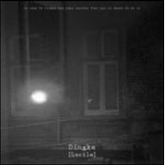

Lucile
============================

|  |  |
| :--: | :-- |
| [ Lucile](https://emumo.xiami.com/album/532467) | **艺人**: [丁可](../index.md) **语种**: 国语 **唱片公司**: 独立发行 **发行时间**: 2012年08月02日 **专辑类别**: EP, 单曲 **专辑风格**:  **播放数**: 1954117 **收藏数**: 485 **评论数**: 80  |

## 简介

C'est une histoire de chagrin d'amour qui se passait a paris. 这是一个发生在巴黎的凄美的爱情故事。

## 曲目

## 评论

|  |  |  |
| :-- | :-- | :-- |
|  [虾米用户](https://emumo.xiami.com/u/66823378)  2018-08-06 11:13 赞(0) 踩(0) | 

 |
|  [虾米用户](https://emumo.xiami.com/u/71988220) 知命不懼 日日自新 2017-07-06 01:11 赞(0) 踩(0) | 
想你 丁先生
 |
|  [虾米用户](https://emumo.xiami.com/u/305711830) 路静人寂寞 2017-06-28 11:00 赞(0) 踩(0) | 
这时听这歌正适合这午后的慵懒，迷离双眼，随咖啡香气漫延，嗯且颓废下
 |
|  [虾米用户](https://emumo.xiami.com/u/201391232) 谢谢虾米，你们是我。 2017-05-19 12:43 赞(0) 踩(0) | 
感谢。
 |
|  [虾米用户](https://emumo.xiami.com/u/91878968) You're so be... 2015-12-15 20:35 赞(1) 踩(0) | 
曲终苦寒尽彻骨.默,无非.无心.无言.何来缘由.
 |
|  [虾米用户](https://emumo.xiami.com/u/52207002)  2015-07-06 19:19 赞(0) 踩(0) | 
C&amp;#039;est une histoire de chagrin d&amp;#039;amour qui se passait a paris. 这是一个发生在巴黎的凄美的爱情故事。
 |
|  [虾米用户](https://emumo.xiami.com/u/2524645)  2015-04-30 15:41 赞(1) 踩(0) | 
你是灵魂歌手···
 |
|  [虾米用户](https://emumo.xiami.com/u/4158875)  2014-07-21 20:17 赞(1) 踩(0) | 
time and time again....
 |
|  [虾米用户](https://emumo.xiami.com/u/12668973) 深河之际，深心之渊 2014-07-04 19:41 赞(0) 踩(0) | 
很特别的声音
 |
|  [虾米用户](https://emumo.xiami.com/u/27928647) 一切都是最好的安排 2013-12-02 18:07 赞(0) 踩(0) | 
曾经的爱已远去不再来
 |
|  [虾米用户](https://emumo.xiami.com/u/20277428)  2013-08-26 01:29 赞(0) 踩(0) | 
一场秋雨一场寒，一夜幽梦一夜眠
 |
|  [虾米用户](https://emumo.xiami.com/u/16577351)  2013-06-30 00:47 赞(0) 踩(0) | 
怎么下载呀
 |
|  [虾米用户](https://emumo.xiami.com/u/2657982)  2013-06-12 15:53 赞(0) 踩(0) | 
声线灰常性感
 |
|  [虾米用户](https://emumo.xiami.com/u/13897905)  2013-06-09 11:19 赞(2) 踩(0) | 
声音可以带我到另一个世界 一片纯白的世界
 |
|  [虾米用户](https://emumo.xiami.com/u/13818046)  2013-05-11 21:28 赞(5) 踩(0) | 
他的曲子就好像建造了一个世界，孤独安静的世界，可以让我一直静静的沉浸在里面，有很多东西会涌出来，模糊，但又清晰。
 |
|  [虾米用户](https://emumo.xiami.com/u/10884368)  2013-05-09 16:33 赞(0) 踩(0) | 
前奏吸引
 |
|  [虾米用户](https://emumo.xiami.com/u/8244559)  2013-05-09 14:45 赞(2) 踩(0) | 
******
 |
| ⇒ |  [虾米用户](https://emumo.xiami.com/u/1182761) 松任谷由实的迷弟 2014-03-06 16:47 赞(0) 踩(0) | 
上面还有人说 “他这种嗓音真是花钱都买不到啊！什么诺拉琼斯全死边上去 ”诺拉琼斯起码有商业价值，请告诉我丁可有什么架子？？？自称 “Neo-Classical 、dream-pop 、新民谣”，甚至给他的音乐标Post-Rock的有？？还迷幻？？？？学麦斯米兰学到这份上我就不多说了，男声仙音我估计他们都没听过Mercury Rev 和 Delays 吧。
 |
|  [虾米用户](https://emumo.xiami.com/u/478527) 好想跟衣服在洗衣机里滚 2013-05-08 17:22 赞(0) 踩(0) | 
性感到难辨雌雄，这就是丁可的标签
 |
| ⇒ |  [虾米用户](https://emumo.xiami.com/u/1182761) 松任谷由实的迷弟 2014-03-06 16:47 赞(0) 踩(0) | 
推荐 Mercury Rev 和 Delays 比丁可好听得多
 |
| ⇒ |  [虾米用户](https://emumo.xiami.com/u/478527) 好想跟衣服在洗衣机里滚 2014-03-06 17:57 赞(0) 踩(0) | 
<q><b>tlmgt说：</b></q>
 |
| ⇒ |  [虾米用户](https://emumo.xiami.com/u/1182761) 松任谷由实的迷弟 2014-03-06 19:26 赞(0) 踩(0) | 
<q><b>WIKI魏说：</b></q>
 |
| ⇒ |  [虾米用户](https://emumo.xiami.com/u/478527) 好想跟衣服在洗衣机里滚 2014-03-07 11:53 赞(0) 踩(0) | 
<q><b>tlmgt说：</b></q>
 |
| ⇒ |  [虾米用户](https://emumo.xiami.com/u/3138155)  2016-05-23 21:47 赞(0) 踩(0) | 
<q><b>tlmgt说：</b></q>
 |
|  [虾米用户](https://emumo.xiami.com/u/504642)  2013-04-28 15:09 赞(1) 踩(0) | 
无法抗拒
 |
|  [虾米用户](https://emumo.xiami.com/u/1442737) 很多很多，很少很少。 2013-04-13 22:29 赞(0) 踩(0) | 
晴。考虑把最近的事情都写下来。为什么我没有带相机呢？并且你也要过来了，好奇妙好神奇的感觉。循环了一晚上的歌，当做晚安小曲吧。微博真的太简洁了，吐槽都不够。好啦~~~早点睡觉~~~~~~晚安~~~~~
 |
|  [虾米用户](https://emumo.xiami.com/u/1455764)  2013-03-16 15:22 赞(1) 踩(0) | 
让内心一切喧嚣归于平静。
 |
|  [虾米用户](https://emumo.xiami.com/u/5848254) 网易云 :Hui灰四  ... 2013-03-01 19:59 赞(0) 踩(0) | 
真好
 |
|  [虾米用户](https://emumo.xiami.com/u/9306238) 一念清静，烈焰城池 2013-01-28 15:20 赞(0) 踩(0) | 
the always dingke
 |
|  [虾米用户](https://emumo.xiami.com/u/12461347) 乐观。努力。不解释。 2013-01-16 14:39 赞(0) 踩(0) | 
丁可。
 |
|  [虾米用户](https://emumo.xiami.com/u/11761593) 音乐 2012-12-21 16:57 赞(0) 踩(0) | 
美
 |
|  [虾米用户](https://emumo.xiami.com/u/9936575)  2012-11-28 14:02 赞(7) 踩(0) | 
******
 |
| ⇒ |  [虾米用户](https://emumo.xiami.com/u/1182761) 松任谷由实的迷弟 2014-03-06 16:46 赞(0) 踩(0) | 
诺拉琼斯起码有商业价值，请告诉我丁可有什么架子？？？自称 “Neo-Classical 、dream-pop 、新民谣，甚至给他的音乐标Post-Rock的有？？还迷幻？？？？学麦斯米兰学到这份上我就不多说了，男声仙音拜托去听听Mercury Rev 和 Delays 成不？
 |
| ⇒ |  [虾米用户](https://emumo.xiami.com/u/4158875)  2014-06-06 10:54 赞(0) 踩(0) | 
<q><b>tlmgt说：</b></q>
 |
| ⇒ |  [虾米用户](https://emumo.xiami.com/u/1182761) 松任谷由实的迷弟 2014-06-06 19:58 赞(0) 踩(0) | 
<q><b>未知生物说：</b></q>
 |
| ⇒ |  [虾米用户](https://emumo.xiami.com/u/4158875)  2014-06-06 23:16 赞(0) 踩(0) | 
<q><b>tlmgt说：</b></q>
 |
|  [虾米用户](https://emumo.xiami.com/u/1284606) 留，流。生活不断的告诉我... 2012-11-24 18:59 赞(0) 踩(0) | 
音乐就有如此的力量，不局限你，给你最大的自由。想象。然后自己沉醉，自己主角。
 |
|  [虾米用户](https://emumo.xiami.com/u/4131288) 再不见你二十年 2012-10-25 13:18 赞(0) 踩(0) | 
从没失望过。
 |
|  [虾米用户](https://emumo.xiami.com/u/11062203) 嘘... 2012-10-14 23:12 赞(1) 踩(0) | 
好听啊，费什么话啊
 |
|  [虾米用户](https://emumo.xiami.com/u/11062203) 嘘... 2012-10-14 23:11 赞(0) 踩(0) | 
背景音乐
 |
|  [虾米用户](https://emumo.xiami.com/u/11062203) 嘘... 2012-10-14 23:11 赞(0) 踩(0) | 
背景音乐
 |
|  [虾米用户](https://emumo.xiami.com/u/3591790)   2012-10-11 21:22 赞(0) 踩(0) | 
好美！
 |
|  [虾米用户](https://emumo.xiami.com/u/10965612) happy 2012-10-07 17:17 赞(0) 踩(0) | 
好喜欢
 |
|  [虾米用户](https://emumo.xiami.com/u/10474709)  2012-09-02 21:03 赞(0) 踩(0) | 
喜欢丁克的嗓音~很舒服
 |
|  [虾米用户](https://emumo.xiami.com/u/10374844)   2012-08-30 21:57 赞(0) 踩(0) | 
就是喜欢
 |
|  [虾米用户](https://emumo.xiami.com/u/10365072)  2012-08-25 20:03 赞(0) 踩(0) | 
让我如何不去想
 |
|  [虾米用户](https://emumo.xiami.com/u/6764734) 宿醉。 2012-08-25 11:33 赞(0) 踩(0) | 
丁可。依旧的声音。
 |
|  [虾米用户](https://emumo.xiami.com/u/592764) . 2012-08-24 15:24 赞(0) 踩(0) | 
C'est une histoire de chagrin d'amour qui se passait a paris.
 |
|  [虾米用户](https://emumo.xiami.com/u/10318054)  2012-08-22 11:55 赞(0) 踩(0) | 
就是喜欢。。。。。
 |
|  [虾米用户](https://emumo.xiami.com/u/10309033)  2012-08-21 17:45 赞(0) 踩(0) | 
意境
 |
|  [虾米用户](https://emumo.xiami.com/u/1135460)  2012-08-20 22:11 赞(0) 踩(0) | 
想被这种音乐 淹没
 |
|  [虾米用户](https://emumo.xiami.com/u/8214159)  2012-08-19 22:39 赞(0) 踩(0) | 
那感覺
 |
|  [虾米用户](https://emumo.xiami.com/u/10257672)  2012-08-17 22:08 赞(0) 踩(0) | 
好治愈！！
 |
|  [虾米用户](https://emumo.xiami.com/u/4400366) 再也不见 2012-08-17 18:49 赞(0) 踩(0) | 
两个音为一组，神曲
 |
|  [虾米用户](https://emumo.xiami.com/u/8532629) 梵高的耳朵 2012-08-16 01:55 赞(0) 踩(0) | 
。。。
 |
|  [虾米用户](https://emumo.xiami.com/u/82672) Love or pois... 2012-08-14 16:01 赞(0) 踩(0) | 
过去，或是梦境。他的音乐，带人进入不可及的空间。
 |
|  [虾米用户](https://emumo.xiami.com/u/1338730)  2012-08-07 23:32 赞(0) 踩(0) | 
是古典吉他么？
 |
|  [虾米用户](https://emumo.xiami.com/u/7140198) 我要在这腐烂的世界活下去 2012-08-06 14:26 赞(0) 踩(0) | 
迷幻的嗓音
 |
|  [虾米用户](https://emumo.xiami.com/u/4548965)  2012-08-06 11:04 赞(0) 踩(0) | 
难过的时候不要听
 |
| ⇒ |  [虾米用户](https://emumo.xiami.com/u/6061031) 深谷别居，满室唱片。 2013-01-11 08:01 赞(0) 踩(0) | 
^ ^听到前奏就忍不住想要流泪呢~
 |
|  [虾米用户](https://emumo.xiami.com/u/4385181)  2012-08-06 10:24 赞(0) 踩(0) | 
顶一下！！
 |
|  [虾米用户](https://emumo.xiami.com/u/3007328)  2012-08-06 05:42 赞(0) 踩(0) | 
丁可的好旋律好VOCAL，封面略惊悚
 |
|  [虾米用户](https://emumo.xiami.com/u/232865) 大家好，因为虾米音乐即将... 2012-08-05 23:05 赞(0) 踩(0) | 
可君的音乐一直在进化啊。
 |
|  [虾米用户](https://emumo.xiami.com/u/232865) 大家好，因为虾米音乐即将... 2012-08-05 23:05 赞(0) 踩(0) | 
第一时间来听。虾米真好啊。
 |
|  [虾米用户](https://emumo.xiami.com/u/78369)  2012-08-05 21:44 赞(0) 踩(0) | 
前奏就大爱了,后面不用多说..
 |
|  [虾米用户](https://emumo.xiami.com/u/78369)  2012-08-05 21:42 赞(0) 踩(0) | 
一听前奏就喜欢!!!
 |
|  [虾米用户](https://emumo.xiami.com/u/2976824)  2012-08-04 23:23 赞(0) 踩(0) | 
好棒！
 |
|  [虾米用户](https://emumo.xiami.com/u/7810320)  2012-08-04 13:05 赞(0) 踩(0) | 
为什么每次听到这样的调调  就情不自禁的喜欢啊
 |
|  [虾米用户](https://emumo.xiami.com/u/646203) 又怎样阿 2012-08-04 01:16 赞(0) 踩(0) | 
音乐部分很好听，留足想象空间。人声出现以后，限制了自由的想象。
 |
|  [虾米用户](https://emumo.xiami.com/u/4051953)   2012-08-04 01:04 赞(0) 踩(0) | 
昨天微博首发的哈
 |
|  [虾米用户](https://emumo.xiami.com/u/814852) 我还没想好要写什么... 2012-08-04 00:45 赞(0) 踩(0) | 
爱这个男人
 |
| ⇒ |  [虾米用户](https://emumo.xiami.com/u/812338)  2012-08-05 08:06 赞(0) 踩(0) | 
居然一直以为丁可是女的……
 |
| ⇒ |  [虾米用户](https://emumo.xiami.com/u/814852) 我还没想好要写什么... 2012-08-06 00:00 赞(0) 踩(0) | 
<q><b>不相见说：</b></q>
 |
| ⇒ |  [虾米用户](https://emumo.xiami.com/u/812338)  2012-08-06 14:50 赞(0) 踩(0) | 
<q><b>persistir说：</b></q>
 |
|  [虾米用户](https://emumo.xiami.com/u/8272776)   2012-08-03 23:34 赞(0) 踩(0) | 
静悄悄 静悄悄...
 |
|  [虾米用户](https://emumo.xiami.com/u/3235848)  2012-08-03 23:20 赞(0) 踩(0) | 
新单
 |
|  [虾米用户](https://emumo.xiami.com/u/1126826) 我还没想好要写什么... 2012-08-03 23:00 赞(0) 踩(0) | 
谢谢。又出新歌。
 |
|  [虾米用户](https://emumo.xiami.com/u/6417086) 这里，只有聆听。 2012-08-03 22:08 赞(0) 踩(0) | 
细腻的声音！
 |
|  [虾米用户](https://emumo.xiami.com/u/289603)  2012-08-03 22:02 赞(0) 踩(0) | 
如此特别的悦耳。。。
 |
|  [虾米用户](https://emumo.xiami.com/u/5473912) 带刀了吗 2012-08-03 21:55 赞(0) 踩(0) | 
美丽
 |
