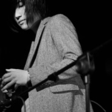
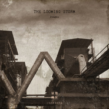
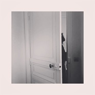
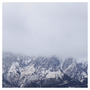
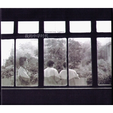
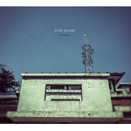
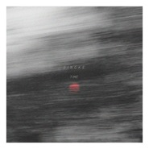
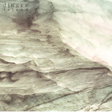

丁可
============================

|  |  |
| :--: | :-- |
| [ 丁可](https://i.xiami.com/dingke) | **地区**: China 中国大陆 **风格**: 根源唱作人 Singer-Songwriter, 独立流行 Indie Pop, 另类唱作人 Alternative Singer-Songwriter, 梦幻流行 Dream Pop **播放数**: 20694691 **粉丝数**: 32133 **评论数**: 1262  |

## 档案

丁可微博：   http://weibo.com/1741836511/profile?topnav=1&wvr=6 
關於丁可 
國內新銳音樂人，作曲家，藝術家，歌者。2011年在音樂廠牌“摩登天空”發表首張專輯《island》，隨後以電影音樂與舞蹈劇場為主要創作工作，同時涉及FASHION SHOW,戲劇，廣告領域，多次與現代舞，裝置，行為合作進行現場演出，並曾到以色列，美國等國家演出與文化交流。之後陸續發表純音樂專輯《our home》，《遙遠的某處》，電影原聲《我的中學時代》，《不曾記得你》。單曲《beautiful life》《Lucile》等。近期作為香港國際電影節閉幕影片亮相的電影《踏血尋梅》由香港導演翁子光導演，郭富城主演，丁可担任整部電影的配樂，并同时被提名金马奖最佳原创电影歌曲，以及香港金像奖最佳原创电影配乐，最佳原创电影歌曲。在新專輯《海上夜航》中的四首歌曲也分別作為插曲，片尾曲出現在電影裏。

## 专辑

| 名称 | 语种 | 唱片公司 | 发行时间 | 专辑类别 | 专辑风格 |
| :--: | :-- | :-- | :-- | :-- | :-- |
| [ 隐秘的角落 配乐专辑](./albums/5020941879.md) | 纯音乐 | 红火火传媒 | 2020年06月23日 | 原声带, 影视音乐 | 黑暗氛围 Dark Ambient, 实验电子 Experimental Electronic, 电视原声 Television Music |
| [ 日光之下 (原创电影原声带)Wisdom Tooth (Original Motion Picture Soundtrack)](./albums/5020939425.md) | 纯音乐 | Plaza Mayor | 2020年01月24日 | 原声带, 影视音乐 | 实验音乐 Experimental, 氛围音乐 Ambient, 电影原声 Film Score |
| [ 摘取的凝土](./albums/5020953560.md) | 纯音乐 | 独立发行 | 2019年06月18日 | 录音室专辑 | 黑暗氛围 Dark Ambient, 氛围音乐 Ambient |
| [ 比一个年轻人小一点的鹤](./albums/5021012091.md) | 国语 | 独立发行 | 2018年02月16日 | EP, 单曲 |  |
| [ 暴雪将至 电影原声带The Looming Storm (Original Motion Picture Soundtrack)](./albums/2102973829.md) | 纯音乐 | 华宇世博 | 2017年12月13日 | 原声带, 影视音乐 |  |
| [ The Perfect Day](./albums/2102877919.md) | 国语 | JSJ杰思国际娱乐 | 2017年10月23日 | EP, 单曲 | 另类唱作人 Alternative Singer-Songwriter, 当代唱作人 Contemporary Singer-Songwriter |
| [ 欢.爱pleasure.love(Original Motion Picture Soundtrack)](./albums/2102867261.md) | 国语 | Plaza Major Company | 2017年09月01日 | 原声带, 影视音乐 | 氛围音乐 Ambient |
| [ 晴歌](./albums/2102801089.md) | 国语 | 独立发行 | 2017年07月03日 | EP, 单曲 | 前卫流行 Progressive Pop, 后摇 Post-Rock |
| [ 踏血寻梅 电影原声带](./albums/2100281836.md) | 其他 | 偏北音乐 | 2016年03月30日 | 原声带, 影视音乐 | 氛围音乐 Ambient, 原声 Soundtrack, 电影原声 Film Score, 前卫流行 Progressive Pop |
| [ 浮士嘉年ukiyocarnival](./albums/2100193300.md) | 国语 | 独立发行 | 2015年09月08日 | EP, 单曲 | 现代古典 Modern Classical, 另类唱作人 Alternative Singer-Songwriter, 前卫流行 Progressive Pop |
| [ 遥远的某处](./albums/1185088785.md) | 国语 | 独立发行 | 2013年11月21日 | EP, 单曲 | 后摇 Post-Rock |
| [ 我的中学时代Blooming Times](./albums/1275079098.md) | 其他 | 树音乐 | 2013年06月25日 | 原声带, 影视音乐 |  |
| [ Our Home](./albums/555599.md) | 其他 | 树音乐 | 2013年06月05日 | 录音室专辑 |  |
| [ Time时间](./albums/267806720.md) | 国语 | 独立发行 | 2013年05月02日 | EP, 单曲 |  |
| [ Lucile](./albums/532467.md) | 国语 | 独立发行 | 2012年08月02日 | EP, 单曲 |  |
| [ Beautiful Life美丽人生](./albums/509427.md) | 国语 | 独立发行 | 2012年04月26日 | EP, 单曲 | 国语流行 Mandarin Pop |
| [ Island](./albums/434588.md) | 国语 | 摩登天空 | 2011年03月30日 | 录音室专辑 | 根源唱作人 Singer-Songwriter, 独立流行 Indie Pop, 梦幻流行 Dream Pop |

## 评论

|  |  |  |
| :-- | :-- | :-- |
|  [虾米用户](https://emumo.xiami.com/u/32037051)  2020-11-15 12:56 赞(0) 踩(0) | 
丁可的声音这么轻，这么温柔，在空气中飘着飘着就进了我的思绪。如晨曦乡间的炊烟，青石砖巷子里的阳光，露天咖啡伞旁的小花丛，厨房暖灯透印到小餐桌上萦绕着的黑咖香气
 |
|  [虾米用户](https://emumo.xiami.com/u/379162683) 我想要记住你们，我想要你... 2020-11-01 10:18 赞(0) 踩(0) | 

 |
|  [虾米用户](https://emumo.xiami.com/u/117944962)  2020-10-02 20:59 赞(1) 踩(0) | 
有种电影画面感 很好听 宝藏
 |
|  [虾米用户](https://emumo.xiami.com/u/121702052) 超脱 2020-08-27 11:31 赞(1) 踩(0) | 

 |
|  [虾米用户](https://emumo.xiami.com/u/39834255)  2020-07-12 18:05 赞(1) 踩(0) | 
最近看隐秘的角落最大的惊喜看到了丁可的名字，我虾米第一个关注的音乐人
 |
|  [虾米用户](https://emumo.xiami.com/u/363794986) 暂无描述 2020-07-05 04:16 赞(0) 踩(0) | 
踏雪寻梅
 |
|  [虾米用户](https://emumo.xiami.com/u/37520926) My name is R... 2020-06-23 00:16 赞(0) 踩(0) | 
虾米怎么这么没用 隐秘的角落ost 也搞不到
 |
|  [虾米用户](https://emumo.xiami.com/u/236792571)  2020-06-12 14:43 赞(0) 踩(0) | 
朋友小兮分享给我的一首歌，点开一听被他独特的嗓音吸引住了，越听越觉得好听！
 |
|  [虾米用户](https://emumo.xiami.com/u/355521197) 入目无他人，四下皆是你 2020-05-21 09:44 赞(0) 踩(0) | 
声音好特别！
 |
|  [虾米用户](https://emumo.xiami.com/u/10928265) 虚无而不空虚。 2020-04-18 03:53 赞(3) 踩(0) | 
真是不知道为啥有人自己鸡蛋过敏还非要吃鸡蛋
 |
|  [虾米用户](https://emumo.xiami.com/u/439093368)  2020-03-15 06:31 赞(1) 踩(0) | 
非常非常的好听。
 |
|  [虾米用户](https://emumo.xiami.com/u/52300845)   2020-02-23 13:57 赞(1) 踩(0) | 
怎么办，我也叫做丁可，可是我是女生 
 |
|  [虾米用户](https://emumo.xiami.com/u/188196406) 喜歡獨單 2020-02-07 16:21 赞(0) 踩(0) | 

 |
|  [虾米用户](https://emumo.xiami.com/u/322484982) 英语专业古典摇滚盯鞋朋克... 2020-01-12 19:48 赞(6) 踩(0) | 
初中从songtaste的tomi_ann那里知道的丁可，第一次听就觉得惊艳，风格鲜明，从没有乱过阵脚。一首petals就让我脑补出一系列电影情节。纯净神秘的旋律，轻盈颓美的嗓音，热烈而深刻，看到他一直在做小众音乐且越做越好，在这个信息时代，被媒体人影视界发现和认可，感到很开心，走心的东西，总有一天会闪光。
 |
|  [虾米用户](https://emumo.xiami.com/u/367760056)  2020-01-07 18:10 赞(2) 踩(0) | 
看《踏血寻梅》知道的他，欢喜！
 |
|  [虾米用户](https://emumo.xiami.com/u/282479024)  2019-11-19 20:19 赞(0) 踩(0) | 
The first time I heard the album of "踏雪寻梅"，I couldn't get rid of it... I was amaze your talent and voice too... your music, your creation easily attracted me..feel the mysterious, sadness, 很深的感受。。你的才华深深吸引我。 
 |
|  [虾米用户](https://emumo.xiami.com/u/43492923) 行到水穷我才开始害怕，夕... 2019-10-19 14:16 赞(1) 踩(0) | 
▽
 |
|  [虾米用户](https://emumo.xiami.com/u/428878964) 我还没想好要写什么... 2019-10-15 03:57 赞(1) 踩(0) | 
丁可： 依賴你的歌声音樂才能睡覺的我，好想好想把一个經歷告訴你，写一首歌，让我有勇氣的不睡浴缸
 |
|  [虾米用户](https://emumo.xiami.com/u/3510738) 晚安、 2019-09-21 09:00 赞(0) 踩(0) | 
几年不听 越来越好了呢
 |
|  [虾米用户](https://emumo.xiami.com/u/403339903)  2019-09-12 18:06 赞(1) 踩(0) | 
懵 原来丁可是男的。
 |
|  [虾米用户](https://emumo.xiami.com/u/329737121)  2019-09-08 22:46 赞(1) 踩(0) | 
我喜欢你的声音
 |
|  [虾米用户](https://emumo.xiami.com/u/52087380) 快乐每一天！ 2019-07-12 22:07 赞(0) 踩(0) | 
不可多得的好！
 |
|  [虾米用户](https://emumo.xiami.com/u/103335322)  Emit energy... 2019-06-23 23:53 赞(0) 踩(0) | 
什么时候能来一轮巡演
 |
|  [虾米用户](https://emumo.xiami.com/u/228843687) 懒惰统治人间 2019-06-06 15:12 赞(0) 踩(0) | 

 |
|  [虾米用户](https://emumo.xiami.com/u/41370109)  2019-05-26 04:13 赞(2) 踩(0) | 
一位相当有概念的音乐人，还是来自广西柳州的乡亲 不简单难得哦
 |
|  [虾米用户](https://emumo.xiami.com/u/228843687) 懒惰统治人间 2019-05-01 17:03 赞(0) 踩(0) | 
这么好的音乐人！
 |
|  [虾米用户](https://emumo.xiami.com/u/419784480) 你好，偷窥狂 2019-04-18 03:03 赞(1) 踩(0) | 
最开始是偶然听到if，但当时也没有去关注过丁可，也没有去听过他其他的歌，甚至好长一段时间觉得，声音这么空灵这么有故事感的歌者为什么不出名，除此之外没有别的想法。后来看暴雪的时候，觉得里面的配乐巨好听，于是上百度到处寻你，好不容易找到你，才发现你就是惊艳了我的人，感觉这么些年错过了好多。（反正我已经抓住你了，微博也一直在窥屏嘛，可可多出歌呀！）
 |
|  [虾米用户](https://emumo.xiami.com/u/286167204) 灵魂需要音乐沐浴思想 2019-04-05 21:43 赞(0) 踩(0) | 
国内的音乐人现在水平不一般了，你看整个音乐处理非常到位，声音一直从很远的地方传来，仿佛空中飘来，漂亮  加油
 |
|  [虾米用户](https://emumo.xiami.com/u/1442909)  2019-03-26 19:13 赞(2) 踩(0) | 
听声音～感觉和 白安 好配啊哈哈哈～！！！搭呀～！！！
 |
|  [虾米用户](https://emumo.xiami.com/u/417093950)  2019-03-16 07:24 赞(2) 踩(0) | 
听着听着就要哭泣，苦其心志是我一生的蓝图。只求灵魂片刻的栖息
 |
|  [虾米用户](https://emumo.xiami.com/u/317319560) 我摘青辉冷月为锋芒收入鞘... 2019-02-22 10:37 赞(1) 踩(0) | 
沉迷你的声线
 |
|  [虾米用户](https://emumo.xiami.com/u/44274627)  2019-02-02 00:47 赞(0) 踩(0) | 
Dingke的专辑封面受ECM的影响深远，我也喜欢收藏ECM唱片，看到美的封面就像占为己有 
 |
|  [虾米用户](https://emumo.xiami.com/u/27787177) 涉江采芙蓉 2019-01-15 00:29 赞(3) 踩(0) | 
抱歉听了这么久才晓得你是男的 我发誓我不是故意的
 |
|  [虾米用户](https://emumo.xiami.com/u/366304325)  2018-12-29 08:43 赞(1) 踩(0) | 
好喜欢你的声音呀！ 
 |
|  [虾米用户](https://emumo.xiami.com/u/42963872) 我还没想好要写什么... 2018-12-15 02:49 赞(0) 踩(0) | 
-
 |
|  [虾米用户](https://emumo.xiami.com/u/259662177) 你在寻找什么呢？ 2018-12-02 10:59 赞(1) 踩(0) | 
为了你的音乐去看你配乐的每一步电影 真的爱了好多年
 |
|  [虾米用户](https://emumo.xiami.com/u/405487058)   2018-11-23 13:39 赞(0) 踩(0) | 
其它歌的版權什麼時候才能有 SAD
 |
|  [虾米用户](https://emumo.xiami.com/u/188196406) 喜歡獨單 2018-11-15 06:45 赞(0) 踩(0) | 
好
 |
|  [虾米用户](https://emumo.xiami.com/u/478527) 好想跟衣服在洗衣机里滚 2018-10-19 23:35 赞(4) 踩(0) | 
2018.10.17看过暴雪将至，大时代，小人物，三条人命，一场从头下到尾的暴雨，腐旧的厂房崩塌的体制，到最后伴随着好日子歌声的暴雪，好黑色的片。看了下配乐，是丁可。
 |
|  [虾米用户](https://emumo.xiami.com/u/259213118) T2B 2018-10-14 21:53 赞(4) 踩(0) | 
中国难得的做自己的歌手，可以想象到几年前不火时他是怎样清贫的生活，歌曲不仅让人动听还让人动心
 |
|  [虾米用户](https://emumo.xiami.com/u/325010781)   2018-10-10 12:01 赞(0) 踩(0) | 
以前看《踏雪寻梅》后循环的歌。分不清是忧伤还是温暖。
 |
|  [虾米用户](https://emumo.xiami.com/u/12876004) ` 2018-10-09 23:05 赞(0) 踩(0) | 
。
 |
|  [虾米用户](https://emumo.xiami.com/u/38549958)  2018-10-09 21:20 赞(0) 踩(0) | 
想听 if
 |
| ⇒ |  [虾米用户](https://emumo.xiami.com/u/407473301)  2019-01-20 13:41 赞(0) 踩(0) | 
lf吧
 |
|  [虾米用户](https://emumo.xiami.com/u/339191478)   2018-09-28 23:06 赞(1) 踩(0) | 
❤
 |
|  [虾米用户](https://emumo.xiami.com/u/4048199)   2018-07-15 17:56 赞(2) 踩(0) | 
丁可加油，喜欢你6年了，期待有天你能来贵阳开专场    
 |
|  [虾米用户](https://emumo.xiami.com/u/364517889) 额。我可是很凶的哦⊙∀⊙... 2018-07-02 20:25 赞(2) 踩(0) | 
我超喜欢丁可 如果那天 在我住的附近有他的演出会 我无论是花10000也去
 |
|  [虾米用户](https://emumo.xiami.com/u/15264178)  2018-06-06 09:31 赞(3) 踩(0) | 
有段时间夜里2点醒过来睡不着，捱到5点多。翻出了很久没听的歌，忽然意识到，丁可也许失眠的厉害吧。（只是我主观上的）
 |
|  [虾米用户](https://emumo.xiami.com/u/14223398)   2018-05-16 05:04 赞(0) 踩(0) | 
爱 特立而独行 辨识度二对味
 |
|  [虾米用户](https://emumo.xiami.com/u/33246301) 世间万物，向心公转。 2018-04-30 23:06 赞(0) 踩(0) | 
To：丁可    无他，悄悄留下一个爱你的形状。  2018.4.30
 |
|  [虾米用户](https://emumo.xiami.com/u/49691100) 是个糟人 2018-04-26 12:31 赞(0) 踩(0) | 
你好哇 丁可
 |
|  [虾米用户](https://emumo.xiami.com/u/335763493) 不戴墨镜  2018-04-10 01:13 赞(1) 踩(0) | 
我回來了
 |
|  [虾米用户](https://emumo.xiami.com/u/185953480) balabala 2018-04-04 20:14 赞(0) 踩(0) | 
好棒啊，为数不多的喜欢的中国音乐人
 |
|  [虾米用户](https://emumo.xiami.com/u/335763493) 不戴墨镜  2018-03-30 04:54 赞(2) 踩(0) | 
早點睡
 |
|  [虾米用户](https://emumo.xiami.com/u/214326136) 佛系少女 2018-03-29 13:22 赞(1) 踩(0) | 
Where is &amp;ldquo;if&amp;rdquo;?
 |
|  [虾米用户](https://emumo.xiami.com/u/313122567) 每天最享受听歌的时光 2018-03-24 11:24 赞(3) 踩(0) | 
为什么没有if的版权
 |
| ⇒ |  [虾米用户](https://emumo.xiami.com/u/371196457)  2019-01-24 12:33 赞(0) 踩(0) | 
if的话酷我有
 |
|  [虾米用户](https://emumo.xiami.com/u/20177386) 感谢一切美好的遇见❤️ 2018-03-12 14:18 赞(1) 踩(0) | 

 |
|  [虾米用户](https://emumo.xiami.com/u/285049473) 剛拿起酒杯想和你碰杯 才... 2018-03-11 15:46 赞(0) 踩(0) | 
！！！
 |
|  [虾米用户](https://emumo.xiami.com/u/53590447) 梦归隐 2018-02-26 21:31 赞(0) 踩(0) | 
.
 |
|  [虾米用户](https://emumo.xiami.com/u/46300616)  2018-02-24 06:35 赞(1) 踩(0) | 
声音好好听
 |
|  [虾米用户](https://emumo.xiami.com/u/24038685)  2018-02-17 09:28 赞(0) 踩(0) | 
&lt;[url=/u/2967905]@丁可 [/url]我要在虾米上听比一个年轻人小一点的鹤！&gt;&lt;2967905&gt;
 |
|  [虾米用户](https://emumo.xiami.com/u/99838868) 海上没有钢琴师。 2018-02-15 10:08 赞(1) 踩(0) | 
像有人在耳边吹风 
 |
|  [虾米用户](https://emumo.xiami.com/u/32824512) 阴凉潮湿晦暗 回到无人洞... 2018-01-26 22:12 赞(0) 踩(0) | 
雪天
 |
|  [虾米用户](https://emumo.xiami.com/u/506787) 有人问我是与非，说是与非 2018-01-18 00:48 赞(2) 踩(0) | 
每次听到丁可的音乐总想带上耳机，独自一人去感受，沉浸其中。但又觉得他太应该享誉全世界。
 |
|  [虾米用户](https://emumo.xiami.com/u/37549639) 请尽情来打搅我吧 2018-01-08 20:19 赞(3) 踩(0) | 
声音本身就很有特点，就不容易腻烦（(๑&amp;bull; . &amp;bull;๑)）
 |
|  [虾米用户](https://emumo.xiami.com/u/9531664) 年华虚度 空有一身疲惫 2017-12-30 08:06 赞(0) 踩(0) | 
丁可现在的版权在哪儿啊...？
 |
| ⇒ |  [虾米用户](https://emumo.xiami.com/u/341663274) 우유빛깔 김희철 사랑해... 2018-02-02 10:41 赞(0) 踩(0) | 
在网易云下到了if
 |
|  [虾米用户](https://emumo.xiami.com/u/6285647) Now it's dul... 2017-12-18 10:20 赞(26) 踩(0) | 
为首歌吵起来太没必要。音乐是幸福。是人的心好吗。毕竟是不能拿某些所谓明星来比的，他们唱着没有营养的弱智的歌，还大红大紫，用脸吃饭。就算你们觉得丁可的音乐没有多么出色，没有级别多么高，发音没有多么地道，多么不入你的法眼，他总有知音，总有能听懂他的歌的人，毕竟别人是有心的人，不是空壳。他更没有很大众，得到很多不副的美名。他的歌没有烂大街，你不想听就去听你喜欢的。各走各的路，不要来招惹爱他的人。
 |
|  [虾米用户](https://emumo.xiami.com/u/2536343)  2017-12-14 03:41 赞(0) 踩(0) | 
1995-2017 ，我已经停了22年
 |
|  [虾米用户](https://emumo.xiami.com/u/4481967)  2017-12-07 08:54 赞(0) 踩(0) | 
啥时候能有《暴雪将至》？
 |
|  [虾米用户](https://emumo.xiami.com/u/124144756) 你不是我撕掉的古板诗集，... 2017-12-01 02:54 赞(4) 踩(0) | 
不喜欢就不要来这里，为什么有些人一定要自寻烦恼？
 |
|  [虾米用户](https://emumo.xiami.com/u/303113550)  2017-11-30 08:37 赞(1) 踩(0) | 
以后就有你陪伴，感恩遇见，谢谢丁可 
 |
|  [虾米用户](https://emumo.xiami.com/u/136853824) 一人我饮汁醉 2017-11-25 19:52 赞(0) 踩(0) | 
喜欢
 |
|  [虾米用户](https://emumo.xiami.com/u/11367823) lacrimosa 2017-11-23 19:55 赞(2) 踩(0) | 
和chouchou一类的感觉
 |
|  [虾米用户](https://emumo.xiami.com/u/326288449)  2017-11-23 01:03 赞(1) 踩(0) | 
喜欢的默默喜欢就好
 |
|  [虾米用户](https://emumo.xiami.com/u/2362934)   2017-11-17 23:01 赞(0) 踩(0) | 
刚看了暴雪将至，这部电影太丁可啦，求分享上传原声碟   
 |
|  [虾米用户](https://emumo.xiami.com/u/45200267) 兴致盎然 2017-11-17 15:23 赞(0) 踩(0) | 
想听 if 和 we
 |
|  [虾米用户](https://emumo.xiami.com/u/47570236)  　⠀ 2017-11-02 03:14 赞(0) 踩(0) | 

 |
|  [虾米用户](https://emumo.xiami.com/u/29106332) 不回 2017-10-31 01:28 赞(3) 踩(0) | 
请举报那些垃圾评论，别让丁可看见
 |
|  [虾米用户](https://emumo.xiami.com/u/2710484)  2017-10-31 00:42 赞(1) 踩(0) | 
中国版Chris Garneau和From Your Balcony。
 |
|  [虾米用户](https://emumo.xiami.com/u/5481108) 娇柔曽怨花无语，零落方知... 2017-10-30 10:19 赞(3) 踩(0) | 
空幽、静谧、洗练的声线，洞穿了喧嚣，抚平了宁静，安放了飘渺...
 |
|  [虾米用户](https://emumo.xiami.com/u/36862074) 虾米正在夺走我喜欢的音乐 2017-10-30 10:03 赞(1) 踩(0) | 
第一次还以为听到了chris garneau，妈蛋下架好心碎，真是听着听着不造哪一天，就听不到那个声音，那首歌了
 |
|  [虾米用户](https://emumo.xiami.com/u/17195349)  2017-10-30 10:03 赞(1) 踩(0) | 
最近很喜欢的一个音乐人，沙哑的音色很有故事性，简单的编曲给声音留下极大的发挥空间
 |
|  [虾米用户](https://emumo.xiami.com/u/52207002)  2017-10-27 23:43 赞(2) 踩(0) | 
因为静谧、优美。 因为内心脆弱、敏感。 孤独的自由。
 |
|  [虾米用户](https://emumo.xiami.com/u/3445634)  2017-10-27 23:09 赞(0) 踩(0) | 
知道“她”是个男的之后，我瞬间觉得很恶心~如果是个女孩出现这种声线确实很迷人，但是...可能我接受不了吧。
 |
|  [虾米用户](https://emumo.xiami.com/u/13441252) 折中冒险 2017-10-27 23:00 赞(0) 踩(0) | 
tomi enn，或者丁可，或者其他的什么，久了其实会发现都是一样，巧妙文字或者隐闪音乐，来自情绪又上索不能，于是还是只能消解在情绪，甚至更低。都只是一样平凡.
 |
|  [虾米用户](https://emumo.xiami.com/u/8070377) 爱雾瑞性维欧腐漏 2017-10-27 22:57 赞(2) 踩(0) | 
刚才逛淘宝看衬衫 店主的BGM用的是你的暖冬 决定在他家买衬衫
 |
|  [虾米用户](https://emumo.xiami.com/u/9867954) Fastmind 2017-10-21 11:53 赞(1) 踩(0) | 
喜欢你 12年
 |
|  [虾米用户](https://emumo.xiami.com/u/73598340)  2017-10-08 23:17 赞(1) 踩(0) | 
很喜欢，真心。。。加油，永远支持你
 |
|  [虾米用户](https://emumo.xiami.com/u/44126265) 透明 2017-09-27 14:11 赞(0) 踩(0) | 

 |
|  [虾米用户](https://emumo.xiami.com/u/66823378)  2017-09-20 23:02 赞(4) 踩(0) | 
跟着丁可一起听歌，感觉很棒 
 |
|  [虾米用户](https://emumo.xiami.com/u/1153116)  2017-09-09 00:07 赞(0) 踩(0) | 
******
 |
|  [虾米用户](https://emumo.xiami.com/u/276028356)  2017-09-03 17:48 赞(2) 踩(0) | 
他的音樂聽起來很有想像空間
 |
|  [虾米用户](https://emumo.xiami.com/u/125089550) 世界上，最可笑的是你。 2017-08-27 16:57 赞(0) 踩(0) | 
丁可一定是个经历过的人。  喜欢这种。
 |
|  [虾米用户](https://emumo.xiami.com/u/71988220) 知命不懼 日日自新 2017-08-10 00:06 赞(2) 踩(0) | 
丁先生 今天也要不醉不歸呀
 |
|  [虾米用户](https://emumo.xiami.com/u/258082540)  2017-08-07 18:45 赞(1) 踩(0) | 
喜欢丁可，喜欢他的音乐
 |
|  [虾米用户](https://emumo.xiami.com/u/47681284) ダメ人間 2017-08-05 00:42 赞(0) 踩(0) | 
.
 |
|  [虾米用户](https://emumo.xiami.com/u/314624946)  2017-07-24 13:23 赞(0) 踩(0) | 
不愿与他人分享的丁可
 |
|  [虾米用户](https://emumo.xiami.com/u/71988220) 知命不懼 日日自新 2017-07-06 00:59 赞(0) 踩(0) | 
今年是愛你的第四個年頭啦 
 |
|  [虾米用户](https://emumo.xiami.com/u/307375427)  2017-06-25 16:30 赞(0) 踩(0) | 
今天听的 第一次听 特别的回忆。
 |
|  [虾米用户](https://emumo.xiami.com/u/47762018) 虾米我永远爱你 2017-06-19 23:20 赞(0) 踩(0) | 
赞
 |
|  [虾米用户](https://emumo.xiami.com/u/10860117)  2017-06-14 11:56 赞(0) 踩(0) | 
惊艳 惊艳 惊艳
 |
|  [虾米用户](https://emumo.xiami.com/u/4195148) 热爱生活的普通人 2017-06-07 22:04 赞(0) 踩(0) | 
真的很不错
 |
|  [虾米用户](https://emumo.xiami.com/u/506787) 有人问我是与非，说是与非 2017-06-02 21:31 赞(1) 踩(0) | 
因为if认识并喜欢上这种宛如泡了盐牛奶的声音
 |
|  [虾米用户](https://emumo.xiami.com/u/299842177) 我还没想好要写什么... 2017-05-30 18:10 赞(0) 踩(0) | 
看了踏血寻梅，音画效果太棒了
 |
|  [虾米用户](https://emumo.xiami.com/u/10310498)   2017-05-26 05:33 赞(0) 踩(0) | 
～
 |
|  [虾米用户](https://emumo.xiami.com/u/293885289) 我们都是声音的爱好者！ 2017-05-04 21:39 赞(0) 踩(0) | 
一直很喜欢丁可呢！！！Good.
 |
|  [虾米用户](https://emumo.xiami.com/u/17284234)   2017-05-02 20:14 赞(0) 踩(0) | 
听了就哭的if  下架了  也算庆幸
 |
|  [虾米用户](https://emumo.xiami.com/u/167771426)   2017-04-30 02:34 赞(0) 踩(0) | 
很喜欢丁可
 |
|  [虾米用户](https://emumo.xiami.com/u/11785324)  2017-04-27 19:42 赞(0) 踩(0) | 
今天听的她的第一首《If》，可惜下架了。
 |
|  [虾米用户](https://emumo.xiami.com/u/10305617)  2017-04-14 16:02 赞(1) 踩(0) | 
请问丁克是男是女。
 |
| ⇒ |  [虾米用户](https://emumo.xiami.com/u/49871585) 回头像赤足接力赛 2017-04-18 00:06 赞(0) 踩(0) | 
他叫丁可
 |
|  [虾米用户](https://emumo.xiami.com/u/105497384) 理想主义注定接受痛苦. 2017-04-12 20:09 赞(0) 踩(0) | 
      
 |
|  [虾米用户](https://emumo.xiami.com/u/105497384) 理想主义注定接受痛苦. 2017-04-12 20:09 赞(0) 踩(0) | 

 |
|  [虾米用户](https://emumo.xiami.com/u/122707534) 我还没想好要写什么... 2017-04-10 04:49 赞(1) 踩(0) | 
评论里有些人素质真差，你可以不喜欢别人的音乐，不好也可以点叉留个评论，觉得有抄袭你可以拿出证据，但是没必要上升到人身攻击吧！
 |
|  [虾米用户](https://emumo.xiami.com/u/78237880)  Nov.10th 2017-03-31 19:27 赞(0) 踩(0) | 
really like u
 |
|  [虾米用户](https://emumo.xiami.com/u/11865653) 要成为理想世界的缔造者和... 2017-03-26 23:12 赞(1) 踩(0) | 
真的不要只关注丁可的声线，去听一听white再说话
 |
|  [虾米用户](https://emumo.xiami.com/u/201391232) 最快的方法是先抱抱 2017-03-25 23:55 赞(0) 踩(0) | 
＊get＊
 |
|  [虾米用户](https://emumo.xiami.com/u/280888304) 听见灵魂 2017-03-25 23:33 赞(1) 踩(0) | 
最喜欢的那张专辑没版权zzz
 |
|  [虾米用户](https://emumo.xiami.com/u/71988220) 知命不懼 日日自新 2017-03-25 01:59 赞(0) 踩(0) | 
沒有人比你更懂我了 丁先生,乾杯!
 |
|  [虾米用户](https://emumo.xiami.com/u/239191719)  2017-03-22 19:37 赞(0) 踩(0) | 
好棒
 |
|  [虾米用户](https://emumo.xiami.com/u/103601020) ...hi 2017-03-19 09:24 赞(1) 踩(0) | 
感觉捡到宝了 
 |
|  [虾米用户](https://emumo.xiami.com/u/280054885)  2017-03-16 12:05 赞(0) 踩(0) | 
我有个同学叫丁钶 
 |
|  [虾米用户](https://emumo.xiami.com/u/26761625)  2017-02-20 15:36 赞(0) 踩(0) | 
突然发现......悬浮半空......
 |
|  [虾米用户](https://emumo.xiami.com/u/271695145)  2017-02-10 00:47 赞(0) 踩(0) | 
灵魂歌手
 |
|  [虾米用户](https://emumo.xiami.com/u/271695145)  2017-02-10 00:46 赞(0) 踩(0) | 
还是最喜欢if
 |
|  [虾米用户](https://emumo.xiami.com/u/236058833)  2017-02-08 21:40 赞(0) 踩(0) | 
小众
 |
|  [虾米用户](https://emumo.xiami.com/u/221962790)   2017-02-01 18:11 赞(0) 踩(0) | 
踏血寻梅过来的
 |
|  [虾米用户](https://emumo.xiami.com/u/206895910) 凄凄惨惨戚戚 2017-01-22 13:23 赞(0) 踩(0) | 
超级喜欢if
 |
|  [虾米用户](https://emumo.xiami.com/u/260760769)  2017-01-12 01:00 赞(0) 踩(0) | 
好想你
 |
|  [虾米用户](https://emumo.xiami.com/u/15986466) 你长大了，学会不说话了。 2016-12-14 19:17 赞(0) 踩(0) | 
来自北京的80后天秤座男生  所以我才知道这是男声………
 |
|  [虾米用户](https://emumo.xiami.com/u/1988912) morning :)* 2016-12-10 23:57 赞(1) 踩(0) | 
呃，干嘛老提Chris Garneau啊....没事多听点歌
 |
|  [虾米用户](https://emumo.xiami.com/u/3444046) X 2016-11-25 18:18 赞(0) 踩(0) | 
•̀_•́
 |
|  [虾米用户](https://emumo.xiami.com/u/214255219)  2016-11-17 22:02 赞(0) 踩(0) | 
唱腔好像法文歌
 |
|  [虾米用户](https://emumo.xiami.com/u/816626) Nothing spec... 2016-11-11 09:47 赞(3) 踩(0) | 
好烦啊 又有好多歌听不了
 |
|  [虾米用户](https://emumo.xiami.com/u/34125507)  2016-11-09 14:33 赞(1) 踩(0) | 
适合冬天听，微醺的时候
 |
|  [虾米用户](https://emumo.xiami.com/u/9617076) 我还没想好要写什么... 2016-11-09 00:01 赞(1) 踩(0) | 
只想问丁可 tomi enn现在怎么样了
 |
| ⇒ |  [虾米用户](https://emumo.xiami.com/u/280888304) 听见灵魂 2017-03-25 23:34 赞(0) 踩(0) | 
tomi_enn有微博的！上几年结婚了！
 |
| ⇒ |  [虾米用户](https://emumo.xiami.com/u/9617076) 我还没想好要写什么... 2017-03-25 23:40 赞(0) 踩(0) | 
<q><b>我呀呀呀呀呀衰说：</b></q>
 |
| ⇒ |  [虾米用户](https://emumo.xiami.com/u/280888304) 听见灵魂 2017-03-25 23:44 赞(0) 踩(0) | 
<q><b>iamamiwhoami说：</b></q>
 |
| ⇒ |  [虾米用户](https://emumo.xiami.com/u/9617076) 我还没想好要写什么... 2017-03-25 23:57 赞(0) 踩(0) | 
<q><b>我呀呀呀呀呀衰说：</b></q>
 |
|  [虾米用户](https://emumo.xiami.com/u/6166411) 喜歡的城市 ，沒有妳。 2016-10-22 19:10 赞(0) 踩(0) | 
...
 |
|  [虾米用户](https://emumo.xiami.com/u/3023023)  2016-10-21 23:06 赞(0) 踩(0) | 
氤氲的气氛，为你的心灵做个Massage
 |
|  [虾米用户](https://emumo.xiami.com/u/62859188) Hello. Hello... 2016-09-08 11:39 赞(0) 踩(0) | 
好听
 |
|  [虾米用户](https://emumo.xiami.com/u/134579210) 男神只有一个 2016-09-05 13:43 赞(0) 踩(0) | 
再来一条
 |
|  [虾米用户](https://emumo.xiami.com/u/134579210) 男神只有一个 2016-09-05 13:42 赞(0) 踩(0) | 
喜欢喜欢 
 |
|  [虾米用户](https://emumo.xiami.com/u/10911367)  2016-08-19 10:54 赞(0) 踩(0) | 
零魂乐
 |
|  [虾米用户](https://emumo.xiami.com/u/209898686)  2016-08-07 06:04 赞(0) 踩(0) | 
大叔，大叔，我来啦     
 |
|  [虾米用户](https://emumo.xiami.com/u/28381021) 所有人都跟我没关系 2016-07-24 10:39 赞(0) 踩(0) | 

 |
|  [虾米用户](https://emumo.xiami.com/u/122688364) 生在愤坑，长在赤圈；挣脱 2016-07-22 23:22 赞(0) 踩(0) | 
2236
 |
|  [虾米用户](https://emumo.xiami.com/u/3813217) 好巧，你也在这里 2016-07-10 02:39 赞(1) 踩(0) | 
看到你这么火我就放心了
 |
|  [虾米用户](https://emumo.xiami.com/u/24726536) 我还没想好要写什么... 2016-07-06 00:54 赞(0) 踩(0) | 
希望你去法国进修后有新的突破～
 |
|  [虾米用户](https://emumo.xiami.com/u/27790295)  2016-06-27 21:19 赞(1) 踩(0) | 
新锐音乐人，风格多元。
 |
|  [虾米用户](https://emumo.xiami.com/u/2830724) 我們終將不會相遇 都湮滅... 2016-06-27 20:24 赞(0) 踩(0) | 
帅！
 |
|  [虾米用户](https://emumo.xiami.com/u/1169543)   2016-06-26 23:43 赞(0) 踩(0) | 
很意外踏血寻梅背乐！
 |
|  [虾米用户](https://emumo.xiami.com/u/33824598)   2016-06-24 02:07 赞(0) 踩(0) | 
喜欢
 |
|  [虾米用户](https://emumo.xiami.com/u/186559555) 行到水穷处，坐看云起时。 2016-06-20 18:42 赞(0) 踩(0) | 
被俘虏 
 |
|  [虾米用户](https://emumo.xiami.com/u/4014569)   2016-06-19 15:46 赞(2) 踩(0) | 
丁可使我同时听见美好与绝望。
 |
|  [虾米用户](https://emumo.xiami.com/u/816626) Nothing spec... 2016-06-14 00:16 赞(4) 踩(0) | 
哇 记得三年前在这留的言被丁可点过赞 三年过去你的音乐被越来越多的人欣赏了
 |
|  [虾米用户](https://emumo.xiami.com/u/44343989) 我是个精致的情绪疯子。 2016-06-13 10:10 赞(0) 踩(0) | 

 |
|  [虾米用户](https://emumo.xiami.com/u/44937009)  2016-06-03 12:09 赞(0) 踩(0) | 
内容已删除
 |
| ⇒ |  [虾米用户](https://emumo.xiami.com/u/44937009)  2016-06-09 12:46 赞(0) 踩(0) | 
<q><b>说：</b></q>
 |
|  [虾米用户](https://emumo.xiami.com/u/87354934) 十足乐趣十足美妙 2016-05-31 05:40 赞(0) 踩(0) | 
好吧，这是国内第一个感冒的声音
 |
|  [虾米用户](https://emumo.xiami.com/u/16022722) 音乐释放了全部的灵魂 2016-05-25 13:16 赞(0) 踩(0) | 
喜欢
 |
|  [虾米用户](https://emumo.xiami.com/u/47074231) “这个世界显然不是满足愿... 2016-05-18 13:18 赞(0) 踩(0) | 
想去听你的演唱会
 |
|  [虾米用户](https://emumo.xiami.com/u/2710484)  2016-05-16 23:27 赞(4) 踩(0) | 
卧槽！！卧槽！！！！！！！！这他妈好像Chris Garneau的孪生兄弟啊！！！！！！！！咱内地原来有乳此优秀特别的独立音乐人！！！！！！！！！！！真是不可多得的内地/中国/华语乐坛的奇才！！！！！我要推荐给Chris Garneau听听！！     好想看他现场！！！！！！！！！！TVT
 |
|  [虾米用户](https://emumo.xiami.com/u/47836857)   2016-05-15 02:22 赞(2) 踩(0) | 
声线太特别 一击即中心脏 瞬间爱上
 |
|  [虾米用户](https://emumo.xiami.com/u/50090854)  2016-05-13 08:36 赞(0) 踩(0) | 
  
 |
|  [虾米用户](https://emumo.xiami.com/u/50792813) 爱你 虾米 2016-05-12 12:01 赞(2) 踩(0) | 
晚上听太压抑了
 |
|  [虾米用户](https://emumo.xiami.com/u/2117519)   2016-05-02 01:59 赞(0) 踩(0) | 
踏雪寻梅真的很棒，丁可
 |
|  [虾米用户](https://emumo.xiami.com/u/1499382)   2016-05-02 01:33 赞(1) 踩(0) | 
beautiful life不错
 |
|  [虾米用户](https://emumo.xiami.com/u/51527243)  2016-05-01 10:43 赞(0) 踩(0) | 

 |
|  [虾米用户](https://emumo.xiami.com/u/35562515)   2016-05-01 02:27 赞(3) 踩(0) | 
抒其心 名其魂。感其伤 哀其受。同沦落 齐挣扎。欲释怀 欲淡然。然 愈此 愈悲。但我们都很坚强 至少 看起来是的。
 |
|  [虾米用户](https://emumo.xiami.com/u/53817373) 我还没想好要写什么... 2016-04-30 15:06 赞(0) 踩(0) | 
 
 |
|  [虾米用户](https://emumo.xiami.com/u/1196231)  2016-04-30 08:36 赞(2) 踩(0) | 
你的每一首我都想在海上漂着
 |
|  [虾米用户](https://emumo.xiami.com/u/86449650) 黄土之上 皆是虚妄 2016-04-28 15:32 赞(0) 踩(0) | 
nb
 |
|  [虾米用户](https://emumo.xiami.com/u/23666799)  2016-04-21 01:28 赞(0) 踩(0) | 
丁可,
 |
|  [虾米用户](https://emumo.xiami.com/u/46602882) 暂无签名~ 2016-04-20 23:28 赞(2) 踩(0) | 
每晚睡前都听着你的音乐入眠……
 |
|  [虾米用户](https://emumo.xiami.com/u/805707) 神奇的声音 2016-04-19 00:17 赞(0) 踩(0) | 
好听
 |
|  [虾米用户](https://emumo.xiami.com/u/3475124) 还是喜欢虾米~~~~ 2016-04-15 10:08 赞(0) 踩(0) | 
听第一句就很喜欢~~
 |
|  [虾米用户](https://emumo.xiami.com/u/2259433)  2016-04-13 10:11 赞(0) 踩(0) | 
适合一个人静静的听
 |
|  [虾米用户](https://emumo.xiami.com/u/124459466) 殊途同归。 2016-04-11 12:55 赞(1) 踩(0) | 
听他的歌要窒息 越窒息越听 苦中作乐吧
 |
|  [虾米用户](https://emumo.xiami.com/u/380763) 浪漫搁浅 旧欢不变 2016-04-10 15:04 赞(0) 踩(0) | 
是不是tommy enn
 |
|  [虾米用户](https://emumo.xiami.com/u/5608230)  2016-04-08 20:19 赞(0) 踩(0) | 
赞一个。
 |
|  [虾米用户](https://emumo.xiami.com/u/49167235)  2016-04-08 20:02 赞(0) 踩(0) | 
入耳
 |
|  [虾米用户](https://emumo.xiami.com/u/31764259)  2016-04-07 09:31 赞(3) 踩(0) | 
借他的歌看自己的魂在海上漂⋯
 |
|  [虾米用户](https://emumo.xiami.com/u/35783) 身体给雨，灵魂给风。 2016-04-06 14:54 赞(0) 踩(0) | 
我要去打个吊瓶。
 |
|  [虾米用户](https://emumo.xiami.com/u/2789093) 浮生如梦梦如歌 2016-04-01 12:26 赞(4) 踩(0) | 
他是男的！他是男的！他是男的！
 |
|  [虾米用户](https://emumo.xiami.com/u/18584625) 单念dàn ：拜托 ） 2016-03-31 17:36 赞(0) 踩(0) | 
❤️
 |
|  [虾米用户](https://emumo.xiami.com/u/105057358) 借我杀死庸碌的情怀。 2016-03-30 22:19 赞(0) 踩(0) | 
好听
 |
|  [虾米用户](https://emumo.xiami.com/u/7226031) 暂无签名~ 2016-03-23 11:35 赞(0) 踩(0) | 
一直爱你 
 |
|  [虾米用户](https://emumo.xiami.com/u/6372750)  2016-03-22 09:52 赞(0) 踩(0) | 
男的还是女的。。。
 |
|  [虾米用户](https://emumo.xiami.com/u/45229) 我还没想好要写什么... 2016-03-16 12:28 赞(1) 踩(0) | 
喜欢他的声线但是感觉某些咬字略作
 |
|  [虾米用户](https://emumo.xiami.com/u/2260190)  2016-03-14 22:05 赞(0) 踩(0) | 
楼下说的是，以他的声音也许没伴奏反而更好。
 |
|  [虾米用户](https://emumo.xiami.com/u/1009204) 如歌 2016-03-11 15:29 赞(2) 踩(0) | 
这声音确实太独特 说不出的感觉
 |
|  [虾米用户](https://emumo.xiami.com/u/3871717) 无名天地之始也，有名万物... 2016-03-03 21:00 赞(0) 踩(0) | 
光这声音就够了，不用歌词
 |
|  [虾米用户](https://emumo.xiami.com/u/118824830)  2016-02-29 20:26 赞(0) 踩(0) | 
独特的女声
 |
|  [虾米用户](https://emumo.xiami.com/u/3536302) 网易云同名 2016-02-28 16:21 赞(2) 踩(0) | 
照片看起来好像竜太朗
 |
|  [虾米用户](https://emumo.xiami.com/u/20285517)  2016-02-28 10:42 赞(2) 踩(0) | 
丁可的发型？从第一开始的长发，到后来厚厚刘海遮住额头，再到现在的分头鲤鱼须，其实他很潮 
 |
|  [虾米用户](https://emumo.xiami.com/u/9902531) 浪漫指南 2016-02-26 13:44 赞(1) 踩(0) | 
死在他的歌里系列
 |
|  [虾米用户](https://emumo.xiami.com/u/7340280) 大夢愚蠢 2016-02-25 02:18 赞(0) 踩(0) | 
漆黑的海上，琴声柔入梦。
 |
|  [虾米用户](https://emumo.xiami.com/u/67898568)  2016-02-17 21:48 赞(2) 踩(0) | 
   我要告白  ！
 |
|  [虾米用户](https://emumo.xiami.com/u/49900151)  2016-02-02 18:34 赞(0) 踩(0) | 
根源唱作人 Singer/Songwriter , 当代古典 Modern Classical , 独立流行 Indie Pop , 另类唱作人
 |
|  [虾米用户](https://emumo.xiami.com/u/10265992) 爱音乐爱生活 2016-02-02 11:39 赞(2) 踩(0) | 
网上没有多少他的信息，更增添了我对他的一份好感
 |
|  [虾米用户](https://emumo.xiami.com/u/51667934) Honjok 2016-01-29 03:47 赞(0) 踩(0) | 

 |
|  [虾米用户](https://emumo.xiami.com/u/7774274) aini 2016-01-28 09:32 赞(2) 踩(0) | 
这声音太赞了 刚开始还以为是歪果仁唱的
 |
| ⇒ |  [虾米用户](https://emumo.xiami.com/u/48825763)  2016-07-22 16:47 赞(0) 踩(0) | 
哈哈哈
 |
|  [虾米用户](https://emumo.xiami.com/u/9902531) 浪漫指南 2016-01-23 03:44 赞(0) 踩(0) | 
我一直爱着你 ❤
 |
|  [虾米用户](https://emumo.xiami.com/u/101730246) 本是玩的年纪又怎么能奢求... 2016-01-20 22:26 赞(1) 踩(0) | 
声音性感，歌词感性.  
 |
|  [虾米用户](https://emumo.xiami.com/u/40020210) 我喜欢新鲜的化学反应！ ... 2016-01-14 13:38 赞(0) 踩(0) | 
沙的小 近嘴楼台
 |
|  [虾米用户](https://emumo.xiami.com/u/141950) 亚洲-欧洲-美洲-亚洲-... 2016-01-02 22:32 赞(32) 踩(0) | 
在金马奖上看到丁可的演唱~~~很惊奇，开始以为是同名同姓，后来一开始才发现是当初在songtaste上被tomi_enn推荐唱一些阴郁风格英文歌的那个丁可~~~这种感觉很有趣，小众歌手也同样可以在电影音乐里有大发挥~~~
 |
| ⇒ |  [虾米用户](https://emumo.xiami.com/u/45431209)  2016-01-08 13:12 赞(0) 踩(0) | 
可惜st音乐播放版块关闭了
 |
| ⇒ |  [虾米用户](https://emumo.xiami.com/u/7658963)  2016-01-22 02:07 赞(0) 踩(0) | 
<q><b>死了活说：</b></q>
 |
| ⇒ |  [虾米用户](https://emumo.xiami.com/u/287768614) 躲了一辈子雨，雨会不会难... 2017-08-04 16:43 赞(0) 踩(0) | 
活捉一只st
 |
|  [虾米用户](https://emumo.xiami.com/u/49798837)  2015-12-27 21:24 赞(0) 踩(0) | 
声音和王若琳好像的哦，额，都是那种慵懒舒服的感觉。。。
 |
|  [虾米用户](https://emumo.xiami.com/u/2789093) 浮生如梦梦如歌 2015-12-20 23:32 赞(0) 踩(0) | 
无法自拔。
 |
|  [虾米用户](https://emumo.xiami.com/u/16174537)  2015-12-14 17:25 赞(0) 踩(0) | 
我仿佛感觉到了以前木马给我的感觉
 |
|  [虾米用户](https://emumo.xiami.com/u/35535947) 暂无签名~ 2015-12-14 13:17 赞(0) 踩(0) | 
谁有If的吉他谱  有的私信我
 |
|  [虾米用户](https://emumo.xiami.com/u/5109032) 看情况吧 2015-12-12 20:28 赞(0) 踩(0) | 
就算口含大*还是很喜欢啊，干净
 |
|  [虾米用户](https://emumo.xiami.com/u/14265718) wx:osakarock... 2015-12-08 22:19 赞(0) 踩(0) | 
喜欢Chris Garneau也喜欢你
 |
|  [虾米用户](https://emumo.xiami.com/u/7618074)  2015-12-08 13:40 赞(19) 踩(0) | 
准确的语法和无误的发音并不能作为一个好音乐的硬性要求。喜欢丁可正是因为他不拘泥规则，遵循自己的感觉，抵达灵魂的深处，缥缈而干净，不需要太多人懂。。。
 |
| ⇒ |  [虾米用户](https://emumo.xiami.com/u/4207623)  2015-12-12 00:29 赞(0) 踩(0) | 
手动点赞
 |
|  [虾米用户](https://emumo.xiami.com/u/10039619) 我相信遗忘是一种美德 2015-12-01 12:15 赞(1) 踩(0) | 
上帝给了你一个强力的灵魂。
 |
|  [虾米用户](https://emumo.xiami.com/u/10039619) 我相信遗忘是一种美德 2015-12-01 12:13 赞(1) 踩(0) | 
充满幻想，以第三人称看着自己的灵魂在无尽的虚空缓慢漂浮。
 |
|  [虾米用户](https://emumo.xiami.com/u/83341974)  2015-11-30 22:22 赞(3) 踩(0) | 
灵魂被安逸和幸福灌满的感觉，除此之外也许只有毒品才能达到这种境界了。
 |
|  [虾米用户](https://emumo.xiami.com/u/34377797) 听吧 2015-11-29 15:53 赞(2) 踩(0) | 
哇 惊艳
 |
|  [虾米用户](https://emumo.xiami.com/u/189407) 文不能测字 武不能防身 2015-11-25 14:09 赞(0) 踩(0) | 
午夜飞行
 |
|  [虾米用户](https://emumo.xiami.com/u/50287368)   2015-11-21 20:00 赞(0) 踩(0) | 
金马奖原唱歌曲有个“丁可” 但查不到那首歌!天啊要是那是你!
 |
| ⇒ |  [虾米用户](https://emumo.xiami.com/u/5638317) 暂无签名~ 2015-11-21 20:23 赞(0) 踩(0) | 
我也是来看这首歌的！什么名字？话说
 |
| ⇒ |  [虾米用户](https://emumo.xiami.com/u/50287368)   2015-11-21 20:30 赞(0) 踩(0) | 
<q><b>梦不落说：</b></q>
 |
| ⇒ |  [虾米用户](https://emumo.xiami.com/u/50287368)   2015-11-22 00:15 赞(0) 踩(0) | 
<q><b>梦不落说：</b></q>
 |
|  [虾米用户](https://emumo.xiami.com/u/17542132) 給我更多旳愛擁抱我吻我 ... 2015-11-19 19:27 赞(0) 踩(0) | 
可以
 |
|  [虾米用户](https://emumo.xiami.com/u/81839954) 步履不停 2015-11-10 19:53 赞(2) 踩(0) | 
今天为了你下载了虾米音乐，喜欢你的音乐，也喜欢你。 
 |
|  [虾米用户](https://emumo.xiami.com/u/11548296) Believe in m... 2015-11-08 20:03 赞(0) 踩(0) | 
所有的专辑封面都美得像幅画
 |
|  [虾米用户](https://emumo.xiami.com/u/71235162) 我人即地狱 2015-10-28 20:45 赞(0) 踩(0) | 
风格不错
 |
|  [虾米用户](https://emumo.xiami.com/u/2468759)  2015-10-28 11:29 赞(0) 踩(0) | 
if的歌词咋写出来的呢？真正是给我打开了一个新世界。
 |
| ⇒ |  [虾米用户](https://emumo.xiami.com/u/48147904)  2015-11-26 03:02 赞(0) 踩(0) | 
我也有同感
 |
|  [虾米用户](https://emumo.xiami.com/u/5133491) 其他音乐平台用户名依旧叫... 2015-10-25 00:17 赞(0) 踩(0) | 
hey
 |
|  [虾米用户](https://emumo.xiami.com/u/7591688)  2015-10-22 13:26 赞(4) 踩(0) | 
嘴里含了个球
 |
| ⇒ |  [虾米用户](https://emumo.xiami.com/u/49118319) 不懂音乐，却不能没有音乐... 2015-11-22 01:36 赞(0) 踩(0) | 
哈哈，神比喻！不过歌真的挺好听的
 |
|  [虾米用户](https://emumo.xiami.com/u/8226204) ≡ 2015-10-07 16:43 赞(0) 踩(0) | 
嗯
 |
|  [虾米用户](https://emumo.xiami.com/u/32520129) 常常因为得不到爱而哭泣。 2015-10-03 19:29 赞(0) 踩(0) | 
图片好帅……
 |
|  [虾米用户](https://emumo.xiami.com/u/9902531) 浪漫指南 2015-10-01 01:38 赞(0) 踩(0) | 
我也就是爱了你两年到现在
 |
|  [虾米用户](https://emumo.xiami.com/u/8364418) 我还没想好要写什么... 2015-10-01 01:34 赞(1) 踩(0) | 
惊艳了一把！
 |
|  [虾米用户](https://emumo.xiami.com/u/10952798)  2015-09-29 10:37 赞(0) 踩(0) | 
卧槽，好喜欢他
 |
|  [虾米用户](https://emumo.xiami.com/u/39672257) 就算在想哭。。。也要微笑... 2015-09-27 09:35 赞(0) 踩(0) | 
不錯
 |
|  [虾米用户](https://emumo.xiami.com/u/69668642)  2015-09-26 21:11 赞(0) 踩(0) | 
第一次听，然后…真好听！
 |
|  [虾米用户](https://emumo.xiami.com/u/45135920) 霜雪白头。 2015-09-25 19:44 赞(0) 踩(0) | 
特别喜欢你的《if》。
 |
|  [虾米用户](https://emumo.xiami.com/u/49118319) 不懂音乐，却不能没有音乐... 2015-09-24 02:47 赞(0) 踩(0) | 
灵魂歌者的赶脚
 |
|  [虾米用户](https://emumo.xiami.com/u/1801880) 别爱的太满，别睡的太晚。 2015-09-22 00:39 赞(1) 踩(0) | 
对丁可作品的喜欢真的是难以言喻！！！
 |
|  [虾米用户](https://emumo.xiami.com/u/3358688)  2015-09-17 01:53 赞(0) 踩(0) | 
nice~
 |
|  [虾米用户](https://emumo.xiami.com/u/8943891) 你咋那么可爱？ 2015-09-14 20:16 赞(0) 踩(0) | 
ì
 |
|  [虾米用户](https://emumo.xiami.com/u/16119130)   2015-09-14 01:10 赞(0) 踩(0) | 
我听懂了
 |
|  [虾米用户](https://emumo.xiami.com/u/36057872) 网易/BC: Breat... 2015-09-13 18:13 赞(0) 踩(0) | 
时隔两年
 |
|  [虾米用户](https://emumo.xiami.com/u/28013104) 艺术天才 2015-09-13 13:36 赞(0) 踩(0) | 
稀饭~~~~！
 |
|  [虾米用户](https://emumo.xiami.com/u/48090365) 救世主的死亡，即为天启！ 2015-09-12 15:24 赞(2) 踩(0) | 
我一直都好奇虾米音乐人的简介都是谁写的
 |
| ⇒ |  [虾米用户](https://emumo.xiami.com/u/4412959) fresh steame... 2015-09-12 19:26 赞(0) 踩(0) | 
自己写的
 |
|  [虾米用户](https://emumo.xiami.com/u/51740549)  2015-09-09 13:09 赞(29) 踩(0) | 
丁可，你的音乐曾经陪伴过我很长一段时间，无法用语言来赞美，那些旋律已经成为了一种情怀吧，可以这么说。当时手机里全都是你的歌，那个智能机还没有泛滥的年代，用最简单的诺基亚，听着最纯粹的音乐，感慨良多。总之，加油！
 |
|  [虾米用户](https://emumo.xiami.com/u/9806134)  2015-09-08 10:48 赞(0) 踩(0) | 
｡･ω･
 |
|  [虾米用户](https://emumo.xiami.com/u/8244559)  2015-09-08 10:20 赞(0) 踩(0) | 
******
 |
| ⇒ |  [虾米用户](https://emumo.xiami.com/u/10223494) 再见了。 2015-09-10 21:24 赞(0) 踩(0) | 
大球你个死直男，别闹了
 |
| ⇒ |  [虾米用户](https://emumo.xiami.com/u/47297713) 2333 2015-09-13 18:26 赞(0) 踩(0) | 
废物
 |
| ⇒ |  [虾米用户](https://emumo.xiami.com/u/8244559)  2016-02-13 17:47 赞(0) 踩(0) | 
<q><b>说：</b></q>
 |
|  [虾米用户](https://emumo.xiami.com/u/50393993) fine. 2015-09-07 18:26 赞(2) 踩(0) | 
语法和发音整成这样挺遗憾的，这不是个性 反而给人一种残缺感，要不就别唱英文歌，要不就好好学英语，唉。
 |
| ⇒ |  [虾米用户](https://emumo.xiami.com/u/48441889)  2015-09-08 13:40 赞(0) 踩(0) | 
你特么的 闭嘴
 |
| ⇒ |  [虾米用户](https://emumo.xiami.com/u/50393993) fine. 2015-09-12 23:29 赞(0) 踩(0) | 
<q><b>D晓古城说：</b></q>
 |
|  [虾米用户](https://emumo.xiami.com/u/15802651) Terry 2015-09-03 14:49 赞(0) 踩(0) | 
哈，我来自广东四邑 _ 古镇赤坎。
 |
|  [虾米用户](https://emumo.xiami.com/u/11221608) 最爱民谣！ 2015-08-30 00:34 赞(0) 踩(0) | 
说真的卷舌音略多
 |
|  [虾米用户](https://emumo.xiami.com/u/9130465) 无 2015-08-29 17:51 赞(0) 踩(0) | 
如此之屌
 |
|  [虾米用户](https://emumo.xiami.com/u/11906267)  2015-08-29 09:42 赞(0) 踩(0) | 
你去哪了
 |
|  [虾米用户](https://emumo.xiami.com/u/5675180)  2015-08-28 11:35 赞(0) 踩(0) | 
好听
 |
|  [虾米用户](https://emumo.xiami.com/u/3177400) 温和中用力起来 2015-08-21 00:54 赞(2) 踩(0) | 
你可以的
 |
|  [虾米用户](https://emumo.xiami.com/u/8475225)  2015-08-20 14:51 赞(0) 踩(0) | 
[[[[[[[[[[[[oooooOooooo]]]]]]]]]]]]]
 |
|  [虾米用户](https://emumo.xiami.com/u/42951171) can't keep i... 2015-08-19 20:35 赞(0) 踩(0) | 
nice
 |
|  [虾米用户](https://emumo.xiami.com/u/30253644)  2015-08-19 08:48 赞(0) 踩(0) | 
好听
 |
|  [虾米用户](https://emumo.xiami.com/u/30253644)  2015-08-19 08:48 赞(0) 踩(0) | 
好听
 |
|  [虾米用户](https://emumo.xiami.com/u/30253644)  2015-08-19 08:48 赞(0) 踩(0) | 
好听
 |
|  [虾米用户](https://emumo.xiami.com/u/55045096) 古风  日本ACG   ... 2015-08-17 00:52 赞(4) 踩(0) | 
有些人不喜欢就不喜欢呗，还非要在人家的主页评论那么难听的话，不能理解。每个人欣赏的音乐类型都不一样，何必踩别人喜欢的抬高自己喜欢的呢？!音乐没有可比性，你喜欢的，那它对于你来说就是好的，别人喜欢的，对别人来说也是好的。最起码的素质就是喜欢着自己喜欢的，但不要贬低别人喜欢的，这也是对音乐的尊重。
 |
| ⇒ |  [虾米用户](https://emumo.xiami.com/u/47297713) 2333 2015-09-13 18:28 赞(0) 踩(0) | 
任何人没有权利定义事物的好坏，哪怕是一个杀人狂魔也没有权利定义是坏的。
 |
|  [虾米用户](https://emumo.xiami.com/u/43052205)  2015-08-16 01:42 赞(0) 踩(0) | 
慢节奏英文系歌曲
 |
|  [虾米用户](https://emumo.xiami.com/u/6388484)  2015-08-15 21:25 赞(0) 踩(0) | 
好听，太绝了，自己编曲，声线还这么好
 |
|  [虾米用户](https://emumo.xiami.com/u/14607746) 我还没想好要写什么... 2015-08-14 11:40 赞(0) 踩(0) | 
不是惯性吐槽发音，但发音难听成这样也是没谁了，语法也是醉的不行。英文这么差为何不好好学学，或者唱中文，弹首曲子都比这强。
 |
|  [虾米用户](https://emumo.xiami.com/u/38929516) 无我无爱 2015-08-06 16:51 赞(0) 踩(0) | 
他是男的！ 
 |
|  [虾米用户](https://emumo.xiami.com/u/8226204) ≡ 2015-08-06 10:27 赞(0) 踩(0) | 
！
 |
|  [虾米用户](https://emumo.xiami.com/u/21836816) 人不知，而不愠。  2015-08-06 09:05 赞(1) 踩(0) | 
White太惊艳
 |
|  [虾米用户](https://emumo.xiami.com/u/301393) Dasein. 2015-08-03 15:50 赞(1) 踩(0) | 
别是故意把英文发成这样的……seriously练下发音会好很多
 |
|  [虾米用户](https://emumo.xiami.com/u/54195676)  2015-08-01 18:25 赞(0) 踩(0) | 
就是喜欢他。第一声就爱上。
 |
|  [虾米用户](https://emumo.xiami.com/u/8587256) 都不熟练 2015-07-27 22:12 赞(0) 踩(0) | 
小姑学音乐的同学
 |
|  [虾米用户](https://emumo.xiami.com/u/8587256) 都不熟练 2015-07-27 22:12 赞(0) 踩(0) | 
小姑学音乐的同学
 |
|  [虾米用户](https://emumo.xiami.com/u/1746372) 我懷疑你懷疑我不懷好意 2015-07-22 11:57 赞(2) 踩(0) | 
好听得大舌头都不嫌弃了
 |
|  [虾米用户](https://emumo.xiami.com/u/8098186) 音乐边界的拓展 2015-07-22 02:12 赞(2) 踩(0) | 
一方水土养一方人 柳州盛产非学院派的钢琴艺术家 他算一个，石进算一个
 |
|  [虾米用户](https://emumo.xiami.com/u/4797893) o.k. 2015-07-21 23:23 赞(0) 踩(0) | 
那么就请您原谅我这不懂音乐的俗人吧
 |
|  [虾米用户](https://emumo.xiami.com/u/50293375)   2015-07-21 15:43 赞(4) 踩(0) | 
你这么说也许是对的，但是音乐人只是谱出了自己内心孤寂的乐章，你喜欢的先生奏出了你心中的音符，但这并不代表丁可的音乐就定为抄袭，所谓萝卜青菜各有所爱，别擅自下结论，你更不会知道少年时期沉浸在Metalcore里的他是怎样被社会磨砺将内心深处的悲凉奏成古典乐。
 |
|  [虾米用户](https://emumo.xiami.com/u/52393031)   2015-07-10 20:02 赞(1) 踩(0) | 
听到你的声音，感觉很舒服。
 |
|  [虾米用户](https://emumo.xiami.com/u/52393031)   2015-07-10 20:00 赞(0) 踩(0) | 
喜静，喜你。
 |
|  [虾米用户](https://emumo.xiami.com/u/33583103) 不自由 2015-07-09 01:58 赞(0) 踩(0) | 
为什么唱的都是英文歌。。。。。
 |
|  [虾米用户](https://emumo.xiami.com/u/246290)  2015-07-05 03:51 赞(2) 踩(0) | 
虽说的确是有很相似，也有走这种风格的其他人，但是我反而并没有觉得没特殊性，或者无病呻吟的感觉，Island真得很有意境，音乐的识别率应该是更深层次的，给人的带来得那种情境。在这里走这种风格的走得还不错的真得不多。
 |
|  [虾米用户](https://emumo.xiami.com/u/7719106) love music m... 2015-06-14 22:10 赞(0) 踩(0) | 
新古典
 |
|  [虾米用户](https://emumo.xiami.com/u/41310314)  2015-06-12 14:57 赞(1) 踩(0) | 
我还以为是个女的   
 |
| ⇒ |  [虾米用户](https://emumo.xiami.com/u/31141321) 随风奔跑，自由是方向。。... 2015-06-23 16:07 赞(0) 踩(0) | 
男的？？？？？
 |
| ⇒ |  [虾米用户](https://emumo.xiami.com/u/55245)  2015-06-25 21:32 赞(0) 踩(0) | 
要不是看到你说的 我还真就默认此人性别为女了！
 |
|  [虾米用户](https://emumo.xiami.com/u/13404111) 人可生如蚁而美如神 2015-06-12 13:17 赞(0) 踩(0) | 
不错~跟大家的感觉一样。chris garneau
 |
|  [虾米用户](https://emumo.xiami.com/u/4797893) o.k. 2015-06-11 14:10 赞(0) 踩(0) | 
确实是安静，小清新，古典，等等之类的标签，但是这样的一抓一大把，毫无新意，只能装装文艺
 |
| ⇒ |  [虾米用户](https://emumo.xiami.com/u/15275403) you can find... 2015-06-14 03:53 赞(0) 踩(0) | 
一抓一大把?
 |
| ⇒ |  [虾米用户](https://emumo.xiami.com/u/4797893) o.k. 2015-06-14 21:51 赞(0) 踩(0) | 
<q><b>黄说：</b></q>
 |
| ⇒ |  [虾米用户](https://emumo.xiami.com/u/4035429)  2015-07-04 21:04 赞(0) 踩(0) | 
<q><b>k.o.说：</b></q>
 |
| ⇒ |  [虾米用户](https://emumo.xiami.com/u/50293375)   2015-07-21 15:45 赞(0) 踩(0) | 
<q><b>k.o.说：</b></q>
 |
| ⇒ |  [虾米用户](https://emumo.xiami.com/u/50293375)   2015-07-21 15:48 赞(0) 踩(0) | 
只能说明你并不了解音乐，感到悲哀
 |
| ⇒ |  [虾米用户](https://emumo.xiami.com/u/26826208) under the wa... 2015-07-28 11:28 赞(0) 踩(0) | 
<q><b>k.o.说：</b></q>
 |
|  [虾米用户](https://emumo.xiami.com/u/50724037) 我虽然奇怪，但我认可我自... 2015-06-11 10:52 赞(0) 踩(0) | 
在世界边缘的歌声啊，给我飞翔远方的翅膀。
 |
|  [虾米用户](https://emumo.xiami.com/u/844763) 额呵呵呵呵 2015-06-10 19:46 赞(0) 踩(0) | 
You can take my story
 |
|  [虾米用户](https://emumo.xiami.com/u/10222146) 音乐是彼岸。 2015-06-09 14:11 赞(1) 踩(0) | 
中国还有这种感觉的艺人
 |
|  [虾米用户](https://emumo.xiami.com/u/557271)  2015-06-05 11:58 赞(0) 踩(0) | 
安静到听不见心跳的声音
 |
|  [虾米用户](https://emumo.xiami.com/u/5499081)  2015-06-03 14:48 赞(0) 踩(0) | 
我喜欢的feel
 |
|  [虾米用户](https://emumo.xiami.com/u/2068546) 暂无签名~ 2015-06-03 14:18 赞(0) 踩(0) | 
很早就听到了。。可以一直听下去
 |
|  [虾米用户](https://emumo.xiami.com/u/14747112) shows Piano 2015-06-01 20:19 赞(0) 踩(0) | 
就喜欢安静 小悲凉 的电影感觉
 |
|  [虾米用户](https://emumo.xiami.com/u/18186815)  2015-05-31 21:37 赞(0) 踩(0) | 
柳州仔，哈哈
 |
|  [虾米用户](https://emumo.xiami.com/u/13939053)  2015-05-29 20:34 赞(0) 踩(0) | 
无意中发现 天啊 太好听了！！！！！！！！！！！！！这声线太棒了
 |
|  [虾米用户](https://emumo.xiami.com/u/7252584) 新的梦想 2015-05-28 00:03 赞(0) 踩(0) | 
以前除了虾米推荐的if,怎么都没好好听听，这么多好作品，好听，但是，请不要这么悲伤
 |
|  [虾米用户](https://emumo.xiami.com/u/42632655)  2015-05-27 23:00 赞(0) 踩(0) | 
你无法确定明天是否晴天 无法确定是否起风 但至少你要确定你自己
 |
|  [虾米用户](https://emumo.xiami.com/u/43358920) 别来无恙 2015-05-27 09:18 赞(0) 踩(0) | 
千万别弯了
 |
|  [虾米用户](https://emumo.xiami.com/u/33896756)   2015-05-27 00:11 赞(0) 踩(0) | 
妈蛋跟Chris Garneau太像了
 |
|  [虾米用户](https://emumo.xiami.com/u/4288540)   2015-05-25 12:30 赞(0) 踩(0) | 
❤️
 |
|  [虾米用户](https://emumo.xiami.com/u/50293375)   2015-05-24 01:49 赞(0) 踩(0) | 
他心中的旋律真美
 |
|  [虾米用户](https://emumo.xiami.com/u/35420797) 别看了，想不出签名！ 2015-05-23 11:15 赞(0) 踩(0) | 
一大批华少即将来袭！   
 |
|  [虾米用户](https://emumo.xiami.com/u/8944564) morbid. 2015-05-22 22:14 赞(0) 踩(0) | 
迷幻至极
 |
|  [虾米用户](https://emumo.xiami.com/u/43358920) 别来无恙 2015-05-22 12:41 赞(0) 踩(0) | 
挖还好CG的歌我都下了[带墨镜笑]
 |
|  [虾米用户](https://emumo.xiami.com/u/13956039) 听风而行 2015-05-18 16:14 赞(2) 踩(0) | 
钢琴+假声，和maximilian hecher真的好像
 |
|  [虾米用户](https://emumo.xiami.com/u/1218619) 我还没想好要写什么... 2015-05-10 16:44 赞(1) 踩(0) | 
比Maximilian hecker还柔
 |
|  [虾米用户](https://emumo.xiami.com/u/1218619) 我还没想好要写什么... 2015-05-10 16:44 赞(0) 踩(0) | 
比Maximilian hecker还柔
 |
|  [虾米用户](https://emumo.xiami.com/u/12322249)  2015-05-10 00:27 赞(0) 踩(0) | 
已然成为睡前伴侣
 |
|  [虾米用户](https://emumo.xiami.com/u/14016247) 我还没想好要写什么…… 2015-05-09 22:47 赞(0) 踩(0) | 
一如既往
 |
|  [虾米用户](https://emumo.xiami.com/u/12322249)  2015-05-09 18:21 赞(0) 踩(0) | 
已然成为睡前伴侣
 |
|  [虾米用户](https://emumo.xiami.com/u/47525015) 未知的都是浪漫的 2015-05-08 20:59 赞(0) 踩(0) | 
你好。大概是他会发光
 |
|  [虾米用户](https://emumo.xiami.com/u/11180438) 虾米的会员到底能干嘛。。... 2015-05-08 19:58 赞(0) 踩(0) | 
还真挺像tk的23333
 |
|  [虾米用户](https://emumo.xiami.com/u/1473766) 我还没想好要写什么... 2015-05-08 18:57 赞(0) 踩(0) | 
看到有人说东京食尸鬼 哈哈哈哈哈哈哈哈哈哈哈哈哈
 |
|  [虾米用户](https://emumo.xiami.com/u/40268338)  2015-05-06 22:35 赞(0) 踩(0) | 
一年前爱上了丁可的音乐 这种感觉很奇妙
 |
|  [虾米用户](https://emumo.xiami.com/u/34879828) 虾米再见。 2015-05-04 13:12 赞(0) 踩(0) | 
Maximilian hecker的感觉
 |
|  [虾米用户](https://emumo.xiami.com/u/1750952) 我还没想好要写什么... 2015-05-03 19:56 赞(0) 踩(0) | 
无法形容这是怎样的一种喜欢，感觉不是在听中国人唱歌
 |
|  [虾米用户](https://emumo.xiami.com/u/16018068)  2015-05-03 18:42 赞(0) 踩(0) | 
因为是东京食尸鬼里的歌。
 |
|  [虾米用户](https://emumo.xiami.com/u/43351799)  2015-05-02 19:25 赞(1) 踩(0) | 
原来是男生啊。看花少里突然有这首歌~很好听
 |
|  [虾米用户](https://emumo.xiami.com/u/49097508) 最美遇见你，而我在吃虾条 2015-05-02 18:06 赞(0) 踩(0) | 
以为是女的 居然是男的。不过好喜欢他的音乐 
 |
|  [虾米用户](https://emumo.xiami.com/u/21278350) Time 2015-05-01 14:22 赞(0) 踩(0) | 
我最爱的男人
 |
|  [虾米用户](https://emumo.xiami.com/u/19962510) 我还没想好要写什么... 2015-04-30 15:18 赞(0) 踩(0) | 
恩，像Chris Garneau早期的风格
 |
|  [虾米用户](https://emumo.xiami.com/u/19962510) 我还没想好要写什么... 2015-04-28 15:05 赞(0) 踩(0) | 
中国版的Chris Garneau。
 |
|  [虾米用户](https://emumo.xiami.com/u/36653374) Smart is a n... 2015-04-26 23:22 赞(3) 踩(0) | 
第一次知道我们国家也有吧DP演绎的这么棒又这么有才华的歌手 无比惊喜
 |
|  [虾米用户](https://emumo.xiami.com/u/39770110)   2015-04-26 21:27 赞(0) 踩(0) | 
四年了。
 |
|  [虾米用户](https://emumo.xiami.com/u/22364842) 所以你滚吧 2015-04-26 19:41 赞(1) 踩(0) | 
前途无量啊！！
 |
|  [虾米用户](https://emumo.xiami.com/u/2805873)  2015-04-26 16:42 赞(0) 踩(0) | 
丁可的音乐真的好美
 |
|  [虾米用户](https://emumo.xiami.com/u/5657731) 在音乐面前语言很苍白 2015-04-22 13:05 赞(1) 踩(0) | 
这么多年背单词的时候必听的曲子，可想是多么能让人静下来
 |
|  [虾米用户](https://emumo.xiami.com/u/4442952) Hard As D. 2015-04-21 21:12 赞(2) 踩(0) | 
橘色焦虑。世间唯数不多安定心神的方法：旋律；睡眠；在你的旁边。
 |
|  [虾米用户](https://emumo.xiami.com/u/49231113) Teresa LQY 2015-04-16 11:07 赞(0) 踩(0) | 
超级棒
 |
|  [虾米用户](https://emumo.xiami.com/u/3605814) 是一个废人了 2015-04-14 11:20 赞(1) 踩(0) | 
虽然好多装文艺  清新的 拍一些45度仰望天空的照片啊   穿条花裙子啊   装得像不食人间烟火一样，，，， 私以为丁可是真的内心宁静啊
 |
|  [虾米用户](https://emumo.xiami.com/u/42130570) 我在，你不在。 2015-04-12 13:31 赞(0) 踩(0) | 
很好听的声音
 |
|  [虾米用户](https://emumo.xiami.com/u/11750103)   2015-04-09 23:14 赞(0) 踩(0) | 
棒呆！！！
 |
|  [虾米用户](https://emumo.xiami.com/u/6176794)  2015-04-01 00:18 赞(0) 踩(0) | 
迷人的音乐
 |
|  [虾米用户](https://emumo.xiami.com/u/37572520) 坐在马桶上听歌真是最幸福... 2015-03-28 21:33 赞(0) 踩(0) | 
原来是丁可自己弹的琴阿
 |
|  [虾米用户](https://emumo.xiami.com/u/47335210)  2015-03-12 22:47 赞(1) 踩(0) | 
这么多年居然他还不火
 |
|  [虾米用户](https://emumo.xiami.com/u/8244559)  2015-03-12 13:40 赞(1) 踩(0) | 
******
 |
|  [虾米用户](https://emumo.xiami.com/u/2475035) 一个由N角组成的单面玻璃... 2015-03-06 15:24 赞(1) 踩(0) | 
一直以为，是个女的声音。  哦，谢特，好想听一下他说话的声线是怎样的。。。
 |
|  [虾米用户](https://emumo.xiami.com/u/42787804) 暂无签名~ 2015-02-28 22:02 赞(0) 踩(0) | 
居然是男的
 |
|  [虾米用户](https://emumo.xiami.com/u/10052412) 暂无签名~ 2015-02-28 15:53 赞(0) 踩(0) | 
觉得丁可的曲子相当棒，但不宜听太多
 |
|  [虾米用户](https://emumo.xiami.com/u/5109032) 看情况吧 2015-02-24 16:38 赞(0) 踩(0) | 
编曲满分
 |
|  [虾米用户](https://emumo.xiami.com/u/9867954) Fastmind 2015-02-13 22:20 赞(1) 踩(0) | 
也是初中听IF被惊艳到了 现在大学快毕业啦~ 希望一直能看到更美的作品！
 |
|  [虾米用户](https://emumo.xiami.com/u/11038058)   2015-02-11 20:02 赞(2) 踩(0) | 
内容已删除
 |
| ⇒ |  [虾米用户](https://emumo.xiami.com/u/1153116)  2015-02-28 16:28 赞(0) 踩(0) | 
******
 |
|  [虾米用户](https://emumo.xiami.com/u/348356)   2015-02-05 15:03 赞(0) 踩(0) | 
未來有一天可以世界融合一起，超越種族、國界，那一天他也會成為一位先鋒。
 |
|  [虾米用户](https://emumo.xiami.com/u/189429) dear seolhye 2015-02-02 19:22 赞(0) 踩(0) | 
從09年讀初中的時候就喜歡丁可，我現在已經大學啦(☄⊙ω⊙)☄
 |
|  [虾米用户](https://emumo.xiami.com/u/9902531) 浪漫指南 2015-02-02 05:20 赞(0) 踩(0) | 
还是最爱你  . . 已被你的音乐迷住 音乐里有魔药 一时解不开
 |
|  [虾米用户](https://emumo.xiami.com/u/4811886) 夕阳爱好者。 2015-02-01 11:23 赞(0) 踩(0) | 
昨天深夜突然想起听丁可了 于是翻出island 大冬天打了一个激灵
 |
|  [虾米用户](https://emumo.xiami.com/u/45285267) 傻蛋是好好萌聪明蛋是大花... 2015-01-31 23:58 赞(0) 踩(0) | 
好听
 |
|  [虾米用户](https://emumo.xiami.com/u/3444802)  2015-01-18 19:34 赞(2) 踩(0) | 
我觉得像Maximilian Hecker
 |
|  [虾米用户](https://emumo.xiami.com/u/4313073)  2015-01-18 14:10 赞(1) 踩(0) | 
British
 |
|  [虾米用户](https://emumo.xiami.com/u/42726134) 如果再也见不到你 祝你早... 2015-01-18 13:49 赞(0) 踩(0) | 
我觉得很好啊 死抠发音有啥意思
 |
|  [虾米用户](https://emumo.xiami.com/u/45056928)   2015-01-15 18:23 赞(0) 踩(0) | 
^^
 |
|  [虾米用户](https://emumo.xiami.com/u/44390785)   2014-12-30 22:42 赞(0) 踩(0) | 
无关乎歌词和发音，只是听那种朦胧的氛围，淡淡的感情就足够了
 |
|  [虾米用户](https://emumo.xiami.com/u/16178142)  2014-12-30 12:59 赞(0) 踩(0) | 
喜欢丁可的静
 |
|  [虾米用户](https://emumo.xiami.com/u/1161576) Live fast  d... 2014-12-29 19:41 赞(0) 踩(0) | 
好像又回到了几年前的冬天。
 |
|  [虾米用户](https://emumo.xiami.com/u/3496718) idle space 2014-12-27 01:18 赞(0) 踩(0) | 
我以为是个女生，唱得很像女生的声音~~
 |
| ⇒ |  [虾米用户](https://emumo.xiami.com/u/1536031)  2015-01-10 13:22 赞(0) 踩(0) | 
sorry，点错了。开始我也这么以为的
 |
|  [虾米用户](https://emumo.xiami.com/u/8098186) 音乐边界的拓展 2014-12-26 23:53 赞(0) 踩(0) | 
柳州怎么这么能出钢琴师   石进算一个   丁可也算一个
 |
|  [虾米用户](https://emumo.xiami.com/u/8833102) 伟❤️375882267 2014-12-25 01:17 赞(0) 踩(0) | 
这里的歌真好听                       圣诞快乐  ！！！
 |
|  [虾米用户](https://emumo.xiami.com/u/3890957) 抖腿 摇头 晃手 抽抽。 2014-12-23 11:53 赞(0) 踩(0) | 
dream
 |
|  [虾米用户](https://emumo.xiami.com/u/13022251) WHY NOT ~ 2014-12-19 18:26 赞(0) 踩(0) | 
轻柔版的Chris Garneau  好听
 |
|  [虾米用户](https://emumo.xiami.com/u/3553665) We can be He... 2014-12-14 13:09 赞(0) 踩(0) | 
喜欢。
 |
|  [虾米用户](https://emumo.xiami.com/u/4833149)  2014-12-07 22:58 赞(0) 踩(0) | 
放空的感觉
 |
|  [虾米用户](https://emumo.xiami.com/u/11301900) 我知道你将一直陪伴，就像... 2014-12-06 20:00 赞(0) 踩(0) | 
我觉得不计较语法发音的话还可以啊……不过一看歌词我就听不下去了orz不然潜意识当他唱的是小语种也行……(跪
 |
|  [虾米用户](https://emumo.xiami.com/u/24287611) 爱我所爱 2014-12-05 21:54 赞(0) 踩(0) | 
很早就听到过这首歌了  今天又回味了一下
 |
|  [虾米用户](https://emumo.xiami.com/u/8587256) 都不熟练 2014-11-22 18:21 赞(0) 踩(0) | 
因为是姑姑的朋友才知道的 然后听了歌曲觉得真的太棒
 |
|  [虾米用户](https://emumo.xiami.com/u/40741346)  2014-11-21 10:42 赞(0) 踩(0) | 
ai
 |
|  [虾米用户](https://emumo.xiami.com/u/2654953) 我还没想好要写什么... 2014-11-15 09:39 赞(0) 踩(0) | 
几年前在songtaste上听过... 都是回忆
 |
|  [虾米用户](https://emumo.xiami.com/u/41840123)  2014-11-09 10:13 赞(1) 踩(0) | 
黑白电影的画面感 新古典 凄冷般温存 弦乐与钢琴的配合也恰到好处  声线也沙哑到醉人  喜欢   默默爱着
 |
|  [虾米用户](https://emumo.xiami.com/u/16161068)  I bite when... 2014-11-08 08:33 赞(2) 踩(0) | 
昨天朋友分享了Orange给我听 他说抽着烟走在寒风的路上听着很带感，（说得感觉有点Sad) 第一次听中国大陆Dream Pop的我表示欣喜若狂 感谢我朋友为我打开了新世界的大门 哈哈哈哈哈哈
 |
| ⇒ |  [虾米用户](https://emumo.xiami.com/u/2398160)  2014-11-15 18:44 赞(0) 踩(0) | 
赞
 |
|  [虾米用户](https://emumo.xiami.com/u/927899) 耳际。 2014-11-06 16:02 赞(3) 踩(0) | 
内容已删除
 |
| ⇒ |  [虾米用户](https://emumo.xiami.com/u/6285647) Now it's dul... 2014-11-23 17:47 赞(0) 踩(0) | 
哈哈我真的不知道他哪点可以和CHRIS比。真男神啊
 |
| ⇒ |  [虾米用户](https://emumo.xiami.com/u/11301900) 我知道你将一直陪伴，就像... 2014-12-06 19:50 赞(0) 踩(0) | 
哈哈哈哈哈哈哈哈评论笑死，点赞
 |
|  [虾米用户](https://emumo.xiami.com/u/11698392)   2014-11-02 01:14 赞(0) 踩(0) | 
好棒
 |
|  [虾米用户](https://emumo.xiami.com/u/17520744) 落英不忍拭素手 2014-10-25 16:12 赞(0) 踩(0) | 
相见恨晚的感觉。 和小时候喜欢的Maximilian Hecker风格很像。 沉静忧伤。温暖动人。
 |
|  [虾米用户](https://emumo.xiami.com/u/11527509) 山あり谷あり で 頑張り... 2014-10-23 10:47 赞(0) 踩(0) | 
偶然发现自己收藏了他的歌，但确实是第一次仔细听他的歌，风格和音色都像极了Maximilian Hecker，很温暖的嗓音。
 |
|  [虾米用户](https://emumo.xiami.com/u/4163880)  2014-10-22 15:02 赞(1) 踩(0) | 
发现一轮到中国人大家就开始吐槽发音，吐槽中式英语…… 有什么好稀奇的，你看那些瑞典芬兰挪威德国法国俄罗斯的口音和语法也不咋地，但人家还不是牛掰╮(╯_╰)╭
 |
| ⇒ |  [虾米用户](https://emumo.xiami.com/u/3449) 怎么你也... 2015-03-27 20:57 赞(0) 踩(0) | 
不能更赞同！
 |
| ⇒ |  [虾米用户](https://emumo.xiami.com/u/4163880)  2015-03-27 21:05 赞(0) 踩(0) | 
<q><b>dummyliar说：</b></q>
 |
| ⇒ |  [虾米用户](https://emumo.xiami.com/u/3449) 怎么你也... 2015-03-27 21:24 赞(0) 踩(0) | 
<q><b>倔酱说：</b></q>
 |
|  [虾米用户](https://emumo.xiami.com/u/36121341)  2014-10-18 19:26 赞(1) 踩(0) | 
因为tomi-enn才开始听丁可的
 |
|  [虾米用户](https://emumo.xiami.com/u/337664) 购买实体碟请在微信搜西皮... 2014-10-16 15:08 赞(1) 踩(0) | 
这女孩声音很甜美啊。
 |
| ⇒ |  [虾米用户](https://emumo.xiami.com/u/36121341)  2014-10-18 19:24 赞(0) 踩(0) | 
是男的。。。
 |
| ⇒ |  [虾米用户](https://emumo.xiami.com/u/337664) 购买实体碟请在微信搜西皮... 2014-10-18 19:27 赞(0) 踩(0) | 
<q><b>还有谁叫安小闹说：</b></q>
 |
| ⇒ |  [虾米用户](https://emumo.xiami.com/u/17520744) 落英不忍拭素手 2014-10-25 16:13 赞(0) 踩(0) | 
他是男生。
 |
| ⇒ |  [虾米用户](https://emumo.xiami.com/u/11301900) 我知道你将一直陪伴，就像... 2014-12-06 19:51 赞(0) 踩(0) | 
<q><b>西皮士说：</b></q>
 |
|  [虾米用户](https://emumo.xiami.com/u/7399498) I remain in ... 2014-10-16 13:29 赞(0) 踩(0) | 
好英伦
 |
|  [虾米用户](https://emumo.xiami.com/u/36886894) 不可一世 2014-10-05 12:57 赞(0) 踩(0) | 
Kiss you in nigth
 |
|  [虾米用户](https://emumo.xiami.com/u/26437910) breathing 2014-09-24 16:38 赞(0) 踩(0) | 
太好听了，~\(≧▽≦)/~。让我平和的
 |
|  [虾米用户](https://emumo.xiami.com/u/37659722) 世界在改变，我们还是从前... 2014-09-19 20:33 赞(0) 踩(0) | 
谁知道他多大？
 |
|  [虾米用户](https://emumo.xiami.com/u/3475541)  2014-09-19 13:08 赞(0) 踩(0) | 
最近都听着他的歌入睡······
 |
|  [虾米用户](https://emumo.xiami.com/u/25143552) Life is love 2014-09-18 23:36 赞(0) 踩(0) | 
中国竟然有这样的好声音啊啊啊 美啊美啊
 |
|  [虾米用户](https://emumo.xiami.com/u/1106811) 生而为人 我很抱歉 2014-09-16 21:23 赞(0) 踩(0) | 
真搞不懂 为什么那些不要脸的喷子要来喷 你不喜欢可以绕道 又他吗没逼你听 丁可声音怎么了 就是喜欢他声音 空灵 至少他唱歌在我看来不是为了出名 他是歌者 不是那些媒体下主持人可以唱歌 演员可以去唱歌的人 麻烦你们不要脸的喷子为自己积德
 |
|  [虾米用户](https://emumo.xiami.com/u/3475541)  2014-09-10 12:43 赞(0) 踩(0) | 
三角龙电台上听到的··好好听······chris garneau类似风格听完了··发现这边还有新的··哈哈··
 |
|  [虾米用户](https://emumo.xiami.com/u/9918390)  2014-08-31 20:21 赞(0) 踩(0) | 
好好听！
 |
|  [虾米用户](https://emumo.xiami.com/u/13552)  2014-08-16 08:55 赞(0) 踩(0) | 
***
 |
|  [虾米用户](https://emumo.xiami.com/u/10705885)  2014-08-15 10:59 赞(0) 踩(0) | 
打动我了~
 |
|  [虾米用户](https://emumo.xiami.com/u/12753017) Just cross i... 2014-08-12 22:32 赞(0) 踩(0) | 
很好听诶～这应该是女声对吗？有些疑惑…
 |
|  [虾米用户](https://emumo.xiami.com/u/18105764) 既不善 也别指望我从良 2014-08-11 18:50 赞(0) 踩(0) | 
听到这如女子般的男嗓也是醉了 加油出新歌wow！
 |
|  [虾米用户](https://emumo.xiami.com/u/13973489) 黑白 2014-08-02 14:18 赞(1) 踩(0) | 
完全是中国的chris graneau啊。。
 |
|  [虾米用户](https://emumo.xiami.com/u/2451870)   2014-07-29 23:33 赞(0) 踩(0) | 
喜欢就听 不喜欢就别点。不爱萝卜就说萝卜是屎你特么是宪法吖赫赫这么闲去吃你的青菜就好啦 为什么要在萝卜这边寻找存在感 叽歪那么多谁care阿还搞的一身臭 这就是个安静各听各的地方 码那么些字有奖吗 骂那么狠人丁可不还是该干嘛干嘛做他喜欢的事 也自然有人喜欢听。哎看的怪累的 以后不点进来啦拜了个拜么么哒
 |
| ⇒ |  [虾米用户](https://emumo.xiami.com/u/6393573) 我还没想好要写什么... 2014-07-31 14:56 赞(0) 踩(0) | 
蛋定- -
 |
|  [虾米用户](https://emumo.xiami.com/u/6393573) 我还没想好要写什么... 2014-07-28 19:17 赞(0) 踩(0) | 
听了好久了一直爱着终于收藏了暖暖的
 |
|  [虾米用户](https://emumo.xiami.com/u/409961) 是我是我还是我 2014-07-24 14:23 赞(0) 踩(0) | 
总觉得他所有讲述的，都是关于消失的
 |
|  [虾米用户](https://emumo.xiami.com/u/15319294)  2014-07-23 15:49 赞(0) 踩(0) | 
哈哈，票已买好~~~就等那天杀过去了~
 |
|  [虾米用户](https://emumo.xiami.com/u/5133491) 其他音乐平台用户名依旧叫... 2014-07-22 03:28 赞(0) 踩(0) | 
丁老师～
 |
|  [虾米用户](https://emumo.xiami.com/u/1674050) 我爱吃鸡蛋。 2014-07-21 21:01 赞(0) 踩(0) | 
知道的太少，还有这样的音乐人，不错
 |
|  [虾米用户](https://emumo.xiami.com/u/12229211)  2014-07-21 09:37 赞(0) 踩(0) | 
发现新大陆了！每首听着都那么舒服
 |
|  [虾米用户](https://emumo.xiami.com/u/11164050)  2014-07-18 16:44 赞(0) 踩(0) | 
好棒，音乐和声音好棒，就是这个感觉好。
 |
|  [虾米用户](https://emumo.xiami.com/u/9924789)   2014-07-17 09:32 赞(0) 踩(0) | 
为什么只在北京演出 看不到啊~~
 |
|  [虾米用户](https://emumo.xiami.com/u/18250455)  2014-07-10 21:35 赞(0) 踩(0) | 
伴奏挺好 声音完全是虚的
 |
|  [虾米用户](https://emumo.xiami.com/u/38668232)  2014-07-03 11:25 赞(0) 踩(0) | 
Beautiful Life
 |
|  [虾米用户](https://emumo.xiami.com/u/26431528) 我还没想好要写什么... 2014-07-01 06:49 赞(0) 踩(0) | 
丁可, White 钢琴
 |
|  [虾米用户](https://emumo.xiami.com/u/8275759)  2014-06-28 21:52 赞(0) 踩(0) | 
怎么听个歌都能吵起来，好好听歌不行吗(╯°Д°)╯︵┴┴
 |
|  [虾米用户](https://emumo.xiami.com/u/3636016)  2014-06-27 11:06 赞(0) 踩(0) | 
好听的声音
 |
|  [虾米用户](https://emumo.xiami.com/u/34467181)  2014-06-26 15:56 赞(0) 踩(0) | 
好有感觉！！好棒！！
 |
|  [虾米用户](https://emumo.xiami.com/u/11157418) 暂无签名~ 2014-06-08 14:22 赞(0) 踩(0) | 
一糙汉子发出这种声线，听着感觉怪怪的
 |
|  [虾米用户](https://emumo.xiami.com/u/11157418) 暂无签名~ 2014-06-08 14:20 赞(0) 踩(0) | 
唱中文的话我会收藏，特么，英文...
 |
|  [虾米用户](https://emumo.xiami.com/u/1855821)  2014-06-07 10:58 赞(0) 踩(0) | 
我爱丁可
 |
|  [虾米用户](https://emumo.xiami.com/u/37273492)  2014-06-06 01:00 赞(0) 踩(0) | 
音乐人自己是删不了评论的，只有管理员能删除。
 |
|  [虾米用户](https://emumo.xiami.com/u/5062416)  2014-06-05 19:56 赞(0) 踩(0) | 
静下心来
 |
|  [虾米用户](https://emumo.xiami.com/u/12115795) 但必须自由自在。 2014-06-05 10:29 赞(0) 踩(0) | 
前奏钢琴一响起，好好听好喜欢~~人声一出来。。。。。声线+发音的双重刺激。。。少年，其实你只写音乐不要去唱，一样很好的。这样只想听伴奏不想听人声的感觉，，，舍不得可是还是不听了吧。。。
 |
|  [虾米用户](https://emumo.xiami.com/u/7691857) RH吧平均水平 2014-06-03 18:59 赞(2) 踩(0) | 
又删评论了，有意思吗？ 这是我见过最有趣的音乐人了，容不得别人一点质疑。别人被指出问题了，也不会删，该做音乐继续做。反应大一点的就到评论区里和歌迷们激烈互动一下。 人家最起码敢面对，看看你，删删删，偏要像你艺人头像的黑白侧脸照片一样文艺装逼孤独忧郁，绝不能让人看到你在Live上有痤疮的脸，才能满足你被广大无知少女疯狂吹捧的快感吗？ 我这条估计也会惨遭毒手，只能说删评论死一户口本。
 |
| ⇒ |  [虾米用户](https://emumo.xiami.com/u/5465392) 我还没想好要写什么... 2014-06-03 22:42 赞(0) 踩(0) | 
不明真相的群众和你一起bs 大舌头娘炮
 |
| ⇒ |  [虾米用户](https://emumo.xiami.com/u/37273492)  2014-06-06 00:57 赞(0) 踩(0) | 
音乐人自己是删不了评论的，只有管理员能删除。
 |
| ⇒ |  [虾米用户](https://emumo.xiami.com/u/31760680) 一拳击倒 2014-06-15 02:29 赞(0) 踩(0) | 
听个歌儿咋这么能bb呢
 |
| ⇒ |  [虾米用户](https://emumo.xiami.com/u/12510528) 入不了你的法眼我会加倍努... 2014-06-22 02:41 赞(0) 踩(0) | 
<q><b>我们都是扯淡说：</b></q>
 |
| ⇒ |  [虾米用户](https://emumo.xiami.com/u/30971112) 哈哈 2014-08-31 19:22 赞(0) 踩(0) | 
不是嫉妒？这酸爽啧啧啧
 |
|  [虾米用户](https://emumo.xiami.com/u/23104492)   2014-06-02 19:57 赞(0) 踩(0) | 
空灵的感觉 很适合做片尾曲
 |
|  [虾米用户](https://emumo.xiami.com/u/16396825) do you ? 2014-05-25 10:42 赞(0) 踩(0) | 
0.0
 |
|  [虾米用户](https://emumo.xiami.com/u/1333213)  2014-05-19 13:31 赞(1) 踩(0) | 
觉得包裹住的嗓音是短板，器乐娴熟到可放空赘冗；遥远的某处，人声蛰伏，于指端捻黑白两枝，徐徐发花。
 |
|  [虾米用户](https://emumo.xiami.com/u/7733960)  2014-05-16 20:47 赞(0) 踩(0) | 
应该去做电影配乐啊 太棒了！！！ ____对了 来上海吧~~~~~~~~~
 |
|  [虾米用户](https://emumo.xiami.com/u/17286690)  2014-05-16 15:35 赞(0) 踩(0) | 
后摇
 |
|  [虾米用户](https://emumo.xiami.com/u/3355682)  2014-05-14 20:59 赞(0) 踩(0) | 
干干净净
 |
|  [虾米用户](https://emumo.xiami.com/u/7183118) 我还没想好要写什么... 2014-05-12 23:45 赞(0) 踩(0) | 
英语是故意说成这样的？
 |
|  [虾米用户](https://emumo.xiami.com/u/8408148)  2014-05-12 09:20 赞(0) 踩(0) | 
丁克
 |
|  [虾米用户](https://emumo.xiami.com/u/30539212) 总有一天我会找到你 2014-04-26 11:36 赞(0) 踩(0) | 
安静
 |
|  [虾米用户](https://emumo.xiami.com/u/8928244) 荒草丛生，不必过问。 2014-04-25 15:09 赞(0) 踩(0) | 
好听，喜欢，很暖心的感觉。爱你。。。
 |
|  [虾米用户](https://emumo.xiami.com/u/5879394)  2014-04-22 03:29 赞(1) 踩(0) | 
真的好好听, 令我想起从前的&amp;quot;前&amp;quot;, 应该会失眠了
 |
|  [虾米用户](https://emumo.xiami.com/u/3082441) No Fear 2014-04-19 20:15 赞(0) 踩(0) | 
偶尔会想吃螺蛳粉呢吧~
 |
|  [虾米用户](https://emumo.xiami.com/u/13613638) 有猫病 2014-04-16 13:23 赞(0) 踩(0) | 
高中的时候就喜欢他的歌了，今天才知道是个男声啊，太震惊了( ⊙ o ⊙ )！
 |
|  [虾米用户](https://emumo.xiami.com/u/4148658)   2014-04-15 22:12 赞(1) 踩(0) | 
难过的时候太适合听了，会让你彻底安静下来
 |
|  [虾米用户](https://emumo.xiami.com/u/2006286)  2014-04-11 17:50 赞(0) 踩(0) | 
我也有不喜欢的音乐，但还不至于去喷，这是起码的尊重和人之所以为人的最低底线！
 |
|  [虾米用户](https://emumo.xiami.com/u/56782) 魔鬼的邋遢兄弟 2014-04-11 00:25 赞(0) 踩(0) | 
标签里有女声，不考虑删除么，，，
 |
|  [虾米用户](https://emumo.xiami.com/u/56782) 魔鬼的邋遢兄弟 2014-04-11 00:24 赞(0) 踩(0) | 
给奶奶听你的歌她也很喜欢~
 |
|  [虾米用户](https://emumo.xiami.com/u/56782) 魔鬼的邋遢兄弟 2014-04-11 00:24 赞(0) 踩(0) | 
小柔软
 |
|  [虾米用户](https://emumo.xiami.com/u/56782) 魔鬼的邋遢兄弟 2014-04-11 00:23 赞(0) 踩(0) | 
还是好听。哈哈哈
 |
|  [虾米用户](https://emumo.xiami.com/u/56782) 魔鬼的邋遢兄弟 2014-04-11 00:22 赞(0) 踩(0) | 
等歌
 |
|  [虾米用户](https://emumo.xiami.com/u/56782) 魔鬼的邋遢兄弟 2014-04-11 00:21 赞(0) 踩(0) | 
晚上好！
 |
|  [虾米用户](https://emumo.xiami.com/u/34111026) 自由画者 2014-04-09 02:11 赞(0) 踩(0) | 
好听
 |
|  [虾米用户](https://emumo.xiami.com/u/31691841) 暂无签名~ 2014-04-02 14:18 赞(0) 踩(0) | 
低沉伤感的声音。
 |
|  [虾米用户](https://emumo.xiami.com/u/2254777) Music is mag... 2014-03-31 18:27 赞(0) 踩(0) | 
warm
 |
|  [虾米用户](https://emumo.xiami.com/u/20347324) 急急急 2014-03-30 18:09 赞(1) 踩(0) | 
垃圾
 |
|  [虾米用户](https://emumo.xiami.com/u/20347324) 急急急 2014-03-30 16:21 赞(1) 踩(0) | 
垃圾
 |
|  [虾米用户](https://emumo.xiami.com/u/8203835) 这世界，我曾经生活过 2014-03-29 03:29 赞(0) 踩(0) | 
怀念，当年在ST上的那个你，近年还好吗？
 |
|  [虾米用户](https://emumo.xiami.com/u/455686) 泡一杯绿茶，翻两本闲书，... 2014-03-26 17:45 赞(0) 踩(0) | 
喜欢没道理。
 |
|  [虾米用户](https://emumo.xiami.com/u/8128176) 好好活着 2014-03-22 21:44 赞(0) 踩(0) | 
nice喜欢 最新一张专辑，我是来听纯音的
 |
|  [虾米用户](https://emumo.xiami.com/u/34221390)  2014-03-18 22:01 赞(0) 踩(0) | 
安静的忧伤
 |
|  [虾米用户](https://emumo.xiami.com/u/1182761) 松任谷由实的迷弟 2014-03-06 16:53 赞(3) 踩(0) | 
<a href="http://www.xiami.com/album/532467" target="_blank" rel="nofollow noreferrer noopener">http://www.xiami.com/album/532467</a> 还有人说 “他这种嗓音真是花钱都买不到啊！什么诺拉琼斯全死边上去 ”诺拉琼斯起码有商业价值，请告诉我丁可有什么价值？？？自称 “Neo-Classical 、dream-pop 、新民谣”，甚至给他的音乐标Post-Rock的有？？还迷幻？？？？学麦斯米兰学到这份上我就不多说了，男声仙音我估计他们都没听过Mercury Rev 和 Delays 吧。
 |
| ⇒ |  [虾米用户](https://emumo.xiami.com/u/1182761) 松任谷由实的迷弟 2014-03-08 17:34 赞(0) 踩(0) | 
<q><b>说：</b></q>
 |
| ⇒ |  [虾米用户](https://emumo.xiami.com/u/1182761) 松任谷由实的迷弟 2014-03-08 18:18 赞(0) 踩(0) | 
<q><b>说：</b></q>
 |
| ⇒ |  [虾米用户](https://emumo.xiami.com/u/1182761) 松任谷由实的迷弟 2014-03-08 18:50 赞(0) 踩(0) | 
<q><b>说：</b></q>
 |
| ⇒ |  [虾米用户](https://emumo.xiami.com/u/1182761) 松任谷由实的迷弟 2014-03-10 18:37 赞(0) 踩(0) | 
<q><b>范因海里希说：</b></q>
 |
| ⇒ |  [虾米用户](https://emumo.xiami.com/u/1182761) 松任谷由实的迷弟 2014-03-10 18:38 赞(0) 踩(0) | 
<q><b>范因海里希说：</b></q>
 |
| ⇒ |  [虾米用户](https://emumo.xiami.com/u/202028) Nada Nada 2014-03-10 21:42 赞(0) 踩(0) | 
<q><b>tlmgt说：</b></q>
 |
| ⇒ |  [虾米用户](https://emumo.xiami.com/u/3166275) 暂无签名~ 2014-03-11 01:19 赞(0) 踩(0) | 
偏见。
 |
| ⇒ |  [虾米用户](https://emumo.xiami.com/u/1182761) 松任谷由实的迷弟 2014-03-11 03:24 赞(0) 踩(0) | 
<q><b>范因海里希说：</b></q>
 |
| ⇒ |  [虾米用户](https://emumo.xiami.com/u/847574)  2014-03-22 23:24 赞(0) 踩(0) | 
总体唱得有点做作，自然而然的情感太少。其实如果真的演唱时全情投入，这样唱会有情感自然流露从音乐中体现，所以说他可能是因为录音而这样的。如果现场唱可能就好些了。
 |
| ⇒ |  [虾米用户](https://emumo.xiami.com/u/1182761) 松任谷由实的迷弟 2014-03-23 00:12 赞(0) 踩(0) | 
<q><b>寻找失落的喜悦天堂说：</b></q>
 |
| ⇒ |  [虾米用户](https://emumo.xiami.com/u/3699677) 请投食 2014-04-30 21:08 赞(0) 踩(0) | 
<q><b>tlmgt说：</b></q>
 |
| ⇒ |  [虾米用户](https://emumo.xiami.com/u/1182761) 松任谷由实的迷弟 2014-05-01 04:34 赞(0) 踩(0) | 
<q><b>Zoe小夜说：</b></q>
 |
| ⇒ |  [虾米用户](https://emumo.xiami.com/u/6285647) Now it's dul... 2014-08-31 17:52 赞(0) 踩(0) | 
告诉你他有什么价值？呵呵。
 |
| ⇒ |  [虾米用户](https://emumo.xiami.com/u/1182761) 松任谷由实的迷弟 2014-08-31 23:22 赞(0) 踩(0) | 
<q><b>Lilith说：</b></q>
 |
| ⇒ |  [虾米用户](https://emumo.xiami.com/u/6285647) Now it's dul... 2014-09-10 18:47 赞(0) 踩(0) | 
<q><b>tlmgt说：</b></q>
 |
| ⇒ |  [虾米用户](https://emumo.xiami.com/u/202028) Nada Nada 2017-10-28 00:17 赞(0) 踩(0) | 
你用商业价值来衡量他的音乐简直就是在侮辱别人。每个人都有不同的审美观，你把流行音乐和小众音乐放在一起说事本来就有问题。反正我从来不听mercury rev，delays，诺拉琼斯这种类型的音乐，或许是你跟这里没有交集，那又何必在这里卖弄？（顶一下楼下的兄弟@Methaqualone）
 |
|  [虾米用户](https://emumo.xiami.com/u/29106332) 不回 2014-03-06 15:57 赞(0) 踩(0) | 
xihuan
 |
|  [虾米用户](https://emumo.xiami.com/u/8244559)  2014-03-06 00:31 赞(3) 踩(0) | 
******
 |
| ⇒ |  [虾米用户](https://emumo.xiami.com/u/3475541)  2014-09-02 11:19 赞(0) 踩(0) | 
<q><b>tlmgt说：</b></q>
 |
| ⇒ |  [虾米用户](https://emumo.xiami.com/u/1182761) 松任谷由实的迷弟 2017-10-27 23:18 赞(0) 踩(0) | 
虾米可喜欢和谐评论呢，来听听这个：<a href="http://www.xiami.com/song/2092892" target="_blank" rel="nofollow noreferrer noopener">http://www.xiami.com/song/2092892</a> 比丁可好听一万倍
 |
|  [虾米用户](https://emumo.xiami.com/u/1539457) 暂无签名~ 2014-03-05 10:09 赞(0) 踩(0) | 
果然不该点进来看的……这声音是男的…………还真难接受- -
 |
|  [虾米用户](https://emumo.xiami.com/u/582978)  2014-03-01 00:43 赞(0) 踩(0) | 
舒服
 |
|  [虾米用户](https://emumo.xiami.com/u/386294)  2014-02-22 00:51 赞(7) 踩(0) | 
内容已删除
 |
| ⇒ |  [虾米用户](https://emumo.xiami.com/u/1182761) 松任谷由实的迷弟 2014-03-06 16:52 赞(0) 踩(0) | 
根本就是学麦斯米兰没学好。都没学到人家的精髓。请问丁可的作品里面，哪些是足够有音乐性的？Mercury Rev 和 Delays 比他好听得多了。
 |
| ⇒ |  [虾米用户](https://emumo.xiami.com/u/1182761) 松任谷由实的迷弟 2014-03-06 17:11 赞(0) 踩(0) | 
<a href="http://www.xiami.com/song/2092892" target="_blank" rel="nofollow noreferrer noopener">http://www.xiami.com/song/2092892</a>
 |
| ⇒ |  [虾米用户](https://emumo.xiami.com/u/3138155)  2018-11-21 13:44 赞(0) 踩(0) | 
已举报
 |
|  [虾米用户](https://emumo.xiami.com/u/572626) 不能让好的被埋没，也不能... 2014-02-20 17:14 赞(0) 踩(0) | 
老拿人家舌头说事儿有意思吗？ 把舌头抛开不说，音乐还凑合。
 |
| ⇒ |  [虾米用户](https://emumo.xiami.com/u/1182761) 松任谷由实的迷弟 2014-03-06 16:51 赞(0) 踩(0) | 
Mercury Rev 和 Delays 比他好听得多。
 |
| ⇒ |  [虾米用户](https://emumo.xiami.com/u/1182761) 松任谷由实的迷弟 2014-03-06 17:12 赞(0) 踩(0) | 
<a href="http://www.xiami.com/song/2092892" target="_blank" rel="nofollow noreferrer noopener">http://www.xiami.com/song/2092892</a> 一首歌完爆丁可
 |
| ⇒ |  [虾米用户](https://emumo.xiami.com/u/572626) 不能让好的被埋没，也不能... 2014-03-06 21:06 赞(0) 踩(0) | 
<q><b>tlmgt说：</b></q>
 |
| ⇒ |  [虾米用户](https://emumo.xiami.com/u/1182761) 松任谷由实的迷弟 2014-03-06 23:11 赞(0) 踩(0) | 
<q><b>诗人二胖子（腐烂）说：</b></q>
 |
| ⇒ |  [虾米用户](https://emumo.xiami.com/u/1182761) 松任谷由实的迷弟 2014-03-06 23:38 赞(0) 踩(0) | 
<q><b>诗人二胖子（腐烂）说：</b></q>
 |
| ⇒ |  [虾米用户](https://emumo.xiami.com/u/572626) 不能让好的被埋没，也不能... 2014-03-07 08:46 赞(0) 踩(0) | 
<q><b>tlmgt说：</b></q>
 |
| ⇒ |  [虾米用户](https://emumo.xiami.com/u/739002)  2014-03-19 14:31 赞(0) 踩(0) | 
<q><b>诗人二胖子（腐烂）说：</b></q>
 |
| ⇒ |  [虾米用户](https://emumo.xiami.com/u/572626) 不能让好的被埋没，也不能... 2014-03-19 16:09 赞(0) 踩(0) | 
<q><b>姬蒙说：</b></q>
 |
| ⇒ |  [虾米用户](https://emumo.xiami.com/u/572626) 不能让好的被埋没，也不能... 2014-03-19 16:09 赞(0) 踩(0) | 
<q><b>姬蒙说：</b></q>
 |
| ⇒ |  [虾米用户](https://emumo.xiami.com/u/739002)  2014-03-19 16:11 赞(0) 踩(0) | 
<q><b>诗人二胖子（腐烂）说：</b></q>
 |
| ⇒ |  [虾米用户](https://emumo.xiami.com/u/739002)  2014-03-19 16:12 赞(0) 踩(0) | 
<q><b>诗人二胖子（腐烂）说：</b></q>
 |
| ⇒ |  [虾米用户](https://emumo.xiami.com/u/572626) 不能让好的被埋没，也不能... 2014-03-19 16:17 赞(0) 踩(0) | 
<q><b>姬蒙说：</b></q>
 |
| ⇒ |  [虾米用户](https://emumo.xiami.com/u/572626) 不能让好的被埋没，也不能... 2014-03-19 16:17 赞(0) 踩(0) | 
<q><b>姬蒙说：</b></q>
 |
| ⇒ |  [虾米用户](https://emumo.xiami.com/u/739002)  2014-03-19 16:19 赞(0) 踩(0) | 
<q><b>诗人二胖子（腐烂）说：</b></q>
 |
| ⇒ |  [虾米用户](https://emumo.xiami.com/u/572626) 不能让好的被埋没，也不能... 2014-03-19 16:21 赞(0) 踩(0) | 
<q><b>姬蒙说：</b></q>
 |
| ⇒ |  [虾米用户](https://emumo.xiami.com/u/572626) 不能让好的被埋没，也不能... 2014-03-19 16:24 赞(0) 踩(0) | 
<q><b>姬蒙说：</b></q>
 |
| ⇒ |  [虾米用户](https://emumo.xiami.com/u/572626) 不能让好的被埋没，也不能... 2017-10-27 23:18 赞(0) 踩(0) | 
<q><b>tlmgt说：</b></q>
 |
|  [虾米用户](https://emumo.xiami.com/u/10914371)   2014-02-16 17:40 赞(0) 踩(0) | 
喜欢这种感觉
 |
|  [虾米用户](https://emumo.xiami.com/u/10117886)  2014-02-15 20:18 赞(0) 踩(0) | 
Mood。
 |
|  [虾米用户](https://emumo.xiami.com/u/1236367) 咯咯咯咯咯咯咯咯咯咯咯咯 2014-02-08 09:55 赞(0) 踩(0) | 
不是很女声啊 还好
 |
|  [虾米用户](https://emumo.xiami.com/u/1446973)  2014-01-18 16:21 赞(0) 踩(0) | 
为什么装大舌头 已经过时了
 |
|  [虾米用户](https://emumo.xiami.com/u/10006969) 暂无签名~ 2014-01-17 10:33 赞(0) 踩(0) | 
伴奏更有吸引力
 |
|  [虾米用户](https://emumo.xiami.com/u/6652575) mbz2006 2014-01-15 22:05 赞(0) 踩(0) | 
ok
 |
|  [虾米用户](https://emumo.xiami.com/u/3041971) 往心里填点煤球 让它烧得... 2014-01-14 22:57 赞(0) 踩(0) | 
让我想起一个人
 |
|  [虾米用户](https://emumo.xiami.com/u/6638261) 已下架。。。。20200... 2014-01-07 13:55 赞(0) 踩(0) | 
音乐制作确实不错捏~
 |
|  [虾米用户](https://emumo.xiami.com/u/11471191) 蜗牛小姐 2014-01-01 12:58 赞(0) 踩(0) | 
Beautiful life in his voice.you know i will always standby
 |
|  [虾米用户](https://emumo.xiami.com/u/13902825) 唇语也绽放似昙花一现 2013-12-28 16:32 赞(0) 踩(0) | 
好想帮她把舌头扯直
 |
|  [虾米用户](https://emumo.xiami.com/u/14386201)  2013-12-13 20:11 赞(0) 踩(0) | 
操，大学里经常听的小独立，竟然是大广西柳州人，真是太惊艳了。
 |
|  [虾米用户](https://emumo.xiami.com/u/5177713) 虾米已弃 2013-12-11 18:49 赞(0) 踩(0) | 
除了有口音。。其他都挺好。。
 |
|  [虾米用户](https://emumo.xiami.com/u/12376494) 你只是个p 2013-12-11 18:24 赞(0) 踩(0) | 
简单的小调调 空灵但不悲伤
 |
|  [虾米用户](https://emumo.xiami.com/u/4129842)  2013-12-11 18:19 赞(0) 踩(0) | 
华美，安静
 |
|  [虾米用户](https://emumo.xiami.com/u/7829727)  2013-12-11 15:38 赞(0) 踩(0) | 
我是不是过了年纪了 当初他刚出来 我还蛮喜欢的啊啊啊啊啊啊啊啊啊啊啊啊
 |
|  [虾米用户](https://emumo.xiami.com/u/28893545) 默默的听故事 就够了 2013-12-11 15:37 赞(0) 踩(0) | 
意境不错 只是嗓音太假
 |
|  [虾米用户](https://emumo.xiami.com/u/980411)  2013-12-11 14:23 赞(0) 踩(0) | 
安静
 |
|  [虾米用户](https://emumo.xiami.com/u/11420900) erase me 2013-12-09 09:18 赞(1) 踩(0) | 
调子被词毁了。。这什么破词。。不会用英文还要用英文。。。
 |
|  [虾米用户](https://emumo.xiami.com/u/8425881)  2013-12-08 12:13 赞(1) 踩(0) | 
喜欢，只是喜欢这个声音。
 |
|  [虾米用户](https://emumo.xiami.com/u/502127) 我还没想好要写什么... 2013-12-07 11:16 赞(0) 踩(0) | 
<a href="http://emumo.xiami.com/u/5180439" target="_blank" rel="nofollow" name_card="5180439">@cicicicici~</a>
 |
| ⇒ |  [虾米用户](https://emumo.xiami.com/u/5180439) hia~ 2013-12-07 12:33 赞(0) 踩(0) | 
是的上一秒一直在找minimal, 个人觉得还是 没有歌词好一点:E哈
 |
| ⇒ |  [虾米用户](https://emumo.xiami.com/u/502127) 我还没想好要写什么... 2013-12-07 22:33 赞(0) 踩(0) | 
<q><b>cicicicici~说：</b></q>
 |
|  [虾米用户](https://emumo.xiami.com/u/7297438) 一场真爱就是一次生死 2013-12-06 21:12 赞(1) 踩(0) | 
声音让我陶醉~
 |
|  [虾米用户](https://emumo.xiami.com/u/10204571)  2013-12-05 02:08 赞(1) 踩(0) | 
美丽的旋律+迷人的声音
 |
|  [虾米用户](https://emumo.xiami.com/u/6061031) 深谷别居，满室唱片。 2013-12-02 06:22 赞(1) 踩(0) | 
很喜欢丁可的音乐，听他的歌总能让自己静下来。 今天头痛一整天，睡了一整天，晚上才好了些，于是一直循环丁可的歌。 很感激让我遇到这样的音乐。
 |
|  [虾米用户](https://emumo.xiami.com/u/4457651)  2013-12-01 22:44 赞(3) 踩(0) | 
好像Chris Garneau！！！
 |
|  [虾米用户](https://emumo.xiami.com/u/10706398) 2012-9-24 2013-11-29 14:41 赞(1) 踩(0) | 
卧槽，给丫的语法跪了。。。
 |
|  [虾米用户](https://emumo.xiami.com/u/2267622) 无音乐不自我， 无自我不... 2013-11-28 23:04 赞(1) 踩(0) | 
我会忘记他是出身于中国南方。 他的声音好像在对我说：你认为你在哪，其实你不在那。
 |
|  [虾米用户](https://emumo.xiami.com/u/16295475)  2013-11-27 22:53 赞(0) 踩(0) | 
滴答的琴声
 |
|  [虾米用户](https://emumo.xiami.com/u/8113574)  2013-11-27 22:38 赞(0) 踩(0) | 
曾经拿着木吉他在校园里弹那些花儿的同学
 |
|  [虾米用户](https://emumo.xiami.com/u/11737392) 音乐是一种生活方式 2013-11-27 14:26 赞(3) 踩(0) | 
听欧美的听惯了，没想到中国也有这样的声线，独立,空灵,安静,舒服,迷幻,沉迷。不喜欢的人喷什么，也少拿性别说事，谁规定男声就得粗女声就得细？只能说你狭隘。音乐本来就是多元的，你们是恨不得杀死所有不喜欢的声音么？中国音乐届本来就单调，也怪不得这么单调！支持原创，很喜欢这样的独立电子，还有梦幻流行。的确好像Chris Garneau，风格，声线都很像。
 |
|  [虾米用户](https://emumo.xiami.com/u/2481053)  2013-11-27 13:06 赞(56) 踩(0) | 
内容已删除
 |
| ⇒ |  [虾米用户](https://emumo.xiami.com/u/3261480)  2013-12-17 18:10 赞(0) 踩(0) | 
龙门镖局 哈哈哈哈
 |
| ⇒ |  [虾米用户](https://emumo.xiami.com/u/14187011) 不可言 2018-01-02 03:55 赞(0) 踩(0) | 
想不到4年少就有这么精髓的评论
 |
|  [虾米用户](https://emumo.xiami.com/u/2866724) 一大大二大大三大大四大爷 2013-11-26 22:59 赞(0) 踩(0) | 
ke kou zha cai  delicious！！！
 |
|  [虾米用户](https://emumo.xiami.com/u/2851753)  2013-11-26 20:16 赞(0) 踩(0) | 
丁可 you make me proud. 中国音乐越来越开放，丁可是个好例子
 |
|  [虾米用户](https://emumo.xiami.com/u/25925960)  2013-11-26 14:23 赞(0) 踩(0) | 
好听
 |
|  [虾米用户](https://emumo.xiami.com/u/253968)  2013-11-26 10:42 赞(0) 踩(0) | 
夜里一个人听
 |
|  [虾米用户](https://emumo.xiami.com/u/7577732) 我还没想好要写什么... 2013-11-25 21:07 赞(0) 踩(0) | 
难受的时候听你东西根本就是自虐
 |
|  [虾米用户](https://emumo.xiami.com/u/833262)  2013-11-25 14:58 赞(0) 踩(0) | 
安静有力
 |
|  [虾米用户](https://emumo.xiami.com/u/9960710) icetyle~ 2013-11-25 10:02 赞(0) 踩(0) | 
你喜欢所以我喜欢
 |
|  [虾米用户](https://emumo.xiami.com/u/4182711)  2013-11-25 02:51 赞(0) 踩(0) | 
晶莹剔透
 |
|  [虾米用户](https://emumo.xiami.com/u/10059243) 谁来信 2013-11-23 18:21 赞(3) 踩(0) | 
为什么chris garneau没人喷，他就这么多人喷。诶，在国内为什么会这样呢？国内的更应该支持！我挺丁可，能唱出自己不容易啊！
 |
|  [虾米用户](https://emumo.xiami.com/u/21901436)  2013-11-23 00:52 赞(0) 踩(0) | 
if
 |
|  [虾米用户](https://emumo.xiami.com/u/3304289) 卖麻豆的小火柴 2013-11-21 13:28 赞(0) 踩(0) | 
坐等错过发布White @错过
 |
|  [虾米用户](https://emumo.xiami.com/u/22141894)  2013-11-19 17:12 赞(0) 踩(0) | 
声音独特，曲风安静，淡淡忧伤的温暖
 |
|  [虾米用户](https://emumo.xiami.com/u/7758077)  2013-11-16 13:56 赞(0) 踩(0) | 
you r so fucking special.........
 |
|  [虾米用户](https://emumo.xiami.com/u/11172630)  2013-11-15 14:42 赞(4) 踩(0) | 
人家声线怎样是天生的，男生有中性的声音不是很特别吗？听不惯的自己滚蛋不完了吗
 |
|  [虾米用户](https://emumo.xiami.com/u/719425) ； 2013-11-14 01:52 赞(0) 踩(0) | 
忧郁
 |
|  [虾米用户](https://emumo.xiami.com/u/10386273) 摇啊摇 2013-11-08 22:30 赞(0) 踩(0) | 
说实话如果是个女的得多好。我之前一直在意淫，发出这么美的声音的人会是个什么样子。结果是个男的，节操碎一地啊。但是只从音乐来说，很不错，嗓音很好。可惜是个男人。。。。
 |
|  [虾米用户](https://emumo.xiami.com/u/12996076) 我还没想好要写什么... 2013-11-08 01:53 赞(1) 踩(0) | 
人就喜欢用英文喜欢用这种唱腔怎么了 哪来那么多的看不惯
 |
|  [虾米用户](https://emumo.xiami.com/u/11454479) 失恋有害健康 2013-11-07 14:29 赞(0) 踩(0) | 
昨天晚上听到《if》，今天忙到现在回来看到某人更新了动态，她的欢愉她的忧伤，而我是个外表张扬内心阴郁的人，所有的不愿表达不敢表达。有人说丁可不是chris garneau，觉得他像是因为没听懂，好吧我不懂音乐，但他给我的感觉就像chris garneau，就像大米，就像Devics ，因为当我在那所有于直线中做着曲线的自我欺骗的日子里，他们的歌儿陪着我在面部阴郁的时候低吟浅唱出我的忧伤和独立。
 |
|  [虾米用户](https://emumo.xiami.com/u/11891091) 气场是第一要务！ 2013-11-06 02:52 赞(0) 踩(0) | 
今日推荐里面听了下IF。深夜里面听歌却没什么触动感。并不是不喜欢这种类型的歌，但是对这个汉子不怎么来电_(:з」∠)_很大程度上市因为不喜欢他的吐字，总觉得太过纠缠。不过各花入各眼，如果以后有合心的翻唱一定会支持。
 |
|  [虾米用户](https://emumo.xiami.com/u/12783086) 我还没想好要写什么... 2013-11-05 22:58 赞(0) 踩(0) | 
。
 |
|  [虾米用户](https://emumo.xiami.com/u/7322385) 我还没想好要写什么... 2013-10-29 11:27 赞(0) 踩(0) | 
可以让人的心安静下来的音乐。
 |
|  [虾米用户](https://emumo.xiami.com/u/690937)  2013-10-27 00:17 赞(1) 踩(0) | 
丁可不是chris garneau，如果你觉得像是因为根本没听懂，我也不敢说我有多懂，但我喜欢这样的音乐，独一无二的一首IF唱得我不敢在夜深人静的时候听。也许他的唱功和声音不算最好的，但是和他创作的曲子组合在一起却很够味，灵魂的味道。据我说知他也不是个高调的人，应该是只混自己圈子的，所以那些打着各种旗号来黑他的人，还是洗洗睡吧，真是恶心人的。听歌是只听歌不听人，一个好的音乐也不会因为你三两句话就变成不好的。
 |
|  [虾米用户](https://emumo.xiami.com/u/14020592)  2013-10-23 12:11 赞(0) 踩(0) | 
忧郁中充满张力，像我！
 |
|  [虾米用户](https://emumo.xiami.com/u/7577732) 我还没想好要写什么... 2013-10-21 19:42 赞(0) 踩(0) | 
天秤座同好 Happy Bday
 |
|  [虾米用户](https://emumo.xiami.com/u/2361171) 音乐响起.又是美好的一天 2013-10-21 12:08 赞(0) 踩(0) | 
又过了 一年!~
 |
|  [虾米用户](https://emumo.xiami.com/u/23951747) 人生如此  拿酒来 2013-10-09 18:29 赞(0) 踩(0) | 
喜欢他的安静,迷幻,空灵,独立,舒服,沉迷。
 |
|  [虾米用户](https://emumo.xiami.com/u/6773082) 公众号：无闲阶级备忘录 2013-10-09 16:46 赞(0) 踩(0) | 
为什么chris garneau没人喷，他就这么多人喷。。。都好听啊
 |
|  [虾米用户](https://emumo.xiami.com/u/6388689) 愿我们在到达路的尽头时，... 2013-10-07 21:00 赞(0) 踩(0) | 
chris garneau
 |
|  [虾米用户](https://emumo.xiami.com/u/5691092) 爱生活 爱音乐 爱影视 2013-10-07 11:50 赞(0) 踩(0) | 
喜欢的嗓音。
 |
|  [虾米用户](https://emumo.xiami.com/u/12783086) 我还没想好要写什么... 2013-10-05 22:27 赞(0) 踩(0) | 
。
 |
|  [虾米用户](https://emumo.xiami.com/u/189429) dear seolhye 2013-10-05 19:31 赞(0) 踩(0) | 
知道丁可是09年初中时候上ST的时候Tomi_Enn的推荐，他的声音很像Chris Garneau，说是天生也好，刻意模仿也好，这并不妨碍我喜欢他的音乐。他做到了Dream-Pop。他的音乐孤寂落寞。适合内心安静的人听。初中那会儿，我还是个非主流。我还听过他用正常声线唱的一首中文歌，没什么特别的就不说了。单纯喜欢他的音乐，作风也挺低调的。
 |
|  [虾米用户](https://emumo.xiami.com/u/579703)  2013-10-02 23:23 赞(0) 踩(0) | 
我真的没听出是男生的声音，声线好特别，赞
 |
|  [虾米用户](https://emumo.xiami.com/u/20347324) 急急急 2013-10-01 16:16 赞(1) 踩(0) | 
垃圾
 |
|  [虾米用户](https://emumo.xiami.com/u/20347324) 急急急 2013-10-01 16:16 赞(0) 踩(0) | 
很意涵，走错门了。这是变性人么？
 |
|  [虾米用户](https://emumo.xiami.com/u/11959709) 呐 - - 2013-09-24 01:12 赞(0) 踩(0) | 
很喜欢这个风格的音乐
 |
|  [虾米用户](https://emumo.xiami.com/u/213238) 岩岩清恃 2013-09-17 22:49 赞(0) 踩(0) | 
像麦克米兰，太阳下面一罐粘稠的蜂蜜
 |
|  [虾米用户](https://emumo.xiami.com/u/1349673)  2013-09-14 14:39 赞(0) 踩(0) | 
喜欢这种舒服安静的感觉
 |
|  [虾米用户](https://emumo.xiami.com/u/5086082) 表裡如2 2013-09-13 17:15 赞(0) 踩(0) | 
嗯哼~ 我的媒人.
 |
|  [虾米用户](https://emumo.xiami.com/u/12783086) 我还没想好要写什么... 2013-09-10 12:48 赞(0) 踩(0) | 
。
 |
|  [虾米用户](https://emumo.xiami.com/u/17086690)  2013-09-09 21:34 赞(0) 踩(0) | 
很独特的声音，很好听。
 |
|  [虾米用户](https://emumo.xiami.com/u/10519412)  2013-09-04 11:24 赞(2) 踩(0) | 
看着这些热门评论就烦人，有种自己唱去！
 |
|  [虾米用户](https://emumo.xiami.com/u/4999326) 以音乐结交朋友！ 2013-09-01 04:51 赞(0) 踩(0) | 
换种唱法就没办法了吗？都一样的声音。
 |
|  [虾米用户](https://emumo.xiami.com/u/4838357) “你会做拷贝箱么？” 2013-08-29 13:33 赞(0) 踩(0) | 
亲爱的，唱你的歌，不听别人说
 |
|  [虾米用户](https://emumo.xiami.com/u/245082)  2013-08-25 20:44 赞(4) 踩(0) | 
小伙子肯定是模仿Chris Garneau的唱法的，既然如此，想要区分出是自己，何必全是英文歌，唱些中文歌行不行啊~~~？
 |
| ⇒ |  [虾米用户](https://emumo.xiami.com/u/11455624) (_ 2013-08-26 13:12 赞(0) 踩(0) | 
绝对模仿
 |
|  [虾米用户](https://emumo.xiami.com/u/2487189)   2013-08-25 00:30 赞(0) 踩(0) | 
不是偶滴菜
 |
|  [虾米用户](https://emumo.xiami.com/u/10547530) 生于白昼，隐与黑夜。 2013-08-23 20:57 赞(3) 踩(0) | 
你可以不喜欢文艺小青年儿。不喜欢这类人，不喜欢这个词，不喜欢此间种种。但不能否认，这群人比其他大部分人要更真挚的生活，更有勇气逐梦。——也许你觉得看起来很傻，但这个很傻的结果依然是跌倒无数次才换来的。所以，可以不喜欢，但请不要如此的嘲笑。
 |
|  [虾米用户](https://emumo.xiami.com/u/1030263) 躲个猫猫笑破肚 2013-08-19 21:43 赞(2) 踩(0) | 
曲风和旋律是真不错，有些人为啥不能包容一些，听歌的清静地方看到这“热门评论”真扎眼
 |
|  [虾米用户](https://emumo.xiami.com/u/2047627) 人生海海不过尔尔啦啦啦！ 2013-08-17 22:57 赞(0) 踩(0) | 
轻柔
 |
|  [虾米用户](https://emumo.xiami.com/u/166577) 我愿意当那一刻孤星 2013-08-14 23:02 赞(0) 踩(0) | 
对不起，把你的歌词歪曲得面目全非...
 |
|  [虾米用户](https://emumo.xiami.com/u/4048199)   2013-08-10 18:18 赞(0) 踩(0) | 
听着《我的中学时代》回忆ing
 |
|  [虾米用户](https://emumo.xiami.com/u/3657521) Where is my ... 2013-08-07 00:07 赞(1) 踩(0) | 
哥哥 柳州STYLE~
 |
|  [虾米用户](https://emumo.xiami.com/u/7069943)  2013-08-06 17:07 赞(0) 踩(0) | 
声音舒服，音乐美~
 |
|  [虾米用户](https://emumo.xiami.com/u/564335) 每一个缺少音乐相伴的日子... 2013-08-04 16:01 赞(0) 踩(0) | 
曲子不错，来个中文版试听下。
 |
|  [虾米用户](https://emumo.xiami.com/u/4951089) 半夜喝了葡萄酒的我 2013-08-03 23:52 赞(1) 踩(0) | 
我就觉得怎么那些英文歌词那么奇怪，还以为有什么特殊含义，原来不止我一个人觉得有问题。不过丁可的音乐所营造出来的氛围真的很好，让人内心很平静，虽然有时感觉像chris ganrneau和Maximilian hecker，不过，还是我挺喜欢的内地音乐人。我不懂为什么诋毁，中伤丁可咯，感觉是故意的，个人喜好而已。
 |
|  [虾米用户](https://emumo.xiami.com/u/3094689)   2013-08-02 23:48 赞(0) 踩(0) | 
真是
 |
|  [虾米用户](https://emumo.xiami.com/u/1153116)  2013-07-31 18:04 赞(0) 踩(0) | 
******
 |
| ⇒ |  [虾米用户](https://emumo.xiami.com/u/2875612) 专辑《表演》CD/黑胶购... 2013-07-31 20:56 赞(0) 踩(0) | 
我也看到了
 |
| ⇒ |  [虾米用户](https://emumo.xiami.com/u/1153116)  2013-08-01 18:42 赞(0) 踩(0) | 
<q><b>吴雪颖说：</b></q>
 |
| ⇒ |  [虾米用户](https://emumo.xiami.com/u/2875612) 专辑《表演》CD/黑胶购... 2013-08-01 22:02 赞(0) 踩(0) | 
<q><b>未知生物说：</b></q>
 |
|  [虾米用户](https://emumo.xiami.com/u/8538056) Absolutely 2013-07-30 00:40 赞(0) 踩(0) | 
男的？？？不会吧。。。
 |
|  [虾米用户](https://emumo.xiami.com/u/3964540) wx：Raeinx 2013-07-29 20:52 赞(0) 踩(0) | 
丁可童鞋，不要在乎那些诋毁你的声音。保持你的风格继续前行。 对于音乐而言词和声音都是浮云，音符才是语言！
 |
|  [虾米用户](https://emumo.xiami.com/u/18189415) 想要的遗忘，原来就在你 2013-07-29 18:30 赞(0) 踩(0) | 
IF。。。
 |
|  [虾米用户](https://emumo.xiami.com/u/176710)  2013-07-29 13:12 赞(0) 踩(0) | 
听完IF后真心喜欢这样的嗓音和这样的旋律。只是这个英语真心是中国式英语啊。话说可能是丁可的声音比较适合唱英文单词吧。找个英文水平正常一点的人来帮忙写歌词吧。看了一下评论，差评的都在拿英文说事儿呢。
 |
| ⇒ |  [虾米用户](https://emumo.xiami.com/u/13891823)  2013-08-11 23:58 赞(0) 踩(0) | 
他是特别的 所以孤傲 无法正常
 |
|  [虾米用户](https://emumo.xiami.com/u/3778814) 音乐是黑暗中的一束光 2013-07-28 17:51 赞(0) 踩(0) | 
我去看演出了，很不错哦
 |
|  [虾米用户](https://emumo.xiami.com/u/16047370)  2013-07-24 11:31 赞(0) 踩(0) | 
美丽的男子，安静的音乐。
 |
|  [虾米用户](https://emumo.xiami.com/u/5690312) 这个家伙很聪明，什么也没... 2013-07-22 17:30 赞(0) 踩(0) | 
是男的！！！！！
 |
|  [虾米用户](https://emumo.xiami.com/u/4372461)  2013-07-21 21:58 赞(1) 踩(0) | 
莫非是个男人吗？
 |
|  [虾米用户](https://emumo.xiami.com/u/10455485) I’m here 2013-07-21 11:25 赞(1) 踩(0) | 
我擦嘞…丁哥，原来你是丁哥不是丁姐啊，掩面，听了这么久，我一直以为是女声啊，好生打击人家的耳朵嘞
 |
|  [虾米用户](https://emumo.xiami.com/u/1727501) 我还没想好要写什么... 2013-07-19 21:10 赞(0) 踩(0) | 
原来是国人 声线真像外国歌手 喜欢
 |
|  [虾米用户](https://emumo.xiami.com/u/7140198) 我要在这腐烂的世界活下去 2013-07-18 23:13 赞(1) 踩(0) | 
1楼和3楼头像跟写的字都给人很不负责任的感觉   我想应该有个人出来，让别人顶上去（19以内，不然乱了层数）
 |
|  [虾米用户](https://emumo.xiami.com/u/11259253) 听靓歌 2013-07-17 17:10 赞(0) 踩(0) | 
喜欢。
 |
|  [虾米用户](https://emumo.xiami.com/u/12900957)  2013-07-11 12:46 赞(0) 踩(0) | 
喜欢
 |
|  [虾米用户](https://emumo.xiami.com/u/1175826) 1 2013-07-08 11:38 赞(0) 踩(0) | 
黑-白-灰
 |
|  [虾米用户](https://emumo.xiami.com/u/14134166)  2013-07-08 10:07 赞(0) 踩(0) | 
一直很喜欢
 |
|  [虾米用户](https://emumo.xiami.com/u/125372)  2013-07-04 12:14 赞(0) 踩(0) | 
随工作忙碌，年龄增长，现在听简单歌词的人声才能寻求内心的一丝平静。
 |
|  [虾米用户](https://emumo.xiami.com/u/11234034) 这家伙很神秘什么也没留下... 2013-07-02 12:01 赞(0) 踩(0) | 
黑白音乐
 |
|  [虾米用户](https://emumo.xiami.com/u/6215042) 欢迎关注同名音乐公众号 2013-07-02 09:54 赞(2) 踩(0) | 
英文歌词都是狗JiBa啊 英文水平不行 就老老实实写中文不行吗 什么和什么呀 没有一首歌词语法没问题 看着让人蛋疼
 |
|  [虾米用户](https://emumo.xiami.com/u/4934076)  2013-06-30 13:03 赞(0) 踩(0) | 
0.0
 |
|  [虾米用户](https://emumo.xiami.com/u/16515780)  2013-06-28 20:35 赞(0) 踩(0) | 
终于找到你了
 |
|  [虾米用户](https://emumo.xiami.com/u/1328339)  2013-06-24 15:27 赞(0) 踩(0) | 
1
 |
|  [虾米用户](https://emumo.xiami.com/u/9472553)  2013-06-21 15:50 赞(2) 踩(0) | 
音乐是一种态度 不论是作者还是聆听者 它流经心灵 纵然期待影响现实的力量是种奢望 如果刚巧有些声音 会叫你记得一段往事 伤痛或是甜蜜 那记忆便有了厚厚的壳 恒久的 温暖有如初生
 |
| ⇒ |  [虾米用户](https://emumo.xiami.com/u/4048199)   2013-07-01 11:27 赞(0) 踩(0) | 
Agree！音乐是一场邂逅，遇到了对了可以相伴一生，感觉不对便可绕行。 那些不喜欢梦幻音乐的可以绕行。这种音乐在中国本来就很小众，何不省些废话，多谢支持？
 |
|  [虾米用户](https://emumo.xiami.com/u/1927949)  2013-06-20 15:15 赞(0) 踩(0) | 
好听
 |
|  [虾米用户](https://emumo.xiami.com/u/5154747)   2013-06-19 13:30 赞(0) 踩(0) | 
让人可以沉溺的音乐。
 |
|  [虾米用户](https://emumo.xiami.com/u/5972934)  2013-06-17 23:02 赞(0) 踩(0) | 
和chris garneau挺像，这风格听着有点怪异
 |
|  [虾米用户](https://emumo.xiami.com/u/3108355)  2013-06-16 23:30 赞(0) 踩(0) | 
sls
 |
|  [虾米用户](https://emumo.xiami.com/u/420155) 勿忘初心 2013-06-14 20:16 赞(0) 踩(0) | 
好久没听过，风格变成介个样子啦
 |
|  [虾米用户](https://emumo.xiami.com/u/9983595)  2013-06-14 13:17 赞(0) 踩(0) | 
踩一脚，留下脚印
 |
|  [虾米用户](https://emumo.xiami.com/u/10047763)  2013-06-14 13:17 赞(0) 踩(0) | 
果然找到了，虾米真厉害！
 |
|  [虾米用户](https://emumo.xiami.com/u/10047947)  2013-06-14 13:15 赞(0) 踩(0) | 
纯器乐演奏  是该归类为摇滚还是独立呢？
 |
| ⇒ |  [虾米用户](https://emumo.xiami.com/u/9983595)  2013-06-14 13:19 赞(0) 踩(0) | 
如果有灌黑胶，那么在下雨天欣赏的感觉应该是最棒的。  当然，不是下暴雨的时候
 |
|  [虾米用户](https://emumo.xiami.com/u/15748241)  2013-06-14 13:13 赞(0) 踩(0) | 
钢琴  有点模糊，不清脆
 |
|  [虾米用户](https://emumo.xiami.com/u/13175287)  2013-06-14 04:20 赞(0) 踩(0) | 
【你听】
 |
|  [虾米用户](https://emumo.xiami.com/u/13329011) 我准备向虾米砸重金了 2013-06-11 12:32 赞(64) 踩(0) | 
呵呵，那些污蔑丁可的人。有一个成语不知阁下知否？叫做“阳春白雪”。丁可的歌有人喜欢，也有人以听不懂为名胡乱责骂。您或许欣赏另一类的音乐？如果是这样的话，请去您该去的地方，不要在这里叫板儿。丁可的追随者可能不多，但绝不至于留下他一人站在音乐的孤岛上，还要受你们的责骂。是吧，做人要讲道理。您这样骂他可想过我们这些追随者的感受？是，是，您有发表自己意见的权利，但音乐是神圣的，不可侵犯的。丁可走自己的路，应该未有招惹过您吧。请不要以自己的角度随便发表言论，不然很有可能就不是我一个人耐着性子在这里给您讲道理~丁可真的很不错，拥有自己独一无二的风格。我不在乎你承认与否，希望你做到对一个歌者基本的尊重~~
 |
| ⇒ |  [虾米用户](https://emumo.xiami.com/u/1030405) 我还没想好要写什么... 2013-06-13 19:38 赞(0) 踩(0) | 
听个歌还能听出阳春白雪的优越感？ 觉得他歌难听不说出来才是对他的不尊重呢
 |
| ⇒ |  [虾米用户](https://emumo.xiami.com/u/12715090)  2013-06-20 18:02 赞(0) 踩(0) | 
一定要用英文？老外不会听，中国人也不会听，要听英文随便抓个老外乐队都比他的好，但蛮适合国内装的人。负分
 |
| ⇒ |  [虾米用户](https://emumo.xiami.com/u/9472553)  2013-06-21 15:37 赞(0) 踩(0) | 
<q><b>大月半说：</b></q>
 |
| ⇒ |  [虾米用户](https://emumo.xiami.com/u/9472553)  2013-06-21 15:38 赞(0) 踩(0) | 
<q><b>moby77说：</b></q>
 |
| ⇒ |  [虾米用户](https://emumo.xiami.com/u/1030405) 我还没想好要写什么... 2013-06-26 22:20 赞(0) 踩(0) | 
<q><b>蚯蚓同学会说：</b></q>
 |
| ⇒ |  [虾米用户](https://emumo.xiami.com/u/1945851) 我还没想好要写什么... 2013-06-29 15:11 赞(0) 踩(0) | 
<q><b>蚯蚓同学会说：</b></q>
 |
| ⇒ |  [虾米用户](https://emumo.xiami.com/u/49574663) 你 愛 了 整 個 宇 ... 2017-12-22 18:04 赞(0) 踩(0) | 
<q><b>大月半说：</b></q>
 |
| ⇒ |  [虾米用户](https://emumo.xiami.com/u/375176246) 我还没想好要写什么... 2019-08-12 19:41 赞(0) 踩(0) | 
<q><b>大月半说：</b></q>
 |
| ⇒ |  [虾米用户](https://emumo.xiami.com/u/375176246) 我还没想好要写什么... 2019-08-12 19:41 赞(0) 踩(0) | 
<q><b>moby77说：</b></q>
 |
|  [虾米用户](https://emumo.xiami.com/u/6282058)  2013-06-09 09:26 赞(0) 踩(0) | 
安静的音乐，静谧的心境
 |
|  [虾米用户](https://emumo.xiami.com/u/816626) Nothing spec... 2013-06-08 20:07 赞(3) 踩(0) | 
...光听音乐就可以了   不要试图去了解唱歌的人   会失望的 就像  我觉得这鸡蛋很好吃   可没有必要去认识下蛋的母鸡
 |
|  [虾米用户](https://emumo.xiami.com/u/15888435)  2013-06-07 14:23 赞(0) 踩(0) | 
~
 |
|  [虾米用户](https://emumo.xiami.com/u/440673)  2013-06-07 14:17 赞(1) 踩(0) | 
丁可的音乐让人心特别的疼，特别的窒息，特别温柔的。
 |
|  [虾米用户](https://emumo.xiami.com/u/1611583)  2013-06-06 23:46 赞(1) 踩(0) | 
刚听的时候甚至都不相信是中国人
 |
|  [虾米用户](https://emumo.xiami.com/u/7859159)  2013-06-06 23:33 赞(0) 踩(0) | 
从一个安静的空间转换到另一个空间，就像这样静静的享受每一件事情的美好。
 |
|  [虾米用户](https://emumo.xiami.com/u/14035602) 但行好事  莫问前程 2013-06-06 17:25 赞(0) 踩(0) | 
可惜了这些曲哇。。。声音能不能再粗犷点或者再细腻一点。。。感觉怪怪的。。。
 |
|  [虾米用户](https://emumo.xiami.com/u/3418276)  2013-06-06 15:47 赞(0) 踩(0) | 
其实好像去掉人声更好听咔咔
 |
|  [虾米用户](https://emumo.xiami.com/u/3987716)  2013-06-06 14:44 赞(0) 踩(0) | 
安静
 |
|  [虾米用户](https://emumo.xiami.com/u/9125374)  2013-06-05 21:07 赞(0) 踩(0) | 
輕音樂
 |
|  [虾米用户](https://emumo.xiami.com/u/2140450) 听歌就是了 2013-06-05 18:51 赞(0) 踩(0) | 
以前在没发现还有这么好听的呢
 |
|  [虾米用户](https://emumo.xiami.com/u/4187272) 多洗心灵少洗脑 2013-06-05 16:31 赞(1) 踩(0) | 
麦斯米兰?
 |
| ⇒ |  [虾米用户](https://emumo.xiami.com/u/11742869)  2013-06-06 03:49 赞(0) 踩(0) | 
我也覺得好麥斯阿~~~! 但好聽就是好聽~像麥斯也挺好~
 |
|  [虾米用户](https://emumo.xiami.com/u/220719) 自知不自見，自愛不自貴 2013-06-05 14:02 赞(0) 踩(0) | 
標簽中的“女聲”真是好亮~~~~
 |
|  [虾米用户](https://emumo.xiami.com/u/15825502) Qq543724353 2013-06-04 20:53 赞(0) 踩(0) | 
就是喜欢
 |
|  [虾米用户](https://emumo.xiami.com/u/13809837)  2013-06-02 10:00 赞(0) 踩(0) | 
好舒心，好美好
 |
|  [虾米用户](https://emumo.xiami.com/u/7893493)  2013-06-01 15:53 赞(0) 踩(0) | 
是我坐在车上时最爱听的
 |
|  [虾米用户](https://emumo.xiami.com/u/2481053)  2013-05-29 21:09 赞(2) 踩(0) | 
去掉人声，还能听下，或者是换成富有浑厚的嗓音，哈哈哈，右边的标签蛮有趣的
 |
|  [虾米用户](https://emumo.xiami.com/u/10743367)   2013-05-28 04:16 赞(0) 踩(0) | 
安静
 |
|  [虾米用户](https://emumo.xiami.com/u/492242)  2013-05-26 23:15 赞(0) 踩(0) | 
迷幻
 |
|  [虾米用户](https://emumo.xiami.com/u/4926807) 你会变成这样都是我害的 2013-05-19 13:25 赞(0) 踩(0) | 
居然是柳州人，亲切~
 |
|  [虾米用户](https://emumo.xiami.com/u/380819)  2013-05-17 14:29 赞(0) 踩(0) | 
原来是男的阿。。。。。。。。。
 |
|  [虾米用户](https://emumo.xiami.com/u/12750815)   2013-05-12 21:12 赞(0) 踩(0) | 
有想试听的冲动, 但是扫了几眼歌词, 好奇怪! 很难看懂.. 还是算了吧...
 |
|  [虾米用户](https://emumo.xiami.com/u/9526138) 我祈祷拥有一颗透明的心灵 2013-05-12 13:16 赞(0) 踩(0) | 
不管别人的评论如何，听《IF》我是很感动的，不知道为什么吧，也没有什么特别的述说，唱得我好心酸
 |
|  [虾米用户](https://emumo.xiami.com/u/7908735)  2013-05-12 08:22 赞(0) 踩(0) | 
美好得想哭啊
 |
|  [虾米用户](https://emumo.xiami.com/u/199757)  2013-05-11 21:49 赞(0) 踩(0) | 
chris garneau和Maximilian Hecker的结合体不是吗？大陆的全唱英文是闹哪样？
 |
|  [虾米用户](https://emumo.xiami.com/u/4548027) 自我取悦 2013-05-11 19:58 赞(0) 踩(0) | 
OMG !!!唱腔真的和Garneau好像!!!虽然不及我的Garneau 可是也很不错了 他会不会也很喜欢Garneau呢
 |
|  [虾米用户](https://emumo.xiami.com/u/10047947)  2013-05-10 11:17 赞(0) 踩(0) | 
go
 |
|  [虾米用户](https://emumo.xiami.com/u/13834031)  2013-05-09 19:28 赞(0) 踩(0) | 
w
 |
|  [虾米用户](https://emumo.xiami.com/u/1100225)  2013-05-09 19:07 赞(0) 踩(0) | 
it&amp;#039;s amazing to meet the songs here, thx xiami
 |
| ⇒ |  [虾米用户](https://emumo.xiami.com/u/680657)  2013-05-11 21:11 赞(0) 踩(0) | 
艾玛~~
 |
|  [虾米用户](https://emumo.xiami.com/u/14797854)  2013-05-09 17:06 赞(0) 踩(0) | 
就喜欢这种风格
 |
|  [虾米用户](https://emumo.xiami.com/u/13034195)  2013-05-09 15:01 赞(0) 踩(0) | 
他也来了.
 |
|  [虾米用户](https://emumo.xiami.com/u/8244559)  2013-05-09 14:12 赞(82) 踩(0) | 
******
 |
| ⇒ |  [虾米用户](https://emumo.xiami.com/u/1153116)  2013-05-10 11:06 赞(0) 踩(0) | 
******
 |
| ⇒ |  [虾米用户](https://emumo.xiami.com/u/4468134) 1996~∞ 2013-05-11 11:46 赞(0) 踩(0) | 
man i listen this shit i rather dieeee...我就听了第一首if，感觉像我表姨唱歌，而且英文水平不敢恭维（我来这里不是说她讲英文不好，只是她英文这么。。。讲中文好了嘛）。关闭窗口之。
 |
| ⇒ |  [虾米用户](https://emumo.xiami.com/u/4468134) 1996~∞ 2013-05-11 12:02 赞(0) 踩(0) | 
真的像你说的一样，ke kou zha cai....lol lol lol...他的歌英文都好变扭，看得出来是一字一字的翻译的，那个什么 freaking down好像是骂人一样（freaking在英文里是不是这样用的啊。。。）。他的歌词是用中文含义翻译的，就好像汉语拼音一样，翻译的比谷歌翻译都变扭。唉，hater gonna  hate,我们两个在这里评论也是找骂的，in this world that full of posers and shit.
 |
| ⇒ |  [虾米用户](https://emumo.xiami.com/u/2799752) 我还没想好要写什么... 2013-05-11 12:41 赞(0) 踩(0) | 
各花入各眼......即使你自己不喜欢，但起码的尊重是因该有吧？评论一个音乐人的优秀与否，我觉得应该把目光放在他的作品上，它所表达的情感上，而不是一些很表面的一些东西上。丁可的音乐在很大程度上总是能令我产生共鸣，他的声线对于我就像安定，他歌曲的名字也总能恰如其分地概况歌曲表达得情感，像beautiful life就能令我放下烦躁，想起生活中那些很细微的美好和感动，小小的很窝心，即使现在面对怎样的压力，但是生活嘛~总是这样子，雨过又天晴，然后我又会重拾心情，能量满满地前进，这样的life 难道不beautiful吗？己所不欲，勿施于人；己所欲，也勿施于人，没人要你一定要喜欢丁可，但是请不要诋毁他。面对这样的人，我想丁可只会一笑而过罢了
 |
| ⇒ |  [虾米用户](https://emumo.xiami.com/u/558689) 冰冷的热烈 2013-05-13 13:56 赞(0) 踩(0) | 
在音乐节的时候看过丁可的现场，风吹~心动~寒冷的阳光下他的演出让我专注得忘记了冷--真的。相比别的乐手，他看起来沉稳优雅，更加沉稳、安定。
 |
| ⇒ |  [虾米用户](https://emumo.xiami.com/u/8724170)  2013-05-13 13:57 赞(0) 踩(0) | 
不懂音乐别在这儿乱叫，看见你这种自以为是的评论真倒胃口，你英语好的很你去翻译英文古诗去啊，居然还有二逼点赞，一看你那头像就是个欠抽的货！
 |
| ⇒ |  [虾米用户](https://emumo.xiami.com/u/8244559)  2013-06-13 15:33 赞(0) 踩(0) | 
<q><b>电子猫说：</b></q>
 |
| ⇒ |  [虾米用户](https://emumo.xiami.com/u/3964540) wx：Raeinx 2013-07-29 20:40 赞(0) 踩(0) | 
不要这么尖酸好吧，听曲是重点又不是选秀。
 |
| ⇒ |  [虾米用户](https://emumo.xiami.com/u/3964540) wx：Raeinx 2013-07-29 20:47 赞(0) 踩(0) | 
不要这么尖酸刻薄，音乐才是重点好么！
 |
| ⇒ |  [虾米用户](https://emumo.xiami.com/u/7424381) 去则留，存则忘 2013-09-05 21:40 赞(0) 踩(0) | 
不懂欣赏就说人家装腔作势 不是一个世界就不要评论了 除非您也是音乐大师 还有没人说过搞音乐的人就不能很美 就不能爱美 人家怎么活是人家自己选择的方式 你无权干涉
 |
| ⇒ |  [虾米用户](https://emumo.xiami.com/u/3741170) ◇◆Vesti la g... 2013-10-31 10:52 赞(0) 踩(0) | 
daily sadism的节奏。。。不要放弃治疗，加油
 |
| ⇒ |  [虾米用户](https://emumo.xiami.com/u/8244559)  2013-11-01 10:25 赞(0) 踩(0) | 
<q><b>Harley Quinn说：</b></q>
 |
| ⇒ |  [虾米用户](https://emumo.xiami.com/u/12263491) 暂无签名~ 2013-11-18 18:59 赞(0) 踩(0) | 
看你那头像，你不检讨自己的长相到嫌弃别人的声音了，不爱听就远离呗，跑这里来骂干嘛
 |
| ⇒ |  [虾米用户](https://emumo.xiami.com/u/10059243) 谁来信 2013-11-23 18:27 赞(0) 踩(0) | 
别人一天生就这样，难道你还要给人划定界？弄得个水落石出才罢休？我也并不见得每个人都喜欢你，你没有这本事！
 |
| ⇒ |  [虾米用户](https://emumo.xiami.com/u/739002)  2013-11-23 22:47 赞(0) 踩(0) | 
听的是音乐 而不是别的  别扯这么多没用的   清者自清  浊者自浊
 |
| ⇒ |  [虾米用户](https://emumo.xiami.com/u/1182761) 松任谷由实的迷弟 2013-11-25 20:36 赞(0) 踩(0) | 
像女声倒是无所谓，一堆娘嗓歌手我也很喜欢，关键是能别一天到晚就一个风格么，还自称dream-pop 新古典 新民谣·······受不了。
 |
| ⇒ |  [虾米用户](https://emumo.xiami.com/u/5476291)  2014-01-07 09:50 赞(0) 踩(0) | 
个人喜好不同，为什么你要来这讨人厌呢！
 |
| ⇒ |  [虾米用户](https://emumo.xiami.com/u/386294)  2014-02-22 00:56 赞(0) 踩(0) | 
我很阴暗的想知道这货把了多少豆瓣傻妹子，毕竟把妹子骗上床是正经。
 |
| ⇒ |  [虾米用户](https://emumo.xiami.com/u/30971112) 哈哈 2014-08-31 19:26 赞(0) 踩(0) | 
<q><b>brett说：</b></q>
 |
|  [虾米用户](https://emumo.xiami.com/u/8724170)  2013-05-09 11:25 赞(1) 踩(0) | 
大学时经常听她的，现在听依然动人。。。
 |
| ⇒ |  [虾米用户](https://emumo.xiami.com/u/4468134) 1996~∞ 2013-05-11 11:46 赞(0) 踩(0) | 
她？！lolzzzz
 |
|  [虾米用户](https://emumo.xiami.com/u/1178082) 无乐不欢 2013-05-09 09:41 赞(0) 踩(0) | 
静谧
 |
|  [虾米用户](https://emumo.xiami.com/u/97577) 心里住着一个达令 2013-05-08 23:45 赞(0) 踩(0) | 
亲爱的 终于来了~~
 |
|  [虾米用户](https://emumo.xiami.com/u/30705) 我还没想好要写什么... 2013-05-08 23:18 赞(0) 踩(0) | 
请问右边标签里的“女声”是怎么回事……
 |
|  [虾米用户](https://emumo.xiami.com/u/478527) 好想跟衣服在洗衣机里滚 2013-05-08 17:05 赞(0) 踩(0) | 
喜欢丁可，要是他能微博互粉我，就更妥帖了
 |
| ⇒ |  [虾米用户](https://emumo.xiami.com/u/6005918) 网易云账号同名：pans... 2013-05-08 19:25 赞(0) 踩(0) | 
哈，你戳【求关注】呗
 |
| ⇒ |  [虾米用户](https://emumo.xiami.com/u/478527) 好想跟衣服在洗衣机里滚 2013-05-08 20:02 赞(0) 踩(0) | 
<q><b>pansyfairy说：</b></q>
 |
| ⇒ |  [虾米用户](https://emumo.xiami.com/u/6005918) 网易云账号同名：pans... 2013-05-08 20:04 赞(0) 踩(0) | 
<q><b>WIKI魏说：</b></q>
 |
| ⇒ |  [虾米用户](https://emumo.xiami.com/u/478527) 好想跟衣服在洗衣机里滚 2013-05-08 22:52 赞(0) 踩(0) | 
<q><b>pansyfairy说：</b></q>
 |
| ⇒ |  [虾米用户](https://emumo.xiami.com/u/6005918) 网易云账号同名：pans... 2013-05-08 22:53 赞(0) 踩(0) | 
<q><b>WIKI魏说：</b></q>
 |
| ⇒ |  [虾米用户](https://emumo.xiami.com/u/478527) 好想跟衣服在洗衣机里滚 2013-05-08 22:55 赞(0) 踩(0) | 
<q><b>pansyfairy说：</b></q>
 |
| ⇒ |  [虾米用户](https://emumo.xiami.com/u/558689) 冰冷的热烈 2013-05-09 14:07 赞(0) 踩(0) | 
<q><b>WIKI魏说：</b></q>
 |
| ⇒ |  [虾米用户](https://emumo.xiami.com/u/478527) 好想跟衣服在洗衣机里滚 2013-05-09 16:49 赞(0) 踩(0) | 
<q><b>Nicole说：</b></q>
 |
| ⇒ |  [虾米用户](https://emumo.xiami.com/u/558689) 冰冷的热烈 2013-05-13 13:51 赞(0) 踩(0) | 
<q><b>WIKI魏说：</b></q>
 |
|  [虾米用户](https://emumo.xiami.com/u/2869451)  2013-05-08 14:42 赞(0) 踩(0) | 
time
 |
|  [虾米用户](https://emumo.xiami.com/u/3510038) 海天之恋 2013-05-08 12:13 赞(0) 踩(0) | 
丁克
 |
|  [虾米用户](https://emumo.xiami.com/u/5005970) 爱你，爱你就爱你，爱死你... 2013-05-08 00:32 赞(0) 踩(0) | 
嗯！ 推荐一位新人，分享给大家。 丁可 新古典音乐作曲家，歌者，音乐制作人。 来自南方小城的丁可，深受极简古典主义影响的经历，使得他的音乐可以明显的感受到古典、[url]后摇[/url]、以及氛围这几种[url]音乐元素[/url]交织的影子。
 |
|  [虾米用户](https://emumo.xiami.com/u/10417095) 听客 2013-05-07 20:00 赞(0) 踩(0) | 
小学有个女生，姓丁名可...
 |
|  [虾米用户](https://emumo.xiami.com/u/10529683) Hi buddy! 2013-05-07 19:35 赞(0) 踩(0) | 
just for her quietness
 |
|  [虾米用户](https://emumo.xiami.com/u/9888594)  2013-05-07 12:19 赞(0) 踩(0) | 
纯粹的美意。
 |
|  [虾米用户](https://emumo.xiami.com/u/9888594)  2013-05-07 12:19 赞(0) 踩(0) | 
纯美。
 |
|  [虾米用户](https://emumo.xiami.com/u/3076749)  2013-05-07 11:50 赞(0) 踩(0) | 
可以无限想象的轻音乐
 |
|  [虾米用户](https://emumo.xiami.com/u/6633212)  2013-05-07 09:09 赞(0) 踩(0) | 
音乐很完美，人声 有些多余 。。。
 |
|  [虾米用户](https://emumo.xiami.com/u/8578800) 心灵旅行者 2013-05-07 00:53 赞(0) 踩(0) | 
支持一下
 |
|  [虾米用户](https://emumo.xiami.com/u/9823785) 投入大自然的怀抱，融入音... 2013-05-06 22:06 赞(0) 踩(0) | 
灵境，空灵。
 |
|  [虾米用户](https://emumo.xiami.com/u/310314)  2013-05-06 20:06 赞(0) 踩(0) | 
后摇滚
 |
|  [虾米用户](https://emumo.xiami.com/u/14133055)  2013-05-06 16:06 赞(0) 踩(0) | 
忧伤的格调
 |
|  [虾米用户](https://emumo.xiami.com/u/3135431)  2013-05-04 18:36 赞(0) 踩(0) | 
好
 |
|  [虾米用户](https://emumo.xiami.com/u/11351578)  2013-05-04 14:14 赞(0) 踩(0) | 
遇见  有些惊喜
 |
|  [虾米用户](https://emumo.xiami.com/u/13021621) 嗨 2013-05-01 20:47 赞(0) 踩(0) | 
迷幻乐
 |
|  [虾米用户](https://emumo.xiami.com/u/11702134) 我还没想好要写什么... 2013-04-30 18:17 赞(0) 踩(0) | 
他。。。。。。。。刚想点收藏的。发现收藏过了。。
 |
|  [虾米用户](https://emumo.xiami.com/u/414225) .......~_~ 2013-04-27 16:10 赞(0) 踩(0) | 
优美动人~~~~
 |
|  [虾米用户](https://emumo.xiami.com/u/646528) 绝对的光明和黑暗中，都是... 2013-04-25 19:13 赞(0) 踩(0) | 
是他
 |
| ⇒ |  [虾米用户](https://emumo.xiami.com/u/3191310) 我还没想好要写什么... 2013-05-11 23:37 赞(0) 踩(0) | 
是他~是他~就是他~我们的英雄~小哪吒~
 |
|  [虾米用户](https://emumo.xiami.com/u/5555424) 发癫 2013-04-23 21:11 赞(0) 踩(0) | 
i can down to soul.
 |
|  [虾米用户](https://emumo.xiami.com/u/7274000) 今儿，天真好 2013-04-22 13:32 赞(0) 踩(0) | 
夜晚，遇见这样的这个她，这个她，这样的音乐，在别样的夜空
 |
|  [虾米用户](https://emumo.xiami.com/u/6639099) 我还没想好要写什么... 2013-04-19 23:55 赞(0) 踩(0) | 
国内还有这样的歌手。我居然现在才知道。不过被我发现了。
 |
|  [虾米用户](https://emumo.xiami.com/u/9452402)  2013-04-15 11:50 赞(0) 踩(0) | 
有种lady&amp;amp;bird的感觉野
 |
|  [虾米用户](https://emumo.xiami.com/u/2462636) 离线音乐包，做到我的心里... 2013-04-13 10:58 赞(0) 踩(0) | 
喜欢一个人，只需一首歌
 |
|  [虾米用户](https://emumo.xiami.com/u/11593445)  2013-04-12 23:47 赞(0) 踩(0) | 
原来我好久以前就听过。。。但是一直以为是个外国人。。。。。太好听了！！！
 |
|  [虾米用户](https://emumo.xiami.com/u/7095647) 我还没想好要写什么... 2013-04-10 00:48 赞(1) 踩(0) | 
此丁可非《中国偶像》里那个女丁可
 |
|  [虾米用户](https://emumo.xiami.com/u/379161)  2013-04-07 14:25 赞(0) 踩(0) | 
忧伤的嗓音在国内独树一帜
 |
|  [虾米用户](https://emumo.xiami.com/u/819627) 我还没想好要写什么... 2013-03-22 00:08 赞(0) 踩(0) | 
大爱
 |
|  [虾米用户](https://emumo.xiami.com/u/12851084) 我喜欢你 2013-03-20 17:30 赞(0) 踩(0) | 
完全受不了这样的声线 好喜欢好喜欢
 |
|  [虾米用户](https://emumo.xiami.com/u/1830232) 独自窥探未来 2013-03-18 00:04 赞(0) 踩(0) | 
just listen
 |
|  [虾米用户](https://emumo.xiami.com/u/13526396) yd0110 2013-03-17 12:13 赞(0) 踩(0) | 
触及灵魂。
 |
|  [虾米用户](https://emumo.xiami.com/u/10748046)  2013-03-13 22:15 赞(0) 踩(0) | 
发现一个很特别的声线。
 |
|  [虾米用户](https://emumo.xiami.com/u/7974198) ……准你崇拜 2013-02-17 14:05 赞(0) 踩(0) | 
能听到阳光与影子的歌
 |
|  [虾米用户](https://emumo.xiami.com/u/12732730)  2013-02-16 00:54 赞(0) 踩(0) | 
舒服 空灵感
 |
|  [虾米用户](https://emumo.xiami.com/u/12732730)  2013-02-16 00:49 赞(0) 踩(0) | 
纯净
 |
|  [虾米用户](https://emumo.xiami.com/u/5489396) 哼 2013-02-11 00:14 赞(0) 踩(0) | 
我对这种嘶哑的特有声线情有独钟。
 |
|  [虾米用户](https://emumo.xiami.com/u/6399031)  2013-02-01 21:47 赞(0) 踩(0) | 
声音好特别。。挺喜欢的
 |
|  [虾米用户](https://emumo.xiami.com/u/10315485)  2013-01-29 15:48 赞(0) 踩(0) | 
有种强大的穿透力。
 |
|  [虾米用户](https://emumo.xiami.com/u/12542005)  2013-01-20 23:15 赞(0) 踩(0) | 
非常的安静 能使我镜下心来 享受音乐带来的一切
 |
|  [虾米用户](https://emumo.xiami.com/u/12473845)  2013-01-17 14:43 赞(0) 踩(0) | 
喜欢这种感觉。
 |
|  [虾米用户](https://emumo.xiami.com/u/7017252) 我还没想好要写什么... 2013-01-17 13:12 赞(0) 踩(0) | 
无意中听到，特别舒服
 |
|  [虾米用户](https://emumo.xiami.com/u/10023572)  2013-01-16 21:07 赞(0) 踩(0) | 
喜欢~
 |
|  [虾米用户](https://emumo.xiami.com/u/12461347) 乐观。努力。不解释。 2013-01-16 14:09 赞(0) 踩(0) | 
没有理由。
 |
|  [虾米用户](https://emumo.xiami.com/u/5694742) 失眠后遗症 2013-01-16 07:30 赞(0) 踩(0) | 
wow
 |
|  [虾米用户](https://emumo.xiami.com/u/6230129) 无我 2013-01-13 12:07 赞(0) 踩(0) | 
好听
 |
|  [虾米用户](https://emumo.xiami.com/u/4479913)  2013-01-13 11:23 赞(0) 踩(0) | 
很多故事的歌
 |
|  [虾米用户](https://emumo.xiami.com/u/2024517) 潮流易逝，风格永存。 2013-01-10 02:11 赞(0) 踩(0) | 
独特无可复制~~~
 |
|  [虾米用户](https://emumo.xiami.com/u/9222476)  2013-01-09 20:54 赞(0) 踩(0) | 
宁静
 |
|  [虾米用户](https://emumo.xiami.com/u/12051188)  2013-01-06 19:19 赞(0) 踩(0) | 
。。。。。。。。
 |
|  [虾米用户](https://emumo.xiami.com/u/11062376) 吃东西又不累最适合我了 2013-01-05 15:14 赞(0) 踩(0) | 
喜欢
 |
|  [虾米用户](https://emumo.xiami.com/u/796492) 尽情地　想象它的模样 2013-01-03 16:46 赞(0) 踩(0) | 
I‘m tiReSome
 |
|  [虾米用户](https://emumo.xiami.com/u/9566159) 暂无签名~ 2012-12-30 15:26 赞(0) 踩(0) | 
静
 |
|  [虾米用户](https://emumo.xiami.com/u/11761593) 音乐 2012-12-21 16:52 赞(0) 踩(0) | 
纯净
 |
|  [虾米用户](https://emumo.xiami.com/u/9415829) 生命在遇见中感动 2012-12-18 13:17 赞(0) 踩(0) | 
丁可出生于中国南方小城，少年时代的环境造就出他僻静优美的音乐风格，擅长运用钢琴与弦乐营造出电影般的音乐氛围，致力于简约派古典主义配器（minimal)的研究。丁可的声线唯美独特不可被复制，钢琴的旋律流畅细腻，是一个瞬间可以吸引住你的声音
 |
|  [虾米用户](https://emumo.xiami.com/u/333488)  2012-12-18 13:13 赞(0) 踩(0) | 
so special
 |
|  [虾米用户](https://emumo.xiami.com/u/6166809) 我为音乐狂 2012-12-17 19:46 赞(0) 踩(0) | 
很宁静，很敏感..
 |
|  [虾米用户](https://emumo.xiami.com/u/724925)  2012-12-17 14:06 赞(0) 踩(0) | 
喜欢
 |
|  [虾米用户](https://emumo.xiami.com/u/1153116)  2012-12-16 11:23 赞(0) 踩(0) | 
******
 |
|  [虾米用户](https://emumo.xiami.com/u/427679)   2012-12-08 11:24 赞(0) 踩(0) | 
有些人的声音 只听一句就会爱上，丁可就是这样的人
 |
|  [虾米用户](https://emumo.xiami.com/u/3140372) 星辰大海，终会相见... 2012-11-26 16:00 赞(0) 踩(0) | 
就是这样的一种声音，可以使我原本狂躁的心平静下来，且蓄势待发的使我蓄积另一种强大的能量····
 |
|  [虾米用户](https://emumo.xiami.com/u/3112991)  2012-11-14 18:39 赞(0) 踩(0) | 
<a href="http://www.xiami.com/song/1770968438" target="_blank" rel="nofollow noreferrer noopener">http://www.xiami.com/song/1770968438</a>
 |
|  [虾米用户](https://emumo.xiami.com/u/11483802)  2012-11-14 09:20 赞(0) 踩(0) | 
一直在寻找的声音……
 |
|  [虾米用户](https://emumo.xiami.com/u/8975976) 我还没想好要写什么... 2012-11-10 16:04 赞(0) 踩(0) | 
不可复制的声音 关于所有的 被瞬间吸引
 |
|  [虾米用户](https://emumo.xiami.com/u/11251973)  2012-10-29 12:17 赞(0) 踩(0) | 
喜欢她独特的声音和演唱的感觉
 |
| ⇒ |  [虾米用户](https://emumo.xiami.com/u/2715226) 极深的暴力当中隐藏着极致... 2012-11-03 14:33 赞(0) 踩(0) | 
喜欢她独特的声音和演唱的感觉
 |
|  [虾米用户](https://emumo.xiami.com/u/234170)  2012-10-27 12:07 赞(0) 踩(0) | 
越听越喜欢,十首不够听啊
 |
|  [虾米用户](https://emumo.xiami.com/u/7759326)  2012-10-25 15:46 赞(0) 踩(0) | 
Bird……
 |
|  [虾米用户](https://emumo.xiami.com/u/722882)  2012-10-22 14:19 赞(0) 踩(0) | 
发现丁可的歌真是很适合秋天呢！
 |
| ⇒ |  [虾米用户](https://emumo.xiami.com/u/3247346)  2012-10-29 23:53 赞(0) 踩(0) | 
为什么是秋天
 |
|  [虾米用户](https://emumo.xiami.com/u/8807103) 无耻 2012-10-21 14:57 赞(0) 踩(0) | 
让人安静的声音
 |
|  [虾米用户](https://emumo.xiami.com/u/1440864)   2012-10-21 10:31 赞(180) 踩(0) | 
丁克的唱腔声线和钢琴伴奏的风格 和chris garneau好像啊！！！
 |
| ⇒ |  [虾米用户](https://emumo.xiami.com/u/7002908) 我还没想好要写什么... 2012-11-12 13:42 赞(0) 踩(0) | 
+10086！！今天听chris翻唱的between the bars，我以为是丁可翻唱的！！！！！！！
 |
| ⇒ |  [虾米用户](https://emumo.xiami.com/u/200119)  2012-11-17 15:55 赞(0) 踩(0) | 
第一次听就觉得像谁了，你这一说点醒梦中人！
 |
| ⇒ |  [虾米用户](https://emumo.xiami.com/u/2654939)  2013-08-22 02:21 赞(0) 踩(0) | 
有同感
 |
| ⇒ |  [虾米用户](https://emumo.xiami.com/u/1182761) 松任谷由实的迷弟 2014-03-06 17:13 赞(0) 踩(0) | 
亲 来听听这个：<a href="http://www.xiami.com/song/2092892" target="_blank" rel="nofollow noreferrer noopener">http://www.xiami.com/song/2092892</a> 看看会喜欢不
 |
| ⇒ |  [虾米用户](https://emumo.xiami.com/u/202028) Nada Nada 2014-03-10 21:49 赞(0) 踩(0) | 
确实像chris garneau。但是有些人硬是把他跟maximilian hecker扯上，完全跟不上这些人节奏啊！！
 |
| ⇒ |  [虾米用户](https://emumo.xiami.com/u/6285647) Now it's dul... 2014-08-31 17:47 赞(0) 踩(0) | 
！！！！！！！！！！！超级爱Chris。
 |
| ⇒ |  [虾米用户](https://emumo.xiami.com/u/4771040)  2014-11-27 19:39 赞(0) 踩(0) | 
超像
 |
| ⇒ |  [虾米用户](https://emumo.xiami.com/u/2543883) 啧啧 2014-12-04 01:06 赞(0) 踩(0) | 
真的好同意喔！～
 |
| ⇒ |  [虾米用户](https://emumo.xiami.com/u/8862875) 不忘初心 2015-05-11 03:18 赞(0) 踩(0) | 
但感觉人家口齿清楚一点。。。
 |
| ⇒ |  [虾米用户](https://emumo.xiami.com/u/557925)  2015-05-30 19:30 赞(0) 踩(0) | 
我第一个就想到他。 曲风声线都极度相似，不知是巧合还是什么。
 |
| ⇒ |  [虾米用户](https://emumo.xiami.com/u/2181807) 无 2015-12-29 01:00 赞(0) 踩(0) | 
会不会丁可也是gay，哈哈哈哈
 |
| ⇒ |  [虾米用户](https://emumo.xiami.com/u/6558452)   2016-02-02 00:25 赞(0) 踩(0) | 
喜欢Chris Garneau。两人好像。
 |
| ⇒ |  [虾米用户](https://emumo.xiami.com/u/48825763)  2016-07-22 16:47 赞(0) 踩(0) | 
<q><b>solon说：</b></q>
 |
|  [虾米用户](https://emumo.xiami.com/u/7283431)  2012-10-20 19:49 赞(0) 踩(0) | 
还有更憔悴的吗？
 |
|  [虾米用户](https://emumo.xiami.com/u/6460016)  2012-10-19 18:52 赞(0) 踩(0) | 
男的女的？
 |
| ⇒ |  [虾米用户](https://emumo.xiami.com/u/8807103) 无耻 2012-10-21 14:56 赞(0) 踩(0) | 
男的
 |
| ⇒ |  [虾米用户](https://emumo.xiami.com/u/6460016)  2012-10-21 15:04 赞(0) 踩(0) | 
<q><b>苏拉木塔格说：</b></q>
 |
|  [虾米用户](https://emumo.xiami.com/u/1533204) 音乐口味奇特 啥都能听但... 2012-10-16 12:43 赞(0) 踩(0) | 
哇哦居然有正经专辑了！声音非常性别模糊~~~~·
 |
|  [虾米用户](https://emumo.xiami.com/u/894845)  2012-10-16 09:56 赞(0) 踩(0) | 
哇，同学的同学啊...@蛀牙小飞侠 声音真的好中性...不过还蛮有感觉的，专辑评分都好高的说！
 |
|  [虾米用户](https://emumo.xiami.com/u/10362339) 暂无签名~ 2012-10-11 00:05 赞(0) 踩(0) | 
沙哑的嗓音，好听
 |
|  [虾米用户](https://emumo.xiami.com/u/5678393)  2012-10-07 22:57 赞(0) 踩(0) | 
为什么非要唱法语呢 听她发音应该根本就不会法语的
 |
| ⇒ |  [虾米用户](https://emumo.xiami.com/u/1154608) 我还没想好要写什么... 2013-05-06 18:07 赞(0) 踩(0) | 
她中文也不咋地啊
 |
|  [虾米用户](https://emumo.xiami.com/u/598926)  2012-10-04 17:30 赞(0) 踩(0) | 
it\'s a great voice
 |
|  [虾米用户](https://emumo.xiami.com/u/3484771)  2012-10-02 11:14 赞(0) 踩(0) | 
终于虾米有啦 以前搜虾米老是搜不到
 |
|  [虾米用户](https://emumo.xiami.com/u/3374327) 早 2012-09-28 09:16 赞(0) 踩(0) | 
有冰岛的感觉
 |
|  [虾米用户](https://emumo.xiami.com/u/8843051)  2012-09-28 00:15 赞(0) 踩(0) | 
好声音。
 |
|  [虾米用户](https://emumo.xiami.com/u/5021599)  2012-09-27 09:23 赞(0) 踩(0) | 
喜欢
 |
|  [虾米用户](https://emumo.xiami.com/u/2443790) 咻咻咻 2012-09-26 22:07 赞(0) 踩(0) | 
好像Lady&amp;amp;Bird
 |
| ⇒ |  [虾米用户](https://emumo.xiami.com/u/776588) Live fast di... 2014-08-09 20:35 赞(0) 踩(0) | 
不象
 |
|  [虾米用户](https://emumo.xiami.com/u/10807393)  2012-09-26 18:31 赞(0) 踩(0) | 
very unique ;-)
 |
|  [虾米用户](https://emumo.xiami.com/u/1224304) Wooop 2012-09-22 14:50 赞(0) 踩(0) | 
见到你啦
 |
|  [虾米用户](https://emumo.xiami.com/u/6656578)  2012-09-21 00:18 赞(0) 踩(0) | 
我的歌呢！！！！！！！！！我这么爱的歌呢！！！！！！！！！┭─┮　﹏　┭─┮
 |
|  [虾米用户](https://emumo.xiami.com/u/3235848)  2012-09-19 22:53 赞(0) 踩(0) | 
下架了么 不要嘎TT
 |
|  [虾米用户](https://emumo.xiami.com/u/8746363) 我还没想好要写什么... 2012-09-19 12:04 赞(0) 踩(0) | 
歌怎么被删了啊...
 |
|  [虾米用户](https://emumo.xiami.com/u/2022341) 懶似精靈。。。。 2012-09-18 17:42 赞(0) 踩(0) | 
好安静的声线
 |
|  [虾米用户](https://emumo.xiami.com/u/566082) 人生是一场修行，我是否可... 2012-09-13 16:26 赞(0) 踩(0) | 
这个女生不得了
 |
| ⇒ |  [虾米用户](https://emumo.xiami.com/u/1153116)  2012-09-17 21:05 赞(0) 踩(0) | 
******
 |
|  [虾米用户](https://emumo.xiami.com/u/10577970)  2012-09-11 11:06 赞(0) 踩(0) | 
几年前就喜欢上了，现在依旧很喜欢。丁可真是个才华横溢的歌者
 |
|  [虾米用户](https://emumo.xiami.com/u/883301) 矛盾便是答案 2012-09-08 14:53 赞(0) 踩(0) | 
请问歌呢？
 |
|  [虾米用户](https://emumo.xiami.com/u/726558)  2012-09-08 10:33 赞(0) 踩(0) | 
怎么歌都不见了？被三打丁可了么
 |
|  [虾米用户](https://emumo.xiami.com/u/1822742)  2012-09-07 22:35 赞(0) 踩(0) | 
白天还有的歌 晚上就下架了 。。。
 |
|  [虾米用户](https://emumo.xiami.com/u/1945851) 我还没想好要写什么... 2012-09-07 14:16 赞(0) 踩(0) | 
是男生哦
 |
|  [虾米用户](https://emumo.xiami.com/u/10499525) 自然 2012-09-04 21:21 赞(0) 踩(0) | 
很纯净的感觉
 |
|  [虾米用户](https://emumo.xiami.com/u/10491750)  2012-09-04 10:12 赞(0) 踩(0) | 
就是喜欢DK的风格
 |
|  [虾米用户](https://emumo.xiami.com/u/3766515)  2012-08-31 21:28 赞(0) 踩(0) | 
好
 |
|  [虾米用户](https://emumo.xiami.com/u/4387364) 我还没想好要写什么... 2012-08-28 13:31 赞(0) 踩(0) | 
是 他 。
 |
|  [虾米用户](https://emumo.xiami.com/u/10374844)   2012-08-26 14:43 赞(0) 踩(0) | 
爱
 |
|  [虾米用户](https://emumo.xiami.com/u/1302274) 啦啦啦 2012-08-25 23:17 赞(0) 踩(0) | 
赞
 |
|  [虾米用户](https://emumo.xiami.com/u/791763)  2012-08-25 21:23 赞(0) 踩(0) | 
Dingke
 |
|  [虾米用户](https://emumo.xiami.com/u/10007563) need you 2012-08-25 20:01 赞(0) 踩(0) | 
.,
 |
|  [虾米用户](https://emumo.xiami.com/u/10332241)  2012-08-23 12:08 赞(0) 踩(0) | 
我只想说，你的歌声响起的时候，我整个世界就安静得只剩下你的音乐！
 |
|  [虾米用户](https://emumo.xiami.com/u/9323379) 花开未落 2012-08-21 19:06 赞(0) 踩(0) | 
妈妈啊   这个人竟然是男人      听听他的声音  神啊。。。。。。。。。和婉婷  莉莎姐姐一样啊
 |
|  [虾米用户](https://emumo.xiami.com/u/3626099)  2012-08-21 17:41 赞(0) 踩(0) | 
唯美
 |
|  [虾米用户](https://emumo.xiami.com/u/3361460)  2012-08-21 14:37 赞(0) 踩(0) | 
没想到是男的，没想到是中国人。声线真是好欧美啊！
 |
|  [虾米用户](https://emumo.xiami.com/u/4096496) 让时光停留在此刻 2012-08-13 12:17 赞(0) 踩(0) | 
i love her
 |
|  [虾米用户](https://emumo.xiami.com/u/3235848)  2012-08-11 19:47 赞(0) 踩(0) | 
一直以为是女生，最近才发现是男生......
 |
|  [虾米用户](https://emumo.xiami.com/u/2306461) 音乐是一种光明追寻。 2012-08-11 10:29 赞(0) 踩(0) | 
淡淡地
 |
|  [虾米用户](https://emumo.xiami.com/u/2306461) 音乐是一种光明追寻。 2012-08-11 10:28 赞(0) 踩(0) | 
喜欢。。
 |
|  [虾米用户](https://emumo.xiami.com/u/8002658)  2012-08-11 09:10 赞(0) 踩(0) | 
感动
 |
|  [虾米用户](https://emumo.xiami.com/u/10095404)  2012-08-05 05:04 赞(0) 踩(0) | 
喜欢他的声音~和古典的音乐~ ：3
 |
|  [虾米用户](https://emumo.xiami.com/u/493855)  2012-08-05 00:46 赞(0) 踩(0) | 
好像Chris Garneau的声音啊
 |
| ⇒ |  [虾米用户](https://emumo.xiami.com/u/7693572) 嗷 2012-08-25 17:27 赞(0) 踩(0) | 
我也是这么觉得！
 |
|  [虾米用户](https://emumo.xiami.com/u/10066089)  2012-08-05 00:19 赞(0) 踩(0) | 
就是喜欢
 |
|  [虾米用户](https://emumo.xiami.com/u/5433947)  2012-08-04 20:37 赞(0) 踩(0) | 
破碎~
 |
|  [虾米用户](https://emumo.xiami.com/u/454356) 化作风，自由的旅行…… 2012-08-04 09:02 赞(0) 踩(0) | 
好听
 |
|  [虾米用户](https://emumo.xiami.com/u/2602272) 你值得去爱和被爱 2012-08-04 06:20 赞(0) 踩(0) | 
好困
 |
|  [虾米用户](https://emumo.xiami.com/u/1936466) 我要我的音乐。 2012-08-04 00:35 赞(0) 踩(0) | 
Chris Garneau +尚雯婕+Maximilian Hecker,唔...
 |
|  [虾米用户](https://emumo.xiami.com/u/5492133)  2012-08-03 02:42 赞(0) 踩(0) | 
美
 |
|  [虾米用户](https://emumo.xiami.com/u/1328103)  2012-08-03 00:24 赞(0) 踩(0) | 
治愈系
 |
|  [虾米用户](https://emumo.xiami.com/u/9768586) 我还没想好要写什么... 2012-08-02 12:16 赞(0) 踩(0) | 
很有感觉的声音。
 |
|  [虾米用户](https://emumo.xiami.com/u/6904952)  2012-07-30 21:47 赞(0) 踩(0) | 
闭上眼睛，我听到远方的声音。似乎是我思念依旧的那个她。
 |
|  [虾米用户](https://emumo.xiami.com/u/5034911)  2012-07-28 14:54 赞(0) 踩(0) | 
丁可 空灵 安静 新古典 静谧、 女声 好听 .
 |
| ⇒ |  [虾米用户](https://emumo.xiami.com/u/684222) 只有偶然相遇触碰了心里 2012-08-03 22:22 赞(0) 踩(0) | 
男生啊。
 |
|  [虾米用户](https://emumo.xiami.com/u/8980137)  2012-07-27 17:28 赞(0) 踩(0) | 
国内难得的好声音啊
 |
|  [虾米用户](https://emumo.xiami.com/u/1079203)  2012-07-25 17:35 赞(0) 踩(0) | 
一开始还以为是Chris Garneau 。。。但是感觉没停过这个歌，一看封面，才知道是另一个人0 0
 |
|  [虾米用户](https://emumo.xiami.com/u/1659357) 电子迷幻吹泡泡，阴暗的房... 2012-07-25 16:46 赞(0) 踩(0) | 
这女声，又是我的菜。
 |
|  [虾米用户](https://emumo.xiami.com/u/3533278)  2012-07-25 06:51 赞(0) 踩(0) | 
从灵魂深处发出的声音
 |
|  [虾米用户](https://emumo.xiami.com/u/1795905) 世界再大也会遇见你。 2012-07-23 22:34 赞(0) 踩(0) | 
难得过耳不忘的声音。
 |
|  [虾米用户](https://emumo.xiami.com/u/1795905) 世界再大也会遇见你。 2012-07-23 22:23 赞(0) 踩(0) | 
像极了Chris Garneau
 |
|  [虾米用户](https://emumo.xiami.com/u/1433947)  2012-07-23 16:25 赞(0) 踩(0) | 
深深挖进心，黑白的宁静
 |
|  [虾米用户](https://emumo.xiami.com/u/9924162)  2012-07-23 12:13 赞(0) 踩(0) | 
让人安静，让人遐想，让人神往。
 |
|  [虾米用户](https://emumo.xiami.com/u/1477611)  2012-07-22 10:44 赞(0) 踩(0) | 
超喜欢~
 |
|  [虾米用户](https://emumo.xiami.com/u/7249323)  2012-07-21 21:35 赞(0) 踩(0) | 
安静
 |
|  [虾米用户](https://emumo.xiami.com/u/8005564) 此生此在，不过是用来放歌... 2012-07-21 17:48 赞(0) 踩(0) | 
果断中毒了最近。。。。。。。
 |
|  [虾米用户](https://emumo.xiami.com/u/5481108) 娇柔曽怨花无语，零落方知... 2012-07-21 09:29 赞(0) 踩(0) | 
这娃儿的声线调调离迷醉如此之近~~
 |
|  [虾米用户](https://emumo.xiami.com/u/2252382) 不取于相, 如如不動 2012-07-21 04:36 赞(0) 踩(0) | 
我怎么这么晚才听到...
 |
|  [虾米用户](https://emumo.xiami.com/u/7941707)  2012-07-20 23:01 赞(0) 踩(0) | 
I LOVE U !!! What a voice
 |
|  [虾米用户](https://emumo.xiami.com/u/507577)  2012-07-20 22:51 赞(0) 踩(0) | 
飘一会儿
 |
|  [虾米用户](https://emumo.xiami.com/u/9892013)  2012-07-20 21:26 赞(0) 踩(0) | 
很丁可，很对味。
 |
|  [虾米用户](https://emumo.xiami.com/u/6078870)  2012-07-20 08:29 赞(0) 踩(0) | 
法式调调。
 |
|  [虾米用户](https://emumo.xiami.com/u/4308368)  2012-07-16 22:36 赞(0) 踩(0) | 
爱
 |
|  [虾米用户](https://emumo.xiami.com/u/2976824)  2012-07-12 23:34 赞(0) 踩(0) | 
好喜欢！
 |
|  [虾米用户](https://emumo.xiami.com/u/2410582)  2012-07-10 13:35 赞(0) 踩(0) | 
nice
 |
|  [虾米用户](https://emumo.xiami.com/u/8089760)  2012-07-07 20:19 赞(0) 踩(0) | 
苏打绿遇到这货的声线就若暴了。。。法系的空灵女声居然是个爷们。。。。。
 |
|  [虾米用户](https://emumo.xiami.com/u/6191304) smile on u 2012-07-06 16:41 赞(1) 踩(0) | 
。。。听声音以为是外国老大妈 看头像以为是北京文艺女青年。。。 结果是。。。男娃一枚 歌N好听
 |
|  [虾米用户](https://emumo.xiami.com/u/7562645)   2012-07-05 16:41 赞(0) 踩(0) | 
这种声音能流到我心里
 |
|  [虾米用户](https://emumo.xiami.com/u/556431)  2012-07-05 13:51 赞(0) 踩(0) | 
这口音
 |
|  [虾米用户](https://emumo.xiami.com/u/3425354) 不在放荡中变坏，就在沉默... 2012-07-04 09:30 赞(0) 踩(0) | 
我以为女的那，阴性这么重？？
 |
|  [虾米用户](https://emumo.xiami.com/u/6115904)  2012-06-30 16:42 赞(0) 踩(0) | 
great
 |
|  [虾米用户](https://emumo.xiami.com/u/1991481)  2012-06-17 13:32 赞(0) 踩(0) | 
黑眼睛的  麦西米兰
 |
|  [虾米用户](https://emumo.xiami.com/u/797491)  2012-06-17 11:46 赞(0) 踩(0) | 
可以放着他的音乐在空无一人的屋里翩翩起舞
 |
|  [虾米用户](https://emumo.xiami.com/u/9490949)  2012-06-16 22:19 赞(0) 踩(0) | 
温柔的调调
 |
|  [虾米用户](https://emumo.xiami.com/u/8643324)  2012-06-13 15:27 赞(0) 踩(0) | 
好特别的，空灵渺远
 |
|  [虾米用户](https://emumo.xiami.com/u/5937117)  2012-06-11 16:38 赞(0) 踩(0) | 
啊啊刚才知道丁可是柳州的吗！！！！好惊讶啊啊柳州果真还是很多美丽男纸的~~~~
 |
|  [虾米用户](https://emumo.xiami.com/u/9088663) 喜欢的还是喜欢 2012-06-09 11:29 赞(0) 踩(0) | 
很安静··
 |
|  [虾米用户](https://emumo.xiami.com/u/3381925) 我还没想好要写什么... 2012-06-07 20:36 赞(0) 踩(0) | 
@邱纪树
 |
|  [虾米用户](https://emumo.xiami.com/u/1746372) 我懷疑你懷疑我不懷好意 2012-06-05 14:56 赞(0) 踩(0) | 
油冻牛爱勒呼油嗖~
 |
|  [虾米用户](https://emumo.xiami.com/u/443674)  2012-06-04 11:06 赞(0) 踩(0) | 
because we
 |
|  [虾米用户](https://emumo.xiami.com/u/7693572) 嗷 2012-06-03 16:55 赞(0) 踩(0) | 
声音太美了
 |
|  [虾米用户](https://emumo.xiami.com/u/9348302)  2012-06-01 16:35 赞(0) 踩(0) | 
g00d
 |
|  [虾米用户](https://emumo.xiami.com/u/4372461)  2012-06-01 00:52 赞(0) 踩(0) | 
嗯。。。我为什么会喜欢这种音乐呢？
 |
|  [虾米用户](https://emumo.xiami.com/u/8347101)  2012-05-30 19:27 赞(0) 踩(0) | 
大爱~
 |
|  [虾米用户](https://emumo.xiami.com/u/9127679)  2012-05-30 07:13 赞(0) 踩(0) | 
低调不张扬，却又感觉那么真实
 |
|  [虾米用户](https://emumo.xiami.com/u/6023359) 虾米好强大 2012-05-29 00:32 赞(0) 踩(0) | 
Beautiful Life
 |
|  [虾米用户](https://emumo.xiami.com/u/2961659)  2012-05-28 22:43 赞(0) 踩(0) | 
~
 |
|  [虾米用户](https://emumo.xiami.com/u/3467538) 若一如初见 2012-05-28 15:56 赞(0) 踩(0) | 
越来越喜欢这般纯美安静
 |
|  [虾米用户](https://emumo.xiami.com/u/5596496)  2012-05-28 02:03 赞(0) 踩(0) | 
这个有点意思的：）窃窃私语窃窃私语这完全女声的男声中~
 |
|  [虾米用户](https://emumo.xiami.com/u/9293956)  2012-05-27 04:39 赞(0) 踩(0) | 
因为心动
 |
|  [虾米用户](https://emumo.xiami.com/u/7423617)  2012-05-26 19:16 赞(1) 踩(0) | 
一见钟情的声音！！！！！
 |
|  [虾米用户](https://emumo.xiami.com/u/1434546)  2012-05-25 15:29 赞(0) 踩(0) | 
你是独立 标志一般的存在
 |
|  [虾米用户](https://emumo.xiami.com/u/4903226) RI 2012-05-22 18:17 赞(0) 踩(0) | 
丁可
 |
|  [虾米用户](https://emumo.xiami.com/u/7142947)  2012-05-21 22:47 赞(0) 踩(0) | 
干净空灵的声音和简单的音乐。
 |
|  [虾米用户](https://emumo.xiami.com/u/2879445)  2012-05-21 14:38 赞(0) 踩(0) | 
完全被他的声音俘虏了！：）
 |
|  [虾米用户](https://emumo.xiami.com/u/1874689)  2012-05-19 23:09 赞(0) 踩(0) | 
peaceful
 |
|  [虾米用户](https://emumo.xiami.com/u/7065809) 城市病人治不好、 2012-05-17 23:45 赞(0) 踩(0) | 
安静的
 |
|  [虾米用户](https://emumo.xiami.com/u/469223)  2012-05-15 23:20 赞(0) 踩(0) | 
奇特的声线
 |
|  [虾米用户](https://emumo.xiami.com/u/7889438)  2012-05-15 13:27 赞(0) 踩(0) | 
xihuan
 |
|  [虾米用户](https://emumo.xiami.com/u/9070817)  2012-05-15 03:04 赞(0) 踩(0) | 
融化了
 |
|  [虾米用户](https://emumo.xiami.com/u/1059169) 不懂音乐但生命中不能没有... 2012-05-14 22:12 赞(0) 踩(0) | 
安静的味道
 |
|  [虾米用户](https://emumo.xiami.com/u/2193668)  2012-05-14 21:30 赞(0) 踩(0) | 
是我的菜……
 |
|  [虾米用户](https://emumo.xiami.com/u/9133034) 503 2012-05-10 19:07 赞(0) 踩(0) | 
感觉很好
 |
|  [虾米用户](https://emumo.xiami.com/u/1802190) 人生如逆旅，我亦是行人。 2012-05-08 11:13 赞(0) 踩(0) | 
Maybe someone like his songs，but not me~~
 |
|  [虾米用户](https://emumo.xiami.com/u/9042552)  2012-05-06 04:30 赞(0) 踩(0) | 
歌曲算是不错但歌手嗓子太磁性不太配合
 |
|  [虾米用户](https://emumo.xiami.com/u/8906144)  2012-05-04 08:34 赞(0) 踩(0) | 
……
 |
|  [虾米用户](https://emumo.xiami.com/u/7159547)  2012-05-04 02:24 赞(0) 踩(0) | 
声音很柔
 |
|  [虾米用户](https://emumo.xiami.com/u/394893) 理想是情人现实是BZ 2012-05-03 16:34 赞(0) 踩(0) | 
只是唱的比较安静而已，仅此而已
 |
|  [虾米用户](https://emumo.xiami.com/u/571979) 道也 2012-05-03 01:30 赞(0) 踩(0) | 
一听以为是Maximilian Hecker 呢 -_-!
 |
| ⇒ |  [虾米用户](https://emumo.xiami.com/u/3776701)  2012-05-03 07:16 赞(0) 踩(0) | 
确实有些相似。
 |
| ⇒ |  [虾米用户](https://emumo.xiami.com/u/2086658)  2012-05-06 10:34 赞(0) 踩(0) | 
同~我也以为自己按错了呢！
 |
|  [虾米用户](https://emumo.xiami.com/u/7208679)  2012-05-02 17:52 赞(0) 踩(0) | 
爱你的歌 so much
 |
|  [虾米用户](https://emumo.xiami.com/u/1541678)  2012-05-02 17:41 赞(0) 踩(0) | 
no good
 |
| ⇒ |  [虾米用户](https://emumo.xiami.com/u/3023756)  2012-05-03 08:30 赞(0) 踩(0) | 
Agree
 |
|  [虾米用户](https://emumo.xiami.com/u/1291859)   2012-05-02 16:18 赞(0) 踩(0) | 
beautiful life
 |
|  [虾米用户](https://emumo.xiami.com/u/80644)  2012-04-30 18:22 赞(0) 踩(0) | 
..
 |
|  [虾米用户](https://emumo.xiami.com/u/866737) 旋律是记忆的手段 2012-04-29 09:49 赞(0) 踩(0) | 
没看评论的时候，一直以为他是女的，无论是样子还是声音还是名字。。。。= =
 |
| ⇒ |  [虾米用户](https://emumo.xiami.com/u/1647720)  2012-05-02 16:34 赞(0) 踩(0) | 
同感。。。。以前推荐给几个朋友都是以female 身份推荐的 O O!
 |
| ⇒ |  [虾米用户](https://emumo.xiami.com/u/148238)  2012-05-04 10:56 赞(0) 踩(0) | 
也是看Tomi_Enn的介绍，说和他是朋友时才知道 男的！o(╯□╰)o
 |
|  [虾米用户](https://emumo.xiami.com/u/3020720)  2012-04-27 18:55 赞(0) 踩(0) | 
/
 |
|  [虾米用户](https://emumo.xiami.com/u/6790726) 。。。。。 2012-04-27 17:39 赞(0) 踩(0) | 
很喜欢的声音
 |
|  [虾米用户](https://emumo.xiami.com/u/2967905)  2012-04-27 13:43 赞(0) 踩(0) | 
最新单曲Beautiful Life 4月27日下午 15：00微薄微音乐首发 <a href="http://weibo.com/lovelydingke" target="_blank" rel="nofollow noreferrer noopener">http://weibo.com/lovelydingke</a>
 |
|  [虾米用户](https://emumo.xiami.com/u/8748180)  2012-04-27 10:34 赞(0) 踩(0) | 
我喜欢
 |
|  [虾米用户](https://emumo.xiami.com/u/1595202)  2012-04-24 16:45 赞(0) 踩(0) | 
听到你的心灵了，加油
 |
|  [虾米用户](https://emumo.xiami.com/u/2967905)  2012-04-21 12:44 赞(0) 踩(0) | 
<a href="http://music.douban.com/subject/10601321/" target="_blank" rel="nofollow noreferrer noopener">http://music.douban.com/subject/10601321/</a>    丁可 2012 最新单曲
 |
|  [虾米用户](https://emumo.xiami.com/u/3229541)   2012-04-18 11:26 赞(0) 踩(0) | 
美
 |
|  [虾米用户](https://emumo.xiami.com/u/866737) 旋律是记忆的手段 2012-04-15 11:13 赞(0) 踩(0) | 
沉静的特别
 |
|  [虾米用户](https://emumo.xiami.com/u/2350962)  2012-04-01 13:45 赞(0) 踩(0) | 
ok
 |
|  [虾米用户](https://emumo.xiami.com/u/6492918)  2012-04-01 09:58 赞(0) 踩(0) | 
唯美的声线 细腻的钢琴旋律
 |
|  [虾米用户](https://emumo.xiami.com/u/7517108)  2012-03-29 11:20 赞(0) 踩(0) | 
如果非要给音乐冠以色彩的话，那么丁可的音乐一定是黑白的
 |
|  [虾米用户](https://emumo.xiami.com/u/1224545) 我不能悲伤的坐在你身旁 2012-03-28 21:58 赞(0) 踩(0) | 
简约，古典，后摇
 |
|  [虾米用户](https://emumo.xiami.com/u/1224545) 我不能悲伤的坐在你身旁 2012-03-28 21:39 赞(0) 踩(0) | 
有点品，，
 |
|  [虾米用户](https://emumo.xiami.com/u/4011337) 裝得一手好逼。 2012-03-28 14:43 赞(0) 踩(0) | 
惊艳。
 |
|  [虾米用户](https://emumo.xiami.com/u/8454697)  2012-03-24 22:14 赞(0) 踩(0) | 
自然的像天空一样，无与伦比的美丽。 我喜欢他的声音
 |
|  [虾米用户](https://emumo.xiami.com/u/2601821) 早已面目全非…… 2012-03-13 00:36 赞(0) 踩(0) | 
大爱～～
 |
|  [虾米用户](https://emumo.xiami.com/u/4390642) ~ 2012-03-09 01:08 赞(0) 踩(0) | 
求了。我已经无可救药的爱上你了。
 |
|  [虾米用户](https://emumo.xiami.com/u/8019622)  2012-03-07 22:51 赞(0) 踩(0) | 
听起来很呢有感觉就是了
 |
|  [虾米用户](https://emumo.xiami.com/u/3587373)  2012-03-05 22:45 赞(0) 踩(0) | 
就在这里
 |
|  [虾米用户](https://emumo.xiami.com/u/6932448)  2012-03-04 22:35 赞(0) 踩(0) | 
安静  静谧  很舒服
 |
|  [虾米用户](https://emumo.xiami.com/u/3478664)  2012-03-01 14:22 赞(0) 踩(0) | 
醉，男的啊！ 以前听着还好 知道性别后听起来怪怪的！
 |
|  [虾米用户](https://emumo.xiami.com/u/755657)  2012-02-25 21:31 赞(0) 踩(0) | 
太适合晚上听。
 |
|  [虾米用户](https://emumo.xiami.com/u/7792474)  2012-02-24 02:08 赞(0) 踩(0) | 
那些只属于夜晚的歌
 |
|  [虾米用户](https://emumo.xiami.com/u/6587081)  2012-02-21 13:46 赞(0) 踩(0) | 
听时，有清风拂过的舒爽之感，整个人都觉得特别舒服~
 |
|  [虾米用户](https://emumo.xiami.com/u/2235943)  2012-02-14 11:50 赞(0) 踩(0) | 
爱上了
 |
|  [虾米用户](https://emumo.xiami.com/u/2078998) You can't fl... 2012-02-10 11:18 赞(0) 踩(0) | 
唯美
 |
|  [虾米用户](https://emumo.xiami.com/u/6105044)  2012-02-09 14:27 赞(0) 踩(0) | 
怎么是男的啊……从名字到长相都不像……
 |
|  [虾米用户](https://emumo.xiami.com/u/1119694)  2012-02-06 13:31 赞(0) 踩(0) | 
谜一般的声音，天使般的男子
 |
|  [虾米用户](https://emumo.xiami.com/u/7892222)  2012-02-04 21:20 赞(0) 踩(0) | 
美丽的声音！
 |
|  [虾米用户](https://emumo.xiami.com/u/3442087) Dust To Dust 2012-01-29 18:45 赞(0) 踩(0) | 
晕，是个男同胞啊
 |
|  [虾米用户](https://emumo.xiami.com/u/4339064)  2012-01-29 17:55 赞(0) 踩(0) | 
喜欢……嗯……
 |
|  [虾米用户](https://emumo.xiami.com/u/4339064)  2012-01-29 17:22 赞(0) 踩(0) | 
嗯……
 |
|  [虾米用户](https://emumo.xiami.com/u/6755635)  2012-01-20 14:54 赞(0) 踩(0) | 
老乡啊老乡~~~广西柳州人~~~人美音乐美，支持！！
 |
|  [虾米用户](https://emumo.xiami.com/u/7059613)  2012-01-19 03:42 赞(0) 踩(0) | 
又一位诗人般的歌手 声音很像Chris Garneau
 |
|  [虾米用户](https://emumo.xiami.com/u/7177389) 来自于山川湖海。 2012-01-17 19:40 赞(0) 踩(0) | 
。。。
 |
|  [虾米用户](https://emumo.xiami.com/u/3964540) wx：Raeinx 2012-01-15 14:30 赞(0) 踩(0) | 
Orange!!!
 |
|  [虾米用户](https://emumo.xiami.com/u/2316268)  2012-01-13 20:50 赞(1) 踩(0) | 
喜欢你的声音
 |
|  [虾米用户](https://emumo.xiami.com/u/7651038)  2012-01-13 15:05 赞(1) 踩(0) | 
我爱丁可
 |
|  [虾米用户](https://emumo.xiami.com/u/654245) 不是知音者，难教爱此声。 2012-01-10 16:13 赞(0) 踩(0) | 
嗷嗷，在寒冬、阴雨的傍晚、或是凄迷的夜，我决定用他的音乐来参与我的悲伤。
 |
|  [虾米用户](https://emumo.xiami.com/u/906630)  2012-01-08 05:55 赞(0) 踩(0) | 
我想说的是...丁可他是个男的。别被他清秀的外貌所骗到...
 |
|  [虾米用户](https://emumo.xiami.com/u/7537693)  2012-01-07 18:55 赞(0) 踩(0) | 
lent.voice
 |
|  [虾米用户](https://emumo.xiami.com/u/2270427)  2012-01-03 00:38 赞(0) 踩(0) | 
洗洗睡了。
 |
|  [虾米用户](https://emumo.xiami.com/u/2077413)  2012-01-02 20:51 赞(0) 踩(0) | 
喜欢
 |
|  [虾米用户](https://emumo.xiami.com/u/6129386)  2011-12-29 19:01 赞(0) 踩(0) | 
bucuo
 |
|  [虾米用户](https://emumo.xiami.com/u/4357035)  2011-12-27 14:43 赞(0) 踩(0) | 
女声
 |
|  [虾米用户](https://emumo.xiami.com/u/1333213)  2011-12-25 22:49 赞(0) 踩(0) | 
若只是没了人声的琴。。
 |
|  [虾米用户](https://emumo.xiami.com/u/7403149)  2011-12-25 21:53 赞(0) 踩(0) | 
好哦啊
 |
|  [虾米用户](https://emumo.xiami.com/u/7359599) 纪田正臣，吾为汝臣。 2011-12-24 19:17 赞(0) 踩(0) | 
If~
 |
|  [虾米用户](https://emumo.xiami.com/u/7373899) 咿呀咿呀哟~！ 2011-12-23 20:52 赞(0) 踩(0) | 
有时候有些喜欢是很难说清楚的，就是莫名的被深深吸引了，谢谢丁可。
 |
|  [虾米用户](https://emumo.xiami.com/u/7364150)  2011-12-23 01:41 赞(0) 踩(0) | 
安静
 |
|  [虾米用户](https://emumo.xiami.com/u/6820384)  2011-12-22 14:56 赞(0) 踩(0) | 
喜欢
 |
|  [虾米用户](https://emumo.xiami.com/u/5987029)  2011-12-18 20:02 赞(0) 踩(0) | 
一开始看到简介是“他”，还以为打错字了！……
 |
|  [虾米用户](https://emumo.xiami.com/u/469851) 这世间，唯有梦想和好姑娘... 2011-12-17 17:44 赞(0) 踩(0) | 
...
 |
|  [虾米用户](https://emumo.xiami.com/u/7227202)  我是野兽，我将食你血肉... 2011-12-13 18:28 赞(0) 踩(0) | 
fell
 |
|  [虾米用户](https://emumo.xiami.com/u/5848254) 网易云音乐（之后可能会开... 2011-12-12 09:10 赞(0) 踩(0) | 
起初差点误会是丫头。.......
 |
| ⇒ |  [虾米用户](https://emumo.xiami.com/u/5011761) 有你什么都好 2011-12-13 10:38 赞(0) 踩(0) | 
同意......
 |
| ⇒ |  [虾米用户](https://emumo.xiami.com/u/5848254) 网易云音乐（之后可能会开... 2011-12-13 10:40 赞(0) 踩(0) | 
<q><b>迷失的兔兔说：</b></q>
 |
|  [虾米用户](https://emumo.xiami.com/u/7173500)  2011-12-11 13:42 赞(0) 踩(0) | 
听着。好舒服。
 |
|  [虾米用户](https://emumo.xiami.com/u/840976)  2011-12-10 10:52 赞(0) 踩(0) | 
Baby I love you so.
 |
|  [虾米用户](https://emumo.xiami.com/u/42105)  2011-12-07 09:30 赞(0) 踩(0) | 
沉静 孤单的精灵
 |
|  [虾米用户](https://emumo.xiami.com/u/3382779)  2011-12-06 12:58 赞(0) 踩(0) | 
好好聽!
 |
|  [虾米用户](https://emumo.xiami.com/u/289920) virtual real... 2011-12-05 11:58 赞(0) 踩(0) | 
他像爱的曝光里的优啊！
 |
|  [虾米用户](https://emumo.xiami.com/u/7088504)  2011-12-04 17:26 赞(0) 踩(0) | 
anjing
 |
|  [虾米用户](https://emumo.xiami.com/u/6943233)  2011-12-04 15:44 赞(0) 踩(0) | 
深邃 安宁
 |
|  [虾米用户](https://emumo.xiami.com/u/7082369)  2011-12-03 19:42 赞(0) 踩(0) | 
dreamy voice
 |
|  [虾米用户](https://emumo.xiami.com/u/766950)  2011-12-01 09:36 赞(0) 踩(0) | 
ta原来是男的。。。。  声音不错，  真的是原创的？怎么听起来这么耳熟？
 |
| ⇒ |  [虾米用户](https://emumo.xiami.com/u/2357836) 2017.9.5 学习吧... 2011-12-02 13:06 赞(0) 踩(0) | 
……男的……男的……男的……ORZ
 |
|  [虾米用户](https://emumo.xiami.com/u/808549) 暂无签名~ 2011-11-30 21:50 赞(0) 踩(0) | 
第一次听就喜欢上了
 |
|  [虾米用户](https://emumo.xiami.com/u/2967905)  2011-11-30 19:55 赞(0) 踩(0) | 
12月30日 丁可 专场音乐会 详情  <a href="http://www.douban.com/event/15058304/" target="_blank" rel="nofollow noreferrer noopener">http://www.douban.com/event/15058304/</a>
 |
|  [虾米用户](https://emumo.xiami.com/u/6924843) 这个战场血流成河，但除了... 2011-11-30 11:16 赞(0) 踩(0) | 
沉沦在窃窃私语中......
 |
|  [虾米用户](https://emumo.xiami.com/u/6930113)  2011-11-30 01:36 赞(0) 踩(0) | 
雌雄莫辨
 |
|  [虾米用户](https://emumo.xiami.com/u/237413)  2011-11-27 19:00 赞(0) 踩(0) | 
很难想到国内会有这样的声音
 |
|  [虾米用户](https://emumo.xiami.com/u/456151)  2011-11-26 14:28 赞(0) 踩(0) | 
出生于中国南方小城，少年时代的环境造就出他僻静优美的音乐风格，擅长运用钢琴与弦乐营造出电影般的音乐氛围，致力于简约派古典主义配器（minimal)的研究。丁可的声线唯美独特不可被复制，钢琴的旋律流畅细腻，是一个瞬间可以吸引住你的声音。风格偏向古典、后摇滚和梦幻流行
 |
|  [虾米用户](https://emumo.xiami.com/u/3964540) wx：Raeinx 2011-11-25 17:31 赞(0) 踩(0) | 
没想到国内也有这么出色的后摇原创歌手，支持！
 |
|  [虾米用户](https://emumo.xiami.com/u/594441) 上升音乐人，不像个大人。 2011-11-24 14:43 赞(0) 踩(0) | 
如果你经过，记得收藏。惊艳的声音和完全女性化的声线，越听越伤感。
 |
|  [虾米用户](https://emumo.xiami.com/u/1434024)   2011-11-24 10:48 赞(0) 踩(0) | 
丁克的歌很深沉 能引起共鸣吧
 |
|  [虾米用户](https://emumo.xiami.com/u/529082)  2011-11-23 20:45 赞(0) 踩(0) | 
之前我都以为是女的。
 |
| ⇒ |  [虾米用户](https://emumo.xiami.com/u/6248725)  2011-11-25 11:19 赞(0) 踩(0) | 
以为是女的。
 |
| ⇒ |  [虾米用户](https://emumo.xiami.com/u/529082)  2011-11-25 20:13 赞(0) 踩(0) | 
<q><b>3小姐2010说：</b></q>
 |
| ⇒ |  [虾米用户](https://emumo.xiami.com/u/448659)  2011-11-25 20:23 赞(0) 踩(0) | 
<q><b>噜啦啦。说：</b></q>
 |
| ⇒ |  [虾米用户](https://emumo.xiami.com/u/529082)  2011-11-26 09:23 赞(0) 踩(0) | 
<q><b>易寒说：</b></q>
 |
| ⇒ |  [虾米用户](https://emumo.xiami.com/u/6248725)  2011-11-26 15:24 赞(0) 踩(0) | 
<q><b>噜啦啦。说：</b></q>
 |
| ⇒ |  [虾米用户](https://emumo.xiami.com/u/6248725)  2011-11-28 08:58 赞(0) 踩(0) | 
<q><b>噜啦啦。说：</b></q>
 |
|  [虾米用户](https://emumo.xiami.com/u/1432030) 未来  总会为你而来 2011-11-23 18:00 赞(0) 踩(0) | 
小悲···········！
 |
|  [虾米用户](https://emumo.xiami.com/u/6248725)  2011-11-23 11:12 赞(0) 踩(0) | 
想在这种音乐中死去。。。
 |
|  [虾米用户](https://emumo.xiami.com/u/140928) 爱生活爱朋克爱摇滚爱王菲 2011-11-22 23:03 赞(0) 踩(0) | 
惊艳而安静的一个男人～
 |
|  [虾米用户](https://emumo.xiami.com/u/2112775)  2011-11-21 16:37 赞(0) 踩(0) | 
第一次想用清爽来形容悲伤。空灵、静谧，大爱！
 |
|  [虾米用户](https://emumo.xiami.com/u/6731597)   2011-11-20 17:56 赞(0) 踩(0) | 
钢琴的旋律流畅细腻，是一个瞬间可以吸引住你的声音。
 |
|  [虾米用户](https://emumo.xiami.com/u/3930120) 我还没想好要写什么... 2011-11-20 17:36 赞(0) 踩(0) | 
喜欢啦。
 |
|  [虾米用户](https://emumo.xiami.com/u/1004132) 比较挑食的杂食党 2011-11-20 12:30 赞(0) 踩(0) | 
我怎么觉得他是。。。。。。。
 |
|  [虾米用户](https://emumo.xiami.com/u/5722877)   2011-11-19 18:43 赞(0) 踩(0) | 
。
 |
|  [虾米用户](https://emumo.xiami.com/u/1656887)  2011-11-14 15:23 赞(0) 踩(0) | 
像是对你的密语
 |
|  [虾米用户](https://emumo.xiami.com/u/1782507) 没有音乐我会死 2011-11-11 10:36 赞(0) 踩(0) | 
低声轻吟、安静的度过一天~
 |
|  [虾米用户](https://emumo.xiami.com/u/3482548)  2011-11-04 05:20 赞(0) 踩(0) | 
是不是有一首叫 对她说  youtube上听到过
 |
|  [虾米用户](https://emumo.xiami.com/u/6109365)  2011-11-03 14:09 赞(0) 踩(0) | 
听她得音乐，满耳机的忧郁和窃窃私语，世间仿佛只剩一人。
 |
|  [虾米用户](https://emumo.xiami.com/u/2137843)  2011-11-03 00:25 赞(0) 踩(0) | 
舒服
 |
|  [虾米用户](https://emumo.xiami.com/u/4719634)  2011-11-02 23:48 赞(0) 踩(0) | 
不错
 |
|  [虾米用户](https://emumo.xiami.com/u/6327074) 翻白眼 2011-11-01 14:19 赞(0) 踩(0) | 
要不要这么性感啊！！！好爱这声音
 |
|  [虾米用户](https://emumo.xiami.com/u/4000188)  2011-10-31 22:35 赞(0) 踩(0) | 
被折服了
 |
|  [虾米用户](https://emumo.xiami.com/u/1124380) 人无再少年。 2011-10-30 21:41 赞(0) 踩(0) | 
是安静的忧郁
 |
|  [虾米用户](https://emumo.xiami.com/u/3375353) 听音乐是个人事件。 2011-10-30 11:10 赞(0) 踩(0) | 
昨天草莓时，天空的颜色好配合丁可。。。
 |
| ⇒ |  [虾米用户](https://emumo.xiami.com/u/3145287)  2011-10-31 17:52 赞(0) 踩(0) | 
确实..之前真以为是女的..哈哈 看了现场才知道是男的
 |
|  [虾米用户](https://emumo.xiami.com/u/3141841)  2011-10-29 02:59 赞(0) 踩(0) | 
cool
 |
|  [虾米用户](https://emumo.xiami.com/u/1484197) 暂无签名~ 2011-10-27 13:12 赞(0) 踩(0) | 
这个的确是空灵，小众，内地的，我不敢相信，环境真的会影响人。
 |
|  [虾米用户](https://emumo.xiami.com/u/4089994)  2011-10-27 11:25 赞(0) 踩(0) | 
这声音太空灵了~有些地方有点似王若琳~
 |
|  [虾米用户](https://emumo.xiami.com/u/4089994)  2011-10-27 11:24 赞(0) 踩(0) | 
窒息了~
 |
| ⇒ |  [虾米用户](https://emumo.xiami.com/u/3141841)  2011-10-29 03:06 赞(0) 踩(0) | 
窒息 跟 下沉
 |
|  [虾米用户](https://emumo.xiami.com/u/454356) 化作风，自由的旅行…… 2011-10-26 23:37 赞(0) 踩(0) | 
爱
 |
|  [虾米用户](https://emumo.xiami.com/u/3953936) 我还没想好要写什么... 2011-10-26 20:00 赞(0) 踩(0) | 
he reminds me of my enn
 |
|  [虾米用户](https://emumo.xiami.com/u/6301974) 看什么看 2011-10-21 23:45 赞(0) 踩(0) | 
，
 |
|  [虾米用户](https://emumo.xiami.com/u/6290003)  2011-10-21 09:44 赞(0) 踩(0) | 
喜歡丁可的 \&amp;quot;If\&amp;quot; ，安地唱，淡淡的唱。
 |
|  [虾米用户](https://emumo.xiami.com/u/4959443)  2011-10-20 11:02 赞(0) 踩(0) | 
恩~
 |
|  [虾米用户](https://emumo.xiami.com/u/4261213)  2011-10-20 09:37 赞(0) 踩(0) | 
美
 |
|  [虾米用户](https://emumo.xiami.com/u/4334324)   2011-10-18 23:37 赞(0) 踩(0) | 
听 we  我还以为是女生.
 |
| ⇒ |  [虾米用户](https://emumo.xiami.com/u/4000188)  2011-10-31 22:38 赞(0) 踩(0) | 
同感
 |
|  [虾米用户](https://emumo.xiami.com/u/1892386)  2011-10-18 00:05 赞(0) 踩(0) | 
同名了=。=
 |
|  [虾米用户](https://emumo.xiami.com/u/1153116)  2011-10-16 19:30 赞(0) 踩(0) | 
******
 |
|  [虾米用户](https://emumo.xiami.com/u/1609108) 我还没想好要写什么... 2011-10-13 19:38 赞(0) 踩(0) | 
我爱她。
 |
|  [虾米用户](https://emumo.xiami.com/u/544375)  2011-10-13 14:25 赞(0) 踩(0) | 
钢琴、弦乐和优雅的声线，很电影的感觉。
 |
|  [虾米用户](https://emumo.xiami.com/u/1272677) 暂无签名~ 2011-10-13 12:20 赞(0) 踩(0) | 
不错不错啊……
 |
|  [虾米用户](https://emumo.xiami.com/u/2963492) 　　　　　　　　 2011-10-12 22:47 赞(0) 踩(0) | 
无与伦比.
 |
|  [虾米用户](https://emumo.xiami.com/u/5889985)  2011-10-12 22:26 赞(0) 踩(0) | 
像一条缓慢的河水，不经意地流着。。。
 |
|  [虾米用户](https://emumo.xiami.com/u/2041087) 请叫我土星二叔 2011-10-12 21:24 赞(0) 踩(0) | 
好听，，真的好听。。  如果比 王若琳有后台的话，，估计大红大紫的就是她了！ps：声音也比 王若琳那个老牛声音有美感！
 |
|  [虾米用户](https://emumo.xiami.com/u/2688180) 喜新不厌旧 2011-10-12 20:59 赞(0) 踩(0) | 
丁可，来自中国南方，静谧空灵的声音，很独特。
 |
|  [虾米用户](https://emumo.xiami.com/u/2144325)   2011-10-07 20:02 赞(0) 踩(0) | 
小模糊
 |
|  [虾米用户](https://emumo.xiami.com/u/1422553) 我还没想好要写什么... 2011-10-06 22:27 赞(0) 踩(0) | 
气氛永远是那么孤单 一个人听才有感觉
 |
|  [虾米用户](https://emumo.xiami.com/u/1183305)  2011-10-05 20:20 赞(0) 踩(0) | 
10月3日。现场听到了丁可的《because of you》。。让我不禁遐想这他的感情故事。
 |
|  [虾米用户](https://emumo.xiami.com/u/51260)   2011-10-05 17:54 赞(0) 踩(0) | 
特别的声音，别样的安静
 |
|  [虾米用户](https://emumo.xiami.com/u/697600) breath 2011-10-02 22:04 赞(0) 踩(0) | 
需要低调的世界里你是女王
 |
|  [虾米用户](https://emumo.xiami.com/u/6005854)  2011-10-01 00:49 赞(0) 踩(0) | 
能静人身心
 |
|  [虾米用户](https://emumo.xiami.com/u/855234) 一切都在消散 2011-09-30 00:46 赞(0) 踩(0) | 
空灵的感觉
 |
|  [虾米用户](https://emumo.xiami.com/u/3652372)  2011-09-23 15:55 赞(0) 踩(0) | 
安静吧，应该是
 |
|  [虾米用户](https://emumo.xiami.com/u/3813639)  2011-09-14 13:18 赞(0) 踩(0) | 
可，静静的支持你，祝福你。持久而深刻。
 |
|  [虾米用户](https://emumo.xiami.com/u/891404) 我还没想好要写什么... 2011-09-06 21:24 赞(0) 踩(0) | 
非常棒的艺人
 |
|  [虾米用户](https://emumo.xiami.com/u/4311514)  2011-09-05 21:45 赞(0) 踩(0) | 
lost~
 |
|  [虾米用户](https://emumo.xiami.com/u/2322682) 再见虾米，感谢那些年的陪... 2011-09-05 21:40 赞(0) 踩(0) | 
丁可
 |
|  [虾米用户](https://emumo.xiami.com/u/2374576) ❤ 2011-08-31 16:54 赞(0) 踩(0) | 
in love with u
 |
|  [虾米用户](https://emumo.xiami.com/u/896824) 暂无签名~ 2011-08-29 14:44 赞(0) 踩(0) | 
如果…… 如果 你爱我 就像我爱你一样
 |
|  [虾米用户](https://emumo.xiami.com/u/3496718) idle space 2011-08-24 12:16 赞(0) 踩(0) | 
就一张专辑，首首都是精品
 |
|  [虾米用户](https://emumo.xiami.com/u/2471385) 迎风起舞 2011-08-17 23:22 赞(0) 踩(0) | 
天赐的声线。
 |
|  [虾米用户](https://emumo.xiami.com/u/3159888) /7 2011-08-17 13:31 赞(0) 踩(0) | 
南方的柔美。
 |
|  [虾米用户](https://emumo.xiami.com/u/1538292)  2011-08-16 01:40 赞(0) 踩(0) | 
有灵魂的音乐
 |
|  [虾米用户](https://emumo.xiami.com/u/5165865)  2011-08-15 11:25 赞(0) 踩(0) | 
我忘了声音，该，怎么形容你的美好。
 |
|  [虾米用户](https://emumo.xiami.com/u/2602272) 你值得去爱和被爱 2011-08-13 20:08 赞(0) 踩(0) | 
flow,
 |
|  [虾米用户](https://emumo.xiami.com/u/3202276)  2011-08-13 10:59 赞(0) 踩(0) | 
最开始以为丁可是女的...
 |
|  [虾米用户](https://emumo.xiami.com/u/4533637)  2011-08-10 16:27 赞(0) 踩(0) | 
安静岛
 |
|  [虾米用户](https://emumo.xiami.com/u/2608580)  2011-08-05 07:34 赞(0) 踩(0) | 
不可不听
 |
|  [虾米用户](https://emumo.xiami.com/u/3496107)  2011-08-03 10:49 赞(0) 踩(0) | 
吃货团的好基友
 |
|  [虾米用户](https://emumo.xiami.com/u/1108609)  2011-07-18 18:52 赞(0) 踩(0) | 
总觉得他像Maximilian Hecker
 |
|  [虾米用户](https://emumo.xiami.com/u/151016)  2011-07-18 10:40 赞(0) 踩(0) | 
太女性了...
 |
|  [虾米用户](https://emumo.xiami.com/u/3655662) Life is just... 2011-07-16 20:30 赞(0) 踩(0) | 
中国难得的好声音
 |
|  [虾米用户](https://emumo.xiami.com/u/988721)  2011-07-14 23:17 赞(0) 踩(0) | 
挺喜欢的~
 |
|  [虾米用户](https://emumo.xiami.com/u/4024456) ♪ 2011-07-14 15:10 赞(0) 踩(0) | 
**
 |
|  [虾米用户](https://emumo.xiami.com/u/3482548)  2011-07-08 11:23 赞(0) 踩(0) | 
还有一些 island里面没有的歌 怎么没呢
 |
|  [虾米用户](https://emumo.xiami.com/u/2501001)  2011-07-07 19:10 赞(0) 踩(0) | 
我爱挖
 |
|  [虾米用户](https://emumo.xiami.com/u/4759036)  2011-07-06 22:08 赞(0) 踩(0) | 
.
 |
|  [虾米用户](https://emumo.xiami.com/u/648388)  2011-07-04 20:51 赞(0) 踩(0) | 
叽里呱啦
 |
|  [虾米用户](https://emumo.xiami.com/u/1485697)  2011-06-30 10:34 赞(0) 踩(0) | 
牛B，虽然这个词对个小姑娘来说很黄很暴力，但我说的都是真的 :-)
 |
| ⇒ |  [虾米用户](https://emumo.xiami.com/u/4299867)  2011-07-13 19:03 赞(0) 踩(0) | 
是个小伙，好不？
 |
|  [虾米用户](https://emumo.xiami.com/u/2817435)  2011-06-25 23:35 赞(0) 踩(0) | 
打动灵魂
 |
|  [虾米用户](https://emumo.xiami.com/u/408804)  2011-06-25 13:47 赞(0) 踩(0) | 
纯净的美好
 |
|  [虾米用户](https://emumo.xiami.com/u/2143936) love me litt... 2011-06-22 20:55 赞(0) 踩(0) | 
中意
 |
| ⇒ |  [虾米用户](https://emumo.xiami.com/u/4395881)  2011-06-24 12:42 赞(0) 踩(0) | 
不要脸妹妹 这样碰到你有没有觉得我很有诚意在听你的推荐呢
 |
| ⇒ |  [虾米用户](https://emumo.xiami.com/u/2143936) love me litt... 2011-06-24 15:11 赞(0) 踩(0) | 
<q><b>大CC说：</b></q>
 |
|  [虾米用户](https://emumo.xiami.com/u/1019419)   2011-06-22 18:38 赞(0) 踩(0) | 
第一次听就迷上了~~
 |
|  [虾米用户](https://emumo.xiami.com/u/1537893) 69devil.com，... 2011-06-22 14:21 赞(0) 踩(0) | 
这么美的声音，居然是内地的。支持了！
 |
|  [虾米用户](https://emumo.xiami.com/u/4315345)  2011-06-20 22:10 赞(0) 踩(0) | 
绝对不相信来自中国内地。
 |
| ⇒ |  [虾米用户](https://emumo.xiami.com/u/2139423) 若妳喜欢怪人,其实我很美 2011-09-30 21:58 赞(0) 踩(0) | 
不好意思 貌似还是广西柳州的·~
 |
| ⇒ |  [虾米用户](https://emumo.xiami.com/u/2688180) 喜新不厌旧 2011-10-12 20:50 赞(0) 踩(0) | 
<q><b>憍陈如说：</b></q>
 |
| ⇒ |  [虾米用户](https://emumo.xiami.com/u/2139423) 若妳喜欢怪人,其实我很美 2011-10-12 20:59 赞(0) 踩(0) | 
<q><b>樂之靈说：</b></q>
 |
| ⇒ |  [虾米用户](https://emumo.xiami.com/u/2688180) 喜新不厌旧 2011-10-12 21:11 赞(0) 踩(0) | 
<q><b>憍陈如说：</b></q>
 |
| ⇒ |  [虾米用户](https://emumo.xiami.com/u/2139423) 若妳喜欢怪人,其实我很美 2011-10-13 23:16 赞(0) 踩(0) | 
<q><b>樂之靈说：</b></q>
 |
|  [虾米用户](https://emumo.xiami.com/u/1153116)  2011-06-19 21:10 赞(0) 踩(0) | 
******
 |
|  [虾米用户](https://emumo.xiami.com/u/1418912)  2011-06-19 00:56 赞(0) 踩(0) | 
丁可，不敢相信这是从一个内地歌手唱出来的！！！！！！！！！！！！！
 |
| ⇒ |  [虾米用户](https://emumo.xiami.com/u/1696939)  2011-06-21 21:58 赞(0) 踩(0) | 
有同感 中国大陆感觉纯粹的音乐人真的很少
 |
|  [虾米用户](https://emumo.xiami.com/u/3876171) 我还没想好要写什么... 2011-06-18 16:09 赞(0) 踩(0) | 
很朦胧 很舒服的声音
 |
|  [虾米用户](https://emumo.xiami.com/u/1543018)  2011-06-14 01:56 赞(0) 踩(0) | 
阳光声线
 |
|  [虾米用户](https://emumo.xiami.com/u/169922)  2011-06-06 18:06 赞(0) 踩(0) | 
long time no see
 |
|  [虾米用户](https://emumo.xiami.com/u/853575)  2011-06-04 11:13 赞(0) 踩(0) | 
确实和麦斯米兰很像……
 |
|  [虾米用户](https://emumo.xiami.com/u/3325880)   2011-06-01 19:09 赞(0) 踩(0) | 
<a href="http://www.yinyuetai.com/video/182298" target="_blank" rel="nofollow noreferrer noopener">http://www.yinyuetai.com/video/182298</a>
 |
|  [虾米用户](https://emumo.xiami.com/u/306116)  2011-05-31 15:56 赞(0) 踩(0) | 
喜欢就是喜欢 没理由
 |
|  [虾米用户](https://emumo.xiami.com/u/3911850)  2011-05-29 12:30 赞(0) 踩(0) | 
破碎般玻璃的声音，至少可以感觉安定的音乐。
 |
|  [虾米用户](https://emumo.xiami.com/u/402527)  2011-05-29 00:07 赞(0) 踩(0) | 
本以为 躁动的外表很真实 实际上只是武装  原来 脆弱 的内心才是最本源的 真实
 |
|  [虾米用户](https://emumo.xiami.com/u/4076449)  2011-05-27 18:47 赞(0) 踩(0) | 
Baby i love u so, Baby i miss u so much,baby. I can\'t find u, shall we? I can mama your soul, I can give the story know, I am sorry.
 |
|  [虾米用户](https://emumo.xiami.com/u/3943476)  2011-05-25 12:59 赞(0) 踩(0) | 
静静地····喜欢···
 |
|  [虾米用户](https://emumo.xiami.com/u/56782) 魔鬼的邋遢兄弟 2011-05-23 19:34 赞(0) 踩(0) | 
温柔里的小悲伤
 |
|  [虾米用户](https://emumo.xiami.com/u/4029491)  2011-05-22 20:21 赞(0) 踩(0) | 
淡淡地空灵。
 |
|  [虾米用户](https://emumo.xiami.com/u/1455764)  2011-05-22 17:29 赞(0) 踩(0) | 
soul
 |
|  [虾米用户](https://emumo.xiami.com/u/629009)  2011-05-20 22:52 赞(0) 踩(0) | 
我喜欢丁可碎玻璃般的声音。我喜欢丁可让我感觉安定的音乐。
 |
|  [虾米用户](https://emumo.xiami.com/u/3987095)  2011-05-19 10:35 赞(0) 踩(0) | 
回归自我
 |
|  [虾米用户](https://emumo.xiami.com/u/185279)  2011-05-18 11:27 赞(0) 踩(0) | 
一见钟情的音
 |
|  [虾米用户](https://emumo.xiami.com/u/2017991)  2011-05-17 22:35 赞(0) 踩(0) | 
爱死了爱死了~
 |
|  [虾米用户](https://emumo.xiami.com/u/3795471)  2011-05-15 11:55 赞(0) 踩(0) | 
让人心神宁静.唯美,好听.一定收藏原碟!
 |
|  [虾米用户](https://emumo.xiami.com/u/312523)  2011-05-12 12:28 赞(0) 踩(0) | 
大家不自觉都觉着挖着宝了=-= 封面能不能换张。。。这张多么像个“她”。。。
 |
|  [虾米用户](https://emumo.xiami.com/u/988634)  2011-05-11 01:02 赞(0) 踩(0) | 
亦男亦女 亦正亦邪 此声只应天上有···
 |
|  [虾米用户](https://emumo.xiami.com/u/794441)  2011-05-08 09:29 赞(0) 踩(0) | 
真是很好听，安静的时候一个人听最适合了
 |
|  [虾米用户](https://emumo.xiami.com/u/13047)  2011-05-07 00:49 赞(0) 踩(0) | 
舒服
 |
|  [虾米用户](https://emumo.xiami.com/u/13047)  2011-05-07 00:48 赞(0) 踩(0) | 
舒服
 |
|  [虾米用户](https://emumo.xiami.com/u/3228576)  2011-05-05 16:03 赞(0) 踩(0) | 
没什么
 |
|  [虾米用户](https://emumo.xiami.com/u/2370400) 渴望音乐刺痛心灵的那一霎... 2011-05-02 15:14 赞(0) 踩(0) | 
纯粹
 |
|  [虾米用户](https://emumo.xiami.com/u/3509602)  2011-05-02 13:50 赞(0) 踩(0) | 
高贵里透出唯美的淡淡忧伤
 |
|  [虾米用户](https://emumo.xiami.com/u/394056)  2011-05-01 12:23 赞(0) 踩(0) | 
不像麦斯米兰。。。麦斯米兰是男人的温柔，声线其实带有一点磁性而且自然，丁可太阴柔了，有点装，受不了。。。
 |
|  [虾米用户](https://emumo.xiami.com/u/394056)  2011-05-01 12:18 赞(0) 踩(0) | 
Oh my Lady Gaga, “她”是男的！
 |
|  [虾米用户](https://emumo.xiami.com/u/1387796)  2011-04-27 02:32 赞(0) 踩(0) | 
惊喜。
 |
|  [虾米用户](https://emumo.xiami.com/u/3395113)   2011-04-25 20:29 赞(0) 踩(0) | 
好听
 |
|  [虾米用户](https://emumo.xiami.com/u/679445)  2011-04-25 13:08 赞(0) 踩(0) | 
北欧精灵的风格和嗓音，空灵渺然，喜欢
 |
|  [虾米用户](https://emumo.xiami.com/u/3561490)  2011-04-24 22:13 赞(0) 踩(0) | 
适合听着她的歌曲 看书 喝茶 懒懒散散的午后 舒适中带点伤感 伤感中带点无谓
 |
| ⇒ |  [虾米用户](https://emumo.xiami.com/u/312523)  2011-05-12 12:27 赞(0) 踩(0) | 
啊。。。。“他”
 |
|  [虾米用户](https://emumo.xiami.com/u/3561490)  2011-04-24 22:13 赞(0) 踩(0) | 
适合听着她的歌曲 看书 喝茶 懒懒散散的午后 舒适中带点伤感 伤感中带点无谓
 |
|  [虾米用户](https://emumo.xiami.com/u/3561490)  2011-04-24 22:12 赞(0) 踩(0) | 
适合听着她的歌曲 看书 喝茶  懒懒散散的午后 舒适中带点伤感 伤感中带点无谓
 |
|  [虾米用户](https://emumo.xiami.com/u/3056792)  2011-04-24 12:08 赞(0) 踩(0) | 
不安穩的情緒, 一種被壓制住的安逸
 |
|  [虾米用户](https://emumo.xiami.com/u/3434310)  2011-04-22 19:53 赞(0) 踩(0) | 
另类 又一个Maximilian？
 |
|  [虾米用户](https://emumo.xiami.com/u/583041) 你怎么能问吃货饿不饿？！ 2011-04-20 21:28 赞(0) 踩(0) | 
ta让我想到了chris garneau
 |
|  [虾米用户](https://emumo.xiami.com/u/815407)  2011-04-20 19:21 赞(0) 踩(0) | 
期待
 |
|  [虾米用户](https://emumo.xiami.com/u/1434546)  2011-04-20 12:40 赞(0) 踩(0) | 
是你
 |
|  [虾米用户](https://emumo.xiami.com/u/1210467)  2011-04-19 19:37 赞(0) 踩(0) | 
安静
 |
|  [虾米用户](https://emumo.xiami.com/u/317561) 一天早上，听见有人敲了敲... 2011-04-19 18:18 赞(0) 踩(0) | 
超爱她的声线！！！~
 |
|  [虾米用户](https://emumo.xiami.com/u/317561) 一天早上，听见有人敲了敲... 2011-04-19 18:17 赞(0) 踩(0) | 
幽幽的，幽幽的，黑夜。。。
 |
|  [虾米用户](https://emumo.xiami.com/u/3270400)  2011-04-18 16:11 赞(0) 踩(0) | 
极致
 |
|  [虾米用户](https://emumo.xiami.com/u/3649185)  2011-04-18 10:45 赞(0) 踩(0) | 
听了   会不自觉的  回想  以前的   事  开心的不开心的  都会
 |
|  [虾米用户](https://emumo.xiami.com/u/3635299)  2011-04-17 04:11 赞(0) 踩(0) | 
很独特的歌者！很独特的配乐！
 |
|  [虾米用户](https://emumo.xiami.com/u/3310390)  2011-04-15 14:55 赞(0) 踩(0) | 
像夜般宁静，像呼吸一样自然。
 |
|  [虾米用户](https://emumo.xiami.com/u/855004)  2011-04-15 00:53 赞(0) 踩(0) | 
错过了你的LIVE巡演...TT
 |
|  [虾米用户](https://emumo.xiami.com/u/1082540)   2011-04-14 12:00 赞(0) 踩(0) | 
夏天听很凉快啊！
 |
|  [虾米用户](https://emumo.xiami.com/u/3588855)  2011-04-14 10:09 赞(0) 踩(0) | 
听的人会想起过去 听的人会想起不该想起的人 听的人会心碎。。。
 |
|  [虾米用户](https://emumo.xiami.com/u/1669087) 暂无签名~ 2011-04-14 08:46 赞(0) 踩(0) | 
真好。。。
 |
|  [虾米用户](https://emumo.xiami.com/u/3253298) 我要瘦我要瘦~ 2011-04-13 16:18 赞(0) 踩(0) | 
好喜欢
 |
|  [虾米用户](https://emumo.xiami.com/u/478527) 好想跟衣服在洗衣机里滚 2011-04-13 11:25 赞(0) 踩(0) | 
他是个牛人
 |
|  [虾米用户](https://emumo.xiami.com/u/1040809)  2011-04-13 10:39 赞(0) 踩(0) | 
每次听到丁可的声音，我总会想到一本书的名字《过于喧嚣的孤独》
 |
|  [虾米用户](https://emumo.xiami.com/u/959976)  2011-04-13 06:09 赞(0) 踩(0) | 
很久以前，丁可的声音陪我颓废了一阵子~~~
 |
|  [虾米用户](https://emumo.xiami.com/u/2963492) 　　　　　　　　 2011-04-12 17:35 赞(0) 踩(0) | 
很久以前就爱上你了
 |
|  [虾米用户](https://emumo.xiami.com/u/3242099)  2011-04-12 11:01 赞(0) 踩(0) | 
午夜。飞行。
 |
|  [虾米用户](https://emumo.xiami.com/u/1280036)  2011-04-12 01:17 赞(0) 踩(0) | 
没理由   喜欢就是喜欢
 |
|  [虾米用户](https://emumo.xiami.com/u/454701)  2011-04-12 01:02 赞(0) 踩(0) | 
...清清嗓子
 |
|  [虾米用户](https://emumo.xiami.com/u/3026038)  2011-04-11 23:43 赞(0) 踩(0) | 
学chris的唱腔阿。。。
 |
|  [虾米用户](https://emumo.xiami.com/u/2608143)  2011-04-11 23:07 赞(0) 踩(0) | 
真的很棒，没有失望！
 |
|  [虾米用户](https://emumo.xiami.com/u/2737765)  2011-04-11 20:39 赞(0) 踩(0) | 
我了个擦！！！！新萌点啊！！！！！居然是男淫
 |
|  [虾米用户](https://emumo.xiami.com/u/1114572) 旅せよ若人 2011-04-11 20:33 赞(0) 踩(0) | 
太阴了太柔了了
 |
|  [虾米用户](https://emumo.xiami.com/u/987614)  2011-04-11 19:33 赞(0) 踩(0) | 
非常的喜欢这个声音
 |
|  [虾米用户](https://emumo.xiami.com/u/3439264) 苦乐自当，无有代者 2011-04-11 18:28 赞(0) 踩(0) | 
诡异~
 |
|  [虾米用户](https://emumo.xiami.com/u/2101426)  2011-04-11 14:12 赞(0) 踩(0) | 
也许带有太多的个人喜好和偏见。所以，觉得丁可的声音温柔的不像话。却又残酷的不像话。
 |
|  [虾米用户](https://emumo.xiami.com/u/279902)  2011-04-11 13:12 赞(0) 踩(0) | 
被飘渺的声线秒到了.....喜欢后摇式的曲风
 |
|  [虾米用户](https://emumo.xiami.com/u/2086658)  2011-04-11 09:53 赞(0) 踩(0) | 
这个必须喜欢啊～
 |
|  [虾米用户](https://emumo.xiami.com/u/454701)  2011-04-11 00:49 赞(0) 踩(0) | 
睡前
 |
|  [虾米用户](https://emumo.xiami.com/u/1229617) 我在城市里，纪念你 2011-04-10 22:25 赞(0) 踩(0) | 
right now, i\'m listenning to you for the first time. however, i\'ve decided to take you in, just for that first melody.
 |
|  [虾米用户](https://emumo.xiami.com/u/2033349)  2011-04-10 22:04 赞(0) 踩(0) | 
被惊艳到了
 |
|  [虾米用户](https://emumo.xiami.com/u/1878046)  2011-04-10 19:50 赞(0) 踩(0) | 
着迷了，敏感的孩子
 |
|  [虾米用户](https://emumo.xiami.com/u/2123843)  2011-04-10 19:44 赞(0) 踩(0) | 
不一般的唯美
 |
|  [虾米用户](https://emumo.xiami.com/u/1521829)  2011-04-10 18:40 赞(0) 踩(0) | 
快三年了,想来小可也毕业了,来自柳州的孩子,以后会更好的吧
 |
| ⇒ |  [虾米用户](https://emumo.xiami.com/u/3202401)  2011-04-10 20:57 赞(0) 踩(0) | 
柳州？？
 |
| ⇒ |  [虾米用户](https://emumo.xiami.com/u/3191613)  2011-04-11 16:44 赞(0) 踩(0) | 
<q><b>vivianS2说：</b></q>
 |
|  [虾米用户](https://emumo.xiami.com/u/1521829)  2011-04-10 18:38 赞(0) 踩(0) | 
丁可,他也毕业了吧.已经快三年了
 |
|  [虾米用户](https://emumo.xiami.com/u/1153116)  2011-04-10 17:53 赞(1) 踩(0) | 
******
 |
|  [虾米用户](https://emumo.xiami.com/u/1338730)  2011-04-10 16:17 赞(0) 踩(0) | 
昨天巡演，今天才发现你。。。
 |
|  [虾米用户](https://emumo.xiami.com/u/614597)  2011-04-10 16:15 赞(0) 踩(0) | 
没赶上你的巡演是最大的遗憾
 |
|  [虾米用户](https://emumo.xiami.com/u/3553541)  2011-04-10 13:08 赞(0) 踩(0) | 
呵呵　其实呢　是因为和我一哥们同名才点来听听，但是　听过后就完全爱上了。这是我一直寻觅的渴望的那种风格．
 |
|  [虾米用户](https://emumo.xiami.com/u/2366698) 现在只听歌不说话 2011-04-10 11:33 赞(0) 踩(0) | 
第一次听到他的歌时以为是 chris garneau 很像呢 很舒服
 |
|  [虾米用户](https://emumo.xiami.com/u/773755)  2011-04-10 10:50 赞(0) 踩(0) | 
哇！！
 |
|  [虾米用户](https://emumo.xiami.com/u/2887407)  2011-04-10 10:45 赞(0) 踩(0) | 
声音迷人，安静的午后，淡淡的思考
 |
|  [虾米用户](https://emumo.xiami.com/u/438917)  2011-04-10 02:11 赞(0) 踩(0) | 
乐器的声音做的很不错啊
 |
|  [虾米用户](https://emumo.xiami.com/u/706874)  2011-04-10 00:03 赞(0) 踩(0) | 
物以稀为贵
 |
|  [虾米用户](https://emumo.xiami.com/u/3136701)  2011-04-09 23:28 赞(0) 踩(0) | 
静谧的夜，淡淡的钢琴，轻轻的吟唱，美丽的忧伤。。。。。。。我喜欢这种感觉，重要的是，我终于从国内的音乐中找到这种感觉！
 |
|  [虾米用户](https://emumo.xiami.com/u/1791278) 泛泛柏舟，载浮载滞 2011-04-09 22:44 赞(0) 踩(0) | 
maitrī ,  maitrya ,  metti
 |
|  [虾米用户](https://emumo.xiami.com/u/425346) 我还没想好要写什么... 2011-04-09 21:51 赞(0) 踩(0) | 
chris garneau哇
 |
|  [虾米用户](https://emumo.xiami.com/u/370254)  2011-04-09 20:18 赞(0) 踩(0) | 
怎么能不爱呢！
 |
|  [虾米用户](https://emumo.xiami.com/u/927899) 耳际。 2011-04-09 19:57 赞(0) 踩(0) | 
我也要求...实在不适应加大小提琴
 |
|  [虾米用户](https://emumo.xiami.com/u/574243)  2011-04-09 00:36 赞(0) 踩(0) | 
唉，修飾過的新專輯並沒有以前的Demo版來得赤裸觸動啊。強烈要求保留舊版初版。
 |
|  [虾米用户](https://emumo.xiami.com/u/927899) 耳际。 2011-04-08 18:37 赞(0) 踩(0) | 
我需要Wind! 　　删了,别这么残忍啊...
 |
| ⇒ |  [虾米用户](https://emumo.xiami.com/u/7) 单恋木吉他 2011-04-09 18:07 赞(0) 踩(0) | 
这，本人要求的哇～
 |
|  [虾米用户](https://emumo.xiami.com/u/1153116)  2011-04-05 19:01 赞(0) 踩(0) | 
******
 |
|  [虾米用户](https://emumo.xiami.com/u/3425535)  2011-04-04 13:06 赞(0) 踩(0) | 
随遇而安
 |
|  [虾米用户](https://emumo.xiami.com/u/8502)  2011-03-30 20:01 赞(0) 踩(0) | 
民谣
 |
|  [虾米用户](https://emumo.xiami.com/u/2922308) 我还没想好要写什么... 2011-03-29 19:14 赞(0) 踩(0) | 
喜欢她的嗓音，慵懒的曲调总听不腻。。。。
 |
| ⇒ |  [虾米用户](https://emumo.xiami.com/u/431044) 我还没想好要写什么... 2011-04-03 17:53 赞(0) 踩(0) | 
他
 |
| ⇒ |  [虾米用户](https://emumo.xiami.com/u/2922308) 我还没想好要写什么... 2011-04-04 09:11 赞(0) 踩(0) | 
<q><b>cancer说：</b></q>
 |
|  [虾米用户](https://emumo.xiami.com/u/3169399) 我还没想好要写什么... 2011-03-27 08:38 赞(0) 踩(0) | 
丁可
 |
|  [虾米用户](https://emumo.xiami.com/u/3243053) 121°E，给未来的自己 2011-03-23 20:23 赞(0) 踩(0) | 
飘逸的歌声和音乐给人无限想象空间，让思绪随风飘扬，舒缓内心的情绪，很美。
 |
|  [虾米用户](https://emumo.xiami.com/u/2399726)  2011-03-17 11:13 赞(0) 踩(0) | 
适合晚上静静地听
 |
|  [虾米用户](https://emumo.xiami.com/u/2217369) 不废一物，不轻一人，不着... 2011-02-20 10:36 赞(0) 踩(0) | 
喜欢！
 |
|  [虾米用户](https://emumo.xiami.com/u/1772400) 每天都是不高兴 2011-02-10 14:36 赞(0) 踩(0) | 
听 是灵魂在低颤啊
 |
|  [虾米用户](https://emumo.xiami.com/u/2400999) minimoer 2011-01-29 23:21 赞(0) 踩(0) | 
文青必听
 |
|  [虾米用户](https://emumo.xiami.com/u/1163151)  2011-01-29 22:26 赞(0) 踩(0) | 
到底是男的女的啊
 |
|  [虾米用户](https://emumo.xiami.com/u/1294335) 这是个有个性的签名 2011-01-29 18:20 赞(0) 踩(0) | 
我的妈呀 惊艳
 |
|  [虾米用户](https://emumo.xiami.com/u/931800)  2011-01-26 01:28 赞(0) 踩(0) | 
僻静 优美 电影般的氛围 凄婉缠绵
 |
|  [虾米用户](https://emumo.xiami.com/u/2370070)   2011-01-24 19:31 赞(0) 踩(0) | 
谁添的“女声”啊？！！！
 |
| ⇒ |  [虾米用户](https://emumo.xiami.com/u/1639508)  2011-02-05 11:39 赞(0) 踩(0) | 
哈哈哈哈哈..忽然觉得很有喜感..
 |
|  [虾米用户](https://emumo.xiami.com/u/2370070)   2011-01-24 19:29 赞(0) 踩(0) | 
堕落ing
 |
|  [虾米用户](https://emumo.xiami.com/u/2370070)   2011-01-24 19:28 赞(0) 踩(0) | 
特别的嗓音，强烈推荐！！！！！
 |
|  [虾米用户](https://emumo.xiami.com/u/927899) 耳际。 2011-01-22 09:22 赞(0) 踩(0) | 
继续期待...  继续迷失...
 |
|  [虾米用户](https://emumo.xiami.com/u/2285492)  2011-01-17 09:40 赞(0) 踩(0) | 
Nice vocal！！！
 |
|  [虾米用户](https://emumo.xiami.com/u/2285492)  2011-01-17 09:39 赞(0) 踩(0) | 
丁可有着极诱人的声线，这样的音质是适合在夜晚萦绕在耳旁，因为在她淡淡哀伤的音色中，似乎能让人在夜里看的很远，很长！！
 |
|  [虾米用户](https://emumo.xiami.com/u/1486448) (╯3╰)个少年 2011-01-13 13:29 赞(0) 踩(0) | 
为什么标签里有女声。。。  中国有这样的表现力很少哇
 |
|  [虾米用户](https://emumo.xiami.com/u/2447276)  2011-01-10 09:59 赞(0) 踩(0) | 
安静，有点迷幻。让人心情放松
 |
|  [虾米用户](https://emumo.xiami.com/u/987294) 暂无签名~ 2011-01-04 14:55 赞(0) 踩(0) | 
哎呀，音乐美极了 Egil Olsen ，Chris Garneau，Eels神马的最爱了。。。
 |
|  [虾米用户](https://emumo.xiami.com/u/592764) . 2010-12-24 12:44 赞(0) 踩(0) | 
知道的人太少了...
 |
|  [虾米用户](https://emumo.xiami.com/u/790281) 既宅又腐 2010-12-10 16:51 赞(0) 踩(0) | 
很不错哦。 很迷幻的感觉。 很唯美。 很好听。
 |
|  [虾米用户](https://emumo.xiami.com/u/1153116)  2010-12-08 18:27 赞(0) 踩(0) | 
******
 |
|  [虾米用户](https://emumo.xiami.com/u/589764) The 1st cut ... 2010-10-23 15:15 赞(0) 踩(0) | 
谁加的“独立女声”标签，太喜感了 哈哈哈哈哈
 |
|  [虾米用户](https://emumo.xiami.com/u/141494) 歌词对我来说是bulls... 2010-10-01 10:57 赞(0) 踩(0) | 
正式专辑，赶紧出吧，这么多年了，望眼欲穿
 |
|  [虾米用户](https://emumo.xiami.com/u/982638) 麻木中重覆 2010-09-22 13:30 赞(0) 踩(0) | 
像极了chris garneau
 |
| ⇒ |  [虾米用户](https://emumo.xiami.com/u/1482652) 暂无签名~ 2010-11-13 12:55 赞(0) 踩(0) | 
的确...
 |
|  [虾米用户](https://emumo.xiami.com/u/634161)  2010-09-15 17:35 赞(0) 踩(0) | 
这么迷幻的风格在国内真的很罕见～
 |
|  [虾米用户](https://emumo.xiami.com/u/597207)   2010-09-03 06:01 赞(0) 踩(0) | 
哈哈 竟然是老乡来的
 |
|  [虾米用户](https://emumo.xiami.com/u/637557)   2010-07-25 16:00 赞(0) 踩(0) | 
一如既往迷幻
 |
|  [虾米用户](https://emumo.xiami.com/u/220587)  2010-05-02 19:30 赞(0) 踩(0) | 
还不错哦
 |
|  [虾米用户](https://emumo.xiami.com/u/431044) 我还没想好要写什么... 2010-04-12 17:25 赞(0) 踩(0) | 
打算什么时候出专辑啊
 |
|  [虾米用户](https://emumo.xiami.com/u/265663) 清風出袖，明月入懷 2010-04-10 21:37 赞(0) 踩(0) | 
douban有他很多歌曲
 |
|  [虾米用户](https://emumo.xiami.com/u/448685) Lucky, unalt... 2010-03-24 10:20 赞(0) 踩(0) | 
没有baby i love you so 最爱的歌  与Chris Garneau的声音如出一辙
 |
|  [虾米用户](https://emumo.xiami.com/u/674750) 我只想了解更多，关于这世... 2010-03-16 13:32 赞(0) 踩(0) | 
怎么就只有两首啊···
 |
|  [虾米用户](https://emumo.xiami.com/u/295566)  2010-02-04 12:56 赞(0) 踩(0) | 
好娘。
 |
|  [虾米用户](https://emumo.xiami.com/u/570707)  2009-12-13 00:46 赞(0) 踩(0) | 
******
 |
| ⇒ |  [虾米用户](https://emumo.xiami.com/u/982037)  2010-09-12 21:13 赞(0) 踩(0) | 
大概因为虾米没有Tomi Enn 的缘故吧  呵
 |
| ⇒ |  [虾米用户](https://emumo.xiami.com/u/634161)  2010-09-15 17:34 赞(0) 踩(0) | 
<q><b>子夏说：</b></q>
 |
