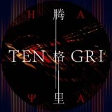
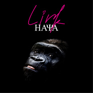
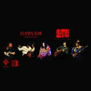
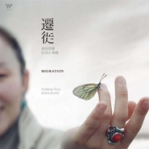
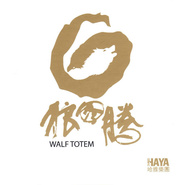

HAYA乐团
============================

|  |  |
| :--: | :-- |
| [ HAYA乐团](https://i.xiami.com/haya) | **地区**: China 中国大陆 **风格**: 世界融合 World Fusion, 民族融合新世纪 Ethnic Fusion New Age, 新世纪音乐 New Age, 世界音乐 World Music **播放数**: 40321777 **粉丝数**: 40563 **评论数**: 1383  |

## 档案

HAYA，“边缘”、“边境”之意。由曾献技于维也纳金色大厅的马头琴演奏家、电影“千里走单骑”的马头琴配乐大师张全胜发起成立。现任团员大多来自腾格尔的“苍狼乐队”。五个铁铮铮的粗犷蒙古汉子，用他们手中的乐器，奏出一派幽婉细腻的苍茫琴韵。 
它拥有着美好的两种含义。蒙古语中HAYA象征着最宽广的边际，在那里有出生的太阳温暖万物的生命。在古印度的传说里，HAYA 是恒河中的一块宝石，它可以融合大自然的光彩，发出美丽的光芒，如果有人得到了这块宝石，怨恨就会化解，爱就会充盈整个世界。 
“他们在传统与现代之间追寻着来自灵魂的声音；他们对古老蒙古民族特有的马头琴、呼唛、长调与现代音乐的独到诠释引起了艺术界的广泛关注。在这张专辑中，‘HAYA’表达的不仅是对现代蒙古音乐的理解，更是对自然的热爱，对心灵的呼唤。”——谭盾 
马头琴是HAYA的灵魂乐器，一切围此展开。深沉的游牧文化，是孕育HAYA音乐的辽阔土壤，作品中蕴含了流传百年的韵律，它们流过时间的沙漏，成为永恒的宝藏。而HAYA，这颗拥有融合能量的宝石，将这些悠远的旋律，化为璀璨的光芒。他们会用苍劲的马头琴、充满力量与生命的呼麦、与阴柔唯美的女声吟唱，在这片不再柔软的现代都市的土地上，照亮我们的心灵，打动我们的灵魂深处。 
全胜：马头琴 
黛青塔娜：主唱 
希博：吉他 
宝音：鼓手、呼麦手 
HAYA乐团是以蒙古音乐为基础的世界音乐，世界音乐的含义为融合，跨界。他们将传统的民族民间音乐，与先锋的，多样的音乐元素结合，HAYA的音乐，不但保留着传统民间音乐的魂魄，还具备新鲜的血液，包容的品质，贴近现代人的心态，具有时代的特征。乐团成员包括：全胜，马头琴；黛青塔娜，主唱；希博，吉他；宝音，鼓手、呼麦手。HAYA乐团以探寻心灵的方式去发现、结合传统与现代的跨界音乐元素，并展开了能够纵深于心灵探索与艺术表现之间的世界音乐图景。他们将传统的蒙古文化精髓与当代精神完美地融合在一起。 
2006年，哈雅乐团成立。2007年12月14日，发行首张专辑《狼图腾》。2008年7月5日，在第19届台湾金曲奖上，专辑《狼图腾》获得最佳跨界音乐专辑奖。2009年5月20日，发行第二张专辑《寂静的天空》。2011年9月28日，发行第四张专辑《迁徙》。2012年6月4日，在第23届台湾金曲奖上，专辑《迁徙》获得最佳跨界音乐专辑奖。2014年11月26日，发行第五张专辑《疯马》。2015年8月1日，在第26届台湾金曲奖上，专辑《疯马》获得最佳跨界音乐专辑奖。2016年1月15日，参加湖南卫视歌唱真人秀《我是歌手第四季》，作为首发阵容参加竞演。

## 专辑

| 名称 | 语种 | 唱片公司 | 发行时间 | 专辑类别 | 专辑风格 |
| :--: | :-- | :-- | :-- | :-- | :-- |
| [ 日月空](./albums/5021713838.md) | 蒙古语 | 声音丛林 | 2020年10月31日 | EP, 单曲 | 世界融合 World Fusion, 摇滚 Rock & Roll, 世界音乐 World Music |
| [ 腾格里HAYA](./albums/5021366510.md) | 国语 | 声音丛林 | 2020年08月29日 | EP, 单曲 | 世界融合 World Fusion, 独立民谣 Indie Folk |
| [ 有一只小山羊](./albums/2105442740.md) | 国语 | 哈雅盛世 | 2019年11月15日 | EP, 单曲 |  |
| [ LINK](./albums/2104909232.md) | 国语 | 声音丛林 | 2019年05月30日 | 录音室专辑 | 国语流行 Mandarin Pop |
| [ 远方](./albums/2104483856.md) | 国语 | 哈雅盛世 | 2019年01月16日 | EP, 单曲 | 国语流行 Mandarin Pop |
| [ Light灯 / 玉树赈灾公益专辑](./albums/413891.md) | 其他 | 声音丛林 | 2017年07月08日 | 录音室专辑 |  |
| [ 疯马Crazy Horse](./albums/1216991740.md) | 国语 | 声音丛林 | 2014年11月26日 | 录音室专辑 |  |
| [ HAYA乐团北京现场音乐会](./albums/2104698188.md) | 国语 | 声音丛林 | 2012年01月01日 | 现场专辑 | 国语流行 Mandarin Pop |
| [ 迁徙](./albums/469810.md) | 国语 | 风潮音乐 | 2011年09月28日 | 录音室专辑 | 世界融合 World Fusion, 新世纪音乐 New Age |
| [ 寂静的天空Silent Sky](./albums/333222.md) | 其他 | 风潮音乐 | 2009年05月20日 | 录音室专辑 | 世界音乐 World Music |
| [ 狼图腾Walf Totem](./albums/334108.md) | 纯音乐 | 星外星音乐 | 2007年12月14日 | 录音室专辑 |  |

## 评论

|  |  |  |
| :-- | :-- | :-- |
|  [虾米用户](https://emumo.xiami.com/u/109925022) 川流不息 2020-12-04 03:07 赞(0) 踩(0) | 
我爱haya
 |
|  [虾米用户](https://emumo.xiami.com/u/561522) 人间三千事，淡然一间。人... 2020-09-29 10:54 赞(0) 踩(0) | 
国内音乐太复杂 ，HAYA 乐团走到今天不容易。
 |
|  [虾米用户](https://emumo.xiami.com/u/410903441)  2020-09-23 15:31 赞(0) 踩(0) | 
因为乐夏发现了你们，一个非常棒的乐团，珍藏，留念！
 |
|  [虾米用户](https://emumo.xiami.com/u/22512965) 我还没想好要写什么... 2020-09-15 18:55 赞(0) 踩(0) | 
一个人在非洲的日子，晚上都是听着你们的歌入睡 感谢有你 
 |
|  [虾米用户](https://emumo.xiami.com/u/1820887) 与虾米共生死~~ 2020-09-13 00:23 赞(0) 踩(0) | 
HAYA斩棒棒哒！
 |
|  [虾米用户](https://emumo.xiami.com/u/5823190)  2020-08-27 09:01 赞(0) 踩(0) | 
这哪是Mongol风格的音乐，明显是装垫儿台风格那种尴吹风
 |
|  [虾米用户](https://emumo.xiami.com/u/98901196) 我是坠屌的 2020-07-19 19:20 赞(1) 踩(0) | 
去乐夏啦！加油加油！！！
 |
|  [虾米用户](https://emumo.xiami.com/u/405605291) 能听的让我浑身起鸡皮疙瘩... 2020-06-23 14:37 赞(3) 踩(0) | 
这样的乐团不支持，中国还有什么乐团值得？
 |
|  [虾米用户](https://emumo.xiami.com/u/404885045) 爱生活，爱自己！ 2020-06-19 23:20 赞(0) 踩(0) | 
听过她们的《迁徒》《香格里拉》的歌。涤荡心灵的感觉
 |
|  [虾米用户](https://emumo.xiami.com/u/404885045) 爱生活，爱自己！ 2020-06-19 23:18 赞(0) 踩(0) | 
黛青塔娜唱的就是很棒！
 |
|  [虾米用户](https://emumo.xiami.com/u/98901196) 我是坠屌的 2020-06-18 20:08 赞(0) 踩(0) | 
去乐夏啦！！！祝大火
 |
|  [虾米用户](https://emumo.xiami.com/u/1004132) 比较挑食的杂食党 2020-05-26 17:33 赞(0) 踩(0) | 
国产新民谣
 |
|  [虾米用户](https://emumo.xiami.com/u/12128984) 我讨厌一切不押韵的歌，感... 2020-04-26 10:04 赞(8) 踩(0) | 
看到介绍里写到&amp;ldquo;五个铁铮铮的粗犷蒙古汉子&amp;rdquo;，我又抬眼确认了一下照片~
 |
|  [虾米用户](https://emumo.xiami.com/u/3528785) 惊鸿一瞥，空谷幽兰 2020-04-03 18:56 赞(0) 踩(0) | 
你们的作品很好听，编曲录音都很好，如果再加个笛子就更好了，我想给你们吹笛哦
 |
|  [虾米用户](https://emumo.xiami.com/u/27906871)  2020-03-07 16:09 赞(0) 踩(0) | 
寂静的天空入坑 雪山、青海湖、Ongmanibamai、迷路的羊羔、四季、轮回、疯马......太多歌直击心灵
 |
|  [虾米用户](https://emumo.xiami.com/u/434506566) 万里无云万里天 2020-03-01 20:19 赞(0) 踩(0) | 

 |
|  [虾米用户](https://emumo.xiami.com/u/242183309)  2020-02-09 22:22 赞(0) 踩(0) | 
耳朵已怀孕   
 |
|  [虾米用户](https://emumo.xiami.com/u/31430298) 暂无签名~ 2020-01-24 15:15 赞(0) 踩(0) | 
加油哦！
 |
|  [虾米用户](https://emumo.xiami.com/u/369960409) H.O.T.5你好！20... 2019-12-10 13:18 赞(0) 踩(0) | 
超喜欢haya风格，最开始是《青海湖》
 |
|  [虾米用户](https://emumo.xiami.com/u/400499783) 找回忆的人，找共鸣的乐 2019-12-10 08:47 赞(0) 踩(0) | 
这是我心中的天籁音之一。 这类自然自由的音乐是我心底的梦幻诉求，没有之一。
 |
|  [虾米用户](https://emumo.xiami.com/u/13940536) 赠人玫瑰，手留余香 2019-12-02 23:38 赞(2) 踩(0) | 
很多年前在音悦台上偶然看到黛青塔唱的青海湖MV，就深深爱上了哈雅乐团，爱上了黛青塔娜纯粹而悠远的声音，然后就一直默默喜欢他们到现在。
 |
|  [虾米用户](https://emumo.xiami.com/u/2796166) 最爱莫文蔚..... 2019-11-16 00:10 赞(1) 踩(0) | 
加油~~~~
 |
|  [虾米用户](https://emumo.xiami.com/u/341939972)  2019-10-17 16:59 赞(4) 踩(0) | 
寂静的天空，完美的诠释了什么是优美的音乐。浮躁的年代能听到如此甘之如饴的乐曲算是一种幸运。感谢你们，HAYA乐团。
 |
|  [虾米用户](https://emumo.xiami.com/u/35632501) 暂无签名~ 2019-10-12 15:05 赞(2) 踩(0) | 
文字说明五个大汉？？？
 |
|  [虾米用户](https://emumo.xiami.com/u/78522298) 私の啓蒙残死 2019-09-15 06:45 赞(1) 踩(0) | 
戴上耳机，心境游走在音乐灵魂的深幽山谷，内心空寂，一种好似被遗忘的感觉油然而生。
 |
|  [虾米用户](https://emumo.xiami.com/u/78522298) 私の啓蒙残死 2019-09-10 22:53 赞(1) 踩(0) | 
我已不爱你了，但还会想听你的歌
 |
|  [虾米用户](https://emumo.xiami.com/u/4771470) 暂无签名~ 2019-08-23 23:03 赞(1) 踩(0) | 
超喜欢他们的音乐
 |
|  [虾米用户](https://emumo.xiami.com/u/331005260)  2019-07-09 06:50 赞(0) 踩(0) | 

 |
|  [虾米用户](https://emumo.xiami.com/u/405239171)  2019-06-16 22:49 赞(1) 踩(0) | 
自然，民族，融合，现代蒙古音乐  
 |
|  [虾米用户](https://emumo.xiami.com/u/319540065) 不擅长任何事喜欢自言自语 2019-05-31 01:38 赞(1) 踩(0) | 
这才是音乐
 |
|  [虾米用户](https://emumo.xiami.com/u/72098) 有一天 我要开一家名叫开... 2019-05-30 22:02 赞(6) 踩(0) | 
比起萨顶顶的神叨叨 黛青塔娜才是真正的女神降世
 |
|  [虾米用户](https://emumo.xiami.com/u/2804686)  2019-04-26 20:17 赞(1) 踩(0) | 
最美的音乐来自HAYA,不接受反驳。
 |
|  [虾米用户](https://emumo.xiami.com/u/43155429) 虾米不见了，以后何去何从 2019-04-21 17:35 赞(1) 踩(0) | 
 
 |
| ⇒ |  [虾米用户](https://emumo.xiami.com/u/356341666)  2019-08-31 21:27 赞(0) 踩(0) | 
yq
 |
|  [虾米用户](https://emumo.xiami.com/u/2804686)  2019-04-18 23:22 赞(1) 踩(0) | 
好音乐。只想留着自己听，但是为了乐团更好的发展，做更好的音乐，还是忍痛分享了
 |
|  [虾米用户](https://emumo.xiami.com/u/276944698) 不要自我设限..... 2019-03-05 08:20 赞(3) 踩(0) | 

 |
|  [虾米用户](https://emumo.xiami.com/u/410428980) 心的本质超越所有 2019-02-23 03:15 赞(1) 踩(0) | 
难以抗拒的旋律
 |
|  [虾米用户](https://emumo.xiami.com/u/356962079)  2019-02-14 06:20 赞(3) 踩(0) | 

 |
|  [虾米用户](https://emumo.xiami.com/u/17717702) 生命有限 音乐无限 2018-12-26 00:38 赞(6) 踩(0) | 
民族的就是世界的，百听不厌的民族音乐，音乐有两种，一种让人有所想，另一种让人无所想……
 |
|  [虾米用户](https://emumo.xiami.com/u/17584208)  2018-11-09 08:39 赞(3) 踩(0) | 
一听到就醉了
 |
|  [虾米用户](https://emumo.xiami.com/u/17717702) 生命有限 音乐无限 2018-09-18 07:12 赞(8) 踩(0) | 
黛青塔娜的歌声缥缈辽阔，仿佛是青海湖中的一颗宝石，深沉而珍贵。黛青塔娜是哈雅乐团&amp;ldquo;灵&amp;rdquo;的部分最完美的展现，她有着女神般的容貌，天籁一样的嗓音，和充满灵性的表现力.
 |
|  [虾米用户](https://emumo.xiami.com/u/377916189) 凡物盛极必衰，只有智之士... 2018-09-11 20:40 赞(3) 踩(0) | 
HAYA乐团音乐真好听
 |
|  [虾米用户](https://emumo.xiami.com/u/49959840) 无聊人 2018-08-26 18:26 赞(1) 踩(0) | 
❤️❤️❤️
 |
|  [虾米用户](https://emumo.xiami.com/u/308649448)  2018-08-24 07:34 赞(1) 踩(0) | 
我想说HAYA乐团的每首歌我都喜欢 
 |
|  [虾米用户](https://emumo.xiami.com/u/281686032) 我说你是人间四月天 2018-08-15 22:24 赞(8) 踩(0) | 
这是正经搞艺术的
 |
|  [虾米用户](https://emumo.xiami.com/u/43492923) 行到水穷我才开始害怕，夕... 2018-08-12 08:25 赞(1) 踩(0) | 
◇
 |
|  [虾米用户](https://emumo.xiami.com/u/112281570) 人生是一次愉快旅行，感謝... 2018-06-21 05:20 赞(1) 踩(0) | 
   
 |
|  [虾米用户](https://emumo.xiami.com/u/308767460)  2018-05-26 11:21 赞(7) 踩(0) | 
很喜欢，遇见有点晚了，不过没有错过
 |
|  [虾米用户](https://emumo.xiami.com/u/228843687) 懒惰统治人间 2018-05-26 08:29 赞(3) 踩(0) | 
愿你们始终如一
 |
|  [虾米用户](https://emumo.xiami.com/u/1689069)  2018-05-10 00:09 赞(4) 踩(0) | 
很想看一次现场。民族乐队的演出一定是非常震撼的。肯定比用电子设备棒多了。
 |
|  [虾米用户](https://emumo.xiami.com/u/39251890) 蔓惪拉瑜珈 2018-05-01 09:21 赞(1) 踩(0) | 
真心不错
 |
|  [虾米用户](https://emumo.xiami.com/u/9069852)  2018-04-21 12:10 赞(2) 踩(0) | 
今天在休斯顿看到你们的演出，现场效果真的很棒。希望你们继续创造出好的音乐，把中国元素带向世界。也祝愿你们能在国际上得到更多的认可，越来越好！
 |
|  [虾米用户](https://emumo.xiami.com/u/354875243)  2018-04-05 04:53 赞(1) 踩(0) | 
南无阿弥陀佛
 |
|  [虾米用户](https://emumo.xiami.com/u/52015453) 你被劈开的疼痛在大地弥漫 2018-03-21 09:50 赞(2) 踩(0) | 
黛青塔娜的气声确实虚了点儿...还有国语歌总比蒙古语少了韵味儿
 |
| ⇒ |  [虾米用户](https://emumo.xiami.com/u/356341666)  2019-08-31 21:23 赞(0) 踩(0) | 
养猪
 |
|  [虾米用户](https://emumo.xiami.com/u/78080328)  2018-03-08 22:20 赞(3) 踩(0) | 
萝卜青菜各有喜爱，喜欢就听，不想听手指点一下就完，没必要喷雾！
 |
|  [虾米用户](https://emumo.xiami.com/u/110069510)  2018-01-13 01:22 赞(2) 踩(0) | 
想起香格里拉的天空和梅里雪山！ 
 |
|  [虾米用户](https://emumo.xiami.com/u/43213713) 音乐，意境和治愈。探索者... 2018-01-07 15:38 赞(1) 踩(0) | 
从Deep Forest而来
 |
|  [虾米用户](https://emumo.xiami.com/u/337179447) 生活源于平淡 2018-01-02 10:48 赞(3) 踩(0) | 
音乐是有灵魂的，现实生活犹如一个无底染缸，一不小心就失去了原有的真。希望哈雅一如既往的走下去！
 |
|  [虾米用户](https://emumo.xiami.com/u/336642752)  2017-12-27 20:13 赞(1) 踩(0) | 
吸气声比较明显。应该改进&amp;hellip;&amp;hellip; 
 |
|  [虾米用户](https://emumo.xiami.com/u/261936071)  2017-12-18 10:27 赞(2) 踩(0) | 
乐迷微信群，加我邀请15390400114
 |
|  [虾米用户](https://emumo.xiami.com/u/20177386) 感谢一切美好的遇见❤️ 2017-12-14 14:43 赞(2) 踩(0) | 
美
 |
|  [虾米用户](https://emumo.xiami.com/u/52259218)  2017-12-08 21:55 赞(8) 踩(0) | 
今天，第一次听到HAYA乐团的音乐，一下子就被吸引住！索性把所有乐曲都听个遍！真是超赞啊 我怎么没有早点发现这么好听的音乐！太美了太喜欢了！
 |
|  [虾米用户](https://emumo.xiami.com/u/291073746) 不说再见 2017-12-06 13:42 赞(3) 踩(0) | 
声音动听，深远优美，一支真正的有灵魂歌声团队。
 |
|  [虾米用户](https://emumo.xiami.com/u/6044227) 人生如戏，戏如人生…… 2017-12-03 13:05 赞(3) 踩(0) | 
第一次听到《仓央嘉措》这首时，是舞林大会中，一对舞者选用的曲目。当时除了舞蹈就是这首歌深深把我陶醉了，反复看了很多遍！
 |
| ⇒ |  [虾米用户](https://emumo.xiami.com/u/48570002) 叶落无声，何必倾听…… 2018-01-01 23:17 赞(0) 踩(0) | 
虽然不是第一次听他们的歌，不过当时的舞蹈配上这首歌特别的美，特别的空灵，让人身临其境。
 |
|  [虾米用户](https://emumo.xiami.com/u/333592229) 啦啦啦啦 2017-11-30 21:29 赞(0) 踩(0) | 
好听歌曲。好几百年的歌 
 |
|  [虾米用户](https://emumo.xiami.com/u/270887) 拜啰嗦 2017-11-24 09:51 赞(6) 踩(0) | 
四男一女为啥简介里说是：&amp;ldquo;五个铁骨铮铮的汉子&amp;rdquo;
 |
|  [虾米用户](https://emumo.xiami.com/u/35097008)  2017-11-22 02:35 赞(2) 踩(0) | 
听了很多年了，必须支持！
 |
|  [虾米用户](https://emumo.xiami.com/u/332019573)  2017-11-11 01:25 赞(2) 踩(0) | 
喜欢他们的风格
 |
|  [虾米用户](https://emumo.xiami.com/u/322839901) 万古长空 一朝风月 2017-11-10 23:46 赞(8) 踩(0) | 
一直是haya的粉丝，09年的时候特意去西单图书大厦买了寂静的天空和迁徙两张碟，后来网易云音乐上没有了版权，特意又到虾米上买了VIP，最喜欢的专辑是窦唯的艳阳天，然后就是寂静的天空，深邃而悠远，听了8年了，一直喜欢
 |
| ⇒ |  [虾米用户](https://emumo.xiami.com/u/99330710)  2018-12-06 23:26 赞(0) 踩(0) | 
同好，艳阳天、山河水，haya寂静的天空
 |
|  [虾米用户](https://emumo.xiami.com/u/9812199)  2017-10-30 10:23 赞(2) 踩(0) | 
她的聲音讓我震驚。青海湖、黑暗中的舞者、倉央嘉措、寂靜天空，三首下來足矣！風格很多變但聲音的特質那麼清晰
 |
|  [虾米用户](https://emumo.xiami.com/u/2660625)  2017-10-28 00:42 赞(1) 踩(0) | 
第一次听HAYA的歌还是几年前，当时真是被惊艳到了，充满了意境感，最近又开始听，依然喜欢的不得了
 |
| ⇒ |  [虾米用户](https://emumo.xiami.com/u/356341666)  2019-08-31 21:21 赞(0) 踩(0) | 
养猪专业户
 |
|  [虾米用户](https://emumo.xiami.com/u/3872931) 我只爱你，yuling  2017-10-28 00:22 赞(0) 踩(0) | 
“心无际 他可以装下整个宇宙 我 是宇宙中一粒尘埃 转瞬即逝”暮野苍茫，远山绵延，暗云席卷天空。面对着天际熹微的霞光，逐渐掠去浮躁，沉淀心绪，跟随代青塔娜的歌声一起禅定... 蒙古族
 |
|  [虾米用户](https://emumo.xiami.com/u/2425079)  2017-10-28 00:21 赞(2) 踩(0) | 
寂靜的嗓音，或許在悲喜之後，平淡的寂靜
 |
|  [虾米用户](https://emumo.xiami.com/u/8486101)  2017-10-27 23:50 赞(0) 踩(0) | 
纯粹、真诚的感觉 音乐里感觉到人与自然的关系接近而不失隔离
 |
|  [虾米用户](https://emumo.xiami.com/u/281932664)  2017-10-27 23:39 赞(2) 踩(0) | 
你们的音乐好棒啊 低估中国的音乐了 以前大街上的流行歌伤透了我的听国内歌曲心灵  咋就不知道有这么好的音乐呢 我够二的了 刚知道！最近听何训田 也很难好听 你们的音乐可以和世界同步！！我一个业余听歌者 很欣慰 你们会让中国的音乐成为我们国内听众的骄傲！！ 加油吧多作曲些好听的音乐出来吧 让世界都知道！！好享受啊！！
 |
|  [虾米用户](https://emumo.xiami.com/u/10662259)  2017-10-27 23:18 赞(2) 踩(0) | 
我生性自由,喜欢宁静的注视万物；我总能感受到与万物之间的伙伴之情；我理解自由、孤独、幸福、快乐，这些完全的出自心灵自足，而非对物质的实现和对名利的执着。－－黛青塔娜
 |
|  [虾米用户](https://emumo.xiami.com/u/10662259)  2017-10-27 23:18 赞(1) 踩(0) | 
我生性自由,喜欢宁静的注视万物,我总能感受到与万物之间的伙伴之情,我理解自由,孤独,幸福,快乐,他们完全的出自心灵自足,而非对物质的实现和对名利的执着－－黛青塔娜
 |
|  [虾米用户](https://emumo.xiami.com/u/8724534)  2017-10-27 23:17 赞(2) 踩(0) | 
最爱的便是像黛青塔娜的这种脱俗声音和民族风格，这个行走于西海湖畔的蒙古图瓦族女子仿佛美丽的哲思者般轻轻吟唱着，（我喜欢的很多蒙古歌手也都是图瓦部的）让我仿佛回到了自己在茫茫戈壁荒漠，雪山草原，青海湖畔的那段岁月。
 |
|  [虾米用户](https://emumo.xiami.com/u/1911590) 音乐是陪伴灵魂的东西 2017-10-27 23:17 赞(2) 踩(0) | 
原生态，唯美，宁静动人，响彻心灵的音乐！都市中有时需要这样的灵魂声音，清新一下灵魂，才不至于迷失...
 |
|  [虾米用户](https://emumo.xiami.com/u/1559482) 科学。民主。自由。 2017-10-27 23:17 赞(3) 踩(0) | 
这是我们从先辈那里继承的最淳朴的生存态度，这黛青塔娜就是我们天生的万物之情。我生性自由，喜欢宁静地注视万物，去感受与万物之间的伙伴之情，我理解自由、孤独、幸福、快乐，它们完全出自心灵自足，而非对物质的实现和对名利的执着。
 |
|  [虾米用户](https://emumo.xiami.com/u/12293365) =3= 2017-10-27 23:16 赞(1) 踩(0) | 
记得还是高中的时候听蓝调北京，在节目中做了不插电live，一下子就被惊艳到了，是鸡皮疙瘩掉一地的惊艳。然后每次看书做题没耐心了的时候就会循环播放。
 |
|  [虾米用户](https://emumo.xiami.com/u/298948030) 中國詩音樂電影创始人作曲... 2017-10-17 22:00 赞(0) 踩(0) | 
你好
 |
|  [虾米用户](https://emumo.xiami.com/u/5832319) 生之囚徒 声之门徒 2017-10-06 19:22 赞(1) 踩(0) | 
当下中国歌坛最好的女声之一，去年有幸在珠海与她合影，老夫聊发少年狂。
 |
|  [虾米用户](https://emumo.xiami.com/u/4038133)  2017-10-04 20:09 赞(3) 踩(0) | 
请注意，haya不是一个人，是一群人，是整体，这很好。
 |
|  [虾米用户](https://emumo.xiami.com/u/327690231)  2017-10-03 18:29 赞(0) 踩(0) | 
特别
 |
|  [虾米用户](https://emumo.xiami.com/u/66823378)  2017-09-28 20:36 赞(3) 踩(0) | 
我就喜欢这种追求美的音乐，歌唱自然，歌唱心灵 
 |
|  [虾米用户](https://emumo.xiami.com/u/325426225) ybh1002 2017-09-27 10:28 赞(0) 踩(0) | 
GOOD
 |
|  [虾米用户](https://emumo.xiami.com/u/5933737)  2017-09-24 10:47 赞(1) 踩(0) | 
好
 |
|  [虾米用户](https://emumo.xiami.com/u/302575996)  2017-09-22 00:25 赞(0) 踩(0) | 
世界级的心灵音乐
 |
|  [虾米用户](https://emumo.xiami.com/u/14359041) 公号出没：庐雨浙潮 2017-09-07 16:06 赞(0) 踩(0) | 

 |
|  [虾米用户](https://emumo.xiami.com/u/49016579)  2017-09-06 12:57 赞(0) 踩(0) | 
非常有才华的歌手
 |
|  [虾米用户](https://emumo.xiami.com/u/526266) 我不能强迫自己天天签到，... 2017-08-31 13:36 赞(1) 踩(0) | 
放眼国际也是一流的水准~！
 |
|  [虾米用户](https://emumo.xiami.com/u/311679942) 让一切随风 2017-08-02 01:03 赞(1) 踩(0) | 
我特别喜欢你们的那首《雪山》，这个软件竟然不能听。
 |
|  [虾米用户](https://emumo.xiami.com/u/49005699)  2017-08-01 08:12 赞(0) 踩(0) | 
好想去草原放放羊咩咩牛
 |
|  [虾米用户](https://emumo.xiami.com/u/315978152)  2017-07-29 22:30 赞(0) 踩(0) | 
空灵
 |
|  [虾米用户](https://emumo.xiami.com/u/9241109) 寂寞而又宁静的角落 2017-07-29 20:39 赞(0) 踩(0) | 
往日时光
 |
|  [虾米用户](https://emumo.xiami.com/u/227506658)  2017-07-27 23:48 赞(0) 踩(0) | 
太美了。
 |
|  [虾米用户](https://emumo.xiami.com/u/113712738)  2017-07-09 18:19 赞(1) 踩(0) | 
马上要去内蒙古了，因为haya颇为向往
 |
|  [虾米用户](https://emumo.xiami.com/u/11485915)  2017-05-30 12:28 赞(2) 踩(0) | 
一直喜欢哈雅，喜欢张全胜、喜欢黛青塔拉！
 |
|  [虾米用户](https://emumo.xiami.com/u/21612813)  2017-05-28 00:05 赞(2) 踩(0) | 
喜欢haya，被现场镇住了 
 |
|  [虾米用户](https://emumo.xiami.com/u/295424914)  2017-05-27 22:43 赞(0) 踩(0) | 
真好听！
 |
|  [虾米用户](https://emumo.xiami.com/u/298244391)   2017-05-24 12:13 赞(0) 踩(0) | 
HAYA
 |
|  [虾米用户](https://emumo.xiami.com/u/280304127)  2017-05-22 22:44 赞(0) 踩(0) | 
不懂音乐，就知道好听，适合煲耳机
 |
|  [虾米用户](https://emumo.xiami.com/u/39988524) 暂无签名~ 2017-05-21 08:20 赞(1) 踩(0) | 
了不起的音乐
 |
|  [虾米用户](https://emumo.xiami.com/u/244433164) 沙漠之舟无私的小天平 2017-05-09 16:44 赞(0) 踩(0) | 

 |
|  [虾米用户](https://emumo.xiami.com/u/293534620)  2017-05-03 16:58 赞(0) 踩(0) | 
喜欢！
 |
|  [虾米用户](https://emumo.xiami.com/u/22743826)  2017-04-24 23:13 赞(0) 踩(0) | 
喜欢
 |
|  [虾米用户](https://emumo.xiami.com/u/289724623)  2017-04-18 21:40 赞(2) 踩(0) | 
用灵魂听的音乐。
 |
|  [虾米用户](https://emumo.xiami.com/u/5808524) 我要心存美好 2017-04-17 13:31 赞(0) 踩(0) | 
好听
 |
|  [虾米用户](https://emumo.xiami.com/u/387079)  2017-04-12 12:39 赞(0) 踩(0) | 
寂静的天空！
 |
|  [虾米用户](https://emumo.xiami.com/u/13232936) 谁的心让月色照亮无处躲藏 2017-03-31 19:46 赞(0) 踩(0) | 
怎么不出新专辑了呀
 |
|  [虾米用户](https://emumo.xiami.com/u/275098100)  2017-03-26 17:04 赞(0) 踩(0) | 
走心的音乐
 |
|  [虾米用户](https://emumo.xiami.com/u/223395971) 努力听歌脱贫 2017-03-15 00:30 赞(0) 踩(0) | 
张全胜？！ 
 |
|  [虾米用户](https://emumo.xiami.com/u/260176390)  2017-03-12 14:45 赞(0) 踩(0) | 
HAYA，&amp;ldquo;边缘&amp;rdquo;、&amp;ldquo;边境&amp;rdquo;之意。由曾献技于维也纳金色大厅的马头琴演奏家、电影&amp;ldquo;千里走单骑&amp;rdquo;的马头琴配乐大师张全胜发起成立
 |
|  [虾米用户](https://emumo.xiami.com/u/1764541) 我还没想好要写什么... 2017-03-05 17:29 赞(0) 踩(0) | 
为什么封面照有5个人，介绍里只有4个&amp;hellip;&amp;hellip;
 |
|  [虾米用户](https://emumo.xiami.com/u/44991093) Beautiful Bl... 2017-03-01 18:25 赞(0) 踩(0) | 
心仪
 |
|  [虾米用户](https://emumo.xiami.com/u/260456835) 像每一滴酒回不了最初的葡... 2017-02-28 16:00 赞(1) 踩(0) | 
很安静 喜欢上他们是因为那首往日时光吧
 |
|  [虾米用户](https://emumo.xiami.com/u/12288595) 迁移至网易云ONEand... 2017-02-27 08:00 赞(0) 踩(0) | 
阳春白雪，喜者人寡
 |
|  [虾米用户](https://emumo.xiami.com/u/43966566) 暂无签名~ 2017-02-21 00:01 赞(0) 踩(0) | 
心灵的归宿
 |
|  [虾米用户](https://emumo.xiami.com/u/196772917)  2017-02-06 11:02 赞(0) 踩(0) | 
空灵 天籁 民族风 好声音！
 |
|  [虾米用户](https://emumo.xiami.com/u/262194019)  2017-02-05 18:13 赞(0) 踩(0) | 
塔娜
 |
|  [虾米用户](https://emumo.xiami.com/u/7915547) hjello 2017-01-29 02:03 赞(0) 踩(0) | 
今天看了14年贵州台的《让世界听见》，HAYA的几首，哭了，跪了
 |
|  [虾米用户](https://emumo.xiami.com/u/7915547) hjello 2017-01-27 12:34 赞(0) 踩(0) | 
昨天东南台看到两位女神，央吉玛和黛青塔娜，太棒了，还有爆棚的龚老师，新年好，Haya乐团
 |
|  [虾米用户](https://emumo.xiami.com/u/261976505)  2017-01-26 07:17 赞(1) 踩(0) | 
宁静而悠长，天籁之音啊，还有主唱的嗓音真清澈，吟唱起来带给人这个时代久违了的灵魂的呼喊
 |
|  [虾米用户](https://emumo.xiami.com/u/214265691)  2017-01-05 23:51 赞(0) 踩(0) | 
迷上了咋办
 |
|  [虾米用户](https://emumo.xiami.com/u/257156933) veniaminkrem 2017-01-01 19:03 赞(0) 踩(0) | 
rii0
 |
|  [虾米用户](https://emumo.xiami.com/u/257156933) veniaminkrem 2017-01-01 19:03 赞(0) 踩(0) | 
rii0
 |
|  [虾米用户](https://emumo.xiami.com/u/249798514)  2016-12-13 11:54 赞(0) 踩(0) | 
清澈，宁静
 |
|  [虾米用户](https://emumo.xiami.com/u/25382102) 云在青山，月在天。 2016-12-12 16:00 赞(0) 踩(0) | 
喜欢
 |
|  [虾米用户](https://emumo.xiami.com/u/249798514)  2016-12-09 15:45 赞(0) 踩(0) | 
好美，宁静而嘹亮的嗓音
 |
|  [虾米用户](https://emumo.xiami.com/u/43966566) 暂无签名~ 2016-11-23 23:08 赞(0) 踩(0) | 
爱上HAYA，元神出窍的音乐，跟随音乐去远方
 |
|  [虾米用户](https://emumo.xiami.com/u/34108164) 以幽默的生活方式对待生活 2016-11-23 17:21 赞(0) 踩(0) | 
世界融合
 |
|  [虾米用户](https://emumo.xiami.com/u/38889696)  2016-11-21 08:50 赞(0) 踩(0) | 
haya，用流浪的身形去搅动音符
 |
|  [虾米用户](https://emumo.xiami.com/u/2409614)  2016-11-21 04:02 赞(0) 踩(0) | 
只要确信，这是追随一生的音乐。
 |
|  [虾米用户](https://emumo.xiami.com/u/2409614)  2016-11-21 03:49 赞(1) 踩(0) | 
09年接触至今，下载的资源换来换去十来波，又转回了这里。
 |
|  [虾米用户](https://emumo.xiami.com/u/24296175)  2016-11-20 23:55 赞(0) 踩(0) | 
好听
 |
|  [虾米用户](https://emumo.xiami.com/u/227506658)  2016-11-20 12:45 赞(1) 踩(0) | 
这种好曲目好乐团不火是很多老百姓欣赏水平确实有限是前提，我们喜欢iuc就好。我发现还有很多娱乐的东西也是如此，电影，游戏。都有这种作品素质很高但仍然干不过俗气的东西。再游戏界我就看到这种现象，一直没搞懂，知道某天一个帖子解析了下，发现就是如此，欣赏不来，我玩不来，我就玩画质粗糙的就好。。。 无奈 白云，天空，那画面那直抵内心的触动呢。。。。。
 |
| ⇒ |  [虾米用户](https://emumo.xiami.com/u/236020725) 勿扰…… 2016-11-21 21:12 赞(0) 踩(0) | 
这只能说明这里的人都是高雅人士，就好像在雅间吃饭，和在大厅吃饭一样，或是到超市买菜，和到农贸市场买菜一样……
 |
|  [虾米用户](https://emumo.xiami.com/u/73215546) 在这里可以唱很多喜欢的歌... 2016-11-01 23:05 赞(0) 踩(0) | 
我购买了vip 但是找不到激活码在哪，谁能告诉我一下，拜托了
 |
|  [虾米用户](https://emumo.xiami.com/u/180181586) 读书少别骗我 2016-10-28 23:26 赞(0) 踩(0) | 
歌声真的好听，喜欢，流行音乐什么的比不了这个
 |
|  [虾米用户](https://emumo.xiami.com/u/15466184) Niceboy 2016-10-27 04:06 赞(1) 踩(0) | 
主唱音色一般，我是指对比少数民族歌手来讲…她真的soso…
 |
| ⇒ |  [虾米用户](https://emumo.xiami.com/u/203396879)   2016-11-18 01:36 赞(0) 踩(0) | 
然后呢？你的优越感就出来了吗？
 |
| ⇒ |  [虾米用户](https://emumo.xiami.com/u/401075)   2017-03-22 00:47 赞(0) 踩(0) | 
人家就不是靠音色，靠的是音乐的整体风格氛围
 |
|  [虾米用户](https://emumo.xiami.com/u/211616358) 若他日重逢，我将以何贺你... 2016-10-22 10:30 赞(0) 踩(0) | 
喜欢
 |
|  [虾米用户](https://emumo.xiami.com/u/20683607) 白昼之光，岂知夜色之深。 2016-10-20 23:50 赞(1) 踩(0) | 
啥时候唱个乌兰巴托的夜来听听
 |
|  [虾米用户](https://emumo.xiami.com/u/238294270) 耳朵还好使，喂点好东东 2016-10-20 16:58 赞(0) 踩(0) | 
好，走自己的路
 |
|  [虾米用户](https://emumo.xiami.com/u/1136712)  2016-10-12 16:53 赞(0) 踩(0) | 
疯马 重生 无限循环 疯马唱出了中国自己的暗潮啊  重生就是仙音炸脑
 |
|  [虾米用户](https://emumo.xiami.com/u/122688364) 生在愤坑，长在赤圈；挣脱 2016-09-15 22:54 赞(0) 踩(0) | 
3417
 |
|  [虾米用户](https://emumo.xiami.com/u/42946579) 我还没想好要写什么... 2016-09-02 04:30 赞(3) 踩(0) | 
希望HAYA坚持自己，一直走下去 
 |
|  [虾米用户](https://emumo.xiami.com/u/1971011) 愿后会有期微信XXL-S... 2016-08-20 18:53 赞(3) 踩(0) | 
上来只想说一句，最好的一版往日时光是haya的，没有之一
 |
|  [虾米用户](https://emumo.xiami.com/u/213078055)  2016-08-15 00:06 赞(1) 踩(0) | 
纯净的声音
 |
|  [虾米用户](https://emumo.xiami.com/u/208356712)  2016-08-11 17:45 赞(1) 踩(0) | 
HAYA 所创的歌曲就是符合我的类型。别的歌我都不想听。     
 |
|  [虾米用户](https://emumo.xiami.com/u/208886425)  2016-08-04 16:32 赞(0) 踩(0) | 
122
 |
|  [虾米用户](https://emumo.xiami.com/u/192512938) 成功？你才刚上路…… 2016-07-27 15:28 赞(0) 踩(0) | 
喜欢，点赞！
 |
|  [虾米用户](https://emumo.xiami.com/u/9961061) fgfhhfhrtryh 2016-07-14 12:39 赞(0) 踩(0) | 
好听
 |
|  [虾米用户](https://emumo.xiami.com/u/199273793)   2016-07-10 02:12 赞(0) 踩(0) | 
看完他们的演唱会，更加喜欢他们了……  
 |
|  [虾米用户](https://emumo.xiami.com/u/195977104)  2016-07-01 13:29 赞(0) 踩(0) | 
太好听了
 |
|  [虾米用户](https://emumo.xiami.com/u/6247097) 我的耳朵已娶音乐为妻 2016-06-23 18:41 赞(8) 踩(0) | 
干嘛要去参加《我是歌手》！！？？为什么？？！！
 |
| ⇒ |  [虾米用户](https://emumo.xiami.com/u/227346421) 深情且酷 2017-03-05 16:50 赞(0) 踩(0) | 
因为他们有足够实力  才会被歌手邀请   他们早就是世界级的了    还有  你理解不了他们的歌就不要在这随便喷
 |
| ⇒ |  [虾米用户](https://emumo.xiami.com/u/6247097) 我的耳朵已娶音乐为妻 2017-03-05 17:49 赞(0) 踩(0) | 
<q><b>suger~说：</b></q>
 |
|  [虾米用户](https://emumo.xiami.com/u/120781722)  2016-06-19 16:09 赞(0) 踩(0) | 
喜欢
 |
|  [虾米用户](https://emumo.xiami.com/u/122688364) 生在愤坑，长在赤圈；挣脱 2016-06-18 23:20 赞(0) 踩(0) | 
1286
 |
|  [虾米用户](https://emumo.xiami.com/u/1266864)  2016-06-15 12:40 赞(0) 踩(0) | 
2016年7月9日深圳演唱会，我一定要去
 |
|  [虾米用户](https://emumo.xiami.com/u/77332198)  2016-06-14 00:25 赞(0) 踩(0) | 

 |
|  [虾米用户](https://emumo.xiami.com/u/13232936) 谁的心让月色照亮无处躲藏 2016-06-10 14:33 赞(1) 踩(0) | 
啊~我要化了 
 |
|  [虾米用户](https://emumo.xiami.com/u/127345386)  2016-05-20 12:26 赞(2) 踩(0) | 
很好的乐团。
 |
|  [虾米用户](https://emumo.xiami.com/u/52697807)  2016-05-08 11:40 赞(1) 踩(0) | 
走向远方
 |
|  [虾米用户](https://emumo.xiami.com/u/52697807)  2016-05-08 11:40 赞(1) 踩(0) | 
永远住在我心里
 |
|  [虾米用户](https://emumo.xiami.com/u/52697807)  2016-05-08 11:40 赞(0) 踩(0) | 
那是微风依恋的地方
 |
|  [虾米用户](https://emumo.xiami.com/u/52697807)  2016-05-08 11:39 赞(0) 踩(0) | 
haya
 |
|  [虾米用户](https://emumo.xiami.com/u/8098168) 天上寂静 2016-05-04 08:03 赞(1) 踩(0) | 
国内难得的音乐。
 |
|  [虾米用户](https://emumo.xiami.com/u/145080254)  2016-05-02 20:36 赞(1) 踩(0) | 
悠远
 |
|  [虾米用户](https://emumo.xiami.com/u/41694769)  2016-05-01 22:32 赞(12) 踩(0) | 
像天空一般无垠寂静，像草原一样无边辽阔，像雪山一样深远圣洁。
 |
| ⇒ |  [虾米用户](https://emumo.xiami.com/u/400499783) 找回忆的人，找共鸣的乐 2019-12-10 08:15 赞(0) 踩(0) | 
比喻的真好
 |
|  [虾米用户](https://emumo.xiami.com/u/39220840)  2016-04-25 16:12 赞(0) 踩(0) | 
喜欢。。。
 |
|  [虾米用户](https://emumo.xiami.com/u/6872970) 往烟清尘，无果境空。 2016-04-14 02:04 赞(51) 踩(0) | 
喜欢HAYA很久了，具有灵性的一支团队，坚持做自己喜欢地富有意义的音乐，自然的，民族的，世界的音乐。原来一直不怎么关注“我是歌手”，今年冲着HAYA才看的，结果非常伤心第二期便被淘汰了。我可以理解很多人说HAYA的音乐欣赏不来，但是我不能忍受我们一边淘汰了这么纯净美好的民族音乐，一边竟然一路支持一个韩国流行歌手走到最后并挤进前三。自己的音乐我们都不愿意去好好欣赏和支持，是否一定要等到这些音乐终将遗失，才能唤起大众的一点关注？其实开始还是非常惊讶HAYA参加这类竞赛，但是转念一想，HAYA其实并不会介意拿不拿得到歌王，只是纯粹地希望借这个舞台展现更多让大家了解更多蒙古人的故事和大自然的音符。
 |
| ⇒ |  [虾米用户](https://emumo.xiami.com/u/443580670)  2020-09-16 22:38 赞(0) 踩(0) | 
你竟然在意那些综艺娱乐？ 别介意，人家玩流量小鲜肉的
 |
|  [虾米用户](https://emumo.xiami.com/u/1486330)  2016-04-11 15:42 赞(4) 踩(0) | 
Haya的歌曲画面感很强，无边的草原、雄伟的高山、策马奔腾的牧人和繁星点缀的蒙古包，听了直接给人这种画面，风格独特，别有一番韵味。
 |
|  [虾米用户](https://emumo.xiami.com/u/88484906) 我安静的像宇宙 2016-04-07 09:20 赞(1) 踩(0) | 
抄袭说的某些人似乎忘记了一个最基本的事实:图瓦也是蒙古，蒙古族图瓦人。俄罗斯联邦图瓦共和国至今每家都会挂有成吉思汗的画像……某些人可以歇歇了
 |
|  [虾米用户](https://emumo.xiami.com/u/116018270)  2016-04-07 04:38 赞(0) 踩(0) | 
赞
 |
|  [虾米用户](https://emumo.xiami.com/u/1745489)  2016-04-05 23:06 赞(0) 踩(0) | 
相见恨晚
 |
|  [虾米用户](https://emumo.xiami.com/u/1153116)  2016-04-05 22:55 赞(4) 踩(0) | 
******
 |
|  [虾米用户](https://emumo.xiami.com/u/3456044) 去体验、去感受、得灵犀、... 2016-04-03 16:58 赞(4) 踩(0) | 
路转粉！haya用音乐把我带到了广袤无垠的草原，那种苍凉悲怆直击我内心最深处。
 |
|  [虾米用户](https://emumo.xiami.com/u/6215042) 欢迎关注同名音乐公众号 2016-04-02 05:28 赞(4) 踩(0) | 
可以把头像换了么
 |
|  [虾米用户](https://emumo.xiami.com/u/469232) 无关他人，忠于内心。 2016-04-02 00:07 赞(13) 踩(0) | 
因为我是歌手才知道haya，但真的很喜欢他们的音乐、主唱的声音。不明白为什么他们在我是歌手里支持率这么低。
 |
| ⇒ |  [虾米用户](https://emumo.xiami.com/u/293419223)  2017-05-10 00:23 赞(0) 踩(0) | 
歌手的观众大部分是俗人，他们喜欢听俗得掉渣的鬼哭狼嚎
 |
|  [虾米用户](https://emumo.xiami.com/u/13130977)  2016-04-01 21:02 赞(3) 踩(0) | 
空灵
 |
|  [虾米用户](https://emumo.xiami.com/u/127338180) 陇田在我心，何处无酒饮。 2016-03-26 18:13 赞(0) 踩(0) | 
不错
 |
|  [虾米用户](https://emumo.xiami.com/u/125700332)  2016-03-22 09:30 赞(4) 踩(0) | 
写论文必备
 |
|  [虾米用户](https://emumo.xiami.com/u/101676668)  2016-03-07 15:45 赞(7) 踩(0) | 
真不明白haya为什么那么快被淘汰 第一次听她们的歌和表演 觉得我是歌手终于有灵魂了
 |
|  [虾米用户](https://emumo.xiami.com/u/119503642) 最爱张国荣 2016-03-05 00:26 赞(3) 踩(0) | 
怎么满屏的抄袭不抄袭的。。。他们也有原创，优美动人，回肠荡气，这就够了，这种音乐在中国多难得，以前他们的歌，很少人知道，现在要变得不小众了吗？也挺好，希望能更好的走下去。
 |
| ⇒ |  [虾米用户](https://emumo.xiami.com/u/1153116)  2016-04-05 22:57 赞(0) 踩(0) | 
******
 |
|  [虾米用户](https://emumo.xiami.com/u/30541214) 只能听见自己的心跳 2016-02-27 15:34 赞(1) 踩(0) | 
mongol
 |
|  [虾米用户](https://emumo.xiami.com/u/30541214) 只能听见自己的心跳 2016-02-27 15:34 赞(0) 踩(0) | 

 |
|  [虾米用户](https://emumo.xiami.com/u/2152213)  2016-02-26 02:27 赞(9) 踩(0) | 
各个乐器配合度、融合度之高，在华语乐坛实在罕见，花样繁多的乐器不是争奇斗艳，而是在一个更大的意义上进行纳米级的精细咬合，这一定、肯定是建立在对音乐极其深入的理解和造诣上才能呈现的，当然，说到我是歌手比赛上来，第一场，因为是自己完整的词曲的加工，所以整首歌收放自如，惊艳四座，但是第二场，因为原曲是没有词的，而失败就失败在填词这个上面，填的词，单独来看，是好的，有深度，但是，跟整个的曲子完全没有第一场的那种水乳交融，词是词，曲是曲，没有交流，导致整首歌的推进没有想要表达的那种力量，而主唱依然很仙的演唱风格强行支撑整首歌，实在乏力。第一期的名次很冤，非常不公平，应该跟赵传换一下，但是第二期的名次应该是超过了歌曲的实际水平。对了，第一期的歌我分析的原因是因表达的是少数民族的歌，也许是共鸣会少一些，当然，这跟欣赏水平和文化水平还是有直接的关系的。
 |
| ⇒ |  [虾米用户](https://emumo.xiami.com/u/4794913)  2017-02-25 09:41 赞(0) 踩(0) | 

 |
|  [虾米用户](https://emumo.xiami.com/u/22437679)  p 2016-02-13 23:06 赞(25) 踩(0) | 
haya真的不适合上那样的综艺节目
 |
| ⇒ |  [虾米用户](https://emumo.xiami.com/u/57169264) 干了这杯我们就只字不提爱... 2019-01-18 12:40 赞(0) 踩(0) | 
最好不要去比赛也不要去电视台，朝市之显学必成俗学
 |
| ⇒ |  [虾米用户](https://emumo.xiami.com/u/405239171)  2019-06-16 22:52 赞(0) 踩(0) | 
<q><b>mars野马说：</b></q>
 |
|  [虾米用户](https://emumo.xiami.com/u/25639638)  2016-02-06 21:38 赞(2) 踩(0) | 
好流畅舒服的歌声啊～
 |
|  [虾米用户](https://emumo.xiami.com/u/40784080)   2016-02-03 16:22 赞(0) 踩(0) | 
超级喜欢你的，加油。
 |
|  [虾米用户](https://emumo.xiami.com/u/2977849)  2016-02-03 09:09 赞(0) 踩(0) | 
多用地方民族语言唱作。
 |
|  [虾米用户](https://emumo.xiami.com/u/10649388) .. 2016-02-02 14:28 赞(2) 踩(0) | 
这样的音乐人需要我是歌手这样的平台来宣传自己，这本身就是音乐的悲哀。更悲哀的是，他们早早就被淘汰了。
 |
| ⇒ |  [虾米用户](https://emumo.xiami.com/u/55381348) 还好还有音乐可以抚慰人心 2016-02-26 00:00 赞(0) 踩(0) | 
是啊，自从被淘汰，感觉看我是歌手就没什么劲了。coco 确实很优秀但却无法像haya 一样打动我的内心。或许每个人的喜欢点都不一样吧。
 |
|  [虾米用户](https://emumo.xiami.com/u/1709119)  2016-02-01 20:04 赞(3) 踩(0) | 
原来haya就是黛青塔娜。。。。。。。。
 |
| ⇒ |  [虾米用户](https://emumo.xiami.com/u/35586773)  2016-07-06 16:20 赞(0) 踩(0) | 
额。你这么说也不是
 |
|  [虾米用户](https://emumo.xiami.com/u/46532208) 我还没想好要写什么... 2016-01-31 13:33 赞(3) 踩(0) | 
不服，在我是歌手上听到了你的声音，太棒了，天籁之音，特别特别的喜欢，支持你们！
 |
|  [虾米用户](https://emumo.xiami.com/u/40921539) 每个人心中都有一首歌。 2016-01-30 23:48 赞(1) 踩(0) | 
加油
 |
|  [虾米用户](https://emumo.xiami.com/u/1498483)  2016-01-30 14:54 赞(0) 踩(0) | 
为何封面都换成了我是歌手版本…
 |
|  [虾米用户](https://emumo.xiami.com/u/3105384)  2016-01-26 22:41 赞(4) 踩(0) | 
意境都表达出来了啊，少有的音乐人，非常美，非常喜欢
 |
|  [虾米用户](https://emumo.xiami.com/u/11223084)  2016-01-26 21:54 赞(1) 踩(0) | 
hoh mongol
 |
| ⇒ |  [虾米用户](https://emumo.xiami.com/u/162855326)  2016-07-06 07:53 赞(0) 踩(0) | 
bidnii mongol
 |
|  [虾米用户](https://emumo.xiami.com/u/2234517)  2016-01-25 17:00 赞(1) 踩(0) | 
可以聆听的音乐~
 |
|  [虾米用户](https://emumo.xiami.com/u/90302352) hi~~ 2016-01-25 15:02 赞(3) 踩(0) | 
除了情爱，我们还有家园
 |
|  [虾米用户](https://emumo.xiami.com/u/31155437) 我还没想好要写什么... 2016-01-25 10:39 赞(2) 踩(0) | 
其实我觉得主唱音色略单薄哎…………
 |
| ⇒ |  [虾米用户](https://emumo.xiami.com/u/1971011) 愿后会有期微信XXL-S... 2016-03-19 22:27 赞(0) 踩(0) | 
其实她本来就是小嗓歌手···你可以听下他们的代表作····不知道为什么要去我是歌手大声吼····
 |
|  [虾米用户](https://emumo.xiami.com/u/6050210)   2016-01-24 22:47 赞(0) 踩(0) | 
爱上HAYA
 |
|  [虾米用户](https://emumo.xiami.com/u/443853)  2016-01-24 21:49 赞(0) 踩(0) | 
怎么无法关注 
 |
|  [虾米用户](https://emumo.xiami.com/u/4125774)   2016-01-24 16:44 赞(0) 踩(0) | 
女主唱的声音条件真好，想起了罗琦
 |
|  [虾米用户](https://emumo.xiami.com/u/9751758)  2016-01-24 14:24 赞(1) 踩(0) | 
觉得new age还是关起们来自己静静的听比较好，直接面对普罗大众，真的很难获得认同，毕竟相对小众
 |
|  [虾米用户](https://emumo.xiami.com/u/33626412) 我还没想好要写什么... 2016-01-23 23:13 赞(0) 踩(0) | 
喜欢Haya的朋友，不妨听一听Ah Nee Mah的音乐
 |
| ⇒ |  [虾米用户](https://emumo.xiami.com/u/14175377) Heart filthy... 2016-01-25 15:26 赞(0) 踩(0) | 
阿尼玛。。。
 |
|  [虾米用户](https://emumo.xiami.com/u/5866761) wu 2016-01-23 19:25 赞(0) 踩(0) | 
她们的歌除了唱给别人欣赏的，还有唱给自己内心的。
 |
|  [虾米用户](https://emumo.xiami.com/u/42258910)  2016-01-23 16:21 赞(0) 踩(0) | 
我是歌手的过早离开
 |
|  [虾米用户](https://emumo.xiami.com/u/745483) pseudo-vegan 2016-01-23 09:18 赞(2) 踩(0) | 
演播室三维空间和想象空间太小，完全不适合 HAYA，
 |
| ⇒ |  [虾米用户](https://emumo.xiami.com/u/10384607) 空山無人，水流花開。 2016-01-24 05:44 赞(0) 踩(0) | 
舞台还乏审美！
 |
|  [虾米用户](https://emumo.xiami.com/u/6302793) 一点点吞噬自己 2016-01-23 00:18 赞(3) 踩(0) | 
火是能火，但不会烂大街。因为老百姓大部分觉得不好听。
 |
|  [虾米用户](https://emumo.xiami.com/u/25090687) སེམས 2016-01-22 12:14 赞(1) 踩(0) | 
咦 版权回来啦！
 |
| ⇒ |  [虾米用户](https://emumo.xiami.com/u/18282119) 我就是我，独一无二 2016-01-23 10:57 赞(0) 踩(0) | 
风潮唱片虾米独家啊。
 |
|  [虾米用户](https://emumo.xiami.com/u/8583712) 上传反动、色情等照片将导... 2016-01-19 22:51 赞(1) 踩(0) | 
上电视了，动听更多人！！！
 |
|  [虾米用户](https://emumo.xiami.com/u/7742410)  2016-01-19 14:49 赞(35) 踩(0) | 
说不要火的是什么心态。火了才能带来更多的经济利益走下去，做更好的音乐，也鼓励更多优秀的音乐坚持下去。铜臭味这个词是不是把你们都教傻了。
 |
|  [虾米用户](https://emumo.xiami.com/u/7742410)  2016-01-19 14:47 赞(7) 踩(0) | 
我歌这一季做了一件大好事，让HAYA走到了更多人的面前！
 |
|  [虾米用户](https://emumo.xiami.com/u/47785038)  2016-01-18 17:20 赞(0) 踩(0) | 
纯洁心灵的声音
 |
|  [虾米用户](https://emumo.xiami.com/u/101149000)  2016-01-18 16:22 赞(3) 踩(0) | 
你们不适合参加这样的节目，行为那样的观众不适合听你们唱歌
 |
|  [虾米用户](https://emumo.xiami.com/u/3387742)  2016-01-18 14:05 赞(0) 踩(0) | 
haya
 |
|  [虾米用户](https://emumo.xiami.com/u/9175935) 我还没想好要写什么... 2016-01-18 10:22 赞(1) 踩(0) | 
封面求换成迁徙的专辑封面啊
 |
|  [虾米用户](https://emumo.xiami.com/u/48165106) Saihan bain 2016-01-17 22:13 赞(0) 踩(0) | 
醉了！
 |
|  [虾米用户](https://emumo.xiami.com/u/4882539)  2016-01-17 14:24 赞(0) 踩(0) | 
世界
 |
|  [虾米用户](https://emumo.xiami.com/u/35783) 身体给雨，灵魂给风。 2016-01-17 11:38 赞(1) 踩(0) | 
《寂静的天空》完爆全场~！
 |
|  [虾米用户](https://emumo.xiami.com/u/44798879) 神秘园 2016-01-17 08:18 赞(7) 踩(0) | 
我歌4一期，有幸认识了HAYA乐团，发现这正是我要找的音乐，纯粹的优美的音乐，无论名次如何，从此路转粉了。 
 |
|  [虾米用户](https://emumo.xiami.com/u/2242564) 我还没想好要写什么... 2016-01-17 01:08 赞(3) 踩(0) | 
喜欢haya很多年了，记得当时好想是风潮的访谈杨锦聪说到黛琴塔娜，结果上了我歌就这么多抄袭姗蔻的说法出来了，就算是抄袭那也是完全两种风格的演绎，而且按照我歌这排名来看估计haya走不长，大众审美连表现如此出彩都能排到末尾，估计那些个讲姗蔻的，没几个能听得进去姗蔻的其他歌
 |
|  [虾米用户](https://emumo.xiami.com/u/36157773)   2016-01-16 22:20 赞(0) 踩(0) | 
喜欢这种民族风
 |
|  [虾米用户](https://emumo.xiami.com/u/6452555) 爱我所爱 2016-01-16 16:14 赞(4) 踩(0) | 
为毛啊，我歌里面唯一让我起鸡皮疙瘩的歌手，芒果台狗带！
 |
|  [虾米用户](https://emumo.xiami.com/u/5796562) 爱。 2016-01-16 15:38 赞(6) 踩(0) | 
换成我歌这个封面我真的醉了
 |
|  [虾米用户](https://emumo.xiami.com/u/8070377) 爱雾瑞性维欧腐漏 2016-01-16 14:28 赞(1) 踩(0) | 
也该让更多人知道 反正再火也不会大街 艺术家走一段商演也没啥 好好发挥吧
 |
|  [虾米用户](https://emumo.xiami.com/u/50475947) 不想介绍我给谁 2016-01-16 13:43 赞(2) 踩(0) | 
我想说我爱他们
 |
|  [虾米用户](https://emumo.xiami.com/u/52015453) 你被劈开的疼痛在大地弥漫 2016-01-16 12:31 赞(0) 踩(0) | 
看了我歌分分钟路转粉
 |
|  [虾米用户](https://emumo.xiami.com/u/355865) Let it go, l... 2016-01-16 11:28 赞(26) 踩(0) | 
他们会火的，但放心一定不会大火。如果你担心他们会变成邓紫棋那种烂大街的状态，我可以负责任地告诉你，想多了。
 |
|  [虾米用户](https://emumo.xiami.com/u/2233329) 下一个假期前要发奋！ 2016-01-16 05:13 赞(0) 踩(0) | 
天·地·生命
 |
|  [虾米用户](https://emumo.xiami.com/u/9199758) 么 2016-01-16 02:49 赞(0) 踩(0) | 
歌声很温暖。
 |
|  [虾米用户](https://emumo.xiami.com/u/2186016)  2016-01-16 02:44 赞(16) 踩(0) | 
谁特么把封面换成我歌这萨比节目了....
 |
| ⇒ |  [虾米用户](https://emumo.xiami.com/u/782757) LESS IS MORE 2016-01-16 13:21 赞(0) 踩(0) | 
<q><b>说：</b></q>
 |
| ⇒ |  [虾米用户](https://emumo.xiami.com/u/355865) Let it go, l... 2016-01-16 13:23 赞(0) 踩(0) | 
<q><b>Yvonne C.说：</b></q>
 |
| ⇒ |  [虾米用户](https://emumo.xiami.com/u/782757) LESS IS MORE 2016-01-16 13:28 赞(0) 踩(0) | 
<q><b>Desperado说：</b></q>
 |
| ⇒ |  [虾米用户](https://emumo.xiami.com/u/355865) Let it go, l... 2016-01-16 13:32 赞(0) 踩(0) | 
<q><b>Yvonne C.说：</b></q>
 |
| ⇒ |  [虾米用户](https://emumo.xiami.com/u/205735) 芒果的体型能变成黄瓜的么 2016-01-23 13:20 赞(0) 踩(0) | 
<q><b>Desperado说：</b></q>
 |
|  [虾米用户](https://emumo.xiami.com/u/9304352)  2016-01-16 01:38 赞(2) 踩(0) | 
那些用珊蔻奶奶装逼的可以先洗洗睡了
 |
|  [虾米用户](https://emumo.xiami.com/u/12181015) 朝闻佳音，夕可死矣。 2016-01-16 01:09 赞(0) 踩(0) | 
那个乐器就啥来着？印第安长笛？
 |
|  [虾米用户](https://emumo.xiami.com/u/48569510) 百花盛开，我只想要你。 2016-01-16 00:00 赞(0) 踩(0) | 
不要你们火 
 |
|  [虾米用户](https://emumo.xiami.com/u/7838559)   2016-01-15 23:50 赞(7) 踩(0) | 
听闻HAYA参加我是歌手了.又开心又难过
 |
| ⇒ |  [虾米用户](https://emumo.xiami.com/u/44249302)   2016-01-16 00:52 赞(0) 踩(0) | 
z这样的歌者不该被商业化却该让大家熟知
 |
|  [虾米用户](https://emumo.xiami.com/u/34327660) 每个人都有自己的喜好 2016-01-15 23:42 赞(2) 踩(0) | 
封面很美，很美，女神
 |
|  [虾米用户](https://emumo.xiami.com/u/29765636)   2016-01-15 22:40 赞(0) 踩(0) | 
女神！
 |
|  [虾米用户](https://emumo.xiami.com/u/7612256) who cares。 2016-01-15 22:39 赞(2) 踩(0) | 
听到开唱的第一声就眼眶含泪了、太赞了     
 |
|  [虾米用户](https://emumo.xiami.com/u/33301069) 生命是一袭华美的袍 2016-01-15 22:31 赞(0) 踩(0) | 
火前留名～
 |
|  [虾米用户](https://emumo.xiami.com/u/4771470) 暂无签名~ 2016-01-15 22:24 赞(1) 踩(0) | 
啊啊啊啊啊！！女神居然参加了我是歌手TAT心情好激动T_____T
 |
|  [虾米用户](https://emumo.xiami.com/u/11142489) 我记得 2016-01-15 22:12 赞(0) 踩(0) | 
开始了
 |
|  [虾米用户](https://emumo.xiami.com/u/10183497) 噗！ 2016-01-15 00:37 赞(0) 踩(0) | 
听说参加了我是歌手第四季，好。
 |
|  [虾米用户](https://emumo.xiami.com/u/80645932)  2016-01-14 18:02 赞(0) 踩(0) | 
可以
 |
|  [虾米用户](https://emumo.xiami.com/u/35608313) ：） 2016-01-13 21:48 赞(0) 踩(0) | 

 |
|  [虾米用户](https://emumo.xiami.com/u/99680806)  2016-01-13 12:27 赞(7) 踩(0) | 
谭维维就是抄袭的她们
 |
|  [虾米用户](https://emumo.xiami.com/u/12815740) 集思设计 2016-01-12 22:14 赞(0) 踩(0) | 
我关注的果然都是潜力股
 |
|  [虾米用户](https://emumo.xiami.com/u/47456900) 我还没想好要写什么... 2016-01-12 20:11 赞(0) 踩(0) | 
我来火前留名
 |
|  [虾米用户](https://emumo.xiami.com/u/36519251) 嘴上说交心  其实想交配 2016-01-12 14:40 赞(0) 踩(0) | 
女神的时代一去不还了 …
 |
|  [虾米用户](https://emumo.xiami.com/u/10471420)  2016-01-11 14:42 赞(0) 踩(0) | 
我女神要上芒果台我是歌手，心里的赶脚，，，， 
 |
| ⇒ |  [虾米用户](https://emumo.xiami.com/u/885752) 再见了。 一个墓碑 2016-01-12 16:41 赞(0) 踩(0) | 
但愿不要两轮死 上期陈洁仪我已经很不开心了
 |
|  [虾米用户](https://emumo.xiami.com/u/32253955) 我还没想好要写什么... 2016-01-11 00:04 赞(0) 踩(0) | 
火前留名
 |
|  [虾米用户](https://emumo.xiami.com/u/16762522) 我还没想好要写什么... 2016-01-08 09:30 赞(0) 踩(0) | 
不要火!
 |
|  [虾米用户](https://emumo.xiami.com/u/45528527) 随手关门的好青年 2016-01-08 09:16 赞(0) 踩(0) | 
要火
 |
|  [虾米用户](https://emumo.xiami.com/u/1008676)  2016-01-06 23:21 赞(0) 踩(0) | 
新世纪
 |
|  [虾米用户](https://emumo.xiami.com/u/5755)  2016-01-05 10:40 赞(0) 踩(0) | 
他们是我的，不要因为我歌红了就凤凰传奇了 
 |
|  [虾米用户](https://emumo.xiami.com/u/3732683)  2016-01-04 11:00 赞(1) 踩(0) | 
听说要上我歌了呢
 |
| ⇒ |  [虾米用户](https://emumo.xiami.com/u/74525900) 呵护家园 呵护自己的心灵 2016-01-05 16:52 赞(0) 踩(0) | 
是的
 |
|  [虾米用户](https://emumo.xiami.com/u/25382102) 云在青山，月在天。 2015-12-22 12:46 赞(0) 踩(0) | 
民族的 蒙古 黛青塔娜
 |
|  [虾米用户](https://emumo.xiami.com/u/3309351)  2015-12-21 23:51 赞(0) 踩(0) | 
s
 |
|  [虾米用户](https://emumo.xiami.com/u/25174040) 冷冷清清风风火火 2015-12-19 10:09 赞(1) 踩(0) | 
想念草原
 |
|  [虾米用户](https://emumo.xiami.com/u/45045311)   2015-12-19 02:02 赞(0) 踩(0) | 
好听
 |
|  [虾米用户](https://emumo.xiami.com/u/2043825)  2015-12-18 21:53 赞(0) 踩(0) | 
深陷此中 无法自拔
 |
|  [虾米用户](https://emumo.xiami.com/u/34403862)  2015-12-18 18:55 赞(0) 踩(0) | 
xh
 |
|  [虾米用户](https://emumo.xiami.com/u/8025945) dIM 2015-12-14 13:30 赞(14) 踩(0) | 
有多少是因为《我歌》点进来的？ [DOGE] [DOGE]
 |
|  [虾米用户](https://emumo.xiami.com/u/6219727) 我还没想好要写什么... 2015-12-14 13:12 赞(2) 踩(0) | 
听歌就听歌，哪来那么多B事？ 
 |
|  [虾米用户](https://emumo.xiami.com/u/4264517) 人生短短几十载，做有趣的... 2015-12-13 18:29 赞(0) 踩(0) | 
欢迎入驻
 |
|  [虾米用户](https://emumo.xiami.com/u/34465771)  2015-12-11 10:40 赞(1) 踩(0) | 
用灵魂歌唱。
 |
|  [虾米用户](https://emumo.xiami.com/u/45772226) 永永远远 2015-12-10 19:37 赞(0) 踩(0) | 
超喜欢。
 |
|  [虾米用户](https://emumo.xiami.com/u/2054417)  2015-12-09 07:55 赞(0) 踩(0) | 
天籁之音
 |
|  [虾米用户](https://emumo.xiami.com/u/8337431) 以乐会友 2015-12-08 19:41 赞(0) 踩(0) | 
来虾米听的最早的一批艺人，欢迎入驻。 12102778,19391,1085
 |
|  [虾米用户](https://emumo.xiami.com/u/8317401)  2015-12-08 14:25 赞(0) 踩(0) | 
第一次听就爱上了。甚至无力用语言评价。
 |
|  [虾米用户](https://emumo.xiami.com/u/7249300) 习惯，醒脑，排解，引导，... 2015-12-08 11:31 赞(0) 踩(0) | 
啊啊，欢迎~
 |
|  [虾米用户](https://emumo.xiami.com/u/8038938)  2015-12-08 11:00 赞(0) 踩(0) | 
你终于来了
 |
|  [虾米用户](https://emumo.xiami.com/u/1153116)  2015-12-07 21:41 赞(0) 踩(0) | 
******
 |
|  [虾米用户](https://emumo.xiami.com/u/15286935) XxX 2015-12-07 19:15 赞(0) 踩(0) | 
来了
 |
|  [虾米用户](https://emumo.xiami.com/u/3009314)  2015-12-07 15:44 赞(1) 踩(0) | 
看到这热门评论我真是醉了，说了这么一大段无非就是想说明自己很有鉴赏能力，然后把民歌说成原创就是有理了，怎么没见哪个乐团说《茉莉花》是他们原创呢？ 明明是愤青，却要装了一个文艺的B
 |
|  [虾米用户](https://emumo.xiami.com/u/6043106)  2015-12-06 21:36 赞(0) 踩(0) | 
天籁之声。
 |
|  [虾米用户](https://emumo.xiami.com/u/89186132)  2015-12-06 15:47 赞(0) 踩(0) | 

 |
|  [虾米用户](https://emumo.xiami.com/u/79807046) 闲人漂浮 2015-12-05 09:57 赞(0) 踩(0) | 
希望能有新专。
 |
|  [虾米用户](https://emumo.xiami.com/u/36003230)  2015-12-03 17:47 赞(0) 踩(0) | 
西部
 |
|  [虾米用户](https://emumo.xiami.com/u/6924843) 这个战场血流成河，但除了... 2015-11-23 14:39 赞(0) 踩(0) | 
蒙古人
 |
|  [虾米用户](https://emumo.xiami.com/u/50345912)  2015-11-14 13:12 赞(0) 踩(0) | 
轻柔
 |
|  [虾米用户](https://emumo.xiami.com/u/41059222)  2015-11-13 12:15 赞(2) 踩(0) | 
这意境不是其他人能唱出来的，只有在草原生活的故事才能唱出来，那些不懂装懂的人就别乱喷了，你妈妈叫你起来吃饭了
 |
|  [虾米用户](https://emumo.xiami.com/u/4032390) 向上看 2015-11-12 09:26 赞(1) 踩(0) | 
代青塔娜女神！呼喏！呼喏！呼喏！
 |
|  [虾米用户](https://emumo.xiami.com/u/534911)  2015-10-28 20:23 赞(0) 踩(0) | 
舒服,好听,天籁,
 |
|  [虾米用户](https://emumo.xiami.com/u/50707234) 那片最纯洁的土地蕴涵着最... 2015-10-11 13:15 赞(0) 踩(0) | 
有木有《迷失的羔羊》的伴奏！
 |
|  [虾米用户](https://emumo.xiami.com/u/72597526)  2015-10-08 19:22 赞(0) 踩(0) | 
-
 |
|  [虾米用户](https://emumo.xiami.com/u/64066266)  2015-10-03 20:08 赞(0) 踩(0) | 
goy
 |
|  [虾米用户](https://emumo.xiami.com/u/10805678)  2015-09-12 07:44 赞(0) 踩(0) | 
HAYA
 |
|  [虾米用户](https://emumo.xiami.com/u/52320916)  2015-08-26 03:12 赞(0) 踩(0) | 
好棒的声音。
 |
|  [虾米用户](https://emumo.xiami.com/u/573243)  2015-08-25 23:30 赞(2) 踩(0) | 
脱俗空灵的气质。 音乐中传达着悠远，平静，渗透着青海湖给予的神秘与纯净。 歌声缥缈辽阔，仿佛是青海湖中的一颗宝石，深沉而珍贵......
 |
|  [虾米用户](https://emumo.xiami.com/u/5482320)  2015-08-24 09:20 赞(1) 踩(0) | 
NewAge
 |
|  [虾米用户](https://emumo.xiami.com/u/12629343)  2015-08-14 16:10 赞(0) 踩(0) | 
黛青塔娜
 |
|  [虾米用户](https://emumo.xiami.com/u/12714877)   2015-08-13 19:14 赞(1) 踩(0) | 
没有一本是完整的蒙语专辑，遗憾
 |
|  [虾米用户](https://emumo.xiami.com/u/9258259) 删音乐中 2015-08-06 20:52 赞(1) 踩(0) | 
很棒
 |
|  [虾米用户](https://emumo.xiami.com/u/650) 先不签。 2015-08-06 19:53 赞(1) 踩(0) | 
空灵纯净的声音
 |
|  [虾米用户](https://emumo.xiami.com/u/39788841)  . 2015-08-03 22:35 赞(0) 踩(0) | 
﹏₯㎕﹍﹍Lium
 |
|  [虾米用户](https://emumo.xiami.com/u/6937486)  2015-08-02 14:09 赞(1) 踩(0) | 
因为她，我爱上了蒙语
 |
|  [虾米用户](https://emumo.xiami.com/u/2546974)  2015-07-28 23:30 赞(0) 踩(0) | 
123321
 |
|  [虾米用户](https://emumo.xiami.com/u/658254) Epehmeral 2015-07-25 01:35 赞(3) 踩(0) | 
Sainkho Namtchylak更有宗教意味和root一些,代青塔娜更pop一点...但是如果不是黛青塔娜又有几人能听过这首无比优美的曲子呢?多年前在上海看Sainkho Namtchylak和Dickson Dee feat的live show,老太婆很有性格...
 |
|  [虾米用户](https://emumo.xiami.com/u/35320145) 以音乐为伴，与世无争！ 2015-07-23 18:52 赞(0) 踩(0) | 
寂静的天空
 |
|  [虾米用户](https://emumo.xiami.com/u/6970984) 你好。再见。 2015-07-19 21:17 赞(0) 踩(0) | 
推荐个美女
 |
|  [虾米用户](https://emumo.xiami.com/u/8226204) ≡ 2015-07-18 20:37 赞(0) 踩(0) | 
美
 |
|  [虾米用户](https://emumo.xiami.com/u/13109505)  2015-07-17 13:03 赞(0) 踩(0) | 
空灵的声音！
 |
|  [虾米用户](https://emumo.xiami.com/u/41340653)  2015-07-09 23:44 赞(0) 踩(0) | 
空灵、寂静。
 |
|  [虾米用户](https://emumo.xiami.com/u/47387856)  2015-07-07 14:13 赞(0) 踩(0) | 
声音好听
 |
|  [虾米用户](https://emumo.xiami.com/u/15755656)  2015-07-02 20:08 赞(1) 踩(0) | 
心灵歌唱
 |
|  [虾米用户](https://emumo.xiami.com/u/47979397)  2015-06-30 22:31 赞(0) 踩(0) | 
天籁之音   
 |
|  [虾米用户](https://emumo.xiami.com/u/39577409) 热爱生活/热爱生命  去... 2015-06-30 11:10 赞(0) 踩(0) | 
感觉《啦哩》以及《青海湖》和《往日时光》完全就是两种声音啊
 |
|  [虾米用户](https://emumo.xiami.com/u/39577409) 热爱生活/热爱生命  去... 2015-06-30 10:29 赞(0) 踩(0) | 
多好的歌啊，可惜评论看不下去了，恶心。
 |
|  [虾米用户](https://emumo.xiami.com/u/5090300)  2015-06-16 17:42 赞(0) 踩(0) | 
好听
 |
|  [虾米用户](https://emumo.xiami.com/u/34891485) 滴水，， 2015-06-09 05:24 赞(0) 踩(0) | 
天空
 |
|  [虾米用户](https://emumo.xiami.com/u/6360295)  2015-06-07 23:08 赞(0) 踩(0) | 
期待有新的作品啊，非常喜欢！
 |
|  [虾米用户](https://emumo.xiami.com/u/50079223)   2015-05-30 21:35 赞(0) 踩(0) | 
空灵
 |
|  [虾米用户](https://emumo.xiami.com/u/14057652) hello 2015-05-20 19:37 赞(0) 踩(0) | 
很好听的声音，难得的音乐
 |
|  [虾米用户](https://emumo.xiami.com/u/10471420)  2015-05-18 22:59 赞(0) 踩(0) | 
天籁
 |
|  [虾米用户](https://emumo.xiami.com/u/48252767)  2015-05-17 21:36 赞(0) 踩(0) | 
确实很非主流！好听没理由！
 |
|  [虾米用户](https://emumo.xiami.com/u/49811850)  2015-05-04 17:13 赞(1) 踩(0) | 
特别喜欢她那悠扬的声音犹如天籁之音！！
 |
|  [虾米用户](https://emumo.xiami.com/u/49707758)  2015-04-30 17:11 赞(0) 踩(0) | 
藏
 |
|  [虾米用户](https://emumo.xiami.com/u/43092563) 面朝大海，春暖花开！ 2015-04-30 14:20 赞(0) 踩(0) | 
123456
 |
|  [虾米用户](https://emumo.xiami.com/u/23961730)   2015-04-17 22:05 赞(0) 踩(0) | 
非常干净清爽
 |
|  [虾米用户](https://emumo.xiami.com/u/44841786) 电音大爱new age 2015-04-11 22:38 赞(0) 踩(0) | 
期待新的作品
 |
|  [虾米用户](https://emumo.xiami.com/u/43647122) … 2015-04-08 17:07 赞(1) 踩(0) | 
女神！
 |
|  [虾米用户](https://emumo.xiami.com/u/39928484)  2015-04-05 19:50 赞(0) 踩(0) | 
HAYA乐团
 |
|  [虾米用户](https://emumo.xiami.com/u/3566813) 菩萨，祝您身体健康！34... 2015-03-28 10:38 赞(0) 踩(0) | 
好多喜欢的就像这样总以为早就收藏了，可能并不是。
 |
|  [虾米用户](https://emumo.xiami.com/u/4035857)  2015-03-26 14:06 赞(0) 踩(0) | 

 |
|  [虾米用户](https://emumo.xiami.com/u/48449733)  2015-03-25 12:09 赞(0) 踩(0) | 
妹子声音不错
 |
|  [虾米用户](https://emumo.xiami.com/u/48449733)  2015-03-24 12:32 赞(0) 踩(0) | 
蒙古族民谣，背景乐器不错。
 |
|  [虾米用户](https://emumo.xiami.com/u/6233384) 入宅中。。。 2015-03-13 23:41 赞(0) 踩(0) | 
好喜欢塔娜姐！么么~
 |
|  [虾米用户](https://emumo.xiami.com/u/16377268) 残酷世界里音乐给你温暖… 2015-03-10 10:42 赞(1) 踩(0) | 
乐队现场简直震撼
 |
|  [虾米用户](https://emumo.xiami.com/u/1183305)  2015-03-08 09:16 赞(0) 踩(0) | 
往日时光 有点太赶 怀念确是真真的好
 |
|  [虾米用户](https://emumo.xiami.com/u/5151275) 还好，有你陪我。 2015-03-07 18:24 赞(0) 踩(0) | 
干净
 |
|  [虾米用户](https://emumo.xiami.com/u/24177160)  2015-03-07 16:00 赞(0) 踩(0) | 
好听
 |
|  [虾米用户](https://emumo.xiami.com/u/5518489)  2015-02-27 10:37 赞(0) 踩(0) | 
没有理由就是喜欢她的声音
 |
|  [虾米用户](https://emumo.xiami.com/u/641523) 过期老鼠药 2015-02-25 23:43 赞(0) 踩(0) | 
好干净。。。。一丝不苟。
 |
|  [虾米用户](https://emumo.xiami.com/u/44982754)  2015-02-05 22:06 赞(3) 踩(0) | 
中国好的音乐越来越少，在商人眼里，灵魂没有商业价值…真希望，这些坚持自己对音乐执着信念的热爱音乐的老师，前辈，能继续坚持下去…
 |
|  [虾米用户](https://emumo.xiami.com/u/46318557) wang 2015-02-02 03:19 赞(0) 踩(0) | 
good
 |
|  [虾米用户](https://emumo.xiami.com/u/7939596)   2015-01-25 18:20 赞(1) 踩(0) | 
要是你去参加我是歌手那该多牛B
 |
|  [虾米用户](https://emumo.xiami.com/u/45198754)  2015-01-20 11:38 赞(0) 踩(0) | 
空灵的音乐！！！
 |
|  [虾米用户](https://emumo.xiami.com/u/6741618) 空荡荡广阔无垠虚无缥缈 2015-01-19 22:21 赞(1) 踩(0) | 
管它是不是翻唱的  好听 天籁 听好歌就是我来虾米的初心 想那么多会很累！
 |
|  [虾米用户](https://emumo.xiami.com/u/22275400)   2015-01-18 11:28 赞(1) 踩(0) | 
这个和sainkhuu 的old melody 一样，是翻唱的吧？
 |
| ⇒ |  [虾米用户](https://emumo.xiami.com/u/1971011) 愿后会有期微信XXL-S... 2015-02-14 22:28 赞(0) 踩(0) | 
对，这应该是图瓦蒙古的一首民歌
 |
|  [虾米用户](https://emumo.xiami.com/u/3798186) 我家门前有大海 2015-01-12 23:14 赞(0) 踩(0) | 
我很好奇她的年龄多大？
 |
|  [虾米用户](https://emumo.xiami.com/u/2925861)  2015-01-10 12:23 赞(0) 踩(0) | 
天籁之音
 |
|  [虾米用户](https://emumo.xiami.com/u/6795852) 我还没想好要写什么... 2015-01-09 19:47 赞(0) 踩(0) | 
声音好像伏在地面上，水似的各处流，低而长，平静而忧郁。
 |
|  [虾米用户](https://emumo.xiami.com/u/9215889)   2015-01-08 21:38 赞(0) 踩(0) | 
马头琴
 |
|  [虾米用户](https://emumo.xiami.com/u/14494009)  2015-01-02 15:13 赞(0) 踩(0) | 
黛青塔娜
 |
|  [虾米用户](https://emumo.xiami.com/u/29334018) “紧紧握 你的手 慢慢走... 2015-01-02 13:55 赞(0) 踩(0) | 
来做1000个～最近竟然爱上了草原歌曲
 |
|  [虾米用户](https://emumo.xiami.com/u/8737417)  2015-01-01 20:31 赞(0) 踩(0) | 
dwdw
 |
|  [虾米用户](https://emumo.xiami.com/u/11203730)  2014-12-31 14:08 赞(0) 踩(0) | 
青海老乡
 |
|  [虾米用户](https://emumo.xiami.com/u/8450949)  2014-12-26 14:40 赞(0) 踩(0) | 
安静的力量
 |
|  [虾米用户](https://emumo.xiami.com/u/23033601)  2014-12-22 01:59 赞(0) 踩(0) | 
飞
 |
|  [虾米用户](https://emumo.xiami.com/u/15813511) F 10 2014-12-21 15:10 赞(0) 踩(0) | 
1
 |
|  [虾米用户](https://emumo.xiami.com/u/473463)  2014-12-12 20:00 赞(1) 踩(0) | 
听完HAYA会有种溶化在蓝天里的感觉，就像电影追捕里的经典台词。。。
 |
|  [虾米用户](https://emumo.xiami.com/u/3295467)  2014-12-02 20:37 赞(0) 踩(0) | 
天籁一般，好喜欢，尤其是用蒙语唱的，更有意境
 |
|  [虾米用户](https://emumo.xiami.com/u/44197549)  2014-11-29 08:07 赞(0) 踩(0) | 
唱到额心里去了
 |
|  [虾米用户](https://emumo.xiami.com/u/213463)  2014-11-28 10:51 赞(0) 踩(0) | 
声色：）
 |
|  [虾米用户](https://emumo.xiami.com/u/37069438) 清静无为乃大道 2014-11-26 21:07 赞(0) 踩(0) | 
代青塔娜
 |
|  [虾米用户](https://emumo.xiami.com/u/9900144)   2014-11-26 00:21 赞(0) 踩(0) | 
她就是应该属于我们这些热爱她欣赏她的人
 |
|  [虾米用户](https://emumo.xiami.com/u/4771470) 暂无签名~ 2014-11-20 10:13 赞(0) 踩(0) | 
天籁！
 |
|  [虾米用户](https://emumo.xiami.com/u/43678307)  2014-11-19 17:25 赞(0) 踩(0) | 
太好听了，好想听她的live版，很不一样的声音。
 |
|  [虾米用户](https://emumo.xiami.com/u/3206098)   2014-11-17 22:32 赞(0) 踩(0) | 
寂静的天空和<a href="http://www.xiami.com/song/1296495?spm=a1z1s.6659509.0.0.61tPgs" target="_blank" rel="nofollow noreferrer noopener">http://www.xiami.com/song/1296495?spm=a1z1s.6659509.0.0.61tPgs</a> 到底是谁翻唱谁？ 倒是各有各的特色！
 |
| ⇒ |  [虾米用户](https://emumo.xiami.com/u/11903211)  2014-12-02 22:20 赞(0) 踩(0) | 
民歌有什么翻唱不翻唱的。。。。是图瓦的民歌
 |
| ⇒ |  [虾米用户](https://emumo.xiami.com/u/46025534)  2015-01-14 22:20 赞(0) 踩(0) | 
民歌。我大学同学是sainkho的粉丝，因为唱这首在她微博里还喷过，既然都是蒙古族，没有谁盗谁的事，吉祥三宝的前段那个说唱是内蒙古家喻户晓的joraa duu.这个和图瓦kongar唱khargiraa rap是同一个歌词，只是语言不同，都是两方的民歌。
 |
| ⇒ |  [虾米用户](https://emumo.xiami.com/u/22275400)   2015-01-18 11:29 赞(0) 踩(0) | 
<q><b>零壹。说：</b></q>
 |
|  [虾米用户](https://emumo.xiami.com/u/6233384) 入宅中。。。 2014-10-28 22:38 赞(0) 踩(0) | 
发现宝藏似的~大爱~
 |
|  [虾米用户](https://emumo.xiami.com/u/9007365)  2014-10-28 20:13 赞(0) 踩(0) | 
好棒 ！
 |
|  [虾米用户](https://emumo.xiami.com/u/2409614)  2014-10-23 21:21 赞(0) 踩(0) | 
。。。。。。。。。。。。。。。。。。。。 。。。。。。。。。。。。。。。。。。。。 。。。。。。。。。。。。。。。。。。。。 。。。。。。。。。。。。。。。。。。。。 。。。。。。。。。。。。。。。。。
 |
|  [虾米用户](https://emumo.xiami.com/u/41988110)  2014-10-14 12:03 赞(0) 踩(0) | 
开阔
 |
|  [虾米用户](https://emumo.xiami.com/u/13754696)  2014-10-04 22:56 赞(0) 踩(0) | 
蒙古语的好听
 |
|  [虾米用户](https://emumo.xiami.com/u/30661087) 天真得体 2014-10-03 18:17 赞(0) 踩(0) | 
打动人心。
 |
|  [虾米用户](https://emumo.xiami.com/u/30661087) 天真得体 2014-10-03 18:17 赞(0) 踩(0) | 
温暖
 |
|  [虾米用户](https://emumo.xiami.com/u/30661087) 天真得体 2014-10-03 18:16 赞(0) 踩(0) | 
柔美
 |
|  [虾米用户](https://emumo.xiami.com/u/41388472)  2014-09-28 05:08 赞(0) 踩(0) | 
同样是少数民族？可是感觉姐姐好美…好喜欢你的歌曲
 |
|  [虾米用户](https://emumo.xiami.com/u/10989489)  2014-09-24 22:02 赞(0) 踩(0) | 
干净
 |
|  [虾米用户](https://emumo.xiami.com/u/13266510)   2014-09-19 15:28 赞(0) 踩(0) | 
空灵、天籁、感觉、干净
 |
|  [虾米用户](https://emumo.xiami.com/u/13552)  2014-09-13 12:00 赞(0) 踩(0) | 
寂静的天空、牧马人、怀念、往日时光、雪山、迷路的羊羔、重生
 |
|  [虾米用户](https://emumo.xiami.com/u/89262) 音乐于我这乏味的一生如同... 2014-09-10 16:13 赞(0) 踩(0) | 
...
 |
|  [虾米用户](https://emumo.xiami.com/u/3483015)  2014-09-10 11:19 赞(0) 踩(0) | 
天籁，洗净心灵
 |
|  [虾米用户](https://emumo.xiami.com/u/5762160)  2014-09-04 09:55 赞(0) 踩(0) | 
flow with voice
 |
|  [虾米用户](https://emumo.xiami.com/u/9821987) 茫思或本无因 2014-08-30 00:32 赞(311) 踩(0) | 
内容已删除
 |
| ⇒ |  [虾米用户](https://emumo.xiami.com/u/8736271)  2015-01-07 22:37 赞(0) 踩(0) | 
本来没听过Old Melodie，听你这么一提，感觉好像啊···
 |
| ⇒ |  [虾米用户](https://emumo.xiami.com/u/36519251) 嘴上说交心  其实想交配 2015-02-23 09:03 赞(0) 踩(0) | 
说的对
 |
| ⇒ |  [虾米用户](https://emumo.xiami.com/u/36519251) 嘴上说交心  其实想交配 2015-05-14 00:40 赞(0) 踩(0) | 
其实他们没什么鉴赏能力 也说不出好在哪 连自圆其说得能力都匮乏的很 每每只能说 我就是觉得好听
 |
| ⇒ |  [虾米用户](https://emumo.xiami.com/u/9821987) 茫思或本无因 2015-05-15 16:43 赞(0) 踩(0) | 
<q><b>Anti说：</b></q>
 |
| ⇒ |  [虾米用户](https://emumo.xiami.com/u/9821987) 茫思或本无因 2015-05-15 16:46 赞(0) 踩(0) | 
<q><b>风笑尘说：</b></q>
 |
| ⇒ |  [虾米用户](https://emumo.xiami.com/u/3009314)  2015-12-07 15:43 赞(0) 踩(0) | 
你说了这么一大段无非就是想说明你很有鉴赏能力，然后把民歌说成原创就是有理了，怎么没见哪个乐团说《茉莉花》是他们原创呢？ 明明是愤青，却要装了一个文艺的B
 |
| ⇒ |  [虾米用户](https://emumo.xiami.com/u/9821987) 茫思或本无因 2015-12-12 20:31 赞(0) 踩(0) | 
<q><b>海盗电台说：</b></q>
 |
| ⇒ |  [虾米用户](https://emumo.xiami.com/u/3009314)  2015-12-21 16:30 赞(0) 踩(0) | 
<q><b>兑水年华说：</b></q>
 |
| ⇒ |  [虾米用户](https://emumo.xiami.com/u/9821987) 茫思或本无因 2015-12-28 22:04 赞(0) 踩(0) | 
<q><b>说：</b></q>
 |
| ⇒ |  [虾米用户](https://emumo.xiami.com/u/722784) Bite me！Baby 2015-12-29 15:30 赞(0) 踩(0) | 
<q><b>兑水年华说：</b></q>
 |
| ⇒ |  [虾米用户](https://emumo.xiami.com/u/9821987) 茫思或本无因 2016-01-24 22:24 赞(0) 踩(0) | 
<q><b>飞出个未来说：</b></q>
 |
| ⇒ |  [虾米用户](https://emumo.xiami.com/u/722784) Bite me！Baby 2016-01-25 12:30 赞(0) 踩(0) | 
<q><b>兑水年华说：</b></q>
 |
| ⇒ |  [虾米用户](https://emumo.xiami.com/u/9821987) 茫思或本无因 2016-02-05 15:25 赞(0) 踩(0) | 
<q><b>飞出个未来说：</b></q>
 |
| ⇒ |  [虾米用户](https://emumo.xiami.com/u/31548387) 莫怕，过了桥，就翻篇了 2017-07-22 23:30 赞(0) 踩(0) | 
<q><b>说：</b></q>
 |
| ⇒ |  [虾米用户](https://emumo.xiami.com/u/7539949) 隨心而活 2019-04-20 09:41 赞(0) 踩(0) | 
哈哈哈。。。。。
 |
| ⇒ |  [虾米用户](https://emumo.xiami.com/u/405363188)  2019-08-27 17:08 赞(0) 踩(0) | 
，我卜
 |
| ⇒ |  [虾米用户](https://emumo.xiami.com/u/405363188)  2019-08-27 17:08 赞(0) 踩(0) | 
<q><b>肆味说：</b></q>
 |
|  [虾米用户](https://emumo.xiami.com/u/10958364)  2014-08-28 02:59 赞(0) 踩(0) | 
塔娜女神
 |
|  [虾米用户](https://emumo.xiami.com/u/6795852) 我还没想好要写什么... 2014-08-22 23:08 赞(0) 踩(0) | 
日升月落  生生不息的世界  永恒的远方  你的轮廓在夕阳中融化  找到了一种幸福足以悲伤  沉默的祈祷只为安抚执着的灵魂  当一切归还于寂静  我别无渴求-------黛青塔娜 巴音《寂静的天空》
 |
|  [虾米用户](https://emumo.xiami.com/u/6795852) 我还没想好要写什么... 2014-08-22 23:04 赞(0) 踩(0) | 
我看见，你洋溢着幸福的笑脸，就像一个生命正要破土而生。站在黑暗的怀抱里，我暴露在深深的寂静中，听得到那已远去却回荡在耳边陌生的欢笑。我将自己埋葬，祭献给一片无人的荒原。------黛青塔娜《黑暗中的舞者》
 |
|  [虾米用户](https://emumo.xiami.com/u/30030966)  2014-08-20 10:56 赞(1) 踩(0) | 
好远好幽远的声音，喜欢。好像看到了草原。
 |
|  [虾米用户](https://emumo.xiami.com/u/7958376) 不枉过去 2014-08-16 15:50 赞(0) 踩(0) | 
草原
 |
|  [虾米用户](https://emumo.xiami.com/u/14804525)  2014-07-28 23:15 赞(0) 踩(0) | 
灵魂共鸣
 |
|  [虾米用户](https://emumo.xiami.com/u/34117469)  2014-07-28 16:37 赞(1) 踩(0) | 
不想说什么了，是抄袭还是翻唱的Sainkho Namtchylak的Old Melodie我也不知道，反正跟人家原唱简直不是一个档次的。气息唱功什么的根本不够。就曲子不错而已还是别人的歌儿
 |
| ⇒ |  [虾米用户](https://emumo.xiami.com/u/247240) 一个人，时间花在哪，成就... 2014-08-01 02:20 赞(0) 踩(0) | 
还真的是一模一样的旋律 貌似原唱更好一点
 |
| ⇒ |  [虾米用户](https://emumo.xiami.com/u/7767723) Grenade!,,! 2014-08-06 12:58 赞(0) 踩(0) | 
<q><b>知鱼说：</b></q>
 |
| ⇒ |  [虾米用户](https://emumo.xiami.com/u/28327952) 暂无签名~ 2014-08-09 17:46 赞(0) 踩(0) | 
愤青……翻唱也很可能只是因为歌者本人对这首歌的喜欢，翻唱是很丢脸的事情吗？那全中国喜欢去k歌的，都很丢脸了？这什么逻辑啊……对于国内还能有这种不走寻常路的歌手，应该多支持一下，鼓励一下，不用上来就劈头盖脸的泼冷水吧
 |
| ⇒ |  [虾米用户](https://emumo.xiami.com/u/6988644)  2014-08-11 21:59 赞(0) 踩(0) | 
<q><b>六子说：</b></q>
 |
| ⇒ |  [虾米用户](https://emumo.xiami.com/u/7628365) 天山你童姥 人老话不少 2014-08-12 15:12 赞(0) 踩(0) | 
都说是图瓦民歌了。。有本事你把第一个唱这歌的人揪出来
 |
| ⇒ |  [虾米用户](https://emumo.xiami.com/u/34117469)  2014-08-16 22:06 赞(0) 踩(0) | 
<q><b>六子说：</b></q>
 |
| ⇒ |  [虾米用户](https://emumo.xiami.com/u/34117469)  2014-08-16 22:06 赞(0) 踩(0) | 
<q><b>妙泉说：</b></q>
 |
| ⇒ |  [虾米用户](https://emumo.xiami.com/u/6037106)   2014-08-25 11:05 赞(0) 踩(0) | 
我觉得应该这么说 声音的品质不同 这是唱功弥补不了的东西
 |
| ⇒ |  [虾米用户](https://emumo.xiami.com/u/9821987) 茫思或本无因 2014-08-30 00:37 赞(0) 踩(0) | 
<q><b>妙泉说：</b></q>
 |
| ⇒ |  [虾米用户](https://emumo.xiami.com/u/7628365) 天山你童姥 人老话不少 2014-08-30 13:48 赞(0) 踩(0) | 
<q><b>兑水年华说：</b></q>
 |
| ⇒ |  [虾米用户](https://emumo.xiami.com/u/2733113) 暂无签名~ 2014-09-02 20:38 赞(0) 踩(0) | 
就像欧美影界就爱年年都翻拍莎剧，这算抄吗...不过不在民歌传统的地区的人大概没有这种概念...
 |
| ⇒ |  [虾米用户](https://emumo.xiami.com/u/31399475) 我还没想好要写什么... 2014-09-13 10:00 赞(0) 踩(0) | 
<q><b>兑水年华说：</b></q>
 |
| ⇒ |  [虾米用户](https://emumo.xiami.com/u/31399475) 我还没想好要写什么... 2014-09-13 10:01 赞(0) 踩(0) | 
的确+1
 |
| ⇒ |  [虾米用户](https://emumo.xiami.com/u/13831197) 乐 生活 2014-09-14 11:38 赞(0) 踩(0) | 
<q><b>Norbu.说：</b></q>
 |
| ⇒ |  [虾米用户](https://emumo.xiami.com/u/31399475) 我还没想好要写什么... 2014-09-17 21:54 赞(0) 踩(0) | 
<q><b>Aska_y说：</b></q>
 |
| ⇒ |  [虾米用户](https://emumo.xiami.com/u/13831197) 乐 生活 2014-09-17 22:32 赞(0) 踩(0) | 
<q><b>Norbu.说：</b></q>
 |
| ⇒ |  [虾米用户](https://emumo.xiami.com/u/31399475) 我还没想好要写什么... 2014-09-17 22:34 赞(0) 踩(0) | 
<q><b>Aska_y说：</b></q>
 |
| ⇒ |  [虾米用户](https://emumo.xiami.com/u/13831197) 乐 生活 2014-09-17 22:36 赞(0) 踩(0) | 
<q><b>Norbu.说：</b></q>
 |
| ⇒ |  [虾米用户](https://emumo.xiami.com/u/41415847) 诸行无常是生灭法，生灭灭... 2014-09-21 19:49 赞(0) 踩(0) | 
<q><b>Norbu.说：</b></q>
 |
| ⇒ |  [虾米用户](https://emumo.xiami.com/u/34117469)  2014-09-27 20:03 赞(0) 踩(0) | 
<q><b>妙泉说：</b></q>
 |
| ⇒ |  [虾米用户](https://emumo.xiami.com/u/34117469)  2014-09-27 20:05 赞(0) 踩(0) | 
<q><b>六子说：</b></q>
 |
| ⇒ |  [虾米用户](https://emumo.xiami.com/u/30661087) 天真得体 2014-10-03 18:15 赞(0) 踩(0) | 
<q><b>&amp;梦里梦到醒不来的梦说：</b></q>
 |
| ⇒ |  [虾米用户](https://emumo.xiami.com/u/31399475) 我还没想好要写什么... 2015-01-31 11:07 赞(0) 踩(0) | 
<q><b>soy3232456说：</b></q>
 |
|  [虾米用户](https://emumo.xiami.com/u/33081660)  2014-07-28 10:54 赞(0) 踩(0) | 
沉醉
 |
|  [虾米用户](https://emumo.xiami.com/u/20868052) 我还没想好要写什么... 2014-07-25 23:18 赞(0) 踩(0) | 
唱的真好！被震撼到了。
 |
|  [虾米用户](https://emumo.xiami.com/u/38793798)  2014-07-18 09:47 赞(0) 踩(0) | 
好。
 |
|  [虾米用户](https://emumo.xiami.com/u/39010138)  2014-07-16 09:22 赞(0) 踩(0) | 
自然纯净...
 |
|  [虾米用户](https://emumo.xiami.com/u/2170384) 用别人的歌讲自己的故事 2014-07-15 02:08 赞(1) 踩(0) | 
我们青海的好音乐
 |
|  [虾米用户](https://emumo.xiami.com/u/29688290)  2014-07-13 15:31 赞(0) 踩(0) | 
沉醉
 |
|  [虾米用户](https://emumo.xiami.com/u/8348448)  2014-07-10 08:47 赞(0) 踩(0) | 
喜欢这种的风格
 |
|  [虾米用户](https://emumo.xiami.com/u/11570584)  2014-07-03 13:29 赞(1) 踩(0) | 
在蒙古朋友家里做客，他们的热情真是感人。
 |
|  [虾米用户](https://emumo.xiami.com/u/5633906)  2014-07-01 12:10 赞(0) 踩(0) | 
daiqingtana
 |
|  [虾米用户](https://emumo.xiami.com/u/16117438) wtever 2014-06-29 20:19 赞(0) 踩(0) | 
车载女丸民谣
 |
|  [虾米用户](https://emumo.xiami.com/u/11581731)  2014-06-27 18:44 赞(0) 踩(0) | 
v
 |
|  [虾米用户](https://emumo.xiami.com/u/4364729)  2014-06-19 20:40 赞(0) 踩(0) | 
两个月前入手了一套学佛三书：正信的佛教+佛学释疑+学佛入门，陆陆续续在晚修回来之后看了一大半，简简单单对佛学有了一个浅显的了解吧。接下俩的目标——五灯会元。
 |
|  [虾米用户](https://emumo.xiami.com/u/36062040)  2014-06-15 23:05 赞(2) 踩(0) | 

 |
| ⇒ |  [虾米用户](https://emumo.xiami.com/u/2863542) 目前不搞音乐，只被音乐搞 2014-07-05 11:59 赞(0) 踩(0) | 
赞
 |
|  [虾米用户](https://emumo.xiami.com/u/33570603)  2014-06-15 02:06 赞(0) 踩(0) | 
好听
 |
|  [虾米用户](https://emumo.xiami.com/u/31214939) 暂无签名~ 2014-06-05 19:25 赞(0) 踩(0) | 
@-ephah_
 |
|  [虾米用户](https://emumo.xiami.com/u/11269314) 。 2014-05-29 14:48 赞(0) 踩(0) | 
听见心中的辽阔。
 |
|  [虾米用户](https://emumo.xiami.com/u/13154160) 梧桐雨，爱惹秋风愁~ 2014-05-28 02:02 赞(0) 踩(0) | 
听说今年会有新砖，期待啊~~这两张都听得太腻了
 |
|  [虾米用户](https://emumo.xiami.com/u/28273874)  2014-05-27 23:12 赞(0) 踩(0) | 
喜欢你的声音，有故事的声音
 |
|  [虾米用户](https://emumo.xiami.com/u/6633212)  2014-05-27 12:47 赞(0) 踩(0) | 
寂静的天空 韩红 翻唱过 ？？？
 |
|  [虾米用户](https://emumo.xiami.com/u/4031837) 驾！ 2014-05-25 21:13 赞(1) 踩(0) | 
美~
 |
|  [虾米用户](https://emumo.xiami.com/u/35984672) 我还没想好要写什么... 2014-05-22 08:44 赞(0) 踩(0) | 
被遗忘的好声音好歌曲。
 |
|  [虾米用户](https://emumo.xiami.com/u/744273)  2014-05-18 14:59 赞(0) 踩(0) | 
高原的清风拂动了我的心弦。
 |
|  [虾米用户](https://emumo.xiami.com/u/3574413)  2014-05-18 00:59 赞(0) 踩(0) | 
2014.5
 |
|  [虾米用户](https://emumo.xiami.com/u/13893290) 般若. 2014-05-15 15:38 赞(0) 踩(0) | 
静心
 |
|  [虾米用户](https://emumo.xiami.com/u/21392365)  2014-05-07 22:12 赞(0) 踩(0) | 
空谷幽兰
 |
|  [虾米用户](https://emumo.xiami.com/u/2354783)  2014-04-29 23:28 赞(0) 踩(0) | 
睡前好音乐
 |
|  [虾米用户](https://emumo.xiami.com/u/21216195) 我还没想好要写什么... 2014-04-25 05:51 赞(0) 踩(0) | 
去《我是歌手》吧！好想让大家知道她是多么难得的好声音啊。
 |
| ⇒ |  [虾米用户](https://emumo.xiami.com/u/7549769) 网易和咪咕用户名一样，都... 2014-07-28 23:42 赞(0) 踩(0) | 
那種庸俗的節目還是算了吧~
 |
| ⇒ |  [虾米用户](https://emumo.xiami.com/u/21216195) 我还没想好要写什么... 2017-10-27 23:09 赞(0) 踩(0) | 
<q><b>XL-sirius说：</b></q>
 |
| ⇒ |  [虾米用户](https://emumo.xiami.com/u/7549769) 网易和咪咕用户名一样，都... 2017-10-27 23:09 赞(0) 踩(0) | 
<q><b>力源岛说：</b></q>
 |
|  [虾米用户](https://emumo.xiami.com/u/229544)  2014-04-07 18:16 赞(0) 踩(0) | 
青海湖 雪山
 |
|  [虾米用户](https://emumo.xiami.com/u/7701785)  2014-04-04 14:13 赞(3) 踩(0) | 
我感觉在心情浮躁的时候，只有她一个人的歌可以入耳。。。
 |
|  [虾米用户](https://emumo.xiami.com/u/6778290)  2014-04-03 09:39 赞(0) 踩(0) | 
民族
 |
|  [虾米用户](https://emumo.xiami.com/u/455686) 泡一杯绿茶，翻两本闲书，... 2014-03-30 23:29 赞(1) 踩(0) | 
灵魂音乐。
 |
|  [虾米用户](https://emumo.xiami.com/u/422308)  2014-03-28 15:10 赞(0) 踩(0) | 
音乐灵魂
 |
|  [虾米用户](https://emumo.xiami.com/u/3000871) Jigme Wongmo 2014-03-26 18:03 赞(0) 踩(0) | 
謝謝您
 |
|  [虾米用户](https://emumo.xiami.com/u/13670746) I see you…！ 2014-03-17 15:56 赞(0) 踩(0) | 
平静里带一些忧伤
 |
|  [虾米用户](https://emumo.xiami.com/u/11351694)  2014-03-14 10:59 赞(0) 踩(0) | 
寂静的天空，刚听到声音，不知为什么突然泪水涌动。感动。
 |
|  [虾米用户](https://emumo.xiami.com/u/9301514) 独立唱作人 2014-03-03 20:18 赞(0) 踩(0) | 
宁静，高雅
 |
|  [虾米用户](https://emumo.xiami.com/u/10547530) 生于白昼，隐与黑夜。 2014-02-28 20:59 赞(1) 踩(0) | 
何谓真正的民乐风华。融入大地，触摸天空，在他们的旋律里感知人与自然最古老的神圣相处。
 |
|  [虾米用户](https://emumo.xiami.com/u/11678207)  2014-02-26 09:51 赞(1) 踩(0) | 
听到第一句，那个初春阳光里突然不争气掉眼泪的自己也马上会被遗忘。
 |
|  [虾米用户](https://emumo.xiami.com/u/11241123) 岁月静好。 2014-02-25 00:53 赞(0) 踩(0) | 
从【寂静的天空】开始，爱上了黛青塔娜的歌。就这样，唱到心里。
 |
|  [虾米用户](https://emumo.xiami.com/u/2211802) Music is my 2014-02-24 14:52 赞(0) 踩(0) | 
@miss阿月 越发觉得你和黛青塔娜像，果然女神都长得一样，风格也是，估计性格更是！
 |
|  [虾米用户](https://emumo.xiami.com/u/7252584) 新的梦想 2014-02-23 21:30 赞(0) 踩(0) | 
纯净唯美的让我等凡夫俗子掉鸡皮疙瘩
 |
|  [虾米用户](https://emumo.xiami.com/u/1605100)  2014-02-23 16:02 赞(0) 踩(0) | 
《寂静的天空》来自代青塔娜的前辈俄罗斯图瓦女歌手Sanikho  Namtchlak的Old Melodie
 |
| ⇒ |  [虾米用户](https://emumo.xiami.com/u/177898808)  2016-10-03 17:08 赞(0) 踩(0) | 
图瓦民歌
 |
|  [虾米用户](https://emumo.xiami.com/u/463691)  2014-02-21 11:46 赞(1) 踩(0) | 
一方净土一方纯音
 |
|  [虾米用户](https://emumo.xiami.com/u/10191738) 不需要解释的龙虾 2014-02-21 08:56 赞(0) 踩(0) | 
代青塔娜
 |
|  [虾米用户](https://emumo.xiami.com/u/10952096)  2014-02-17 19:46 赞(0) 踩(0) | 
人生中最美的珍藏，还是那些往日时光，虽然穷的只剩下快乐.....
 |
|  [虾米用户](https://emumo.xiami.com/u/9630021)   2014-02-16 09:34 赞(0) 踩(0) | 
太好听
 |
|  [虾米用户](https://emumo.xiami.com/u/24937582)  2014-02-15 18:22 赞(0) 踩(0) | 
原汁原味 喜欢
 |
|  [虾米用户](https://emumo.xiami.com/u/32727261) 年轻的眼泪，别着急沧桑 2014-02-13 19:37 赞(0) 踩(0) | 
辽阔
 |
|  [虾米用户](https://emumo.xiami.com/u/12756890) 杉妮 2014-02-12 19:33 赞(0) 踩(0) | 
好久没加班了，今天在做2014年情人节的推广，自己写的那些句子，能拧出蜜来，掸一下，能闻到玫瑰花和巧克力的味道。很难想象这是一个单身2B女青年写出来的吧？嘿嘿，苦笑中
 |
|  [虾米用户](https://emumo.xiami.com/u/473463)  2014-02-05 08:00 赞(2) 踩(0) | 
黛青塔娜 全胜老师 婚礼现场: <a href="http://pp.163.com/vbai/pp/10310088.html" target="_blank" rel="nofollow noreferrer noopener">http://pp.163.com/vbai/pp/10310088.html</a>
 |
|  [虾米用户](https://emumo.xiami.com/u/32146029)  2014-01-26 08:31 赞(0) 踩(0) | 
讚
 |
|  [虾米用户](https://emumo.xiami.com/u/32146029)  2014-01-26 07:52 赞(0) 踩(0) | 
讚
 |
|  [虾米用户](https://emumo.xiami.com/u/10613256)  2014-01-23 20:40 赞(0) 踩(0) | 
喜欢声音
 |
|  [虾米用户](https://emumo.xiami.com/u/230108) 音乐人 2014-01-14 10:47 赞(0) 踩(0) | 
老乡的音乐必须喜欢啊！
 |
|  [虾米用户](https://emumo.xiami.com/u/31545972)  2014-01-12 22:25 赞(0) 踩(0) | 
心音
 |
|  [虾米用户](https://emumo.xiami.com/u/12794280) 我还没想好要写什么... 2014-01-10 14:51 赞(0) 踩(0) | 
民族滴才是世界滴
 |
|  [虾米用户](https://emumo.xiami.com/u/2313189)  2014-01-09 23:39 赞(1) 踩(0) | 
三年前就出来的曲子，乐坛资深音乐人早已有所耳闻并且表达出钦佩之情，若不是综艺节目曝光，有多少人会错过他们
 |
|  [虾米用户](https://emumo.xiami.com/u/13891823)  2014-01-07 15:30 赞(0) 踩(0) | 
哭了
 |
|  [虾米用户](https://emumo.xiami.com/u/89184)  2014-01-07 01:27 赞(0) 踩(0) | 
I Like It .
 |
|  [虾米用户](https://emumo.xiami.com/u/9301514) 独立唱作人 2014-01-06 20:29 赞(0) 踩(0) | 
空灵
 |
|  [虾米用户](https://emumo.xiami.com/u/7133527) 避世，守静，听音，赏乐，... 2014-01-06 17:08 赞(111) 踩(0) | 
2014年第一个让灵魂惊醒的音乐，来自中国音超@HAYA乐团 ，这是一个让高晓松推荐上央视春晚的乐团, 这是一个让王晓峰称之为音乐皇帝的乐团, 这是一个让谭盾觉得自己是大地一部份的乐团,这是一个让观众现场流泪的乐团.其实，他们是一个用灵魂在歌唱的乐团 @碧烟罗
 |
| ⇒ |  [虾米用户](https://emumo.xiami.com/u/8337431) 以乐会友 2014-12-04 03:43 赞(0) 踩(0) | 
2014上春晚，来晚了。
 |
| ⇒ |  [虾米用户](https://emumo.xiami.com/u/356341666)  2019-08-31 21:22 赞(0) 踩(0) | 
<q><b>无本说：</b></q>
 |
|  [虾米用户](https://emumo.xiami.com/u/1743445)  2014-01-06 00:30 赞(0) 踩(0) | 
又一空灵！！！
 |
|  [虾米用户](https://emumo.xiami.com/u/2409614)  2013-12-30 04:57 赞(0) 踩(0) | 
Oo
 |
|  [虾米用户](https://emumo.xiami.com/u/4183677)  2013-12-22 14:46 赞(0) 踩(0) | 
纯净
 |
|  [虾米用户](https://emumo.xiami.com/u/13718987)  2013-12-20 22:42 赞(0) 踩(0) | 
好听
 |
|  [虾米用户](https://emumo.xiami.com/u/5604569)  2013-12-17 20:26 赞(0) 踩(0) | 
ooo
 |
|  [虾米用户](https://emumo.xiami.com/u/6819496)  2013-12-11 15:50 赞(0) 踩(0) | 
西藏的声音会议
 |
|  [虾米用户](https://emumo.xiami.com/u/7167442)  2013-12-11 12:13 赞(0) 踩(0) | 
黛青塔娜
 |
|  [虾米用户](https://emumo.xiami.com/u/2412328) 听歌已成生活的一部分。 2013-12-11 11:55 赞(0) 踩(0) | 
黛青塔娜
 |
|  [虾米用户](https://emumo.xiami.com/u/6652575) mbz2006 2013-12-09 22:28 赞(0) 踩(0) | 
ok
 |
|  [虾米用户](https://emumo.xiami.com/u/18795462) emiyumiito 2013-11-29 00:44 赞(0) 踩(0) | 
música encantadora
 |
|  [虾米用户](https://emumo.xiami.com/u/2847260) DIN'T PANIC. 2013-11-28 23:28 赞(0) 踩(0) | 
黑暗中舞者...
 |
|  [虾米用户](https://emumo.xiami.com/u/12023389)  2013-11-28 00:55 赞(0) 踩(0) | 
what else surprise would he bring me
 |
|  [虾米用户](https://emumo.xiami.com/u/11832486)  2013-11-27 16:37 赞(0) 踩(0) | 
空灵的声音，治愈你的心灵
 |
|  [虾米用户](https://emumo.xiami.com/u/11283827)  2013-11-14 18:28 赞(0) 踩(0) | 
黛青塔娜
 |
|  [虾米用户](https://emumo.xiami.com/u/2071492)  2013-11-12 21:15 赞(0) 踩(0) | 
静山花海
 |
|  [虾米用户](https://emumo.xiami.com/u/26342233)  2013-11-10 12:49 赞(0) 踩(0) | 
熊说：这是国内不错的新世纪
 |
|  [虾米用户](https://emumo.xiami.com/u/26130297) 我还没想好要写什么... 2013-11-05 22:13 赞(0) 踩(0) | 
纯净的声音
 |
|  [虾米用户](https://emumo.xiami.com/u/25599917)  2013-11-04 18:46 赞(0) 踩(0) | 
寂静的天空。
 |
|  [虾米用户](https://emumo.xiami.com/u/1067975)  2013-11-04 17:53 赞(0) 踩(0) | 
好好聽！
 |
|  [虾米用户](https://emumo.xiami.com/u/16826124)  2013-10-31 14:20 赞(0) 踩(0) | 
你的声音即刻把我带到了青海湖边------辽阔，深远，湛蓝，惊艳。
 |
|  [虾米用户](https://emumo.xiami.com/u/2289075)  2013-10-31 09:28 赞(0) 踩(0) | 
纯净
 |
|  [虾米用户](https://emumo.xiami.com/u/25282524)  2013-10-29 09:09 赞(0) 踩(0) | 
黛青塔娜
 |
|  [虾米用户](https://emumo.xiami.com/u/25571791)  2013-10-28 16:38 赞(0) 踩(0) | 
喜欢
 |
|  [虾米用户](https://emumo.xiami.com/u/4946610) 我还没想好要写什么... 2013-10-28 15:57 赞(0) 踩(0) | 
现在的努力工作。。也是为了早日踏上那片纯净的天空。。
 |
|  [虾米用户](https://emumo.xiami.com/u/12881822)  2013-10-17 20:46 赞(0) 踩(0) | 
心灵的地方
 |
|  [虾米用户](https://emumo.xiami.com/u/19819534)  2013-10-16 21:45 赞(0) 踩(0) | 
11
 |
|  [虾米用户](https://emumo.xiami.com/u/23945459)  2013-10-08 10:10 赞(0) 踩(0) | 
向往的地方在歌声里
 |
|  [虾米用户](https://emumo.xiami.com/u/5848254) 网易云音乐（之后可能会开... 2013-10-08 08:44 赞(0) 踩(0) | 
来自草原的寂静天籁　别无所求的灵魂之歌
 |
|  [虾米用户](https://emumo.xiami.com/u/23863411)  2013-10-07 00:15 赞(0) 踩(0) | 
什么叫做享受、让她来告诉我！
 |
|  [虾米用户](https://emumo.xiami.com/u/22293474)  2013-10-04 13:13 赞(0) 踩(0) | 
空灵振憾深入灵魂.
 |
|  [虾米用户](https://emumo.xiami.com/u/11040257) 暂无签名~ 2013-10-02 15:42 赞(0) 踩(0) | 
空灵
 |
|  [虾米用户](https://emumo.xiami.com/u/2409614)  2013-10-01 13:43 赞(0) 踩(0) | 
我在等第四张专辑...
 |
| ⇒ |  [虾米用户](https://emumo.xiami.com/u/16768015) 无所从来，亦无所去 2013-10-18 23:34 赞(0) 踩(0) | 
等了好久，都还没有消息
 |
| ⇒ |  [虾米用户](https://emumo.xiami.com/u/2409614)  2013-10-21 19:39 赞(0) 踩(0) | 
<q><b>唤醒黎明རི།说：</b></q>
 |
| ⇒ |  [虾米用户](https://emumo.xiami.com/u/9633662) ज्ञापारिमता 2013-10-27 23:25 赞(0) 踩(0) | 
<q><b>Honesto说：</b></q>
 |
|  [虾米用户](https://emumo.xiami.com/u/23214107) 我思故我在 2013-09-28 13:17 赞(0) 踩(0) | 
宁静以致远
 |
|  [虾米用户](https://emumo.xiami.com/u/3980205)  2013-09-25 11:16 赞(0) 踩(0) | 
灯 到底是蒙文还是藏文
 |
| ⇒ |  [虾米用户](https://emumo.xiami.com/u/16768015) 无所从来，亦无所去 2013-09-28 01:51 赞(0) 踩(0) | 
藏文
 |
| ⇒ |  [虾米用户](https://emumo.xiami.com/u/2263905)  2013-10-17 15:11 赞(0) 踩(0) | 
<q><b>唤醒黎明རི།说：</b></q>
 |
| ⇒ |  [虾米用户](https://emumo.xiami.com/u/16768015) 无所从来，亦无所去 2013-10-18 23:33 赞(0) 踩(0) | 
<q><b>cat001说：</b></q>
 |
| ⇒ |  [虾米用户](https://emumo.xiami.com/u/2263905)  2013-10-21 16:30 赞(0) 踩(0) | 
<q><b>唤醒黎明རི།说：</b></q>
 |
|  [虾米用户](https://emumo.xiami.com/u/22120901)  2013-09-16 13:41 赞(0) 踩(0) | 
轻静、遥远、深邃、幽静,空灵,
 |
|  [虾米用户](https://emumo.xiami.com/u/20779056) wscwsc 2013-09-15 16:26 赞(0) 踩(0) | 
讚
 |
|  [虾米用户](https://emumo.xiami.com/u/34834)  2013-09-12 10:25 赞(0) 踩(0) | 
新专辑里的《迷路的羔羊》很好听。
 |
|  [虾米用户](https://emumo.xiami.com/u/95038)  2013-09-09 21:55 赞(0) 踩(0) | 
今日与女神合影
 |
|  [虾米用户](https://emumo.xiami.com/u/13164290)  2013-09-09 15:14 赞(0) 踩(0) | 
歌由心生
 |
|  [虾米用户](https://emumo.xiami.com/u/6935949) 我已经想好写什么了，你帮... 2013-09-09 03:21 赞(1) 踩(0) | 
《寂静的天空》是《Old Melodie》的翻唱版，原版好一些更浑然一体
 |
| ⇒ |  [虾米用户](https://emumo.xiami.com/u/4151677)  2013-10-02 20:19 赞(0) 踩(0) | 
图瓦民歌  还是珊寇的版本更深入灵魂
 |
|  [虾米用户](https://emumo.xiami.com/u/19744095)  2013-09-05 22:03 赞(0) 踩(0) | 
喜欢
 |
|  [虾米用户](https://emumo.xiami.com/u/10495358) 秋凉天气 2013-09-02 16:52 赞(0) 踩(0) | 
好干净
 |
|  [虾米用户](https://emumo.xiami.com/u/7051085) 这个家伙很聪明，什么也没... 2013-09-02 14:01 赞(0) 踩(0) | 
美丽的高原湖
 |
|  [虾米用户](https://emumo.xiami.com/u/678002)  2013-08-24 22:13 赞(0) 踩(0) | 
天韵
 |
|  [虾米用户](https://emumo.xiami.com/u/10259719)  2013-08-22 12:02 赞(0) 踩(0) | 
黛青塔娜
 |
|  [虾米用户](https://emumo.xiami.com/u/6536679) 流浪。 2013-08-15 23:14 赞(1) 踩(0) | 
空灵天籁  纯净世界。
 |
|  [虾米用户](https://emumo.xiami.com/u/2409614)  2013-08-14 04:39 赞(0) 踩(0) | 
我在等新专辑。
 |
|  [虾米用户](https://emumo.xiami.com/u/17896327) 我还没想好要写什么... 2013-08-11 15:01 赞(0) 踩(0) | 
<a href="http://www.xiami.com/artist/61639?spm=0.0.0.0.C9Kkbm" target="_blank" rel="nofollow noreferrer noopener">http://www.xiami.com/artist/61639?spm=0.0.0.0.C9Kkbm</a>
 |
|  [虾米用户](https://emumo.xiami.com/u/17896327) 我还没想好要写什么... 2013-08-11 15:01 赞(0) 踩(0) | 
<a href="http://www.xiami.com/artist/61639?spm=0.0.0.0.C9Kkbm" target="_blank" rel="nofollow noreferrer noopener">http://www.xiami.com/artist/61639?spm=0.0.0.0.C9Kkbm</a>
 |
|  [虾米用户](https://emumo.xiami.com/u/145271) 凡所有相，皆是虛妄。 2013-08-03 15:09 赞(0) 踩(0) | 
隨緣
 |
|  [虾米用户](https://emumo.xiami.com/u/1182761) 松任谷由实的迷弟 2013-07-28 18:09 赞(1) 踩(0) | 
越来越烦黛青塔娜翻唱Sainkho的那首《寂静的天空》硬生生把一首好曲子改成小清新
 |
| ⇒ |  [虾米用户](https://emumo.xiami.com/u/1259372)  2013-08-07 23:39 赞(0) 踩(0) | 
不装能死么...本来就是首民歌许你唱不能别人演绎？
 |
| ⇒ |  [虾米用户](https://emumo.xiami.com/u/1182761) 松任谷由实的迷弟 2013-08-09 19:41 赞(0) 踩(0) | 
<q><b>ossify说：</b></q>
 |
| ⇒ |  [虾米用户](https://emumo.xiami.com/u/9633662) ज्ञापारिमता 2013-08-13 19:57 赞(0) 踩(0) | 
说实话，我不太喜欢那些吉他声，但是我不觉得有小清新的感觉，，Sainkho的是很不错，不过黛青塔娜的改编也不算亵渎吧~
 |
| ⇒ |  [虾米用户](https://emumo.xiami.com/u/2409614)  2013-08-14 04:47 赞(0) 踩(0) | 
我还是更中意代青塔娜的版本，特别是现在大半夜。。。。
 |
| ⇒ |  [虾米用户](https://emumo.xiami.com/u/11648464) ~ 2013-08-28 15:53 赞(0) 踩(0) | 
<q><b>Honesto说：</b></q>
 |
| ⇒ |  [虾米用户](https://emumo.xiami.com/u/2409614)  2013-08-29 18:58 赞(0) 踩(0) | 
<q><b>も も说：</b></q>
 |
| ⇒ |  [虾米用户](https://emumo.xiami.com/u/11648464) ~ 2013-08-30 11:43 赞(0) 踩(0) | 
<q><b>Honesto说：</b></q>
 |
| ⇒ |  [虾米用户](https://emumo.xiami.com/u/2409614)  2013-08-31 10:22 赞(0) 踩(0) | 
<q><b>も も说：</b></q>
 |
|  [虾米用户](https://emumo.xiami.com/u/14024963) 333333333333 2013-07-26 13:26 赞(0) 踩(0) | 
3434343443434333333333333333333333333333 3333333333333333333333333333333333333333 33333333333333333333333
 |
|  [虾米用户](https://emumo.xiami.com/u/7306356)  2013-07-26 10:59 赞(0) 踩(0) | 
用心作音乐，不留一丝铅华
 |
|  [虾米用户](https://emumo.xiami.com/u/5413698)  2013-07-25 11:39 赞(0) 踩(0) | 
黛青塔娜,轻静、遥远、深邃、幽静,蒙古,空灵,民族,女声,
 |
|  [虾米用户](https://emumo.xiami.com/u/3748447)  2013-07-23 23:51 赞(0) 踩(0) | 
纯净
 |
|  [虾米用户](https://emumo.xiami.com/u/13627874) 天籁之水洗我心 2013-07-19 21:01 赞(0) 踩(0) | 
代青塔娜，怀旧的时光
 |
|  [虾米用户](https://emumo.xiami.com/u/2498336)  2013-07-15 15:38 赞(0) 踩(0) | 
干净空灵的天籁之声
 |
|  [虾米用户](https://emumo.xiami.com/u/13333864)  2013-07-14 21:23 赞(0) 踩(0) | 
比较特别的歌声。去年在丽江的一个书吧里偶然听到《寂静的天空》，问店员后记住了这个名字。
 |
|  [虾米用户](https://emumo.xiami.com/u/6435753)  2013-07-10 19:16 赞(0) 踩(0) | 
嘘~~~~~
 |
|  [虾米用户](https://emumo.xiami.com/u/6522650) 嬉笑怒骂皆成文章 2013-07-09 09:43 赞(0) 踩(0) | 
顺耳
 |
|  [虾米用户](https://emumo.xiami.com/u/15533520)  2013-07-04 16:26 赞(0) 踩(0) | 
...
 |
|  [虾米用户](https://emumo.xiami.com/u/7326069) 好大的雪 2013-06-30 07:12 赞(0) 踩(0) | 
珍藏...
 |
|  [虾米用户](https://emumo.xiami.com/u/7326069) 好大的雪 2013-06-29 20:43 赞(0) 踩(0) | 
喜欢那种感觉，纯粹的
 |
|  [虾米用户](https://emumo.xiami.com/u/11111286)  2013-06-28 14:35 赞(0) 踩(0) | 
唱出了牧人的心声
 |
|  [虾米用户](https://emumo.xiami.com/u/6645401)  2013-06-27 21:01 赞(0) 踩(0) | 
做得比较纯粹的民族音乐
 |
|  [虾米用户](https://emumo.xiami.com/u/9408373) arana0 2013-06-25 23:07 赞(0) 踩(0) | 
在中央台听到这么好的声音真不错~妹子你好美！我都想学马头琴了
 |
|  [虾米用户](https://emumo.xiami.com/u/16117019)  2013-06-24 20:32 赞(0) 踩(0) | 
治愈系
 |
|  [虾米用户](https://emumo.xiami.com/u/2152895) Love 2013-06-24 17:55 赞(0) 踩(0) | 
安静
 |
|  [虾米用户](https://emumo.xiami.com/u/642647)  2013-06-22 19:25 赞(0) 踩(0) | 
轻静，遥远，好听
 |
|  [虾米用户](https://emumo.xiami.com/u/1309475)  2013-06-20 22:01 赞(0) 踩(0) | 
好听啊
 |
|  [虾米用户](https://emumo.xiami.com/u/16076047)  2013-06-17 23:29 赞(0) 踩(0) | 
我们蒙族的
 |
|  [虾米用户](https://emumo.xiami.com/u/8435896)  2013-06-15 14:52 赞(0) 踩(0) | 
不看素黑，那就听这位! 绝对的心灵之声~  个人觉得完胜图瓦女伶！！！   很好心性疗养音乐~    你们有没有心病，需不需疗伤？？   呃，我邪恶的笑了一笑~
 |
|  [虾米用户](https://emumo.xiami.com/u/14138237)  2013-06-11 22:41 赞(0) 踩(0) | 
喜欢
 |
|  [虾米用户](https://emumo.xiami.com/u/15412333) 律或不动，乐可无音。 2013-06-11 16:04 赞(0) 踩(0) | 
清透的声音~
 |
|  [虾米用户](https://emumo.xiami.com/u/7539190)  2013-06-09 23:53 赞(0) 踩(0) | 
非常好听。真正发自内心的音乐大家都能感受得到。比那种消费佛教音乐爱炒作的萨顶顶之流好几千倍！！如果萨顶顶是发自内心的唱佛教音乐，怎么可能会把唐卡上的佛祖穿在身上！大不敬！
 |
| ⇒ |  [虾米用户](https://emumo.xiami.com/u/9633662) ज्ञापारिमता 2013-07-11 22:37 赞(0) 踩(0) | 
萨顶顶不就是一个被名利蒙蔽的人么？
 |
|  [虾米用户](https://emumo.xiami.com/u/2075821) 暂无签名~ 2013-06-04 21:13 赞(0) 踩(0) | 
喜欢~~~~~
 |
|  [虾米用户](https://emumo.xiami.com/u/8307642)  2013-06-04 15:41 赞(0) 踩(0) | 
蒙族可以用！
 |
|  [虾米用户](https://emumo.xiami.com/u/7800626) 空 2013-06-04 11:34 赞(0) 踩(0) | 
自然的原音
 |
|  [虾米用户](https://emumo.xiami.com/u/600791) 人生就是折腾。 2013-06-03 15:08 赞(0) 踩(0) | 
黛青塔娜
 |
|  [虾米用户](https://emumo.xiami.com/u/5012258)  2013-06-02 15:27 赞(0) 踩(0) | 
空灵
 |
|  [虾米用户](https://emumo.xiami.com/u/2755105)  2013-06-01 14:51 赞(0) 踩(0) | 
干净！！！
 |
|  [虾米用户](https://emumo.xiami.com/u/566704)  2013-05-30 23:45 赞(0) 踩(0) | 
黛青塔娜
 |
|  [虾米用户](https://emumo.xiami.com/u/7056951)  2013-05-30 15:25 赞(0) 踩(0) | 
虾米的音质太差了，这么好的歌曲根本听不出感觉来
 |
| ⇒ |  [虾米用户](https://emumo.xiami.com/u/3075182)  2013-06-05 21:26 赞(0) 踩(0) | 
320的吗不是
 |
| ⇒ |  [虾米用户](https://emumo.xiami.com/u/7056951)  2013-06-06 14:40 赞(0) 踩(0) | 
<q><b>落萧飘叶说：</b></q>
 |
| ⇒ |  [虾米用户](https://emumo.xiami.com/u/7056951)  2013-06-06 14:46 赞(0) 踩(0) | 
<q><b>落萧飘叶说：</b></q>
 |
|  [虾米用户](https://emumo.xiami.com/u/4302228) 我还没想好要写什么... 2013-05-28 00:29 赞(0) 踩(0) | 
这么空灵纯粹的音乐，这么好听，竟然现在才让我发现。
 |
|  [虾米用户](https://emumo.xiami.com/u/1548023)  2013-05-26 00:18 赞(0) 踩(0) | 
幽静的，穿透尘事的深邃和静澈
 |
|  [虾米用户](https://emumo.xiami.com/u/15402680) 我还没想好要写什么... 2013-05-25 17:07 赞(0) 踩(0) | 
民族,
 |
|  [虾米用户](https://emumo.xiami.com/u/13143977) 一杯茶，一首歌 2013-05-24 04:00 赞(0) 踩(0) | 
不错的声音，适合闭上眼睛安静的聆听，最好再点个香薰。。。
 |
|  [虾米用户](https://emumo.xiami.com/u/8065936)  2013-05-24 00:21 赞(0) 踩(0) | 
纯净的歌声，纯净的氛围，领略大自然的气息。
 |
|  [虾米用户](https://emumo.xiami.com/u/8513505)  2013-05-21 18:37 赞(0) 踩(0) | 
喜欢这样的低低吟唱 空灵
 |
|  [虾米用户](https://emumo.xiami.com/u/4761634)  2013-05-20 21:59 赞(0) 踩(0) | 
超空灵的~~
 |
|  [虾米用户](https://emumo.xiami.com/u/6697322)  2013-05-18 13:45 赞(0) 踩(0) | 
还能说哈？灵之上仰~
 |
|  [虾米用户](https://emumo.xiami.com/u/4851383) 生活就是一首老歌 2013-05-13 23:33 赞(0) 踩(0) | 
中国民歌
 |
|  [虾米用户](https://emumo.xiami.com/u/8283785) 谜子 2013-05-12 22:05 赞(0) 踩(0) | 
舒缓，心灵为之涤荡...
 |
|  [虾米用户](https://emumo.xiami.com/u/14138237)  2013-05-12 21:07 赞(1) 踩(0) | 
听不懂也爱听
 |
|  [虾米用户](https://emumo.xiami.com/u/4015560)  2013-05-10 22:26 赞(0) 踩(0) | 
好悠远的声音
 |
|  [虾米用户](https://emumo.xiami.com/u/5404633)  2013-05-10 22:03 赞(0) 踩(0) | 
~~~
 |
|  [虾米用户](https://emumo.xiami.com/u/9074465)   2013-05-09 14:27 赞(0) 踩(0) | 
空灵的声音
 |
|  [虾米用户](https://emumo.xiami.com/u/4096496) 让时光停留在此刻 2013-05-07 22:47 赞(0) 踩(0) | 
蒙古
 |
|  [虾米用户](https://emumo.xiami.com/u/561929)  2013-05-07 14:03 赞(0) 踩(0) | 
嗯哼
 |
|  [虾米用户](https://emumo.xiami.com/u/11759260) 喜欢了就喜欢 2013-05-06 23:54 赞(0) 踩(0) | 
喜欢
 |
|  [虾米用户](https://emumo.xiami.com/u/11404185)  2013-05-04 11:25 赞(0) 踩(0) | 
毒女
 |
|  [虾米用户](https://emumo.xiami.com/u/2390202)  2013-05-03 21:45 赞(0) 踩(0) | 
赞！！！！！！！！！！！如此纯澈的情感
 |
|  [虾米用户](https://emumo.xiami.com/u/9524635)  2013-05-02 15:31 赞(0) 踩(0) | 
寂靜
 |
|  [虾米用户](https://emumo.xiami.com/u/13607750)  2013-05-01 14:16 赞(0) 踩(0) | 
good
 |
|  [虾米用户](https://emumo.xiami.com/u/7807248)  2013-04-29 12:37 赞(0) 踩(0) | 
其实这一整张都还挺好听的
 |
|  [虾米用户](https://emumo.xiami.com/u/4406680) __疯迷藏蒙文化的汉族人 2013-04-29 09:33 赞(0) 踩(0) | 
听享受，心享受
 |
|  [虾米用户](https://emumo.xiami.com/u/11593445)  2013-04-27 00:36 赞(0) 踩(0) | 
听了好多好多遍，心也在随之流动
 |
|  [虾米用户](https://emumo.xiami.com/u/9922703)  2013-04-22 17:35 赞(0) 踩(0) | 
往日时光。
 |
|  [虾米用户](https://emumo.xiami.com/u/5807734) 终究只是路人 2013-04-21 23:15 赞(0) 踩(0) | 
低声呢喃，干净纯粹
 |
|  [虾米用户](https://emumo.xiami.com/u/13981613)  2013-04-17 15:24 赞(0) 踩(0) | 
好宁静
 |
|  [虾米用户](https://emumo.xiami.com/u/13969437)  2013-04-16 21:20 赞(0) 踩(0) | 
喜欢
 |
|  [虾米用户](https://emumo.xiami.com/u/721715)  2013-04-14 21:22 赞(0) 踩(0) | 
天籁了~
 |
|  [虾米用户](https://emumo.xiami.com/u/10492940) 女人的内心充满了秘密~ 2013-04-14 18:27 赞(0) 踩(0) | 
嗯嗯~~啦~~~呀~~轻轻的呢喃，好听
 |
|  [虾米用户](https://emumo.xiami.com/u/8305354)  2013-04-11 17:53 赞(0) 踩(0) | 
喃喃道来的人与自然神秘的联系
 |
|  [虾米用户](https://emumo.xiami.com/u/13841416)  2013-04-10 10:52 赞(0) 踩(0) | 
寂静的天空
 |
|  [虾米用户](https://emumo.xiami.com/u/13418213) 经典 2013-04-09 17:57 赞(0) 踩(0) | 
舒服
 |
|  [虾米用户](https://emumo.xiami.com/u/3922172)  2013-04-07 01:15 赞(0) 踩(0) | 
谢谢你带我的灵魂出走
 |
|  [虾米用户](https://emumo.xiami.com/u/3819460)  2013-04-06 23:54 赞(0) 踩(0) | 
我的心啊，突然就躺在了旷阔的草地上，看着天空飞鸟，舒服，太舒服了
 |
|  [虾米用户](https://emumo.xiami.com/u/8297179)   2013-04-04 23:19 赞(0) 踩(0) | 
纯净之声
 |
|  [虾米用户](https://emumo.xiami.com/u/12277918)  2013-04-03 21:27 赞(0) 踩(0) | 
纯净，祥和
 |
|  [虾米用户](https://emumo.xiami.com/u/2165208) Never dreame... 2013-04-03 18:02 赞(0) 踩(0) | 
很好
 |
|  [虾米用户](https://emumo.xiami.com/u/10547530) 生于白昼，隐与黑夜。 2013-04-02 21:43 赞(0) 踩(0) | 
当你的浅吟触及我的灵魂。让你的低唱驻扎在我的心里。
 |
|  [虾米用户](https://emumo.xiami.com/u/13395352) 动静互根 2013-03-28 14:20 赞(0) 踩(0) | 
你的轮廓的夕阳中融化。
 |
|  [虾米用户](https://emumo.xiami.com/u/13561875)  2013-03-27 23:01 赞(0) 踩(0) | 
非常好
 |
|  [虾米用户](https://emumo.xiami.com/u/8309091)  2013-03-25 15:04 赞(0) 踩(0) | 
干净
 |
|  [虾米用户](https://emumo.xiami.com/u/9381784)  2013-03-24 21:50 赞(0) 踩(0) | 
喜欢
 |
|  [虾米用户](https://emumo.xiami.com/u/12815646)  2013-03-23 20:11 赞(0) 踩(0) | 
喜欢清静悠远的音乐
 |
|  [虾米用户](https://emumo.xiami.com/u/5973202) 暂无签名~ 2013-03-23 10:26 赞(0) 踩(0) | 
蒙古风
 |
|  [虾米用户](https://emumo.xiami.com/u/4983896) 无欲无求 2013-03-22 21:33 赞(0) 踩(0) | 
曾经因为一首仓央嘉措，让我喜欢了你这么久，代青塔娜，如此空灵纯净的内心之音。
 |
|  [虾米用户](https://emumo.xiami.com/u/13623891)  2013-03-21 18:53 赞(0) 踩(0) | 
沉静的歌曲们
 |
|  [虾米用户](https://emumo.xiami.com/u/1672738)  2013-03-20 13:50 赞(0) 踩(0) | 
推荐，让我顿然有片净净的天空
 |
|  [虾米用户](https://emumo.xiami.com/u/3446354)  2013-03-19 09:54 赞(0) 踩(0) | 
宁静
 |
|  [虾米用户](https://emumo.xiami.com/u/13527468)  2013-03-17 16:31 赞(0) 踩(0) | 
辽阔的草原
 |
|  [虾米用户](https://emumo.xiami.com/u/13560015) ananda 2013-03-17 13:25 赞(0) 踩(0) | 
轻柔
 |
|  [虾米用户](https://emumo.xiami.com/u/13444067)  2013-03-17 10:44 赞(0) 踩(0) | 
喜欢她的歌，想起童年时光，欢喜又忧伤的感觉。
 |
|  [虾米用户](https://emumo.xiami.com/u/9293375) 音魂不断，逆天的欲罢不能... 2013-03-16 17:07 赞(0) 踩(0) | 
令人向往的。。。。
 |
|  [虾米用户](https://emumo.xiami.com/u/8383312) 音浮漂动，唱出人间多少情... 2013-03-12 23:12 赞(0) 踩(0) | 
这个才算天籁。
 |
|  [虾米用户](https://emumo.xiami.com/u/10201994)  2013-03-12 21:58 赞(0) 踩(0) | 
轻静、遥远、深邃、幽静,
 |
|  [虾米用户](https://emumo.xiami.com/u/9329826)  2013-03-12 20:27 赞(0) 踩(0) | 
空灵 纯净
 |
|  [虾米用户](https://emumo.xiami.com/u/3149830)  2013-03-09 22:28 赞(1) 踩(0) | 
黛青塔娜！
 |
|  [虾米用户](https://emumo.xiami.com/u/3149830)  2013-03-09 22:26 赞(0) 踩(0) | 
我喜欢的，我妈喜欢的
 |
|  [虾米用户](https://emumo.xiami.com/u/10752439)  2013-03-09 06:04 赞(0) 踩(0) | 
63
 |
|  [虾米用户](https://emumo.xiami.com/u/8856396)  2013-03-08 23:15 赞(0) 踩(0) | 
雪山
 |
|  [虾米用户](https://emumo.xiami.com/u/13421788)  2013-03-08 19:25 赞(0) 踩(0) | 
有空间感的音乐
 |
|  [虾米用户](https://emumo.xiami.com/u/2064842)  2013-03-06 15:23 赞(0) 踩(0) | 
净心首选
 |
|  [虾米用户](https://emumo.xiami.com/u/2388643)  2013-03-06 11:38 赞(0) 踩(0) | 
歌声悠扬自在，特别喜欢
 |
|  [虾米用户](https://emumo.xiami.com/u/1220280)  2013-03-05 11:32 赞(0) 踩(0) | 
太好听了，很舒服
 |
|  [虾米用户](https://emumo.xiami.com/u/12284412) 因为懂得，所以慈悲。 2013-03-04 18:51 赞(0) 踩(0) | 
轻静、遥远、深邃、幽静,
 |
|  [虾米用户](https://emumo.xiami.com/u/9000201)  2013-03-02 22:01 赞(0) 踩(0) | 
民族
 |
|  [虾米用户](https://emumo.xiami.com/u/13335253)  2013-03-02 21:25 赞(0) 踩(0) | 
轻静、遥远、深邃、幽静,空灵,
 |
|  [虾米用户](https://emumo.xiami.com/u/6258004)  2013-03-01 12:05 赞(0) 踩(0) | 
青旅听过，从来不知道叫什么这下找着了，哈~
 |
|  [虾米用户](https://emumo.xiami.com/u/4378063)  2013-02-28 16:02 赞(0) 踩(0) | 
震撼心灵
 |
|  [虾米用户](https://emumo.xiami.com/u/1302712) 炼海为酒，指星为棋，伊人... 2013-02-24 16:22 赞(0) 踩(0) | 
Amazing.
 |
|  [虾米用户](https://emumo.xiami.com/u/10489727)  2013-02-24 01:19 赞(0) 踩(0) | 
我们何尝不是迷路的羔羊~
 |
|  [虾米用户](https://emumo.xiami.com/u/12640771)  2013-02-23 16:44 赞(0) 踩(0) | 
黛青塔娜
 |
|  [虾米用户](https://emumo.xiami.com/u/433568) 一份音乐 一份心情 2013-02-22 23:35 赞(0) 踩(0) | 
清新的声音
 |
|  [虾米用户](https://emumo.xiami.com/u/1559482) 科学。民主。自由。 2013-02-22 17:11 赞(0) 踩(0) | 
幽美。
 |
|  [虾米用户](https://emumo.xiami.com/u/8804516)  2013-02-22 12:35 赞(0) 踩(0) | 
好听
 |
|  [虾米用户](https://emumo.xiami.com/u/9904641)  2013-02-21 23:43 赞(0) 踩(0) | 
就是喜欢！
 |
|  [虾米用户](https://emumo.xiami.com/u/13154160) 梧桐雨，爱惹秋风愁~ 2013-02-21 01:14 赞(0) 踩(0) | 
声音很能引发听者的感情和想象
 |
|  [虾米用户](https://emumo.xiami.com/u/5434262) 暂无签名~ 2013-02-20 23:30 赞(0) 踩(0) | 
迁徒的封面很美好。悲喜 共生 来世 天地。“保护我们远离伤害，让智慧之光闪耀，驱除无知的黑暗。”
 |
|  [虾米用户](https://emumo.xiami.com/u/342011)  2013-02-15 17:41 赞(0) 踩(0) | 
悠长柔韧
 |
|  [虾米用户](https://emumo.xiami.com/u/13011054) 白狼 2013-02-12 11:56 赞(0) 踩(0) | 
喜欢
 |
|  [虾米用户](https://emumo.xiami.com/u/12993777)  2013-02-10 23:04 赞(0) 踩(0) | 
一首歌就被打动
 |
|  [虾米用户](https://emumo.xiami.com/u/12914471)   2013-02-09 16:58 赞(0) 踩(0) | 
很好听的声音
 |
|  [虾米用户](https://emumo.xiami.com/u/2250561)  2013-02-05 13:07 赞(0) 踩(0) | 
雪山，我的情人
 |
|  [虾米用户](https://emumo.xiami.com/u/2812823) 幽泉冥乐 2013-02-04 09:49 赞(0) 踩(0) | 
蒙古民乐
 |
|  [虾米用户](https://emumo.xiami.com/u/6818262)  2013-02-03 11:13 赞(0) 踩(0) | 
安静
 |
|  [虾米用户](https://emumo.xiami.com/u/59653)  2013-02-01 13:26 赞(0) 踩(0) | 
从天堂带来的声音。
 |
|  [虾米用户](https://emumo.xiami.com/u/12115933) 捆驴 2013-01-29 23:51 赞(0) 踩(0) | 
灵动
 |
|  [虾米用户](https://emumo.xiami.com/u/12385023)  2013-01-27 12:58 赞(1) 踩(0) | 
“往日时光”如同记忆深处的回想，轻吟浅唱着我们那逝去的青春与无奈，心也跟着乐曲细微地震颤，美得似是隔世的回眸……
 |
|  [虾米用户](https://emumo.xiami.com/u/12385023)  2013-01-27 12:50 赞(0) 踩(0) | 
“往日时光”如同记忆深处的回想，轻吟浅唱着我们那逝去的青春与无奈，心也跟着乐曲细微地震颤，美得似是隔世的回眸……
 |
|  [虾米用户](https://emumo.xiami.com/u/6247097) 我的耳朵已娶音乐为妻 2013-01-26 16:37 赞(1) 踩(0) | 
在你耳边轻轻告诉你什么是最纯净的生活，我们到底在追求些什么，什么才是值得我们驻足停留的......
 |
|  [虾米用户](https://emumo.xiami.com/u/11391441) 亡者不息 2013-01-25 16:25 赞(0) 踩(0) | 
空灵
 |
|  [虾米用户](https://emumo.xiami.com/u/10547530) 生于白昼，隐与黑夜。 2013-01-23 22:43 赞(0) 踩(0) | 
其实小清新和洗剪吹的差距在哪里？小清新会知道凤凰阳朔曾经响起她的歌，淡淡一笑，而洗剪吹在“最炫民族风”的狂躁分贝里，骄傲地拿出了山寨机……
 |
|  [虾米用户](https://emumo.xiami.com/u/10547530) 生于白昼，隐与黑夜。 2013-01-23 22:42 赞(0) 踩(0) | 
是经过现代编曲，但保留了原始风貌的东西，很难得没有摧残那些仿佛古建筑一样宝贵的灵魂。
 |
|  [虾米用户](https://emumo.xiami.com/u/6206385)  2013-01-21 19:22 赞(0) 踩(0) | 
听厌了各种流行音乐，圣诞假在布鲁塞尔的沙发主家发现的各种各样的CD，来自印度、蒙古等等的小众音乐，慢慢开始听这些音乐。最喜欢虾米上相似艺人这个功能，发现好多好多很棒的音乐~~
 |
| ⇒ |  [虾米用户](https://emumo.xiami.com/u/7175844)  2013-07-17 09:44 赞(0) 踩(0) | 
推荐几首印度蒙古等小众的音乐呗
 |
| ⇒ |  [虾米用户](https://emumo.xiami.com/u/6206385)  2013-12-11 21:32 赞(0) 踩(0) | 
<q><b>baby说：</b></q>
 |
|  [虾米用户](https://emumo.xiami.com/u/11432371) 念念清静 2013-01-21 15:06 赞(0) 踩(0) | 
自然，松弛
 |
|  [虾米用户](https://emumo.xiami.com/u/322507)  2013-01-18 21:53 赞(0) 踩(0) | 
天籁之音
 |
|  [虾米用户](https://emumo.xiami.com/u/477792)   2013-01-16 18:58 赞(0) 踩(0) | 
太美的声音！
 |
|  [虾米用户](https://emumo.xiami.com/u/7409057) 万籁有声，天地无言！ 2013-01-15 21:43 赞(0) 踩(0) | 
黛青塔娜的声音，如草原上的风，静如太古，纯如湖水！
 |
|  [虾米用户](https://emumo.xiami.com/u/2409614)  2013-01-15 21:34 赞(0) 踩(0) | 
真正用心的音乐，无法赞誉。。。
 |
|  [虾米用户](https://emumo.xiami.com/u/2409614)  2013-01-15 21:21 赞(0) 踩(0) | 
这都2013年了。快4年了，支持!!!!!
 |
|  [虾米用户](https://emumo.xiami.com/u/9821987) 茫思或本无因 2013-01-14 13:10 赞(0) 踩(0) | 
悠远而质朴
 |
|  [虾米用户](https://emumo.xiami.com/u/12420640) 声色 2013-01-14 11:34 赞(0) 踩(0) | 
安己
 |
|  [虾米用户](https://emumo.xiami.com/u/12415402)  2013-01-13 22:45 赞(0) 踩(0) | 
去大理的意外收获，在这里找全了。第一次听就彻底喜欢上了。
 |
|  [虾米用户](https://emumo.xiami.com/u/4688283)  2013-01-13 02:33 赞(0) 踩(0) | 
适合晚上听
 |
|  [虾米用户](https://emumo.xiami.com/u/3885757)  2013-01-12 11:03 赞(0) 踩(0) | 
抚慰心灵。
 |
|  [虾米用户](https://emumo.xiami.com/u/11941975) 音乐是世界上最伟大的语言 2013-01-09 15:32 赞(0) 踩(0) | 
好听
 |
|  [虾米用户](https://emumo.xiami.com/u/5538978)  2013-01-08 23:12 赞(0) 踩(0) | 
这专辑太好听了 Ongmanibamai 音乐和人声忧郁流转 就像在讲述一个凄美的故事
 |
|  [虾米用户](https://emumo.xiami.com/u/8513839)  2012-12-31 09:56 赞(0) 踩(0) | 
原来蒙古歌血好听
 |
| ⇒ |  [虾米用户](https://emumo.xiami.com/u/8761419) shengCn 2013-01-08 18:24 赞(0) 踩(0) | 
少见啦，朋友
 |
|  [虾米用户](https://emumo.xiami.com/u/2589737)  2012-12-28 17:11 赞(0) 踩(0) | 
喜欢
 |
|  [虾米用户](https://emumo.xiami.com/u/5600594)  2012-12-26 15:43 赞(0) 踩(0) | 
good
 |
|  [虾米用户](https://emumo.xiami.com/u/8576445)  2012-12-23 21:34 赞(0) 踩(0) | 
“往日时光”听完后心里好安静
 |
|  [虾米用户](https://emumo.xiami.com/u/9155841)  2012-12-22 21:00 赞(0) 踩(0) | 
好美！
 |
|  [虾米用户](https://emumo.xiami.com/u/6369534)  2012-12-22 14:20 赞(0) 踩(0) | 
很好听
 |
|  [虾米用户](https://emumo.xiami.com/u/12016232)  2012-12-20 17:53 赞(0) 踩(0) | 
空灵
 |
|  [虾米用户](https://emumo.xiami.com/u/85602)  2012-12-20 16:32 赞(0) 踩(0) | 
听这样的声音，如见心爱之物。
 |
|  [虾米用户](https://emumo.xiami.com/u/3073010)  2012-12-20 13:48 赞(0) 踩(0) | 
天籟之聲
 |
|  [虾米用户](https://emumo.xiami.com/u/11157355) 榕树长青 2012-12-19 14:17 赞(0) 踩(0) | 
天外之音
 |
|  [虾米用户](https://emumo.xiami.com/u/1661453)   2012-12-18 19:42 赞(0) 踩(0) | 
有特点！
 |
|  [虾米用户](https://emumo.xiami.com/u/11723297)  2012-12-18 19:04 赞(0) 踩(0) | 
我们要走的路,有着太多的不确定,他人的一句劝诫,自己的一个闪念,偶尔的得与失,都时刻在改变着我们命运的走向。世事难以预料,遇事无须太执着,谁都无法带走什么,又何必纠结于某一人、某一时、某一事。只有看开了,想通了,才能随缘、随性、随心而为,不急不躁,不悲不喜,不咸不淡,随遇而安。
 |
|  [虾米用户](https://emumo.xiami.com/u/5086497) 一只小虾米 2012-12-18 18:29 赞(0) 踩(0) | 
一直很喜欢
 |
|  [虾米用户](https://emumo.xiami.com/u/11706728) 蓝一 2012-12-16 19:43 赞(0) 踩(0) | 
柔婉的女声，特有的民风
 |
|  [虾米用户](https://emumo.xiami.com/u/5545283)  2012-12-16 01:19 赞(0) 踩(0) | 
去西藏的绝佳伴侣
 |
|  [虾米用户](https://emumo.xiami.com/u/11765868)  2012-12-14 18:04 赞(0) 踩(0) | 
家乡的歌手，一定要支持，声音好空灵，好听。
 |
|  [虾米用户](https://emumo.xiami.com/u/8065884)  2012-12-13 17:56 赞(0) 踩(0) | 
空旷，忧伤
 |
|  [虾米用户](https://emumo.xiami.com/u/11901969) 音乐绕心 2012-12-12 20:48 赞(1) 踩(0) | 
民族就是要有自己的特点！！顶起！！
 |
|  [虾米用户](https://emumo.xiami.com/u/287898)  2012-12-06 13:49 赞(0) 踩(0) | 
让人冷静，去思考，去忧伤
 |
|  [虾米用户](https://emumo.xiami.com/u/9259777)  2012-12-05 12:58 赞(0) 踩(0) | 
Good
 |
|  [虾米用户](https://emumo.xiami.com/u/237725) 音乐有毒 2012-12-05 08:32 赞(0) 踩(0) | 
声音给人感觉不错，可惜听不懂
 |
|  [虾米用户](https://emumo.xiami.com/u/7522815)  2012-12-04 23:20 赞(0) 踩(0) | 
纯净的声音，像蔚蓝的天空中偶尔飘过的一片云彩 除了广袤的草原，我不知道还有什么地方能容下这样的歌声
 |
|  [虾米用户](https://emumo.xiami.com/u/6872104)  2012-12-04 13:32 赞(0) 踩(0) | 
需要平静时，她的声音能柔柔的，温温的，缓缓熨帖紧攒皱起的心。
 |
|  [虾米用户](https://emumo.xiami.com/u/11774619)  2012-12-03 20:16 赞(0) 踩(0) | 
喜欢她的声音
 |
|  [虾米用户](https://emumo.xiami.com/u/334057) 你的主题曲是什么 2012-12-03 14:28 赞(0) 踩(0) | 
空灵.
 |
|  [虾米用户](https://emumo.xiami.com/u/4357605)  2012-12-02 21:56 赞(0) 踩(0) | 
好听 纯净
 |
|  [虾米用户](https://emumo.xiami.com/u/9493283) 徜徉...游淌... 2012-12-02 14:35 赞(0) 踩(0) | 
好安静...
 |
|  [虾米用户](https://emumo.xiami.com/u/11367770) 你知我心，沉静如海 2012-12-01 13:56 赞(0) 踩(0) | 
如丝心扣，似雾魂绕
 |
|  [虾米用户](https://emumo.xiami.com/u/918526) 生命不息，战斗不止 2012-11-26 23:08 赞(0) 踩(0) | 
8错
 |
|  [虾米用户](https://emumo.xiami.com/u/11304379) 左手贾宝玉爱音乐 2012-11-26 01:06 赞(0) 踩(0) | 
空灵的声音,daai
 |
|  [虾米用户](https://emumo.xiami.com/u/4803917)  2012-11-25 22:32 赞(0) 踩(0) | 
舒心 精心
 |
|  [虾米用户](https://emumo.xiami.com/u/6027260)  2012-11-25 22:01 赞(0) 踩(0) | 
天籁
 |
|  [虾米用户](https://emumo.xiami.com/u/11147450) 我还没想好要写什么... 2012-11-25 21:11 赞(0) 踩(0) | 
安静
 |
|  [虾米用户](https://emumo.xiami.com/u/5827115) 安 2012-11-25 00:22 赞(0) 踩(0) | 
黛青塔娜
 |
|  [虾米用户](https://emumo.xiami.com/u/1603148) 生来即灭 2012-11-24 20:50 赞(0) 踩(0) | 
雪山重生
 |
|  [虾米用户](https://emumo.xiami.com/u/9085353) 于是孤独是常态 2012-11-24 17:08 赞(0) 踩(0) | 
歌声空灵纯净 再看她的人 整体会给人带来一种与这个将死未死的时代致死的违和感
 |
|  [虾米用户](https://emumo.xiami.com/u/9085353) 于是孤独是常态 2012-11-24 17:08 赞(0) 踩(0) | 
-
 |
|  [虾米用户](https://emumo.xiami.com/u/11614302)  2012-11-23 06:10 赞(0) 踩(0) | 
就是喜欢，没啥理由。
 |
|  [虾米用户](https://emumo.xiami.com/u/11605791)  2012-11-22 16:37 赞(0) 踩(0) | 
太好听了，无语！！！！
 |
|  [虾米用户](https://emumo.xiami.com/u/11594997)  2012-11-21 21:44 赞(0) 踩(0) | 
很中国
 |
|  [虾米用户](https://emumo.xiami.com/u/1267551)  2012-11-20 17:08 赞(0) 踩(0) | 
纯净
 |
|  [虾米用户](https://emumo.xiami.com/u/306760)  2012-11-20 13:34 赞(0) 踩(0) | 
嗯.
 |
|  [虾米用户](https://emumo.xiami.com/u/4363360) 我还没想好要写什么... 2012-11-16 12:19 赞(0) 踩(0) | 
喜欢黛青塔娜的嗓子，清澈、悠远
 |
|  [虾米用户](https://emumo.xiami.com/u/4162984)  2012-11-16 08:20 赞(0) 踩(0) | 
好听
 |
|  [虾米用户](https://emumo.xiami.com/u/11474056)  2012-11-13 15:07 赞(0) 踩(0) | 
好听
 |
|  [虾米用户](https://emumo.xiami.com/u/6209181) 没有音乐的世界没有颜色 2012-11-13 00:36 赞(0) 踩(0) | 
寂静的天空
 |
|  [虾米用户](https://emumo.xiami.com/u/8636279)  2012-11-10 15:50 赞(0) 踩(0) | 
干净
 |
|  [虾米用户](https://emumo.xiami.com/u/8964493)  2012-11-07 17:44 赞(0) 踩(0) | 
声音像云过山峰
 |
|  [虾米用户](https://emumo.xiami.com/u/98914) 耳朵具有自动过滤歌词功能 2012-11-05 18:27 赞(0) 踩(0) | 
难得听到如此纯净的女声，没有矫揉造作的无病呻吟，安静而又纯粹
 |
|  [虾米用户](https://emumo.xiami.com/u/1875702)  2012-11-05 14:54 赞(0) 踩(0) | 
空灵自由的呼吸
 |
|  [虾米用户](https://emumo.xiami.com/u/10947158) leokidd 2012-11-02 17:20 赞(0) 踩(0) | 
内心的韵律在穿越跳动 反复吟唱
 |
|  [虾米用户](https://emumo.xiami.com/u/11313918) 老海明威 2012-11-02 15:53 赞(0) 踩(0) | 
很长时间没有听到这么美妙的声音了
 |
|  [虾米用户](https://emumo.xiami.com/u/2909204)  2012-11-01 21:48 赞(0) 踩(0) | 
悠扬
 |
|  [虾米用户](https://emumo.xiami.com/u/10402010)  2012-11-01 19:52 赞(0) 踩(0) | 
黛青塔娜
 |
|  [虾米用户](https://emumo.xiami.com/u/5007823)  2012-11-01 11:22 赞(0) 踩(0) | 
轻静、遥远、深邃、幽静,
 |
|  [虾米用户](https://emumo.xiami.com/u/6325221)  2012-11-01 09:52 赞(0) 踩(0) | 
纯粹
 |
|  [虾米用户](https://emumo.xiami.com/u/10431834) 随便玩玩 2012-10-31 22:01 赞(0) 踩(0) | 
1
 |
|  [虾米用户](https://emumo.xiami.com/u/11178163)  2012-10-28 19:24 赞(0) 踩(0) | 
很有禅境
 |
|  [虾米用户](https://emumo.xiami.com/u/6299997) 虚度了年华 空有一身疲惫 2012-10-28 17:18 赞(0) 踩(0) | 
一茶，一座，一书，一曲，一人，静而不思。周末结束，收官曲目！南京，南京！
 |
|  [虾米用户](https://emumo.xiami.com/u/11245022) 心无所归，身在何处！ 2012-10-28 17:01 赞(0) 踩(0) | 
纯净
 |
|  [虾米用户](https://emumo.xiami.com/u/8045153)  2012-10-27 21:05 赞(0) 踩(0) | 
喜欢一份真诚纯净的声音
 |
|  [虾米用户](https://emumo.xiami.com/u/10462390) 那些你不懂的情绪，我说给 2012-10-27 12:28 赞(0) 踩(0) | 
HAYA不解释
 |
|  [虾米用户](https://emumo.xiami.com/u/11179073) zhangmaotou 2012-10-26 10:24 赞(0) 踩(0) | 
喧闹世界中的纯净，虚伪世界中的真诚
 |
|  [虾米用户](https://emumo.xiami.com/u/11190145)  2012-10-25 10:01 赞(0) 踩(0) | 
不错
 |
|  [虾米用户](https://emumo.xiami.com/u/6818813)  2012-10-23 21:39 赞(0) 踩(0) | 
就是喜欢。
 |
|  [虾米用户](https://emumo.xiami.com/u/10790802)  2012-10-23 13:30 赞(0) 踩(0) | 
黛青塔娜在《寂静的天空》之后，再次带着《迁徙》来到你的身边，用更多蒙古原生态的元素，让你感受牧人千百年来逐水草迁徙中的生生不息。天地之间，马头琴凄远绵长，随你穿越悲喜的迷雾，呼唤那份，内在觉醒的力量。
 |
|  [虾米用户](https://emumo.xiami.com/u/10176753)  2012-10-21 02:42 赞(0) 踩(0) | 
遥远、深邃
 |
|  [虾米用户](https://emumo.xiami.com/u/530415)  2012-10-20 16:37 赞(0) 踩(0) | 
纯净
 |
|  [虾米用户](https://emumo.xiami.com/u/530415)  2012-10-20 16:37 赞(0) 踩(0) | 
清
 |
|  [虾米用户](https://emumo.xiami.com/u/9902019)  2012-10-20 15:09 赞(0) 踩(0) | 
好听
 |
|  [虾米用户](https://emumo.xiami.com/u/3447599)  2012-10-18 10:00 赞(0) 踩(0) | 
寂静的天籁！
 |
|  [虾米用户](https://emumo.xiami.com/u/7278341)  2012-10-18 09:11 赞(0) 踩(0) | 
纯净，安静
 |
|  [虾米用户](https://emumo.xiami.com/u/7782563)  2012-10-17 21:34 赞(0) 踩(0) | 
MONGOL
 |
|  [虾米用户](https://emumo.xiami.com/u/3026987)  2012-10-16 11:36 赞(0) 踩(0) | 
安静的歌者
 |
|  [虾米用户](https://emumo.xiami.com/u/3080279)  2012-10-14 18:57 赞(0) 踩(0) | 
让我安静下来，神女啊
 |
|  [虾米用户](https://emumo.xiami.com/u/6445860)  2012-10-13 16:58 赞(0) 踩(0) | 
唱的歌纯净
 |
|  [虾米用户](https://emumo.xiami.com/u/2393735)  2012-10-11 23:58 赞(0) 踩(0) | 
清、纯……
 |
|  [虾米用户](https://emumo.xiami.com/u/9856339) kyr 2012-10-11 14:07 赞(0) 踩(0) | 
柔和，安静，配音也好。是一首很优美的曲子。
 |
|  [虾米用户](https://emumo.xiami.com/u/10633667) 經過生活 2012-10-08 11:50 赞(0) 踩(0) | 
乾淨
 |
|  [虾米用户](https://emumo.xiami.com/u/10957587)  2012-10-07 00:26 赞(0) 踩(0) | 
喜欢她的人
 |
|  [虾米用户](https://emumo.xiami.com/u/817477) 和敬清寂 2012-10-06 22:08 赞(0) 踩(0) | 
德令哈（蒙语，意为金色的世界），我出生长大的地方。自小就喜欢蒙古族的音乐，马头琴，蒙古呼咪，这些让我深深的感到一个草原游牧民族的那种悠扬宏大壮阔和力量。
 |
|  [虾米用户](https://emumo.xiami.com/u/1041156)  2012-10-06 17:45 赞(0) 踩(0) | 
第一次听在草莓现场，全场HOLD住了
 |
|  [虾米用户](https://emumo.xiami.com/u/1436222) 音乐多美好 2012-10-06 16:13 赞(0) 踩(0) | 
真美~
 |
|  [虾米用户](https://emumo.xiami.com/u/10950399)  2012-10-06 16:01 赞(0) 踩(0) | 
平淡是真
 |
|  [虾米用户](https://emumo.xiami.com/u/3526871)  2012-09-27 18:05 赞(101) 踩(0) | 
“往日时光”如同记忆深处的回想，轻吟浅唱着我们那逝去的青春与无奈，心也跟着乐曲细微地震颤，美得似是隔世的回眸……
 |
|  [虾米用户](https://emumo.xiami.com/u/10807331)  2012-09-26 18:03 赞(0) 踩(0) | 
安静
 |
|  [虾米用户](https://emumo.xiami.com/u/1490994)  2012-09-25 11:34 赞(0) 踩(0) | 
遥望远处的彼岸。。。
 |
|  [虾米用户](https://emumo.xiami.com/u/6819034) 我还没想好要写什么... 2012-09-24 15:02 赞(0) 踩(0) | 
唱进灵魂的歌。
 |
|  [虾米用户](https://emumo.xiami.com/u/2733867)  2012-09-24 09:38 赞(0) 踩(0) | 
不用理由吧！
 |
|  [虾米用户](https://emumo.xiami.com/u/13552)  2012-09-23 08:01 赞(0) 踩(0) | 
好听
 |
|  [虾米用户](https://emumo.xiami.com/u/5169962)  2012-09-23 01:38 赞(0) 踩(0) | 
美到声泪俱下。。。太美了啊。。。。。。。
 |
|  [虾米用户](https://emumo.xiami.com/u/642548)  2012-09-20 19:58 赞(0) 踩(0) | 
歌声太美丽，在现场听奇妙难以言喻。
 |
|  [虾米用户](https://emumo.xiami.com/u/6338585)  2012-09-18 05:39 赞(0) 踩(0) | 
챔피언
 |
|  [虾米用户](https://emumo.xiami.com/u/10640183)  2012-09-16 19:27 赞(0) 踩(0) | 
纯净
 |
|  [虾米用户](https://emumo.xiami.com/u/10594874) 听听歌，喝喝酒 2012-09-15 00:07 赞(0) 踩(0) | 
让人安静的歌手
 |
|  [虾米用户](https://emumo.xiami.com/u/10609985)  2012-09-14 13:56 赞(0) 踩(0) | 
平静如春日的傍晚
 |
|  [虾米用户](https://emumo.xiami.com/u/10598784) 安住於慈悲喜舍 2012-09-13 15:19 赞(0) 踩(0) | 
心的相契
 |
|  [虾米用户](https://emumo.xiami.com/u/6411948)  2012-09-13 11:42 赞(0) 踩(0) | 
歌还是带点原始气味的好，黛青塔娜的歌就是这样子的，宛如一女乘马过草原，飘逸又沉静。
 |
|  [虾米用户](https://emumo.xiami.com/u/10406021)  2012-09-12 10:13 赞(0) 踩(0) | 
很不错
 |
|  [虾米用户](https://emumo.xiami.com/u/10121498) 月亮女神 2012-09-10 10:59 赞(0) 踩(0) | 
喜欢
 |
|  [虾米用户](https://emumo.xiami.com/u/92327)  2012-09-09 16:44 赞(0) 踩(0) | 
黛青塔娜的寂静的天空VS珊寇的OLD MELODIE，谁更优？
 |
| ⇒ |  [虾米用户](https://emumo.xiami.com/u/1243163) Nake I came♂ 2012-09-09 16:51 赞(0) 踩(0) | 
原始版 更忧点. 这版本编曲也喜欢 特色比较浓
 |
| ⇒ |  [虾米用户](https://emumo.xiami.com/u/8392799) dandan 2012-09-21 19:28 赞(0) 踩(0) | 
珊寇的唱的更有成熟的味道，但黛青塔娜的配乐及效果更好些，个人更爱珊寇。
 |
| ⇒ |  [虾米用户](https://emumo.xiami.com/u/8337431) 以乐会友 2012-09-30 11:43 赞(0) 踩(0) | 
珊寇胜在技巧，塔娜胜在深情，两者各具特色，个人更喜欢后者。
 |
| ⇒ |  [虾米用户](https://emumo.xiami.com/u/6668166)  2012-11-22 08:17 赞(0) 踩(0) | 
我相对更倾向与saikho的演绎，更洒脱，更奔放，黛青塔娜感觉唱的好紧
 |
|  [虾米用户](https://emumo.xiami.com/u/10252134) 不偏爱，懂节制，方得长久... 2012-09-09 16:18 赞(0) 踩(0) | 
喜欢
 |
|  [虾米用户](https://emumo.xiami.com/u/2336545) Love or Die。 2012-09-09 11:14 赞(0) 踩(0) | 
感觉很不错。。
 |
|  [虾米用户](https://emumo.xiami.com/u/1331428)  2012-09-09 01:44 赞(0) 踩(0) | 
心底深处的冲击！
 |
|  [虾米用户](https://emumo.xiami.com/u/10526386)  2012-09-07 07:55 赞(0) 踩(0) | 
来自灵魂的吟唱
 |
|  [虾米用户](https://emumo.xiami.com/u/9270446) 没有最好，只有更好。 2012-09-06 22:56 赞(0) 踩(0) | 
hao  ting hen.....
 |
|  [虾米用户](https://emumo.xiami.com/u/9270446) 没有最好，只有更好。 2012-09-06 22:54 赞(0) 踩(0) | 
黛青塔娜
 |
|  [虾米用户](https://emumo.xiami.com/u/7370882)  2012-09-05 21:01 赞(0) 踩(0) | 
可以
 |
|  [虾米用户](https://emumo.xiami.com/u/10502003)  2012-09-05 00:25 赞(0) 踩(0) | 
大爱
 |
|  [虾米用户](https://emumo.xiami.com/u/10495037)  2012-09-04 15:06 赞(0) 踩(0) | 
女声,草原,蒙古,民族,
 |
|  [虾米用户](https://emumo.xiami.com/u/10467385)  2012-09-02 11:07 赞(0) 踩(0) | 
代青塔娜
 |
|  [虾米用户](https://emumo.xiami.com/u/9895131)  2012-09-01 23:15 赞(0) 踩(0) | 
代青塔娜,
 |
|  [虾米用户](https://emumo.xiami.com/u/10454454)  2012-09-01 20:06 赞(0) 踩(0) | 
真正的草原味
 |
|  [虾米用户](https://emumo.xiami.com/u/9125238)  2012-09-01 18:16 赞(0) 踩(0) | 
青海
 |
|  [虾米用户](https://emumo.xiami.com/u/10442458) 痛并快乐着 2012-08-31 14:42 赞(0) 踩(0) | 
嘹亮的歌喉，随意弹出的音符，美而辽阔
 |
|  [虾米用户](https://emumo.xiami.com/u/1259566) 娶妻考证挣钱买房。 2012-08-31 13:28 赞(0) 踩(0) | 
家乡的歌声～
 |
|  [虾米用户](https://emumo.xiami.com/u/10273274)  2012-08-29 21:17 赞(0) 踩(0) | 
唱的很棒 寂静的天空！
 |
|  [虾米用户](https://emumo.xiami.com/u/10406021)  2012-08-29 16:27 赞(0) 踩(0) | 
好听
 |
|  [虾米用户](https://emumo.xiami.com/u/9994001) 我还没想好要写什么... 2012-08-29 14:51 赞(0) 踩(0) | 
寂静的天空！
 |
|  [虾米用户](https://emumo.xiami.com/u/9994001) 我还没想好要写什么... 2012-08-29 14:51 赞(0) 踩(0) | 
喜欢，这样安静的感觉！
 |
|  [虾米用户](https://emumo.xiami.com/u/10413563)  2012-08-29 11:33 赞(0) 踩(0) | 
好听
 |
|  [虾米用户](https://emumo.xiami.com/u/6231170) 相爱吧，终有一散的人们 2012-08-28 22:26 赞(0) 踩(0) | 
辽远，孤独，热情，悠扬，草原的情怀
 |
|  [虾米用户](https://emumo.xiami.com/u/9614730)  2012-08-28 20:31 赞(0) 踩(0) | 
安安静静地唱歌, 就很好了
 |
|  [虾米用户](https://emumo.xiami.com/u/9454629) 风起云涌 2012-08-28 17:16 赞(0) 踩(0) | 
空灵
 |
|  [虾米用户](https://emumo.xiami.com/u/3583649)  2012-08-27 20:30 赞(0) 踩(0) | 
女神！！！
 |
|  [虾米用户](https://emumo.xiami.com/u/520137)  2012-08-26 09:44 赞(0) 踩(0) | 
很好听的声音
 |
|  [虾米用户](https://emumo.xiami.com/u/9386547)  2012-08-25 19:04 赞(0) 踩(0) | 
幽远深邃，还有苍凉的味道，好久没有这么让人感动的声音和音乐了
 |
|  [虾米用户](https://emumo.xiami.com/u/6885891) 爱生活，爱音乐！ 2012-08-24 17:38 赞(0) 踩(0) | 
唤起你遥远的梦想
 |
|  [虾米用户](https://emumo.xiami.com/u/6332661)  2012-08-24 10:38 赞(0) 踩(0) | 
HAYA真棒！天籁、干净！
 |
|  [虾米用户](https://emumo.xiami.com/u/10335708)  2012-08-23 16:42 赞(0) 踩(0) | 
音色纯净
 |
|  [虾米用户](https://emumo.xiami.com/u/10304524)  2012-08-21 11:59 赞(0) 踩(0) | 
喜欢这种幽静辽远的感觉
 |
|  [虾米用户](https://emumo.xiami.com/u/2488556)  2012-08-21 10:02 赞(0) 踩(0) | 
HAYA
 |
|  [虾米用户](https://emumo.xiami.com/u/10275682)  2012-08-19 10:11 赞(0) 踩(0) | 
干净
 |
|  [虾米用户](https://emumo.xiami.com/u/722286)  2012-08-18 17:09 赞(0) 踩(0) | 
就是喜欢
 |
|  [虾米用户](https://emumo.xiami.com/u/4270851)  2012-08-16 23:08 赞(0) 踩(0) | 
内心无比平静
 |
|  [虾米用户](https://emumo.xiami.com/u/10235103) ~音乐有种魔力。 2012-08-16 20:36 赞(0) 踩(0) | 
:)
 |
|  [虾米用户](https://emumo.xiami.com/u/10222891) 臭神气什么 2012-08-16 10:42 赞(0) 踩(0) | 
r你妹
 |
|  [虾米用户](https://emumo.xiami.com/u/10172378) 我还没想好要写什么... 2012-08-15 14:53 赞(0) 踩(0) | 
听完内心无比的平静，安逸。非常空灵，天籁〜
 |
|  [虾米用户](https://emumo.xiami.com/u/2890857)  2012-08-11 09:23 赞(0) 踩(0) | 
轻灵空放，像羽毛一样落在心上。
 |
|  [虾米用户](https://emumo.xiami.com/u/10135350) 活在当下 2012-08-08 13:00 赞(0) 踩(0) | 
您的歌声打动了我的心！
 |
|  [虾米用户](https://emumo.xiami.com/u/6813628) 暂无签名~ 2012-08-07 14:42 赞(0) 踩(0) | 
空灵高远 寂静安详 如清风 如暖阳 是一位薄衣轻纱美女的耳边呢喃 带有一丝青草的温香  （怎么加关注啊）
 |
|  [虾米用户](https://emumo.xiami.com/u/1192396)  2012-08-06 21:22 赞(0) 踩(0) | 
大爱
 |
|  [虾米用户](https://emumo.xiami.com/u/6318625)  2012-08-06 13:45 赞(0) 踩(0) | 
喜欢不要理由
 |
|  [虾米用户](https://emumo.xiami.com/u/7634927)  2012-08-03 12:09 赞(0) 踩(0) | 
?
 |
|  [虾米用户](https://emumo.xiami.com/u/4933433)  2012-08-02 22:05 赞(0) 踩(0) | 
旷远的境界。
 |
|  [虾米用户](https://emumo.xiami.com/u/9942455)  2012-07-31 16:14 赞(0) 踩(0) | 
入流亡所
 |
|  [虾米用户](https://emumo.xiami.com/u/6734471)  2012-07-31 01:59 赞(0) 踩(0) | 
原来是Sainkho Namtchylak的粉丝啊。
 |
|  [虾米用户](https://emumo.xiami.com/u/6623772) 暂无签名~ 2012-07-29 21:09 赞(0) 踩(0) | 
挚爱
 |
|  [虾米用户](https://emumo.xiami.com/u/623875) 音乐无分别 2012-07-29 20:18 赞(0) 踩(0) | 
清澈的草原之声
 |
|  [虾米用户](https://emumo.xiami.com/u/5034911)  2012-07-29 13:25 赞(0) 踩(0) | 
代青塔娜 轻静、遥远、深邃、幽静 民族 蒙
 |
|  [虾米用户](https://emumo.xiami.com/u/672666) 新大陆~ 2012-07-29 01:00 赞(0) 踩(0) | 
太美了
 |
|  [虾米用户](https://emumo.xiami.com/u/9852048)  2012-07-26 10:15 赞(0) 踩(0) | 
天使之音
 |
|  [虾米用户](https://emumo.xiami.com/u/7424551)  2012-07-21 12:46 赞(0) 踩(0) | 
今天才发现她，好喜欢，好庆幸！
 |
|  [虾米用户](https://emumo.xiami.com/u/9871389)  2012-07-19 12:41 赞(0) 踩(0) | 
空灵 纯净 悠扬
 |
|  [虾米用户](https://emumo.xiami.com/u/2459435)  2012-07-17 14:53 赞(0) 踩(0) | 
空灵纯净的女神之音 每当听到你的歌声我就想起美丽的青海 西藏 香格里拉 大理....
 |
|  [虾米用户](https://emumo.xiami.com/u/9754516)  2012-07-13 11:35 赞(0) 踩(0) | 
安静柔软
 |
|  [虾米用户](https://emumo.xiami.com/u/9782845)  2012-07-12 17:09 赞(0) 踩(0) | 
辽远、空灵
 |
|  [虾米用户](https://emumo.xiami.com/u/1154026) 老夫已光腚很多年 2012-07-12 10:19 赞(1) 踩(0) | 
你猜
 |
| ⇒ |  [虾米用户](https://emumo.xiami.com/u/478527) 好想跟衣服在洗衣机里滚 2012-07-16 22:53 赞(0) 踩(0) | 
居然你也会来这里
 |
| ⇒ |  [虾米用户](https://emumo.xiami.com/u/1154026) 老夫已光腚很多年 2012-07-16 23:20 赞(0) 踩(0) | 
<q><b>WIKI魏说：</b></q>
 |
|  [虾米用户](https://emumo.xiami.com/u/9176263) ztd811 2012-07-12 02:47 赞(0) 踩(0) | 
mei
 |
|  [虾米用户](https://emumo.xiami.com/u/2521095) T 2012-07-08 17:05 赞(0) 踩(0) | 
蒙古有壮阔的草原,安静的夜空,,是生命旅程中必去的地方,,一个未来的目标,,
 |
|  [虾米用户](https://emumo.xiami.com/u/5736188) 音乐，一辈子的朋友 2012-07-04 13:33 赞(0) 踩(0) | 
就是喜欢
 |
|  [虾米用户](https://emumo.xiami.com/u/8392799) dandan 2012-07-03 18:35 赞(0) 踩(0) | 
喜欢那首仓央嘉措，心一下沉下了，一个不错的蒙古歌手，但个人觉得是加了些现代的元素，可能是世界趋势，现在国外好多音乐都是古典加流行，喜欢。
 |
|  [虾米用户](https://emumo.xiami.com/u/9488874)  2012-06-29 11:37 赞(0) 踩(0) | 
民族
 |
|  [虾米用户](https://emumo.xiami.com/u/9517404)  2012-06-28 15:17 赞(0) 踩(0) | 
纯净
 |
|  [虾米用户](https://emumo.xiami.com/u/9556066)  2012-06-27 13:58 赞(0) 踩(0) | 
like
 |
|  [虾米用户](https://emumo.xiami.com/u/4904339)  2012-06-27 05:53 赞(0) 踩(0) | 
安静
 |
|  [虾米用户](https://emumo.xiami.com/u/4756985)  2012-06-26 11:56 赞(0) 踩(0) | 
膜拜...
 |
|  [虾米用户](https://emumo.xiami.com/u/7878370)  2012-06-25 22:53 赞(0) 踩(0) | 
用心吟唱，返璞归真。
 |
|  [虾米用户](https://emumo.xiami.com/u/8626266) 却没能爬出一口井 2012-06-23 08:28 赞(0) 踩(0) | 
渺渺峰上淼淼声， 淼淼声中澈空灵。 千里万里九霄外， 深邃苍凉听幽静。
 |
|  [虾米用户](https://emumo.xiami.com/u/8740737)  2012-06-19 22:45 赞(0) 踩(0) | 
好听
 |
|  [虾米用户](https://emumo.xiami.com/u/9491077) 一只爱听音乐的人类学猪 2012-06-19 18:42 赞(0) 踩(0) | 
声音很好听
 |
|  [虾米用户](https://emumo.xiami.com/u/9446334)  2012-06-19 17:20 赞(0) 踩(0) | 
喜欢那种静静的感觉
 |
|  [虾米用户](https://emumo.xiami.com/u/9404806) 心无羁，行不止 2012-06-18 15:01 赞(0) 踩(0) | 
如此空灵，如此透彻的声音。。。
 |
|  [虾米用户](https://emumo.xiami.com/u/6567562)  2012-06-17 22:17 赞(0) 踩(0) | 
女神啊
 |
|  [虾米用户](https://emumo.xiami.com/u/9121588)  2012-06-17 21:13 赞(0) 踩(0) | 
女神··
 |
|  [虾米用户](https://emumo.xiami.com/u/1480151)  2012-06-16 22:06 赞(0) 踩(0) | 
女神.
 |
|  [虾米用户](https://emumo.xiami.com/u/9055058) freedom&love 2012-06-14 23:52 赞(0) 踩(0) | 
空灵
 |
|  [虾米用户](https://emumo.xiami.com/u/6481333) 最好的时光在路上 2012-06-13 14:43 赞(0) 踩(0) | 
少数民族的音乐总是浑然天成，透彻人心
 |
|  [虾米用户](https://emumo.xiami.com/u/2144390)   2012-06-13 10:24 赞(0) 踩(0) | 
代青塔娜
 |
|  [虾米用户](https://emumo.xiami.com/u/7786748) Be simple, b... 2012-06-12 21:42 赞(0) 踩(0) | 
Good
 |
|  [虾米用户](https://emumo.xiami.com/u/9441769) 走好远 2012-06-12 16:52 赞(0) 踩(0) | 
好听
 |
|  [虾米用户](https://emumo.xiami.com/u/6104783)  2012-06-12 13:09 赞(0) 踩(0) | 
和沉香的味道一起沁入心灵
 |
|  [虾米用户](https://emumo.xiami.com/u/9346907)  2012-06-11 12:09 赞(0) 踩(0) | 
舒服
 |
|  [虾米用户](https://emumo.xiami.com/u/6546150)  2012-06-10 23:34 赞(0) 踩(0) | 
耳语
 |
|  [虾米用户](https://emumo.xiami.com/u/8364487)  2012-06-09 11:58 赞(0) 踩(0) | 
沁入心灵
 |
|  [虾米用户](https://emumo.xiami.com/u/6469166) 还能不动声色饮茶 2012-06-05 23:35 赞(0) 踩(0) | 
好听
 |
|  [虾米用户](https://emumo.xiami.com/u/8317401)  2012-06-05 14:27 赞(0) 踩(0) | 
第一次听就迷上了。喜欢音乐配器和民族风格的曲调。太好听了。
 |
|  [虾米用户](https://emumo.xiami.com/u/1330585)  2012-06-01 18:25 赞(0) 踩(0) | 
好伴奏 好声音
 |
|  [虾米用户](https://emumo.xiami.com/u/7326069) 好大的雪 2012-06-01 12:41 赞(0) 踩(0) | 
好听。留名。。
 |
|  [虾米用户](https://emumo.xiami.com/u/849435) 双魚 2012-05-31 04:41 赞(0) 踩(0) | 
缺少一点暗涌
 |
|  [虾米用户](https://emumo.xiami.com/u/9305924)  2012-05-29 22:34 赞(0) 踩(0) | 
听着歌心里真的好安静好久没这样喜欢
 |
|  [虾米用户](https://emumo.xiami.com/u/9305924)  2012-05-29 22:31 赞(0) 踩(0) | 
喜欢草原的空旷喜欢草原人那种深邃的声音
 |
|  [虾米用户](https://emumo.xiami.com/u/9261708)  2012-05-29 21:24 赞(0) 踩(0) | 
纯净
 |
|  [虾米用户](https://emumo.xiami.com/u/7016133) 暂无签名~ 2012-05-26 18:48 赞(0) 踩(0) | 
清新的开始
 |
|  [虾米用户](https://emumo.xiami.com/u/1696576)  2012-05-26 14:34 赞(0) 踩(0) | 
inner peace
 |
|  [虾米用户](https://emumo.xiami.com/u/348174)  2012-05-26 10:29 赞(0) 踩(0) | 
背景音乐
 |
|  [虾米用户](https://emumo.xiami.com/u/6866439)  2012-05-24 14:38 赞(0) 踩(0) | 
好清澈的声音
 |
|  [虾米用户](https://emumo.xiami.com/u/2374129)  2012-05-23 18:33 赞(0) 踩(0) | 
空灵，美
 |
|  [虾米用户](https://emumo.xiami.com/u/8500769)  2012-05-23 00:51 赞(0) 踩(0) | 
心灵的洗涤
 |
|  [虾米用户](https://emumo.xiami.com/u/8685382) 他好像一条狗。 2012-05-22 18:27 赞(0) 踩(0) | 
~
 |
|  [虾米用户](https://emumo.xiami.com/u/5060083)  2012-05-22 15:04 赞(0) 踩(0) | 
美乐
 |
|  [虾米用户](https://emumo.xiami.com/u/837092) 燈筑清凉臺，卧看云踟躇。... 2012-05-20 18:47 赞(0) 踩(0) | 
从图瓦的民歌 寂静的天空 认识她 虽然表达的情绪与珊寇不同 但是仍是很喜欢
 |
|  [虾米用户](https://emumo.xiami.com/u/6477131) 转移到网易云音乐冰雨0Q... 2012-05-19 10:26 赞(0) 踩(0) | 
温柔安静，清新，静静的听
 |
|  [虾米用户](https://emumo.xiami.com/u/8948372)  2012-05-18 16:53 赞(0) 踩(0) | 
被那淡淡的故事包围
 |
|  [虾米用户](https://emumo.xiami.com/u/9203949)  2012-05-17 20:36 赞(0) 踩(0) | 
纯净空灵忘记了尘世的繁杂
 |
|  [虾米用户](https://emumo.xiami.com/u/5482197)  2012-05-16 18:03 赞(0) 踩(0) | 
爱  心宽 天地宽。。。
 |
|  [虾米用户](https://emumo.xiami.com/u/6425623)  2012-05-15 21:54 赞(0) 踩(0) | 
工作背景音乐
 |
|  [虾米用户](https://emumo.xiami.com/u/2837728)  2012-05-14 19:37 赞(0) 踩(0) | 
...
 |
|  [虾米用户](https://emumo.xiami.com/u/1998166)  2012-05-14 17:04 赞(0) 踩(0) | 
我爱青海湖
 |
|  [虾米用户](https://emumo.xiami.com/u/9111415)  2012-05-14 16:29 赞(0) 踩(0) | 
第1听到就喜欢上了
 |
|  [虾米用户](https://emumo.xiami.com/u/4711606)  2012-05-14 12:13 赞(0) 踩(0) | 
故乡的人，喜欢她的歌。
 |
|  [虾米用户](https://emumo.xiami.com/u/8282697)  2012-05-13 01:17 赞(0) 踩(0) | 
美丽的声音
 |
|  [虾米用户](https://emumo.xiami.com/u/8500478)  2012-05-12 22:07 赞(0) 踩(0) | 
听到这样的声音，仿佛置身于草原中，心情一下子沉静下来~
 |
|  [虾米用户](https://emumo.xiami.com/u/2241476)  2012-05-12 21:04 赞(0) 踩(0) | 
今夜，只想寂静的天空，不关心世界。
 |
|  [虾米用户](https://emumo.xiami.com/u/2241476)  2012-05-10 19:06 赞(0) 踩(0) | 
如果有双翅膀，我想翱翔于寂静的天空。不必寻找，我已飞过。
 |
|  [虾米用户](https://emumo.xiami.com/u/8525944)  2012-05-10 17:03 赞(0) 踩(0) | 
好听
 |
|  [虾米用户](https://emumo.xiami.com/u/2041417)  2012-05-10 13:32 赞(0) 踩(0) | 
草原的歌
 |
|  [虾米用户](https://emumo.xiami.com/u/9054589)  2012-05-10 12:32 赞(0) 踩(0) | 
喜欢一切辽阔的，纯净的，自由的音域。
 |
|  [虾米用户](https://emumo.xiami.com/u/9115640)  2012-05-08 20:16 赞(0) 踩(0) | 
蒙古族青海省海西州蒙古台吉乃尔部阿吾嘎思姓氏歌者haya乐团成员
 |
|  [虾米用户](https://emumo.xiami.com/u/3892583)  2012-05-04 14:23 赞(0) 踩(0) | 
第一次听就震撼了，轻灵的声音纯净的心。
 |
|  [虾米用户](https://emumo.xiami.com/u/766767)  2012-05-03 11:08 赞(0) 踩(0) | 
好静逸
 |
|  [虾米用户](https://emumo.xiami.com/u/8927392)  2012-05-02 10:54 赞(0) 踩(0) | 
让人感动！
 |
|  [虾米用户](https://emumo.xiami.com/u/3276096)  2012-05-01 23:09 赞(0) 踩(0) | 
大爱
 |
|  [虾米用户](https://emumo.xiami.com/u/8567994) in december 2012-04-30 17:52 赞(0) 踩(0) | 
老大的最爱
 |
|  [虾米用户](https://emumo.xiami.com/u/3556280)  2012-04-29 21:48 赞(0) 踩(0) | 
世界外的呼唤。
 |
|  [虾米用户](https://emumo.xiami.com/u/9022063)  2012-04-29 04:05 赞(0) 踩(0) | 
安静
 |
|  [虾米用户](https://emumo.xiami.com/u/3587329)  2012-04-28 23:58 赞(0) 踩(0) | 
往日时光...
 |
|  [虾米用户](https://emumo.xiami.com/u/9016957)  2012-04-28 18:52 赞(0) 踩(0) | 
越来越合我的口味忍不住
 |
|  [虾米用户](https://emumo.xiami.com/u/4102647)  2012-04-28 11:44 赞(0) 踩(0) | 
往日时光
 |
|  [虾米用户](https://emumo.xiami.com/u/7829357)  2012-04-27 18:47 赞(0) 踩(0) | 
悠远，风一样的飘过
 |
|  [虾米用户](https://emumo.xiami.com/u/7161344) 暂无签名~ 2012-04-27 17:38 赞(0) 踩(0) | 
很多
 |
|  [虾米用户](https://emumo.xiami.com/u/8137670) 。。。 2012-04-26 20:52 赞(0) 踩(0) | 
还是我喜欢的世界音乐风格  民族风
 |
|  [虾米用户](https://emumo.xiami.com/u/4751654)  2012-04-25 11:25 赞(0) 踩(0) | 
慢歌大碟
 |
|  [虾米用户](https://emumo.xiami.com/u/8975758)  2012-04-24 13:33 赞(0) 踩(0) | 
干净的声音
 |
|  [虾米用户](https://emumo.xiami.com/u/6129858) 暂无签名~ 2012-04-23 23:55 赞(0) 踩(0) | 
最近天天听她的歌，有一种强烈地能把人带入她的歌声中去⋯⋯
 |
|  [虾米用户](https://emumo.xiami.com/u/4392964) see the worl... 2012-04-23 13:45 赞(0) 踩(0) | 
好稀饭！
 |
|  [虾米用户](https://emumo.xiami.com/u/3156394)  2012-04-22 12:47 赞(0) 踩(0) | 
民族
 |
|  [虾米用户](https://emumo.xiami.com/u/8927115)  2012-04-21 09:15 赞(0) 踩(0) | 
青海湖的风吹走心灵的燥热
 |
|  [虾米用户](https://emumo.xiami.com/u/8653453) 音乐是一种生活态度 2012-04-20 19:22 赞(0) 踩(0) | 
天籁之音
 |
|  [虾米用户](https://emumo.xiami.com/u/8653453) 音乐是一种生活态度 2012-04-20 19:20 赞(0) 踩(0) | 
清澈的溪水就是这样
 |
|  [虾米用户](https://emumo.xiami.com/u/5434262) 暂无签名~ 2012-04-20 16:30 赞(0) 踩(0) | 
好像除了很好 已经不能用其他词来评价
 |
|  [虾米用户](https://emumo.xiami.com/u/8930659)  2012-04-20 16:25 赞(0) 踩(0) | 
好听极了
 |
|  [虾米用户](https://emumo.xiami.com/u/8922377)  2012-04-19 20:50 赞(0) 踩(0) | 
1曲寂静的天空让1切都成为了浮云
 |
|  [虾米用户](https://emumo.xiami.com/u/8917128)  2012-04-19 14:11 赞(0) 踩(0) | 
原生态
 |
|  [虾米用户](https://emumo.xiami.com/u/6637022)   2012-04-19 11:42 赞(0) 踩(0) | 
很空灵很有feel 她的声音可以把藏区的辽远感觉带给我
 |
|  [虾米用户](https://emumo.xiami.com/u/1350154)  2012-04-19 00:48 赞(0) 踩(0) | 
唱得真好
 |
|  [虾米用户](https://emumo.xiami.com/u/8770223)  2012-04-18 21:51 赞(0) 踩(0) | 
好美的声音
 |
|  [虾米用户](https://emumo.xiami.com/u/8859091)  2012-04-17 15:20 赞(0) 踩(0) | 
很像我的家鄉的感覺棒
 |
|  [虾米用户](https://emumo.xiami.com/u/1198040)  2012-04-17 03:21 赞(0) 踩(0) | 
好听
 |
|  [虾米用户](https://emumo.xiami.com/u/4249585)  2012-04-16 22:21 赞(0) 踩(0) | 
好
 |
|  [虾米用户](https://emumo.xiami.com/u/2256514)  2012-04-15 22:10 赞(0) 踩(0) | 
先收着
 |
|  [虾米用户](https://emumo.xiami.com/u/26225)  2012-04-15 13:08 赞(0) 踩(0) | 
先收了再听
 |
|  [虾米用户](https://emumo.xiami.com/u/3647708) 世事如棋 2012-04-15 12:35 赞(0) 踩(0) | 
喜欢这种自由，空旷的风格
 |
|  [虾米用户](https://emumo.xiami.com/u/8862255)  2012-04-14 20:40 赞(0) 踩(0) | 
带着思绪去了高原草原雪山
 |
|  [虾米用户](https://emumo.xiami.com/u/8737623)  2012-04-14 20:08 赞(0) 踩(0) | 
喜欢就是喜欢
 |
|  [虾米用户](https://emumo.xiami.com/u/1686294)  2012-04-14 19:18 赞(0) 踩(0) | 
当我觉得，世界像一堵墙，喘不过气……听听你的声音，帮我开一扇窗。我能看见广阔的蓝天，和无际的草原。 我觉得自己仿佛学会了飞翔。
 |
|  [虾米用户](https://emumo.xiami.com/u/8853703)  2012-04-13 23:59 赞(0) 踩(0) | 
想听
 |
|  [虾米用户](https://emumo.xiami.com/u/6091061)  2012-04-13 10:31 赞(0) 踩(0) | 
大美女贺丽雯的推荐让我大开“耳”界。。。
 |
|  [虾米用户](https://emumo.xiami.com/u/7625763)  2012-04-12 16:34 赞(0) 踩(0) | 
声音干净，好听哦.....
 |
|  [虾米用户](https://emumo.xiami.com/u/3074720)  2012-04-11 16:00 赞(0) 踩(0) | 
空灵辽阔蒙古女
 |
|  [虾米用户](https://emumo.xiami.com/u/7757825)  2012-04-09 00:41 赞(0) 踩(0) | 
經過同學分享這麼長時間來竟又偶遇，且我是純粹被聲音吸引，點出來看才知是黛青塔娜，真是神奇
 |
|  [虾米用户](https://emumo.xiami.com/u/8791507)  2012-04-08 20:47 赞(0) 踩(0) | 
人
 |
|  [虾米用户](https://emumo.xiami.com/u/8441442)  2012-04-07 22:52 赞(0) 踩(0) | 
喜欢就是喜欢。。。
 |
|  [虾米用户](https://emumo.xiami.com/u/7940309)  2012-04-07 13:50 赞(0) 踩(0) | 
蒙古族
 |
|  [虾米用户](https://emumo.xiami.com/u/6231440) 各种回忆……… 2012-04-07 03:23 赞(0) 踩(0) | 
想他
 |
|  [虾米用户](https://emumo.xiami.com/u/8287356)  2012-04-06 17:34 赞(0) 踩(0) | 
像河水般在内心流淌
 |
|  [虾米用户](https://emumo.xiami.com/u/3364099) 风吹疯了一些人 2012-04-05 14:33 赞(0) 踩(0) | 
深邃
 |
|  [虾米用户](https://emumo.xiami.com/u/3364099) 风吹疯了一些人 2012-04-05 14:33 赞(0) 踩(0) | 
哇塞 干净
 |
|  [虾米用户](https://emumo.xiami.com/u/1258576)  2012-04-04 21:38 赞(0) 踩(0) | 
@小马过河工作室的小马过河
 |
|  [虾米用户](https://emumo.xiami.com/u/8721884)  2012-04-03 22:39 赞(0) 踩(0) | 
清澈天籁空远灵逸草原晴空万里一望无际我只见你一人独自守候
 |
|  [虾米用户](https://emumo.xiami.com/u/1747098)  2012-04-01 08:30 赞(0) 踩(0) | 
窃语
 |
|  [虾米用户](https://emumo.xiami.com/u/1527576)  2012-03-27 18:14 赞(0) 踩(0) | 
说的啥说点啥~ 很喜欢~
 |
|  [虾米用户](https://emumo.xiami.com/u/8615245)  2012-03-27 12:51 赞(0) 踩(0) | 
藏风
 |
|  [虾米用户](https://emumo.xiami.com/u/3829442) 我还没想好要写什么... 2012-03-26 20:33 赞(0) 踩(0) | 
民族风，good
 |
|  [虾米用户](https://emumo.xiami.com/u/8542367) 这样  就好 2012-03-26 13:00 赞(0) 踩(0) | 
干净的声音……
 |
|  [虾米用户](https://emumo.xiami.com/u/3253298) 我要瘦我要瘦~ 2012-03-26 10:54 赞(0) 踩(0) | 
喜欢
 |
|  [虾米用户](https://emumo.xiami.com/u/8554357)  2012-03-25 21:10 赞(0) 踩(0) | 
灵魂发出的声音！
 |
|  [虾米用户](https://emumo.xiami.com/u/8539418)  2012-03-25 11:42 赞(0) 踩(0) | 
宁静致远！
 |
|  [虾米用户](https://emumo.xiami.com/u/2942039)  2012-03-24 23:16 赞(0) 踩(0) | 
放松   静静的存在
 |
|  [虾米用户](https://emumo.xiami.com/u/8568785)  2012-03-24 13:48 赞(0) 踩(0) | 
黛青塔娜
 |
|  [虾米用户](https://emumo.xiami.com/u/8551589)  2012-03-23 08:43 赞(0) 踩(0) | 
听到了草原辽远的天空
 |
|  [虾米用户](https://emumo.xiami.com/u/1124003)  2012-03-22 21:37 赞(0) 踩(0) | 
好清澈，好美的女声
 |
|  [虾米用户](https://emumo.xiami.com/u/8538217)  2012-03-22 19:11 赞(0) 踩(0) | 
纯净
 |
|  [虾米用户](https://emumo.xiami.com/u/8538084)  2012-03-22 12:41 赞(0) 踩(0) | 
纯净空灵的声音能够洗去一切烦恼。
 |
|  [虾米用户](https://emumo.xiami.com/u/8254590)  2012-03-21 02:29 赞(0) 踩(0) | 
黛青塔娜的艺人档案 蒙古族 青海省海西州蒙古台吉乃尔部，阿吾嘎思姓氏 歌者，HAYA乐团成员
 |
|  [虾米用户](https://emumo.xiami.com/u/207243) 本来无一物！何处染尘埃！ 2012-03-20 22:45 赞(0) 踩(0) | 
心的音乐！
 |
|  [虾米用户](https://emumo.xiami.com/u/207243) 本来无一物！何处染尘埃！ 2012-03-20 22:44 赞(0) 踩(0) | 
心的宁静！！心的音乐！！
 |
|  [虾米用户](https://emumo.xiami.com/u/6334595)  2012-03-20 19:12 赞(0) 踩(0) | 
清灵而幽远
 |
|  [虾米用户](https://emumo.xiami.com/u/8065398) 戴上耳机，世界真安静～～ 2012-03-20 16:54 赞(0) 踩(0) | 
纯净女声
 |
|  [虾米用户](https://emumo.xiami.com/u/510695)  2012-03-19 22:13 赞(0) 踩(0) | 
好听，没理由
 |
|  [虾米用户](https://emumo.xiami.com/u/8415155)  2012-03-19 14:38 赞(0) 踩(0) | 
hao
 |
|  [虾米用户](https://emumo.xiami.com/u/7676985)  2012-03-18 20:09 赞(0) 踩(0) | 
天籁的声音
 |
|  [虾米用户](https://emumo.xiami.com/u/7676985)  2012-03-18 20:08 赞(0) 踩(0) | 
天籁
 |
|  [虾米用户](https://emumo.xiami.com/u/488480)  2012-03-18 11:35 赞(0) 踩(0) | 
空灵
 |
|  [虾米用户](https://emumo.xiami.com/u/8018643)  2012-03-18 11:20 赞(0) 踩(0) | 
喜欢
 |
|  [虾米用户](https://emumo.xiami.com/u/8462613)  2012-03-17 10:40 赞(0) 踩(0) | 
蒙语歌曲
 |
|  [虾米用户](https://emumo.xiami.com/u/7911572)  2012-03-17 09:44 赞(0) 踩(0) | 
好听
 |
|  [虾米用户](https://emumo.xiami.com/u/2141673) 喜好一直很随便 2012-03-16 14:06 赞(0) 踩(0) | 
代青塔娜,轻静、遥远、深邃、幽静,蒙古,空灵,民族,
 |
|  [虾米用户](https://emumo.xiami.com/u/8441442)  2012-03-15 20:35 赞(0) 踩(0) | 
就为听代青塔娜的歌，驻扎这里，分享这里，感受这里，听代青塔娜的歌从寂静的天空开始，迷失在迷途的羔羊中。。。
 |
|  [虾米用户](https://emumo.xiami.com/u/1133223)  2012-03-15 18:50 赞(0) 踩(0) | 
我现在很像消失。
 |
|  [虾米用户](https://emumo.xiami.com/u/6790437)  2012-03-15 18:22 赞(0) 踩(0) | 
喜欢
 |
|  [虾米用户](https://emumo.xiami.com/u/3518507)  2012-03-14 22:07 赞(0) 踩(0) | 
心靜如塵
 |
|  [虾米用户](https://emumo.xiami.com/u/5169766)  2012-03-13 04:56 赞(0) 踩(0) | 
空灵
 |
|  [虾米用户](https://emumo.xiami.com/u/5169766)  2012-03-13 04:55 赞(0) 踩(0) | 
空灵~
 |
|  [虾米用户](https://emumo.xiami.com/u/294279)  2012-03-09 23:16 赞(0) 踩(0) | 
草原辽阔
 |
|  [虾米用户](https://emumo.xiami.com/u/258915) 月圆花好 2012-03-09 17:29 赞(0) 踩(0) | 
如何归类哪，属情调  氛围 或新世纪
 |
| ⇒ |  [虾米用户](https://emumo.xiami.com/u/3076032) 暂无签名~ 2012-03-19 23:57 赞(0) 踩(0) | 
都是呼麦，都是蒙古族的歌，都属于草原。 草原辽阔
 |
|  [虾米用户](https://emumo.xiami.com/u/8334862)  2012-03-09 13:13 赞(0) 踩(0) | 
HAYA
 |
|  [虾米用户](https://emumo.xiami.com/u/5968793) 一眼望到老 2012-03-09 09:40 赞(0) 踩(0) | 
静静听，静静感受
 |
|  [虾米用户](https://emumo.xiami.com/u/40548)  2012-03-05 14:02 赞(0) 踩(0) | 
才开始听，有些歌曲是不是杭盖那兄弟的？
 |
| ⇒ |  [虾米用户](https://emumo.xiami.com/u/3076032) 暂无签名~ 2012-03-19 23:56 赞(0) 踩(0) | 
都是呼麦，都是蒙古族的歌，都属于草原。
 |
|  [虾米用户](https://emumo.xiami.com/u/932361)  2012-03-05 12:56 赞(0) 踩(0) | 
静静的听，静静的感受！
 |
|  [虾米用户](https://emumo.xiami.com/u/8093130)  2012-03-04 13:49 赞(0) 踩(0) | 
心灵的家乡
 |
|  [虾米用户](https://emumo.xiami.com/u/6319408) 我哒哒的走 带起一路烟尘 2012-03-03 12:20 赞(0) 踩(0) | 
很喜欢 这种 吉他伴奏的 清唱
 |
|  [虾米用户](https://emumo.xiami.com/u/7533888)  2012-03-02 01:09 赞(0) 踩(0) | 
抚慰心灵
 |
|  [虾米用户](https://emumo.xiami.com/u/7208501)  2012-03-01 21:35 赞(0) 踩(0) | 
喜欢这种嗓音的感觉
 |
|  [虾米用户](https://emumo.xiami.com/u/1676357) i love music 2012-03-01 16:47 赞(0) 踩(0) | 
不算纯粹的蒙古歌者，但是声音的空灵和纯净还是挺好~
 |
|  [虾米用户](https://emumo.xiami.com/u/8242074)  2012-03-01 09:42 赞(0) 踩(0) | 
喜欢
 |
|  [虾米用户](https://emumo.xiami.com/u/1639508)  2012-02-29 17:45 赞(0) 踩(0) | 
唉...绝不是一个纯粹的蒙古歌者 = = 。只符合幻象、小清新和各种迎合....
 |
|  [虾米用户](https://emumo.xiami.com/u/7723177)  2012-02-29 16:55 赞(0) 踩(0) | 
纯洁，清静，空灵！
 |
|  [虾米用户](https://emumo.xiami.com/u/3813785)  2012-02-29 15:23 赞(0) 踩(0) | 
蒙古族歌者，歌声纯净，遥远的蒙古边疆一个空灵的声音
 |
|  [虾米用户](https://emumo.xiami.com/u/7964077)  2012-02-28 17:29 赞(0) 踩(0) | 
11
 |
|  [虾米用户](https://emumo.xiami.com/u/8182539)  2012-02-27 19:45 赞(0) 踩(0) | 
多纯净啊
 |
|  [虾米用户](https://emumo.xiami.com/u/5865654)  2012-02-27 17:38 赞(0) 踩(0) | 
喜欢她清新的声音
 |
|  [虾米用户](https://emumo.xiami.com/u/7850178)  2012-02-25 11:12 赞(0) 踩(0) | 
就是爱原音
 |
|  [虾米用户](https://emumo.xiami.com/u/7850178)  2012-02-25 11:11 赞(0) 踩(0) | 
很温暖的嗓音，很爱！
 |
|  [虾米用户](https://emumo.xiami.com/u/7607648)   2012-02-24 13:37 赞(0) 踩(0) | 
喜欢她的声音 悠远 宁静 清澈
 |
|  [虾米用户](https://emumo.xiami.com/u/8075242)  2012-02-23 08:41 赞(0) 踩(0) | 
丽江小倩
 |
|  [虾米用户](https://emumo.xiami.com/u/4994605)  2012-02-22 22:51 赞(0) 踩(0) | 
很辽阔
 |
|  [虾米用户](https://emumo.xiami.com/u/908090)  2012-02-22 21:10 赞(0) 踩(0) | 
第一次听还不习惯，第二次就删不掉了~
 |
|  [虾米用户](https://emumo.xiami.com/u/8135186)  2012-02-21 21:21 赞(0) 踩(0) | 
******
 |
|  [虾米用户](https://emumo.xiami.com/u/8132783)  2012-02-21 16:54 赞(0) 踩(0) | 
民族
 |
|  [虾米用户](https://emumo.xiami.com/u/4855786)  2012-02-21 15:24 赞(0) 踩(0) | 
爱人
 |
|  [虾米用户](https://emumo.xiami.com/u/6749291)  2012-02-21 13:49 赞(0) 踩(0) | 
喜欢
 |
|  [虾米用户](https://emumo.xiami.com/u/8123178)  2012-02-21 11:29 赞(0) 踩(0) | 
纯净。
 |
|  [虾米用户](https://emumo.xiami.com/u/8123179)  2012-02-20 16:12 赞(0) 踩(0) | 
听了4年的声音
 |
|  [虾米用户](https://emumo.xiami.com/u/136018)  2012-02-19 21:28 赞(0) 踩(0) | 
女神啊……
 |
|  [虾米用户](https://emumo.xiami.com/u/8099853)  2012-02-19 19:28 赞(0) 踩(0) | 
纯净
 |
|  [虾米用户](https://emumo.xiami.com/u/999939)  2012-02-19 15:38 赞(0) 踩(0) | 
天籁
 |
|  [虾米用户](https://emumo.xiami.com/u/4873857)  2012-02-19 09:40 赞(0) 踩(0) | 
随便听听 ,希望遇到好的
 |
|  [虾米用户](https://emumo.xiami.com/u/7066106)  2012-02-19 01:17 赞(0) 踩(0) | 
清音
 |
|  [虾米用户](https://emumo.xiami.com/u/5573266)  2012-02-18 14:11 赞(0) 踩(0) | 
随便听听
 |
|  [虾米用户](https://emumo.xiami.com/u/2814776)  2012-02-17 16:38 赞(0) 踩(0) | 
被她的声音深深吸住了
 |
|  [虾米用户](https://emumo.xiami.com/u/4307951)  2012-02-17 11:14 赞(0) 踩(0) | 
@
 |
|  [虾米用户](https://emumo.xiami.com/u/2288018) 精神病人 2012-02-16 00:34 赞(0) 踩(0) | 
！！！！！！！！！！在山塘街的小店无意间听到在循环播放她的歌 但苦于不知她的名字 过尽千帆，就在我已经再也不报希望的时候！！！！！
 |
| ⇒ |  [虾米用户](https://emumo.xiami.com/u/7951447)  2012-02-18 22:45 赞(0) 踩(0) | 
呵呵，你很有意思
 |
| ⇒ |  [虾米用户](https://emumo.xiami.com/u/2288018) 精神病人 2012-02-21 21:36 赞(0) 踩(0) | 
<q><b>coollalaa说：</b></q>
 |
|  [虾米用户](https://emumo.xiami.com/u/4457103)  2012-02-15 22:37 赞(0) 踩(0) | 
pure
 |
|  [虾米用户](https://emumo.xiami.com/u/8051529)  2012-02-15 12:32 赞(0) 踩(0) | 
听说很好听
 |
|  [虾米用户](https://emumo.xiami.com/u/5649700)  2012-02-14 16:30 赞(0) 踩(0) | 
空灵
 |
|  [虾米用户](https://emumo.xiami.com/u/1240189)  2012-02-13 16:23 赞(0) 踩(0) | 
另一个版本也很好<a href="http://www.xiami.com/song/1296495" target="_blank" rel="nofollow noreferrer noopener">http://www.xiami.com/song/1296495</a>
 |
|  [虾米用户](https://emumo.xiami.com/u/7794775)  2012-02-11 14:19 赞(0) 踩(0) | 
f
 |
|  [虾米用户](https://emumo.xiami.com/u/7640151) 我还没想好要写什么... 2012-02-09 18:26 赞(0) 踩(0) | 
喜欢
 |
|  [虾米用户](https://emumo.xiami.com/u/324048) 爱我－别走 2012-02-09 17:29 赞(0) 踩(0) | 
是我喜欢的
 |
|  [虾米用户](https://emumo.xiami.com/u/7960459)  2012-02-09 10:52 赞(0) 踩(0) | 
恬静
 |
|  [虾米用户](https://emumo.xiami.com/u/4838785) VapeTea 2012-02-07 20:00 赞(0) 踩(0) | 
好坏看心态
 |
|  [虾米用户](https://emumo.xiami.com/u/1677113)  2012-02-07 19:11 赞(0) 踩(0) | 
蒙古女色 空灵
 |
|  [虾米用户](https://emumo.xiami.com/u/3016192)  2012-02-07 15:43 赞(0) 踩(0) | 
很纯净很空灵。听了有内心平静的感觉。
 |
|  [虾米用户](https://emumo.xiami.com/u/7948914)  2012-02-07 13:27 赞(0) 踩(0) | 
喜欢
 |
|  [虾米用户](https://emumo.xiami.com/u/4838785) VapeTea 2012-02-07 07:54 赞(0) 踩(0) | 
回归自然
 |
|  [虾米用户](https://emumo.xiami.com/u/3148168)  2012-02-04 20:43 赞(0) 踩(0) | 
javascript:;
 |
|  [虾米用户](https://emumo.xiami.com/u/7853549)  2012-02-02 11:03 赞(0) 踩(0) | 
纯净的声音
 |
|  [虾米用户](https://emumo.xiami.com/u/2565090)  2012-02-01 15:20 赞(0) 踩(0) | 
空灵，清透，悦耳
 |
|  [虾米用户](https://emumo.xiami.com/u/3249760) 听听歌，写写诗！ 2012-01-30 23:48 赞(0) 踩(0) | 
感觉应该很原生态吧，先关注
 |
|  [虾米用户](https://emumo.xiami.com/u/5764867)  2012-01-30 20:10 赞(0) 踩(0) | 
很草原
 |
|  [虾米用户](https://emumo.xiami.com/u/2722107)  2012-01-29 23:20 赞(0) 踩(0) | 
好清澈的声音！！！
 |
|  [虾米用户](https://emumo.xiami.com/u/3716952)  2012-01-29 17:18 赞(0) 踩(0) | 
爱
 |
|  [虾米用户](https://emumo.xiami.com/u/7811489)  2012-01-28 22:33 赞(0) 踩(0) | 
用心去聆听......
 |
|  [虾米用户](https://emumo.xiami.com/u/6084990)  2012-01-27 23:26 赞(0) 踩(0) | 
聆听……
 |
|  [虾米用户](https://emumo.xiami.com/u/867842)  2012-01-26 00:03 赞(0) 踩(0) | 
......
 |
|  [虾米用户](https://emumo.xiami.com/u/867842)  2012-01-26 00:01 赞(0) 踩(0) | 
不錯喔/
 |
|  [虾米用户](https://emumo.xiami.com/u/7782699)  2012-01-25 10:14 赞(0) 踩(0) | 
空灵，很美的声音，醇透
 |
|  [虾米用户](https://emumo.xiami.com/u/7782699)  2012-01-25 10:13 赞(0) 踩(0) | 
空灵，很美的声音
 |
|  [虾米用户](https://emumo.xiami.com/u/4710098)  2012-01-24 19:50 赞(0) 踩(0) | 
空灵
 |
|  [虾米用户](https://emumo.xiami.com/u/7372770)  2012-01-24 15:42 赞(0) 踩(0) | 
永远记得泸沽湖畔听到的天籁
 |
|  [虾米用户](https://emumo.xiami.com/u/6064225)  2012-01-20 16:39 赞(0) 踩(0) | 
现在
 |
|  [虾米用户](https://emumo.xiami.com/u/7714918)  2012-01-20 12:33 赞(0) 踩(0) | 
如泣诉说，悠远深长。
 |
|  [虾米用户](https://emumo.xiami.com/u/1661142)  2012-01-19 13:47 赞(0) 踩(0) | 
有腔调
 |
|  [虾米用户](https://emumo.xiami.com/u/5668572)  2012-01-19 06:40 赞(0) 踩(0) | 
从来没有那么舒服过,很宁静,很纯净.
 |
|  [虾米用户](https://emumo.xiami.com/u/2291475) 爱拼才会赢 2012-01-18 14:47 赞(0) 踩(0) | 
个性音乐!
 |
|  [虾米用户](https://emumo.xiami.com/u/1045420)  2012-01-16 09:00 赞(0) 踩(0) | 
美的声音
 |
|  [虾米用户](https://emumo.xiami.com/u/5543752)  2012-01-13 14:21 赞(0) 踩(0) | 
寂静的天空
 |
| ⇒ |  [虾米用户](https://emumo.xiami.com/u/7782699)  2012-01-25 10:15 赞(0) 踩(0) | 
不错，我也在广州
 |
|  [虾米用户](https://emumo.xiami.com/u/6834337)  2012-01-12 14:34 赞(0) 踩(0) | 
悠远
 |
|  [虾米用户](https://emumo.xiami.com/u/7633489)  2012-01-12 01:58 赞(0) 踩(0) | 
朴实,原生态
 |
|  [虾米用户](https://emumo.xiami.com/u/7622027)  2012-01-11 09:53 赞(0) 踩(0) | 
青海湖
 |
|  [虾米用户](https://emumo.xiami.com/u/7618264) 疯人疯语 2012-01-10 22:33 赞(0) 踩(0) | 
纯
 |
|  [虾米用户](https://emumo.xiami.com/u/7597357)  2012-01-09 09:23 赞(0) 踩(0) | 
偶然听到，毫无理由，毫不犹豫的喜欢。。。。
 |
|  [虾米用户](https://emumo.xiami.com/u/1974380)   2012-01-06 21:11 赞(0) 踩(0) | 
TAT
 |
|  [虾米用户](https://emumo.xiami.com/u/4135049)  2012-01-06 16:11 赞(0) 踩(0) | 
惊叹~~~~经验
 |
|  [虾米用户](https://emumo.xiami.com/u/7017820)  2012-01-06 14:49 赞(0) 踩(0) | 
惊叹
 |
|  [虾米用户](https://emumo.xiami.com/u/7542036)  2012-01-05 18:55 赞(0) 踩(0) | 
美美的声音
 |
|  [虾米用户](https://emumo.xiami.com/u/5620025)  2011-12-29 14:49 赞(0) 踩(0) | 
也许这就是宿命的歌者
 |
|  [虾米用户](https://emumo.xiami.com/u/6855365)  2011-12-28 21:17 赞(0) 踩(0) | 
:)
 |
|  [虾米用户](https://emumo.xiami.com/u/1737284)  2011-12-25 22:36 赞(0) 踩(0) | 
you
 |
|  [虾米用户](https://emumo.xiami.com/u/7351948)  2011-12-22 08:34 赞(0) 踩(0) | 
静
 |
|  [虾米用户](https://emumo.xiami.com/u/1906959)  2011-12-21 16:54 赞(0) 踩(0) | 
优美，动听
 |
|  [虾米用户](https://emumo.xiami.com/u/7110946)  2011-12-21 11:04 赞(0) 踩(0) | 
纯净
 |
|  [虾米用户](https://emumo.xiami.com/u/7079739)  2011-12-21 00:49 赞(0) 踩(0) | 
空旷的美
 |
|  [虾米用户](https://emumo.xiami.com/u/3292826) 君子敬而无失，与人恭而有... 2011-12-20 16:40 赞(0) 踩(0) | 
灯，是在等待还是在放弃?等待如何终夜在牺牲自己，放弃如何终夜不断。如何，如何？”
 |
|  [虾米用户](https://emumo.xiami.com/u/199246) 无我 无用 2011-12-19 20:38 赞(0) 踩(0) | 
<a href="http://www.xiami.com/song/1296495" target="_blank" rel="nofollow noreferrer noopener">http://www.xiami.com/song/1296495</a> 老太太的声音更胜一筹。
 |
|  [虾米用户](https://emumo.xiami.com/u/7227955)  2011-12-19 16:38 赞(0) 踩(0) | 
心灵之声
 |
|  [虾米用户](https://emumo.xiami.com/u/633723)  2011-12-19 05:25 赞(0) 踩(0) | 
草原
 |
|  [虾米用户](https://emumo.xiami.com/u/6112028)  2011-12-18 21:45 赞(0) 踩(0) | 
空灵 治愈
 |
|  [虾米用户](https://emumo.xiami.com/u/3549378)  2011-12-18 16:00 赞(0) 踩(0) | 
天籁，感动！
 |
|  [虾米用户](https://emumo.xiami.com/u/7276777)  2011-12-17 11:21 赞(0) 踩(0) | 
因为喜欢
 |
|  [虾米用户](https://emumo.xiami.com/u/3117435)  2011-12-17 10:39 赞(0) 踩(0) | 
纯净空灵的蒙古音乐，现在少有这种独立而不被同化的歌曲了
 |
|  [虾米用户](https://emumo.xiami.com/u/6666474) shuiruyan 2011-12-16 08:50 赞(0) 踩(0) | 
她的声音让我眼前出现了美丽的大草原
 |
|  [虾米用户](https://emumo.xiami.com/u/590781)  2011-12-16 00:40 赞(0) 踩(0) | 
值得关注的空灵女声，蒙古风世界音乐
 |
|  [虾米用户](https://emumo.xiami.com/u/7253323) 暂无签名~ 2011-12-15 17:13 赞(0) 踩(0) | 
自由随性，天籁空灵
 |
|  [虾米用户](https://emumo.xiami.com/u/155947) 一期一会 2011-12-13 20:31 赞(0) 踩(0) | 
塔娜
 |
|  [虾米用户](https://emumo.xiami.com/u/7218915)  2011-12-13 11:00 赞(0) 踩(0) | 
清澈
 |
|  [虾米用户](https://emumo.xiami.com/u/3671517) 得失得失得 2011-12-13 01:06 赞(0) 踩(0) | 
民族
 |
|  [虾米用户](https://emumo.xiami.com/u/7124512)  2011-12-11 23:14 赞(0) 踩(0) | 
女中音
 |
|  [虾米用户](https://emumo.xiami.com/u/6980146)   2011-12-11 10:38 赞(0) 踩(0) | 
蒙古
 |
|  [虾米用户](https://emumo.xiami.com/u/550460)  2011-12-11 00:02 赞(0) 踩(0) | 
感谢上苍，让我在有生之年接触到了触动灵魂的音乐，阿弥陀佛。
 |
|  [虾米用户](https://emumo.xiami.com/u/7185450)  2011-12-10 19:23 赞(0) 踩(0) | 
很爽，很久没有听这么纯净的音乐啦
 |
|  [虾米用户](https://emumo.xiami.com/u/1710914)  2011-12-10 00:08 赞(0) 踩(0) | 
非常干净的音乐
 |
|  [虾米用户](https://emumo.xiami.com/u/5691071)  2011-12-09 22:32 赞(0) 踩(0) | 
纯净
 |
|  [虾米用户](https://emumo.xiami.com/u/4323224)  2011-12-09 19:07 赞(0) 踩(0) | 
藏传佛乐 蒙古唱法
 |
|  [虾米用户](https://emumo.xiami.com/u/6610609)  2011-12-09 15:28 赞(0) 踩(0) | 
不一样的感觉。
 |
|  [虾米用户](https://emumo.xiami.com/u/3334525)  2011-12-08 21:28 赞(0) 踩(0) | 
如在一个人的天空下，一个人的草原上。
 |
|  [虾米用户](https://emumo.xiami.com/u/60130)  2011-12-08 14:46 赞(0) 踩(0) | 
当一切归还于寂静。。。
 |
|  [虾米用户](https://emumo.xiami.com/u/6965280)  2011-12-08 10:40 赞(0) 踩(0) | 
清晰灵动的音乐，值得一听。。。
 |
|  [虾米用户](https://emumo.xiami.com/u/7111610)  2011-12-07 01:58 赞(0) 踩(0) | 
美啊！无以伦比的嗓音！
 |
|  [虾米用户](https://emumo.xiami.com/u/6139076) 江流宛轉 2011-12-06 23:53 赞(0) 踩(0) | 
沁入脑际
 |
|  [虾米用户](https://emumo.xiami.com/u/7059461)  2011-12-06 23:44 赞(0) 踩(0) | 
好  好  好
 |
|  [虾米用户](https://emumo.xiami.com/u/6934630)  2011-12-06 14:31 赞(0) 踩(0) | 
喜欢
 |
|  [虾米用户](https://emumo.xiami.com/u/5623244)  2011-12-06 12:11 赞(0) 踩(0) | 
深入心灵，感动心灵的音乐~
 |
|  [虾米用户](https://emumo.xiami.com/u/7110157)  2011-12-05 14:37 赞(0) 踩(0) | 
非常喜欢的歌 天籁之音
 |
|  [虾米用户](https://emumo.xiami.com/u/1028624)  2011-12-05 10:07 赞(0) 踩(0) | 
寂静的天空，青海湖，往日时光，都是我喜欢的曲子！很干净的音乐。大家也可以去听听苍狼乐队的歌。
 |
|  [虾米用户](https://emumo.xiami.com/u/7095637)  2011-12-04 16:51 赞(0) 踩(0) | 
超喜欢
 |
|  [虾米用户](https://emumo.xiami.com/u/1579890)  2011-12-03 13:33 赞(0) 踩(0) | 
很天籁，脱离凡俗的音乐。净化心灵之曲
 |
|  [虾米用户](https://emumo.xiami.com/u/7063487)  2011-12-02 15:56 赞(0) 踩(0) | 
淡清
 |
|  [虾米用户](https://emumo.xiami.com/u/7047621)  2011-12-02 15:29 赞(0) 踩(0) | 
很天籁，脱离凡俗的音乐。净化心灵之曲
 |
|  [虾米用户](https://emumo.xiami.com/u/7059825)  2011-12-02 11:20 赞(0) 踩(0) | 
很喜欢她空灵的声音，很干净
 |
|  [虾米用户](https://emumo.xiami.com/u/4292244)  2011-12-02 00:13 赞(0) 踩(0) | 
让我的想起小时候的事，无限感慨
 |
|  [虾米用户](https://emumo.xiami.com/u/5624135)  2011-12-01 16:30 赞(0) 踩(0) | 
dd
 |
|  [虾米用户](https://emumo.xiami.com/u/346341)  2011-12-01 12:43 赞(0) 踩(0) | 
音乐清新，干净。。
 |
|  [虾米用户](https://emumo.xiami.com/u/7045415)  2011-12-01 12:27 赞(0) 踩(0) | 
心静
 |
|  [虾米用户](https://emumo.xiami.com/u/15356)  2011-11-30 12:40 赞(0) 踩(0) | 
灵魂悠谷
 |
|  [虾米用户](https://emumo.xiami.com/u/6948881)  2011-11-29 16:21 赞(0) 踩(0) | 
灵魂歌手
 |
|  [虾米用户](https://emumo.xiami.com/u/220290)  2011-11-28 17:57 赞(0) 踩(0) | 
@鱼小萌
 |
|  [虾米用户](https://emumo.xiami.com/u/3739052)  2011-11-28 03:42 赞(0) 踩(0) | 
贝叶经前听梵唱。
 |
|  [虾米用户](https://emumo.xiami.com/u/6986613)  2011-11-27 16:23 赞(0) 踩(0) | 
想起家乡
 |
|  [虾米用户](https://emumo.xiami.com/u/172238)  2011-11-27 12:24 赞(0) 踩(0) | 
天空和心灵的通道
 |
|  [虾米用户](https://emumo.xiami.com/u/3599671)  2011-11-25 15:15 赞(0) 踩(0) | 
V
 |
|  [虾米用户](https://emumo.xiami.com/u/6876797)  2011-11-23 12:21 赞(0) 踩(0) | 
声音幽静而已深远
 |
|  [虾米用户](https://emumo.xiami.com/u/2031651)  2011-11-23 10:03 赞(0) 踩(0) | 
心灵歌者
 |
|  [虾米用户](https://emumo.xiami.com/u/346099)  2011-11-23 09:52 赞(0) 踩(0) | 
民族风,西藏、蒙古、这些字眼都充满神秘色彩
 |
|  [虾米用户](https://emumo.xiami.com/u/6858064)  2011-11-22 22:50 赞(0) 踩(0) | 
如此之美
 |
|  [虾米用户](https://emumo.xiami.com/u/1486657) 聆听是一种德行 2011-11-22 16:49 赞(0) 踩(0) | 
喜欢民族音乐
 |
|  [虾米用户](https://emumo.xiami.com/u/6651770)  2011-11-22 12:41 赞(0) 踩(0) | 
听听
 |
|  [虾米用户](https://emumo.xiami.com/u/6897991)  2011-11-21 23:34 赞(0) 踩(0) | 
1111111111111
 |
|  [虾米用户](https://emumo.xiami.com/u/6880826)  2011-11-20 18:16 赞(0) 踩(0) | 
就是喜欢.这声音与灵魂的融合
 |
|  [虾米用户](https://emumo.xiami.com/u/6870985)  2011-11-20 07:56 赞(0) 踩(0) | 
好
 |
|  [虾米用户](https://emumo.xiami.com/u/6858064)  2011-11-19 23:08 赞(0) 踩(0) | 
很美⋯⋯
 |
|  [虾米用户](https://emumo.xiami.com/u/6211714)  2011-11-19 23:03 赞(0) 踩(0) | 
不为什么，就喜欢这种风格
 |
|  [虾米用户](https://emumo.xiami.com/u/637124) merde!!! 2011-11-19 20:59 赞(0) 踩(0) | 
no why
 |
|  [虾米用户](https://emumo.xiami.com/u/6586559)  2011-11-18 12:42 赞(0) 踩(0) | 
天籁般的声音
 |
|  [虾米用户](https://emumo.xiami.com/u/6807771)  2011-11-18 09:06 赞(0) 踩(0) | 
在苏州CIID中国室内设计年会上听过他们的歌，超好听，但有个老人唱的蒙古长调也超好听 但不知道叫什么名字，有知道的告诉我 ，谢谢了ZHL<a href="mailto:811022@126.com">811022@126.com</a>
 |
|  [虾米用户](https://emumo.xiami.com/u/4391606)  2011-11-17 23:29 赞(0) 踩(0) | 
自然
 |
|  [虾米用户](https://emumo.xiami.com/u/6823940)  2011-11-17 17:19 赞(0) 踩(0) | 
天籁般的声音--
 |
|  [虾米用户](https://emumo.xiami.com/u/6780343)  2011-11-14 21:23 赞(0) 踩(0) | 
美,配器很好
 |
|  [虾米用户](https://emumo.xiami.com/u/6651919)  2011-11-13 14:28 赞(0) 踩(0) | 
从《青海湖》到《雪山》，一山一水之间都能让人感受到对家乡对故土一种深深的眷恋和热爱，我觉得HAYA在这方面做的很出色。
 |
|  [虾米用户](https://emumo.xiami.com/u/5924556)  2011-11-13 12:18 赞(0) 踩(0) | 
远方的上方是我的家乡
 |
|  [虾米用户](https://emumo.xiami.com/u/6632938)   2011-11-13 01:36 赞(0) 踩(0) | 
宁静的繁星
 |
|  [虾米用户](https://emumo.xiami.com/u/2807248)  2011-11-12 16:06 赞(0) 踩(0) | 
带着蒙古草原空远辽阔感觉的美好声音
 |
|  [虾米用户](https://emumo.xiami.com/u/696067) 我还没想好要写什么... 2011-11-12 10:53 赞(0) 踩(0) | 
向往那一方净土……
 |
|  [虾米用户](https://emumo.xiami.com/u/2583716)  2011-11-12 01:13 赞(0) 踩(0) | 
空灵、干净的声音
 |
|  [虾米用户](https://emumo.xiami.com/u/6732923)  2011-11-11 22:00 赞(0) 踩(0) | 
美声
 |
|  [虾米用户](https://emumo.xiami.com/u/6725108)  2011-11-11 16:29 赞(0) 踩(0) | 
入心
 |
|  [虾米用户](https://emumo.xiami.com/u/5895287)  2011-11-11 09:24 赞(0) 踩(0) | 
青海的感觉，别有氛围
 |
|  [虾米用户](https://emumo.xiami.com/u/6722188)  2011-11-11 01:04 赞(0) 踩(0) | 
在他的音樂面前什麼都是渺小的
 |
|  [虾米用户](https://emumo.xiami.com/u/1968519)  2011-11-09 21:18 赞(0) 踩(0) | 
喜欢
 |
|  [虾米用户](https://emumo.xiami.com/u/4152727) 心无挂碍 2011-11-08 09:19 赞(0) 踩(0) | 
女声演唱总体还是有点做作。唱歌是用心来唱，而不是用嘴。
 |
|  [虾米用户](https://emumo.xiami.com/u/4152727) 心无挂碍 2011-11-08 09:17 赞(0) 踩(0) | 
这些音乐完全无法超越吉祥三宝，有动听的蒙语，可是没有蒙古民族的根。
 |
|  [虾米用户](https://emumo.xiami.com/u/4152727) 心无挂碍 2011-11-08 09:15 赞(0) 踩(0) | 
女声无可挑剔，干净的让人感觉有点腻，女声受现代音乐影响还是有些大，少了些蒙古民族的一些沧桑和野性，演唱没有灵魂。蒙语还是比汉语歌听着好听。 糟糕就在配乐上，吉他和弦有时过于庸俗，吉他弹奏花里胡哨，钢琴伴奏过于使用不和谐和弦，有些故弄玄虚的卖弄技巧的嫌疑，完全破坏了蒙古名族歌曲的朴实、简单、自由。搞民族歌曲怎么能滥用爵士和弦。 这些歌是给追求品位的精英人士坐在豪华歌剧院里听的。
 |
| ⇒ |  [虾米用户](https://emumo.xiami.com/u/4456664)  2011-11-12 11:02 赞(0) 踩(0) | 
他们做的是世界音乐，不单单是蒙古民族音乐，音乐是无国界的，只要是好的东西都可以拿来用，如果单纯是民族音乐就不应该出现钢琴和吉他，这些是老外发明的东西。
 |
|  [虾米用户](https://emumo.xiami.com/u/6643430)  2011-11-07 17:01 赞(0) 踩(0) | 
高远 轻悠
 |
|  [虾米用户](https://emumo.xiami.com/u/6643430)  2011-11-07 17:00 赞(0) 踩(0) | 
高远 轻悠
 |
|  [虾米用户](https://emumo.xiami.com/u/6652800)  2011-11-06 20:41 赞(0) 踩(0) | 
ok
 |
|  [虾米用户](https://emumo.xiami.com/u/6646494) 音乐狂热恋 2011-11-06 15:01 赞(0) 踩(0) | 
中国的比较关注
 |
|  [虾米用户](https://emumo.xiami.com/u/6569062)  2011-11-06 14:42 赞(0) 踩(0) | 
好听
 |
|  [虾米用户](https://emumo.xiami.com/u/6569062)  2011-11-06 14:36 赞(0) 踩(0) | 
宁静而空灵的声音。
 |
|  [虾米用户](https://emumo.xiami.com/u/6448754)  2011-11-06 11:25 赞(0) 踩(0) | 
太美了
 |
|  [虾米用户](https://emumo.xiami.com/u/6448652)  2011-11-05 21:11 赞(0) 踩(0) | 
深邃悠远的感觉
 |
|  [虾米用户](https://emumo.xiami.com/u/6375580)  2011-11-04 21:12 赞(0) 踩(0) | 
宁静致远
 |
|  [虾米用户](https://emumo.xiami.com/u/6569062)  2011-11-04 15:58 赞(0) 踩(0) | 
天籁之音··········
 |
|  [虾米用户](https://emumo.xiami.com/u/6597024)  2011-11-04 00:28 赞(0) 踩(0) | 
浅唱轻吟
 |
|  [虾米用户](https://emumo.xiami.com/u/6344499)  2011-11-03 17:13 赞(0) 踩(0) | 
特别好听
 |
|  [虾米用户](https://emumo.xiami.com/u/5962332)  2011-11-03 16:47 赞(0) 踩(0) | 
悠远！
 |
|  [虾米用户](https://emumo.xiami.com/u/3640897) 我还没想好要写什么... 2011-11-03 09:08 赞(0) 踩(0) | 
喜欢那种悠扬
 |
|  [虾米用户](https://emumo.xiami.com/u/6553190)  2011-11-01 19:59 赞(0) 踩(0) | 
空灵悠扬
 |
|  [虾米用户](https://emumo.xiami.com/u/530490) 音乐不说谎。 2011-11-01 10:09 赞(0) 踩(0) | 
如岚岚细语，如清风飘浮，如此安静如此散漫。。。
 |
|  [虾米用户](https://emumo.xiami.com/u/645218) 任性逍遥于有欲无欲之间 2011-10-30 14:42 赞(0) 踩(0) | 
喜欢这个调调
 |
|  [虾米用户](https://emumo.xiami.com/u/4268073) 在音乐中找到心情 2011-10-29 18:38 赞(0) 踩(0) | 
很久没听到这么纯净的声音了
 |
|  [虾米用户](https://emumo.xiami.com/u/6486345)  2011-10-29 00:12 赞(0) 踩(0) | 
让人安静、平和的声音
 |
|  [虾米用户](https://emumo.xiami.com/u/6291864)  2011-10-28 03:56 赞(0) 踩(0) | 
relax, peace, enjoy
 |
|  [虾米用户](https://emumo.xiami.com/u/3442087) Dust To Dust 2011-10-27 22:04 赞(0) 踩(0) | 
第一首歌很经典呢
 |
|  [虾米用户](https://emumo.xiami.com/u/6316919)  2011-10-27 20:53 赞(0) 踩(0) | 
代青塔娜,
 |
|  [虾米用户](https://emumo.xiami.com/u/6464799)  2011-10-27 20:08 赞(0) 踩(0) | 
干净
 |
|  [虾米用户](https://emumo.xiami.com/u/4740648)  2011-10-27 15:15 赞(0) 踩(0) | 
喜欢上班的时候听, 仿佛手中所有做的事都会因着这歌声沾染上那空灵
 |
|  [虾米用户](https://emumo.xiami.com/u/6288892)  2011-10-26 19:48 赞(0) 踩(0) | 
听着很舒服
 |
|  [虾米用户](https://emumo.xiami.com/u/630760) 感谢11年来的陪伴，我爱... 2011-10-25 20:59 赞(0) 踩(0) | 
就是喜欢
 |
|  [虾米用户](https://emumo.xiami.com/u/3503760) 音乐是心情的艺术 2011-10-25 20:48 赞(0) 踩(0) | 
轻静、遥远、深邃、幽静,
 |
|  [虾米用户](https://emumo.xiami.com/u/3816817)  2011-10-25 00:20 赞(0) 踩(0) | 
秋天该听的歌，降火去燥，润心生津。
 |
|  [虾米用户](https://emumo.xiami.com/u/1660056)  2011-10-24 22:44 赞(0) 踩(0) | 
美丽的声音 唱到你心灵深处
 |
|  [虾米用户](https://emumo.xiami.com/u/6414114)  2011-10-24 20:06 赞(0) 踩(0) | 
灵魂的沟通
 |
|  [虾米用户](https://emumo.xiami.com/u/4188701)   2011-10-24 12:15 赞(0) 踩(0) | 
寂静用心的声音
 |
|  [虾米用户](https://emumo.xiami.com/u/4057816)  2011-10-22 23:34 赞(0) 踩(0) | 
太悠远了，是真正的大自然的声音，你面对她的声音，会不自觉抬起头来。
 |
|  [虾米用户](https://emumo.xiami.com/u/6061268) 青丝柳黛流光舞，玉人如画... 2011-10-22 20:58 赞(0) 踩(0) | 
纯净的音色里，无一丝杂质。是我想念你的心。
 |
|  [虾米用户](https://emumo.xiami.com/u/6375407)  2011-10-22 15:46 赞(0) 踩(0) | 
天籁
 |
|  [虾米用户](https://emumo.xiami.com/u/5170614)  2011-10-22 10:24 赞(0) 踩(0) | 
好
 |
|  [虾米用户](https://emumo.xiami.com/u/6347372)   2011-10-20 17:22 赞(0) 踩(0) | 
旋律美妙，音色纯净，犹如天籁。。。。
 |
|  [虾米用户](https://emumo.xiami.com/u/2139423) 若妳喜欢怪人,其实我很美 2011-10-18 18:24 赞(0) 踩(0) | 
一望无际，莫名之绪！少数民族才能出灵魂歌手！已经是不争的事实！即使这种灵魂歌手同样被包装过。只是，他们仍然记得曾经的那份深情！
 |
|  [虾米用户](https://emumo.xiami.com/u/4863565) 挤出一丝力气 2011-10-18 12:17 赞(0) 踩(0) | 
至纯至美。灵魂民谣。
 |
|  [虾米用户](https://emumo.xiami.com/u/4795314)  2011-10-18 09:32 赞(0) 踩(0) | 
pure
 |
|  [虾米用户](https://emumo.xiami.com/u/1682036)  2011-10-17 22:55 赞(0) 踩(0) | 
久违的音乐听得我浑身过电
 |
|  [虾米用户](https://emumo.xiami.com/u/1402717)  2011-10-17 17:09 赞(0) 踩(0) | 
喜欢 如此渗入灵魂
 |
|  [虾米用户](https://emumo.xiami.com/u/4346914) 又忙又穷，生人勿近 2011-10-17 16:37 赞(0) 踩(0) | 
净化的声音
 |
|  [虾米用户](https://emumo.xiami.com/u/1109314)  2011-10-17 14:54 赞(0) 踩(0) | 
代青塔娜,
 |
|  [虾米用户](https://emumo.xiami.com/u/2521589)  2011-10-16 15:13 赞(0) 踩(0) | 
面对这样的音乐，语言和文字所能表达的赞誉和向往都显得有些苍白。我们唯一要做的就是挣脱世俗和现实的禁锢，展开思绪的翅膀跟随着宛如天音的歌声，不受任何约束地翱翔在蓝天草原和自己想去的任何地方…
 |
|  [虾米用户](https://emumo.xiami.com/u/3039463)  2011-10-15 22:42 赞(0) 踩(0) | 
******
 |
|  [虾米用户](https://emumo.xiami.com/u/1287117)  2011-10-02 10:03 赞(0) 踩(0) | 
好
 |
|  [虾米用户](https://emumo.xiami.com/u/5571976)  2011-09-30 14:32 赞(0) 踩(0) | 
:)
 |
|  [虾米用户](https://emumo.xiami.com/u/5564328)  2011-09-30 08:04 赞(0) 踩(0) | 
代青的歌声一瞬间便把大美青海带到眼前……
 |
|  [虾米用户](https://emumo.xiami.com/u/5152273)  2011-09-29 19:03 赞(0) 踩(0) | 
如沐春风
 |
|  [虾米用户](https://emumo.xiami.com/u/6023245)  2011-09-29 00:02 赞(0) 踩(0) | 
好听
 |
|  [虾米用户](https://emumo.xiami.com/u/1378442)  2011-09-28 23:25 赞(0) 踩(0) | 
遥远、深邃 穿透
 |
|  [虾米用户](https://emumo.xiami.com/u/5733493) 心中无黄昏 2011-09-19 04:25 赞(0) 踩(0) | 
天边的声音～
 |
|  [虾米用户](https://emumo.xiami.com/u/5878321)  2011-09-18 23:04 赞(0) 踩(0) | 
走在路上，听代清塔娜的歌，你会听到自己的心也在轻轻唱，低低切切
 |
|  [虾米用户](https://emumo.xiami.com/u/4154141)  2011-09-17 14:41 赞(0) 踩(0) | 
轻静、遥远、深邃、非常喜欢。在大都市，可以听到着悠悠歌声，可以净化心灵。。。直抵心底深处！推荐喜欢幽静歌曲的朋友们听！
 |
|  [虾米用户](https://emumo.xiami.com/u/739838)  2011-09-11 23:26 赞(0) 踩(0) | 
peace
 |
|  [虾米用户](https://emumo.xiami.com/u/3760445)  2011-09-09 20:47 赞(0) 踩(0) | 
纯粹。
 |
|  [虾米用户](https://emumo.xiami.com/u/5733826)  2011-09-09 08:04 赞(0) 踩(0) | 
#在方语麦的院子听歌# 悲凉么 也有吧 不过谁都会回忆。 有苏联歌曲的调调 让我想起朴树。。
 |
|  [虾米用户](https://emumo.xiami.com/u/1038427) 寻找小糖人儿 2011-09-05 21:57 赞(0) 踩(0) | 
安静
 |
|  [虾米用户](https://emumo.xiami.com/u/5701087)  2011-09-04 14:27 赞(0) 踩(0) | 
k
 |
|  [虾米用户](https://emumo.xiami.com/u/5668263)  2011-09-02 02:33 赞(0) 踩(0) | 
就是喜欢
 |
|  [虾米用户](https://emumo.xiami.com/u/4779691)   2011-09-01 13:45 赞(0) 踩(0) | 
天音灵修
 |
|  [虾米用户](https://emumo.xiami.com/u/465312) 树和风 2011-08-31 01:36 赞(0) 踩(0) | 
喜欢
 |
|  [虾米用户](https://emumo.xiami.com/u/5612522)  2011-08-28 20:37 赞(0) 踩(0) | 
美丽的声音
 |
|  [虾米用户](https://emumo.xiami.com/u/5590715)  2011-08-27 09:16 赞(0) 踩(0) | 
声音很柔美，
 |
|  [虾米用户](https://emumo.xiami.com/u/5586724)  2011-08-26 21:52 赞(0) 踩(0) | 
这是纯净的声音
 |
|  [虾米用户](https://emumo.xiami.com/u/2494490)  2011-08-21 17:20 赞(0) 踩(0) | 
寂静的天空，声音纯净
 |
|  [虾米用户](https://emumo.xiami.com/u/3202276)  2011-08-18 16:05 赞(0) 踩(0) | 
代青塔娜\'
 |
|  [虾米用户](https://emumo.xiami.com/u/5431802)  2011-08-15 16:10 赞(0) 踩(0) | 
dfghrsgfh
 |
|  [虾米用户](https://emumo.xiami.com/u/1365695) 我还没想好要写什么... 2011-08-10 09:37 赞(0) 踩(0) | 
好声音
 |
|  [虾米用户](https://emumo.xiami.com/u/1761069)  2011-08-05 22:29 赞(0) 踩(0) | 
出尘 洗尽铅华
 |
|  [虾米用户](https://emumo.xiami.com/u/3668748)  2011-08-02 20:32 赞(0) 踩(0) | 
小众民族风，我喜欢，你也一定会
 |
|  [虾米用户](https://emumo.xiami.com/u/2691981)  2011-08-02 09:43 赞(0) 踩(0) | 
Tibetan Music
 |
|  [虾米用户](https://emumo.xiami.com/u/2455553)  2011-07-29 00:22 赞(0) 踩(0) | 
好像在丽江小镇常放的曲子   很好 喜欢
 |
|  [虾米用户](https://emumo.xiami.com/u/949478)  2011-07-27 16:28 赞(0) 踩(0) | 
第一次马上进入状态！
 |
|  [虾米用户](https://emumo.xiami.com/u/612154)  2011-07-27 12:41 赞(0) 踩(0) | 
好听
 |
|  [虾米用户](https://emumo.xiami.com/u/1674939) 开始素食 2011-07-22 22:00 赞(1) 踩(0) | 
耳朵成了灵魂与天地沟通的唯一通道，于是身体、时间、空间都消失了，纯净透光的声音琉璃于心田间...
 |
|  [虾米用户](https://emumo.xiami.com/u/11879)  2011-07-19 11:17 赞(0) 踩(0) | 
喜欢她的歌 空灵 寂静 天籁般的感觉
 |
|  [虾米用户](https://emumo.xiami.com/u/4824090)  2011-07-17 09:27 赞(0) 踩(0) | 
喜欢塔娜天籁般的声音，仿佛灵魂能找到归属。。
 |
|  [虾米用户](https://emumo.xiami.com/u/1206856)  2011-07-12 16:34 赞(0) 踩(0) | 
~~~~
 |
|  [虾米用户](https://emumo.xiami.com/u/4376639) 我想在草长莺飞的季节相遇 2011-07-05 03:10 赞(0) 踩(0) | 
对于灵魂和心性的探索，过程中必然会历经痛苦，我固执的认为对抗这种痛苦的唯一方式是不孜的更深的探索。呵呵借用武学之言或许该叫以毒攻毒... 最佳民族、最佳跨界，最佳世界音乐奖，\'haya’的成就仍无法诠释尽然。她的歌声中似乎有高艳津子的内敛力度~期待，你的马头琴出现在更多的电影中。
 |
| ⇒ |  [虾米用户](https://emumo.xiami.com/u/11879)  2011-07-19 11:19 赞(0) 踩(0) | 
说得好 尤其是前一段!
 |
| ⇒ |  [虾米用户](https://emumo.xiami.com/u/4376639) 我想在草长莺飞的季节相遇 2011-07-19 12:27 赞(0) 踩(0) | 
<q><b>杨子说：</b></q>
 |
|  [虾米用户](https://emumo.xiami.com/u/4723114)  2011-07-03 15:39 赞(0) 踩(0) | 
很空靈的聲音
 |
|  [虾米用户](https://emumo.xiami.com/u/4551956)  2011-07-02 09:29 赞(0) 踩(0) | 
声音纯净,,歌声飘渺
 |
|  [虾米用户](https://emumo.xiami.com/u/4472368) 不分中外，无论古今，  ... 2011-07-01 12:44 赞(0) 踩(0) | 
甜美
 |
|  [虾米用户](https://emumo.xiami.com/u/1660352)  2011-06-28 09:46 赞(0) 踩(0) | 
&amp;amp;lt;/p&amp;amp;gt; &amp;amp;lt;p class=&amp;amp;quot;acts clearfix&amp;amp;quot;&amp;amp;gt; &amp;amp;lt;span class=&amp;amp;quot;type_counts&amp;amp;quot;&amp;amp;gt;&amp;amp;lt;em&amp;amp;gt;0&amp;amp;lt;/em&amp;amp;gt; / 140&amp;amp;lt;/span&amp;amp;gt; &amp;amp;lt;span class=&amp;amp;quot;act_do&amp;amp;quot;&amp;amp;gt;&amp;amp;lt;input name=&amp;amp;quot;submit&amp;amp;quot; type=&amp;amp;quot;submit&amp;amp;quot; class=&amp;amp;quot;bt_sub2&amp;amp;quot; value=&amp;amp;quot;分 享&amp;amp;quot; /&amp;amp;gt;&amp;amp;lt;/span&amp;amp;gt; &amp;amp;lt;/p&amp;amp;gt;  &amp;amp;lt;div class=&amp;amp;quot;dlg_des&amp;amp;quot;&amp;amp;gt;&amp;amp;lt;!--歌曲--&amp;amp;gt; &amp;amp;lt;div class=&amp;amp;quot;**&amp;amp;quot;&amp;amp;gt; &amp;amp;lt;dl class=&amp;amp;quot;toggleSync clearfix&amp;amp;quot;&amp;amp;gt; &amp;amp;lt;dt&amp;amp;gt;你还可以将内容同步到&amp;amp;quot;新浪微博&amp;amp;quot;、&amp;amp;quot;豆瓣&amp;amp;quot;等网站。&amp;amp;lt;a target=&amp;amp;quot;_blank&amp;amp;quot; href=&amp;amp;quot;/share&amp;amp;quot;&amp;amp;gt;立即设置&amp;amp;lt;/a&amp;amp;gt;&amp;amp;lt;/dt&amp;amp;gt; &amp;amp;lt;/dl&amp;amp;gt; &amp;amp;lt;/div&amp;amp;gt; &amp;amp;lt;/div&amp;amp;gt; &amp;amp;lt;/div&amp;amp;gt; &amp;amp;lt;/form&amp;amp;gt; &amp;amp;lt;/div&amp;amp;gt;  &amp;amp;lt;div class=&amp;amp;quot;digg2contacts popup_tabitem&amp;amp;quot; style=&amp;amp;quot;display:none&amp;amp;quot;&amp;amp;gt; &amp;amp;lt;form  action=&amp;amp;quot;/member/intro&amp;amp;quot; method=&amp;amp;quot;post&amp;amp;quot; id=&amp;amp;quot;form_digg2contacts&amp;amp;quot;&amp;amp;gt; &amp;amp;lt;input type=&amp;amp;quot;hidden&amp;amp;quot; name=&amp;amp;quot;object_id&amp;amp;quot; value=&amp;amp;quot;61639&amp;amp;quot;&amp;amp;gt; &amp;amp;lt;input type=&amp;amp;quot;hidden&amp;amp;quot; name=&amp;amp;quot;type&amp;amp;quot; value=&amp;amp;quot;34&amp;amp;quot;&amp;amp;gt; &amp;amp;lt;div class=&amp;amp;quot;dlg_share&amp;amp;quot;&amp;amp;gt; &amp;amp;lt;label class=&amp;amp;quot;for_label&amp;amp;quot; for=&amp;amp;quot;shareTo&amp;amp;quot;&amp;amp;gt;分享给：&amp;amp;lt;/label&amp;amp;gt; &amp;amp;lt;div id=&amp;amp;quot;token-nowrap&amp;amp;quot;&amp;amp;gt; &amp;amp;lt;input type=&amp;amp;quot;text&amp;amp;quot; value=&amp;amp;quot;&amp;amp;quot; id=&amp;amp;quot;tuid&amp;amp;quot; style=&amp;amp;quot;display:none&amp;amp;quot;/&amp;amp;gt; &amp;amp;lt;span class=&amp;amp;quot;notes&amp;amp;quot;&amp;amp;gt;输入关注的人昵称查找&amp;amp;lt;/span&amp;amp;gt; &amp;amp;lt;ul id=&amp;amp;quot;token-preadd&amp;amp;quot; style=&amp;amp;quot;display:none&amp;amp;quot;&amp;amp;gt; &amp;amp;lt;/ul&amp;amp;gt; &amp;amp;lt;!----&amp;amp;gt; &amp;amp;lt;/div&amp;amp;gt;  &amp;amp;lt;p&amp;amp;gt;&amp;amp;lt;label class=&amp;amp;quot;for_label&amp;amp;quot; for=&amp;amp;quot;shareTitle&amp;amp;quot;&amp;amp;gt;主题：&amp;amp;lt;/label&amp;amp;gt;&amp;amp;lt;input name=&amp;amp;quot;t&amp;amp;quot; id=&amp;amp;quot;shareTitle&amp;amp;quot; type=&amp;amp;quot;text&amp;amp;quot; class=&amp;amp;quot;f_txt&amp;amp;quot; value=&amp;amp;quot;&amp;amp;quot; /&amp;amp;gt;&amp;amp;lt;/p&amp;amp;gt; &amp;amp;lt;p&amp;amp;gt;&amp;amp;lt;label class=&amp;amp;quot;for_label&amp;amp;quot; for=&amp;amp;quot;shareContent&amp;amp;quot;&amp;amp;gt;内容：&amp;amp;lt;/label&amp;amp;gt;&amp;amp;lt;textarea name=&amp;amp;quot;m&amp;amp;quot; id=&amp;amp;quot;shareContent&amp;amp;quot; cols=&amp;amp;quot;40&amp;amp;quot; rows=&amp;amp;quot;5&amp;amp;quot;&amp;amp;gt;
 |
|  [虾米用户](https://emumo.xiami.com/u/451387)  2011-06-26 11:12 赞(0) 踩(0) | 
黛青塔娜
 |
|  [虾米用户](https://emumo.xiami.com/u/42916) 留一部《英国病人》分享 2011-06-25 00:05 赞(0) 踩(0) | 
渴望寻求内心的寂静。
 |
|  [虾米用户](https://emumo.xiami.com/u/2816476)  2011-06-23 01:13 赞(0) 踩(0) | 
nice songs
 |
|  [虾米用户](https://emumo.xiami.com/u/850932)  2011-06-20 19:14 赞(0) 踩(0) | 
天籟
 |
|  [虾米用户](https://emumo.xiami.com/u/850932)  2011-06-20 19:12 赞(0) 踩(0) | 
美‧、沉、思、幽靈
 |
|  [虾米用户](https://emumo.xiami.com/u/3987362) 我会送给你花朵，在世界崩... 2011-06-18 23:34 赞(0) 踩(0) | 
心如琉璃，净、净、净。。。。。。
 |
|  [虾米用户](https://emumo.xiami.com/u/279902)  2011-06-18 21:06 赞(0) 踩(0) | 
好美的声音~
 |
|  [虾米用户](https://emumo.xiami.com/u/4322762)  2011-06-18 08:48 赞(0) 踩(0) | 
沿着代青塔娜的吟唱，找寻内心深处寂静的自己，梦回苍凉辽阔的草原.......
 |
|  [虾米用户](https://emumo.xiami.com/u/4322762)  2011-06-18 08:46 赞(0) 踩(0) | 
听一遍寂静的天空，就再没有换过，重复的循环，顺着塔娜吟唱的轨迹，找寻心里寂静的自己!
 |
|  [虾米用户](https://emumo.xiami.com/u/3764838)  2011-06-15 11:05 赞(0) 踩(0) | 
把蒙古音乐演绎的淋漓尽致！从她的歌声中我看到了草原的辽阔，蒙古人的心怀。。。。 很有穿透力！！
 |
|  [虾米用户](https://emumo.xiami.com/u/744260) 自由的人生 2011-06-07 22:06 赞(0) 踩(0) | 
挺不错的。  很喜欢“寂静的天空”和“雪山”， 和杨志军的“藏獒”很配。。。 呵呵
 |
|  [虾米用户](https://emumo.xiami.com/u/2348262)  2011-06-07 12:27 赞(0) 踩(0) | 
她的音乐里把传统蒙古乐里的吟唱和马头琴的悠远都演绎得很美！听着她的歌仿佛置身于广阔的草原里、苍茫的雪山中亦或是轻风吹过泛起涟漪的青海湖边。。。
 |
|  [虾米用户](https://emumo.xiami.com/u/2348262)  2011-06-07 12:27 赞(0) 踩(0) | 
她的音乐把传统蒙古乐里的吟唱和马头琴的悠远都演绎得很美！听着她的歌仿佛置身于广阔的草原里、苍茫的雪山中亦或是轻风吹过泛起涟漪的青海湖边。。。
 |
|  [虾米用户](https://emumo.xiami.com/u/3766670)  2011-06-07 07:07 赞(0) 踩(0) | 
绝美的声音
 |
|  [虾米用户](https://emumo.xiami.com/u/3766670)  2011-06-07 07:06 赞(0) 踩(0) | 
绝美的声音
 |
|  [虾米用户](https://emumo.xiami.com/u/304012) 女人说到做到 2011-06-06 21:24 赞(0) 踩(0) | 
《狼图腾》没有
 |
|  [虾米用户](https://emumo.xiami.com/u/504928)  2011-06-05 14:37 赞(0) 踩(0) | 
一片虚灵。
 |
|  [虾米用户](https://emumo.xiami.com/u/3984186)  2011-05-30 09:19 赞(0) 踩(0) | 
心里的污浊停止蔓延，几乎要在歌声中消散了去。。。
 |
|  [虾米用户](https://emumo.xiami.com/u/2553209) 我还没想好要写什么... 2011-05-20 23:20 赞(0) 踩(0) | 
听了就知道
 |
|  [虾米用户](https://emumo.xiami.com/u/3946550)  2011-05-19 14:57 赞(0) 踩(0) | 
美
 |
|  [虾米用户](https://emumo.xiami.com/u/2556508)  2011-05-14 22:30 赞(0) 踩(0) | 
纯净
 |
|  [虾米用户](https://emumo.xiami.com/u/436058) 人生是一列通往坟墓的列车 2011-05-12 09:49 赞(0) 踩(0) | 
推荐一个仙女般的歌手给大家。她的声音来自天堂。空灵，飘渺。
 |
|  [虾米用户](https://emumo.xiami.com/u/13291)   2011-05-11 09:57 赞(0) 踩(0) | 
蒙语的发音真好听也
 |
|  [虾米用户](https://emumo.xiami.com/u/2369080)  2011-05-05 16:28 赞(0) 踩(0) | 
不知用什么语言形容
 |
|  [虾米用户](https://emumo.xiami.com/u/3374797)  2011-05-04 15:47 赞(0) 踩(0) | 
内心的自由飞起来吧
 |
|  [虾米用户](https://emumo.xiami.com/u/148238)  2011-05-02 12:11 赞(0) 踩(0) | 
民乐
 |
|  [虾米用户](https://emumo.xiami.com/u/1570877)  2011-04-27 17:21 赞(0) 踩(0) | 
为什么没有艺人信息啊？
 |
|  [虾米用户](https://emumo.xiami.com/u/3395113)   2011-04-25 19:59 赞(0) 踩(0) | 
动听
 |
|  [虾米用户](https://emumo.xiami.com/u/1504165)  2011-04-23 19:51 赞(0) 踩(0) | 
HAO
 |
|  [虾米用户](https://emumo.xiami.com/u/3697310)  2011-04-22 19:42 赞(0) 踩(0) | 
\'安\'
 |
|  [虾米用户](https://emumo.xiami.com/u/3150386)  2011-04-22 18:51 赞(0) 踩(0) | 
静谧
 |
|  [虾米用户](https://emumo.xiami.com/u/2114206)   2011-04-16 22:52 赞(0) 踩(0) | 
天籁
 |
|  [虾米用户](https://emumo.xiami.com/u/3498050)  2011-04-13 09:33 赞(0) 踩(0) | 
memoire
 |
|  [虾米用户](https://emumo.xiami.com/u/3427639)  2011-04-13 00:52 赞(0) 踩(0) | 
淡淡的   适合一个人静静地听
 |
|  [虾米用户](https://emumo.xiami.com/u/3536828)  2011-04-09 13:06 赞(0) 踩(0) | 
喜欢
 |
|  [虾米用户](https://emumo.xiami.com/u/3524219)  2011-04-08 20:12 赞(0) 踩(0) | 
天籁之音
 |
|  [虾米用户](https://emumo.xiami.com/u/1971011) 愿后会有期微信XXL-S... 2011-04-01 21:45 赞(0) 踩(0) | 
靡靡之音···因为，我已中毒-，-
 |
|  [虾米用户](https://emumo.xiami.com/u/3366476)  2011-03-31 23:37 赞(0) 踩(0) | 
好听~
 |
|  [虾米用户](https://emumo.xiami.com/u/262975) 徜徉 2011-03-31 11:21 赞(0) 踩(0) | 
干净
 |
|  [虾米用户](https://emumo.xiami.com/u/35783) 身体给雨，灵魂给风。 2011-03-31 03:29 赞(0) 踩(0) | 
天籁一般。
 |
|  [虾米用户](https://emumo.xiami.com/u/1971011) 愿后会有期微信XXL-S... 2011-03-30 22:08 赞(0) 踩(0) | 
那首寂静的天空和一位俄罗斯蒙古裔歌手Sainkho Namtchylak的那首Old Melodie感觉太像了，算是翻唱吧？
 |
| ⇒ |  [虾米用户](https://emumo.xiami.com/u/2139423) 若妳喜欢怪人,其实我很美 2011-10-21 11:15 赞(0) 踩(0) | 
本来就是一首图瓦族的民族歌曲，算不上真正意义上的翻唱，只是不同版本的演绎！不过她们是各有各的特点！年轻人应该会喜欢代青塔那，年纪大些应该更能体会出珊寇那味沧桑！我瞎掰的~哈哈· 别介意哈··
 |
| ⇒ |  [虾米用户](https://emumo.xiami.com/u/1971011) 愿后会有期微信XXL-S... 2011-10-24 23:04 赞(0) 踩(0) | 
<q><b>憍陈如说：</b></q>
 |
|  [虾米用户](https://emumo.xiami.com/u/21142)  2011-03-27 09:06 赞(0) 踩(0) | 
青海。
 |
|  [虾米用户](https://emumo.xiami.com/u/3319253)  2011-03-26 19:51 赞(0) 踩(0) | 
虽然不合适藏语，但让我像回到了西藏，面对无垠的平原，远处的山川
 |
|  [虾米用户](https://emumo.xiami.com/u/2474665)  2011-03-25 23:32 赞(0) 踩(0) | 
干净的东西
 |
|  [虾米用户](https://emumo.xiami.com/u/3331692)  2011-03-24 09:58 赞(0) 踩(0) | 
内心如大海一样平静
 |
|  [虾米用户](https://emumo.xiami.com/u/3295034)  2011-03-23 17:42 赞(0) 踩(0) | 
代青塔娜
 |
|  [虾米用户](https://emumo.xiami.com/u/3252195)  2011-03-18 14:53 赞(0) 踩(0) | 
很有感觉，直指心灵
 |
|  [虾米用户](https://emumo.xiami.com/u/3214495) 暂无签名~ 2011-03-16 19:07 赞(0) 踩(0) | 
清澈
 |
|  [虾米用户](https://emumo.xiami.com/u/70994)  2011-03-16 00:36 赞(0) 踩(0) | 
黛青塔娜
 |
|  [虾米用户](https://emumo.xiami.com/u/3221557)  2011-03-15 22:20 赞(0) 踩(0) | 
不错
 |
|  [虾米用户](https://emumo.xiami.com/u/18298) 暂无签名~ 2011-03-06 12:19 赞(0) 踩(0) | 
天空、草原、雪山、湖…都展开在磅礡无极的音乐之中，耳朵成了灵魂与天地宇宙钩通的唯一管道。 於是，身体、时间、空间都消失了，纯净光透的声音琉璃界於是形成──这绝对是直接从天上唱传下来的绝佳天籟，没有人能错过。
 |
|  [虾米用户](https://emumo.xiami.com/u/2954284)  2011-02-25 09:48 赞(0) 踩(0) | 
就一个词 天籁 适合旅行时一个人在火车上听
 |
|  [虾米用户](https://emumo.xiami.com/u/126292) 我还没想好要写什么... 2011-02-22 15:28 赞(0) 踩(0) | 
Mongolian
 |
|  [虾米用户](https://emumo.xiami.com/u/2914194)  2011-02-20 19:02 赞(0) 踩(0) | 
空旷 寂寥 幽邃
 |
|  [虾米用户](https://emumo.xiami.com/u/2778856)  2011-02-14 20:38 赞(0) 踩(0) | 
缓缓地，风情地。
 |
|  [虾米用户](https://emumo.xiami.com/u/2617126)  2011-01-28 18:25 赞(0) 踩(0) | 
睡觉的时候听非常合适
 |
|  [虾米用户](https://emumo.xiami.com/u/1492089)  2011-01-14 11:33 赞(0) 踩(0) | 
安静
 |
|  [虾米用户](https://emumo.xiami.com/u/2426360) 心的玩主儿 2011-01-09 21:51 赞(0) 踩(0) | 
美丽干净遥远
 |
|  [虾米用户](https://emumo.xiami.com/u/635875) 一切都还好. 2010-10-28 09:51 赞(0) 踩(0) | 
很不错啊~ 寂静的天空 翻唱的~..我喜欢原唱~
 |
|  [虾米用户](https://emumo.xiami.com/u/1753065)  2010-10-28 09:48 赞(0) 踩(0) | 
真正的天籁之音，触动灵魂深处的声音
 |
|  [虾米用户](https://emumo.xiami.com/u/478527) 好想跟衣服在洗衣机里滚 2010-09-07 12:39 赞(0) 踩(0) | 
寂静的天空 谁有歌词
 |
|  [虾米用户](https://emumo.xiami.com/u/59857)  2010-09-05 22:22 赞(0) 踩(0) | 
极爱“寂静的天空”
 |
|  [虾米用户](https://emumo.xiami.com/u/424676) 新版太虾米太难用太恶心！... 2010-08-17 00:33 赞(0) 踩(0) | 
代青塔娜更让人觉感受到蒙古音乐和马头琴的美妙。。耐心等待更多更好的作品
 |
|  [虾米用户](https://emumo.xiami.com/u/424676) 新版太虾米太难用太恶心！... 2010-08-17 00:31 赞(0) 踩(0) | 
她有让人无法忘记的好声音和好音乐
 |
|  [虾米用户](https://emumo.xiami.com/u/1094430)  2010-06-27 21:38 赞(0) 踩(0) | 
令人神往的意境，令人遐想的音域！
 |
|  [虾米用户](https://emumo.xiami.com/u/833686)  2010-05-25 10:04 赞(0) 踩(0) | 
太好聽了
 |
|  [虾米用户](https://emumo.xiami.com/u/448685) Lucky, unalt... 2010-05-24 12:36 赞(0) 踩(0) | 
听睡着了
 |
|  [虾米用户](https://emumo.xiami.com/u/199757)  2010-01-07 04:35 赞(0) 踩(0) | 
天籁的声音，雪山般宁静悠远~~~
 |
|  [虾米用户](https://emumo.xiami.com/u/389243)  2009-09-20 22:27 赞(0) 踩(0) | 
雪山  我爱~~~~~~~~~~~~~~~~~~~~~  等你的专辑等了好久~~~~~~~~~~~~~~ 永远支持你~~~~~~~~~~~~~~~~~~~~~
 |
|  [虾米用户](https://emumo.xiami.com/u/308255)  2009-08-04 11:42 赞(0) 踩(0) | 
越听越想家了。。。
 |
|  [虾米用户](https://emumo.xiami.com/u/254869)  2009-07-10 07:48 赞(0) 踩(0) | 
推荐。适合晚上静静的欣赏。
 |
|  [虾米用户](https://emumo.xiami.com/u/217579) Qq 2009-06-30 17:47 赞(0) 踩(0) | 
从天堂传来的音乐，令人震撼……
 |
