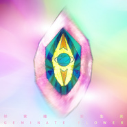

双生光Geminate flower
============================

|  |  |
| :--: | :-- |
| [ 双生光Geminate flower](https://emumo.xiami.com/album/2100265580) | **艺人**: [祁紫檀](../index.md) **语种**: 国语 **唱片公司**: 独立发行 **发行时间**: 2016年01月25日 **专辑类别**: EP, 单曲 **专辑风格**: 根源唱作人 Singer-Songwriter, 另类唱作人 Alternative Singer-Songwriter, 艺术流行 Art Pop **播放数**: 513268 **收藏数**: 522 **评论数**: 102  |

## 简介

想了好久该怎么描述这张ep，最后发现一切都在声音之外。一年以来她想了很多方法如何表达我的作品，创作歌曲对我而言是顺畅的，但如何传达到听者耳朵里是她纠结了很久的问题，编曲、制作、录音，太多的技术限制金钱限制，毕竟一个人的力量是微弱的。缓慢爬行是一个笨拙色情而美丽的动作。宽广、放下、野性、自然将成为她快乐的源泉。  
  
1.《柬埔寨丧失》（intro） 作者在暹粒游玩时，走到靠近吴哥窟的某个门口，听到了一股震动而变化的声音，寻声而去，发现是一个柬埔寨青年在把玩儿他用竹签做的乐器，口弦，这个口弦的音色不同于她之前买过的金属口弦，当即被它的音色迷倒，于是从青年的手里买了过来。在和朋友杨若舟即兴了一段并且录了下来之后，就成为了收录在ep中的这首intro。但后来这个口弦不见了。  
  
2.《双生光》这是作者和制作人王沉飞合作的第一首歌。这首歌其实就是表达了在苦甜并行的世间人们对于灵魂伴侣的渴望，太多的压抑、麻木、伤害、摩擦、错过、释放、激情、热恋、难以割舍，不管好的坏的情绪对我来说都已经满溢了，人与人的的关系是她始终无法交代给自己答案的一个困顿。如何灌满，如何掏空清零，如何疯颠而到达平衡，如何进入如何走出…另外这首歌还由制作人bigperry做了remix版本，大家都很喜欢。  
  
3.《得知平淡珍贵的一天》是作者在去年的中国好歌曲时创作的歌曲。收录进ep的版本是吕圣斐老师的一版编曲。  
  
4.《双生光remix by bigperry(welling)》perry remix  
  
如果要描述这张ep的整个心境和氛围的话，我想可以追溯到小学课本中看过的朱自清《荷塘月色》中的一段话：“曲曲折折的荷塘上面，弥望的是田田的叶子。叶子出水很高，像亭亭的舞女的裙。层层的叶子中间，零星地点缀着些白花，有袅娜(niǎo,nuó)地开着的，有羞涩地打着朵儿的；正如一粒粒的明珠，又如碧天里的星星，又如刚出浴的美人。微风过处，送来缕缕清香，仿佛远处高楼上渺茫的歌声似的。这时候叶子与花也有一丝的颤动，像闪电一般，霎时传过荷塘的那边去了。叶子本是肩并肩密密地挨着，这便宛然有了一道凝碧的波痕。叶子底下是脉脉(mò)的流水，遮住了，不能见一些颜色；而叶子却更见风致了。”  
  
这段话让人感觉心中清冷清冷的，像刚用温和的香皂洗过的手，也别有有日本女作家冈本加奈子口中所说的那种“寂寥”的感觉。寂寥，是夜的寂寥，也是人生的。  
  
特别感谢：冰冰perry，何弦，孟礼，栗子，大卫，徐超 ，大瑶，泽世,阿才与北岛视效等一切给这张小小ep提供过帮助的人  
  
<strong>特别感谢制作人王沉飞。</strong>

## 曲目

## 评论

|  |  |  |  |
| :-- | :-- | :-- | :-- |
|  [虾米用户](https://emumo.xiami.com/u/37706842)   2019-07-27 20:43 赞(1) 踩(0) | 
神来专辑，值得更多欣赏，祁紫檀是夜昙花，太美
 |
|  [虾米用户](https://emumo.xiami.com/u/3583995) 一個人的戰爭 2019-06-23 12:49 赞(0) 踩(0) | 
.
 |
|  [虾米用户](https://emumo.xiami.com/u/346165752)  2019-05-05 11:46 赞(0) 踩(0) | 
伟大的专辑
 |
|  [虾米用户](https://emumo.xiami.com/u/3893229) London based 2019-02-12 15:50 赞(0) 踩(0) | 
不错，推荐
 |
|  [虾米用户](https://emumo.xiami.com/u/15270473) 听到喜欢的歌 身体不跟着... 2018-12-29 09:31 赞(0) 踩(0) | 
-
 |
|  [虾米用户](https://emumo.xiami.com/u/7332620) 欢迎约拍，胶片风 男生。... 2018-09-12 12:30 赞(0) 踩(0) | 
器官里的世界。
 |
|  [虾米用户](https://emumo.xiami.com/u/4810458) no music no ... 2017-10-28 00:28 赞(0) 踩(0) | 
封面纵然……别具一格，但是重点还是音乐吧，得知平淡这首的效果不如好歌曲的版本尤其高潮觉得需要更强的效果，主打好听，mix版更喜欢
 |
|  [虾米用户](https://emumo.xiami.com/u/52623385) Tap Tap Tap 2017-10-27 23:42 赞(2) 踩(0) | 
以前看好歌曲的时候不是很喜欢祁紫檀，但是我还是真的蛮喜欢这张ep的，remix版的双生光做的很恰到好处。还有现在再听《得知平淡珍贵的一天》忽然间就喜欢上了。
 |
|  [虾米用户](https://emumo.xiami.com/u/54950259) Fluidflux 2017-08-02 19:00 赞(3) 踩(0) | 
封面很美 表达了对女性的赞美和尊重
 |
|  [虾米用户](https://emumo.xiami.com/u/8731730) 今夜你不关心人类 2017-07-12 14:13 赞(0) 踩(0) | 
一听就爱上！说不出话
 |
|  [虾米用户](https://emumo.xiami.com/u/252551) ＿形無 2017-05-11 13:17 赞(0) 踩(0) | 
.
 |
|  [虾米用户](https://emumo.xiami.com/u/43464959)  2017-04-16 16:57 赞(0) 踩(0) | 
身体寒颤了两下。
 |
|  [虾米用户](https://emumo.xiami.com/u/201391232) 谢谢虾米，你们是我。 2017-03-22 11:54 赞(0) 踩(0) | 
&amp;psi;    &amp;psi;
 |
|  [虾米用户](https://emumo.xiami.com/u/52202837) 阿喔，晚安。 2017-03-14 08:57 赞(0) 踩(0) | 
為什麼買不了
 |
|  [虾米用户](https://emumo.xiami.com/u/843367)  2016-11-07 01:38 赞(0) 踩(0) | 
四星半。要是全长专辑也能维持这个水平，就给五星。唱腔有点王菲，但是比王菲的风格先锋很多，让人想到有耳非文。
 |
|  [虾米用户](https://emumo.xiami.com/u/49640493) 网易云SAINTDONT... 2016-10-07 21:54 赞(2) 踩(0) | 

 |
|  [虾米用户](https://emumo.xiami.com/u/128046674)  2016-07-14 23:16 赞(0) 踩(0) | 

 |
|  [虾米用户](https://emumo.xiami.com/u/478527) 好想跟衣服在洗衣机里滚 2016-07-14 13:32 赞(0) 踩(0) | 
手动赞一下这张专辑，听了两天。最喜欢双生花（Bigperry Remix）这个版本，后面被那电子脉冲挠得我心花开。4❤️不算多。
 |
|  [虾米用户](https://emumo.xiami.com/u/44672995)  2016-06-01 13:23 赞(0) 踩(0) | 
好封面！
 |
|  [虾米用户](https://emumo.xiami.com/u/44585685)  2016-05-31 10:34 赞(0) 踩(0) | 
支持你很久了…  从你的南海姑娘
 |
|  [虾米用户](https://emumo.xiami.com/u/10270975) 好好学习天天向上 2016-05-29 17:39 赞(0) 踩(0) | 
喜欢
 |
|  [虾米用户](https://emumo.xiami.com/u/23442708) be cool 2016-04-07 00:29 赞(0) 踩(0) | 
亲爱的 可以多多多提高提高编曲编曲☺☺☺❤❤❤
 |
|  [虾米用户](https://emumo.xiami.com/u/126032104)  2016-03-23 00:35 赞(0) 踩(0) | 
让人入迷
 |
|  [虾米用户](https://emumo.xiami.com/u/10597609) 我还没想好要写什么... 2016-03-02 09:57 赞(0) 踩(0) | 
这是个逼吗
 |
|  [虾米用户](https://emumo.xiami.com/u/117015736)  2016-02-24 10:51 赞(0) 踩(0) | 
空灵 真 难得的声音还有味道
 |
|  [虾米用户](https://emumo.xiami.com/u/1737846)  2016-02-24 10:11 赞(0) 踩(0) | 
我以为邓紫棋
 |
|  [虾米用户](https://emumo.xiami.com/u/3967926) 因果造化 众生皆苦 2016-02-05 17:59 赞(1) 踩(0) | 
木耳里日出个宇宙来
 |
| ⇒ |  [虾米用户](https://emumo.xiami.com/u/182400198) 版权逃亡冷感钝化人 2018-09-16 07:15 赞(0) 踩(0) | 
看我抓到了谁
 |
|  [虾米用户](https://emumo.xiami.com/u/100709906)  2016-02-05 12:32 赞(0) 踩(0) | 
不错的声音，很有特色
 |
|  [虾米用户](https://emumo.xiami.com/u/30251976) 新人。 2016-02-02 20:19 赞(0) 踩(0) | 
天啊啊啊啊啊啊啊啊啊啊
 |
|  [虾米用户](https://emumo.xiami.com/u/47729811) 赚钱养梦，音乐不死。 2016-02-01 17:19 赞(0) 踩(0) | 
听到了陈粒让我喜欢的地方
 |
|  [虾米用户](https://emumo.xiami.com/u/38881044)  2016-01-31 10:26 赞(1) 踩(0) | 
告诉你一个真理吧 世界承载在一个亮瞎了眼的ｐｕｓｓｙ上
 |
|  [虾米用户](https://emumo.xiami.com/u/42325985)  2016-01-29 14:03 赞(7) 踩(0) | 
妖气十足的一张专辑。游弋在光明与黑暗交界边缘的感觉。向光明可以清新到无与伦比，向黑暗则可以把你拽入深渊。可进可退而又不定型的声音。好神奇。
 |
|  [虾米用户](https://emumo.xiami.com/u/6733300) 誩 2016-01-28 12:45 赞(0) 踩(0) | 
给你们这些人每人一袋去污粉 
 |
|  [虾米用户](https://emumo.xiami.com/u/5564825) 在音乐里,我不觉得自己孤... 2016-01-28 09:06 赞(0) 踩(0) | 
空灵的女子。妖气迷人啊
 |
|  [虾米用户](https://emumo.xiami.com/u/9059581)  2016-01-27 15:46 赞(0) 踩(0) | 
妖女啊...
 |
|  [虾米用户](https://emumo.xiami.com/u/9520985) 搬家了 2016-01-27 10:04 赞(2) 踩(0) | 
紫檀太会赞美女性的灵魂和身体了
 |
|  [虾米用户](https://emumo.xiami.com/u/50003660) 让懂的人懂，让世界是世界... 2016-01-27 03:27 赞(3) 踩(0) | 
词曲咬合，声音空灵，紫檀的歌，还能说什么呢？雨不断的凌晨时分，听得停不下来。
 |
|  [虾米用户](https://emumo.xiami.com/u/3206053) 照章办事 2016-01-26 12:47 赞(3) 踩(0) | 
不可多得的唱作人
 |
|  [虾米用户](https://emumo.xiami.com/u/50390164) 悄然而至 2016-01-26 11:24 赞(1) 踩(0) | 
没听歌只看封面就进来看评论了难道就我一个 
 |
|  [虾米用户](https://emumo.xiami.com/u/891082) 咦 2016-01-26 11:15 赞(2) 踩(0) | 
我一定是太污了！我在pussy里看到了宇宙。
 |
|  [虾米用户](https://emumo.xiami.com/u/3316952)  2016-01-26 10:22 赞(0) 踩(0) | 
好歌曲的时候挺喜欢的。封面挺“美”的。
 |
|  [虾米用户](https://emumo.xiami.com/u/812392) q音网易搜央央小月，酷g... 2016-01-26 10:09 赞(1) 踩(0) | 
一直想看你的现场 还有你们乐队的
 |
|  [虾米用户](https://emumo.xiami.com/u/39516961) 输入签名 2016-01-26 09:49 赞(0) 踩(0) | 
封面怎么感觉有点污？
 |
|  [虾米用户](https://emumo.xiami.com/u/15258834) 我还没想好要写什么... 2016-01-26 09:11 赞(1) 踩(0) | 
钻石逼我操，会磨破唧唧吗？
 |
|  [虾米用户](https://emumo.xiami.com/u/6922959)   2016-01-26 08:41 赞(0) 踩(0) | 
好污的封面
 |
|  [虾米用户](https://emumo.xiami.com/u/13816404) 可爱的人难道不是我吗 2016-01-26 08:31 赞(0) 踩(0) | 
原来觉得封面好污的不止我一人！
 |
| ⇒ |  [虾米用户](https://emumo.xiami.com/u/43457177) wxy19941009 2016-01-26 10:35 赞(0) 踩(0) | 
不光封面，歌词也够让人想入非非的。
 |
|  [虾米用户](https://emumo.xiami.com/u/2781972) 业余吉他手一枚 2016-01-26 07:57 赞(0) 踩(0) | 
md看成邓紫棋了
 |
|  [虾米用户](https://emumo.xiami.com/u/39390169)  2016-01-26 07:34 赞(0) 踩(0) | 
第一次听，很好听
 |
|  [虾米用户](https://emumo.xiami.com/u/5410647) 怕什么？怕爱人。 2016-01-26 03:27 赞(0) 踩(0) | 
才女啊！才女！佩服…
 |
|  [虾米用户](https://emumo.xiami.com/u/46000335)  2016-01-26 02:19 赞(0) 踩(0) | 
很早就看过你的演出
 |
|  [虾米用户](https://emumo.xiami.com/u/9520985) 搬家了 2016-01-25 22:30 赞(2) 踩(0) | 
听紫檀的歌的时候 是为数不多的我喜欢自己的时候
 |
| ⇒ |  [虾米用户](https://emumo.xiami.com/u/35639193)  2016-01-26 00:58 赞(0) 踩(0) | 
同意Y(^_^)Y
 |
|  [虾米用户](https://emumo.xiami.com/u/50182797) 念念  。 2016-01-25 22:08 赞(0) 踩(0) | 
终于 
 |
|  [虾米用户](https://emumo.xiami.com/u/7205091) 胡同串子 2016-01-25 21:46 赞(3) 踩(0) | 
这封面和专辑名有着与不丹国相反的意思-女生殖器崇拜
 |
|  [虾米用户](https://emumo.xiami.com/u/7402157) 你先让我躺一会 2016-01-25 21:21 赞(3) 踩(0) | 
邪教碟片，我报警了
 |
|  [虾米用户](https://emumo.xiami.com/u/8599900)  2016-01-25 21:17 赞(0) 踩(0) | 
这...封...面...
 |
|  [虾米用户](https://emumo.xiami.com/u/794813)  2016-01-25 20:50 赞(0) 踩(0) | 
good
 |
|  [虾米用户](https://emumo.xiami.com/u/40046950)   2016-01-25 19:32 赞(0) 踩(0) | 
反正必须支持
 |
|  [虾米用户](https://emumo.xiami.com/u/49934446) SINA WEIBO:@... 2016-01-25 19:15 赞(0) 踩(0) | 
楼下DaBozz说真好
 |
|  [虾米用户](https://emumo.xiami.com/u/8513135)   2016-01-25 18:49 赞(2) 踩(0) | 
真好。
 |
| ⇒ |  [虾米用户](https://emumo.xiami.com/u/12184260) 你好 2016-01-25 22:16 赞(0) 踩(0) | 
哦 你也在啊
 |
|  [虾米用户](https://emumo.xiami.com/u/4461490) 烟酒伤身，情歌伤心 2016-01-25 18:39 赞(0) 踩(0) | 
天外来音，魂灵出离
 |
|  [虾米用户](https://emumo.xiami.com/u/36208991)   2016-01-25 18:21 赞(0) 踩(0) | 
来啦
 |
|  [虾米用户](https://emumo.xiami.com/u/179452)  2016-01-25 18:00 赞(0) 踩(0) | 
阿里嘎多，麻烦虾米的盆友推荐类似音乐：有点new age ， 有点trip hop， 忽明忽暗，引人入胜，呢喃仙音，超脱飘然。
 |
| ⇒ |  [虾米用户](https://emumo.xiami.com/u/27659748) 永远年轻，永远热泪盈眶！ 2016-01-25 22:31 赞(0) 踩(0) | 
同问
 |
| ⇒ |  [虾米用户](https://emumo.xiami.com/u/12849864) 无污染，抗虫害。 2018-06-03 23:34 赞(0) 踩(0) | 
试试chouchou和antrabata
 |
|  [虾米用户](https://emumo.xiami.com/u/43386533) 暂无签名~ 2016-01-25 17:59 赞(0) 踩(0) | 
紫檀我爱你
 |
|  [虾米用户](https://emumo.xiami.com/u/3900074) f*ck 2016-01-25 17:52 赞(14) 踩(0) | 
内容已删除
 |
| ⇒ |  [虾米用户](https://emumo.xiami.com/u/11093) 一场修行。 2016-01-25 18:12 赞(0) 踩(0) | 
本来就是啊
 |
| ⇒ |  [虾米用户](https://emumo.xiami.com/u/50818735) 我是庸逼我很怂 2016-01-26 00:59 赞(0) 踩(0) | 
污！
 |
| ⇒ |  [虾米用户](https://emumo.xiami.com/u/280800595)  2017-03-16 16:37 赞(0) 踩(0) | 
其实在艺术设计的领域里，运用象征女性阴道的图案是很普遍的，它算是一种隐喻。魏如萱的&amp;amp;lt;雪女&amp;amp;gt; MV有这类的画作喔，很有内涵的短片。大自然里也有繁多貌似女性生殖器官的形状，你可以搜 &amp;quot;yonic symbolism&amp;quot; 看看，其实蛮炫的。花朵是被广泛认同的象征物之一。
 |
| ⇒ |  [虾米用户](https://emumo.xiami.com/u/43092507)   2020-02-22 20:05 赞(0) 踩(0) | 
制作人可能就是这么想的
 |
|  [虾米用户](https://emumo.xiami.com/u/13831197) 乐 生活 2016-01-25 17:34 赞(0) 踩(0) | 
封面有点意思 音乐先不听了……
 |
|  [虾米用户](https://emumo.xiami.com/u/25161892) 吃饱的人快乐坚不可摧 2016-01-25 17:28 赞(1) 踩(0) | 
封面敲美 歌也敲好听哒 耳朵快要怀孕辣
 |
|  [虾米用户](https://emumo.xiami.com/u/42338233) :) 2016-01-25 17:04 赞(0) 踩(0) | 
爱
 |
|  [虾米用户](https://emumo.xiami.com/u/2068800) 广告泥石流 2016-01-25 16:50 赞(0) 踩(0) | 
悦耳！！！
 |
|  [虾米用户](https://emumo.xiami.com/u/1567781)  2016-01-25 16:25 赞(0) 踩(0) | 
这个封面……
 |
|  [虾米用户](https://emumo.xiami.com/u/2236868) 躁抑的夏天来了 2016-01-25 15:58 赞(0) 踩(0) | 
唱第一句有被吸引到（有点王菲的feel~）
 |
|  [虾米用户](https://emumo.xiami.com/u/3964540) wx：Raeinx 2016-01-25 15:51 赞(0) 踩(0) | 
早年王菲
 |
|  [虾米用户](https://emumo.xiami.com/u/46745795) ☄️☄️☄️ 2016-01-25 15:44 赞(0) 踩(0) | 
声音美 治冬季焦虑
 |
|  [虾米用户](https://emumo.xiami.com/u/860301) 糊你熊脸 2016-01-25 15:41 赞(1) 踩(0) | 
休息 
 |
|  [虾米用户](https://emumo.xiami.com/u/43668564) weibo:宋佳兴sjx 2016-01-25 15:25 赞(0) 踩(0) | 
哇，好空灵和魔幻感
 |
|  [虾米用户](https://emumo.xiami.com/u/36253461) 你快乐 所以 我快乐 2016-01-25 15:23 赞(0) 踩(0) | 
好听
 |
|  [虾米用户](https://emumo.xiami.com/u/189002) 贫困科幻 2016-01-25 15:02 赞(2) 踩(0) | 
听听听
 |
|  [虾米用户](https://emumo.xiami.com/u/18169133) 停用个人功能.仅上传音乐... 2016-01-25 14:56 赞(0) 踩(0) | 
！
 |
|  [虾米用户](https://emumo.xiami.com/u/6468329) 我还没想好要写什么... 2016-01-25 14:36 赞(0) 踩(0) | 
这封面....就是个逼啊！
 |
|  [虾米用户](https://emumo.xiami.com/u/40026963)  2016-01-25 14:35 赞(0) 踩(0) | 
～
 |
|  [虾米用户](https://emumo.xiami.com/u/5657731) 在音乐面前语言很苍白 2016-01-25 14:33 赞(0) 踩(0) | 
杀手锏级别的歌
 |
|  [虾米用户](https://emumo.xiami.com/u/43964745)  2016-01-25 14:13 赞(0) 踩(0) | 
棒！
 |
|  [虾米用户](https://emumo.xiami.com/u/98863920)  2016-01-25 14:11 赞(1) 踩(0) | 
终于来了，喜欢紫檀的抱紧我，让他看到
 |
|  [虾米用户](https://emumo.xiami.com/u/46724511) 我在这儿 2016-01-25 14:11 赞(0) 踩(0) | 
这个封面。。。。。。。。
 |
|  [虾米用户](https://emumo.xiami.com/u/36736925) 我还没想好要写什么... 2016-01-25 14:09 赞(0) 踩(0) | 
终于出来了，有点难产
 |
|  [虾米用户](https://emumo.xiami.com/u/3232035)  2016-01-25 14:08 赞(0) 踩(0) | 
循环
 |
|  [虾米用户](https://emumo.xiami.com/u/141087) 你是光耀的口中食，你是自... 2016-01-25 14:03 赞(0) 踩(0) | 
柬埔寨丧尸.............................
 |
|  [虾米用户](https://emumo.xiami.com/u/8966437) @orsons 2016-01-25 14:02 赞(0) 踩(0) | 
封面有点 污
 |
|  [虾米用户](https://emumo.xiami.com/u/9079289) 我还没想好要写什么... 2016-01-25 13:55 赞(0) 踩(0) | 
诶呀呀我的
 |
|  [虾米用户](https://emumo.xiami.com/u/47205183)  2016-01-25 13:50 赞(0) 踩(0) | 
哈哈，终于来了！
 |
|  [虾米用户](https://emumo.xiami.com/u/1171615) 我还没想好要写什么... 2016-01-25 11:57 赞(2) 踩(0) | 
发
 |
|  [虾米用户](https://emumo.xiami.com/u/44002651) - 2016-01-25 11:42 赞(1) 踩(0) | 
   
 |
|  [虾米用户](https://emumo.xiami.com/u/35639193)  2016-01-25 10:13 赞(0) 踩(0) | 
顶  
 |
|  [虾米用户](https://emumo.xiami.com/u/36736925) 我还没想好要写什么... 2016-01-25 10:03 赞(1) 踩(0) | 
坐等
 |
