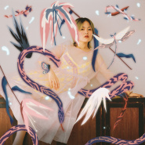
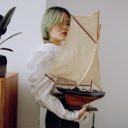
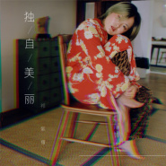
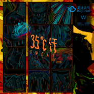

祁紫檀
============================

|  |  |
| :--: | :-- |
| [ 祁紫檀](https://i.xiami.com/zitanrunrun) | **地区**: China 中国大陆 **风格**: 根源唱作人 Singer-Songwriter **播放数**: 5649867 **粉丝数**: 11108 **评论数**: 535  |

## 档案

现居杭州的独立女声，曾经跟随大学社团组团参加了唱歌比赛，因为翻唱《南海姑娘》而被一些人喜欢。之后大学时期组建乐队偷喜办，担任主唱和词曲创作。并独立发行EP《偷喜》。参加过氧气音乐节、上海草莓音乐节、山蛙音乐节、上海西岸音乐节等表演。2015年参加了第二季中国好歌曲，并成为蔡健雅团队的两强，以《出离》、《得知平淡珍贵的一天》等作品被更多人熟知。赛后坚定的选择继续做独立音乐，喜欢在黑夜里被灯光照耀的绿色植物的样子，因此以最自然和真挚贴近本我的演唱宣泄情绪、表达意志、抵抗天生的敏感和抑郁质地。崇尚旋律和声音随情绪自然的流淌，“表达真实的价值观和唯美的情感”，不定义风格，并且融合，其歌曲融合了民谣、世界音乐、爵士等元素，是从身体里自然喷发的原始动力。不刻意谄媚，也不拒绝谄媚。现在的生活状态就是练习技术以足够支撑情感的表达，各处游玩演出唱歌寻找猎物。 
An indie female singer-songwriter who live in Hangzhou China now.She used to attend a singing TV program during her university life ，because  the cover of an old Chinese song “Nanhai girl” and be liked by some audience. Zitan also built a band called “stollen joy” when she’s in college and issued an indie record the same name as her band.With her band ,they have participated some music festivals ，Style to psychedelic rock，fusion of folk and post－rock elements.This EP can be listened to in Xiami music website or Douban. In 2015 Zitan attended a TV show “the song of China”,by the "out", "that is a day to learn the value of the day" and other works she was known by more people.She likes the looks of the green plants in the darkness,so she sings by the most natural way she can,and try to sing more closed to her instinct self ，venting mood，expressing will，resisting the inborn sensitiveness and depression texture.She advocates that the sounds and melody flow along with the emotion and mood to express the real values and aesthetic emotion，no style definition，fusion everything she can feel and love，the original power will spurt form the body. 
对光明和黑暗有着细微的察觉，因此沉默并且沉重。 
natural fly ，it's real            希望做一个不倚靠的人。 
同时，可以愉悦得接受他人的精神和身体交融的人 
以这些，这些声响，旋律，黑暗，光明和爱期待，期待 
期待和你耳朵的交合。 
多维度地广阔得合二为一，然后毫不犹豫地分离 
接受自己生命自带的缺陷 
接受自己无法做到的事情并顺其自然 
接受失败，就像接受人的孤独理论 
接受。 
勇敢地承担，厄运以及被抛弃被拒绝的风险，承担。

## 专辑

| 名称 | 语种 | 唱片公司 | 发行时间 | 专辑类别 | 专辑风格 |
| :--: | :-- | :-- | :-- | :-- | :-- |
| [ 爱之颤](./albums/5020956146.md) | 国语 | StreetVoice | 2020年07月06日 | 录音室专辑 | 独立流行 Indie Pop, 根源唱作人 Singer-Songwriter, 国语流行 Mandarin Pop |
| [ 她（WenYan）](./albums/2106090163.md) | 国语 |  | 2019年12月08日 | EP, 单曲 | 独立流行 Indie Pop, 嘻哈 Hip-Hop |
| [ 比海更深](./albums/2105494107.md) | 国语 | StreetVoice | 2019年11月29日 | EP, 单曲 | 摇滚 Rock & Roll |
| [ 独自美丽](./albums/2105431382.md) | 国语 | StreetVoice | 2019年11月15日 | EP, 单曲 |  |
| [ 不被观看的人生是不完整的](./albums/2104649280.md) | 国语 | StreetVoice | 2019年03月06日 | EP, 单曲 | 独立流行 Indie Pop |
| [ 女子力乐园](./albums/2104363709.md) | 国语 | StreetVoice | 2018年12月12日 | EP, 单曲 | 独立流行 Indie Pop |
| [ 赴约](./albums/2104065933.md) | 国语 | StreetVoice | 2018年09月30日 | EP, 单曲 | 流行 Pop, 独立流行 Indie Pop |
| [ 她走路的姿势](./albums/2103707838.md) | 国语 | StreetVoice | 2018年04月30日 | 录音室专辑 | 独立流行 Indie Pop, 艺术流行 Art Pop, 致幻流行 Hypnagogic Pop |
| [ 少女之酒](./albums/2103686702.md) | 国语 | StreetVoice | 2018年04月16日 | EP, 单曲 | 流行 Pop |
| [ 不变形的爱](./albums/2103685478.md) | 国语 | StreetVoice | 2018年04月16日 | EP, 单曲 | 流行 Pop |
| [ 冷酷情人物语](./albums/2102976739.md) | 国语 | StreetVoice | 2017年12月18日 | EP, 单曲 | 艺术流行 Art Pop, 独立流行 Indie Pop |
| [ 35度汗35°C汗](./albums/2102855864.md) | 国语 | 墨迹天气 ／ W 野狗音乐舱 | 2017年09月08日 | EP, 单曲 |  |
| [ 我有一把枪](./albums/2102817313.md) | 国语 | StreetVoice | 2017年08月21日 | EP, 单曲 | 艺术流行 Art Pop, 前卫流行 Progressive Pop |
| [ 当我和我的心脏谈起你demo](./albums/2102762184.md) | 国语 | 独立发行 | 2017年06月01日 | EP, 单曲 | 独立民谣 Indie Folk |
| [ 新世纪平衡Balance Of The New Age](./albums/2102705330.md) | 国语 | StreetVoice | 2017年03月20日 | 录音室专辑 | 艺术流行 Art Pop, 另类唱作人 Alternative Singer-Songwriter |
| [ 雨后花园](./albums/2100365616.md) | 国语 | StreetVoice | 2016年07月08日 | EP, 单曲 |  |
| [ 玛格丽特街上游](./albums/2100345656.md) | 国语 | 独立发行 | 2016年05月27日 | EP, 单曲 | 根源唱作人 Singer-Songwriter, 迷幻民谣 Psychedelic Folk |
| [ 双生光Geminate flower](./albums/2100265580.md) | 国语 | 独立发行 | 2016年01月25日 | EP, 单曲 | 根源唱作人 Singer-Songwriter, 另类唱作人 Alternative Singer-Songwriter, 艺术流行 Art Pop |

## 评论

|  |  |  |
| :-- | :-- | :-- |
|  [虾米用户](https://emumo.xiami.com/u/289298016)  2020-12-20 13:57 赞(2) 踩(0) | 
听说虾米开不久了。。。可我还是想在虾米听祁紫檀和邱比啊。。。
 |
|  [虾米用户](https://emumo.xiami.com/u/445639049)  2020-12-14 09:51 赞(0) 踩(0) | 
美しい声！
 |
|  [虾米用户](https://emumo.xiami.com/u/7540314)  2020-12-04 22:21 赞(0) 踩(0) | 
妹子有蒙古血统吗？
 |
|  [虾米用户](https://emumo.xiami.com/u/110088060) 作为报答、我吔给泥放点、... 2020-11-11 07:35 赞(0) 踩(0) | 
回
 |
|  [虾米用户](https://emumo.xiami.com/u/7289167) 我还没想好要写什么... 2020-09-28 08:31 赞(0) 踩(0) | 
什么时候再巡演鸭
 |
|  [虾米用户](https://emumo.xiami.com/u/38618562)  2020-08-30 17:07 赞(0) 踩(0) | 
非常有才华
 |
|  [虾米用户](https://emumo.xiami.com/u/116178934) 音乐人尔奇 2020-08-19 01:36 赞(0) 踩(0) | 
+
 |
|  [虾米用户](https://emumo.xiami.com/u/356787956)  2020-08-03 15:12 赞(0) 踩(0) | 
什么时候再来上海？
 |
|  [虾米用户](https://emumo.xiami.com/u/421578063) fox god 2020-08-01 11:58 赞(0) 踩(0) | 
◎✹⁃◇❅&amp;bull;✸△❦✦✣✱➤◎
 |
|  [虾米用户](https://emumo.xiami.com/u/309287338) 自我救赎 2020-07-31 15:19 赞(0) 踩(0) | 
我怎么才遇到啊 
 |
|  [虾米用户](https://emumo.xiami.com/u/26175143) 我还没想好要写什么... 2020-07-20 17:05 赞(0) 踩(0) | 
这种声音，感受到纯粹的艺术享受，高音透亮轻松，真的纯粹。
 |
|  [虾米用户](https://emumo.xiami.com/u/358431556) 我还没想好要写什么... 2020-07-16 18:52 赞(0) 踩(0) | 
什么时候再办巡演！
 |
|  [虾米用户](https://emumo.xiami.com/u/358431556) 我还没想好要写什么... 2020-07-16 18:34 赞(0) 踩(0) | 
爱了！！
 |
|  [虾米用户](https://emumo.xiami.com/u/441160053) ：（ 2020-07-16 15:24 赞(0) 踩(0) | 
back
 |
|  [虾米用户](https://emumo.xiami.com/u/49394635) _ 2020-07-16 00:20 赞(0) 踩(0) | 
真好
 |
|  [虾米用户](https://emumo.xiami.com/u/2393294) 和彭彭一起加油! 2020-07-14 19:02 赞(0) 踩(0) | 
我知道了 这个姐姐只要的&amp;quot;emmmmm～&amp;quot;我就沉醉了
 |
|  [虾米用户](https://emumo.xiami.com/u/356763773) 我还没想好要写什么... 2020-07-11 20:01 赞(0) 踩(0) | 
~
 |
|  [虾米用户](https://emumo.xiami.com/u/36305927) 我还没想好要写什么... 2020-07-11 10:56 赞(0) 踩(0) | 
❤️
 |
|  [虾米用户](https://emumo.xiami.com/u/416047257) 如果你在前方回头而我亦回... 2020-06-15 22:59 赞(1) 踩(0) | 
不要太棒
 |
|  [虾米用户](https://emumo.xiami.com/u/118142732)   2020-06-11 14:02 赞(1) 踩(0) | 
《雨后花园》这首歌很解压，救了我，谢谢紫檀。
 |
|  [虾米用户](https://emumo.xiami.com/u/49640493) 网易云SAINTDONT... 2020-05-23 19:23 赞(1) 踩(0) | 
love
 |
|  [虾米用户](https://emumo.xiami.com/u/379162683) 我想要记住你们，我想要你... 2020-05-01 16:27 赞(1) 踩(0) | 

 |
|  [虾米用户](https://emumo.xiami.com/u/316951273)  2020-04-15 18:41 赞(0) 踩(0) | 

 |
|  [虾米用户](https://emumo.xiami.com/u/32951263)  2020-03-14 02:16 赞(1) 踩(0) | 
我真的沉迷了 
 |
|  [虾米用户](https://emumo.xiami.com/u/8653708) 音乐是生命的光。 2020-02-12 11:08 赞(2) 踩(0) | 
紫檀紫檀，求上线写给武汉的《生命，无法被概括》！真的好听哭了，好感动。跪求上线！   
 |
|  [虾米用户](https://emumo.xiami.com/u/31194564)  2020-02-03 22:34 赞(0) 踩(0) | 
覺得紫檀創作的高點好像還是 出離 還有 我和我的心臟談起你
 |
|  [虾米用户](https://emumo.xiami.com/u/2421624) 最近都没怎么在听歌 2020-01-28 10:43 赞(1) 踩(0) | 
来晚了
 |
|  [虾米用户](https://emumo.xiami.com/u/2847661) 我爱摇滚乐 2019-11-29 23:10 赞(0) 踩(0) | 
还是那样
 |
|  [虾米用户](https://emumo.xiami.com/u/11235021) 纵贯线王菲熊光KOKIA... 2019-11-29 20:15 赞(0) 踩(0) | 
有几首和其他歌手合唱的虾米没有
 |
|  [虾米用户](https://emumo.xiami.com/u/20425956) 天若微雨，我心浅笑。 2019-11-29 17:58 赞(1) 踩(0) | 
我已经有预感等虾米年度小结的时候，我的年度音乐人将会是祁紫檀，歌曲将会是《比海更深》 
 |
|  [虾米用户](https://emumo.xiami.com/u/11235021) 纵贯线王菲熊光KOKIA... 2019-11-16 12:53 赞(0) 踩(0) | 
祁紫檀算是用虾米最多的几个音乐人吧
 |
| ⇒ |  [虾米用户](https://emumo.xiami.com/u/20425956) 天若微雨，我心浅笑。 2019-11-29 17:49 赞(0) 踩(0) | 
哈哈哈哈嗝 你猜她待会会不会回你评论。哈哈哈哈。最近特别喜欢听她，太棒了。
 |
| ⇒ |  [虾米用户](https://emumo.xiami.com/u/11235021) 纵贯线王菲熊光KOKIA... 2019-11-29 20:14 赞(0) 踩(0) | 
<q><b>小杰说：</b></q>
 |
| ⇒ |  [虾米用户](https://emumo.xiami.com/u/20425956) 天若微雨，我心浅笑。 2019-11-30 00:03 赞(0) 踩(0) | 
<q><b>Fayemil说：</b></q>
 |
| ⇒ |  [虾米用户](https://emumo.xiami.com/u/11235021) 纵贯线王菲熊光KOKIA... 2019-11-30 22:32 赞(0) 踩(0) | 
<q><b>小杰说：</b></q>
 |
|  [虾米用户](https://emumo.xiami.com/u/7289167) 我还没想好要写什么... 2019-09-23 13:10 赞(0) 踩(0) | 
现场发挥太稳啦，昨晚除了没有完整听到原唱版「而已而已」，其它都接近完美
 |
|  [虾米用户](https://emumo.xiami.com/u/407085769) 脱离了高级趣味的人 2019-09-03 02:56 赞(0) 踩(0) | 
原来是偷喜办啊
 |
|  [虾米用户](https://emumo.xiami.com/u/44231540) 热爱音乐 2019-08-18 23:25 赞(0) 踩(0) | 
现场比唱片好，唱腔自由，吉他也很棒。有态度的音乐人 支持
 |
|  [虾米用户](https://emumo.xiami.com/u/288013826) 请大家一起养小虾米帮助听... 2019-08-08 14:02 赞(0) 踩(0) | 
：
 |
|  [虾米用户](https://emumo.xiami.com/u/356043426) 山不厌高，海不厌深。 2019-08-07 01:00 赞(1) 踩(0) | 
吟唱之风 
 |
|  [虾米用户](https://emumo.xiami.com/u/92439866)  2019-07-27 13:54 赞(2) 踩(0) | 
******
 |
| ⇒ |  [虾米用户](https://emumo.xiami.com/u/356043426) 山不厌高，海不厌深。 2019-08-07 01:01 赞(0) 踩(0) | 
同意
 |
|  [虾米用户](https://emumo.xiami.com/u/1719544)  2019-07-22 14:35 赞(0) 踩(0) | 
原来她就是翻唱南海姑娘的那个女生！！！哇！！！我超爱那个翻唱QAQQQQ！！！！
 |
|  [虾米用户](https://emumo.xiami.com/u/1156476) 四体不勤，五谷不分 2019-07-22 09:53 赞(0) 踩(0) | 
啊啊，深圳呢！？什么时候来深圳！
 |
| ⇒ |  [虾米用户](https://emumo.xiami.com/u/12878826) 谢谢陪伴 再见哦！ 2019-08-13 12:14 赞(0) 踩(0) | 
8月17日哦
 |
|  [虾米用户](https://emumo.xiami.com/u/306737687) 这里…… 2019-07-21 21:33 赞(0) 踩(0) | 
中国好声音的小姑娘翻唱你的歌，也不错
 |
|  [虾米用户](https://emumo.xiami.com/u/88530750) 让世界是世界 我甘心是我... 2019-07-11 12:50 赞(0) 踩(0) | 
哇 宝石一般
 |
|  [虾米用户](https://emumo.xiami.com/u/423315)  2019-07-09 09:49 赞(0) 踩(0) | 
爱了
 |
|  [虾米用户](https://emumo.xiami.com/u/2798384)   2019-07-04 17:21 赞(0) 踩(0) | 
想到小时候听金海心的卡带儿
 |
|  [虾米用户](https://emumo.xiami.com/u/3341146) 爱我请留言。 2019-06-30 15:00 赞(2) 踩(0) | 
做小众的自己也蛮好，起码可以自由地表达自己。
 |
|  [虾米用户](https://emumo.xiami.com/u/17330254) 我还没想好要写什么... 2019-06-20 00:41 赞(0) 踩(0) | 
30號見哦
 |
|  [虾米用户](https://emumo.xiami.com/u/193350893) 仿佛是个有思想的人 2019-06-19 10:10 赞(0) 踩(0) | 
哈哈，重庆的那个巡演我好想去，刚好那天我生日
 |
|  [虾米用户](https://emumo.xiami.com/u/7860381)  2019-06-18 15:48 赞(0) 踩(0) | 
歌曲还是太冷，很难火
 |
|  [虾米用户](https://emumo.xiami.com/u/354181908) kiss 2019-06-16 22:54 赞(0) 踩(0) | 
都给我冲
 |
|  [虾米用户](https://emumo.xiami.com/u/13279293) 我还没想好要写什么... 2019-05-10 22:26 赞(1) 踩(0) | 
爱
 |
|  [虾米用户](https://emumo.xiami.com/u/3583995) 一個人的戰爭 2019-05-06 00:19 赞(0) 踩(0) | 
.
 |
|  [虾米用户](https://emumo.xiami.com/u/346165752)  2019-05-05 11:42 赞(0) 踩(0) | 
风
 |
|  [虾米用户](https://emumo.xiami.com/u/44421787) 长期单身 2019-04-22 23:00 赞(0) 踩(0) | 
爱你
 |
|  [虾米用户](https://emumo.xiami.com/u/170211738) 上帝在开始爱着了 2019-04-14 14:45 赞(0) 踩(0) | 

 |
|  [虾米用户](https://emumo.xiami.com/u/40540445) all you need... 2019-03-28 10:58 赞(0) 踩(0) | 
这大概就是 那极为少数的 有趣灵魂
 |
|  [虾米用户](https://emumo.xiami.com/u/9028760) 豆瓣见 spotify ... 2019-03-16 01:23 赞(0) 踩(0) | 
（´-`）.｡o
 |
|  [虾米用户](https://emumo.xiami.com/u/346023070)  2019-03-14 12:05 赞(0) 踩(0) | 
可以了，赞
 |
|  [虾米用户](https://emumo.xiami.com/u/410456754) We are one! 2019-03-07 15:43 赞(1) 踩(0) | 
声音好听
 |
|  [虾米用户](https://emumo.xiami.com/u/10914944) . 2019-03-03 22:42 赞(0) 踩(0) | 
新简介真好 很有心
 |
|  [虾米用户](https://emumo.xiami.com/u/170211738) 上帝在开始爱着了 2019-01-12 02:12 赞(1) 踩(0) | 

 |
|  [虾米用户](https://emumo.xiami.com/u/49691100) 是个糟人 2019-01-02 11:22 赞(1) 踩(0) | 
喜欢你
 |
|  [虾米用户](https://emumo.xiami.com/u/3893229) London based 2018-12-18 00:35 赞(1) 踩(0) | 
继续创作，支持
 |
|  [虾米用户](https://emumo.xiami.com/u/354181908) kiss 2018-12-17 20:48 赞(1) 踩(0) | 
紫檀何时有演出
 |
| ⇒ |  [虾米用户](https://emumo.xiami.com/u/17330254) 我还没想好要写什么... 2019-04-22 21:05 赞(0) 踩(0) | 
好久没现场了呜呜
 |
| ⇒ |  [虾米用户](https://emumo.xiami.com/u/354181908) kiss 2019-04-23 13:57 赞(0) 踩(0) | 
<q><b>3母说：</b></q>
 |
| ⇒ |  [虾米用户](https://emumo.xiami.com/u/354181908) kiss 2019-04-23 20:50 赞(0) 踩(0) | 
<q><b>3母说：</b></q>
 |
|  [虾米用户](https://emumo.xiami.com/u/257872092) 恨耳。 2018-12-08 09:51 赞(0) 踩(0) | 
别我一关注一首歌就系统自动发信息啊，以为是哪个小妹妹私聊我喔，白激动
 |
|  [虾米用户](https://emumo.xiami.com/u/51934315) - 2018-12-04 15:55 赞(1) 踩(0) | 
她是完美的
 |
|  [虾米用户](https://emumo.xiami.com/u/39548287) Spotify&QQ同名... 2018-11-15 01:28 赞(1) 踩(0) | 
我好喜欢你！
 |
|  [虾米用户](https://emumo.xiami.com/u/50316619) 真的确实还没想好…… 2018-11-12 02:03 赞(0) 踩(0) | 
爱你
 |
|  [虾米用户](https://emumo.xiami.com/u/50316619) 真的确实还没想好…… 2018-11-12 02:02 赞(1) 踩(0) | 
妹子，我感觉你和珊蔻大姐快要接近了
 |
|  [虾米用户](https://emumo.xiami.com/u/352107405)  2018-11-04 18:57 赞(2) 踩(0) | 
我是一名设计师,你的调调我非常喜欢,每次我创作的时候都必须得听你的歌!
 |
|  [虾米用户](https://emumo.xiami.com/u/354181908) kiss 2018-09-30 00:47 赞(0) 踩(0) | 
Be yourself 很想去看你的现场
 |
|  [虾米用户](https://emumo.xiami.com/u/50808007) 我还没想好要写什么... 2018-09-29 22:11 赞(0) 踩(0) | 
紫檀的现场太棒！！好喜欢好喜欢你呀！！期待下一次去现场听你唱歌！❤️❤️❤️❤️❤️ 到了现场发现 喜欢紫檀的果然好多小姬佬哈哈哈哈哈
 |
| ⇒ |  [虾米用户](https://emumo.xiami.com/u/346926877) Black and wh... 2018-10-05 13:27 赞(0) 踩(0) | 
牛了
 |
|  [虾米用户](https://emumo.xiami.com/u/3610242) 惊蛰 大暑 霜降 冬至 ... 2018-09-21 22:43 赞(1) 踩(0) | 
好歌曲里惊艳到我 词曲都很厉害 国内少有
 |
|  [虾米用户](https://emumo.xiami.com/u/68056518) 不是很想做人了 2018-09-13 12:00 赞(1) 踩(0) | 
唯一的灵魂女神
 |
|  [虾米用户](https://emumo.xiami.com/u/38883647) ㅤ 2018-09-10 23:21 赞(0) 踩(0) | 
三年前 对你的视频有印象
 |
|  [虾米用户](https://emumo.xiami.com/u/320706274)  2018-08-29 23:24 赞(0) 踩(0) | 
声音好听，轻盈又细腻。
 |
|  [虾米用户](https://emumo.xiami.com/u/170211738) 上帝在开始爱着了 2018-08-26 22:31 赞(0) 踩(0) | 
去年9月也在成都 今年又能见到你啦
 |
|  [虾米用户](https://emumo.xiami.com/u/367681819) 我还没想好要写什么... 2018-08-08 22:21 赞(0) 踩(0) | 
喜欢 真的
 |
|  [虾米用户](https://emumo.xiami.com/u/6770643) 谨言慎行，戒急用忍 2018-07-26 09:50 赞(0) 踩(0) | 
很期待你能现场演唱南海姑娘
 |
|  [虾米用户](https://emumo.xiami.com/u/170211738) 上帝在开始爱着了 2018-07-17 00:10 赞(0) 踩(0) | 
来成都吧
 |
|  [虾米用户](https://emumo.xiami.com/u/342051283)  2018-07-15 16:57 赞(0) 踩(0) | 
太灵异了，我喜欢
 |
|  [虾米用户](https://emumo.xiami.com/u/136724648) ɪᴍ ғɪɴᴇ 2018-07-15 02:28 赞(0) 踩(0) | 
你的嗓音你的歌特别适合在凌晨听 加油
 |
|  [虾米用户](https://emumo.xiami.com/u/71356146) 欣赏真的人 2018-07-10 00:37 赞(0) 踩(0) | 
很轻松的嗓子 好听
 |
|  [虾米用户](https://emumo.xiami.com/u/31813733) 相信每个人都有自己生长的... 2018-06-27 00:10 赞(1) 踩(0) | 
什么时候再来广州呀 坐等！
 |
|  [虾米用户](https://emumo.xiami.com/u/166586472) 我还没想好要写什么... 2018-06-17 03:48 赞(0) 踩(0) | 
她的音乐快溢满整个人的时候，就去读小说，然后再浸到她的歌里。
 |
|  [虾米用户](https://emumo.xiami.com/u/166586472) 我还没想好要写什么... 2018-06-05 00:09 赞(0) 踩(0) | 
珍贵.
 |
|  [虾米用户](https://emumo.xiami.com/u/44294980) Being an adu... 2018-05-24 23:17 赞(1) 踩(0) | 
❤️
 |
|  [虾米用户](https://emumo.xiami.com/u/17146554) weibo：@L1RRO... 2018-05-18 07:29 赞(1) 踩(0) | 
我来了 
 |
|  [虾米用户](https://emumo.xiami.com/u/50808007) 我还没想好要写什么... 2018-05-15 01:06 赞(1) 踩(0) | 
从你的声音听到爱和自由 听到柔软湿润 听到彩虹 听到一个人
 |
|  [虾米用户](https://emumo.xiami.com/u/66823378)  2018-05-14 21:15 赞(1) 踩(0) | 

 |
|  [虾米用户](https://emumo.xiami.com/u/339191478)   2018-05-08 00:04 赞(0) 踩(0) | 
:-)
 |
|  [虾米用户](https://emumo.xiami.com/u/29500976) 嗯 2018-05-07 18:27 赞(0) 踩(0) | 
喜欢
 |
|  [虾米用户](https://emumo.xiami.com/u/45699409) 暗街燈也在想你 2018-05-04 16:37 赞(0) 踩(0) | 
为什么隔壁先上了几天&amp;hellip;今天才知道新专出了
 |
|  [虾米用户](https://emumo.xiami.com/u/13139546) 头像是中森明菜。 2018-05-02 11:59 赞(0) 踩(0) | 
等着新专辑虾米上线
 |
|  [虾米用户](https://emumo.xiami.com/u/6302793) 一点点吞噬自己 2018-04-21 10:06 赞(0) 踩(0) | 
不错，很喜欢
 |
|  [虾米用户](https://emumo.xiami.com/u/44421787) 长期单身 2018-04-17 11:03 赞(0) 踩(0) | 
你真棒诶
 |
|  [虾米用户](https://emumo.xiami.com/u/44421787) 长期单身 2018-04-16 19:26 赞(0) 踩(0) | 
期待巡演
 |
|  [虾米用户](https://emumo.xiami.com/u/44421787) 长期单身 2018-04-16 19:26 赞(0) 踩(0) | 
❤️
 |
|  [虾米用户](https://emumo.xiami.com/u/71178106) 塵世や 酒、風呂を抜け ... 2018-04-15 17:16 赞(1) 踩(0) | 
♡
 |
|  [虾米用户](https://emumo.xiami.com/u/45699409) 暗街燈也在想你 2018-04-14 20:38 赞(0) 踩(0) | 
所以等新专发完是不是可以巡演了？
 |
|  [虾米用户](https://emumo.xiami.com/u/122248288)  2018-04-14 20:01 赞(0) 踩(0) | 
喜欢你
 |
|  [虾米用户](https://emumo.xiami.com/u/277448110)   2018-04-11 23:27 赞(1) 踩(0) | 
期待新专❤️爱着你w
 |
|  [虾米用户](https://emumo.xiami.com/u/7343217)   2018-04-03 19:23 赞(0) 踩(0) | 
只有我一个人觉得紫檀的声音和triphop、downtempo、chillout、coldwave是绝配？
 |
|  [虾米用户](https://emumo.xiami.com/u/105342306) ⍢ 2018-04-01 21:10 赞(0) 踩(0) | 
想看你的livehouse
 |
|  [虾米用户](https://emumo.xiami.com/u/5434945) 消极的乐观派 2018-03-29 09:18 赞(0) 踩(0) | 
希望来深圳呀～
 |
|  [虾米用户](https://emumo.xiami.com/u/10183109) 我一直假装自己是个学霸… 2018-03-28 20:55 赞(0) 踩(0) | 
已经后悔去年坐失良机了
 |
|  [虾米用户](https://emumo.xiami.com/u/54950259) Fluidflux 2018-03-28 19:39 赞(1) 踩(0) | 
9月27 等你 
 |
|  [虾米用户](https://emumo.xiami.com/u/24574082)   2018-03-16 09:05 赞(0) 踩(0) | 
18年有成都还回来吗
 |
|  [虾米用户](https://emumo.xiami.com/u/43648786) 安静的知了 2018-03-12 21:15 赞(0) 踩(0) | 
爱你
 |
|  [虾米用户](https://emumo.xiami.com/u/32051445) 女孩儿的歌。 永爱虾米 2018-03-02 15:49 赞(0) 踩(0) | 
踩踩 
 |
|  [虾米用户](https://emumo.xiami.com/u/12221090) 逍遥于天地而心意自得 2018-02-26 23:43 赞(0) 踩(0) | 
赞
 |
|  [虾米用户](https://emumo.xiami.com/u/12835349) 微博 @小羊艾琳 2018-02-25 17:18 赞(0) 踩(0) | 
想要dying in the sun的demo 版本这样就可以天天听啦 
 |
|  [虾米用户](https://emumo.xiami.com/u/118150102) 20岁出头的苦日子 2018-02-18 21:48 赞(0) 踩(0) | 
加油加油加油！！！
 |
|  [虾米用户](https://emumo.xiami.com/u/281368882)  2018-02-16 18:46 赞(0) 踩(0) | 
她的歌入了我的魂
 |
|  [虾米用户](https://emumo.xiami.com/u/15844202) 别烦我 2018-02-02 17:41 赞(0) 踩(0) | 
什么时候来上海啊
 |
|  [虾米用户](https://emumo.xiami.com/u/292762510)  2018-01-19 21:52 赞(0) 踩(0) | 
哇塞
 |
|  [虾米用户](https://emumo.xiami.com/u/68056518) 不是很想做人了 2018-01-15 14:14 赞(1) 踩(0) | 
我忘记我怎么认识你怎么听到你的歌的 但你真的是天才 只要你开演唱会  我一定去 一定好震撼
 |
|  [虾米用户](https://emumo.xiami.com/u/320638278)         而已 而... 2018-01-08 13:45 赞(0) 踩(0) | 
换头像了！
 |
|  [虾米用户](https://emumo.xiami.com/u/1182702) 從前的我 不愛玫瑰 2018-01-02 01:59 赞(2) 踩(0) | 
网红看多了，这样的颜才真动人。
 |
|  [虾米用户](https://emumo.xiami.com/u/49691100) 是个糟人 2017-11-14 12:11 赞(0) 踩(0) | 
女人 你真棒。
 |
|  [虾米用户](https://emumo.xiami.com/u/41848251)  2017-11-07 17:50 赞(0) 踩(0) | 
啥时候来杭州啊啊啊
 |
|  [虾米用户](https://emumo.xiami.com/u/6491021) 我还没想好要写什么... 2017-11-04 13:03 赞(0) 踩(0) | 
12月初到1月中 都没有演出么 哪里我都去啊
 |
|  [虾米用户](https://emumo.xiami.com/u/50018323) 我视音乐如生命 2017-10-28 00:44 赞(3) 踩(0) | 
支持  好好听的音乐   很有特点 我也是唱作人  在北影念大二 但是现在做的音乐还很稚嫩 还要多向你学习
 |
|  [虾米用户](https://emumo.xiami.com/u/8602973)  2017-10-28 00:43 赞(2) 踩(0) | 
《得知平淡》  这首是好歌曲里面音乐感最好的一首，唱得也最有特色，与杭盖平分秋色。其实单看歌词没觉得有特别过人之处，但是一听歌曲，立马就变得“高大上”了。和蔡健雅的合唱，我想说蔡健雅真胆大，那首歌完全只能由你这种独特的唱法才有韵味，她那平淡无奇的唱法，立马让这首歌也变得平淡无奇了，尤其是与你同台齐唱的时候，对比更加鲜明。
 |
|  [虾米用户](https://emumo.xiami.com/u/15275403) you can find... 2017-10-28 00:15 赞(4) 踩(0) | 
希望外国人能听到的中国歌曲不再是小苹果，不再是凤凰传奇，而是真正能代表中国有艺术质感的歌曲
 |
|  [虾米用户](https://emumo.xiami.com/u/45298985) Wechat:dqx19... 2017-10-04 22:03 赞(2) 踩(0) | 
+
 |
|  [虾米用户](https://emumo.xiami.com/u/201391232) 最快的方法是先抱抱 2017-09-29 23:36 赞(3) 踩(0) | 
美 哭
 |
|  [虾米用户](https://emumo.xiami.com/u/191638375)  2017-09-27 22:56 赞(0) 踩(0) | 
过期少女致幻录 说的是你吗？哈哈
 |
|  [虾米用户](https://emumo.xiami.com/u/6558316) 冷眼旁观同样有罪 2017-09-26 05:22 赞(0) 踩(0) | 
酷！
 |
|  [虾米用户](https://emumo.xiami.com/u/47570236)  　⠀ 2017-09-22 00:22 赞(0) 踩(0) | 

 |
|  [虾米用户](https://emumo.xiami.com/u/279718344)  2017-09-20 21:51 赞(1) 踩(0) | 
今天重庆去听了，很棒，喜欢你的声音，歌也好听 
 |
|  [虾米用户](https://emumo.xiami.com/u/11159124) 今生都是第一次。 2017-09-18 23:17 赞(0) 踩(0) | 
10月2号见啦。
 |
|  [虾米用户](https://emumo.xiami.com/u/41033543) 你的岛再也回不去了 2017-09-14 02:14 赞(0) 踩(0) | 
你的特殊，就是你
 |
|  [虾米用户](https://emumo.xiami.com/u/50394498) 我还没想好要写什么... 2017-09-13 13:49 赞(0) 踩(0) | 
Sorry ,I&amp;#39;m late.
 |
|  [虾米用户](https://emumo.xiami.com/u/8457693) 因为懂得，所以慈悲 2017-09-11 01:47 赞(0) 踩(0) | 
快一点快一点来
 |
|  [虾米用户](https://emumo.xiami.com/u/12620801) 我还没想好要写什么... 2017-09-08 01:06 赞(0) 踩(0) | 
.
 |
|  [虾米用户](https://emumo.xiami.com/u/77418246)   2017-09-03 20:48 赞(0) 踩(0) | 
迷幻小众
 |
|  [虾米用户](https://emumo.xiami.com/u/307611577) 那些说好的，就都算了吧。 2017-08-30 15:39 赞(1) 踩(0) | 
祁紫檀真是自有一套哲学的音乐人。音乐里充满哲思和文学性。可惜了好歌曲，挖到这么多好音乐人，说不办就不办了。
 |
|  [虾米用户](https://emumo.xiami.com/u/8094301) Bye bye wx n... 2017-08-30 09:51 赞(0) 踩(0) | 
爱你
 |
|  [虾米用户](https://emumo.xiami.com/u/4376156) 暂无签名~ 2017-08-30 08:11 赞(0) 踩(0) | 
终于凉快下来的清早很清醒    就在虾米上遇见两个民间女声高手   乍听以为是某后    细听觉得要胜于斯   不点赞了只要收藏
 |
|  [虾米用户](https://emumo.xiami.com/u/45565530) 燃烧我的卡路里 2017-08-30 00:26 赞(0) 踩(0) | 
随心而性
 |
|  [虾米用户](https://emumo.xiami.com/u/13327353) 唯爱与妹子及音乐不可辜负 2017-08-29 14:08 赞(0) 踩(0) | 
图二右手上拿的黄瓜？？？
 |
|  [虾米用户](https://emumo.xiami.com/u/7750515) Cloud  Nine 2017-08-29 12:37 赞(0) 踩(0) | 
小意外
 |
|  [虾米用户](https://emumo.xiami.com/u/8930771)  2017-08-29 11:37 赞(0) 踩(0) | 
新觅得一鬼马精灵才女。简单却充满心意。
 |
|  [虾米用户](https://emumo.xiami.com/u/39548287) Spotify&QQ同名... 2017-08-28 13:53 赞(0) 踩(0) | 
我不管不管不管 最爱的独立音乐人
 |
|  [虾米用户](https://emumo.xiami.com/u/48373788) 模仿他人无异于自杀。 2017-08-25 21:23 赞(1) 踩(0) | 
发现宝
 |
|  [虾米用户](https://emumo.xiami.com/u/6074428) 暂无签名~ 2017-08-18 11:24 赞(0) 踩(0) | 
好有意思
 |
|  [虾米用户](https://emumo.xiami.com/u/8457693) 因为懂得，所以慈悲 2017-07-27 23:40 赞(0) 踩(0) | 
hhha要来了是吗！
 |
|  [虾米用户](https://emumo.xiami.com/u/8272251) 人生啊~ 2017-07-27 22:42 赞(0) 踩(0) | 
谁能告诉我，艺人的公告怎么能看到完整版呢，每次都只能看最开始那几句 
 |
|  [虾米用户](https://emumo.xiami.com/u/8094301) Bye bye wx n... 2017-07-27 22:19 赞(0) 踩(0) | 
广州见
 |
|  [虾米用户](https://emumo.xiami.com/u/8457693) 因为懂得，所以慈悲 2017-07-25 11:36 赞(0) 踩(0) | 
啊啊？不来南方
 |
|  [虾米用户](https://emumo.xiami.com/u/284697969)  2017-07-21 11:14 赞(0) 踩(0) | 
特别喜欢
 |
|  [虾米用户](https://emumo.xiami.com/u/18120626) l 2017-07-19 02:30 赞(0) 踩(0) | 
伤心的时候听紫檀很有用
 |
|  [虾米用户](https://emumo.xiami.com/u/211273)  2017-07-15 05:26 赞(0) 踩(0) | 
光芒闪耀的创作女声
 |
|  [虾米用户](https://emumo.xiami.com/u/211273)  2017-07-15 05:26 赞(0) 踩(0) | 
光芒闪耀的创作女声
 |
|  [虾米用户](https://emumo.xiami.com/u/300942080)  2017-07-09 22:13 赞(0) 踩(0) | 
有听了大内密谈小寒的推荐过来的么？2016独立音乐盘点那一期   
 |
|  [虾米用户](https://emumo.xiami.com/u/8457693) 因为懂得，所以慈悲 2017-07-09 02:29 赞(0) 踩(0) | 
救赎 
 |
|  [虾米用户](https://emumo.xiami.com/u/8457693) 因为懂得，所以慈悲 2017-07-07 21:14 赞(0) 踩(0) | 
梦里寻你千百遍的自成一派
 |
|  [虾米用户](https://emumo.xiami.com/u/43923282) 音乐狂人 2017-06-27 16:54 赞(0) 踩(0) | 
不就是郭子焱那种的唱法吗，不是很好听啊
 |
|  [虾米用户](https://emumo.xiami.com/u/122248288)  2017-06-16 11:32 赞(0) 踩(0) | 
你在就好
 |
|  [虾米用户](https://emumo.xiami.com/u/201391232) 最快的方法是先抱抱 2017-06-15 01:58 赞(0) 踩(0) | 
加油 love U
 |
|  [虾米用户](https://emumo.xiami.com/u/8226204) ≡ 2017-06-09 18:36 赞(1) 踩(0) | 
给你小心心哦
 |
|  [虾米用户](https://emumo.xiami.com/u/245304136) 永远爱您 2017-05-27 01:06 赞(0) 踩(0) | 
两年前的心
 |
|  [虾米用户](https://emumo.xiami.com/u/7881630)  2017-05-25 11:35 赞(0) 踩(0) | 
声音好好听！
 |
|  [虾米用户](https://emumo.xiami.com/u/99562450)   2017-05-16 23:02 赞(1) 踩(0) | 
525上海有人一起的吗
 |
|  [虾米用户](https://emumo.xiami.com/u/24315213)  2017-04-29 08:04 赞(0) 踩(0) | 
很喜欢
 |
|  [虾米用户](https://emumo.xiami.com/u/2781312) 我还没想好要写什么... 2017-04-22 12:53 赞(0) 踩(0) | 
成都春游音乐节？？ 什么鬼？
 |
|  [虾米用户](https://emumo.xiami.com/u/201391232) 最快的方法是先抱抱 2017-04-22 11:10 赞(0) 踩(0) | 
哇 终于有巡演了
 |
|  [虾米用户](https://emumo.xiami.com/u/5077889) 最近、水曜日のカンパネラ... 2017-04-22 01:59 赞(0) 踩(0) | 
喜欢你 加油[文字up]
 |
|  [虾米用户](https://emumo.xiami.com/u/605182) 人人都是精神病 2017-04-20 10:10 赞(0) 踩(0) | 
炒鸡喜欢你！有性格有才华！加油创作好音乐么么哒~~~~
 |
| ⇒ |  [虾米用户](https://emumo.xiami.com/u/325614334)  2017-09-18 10:15 赞(0) 踩(0) | 
的啊吧
 |
|  [虾米用户](https://emumo.xiami.com/u/6166411) 喜歡的城市 ，沒有妳。 2017-04-10 17:36 赞(0) 踩(0) | 
好聽
 |
| ⇒ |  [虾米用户](https://emumo.xiami.com/u/325614334)  2017-09-18 10:15 赞(0) 踩(0) | 
  
 |
|  [虾米用户](https://emumo.xiami.com/u/97747450) 我还没想好要写什么... 2017-03-30 21:19 赞(0) 踩(0) | 
9208
 |
| ⇒ |  [虾米用户](https://emumo.xiami.com/u/325614334)  2017-09-18 10:14 赞(0) 踩(0) | 
不
 |
|  [虾米用户](https://emumo.xiami.com/u/124071972) 山海风光无限 我的心里只... 2017-03-27 19:25 赞(0) 踩(0) | 
封面有点恐怖啊 
 |
|  [虾米用户](https://emumo.xiami.com/u/68903288)  2017-03-27 16:52 赞(0) 踩(0) | 
好听，有一种特别的一亮！很透心灵！
 |
|  [虾米用户](https://emumo.xiami.com/u/127131130)   2017-03-27 13:14 赞(0) 踩(0) | 
午安
 |
|  [虾米用户](https://emumo.xiami.com/u/127131130)   2017-03-27 13:14 赞(0) 踩(0) | 
午安
 |
| ⇒ |  [虾米用户](https://emumo.xiami.com/u/325614334)  2017-09-18 09:32 赞(0) 踩(0) | 
  
 |
|  [虾米用户](https://emumo.xiami.com/u/36783175) 萍水相逢随即转身 2017-03-25 15:36 赞(1) 踩(0) | 
本能的契合
 |
|  [虾米用户](https://emumo.xiami.com/u/37936584) 且行且歌。 2017-03-23 20:36 赞(3) 踩(0) | 
从某个角度和杜鹃有分相似。上帝给了她俩不同的天赋，一个是嗓音，一个是气质。
 |
|  [虾米用户](https://emumo.xiami.com/u/37936584) 且行且歌。 2017-03-23 20:34 赞(0) 踩(0) | 
奇幻的音乐之旅。
 |
|  [虾米用户](https://emumo.xiami.com/u/54950259) Fluidflux 2017-03-22 22:15 赞(0) 踩(0) | 
你会看评论吗？
 |
|  [虾米用户](https://emumo.xiami.com/u/3378977)  念ge'li 2017-03-22 15:10 赞(1) 踩(0) | 
求巡演！求青岛！
 |
|  [虾米用户](https://emumo.xiami.com/u/17330254) 我还没想好要写什么... 2017-03-22 12:04 赞(0) 踩(0) | 
哈哈如此美丽可爱至极
 |
|  [虾米用户](https://emumo.xiami.com/u/241189900) 褪色 2017-03-21 14:57 赞(0) 踩(0) | 
好丑
 |
|  [虾米用户](https://emumo.xiami.com/u/33955129) 我还没想好要写什么... 2017-03-21 14:41 赞(1) 踩(0) | 
说模仿王菲的，怎么不说王菲还是留学模仿的小红莓什么咽音的，好听就行，有多专业来评头论足？
 |
|  [虾米用户](https://emumo.xiami.com/u/30897933) 爱紫檀 2017-03-21 13:56 赞(0) 踩(0) | 
声音美的完爆！
 |
|  [虾米用户](https://emumo.xiami.com/u/3741170) ◇◆Vesti la g... 2017-03-21 09:54 赞(1) 踩(0) | 
听你歌的人词不达意，无法向你传达他们的喜爱与感动你会介意么？你大概不会，我听着觉着你有颗敏感而开放的心，你大概会，因为创作就是这样孤独的事。
 |
|  [虾米用户](https://emumo.xiami.com/u/250323771) 音乐是我生命中的一部分 2017-03-21 00:29 赞(2) 踩(0) | 
  声音太好听了，没想到啊，还有这样的人才
 |
|  [虾米用户](https://emumo.xiami.com/u/43640120)  2017-03-20 23:33 赞(1) 踩(0) | 
总觉得像王菲
 |
|  [虾米用户](https://emumo.xiami.com/u/255973691)  2017-03-20 20:14 赞(1) 踩(0) | 
为什么感觉听出了郭采洁声音的感觉&amp;hellip;&amp;hellip;
 |
|  [虾米用户](https://emumo.xiami.com/u/49748006) Fly me to th... 2017-03-20 17:44 赞(0) 踩(0) | 
偷囍辦
 |
|  [虾米用户](https://emumo.xiami.com/u/156056836) 我还没想好要写什么... 2017-03-20 15:41 赞(0) 踩(0) | 
、
 |
| ⇒ |  [虾米用户](https://emumo.xiami.com/u/33552517) 偏好、 2017-03-20 15:43 赞(0) 踩(0) | 

 |
| ⇒ |  [虾米用户](https://emumo.xiami.com/u/156056836) 我还没想好要写什么... 2017-03-20 15:43 赞(0) 踩(0) | 
<q><b>难惹、说：</b></q>
 |
| ⇒ |  [虾米用户](https://emumo.xiami.com/u/33552517) 偏好、 2017-03-20 15:48 赞(0) 踩(0) | 
<q><b>薯来片说：</b></q>
 |
|  [虾米用户](https://emumo.xiami.com/u/6770643) 谨言慎行，戒急用忍 2017-03-20 10:22 赞(0) 踩(0) | 
2017巡演呢？期待在南京听到你空灵的嗓音。
 |
|  [虾米用户](https://emumo.xiami.com/u/259978926) 非我薄情 2017-03-14 22:22 赞(0) 踩(0) | 
哇！   我不知道怎么说      好听
 |
|  [虾米用户](https://emumo.xiami.com/u/2781312) 我还没想好要写什么... 2017-03-14 20:19 赞(1) 踩(0) | 
你是大自然的孩子 你属于天空 你属于草地 你属于阳光 温柔或者爆裂的抚摸 你也可以什么都不是 但唯独不可能属于偏见 和随意的判断
 |
|  [虾米用户](https://emumo.xiami.com/u/170211738) 上帝在开始爱着了 2017-03-12 00:28 赞(1) 踩(0) | 
喜欢你的脸
 |
|  [虾米用户](https://emumo.xiami.com/u/258852057)  2017-03-11 15:31 赞(0) 踩(0) | 
空灵
 |
|  [虾米用户](https://emumo.xiami.com/u/10677009)  2017-03-09 18:41 赞(1) 踩(0) | 
本真独特
 |
|  [虾米用户](https://emumo.xiami.com/u/73630290) 沉醉  麻醉  陶醉～ 2017-02-26 14:17 赞(0) 踩(0) | 
来海口米粒咖啡啊啊啊啊！
 |
|  [虾米用户](https://emumo.xiami.com/u/141588) 活一场。 2017-02-26 11:16 赞(3) 踩(0) | 
她应该唱  Trip Hop
 |
| ⇒ |  [虾米用户](https://emumo.xiami.com/u/18862956) 用舍由时，行藏在我 2017-03-11 14:17 赞(0) 踩(0) | 
有同感
 |
|  [虾米用户](https://emumo.xiami.com/u/50182797) 念念  。 2017-02-19 20:35 赞(0) 踩(0) | 
求你在情人节微博上发的视频唱的歌的Demo啊
 |
|  [虾米用户](https://emumo.xiami.com/u/25362419)   2017-02-10 23:47 赞(2) 踩(0) | 
希望更多人得知这么一位人才
 |
|  [虾米用户](https://emumo.xiami.com/u/102810760)   2017-01-14 00:56 赞(0) 踩(0) | 

 |
|  [虾米用户](https://emumo.xiami.com/u/75259742)   2017-01-06 15:13 赞(1) 踩(0) | 
我与你有很多话要说吗？其实早就说尽了。
 |
|  [虾米用户](https://emumo.xiami.com/u/132119586)  2017-01-02 13:00 赞(0) 踩(0) | 
加油！
 |
|  [虾米用户](https://emumo.xiami.com/u/249937070) 人生若无悔放下过去归零 2016-12-04 10:53 赞(4) 踩(0) | 
友谊还是一对一似的最好，什么关系一旦形成圈子，就会变的复杂起来。要是有人再在其中比较，别人对他的情谊是否低于他人，从而产生不平衡心理，弄的大家都尴尬和麻烦，就更烦人了。所以啊，什么关系都是越简单越好，别捆绑，别比较。
 |
|  [虾米用户](https://emumo.xiami.com/u/52202837) 阿喔，晚安。 2016-09-29 17:10 赞(1) 踩(0) | 
可不可以出專輯！出離的ep就好！
 |
|  [虾米用户](https://emumo.xiami.com/u/36265291)  2016-09-19 15:37 赞(2) 踩(0) | 
希望上传小野丽莎的cover。
 |
|  [虾米用户](https://emumo.xiami.com/u/201391232) 最快的方法是先抱抱 2016-09-17 23:09 赞(2) 踩(0) | 
聲音是極光 撫摸我孤寂心臟
 |
|  [虾米用户](https://emumo.xiami.com/u/6347905)  2016-09-02 21:51 赞(0) 踩(0) | 
求问如何才能买到9.9的摇滚夜的门票 
 |
|  [虾米用户](https://emumo.xiami.com/u/5188664)   2016-08-31 18:24 赞(0) 踩(0) | 
为什么这里不写要去成都…错过了TuT
 |
|  [虾米用户](https://emumo.xiami.com/u/45298985) Wechat:dqx19... 2016-08-27 18:34 赞(1) 踩(0) | 
是明晚，唉，去不成！sad
 |
|  [虾米用户](https://emumo.xiami.com/u/45298985) Wechat:dqx19... 2016-08-27 18:22 赞(0) 踩(0) | 
以后还要来成都哦，今晚我去不成！T_T
 |
|  [虾米用户](https://emumo.xiami.com/u/45298985) Wechat:dqx19... 2016-08-27 18:21 赞(0) 踩(0) | 
+
 |
|  [虾米用户](https://emumo.xiami.com/u/12195084) 暂无签名~ 2016-08-27 06:28 赞(2) 踩(0) | 
快来广东演场吧啊啊啊
 |
|  [虾米用户](https://emumo.xiami.com/u/99168462) 再见虾米 2016-08-18 18:32 赞(0) 踩(0) | 
爱你。
 |
|  [虾米用户](https://emumo.xiami.com/u/71160142)   2016-08-05 00:00 赞(0) 踩(0) | 
想听风筝呀紫檀
 |
|  [虾米用户](https://emumo.xiami.com/u/51741479)   2016-08-01 10:21 赞(0) 踩(0) | 
看公告!
 |
|  [虾米用户](https://emumo.xiami.com/u/127131130)   2016-08-01 10:04 赞(0) 踩(0) | 
刚跟别人提到你 你就公布了公告栏 
 |
|  [虾米用户](https://emumo.xiami.com/u/31757149)  2016-07-31 15:49 赞(0) 踩(0) | 
期待你九月份来南京呀！！！！！
 |
|  [虾米用户](https://emumo.xiami.com/u/127131130)   2016-07-27 08:56 赞(1) 踩(0) | 
一开口我就醉了
 |
|  [虾米用户](https://emumo.xiami.com/u/48614622) ➿ 2016-07-24 23:33 赞(0) 踩(0) | 
上海那次没听够你唱歌  台上的你美得无与伦比 
 |
|  [虾米用户](https://emumo.xiami.com/u/17679789) 我还没想好要写什么... 2016-07-19 14:13 赞(1) 踩(0) | 
好想你可以来合肥
 |
|  [虾米用户](https://emumo.xiami.com/u/11960217) 少年心气疾 2016-07-19 11:02 赞(0) 踩(0) | 
每隔一段时间都想过来听听的音乐人之一，怎么这么好听，想哭一个走着。
 |
|  [虾米用户](https://emumo.xiami.com/u/9031043) 少女申 2016-07-18 23:51 赞(2) 踩(0) | 
看了这姑娘的live，觉得特别像高中某个阶段的自己，俏皮地小跳着唱歌，对原创歌不是很有自信，小心翼翼向大众展示自己，唱歌时爱闭眼，神情专注体态沉默。还是每个少女都是这样，背着甜蜜的负担。
 |
|  [虾米用户](https://emumo.xiami.com/u/35639193)  2016-07-17 04:03 赞(0) 踩(0) | 
❤️❤️❤️❤️❤️❤️
 |
|  [虾米用户](https://emumo.xiami.com/u/35639193)  2016-07-17 04:03 赞(0) 踩(0) | 
我也是不善言辞的人 急于表达怕被认为轻率 沉默怕被认为懦弱。7.15北京现场演出那天我特别紧张 没有说出太多心里话。
 |
| ⇒ |  [虾米用户](https://emumo.xiami.com/u/52069081) ⊙▽⊙ 2016-08-15 11:33 赞(0) 踩(0) | 
，有啊，吧。啊，。测，测，测测测测，阿，➌啊的啊g吗g吗.n/m/mjdd_a.d
 |
|  [虾米用户](https://emumo.xiami.com/u/35639193)  2016-07-17 04:01 赞(0) 踩(0) | 
✨❤️
 |
|  [虾米用户](https://emumo.xiami.com/u/32329060)  2016-07-15 14:29 赞(1) 踩(0) | 
好久不来，赞新封面！体现仙气女子人间烟火的一面，但是还是友善提醒一句，塞牙还是尽量用牙签或者牙线，少用手抠，即使手感可能很好。
 |
|  [虾米用户](https://emumo.xiami.com/u/115470874) 夜阑卧听风吹雨 铁马是你... 2016-07-14 14:11 赞(0) 踩(0) | 
应该早点认识你
 |
|  [虾米用户](https://emumo.xiami.com/u/478527) 好想跟衣服在洗衣机里滚 2016-07-13 19:32 赞(0) 踩(0) | 
居然没有杭州～是已经不在杭州住了吗？
 |
| ⇒ |  [虾米用户](https://emumo.xiami.com/u/1290191)   2016-07-14 22:01 赞(0) 踩(0) | 
g20
 |
| ⇒ |  [虾米用户](https://emumo.xiami.com/u/478527) 好想跟衣服在洗衣机里滚 2016-07-15 00:26 赞(0) 踩(0) | 
<q><b>祁紫檀说：</b></q>
 |
|  [虾米用户](https://emumo.xiami.com/u/3633494)   2016-07-12 22:44 赞(0) 踩(0) | 
好歌曲的学员？对吗
 |
|  [虾米用户](https://emumo.xiami.com/u/2000187) 我还没想好要写什么... 2016-07-09 23:59 赞(4) 踩(0) | 
刚刚听完紫檀在长沙的live，全程我的鸡皮疙瘩都是感动得竖起来的,Amazing ！觉得紫檀在舞台上说话的时候是很害羞很可爱的，表演起来你就是传说中一个人撑起整个舞台的那个人。(然后我也很害羞地不敢大声为你欢呼打气只知道一直大声给你鼓掌。) 你的原创和新作大家都一直关注着的，不要有哭的感觉，摸摸。Amy Winehouse的那首You know I&amp;#039;m no good超特别的.今天南海姑娘的清唱也是赞的不行，忘词了不要紧重要的就是你那独一无二清澈的歌喉。紫檀加油！中国民谣界最喜欢的就是你了~（今天还想听你唱《射》的，但是太害羞不敢喊出来） --from第一排穿黑边白T的女生
 |
| ⇒ |  [虾米用户](https://emumo.xiami.com/u/1290191)   2016-07-11 01:09 赞(0) 踩(0) | 
❤️
 |
|  [虾米用户](https://emumo.xiami.com/u/127131130)   2016-06-24 21:50 赞(0) 踩(0) | 
灵性,-)
 |
|  [虾米用户](https://emumo.xiami.com/u/12835349) 微博 @小羊艾琳 2016-06-24 01:30 赞(0) 踩(0) | 
姑娘唱转音真好听啊 好有灵气 喜欢你 希望你不会被商业和这个社会所迫做自己不喜欢的东西
 |
|  [虾米用户](https://emumo.xiami.com/u/37616684) 暂无签名~ 2016-06-17 13:25 赞(0) 踩(0) | 
出离。
 |
|  [虾米用户](https://emumo.xiami.com/u/8094301) Bye bye wx n... 2016-06-14 13:02 赞(0) 踩(0) | 
头像我一女孩儿都被撩到了。
 |
|  [虾米用户](https://emumo.xiami.com/u/42843421) Just for you 2016-06-13 16:44 赞(0) 踩(0) | 
看着封面都硬了 
 |
|  [虾米用户](https://emumo.xiami.com/u/337365) 从今天起，做一个有趣的人... 2016-06-09 22:57 赞(0) 踩(0) | 
=￣ω￣=
 |
|  [虾米用户](https://emumo.xiami.com/u/13984924)  2016-06-02 03:20 赞(0) 踩(0) | 
求来成都
 |
|  [虾米用户](https://emumo.xiami.com/u/43865759) 人生苦短，及时行乐。 2016-06-01 22:44 赞(0) 踩(0) | 
从前慢，很独特，细细品有我喜欢的味道，我却也说不出来那到底是什么~
 |
|  [虾米用户](https://emumo.xiami.com/u/7898561)  2016-06-01 21:53 赞(1) 踩(0) | 
over the rainbow  很美的清唱
 |
|  [虾米用户](https://emumo.xiami.com/u/52564222) 他们会说你长大了 而我却... 2016-06-01 11:21 赞(0) 踩(0) | 
得知平淡珍贵的一天 旋律好像似曾相识
 |
|  [虾米用户](https://emumo.xiami.com/u/52564222) 他们会说你长大了 而我却... 2016-06-01 11:05 赞(0) 踩(0) | 
真心感觉到 不是那种一听就猜得到后面曲子的歌 让我觉得很好听 很清爽
 |
|  [虾米用户](https://emumo.xiami.com/u/52564222) 他们会说你长大了 而我却... 2016-06-01 11:00 赞(1) 踩(0) | 
你真厉害
 |
|  [虾米用户](https://emumo.xiami.com/u/419897) 我还没想好要写什么... 2016-06-01 10:41 赞(0) 踩(0) | 
没有杭州呀……
 |
|  [虾米用户](https://emumo.xiami.com/u/99168462) 再见虾米 2016-05-31 19:28 赞(0) 踩(0) | 
嗯
 |
|  [虾米用户](https://emumo.xiami.com/u/5188664)   2016-05-31 19:21 赞(0) 踩(0) | 
为什么不去成都 
 |
|  [虾米用户](https://emumo.xiami.com/u/7797443) / / 2016-05-29 12:32 赞(1) 踩(0) | 
晃眼看成邓紫棋。。。
 |
|  [虾米用户](https://emumo.xiami.com/u/2193484) 划船 2016-05-28 23:17 赞(0) 踩(0) | 
7月15!!欢呼！！
 |
|  [虾米用户](https://emumo.xiami.com/u/9981468) it will past 2016-05-28 21:03 赞(0) 踩(0) | 
在哪里买你的EP or CD啊 
 |
|  [虾米用户](https://emumo.xiami.com/u/5519408) 雙魚座 2016-05-28 11:53 赞(0) 踩(0) | 
太開心！竟然來天津演出！一定會去！！
 |
|  [虾米用户](https://emumo.xiami.com/u/419897) 我还没想好要写什么... 2016-05-12 16:14 赞(0) 踩(0) | 
今年会有演出吗？
 |
|  [虾米用户](https://emumo.xiami.com/u/9840480) 越漂亮 越无常 2016-05-09 13:19 赞(1) 踩(0) | 
好  特   别
 |
|  [虾米用户](https://emumo.xiami.com/u/3779545) 西北偏西 2016-05-08 19:43 赞(0) 踩(0) | 
爱你，加油
 |
|  [虾米用户](https://emumo.xiami.com/u/8108665) - 2016-05-08 10:43 赞(0) 踩(0) | 
今年会有演出吗
 |
|  [虾米用户](https://emumo.xiami.com/u/19419831)   2016-05-06 00:14 赞(0) 踩(0) | 
谁有一生守候，可以发给我么
 |
|  [虾米用户](https://emumo.xiami.com/u/161271104)   2016-05-05 00:43 赞(0) 踩(0) | 
hi
 |
|  [虾米用户](https://emumo.xiami.com/u/99364) 我还没想好要写什么... 2016-04-25 14:59 赞(3) 踩(0) | 
真他妈好听。我能说脏话么？哦对不起我已经说了
 |
|  [虾米用户](https://emumo.xiami.com/u/8108665) - 2016-04-18 15:35 赞(0) 踩(0) | 
你好吗呀啊呐
 |
|  [虾米用户](https://emumo.xiami.com/u/770102)  2016-04-02 17:59 赞(0) 踩(0) | 
好喜欢她的声音
 |
|  [虾米用户](https://emumo.xiami.com/u/7615107)  2016-03-21 04:20 赞(0) 踩(0) | 
谢帝她妹妹
 |
|  [虾米用户](https://emumo.xiami.com/u/42726134) 如果再也见不到你 祝你早... 2016-03-01 23:27 赞(0) 踩(0) | 
爱
 |
|  [虾米用户](https://emumo.xiami.com/u/17679789) 我还没想好要写什么... 2016-02-25 12:59 赞(0) 踩(0) | 
  心情不好 来哭一会
 |
|  [虾米用户](https://emumo.xiami.com/u/52075587) 世界没留给一些人什么意思 2016-02-19 17:16 赞(0) 踩(0) | 
welcom
 |
|  [虾米用户](https://emumo.xiami.com/u/45041507) baby baby 2016-02-15 18:27 赞(0) 踩(0) | 
哈哈哈
 |
|  [虾米用户](https://emumo.xiami.com/u/29454160) 现实世界一俗人，理想世界... 2016-02-13 15:34 赞(0) 踩(0) | 
好仙
 |
|  [虾米用户](https://emumo.xiami.com/u/51865794) 我还没想好要写什么... 2016-02-07 12:43 赞(0) 踩(0) | 
۞
 |
|  [虾米用户](https://emumo.xiami.com/u/35639193)  2016-02-04 01:30 赞(1) 踩(0) | 
终于忍不住了，你的一切我都想要呢。想给你成立个后援会呢。
 |
|  [虾米用户](https://emumo.xiami.com/u/61405) 我喜欢你. 2016-02-04 00:06 赞(1) 踩(0) | 
等专辑啊！
 |
|  [虾米用户](https://emumo.xiami.com/u/61405) 我喜欢你. 2016-02-04 00:06 赞(1) 踩(0) | 
超喜欢
 |
|  [虾米用户](https://emumo.xiami.com/u/69307304) 指弹独奏，乐曲改编 2016-02-03 22:01 赞(0) 踩(0) | 
还不错，
 |
|  [虾米用户](https://emumo.xiami.com/u/3877507) 劫尽观自在，动静两相宜。 2016-02-03 19:17 赞(0) 踩(0) | 
郝蕾 ..
 |
|  [虾米用户](https://emumo.xiami.com/u/2293687) 好酒不贱 2016-02-03 18:21 赞(1) 踩(0) | 
同样是滨州人 你看看人家程璧 怎么和你比 啧啧啧
 |
|  [虾米用户](https://emumo.xiami.com/u/30251976) 新人。 2016-02-01 18:19 赞(0) 踩(0) | 
终于发专啦 感动！等了好久了！
 |
|  [虾米用户](https://emumo.xiami.com/u/23442708) be cool 2016-01-29 14:08 赞(0) 踩(0) | 
可爱可爱紫檀~~~
 |
|  [虾米用户](https://emumo.xiami.com/u/23442708) be cool 2016-01-29 14:07 赞(0) 踩(0) | 
紫檀紫檀~！
 |
|  [虾米用户](https://emumo.xiami.com/u/2494589)  2016-01-27 13:26 赞(1) 踩(0) | 
我变了。我开始觉得她的歌好好听了。
 |
|  [虾米用户](https://emumo.xiami.com/u/1220462) 看看这个世界 2016-01-26 16:51 赞(0) 踩(0) | 
封面好…好特别 
 |
|  [虾米用户](https://emumo.xiami.com/u/3875675) 步履不停 2016-01-07 20:17 赞(1) 踩(0) | 
等停格的cover
 |
|  [虾米用户](https://emumo.xiami.com/u/6282580)  2016-01-02 17:47 赞(0) 踩(0) | 
什么时候出专辑，什么时候可以下载？好听死了
 |
|  [虾米用户](https://emumo.xiami.com/u/30027002)  2015-12-24 00:53 赞(0) 踩(0) | 
好
 |
|  [虾米用户](https://emumo.xiami.com/u/12470592) 暂无签名~ 2015-12-19 13:13 赞(0) 踩(0) | 
知道我是谁吗  
 |
|  [虾米用户](https://emumo.xiami.com/u/35639193)  2015-12-06 01:18 赞(0) 踩(0) | 
谁评论那些有的没的，我挡着
 |
|  [虾米用户](https://emumo.xiami.com/u/18056127) 我当然相信你就是其中最正... 2015-12-04 15:29 赞(1) 踩(0) | 
爱死
 |
|  [虾米用户](https://emumo.xiami.com/u/50560566) 保持愉快 2015-11-12 15:47 赞(1) 踩(0) | 
声音好好听
 |
|  [虾米用户](https://emumo.xiami.com/u/3845059)  2015-11-03 00:08 赞(0) 踩(0) | 
经典下巴
 |
|  [虾米用户](https://emumo.xiami.com/u/204905) 生命—这美丑善恶的交融 2015-10-31 04:27 赞(2) 踩(0) | 
是不经意在央视的那档节目听到你唱的歌的 说真心话 最强烈的感觉就是 你不属于那里  真心不愿意把你与那些其他混淆在一处 但幸好你去了那档节目才让我有幸听到了你那充满灵气美妙无比的抒发 ......你的音乐感觉就是闪耀着绮丽光彩的一对透明的翅膀 注定要扑闪出与众不同的曼妙 ......
 |
|  [虾米用户](https://emumo.xiami.com/u/2890857)  2015-10-28 12:19 赞(0) 踩(0) | 
不错
 |
|  [虾米用户](https://emumo.xiami.com/u/48614622) ➿ 2015-10-26 23:47 赞(0) 踩(0) | 
一直关注着呢  
 |
|  [虾米用户](https://emumo.xiami.com/u/35580409) 对你不感兴趣 2015-10-25 00:44 赞(2) 踩(0) | 
声音 太灵啦
 |
|  [虾米用户](https://emumo.xiami.com/u/8454320) She started ... 2015-10-23 22:43 赞(1) 踩(0) | 
会一直关注的，期待你的首专
 |
|  [虾米用户](https://emumo.xiami.com/u/50182797) 念念  。 2015-10-23 10:09 赞(0) 踩(0) | 
什么时候来湖南呢？好想听你的现场……    
 |
|  [虾米用户](https://emumo.xiami.com/u/28963490)  2015-10-22 23:49 赞(0) 踩(0) | 
我，重庆不是24号么
 |
|  [虾米用户](https://emumo.xiami.com/u/2395266)  2015-10-22 20:31 赞(0) 踩(0) | 
有重庆的妹纸25号一起的吗
 |
| ⇒ |  [虾米用户](https://emumo.xiami.com/u/28963490)  2015-10-22 23:50 赞(0) 踩(0) | 
我，重庆是24号吧
 |
| ⇒ |  [虾米用户](https://emumo.xiami.com/u/2395266)  2015-10-23 22:23 赞(0) 踩(0) | 
<q><b>你是雾我是酒馆说：</b></q>
 |
|  [虾米用户](https://emumo.xiami.com/u/30251976) 新人。 2015-10-17 22:13 赞(0) 踩(0) | 
好喜欢你的歌
 |
|  [虾米用户](https://emumo.xiami.com/u/17330254) 我还没想好要写什么... 2015-10-16 21:47 赞(0) 踩(0) | 
好啦永許你小酷炫一回
 |
|  [虾米用户](https://emumo.xiami.com/u/1290191)   2015-10-13 22:27 赞(44) 踩(0) | 
公益的意思就是，没有什么自我，但心甘情愿写的，demo
 |
| ⇒ |  [虾米用户](https://emumo.xiami.com/u/173408392) 是無等等。 2017-12-12 01:31 赞(0) 踩(0) | 
加油呢
 |
|  [虾米用户](https://emumo.xiami.com/u/35639193)  2015-10-12 19:20 赞(0) 踩(0) | 
早    
 |
| ⇒ |  [虾米用户](https://emumo.xiami.com/u/33904810)   2016-08-04 11:35 赞(0) 踩(0) | 
嗨达木是你吗
 |
|  [虾米用户](https://emumo.xiami.com/u/17330254) 我还没想好要写什么... 2015-10-12 10:04 赞(0) 踩(0) | 
封面召回！
 |
| ⇒ |  [虾米用户](https://emumo.xiami.com/u/1290191)   2015-10-13 20:59 赞(0) 踩(0) | 
啥封面
 |
|  [虾米用户](https://emumo.xiami.com/u/13228266) 国破山河在 2015-10-10 19:52 赞(0) 踩(0) | 
好的
 |
|  [虾米用户](https://emumo.xiami.com/u/2607251) So sad So bl... 2015-10-10 02:12 赞(0) 踩(0) | 
虾米上歌不全吗 为什么只有这么几首？
 |
| ⇒ |  [虾米用户](https://emumo.xiami.com/u/1290191)   2015-10-13 22:30 赞(0) 踩(0) | 
lsd先生你好，因为有些歌还没录。这些demo都是我自己在家用声卡录的。我还有好多心爱的歌不想随便录，所以需要时间。慎飞。
 |
| ⇒ |  [虾米用户](https://emumo.xiami.com/u/6341644)  2015-10-18 03:17 赞(0) 踩(0) | 
<q><b>祁紫檀说：</b></q>
 |
|  [虾米用户](https://emumo.xiami.com/u/13062114)  2015-10-08 21:26 赞(0) 踩(0) | 
10月以后都没有北京 不开心
 |
| ⇒ |  [虾米用户](https://emumo.xiami.com/u/1290191)   2015-10-13 22:31 赞(0) 踩(0) | 
11.14江湖酒吧
 |
|  [虾米用户](https://emumo.xiami.com/u/6501239) 我还没想好要写什么... 2015-10-08 19:36 赞(0) 踩(0) | 
半年前祈祷下半年能够看一场你的现场 前段时间看到微博知道你真的要来广州了 可是那天有很重要的事没办法去看你 万般纠结无奈 明年之前一定要看到你的现场
 |
|  [虾米用户](https://emumo.xiami.com/u/9981468) it will past 2015-10-08 19:16 赞(3) 踩(0) | 
还是原来的照片好看…
 |
| ⇒ |  [虾米用户](https://emumo.xiami.com/u/1290191)   2015-10-13 22:35 赞(0) 踩(0) | 
我想稍微酷炫一会儿可以吗
 |
| ⇒ |  [虾米用户](https://emumo.xiami.com/u/17330254) 我还没想好要写什么... 2015-10-16 21:48 赞(0) 踩(0) | 
<q><b>祁紫檀说：</b></q>
 |
|  [虾米用户](https://emumo.xiami.com/u/1878046)  2015-09-12 09:44 赞(1) 踩(0) | 
快出专辑吧~
 |
|  [虾米用户](https://emumo.xiami.com/u/49704372) live fast,di... 2015-09-11 21:45 赞(3) 踩(0) | 
国版火葬场
 |
|  [虾米用户](https://emumo.xiami.com/u/35639193)  2015-09-10 19:04 赞(0) 踩(0) | 

 |
|  [虾米用户](https://emumo.xiami.com/u/31473474) 我头像是个美女对吧 2015-09-10 01:34 赞(0) 踩(0) | 
声音，诱人
 |
|  [虾米用户](https://emumo.xiami.com/u/35639193)  2015-09-03 07:38 赞(0) 踩(0) | 
么么哒～     
 |
|  [虾米用户](https://emumo.xiami.com/u/8566739) 今晚打边炉啊 2015-08-30 13:15 赞(1) 踩(0) | 
这声音加上小节奏的吉他。欲罢不能
 |
|  [虾米用户](https://emumo.xiami.com/u/889912) 小编～负责[音乐新青年]... 2015-08-27 15:19 赞(3) 踩(0) | 
我这没文化的，以为这名字是邓紫棋的繁体字
 |
|  [虾米用户](https://emumo.xiami.com/u/7230787)  2015-08-17 20:26 赞(1) 踩(0) | 
除了酒唯一能让我醉的
 |
|  [虾米用户](https://emumo.xiami.com/u/35639193)  2015-08-06 00:10 赞(0) 踩(0) | 
么么哒～
 |
|  [虾米用户](https://emumo.xiami.com/u/48509970) 送君千里直至峻岭变平川 2015-08-04 13:56 赞(0) 踩(0) | 
 
 |
|  [虾米用户](https://emumo.xiami.com/u/19750324)   2015-08-02 04:57 赞(0) 踩(0) | 
喜翻儿
 |
|  [虾米用户](https://emumo.xiami.com/u/3875675) 步履不停 2015-08-01 13:18 赞(0) 踩(0) | 
蓝宇
 |
|  [虾米用户](https://emumo.xiami.com/u/2000187) 我还没想好要写什么... 2015-07-25 08:18 赞(1) 踩(0) | 
紫檀我真的太喜欢你之前上传的千言万语了 每次听都听醉了 很怀念 请问还能再次上传么
 |
| ⇒ |  [虾米用户](https://emumo.xiami.com/u/1290191)   2015-08-01 13:09 赞(0) 踩(0) | 
好 会传
 |
| ⇒ |  [虾米用户](https://emumo.xiami.com/u/12133902)   2015-08-02 10:45 赞(0) 踩(0) | 
<q><b>祁紫檀说：</b></q>
 |
|  [虾米用户](https://emumo.xiami.com/u/15907828) 片刻安宁。 2015-07-24 19:40 赞(2) 踩(0) | 
深陷你的声线 和唱法 无法自拔 /
 |
|  [虾米用户](https://emumo.xiami.com/u/29480750) 让我睡去，忘记这尘世的喜... 2015-07-24 16:11 赞(0) 踩(0) | 
我真的爱上你了，我要请你吃饭！
 |
|  [虾米用户](https://emumo.xiami.com/u/29480750) 让我睡去，忘记这尘世的喜... 2015-07-24 16:10 赞(0) 踩(0) | 
晕死，我竟然错过了你在北京的演出。唉～ 刚看见。
 |
|  [虾米用户](https://emumo.xiami.com/u/18169133) 停用个人功能.仅上传音乐... 2015-07-22 12:42 赞(0) 踩(0) | 
爱你
 |
|  [虾米用户](https://emumo.xiami.com/u/4911883) 如果你也爱Eason 2015-07-15 10:03 赞(0) 踩(0) | 
什么出时候专辑 期待
 |
|  [虾米用户](https://emumo.xiami.com/u/4911883) 如果你也爱Eason 2015-07-15 10:03 赞(0) 踩(0) | 
什么出时候专辑 期待
 |
|  [虾米用户](https://emumo.xiami.com/u/5657731) 在音乐面前语言很苍白 2015-07-15 08:51 赞(0) 踩(0) | 
如果我死了，姑娘啊，你就是凶手。
 |
|  [虾米用户](https://emumo.xiami.com/u/50548043)  2015-07-09 01:14 赞(0) 踩(0) | 
来武汉
 |
|  [虾米用户](https://emumo.xiami.com/u/40674617)   2015-07-06 15:46 赞(0) 踩(0) | 
风格 声音 
 |
|  [虾米用户](https://emumo.xiami.com/u/40571080) tb：鬼怪屋 2015-06-28 15:38 赞(0) 踩(0) | 
这声音！
 |
|  [虾米用户](https://emumo.xiami.com/u/1931086) 正义，或许会迟到，但永远... 2015-06-20 21:02 赞(0) 踩(0) | 
明晚我会前往东海音乐剧场去看偷喜办乐队专场的演出。
 |
|  [虾米用户](https://emumo.xiami.com/u/5143703) 有一个公举号：sisyp... 2015-06-20 11:05 赞(0) 踩(0) | 
昆明站：7.31maolivehouse!!!!!
 |
|  [虾米用户](https://emumo.xiami.com/u/39235894) 响者，为乐。 2015-06-16 17:48 赞(0) 踩(0) | 
喜欢这个另类的词曲和人声，像人世间的精灵。
 |
|  [虾米用户](https://emumo.xiami.com/u/8094301) Bye bye wx n... 2015-06-14 17:38 赞(0) 踩(0) | 
看了一个对你的采访视频，更欣赏你了。希望有机会能聊聊天哈哈
 |
|  [虾米用户](https://emumo.xiami.com/u/50182797) 念念  。 2015-06-12 11:38 赞(0) 踩(0) | 
每天不听你的歌整个人都不好了，求安慰 
 |
|  [虾米用户](https://emumo.xiami.com/u/37862534)   2015-06-10 21:09 赞(0) 踩(0) | 
声音迷离得漂亮
 |
|  [虾米用户](https://emumo.xiami.com/u/208856) 众生喧哗，独寻幽静。 2015-06-07 18:40 赞(0) 踩(0) | 
国产小野洋子。在众多唱歌的女声中稀有珍贵的歌唱。
 |
|  [虾米用户](https://emumo.xiami.com/u/27993616) 玫瑰与火枪 2015-06-06 01:54 赞(0) 踩(0) | 
真不知道你什么时候到长沙来
 |
|  [虾米用户](https://emumo.xiami.com/u/50337476) 开心电话－－窦唯 2015-06-02 12:01 赞(0) 踩(0) | 
千言万语呢
 |
|  [虾米用户](https://emumo.xiami.com/u/2483956) 情绪控制音乐 2015-05-28 05:31 赞(0) 踩(0) | 

 |
|  [虾米用户](https://emumo.xiami.com/u/40046950)   2015-05-26 20:00 赞(1) 踩(0) | 
等你出专辑 紫檀❤
 |
|  [虾米用户](https://emumo.xiami.com/u/45792079)  2015-05-24 18:29 赞(0) 踩(0) | 
31号西湖音乐节！
 |
|  [虾米用户](https://emumo.xiami.com/u/1971316)  2015-05-18 21:43 赞(3) 踩(0) | 
自己一直喜欢的女生要跟她认识不久的男朋友去看西湖音乐节了  
 |
| ⇒ |  [虾米用户](https://emumo.xiami.com/u/1290191)   2015-05-21 19:47 赞(0) 踩(0) | 
问候你
 |
|  [虾米用户](https://emumo.xiami.com/u/8513135)   2015-05-18 13:26 赞(95) 踩(0) | 
好喜欢。 看的通透的艺术家并不都节制。 像是月亮和篝火。 像是随意让情欲浮在脸上。
 |
| ⇒ |  [虾米用户](https://emumo.xiami.com/u/173408392) 是無等等。 2017-12-12 01:30 赞(0) 踩(0) | 
也喜欢你啊
 |
|  [虾米用户](https://emumo.xiami.com/u/6243608)  2015-05-13 09:35 赞(0) 踩(0) | 
好听到我眼睛里进了沙子
 |
|  [虾米用户](https://emumo.xiami.com/u/36208991)   2015-05-10 01:01 赞(2) 踩(0) | 
千言万语为何下架了  好难过
 |
|  [虾米用户](https://emumo.xiami.com/u/2869423) 只道他腹内草莽人轻浮 却... 2015-05-09 18:24 赞(0) 踩(0) | 
现场应该特别有灵气
 |
|  [虾米用户](https://emumo.xiami.com/u/7898561)  2015-05-02 11:04 赞(0) 踩(0) | 
《平淡》DEMO也好听
 |
|  [虾米用户](https://emumo.xiami.com/u/7898561)  2015-05-02 09:27 赞(3) 踩(0) | 
那么好听的《千言万语》呢= =
 |
|  [虾米用户](https://emumo.xiami.com/u/9520985) 搬家了 2015-04-30 22:42 赞(0) 踩(0) | 
你安静起来 也快点传上来吧 好好听啊
 |
|  [虾米用户](https://emumo.xiami.com/u/13430213) n 55!w I 2015-04-27 21:29 赞(2) 踩(0) | 
感觉都要变成异性恋了怎么办
 |
|  [虾米用户](https://emumo.xiami.com/u/13062114)  2015-04-17 10:44 赞(0) 踩(0) | 
这几首循环好多遍了  期待新作品呢
 |
|  [虾米用户](https://emumo.xiami.com/u/27693821)  2015-04-14 03:21 赞(1) 踩(0) | 
对味，支持
 |
|  [虾米用户](https://emumo.xiami.com/u/44097343)  你应该是一场梦， 我应... 2015-04-09 17:05 赞(1) 踩(0) | 
喜欢这个姑娘。
 |
|  [虾米用户](https://emumo.xiami.com/u/6450463) 埃里希宝隆 2015-04-08 15:14 赞(0) 踩(0) | 
紫檀紫檀！~
 |
|  [虾米用户](https://emumo.xiami.com/u/28963490)  2015-04-08 02:44 赞(0) 踩(0) | 
独特的美感，不瘆人，感动
 |
|  [虾米用户](https://emumo.xiami.com/u/28963490)  2015-04-08 02:44 赞(1) 踩(0) | 
独特的美感，不瘆人，感动。
 |
|  [虾米用户](https://emumo.xiami.com/u/5951266) 一颗小熊软糖。 2015-04-01 13:53 赞(0) 踩(0) | 
美
 |
|  [虾米用户](https://emumo.xiami.com/u/7007110) 我爱过那位像我的人。 2015-03-31 20:40 赞(1) 踩(0) | 
千言万语 没有了
 |
|  [虾米用户](https://emumo.xiami.com/u/8241728) 张开你的双腿让空气流动起... 2015-03-31 02:57 赞(1) 踩(0) | 
等待你在武汉的巡演！
 |
|  [虾米用户](https://emumo.xiami.com/u/8241728) 张开你的双腿让空气流动起... 2015-03-31 02:55 赞(0) 踩(0) | 
你将会是我第一个买专辑的音乐人。
 |
|  [虾米用户](https://emumo.xiami.com/u/29480750) 让我睡去，忘记这尘世的喜... 2015-03-30 13:58 赞(0) 踩(0) | 
赶紧出专辑吧，我一定买。我好喜欢你，从你出现在我眼前的一瞬间。还好你的年龄比我小。
 |
|  [虾米用户](https://emumo.xiami.com/u/4312812)  2015-03-30 13:33 赞(0) 踩(0) | 
若你被强奸了难道不反抗吗或干脆闭眼作享受状？
 |
|  [虾米用户](https://emumo.xiami.com/u/3683968)   2015-03-30 10:47 赞(0) 踩(0) | 
我不外貌协会，歌好听，也不觉高冷，这姑娘怎么就喜欢不起来。
 |
|  [虾米用户](https://emumo.xiami.com/u/10339917) 职业流氓 2015-03-27 21:24 赞(1) 踩(0) | 
突然想起来在南艺刮刀听过.....
 |
|  [虾米用户](https://emumo.xiami.com/u/5417905)  2015-03-27 16:06 赞(0) 踩(0) | 
很爱你的声音，有点像王菲，但是比王菲纯净、空灵。
 |
|  [虾米用户](https://emumo.xiami.com/u/13158401) 美 狂 乱 2015-03-26 14:17 赞(1) 踩(0) | 
天使的恍惚
 |
|  [虾米用户](https://emumo.xiami.com/u/13158401) 美 狂 乱 2015-03-26 14:09 赞(1) 踩(0) | 
一個漂泊居無定所者 停下來 脫掉穿在身上的黑夜和花朵 無非找到 一顆遺落的菩提心
 |
| ⇒ |  [虾米用户](https://emumo.xiami.com/u/1919037) 不可思议 2015-08-31 07:32 赞(0) 踩(0) | 
。
 |
|  [虾米用户](https://emumo.xiami.com/u/46722720) seems 2015-03-21 13:29 赞(0) 踩(0) | 
什么时候出专辑？一定买！！
 |
|  [虾米用户](https://emumo.xiami.com/u/4312812)  2015-03-21 10:03 赞(2) 踩(0) | 
我听她有种耳朵被强奸的感觉T T#你若被强奸了不反抗吗或干脆闭眼作享受状?#
 |
|  [虾米用户](https://emumo.xiami.com/u/9545724) 我还没想好要写什么... 2015-03-21 00:19 赞(0) 踩(0) | 
洗涤心灵般的享受  祝贺你的盛开！！
 |
|  [虾米用户](https://emumo.xiami.com/u/1290191)   2015-03-17 18:29 赞(0) 踩(0) | 

 |
|  [虾米用户](https://emumo.xiami.com/u/965806)  2015-03-16 15:01 赞(1) 踩(0) | 
和蔡健雅合唱的版本赞爆了！虾米赶紧上啊啊啊！！！！
 |
|  [虾米用户](https://emumo.xiami.com/u/7898561)  2015-03-15 22:05 赞(0) 踩(0) | 
女神。。。。。。虽然我是女的- -但是这歌声。。。有四两拨千斤的力量！
 |
|  [虾米用户](https://emumo.xiami.com/u/21794920)  2015-03-15 20:18 赞(0) 踩(0) | 
美美哒~
 |
|  [虾米用户](https://emumo.xiami.com/u/729044)  2015-03-15 19:50 赞(3) 踩(0) | 
不忍直视的面貌，故作姿态的唱腔。
 |
| ⇒ |  [虾米用户](https://emumo.xiami.com/u/4312812)  2015-03-16 01:07 赞(0) 踩(0) | 
不忍直视＆不堪入耳。＃主要是不能听,我不是外貌协会哒＃
 |
|  [虾米用户](https://emumo.xiami.com/u/29454160) 现实世界一俗人，理想世界... 2015-03-11 22:28 赞(0) 踩(0) | 
请问您在好歌曲的音乐会分享在虾米吗？ 好好听！
 |
|  [虾米用户](https://emumo.xiami.com/u/6347905)  2015-03-11 21:04 赞(0) 踩(0) | 
MARK！！！一定要去捧场！
 |
|  [虾米用户](https://emumo.xiami.com/u/8713202) 琴投艺合我们就是朋友 2015-03-09 04:37 赞(0) 踩(0) | 

 |
|  [虾米用户](https://emumo.xiami.com/u/35175892)  2015-03-07 22:20 赞(37) 踩(0) | 
天哪，听完南海姑娘的时候，就疯了，单曲循环好久好久，网上到处搜你的歌，啥也没搜到，过了好几年又听到的感觉就是太爽了，天哪，你终于又出现了！！！！太好听！！！！！！！
 |
| ⇒ |  [虾米用户](https://emumo.xiami.com/u/13430213) n 55!w I 2015-04-27 21:07 赞(0) 踩(0) | 
我也是 下载不到还下载的视屏然后又转格式又剪切的 边百度边弄 就为了能在手机上一直重复的听那首南海姑娘
 |
| ⇒ |  [虾米用户](https://emumo.xiami.com/u/83483886) 願我一生清澈明朗 做我所... 2017-09-04 19:25 赞(0) 踩(0) | 
<q><b>esayhoo说：</b></q>
 |
| ⇒ |  [虾米用户](https://emumo.xiami.com/u/13430213) n 55!w I 2017-09-04 19:27 赞(0) 踩(0) | 
<q><b>7isobel说：</b></q>
 |
|  [虾米用户](https://emumo.xiami.com/u/1267110)  2015-03-07 20:25 赞(0) 踩(0) | 
祁紫檀祁紫檀祁紫檀，以为再也再也再也不会听到你唱歌，竟然，突然，这样惊喜出现。既希望更多人喜欢你，又担心你被更多人打扰。哎哟，还能说啥呢，谢谢，谢谢不负期待，谢谢
 |
|  [虾米用户](https://emumo.xiami.com/u/13377982)  2015-03-07 18:08 赞(0) 踩(0) | 
听过咖啡馆live的表示好幸福！喜欢紫檀的声音！
 |
|  [虾米用户](https://emumo.xiami.com/u/41097577)   2015-03-07 15:32 赞(0) 踩(0) | 
好想去听你的音乐会 带我们飞起来
 |
|  [虾米用户](https://emumo.xiami.com/u/44779709)  2015-03-06 12:35 赞(0) 踩(0) | 
快出专辑吧～一定买～
 |
|  [虾米用户](https://emumo.xiami.com/u/42338233) :) 2015-03-05 23:57 赞(0) 踩(0) | 
喜欢你
 |
|  [虾米用户](https://emumo.xiami.com/u/41920904) 这个人很懒，什么也没有留... 2015-03-05 10:06 赞(0) 踩(0) | 
风格性很强
 |
|  [虾米用户](https://emumo.xiami.com/u/8231674) 与日俱在 和光同尘 2015-03-04 23:06 赞(0) 踩(0) | 
阴天下雨
 |
|  [虾米用户](https://emumo.xiami.com/u/3491810) There is ART... 2015-03-03 22:37 赞(1) 踩(0) | 
缥缈
 |
|  [虾米用户](https://emumo.xiami.com/u/6231855) 天空飘来五个字儿，那都不... 2015-03-03 20:53 赞(0) 踩(0) | 
终于有demo了，上次听过南海姑娘就欲罢不能呢！
 |
|  [虾米用户](https://emumo.xiami.com/u/41092358) 搁 浅 的 黑 曜 石 2015-03-02 23:56 赞(0) 踩(0) | 
为什么这就是我一直心里喜欢的音乐
 |
|  [虾米用户](https://emumo.xiami.com/u/40427044) 琳子 2015-03-02 22:20 赞(0) 踩(0) | 
喜欢你哇
 |
|  [虾米用户](https://emumo.xiami.com/u/141588) 活一场。 2015-03-02 10:18 赞(0) 踩(0) | 
Portishead
 |
|  [虾米用户](https://emumo.xiami.com/u/22095045) 恭囍發财 2015-03-02 03:04 赞(0) 踩(0) | 
叮叮当当 咚咚当当
 |
|  [虾米用户](https://emumo.xiami.com/u/6158028)  2015-03-01 21:45 赞(0) 踩(0) | 
我听了demo。感觉心在放飞！很飘扬…我不太会形容。加油！
 |
|  [虾米用户](https://emumo.xiami.com/u/3065839)  2015-03-01 15:23 赞(0) 踩(0) | 
静谧黑色的夜晚独自带着耳机听你的声音，感觉自己飘了起来
 |
|  [虾米用户](https://emumo.xiami.com/u/1851490) 念念不忘，必有回响 2015-03-01 15:16 赞(41) 踩(0) | 
得知平淡珍贵的一天，好听爆了！
 |
| ⇒ |  [虾米用户](https://emumo.xiami.com/u/52564222) 他们会说你长大了 而我却... 2016-06-01 18:49 赞(0) 踩(0) | 
刚开始的旋律好像听过
 |
|  [虾米用户](https://emumo.xiami.com/u/24381227) 幻觉与对幻觉的迷恋 2015-03-01 13:16 赞(0) 踩(0) | 
等待发行专辑吧~
 |
|  [虾米用户](https://emumo.xiami.com/u/7973634) soundonline ... 2015-03-01 10:49 赞(0) 踩(0) | 
令人震惊的歌曲. nice.
 |
|  [虾米用户](https://emumo.xiami.com/u/761319)  2015-03-01 00:15 赞(1) 踩(0) | 
得知平淡珍贵的一天，这首歌很好听，真的。你不是不太会讲话，而是很直白真实的叙述，这样更好，更打动人。
 |
|  [虾米用户](https://emumo.xiami.com/u/4911883) 如果你也爱Eason 2015-02-28 21:11 赞(0) 踩(0) | 
<a href="http://tv.sohu.com/20150130/n408251111.shtml" target="_blank" rel="nofollow noreferrer noopener">http://tv.sohu.com/20150130/n408251111.shtml</a>  南海姑娘
 |
|  [虾米用户](https://emumo.xiami.com/u/4911883) 如果你也爱Eason 2015-02-28 20:49 赞(0) 踩(0) | 
声音确像王菲
 |
|  [虾米用户](https://emumo.xiami.com/u/8697915)  2015-02-28 17:53 赞(0) 踩(0) | 
邓紫檀
 |
|  [虾米用户](https://emumo.xiami.com/u/1267110)  2015-02-28 16:21 赞(0) 踩(0) | 
终于等到你
 |
|  [虾米用户](https://emumo.xiami.com/u/47695789)   2015-02-28 15:25 赞(0) 踩(0) | 
喜欢你的声音与词曲，从微博可以看出你的思想与心境，是我很喜欢的。很高兴认识到你这类音乐人，希望以后能听到更好的作品。感谢！
 |
|  [虾米用户](https://emumo.xiami.com/u/3615374) 这东西自然而然 2015-02-28 15:24 赞(0) 踩(0) | 
迷幻迷幻
 |
|  [虾米用户](https://emumo.xiami.com/u/47695789)   2015-02-28 15:21 赞(0) 踩(0) | 
从心中发出的喜欢
 |
|  [虾米用户](https://emumo.xiami.com/u/25954569)  2015-02-28 14:37 赞(0) 踩(0) | 
从《南海姑娘》开始遍记住了
 |
|  [虾米用户](https://emumo.xiami.com/u/1453136) hi, there 2015-02-28 12:59 赞(0) 踩(0) | 
她是怎么起来的
 |
|  [虾米用户](https://emumo.xiami.com/u/17481490)  2015-02-28 09:28 赞(0) 踩(0) | 
喜出望外！
 |
|  [虾米用户](https://emumo.xiami.com/u/6162375) 后生 2015-02-28 08:05 赞(0) 踩(0) | 
终于
 |
|  [虾米用户](https://emumo.xiami.com/u/8241728) 张开你的双腿让空气流动起... 2015-02-28 02:56 赞(0) 踩(0) | 
我的音乐女神！
 |
|  [虾米用户](https://emumo.xiami.com/u/44132236) 比起好好告别 人们更擅长... 2015-02-28 02:02 赞(0) 踩(0) | 
你快出砖啦 蛮有想看现场的冲动
 |
|  [虾米用户](https://emumo.xiami.com/u/44132236) 比起好好告别 人们更擅长... 2015-02-28 01:59 赞(0) 踩(0) | 
紫檀的歌儿让人想飞～ 喜欢 ～ 酥飘了～
 |
| ⇒ |  [虾米用户](https://emumo.xiami.com/u/13158401) 美 狂 乱 2015-03-26 14:11 赞(0) 踩(0) | 
哦
 |
|  [虾米用户](https://emumo.xiami.com/u/34272626) 我还没想好要写什么... 2015-02-28 00:04 赞(0) 踩(0) | 
喜欢你
 |
|  [虾米用户](https://emumo.xiami.com/u/18312513) 初来乍到。 2015-02-27 22:33 赞(0) 踩(0) | 
南海姑娘呢～
 |
|  [虾米用户](https://emumo.xiami.com/u/46741632) 969。我很想很想跟你在... 2015-02-27 21:53 赞(0) 踩(0) | 
棒棒棒。喜欢。
 |
|  [虾米用户](https://emumo.xiami.com/u/47415629)  2015-02-27 20:48 赞(0) 踩(0) | 
真棒！ 喜欢你的声音
 |
|  [虾米用户](https://emumo.xiami.com/u/1960945)   2015-02-27 20:30 赞(1) 踩(0) | 
诶嘛呀！！！！！！什么玩意唱响你就没火！！！！这回得火了吧！！！！仙音仙音！！极地单子星！！！！！
 |
|  [虾米用户](https://emumo.xiami.com/u/47643124)   2015-02-27 00:39 赞(0) 踩(0) | 
么么哒有在关注微博喔
 |
|  [虾米用户](https://emumo.xiami.com/u/3078893) ♪ 耳机开最大声 世界就... 2015-02-22 11:08 赞(0) 踩(0) | 
学姐！加油噢！
 |
|  [虾米用户](https://emumo.xiami.com/u/13289244) 我们一起变酷吧 2015-02-22 10:06 赞(0) 踩(0) | 
从南海姑娘看到你  眼睛都亮了
 |
|  [虾米用户](https://emumo.xiami.com/u/1290191)   2015-02-22 09:44 赞(0) 踩(0) | 

 |
| ⇒ |  [虾米用户](https://emumo.xiami.com/u/43729200) 暂无签名~ 2015-02-28 09:28 赞(0) 踩(0) | 
很好听
 |
|  [虾米用户](https://emumo.xiami.com/u/31245514) 最多12个字符。 2015-02-20 21:22 赞(0) 踩(0) | 
挺喜欢的
 |
|  [虾米用户](https://emumo.xiami.com/u/912140) 我还没想好要写什么... 2015-02-19 14:20 赞(0) 踩(0) | 
飞多了吧。
 |
|  [虾米用户](https://emumo.xiami.com/u/5897537)   2015-02-14 10:39 赞(0) 踩(0) | 
好听～紫檀紫檀
 |
|  [虾米用户](https://emumo.xiami.com/u/47112767)  2015-02-12 22:24 赞(0) 踩(0) | 
是不是现在不上虾米音乐了
 |
|  [虾米用户](https://emumo.xiami.com/u/3740668)  2015-02-12 10:35 赞(0) 踩(0) | 
着迷的声音
 |
|  [虾米用户](https://emumo.xiami.com/u/30251976) 新人。 2015-02-07 11:50 赞(0) 踩(0) | 
中国triphop的未来！
 |
|  [虾米用户](https://emumo.xiami.com/u/30251976) 新人。 2015-02-07 11:45 赞(0) 踩(0) | 
妈妈问我为什么跪着听歌！
 |
|  [虾米用户](https://emumo.xiami.com/u/13983148) 1LVSH 2015-02-05 13:21 赞(0) 踩(0) | 
绝逼飞行员！
 |
|  [虾米用户](https://emumo.xiami.com/u/7175639) 黑夜给了我黑色的眼睛 2015-02-05 12:28 赞(0) 踩(0) | 
坐等你火.
 |
|  [虾米用户](https://emumo.xiami.com/u/812392) 【封面控】毛驴牌❤小众好... 2015-02-04 23:29 赞(0) 踩(0) | 
你们那张Stolen Joy快被我听烂了，手机电脑都有同步... 什么时候可以出下一张专辑或者听到现场啊 我在南宁（凑不要脸害羞中）
 |
| ⇒ |  [虾米用户](https://emumo.xiami.com/u/7653085) 尝试着做一些事情。 2015-02-13 23:59 赞(0) 踩(0) | 
听很多遍了+1
 |
|  [虾米用户](https://emumo.xiami.com/u/1286894)  2015-02-03 23:17 赞(0) 踩(0) | 
很想听你唱《Fly Me To The Moon》和《我》, 可惜没找到可以下载的版本!
 |
|  [虾米用户](https://emumo.xiami.com/u/32194249) 这家伙帅的什么也没留下… 2015-02-03 01:49 赞(1) 踩(0) | 
喜欢你的独立音乐         •          态度
 |
|  [虾米用户](https://emumo.xiami.com/u/11574618) 昼夜不分，清净苦修 2015-02-03 00:48 赞(0) 踩(0) | 
同求南海姑娘！
 |
| ⇒ |  [虾米用户](https://emumo.xiami.com/u/33279498) 从云村偶尔回来一下的难民 2015-02-09 11:46 赞(0) 踩(0) | 
网易云有
 |
|  [虾米用户](https://emumo.xiami.com/u/9301514) 独立唱作人 2015-02-02 20:48 赞(1) 踩(0) | 
牛。空灵+迷幻+民谣，trip-hop。
 |
|  [虾米用户](https://emumo.xiami.com/u/42235616)  2015-02-02 14:19 赞(0) 踩(0) | 
爱你呦
 |
|  [虾米用户](https://emumo.xiami.com/u/5380496)  2015-02-01 19:47 赞(0) 踩(0) | 
出离！
 |
|  [虾米用户](https://emumo.xiami.com/u/464236)  2015-02-01 14:51 赞(0) 踩(0) | 
你是谁啊！！！怎么这么屌啊！！！爱上你了！！！
 |
|  [虾米用户](https://emumo.xiami.com/u/3876905) 我还没想好要写什么... 2015-02-01 13:19 赞(0) 踩(0) | 
“多维度的广阔的合二为一，然后毫不犹豫的分离”这句说的好棒
 |
|  [虾米用户](https://emumo.xiami.com/u/41066739) 暂无签名~ 2015-02-01 06:43 赞(0) 踩(0) | 
昨晚看过了好歌曲，好棒！
 |
|  [虾米用户](https://emumo.xiami.com/u/530706)  2015-02-01 02:22 赞(0) 踩(0) | 
此女不红天理不容！
 |
|  [虾米用户](https://emumo.xiami.com/u/225162)  2015-02-01 00:49 赞(0) 踩(0) | 
真的非常非常惊艳，好听至此真是无力评说。
 |
|  [虾米用户](https://emumo.xiami.com/u/38900997) let go of al... 2015-01-31 16:58 赞(0) 踩(0) | 
看了好歌曲跑去听南海姑娘，又追到这儿来，能不能把南海姑娘再录一遍呀，好！好！听！
 |
|  [虾米用户](https://emumo.xiami.com/u/34360767) bucktick 2015-01-31 13:30 赞(0) 踩(0) | 
好棒
 |
|  [虾米用户](https://emumo.xiami.com/u/39655530)  2015-01-31 10:55 赞(0) 踩(0) | 
好赞的声音
 |
|  [虾米用户](https://emumo.xiami.com/u/10183630) 听了我的歌单就要娶我 2015-01-31 10:03 赞(0) 踩(0) | 
紫檀棒！
 |
|  [虾米用户](https://emumo.xiami.com/u/29852849) 暂无签名~ 2015-01-31 03:48 赞(0) 踩(0) | 
！
 |
|  [虾米用户](https://emumo.xiami.com/u/29852849) 暂无签名~ 2015-01-31 03:13 赞(0) 踩(0) | 
正点
 |
|  [虾米用户](https://emumo.xiami.com/u/2731341) 我的时间单位是一首歌。 2015-01-31 02:45 赞(0) 踩(0) | 
这种风格很新鲜。
 |
|  [虾米用户](https://emumo.xiami.com/u/4471602) 灵魂讲述师。 2015-01-31 01:34 赞(0) 踩(0) | 
好想出离。
 |
|  [虾米用户](https://emumo.xiami.com/u/6682) 暂无签名~ 2015-01-30 23:59 赞(0) 踩(0) | 
哈哈，又看到你了
 |
|  [虾米用户](https://emumo.xiami.com/u/8133145) o my sky 2015-01-30 21:29 赞(0) 踩(0) | 
我也现居上海， 不过现在在艺考， 可是舒大卫写的两首我真的很迷啊。 当然，出离很好。
 |
|  [虾米用户](https://emumo.xiami.com/u/39596783) 我还没想好要写什么... 2015-01-30 21:28 赞(0) 踩(0) | 
非常喜欢，你的音乐里应该再加些康嘎的节奏
 |
|  [虾米用户](https://emumo.xiami.com/u/5423467) She's got yo... 2015-01-30 21:25 赞(1) 踩(0) | 
只能说酷炫。喜欢那首 pregnant 不。儿子他爹
 |
|  [虾米用户](https://emumo.xiami.com/u/19346881) 溫柔尚在  寂寞永生 2015-01-30 21:13 赞(0) 踩(0) | 
wow  上好歌曲了啊~
 |
| ⇒ |  [虾米用户](https://emumo.xiami.com/u/43462758)  2015-01-30 21:22 赞(0) 踩(0) | 
她刚唱的叫什么名字来着
 |
| ⇒ |  [虾米用户](https://emumo.xiami.com/u/6630660) 猜赢涂口红… 2015-01-30 21:43 赞(0) 踩(0) | 
<q><b>我大名真的叫姐姐说：</b></q>
 |
| ⇒ |  [虾米用户](https://emumo.xiami.com/u/19346881) 溫柔尚在  寂寞永生 2015-01-31 08:16 赞(0) 踩(0) | 
<q><b>我大名真的叫姐姐说：</b></q>
 |
|  [虾米用户](https://emumo.xiami.com/u/40764659) 双腿夹着灵魂赶路匆忙 2015-01-29 22:12 赞(0) 踩(0) | 
声音比王菲还好听 惊了 棒棒棒
 |
|  [虾米用户](https://emumo.xiami.com/u/36894389) 我还没想好要写什么... 2015-01-29 02:16 赞(0) 踩(0) | 
超後悔去年在刮刀沒有撲上去求合影阿阿阿
 |
|  [虾米用户](https://emumo.xiami.com/u/9726499) 什么都不会|post r... 2014-12-30 17:01 赞(0) 踩(0) | 
美
 |
|  [虾米用户](https://emumo.xiami.com/u/6341644)  2014-12-29 13:58 赞(0) 踩(0) | 
好听！
 |
|  [虾米用户](https://emumo.xiami.com/u/11025602)   2014-12-22 01:44 赞(0) 踩(0) | 
美死了
 |
| ⇒ |  [虾米用户](https://emumo.xiami.com/u/1290191)   2014-12-22 11:42 赞(0) 踩(0) | 
hi裆
 |
|  [虾米用户](https://emumo.xiami.com/u/866516)  2014-12-19 10:54 赞(0) 踩(0) | 
现。居。上。海？
 |
| ⇒ |  [虾米用户](https://emumo.xiami.com/u/1290191)   2014-12-22 11:42 赞(0) 踩(0) | 
怎样 要约么
 |
|  [虾米用户](https://emumo.xiami.com/u/34174748)  2014-12-18 23:13 赞(1) 踩(0) | 
啊啊啊啊啊啊啊啊啊
 |
| ⇒ |  [虾米用户](https://emumo.xiami.com/u/1290191)   2014-12-22 11:41 赞(0) 踩(0) | 
哟 这位小哥
 |
| ⇒ |  [虾米用户](https://emumo.xiami.com/u/42235616)  2015-02-02 14:19 赞(0) 踩(0) | 
老公
 |
| ⇒ |  [虾米用户](https://emumo.xiami.com/u/46599596) 暂无签名~ 2015-02-02 15:29 赞(0) 踩(0) | 
陈粒！！！！！
 |
|  [虾米用户](https://emumo.xiami.com/u/3163422) 我还没想好要写什么... 2014-12-17 16:08 赞(0) 踩(0) | 
lover
 |
| ⇒ |  [虾米用户](https://emumo.xiami.com/u/1290191)   2014-12-22 11:41 赞(0) 踩(0) | 
loveyou2
 |
|  [虾米用户](https://emumo.xiami.com/u/10159436)   2014-12-16 18:32 赞(0) 踩(0) | 
Follow u always
 |
| ⇒ |  [虾米用户](https://emumo.xiami.com/u/1290191)   2014-12-22 11:40 赞(0) 踩(0) | 
么
 |
|  [虾米用户](https://emumo.xiami.com/u/1290191)   2014-12-16 12:33 赞(300) 踩(0) | 
我刚入驻了虾米音乐人，欢迎大家来我的个人主页，收听我的最新音乐
 |
| ⇒ |  [虾米用户](https://emumo.xiami.com/u/43462758)  2015-01-30 21:25 赞(0) 踩(0) | 
你好，你刚刚在好歌曲上唱的那首歌叫什么名字，感觉好好听
 |
| ⇒ |  [虾米用户](https://emumo.xiami.com/u/5423467) She's got yo... 2015-01-30 21:27 赞(0) 踩(0) | 
<q><b>我大名真的叫姐姐说：</b></q>
 |
| ⇒ |  [虾米用户](https://emumo.xiami.com/u/31327629)   2015-01-31 22:39 赞(0) 踩(0) | 
呀 捕捉到本人了
 |
| ⇒ |  [虾米用户](https://emumo.xiami.com/u/47112767)  2015-02-09 16:06 赞(0) 踩(0) | 
真好听
 |
| ⇒ |  [虾米用户](https://emumo.xiami.com/u/47112767)  2015-02-09 16:08 赞(0) 踩(0) | 
我是谁啊，知道吗
 |
| ⇒ |  [虾米用户](https://emumo.xiami.com/u/2006286)  2015-02-28 10:14 赞(0) 踩(0) | 
中国歌坛有救 了，么么哒你一个！对于我这种音乐极端收藏消费者，你如果出专，我会买两张，一张用来听，一张用来观！
 |
| ⇒ |  [虾米用户](https://emumo.xiami.com/u/13158401) 美 狂 乱 2015-03-26 14:15 赞(0) 踩(0) | 
讓一個漂泊不定居無定所者 脫掉穿在身上的黑夜和花朵 無非找到 一顆遺失的菩提心
 |
| ⇒ |  [虾米用户](https://emumo.xiami.com/u/42914185)  2015-04-09 15:11 赞(0) 踩(0) | 
好呀！
 |
| ⇒ |  [虾米用户](https://emumo.xiami.com/u/42882183) 我还没想好要写什么... 2016-03-26 00:38 赞(0) 踩(0) | 
  
 |
| ⇒ |  [虾米用户](https://emumo.xiami.com/u/3511486) 暂无签名~ 2016-04-14 19:20 赞(0) 踩(0) | 
双生光好厉害的音乐
 |
| ⇒ |  [虾米用户](https://emumo.xiami.com/u/38918617) 你相信我，我相信你 2016-05-27 11:18 赞(0) 踩(0) | 
亲 能不能吧头像换正常咯
 |
| ⇒ |  [虾米用户](https://emumo.xiami.com/u/45778121)  2017-03-23 13:52 赞(0) 踩(0) | 
做自己我相信你，唱歌是唱自己的心声。
 |
| ⇒ |  [虾米用户](https://emumo.xiami.com/u/45778121)  2017-03-23 13:53 赞(0) 踩(0) | 
爱你！
 |
| ⇒ |  [虾米用户](https://emumo.xiami.com/u/28268627)  2017-08-16 11:16 赞(0) 踩(0) | 
爱你❤！
 |
| ⇒ |  [虾米用户](https://emumo.xiami.com/u/201643388) 不管你在什么地方只有音乐... 2017-10-01 17:58 赞(0) 踩(0) | 
加油
 |
| ⇒ |  [虾米用户](https://emumo.xiami.com/u/10388547) 我还没想好要写什么... 2017-10-26 00:57 赞(0) 踩(0) | 
爱你 
 |
| ⇒ |  [虾米用户](https://emumo.xiami.com/u/45229) 我还没想好要写什么... 2017-10-31 04:06 赞(0) 踩(0) | 
来给你浇花啦
 |
| ⇒ |  [虾米用户](https://emumo.xiami.com/u/85382518) 自由又浪漫 2020-06-26 21:21 赞(0) 踩(0) | 
太棒啦
 |
