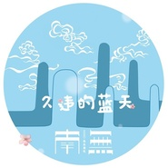

久违的蓝天
============================

|  |  |
| :--: | :-- |
| [ 久违的蓝天](https://emumo.xiami.com/album/2103510535) | **艺人**: [南无乐队](../index.md) **语种**: 国语 **唱片公司**: 独立发行 **发行时间**: 2018年01月31日 **专辑类别**: EP, 单曲 **专辑风格**: 摇滚 Rock & Roll **播放数**: 3146 **收藏数**: 13 **评论数**: 9  |

## 简介

这是南无乐队十周年全新专辑的第一首曝光单曲，《久违的蓝天》。  
有别于以往印象里的南无，或恢宏大气的《望苍穹》、或轻松洒脱的《找自由》、或深情款款的《封存自己》。  
《久违的蓝天》以跳跃欢快的节奏、复古游戏BGM的音色、传统戏曲元素，低声聊天式的吟唱开场，逐渐转至高亢有力的合唱，用南无独有的方式呼喊对“久违的蓝天”的期待。  
而首发时逢每年的春运，除了对好空气、好天气、好心情去团圆的期盼，也隐隐透出所有在路上一直努力的人们，终会等到自己“久违的蓝天”。  
选择首发新专辑中这首歌，除了对歌迷朋友们的高期望有个交代，也是南无乐队十年如一，始终如一的希望大家能因为南无而欢愉或释放。 

## 曲目

## 评论

|  |  |  |
| :-- | :-- | :-- |
|  [虾米用户](https://emumo.xiami.com/u/424601821)  2019-05-24 13:46 赞(0) 踩(0) | 
额
 |
|  [虾米用户](https://emumo.xiami.com/u/30800139) 我在低俗与高雅间活的很尴... 2018-04-12 21:19 赞(0) 踩(0) | 
。
 |
|  [虾米用户](https://emumo.xiami.com/u/49521146) 拥抱你 2018-04-03 09:54 赞(0) 踩(0) | 

 |
|  [虾米用户](https://emumo.xiami.com/u/265290531) @南疆大V鸡 2018-03-28 12:59 赞(1) 踩(0) | 
&amp;ldquo;天空在飘着土 高速上都很堵 人们等得很苦&amp;rdquo; --嗯 好像是这样的~~
 |
|  [虾米用户](https://emumo.xiami.com/u/4812144) 只有音乐才是我的解药 2018-03-28 09:16 赞(0) 踩(0) | 
踏马的今早的霾就炸了
 |
|  [虾米用户](https://emumo.xiami.com/u/317050212)  2018-03-27 15:41 赞(1) 踩(0) | 
顶  太现实了
 |
|  [虾米用户](https://emumo.xiami.com/u/198361595)   2018-03-27 15:18 赞(1) 踩(0) | 
果然很南无
 |
|  [虾米用户](https://emumo.xiami.com/u/91146904)   2018-02-23 12:16 赞(0) 踩(0) | 
什么时候能听啊
 |
|  [虾米用户](https://emumo.xiami.com/u/246641817) 我还没想好要写什么... 2018-02-06 23:45 赞(0) 踩(0) | 
现在出个蓝天都得写首歌 真的不想想咱们的污染吗
 |
