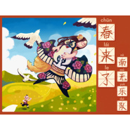
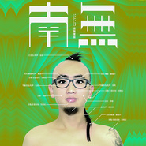
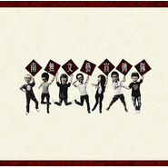

南无乐队
============================

|  |  |
| :--: | :-- |
| [ 南无乐队](https://i.xiami.com/namoband) | **地区**: China 中国大陆 **风格**: 摇滚 Rock & Roll **播放数**: 9413017 **粉丝数**: 18536 **评论数**: 500  |

## 档案

他们继天后王菲2009年法门寺佛指舍利安奉大典开唱之后，登上法门寺一周年纪念演出的舞台； 
他们为李少红版《红楼梦》重新演绎乐队版《好了歌》； 
他们成为中国第五代导演张元的镜头目标，成为经典电影《杂种》之兄弟篇《有种》的拍摄对象；并出现在张元最新出版的图片摄影作品《有种》一书中； 
影帝夏雨感动于他们的live现场，摇滚教父谢天笑跨刀担任单曲制作人； 
他们被收录于《这个国家的年轻人》系列图书第一卷《重塑偶像》中，并被法国境内杂志《新观察周刊》誉为“中国青年音乐人代表”； 
CTCC 2010超级联盟方程式汽车拉力赛中国站的唯一表演嘉宾，被全球57家媒体全程直播并接受多家境外电视台采访； 
他们被佛教界关注，被影视界器重，被境外媒体青睐，被平民青年拥护。他们是南无乐队。 
汲取中国文化的根基营养 
寻求中西音乐多元的表达手段 
创造出富有中国美学韵味和青年幽默特色的杂交再生品种，这种风格被乐队称之为“南无文艺” 
南无乐队除了在音乐上拥有独特的魅力意外，其表演力和舞台渲染力也深深吸引着各个领域的人。 
南无乐队是一支可多元化发展的乐队。 
作为平民摇滚的新生代领军人物，南无乐队的作品表达了中国年轻人对于自身与社会生活的深度思考，真诚自然的吟唱那些潜伏于市井的小故事、大道理，以与时俱进的音乐方式和现场表现获得了不同领域观众的接受、理解、共鸣。乐队遵循思考之独立、艺术之跨界的“南无文艺”大路线，力求将南无的能量涉及摇滚乐、佛教音乐、表演、写作等领域。

## 专辑

| 名称 | 语种 | 唱片公司 | 发行时间 | 专辑类别 | 专辑风格 |
| :--: | :-- | :-- | :-- | :-- | :-- |
| [ 久违的蓝天](./albums/2103510535.md) | 国语 | 独立发行 | 2018年01月31日 | EP, 单曲 | 摇滚 Rock & Roll |
| [ 南无乐队·一天听禅佛教专场 同期实录（临沂站）](./albums/2102672546.md) | 国语 | 独立发行 | 2016年12月09日 | 现场专辑 | 迪斯科 Disco, 中国风 China-Wave |
| [ Dancing Tonight南无乐队2016全新单曲](./albums/2102641466.md) | 国语 |  | 2016年11月01日 | EP, 单曲 |  |
| [ 火包胡同](./albums/2100308390.md) | 国语 | 优匠传媒 | 2016年04月11日 | EP, 单曲 | 独立摇滚 Indie Rock, 华语唱作人 Chinese Singer-Songwriter |
| [ 春来了](./albums/2022984592.md) | 国语 | 独立发行 | 2015年02月04日 | 录音室专辑 | 摇滚 Rock & Roll, 另类摇滚 Alternative Rock |
| [ 我是你的大猩猩](./albums/519045.md) | 国语 | 视袭音乐 | 2012年06月15日 | EP, 单曲 | 摇滚 Rock & Roll |
| [ 南无](./albums/412195.md) | 国语 | 视袭音乐 | 2010年12月17日 | 录音室专辑 | 佛教音乐 Buddhist Music |
| [ 南无文艺宣传队](./albums/359191.md) | 国语 | 独立发行 | 2009年12月01日 | EP, 单曲 | 佛教音乐 Buddhist Music |

## 评论

|  |  |  |
| :-- | :-- | :-- |
|  [虾米用户](https://emumo.xiami.com/u/276944698) 不要自我设限..... 2020-08-20 22:39 赞(0) 踩(0) | 
✔️✔️✔️
 |
|  [虾米用户](https://emumo.xiami.com/u/429686657)  2020-08-19 11:01 赞(0) 踩(0) | 
初次听你们的歌！很有感觉  
 |
|  [虾米用户](https://emumo.xiami.com/u/378684875) 喜欢贝斯 2019-10-21 18:02 赞(2) 踩(0) | 
不太真诚 给我的感觉
 |
|  [虾米用户](https://emumo.xiami.com/u/335933638)   2019-07-05 01:46 赞(1) 踩(0) | 
你就是用七十寸的铜锣也百搭
 |
|  [虾米用户](https://emumo.xiami.com/u/1273832) The River Of... 2019-06-26 00:25 赞(14) 踩(0) | 
哗众取宠，不伦不类，打着中国文化的幌子，却恰好少了文化作为根基。
 |
| ⇒ |  [虾米用户](https://emumo.xiami.com/u/199246) 无我 无用 2019-07-09 23:38 赞(0) 踩(0) | 
南无的唱法独一无二，非常具有创造性和可辨识性，只是有时候喜欢瞎玩，听听他们的往生咒就知道南无的本意了。
 |
| ⇒ |  [虾米用户](https://emumo.xiami.com/u/414280305)  2020-04-03 15:21 赞(0) 踩(0) | 
说出了我的心声 根本就不算乐队 乐队的夏天他们也能上 真的服了节目组
 |
|  [虾米用户](https://emumo.xiami.com/u/101532292)  2019-06-20 12:37 赞(0) 踩(0) | 
逗比
 |
|  [虾米用户](https://emumo.xiami.com/u/30351948) 原来你知道 2019-06-01 22:10 赞(0) 踩(0) | 
真的好
 |
|  [虾米用户](https://emumo.xiami.com/u/7365281) 乐府诗集酒肉过，心如射手... 2019-05-07 22:27 赞(0) 踩(0) | 
欢乐的歌曲，但有一次老吴你在欧拉把我们唱哭了，因为你说了一个你的歌迷经受的苦难，难受的故事，就不知道他们后来怎么样了
 |
|  [虾米用户](https://emumo.xiami.com/u/334058107)  2019-01-16 19:57 赞(2) 踩(0) | 
听一梦心经想起了中国好歌曲一位歌手，后来仔细听了，原来是春来了。
 |
|  [虾米用户](https://emumo.xiami.com/u/263690017)  2018-11-27 07:20 赞(2) 踩(0) | 
看到南无还在，就觉得自己还年轻。昨夜我又起夜了。。。
 |
| ⇒ |  [虾米用户](https://emumo.xiami.com/u/232679766)  2018-11-30 13:56 赞(0) 踩(0) | 
沃噢~~沃噢~~
 |
|  [虾米用户](https://emumo.xiami.com/u/33142590) 李慧之 2018-10-22 05:52 赞(1) 踩(0) | 
慧之是貴樂隊粉絲<a href="http://emumo.xiami.com/u/1542814" target="_blank" rel="nofollow" name_card="1542814">@南无乐队 </a>
 |
|  [虾米用户](https://emumo.xiami.com/u/19996714) What's the p... 2018-08-07 17:45 赞(1) 踩(0) | 
什么时候在虾米发新专啊
 |
|  [虾米用户](https://emumo.xiami.com/u/6363014)  2018-07-21 23:24 赞(0) 踩(0) | 
给师哥打call 毕业之前在北林田家炳看过你们的现场 很开心的回忆 希望下次还能有机会看一次现场 
 |
|  [虾米用户](https://emumo.xiami.com/u/49521146) 拥抱你 2018-07-16 23:21 赞(1) 踩(0) | 
最看好的乐队
 |
|  [虾米用户](https://emumo.xiami.com/u/49220044) 我还没想好要写什么... 2018-07-08 02:00 赞(0) 踩(0) | 
听完之后，整个人心情回复 净化我心中的愤怒
 |
|  [虾米用户](https://emumo.xiami.com/u/320172439)  2018-06-01 08:54 赞(0) 踩(0) | 
晚上见！
 |
|  [虾米用户](https://emumo.xiami.com/u/22909634) 有效听歌量为十分之一 2018-05-12 22:02 赞(0) 踩(0) | 
这笛子虽然赶不上jethro tull  然而还是很具有可听性的
 |
|  [虾米用户](https://emumo.xiami.com/u/20177386) 感谢一切美好的遇见❤️ 2018-04-24 01:25 赞(0) 踩(0) | 

 |
|  [虾米用户](https://emumo.xiami.com/u/265290531) @南疆大V鸡 2017-12-19 11:59 赞(3) 踩(0) | 
最擅长运用 笛子 的乐队!:)~~
 |
|  [虾米用户](https://emumo.xiami.com/u/9734337)  2017-12-18 13:24 赞(1) 踩(0) | 
他们继天后王菲2009年法门寺佛指舍利安奉大典开唱之后，登上法门寺一周年纪念演出的舞台； 他们为李少红版《红楼梦》重新演绎乐队版《好了歌》； 他们成为中国第五代导演张元的镜头目标，成为经典电影《杂种》之兄弟篇《有种》的拍摄对象；并出现在张元最新出版的图片摄影作品《有种》一书中；
 |
|  [虾米用户](https://emumo.xiami.com/u/20012026) - 2017-12-10 20:18 赞(0) 踩(0) | 
一年了&amp;hellip;！
 |
|  [虾米用户](https://emumo.xiami.com/u/9695930)  2017-12-04 18:25 赞(0) 踩(0) | 
北京什么时候有现场？
 |
|  [虾米用户](https://emumo.xiami.com/u/117532352)  hey 2017-11-26 13:31 赞(0) 踩(0) | 
哈哈新婚快乐
 |
|  [虾米用户](https://emumo.xiami.com/u/336251665) 在线作法 2017-11-24 23:53 赞(0) 踩(0) | 

 |
|  [虾米用户](https://emumo.xiami.com/u/123262020) 保护我 来骗我吧。 2017-11-23 13:02 赞(2) 踩(0) | 
刘相松新婚快乐
 |
|  [虾米用户](https://emumo.xiami.com/u/336741610)  2017-11-22 18:49 赞(0) 踩(0) | 
南無牛逼！
 |
|  [虾米用户](https://emumo.xiami.com/u/9052263)  2017-11-15 01:25 赞(0) 踩(0) | 
什么时候出送情郎啊
 |
|  [虾米用户](https://emumo.xiami.com/u/14005928)  2017-10-30 10:23 赞(0) 踩(0) | 
喜欢大大的喜欢
 |
|  [虾米用户](https://emumo.xiami.com/u/5802512) 风落贫道，剑挽青山。 2017-10-28 00:32 赞(1) 踩(0) | 
---南无乐队---中国摇滚嘛 超赞XD 喜欢这样的音乐诸如黑豹南无乐队好妹妹乐队这类的~ 最爱南无的是那首超有名气的《我是你的大猩猩》 (╯3╰)谢谢狗狗儿@奴家可稀罕你了 推荐 爱你一万年噗~
 |
|  [虾米用户](https://emumo.xiami.com/u/16066608)  2017-10-27 23:51 赞(1) 踩(0) | 
和神聖かまってちゃん可以一起发疯！哈哈
 |
|  [虾米用户](https://emumo.xiami.com/u/3722210) 何事？ 2017-09-15 19:08 赞(0) 踩(0) | 
怎么没有&amp;ldquo;好了歌&amp;rdquo;！！！！！？？？？？
 |
|  [虾米用户](https://emumo.xiami.com/u/11294684) 操，用什么签名 2017-08-10 09:19 赞(2) 踩(0) | 
好俗的歌词，差评。
 |
| ⇒ |  [虾米用户](https://emumo.xiami.com/u/235050) 我就说我是穷逼嘛~ 2017-08-12 10:56 赞(0) 踩(0) | 
你这种人不被人骂就浑身难受是吗，专门来找骂的？几岁了还靠没教养来找存在感？
 |
| ⇒ |  [虾米用户](https://emumo.xiami.com/u/11294684) 操，用什么签名 2017-09-23 13:08 赞(0) 踩(0) | 
<q><b>清风过山来说：</b></q>
 |
|  [虾米用户](https://emumo.xiami.com/u/35175361) Love is bull... 2017-07-27 22:11 赞(0) 踩(0) | 
风格有意思 嗓子很俗歌很棒词实在 哈哈哈哈哈哈哈
 |
|  [虾米用户](https://emumo.xiami.com/u/193042595)   2017-07-19 16:36 赞(0) 踩(0) | 
南无那张封面专辑 一言难尽啊 每次听到一半看到封面顿时会被吓死 后来说啥都不会再听那装专辑的任何歌
 |
| ⇒ |  [虾米用户](https://emumo.xiami.com/u/56688982)  2017-12-14 19:08 赞(0) 踩(0) | 
歌好，封面太吓人了
 |
|  [虾米用户](https://emumo.xiami.com/u/259308039)   2017-07-03 23:25 赞(1) 踩(0) | 
对不起这个真的伪摇平时不听摇滚都听出来了。 实验搞笑音乐吧
 |
| ⇒ |  [虾米用户](https://emumo.xiami.com/u/23500601)  2020-11-15 05:08 赞(0) 踩(0) | 
不要轻易给摇滚下定义
 |
|  [虾米用户](https://emumo.xiami.com/u/302779274)  2017-06-26 18:25 赞(0) 踩(0) | 
永远喜欢，没有不爱听的。
 |
|  [虾米用户](https://emumo.xiami.com/u/194850624)  2017-06-19 21:19 赞(0) 踩(0) | 
看了几张照片，风格醉人
 |
|  [虾米用户](https://emumo.xiami.com/u/191662186)  2017-06-19 07:09 赞(0) 踩(0) | 
无意中听见，很不错，特色鲜明。再听听
 |
|  [虾米用户](https://emumo.xiami.com/u/253605951) 世界第一初恋 2017-06-06 12:37 赞(0) 踩(0) | 
超棒的南无乐队   
 |
|  [虾米用户](https://emumo.xiami.com/u/248816756) 其实我很脆弱 2017-04-10 17:41 赞(0) 踩(0) | 
喜欢，就这么简单
 |
|  [虾米用户](https://emumo.xiami.com/u/31587544)  2017-03-03 20:34 赞(0) 踩(0) | 
厉害了我的哥
 |
|  [虾米用户](https://emumo.xiami.com/u/122688364) 生在愤坑，长在赤圈；挣脱 2017-02-25 21:24 赞(0) 踩(0) | 
8307
 |
|  [虾米用户](https://emumo.xiami.com/u/3019759)  2017-02-04 00:59 赞(0) 踩(0) | 
向灵山最好听。最好听的歌曲里面居然没有。
 |
|  [虾米用户](https://emumo.xiami.com/u/43914259) Jamaica's ti... 2017-01-02 04:26 赞(11) 踩(0) | 
基本不听国内乐队 但唯独喜欢南无 尤其那首封存自己 还有专辑后面4首佛歌 陪我度过多少难熬的日子 
 |
|  [虾米用户](https://emumo.xiami.com/u/10518918)  2016-12-26 14:10 赞(1) 踩(0) | 
什么时候小现场演出啊？！
 |
|  [虾米用户](https://emumo.xiami.com/u/4234256)  2016-12-17 16:53 赞(0) 踩(0) | 
大猩猩以后都是啥啊 
 |
|  [虾米用户](https://emumo.xiami.com/u/49487818) 写韵排弦声意动 听音诉曲... 2016-11-12 08:34 赞(0) 踩(0) | 
让人听来舒服的曲子    
 |
|  [虾米用户](https://emumo.xiami.com/u/7167993)  2016-11-04 13:34 赞(0) 踩(0) | 
艾玛呀！姐遇见你晚了20年！
 |
|  [虾米用户](https://emumo.xiami.com/u/4247665)   2016-10-23 02:57 赞(0) 踩(0) | 
土摇界的一股清流，就是南无和衣湿，上一次听南无还是12年的事
 |
|  [虾米用户](https://emumo.xiami.com/u/208268997)  2016-10-10 14:37 赞(0) 踩(0) | 
我喜欢
 |
|  [虾米用户](https://emumo.xiami.com/u/18055134)  2016-09-11 21:46 赞(0) 踩(0) | 
被封面所吸引
 |
|  [虾米用户](https://emumo.xiami.com/u/44140680) 旅途愉快 2016-08-06 18:14 赞(0) 踩(0) | 
⚫️
 |
|  [虾米用户](https://emumo.xiami.com/u/36865066) 脾气很好 2016-07-18 22:41 赞(0) 踩(0) | 
喜欢的乐队差不了，封存自己
 |
|  [虾米用户](https://emumo.xiami.com/u/49521146) 拥抱你 2016-06-14 20:34 赞(1) 踩(0) | 
孜然味最美 
 |
|  [虾米用户](https://emumo.xiami.com/u/18412060) v15175288880 2016-06-11 12:36 赞(0) 踩(0) | 
可以的
 |
|  [虾米用户](https://emumo.xiami.com/u/39555499) 祝你不止生日快乐 2016-05-29 09:12 赞(0) 踩(0) | 
春风扑面
 |
|  [虾米用户](https://emumo.xiami.com/u/125101212)  2016-04-23 00:22 赞(0) 踩(0) | 
233333333333
 |
|  [虾米用户](https://emumo.xiami.com/u/48330816)  2016-04-12 23:09 赞(0) 踩(0) | 
rock !
 |
|  [虾米用户](https://emumo.xiami.com/u/1217469) Music is my ... 2016-04-09 04:26 赞(0) 踩(0) | 
逗死了！
 |
|  [虾米用户](https://emumo.xiami.com/u/4079898) QQ 362318935 2016-03-09 22:28 赞(0) 踩(0) | 
主唱疑似秋野老师^_^
 |
|  [虾米用户](https://emumo.xiami.com/u/3376323)  2016-03-03 01:58 赞(0) 踩(0) | 
哈哈哈哈哈哈哈哈哈哈哈
 |
|  [虾米用户](https://emumo.xiami.com/u/238212) 我还没想好要写什么... 2016-03-01 07:04 赞(0) 踩(0) | 
妈呀太好听了真的！！！！！！！！！！！我要听哭了
 |
|  [虾米用户](https://emumo.xiami.com/u/238212) 我还没想好要写什么... 2016-03-01 06:29 赞(0) 踩(0) | 
唱的好棒！！！！歌也好棒啊！！！！！！
 |
|  [虾米用户](https://emumo.xiami.com/u/35926045)   2016-02-11 23:26 赞(4) 踩(0) | 
封面看得我一脸懵比
 |
|  [虾米用户](https://emumo.xiami.com/u/92534736)  2015-12-24 15:33 赞(2) 踩(0) | 
发现新大陆 
 |
|  [虾米用户](https://emumo.xiami.com/u/6939620)   2015-12-15 16:33 赞(3) 踩(0) | 
卧槽好棒啊啊啊啊啊
 |
|  [虾米用户](https://emumo.xiami.com/u/12073412)  2015-11-23 16:02 赞(0) 踩(0) | 
说好的听禅一天呢！！！！
 |
|  [虾米用户](https://emumo.xiami.com/u/1573332) 日常出碟，搜索闲鱼：su... 2015-11-21 23:35 赞(0) 踩(0) | 
好了歌真的挺好听，为什么没有录
 |
|  [虾米用户](https://emumo.xiami.com/u/75607102)  2015-11-19 20:59 赞(0) 踩(0) | 
怎么有张糖果怪兽的图啊
 |
|  [虾米用户](https://emumo.xiami.com/u/565900) 心情不汪！ 2015-11-13 15:59 赞(0) 踩(0) | 
不错~
 |
|  [虾米用户](https://emumo.xiami.com/u/14223243) Svenlam 2015-10-18 18:53 赞(0) 踩(0) | 
Greetings from Sweden! :)
 |
|  [虾米用户](https://emumo.xiami.com/u/25192430)  2015-09-29 14:43 赞(0) 踩(0) | 
南无乐队
 |
|  [虾米用户](https://emumo.xiami.com/u/13940675)  2015-09-28 21:11 赞(2) 踩(0) | 
去淘了一堆国内原创乐队的碟。看到个特别好的评论，发现世界上有那么多闪闪发光的神经病的欢乐。
 |
|  [虾米用户](https://emumo.xiami.com/u/1994140) 我还没想好要写什么... 2015-09-18 16:17 赞(3) 踩(0) | 
看几位的头像以为自己误入了痛仰的主页。。
 |
|  [虾米用户](https://emumo.xiami.com/u/64582950) 不要停止我的音乐 2015-09-14 11:17 赞(2) 踩(0) | 
南无信徒
 |
|  [虾米用户](https://emumo.xiami.com/u/7154903) ~~~~~~~~~~~~ 2015-09-12 21:41 赞(0) 踩(0) | 
中国,中国摇滚,
 |
|  [虾米用户](https://emumo.xiami.com/u/24592107) 独角兽 2015-09-12 15:01 赞(1) 踩(0) | 
差点被封面蒙蔽 妈蛋
 |
|  [虾米用户](https://emumo.xiami.com/u/38662280) 不懂装懂中度患者 2015-08-29 10:57 赞(0) 踩(0) | 
跟我一起读，南无是NaMo，那么是Name，name还是name
 |
|  [虾米用户](https://emumo.xiami.com/u/7154903) ~~~~~~~~~~~~ 2015-08-27 09:43 赞(0) 踩(0) | 
中国摇滚,摇滚,
 |
|  [虾米用户](https://emumo.xiami.com/u/47598323)   2015-08-24 22:55 赞(1) 踩(0) | 
快来大连了
 |
|  [虾米用户](https://emumo.xiami.com/u/9033909)  2015-08-23 14:06 赞(0) 踩(0) | 
好听^_^
 |
|  [虾米用户](https://emumo.xiami.com/u/9033909)  2015-08-23 14:06 赞(0) 踩(0) | 
好听^_^
 |
|  [虾米用户](https://emumo.xiami.com/u/50682492)  2015-08-11 22:00 赞(0) 踩(0) | 
当当当
 |
|  [虾米用户](https://emumo.xiami.com/u/34799914) 我还没想好要写什么... 2015-07-05 13:45 赞(2) 踩(0) | 
东海音乐节等我！！
 |
|  [虾米用户](https://emumo.xiami.com/u/38640339) 我想好写什么了…… 2015-06-24 13:59 赞(0) 踩(0) | 

 |
|  [虾米用户](https://emumo.xiami.com/u/44954622) 向上吧！ 2015-06-11 21:49 赞(0) 踩(0) | 
封面够骚
 |
|  [虾米用户](https://emumo.xiami.com/u/823348) 无所住 2015-06-09 20:09 赞(0) 踩(0) | 
给力
 |
|  [虾米用户](https://emumo.xiami.com/u/9538049)  2015-06-09 02:19 赞(0) 踩(0) | 
喜欢喜欢 第一次听就爱上了啊哈哈
 |
|  [虾米用户](https://emumo.xiami.com/u/9575413) 我还没想好要写什么... 2015-06-02 22:41 赞(0) 踩(0) | 
主 唱 刘相松 主音吉他 刘相松 节奏吉他 张岚 和 声 张硕/张岚 小打击乐 张硕 贝 斯 磊子 鼓 孙密 主 唱 刘相松  <a href="http://www.xiami.com/artist/1509801758?spm=a1z1s.3061781.226669510.13.OoxU8v&amp;amp;from=search_popup_artist" target="_blank" rel="nofollow noreferrer noopener">http://www.xiami.com/artist/1509801758?spm=a1z1s.3061781.226669510.13.OoxU8v&amp;amp;from=search_popup_artist</a>
 |
|  [虾米用户](https://emumo.xiami.com/u/19500344) Poser 2015-06-02 01:58 赞(0) 踩(0) | 
两年前第一次听到就期待着能看现场~终于等到你还好我没放弃
 |
|  [虾米用户](https://emumo.xiami.com/u/24317533) 生活有希望* 2015-06-01 21:12 赞(0) 踩(0) | 
棒呆啊啊啊
 |
|  [虾米用户](https://emumo.xiami.com/u/46372341)   2015-05-29 18:00 赞(0) 踩(0) | 
听不来南无的歌
 |
|  [虾米用户](https://emumo.xiami.com/u/45045233)  2015-05-24 15:37 赞(0) 踩(0) | 
嗨炸了的现场，加油！听你们的歌感觉整个人都乐起来了
 |
|  [虾米用户](https://emumo.xiami.com/u/7677572) 在天山找我 2015-05-23 14:43 赞(1) 踩(0) | 
还真没听过你们歌 晚上乌鲁木齐见
 |
|  [虾米用户](https://emumo.xiami.com/u/37723702)  2015-05-16 08:07 赞(2) 踩(0) | 
昨天看现场大喊二手玫瑰牛逼，主唱说：我们是六手牡丹。
 |
|  [虾米用户](https://emumo.xiami.com/u/3052919) 干掉他 2015-05-15 02:16 赞(0) 踩(0) | 
在稍加修饰将来可以超越二手
 |
|  [虾米用户](https://emumo.xiami.com/u/34202200)   2015-05-13 18:57 赞(0) 踩(0) | 
和二手玫瑰一脉相承。
 |
|  [虾米用户](https://emumo.xiami.com/u/23975037)  2015-04-22 10:17 赞(0) 踩(0) | 
无厘头
 |
|  [虾米用户](https://emumo.xiami.com/u/16973801) 暂无签名~ 2015-04-18 14:57 赞(0) 踩(0) | 
今天推荐歌单上的，第一次听独立国摇，还真是赞！
 |
|  [虾米用户](https://emumo.xiami.com/u/1053741)  2015-03-20 12:45 赞(0) 踩(0) | 
简单的喜欢~
 |
|  [虾米用户](https://emumo.xiami.com/u/11226129)  2015-03-18 10:22 赞(0) 踩(0) | 
造型很有范，喜欢
 |
|  [虾米用户](https://emumo.xiami.com/u/6475202)  2015-03-12 08:55 赞(0) 踩(0) | 
你怎么这么帅
 |
|  [虾米用户](https://emumo.xiami.com/u/2346707)  2015-03-11 11:28 赞(0) 踩(0) | 
帅气！
 |
|  [虾米用户](https://emumo.xiami.com/u/7603200)  2015-03-04 13:36 赞(0) 踩(0) | 
笛子加打击 有好听
 |
|  [虾米用户](https://emumo.xiami.com/u/40028126)   2015-02-28 03:43 赞(0) 踩(0) | 
网易云上二手的视频，梁龙说南无大学时候他就看过，很棒。
 |
|  [虾米用户](https://emumo.xiami.com/u/2896390)   2015-02-26 18:45 赞(0) 踩(0) | 
好听 耳朵舒服
 |
|  [虾米用户](https://emumo.xiami.com/u/2445118) 这个世界需要音乐！我的生... 2015-02-24 13:10 赞(0) 踩(0) | 
封面醉人
 |
|  [虾米用户](https://emumo.xiami.com/u/47541630)  2015-02-23 21:54 赞(0) 踩(0) | 
贝贝哥和李斯？
 |
|  [虾米用户](https://emumo.xiami.com/u/45605006) 暂无签名~ 2015-02-18 22:42 赞(0) 踩(0) | 
图像重口味啊！
 |
|  [虾米用户](https://emumo.xiami.com/u/8701102) 暂无签名~ 2015-02-09 18:17 赞(0) 踩(0) | 
中式灰色幽默
 |
|  [虾米用户](https://emumo.xiami.com/u/47070526)  2015-02-08 12:02 赞(1) 踩(0) | 
出于对主唱刘相松嗓音的喜爱。刘演奏吉他也很有感觉，吉他这东西不在于技巧有多高，那种感觉不是每个吉他手都能捕捉到的。
 |
|  [虾米用户](https://emumo.xiami.com/u/9589589) Light on 2015-02-04 18:35 赞(0) 踩(0) | 
喜欢歌里的气氛，喜欢刘相松嗓音
 |
|  [虾米用户](https://emumo.xiami.com/u/820599) 愿圣光照耀你 我的敌人 2015-02-04 15:57 赞(1) 踩(0) | 
希望五十岁的时候还是喜欢他们。
 |
|  [虾米用户](https://emumo.xiami.com/u/2245256)  2015-02-04 12:21 赞(2) 踩(0) | 
现在才知道原来刘厨子就是南无主场啊！台上打扮得太不摇滚了吧！难怪当时我纳闷为啥别人都是岛屿心情乐队伴奏就他是大猩猩乐队.........
 |
|  [虾米用户](https://emumo.xiami.com/u/12751752) :） 2015-02-03 12:58 赞(1) 踩(0) | 
神经病一样儿可爱的乐队啊。
 |
|  [虾米用户](https://emumo.xiami.com/u/41204942) 画龙画虎难画骨 2015-01-27 10:59 赞(1) 踩(0) | 
充满力量的内容 支持南无
 |
|  [虾米用户](https://emumo.xiami.com/u/41076774)  2015-01-26 15:00 赞(1) 踩(0) | 
【南无乐队新砖《春来了》3.21首发专场】 北京 MAO LiveHouse 现已开始预售：<a href="http://www.douban.com/event/23596760/" target="_blank" rel="nofollow noreferrer noopener">http://www.douban.com/event/23596760/</a>
 |
|  [虾米用户](https://emumo.xiami.com/u/5802512) 风落贫道，剑挽青山。 2015-01-20 14:38 赞(0) 踩(0) | 
南无 我爱你们嘤嘤嘤嘤
 |
|  [虾米用户](https://emumo.xiami.com/u/3333818) 生命不止音乐不断 2015-01-20 10:11 赞(0) 踩(0) | 
南无，一路追着过来！突然发现词穷，说什么都不如默默的跟随下去！
 |
|  [虾米用户](https://emumo.xiami.com/u/8583712) 上传反动、色情等照片将导... 2015-01-20 01:12 赞(0) 踩(0) | 
摇滚厨子，弄个厨具livehouse吧，掌勺音乐两不误 <a href="http://v.youku.com/v_show/id_XNDUwOTgzNjky.html" target="_blank" rel="nofollow noreferrer noopener">http://v.youku.com/v_show/id_XNDUwOTgzNjky.html</a>
 |
|  [虾米用户](https://emumo.xiami.com/u/19653424) 人生三原则 无相无念无住 2015-01-20 00:38 赞(0) 踩(0) | 
吼一声，支持支持！
 |
|  [虾米用户](https://emumo.xiami.com/u/2735183) 是时候再见了，这是我第一... 2015-01-20 00:14 赞(0) 踩(0) | 
后来居上~！
 |
|  [虾米用户](https://emumo.xiami.com/u/13495606) 口味专一 2015-01-19 20:59 赞(0) 踩(0) | 
来啦
 |
|  [虾米用户](https://emumo.xiami.com/u/1542814) 全民好乐队 2015-01-19 16:31 赞(158) 踩(0) | 
我刚入驻了虾米音乐人，欢迎大家来我的个人主页，收听我的最新音乐
 |
| ⇒ |  [虾米用户](https://emumo.xiami.com/u/1170903) 我妖气重我自豪 2015-01-19 19:58 赞(0) 踩(0) | 
欢迎~
 |
| ⇒ |  [虾米用户](https://emumo.xiami.com/u/11353)  2015-01-19 20:41 赞(0) 踩(0) | 
大爱
 |
| ⇒ |  [虾米用户](https://emumo.xiami.com/u/1137473) 我还没想好要写什么... 2015-01-19 20:43 赞(0) 踩(0) | 
洒家今天是听着你们的春来了+80后 上下班的。。。^_^
 |
| ⇒ |  [虾米用户](https://emumo.xiami.com/u/12785070) 还是孩子 2015-01-19 22:04 赞(0) 踩(0) | 
欢迎！
 |
| ⇒ |  [虾米用户](https://emumo.xiami.com/u/5802512) 风落贫道，剑挽青山。 2015-01-20 14:39 赞(0) 踩(0) | 
欢迎欢迎！！热烈欢迎！！
 |
| ⇒ |  [虾米用户](https://emumo.xiami.com/u/1672268)  2015-01-21 23:41 赞(0) 踩(0) | 
什么时间有新专？等好久了
 |
| ⇒ |  [虾米用户](https://emumo.xiami.com/u/15456708)   2015-04-17 01:47 赞(0) 踩(0) | 
有次现场唱了首歌词 我的左边 左边 左边 是你给我的彩云朵朵，那首特好听 什么时候出啊啊
 |
| ⇒ |  [虾米用户](https://emumo.xiami.com/u/54527370) Yo~ 2015-08-14 23:38 赞(0) 踩(0) | 
<q><b>李萌萌说：</b></q>
 |
| ⇒ |  [虾米用户](https://emumo.xiami.com/u/15456708)   2015-08-25 12:00 赞(0) 踩(0) | 
<q><b>象牙山舞王说：</b></q>
 |
| ⇒ |  [虾米用户](https://emumo.xiami.com/u/54527370) Yo~ 2015-08-25 12:08 赞(0) 踩(0) | 
<q><b>李萌萌说：</b></q>
 |
| ⇒ |  [虾米用户](https://emumo.xiami.com/u/226239632) 鱼翔浅底 2016-09-14 20:09 赞(0) 踩(0) | 
要智慧有智慧，要韵味有韵味，要旋律有旋律，大师之作
 |
| ⇒ |  [虾米用户](https://emumo.xiami.com/u/49220044) 我还没想好要写什么... 2018-07-08 02:01 赞(0) 踩(0) | 
支持你们，继续发扬光大 
 |
| ⇒ |  [虾米用户](https://emumo.xiami.com/u/23149060)  2018-07-20 00:41 赞(0) 踩(0) | 
☀️
 |
|  [虾米用户](https://emumo.xiami.com/u/6373063) 为爱而  2015-01-19 16:20 赞(0) 踩(0) | 
么么哒，留个爪，自从遇见你，我才发现自己的口味原来还可以这么重。
 |
|  [虾米用户](https://emumo.xiami.com/u/12015863) 暂无签名~ 2015-01-19 16:08 赞(1) 踩(0) | 
13年 年底  我和你在南无的现场接吻  当时的你劈腿和他在一起 如今你离开了BJ  快要回NJ  我又该用什么样的情绪面对你
 |
| ⇒ |  [虾米用户](https://emumo.xiami.com/u/7809994) 云 2015-01-19 16:11 赞(0) 踩(0) | 
世间真爱是慈悲
 |
|  [虾米用户](https://emumo.xiami.com/u/1588558) 我的精选集里混入了一些奇... 2015-01-19 15:43 赞(0) 踩(0) | 
新专辑要来了吧么么哒
 |
| ⇒ |  [虾米用户](https://emumo.xiami.com/u/6630660) 猜赢涂口红… 2015-01-19 16:02 赞(0) 踩(0) | 
快去买！ <a href="http://www.musikid.com/project/1143" target="_blank" rel="nofollow noreferrer noopener">http://www.musikid.com/project/1143</a>
 |
|  [虾米用户](https://emumo.xiami.com/u/39932813) 暂无签名~ 2015-01-12 17:00 赞(0) 踩(0) | 
！！
 |
|  [虾米用户](https://emumo.xiami.com/u/45019450)  2015-01-08 17:21 赞(0) 踩(0) | 
超级爱的乐队 主唱的特殊唱腔棒棒棒
 |
|  [虾米用户](https://emumo.xiami.com/u/40641530)  2014-12-29 20:06 赞(0) 踩(0) | 
最爱的乐队了，最爱的主唱！
 |
|  [虾米用户](https://emumo.xiami.com/u/44474276)  2014-12-11 01:24 赞(0) 踩(0) | 
为摇滚服务 现场牛逼
 |
|  [虾米用户](https://emumo.xiami.com/u/11146677) 二胖子 2014-11-30 10:11 赞(0) 踩(0) | 
第一次听到的是《我是你的大猩猩》就被主唱这大鼓书的调调和摇滚的嗓子给抓来了  然后我就毫不犹豫的跳了进来  加油南无  前景无限光明啊
 |
|  [虾米用户](https://emumo.xiami.com/u/2451585)  2014-11-22 10:57 赞(0) 踩(0) | 
期待南无的新专
 |
|  [虾米用户](https://emumo.xiami.com/u/782027) 成长中的后摇新势力 2014-10-21 14:57 赞(0) 踩(0) | 
很有特点的一支
 |
|  [虾米用户](https://emumo.xiami.com/u/6698158) 我的内心里没有声音 2014-10-10 09:43 赞(0) 踩(0) | 
大大大
 |
|  [虾米用户](https://emumo.xiami.com/u/1026158) ╭∩╮（︶︿︶）╭∩╮ 2014-10-09 01:00 赞(1) 踩(0) | 
南无把中国文化和摇滚结合的如此完美，真正的中国摇滚！就像北欧的哥特摇滚乐队。
 |
|  [虾米用户](https://emumo.xiami.com/u/645218) 任性逍遥于有欲无欲之间 2014-10-07 15:09 赞(0) 踩(0) | 
喜欢这个调调
 |
|  [虾米用户](https://emumo.xiami.com/u/3246411)  2014-10-02 23:59 赞(0) 踩(0) | 
在我的左边左边左边是你给我的彩云朵朵 求歌名
 |
| ⇒ |  [虾米用户](https://emumo.xiami.com/u/2077846)  2014-11-24 23:12 赞(0) 踩(0) | 
在那边
 |
| ⇒ |  [虾米用户](https://emumo.xiami.com/u/7809994) 云 2014-12-01 11:38 赞(0) 踩(0) | 
<q><b>xiaona说：</b></q>
 |
|  [虾米用户](https://emumo.xiami.com/u/12785070) 还是孩子 2014-10-02 17:41 赞(0) 踩(0) | 
迷笛回来，昨天最棒的live！ 刘大哥你为什么那么帅！
 |
|  [虾米用户](https://emumo.xiami.com/u/7160294) For god sake... 2014-10-02 17:25 赞(0) 踩(0) | 
昨天的演唱会 萌死
 |
|  [虾米用户](https://emumo.xiami.com/u/41526810) 可爱的一只动物园٩( '... 2014-09-24 13:51 赞(1) 踩(0) | 
听过现场棒超赞 气氛high
 |
|  [虾米用户](https://emumo.xiami.com/u/2439226) 我还没想好要写什么... 2014-09-21 08:08 赞(24) 踩(0) | 
爱就是放一屁，在不知不觉中酝酿、膨胀，然后突然以迅雷不及掩耳之势破裂，留下一股令人作呕的气息。当然，也不排除有专好这口的。比如你和我；比如我的小苹果和你的大猩猩。
 |
| ⇒ |  [虾米用户](https://emumo.xiami.com/u/49922667) 这个人过于普通，没什么可... 2015-06-30 21:28 赞(0) 踩(0) | 

 |
|  [虾米用户](https://emumo.xiami.com/u/9798298)  2014-09-20 11:15 赞(1) 踩(0) | 
乐呵
 |
|  [虾米用户](https://emumo.xiami.com/u/829492) 嗨嗨嗨 2014-08-17 12:50 赞(1) 踩(0) | 
丧病。。
 |
|  [虾米用户](https://emumo.xiami.com/u/9249884) 期待他日再相逢，共度白首 2014-08-06 08:34 赞(1) 踩(0) | 
浓浓的大山东风味~好亲切~
 |
|  [虾米用户](https://emumo.xiami.com/u/3333818) 生命不止音乐不断 2014-07-26 15:54 赞(2) 踩(0) | 
人会随着年龄的变化而变得越来越现实，而当你的理性战胜感性的时候你听的音乐也变了，越来越爱小众，越来越追求内心的信仰，南无就是小众当中永远用自己的声音来表达对生活、对信仰、对人生、对佛法归结为对世间而发出声音的一班人，人生路慢慢，能懂南无的都是有故事的人！
 |
| ⇒ |  [虾米用户](https://emumo.xiami.com/u/28291387) 暂无签名~ 2014-09-23 07:52 赞(0) 踩(0) | 
好
 |
| ⇒ |  [虾米用户](https://emumo.xiami.com/u/28291387) 暂无签名~ 2014-12-25 23:20 赞(0) 踩(0) | 
<q><b>说：</b></q>
 |
| ⇒ |  [虾米用户](https://emumo.xiami.com/u/3333818) 生命不止音乐不断 2014-12-29 10:38 赞(0) 踩(0) | 
<q><b>keepreal-大老二说：</b></q>
 |
|  [虾米用户](https://emumo.xiami.com/u/5071430)   2014-07-21 00:57 赞(0) 踩(0) | 
张北被震撼了。。。那一头黑丝和白裙
 |
|  [虾米用户](https://emumo.xiami.com/u/36761080)  2014-07-16 18:53 赞(0) 踩(0) | 

 |
|  [虾米用户](https://emumo.xiami.com/u/9642566) 最悲惨的人生是没有理想 2014-07-15 17:45 赞(0) 踩(0) | 
这么逗逼的思维力还掺杂着佛家思想，矮油不错哦
 |
|  [虾米用户](https://emumo.xiami.com/u/14686035) 我还没想好要写什么... 2014-07-10 17:32 赞(0) 踩(0) | 
一直念【南无】namo ，有一次在电视上看央视介绍说是nanwu 到底怎么读来着-----？ ┐(—__—)┌
 |
| ⇒ |  [虾米用户](https://emumo.xiami.com/u/14686035) 我还没想好要写什么... 2014-09-30 21:57 赞(0) 踩(0) | 
<q><b>说：</b></q>
 |
| ⇒ |  [虾米用户](https://emumo.xiami.com/u/7809994) 云 2014-12-01 11:39 赞(0) 踩(0) | 
<q><b>乌拉说：</b></q>
 |
|  [虾米用户](https://emumo.xiami.com/u/148961)  2014-06-30 18:47 赞(0) 踩(0) | 
老刘的唱法让我有错觉以为是陕北人，没想到是山东大汉。好听。最早听的是 找自由。
 |
|  [虾米用户](https://emumo.xiami.com/u/16810881) 你在我混浊的生命里营造过... 2014-06-25 00:27 赞(1) 踩(0) | 
逗比的词儿，水平的编曲，内涵的吉他，骚动的歌儿，创意的掺杂中国元素 ， 这才是中国的摇滚 。
 |
|  [虾米用户](https://emumo.xiami.com/u/1572321) 从小就很酷 2014-06-05 19:44 赞(0) 踩(0) | 
风格
 |
|  [虾米用户](https://emumo.xiami.com/u/5465578) 要常回来听听初中时听的歌... 2014-05-29 11:10 赞(0) 踩(0) | 
多！久！来！成！都！吧！
 |
|  [虾米用户](https://emumo.xiami.com/u/36138005)  2014-05-02 21:50 赞(0) 踩(0) | 
哈哈听完就笑了
 |
|  [虾米用户](https://emumo.xiami.com/u/697600) breath 2014-04-30 20:46 赞(0) 踩(0) | 
听佛经进来看的，看到热门歌曲，我惊呆了
 |
| ⇒ |  [虾米用户](https://emumo.xiami.com/u/1686294)  2014-07-11 11:47 赞(0) 踩(0) | 
哈哈~ 我是听到热门进来的，看到佛经，我惊呆了：） 但你不觉得，这两种风格他们都诠释的蛮好嘛，这就够了~ 水，本身无温度。遇到火，灼热；遇到冰，凝结。
 |
|  [虾米用户](https://emumo.xiami.com/u/16034404) 灰色的世界，彩色的音乐~ 2014-04-26 11:16 赞(1) 踩(0) | 
你们的音乐让我快乐，就想乐队名字一样，无论心情如何，旋律响起嘴角随之上翘，南无阿弥陀佛！
 |
|  [虾米用户](https://emumo.xiami.com/u/5618806)  2014-04-22 16:13 赞(0) 踩(0) | 
好听 轻松
 |
|  [虾米用户](https://emumo.xiami.com/u/35208788)  2014-04-21 16:26 赞(0) 踩(0) | 
有个性
 |
|  [虾米用户](https://emumo.xiami.com/u/933522)  2014-03-17 14:34 赞(0) 踩(0) | 
最佳现场乐队？不过真的好久不见，老刘也真心变成“老”刘啦。你我都在长大~情何以堪。
 |
|  [虾米用户](https://emumo.xiami.com/u/34112137)  2014-03-15 20:33 赞(0) 踩(0) | 
南无 牛
 |
|  [虾米用户](https://emumo.xiami.com/u/7637832)  2014-03-05 23:16 赞(1) 踩(0) | 
我是你的大猩猩好听，不过突然地想像到詹姆斯唱这歌给粉丝听……    哈哈   调侃一下  没恶意
 |
| ⇒ |  [虾米用户](https://emumo.xiami.com/u/14017418)  2014-03-13 23:39 赞(0) 踩(0) | 
五黄！
 |
|  [虾米用户](https://emumo.xiami.com/u/2089857) 我想描述一束光 2014-03-04 11:01 赞(1) 踩(0) | 
万晓利的腔调啊。。。
 |
| ⇒ |  [虾米用户](https://emumo.xiami.com/u/5537617)  2014-07-22 13:45 赞(0) 踩(0) | 
我就说这个强调听着咋那么耳熟呢，你提醒我了，就是万晓利。。。
 |
|  [虾米用户](https://emumo.xiami.com/u/5106725) 我还没想好要写什么... 2014-02-23 22:12 赞(0) 踩(0) | 
好听
 |
|  [虾米用户](https://emumo.xiami.com/u/2205081) 游走在主流边缘........ 2014-02-22 21:07 赞(0) 踩(0) | 
哈哈 这乐队有点意思啊
 |
|  [虾米用户](https://emumo.xiami.com/u/33002417)  2014-02-20 14:09 赞(0) 踩(0) | 
我很喜欢
 |
|  [虾米用户](https://emumo.xiami.com/u/3980205)  2014-02-16 10:27 赞(0) 踩(0) | 
春来了 虎头蛇尾
 |
| ⇒ |  [虾米用户](https://emumo.xiami.com/u/7809994) 云 2014-05-26 10:36 赞(0) 踩(0) | 
那是因为你没听过现场的 叫春来了  春来了是阉割版 不要拿他说事
 |
|  [虾米用户](https://emumo.xiami.com/u/1479224) 野火燎原 2014-02-08 13:24 赞(0) 踩(0) | 
南无不应该读na mo吗？
 |
| ⇒ |  [虾米用户](https://emumo.xiami.com/u/7809994) 云 2014-05-26 10:36 赞(0) 踩(0) | 
拿馍乐队
 |
|  [虾米用户](https://emumo.xiami.com/u/32447099)  2014-02-07 01:54 赞(0) 踩(0) | 
Love it.
 |
|  [虾米用户](https://emumo.xiami.com/u/18598872) 始终不聪明 2014-01-28 13:10 赞(1) 踩(0) | 
从一首“我是你的大猩猩”爱上了这个乐队，太棒了吧！人世间的大道小理在嬉笑搞怪的歌曲中轻轻松松表露出来
 |
|  [虾米用户](https://emumo.xiami.com/u/3468208)   2014-01-28 08:23 赞(0) 踩(0) | 
心态很好的乐队~
 |
|  [虾米用户](https://emumo.xiami.com/u/3936282) 要死一起死 2014-01-23 21:11 赞(1) 踩(0) | 
麻痹，我一听好歌曲那春来了我就知道是南无……卖的一手好萌~我喜欢~
 |
| ⇒ |  [虾米用户](https://emumo.xiami.com/u/10091699)  2014-01-25 22:30 赞(0) 踩(0) | 
一样，一听那个曲风我也马上就想到了南无
 |
|  [虾米用户](https://emumo.xiami.com/u/6331728)  2014-01-20 21:22 赞(0) 踩(0) | 
先收着
 |
|  [虾米用户](https://emumo.xiami.com/u/10972823) 去学习，去思考，去反叛 2014-01-18 22:13 赞(0) 踩(0) | 
提升全民逼格才能振兴中国摇滚乐
 |
|  [虾米用户](https://emumo.xiami.com/u/632046) 畅聊音乐吧，joe861... 2014-01-18 19:29 赞(0) 踩(0) | 
要火的节奏 今年全国巡演吧
 |
|  [虾米用户](https://emumo.xiami.com/u/1717015)  2014-01-18 18:44 赞(0) 踩(0) | 
去年他们来了我们学校的音乐节，最后压轴，全场所有人都high起来了！
 |
|  [虾米用户](https://emumo.xiami.com/u/18492536)  2014-01-18 13:31 赞(0) 踩(0) | 
小东东，很刁的感觉。
 |
|  [虾米用户](https://emumo.xiami.com/u/811096) 优美的低于生活 2014-01-16 10:14 赞(1) 踩(0) | 
看预告发现南无乐队也参加好歌曲了！这是真的么？看来又一个独立小众乐队要走向大众啦。怎么有一种限量版变成淘宝爆款的感觉……但是无论怎样还是祝福他们吧。出名毕竟是好事。
 |
| ⇒ |  [虾米用户](https://emumo.xiami.com/u/36297191) 我等你。 2015-01-19 22:58 赞(0) 踩(0) | 
是金子总会发光
 |
|  [虾米用户](https://emumo.xiami.com/u/463515) 温暖长久。 2014-01-15 10:58 赞(0) 踩(0) | 
怎麼設置不再播放啊……= =#
 |
|  [虾米用户](https://emumo.xiami.com/u/523132) Fitness 2014-01-12 11:00 赞(0) 踩(0) | 
...为何不好好唱歌 曲子都挺好的
 |
|  [虾米用户](https://emumo.xiami.com/u/7496234) 尿尿喷的不高 2014-01-10 22:07 赞(0) 踩(0) | 
才发现主场声音那么好听呢
 |
|  [虾米用户](https://emumo.xiami.com/u/9079353) 氓之嗤嗤 2014-01-09 13:54 赞(0) 踩(0) | 
咱还Good Good Study Day Day Up呢，就这英语水平
 |
| ⇒ |  [虾米用户](https://emumo.xiami.com/u/235050) 我就说我是穷逼嘛~ 2014-01-21 21:49 赞(0) 踩(0) | 
哎哟卧槽，发现一牛逼人物！您这英语水平登峰造极了啊，这错误都叫你发现了！我瞅着专八都不够了，您这得专十六吧？
 |
| ⇒ |  [虾米用户](https://emumo.xiami.com/u/9079353) 氓之嗤嗤 2014-02-19 16:25 赞(0) 踩(0) | 
<q><b>清风过山来说：</b></q>
 |
|  [虾米用户](https://emumo.xiami.com/u/363026)  2014-01-07 21:35 赞(0) 踩(0) | 
haiyiongshuo
 |
|  [虾米用户](https://emumo.xiami.com/u/18598872) 始终不聪明 2014-01-07 14:57 赞(0) 踩(0) | 
我是你的大猩猩
 |
|  [虾米用户](https://emumo.xiami.com/u/9079353) 氓之嗤嗤 2013-12-19 15:09 赞(0) 踩(0) | 
有点哗众取宠的味道
 |
|  [虾米用户](https://emumo.xiami.com/u/1688279) 我们在等待 2013-12-16 15:48 赞(0) 踩(0) | 
谁实话，南无要听就听现场，跟着他们一起跳舞！
 |
|  [虾米用户](https://emumo.xiami.com/u/3447098)  2013-12-10 17:30 赞(0) 踩(0) | 
硬道理
 |
|  [虾米用户](https://emumo.xiami.com/u/10135486) 红了樱桃，绿了芭蕉 2013-11-26 14:02 赞(0) 踩(0) | 
南无
 |
|  [虾米用户](https://emumo.xiami.com/u/4378650)  2013-11-13 19:45 赞(0) 踩(0) | 
南无...
 |
|  [虾米用户](https://emumo.xiami.com/u/23853721)  2013-10-30 22:41 赞(0) 踩(0) | 
h
 |
|  [虾米用户](https://emumo.xiami.com/u/24226542)  2013-10-11 17:31 赞(0) 踩(0) | 
FH
 |
|  [虾米用户](https://emumo.xiami.com/u/24226542)  2013-10-11 17:26 赞(0) 踩(0) | 
FH
 |
|  [虾米用户](https://emumo.xiami.com/u/6989809) creep！！！ 2013-10-06 22:52 赞(0) 踩(0) | 
大实话
 |
|  [虾米用户](https://emumo.xiami.com/u/135097) 要听神明的话 2013-10-01 20:11 赞(0) 踩(0) | 
werwe
 |
|  [虾米用户](https://emumo.xiami.com/u/2988235)  2013-09-23 12:52 赞(0) 踩(0) | 
好想看中国摇滚。什么时候来深圳？
 |
|  [虾米用户](https://emumo.xiami.com/u/10386273) 摇啊摇 2013-09-03 00:39 赞(0) 踩(0) | 
骚的可以
 |
|  [虾米用户](https://emumo.xiami.com/u/10386273) 摇啊摇 2013-09-03 00:38 赞(0) 踩(0) | 
的确是够骚。很好
 |
|  [虾米用户](https://emumo.xiami.com/u/7257903) 这家伙很懒，什么也没留下 2013-09-02 17:40 赞(0) 踩(0) | 
骚，但是真诚，佛性。能把宗教融入进摇滚的风格，中文创作，歌词很精辟，还带着调侃的曲风，这些融合在一起，还是很可以的。
 |
|  [虾米用户](https://emumo.xiami.com/u/5465578) 要常回来听听初中时听的歌... 2013-08-24 15:43 赞(0) 踩(0) | 
来成都吧  来成都吧  ！！
 |
|  [虾米用户](https://emumo.xiami.com/u/2050067)  2013-08-22 14:04 赞(0) 踩(0) | 
二货骚年无节操
 |
|  [虾米用户](https://emumo.xiami.com/u/1115247) @Nebula_7293 2013-08-10 01:17 赞(0) 踩(0) | 
在不知道南无的情况下 看了他们的现场 唱了6、7首歌，真的很会调动现场的气氛！！
 |
|  [虾米用户](https://emumo.xiami.com/u/1688279) 我们在等待 2013-08-02 11:31 赞(1) 踩(0) | 
南无的现场比专辑好10倍
 |
|  [虾米用户](https://emumo.xiami.com/u/631899) hi～byebye～ 2013-08-01 15:42 赞(0) 踩(0) | 
好想看现场！！
 |
|  [虾米用户](https://emumo.xiami.com/u/2579178) 和你慢慢悠悠过这辈子 2013-07-30 20:48 赞(0) 踩(0) | 
现场很不错滴
 |
|  [虾米用户](https://emumo.xiami.com/u/13864383) 生活在音乐里 2013-07-29 10:06 赞(0) 踩(0) | 
南无文艺
 |
|  [虾米用户](https://emumo.xiami.com/u/2448432)  2013-07-09 12:27 赞(1) 踩(0) | 
你也在单曲循环董小姐吗？不，我是你的大猩猩！
 |
|  [虾米用户](https://emumo.xiami.com/u/14620955) 叫我短笛大魔王 2013-07-08 16:38 赞(0) 踩(0) | 
好玩~
 |
|  [虾米用户](https://emumo.xiami.com/u/598878)  2013-07-06 23:00 赞(0) 踩(0) | 
很梵音、很正能量
 |
|  [虾米用户](https://emumo.xiami.com/u/15499296) 擦擦 2013-07-04 09:45 赞(0) 踩(0) | 
支持，长期关注和支持，有时间能不能排一排江苏，无锡，苏州都可以啊
 |
|  [虾米用户](https://emumo.xiami.com/u/4356916) 赫然震怒日·万物化灰烬 2013-07-03 19:43 赞(0) 踩(0) | 
在下来加油助威
 |
|  [虾米用户](https://emumo.xiami.com/u/812392) 【封面控】毛驴牌❤小众好... 2013-07-03 13:01 赞(86) 踩(0) | 
我看到我下面的下面有一条留言说南无是刷上来的吧 想吐槽吖的什么眼光 他们的歌带着各种无厘头加80后精神调侃兼重口味温情戏码完美演绎 南无很赞，几张专辑都听下来过！听着无节操乐队唱着佛经和向灵山之类的歌曲，顿时感觉我二字人生其实充满了佛光，南无阿弥陀佛，心中无佛，心却向善。
 |
| ⇒ |  [虾米用户](https://emumo.xiami.com/u/54527370) Yo~ 2015-08-25 12:07 赞(0) 踩(0) | 
必须的支持我们的南无！
 |
|  [虾米用户](https://emumo.xiami.com/u/3395578)  2013-06-28 11:15 赞(0) 踩(0) | 
欢迎~师娘
 |
|  [虾米用户](https://emumo.xiami.com/u/1170903) 我妖气重我自豪 2013-06-27 12:00 赞(0) 踩(0) | 
终于来了
 |
|  [虾米用户](https://emumo.xiami.com/u/4155473)   2013-06-26 21:52 赞(1) 踩(0) | 
点赞!!! 求南下专场!!!
 |
|  [虾米用户](https://emumo.xiami.com/u/235050) 我就说我是穷逼嘛~ 2013-06-26 19:19 赞(0) 踩(0) | 
欢迎欢迎，热烈欢迎！
 |
|  [虾米用户](https://emumo.xiami.com/u/812392) 【封面控】毛驴牌❤小众好... 2013-06-26 19:11 赞(0) 踩(0) | 
哟西 你们也来了
 |
|  [虾米用户](https://emumo.xiami.com/u/2376508)   2013-06-24 15:59 赞(0) 踩(0) | 
一个好的乐队得有个唱歌串味儿的主唱~
 |
|  [虾米用户](https://emumo.xiami.com/u/15501610)  2013-06-09 20:52 赞(1) 踩(0) | 
相当喜欢这个风格！
 |
|  [虾米用户](https://emumo.xiami.com/u/15501610)  2013-06-09 20:49 赞(0) 踩(0) | 
看过南无乐队的现场演唱，那感觉相当有共鸣！
 |
|  [虾米用户](https://emumo.xiami.com/u/8238638) 我还没想好要写什么... 2013-06-05 15:00 赞(0) 踩(0) | 
na mo
 |
|  [虾米用户](https://emumo.xiami.com/u/135730)  2013-06-03 21:18 赞(0) 踩(0) | 
这个乐队是刷上去的吧
 |
| ⇒ |  [虾米用户](https://emumo.xiami.com/u/626935)  2013-06-26 21:04 赞(0) 踩(0) | 
南无相当棒，去听过多次现场。他们是唯一一只目前我还在买而且是买了不只一个全套专辑的乐队。
 |
|  [虾米用户](https://emumo.xiami.com/u/3242949)  2013-06-03 13:18 赞(1) 踩(0) | 
无厘头，无节操
 |
|  [虾米用户](https://emumo.xiami.com/u/2709041) 我才不说我是签名档！！！ 2013-06-03 12:25 赞(0) 踩(0) | 
南无阿弥陀佛。
 |
|  [虾米用户](https://emumo.xiami.com/u/2286781) 暴戾之巅 回眸一笑 2013-06-03 11:56 赞(0) 踩(0) | 
是金子早晚发光
 |
|  [虾米用户](https://emumo.xiami.com/u/14443950)   2013-06-03 00:51 赞(0) 踩(0) | 
拐来拐去的 堪比谢天笑了
 |
|  [虾米用户](https://emumo.xiami.com/u/3674839)  2013-06-02 10:24 赞(0) 踩(0) | 
我就是喜欢这个味道！
 |
|  [虾米用户](https://emumo.xiami.com/u/1216024)   2013-06-01 10:40 赞(0) 踩(0) | 
专门混LIVE音乐节的乐队，也比较适合LIVE的气氛
 |
|  [虾米用户](https://emumo.xiami.com/u/13705936) 大音希声 2013-05-31 23:29 赞(0) 踩(0) | 
共鸣
 |
|  [虾米用户](https://emumo.xiami.com/u/1714181)  2013-05-27 21:22 赞(0) 踩(0) | 
带感
 |
|  [虾米用户](https://emumo.xiami.com/u/5973268) 安静 2013-05-19 22:34 赞(1) 踩(0) | 
北湖音乐节很嗨啊.....很喜欢这个乐队
 |
|  [虾米用户](https://emumo.xiami.com/u/3451625)  2013-05-09 12:27 赞(0) 踩(0) | 
嗯
 |
|  [虾米用户](https://emumo.xiami.com/u/2727327) 盛夏繁花 2013-04-30 18:19 赞(0) 踩(0) | 
南无阿弥陀佛
 |
|  [虾米用户](https://emumo.xiami.com/u/14032871) 输入签名… 2013-04-22 11:22 赞(0) 踩(0) | 
现场超给力~~~喜欢主唱！！
 |
|  [虾米用户](https://emumo.xiami.com/u/2182561)  2013-04-18 10:22 赞(0) 踩(0) | 
主唱太好玩儿了嘻嘻
 |
|  [虾米用户](https://emumo.xiami.com/u/1549264)  2013-04-13 20:57 赞(1) 踩(0) | 
编曲，编曲，编曲，编曲，编曲，编曲，编曲，编曲，编曲，编曲，编曲，编曲，编曲，编曲，编曲，编曲，编曲，编曲，编曲，编曲，编曲，编曲，编曲，编曲，编曲，编曲，编曲，编曲，编曲，编曲，编曲，编曲，编曲，编曲，编曲，编曲，编曲，编曲，编曲，编曲，编曲，编曲，编曲，编曲，编曲，编曲，编曲，编曲，编曲，编曲，编曲，编曲，编曲，编曲，编曲，编曲，编曲，编曲，编曲，不得不说，牛逼的一塌糊涂！
 |
|  [虾米用户](https://emumo.xiami.com/u/610043)  2013-04-12 20:28 赞(0) 踩(0) | 
主唱+编曲很有力度
 |
|  [虾米用户](https://emumo.xiami.com/u/11754331) 最近口味有点重 2013-04-12 10:44 赞(0) 踩(0) | 
最近口味有点重
 |
|  [虾米用户](https://emumo.xiami.com/u/9134781)  2013-04-10 21:20 赞(1) 踩(0) | 
namo
 |
|  [虾米用户](https://emumo.xiami.com/u/11226371)  2013-04-06 18:01 赞(1) 踩(0) | 
2b
 |
|  [虾米用户](https://emumo.xiami.com/u/5092273)  2013-04-04 18:01 赞(0) 踩(0) | 
embrace funny stories
 |
|  [虾米用户](https://emumo.xiami.com/u/3150432)  2013-03-31 19:38 赞(0) 踩(0) | 
南无
 |
|  [虾米用户](https://emumo.xiami.com/u/7436455) 喜欢音乐的人，没有坏人 2013-03-20 15:37 赞(0) 踩(0) | 
南无南无。
 |
|  [虾米用户](https://emumo.xiami.com/u/12687652) 音乐是灵魂 2013-03-16 19:38 赞(0) 踩(0) | 
怎么做他们粉丝呢
 |
|  [虾米用户](https://emumo.xiami.com/u/12078915)  2013-03-14 11:40 赞(0) 踩(0) | 
南无
 |
|  [虾米用户](https://emumo.xiami.com/u/3210792) Podcast@频率FM 2013-03-09 18:25 赞(0) 踩(0) | 
昨晚在北京MAO的演出太棒了，超越语言 无法形容！太骚气了！
 |
|  [虾米用户](https://emumo.xiami.com/u/13350045) 我 2013-03-03 14:48 赞(0) 踩(0) | 
好听,很有韵味
 |
|  [虾米用户](https://emumo.xiami.com/u/8067134)   2013-02-02 19:43 赞(0) 踩(0) | 
越听越爱越喜欢，听ing听ed心都出奇的静……
 |
|  [虾米用户](https://emumo.xiami.com/u/8067134)   2013-01-28 10:38 赞(0) 踩(0) | 
越听越爱越喜欢
 |
|  [虾米用户](https://emumo.xiami.com/u/5802512) 风落贫道，剑挽青山。 2013-01-27 21:43 赞(0) 踩(0) | 
我是你的大猩猩~
 |
|  [虾米用户](https://emumo.xiami.com/u/11114396) 这家伙很聪明什么也没留下... 2013-01-21 00:06 赞(0) 踩(0) | 
有关于宗教的！
 |
|  [虾米用户](https://emumo.xiami.com/u/2429264) 朝闻游子唱离歌,昨夜微霜... 2013-01-18 08:23 赞(0) 踩(0) | 
调调。。。。。。。。
 |
|  [虾米用户](https://emumo.xiami.com/u/110625) 麦秸儿秆 2013-01-16 11:07 赞(0) 踩(0) | 
80的生活~
 |
|  [虾米用户](https://emumo.xiami.com/u/1024502)  2013-01-15 19:30 赞(0) 踩(0) | 
我是你的大猩猩嗷嗷嗷~
 |
|  [虾米用户](https://emumo.xiami.com/u/1884670)  2013-01-10 09:19 赞(0) 踩(0) | 
突出
 |
|  [虾米用户](https://emumo.xiami.com/u/7562991)  2013-01-07 04:39 赞(0) 踩(0) | 
很有讽刺意味的乐天派乐队 <a href="http://v.youku.com/v_show/id_XNDk2MTQxMzE2.html" target="_blank" rel="nofollow noreferrer noopener">http://v.youku.com/v_show/id_XNDk2MTQxMzE2.html</a>
 |
|  [虾米用户](https://emumo.xiami.com/u/12249261) 赤贫的石头. 2013-01-04 01:06 赞(0) 踩(0) | 
一直很喜欢
 |
|  [虾米用户](https://emumo.xiami.com/u/8028353)  灵魂在摇摆！ 2012-12-30 17:40 赞(0) 踩(0) | 
.
 |
|  [虾米用户](https://emumo.xiami.com/u/36840)  2012-12-24 22:42 赞(0) 踩(0) | 
另类
 |
|  [虾米用户](https://emumo.xiami.com/u/12027672)  2012-12-21 13:25 赞(0) 踩(0) | 
就是喜欢 没有理由
 |
|  [虾米用户](https://emumo.xiami.com/u/3095472)  2012-12-17 14:26 赞(0) 踩(0) | 
乐呵
 |
|  [虾米用户](https://emumo.xiami.com/u/9378818)  2012-12-14 13:42 赞(0) 踩(0) | 
偶然间看豆瓣听到的，相当OK，有感觉
 |
|  [虾米用户](https://emumo.xiami.com/u/11831142)  2012-12-07 21:42 赞(0) 踩(0) | 
抓人的音乐啊 惊艳
 |
|  [虾米用户](https://emumo.xiami.com/u/11471567) 我还没想好要写什么... 2012-12-06 16:38 赞(0) 踩(0) | 
很有感觉
 |
|  [虾米用户](https://emumo.xiami.com/u/1818151)  2012-12-03 12:15 赞(0) 踩(0) | 
封存自己！
 |
|  [虾米用户](https://emumo.xiami.com/u/41210)  2012-12-02 11:29 赞(0) 踩(0) | 
爱。。！！~！嗯！！！！
 |
|  [虾米用户](https://emumo.xiami.com/u/11556491) (/ω＼) 2012-11-30 01:55 赞(0) 踩(0) | 
生活啊啊 啊啊啊啊啊
 |
|  [虾米用户](https://emumo.xiami.com/u/11601909) 六根不净 尘缘未了 2012-11-22 12:33 赞(0) 踩(0) | 
多出点歌吧     不够听的     太喜欢了
 |
|  [虾米用户](https://emumo.xiami.com/u/75487)  2012-11-13 23:55 赞(0) 踩(0) | 
不一样的声音，有味
 |
|  [虾米用户](https://emumo.xiami.com/u/11390813) 我还没想好要写什么... 2012-11-07 17:00 赞(0) 踩(0) | 
只有南无
 |
|  [虾米用户](https://emumo.xiami.com/u/1917883) 为了音乐为了摇滚，来一发 2012-11-06 20:52 赞(0) 踩(0) | 
草莓现场有听，但没什么感觉，为什么在这里听这么带感儿...
 |
|  [虾米用户](https://emumo.xiami.com/u/8611131) 然而只是loop 2012-10-25 17:05 赞(0) 踩(0) | 
因为
 |
|  [虾米用户](https://emumo.xiami.com/u/7647959) 西北部野生民谣个体户 2012-09-29 16:46 赞(0) 踩(0) | 
很棒~   南无 ！
 |
|  [虾米用户](https://emumo.xiami.com/u/10787387)  2012-09-25 13:41 赞(0) 踩(0) | 
喜欢
 |
|  [虾米用户](https://emumo.xiami.com/u/1193986) 13678765951 2012-09-23 12:47 赞(0) 踩(0) | 
京腔
 |
|  [虾米用户](https://emumo.xiami.com/u/10659514) peter 2012-09-18 15:50 赞(0) 踩(0) | 
很有意思的歌
 |
|  [虾米用户](https://emumo.xiami.com/u/2199708) 喜欢无语时~ 2012-09-16 21:18 赞(0) 踩(0) | 
我是你的大猩猩~  南无阿弥托福~
 |
|  [虾米用户](https://emumo.xiami.com/u/8579787)  2012-09-15 16:47 赞(0) 踩(0) | 
很feel的乐队
 |
|  [虾米用户](https://emumo.xiami.com/u/10582570)  2012-09-11 19:02 赞(0) 踩(0) | 
很有趣！！！！
 |
|  [虾米用户](https://emumo.xiami.com/u/106026)  2012-09-09 08:39 赞(0) 踩(0) | 
新奇，吸引
 |
|  [虾米用户](https://emumo.xiami.com/u/7607267)  2012-09-07 14:17 赞(0) 踩(0) | 
哈哈
 |
|  [虾米用户](https://emumo.xiami.com/u/6510717)  2012-09-06 23:27 赞(0) 踩(0) | 
2012橘洲音乐节
 |
|  [虾米用户](https://emumo.xiami.com/u/4360457) 人崧死在娶花妻 2012-08-29 23:05 赞(0) 踩(0) | 
ewr
 |
|  [虾米用户](https://emumo.xiami.com/u/906956)  2012-08-28 10:19 赞(0) 踩(0) | 
迷笛上看了就迷上了！
 |
|  [虾米用户](https://emumo.xiami.com/u/8499946)  2012-08-23 14:07 赞(0) 踩(0) | 
搞笑的
 |
|  [虾米用户](https://emumo.xiami.com/u/192404) 不摇就滚 2012-08-20 15:00 赞(0) 踩(0) | 
无可救药
 |
|  [虾米用户](https://emumo.xiami.com/u/9675167)  2012-08-10 09:31 赞(0) 踩(0) | 
哪有那么多时间来和你纠缠
 |
|  [虾米用户](https://emumo.xiami.com/u/2956992) 墨染霜華 2012-08-05 15:45 赞(0) 踩(0) | 
我是你的大猩猩…… =  =……
 |
|  [虾米用户](https://emumo.xiami.com/u/10063112) 我忘了 2012-08-02 17:51 赞(0) 踩(0) | 
超级喜欢
 |
|  [虾米用户](https://emumo.xiami.com/u/3235848)  2012-07-31 21:05 赞(0) 踩(0) | 
噗～
 |
|  [虾米用户](https://emumo.xiami.com/u/3763635)  2012-07-31 20:31 赞(0) 踩(0) | 
擦，竟然有我是你的大猩猩这首歌！！好巧合，可惜人家不愿意做我的大猩猩。
 |
|  [虾米用户](https://emumo.xiami.com/u/9998651)  2012-07-28 18:13 赞(0) 踩(0) | 
喜欢
 |
|  [虾米用户](https://emumo.xiami.com/u/9998651)  2012-07-28 18:13 赞(0) 踩(0) | 
喜欢
 |
|  [虾米用户](https://emumo.xiami.com/u/3510038) 海天之恋 2012-07-24 18:32 赞(0) 踩(0) | 
南无阿弥陀佛
 |
|  [虾米用户](https://emumo.xiami.com/u/3510038) 海天之恋 2012-07-24 18:32 赞(0) 踩(0) | 
好像还有点点像 汪峰
 |
|  [虾米用户](https://emumo.xiami.com/u/7362128) earBlower 2012-07-17 11:30 赞(0) 踩(0) | 
就是喜欢
 |
|  [虾米用户](https://emumo.xiami.com/u/5081607)  2012-07-13 18:10 赞(0) 踩(0) | 
好
 |
|  [虾米用户](https://emumo.xiami.com/u/5081607)  2012-07-13 18:10 赞(0) 踩(0) | 
好
 |
|  [虾米用户](https://emumo.xiami.com/u/6540430) 我还没想好要写什么... 2012-07-10 01:29 赞(0) 踩(0) | 
一开始觉得主唱声音像高虎&amp;gt;&amp;lt;
 |
|  [虾米用户](https://emumo.xiami.com/u/3313302)  2012-07-09 11:39 赞(0) 踩(0) | 
糖蒜挺大的，太奇特的风格了，毫无疑问的爱上了主唱的演唱风格！
 |
|  [虾米用户](https://emumo.xiami.com/u/9624216)  2012-06-28 22:51 赞(0) 踩(0) | 
因为爱~所以爱~
 |
|  [虾米用户](https://emumo.xiami.com/u/9359031) 没有音乐如何醉生 梦死 2012-06-27 13:39 赞(0) 踩(0) | 
\&amp;quot;别说我神经不好\&amp;quot;
 |
|  [虾米用户](https://emumo.xiami.com/u/6077590)  2012-06-24 14:49 赞(0) 踩(0) | 
好好学习，天天向上
 |
|  [虾米用户](https://emumo.xiami.com/u/1170903) 我妖气重我自豪 2012-06-24 14:32 赞(0) 踩(0) | 
前天我们\\\&amp;quot;人山人海\\\&amp;quot;在POGO~抹胸婚纱配布鞋腮红V5...张岚墨镜酷~~~XD
 |
|  [虾米用户](https://emumo.xiami.com/u/8066230)  2012-06-23 15:53 赞(0) 踩(0) | 
松松的摇滚
 |
|  [虾米用户](https://emumo.xiami.com/u/8344091)  2012-06-13 22:33 赞(0) 踩(0) | 
很赞 有欢喜 有回忆 有调皮 有大爱
 |
|  [虾米用户](https://emumo.xiami.com/u/889428) Boss！ 2012-06-03 18:42 赞(0) 踩(0) | 
草莓音乐节，我最嗨的就是他们了。
 |
|  [虾米用户](https://emumo.xiami.com/u/1263000) 脑残的小补丁 2012-06-03 17:24 赞(0) 踩(0) | 
我左手提着个暖壶。。。
 |
|  [虾米用户](https://emumo.xiami.com/u/6494389)  2012-06-01 17:27 赞(0) 踩(0) | 
么么么么~~！！
 |
|  [虾米用户](https://emumo.xiami.com/u/7914705)  2012-05-30 16:40 赞(0) 踩(0) | 
现在就是听南无,才能平复.你懂得@我朋克_朱薇薇
 |
|  [虾米用户](https://emumo.xiami.com/u/196769) sunzongrui 2012-05-30 14:32 赞(0) 踩(0) | 
南无na mo
 |
|  [虾米用户](https://emumo.xiami.com/u/6362992)  2012-05-30 14:20 赞(0) 踩(0) | 
舞台表现力很好
 |
|  [虾米用户](https://emumo.xiami.com/u/6098024)  2012-05-30 14:02 赞(0) 踩(0) | 
******
 |
|  [虾米用户](https://emumo.xiami.com/u/8549267)  2012-05-30 00:42 赞(0) 踩(0) | 
最爱，逢人必推
 |
|  [虾米用户](https://emumo.xiami.com/u/6708370)  2012-05-29 23:43 赞(0) 踩(0) | 
这两三年很红的乐队
 |
|  [虾米用户](https://emumo.xiami.com/u/6052525)  2012-05-29 16:38 赞(0) 踩(0) | 
林大
 |
|  [虾米用户](https://emumo.xiami.com/u/9318606)  2012-05-29 16:32 赞(0) 踩(0) | 
就是喜欢
 |
|  [虾米用户](https://emumo.xiami.com/u/1613691) 致良知 2012-05-29 16:01 赞(0) 踩(0) | 
好多元化的乐队~我来传播下“南无文艺”
 |
|  [虾米用户](https://emumo.xiami.com/u/2329787)  2012-05-29 13:04 赞(0) 踩(0) | 
哦米拖佛
 |
|  [虾米用户](https://emumo.xiami.com/u/691513)   2012-05-29 10:22 赞(0) 踩(0) | 
南无
 |
|  [虾米用户](https://emumo.xiami.com/u/8919620)  2012-05-29 08:49 赞(0) 踩(0) | 
en ~
 |
|  [虾米用户](https://emumo.xiami.com/u/8106204) 我还没想好要写什么... 2012-05-29 00:37 赞(0) 踩(0) | 
好听的歌，动听的嗓音！
 |
|  [虾米用户](https://emumo.xiami.com/u/690288) 虚情假意 2012-05-28 21:03 赞(0) 踩(0) | 
最喜欢的竟然是他们的佛乐
 |
|  [虾米用户](https://emumo.xiami.com/u/1230839)  2012-05-28 16:43 赞(0) 踩(0) | 
有个性有特点！
 |
|  [虾米用户](https://emumo.xiami.com/u/7512147)  2012-05-28 15:31 赞(0) 踩(0) | 
小清新的二逼乐~~
 |
|  [虾米用户](https://emumo.xiami.com/u/1573014)   2012-05-26 22:23 赞(0) 踩(0) | 
我是你的大猩猩
 |
|  [虾米用户](https://emumo.xiami.com/u/6424511) 涐扪媞糖、憇菿憂傷。 2012-05-24 22:26 赞(0) 踩(0) | 
跟二手一个模式嘛
 |
|  [虾米用户](https://emumo.xiami.com/u/1626999)  2012-05-24 14:39 赞(0) 踩(0) | 
╮(╯▽╰)╭曾经的感情伴随着这个乐队的成长
 |
|  [虾米用户](https://emumo.xiami.com/u/1712221) 暂无签名~ 2012-05-24 11:39 赞(0) 踩(0) | 
看到一点希望
 |
|  [虾米用户](https://emumo.xiami.com/u/4353954)  2012-05-16 12:36 赞(0) 踩(0) | 
那个小黑狗的那个叫什么歌啊
 |
| ⇒ |  [虾米用户](https://emumo.xiami.com/u/76841)  2012-05-24 19:56 赞(0) 踩(0) | 
两只小花狗
 |
| ⇒ |  [虾米用户](https://emumo.xiami.com/u/4353954)  2012-05-25 09:23 赞(0) 踩(0) | 
<q><b>么pei说：</b></q>
 |
|  [虾米用户](https://emumo.xiami.com/u/1419189)  2012-05-03 23:06 赞(0) 踩(0) | 
嘴像大香蕉那是什么歌？
 |
| ⇒ |  [虾米用户](https://emumo.xiami.com/u/1923794)  2012-05-23 22:35 赞(0) 踩(0) | 
我是你的大猩猩
 |
|  [虾米用户](https://emumo.xiami.com/u/4735013)  2012-05-02 14:25 赞(0) 踩(0) | 
那个穿婚纱的男的在乐队就负责耍宝的咩？
 |
| ⇒ |  [虾米用户](https://emumo.xiami.com/u/9143753)  2012-05-13 21:09 赞(0) 踩(0) | 
他是宠物
 |
| ⇒ |  [虾米用户](https://emumo.xiami.com/u/318315) 暂无签名~ 2012-05-14 14:43 赞(0) 踩(0) | 
人家是小打击乐！
 |
|  [虾米用户](https://emumo.xiami.com/u/770273)  2012-04-17 10:25 赞(0) 踩(0) | 
难得
 |
|  [虾米用户](https://emumo.xiami.com/u/5158054) 大不同 2012-04-08 15:48 赞(0) 踩(0) | 
好玩儿
 |
|  [虾米用户](https://emumo.xiami.com/u/6415020)  2012-04-06 21:02 赞(0) 踩(0) | 
二手既视感
 |
|  [虾米用户](https://emumo.xiami.com/u/1727992) 我还没想好要写什么... 2012-03-18 20:31 赞(0) 踩(0) | 
特色 独立
 |
|  [虾米用户](https://emumo.xiami.com/u/7511593)  2012-03-01 23:08 赞(0) 踩(0) | 
听南无乐队的歌总会很静心。。。
 |
|  [虾米用户](https://emumo.xiami.com/u/4458747)  2012-02-20 11:42 赞(0) 踩(0) | 
南无不是佛陀的布道者，他们谨以音乐和赤热单纯尚在的青春，向信仰所关于的一切行礼。总要坚信些什么吧，尤其是对爱，这也是花花世界里一件叫人轻松的事。
 |
|  [虾米用户](https://emumo.xiami.com/u/5475867)  2012-02-11 16:08 赞(0) 踩(0) | 
封存自己
 |
|  [虾米用户](https://emumo.xiami.com/u/3408189) 只有你想不到的音乐没我猜... 2012-02-08 21:48 赞(0) 踩(0) | 
frfrfrr
 |
|  [虾米用户](https://emumo.xiami.com/u/313041)  2012-01-30 22:21 赞(0) 踩(0) | 
嗓子太到位了！歌词太到位了！太到位了！到位了！
 |
|  [虾米用户](https://emumo.xiami.com/u/659787)   2012-01-22 22:57 赞(0) 踩(0) | 
太喜欢他们拉
 |
|  [虾米用户](https://emumo.xiami.com/u/1971090)  2012-01-07 10:10 赞(0) 踩(0) | 
音乐风格嬉皮轻快，听着很舒服，有流行的也有佛经，很喜欢！
 |
|  [虾米用户](https://emumo.xiami.com/u/7516460)   2012-01-02 20:44 赞(0) 踩(0) | 
南无的现场真的太棒了~~气氛很好~~
 |
|  [虾米用户](https://emumo.xiami.com/u/7443744)  2011-12-28 20:17 赞(0) 踩(0) | 
现场巨棒！！大拇哥！
 |
|  [虾米用户](https://emumo.xiami.com/u/5822363)  2011-12-18 22:13 赞(0) 踩(0) | 
感人
 |
|  [虾米用户](https://emumo.xiami.com/u/7223815) 就是嘛。 2011-12-13 13:50 赞(0) 踩(0) | 
有点意思
 |
|  [虾米用户](https://emumo.xiami.com/u/1673693) 把夜晚染黑。 2011-12-09 10:49 赞(0) 踩(0) | 
这声音...太妖了，再加上那歌词，我去，太配，赞赞赞!!!
 |
|  [虾米用户](https://emumo.xiami.com/u/3452701) 暂无签名~ 2011-12-07 16:28 赞(0) 踩(0) | 
na mo
 |
| ⇒ |  [虾米用户](https://emumo.xiami.com/u/3732255)  2011-12-28 11:05 赞(0) 踩(0) | 
能不能别整陈冠希的头像来听这个？？  陈老师应该去摄影网站！！！
 |
|  [虾米用户](https://emumo.xiami.com/u/4740217) 被现实强奸中，但依然没有 2011-12-05 08:46 赞(0) 踩(0) | 
牛逼不解释！
 |
|  [虾米用户](https://emumo.xiami.com/u/1727992) 我还没想好要写什么... 2011-11-24 13:23 赞(0) 踩(0) | 
主唱声音很有特点！
 |
|  [虾米用户](https://emumo.xiami.com/u/6845638)   2011-11-22 16:25 赞(0) 踩(0) | 
反正听不懂，想多听几遍，才懂
 |
|  [虾米用户](https://emumo.xiami.com/u/1870445)   2011-11-16 10:15 赞(0) 踩(0) | 
You dian yi si.
 |
|  [虾米用户](https://emumo.xiami.com/u/6773573)  2011-11-14 12:06 赞(0) 踩(0) | 
好听，独特。 加油！“两只小花狗” 这首歌在哪呢？？
 |
|  [虾米用户](https://emumo.xiami.com/u/6354777)  2011-11-03 12:33 赞(0) 踩(0) | 
新鲜好听的音乐
 |
|  [虾米用户](https://emumo.xiami.com/u/5856095)  2011-11-02 15:25 赞(0) 踩(0) | 
音乐中的国足,
 |
|  [虾米用户](https://emumo.xiami.com/u/6461431)  2011-10-27 14:58 赞(0) 踩(0) | 
就是喜欢·
 |
|  [虾米用户](https://emumo.xiami.com/u/6425538)  2011-10-25 14:54 赞(0) 踩(0) | 
收集下punk乐队 ，
 |
|  [虾米用户](https://emumo.xiami.com/u/837095) 这个家伙很懒，要你管～ 2011-10-24 17:15 赞(0) 踩(0) | 
朋友们加油！ 支持南无，支持倍倍，支持高校摇滚夜！~
 |
|  [虾米用户](https://emumo.xiami.com/u/6215754)  2011-10-14 15:13 赞(0) 踩(0) | 
个性的语调，不做作的风。。。
 |
|  [虾米用户](https://emumo.xiami.com/u/6228116)  2011-10-14 11:05 赞(0) 踩(0) | 
因音乐节而结缘，还是很有共鸣的。。。
 |
|  [虾米用户](https://emumo.xiami.com/u/4356916) 赫然震怒日·万物化灰烬 2011-10-09 19:17 赞(0) 踩(0) | 
记得很容易见得到
 |
|  [虾米用户](https://emumo.xiami.com/u/5906945) 乐感差 切分弱 拍子错 2011-09-21 00:12 赞(0) 踩(0) | 
说过了，再说一遍！因为一个妹妹，找来听听就喜欢上了
 |
|  [虾米用户](https://emumo.xiami.com/u/1892743)  2011-09-17 21:32 赞(0) 踩(0) | 
泰山脚下看live喜欢上了这股青春小京腔~~
 |
|  [虾米用户](https://emumo.xiami.com/u/3033119)  2011-09-14 10:29 赞(0) 踩(0) | 
南无啊南无，一点都不“哦弥陀佛”。
 |
|  [虾米用户](https://emumo.xiami.com/u/1000533)  2011-09-12 16:01 赞(0) 踩(0) | 
鼎！
 |
|  [虾米用户](https://emumo.xiami.com/u/3428391)  2011-09-06 13:10 赞(0) 踩(0) | 
...........
 |
|  [虾米用户](https://emumo.xiami.com/u/4836493)  2011-08-30 13:49 赞(0) 踩(0) | 
爱  节奏  歌词
 |
|  [虾米用户](https://emumo.xiami.com/u/2115428)  2011-08-29 19:35 赞(0) 踩(0) | 
刚刚看了他们在日本SUMMER SONIC的演出 非常不错
 |
|  [虾米用户](https://emumo.xiami.com/u/465588) 这家伙很聪明什么也没留下... 2011-08-24 16:08 赞(0) 踩(0) | 
必须的嘛！
 |
|  [虾米用户](https://emumo.xiami.com/u/2387976)  2011-08-24 15:02 赞(0) 踩(0) | 
只是喜欢
 |
|  [虾米用户](https://emumo.xiami.com/u/1496459)  2011-08-22 16:46 赞(0) 踩(0) | 
张北印象较深刻的
 |
|  [虾米用户](https://emumo.xiami.com/u/155947) 一期一会 2011-08-18 18:22 赞(0) 踩(0) | 
草莓上惊艳的南无
 |
|  [虾米用户](https://emumo.xiami.com/u/4854106)  2011-08-16 21:38 赞(0) 踩(0) | 
潜力股
 |
|  [虾米用户](https://emumo.xiami.com/u/4268487) 这辈子不能没有音乐 2011-08-13 13:34 赞(0) 踩(0) | 
只能用牛X来形容！！！
 |
|  [虾米用户](https://emumo.xiami.com/u/1523300) Gone 2011-08-11 23:24 赞(0) 踩(0) | 
现场棒啊
 |
|  [虾米用户](https://emumo.xiami.com/u/3740852)  2011-08-10 23:31 赞(0) 踩(0) | 
民俗、放克的完美结合，中国摇滚需要这样的乐队。
 |
|  [虾米用户](https://emumo.xiami.com/u/3115912)  2011-08-09 19:55 赞(0) 踩(0) | 
风格喜欢
 |
|  [虾米用户](https://emumo.xiami.com/u/3402567)  2011-07-26 09:22 赞(0) 踩(0) | 
很喜欢，听着这样的音乐感觉内心很平静~
 |
|  [虾米用户](https://emumo.xiami.com/u/1561897)  2011-07-22 22:46 赞(0) 踩(0) | 
摇滚
 |
|  [虾米用户](https://emumo.xiami.com/u/1989295) 我还没想好要写什么... 2011-07-21 21:21 赞(0) 踩(0) | 
弟弟舞弟弟舞
 |
|  [虾米用户](https://emumo.xiami.com/u/2185103)  2011-07-19 13:57 赞(0) 踩(0) | 
很有个性啊
 |
|  [虾米用户](https://emumo.xiami.com/u/176701) ... 2011-07-08 09:22 赞(0) 踩(0) | 
静听佛音
 |
|  [虾米用户](https://emumo.xiami.com/u/3814207)  2011-07-04 19:36 赞(0) 踩(0) | 
大爱！
 |
|  [虾米用户](https://emumo.xiami.com/u/3679898)  2011-07-03 09:26 赞(0) 踩(0) | 
他们将代表北京去summer sonic见少女时代。。。
 |
|  [虾米用户](https://emumo.xiami.com/u/4353157)  2011-06-20 10:05 赞(0) 踩(0) | 
80有感，千年等一回
 |
|  [虾米用户](https://emumo.xiami.com/u/1400748)   2011-06-13 01:33 赞(0) 踩(0) | 
独立的中国音乐
 |
|  [虾米用户](https://emumo.xiami.com/u/599631)  2011-06-06 23:06 赞(0) 踩(0) | 
现场很不错~
 |
|  [虾米用户](https://emumo.xiami.com/u/1670431)  2011-06-04 14:57 赞(0) 踩(0) | 
有特点!!!!
 |
|  [虾米用户](https://emumo.xiami.com/u/1670431)  2011-06-02 15:25 赞(0) 踩(0) | 
很特别，很有特色。。。。。加油
 |
|  [虾米用户](https://emumo.xiami.com/u/1670431)  2011-06-02 15:24 赞(0) 踩(0) | 
太high了！
 |
|  [虾米用户](https://emumo.xiami.com/u/1550249) 我还没想好要写什么... 2011-05-28 20:21 赞(0) 踩(0) | 
好听
 |
|  [虾米用户](https://emumo.xiami.com/u/1841850)   2011-05-18 20:03 赞(0) 踩(0) | 
这没声儿就来呀
 |
|  [虾米用户](https://emumo.xiami.com/u/1899138)  2011-05-13 16:17 赞(0) 踩(0) | 
乐呵
 |
|  [虾米用户](https://emumo.xiami.com/u/2992799)  2011-05-03 22:03 赞(0) 踩(0) | 
南无迷笛现场很high！
 |
| ⇒ |  [虾米用户](https://emumo.xiami.com/u/2836301)  2011-05-06 22:59 赞(0) 踩(0) | 
嗯 太牛逼了...
 |
|  [虾米用户](https://emumo.xiami.com/u/1467913)  2011-05-03 16:16 赞(0) 踩(0) | 
恩，现场比专辑好。。。
 |
|  [虾米用户](https://emumo.xiami.com/u/2763546)  2011-05-03 10:39 赞(0) 踩(0) | 
现场比这爽的多
 |
|  [虾米用户](https://emumo.xiami.com/u/2367564)  2011-05-02 22:40 赞(0) 踩(0) | 
轻松
 |
|  [虾米用户](https://emumo.xiami.com/u/1412113)  2011-05-02 22:31 赞(0) 踩(0) | 
这个乐队太high了！！
 |
|  [虾米用户](https://emumo.xiami.com/u/1142617)  2011-05-02 21:17 赞(0) 踩(0) | 
现场永远都这么有笑果！！！
 |
|  [虾米用户](https://emumo.xiami.com/u/83709)  2011-05-02 20:49 赞(0) 踩(0) | 
唱出了我们心里都有的东西
 |
|  [虾米用户](https://emumo.xiami.com/u/3809421)  2011-05-02 16:51 赞(0) 踩(0) | 
好喜欢这个风格
 |
|  [虾米用户](https://emumo.xiami.com/u/351257)  2011-05-02 13:32 赞(0) 踩(0) | 
很舒服，很真诚。
 |
|  [虾米用户](https://emumo.xiami.com/u/1170361)  2011-05-02 02:10 赞(0) 踩(0) | 
******
 |
| ⇒ |  [虾米用户](https://emumo.xiami.com/u/1434121)  2011-05-02 14:06 赞(0) 踩(0) | 
+1
 |
|  [虾米用户](https://emumo.xiami.com/u/193398)  2011-05-01 14:35 赞(0) 踩(0) | 
......
 |
|  [虾米用户](https://emumo.xiami.com/u/17055) 谈钱伤感情，谈感情伤钱 2011-04-25 09:04 赞(0) 踩(0) | 
很多歌词都符号化了，本来不错的语言就空洞了，好在还能搞一搞
 |
|  [虾米用户](https://emumo.xiami.com/u/685594) 我还没想好要写什么... 2011-04-24 19:35 赞(0) 踩(0) | 
好神奇的音乐
 |
|  [虾米用户](https://emumo.xiami.com/u/3717348)  2011-04-24 00:52 赞(0) 踩(0) | 
；；；；；；；
 |
|  [虾米用户](https://emumo.xiami.com/u/3653172)  2011-04-21 21:53 赞(0) 踩(0) | 
给歌几个加油
 |
|  [虾米用户](https://emumo.xiami.com/u/72502) 音乐可以改变人的心情！ 2011-04-20 13:24 赞(0) 踩(0) | 
佛教风
 |
|  [虾米用户](https://emumo.xiami.com/u/1131855) 讨厌烦琐！不喜欢过年！ 2011-04-18 19:46 赞(0) 踩(0) | 
南无阿弥陀佛！
 |
|  [虾米用户](https://emumo.xiami.com/u/836316)  2011-04-14 21:36 赞(0) 踩(0) | 
支持你们
 |
|  [虾米用户](https://emumo.xiami.com/u/1739078) gun & run 2011-04-12 17:32 赞(0) 踩(0) | 
不错哦
 |
|  [虾米用户](https://emumo.xiami.com/u/2233084) 耕云钓月，一斤理想…… 2011-04-12 13:56 赞(0) 踩(0) | 
朋友推荐的~~非常不错~
 |
|  [虾米用户](https://emumo.xiami.com/u/1371711)  2011-04-07 09:04 赞(0) 踩(0) | 
好
 |
|  [虾米用户](https://emumo.xiami.com/u/822321) 我喜欢事物本来的样子 2011-04-02 21:27 赞(0) 踩(0) | 
插科打诨
 |
|  [虾米用户](https://emumo.xiami.com/u/3218482)  2011-03-20 11:26 赞(0) 踩(0) | 
师傅加油！！！
 |
|  [虾米用户](https://emumo.xiami.com/u/3111155)  2011-03-07 13:55 赞(0) 踩(0) | 
佛教风
 |
|  [虾米用户](https://emumo.xiami.com/u/1667182)  2011-02-28 21:28 赞(0) 踩(0) | 
有意思
 |
|  [虾米用户](https://emumo.xiami.com/u/2987012)  2011-02-26 15:14 赞(0) 踩(0) | 
第一次听就是现场，很high
 |
|  [虾米用户](https://emumo.xiami.com/u/547057)  2011-02-20 11:28 赞(0) 踩(0) | 
就是喜欢
 |
|  [虾米用户](https://emumo.xiami.com/u/2763267)  2011-02-07 22:15 赞(0) 踩(0) | 
抻起来
 |
|  [虾米用户](https://emumo.xiami.com/u/2516787)  2011-01-25 22:59 赞(0) 踩(0) | 
没有理由不喜欢
 |
|  [虾米用户](https://emumo.xiami.com/u/117465)  2011-01-16 13:16 赞(0) 踩(0) | 
啊哈~！
 |
|  [虾米用户](https://emumo.xiami.com/u/2496635)  2011-01-14 22:54 赞(0) 踩(0) | 
很好听 就是虾米太少了
 |
|  [虾米用户](https://emumo.xiami.com/u/2496635)  2011-01-14 22:18 赞(0) 踩(0) | 
那个虾怎么挣的哦
 |
|  [虾米用户](https://emumo.xiami.com/u/2496635)  2011-01-14 22:15 赞(0) 踩(0) | 
我喜欢
 |
|  [虾米用户](https://emumo.xiami.com/u/2422195)  2011-01-08 11:38 赞(0) 踩(0) | 
眼前一亮的乐队。。。喜欢。。。
 |
|  [虾米用户](https://emumo.xiami.com/u/2297653)  2010-12-26 14:01 赞(0) 踩(0) | 
封面太难看了
 |
|  [虾米用户](https://emumo.xiami.com/u/556073)  2010-12-21 14:41 赞(0) 踩(0) | 
我爱张岚！！！
 |
|  [虾米用户](https://emumo.xiami.com/u/2044425)  2010-12-12 04:04 赞(0) 踩(0) | 
有血有肉的乐队＋1
 |
|  [虾米用户](https://emumo.xiami.com/u/841912)  2010-12-10 11:14 赞(0) 踩(0) | 
再见吧姑娘   打动我了
 |
|  [虾米用户](https://emumo.xiami.com/u/839387)  2010-12-07 20:09 赞(0) 踩(0) | 
\m/
 |
|  [虾米用户](https://emumo.xiami.com/u/665834)  2010-12-07 18:14 赞(0) 踩(0) | 
有意思~~
 |
|  [虾米用户](https://emumo.xiami.com/u/751480) 来路即是归途 2010-12-05 13:42 赞(0) 踩(0) | 
美～～
 |
|  [虾米用户](https://emumo.xiami.com/u/1535414)  2010-12-04 11:25 赞(0) 踩(0) | 
兄弟们，好好搞！
 |
|  [虾米用户](https://emumo.xiami.com/u/2059343)  2010-12-04 10:19 赞(0) 踩(0) | 
一支有血有肉的乐队
 |
|  [虾米用户](https://emumo.xiami.com/u/29) 耍中偶得 2010-12-03 15:45 赞(0) 踩(0) | 
宣传照，很有乐。
 |
|  [虾米用户](https://emumo.xiami.com/u/1357125) 我还没想好要写什么... 2010-11-30 23:01 赞(0) 踩(0) | 
有点像二手玫瑰， 不过这种风格更能接受
 |
|  [虾米用户](https://emumo.xiami.com/u/412356) 音乐可以抚平灵魂的伤 2010-11-23 16:17 赞(0) 踩(0) | 
有意思，这是真正意义上的玩音乐
 |
|  [虾米用户](https://emumo.xiami.com/u/1846272)  2010-11-06 00:03 赞(0) 踩(0) | 
！
 |
|  [虾米用户](https://emumo.xiami.com/u/1709125)  2010-10-21 16:44 赞(0) 踩(0) | 
超喜欢，超喜欢。。。
 |
|  [虾米用户](https://emumo.xiami.com/u/757466) 公园之王 2010-10-14 16:57 赞(0) 踩(0) | 
《走》太有味了。。。
 |
|  [虾米用户](https://emumo.xiami.com/u/1637572)  2010-10-09 17:32 赞(0) 踩(0) | 
我喜欢花花公子
 |
|  [虾米用户](https://emumo.xiami.com/u/171930)  2010-10-08 18:24 赞(0) 踩(0) | 
你给我介绍的老伴儿呢？？
 |
| ⇒ |  [虾米用户](https://emumo.xiami.com/u/1542814) 全民好乐队 2010-10-09 00:07 赞(0) 踩(0) | 
= = 你整个就一债主你。。
 |
| ⇒ |  [虾米用户](https://emumo.xiami.com/u/171930)  2010-10-10 12:09 赞(0) 踩(0) | 
<q><b>南无乐队说：</b></q>
 |
|  [虾米用户](https://emumo.xiami.com/u/897644)  2010-06-13 21:30 赞(0) 踩(0) | 
花花公子 笑傲江湖
 |
|  [虾米用户](https://emumo.xiami.com/u/13654)  2010-02-24 10:31 赞(0) 踩(0) | 
大爱南无
 |
|  [虾米用户](https://emumo.xiami.com/u/364050)   2009-12-09 11:05 赞(0) 踩(0) | 
等歌出来。。
 |
|  [虾米用户](https://emumo.xiami.com/u/389112)  2009-10-04 23:53 赞(0) 踩(0) | 
长笛吹得很有味道 伴唱的女孩长得很好看
 |
|  [虾米用户](https://emumo.xiami.com/u/402494)  2009-09-24 13:10 赞(0) 踩(0) | 
出了一张EP，不错的。
 |
