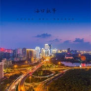

海口故事
============================

|  |  |
| :--: | :-- |
| [ 海口故事](https://emumo.xiami.com/album/2103722832) | **艺人**: [符禹迅](../index.md) **语种**: 国语 **唱片公司**: 独立发行 **发行时间**: 2018年05月29日 **专辑类别**: EP, 单曲 **专辑风格**: 流行 Pop, 国语流行 Mandarin Pop **播放数**: 853 **收藏数**: 0 **评论数**: 0  |

## 简介

 
 

低处的海浪，像昨天一样拍打着海滩，
 

摇曳 每一个婴儿的摇篮。
 

高处的楼房，像 昨天一样点亮着灯光，
 

照耀 每一个人的梦想。
 

 

## 曲目

## 评论

|  |  |  |  |
| :-- | :-- | :-- | :-- |
