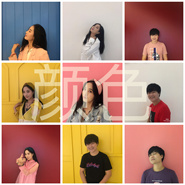
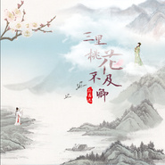
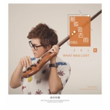

符禹迅
============================

|  |  |
| :--: | :-- |
| [ 符禹迅](https://i.xiami.com/fyx) | **地区**: China 中国大陆 **风格**: 国语流行 Mandarin Pop **播放数**: 1374686 **粉丝数**: 104 **评论数**: 12  |

## 档案

1982年11月18日出生于海南，天蝎座 
08年担任《蒙牛酸酸乳 成就音乐梦想》福建省南平赛区总决赛评委 
2010年“最美海口”旅游歌曲获得 优秀作品奖 
2012年海南省力加啤酒“乐活海南省”图，文，曲征集活动中荣获原创歌曲三等奖 
2013年湖南卫视快乐男声海南10强 
2013年担全国大学生校园歌手大赛海南大学总决赛评委 
2014年担任微电影《一帮十三》主题曲制作人 
2015年担任海南《首届电影节》现场音乐制作人 
2015年5月受邀在海口经济技术学院音乐厅担任音乐讲师，分享舞台经验与音乐制作 
2016年12月发行个人首张专辑《那些逝去的》并在中国沿海地区进行14场巡演 
2017年7月18号上海金色大厅发行《枯藤老树昏鸦》继唱单曲《小桥流水人家》 
2017年8月携《那些逝去的》及新单曲《小桥流水人家》走进社区巡演8场 
2017年9月发行新单曲《我想告诉你》 
2017年10月携新单《我想告诉你》走进社区巡演5场 
2017年首届原创海南音乐颁奖典礼入围“最佳作曲人”提名 
2017年首届原创海南音乐颁奖典礼荣获“最佳全能艺人奖” 
2018年2月发行单曲《我们》 
2018年4月发行单曲《解人颐》 
2018年7月发行单曲《海口故事》 
2018年8月发行单曲《第三种旅行》 
2018年9月坐客海南电视台综合频道《海南故事》特别节目《尊姓大名》担任符氏寻访人 
2018年10月发行单曲《颜色》 
2018年11月担任上海松江公益宣传片《松江》制作主题歌制作人 
2019年2月发行单曲《府城故事》

## 专辑

| 名称 | 语种 | 唱片公司 | 发行时间 | 专辑类别 | 专辑风格 |
| :--: | :-- | :-- | :-- | :-- | :-- |
| [ 承蒙遇见](./albums/2105043727.md) | 国语 | 回声文化 | 2019年07月30日 | EP, 单曲 |  |
| [ 老虎窗](./albums/2104808558.md) | 国语 | 回声文化 | 2019年04月25日 | EP, 单曲 | 国语流行 Mandarin Pop |
| [ 松江](./albums/2104724672.md) | 国语 | 回声文化 | 2019年03月28日 | EP, 单曲 | 国语流行 Mandarin Pop |
| [ 府城故事](./albums/2104611814.md) | 国语 | 回声文化 | 2019年02月21日 | EP, 单曲 | 国语流行 Mandarin Pop |
| [ 颜色](./albums/2104113385.md) | 国语 | 回声文化 | 2018年10月16日 | EP, 单曲 | 国语流行 Mandarin Pop |
| [ 海口故事](./albums/2103722832.md) | 国语 | 独立发行 | 2018年05月29日 | EP, 单曲 | 流行 Pop, 国语流行 Mandarin Pop |
| [ 解人颐](./albums/2103697057.md) | 国语 | 独立发行 | 2018年04月25日 | EP, 单曲 | 国语流行 Mandarin Pop |
| [ 我们](./albums/2103523236.md) | 国语 | 独立发行 | 2018年02月09日 | EP, 单曲 | 国语流行 Mandarin Pop, 城市民谣 Urban Folk |
| [ 小桥流水人家](./albums/2102906319.md) | 国语 | 独立发行 | 2017年11月06日 | EP, 单曲 | 国语流行 Mandarin Pop, 城市民谣 Urban Folk |
| [ 三里桃花不及卿](./albums/2102906321.md) | 国语 | 独立发行 | 2017年11月06日 | EP, 单曲 | 国语流行 Mandarin Pop |
| [ 洋浦的月光](./albums/2102906308.md) | 国语 | 独立发行 | 2017年11月06日 | EP, 单曲 | 城市民谣 Urban Folk, 国语流行 Mandarin Pop |
| [ 我想告诉你](./albums/2102885177.md) | 国语 | 独立发行 | 2017年09月20日 | EP, 单曲 | 流行 Pop, 城市民谣 Urban Folk |
| [ 洋浦小镇](./albums/2103711460.md) | 国语 | 三三零音乐 | 2016年09月13日 | EP, 单曲 |  |
| [ 那些逝去的](./albums/2100386082.md) | 国语 | 独立发行 | 2016年09月02日 | 录音室专辑 | 国语流行 Mandarin Pop, 城市民谣 Urban Folk |

## 评论

|  |  |  |
| :-- | :-- | :-- |
|  [虾米用户](https://emumo.xiami.com/u/22225463)   2020-08-11 08:45 赞(0) 踩(0) | 
为啥82的这么年轻
 |
|  [虾米用户](https://emumo.xiami.com/u/5555029) 我还没想好要写什么... 2020-07-07 11:43 赞(0) 踩(0) | 
偷偷留个言，证明我来过。
 |
|  [虾米用户](https://emumo.xiami.com/u/219461494)  2019-07-14 23:57 赞(0) 踩(0) | 
听着听着感觉真好听，想看看是谁的歌，一看海南同宗，符氏。为你感到骄傲
 |
|  [虾米用户](https://emumo.xiami.com/u/172239230) 音乐使人沉静 2019-04-14 08:49 赞(0) 踩(0) | 
第一次听到还是虾米推荐的，那首枯藤老树昏鸦，好像有点问题，唱到高潮忽然就没了呀
 |
|  [虾米用户](https://emumo.xiami.com/u/172239230) 音乐使人沉静 2019-04-14 08:48 赞(0) 踩(0) | 
哇塞 听你的歌声，心灵都很舒服
 |
|  [虾米用户](https://emumo.xiami.com/u/62458264) 哎呦我去，这家伙真懒什么... 2018-07-05 23:00 赞(0) 踩(0) | 
哈哈，我也是姓符关注了
 |
|  [虾米用户](https://emumo.xiami.com/u/249880711)  2017-12-31 07:35 赞(1) 踩(0) | 
我去，1118，我们同一天生日诶！！！真的
 |
|  [虾米用户](https://emumo.xiami.com/u/49222819)  2017-12-11 21:58 赞(0) 踩(0) | 
老乡。
 |
|  [虾米用户](https://emumo.xiami.com/u/18647141)   2017-10-23 11:13 赞(3) 踩(0) | 
我刚入驻了虾米音乐人，欢迎大家来我的个人主页，收听我的最新音乐
 |
|  [虾米用户](https://emumo.xiami.com/u/300419882)  2017-05-30 12:41 赞(0) 踩(0) | 
竟然是前十
 |
|  [虾米用户](https://emumo.xiami.com/u/300419882)  2017-05-30 12:41 赞(0) 踩(0) | 
我的妈 虾米的人也太少了吧
 |
|  [虾米用户](https://emumo.xiami.com/u/6187648) ✎。 2017-04-25 06:48 赞(0) 踩(0) | 
洋浦小镇呢 
 |
