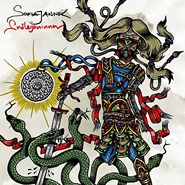

Sofia Jannok
============================

|  |  |
| :--: | :-- |
| [ Sofia Jannok](https://i.xiami.com/sofia) | **播放数**: 25210463 **粉丝数**: 18873 **评论数**: 694 **地区**: Sweden 瑞典 **风格**: 欧美流行 Western Pop, 流行 Pop  |

## 档案

小档案 
中   文   名   索非亚·詹娜克 
外   文   名   Sofia Jannok 
国        籍   瑞典 
民        族   萨米族人 
星        座   处女座 
出   生   地   Gallivare 
出生日期   1982-09-15 
职        业   歌手，主持人 
艺人资料 
索非亚·詹娜克出生于  1982  年九月十五日，萨米族人，是北欧最后的少数民族，人口一万左右。来自瑞典北端的小城市   Gällivare  （伊利瓦勒）。 
从她  11  岁那年登上舞台开始就在一直不停的歌唱，从那时起她便录制唱片，并演唱电影电视的音乐作品以其担当主持人，她主要以四种语言演唱歌曲：萨米族语言，英语，瑞典语，法语。演唱风格主要有：  Jojk.pop.jazz,  她的音乐通常阐释了开放空间这一主题。 
Sofia Jannok  出生于瑞典最北部的  Gallivare  ，她在歌声中流露出来的超出年龄的成熟和稳重来源于她丰富的舞台和创作经历。  11  岁登台演唱至今，  Sofia  已经带着她日渐成熟的音乐出现在了大大小小的舞台上、  CD  中、节日里，以及电视、电影中。瑞典作为北欧五国之一，一方面有它神奇、神秘的地方，而另一方面也从不缺少热情、充满动感的流行音乐。而作为“世界上最神秘的少数民族”的萨米族族人的  Sofia  ，在她身上也体现出了传统和现代彼此影响的影子。在  Sofia  歌曲的旋律中，爵士音符、流行元素，甚至是电子颗粒都隐约可见，另一方面，旋律中的  Yoik  （萨米族传统歌曲结构形式）也一直和现代成份形影不离，更不要提那些美妙又充满历史沉淀的萨米语的歌词，而更加精彩的是，在歌中，  Sofia  赞颂大自然，赞颂土地，也在积极感受着舞池和现代城市活力的脉搏。这种冲撞着的和谐使她的歌曲充满吸引力，同时也当之无愧地成为“瑞典之声”。 
于是，在这位“瑞典之声”的歌手的作品中，最具代表性以及占绝大多数的，还是萨米族传统的  Yoik  和以萨米语写成的歌曲。  2007  年的《  White  》和  2009  年的《  By The Embers  》里，  Sofia  的声音如天籁，虽然借用了相当多的现代元素，但  Yoik  的精魂始终如一。另一位用现代元素包装民族音乐的歌手是恩雅（  Enya  ），而  Sofia  与她又有所不同，相比  Enya  借用爱尔兰民族音乐作为素材，结合科技手段去营造意境，制造一种世界音乐的效果，  Sofia  却在始终如一地突出着萨米族  Yoik  的地位。在  Sofia  的音乐中充斥着两个词语：热情和冲突。来自  Yoik  的民族的热情和  Sofia  充满动感又百转千回的温婉声线使歌曲具有灵魂，另一方面，传统的萨米语、  Yoik  的编曲结构和现代元素交相辉映，既不彼此融合，但又相互点缀，十分别致。  Yoik  的结构形式很像是一种歌曲上的“比兴”手法，形式固定，内容也有条件，但每首歌总能在相同的条条框框中暗含着不同的情绪。专辑《  By The Embers  》的封套上  Sofia  的民族装扮再次印证了她的音乐方向，萨米是她的生命之根。 
2006  年，她与  Rikskonserter  共同完成了全瑞典和东南欧的巡演。 
2007  年  2  月发行了由  Svein Schultz  制作的独唱  CD  ，目前她正和她的乐队一起制作新的唱片名为《  White  》。 
2009  年发行专辑，名为《  By The Embers  》。 
2013  年  5  月发行录音室专辑《  Áphi (Wide As Oceans)  》。 
2016  年  4  月发行录音室专辑《  Orda - This Is My Land  》。 
Career and life 
Brita Maret "Sofia" Jannok (born September 15, 1982) is a Swedish-Sami artist, singer, songwriter and radio host. Several times, she has publicly taken a stance in social media against the establishment of mines on land used by Sami reindeer herders. Together with Mariela Idivuoma, she was hostess of the Liet-L  á  vlut music festival in 2006. She has also hosted the program ‘ Mailbmi - small people great music’ in Swedish Radio P2. Her music is inspired from diverse musical influences, like folk, pop, jazz and yoik. She sings mostly in Northern Sami, but also sings and writes lyrics in Swedish and English as well. 
Sofia previously performed with Anna Kärrstedt in the duo ‘ Sophia and Anna’ . She performed in Melodifestivalen 2009 with the song Waterloo in S  á  mi ("  Čá  hcceloo"). On June 30, 2009, she was one of the summer guest hosts on Swedish Radio P1. The day after, July 1, she participated in SVT's program from Skansen in Stockholm for the inauguration of the Swedish Presidency of the EU. At the opening meeting in the Parliament House in Stockholm on September 15, 2009, she performed "Samelands vidder." 
From May 23 in 2010, Jannok performed in various bars and clubs in Shanghai and Beijing, China. From June 4 2010, she attended the Talvatis Festival in Cardiff. 
During an inauguration of the Culture year in Umeå 2014 (Sami late winter) Sofia conducted a call of anti-racism with Cleo and Kristin Amparo before the performance of the song "Faller en, faller alla". On stage at the same time was also a group of left-wing anti-fascist activists wearing ski masks with the message "Free Joel" printed on their shirts, which alludes to the activist who was arrested and convicted for attempted manslaughter and rioting. By reason of the riots in Kärrtorp, when a group of Neo-Nazis attacked a left-wing anti-racism demonstration. 
‘Áphi (Wide As Oceans)’was released on May 2013. 
‘Orda - This Is My Land’ was released on April 2016.

## 专辑

| 名称 | 语种 | 唱片公司 | 发行时间 | 专辑类别 | 专辑风格 |
| :--: | :-- | :-- | :-- | :-- | :-- |
| [ Lávvu](./albums/5022393979.md) | 其他 |  | 2021年01月01日 | EP, 单曲 | 流行 Pop |
| [ Du behöver inte va rädd](./albums/5021300438.md) | 其他 | Despotz Records | 2020年05月29日 | 录音室专辑 | 流行 Pop |
| [ Orda - This Is My Land](./albums/2100300946.md) | 其他 | Gamlestans Grammofonbolag | 2016年04月08日 | 录音室专辑 | 世界音乐 World Music |
| [ ČUĐIT (colonizer)](./albums/2103663740.md) | 其他 | Gamlestans Grammofonbolag | 2016年04月08日 | EP, 单曲 |  |
| [ ORDA - This Is My Land](./albums/5020573099.md) | 其他 | Gamlestans Grammofonbolag | 2016年04月08日 | 录音室专辑 | 流行 Pop |
| [ THIS IS MY LAND / sápmi](./albums/2103663735.md) | 英语 | Gamlestans Grammofonbolag | 2016年02月06日 | EP, 单曲 |  |
| [ We Are Still Here](./albums/2103663705.md) | 英语 | Gamlestans Grammofonbolag | 2015年11月20日 | EP, 单曲 | 欧美流行 Western Pop |
| [ I ryggen på min kolt](./albums/2103663718.md) | 其他 | Gamlestans Grammofonbolag | 2015年06月08日 | EP, 单曲 |  |
| [ Snölejoninna](./albums/2103663690.md) | 其他 | Gamlestans Grammofonbolag | 2015年02月06日 | EP, 单曲 | 欧美流行 Western Pop |
| [ Áphi (Wide As Oceans)](./albums/1768437285.md) | 其他 | Songs to Arvas | 2013年05月08日 | 录音室专辑 | 挪威 | 哼唱 Joik, 欧美流行 Western Pop |
| [ Áhpi (Wide As Oceans)](./albums/2108172821.md) | Swedish | Songs to Arvas | 2013年05月08日 | EP, 单曲 | 欧美流行 Western Pop |
| [ Áhpi (Wide As Oceans) - Album Sampler](./albums/2108187390.md) | Swedish | Songs to Arvas | 2013年04月24日 | EP, 单曲 | 欧美流行 Western Pop |
| [ Golmma Almmi Baján (Thunder of Three Heavens)](./albums/2103663725.md) | 其他 | Songs to Arvas | 2013年04月12日 | EP, 单曲 |  |
| [ ViviAnn](./albums/2103663696.md) | 其他 | Songs to Arvas | 2013年03月04日 | EP, 单曲 |  |
| [ Assogattis: By The Embers](./albums/337659.md) | 其他 | Caprice | 2009年01月30日 | 录音室专辑 | 挪威 | 哼唱 Joik, 欧美流行 Western Pop |
| [ White](./albums/337658.md) | 英语 | DAT | 2007年03月26日 | 录音室专辑 | 挪威 | 哼唱 Joik, 欧美流行 Western Pop |

## 评论

|  |  |  |  |
| :-- | :-- | :-- | :-- |
|  [虾米用户](https://emumo.xiami.com/u/34313941) 面朝大海，春暖花开。 2020-11-24 17:54 赞(1) 踩(0) | 
啊啊啊，上海11.26有巡演！
 |
|  [虾米用户](https://emumo.xiami.com/u/276944698) 不要自我设限..... 2020-09-27 22:18 赞(0) 踩(0) | 
✅✅✅
 |
|  [虾米用户](https://emumo.xiami.com/u/421490780) 承认自己不完美 2020-06-10 01:05 赞(0) 踩(0) | 
前段时间突然很想听这首歌，用小度搜索无果，今天在虾米推荐的歌单里听到，觉得很惊喜，喜欢这种节奏柔缓，声音澄澈的音乐。愿一切所思所想终成现实。
 |
|  [虾米用户](https://emumo.xiami.com/u/319540065) 不擅长任何事喜欢自言自语 2020-05-02 08:34 赞(0) 踩(0) | 
J
 |
|  [虾米用户](https://emumo.xiami.com/u/423020771)  2020-04-19 18:08 赞(0) 踩(0) | 
在那里，时光都是慢的&amp;hellip;&amp;hellip;
 |
|  [虾米用户](https://emumo.xiami.com/u/349512513) 无欲无求 2020-01-12 18:13 赞(0) 踩(0) | 
加油期待你更好的灵魂作品
 |
|  [虾米用户](https://emumo.xiami.com/u/42405531) 再见虾米 2019-10-21 19:43 赞(0) 踩(0) | 
又是瑞典，自从听Kent以后感觉全天下好听的歌大都在北欧特别是瑞典。
 |
|  [虾米用户](https://emumo.xiami.com/u/27606761) 我没有那么多故事，但故事... 2019-07-30 12:08 赞(3) 踩(0) | 
八年前机缘巧合在学校宿舍不知道干啥就听到了这首歌，瞬间一种美妙惊艳感，记得当时不知道歌名，还问了好几个平时听歌范围广的同学，终于有位同学在自己的mp3里找到了这首歌，当时是着了迷一直反复听，还设置成了qzone背景音乐。到如今，在繁忙琐碎多少多少含有无奈的工作生活中再听这首歌，是一种对心灵的完全放松，躺在床上闭上眼睛戴上耳机，似春风安抚过浮躁的心渐渐安宁，仿佛这种宁静美好的日子我正拥有着。
 |
| ⇒ |  [虾米用户](https://emumo.xiami.com/u/48522267)  2019-10-24 14:13 赞(0) 踩(0) | 
是liekkas么
 |
| ⇒ |  [虾米用户](https://emumo.xiami.com/u/48522267)  2019-10-24 14:13 赞(0) 踩(0) | 
是liekkas么
 |
|  [虾米用户](https://emumo.xiami.com/u/426393136)  2019-06-30 20:21 赞(0) 踩(0) | 
ahhhhhhhluv u!
 |
|  [虾米用户](https://emumo.xiami.com/u/421336987) 音乐如诗，音乐如画，陶醉... 2019-06-20 09:03 赞(3) 踩(0) | 
索非亚·詹娜克出生于1982年九月十五日，萨米族人，是北欧最后的少数民族，人口一万左右。来自瑞典北端的小城市伊利瓦勒。 从她11岁那年登上舞台开始就在一直不停的歌唱，从那时起她便录制唱片，并演唱电影电视的音乐作品以其担当主持人，她主要以四种语言演唱歌曲：萨米族语言，英语，瑞典语，法语。她的音乐通常阐释了开放空间这一主题。
 |
|  [虾米用户](https://emumo.xiami.com/u/317984865)  2019-05-31 08:30 赞(0) 踩(0) | 
我才知道来中国    
 |
|  [虾米用户](https://emumo.xiami.com/u/85568296) 只有阳光而无阴影 只有欢... 2019-05-28 05:35 赞(0) 踩(0) | 
美妙的歌声~
 |
|  [虾米用户](https://emumo.xiami.com/u/320754158)  2019-05-25 18:21 赞(1) 踩(0) | 
过
 |
|  [虾米用户](https://emumo.xiami.com/u/50171518) 此号报销 2019-05-08 18:33 赞(0) 踩(0) | 
~
 |
|  [虾米用户](https://emumo.xiami.com/u/228843687) 懒惰统治人间 2019-04-10 22:25 赞(0) 踩(0) | 
真心喜欢
 |
|  [虾米用户](https://emumo.xiami.com/u/329186377)  2018-10-26 15:44 赞(0) 踩(0) | 
说不出这歌什么感觉，就是舒服。偶然的推送。
 |
|  [虾米用户](https://emumo.xiami.com/u/274444397) 心鸣 2018-08-26 19:00 赞(3) 踩(0) | 
纯厚中浸着甜美，朴实中透着华丽。委婉中蕴着执着，音域中涵着大气。
 |
|  [虾米用户](https://emumo.xiami.com/u/343181071) 音樂系冇有國界嘅 2018-07-15 16:17 赞(1) 踩(0) | 
Liekkas是不是北萨米语啊。。。
 |
|  [虾米用户](https://emumo.xiami.com/u/15358782)  2018-01-08 21:06 赞(1) 踩(0) | 
想起泊小豆了，当年他的爷爷和我那篇文章，配上这首歌，哭得我肝肠寸断。
 |
|  [虾米用户](https://emumo.xiami.com/u/43285301) 我还没想好要写什么... 2017-12-24 23:22 赞(2) 踩(0) | 
不求像她一样优秀，只为摸一摸她的奖杯
 |
|  [虾米用户](https://emumo.xiami.com/u/340170870)  2017-12-16 23:02 赞(1) 踩(0) | 
好希望网易能解锁这首。为了这首下了虾米。
 |
|  [虾米用户](https://emumo.xiami.com/u/44674782)  2017-11-26 19:38 赞(21) 踩(0) | 
昨晚在B10听了现场，一直沉醉在她都声音中，仿佛一天的疲惫都不见了
 |
| ⇒ |  [虾米用户](https://emumo.xiami.com/u/269082446)  2018-04-12 08:04 赞(0) 踩(0) | 
^_^
 |
| ⇒ |  [虾米用户](https://emumo.xiami.com/u/928156)  2019-07-08 23:32 赞(0) 踩(0) | 
啊，用错过了，今年还来吗
 |
|  [虾米用户](https://emumo.xiami.com/u/270438310)  2017-11-09 23:30 赞(2) 踩(0) | 
我要上班了 不能看演唱会了
 |
|  [虾米用户](https://emumo.xiami.com/u/17132003) 一个开始认真养虾米的人 2017-11-08 22:48 赞(2) 踩(0) | 
竟然来巡演了 赶紧买票！
 |
|  [虾米用户](https://emumo.xiami.com/u/291007349)  2017-11-07 17:09 赞(0) 踩(0) | 
新专辑几时出来啊
 |
|  [虾米用户](https://emumo.xiami.com/u/3467408) 　　　　　　　　 　  ... 2017-10-28 00:17 赞(17) 踩(0) | 
上帝是公平的、虽然没有赐予她美丽的面孔、却给予了她让人惊艳嗓音、
 |
| ⇒ |  [虾米用户](https://emumo.xiami.com/u/142715758)  2018-01-30 17:01 赞(0) 踩(0) | 
但我觉得很美，金发蓝眼白肤
 |
| ⇒ |  [虾米用户](https://emumo.xiami.com/u/318150636)  2019-04-20 17:34 赞(0) 踩(0) | 
着魔
 |
| ⇒ |  [虾米用户](https://emumo.xiami.com/u/318481269) STAY 2019-07-01 08:14 赞(0) 踩(0) | 
人家长得也不错啊 
 |
|  [虾米用户](https://emumo.xiami.com/u/43362186)   2017-10-28 00:15 赞(1) 踩(0) | 
哪位大湿兄或大湿姐重新上传一个专辑，把liekkas传上，估计是那张专辑的上传者屁股疼了，把那首本来有的歌删了，虾米不能没有这首神曲...
 |
|  [虾米用户](https://emumo.xiami.com/u/253919339) 面向大海，春暖花开 2017-10-10 19:27 赞(0) 踩(0) | 
好好听&amp;hellip;&amp;hellip;
 |
|  [虾米用户](https://emumo.xiami.com/u/264283064) bye  2017-08-07 13:22 赞(0) 踩(0) | 
△
 |
|  [虾米用户](https://emumo.xiami.com/u/804578)  2017-07-26 10:27 赞(2) 踩(0) | 
每次忙完一天的工作，回到车里，关上车窗，就忍不住打开她的音乐，能让人放松、自在！
 |
|  [虾米用户](https://emumo.xiami.com/u/43980967)  2016-09-19 15:44 赞(4) 踩(0) | 
Sofia Jannok - Liekkas
 |
|  [虾米用户](https://emumo.xiami.com/u/7269731) 謎樣跨次元喵¤電波星¤ 2016-08-24 19:02 赞(10) 踩(0) | 
好溫暖，有一種北歐特有的純淨味道。
 |
|  [虾米用户](https://emumo.xiami.com/u/52056952) 人生即是到來、相遇、陪伴... 2016-07-14 14:36 赞(0) 踩(0) | 

 |
|  [虾米用户](https://emumo.xiami.com/u/11298367)  2016-03-23 20:39 赞(2) 踩(0) | 
纯净内心，堪比佛曲，比佛曲好听
 |
|  [虾米用户](https://emumo.xiami.com/u/1733757) 暂无签名~ 2015-11-18 21:33 赞(3) 踩(0) | 
不开心 好多歌都下架……虾米不给力了
 |
|  [虾米用户](https://emumo.xiami.com/u/4204438) 我欣赏你们不欣赏的东西。 2015-11-01 18:53 赞(1) 踩(0) | 
越来越多的歌曲被下架
 |
|  [虾米用户](https://emumo.xiami.com/u/37098145) 这个家伙太蠢了不会留下什... 2015-10-20 05:09 赞(1) 踩(0) | 
wk
 |
|  [虾米用户](https://emumo.xiami.com/u/30555168)  2015-10-19 21:26 赞(2) 踩(0) | 
听了一天 越听越压抑
 |
|  [虾米用户](https://emumo.xiami.com/u/450120) 你喂我吃垃圾 我就在垃圾... 2015-10-18 14:43 赞(3) 踩(0) | 
《White》这种专辑的话，推荐《Mu Moras》 ，如遁入某个朦胧氛围里，高端段落后面的那个转音一下子就超脱现实了....
 |
|  [虾米用户](https://emumo.xiami.com/u/13097036) Y(^_^)Y誰也和我一... 2015-10-05 01:00 赞(10) 踩(0) | 
听说万能的虾米可以帮忙找到男朋友哦，我来试试～～～～    
 |
| ⇒ |  [虾米用户](https://emumo.xiami.com/u/328838769)  2018-01-06 12:33 赞(0) 踩(0) | 
现在有男朋友了吗
 |
| ⇒ |  [虾米用户](https://emumo.xiami.com/u/364546789) 嘛！这个还差点意思 2021-01-26 21:15 赞(0) 踩(0) | 
现在有了吧！
 |
|  [虾米用户](https://emumo.xiami.com/u/71079286) 爱生活爱音乐 2015-10-02 13:17 赞(1) 踩(0) | 
感伤 却可以让我安静 动人心弦 
 |
|  [虾米用户](https://emumo.xiami.com/u/46287668)  2015-08-18 23:27 赞(1) 踩(0) | 
美无关外在。治愈就这么简单
 |
|  [虾米用户](https://emumo.xiami.com/u/44397210)  2015-08-18 16:43 赞(4) 踩(0) | 
最喜欢的外文歌了，音乐无国界，音乐本身就非常动人了。
 |
|  [虾米用户](https://emumo.xiami.com/u/54826312)  2015-08-09 02:14 赞(2) 踩(0) | 
空灵、飘渺，喜欢
 |
|  [虾米用户](https://emumo.xiami.com/u/52678252) 我还没想好要写什么... 2015-07-29 00:41 赞(0) 踩(0) | 

 |
|  [虾米用户](https://emumo.xiami.com/u/3191342)  2015-07-13 02:18 赞(2) 踩(0) | 
Liekkas上架了！！！！
 |
|  [虾米用户](https://emumo.xiami.com/u/48939367) 留下我的爪印，证明我来过 2015-07-07 21:30 赞(10) 踩(0) | 
leikkas上架了！
 |
|  [虾米用户](https://emumo.xiami.com/u/701951)  2015-07-05 11:33 赞(0) 踩(0) | 
挪威
 |
|  [虾米用户](https://emumo.xiami.com/u/42851769)   2015-06-22 00:38 赞(2) 踩(0) | 
曲子好美，心都融化了
 |
|  [虾米用户](https://emumo.xiami.com/u/48856766)  2015-06-04 20:08 赞(4) 踩(0) | 
为什么还不上架……我的liekkas
 |
|  [虾米用户](https://emumo.xiami.com/u/29197411) 我还没想好要写什么... 2015-05-17 15:46 赞(3) 踩(0) | 
Liekkas 什么时候才能上架啊
 |
| ⇒ |  [虾米用户](https://emumo.xiami.com/u/48856766)  2015-06-04 20:04 赞(0) 踩(0) | 
对啊 同问
 |
|  [虾米用户](https://emumo.xiami.com/u/3181391) 一期一会 2015-05-17 04:47 赞(1) 踩(0) | 
以前只是一个泛泛的印象 因为音乐越来越喜欢北欧
 |
|  [虾米用户](https://emumo.xiami.com/u/9295999) 身上没有钱 心里没有诗 2015-05-03 18:36 赞(0) 踩(0) | 
虾米没屁股
 |
|  [虾米用户](https://emumo.xiami.com/u/34547533) Though I tak... 2015-05-02 16:06 赞(1) 踩(0) | 
Liekkas......
 |
|  [虾米用户](https://emumo.xiami.com/u/37101131)  2015-04-08 23:14 赞(0) 踩(0) | 
Liekkas下架了？！
 |
|  [虾米用户](https://emumo.xiami.com/u/15358782)  2015-04-06 11:33 赞(0) 踩(0) | 
为什么不能听了！能不能续约啊！
 |
|  [虾米用户](https://emumo.xiami.com/u/7322777) ∮ 2015-03-22 14:10 赞(0) 踩(0) | 
收
 |
|  [虾米用户](https://emumo.xiami.com/u/3512516)  2015-03-19 20:05 赞(0) 踩(0) | 
Liekkas哪去了
 |
|  [虾米用户](https://emumo.xiami.com/u/20869567) 莱斯特小姐，我觉得爱是想... 2015-03-17 22:57 赞(0) 踩(0) | 
谁告诉我liekkas去哪儿了？！
 |
|  [虾米用户](https://emumo.xiami.com/u/10737421)  2015-03-16 16:51 赞(0) 踩(0) | 
声音甜甜的
 |
|  [虾米用户](https://emumo.xiami.com/u/3429606)  2015-03-08 20:48 赞(3) 踩(0) | 
内容已删除
 |
| ⇒ |  [虾米用户](https://emumo.xiami.com/u/696090) 暂无签名~ 2015-04-15 19:12 赞(0) 踩(0) | 
打广告 我的无损包<a href="http://www.xiami.com/collect/7541010?spm=a1z1s.6843761.226669510.19.DPRWyg" target="_blank" rel="nofollow noreferrer noopener">http://www.xiami.com/collect/7541010?spm=a1z1s.6843761.226669510.19.DPRWyg</a>
 |
| ⇒ |  [虾米用户](https://emumo.xiami.com/u/16646272)  2015-04-21 22:13 赞(0) 踩(0) | 
请问有mp3版本的吗？谢谢
 |
|  [虾米用户](https://emumo.xiami.com/u/29197411) 我还没想好要写什么... 2015-03-08 01:24 赞(0) 踩(0) | 
Liekkas呢！！！！
 |
|  [虾米用户](https://emumo.xiami.com/u/34338348) 我还没想好要写什么... 2015-02-17 18:15 赞(0) 踩(0) | 
她笑起来其实蛮好看的，有着暖心笑容的萨米女孩
 |
|  [虾米用户](https://emumo.xiami.com/u/9850446) 心有猛虎，细嗅蔷薇。 2015-02-12 17:10 赞(0) 踩(0) | 
Liekkas
 |
|  [虾米用户](https://emumo.xiami.com/u/6762250) 暂无签名~ 2015-01-25 13:32 赞(0) 踩(0) | 
头像错了
 |
|  [虾米用户](https://emumo.xiami.com/u/3172836) 暂无签名~ 2015-01-22 16:15 赞(0) 踩(0) | 
带着圣诞帽的那张怎么看着跟Taylor Swift张的那么像！！！不会是编辑搞错了吧？
 |
|  [虾米用户](https://emumo.xiami.com/u/1782530)  2015-01-21 14:36 赞(0) 踩(0) | 
这封面好像TS…………
 |
|  [虾米用户](https://emumo.xiami.com/u/3191342)  2015-01-19 21:59 赞(0) 踩(0) | 
同问，Liekkas呢，为什么只有MV？
 |
|  [虾米用户](https://emumo.xiami.com/u/35927132)  2015-01-19 01:28 赞(0) 踩(0) | 
Liekkas呢，只有MV的了？！还有头像为什么是霉！！
 |
|  [虾米用户](https://emumo.xiami.com/u/1681146) 不觉中老梅收听一万四！ 2015-01-17 19:10 赞(0) 踩(0) | 
头像谁改的泥煤！
 |
|  [虾米用户](https://emumo.xiami.com/u/43362186)   2015-01-11 21:51 赞(0) 踩(0) | 
屁股疼，虾米！
 |
|  [虾米用户](https://emumo.xiami.com/u/43362186)   2015-01-11 20:29 赞(2) 踩(0) | 
Liekkas不见了？虾米有病吧你，靠！
 |
|  [虾米用户](https://emumo.xiami.com/u/45796473) 我还没想好要写什么... 2015-01-09 09:48 赞(0) 踩(0) | 
好听
 |
|  [虾米用户](https://emumo.xiami.com/u/45253625)  2014-12-24 22:04 赞(0) 踩(0) | 
旋律动听，歌曲欢快
 |
|  [虾米用户](https://emumo.xiami.com/u/44253031)  2014-12-17 11:17 赞(53) 踩(0) | 
32岁的亨利就坐在那里,深情的目光望过去,都是自己22岁的影子!
 |
| ⇒ |  [虾米用户](https://emumo.xiami.com/u/7359797) ============ 2014-12-23 02:35 赞(0) 踩(0) | 
37岁的亨利现已退役，最后一趟列车把他带回了伦敦，离他以教练的身份回归枪手，已然买进了一步
 |
| ⇒ |  [虾米用户](https://emumo.xiami.com/u/44253031)  2014-12-26 19:30 赞(0) 踩(0) | 
<q><b>鬼栩元说：</b></q>
 |
| ⇒ |  [虾米用户](https://emumo.xiami.com/u/50338384)  2015-05-25 22:55 赞(0) 踩(0) | 
我也正是因此喜爱上这首歌
 |
| ⇒ |  [虾米用户](https://emumo.xiami.com/u/72570636)  2015-10-16 13:53 赞(0) 踩(0) | 
天下的球球。。能把人煽的老泪横飙
 |
| ⇒ |  [虾米用户](https://emumo.xiami.com/u/365550760)  2019-04-11 22:30 赞(0) 踩(0) | 
想求问这个是什么联系呀~是什么电影吗yyy
 |
|  [虾米用户](https://emumo.xiami.com/u/19354622)  2014-11-22 11:04 赞(0) 踩(0) | 
听起来舒服
 |
|  [虾米用户](https://emumo.xiami.com/u/4927040) faded 2014-11-19 22:07 赞(0) 踩(0) | 
萨米人么
 |
|  [虾米用户](https://emumo.xiami.com/u/41797216)  2014-11-18 23:21 赞(0) 踩(0) | 
天籁之声
 |
|  [虾米用户](https://emumo.xiami.com/u/41797216)  2014-11-10 22:56 赞(0) 踩(0) | 
轻唱浅吟，我喜欢
 |
|  [虾米用户](https://emumo.xiami.com/u/42606429) 总有人在你看不见的地方拯... 2014-10-28 16:53 赞(0) 踩(0) | 
空灵的声音~好美
 |
|  [虾米用户](https://emumo.xiami.com/u/40718489)  2014-10-23 00:22 赞(0) 踩(0) | 
很喜欢
 |
|  [虾米用户](https://emumo.xiami.com/u/10937472) 吉他版 2014-10-22 09:13 赞(0) 踩(0) | 
喜欢
 |
|  [虾米用户](https://emumo.xiami.com/u/11515590) moigoo 2014-10-08 07:31 赞(0) 踩(0) | 
I LIKE HER VOICE.
 |
|  [虾米用户](https://emumo.xiami.com/u/1670161)  2014-09-17 17:20 赞(1) 踩(0) | 
听醉了
 |
|  [虾米用户](https://emumo.xiami.com/u/41291616)  2014-09-17 15:43 赞(0) 踩(0) | 
不错，搜藏了
 |
|  [虾米用户](https://emumo.xiami.com/u/36499915)  2014-08-03 20:38 赞(0) 踩(0) | 
清冽
 |
|  [虾米用户](https://emumo.xiami.com/u/37798928)  2014-07-11 19:02 赞(0) 踩(0) | 
好听
 |
|  [虾米用户](https://emumo.xiami.com/u/30844192) 清晨 音乐 阳光    ... 2014-07-08 11:25 赞(0) 踩(0) | 
来自北极的清冽歌声 很喜欢
 |
|  [虾米用户](https://emumo.xiami.com/u/9730064) 纯音党 2014-06-26 10:45 赞(0) 踩(0) | 
就因为Liekkas  收藏了你
 |
|  [虾米用户](https://emumo.xiami.com/u/11901452)  2014-06-22 15:12 赞(0) 踩(0) | 
北欧,神一般的存在,,,,,,,,,,,,,
 |
|  [虾米用户](https://emumo.xiami.com/u/12849864) 无污染，抗虫害。 2014-06-05 08:58 赞(0) 踩(0) | 
来自北极圈的清冽吟唱。
 |
|  [虾米用户](https://emumo.xiami.com/u/11363615) 我还没想好要写什么... 2014-05-25 10:07 赞(0) 踩(0) | 
第一首很经典啊。
 |
|  [虾米用户](https://emumo.xiami.com/u/15474157) 你是人间四月天~ 2014-04-19 09:44 赞(0) 踩(0) | 
我想和你去北极，一起驾驶着萨摩耶拉的雪橇住在一个冰块搭成的圆形小屋和你看极光~
 |
|  [虾米用户](https://emumo.xiami.com/u/35174748) 音乐会说话。 2014-04-13 23:15 赞(0) 踩(0) | 
今日睡前歌曲，来自瑞典的歌者，“索菲亚”感受不同音乐，语言的安静吧。
 |
|  [虾米用户](https://emumo.xiami.com/u/2521723)  2014-04-13 17:28 赞(0) 踩(0) | 
老婆介绍的，肯定没错。合适在店里放，很棒。
 |
|  [虾米用户](https://emumo.xiami.com/u/1674050) 我爱吃鸡蛋。 2014-04-05 10:50 赞(1) 踩(0) | 
这种人应该是国宝级的
 |
|  [虾米用户](https://emumo.xiami.com/u/3940515)  2014-03-29 11:59 赞(0) 踩(0) | 
挪威 sofia jannok
 |
|  [虾米用户](https://emumo.xiami.com/u/9335031)  2014-03-28 11:51 赞(0) 踩(0) | 
纯净的哼唱
 |
|  [虾米用户](https://emumo.xiami.com/u/9335031)  2014-03-28 11:50 赞(0) 踩(0) | 
在朋友的婚礼上听到的Liekkas 的乐器版，很美，今天终于听到了原唱
 |
| ⇒ |  [虾米用户](https://emumo.xiami.com/u/3322775) I love you s... 2015-05-26 22:19 赞(0) 踩(0) | 
王勇？
 |
|  [虾米用户](https://emumo.xiami.com/u/5691092) 爱生活 爱音乐 爱影视 2014-03-08 12:08 赞(0) 踩(0) | 
记得以前收藏过的吖。
 |
|  [虾米用户](https://emumo.xiami.com/u/3719569)  2014-03-07 00:24 赞(0) 踩(0) | 
柔和而干净的嗓音，感动之余也放飞了心灵。
 |
|  [虾米用户](https://emumo.xiami.com/u/601978)  2014-02-17 10:40 赞(33) 踩(0) | 
9月来中国巡演，8站！
 |
| ⇒ |  [虾米用户](https://emumo.xiami.com/u/614209)   2014-05-11 10:59 赞(0) 踩(0) | 
能具体介绍一点吗，网上没查到？
 |
| ⇒ |  [虾米用户](https://emumo.xiami.com/u/601978)  2014-05-12 11:07 赞(0) 踩(0) | 
<q><b>N46664说：</b></q>
 |
| ⇒ |  [虾米用户](https://emumo.xiami.com/u/614209)   2014-05-12 12:58 赞(0) 踩(0) | 
<q><b>6978说：</b></q>
 |
| ⇒ |  [虾米用户](https://emumo.xiami.com/u/54505179) what had Jes... 2017-10-07 01:39 赞(0) 踩(0) | 
今年11月底应该要来了
 |
| ⇒ |  [虾米用户](https://emumo.xiami.com/u/54505179) what had Jes... 2017-10-07 01:40 赞(0) 踩(0) | 
<q><b>N46664说：</b></q>
 |
| ⇒ |  [虾米用户](https://emumo.xiami.com/u/4346212) 午后的云朵很轻，树下的影... 2017-10-25 19:27 赞(0) 踩(0) | 
<q><b>Jennyfrflood说：</b></q>
 |
| ⇒ |  [虾米用户](https://emumo.xiami.com/u/332522811)  2019-04-21 00:24 赞(0) 踩(0) | 
哇 五年了
 |
|  [虾米用户](https://emumo.xiami.com/u/7392223)  2014-02-11 23:31 赞(1) 踩(0) | 
一直没有把她收藏进虾米里。现在好生收藏起来：）
 |
|  [虾米用户](https://emumo.xiami.com/u/31243519) 暂无签名~ 2014-01-07 20:29 赞(0) 踩(0) | 
没道理的喜欢。
 |
|  [虾米用户](https://emumo.xiami.com/u/3958737)  2014-01-06 14:36 赞(0) 踩(0) | 
亨利！！！
 |
|  [虾米用户](https://emumo.xiami.com/u/13621629) Music world 2013-11-21 14:23 赞(0) 踩(0) | 
因为Liekkas喜欢上她，好清澈好美的声音。
 |
|  [虾米用户](https://emumo.xiami.com/u/11699681)  2013-11-15 15:03 赞(0) 踩(0) | 
收了
 |
|  [虾米用户](https://emumo.xiami.com/u/25594026) new soul 2013-11-02 22:52 赞(0) 踩(0) | 
听了就知道
 |
|  [虾米用户](https://emumo.xiami.com/u/25594026) new soul 2013-11-02 22:50 赞(0) 踩(0) | 
超爱
 |
|  [虾米用户](https://emumo.xiami.com/u/14972652)  2013-10-28 23:21 赞(0) 踩(0) | 
温柔如海的声音。。。。。。
 |
|  [虾米用户](https://emumo.xiami.com/u/2048100) VoIcE~ 2013-10-13 22:17 赞(0) 踩(0) | 
Liekkas~
 |
|  [虾米用户](https://emumo.xiami.com/u/23065023)  2013-10-13 21:25 赞(1) 踩(0) | 
瑞典
 |
|  [虾米用户](https://emumo.xiami.com/u/422663)  2013-09-27 00:16 赞(0) 踩(0) | 
如流过心间的清泉，温柔安抚我心。一听这首歌，什么样的情绪都能安定下来。
 |
|  [虾米用户](https://emumo.xiami.com/u/1144388)  2013-08-27 16:58 赞(0) 踩(0) | 
清爽、舒心……足以！
 |
|  [虾米用户](https://emumo.xiami.com/u/3302026)  2013-08-10 17:06 赞(0) 踩(0) | 
一首liekkas足以让我喜欢上她，何况她的相似艺人里面还有Amy Dia呢mond
 |
|  [虾米用户](https://emumo.xiami.com/u/3302026)  2013-08-10 17:06 赞(0) 踩(0) | 
一首liekkas足以让我喜欢上她，何况她的相似艺人里面还有Amy Dia呢mond
 |
|  [虾米用户](https://emumo.xiami.com/u/12522950) 彪说六道 2013-07-15 13:16 赞(0) 踩(0) | 
每天零点，总会响起缓缓的安静
 |
|  [虾米用户](https://emumo.xiami.com/u/5783598) 我还没想好要写什么... 2013-06-30 22:11 赞(76) 踩(0) | 
我想去世界最北端...然后养一群萨摩耶...
 |
| ⇒ |  [虾米用户](https://emumo.xiami.com/u/7133174) 我还没想好要写什么... 2013-11-14 00:42 赞(0) 踩(0) | 
？
 |
| ⇒ |  [虾米用户](https://emumo.xiami.com/u/5783598) 我还没想好要写什么... 2013-11-14 08:11 赞(0) 踩(0) | 
<q><b>Blue Runner说：</b></q>
 |
| ⇒ |  [虾米用户](https://emumo.xiami.com/u/5761308) B站 ： 昕昊 2016-03-09 22:48 赞(0) 踩(0) | 
北欧没有萨摩耶。。 你说的那是俄罗斯
 |
| ⇒ |  [虾米用户](https://emumo.xiami.com/u/5783598) 我还没想好要写什么... 2016-03-10 10:15 赞(0) 踩(0) | 
<q><b>昕昊说：</b></q>
 |
| ⇒ |  [虾米用户](https://emumo.xiami.com/u/5761308) B站 ： 昕昊 2016-03-10 12:27 赞(0) 踩(0) | 
<q><b>angelfish说：</b></q>
 |
| ⇒ |  [虾米用户](https://emumo.xiami.com/u/5783598) 我还没想好要写什么... 2016-03-14 09:06 赞(0) 踩(0) | 
<q><b>昕昊说：</b></q>
 |
| ⇒ |  [虾米用户](https://emumo.xiami.com/u/337433512) 安静 2018-01-10 22:21 赞(0) 踩(0) | 
啦啦啦，去萨米的带我一个
 |
| ⇒ |  [虾米用户](https://emumo.xiami.com/u/20906363)   2018-07-11 21:36 赞(0) 踩(0) | 
有机会一起去吧
 |
|  [虾米用户](https://emumo.xiami.com/u/5783598) 我还没想好要写什么... 2013-06-30 22:11 赞(0) 踩(0) | 
我想去世界最北端。。
 |
|  [虾米用户](https://emumo.xiami.com/u/16263850) 下架鸡柳的肯德基不迷人了... 2013-06-30 14:41 赞(0) 踩(0) | 
今天是第一次听，第一首歌就听到心里！
 |
|  [虾米用户](https://emumo.xiami.com/u/6788176)  2013-06-20 08:18 赞(1) 踩(0) | 
天籁之音
 |
|  [虾米用户](https://emumo.xiami.com/u/14372764)  2013-06-17 09:32 赞(0) 踩(0) | 
天籁之音！
 |
|  [虾米用户](https://emumo.xiami.com/u/12756890) 杉妮 2013-06-13 21:57 赞(0) 踩(0) | 
liekkas,so soft ,so lovely ,so touching ,and so beautiful song !
 |
|  [虾米用户](https://emumo.xiami.com/u/7574892)  2013-06-12 10:48 赞(0) 踩(0) | 
找到了！
 |
|  [虾米用户](https://emumo.xiami.com/u/9342084) 素其位而行 2013-06-09 15:37 赞(1) 踩(0) | 
想问多少人是冲《爷爷和我》来的。。。。
 |
| ⇒ |  [虾米用户](https://emumo.xiami.com/u/1272599) o_OL.pinme 2013-06-10 14:20 赞(0) 踩(0) | 
那是什么。。。
 |
| ⇒ |  [虾米用户](https://emumo.xiami.com/u/1272599) o_OL.pinme 2013-06-10 14:32 赞(0) 踩(0) | 
找到一个故事，不过按楼下说法应该是个视频=。=
 |
| ⇒ |  [虾米用户](https://emumo.xiami.com/u/9342084) 素其位而行 2013-06-12 09:44 赞(0) 踩(0) | 
<q><b>M&amp;Y说：</b></q>
 |
| ⇒ |  [虾米用户](https://emumo.xiami.com/u/1272599) o_OL.pinme 2013-06-12 10:00 赞(0) 踩(0) | 
<q><b>黄后大道西西西说：</b></q>
 |
|  [虾米用户](https://emumo.xiami.com/u/13732072)  2013-06-07 21:34 赞(0) 踩(0) | 
很美的一首歌，配上《爷爷和我》，更加动人
 |
|  [虾米用户](https://emumo.xiami.com/u/1087983)  2013-06-07 08:38 赞(0) 踩(0) | 
liekkas这首很喜欢
 |
|  [虾米用户](https://emumo.xiami.com/u/8203835) 这世界，我曾经生活过 2013-06-02 00:43 赞(0) 踩(0) | 
忧伤的让人留恋不舍。
 |
|  [虾米用户](https://emumo.xiami.com/u/8935751) COBHC 2013-05-19 22:13 赞(0) 踩(0) | 
托雷斯回归  no.1
 |
|  [虾米用户](https://emumo.xiami.com/u/2373039) 暂无签名~ 2013-05-19 14:50 赞(0) 踩(0) | 
轻雅
 |
|  [虾米用户](https://emumo.xiami.com/u/916283)  2013-05-17 01:16 赞(1) 踩(0) | 
还是assogattis那盘专辑更棒
 |
|  [虾米用户](https://emumo.xiami.com/u/15281739)  2013-05-15 21:55 赞(0) 踩(0) | 
soul
 |
|  [虾米用户](https://emumo.xiami.com/u/11159124) 今生都是第一次。 2013-05-14 14:15 赞(0) 踩(0) | 
晚上听会更有的感觉的。
 |
|  [虾米用户](https://emumo.xiami.com/u/4544) 我继续，你要随意 2013-05-14 13:08 赞(2) 踩(0) | 
Sofia Jannok的音乐是一首首北欧风景诗，满脑子都是接近天堂般的梦幻的美好，一尘不染，清净神圣。似乎从她的歌声里，你听得到大自然最真实和奇妙的共鸣，与天相接，与地相应。来自北欧瑞典的Sofia Jannok用2013年的全新专辑又一次让人幻化在了斯堪的纳维亚半岛的美妙中。
 |
|  [虾米用户](https://emumo.xiami.com/u/486995)  2013-05-13 18:42 赞(0) 踩(0) | 
[POP] 全国首发 Sofia Jannok - Aphi (Wide As Oceans) 心似海洋[V0MP3]<a href="http://bbs.musicool.cn/thread-450612-1-1.html" target="_blank" rel="nofollow noreferrer noopener">http://bbs.musicool.cn/thread-450612-1-1.html</a>
 |
|  [虾米用户](https://emumo.xiami.com/u/1560692) 双鱼 虚伪 2013-05-09 20:48 赞(0) 踩(0) | 
声音
 |
|  [虾米用户](https://emumo.xiami.com/u/7133174) 我还没想好要写什么... 2013-05-08 16:47 赞(0) 踩(0) | 
又是一个倒L。。。
 |
|  [虾米用户](https://emumo.xiami.com/u/8837088)  2013-05-08 12:23 赞(0) 踩(0) | 
love sounds
 |
|  [虾米用户](https://emumo.xiami.com/u/14520945)  2013-05-05 15:26 赞(0) 踩(0) | 
好喜欢这种音乐，感觉瑞典这些国家唱的语言感觉很独特
 |
|  [虾米用户](https://emumo.xiami.com/u/9506626)  2013-05-04 00:07 赞(0) 踩(0) | 
北欧精灵
 |
|  [虾米用户](https://emumo.xiami.com/u/1851561)  2013-05-03 23:56 赞(0) 踩(0) | 
舍友要听  一顿好找 。。。 哥就记得是lekas 原来是liekkas 【北极光的征兆】= = 二货舍友说她像是翱翔在海上的海鸥
 |
|  [虾米用户](https://emumo.xiami.com/u/5489494) 今天忘吃药感觉自己萌萌哒 2013-05-01 16:44 赞(0) 踩(0) | 
皇马输了，听的这首歌
 |
|  [虾米用户](https://emumo.xiami.com/u/9842439) 生活中不能没有音乐 2013-04-29 23:16 赞(0) 踩(0) | 
好温暖的嗓音
 |
|  [虾米用户](https://emumo.xiami.com/u/4745848) 让时间停止在这一秒 2013-04-21 22:44 赞(0) 踩(0) | 
少数民族歌谣
 |
|  [虾米用户](https://emumo.xiami.com/u/8265574)  2013-04-17 11:37 赞(0) 踩(0) | 
瑞典,SofiaJannok,简单而灵魂∝,
 |
|  [虾米用户](https://emumo.xiami.com/u/6566436)  2013-04-16 22:44 赞(0) 踩(0) | 
冰雪精灵
 |
|  [虾米用户](https://emumo.xiami.com/u/5478134)  2013-04-05 15:56 赞(0) 踩(0) | 
warm voice
 |
|  [虾米用户](https://emumo.xiami.com/u/7571484)  2013-04-01 19:28 赞(0) 踩(0) | 
清新
 |
|  [虾米用户](https://emumo.xiami.com/u/8908945) classicmusic 2013-04-01 14:58 赞(0) 踩(0) | 
Liekkas 天堂的声音！
 |
|  [虾米用户](https://emumo.xiami.com/u/4842481)  2013-04-01 13:37 赞(0) 踩(0) | 
喜欢声音
 |
|  [虾米用户](https://emumo.xiami.com/u/11195834) llll 2013-03-26 17:33 赞(0) 踩(0) | 
。.
 |
|  [虾米用户](https://emumo.xiami.com/u/632522) 时光荏苒，愿得一人心 2013-03-26 09:32 赞(0) 踩(0) | 
很不错的说！
 |
|  [虾米用户](https://emumo.xiami.com/u/5800174)  2013-03-20 19:33 赞(0) 踩(0) | 
在我心里它是不可多得的名作吖
 |
|  [虾米用户](https://emumo.xiami.com/u/13182897) Sususususu 2013-03-19 21:40 赞(0) 踩(0) | 
久违的这首歌
 |
|  [虾米用户](https://emumo.xiami.com/u/13414935) Angel 2013-03-15 12:39 赞(0) 踩(0) | 
good
 |
|  [虾米用户](https://emumo.xiami.com/u/10582851) fin 2013-03-14 22:57 赞(0) 踩(0) | 
ZIDAN
 |
|  [虾米用户](https://emumo.xiami.com/u/3091841) 收集封面 2013-03-06 13:39 赞(0) 踩(0) | 
nice
 |
|  [虾米用户](https://emumo.xiami.com/u/7781615) 虾皮 2013-03-05 13:07 赞(0) 踩(0) | 
啦．．．．．．．
 |
|  [虾米用户](https://emumo.xiami.com/u/13312046)  2013-03-02 21:15 赞(0) 踩(0) | 
就是喜欢
 |
|  [虾米用户](https://emumo.xiami.com/u/13209768) Stephen 2013-02-27 01:21 赞(0) 踩(0) | 
Like
 |
|  [虾米用户](https://emumo.xiami.com/u/2555034)  2013-02-21 16:39 赞(0) 踩(0) | 
特别的民族风，不同的感受！
 |
|  [虾米用户](https://emumo.xiami.com/u/5896843)  2013-02-17 17:54 赞(1) 踩(0) | 
时而恬静、时而轻快、时而搞怪，有些民谣有些灵魂乐。生活的多滋多味就在瑞典姑娘Sofia Jannaok 的声音里
 |
|  [虾米用户](https://emumo.xiami.com/u/13007735) 寄托 2013-02-16 15:03 赞(0) 踩(0) | 
22222
 |
|  [虾米用户](https://emumo.xiami.com/u/10078027)  2013-02-15 16:22 赞(0) 踩(0) | 
听上去感觉很舒缓
 |
|  [虾米用户](https://emumo.xiami.com/u/13053001) 博学·审问·慎思·明辨·... 2013-02-15 09:22 赞(1) 踩(0) | 
12年夏天开始听 越发喜欢 天籁和纯洁的结合 清新的旋律中还充满振奋里
 |
|  [虾米用户](https://emumo.xiami.com/u/6542911)  2013-02-12 15:17 赞(0) 踩(0) | 
就一首好听的吧。
 |
|  [虾米用户](https://emumo.xiami.com/u/7825773)  2013-02-01 22:13 赞(0) 踩(0) | 
瑞典好音乐
 |
|  [虾米用户](https://emumo.xiami.com/u/382310)  2013-01-27 16:24 赞(0) 踩(0) | 
特别
 |
|  [虾米用户](https://emumo.xiami.com/u/9144013) 会很宅也会到处乱爬~ 2013-01-26 22:58 赞(0) 踩(0) | 
简单···
 |
|  [虾米用户](https://emumo.xiami.com/u/6212964)  2013-01-26 17:43 赞(0) 踩(0) | 
萨米族歌谣~~
 |
|  [虾米用户](https://emumo.xiami.com/u/9785715)  2013-01-25 13:51 赞(0) 踩(0) | 
简单而灵魂
 |
|  [虾米用户](https://emumo.xiami.com/u/8206174) 大音希声~ 2013-01-12 17:49 赞(0) 踩(0) | 
温柔 治愈
 |
|  [虾米用户](https://emumo.xiami.com/u/7978228)  2013-01-12 11:39 赞(0) 踩(0) | 
Liekkas 很舒服，所有沉重都放下，被幸福包围的感觉！~~~
 |
|  [虾米用户](https://emumo.xiami.com/u/8206174) 大音希声~ 2013-01-10 17:07 赞(0) 踩(0) | 
原来是瑞典美女啊
 |
|  [虾米用户](https://emumo.xiami.com/u/2002904) 不能不写了。。。虾米要没... 2013-01-05 18:35 赞(0) 踩(0) | 
嗓音很独特
 |
|  [虾米用户](https://emumo.xiami.com/u/11902131) Survivor 2013-01-05 17:44 赞(0) 踩(0) | 
喜欢
 |
|  [虾米用户](https://emumo.xiami.com/u/9583318) 这就是我要的！ 2012-12-30 16:55 赞(0) 踩(0) | 
我的大爱
 |
|  [虾米用户](https://emumo.xiami.com/u/9583318) 这就是我要的！ 2012-12-30 16:55 赞(0) 踩(0) | 
我的大爱
 |
|  [虾米用户](https://emumo.xiami.com/u/923090)  2012-12-27 18:02 赞(0) 踩(0) | 
美丽的北欧、美丽的北欧声音
 |
|  [虾米用户](https://emumo.xiami.com/u/385835)  2012-12-25 11:08 赞(0) 踩(0) | 
旷达
 |
|  [虾米用户](https://emumo.xiami.com/u/269414)  2012-12-13 21:29 赞(1) 踩(0) | 
神曲Liekkas是不可超越的，那个声音是天籁，之后只是美。
 |
|  [虾米用户](https://emumo.xiami.com/u/3127275)   2012-12-10 14:40 赞(0) 踩(0) | 
这种清冷广袤的声音有一种天空蓝的画面感和瞬间沉静的神奇。
 |
|  [虾米用户](https://emumo.xiami.com/u/7096738)  2012-12-07 23:01 赞(0) 踩(0) | 
让俺好找，纯净美丽的声音，舒服到脚底！
 |
|  [虾米用户](https://emumo.xiami.com/u/5620678)  2012-12-02 11:18 赞(0) 踩(0) | 
纯净 合适YOGA 的音乐
 |
|  [虾米用户](https://emumo.xiami.com/u/11720504)  2012-11-30 10:14 赞(0) 踩(0) | 
终于找到她了！~\\(≧▽≦)/~
 |
|  [虾米用户](https://emumo.xiami.com/u/1263260)  2012-11-29 15:36 赞(0) 踩(0) | 
北欧范儿~赞
 |
|  [虾米用户](https://emumo.xiami.com/u/7037989)  2012-11-27 21:53 赞(0) 踩(0) | 
北极光的征兆
 |
|  [虾米用户](https://emumo.xiami.com/u/4113854)  2012-11-27 13:45 赞(0) 踩(0) | 
民谣特有的纯净
 |
|  [虾米用户](https://emumo.xiami.com/u/10406689)   2012-11-26 23:50 赞(0) 踩(0) | 
瞬間治愈的力量~
 |
|  [虾米用户](https://emumo.xiami.com/u/3832700) 我还没想好要写什么... 2012-11-23 02:04 赞(0) 踩(0) | 
干净，动人。
 |
|  [虾米用户](https://emumo.xiami.com/u/11611172)  2012-11-22 22:19 赞(0) 踩(0) | 
就是喜欢啊  超舒服
 |
|  [虾米用户](https://emumo.xiami.com/u/9659740)  2012-11-19 20:26 赞(0) 踩(0) | 
民谣的浑然天成
 |
|  [虾米用户](https://emumo.xiami.com/u/1393420) 似是遥远往事，白云在天上... 2012-11-12 17:00 赞(0) 踩(0) | 
美~
 |
|  [虾米用户](https://emumo.xiami.com/u/8265793) Das Beste 2012-11-08 21:03 赞(0) 踩(0) | 
舒服
 |
|  [虾米用户](https://emumo.xiami.com/u/10899390) be simple an... 2012-10-30 10:54 赞(0) 踩(0) | 
清新的很   懒懒的
 |
|  [虾米用户](https://emumo.xiami.com/u/3538963) 不积跬步，无以至千里 2012-10-29 18:23 赞(0) 踩(0) | 
特别的嗓音
 |
|  [虾米用户](https://emumo.xiami.com/u/4169368) 雾中风景 2012-10-25 22:34 赞(1) 踩(0) | 
北欧的纯净、清冷
 |
|  [虾米用户](https://emumo.xiami.com/u/4983023)  2012-10-25 15:16 赞(0) 踩(0) | 
Liekkas ，犹如天籁
 |
|  [虾米用户](https://emumo.xiami.com/u/1361697) 野云万里无城郭雨雪纷纷连... 2012-10-23 16:20 赞(0) 踩(0) | 
纯净之声
 |
|  [虾米用户](https://emumo.xiami.com/u/10089558)  2012-10-23 00:09 赞(0) 踩(0) | 
fsddf s
 |
|  [虾米用户](https://emumo.xiami.com/u/3770247)  2012-10-21 15:13 赞(0) 踩(0) | 
空灵
 |
|  [虾米用户](https://emumo.xiami.com/u/1345532) 认真打磨出本来的棱角 2012-10-20 18:23 赞(0) 踩(0) | 
让人放心的好声音 广袤 直接
 |
|  [虾米用户](https://emumo.xiami.com/u/6716202) 欲しいなら、缒り付け。 2012-10-20 16:38 赞(0) 踩(0) | 
歌声很美，很有感觉
 |
|  [虾米用户](https://emumo.xiami.com/u/11030303) free as a bi... 2012-10-19 22:19 赞(0) 踩(0) | 
享受。。。
 |
|  [虾米用户](https://emumo.xiami.com/u/5113230)  2012-10-19 08:27 赞(0) 踩(0) | 
找回熟悉的慵懒！
 |
|  [虾米用户](https://emumo.xiami.com/u/8377442) 我绝对不能失去你 2012-10-18 09:21 赞(0) 踩(0) | 
这声音，干净，实在是让人震惊
 |
|  [虾米用户](https://emumo.xiami.com/u/1247135)  2012-10-16 21:54 赞(0) 踩(0) | 
很舒服的音乐··
 |
|  [虾米用户](https://emumo.xiami.com/u/8035583)  2012-10-16 21:25 赞(0) 踩(0) | 
一簇篝火 一道北极光 平静而美好
 |
|  [虾米用户](https://emumo.xiami.com/u/8846194)  2012-10-12 18:57 赞(0) 踩(0) | 
大爱。。。
 |
|  [虾米用户](https://emumo.xiami.com/u/9250931)  2012-10-10 23:05 赞(0) 踩(0) | 
oo
 |
|  [虾米用户](https://emumo.xiami.com/u/7277161)  2012-10-09 20:57 赞(0) 踩(0) | 
温暖
 |
|  [虾米用户](https://emumo.xiami.com/u/6078701)  2012-10-08 19:58 赞(0) 踩(0) | 
节奏很舒服
 |
|  [虾米用户](https://emumo.xiami.com/u/10955629) 王世杰 2012-10-07 13:31 赞(0) 踩(0) | 
好
 |
|  [虾米用户](https://emumo.xiami.com/u/8533551)  2012-10-06 14:27 赞(0) 踩(0) | 
大爱萨米族曲风
 |
|  [虾米用户](https://emumo.xiami.com/u/9548001)  2012-10-03 20:44 赞(0) 踩(0) | 
瑞典歌手
 |
|  [虾米用户](https://emumo.xiami.com/u/10435106) 听靓歌 2012-10-02 01:46 赞(0) 踩(0) | 
喜欢。
 |
|  [虾米用户](https://emumo.xiami.com/u/10609060) AIYINYUE 2012-09-27 12:49 赞(0) 踩(0) | 
纯洁 安静 温暖
 |
|  [虾米用户](https://emumo.xiami.com/u/10649757)  2012-09-17 17:57 赞(0) 踩(0) | 
很喜欢
 |
|  [虾米用户](https://emumo.xiami.com/u/2452296)  2012-09-15 10:03 赞(0) 踩(0) | 
轻快优美的绚丽，超级喜欢
 |
|  [虾米用户](https://emumo.xiami.com/u/4168855) 时间 滴答 就消失了 2012-09-14 16:50 赞(0) 踩(0) | 
别问我的歌词是什么
 |
|  [虾米用户](https://emumo.xiami.com/u/4392606)  2012-09-13 18:07 赞(1) 踩(0) | 
净化心灵啊~~~~
 |
|  [虾米用户](https://emumo.xiami.com/u/8341336) 有些人错过了就再也不会、 2012-09-11 16:28 赞(0) 踩(0) | 
lmmit, CD-single, DAT 2000 　　TV-musik ur dokumentärserien Samerna, Scandinavian Songs 2000
 |
|  [虾米用户](https://emumo.xiami.com/u/4482948)  2012-09-10 16:56 赞(0) 踩(0) | 
这歌去年一听就喜欢，已经很久没用了。在8月26日非诚勿扰第二个男嘉宾的第二段VCR背景音乐中听到，忍不住又要来虾米这了，谢谢。
 |
|  [虾米用户](https://emumo.xiami.com/u/10454454)  2012-09-05 22:47 赞(0) 踩(0) | 
清新，简单
 |
|  [虾米用户](https://emumo.xiami.com/u/9525778)  2012-09-02 08:57 赞(0) 踩(0) | 
Sofia Jannok這首歌聽起來真的好舒服
 |
|  [虾米用户](https://emumo.xiami.com/u/4764221)  2012-09-01 12:34 赞(1) 踩(0) | 
这哥N年前在ST上听到的，今天又听到了。
 |
|  [虾米用户](https://emumo.xiami.com/u/7271260)  2012-08-31 18:55 赞(0) 踩(0) | 
终于找到这首歌。。
 |
|  [虾米用户](https://emumo.xiami.com/u/10168312) forever 2012-08-25 20:15 赞(0) 踩(0) | 
简单的灵魂。
 |
|  [虾米用户](https://emumo.xiami.com/u/10298772) 风轻云淡 2012-08-20 22:39 赞(0) 踩(0) | 
暖暖的曲调~
 |
|  [虾米用户](https://emumo.xiami.com/u/9548363)  2012-08-20 10:52 赞(0) 踩(0) | 
不是很熟，但声音很好听
 |
|  [虾米用户](https://emumo.xiami.com/u/187072) 牡羊是什么ORZ 2012-08-17 09:16 赞(0) 踩(0) | 
旋律好，而且听不懂她唱什么
 |
|  [虾米用户](https://emumo.xiami.com/u/543468)  2012-08-17 00:21 赞(0) 踩(0) | 
不只是温暖，绊住所有的思绪又放飞了所有想念。
 |
|  [虾米用户](https://emumo.xiami.com/u/1860090) 一生无事小神仙〜 2012-08-15 09:13 赞(0) 踩(0) | 
Liekkas是我听不厌的一首歌
 |
|  [虾米用户](https://emumo.xiami.com/u/4062479)  2012-08-09 23:19 赞(0) 踩(0) | 
估计没有人听懂什么。自己带入歌词，有点幻想不好么？
 |
|  [虾米用户](https://emumo.xiami.com/u/10064188)   2012-08-09 10:22 赞(0) 踩(0) | 
很好听
 |
|  [虾米用户](https://emumo.xiami.com/u/9806062)  2012-08-04 11:45 赞(0) 踩(0) | 
空旷
 |
|  [虾米用户](https://emumo.xiami.com/u/4230439)  2012-07-20 22:20 赞(0) 踩(0) | 
让人动心。真是巧合，刚开始学AE就听到了他第一次用AE做视频时的音乐。真高兴。
 |
|  [虾米用户](https://emumo.xiami.com/u/4739580)  2012-07-15 20:56 赞(0) 踩(0) | 
perfect
 |
|  [虾米用户](https://emumo.xiami.com/u/9458276) 上善若水 处下不争 2012-07-11 12:33 赞(0) 踩(0) | 
Liekkas 听歌睡觉。
 |
|  [虾米用户](https://emumo.xiami.com/u/8987630)  2012-07-10 16:36 赞(0) 踩(0) | 
喜欢她的声音 见过她
 |
|  [虾米用户](https://emumo.xiami.com/u/3801385)  2012-07-02 12:55 赞(0) 踩(0) | 
安静，放松
 |
|  [虾米用户](https://emumo.xiami.com/u/9466460)  2012-06-26 16:52 赞(0) 踩(0) | 
真适合稳定情绪。
 |
|  [虾米用户](https://emumo.xiami.com/u/2594185) 上善若水 2012-06-19 12:29 赞(0) 踩(0) | 
就是喜欢
 |
|  [虾米用户](https://emumo.xiami.com/u/9134241) 愛,有多深? 2012-06-14 19:42 赞(0) 踩(0) | 
好聽
 |
|  [虾米用户](https://emumo.xiami.com/u/9361744)  2012-06-11 13:17 赞(0) 踩(0) | 
好听,安静,舒服
 |
|  [虾米用户](https://emumo.xiami.com/u/845826) 听你的歌，猜你的故事 2012-06-11 10:00 赞(0) 踩(0) | 
静.
 |
|  [虾米用户](https://emumo.xiami.com/u/2545351)  2012-06-08 08:14 赞(0) 踩(0) | 
好听
 |
|  [虾米用户](https://emumo.xiami.com/u/6329445)  2012-06-07 23:14 赞(0) 踩(0) | 
悠扬地像阳光下醇香的红酒，翳翳然山水之间
 |
|  [虾米用户](https://emumo.xiami.com/u/971116)  2012-06-07 19:26 赞(0) 踩(0) | 
Sofia Jannok
 |
|  [虾米用户](https://emumo.xiami.com/u/8848424)  2012-06-07 11:21 赞(0) 踩(0) | 
优美
 |
|  [虾米用户](https://emumo.xiami.com/u/2054612)  2012-06-06 10:13 赞(0) 踩(0) | 
温暖而安静的声音~~~
 |
|  [虾米用户](https://emumo.xiami.com/u/4833741) 一方清屿。 2012-06-02 14:56 赞(0) 踩(0) | 
原来是Liekkas。  放在电脑上很多年的歌，一直都是以重命名的形式存在。
 |
|  [虾米用户](https://emumo.xiami.com/u/7989556)  2012-05-30 16:57 赞(0) 踩(0) | 
Sofia Jannok
 |
|  [虾米用户](https://emumo.xiami.com/u/2651197) 小李探花 2012-05-30 15:17 赞(0) 踩(0) | 
ok
 |
|  [虾米用户](https://emumo.xiami.com/u/601978)  2012-05-29 18:38 赞(0) 踩(0) | 
梦象音乐节阵容揭晓之二十二---瑞典Sofia Jannok <a href="http://site.douban.com/widget/notes/531149/note/217066503/?start=0&amp;amp;post=ok#last" target="_blank" rel="nofollow noreferrer noopener">http://site.douban.com/widget/notes/531149/note/217066503/?start=0&amp;amp;post=ok#last</a>
 |
|  [虾米用户](https://emumo.xiami.com/u/8209360)  2012-05-27 16:24 赞(0) 踩(0) | 
好好听，好舒服的一首歌~~~北欧的音乐好萌~~
 |
|  [虾米用户](https://emumo.xiami.com/u/9252870) 返璞归真 2012-05-27 10:15 赞(0) 踩(0) | 
j1ng11ng
 |
|  [虾米用户](https://emumo.xiami.com/u/9235044)  2012-05-25 22:28 赞(0) 踩(0) | 
喜欢11ekkas
 |
|  [虾米用户](https://emumo.xiami.com/u/2199271) totally rado... 2012-05-22 10:57 赞(0) 踩(0) | 
这妹子是萨米人吧，脸长得这么像亚洲人
 |
|  [虾米用户](https://emumo.xiami.com/u/3469629) 我爱呆呆杨～biu!!!... 2012-05-20 16:20 赞(0) 踩(0) | 
简单而灵魂
 |
|  [虾米用户](https://emumo.xiami.com/u/6241363)  2012-05-17 22:42 赞(0) 踩(0) | 
好听...
 |
|  [虾米用户](https://emumo.xiami.com/u/9161901)  2012-05-17 18:07 赞(0) 踩(0) | 
舒服
 |
|  [虾米用户](https://emumo.xiami.com/u/7351894)  2012-05-16 09:14 赞(0) 踩(0) | 
真好听
 |
|  [虾米用户](https://emumo.xiami.com/u/6104081)  2012-05-16 01:33 赞(0) 踩(0) | 
soft
 |
|  [虾米用户](https://emumo.xiami.com/u/8915254) 音乐 2012-05-14 05:17 赞(0) 踩(0) | 
SofiaJannok,
 |
|  [虾米用户](https://emumo.xiami.com/u/3621664)  2012-05-09 00:26 赞(0) 踩(0) | 
圆润，浑厚的声音，美呆了我啊
 |
|  [虾米用户](https://emumo.xiami.com/u/5734656)  2012-05-07 10:36 赞(0) 踩(0) | 
轻柔的声音，安抚神经
 |
|  [虾米用户](https://emumo.xiami.com/u/8424889)  2012-05-03 21:30 赞(0) 踩(0) | 
liekkas 大爱之
 |
|  [虾米用户](https://emumo.xiami.com/u/7262972)  2012-05-02 14:02 赞(0) 踩(0) | 
民谣风
 |
|  [虾米用户](https://emumo.xiami.com/u/7839745)  2012-05-01 23:45 赞(0) 踩(0) | 
另类感觉
 |
|  [虾米用户](https://emumo.xiami.com/u/6669582) 一笑看风云过 2012-04-28 10:20 赞(0) 踩(0) | 
温柔的吟唱
 |
|  [虾米用户](https://emumo.xiami.com/u/8524564) 暂无签名~ 2012-04-26 17:49 赞(0) 踩(0) | 
好美妙的音乐
 |
|  [虾米用户](https://emumo.xiami.com/u/1547643)  2012-04-25 00:36 赞(0) 踩(0) | 
好舒服
 |
|  [虾米用户](https://emumo.xiami.com/u/4994605)  2012-04-21 04:39 赞(0) 踩(0) | 
很纯净。
 |
|  [虾米用户](https://emumo.xiami.com/u/8879784) 什么心情听什么歌曲~ 2012-04-20 21:47 赞(0) 踩(0) | 
纯净的声音
 |
|  [虾米用户](https://emumo.xiami.com/u/8903627)  2012-04-18 14:05 赞(0) 踩(0) | 
轻快好听
 |
|  [虾米用户](https://emumo.xiami.com/u/4185153)  2012-04-15 11:02 赞(0) 踩(0) | 
一听到这个旋律就超有爱
 |
|  [虾米用户](https://emumo.xiami.com/u/8393928) 与人为善说好话，从善如做 2012-04-11 23:07 赞(0) 踩(0) | 
听着她的歌，仿如带入风景如画的北欧初夏大陆 ......
 |
|  [虾米用户](https://emumo.xiami.com/u/8653891)  2012-04-06 01:13 赞(0) 踩(0) | 
安静的感觉……
 |
|  [虾米用户](https://emumo.xiami.com/u/5434976)  2012-04-05 13:16 赞(0) 踩(0) | 
Liekkas...
 |
|  [虾米用户](https://emumo.xiami.com/u/6320476) 再见 2012-04-03 15:36 赞(0) 踩(0) | 
三年都没见她出专辑了，一直期盼中。
 |
|  [虾米用户](https://emumo.xiami.com/u/4858592)  2012-04-02 09:51 赞(0) 踩(0) | 
旋律优美 超级喜欢
 |
|  [虾米用户](https://emumo.xiami.com/u/1041733)  2012-04-01 13:53 赞(0) 踩(0) | 
sofia 的声音让人放松
 |
|  [虾米用户](https://emumo.xiami.com/u/5111432)  2012-03-31 19:26 赞(0) 踩(0) | 
听着很舒服啊
 |
|  [虾米用户](https://emumo.xiami.com/u/8676975)  2012-03-31 17:29 赞(0) 踩(0) | 
温暖干净的声音
 |
|  [虾米用户](https://emumo.xiami.com/u/7476208)  2012-03-28 13:20 赞(0) 踩(0) | 
喜欢不需要理由
 |
|  [虾米用户](https://emumo.xiami.com/u/2374309)  2012-03-28 09:18 赞(0) 踩(0) | 
liekkas,北欧?挪威柑橘范儿
 |
|  [虾米用户](https://emumo.xiami.com/u/7169091)  2012-03-24 20:52 赞(0) 踩(0) | 
缓缓的安静
 |
|  [虾米用户](https://emumo.xiami.com/u/5442567)  2012-03-23 10:25 赞(0) 踩(0) | 
喜欢
 |
|  [虾米用户](https://emumo.xiami.com/u/8533472)  2012-03-22 23:25 赞(0) 踩(0) | 
音乐
 |
|  [虾米用户](https://emumo.xiami.com/u/6215626)  2012-03-22 17:32 赞(0) 踩(0) | 
liekkas 也算原生态唱法了 Sofia Jannok
 |
|  [虾米用户](https://emumo.xiami.com/u/8160880)  2012-03-22 13:41 赞(0) 踩(0) | 
来自北欧的清新声音
 |
|  [虾米用户](https://emumo.xiami.com/u/456232)  2012-03-20 23:08 赞(0) 踩(0) | 
轻柔
 |
|  [虾米用户](https://emumo.xiami.com/u/3776748)  2012-03-20 17:08 赞(0) 踩(0) | 
qqqqqqqqqqqqqqqq
 |
|  [虾米用户](https://emumo.xiami.com/u/3776748)  2012-03-20 17:07 赞(0) 踩(0) | 
ddddddddddddddddd
 |
|  [虾米用户](https://emumo.xiami.com/u/7844658)  2012-03-20 10:18 赞(0) 踩(0) | 
简单而灵魂的
 |
|  [虾米用户](https://emumo.xiami.com/u/8005323) 我还没想好要写什么... 2012-03-18 16:19 赞(0) 踩(0) | 
天籁
 |
|  [虾米用户](https://emumo.xiami.com/u/8404181)  2012-03-12 18:42 赞(0) 踩(0) | 
轻柔
 |
|  [虾米用户](https://emumo.xiami.com/u/4734111)  2012-03-11 11:35 赞(0) 踩(0) | 
听着很舒服
 |
|  [虾米用户](https://emumo.xiami.com/u/496084)  2012-03-10 20:02 赞(0) 踩(0) | 
好听  缓缓地安静。。
 |
|  [虾米用户](https://emumo.xiami.com/u/3817629)  2012-03-10 15:54 赞(0) 踩(0) | 
轻柔干净的音符
 |
|  [虾米用户](https://emumo.xiami.com/u/8306534)  2012-03-05 17:21 赞(0) 踩(0) | 
yuk
 |
|  [虾米用户](https://emumo.xiami.com/u/1397054) 趴在美女身上的虫虫 2012-03-05 13:46 赞(0) 踩(0) | 
瑞典语？？
 |
| ⇒ |  [虾米用户](https://emumo.xiami.com/u/6033235)   2012-03-15 15:37 赞(0) 踩(0) | 
萨米族语
 |
|  [虾米用户](https://emumo.xiami.com/u/4320866) 我还没想好要写什么... 2012-03-04 13:35 赞(0) 踩(0) | 
传说中的小清新思密达？
 |
|  [虾米用户](https://emumo.xiami.com/u/4198493)  2012-03-02 20:27 赞(0) 踩(0) | 
纯净、温暖
 |
|  [虾米用户](https://emumo.xiami.com/u/7176231)  2012-02-27 23:07 赞(0) 踩(0) | 
空灵，天籁，很干净的声音。
 |
|  [虾米用户](https://emumo.xiami.com/u/7176231)  2012-02-27 23:06 赞(0) 踩(0) | 
很干净的声音。。。
 |
|  [虾米用户](https://emumo.xiami.com/u/3382835)  2012-02-22 00:30 赞(0) 踩(0) | 
Sofia jannok 北欧雪精灵 简单而灵魂
 |
|  [虾米用户](https://emumo.xiami.com/u/7892448)  2012-02-20 13:34 赞(0) 踩(0) | 
天籁啊~
 |
|  [虾米用户](https://emumo.xiami.com/u/2068026)  2012-02-19 16:22 赞(0) 踩(0) | 
瑞典 少数民族
 |
|  [虾米用户](https://emumo.xiami.com/u/8085302)  2012-02-17 20:53 赞(0) 踩(0) | 
空灵。天籁。
 |
|  [虾米用户](https://emumo.xiami.com/u/7913919) 听歌,低音 2012-02-16 20:48 赞(0) 踩(0) | 
天籁
 |
|  [虾米用户](https://emumo.xiami.com/u/8059023)  2012-02-15 21:07 赞(0) 踩(0) | 
非常喜欢这种凌空的歌声
 |
|  [虾米用户](https://emumo.xiami.com/u/6309977)  2012-02-15 18:14 赞(0) 踩(0) | 
声音与音调令我很舒畅
 |
|  [虾米用户](https://emumo.xiami.com/u/8043932)  2012-02-14 17:36 赞(0) 踩(0) | 
好心情，听好听的音乐！
 |
|  [虾米用户](https://emumo.xiami.com/u/3561059)   2012-02-12 15:17 赞(0) 踩(0) | 
终于知道那首好听的曲子叫Liekkas
 |
|  [虾米用户](https://emumo.xiami.com/u/4604418)   2012-02-11 12:43 赞(0) 踩(0) | 
一直很喜欢，天籁一样
 |
|  [虾米用户](https://emumo.xiami.com/u/4771490)  2012-02-09 17:44 赞(0) 踩(0) | 
仿佛看见了一片纯净的天空，在这样的天空自由地飞翔，是一种心灵的享受
 |
|  [虾米用户](https://emumo.xiami.com/u/3897566)  2012-02-09 10:45 赞(0) 踩(0) | 
喜歡她ㄉ氣質。質樸無華。
 |
| ⇒ |  [虾米用户](https://emumo.xiami.com/u/8059023)  2012-02-15 21:12 赞(0) 踩(0) | 
难得你也喜欢
 |
|  [虾米用户](https://emumo.xiami.com/u/4406092)  2012-02-07 16:10 赞(0) 踩(0) | 
灵魂  找回你的灵魂
 |
|  [虾米用户](https://emumo.xiami.com/u/4406092)  2012-02-07 16:04 赞(0) 踩(0) | 
偶然遇见 灵魂出窍
 |
|  [虾米用户](https://emumo.xiami.com/u/396490) 如果毫无畏惧，你会怎么做... 2012-02-05 22:06 赞(0) 踩(0) | 
北欧的我总能听出来。语言不通 转而更注意旋律 以及歌者本身的口气、气质。
 |
|  [虾米用户](https://emumo.xiami.com/u/1701689)  2012-02-04 17:41 赞(0) 踩(0) | 
好听~~~~
 |
|  [虾米用户](https://emumo.xiami.com/u/3223322)  2012-02-03 20:17 赞(0) 踩(0) | 
偶然听到的...
 |
|  [虾米用户](https://emumo.xiami.com/u/7417093)  2012-01-29 22:08 赞(0) 踩(0) | 
=。=迷恋
 |
|  [虾米用户](https://emumo.xiami.com/u/1496435)  2012-01-20 15:53 赞(0) 踩(0) | 
轻柔而优美
 |
|  [虾米用户](https://emumo.xiami.com/u/40526)  2012-01-17 18:47 赞(0) 踩(0) | 
瑞典才女
 |
|  [虾米用户](https://emumo.xiami.com/u/3889419)  2012-01-09 22:36 赞(0) 踩(0) | 
清新洒脱的声音。
 |
|  [虾米用户](https://emumo.xiami.com/u/7542036)  2012-01-07 19:30 赞(0) 踩(0) | 
北欧的美丽声音
 |
|  [虾米用户](https://emumo.xiami.com/u/2779085)  2012-01-07 11:37 赞(0) 踩(0) | 
2
 |
|  [虾米用户](https://emumo.xiami.com/u/635142)  2012-01-05 16:52 赞(0) 踩(0) | 
很奇怪的一个机会听到了一首很心安的歌。
 |
|  [虾米用户](https://emumo.xiami.com/u/1000046)   2012-01-05 14:14 赞(0) 踩(0) | 
平静，幸福。。。
 |
|  [虾米用户](https://emumo.xiami.com/u/7546181)  2012-01-05 00:29 赞(0) 踩(0) | 
很舒服
 |
|  [虾米用户](https://emumo.xiami.com/u/7358576)  2012-01-04 18:18 赞(0) 踩(0) | 
喜欢,有灵魂的音乐
 |
|  [虾米用户](https://emumo.xiami.com/u/7358576)  2012-01-04 18:17 赞(0) 踩(0) | 
喜欢
 |
|  [虾米用户](https://emumo.xiami.com/u/6905056)  2012-01-04 15:35 赞(0) 踩(0) | 
温暖
 |
|  [虾米用户](https://emumo.xiami.com/u/7254217)  2012-01-04 01:59 赞(0) 踩(0) | 
登着高跟鞋举着甜点等候在火车前
 |
|  [虾米用户](https://emumo.xiami.com/u/3249959)  2012-01-03 21:19 赞(0) 踩(0) | 
xihuan
 |
|  [虾米用户](https://emumo.xiami.com/u/7318368)  2012-01-02 15:37 赞(0) 踩(0) | 
她的声音不算甜美，但却能唱出灵魂的味道.......
 |
|  [虾米用户](https://emumo.xiami.com/u/3999150)  2011-12-26 23:09 赞(0) 踩(0) | 
喜欢
 |
|  [虾米用户](https://emumo.xiami.com/u/6888261)  2011-12-26 00:41 赞(0) 踩(0) | 
声音好听
 |
|  [虾米用户](https://emumo.xiami.com/u/6446076)  2011-12-25 00:29 赞(0) 踩(0) | 
难以言喻的喜欢 直入心坎的共鸣
 |
|  [虾米用户](https://emumo.xiami.com/u/7193839)  2011-12-24 18:43 赞(0) 踩(0) | 
111
 |
|  [虾米用户](https://emumo.xiami.com/u/7116696)  2011-12-11 22:09 赞(0) 踩(0) | 
一辈子能有一首世人皆知的音乐足矣，大部分音乐人只能温饱而已。
 |
|  [虾米用户](https://emumo.xiami.com/u/7175669)  2011-12-10 00:53 赞(0) 踩(0) | 
这么寒冷的冬夜，又在发次了，音乐没有国度
 |
|  [虾米用户](https://emumo.xiami.com/u/5807811)  2011-12-09 14:18 赞(0) 踩(0) | 
果然这首舒心的Liekkas点击率超高~~~其他的没人听....
 |
|  [虾米用户](https://emumo.xiami.com/u/2000580)  2011-12-09 11:00 赞(0) 踩(0) | 
虽然听不懂，但是听着很舒服，音乐没有国度，哈哈~
 |
|  [虾米用户](https://emumo.xiami.com/u/5014924)  2011-12-04 19:07 赞(0) 踩(0) | 
瑞典
 |
|  [虾米用户](https://emumo.xiami.com/u/7094506) 走走听听 2011-12-04 14:15 赞(0) 踩(0) | 
听着歌，想起了很多，也忘了很多
 |
|  [虾米用户](https://emumo.xiami.com/u/1555888)  2011-12-02 19:56 赞(0) 踩(0) | 
美好
 |
|  [虾米用户](https://emumo.xiami.com/u/1851695)  2011-11-29 20:10 赞(0) 踩(0) | 
清新的音乐，
 |
|  [虾米用户](https://emumo.xiami.com/u/1803263)  2011-11-27 20:54 赞(0) 踩(0) | 
如清泉流过心间
 |
|  [虾米用户](https://emumo.xiami.com/u/6948797)  2011-11-25 10:21 赞(0) 踩(0) | 
恬静~
 |
|  [虾米用户](https://emumo.xiami.com/u/6927164)  2011-11-24 16:36 赞(0) 踩(0) | 
干净的声音，如同北欧的白雪
 |
|  [虾米用户](https://emumo.xiami.com/u/2056970)  2011-11-24 12:25 赞(0) 踩(0) | 
Minority
 |
|  [虾米用户](https://emumo.xiami.com/u/4475812)  2011-11-24 09:28 赞(0) 踩(0) | 
远离尘嚣之感
 |
|  [虾米用户](https://emumo.xiami.com/u/2074282)  2011-11-22 23:51 赞(0) 踩(0) | 

 |
|  [虾米用户](https://emumo.xiami.com/u/3422216)  2011-11-22 13:24 赞(0) 踩(0) | 
原来这首歌叫liekkas呀！
 |
|  [虾米用户](https://emumo.xiami.com/u/6163061)  2011-11-21 21:37 赞(0) 踩(0) | 
北欧风情
 |
|  [虾米用户](https://emumo.xiami.com/u/1010007)  2011-11-21 16:14 赞(0) 踩(0) | 
又找到她了
 |
|  [虾米用户](https://emumo.xiami.com/u/6734275) 动漫死忠，小懂钢琴，偏爱... 2011-11-21 16:01 赞(0) 踩(0) | 
柔软
 |
|  [虾米用户](https://emumo.xiami.com/u/3710313) i wanna you 2011-11-20 17:39 赞(0) 踩(0) | 
很特别……
 |
|  [虾米用户](https://emumo.xiami.com/u/1486448) (╯3╰)个少年 2011-11-19 18:57 赞(0) 踩(0) | 
没有收藏过么。。。经典
 |
|  [虾米用户](https://emumo.xiami.com/u/1820564) 方向比速度更重要 2011-11-17 11:04 赞(0) 踩(0) | 
好听，收了！
 |
|  [虾米用户](https://emumo.xiami.com/u/6740106)  2011-11-16 21:38 赞(0) 踩(0) | 
旋律很美，声音很喜欢
 |
|  [虾米用户](https://emumo.xiami.com/u/4335787)  2011-11-10 20:11 赞(0) 踩(0) | 
融入自然的感觉
 |
|  [虾米用户](https://emumo.xiami.com/u/6696766)  2011-11-09 11:50 赞(0) 踩(0) | 
就是喜欢啦
 |
|  [虾米用户](https://emumo.xiami.com/u/1365298) 我能呆在河边一整天钓鱼 2011-11-08 18:10 赞(0) 踩(0) | 
除了经惊艳之外的还是惊艳
 |
|  [虾米用户](https://emumo.xiami.com/u/4994605)  2011-11-04 04:39 赞(0) 踩(0) | 
这个声音，除了惊艳不知道该说啥。
 |
|  [虾米用户](https://emumo.xiami.com/u/6555415)  2011-11-01 22:12 赞(0) 踩(0) | 
声音和旋律很舒服地交织
 |
|  [虾米用户](https://emumo.xiami.com/u/5011100) 孤独就是自由。 2011-10-30 10:26 赞(0) 踩(0) | 
瑞典
 |
|  [虾米用户](https://emumo.xiami.com/u/5952982)  2011-10-29 15:59 赞(0) 踩(0) | 
like........................
 |
|  [虾米用户](https://emumo.xiami.com/u/286211)  2011-10-29 10:38 赞(0) 踩(0) | 
舒服！
 |
|  [虾米用户](https://emumo.xiami.com/u/203394) 三分似神，七分似我。 2011-10-28 15:00 赞(0) 踩(0) | 
喜欢北欧的小盆友们可不要错过~
 |
|  [虾米用户](https://emumo.xiami.com/u/1681888)  2011-10-27 18:29 赞(0) 踩(0) | 
8错，稀饭
 |
|  [虾米用户](https://emumo.xiami.com/u/6361922) 暂无签名~ 2011-10-27 13:04 赞(0) 踩(0) | 
安静
 |
|  [虾米用户](https://emumo.xiami.com/u/5666054) always-ist 2011-10-26 10:16 赞(0) 踩(0) | 
安静
 |
|  [虾米用户](https://emumo.xiami.com/u/5877410) 给我一段BGM，我能撬动 2011-10-25 13:26 赞(0) 踩(0) | 
好舒服！
 |
|  [虾米用户](https://emumo.xiami.com/u/3557158) 随遇，而安。 2011-10-23 15:46 赞(0) 踩(0) | 
静静地，很优美的旋律。
 |
|  [虾米用户](https://emumo.xiami.com/u/6388911)  2011-10-23 10:58 赞(0) 踩(0) | 
很喜欢
 |
|  [虾米用户](https://emumo.xiami.com/u/4397076)  2011-10-22 14:18 赞(0) 踩(0) | 
liekkas
 |
| ⇒ |  [虾米用户](https://emumo.xiami.com/u/3557158) 随遇，而安。 2011-10-23 15:47 赞(0) 踩(0) | 
很美的一首。
 |
|  [虾米用户](https://emumo.xiami.com/u/6323220) 空灵的音乐伴我入眠 2011-10-21 21:21 赞(0) 踩(0) | 
OMG，声音太淡雅勒。。。
 |
|  [虾米用户](https://emumo.xiami.com/u/4412460)  2011-10-21 14:57 赞(0) 踩(0) | 
特爱第一首，旋律开始就感觉进到了心里面，像冬天的阳光一样温暖
 |
|  [虾米用户](https://emumo.xiami.com/u/6272661)  2011-10-21 10:51 赞(0) 踩(0) | 
一种悠扬的享受~~
 |
|  [虾米用户](https://emumo.xiami.com/u/1091908) 一切随缘 2011-10-21 08:47 赞(0) 踩(0) | 
Nice
 |
|  [虾米用户](https://emumo.xiami.com/u/6320476) 再见 2011-10-19 21:22 赞(0) 踩(0) | 
Liekkas，好美丽的声音。
 |
|  [虾米用户](https://emumo.xiami.com/u/6272652)  2011-10-18 19:26 赞(0) 踩(0) | 
\\
 |
|  [虾米用户](https://emumo.xiami.com/u/6213018)  2011-10-18 10:49 赞(0) 踩(0) | 
她的声音有一种轻灵空洞的感觉，仿佛能把你带到北欧童话里~
 |
|  [虾米用户](https://emumo.xiami.com/u/6287565) 不是每个怪胎都会被制成标... 2011-10-18 07:19 赞(0) 踩(0) | 
声音好美
 |
|  [虾米用户](https://emumo.xiami.com/u/6298548)  2011-10-17 17:40 赞(0) 踩(0) | 
...
 |
|  [虾米用户](https://emumo.xiami.com/u/5976239) 赤子之心 2011-10-15 22:43 赞(0) 踩(0) | 
刚知道她 又大气又淡定的声音
 |
|  [虾米用户](https://emumo.xiami.com/u/5699062) 褶的深意 2011-10-15 22:34 赞(0) 踩(0) | 
纯净
 |
|  [虾米用户](https://emumo.xiami.com/u/6267637)  2011-10-15 18:29 赞(0) 踩(0) | 
QQ
 |
|  [虾米用户](https://emumo.xiami.com/u/6093502)  2011-10-11 10:42 赞(0) 踩(0) | 
她声音的安静，再次让我的心灵触动，她是否快乐？
 |
|  [虾米用户](https://emumo.xiami.com/u/6169502)  2011-10-10 19:40 赞(0) 踩(0) | 
liekkas  静静的流淌
 |
|  [虾米用户](https://emumo.xiami.com/u/1905998)  2011-10-08 23:33 赞(0) 踩(0) | 
那首流传甚广的《Liekkas》原来是她唱的。
 |
|  [虾米用户](https://emumo.xiami.com/u/6130267)  2011-10-07 16:25 赞(0) 踩(0) | 
梦幻。自由。
 |
|  [虾米用户](https://emumo.xiami.com/u/1135330)  2011-10-06 18:48 赞(0) 踩(0) | 
Liekkas ，很久以前在广播里听到过，很喜欢这样的声音和感觉，如今找到更是喜爱
 |
|  [虾米用户](https://emumo.xiami.com/u/3618740)  2011-10-06 09:16 赞(0) 踩(0) | 
大失所望。没有什么特别的，北欧少数民族唱的歌也和美国流水线女歌手唱的没啥差别嘛。
 |
|  [虾米用户](https://emumo.xiami.com/u/2587165)  2011-10-05 16:20 赞(0) 踩(0) | 
闭上眼睛向着天空微笑的感觉····
 |
|  [虾米用户](https://emumo.xiami.com/u/5584372) 暂无签名~ 2011-10-05 14:06 赞(0) 踩(0) | 
好冷，好美的声音。
 |
|  [虾米用户](https://emumo.xiami.com/u/6048479) O Evil You 2011-09-30 17:30 赞(0) 踩(0) | 
温暖
 |
|  [虾米用户](https://emumo.xiami.com/u/3073704)  2011-09-27 23:22 赞(0) 踩(0) | 
都是天下足球的基友吧？
 |
|  [虾米用户](https://emumo.xiami.com/u/1041875)  2011-09-19 00:41 赞(0) 踩(0) | 
Liekkas
 |
|  [虾米用户](https://emumo.xiami.com/u/5877593)  2011-09-18 21:53 赞(0) 踩(0) | 
jklkjllllllllll
 |
|  [虾米用户](https://emumo.xiami.com/u/5462037)  2011-09-18 10:42 赞(0) 踩(0) | 
清新悠远的北欧风www
 |
|  [虾米用户](https://emumo.xiami.com/u/5584372) 暂无签名~ 2011-09-16 12:04 赞(0) 踩(0) | 
大爱！
 |
|  [虾米用户](https://emumo.xiami.com/u/3786549) 屯：六三 2011-09-15 01:46 赞(0) 踩(0) | 
汗，听了4,5首，没发现哪里好听。也许民谣金属与凯尔特听多了。个人感觉从编曲，到声线，很多乐队都比这个好听多。
 |
|  [虾米用户](https://emumo.xiami.com/u/1924508)  2011-09-11 20:48 赞(0) 踩(0) | 
大爱北欧风
 |
|  [虾米用户](https://emumo.xiami.com/u/1920387)  2011-09-11 19:21 赞(0) 踩(0) | 
喜欢liekkas    肥罗退役时天下足球放的背景音乐 终于被找到了
 |
|  [虾米用户](https://emumo.xiami.com/u/5634365)  2011-09-09 10:19 赞(0) 踩(0) | 
春雨般的旋律。。
 |
|  [虾米用户](https://emumo.xiami.com/u/5752324)  2011-09-08 20:38 赞(0) 踩(0) | 
like
 |
|  [虾米用户](https://emumo.xiami.com/u/1310287)  2011-09-06 13:46 赞(0) 踩(0) | 
Sofia...
 |
|  [虾米用户](https://emumo.xiami.com/u/3151763)  2011-09-03 16:51 赞(0) 踩(0) | 
Liekkas 听起来不错，旋律轻轻柔柔的，很抒情～
 |
|  [虾米用户](https://emumo.xiami.com/u/5620025)  2011-09-01 23:10 赞(0) 踩(0) | 
听了听还不错哦！
 |
|  [虾米用户](https://emumo.xiami.com/u/5662357)  2011-09-01 17:03 赞(0) 踩(0) | 
很喜欢的音乐风格
 |
|  [虾米用户](https://emumo.xiami.com/u/4038210)  2011-09-01 14:33 赞(0) 踩(0) | 
喜欢就是喜欢
 |
|  [虾米用户](https://emumo.xiami.com/u/5632558)  2011-09-01 08:17 赞(0) 踩(0) | 
haotong
 |
|  [虾米用户](https://emumo.xiami.com/u/916067) 我还没想好要写什么... 2011-09-01 00:07 赞(0) 踩(0) | 
天
 |
| ⇒ |  [虾米用户](https://emumo.xiami.com/u/4856961)  2011-09-03 16:18 赞(0) 踩(0) | 
我喜欢你的头像~     《海上钢琴师》·······
 |
| ⇒ |  [虾米用户](https://emumo.xiami.com/u/916067) 我还没想好要写什么... 2011-09-03 23:48 赞(0) 踩(0) | 
<q><b>~想念式~说：</b></q>
 |
|  [虾米用户](https://emumo.xiami.com/u/5483143)  2011-08-31 23:20 赞(0) 踩(0) | 
舒缓优美的曲风，特有的发声及比兴的唱法
 |
|  [虾米用户](https://emumo.xiami.com/u/2383963)  2011-08-30 18:01 赞(0) 踩(0) | 
听着有甘甜的感觉！是种享受~！
 |
|  [虾米用户](https://emumo.xiami.com/u/5445936) 你存在我深深的脑海里 2011-08-30 13:54 赞(0) 踩(0) | 
liekkas
 |
|  [虾米用户](https://emumo.xiami.com/u/5631584)  2011-08-30 10:23 赞(0) 踩(0) | 
不错的北欧音乐， 很温暖舒缓
 |
|  [虾米用户](https://emumo.xiami.com/u/5591074)  2011-08-29 22:25 赞(0) 踩(0) | 
暖暖
 |
|  [虾米用户](https://emumo.xiami.com/u/5619715)  2011-08-29 13:11 赞(0) 踩(0) | 
喜欢这调调
 |
|  [虾米用户](https://emumo.xiami.com/u/5409176)  2011-08-29 11:44 赞(0) 踩(0) | 
她的第1首真是非常动听的歌曲
 |
|  [虾米用户](https://emumo.xiami.com/u/5618837) 我还没想好要写什么... 2011-08-29 10:50 赞(0) 踩(0) | 
喜欢
 |
|  [虾米用户](https://emumo.xiami.com/u/1961430)  2011-08-26 13:04 赞(0) 踩(0) | 
清新，随性，安静……
 |
|  [虾米用户](https://emumo.xiami.com/u/5570904)  2011-08-26 11:23 赞(0) 踩(0) | 
随性的安静
 |
|  [虾米用户](https://emumo.xiami.com/u/5454442)  2011-08-25 09:22 赞(0) 踩(0) | 
绝对的治愈~~
 |
|  [虾米用户](https://emumo.xiami.com/u/5547354)  2011-08-23 23:34 赞(0) 踩(0) | 
声音太干净了啊
 |
|  [虾米用户](https://emumo.xiami.com/u/3658028)  2011-08-21 01:29 赞(0) 踩(0) | 
安静的感觉
 |
|  [虾米用户](https://emumo.xiami.com/u/4791278)  2011-08-16 17:23 赞(0) 踩(0) | 
令人抒怀的声音
 |
|  [虾米用户](https://emumo.xiami.com/u/3488533)  2011-08-14 14:00 赞(0) 踩(0) | 
干净的北欧声音，算是清新吧
 |
|  [虾米用户](https://emumo.xiami.com/u/3270156)  2011-08-13 21:12 赞(0) 踩(0) | 
就是喜欢
 |
|  [虾米用户](https://emumo.xiami.com/u/4016715)  2011-08-12 21:42 赞(0) 踩(0) | 
好听的都要收了
 |
|  [虾米用户](https://emumo.xiami.com/u/4189810)  2011-08-12 21:00 赞(0) 踩(0) | 
走进灵魂深处的清淡。
 |
|  [虾米用户](https://emumo.xiami.com/u/5392146)  2011-08-12 14:08 赞(0) 踩(0) | 
静静的。。。
 |
|  [虾米用户](https://emumo.xiami.com/u/3534757)  2011-08-11 15:23 赞(0) 踩(0) | 
温柔
 |
|  [虾米用户](https://emumo.xiami.com/u/668575)  2011-08-10 00:07 赞(0) 踩(0) | 
Liekkas 原来是她唱的!
 |
|  [虾米用户](https://emumo.xiami.com/u/3923709)  2011-08-08 17:04 赞(0) 踩(0) | 
声音像阿尔卑斯山一样清新~
 |
|  [虾米用户](https://emumo.xiami.com/u/4394039) 迎着风听歌的 装B人！ 2011-08-08 16:31 赞(0) 踩(0) | 
SOFT.
 |
|  [虾米用户](https://emumo.xiami.com/u/1858701) 一样的生活，不一样的我 2011-08-08 12:50 赞(0) 踩(0) | 
冰雪般的清新
 |
|  [虾米用户](https://emumo.xiami.com/u/5158063)  2011-08-06 17:35 赞(0) 踩(0) | 
听了 【缓缓的安静 】  我好像到了北欧  看到了北极光的那种感觉~
 |
|  [虾米用户](https://emumo.xiami.com/u/5135375)  2011-08-05 11:53 赞(0) 踩(0) | 
并不熟知
 |
|  [虾米用户](https://emumo.xiami.com/u/3641681)  2011-08-03 14:31 赞(0) 踩(0) | 
清新的北欧之音，舒缓让人放松的嗓音
 |
|  [虾米用户](https://emumo.xiami.com/u/5053203)  2011-08-02 20:32 赞(0) 踩(0) | 
Sofia Jannok
 |
|  [虾米用户](https://emumo.xiami.com/u/4170552) 春枕清风，夏听雨；秋赏红... 2011-08-02 07:59 赞(0) 踩(0) | 
如北欧森林流淌出一股清新的溪水，掬上脸沁人心扉。。。
 |
|  [虾米用户](https://emumo.xiami.com/u/4246206) 摇头摆尾去心火 龙果 2011-07-28 19:55 赞(0) 踩(0) | 
好
 |
|  [虾米用户](https://emumo.xiami.com/u/5028955)  2011-07-27 04:04 赞(0) 踩(0) | 
声音感觉很舒服
 |
|  [虾米用户](https://emumo.xiami.com/u/1336563)  2011-07-25 12:49 赞(0) 踩(0) | 
除了美还能说什么呢....自由，随意，如风之精灵一般......
 |
|  [虾米用户](https://emumo.xiami.com/u/3918039)  I will wati... 2011-07-24 11:42 赞(0) 踩(0) | 
音乐想起，烦躁的心瞬间静下来了
 |
|  [虾米用户](https://emumo.xiami.com/u/4821551)  2011-07-24 09:40 赞(0) 踩(0) | 
很不喜欢
 |
|  [虾米用户](https://emumo.xiami.com/u/4040835)  2011-07-23 22:12 赞(0) 踩(0) | 
so nice voice.
 |
|  [虾米用户](https://emumo.xiami.com/u/2643020)  2011-07-19 20:23 赞(0) 踩(0) | 
突然听到了liekkas这首歌，放不下耳机了，收藏这首歌
 |
|  [虾米用户](https://emumo.xiami.com/u/4866751) 暂无签名~ 2011-07-16 16:31 赞(0) 踩(0) | 
听起来太有感情了
 |
|  [虾米用户](https://emumo.xiami.com/u/4759576)  2011-07-15 14:59 赞(0) 踩(0) | 
lazy ,sweet.
 |
|  [虾米用户](https://emumo.xiami.com/u/2961955)   2011-07-14 21:27 赞(0) 踩(0) | 
我是第3000个.......
 |
|  [虾米用户](https://emumo.xiami.com/u/963660) 我还没想好要写什么... 2011-07-13 16:55 赞(0) 踩(0) | 
算不上是清新，但异常舒缓的嗓音和旋律，怎么听怎么听舒服，瞬间抚平了因明天即将出走心里的烦乱，几乎是听到第一个音就安静下来了。来自北欧的声音，似乎还带着那片领域的澄澈空气与祥和氛围，今天真的很惊喜！
 |
|  [虾米用户](https://emumo.xiami.com/u/4829077)  2011-07-13 15:17 赞(0) 踩(0) | 
非常喜欢的调子
 |
|  [虾米用户](https://emumo.xiami.com/u/1516875)  2011-07-12 04:12 赞(0) 踩(0) | 
好干净的声音....听着好安静
 |
|  [虾米用户](https://emumo.xiami.com/u/3535159)  2011-07-10 17:36 赞(0) 踩(0) | 
干净。像一场诉说。
 |
|  [虾米用户](https://emumo.xiami.com/u/194520)  2011-07-09 16:59 赞(0) 踩(0) | 
LIEKKAS...
 |
|  [虾米用户](https://emumo.xiami.com/u/3419730)  2011-07-05 21:49 赞(0) 踩(0) | 
天籁之音   心灵鸡汤
 |
|  [虾米用户](https://emumo.xiami.com/u/1904991)  2011-07-03 07:59 赞(0) 踩(0) | 
空灵的声音，让我想起了enya
 |
|  [虾米用户](https://emumo.xiami.com/u/1269741)  2011-07-02 02:58 赞(0) 踩(0) | 
清新
 |
|  [虾米用户](https://emumo.xiami.com/u/4492915)  2011-07-01 10:15 赞(0) 踩(0) | 
干净纯粹空灵舒服的声音
 |
|  [虾米用户](https://emumo.xiami.com/u/1618910) 踏实做事，克服自己局限。 2011-06-30 15:34 赞(0) 踩(0) | 
Sofia，北欧最后的少数民族，萨米族。她说，自己的音乐很难用言语表达，她的音乐旋律在北极极光的神秘和令人欣慰的篝火的温暖之间舞动着。生养她的土地和人民给予她神奇的灵感，融汇了大自然的力量。
 |
| ⇒ |  [虾米用户](https://emumo.xiami.com/u/1555888)  2011-12-02 20:27 赞(0) 踩(0) | 
听你这样一描述吧···感觉都已经在那个奇光异彩的世界去过了一样。
 |
|  [虾米用户](https://emumo.xiami.com/u/2706907)  2011-06-30 00:41 赞(0) 踩(0) | 
。
 |
|  [虾米用户](https://emumo.xiami.com/u/1012585) 等待风 等待你 2011-06-27 23:17 赞(0) 踩(0) | 
一天的时间，这么多人来
 |
|  [虾米用户](https://emumo.xiami.com/u/4163963)  2011-06-27 16:47 赞(0) 踩(0) | 
瑞典是不是有大草原啊or是不是在海边。。。。。。。。。。。。。。
 |
|  [虾米用户](https://emumo.xiami.com/u/1211900)  2011-06-26 12:39 赞(0) 踩(0) | 
歌好听
 |
|  [虾米用户](https://emumo.xiami.com/u/4410201)  2011-06-25 09:28 赞(0) 踩(0) | 
好
 |
|  [虾米用户](https://emumo.xiami.com/u/4383835)  2011-06-23 19:21 赞(0) 踩(0) | 
喜欢
 |
|  [虾米用户](https://emumo.xiami.com/u/3733634)  2011-06-23 11:43 赞(0) 踩(0) | 
小清新
 |
|  [虾米用户](https://emumo.xiami.com/u/787387)  2011-06-16 15:35 赞(0) 踩(0) | 
安静！
 |
|  [虾米用户](https://emumo.xiami.com/u/2639525)  2011-06-15 14:11 赞(0) 踩(0) | 
空灵般得歌声，听着舒服。
 |
|  [虾米用户](https://emumo.xiami.com/u/2132885)  2011-06-15 09:34 赞(0) 踩(0) | 
feeling
 |
|  [虾米用户](https://emumo.xiami.com/u/4289321) 怪好听的 2011-06-14 17:30 赞(0) 踩(0) | 
突然想起了什么，这首歌所伴随的记忆！
 |
|  [虾米用户](https://emumo.xiami.com/u/4225999)  2011-06-13 13:03 赞(0) 踩(0) | 
空灵
 |
|  [虾米用户](https://emumo.xiami.com/u/4088449)  2011-06-11 12:11 赞(0) 踩(0) | 
蛮好听 的一首歌，！！！略到童心！！！
 |
|  [虾米用户](https://emumo.xiami.com/u/716045) 忄土货 2011-06-10 18:13 赞(0) 踩(0) | 
小康喜欢听，我也听听看
 |
|  [虾米用户](https://emumo.xiami.com/u/3998719)  2011-06-07 21:37 赞(0) 踩(0) | 
all
 |
|  [虾米用户](https://emumo.xiami.com/u/3629513) 生命就该浪费在美好的事物... 2011-06-07 08:19 赞(0) 踩(0) | 
我也想变的这么女人
 |
|  [虾米用户](https://emumo.xiami.com/u/4107973)  2011-06-06 13:40 赞(0) 踩(0) | 
J'adore Sophie sophie Liekkas!!!
 |
|  [虾米用户](https://emumo.xiami.com/u/4107973)  2011-06-06 13:38 赞(0) 踩(0) | 
J\'adore Sophie Sophie Liekkas &amp;lt;3
 |
|  [虾米用户](https://emumo.xiami.com/u/3949974) 此生留白 2011-06-03 18:53 赞(0) 踩(0) | 
她的歌声是天籁是天使的吟唱
 |
|  [虾米用户](https://emumo.xiami.com/u/3367843)  2011-06-02 17:18 赞(0) 踩(0) | 
虽然长的没其他女明显那么好看 不过歌是真的唱的好
 |
|  [虾米用户](https://emumo.xiami.com/u/3758923) 我还没想好要写什么... 2011-05-30 21:19 赞(0) 踩(0) | 
Sofia Jannok
 |
|  [虾米用户](https://emumo.xiami.com/u/1723236)  2011-05-30 09:02 赞(0) 踩(0) | 
so many so many
 |
|  [虾米用户](https://emumo.xiami.com/u/3478357)  2011-05-29 21:25 赞(0) 踩(0) | 
北欧的精灵。
 |
|  [虾米用户](https://emumo.xiami.com/u/2364439)  2011-05-29 03:56 赞(0) 踩(0) | 
舒服。。。
 |
|  [虾米用户](https://emumo.xiami.com/u/1480277)  2011-05-26 16:45 赞(0) 踩(0) | 
空灵~~
 |
|  [虾米用户](https://emumo.xiami.com/u/2331078)  2011-05-25 20:30 赞(0) 踩(0) | 
女人味
 |
|  [虾米用户](https://emumo.xiami.com/u/4013115)  2011-05-21 15:38 赞(0) 踩(0) | 
淡淡的慵懒，优雅
 |
|  [虾米用户](https://emumo.xiami.com/u/3807903)  2011-05-20 19:50 赞(0) 踩(0) | 
美……
 |
|  [虾米用户](https://emumo.xiami.com/u/3298856)  2011-05-20 00:04 赞(0) 踩(0) | 
小语种的歌曲，独特的魅力，不用去关注歌词在表述什么，音乐本身就是最好的表达
 |
|  [虾米用户](https://emumo.xiami.com/u/3985259) Kill①likeU! 2011-05-19 17:21 赞(0) 踩(0) | 
北欧的轻灵
 |
|  [虾米用户](https://emumo.xiami.com/u/2045375) 迷样タピオカ¤电波星¤ 2011-05-17 20:48 赞(0) 踩(0) | 
\'清新\\\' \'SofiaJannok\' \'北欧\'
 |
|  [虾米用户](https://emumo.xiami.com/u/2068096) 消失的光年 2011-05-16 20:14 赞(0) 踩(0) | 
小妞嗓子不错~
 |
|  [虾米用户](https://emumo.xiami.com/u/3961404)  2011-05-16 19:36 赞(0) 踩(0) | 
北欧的轻灵
 |
|  [虾米用户](https://emumo.xiami.com/u/3955158)  2011-05-16 00:48 赞(0) 踩(0) | 
xihuanzheg
 |
|  [虾米用户](https://emumo.xiami.com/u/3139015)  2011-05-12 23:00 赞(0) 踩(0) | 
北极很冷
 |
|  [虾米用户](https://emumo.xiami.com/u/3918138)  2011-05-12 19:12 赞(0) 踩(0) | 
喜欢
 |
|  [虾米用户](https://emumo.xiami.com/u/54277)  2011-05-11 16:22 赞(0) 踩(0) | 
Liekkas，不错
 |
|  [虾米用户](https://emumo.xiami.com/u/3753232)  2011-05-11 15:42 赞(0) 踩(0) | 
好听
 |
|  [虾米用户](https://emumo.xiami.com/u/3905084)  2011-05-11 12:56 赞(0) 踩(0) | 
好听，听了一天
 |
|  [虾米用户](https://emumo.xiami.com/u/3892646)  2011-05-10 23:37 赞(0) 踩(0) | 
歌声与长相一样甜美。
 |
|  [虾米用户](https://emumo.xiami.com/u/3810280) 没事干翻译翻译别人不常翻... 2011-05-10 17:27 赞(0) 踩(0) | 
好听
 |
|  [虾米用户](https://emumo.xiami.com/u/3686767)  2011-05-08 22:24 赞(0) 踩(0) | 
北欧 雪地 安静 祥和
 |
|  [虾米用户](https://emumo.xiami.com/u/921048)  2011-05-08 21:16 赞(0) 踩(0) | 
虽然听不懂歌词，画面感却极强。
 |
|  [虾米用户](https://emumo.xiami.com/u/2415030)  2011-05-07 23:54 赞(0) 踩(0) | 
北欧民族风
 |
|  [虾米用户](https://emumo.xiami.com/u/2865472) 有如東風射馬耳 2011-05-07 21:48 赞(0) 踩(0) | 
北边的声音啊
 |
|  [虾米用户](https://emumo.xiami.com/u/3185314)  2011-05-07 19:51 赞(0) 踩(0) | 
lai nie ne....  lie he leeeee......
 |
|  [虾米用户](https://emumo.xiami.com/u/3752126)  2011-05-07 13:42 赞(0) 踩(0) | 
喜欢这种声音
 |
|  [虾米用户](https://emumo.xiami.com/u/3716110) 暂无签名~ 2011-05-06 22:52 赞(0) 踩(0) | 
真的很純淨的聲音。
 |
|  [虾米用户](https://emumo.xiami.com/u/3716110) 暂无签名~ 2011-05-06 22:52 赞(0) 踩(0) | 
很純淨，
 |
|  [虾米用户](https://emumo.xiami.com/u/3840540)  2011-05-05 17:19 赞(0) 踩(0) | 
瑞典国宝！澄澈的天籁之音！
 |
|  [虾米用户](https://emumo.xiami.com/u/1973123)  2011-05-04 16:49 赞(0) 踩(0) | 
声音很纯净
 |
|  [虾米用户](https://emumo.xiami.com/u/1973123)  2011-05-04 16:46 赞(0) 踩(0) | 
听着音乐，很让我心静，给人一种干净，纯净的感觉，一遍一遍的听，完全沉醉在其中。虽然听不懂歌词，但是不需要听懂，好想伴着这首歌骑单车去旅行，让这旋律和歌声在我耳鬓低语，伴我行。
 |
|  [虾米用户](https://emumo.xiami.com/u/1080882) 结绳记事 2011-05-03 18:10 赞(0) 踩(0) | 
暖心
 |
|  [虾米用户](https://emumo.xiami.com/u/3798032)  2011-05-02 14:29 赞(0) 踩(0) | 
无与伦比的好声音
 |
|  [虾米用户](https://emumo.xiami.com/u/3779389)  2011-04-29 21:41 赞(0) 踩(0) | 
别人介绍
 |
|  [虾米用户](https://emumo.xiami.com/u/3047279)  2011-04-29 13:39 赞(0) 踩(0) | 
姑娘，爷看中你了，收了~
 |
|  [虾米用户](https://emumo.xiami.com/u/2491739)  2011-04-28 09:42 赞(0) 踩(0) | 
好想去北欧
 |
|  [虾米用户](https://emumo.xiami.com/u/3757469)  2011-04-27 18:04 赞(0) 踩(0) | 
r
 |
|  [虾米用户](https://emumo.xiami.com/u/3048948)  2011-04-26 20:59 赞(0) 踩(0) | 
音乐的地域性是如此让人惊叹  纯净的北欧^
 |
|  [虾米用户](https://emumo.xiami.com/u/173361) 向恶势力低头 2011-04-25 12:31 赞(0) 踩(0) | 
北欧的声音如此干净迷人！
 |
|  [虾米用户](https://emumo.xiami.com/u/3731905)  2011-04-25 10:56 赞(0) 踩(0) | 
the melody i love..
 |
|  [虾米用户](https://emumo.xiami.com/u/3676040)  2011-04-25 01:15 赞(0) 踩(0) | 
看她的照片就让人很想听她的歌。
 |
|  [虾米用户](https://emumo.xiami.com/u/603053)  2011-04-19 17:51 赞(0) 踩(0) | 
我看到了北极光
 |
|  [虾米用户](https://emumo.xiami.com/u/2545319) 因为爱所以爱 2011-04-18 16:25 赞(0) 踩(0) | 
EP
 |
|  [虾米用户](https://emumo.xiami.com/u/3641344)  2011-04-17 15:28 赞(0) 踩(0) | 
很动听的声音
 |
|  [虾米用户](https://emumo.xiami.com/u/3415702)  2011-04-15 23:42 赞(0) 踩(0) | 
停下，听下！
 |
|  [虾米用户](https://emumo.xiami.com/u/3537843) 只听音乐 2011-04-15 17:03 赞(0) 踩(0) | 
因为那首歌曲，你知道的~~
 |
|  [虾米用户](https://emumo.xiami.com/u/3487208)  2011-04-11 23:30 赞(0) 踩(0) | 
歌聲好美
 |
|  [虾米用户](https://emumo.xiami.com/u/835497)   2011-04-11 19:50 赞(0) 踩(0) | 
喜欢这种调调
 |
|  [虾米用户](https://emumo.xiami.com/u/1867822)  2011-04-08 16:03 赞(0) 踩(0) | 
舒缓喜欢
 |
|  [虾米用户](https://emumo.xiami.com/u/948346)  2011-04-07 14:00 赞(0) 踩(0) | 
非常喜欢的歌手，看过她的现场，很迷人的姑娘
 |
|  [虾米用户](https://emumo.xiami.com/u/2257503)  2011-04-06 12:35 赞(0) 踩(0) | 
清幽
 |
|  [虾米用户](https://emumo.xiami.com/u/3273068) 崭新的进化个体！ 2011-04-03 13:34 赞(0) 踩(0) | 
Freah &amp;amp; Soft.
 |
|  [虾米用户](https://emumo.xiami.com/u/2657509)  2011-04-02 21:22 赞(0) 踩(0) | 
太好听
 |
|  [虾米用户](https://emumo.xiami.com/u/2584446)  2011-04-01 19:39 赞(0) 踩(0) | 
就是喜欢。
 |
|  [虾米用户](https://emumo.xiami.com/u/2986145)  2011-03-31 15:57 赞(0) 踩(0) | 
清新、自然的声音
 |
|  [虾米用户](https://emumo.xiami.com/u/3160697) 我还没想好要写什么... 2011-03-31 10:56 赞(0) 踩(0) | 
清新北欧风
 |
|  [虾米用户](https://emumo.xiami.com/u/679445)  2011-03-26 18:54 赞(0) 踩(0) | 
清新女声喜欢
 |
|  [虾米用户](https://emumo.xiami.com/u/2437609) 我还没想好要写什么... 2011-03-26 13:52 赞(0) 踩(0) | 
声音好安静
 |
|  [虾米用户](https://emumo.xiami.com/u/3194036)   2011-03-25 20:05 赞(0) 踩(0) | 
虽然听不懂语言，但是好的音乐不因语言的障碍失色
 |
|  [虾米用户](https://emumo.xiami.com/u/3080279)  2011-03-25 17:08 赞(0) 踩(0) | 
喜欢
 |
|  [虾米用户](https://emumo.xiami.com/u/3080279)  2011-03-25 17:07 赞(0) 踩(0) | 
我喜欢
 |
|  [虾米用户](https://emumo.xiami.com/u/1559338) What? 2011-03-24 17:54 赞(0) 踩(0) | 
声音好安静
 |
|  [虾米用户](https://emumo.xiami.com/u/1965172)  2011-03-23 21:55 赞(0) 踩(0) | 
北欧的声音总是如此纯粹！！
 |
|  [虾米用户](https://emumo.xiami.com/u/3166849)  2011-03-22 17:52 赞(0) 踩(0) | 
北欧的清新
 |
|  [虾米用户](https://emumo.xiami.com/u/1604252) 我还没想好要写什么... 2011-03-21 21:13 赞(0) 踩(0) | 
靠近北极的声音
 |
|  [虾米用户](https://emumo.xiami.com/u/3209545)  2011-03-16 22:49 赞(0) 踩(0) | 
灵动
 |
|  [虾米用户](https://emumo.xiami.com/u/3164926)  2011-03-11 18:35 赞(0) 踩(0) | 
Liekkas 超好听百听不厌
 |
|  [虾米用户](https://emumo.xiami.com/u/1046777)  2011-03-04 07:38 赞(0) 踩(0) | 
嗯嗯，很有吸力的歌喉
 |
|  [虾米用户](https://emumo.xiami.com/u/1317951)  2011-03-03 19:04 赞(0) 踩(0) | 
歌声清晰，听起来很安静，很温暖，很自然
 |
|  [虾米用户](https://emumo.xiami.com/u/607998)  2011-03-03 09:38 赞(0) 踩(0) | 
北欧的别致风格。空旷的感觉。
 |
|  [虾米用户](https://emumo.xiami.com/u/2046643) 小虎 2011-03-01 23:15 赞(0) 踩(0) | 
温润
 |
|  [虾米用户](https://emumo.xiami.com/u/2842706) 当我想你的时候，我能做些... 2011-03-01 21:46 赞(0) 踩(0) | 
捻住拿liekkas当手机铃声了
 |
|  [虾米用户](https://emumo.xiami.com/u/1745057)  2011-03-01 14:05 赞(0) 踩(0) | 
天籁般的空灵声线，把思绪带去很远的地方，让整个人都放松下来
 |
|  [虾米用户](https://emumo.xiami.com/u/2258059)  2011-02-28 01:08 赞(0) 踩(0) | 
来自冰岛的温暖
 |
|  [虾米用户](https://emumo.xiami.com/u/2994758)  2011-02-27 00:31 赞(0) 踩(0) | 
手机铃声一直用的都是liekkas，喜欢所有sofia jannok的歌
 |
|  [虾米用户](https://emumo.xiami.com/u/1530587)  2011-02-26 13:04 赞(0) 踩(0) | 
在Sofia的音乐中充斥着两个词语 热情和冲突 来自Yoik的民族的热情和Sofia充满动感又百转千回的温婉声线使歌曲具有灵魂
 |
|  [虾米用户](https://emumo.xiami.com/u/1469574)  2011-02-26 11:38 赞(0) 踩(0) | 
这嗓子好啊
 |
|  [虾米用户](https://emumo.xiami.com/u/886474)  2011-02-25 23:28 赞(0) 踩(0) | 
怡然自得
 |
|  [虾米用户](https://emumo.xiami.com/u/2320584)  2011-02-25 15:28 赞(0) 踩(0) | 
Liekkas   已经让她值得我喜欢了
 |
|  [虾米用户](https://emumo.xiami.com/u/2924365)  2011-02-22 20:02 赞(0) 踩(0) | 
虽然是完全听不懂，但是真的很好听。。。让人很轻松的旋律。。。
 |
|  [虾米用户](https://emumo.xiami.com/u/209551)  2011-02-21 21:31 赞(0) 踩(0) | 
旋律不错。
 |
|  [虾米用户](https://emumo.xiami.com/u/2922165)  2011-02-21 13:19 赞(0) 踩(0) | 
自然，第一次的一个
 |
|  [虾米用户](https://emumo.xiami.com/u/2295513)  2011-02-21 12:12 赞(0) 踩(0) | 
轻松的深情
 |
|  [虾米用户](https://emumo.xiami.com/u/2683138)  2011-02-20 23:00 赞(0) 踩(0) | 
飘逸 温柔
 |
|  [虾米用户](https://emumo.xiami.com/u/2217369) 不废一物，不轻一人，不着... 2011-02-20 10:39 赞(0) 踩(0) | 
喜欢！
 |
|  [虾米用户](https://emumo.xiami.com/u/1606030)  2011-02-19 22:07 赞(0) 踩(0) | 
啊，我看见极光了啊
 |
|  [虾米用户](https://emumo.xiami.com/u/2868449)   2011-02-19 20:56 赞(0) 踩(0) | 
只为曲调
 |
|  [虾米用户](https://emumo.xiami.com/u/1921971)  2011-02-18 13:02 赞(0) 踩(0) | 
释然
 |
|  [虾米用户](https://emumo.xiami.com/u/2863111)  2011-02-17 14:24 赞(0) 踩(0) | 
恬静、优
 |
|  [虾米用户](https://emumo.xiami.com/u/2707013)  2011-02-16 16:21 赞(0) 踩(0) | 
liekkas!
 |
|  [虾米用户](https://emumo.xiami.com/u/2457600)  2011-02-16 05:45 赞(0) 踩(0) | 
很干净 很舒服 especiall Liekkas(北极光）
 |
|  [虾米用户](https://emumo.xiami.com/u/2394168)  2011-02-14 21:33 赞(0) 踩(0) | 
舒缓
 |
|  [虾米用户](https://emumo.xiami.com/u/2736448)  2011-02-13 21:00 赞(0) 踩(0) | 
纯净的音乐
 |
|  [虾米用户](https://emumo.xiami.com/u/1306826)  2011-02-13 03:11 赞(0) 踩(0) | 
好听
 |
|  [虾米用户](https://emumo.xiami.com/u/36029) ½ 2011-02-12 18:51 赞(0) 踩(0) | 
精灵之声
 |
|  [虾米用户](https://emumo.xiami.com/u/35421) 爱生活 爱音乐 2011-02-10 20:45 赞(0) 踩(0) | 
好听！
 |
|  [虾米用户](https://emumo.xiami.com/u/1864133) 2112 2011-02-09 23:02 赞(0) 踩(0) | 
一杯茶，一支烟，什么也不想。眼睛一闭一张，一个小时过去了。。。
 |
|  [虾米用户](https://emumo.xiami.com/u/2782965)  2011-02-09 20:07 赞(0) 踩(0) | 
天籁之音
 |
|  [虾米用户](https://emumo.xiami.com/u/2745949) other 2011-02-08 21:41 赞(0) 踩(0) | 
我看见了星星，童年的星星。
 |
|  [虾米用户](https://emumo.xiami.com/u/2745949) other 2011-02-08 21:40 赞(0) 踩(0) | 
游弃于尘世以外的静谧。无言的感动。
 |
|  [虾米用户](https://emumo.xiami.com/u/1763610)  2011-02-07 00:02 赞(0) 踩(0) | 
天籁。
 |
|  [虾米用户](https://emumo.xiami.com/u/2049667) 千里之行 始于足下 2011-01-31 17:20 赞(0) 踩(0) | 
天籁
 |
|  [虾米用户](https://emumo.xiami.com/u/959703)  2011-01-31 10:55 赞(0) 踩(0) | 
淡淡的吟唱
 |
|  [虾米用户](https://emumo.xiami.com/u/795062) 白羊谢谢。 2011-01-31 00:21 赞(0) 踩(0) | 
liekkas 听一次 就一定会喜欢上的歌
 |
|  [虾米用户](https://emumo.xiami.com/u/2586187)  2011-01-30 16:17 赞(0) 踩(0) | 
Just like!
 |
|  [虾米用户](https://emumo.xiami.com/u/2586187)  2011-01-30 16:16 赞(0) 踩(0) | 
好听！喜欢！
 |
|  [虾米用户](https://emumo.xiami.com/u/2645832)  2011-01-29 19:15 赞(0) 踩(0) | 
天籁之声~liekkas
 |
|  [虾米用户](https://emumo.xiami.com/u/1239245)   2011-01-29 15:59 赞(0) 踩(0) | 
聆听北极星坠落入海的声音！
 |
|  [虾米用户](https://emumo.xiami.com/u/2389416)   2011-01-26 15:39 赞(0) 踩(0) | 
赞！
 |
|  [虾米用户](https://emumo.xiami.com/u/1600326)  2011-01-26 15:25 赞(0) 踩(0) | 
这歌好美真的好适合写北欧组TUT
 |
|  [虾米用户](https://emumo.xiami.com/u/2531087)  2011-01-22 23:09 赞(0) 踩(0) | 
听一次就会完全的喜欢。
 |
|  [虾米用户](https://emumo.xiami.com/u/2465624)  2011-01-18 23:31 赞(0) 踩(0) | 
安静2
 |
|  [虾米用户](https://emumo.xiami.com/u/2354527)  2011-01-15 23:02 赞(0) 踩(0) | 
平抚心情
 |
|  [虾米用户](https://emumo.xiami.com/u/2426385)  2011-01-14 10:12 赞(0) 踩(0) | 
安静的让人绝望
 |
|  [虾米用户](https://emumo.xiami.com/u/2486007)  2011-01-13 22:41 赞(0) 踩(0) | 
so different
 |
|  [虾米用户](https://emumo.xiami.com/u/2427327)  2011-01-13 19:31 赞(0) 踩(0) | 
温暖。自然。
 |
|  [虾米用户](https://emumo.xiami.com/u/1812704)  2011-01-13 03:11 赞(0) 踩(0) | 
静
 |
|  [虾米用户](https://emumo.xiami.com/u/137882) 土象星座土头土脑土人一个 2011-01-12 22:07 赞(0) 踩(0) | 
. ⊙ ◎ 瑞典精灵
 |
|  [虾米用户](https://emumo.xiami.com/u/1951904)  2011-01-10 00:07 赞(0) 踩(0) | 
当做哼唱的音乐吧~~听不懂的语言 便 回归到对于音乐和声音本身的欣赏与沉醉~~
 |
|  [虾米用户](https://emumo.xiami.com/u/2188055)  2011-01-09 22:00 赞(0) 踩(0) | 
听不懂的语言都不错
 |
|  [虾米用户](https://emumo.xiami.com/u/2091765)  2010-12-18 19:18 赞(0) 踩(0) | 
嗓音，音乐风格一级棒！
 |
|  [虾米用户](https://emumo.xiami.com/u/1871944)  2010-12-03 11:06 赞(0) 踩(0) | 
她的liekkas是首法语歌吧？
 |
| ⇒ |  [虾米用户](https://emumo.xiami.com/u/595477) Apocalypse 2010-12-11 11:51 赞(0) 踩(0) | 
瑞典语～呵呵～
 |
| ⇒ |  [虾米用户](https://emumo.xiami.com/u/1871944)  2010-12-11 17:18 赞(0) 踩(0) | 
<q><b>荆棘❤鸟说：</b></q>
 |
| ⇒ |  [虾米用户](https://emumo.xiami.com/u/595477) Apocalypse 2010-12-11 17:33 赞(0) 踩(0) | 
<q><b>一别经年说：</b></q>
 |
| ⇒ |  [虾米用户](https://emumo.xiami.com/u/1871944)  2010-12-11 20:58 赞(0) 踩(0) | 
<q><b>荆棘❤鸟说：</b></q>
 |
| ⇒ |  [虾米用户](https://emumo.xiami.com/u/595477) Apocalypse 2010-12-12 01:45 赞(0) 踩(0) | 
<q><b>一别经年说：</b></q>
 |
| ⇒ |  [虾米用户](https://emumo.xiami.com/u/1871944)  2010-12-12 08:56 赞(0) 踩(0) | 
<q><b>荆棘❤鸟说：</b></q>
 |
| ⇒ |  [虾米用户](https://emumo.xiami.com/u/595477) Apocalypse 2010-12-12 09:14 赞(0) 踩(0) | 
<q><b>一别经年说：</b></q>
 |
| ⇒ |  [虾米用户](https://emumo.xiami.com/u/1871944)  2010-12-12 20:56 赞(0) 踩(0) | 
<q><b>荆棘❤鸟说：</b></q>
 |
| ⇒ |  [虾米用户](https://emumo.xiami.com/u/595477) Apocalypse 2010-12-13 02:30 赞(0) 踩(0) | 
<q><b>一别经年说：</b></q>
 |
| ⇒ |  [虾米用户](https://emumo.xiami.com/u/1871944)  2010-12-13 08:54 赞(0) 踩(0) | 
<q><b>荆棘❤鸟说：</b></q>
 |
| ⇒ |  [虾米用户](https://emumo.xiami.com/u/595477) Apocalypse 2010-12-13 09:36 赞(0) 踩(0) | 
<q><b>一别经年说：</b></q>
 |
| ⇒ |  [虾米用户](https://emumo.xiami.com/u/1871944)  2010-12-13 10:28 赞(0) 踩(0) | 
<q><b>荆棘❤鸟说：</b></q>
 |
| ⇒ |  [虾米用户](https://emumo.xiami.com/u/595477) Apocalypse 2010-12-13 11:50 赞(0) 踩(0) | 
<q><b>一别经年说：</b></q>
 |
| ⇒ |  [虾米用户](https://emumo.xiami.com/u/1871944)  2010-12-13 14:30 赞(0) 踩(0) | 
<q><b>荆棘❤鸟说：</b></q>
 |
|  [虾米用户](https://emumo.xiami.com/u/1806102)  2010-11-17 13:47 赞(0) 踩(0) | 
好迷人的聲音
 |
|  [虾米用户](https://emumo.xiami.com/u/1905986)  2010-11-13 23:50 赞(0) 踩(0) | 
聽不懂的語言,才是最迷人的地方!
 |
| ⇒ |  [虾米用户](https://emumo.xiami.com/u/21401) 亲爱的路人 2011-01-03 09:28 赞(0) 踩(0) | 
听不懂的语言，却又能感染人，才是最迷人的地方。
 |
|  [虾米用户](https://emumo.xiami.com/u/424173)  2010-11-02 12:45 赞(0) 踩(0) | 
很不耐
 |
|  [虾米用户](https://emumo.xiami.com/u/916283)  2010-10-10 18:11 赞(0) 踩(0) | 
所有的歌都很好听
 |
|  [虾米用户](https://emumo.xiami.com/u/1425816)  2010-10-09 15:29 赞(0) 踩(0) | 
声音真不错 长的谦虚点
 |
| ⇒ |  [虾米用户](https://emumo.xiami.com/u/21401) 亲爱的路人 2011-01-03 09:29 赞(0) 踩(0) | 
人很淳朴，看起来很亲和呢
 |
|  [虾米用户](https://emumo.xiami.com/u/1630056)  2010-10-09 15:17 赞(0) 踩(0) | 
好听
 |
|  [虾米用户](https://emumo.xiami.com/u/633190)  2010-09-18 23:28 赞(0) 踩(0) | 
虽然完全不知道在唱些什么 但是完全被旋律迷住了~~
 |
| ⇒ |  [虾米用户](https://emumo.xiami.com/u/1871944)  2010-12-03 11:08 赞(0) 踩(0) | 
前半句 喜感很足
 |
|  [虾米用户](https://emumo.xiami.com/u/341441)  2010-09-14 18:40 赞(0) 踩(0) | 
很特色温柔的歌
 |
|  [虾米用户](https://emumo.xiami.com/u/60343)  2010-09-03 20:28 赞(0) 踩(0) | 
国王。。。
 |
|  [虾米用户](https://emumo.xiami.com/u/1433356)  2010-09-02 22:10 赞(0) 踩(0) | 
天下足球亨利专场的背景音乐
 |
|  [虾米用户](https://emumo.xiami.com/u/576847)  2010-08-29 13:36 赞(0) 踩(0) | 
这首歌我找了好久啊   冬天在南京一个电台听的  说是索菲亚的暖意   但找不到  害我不得不剪辑电台录音     确实很好听   很干净
 |
|  [虾米用户](https://emumo.xiami.com/u/1239953)  2010-08-23 00:24 赞(0) 踩(0) | 
总觉得她和Peggy有某种神似~
 |
| ⇒ |  [虾米用户](https://emumo.xiami.com/u/1678156)  2010-10-20 20:16 赞(0) 踩(0) | 
请教大虾全名是peggy……?
 |
|  [虾米用户](https://emumo.xiami.com/u/191830)  2010-08-04 15:19 赞(0) 踩(0) | 
Liekkas太好听了，我推荐给周围的朋友了，第一次听就喜欢上了那种感觉，带点北欧的气息。
 |
|  [虾米用户](https://emumo.xiami.com/u/1012585) 等待风 等待你 2010-07-22 23:25 赞(0) 踩(0) | 
太好听了
 |
|  [虾米用户](https://emumo.xiami.com/u/213021) 愿无岁月可回头。 2010-07-22 09:42 赞(0) 踩(0) | 
惊人的播放率。。
 |
|  [虾米用户](https://emumo.xiami.com/u/576363)  2010-07-18 09:35 赞(0) 踩(0) | 
星期天早上被空空的胃饿醒，气温还好，不到32度。一碗麦片粥，一首歌，我们不再憎恨这座城市的拥挤，不再为昨晚的争吵耿耿于怀，好不好？
 |
|  [虾米用户](https://emumo.xiami.com/u/431260) 地心引力抓不住我 2010-07-14 21:40 赞(0) 踩(0) | 
我怎么感觉第二首更好听点
 |
|  [虾米用户](https://emumo.xiami.com/u/199757)  2010-05-31 03:51 赞(0) 踩(0) | 
Vuolvojavrri 曲风和 Liekkas很像哦，只是没伴奏，又短，不然还是不错的。。。
 |
|  [虾米用户](https://emumo.xiami.com/u/199757)  2010-05-31 03:50 赞(0) 踩(0) | 
Liekkas 这首真是红透了，有那么夸张吗？41642
 |
|  [虾米用户](https://emumo.xiami.com/u/572658) 我离开我自己 2010-05-27 13:02 赞(0) 踩(0) | 
昨天在小酒馆看了现场。很喜欢。
 |
|  [虾米用户](https://emumo.xiami.com/u/801117)  2010-05-13 17:05 赞(0) 踩(0) | 
好清新，有雨后森林的漫步！
 |
|  [虾米用户](https://emumo.xiami.com/u/73) 等风景都看透 谁陪我看细... 2010-05-12 18:18 赞(0) 踩(0) | 
瑞典民谣爵士女歌手Sofia Jannok中国巡演<a href="http://www.xiami.com/group/thread-detail/tid/48446" target="_blank" rel="nofollow noreferrer noopener">http://www.xiami.com/group/thread-detail/tid/48446</a>
 |
|  [虾米用户](https://emumo.xiami.com/u/424038)  2010-03-31 13:24 赞(0) 踩(0) | 
好嗓子.
 |
