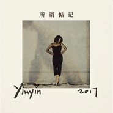

马吟吟
============================

|  |  |
| :--: | :-- |
| [ 马吟吟](https://i.xiami.com/yinyinma) | **播放数**: 2741390 **粉丝数**: 2969 **评论数**: 277 **地区**: China 中国大陆 **风格**: 爵士流行 Jazz Pop, 神游舞曲 Trip Hop, 根源唱作人 Singer-Songwriter, 新灵魂乐 Neo-Soul  |

## 档案

马吟吟  ( Yinyin Ma )                2012年出国到悉尼学习音乐，独立唱作人与歌手。  2015.3.6 独立发行首支单曲《不走开》  2015年7月参加中国好声音第四季，成为哈林组4强。并签约梦响强音文化传播有限公司 ,2017年初发行 EP《吟吟》,2018年与Corsak合作单曲《溯(Reverse)》

## 专辑

| 名称 | 语种 | 唱片公司 | 发行时间 | 专辑类别 | 专辑风格 |
| :--: | :-- | :-- | :-- | :-- | :-- |
| [ 世界为你醒来](./albums/2105830136.md) | 国语 | 红点星文化 | 2020年02月08日 | EP, 单曲 | 国语流行 Mandarin Pop |
| [ 我只在乎你](./albums/2104776949.md) | 国语 |  | 2019年04月14日 | EP, 单曲 |  |
| [ 懂我的人](./albums/2104548349.md) | 国语 | 青春光线 | 2019年01月28日 | EP, 单曲 | 国语流行 Mandarin Pop |
| [ 无名之爱](./albums/2104264944.md) | 国语 | 完美青春OST | 2018年11月23日 | EP, 单曲 | 国语流行 Mandarin Pop |
| [ 萌妻食神 网络剧OST（女生版集锦）](./albums/2106088180.md) | 国语 | 听见时代 | 2018年05月14日 | 原声带, 影视音乐 |  |
| [ Chin Up 把你的脸抬起来](./albums/2102760162.md) | 国语 | 独立发行 | 2017年06月05日 | EP, 单曲 | 氛围流行 Ambient Pop, 电音流行 Electropop |
| [ 我的乐章](./albums/2102734951.md) | 国语 | 灿星文化 | 2017年04月20日 | EP, 单曲 |  |
| [ 多爱不碍](./albums/2102731369.md) | 国语 | 灿星制作 | 2017年04月13日 | EP, 单曲 |  |
| [ 所谓惦记](./albums/2102724277.md) | 国语 | 灿星文化 | 2017年03月30日 | EP, 单曲 |  |
| [ 救我](./albums/2102711747.md) | 国语 | 灿星文化 | 2017年03月14日 | EP, 单曲 |  |
| [ 不走开Never Go Away](./albums/525650029.md) | 国语 | 独立发行 | 2015年03月06日 | EP, 单曲 | 爵士流行 Jazz Pop, 放克 Funk, 新灵魂乐 Neo-Soul |

## 评论

|  |  |  |  |
| :-- | :-- | :-- | :-- |
|  [虾米用户](https://emumo.xiami.com/u/409231485) 真是的，每天都被自己帅醒... 2020-08-19 00:48 赞(0) 踩(0) | 

 |
|  [虾米用户](https://emumo.xiami.com/u/313566285)  2019-06-05 22:33 赞(0) 踩(0) | 
溯溯溯
 |
|  [虾米用户](https://emumo.xiami.com/u/424242254) 我还没想好要写什么... 2019-05-08 15:42 赞(0) 踩(0) | 
溯
 |
|  [虾米用户](https://emumo.xiami.com/u/344018512) 我还没想好要写什么... 2019-04-14 21:03 赞(0) 踩(0) | 
D
 |
|  [虾米用户](https://emumo.xiami.com/u/150644716) 我和我的赘肉，一刻也不能... 2019-04-14 18:28 赞(0) 踩(0) | 
按照现在的思路发展下去，你一定会成为最最优秀的……翻唱选手哈哈哈哈哈哈哈哈
 |
|  [虾米用户](https://emumo.xiami.com/u/2796166) 最爱莫文蔚..... 2019-02-19 00:10 赞(2) 踩(0) | 
加油！！！！！
 |
|  [虾米用户](https://emumo.xiami.com/u/256005842)  2019-02-10 10:15 赞(4) 踩(0) | 
下载了溯，但是虾米匹配不到封面歌词……
 |
|  [虾米用户](https://emumo.xiami.com/u/123246788) Music is my ... 2019-02-08 21:52 赞(4) 踩(0) | 
真好听！  
 |
|  [虾米用户](https://emumo.xiami.com/u/1923255)   云雷， 屯 ，君子以... 2018-12-27 20:43 赞(4) 踩(0) | 
舒服
 |
|  [虾米用户](https://emumo.xiami.com/u/73790620)  2018-08-10 23:51 赞(16) 踩(0) | 
等你和CORSAK的作品《溯》
 |
| ⇒ |  [虾米用户](https://emumo.xiami.com/u/1637623) 私のメロディ、あなたしか... 2018-09-27 19:03 赞(0) 踩(0) | 
等了好久了，YouTube上看到，可惜虾米还木有啊o(╯□╰)o
 |
|  [虾米用户](https://emumo.xiami.com/u/375123458)  2018-06-09 22:02 赞(3) 踩(0) | 
啥都别说了，当时这姑娘一亮嗓我就说，如果她进不了哈进组第一，这届我就不看了。作为一个喜欢了小野丽莎那么多年的人，很庆幸国内也会有这么好听的歌者，加油～
 |
| ⇒ |  [虾米用户](https://emumo.xiami.com/u/324006665) 最近小宇宙又蠢蠢欲动了…... 2019-11-15 14:26 赞(0) 踩(0) | 
我看上的就没有没进决赛的！
 |
|  [虾米用户](https://emumo.xiami.com/u/142169) Ins：govi624 2018-02-10 18:39 赞(4) 踩(0) | 
多少年了依旧喜欢 简单不需要过多修饰的嗓音
 |
|  [虾米用户](https://emumo.xiami.com/u/56206357)  2017-10-30 09:50 赞(2) 踩(0) | 
很棒。之前就在虾米(或者是豆瓣？不记得了)上看到过。在好声音上看到有些意外了，因为在我看来这类型的音乐在选秀里是不讨喜的。不过后面的结果换个角度想也好，至少没有九年的合约来缠身了。我是各个方面的审美都偏小众的，可能在我看来只有小众的才不会去迎合潮流，妥协市场。我也是在去年开始才特别注意版权方面的问题，也偶尔会在在线商店购买吸引我的独立音乐人的作品。也希望国内的制度能尽快完善起来。总之加油咯。就做喜欢做的事，然后拥有一群欣赏你的人，就够了。
 |
|  [虾米用户](https://emumo.xiami.com/u/47839379) 我将在绝早的晨光中 2017-10-27 23:56 赞(3) 踩(0) | 
哈哈，这不是人人网上的好友，电子科大的马姐姐吗！原来唱歌那么好听！！祝马姐姐一切都好哈！！哈哈
 |
|  [虾米用户](https://emumo.xiami.com/u/3936282) 要死一起死 2017-08-04 22:29 赞(1) 踩(0) | 
听起来很轻松，就跟做了一场按摩似的，很舒服。沉重全无~
 |
|  [虾米用户](https://emumo.xiami.com/u/258424705) 我还没想好要写什么... 2017-05-13 10:04 赞(1) 踩(0) | 
原来是你
 |
|  [虾米用户](https://emumo.xiami.com/u/38918617) 你相信我，我相信你 2017-04-13 11:46 赞(1) 踩(0) | 
唱 爵士的 女生 都有一种独特的气质！！吟吟亦是！
 |
|  [虾米用户](https://emumo.xiami.com/u/16135450)  2016-11-29 22:07 赞(1) 踩(0) | 
6121
 |
|  [虾米用户](https://emumo.xiami.com/u/10980381) nihao 2016-05-08 00:27 赞(1) 踩(0) | 
想靠近你
 |
|  [虾米用户](https://emumo.xiami.com/u/154669966) 我还没想好要写什么... 2016-04-28 19:55 赞(2) 踩(0) | 
需要什么道理吗
 |
|  [虾米用户](https://emumo.xiami.com/u/154669966) 我还没想好要写什么... 2016-04-28 19:50 赞(2) 踩(0) | 
还会更新吗
 |
|  [虾米用户](https://emumo.xiami.com/u/154669966) 我还没想好要写什么... 2016-04-28 19:50 赞(1) 踩(0) | 
女神女神~猜猜我是谁哈哈哈
 |
|  [虾米用户](https://emumo.xiami.com/u/10980381) nihao 2016-04-21 23:59 赞(1) 踩(0) | 
上帝保佑你
 |
|  [虾米用户](https://emumo.xiami.com/u/9077266)  2016-04-11 14:50 赞(0) 踩(0) | 
期待新专辑
 |
|  [虾米用户](https://emumo.xiami.com/u/4487129)  2016-04-09 09:08 赞(0) 踩(0) | 
！！！
 |
|  [虾米用户](https://emumo.xiami.com/u/41329892)  2016-02-08 23:55 赞(0) 踩(0) | 
来了很晚 但会一直陪伴 
 |
|  [虾米用户](https://emumo.xiami.com/u/2965573)  2016-01-27 16:23 赞(1) 踩(0) | 
爱上你需要什么道理吗。。
 |
|  [虾米用户](https://emumo.xiami.com/u/2494589)  2015-11-12 11:26 赞(1) 踩(0) | 
后知后觉的发现你，好听。希望能听到更多的作品~加油！
 |
|  [虾米用户](https://emumo.xiami.com/u/78463468)  2015-11-01 21:39 赞(0) 踩(0) | 
不走开这首歌内存好大呀
 |
|  [虾米用户](https://emumo.xiami.com/u/68271224) 这是我一生的朋友 2015-10-30 14:46 赞(0) 踩(0) | 
校友握个手
 |
|  [虾米用户](https://emumo.xiami.com/u/9077266)  2015-10-22 15:09 赞(0) 踩(0) | 
想听你的《传道者的生活，我的生活》、《在今天》这两首歌曲。。
 |
| ⇒ |  [虾米用户](https://emumo.xiami.com/u/1113632) 暂无签名~ 2015-11-13 16:16 赞(0) 踩(0) | 
在今天豆瓣有
 |
|  [虾米用户](https://emumo.xiami.com/u/32436622)   2015-10-22 01:45 赞(0) 踩(0) | 
一首“云之蓝”让我又怀念起那座城市。喜欢你的中低音，暖暖的，期待你的作品！
 |
|  [虾米用户](https://emumo.xiami.com/u/48510343)  2015-10-18 14:53 赞(2) 踩(0) | 
吟吟soundcloud的音源能在虾米上架吗？太好听了，原来吟吟有这么多原创爵士音乐
 |
| ⇒ |  [虾米用户](https://emumo.xiami.com/u/8904290) 不要失去勇敢的心 2015-10-19 10:39 赞(0) 踩(0) | 
需要时间好好整理。。
 |
| ⇒ |  [虾米用户](https://emumo.xiami.com/u/69815928) 他说你任何为人称道的美丽... 2015-10-27 17:49 赞(0) 踩(0) | 
<q><b>马吟吟说：</b></q>
 |
|  [虾米用户](https://emumo.xiami.com/u/142169) Ins：govi624 2015-10-14 11:07 赞(0) 踩(0) | 
吟吟吟，传新歌。。。：）然后放购买链接。。。：）
 |
|  [虾米用户](https://emumo.xiami.com/u/40620170)  2015-10-14 01:16 赞(0) 踩(0) | 
女神，期待你的作品，买买买！    
 |
|  [虾米用户](https://emumo.xiami.com/u/28234126) —Ark— 2015-10-13 16:06 赞(0) 踩(0) | 
超喜欢的～加油
 |
|  [虾米用户](https://emumo.xiami.com/u/52032155)  2015-10-12 00:28 赞(0) 踩(0) | 
你应该去好歌曲的。很爱很爱你的声音和风格。加油。
 |
|  [虾米用户](https://emumo.xiami.com/u/7654431)  2015-10-11 12:45 赞(0) 踩(0) | 
从好声音知道你 这么多人也只喜欢你 
 |
|  [虾米用户](https://emumo.xiami.com/u/8444895) 我还没想好要写什么... 2015-10-08 13:48 赞(0) 踩(0) | 
哎哟不错哟~(◕ܫ◕)
 |
|  [虾米用户](https://emumo.xiami.com/u/72461110)  2015-10-07 23:46 赞(1) 踩(0) | 
很喜欢马吟吟的声音，想搜索在好声音唱的那些歌曲都没搜到。期待好的作品出炉。
 |
|  [虾米用户](https://emumo.xiami.com/u/60709612)  2015-10-07 17:52 赞(0) 踩(0) | 
每天睡觉之前都听听你的声音，生活就是那么美好，你的声音已经刻在心里，同时在脑海中回荡无穷。
 |
|  [虾米用户](https://emumo.xiami.com/u/72232828) 人心对人心， 你真我就真... 2015-10-07 01:57 赞(0) 踩(0) | 
手动赞一个 
 |
|  [虾米用户](https://emumo.xiami.com/u/37340385) 我走向你的凝视，一切会静... 2015-10-06 23:34 赞(0) 踩(0) | 
女神
 |
|  [虾米用户](https://emumo.xiami.com/u/72041076) 孤独 冷漠 缺爱 2015-10-06 11:06 赞(0) 踩(0) | 
女神加油
 |
|  [虾米用户](https://emumo.xiami.com/u/10037579) Deep House 2015-10-03 21:42 赞(0) 踩(0) | 
期待出新专辑 
 |
|  [虾米用户](https://emumo.xiami.com/u/70693672)   2015-10-02 21:12 赞(0) 踩(0) | 
牵你
 |
|  [虾米用户](https://emumo.xiami.com/u/71159016)  2015-10-02 18:56 赞(0) 踩(0) | 
我喜欢她说了我最爱的“就这样‘
 |
|  [虾米用户](https://emumo.xiami.com/u/70839370)  2015-10-01 15:21 赞(0) 踩(0) | 
不用在意别人，做自己。支持你
 |
|  [虾米用户](https://emumo.xiami.com/u/45059313)   2015-10-01 01:23 赞(1) 踩(0) | 
很棒
 |
|  [虾米用户](https://emumo.xiami.com/u/43994744)  2015-09-30 21:56 赞(0) 踩(0) | 
看了下评论，以前的留言都会回复啊，只是现在不会再看了吧
 |
|  [虾米用户](https://emumo.xiami.com/u/43743742)   2015-09-30 20:11 赞(0) 踩(0) | 
只能用，我会买专辑来形容我的心情。
 |
|  [虾米用户](https://emumo.xiami.com/u/4406065) （闷树） 2015-09-30 20:04 赞(0) 踩(0) | 
救我~~~~~~~~~
 |
| ⇒ |  [虾米用户](https://emumo.xiami.com/u/43435234)  2015-10-02 13:22 赞(0) 踩(0) | 
那首歌的歌词啊？
 |
| ⇒ |  [虾米用户](https://emumo.xiami.com/u/43435234)  2015-10-02 13:22 赞(0) 踩(0) | 
那首歌的歌词啊？
 |
| ⇒ |  [虾米用户](https://emumo.xiami.com/u/866962)  2015-10-06 22:19 赞(0) 踩(0) | 
哈哈 那一声简直娇滴又直白~~当时就笑惨了~~
 |
|  [虾米用户](https://emumo.xiami.com/u/70527994)  2015-09-30 12:56 赞(0) 踩(0) | 
喜欢   
 |
|  [虾米用户](https://emumo.xiami.com/u/50653277) 而我听见下雨的声音。 2015-09-28 23:11 赞(1) 踩(0) | 
救我       
 |
|  [虾米用户](https://emumo.xiami.com/u/9368825)   2015-09-28 16:38 赞(2) 踩(0) | 
一句救我，是个男人都化了～
 |
|  [虾米用户](https://emumo.xiami.com/u/7224371)  2015-09-28 14:22 赞(0) 踩(0) | 
~
 |
|  [虾米用户](https://emumo.xiami.com/u/30983284) 会有一个绚烂的人    ... 2015-09-27 22:03 赞(1) 踩(0) | 
音乐方面还需继续努力呐。感觉歌曲还是不那么自然。
 |
|  [虾米用户](https://emumo.xiami.com/u/30983284) 会有一个绚烂的人    ... 2015-09-27 21:42 赞(2) 踩(0) | 
“救我”“谢谢大家，嗯…谢谢大家，就这些”就凭这两句喜欢上了她。有长相固然重要，但性格依旧会是决定因素。
 |
|  [虾米用户](https://emumo.xiami.com/u/69935558)  2015-09-27 21:05 赞(1) 踩(0) | 
跟着你来虾米，第一时间关注你。加油。
 |
|  [虾米用户](https://emumo.xiami.com/u/41028385) 如果我带给你发自内心的笑... 2015-09-27 18:08 赞(0) 踩(0) | 
就是喜欢透彻云淡风轻的马吟吟 我爱马吟吟
 |
|  [虾米用户](https://emumo.xiami.com/u/40902637)  2015-09-27 16:33 赞(0) 踩(0) | 
我也是 
 |
|  [虾米用户](https://emumo.xiami.com/u/5941332) 惘 2015-09-27 16:30 赞(0) 踩(0) | 
爵士听多了还是很好听的
 |
|  [虾米用户](https://emumo.xiami.com/u/69815928) 他说你任何为人称道的美丽... 2015-09-27 13:07 赞(1) 踩(0) | 
其实还是希望能唱歌。保持原有的一切。不入俗尘。太早拍剧会不会影响到。总之希望不管怎样还能听到你的歌声。给现在这个浮躁不安的社会一点点抚慰。真的太喜欢。希望你不忘初心。马吟吟还是马吟吟。
 |
|  [虾米用户](https://emumo.xiami.com/u/69815928) 他说你任何为人称道的美丽... 2015-09-27 12:53 赞(0) 踩(0) | 
太喜欢
 |
|  [虾米用户](https://emumo.xiami.com/u/69815928) 他说你任何为人称道的美丽... 2015-09-27 12:50 赞(0) 踩(0) | 
没错 我从微博转战来虾米了
 |
|  [虾米用户](https://emumo.xiami.com/u/69815928) 他说你任何为人称道的美丽... 2015-09-27 12:50 赞(0) 踩(0) | 
太棒
 |
|  [虾米用户](https://emumo.xiami.com/u/9364642) u got me. 2015-09-27 05:16 赞(1) 踩(0) | 
已洗脑..快快做音乐
 |
|  [虾米用户](https://emumo.xiami.com/u/26198825)   2015-09-27 04:15 赞(0) 踩(0) | 
加油
 |
|  [虾米用户](https://emumo.xiami.com/u/1422174)  2015-09-27 03:43 赞(0) 踩(0) | 
加油！
 |
|  [虾米用户](https://emumo.xiami.com/u/30889641) people sure ... 2015-09-27 02:07 赞(0) 踩(0) | 
救你
 |
|  [虾米用户](https://emumo.xiami.com/u/3550822)  2015-09-27 02:06 赞(0) 踩(0) | 
中了你的毒了，怎么办。。。
 |
|  [虾米用户](https://emumo.xiami.com/u/8292338)  2015-09-27 01:26 赞(0) 踩(0) | 
简短如“救我”两字，却实在令人心疼不已！喜欢你的醉人的歌声，喜欢你的恬静如皎月的笑容加油！女神！！
 |
|  [虾米用户](https://emumo.xiami.com/u/20592451) 我还没想好要写什么... 2015-09-27 01:03 赞(0) 踩(0) | 
就我  
 |
|  [虾米用户](https://emumo.xiami.com/u/45016606)  2015-09-26 23:34 赞(0) 踩(0) | 
我为你着迷
 |
|  [虾米用户](https://emumo.xiami.com/u/33542887) 天机浅 2015-09-26 23:00 赞(0) 踩(0) | 
同是云南人，喜欢你，自然爽朗如清澈高原。
 |
|  [虾米用户](https://emumo.xiami.com/u/69696038)  2015-09-26 22:43 赞(0) 踩(0) | 
已经入迷
 |
|  [虾米用户](https://emumo.xiami.com/u/11818870) 要用歌声让你忘了所有的痛... 2015-09-26 21:21 赞(0) 踩(0) | 
我。的。菜。 
 |
|  [虾米用户](https://emumo.xiami.com/u/18062531) 音乐激发灵魂！ 2015-09-26 21:07 赞(2) 踩(0) | 
原来你一直在这里。其实感觉你再沉浸几年做做音乐最好，入俗早会荒废了你。
 |
|  [虾米用户](https://emumo.xiami.com/u/39418791)   2015-09-26 17:47 赞(0) 踩(0) | 
马哥，加油，爱你（doge）
 |
|  [虾米用户](https://emumo.xiami.com/u/2187923)  2015-09-26 17:41 赞(4) 踩(0) | 
听完三天三夜，和那句“救我”之后，我就进来了。
 |
|  [虾米用户](https://emumo.xiami.com/u/6730262) 坚持便代表了孤独 2015-09-26 15:56 赞(0) 踩(0) | 
想起四个字，云淡风轻。喜欢，不媚俗的音乐。
 |
|  [虾米用户](https://emumo.xiami.com/u/3328433)  2015-09-26 14:52 赞(0) 踩(0) | 
太嫩了，怎么那么白啊，完美来自android客户端
 |
|  [虾米用户](https://emumo.xiami.com/u/54788575) ʟɪɢʜᴛ ᴜᴘ ᴛʜᴇ... 2015-09-26 14:24 赞(0) 踩(0) | 
太喜欢她了
 |
|  [虾米用户](https://emumo.xiami.com/u/6135406) 爱自然~爱生活 2015-09-26 13:22 赞(0) 踩(0) | 
很好听! 
 |
|  [虾米用户](https://emumo.xiami.com/u/116044)  2015-09-26 11:12 赞(0) 踩(0) | 
我来救你
 |
|  [虾米用户](https://emumo.xiami.com/u/5697314) 跑步 2015-09-26 11:02 赞(0) 踩(0) | 
Sound of the soul
 |
|  [虾米用户](https://emumo.xiami.com/u/26005557)   2015-09-26 09:37 赞(3) 踩(0) | 
“救我”。“好好好，救救救”。好萌！
 |
|  [虾米用户](https://emumo.xiami.com/u/29069300)  2015-09-26 08:59 赞(0) 踩(0) | 
加油加油
 |
|  [虾米用户](https://emumo.xiami.com/u/66965560)  2015-09-26 08:44 赞(0) 踩(0) | 
出专辑，我一定买！ 
 |
|  [虾米用户](https://emumo.xiami.com/u/39038767) 寿限阿弥无陀佛，春来秋去... 2015-09-26 03:40 赞(0) 踩(0) | 
好听。我爱你。
 |
|  [虾米用户](https://emumo.xiami.com/u/5569588) 一个人的交响乐 2015-09-26 01:36 赞(0) 踩(0) | 
看了你的留言板，之前的留言还会逐个回复，很有诚意的一个人，但如今不知新留言是否还会再看，猜你好声音后一定很忙，初心始终，祝好~
 |
|  [虾米用户](https://emumo.xiami.com/u/5569588) 一个人的交响乐 2015-09-26 01:08 赞(0) 踩(0) | 
16首歌，捋了一遍，发现缺少一首真正属于你的歌。虽然&amp;lt;不走开&amp;gt;有些接近，但还不是那一首。两首damo，能听到你的初心，而始终~不易获得啊
 |
|  [虾米用户](https://emumo.xiami.com/u/49545865)  2015-09-26 00:31 赞(0) 踩(0) | 
好喜欢～一笑一颦都很喜欢～
 |
|  [虾米用户](https://emumo.xiami.com/u/1154061)  2015-09-25 23:54 赞(0) 踩(0) | 
um..不解释..唱功了得~
 |
|  [虾米用户](https://emumo.xiami.com/u/15473485) 微博：Karen夏猴儿  2015-09-25 23:37 赞(0) 踩(0) | 
感觉是同一个世界的人
 |
|  [虾米用户](https://emumo.xiami.com/u/43314531) 也曾是个少年 2015-09-25 23:26 赞(1) 踩(0) | 
除了姚贝娜之外第二个喜欢的歌手
 |
|  [虾米用户](https://emumo.xiami.com/u/9684884)  2015-09-25 23:10 赞(0) 踩(0) | 
感觉你就是唱二人转我也能听得飘起来
 |
|  [虾米用户](https://emumo.xiami.com/u/866962)  2015-09-25 23:05 赞(0) 踩(0) | 
果断成粉！太棒了！加油马吟吟！
 |
|  [虾米用户](https://emumo.xiami.com/u/43388915) 我还没想好要写什么... 2015-09-25 22:58 赞(0) 踩(0) | 
刚刚听那首 在水一方，简直惊呆了，爵士女神啊，老唱片机里的老灵魂，拜倒。 
 |
|  [虾米用户](https://emumo.xiami.com/u/37861597) 阿嬷的配方，猜赢涂口红 2015-09-19 15:36 赞(0) 踩(0) | 
果断关注女神
 |
|  [虾米用户](https://emumo.xiami.com/u/37861597) 阿嬷的配方，猜赢涂口红 2015-09-19 15:36 赞(0) 踩(0) | 
果断关注女神
 |
|  [虾米用户](https://emumo.xiami.com/u/67875904) 无。 2015-09-19 01:35 赞(0) 踩(0) | 
马哥，太喜欢你声音了。
 |
|  [虾米用户](https://emumo.xiami.com/u/45728934) 背心 裤衩 扣脚板 2015-09-18 15:29 赞(0) 踩(0) | 
jazz
 |
|  [虾米用户](https://emumo.xiami.com/u/8904290) 不要失去勇敢的心 2015-09-16 13:11 赞(58) 踩(0) | 
有朋友问到关于2009年的发烧专辑《一梦千寻》的问题，在此我个人作出声明：我仅签订了录唱歌手合同参与该专辑的录制，全程仅收取了录音费用。该发烧碟唱片公司负责选曲－风格－制作－发行的全过程，负责并享有该唱片的一切版权。如今我作为音乐人与该公司没有任何艺人合约。在国外学习和了解了音乐版权之后，对那些歌曲的原唱和作者表示非常非常抱歉，未经原作者／版权所有者允许，不付出任何版权费用就录制翻唱并发行的发烧碟（90%以上都是如此）就是对原创作品的非法使用，就是对原作者的侵权和伤害。我很抱歉自己曾如此无知地侵犯了别人的权益，虽然不知道自己有没有能力，但我会努力申请该专辑下架。
 |
| ⇒ |  [虾米用户](https://emumo.xiami.com/u/204604)  2015-09-16 22:59 赞(0) 踩(0) | 
以前的歌和现在反差好大啊，喜欢现在成长起来的马吟吟，音乐和认知都是随着年龄慢慢成长的，希望听到你更好的作品 加油！女神马哥！
 |
| ⇒ |  [虾米用户](https://emumo.xiami.com/u/70914240) 各有因缘莫羡人 2015-10-01 20:02 赞(0) 踩(0) | 
好棒
 |
| ⇒ |  [虾米用户](https://emumo.xiami.com/u/70914240) 各有因缘莫羡人 2015-10-01 20:17 赞(0) 踩(0) | 
喜欢这种认真，加油！
 |
| ⇒ |  [虾米用户](https://emumo.xiami.com/u/42059672)   2015-10-06 18:28 赞(0) 踩(0) | 
我开始以为天行是有版权，买了那张之后从录音质量发现只是家小公司.......
 |
| ⇒ |  [虾米用户](https://emumo.xiami.com/u/77363510)   2016-04-17 12:01 赞(0) 踩(0) | 
声音太好听了，绝对是一张经典！！期待新作啊，付版权费给作者，我为你的新歌买单
 |
|  [虾米用户](https://emumo.xiami.com/u/142169) Ins：govi624 2015-09-14 19:16 赞(0) 踩(0) | 
好声音没发现你之前，我就已经发现你了，错过了一次在鼓楼的演出，很遗憾
 |
|  [虾米用户](https://emumo.xiami.com/u/64457436) Life is expe... 2015-09-14 02:38 赞(0) 踩(0) | 
走不开非常好听
 |
|  [虾米用户](https://emumo.xiami.com/u/50644331)   2015-09-14 00:45 赞(0) 踩(0) | 
低音性感地很优雅
 |
|  [虾米用户](https://emumo.xiami.com/u/64291584)  2015-09-13 19:25 赞(0) 踩(0) | 
有味道，有心悦，自然流动的声音，如同自然界存在的美妙物质，被世人发现而惊艳l
 |
|  [虾米用户](https://emumo.xiami.com/u/7635225)  2015-09-13 09:03 赞(0) 踩(0) | 
不知何时能出唱片？期待。
 |
|  [虾米用户](https://emumo.xiami.com/u/39303865)   2015-09-13 01:28 赞(0) 踩(0) | 
今天终于知道我喜欢啥类型的女生啦⋯⋯ 
 |
|  [虾米用户](https://emumo.xiami.com/u/23787295) 闷声发大财. 2015-09-12 23:56 赞(0) 踩(0) | 
好美好的姑娘
 |
|  [虾米用户](https://emumo.xiami.com/u/12818084) Less is more 2015-09-12 21:12 赞(1) 踩(0) | 
人美，歌美，台风美~支持！
 |
|  [虾米用户](https://emumo.xiami.com/u/46386109) keeping danc... 2015-09-12 17:05 赞(0) 踩(0) | 
喜欢你的声音噢！求发专辑！
 |
|  [虾米用户](https://emumo.xiami.com/u/5129968)  2015-09-12 15:08 赞(1) 踩(0) | 
明明有颜值，偏偏要靠才华╮(╯▽╰)╭
 |
|  [虾米用户](https://emumo.xiami.com/u/3936282) 要死一起死 2015-09-12 13:18 赞(0) 踩(0) | 
你太牛逼了，我特么要买你的唱片！！！！！！！！！！！！！！！！！！
 |
|  [虾米用户](https://emumo.xiami.com/u/10379354)  2015-09-12 04:58 赞(1) 踩(0) | 
居然没进十强，我的心好痛~
 |
|  [虾米用户](https://emumo.xiami.com/u/61846106) 莫问前程有愧,但求今生无... 2015-09-08 06:17 赞(0) 踩(0) | 
小马加油! 
 |
|  [虾米用户](https://emumo.xiami.com/u/61846106) 莫问前程有愧,但求今生无... 2015-09-08 06:17 赞(0) 踩(0) | 
小马加油! 
 |
|  [虾米用户](https://emumo.xiami.com/u/51499138)  2015-09-05 10:01 赞(1) 踩(0) | 
好喜欢你的声音
 |
|  [虾米用户](https://emumo.xiami.com/u/51499138)  2015-09-05 10:01 赞(0) 踩(0) | 
好喜欢你的声音
 |
|  [虾米用户](https://emumo.xiami.com/u/51499138)  2015-09-05 10:01 赞(0) 踩(0) | 
好喜欢你的声音
 |
|  [虾米用户](https://emumo.xiami.com/u/6074428) 暂无签名~ 2015-08-19 16:45 赞(0) 踩(0) | 
快把好声音的上传吧～！  
 |
|  [虾米用户](https://emumo.xiami.com/u/6835224)  2015-08-12 01:08 赞(1) 踩(0) | 
气质合胃口，声音沉的下来，难得
 |
|  [虾米用户](https://emumo.xiami.com/u/1775407)   2015-08-09 22:26 赞(1) 踩(0) | 
此马吟吟是很早虾米就有专辑的那个马吟吟吗？很不一样的声音呀
 |
|  [虾米用户](https://emumo.xiami.com/u/571848)  2015-08-09 09:10 赞(0) 踩(0) | 
如准备在悉尼开音乐会便请告知谢谢
 |
|  [虾米用户](https://emumo.xiami.com/u/33450248) 荷马和我在丹吉尔城门分手... 2015-08-05 09:35 赞(1) 踩(0) | 
未来的爵士名伶
 |
|  [虾米用户](https://emumo.xiami.com/u/18570069)  2015-08-03 22:54 赞(2) 踩(0) | 
声音太美好 气质也沉静
 |
|  [虾米用户](https://emumo.xiami.com/u/43108348) 来日方长 2015-08-03 20:32 赞(0) 踩(0) | 
学姐加油
 |
|  [虾米用户](https://emumo.xiami.com/u/13160744) 差劲是大人的标志.... 2015-08-03 20:02 赞(0) 踩(0) | 
昨天看好声音 真是非常惊艳的声音 最喜欢你的声音和气质上的沉淀 会持续关注 期待更好的作品
 |
|  [虾米用户](https://emumo.xiami.com/u/6976030) 叫y哥！ 2015-08-03 18:06 赞(0) 踩(0) | 
我说听起来怎么那么耳熟 吟吟那几首demo曾陪我度过无数寂静的夜晚
 |
|  [虾米用户](https://emumo.xiami.com/u/54276276)  2015-08-02 14:00 赞(3) 踩(0) | 
Jazz &amp;amp; Soul 在国内本来就小众，用中文唱就更小众了，不过很欣慰你有创作能力而不是单纯的翻唱，加油！
 |
|  [虾米用户](https://emumo.xiami.com/u/2536379) 不准找我 2015-08-02 02:30 赞(0) 踩(0) | 
中国不是你的舞台，只愿你永远静静
 |
|  [虾米用户](https://emumo.xiami.com/u/6313933) 吧啦吧啦 2015-08-01 21:46 赞(0) 踩(0) | 
爱听低音域的你的歌……
 |
|  [虾米用户](https://emumo.xiami.com/u/6313933) 吧啦吧啦 2015-08-01 21:43 赞(0) 踩(0) | 
是好声音那个歌手么？第一首声音好细……
 |
|  [虾米用户](https://emumo.xiami.com/u/29023204) 留美党 2015-08-01 15:13 赞(0) 踩(0) | 
声音能更性感一点吗
 |
|  [虾米用户](https://emumo.xiami.com/u/11430) 听歌，晒太阳；睡觉，享自... 2015-08-01 04:17 赞(0) 踩(0) | 
路人转粉了，好声音上的声音赞
 |
|  [虾米用户](https://emumo.xiami.com/u/54125711) 奢侈品专供 2015-08-01 00:32 赞(1) 踩(0) | 
上了好声音了
 |
|  [虾米用户](https://emumo.xiami.com/u/12525456) 阮籍猖狂 2015-08-01 00:20 赞(0) 踩(0) | 
只有我是看豆友推荐来的吗！！好哎
 |
|  [虾米用户](https://emumo.xiami.com/u/3936282) 要死一起死 2015-07-31 23:20 赞(1) 踩(0) | 
上好声音了～现场比录制好些，恭喜了
 |
|  [虾米用户](https://emumo.xiami.com/u/12730895) 不要离开！ 2015-07-31 23:13 赞(35) 踩(0) | 
刚看了好声音，长得太漂亮了，我都要被掰弯了。。。
 |
|  [虾米用户](https://emumo.xiami.com/u/10606701) 暂无签名~ 2015-07-31 23:05 赞(1) 踩(0) | 
祝我们亲爱的小马哥越走越远~
 |
|  [虾米用户](https://emumo.xiami.com/u/1346863) 感谢虾米，感谢大家！ 2015-07-31 22:48 赞(0) 踩(0) | 
UESTC！ 很好听啊 校友！
 |
|  [虾米用户](https://emumo.xiami.com/u/27823043)  2015-07-31 14:47 赞(1) 踩(0) | 
校友来点赞~好声音加油！
 |
|  [虾米用户](https://emumo.xiami.com/u/53710484)  2015-07-28 17:58 赞(1) 踩(0) | 
才听到朋友说学姐，过来听听，学姐好厉害，加油，期待ing
 |
|  [虾米用户](https://emumo.xiami.com/u/87398) 藏不住的是你最珍贵的倔强 2015-07-21 15:05 赞(0) 踩(0) | 
以前那首demo去哪儿啦- -！找不见了
 |
|  [虾米用户](https://emumo.xiami.com/u/4144172)  2015-07-14 12:39 赞(0) 踩(0) | 
原来还有虾米音乐人，很久以前听过，期待更多作品哈
 |
|  [虾米用户](https://emumo.xiami.com/u/142169) Ins：govi624 2015-07-10 10:15 赞(1) 踩(0) | 
不够听，多来几首哈哈
 |
| ⇒ |  [虾米用户](https://emumo.xiami.com/u/8904290) 不要失去勇敢的心 2015-07-11 12:55 赞(0) 踩(0) | 
哈谢谢！我尽量今年底前做出来啊 
 |
|  [虾米用户](https://emumo.xiami.com/u/142169) Ins：govi624 2015-07-03 10:27 赞(0) 踩(0) | 
醉了
 |
|  [虾米用户](https://emumo.xiami.com/u/16535777) 失信于女人，何以得天下。 2015-06-05 12:43 赞(2) 踩(0) | 
哇哦，声音好干净不错不错
 |
|  [虾米用户](https://emumo.xiami.com/u/38640755) 喜欢你的声音，迷恋你的歌... 2015-05-11 21:57 赞(2) 踩(0) | 
我的女神！！！
 |
|  [虾米用户](https://emumo.xiami.com/u/9801101) 慧超 2015-04-16 23:42 赞(2) 踩(0) | 
加油！你是最棒的！上帝爱你
 |
|  [虾米用户](https://emumo.xiami.com/u/1507513) 介绍一下你自己 2015-04-14 20:23 赞(2) 踩(0) | 
好
 |
| ⇒ |  [虾米用户](https://emumo.xiami.com/u/17130245) 我还没想好要写什么... 2015-07-03 16:05 赞(0) 踩(0) | 
··给给给
 |
|  [虾米用户](https://emumo.xiami.com/u/48421920) 游戏人生如梦如幻 2015-03-23 14:41 赞(2) 踩(0) | 
声声低诉，句句入心
 |
| ⇒ |  [虾米用户](https://emumo.xiami.com/u/8904290) 不要失去勇敢的心 2015-03-24 14:13 赞(0) 踩(0) | 
awwwww 爱你不嫌多～～
 |
| ⇒ |  [虾米用户](https://emumo.xiami.com/u/48421920) 游戏人生如梦如幻 2015-04-17 09:44 赞(0) 踩(0) | 
<q><b>马吟吟说：</b></q>
 |
|  [虾米用户](https://emumo.xiami.com/u/48421920) 游戏人生如梦如幻 2015-03-23 14:41 赞(1) 踩(0) | 
每次听到她的声音都好像人就坐在身边，声声低诉
 |
|  [虾米用户](https://emumo.xiami.com/u/3936282) 要死一起死 2015-03-19 11:49 赞(0) 踩(0) | 
我是来看颜的……
 |
| ⇒ |  [虾米用户](https://emumo.xiami.com/u/8904290) 不要失去勇敢的心 2015-03-19 12:22 赞(0) 踩(0) | 
。。。脸大，只能露一半。。
 |
| ⇒ |  [虾米用户](https://emumo.xiami.com/u/3936282) 要死一起死 2015-03-19 12:49 赞(0) 踩(0) | 
<q><b>马吟吟说：</b></q>
 |
| ⇒ |  [虾米用户](https://emumo.xiami.com/u/8904290) 不要失去勇敢的心 2015-03-19 19:33 赞(0) 踩(0) | 
<q><b>辛迦南说：</b></q>
 |
| ⇒ |  [虾米用户](https://emumo.xiami.com/u/44583938) 我不懒，也什么都不留下。 2015-06-15 00:24 赞(0) 踩(0) | 
<q><b>马吟吟说：</b></q>
 |
|  [虾米用户](https://emumo.xiami.com/u/44816678)   2015-03-19 10:09 赞(2) 踩(0) | 
还真是昆明的 拽了，加油，拽拽呢
 |
| ⇒ |  [虾米用户](https://emumo.xiami.com/u/8904290) 不要失去勇敢的心 2015-03-19 12:12 赞(0) 踩(0) | 
哈，谢谢！
 |
|  [虾米用户](https://emumo.xiami.com/u/10606701) 暂无签名~ 2015-02-18 17:48 赞(2) 踩(0) | 
小马哥，羊年喜气洋洋新年快乐呀！luv u~
 |
| ⇒ |  [虾米用户](https://emumo.xiami.com/u/8904290) 不要失去勇敢的心 2015-02-22 17:24 赞(0) 踩(0) | 
: ) 新年好
 |
|  [虾米用户](https://emumo.xiami.com/u/44973328)  2015-02-13 19:06 赞(0) 踩(0) | 
马吟吟
 |
|  [虾米用户](https://emumo.xiami.com/u/25473764) 我都不懂那意味着什么，只... 2015-02-10 18:25 赞(2) 踩(0) | 
国内类似的风格还有好几个，王若琳、袁娅维之流，可是吟吟真的很自我，抓住我的耳朵，有一种在海岛边听美人鱼唱歌的感觉。
 |
| ⇒ |  [虾米用户](https://emumo.xiami.com/u/8904290) 不要失去勇敢的心 2015-02-10 22:48 赞(0) 踩(0) | 
美人鱼。。。哈，love you !!
 |
|  [虾米用户](https://emumo.xiami.com/u/10606701) 暂无签名~ 2015-01-22 02:45 赞(1) 踩(0) | 
我觉得"耳机小Q"的看法太自我和刻板了吧，被自己的偏见所禁锢。艺术应该是有包容性的，不分肤色和国界，任何音乐形式都不应该设置欣赏和参与的门槛，所以每个人都可以追求自己喜爱的音乐类型，为什么中国人就一定得唱中国风得唱中文歌，希望大家懂得追寻自己的内心而不是而不是被表面的东西所左右
 |
|  [虾米用户](https://emumo.xiami.com/u/10606701) 暂无签名~ 2015-01-22 02:35 赞(2) 踩(0) | 
感觉小马哥变化好大，准确的说是更强大对于更能坚持不懈了，而且欣喜的是我听到的小马哥还是一如既往的用自己的天赋和灵魂而非油滑的技巧在唱歌(虽然乍一听感觉有点气声泛滥，嘻嘻)，无论是在成都还是在北京还是在悉尼，希望你能一直坚持下去，我会一直支持你，一直去喜欢听你唱歌，默默为你加油，做你忠实的听众，加油，咱的女神小马哥  --你永远的老同学，好系友，脑残粉
 |
| ⇒ |  [虾米用户](https://emumo.xiami.com/u/8904290) 不要失去勇敢的心 2015-02-09 20:24 赞(0) 踩(0) | 
:) :) :) :)
 |
| ⇒ |  [虾米用户](https://emumo.xiami.com/u/10606701) 暂无签名~ 2015-02-11 12:45 赞(0) 踩(0) | 
<q><b>马吟吟说：</b></q>
 |
|  [虾米用户](https://emumo.xiami.com/u/43182870)  2015-01-11 22:17 赞(2) 踩(0) | 
想不到这么好听，小马加油！
 |
| ⇒ |  [虾米用户](https://emumo.xiami.com/u/8904290) 不要失去勇敢的心 2015-01-12 06:03 赞(0) 踩(0) | 
谢谢
 |
|  [虾米用户](https://emumo.xiami.com/u/41336971) 阳光明媚，洗洗衣服，晒晒... 2014-12-21 22:07 赞(2) 踩(0) | 
声音很不错，期待你的原创专辑.
 |
|  [虾米用户](https://emumo.xiami.com/u/35522180) 音乐是解药 药不能停 2014-12-16 13:08 赞(2) 踩(0) | 
好喜欢你的风格啊！ 向你学习！
 |
| ⇒ |  [虾米用户](https://emumo.xiami.com/u/8904290) 不要失去勇敢的心 2014-12-16 17:59 赞(0) 踩(0) | 
哦 害羞了。。谢谢：）哈。一起努力呀！
 |
|  [虾米用户](https://emumo.xiami.com/u/42142804)  2014-12-15 20:24 赞(2) 踩(0) | 
很棒的声音，支持你！
 |
| ⇒ |  [虾米用户](https://emumo.xiami.com/u/8904290) 不要失去勇敢的心 2014-12-15 20:46 赞(0) 踩(0) | 
谢谢：）
 |
|  [虾米用户](https://emumo.xiami.com/u/6504686) In The Rain 2014-12-07 16:09 赞(2) 踩(0) | 
哇哦!找到了.非常干净的声音,喜欢.(ﾟ∀ﾟ).
 |
| ⇒ |  [虾米用户](https://emumo.xiami.com/u/8904290) 不要失去勇敢的心 2014-12-10 20:29 赞(0) 踩(0) | 
谢谢～～
 |
|  [虾米用户](https://emumo.xiami.com/u/43988547) 一念起，万水千山。一念灭... 2014-11-22 16:49 赞(2) 踩(0) | 
我是你的粉丝啦，等着你的专辑
 |
| ⇒ |  [虾米用户](https://emumo.xiami.com/u/8904290) 不要失去勇敢的心 2014-11-22 20:51 赞(0) 踩(0) | 
谢谢：）
 |
|  [虾米用户](https://emumo.xiami.com/u/32910772)  2014-11-22 09:18 赞(2) 踩(0) | 
赛林格听了你的现场，很棒，昆明姑娘加油
 |
| ⇒ |  [虾米用户](https://emumo.xiami.com/u/8904290) 不要失去勇敢的心 2014-11-22 20:51 赞(0) 踩(0) | 
哈，谢谢！ :)
 |
|  [虾米用户](https://emumo.xiami.com/u/43967775)  2014-11-22 00:00 赞(2) 踩(0) | 
经朋友的邀请今天第一次在现场，也是第一次听你唱歌。一听就爱上了，内心总是有很多触动和共鸣，很喜欢你的原创和追梦的勇气。  加油～。君君
 |
| ⇒ |  [虾米用户](https://emumo.xiami.com/u/8904290) 不要失去勇敢的心 2014-11-22 20:52 赞(0) 踩(0) | 
感谢：） 很开心
 |
|  [虾米用户](https://emumo.xiami.com/u/13150499) 暂无签名~ 2014-11-21 23:10 赞(2) 踩(0) | 
喜欢，希望来武汉！
 |
| ⇒ |  [虾米用户](https://emumo.xiami.com/u/8904290) 不要失去勇敢的心 2014-11-22 20:52 赞(0) 踩(0) | 
谢谢，我会加油！
 |
|  [虾米用户](https://emumo.xiami.com/u/2118949)  2014-11-15 23:04 赞(2) 踩(0) | 
好听，喜欢这样的女声
 |
| ⇒ |  [虾米用户](https://emumo.xiami.com/u/8904290) 不要失去勇敢的心 2014-11-17 01:13 赞(0) 踩(0) | 
谢谢你 ！
 |
|  [虾米用户](https://emumo.xiami.com/u/11277613) 这个懒鬼什么都没有写。。 2014-11-15 00:18 赞(2) 踩(0) | 
流着泪说分手唱得真棒！
 |
|  [虾米用户](https://emumo.xiami.com/u/142169) Ins：govi624 2014-11-07 13:24 赞(2) 踩(0) | 
难得的爵士女声，太抓心了，支持你
 |
| ⇒ |  [虾米用户](https://emumo.xiami.com/u/8904290) 不要失去勇敢的心 2014-11-07 20:22 赞(0) 踩(0) | 
谢谢～～～～～
 |
|  [虾米用户](https://emumo.xiami.com/u/17126309) 我还没想好要写什么... 2014-11-02 13:23 赞(2) 踩(0) | 
声音很棒 投票了，加油
 |
| ⇒ |  [虾米用户](https://emumo.xiami.com/u/8904290) 不要失去勇敢的心 2014-11-02 17:05 赞(0) 踩(0) | 
谢谢：）
 |
|  [虾米用户](https://emumo.xiami.com/u/36948059)  2014-10-30 20:23 赞(2) 踩(0) | 
声音好好听，以前只是听过学姐的名字。听过歌之后觉得学姐的好声音应该被更多人听到，加油~
 |
| ⇒ |  [虾米用户](https://emumo.xiami.com/u/8904290) 不要失去勇敢的心 2014-10-30 21:07 赞(0) 踩(0) | 
谢谢：）
 |
|  [虾米用户](https://emumo.xiami.com/u/3212198) 时光慢点走 2014-10-30 15:54 赞(2) 踩(0) | 
学姐加油~
 |
| ⇒ |  [虾米用户](https://emumo.xiami.com/u/8904290) 不要失去勇敢的心 2014-10-30 21:07 赞(0) 踩(0) | 
谢谢 ～
 |
|  [虾米用户](https://emumo.xiami.com/u/1422174)  2014-10-29 00:56 赞(2) 踩(0) | 
支持
 |
| ⇒ |  [虾米用户](https://emumo.xiami.com/u/8904290) 不要失去勇敢的心 2014-10-29 19:33 赞(0) 踩(0) | 
谢谢：）
 |
|  [虾米用户](https://emumo.xiami.com/u/40221717)  2014-10-24 10:38 赞(2) 踩(0) | 
吟吟姐〜好棒
 |
| ⇒ |  [虾米用户](https://emumo.xiami.com/u/8904290) 不要失去勇敢的心 2014-10-24 13:59 赞(0) 踩(0) | 
谢谢：）
 |
|  [虾米用户](https://emumo.xiami.com/u/2829895)  2014-10-11 19:27 赞(2) 踩(0) | 
很喜欢你，支持你
 |
| ⇒ |  [虾米用户](https://emumo.xiami.com/u/8904290) 不要失去勇敢的心 2014-10-11 23:32 赞(0) 踩(0) | 
谢谢：）
 |
|  [虾米用户](https://emumo.xiami.com/u/4259424)  2014-10-09 10:42 赞(2) 踩(0) | 
隔壁理十的表示，要不要发给田家贵听一下呢 ^0^
 |
| ⇒ |  [虾米用户](https://emumo.xiami.com/u/4353074)  2015-04-28 10:27 赞(0) 踩(0) | 
2333.咋不发给陈禾听听
 |
|  [虾米用户](https://emumo.xiami.com/u/6743107) 像下雨后的晴 2014-10-08 13:14 赞(2) 踩(0) | 
我滴妈，学姐好~以前没听过现场，不过这些歌都好喜欢，温柔的不行&amp;gt;_&amp;lt;
 |
| ⇒ |  [虾米用户](https://emumo.xiami.com/u/8904290) 不要失去勇敢的心 2014-10-08 13:40 赞(0) 踩(0) | 
哈，谢谢妹纸。。
 |
|  [虾米用户](https://emumo.xiami.com/u/4356092)  2014-10-08 10:46 赞(2) 踩(0) | 
英国回来的飘过~喜欢你:)
 |
| ⇒ |  [虾米用户](https://emumo.xiami.com/u/8904290) 不要失去勇敢的心 2014-10-08 11:34 赞(0) 踩(0) | 
：） ：）
 |
|  [虾米用户](https://emumo.xiami.com/u/2567986) / 2014-09-24 05:42 赞(2) 踩(0) | 
DEMO们都好赞！
 |
| ⇒ |  [虾米用户](https://emumo.xiami.com/u/8904290) 不要失去勇敢的心 2014-09-24 13:45 赞(0) 踩(0) | 
谢谢！！！
 |
|  [虾米用户](https://emumo.xiami.com/u/35183867) 音乐不是命题作文~ 2014-09-20 23:33 赞(2) 踩(0) | 
你的曲子太美了，简直一听就陶醉~
 |
| ⇒ |  [虾米用户](https://emumo.xiami.com/u/8904290) 不要失去勇敢的心 2014-09-21 08:58 赞(0) 踩(0) | 
哈。。谢谢～～：）
 |
| ⇒ |  [虾米用户](https://emumo.xiami.com/u/35183867) 音乐不是命题作文~ 2014-09-21 23:09 赞(0) 踩(0) | 
<q><b>马吟吟说：</b></q>
 |
|  [虾米用户](https://emumo.xiami.com/u/9661758) 音乐是灵魂的味道 2014-09-11 12:29 赞(2) 踩(0) | 
支持原创，声音特别美妙、动人！
 |
|  [虾米用户](https://emumo.xiami.com/u/40982324)  2014-09-08 01:11 赞(2) 踩(0) | 
发现你的一首中文歌，配乐歌声都很美，无意找到这。特意申请了个账号，进来发现还有英文爵士，太多惊喜了，总之加油！期待更多你的歌曲。
 |
| ⇒ |  [虾米用户](https://emumo.xiami.com/u/8904290) 不要失去勇敢的心 2014-09-08 19:15 赞(0) 踩(0) | 
wow, 很感谢你！
 |
|  [虾米用户](https://emumo.xiami.com/u/10606701) 暂无签名~ 2014-08-30 22:02 赞(2) 踩(0) | 
小马哥依然威风凛凛啊~不知道何时才能再一次的近距离的听你演唱了。。。。。。桑心。。。。
 |
|  [虾米用户](https://emumo.xiami.com/u/9047369)  2014-08-08 12:39 赞(2) 踩(0) | 
真好听， 。
 |
| ⇒ |  [虾米用户](https://emumo.xiami.com/u/8904290) 不要失去勇敢的心 2014-08-08 16:39 赞(0) 踩(0) | 
谢谢～～！
 |
|  [虾米用户](https://emumo.xiami.com/u/37762715)   2014-08-01 03:29 赞(2) 踩(0) | 
这声~微妙！
 |
| ⇒ |  [虾米用户](https://emumo.xiami.com/u/8904290) 不要失去勇敢的心 2014-08-02 13:17 赞(0) 踩(0) | 
谢谢 ：）
 |
|  [虾米用户](https://emumo.xiami.com/u/32864157) 穿越黑暗的海峡 2014-07-25 09:06 赞(4) 踩(0) | 
感觉潜力股哈哈哈哈 新发的demo不错
 |
| ⇒ |  [虾米用户](https://emumo.xiami.com/u/8904290) 不要失去勇敢的心 2014-07-25 10:27 赞(0) 踩(0) | 
谢谢 ：）
 |
| ⇒ |  [虾米用户](https://emumo.xiami.com/u/32864157) 穿越黑暗的海峡 2014-07-25 10:53 赞(0) 踩(0) | 
<q><b>马吟吟说：</b></q>
 |
|  [虾米用户](https://emumo.xiami.com/u/38640755) 喜欢你的声音，迷恋你的歌... 2014-07-02 10:17 赞(1) 踩(0) | 
我来了！喜欢你的声音，迷恋你的歌。期待你的新专辑，期待更多的原创歌曲！
 |
| ⇒ |  [虾米用户](https://emumo.xiami.com/u/8904290) 不要失去勇敢的心 2014-07-03 12:17 赞(0) 踩(0) | 
谢谢～～
 |
|  [虾米用户](https://emumo.xiami.com/u/160181) 腿毛飘飘，独领风骚。 2014-06-19 22:53 赞(1) 踩(0) | 
小仙好棒！
 |
| ⇒ |  [虾米用户](https://emumo.xiami.com/u/8904290) 不要失去勇敢的心 2014-06-20 20:28 赞(0) 踩(0) | 
：） ：）
 |
|  [虾米用户](https://emumo.xiami.com/u/288752)  2014-06-15 08:51 赞(0) 踩(0) | 
姐姐,一首&amp;#039;我睡在你眼睛的沙漠里&amp;#039;,唱得我小心肝都要碎成八片儿.
 |
| ⇒ |  [虾米用户](https://emumo.xiami.com/u/8904290) 不要失去勇敢的心 2014-06-16 21:01 赞(0) 踩(0) | 
:) 谢谢啊。。
 |
|  [虾米用户](https://emumo.xiami.com/u/6710399)  2014-06-12 13:33 赞(0) 踩(0) | 
马吟吟
 |
|  [虾米用户](https://emumo.xiami.com/u/5765082) 来自第九区 2014-05-14 22:19 赞(2) 踩(0) | 
直到Sad Magic这首才开始发现，相见恨晚，一听钟情啊。
 |
| ⇒ |  [虾米用户](https://emumo.xiami.com/u/8904290) 不要失去勇敢的心 2014-05-16 07:35 赞(0) 踩(0) | 
呵呵，谢谢。不晚啊，刚好。那首也是最近才弄的：）
 |
| ⇒ |  [虾米用户](https://emumo.xiami.com/u/5765082) 来自第九区 2014-05-16 14:08 赞(0) 踩(0) | 
<q><b>马吟吟说：</b></q>
 |
|  [虾米用户](https://emumo.xiami.com/u/5047798) 故事平淡但当中有你  已... 2014-04-24 14:39 赞(0) 踩(0) | 
诶！看见了这个~
 |
|  [虾米用户](https://emumo.xiami.com/u/11512302)  2014-04-24 00:09 赞(1) 踩(0) | 
马老师唱起来
 |
|  [虾米用户](https://emumo.xiami.com/u/5737411) rice maple 2014-04-22 17:51 赞(1) 踩(0) | 
欢迎！
 |
|  [虾米用户](https://emumo.xiami.com/u/8904290) 不要失去勇敢的心 2014-04-22 16:33 赞(117) 踩(0) | 
我刚入驻了虾米音乐人
 |
| ⇒ |  [虾米用户](https://emumo.xiami.com/u/920711)  2015-08-01 03:11 赞(0) 踩(0) | 
  
 |
| ⇒ |  [虾米用户](https://emumo.xiami.com/u/288752)  2015-08-01 11:35 赞(0) 踩(0) | 
要回国发展了吗?在好声音表现不错，人和声更沉静更有味道！
 |
| ⇒ |  [虾米用户](https://emumo.xiami.com/u/30687318)  2015-08-01 17:39 赞(0) 踩(0) | 
您真美丽.您和您的jazz的魅力让我倾倒！
 |
| ⇒ |  [虾米用户](https://emumo.xiami.com/u/26167133) 暂无签名~ 2015-08-02 22:34 赞(0) 踩(0) | 

 |
| ⇒ |  [虾米用户](https://emumo.xiami.com/u/54509660) 令人平静嗓音配上体悟人生... 2015-09-26 02:32 赞(0) 踩(0) | 
之前我在澳洲也待了5年，通过好声音看到你感觉你是个有想法、看着舒服且略带古灵精怪的一面，如果以后打算回国发展还希望能继续体验生活的美然后带给我们一些舒服的音符。盼一切顺利 
 |
| ⇒ |  [虾米用户](https://emumo.xiami.com/u/379992) 暂无签名~ 2015-09-26 08:27 赞(0) 踩(0) | 
很自然很甜美
 |
| ⇒ |  [虾米用户](https://emumo.xiami.com/u/2022341) 懶似精靈。。。。 2015-09-27 19:54 赞(0) 踩(0) | 
你加油
 |
| ⇒ |  [虾米用户](https://emumo.xiami.com/u/51622972)   2015-09-29 09:35 赞(0) 踩(0) | 

 |
| ⇒ |  [虾米用户](https://emumo.xiami.com/u/78463468)  2015-11-01 21:44 赞(0) 踩(0) | 
你唱的a case of you 和make it mine 很喜欢！
 |
| ⇒ |  [虾米用户](https://emumo.xiami.com/u/10056324) Kyo小非 2017-06-30 03:04 赞(0) 踩(0) | 
搞起来宝宝
 |
| ⇒ |  [虾米用户](https://emumo.xiami.com/u/11651345) 流行的才是最好的 2017-10-27 23:59 赞(0) 踩(0) | 
<a href="http://emumo.xiami.com/u/8904290" target="_blank" rel="nofollow" name_card="8904290">@马吟吟</a>   为什么你最好听的那张专辑没有上架，其中包括（流着泪说分手 我睡在你眼里的沙漠里 我想你了  围城）这张【一梦千寻】百听不厌啊，快点上架啊
 |
| ⇒ |  [虾米用户](https://emumo.xiami.com/u/71262634)   2019-12-12 22:29 赞(0) 踩(0) | 
岁月静好
 |
|  [虾米用户](https://emumo.xiami.com/u/6710399)  2014-04-14 02:28 赞(0) 踩(0) | 
真好听，清澈！
 |
|  [虾米用户](https://emumo.xiami.com/u/5066533) 爱音乐。爱虾米。 2013-05-22 10:51 赞(0) 踩(0) | 
马吟吟
 |
|  [虾米用户](https://emumo.xiami.com/u/7187358) 音乐如水 文字如歌 2013-02-12 06:17 赞(0) 踩(0) | 
马吟吟
 |
|  [虾米用户](https://emumo.xiami.com/u/3286417) 寧靜自得   清心定志 2013-02-06 19:37 赞(0) 踩(0) | 
可惜就一张专辑
 |
|  [虾米用户](https://emumo.xiami.com/u/6120789)  2012-11-24 14:43 赞(0) 踩(0) | 
就是喜欢她的声音
 |
|  [虾米用户](https://emumo.xiami.com/u/8979064)  2012-10-26 12:39 赞(0) 踩(0) | 
好喜欢
 |
|  [虾米用户](https://emumo.xiami.com/u/11081030)  2012-10-16 16:20 赞(0) 踩(0) | 
一见倾心
 |
|  [虾米用户](https://emumo.xiami.com/u/7677054) ო(•.•๑.梦幻江南რ 2012-02-20 12:17 赞(0) 踩(0) | 
HI-FI
 |
