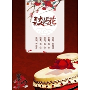

鼓与花
============================

|  |  |
| :--: | :-- |
| [ 鼓与花](https://emumo.xiami.com/album/283533154) | **艺人**: [墨明棋妙](../index.md) **语种**: 国语 **唱片公司**: 墨明棋妙 **发行时间**: 2013年10月26日 **专辑类别**: EP, 单曲 **专辑风格**: 古风 GuFeng Music **播放数**: 514554 **收藏数**: 190 **评论数**: 29  |

## 简介

《鼓与花》代表着两种形态的两个人，很少写这种风格的词，歌词讲述打鼓的少年遇到心仪的女子，却不知妾也有意，看似巧合的事，却并非偶然~为配合曲风，我将传统的剧中的一些故事元素加入。老戴非常有意思，这版词本来是我心情郁郁的时候写的一版舒缓的词，结果最后曲风是如此小欢脱，我也只好配合修出些些小愉悦，不过这样的歌有那么点儿意思~

## 曲目

## 评论

|  |  |  |  |
| :-- | :-- | :-- | :-- |
|  [虾米用户](https://emumo.xiami.com/u/244072005)  2021-01-09 11:43 赞(0) 踩(0) | 
声音传情，真的好喜欢
 |
|  [虾米用户](https://emumo.xiami.com/u/427809461) 老妪能解 2019-08-06 10:44 赞(0) 踩(0) | 

 |
|  [虾米用户](https://emumo.xiami.com/u/5011964)  2016-02-26 16:26 赞(0) 踩(0) | 
这首噶好听
 |
|  [虾米用户](https://emumo.xiami.com/u/47685751)  2015-08-10 23:31 赞(0) 踩(0) | 
还是更喜欢纯音乐的伴奏
 |
| ⇒ |  [虾米用户](https://emumo.xiami.com/u/364210456)  2018-06-06 17:52 赞(0) 踩(0) | 
纯音乐哪里能找到啊？
 |
|  [虾米用户](https://emumo.xiami.com/u/14151120)   2015-06-15 22:26 赞(0) 踩(0) | 
还有哪首有戴荃的，湖光水色调和那首有戴荃念白的……
 |
|  [虾米用户](https://emumo.xiami.com/u/14151120)   2015-06-15 22:25 赞(0) 踩(0) | 
还有悟空的歌吗
 |
|  [虾米用户](https://emumo.xiami.com/u/787752)  2015-05-09 23:28 赞(0) 踩(0) | 
细细品一遍   真心不错
 |
|  [虾米用户](https://emumo.xiami.com/u/35344016)  2015-02-28 16:13 赞(0) 踩(0) | 
1分57秒那里是《拜年》的曲调啊~哈哈哈好好玩儿~
 |
| ⇒ |  [虾米用户](https://emumo.xiami.com/u/39402213)  2015-04-13 15:23 赞(0) 踩(0) | 

 |
|  [虾米用户](https://emumo.xiami.com/u/8216410)  2015-01-31 14:52 赞(0) 踩(0) | 
悟空吊~
 |
|  [虾米用户](https://emumo.xiami.com/u/1927321) 我还没想好要写什么... 2014-10-22 15:10 赞(0) 踩(0) | 
赞，难得古风不是缠绵到天涯
 |
|  [虾米用户](https://emumo.xiami.com/u/5080596) 32开心就好 2014-10-11 13:08 赞(0) 踩(0) | 
有鼓的感觉就是不一样哈哈
 |
|  [虾米用户](https://emumo.xiami.com/u/3027984)  2014-08-29 17:02 赞(0) 踩(0) | 
诶呀 好萌~~~
 |
|  [虾米用户](https://emumo.xiami.com/u/37483886) 微笑并保持微笑 2014-06-12 09:18 赞(0) 踩(0) | 
好喜欢这种别样的古风
 |
|  [虾米用户](https://emumo.xiami.com/u/11801275)  2014-02-23 21:32 赞(0) 踩(0) | 
这首好玩！好听又好玩儿！歌词写的也好玩！赞死了！
 |
|  [虾米用户](https://emumo.xiami.com/u/606760) 魂牵一线 2014-01-23 07:34 赞(0) 踩(0) | 
ting
 |
|  [虾米用户](https://emumo.xiami.com/u/5675073) 耶就是耶啊耶叫做阿耶 2014-01-03 16:19 赞(0) 踩(0) | 
俏丽
 |
|  [虾米用户](https://emumo.xiami.com/u/12012992) 暂无签名~ 2013-11-12 17:09 赞(0) 踩(0) | 
很有感觉的歌
 |
|  [虾米用户](https://emumo.xiami.com/u/8402529)  2013-11-12 13:59 赞(0) 踩(0) | 
此间有景却少一句情话，辜负了锦绣年华。有情无情谁在意它，有意无意谁在意它~
 |
|  [虾米用户](https://emumo.xiami.com/u/12517996) 拥有相同梦想的人会相互吸 2013-11-12 11:13 赞(0) 踩(0) | 
很有特色的杂谈小调
 |
|  [虾米用户](https://emumo.xiami.com/u/2923080) 聆听东方无限美妙。 2013-11-07 18:20 赞(0) 踩(0) | 
13年佳品
 |
|  [虾米用户](https://emumo.xiami.com/u/1883402)  2013-11-05 21:25 赞(0) 踩(0) | 
开头这小调儿贼喜欢~
 |
|  [虾米用户](https://emumo.xiami.com/u/432013) ROCK! 2013-11-05 17:57 赞(0) 踩(0) | 
果然好欢脱的调调~喜欢ING~！
 |
|  [虾米用户](https://emumo.xiami.com/u/6707278) 其若杨花似雪何…… 2013-11-05 16:53 赞(0) 踩(0) | 
好欢乐的
 |
|  [虾米用户](https://emumo.xiami.com/u/7037466)  2013-11-05 12:28 赞(0) 踩(0) | 
喜欢的调调
 |
|  [虾米用户](https://emumo.xiami.com/u/7037466)  2013-11-05 12:27 赞(0) 踩(0) | 
很不错的一首歌曲O(∩_∩)O~
 |
|  [虾米用户](https://emumo.xiami.com/u/4708664)  2013-11-05 10:29 赞(0) 踩(0) | 
And singer&amp;#039;s voice sounds great as well :)
 |
|  [虾米用户](https://emumo.xiami.com/u/4708664)  2013-11-05 10:28 赞(0) 踩(0) | 
It&amp;#039;s fantastic! I heard lots of traditional oriental instruments!
 |
