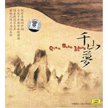

千山梦
============================

|  |  |
| :--: | :-- |
| [ 千山梦](https://emumo.xiami.com/album/338782) | **艺人**: [墨明棋妙](../index.md) **语种**: 其他 **唱片公司**: 中唱上海 **发行时间**: 2008年01月01日 **专辑类别**: 合集, 杂锦 **专辑风格**: 古风 GuFeng Music **播放数**: 2968308 **收藏数**: 3711 **评论数**: 280  |

## 简介

弦外音映词中韵，古风于今曲中再现旖旎，诗含情还弓上声，感慨几许只为此乐终！千年古乐，贯穿现代鸣响，千山清梦，畅斥今朝情怀……  
  
中国唱片上海公司携“墨明棋妙”原创音乐团队为您倾情呈现首张“古风”音乐大碟《千山梦》。十首“古风”民乐，融入古典、摇滚、电子等多种音乐元素，再一次诠释“新民乐”的定义。 

## 曲目

## 评论

|  |  |  |
| :-- | :-- | :-- |
|  [虾米用户](https://emumo.xiami.com/u/46944426)   2017-11-25 10:20 赞(0) 踩(0) | 
私以为只有江南风能够表现宋的繁华和奢靡
 |
|  [虾米用户](https://emumo.xiami.com/u/1441966) 你一直跑一直跑就能看见了 2017-10-30 10:15 赞(0) 踩(0) | 
最近很喜欢中国风~ 听起来很舒心，能好好做作业
 |
|  [虾米用户](https://emumo.xiami.com/u/1440252) 不问耕耘，只问收获 2017-10-28 00:24 赞(0) 踩(0) | 
非常喜欢风情万种。听后就编排了舞蹈。效果不错。 《千山梦》中的有几首曲子似乎主旋律是一样的，只是编曲有所不同。。。。。。 《二十二桥枫别雨》也很有感觉，但是稍有棱角了一些。 《雨碎江南》的高潮偏阳刚了些，却很喜欢。 《随笔遐想》是第二首让人想编舞的曲子。。。
 |
|  [虾米用户](https://emumo.xiami.com/u/6286371)  2017-10-28 00:23 赞(0) 踩(0) | 
近来loop的专辑，虽然也有融合现代元素，但是没有哗众取宠。《京华一梦》和《皓水莫负》最为心爱。听得中国风脑洞疯长…还是节制一点好…
 |
|  [虾米用户](https://emumo.xiami.com/u/7769823) allt og ekke... 2017-07-22 11:46 赞(0) 踩(0) | 
。
 |
|  [虾米用户](https://emumo.xiami.com/u/34679001)  2017-05-21 00:03 赞(0) 踩(0) | 
千山繞過不是夢，但作夢醒菩提生 
 |
|  [虾米用户](https://emumo.xiami.com/u/295996781)  2017-05-13 15:07 赞(0) 踩(0) | 
不错
 |
|  [虾米用户](https://emumo.xiami.com/u/282410892)  2017-04-05 15:46 赞(1) 踩(0) | 
仿佛回到了青瓦回廊下，看着廊外淅淅沥沥的雨，听着远方传来曲子。果然还是爱古典!
 |
|  [虾米用户](https://emumo.xiami.com/u/14016503) 不忘初心，方得始终 2017-04-05 00:09 赞(0) 踩(0) | 
纯音乐，喜欢。穿越，好听。
 |
|  [虾米用户](https://emumo.xiami.com/u/272432852) 我跌入花间忘了凡间 2017-02-25 10:53 赞(0) 踩(0) | 
&amp;ldquo;不错&amp;rdquo;
 |
|  [虾米用户](https://emumo.xiami.com/u/71364198)   2016-12-06 00:09 赞(0) 踩(0) | 
1
 |
|  [虾米用户](https://emumo.xiami.com/u/206095974)  2016-08-12 16:47 赞(0) 踩(0) | 
京华一梦，恰如一梦！旖旎悠远，奇异绵长。
 |
|  [虾米用户](https://emumo.xiami.com/u/93710120)  2016-07-06 13:22 赞(0) 踩(0) | 
愿我中华音乐源远流长
 |
|  [虾米用户](https://emumo.xiami.com/u/3653177)  2015-11-16 15:18 赞(0) 踩(0) | 
123
 |
|  [虾米用户](https://emumo.xiami.com/u/6325469)  2015-11-13 18:28 赞(0) 踩(0) | 
古风音乐最近好爱，老朽啦
 |
|  [虾米用户](https://emumo.xiami.com/u/775026) 琴箫散修 2015-08-20 14:34 赞(0) 踩(0) | 
满满的回忆》。《  以前经常在分贝听》。《
 |
|  [虾米用户](https://emumo.xiami.com/u/50116984)  2015-05-19 01:11 赞(0) 踩(0) | 
个人认为无与伦比的专辑
 |
|  [虾米用户](https://emumo.xiami.com/u/47853615)  2015-04-25 18:18 赞(0) 踩(0) | 
古风音乐超棒！
 |
|  [虾米用户](https://emumo.xiami.com/u/33980195) 大音余栗，啸而醉逐，不复... 2015-03-21 22:08 赞(1) 踩(0) | 
还是老物醉人
 |
|  [虾米用户](https://emumo.xiami.com/u/47928057)  2015-03-18 16:34 赞(0) 踩(0) | 
。。。
 |
|  [虾米用户](https://emumo.xiami.com/u/9614053) 淡淡的 2015-03-13 11:26 赞(2) 踩(0) | 
以前是因为喜欢旖旎婉转的古风男声或者古风唱腔开始听古风歌的。。再后来喜欢的是辞藻华丽的长短句式的歌词。。后来自己学古筝开始 才开始静静的听古风的纯音乐。真的是别一番韵味。。宁静又明亮
 |
|  [虾米用户](https://emumo.xiami.com/u/18215780)  2015-02-05 13:38 赞(0) 踩(0) | 
明快——美好的心情
 |
|  [虾米用户](https://emumo.xiami.com/u/4306729) 不敢收新歌，往往是怕丢掉... 2015-01-10 00:41 赞(0) 踩(0) | 
皓水莫负这首，貌似还是唐七安排给墨渊的角色歌……幸而从最开始遇到就喜欢，增色不少
 |
|  [虾米用户](https://emumo.xiami.com/u/7119203)  2014-12-18 17:50 赞(1) 踩(0) | 
谁能抛却一生 倾了天下 为你风情万种
 |
|  [虾米用户](https://emumo.xiami.com/u/6215586)  2014-11-05 16:20 赞(0) 踩(0) | 
古风新情怀，好听
 |
|  [虾米用户](https://emumo.xiami.com/u/381336)  2014-11-02 01:04 赞(1) 踩(0) | 
还是早期曲子耐人寻味
 |
|  [虾米用户](https://emumo.xiami.com/u/41698867)  2014-09-29 13:39 赞(0) 踩(0) | 
风凌雪
 |
|  [虾米用户](https://emumo.xiami.com/u/9857182) Time Travel 2014-09-04 13:11 赞(0) 踩(0) | 
china wave
 |
|  [虾米用户](https://emumo.xiami.com/u/10471683)  2014-08-10 09:41 赞(0) 踩(0) | 
非常好聽的音樂
 |
|  [虾米用户](https://emumo.xiami.com/u/4910310) 懒人一枚~~~ 2014-07-10 13:27 赞(0) 踩(0) | 
很喜欢这种风格呢~~~
 |
|  [虾米用户](https://emumo.xiami.com/u/10337057) 独自穿行于空灵之境 2014-07-03 22:44 赞(0) 踩(0) | 
~~~
 |
|  [虾米用户](https://emumo.xiami.com/u/13276172)  2014-06-25 13:31 赞(0) 踩(0) | 
大赞！中国古风，不输日本！
 |
|  [虾米用户](https://emumo.xiami.com/u/2903807) 用音乐铭记时光，用音乐聆... 2014-06-22 19:42 赞(1) 踩(0) | 
风 见证沧海桑田变动.....
 |
|  [虾米用户](https://emumo.xiami.com/u/17598298)  2014-06-20 15:52 赞(2) 踩(0) | 
其实最好听的是第十首
 |
|  [虾米用户](https://emumo.xiami.com/u/526266) 我不能强迫自己天天签到，... 2014-06-16 14:05 赞(0) 踩(0) | 
喜欢
 |
|  [虾米用户](https://emumo.xiami.com/u/8640522)  2014-06-01 16:37 赞(5) 踩(0) | 
听过很多墨明棋妙的歌，都很喜欢，比那些流行歌曲好听多了，多是古风。我中华有希望
 |
|  [虾米用户](https://emumo.xiami.com/u/16624918)  2014-05-29 00:01 赞(0) 踩(0) | 
大爱古风
 |
|  [虾米用户](https://emumo.xiami.com/u/33042329) 鼎阿哥 2014-05-25 12:44 赞(0) 踩(0) | 
古典
 |
|  [虾米用户](https://emumo.xiami.com/u/11606215)  2014-05-17 11:04 赞(0) 踩(0) | 
喜欢
 |
|  [虾米用户](https://emumo.xiami.com/u/24877442)  2014-05-07 13:43 赞(0) 踩(0) | 
喜欢
 |
|  [虾米用户](https://emumo.xiami.com/u/32168077)  2014-05-06 05:24 赞(0) 踩(0) | 
喜欢古风，很喜欢
 |
|  [虾米用户](https://emumo.xiami.com/u/11786384) 虾米丶说不出的再见 2014-05-02 17:53 赞(0) 踩(0) | 
..
 |
|  [虾米用户](https://emumo.xiami.com/u/34800647) 躲在港岛的云 2014-04-28 22:08 赞(0) 踩(0) | 
最爱的专辑没有之一
 |
|  [虾米用户](https://emumo.xiami.com/u/28863699)  2014-04-26 18:07 赞(0) 踩(0) | 
中國風
 |
|  [虾米用户](https://emumo.xiami.com/u/18215604)  2014-04-18 10:40 赞(0) 踩(0) | 
最爱的专辑之一，豪情万丈又柔情满怀
 |
|  [虾米用户](https://emumo.xiami.com/u/10387401)  2014-04-08 15:03 赞(0) 踩(0) | 
真美…
 |
|  [虾米用户](https://emumo.xiami.com/u/4020502) 要说再见了 2014-04-02 04:25 赞(0) 踩(0) | 
哇！惊艳啊！煞到我的心！
 |
|  [虾米用户](https://emumo.xiami.com/u/3606642)  2014-03-11 06:47 赞(0) 踩(0) | 
@赖葱花 @银翼布丁 这个专辑我觉得太棒了！
 |
|  [虾米用户](https://emumo.xiami.com/u/526266) 我不能强迫自己天天签到，... 2014-03-03 16:46 赞(0) 踩(0) | 
千山旧梦，往事依稀。能听出感受的音乐不多了。
 |
|  [虾米用户](https://emumo.xiami.com/u/7261782)  2014-02-14 11:03 赞(1) 踩(0) | 
古风回荡千年梦 中韵旖旎万古情
 |
|  [虾米用户](https://emumo.xiami.com/u/19728769) 夜，难寐。 2014-01-31 01:40 赞(0) 踩(0) | 
千山若梦，一梦千年。
 |
|  [虾米用户](https://emumo.xiami.com/u/7604962)  2014-01-17 19:10 赞(0) 踩(0) | 
琵琶依旧惊艳
 |
|  [虾米用户](https://emumo.xiami.com/u/7166745)  2013-11-23 14:58 赞(0) 踩(0) | 
不错，支持国风创作。
 |
|  [虾米用户](https://emumo.xiami.com/u/8766860)   2013-11-14 10:47 赞(1) 踩(0) | 
为什么每次听这种音乐总是感觉自己心里有股柔软的地方被触动...  难道我是妥妥民族主义者?
 |
|  [虾米用户](https://emumo.xiami.com/u/11699681)  2013-11-02 13:20 赞(0) 踩(0) | 
收了
 |
|  [虾米用户](https://emumo.xiami.com/u/19051908)  2013-10-16 23:58 赞(0) 踩(0) | 
太喜欢了
 |
|  [虾米用户](https://emumo.xiami.com/u/19051908)  2013-10-16 23:56 赞(0) 踩(0) | 
正是我喜欢的
 |
|  [虾米用户](https://emumo.xiami.com/u/4876323) 文章 2013-10-16 01:15 赞(0) 踩(0) | 
ok
 |
|  [虾米用户](https://emumo.xiami.com/u/739130)  2013-10-15 17:50 赞(0) 踩(0) | 
很棒！纯正中国风，大气磅礴
 |
|  [虾米用户](https://emumo.xiami.com/u/16955714)  2013-10-05 22:08 赞(0) 踩(0) | 
绝妙的音乐，心旷神怡
 |
|  [虾米用户](https://emumo.xiami.com/u/1894833)  2013-09-17 12:25 赞(0) 踩(0) | 
喜欢
 |
|  [虾米用户](https://emumo.xiami.com/u/606760) 魂牵一线 2013-09-12 17:39 赞(0) 踩(0) | 
听
 |
|  [虾米用户](https://emumo.xiami.com/u/161934) 大姨妈游过尿河 2013-09-10 08:39 赞(0) 踩(0) | 
清澈的感觉
 |
|  [虾米用户](https://emumo.xiami.com/u/15470620)   2013-09-07 16:58 赞(0) 踩(0) | 
强推
 |
|  [虾米用户](https://emumo.xiami.com/u/10290630)  2013-08-22 11:44 赞(0) 踩(0) | 
这中国风不错
 |
|  [虾米用户](https://emumo.xiami.com/u/10511613) 我还没想好要写什么... 2013-08-15 13:41 赞(0) 踩(0) | 
血脉
 |
|  [虾米用户](https://emumo.xiami.com/u/11870723) 我的音乐~ 2013-07-21 15:20 赞(0) 踩(0) | 
中国乐器的魅力~~~
 |
|  [虾米用户](https://emumo.xiami.com/u/11475334) 恶魔五月哭 2013-07-21 11:08 赞(0) 踩(0) | 
诗情画意，一言难尽啊
 |
|  [虾米用户](https://emumo.xiami.com/u/7151408)  2013-07-20 18:56 赞(0) 踩(0) | 
缓缓流淌出的丝竹阵阵伴着鼓点敲击在耳畔，心头。
 |
|  [虾米用户](https://emumo.xiami.com/u/3043372) 当下 2013-07-03 09:09 赞(0) 踩(0) | 
中国风优雅
 |
|  [虾米用户](https://emumo.xiami.com/u/3663468)  2013-06-18 13:00 赞(0) 踩(0) | 
中国风
 |
|  [虾米用户](https://emumo.xiami.com/u/10951828) 琴心剑魄 2013-06-10 23:48 赞(0) 踩(0) | 
好
 |
|  [虾米用户](https://emumo.xiami.com/u/15333525) 肥猫睡鼠 2013-05-25 09:17 赞(0) 踩(0) | 
皓水莫负
 |
|  [虾米用户](https://emumo.xiami.com/u/14801799) 支枕听河流 2013-05-22 21:49 赞(0) 踩(0) | 
丝竹流水
 |
|  [虾米用户](https://emumo.xiami.com/u/4258222) 心里没有了任何期望 2013-05-18 08:26 赞(0) 踩(0) | 
...
 |
| ⇒ |  [虾米用户](https://emumo.xiami.com/u/543723) 戳手指【默 2013-08-18 21:42 赞(0) 踩(0) | 
竟然在这里看到你了。。。【你够
 |
| ⇒ |  [虾米用户](https://emumo.xiami.com/u/4258222) 心里没有了任何期望 2013-08-19 19:33 赞(0) 踩(0) | 
<q><b>uvser说：</b></q>
 |
| ⇒ |  [虾米用户](https://emumo.xiami.com/u/543723) 戳手指【默 2013-08-19 19:55 赞(0) 踩(0) | 
<q><b>怅然若失说：</b></q>
 |
| ⇒ |  [虾米用户](https://emumo.xiami.com/u/543723) 戳手指【默 2013-08-19 19:56 赞(0) 踩(0) | 
<q><b>怅然若失说：</b></q>
 |
| ⇒ |  [虾米用户](https://emumo.xiami.com/u/4258222) 心里没有了任何期望 2013-08-19 20:26 赞(0) 踩(0) | 
<q><b>uvser说：</b></q>
 |
| ⇒ |  [虾米用户](https://emumo.xiami.com/u/4258222) 心里没有了任何期望 2013-08-19 20:26 赞(0) 踩(0) | 
<q><b>uvser说：</b></q>
 |
| ⇒ |  [虾米用户](https://emumo.xiami.com/u/543723) 戳手指【默 2013-08-20 11:06 赞(0) 踩(0) | 
<q><b>怅然若失说：</b></q>
 |
| ⇒ |  [虾米用户](https://emumo.xiami.com/u/543723) 戳手指【默 2013-08-20 11:06 赞(0) 踩(0) | 
<q><b>怅然若失说：</b></q>
 |
| ⇒ |  [虾米用户](https://emumo.xiami.com/u/4258222) 心里没有了任何期望 2013-08-20 19:48 赞(0) 踩(0) | 
<q><b>uvser说：</b></q>
 |
| ⇒ |  [虾米用户](https://emumo.xiami.com/u/4258222) 心里没有了任何期望 2013-08-20 19:49 赞(0) 踩(0) | 
<q><b>uvser说：</b></q>
 |
| ⇒ |  [虾米用户](https://emumo.xiami.com/u/543723) 戳手指【默 2013-08-29 09:28 赞(0) 踩(0) | 
<q><b>怅然若失说：</b></q>
 |
| ⇒ |  [虾米用户](https://emumo.xiami.com/u/543723) 戳手指【默 2013-08-29 09:29 赞(0) 踩(0) | 
<q><b>怅然若失说：</b></q>
 |
| ⇒ |  [虾米用户](https://emumo.xiami.com/u/4258222) 心里没有了任何期望 2013-08-29 15:50 赞(0) 踩(0) | 
<q><b>uvser说：</b></q>
 |
| ⇒ |  [虾米用户](https://emumo.xiami.com/u/543723) 戳手指【默 2013-08-31 10:36 赞(0) 踩(0) | 
<q><b>怅然若失说：</b></q>
 |
| ⇒ |  [虾米用户](https://emumo.xiami.com/u/4258222) 心里没有了任何期望 2013-08-31 23:10 赞(0) 踩(0) | 
<q><b>uvser说：</b></q>
 |
| ⇒ |  [虾米用户](https://emumo.xiami.com/u/13276172)  2014-06-25 13:32 赞(0) 踩(0) | 
<q><b>怅然若失说：</b></q>
 |
|  [虾米用户](https://emumo.xiami.com/u/10121498) 月亮女神 2013-05-09 13:13 赞(0) 踩(0) | 
喜欢的
 |
|  [虾米用户](https://emumo.xiami.com/u/5817482) 请叫我阿丰哥哥 2013-05-06 06:52 赞(0) 踩(0) | 
古风就要参考
 |
|  [虾米用户](https://emumo.xiami.com/u/2030359)  2013-04-27 17:51 赞(0) 踩(0) | 
这张碟我买了。实话说这是墨明棋妙唯一一张我喜欢的碟。
 |
|  [虾米用户](https://emumo.xiami.com/u/7103505)  2013-04-25 22:47 赞(0) 踩(0) | 
耳目一新的感觉
 |
|  [虾米用户](https://emumo.xiami.com/u/2254809) 暂无签名~ 2013-04-07 14:49 赞(0) 踩(0) | 
耳目一新
 |
|  [虾米用户](https://emumo.xiami.com/u/4914844)  2013-04-07 02:23 赞(0) 踩(0) | 
听完羽泉的改编，民乐绝对是国粹~分享墨明棋妙《千山梦》，至于陈红的《乱》太经典了，你们随便感受一下。
 |
|  [虾米用户](https://emumo.xiami.com/u/7054060) 我愿一年不洗头，为你下场... 2013-04-04 16:05 赞(0) 踩(0) | 
心里乱糟糟的时候就听这个系列吧。#千山梦# 墨明棋妙这个团队的其他东西自己度娘一下吧~这个涤荡心灵了~麻吉！
 |
|  [虾米用户](https://emumo.xiami.com/u/7054060) 我愿一年不洗头，为你下场... 2013-04-04 16:03 赞(0) 踩(0) | 
晚上睡不着觉我就去听轻音乐和胎教音乐了，结果现在觉得还是这样子的古典国风的比较能平静心灵。
 |
|  [虾米用户](https://emumo.xiami.com/u/9909430)  2013-04-03 11:21 赞(0) 踩(0) | 
传统的再次绽放。
 |
|  [虾米用户](https://emumo.xiami.com/u/89705)  2013-03-26 19:22 赞(0) 踩(0) | 
最近无穷循环这张，越听越有味道，连以前不听的二胡都觉得好悠扬……我不是又老了吧？！
 |
|  [虾米用户](https://emumo.xiami.com/u/13676411)  2013-03-25 21:25 赞(0) 踩(0) | 
...
 |
|  [虾米用户](https://emumo.xiami.com/u/6249699)  2013-03-09 11:08 赞(0) 踩(0) | 
墨村的巅峰
 |
|  [虾米用户](https://emumo.xiami.com/u/12923304)  2013-03-01 23:59 赞(0) 踩(0) | 
首推：风情万种
 |
|  [虾米用户](https://emumo.xiami.com/u/9134017)  2013-02-10 14:03 赞(0) 踩(0) | 
好听
 |
|  [虾米用户](https://emumo.xiami.com/u/2027182)  2013-02-08 03:49 赞(0) 踩(0) | 
琴弦拨动心弦
 |
|  [虾米用户](https://emumo.xiami.com/u/3655035)  2013-02-04 15:14 赞(0) 踩(0) | 
@梦想主义者减了了 这个不错~~~！
 |
|  [虾米用户](https://emumo.xiami.com/u/1213016) 老鬼：午夜梦回 【带感】 2013-01-30 15:17 赞(0) 踩(0) | 
个人最喜欢燕归来
 |
|  [虾米用户](https://emumo.xiami.com/u/7981860)  2013-01-28 00:22 赞(0) 踩(0) | 
太享受了，听着有乘云驾雾的感觉
 |
|  [虾米用户](https://emumo.xiami.com/u/7047722) 水滴石穿碎满地 2013-01-17 16:41 赞(0) 踩(0) | 
美轮美奂的中国风！
 |
|  [虾米用户](https://emumo.xiami.com/u/9295408)  2012-12-22 14:54 赞(0) 踩(0) | 
难得的曲子啊
 |
|  [虾米用户](https://emumo.xiami.com/u/11085924) 村庄还好 2012-12-21 15:16 赞(0) 踩(0) | 
墨明棋妙,千山梦
 |
|  [虾米用户](https://emumo.xiami.com/u/7792034)  2012-12-15 14:16 赞(0) 踩(0) | 
千山梦
 |
|  [虾米用户](https://emumo.xiami.com/u/9150986)  2012-12-10 20:39 赞(0) 踩(0) | 
千山梦
 |
|  [虾米用户](https://emumo.xiami.com/u/9150986)  2012-12-10 20:38 赞(0) 踩(0) | 
!!!!!!!!!!!!!!!!!!!!!!!!!!!!!!!!!爽！！！！！！！
 |
|  [虾米用户](https://emumo.xiami.com/u/7214666)  2012-12-07 10:30 赞(0) 踩(0) | 
@-洛染  你会喜欢的
 |
|  [虾米用户](https://emumo.xiami.com/u/1504780) 我们都是人免不了一个俗字 2012-11-14 14:34 赞(0) 踩(0) | 
中西结合
 |
|  [虾米用户](https://emumo.xiami.com/u/6575638)  2012-10-09 14:10 赞(0) 踩(0) | 
看着曲名，乍一听，古风浓厚，听着又发现有流行音乐的元素，整张专辑不至于显得太严肃，太高寒，夹杂的现代元素使音乐更容易被接受，更加活泼有趣，平易待人。
 |
|  [虾米用户](https://emumo.xiami.com/u/1855935) 瞎说 2012-10-02 02:37 赞(0) 踩(0) | 
- -
 |
|  [虾米用户](https://emumo.xiami.com/u/10813414)  2012-09-27 00:01 赞(0) 踩(0) | 
国风
 |
|  [虾米用户](https://emumo.xiami.com/u/10417527)  2012-09-21 12:16 赞(0) 踩(0) | 
QAQ再次怀旧《千山梦》，真是太好听了，每一首都很经典啊 @丢子Diuz @千草仙 。不知道现在CD还有没的买到。。以前买的无法拿回了QAQ
 |
|  [虾米用户](https://emumo.xiami.com/u/6760164)  2012-08-28 14:27 赞(0) 踩(0) | 
古乐
 |
|  [虾米用户](https://emumo.xiami.com/u/10349991) 爱音乐，爱古风，挚爱河图 2012-08-24 17:27 赞(0) 踩(0) | 
赞一个
 |
|  [虾米用户](https://emumo.xiami.com/u/5520861)  2012-08-11 06:04 赞(0) 踩(0) | 
好听
 |
|  [虾米用户](https://emumo.xiami.com/u/9792895)  2012-07-31 19:02 赞(0) 踩(0) | 
聽了會有很多靈感~編舞用!!!
 |
|  [虾米用户](https://emumo.xiami.com/u/5014862)  2012-07-26 22:37 赞(0) 踩(0) | 
清净，自然，淡雅
 |
|  [虾米用户](https://emumo.xiami.com/u/8272776)   2012-07-07 18:33 赞(0) 踩(0) | 
最爱 皓水莫负！
 |
|  [虾米用户](https://emumo.xiami.com/u/1162280) 漫步风雨中，静等佳人来 2012-07-04 23:50 赞(0) 踩(0) | 
优美的中国风lol
 |
|  [虾米用户](https://emumo.xiami.com/u/1242459) 自歌自舞自开怀 2012-06-22 20:46 赞(0) 踩(0) | 
原来是这组合....超市里听到中国风音乐最多的就他们了...... 听到皓水莫负心里一颤，彻彻底底地被惊艳到了，跑回来一看原来正是点击率最高的.... 好喜欢这碟&amp;gt;&amp;lt;  几乎是每首都很~喜欢
 |
|  [虾米用户](https://emumo.xiami.com/u/4975764)  2012-06-19 11:11 赞(0) 踩(0) | 
喜欢就是喜欢，No reason
 |
|  [虾米用户](https://emumo.xiami.com/u/9455707)   2012-06-12 23:08 赞(0) 踩(0) | 
心旷神怡
 |
|  [虾米用户](https://emumo.xiami.com/u/9329746) 今古有神奉志士 2012-06-09 20:39 赞(0) 踩(0) | 
中国风？发掘，欣赏，，，
 |
|  [虾米用户](https://emumo.xiami.com/u/6020182)  2012-06-09 10:00 赞(0) 踩(0) | 
古风
 |
|  [虾米用户](https://emumo.xiami.com/u/8690454)  2012-06-02 21:47 赞(0) 踩(0) | 
=V=+ 好听哒……
 |
|  [虾米用户](https://emumo.xiami.com/u/4960476)  2012-05-30 17:58 赞(0) 踩(0) | 
好听！！！
 |
|  [虾米用户](https://emumo.xiami.com/u/9234456)  2012-05-26 17:01 赞(0) 踩(0) | 
意境真的很美
 |
|  [虾米用户](https://emumo.xiami.com/u/1571132)  2012-05-13 21:48 赞(0) 踩(0) | 
少见的传统乐器，现代编曲，赞
 |
|  [虾米用户](https://emumo.xiami.com/u/8648104)  2012-05-02 09:09 赞(0) 踩(0) | 
民乐我最爱
 |
|  [虾米用户](https://emumo.xiami.com/u/8977991)  2012-04-24 18:07 赞(0) 踩(0) | 
好听呢
 |
|  [虾米用户](https://emumo.xiami.com/u/6002955) moni687 2012-03-27 16:31 赞(0) 踩(0) | 
古风
 |
|  [虾米用户](https://emumo.xiami.com/u/3024528) 暂无签名~ 2012-03-23 11:37 赞(0) 踩(0) | 
收留下来先，再慢慢品尝。
 |
|  [虾米用户](https://emumo.xiami.com/u/7434755)  2012-03-22 15:18 赞(0) 踩(0) | 
国乐V5
 |
|  [虾米用户](https://emumo.xiami.com/u/8341684)  2012-03-12 12:56 赞(0) 踩(0) | 
很有感觉
 |
|  [虾米用户](https://emumo.xiami.com/u/2089166) 暂无签名~ 2012-03-05 15:00 赞(0) 踩(0) | 
古风味很浓的曲子，不错~
 |
|  [虾米用户](https://emumo.xiami.com/u/4424449)  2012-02-17 19:22 赞(0) 踩(0) | 
这些歌都是反复听过很多遍的了，真是好听，深陷墨明棋妙的中国风啊~
 |
|  [虾米用户](https://emumo.xiami.com/u/8004593)  2012-02-11 21:00 赞(0) 踩(0) | 
一听深陷！
 |
|  [虾米用户](https://emumo.xiami.com/u/1972826)  2012-02-06 14:45 赞(0) 踩(0) | 
好
 |
|  [虾米用户](https://emumo.xiami.com/u/7884143)  2012-02-02 15:38 赞(0) 踩(0) | 
风情万种……让我不自觉的回忆起一段旧事…… 喜欢的感觉…… 笑一声你不懂    过往如烟      ……
 |
|  [虾米用户](https://emumo.xiami.com/u/5858147)  2012-02-01 14:50 赞(0) 踩(0) | 
好听
 |
|  [虾米用户](https://emumo.xiami.com/u/7823130)  2012-01-28 16:06 赞(0) 踩(0) | 
边做作业边听古风
 |
|  [虾米用户](https://emumo.xiami.com/u/7823130)  2012-01-28 16:04 赞(0) 踩(0) | 
.
 |
|  [虾米用户](https://emumo.xiami.com/u/7810454)  2012-01-27 15:55 赞(0) 踩(0) | 
古风原创最高~
 |
|  [虾米用户](https://emumo.xiami.com/u/31321)  2012-01-22 22:17 赞(0) 踩(0) | 
很久以前在别人的自选集里听到《皓水莫负》，治愈了我无数次……
 |
|  [虾米用户](https://emumo.xiami.com/u/3440763)  2012-01-20 22:19 赞(0) 踩(0) | 
美妙的琴弦声，中国古风的代表
 |
|  [虾米用户](https://emumo.xiami.com/u/4148085)  2012-01-19 13:36 赞(0) 踩(0) | 
中国风
 |
|  [虾米用户](https://emumo.xiami.com/u/2949889) 我还没想好要写什么... 2012-01-09 20:20 赞(0) 踩(0) | 
尤其是陸：皓水莫負，太好聽了~還是這種沒有人聲的純音樂好聽
 |
|  [虾米用户](https://emumo.xiami.com/u/2903807) 用音乐铭记时光，用音乐聆... 2011-12-29 19:28 赞(0) 踩(0) | 
太凶残了~~这个都有！~~
 |
|  [虾米用户](https://emumo.xiami.com/u/2835056)  2011-12-20 09:24 赞(0) 踩(0) | 
真的可以
 |
|  [虾米用户](https://emumo.xiami.com/u/3045605) 一直存在 2011-11-25 16:31 赞(0) 踩(0) | 
很美的古风
 |
|  [虾米用户](https://emumo.xiami.com/u/5429531)  2011-11-24 10:02 赞(0) 踩(0) | 
适合喝茶的适合听，中国风，不过板还是缓些好，更适合月夜听。
 |
|  [虾米用户](https://emumo.xiami.com/u/673777) . 2011-11-22 01:40 赞(0) 踩(0) | 
赞！~
 |
|  [虾米用户](https://emumo.xiami.com/u/673777) . 2011-11-22 01:40 赞(0) 踩(0) | 
赞！`
 |
|  [虾米用户](https://emumo.xiami.com/u/5588745)  2011-11-09 11:04 赞(0) 踩(0) | 
愛好
 |
|  [虾米用户](https://emumo.xiami.com/u/4014955)  2011-11-05 16:19 赞(0) 踩(0) | 
啊。。这个专辑是本身就没有人声的还是有什么不对么 ～为什么看得到歌词听不到人唱呢。。。
 |
| ⇒ |  [虾米用户](https://emumo.xiami.com/u/4421208) 三千繁华不过枉然... 2012-01-13 22:46 赞(0) 踩(0) | 
本来没人声，后来填的词，有演唱版的，不过不是这张专辑，上传歌词的弄错了吧...
 |
| ⇒ |  [虾米用户](https://emumo.xiami.com/u/4014955)  2012-01-16 19:19 赞(0) 踩(0) | 
<q><b>浮末说：</b></q>
 |
|  [虾米用户](https://emumo.xiami.com/u/5735529)  2011-10-26 15:16 赞(0) 踩(0) | 
大爱
 |
|  [虾米用户](https://emumo.xiami.com/u/6355956)  2011-10-25 09:45 赞(0) 踩(0) | 
弦歌
 |
|  [虾米用户](https://emumo.xiami.com/u/283461) 我还没想好要写什么... 2011-10-15 10:33 赞(0) 踩(0) | 
古典和现代结合的最佳，古韵的悠远意境被编曲组合的烘托出现代感
 |
|  [虾米用户](https://emumo.xiami.com/u/5930049)  2011-10-07 09:59 赞(0) 踩(0) | 
希望你们出些曲目，不是唱的。。。单单乐曲！
 |
|  [虾米用户](https://emumo.xiami.com/u/6072590) 年轻人，不要怕。 2011-10-06 19:27 赞(0) 踩(0) | 
妙极，我心悠然。
 |
|  [虾米用户](https://emumo.xiami.com/u/6103682)  2011-10-04 13:57 赞(0) 踩(0) | 
古风雅韵啊，大家
 |
|  [虾米用户](https://emumo.xiami.com/u/6042234)  2011-09-30 08:57 赞(0) 踩(0) | 
很有古韵，，喜欢。。。
 |
|  [虾米用户](https://emumo.xiami.com/u/3776442)  2011-09-27 16:27 赞(0) 踩(0) | 
还不错
 |
|  [虾米用户](https://emumo.xiami.com/u/3776442)  2011-09-27 16:26 赞(0) 踩(0) | 
还不错
 |
|  [虾米用户](https://emumo.xiami.com/u/2698797)  2011-09-23 13:14 赞(0) 踩(0) | 
好听极了,
 |
|  [虾米用户](https://emumo.xiami.com/u/2959963) . 2011-09-21 11:07 赞(0) 踩(0) | 
轻音尤好，皓水至高
 |
|  [虾米用户](https://emumo.xiami.com/u/5396396)  2011-09-04 17:35 赞(0) 踩(0) | 
古风神马的最有爱鸟~~~
 |
|  [虾米用户](https://emumo.xiami.com/u/5698228)  2011-09-04 11:48 赞(0) 踩(0) | 
喜欢！！！！！
 |
|  [虾米用户](https://emumo.xiami.com/u/3940984) Are we cool ... 2011-09-03 16:25 赞(0) 踩(0) | 
十曲听毕。再次感慨：墨明棋妙，曲绝无双，词冠天下
 |
|  [虾米用户](https://emumo.xiami.com/u/4864530)  2011-08-30 21:23 赞(0) 踩(0) | 
清风明月般，宛若置身2000年前的亭台楼阁之中，竹林溪泉之间！
 |
|  [虾米用户](https://emumo.xiami.com/u/5602866)  2011-08-29 11:32 赞(0) 踩(0) | 
皓水莫負尤其令人讚不絕口~
 |
|  [虾米用户](https://emumo.xiami.com/u/1598491)  2011-08-22 14:08 赞(0) 踩(0) | 
只是觉得还是没声比较好听~
 |
|  [虾米用户](https://emumo.xiami.com/u/5496740)  2011-08-21 10:26 赞(0) 踩(0) | 
墨村一定要顶~
 |
|  [虾米用户](https://emumo.xiami.com/u/4253356)  2011-08-20 16:50 赞(0) 踩(0) | 
牛
 |
|  [虾米用户](https://emumo.xiami.com/u/2564493)  2011-08-18 15:04 赞(0) 踩(0) | 
古风
 |
|  [虾米用户](https://emumo.xiami.com/u/5415911)  2011-08-14 09:47 赞(0) 踩(0) | 
只是喜欢
 |
|  [虾米用户](https://emumo.xiami.com/u/1691385)  2011-08-12 15:40 赞(0) 踩(0) | 
东方乐器，中国出古风的称得上优美的还是很少的
 |
|  [虾米用户](https://emumo.xiami.com/u/3584719)  2011-08-11 19:45 赞(0) 踩(0) | 
nice
 |
|  [虾米用户](https://emumo.xiami.com/u/1260174) keep healthy 2011-08-08 20:15 赞(0) 踩(0) | 
10-风凌雪
 |
|  [虾米用户](https://emumo.xiami.com/u/5168420)  2011-08-08 15:27 赞(0) 踩(0) | 
因为 墨明棋妙 而已
 |
|  [虾米用户](https://emumo.xiami.com/u/2753070)  2011-08-07 20:11 赞(0) 踩(0) | 
舒服啊
 |
|  [虾米用户](https://emumo.xiami.com/u/5086795)  2011-07-31 21:31 赞(0) 踩(0) | 
听歌ing  不说话！
 |
|  [虾米用户](https://emumo.xiami.com/u/5059432)  2011-07-29 17:22 赞(0) 踩(0) | 
好听
 |
|  [虾米用户](https://emumo.xiami.com/u/4923490)  2011-07-21 19:13 赞(0) 踩(0) | 
传统的美
 |
|  [虾米用户](https://emumo.xiami.com/u/3947567) 阿姨洗铁路 2011-07-18 18:49 赞(0) 踩(0) | 
心情舒畅
 |
|  [虾米用户](https://emumo.xiami.com/u/3243877)  2011-07-17 01:29 赞(0) 踩(0) | 
******
 |
|  [虾米用户](https://emumo.xiami.com/u/4850675)  2011-07-15 12:53 赞(0) 踩(0) | 
古风
 |
|  [虾米用户](https://emumo.xiami.com/u/3575386)  2011-07-13 19:01 赞(0) 踩(0) | 
中国风
 |
|  [虾米用户](https://emumo.xiami.com/u/2432380)  2011-07-11 20:06 赞(0) 踩(0) | 
古风
 |
|  [虾米用户](https://emumo.xiami.com/u/2432380)  2011-07-11 19:56 赞(0) 踩(0) | 
新欢的感觉
 |
|  [虾米用户](https://emumo.xiami.com/u/4401130) 暂无签名~ 2011-07-10 19:23 赞(0) 踩(0) | 
各種靈動
 |
|  [虾米用户](https://emumo.xiami.com/u/4775092) donnylew 2011-07-08 12:51 赞(0) 踩(0) | 
就是喜欢
 |
|  [虾米用户](https://emumo.xiami.com/u/4374535)  2011-07-05 10:59 赞(0) 踩(0) | 
古风。。喜欢的风格。。。
 |
|  [虾米用户](https://emumo.xiami.com/u/148238)  2011-07-04 08:07 赞(0) 踩(0) | 
墨明棋妙\'
 |
|  [虾米用户](https://emumo.xiami.com/u/543165) 希望虾米音乐越来越好，因... 2011-07-03 13:27 赞(0) 踩(0) | 
我们自己的和平之月。
 |
|  [虾米用户](https://emumo.xiami.com/u/4715584)  2011-07-02 18:50 赞(0) 踩(0) | 
古风太赞了！
 |
|  [虾米用户](https://emumo.xiami.com/u/3778744)  2011-07-01 10:53 赞(0) 踩(0) | 
偶尔听听还不错~
 |
|  [虾米用户](https://emumo.xiami.com/u/3120459)  2011-07-01 02:54 赞(0) 踩(0) | 
中国风
 |
|  [虾米用户](https://emumo.xiami.com/u/4459268)  2011-06-27 13:05 赞(0) 踩(0) | 
……
 |
|  [虾米用户](https://emumo.xiami.com/u/2384373) 我还没想好要写什么... 2011-06-21 21:55 赞(0) 踩(0) | 
很喜欢就收藏了呗
 |
|  [虾米用户](https://emumo.xiami.com/u/4355634)  2011-06-21 20:45 赞(0) 踩(0) | 
大赞 中国古风~
 |
|  [虾米用户](https://emumo.xiami.com/u/4332455)  2011-06-18 13:39 赞(0) 踩(0) | 
很喜欢墨明棋妙。。。。
 |
|  [虾米用户](https://emumo.xiami.com/u/4332455)  2011-06-18 13:39 赞(0) 踩(0) | 
很喜欢墨明棋妙的歌。。。
 |
|  [虾米用户](https://emumo.xiami.com/u/4175287)  2011-06-16 09:11 赞(0) 踩(0) | 
这个专辑太赞了！
 |
|  [虾米用户](https://emumo.xiami.com/u/2915959)  2011-06-11 22:11 赞(0) 踩(0) | 
古风爱
 |
|  [虾米用户](https://emumo.xiami.com/u/3285210) 我还没想好要写什么... 2011-06-09 15:25 赞(0) 踩(0) | 
曲子好
 |
|  [虾米用户](https://emumo.xiami.com/u/1038206)  2011-06-02 20:58 赞(0) 踩(0) | 
民族器乐
 |
|  [虾米用户](https://emumo.xiami.com/u/1657600) 我还没想好要写什么... 2011-05-30 19:12 赞(0) 踩(0) | 
大爱
 |
|  [虾米用户](https://emumo.xiami.com/u/3675791)  2011-05-24 18:57 赞(0) 踩(0) | 
中国风
 |
|  [虾米用户](https://emumo.xiami.com/u/4045499)  2011-05-24 15:55 赞(0) 踩(0) | 
古韵今味
 |
|  [虾米用户](https://emumo.xiami.com/u/4024081)  2011-05-22 15:48 赞(0) 踩(0) | 
很中国风
 |
|  [虾米用户](https://emumo.xiami.com/u/1397144)  2011-05-19 16:20 赞(0) 踩(0) | 
为嘛没有录音版的？
 |
|  [虾米用户](https://emumo.xiami.com/u/2959963) . 2011-05-15 14:00 赞(0) 踩(0) | 
可惜可惜～
 |
|  [虾米用户](https://emumo.xiami.com/u/205284)  2011-05-13 18:14 赞(0) 踩(0) | 
大爱
 |
|  [虾米用户](https://emumo.xiami.com/u/2639208)  2011-05-02 22:19 赞(0) 踩(0) | 
千山梦，梦千山，水不语，语绵长
 |
|  [虾米用户](https://emumo.xiami.com/u/1287509)  2011-05-02 18:55 赞(0) 踩(0) | 
soul
 |
|  [虾米用户](https://emumo.xiami.com/u/1287509)  2011-05-02 18:48 赞(0) 踩(0) | 
契合灵魂 梦回三生
 |
|  [虾米用户](https://emumo.xiami.com/u/900595)  2011-04-30 09:32 赞(0) 踩(0) | 
中国风纯音乐
 |
|  [虾米用户](https://emumo.xiami.com/u/3308346)  2011-04-28 14:00 赞(0) 踩(0) | 
古韵！！！
 |
|  [虾米用户](https://emumo.xiami.com/u/3414122)  2011-04-28 07:56 赞(0) 踩(0) | 
莫名棋妙
 |
|  [虾米用户](https://emumo.xiami.com/u/3722355)  2011-04-24 14:18 赞(0) 踩(0) | 
喜爱古风
 |
|  [虾米用户](https://emumo.xiami.com/u/3317317) 半俗半禅半随缘！ 2011-04-24 00:57 赞(0) 踩(0) | 
弦外音映词中韵，古风于今曲中再现旖旎，诗含情还弓上声，感慨几许只为此乐终！千年古乐，贯穿现代鸣响，千山清梦，畅斥今朝情怀……
 |
|  [虾米用户](https://emumo.xiami.com/u/1530682) 签到的1314天，还有漏... 2011-04-24 00:13 赞(0) 踩(0) | 
想听纯音乐的，可以试试这张，特色为古风，有意境的集子
 |
|  [虾米用户](https://emumo.xiami.com/u/758704)  2011-04-17 09:51 赞(0) 踩(0) | 
大爱·
 |
|  [虾米用户](https://emumo.xiami.com/u/788418) 在基友的怂恿下充了Vip 2011-04-13 09:27 赞(0) 踩(0) | 
我居然沒收藏這張。。。
 |
|  [虾米用户](https://emumo.xiami.com/u/3544972)  2011-04-09 22:48 赞(0) 踩(0) | 
喜欢中国风~
 |
|  [虾米用户](https://emumo.xiami.com/u/2803323)  2011-04-01 19:05 赞(0) 踩(0) | 
放松自己
 |
|  [虾米用户](https://emumo.xiami.com/u/3074496)  2011-03-31 13:00 赞(0) 踩(0) | 
意境悠远，心向往之
 |
|  [虾米用户](https://emumo.xiami.com/u/817780)  2011-03-30 21:35 赞(0) 踩(0) | 
好棒
 |
|  [虾米用户](https://emumo.xiami.com/u/3402646)  2011-03-29 15:42 赞(0) 踩(0) | 
美梦
 |
|  [虾米用户](https://emumo.xiami.com/u/3293928)  2011-03-21 12:28 赞(0) 踩(0) | 
喜欢古风的歌
 |
|  [虾米用户](https://emumo.xiami.com/u/2102639) 阴极阳生 光影相随 2011-03-14 03:24 赞(0) 踩(0) | 
古典
 |
|  [虾米用户](https://emumo.xiami.com/u/2287681)  2011-03-12 23:15 赞(0) 踩(0) | 
墨名棋妙 千山梦
 |
|  [虾米用户](https://emumo.xiami.com/u/1613684)  2011-03-12 14:25 赞(0) 踩(0) | 
喜欢
 |
|  [虾米用户](https://emumo.xiami.com/u/3030687)  2011-03-01 14:51 赞(0) 踩(0) | 
江南一梦绕千山
 |
|  [虾米用户](https://emumo.xiami.com/u/2155147)  2011-02-27 20:40 赞(0) 踩(0) | 
是我喜欢的和平沙落雁
 |
|  [虾米用户](https://emumo.xiami.com/u/1391376) 山外青山楼外楼 2011-02-21 15:14 赞(0) 踩(0) | 
古风啊~中国的逍遥散人的气息就这么迎面扑来~
 |
|  [虾米用户](https://emumo.xiami.com/u/2753070)  2011-02-21 12:32 赞(0) 踩(0) | 
很好啊   喜欢  收藏
 |
|  [虾米用户](https://emumo.xiami.com/u/856237) 曲风~ 2011-02-12 16:10 赞(0) 踩(0) | 
认识这个乐队
 |
|  [虾米用户](https://emumo.xiami.com/u/1705946)   2011-02-07 18:16 赞(0) 踩(0) | 
..
 |
|  [虾米用户](https://emumo.xiami.com/u/2717397)  2011-02-05 22:55 赞(0) 踩(0) | 
古风
 |
|  [虾米用户](https://emumo.xiami.com/u/1342581)  2011-01-29 02:27 赞(0) 踩(0) | 
墨明棋妙
 |
|  [虾米用户](https://emumo.xiami.com/u/2620568)  2011-01-26 00:22 赞(0) 踩(0) | 
喜欢。
 |
|  [虾米用户](https://emumo.xiami.com/u/2588952)  2011-01-23 21:38 赞(0) 踩(0) | 
古韵
 |
|  [虾米用户](https://emumo.xiami.com/u/1669546) 虾米真的不了解我... 2011-01-14 14:03 赞(0) 踩(0) | 
喜欢喜欢
 |
|  [虾米用户](https://emumo.xiami.com/u/1948739) 暂无签名~ 2011-01-12 20:19 赞(0) 踩(0) | 
很不错 ！
 |
|  [虾米用户](https://emumo.xiami.com/u/1440252) 不问耕耘，只问收获 2011-01-11 20:44 赞(0) 踩(0) | 
突然间发现的。很适合我。
 |
|  [虾米用户](https://emumo.xiami.com/u/2100396)  2010-12-04 01:31 赞(0) 踩(0) | 
努力就好 虽然欠火候呀 加油中国
 |
|  [虾米用户](https://emumo.xiami.com/u/722060)  2010-11-18 15:04 赞(0) 踩(0) | 
喜欢风情万种~
 |
|  [虾米用户](https://emumo.xiami.com/u/341441)  2010-11-05 20:39 赞(0) 踩(0) | 
来听听
 |
|  [虾米用户](https://emumo.xiami.com/u/1601610) 我还没想好要写什么... 2010-10-20 15:05 赞(0) 踩(0) | 
墨明棋妙在一个伴奏网里有唱的歌词，很好听，在虾米上还能搜到，还是轻音乐真棒。
 |
|  [虾米用户](https://emumo.xiami.com/u/336141) 怀旧古装影视配乐控 2010-07-31 13:15 赞(0) 踩(0) | 
坚决顶起！
 |
|  [虾米用户](https://emumo.xiami.com/u/175731)  2010-07-21 03:19 赞(0) 踩(0) | 
好喜欢啊~~
 |
|  [虾米用户](https://emumo.xiami.com/u/1190005)  2010-07-18 05:22 赞(0) 踩(0) | 
墨明棋妙还有好多 好歌的说。。。~ ~~上次误删。。 都找不到了~ o( T □ T)o ~
 |
|  [虾米用户](https://emumo.xiami.com/u/966982)  2010-07-17 18:30 赞(0) 踩(0) | 
不错...
 |
|  [虾米用户](https://emumo.xiami.com/u/173386)  2010-06-20 11:09 赞(0) 踩(0) | 
诶？他们出专辑了啊。
 |
|  [虾米用户](https://emumo.xiami.com/u/1006189)  2010-06-12 15:53 赞(0) 踩(0) | 
如果能全部用古风乐器就好了，现在这样老让我想到“和平之月”的风格
 |
|  [虾米用户](https://emumo.xiami.com/u/893835)  2010-06-05 11:54 赞(0) 踩(0) | 
不赖嘛~~~
 |
|  [虾米用户](https://emumo.xiami.com/u/491786)  2010-05-26 23:17 赞(0) 踩(0) | 
真是太好听，再来留个言！
 |
|  [虾米用户](https://emumo.xiami.com/u/199757)  2010-05-20 22:26 赞(0) 踩(0) | 
混音还真的是“混”的，分离了都，各种乐器没有很好的融合在一起，否则真赞了
 |
|  [虾米用户](https://emumo.xiami.com/u/199709) 星光撒在酒杯里，喝下去，... 2010-03-09 20:28 赞(0) 踩(0) | 
我觉得，录音如果再考究一点还真没的说了。。。。。
 |
|  [虾米用户](https://emumo.xiami.com/u/673966)  2010-03-06 14:01 赞(0) 踩(0) | 
老有强调的！ 欢喜！
 |
|  [虾米用户](https://emumo.xiami.com/u/491786)  2010-02-27 23:35 赞(0) 踩(0) | 
非常好听！
 |
|  [虾米用户](https://emumo.xiami.com/u/522205) 一切很美，音為有你﹏ 2010-02-07 02:11 赞(0) 踩(0) | 
还有编钟和其他诸多打击伴乐 音色是很丰富 但感觉有点“江湖味”的古风 像《东方不败》上面的那种配乐 呵呵 不过感觉是出来了..
 |
|  [虾米用户](https://emumo.xiami.com/u/226299)  2010-01-27 19:46 赞(0) 踩(0) | 
古风和节奏的糅合总觉的有点不伦不类……
 |
|  [虾米用户](https://emumo.xiami.com/u/438027)  2009-12-25 12:00 赞(0) 踩(0) | 
潇洒出尘的意境，好听
 |
|  [虾米用户](https://emumo.xiami.com/u/510333)  2009-12-14 19:34 赞(0) 踩(0) | 
离愁别绪，淡化入清酒； 千山梦，御剑江湖游， 莫回头...
 |
|  [虾米用户](https://emumo.xiami.com/u/562592)  2009-12-08 17:38 赞(0) 踩(0) | 
好听+1
 |
|  [虾米用户](https://emumo.xiami.com/u/517789)  2009-11-25 23:36 赞(0) 踩(0) | 
好听
 |
