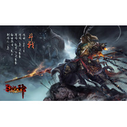

斗战
============================

|  |  |
| :--: | :-- |
| [ 斗战](https://emumo.xiami.com/album/613013846) | **艺人**: [墨明棋妙](../index.md) **语种**: 国语 **唱片公司**: 墨明棋妙 **发行时间**: 2014年07月23日 **专辑类别**: EP, 单曲 **专辑风格**: 中国风 China-Wave **播放数**: 464858 **收藏数**: 148 **评论数**: 15  |

## 简介

一直不敢为太大众的角色写歌，尤其是悟空这样家喻户晓。我在这首歌的制作中融入了很浓郁的摇滚和硬核说唱的风格。所以取了“妖猴"这样一个原型的角度。同时也为了更痛快的去表现角色的张狂与霸陵。另外因为这首歌的几位创作人全是男生，所以整首歌也显得非常硬派，希望大家喜欢这种全新的尝试——EDIQ

## 曲目

## 评论

|  |  |  |
| :-- | :-- | :-- |
|  [虾米用户](https://emumo.xiami.com/u/352293633)  2018-02-25 19:29 赞(0) 踩(0) | 
喜欢
 |
|  [虾米用户](https://emumo.xiami.com/u/229476031)  2017-08-20 04:04 赞(0) 踩(0) | 
战歌
 |
|  [虾米用户](https://emumo.xiami.com/u/3502959)  2014-12-11 14:23 赞(3) 踩(0) | 
那几句我就是我齐天大圣。。。忍不住有种我的滑板鞋时尚史上最时尚的感觉
 |
|  [虾米用户](https://emumo.xiami.com/u/2264609) 我还没想好要写什么... 2014-10-21 16:54 赞(0) 踩(0) | 
喜欢
 |
|  [虾米用户](https://emumo.xiami.com/u/12099709) 我的目标是星辰大海 2014-10-21 13:36 赞(0) 踩(0) | 
中二一声“哼”
 |
|  [虾米用户](https://emumo.xiami.com/u/9636998) = = 2014-10-15 19:29 赞(0) 踩(0) | 
很棒！
 |
|  [虾米用户](https://emumo.xiami.com/u/3883631)  2014-10-15 15:04 赞(0) 踩(0) | 
求高清封面啊！大赞啊！！
 |
| ⇒ |  [虾米用户](https://emumo.xiami.com/u/46788526) 暂无签名~ 2015-02-01 00:56 赞(0) 踩(0) | 
5sing上墨村发过
 |
| ⇒ |  [虾米用户](https://emumo.xiami.com/u/3883631)  2015-02-01 15:23 赞(0) 踩(0) | 
<q><b>清明说：</b></q>
 |
|  [虾米用户](https://emumo.xiami.com/u/270887) 拜啰嗦 2014-10-12 22:47 赞(0) 踩(0) | 
更喜欢哪吒啊，这个听着热闹。是不是要先看个悟空传热热身
 |
|  [虾米用户](https://emumo.xiami.com/u/8368932)  2014-10-12 20:53 赞(0) 踩(0) | 
感觉不错...
 |
|  [虾米用户](https://emumo.xiami.com/u/13369013) 那是一只鸟 2014-10-12 17:21 赞(1) 踩(0) | 
为什么很有YY小说的感觉。。
 |
|  [虾米用户](https://emumo.xiami.com/u/977310) 人生开始了新篇章 2014-10-12 09:34 赞(0) 踩(0) | 
不错~也喜欢
 |
|  [虾米用户](https://emumo.xiami.com/u/4741206)  2014-10-11 22:45 赞(0) 踩(0) | 
齐天大圣药药药！
 |
|  [虾米用户](https://emumo.xiami.com/u/38667561) 无人问我粥可温，无人与我... 2014-10-11 22:42 赞(0) 踩(0) | 
沙发
 |
