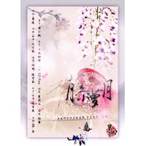

藤萝月
============================

|  |  |
| :--: | :-- |
| [ 藤萝月](https://emumo.xiami.com/album/765994130) | **艺人**: [墨明棋妙](../index.md) **语种**: 国语 **唱片公司**: 墨明棋妙 **发行时间**: 2013年04月08日 **专辑类别**: EP, 单曲 **专辑风格**: 中国风 China-Wave **播放数**: 279435 **收藏数**: 191 **评论数**: 30  |

## 简介

非常开心和河图大哥以及华丽的民乐阵容合作。首次将侠客风与云南风情融合，一首甜甜美美的藤萝月。希望大家喜欢。

## 曲目

## 评论

|  |  |  |
| :-- | :-- | :-- |
|  [虾米用户](https://emumo.xiami.com/u/385265)  2015-03-07 19:28 赞(0) 踩(0) | 
来顶我琴女神，编曲神棒的，至于人声，不得不说我琴和河图声线类型不是很搭，而且看词感觉男女唱角反了，大概是琴声音偏低不适合唱高，所以河图唱的高声部。但是就是喜欢我琴沉着清冷又略带腼腆的声线，反复听了无数次，希望女神多多出亲唱曲目，不论是作曲和歌首首都很用心，毫不担心落俗，古风圈里最喜欢你！
 |
|  [虾米用户](https://emumo.xiami.com/u/1559402) 胖纸的忧伤 2014-09-16 17:01 赞(0) 踩(0) | 
男女可以对调了，纯音乐会比人声出彩
 |
|  [虾米用户](https://emumo.xiami.com/u/10517016)  2014-08-27 08:55 赞(0) 踩(0) | 
冥想,
 |
|  [虾米用户](https://emumo.xiami.com/u/18437972) 我也不知道我只是一只企鹅 2014-07-05 00:07 赞(0) 踩(0) | 
曲子还蛮有味道的。
 |
|  [虾米用户](https://emumo.xiami.com/u/6760432) 这家伙有点懒，什么也没写 2014-02-27 15:18 赞(0) 踩(0) | 
有琴写歌还是不错的，这首歌女部太低了，歌还是不错的
 |
|  [虾米用户](https://emumo.xiami.com/u/1549755) 梦希望没有尽头，我们走到... 2014-02-08 23:29 赞(0) 踩(0) | 
有女声吗？俺完全听不出来是女声。。。听得好用力努力往女的那边掰了已经。。。。尼玛最讨厌这种男不男女不女的了
 |
| ⇒ |  [虾米用户](https://emumo.xiami.com/u/16060190) xiao 2014-04-19 20:40 赞(0) 踩(0) | 
不喜欢就别听！别诋毁图大！
 |
| ⇒ |  [虾米用户](https://emumo.xiami.com/u/1549755) 梦希望没有尽头，我们走到... 2014-04-19 20:45 赞(0) 踩(0) | 
<q><b>朱仙说：</b></q>
 |
| ⇒ |  [虾米用户](https://emumo.xiami.com/u/18437972) 我也不知道我只是一只企鹅 2014-07-05 00:06 赞(0) 踩(0) | 
<q><b>朱仙说：</b></q>
 |
|  [虾米用户](https://emumo.xiami.com/u/2961945) 哦耶！ 2014-01-24 17:24 赞(0) 踩(0) | 
可以单曲循环，不错听。
 |
|  [虾米用户](https://emumo.xiami.com/u/24132346) 一曲音醉过一世情！ 2013-10-10 16:14 赞(0) 踩(0) | 
藤萝月，点点斑斑，似江湖旧梦游落！
 |
|  [虾米用户](https://emumo.xiami.com/u/12343390) 嘉意自若不卖自萌 2013-09-27 22:03 赞(0) 踩(0) | 
女声低到那个地步还能唱出来，真的被惊到了。 与其说是两人声音不搭…… 女声低到这个地步真的大丈夫？！！
 |
|  [虾米用户](https://emumo.xiami.com/u/454506) 我还没想好要写什么... 2013-08-28 11:24 赞(0) 踩(0) | 
的確，兩個聲音似乎不配
 |
|  [虾米用户](https://emumo.xiami.com/u/10951828) 琴心剑魄 2013-06-11 13:20 赞(0) 踩(0) | 
挺好
 |
|  [虾米用户](https://emumo.xiami.com/u/1440252) 不问耕耘，只问收获 2013-06-04 00:00 赞(0) 踩(0) | 
希望能出这首歌的纯音乐版，不要人声演唱有时会更好。 无声胜有声，无词胜有词 人声，把乐曲营造的氛围反而破坏了。
 |
|  [虾米用户](https://emumo.xiami.com/u/6776760)  2013-06-01 23:27 赞(0) 踩(0) | 
越听越有味道~~
 |
|  [虾米用户](https://emumo.xiami.com/u/13044645) 半缘修道半缘君 2013-05-23 13:18 赞(0) 踩(0) | 
不喜女声，那种暗哑的、像在说话（而不是唱）的声音不是我的菜。MS女声是流行歌曲的主流声音？反正听不清在唱什么。男声好听，完全盖过女声。
 |
|  [虾米用户](https://emumo.xiami.com/u/839479)  2013-05-13 22:46 赞(0) 踩(0) | 
商连的词。
 |
|  [虾米用户](https://emumo.xiami.com/u/595411) 我是饱哥哥 2013-05-13 16:09 赞(0) 踩(0) | 
两个人声音不搭，女声唱功要加强
 |
|  [虾米用户](https://emumo.xiami.com/u/576949)   2013-05-09 13:18 赞(0) 踩(0) | 
偏平淡，声音有些撑不起来的感觉
 |
|  [虾米用户](https://emumo.xiami.com/u/6758071)  2013-04-28 19:51 赞(0) 踩(0) | 
就。。觉得。。有琴单唱这首歌和图大单唱这首歌都会很好听。。但是不同的感觉。。。合在一起就变。。。有点不搭。。。
 |
|  [虾米用户](https://emumo.xiami.com/u/14016689)  2013-04-20 20:35 赞(0) 踩(0) | 
大爱！
 |
|  [虾米用户](https://emumo.xiami.com/u/12731930)  2013-04-18 21:58 赞(0) 踩(0) | 
支持墨村～虽然觉得人声方面不是很和
 |
|  [虾米用户](https://emumo.xiami.com/u/2923080) 聆听东方无限美妙。 2013-04-16 12:34 赞(1) 踩(0) | 
阳气不足
 |
|  [虾米用户](https://emumo.xiami.com/u/8301080)  2013-04-16 10:29 赞(0) 踩(0) | 
淡淡落寞侠客风情
 |
|  [虾米用户](https://emumo.xiami.com/u/7011425) 网易云同名id，再次相聚... 2013-04-15 19:56 赞(1) 踩(0) | 
男声有点像苏打绿那种声线
 |
| ⇒ |  [虾米用户](https://emumo.xiami.com/u/8176895)  2013-07-09 20:48 赞(0) 踩(0) | 
图大比苏打绿男人！
 |
|  [虾米用户](https://emumo.xiami.com/u/2949889) 我还没想好要写什么... 2013-04-15 19:55 赞(1) 踩(0) | 
单独听有琴唱也是还不错的，但是图大声音一出来，立马听出区别了，男声女声很不搭啊~但是有琴编曲真是超级厉害的，她近来的曲子都超级好听~
 |
|  [虾米用户](https://emumo.xiami.com/u/7047722) 水滴石穿碎满地 2013-04-15 16:38 赞(0) 踩(0) | 
女声是不是有点太低了~
 |
|  [虾米用户](https://emumo.xiami.com/u/791010) 大丈夫，大丈夫 2013-04-15 16:26 赞(0) 踩(0) | 
一开始听总觉得两人的声音合不在一起...不过多撸了几遍发现还是很有萌点的~~o(&amp;gt;_&amp;lt;)o ~~
 |
