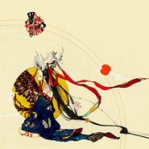
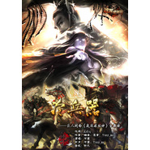
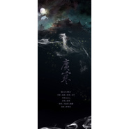
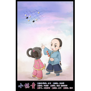
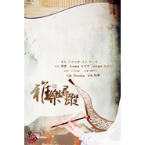
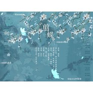
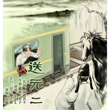
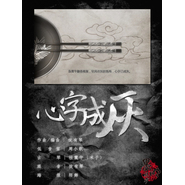
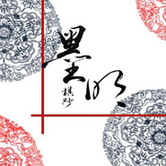

墨明棋妙
============================

|  |  |
| :--: | :-- |
| [<br>墨明棋妙](https://i.xiami.com/mmqmusic) | **播放数**: 33665183<br>**粉丝数**: 47393<br>**评论数**: 1316<br>**地区**: China 中国大陆<br>**风格**: 古风 GuFeng Music, 国语流行 Mandarin Pop<br> |

## 档案

<div>
小档案<br>
中   文   名   墨明棋妙<br>
别        名   墨村<br>
类        型   音乐团队<br>
成立时间   2007  年  1  月  6  日<br>
乐队资料<br>
墨明棋妙原创音乐团队成立于  2007  年  1  月  6  日，由网络音乐人  EDIQ  和丢子发起，通过网络聚集了一群在曲、词、唱、奏、混音、  MV  制作、美工等方面各有所长的人才。词曲唱奏各展所长，音乐作品风格多元，以“古风”见长。<br>
团队倡导“流行相对论”“万有引力向古风”的创作思想，将传统民乐与流行元素相结合，并融合古体与现代诗词的文字精华，打造富有现代气息又不失古韵的系列音乐作品。<br>
音乐风格<br>
墨明棋妙整个团队被网友们昵称为“墨村”。墨村绝大部分成员的专业、工作都与艺术无关，是对音乐的爱将他们汇聚在一起，引领他们在不断感悟和尝试中持续创作。墨村歌曲《我们的墨明棋妙》中提到：“邀您呼吸唐宋的风”、“醉卧角徵宫商”，这两句歌词恰到好处地表明了墨村的作品特色，那就是无处不在的古风元素。<br>
音乐历程<br>
2007  年  1  月   墨明棋妙原创音乐团队正式成立。  2007  年  6  月   EDIQ  、丢子代表团队出席七喜网络红人“草莽英雄会”节目现场嘉宾。  2007  年  11  月   U2  电台“快乐飙歌场”为期两周团队专栏节目。<br>
2008  年  2  月   HITA  、  TONY  代表团队出席  CCTV2  《春暖家园》抗击风雪灾后重建大型公益晚会“让爱回家”节目现场嘉宾。  2008  年  3  月   北京首都人民广播电台生活频道“播客秀”专栏节目。  2008  年  5  月   杭州“第四届中国国际动漫节”团队舞台演出。  2008  年  6  月上海电视台生活时尚频道“今日印象”抗震专题节目“永不放手”。  2008  年  6  月   上海“第四届中国国际动漫游戏博览会”《漫友》杂志国内首部有声漫画《台上台下》原声首发，由墨明棋妙打造其主题歌。  2008  年  12  月中国唱片上海公司携墨明棋妙打造首张古风音乐大碟《千山梦》正式出版发行。  2008  年  12  月   《再逢明月照九州》、《如梦令》作为腾讯网络游戏《寻仙》签约歌曲发布。<br>
2009  年  10  月   为韩红专辑《听我的声音》歌曲《文成公主》、《一次一次》作词。<br>
2010  年  2  月   接受广州日报采访，报道文章名为《想回盛唐的耳朵》。  2010  年  2  月   为网易网络游戏《倩女幽魂  Online  》倾情打造的主题歌曲《兰若词》正式发布。  2010  年  10  月   河图首张全创作专辑《风起天阑》正式出版发行。<br>
2011  年  1  月   墨明棋妙四周年生日  YY  歌会成功举办，现场逾八千人参加。  2011  年  1  月台湾知名音乐人、“古风音乐之父”蔡志展先生为墨明棋妙四周年题字。  2011  年  1  月   打造完美时空网络游戏《笑傲江湖》宣传配。乐  2011  年  4  月   搜狐网络游戏《古域》之剧情音乐大片《古域之域》。  2011  年  5  月河图专辑《唱给你的歌》正式出版发行。<br>
2012  年  1  月   墨明棋妙五周年生日  YY  歌会成功举办，现场最高人气破万。  2012  年  12  月  1  日   ediq  原创词集典藏《徵羽手札》预售开启。  2012  年  12  月  31  日   墨明棋妙六周年  LIVE  ，北京  .YY  转播最高人气破万。<br>
2013  年  1  月   与中国邮政合作制作发行“墨明棋妙五六周年纪念纪念明信片”。  2013  年  1  月  19  日   河图第三张专辑《倾尽天下》预售开启。  2013  年  6  月  1  日   墨明棋妙五、六周年专辑《天命风流》正式出版发行。  7  月  13.14  日   墨明棋妙参加  7.13-14  苏州  ADsp  暑期特别动漫交流会。  7  月  20  日   墨明棋妙在上海书城举办签售会年。  7  月  20  日   墨明棋妙于淘宝正式出售。  10.5  日南京人民大会堂“金陵·秦淮夜”演唱会门票。  8  月  17  日   墨明棋妙于下午  2:00  在成都新华文轩总府书城举办专辑《天命风流》唱片答谢会。  10  月  5  日   墨明棋妙于晚  7:20  在南京人民大会堂举办“金陵·秦淮夜”演唱会。  12  月  5  日   墨明棋妙主创  ediq  、丢子参加  CCTV  新科动漫《次元爱》节目录制。  12  月  8  日   墨明棋妙原创音乐团队做客清华时代论坛。  12  月  14  日   墨明棋妙《金陵·秦淮夜》南京演唱会  DVD  广州首发。墨村成员  ediq  、桂震宇、猛虎蔷薇、橙翼到场签售。  12  月  21  日南京音乐会首发纪念版  DVD  参加长沙红蓝  CP  动漫交流展墨村成员  ediq  、米子、千草仙、  EZ-Ven  现场签售。  12  月  24  日平安夜墨明棋妙主创南京水游城签售《金陵·秦淮夜》  DVD  典藏版。<br>
2015  年  2  月发行  EP  《主宰》《我们的轨迹》《梦见海拉尔》。<br>
2016  年  2  月  5  日，在“  5sing  中国原创音乐基地”上传原创歌曲《神通》《入梦》，  3  月  17  日，上传歌曲《天涯三唱》，  4  月  13  日，上传歌曲《虫谣》。
</div>

## 专辑

| 名称 | 语种 | 唱片公司 | 发行时间 | 专辑类别 | 专辑风格 |
| :--: | :-- | :-- | :-- | :-- | :-- |
| [<br>春梦物语墨明棋妙4月新作](./albums/2103702714.md) | 国语 | 墨明棋妙 | 2018年04月28日 | EP, 单曲 | 爵士 Jazz, 日本流行 J-Pop, 古风 GuFeng Music |
| [<br>梦见海拉尔](./albums/926580805.md) | 国语 | 独立发行 | 2015年02月20日 | EP, 单曲 |  |
| [<br>我们的轨迹](./albums/1026580341.md) | 国语 | 独立发行 | 2015年02月13日 | EP, 单曲 |  |
| [<br>主宰](./albums/1323630424.md) | 国语 | 墨明棋妙 | 2015年02月04日 | EP, 单曲 |  |
| [<br>冷兵器](./albums/323630524.md) | 国语 | 墨明棋妙 | 2015年01月12日 | EP, 单曲 |  |
| [<br>战](./albums/1923630501.md) | 国语 | 独立发行 | 2015年01月06日 | EP, 单曲 | 中国风 China-Wave |
| [<br>为你不败](./albums/723630511.md) | 国语 | 墨明棋妙 | 2014年12月25日 | EP, 单曲 | 中国风 China-Wave |
| [<br>古龙群侠传](./albums/1719230050.md) | 国语 | 墨明棋妙 | 2014年12月19日 | EP, 单曲 | 中国风 China-Wave |
| [<br>你好，罗伯兹先生！](./albums/619230038.md) | 国语 | 墨明棋妙 | 2014年11月28日 | EP, 单曲 |  |
| [<br>业火苍云歌](./albums/1119229996.md) | 国语 | 墨明棋妙 | 2014年11月22日 | EP, 单曲 | 古风 GuFeng Music |
| [<br>飞舟](./albums/713013525.md) | 国语 | 墨明棋妙 | 2014年09月24日 | EP, 单曲 | 古风 GuFeng Music |
| [<br>子衿](./albums/13013882.md) | 国语 | 独立发行 | 2014年09月12日 | EP, 单曲 | 古风 GuFeng Music |
| [<br>酒酿相思](./albums/1213013870.md) | 国语 | 墨明棋妙 | 2014年08月21日 | EP, 单曲 | 古风 GuFeng Music |
| [<br>广寒](./albums/13013857.md) | 国语 | 墨明棋妙 | 2014年08月07日 | EP, 单曲 |  |
| [<br>斗战](./albums/613013846.md) | 国语 | 墨明棋妙 | 2014年07月23日 | EP, 单曲 | 中国风 China-Wave |
| [<br>小棋童](./albums/1213013786.md) | 国语 | 墨明棋妙 | 2014年05月29日 | EP, 单曲 | 古风 GuFeng Music |
| [<br>青蛇](./albums/301182182.md) | 国语 | 墨明棋妙 | 2014年05月23日 | EP, 单曲 | 古风 GuFeng Music |
| [<br>人面桃花](./albums/695654777.md) | 国语 | 墨明棋妙 | 2014年03月21日 | EP, 单曲 | 古风 GuFeng Music |
| [<br>湖光水色调](./albums/93577016.md) | 国语 | 墨明棋妙 | 2014年02月23日 | EP, 单曲 | 古风 GuFeng Music |
| [<br>红尘清歌](./albums/894001014.md) | 国语 | 墨明棋妙 | 2014年02月14日 | EP, 单曲 | 古风 GuFeng Music |
| [<br>悟惊蛰](./albums/1190742825.md) | 国语 | 墨明棋妙 | 2014年01月25日 | EP, 单曲 | 古风 GuFeng Music |
| [<br>独坐幽篁](./albums/1890715963.md) | 国语 | 墨明棋妙 | 2014年01月21日 | EP, 单曲 | 古风 GuFeng Music |
| [<br>雅乐寻踪](./albums/484759023.md) | 国语 | 墨名棋妙 | 2013年11月09日 | EP, 单曲 | 古风 GuFeng Music |
| [<br>鼓与花](./albums/283533154.md) | 国语 | 墨明棋妙 | 2013年10月26日 | EP, 单曲 | 古风 GuFeng Music |
| [<br>千丝万缕](./albums/581204017.md) | 国语 | 墨明棋妙 | 2013年09月29日 | EP, 单曲 |  |
| [<br>天命风流墨明棋妙原创音乐团队主题精选集(2011-2012)暨五六周年纪念专辑](./albums/547075.md) | 国语 | 海蝶音乐 | 2013年09月06日 | 合集, 杂锦 | 古风 GuFeng Music |
| [<br>天之传说·牧云谣](./albums/978102927.md) | 国语 | 墨明棋妙 | 2013年08月30日 | EP, 单曲 | 中国风 China-Wave |
| [<br>雁城雪](./albums/1369991611.md) | 国语 | 墨明棋妙 | 2013年05月29日 | EP, 单曲 | 中国风 China-Wave |
| [<br>剪蝶](./albums/1869625441.md) | 国语 | 墨明棋妙 | 2013年05月19日 | EP, 单曲 | 古风 GuFeng Music |
| [<br>问琴](./albums/767131568.md) | 国语 | 墨明棋妙 | 2013年04月24日 | EP, 单曲 |  |
| [<br>送元二](./albums/866619004.md) | 国语 | 墨明棋妙 | 2013年04月18日 | EP, 单曲 |  |
| [<br>藤萝月](./albums/765994130.md) | 国语 | 墨明棋妙 | 2013年04月08日 | EP, 单曲 | 中国风 China-Wave |
| [<br>斗破苍穹](./albums/865994064.md) | 国语 | 墨明棋妙 | 2013年03月22日 | EP, 单曲 |  |
| [<br>心字成灰](./albums/1865587282.md) | 其他 | 独立发行 | 2013年02月08日 | EP, 单曲 |  |
| [<br>茶女](./albums/518845.md) | 国语 | 墨明棋妙 | 2012年05月25日 | EP, 单曲 | 古风 GuFeng Music |
| [<br>东京梦华录](./albums/100488435.md) | 国语 | 墨明棋妙 | 2012年01月10日 | EP, 单曲 | 古风 GuFeng Music |
| [<br>礼仪之邦](./albums/181371393.md) | 国语 | 看见文娱 | 2012年01月01日 | EP, 单曲 | 古风 GuFeng Music |
| [<br>因缘劫](./albums/459188.md) | 国语 | 墨明棋妙 | 2011年08月14日 | EP, 单曲 | 中国风 China-Wave |
| [<br>墨明棋妙](./albums/447928.md) | 国语 | 墨明棋妙 | 2011年06月21日 | 合集, 杂锦 | 古风 GuFeng Music |
| [<br>三四周年纪念合辑](./albums/505672.md) | 国语 | 中唱上海 | 2011年04月05日 | 精选集 | 中国风 China-Wave |
| [<br>中国风R&B 的墨明棋妙](./albums/411316.md) | 国语 | 华圣娱乐 | 2009年10月28日 | 合集, 杂锦 | 中国风 China-Wave |
| [<br>醉·倾城](./albums/489616.md) | 国语 | 墨明棋妙 | 2009年10月07日 | EP, 单曲 | 古风 GuFeng Music |
| [<br>大唐红颜赋](./albums/517935.md) | 国语 | 墨明棋妙 | 2009年06月04日 | EP, 单曲 | 古风 GuFeng Music |
| [<br>两周年词集](./albums/466064.md) | 国语 | 独立发行 | 2009年03月13日 | 合集, 杂锦 |  |
| [<br>战魂 英雄劫](./albums/414109.md) | 国语 | 墨明棋妙 | 2008年11月24日 | EP, 单曲 | 中国风 China-Wave |
| [<br>千山梦](./albums/338782.md) | 其他 | 中唱上海 | 2008年01月01日 | 合集, 杂锦 | 古风 GuFeng Music |
| [<br>枯叶之蝶 同名游戏视频主题曲](./albums/430917.md) | 国语 | 墨明棋妙 | 2007年10月01日 | EP, 单曲 | 中国风 China-Wave |

## 评论

|  |  |  |  |
| :-- | :-- | :-- | :-- |
| <br>[虾米用户](https://emumo.xiami.com/u/50817383)<br>猫儿在这儿.<br>2020-04-13 10:49<br>赞(0) 踩(0) | <div>❤️</div> |
| <br>[虾米用户](https://emumo.xiami.com/u/8749492)<br>挥手自兹去<br>2020-01-29 13:31<br>赞(0) 踩(0) | <div>这种古风就是最大的土味</div> |
| <br>[虾米用户](https://emumo.xiami.com/u/325205625)<br><br>2019-10-30 09:18<br>赞(0) 踩(0) | <div>，</div> |
| <br>[虾米用户](https://emumo.xiami.com/u/373652009)<br>骨灰级处女座，古风填词。...<br>2019-09-22 10:36<br>赞(1) 踩(0) | <div>从12年，我就是河图粉丝了，可惜现在他出歌越来越少，喜欢他写的那种气魄荡漾的歌，和百转千回的婉转。来徐州开演唱会吧，我肯定去抢前排票不论票价。PS:一个80后老阿姨。</div> |
| <br>[虾米用户](https://emumo.xiami.com/u/244514014)<br><br>2019-06-21 21:55<br>赞(3) 踩(0) | <div>我记得墨明棋妙不是男的吗？</div> |
| <br>[虾米用户](https://emumo.xiami.com/u/337185561)<br>后会有期。<br>2019-04-10 15:48<br>赞(3) 踩(0) | <div>听了很多年了～支持支持</div> |
| <br>[虾米用户](https://emumo.xiami.com/u/2673316)<br><br>2019-03-15 10:12<br>赞(1) 踩(0) | <div>一直以为是莫名妙棋</div> |
| <br>[虾米用户](https://emumo.xiami.com/u/256410843)<br>Devil May Cr...<br>2018-11-19 19:50<br>赞(1) 踩(0) | <div>苍云！</div> |
| <br>[虾米用户](https://emumo.xiami.com/u/379328328)<br>一生最爱海贼王❤<br>2018-08-01 00:40<br>赞(1) 踩(0) | <div>在茫茫历史长河中摸索进步，也许千年以后中华人民共和国又是另一个唐朝盛世~~又是一阵古风的延续，中国的传承延续加油！</div> |
| <br>[虾米用户](https://emumo.xiami.com/u/37790046)<br>港岛妹妹 你献给我的西班...<br>2018-07-28 17:08<br>赞(1) 踩(0) | <div>血染江山的画 怎敌你眉间一点朱砂</div> |
| <br>[虾米用户](https://emumo.xiami.com/u/374127652)<br>change<br>2018-07-11 22:18<br>赞(1) 踩(0) | <div>伊人醉也没有了额</div> |
| <br>[虾米用户](https://emumo.xiami.com/u/344894797)<br><br>2018-06-04 16:23<br>赞(1) 踩(0) | <div>《兰若词》怎么没了，墨明棋妙女声版的</div> |
| <br>[虾米用户](https://emumo.xiami.com/u/357674040)<br><br>2018-05-09 07:03<br>赞(1) 踩(0) | <div></div> |
| <br>[虾米用户](https://emumo.xiami.com/u/44645641)<br>荼靡清香一炷，浮尘心意三...<br>2018-03-31 11:04<br>赞(18) 踩(0) | <div>我冒天下之大不韪说一下，中国现在所谓的古风还不成熟，大都是伪古风，拿很多好曲子乱填词，堆砌辞藻，不知所云。当然初心是好的，爱好是没错的，好好摸索，古风的成熟尚需时间，还需要更多人的投入。加油</div> |
| <br>[虾米用户](https://emumo.xiami.com/u/247080759)<br>关注  公众号 【第六号...<br>2018-03-09 15:55<br>赞(2) 踩(0) | <div>国风开始复兴 <a href="https://www.toutiao.com/i6529425710505787907/" target="_blank" rel="nofollow noreferrer noopener">https://www.toutiao.com/i6529425710505787907/</a></div> |
| <br>[虾米用户](https://emumo.xiami.com/u/1665678)<br>我若青帝。<br>2018-03-05 16:17<br>赞(1) 踩(0) | <div>喜欢了七年</div> |
| <br>[虾米用户](https://emumo.xiami.com/u/43488334)<br><br>2017-11-19 09:50<br>赞(1) 踩(0) | <div>美得不可理喻！</div> |
| <br>[虾米用户](https://emumo.xiami.com/u/18659527)<br>长恨此身非我有。<br>2017-10-30 10:16<br>赞(1) 踩(0) | <div>古风团队，有不少经典作品。</div> |
| <br>[虾米用户](https://emumo.xiami.com/u/2190428)<br>一梦如是<br>2017-10-27 23:28<br>赞(2) 踩(0) | <div>对民间自发的团体给以极大支持。</div> |
| <br>[虾米用户](https://emumo.xiami.com/u/6989809)<br>creep！！！<br>2017-10-12 12:26<br>赞(1) 踩(0) | <div>最近比较喜欢的古风！</div> |
| <br>[虾米用户](https://emumo.xiami.com/u/266644314)<br> <br>2017-10-08 12:26<br>赞(2) 踩(0) | <div>你们的哪些作品像大唐红颜赋一样古风唱腔比较多</div> |
| <br>[虾米用户](https://emumo.xiami.com/u/297340192)<br><br>2017-10-01 15:23<br>赞(1) 踩(0) | <div>很多人接触它是因为仙剑，我也是。</div> |
| <br>[虾米用户](https://emumo.xiami.com/u/313962847)<br><br>2017-10-01 13:27<br>赞(1) 踩(0) | <div>大家接触它难道不是因为仙剑</div> |
| ⇒ | <br>[虾米用户](https://emumo.xiami.com/u/344894797)<br><br>2018-06-04 16:28<br>赞(0) 踩(0) | <div>因为（兰若词）才接触的，虾米上没有他们版的</div> |
| <br>[虾米用户](https://emumo.xiami.com/u/12514793)<br><br>2017-09-30 20:45<br>赞(0) 踩(0) | <div>喜欢就是喜欢，虾米你真特么多事。</div> |
| <br>[虾米用户](https://emumo.xiami.com/u/323361190)<br><br>2017-09-04 20:13<br>赞(0) 踩(0) | <div>喜欢喜欢</div> |
| <br>[虾米用户](https://emumo.xiami.com/u/40067723)<br><br>2017-09-01 21:18<br>赞(0) 踩(0) | <div>最爱墨明棋妙和许嵩</div> |
| <br>[虾米用户](https://emumo.xiami.com/u/218583766)<br>今古有神奉志士<br>2017-08-21 21:56<br>赞(0) 踩(0) | <div>天籁之音</div> |
| <br>[虾米用户](https://emumo.xiami.com/u/218583766)<br>今古有神奉志士<br>2017-08-21 21:56<br>赞(0) 踩(0) | <div>天籁之音</div> |
| <br>[虾米用户](https://emumo.xiami.com/u/277914084)<br>青松碎云蹁跹，饮风共醉月...<br>2017-07-26 10:00<br>赞(0) 踩(0) | <div>墨明棋妙真棒哦</div> |
| <br>[虾米用户](https://emumo.xiami.com/u/277914084)<br>青松碎云蹁跹，饮风共醉月...<br>2017-07-26 09:57<br>赞(1) 踩(0) | <div>特喜欢听古风歌曲！</div> |
| <br>[虾米用户](https://emumo.xiami.com/u/312858559)<br>以我之名，护你一生<br>2017-07-17 14:09<br>赞(0) 踩(0) | <div>赞喔</div> |
| <br>[虾米用户](https://emumo.xiami.com/u/312858559)<br>以我之名，护你一生<br>2017-07-17 14:05<br>赞(0) 踩(0) | <div>好听喔</div> |
| <br>[虾米用户](https://emumo.xiami.com/u/280917373)<br><br>2017-06-04 23:45<br>赞(0) 踩(0) | <div>听了墨明棋妙的歌和音乐，我觉得中国不久会出音乐大师的，墨明棋妙我看好你们。</div> |
| ⇒ | <br>[虾米用户](https://emumo.xiami.com/u/50505133)<br>真飞鸟&史黛拉<br>2017-09-23 18:31<br>赞(0) 踩(0) | <div>墨明棋妙离大师那个级数起码十万八千里。</div> |
| <br>[虾米用户](https://emumo.xiami.com/u/301503336)<br><br>2017-06-03 14:14<br>赞(0) 踩(0) | <div>婉转痴缠</div> |
| <br>[虾米用户](https://emumo.xiami.com/u/251653323)<br><br>2017-05-22 23:53<br>赞(2) 踩(0) | <div>会不会开演唱会.我想听河图大人现场</div> |
| <br>[虾米用户](https://emumo.xiami.com/u/281934183)<br><br>2017-05-06 10:39<br>赞(0) 踩(0) | <div>古风</div> |
| <br>[虾米用户](https://emumo.xiami.com/u/105465654)<br> 一人歌二人行<br>2017-05-05 09:21<br>赞(0) 踩(0) | <div>越来越觉得好棒.我也会努力让自己变得越来越棒 </div> |
| <br>[虾米用户](https://emumo.xiami.com/u/10999385)<br> <br>2017-04-24 11:20<br>赞(3) 踩(0) | <div>喜欢他们所有的纯音乐  有人声演唱的一首也不喜欢</div> |
| <br>[虾米用户](https://emumo.xiami.com/u/287705027)<br><br>2017-04-10 16:19<br>赞(0) 踩(0) | <div>一直都很喜欢他们</div> |
| <br>[虾米用户](https://emumo.xiami.com/u/78734366)<br>我还没想好要写什么...<br>2017-04-04 13:41<br>赞(0) 踩(0) | <div>喜欢</div> |
| <br>[虾米用户](https://emumo.xiami.com/u/265347314)<br>你好啊<br>2017-04-01 17:36<br>赞(0) 踩(0) | <div>很好</div> |
| <br>[虾米用户](https://emumo.xiami.com/u/51740442)<br>绿玉党<br>2017-03-31 20:29<br>赞(0) 踩(0) | <div>  </div> |
| <br>[虾米用户](https://emumo.xiami.com/u/284039715)<br>善良没用，你要漂亮<br>2017-03-28 16:49<br>赞(0) 踩(0) | <div>好听(ง &amp;bull;̀_&amp;bull;́)ง</div> |
| <br>[虾米用户](https://emumo.xiami.com/u/15315704)<br> <br>2017-03-27 13:37<br>赞(0) 踩(0) | <div>喜欢</div> |
| <br>[虾米用户](https://emumo.xiami.com/u/279940313)<br><br>2017-03-21 18:58<br>赞(40) 踩(0) | <div>墨香千里迎佳客明溪轻入子牙河棋盘纵横黑白子妙音拨醉满城歌</div> |
| <br>[虾米用户](https://emumo.xiami.com/u/276996939)<br><br>2017-03-01 13:55<br>赞(0) 踩(0) | <div>大爱啊</div> |
| <br>[虾米用户](https://emumo.xiami.com/u/47061210)<br><br>2017-02-21 13:47<br>赞(5) 踩(0) | <div>好好的音乐,但整首歌人声一出,就好像一锅好汤被扔进了一啦老鼠屎,  刹间倒胃口,  哈哈,  大伙有没有这感觉?</div> |
| ⇒ | <br>[虾米用户](https://emumo.xiami.com/u/38867488)<br><br>2017-12-13 01:37<br>赞(0) 踩(0) | <div>就直接说人声难听就可以了，为啥要阴阳怪气的。</div> |
| <br>[虾米用户](https://emumo.xiami.com/u/272289108)<br><br>2017-02-14 09:46<br>赞(3) 踩(0) | <div>喜欢十年了，不解释</div> |
| <br>[虾米用户](https://emumo.xiami.com/u/270313031)<br><br>2017-02-03 09:42<br>赞(2) 踩(0) | <div>喜欢古典音乐</div> |
| <br>[虾米用户](https://emumo.xiami.com/u/31028791)<br>网易和q也是神圣剑帝<br>2017-01-21 16:42<br>赞(0) 踩(0) | <div>    </div> |
| <br>[虾米用户](https://emumo.xiami.com/u/261690200)<br><br>2017-01-13 22:31<br>赞(4) 踩(0) | <div>大爱墨明棋妙</div> |
| <br>[虾米用户](https://emumo.xiami.com/u/249798514)<br><br>2016-12-09 16:32<br>赞(1) 踩(0) | <div>古风</div> |
| <br>[虾米用户](https://emumo.xiami.com/u/251424229)<br><br>2016-12-02 01:13<br>赞(0) 踩(0) | <div>喜欢，好好听</div> |
| <br>[虾米用户](https://emumo.xiami.com/u/246401335)<br><br>2016-11-19 22:49<br>赞(0) 踩(0) | <div>#精英战队#大学起就喜欢上的一位古风艺人，很纯净的中国古风，词曲都能让我瞬间穿越返古并陶醉其中我猜，@娟子茶娟姐应该也会喜欢吧？也推荐给你们试试@面条夫人云朵妈@加减城厨   </div> |
| <br>[虾米用户](https://emumo.xiami.com/u/59593992)<br><br>2016-11-07 16:13<br>赞(1) 踩(0) | <div>喜欢纯音乐</div> |
| <br>[虾米用户](https://emumo.xiami.com/u/50868492)<br><br>2016-11-02 10:39<br>赞(1) 踩(0) | <div>总之喜欢就好</div> |
| <br>[虾米用户](https://emumo.xiami.com/u/84613224)<br> <br>2016-10-30 21:08<br>赞(1) 踩(0) | <div>果然还是河图的更好，前面那么多首都是听个开头就听不下去了</div> |
| <br>[虾米用户](https://emumo.xiami.com/u/177949442)<br><br>2016-10-07 11:58<br>赞(0) 踩(0) | <div>古典与现代（小提琴版）的音乐，建议斑竹多去听听，相信可以给你的音乐带来全新的创作灵感。</div> |
| <br>[虾米用户](https://emumo.xiami.com/u/177949442)<br><br>2016-10-07 11:54<br>赞(1) 踩(0) | <div>曲风和曲味我很喜欢，曲调缺少现代青年人的朝气！只能感觉大皇时代气概。</div> |
| <br>[虾米用户](https://emumo.xiami.com/u/200006355)<br><br>2016-09-05 11:25<br>赞(0) 踩(0) | <div>你是神仙，对不？       </div> |
| <br>[虾米用户](https://emumo.xiami.com/u/4174981)<br><br>2016-08-08 16:43<br>赞(2) 踩(0) | <div>我的古风入坑……纪念一下</div> |
| <br>[虾米用户](https://emumo.xiami.com/u/32448108)<br><br>2016-07-26 14:06<br>赞(3) 踩(0) | <div>墨明棋妙，果然莫名其妙，祝早死！</div> |
| ⇒ | <br>[虾米用户](https://emumo.xiami.com/u/210803209)<br>恩怨不提只因为无从作答，...<br>2016-09-24 13:00<br>赞(0) 踩(0) | <div>没素质。</div> |
| ⇒ | <br>[虾米用户](https://emumo.xiami.com/u/32448108)<br><br>2016-09-24 17:55<br>赞(0) 踩(0) | <div><q><b>曦磬说：</b></q></div> |
| ⇒ | <br>[虾米用户](https://emumo.xiami.com/u/210803209)<br>恩怨不提只因为无从作答，...<br>2016-09-24 18:06<br>赞(0) 踩(0) | <div><q><b>说：</b></q></div> |
| ⇒ | <br>[虾米用户](https://emumo.xiami.com/u/210803209)<br>恩怨不提只因为无从作答，...<br>2016-09-24 18:26<br>赞(0) 踩(0) | <div><q><b>说：</b></q></div> |
| ⇒ | <br>[虾米用户](https://emumo.xiami.com/u/32448108)<br><br>2016-09-24 21:01<br>赞(0) 踩(0) | <div><q><b>曦磬说：</b></q></div> |
| ⇒ | <br>[虾米用户](https://emumo.xiami.com/u/2742218)<br>清幽的月光之下 樱花离枝...<br>2016-11-24 20:01<br>赞(0) 踩(0) | <div>觉得你比较莫名其妙，干嘛就咒人死</div> |
| ⇒ | <br>[虾米用户](https://emumo.xiami.com/u/32448108)<br><br>2016-11-24 21:04<br>赞(0) 踩(0) | <div><q><b>清月樱雪说：</b></q></div> |
| ⇒ | <br>[虾米用户](https://emumo.xiami.com/u/2742218)<br>清幽的月光之下 樱花离枝...<br>2016-11-27 22:42<br>赞(0) 踩(0) | <div><q><b>说：</b></q></div> |
| <br>[虾米用户](https://emumo.xiami.com/u/45818524)<br>致我所爱的人好夢~Twi...<br>2016-07-23 14:13<br>赞(2) 踩(0) | <div>古风~  </div> |
| <br>[虾米用户](https://emumo.xiami.com/u/5983325)<br><br>2016-07-23 10:04<br>赞(1) 踩(0) | <div>听过其中的哪吒，特别喜欢，找到虾米想多听一点</div> |
| <br>[虾米用户](https://emumo.xiami.com/u/36927277)<br> <br>2016-06-29 23:25<br>赞(1) 踩(0) | <div>加油加油 传统文化传承下去的领头人物 </div> |
| <br>[虾米用户](https://emumo.xiami.com/u/77238592)<br><br>2016-06-27 13:54<br>赞(0) 踩(0) | <div>旺旺</div> |
| <br>[虾米用户](https://emumo.xiami.com/u/9242582)<br><br>2016-05-18 13:31<br>赞(1) 踩(0) | <div>古风，好听</div> |
| <br>[虾米用户](https://emumo.xiami.com/u/120607606)<br>大葱咂<br>2016-04-07 19:56<br>赞(0) 踩(0) | <div>爱哭</div> |
| <br>[虾米用户](https://emumo.xiami.com/u/43153025)<br>万事不如杯中酒，人生几见...<br>2016-04-06 00:40<br>赞(0) 踩(0) | <div>戴荃</div> |
| <br>[虾米用户](https://emumo.xiami.com/u/98132996)<br>给岁月以文明，而不是给文...<br>2016-03-23 10:15<br>赞(2) 踩(0) | <div>喜欢墨明棋妙的很多古风歌曲。</div> |
| <br>[虾米用户](https://emumo.xiami.com/u/11360601)<br>拉格朗日点。<br>2016-02-23 13:10<br>赞(4) 踩(0) | <div>如果音频怪物能少发点自拍……</div> |
| <br>[虾米用户](https://emumo.xiami.com/u/93226796)<br>只见雪色映衣袂，抚琴月显...<br>2016-02-10 21:16<br>赞(0) 踩(0) | <div>《如梦令》到底是这里谁唱的？河图？还是谁啊？</div> |
| ⇒ | <br>[虾米用户](https://emumo.xiami.com/u/217299586)<br><br>2016-08-24 11:04<br>赞(0) 踩(0) | <div>李玉刚</div> |
| <br>[虾米用户](https://emumo.xiami.com/u/977310)<br>人生开始了新篇章<br>2016-02-01 13:54<br>赞(7) 踩(0) | <div>最喜欢河图，hita和音频怪物。忽然发现喜欢墨村也很久了，从高一那年至今都快七年了。因为他们才开始听古风</div> |
| <br>[虾米用户](https://emumo.xiami.com/u/44161162)<br>音乐人生<br>2016-01-11 16:36<br>赞(0) 踩(0) | <div>很欣慰！名族音乐得到延续发展！</div> |
| <br>[虾米用户](https://emumo.xiami.com/u/91483270)<br>音乐，随心而听<br>2016-01-04 19:53<br>赞(0) 踩(0) | <div>词美</div> |
| <br>[虾米用户](https://emumo.xiami.com/u/96948800)<br><br>2016-01-02 22:43<br>赞(0) 踩(0) | <div>主要还是歌词吧</div> |
| <br>[虾米用户](https://emumo.xiami.com/u/82165312)<br> <br>2015-12-14 22:08<br>赞(0) 踩(0) | <div>最喜欢墨明棋妙的歌。喜欢HlTA和安九。</div> |
| <br>[虾米用户](https://emumo.xiami.com/u/41311341)<br>非常无趣的人<br>2015-12-14 12:53<br>赞(0) 踩(0) | <div>最近【被古代文化吸引了qwq</div> |
| <br>[虾米用户](https://emumo.xiami.com/u/23389447)<br><br>2015-12-08 17:47<br>赞(0) 踩(0) | <div>唔好好听哦</div> |
| <br>[虾米用户](https://emumo.xiami.com/u/8162904)<br><br>2015-11-28 17:34<br>赞(0) 踩(0) | <div>先收了</div> |
| <br>[虾米用户](https://emumo.xiami.com/u/83303360)<br><br>2015-11-15 16:25<br>赞(0) 踩(0) | <div>清新脱俗，淡雅明媚</div> |
| <br>[虾米用户](https://emumo.xiami.com/u/70666668)<br> <br>2015-10-21 00:10<br>赞(0) 踩(0) | <div></div> |
| <br>[虾米用户](https://emumo.xiami.com/u/30617820)<br>窝列大窝列大哟<br>2015-10-15 07:56<br>赞(0) 踩(0) | <div></div> |
| <br>[虾米用户](https://emumo.xiami.com/u/6064505)<br> <br>2015-09-09 16:17<br>赞(0) 踩(0) | <div>民族风</div> |
| <br>[虾米用户](https://emumo.xiami.com/u/8986425)<br><br>2015-09-08 00:57<br>赞(1) 踩(0) | <div>被骤然而起的琵琶声感动了，中国风太美</div> |
| <br>[虾米用户](https://emumo.xiami.com/u/59938780)<br><br>2015-09-01 17:00<br>赞(0) 踩(0) | <div>特别喜欢他们的歌，特别是古风的，唯爱…</div> |
| <br>[虾米用户](https://emumo.xiami.com/u/2152213)<br><br>2015-08-22 17:35<br>赞(2) 踩(0) | <div>不看歌词听不懂唱的是啥，咬字清晰不是唱歌的基本素质么？</div> |
| ⇒ | <br>[虾米用户](https://emumo.xiami.com/u/32049300)<br>signature1 2...<br>2015-08-26 20:24<br>赞(0) 踩(0) | <div>ma能</div> |
| <br>[虾米用户](https://emumo.xiami.com/u/55504950)<br>李东海女孩<br>2015-08-18 21:50<br>赞(2) 踩(0) | <div>这么多年了一直驻守官网和5sing，今天来到虾米第一件事就是看看你们QAQ墨村不散QAQ</div> |
| ⇒ | <br>[虾米用户](https://emumo.xiami.com/u/207885927)<br>花开荼靡<br>2016-08-27 14:14<br>赞(0) 踩(0) | <div>同感，我最喜欢里面的图大了</div> |
| ⇒ | <br>[虾米用户](https://emumo.xiami.com/u/55504950)<br>李东海女孩<br>2016-08-27 20:46<br>赞(0) 踩(0) | <div><q><b>上官笙￡故歌说：</b></q></div> |
| <br>[虾米用户](https://emumo.xiami.com/u/14056184)<br>没有人旧守在旧桥头 勾起...<br>2015-08-01 07:24<br>赞(0) 踩(0) | <div>喜欢河图。已经有1年半了啊。</div> |
| ⇒ | <br>[虾米用户](https://emumo.xiami.com/u/207885927)<br>花开荼靡<br>2016-08-27 14:15<br>赞(0) 踩(0) | <div>我也是啊 </div> |
| <br>[虾米用户](https://emumo.xiami.com/u/40909255)<br><br>2015-07-18 23:30<br>赞(1) 踩(0) | <div>求刹那芳华曲蝶伤情版，不要人声唱的</div> |
| <br>[虾米用户](https://emumo.xiami.com/u/88216)<br>这家伙很聪明什么也没留下...<br>2015-07-15 14:24<br>赞(4) 踩(0) | <div>修仙小说还有游戏bgm既视感</div> |
| ⇒ | <br>[虾米用户](https://emumo.xiami.com/u/48372655)<br>我还没想好要写什么...<br>2015-08-07 21:57<br>赞(0) 踩(0) | <div>的确。最开始听古风除了最为有名的几首外，都是狂搜游戏背景音乐为食的……后来渐渐不听古风了，因为内心深处的情愫会很轻易的勾起……但是最能在感官上触动的还是古风啊~但是听的时候要克制……不能入心</div> |
| <br>[虾米用户](https://emumo.xiami.com/u/7137459)<br><br>2015-06-30 17:27<br>赞(1) 踩(0) | <div>古风 唯美</div> |
| <br>[虾米用户](https://emumo.xiami.com/u/49795520)<br>音乐让我变得贪婪，不想漏...<br>2015-06-26 21:21<br>赞(3) 踩(0) | <div>也许可以试着把古诗词编曲。这纯属个人意见。</div> |
| <br>[虾米用户](https://emumo.xiami.com/u/50901621)<br><br>2015-06-18 14:35<br>赞(0) 踩(0) | <div>古风</div> |
| <br>[虾米用户](https://emumo.xiami.com/u/8723763)<br>大脸猫爱听音乐，汪～<br>2015-06-09 11:21<br>赞(25) 踩(0) | <div>录音反倒没有现场好听，气势上差了……歌真的好，歌手再洒脱些就好了。男声的确太娘了，白瞎好歌了，不如让女声唱能更显豪气。</div> |
| <br>[虾米用户](https://emumo.xiami.com/u/50505133)<br>真飞鸟&史黛拉<br>2015-06-07 08:21<br>赞(0) 踩(0) | <div>无非，笔误</div> |
| <br>[虾米用户](https://emumo.xiami.com/u/50344556)<br><br>2015-06-02 10:26<br>赞(1) 踩(0) | <div>爱古风</div> |
| <br>[虾米用户](https://emumo.xiami.com/u/27184142)<br><br>2015-05-28 16:27<br>赞(0) 踩(0) | <div>天命风流</div> |
| <br>[虾米用户](https://emumo.xiami.com/u/50390014)<br>在广袤的海洋中畅游不是很<br>2015-05-28 13:21<br>赞(0) 踩(0) | <div>古风</div> |
| <br>[虾米用户](https://emumo.xiami.com/u/12315615)<br><br>2015-05-25 13:32<br>赞(0) 踩(0) | <div>人声出来就不想收藏了</div> |
| <br>[虾米用户](https://emumo.xiami.com/u/45736248)<br>再累也有一首音乐能够懂你<br>2015-05-25 00:39<br>赞(1) 踩(0) | <div>必须赞一个</div> |
| <br>[虾米用户](https://emumo.xiami.com/u/32894803)<br>BE HAPPY bec...<br>2015-05-10 11:13<br>赞(1) 踩(0) | <div>墨宝墨宝，偶尔有让我醒耳的纯乐，也有唱的好听的人声。幸而遇见。</div> |
| <br>[虾米用户](https://emumo.xiami.com/u/13012891)<br>Musicneverce...<br>2015-05-07 16:38<br>赞(2) 踩(0) | <div>名字起得好</div> |
| <br>[虾米用户](https://emumo.xiami.com/u/2831012)<br>暂无签名~<br>2015-05-03 17:05<br>赞(2) 踩(0) | <div>我们需要中华的史诗！</div> |
| <br>[虾米用户](https://emumo.xiami.com/u/33580734)<br><br>2015-05-01 14:12<br>赞(2) 踩(0) | <div>大爱古风</div> |
| <br>[虾米用户](https://emumo.xiami.com/u/33953474)<br><br>2015-04-28 17:09<br>赞(0) 踩(0) | <div>大赞</div> |
| <br>[虾米用户](https://emumo.xiami.com/u/43893459)<br><br>2015-04-27 00:11<br>赞(1) 踩(0) | <div>嗯嗯，很公正地说，有的真心不错，有的就落入窠臼了。hita的声音很棒啊，但确实有的男声很娘～支持你们，加油！不过希望你们可以更多的书写和歌唱那些实际一些的，而不是空空的爱情。嗯哼，come  on！ </div> |
| <br>[虾米用户](https://emumo.xiami.com/u/22029453)<br> <br>2015-04-14 21:17<br>赞(1) 踩(0) | <div>古风</div> |
| <br>[虾米用户](https://emumo.xiami.com/u/8364798)<br><br>2015-04-09 20:21<br>赞(1) 踩(0) | <div>被高中机友推荐后，当写作业ｂｇｍ</div> |
| <br>[虾米用户](https://emumo.xiami.com/u/3469379)<br>初夏乐队的鼓手菇凉~<br>2015-04-09 10:41<br>赞(2) 踩(0) | <div>墨宝</div> |
| <br>[虾米用户](https://emumo.xiami.com/u/44511944)<br><br>2015-04-07 18:14<br>赞(0) 踩(0) | <div>落花追雨，飘摇美丽</div> |
| <br>[虾米用户](https://emumo.xiami.com/u/14056184)<br>没有人旧守在旧桥头 勾起...<br>2015-03-21 22:58<br>赞(0) 踩(0) | <div>赞赞赞！加油～</div> |
| <br>[虾米用户](https://emumo.xiami.com/u/9485486)<br>犹记多情，曾为系归舟。<br>2015-03-19 08:11<br>赞(0) 踩(0) | <div>哪里是我心中的长安。</div> |
| <br>[虾米用户](https://emumo.xiami.com/u/11172632)<br> <br>2015-02-12 21:30<br>赞(0) 踩(0) | <div>来虾米发歌了吗？这是福利啊！</div> |
| <br>[虾米用户](https://emumo.xiami.com/u/14081203)<br>习惯孤独。<br>2015-02-12 14:43<br>赞(4) 踩(0) | <div>就搞纯音乐啊，有人唱真的难忍。</div> |
| <br>[虾米用户](https://emumo.xiami.com/u/13174725)<br><br>2015-02-11 11:48<br>赞(0) 踩(0) | <div>喜欢作品风格</div> |
| <br>[虾米用户](https://emumo.xiami.com/u/45737282)<br><br>2015-02-10 18:23<br>赞(0) 踩(0) | <div>v古风,</div> |
| <br>[虾米用户](https://emumo.xiami.com/u/46979438)<br><br>2015-02-05 21:30<br>赞(0) 踩(0) | <div>因为它是墨明棋妙我从初中到大学一直爱着的墨明棋妙！</div> |
| <br>[虾米用户](https://emumo.xiami.com/u/46453980)<br><br>2015-01-27 11:53<br>赞(0) 踩(0) | <div>古风</div> |
| <br>[虾米用户](https://emumo.xiami.com/u/6265342)<br><br>2015-01-26 12:36<br>赞(0) 踩(0) | <div>音樂，從心而發，不在瓷器韻律。很多打著古風旗號的不過是做了一些金玉其外的作品。有一位蝦友説的對，音樂需要的，是一種情懷 。</div> |
| <br>[虾米用户](https://emumo.xiami.com/u/7207959)<br>我还没想好要写什么...<br>2015-01-23 21:02<br>赞(1) 踩(0) | <div>博大精深，爱我中华。</div> |
| <br>[虾米用户](https://emumo.xiami.com/u/5090667)<br><br>2015-01-22 20:09<br>赞(0) 踩(0) | <div>..........</div> |
| <br>[虾米用户](https://emumo.xiami.com/u/23185577)<br>go the dream<br>2015-01-16 14:24<br>赞(1) 踩(0) | <div>狂性难收 我自定我去留笑他不懂 贪嗔痴不需看透</div> |
| <br>[虾米用户](https://emumo.xiami.com/u/794657)<br>暂无签名~<br>2015-01-02 22:17<br>赞(2) 踩(0) | <div>古风圈有很多好音乐，但是歌手唱功太差了，每每觉得毁...</div> |
| ⇒ | <br>[虾米用户](https://emumo.xiami.com/u/40074679)<br> <br>2015-01-12 10:19<br>赞(0) 踩(0) | <div>真的是，焚心劫没有一个能唱好的</div> |
| <br>[虾米用户](https://emumo.xiami.com/u/12723049)<br>get money<br>2014-12-31 10:42<br>赞(10) 踩(0) | <div>一厢情愿的回味古人，模仿古人。但我怎么听到更多的是游戏音乐的感觉。有音乐性，现代性，但情怀上差了很多。真正的古乐不是那些乐器歌词，甚至不是韵律。而是情怀，精神，而是你想做什么人，君子，大人，豪杰，侠，圣贤。然后油然而生的心声。与其做音乐不如多读书为真正中国文化做点事情。</div> |
| ⇒ | <br>[虾米用户](https://emumo.xiami.com/u/6265342)<br><br>2015-01-26 12:31<br>赞(0) 踩(0) | <div>同感</div> |
| <br>[虾米用户](https://emumo.xiami.com/u/43670637)<br>爱古典<br>2014-12-28 10:51<br>赞(0) 踩(0) | <div>很好听！</div> |
| <br>[虾米用户](https://emumo.xiami.com/u/2351903)<br>你可知我从此居无定所。<br>2014-12-25 23:32<br>赞(0) 踩(0) | <div>真的支持他们，很棒！</div> |
| <br>[虾米用户](https://emumo.xiami.com/u/15430030)<br>音乐-生命<br>2014-12-25 17:27<br>赞(0) 踩(0) | <div>传统文化</div> |
| <br>[虾米用户](https://emumo.xiami.com/u/36037291)<br>仗义每从屠狗辈<br>2014-12-18 21:03<br>赞(0) 踩(0) | <div>09年父辈子女强烈给我推荐的团队，独特的中国曲风! 特别是词是真的古典韵味十足！顶</div> |
| <br>[虾米用户](https://emumo.xiami.com/u/22833188)<br>将心比心<br>2014-12-17 01:26<br>赞(0) 踩(0) | <div>太棒了！</div> |
| <br>[虾米用户](https://emumo.xiami.com/u/24490375)<br><br>2014-12-07 22:45<br>赞(0) 踩(0) | <div>古典的诗词，都是可以唱的。大家只是习惯了流行的唱腔，应景的时候，会有别样的美感</div> |
| <br>[虾米用户](https://emumo.xiami.com/u/24490375)<br><br>2014-12-07 22:43<br>赞(0) 踩(0) | <div>一直关注~</div> |
| <br>[虾米用户](https://emumo.xiami.com/u/25323608)<br>一舞倾城<br>2014-12-05 14:22<br>赞(0) 踩(0) | <div>喜欢</div> |
| <br>[虾米用户](https://emumo.xiami.com/u/44357564)<br><br>2014-12-05 09:50<br>赞(0) 踩(0) | <div>墨宝</div> |
| <br>[虾米用户](https://emumo.xiami.com/u/42857443)<br>O(∩_∩)O<br>2014-11-19 15:48<br>赞(0) 踩(0) | <div>古典风，纯音乐，给我灵感编排舞蹈！</div> |
| <br>[虾米用户](https://emumo.xiami.com/u/15141743)<br><br>2014-11-17 22:45<br>赞(0) 踩(0) | <div>很喜欢~</div> |
| <br>[虾米用户](https://emumo.xiami.com/u/22119485)<br><br>2014-11-15 19:34<br>赞(0) 踩(0) | <div>喜欢他们家的歌</div> |
| <br>[虾米用户](https://emumo.xiami.com/u/13728572)<br>●_●<br>2014-11-12 00:55<br>赞(2) 踩(0) | <div>要是都没人唱词就好了，纯曲调多好听</div> |
| ⇒ | <br>[虾米用户](https://emumo.xiami.com/u/26425297)<br> <br>2014-12-26 00:08<br>赞(0) 踩(0) | <div>大部分是日本的曲子。。</div> |
| ⇒ | <br>[虾米用户](https://emumo.xiami.com/u/13728572)<br>●_●<br>2014-12-26 00:51<br>赞(0) 踩(0) | <div><q><b>緒说：</b></q></div> |
| ⇒ | <br>[虾米用户](https://emumo.xiami.com/u/25889426)<br><br>2015-04-26 09:54<br>赞(0) 踩(0) | <div><q><b>緒说：</b></q></div> |
| ⇒ | <br>[虾米用户](https://emumo.xiami.com/u/25889426)<br><br>2015-04-26 09:56<br>赞(0) 踩(0) | <div><q><b>芳芳的小棉袄说：</b></q></div> |
| ⇒ | <br>[虾米用户](https://emumo.xiami.com/u/13728572)<br>●_●<br>2015-04-26 11:21<br>赞(0) 踩(0) | <div><q><b>乌说：</b></q></div> |
| <br>[虾米用户](https://emumo.xiami.com/u/11740347)<br><br>2014-11-09 13:42<br>赞(0) 踩(0) | <div><a href="http://emumo.xiami.com/u/16745497" target="_blank" rel="nofollow" name_card="16745497">@庭子(T⁄ing⁄zi)</a> 有关注没？</div> |
| ⇒ | <br>[虾米用户](https://emumo.xiami.com/u/16745497)<br>我还没想好要写什么...<br>2014-11-09 19:40<br>赞(0) 踩(0) | <div>有啊。</div> |
| <br>[虾米用户](https://emumo.xiami.com/u/19084794)<br>堕落、沉沦<br>2014-11-05 20:11<br>赞(0) 踩(0) | <div>古风</div> |
| <br>[虾米用户](https://emumo.xiami.com/u/3686646)<br>时光如梭岁月静好<br>2014-10-28 14:01<br>赞(0) 踩(0) | <div>唯美古风</div> |
| <br>[虾米用户](https://emumo.xiami.com/u/7094378)<br><br>2014-10-23 19:14<br>赞(11) 踩(0) | <div>中国古典乐还是以弹为主比较好，唱的话音乐的整体品质大打折扣。个建勿喷。</div> |
| ⇒ | <br>[虾米用户](https://emumo.xiami.com/u/3136168)<br>停不下来的rock<br>2014-10-25 10:40<br>赞(0) 踩(0) | <div>同意</div> |
| ⇒ | <br>[虾米用户](https://emumo.xiami.com/u/1026736)<br>与君歌一曲 请君为我侧耳...<br>2014-12-07 21:27<br>赞(0) 踩(0) | <div>我也觉得是</div> |
| ⇒ | <br>[虾米用户](https://emumo.xiami.com/u/40277572)<br><br>2014-12-19 18:11<br>赞(0) 踩(0) | <div>同意</div> |
| ⇒ | <br>[虾米用户](https://emumo.xiami.com/u/408650)<br> <br>2015-01-27 15:23<br>赞(0) 踩(0) | <div>＋1，不加词才好啊……</div> |
| <br>[虾米用户](https://emumo.xiami.com/u/42246016)<br>细雨沾衣，归去来兮.<br>2014-10-21 22:07<br>赞(1) 踩(0) | <div>墨香千里迎佳客，明溪轻入子牙河。棋盘纵横黑白子，妙音拨醉满城歌。</div> |
| <br>[虾米用户](https://emumo.xiami.com/u/13552)<br><br>2014-10-08 09:51<br>赞(0) 踩(0) | <div>雨碎江南•印象、清明上河笑、穿越、天命风流</div> |
| <br>[虾米用户](https://emumo.xiami.com/u/13327116)<br>听听歌<br>2014-10-06 15:24<br>赞(0) 踩(0) | <div>我自己想象一下。没法将歌曲的氛围代入一个想象出来的江南书生身上去</div> |
| <br>[虾米用户](https://emumo.xiami.com/u/13327116)<br>听听歌<br>2014-10-06 15:22<br>赞(0) 踩(0) | <div>古风=娘炮？………我自己</div> |
| ⇒ | <br>[虾米用户](https://emumo.xiami.com/u/13327116)<br>听听歌<br>2014-10-06 15:23<br>赞(0) 踩(0) | <div>打错了#_#</div> |
| <br>[虾米用户](https://emumo.xiami.com/u/41939222)<br><br>2014-10-01 22:32<br>赞(0) 踩(0) | <div>好听啊，很好听</div> |
| <br>[虾米用户](https://emumo.xiami.com/u/12221965)<br>要是谁说自己二十岁时活得<br>2014-09-29 12:46<br>赞(0) 踩(0) | <div>咬字多练练啊啊啊啊啊</div> |
| <br>[虾米用户](https://emumo.xiami.com/u/23555892)<br>暂无签名~<br>2014-09-22 23:50<br>赞(0) 踩(0) | <div>很早就关注过他们。很喜欢。</div> |
| <br>[虾米用户](https://emumo.xiami.com/u/41439717)<br><br>2014-09-20 14:13<br>赞(0) 踩(0) | <div>古风大好</div> |
| <br>[虾米用户](https://emumo.xiami.com/u/5691092)<br>爱生活 爱音乐 爱影视<br>2014-09-17 22:59<br>赞(0) 踩(0) | <div>这个超赞</div> |
| <br>[虾米用户](https://emumo.xiami.com/u/30122150)<br>月<br>2014-09-07 18:39<br>赞(0) 踩(0) | <div>喜欢，好听</div> |
| <br>[虾米用户](https://emumo.xiami.com/u/15159898)<br><br>2014-09-05 11:54<br>赞(0) 踩(0) | <div>喜欢古风格去</div> |
| <br>[虾米用户](https://emumo.xiami.com/u/9258259)<br>删音乐中<br>2014-09-01 22:41<br>赞(1) 踩(0) | <div>说娘炮什么的，南方多古韵文人文化，这种底蕴是比北方浓，温文儒雅书生气比较浓，经济文化中心南移的结果阿</div> |
| ⇒ | <br>[虾米用户](https://emumo.xiami.com/u/12221965)<br>要是谁说自己二十岁时活得<br>2014-09-29 13:07<br>赞(0) 踩(0) | <div>我一个标准江南人都听不下去一些男声是真的，儒生不代表娘炮啊亲</div> |
| ⇒ | <br>[虾米用户](https://emumo.xiami.com/u/9258259)<br>删音乐中<br>2014-10-01 23:20<br>赞(0) 踩(0) | <div><q><b>° VickieLace说：</b></q></div> |
| ⇒ | <br>[虾米用户](https://emumo.xiami.com/u/12221965)<br>要是谁说自己二十岁时活得<br>2014-10-02 12:37<br>赞(0) 踩(0) | <div><q><b>淼说：</b></q></div> |
| ⇒ | <br>[虾米用户](https://emumo.xiami.com/u/9258259)<br>删音乐中<br>2014-10-02 21:29<br>赞(0) 踩(0) | <div><q><b>° VickieLace说：</b></q></div> |
| <br>[虾米用户](https://emumo.xiami.com/u/1937323)<br>赤橙黄绿青蓝紫<br>2014-09-01 17:51<br>赞(0) 踩(0) | <div>嗯，要说听了很久了，男歌手的确娘炮没底气啊，霸气浑厚的感觉没有。</div> |
| ⇒ | <br>[虾米用户](https://emumo.xiami.com/u/1878487)<br><br>2014-09-03 22:24<br>赞(0) 踩(0) | <div>嗯，推荐一首NL不分&amp;amp;祝贺的《悼英雄》，分有无念白两个版本</div> |
| <br>[虾米用户](https://emumo.xiami.com/u/6892945)<br>Voltka<br>2014-08-29 21:23<br>赞(0) 踩(0) | <div>~</div> |
| <br>[虾米用户](https://emumo.xiami.com/u/17509999)<br>处之泰然，安之若素～舍～...<br>2014-08-19 16:18<br>赞(0) 踩(0) | <div>古风</div> |
| <br>[虾米用户](https://emumo.xiami.com/u/10168877)<br>trancer,stan<br>2014-08-15 07:34<br>赞(0) 踩(0) | <div>关注一下。</div> |
| <br>[虾米用户](https://emumo.xiami.com/u/10471683)<br><br>2014-08-10 17:40<br>赞(0) 踩(0) | <div>喜歡古風的音樂</div> |
| <br>[虾米用户](https://emumo.xiami.com/u/39751523)<br><br>2014-08-06 17:49<br>赞(1) 踩(0) | <div>虾米这也太坑了吧，稍近一点的哪吒、牧云谣、雁城雪、满月已霜不说，图大的为龙、风起天阑、倾尽天下、凤凰劫居然没一首上榜？还有华胥引、华胥梦、哭墙、九阴无央、穿越等，都怎么选的呢？</div> |
| <br>[虾米用户](https://emumo.xiami.com/u/39751523)<br><br>2014-08-06 17:29<br>赞(0) 踩(0) | <div>最美中国风</div> |
| <br>[虾米用户](https://emumo.xiami.com/u/8952806)<br><br>2014-08-03 23:18<br>赞(0) 踩(0) | <div>皓水莫负</div> |
| <br>[虾米用户](https://emumo.xiami.com/u/10960959)<br>大道至简，悟者天成~<br>2014-08-03 20:36<br>赞(0) 踩(0) | <div>喜欢墨明棋妙，支持墨明棋妙，没有任何理由~</div> |
| <br>[虾米用户](https://emumo.xiami.com/u/3200106)<br>随心随意<br>2014-07-26 23:01<br>赞(2) 踩(0) | <div>歌词很美，歌手水平都很一般，曲调基本大水漂。</div> |
| <br>[虾米用户](https://emumo.xiami.com/u/12823779)<br>.<br>2014-07-24 14:42<br>赞(0) 踩(0) | <div>故梦</div> |
| <br>[虾米用户](https://emumo.xiami.com/u/39188232)<br> <br>2014-07-20 22:29<br>赞(0) 踩(0) | <div>古风党飘～</div> |
| <br>[虾米用户](https://emumo.xiami.com/u/12952299)<br>执迷不悟，才是我的风格°<br>2014-07-20 18:29<br>赞(0) 踩(0) | <div>老半天都没找着怎么关注，无语</div> |
| ⇒ | <br>[虾米用户](https://emumo.xiami.com/u/1612404)<br>我有时看不了你们的回复<br>2014-07-29 16:49<br>赞(0) 踩(0) | <div>艺人头图下方红色心形按钮，添加到艺人收藏</div> |
| <br>[虾米用户](https://emumo.xiami.com/u/19616381)<br><br>2014-07-11 21:59<br>赞(0) 踩(0) | <div>超爱墨明棋妙的《穿越》可惜这上面没有……</div> |
| ⇒ | <br>[虾米用户](https://emumo.xiami.com/u/7581361)<br><br>2014-07-29 01:27<br>赞(0) 踩(0) | <div>我也最喜欢那首了。。</div> |
| ⇒ | <br>[虾米用户](https://emumo.xiami.com/u/1293134)<br>人生如梦幻<br>2014-08-07 16:01<br>赞(0) 踩(0) | <div>现在有了</div> |
| <br>[虾米用户](https://emumo.xiami.com/u/38850785)<br><br>2014-07-10 10:12<br>赞(0) 踩(0) | <div>古风</div> |
| <br>[虾米用户](https://emumo.xiami.com/u/14524176)<br>卑鄙，我不介意<br>2014-07-08 15:13<br>赞(0) 踩(0) | <div>喜欢中国古曲风</div> |
| <br>[虾米用户](https://emumo.xiami.com/u/13892184)<br><br>2014-07-07 22:12<br>赞(0) 踩(0) | <div>古风必须支持</div> |
| <br>[虾米用户](https://emumo.xiami.com/u/10257940)<br><br>2014-07-04 10:14<br>赞(1) 踩(0) | <div>就是这上面歌不全，还有好多都没有！喜欢的可以上5sing！噢5sing现在上不起咯！可以微博他</div> |
| ⇒ | <br>[虾米用户](https://emumo.xiami.com/u/1612404)<br>我有时看不了你们的回复<br>2014-07-29 16:49<br>赞(0) 踩(0) | <div>5sing可以了现在</div> |
| <br>[虾米用户](https://emumo.xiami.com/u/10257940)<br><br>2014-07-04 10:12<br>赞(0) 踩(0) | <div>好好好好好好好好好好！！！！</div> |
| <br>[虾米用户](https://emumo.xiami.com/u/3651734)<br><br>2014-06-29 20:58<br>赞(0) 踩(0) | <div>网络</div> |
| <br>[虾米用户](https://emumo.xiami.com/u/11835621)<br>莫离<br>2014-06-27 13:00<br>赞(0) 踩(0) | <div>喜欢，喜欢，就是喜欢。</div> |
| <br>[虾米用户](https://emumo.xiami.com/u/30406184)<br>竹之恋<br>2014-06-22 12:20<br>赞(0) 踩(0) | <div>大美中国风~</div> |
| <br>[虾米用户](https://emumo.xiami.com/u/6233413)<br><br>2014-06-22 11:50<br>赞(0) 踩(0) | <div>歌曲不错 特别是青蛇 江湖·闪蝶</div> |
| <br>[虾米用户](https://emumo.xiami.com/u/5555714)<br>酆都竹海<br>2014-06-20 20:46<br>赞(3) 踩(0) | <div>在欧美的嘻哈摇滚传入中国后，多数音乐人都追随而去。而宫商角徵羽却不为人记起。变着法子模仿，不如创新。中国风是我听到现在觉得最好的结合，不失我们五千年的祭奠，却又合理适量地吸取现代元素使曲子明快易懂。没有过于沉闷，没有过于浮躁。</div> |
| <br>[虾米用户](https://emumo.xiami.com/u/18482228)<br><br>2014-06-18 23:16<br>赞(0) 踩(0) | <div>喜欢</div> |
| <br>[虾米用户](https://emumo.xiami.com/u/37483886)<br>微笑并保持微笑<br>2014-06-12 09:16<br>赞(0) 踩(0) | <div>古风，赞！</div> |
| <br>[虾米用户](https://emumo.xiami.com/u/783974)<br>来闹的什么东西。<br>2014-06-03 13:08<br>赞(2) 踩(0) | <div>好多歌都是白瞎了词和曲，被演唱者毁了。</div> |
| ⇒ | <br>[虾米用户](https://emumo.xiami.com/u/347473)<br>闭站前好友打捞计划正式启...<br>2014-06-04 12:33<br>赞(0) 踩(0) | <div>反正可以翻唱嘛~</div> |
| ⇒ | <br>[虾米用户](https://emumo.xiami.com/u/9009294)<br><br>2014-07-05 19:08<br>赞(0) 踩(0) | <div>至于吗</div> |
| ⇒ | <br>[虾米用户](https://emumo.xiami.com/u/8952806)<br><br>2014-08-03 23:24<br>赞(0) 踩(0) | <div>+1</div> |
| ⇒ | <br>[虾米用户](https://emumo.xiami.com/u/12221965)<br>要是谁说自己二十岁时活得<br>2014-09-29 12:47<br>赞(0) 踩(0) | <div>对的</div> |
| <br>[虾米用户](https://emumo.xiami.com/u/347473)<br>闭站前好友打捞计划正式启...<br>2014-06-02 13:03<br>赞(1) 踩(0) | <div>墨村出了很多好歌，赞！</div> |
| <br>[虾米用户](https://emumo.xiami.com/u/5059497)<br>暂无签名<br>2014-05-29 16:14<br>赞(0) 踩(0) | <div>黑土村今年作品没一首出彩的</div> |
| <br>[虾米用户](https://emumo.xiami.com/u/18926850)<br><br>2014-05-17 22:05<br>赞(0) 踩(0) | <div>古风</div> |
| <br>[虾米用户](https://emumo.xiami.com/u/9548358)<br><br>2014-05-11 00:05<br>赞(0) 踩(0) | <div>小爱我爱你</div> |
| <br>[虾米用户](https://emumo.xiami.com/u/10376988)<br>浮生一醉<br>2014-05-09 19:05<br>赞(0) 踩(0) | <div>纯然正音</div> |
| <br>[虾米用户](https://emumo.xiami.com/u/3514495)<br><br>2014-05-07 09:19<br>赞(0) 踩(0) | <div>古风赞</div> |
| <br>[虾米用户](https://emumo.xiami.com/u/32168077)<br><br>2014-05-06 05:45<br>赞(0) 踩(0) | <div>古韵~真美~</div> |
| <br>[虾米用户](https://emumo.xiami.com/u/7154570)<br><br>2014-05-05 14:50<br>赞(0) 踩(0) | <div>古风</div> |
| <br>[虾米用户](https://emumo.xiami.com/u/29975046)<br><br>2014-05-05 13:58<br>赞(0) 踩(0) | <div>难得的好国风音乐。</div> |
| <br>[虾米用户](https://emumo.xiami.com/u/29971535)<br>沉入音乐世界<br>2014-05-01 00:00<br>赞(0) 踩(0) | <div>越听越有感觉</div> |
| <br>[虾米用户](https://emumo.xiami.com/u/10168417)<br><br>2014-04-30 09:59<br>赞(0) 踩(0) | <div>纯音乐作品不多了吗</div> |
| <br>[虾米用户](https://emumo.xiami.com/u/35207687)<br>随心而动，随遇而安<br>2014-04-29 13:49<br>赞(0) 踩(0) | <div>大爱古风</div> |
| <br>[虾米用户](https://emumo.xiami.com/u/8510965)<br><br>2014-04-26 15:57<br>赞(0) 踩(0) | <div>小师父喜欢的~</div> |
| <br>[虾米用户](https://emumo.xiami.com/u/35314119)<br><br>2014-04-21 20:47<br>赞(0) 踩(0) | <div>音乐界的隐士</div> |
| <br>[虾米用户](https://emumo.xiami.com/u/977310)<br>人生开始了新篇章<br>2014-04-18 20:28<br>赞(0) 踩(0) | <div>陪了我四年多了。喜欢</div> |
| <br>[虾米用户](https://emumo.xiami.com/u/9378840)<br><br>2014-04-13 20:51<br>赞(0) 踩(0) | <div>中国风</div> |
| <br>[虾米用户](https://emumo.xiami.com/u/767805)<br><br>2014-04-12 08:05<br>赞(0) 踩(0) | <div>支持国货，嘿嘿</div> |
| <br>[虾米用户](https://emumo.xiami.com/u/34640813)<br><br>2014-03-30 09:26<br>赞(0) 踩(0) | <div>喜欢</div> |
| <br>[虾米用户](https://emumo.xiami.com/u/34640813)<br><br>2014-03-30 09:25<br>赞(0) 踩(0) | <div>喜欢古风，喜欢他们的音乐</div> |
| <br>[虾米用户](https://emumo.xiami.com/u/33601073)<br><br>2014-03-24 13:40<br>赞(0) 踩(0) | <div>古风本命</div> |
| <br>[虾米用户](https://emumo.xiami.com/u/2236398)<br>Winter is co...<br>2014-03-21 23:00<br>赞(138) 踩(0) | <div>为什么男人的嗓音都这么娘炮……还是我打开的方式不对……总觉得人声一出，气势就全没了……</div> |
| ⇒ | <br>[虾米用户](https://emumo.xiami.com/u/11938747)<br>暂无签名~<br>2014-05-05 16:08<br>赞(0) 踩(0) | <div>音频怪物的嗓音很好，推荐兄台去听听，古风的</div> |
| ⇒ | <br>[虾米用户](https://emumo.xiami.com/u/13369013)<br>那是一只鸟<br>2014-05-09 12:33<br>赞(0) 踩(0) | <div>因为很多女的喜欢这样的唱法吧。。所以他们就这样唱了</div> |
| ⇒ | <br>[虾米用户](https://emumo.xiami.com/u/2236398)<br>Winter is co...<br>2014-05-09 21:10<br>赞(0) 踩(0) | <div><q><b>搬山道人说：</b></q></div> |
| ⇒ | <br>[虾米用户](https://emumo.xiami.com/u/2236398)<br>Winter is co...<br>2014-05-09 21:13<br>赞(0) 踩(0) | <div><q><b>夜莺说：</b></q></div> |
| ⇒ | <br>[虾米用户](https://emumo.xiami.com/u/13369013)<br>那是一只鸟<br>2014-05-12 10:31<br>赞(0) 踩(0) | <div><q><b>Arya.Stark说：</b></q></div> |
| ⇒ | <br>[虾米用户](https://emumo.xiami.com/u/5011964)<br><br>2016-02-26 16:25<br>赞(0) 踩(0) | <div>韩国男团才娘呢</div> |
| ⇒ | <br>[虾米用户](https://emumo.xiami.com/u/256665973)<br><br>2016-12-24 19:15<br>赞(0) 踩(0) | <div>不是什么歌都适合粗嗓音唱的，没觉得哪里娘了。不喜欢这类可以不听 </div> |
| ⇒ | <br>[虾米用户](https://emumo.xiami.com/u/4252340)<br>一指流沙，情落惘然。<br>2017-04-13 14:49<br>赞(0) 踩(0) | <div>人家唱的是小棋童不是套马的汉子。小棋童当然奶声奶气啦</div> |
| ⇒ | <br>[虾米用户](https://emumo.xiami.com/u/284392533)<br>不论好不好，堂堂正正的活...<br>2018-07-08 02:51<br>赞(0) 踩(0) | <div>没有规定说男声必须man，女声必须柔。</div> |
| ⇒ | <br>[虾米用户](https://emumo.xiami.com/u/337185561)<br>后会有期。<br>2019-04-10 15:49<br>赞(0) 踩(0) | <div>有些歌是很好的其实。。。。</div> |
| <br>[虾米用户](https://emumo.xiami.com/u/17777070)<br><br>2014-03-20 22:04<br>赞(0) 踩(0) | <div>喜欢就是喜欢</div> |
| <br>[虾米用户](https://emumo.xiami.com/u/31098919)<br><br>2014-03-19 19:33<br>赞(0) 踩(0) | <div>古风太带感了！</div> |
| <br>[虾米用户](https://emumo.xiami.com/u/34052335)<br>乘月待晓<br>2014-03-19 11:20<br>赞(0) 踩(0) | <div>中国最大的古风乐团~人才济济实力超群~</div> |
| <br>[虾米用户](https://emumo.xiami.com/u/2117257)<br>风流云散<br>2014-03-11 05:07<br>赞(0) 踩(0) | <div>墨村七年啦 一路走来还是那么有爱</div> |
| <br>[虾米用户](https://emumo.xiami.com/u/1078275)<br><br>2014-02-26 03:20<br>赞(0) 踩(0) | <div>中国风,好听,墨明棋妙,古风</div> |
| <br>[虾米用户](https://emumo.xiami.com/u/354470)<br><br>2014-02-23 19:37<br>赞(0) 踩(0) | <div>挺好</div> |
| <br>[虾米用户](https://emumo.xiami.com/u/1059184)<br>2<br>2014-02-19 23:28<br>赞(1) 踩(0) | <div>曾经的美好可惜现在每况愈下</div> |
| <br>[虾米用户](https://emumo.xiami.com/u/9160963)<br><br>2014-02-18 17:18<br>赞(0) 踩(0) | <div>就是愛古典曲風的他們^^</div> |
| <br>[虾米用户](https://emumo.xiami.com/u/28194437)<br><br>2014-02-18 14:08<br>赞(0) 踩(0) | <div>古典中国</div> |
| <br>[虾米用户](https://emumo.xiami.com/u/11372317)<br>随心而动<br>2014-02-15 21:19<br>赞(0) 踩(0) | <div>钟爱古风</div> |
| <br>[虾米用户](https://emumo.xiami.com/u/24322847)<br><br>2014-02-14 16:02<br>赞(0) 踩(0) | <div>就是喜歡!</div> |
| <br>[虾米用户](https://emumo.xiami.com/u/9620713)<br>从来作春酒，未省不经年。<br>2014-02-13 22:24<br>赞(0) 踩(0) | <div>穿越没有上传吗？</div> |
| <br>[虾米用户](https://emumo.xiami.com/u/15860258)<br> <br>2014-02-13 13:14<br>赞(0) 踩(0) | <div>我魂归处</div> |
| <br>[虾米用户](https://emumo.xiami.com/u/11151842)<br><br>2014-02-13 01:25<br>赞(0) 踩(0) | <div>大爱</div> |
| <br>[虾米用户](https://emumo.xiami.com/u/12218073)<br>藏般若，莲花寞<br>2014-02-11 20:47<br>赞(0) 踩(0) | <div>揽了天下，招了古生</div> |
| <br>[虾米用户](https://emumo.xiami.com/u/2639981)<br><br>2014-02-07 16:34<br>赞(0) 踩(0) | <div>总能触动我心里的深处</div> |
| <br>[虾米用户](https://emumo.xiami.com/u/12424426)<br>be aware<br>2014-01-24 20:40<br>赞(0) 踩(0) | <div>.</div> |
| <br>[虾米用户](https://emumo.xiami.com/u/7649080)<br><br>2014-01-22 21:18<br>赞(2) 踩(0) | <div>呵呵呵呵  中国能有这样的音乐人已经很难得了  急功近利也没办法 谁让它们是在中国发展（笑）</div> |
| <br>[虾米用户](https://emumo.xiami.com/u/13443597)<br>我读书少，你莫骗我。。<br>2014-01-11 10:50<br>赞(2) 踩(0) | <div>音乐中有点急功近利，是我听错了吗</div> |
| ⇒ | <br>[虾米用户](https://emumo.xiami.com/u/6373367)<br><br>2014-02-26 21:05<br>赞(0) 踩(0) | <div>听者的心声吧</div> |
| <br>[虾米用户](https://emumo.xiami.com/u/6572020)<br>音乐中毒<br>2014-01-07 21:02<br>赞(0) 踩(0) | <div>古风啊（狂拍桌~~</div> |
| <br>[虾米用户](https://emumo.xiami.com/u/30208459)<br>喵酱~！<br>2013-12-21 12:46<br>赞(0) 踩(0) | <div>就是喜欢啊</div> |
| <br>[虾米用户](https://emumo.xiami.com/u/29105546)<br>暂无签名~<br>2013-12-16 19:17<br>赞(0) 踩(0) | <div>中国风</div> |
| <br>[虾米用户](https://emumo.xiami.com/u/9702440)<br><br>2013-12-13 16:32<br>赞(0) 踩(0) | <div>好</div> |
| <br>[虾米用户](https://emumo.xiami.com/u/2752891)<br><br>2013-12-10 12:09<br>赞(0) 踩(0) | <div>大爱的古风团！</div> |
| <br>[虾米用户](https://emumo.xiami.com/u/10216979)<br><br>2013-12-03 21:00<br>赞(0) 踩(0) | <div>感謝分享!!很棒的歌!</div> |
| <br>[虾米用户](https://emumo.xiami.com/u/23618525)<br>心净无染  自然<br>2013-12-01 19:38<br>赞(0) 踩(0) | <div>传统文化爱好者</div> |
| <br>[虾米用户](https://emumo.xiami.com/u/18372107)<br><br>2013-11-26 07:58<br>赞(0) 踩(0) | <div>河图，大爱</div> |
| <br>[虾米用户](https://emumo.xiami.com/u/18773012)<br>卫道东升<br>2013-11-25 17:10<br>赞(0) 踩(0) | <div>非常喜欢</div> |
| <br>[虾米用户](https://emumo.xiami.com/u/28207697)<br><br>2013-11-22 20:29<br>赞(0) 踩(0) | <div>喜欢</div> |
| <br>[虾米用户](https://emumo.xiami.com/u/17848776)<br>小蚂蚁跑得快<br>2013-11-19 09:57<br>赞(0) 踩(0) | <div>古风最爱</div> |
| <br>[虾米用户](https://emumo.xiami.com/u/27379565)<br><br>2013-11-13 23:03<br>赞(0) 踩(0) | <div>好，不解释</div> |
| <br>[虾米用户](https://emumo.xiami.com/u/23142439)<br>我想去别的星球看看<br>2013-11-02 00:47<br>赞(0) 踩(0) | <div>墨明棋妙</div> |
| <br>[虾米用户](https://emumo.xiami.com/u/10421439)<br>我的血肉腐烂 鲜花盛开<br>2013-10-30 21:26<br>赞(0) 踩(0) | <div>本来很喜欢</div> |
| <br>[虾米用户](https://emumo.xiami.com/u/25284814)<br><br>2013-10-24 21:04<br>赞(1) 踩(0) | <div>很喜欢的一个音乐社团</div> |
| <br>[虾米用户](https://emumo.xiami.com/u/5842595)<br><br>2013-10-19 00:07<br>赞(0) 踩(0) | <div>暂且收了 不好听就删</div> |
| <br>[虾米用户](https://emumo.xiami.com/u/24012839)<br><br>2013-10-08 23:48<br>赞(0) 踩(0) | <div>词美，歌也欢快</div> |
| <br>[虾米用户](https://emumo.xiami.com/u/23464649)<br><br>2013-10-03 18:34<br>赞(0) 踩(0) | <div>清新悦耳</div> |
| <br>[虾米用户](https://emumo.xiami.com/u/18428680)<br><br>2013-10-03 11:32<br>赞(0) 踩(0) | <div>good</div> |
| <br>[虾米用户](https://emumo.xiami.com/u/9714648)<br>人生，需要揭穿<br>2013-10-02 14:28<br>赞(0) 踩(0) | <div>认识墨明棋妙是因为他们的一首《穿越》。。。结果再听他们其他的之后，，还是觉得穿越最好听那~~加油。支持古风</div> |
| <br>[虾米用户](https://emumo.xiami.com/u/4418307)<br>⚈้̤͡ ˌ̫̮ ⚈้̤...<br>2013-09-29 17:28<br>赞(0) 踩(0) | <div>嗷嗷墨家也上虾米了好开心！！</div> |
| <br>[虾米用户](https://emumo.xiami.com/u/9457753)<br>江秋已过，再不相逢<br>2013-09-28 16:47<br>赞(0) 踩(0) | <div>墨明棋妙！</div> |
| <br>[虾米用户](https://emumo.xiami.com/u/4702402)<br> <br>2013-09-26 22:28<br>赞(0) 踩(0) | <div>墨明棋妙</div> |
| <br>[虾米用户](https://emumo.xiami.com/u/3668748)<br><br>2013-09-26 20:26<br>赞(0) 踩(0) | <div>COOL</div> |
| <br>[虾米用户](https://emumo.xiami.com/u/11357316)<br>暂无签名~<br>2013-09-19 23:48<br>赞(0) 踩(0) | <div>xihuan</div> |
| <br>[虾米用户](https://emumo.xiami.com/u/22347338)<br><br>2013-09-18 22:53<br>赞(0) 踩(0) | <div>爱生活，爱墨村！</div> |
| <br>[虾米用户](https://emumo.xiami.com/u/17755526)<br>disappear<br>2013-09-11 19:08<br>赞(0) 踩(0) | <div>还是因为是古风的。。。。</div> |
| <br>[虾米用户](https://emumo.xiami.com/u/8135552)<br><br>2013-09-05 21:05<br>赞(0) 踩(0) | <div>古风</div> |
| <br>[虾米用户](https://emumo.xiami.com/u/2111920)<br>我还没想好要写什么...<br>2013-09-04 22:13<br>赞(0) 踩(0) | <div>中国风</div> |
| <br>[虾米用户](https://emumo.xiami.com/u/20882443)<br>俞俞俞的dream<br>2013-09-02 17:38<br>赞(0) 踩(0) | <div>古风，很有味道~~</div> |
| <br>[虾米用户](https://emumo.xiami.com/u/5739495)<br><br>2013-08-28 09:09<br>赞(0) 踩(0) | <div>村民</div> |
| <br>[虾米用户](https://emumo.xiami.com/u/7037466)<br><br>2013-08-21 21:00<br>赞(0) 踩(0) | <div>超级喜欢的一张专辑 几乎首首好听 啊·······</div> |
| <br>[虾米用户](https://emumo.xiami.com/u/11069205)<br>聆听自然的声音<br>2013-08-21 15:58<br>赞(0) 踩(0) | <div>各种唯美啊，所以收起，嗯，就是这样。</div> |
| <br>[虾米用户](https://emumo.xiami.com/u/8430132)<br>倾听最美的声音，最真实<br>2013-08-20 09:13<br>赞(0) 踩(0) | <div>从高中就听了，才华横溢的团队。。。</div> |
| <br>[虾米用户](https://emumo.xiami.com/u/12343390)<br>嘉意自若不卖自萌<br>2013-08-20 08:20<br>赞(0) 踩(0) | <div>大爱古风！</div> |
| <br>[虾米用户](https://emumo.xiami.com/u/9741887)<br><br>2013-08-15 22:03<br>赞(0) 踩(0) | <div>.</div> |
| <br>[虾米用户](https://emumo.xiami.com/u/19239184)<br><br>2013-08-13 21:11<br>赞(0) 踩(0) | <div>、、、、</div> |
| <br>[虾米用户](https://emumo.xiami.com/u/933640)<br>我还没想好要写什么...<br>2013-08-12 16:20<br>赞(0) 踩(0) | <div>喜欢中国风</div> |
| <br>[虾米用户](https://emumo.xiami.com/u/933640)<br>我还没想好要写什么...<br>2013-08-12 16:20<br>赞(0) 踩(0) | <div>喜欢中国风</div> |
| <br>[虾米用户](https://emumo.xiami.com/u/11870723)<br>我的音乐~<br>2013-08-11 15:11<br>赞(0) 踩(0) | <div>中国古风韵味十足~~~</div> |
| <br>[虾米用户](https://emumo.xiami.com/u/11870723)<br>我的音乐~<br>2013-08-11 15:11<br>赞(0) 踩(0) | <div>中国古风韵味十足~~~</div> |
| <br>[虾米用户](https://emumo.xiami.com/u/17071491)<br>愿逐月华流照<br>2013-08-10 14:02<br>赞(0) 踩(0) | <div>原创大爱</div> |
| <br>[虾米用户](https://emumo.xiami.com/u/17071491)<br>愿逐月华流照<br>2013-08-10 14:02<br>赞(0) 踩(0) | <div>原创大爱</div> |
| <br>[虾米用户](https://emumo.xiami.com/u/17819515)<br>寒<br>2013-08-09 09:37<br>赞(0) 踩(0) | <div>^^</div> |
| <br>[虾米用户](https://emumo.xiami.com/u/15176237)<br><br>2013-08-03 01:13<br>赞(0) 踩(0) | <div>喜欢</div> |
| <br>[虾米用户](https://emumo.xiami.com/u/9240080)<br>蔡姑娘，约吗？<br>2013-08-02 11:00<br>赞(0) 踩(0) | <div>好！</div> |
| <br>[虾米用户](https://emumo.xiami.com/u/11885808)<br>what\'s up~~<br>2013-07-24 16:08<br>赞(0) 踩(0) | <div>喜欢中国古风的味道，如同侠客行，如同仙入凡尘，百转千回~历经红尘万般事，是得一悟，还是得一解脱？</div> |
| <br>[虾米用户](https://emumo.xiami.com/u/5011964)<br><br>2013-07-15 10:35<br>赞(0) 踩(0) | <div>故梦真好听，特别民国风感觉啊，初听的时候差点感觉和胭脂雪片尾那首风格好像</div> |
| <br>[虾米用户](https://emumo.xiami.com/u/306105)<br><br>2013-07-01 20:53<br>赞(142) 踩(0) | <div>中华古风。那么多的历史人物英雄事迹爱恨情仇。不是什么其他的外国文化。就咱的文华气息。</div> |
| <br>[虾米用户](https://emumo.xiami.com/u/9573427)<br><br>2013-06-30 09:58<br>赞(0) 踩(0) | <div>嘛。。。。</div> |
| <br>[虾米用户](https://emumo.xiami.com/u/15896505)<br><br>2013-06-26 15:42<br>赞(1) 踩(0) | <div>雨滴珠碎，浸湿千年无力拯救的凄美，因风而瘦的名字，侵染千年胭脂风月</div> |
| <br>[虾米用户](https://emumo.xiami.com/u/13744226)<br><br>2013-06-25 21:23<br>赞(0) 踩(0) | <div>西风一叹，烟花一散，不胜轻柔~</div> |
| <br>[虾米用户](https://emumo.xiami.com/u/8425837)<br><br>2013-06-25 20:26<br>赞(0) 踩(0) | <div>墨明棋妙</div> |
| <br>[虾米用户](https://emumo.xiami.com/u/8634523)<br><br>2013-06-24 23:32<br>赞(0) 踩(0) | <div>难得遇到中国自己这样好的纯音乐作家，支持一下，</div> |
| <br>[虾米用户](https://emumo.xiami.com/u/15799326)<br>longtime ago<br>2013-06-21 13:58<br>赞(0) 踩(0) | <div>古风社团</div> |
| <br>[虾米用户](https://emumo.xiami.com/u/11549003)<br>不要担心，相信时间:)<br>2013-06-20 17:01<br>赞(0) 踩(0) | <div>古风</div> |
| <br>[虾米用户](https://emumo.xiami.com/u/11602485)<br>岁月当静好<br>2013-06-17 15:58<br>赞(0) 踩(0) | <div>闺蜜从初中就开始喜欢的团队，真的很不错</div> |
| <br>[虾米用户](https://emumo.xiami.com/u/7596077)<br><br>2013-06-16 19:37<br>赞(0) 踩(0) | <div>中国</div> |
| <br>[虾米用户](https://emumo.xiami.com/u/16056694)<br><br>2013-06-16 14:49<br>赞(0) 踩(0) | <div>淡淡的，，</div> |
| <br>[虾米用户](https://emumo.xiami.com/u/11950475)<br>此生有憾<br>2013-06-16 14:43<br>赞(0) 踩(0) | <div>.</div> |
| <br>[虾米用户](https://emumo.xiami.com/u/3555148)<br><br>2013-06-16 00:49<br>赞(0) 踩(0) | <div>这个必须要收藏的</div> |
| <br>[虾米用户](https://emumo.xiami.com/u/3196722)<br>人散后，一钩弯月天如水；<br>2013-06-13 16:14<br>赞(0) 踩(0) | <div>真正的浅吟低唱~</div> |
| <br>[虾米用户](https://emumo.xiami.com/u/6824860)<br>我还没想好要写什么...<br>2013-06-12 18:57<br>赞(0) 踩(0) | <div>国内很不错的音乐团体</div> |
| <br>[虾米用户](https://emumo.xiami.com/u/15946605)<br><br>2013-06-09 23:33<br>赞(0) 踩(0) | <div>古风</div> |
| <br>[虾米用户](https://emumo.xiami.com/u/9893091)<br><br>2013-06-08 09:34<br>赞(0) 踩(0) | <div>喜欢中国风的朋友可以听听。。。</div> |
| <br>[虾米用户](https://emumo.xiami.com/u/9893091)<br><br>2013-06-08 09:21<br>赞(0) 踩(0) | <div>..........感觉。。</div> |
| <br>[虾米用户](https://emumo.xiami.com/u/2338053)<br><br>2013-06-07 22:31<br>赞(0) 踩(0) | <div>呵，这个可以听。卫哥，你说是不是？</div> |
| <br>[虾米用户](https://emumo.xiami.com/u/15861998)<br>天命风流<br>2013-06-06 12:52<br>赞(0) 踩(0) | <div>古风</div> |
| <br>[虾米用户](https://emumo.xiami.com/u/15848468)<br>古风 二次元<br>2013-06-05 17:00<br>赞(0) 踩(0) | <div>很好听</div> |
| <br>[虾米用户](https://emumo.xiami.com/u/6480717)<br><br>2013-06-05 14:44<br>赞(0) 踩(0) | <div>喜欢</div> |
| <br>[虾米用户](https://emumo.xiami.com/u/15809485)<br> <br>2013-06-04 11:19<br>赞(0) 踩(0) | <div>粉愛有古風的詞曲</div> |
| <br>[虾米用户](https://emumo.xiami.com/u/15792187)<br>∞<br>2013-06-02 17:30<br>赞(0) 踩(0) | <div>最爱河图大人了！</div> |
| <br>[虾米用户](https://emumo.xiami.com/u/4258222)<br>心里没有了任何期望<br>2013-05-25 08:49<br>赞(0) 踩(0) | <div>.....</div> |
| <br>[虾米用户](https://emumo.xiami.com/u/9494433)<br>.<br>2013-05-24 18:38<br>赞(1) 踩(0) | <div>很好的团队，可惜缺少一个好的歌唱人员，男的声音太高，女的有太低，反正与曲调不合，实在太可惜了</div> |
| ⇒ | <br>[虾米用户](https://emumo.xiami.com/u/8176895)<br><br>2013-07-09 20:51<br>赞(0) 踩(0) | <div>河图与HITA、小爱的妈不就是么，没见识！超BS</div> |
| <br>[虾米用户](https://emumo.xiami.com/u/13506678)<br><br>2013-05-24 13:32<br>赞(1) 踩(0) | <div>墨村死党~</div> |
| <br>[虾米用户](https://emumo.xiami.com/u/1846044)<br><br>2013-05-22 23:33<br>赞(51) 踩(0) | <div>基本全部都下来听了，非常非常的喜欢，现在手机和电脑里也都是满满的~陪伴我渡过苦逼考研岁月的音乐，希望能越做越好=w=另：望天……正在听着凤于九天那首……</div> |
| ⇒ | <br>[虾米用户](https://emumo.xiami.com/u/6103455)<br>江海寸心<br>2013-08-19 17:46<br>赞(0) 踩(0) | <div>凤于九天只是网友填词，并非墨明棋妙作品。可移步中国原创音乐基地，那里有很多热爱古风原创音乐的人，大多作品都是在那里首发。墨村的主页也在那里。</div> |
| <br>[虾米用户](https://emumo.xiami.com/u/13329654)<br>电影音乐阅读旅行~<br>2013-05-18 22:17<br>赞(0) 踩(0) | <div>因为他喜欢。</div> |
| <br>[虾米用户](https://emumo.xiami.com/u/14243591)<br>我爱的爱我的<br>2013-05-18 01:56<br>赞(1) 踩(0) | <div>古风，好听</div> |
| <br>[虾米用户](https://emumo.xiami.com/u/15310026)<br>诸逆臣皆当死去<br>2013-05-17 19:14<br>赞(0) 踩(0) | <div>真爱啊</div> |
| <br>[虾米用户](https://emumo.xiami.com/u/5121234)<br><br>2013-05-16 14:52<br>赞(0) 踩(0) | <div>制作精心</div> |
| <br>[虾米用户](https://emumo.xiami.com/u/14419880)<br>浮云半生归慕隐<br>2013-05-15 21:44<br>赞(0) 踩(0) | <div>就是那曲风</div> |
| <br>[虾米用户](https://emumo.xiami.com/u/14663122)<br>暂无签名~<br>2013-05-13 10:10<br>赞(0) 踩(0) | <div>中国风</div> |
| <br>[虾米用户](https://emumo.xiami.com/u/2458107)<br>很奇怪吗？一个从来没写过...<br>2013-05-11 22:38<br>赞(1) 踩(0) | <div>这名字太妙了！！！！！！</div> |
| <br>[虾米用户](https://emumo.xiami.com/u/6901738)<br>学园祭の葬礼<br>2013-05-09 23:12<br>赞(0) 踩(0) | <div>古风美~</div> |
| <br>[虾米用户](https://emumo.xiami.com/u/11966382)<br>我还没想好要写什么...<br>2013-05-09 13:23<br>赞(0) 踩(0) | <div>喜欢三年了。</div> |
| <br>[虾米用户](https://emumo.xiami.com/u/812618)<br>翻个白眼给你闻<br>2013-05-09 00:05<br>赞(0) 踩(0) | <div>尼玛你有灵感写出台词了，你这乌鸦嘴一说我憋了一个晚上才写了一千字，明天交不出稿肿么破。想要音乐门儿没有，反正你看不见。个人找！</div> |
| <br>[虾米用户](https://emumo.xiami.com/u/8189767)<br> <br>2013-05-08 20:43<br>赞(0) 踩(0) | <div>我的心情是不是这样</div> |
| <br>[虾米用户](https://emumo.xiami.com/u/2193568)<br><br>2013-05-07 01:02<br>赞(0) 踩(0) | <div>求更新 墨宝 寸心笑傲！！！</div> |
| <br>[虾米用户](https://emumo.xiami.com/u/5009891)<br>哇哈哈哈，哇～哈哈哈！<br>2013-05-03 00:40<br>赞(1) 踩(0) | <div>也是莫名其妙的推荐</div> |
| <br>[虾米用户](https://emumo.xiami.com/u/681476)<br>衣不如新，人不如故<br>2013-05-02 23:32<br>赞(0) 踩(0) | <div>啊为什么没早点听到！！！</div> |
| <br>[虾米用户](https://emumo.xiami.com/u/14421702)<br>我还没想好要写什么...<br>2013-05-02 23:12<br>赞(0) 踩(0) | <div>喜欢</div> |
| <br>[虾米用户](https://emumo.xiami.com/u/14344555)<br><br>2013-05-01 12:06<br>赞(1) 踩(0) | <div>支持河图，支持莫名其妙，就是喜欢古风~</div> |
| ⇒ | <br>[虾米用户](https://emumo.xiami.com/u/8176895)<br><br>2013-07-09 20:53<br>赞(0) 踩(0) | <div>图神永垂不朽</div> |
| <br>[虾米用户](https://emumo.xiami.com/u/1919978)<br>暂无签名~<br>2013-04-29 18:04<br>赞(0) 踩(0) | <div>中国风</div> |
| <br>[虾米用户](https://emumo.xiami.com/u/3262846)<br><br>2013-04-25 19:34<br>赞(0) 踩(0) | <div>古风</div> |
| <br>[虾米用户](https://emumo.xiami.com/u/1917831)<br>虾米，不知道该怎么说你<br>2013-04-23 14:49<br>赞(0) 踩(0) | <div>民乐用得不多啊</div> |
| <br>[虾米用户](https://emumo.xiami.com/u/9164861)<br><br>2013-04-23 09:40<br>赞(0) 踩(0) | <div>墨明棋妙这名字取得真好~</div> |
| ⇒ | <br>[虾米用户](https://emumo.xiami.com/u/10168417)<br><br>2013-04-30 10:21<br>赞(0) 踩(0) | <div>墨香千里迎佳客，明溪轻入子牙河。棋盘纵横黑白子，妙音拨醉满城歌。</div> |
| ⇒ | <br>[虾米用户](https://emumo.xiami.com/u/9164861)<br><br>2013-04-30 13:24<br>赞(0) 踩(0) | <div><q><b>Hugh7e说：</b></q></div> |
| ⇒ | <br>[虾米用户](https://emumo.xiami.com/u/10168417)<br><br>2013-05-03 12:07<br>赞(0) 踩(0) | <div><q><b>八喜豆说：</b></q></div> |
| <br>[虾米用户](https://emumo.xiami.com/u/14022788)<br><br>2013-04-21 11:56<br>赞(0) 踩(0) | <div>爱河图，爱墨村</div> |
| <br>[虾米用户](https://emumo.xiami.com/u/9472352)<br>我还没想好要写什么...<br>2013-04-20 21:32<br>赞(0) 踩(0) | <div>zg</div> |
| <br>[虾米用户](https://emumo.xiami.com/u/14004458)<br>做自己该做的事。<br>2013-04-19 18:44<br>赞(0) 踩(0) | <div>爱古风^_^</div> |
| <br>[虾米用户](https://emumo.xiami.com/u/3212572)<br><br>2013-04-18 10:05<br>赞(0) 踩(0) | <div>静-诚</div> |
| <br>[虾米用户](https://emumo.xiami.com/u/10554460)<br><br>2013-04-18 07:05<br>赞(0) 踩(0) | <div>支持中国风！</div> |
| <br>[虾米用户](https://emumo.xiami.com/u/13985189)<br><br>2013-04-17 21:37<br>赞(0) 踩(0) | <div>喜欢就是喜欢</div> |
| <br>[虾米用户](https://emumo.xiami.com/u/8630778)<br><br>2013-04-15 15:27<br>赞(0) 踩(0) | <div>平静</div> |
| <br>[虾米用户](https://emumo.xiami.com/u/13957690)<br><br>2013-04-15 01:00<br>赞(0) 踩(0) | <div>好聽</div> |
| <br>[虾米用户](https://emumo.xiami.com/u/13805234)<br>喵和画<br>2013-04-14 00:20<br>赞(0) 踩(0) | <div>古风</div> |
| <br>[虾米用户](https://emumo.xiami.com/u/10096326)<br><br>2013-04-13 19:56<br>赞(1) 踩(0) | <div>古风，淡，</div> |
| <br>[虾米用户](https://emumo.xiami.com/u/12290665)<br>爱活着~<br>2013-04-13 13:12<br>赞(0) 踩(0) | <div>古风,</div> |
| <br>[虾米用户](https://emumo.xiami.com/u/13091344)<br>不迁怒，不贰过<br>2013-04-11 22:07<br>赞(0) 踩(0) | <div>古风，音乐真心不错</div> |
| <br>[虾米用户](https://emumo.xiami.com/u/3643)<br>暂无签名~<br>2013-04-09 09:49<br>赞(0) 踩(0) | <div>因为最近清明节想起来这货，《清明河上笑》居然不是收听第一啊，⊙﹏⊙b</div> |
| <br>[虾米用户](https://emumo.xiami.com/u/205735)<br>芒果的体型能变成黄瓜的么<br>2013-04-09 08:53<br>赞(1) 踩(0) | <div>这么牛的乐团居然才知道。</div> |
| <br>[虾米用户](https://emumo.xiami.com/u/13831609)<br>最爱上古东夷九黎族的民乐<br>2013-04-05 21:08<br>赞(0) 踩(0) | <div>喜欢中国风的歌曲，莫名棋妙是个中翘楚~</div> |
| <br>[虾米用户](https://emumo.xiami.com/u/11086138)<br>闲云慕道<br>2013-04-05 15:22<br>赞(0) 踩(0) | <div>纯音乐，中国风</div> |
| <br>[虾米用户](https://emumo.xiami.com/u/13788838)<br><br>2013-04-02 22:05<br>赞(0) 踩(0) | <div>大爱的原创古风音乐的网络组合</div> |
| <br>[虾米用户](https://emumo.xiami.com/u/2510629)<br><br>2013-04-01 17:16<br>赞(1) 踩(0) | <div>中国人的浪漫</div> |
| <br>[虾米用户](https://emumo.xiami.com/u/13647048)<br><br>2013-04-01 09:18<br>赞(0) 踩(0) | <div>喜欢这种风格</div> |
| <br>[虾米用户](https://emumo.xiami.com/u/7150332)<br>Patent girl.<br>2013-03-31 19:37<br>赞(0) 踩(0) | <div>清澈的歌声，悠远的故事，心有灵犀的回忆。</div> |
| <br>[虾米用户](https://emumo.xiami.com/u/11857416)<br>瓦屋~<br>2013-03-27 18:13<br>赞(0) 踩(0) | <div>.</div> |
| <br>[虾米用户](https://emumo.xiami.com/u/12219486)<br><br>2013-03-27 06:58<br>赞(0) 踩(0) | <div>大赞歌词</div> |
| <br>[虾米用户](https://emumo.xiami.com/u/13414935)<br>Angel<br>2013-03-25 13:52<br>赞(0) 踩(0) | <div>good</div> |
| <br>[虾米用户](https://emumo.xiami.com/u/9668224)<br>少女诚可贵，御姐价更高。...<br>2013-03-23 19:58<br>赞(0) 踩(0) | <div>大爱！！！！！</div> |
| <br>[虾米用户](https://emumo.xiami.com/u/13013348)<br>不想再胖但是很贪吃……<br>2013-03-22 20:19<br>赞(0) 踩(0) | <div>很贊～</div> |
| <br>[虾米用户](https://emumo.xiami.com/u/13629550)<br>菁华浮梦<br>2013-03-22 09:16<br>赞(0) 踩(0) | <div>喜欢</div> |
| <br>[虾米用户](https://emumo.xiami.com/u/13371030)<br>结束了，终归还是来了<br>2013-03-18 19:41<br>赞(0) 踩(0) | <div>这里竟然也有</div> |
| <br>[虾米用户](https://emumo.xiami.com/u/13578470)<br>看呐～<br>2013-03-18 18:21<br>赞(0) 踩(0) | <div>1234</div> |
| <br>[虾米用户](https://emumo.xiami.com/u/13554145)<br><br>2013-03-16 23:06<br>赞(0) 踩(0) | <div>中国风</div> |
| <br>[虾米用户](https://emumo.xiami.com/u/13551368)<br>签名什么的，写不出来啊。<br>2013-03-16 20:38<br>赞(0) 踩(0) | <div>超级大爱的团队！！</div> |
| <br>[虾米用户](https://emumo.xiami.com/u/13521612)<br>在下越蓦，请多指教。<br>2013-03-16 16:46<br>赞(0) 踩(0) | <div>夜郎。</div> |
| <br>[虾米用户](https://emumo.xiami.com/u/6023478)<br>艺术生活<br>2013-03-16 09:58<br>赞(0) 踩(0) | <div>墨明棋妙</div> |
| <br>[虾米用户](https://emumo.xiami.com/u/11627992)<br><br>2013-03-11 23:42<br>赞(0) 踩(0) | <div>喜欢中国风</div> |
| <br>[虾米用户](https://emumo.xiami.com/u/7102114)<br>暂无签名~<br>2013-03-10 13:49<br>赞(0) 踩(0) | <div>很唯美的中国风。</div> |
| <br>[虾米用户](https://emumo.xiami.com/u/12997635)<br>因为有你，因为有明天，因<br>2013-03-09 23:42<br>赞(0) 踩(0) | <div>古风哈~</div> |
| <br>[虾米用户](https://emumo.xiami.com/u/13434717)<br>科学家没有时间说大话。<br>2013-03-09 10:13<br>赞(0) 踩(0) | <div>从古风开始。</div> |
| <br>[虾米用户](https://emumo.xiami.com/u/1182761)<br>松任谷由实的迷弟<br>2013-03-09 09:59<br>赞(0) 踩(0) | <div>~</div> |
| <br>[虾米用户](https://emumo.xiami.com/u/13422126)<br><br>2013-03-07 23:39<br>赞(0) 踩(0) | <div>古风,中国风,古韵,</div> |
| <br>[虾米用户](https://emumo.xiami.com/u/13356531)<br>相思何以凭？<br>2013-03-03 20:03<br>赞(0) 踩(0) | <div>大爱不解释~</div> |
| <br>[虾米用户](https://emumo.xiami.com/u/13345469)<br><br>2013-03-03 11:05<br>赞(1) 踩(0) | <div>夜郎</div> |
| <br>[虾米用户](https://emumo.xiami.com/u/12923304)<br><br>2013-03-01 23:49<br>赞(0) 踩(0) | <div>千山雪专辑中的“风情万种”，值得推荐，动情又不浮躁！</div> |
| ⇒ | <br>[虾米用户](https://emumo.xiami.com/u/6103455)<br>江海寸心<br>2013-08-19 17:48<br>赞(0) 踩(0) | <div>千山梦吧= =</div> |
| <br>[虾米用户](https://emumo.xiami.com/u/13296941)<br><br>2013-02-28 22:06<br>赞(0) 踩(0) | <div>图大的团队，也喜欢，大爱古风~~</div> |
| <br>[虾米用户](https://emumo.xiami.com/u/13296941)<br><br>2013-02-28 22:01<br>赞(0) 踩(0) | <div>喜欢古风，大爱，哈哈</div> |
| <br>[虾米用户](https://emumo.xiami.com/u/13268873)<br>且行且珍惜<br>2013-02-28 17:48<br>赞(0) 踩(0) | <div>心意</div> |
| <br>[虾米用户](https://emumo.xiami.com/u/13195730)<br><br>2013-02-23 11:40<br>赞(0) 踩(0) | <div>喜欢</div> |
| <br>[虾米用户](https://emumo.xiami.com/u/11675401)<br>爱生活爱音乐<br>2013-02-22 19:09<br>赞(0) 踩(0) | <div>喜欢</div> |
| <br>[虾米用户](https://emumo.xiami.com/u/13185749)<br><br>2013-02-22 18:46<br>赞(0) 踩(0) | <div>好听</div> |
| <br>[虾米用户](https://emumo.xiami.com/u/13164506)<br><br>2013-02-21 18:16<br>赞(0) 踩(0) | <div>古风,</div> |
| <br>[虾米用户](https://emumo.xiami.com/u/4360243)<br><br>2013-02-21 16:20<br>赞(0) 踩(0) | <div>感觉，有味道</div> |
| <br>[虾米用户](https://emumo.xiami.com/u/13105436)<br><br>2013-02-18 14:13<br>赞(0) 踩(0) | <div>喜欢就是喜欢。</div> |
| <br>[虾米用户](https://emumo.xiami.com/u/9178666)<br><br>2013-02-16 22:38<br>赞(0) 踩(0) | <div>~~~~~~~~~~~~~~~~~~~~~~~~~~</div> |
| <br>[虾米用户](https://emumo.xiami.com/u/13073340)<br><br>2013-02-16 16:12<br>赞(0) 踩(0) | <div>。。。。。。。。。。。。</div> |
| <br>[虾米用户](https://emumo.xiami.com/u/13070267)<br><br>2013-02-16 13:21<br>赞(1) 踩(0) | <div>因为图大是墨村的，所以爱屋及乌，爱上了墨村</div> |
| <br>[虾米用户](https://emumo.xiami.com/u/9293865)<br><br>2013-02-16 11:27<br>赞(0) 踩(0) | <div>古风</div> |
| <br>[虾米用户](https://emumo.xiami.com/u/5828205)<br>我是人偶。没有心的人偶。...<br>2013-02-15 13:54<br>赞(0) 踩(0) | <div>哎呦，还不错哦</div> |
| <br>[虾米用户](https://emumo.xiami.com/u/11383014)<br>liu8603741<br>2013-02-14 23:59<br>赞(0) 踩(0) | <div>这些歌都是我很喜欢的风格，演唱得也很好</div> |
| <br>[虾米用户](https://emumo.xiami.com/u/11073971)<br>Aal izz well<br>2013-02-14 22:13<br>赞(0) 踩(0) | <div>好听。而且，感觉比东方整理的要好（也许是因为东方同人太多了……）</div> |
| <br>[虾米用户](https://emumo.xiami.com/u/3821917)<br> 很敏感<br>2013-02-13 11:02<br>赞(0) 踩(0) | <div>古风</div> |
| <br>[虾米用户](https://emumo.xiami.com/u/7756011)<br><br>2013-02-12 20:32<br>赞(0) 踩(0) | <div>啊</div> |
| <br>[虾米用户](https://emumo.xiami.com/u/12956668)<br>啦啦啦<br>2013-02-09 12:09<br>赞(0) 踩(0) | <div>墨村~~</div> |
| <br>[虾米用户](https://emumo.xiami.com/u/12864220)<br>在欢乐中舞蹈，在温柔中安...<br>2013-02-05 17:36<br>赞(0) 踩(0) | <div>心随乐动，你的音符有生命</div> |
| <br>[虾米用户](https://emumo.xiami.com/u/12864220)<br>在欢乐中舞蹈，在温柔中安...<br>2013-02-05 17:35<br>赞(0) 踩(0) | <div>悠悠历史，沧海桑田</div> |
| <br>[虾米用户](https://emumo.xiami.com/u/11047384)<br>三生烟火，一世迷离<br>2013-02-04 21:27<br>赞(0) 踩(0) | <div>大爱中国风</div> |
| <br>[虾米用户](https://emumo.xiami.com/u/5648647)<br><br>2013-02-04 19:49<br>赞(0) 踩(0) | <div>单纯的喜欢</div> |
| <br>[虾米用户](https://emumo.xiami.com/u/821947)<br>S.H.<br>2013-02-03 21:42<br>赞(0) 踩(0) | <div>06年古风启蒙</div> |
| <br>[虾米用户](https://emumo.xiami.com/u/12861851)<br>墨村脑残粉，猥琐怪阿姨<br>2013-02-03 21:24<br>赞(0) 踩(0) | <div>壮哉我大墨村！</div> |
| <br>[虾米用户](https://emumo.xiami.com/u/12841525)<br>ha<br>2013-02-02 19:30<br>赞(0) 踩(0) | <div>很好听</div> |
| <br>[虾米用户](https://emumo.xiami.com/u/12836746)<br><br>2013-02-02 14:21<br>赞(0) 踩(0) | <div>古风大赞~~</div> |
| <br>[虾米用户](https://emumo.xiami.com/u/12181710)<br><br>2013-02-01 17:21<br>赞(0) 踩(0) | <div>妖君是墨明棋妙的吗</div> |
| <br>[虾米用户](https://emumo.xiami.com/u/2932777)<br><br>2013-01-29 11:52<br>赞(0) 踩(0) | <div>对于一个喜爱古风的人来说，墨明棋妙无疑是我的最爱！！！</div> |
| <br>[虾米用户](https://emumo.xiami.com/u/11731106)<br><br>2013-01-29 11:09<br>赞(0) 踩(0) | <div>喜欢她们的音乐和坚持啊。嘿嘿，对古风的喜欢从他们哪里愈演愈烈</div> |
| <br>[虾米用户](https://emumo.xiami.com/u/10381006)<br>古风爱好者<br>2013-01-28 11:57<br>赞(0) 踩(0) | <div>爱古风</div> |
| <br>[虾米用户](https://emumo.xiami.com/u/12737380)<br><br>2013-01-28 01:43<br>赞(0) 踩(0) | <div>墨村，心中最后的坚守=0=~~</div> |
| <br>[虾米用户](https://emumo.xiami.com/u/12732128)<br><br>2013-01-27 21:13<br>赞(0) 踩(0) | <div>好聽</div> |
| <br>[虾米用户](https://emumo.xiami.com/u/11048030)<br>夜的钢琴曲<br>2013-01-27 18:00<br>赞(0) 踩(0) | <div>支持这样的尝试</div> |
| <br>[虾米用户](https://emumo.xiami.com/u/6484121)<br><br>2013-01-25 21:54<br>赞(0) 踩(0) | <div>古</div> |
| <br>[虾米用户](https://emumo.xiami.com/u/12682475)<br><br>2013-01-25 09:36<br>赞(0) 踩(0) | <div>好听</div> |
| <br>[虾米用户](https://emumo.xiami.com/u/12573910)<br>嗨！朋友！<br>2013-01-24 19:35<br>赞(0) 踩(0) | <div>支持原创。</div> |
| <br>[虾米用户](https://emumo.xiami.com/u/7846738)<br>这家伙很聪明什么也没留下...<br>2013-01-23 16:42<br>赞(1) 踩(0) | <div>不耐听，越听越觉得聒噪</div> |
| <br>[虾米用户](https://emumo.xiami.com/u/5460282)<br><br>2013-01-22 22:00<br>赞(0) 踩(0) | <div>喜欢中国风。。</div> |
| <br>[虾米用户](https://emumo.xiami.com/u/5940637)<br> <br>2013-01-20 00:28<br>赞(0) 踩(0) | <div>古韵</div> |
| <br>[虾米用户](https://emumo.xiami.com/u/11737359)<br><br>2013-01-18 21:03<br>赞(0) 踩(0) | <div>哇哇~竟然有墨宝的 一定要收藏</div> |
| <br>[虾米用户](https://emumo.xiami.com/u/2157676)<br><br>2013-01-16 12:19<br>赞(0) 踩(0) | <div>原创音乐</div> |
| <br>[虾米用户](https://emumo.xiami.com/u/3941165)<br><br>2013-01-13 23:39<br>赞(0) 踩(0) | <div>强烈的剧情感！</div> |
| <br>[虾米用户](https://emumo.xiami.com/u/9587513)<br><br>2013-01-12 17:35<br>赞(0) 踩(0) | <div>有爱</div> |
| <br>[虾米用户](https://emumo.xiami.com/u/10123943)<br><br>2013-01-11 09:52<br>赞(0) 踩(0) | <div>古风 原创</div> |
| <br>[虾米用户](https://emumo.xiami.com/u/12258139)<br><br>2013-01-08 20:44<br>赞(0) 踩(0) | <div>喜欢这风格</div> |
| <br>[虾米用户](https://emumo.xiami.com/u/4819439)<br>茶无定味 适者为珍<br>2013-01-06 23:41<br>赞(1) 踩(0) | <div>深处红尘纷纷扰扰， 还能否怀有一颗出离之心？</div> |
| <br>[虾米用户](https://emumo.xiami.com/u/11206846)<br>感动常在<br>2013-01-06 17:03<br>赞(0) 踩(0) | <div>酷！</div> |
| <br>[虾米用户](https://emumo.xiami.com/u/4173386)<br>等到昏迷...<br>2013-01-05 20:28<br>赞(0) 踩(0) | <div>大爱~</div> |
| <br>[虾米用户](https://emumo.xiami.com/u/606760)<br>魂牵一线<br>2013-01-05 08:54<br>赞(0) 踩(0) | <div>听</div> |
| <br>[虾米用户](https://emumo.xiami.com/u/4327255)<br><br>2013-01-04 22:54<br>赞(0) 踩(0) | <div>喜欢~</div> |
| <br>[虾米用户](https://emumo.xiami.com/u/6160244)<br><br>2013-01-04 21:52<br>赞(0) 踩(0) | <div>墨明棋妙</div> |
| <br>[虾米用户](https://emumo.xiami.com/u/9868548)<br>日子怎么过，才有意义？<br>2013-01-03 09:04<br>赞(0) 踩(0) | <div>喜欢古风歌曲</div> |
| <br>[虾米用户](https://emumo.xiami.com/u/7431698)<br>smoke<br>2013-01-03 04:48<br>赞(0) 踩(0) | <div>音乐好听！</div> |
| <br>[虾米用户](https://emumo.xiami.com/u/2733012)<br><br>2013-01-02 11:28<br>赞(0) 踩(0) | <div>非常棒的音乐组织。尤其喜欢老妖和HITA</div> |
| <br>[虾米用户](https://emumo.xiami.com/u/8022395)<br><br>2013-01-01 13:13<br>赞(0) 踩(0) | <div>墨明棋妙,古风,古韵</div> |
| <br>[虾米用户](https://emumo.xiami.com/u/12198049)<br><br>2012-12-31 19:55<br>赞(0) 踩(0) | <div>6</div> |
| <br>[虾米用户](https://emumo.xiami.com/u/11891615)<br>Right time,r...<br>2012-12-30 22:34<br>赞(0) 踩(0) | <div>丝竹中国风，超一流</div> |
| <br>[虾米用户](https://emumo.xiami.com/u/9197061)<br><br>2012-12-30 17:14<br>赞(0) 踩(0) | <div>很多有感觉的歌曲啊！</div> |
| <br>[虾米用户](https://emumo.xiami.com/u/11973724)<br><br>2012-12-27 12:53<br>赞(0) 踩(0) | <div>听听试试先~</div> |
| <br>[虾米用户](https://emumo.xiami.com/u/690676)<br><br>2012-12-26 22:27<br>赞(0) 踩(0) | <div>古风。</div> |
| <br>[虾米用户](https://emumo.xiami.com/u/12093941)<br><br>2012-12-25 16:41<br>赞(0) 踩(0) | <div>古</div> |
| <br>[虾米用户](https://emumo.xiami.com/u/12078092)<br><br>2012-12-24 14:31<br>赞(0) 踩(0) | <div>和現下一般的歌不一樣的風格 很棒</div> |
| <br>[虾米用户](https://emumo.xiami.com/u/9295408)<br><br>2012-12-22 14:57<br>赞(0) 踩(0) | <div>好听，期待更多更好的作品</div> |
| <br>[虾米用户](https://emumo.xiami.com/u/12037198)<br>陌上人如玉，公子世无双<br>2012-12-21 22:47<br>赞(0) 踩(0) | <div>超喜欢</div> |
| <br>[虾米用户](https://emumo.xiami.com/u/11830364)<br><br>2012-12-20 23:00<br>赞(0) 踩(0) | <div>喜欢古风创作</div> |
| <br>[虾米用户](https://emumo.xiami.com/u/6005918)<br>网易云账号同名：pans...<br>2012-12-20 14:46<br>赞(0) 踩(0) | <div>古风~非常有特色，词超美</div> |
| <br>[虾米用户](https://emumo.xiami.com/u/11963922)<br><br>2012-12-16 21:46<br>赞(0) 踩(0) | <div>古风团体</div> |
| <br>[虾米用户](https://emumo.xiami.com/u/6684966)<br><br>2012-12-12 23:54<br>赞(0) 踩(0) | <div>古色古香，美不胜收，尽在墨明棋妙的音画歌碟中。</div> |
| <br>[虾米用户](https://emumo.xiami.com/u/1668272)<br>2021 虾米 永别<br>2012-12-11 09:56<br>赞(1) 踩(0) | <div>陆：皓水莫负 合成电子部分略聒噪 有宣兵夺主的感觉</div> |
| <br>[虾米用户](https://emumo.xiami.com/u/9150986)<br><br>2012-12-10 21:25<br>赞(0) 踩(0) | <div>天山积雪，化作尘世雨点丹火炉烟，原是人间炊烟，独坐山巅，清净时，本就多杂念世人说情事，从来多忧怨，算得什么消遣</div> |
| <br>[虾米用户](https://emumo.xiami.com/u/357092)<br><br>2012-12-09 00:26<br>赞(0) 踩(0) | <div>今天一下看到两次这名字~~~</div> |
| <br>[虾米用户](https://emumo.xiami.com/u/5174350)<br><br>2012-12-07 22:03<br>赞(0) 踩(0) | <div>好名字。</div> |
| <br>[虾米用户](https://emumo.xiami.com/u/7151408)<br><br>2012-12-06 21:17<br>赞(0) 踩(0) | <div>与时光荏苒中徜徉</div> |
| <br>[虾米用户](https://emumo.xiami.com/u/7484262)<br>举杯独醉，饮罢飞雪，茫然<br>2012-12-05 13:38<br>赞(0) 踩(0) | <div>古典韵味 穿越到仙侠的世界</div> |
| <br>[虾米用户](https://emumo.xiami.com/u/10069028)<br>那个啊那个~<br>2012-12-04 12:42<br>赞(0) 踩(0) | <div>古风~</div> |
| <br>[虾米用户](https://emumo.xiami.com/u/10511912)<br><br>2012-12-03 02:05<br>赞(0) 踩(0) | <div>爱古风</div> |
| <br>[虾米用户](https://emumo.xiami.com/u/11759247)<br>当时知道是寻常<br>2012-12-02 18:23<br>赞(0) 踩(0) | <div>很喜欢古风音乐</div> |
| <br>[虾米用户](https://emumo.xiami.com/u/11745719)<br><br>2012-12-01 21:41<br>赞(0) 踩(0) | <div>~</div> |
| <br>[虾米用户](https://emumo.xiami.com/u/3051898)<br><br>2012-11-30 21:33<br>赞(0) 踩(0) | <div>不错，大爱~</div> |
| <br>[虾米用户](https://emumo.xiami.com/u/11710950)<br>```````<br>2012-11-29 15:50<br>赞(0) 踩(0) | <div>喜欢</div> |
| <br>[虾米用户](https://emumo.xiami.com/u/3821775)<br>向来缘浅，奈何情深<br>2012-11-27 10:11<br>赞(0) 踩(0) | <div>古风，原创</div> |
| <br>[虾米用户](https://emumo.xiami.com/u/6232343)<br><br>2012-11-24 21:22<br>赞(0) 踩(0) | <div>古风</div> |
| <br>[虾米用户](https://emumo.xiami.com/u/7469272)<br><br>2012-11-22 14:26<br>赞(0) 踩(0) | <div>古风，悠扬</div> |
| <br>[虾米用户](https://emumo.xiami.com/u/9767947)<br>暂无签名~<br>2012-11-21 14:29<br>赞(0) 踩(0) | <div>美</div> |
| <br>[虾米用户](https://emumo.xiami.com/u/5786755)<br><br>2012-11-20 13:33<br>赞(0) 踩(0) | <div>真心喜欢啊~~~</div> |
| <br>[虾米用户](https://emumo.xiami.com/u/2554020)<br>颐养天年<br>2012-11-19 23:10<br>赞(0) 踩(0) | <div>不错不错！</div> |
| <br>[虾米用户](https://emumo.xiami.com/u/11562448)<br><br>2012-11-19 16:13<br>赞(0) 踩(0) | <div>很好听</div> |
| <br>[虾米用户](https://emumo.xiami.com/u/5527434)<br><br>2012-11-18 20:36<br>赞(0) 踩(0) | <div>古风</div> |
| <br>[虾米用户](https://emumo.xiami.com/u/4301148)<br><br>2012-11-17 23:39<br>赞(0) 踩(0) | <div>宁静</div> |
| <br>[虾米用户](https://emumo.xiami.com/u/3764719)<br><br>2012-11-17 22:45<br>赞(0) 踩(0) | <div>喜欢~~~</div> |
| <br>[虾米用户](https://emumo.xiami.com/u/11526517)<br><br>2012-11-17 11:17<br>赞(0) 踩(0) | <div>。。。</div> |
| <br>[虾米用户](https://emumo.xiami.com/u/11526517)<br><br>2012-11-17 11:16<br>赞(0) 踩(0) | <div>。</div> |
| <br>[虾米用户](https://emumo.xiami.com/u/10457088)<br>且弹且望。且歌且泣<br>2012-11-16 22:30<br>赞(0) 踩(0) | <div>墨香千里迎佳客，明细清潭子牙河</div> |
| <br>[虾米用户](https://emumo.xiami.com/u/8624983)<br>我以前的评论都好孩子气啊<br>2012-11-15 20:57<br>赞(0) 踩(0) | <div>只喜欢纯音乐，一有人声我就想关掉了~</div> |
| <br>[虾米用户](https://emumo.xiami.com/u/10121807)<br><br>2012-11-15 20:32<br>赞(0) 踩(0) | <div>很多歌词真心不错，可惜唱功……赤果果了解专业和玩票的区别啊……</div> |
| <br>[虾米用户](https://emumo.xiami.com/u/11485029)<br><br>2012-11-14 11:34<br>赞(0) 踩(0) | <div>风格</div> |
| <br>[虾米用户](https://emumo.xiami.com/u/10543461)<br>喜好不定见异思迁<br>2012-11-12 22:39<br>赞(0) 踩(0) | <div>最爱</div> |
| <br>[虾米用户](https://emumo.xiami.com/u/11461727)<br><br>2012-11-12 17:04<br>赞(0) 踩(0) | <div>最喜欢了，没有理由</div> |
| <br>[虾米用户](https://emumo.xiami.com/u/8595763)<br>壳子<br>2012-11-12 10:41<br>赞(0) 踩(0) | <div>虾米的每日歌单总能给人惊喜</div> |
| <br>[虾米用户](https://emumo.xiami.com/u/11454381)<br>斯人思乐<br>2012-11-12 00:06<br>赞(0) 踩(0) | <div>如是吾闻</div> |
| <br>[虾米用户](https://emumo.xiami.com/u/2154370)<br>松岛枫过<br>2012-11-10 16:39<br>赞(0) 踩(0) | <div>China风</div> |
| <br>[虾米用户](https://emumo.xiami.com/u/11430826)<br>=u=。<br>2012-11-10 15:10<br>赞(0) 踩(0) | <div>大爱。</div> |
| <br>[虾米用户](https://emumo.xiami.com/u/7618264)<br>疯人疯语<br>2012-11-10 14:04<br>赞(0) 踩(0) | <div>古风</div> |
| <br>[虾米用户](https://emumo.xiami.com/u/11156991)<br>渣歌<br>2012-11-09 17:13<br>赞(0) 踩(0) | <div>墨明棋妙</div> |
| <br>[虾米用户](https://emumo.xiami.com/u/11182334)<br>hot.<br>2012-11-09 14:51<br>赞(0) 踩(0) | <div>xihuan \'</div> |
| <br>[虾米用户](https://emumo.xiami.com/u/4817298)<br>君不见，君不知<br>2012-11-09 13:40<br>赞(0) 踩(0) | <div>古风死控留名！</div> |
| <br>[虾米用户](https://emumo.xiami.com/u/10406477)<br><br>2012-11-07 20:45<br>赞(0) 踩(0) | <div>因为思敏。。</div> |
| <br>[虾米用户](https://emumo.xiami.com/u/11343610)<br>爱音乐  爱分享<br>2012-11-05 11:55<br>赞(0) 踩(0) | <div>不错</div> |
| <br>[虾米用户](https://emumo.xiami.com/u/11344460)<br><br>2012-11-04 11:09<br>赞(0) 踩(0) | <div>河图</div> |
| <br>[虾米用户](https://emumo.xiami.com/u/10126366)<br><br>2012-11-03 15:07<br>赞(0) 踩(0) | <div>一直在关注   加油</div> |
| <br>[虾米用户](https://emumo.xiami.com/u/10929021)<br>【諸法空相，一念三千】<br>2012-11-02 10:40<br>赞(0) 踩(0) | <div>520</div> |
| <br>[虾米用户](https://emumo.xiami.com/u/7274000)<br>今儿，天真好<br>2012-11-01 13:34<br>赞(0) 踩(0) | <div>墨明棋妙,古风,中国风,古韵,好听,纯音乐,墨名棋妙,</div> |
| <br>[虾米用户](https://emumo.xiami.com/u/7743603)<br> <br>2012-10-31 10:52<br>赞(0) 踩(0) | <div>古风</div> |
| <br>[虾米用户](https://emumo.xiami.com/u/1035676)<br>天涯海角，唯望君安。<br>2012-10-30 17:58<br>赞(0) 踩(0) | <div>古风绕梁</div> |
| <br>[虾米用户](https://emumo.xiami.com/u/11254534)<br>啦啦啦~~<br>2012-10-29 08:18<br>赞(0) 踩(0) | <div>古风~~很有感觉</div> |
| <br>[虾米用户](https://emumo.xiami.com/u/2748692)<br><br>2012-10-29 04:38<br>赞(0) 踩(0) | <div>国粹永存</div> |
| <br>[虾米用户](https://emumo.xiami.com/u/3465331)<br>破阵子<br>2012-10-28 13:12<br>赞(0) 踩(0) | <div>很不错！很喜欢~</div> |
| <br>[虾米用户](https://emumo.xiami.com/u/2407053)<br><br>2012-10-28 11:22<br>赞(0) 踩(0) | <div>爱墨村 爱古风</div> |
| <br>[虾米用户](https://emumo.xiami.com/u/7923879)<br>以乐悟此生<br>2012-10-28 08:43<br>赞(0) 踩(0) | <div>雨碎江南，轻易被打动</div> |
| <br>[虾米用户](https://emumo.xiami.com/u/10186303)<br><br>2012-10-27 15:44<br>赞(0) 踩(0) | <div>好多年了，值得崇拜、、、</div> |
| <br>[虾米用户](https://emumo.xiami.com/u/6646494)<br>音乐狂热恋<br>2012-10-25 00:26<br>赞(0) 踩(0) | <div>档案： 墨明棋妙 原创音乐团队，成立于2007年1月6日，由ediq与小狮子丢丢发起组织，**了全国各地一群对传统与流行音乐有相同爱好和理念的朋友，成员在曲，词，演奏，演唱，后期制作，mv制作，美工，宣传等方面各展其长。</div> |
| <br>[虾米用户](https://emumo.xiami.com/u/11174290)<br><br>2012-10-23 22:25<br>赞(0) 踩(0) | <div>喜欢古风</div> |
| <br>[虾米用户](https://emumo.xiami.com/u/1671877)<br><br>2012-10-21 16:10<br>赞(0) 踩(0) | <div>古风永存</div> |
| <br>[虾米用户](https://emumo.xiami.com/u/11141234)<br><br>2012-10-21 12:43<br>赞(0) 踩(0) | <div>墨村的歌，永不倦</div> |
| <br>[虾米用户](https://emumo.xiami.com/u/11105915)<br>人不轻狂枉少年<br>2012-10-20 17:32<br>赞(0) 踩(0) | <div>喜欢</div> |
| <br>[虾米用户](https://emumo.xiami.com/u/10729872)<br><br>2012-10-20 17:13<br>赞(0) 踩(0) | <div>很好聽</div> |
| <br>[虾米用户](https://emumo.xiami.com/u/8457390)<br><br>2012-10-19 22:47<br>赞(0) 踩(0) | <div>喜欢他的音乐，非常好听</div> |
| <br>[虾米用户](https://emumo.xiami.com/u/6114899)<br><br>2012-10-16 13:24<br>赞(0) 踩(0) | <div>爱墨村，爱生活</div> |
| <br>[虾米用户](https://emumo.xiami.com/u/11058079)<br><br>2012-10-14 18:29<br>赞(0) 踩(0) | <div>爱墨村</div> |
| <br>[虾米用户](https://emumo.xiami.com/u/532661)<br>不要停止我的音乐<br>2012-10-13 09:19<br>赞(0) 踩(0) | <div>窃以为这个团体可以帮仙剑 古剑 轩辕剑 的游戏配乐啊。古风很赞~</div> |
| <br>[虾米用户](https://emumo.xiami.com/u/4007397)<br><br>2012-10-09 16:12<br>赞(0) 踩(0) | <div>虽然唱得一般  不过真的很有味道   比那些所谓的打牌制作强多了</div> |
| <br>[虾米用户](https://emumo.xiami.com/u/10962594)<br><br>2012-10-07 13:16<br>赞(0) 踩(0) | <div>古风</div> |
| <br>[虾米用户](https://emumo.xiami.com/u/9226250)<br><br>2012-10-06 20:46<br>赞(0) 踩(0) | <div>古感</div> |
| <br>[虾米用户](https://emumo.xiami.com/u/10894263)<br><br>2012-10-06 18:12<br>赞(0) 踩(0) | <div>不可超越的境界 经典中的经典</div> |
| <br>[虾米用户](https://emumo.xiami.com/u/10950849)<br><br>2012-10-06 16:44<br>赞(0) 踩(0) | <div>喜欢</div> |
| <br>[虾米用户](https://emumo.xiami.com/u/4717387)<br><br>2012-10-04 17:01<br>赞(0) 踩(0) | <div>好听</div> |
| <br>[虾米用户](https://emumo.xiami.com/u/6529928)<br><br>2012-10-03 19:18<br>赞(0) 踩(0) | <div>就是喜欢</div> |
| <br>[虾米用户](https://emumo.xiami.com/u/10911735)<br><br>2012-10-03 18:06<br>赞(0) 踩(0) | <div>爱的无以伦比</div> |
| <br>[虾米用户](https://emumo.xiami.com/u/10868817)<br><br>2012-09-30 18:21<br>赞(0) 踩(0) | <div>古风大爱~~~~</div> |
| <br>[虾米用户](https://emumo.xiami.com/u/7675309)<br><br>2012-09-29 21:19<br>赞(0) 踩(0) | <div>嗯。。。。。。</div> |
| <br>[虾米用户](https://emumo.xiami.com/u/10846698)<br><br>2012-09-29 10:22<br>赞(0) 踩(0) | <div>好听</div> |
| <br>[虾米用户](https://emumo.xiami.com/u/3878663)<br><br>2012-09-27 09:06<br>赞(0) 踩(0) | <div>好的古风~</div> |
| <br>[虾米用户](https://emumo.xiami.com/u/560664)<br><br>2012-09-26 17:03<br>赞(0) 踩(0) | <div>连这个都有？？？？？？？？？？</div> |
| <br>[虾米用户](https://emumo.xiami.com/u/2307526)<br>连接比特与像素的造梦师！<br>2012-09-26 11:28<br>赞(0) 踩(0) | <div>古韵犹存！</div> |
| <br>[虾米用户](https://emumo.xiami.com/u/10690288)<br>这世界一直不变的就是一直<br>2012-09-20 12:03<br>赞(0) 踩(0) | <div>很喜欢就是了</div> |
| <br>[虾米用户](https://emumo.xiami.com/u/10668099)<br>小七，我是你的格格吗？<br>2012-09-18 23:50<br>赞(0) 踩(0) | <div>因为乱乱喜欢……所以我喜欢！！</div> |
| <br>[虾米用户](https://emumo.xiami.com/u/10622914)<br>卖萌扮乖装可爱的腐女一枚<br>2012-09-16 01:35<br>赞(0) 踩(0) | <div>从女娲开始喜欢</div> |
| <br>[虾米用户](https://emumo.xiami.com/u/10620107)<br>匆匆那年，忽而今夏<br>2012-09-15 09:08<br>赞(0) 踩(0) | <div>古风歌曲</div> |
| <br>[虾米用户](https://emumo.xiami.com/u/1210303)<br>音乐带我跨过坎<br>2012-09-14 00:23<br>赞(0) 踩(0) | <div>好名字！！！</div> |
| <br>[虾米用户](https://emumo.xiami.com/u/10591406)<br><br>2012-09-13 11:18<br>赞(0) 踩(0) | <div>123</div> |
| <br>[虾米用户](https://emumo.xiami.com/u/8375085)<br><br>2012-09-12 16:16<br>赞(0) 踩(0) | <div>我们一起“墨明棋妙”</div> |
| <br>[虾米用户](https://emumo.xiami.com/u/6744435)<br>歌词都是给你的情书<br>2012-09-09 13:05<br>赞(0) 踩(0) | <div>！</div> |
| <br>[虾米用户](https://emumo.xiami.com/u/7553528)<br><br>2012-09-07 15:37<br>赞(0) 踩(0) | <div>很喜欢二十二桥和皓水莫负~</div> |
| <br>[虾米用户](https://emumo.xiami.com/u/10429490)<br>哟，可爱的疯子。<br>2012-09-05 10:40<br>赞(0) 踩(0) | <div>就是喜欢</div> |
| <br>[虾米用户](https://emumo.xiami.com/u/5759104)<br>青烟浮世，踏梦入魂。<br>2012-09-04 21:28<br>赞(0) 踩(0) | <div>这是中国原创音乐很重要的一条支路~</div> |
| <br>[虾米用户](https://emumo.xiami.com/u/8246211)<br>never know<br>2012-09-04 08:59<br>赞(0) 踩(0) | <div>其实古风什么的。。。好像还不错耶。。。虽然之前觉得怪怪的</div> |
| <br>[虾米用户](https://emumo.xiami.com/u/1058666)<br><br>2012-09-02 23:31<br>赞(0) 踩(0) | <div>原创音乐加油</div> |
| <br>[虾米用户](https://emumo.xiami.com/u/10448083)<br><br>2012-09-02 15:47<br>赞(0) 踩(0) | <div>多年的粉丝了，喜欢有百种理由。。</div> |
| <br>[虾米用户](https://emumo.xiami.com/u/10460486)<br><br>2012-09-01 20:45<br>赞(0) 踩(0) | <div>古风</div> |
| <br>[虾米用户](https://emumo.xiami.com/u/9525778)<br><br>2012-08-31 20:42<br>赞(0) 踩(0) | <div>墨明棋妙的音樂真好聽</div> |
| <br>[虾米用户](https://emumo.xiami.com/u/2566537)<br><br>2012-08-30 23:42<br>赞(0) 踩(0) | <div>真好</div> |
| <br>[虾米用户](https://emumo.xiami.com/u/10408065)<br>光照友情哦！<br>2012-08-30 18:10<br>赞(0) 踩(0) | <div>喜欢其中的一员，也喜欢上了它</div> |
| <br>[虾米用户](https://emumo.xiami.com/u/10421902)<br><br>2012-08-29 23:41<br>赞(0) 踩(0) | <div>墨明棋妙</div> |
| <br>[虾米用户](https://emumo.xiami.com/u/7048575)<br><br>2012-08-28 17:06<br>赞(0) 踩(0) | <div>喜欢</div> |
| <br>[虾米用户](https://emumo.xiami.com/u/10401325)<br>Sylph<br>2012-08-28 13:52<br>赞(0) 踩(0) | <div>好聽~</div> |
| <br>[虾米用户](https://emumo.xiami.com/u/10381044)<br>阳光掉落窗台，把我叫醒<br>2012-08-28 06:06<br>赞(0) 踩(0) | <div>朋友推荐的</div> |
| <br>[虾米用户](https://emumo.xiami.com/u/10387096)<br><br>2012-08-27 23:32<br>赞(0) 踩(0) | <div>很好听</div> |
| <br>[虾米用户](https://emumo.xiami.com/u/3948998)<br>i love u<br>2012-08-27 17:04<br>赞(0) 踩(0) | <div>某些歌不错，可我总感觉这团队的歌词有种违和感。说是古风，可就透着种不像</div> |
| <br>[虾米用户](https://emumo.xiami.com/u/10353377)<br><br>2012-08-26 20:01<br>赞(0) 踩(0) | <div>中国风</div> |
| <br>[虾米用户](https://emumo.xiami.com/u/8598206)<br><br>2012-08-26 09:51<br>赞(0) 踩(0) | <div>图大。。</div> |
| <br>[虾米用户](https://emumo.xiami.com/u/6917268)<br><br>2012-08-26 00:40<br>赞(0) 踩(0) | <div>很好听的原创</div> |
| <br>[虾米用户](https://emumo.xiami.com/u/10361155)<br><br>2012-08-25 16:05<br>赞(0) 踩(0) | <div>喜欢啊</div> |
| <br>[虾米用户](https://emumo.xiami.com/u/10323646)<br><br>2012-08-22 18:47<br>赞(0) 踩(0) | <div>好听</div> |
| <br>[虾米用户](https://emumo.xiami.com/u/10155666)<br><br>2012-08-20 12:19<br>赞(0) 踩(0) | <div>支持</div> |
| <br>[虾米用户](https://emumo.xiami.com/u/10286450)<br>浮生未歇<br>2012-08-19 23:14<br>赞(0) 踩(0) | <div>图大</div> |
| <br>[虾米用户](https://emumo.xiami.com/u/7778844)<br><br>2012-08-14 16:45<br>赞(0) 踩(0) | <div>01</div> |
| <br>[虾米用户](https://emumo.xiami.com/u/2182395)<br><br>2012-08-14 14:27<br>赞(0) 踩(0) | <div>喜欢古风的歌曲</div> |
| <br>[虾米用户](https://emumo.xiami.com/u/10182052)<br>刀剑无眼君不归<br>2012-08-12 23:02<br>赞(0) 踩(0) | <div>好多古风的说。。</div> |
| <br>[虾米用户](https://emumo.xiami.com/u/3592816)<br>我还没想好要写什么...<br>2012-08-10 20:13<br>赞(0) 踩(0) | <div>中国风</div> |
| <br>[虾米用户](https://emumo.xiami.com/u/9309711)<br><br>2012-08-08 15:55<br>赞(0) 踩(0) | <div>最爱中国风</div> |
| <br>[虾米用户](https://emumo.xiami.com/u/10101841)<br>「收起一些...」<br>2012-08-05 18:19<br>赞(0) 踩(0) | <div>大爱古风~~大爱墨村……</div> |
| <br>[虾米用户](https://emumo.xiami.com/u/10057853)<br><br>2012-08-05 11:55<br>赞(0) 踩(0) | <div>美</div> |
| <br>[虾米用户](https://emumo.xiami.com/u/8399096)<br><br>2012-08-01 07:58<br>赞(0) 踩(0) | <div>民族中国风~~</div> |
| <br>[虾米用户](https://emumo.xiami.com/u/5416475)<br>古风 、NEW AGE <br>2012-07-31 15:47<br>赞(0) 踩(0) | <div>原创音乐团队。传统与流行音乐并存。成员在曲、词、演奏、演唱、后期制作、mv制作、美工、宣传等各方面各展其长。期待能出好的作品。</div> |
| <br>[虾米用户](https://emumo.xiami.com/u/9927132)<br><br>2012-07-31 13:21<br>赞(0) 踩(0) | <div>就是喜欢</div> |
| <br>[虾米用户](https://emumo.xiami.com/u/5251505)<br><br>2012-07-30 13:46<br>赞(0) 踩(0) | <div>喜欢不解释</div> |
| <br>[虾米用户](https://emumo.xiami.com/u/1439864)<br>暂无签名~<br>2012-07-30 11:08<br>赞(0) 踩(0) | <div>古的有韵味啊...</div> |
| <br>[虾米用户](https://emumo.xiami.com/u/4881065)<br><br>2012-07-29 11:22<br>赞(0) 踩(0) | <div>古风</div> |
| <br>[虾米用户](https://emumo.xiami.com/u/9906382)<br><br>2012-07-28 13:05<br>赞(0) 踩(0) | <div>大爱</div> |
| <br>[虾米用户](https://emumo.xiami.com/u/4806334)<br>年龄地址随便填的<br>2012-07-26 15:55<br>赞(0) 踩(0) | <div>爱墨宝的那种独特味道~</div> |
| <br>[虾米用户](https://emumo.xiami.com/u/9954473)<br><br>2012-07-25 15:49<br>赞(0) 踩(0) | <div>喜欢古风</div> |
| <br>[虾米用户](https://emumo.xiami.com/u/8185303)<br>人生若只如初见。<br>2012-07-24 13:36<br>赞(0) 踩(0) | <div>喜欢。</div> |
| <br>[虾米用户](https://emumo.xiami.com/u/9924867)<br><br>2012-07-23 12:43<br>赞(0) 踩(0) | <div>好</div> |
| <br>[虾米用户](https://emumo.xiami.com/u/1946755)<br><br>2012-07-18 16:36<br>赞(0) 踩(0) | <div>古风新貌</div> |
| <br>[虾米用户](https://emumo.xiami.com/u/8999863)<br><br>2012-07-15 20:56<br>赞(0) 踩(0) | <div>古风</div> |
| <br>[虾米用户](https://emumo.xiami.com/u/9807987)<br>~~~那个女孩<br>2012-07-14 17:35<br>赞(0) 踩(0) | <div>`原因很清楚啊</div> |
| <br>[虾米用户](https://emumo.xiami.com/u/8272077)<br>我在梦里行走！双脚也不会...<br>2012-07-13 02:06<br>赞(0) 踩(0) | <div>HAOTING</div> |
| <br>[虾米用户](https://emumo.xiami.com/u/9778127)<br>用我一生换你十年天真无邪<br>2012-07-12 10:02<br>赞(0) 踩(0) | <div>喜欢啊</div> |
| <br>[虾米用户](https://emumo.xiami.com/u/9545420)<br><br>2012-07-11 18:00<br>赞(0) 踩(0) | <div>中国风</div> |
| <br>[虾米用户](https://emumo.xiami.com/u/972375)<br>为了某某而活着，愚蠢！！<br>2012-07-09 11:34<br>赞(0) 踩(0) | <div>感觉干净清透，各种武侠情结</div> |
| <br>[虾米用户](https://emumo.xiami.com/u/9722343)<br><br>2012-07-07 14:44<br>赞(0) 踩(0) | <div>心水</div> |
| <br>[虾米用户](https://emumo.xiami.com/u/9689134)<br><br>2012-07-04 15:25<br>赞(0) 踩(0) | <div>哇咔咔</div> |
| <br>[虾米用户](https://emumo.xiami.com/u/9689134)<br><br>2012-07-04 15:21<br>赞(0) 踩(0) | <div>哪里可以听到许仙啊</div> |
| <br>[虾米用户](https://emumo.xiami.com/u/9658567)<br>人生若只如初见<br>2012-07-01 21:48<br>赞(0) 踩(0) | <div>喜好中国古风</div> |
| <br>[虾米用户](https://emumo.xiami.com/u/1906959)<br><br>2012-07-01 10:33<br>赞(0) 踩(0) | <div>悠扬</div> |
| <br>[虾米用户](https://emumo.xiami.com/u/3841394)<br><br>2012-06-30 23:40<br>赞(0) 踩(0) | <div>啊，现在才发现虾米有！</div> |
| <br>[虾米用户](https://emumo.xiami.com/u/5419732)<br><br>2012-06-30 20:49<br>赞(0) 踩(0) | <div>喜欢=3=</div> |
| <br>[虾米用户](https://emumo.xiami.com/u/8745691)<br>二是一种态度<br>2012-06-30 17:40<br>赞(0) 踩(0) | <div>墨明棋妙</div> |
| <br>[虾米用户](https://emumo.xiami.com/u/6736892)<br><br>2012-06-30 11:30<br>赞(0) 踩(0) | <div>最爱莫名其妙✿(✪ω✪)✿</div> |
| <br>[虾米用户](https://emumo.xiami.com/u/7057659)<br><br>2012-06-29 12:16<br>赞(0) 踩(0) | <div>大爱古风</div> |
| <br>[虾米用户](https://emumo.xiami.com/u/7193839)<br><br>2012-06-26 11:45<br>赞(0) 踩(0) | <div>111</div> |
| <br>[虾米用户](https://emumo.xiami.com/u/2506206)<br>我还没想好要写什么...<br>2012-06-24 20:22<br>赞(0) 踩(0) | <div>墨村的忠实粉丝！来支持啦！</div> |
| <br>[虾米用户](https://emumo.xiami.com/u/9575318)<br><br>2012-06-24 19:19<br>赞(0) 踩(0) | <div>唯美古风,</div> |
| <br>[虾米用户](https://emumo.xiami.com/u/5099985)<br>暂无签名~<br>2012-06-22 22:39<br>赞(0) 踩(0) | <div>纯粹的中国风</div> |
| <br>[虾米用户](https://emumo.xiami.com/u/4458626)<br><br>2012-06-20 19:36<br>赞(0) 踩(0) | <div>喜欢中国风</div> |
| <br>[虾米用户](https://emumo.xiami.com/u/7910525)<br>有音乐的世界不孤单<br>2012-06-20 17:40<br>赞(0) 踩(0) | <div>古风啊、步步皆殇太好听了啊啊啊啊。</div> |
| <br>[虾米用户](https://emumo.xiami.com/u/619335)<br><br>2012-06-19 19:25<br>赞(0) 踩(0) | <div>爱河图，就爱上了墨明棋妙</div> |
| <br>[虾米用户](https://emumo.xiami.com/u/9499251)<br><br>2012-06-17 19:35<br>赞(0) 踩(0) | <div>超爱的！！！电脑换了那么多个，依然保留着你们的一个巨大的文件夹！！！</div> |
| <br>[虾米用户](https://emumo.xiami.com/u/9480697)<br> <br>2012-06-17 09:42<br>赞(0) 踩(0) | <div>喜欢啊</div> |
| <br>[虾米用户](https://emumo.xiami.com/u/728113)<br><br>2012-06-16 18:45<br>赞(0) 踩(0) | <div>good~</div> |
| <br>[虾米用户](https://emumo.xiami.com/u/9140599)<br>民谣 摇滚 流行 爵士<br>2012-06-16 11:17<br>赞(0) 踩(0) | <div>这么棒的中国风啊！和jay有的一拼！</div> |
| <br>[虾米用户](https://emumo.xiami.com/u/9471031)<br><br>2012-06-14 19:38<br>赞(0) 踩(0) | <div>爱就是爱，五年了，你们要继续加油啊！</div> |
| <br>[虾米用户](https://emumo.xiami.com/u/5458551)<br>音乐随行<br>2012-06-14 08:45<br>赞(0) 踩(0) | <div>不一样的感觉</div> |
| <br>[虾米用户](https://emumo.xiami.com/u/4392839)<br><br>2012-06-13 22:49<br>赞(0) 踩(0) | <div>古风，遗韵，情愫不改</div> |
| <br>[虾米用户](https://emumo.xiami.com/u/9462739)<br><br>2012-06-13 21:20<br>赞(0) 踩(0) | <div>很好听</div> |
| <br>[虾米用户](https://emumo.xiami.com/u/8954525)<br><br>2012-06-13 19:46<br>赞(0) 踩(0) | <div>希望能盡快聽到\&amp;quot;墨明棋妙 全曲集合\&amp;quot;~!!!!!!!</div> |
| <br>[虾米用户](https://emumo.xiami.com/u/6030748)<br><br>2012-06-12 20:25<br>赞(0) 踩(0) | <div>天高水长</div> |
| <br>[虾米用户](https://emumo.xiami.com/u/5939720)<br><br>2012-06-12 10:25<br>赞(0) 踩(0) | <div>人生高远，山高水长</div> |
| <br>[虾米用户](https://emumo.xiami.com/u/3384416)<br><br>2012-06-12 10:14<br>赞(0) 踩(0) | <div>爱啊</div> |
| <br>[虾米用户](https://emumo.xiami.com/u/6812879)<br><br>2012-06-11 09:01<br>赞(0) 踩(0) | <div>古风</div> |
| <br>[虾米用户](https://emumo.xiami.com/u/9436955)<br><br>2012-06-10 21:18<br>赞(0) 踩(0) | <div>javascript:void(0);</div> |
| <br>[虾米用户](https://emumo.xiami.com/u/9436955)<br><br>2012-06-10 21:09<br>赞(0) 踩(0) | <div>很喜欢古风歌曲···最好有歌词  大爱···</div> |
| <br>[虾米用户](https://emumo.xiami.com/u/2691052)<br>且看那青山綠水別來無恙。<br>2012-06-10 17:38<br>赞(0) 踩(0) | <div>古风啊，爱</div> |
| <br>[虾米用户](https://emumo.xiami.com/u/2547186)<br>国内迷幻乐井喷发展 这么...<br>2012-06-10 03:14<br>赞(0) 踩(0) | <div>古风自然。 大气震撼。</div> |
| <br>[虾米用户](https://emumo.xiami.com/u/8093080)<br><br>2012-06-09 13:34<br>赞(0) 踩(0) | <div>很喜欢</div> |
| <br>[虾米用户](https://emumo.xiami.com/u/9024559)<br><br>2012-06-08 13:01<br>赞(0) 踩(0) | <div>大爱 中国风~~</div> |
| <br>[虾米用户](https://emumo.xiami.com/u/8858091)<br><br>2012-06-07 19:11<br>赞(0) 踩(0) | <div>古风</div> |
| <br>[虾米用户](https://emumo.xiami.com/u/8372952)<br><br>2012-06-07 12:24<br>赞(0) 踩(0) | <div>好听，就像一个个动人故事一一浮现眼中脑海</div> |
| <br>[虾米用户](https://emumo.xiami.com/u/9350907)<br><br>2012-06-01 19:54<br>赞(0) 踩(0) | <div>爱</div> |
| <br>[虾米用户](https://emumo.xiami.com/u/8157328)<br> <br>2012-06-01 12:12<br>赞(0) 踩(0) | <div>就是喜欢啊</div> |
| <br>[虾米用户](https://emumo.xiami.com/u/9203400)<br><br>2012-05-30 18:42<br>赞(0) 踩(0) | <div>好听~</div> |
| <br>[虾米用户](https://emumo.xiami.com/u/4373351)<br><br>2012-05-26 16:53<br>赞(0) 踩(0) | <div>大爱古风</div> |
| <br>[虾米用户](https://emumo.xiami.com/u/6464426)<br>攘攘红尘槛内人<br>2012-05-25 07:54<br>赞(0) 踩(0) | <div>支持原创古风</div> |
| <br>[虾米用户](https://emumo.xiami.com/u/9267832)<br>桃花尽日随流水<br>2012-05-24 15:21<br>赞(0) 踩(0) | <div>喜欢没道理</div> |
| <br>[虾米用户](https://emumo.xiami.com/u/2922248)<br><br>2012-05-24 11:30<br>赞(0) 踩(0) | <div>古风明月！</div> |
| <br>[虾米用户](https://emumo.xiami.com/u/9085625)<br> <br>2012-05-21 09:49<br>赞(0) 踩(0) | <div>兰若词.. 一直很喜欢..玩倩女的时候接触到的..</div> |
| <br>[虾米用户](https://emumo.xiami.com/u/9223305)<br><br>2012-05-19 20:38<br>赞(0) 踩(0) | <div>好听</div> |
| <br>[虾米用户](https://emumo.xiami.com/u/9200707)<br><br>2012-05-17 13:57<br>赞(0) 踩(0) | <div>百练成刚绕指柔</div> |
| <br>[虾米用户](https://emumo.xiami.com/u/6234282)<br>时间太窄，指缝太宽<br>2012-05-16 19:53<br>赞(0) 踩(0) | <div>中国风</div> |
| <br>[虾米用户](https://emumo.xiami.com/u/6296484)<br><br>2012-05-15 17:14<br>赞(0) 踩(0) | <div>还是中国风最适合咱啊，民族的就是世界的</div> |
| <br>[虾米用户](https://emumo.xiami.com/u/5400774)<br><br>2012-05-14 20:41<br>赞(0) 踩(0) | <div>好听</div> |
| <br>[虾米用户](https://emumo.xiami.com/u/5518984)<br><br>2012-05-13 14:37<br>赞(0) 踩(0) | <div>GGGGG</div> |
| <br>[虾米用户](https://emumo.xiami.com/u/5767067)<br><br>2012-05-13 11:16<br>赞(0) 踩(0) | <div>闻说真好听=3= 妖君塔姐有爱</div> |
| <br>[虾米用户](https://emumo.xiami.com/u/9129296)<br><br>2012-05-11 21:39<br>赞(0) 踩(0) | <div>头1次能为了那精彩好词而忍受寡淡无味的电子乐估计也不会有第2次了哪里卖专辑</div> |
| <br>[虾米用户](https://emumo.xiami.com/u/9129296)<br><br>2012-05-11 21:30<br>赞(0) 踩(0) | <div>呵呵这个超级爱的</div> |
| <br>[虾米用户](https://emumo.xiami.com/u/7328537)<br><br>2012-05-10 22:57<br>赞(0) 踩(0) | <div>中国风原创音乐团队</div> |
| <br>[虾米用户](https://emumo.xiami.com/u/9129221)<br>天然纯净带来心的愉悦<br>2012-05-10 11:21<br>赞(0) 踩(0) | <div>刚刚ec0h生态家推荐了这个乐队很有中国古韵的灵妙赞1个</div> |
| <br>[虾米用户](https://emumo.xiami.com/u/5868331)<br><br>2012-05-06 15:10<br>赞(0) 踩(0) | <div>大爱古风</div> |
| <br>[虾米用户](https://emumo.xiami.com/u/9086104)<br><br>2012-05-06 14:57<br>赞(0) 踩(0) | <div>开始喜欢中国风的曲</div> |
| <br>[虾米用户](https://emumo.xiami.com/u/9086436)<br>我还没想好要写什么...<br>2012-05-05 19:26<br>赞(0) 踩(0) | <div>我爱古风</div> |
| <br>[虾米用户](https://emumo.xiami.com/u/9086436)<br>我还没想好要写什么...<br>2012-05-05 19:23<br>赞(0) 踩(0) | <div>最喜欢古风墨明奇妙给力3</div> |
| <br>[虾米用户](https://emumo.xiami.com/u/9079867)<br><br>2012-05-05 01:01<br>赞(0) 踩(0) | <div>最喜欢古风的曲子</div> |
| <br>[虾米用户](https://emumo.xiami.com/u/7851489)<br><br>2012-05-04 17:59<br>赞(0) 踩(0) | <div>古典风韵，原创音乐</div> |
| <br>[虾米用户](https://emumo.xiami.com/u/6870615)<br>無息君臨<br>2012-05-04 14:02<br>赞(0) 踩(0) | <div>中国风古典</div> |
| <br>[虾米用户](https://emumo.xiami.com/u/8048117)<br><br>2012-05-02 23:30<br>赞(0) 踩(0) | <div>琴瑟萧萧 ，古韵今谣</div> |
| <br>[虾米用户](https://emumo.xiami.com/u/6264180)<br>在惊涛暗涌的浓黑之中，那...<br>2012-05-01 11:59<br>赞(0) 踩(0) | <div>试试</div> |
| <br>[虾米用户](https://emumo.xiami.com/u/9007203)<br><br>2012-04-29 09:26<br>赞(0) 踩(0) | <div>好听</div> |
| <br>[虾米用户](https://emumo.xiami.com/u/8954583)<br><br>2012-04-28 20:37<br>赞(0) 踩(0) | <div>很好听</div> |
| <br>[虾米用户](https://emumo.xiami.com/u/8984202)<br><br>2012-04-25 10:42<br>赞(0) 踩(0) | <div>喜欢河图只因为喜欢陌只希望你别忘了我</div> |
| <br>[虾米用户](https://emumo.xiami.com/u/3091402)<br><br>2012-04-24 20:39<br>赞(0) 踩(0) | <div>太赞了！</div> |
| <br>[虾米用户](https://emumo.xiami.com/u/5886543)<br><br>2012-04-24 16:45<br>赞(0) 踩(0) | <div>ll</div> |
| <br>[虾米用户](https://emumo.xiami.com/u/8973551)<br><br>2012-04-24 08:52<br>赞(0) 踩(0) | <div>1直都觉得古典音乐能洗涤人心空旷灵魂所以1直在寻寻觅觅听了皓水莫负我沉醉在里面了也许技巧不是很完美但是心灵真的很舒服只恨自己文笔不好没法写出1篇锦绣文章来赞美只能感慨真是好音乐啊</div> |
| <br>[虾米用户](https://emumo.xiami.com/u/8917884)<br>走失的小白马遗落了墓志铭<br>2012-04-19 14:39<br>赞(0) 踩(0) | <div>风情万种</div> |
| <br>[虾米用户](https://emumo.xiami.com/u/7384859)<br><br>2012-04-18 21:24<br>赞(0) 踩(0) | <div>哎呀，终于找到了，不容易啊</div> |
| <br>[虾米用户](https://emumo.xiami.com/u/4927121)<br><br>2012-04-18 18:44<br>赞(0) 踩(0) | <div>在水墨的世界，感受琴瑟之美感。</div> |
| <br>[虾米用户](https://emumo.xiami.com/u/8757924)<br><br>2012-04-18 16:27<br>赞(0) 踩(0) | <div>喜欢的调调~</div> |
| <br>[虾米用户](https://emumo.xiami.com/u/3365145)<br><br>2012-04-17 21:14<br>赞(0) 踩(0) | <div>吾一味古亦路寻风</div> |
| <br>[虾米用户](https://emumo.xiami.com/u/3159667)<br>暂无签名~<br>2012-04-16 20:05<br>赞(0) 踩(0) | <div>古风 超喜欢</div> |
| <br>[虾米用户](https://emumo.xiami.com/u/8875774)<br><br>2012-04-15 17:53<br>赞(0) 踩(0) | <div>很喜欢</div> |
| <br>[虾米用户](https://emumo.xiami.com/u/8695582)<br> <br>2012-04-13 22:58<br>赞(0) 踩(0) | <div>喜欢中国风音乐的一定不会错过墨明棋妙~可能是因为没有商业化，所以他们的声音、制作还显得不够精致，不过也正是因为没有商业化，所以他们的声音、制作都带着十二分的热情和诚意，让人心生敬意，也和喜欢古风歌的歌迷们产生共鸣。</div> |
| <br>[虾米用户](https://emumo.xiami.com/u/1723261)<br><br>2012-04-13 12:34<br>赞(0) 踩(0) | <div>中国风</div> |
| <br>[虾米用户](https://emumo.xiami.com/u/8798503)<br><br>2012-04-11 22:34<br>赞(0) 踩(0) | <div>1******111111</div> |
| <br>[虾米用户](https://emumo.xiami.com/u/8789696)<br><br>2012-04-11 20:14<br>赞(0) 踩(0) | <div>最喜欢倾尽天下</div> |
| <br>[虾米用户](https://emumo.xiami.com/u/8497826)<br><br>2012-04-11 20:10<br>赞(0) 踩(0) | <div>唯美古韵</div> |
| <br>[虾米用户](https://emumo.xiami.com/u/2408347)<br><br>2012-04-11 18:30<br>赞(0) 踩(0) | <div>超强好听的古风！！~！！！！！  最近从CV被拐沟里了...啧</div> |
| <br>[虾米用户](https://emumo.xiami.com/u/2935389)<br><br>2012-04-10 09:13<br>赞(0) 踩(0) | <div>喜欢就是喜欢啊  还要问为什么喜欢 操</div> |
| <br>[虾米用户](https://emumo.xiami.com/u/8795317)<br><br>2012-04-09 22:31<br>赞(0) 踩(0) | <div>这个团体非常强大最早是从众所周知的倾尽天下开始接触的古风太美好啊啊啊</div> |
| <br>[虾米用户](https://emumo.xiami.com/u/4125308)<br><br>2012-04-09 17:38<br>赞(0) 踩(0) | <div>中国古风~</div> |
| <br>[虾米用户](https://emumo.xiami.com/u/8793776)<br><br>2012-04-08 20:24<br>赞(0) 踩(0) | <div>喜欢听这样的</div> |
| <br>[虾米用户](https://emumo.xiami.com/u/8642175)<br><br>2012-04-07 20:18<br>赞(0) 踩(0) | <div>就是喜欢</div> |
| <br>[虾米用户](https://emumo.xiami.com/u/8770536)<br><br>2012-04-07 12:25<br>赞(0) 踩(0) | <div>中国风</div> |
| <br>[虾米用户](https://emumo.xiami.com/u/8770536)<br><br>2012-04-07 12:24<br>赞(0) 踩(0) | <div>中国风兴起</div> |
| <br>[虾米用户](https://emumo.xiami.com/u/986891)<br><br>2012-04-05 19:45<br>赞(0) 踩(0) | <div>中国风</div> |
| <br>[虾米用户](https://emumo.xiami.com/u/8622548)<br><br>2012-04-05 02:37<br>赞(0) 踩(0) | <div>无言支持</div> |
| <br>[虾米用户](https://emumo.xiami.com/u/4882926)<br><br>2012-04-04 19:12<br>赞(0) 踩(0) | <div>mark一下 太好听了</div> |
| <br>[虾米用户](https://emumo.xiami.com/u/3888850)<br>把脸转向阳光，就不会有阴...<br>2012-04-03 18:24<br>赞(0) 踩(0) | <div>古风</div> |
| <br>[虾米用户](https://emumo.xiami.com/u/3435147)<br><br>2012-04-03 16:01<br>赞(0) 踩(0) | <div>听多了现代的、欧美的，属于我们自己传统文化的歌曲 真是很难得</div> |
| <br>[虾米用户](https://emumo.xiami.com/u/8718397)<br><br>2012-04-03 15:10<br>赞(0) 踩(0) | <div>就是喜欢呀</div> |
| <br>[虾米用户](https://emumo.xiami.com/u/8389487)<br>SOS团员<br>2012-04-02 09:37<br>赞(0) 踩(0) | <div>古风吹面，传统复兴。</div> |
| <br>[虾米用户](https://emumo.xiami.com/u/8693391)<br><br>2012-04-01 20:24<br>赞(0) 踩(0) | <div>古风翘楚</div> |
| <br>[虾米用户](https://emumo.xiami.com/u/542409)<br><br>2012-04-01 20:04<br>赞(0) 踩(0) | <div>古风盎然，曲意悠远</div> |
| <br>[虾米用户](https://emumo.xiami.com/u/8680050)<br><br>2012-03-31 23:25<br>赞(0) 踩(0) | <div>好听</div> |
| <br>[虾米用户](https://emumo.xiami.com/u/4236680)<br><br>2012-03-31 13:42<br>赞(0) 踩(0) | <div>我最爱。。。。。。。。。。。。</div> |
| <br>[虾米用户](https://emumo.xiami.com/u/2829623)<br>野蛮生长，不忘初心<br>2012-03-31 11:03<br>赞(0) 踩(0) | <div>彻头彻尾的中毒了……</div> |
| <br>[虾米用户](https://emumo.xiami.com/u/8010306)<br> <br>2012-03-29 19:06<br>赞(0) 踩(0) | <div>为什么不喜欢？</div> |
| <br>[虾米用户](https://emumo.xiami.com/u/7856825)<br><br>2012-03-28 23:38<br>赞(0) 踩(0) | <div>好听</div> |
| <br>[虾米用户](https://emumo.xiami.com/u/7149519)<br>同在江湖，守望相顾<br>2012-03-27 09:41<br>赞(0) 踩(0) | <div>水墨风情</div> |
| <br>[虾米用户](https://emumo.xiami.com/u/8512380)<br><br>2012-03-25 13:29<br>赞(0) 踩(0) | <div>like</div> |
| <br>[虾米用户](https://emumo.xiami.com/u/8565151)<br><br>2012-03-24 23:20<br>赞(0) 踩(0) | <div>淡淡的忧伤</div> |
| <br>[虾米用户](https://emumo.xiami.com/u/8557312)<br><br>2012-03-23 16:23<br>赞(0) 踩(0) | <div>因为喜欢听好听的歌啊</div> |
| <br>[虾米用户](https://emumo.xiami.com/u/431485)<br>不可说的心事 如香缓烧 ...<br>2012-03-23 12:32<br>赞(0) 踩(0) | <div>超级有才</div> |
| <br>[虾米用户](https://emumo.xiami.com/u/6675260)<br><br>2012-03-22 22:48<br>赞(0) 踩(0) | <div>古风的，大爱</div> |
| <br>[虾米用户](https://emumo.xiami.com/u/8521016)<br>逆生的蔷薇......<br>2012-03-21 23:43<br>赞(0) 踩(0) | <div>古风......</div> |
| <br>[虾米用户](https://emumo.xiami.com/u/7545253)<br><br>2012-03-19 22:32<br>赞(0) 踩(0) | <div>古风</div> |
| <br>[虾米用户](https://emumo.xiami.com/u/8482380)<br><br>2012-03-18 15:15<br>赞(0) 踩(0) | <div>很好听的中国风，支持。</div> |
| <br>[虾米用户](https://emumo.xiami.com/u/8337814)<br><br>2012-03-17 23:55<br>赞(0) 踩(0) | <div>净化灵魂</div> |
| <br>[虾米用户](https://emumo.xiami.com/u/1105164)<br><br>2012-03-16 07:37<br>赞(0) 踩(0) | <div>好听，适合清茶，细雨蒙蒙，空灵的感觉</div> |
| <br>[虾米用户](https://emumo.xiami.com/u/6397281)<br><br>2012-03-11 14:20<br>赞(0) 踩(0) | <div>可爱</div> |
| <br>[虾米用户](https://emumo.xiami.com/u/3473081)<br><br>2012-03-10 14:35<br>赞(0) 踩(0) | <div>古风，与生俱来的喜欢，一听到就忍不住继续。</div> |
| <br>[虾米用户](https://emumo.xiami.com/u/6848967)<br><br>2012-03-10 12:47<br>赞(0) 踩(0) | <div>爱墨村爱生活！</div> |
| <br>[虾米用户](https://emumo.xiami.com/u/1934830)<br> <br>2012-03-10 11:13<br>赞(0) 踩(0) | <div>听了两首还不错 =）</div> |
| <br>[虾米用户](https://emumo.xiami.com/u/990350)<br><br>2012-03-09 10:37<br>赞(0) 踩(0) | <div>耐听</div> |
| <br>[虾米用户](https://emumo.xiami.com/u/1872584)<br><br>2012-03-08 21:02<br>赞(0) 踩(0) | <div>都是瓶邪惹的祸╮(╯▽╰)╭~~~</div> |
| <br>[虾米用户](https://emumo.xiami.com/u/8330333)<br><br>2012-03-07 12:55<br>赞(0) 踩(0) | <div>听着舒服</div> |
| <br>[虾米用户](https://emumo.xiami.com/u/8313562)<br><br>2012-03-06 02:24<br>赞(0) 踩(0) | <div>他们的原创歌曲相当的古风，但是很有意思，听了很久也不会腻</div> |
| <br>[虾米用户](https://emumo.xiami.com/u/8285104)<br><br>2012-03-04 14:21<br>赞(0) 踩(0) | <div>古风么。</div> |
| <br>[虾米用户](https://emumo.xiami.com/u/8003851)<br>如果还能再相见、、、、<br>2012-03-04 07:19<br>赞(0) 踩(0) | <div>说句实话，比较喜欢这里的曲子，不喜欢加了唱词的</div> |
| <br>[虾米用户](https://emumo.xiami.com/u/8249764)<br><br>2012-03-01 20:40<br>赞(0) 踩(0) | <div>喜欢就是喜欢</div> |
| <br>[虾米用户](https://emumo.xiami.com/u/8249434)<br><br>2012-03-01 20:30<br>赞(0) 踩(0) | <div>中国风的歌曲 赞</div> |
| <br>[虾米用户](https://emumo.xiami.com/u/548979)<br>我已经无欲无求了<br>2012-02-28 19:03<br>赞(0) 踩(0) | <div>我很浮躁，i need you</div> |
| <br>[虾米用户](https://emumo.xiami.com/u/8160653)<br><br>2012-02-27 10:13<br>赞(0) 踩(0) | <div>很好听……</div> |
| <br>[虾米用户](https://emumo.xiami.com/u/8109001)<br><br>2012-02-26 14:10<br>赞(0) 踩(0) | <div>墨。。。。。。。。。</div> |
| <br>[虾米用户](https://emumo.xiami.com/u/1206856)<br><br>2012-02-26 10:58<br>赞(0) 踩(0) | <div>。。。。。。。。大爱。。</div> |
| <br>[虾米用户](https://emumo.xiami.com/u/8153314)<br><br>2012-02-24 09:44<br>赞(0) 踩(0) | <div>中国风</div> |
| <br>[虾米用户](https://emumo.xiami.com/u/8147796)<br><br>2012-02-22 23:44<br>赞(0) 踩(0) | <div>古風 中國風</div> |
| <br>[虾米用户](https://emumo.xiami.com/u/7474690)<br><br>2012-02-22 15:04<br>赞(0) 踩(0) | <div>复活灵动了古风</div> |
| <br>[虾米用户](https://emumo.xiami.com/u/6880299)<br><br>2012-02-21 21:48<br>赞(0) 踩(0) | <div>好听啊~~~~~</div> |
| <br>[虾米用户](https://emumo.xiami.com/u/8097718)<br><br>2012-02-21 20:58<br>赞(0) 踩(0) | <div>ganjue</div> |
| <br>[虾米用户](https://emumo.xiami.com/u/4342941)<br><br>2012-02-19 15:54<br>赞(0) 踩(0) | <div>抚平点毛躁</div> |
| <br>[虾米用户](https://emumo.xiami.com/u/6256045)<br><br>2012-02-19 12:09<br>赞(0) 踩(0) | <div>大爱呀！！！！！！！！！！</div> |
| <br>[虾米用户](https://emumo.xiami.com/u/8097297)<br><br>2012-02-18 18:34<br>赞(0) 踩(0) | <div>喜欢这种古风词曲</div> |
| <br>[虾米用户](https://emumo.xiami.com/u/4821002)<br><br>2012-02-18 00:05<br>赞(0) 踩(0) | <div>千山梦…清明上河，一眼便望见桥上神采飞扬的洛阳公子，画面定格，闯进梦里……啊，怜花公子，近来可好？</div> |
| <br>[虾米用户](https://emumo.xiami.com/u/8083853)<br><br>2012-02-17 19:16<br>赞(0) 踩(0) | <div>好聽</div> |
| <br>[虾米用户](https://emumo.xiami.com/u/286296)<br>要年轻干净的活着<br>2012-02-16 19:44<br>赞(0) 踩(0) | <div>国风古韵优美，合成的不比大师级差。</div> |
| <br>[虾米用户](https://emumo.xiami.com/u/8045778)<br><br>2012-02-14 19:39<br>赞(0) 踩(0) | <div>墨明棋妙</div> |
| <br>[虾米用户](https://emumo.xiami.com/u/2645009)<br><br>2012-02-13 23:20<br>赞(0) 踩(0) | <div>身为村民没理由不喜欢墨村的~~</div> |
| <br>[虾米用户](https://emumo.xiami.com/u/8018226)<br><br>2012-02-12 19:07<br>赞(0) 踩(0) | <div>没理由的喜欢</div> |
| <br>[虾米用户](https://emumo.xiami.com/u/8004593)<br><br>2012-02-11 20:57<br>赞(0) 踩(0) | <div>喜欢！不解释！</div> |
| <br>[虾米用户](https://emumo.xiami.com/u/1835863)<br><br>2012-02-10 23:18<br>赞(0) 踩(0) | <div>民间国风 1</div> |
| <br>[虾米用户](https://emumo.xiami.com/u/7564527)<br><br>2012-02-10 19:53<br>赞(0) 踩(0) | <div>最爱的音乐团队！！</div> |
| <br>[虾米用户](https://emumo.xiami.com/u/4805831)<br><br>2012-02-08 17:19<br>赞(0) 踩(0) | <div>百听不厌</div> |
| <br>[虾米用户](https://emumo.xiami.com/u/7954339)<br><br>2012-02-07 20:29<br>赞(0) 踩(0) | <div>非常喜欢</div> |
| <br>[虾米用户](https://emumo.xiami.com/u/3276729)<br><br>2012-02-06 06:47<br>赞(0) 踩(0) | <div>大爱古风歌啊 喜欢。。。。</div> |
| <br>[虾米用户](https://emumo.xiami.com/u/7918005)<br><br>2012-02-05 20:46<br>赞(0) 踩(0) | <div>听别人说挺好听的</div> |
| <br>[虾米用户](https://emumo.xiami.com/u/7921817)<br><br>2012-02-05 11:23<br>赞(0) 踩(0) | <div>爱墨村爱古风！</div> |
| <br>[虾米用户](https://emumo.xiami.com/u/1623112)<br><br>2012-02-02 23:27<br>赞(0) 踩(0) | <div>千山风雨一梦遥</div> |
| <br>[虾米用户](https://emumo.xiami.com/u/7870076)<br><br>2012-02-02 17:38<br>赞(0) 踩(0) | <div>太棒了，好喜欢！</div> |
| <br>[虾米用户](https://emumo.xiami.com/u/7884143)<br><br>2012-02-02 15:23<br>赞(0) 踩(0) | <div>喜欢……</div> |
| <br>[虾米用户](https://emumo.xiami.com/u/7886451)<br><br>2012-02-02 15:16<br>赞(0) 踩(0) | <div>喜欢……</div> |
| <br>[虾米用户](https://emumo.xiami.com/u/7886451)<br><br>2012-02-02 15:15<br>赞(0) 踩(0) | <div>喜欢墨明棋妙……</div> |
| <br>[虾米用户](https://emumo.xiami.com/u/7834530)<br><br>2012-01-30 15:32<br>赞(0) 踩(0) | <div>喜欢啊</div> |
| <br>[虾米用户](https://emumo.xiami.com/u/2814242)<br><br>2012-01-29 22:10<br>赞(0) 踩(0) | <div>通过图大爱上的</div> |
| <br>[虾米用户](https://emumo.xiami.com/u/7788989)<br>何必想念何必怀念何必痴狂<br>2012-01-29 14:15<br>赞(0) 踩(0) | <div>我喜欢的调</div> |
| <br>[虾米用户](https://emumo.xiami.com/u/7596788)<br>Now or never...<br>2012-01-29 11:32<br>赞(0) 踩(0) | <div>古典韵味</div> |
| <br>[虾米用户](https://emumo.xiami.com/u/7824216)<br><br>2012-01-28 18:13<br>赞(0) 踩(0) | <div>爱</div> |
| <br>[虾米用户](https://emumo.xiami.com/u/247834)<br><br>2012-01-28 15:55<br>赞(0) 踩(0) | <div>有才啊~</div> |
| <br>[虾米用户](https://emumo.xiami.com/u/6265378)<br>俯仰不愧天地<br>2012-01-27 20:32<br>赞(0) 踩(0) | <div>油菜的一群人</div> |
| <br>[虾米用户](https://emumo.xiami.com/u/7770923)<br>暂无签名~<br>2012-01-26 23:48<br>赞(0) 踩(0) | <div>喜欢他们的古风歌～～～</div> |
| <br>[虾米用户](https://emumo.xiami.com/u/7539643)<br><br>2012-01-26 23:34<br>赞(0) 踩(0) | <div>大爱古风</div> |
| <br>[虾米用户](https://emumo.xiami.com/u/7775386)<br><br>2012-01-23 21:40<br>赞(0) 踩(0) | <div>因为是墨明奇妙</div> |
| <br>[虾米用户](https://emumo.xiami.com/u/31321)<br><br>2012-01-22 21:42<br>赞(0) 踩(0) | <div>古风！</div> |
| <br>[虾米用户](https://emumo.xiami.com/u/7056887)<br><br>2012-01-21 15:13<br>赞(0) 踩(0) | <div>好听</div> |
| <br>[虾米用户](https://emumo.xiami.com/u/7732195)<br><br>2012-01-20 11:47<br>赞(0) 踩(0) | <div>古风很好听</div> |
| <br>[虾米用户](https://emumo.xiami.com/u/160082)<br>尘土归虚无<br>2012-01-19 23:27<br>赞(0) 踩(0) | <div>古典风</div> |
| <br>[虾米用户](https://emumo.xiami.com/u/7731427)<br><br>2012-01-19 16:07<br>赞(0) 踩(0) | <div>a</div> |
| <br>[虾米用户](https://emumo.xiami.com/u/4148085)<br><br>2012-01-19 11:50<br>赞(0) 踩(0) | <div>很不错的音乐 喜欢的很啊</div> |
| <br>[虾米用户](https://emumo.xiami.com/u/536398)<br><br>2012-01-14 22:42<br>赞(0) 踩(0) | <div>很合我的口味！</div> |
| <br>[虾米用户](https://emumo.xiami.com/u/1292242)<br><br>2012-01-14 16:31<br>赞(0) 踩(0) | <div>原创中国风~</div> |
| <br>[虾米用户](https://emumo.xiami.com/u/7318183)<br>各种懒<br>2012-01-12 09:15<br>赞(0) 踩(0) | <div>中国风</div> |
| <br>[虾米用户](https://emumo.xiami.com/u/7620559)<br><br>2012-01-11 23:44<br>赞(0) 踩(0) | <div>大爱古风</div> |
| <br>[虾米用户](https://emumo.xiami.com/u/803570)<br><br>2012-01-11 10:47<br>赞(0) 踩(0) | <div>好听</div> |
| <br>[虾米用户](https://emumo.xiami.com/u/7011425)<br>网易云同名id，再次相聚...<br>2012-01-10 19:02<br>赞(0) 踩(0) | <div>对味</div> |
| <br>[虾米用户](https://emumo.xiami.com/u/7612847)<br><br>2012-01-10 17:36<br>赞(0) 踩(0) | <div>啊啊啊啊……终于找到组织了！！</div> |
| <br>[虾米用户](https://emumo.xiami.com/u/1814727)<br>Neverland<br>2012-01-08 21:08<br>赞(0) 踩(0) | <div>古风怎能忘鸟墨明棋妙,,</div> |
| <br>[虾米用户](https://emumo.xiami.com/u/7577664)<br><br>2012-01-07 18:32<br>赞(0) 踩(0) | <div>爱死了~</div> |
| <br>[虾米用户](https://emumo.xiami.com/u/6392613)<br><br>2012-01-07 10:40<br>赞(0) 踩(0) | <div>爱古风</div> |
| <br>[虾米用户](https://emumo.xiami.com/u/7458441)<br><br>2012-01-07 09:03<br>赞(0) 踩(0) | <div>爱古风</div> |
| <br>[虾米用户](https://emumo.xiami.com/u/7571304)<br><br>2012-01-07 08:47<br>赞(0) 踩(0) | <div>love</div> |
| <br>[虾米用户](https://emumo.xiami.com/u/7570178)<br><br>2012-01-07 01:03<br>赞(0) 踩(0) | <div>爱墨村爱生活</div> |
| <br>[虾米用户](https://emumo.xiami.com/u/3361790)<br><br>2012-01-02 18:06<br>赞(0) 踩(0) | <div>我爱中国风~\\(≧▽≦)/~</div> |
| <br>[虾米用户](https://emumo.xiami.com/u/7512068)<br><br>2012-01-02 14:50<br>赞(0) 踩(0) | <div>喜欢就是喜欢</div> |
| <br>[虾米用户](https://emumo.xiami.com/u/4859941)<br><br>2012-01-02 01:22<br>赞(0) 踩(0) | <div>喜欢古风原创</div> |
| <br>[虾米用户](https://emumo.xiami.com/u/6141267)<br>时不待我<br>2012-01-01 21:39<br>赞(0) 踩(0) | <div>不解释，各种碉堡····</div> |
| <br>[虾米用户](https://emumo.xiami.com/u/5489450)<br>临渊若是信仰。<br>2011-12-31 22:26<br>赞(0) 踩(0) | <div>很有古韵</div> |
| <br>[虾米用户](https://emumo.xiami.com/u/6483754)<br><br>2011-12-31 21:46<br>赞(0) 踩(0) | <div>很好听，但还是觉得图大的最好</div> |
| <br>[虾米用户](https://emumo.xiami.com/u/7479621)<br><br>2011-12-31 07:57<br>赞(0) 踩(0) | <div>古风各种有爱</div> |
| <br>[虾米用户](https://emumo.xiami.com/u/7472441)<br><br>2011-12-30 18:36<br>赞(0) 踩(0) | <div>爱到无法用言语形容</div> |
| <br>[虾米用户](https://emumo.xiami.com/u/2224568)<br><br>2011-12-30 18:35<br>赞(0) 踩(0) | <div>古典！</div> |
| <br>[虾米用户](https://emumo.xiami.com/u/5444684)<br><br>2011-12-30 01:25<br>赞(0) 踩(0) | <div>最iai</div> |
| <br>[虾米用户](https://emumo.xiami.com/u/6147165)<br><br>2011-12-29 21:36<br>赞(0) 踩(0) | <div>曲子都非常棒，但是唱的人感觉跟曲风脱节了</div> |
| <br>[虾米用户](https://emumo.xiami.com/u/7434251)<br><br>2011-12-29 10:17<br>赞(0) 踩(0) | <div>古风</div> |
| <br>[虾米用户](https://emumo.xiami.com/u/7426067)<br><br>2011-12-27 17:29<br>赞(0) 踩(0) | <div>最初是天下贰的视频很多都用了他们的因为做背景音乐，最喜欢的一首就是《百鬼夜行》，但是确实因为《古域》这个音乐小说才去搜索的，然后就知道了墨明棋妙~</div> |
| <br>[虾米用户](https://emumo.xiami.com/u/7408353)<br><br>2011-12-26 12:44<br>赞(0) 踩(0) | <div>好听</div> |
| <br>[虾米用户](https://emumo.xiami.com/u/6705480)<br><br>2011-12-25 20:18<br>赞(0) 踩(0) | <div>、、、 ~~~~(&amp;gt;_&amp;lt;)~~~~  才发现这么好听的歌曲！真是白活了这么多年了 好听啊！！！</div> |
| <br>[虾米用户](https://emumo.xiami.com/u/7336698)<br><br>2011-12-25 09:23<br>赞(0) 踩(0) | <div>******</div> |
| <br>[虾米用户](https://emumo.xiami.com/u/175240)<br><br>2011-12-23 15:41<br>赞(0) 踩(0) | <div>听了一首 感觉挺精彩的</div> |
| <br>[虾米用户](https://emumo.xiami.com/u/4842436)<br><br>2011-12-22 12:45<br>赞(0) 踩(0) | <div>古色古香</div> |
| <br>[虾米用户](https://emumo.xiami.com/u/7344956)<br><br>2011-12-21 17:58<br>赞(0) 踩(0) | <div>喜欢他唱的歌</div> |
| <br>[虾米用户](https://emumo.xiami.com/u/7323740)<br><br>2011-12-20 10:30<br>赞(0) 踩(0) | <div>声音好，旋律好，词亦好</div> |
| <br>[虾米用户](https://emumo.xiami.com/u/2673575)<br><br>2011-12-19 20:35<br>赞(0) 踩(0) | <div>最喜欢那首《穿越》啊，可惜米有……</div> |
| <br>[虾米用户](https://emumo.xiami.com/u/7312058)<br><br>2011-12-19 15:43<br>赞(0) 踩(0) | <div>墨村啊</div> |
| <br>[虾米用户](https://emumo.xiami.com/u/4341433)<br><br>2011-12-18 22:00<br>赞(0) 踩(0) | <div>中国风</div> |
| <br>[虾米用户](https://emumo.xiami.com/u/1604615)<br><br>2011-12-18 18:16<br>赞(0) 踩(0) | <div>流行中国风？？我真心觉得他们的很多歌很有故事性和背景性。。。</div> |
| <br>[虾米用户](https://emumo.xiami.com/u/7293090)<br><br>2011-12-18 13:15<br>赞(0) 踩(0) | <div>喜欢这种风格</div> |
| <br>[虾米用户](https://emumo.xiami.com/u/7293214)<br><br>2011-12-18 12:05<br>赞(0) 踩(0) | <div>没办法，一爱上河图，就一发不可收拾</div> |
| <br>[虾米用户](https://emumo.xiami.com/u/2761179)<br><br>2011-12-17 16:22<br>赞(0) 踩(0) | <div>古风啊~~~大爱,是看了三楼君的介绍才来收藏滴~</div> |
| <br>[虾米用户](https://emumo.xiami.com/u/7278940)<br><br>2011-12-17 13:59<br>赞(0) 踩(0) | <div>youcai</div> |
| <br>[虾米用户](https://emumo.xiami.com/u/5574081)<br> <br>2011-12-17 11:11<br>赞(0) 踩(0) | <div>不是口水的所谓\'民族风\'而是真正能感动到人的\'古风\'！</div> |
| <br>[虾米用户](https://emumo.xiami.com/u/1000925)<br>其实我是那谁谁谁。<br>2011-12-17 00:40<br>赞(0) 踩(0) | <div>@lvguax</div> |
| <br>[虾米用户](https://emumo.xiami.com/u/3087397)<br><br>2011-12-15 17:42<br>赞(0) 踩(0) | <div>古风不解释！</div> |
| <br>[虾米用户](https://emumo.xiami.com/u/3630275)<br><br>2011-12-14 23:00<br>赞(0) 踩(0) | <div>古风 清爽</div> |
| <br>[虾米用户](https://emumo.xiami.com/u/7242725)<br><br>2011-12-14 21:03<br>赞(0) 踩(0) | <div>古风，曲美词美</div> |
| <br>[虾米用户](https://emumo.xiami.com/u/7223769)<br><br>2011-12-13 13:49<br>赞(0) 踩(0) | <div>歌很好听</div> |
| <br>[虾米用户](https://emumo.xiami.com/u/7191146)<br><br>2011-12-11 23:13<br>赞(0) 踩(0) | <div>喜欢，不用解释~</div> |
| <br>[虾米用户](https://emumo.xiami.com/u/6470029)<br>闲人<br>2011-12-08 21:40<br>赞(0) 踩(0) | <div>无法用言语来表达~就是喜爱~</div> |
| <br>[虾米用户](https://emumo.xiami.com/u/7006339)<br><br>2011-12-07 20:11<br>赞(0) 踩(0) | <div>古风古韵</div> |
| <br>[虾米用户](https://emumo.xiami.com/u/3633935)<br>以前的都被动删除了啊。还...<br>2011-12-05 13:00<br>赞(0) 踩(0) | <div>兔子啊，有帮助的哟~~~中国风！</div> |
| <br>[虾米用户](https://emumo.xiami.com/u/4145957)<br><br>2011-12-05 12:33<br>赞(0) 踩(0) | <div>很好</div> |
| <br>[虾米用户](https://emumo.xiami.com/u/7102579)<br><br>2011-12-04 23:27<br>赞(0) 踩(0) | <div>一个字：很好！我想用：“墨茗棋妙”更好！!</div> |
| <br>[虾米用户](https://emumo.xiami.com/u/7102579)<br><br>2011-12-04 23:27<br>赞(0) 踩(0) | <div>一个字：很好！我想用：“墨茗棋妙”更好！!</div> |
| <br>[虾米用户](https://emumo.xiami.com/u/7102579)<br><br>2011-12-04 23:27<br>赞(0) 踩(0) | <div>一个字：很好！我想用：“墨茗棋妙”更好！!</div> |
| <br>[虾米用户](https://emumo.xiami.com/u/7102579)<br><br>2011-12-04 23:27<br>赞(0) 踩(0) | <div>一个字：很好！我想用：“墨茗棋妙”更好！!</div> |
| <br>[虾米用户](https://emumo.xiami.com/u/7102579)<br><br>2011-12-04 23:26<br>赞(0) 踩(0) | <div>一个字：很好！我想用：“墨茗棋妙”更好！!</div> |
| <br>[虾米用户](https://emumo.xiami.com/u/7102579)<br><br>2011-12-04 23:25<br>赞(0) 踩(0) | <div>一个字：很好！</div> |
| <br>[虾米用户](https://emumo.xiami.com/u/7092258)<br><br>2011-12-04 17:10<br>赞(0) 踩(0) | <div>啥子都不说了赞！！！！</div> |
| <br>[虾米用户](https://emumo.xiami.com/u/7088832)<br><br>2011-12-04 02:47<br>赞(0) 踩(0) | <div>名字特别</div> |
| <br>[虾米用户](https://emumo.xiami.com/u/7052046)<br><br>2011-12-01 20:18<br>赞(0) 踩(0) | <div>古风味十足。。大爱。。强推！！</div> |
| <br>[虾米用户](https://emumo.xiami.com/u/7052046)<br><br>2011-12-01 20:17<br>赞(0) 踩(0) | <div>古色古香。。大爱心水</div> |
| <br>[虾米用户](https://emumo.xiami.com/u/5868331)<br><br>2011-11-30 13:37<br>赞(0) 踩(0) | <div>喜欢中国风</div> |
| <br>[虾米用户](https://emumo.xiami.com/u/3701034)<br><br>2011-11-29 23:36<br>赞(0) 踩(0) | <div>中国风！！挺好听的。</div> |
| <br>[虾米用户](https://emumo.xiami.com/u/3363882)<br>暂无签名~<br>2011-11-28 16:30<br>赞(0) 踩(0) | <div>古风的奇妙选择</div> |
| <br>[虾米用户](https://emumo.xiami.com/u/6709541)<br><br>2011-11-28 00:03<br>赞(0) 踩(0) | <div>如梦千年</div> |
| <br>[虾米用户](https://emumo.xiami.com/u/6991209)<br><br>2011-11-27 21:20<br>赞(0) 踩(0) | <div>古风！</div> |
| <br>[虾米用户](https://emumo.xiami.com/u/6972754)<br><br>2011-11-26 19:00<br>赞(0) 踩(0) | <div>喜欢他，不解释。</div> |
| <br>[虾米用户](https://emumo.xiami.com/u/6953268)<br>把那些反叛者都消灭吧<br>2011-11-26 14:00<br>赞(0) 踩(0) | <div>大爱古风不解释！</div> |
| <br>[虾米用户](https://emumo.xiami.com/u/2149484)<br><br>2011-11-25 19:37<br>赞(0) 踩(0) | <div>古风</div> |
| <br>[虾米用户](https://emumo.xiami.com/u/155947)<br>一期一会<br>2011-11-23 17:37<br>赞(0) 踩(0) | <div>古风大爱</div> |
| <br>[虾米用户](https://emumo.xiami.com/u/6924453)<br><br>2011-11-23 16:22<br>赞(0) 踩(0) | <div>大爱</div> |
| <br>[虾米用户](https://emumo.xiami.com/u/673777)<br>.<br>2011-11-22 01:41<br>赞(0) 踩(0) | <div>很好！~</div> |
| <br>[虾米用户](https://emumo.xiami.com/u/6887296)<br><br>2011-11-20 23:41<br>赞(0) 踩(0) | <div>各种的喜欢</div> |
| <br>[虾米用户](https://emumo.xiami.com/u/6758374)<br><br>2011-11-20 19:05<br>赞(0) 踩(0) | <div>歌词很好，我喜欢！唱得也很好~</div> |
| <br>[虾米用户](https://emumo.xiami.com/u/6877932)<br><br>2011-11-20 15:45<br>赞(0) 踩(0) | <div>好喜歡</div> |
| <br>[虾米用户](https://emumo.xiami.com/u/6866490)<br><br>2011-11-19 22:24<br>赞(0) 踩(0) | <div>萌啊~</div> |
| <br>[虾米用户](https://emumo.xiami.com/u/5750417)<br><br>2011-11-19 21:23<br>赞(0) 踩(0) | <div>不错</div> |
| <br>[虾米用户](https://emumo.xiami.com/u/6838998)<br><br>2011-11-18 15:19<br>赞(0) 踩(0) | <div>、、、</div> |
| <br>[虾米用户](https://emumo.xiami.com/u/5979004)<br><br>2011-11-17 18:36<br>赞(0) 踩(0) | <div>舒服</div> |
| <br>[虾米用户](https://emumo.xiami.com/u/6797188)<br><br>2011-11-16 16:26<br>赞(0) 踩(0) | <div>喜欢!就是一种感觉</div> |
| <br>[虾米用户](https://emumo.xiami.com/u/6235569)<br>MIKI<br>2011-11-15 22:19<br>赞(0) 踩(0) | <div>好姐妹HITA的乐队 大家多多听~</div> |
| <br>[虾米用户](https://emumo.xiami.com/u/6797047)<br><br>2011-11-15 22:03<br>赞(0) 踩(0) | <div>太有感觉了！！</div> |
| <br>[虾米用户](https://emumo.xiami.com/u/6412415)<br><br>2011-11-15 16:50<br>赞(0) 踩(0) | <div>喜欢</div> |
| <br>[虾米用户](https://emumo.xiami.com/u/2781218)<br>来者何来 去者何去<br>2011-11-14 20:54<br>赞(0) 踩(0) | <div>美好的古风</div> |
| <br>[虾米用户](https://emumo.xiami.com/u/6716186)<br><br>2011-11-14 18:22<br>赞(0) 踩(0) | <div>喜欢古风</div> |
| <br>[虾米用户](https://emumo.xiami.com/u/137499)<br><br>2011-11-13 22:32<br>赞(0) 踩(0) | <div>墨明棋妙</div> |
| <br>[虾米用户](https://emumo.xiami.com/u/6754781)<br><br>2011-11-13 09:39<br>赞(0) 踩(0) | <div>对味</div> |
| <br>[虾米用户](https://emumo.xiami.com/u/6740271)<br><br>2011-11-12 13:05<br>赞(0) 踩(0) | <div>古风</div> |
| <br>[虾米用户](https://emumo.xiami.com/u/3013222)<br><br>2011-11-12 09:28<br>赞(0) 踩(0) | <div>创意古风</div> |
| <br>[虾米用户](https://emumo.xiami.com/u/6563881)<br><br>2011-11-10 10:06<br>赞(0) 踩(0) | <div>中国风,古韵,</div> |
| <br>[虾米用户](https://emumo.xiami.com/u/910283)<br><br>2011-11-09 15:59<br>赞(0) 踩(0) | <div>中国风</div> |
| <br>[虾米用户](https://emumo.xiami.com/u/6689316)<br><br>2011-11-08 22:15<br>赞(0) 踩(0) | <div>莫名其妙的喜欢墨明棋妙！</div> |
| <br>[虾米用户](https://emumo.xiami.com/u/6662275)<br><br>2011-11-07 10:44<br>赞(0) 踩(0) | <div>中国风啊，喜欢~歌词好华丽哦</div> |
| <br>[虾米用户](https://emumo.xiami.com/u/6643430)<br><br>2011-11-06 16:35<br>赞(0) 踩(0) | <div>轻灵</div> |
| <br>[虾米用户](https://emumo.xiami.com/u/4083138)<br><br>2011-11-06 09:29<br>赞(0) 踩(0) | <div>爱死中国风了</div> |
| <br>[虾米用户](https://emumo.xiami.com/u/5059672)<br>一世万花<br>2011-11-06 02:03<br>赞(0) 踩(0) | <div>大爱古风。</div> |
| <br>[虾米用户](https://emumo.xiami.com/u/6626853)<br><br>2011-11-05 13:42<br>赞(0) 踩(0) | <div>古风</div> |
| <br>[虾米用户](https://emumo.xiami.com/u/6626853)<br><br>2011-11-05 13:38<br>赞(0) 踩(0) | <div>终于来了</div> |
| <br>[虾米用户](https://emumo.xiami.com/u/2483616)<br><br>2011-11-05 11:42<br>赞(0) 踩(0) | <div>中国风</div> |
| <br>[虾米用户](https://emumo.xiami.com/u/6552936)<br><br>2011-11-04 13:05<br>赞(0) 踩(0) | <div>啊。。。难说啊</div> |
| <br>[虾米用户](https://emumo.xiami.com/u/6604785)<br><br>2011-11-04 09:35<br>赞(0) 踩(0) | <div>单纯的喜欢他们的歌</div> |
| <br>[虾米用户](https://emumo.xiami.com/u/6332909)<br><br>2011-11-04 00:30<br>赞(0) 踩(0) | <div>好听</div> |
| <br>[虾米用户](https://emumo.xiami.com/u/6589310)<br><br>2011-11-03 16:11<br>赞(0) 踩(0) | <div>震撼</div> |
| <br>[虾米用户](https://emumo.xiami.com/u/6411290)<br><br>2011-11-02 23:48<br>赞(0) 踩(0) | <div>大爱古风。</div> |
| <br>[虾米用户](https://emumo.xiami.com/u/6578349)<br><br>2011-11-02 23:12<br>赞(0) 踩(0) | <div>喜欢曲风</div> |
| <br>[虾米用户](https://emumo.xiami.com/u/6525201)<br><br>2011-11-01 23:02<br>赞(0) 踩(0) | <div>还不错，很舒服</div> |
| <br>[虾米用户](https://emumo.xiami.com/u/5526219)<br><br>2011-11-01 10:17<br>赞(0) 踩(0) | <div>赞</div> |
| <br>[虾米用户](https://emumo.xiami.com/u/6487186)<br><br>2011-11-01 00:30<br>赞(0) 踩(0) | <div>古风</div> |
| <br>[虾米用户](https://emumo.xiami.com/u/6536807)<br><br>2011-10-31 19:16<br>赞(0) 踩(0) | <div>喜欢这种古韵</div> |
| <br>[虾米用户](https://emumo.xiami.com/u/608683)<br>姐要瘦成一道闪电⚡️<br>2011-10-30 22:55<br>赞(0) 踩(0) | <div>喜欢</div> |
| <br>[虾米用户](https://emumo.xiami.com/u/6522980)<br><br>2011-10-30 22:14<br>赞(0) 踩(0) | <div>古雅</div> |
| <br>[虾米用户](https://emumo.xiami.com/u/1751419)<br><br>2011-10-30 21:14<br>赞(0) 踩(0) | <div>古色古香</div> |
| <br>[虾米用户](https://emumo.xiami.com/u/2068096)<br>消失的光年<br>2011-10-30 20:15<br>赞(0) 踩(0) | <div>这个....没有理由，不用解释....热爱中国风的妖孽们~都收了吧！</div> |
| <br>[虾米用户](https://emumo.xiami.com/u/6517139)<br><br>2011-10-30 17:14<br>赞(0) 踩(0) | <div>大爱，古典</div> |
| <br>[虾米用户](https://emumo.xiami.com/u/6516473)<br>我还没想好要写什么...<br>2011-10-30 16:04<br>赞(0) 踩(0) | <div>喜欢这东西需要理由么</div> |
| <br>[虾米用户](https://emumo.xiami.com/u/6507825)<br><br>2011-10-30 04:44<br>赞(0) 踩(0) | <div>墨明棋妙</div> |
| <br>[虾米用户](https://emumo.xiami.com/u/6483554)<br><br>2011-10-29 20:27<br>赞(0) 踩(0) | <div>莫名其妙啊，莫名其妙。</div> |
| <br>[虾米用户](https://emumo.xiami.com/u/3092045)<br><br>2011-10-27 17:17<br>赞(0) 踩(0) | <div>有爱</div> |
| <br>[虾米用户](https://emumo.xiami.com/u/6462701)<br><br>2011-10-27 16:23<br>赞(0) 踩(0) | <div>喜欢古典中国风，大爱</div> |
| <br>[虾米用户](https://emumo.xiami.com/u/6449030)<br><br>2011-10-27 12:25<br>赞(0) 踩(0) | <div>love</div> |
| <br>[虾米用户](https://emumo.xiami.com/u/2814680)<br>Elen sila lu...<br>2011-10-25 09:47<br>赞(0) 踩(0) | <div>国风大爱~</div> |
| <br>[虾米用户](https://emumo.xiami.com/u/3285226)<br><br>2011-10-23 18:03<br>赞(0) 踩(0) | <div>感觉</div> |
| <br>[虾米用户](https://emumo.xiami.com/u/5723404)<br><br>2011-10-23 16:34<br>赞(0) 踩(0) | <div>有創意</div> |
| <br>[虾米用户](https://emumo.xiami.com/u/6394233)<br><br>2011-10-23 15:15<br>赞(0) 踩(0) | <div>儿女情长，英雄气短，而爱是唯一的主题！</div> |
| <br>[虾米用户](https://emumo.xiami.com/u/6272906)<br><br>2011-10-22 17:20<br>赞(0) 踩(0) | <div>久仰大名。。。</div> |
| <br>[虾米用户](https://emumo.xiami.com/u/6281441)<br><br>2011-10-21 14:24<br>赞(0) 踩(0) | <div>美，甚美</div> |
| <br>[虾米用户](https://emumo.xiami.com/u/1644982)<br>静水流深<br>2011-10-18 22:16<br>赞(0) 踩(0) | <div>原创陪古风~~~</div> |
| <br>[虾米用户](https://emumo.xiami.com/u/6314586)<br><br>2011-10-18 18:02<br>赞(0) 踩(0) | <div>我听这墨明棋妙的歌，总是在眼前浮现出一幅幅与之词相同的画面。。。</div> |
| <br>[虾米用户](https://emumo.xiami.com/u/5981006)<br>Enjoy my lif...<br>2011-10-17 23:52<br>赞(0) 踩(0) | <div>难得的好乐团= =+中国风大爱XD~</div> |
| <br>[虾米用户](https://emumo.xiami.com/u/6265166)<br><br>2011-10-17 18:13<br>赞(0) 踩(0) | <div>~</div> |
| <br>[虾米用户](https://emumo.xiami.com/u/6282544)<br><br>2011-10-17 10:22<br>赞(0) 踩(0) | <div>墨明棋妙弹的比唱的好听，唱者与音乐旋律不符合，曲子本偏向与民乐，而唱者过与通俗过于现代，感觉脱了勾。《二十二桥枫别雨》 这曲子很喜欢，奔着这首曲子找来的，唱工太通俗，很失望。希望多作些《十二桥》这类的曲子。</div> |
| <br>[虾米用户](https://emumo.xiami.com/u/2266372)<br><br>2011-10-16 15:16<br>赞(0) 踩(0) | <div>听这样的歌感觉精神气爽</div> |
| <br>[虾米用户](https://emumo.xiami.com/u/1805762)<br><br>2011-10-14 13:29<br>赞(0) 踩(0) | <div>清透</div> |
| <br>[虾米用户](https://emumo.xiami.com/u/2815133)<br><br>2011-10-13 13:54<br>赞(0) 踩(0) | <div>一提到墨明棋妙，就是一股清淡的茶香、一段幽幽的琴声、一幅水墨美景，谢谢你们对古风的热爱</div> |
| <br>[虾米用户](https://emumo.xiami.com/u/4833381)<br><br>2011-10-13 09:51<br>赞(0) 踩(0) | <div>很古风~</div> |
| <br>[虾米用户](https://emumo.xiami.com/u/2569221)<br><br>2011-10-12 21:37<br>赞(0) 踩(0) | <div>墨明棋妙,</div> |
| <br>[虾米用户](https://emumo.xiami.com/u/3647708)<br>世事如棋<br>2011-10-12 14:57<br>赞(0) 踩(0) | <div>墨明奇妙的歌经典曲也挺多</div> |
| <br>[虾米用户](https://emumo.xiami.com/u/6212639)<br><br>2011-10-12 12:56<br>赞(0) 踩(0) | <div>大爱~</div> |
| <br>[虾米用户](https://emumo.xiami.com/u/6137564)<br><br>2011-10-12 09:05<br>赞(0) 踩(0) | <div>！！！！！！！！！！！！！！！！！！！！！！</div> |
| <br>[虾米用户](https://emumo.xiami.com/u/5692215)<br>忽如远行客<br>2011-10-10 17:51<br>赞(0) 踩(0) | <div>古风流水，轻吟低唱，唯爱墨村。</div> |
| <br>[虾米用户](https://emumo.xiami.com/u/6159407)<br><br>2011-10-10 16:03<br>赞(0) 踩(0) | <div>心头好。</div> |
| <br>[虾米用户](https://emumo.xiami.com/u/6159407)<br><br>2011-10-10 16:03<br>赞(0) 踩(0) | <div>心头好~~</div> |
| <br>[虾米用户](https://emumo.xiami.com/u/5731463)<br><br>2011-10-10 12:59<br>赞(0) 踩(0) | <div>好听</div> |
| <br>[虾米用户](https://emumo.xiami.com/u/4346750)<br>Hazel<br>2011-10-10 11:14<br>赞(0) 踩(0) | <div>原创好歌。。除了敬意还有什么····</div> |
| <br>[虾米用户](https://emumo.xiami.com/u/5943017)<br><br>2011-10-10 11:05<br>赞(0) 踩(0) | <div>大爱</div> |
| <br>[虾米用户](https://emumo.xiami.com/u/6180231)<br><br>2011-10-09 19:43<br>赞(0) 踩(0) | <div>爱古风 爱图大。。。</div> |
| <br>[虾米用户](https://emumo.xiami.com/u/6175157)<br><br>2011-10-09 13:16<br>赞(0) 踩(0) | <div>超实力，感动，大爱</div> |
| <br>[虾米用户](https://emumo.xiami.com/u/6026317)<br><br>2011-10-09 00:24<br>赞(0) 踩(0) | <div>一听就喜欢，喜欢没有道理！</div> |
| <br>[虾米用户](https://emumo.xiami.com/u/6072590)<br>年轻人，不要怕。<br>2011-10-06 19:21<br>赞(0) 踩(0) | <div>一直在找这样的曲子，我中华文明辉煌灿烂，传承几千年，曲风皆来自天地自然，细腻之处，有如花边穿针，威武之处，有如千军踏来，人之爱，天地之爱，早已融入这浩浩宇宙，回响万绝。</div> |
| <br>[虾米用户](https://emumo.xiami.com/u/4405032)<br> 缘来是你，缘去是空。 ...<br>2011-10-06 16:43<br>赞(0) 踩(0) | <div>怎么没有唱啊？？？？词哪去了？这个专辑都是曲子么</div> |
| <br>[虾米用户](https://emumo.xiami.com/u/1953646)<br><br>2011-10-06 12:28<br>赞(0) 踩(0) | <div>呵呵  不错的古今结合噢</div> |
| <br>[虾米用户](https://emumo.xiami.com/u/6106773)<br>暂无签名~<br>2011-10-04 17:38<br>赞(0) 踩(0) | <div>一直喜欢中国风，和创作了这么好听的中国韵味音乐的作曲者</div> |
| <br>[虾米用户](https://emumo.xiami.com/u/5992246)<br><br>2011-10-04 14:56<br>赞(0) 踩(0) | <div>中国风好听</div> |
| <br>[虾米用户](https://emumo.xiami.com/u/270887)<br>拜啰嗦<br>2011-10-04 10:46<br>赞(0) 踩(0) | <div>你懂的</div> |
| <br>[虾米用户](https://emumo.xiami.com/u/2000773)<br><br>2011-10-03 23:04<br>赞(0) 踩(0) | <div>1</div> |
| <br>[虾米用户](https://emumo.xiami.com/u/6091131)<br><br>2011-10-03 16:30<br>赞(0) 踩(0) | <div>要说什么是批判继承和忠于传统的再造，这就是了。</div> |
| <br>[虾米用户](https://emumo.xiami.com/u/2982493)<br>我思故我在<br>2011-10-03 14:58<br>赞(0) 踩(0) | <div>因为她喜欢，所以，喜欢她的喜欢。</div> |
| <br>[虾米用户](https://emumo.xiami.com/u/6052677)<br><br>2011-09-30 22:25<br>赞(0) 踩(0) | <div>因为大西喜欢呀···</div> |
| <br>[虾米用户](https://emumo.xiami.com/u/5972861)<br><br>2011-09-29 17:08<br>赞(0) 踩(0) | <div>经典古风</div> |
| <br>[虾米用户](https://emumo.xiami.com/u/4985170)<br><br>2011-09-27 17:44<br>赞(0) 踩(0) | <div>它的音樂創作不錯</div> |
| <br>[虾米用户](https://emumo.xiami.com/u/5991928)<br><br>2011-09-26 21:27<br>赞(0) 踩(0) | <div>喜欢武侠情。。</div> |
| <br>[虾米用户](https://emumo.xiami.com/u/5990851)<br><br>2011-09-26 20:33<br>赞(0) 踩(0) | <div>大爱老妖 大爱河图~~</div> |
| <br>[虾米用户](https://emumo.xiami.com/u/3349730)<br>你若安好，便是晴天<br>2011-09-25 21:32<br>赞(0) 踩(0) | <div>贊</div> |
| <br>[虾米用户](https://emumo.xiami.com/u/4374065)<br><br>2011-09-25 19:30<br>赞(0) 踩(0) | <div>中国风</div> |
| <br>[虾米用户](https://emumo.xiami.com/u/5962490)<br><br>2011-09-25 18:23<br>赞(0) 踩(0) | <div>赞</div> |
| <br>[虾米用户](https://emumo.xiami.com/u/3064200)<br><br>2011-09-25 13:10<br>赞(0) 踩(0) | <div>中国风的歌曲</div> |
| <br>[虾米用户](https://emumo.xiami.com/u/5949219)<br><br>2011-09-24 01:00<br>赞(0) 踩(0) | <div>河神大人的 不解释~</div> |
| <br>[虾米用户](https://emumo.xiami.com/u/5949219)<br><br>2011-09-24 00:47<br>赞(0) 踩(0) | <div>河神大人的 不解释~</div> |
| <br>[虾米用户](https://emumo.xiami.com/u/5932697)<br><br>2011-09-23 10:09<br>赞(0) 踩(0) | <div>最爱且试天下，每次听都能想起原著！</div> |
| <br>[虾米用户](https://emumo.xiami.com/u/5914957)<br><br>2011-09-22 18:12<br>赞(0) 踩(0) | <div>中国古典风</div> |
| <br>[虾米用户](https://emumo.xiami.com/u/4862886)<br><br>2011-09-22 10:26<br>赞(0) 踩(0) | <div>中国风</div> |
| <br>[虾米用户](https://emumo.xiami.com/u/5818276)<br><br>2011-09-21 22:22<br>赞(0) 踩(0) | <div>感觉对了</div> |
| <br>[虾米用户](https://emumo.xiami.com/u/2628456)<br><br>2011-09-21 22:16<br>赞(0) 踩(0) | <div>古风，不解释~~</div> |
| <br>[虾米用户](https://emumo.xiami.com/u/5913492)<br><br>2011-09-21 15:14<br>赞(0) 踩(0) | <div>喜欢这样的声音，而已。</div> |
| <br>[虾米用户](https://emumo.xiami.com/u/5534761)<br><br>2011-09-19 17:14<br>赞(0) 踩(0) | <div>很不错~</div> |
| <br>[虾米用户](https://emumo.xiami.com/u/5564603)<br><br>2011-09-19 16:09<br>赞(0) 踩(0) | <div>喜欢</div> |
| <br>[虾米用户](https://emumo.xiami.com/u/5173161)<br><br>2011-09-19 13:18<br>赞(0) 踩(0) | <div>喜欢，很棒呀！</div> |
| <br>[虾米用户](https://emumo.xiami.com/u/5883198)<br><br>2011-09-19 11:48<br>赞(0) 踩(0) | <div>cool</div> |
| <br>[虾米用户](https://emumo.xiami.com/u/5635490)<br>再见，谢谢你们的鱼.<br>2011-09-19 09:44<br>赞(0) 踩(0) | <div>真是一群有才的人儿啊... ...</div> |
| <br>[虾米用户](https://emumo.xiami.com/u/5863691)<br><br>2011-09-17 23:14<br>赞(0) 踩(0) | <div>喜欢！超喜欢！</div> |
| <br>[虾米用户](https://emumo.xiami.com/u/3480616)<br><br>2011-09-17 20:32<br>赞(0) 踩(0) | <div>淡淡的韵</div> |
| <br>[虾米用户](https://emumo.xiami.com/u/5855166)<br><br>2011-09-17 16:28<br>赞(0) 踩(0) | <div>就是喜欢，超喜欢，没有理由</div> |
| <br>[虾米用户](https://emumo.xiami.com/u/1624404)<br><br>2011-09-17 12:52<br>赞(0) 踩(0) | <div>古风</div> |
| <br>[虾米用户](https://emumo.xiami.com/u/5827854)<br><br>2011-09-14 23:34<br>赞(0) 踩(0) | <div>跟着朋友喜欢上的</div> |
| <br>[虾米用户](https://emumo.xiami.com/u/5816962)<br><br>2011-09-14 20:16<br>赞(0) 踩(0) | <div>喜欢中国风·····</div> |
| <br>[虾米用户](https://emumo.xiami.com/u/5640605)<br><br>2011-09-12 15:41<br>赞(0) 踩(0) | <div>意境最重要</div> |
| <br>[虾米用户](https://emumo.xiami.com/u/1566995)<br><br>2011-09-11 22:39<br>赞(0) 踩(0) | <div>中国风</div> |
| <br>[虾米用户](https://emumo.xiami.com/u/2573509)<br><br>2011-09-11 11:51<br>赞(0) 踩(0) | <div>支持古风，很好听。</div> |
| <br>[虾米用户](https://emumo.xiami.com/u/5762385)<br><br>2011-09-10 16:56<br>赞(0) 踩(0) | <div>支持古风！</div> |
| <br>[虾米用户](https://emumo.xiami.com/u/4752267)<br><br>2011-09-10 12:18<br>赞(0) 踩(0) | <div>萌古风</div> |
| <br>[虾米用户](https://emumo.xiami.com/u/5668572)<br><br>2011-09-10 04:40<br>赞(0) 踩(0) | <div>莫名其妙</div> |
| <br>[虾米用户](https://emumo.xiami.com/u/5752038)<br><br>2011-09-08 19:55<br>赞(0) 踩(0) | <div>每首歌曲都是一个美丽的故事</div> |
| <br>[虾米用户](https://emumo.xiami.com/u/5739497)<br><br>2011-09-07 18:10<br>赞(0) 踩(0) | <div>最爱中国风</div> |
| <br>[虾米用户](https://emumo.xiami.com/u/5702655)<br><br>2011-09-07 17:51<br>赞(0) 踩(0) | <div>非常好</div> |
| <br>[虾米用户](https://emumo.xiami.com/u/5730696)<br><br>2011-09-07 13:26<br>赞(0) 踩(0) | <div>古色古香</div> |
| <br>[虾米用户](https://emumo.xiami.com/u/5518707)<br><br>2011-09-06 23:39<br>赞(0) 踩(0) | <div>大气而不失细腻。曲调深沉。</div> |
| <br>[虾米用户](https://emumo.xiami.com/u/2644287)<br>好看的皮囊现实劈腿 有趣...<br>2011-09-05 22:42<br>赞(0) 踩(0) | <div>当现在歌曲越来越浮躁，唯有这些音乐可以让人冷静下来</div> |
| <br>[虾米用户](https://emumo.xiami.com/u/5690474)<br><br>2011-09-05 15:58<br>赞(0) 踩(0) | <div>不可多得~</div> |
| <br>[虾米用户](https://emumo.xiami.com/u/5687070)<br>JS<br>2011-09-04 21:12<br>赞(0) 踩(0) | <div>classical my Love.</div> |
| <br>[虾米用户](https://emumo.xiami.com/u/543723)<br>戳手指【默<br>2011-09-04 19:06<br>赞(0) 踩(0) | <div>李大叔的（lixing）的最爱呀</div> |
| <br>[虾米用户](https://emumo.xiami.com/u/5396396)<br><br>2011-09-04 13:01<br>赞(0) 踩(0) | <div>古风神马的最有爱了。。。</div> |
| <br>[虾米用户](https://emumo.xiami.com/u/1146570)<br><br>2011-09-04 03:33<br>赞(0) 踩(0) | <div>很喜欢古风</div> |
| <br>[虾米用户](https://emumo.xiami.com/u/4027615)<br><br>2011-09-04 00:27<br>赞(0) 踩(0) | <div>纯粹的音乐，纯粹的喜欢……</div> |
| <br>[虾米用户](https://emumo.xiami.com/u/5494428)<br><br>2011-09-03 18:48<br>赞(0) 踩(0) | <div>古风什么的最有爱了</div> |
| <br>[虾米用户](https://emumo.xiami.com/u/3924005)<br><br>2011-09-03 11:37<br>赞(0) 踩(0) | <div>古朴的汉风格</div> |
| <br>[虾米用户](https://emumo.xiami.com/u/374493)<br><br>2011-09-02 19:29<br>赞(0) 踩(0) | <div>大爱中国唯美古典风，墨明棋妙的音乐是其中翘楚。第一次听就异常喜欢。希望能做出更美好耐听的中国风音乐。</div> |
| <br>[虾米用户](https://emumo.xiami.com/u/5491074)<br><br>2011-09-02 19:16<br>赞(0) 踩(0) | <div>墨明棋妙</div> |
| <br>[虾米用户](https://emumo.xiami.com/u/2490493)<br><br>2011-09-01 12:41<br>赞(0) 踩(0) | <div>大爱古风</div> |
| <br>[虾米用户](https://emumo.xiami.com/u/3080279)<br><br>2011-08-31 18:51<br>赞(0) 踩(0) | <div>皓水莫负</div> |
| <br>[虾米用户](https://emumo.xiami.com/u/5448455)<br><br>2011-08-31 15:09<br>赞(0) 踩(0) | <div>好，太好</div> |
| <br>[虾米用户](https://emumo.xiami.com/u/3837352)<br><br>2011-08-31 10:13<br>赞(0) 踩(0) | <div>古典，唯美</div> |
| <br>[虾米用户](https://emumo.xiami.com/u/5642098)<br><br>2011-08-30 23:27<br>赞(0) 踩(0) | <div>知名组合</div> |
| <br>[虾米用户](https://emumo.xiami.com/u/5570699)<br><br>2011-08-28 19:32<br>赞(0) 踩(0) | <div>中国音乐</div> |
| <br>[虾米用户](https://emumo.xiami.com/u/5609334)<br><br>2011-08-28 16:21<br>赞(0) 踩(0) | <div>最喜欢这种风格的歌曲了</div> |
| <br>[虾米用户](https://emumo.xiami.com/u/5479402)<br>我喜欢清澈的感觉。<br>2011-08-26 15:24<br>赞(0) 踩(0) | <div>将古乐与现代流行乐器相融合。音乐主题选材独特有民族内涵。</div> |
| <br>[虾米用户](https://emumo.xiami.com/u/4406530)<br><br>2011-08-25 16:03<br>赞(0) 踩(0) | <div>古风大爱</div> |
| <br>[虾米用户](https://emumo.xiami.com/u/5569441)<br><br>2011-08-25 15:30<br>赞(0) 踩(0) | <div>古风歌曲爱好者</div> |
| <br>[虾米用户](https://emumo.xiami.com/u/218092)<br><br>2011-08-21 18:47<br>赞(0) 踩(0) | <div>自发非营利团队哎，搞成品牌捏～！品质相当好哒，古风词曲，mv又萌的偶星星眼啊，各种官配CP。五星！大推～～！</div> |
| <br>[虾米用户](https://emumo.xiami.com/u/5509101)<br><br>2011-08-21 07:32<br>赞(0) 踩(0) | <div>haha</div> |
| <br>[虾米用户](https://emumo.xiami.com/u/5476579)<br><br>2011-08-18 21:30<br>赞(0) 踩(0) | <div>...</div> |
| <br>[虾米用户](https://emumo.xiami.com/u/5422288)<br><br>2011-08-14 19:31<br>赞(0) 踩(0) | <div>大爱古风</div> |
| <br>[虾米用户](https://emumo.xiami.com/u/5420152)<br><br>2011-08-14 16:19<br>赞(0) 踩(0) | <div>古风大爱</div> |
| <br>[虾米用户](https://emumo.xiami.com/u/5418351)<br><br>2011-08-14 14:10<br>赞(0) 踩(0) | <div>淡淡的古风，淡淡的把我带入那一份景，那一份情·················</div> |
| <br>[虾米用户](https://emumo.xiami.com/u/5385433)<br><br>2011-08-13 20:16<br>赞(0) 踩(0) | <div>~</div> |
| <br>[虾米用户](https://emumo.xiami.com/u/5397375)<br><br>2011-08-12 22:24<br>赞(0) 踩(0) | <div>喜欢古风</div> |
| <br>[虾米用户](https://emumo.xiami.com/u/5125718)<br><br>2011-08-12 16:46<br>赞(0) 踩(0) | <div>。。。</div> |
| <br>[虾米用户](https://emumo.xiami.com/u/5395485)<br><br>2011-08-12 16:36<br>赞(0) 踩(0) | <div>喜欢墨明棋妙,喜欢图大,喜欢HITA,喜欢小楼，喜欢古风．</div> |
| <br>[虾米用户](https://emumo.xiami.com/u/5384130)<br><br>2011-08-12 10:37<br>赞(0) 踩(0) | <div>词好，曲真，人有情。</div> |
| <br>[虾米用户](https://emumo.xiami.com/u/4401740)<br><br>2011-08-11 13:21<br>赞(0) 踩(0) | <div>算是一种支持吧，名字也很喜欢</div> |
| <br>[虾米用户](https://emumo.xiami.com/u/3376213)<br><br>2011-08-10 16:52<br>赞(0) 踩(0) | <div>好听</div> |
| <br>[虾米用户](https://emumo.xiami.com/u/4905499)<br><br>2011-08-10 12:40<br>赞(0) 踩(0) | <div>中国风做的很不错</div> |
| <br>[虾米用户](https://emumo.xiami.com/u/4905499)<br><br>2011-08-10 12:40<br>赞(0) 踩(0) | <div>喜欢喜欢喜欢，倾尽天下，为你倾倒</div> |
| <br>[虾米用户](https://emumo.xiami.com/u/5194272)<br><br>2011-08-09 14:54<br>赞(0) 踩(0) | <div>很喜欢啊！！！！！！！</div> |
| <br>[虾米用户](https://emumo.xiami.com/u/4935549)<br><br>2011-08-07 10:29<br>赞(0) 踩(0) | <div>就是喜欢！</div> |
| <br>[虾米用户](https://emumo.xiami.com/u/5064088)<br><br>2011-08-05 21:56<br>赞(0) 踩(0) | <div>轻音乐新势力   延续经典 。。。永远加油！！</div> |
| <br>[虾米用户](https://emumo.xiami.com/u/4809114)<br>世界第一的大猫王哈哈哈哈...<br>2011-07-31 14:03<br>赞(0) 踩(0) | <div>中国风啊………………</div> |
| <br>[虾米用户](https://emumo.xiami.com/u/5067338)<br><br>2011-07-30 09:27<br>赞(0) 踩(0) | <div>中国风\'</div> |
| <br>[虾米用户](https://emumo.xiami.com/u/2428264)<br> <br>2011-07-29 21:07<br>赞(0) 踩(0) | <div>水准很不业余~中国风很赞</div> |
| <br>[虾米用户](https://emumo.xiami.com/u/5016356)<br><br>2011-07-28 18:16<br>赞(0) 踩(0) | <div>古风万岁</div> |
| <br>[虾米用户](https://emumo.xiami.com/u/3280563)<br>白熊桑-看我的胖次！<br>2011-07-28 11:52<br>赞(0) 踩(0) | <div>只喜欢固定人物~~~</div> |
| <br>[虾米用户](https://emumo.xiami.com/u/5039109)<br><br>2011-07-27 23:13<br>赞(0) 踩(0) | <div>就是很有爱啊</div> |
| <br>[虾米用户](https://emumo.xiami.com/u/5001456)<br><br>2011-07-24 18:53<br>赞(0) 踩(0) | <div>好爱啊~~~</div> |
| <br>[虾米用户](https://emumo.xiami.com/u/4988346)<br><br>2011-07-23 21:50<br>赞(0) 踩(0) | <div>墨香千里迎佳客，明溪轻入子牙河。棋盘纵横黑白子，妙音拨醉满城歌。</div> |
| ⇒ | <br>[虾米用户](https://emumo.xiami.com/u/1714502)<br><br>2011-08-09 08:47<br>赞(0) 踩(0) | <div>顺手的诗挺不错的~~古音+New Age可以有这样的旋律~古音+哥特摇滚会如何捏？。。。</div> |
| ⇒ | <br>[虾米用户](https://emumo.xiami.com/u/4988346)<br><br>2011-08-09 11:22<br>赞(0) 踩(0) | <div><q><b>wsb729说：</b></q></div> |
| <br>[虾米用户](https://emumo.xiami.com/u/4988974)<br><br>2011-07-23 18:25<br>赞(0) 踩(0) | <div>= =喜欢中国风音乐，完毕</div> |
| <br>[虾米用户](https://emumo.xiami.com/u/4711285)<br><br>2011-07-23 09:17<br>赞(0) 踩(0) | <div>难得的古风创作，民间音乐藏龙卧虎啊～</div> |
| <br>[虾米用户](https://emumo.xiami.com/u/738406)<br><br>2011-07-22 21:09<br>赞(0) 踩(0) | <div>最早听的歌是《倾尽天下》，很喜欢这种古风调，所以现在时不时都会去主页看看有米有新歌~~</div> |
| <br>[虾米用户](https://emumo.xiami.com/u/3898785)<br><br>2011-07-21 23:02<br>赞(0) 踩(0) | <div>好听的中国风</div> |
| <br>[虾米用户](https://emumo.xiami.com/u/3108094)<br><br>2011-07-20 12:26<br>赞(0) 踩(0) | <div>最早听的是《烬》，关于西毒欧阳锋的~想起了王家卫的电影《东邪西毒》，很不错的歌~</div> |
| <br>[虾米用户](https://emumo.xiami.com/u/3484135)<br><br>2011-07-17 21:35<br>赞(0) 踩(0) | <div>除了说好听还能说什么哪</div> |
| <br>[虾米用户](https://emumo.xiami.com/u/4864530)<br><br>2011-07-16 17:22<br>赞(0) 踩(0) | <div>喜欢中国风的！</div> |
| <br>[虾米用户](https://emumo.xiami.com/u/4138625)<br><br>2011-07-16 09:55<br>赞(0) 踩(0) | <div>墨村 大爱</div> |
| <br>[虾米用户](https://emumo.xiami.com/u/4857731)<br><br>2011-07-15 19:38<br>赞(0) 踩(0) | <div>太爱了 ，努力学习，希望有天能够加入他们</div> |
| <br>[虾米用户](https://emumo.xiami.com/u/1697485)<br><br>2011-07-13 18:47<br>赞(0) 踩(0) | <div>愣是让这股中国古风把心灵吹得为之颤动！</div> |
| <br>[虾米用户](https://emumo.xiami.com/u/938282)<br><br>2011-07-13 00:32<br>赞(0) 踩(0) | <div>中国风</div> |
| <br>[虾米用户](https://emumo.xiami.com/u/2954442)<br><br>2011-07-12 23:14<br>赞(0) 踩(0) | <div>因为这个古风很纯~~~</div> |
| <br>[虾米用户](https://emumo.xiami.com/u/4741989)<br><br>2011-07-12 10:37<br>赞(0) 踩(0) | <div>0 - 0~</div> |
| <br>[虾米用户](https://emumo.xiami.com/u/4707502)<br><br>2011-07-11 23:08<br>赞(0) 踩(0) | <div>万有引力向古风</div> |
| <br>[虾米用户](https://emumo.xiami.com/u/4813635)<br><br>2011-07-11 22:19<br>赞(0) 踩(0) | <div>词都很好，歌曲也不错</div> |
| <br>[虾米用户](https://emumo.xiami.com/u/2432380)<br><br>2011-07-11 20:06<br>赞(0) 踩(0) | <div>古风</div> |
| <br>[虾米用户](https://emumo.xiami.com/u/3709606)<br>Rick Ye<br>2011-07-11 13:56<br>赞(0) 踩(0) | <div>我喜欢中国民乐</div> |
| <br>[虾米用户](https://emumo.xiami.com/u/4786302)<br><br>2011-07-09 14:12<br>赞(0) 踩(0) | <div>最喜歡墨寶的歌啦！</div> |
| <br>[虾米用户](https://emumo.xiami.com/u/4759847)<br><br>2011-07-06 23:06<br>赞(0) 踩(0) | <div>每首词漂亮    曲子美~大爱</div> |
| <br>[虾米用户](https://emumo.xiami.com/u/2132902)<br><br>2011-07-05 22:34<br>赞(0) 踩(0) | <div>因为e大</div> |
| <br>[虾米用户](https://emumo.xiami.com/u/4468760)<br><br>2011-07-05 17:09<br>赞(0) 踩(0) | <div>我爱他们的音乐</div> |
| <br>[虾米用户](https://emumo.xiami.com/u/1640209)<br><br>2011-07-04 18:36<br>赞(0) 踩(0) | <div>感覺很舒服，歌很好聽，調子很舒服，詞很漂亮。</div> |
| <br>[虾米用户](https://emumo.xiami.com/u/4732045)<br><br>2011-07-04 11:29<br>赞(0) 踩(0) | <div>喜欢</div> |
| <br>[虾米用户](https://emumo.xiami.com/u/4731151)<br><br>2011-07-04 10:18<br>赞(0) 踩(0) | <div>中国风</div> |
| <br>[虾米用户](https://emumo.xiami.com/u/4408722)<br>( •̀ ω •́ )<br>2011-07-03 08:43<br>赞(0) 踩(0) | <div>=v= 古风大爱</div> |
| <br>[虾米用户](https://emumo.xiami.com/u/2907481)<br><br>2011-07-01 16:41<br>赞(0) 踩(0) | <div>啊,是为什么觉得很好听.有点点仙剑,有点点后弦,有点点点点……</div> |
| <br>[虾米用户](https://emumo.xiami.com/u/4496969)<br><br>2011-06-30 14:12<br>赞(0) 踩(0) | <div>喜欢淡淡的水墨画a</div> |
| <br>[虾米用户](https://emumo.xiami.com/u/4465398)<br><br>2011-06-28 00:04<br>赞(0) 踩(0) | <div>一直很喜欢中国风的歌曲</div> |
| <br>[虾米用户](https://emumo.xiami.com/u/4030271)<br><br>2011-06-27 08:22<br>赞(0) 踩(0) | <div>必须支持</div> |
| <br>[虾米用户](https://emumo.xiami.com/u/1851561)<br><br>2011-06-26 22:37<br>赞(0) 踩(0) | <div>墨明棋妙 老外先我知道 惭愧了</div> |
| <br>[虾米用户](https://emumo.xiami.com/u/3618290)<br><br>2011-06-25 12:07<br>赞(0) 踩(0) | <div>耶？原来ediq来这里了呀！当年很是喜欢他的！！</div> |
| <br>[虾米用户](https://emumo.xiami.com/u/4391597)<br> <br>2011-06-23 17:27<br>赞(0) 踩(0) | <div>喜欢</div> |
| <br>[虾米用户](https://emumo.xiami.com/u/4373048)<br><br>2011-06-22 01:12<br>赞(0) 踩(0) | <div>中國風好歌</div> |
| <br>[虾米用户](https://emumo.xiami.com/u/2422916)<br><br>2011-06-19 13:12<br>赞(0) 踩(0) | <div>古风 赞一个~</div> |
| <br>[虾米用户](https://emumo.xiami.com/u/4288057)<br><br>2011-06-16 16:06<br>赞(0) 踩(0) | <div>美好的古风</div> |
| <br>[虾米用户](https://emumo.xiami.com/u/3701752)<br>暂无签名~<br>2011-06-15 22:33<br>赞(0) 踩(0) | <div>永远挚爱墨村~</div> |
| <br>[虾米用户](https://emumo.xiami.com/u/3940984)<br>Are we cool ...<br>2011-06-14 00:11<br>赞(0) 踩(0) | <div>音频怪物大人让我拜倒在您的脚下吧XDDDDDDD</div> |
| <br>[虾米用户](https://emumo.xiami.com/u/4255723)<br>暂无签名~<br>2011-06-11 22:36<br>赞(0) 踩(0) | <div>临风听暮蝉 且留一抹国色天香</div> |
| <br>[虾米用户](https://emumo.xiami.com/u/4253419)<br><br>2011-06-11 16:48<br>赞(0) 踩(0) | <div>某人推荐，古典新演绎，不可否认其传承与颠覆的贡献：）</div> |
| <br>[虾米用户](https://emumo.xiami.com/u/2391206)<br><br>2011-06-11 13:23<br>赞(0) 踩(0) | <div>悦然</div> |
| <br>[虾米用户](https://emumo.xiami.com/u/3647329)<br><br>2011-06-11 11:50<br>赞(0) 踩(0) | <div>华灯一城梦，明月百年心</div> |
| <br>[虾米用户](https://emumo.xiami.com/u/4231389)<br><br>2011-06-09 18:02<br>赞(0) 踩(0) | <div>很好听的古风歌曲</div> |
| <br>[虾米用户](https://emumo.xiami.com/u/1599062)<br>我还没想好要写什么...<br>2011-06-05 21:46<br>赞(0) 踩(0) | <div>古风啊~</div> |
| <br>[虾米用户](https://emumo.xiami.com/u/1627941)<br>暂无签名~<br>2011-06-05 21:04<br>赞(0) 踩(0) | <div>倾尽天下、、、</div> |
| <br>[虾米用户](https://emumo.xiami.com/u/513360)<br>谢谢虾米这么多年的陪伴…...<br>2011-06-05 00:03<br>赞(0) 踩(0) | <div>必须M…这冰山的尖……这无底洞上的稻草……=-=……</div> |
| <br>[虾米用户](https://emumo.xiami.com/u/2199534)<br><br>2011-06-03 23:34<br>赞(0) 踩(0) | <div>墨明棋妙的古风歌曲很有名的，每一首都是经典，值得一听</div> |
| <br>[虾米用户](https://emumo.xiami.com/u/1821590)<br><br>2011-06-02 16:25<br>赞(0) 踩(0) | <div>中国风</div> |
| <br>[虾米用户](https://emumo.xiami.com/u/743344)<br>网易云：看云出岫本无心<br>2011-05-29 17:21<br>赞(0) 踩(0) | <div>超爱E大的词......超爱中国风\\(^o^)/~</div> |
| <br>[虾米用户](https://emumo.xiami.com/u/1126032)<br>我还没想好要写什么...<br>2011-05-29 11:31<br>赞(0) 踩(0) | <div>嗯哪，这个超喜欢的！</div> |
| <br>[虾米用户](https://emumo.xiami.com/u/4091724)<br><br>2011-05-28 12:34<br>赞(0) 踩(0) | <div>我的最爱</div> |
| <br>[虾米用户](https://emumo.xiami.com/u/1734745)<br><br>2011-05-28 03:28<br>赞(0) 踩(0) | <div>墨村的纯音乐，没的说，太喜欢了</div> |
| <br>[虾米用户](https://emumo.xiami.com/u/4018030)<br><br>2011-05-27 20:13<br>赞(0) 踩(0) | <div>歌讓我想起素素了。</div> |
| <br>[虾米用户](https://emumo.xiami.com/u/3335191)<br><br>2011-05-27 15:15<br>赞(0) 踩(0) | <div>很有新意</div> |
| <br>[虾米用户](https://emumo.xiami.com/u/4072326)<br><br>2011-05-26 19:14<br>赞(0) 踩(0) | <div>莫名其妙的喜欢，O(∩_∩)O~</div> |
| <br>[虾米用户](https://emumo.xiami.com/u/3804421)<br>梦先知<br>2011-05-26 12:46<br>赞(0) 踩(0) | <div>因喜欢国风游戏里的一些配乐 从而得知这一“墨明棋妙”如此通俗 又 雅韵 的国风乐章《千山梦》。</div> |
| <br>[虾米用户](https://emumo.xiami.com/u/3584719)<br><br>2011-05-26 09:27<br>赞(0) 踩(0) | <div>喜欢就是喜欢，没道理</div> |
| <br>[虾米用户](https://emumo.xiami.com/u/4031974)<br><br>2011-05-24 14:43<br>赞(0) 踩(0) | <div>听……</div> |
| <br>[虾米用户](https://emumo.xiami.com/u/3888168)<br><br>2011-05-23 22:09<br>赞(0) 踩(0) | <div>古风疏狂</div> |
| <br>[虾米用户](https://emumo.xiami.com/u/4040331)<br><br>2011-05-23 21:11<br>赞(0) 踩(0) | <div>一群可爱的人做的美好音乐~</div> |
| <br>[虾米用户](https://emumo.xiami.com/u/3568881)<br><br>2011-05-23 11:52<br>赞(0) 踩(0) | <div>古典</div> |
| <br>[虾米用户](https://emumo.xiami.com/u/4025126)<br>独自舔舐伤口的兽<br>2011-05-23 09:16<br>赞(0) 踩(0) | <div>不错的古风</div> |
| <br>[虾米用户](https://emumo.xiami.com/u/4031137)<br><br>2011-05-22 22:21<br>赞(0) 踩(0) | <div>典雅</div> |
| <br>[虾米用户](https://emumo.xiami.com/u/2947820)<br><br>2011-05-22 19:20<br>赞(0) 踩(0) | <div>大爱</div> |
| <br>[虾米用户](https://emumo.xiami.com/u/3763038)<br>青春不再，青春永在<br>2011-05-22 13:08<br>赞(0) 踩(0) | <div>新古典很喜欢</div> |
| <br>[虾米用户](https://emumo.xiami.com/u/2061466)<br><br>2011-05-22 07:03<br>赞(0) 踩(0) | <div>超超超超，很好听哦~</div> |
| <br>[虾米用户](https://emumo.xiami.com/u/519547)<br>音與樂 愛與恒<br>2011-05-20 18:03<br>赞(0) 踩(0) | <div>纯音比词句有时更撩拨心意</div> |
| <br>[虾米用户](https://emumo.xiami.com/u/3083305)<br><br>2011-05-19 20:41<br>赞(0) 踩(0) | <div>好听真好听，风格各种美！！！</div> |
| <br>[虾米用户](https://emumo.xiami.com/u/3670713)<br><br>2011-05-19 14:18<br>赞(0) 踩(0) | <div>大爱墨村～</div> |
| <br>[虾米用户](https://emumo.xiami.com/u/3984338)<br><br>2011-05-18 22:37<br>赞(0) 踩(0) | <div>莫名其妙</div> |
| <br>[虾米用户](https://emumo.xiami.com/u/365261)<br><br>2011-05-16 11:00<br>赞(0) 踩(0) | <div>总觉得差点什么~但一群有爱的人愿意在一起做音乐玩梦想也就够了哈</div> |
| <br>[虾米用户](https://emumo.xiami.com/u/1737789)<br><br>2011-05-16 09:41<br>赞(0) 踩(0) | <div>！</div> |
| <br>[虾米用户](https://emumo.xiami.com/u/3644044)<br><br>2011-05-15 15:29<br>赞(0) 踩(0) | <div>舒服</div> |
| <br>[虾米用户](https://emumo.xiami.com/u/3943983)<br><br>2011-05-15 01:17<br>赞(0) 踩(0) | <div>就是喜欢没什么原因</div> |
| <br>[虾米用户](https://emumo.xiami.com/u/3942921)<br><br>2011-05-14 23:39<br>赞(0) 踩(0) | <div>就是喜欢了</div> |
| <br>[虾米用户](https://emumo.xiami.com/u/3670554)<br><br>2011-05-14 10:34<br>赞(0) 踩(0) | <div>中国风……</div> |
| <br>[虾米用户](https://emumo.xiami.com/u/1237101)<br>游离于3次元外的存在~~<br>2011-05-13 16:25<br>赞(0) 踩(0) | <div>诗情画意~</div> |
| <br>[虾米用户](https://emumo.xiami.com/u/3891683)<br><br>2011-05-12 21:12<br>赞(0) 踩(0) | <div>\'中国风\' \'墨明棋妙\\\' \'古风\'</div> |
| <br>[虾米用户](https://emumo.xiami.com/u/3919105)<br><br>2011-05-12 20:49<br>赞(0) 踩(0) | <div>就是喜欢！</div> |
| <br>[虾米用户](https://emumo.xiami.com/u/2787324)<br><br>2011-05-12 20:07<br>赞(0) 踩(0) | <div>以国乐为主~~~</div> |
| <br>[虾米用户](https://emumo.xiami.com/u/3625609)<br>这家伙很草率什么也没牛吓<br>2011-05-12 19:38<br>赞(0) 踩(0) | <div>大爱古风。</div> |
| <br>[虾米用户](https://emumo.xiami.com/u/3326320)<br>我要幸福。<br>2011-05-11 12:16<br>赞(0) 踩(0) | <div>国产的好啊</div> |
| <br>[虾米用户](https://emumo.xiami.com/u/3591043)<br>我回来啦<br>2011-05-10 11:52<br>赞(0) 踩(0) | <div>莫名其妙的喜欢，挡不住</div> |
| <br>[虾米用户](https://emumo.xiami.com/u/2869872)<br>DO OR DIE.<br>2011-05-09 21:12<br>赞(0) 踩(0) | <div>古风呀~</div> |
| <br>[虾米用户](https://emumo.xiami.com/u/3790484)<br><br>2011-05-08 16:00<br>赞(0) 踩(0) | <div>民族风</div> |
| <br>[虾米用户](https://emumo.xiami.com/u/3863039)<br><br>2011-05-07 14:48<br>赞(0) 踩(0) | <div>爱古风</div> |
| <br>[虾米用户](https://emumo.xiami.com/u/3863039)<br><br>2011-05-07 14:47<br>赞(0) 踩(0) | <div>果然什么网站都能找到莫明棋妙的= =</div> |
| <br>[虾米用户](https://emumo.xiami.com/u/2923080)<br>聆听东方无限美妙。<br>2011-05-06 20:25<br>赞(0) 踩(0) | <div>国之风，新世纪音乐的命脉。</div> |
| <br>[虾米用户](https://emumo.xiami.com/u/2945980)<br>ニコニコ<br>2011-05-06 07:13<br>赞(0) 踩(0) | <div>这个居然有！！！</div> |
| <br>[虾米用户](https://emumo.xiami.com/u/1027951)<br><br>2011-05-05 21:22<br>赞(0) 踩(0) | <div>他是这个追求时尚，钢琴，小提琴外国乐器成疯的年代，一点的古意韵含~</div> |
| <br>[虾米用户](https://emumo.xiami.com/u/3836139)<br><br>2011-05-05 11:32<br>赞(0) 踩(0) | <div>喜欢</div> |
| <br>[虾米用户](https://emumo.xiami.com/u/3661440)<br><br>2011-05-05 10:53<br>赞(0) 踩(0) | <div>很喜欢中国风的歌曲！</div> |
| <br>[虾米用户](https://emumo.xiami.com/u/3833492)<br><br>2011-05-04 22:14<br>赞(0) 踩(0) | <div>墨村必须喜欢有木有-  -  。</div> |
| <br>[虾米用户](https://emumo.xiami.com/u/1578419)<br><br>2011-05-04 17:51<br>赞(0) 踩(0) | <div>我在漫天风雪中等你，你可还记得那年明月夜，兰柳枝头下，飘渺的一段烟云</div> |
| <br>[虾米用户](https://emumo.xiami.com/u/905338)<br><br>2011-05-04 12:46<br>赞(0) 踩(0) | <div>红尘，江湖，剑侠，仙魔，中国特有的古典文化，孕育了一群寻古的人。</div> |
| <br>[虾米用户](https://emumo.xiami.com/u/1063776)<br><br>2011-05-03 16:27<br>赞(0) 踩(0) | <div>想听听看</div> |
| <br>[虾米用户](https://emumo.xiami.com/u/2985147)<br><br>2011-05-02 20:21<br>赞(0) 踩(0) | <div>小船烟雨  江南水墨</div> |
| <br>[虾米用户](https://emumo.xiami.com/u/136413)<br>我还没想好要写什么...<br>2011-05-01 15:27<br>赞(0) 踩(0) | <div>虾米好强大</div> |
| <br>[虾米用户](https://emumo.xiami.com/u/2639208)<br><br>2011-05-01 14:53<br>赞(0) 踩(0) | <div>古风之妙</div> |
| <br>[虾米用户](https://emumo.xiami.com/u/3774125)<br><br>2011-04-30 21:47<br>赞(0) 踩(0) | <div>仙剑</div> |
| <br>[虾米用户](https://emumo.xiami.com/u/1495255)<br>时间是炸弹<br>2011-04-30 21:16<br>赞(0) 踩(0) | <div>中国风要发扬光大的啊！</div> |
| <br>[虾米用户](https://emumo.xiami.com/u/3484270)<br><br>2011-04-30 19:25<br>赞(0) 踩(0) | <div>古风</div> |
| <br>[虾米用户](https://emumo.xiami.com/u/3558097)<br><br>2011-04-30 17:04<br>赞(0) 踩(0) | <div>精致的中国风</div> |
| <br>[虾米用户](https://emumo.xiami.com/u/900595)<br><br>2011-04-30 09:09<br>赞(0) 踩(0) | <div>纯音乐</div> |
| <br>[虾米用户](https://emumo.xiami.com/u/2177288)<br><br>2011-04-28 23:07<br>赞(0) 踩(0) | <div>冲着名儿分享一下~</div> |
| <br>[虾米用户](https://emumo.xiami.com/u/1578419)<br><br>2011-04-28 21:18<br>赞(0) 踩(0) | <div>喜爱中国风</div> |
| <br>[虾米用户](https://emumo.xiami.com/u/3743126)<br><br>2011-04-28 11:19<br>赞(0) 踩(0) | <div>古风</div> |
| <br>[虾米用户](https://emumo.xiami.com/u/148491)<br><br>2011-04-28 10:50<br>赞(0) 踩(0) | <div>很喜欢古风！</div> |
| <br>[虾米用户](https://emumo.xiami.com/u/3190456)<br><br>2011-04-28 10:35<br>赞(0) 踩(0) | <div>我很喜欢那首《轩辕刺 纪年》</div> |
| <br>[虾米用户](https://emumo.xiami.com/u/3414122)<br><br>2011-04-28 07:55<br>赞(0) 踩(0) | <div>中国风</div> |
| <br>[虾米用户](https://emumo.xiami.com/u/2430691)<br><br>2011-04-26 23:35<br>赞(0) 踩(0) | <div>喜欢就是喜欢</div> |
| <br>[虾米用户](https://emumo.xiami.com/u/2430691)<br><br>2011-04-26 23:34<br>赞(0) 踩(0) | <div>古风不解释，就是喜欢！</div> |
| <br>[虾米用户](https://emumo.xiami.com/u/1388360)<br><br>2011-04-24 23:47<br>赞(0) 踩(0) | <div>古风</div> |
| <br>[虾米用户](https://emumo.xiami.com/u/3696669)<br><br>2011-04-24 23:04<br>赞(0) 踩(0) | <div>找点清澈的东西</div> |
| <br>[虾米用户](https://emumo.xiami.com/u/3317317)<br>半俗半禅半随缘！<br>2011-04-24 01:05<br>赞(0) 踩(0) | <div>弦外音映词中韵，古风于今曲中再现旖旎，诗含情还弓上声，感慨几许只为此乐终！千年古乐，贯穿现代鸣响，千山清梦，畅斥今朝情怀……</div> |
| <br>[虾米用户](https://emumo.xiami.com/u/3715604)<br><br>2011-04-23 22:35<br>赞(0) 踩(0) | <div>大爱</div> |
| <br>[虾米用户](https://emumo.xiami.com/u/3709695)<br><br>2011-04-23 15:19<br>赞(0) 踩(0) | <div>莫名其妙的喜欢墨明棋妙</div> |
| <br>[虾米用户](https://emumo.xiami.com/u/1045576)<br>新竹新雨后，绿水绿蛙前。<br>2011-04-23 14:55<br>赞(0) 踩(0) | <div>很好听啊</div> |
| <br>[虾米用户](https://emumo.xiami.com/u/3701747)<br><br>2011-04-23 14:48<br>赞(0) 踩(0) | <div>古典啊</div> |
| <br>[虾米用户](https://emumo.xiami.com/u/1853318)<br><br>2011-04-23 00:07<br>赞(0) 踩(0) | <div>现代经典国风，无可替代。</div> |
| <br>[虾米用户](https://emumo.xiami.com/u/2320403)<br><br>2011-04-22 21:07<br>赞(0) 踩(0) | <div>喜爱这种古风</div> |
| <br>[虾米用户](https://emumo.xiami.com/u/1643550)<br><br>2011-04-22 20:24<br>赞(0) 踩(0) | <div>喜欢</div> |
| <br>[虾米用户](https://emumo.xiami.com/u/3699803)<br><br>2011-04-22 20:16<br>赞(0) 踩(0) | <div>******</div> |
| <br>[虾米用户](https://emumo.xiami.com/u/3697153)<br><br>2011-04-22 16:14<br>赞(0) 踩(0) | <div>风情万种</div> |
| <br>[虾米用户](https://emumo.xiami.com/u/914342)<br><br>2011-04-22 11:41<br>赞(0) 踩(0) | <div>木有理由就是喜欢</div> |
| <br>[虾米用户](https://emumo.xiami.com/u/3343123)<br><br>2011-04-21 18:17<br>赞(0) 踩(0) | <div>忽然觉得，喜欢古风的人，都是喜欢逃离的人吧。逃离世俗纷扰，回归心底的那片宁静。</div> |
| <br>[虾米用户](https://emumo.xiami.com/u/3661926)<br><br>2011-04-19 13:22<br>赞(0) 踩(0) | <div>大爱~支持原创！</div> |
| <br>[虾米用户](https://emumo.xiami.com/u/3598828)<br><br>2011-04-18 01:03<br>赞(0) 踩(0) | <div>古风，大爱</div> |
| <br>[虾米用户](https://emumo.xiami.com/u/3647515)<br><br>2011-04-17 23:12<br>赞(0) 踩(0) | <div>喜欢古风，喜欢墨明棋妙。</div> |
| <br>[虾米用户](https://emumo.xiami.com/u/2121727)<br><br>2011-04-17 14:33<br>赞(0) 踩(0) | <div>空中的弦再飘</div> |
| <br>[虾米用户](https://emumo.xiami.com/u/3152732)<br><br>2011-04-15 23:06<br>赞(0) 踩(0) | <div>zhucool</div> |
| <br>[虾米用户](https://emumo.xiami.com/u/3620385)<br><br>2011-04-15 23:01<br>赞(0) 踩(0) | <div>大爱中国风~词写得相当好~</div> |
| <br>[虾米用户](https://emumo.xiami.com/u/329908)<br><br>2011-04-14 13:11<br>赞(0) 踩(0) | <div>支持原创</div> |
| <br>[虾米用户](https://emumo.xiami.com/u/986005)<br><br>2011-04-14 10:58<br>赞(0) 踩(0) | <div>带着浓浓古韵</div> |
| <br>[虾米用户](https://emumo.xiami.com/u/1610240)<br>听歌是一件很开心的事<br>2011-04-13 20:57<br>赞(0) 踩(0) | <div>中国风</div> |
| <br>[虾米用户](https://emumo.xiami.com/u/3569036)<br>生年不滿百  常懷千歲憂<br>2011-04-12 20:30<br>赞(0) 踩(0) | <div>有幸聆此古风 生亦无憾</div> |
| <br>[虾米用户](https://emumo.xiami.com/u/3567878)<br><br>2011-04-11 13:13<br>赞(0) 踩(0) | <div>最在中国风</div> |
| <br>[虾米用户](https://emumo.xiami.com/u/2731220)<br><br>2011-04-10 12:24<br>赞(0) 踩(0) | <div>中国风</div> |
| <br>[虾米用户](https://emumo.xiami.com/u/723541)<br>-_-<br>2011-04-09 18:35<br>赞(0) 踩(0) | <div>不错哦~~</div> |
| <br>[虾米用户](https://emumo.xiami.com/u/3118764)<br><br>2011-04-08 19:46<br>赞(0) 踩(0) | <div>古风大爱</div> |
| <br>[虾米用户](https://emumo.xiami.com/u/3118764)<br><br>2011-04-08 19:43<br>赞(0) 踩(0) | <div>时代中国风</div> |
| <br>[虾米用户](https://emumo.xiami.com/u/3502743)<br>这家伙很聪明什么也没留下...<br>2011-04-07 09:59<br>赞(0) 踩(0) | <div>超级喜欢～</div> |
| <br>[虾米用户](https://emumo.xiami.com/u/2297668)<br><br>2011-04-06 02:34<br>赞(0) 踩(0) | <div>特别</div> |
| <br>[虾米用户](https://emumo.xiami.com/u/487494)<br><br>2011-04-05 16:19<br>赞(0) 踩(0) | <div>新古风</div> |
| <br>[虾米用户](https://emumo.xiami.com/u/3485929)<br><br>2011-04-05 09:51<br>赞(0) 踩(0) | <div>不让下载啊</div> |
| <br>[虾米用户](https://emumo.xiami.com/u/3484965)<br><br>2011-04-05 03:09<br>赞(0) 踩(0) | <div>..</div> |
| <br>[虾米用户](https://emumo.xiami.com/u/1930536)<br>暂无签名~<br>2011-04-04 11:16<br>赞(0) 踩(0) | <div>墨明棋妙 意蕴悠长</div> |
| <br>[虾米用户](https://emumo.xiami.com/u/2508721)<br>如你看到的这般平凡。<br>2011-04-03 19:44<br>赞(0) 踩(0) | <div>还可以~</div> |
| <br>[虾米用户](https://emumo.xiami.com/u/3214002)<br><br>2011-04-03 18:06<br>赞(0) 踩(0) | <div>强劲中国风</div> |
| <br>[虾米用户](https://emumo.xiami.com/u/3313139)<br>我还没想好要写什么...<br>2011-04-03 16:47<br>赞(0) 踩(0) | <div>且试</div> |
| <br>[虾米用户](https://emumo.xiami.com/u/1114035)<br><br>2011-04-01 09:25<br>赞(0) 踩(0) | <div>灵动妙曼的民乐风</div> |
| <br>[虾米用户](https://emumo.xiami.com/u/1114035)<br><br>2011-04-01 09:24<br>赞(0) 踩(0) | <div>舒服…………</div> |
| <br>[虾米用户](https://emumo.xiami.com/u/2692873)<br>暂无签名~<br>2011-03-29 18:48<br>赞(0) 踩(0) | <div>喜欢就是没得说了！~不信？自己听听去！~</div> |
| <br>[虾米用户](https://emumo.xiami.com/u/468555)<br>下天五十年，如梦亦如电<br>2011-03-29 12:03<br>赞(0) 踩(0) | <div>古风今演</div> |
| <br>[虾米用户](https://emumo.xiami.com/u/3398976)<br><br>2011-03-29 09:20<br>赞(0) 踩(0) | <div>古风</div> |
| <br>[虾米用户](https://emumo.xiami.com/u/2285222)<br><br>2011-03-28 13:27<br>赞(0) 踩(0) | <div>嗯，中国风我喜欢</div> |
| <br>[虾米用户](https://emumo.xiami.com/u/3389736)<br><br>2011-03-28 12:50<br>赞(0) 踩(0) | <div>很美</div> |
| <br>[虾米用户](https://emumo.xiami.com/u/3373079)<br><br>2011-03-27 09:09<br>赞(0) 踩(0) | <div>华丽，唯美，荡人心弦的音乐</div> |
| <br>[虾米用户](https://emumo.xiami.com/u/3362891)<br><br>2011-03-26 15:06<br>赞(0) 踩(0) | <div>总攻。</div> |
| <br>[虾米用户](https://emumo.xiami.com/u/456862)<br><br>2011-03-26 14:07<br>赞(0) 踩(0) | <div>古风</div> |
| <br>[虾米用户](https://emumo.xiami.com/u/3357406)<br><br>2011-03-26 03:18<br>赞(0) 踩(0) | <div>好听没的说</div> |
| <br>[虾米用户](https://emumo.xiami.com/u/3353476)<br><br>2011-03-25 21:35<br>赞(0) 踩(0) | <div>古风</div> |
| <br>[虾米用户](https://emumo.xiami.com/u/1868666)<br><br>2011-03-25 16:05<br>赞(0) 踩(0) | <div>莫明其妙中国风</div> |
| <br>[虾米用户](https://emumo.xiami.com/u/3226688)<br><br>2011-03-23 07:58<br>赞(0) 踩(0) | <div>古风~喜欢</div> |
| <br>[虾米用户](https://emumo.xiami.com/u/3300785)<br><br>2011-03-21 20:01<br>赞(0) 踩(0) | <div>就是喜欢~</div> |
| <br>[虾米用户](https://emumo.xiami.com/u/3294577)<br>若你喜欢怪人，其实我很美...<br>2011-03-21 12:48<br>赞(0) 踩(0) | <div>大神啊 嗷</div> |
| <br>[虾米用户](https://emumo.xiami.com/u/649124)<br><br>2011-03-19 16:47<br>赞(0) 踩(0) | <div>墨明棋秒</div> |
| <br>[虾米用户](https://emumo.xiami.com/u/649124)<br><br>2011-03-19 16:07<br>赞(0) 踩(0) | <div>墨明棋秒</div> |
| <br>[虾米用户](https://emumo.xiami.com/u/3250358)<br>逍遙此身不為客<br>2011-03-18 14:57<br>赞(0) 踩(0) | <div>墨明棋妙</div> |
| <br>[虾米用户](https://emumo.xiami.com/u/2735261)<br><br>2011-03-16 11:38<br>赞(0) 踩(0) | <div>干净 明洞</div> |
| <br>[虾米用户](https://emumo.xiami.com/u/1797575)<br><br>2011-03-15 15:44<br>赞(0) 踩(0) | <div>喜欢这种古风曲目，比起附有人声的更有意趣一些。</div> |
| <br>[虾米用户](https://emumo.xiami.com/u/3215012)<br><br>2011-03-15 13:33<br>赞(0) 踩(0) | <div>喜欢没有理由！</div> |
| <br>[虾米用户](https://emumo.xiami.com/u/1361004)<br><br>2011-03-15 10:25<br>赞(0) 踩(0) | <div>墨村村民</div> |
| <br>[虾米用户](https://emumo.xiami.com/u/2551242)<br><br>2011-03-13 11:12<br>赞(0) 踩(0) | <div>不錯，可以發展</div> |
| <br>[虾米用户](https://emumo.xiami.com/u/324804)<br>Never Forget<br>2011-03-12 00:20<br>赞(0) 踩(0) | <div>火候欠佳，尚需磨砺。不过，是颗好苗！</div> |
| <br>[虾米用户](https://emumo.xiami.com/u/3011623)<br><br>2011-03-11 12:25<br>赞(0) 踩(0) | <div>还有这种风格的曲子，很喜欢</div> |
| <br>[虾米用户](https://emumo.xiami.com/u/2970489)<br><br>2011-03-11 10:08<br>赞(0) 踩(0) | <div>很安静，能舒缓心情！</div> |
| <br>[虾米用户](https://emumo.xiami.com/u/3150005)<br><br>2011-03-10 15:23<br>赞(0) 踩(0) | <div>喜欢就是喜欢，没有为什么</div> |
| <br>[虾米用户](https://emumo.xiami.com/u/3135834)<br><br>2011-03-09 21:21<br>赞(0) 踩(0) | <div>很有自己的特色，混搭中国风</div> |
| <br>[虾米用户](https://emumo.xiami.com/u/3135834)<br><br>2011-03-09 21:20<br>赞(0) 踩(0) | <div>二十二桥枫别雨 真是喜欢极了</div> |
| <br>[虾米用户](https://emumo.xiami.com/u/1290733)<br><br>2011-03-08 19:02<br>赞(0) 踩(0) | <div>国风</div> |
| <br>[虾米用户](https://emumo.xiami.com/u/3114240)<br><br>2011-03-07 19:11<br>赞(0) 踩(0) | <div>好听</div> |
| <br>[虾米用户](https://emumo.xiami.com/u/2180968)<br>咿呀<br>2011-03-07 18:57<br>赞(0) 踩(0) | <div>我最爱的曲风，完美古风</div> |
| <br>[虾米用户](https://emumo.xiami.com/u/3096415)<br><br>2011-03-06 15:32<br>赞(0) 踩(0) | <div>古风歌曲喜欢</div> |
| <br>[虾米用户](https://emumo.xiami.com/u/199831)<br>杂食主义者<br>2011-03-04 20:29<br>赞(0) 踩(0) | <div>竟然有墨明棋妙，哈</div> |
| <br>[虾米用户](https://emumo.xiami.com/u/1716260)<br> <br>2011-03-04 12:03<br>赞(0) 踩(0) | <div>图大和hita的发源地。。</div> |
| <br>[虾米用户](https://emumo.xiami.com/u/3054352)<br><br>2011-03-03 12:55<br>赞(0) 踩(0) | <div>非常喜欢！！</div> |
| <br>[虾米用户](https://emumo.xiami.com/u/2950734)<br><br>2011-03-01 10:24<br>赞(0) 踩(0) | <div>名字蛮好的</div> |
| <br>[虾米用户](https://emumo.xiami.com/u/1509445)<br><br>2011-03-01 00:14<br>赞(0) 踩(0) | <div>墨村出品，必属精品</div> |
| <br>[虾米用户](https://emumo.xiami.com/u/1578021)<br><br>2011-02-28 08:31<br>赞(0) 踩(0) | <div>思绪</div> |
| <br>[虾米用户](https://emumo.xiami.com/u/2155147)<br><br>2011-02-27 20:29<br>赞(0) 踩(0) | <div>我很喜欢的。</div> |
| <br>[虾米用户](https://emumo.xiami.com/u/2807248)<br><br>2011-02-27 17:21<br>赞(0) 踩(0) | <div>墨明棋妙，古风经典</div> |
| <br>[虾米用户](https://emumo.xiami.com/u/2529252)<br><br>2011-02-27 00:19<br>赞(0) 踩(0) | <div>******</div> |
| <br>[虾米用户](https://emumo.xiami.com/u/2977262)<br><br>2011-02-25 21:07<br>赞(0) 踩(0) | <div>喜欢中国风~~</div> |
| <br>[虾米用户](https://emumo.xiami.com/u/1879460)<br><br>2011-02-23 21:06<br>赞(0) 踩(0) | <div>像是在述说着一段凄美悱恻的古典的爱情，带给人持久的感动</div> |
| <br>[虾米用户](https://emumo.xiami.com/u/2948403)<br><br>2011-02-23 16:05<br>赞(0) 踩(0) | <div>墨宝</div> |
| <br>[虾米用户](https://emumo.xiami.com/u/2948403)<br><br>2011-02-23 16:02<br>赞(0) 踩(0) | <div>墨宝最爱~</div> |
| <br>[虾米用户](https://emumo.xiami.com/u/2948403)<br><br>2011-02-23 15:59<br>赞(0) 踩(0) | <div>墨宝</div> |
| <br>[虾米用户](https://emumo.xiami.com/u/2939256)<br><br>2011-02-23 11:09<br>赞(0) 踩(0) | <div>中国风，很舒服的感觉。</div> |
| <br>[虾米用户](https://emumo.xiami.com/u/2753070)<br><br>2011-02-21 12:28<br>赞(0) 踩(0) | <div>...喜欢</div> |
| <br>[虾米用户](https://emumo.xiami.com/u/2906749)<br><br>2011-02-20 16:24<br>赞(0) 踩(0) | <div>万有引力向古风</div> |
| <br>[虾米用户](https://emumo.xiami.com/u/1973495)<br><br>2011-02-20 13:16<br>赞(0) 踩(0) | <div>。。。。</div> |
| <br>[虾米用户](https://emumo.xiami.com/u/2384575)<br><br>2011-02-19 02:13<br>赞(0) 踩(0) | <div>就是喜欢</div> |
| <br>[虾米用户](https://emumo.xiami.com/u/758784)<br><br>2011-02-18 10:25<br>赞(0) 踩(0) | <div>喜欢``悠扬的曲风似乎远离了尘世喧嚣</div> |
| <br>[虾米用户](https://emumo.xiami.com/u/2471911)<br><br>2011-02-17 12:38<br>赞(0) 踩(0) | <div>第一个爱上的原创音乐团队~</div> |
| <br>[虾米用户](https://emumo.xiami.com/u/858541)<br><br>2011-02-17 09:48<br>赞(0) 踩(0) | <div>竹叶青</div> |
| <br>[虾米用户](https://emumo.xiami.com/u/2869561)<br><br>2011-02-17 02:31<br>赞(0) 踩(0) | <div>有韵味</div> |
| <br>[虾米用户](https://emumo.xiami.com/u/2865056)<br><br>2011-02-16 17:55<br>赞(0) 踩(0) | <div>爱爱爱啊</div> |
| <br>[虾米用户](https://emumo.xiami.com/u/2493551)<br><br>2011-02-16 12:53<br>赞(0) 踩(0) | <div>好好听~很不同，喜欢</div> |
| <br>[虾米用户](https://emumo.xiami.com/u/2759611)<br><br>2011-02-15 00:03<br>赞(0) 踩(0) | <div>我也是学作曲的，本来很自负，可是一听他们的音乐，我真无地自容！！超赞！！支持中国原创音乐，这条路不好走！坚持！！加油！！</div> |
| <br>[虾米用户](https://emumo.xiami.com/u/1307364)<br><br>2011-02-14 20:06<br>赞(0) 踩(0) | <div>就是喜欢~</div> |
| <br>[虾米用户](https://emumo.xiami.com/u/2781218)<br>来者何来 去者何去<br>2011-02-14 18:07<br>赞(0) 踩(0) | <div>永远都爱墨村，虽然不可能成为这群才华横溢者的一员，也愿这样一直静静听他们的歌，听他们的梦</div> |
| <br>[虾米用户](https://emumo.xiami.com/u/2606497)<br><br>2011-02-14 09:03<br>赞(0) 踩(0) | <div>好聽!扣人心弦~</div> |
| <br>[虾米用户](https://emumo.xiami.com/u/1011056)<br><br>2011-02-13 17:04<br>赞(0) 踩(0) | <div>很早就开始追ｅｄｉｑ的音乐了，虽然他本人唱的不好，但是歌词曲风都给人感动。现在有了乐队估计主唱应该能力更好了吧（⊙﹏⊙ｂ汗……ｅｄｉｑ俺还是挺你的……）～当然要支持他～～</div> |
| <br>[虾米用户](https://emumo.xiami.com/u/1364164)<br>我还没想好要写什么...<br>2011-02-11 14:47<br>赞(0) 踩(0) | <div>Hey,很不错嘛。每首都给人不一样的感觉。喜欢京华一梦。</div> |
| <br>[虾米用户](https://emumo.xiami.com/u/2802461)<br><br>2011-02-11 14:18<br>赞(0) 踩(0) | <div>一群才华横溢的人</div> |
| <br>[虾米用户](https://emumo.xiami.com/u/143846)<br><br>2011-02-11 13:08<br>赞(0) 踩(0) | <div>爱中国风，爱墨明棋妙~</div> |
| <br>[虾米用户](https://emumo.xiami.com/u/2797199)<br><br>2011-02-10 22:59<br>赞(0) 踩(0) | <div>嘎嘎嘎超爱墨明棋妙</div> |
| <br>[虾米用户](https://emumo.xiami.com/u/2552687)<br><br>2011-02-09 17:55<br>赞(0) 踩(0) | <div>p</div> |
| <br>[虾米用户](https://emumo.xiami.com/u/687293)<br><br>2011-02-08 18:26<br>赞(0) 踩(0) | <div>古风。。大爱啊。。。</div> |
| <br>[虾米用户](https://emumo.xiami.com/u/2765236)<br><br>2011-02-08 01:30<br>赞(0) 踩(0) | <div>太喜欢了</div> |
| <br>[虾米用户](https://emumo.xiami.com/u/910771)<br><br>2011-02-07 17:50<br>赞(0) 踩(0) | <div>中国风~   大赞！</div> |
| <br>[虾米用户](https://emumo.xiami.com/u/2523538)<br><br>2011-02-06 13:20<br>赞(0) 踩(0) | <div>浓浓的中国味！</div> |
| <br>[虾米用户](https://emumo.xiami.com/u/2717397)<br><br>2011-02-05 22:54<br>赞(0) 踩(0) | <div>古风</div> |
| <br>[虾米用户](https://emumo.xiami.com/u/2716075)<br>暂无签名~<br>2011-02-05 22:08<br>赞(0) 踩(0) | <div>对</div> |
| <br>[虾米用户](https://emumo.xiami.com/u/2289256)<br><br>2011-02-05 20:30<br>赞(0) 踩(0) | <div>轻灵若空谷幽兰活泼似九九黄莺</div> |
| <br>[虾米用户](https://emumo.xiami.com/u/1720943)<br><br>2011-02-02 12:02<br>赞(0) 踩(0) | <div>村子啊。。有神马好说的。。。</div> |
| <br>[虾米用户](https://emumo.xiami.com/u/2678088)<br><br>2011-01-30 12:43<br>赞(0) 踩(0) | <div>古风大爱~</div> |
| <br>[虾米用户](https://emumo.xiami.com/u/2678088)<br><br>2011-01-30 12:43<br>赞(0) 踩(0) | <div>喜欢他们的古风曲~</div> |
| <br>[虾米用户](https://emumo.xiami.com/u/1342581)<br><br>2011-01-29 02:26<br>赞(0) 踩(0) | <div>墨明棋妙</div> |
| <br>[虾米用户](https://emumo.xiami.com/u/220719)<br>自知不自見，自愛不自貴<br>2011-01-28 21:50<br>赞(0) 踩(0) | <div>不錯，很好聽</div> |
| <br>[虾米用户](https://emumo.xiami.com/u/2566335)<br><br>2011-01-28 16:15<br>赞(0) 踩(0) | <div>古水汤汤</div> |
| <br>[虾米用户](https://emumo.xiami.com/u/2566335)<br><br>2011-01-28 16:14<br>赞(0) 踩(0) | <div>古水汤汤</div> |
| <br>[虾米用户](https://emumo.xiami.com/u/2566335)<br><br>2011-01-28 16:14<br>赞(0) 踩(0) | <div>古水汤汤</div> |
| <br>[虾米用户](https://emumo.xiami.com/u/2566335)<br><br>2011-01-28 16:14<br>赞(0) 踩(0) | <div>古水汤汤</div> |
| <br>[虾米用户](https://emumo.xiami.com/u/2566335)<br><br>2011-01-28 16:13<br>赞(0) 踩(0) | <div>古水汤汤</div> |
| <br>[虾米用户](https://emumo.xiami.com/u/2642115)<br><br>2011-01-27 20:03<br>赞(0) 踩(0) | <div>中国古风歌曲很美妙啊!~</div> |
| <br>[虾米用户](https://emumo.xiami.com/u/1052461)<br>@blinK4sy-<br>2011-01-26 23:11<br>赞(0) 踩(0) | <div>真心好，稀饭·</div> |
| <br>[虾米用户](https://emumo.xiami.com/u/2585768)<br><br>2011-01-23 11:39<br>赞(0) 踩(0) | <div>古香古色</div> |
| <br>[虾米用户](https://emumo.xiami.com/u/2345317)<br><br>2011-01-21 22:29<br>赞(0) 踩(0) | <div>good</div> |
| <br>[虾米用户](https://emumo.xiami.com/u/2325079)<br>暂无签名~<br>2011-01-16 00:11<br>赞(0) 踩(0) | <div>很适合早晨听的曲子，欢快的调调却不失内容。不要用专业的民乐标准去衡量，只是放松心情去听就好了~</div> |
| <br>[虾米用户](https://emumo.xiami.com/u/2508521)<br><br>2011-01-15 23:56<br>赞(0) 踩(0) | <div>爱古风！</div> |
| <br>[虾米用户](https://emumo.xiami.com/u/1474274)<br><br>2011-01-15 20:57<br>赞(0) 踩(0) | <div>清音</div> |
| <br>[虾米用户](https://emumo.xiami.com/u/1653834)<br><br>2011-01-14 21:43<br>赞(0) 踩(0) | <div>好嘞~</div> |
| <br>[虾米用户](https://emumo.xiami.com/u/277219)<br>暂无签名~<br>2011-01-13 12:48<br>赞(0) 踩(0) | <div>墨明棋妙</div> |
| <br>[虾米用户](https://emumo.xiami.com/u/1440252)<br>不问耕耘，只问收获<br>2011-01-13 12:27<br>赞(0) 踩(0) | <div>他们的《千山梦》的专辑很好听。</div> |
| <br>[虾米用户](https://emumo.xiami.com/u/722060)<br><br>2011-01-10 22:50<br>赞(0) 踩(0) | <div>喜欢风情万种~</div> |
| <br>[虾米用户](https://emumo.xiami.com/u/2444215)<br><br>2011-01-10 10:33<br>赞(0) 踩(0) | <div>怎么可以没有那首穿越呢</div> |
| <br>[虾米用户](https://emumo.xiami.com/u/2432994)<br><br>2011-01-08 21:16<br>赞(0) 踩(0) | <div>很中国风~~</div> |
| <br>[虾米用户](https://emumo.xiami.com/u/2432994)<br><br>2011-01-08 21:16<br>赞(0) 踩(0) | <div>很中国风~~</div> |
| <br>[虾米用户](https://emumo.xiami.com/u/1403536)<br>aint afraid<br>2011-01-08 18:37<br>赞(0) 踩(0) | <div>我的F心\(≧▽≦)/</div> |
| <br>[虾米用户](https://emumo.xiami.com/u/2262752)<br><br>2010-12-25 23:22<br>赞(0) 踩(0) | <div>兰若词呢？没的话我弄一个吧</div> |
| <br>[虾米用户](https://emumo.xiami.com/u/1344070)<br>我还没想好要写什么...<br>2010-12-04 04:45<br>赞(0) 踩(0) | <div>为什么没有 一厢的红线呢？  专辑也不够把。哪位大大传个上去哈！</div> |
| <br>[虾米用户](https://emumo.xiami.com/u/1859757)<br><br>2010-11-27 14:03<br>赞(0) 踩(0) | <div>好不容易上传居然失踪了，我伤心呀</div> |
| <br>[虾米用户](https://emumo.xiami.com/u/1859757)<br><br>2010-11-27 14:02<br>赞(0) 踩(0) | <div>我上传的枯叶之蝶怎么不见了,很是气愤</div> |
| <br>[虾米用户](https://emumo.xiami.com/u/1859757)<br><br>2010-11-27 13:29<br>赞(0) 踩(0) | <div>我上传的枯叶之蝶怎么不见了</div> |
| ⇒ | <br>[虾米用户](https://emumo.xiami.com/u/490817)<br><br>2010-12-01 22:19<br>赞(0) 踩(0) | <div><q><b>说：</b></q></div> |
| ⇒ | <br>[虾米用户](https://emumo.xiami.com/u/1859757)<br><br>2010-12-05 11:02<br>赞(0) 踩(0) | <div><q><b>说：</b></q></div> |
| <br>[虾米用户](https://emumo.xiami.com/u/199381)<br>一日而尽尝八苦<br>2010-11-19 21:02<br>赞(0) 踩(0) | <div>墨明棋妙啊……   有段时间超爱他们的歌和曲……</div> |
| <br>[虾米用户](https://emumo.xiami.com/u/1859757)<br><br>2010-11-13 13:15<br>赞(0) 踩(0) | <div>我知道他们的好多歌曲就是不知道怎么上传呀，好遗憾</div> |
| ⇒ | <br>[虾米用户](https://emumo.xiami.com/u/175731)<br><br>2010-11-19 12:10<br>赞(0) 踩(0) | <div>在首页下载虾米播放软件，上面就有上传的按钮。</div> |
| <br>[虾米用户](https://emumo.xiami.com/u/341441)<br><br>2010-11-08 09:07<br>赞(0) 踩(0) | <div>你们真棒！呵呵</div> |
| <br>[虾米用户](https://emumo.xiami.com/u/851774)<br>duludubi<br>2010-10-26 03:43<br>赞(0) 踩(0) | <div>这个和图大的都是必须听滴！</div> |
| <br>[虾米用户](https://emumo.xiami.com/u/1619873)<br><br>2010-10-06 16:22<br>赞(0) 踩(0) | <div>求万宝鹿版的风情万种</div> |
| <br>[虾米用户](https://emumo.xiami.com/u/639934)<br><br>2010-09-13 22:51<br>赞(0) 踩(0) | <div>没有桃花不见...</div> |
| <br>[虾米用户](https://emumo.xiami.com/u/1224725)<br>最近很忙啷里个啷，奖励自...<br>2010-08-30 21:19<br>赞(0) 踩(0) | <div>乐队名取得妙呢</div> |
| <br>[虾米用户](https://emumo.xiami.com/u/446668)<br>我还没想好要写什么...<br>2010-08-30 19:02<br>赞(0) 踩(0) | <div>大爱~\(≧▽≦)/~啦啦啦</div> |
| <br>[虾米用户](https://emumo.xiami.com/u/1080393)<br><br>2010-08-23 12:17<br>赞(0) 踩(0) | <div>大爱，这才是真正的民族瑰宝！</div> |
| <br>[虾米用户](https://emumo.xiami.com/u/336141)<br>怀旧古装影视配乐控<br>2010-07-31 13:26<br>赞(0) 踩(0) | <div>新民乐的奇葩</div> |
| <br>[虾米用户](https://emumo.xiami.com/u/1128924)<br><br>2010-07-10 14:57<br>赞(0) 踩(0) | <div>古风果然还是要墨明棋妙的……</div> |
| <br>[虾米用户](https://emumo.xiami.com/u/1098812)<br><br>2010-06-28 16:53<br>赞(0) 踩(0) | <div>在网络古风中算是独树一枝</div> |
| <br>[虾米用户](https://emumo.xiami.com/u/220587)<br><br>2010-06-01 12:49<br>赞(0) 踩(0) | <div>灰常好</div> |
| <br>[虾米用户](https://emumo.xiami.com/u/788418)<br>在基友的怂恿下充了Vip<br>2010-04-29 08:51<br>赞(0) 踩(0) | <div>支持。东方气质。</div> |
| <br>[虾米用户](https://emumo.xiami.com/u/778647)<br><br>2010-04-22 20:23<br>赞(0) 踩(0) | <div>支持古风~~~~~</div> |
| <br>[虾米用户](https://emumo.xiami.com/u/579986)<br><br>2010-02-26 15:13<br>赞(0) 踩(0) | <div>古韵欣然.......... 好</div> |
