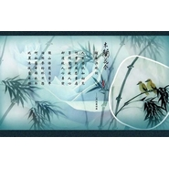

风花雪月
============================

|  |  |
| :--: | :-- |
| [ 风花雪月](https://emumo.xiami.com/album/1681203982) | **艺人**: [HITA](../index.md) **语种**: 国语 **唱片公司**: 墨明棋妙 **发行时间**: 2013年09月17日 **专辑类别**: EP, 单曲 **专辑风格**:  **播放数**: 678003 **收藏数**: 128 **评论数**: 6  |

## 简介

炒鸡喜欢的一首小诗的歌，小诗我现在已经成你的NC粉啦！虽然说你已经给我写了（哔——），但是还是忍不住要翻这首！送给秋秋的迟到一周的生日礼物！

## 曲目

## 评论

|  |  |  |
| :-- | :-- | :-- |
|  [虾米用户](https://emumo.xiami.com/u/56341676)  2015-08-21 22:51 赞(1) 踩(0) | 
00
 |
|  [虾米用户](https://emumo.xiami.com/u/3987161)  2014-12-21 21:36 赞(1) 踩(0) | 
《风花雪月》。艺人：HITA 语种：国语 唱片公司：墨明棋妙 发行时间：2013年09月17日
 |
|  [虾米用户](https://emumo.xiami.com/u/13073595)  2013-11-24 21:39 赞(1) 踩(0) | 
古风音色
 |
|  [虾米用户](https://emumo.xiami.com/u/7166745)  2013-11-23 14:44 赞(1) 踩(0) | 
音色很好的女孩
 |
|  [虾米用户](https://emumo.xiami.com/u/14455351) 暂无签名~ 2013-10-19 21:23 赞(1) 踩(0) | 
超喜欢Hita。
 |
|  [虾米用户](https://emumo.xiami.com/u/13983720) 静静的静静的听 2013-10-10 14:23 赞(1) 踩(0) | 
也很好听，还是喜欢《贪欢》
 |
