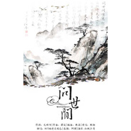

问世间
============================

|  |  |
| :--: | :-- |
| [ 问世间](https://emumo.xiami.com/album/1729618760) | **艺人**: [HITA](../index.md) **语种**: 国语 **唱片公司**: 独立发行 **发行时间**: 2015年01月18日 **专辑类别**: EP, 单曲 **专辑风格**: 古风 GuFeng Music **播放数**: 48515 **收藏数**: 47 **评论数**: 9  |

## 简介

这首歌好好听，于是拉来声线充满魅力的老虎欧巴，把独唱改成了男女对唱，编了一些和声。  
第一次合作，欧巴特别耐心地一次一次重录，调试唱腔，向这样认真的搭档鞠躬！  
谢谢阿鲤的混音，我只想说太赞了！

## 曲目

## 评论

|  |  |  |
| :-- | :-- | :-- |
|  [虾米用户](https://emumo.xiami.com/u/165130384)  2016-12-29 17:42 赞(0) 踩(0) | 
漆皮疙瘩....
 |
|  [虾米用户](https://emumo.xiami.com/u/7916313)  2015-10-30 21:35 赞(0) 踩(0) | 
怎么搜不到歌词呢
 |
|  [虾米用户](https://emumo.xiami.com/u/14056184) 没有人旧守在旧桥头 勾起... 2015-05-05 19:53 赞(0) 踩(0) | 
赞～
 |
|  [虾米用户](https://emumo.xiami.com/u/8624983) 我以前的评论都好孩子气啊 2015-04-28 21:58 赞(0) 踩(0) | 
哇，老虎诶
 |
|  [虾米用户](https://emumo.xiami.com/u/2789265)  2015-04-23 21:27 赞(0) 踩(0) | 
神雕侠侣
 |
|  [虾米用户](https://emumo.xiami.com/u/32461398) 曾在云上浮想联翩如今也终... 2015-04-22 20:40 赞(0) 踩(0) | 
~
 |
|  [虾米用户](https://emumo.xiami.com/u/31892899) 千江有水千江月，万里无云... 2015-04-22 00:21 赞(0) 踩(0) | 
喜欢
 |
|  [虾米用户](https://emumo.xiami.com/u/18656969) fate 2015-04-21 22:25 赞(0) 踩(0) | 
乙丑岁赴试并州，道逢捕雁者云：“今旦获一雁，杀之矣。其脱网者悲鸣不能去，竟自投于地而死。”予因买得之，葬之汾水之上，垒石为识，号曰“雁丘”。同行者多为赋诗，予亦有《雁丘词》。旧所作无宫商，今改定之。
 |
|  [虾米用户](https://emumo.xiami.com/u/7322777) ∮ 2015-04-21 22:00 赞(0) 踩(0) | 
收
 |
