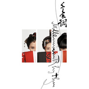

千年调
============================

|  |  |
| :--: | :-- |
| [ 千年调](https://emumo.xiami.com/album/2100301816) | **艺人**: [HITA](../index.md) **语种**: 国语 **唱片公司**: 独立发行 **发行时间**: 2014年02月05日 **专辑类别**: 录音室专辑 **专辑风格**: 流行摇滚 Pop Rock, 华语唱作人 Chinese Singer-Songwriter **播放数**: 9825 **收藏数**: 28 **评论数**: 5  |

## 简介

 i2star首张原创专辑《千年调》

## 曲目

## 评论

|  |  |  |
| :-- | :-- | :-- |
|  [虾米用户](https://emumo.xiami.com/u/54838364)   2016-03-30 05:12 赞(0) 踩(0) | 
好听啊！塔姐好棒
 |
|  [虾米用户](https://emumo.xiami.com/u/413676) 第一次也是最后一次写留言... 2016-03-29 14:07 赞(0) 踩(0) | 
貌似还不错 这是2014年发行的？
 |
| ⇒ |  [虾米用户](https://emumo.xiami.com/u/84916784) 零玖组合中的“川零”（P... 2016-04-03 22:04 赞(0) 踩(0) | 
是的，不过不知为何虾米只出了一首，整张专辑超级棒！
 |
|  [虾米用户](https://emumo.xiami.com/u/8703078)  对 我这家伙很聪明的什... 2016-03-28 22:13 赞(0) 踩(0) | 
这是组了个组合？
 |
|  [虾米用户](https://emumo.xiami.com/u/10813478) 黑白分明该杀就杀 2016-03-28 17:32 赞(0) 踩(0) | 
か
 |
