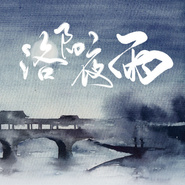

洛阳夜雨
============================

|  |  |
| :--: | :-- |
| [ 洛阳夜雨](https://emumo.xiami.com/album/2100384412) | **艺人**: [HITA](../index.md) **语种**: 国语 **唱片公司**: 独立发行 **发行时间**: 2016年08月29日 **专辑类别**: EP, 单曲 **专辑风格**: 中国风 China-Wave **播放数**: 247009 **收藏数**: 80 **评论数**: 11  |

## 简介

宿命就是如此  
我于洛阳一场一场的大雨之中  
洗脱了生命的厚度  
终究薄如一页史书传奇  
消磨往后世人的口舌  
而你  
是我翻山越岭都无法落脚的  
禁地  
  
“担当生前事，何计身后名”

## 曲目

## 评论

|  |  |  |
| :-- | :-- | :-- |
|  [虾米用户](https://emumo.xiami.com/u/297828833) 初夏微凉的青春 2017-05-30 09:32 赞(0) 踩(0) | 
名字好听歌也好听
 |
|  [虾米用户](https://emumo.xiami.com/u/280472058) 乱世浮华 2017-03-20 09:37 赞(0) 踩(0) | 
好听好听！
 |
|  [虾米用户](https://emumo.xiami.com/u/492360) 失恋不是自杀的借口 继续... 2016-11-11 03:12 赞(1) 踩(0) | 
从巴黎回到了洛阳
 |
|  [虾米用户](https://emumo.xiami.com/u/187581920) 谁伴我如衣。 2016-09-04 09:32 赞(0) 踩(0) | 
塔姐啊简直了
 |
|  [虾米用户](https://emumo.xiami.com/u/46017462) 暂无签名~ 2016-09-03 01:16 赞(0) 踩(0) | 
非常好听，歌词没的说
 |
|  [虾米用户](https://emumo.xiami.com/u/49325982)   2016-09-01 14:34 赞(0) 踩(0) | 
塔姐和诗爷的组合太美好～歌也很喜欢
 |
|  [虾米用户](https://emumo.xiami.com/u/98985138)   2016-08-31 09:40 赞(0) 踩(0) | 
不错
 |
|  [虾米用户](https://emumo.xiami.com/u/54838364)   2016-08-30 13:59 赞(0) 踩(0) | 
好听！
 |
|  [虾米用户](https://emumo.xiami.com/u/50939179) 那一世 我翻遍十万大山 ... 2016-08-30 11:14 赞(0) 踩(0) | 
来个上版的评论  
 |
|  [虾米用户](https://emumo.xiami.com/u/128858086) 所有精选集持更中 2016-08-30 11:00 赞(0) 踩(0) | 
表白塔姐 好听诶
 |
|  [虾米用户](https://emumo.xiami.com/u/3123066)  2016-08-30 09:46 赞(1) 踩(0) | 
新曲，封面和歌词都很棒，当然，HITA的歌声一样的没话说！
 |
