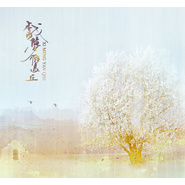

戏梦雁丘
============================

|  |  |
| :--: | :-- |
| [ 戏梦雁丘](https://emumo.xiami.com/album/2102403550) | **艺人**: [HITA](../index.md) **语种**: 国语 **唱片公司**:  **发行时间**: 2016年09月25日 **专辑类别**: EP, 单曲 **专辑风格**:  **播放数**: 21661 **收藏数**: 35 **评论数**: 1  |

## 简介

 

一个是唱遍演尽一出《雁丘》的戏子
 

一个是江南名门世家遍读诗书的闺秀
 

一季烟雨纷纷，曾有岁月安稳
 

成全台上台下一对多情知音人
 

却败给门第观念的年份
 

爱情也难以幸存
 

他在她出嫁的那天，唱了最后一遍《雁丘》为她送行
 

剪去三千多情青丝，从高高的戏楼一跃而下——
 

而轿子里的她，红衣盛装，一把匕首已藏于袖间
 

从此这座城再也没有响起那出《雁丘》的戏
 

从此城外多了一处坟，听说坟下葬着一双同心人
 

听说总有雁声回旋过青草墓碑黄昏
 

 
 

注：
 

《雁丘词》乃金代文学家元好问为歌颂大雁为配偶殉情坚贞不渝的爱情所作，原词如此：
 

问世间，情为何物，直教生死相许？天南地北双飞客，老翅几回寒暑。欢乐趣，离别苦，就中更有痴儿女。君应有语：渺万里层云，千山暮雪，只影向谁去？
 

横汾路，寂寞当年箫鼓，荒烟依旧平楚。招魂楚些何嗟及，山鬼暗啼风雨。天也妒，未信与，莺儿燕子俱黄土。千秋万古，为留待骚人，狂歌痛饮，来访雁丘处。
 

## 曲目

## 评论

|  |  |  |  |
| :-- | :-- | :-- | :-- |
|  [虾米用户](https://emumo.xiami.com/u/43091862) 我还没想好要写什么... 2016-10-06 13:50 赞(0) 踩(0) | 
第一个 塔姐～
 |
