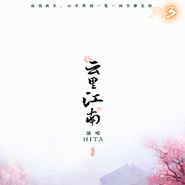

云里江南《天下3》官方音乐专辑收录曲
============================

|  |  |
| :--: | :-- |
| [ 云里江南《天下3》官方音乐专辑收录曲](https://emumo.xiami.com/album/2102413254) | **艺人**: [HITA](../index.md) **语种**: 国语 **唱片公司**:  **发行时间**: 2016年10月24日 **专辑类别**: EP, 单曲 **专辑风格**: 中国风 China-Wave **播放数**: 179543 **收藏数**: 56 **评论数**: 0  |

## 简介

《云里江南》是网易游戏《天下3》官方音乐专辑收录歌曲，讲述了云麓仙居门下弟子在江南的一段爱情故事，祝愿天下有情人终成眷属。 

## 曲目

## 评论

