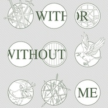

With or Without Me 安能共我记《霍比特人》
============================

|  |  |
| :--: | :-- |
| [ With or Without Me 安能共我记《霍比特人》](https://emumo.xiami.com/album/2102859923) | **艺人**: [HITA](../index.md) **语种**: 英语 **唱片公司**: 独立发行 **发行时间**: 2017年09月19日 **专辑类别**: EP, 单曲 **专辑风格**: 凯尔特新世纪 Celtic New Age **播放数**: 31026 **收藏数**: 51 **评论数**: 7  |

## 简介

 
 

With or Without Me
 

安能共我
 

           ——in memory of《the Hobbits》
 

           ——记《霍比特人》
 

 

## 曲目

## 评论

|  |  |  |
| :-- | :-- | :-- |
|  [虾米用户](https://emumo.xiami.com/u/82165312)   2020-12-26 18:08 赞(0) 踩(0) | 
天哪竟然是中土
 |
|  [虾米用户](https://emumo.xiami.com/u/267363052) . 2018-06-30 22:04 赞(0) 踩(0) | 
被國外友人評論毫無語法錯誤！
 |
|  [虾米用户](https://emumo.xiami.com/u/16367303) 我还没想好要写什么... 2018-01-16 11:19 赞(0) 踩(0) | 
很喜欢
 |
|  [虾米用户](https://emumo.xiami.com/u/668964)  2017-10-20 17:26 赞(1) 踩(0) | 
走出新境界!!!! 平時聽hita大的歌都是中文古風， 這次聽到這電影故事感的音樂配英語，有驚艷到了。 (安九大這首歌的音樂很配合the hobbits系列的曲風，好美～～～）  不過還是期待一下有同一主題的中文版....
 |
|  [虾米用户](https://emumo.xiami.com/u/668964)  2017-10-20 17:25 赞(0) 踩(0) | 
走出新境界!!!! 平時聽hita大的歌都是中文古風， 這次聽到這電影故事感的音樂配英語，有驚艷到了。 (安九大這首歌的音樂很配合the hobbits系列的曲風，好美～～～）  不過還是期待一下有同一主題的中文版....
 |
|  [虾米用户](https://emumo.xiami.com/u/47896854)  2017-09-19 23:40 赞(0) 踩(0) | 
塔！爱你  
 |
|  [虾米用户](https://emumo.xiami.com/u/86414638)  2017-09-19 22:47 赞(0) 踩(0) | 
一般
 |
