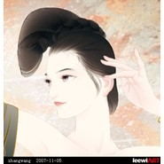

佳人如梦令
============================

|  |  |
| :--: | :-- |
| [ 佳人如梦令](https://emumo.xiami.com/album/361529) | **艺人**: [HITA](../index.md) **语种**: 国语 **唱片公司**: 墨明棋妙 **发行时间**: 2009年09月09日 **专辑类别**: EP, 单曲 **专辑风格**: 古风 GuFeng Music **播放数**: 634417 **收藏数**: 160 **评论数**: 15  |

## 简介

## 曲目

## 评论

|  |  |  |  |
| :-- | :-- | :-- | :-- |
|  [虾米用户](https://emumo.xiami.com/u/432533627)  2020-02-22 12:42 赞(0) 踩(0) | 
，，，，，，，，
 |
|  [虾米用户](https://emumo.xiami.com/u/2786994)  2015-01-14 02:39 赞(1) 踩(0) | 
晚上10点就睡了，翻来覆去总是梦到过去读中学的日子，大家还坐在一起，但是我却留着现在的记忆，梦里我拿着以前的语文书改了词，唱出来被说这词改的不好，现在醒来却怎么也唱不出梦里的味道。人就这样，一句话的功夫，大家就都散了。
 |
|  [虾米用户](https://emumo.xiami.com/u/10517016)  2014-01-24 15:52 赞(0) 踩(0) | 
古风,中国风,古筝,
 |
|  [虾米用户](https://emumo.xiami.com/u/13934668)  2013-04-29 15:12 赞(0) 踩(0) | 
好听~~~~·
 |
|  [虾米用户](https://emumo.xiami.com/u/5010147)  2012-01-04 11:27 赞(0) 踩(0) | 
超灵的古风啊~hita大爱~
 |
|  [虾米用户](https://emumo.xiami.com/u/6947258)  2011-11-25 02:40 赞(0) 踩(0) | 
大爱的~~~~
 |
|  [虾米用户](https://emumo.xiami.com/u/6135893)  2011-10-06 18:36 赞(0) 踩(0) | 
嗯
 |
|  [虾米用户](https://emumo.xiami.com/u/4348333) 鼻涕虫怪怪 2011-09-30 12:38 赞(0) 踩(0) | 
不错啊~好听~
 |
|  [虾米用户](https://emumo.xiami.com/u/3387907)  2011-09-16 16:40 赞(0) 踩(0) | 
+1
 |
|  [虾米用户](https://emumo.xiami.com/u/5168420)  2011-08-08 15:34 赞(0) 踩(0) | 
不错啊！！
 |
|  [虾米用户](https://emumo.xiami.com/u/3517587)  2011-04-07 22:46 赞(0) 踩(0) | 
赞
 |
|  [虾米用户](https://emumo.xiami.com/u/3057984)  2011-03-20 11:12 赞(0) 踩(0) | 
好听
 |
|  [虾米用户](https://emumo.xiami.com/u/2804794)  2011-02-11 17:41 赞(0) 踩(0) | 
极具古韵的歌词，温柔平缓的曲调，闻者仿佛江湖小儿女。。抚琴吟唱，把酒言欢
 |
|  [虾米用户](https://emumo.xiami.com/u/2262752)  2010-12-25 23:14 赞(0) 踩(0) | 
好听~~
 |
|  [虾米用户](https://emumo.xiami.com/u/677195)  2010-06-17 12:53 赞(0) 踩(0) | 
不错 的黑塔姐
 |
