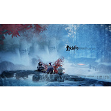

去矣归兮
============================

|  |  |
| :--: | :-- |
| [ 去矣归兮](https://emumo.xiami.com/album/388722711) | **艺人**: [HITA](../index.md) **语种**: 国语 **唱片公司**: 墨名棋妙 **发行时间**: 2013年12月22日 **专辑类别**: EP, 单曲 **专辑风格**:  **播放数**: 27 **收藏数**: 14 **评论数**: 0  |

## 简介

记清和夷则 江眉妩填词  
  
让亲爱的师尊和乖夷则来治愈一发，这回是HE！  
去矣归兮的意思就是，去了，又回来了。特别喜欢最后一句“携琴寄鹤莫怪归客晚”，意境全开！  
俺这个是独唱版，之后还会有男声合唱版的。其实歌词就是按角色分的，应该能看得出来吧~  
词作乌梅酱让我替她说一句“第一段白描深刻的叙述了我心底对师尊无限的向往！”  
小旭的曲子治愈，乌梅酱的词唱着也治愈，后期某雷锋童鞋再次发扬做好事不留名的精神，必须大力表彰！还有美工井禾儿妹纸，真是美景佳人美不胜收啊~~

## 曲目

## 评论

