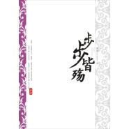

步步皆殇
============================

|  |  |
| :--: | :-- |
| [ 步步皆殇](https://emumo.xiami.com/album/435519) | **艺人**: [HITA](../index.md) **语种**: 国语 **唱片公司**: 墨明棋妙 **发行时间**: 2008年08月03日 **专辑类别**: EP, 单曲 **专辑风格**: 古风 GuFeng Music **播放数**: 1776253 **收藏数**: 182 **评论数**: 38  |

## 简介

小说《步步惊心》同名歌

## 曲目

## 评论

|  |  |  |
| :-- | :-- | :-- |
|  [虾米用户](https://emumo.xiami.com/u/418772135) 高贵的灵魂！崇高的品德！... 2019-05-14 23:35 赞(1) 踩(0) | 
殇！
 |
|  [虾米用户](https://emumo.xiami.com/u/20301512)  2018-01-05 18:04 赞(0) 踩(0) | 
最爱这首
 |
|  [虾米用户](https://emumo.xiami.com/u/300905) 人必须经历痛苦，才能成长 2017-04-26 22:07 赞(0) 踩(0) | 
08年刚上大学那一年听的这首歌
 |
|  [虾米用户](https://emumo.xiami.com/u/260404531)  2017-01-08 15:35 赞(1) 踩(0) | 
没记错的话，这个曲跟美人劫的一模一样呀？
 |
|  [虾米用户](https://emumo.xiami.com/u/7285866)  2013-01-30 23:09 赞(0) 踩(0) | 
HITA的歌里最爱这首
 |
|  [虾米用户](https://emumo.xiami.com/u/880813) inuyashacjcj 2012-12-01 19:19 赞(0) 踩(0) | 
歌词很好
 |
|  [虾米用户](https://emumo.xiami.com/u/1096021) 身行天下，魂随音行 2012-11-15 10:25 赞(0) 踩(0) | 
听得到意境 感受得到 步步皆殤
 |
|  [虾米用户](https://emumo.xiami.com/u/1096021) 身行天下，魂随音行 2012-11-15 10:24 赞(0) 踩(0) | 
就是因为听了太多遍 才忍不住去看步步惊心的
 |
|  [虾米用户](https://emumo.xiami.com/u/6293348) 爱GD！ 2012-04-11 21:51 赞(0) 踩(0) | 
怎么都听不腻~
 |
|  [虾米用户](https://emumo.xiami.com/u/4871232)  2012-04-10 11:08 赞(0) 踩(0) | 
好听。。。
 |
|  [虾米用户](https://emumo.xiami.com/u/8004593)  2012-02-11 20:24 赞(0) 踩(0) | 
大爱啊！
 |
|  [虾米用户](https://emumo.xiami.com/u/7564527)  2012-02-10 10:14 赞(0) 踩(0) | 
今天才知道这首歌是写给《步步惊心》的，还要去重听一遍……
 |
|  [虾米用户](https://emumo.xiami.com/u/2171604) 我还没想好要写什么... 2012-02-08 12:42 赞(0) 踩(0) | 
数遍四百四病难 最苦不过长牵念
 |
|  [虾米用户](https://emumo.xiami.com/u/7948541)  2012-02-07 11:56 赞(0) 踩(0) | 
不知道為毛喜歡。。
 |
|  [虾米用户](https://emumo.xiami.com/u/7948541)  2012-02-07 11:53 赞(0) 踩(0) | 
喜歡這首歌。
 |
|  [虾米用户](https://emumo.xiami.com/u/4137042)  2012-02-06 20:32 赞(0) 踩(0) | 
清幽~
 |
|  [虾米用户](https://emumo.xiami.com/u/2494914)  2012-02-03 19:26 赞(0) 踩(0) | 
步步惊心
 |
|  [虾米用户](https://emumo.xiami.com/u/7870076)  2012-02-02 21:54 赞(0) 踩(0) | 
步步惊心！
 |
|  [虾米用户](https://emumo.xiami.com/u/5105840)  2012-01-24 18:05 赞(0) 踩(0) | 
好听。。
 |
|  [虾米用户](https://emumo.xiami.com/u/6478421)  2011-11-10 22:35 赞(0) 踩(0) | 
怎么着这都应该是主题曲的。看书时候的感觉里面回来了。
 |
|  [虾米用户](https://emumo.xiami.com/u/6411290)  2011-11-02 23:28 赞(0) 踩(0) | 
最爱~
 |
|  [虾米用户](https://emumo.xiami.com/u/6411290)  2011-11-02 23:26 赞(0) 踩(0) | 
大爱呐大爱…
 |
|  [虾米用户](https://emumo.xiami.com/u/5776742)  2011-10-28 23:45 赞(0) 踩(0) | 
喜欢步步吗？听这一曲皆殇
 |
|  [虾米用户](https://emumo.xiami.com/u/6348149)  2011-10-20 18:25 赞(0) 踩(0) | 
喜欢步步啊
 |
|  [虾米用户](https://emumo.xiami.com/u/6348149)  2011-10-20 18:24 赞(0) 踩(0) | 
喜欢步步，歌曲低沉，用情很深
 |
|  [虾米用户](https://emumo.xiami.com/u/6112565)  2011-10-04 23:58 赞(0) 踩(0) | 
音乐和歌词都不错
 |
|  [虾米用户](https://emumo.xiami.com/u/4348333) 鼻涕虫怪怪 2011-09-30 12:30 赞(0) 踩(0) | 
喜欢~
 |
|  [虾米用户](https://emumo.xiami.com/u/6012986)  2011-09-28 10:12 赞(0) 踩(0) | 
真是听着歌看着歌词就悲伤了，大爱。又催泪了~~
 |
|  [虾米用户](https://emumo.xiami.com/u/5925354)  2011-09-22 12:59 赞(0) 踩(0) | 
八错八错！！！
 |
|  [虾米用户](https://emumo.xiami.com/u/5889201)  2011-09-19 20:25 赞(0) 踩(0) | 
。
 |
|  [虾米用户](https://emumo.xiami.com/u/461890) 夜渐深，斜倚窗，月色正好 2011-09-17 15:21 赞(0) 踩(0) | 
喜欢HITA的声音，还有这个歌词，还是首歌好，对步步惊心电视剧的主题曲表示失望
 |
|  [虾米用户](https://emumo.xiami.com/u/707582) 我爱罗仕珺。 2011-09-07 00:21 赞(0) 踩(0) | 
这部小说太经典了，这首歌曲词曲都配得上。
 |
|  [虾米用户](https://emumo.xiami.com/u/5168420)  2011-08-08 15:31 赞(0) 踩(0) | 
真棒！！
 |
|  [虾米用户](https://emumo.xiami.com/u/4374850)  2011-06-22 21:41 赞(0) 踩(0) | 
喜欢古风
 |
|  [虾米用户](https://emumo.xiami.com/u/2185367)  2011-04-26 12:48 赞(0) 踩(0) | 
跟小说有什么关系吗
 |
| ⇒ |  [虾米用户](https://emumo.xiami.com/u/1772421)  2011-04-28 18:48 赞(0) 踩(0) | 
这是当初小说步步惊心的改编广播剧的主题曲，由HITA演唱的步步皆殇。虾米的介绍没写全而已。
 |
| ⇒ |  [虾米用户](https://emumo.xiami.com/u/2185367)  2011-04-28 20:29 赞(0) 踩(0) | 
<q><b>Sakkai说：</b></q>
 |
|  [虾米用户](https://emumo.xiami.com/u/85718)  2011-04-26 12:03 赞(0) 踩(0) | 
HITA的声音真好听^0^
 |
