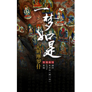

一梦如是·记鸠摩罗什
============================

|  |  |
| :--: | :-- |
| [ 一梦如是·记鸠摩罗什](https://emumo.xiami.com/album/507446) | **艺人**: [HITA](../index.md) **语种**: 国语 **唱片公司**: 独立发行 **发行时间**: 2012年04月03日 **专辑类别**: EP, 单曲 **专辑风格**: 古风 GuFeng Music **播放数**: 729103 **收藏数**: 181 **评论数**: 27  |

## 简介

因为曾污浊所以高洁，因为不拒绝所以学会放下，因为残缺所以圆满。一切有为法，如梦幻泡影，如露亦如电，应作如是观。这一段金刚经，是他译出的经文中最广为后人所知的一段，金庸在《天龙八部》里将其概括为“一梦如是”，得到的和抛弃的，一梦如是！ 

## 曲目

## 评论

|  |  |  |  |
| :-- | :-- | :-- | :-- |
|  [虾米用户](https://emumo.xiami.com/u/29042986)  2017-11-12 09:27 赞(0) 踩(0) | 
因一个故事知道鸠摩罗什，读到百千年后寥寥几笔几近传说的史料记载。每种想要探究的认知事后想起来都像条顺藤摸瓜的线索。所有的碰到和再见都没有无缘无故，无论时空抛下了谁，做自己要完成的事就好了。一四
 |
|  [虾米用户](https://emumo.xiami.com/u/2264609) 我还没想好要写什么... 2015-01-17 12:03 赞(0) 踩(0) | 
赞
 |
|  [虾米用户](https://emumo.xiami.com/u/36467567)  2014-07-29 21:16 赞(3) 踩(0) | 
世间安得双全法 不负如来不负卿。
 |
|  [虾米用户](https://emumo.xiami.com/u/9459707)  2014-02-12 20:36 赞(1) 踩(0) | 
去过龟兹，过去苏巴什遗址，可惜当时不知道“不负如来不负卿”，不知道这首歌。
 |
|  [虾米用户](https://emumo.xiami.com/u/24940349)  2013-10-25 21:49 赞(0) 踩(0) | 
所有相皆是虚妄,一切有为法,如梦幻泡影,如露亦如电,应作如是观。
 |
|  [虾米用户](https://emumo.xiami.com/u/23844697)  2013-10-14 23:19 赞(0) 踩(0) | 
这里的怎么有噪音？5SING上的没有
 |
|  [虾米用户](https://emumo.xiami.com/u/11425200) 江山永固 2012-11-13 01:01 赞(1) 踩(0) | 
若以色見我，以音聲求我，是人行邪道，不可見如來。
 |
|  [虾米用户](https://emumo.xiami.com/u/1195159)  2012-10-21 21:01 赞(0) 踩(0) | 
不负如来不负卿
 |
|  [虾米用户](https://emumo.xiami.com/u/11074156)  2012-10-15 22:46 赞(0) 踩(0) | 
勾起以前感动的记忆
 |
|  [虾米用户](https://emumo.xiami.com/u/6258976) c\'est ça 2012-10-12 09:44 赞(0) 踩(0) | 
不负如来不负卿
 |
|  [虾米用户](https://emumo.xiami.com/u/7795058) 弦如字画，或空月过鸟 2012-09-10 22:15 赞(2) 踩(0) | 
因为曾污浊所以高洁，因为不拒绝所以学会放下，因为残缺所以圆满。一切有为法，如梦幻泡影，如露亦如电，应作如是观。这一段金刚经，是他译出的经文中最广为后人所知的一段，金庸在《天龙八部》里将其概括为“一梦如是”，得到的和抛弃的，一梦如是！
 |
|  [虾米用户](https://emumo.xiami.com/u/7795058) 弦如字画，或空月过鸟 2012-09-10 22:14 赞(0) 踩(0) | 
因为曾污浊所以高洁，因为不拒绝所以学会放下，因为残缺所以圆满。一切有为法，如梦幻泡影，如露亦如电，应作如是观。这一段金刚经，是他译出的经文中最广为后人所知的一段，金庸在《天龙八部》里将其概括为“一梦如是”，得到的和抛弃的，一梦如是！
 |
|  [虾米用户](https://emumo.xiami.com/u/10155666)  2012-08-22 19:10 赞(0) 踩(0) | 
专辑介绍：因为曾污浊所以高洁，因为不拒绝所以学会放下，因为残缺所以圆满。一切有为法，如梦幻泡影，如露亦如电，应作如是观。这一段金刚经，是他译出的经文中最广为后人所知的一段，金庸在《天龙八部》里将其概括为“一梦如是”，得到的和抛弃的，一梦如是！
 |
|  [虾米用户](https://emumo.xiami.com/u/4735061)   2012-07-27 17:55 赞(1) 踩(0) | 
下班前分享一曲——壹切有為法，如夢幻泡影，如露亦如電，應作如是觀。
 |
|  [虾米用户](https://emumo.xiami.com/u/6378744)  2012-07-11 21:09 赞(0) 踩(0) | 
好听的古风！！！！
 |
|  [虾米用户](https://emumo.xiami.com/u/7340376)  2012-07-02 21:04 赞(0) 踩(0) | 
狠喜欢吖
 |
|  [虾米用户](https://emumo.xiami.com/u/6514243)  2012-06-24 19:20 赞(0) 踩(0) | 
新歌果断收啊果断收！！！
 |
|  [虾米用户](https://emumo.xiami.com/u/102762)  2012-06-21 14:20 赞(0) 踩(0) | 
太美了！
 |
|  [虾米用户](https://emumo.xiami.com/u/7592847) 暂无签名~ 2012-06-14 17:34 赞(0) 踩(0) | 
喜欢
 |
|  [虾米用户](https://emumo.xiami.com/u/5708748)   2012-06-13 11:44 赞(0) 踩(0) | 
等一个不可能，是偏执还是二愣子？或是一生的信仰？一意孤行，自在所得。梦非彼岸，花开错败。
 |
|  [虾米用户](https://emumo.xiami.com/u/5479402) 我喜欢清澈的感觉。 2012-06-13 09:30 赞(0) 踩(0) | 
旋律古韵悠长，荡气回肠，声音沧桑。太美了。
 |
|  [虾米用户](https://emumo.xiami.com/u/3932544) 暂无签名~ 2012-06-13 03:53 赞(0) 踩(0) | 
还是像这样的古风歌手深得吾心呐~~~可以一边看小说一边听歌入境。
 |
|  [虾米用户](https://emumo.xiami.com/u/3740398)  2012-06-12 13:25 赞(0) 踩(0) | 
很喜欢这首歌！！！！！顶一下
 |
|  [虾米用户](https://emumo.xiami.com/u/8926667)  2012-05-20 23:03 赞(0) 踩(0) | 
一夢如是·記鳩摩羅什作詞：擇荇作曲：朱子岩(那一世)演唱：HITA岩層下細膩的壁畫千夜風砂 愈粗礪線條愈顯溫雅高城外 枯坐著舍利塔所有牽掛 封入一切有為法迷惘的 破譯了心經幡然入定 還默負著相的罪名頓悟的 亂世中一意孤行謬贊詬病 洞悉如夢幻泡影最無常  是筆下須彌都應驗蘇幕遮燈 只絢爛曇花一現最如一   是清軟研成濃釅重逢再見 本來如露亦如電這一程   從龜茲輾轉到長安空寂伽藍 曾追隨徒眾幾千萬這一場  涅槃劫灰從未腐爛支離的圓滿 方應做如是觀盛年時 曾踏過遍野駱駝刺涼州觀日 晨昏莫辨望朱成紫殘年時 讀懂所有深邃文字歲月修飾的  不外一夢如是
 |
|  [虾米用户](https://emumo.xiami.com/u/8130373) 十指曼若 刹那莲华绽落 2012-05-11 16:13 赞(1) 踩(0) | 
《不负如来不负卿》
 |
|  [虾米用户](https://emumo.xiami.com/u/5809412)  2012-05-04 20:45 赞(0) 踩(0) | 
求下载！！求分享！！
 |
|  [虾米用户](https://emumo.xiami.com/u/8831749)  2012-04-29 22:08 赞(0) 踩(0) | 
词
 |
