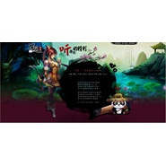

一言诺
============================

|  |  |
| :--: | :-- |
| [ 一言诺](https://emumo.xiami.com/album/524142) | **艺人**: [HITA](../index.md) **语种**: 国语 **唱片公司**: 墨明棋妙 **发行时间**: 2012年06月12日 **专辑类别**: EP, 单曲 **专辑风格**: 中国风 China-Wave **播放数**: 205303 **收藏数**: 91 **评论数**: 6  |

## 简介

由4399余香工作室自主研发的Q版中国水墨风、角色扮演类网游“异界逍遥”以其精美绝伦的画面、别具匠心的竞技玩法，赢得了众多玩家的青睐，人气急剧上升！应广大玩家的强烈要求，“异界逍遥”主题曲——《一言诺》今天隆重推出！  
  
4399《异界逍遥》主題曲由国内知名乐队“墨明棋妙”倾力打造，曲风不仅大胆地采用了清新飘逸的古风，而且将传统民乐与流行元素巧妙地融为一体，既不失古韵又富有现代气息。曲词描绘了一个以仙侠题材为背景的凄美爱情故事。貌美如花的天仙女子与仗剑天涯的一代大侠因偶然的际遇相识、相恋。可自古以来，仙凡两界的爱情注定无法开花结果。“仙路漫长，花期时短”，天仙女子饱受“情丝缠”“剪不断、理还乱”的相思之苦，甘愿放弃仙途，沦为凡尘女子，只求情郎许下厮守终生的一个诺言。这对苦命鸳鸯终究能否终成眷属，一代大侠如何过情关？请一起聆听“异界逍遥”主題曲--《一言诺》。珍惜，为自己身边爱着的人。  
 

## 曲目

## 评论

|  |  |  |  |
| :-- | :-- | :-- | :-- |
|  [虾米用户](https://emumo.xiami.com/u/10155666)  2012-08-22 19:15 赞(0) 踩(0) | 
由4399余香工作室自主研发的Q版中国水墨风、角色扮演类网游“异界逍遥”以其精美绝伦的画面、别具匠心的竞技玩法，赢得了众多玩家的青睐，人气急剧上升！应广大玩家的强烈要求，“异界逍遥”主题曲——《一言诺》今天隆重推出！
 |
|  [虾米用户](https://emumo.xiami.com/u/8574653)  2012-07-17 12:33 赞(0) 踩(0) | 
爱死这类古风了。
 |
|  [虾米用户](https://emumo.xiami.com/u/8093080)  2012-06-28 19:44 赞(0) 踩(0) | 
来听听
 |
|  [虾米用户](https://emumo.xiami.com/u/948132) 冰岛 2012-06-28 18:52 赞(0) 踩(0) | 
= =
 |
|  [虾米用户](https://emumo.xiami.com/u/7910525) 有音乐的世界不孤单 2012-06-28 18:41 赞(0) 踩(0) | 
刚发布的耶~
 |
