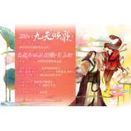

九天倾歌·月上灯
============================

|  |  |
| :--: | :-- |
| [ 九天倾歌·月上灯](https://emumo.xiami.com/album/537191) | **艺人**: [HITA](../index.md) **语种**: 国语 **唱片公司**: 独立发行 **发行时间**: 2012年08月19日 **专辑类别**: EP, 单曲 **专辑风格**: 古风 GuFeng Music **播放数**: 59768 **收藏数**: 113 **评论数**: 9  |

## 简介

小说《九天倾歌》主题歌

## 曲目

## 评论

|  |  |  |
| :-- | :-- | :-- |
|  [虾米用户](https://emumo.xiami.com/u/12086596) 我这人很轴 2014-06-08 00:28 赞(0) 踩(0) | 
音乐很美 但是不知道为什么加上演唱之后就觉得特别突兀呢
 |
|  [虾米用户](https://emumo.xiami.com/u/3340114)  2013-01-02 23:33 赞(0) 踩(0) | 
风华芳菲 才无愧
 |
|  [虾米用户](https://emumo.xiami.com/u/525985)  2012-11-17 10:17 赞(0) 踩(0) | 
爱塔姐……
 |
|  [虾米用户](https://emumo.xiami.com/u/7795058) 弦如字画，或空月过鸟 2012-09-10 22:17 赞(0) 踩(0) | 
九天倾歌·月上灯
 |
|  [虾米用户](https://emumo.xiami.com/u/10101841) 「收起一些...」 2012-09-04 21:12 赞(0) 踩(0) | 
哈哈~~~超爱古风，超爱塔姐……
 |
|  [虾米用户](https://emumo.xiami.com/u/8500610) 每一天，都要加倍努力！ 2012-08-26 23:30 赞(0) 踩(0) | 
很唯美的音乐。
 |
|  [虾米用户](https://emumo.xiami.com/u/6103455) 江海寸心 2012-08-25 20:37 赞(0) 踩(0) | 
九天凤飞，风华绝代
 |
|  [虾米用户](https://emumo.xiami.com/u/6103455) 江海寸心 2012-08-25 20:35 赞(0) 踩(0) | 
风华绝代
 |
|  [虾米用户](https://emumo.xiami.com/u/6940998)  2012-08-25 20:33 赞(0) 踩(0) | 
good
 |
