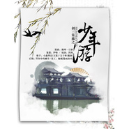

少年游(无念白版)
============================

|  |  |
| :--: | :-- |
| [ 少年游(无念白版)](https://emumo.xiami.com/album/90373401) | **艺人**: [HITA](../index.md) **语种**: 国语 **唱片公司**: 墨明棋妙 **发行时间**: 2014年01月04日 **专辑类别**: EP, 单曲 **专辑风格**: 古风 GuFeng Music **播放数**: 67703 **收藏数**: 93 **评论数**: 7  |

## 简介

为乐夏本子唱的应援歌~~少年意气策马并肩的感觉赞！  
大麦哟！

## 曲目

## 评论

|  |  |  |  |
| :-- | :-- | :-- | :-- |
|  [虾米用户](https://emumo.xiami.com/u/5504063) 暂无签名~ 2015-04-05 14:36 赞(0) 踩(0) | 
虽然也叫叫少年游，封面好像不搭 
 |
|  [虾米用户](https://emumo.xiami.com/u/3233859)  2014-04-23 15:29 赞(0) 踩(0) | 
有念白的那个版本有另一种角度的萌
 |
|  [虾米用户](https://emumo.xiami.com/u/7337523)  2014-03-27 02:11 赞(0) 踩(0) | 
这首是动画《Chevalier》的op《BORN》的翻唱呢w Hita姐高音很美~
 |
|  [虾米用户](https://emumo.xiami.com/u/7585304)   2014-02-11 22:01 赞(0) 踩(0) | 
同爱塔姐！轻松激昂的旋律让我在寒冷的冬日元气满满～
 |
|  [虾米用户](https://emumo.xiami.com/u/7760696) 宿命轮转. 2014-02-02 01:07 赞(0) 踩(0) | 
喜欢塔姐！
 |
|  [虾米用户](https://emumo.xiami.com/u/12758842) Brown 2014-01-25 14:07 赞(0) 踩(0) | 
（*@ο@*） 哇～喜欢
 |
|  [虾米用户](https://emumo.xiami.com/u/913020) 悼词咏诵者 2014-01-24 21:51 赞(1) 踩(0) | 
沙发是我的！！！ 你们别想啦
 |
